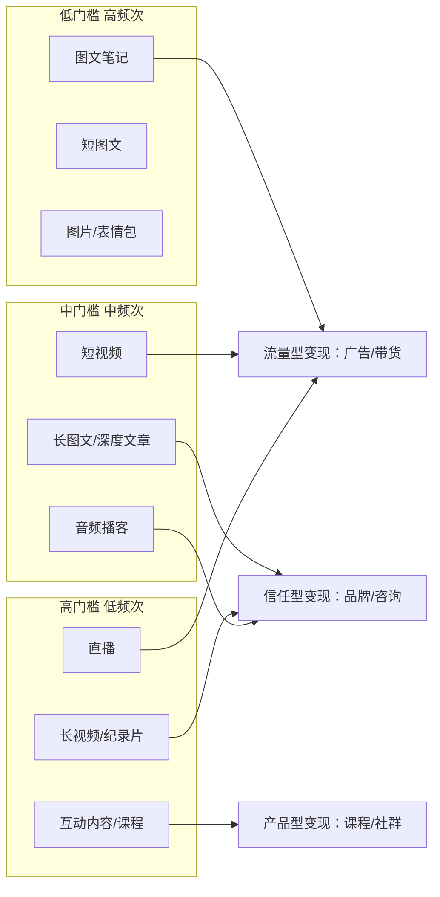
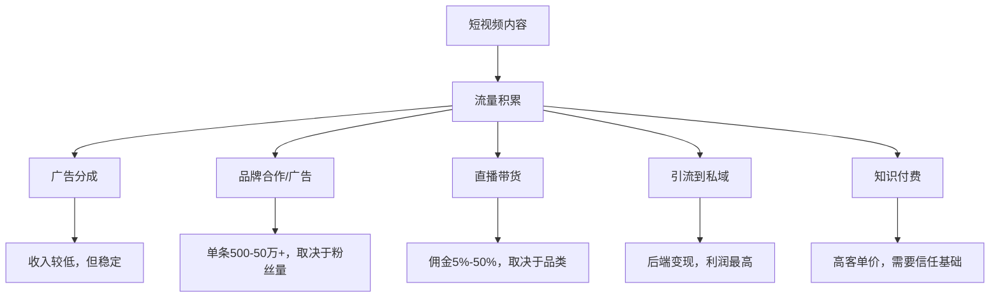
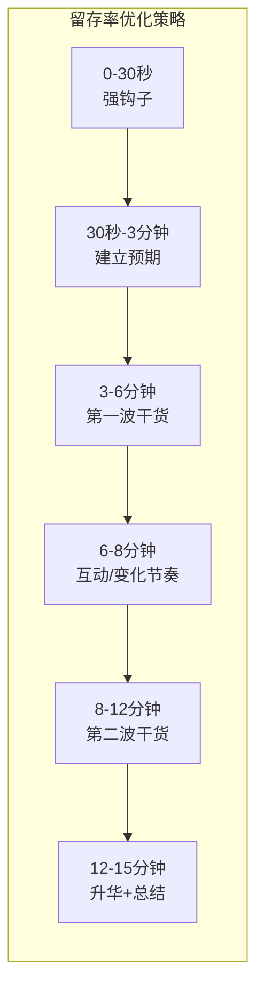
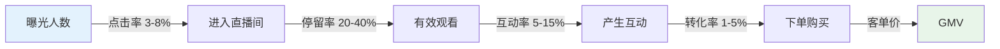
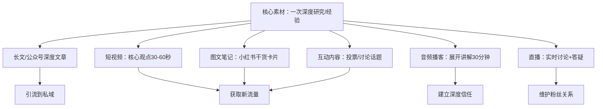

## 二、内容形式与特点

上一节我们理解了内容创作的本质——将个人知识和经验封装为可传播的信息产品。但"封装"这一步，具体该用什么形式？文字、图片、短视频、长视频、音频、直播、互动内容……每种形式都有截然不同的生产逻辑、传播规律和变现路径。选错形式，再好的内容也可能无人问津；选对形式，同样的素材可以事半功倍。

本节将系统拆解七大内容形式的底层逻辑、适用场景、生产成本、变现效率和实操方法，帮助你找到最适合自己的内容形态组合。

---

### 1. 内容形式的底层分类逻辑

在深入每种形式之前，先建立一个统一的分析框架。任何内容形式都可以从以下七个维度进行评估：

| 维度 | 含义 | 关键问题 |
|------|------|----------|
| **信息密度** | 单位时间内传递的信息量 | 同样的内容，哪种形式传递得更快更准？ |
| **感官通道** | 调动了哪些感官（视觉/听觉/文字） | 受众在什么场景下会消费这种内容？ |
| **生产门槛** | 创作所需的时间、技能、设备、资金 | 我目前的能力和资源能驾驭哪种形式？ |
| **传播特性** | 内容在平台上的扩散方式和速度 | 哪种形式最容易被推荐和分享？ |
| **变现效率** | 从内容到收入的转化路径和效率 | 哪种形式最容易实现商业变现？ |
| **长尾价值** | 内容发布后持续获取流量的时间 | 这条内容3个月后还有人看吗？ |
| **互动深度** | 与受众建立关系的深度 | 这种形式能让观众从"看客"变成"粉丝"吗？ |

用这七个维度分析，你会发现一个核心规律：

> **信息密度越高的形式，生产门槛通常越高，但单条内容的长尾价值也越强。信息密度越低的形式，生产门槛越低，但竞争也越激烈，需要更高的产出频率。**

这不是一个"哪个更好"的问题，而是一个"哪个更适合你"的问题。



**理解"信息密度-生产成本"曲线：** 横轴是生产一条内容的平均耗时，纵轴是该内容能传递的有效信息量。图文笔记落在左下角（低密度、低成本），长视频纪录片落在右上角（高密度、高成本）。你的任务是找到自己能力范围内、投入产出比最高的那个区间，然后从那里起步。

---

### 2. 图文内容：内容创作的基本盘

图文是所有内容形式中最古老、也最基础的形态。即使在短视频横行的时代，图文依然是内容生态的重要组成部分——小红书的图文笔记、微信公众号的长文、知乎的深度回答、Twitter/X的推文，都属于图文范畴。

为什么图文不会被短视频取代？因为它有三个不可替代的优势：**可搜索**（搜索引擎能索引文字，但无法索引视频中的口语内容）、**可精读**（读者可以按自己的速度反复阅读关键段落）、**可引用**（学术、商业场景中文字是标准引用格式）。

#### 2.1 图文内容的三种子形态

**短图文（社交媒体文案）**

短图文的特点是字数少、传播快、互动强。典型代表：小红书笔记（300-800字）、微博（140-2000字）、Twitter/X（280字）、朋友圈文案。

短图文的核心是**信息密度**——用最少的字传递最大的价值。一篇300字的小红书笔记，如果能在前两行抓住注意力、中间给出干货、结尾引发互动，就能获得远超一篇3000字长文的传播效果。

| 指标 | 短图文 | 说明 |
|------|--------|------|
| 典型字数 | 200-1000字 | 超过1000字在多数社交平台上阅读率骤降 |
| 生产时间 | 15-60分钟 | 熟练后可以更快 |
| 核心技能 | 标题力、金句能力、视觉排版 | 好的短图文每句话都值得截图 |
| 最佳平台 | 小红书、微博、Twitter/X | 平台算法天然适合短内容 |
| 变现路径 | 品牌合作、带货、引流 | 粉丝画像精准时变现效率很高 |

**短图文的实操模板——小红书笔记结构：**

```text
【标题公式】数字+痛点+解决方案
例：「5个让皮肤变好的习惯，第3个90%的人不知道」

【正文结构】
第1段（钩子）：用一个反常识的事实或痛点问题开头
  → "用了3年大牌护肤品，皮肤反而越来越差？"
  
第2段（共鸣）：描述读者的真实困境，让TA觉得"说的就是我"
  → "我也是混油皮，之前疯狂堆产品，结果屏障受损……"

第3-7段（干货）：3-5个核心要点，每点用"要点+解释+效果"结构
  → "1. 精简护肤步骤。把7步缩减到3步：洁面+保湿+防晒。
     我精简后一个月，出油量减少了40%。"

第8段（总结）：一句话总结核心观点
  → "护肤的本质不是叠加，是减法。"

第9段（互动引导）：提问或邀请分享
  → "你们有什么精简护肤的心得？评论区聊聊~"

【标签】#护肤 #油皮护肤 #精简护肤 #敏感肌
```

**长图文（深度内容）**

长图文是建立专业信任的核心形式。典型代表：微信公众号深度文章（3000-10000字）、知乎长回答、Medium文章、Substack Newsletter。

长图文的价值在于**深度和系统性**。一篇5000字的深度分析文章，可以让读者在10分钟内获得需要数周研究才能积累的认知。这种"认知压缩"能力是长图文不可替代的价值。

| 指标 | 长图文 | 说明 |
|------|--------|------|
| 典型字数 | 3000-10000字 | 公众号最佳阅读长度约5000-8000字 |
| 生产时间 | 4-16小时 | 包括调研、写作、排版、配图 |
| 核心技能 | 结构化思维、叙事能力、深度研究 | 长文不是"字多"，而是"逻辑深" |
| 最佳平台 | 公众号、知乎、Substack | 搜索属性强，长尾流量好 |
| 变现路径 | 知识付费、品牌合作、咨询 | 深度内容吸引高净值用户 |

**长图文的写作方法论——SCQA框架：**

SCQA是麦肯锡咨询顾问常用的叙事框架，非常适合深度长文：

| 要素 | 含义 | 在长文中的位置 | 示例 |
|------|------|---------------|------|
| **S**ituation（情境） | 大家都认同的背景事实 | 文章开头 | "2025年，中国短视频用户突破10亿" |
| **C**omplication（冲突） | 这个情境下出现的问题 | 紧接着情境 | "但90%的创作者月收入不到1000元" |
| **Q**uestion（问题） | 由冲突引出的核心问题 | 冲突之后 | "问题出在哪里？" |
| **A**nswer（答案） | 文章的核心论点和论证 | 文章主体 | "三个关键能力的缺失……" |

**图文卡片/信息图**

图文卡片是介于图片和文字之间的形式。典型代表：小红书的干货合集图、Instagram的信息图、LinkedIn的Carousel（轮播图）。

图文卡片的核心优势是**高传播性**——信息图被分享的概率是纯文字的3倍以上（数据来源：HubSpot 2024年内容营销报告）。一张设计精美的信息图，可以在社交媒体上获得远超文字的传播效果。

**信息图的制作要点：**

| 要素 | 说明 | 常见错误 |
|------|------|---------|
| 核心主题 | 一张图只讲一个主题 | 一张图塞太多信息，变成"文字墙" |
| 数据可视化 | 用图表代替纯文字描述 | 数据没有视觉化，和普通图片没区别 |
| 配色方案 | 统一色系，不超过3种主色 | 颜色过多，视觉混乱 |
| 字体层级 | 标题>副标题>正文，至少3级 | 所有文字一样大，没有阅读节奏 |
| 行动号召 | 图片底部加关注/收藏引导 | 没有引导，看完就走 |

**推荐工具：** Canva（零门槛，模板丰富）、Figma（专业设计，免费版够用）、稿定设计（中文模板多）、创客贴（国内老牌工具）。

#### 2.2 图文内容的优势与局限

| 维度 | 优势 | 局限 |
|------|------|------|
| 生产成本 | 低，只需文字编辑能力 | 精品长文需要大量时间 |
| 搜索友好 | 文字天然可被搜索引擎索引 | 图片中的文字不可搜索（但可以加alt标签） |
| 阅读场景 | 通勤、午休、睡前等碎片时间 | 需要主动阅读，注意力消耗大 |
| 信息承载 | 精确传递复杂信息 | 纯文字表达有天花板 |
| 长尾价值 | 搜索流量持续数月甚至数年 | 社交媒体短图文长尾较弱 |
| 情感传递 | 通过文笔和叙事传递情绪 | 不如视频和音频直接 |
| SEO潜力 | 可被Google/百度长期收录 | 需要关键词研究和SEO优化知识 |
| 迭代成本 | 修改文字内容成本极低 | 视频修改需要重新剪辑 |

#### 2.3 图文创作的黄金公式

**短图文结构公式（适用于小红书、微博等）：**

```text
钩子（前2行必须抓人）
↓
痛点/需求共鸣（让读者觉得"说的就是我"）
↓
核心干货（3-5个要点，每点1-2句话）
↓
总结+行动号召（让读者知道下一步做什么）
```

**钩子的六种写法：**

| 类型 | 示例 | 适用场景 |
|------|------|---------|
| 反常识型 | "月薪3万的人，从来不记账" | 打破固有认知 |
| 数据型 | "87%的人不知道，防晒霜要涂两层" | 用数据制造权威感 |
| 提问型 | "为什么你护肤越勤，皮肤越差？" | 引发好奇和共鸣 |
| 故事型 | "昨天在超市，一个阿姨教了我一招" | 场景代入感强 |
| 对比型 | "以前我一个月花2000护肤，现在只花200" | 制造反差 |
| 紧迫型 | "这个功能下个月就没了，赶紧看" | 制造稀缺感 |

**长图文结构公式（适用于公众号、知乎等）：**

```text
悬念/冲突开头（制造"不得不看下去"的理由）
↓
背景铺垫（用数据或故事建立问题的紧迫性）
↓
核心论证（3-5个递进式论点，每个有论据支撑）
↓
实操指南（可执行的步骤或框架）
↓
总结升华（回到开头的悬念，给出新认知）
↓
互动引导（引发讨论的问题或行动号召）
```

**长图文的"节奏感"控制：** 长文最怕的是"平"——从头到尾一个调性，读者容易疲劳。好的长文应该像一首交响乐，有快有慢、有高有低：

- **每800-1200字设置一个"呼吸点"**：可以是一张图、一个分隔线、一个金句、一个故事转折
- **交替使用三种语调**：理性分析（数据、逻辑）、感性叙事（故事、案例）、直接对话（"你可能会问……"）
- **在关键论点前设置"悬念"**：先抛出反常识的结论，再展开论证

#### 2.4 图文创作的常见误区与纠正

| 误区 | 表现 | 正确做法 |
|------|------|---------|
| 堆砌信息 | 一篇笔记塞10个要点 | 短图文聚焦3-5个核心点，长文也控制在5-7个 |
| 标题平淡 | "分享一下我的护肤经验" | 用数字+痛点+解决方案重构标题 |
| 没有结构 | 从头写到尾，没有分段和小标题 | 每300-500字一个小标题，给读者"路标" |
| 忽视首图 | 随手拍一张就发 | 首图决定50%的点击率，值得花10分钟设计 |
| 结尾无引导 | 写完干货就结束 | 末尾加互动提问或行动号召，提升评论率 |
| 照搬长文到短平台 | 把公众号文章直接复制到小红书 | 每个平台都有自己的"语言"，需要重新加工 |

---

### 3. 短视频：当下最强的流量引擎

短视频是2020-2025年内容创作领域最大的变量。抖音、快手、小红书视频、YouTube Shorts、Instagram Reels、TikTok——短视频平台几乎占据了所有主流互联网平台的流量入口。

#### 3.1 短视频为什么能成为流量王？

从认知科学角度看，短视频的爆发不是偶然，而是精确命中了人类大脑的三个底层偏好：

**第一，视觉优先。** 人类大脑处理视觉信息的速度是文字的6万倍（来源：3M公司神经科学研究）。一条15秒的视频传递的信息量，可能相当于一篇500字的文章，但观众的感知是"毫不费力地就看完了"。

**第二，即时满足。** 短视频的前3秒就能决定观众是否继续观看。抖音内部数据显示，前3秒流失率高达65%。这种"即时反馈-即时奖励"的循环，完美契合了多巴胺驱动的行为模式。

**第三，情绪共振。** 音乐、画面、表情、语调——短视频同时调动视觉和听觉两个通道，情绪传递效率远高于纯文字。神经科学研究表明，多感官刺激能让信息记忆留存率从文字的10%提升到视频的65%。

#### 3.2 短视频的核心参数体系

| 参数 | 抖音 | 小红书 | B站 | YouTube Shorts |
|------|------|--------|-----|----------------|
| 时长范围 | 15秒-10分钟 | 15秒-5分钟 | 15秒-10分钟 | 15秒-60秒 |
| 最佳时长 | 30-60秒 | 1-3分钟 | 3-8分钟 | 30-45秒 |
| 画面比例 | 9:16竖屏 | 3:4或9:16 | 16:9横屏为主 | 9:16竖屏 |
| 核心指标 | 完播率>互动率 | 互动率>完播率 | 完播率>互动率 | 完播率>互动率 |
| 推荐机制 | 强算法推荐 | 搜索+推荐 | 关注+推荐 | 算法推荐 |
| 内容调性 | 娱乐化、快节奏 | 干货化、精致化 | 深度化、个性化 | 多元化 |
| 发布最佳时间 | 12:00-13:00, 18:00-20:00 | 7:00-9:00, 18:00-22:00 | 17:00-21:00 | 因时区而异 |
| 标题字数限制 | 55字 | 20字 | 80字 | 100字符 |

#### 3.3 短视频的制作成本分析

很多新手对短视频有一个误解：觉得"拍个视频发上去就行了"。实际上，一条合格的短视频从选题到发布的完整生产链路如下：

| 环节 | 时间投入 | 技能要求 | 工具 |
|------|---------|---------|------|
| 选题策划 | 30-60分钟 | 选题敏感度、用户洞察 | 热点榜单、数据分析工具 |
| 脚本撰写 | 30-90分钟 | 文案能力、结构化思维 | 文档工具 |
| 拍摄录制 | 30-120分钟 | 表达力、镜头感 | 手机/相机、灯光、麦克风 |
| 剪辑后期 | 60-180分钟 | 剪辑思维、节奏感 | 剪映、CapCut、Premiere |
| 封面标题 | 15-30分钟 | 视觉审美、标题力 | Canva、醒图 |
| 发布运营 | 15-30分钟 | 平台规则理解 | 各平台App |

**一条60秒的短视频，实际生产时间约3-8小时。** 这是新手最常低估的环节。熟练的创作者可以通过模板化、批量化将效率提升2-3倍，但前期的学习曲线确实存在。

**新手设备投入建议（按预算分级）：**

| 预算 | 设备配置 | 适合场景 |
|------|---------|---------|
| 0元 | 手机+自然光+安静房间 | 口播、图文类视频 |
| 500元 | 手机+环形灯+领夹麦 | 产品展示、教程类视频 |
| 2000元 | 手机+柔光箱+枪麦+简易背景 | 专业口播、评测视频 |
| 5000元+ | 相机+灯光套装+无线麦+绿幕 | 高品质品牌内容 |

#### 3.4 短视频的"前3秒"法则

前3秒是短视频的生死线。以下是经过大量数据验证的前3秒钩子类型：

| 钩子类型 | 示例 | 数据表现 |
|---------|------|---------|
| **冲突开场** | "千万不要这样洗脸！" | 完播率提升40-60% |
| **结果前置** | "用这个方法，3天瘦了2斤" | 点击率提升30% |
| **悬念提问** | "你知道为什么你的视频没人看吗？" | 评论率提升50% |
| **数字冲击** | "99%的人都不知道的3个功能" | 分享率提升25% |
| **视觉冲击** | 画面直接展示惊人的before/after | 停留率提升70% |
| **身份认同** | "作为一个10年经验的皮肤科医生" | 信任感+完播率双提升 |

**前3秒的三大禁忌：**

1. **自我介绍开场**：大家好，我是XXX——观众不认识你，为什么要听你自我介绍？
2. **冗长铺垫**：今天来给大家分享一下——废话，直接上干货
3. **与标题不符**：标题说A，前3秒在讲B——用户会觉得被骗，直接划走

#### 3.5 短视频的变现效率

短视频是目前变现效率最高的内容形式之一，主要路径包括：



**关键数据参考（2025年中国市场）：**

| 平台/方式 | 收入基准 | 备注 |
|----------|---------|------|
| 抖音创作者激励 | 万次播放5-20元 | 知识/财经类较高，娱乐类较低 |
| 小红书蒲公英（图文） | 万粉博主单条500-2000元 | 粉丝画像精准时溢价明显 |
| 小红书蒲公英（视频） | 万粉博主单条800-5000元 | 视频笔记报价高于图文 |
| B站创作激励 | 千次播放3-10元 | 门槛较低，适合新手 |
| 抖音品牌合作 | 10万粉单条2000-8000元 | 垂直领域溢价高 |
| 直播带货佣金 | GMV的5%-50% | 取决于品类和谈判能力 |

#### 3.6 短视频创作的常见误区

| 误区 | 表现 | 正确做法 |
|------|------|---------|
| 追热点忘定位 | 什么火拍什么，账号变成"杂货铺" | 热点要结合自身定位再创作 |
| 画面抖动/模糊 | 手持拍摄不稳，画质压缩严重 | 买个三脚架（30元），拍摄时注意光线 |
| 节奏拖沓 | 一条60秒的视频有30秒在铺垫 | 每5秒一个信息点，保持密度 |
| 忽视字幕 | 很多人静音刷视频 | 80%的短视频消费发生在静音状态，必须加字幕 |
| 发布时间随意 | 想到就发，不分时段 | 参考各平台的流量高峰时段 |
| 不做数据复盘 | 发完就不管了 | 每条视频记录完播率、互动率，找出规律 |

---

### 4. 长视频：深度内容的主战场

如果说短视频是"抢注意力"，那长视频就是"占心智"。长视频的核心价值在于深度——它有足够的时间展开复杂的论述、展示完整的过程、建立深层的信任。

#### 4.1 长视频的主要类型

| 类型 | 典型时长 | 代表场景 | 核心价值 |
|------|---------|---------|---------|
| 教程/教学 | 10-60分钟 | B站教程、YouTube教程 | 系统性知识传递 |
| Vlog/生活记录 | 10-30分钟 | 日常Vlog、旅行Vlog | 人格魅力展示、生活方式输出 |
| 评测/对比 | 10-30分钟 | 数码评测、产品评测 | 专业判断力、消费决策参考 |
| 深度访谈 | 30-120分钟 | 播客视频版、对谈节目 | 多视角碰撞、信任传递 |
| 解说/分析 | 15-45分钟 | 影视解说、商业分析 | 深度思考展示、知识体系输出 |
| 纪录片/微纪录片 | 5-30分钟 | 行业纪录片、人物纪录 | 极高专业度、极强信任感 |

#### 4.2 长视频 vs 短视频的核心差异

| 维度 | 短视频 | 长视频 |
|------|--------|--------|
| 流量来源 | 算法推荐为主（被动曝光） | 搜索+关注为主（主动查找） |
| 用户行为 | 消磨时间、被动消费 | 解决问题、主动学习 |
| 完播率要求 | 极高（前3秒决定生死） | 相对宽松（允许慢热） |
| 粉丝质量 | 泛流量，忠诚度一般 | 精准流量，忠诚度高 |
| 信任建立 | 需要大量条数积累 | 单条视频即可建立深度信任 |
| 变现特点 | 适合带货、广告（客单价低） | 适合知识付费、咨询（客单价高） |
| 内容寿命 | 短（1-7天爆发期） | 长（数月到数年持续获取流量） |
| 生产成本 | 中等 | 高（时间+技能+设备） |
| 增长模式 | 爆发型（一条视频涨粉数万） | 稳定型（持续缓慢增长） |
| 粉丝粘性 | 低（关注后可能再也不看） | 高（粉丝会主动搜索你的新内容） |

#### 4.3 长视频的制作要点

长视频最容易犯的错误是"以为长就是好"——把短视频的内容拉长，结果观众中途流失。长视频的核心不是"时长长"，而是"信息密度持续在线"。

**长视频结构模型：**

```text
0:00-0:30  钩子：抛出核心问题或结论（"今天这期视频会改变你对XX的认知"）
0:30-2:00  背景：建立问题的紧迫性和相关性
2:00-8:00  主体：分3-5个层次展开，每个层次有论据+案例
8:00-9:00  转折/升华：引入新的视角或意想不到的结论
9:00-10:00 总结+行动号召：给出可执行的下一步建议
```

**关键技巧：每2-3分钟设置一个"钩子"**——可以是一个问题、一个反常识的观点、一个数据、一个故事转折。这是防止观众流失的核心策略。B站数据分析显示，设置"章节标记"的长视频，平均完播率比不设置的高出35%。

**长视频的"留存曲线"优化：**



**每个节点的关键动作：**

| 时间节点 | 关键动作 | 留存率目标 |
|---------|---------|-----------|
| 0-30秒 | 抛出最强观点或悬念 | 保持80%以上观众 |
| 3分钟 | 用数据/案例证明你值得继续看 | 保持60%以上 |
| 6分钟 | 节奏变化——提问、换场景、加动画 | 保持45%以上 |
| 9分钟 | 引入意外信息或反常识观点 | 保持35%以上 |
| 结尾 | 总结+行动号召+预告下期 | 保持25%以上 |

#### 4.4 长视频的设备与后期

长视频对画面和声音质量的要求比短视频更高，因为观众会长时间沉浸：

| 环节 | 最低配置 | 推荐配置 | 专业配置 |
|------|---------|---------|---------|
| 相机 | 手机（1080P） | 索尼ZV-1/佳能M50 | 索尼A7系列/松下S5 |
| 麦克风 | 手机自带 | 领夹麦（100-300元） | 枪麦/吊臂麦（500-2000元） |
| 灯光 | 自然光 | 环形灯（100-300元） | 三点布光（500-2000元） |
| 剪辑软件 | 剪映（免费） | Premiere/Final Cut | DaVinci Resolve |
| 封面制作 | Canva | Photoshop | 专业设计 |

---

### 5. 音频内容：被低估的深度信任载体

音频是所有内容形式中**唯一不需要占用视觉注意力**的形态。这意味着音频可以在通勤、运动、做家务、睡前等场景中被消费——这些场景是文字和视频都无法触及的"注意力盲区"。

#### 5.1 播客：音频内容的主流形态

中国播客市场在2023-2025年经历了爆发式增长。据《2024中文播客新观察》报告，中文播客数量已超过**3万档**，听众规模突破**1.5亿人**，人均收听时长约**每周5小时**。

| 指标 | 播客 | 说明 |
|------|------|------|
| 典型时长 | 20-90分钟 | 最佳时长30-60分钟 |
| 生产频率 | 周更或双周更 | 日更太消耗，月更太稀疏 |
| 生产成本 | 低-中 | 一支好麦克风+安静环境即可 |
| 核心技能 | 口头表达、访谈能力、内容策划 | 不需要露脸，降低了心理门槛 |
| 主要平台 | 小宇宙、Apple Podcasts、喜马拉雅、网易云音乐 | 小宇宙是中文播客最活跃的社区 |
| 变现路径 | 品牌赞助、付费订阅、引流到咨询/课程 | 播客听众的付费意愿和消费能力偏高 |

播客的独特优势在于**信任建立效率极高**。听众每周花30-60分钟听你说话，连续听几个月，对你声音、思维方式、价值观的了解程度远超看短视频。这种"耳朵经济"建立的信任深度，是其他形式难以比拟的。

**播客听众画像（2024年数据）：**

| 特征 | 数据 | 含义 |
|------|------|------|
| 年龄 | 22-35岁占68% | 年轻、有消费力的群体 |
| 学历 | 本科及以上占72% | 高知人群，付费意愿强 |
| 收入 | 月收入8000+占55% | 中高收入，有消费能力 |
| 城市 | 一线/新一线占61% | 消费力集中 |
| 付费意愿 | 愿意为优质内容付费的占43% | 远高于短视频用户 |

#### 5.2 音频内容的三种子形态

| 子形态 | 特点 | 适合谁 |
|--------|------|--------|
| 独白型播客 | 一个人讲述，类似"音频版文章" | 有深度思考和表达能力的创作者 |
| 对谈型播客 | 两人或多人对话，降低单人输出压力 | 社交资源丰富、善于提问的创作者 |
| 有声书/知识音频 | 将文字内容转化为音频 | 已有文字内容基础的创作者 |

**对谈型播客的嘉宾邀约话术模板：**

```text
主题：邀约XX老师参加播客对谈

XX老师您好：
我是[播客名]的主理人[你的名字]。我们的播客专注于[领域]，
目前在小宇宙有[数据]订阅，往期嘉宾包括[2-3位有分量的名字]。

最近在准备一期关于[具体话题]的内容，拜读了您在[平台]上关于
[具体内容]的分享，觉得您在这个领域有非常独到的见解。

想邀请您参加一期40-60分钟的对谈，主要聊：
1. [话题1]
2. [话题2]
3. [话题3]

录制时间灵活，线上即可，不需要任何准备。录制完成后我们会
提供精剪版本供您确认。

期待您的回复！
```

#### 5.3 音频 vs 视频的生产成本对比

| 环节 | 音频播客 | 短视频 | 长视频 |
|------|---------|--------|--------|
| 设备投入 | 300-2000元（麦克风） | 500-5000元（手机+灯光+收音） | 2000-20000元（全套设备） |
| 前期准备 | 选题+提纲 | 选题+脚本+分镜 | 选题+脚本+分镜+场景 |
| 录制时间 | 30-90分钟 | 30-120分钟 | 60-300分钟 |
| 后期制作 | 30-60分钟（剪辑+配乐） | 60-180分钟 | 120-600分钟 |
| 总计/期 | 2-4小时 | 3-8小时 | 5-20小时 |
| 出镜要求 | 不需要 | 通常需要 | 通常需要 |

音频的低生产成本和高出镜自由度，使其成为内向型创作者的最佳切入点。

#### 5.4 播客变现路径详解

| 变现方式 | 收入范围 | 门槛 | 适合阶段 |
|---------|---------|------|---------|
| 品牌赞助 | 单期500-50000元 | 需要一定听众基础（通常5000+订阅） | 成长期 |
| 平台打赏 | 每期10-500元 | 无门槛 | 萌芽期 |
| 付费订阅 | 月费9.9-99元 | 需要高质量内容+忠实听众 | 成熟期 |
| 引流到咨询 | 单次咨询500-5000元 | 需要专业能力和信任基础 | 成长期 |
| 引流到课程 | 客单价500-5000元 | 需要系统化知识体系 | 成熟期 |
| 线下活动 | 门票100-500元/人 | 需要本地化听众基础 | 成熟期 |

---

### 6. 直播：实时互动的终极形态

直播是所有内容形式中**互动性最强**的形态。观众可以实时提问、主播可以即时回应、买卖行为可以在几分钟内完成——这种"零延迟"的互动体验，是图文、视频都无法实现的。

#### 6.1 直播的三大类型

| 类型 | 核心目的 | 典型场景 | 收入来源 |
|------|---------|---------|---------|
| **带货直播** | 销售转化 | 淘宝直播、抖音直播、快手直播 | 商品佣金+坑位费 |
| **知识直播** | 内容输出+粉丝维护 | B站直播、视频号直播、小红书直播 | 打赏+引流+课程销售 |
| **娱乐直播** | 才艺展示+情感连接 | 抖音直播、快手直播 | 打赏为主 |

#### 6.2 直播的特殊性

直播与其他内容形式有本质区别：**内容不被存储、不可重来、不可编辑。** 这既是劣势（一条直播内容不能像视频那样反复打磨），也是优势（真实性和即时感是其他形式无法复制的）。

直播的核心能力模型：

| 能力 | 说明 | 为什么重要 |
|------|------|-----------|
| 即兴表达 | 在无脚本情况下流畅输出 | 直播没有NG，冷场=观众流失 |
| 互动管理 | 读评论、回答问题、引导话题 | 互动率是直播算法的核心指标 |
| 节奏控制 | 知道什么时候该快、什么时候该慢 | 节奏单一的直播让人犯困 |
| 情绪调动 | 保持高能量状态，带动直播间氛围 | 情绪是直播间停留时长的关键 |
| 应变能力 | 处理突发状况（设备故障、恶意评论等） | 直播中任何意外都可能发生 |

#### 6.3 直播的数据模型

如果你的目标是通过直播变现，需要理解以下核心数据逻辑：



**关键公式：GMV = 曝光人数 × 点击率 × 停留率 × 互动率 × 转化率 × 客单价**

每个环节都有优化空间。新手最常犯的错误是只关注"曝光人数"（花钱投流），却忽视了停留率和转化率——流量来了但留不住、不转化，投再多钱也是浪费。

**直播间的"留人"技巧：**

| 时间段 | 策略 | 目的 |
|-------|------|------|
| 开播前5分钟 | 预告今天的内容/福利 | 给观众留下来的理由 |
| 每15-20分钟 | 抽奖/红包/限时优惠 | 用周期性奖励维持在线人数 |
| 流量涌入时 | 立即重复核心卖点 | 新进入的观众需要快速被"钩住" |
| 冷场时 | 主动提问/读评论/小互动 | 打破沉默，恢复节奏 |
| 下播前10分钟 | 总结今天的重点+预告下期 | 留住观众到最后一刻 |

#### 6.4 直播带货的选品逻辑

不是所有产品都适合直播带货。选品直接决定了转化率和客单价：

| 产品类型 | 适合直播程度 | 原因 | 典型品类 |
|---------|------------|------|---------|
| 视觉展示型 | ★★★★★ | 产品效果一目了然 | 美妆、服饰、家居 |
| 功能演示型 | ★★★★☆ | 直播中展示使用效果 | 厨具、数码、工具 |
| 知识解释型 | ★★★☆☆ | 需要讲解才能理解价值 | 课程、软件、服务 |
| 标品低价型 | ★★★★★ | 决策成本低，容易冲动消费 | 零食、日用品、小家电 |
| 高价决策型 | ★★☆☆☆ | 需要长时间考虑 | 房产、汽车、奢侈品 |

#### 6.5 直播的常见误区

| 误区 | 表现 | 正确做法 |
|------|------|---------|
| 没有准备就开播 | 开播后不知道说什么 | 至少准备30分钟的内容提纲 |
| 全程自说自话 | 不看评论区，不回应观众 | 每2-3分钟读一条评论并回应 |
| 过度依赖投流 | 一停投流就没人 | 先做好自然流量，再用投流放大 |
| 节奏太平 | 从头到尾一个语速一个音量 | 有起伏，有高潮，有安静的时刻 |
| 忽视直播间装修 | 背景杂乱，灯光昏暗 | 干净的背景+好的灯光=50%的观感提升 |

---

### 7. 互动内容：新兴的内容形态

除了上述"传统"内容形式，还有一类正在快速崛起的内容形态——互动内容。它的核心特征是：**受众不只是被动消费，而是主动参与内容的生产和传播。**

#### 7.1 互动内容的主要形态

| 形态 | 描述 | 平台 | 适用场景 |
|------|------|------|---------|
| 问答/投票 | 发起问题让受众回答 | 微博、小红书、抖音 | 提升互动率、了解受众需求 |
| 挑战赛 | 发起一个可模仿的挑战 | 抖音、TikTok | 病毒式传播、品牌营销 |
| 测评/打卡 | 邀请受众一起完成某个任务 | 小红书、微信社群 | 社群运营、习惯养成 |
| 合拍/二创 | 提供素材让受众二次创作 | 抖音、B站 | 内容裂变、扩大传播 |
| 社群讨论 | 在社群中发起深度讨论 | 微信群、Discord、知识星球 | 深度信任建立、付费社群 |
| UGC征集 | 邀请用户提交内容 | 各平台 | 内容素材积累+用户参与 |

#### 7.2 互动内容的独特价值

互动内容的价值不在于"内容本身"，而在于**参与感**。当一个用户参与了你的投票、完成了你的挑战、在你的社群中发表了自己的观点，他对你的认同感和归属感远超一个被动的观众。

**互动内容的三重价值：**

1. **算法价值：** 互动率是所有平台算法的核心权重指标。一条引发大量评论和讨论的内容，比一条只有点赞的内容获得多5-10倍的推荐流量。
2. **信任价值：** 参与互动的用户从"观众"变成了"参与者"，信任层级跃迁。
3. **数据价值：** 互动数据是最真实的用户反馈——评论区的高频问题就是你下一篇内容的选题。

#### 7.3 互动内容的设计方法

**投票/问卷类互动的设计要点：**

| 要素 | 说明 | 示例 |
|------|------|------|
| 问题要简单 | 一句话能理解的问题 | "你觉得护肤最重要的一步是？" |
| 选项要有趣 | 选项本身引发讨论 | A. 洁面 B. 防晒 C. 保湿 D. 我全都要 |
| 结果要公布 | 公布投票结果引发二次讨论 | "73%的人选了防晒！原因竟然是……" |
| 行动要明确 | 投票后给出下一步 | "投了防晒的姐妹，看我上一条笔记" |

**挑战赛的设计公式：**

```text
一个简单的动作（5秒能学会）
+
一个明确的标签（#xxx挑战）
+
一个展示的窗口（拍视频/发图文）
+
一个参与的奖励（被翻牌/抽奖/排名）
= 病毒式传播
```

**社群讨论的运营框架：**

| 时间 | 动作 | 目的 |
|------|------|------|
| 周一 | 发布本周讨论主题 | 给话题定调 |
| 周三 | 分享相关案例/数据 | 提供讨论素材 |
| 周五 | 总结讨论精华+提出新问题 | 沉淀价值+延续讨论 |
| 月底 | 整理月度精华合集 | 内容二次利用 |

#### 7.4 互动内容的变现路径

| 变现方式 | 机制 | 适合形态 |
|---------|------|---------|
| 品牌挑战赛合作 | 品牌付费发起带品牌元素的挑战 | 挑战赛 |
| 付费社群 | 用户为深度讨论和社交关系付费 | 社群讨论 |
| UGC素材授权 | 用户创作的内容被品牌使用 | UGC征集 |
| 数据服务 | 互动数据反映用户偏好，可作为市场调研 | 投票/问卷 |

---

### 8. 形式组合策略：构建你的内容矩阵

单一内容形式的天花板是有限的。真正高效的内容创作者不会只做一种形式，而是围绕一个核心能力，构建**多层次的内容矩阵**。

#### 8.1 一鱼多吃：一套素材的多形式转化

这是内容效率提升的核心策略。一次深度研究或经验总结，可以被转化为多种形态的内容：



**"一鱼多吃"的实操流程：**

```text
第1步：深度研究一个话题（2-4小时）
  → 收集数据、案例、观点，形成一份完整的研究笔记

第2步：写一篇5000字长文（3-5小时）
  → 这是你的"母内容"，所有其他形式都从这里转化

第3步：提炼3-5个短视频脚本（每条30分钟）
  → 从长文中挑选最有冲击力的观点，每个做成一条短视频

第4步：制作2-3张图文卡片（每张20分钟）
  → 将核心数据和要点可视化

第5步：录一期播客（1-2小时）
  → 围绕同一话题展开更口语化的讨论

第6步：在社群发起讨论（10分钟）
  → 抛出话题，让用户参与讨论，获取反馈

总计产出：1篇长文 + 3-5条短视频 + 2-3张图文 + 1期播客 + 1次社群讨论
总耗时：约12-18小时（而非分别创作需要的40+小时）
```

**关键原则：不是简单搬运，而是"转译"。** 每种形式有自己的语言风格和结构逻辑，直接搬运的效果远不如针对每种形式重新加工。公众号的5000字长文不能直接复制到小红书——需要提炼成300字的干货笔记，配上精心设计的封面图。

#### 8.2 不同阶段的形式组合建议

| 阶段 | 推荐形式 | 原因 | 避免的形式 |
|------|---------|------|-----------|
| 萌芽期（0-1000粉） | 短图文+短视频 | 低成本快速试错、验证方向 | 长视频、直播（消耗太大） |
| 成长期（1000-1万粉） | 短视频为主+图文为辅 | 短视频获取流量，图文沉淀内容 | 直播（没有足够观众基础） |
| 加速期（1万-10万粉） | 短视频+长视频+图文 | 多形式覆盖，满足不同受众 | 过多形式（精力分散） |
| 成熟期（10万+粉） | 全形式矩阵+直播 | 全面覆盖，最大化变现 | 无（资源充足时全面布局） |

#### 8.3 不同领域的内容形式适配

| 领域 | 最佳形式 | 次佳形式 | 不推荐 |
|------|---------|---------|--------|
| 美妆/时尚 | 短视频+图文 | 直播 | 纯音频 |
| 科技/数码 | 长视频评测+短视频 | 图文深度文章 | 纯图文（需要展示） |
| 财经/投资 | 长图文+音频播客 | 短视频 | 直播（合规风险） |
| 美食/烹饪 | 短视频+长视频教程 | 图文食谱 | 音频（需要视觉） |
| 职场/技能 | 短视频+图文+课程 | 长视频教程 | 纯娱乐直播 |
| 情感/心理 | 音频播客+短视频 | 图文+直播 | 纯图文（缺乏情感传递） |
| 游戏/娱乐 | 长视频+直播+短视频 | 图文 | 音频（需要视觉体验） |
| 教育/知识 | 长视频+课程+图文 | 音频播客 | 纯短视频（深度不够） |
| 健身/运动 | 短视频+直播 | 图文教程 | 纯音频（需要动作示范） |
| 设计/创意 | 图文作品集+短视频 | 长视频教程 | 纯文字（需要视觉展示） |

---

### 9. AI辅助内容生产：2025年的新变量

AI工具正在深刻改变内容生产的效率和门槛。理解AI能做什么、不能做什么，是2025年内容创作者的必修课。

#### 9.1 AI在各内容形式中的应用

| 内容形式 | AI能做的 | AI不能做的 | 推荐工具 |
|---------|---------|-----------|---------|
| 图文 | 写初稿、改写风格、生成大纲、SEO优化 | 独创观点、真实经历、情感共鸣 | ChatGPT、Claude、文心一言 |
| 短视频 | 写脚本、生成字幕、AI配音、生成画面 | 真人出镜、真实互动、个人风格 | 剪映AI、可灵、Suno |
| 长视频 | 写脚本、生成大纲、辅助调研 | 深度分析、原创观点、人格魅力 | ChatGPT、Perplexity |
| 音频 | AI配音、自动生成show notes | 真人对话的自然感、情感温度 | ElevenLabs、通义听悟 |
| 直播 | 生成话术脚本、分析评论数据 | 实时互动、即兴应变、真实情感 | 蝉妈妈、飞瓜数据 |
| 互动内容 | 生成话题、分析互动数据 | 真实的社群运营、情感连接 | ChatGPT、社群管理工具 |

#### 9.2 AI辅助的正确姿势

**AI是工具，不是替代品。** 正确的AI使用方式是：

1. **用AI做"80分的初稿"，你做"95分的终稿"**：让AI完成信息收集、结构搭建、初稿写作，你负责加入独特观点、真实案例和个人风格
2. **用AI提升效率，而非替代思考**：AI可以帮你30分钟完成原来3小时的调研，但核心论点必须是你自己的
3. **用AI做批量生产的基础**：一鱼多吃的策略中，AI可以帮助你快速将长文转化为多种形式

**AI内容的"去AI味"方法：**

| AI痕迹 | 表现 | 去除方法 |
|--------|------|---------|
| 过度使用连接词 | "首先……其次……最后……" | 用更自然的过渡，减少机械连接 |
| 缺乏具体案例 | "很多人认为……" | 替换为"我朋友小王上周遇到一件事" |
| 观点过于中立 | "一方面……另一方面……" | 给出你的真实立场和判断 |
| 语言过于正式 | "值得注意的是……" | 用口语化表达替代书面语 |
| 缺乏个人经验 | 纯理论分析 | 加入"我自己试过……"的真实体验 |

---

### 10. 内容形式的趋势演变

内容形式不是静态的——它随着技术进步、用户习惯变迁和平台规则调整而不断演化。理解趋势，才能提前布局。

#### 10.1 2023-2025年的关键趋势

**趋势一：短视频从"快"走向"深"。** 抖音、快手都在鼓励中长视频内容（3-10分钟），因为短内容的广告库存已接近天花板。知识类、教程类、分析类的中视频正在获得更多流量倾斜。抖音2024年数据显示，3-10分钟视频的平均完播率比2023年提升了18%。

**趋势二：搜索流量崛起。** 小红书正在成为年轻人的"百度"，越来越多用户用搜索而非刷推荐来获取信息。这意味着**可搜索、有长期价值的内容**（图文教程、评测对比、攻略指南）的重要性在上升。小红书2024年搜索量同比增长60%。

**趋势三：播客生态快速成熟。** 小宇宙等专业播客平台的崛起，加上品牌方对播客营销的投入增加，播客正在从"小众爱好"变成"主流内容形态"。

**趋势四：AI辅助内容生产。** AI工具（ChatGPT、Midjourney、Suno等）正在大幅降低内容生产的门槛和成本。文字类内容的生产效率提升了3-5倍，图片和音乐的生产门槛降到了几乎为零。但这同时也意味着**信息量爆炸，"独特性"成为核心竞争力**。

**趋势五：互动和共创。** 从单向传播（创作者→观众）向双向共创（创作者+观众一起创造内容）演变。UGC（用户生成内容）的重要性在持续上升。

#### 10.2 未来2-3年的形式预判

| 趋势 | 影响 | 创作者应做的准备 |
|------|------|-----------------|
| AI生成内容普及 | 信息量爆炸，"独特性"成为核心竞争力 | 积累个人独特的知识和经验，而非依赖AI生产标准化内容 |
| 短视频增长放缓 | 平台从"增长"转向"留存"，内容质量要求提升 | 从"量大管饱"转向"精品路线" |
| 搜索+推荐双引擎 | 内容需要同时满足"被推荐"和"被搜索" | 标题和关键词的SEO意识变得重要 |
| 播客+视频融合 | 播客开始增加视频版本，视频节目增加音频版本 | 建立"一鱼多吃"的内容生产流水线 |
| 私域流量价值上升 | 公域获客成本持续上涨，私域的复利价值凸显 | 尽早建立自己的私域触点（微信、社群、邮件列表） |
| 虚拟主播/数字人 | AI数字人可以24小时直播 | 关注技术发展，但不要过早投入 |

---

### 11. 内容形式选择的决策框架

面对这么多内容形式，如何做出选择？以下是一个实用的决策框架。

#### 11.1 三步定位法

**第一步：评估你的核心能力**

| 你的优势 | 推荐起点 | 原因 |
|----------|---------|------|
| 文字功底好 | 图文（小红书/公众号） | 发挥文字优势，门槛最低 |
| 表达力强、不怯镜头 | 短视频（抖音/B站） | 镜头表现力是稀缺资源 |
| 声音条件好、善于聊天 | 音频播客 | 竞争较小，信任建立快 |
| 专业知识深厚 | 长图文/长视频教程 | 知识深度是不可替代的壁垒 |
| 审美能力强 | 图片内容（小红书/Instagram） | 视觉审美是短视频和图文的基础 |
| 社交能力强、能说会道 | 直播 | 实时互动需要强大的社交能力 |

**第二步：评估你的资源约束**

| 约束条件 | 推荐形式 | 不推荐形式 |
|----------|---------|-----------|
| 每天只有1-2小时 | 短图文、图文笔记 | 长视频、直播 |
| 不想露脸 | 音频、图文、匿名短视频 | Vlog、直播、出镜短视频 |
| 预算极低（0元） | 手机拍摄短视频、图文 | 专业级长视频 |
| 有主业，只能兼职 | 图文（可碎片化创作） | 日更短视频（消耗太大） |
| 有团队或可协作 | 长视频、全矩阵 | 不限 |

**第三步：验证-迭代-扩展**

不要一上来就铺全矩阵。正确路径是：

```text
选1个最适合的形式 → 做3个月 → 分析数据 → 决定是否调整 → 扩展到第2个形式
```

**3个月验证期的关键指标：**

| 指标 | 萌芽期目标 | 说明 |
|------|----------|------|
| 发布数量 | ≥30条 | 足够的数据样本才能得出结论 |
| 平均播放/阅读 | 持续上升 | 趋势比绝对值更重要 |
| 互动率 | ≥3% | 说明内容引发了共鸣 |
| 粉丝增长 | ≥500 | 说明方向基本正确 |
| 个人感受 | 不觉得痛苦 | 能持续做下去才是关键 |

#### 11.2 形式选择的常见陷阱

| 陷阱 | 表现 | 正确做法 |
|------|------|---------|
| 看什么火做什么 | "抖音火了就做抖音" | 先评估自己的能力适配性 |
| 忽视生产成本 | "我也要每天发短视频" | 计算真实的时间和精力投入 |
| 盲目追求专业 | 一上来就买专业设备 | 手机拍摄的短视频照样能火 |
| 形式与定位不匹配 | 做严肃财经内容用搞笑短视频形式 | 形式必须服务于内容定位 |
| 过早铺开全矩阵 | 同时做5个平台、3种形式 | 先在一个形式/平台站稳脚跟 |
| 只看数据不看感受 | 数据好但做得很痛苦 | 可持续性比短期数据更重要 |
| 忽视平台特性 | 同一条内容不改直接发多个平台 | 每个平台需要针对性调整 |

#### 11.3 自测清单：找到你的"最佳形式起点"

回答以下问题，选择最符合你的选项，统计哪个选项出现最多：

**Q1：你更喜欢哪种表达方式？**
- A. 写文字（图文）
- B. 对着镜头说话（短视频）
- C. 和人聊天（播客/直播）
- D. 展示过程（长视频教程）

**Q2：你每天能投入多少时间做内容？**
- A. 1小时以内
- B. 1-3小时
- C. 3-5小时
- D. 5小时以上

**Q3：你愿意露脸吗？**
- A. 不愿意
- B. 可以但不太自信
- C. 愿意，不排斥
- D. 非常愿意，喜欢被关注

**Q4：你的核心优势是什么？**
- A. 文字功底/知识深度
- B. 表达力/镜头感
- C. 声音好听/善于聊天
- D. 专业技能/动手能力

**Q5：你希望的内容寿命是？**
- A. 越长越好（搜索长尾）
- B. 1-3天爆发期就够了
- C. 中等（1-4周）
- D. 长期有价值

**结果解读：**
- **A最多** → 从图文起步（小红书/公众号/知乎）
- **B最多** → 从短视频起步（抖音/B站/小红书视频）
- **C最多** → 从播客或直播起步（小宇宙/视频号直播）
- **D最多** → 从长视频教程起步（B站/YouTube）

---

### 12. 本节核心框架总结

```mermaid
graph TD
    A[内容形式与特点] --> B[七大内容形式]
    A --> C[形式组合策略]
    A --> D[AI辅助生产]
    A --> E[趋势与演变]
    A --> F[决策框架]
    
    B --> B1[图文：基本盘，搜索友好]
    B --> B2[短视频：流量引擎，传播最快]
    B --> B3[长视频：深度信任，长尾价值]
    B --> B4[音频播客：唯一不占视觉的形态]
    B --> B5[直播：实时互动，变现直接]
    B --> B6[互动内容：参与感，裂变传播]
    B --> B7[AI内容：效率工具，需去AI味]
    
    C --> C1[一鱼多吃：一套素材多形式转化]
    C --> C2[分阶段组合：从单形式到矩阵]
    C --> C3[领域适配：不同领域最佳形式不同]
    
    D --> D1[AI做初稿，人做终稿]
    D --> D2[AI提效率，人出观点]
    D --> D3[AI去痕迹，保真实性]
    
    E --> E1[短视频向中视频延伸]
    E --> E2[搜索流量崛起]
    E --> E3[播客生态成熟]
    E --> E4[AI降低生产门槛]
    E --> E5[互动共创趋势]
    
    F --> F1[评估核心能力]
    F --> F2[评估资源约束]
    F --> F3[验证-迭代-扩展]
    
    style A fill:#FF6B35,color:#fff
    style B fill:#E3F2FD,stroke:#1565C0
    style C fill:#FFF3E0,stroke:#E65100
    style D fill:#E8F5E9,stroke:#2E7D32
    style E fill:#F3E5F5,stroke:#6A1B9A
    style F fill:#FFF9C4,stroke:#F9A825
```



**一句话总结：** 内容形式没有"最好"，只有"最适合"。图文适合深度思考者，短视频适合表达力强的人，音频适合内向但有深度的人，直播适合社交能力强的人。关键不是选择"最火的形式"，而是选择"你能持续高质量输出的形式"，然后在此基础上逐步扩展到更多形态——用一鱼多吃策略，将一套核心素材转化为多种形式，在不同平台触达不同受众。AI工具可以大幅提升你的生产效率，但核心观点、真实经历和个人风格永远是不可替代的。

---

> **下一步阅读：** 在理解了各种内容形式的特点之后，下一节将帮助你找到最适合自己的[内容定位与差异化](03-三内容定位与差异化)策略——确定"做什么形式"之后，下一步是"做什么样的内容"。
