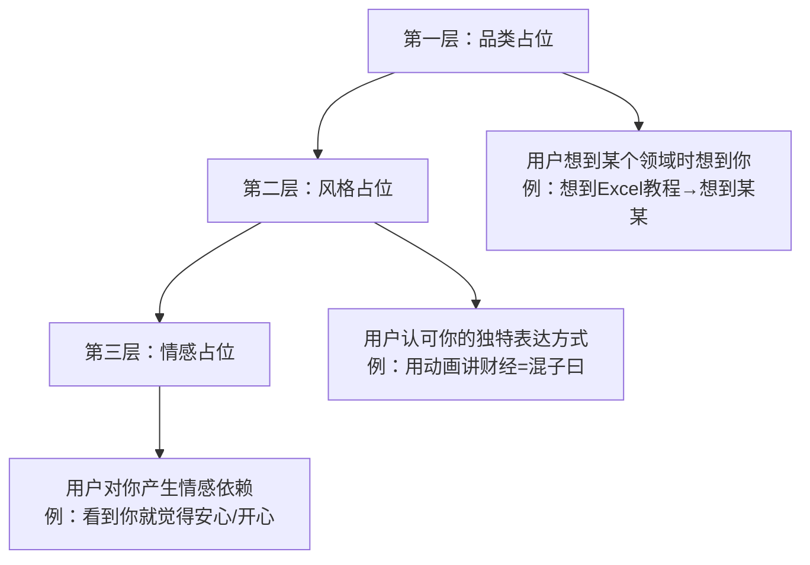
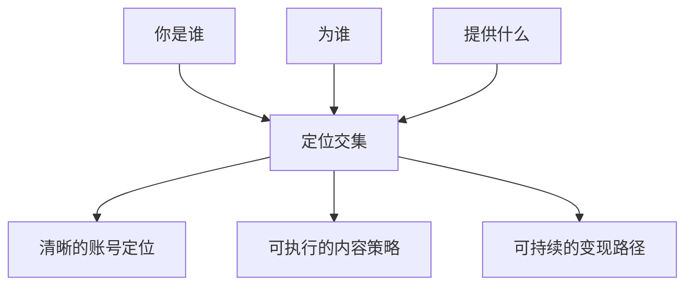
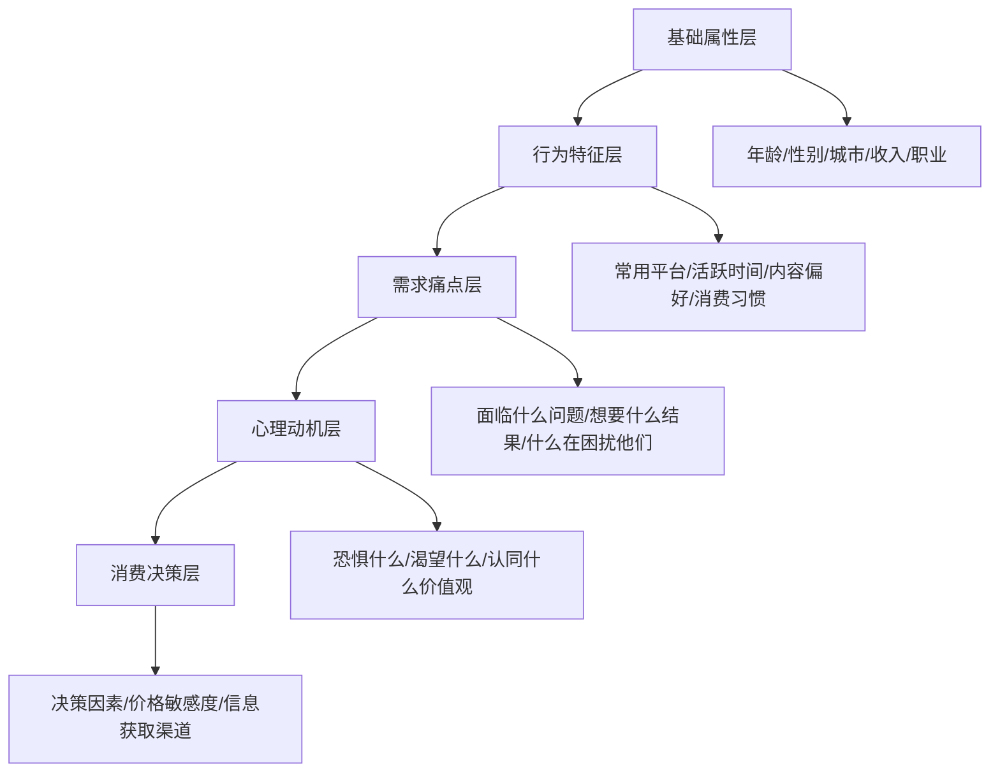
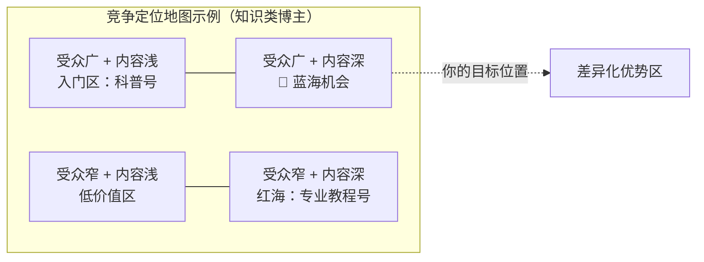
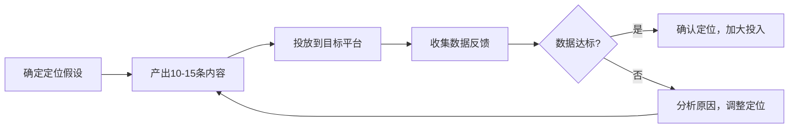
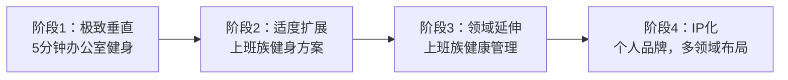
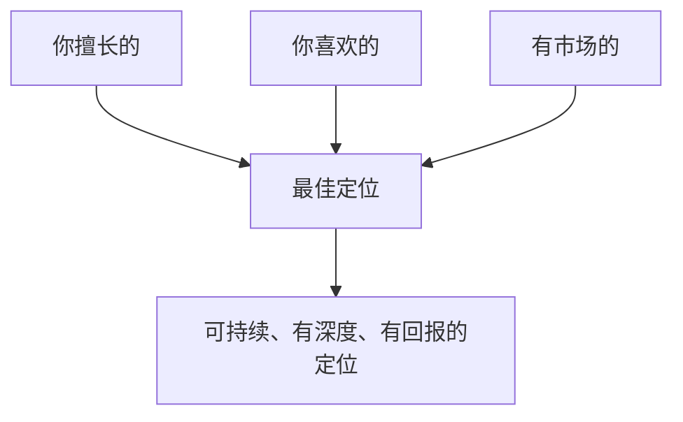
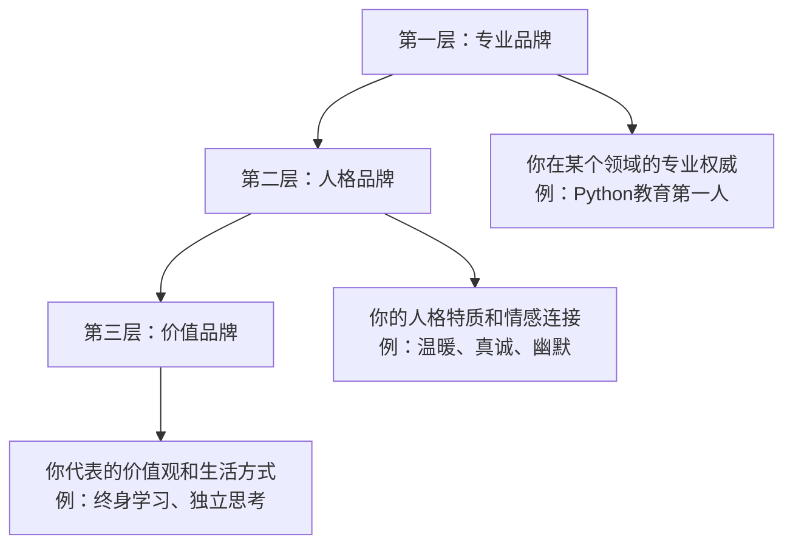

# 三、内容定位与差异化

定位是内容创作的第一道分水岭。在信息过载的时代，用户每天在各平台接触数千条内容，只有那些能在3秒内被"归类"的账号才能获得注意力。定位不是一句口号，而是一套贯穿账号全生命周期的决策系统——它决定了你的内容方向、目标人群、视觉风格、变现路径，甚至你的竞争对手是谁。

本节从定位的底层逻辑讲起，拆解定位三角模型、竞争定位框架、差异化策略矩阵、定位验证方法、定位迭代机制，并给出可直接套用的定位画布、竞品分析模板、定位审计清单和常见误区纠正。

---

## 3.1 定位的底层逻辑：为什么人脑需要"分类"

### 3.1.1 认知科学视角：分类是人类信息处理的基本机制

定位之所以有效，不是因为某个营销大师发明了这个概念，而是因为它深度契合人类大脑的信息处理方式。认知心理学中有三个关键原理支撑了定位的必要性：

**第一，注意力过滤器（Attentional Filter）**。人类大脑每天接收约1100万比特的感官信息，但意识层面只能处理约50比特。这意味着99.99%的信息在进入意识之前就被过滤掉了。大脑的过滤标准很简单：**是否与已有分类相关**。当用户看到一个新账号时，大脑会在200-500毫秒内完成分类——"这跟我已知的哪个类别匹配？"如果匹配成功，信息有机会进入意识；如果匹配失败，信息被直接丢弃。

**第二，认知图式（Schema）**。心理学家皮亚杰提出的认知图式理论指出，人类通过"图式"来组织和理解世界。图式是大脑中预存的知识框架，比如"美食博主"这个图式包含：发食物照片、分享菜谱、推荐餐厅等预期行为。当你的内容符合用户已有的图式，认知成本极低，用户能快速理解"你是做什么的"。当你的内容不符合任何已有图式，用户需要额外的认知努力来理解你，大多数人会选择放弃。

**第三，首因效应（Primacy Effect）**。心理学研究表明，人们对一个事物的第一印象会深刻影响后续判断。在内容创作领域，用户对你账号的第一印象一旦形成，极难改变。如果用户第一次看到你的内容是美食，第二次看到的是编程，大脑会产生认知冲突（Cognitive Dissonance），降低对你的信任度。

这三个原理共同解释了一个现象：**定位的本质是帮助用户的大脑用最低成本完成分类，从而突破注意力过滤器，进入用户的意识层面。**

### 3.1.2 算法的"归类"逻辑

每个平台的推荐算法本质上都在做同一件事：给内容打标签，然后匹配给可能感兴趣的用户。算法的运行机制与人脑的分类机制高度相似——都需要将内容归入已知类别，然后推送给对该类别感兴趣的用户。

如果你的账号今天发美食、明天发编程、后天发情感，算法无法给你一个稳定的标签，推荐就会混乱——你的内容会被推给不同的人群，每个群体的互动率都不高，最终整个账号的权重持续下降。

**算法归类的核心指标**：

| 维度 | 算法关注点 | 定位不清的后果 | 定位清晰的收益 |
|------|-----------|---------------|---------------|
| 内容标签 | 每条内容的关键词、话题 | 标签分散，推荐不精准 | 标签集中，精准推送到目标人群 |
| 用户画像 | 互动用户的年龄、性别、兴趣 | 画像混乱，无法形成稳定人群包 | 画像清晰，算法持续优化推荐 |
| 垂直度 | 同类内容占比 | 垂直度低，账号权重下降 | 垂直度高，账号权重持续提升 |
| 互动质量 | 目标用户的完播率、点赞、收藏 | 非目标用户看完就走，数据差 | 目标用户深度互动，数据优秀 |
| 内容一致性 | 发布频率和内容调性的稳定性 | 调性忽高忽低，用户预期不稳 | 调性稳定，用户形成消费习惯 |

**数据说明**：以抖音为例，垂直度高的账号（同类内容占比>80%）相比杂乱账号，平均播放量高出3-5倍，粉丝转化率高出2-3倍。这不是偶然，而是算法对"可预测性"的奖励——当算法知道你的内容会给谁看，它就能更精准地分发，双方都受益。

各平台算法对垂直度的具体要求存在差异：

| 平台 | 垂直度权重 | 容忍度 | 特殊说明 |
|------|----------|--------|---------|
| 抖音 | 极高 | 低，同类内容建议>80% | 一旦标签混乱，账号可能被"冷藏"数周 |
| 小红书 | 高 | 中，同类内容建议>70% | 允许偶尔的生活类"破圈"内容 |
| B站 | 中高 | 中高，同类内容建议>60% | 粉丝更看重UP主人格，对跨领域容忍度较高 |
| 公众号 | 中 | 高，同类内容建议>50% | 依赖社交传播，粉丝对作者忠诚度高于对领域忠诚度 |
| YouTube | 高 | 中，同类内容建议>70% | 频道主题明确有助于推荐，但订阅制给了更多自由 |
| 知乎 | 中高 | 中，同类内容建议>60% | 算法权重向专业领域倾斜 |

### 3.1.3 用户的"心智占位"原理

人类大脑处理信息的方式是"分类存储"——每个领域最多记住3-7个品牌或人物（米勒定律）。用户在看到一个新账号时，会在几秒内完成三个判断：

1. **这是关于什么的？**（领域归类）——大脑尝试将你归入已知类别
2. **跟我有什么关系？**（利益判断）——大脑评估你与"我"的关联度
3. **跟我已关注的有什么不同？**（差异化判断）——大脑判断你是否值得一个记忆位

如果这三个问题的答案模糊，用户不会关注。定位的本质就是提前帮用户回答这三个问题，降低他们的认知成本。

**心智占位的三层模型**：



大多数创作者卡在第一层，以为"我做美食"就够了。但真正的竞争在第二层和第三层——同类账号成千上万，用户凭什么记住你？

**从第一层到第三层的进阶路径**：

| 阶段 | 核心任务 | 时间周期 | 关键指标 |
|------|---------|---------|---------|
| 第一层：品类占位 | 让用户"想到X就想到你" | 0-3个月 | 搜索排名、品类关键词关联度 |
| 第二层：风格占位 | 让用户"看到你的风格就停留" | 3-12个月 | 完播率、粉丝辨识度测试 |
| 第三层：情感占位 | 让用户"看到你就觉得安心/开心" | 12个月+ | 粉丝忠诚度、自发推荐率 |

### 3.1.4 定位对变现的决定性影响

定位不仅影响流量获取，还直接决定变现效率。这个逻辑链条非常清晰：

**精准定位** → 精准粉丝 → 精准需求 → 高转化变现

**模糊定位** → 泛粉丝 → 需求分散 → 变现困难

**真实案例对比**：

| 对比维度 | 账号A：精准定位 | 账号B：模糊定位 |
|---------|---------------|---------------|
| 定位 | "30岁职场女性穿搭" | "什么火发什么"的泛娱乐号 |
| 粉丝画像 | 25-35岁城市白领女性，高消费力 | 年龄/性别/地域混杂 |
| 品牌合作 | 精准对接女装、护肤、职场类广告主 | 品牌方无法判断投放效果 |
| 广告报价 | 粉丝数×0.1-0.3元/条 | 粉丝数×0.01-0.05元/条 |
| 课程变现 | 职场穿搭课，转化率8-15% | 无明确课程方向 |
| 粉丝价值 | 单个粉丝年价值约5-15元 | 单个粉丝年价值约0.1-0.5元 |

差距达到10-50倍。这就是定位的杠杆效应——同样的内容创作投入，精准定位的回报可能是模糊定位的数十倍。

---

## 3.2 定位三角模型：你是谁、为谁、提供什么

定位由三个核心要素构成，缺一不可。它们共同构成一个完整的"定位三角"。这个模型最早由杰克·特劳特（Jack Trout）和阿尔·里斯（Al Ries）在《定位》一书中提出，经过数十年的商业验证，已成为品牌定位的标准框架。



### 3.2.1 第一要素：你是谁

"你是谁"不是问你的身份证信息，而是问：**你有什么资格做这个内容？你凭什么让用户相信你？**

这个问题的答案决定了你的"信任背书"——用户凭什么从千万个创作者中选择相信你。

**自我分析的四个维度**：

| 维度 | 问题 | 示例 | 权重 |
|------|------|------|------|
| 专业背景 | 你的职业/学历/从业经历是什么？ | 10年产品经理、医学硕士 | ★★★★ |
| 实战经验 | 你做成过什么？有什么可量化的成果？ | 从0做到月销100万、减重30斤 | ★★★★★ |
| 个人特质 | 你的性格、表达方式、外在特点是什么？ | 语速快、毒舌、东北口音 | ★★★ |
| 独特视角 | 你看问题的角度跟别人有什么不同？ | 从经济学角度看情感问题 | ★★★★ |

**关键原则：真实性 > 完美性**

不要编造人设。互联网的记忆很长，一旦翻车，修复成本极高。你的真实经历、真实性格、真实观点，才是最难被复制的差异化。

**人设真实性测试**：问自己三个问题——
1. 这个人设我能坚持3年以上不感到痛苦吗？
2. 如果有人深挖我的过去，这个人设会被拆穿吗？
3. 线下见面时，对方会不会觉得"你跟网上不一样"？

如果任何一个答案有问题，说明这个人设有虚假成分，需要调整。

**自检方法**：用一句话介绍自己，看能否在10秒内让陌生人理解你是谁。例如：

- ❌ "我是一个分享生活的博主"（太模糊，无法归类）
- ❌ "我是做内容的"（信息量为零）
- ✅ "前大厂程序员，教你用代码自动化解决生活中的重复劳动"（具体、有记忆点、有价值）
- ✅ "二胎妈妈，分享带娃省钱的实用攻略，每年帮家庭多存5万"（身份+价值+数据）
- ✅ "10年HR总监，告诉你面试官真正在想什么"（权威+视角+好奇心）

### 3.2.2 第二要素：为谁

"为谁"是定位中最容易被忽视的环节。很多人急于输出内容，却从未认真思考过"我到底在对谁说话"。

不定义目标用户，就像在广场上用正常音量说话——每个人都能听到，但没有人在听。

**目标用户画像的五层模型**：



**实操方法：用户画像构建**

**已有粉丝的情况**：通过以下方式收集用户信息：

1. **评论区分析**：统计评论用户的头像、昵称、表达方式、关注点。用Excel记录200条以上评论，归纳高频词和情感倾向
2. **私信整理**：归纳私信中的高频问题和需求，这是最真实的用户需求信号
3. **投票/问卷**：在动态或故事中发起投票，设计5-10个核心问题
4. **数据后台**：查看平台提供的粉丝画像数据（抖音创作者服务中心、小红书专业号后台、B站创作中心）
5. **竞品分析**：研究同类博主的粉丝构成和互动特征
6. **社群观察**：如果建立了粉丝群，观察群内讨论话题和消费行为

**从零开始的情况**：没有粉丝数据时：

1. 找3-5个同领域的成熟博主，分析他们评论区的活跃用户。重点记录：用户头像风格、昵称模式、表达方式、提问类型
2. 在知乎、贴吧、豆瓣、小红书等社区搜索相关话题，看讨论者的特征和痛点
3. 加入相关微信群/QQ群，潜水观察1-2周，记录讨论主题和情感倾向
4. 假设一个画像，先做10-20条内容测试，根据数据反馈修正

**用户画像模板**：

```markdown
## 目标用户画像

### 基础信息
- 昵称：小丽（代表性人物）
- 年龄：26岁
- 性别：女
- 城市：二线城市（成都/杭州/武汉）
- 职业：互联网公司运营
- 月收入：8000-12000元

### 日常行为
- 常用APP：小红书、抖音、微信
- 活跃时间：午休12:00-13:00、晚上21:00-23:00
- 内容偏好：实用干货 > 娱乐搞笑 > 情感故事
- 消费习惯：愿意为"省时间"和"提升自己"付费
- 信息获取路径：看到内容→小红书搜评价→知乎看深度分析→决定购买

### 核心痛点（按优先级排序）
1. 工作3年，薪资涨幅有限，不知道如何突破
2. 想学新技能但不知道学什么、怎么学
3. 时间有限，需要高效的解决方案
4. 身边没有可以请教的人，信息获取靠自己摸索

### 心理动机
- 恐惧：被同龄人抛下、35岁危机、收入停滞
- 渴望：升职加薪、经济独立、被人认可、掌控感
- 价值观：务实、相信努力有用、讨厌鸡汤、看重结果

### 消费决策
- 决策因素：实用性 > 价格 > 口碑 > 品牌
- 价格敏感度：中等，50-300元的课程会认真考虑
- 信息获取：先在小红书/知乎搜评价，再决定是否购买
- 决策周期：1-7天（小额）、1-3个月（大额）
```

### 3.2.3 第三要素：提供什么

"提供什么"回答的是你的**核心价值主张**——用户关注你能得到什么？

**核心价值主张的三层结构**：

| 层次 | 说明 | 示例 | 用户内心独白 |
|------|------|------|------------|
| 功能价值 | 你解决什么具体问题？ | 教会用户用Excel做数据分析 | "这个号能帮我解决具体问题" |
| 情感价值 | 你给用户什么感觉？ | 让用户觉得"我也能学会"的自信 | "看你的内容让我觉得自己也可以" |
| 身份价值 | 关注你代表什么身份认同？ | "我是一个注重效率的职场人" | "关注你让我觉得自己是那类人" |

三层价值缺一不可，但优先级不同。在账号起步期，功能价值是基础——没有实质帮助的内容无法留住用户。在成长期，情感价值开始发力——用户不仅需要知识，还需要被理解和鼓励。在成熟期，身份价值成为护城河——用户关注你不仅是为了学东西，更是为了表达"我是谁"。

**提炼核心价值主张的公式**：

> 我通过【内容形式】帮助【目标用户】解决【具体问题】，让他们获得【具体结果】。

示例：
- "我通过3分钟短视频帮助职场新人解决Excel操作问题，让他们每天节省2小时重复劳动"
- "我通过真实经历分享帮助想减肥的上班族找到适合忙碌人群的运动方案，让他们在不节食的情况下3个月减10斤"
- "我通过深度拆解视频帮助电商创业者理解竞品策略，让他们少走弯路、少花冤枉钱"

**价值主张的压力测试**：

| 测试问题 | 通过标准 | 失败信号 |
|---------|---------|---------|
| 10秒测试 | 陌生人10秒内能理解 | 对方需要追问"所以你到底是做什么的" |
| 差异化测试 | 换个账号名说同样的话也成立吗？ | 换个名就成立，说明没有个人特色 |
| 需求测试 | 有人愿意为这个价值付费吗？ | 只有免费内容有人看，付费无人问津 |
| 持久性测试 | 3年后这个价值主张还成立吗？ | 依赖短期热点，过时后无法转型 |
| 可扩展性测试 | 能否基于此主张延伸出系列产品？ | 只能做单一内容，无法扩展 |

---

## 3.3 竞争定位分析：找到你的生态位

定位不能在真空中完成。你需要了解竞争环境，找到属于自己的"生态位"。

### 3.3.1 竞争定位地图

竞争定位地图是一个二维矩阵，帮助你可视化自己在竞争格局中的位置。选择两个对你所在赛道最重要的维度（如专业深度vs内容趣味性、大众化vs垂直化），将主要竞品标注在地图上，找到空白区域。



**如何选择两个维度**：

维度的选择取决于你所在赛道的关键竞争因素。常见的维度对包括：

| 赛道 | 推荐维度X | 推荐维度Y |
|------|----------|----------|
| 知识教育 | 内容深度 | 受众广度 |
| 生活方式 | 实用性 | 美观性/趣味性 |
| 产品测评 | 专业度 | 可读性/娱乐性 |
| 财经理财 | 理论性 | 实操性 |
| 美食 | 烹饪难度 | 场景覆盖面 |
| 健身 | 科学性 | 易执行性 |

### 3.3.2 竞品深度分析模板

在开始创作前，至少深度分析3-5个竞品账号。以下是一个结构化的分析模板：

```markdown
## 竞品分析报告

### 竞品1：[账号名称]
- 平台：[抖音/小红书/B站/...]
- 粉丝量：[数量]
- 定位描述：[一句话概括]
- 内容形式：[图文/短视频/长视频/直播]
- 更新频率：[每周X条]
- 平均互动率：[点赞+评论+收藏/播放量]
- 核心内容栏目：[列出3-5个固定栏目]
- 变现方式：[广告/课程/电商/...]
- 粉丝画像推断：[根据评论区和互动推测]
- 优势：[他做得好的3个点]
- 劣势：[他做得不好的3个点]
- 可借鉴：[我可以学习的2-3个点]
- 可超越：[我能做得比他好的2-3个点]
- 爆款分析：[他的3个最高互动内容，分析为什么火]
```

### 3.3.3 蓝海机会识别方法

蓝海是指竞争不激烈但需求存在的领域。识别蓝海的方法：

**方法一：关键词缺口分析**

在目标平台搜索你所在领域的核心关键词，记录：
- 搜索量高但优质内容少的关键词（需求大、供给不足）
- 搜索结果中头部账号互动率低的关键词（用户不满意现有内容）
- 搜索联想词中无人覆盖的长尾词（未被满足的需求）

**方法二：评论区需求挖掘**

浏览竞品评论区，寻找以下信号：
- "有没有XXX方面的内容？"——直接需求表达
- "这个没讲清楚"——现有内容的不足
- "能不能讲讲XXX？"——延伸需求
- 高赞但未被回复的问题——被忽视的需求

**方法三：跨平台迁移**

观察其他平台上已验证的内容方向，看在你的目标平台上是否有人做：
- 国际→国内：YouTube/TikTok上的热门内容在国内平台的空白
- 一二线→下沉：一二线城市验证过的内容在下沉市场的机会
- 长内容→短内容：深度文章/长视频的内容拆解为短视频的机会

---

## 3.4 差异化策略矩阵

定位解决了"做什么"的问题，差异化解决"凭什么选你"的问题。在同一个赛道里，可能有成百上千个同类账号，差异化是你脱颖而出的关键。

### 3.4.1 五种差异化路径总览

| 差异化维度 | 策略说明 | 典型案例 | 难度 | 护城河 | 最佳适用阶段 |
|-----------|---------|---------|------|--------|------------|
| 垂直细分 | 把大领域切到足够细 | "美食"→"一人食"→"打工人的10分钟一人食" | ★★☆ | 中，需要持续深耕 | 起步期首选 |
| 独特视角 | 用不同身份/角度解读同一话题 | "程序员视角的产品测评""医生看影视作品中的医疗bug" | ★★★ | 高，身份不可复制 | 有专业背景时 |
| 个人风格 | 形成强烈辨识度的表达方式 | 半佛仙人的犀利、何同学的科技感、papi酱的吐槽 | ★★★★ | 极高，风格无法模仿 | 长期沉淀 |
| 形式创新 | 用新形式呈现已有内容 | 用动画讲经济学、用说唱教英语、用ASMR做烹饪 | ★★★ | 高，制作门槛形成壁垒 | 有制作能力时 |
| 信息差 | 拥有别人没有的信息源或数据 | 业内人爆料、独家数据、跨境视角 | ★★☆ | 中高，信息差会逐渐消失 | 短期突破口 |

### 3.4.2 垂直细分：最常见的差异化路径

垂直细分是最容易上手的差异化策略。原理很简单：**与其在一个大赛道里跟所有人竞争，不如在一个小赛道里当第一名。**

**垂直细分的操作方法——限定条件叠加法**：

1. **选择大领域**：比如"健身"
2. **叠加人群限定**：比如"上班族健身"
3. **叠加场景限定**：比如"办公室健身"
4. **叠加时间限定**：比如"5分钟办公室健身"
5. **叠加效果限定**：比如"5分钟办公室健身缓解颈椎痛"

每一层叠加都在缩小受众范围，但同时在提高目标用户的精准度和内容的实用性。

**限定条件的类型**：

| 限定类型 | 说明 | 示例 |
|---------|------|------|
| 人群限定 | 年龄/性别/职业/身份 | 大学生/宝妈/程序员/退休老人 |
| 场景限定 | 使用场景/生活场景 | 办公室/宿舍/通勤路上/带娃时 |
| 时间限定 | 完成所需时间 | 3分钟/10分钟/一周/一个月 |
| 效果限定 | 能达到的具体结果 | 减脂/涨薪/提分/省钱 |
| 工具限定 | 使用的特定工具/平台 | 用ChatGPT/用Notion/用Excel |
| 预算限定 | 花费范围 | 零成本/100元以内/高性价比 |
| 地域限定 | 特定地区 | 北京/广东/小县城/海外 |

**细分程度的判断标准**：

| 判断维度 | 太粗 | 合适 | 太细 |
|---------|------|------|------|
| 竞品数量 | 上万个同类账号 | 几十到几百个 | 几乎没有（可能没市场） |
| 内容空间 | 什么都可以说，但没有特色 | 有明确的选题范围 | 写20篇就没东西可写了 |
| 用户规模 | 泛而杂 | 足够精准且有规模 | 太小众，增长天花板低 |
| 变现能力 | 广告主不精准 | 有明确的付费人群 | 找不到变现路径 |
| 搜索指数 | 关键词搜索量>100万 | 关键词搜索量1万-100万 | 关键词搜索量<1000 |

**验证方法**：在目标平台搜索你的细分关键词，看以下数据：
- 搜索结果数量（有内容需求）
- 头部账号的粉丝量（有市场空间）
- 头部账号的更新频率和互动率（有活跃用户）
- 竞品账号的数量和质量（竞争是否可进入）
- 相关商品/课程的销售数据（有付费需求）

### 3.4.3 独特视角：身份即壁垒

独特视角的核心是**用你的专业身份或人生经历去解读一个大众话题**。这种差异化几乎无法被复制，因为别人没有你的经历。

**视角矩阵**：

| 你的身份 | 可切入的大众话题 | 差异化角度 | 内容示例 |
|---------|----------------|-----------|---------|
| 程序员 | 产品测评 | 从代码和技术架构角度分析产品 | "这个APP为什么这么卡？我拆了它的代码告诉你" |
| 心理咨询师 | 职场关系 | 用心理学理论解读办公室政治 | "领导PUA你的三个心理学套路及应对" |
| 律师 | 生活日常 | 从法律角度分析生活中的纠纷 | "邻居装修噪音扰民，法律给你哪些武器" |
| 营养师 | 美食探店 | 从营养学角度评价餐厅菜品 | "网红餐厅的菜热量有多高？逐道拆解" |
| 前投行分析师 | 理财科普 | 用机构视角讲个人理财 | "基金经理不会告诉你的选基金方法" |
| 二胎妈妈 | 育儿知识 | 真实踩坑经验vs理论知识 | "育儿书不会告诉你的真实产后恢复" |
| 前空姐 | 旅行攻略 | 航空业内部视角的出行建议 | "空姐教你如何在飞机上睡得舒服" |

**关键点**：视角差异化不只是"我在标题里加上身份"，而是你的内容真的要体现专业视角的深度。一个程序员做产品测评，如果只是说"好用/不好用"，跟普通用户没区别。但如果他能分析"这个产品的数据同步机制用了增量同步而非全量同步，所以在弱网环境下体验更好"，这才是真正的视角差异化。

**视角深度的三个层次**：

| 层次 | 描述 | 示例 |
|------|------|------|
| 表层视角 | 标题带身份标签，内容跟普通用户无异 | "程序员教你用Excel"（跟其他人教的一样） |
| 中层视角 | 用专业知识解读，提供普通人想不到的角度 | "程序员教你用VBA自动化Excel，写个脚本替代重复操作" |
| 深层视角 | 专业思维模式贯穿内容，形成独特认知体系 | "用编程思维重构你的Excel工作流——把表格当数据库，把公式当函数，把宏当自动化管线" |

### 3.4.4 个人风格：最难但最持久的差异化

个人风格是差异化金字塔的顶端。一旦形成，粉丝忠诚度极高，商业价值也最大。但风格不是刻意设计出来的，而是在长期创作中自然沉淀的。

**风格的构成要素**：

| 要素 | 说明 | 示例 | 如何培养 |
|------|------|------|---------|
| 语言风格 | 用词习惯、口头禅、句式 | "家人们""属实是""我直接一个xxx" | 录制回听自己的内容，找到自然表达中的高频词 |
| 视觉风格 | 封面设计、配色、排版 | 统一的封面模板、标志性配色 | 固定2-3种配色方案和1种排版模板 |
| 节奏风格 | 内容的节奏感和结构 | 开头固定抛出争议观点、每段结尾设悬念 | 分析爆款内容的结构，固化有效模式 |
| 态度风格 | 对事物的立场和态度 | 犀利批评、温和建议、幽默吐槽 | 明确自己对领域的核心立场 |
| 互动风格 | 与粉丝的互动方式 | 回复风格、直播互动、社群运营 | 设定互动原则和边界 |

**风格培养方法**：

1. **收集反馈**：让朋友或粉丝用3个词形容你的内容，找到高频出现的词
2. **放大特质**：如果大家说你"搞笑"，就把搞笑放大到极致；如果大家说你"严谨"，就把严谨做到极致
3. **建立固定元素**：固定的开头语、固定的栏目名、固定的视觉元素
4. **持续输出**：风格是在100条以上的内容中逐渐显现的，不要在第10条就急于定义风格

**风格自检清单**：
- [ ] 闭掉账号名，粉丝能认出你的内容吗？
- [ ] 你的封面有统一的视觉特征吗？
- [ ] 你有标志性的开头方式或结束语吗？
- [ ] 你对事物的态度和立场一致吗？
- [ ] 别人模仿你的难度有多高？

### 3.4.5 形式创新：降低理解门槛

形式创新是指**用用户意想不到的方式呈现内容**。它的核心价值是降低理解门槛和提高传播性。

**形式创新的常见模式**：

| 创新形式 | 适用场景 | 案例 | 制作门槛 | 传播潜力 |
|---------|---------|------|---------|---------|
| 动画/手绘 | 复杂知识的可视化 | 混子曰用漫画讲历史、回形针用动画讲科技 | ★★★★ | ★★★★★ |
| 情景剧 | 干货内容的故事化 | 用职场短剧讲沟通技巧 | ★★★ | ★★★★ |
| 对比实验 | 产品测评、方法验证 | "连续30天用不同方法护肤，对比效果" | ★★☆ | ★★★★★ |
| 挑战/打卡 | 生活方式、技能展示 | "30天从零学会Python"系列 | ★★☆ | ★★★★ |
| 第一视角 | 体验分享、行业揭秘 | "外卖骑手的一天""投行分析师的日常" | ★★☆ | ★★★★ |
| 数据可视化 | 行业分析、趋势解读 | 用动态图表展示中国经济变化 | ★★★★ | ★★★☆ |
| 实地探访 | 探店/工厂/现场 | "探访你穿的衣服是怎么做出来的" | ★★★ | ★★★★★ |
| 互动问答 | 粉丝参与型内容 | "回答评论区最刁钻的10个问题" | ★☆☆ | ★★★☆ |

**形式创新的关键原则**：形式服务于内容，不是为了创新而创新。一个好的形式创新应该让内容更容易理解、更容易传播、更容易记住。如果形式让内容变得更复杂或更难理解，那就不是创新，而是炫技。

### 3.4.6 信息差：短期红利，长期需要转化

信息差型差异化指的是**你拥有别人不知道的信息**。这种差异化见效快，但信息差会随时间消失，需要在窗口期内转化为其他形式的壁垒（如品牌、社群、课程）。

**信息差的来源**：

| 信息差类型 | 来源 | 持续性 | 风险 |
|-----------|------|--------|------|
| 行业内部信息 | 从业者的真实工作状态、行业内幕 | 中，需持续产出 | 泄密风险 |
| 跨境信息 | 海外平台的热门内容翻译/改编到国内 | 低，信息流通快 | 版权风险 |
| 前沿信息 | 新技术、新工具、新趋势的早期发现者 | 中高，持续关注即可 | 判断失误风险 |
| 数据信息 | 通过数据挖掘发现的规律和趋势 | 高，数据持续更新 | 数据获取成本 |
| 人脉信息 | 通过行业人脉获得的一手消息 | 高，关系网稳定 | 信任风险 |

**信息差的生命周期管理**：

```mermaid
graph LR
    A[发现信息差] --> B[快速产出内容]
    B --> C[建立"信息灵通"的标签]
    C --> D[将流量转化为粉丝]
    D --> E[建立社群/付费产品]
    E --> F[信息差消失时已有护城河]
```

**风险提示**：信息差型内容容易触碰版权和保密红线。使用海外内容时注意版权问题（至少做到翻译+加工+原创观点，而非直接搬运），分享行业信息时注意保密义务（不要泄露商业机密和客户隐私）。

### 3.4.7 差异化组合策略

真正强大的差异化往往不是单一维度，而是多个维度的组合：

**常见差异化组合**：

| 组合模式 | 说明 | 示例 |
|---------|------|------|
| 垂直细分 + 独特视角 | 在细分领域用专业身份解读 | "10年HR教你面试Java开发" |
| 垂直细分 + 形式创新 | 用创新形式覆盖细分领域 | "用动画讲Python基础" |
| 独特视角 + 个人风格 | 专业身份+鲜明的表达风格 | "毒舌律师讲法律" |
| 形式创新 + 信息差 | 用创新形式呈现独家信息 | "用数据可视化拆解上市公司财报" |
| 垂直细分 + 个人风格 + 形式创新 | 三重组合，最强壁垒 | "用东北话+动画讲解编程，专治编程恐惧症" |

---

## 3.5 定位画布：一页纸完成定位

将前面的分析整合成一个可操作的定位画布。填完这张画布，你的定位就基本成型了。

### 3.5.1 定位画布模板

```markdown
## 账号定位画布

### 一、我是谁
- 身份标签：________（用2-3个词概括你的身份）
- 专业背书：________（你的专业背景或成果）
- 个人特质：________（你的性格/风格/表达特点）
- 一句话介绍：________（10秒能让陌生人理解的自我介绍）

### 二、目标用户
- 核心人群：________（年龄+性别+身份+城市层级）
- 他们的痛点：________（列出3-5个核心痛点，按优先级排序）
- 他们在哪里：________（他们活跃的平台和场景）
- 他们愿意为什么付费：________（付费意愿和预算范围）

### 三、核心价值
- 一句话价值主张：________（套用公式：我通过X帮助Y解决Z，让他们获得W）
- 用户关注我能得到：________（功能价值）
- 用户关注我会感觉：________（情感价值）
- 关注我代表：________（身份价值）

### 四、差异化策略
- 主要差异化路径：□垂直细分 □独特视角 □个人风格 □形式创新 □信息差
- 差异化组合：________（如果选择了多种，说明如何组合）
- 差异化描述：________（一句话说明你跟竞品的核心区别）
- 竞品账号（3个）：________
- 我跟他们的核心区别：________
- 竞争定位地图位置：________

### 五、内容规划
- 内容形式：□图文 □短视频 □中长视频 □直播 □音频
- 内容栏目（3-5个）：________
- 更新频率：________
- 选题范围：________
- 标志性元素：________（固定的开头语/视觉元素/栏目名）

### 六、变现路径
- 主要变现方式：________
- 预期收入来源占比：________
- 短期目标（3个月）：________
- 中期目标（1年）：________
- 长期目标（3年）：________
```

### 3.5.2 定位画布填写示例

以一个真实场景为例，展示完整的定位过程：

```markdown
## 账号定位画布（示例）

### 一、我是谁
- 身份标签：前大厂前端工程师、独立开发者
- 专业背书：5年大厂经验，独立开发过3个付费工具，累计用户10万+
- 个人特质：逻辑清晰、说话直接、喜欢用类比解释技术概念
- 一句话介绍："前大厂程序员，教你从零开始做自己的产品赚钱"

### 二、目标用户
- 核心人群：22-30岁、男性为主、一二线城市、有1-3年编程经验的初中级开发者
- 他们的痛点：
  1. 想做独立项目但不知道从何开始
  2. 技术栈选择困难，怕学错方向
  3. 想接私单/做副业但缺乏商业思维
  4. 不知道如何定价和找到客户
- 他们在哪里：掘金、GitHub、B站技术区、V2EX、少数派
- 他们愿意为什么付费：技术课程（100-500元）、项目模板（50-200元）、1v1咨询

### 三、核心价值
- 一句话价值主张：帮初中级程序员从"只会写代码"进化到"能独立做产品赚钱"
- 用户关注我能得到：独立开发的完整方法论、技术选型建议、商业化思路
- 用户关注我会感觉：原来独立开发没那么难，我也可以试试
- 关注我代表：我是一个有商业思维的技术人，不只是码农

### 四、差异化策略
- 主要差异化路径：独特视角 + 垂直细分
- 差异化组合：用"有实战经验的独立开发者"视角，切入"程序员副业变现"这个细分方向
- 差异化描述：不只教技术，更教如何把技术变成产品和收入
- 竞品账号：
  1. 某技术教程号（纯技术教学，无商业视角）
  2. 某独立开发者号（只分享产品，不教方法论）
  3. 某副业号（不懂技术，建议太泛）
- 我跟他们的核心区别：同时具备技术深度和商业思维，能从"想法→开发→上线→变现"全链路指导
- 竞争定位地图位置：深度+实用性的交叉区域（区别于纯技术教学和纯商业鸡汤）

### 五、内容规划
- 内容形式：B站中长视频（主力）+ 公众号长文（深度）+ GitHub开源项目（信任背书）
- 内容栏目：
  1. 「从零到一」系列：手把手做一个完整产品
  2. 「技术选型」：对比不同技术方案的优劣
  3. 「独立开发者日记」：分享真实的开发过程和数据
  4. 「私单攻略」：如何接单、报价、交付
  5. 「开源拆解」：拆解优秀开源项目的设计思路
- 更新频率：B站每周1条、公众号每周2篇
- 选题范围：前端开发、独立开发、产品设计、副业变现
- 标志性元素：每期开头用代码注释格式显示今天的主题

### 六、变现路径
- 主要变现方式：技术课程（主力）+ 付费社群 + 项目模板销售
- 预期收入来源：课程60%、社群20%、模板15%、广告5%
- 短期目标（3个月）：B站5000粉，发布1个付费课程
- 中期目标（1年）：B站3万粉，月收入稳定在2万+
- 长期目标（3年）：成为"独立开发"领域头部IP，年收入50万+
```

---

## 3.6 定位验证：用最小成本测试

定位不是拍脑袋决定的，而是需要通过数据验证的。在投入大量时间生产内容之前，先用最小成本验证定位是否可行。

### 3.6.1 MVP内容测试法

MVP（Minimum Viable Product，最小可行产品）的概念来自创业领域。应用到内容创作中，就是**用最少的时间和资源，产出最少量的内容，测试市场反应**。

**MVP测试流程**：



**测试周期和数量**：

| 平台类型 | 内容数量 | 测试周期 | 每条内容投入时间建议 |
|---------|---------|---------|------------------|
| 短视频平台（抖音/小红书） | 15-20条 | 2-3周 | 2-4小时/条 |
| 中长视频平台（B站/YouTube） | 8-10条 | 4-6周 | 8-15小时/条 |
| 图文平台（公众号/知乎） | 15-20篇 | 3-4周 | 3-6小时/篇 |
| 音频平台（播客） | 8-12期 | 4-8周 | 4-8小时/期 |

**核心观察指标**：

| 指标 | 达标线 | 含义 | 数据来源 |
|------|--------|------|---------|
| 自然播放/阅读量 | 平均>500（短视频）/ >200（图文） | 内容被算法推荐 | 平台数据后台 |
| 互动率 | >3%（点赞+评论+收藏/播放量） | 内容引起共鸣 | 手动计算 |
| 涨粉率 | 每条内容带来>10个新关注 | 内容有吸引力 | 平台数据后台 |
| 评论质量 | 有相关讨论而非纯灌水 | 触达了目标用户 | 人工判断 |
| 私信/咨询 | 有用户主动问问题 | 存在真实需求 | 平台私信 |
| 完播率 | >30%（短视频）/ >40%（图文） | 内容有吸引力 | 平台数据后台 |
| 收藏率 | >2% | 内容有长期价值 | 平台数据后台 |

**如何判断结果**：
- 5项以上达标：定位可行，可以加大投入
- 3-4项达标：方向正确但需要优化，调整后再测试
- 2项以下达标：定位可能有问题，需要重新审视核心假设

### 3.6.2 A/B定位测试

如果你在两个定位之间犹豫不决，可以同时测试两个方向：

1. **创建两个账号**（或在同一账号交替发布两种内容）
2. **每个方向发布10条内容**
3. **对比核心数据**：播放量、互动率、涨粉率
4. **选择数据更好的方向**

**A/B测试的执行细节**：

| 测试要素 | 标准化要求 | 原因 |
|---------|-----------|------|
| 内容质量 | 两条内容的制作投入尽量一致 | 避免质量差异干扰结果 |
| 发布时间 | 同一天的相近时间段发布 | 避免时间差异干扰结果 |
| 封面/标题风格 | 保持一致的设计风格 | 避免视觉差异干扰结果 |
| 标签/话题 | 使用相同的标签策略 | 避免算法差异干扰结果 |
| 测试周期 | 至少2周，至少10条 | 确保样本量足够 |

**常见陷阱**：
- 样本量太小就下结论（至少10条/方向）
- 忽略了内容质量的差异（不是A方向不行，是你做A方向时不够用心）
- 没有控制变量（发布时间、封面风格等不一致）

### 3.6.3 竞品分析法验证

如果不想自己测试，可以通过分析竞品来间接验证：

1. **找到3-5个与你定位相似的账号**
2. **分析他们的数据**：粉丝量、更新频率、互动率、内容类型
3. **判断市场空间**：
   - 头部账号粉丝量在10万-100万：有市场但不过度饱和
   - 头部账号粉丝量>500万：市场大但竞争激烈
   - 头部账号粉丝量<1万：市场可能太小
4. **寻找差异化空间**：他们没做好的地方就是你的机会

**竞品分析的关键数据点**：

| 数据项 | 如何获取 | 分析意义 |
|--------|---------|---------|
| 粉丝量 | 直接查看 | 市场规模上限参考 |
| 近30天涨粉量 | 第三方工具（蝉妈妈/新榜/灰豚） | 赛道增长趋势 |
| 平均播放量/阅读量 | 手动统计近10条 | 内容的算法推荐能力 |
| 互动率 | (点赞+评论+收藏)/播放量 | 内容质量参考 |
| 更新频率 | 查看发布时间规律 | 竞品的投入程度 |
| 变现方式 | 查看橱窗/课程/广告 | 变现路径参考 |
| 评论区情感 | 手动阅读50条评论 | 用户满意度 |

---

## 3.7 定位迭代：定位不是一成不变的

很多创作者误以为"定位一旦确定就不能变"。事实恰恰相反——定位需要根据数据反馈和市场变化持续迭代。

### 3.7.1 定位迭代的时机

| 信号 | 含义 | 行动 | 紧急程度 |
|------|------|------|---------|
| 持续发布30条内容，互动率<1% | 内容没有引起共鸣 | 检查定位是否准确，考虑调整 | 高 |
| 涨粉停滞超过1个月 | 增长遇到瓶颈 | 分析原因：是内容质量还是定位问题 | 中 |
| 评论区用户画像与目标不符 | 吸引了错误的人群 | 加强内容的垂直度和针对性 | 高 |
| 竞品大量涌入 | 赛道拥挤度上升 | 寻找差异化或细分方向 | 中 |
| 个人兴趣/能力发生变化 | 原定位不再适合你 | 逐步过渡到新方向 | 低 |
| 变现效果差 | 粉丝不匹配变现需求 | 调整定位以匹配变现路径 | 高 |
| 平台规则重大变化 | 原有策略可能失效 | 重新评估定位在新规则下的可行性 | 高 |
| 出现新的蓝海机会 | 新平台/新形式/新趋势 | 评估是否值得切入 | 中 |

### 3.7.2 定位迭代的方法

**渐进式调整（推荐）**：不要突然大改，而是在原有定位基础上微调。

例如：
- 原定位："职场沟通技巧"
- 数据反馈：评论区大量用户问"如何跟领导汇报"
- 调整后："向上管理与汇报技巧"（更垂直、更精准）

**测试新方向**：在现有内容中穿插新方向的内容，观察数据反应。如果新方向数据明显好于旧方向，逐步增加新方向的比例。

**比例调整法**：
- 第1-2周：新方向内容占10%，旧方向占90%
- 第3-4周：如果新方向数据好，调整为30%:70%
- 第5-8周：继续调整为50%:50%
- 第9周后：如果新方向持续表现好，调整为80%:20%

**转型过渡期**：如果需要大幅调整定位，建议用1-2个月的过渡期，逐步从旧方向转向新方向，让老粉丝有适应时间。突然转型会导致大量掉粉，因为老粉丝的认知图式被打破。

### 3.7.3 定位升级路径

随着账号成长，定位也应该从"窄"到"宽"逐步升级：



**各阶段的具体操作**：

| 阶段 | 粉丝量 | 操作 | 注意事项 |
|------|--------|------|---------|
| 极致垂直 | 0-1万 | 聚焦单一细分方向，建立认知 | 不要急于扩展，先把一个方向做透 |
| 适度扩展 | 1万-5万 | 在原有基础上扩大受众范围 | 扩展方向要与原定位有关联性 |
| 领域延伸 | 5万-20万 | 从单一领域延伸到相关领域 | 每次只延伸一步，不要跳跃太大 |
| IP化 | 20万+ | 以个人品牌为中心，多领域布局 | 保持核心定位不变，新领域是"加分项" |

**关键原则**：先在一个小领域做到头部，再考虑扩展。很多创作者犯的错误是一开始就铺得太宽，结果哪个方向都没做好。

---

## 3.8 常见定位误区与纠正

### 误区一：定位太宽——"我做美食/健身/理财"

**问题**：大领域竞争极其激烈，新人几乎没有出头机会。"美食"这个赛道在抖音上有数百万个创作者，你凭什么跟百万粉大号竞争？

**纠正**：叠加限定条件，把赛道缩到足够小。不是"美食"，而是"打工人10分钟快手菜""宿舍电饭煲料理""减脂期的高蛋白餐"。

**判断标准**：如果你的定位描述可以用在任何同类账号上，说明太宽了。

### 误区二：定位太窄——"上海浦东的素食主义者健身指南"

**问题**：受众太小，内容空间太窄，写20条就没东西可写了，增长天花板极低。

**纠正**：确保目标人群至少有几十万人。如果不确定，去目标平台搜索相关关键词，看搜索结果数量和互动情况。搜索量<1000/月的关键词通常说明市场太小。

### 误区三：只看市场不看自己——"这个赛道火，我也做"

**问题**：没有专业背景或兴趣支撑，内容深度不够，更新无法持续，最终放弃。

**纠正**：用"三圈模型"找交集——你擅长的、你喜欢的、有市场的，三者交集才是最佳定位。只有市场但你不擅长的领域，短期跟风可以，长期一定会被淘汰。



**三圈模型的自检方法**：
- 擅长的：列出你过去3年积累的所有技能和经验，至少10项
- 喜欢的：列出你在没有报酬的情况下也会做的事情，至少5项
- 有市场的：在目标平台搜索相关关键词，看搜索量和竞品数据

### 误区四：定位等于选领域——"我定位做科技"

**问题**：只选了领域，没有回答"为谁""提供什么""凭什么选你"。"做科技"的人有几十万，你跟他们有什么区别？

**纠正**：定位必须包含三个要素：你是谁 + 为谁 + 提供什么。"前硬件工程师，用拆解视频帮数码爱好者看懂产品内部设计，做出更明智的购买决策"——这才是完整的定位。

### 误区五：定位一步到位——"我要想清楚再开始"

**问题**：过度规划导致迟迟不开始。定位不是在纸上想出来的，而是在实践中验证出来的。

**纠正**：先确定一个大致方向，用MVP方法快速测试，根据数据反馈调整。10条内容的实践比10天的思考更有价值。

**行动建议**：给自己设定一个deadline——"1周内确定大致方向，2周内发布第一条内容"。完美主义是内容创作的最大敌人。

### 误区六：定位一旦确定就不能变

**问题**：市场在变、用户在变、你也在变，僵化的定位会让你错过机会或陷入困境。

**纠正**：定位是动态的，需要根据数据反馈和市场变化持续迭代。每3个月回顾一次定位，根据数据决定是否调整。建议在日历中设置"定位回顾日"。

### 误区七：盲目追求差异化——"我要跟所有人都不一样"

**问题**：为了不同而不同，结果做出用户根本不需要的内容。差异化不是目的，满足用户需求才是目的。

**纠正**：差异化是在满足用户需求的基础上的加分项。先确保你的内容有市场、有价值，再在此基础上寻求差异化。差异化是"有用的不一样"，不是"为了不同而不同"。

**自检方法**：你的差异化是否增加了用户价值？如果去掉差异化元素，用户是否同样需要你的内容？如果答案是"是"，说明差异化是加分项；如果答案是"否"，说明差异化可能偏离了用户需求。

### 误区八：跨平台照搬定位

**问题**：在抖音有效的定位直接搬到B站，效果截然不同。每个平台的用户构成、内容消费习惯、算法逻辑都不一样。

**纠正**：定位的核心方向不变（你是谁、为谁、提供什么），但内容形式、表达方式、更新策略需要根据平台特性调整。

| 平台 | 内容偏好 | 表达方式 | 更新节奏 |
|------|---------|---------|---------|
| 抖音 | 快节奏、强刺激、即时满足 | 直接、口语化、有爆点 | 高频（每天1-2条） |
| 小红书 | 真实、实用、有审美 | 图文并茂、生活化 | 中频（每周3-5条） |
| B站 | 深度、有趣、有态度 | 长叙述、有个人观点 | 低频（每周1-2条） |
| 公众号 | 深度、系统、有见解 | 书面化、结构化 | 低频（每周1-3篇） |
| 知乎 | 专业、有论据、有深度 | 理性、引用数据 | 中频（每周2-3篇） |

---

## 3.9 定位进阶：从账号定位到个人品牌

当你的账号成长到一定阶段（通常10万粉以上），定位需要从"账号定位"升级为"个人品牌定位"。

### 3.9.1 个人品牌的三层结构



### 3.9.2 品牌升级路径

| 阶段 | 粉丝规模 | 品牌重点 | 内容策略 | 变现重点 |
|------|---------|---------|---------|---------|
| 认知期 | 0-1万 | 让人知道你做什么 | 高频输出垂直干货 | 暂不急于变现 |
| 信任期 | 1万-10万 | 让人相信你能做好 | 深度内容+成功案例+用户证言 | 小额付费产品试水 |
| 偏好期 | 10万-50万 | 让人喜欢你这个人 | 个人故事+人格展示+情感连接 | 课程/社群/广告 |
| 忠诚期 | 50万+ | 让人认同你的价值观 | 价值观输出+社群文化+跨界合作 | 品牌合作/IP授权/自有品牌 |

### 3.9.3 品牌资产的积累

个人品牌的核心资产包括五种：

| 资产类型 | 说明 | 积累方式 | 评估指标 |
|---------|------|---------|---------|
| 名称资产 | 你的名字/昵称成为某个领域的代名词 | 持续输出+媒体曝光 | 品牌词搜索量 |
| 视觉资产 | 统一的视觉识别系统 | 固定配色/字体/排版 | 用户辨识度测试 |
| 内容资产 | 标志性的内容系列和经典作品 | 打磨经典栏目 | 爆款内容数量和长尾流量 |
| 口碑资产 | 用户的口碑传播和推荐 | 超预期交付+用户证言 | 自然推荐率 |
| 信任资产 | 长期积累的专业信誉 | 专业输出+真实透明 | 用户付费转化率 |

### 3.9.4 品牌保护

当个人品牌开始有影响力时，需要注意品牌保护：

1. **名称保护**：在所有主流平台注册同名账号，防止被抢注
2. **商标注册**：如果品牌名有商业价值，考虑注册商标
3. **内容保护**：定期搜索是否有抄袭或冒用，必要时维权
4. **声誉管理**：监控品牌相关舆情，及时应对负面信息

---

## 3.10 定位工具箱

### 3.10.1 定位研究工具

| 工具 | 用途 | 免费/付费 | 适用平台 |
|------|------|----------|---------|
| 蝉妈妈 | 竞品数据、爆款分析 | 部分免费 | 抖音、快手 |
| 新红/千瓜 | 小红书数据、竞品分析 | 部分免费 | 小红书 |
| 新榜 | 全平台数据、行业趋势 | 部分免费 | 全平台 |
| 灰豚数据 | 竞品分析、粉丝画像 | 部分免费 | 抖音、小红书 |
| 飞瓜数据 | 竞品分析、热门内容 | 部分免费 | 抖音、B站 |
| 5118 | 关键词分析、需求挖掘 | 部分免费 | 全平台（SEO角度） |
| 百度指数 | 搜索趋势、人群画像 | 免费 | 全网 |
| 微信指数 | 微信生态热度 | 免费 | 微信生态 |
| Google Trends | 全球搜索趋势 | 免费 | 国际平台 |

### 3.10.2 定位审计清单

每3个月用这份清单审计一次你的定位：

```markdown
## 定位季度审计

### 数据回顾
- [ ] 本季度涨粉数量：______（目标：______）
- [ ] 平均互动率：______（目标：>3%）
- [ ] 粉丝画像是否与目标一致：□一致 □部分偏离 □严重偏离
- [ ] 本季度最佳内容Top3：______
- [ ] 本季度最差内容Top3：______

### 定位检查
- [ ] 我的一句话介绍是否需要更新？
- [ ] 目标用户的痛点是否有变化？
- [ ] 竞品是否有新的差异化动作？
- [ ] 我的差异化是否仍然有效？
- [ ] 变现路径是否与定位匹配？

### 下季度计划
- [ ] 需要调整的方向：______
- [ ] 需要测试的新假设：______
- [ ] 需要强化的差异化元素：______
- [ ] 新的竞品观察对象：______
```

### 3.10.3 30天定位冲刺计划

| 天数 | 任务 | 产出 |
|------|------|------|
| 第1-2天 | 完成自我分析（四维度） | "我是谁"的文字描述 |
| 第3-5天 | 深度竞品分析（3-5个账号） | 竞品分析报告 |
| 第6-7天 | 目标用户画像构建 | 完整的用户画像文档 |
| 第8-9天 | 价值主张提炼 | 一句话价值主张 |
| 第10天 | 填写定位画布 | 完整的定位画布 |
| 第11-12天 | 差异化策略确定 | 差异化描述+竞争定位地图 |
| 第13-14天 | 内容栏目规划 | 3-5个栏目+选题库初稿 |
| 第15-17天 | 制作MVP内容（第1-5条） | 5条内容草稿 |
| 第18-21天 | 制作MVP内容（第6-10条） | 5条内容草稿 |
| 第22-28天 | 发布并收集数据 | 数据记录表 |
| 第29-30天 | 分析数据，确认/调整定位 | 定位确认书或调整方案 |

---

## 3.11 本节核心要点回顾

| 要点 | 关键行动 | 优先级 |
|------|---------|--------|
| 定位是一切的起点 | 先定位，再创作，不要边做边想 | ★★★★★ |
| 定位基于认知科学原理 | 理解注意力过滤器、认知图式、首因效应 | ★★★★ |
| 定位三角缺一不可 | 用定位画布完成"你是谁+为谁+提供什么" | ★★★★★ |
| 竞争分析决定生态位 | 画竞争定位地图，找到空白区域 | ★★★★ |
| 差异化有五条路径 | 垂直细分、独特视角、个人风格、形式创新、信息差 | ★★★★★ |
| 差异化可以组合使用 | 2-3种差异化叠加形成更强壁垒 | ★★★★ |
| 定位需要数据验证 | 用MVP方法快速测试，至少10-15条内容 | ★★★★★ |
| 定位是动态迭代的 | 每3个月回顾，根据数据和市场变化调整 | ★★★★ |
| 避免八个常见误区 | 不太宽、不太窄、不只看市场、不只选领域、不过度规划、不僵化、不盲目求异、不跨平台照搬 | ★★★★ |
| 从定位升级到个人品牌 | 专业品牌→人格品牌→价值品牌 | ★★★ |
| 善用工具辅助决策 | 竞品分析工具+季度审计+30天冲刺 | ★★★★ |
