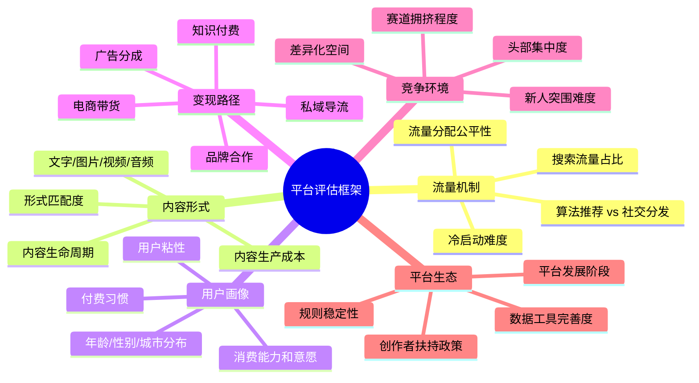
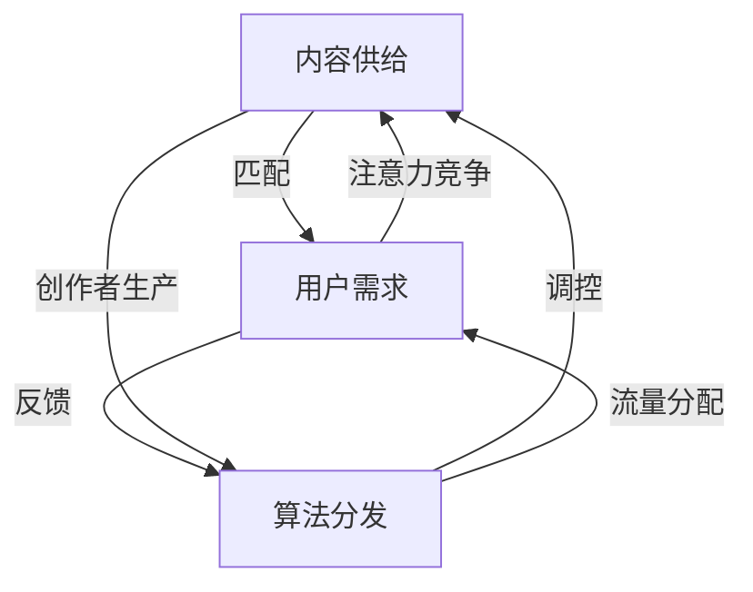
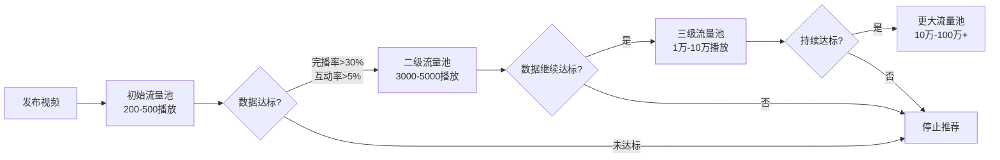
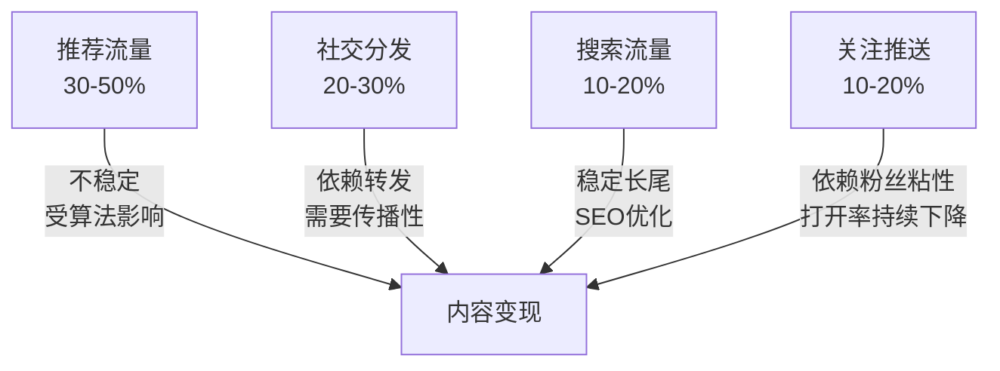
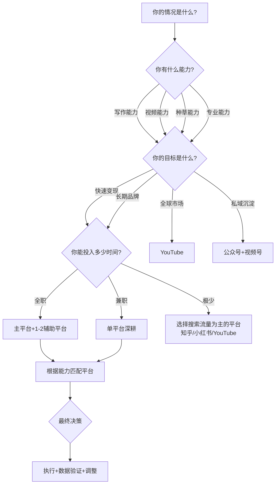
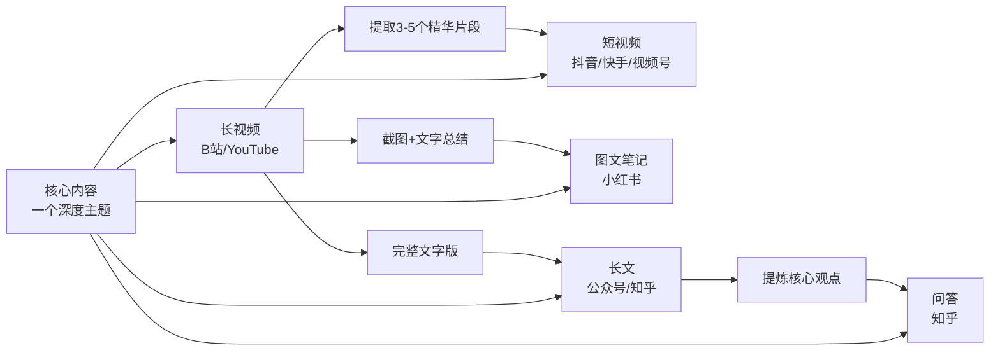

## 四、平台选择逻辑

选择平台不是"哪个火做哪个"，而是一个需要系统分析的战略决策。平台决定了你的内容形式、流量来源、变现路径、天花板高度，甚至决定了你的竞争对手是谁。选错平台的代价不是"少赚一点"，而是整条内容创业路线从根基上就是错的。

本章从底层逻辑出发，帮你建立一套完整的平台评估框架，然后逐一拆解九大主流平台的特性、算法、变现模型和实操策略，最后给出可执行的平台组合与迁移方案。

### 4.1 平台选择的底层逻辑

#### 4.1.1 平台本质：你在谁的"地盘"上做生意

所有内容平台本质上都在做同一件事：**用内容吸引用户注意力，然后把注意力卖给广告主**。创作者是平台的"内容供应商"，平台给你流量分润或直接付费，本质是采购你的内容。

理解这个本质，你就能看清三个关键事实：

**第一，平台和你的利益并不完全一致。** 平台要的是用户时长和活跃度，你要的是变现和粉丝沉淀。当两者冲突时，平台一定优先自己的利益。比如抖音2023年大幅压缩了中视频的流量分成比例，创作者收入直接腰斩，但平台的广告收入反而增长了。这说明什么？平台需要你生产内容，但不保证给你对应的回报。你和平台是"共生但不对等"的关系。

**第二，平台的规则随时可能变。** 你在平台上的所有"资产"——粉丝、播放量、收入——都是租来的，不是买来的。平台一个算法调整，你的流量可能归零。这不是危言耸听，2024年公众号改版推荐算法后，大量依赖搜一搜流量的账号阅读量下降60%以上。2023年B站降低创作激励，激励单价下调约30%，中小UP主收入锐减，引发了一波"停更潮"。

**第三，最终的资产是你自己。** 平台是渠道，不是目的地。真正值钱的是你的内容能力、个人品牌、和私域用户池。所以平台选择的核心目标是：**用最低成本、最快速度建立核心资产，同时降低对单一平台的依赖。**

这三个事实推导出一个核心原则：**平台是你的"杠杆"，不是你的"地基"。** 地基是你自己的能力和用户关系，杠杆帮你放大这些能力的价值。选杠杆的标准是"当前阶段哪个杠杆效率最高"，而不是"哪个杠杆最大"。

#### 4.1.2 平台评估的六个维度

选择平台时，需要从六个维度进行系统评估：

**这六个维度的权重因人而异。** 一个全职妈妈做母婴内容，用户画像和变现路径的权重就特别高；一个程序员做技术分享，内容形式和竞争环境更关键。你需要先明确自己的情况，再给每个维度分配权重。

下面是一个实操性的评估打分模板。每个维度按1-5分打分，乘以你设定的权重，最后加总：

| 评估维度 | 权重(你的) | 抖音 | 小红书 | B站 | 公众号 | 知乎 | YouTube | 快手 | 视频号 | 微博 |
|---------|-----------|------|--------|-----|--------|------|---------|------|--------|------|
| 流量机制 | ___% | 5 | 4 | 4 | 3 | 4 | 5 | 4 | 4 | 3 |
| 内容形式 | ___% | _ | _ | _ | _ | _ | _ | _ | _ | _ |
| 用户画像 | ___% | _ | _ | _ | _ | _ | _ | _ | _ | _ |
| 变现路径 | ___% | _ | _ | _ | _ | _ | _ | _ | _ | _ |
| 竞争环境 | ___% | _ | _ | _ | _ | _ | _ | _ | _ | _ |
| 平台生态 | ___% | _ | _ | _ | _ | _ | _ | _ | _ | _ |
| **加权总分** | **100%** | **_** | **_** | **_** | **_** | **_** | **_** | **_** | **_** | **_** |

> **使用方法：** 第一行的权重数据参考，第二行以后根据你自己的情况打分。内容形式那一行，要评估"你擅长的内容形式与该平台的匹配度"——如果你只会写文章，抖音的内容形式得分就很低；如果你擅长拍视频，公众号的得分就低。

#### 4.1.3 平台生命周期与入场时机

每个平台都有生命周期，入场时机直接影响你的投入产出比：

| 阶段 | 特征 | 创作者机会 | 风险 | 代表时期 |
|------|------|-----------|------|---------|
| 红利期 | 用户暴涨，内容稀缺 | 低门槛高回报，随便发都能火 | 平台规则不成熟，可能突然改规则 | 2018-2019抖音、2020小红书 |
| 成长期 | 用户稳定增长，生态逐步完善 | 仍有红利，但需要差异化 | 竞争加剧，补贴减少 | 2024-2026视频号 |
| 成熟期 | 用户增长放缓，商业化成熟 | 生态稳定，变现路径清晰 | 红利消失，需要专业能力 | 当前抖音、B站 |
| 衰退期 | 用户流失，平台焦虑 | 平台可能推出新功能自救 | 流量下滑，投入打水漂 | 当前微博 |

**关键洞察：** 不要追"最火的平台"，而要追"最适合你且处于成长期的平台"。成熟期平台拼的是硬实力，红利期拼的是速度和运气，成长期才是性价比最高的入场窗口。

**如何判断平台处于哪个阶段？** 看三个信号：
1. **用户增长曲线**：如果身边越来越多人开始用这个平台（尤其是中老年用户），大概率还在成长期。如果用户增长已经靠存量用户活跃度维持，就是成熟期。
2. **创作者补贴力度**：补贴力度越大，平台越需要内容供给，说明还在成长期。补贴缩水意味着平台已经不缺内容了。
3. **商业化密度**：如果平台开始频繁推送广告、加重抽成、推出各种商业化工具，说明平台进入了成熟变现期。

#### 4.1.4 平台的"内容-用户-算法"三角关系

理解一个平台，必须同时理解三个要素及其相互作用：

- **内容供给决定平台调性。** 抖音的短平快内容培养了用户的碎片化消费习惯，反过来要求创作者生产更多短平快内容。这是一个自我强化的循环。
- **用户需求决定内容方向。** 小红书用户来"找答案"，所以攻略、清单、测评类内容天然受欢迎。B站用户来"看深度内容"，所以10分钟以上的解析视频表现好。
- **算法分发决定内容命运。** 算法是平台意志的执行者。抖音强调完播率，所以创作者拼命做短内容、做钩子；B站强调互动深度，所以UP主鼓励投币和弹幕。

**实操意义：** 选择平台时，不仅要问"我的内容适合这个平台吗"，还要问"这个平台的算法会奖励我的内容风格吗"和"这个平台的用户会为我的内容买单吗"。三个问题都回答"是"，才是真正的匹配。

### 4.2 九大主流平台深度拆解

#### 4.2.1 抖音——算法驱动的流量机器

**平台基本面**

抖音是目前中国最大的短视频平台，日活超过7亿。它的核心特点是**强算法推荐**：系统根据用户行为（完播率、点赞、评论、转发、关注）决定是否把你的内容推给更多人。这意味着即使是0粉丝的新号，只要内容足够好，也能获得百万播放。

**流量分配机制**

抖音的流量池机制是理解这个平台的关键：

**关键指标权重（业内共识）：**

| 指标 | 权重 | 说明 |
|------|------|------|
| 完播率 | 最高 | 3秒内必须抓住注意力，前3秒决定生死 |
| 互动率 | 高 | 点赞+评论+收藏/播放量 |
| 转发率 | 中高 | 转发是最高级别的用户认可 |
| 关注转化率 | 中 | 看完视频后关注你的比例 |
| 停留时长 | 中 | 用户在视频页面停留的时间 |

**抖音的三个关键认知：**

**认知一：粉丝量≠播放量。** 抖音是"去粉丝化"最严重的平台。百万粉大号的日常视频可能只有几千播放，而新号的爆款视频可以达到千万播放。这意味着在抖音，**每一条视频都是独立竞争**，你不能靠粉丝存量"躺赢"。

**认知二：抖音的内容消费是"被动"的。** 用户打开抖音是刷推荐页，不是主动搜索。所以抖音的流量本质上是"推"给用户的，不是用户"找"来的。这决定了抖音适合做"吸引眼球"的内容，不适合做"需要被搜索"的内容。

**认知三：抖音的变现效率最高，但流量成本也最高。** 抖音的电商生态是所有平台里最成熟的，直播带货、短视频带货的转化链路最短。但抖音的流量"来得快去得也快"，你需要持续产出内容来维持流量，一旦停更，流量断崖式下跌。

**变现路径拆解**

抖音的变现路径最丰富，但也最依赖持续产出：

- **直播带货**：需要开通商品橱窗（1000粉丝+10条视频），佣金比例通常10%-30%，头部达人可以拿到50%以上。新手建议从精选联盟选品开始，不用自己囤货。直播带货的核心数据是GPM（每千次观看成交金额），行业平均水平约500-2000元，优秀主播可以达到5000元以上。
- **星图广告**：粉丝1万以上可入驻星图，品牌方直接下单。报价公式：粉丝数×0.03-0.1元，垂直领域溢价更高。美妆、母婴、家居类目的报价是泛娱乐类的2-3倍。
- **流量分成**：中视频计划（横屏1分钟以上），每万次播放约1-5元，收入不稳定。2023年调整后分成比例下降了约40%，不再是可靠的收入来源。
- **私域导流**：抖音最忌讳直接引流微信，会限流。正确做法是通过主页、直播间口播、评论区引导关注后再导流。通过企业号认证可以合规地挂联系方式。

**适合谁**

- 有镜头表现力的人（不需要颜值高，但需要有"网感"）
- 能持续产出短视频的人（至少每周3-5条）
- 想做电商变现的人（抖音电商生态最成熟）
- 愿意研究算法、测试内容的人

**不适合谁**

- 不愿露脸、不愿被算法绑架的人
- 做深度长内容的人（抖音用户没耐心看长内容）
- 纯靠内容质量、不愿做运营的人（酒香也怕巷子深）

**实操建议**

1. **前10条视频决定账号命运。** 系统会根据前几条视频的数据判断你的内容质量和领域，给你的账号打上标签。如果前10条数据差，后续推荐会受影响。建议先准备好内容再发布，不要随便发。
2. **发布时间：** 工作日12:00-13:00、18:00-20:00、21:00-23:00；周末全天均可，10:00-12:00效果最好。
3. **追热点但要有自己的角度。** 纯追热点只能获得短期流量，有独特视角的热点解读才能涨粉。
4. **建立内容模板，降低生产成本。** 抖音的高频更新要求你必须有高效的内容生产流程。找到3-5个有效的内容模板（如"痛点开头+解决方案+行动号召"），反复套用迭代。

#### 4.2.2 小红书——种草经济的主场

**平台基本面**

小红书月活超过3亿，核心用户是25-35岁的一二线城市女性。它的内容形态是"图文笔记+短视频"，用户来这里的核心动机是**搜索和种草**——找攻略、找推荐、找灵感。小红书正在从"种草社区"向"生活方式搜索引擎"进化，越来越多用户把小红书当百度用。2025年小红书因TikTok在美国面临禁令，意外登顶美国App Store下载榜，国际化进程加速，但平台战略重心仍在中文内容生态。

**流量分配机制**

小红书的流量来源比例大约是：

- **搜索流量：40%-60%**（这是小红书最大的特点，用户主动搜索的意愿非常强）
- **推荐流量：30%-40%**（首页信息流）
- **关注流量：5%-10%**（已关注账号的新内容）
- **其他：5%**（站外引流、话题页等）

这意味着**SEO优化在小红书极其重要**。一个标题里有没有用户会搜的关键词，可能直接决定这篇笔记是100阅读还是10万阅读。

**小红书与抖音的根本区别：**

| 维度 | 抖音 | 小红书 |
|------|------|--------|
| 内容消费方式 | 被动刷推荐 | 主动搜索+浏览推荐 |
| 流量生命周期 | 短（24-72小时） | 长（优质笔记可持续数月） |
| 用户决策阶段 | 兴趣激发 | 购买决策 |
| 核心内容价值 | 娱乐性/情绪价值 | 实用性/工具价值 |
| 适合的内容类型 | 故事化、冲突感 | 清单化、攻略化 |
| 私域导流难度 | 难（平台严管） | 中等（可通过主页引导） |

**核心算法指标**

| 指标 | 说明 | 优化方向 |
|------|------|---------|
| 点击率 | 封面+标题决定，必须在0.5秒内吸引注意力 | 封面设计、标题党（但不能过度） |
| 互动率 | 收藏>评论>点赞（小红书的互动权重排序） | 内容要有"收藏价值"，比如干货清单、攻略 |
| 笔记质量分 | 系统对内容质量的综合评估 | 原创度、图片质量、文字密度 |
| 账号权重 | 垂直度、更新频率、违规记录 | 保持领域垂直，稳定更新 |

**小红书特有的"CES评分"模型：** CES（Content Engagement Score）= 点赞(1分) + 收藏(1分) + 评论(4分) + 转发(4分) + 关注(8分)。可以看出小红书极度重视"深度互动"——评论和转发的权重远高于点赞，关注的权重最高。这意味着你的内容不仅要让人点赞，更要让人愿意评论、转发、关注。

**变现路径拆解**

- **品牌合作（蒲公英平台）**：粉丝1000以上可入驻。小红书的品牌合作报价是所有平台里最高的，千粉账号单条笔记报价200-500元，万粉账号2000-5000元，垂直领域（母婴、美妆、家居）溢价更高。10万粉的家居博主单条报价可达1-3万元。
- **小红书电商**：开通小红书店铺，笔记中挂商品链接。适合有货源的创作者，佣金比例高。2024年小红书大力推电商闭环，平台内购买转化率持续提升。
- **私域导流**：小红书对私域引流管控严格，但可以通过个人简介、评论区、私信引导。转化率比抖音高，因为小红书用户的信任度更强。
- **知识付费**：适合做教程类内容的创作者，如摄影教程、穿搭课程、护肤知识等。小红书的付费课程功能已经比较成熟。

**适合谁**

- 女性创作者（平台用户80%是女性，女性创作者更容易获得共鸣）
- 擅长图文内容的人（摄影、设计、写作能力至少占一样）
- 做美妆、母婴、家居、穿搭、美食等"生活类"赛道的人
- 想做高客单价变现的人（小红书用户的消费能力远高于抖音）
- 愿意深耕SEO、做"工具型"内容的人

**不适合谁**

- 做硬核技术内容的人（小红书用户不买账）
- 不擅长视觉呈现的人（小红书是"看脸"的平台，封面丑=没流量）
- 想做大规模流量变现的人（小红书的流量天花板比抖音低很多）
- 做B2B企业服务内容的人（小红书用户以C端消费者为主）

**实操建议**

1. **封面是第一生产力。** 小红书是"双列信息流"，用户看到的是封面+标题，点击率完全取决于这两样。花30%的时间做封面，绝对值得。封面建议：清晰的大字标题（至少能在手机上看清）、统一的视觉风格（建立品牌识别）、对比色或高饱和度颜色（在信息流中脱颖而出）。
2. **标题必须包含用户搜索词。** 比如做护肤内容，标题应该包含"油皮""控油""平价护肤"等用户会搜的词。用小红书的搜索下拉词功能来发现用户真实搜索词。
3. **前50个字决定搜索排名。** 小红书的搜索算法会重点分析笔记的前50个字，把核心关键词放进去。
4. **不要刷数据。** 小红书的反作弊系统非常严格，刷赞、刷收藏一旦被检测到，直接限流甚至封号。而且小红书的"收录"机制意味着违规笔记不仅不会被推荐，还可能被从搜索结果中移除。
5. **建立"笔记矩阵"。** 围绕一个核心关键词，写5-10篇不同角度的笔记。比如做"油皮护肤"，可以分别写晨间护肤、晚间护肤、换季护肤、平价好物、避雷清单等。这样在搜索结果中你能占多个位置，大幅提高曝光。

#### 4.2.3 B站——年轻人的深度内容社区

**平台基本面**

B站月活约3.4亿，核心用户是18-35岁的年轻人，学历偏高，消费能力中等但付费意愿强。B站的内容以中长视频为主（5-30分钟），用户来这里是为了**深度学习和娱乐**，不是碎片化消遣。

**B站的独特社区文化：**

B站与其他平台最大的区别在于它的**社区文化**。弹幕系统不仅是互动工具，更形成了独特的"集体观影"体验。B站用户对内容质量的要求极高，对"恰饭"（商业植入）的容忍度却意外地高——前提是内容本身足够好。这种"内容至上"的社区氛围，决定了B站是一个**内容质量驱动**而非**算法驱动**的平台。

**流量分配机制**

B站的流量来源：推荐页约50%，搜索约30%，关注约15%，其他5%。B站的推荐算法有两个关键特点：

**第一，重视"完播率"和"互动深度"。** B站的弹幕文化意味着用户的互动行为非常丰富——发弹幕、投币、收藏、分享，这些都是权重极高的信号。一个有大量弹幕的视频，推荐权重远高于一个只有点赞的视频。

**第二，"一锤定音"机制。** B站的新视频在发布后的24-48小时内会获得一次集中推荐，如果这段时间数据好，后续会有持续推荐；如果数据差，基本就凉了。所以发布时间和封面标题非常重要。

**核心指标权重**

| 指标 | 权重 | 说明 |
|------|------|------|
| 完播率 | 最高 | 5分钟视频完播率>40%算优秀 |
| 投币率 | 高 | 投币是B站特有的"高级互动" |
| 收藏率 | 高 | 说明内容有长期价值 |
| 弹幕密度 | 中高 | 弹幕越多，说明内容越有讨论价值 |
| 三连率 | 中 | 点赞+投币+收藏同时完成 |

**变现路径拆解**

- **创作激励计划**：1000粉+10万播放量可申请，每万次播放约3-10元，收入不高但稳定。
- **花火商单**：粉丝1万以上可入驻花火平台。B站的品牌合作报价中等，万粉账号单条视频报价1000-3000元，科技数码类报价更高。
- **充电计划**：用户可以给你"充电"（打赏），但收入很少，不建议作为主要变现方式。
- **知识付费**：B站的课堂功能，适合做教程类内容。付费课程的转化率取决于你的免费内容是否建立了足够的信任。
- **电商带货**：B站的电商生态不成熟，带货效果远不如抖音。但B站用户对UP主推荐的产品信任度高，适合做"信任电商"而非"冲动消费"。

**适合谁**

- 能做5-20分钟深度内容的人（技术教程、科普、测评、分析类）
- 有专业知识且能讲清楚的人（B站用户对内容质量要求很高）
- 不想露脸也能做的人（B站有大量不露脸的优秀UP主，用画面+配音即可）
- 想做长期品牌价值的人（B站粉丝粘性极高，一个好视频可以持续推荐几年）
- 做科技、游戏、动画、知识类内容的人（B站的核心用户群偏好这些领域）

**不适合谁**

- 想快速变现的人（B站变现效率低，需要长期积累）
- 做短平快内容的人（B站用户对"水视频"零容忍）
- 不愿意花时间打磨内容的人（B站一条视频的制作周期通常是抖音的5-10倍）

**实操建议**

1. **封面决定点击率，前30秒决定完播率。** B站的封面可以在视频中自定义截取，选最有冲击力的一帧。前30秒必须抛出核心价值点，告诉观众"看完这个视频你能得到什么"。
2. **发布时间：** 工作日晚上19:00-21:00，周末上午10:00-12:00。
3. **善用"分P"功能。** 一个系列的内容放在同一个视频的不同P里，可以提高整体完播率和收藏率。
4. **弹幕互动。** 主动在视频中设置"弹幕梗"，引导用户发弹幕，提高互动数据。
5. **不要急于恰饭。** B站用户对早期UP主接广告非常敏感。建议在积累到2-3万粉丝、有了稳定的内容风格之后，再开始接商单。而且商单内容的质量不能低于日常内容，否则会掉粉。

#### 4.2.4 微信公众号——私域流量的基石

**平台基本面**

公众号月活超过8亿（通过微信入口），但活跃创作者数量在下降。公众号的核心价值不在于"获取新流量"，而在于**沉淀私域用户**。一个关注了你公众号的用户，你可以在任何时候给他推送消息，这个触达能力是所有平台里最强的。

**流量分配机制**

2024年改版后，公众号的流量来源发生了根本性变化：

- **推荐流量：30%-50%**（改版后新增，类似头条的算法推荐）
- **社交分发：20%-30%**（朋友圈转发、群分享）
- **搜一搜：10%-20%**（微信内置搜索）
- **关注推送：10%-20%**（已关注用户的推送打开）
- **其他：5%-10%**（看一看、历史文章等）

**关键变化：** 公众号从"订阅制"转向"推荐制"，意味着即使粉丝不多，只要内容好，也能通过推荐获得流量。但同时也意味着老粉丝的打开率在持续下降——2024年公众号平均打开率已降至不到2%。

**公众号的"三层流量结构"：**

**变现路径拆解**

- **流量主广告**：粉丝500以上可开通，文中广告每万次阅读约30-80元，文末广告约10-30元。收入稳定但天花板低。
- **品牌合作（互选平台）**：报价公式约为粉丝数×0.5-2元，垂直领域（金融、科技、教育）溢价极高。10万粉的金融类公众号单篇头条报价可达2-5万元。
- **知识付费**：公众号是做知识付费的最佳平台，因为用户信任度高、支付链路短（微信支付直接跳转）。付费专栏、训练营、社群是最常见的知识付费产品。
- **私域导流**：公众号→微信群→个人号→朋友圈，这是最经典的私域路径。
- **电商变现**：公众号文章嵌入小程序商城，转化率高于其他平台。

**适合谁**

- 有深度写作能力的人（公众号的用户愿意读3000字以上的长文）
- 想做知识付费的人（公众号+小程序是最成熟的变现组合）
- 有私域运营能力的人（公众号是私域的入口和核心）
- 做B端业务的人（公众号是企业内容营销的标配）

**不适合谁**

- 不擅长写作的人（公众号的核心就是文字）
- 想快速涨粉的人（公众号涨粉速度是所有平台里最慢的）
- 没有持续输出能力的人（公众号需要长期稳定更新才能维持权重）

**实操建议**

1. **标题决定打开率，内容决定转发率。** 公众号的标题党时代已经过去，但标题仍然需要足够吸引人。建议用"痛点+解决方案"的结构。
2. **发布时间：** 工作日早上7:00-8:00（通勤阅读）、晚上20:00-22:00（睡前阅读）。
3. **重视"在看"和"转发"。** 这两个行为直接影响推荐流量，比阅读量更重要。在文章末尾设计"转发钩子"——比如"转发给需要的朋友""转发到朋友圈提醒自己"。
4. **长尾价值。** 公众号文章的搜索流量是持续的，一篇好文章可以持续带来流量好几年。因此要重视SEO——标题和正文包含用户可能搜索的关键词。
5. **建立"内容日历"。** 公众号的更新频率不需要很高（每周1-2篇即可），但必须稳定。用内容日历规划选题，避免临时找选题导致质量下降。

#### 4.2.5 知乎——高质量问答社区

**平台基本面**

知乎月活约1亿，核心用户是大学生和职场人士，学历和收入水平在所有内容平台里最高。知乎的内容形态以问答和长文章为主，用户来这里是为了**获取专业知识和深度观点**。

**流量分配机制**

知乎的流量来源：

- **搜索流量：50%-60%**（站内搜索+百度等外部搜索引擎收录）
- **推荐流量：20%-30%**（首页推荐、热榜）
- **关注流量：10%-15%**
- **其他：5%-10%**

知乎是所有平台里**搜索流量占比最高的**，这意味着SEO优化极其关键。而且知乎的内容会被百度等搜索引擎收录，一个知乎回答可以在百度搜索结果里排名靠前，带来持续的外部流量。

**知乎的"回答>文章"策略：**

知乎的核心内容单位是"回答"，不是"文章"。一个问题下面可能有几百个回答，你的回答需要在众多回答中脱颖而出。这意味着：

1. **选对问题比回答质量更重要。** 一个热门问题下的高赞回答，流量远超一篇优质文章。
2. **回答的排序算法**参考权重排序：赞同数 > 评论互动 > 回答者权重 > 回答时效性。但新回答有一个"时效性加权"，刚发布的回答会获得短暂的排名提升。
3. **"盐值"和"创作者等级"**影响你的内容曝光。持续输出高质量回答、保持活跃度、不违规，可以提高账号权重。

**变现路径拆解**

- **知+自选**：官方广告平台，回答中嵌入广告卡片，按点击计费。适合流量大的回答。
- **品牌合作**：通过知乎"芝士平台"接单，报价中等，但用户质量高，转化率好。
- **知乎盐选**：付费专栏和付费咨询，适合有专业知识的人。知乎盐选专栏的分成比例约50%-70%。
- **引流变现**：知乎的用户质量极高，引流到私域后的转化率远高于其他平台。一个知乎万赞回答可能给你带来几百个精准的私域用户。

**适合谁**

- 有专业知识和独特观点的人（知乎用户对"水内容"零容忍）
- 做B端业务或高客单价业务的人（知乎用户的消费能力最强）
- 擅长长文写作的人（知乎回答平均长度1000-3000字）
- 想做SEO获取长尾流量的人（知乎在百度的收录率极高）

**不适合谁**

- 没有专业积累的人（知乎是"专业人设"驱动的平台）
- 做娱乐/生活类内容的人（知乎用户更偏好理性、深度的内容）
- 不愿意长期经营的人（知乎的变现周期长，需要积累大量优质回答）

**实操建议**

1. **回答热门问题比自己写文章效果好10倍。** 知乎的流量大部分来自问题页面，找到热门问题写高质量回答，比自己发文章曝光率高得多。用知乎的"热门问题"和"潜力问题"功能来发现高价值问题。
2. **前200字决定排名。** 知乎的回答排序算法会参考"赞同率"和"互动率"，而用户只看前几行就决定是否点赞。前200字必须有干货——不要用"先说结论"这种废话开头，直接给出最有价值的信息。
3. **善用"谢邀"和专业身份。** 在回答开头表明你的专业背景（如"从业10年的产品经理"），可以显著提高可信度和赞同率。
4. **构建"回答矩阵"。** 围绕你的专业领域，系统性地回答相关问题。知乎的"相关问题推荐"功能会把你的多个回答串联起来，形成流量闭环。
5. **利用知乎的"想法"功能做内容测试。** "想法"是知乎的短内容形态，适合快速测试一个观点是否有共鸣。如果一个"想法"获得了很好的反馈，可以扩展成完整的回答或文章。

#### 4.2.6 快手——下沉市场与信任经济

**平台基本面**

快手日活超过4亿，是仅次于抖音的第二大短视频平台。但快手与抖音有本质区别：**快手更强调"人"而非"内容"。** 抖音的流量分配以内容为核心——好内容可以获得流量，与创作者无关；快手的流量分配更偏向社交关系——你的粉丝能看到你的内容，粉丝的互动会进一步放大传播。

这意味着快手的**粉丝价值远高于抖音**。在快手，10万粉丝的账号每条视频能获得5000-2万播放；在抖音，10万粉丝的账号可能只有500-2000播放。

**流量分配机制**

快手的流量来源：

- **关注流量：30%-40%**（远高于抖音，粉丝能看到你发的内容）
- **推荐流量：30%-40%**（同城、发现页）
- **搜索流量：10%-15%**
- **其他：5%-10%**

快手的算法有一个重要特征：**流量分配的"基尼系数"比抖音低。** 意思是快手的流量分布更均匀——头部创作者不会吃掉所有流量，中小创作者也有机会。这与快手"普惠"的价值观一致。

**快手的用户画像：**

- 一二线城市用户占约45%，三四五线城市占55%（抖音一二线约55%）
- 用户年龄分布更均匀，30岁以上用户占比高于抖音
- 用户消费能力中等偏下，但信任度高，复购率高
- 对"真实感"内容的偏好强于"精致感"

**变现路径拆解**

- **直播电商**：快手的直播电商生态仅次于抖音，但用户更注重性价比。快手的"老铁经济"意味着粉丝对主播的信任度极高，复购率高于抖音。快手小店佣金比例通常5%-20%。
- **磁力引擎（广告）**：品牌合作平台，报价比抖音低约30%-50%，但转化率可能更高（因为用户信任度强）。
- **快手课堂**：知识付费功能，适合做实用技能教学（如种植、养殖、手工、烹饪等）。
- **私域导流**：快手对引流的管控比抖音宽松，可以通过主页和直播间引导。

**适合谁**

- 做下沉市场内容的人（三农、赶海、手工、美食等）
- 擅长直播互动的人（快手的直播生态比抖音更活跃）
- 想做高粉丝粘性账号的人（快手的粉丝价值高于抖音）
- 不追求"精致感"，能展现真实一面的人

**不适合谁**

- 做一二线城市白领内容的人（快手的核心用户不在这里）
- 追求视觉精致度的人（快手用户更喜欢"接地气"的内容）
- 想做高端品牌合作的人（快手的品牌调性偏大众消费）

#### 4.2.7 微信视频号——微信生态的流量新引擎

**平台基本面**

微信视频号是微信生态内的短视频和直播平台，月活超过8亿（依托微信入口），但活跃创作者约2-3亿。视频号的核心优势在于**与微信生态的深度打通**——公众号、小程序、企业微信、朋友圈、微信群全部可以与视频号互导流量，形成完整的"内容-社交-变现"闭环。

视频号目前处于**成长期**，是2024-2026年性价比最高的入场平台之一。平台仍在大力扶持创作者，流量补贴和商业化工具都在快速完善中。

**流量分配机制**

视频号的流量来源与其他短视频平台有本质区别：

- **社交推荐：40%-50%**（朋友点赞、转发、在看的内容会出现在你的推荐流中，这是视频号独有的"社交推荐"机制）
- **算法推荐：25%-35%**（兴趣推荐，类似抖音但权重较低）
- **搜索流量：10%-15%**（微信搜一搜）
- **关注流量：5%-10%**
- **其他：5%**（朋友圈、群分享等）

**社交推荐是视频号的灵魂。** 与其他平台的纯算法推荐不同，视频号的核心分发逻辑是"你的朋友喜欢什么，你大概率也会喜欢"。这意味着：

1. **冷启动更容易。** 只要你的内容在社交圈里获得几个点赞，就会被推荐给这些人的朋友，形成裂变传播。
2. **内容要有"社交货币"属性。** 用户点赞一条视频，他的微信好友都能看到。所以用户更倾向于点赞那些"能展现自己品味"的内容，而不是纯粹娱乐消遣的内容。
3. **熟人社交带来信任背书。** 当用户看到"你的朋友XXX点赞了这条视频"，天然会产生信任感，互动率和转化率都更高。

**核心指标权重**

| 指标 | 权重 | 说明 |
|------|------|------|
| 社交互动（点赞+在看+转发） | 最高 | 触发社交推荐的关键信号 |
| 完播率 | 高 | 与抖音类似，但视频号用户对时长容忍度更高 |
| 评论质量 | 高 | 深度评论比"666"更有价值 |
| 关注转化率 | 中 | 影响后续的私域导流效率 |
| 停留时长 | 中 | 用户在视频上的停留时间 |

**变现路径拆解**

- **视频号小店（电商带货）**：视频号电商正在快速增长，2024年GMV同比增长超过300%。视频号带货的独特优势是"私域信任"——用户通过朋友推荐进入直播间，天然信任度高，转化率高于抖音。佣金比例通常10%-30%，部分品类（如农产品、手工艺品）溢价更高。
- **直播打赏**：视频号直播打赏的分成比例约50%，用户打赏意愿强（因为是微信支付，操作门槛低）。
- **视频号广告分成**：视频号动态中可插入广告，按曝光量分成。门槛较低，100粉即可开通。
- **公众号+小程序导流**：视频号与公众号、小程序的互导是所有平台中最顺畅的。视频号→公众号→小程序商城→成交，链路极短。
- **企业微信私域**：视频号直播间可以直接挂企业微信名片，用户一键添加，私域沉淀效率极高。

**适合谁**

- 有微信私域基础的人（公众号粉丝、微信群成员可以快速导入视频号）
- 做中老年市场的内容创作者（视频号的用户年龄分布比抖音、B站偏大，35岁以上用户占比超过50%）
- 想做私域电商的人（视频号+公众号+小程序+企业微信的组合拳是目前最强的私域变现链路）
- 做本地生活服务的人（视频号的同城推荐+微信群裂变，非常适合本地商家）
- 想在成长期平台抢占红利的人（视频号仍在快速增长期，竞争远不如抖音激烈）

**不适合谁**

- 想做纯娱乐内容的人（视频号用户年龄偏大，对纯娱乐内容的兴趣低于抖音）
- 不想关联微信身份的人（视频号与微信账号绑定，内容会显示在朋友圈）
- 追求极致视觉效果的人（视频号的内容调性偏"真实""温暖"，不追求抖音式的精致剪辑）

**实操建议**

1. **撬动社交推荐是核心。** 发布视频后，第一时间分享到微信群和朋友圈，获取初始的社交互动。前10个点赞可以触发社交推荐裂变。
2. **发布时间：** 工作日7:00-9:00（通勤刷手机）、12:00-13:00（午休）、20:00-22:00（晚间高峰）；周末全天均可。
3. **与公众号联动。** 在公众号文章中嵌入视频号内容，在视频号主页挂公众号链接，双向导流。
4. **直播是视频号变现的核心。** 视频号的直播电商增速远超短视频带货。每周至少2-3次直播，时长1-3小时，可以快速积累私域用户和变现。
5. **内容调性要"温暖"和"真实"。** 视频号用户对"鸡汤""情感""生活感悟"类内容的接受度远高于抖音。不需要花哨的剪辑，真诚的表达更容易打动视频号用户。

#### 4.2.8 微博——舆论场与热点引擎

**平台基本面**

微博月活约5.9亿，但用户活跃度在下降。微博的核心价值是**热点事件的传播速度**——一个话题可以在几小时内引爆全网。但微博的内容生命周期极短，一条微博的热度通常只有几小时到一天。

**流量分配机制**

微博的流量来源以**社交分发和热点分发**为主：

- **热点/话题：40%-50%**（热搜、话题页）
- **社交分发：20%-30%**（关注的人、转发链）
- **推荐流量：15%-20%**
- **搜索：10%-15%**

**变现路径拆解**

- **品牌合作**：微博的品牌合作生态最成熟，但竞争也最激烈。报价公式：粉丝数×0.01-0.05元（远低于小红书）。
- **微博电商**：橱窗功能，但转化率低。
- **引流变现**：微博适合做"人设打造"和"话题营销"，引流到私域后变现。

**适合谁**

- 能快速产出观点类内容的人（微博需要追热点的速度）
- 做娱乐、时事、社会评论等"话题性"内容的人
- 已经有一定粉丝基础的人（微博的马太效应极强，小号很难出头）
- 需要打造公众影响力的人（微博仍是舆论传播的主阵地）

**不适合谁**

- 新手创作者（微博对新手极不友好，没有粉丝基础基本没有流量）
- 做垂直专业内容的人（微博的流量分配偏向泛娱乐和热点）

**实操建议**

1. **蹭热搜要有角度。** 纯粹重复热点观点没有价值，需要从你的专业角度给出独特解读。
2. **微博的评论区比正文更重要。** 很多用户看微博先看评论，你的评论互动质量直接影响传播效果。
3. **超话社区是垂直流量入口。** 如果你的领域有活跃的超话社区，可以在超话里持续输出，积累精准粉丝。

#### 4.2.9 YouTube——全球市场的入场券

**平台基本面**

YouTube月活超过25亿，是全球最大的视频平台。对于想做全球市场的中文创作者，YouTube是唯一的规模化选择。YouTube的核心优势是**广告分成机制成熟、内容生命周期长、用户付费意愿强**。

**流量分配机制**

- **推荐流量：50%-70%**（首页推荐、播放页推荐）
- **搜索流量：20%-30%**（YouTube是全球第二大搜索引擎）
- **订阅流量：10%-15%**
- **其他：5%-10%**

YouTube的推荐算法核心指标是**观看时长（Watch Time）**和**点击率（CTR）**。一个10分钟的视频，如果平均观看时长达到6分钟（60%完播率），系统会认为这是高质量内容，持续推荐。

**YouTube与国内平台的关键差异：**

| 维度 | 国内平台（抖音/B站等） | YouTube |
|------|----------------------|---------|
| 内容生命周期 | 短（天-周级） | 长（月-年级） |
| 收入模式 | 平台补贴+商单为主 | 广告分成为主 |
| 算法权力 | 极大，决定生死 | 大，但搜索流量兜底 |
| 粉丝价值 | 低（除快手外） | 高（订阅有实际触达） |
| 竞争格局 | 国内创作者 | 全球创作者 |
| 变现门槛 | 低（千粉即可） | 高（1000订阅+4000小时） |

**变现路径拆解**

- **广告分成（YPP）**：需要1000订阅+4000小时观看时长才能开通。CPM（每千次展示收入）因地区和领域差异巨大：
  - 金融、科技、商业类：$15-$40 CPM
  - 教育、健康类：$8-$20 CPM
  - 娱乐、游戏类：$2-$8 CPM
  - 中文内容面向全球华人：$5-$15 CPM
- **品牌合作**：YouTube的品牌合作报价是所有平台里最高的，万粉频道单条视频报价$500-$2000。
- **频道会员**：用户按月付费成为会员，YouTube抽成30%。
- **超级留言/超级贴纸**：直播和首映时的打赏功能。
- **YouTube Shorts基金**：短视频的创作者激励，但金额不高。

**适合谁**

- 想做全球市场的创作者
- 能做5-20分钟高质量视频的人
- 有耐心长期积累的人（YouTube的增长曲线比抖音慢，但天花板高得多）
- 想要稳定被动收入的人（YouTube的视频可以持续产生广告收入好几年）

**不适合谁**

- 不会英语或不想做英文内容的人（纯中文内容的YouTube天花板有限）
- 想快速变现的人（达到YPP开通条件通常需要3-6个月）
- 不愿意学习视频制作技能的人（YouTube的竞争比国内平台更激烈）

**实操建议**

1. **SEO是YouTube增长的核心。** 标题、描述、标签必须包含用户搜索的关键词。用TubeBuddy或vidIQ工具做关键词研究。
2. **缩略图（Thumbnail）决定点击率。** 花大量时间优化缩略图，CTR从4%提升到8%意味着流量翻倍。
3. **前30秒决定观看时长。** 必须在前30秒告诉观众"这个视频能给你什么"，否则他们会离开。
4. **发布频率：** 每周1-2条，保持稳定。YouTube算法喜欢稳定的发布节奏。
5. **善用"社区帖子"功能。** 在视频之间用社区帖子保持与订阅者的互动，提高频道活跃度。

### 4.3 平台选择决策框架

#### 4.3.1 三维决策模型

平台选择不是"选一个最好的"，而是"选一个最适合你当前阶段的"。用这个三维模型来决策：

#### 4.3.2 能力-平台匹配矩阵

| 你的核心能力 | 首选平台 | 次选平台 | 变现路径 | 预期回报周期 |
|-------------|---------|---------|---------|------------|
| 写作（深度长文） | 公众号 | 知乎 | 知识付费+品牌合作 | 6-12个月 |
| 写作（短图文） | 小红书 | 微博 | 品牌合作+电商 | 3-6个月 |
| 视频（短内容） | 抖音 | 快手 | 直播带货+广告 | 1-3个月 |
| 视频（中长内容） | B站 | YouTube | 创作激励+品牌合作 | 6-12个月 |
| 视频（全球内容） | YouTube | — | 广告分成+品牌合作 | 6-18个月 |
| 专业知识 | 知乎 | 公众号 | 知识付费+引流 | 3-6个月 |
| 生活种草 | 小红书 | 抖音 | 品牌合作+电商 | 2-4个月 |
| 直播互动 | 抖音 | 快手 | 直播带货+打赏 | 1-3个月 |
| 下沉市场 | 快手 | 抖音 | 直播电商+私域 | 2-4个月 |
| 私域运营 | 视频号 | 公众号 | 私域电商+知识付费 | 3-6个月 |

#### 4.3.3 数据支撑：单平台vs多平台策略

根据2024年各平台创作者生态报告的核心数据：

- **单平台深耕**的创作者在前6个月的粉丝增速是多平台分发者的**2.3倍**——因为精力集中，内容质量更高，平台算法也更认可垂直账号。
- **主平台+1-2个辅助平台**的组合策略，在18个月后总收入高出单平台创作者**40%-60%**——因为多平台覆盖了更多用户群体，且降低了单平台风险。
- **3个以上平台同时运营**的创作者，平均每个平台的内容质量下降**35%**，整体收入反而低于单平台创作者。

**结论：新手先聚焦一个平台突破（3-6个月），稳定后再扩展辅助平台。**

#### 4.3.4 常见场景的平台选择建议

**场景一：我是上班族，每天只有1-2小时做内容。**
→ 选小红书或知乎。这两个平台以搜索流量为主，内容发布后可以持续获得流量，不需要像抖音那样高频更新。小红书适合生活类选题，知乎适合专业类选题。

**场景二：我想全职做内容创业，目标是月入过万。**
→ 选抖音或快手。这两个平台的变现效率最高，直播带货可以在3个月内起步。但需要全身心投入，每天至少4-6小时用于内容创作和运营。

**场景三：我有某个领域的专业知识，想打造个人品牌。**
→ 知乎+公众号组合。知乎用来获取流量和建立专业形象，公众号用来沉淀用户和做知识付费。这个组合的变现效率不是最高的，但品牌价值的积累是最持久的。

**场景四：我想做面向全球华人的内容。**
→ YouTube为主，小红书和抖音为辅。YouTube是全球流量入口，小红书和抖音覆盖国内用户。注意YouTube的内容制作标准更高，需要投入更多时间学习视频制作。

**场景五：我有产品/货源，想通过内容带货。**
→ 抖音为主，小红书为辅。抖音的电商生态最成熟，小红书的种草转化率最高。先在抖音跑通带货模型，再在小红书做口碑种草。

**场景六：我想做私域变现，已有微信社群基础。**
→ 视频号为主，公众号为辅。视频号与微信生态无缝打通，公众号做深度内容沉淀，视频号做短视频和直播获取新用户。这是目前私域变现效率最高的组合。

**场景七：我是中老年人/面向中老年群体。**
→ 视频号是首选。视频号的35岁以上用户占比超过50%，且中老年用户的社交分享意愿极强，一条好内容可以通过微信群裂变获得大量曝光。快手的中老年用户比例也较高，可以作为辅助平台。

### 4.4 内容适配与跨平台分发策略

#### 4.4.1 内容复用的正确姿势

跨平台分发不是"把同一个内容复制粘贴到所有平台"，而是**把一个核心内容改造成适合不同平台的形式**：

**内容复用的三个原则：**

1. **形式适配，不是内容复制。** 同一个主题，在B站是一个10分钟的深度视频，在抖音是3个30秒的精华片段，在小红书是一张信息图+500字说明，在知乎是一个2000字的专业回答。
2. **首发平台的内容是最完整的版本。** 辅助平台的内容是从完整版本中"提取"出来的，不是反过来。这样能保证每个平台的内容都是精炼的、有吸引力的。
3. **不要在所有平台发布完全相同的内容。** 平台的查重算法会检测跨平台搬运，完全相同的内容可能导致限流。至少要调整标题、开头、排版。

#### 4.4.2 各平台内容适配规则

| 原始形式 | 目标平台 | 适配方式 | 关键调整 |
|---------|---------|---------|---------|
| 长视频(10min+) | 抖音 | 提取3-5个精华片段，每个15-60秒 | 加字幕、加BGM、前3秒要有钩子 |
| 长视频 | 小红书 | 截取关键画面做图文笔记 | 封面要精致、文字要精简、加标签 |
| 文章(3000字+) | 小红书 | 精简到500-800字+配图 | 分段、加emoji、用清单体 |
| 文章 | B站/YouTube | 口播+画面 | 语速适中、画面丰富、加字幕 |
| 直播回放 | 抖音/B站 | 剪辑精华片段 | 去掉废话、保留高潮、加标题卡 |
| 知乎回答 | 公众号 | 扩展成完整文章 | 加引言、加案例、加总结 |
| 朋友圈图文 | 小红书 | 美化图片+优化标题 | 提升图片质量、加搜索关键词 |
| 短视频 | 视频号 | 直接发布+调整比例 | 加引导语、挂公众号链接 |

#### 4.4.3 跨平台分发的时间策略

不要同时发布所有平台。正确的策略是**错峰发布，根据平台特性安排时间**：

1. **首发平台**（你的主平台）：在最佳时间发布
2. **次发平台**（辅助平台）：首发后2-4小时发布，内容已根据首发数据做了微调
3. **三发平台**（补充平台）：次日后发布，可能根据前两个平台的反馈做了进一步优化

**示例：** 如果你的主平台是B站，周二晚上19:00发布视频 → 周三上午10:00把精华片段发抖音 → 周三下午14:00把图文版发小红书 → 周四把完整文字版发公众号。

**为什么错峰发布？**
- 同一内容在不同平台的"保鲜期"不同，错峰发布可以最大化每个平台的曝光窗口
- 首发平台的数据可以帮你优化辅助平台的标题、封面、内容
- 避免平台查重算法判定为"搬运"

#### 4.4.4 跨平台分发的工具链

| 工具 | 功能 | 适用场景 | 费用 |
|------|------|---------|------|
| 蚁小二 | 一键多平台发布 | 文字/图文内容分发 | 免费基础版/付费专业版 |
| 融媒宝 | 视频多平台分发 | 视频内容分发 | 免费基础版 |
| Notion/飞书 | 内容日历管理 | 规划跨平台发布节奏 | 免费 |
| Canva/稿定设计 | 跨平台封面适配 | 不同尺寸的封面制作 | 免费基础版 |
| 剪映 | 视频剪辑+字幕 | 视频内容二次加工 | 免费 |
| 新榜/蝉妈妈 | 数据监控 | 追踪跨平台数据表现 | 免费基础版/付费专业版 |

### 4.5 AI时代的平台内容创作变革

#### 4.5.1 AI工具对各平台的影响

2024-2025年，AI内容生成工具（ChatGPT、Claude、Midjourney、剪映AI、可灵等）的普及，正在从根本上改变各平台的内容生态。理解这种变化，对于平台选择和内容策略至关重要。

**AI对各平台的差异化影响：**

| 平台 | AI影响程度 | 具体表现 | 创作者应对策略 |
|------|-----------|---------|--------------|
| 抖音 | 高 | AI生成视频数量激增，同质化严重 | 强化个人IP和真实感，AI辅助而非替代 |
| 小红书 | 高 | AI生成图文笔记泛滥，平台加强审核 | 突出真实体验和原创图片，AI只做文字辅助 |
| B站 | 中 | AI辅助脚本和剪辑增多，但观众对AI敏感 | AI做效率工具，内容必须有个人深度见解 |
| 公众号 | 中高 | AI写作降低了内容生产门槛 | 深度观点和原创数据是AI无法替代的壁垒 |
| 知乎 | 中 | AI回答泛滥，但高赞回答仍需专业深度 | 强化个人专业背景和真实案例 |
| 视频号 | 低-中 | AI影响相对较小，用户更看重真实感 | 保持真实表达，用AI提升制作效率 |
| YouTube | 高 | AI生成内容增多，但平台开始标注AI内容 | 高质量原创+AI辅助制作，透明标注AI使用 |
| 快手 | 低 | 用户对AI不敏感，更看重"人味" | 继续做真实内容，AI辅助脚本和选题 |

**AI时代的核心认知：**

AI降低了内容生产的"技术门槛"，但提高了内容竞争的"质量门槛"。当所有人都能用AI快速生产"还行"的内容时，"真正好"的内容变得更稀缺、更值钱。AI是效率工具，不是内容替代品。你的核心竞争力——独特视角、真实经验、人格魅力、专业深度——是AI无法复制的。

#### 4.5.2 AI辅助内容创作的正确姿势

**可以用AI做的事：**
- 选题研究和热点追踪（用AI分析平台热榜、搜索趋势）
- 内容框架搭建（用AI生成大纲，自己填充细节和案例）
- 文案优化（用AI润色标题、优化SEO关键词）
- 素材收集和整理（用AI搜索相关数据、案例、图片素材）
- 字幕生成和翻译（用AI自动生成字幕，翻译多语言版本）
- 数据分析（用AI分析平台数据，发现内容优化方向）

**不应该用AI做的事：**
- 完全替代写作（AI生成的文章缺乏个人风格和真实体验）
- 生成虚假案例和数据（平台审核越来越严格，用户也越来越敏感）
- 批量生产低质量内容（平台算法正在加强对AI水文的识别和惩罚）
- 替代真人出镜和互动（观众能分辨AI生成的虚拟人和真人）

#### 4.5.3 各平台对AI内容的态度

各平台对AI生成内容的态度正在快速收紧：

- **抖音/快手**：要求标注AI生成内容，AI生成的虚拟人需要注册备案
- **小红书**：加强AI内容识别，AI生成笔记的推荐权重明显低于原创笔记
- **B站**：用户社区对AI内容的容忍度低，AI配音和AI画面容易被弹幕"审判"
- **知乎**：开始标注AI辅助回答，AI回答的排序权重低于人工回答
- **YouTube**：要求标注AI生成的"逼真内容"，AI内容审核趋严
- **公众号**：暂无明确政策，但AI水文的阅读量持续走低

**结论：AI是你的"助手"，不是你的"替身"。用AI提升效率，但内容的核心必须是你自己的思考、经验和人格。**

### 4.6 赛道与平台的深度匹配

#### 4.6.1 各赛道的最优平台组合

不同的内容赛道，最优的平台组合差异巨大。以下是常见赛道的平台选择建议：

| 赛道 | 第一平台 | 第二平台 | 第三平台 | 核心逻辑 |
|------|---------|---------|---------|---------|
| 美妆护肤 | 小红书 | 抖音 | B站 | 小红书种草→抖音转化→B站深度测评 |
| 母婴育儿 | 小红书 | 视频号 | 抖音 | 小红书攻略→视频号私域→抖音短视频 |
| 科技数码 | B站 | YouTube | 知乎 | B站深度测评→YouTube全球→知乎问答 |
| 职场成长 | 公众号 | 知乎 | 小红书 | 公众号深度文→知乎专业回答→小红书干货图 |
| 金融理财 | 知乎 | 公众号 | 抖音 | 知乎专业形象→公众号深度内容→抖音引流 |
| 美食烹饪 | 抖音 | 小红书 | 快手 | 抖音爆款→小红书图文教程→快手信任变现 |
| 健身运动 | 抖音 | 小红书 | B站 | 抖音跟练→小红书攻略→B站系统教程 |
| 三农乡村 | 快手 | 抖音 | 视频号 | 快手老铁经济→抖音破圈→视频号私域 |
| 企业服务B端 | 公众号 | 知乎 | LinkedIn | 公众号案例→知乎专业→LinkedIn国际 |
| 旅行探店 | 小红书 | 抖音 | 视频号 | 小红书攻略→抖音短视频→视频号本地推荐 |
| 设计创意 | 小红书 | B站 | Instagram | 小红书展示→B站教程→Instagram国际 |
| 法律咨询 | 知乎 | 公众号 | 抖音 | 知乎专业回答→公众号深度文→抖音科普 |

#### 4.6.2 赛道竞争度与蓝海机会

**2025年各平台的红海赛道（竞争激烈，新手慎入）：**
- 抖音：美妆、美食、情感、搞笑、知识科普
- 小红书：美妆、穿搭、探店、旅行
- B站：游戏、动漫、科技评测
- 知乎：职场、情感、编程

**2025年各平台的蓝海赛道（竞争较小，机会较大）：**
- 抖音：银发经济、心理健康、法律科普、农业技术
- 小红书：男性消费、宠物医疗、家庭教育、理财入门
- B站：AI工具教程、中小企业管理、传统手工艺
- 视频号：中老年健康管理、本地生活服务、亲子教育
- 知乎：新能源、半导体、生物医药、出海策略

**如何发现蓝海机会？**
1. **搜索量大但优质内容少的关键词。** 用平台的搜索功能，输入一个关键词，如果搜索结果中大部分内容质量不高，说明有蓝海机会。
2. **用户需求明确但供给不足的领域。** 关注评论区的高频问题，如果很多人在问同一个问题但没有好答案，那就是机会。
3. **新兴行业/趋势的早期。** AI、新能源、出海、银发经济等领域正在快速增长，内容供给远跟不上用户需求。

### 4.7 平台风险评估与避坑指南

#### 4.7.1 单一平台依赖的风险

把所有鸡蛋放在一个篮子里是内容创业最大的风险。以下是真实发生过的案例：

- **2023年抖音中视频计划调整**：大量依赖流量分成的创作者收入直接腰斩，有些人的月收入从5万降到1万以下。
- **2024年公众号推荐算法改版**：依赖搜一搜流量的账号阅读量下降60%以上，有些教育类大号直接停更。
- **2023年B站降低创作激励**：激励单价下调约30%，中小UP主收入锐减，引发了一波"停更潮"。
- **2024年小红书加强商业化**：品牌合作的抽成比例提高，部分创作者的实际到手收入下降20%。
- **2025年多个平台同步收紧引流规则**：私域导流难度加大，依赖私域变现的创作者需要重新调整策略。

**教训：** 永远不要100%依赖单一平台的单一收入来源。至少做到"一个主平台+一个辅助平台+一个私域池"的三层防护。

#### 4.7.2 常见平台选择误区

**误区一：只看平台用户量，不看用户匹配度。** 抖音日活7亿，但如果你做的是B2B企业服务内容，抖音的用户根本不是你的目标客户。知乎虽然只有1亿月活，但用户质量远高于抖音，转化率可能是抖音的10倍。平台的总用户数是"虚荣指标"，你的目标用户在这个平台上的浓度才是关键指标。

**误区二：追新平台，忽略成熟平台。** 每隔一段时间就有"新平台"出现（比如曾经的微头条、绿洲等），90%的新平台最终都会失败。在新平台上投入大量时间，大概率是浪费。除非你有明确的信息判断这个新平台会成功——比如微信视频号，因为有微信生态的加持，成功的概率远高于独立新平台。

**误区三：认为"我朋友在XX平台做得好，我也应该做"。** 每个人的能力、资源、赛道都不同，别人成功不代表你也能成功。要基于自己的情况做决策，不是跟风。正确的做法是分析朋友成功的**原因**——是因为平台红利？还是因为他的内容能力？如果是因为平台红利，你去的时候红利可能已经消失了。

**误区四：同时运营5个以上平台。** 精力分散的结果是每个平台都做不好。同时运营3个以上平台的创作者，平均每个平台的内容质量下降35%。平台运营不是"发了就行"，每个平台都有自己的内容调性、用户习惯、算法逻辑，需要针对性地优化。

**误区五：只关注流量，不关注变现效率。** 10万抖音粉丝的变现能力可能不如1万小红书粉丝。要算"单粉价值"，而不是只看粉丝数。单粉价值 = 月收入 ÷ 总粉丝数。小红书的单粉价值通常是抖音的3-5倍。

**误区六：忽视平台的"隐性成本"。** 每个平台都有隐性成本：抖音需要不断追热点和测试内容，时间成本极高；B站一条视频的制作周期是抖音的5-10倍；小红书需要持续做精美的封面和图片；知乎需要在专业深度上持续投入。选择平台时，要把这些隐性成本算进去。

**误区七：忽视视频号的增长潜力。** 很多创作者在2025年仍然只盯着抖音和小红书，忽略了视频号。视频号依托微信12亿用户的流量池，正处于成长期，竞争远不如抖音激烈，且与微信私域的打通程度是其他平台无法比拟的。对于做私域变现、中老年市场、本地服务的创作者，视频号可能是性价比最高的选择。

#### 4.7.3 平台封号/限流的常见原因

| 违规类型 | 具体行为 | 后果 | 预防措施 |
|---------|---------|------|---------|
| 引流违规 | 直接在内容中放微信号、二维码 | 限流/封号 | 用平台允许的方式引导（如主页、私信） |
| 内容违规 | 虚假宣传、低俗内容、敏感话题 | 删除+限流 | 仔细阅读平台社区规范 |
| 刷量违规 | 买粉、买赞、买播放量 | 限流/封号 | 不要刷任何数据 |
| 搬运违规 | 直接搬运他人内容 | 删除+降权 | 必须原创或获得授权 |
| 频繁违规 | 短时间内大量发布、大量互动 | 限流 | 控制发布频率，互动要自然 |
| 广告违规 | 未报备的商业内容 | 删除+限流 | 通过官方渠道接商业合作 |
| 账号异常 | 频繁切换IP、多设备登录 | 验证/封号 | 一机一号，固定网络环境 |
| AI内容违规 | AI生成内容未标注 | 限流/删除 | 按平台要求标注AI辅助 |

**账号被限流后的急救措施：**

1. **立即停止发布新内容**，等待3-7天让系统"冷静"。
2. **检查最近发布的内容**，删除可能违规的内容。
3. **检查账号状态**（各平台都有账号安全中心），查看是否有违规记录。
4. **恢复发布后，前3-5条内容要高质量、纯原创、无任何营销信息。**
5. **如果7天后仍然限流，考虑是否需要注销重建账号。** 有时候一个被"打标"的账号，恢复的代价远高于重新开始。

### 4.8 创作者工具与基础设施

#### 4.8.1 内容创作工具链

无论选择哪个平台，一套高效的创作工具链都是必须的：

**视频制作：**
- **剪映**：国内最主流的免费视频剪辑工具，支持自动字幕、AI脚本、模板套用。适合抖音、快手、视频号的内容制作。
- **Final Cut Pro / DaVinci Resolve**：专业级视频剪辑，适合B站和YouTube的高质量视频制作。
- **OBS Studio**：免费开源的直播和录屏工具，适合游戏直播和教程录制。
- **Canva / 稿定设计**：快速制作封面、图文、信息图。小红书和公众号的必备工具。

**写作与排版：**
- **Notion / 飞书文档**：内容日历管理和协作写作。
- **秀米 / 135编辑器**：公众号排版工具，让文章视觉效果更好。
- **Markdown编辑器**（Typora、Obsidian）：适合知乎和B站专栏的写作。

**数据分析：**
- **新榜**：跨平台内容数据监控，适合跟踪竞品和行业趋势。
- **蝉妈妈/飞瓜**：抖音和快手的数据分析工具，适合电商带货选品。
- **TubeBuddy / vidIQ**：YouTube的SEO和数据分析工具。
- **千瓜数据**：小红书的数据分析工具，适合品牌合作和选题研究。

**效率工具：**
- **蚁小二/融媒宝**：多平台一键分发，节省重复发布的时间。
- **石墨文档/腾讯文档**：团队协作和内容审核。
- **Todoist / 飞书多维表格**：任务管理和进度追踪。

#### 4.8.2 各平台的内容生产成本对比

在选择平台时，必须把内容生产的时间和金钱成本算进去：

| 平台 | 单条内容制作时间 | 设备要求 | 辅助工具成本 | 总体成本评级 |
|------|----------------|---------|------------|------------|
| 抖音 | 1-3小时 | 手机即可，进阶需稳定器+灯光 | 低（剪映免费） | ★★☆☆☆ |
| 小红书 | 1-2小时 | 手机拍摄+修图 | 低-中（Canva免费/付费） | ★★☆☆☆ |
| B站 | 5-15小时 | 电脑+麦克风+录屏/相机 | 中（剪辑软件+素材） | ★★★★☆ |
| 公众号 | 3-8小时 | 电脑 | 低（排版工具免费） | ★★★☆☆ |
| 知乎 | 1-3小时 | 电脑 | 极低 | ★☆☆☆☆ |
| 快手 | 1-2小时 | 手机即可 | 低 | ★★☆☆☆ |
| 视频号 | 1-3小时 | 手机即可 | 低 | ★★☆☆☆ |
| YouTube | 8-20小时 | 电脑+相机+麦克风+灯光 | 高（专业剪辑+SEO工具） | ★★★★★ |
| 微博 | 0.5-1小时 | 手机即可 | 极低 | ★☆☆☆☆ |

### 4.9 法律、税务与财务规划

#### 4.9.1 内容创作者的法律风险

多平台运营的创作者需要了解以下法律风险：

**知识产权风险：**
- 使用他人的音乐、图片、视频素材可能构成侵权。各平台都有版权检测系统，被检测到会被删除内容甚至封号。
- 解决方案：使用平台自带的版权素材库（如剪映的音乐库）、购买正版素材（如Shutterstock）、或使用CC0协议的免费素材。

**广告合规风险：**
- 《广告法》规定，广告必须标注"广告"字样，不得使用"最""第一"等极限词。
- 品牌合作内容必须通过平台官方渠道报备（如抖音星图、小红书蒲公英），否则属于违规。
- 保健品、药品、金融产品等领域有特殊广告限制，违反可能面临行政处罚。

**个人信息保护风险：**
- 在内容中泄露他人个人信息（如姓名、照片、联系方式）可能违反《个人信息保护法》。
- 直播中拍摄到路人需要打码处理。

**税务风险：**
- 内容创作收入需要依法纳税。平台代扣代缴的只是部分税款，品牌合作、私域收入等需要自行申报。
- 年收入超过一定金额需要开具发票，建议注册个体工商户或公司，享受小规模纳税人优惠政策。

#### 4.9.2 多平台收入的税务处理

**个人创作者的税务结构：**

| 收入类型 | 税务处理 | 税率 | 优化建议 |
|---------|---------|------|---------|
| 平台流量分成 | 平台代扣劳务报酬税 | 20%-40% | 年收入较高时考虑注册个体户 |
| 品牌合作收入 | 需自行申报 | 20%-40% | 通过平台官方渠道接单，平台代扣 |
| 电商带货收入 | 平台代扣/自行申报 | 取决于经营模式 | 注册个体户，享受小规模纳税人优惠 |
| 知识付费收入 | 自行申报 | 20%-40%或经营所得 | 注册公司或个体户，税率可降至5%-10% |
| 私域收入 | 自行申报 | 取决于收入类型 | 建议注册个体户，合规经营 |

**优化建议：**
1. **年收入超过10万元时**，建议注册个体工商户，可以享受小规模纳税人增值税免征（月收入10万以下免征），所得税按经营所得计算，综合税率可降至5%-10%。
2. **年收入超过50万元时**，建议咨询专业税务顾问，考虑注册公司，享受更多税收优惠政策。
3. **保留所有收入凭证和成本凭证**，包括平台收入截图、合同、发票、设备采购发票等，用于税务申报和成本抵扣。

#### 4.9.3 创作者财务管理框架

多平台收入的创作者需要一套清晰的财务管理框架：

**收入分类追踪：**
- 按平台分类：抖音收入、小红书收入、B站收入、公众号收入、私域收入
- 按类型分类：广告分成、品牌合作、电商带货、知识付费、打赏
- 按时间分类：月度收入趋势、季度对比、年度汇总

**成本核算：**
- 直接成本：设备采购、素材购买、工具订阅、外包费用
- 间接成本：时间成本（按你的时薪计算）、学习成本、试错成本
- 税务成本：预估每月需要缴纳的税款，提前准备

**ROI评估：**
- 每个平台的投入产出比 = 该平台月收入 ÷ 该平台月投入时间
- 每种变现方式的ROI = 该方式月收入 ÷ 该方式月投入时间
- 定期评估（至少每季度一次），把资源从低ROI的平台/方式转移到高ROI的平台/方式

### 4.10 进阶：平台矩阵策略

#### 4.10.1 最优平台组合推荐

根据不同的业务类型，推荐以下平台组合：

| 业务类型 | 主平台 | 辅助平台 | 私域平台 | 策略逻辑 |
|---------|-------|---------|---------|---------|
| 电商带货 | 抖音 | 小红书+视频号 | 公众号+微信群 | 抖音获取流量，小红书种草，私域复购 |
| 知识付费 | 公众号 | 知乎+B站 | 微信群+小程序 | 知乎引流，B站建立信任，公众号转化 |
| 品牌合作 | 小红书 | 抖音+B站 | 公众号 | 小红书高报价，抖音扩大影响力 |
| B端服务 | 公众号 | 知乎+LinkedIn | 微信+企业微信 | 知乎建立专业形象，公众号深度内容 |
| 全球市场 | YouTube | TikTok | 邮件列表 | YouTube长尾流量，TikTok快速曝光 |
| 个人IP | 抖音/B站 | 小红书+知乎 | 公众号 | 视频建立IP，图文扩展覆盖面 |
| 私域电商 | 视频号 | 小红书+抖音 | 公众号+企微 | 视频号裂变，私域复购，长期LTV最大化 |
| 本地服务 | 视频号+抖音 | 小红书 | 微信群 | 同城推荐+私域运营，服务本地客户 |

#### 4.10.2 从0到1的平台启动路径

**第1-2周：调研期**

- 选定1个主平台，深入研究该平台的头部创作者（至少看100个同类账号）
- 分析他们的内容形式、发布频率、互动方式、变现路径
- 确定自己的差异化定位
- 建立竞品分析表格，记录每个对标账号的粉丝量、更新频率、爆款内容特征

**第3-4周：准备期**

- 注册账号，完善个人资料（头像、简介、背景图）
- 准备10-20条内容的选题和素材
- 学习平台的基础操作（发布、标签、话题等）
- 制作3-5条"储备内容"，确保质量过关再发布

**第5-8周：测试期**

- 每周发布3-5条内容，测试不同的内容形式和选题方向
- 密切关注数据（阅读量、互动率、涨粉速度）
- 找到数据最好的内容方向，加大投入
- 建立数据追踪表格，每周复盘

**第9-12周：加速期**

- 聚焦数据最好的内容方向，提高产出质量和频率
- 开始与其他创作者互动，建立关系
- 尝试第一次变现（接广告、开直播、卖课程等）
- 建立标准化的内容生产流程（SOP）

**第13周以后：扩展期**

- 主平台数据稳定后，开始运营辅助平台
- 将主平台的内容适配到辅助平台
- 建立私域用户池（微信群、公众号、邮件列表）
- 探索更多变现路径，构建收入多元化

#### 4.10.3 平台迁移策略

当你需要从一个平台迁移到另一个平台时（比如从微博迁移到小红书），正确的做法是：

1. **不要突然停止旧平台。** 旧平台仍然有存量用户，突然停更会失去他们。
2. **在旧平台引导用户到新平台。** 发布一条"搬家通知"，告诉粉丝你将在新平台持续更新。
3. **在新平台用旧平台的内容做冷启动。** 把旧平台的优质内容重新加工后发到新平台，快速积累初始内容。
4. **设定3个月的过渡期。** 旧平台降低更新频率（从每天1条降到每周2条），新平台逐步提高更新频率。
5. **3个月后评估。** 如果新平台数据好于旧平台，可以完全迁移；如果不如预期，保持双平台运营。

### 4.11 平台数据监控与决策调整

#### 4.11.1 关键指标追踪表

每个平台都需要追踪以下核心指标，建议每周做一次数据复盘：

| 指标 | 计算方式 | 健康值 | 预警值 | 说明 |
|------|---------|--------|--------|------|
| 内容发布频率 | 本周发布条数 | ≥3条/周 | <1条/周 | 稳定更新是算法认可的基础 |
| 单条平均阅读/播放 | 总阅读/发布条数 | 持续上升 | 连续3周下降 | 反映内容质量和算法推荐 |
| 互动率 | 互动数/阅读数 | >3% | <1% | 反映内容对用户的吸引力 |
| 涨粉率 | 新增粉丝/总粉丝 | >2% | <0.5% | 反映账号增长健康度 |
| 单粉价值 | 月收入/总粉丝数 | 持续上升 | 0或下降 | 反映变现效率 |
| 内容爆款率 | 爆款数/总发布数 | >10% | <2% | 反映内容选题能力 |

**数据复盘模板：**

每周日花30分钟做一次数据复盘，回答以下问题：

1. 本周哪条内容数据最好？为什么？（封面？标题？选题？发布时间？）
2. 本周哪条内容数据最差？为什么？
3. 本周的平均数据相比上周是上升还是下降？原因是什么？
4. 有没有收到用户的正面/负面反馈？
5. 下周的内容计划是什么？基于本周数据做了什么调整？

#### 4.11.2 何时调整策略

- **连续3周核心指标下降** → 分析原因（内容质量？算法变化？竞争加剧？），调整内容方向
- **单平台增长停滞超过2个月** → 考虑开辅助平台或切换内容形式
- **平台政策重大变化** → 评估影响，必要时调整变现路径或转平台
- **发现新的蓝海机会** → 快速测试，如果数据好就加大投入
- **变现效率持续低于预期** → 重新评估平台选择，可能需要切换变现模式或平台

#### 4.11.3 平台选择的"退出标准"

不是所有平台都值得长期投入。当以下情况出现时，你应该考虑减少投入或退出该平台：

1. **投入产出比持续不合理。** 如果你在一个平台上每月投入40小时，但月收入不到500元，而另一个平台可能用同样的时间获得5倍回报，就应该考虑切换。
2. **平台生态恶化。** 如果平台开始大量推送低质量内容、创作者流失严重、商业化过度挤压内容空间，说明平台在走下坡路。
3. **你的内容与平台调性不匹配。** 有时候试了2-3个月发现你的内容确实不适合这个平台，及时止损比坚持更明智。
4. **有更好的机会出现。** 新平台的红利期、新功能的扶持期，都是值得抓住的机会窗口。

### 4.12 总结：平台选择的核心心法

平台选择的本质是**资源分配问题**——你的时间、精力、能力都是有限资源，需要分配到回报最高的地方。

**记住六条核心心法：**

1. **匹配优先于热度。** 最火的平台不一定最适合你，最适合你的平台才是最好的选择。
2. **聚焦优先于分散。** 先在一个平台站稳脚跟，再考虑扩展。贪多嚼不烂。
3. **长期优先于短期。** 不要只看眼前的流量和收入，要考虑平台的成长性和你的内容资产积累。
4. **数据优先于感觉。** 不要凭感觉判断平台好不好，用数据说话。定期复盘，及时调整。
5. **独立优先于依赖。** 无论在哪个平台运营，最终目标都是建立不依赖任何单一平台的核心资产——你的内容能力、个人品牌、和私域用户池。
6. **效率优先于完美。** AI时代，用工具提升效率，但保持内容的核心竞争力。不要为了完美而拖延发布，也不要为了效率而牺牲质量。

平台在变，算法在变，用户在变。唯一不变的是：**好内容永远有价值，独立资产永远比平台资产更安全。** 选对平台是起点，做好内容是根本，建立资产是终局。
