## 五、内容创作的方法论

定位清晰、平台选对之后，下一个核心问题是：**如何系统地生产出高质量内容？** 大多数创作者的失败不是因为没想法，而是没有一套可复用、可迭代的方法论。靠灵感创作的人，状态好时出爆款，状态差时交白卷；靠方法论创作的人，永远能稳定产出80分以上的内容。

内容创作方法论解决的是三个根本问题：**选什么题**、**怎么组织**、**如何生产**。但这三个问题背后，还有一个更深层的问题：**如何让内容产生持续的复利效应**。本节从选题、结构、生产、迭代、复利五个维度出发，给出一套完整的、可直接执行的系统框架。

```mermaid
graph TD
    A[内容创作方法论体系] --> B[选题方法论<br>解决"说什么"]
    A --> C[结构方法论<br>解决"怎么说"]
    A --> D[生产方法论<br>解决"怎么做"]
    A --> E[迭代方法论<br>解决"怎么优化"]
    A --> F[复利方法论<br>解决"怎么复用"]
    
    B --> B0[需求匹配原理]
    B --> B1[四大选题来源]
    B --> B2[RAPID评估模型]
    B --> B3[内容日历排期]
    
    C --> C0[认知负荷理论]
    C --> C1[六种经典结构]
    C --> C2[开头设计五模式]
    C --> C3[CTA结尾设计]
    
    D --> D0[生产全流程]
    D --> D1[素材管理系统]
    D --> D2[批量创作法]
    D --> D3[标题+封面优化]
    D --> D4[AI辅助创作]
    
    E --> E0[数据指标体系]
    E --> E1[三步复盘法]
    E --> E2[四个优化杠杆]
    E --> E3[A/B测试实操]
    
    F --> F0[一鱼多吃矩阵]
    F --> F1[内容资产化]
    F --> F2[长尾流量优化]
```

---

### 5.1 选题方法论：内容创作的源头

#### 5.1.1 选题的本质：需求匹配

选题不是"我想写什么"，而是"用户需要什么"。一个好选题的本质是：**你的能力与用户需求之间的交集**。

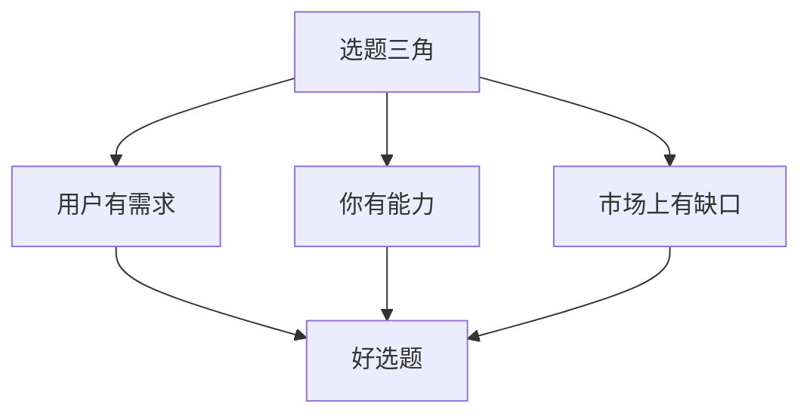

三个条件缺一不可：
- 用户有需求、市场有缺口，但你没有能力——做出来的东西质量不行，浪费时间
- 你有能力、市场有缺口，但用户没需求——精心做了无人问津
- 用户有需求、你有能力，但市场已饱和——需要找到差异化的切入角度

**选题的底层心理学**：所有好选题都在触发用户的五种核心动机之一——

| 动机类型 | 用户心理 | 选题方向 | 典型标题模式 |
|---------|---------|---------|------------|
| **解决问题** | "我遇到了麻烦，需要解决方案" | 教程、攻略、避坑指南 | "XX怎么办？3步解决" |
| **获取信息** | "我想了解XX，但不知道从哪开始" | 科普、盘点、对比分析 | "一文讲透XX" |
| **获得认同** | "我的感受/经历被说中了" | 情感共鸣、经历分享 | "原来不只是我这样" |
| **提升自我** | "我想变得更好" | 成长方法、技能提升 | "XX天从小白到高手" |
| **社交货币** | "我知道一些别人不知道的事" | 独家信息、内幕、新知 | "90%的人不知道的XX" |

理解这五种动机后，你在选题时就能精准判断：这条内容到底在满足用户的哪种需求？需求越底层、越普遍，选题的天花板越高。

**选题质量的隐性维度——"可搜索性"**：一个被很多人忽略的维度。即使你的选题满足了上述所有条件，如果用户不会主动搜索它（例如"今天心情不错"这类内容），那它只能依赖算法推荐获取流量。相反，"敏感肌护肤步骤"这类选题，用户会主动搜索，即使算法不推荐，搜索流量也能持续带来曝光。**最优选题是"需求强度高+搜索频次高"的交集**。

#### 5.1.2 四种选题来源

成熟的创作者不会等灵感降临，而是建立了多条选题管线（Content Pipeline），确保选题源源不断。

**来源一：用户需求挖掘**

这是最可靠的选题来源。用户的需求不是靠猜的，而是通过系统化的方法挖掘出来的。

| 挖掘方法 | 具体操作 | 产出 |
|---------|---------|------|
| 评论区分析 | 翻阅自己和竞品的评论区，提取高频问题 | 用户最困惑、最想解决的问题列表 |
| 搜索框联想 | 在平台搜索框输入关键词，看下拉联想词 | 用户高频搜索的具体问题 |
| 话题/标签浏览 | 浏览平台的话题页和热门标签 | 当前热门讨论方向 |
| 私信/留言整理 | 归纳用户私信中的问题类型 | 最真实的痛点和需求 |
| 问答平台 | 在知乎、百度知道搜索领域关键词 | 按浏览量排序的真实问题 |
| 社群监听 | 加入目标用户聚集的社群/贴吧/豆瓣小组 | 未被过滤的真实讨论和困惑 |
| 下拉词+相关搜索 | 在平台搜索关键词后，查看页面底部"相关搜索" | 长尾需求词，竞争度低 |
| 客服/售后数据 | 从电商客服、知识付费售后中提取常见问题 | 已付费用户的真实困惑（商业价值最高） |

**操作细节**：以小红书搜索框为例，输入"护肤"后，下拉出现"护肤步骤""护肤顺序""护肤品推荐""护肤成分""敏感肌护肤"等联想词。每一个联想词背后都是大量用户的真实搜索行为。把这些联想词再输入一次，又能得到更细分的长尾词。这套方法可以在30分钟内收集到100+个经过数据验证的选题。

**进阶技巧——需求分层挖掘法**：

不要只停留在表面需求，要向下挖掘三层：

```text
表层需求（用户说的）："推荐一款好用的防晒霜"
   ↓ 向下一层
中层需求（用户想的）："我需要一款不搓泥、不假白、适合油皮的防晒"
   ↓ 再向下一层
底层需求（用户真正要的）："我想在夏天保持好皮肤状态，但不想花太多时间和金钱"
```

越底层的需求，覆盖面越广，可做的选题越多。"推荐防晒霜"只能做一条内容；"油皮夏季护肤全方案"可以做一整个系列。

**来源二：热点追踪**

热点是天然的流量入口。但追热点不是"什么火做什么"，而是"什么火了且与我的领域相关"。

**热点筛选矩阵**：

| 维度 | 值得追 | 不值得追 |
|------|--------|---------|
| 相关性 | 与你的领域直接相关 | 纯娱乐热点，与领域无关 |
| 时效性 | 热点处于上升期，未过峰值 | 已经开始衰减 |
| 角度空间 | 你能提供独特视角 | 大家都在说同样的话 |
| 品牌匹配 | 符合你的账号调性 | 与你的人设冲突 |
| 持续性 | 有后续展开空间 | 一天就过时的纯资讯 |

**热点追踪工具链**：
- **实时热点**：微博热搜、抖音热点榜、百度热搜、知乎热榜
- **趋势预判**：微信指数、百度指数、巨量算数（可查看关键词搜索趋势）
- **行业热点**：垂直社区（如36氪、虎嗅、人人都是产品经理）、行业KOL动态
- **全球热点**：Google Trends、Twitter Trending、Reddit热门帖
- **AI辅助**：用Kimi、豆包等AI工具快速搜索热点关联信息，10分钟内完成热点+领域结合的选题角度构思

**热点响应速度分级**：

| 响应级别 | 时间窗口 | 内容形式 | 适用场景 |
|---------|---------|---------|---------|
| 闪电响应 | 1-2小时内 | 短视频/快拍/微博 | 突发事件、全网刷屏级热点 |
| 快速响应 | 6-12小时内 | 图文笔记/公众号推文 | 行业热点、节日热点 |
| 深度响应 | 1-3天内 | 长视频/深度文章 | 需要分析和调研的热点 |
| 跟踪响应 | 1-2周内 | 系列内容/盘点合集 | 持续发酵的长线事件 |

不是每种热点都需要闪电响应。如果你的账号定位是深度分析，强行追速度反而会降低内容质量。找到你的响应节奏，保持一致性。

**热点追错的代价**：追错热点不只是浪费时间，还可能伤害账号。以下热点坚决不追：
- 政治敏感、社会争议事件（极易引发举报和限流）
- 灾难/事故类热点（除非你是相关领域专业人士，否则容易被骂"消费苦难"）
- 与你账号定位完全无关的热点（吸引来的粉丝不精准，拉低后续内容的互动率）

**来源三：竞品分析**

竞品是最好的老师。分析竞品不是抄袭，而是理解"什么内容被验证有效"。

**竞品选题分析四步法**：

1. **收集**：找到5-10个同领域优秀账号
2. **筛选**：按互动量（点赞+评论+收藏）排序，找出各自最高互动的前20条内容
3. **归类**：把这些高互动内容按主题分类，找到重复出现的高频话题
4. **创新**：在高频话题基础上，寻找未被充分覆盖的角度或更深入的切入点

**具体操作**：以小红书护肤领域为例，找到10个头部博主后，用Excel或Notion建一个表格，列字段为：博主名、标题、互动量、内容类型、核心话题、差异化角度。收集100条高互动内容后做分类统计，你会清晰地看到哪些话题是"万能流量密码"，哪些角度还没有人做过。

**竞品分析的三个层次**：

| 层次 | 关注点 | 分析方法 | 产出 |
|------|--------|---------|------|
| 表层：内容形式 | 什么类型的内容互动高？ | 统计各内容形式的平均互动量 | 内容形式偏好排序 |
| 中层：选题策略 | 哪些话题反复出现？ | 高频话题词云+时间分布 | 选题优先级清单 |
| 深层：用户情绪 | 用户在评论区表达什么情绪？ | 评论区情感分析+关键词提取 | 用户真实需求洞察 |

大多数人只做表层分析，所以只能模仿形式。做到深层分析的人，能发现竞品自己都没意识到的"隐藏爆款逻辑"。

**来源四：知识体系拆解**

这是最可持续但需要前期投入的选题方法。核心思路是：**把你领域的完整知识体系拆解成一个个独立的内容单元**。

以"个人理财"为例，知识体系拆解如下：

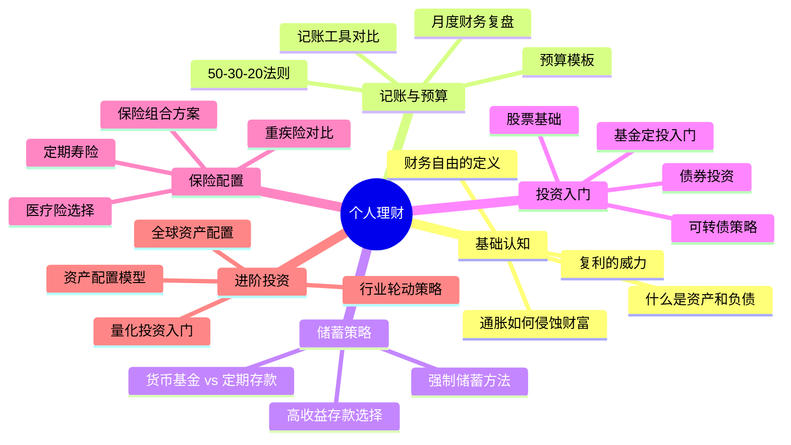

一个知识体系通常可以拆解出50-200个独立选题，足够持续产出半年到一年的内容。而且这些内容之间可以互相引用、互相导流，形成内容矩阵。

**知识体系拆解的操作步骤**：

1. **列出一级模块**（5-8个）：你所在领域的核心知识板块
2. **拆解二级模块**（每模块3-5个）：每个板块下的子主题
3. **细化三级选题**（每子主题3-5个）：每个子主题下的具体选题
4. **标注难度等级**：入门/进阶/高阶，按由浅入深的顺序发布
5. **规划内容形式**：每个选题最适合用什么形式呈现（图文/视频/互动）

完成后你就拥有了一张"内容地图"——知道自己已经做了什么、还缺什么、下一步该做什么。这张地图就是你长期内容规划的基石。

#### 5.1.3 选题评估模型

不是所有想到的选题都值得做。一个选题在投入生产之前，需要通过评估。

**RAPID选题评分模型**：

| 维度 | 权重 | 评分标准（1-5分） | 说明 |
|------|------|-----------------|------|
| **R**each（覆盖面） | 20% | 目标受众规模大小 | 选题越大众，潜在流量越大 |
| **A**lignment（匹配度） | 25% | 与账号定位的匹配程度 | 越垂直匹配，粉丝越精准 |
| **P**ain（痛点强度） | 25% | 用户需求的紧迫程度 | 越刚需，点击率越高 |
| **I**nformation gap（信息差） | 15% | 市场上同类内容的稀缺度 | 竞品越少，优势越大 |
| **D**oability（可执行度） | 15% | 制作难度和时间成本 | 越容易制作，产出效率越高 |

**评分计算**：每个维度1-5分，乘以权重后求和。总分4分以上的选题优先执行，3-4分的储备，3分以下的淘汰。

**实际案例**：假设你是一个Excel教学博主，有两个选题待评估——

选题A："VLOOKUP函数的7种用法"
- R: 4（搜索量大，Excel用户基数大）
- A: 5（完美匹配Excel教学定位）
- P: 4（工作中经常需要查找匹配）
- I: 3（竞品较多，但角度可以差异化）
- D: 5（制作简单，录屏即可）
- 加权得分：4×0.2+5×0.25+4×0.25+3×0.15+5×0.15 = 4.25 ✓

选题B："如何用Excel管理家庭财务"
- R: 3（受众较窄，对Excel+理财同时感兴趣的人少）
- A: 3（与纯Excel教学定位有偏差）
- P: 3（需求存在但不紧迫）
- I: 4（竞品较少）
- D: 4（需要Excel技能+理财知识，稍有门槛）
- 加权得分：3×0.2+3×0.25+3×0.25+4×0.15+4×0.15 = 3.30 — 储备

选题A明显优于选题B，应该优先执行。

**评分校准技巧**：刚开始使用RAPID模型时，你的评分可能不准确。建议在使用一个月后回溯：把当时评高分的选题和评低分的选题的实际数据表现对比，校准你对每个维度的判断标准。经过2-3次校准后，你的评分准确度会大幅提升。

**选题避坑清单**：以下选题类型即使RAPID得分高，也建议谨慎：

| 选题陷阱 | 表面得分 | 实际风险 | 纠正方式 |
|---------|---------|---------|---------|
| 纯搬运型 | R高、D高 | 没有差异化，算法不推荐 | 必须加入独特观点或原创数据 |
| 过度专业型 | P高、I高 | 受众太窄，互动率低 | 用通俗语言重新包装 |
| 蹭热度型 | R高 | 热点已过，流量为零 | 只追上升期热点，过期不候 |
| 争议型 | R高 | 引发对立，评论区失控 | 用建设性角度切入，避免站队 |
| 纯情绪型 | P高 | 短期爆发但无长尾价值 | 配合实用干货，让情绪落地 |

#### 5.1.4 选题排期与内容日历

有了选题池之后，需要合理安排发布顺序。不是随便挑一个就发，而是要考虑节奏感。

**排期原则**：

1. **常青内容与热点内容交替**。常青内容（如教程、攻略）积累长尾流量，热点内容获取短期爆发。建议比例为7:3。
2. **深度内容与轻量内容交替**。一条深度长文之后跟几条轻量内容，避免读者疲劳，也让自己有喘息时间。
3. **系列内容单独排期**。如果要做系列课程或连载，确保节奏稳定（如每周一集），让粉丝形成预期。
4. **预热-发布-跟进三段式**。重要内容发布前1-2天做预热（如悬念预告），发布当天全力推广，发布后1-3天做跟进（如答疑、补充案例）。

**内容日历模板**（以周为单位）：

| 日期 | 平台 | 内容类型 | 选题 | 状态 | 备注 |
|------|------|---------|------|------|------|
| 周一 | 小红书 | 图文干货 | VLOOKUP 7种用法 | 待制作 | 常青内容 |
| 周二 | 抖音 | 短视频 | Excel隐藏快捷键 | 待制作 | 轻量内容 |
| 周三 | B站 | 中长视频 | 数据透视表完全指南 | 待制作 | 深度内容 |
| 周四 | 公众号 | 长文 | 职场Excel避坑指南 | 待制作 | 常青内容 |
| 周五 | 小红书 | 图文 | 本周热点+Excel结合 | 待定 | 需追热点 |
| 周六 | 抖音 | 短视频 | 粉丝问题解答 | 待制作 | 互动内容 |
| 周日 | — | — | 选题储备+复盘 | — | 休息+规划 |

**月度内容规划的四个步骤**：

1. **盘点库存**：选题池里有多少储备？哪些系列内容需要推进？
2. **匹配节点**：本月有没有节日、行业事件、产品发布等可借力的时间节点？
3. **分配比例**：确定本月常青内容、热点内容、互动内容、系列内容各占多少条
4. **预留弹性**：不要把每天排满，留出20-30%的空位给临时热点和突发灵感

**选题储备库的管理**：建议维护一个至少包含50个待做选题的储备库，分为三个区：
- **即用区**（10-15个）：RAPID评分≥4，随时可以开始制作
- **待优化区**（20-30个）：RAPID评分3-4，需要找更好的角度或补充素材
- **灵感区**（不限量）：未经评估的初步想法，定期筛选进入待优化区

每周固定时间（建议周日晚上）花30分钟补充选题储备库。当即用区低于5个时，启动一次集中选题挖掘。这样你永远不会面临"不知道发什么"的困境。

---

### 5.2 内容结构方法论：信息的建筑术

选题决定"说什么"，结构决定"怎么说"。一个好选题如果用混乱的结构呈现，效果会大打折扣。结构设计的核心目标是：**降低认知负荷，提升信息吸收率**。

#### 5.2.1 内容结构的底层原理

人的注意力和工作记忆是有限的。心理学家乔治·米勒（George Miller）在1956年提出的"7±2法则"指出，人的短期记忆一次只能处理5-9个信息块。好的内容结构就是帮用户"打包"信息，让每个信息块都足够小、足够清晰。

认知负荷理论（Cognitive Load Theory，John Sweller 1988）进一步指出，学习者的认知资源有三种负荷：

| 负荷类型 | 定义 | 内容创作者的应对 |
|---------|------|----------------|
| **内在负荷** | 内容本身的复杂度 | 不能消除，但可以通过分步讲解降低 |
| **外在负荷** | 呈现方式带来的额外负担 | 必须最小化——这就是结构设计的核心任务 |
| **关联负荷** | 帮助理解和记忆的有益负荷 | 必须最大化——类比、案例、可视化都属于此类 |

好的内容结构就是：**最小化外在负荷，最大化关联负荷**。具体来说：

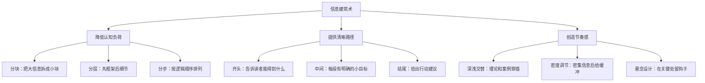

**信息呈现的"倒金字塔"原则**：在每一段、每一节、每一篇内容中，都把最重要的信息放在最前面。用户在任何层级的浏览中，都能在前几秒获取到核心价值。这个原则源自新闻写作，但在所有内容形式中都适用——因为用户的注意力是逐层衰减的。

**"认知脚手架"原则**：新概念必须建立在已知概念之上。如果你要解释"基金定投"，先确保读者理解"什么是基金"。如果你要讲"SEO优化"，先确保读者理解"搜索排名"。不要假设读者已经具备前置知识——宁可多花一句话解释基础概念，也不要让读者因为一个不懂的术语而放弃整篇内容。

#### 5.2.2 六种经典内容结构

不同类型的内容需要不同的结构。以下是经过大量验证的六种经典结构模型，覆盖绝大多数内容类型。

**结构一：问题-方案结构（PS结构）**

最通用的内容结构，适用于教程类、攻略类、干货类内容。

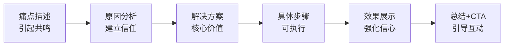

**适用场景**：小红书图文笔记、公众号干货文、B站教程视频
**示例标题**："毛孔粗大怎么办？皮肤科医生教你3步收缩毛孔"

**结构二：清单结构（Listicle结构）**

互联网上最受欢迎的内容结构，适用于盘点类、推荐类、对比类内容。

```text
标题：XX必知的N个[主题]
├── 引言：为什么这些很重要（100-200字）
├── 第1个：[核心要点] + 解释 + 案例
├── 第2个：[核心要点] + 解释 + 案例
├── 第3个：[核心要点] + 解释 + 案例
│   ...
├── 第N个：[核心要点] + 解释 + 案例
└── 总结：快速回顾 + 行动建议
```

**关键原则**：
- 数字必须明确（"7个"比"几个"更吸引点击）
- 每项的内容量保持一致（不要第1项写了500字，第7项只写50字）
- 最重要的放在最前面（用户可能不会读到最后）
- 最后一项必须是"意外的"或"最有价值的"（留下好印象）

**适用场景**：小红书种草笔记、抖音信息流、知乎回答
**示例标题**："2025年最值得入手的10款平价防晒霜，第一款回购了5次"

**结构三：故事弧结构（Narrative Arc）**

人类天生对故事有接收力。神经科学研究表明，听故事时人脑会释放催产素（信任和共情的化学物质），使听众更容易接受故事中的观点和信息。故事结构适用于情感类、经历类、案例类内容。

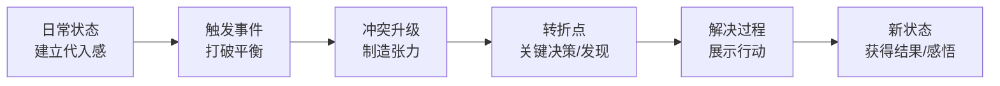

**关键原则**：
- 开头必须快速建立代入感（"去年这个时候，我还是一个月薪3000的实习生"）
- 冲突必须真实且具体（不要泛泛而谈"遇到了困难"，要描述具体发生了什么）
- 转折必须有因果关系（不是"运气好翻盘了"，而是"因为做了XX所以改变了"）
- 结尾必须有可借鉴的价值（读者能从中提炼出自己的行动方案）

**适用场景**：公众号深度文、B站vlog、抖音口播
**示例标题**："从负债20万到存款50万，我用了三年"

**结构四：对比结构（Compare/Contrast）**

适用于产品对比、方案对比、观点对比类内容。

```text
├── 引言：对比的背景和意义
├── 维度一：[方面A] vs [方面B]
├── 维度二：[方面A] vs [方面B]
├── 维度三：[方面A] vs [方面B]
│   ...
├── 综合评分对比（表格）
└── 选择建议：什么人适合A，什么人适合B
```

**关键原则**：
- 对比维度必须是用户真正关心的（不是你认为重要的，而是影响购买决策的）
- 保持客观，两方都有优缺点（纯吹一方会降低可信度）
- 最后给出明确的选择建议（"如果你XX，选A；如果你YY，选B"）
- 善用表格让对比一目了然

**结构五：时间线结构（Timeline）**

适用于过程记录、年度总结、项目复盘、历史梳理类内容。

```text
├── 起点：初始状态
├── 第一阶段（时间点1）：做了什么 → 结果如何
├── 第二阶段（时间点2）：做了什么 → 结果如何
├── 第三阶段（时间点3）：做了什么 → 结果如何
│   ...
├── 当前状态：与起点的对比
└── 经验总结：关键节点的决策和教训
```

**适用场景**：小红书打卡记录、B站成长vlog、公众号年度总结
**示例标题**："记录我从120斤到100斤的全过程，每周照片+数据"

**结构六：STAR结构**

适用于面试分享、职场经验、项目案例类内容。STAR代表Situation（情境）、Task（任务）、Action（行动）、Result（结果）。

| 要素 | 内容 | 篇幅占比 |
|------|------|---------|
| Situation（情境） | 描述背景和环境 | 15-20% |
| Task（任务） | 面临的具体挑战或目标 | 10-15% |
| Action（行动） | 采取的具体措施（重点展开） | 40-50% |
| Result（结果） | 可量化的成果和收获 | 20-25% |

**适用场景**：知乎经验分享、公众号案例文、B站复盘视频
**示例标题**："我是如何用3个月把公司公众号从500粉做到5万粉的"

**结构选择速查表**：

| 你的内容类型 | 推荐结构 | 原因 |
|------------|---------|------|
| 教程/攻略 | PS结构 | 用户带着问题来，直接给方案 |
| 盘点/推荐 | 清单结构 | 符合用户快速浏览习惯 |
| 个人经历/成长 | 故事弧 | 情感共鸣驱动传播 |
| 产品/方案评测 | 对比结构 | 帮助用户做决策 |
| 复盘/记录 | 时间线 | 展示过程和变化 |
| 职场/项目案例 | STAR结构 | 逻辑清晰，可复制性强 |

当你不确定用什么结构时，**PS结构是最安全的默认选择**——因为用户搜索内容时，90%的情况都是带着某个问题来的。

#### 5.2.3 开头设计：前三秒/前三行的生死线

所有平台都有一个共同规律：**开头决定用户是否继续看下去**。不同平台的"开头"表现形式不同，但原理一致——必须在最短时间内传递"继续看下去的理由"。

**用户注意力衰减曲线**：

| 时间/字数 | 剩余注意力 | 关键动作 |
|----------|-----------|---------|
| 前0.5秒/前1行 | 100% | 传达核心价值主张 |
| 前2秒/前3行 | 70% | 建立"我需要继续看"的理由 |
| 前5秒/前5行 | 40% | 深化兴趣，进入正文 |
| 之后 | 20-30% | 依赖内容质量和结构节奏 |

**五种高效开头模式**：

| 开头模式 | 适用场景 | 示例 |
|---------|---------|------|
| **痛点直击** | 教程、攻略类 | "每次用Excel做报表都要加班到10点？今天教你3个函数，从此准时下班。" |
| **数据冲击** | 分析、科普类 | "2024年，90%的自媒体账号月收入不到500元。而做到这3点的人，月入过万概率提高10倍。" |
| **悬念设置** | 故事、案例类 | "3个月前，我被公司裁员了。但今天回头看，这竟然是我人生中最幸运的事。" |
| **反常识** | 观点、颠覆类 | "你以为早起就是自律？错了。我认识的最成功的创业者，没有一个是5点起床的。" |
| **场景代入** | 种草、测评类 | "上周出差北京，风大到脸都要裂了。幸好带了这瓶精华，3天就把干皮救回来了。" |

**开头的三个禁忌**：
1. **冗长的自我介绍**——"大家好，我是XXX，今天给大家分享..."用户不关心你是谁，关心你能给他什么。
2. **缓慢的背景铺垫**——"随着互联网的发展..."这种教科书式的开头会让90%的用户立刻划走。
3. **模糊的价值承诺**——"今天来聊一个有趣的话题"——有趣在哪里？对我有什么用？不说清楚就走人。

#### 5.2.4 结尾设计：CTA的正确姿势

很多创作者精心设计了开头和正文，却在结尾草草收场。结尾是用户决定是否互动（点赞、收藏、关注、转发）的关键时刻。

**高效CTA的四种形式**：

| CTA类型 | 目的 | 示例话术 |
|---------|------|---------|
| **引导互动** | 提升互动率，获取更多推荐流量 | "你最常用的Excel快捷键是哪个？评论区告诉我" |
| **引导收藏** | 提升收藏率，增加长尾流量 | "建议收藏备用，下次用到直接翻出来" |
| **引导关注** | 涨粉 | "关注我，每周分享一个实用的办公技巧" |
| **引导私域** | 导流到微信/社群 | "我整理了一份完整的Excel模板，需要的扣1" |

**关键原则**：
- CTA必须与内容相关（一篇护肤文章结尾说"关注我学穿搭"就很奇怪）
- 只选一个CTA（不要既让人点赞又让人收藏又让人关注，选择太多等于没选择）
- CTA之前必须先提供价值（用户觉得"你确实帮到我了"才会愿意互动）

**CTA的"价值前置"设计**：最有效的CTA不是直接求互动，而是在CTA前先给一个额外的价值点。比如：

```text
❌ 弱CTA："觉得有用就点个赞吧"
✅ 强CTA："最后补充一个很多人不知道的小技巧：[实用内容]。如果这条笔记帮到了你，收藏一下下次方便找到。"
```

后者先给了额外价值（小技巧），再提CTA，用户的配合意愿会大幅提升。

#### 5.2.5 内容节奏设计

好的内容像音乐一样有节奏——有高潮有低谷，有紧张有舒缓。节奏感差的内容，即使信息密度很高，用户也读不下去。

**节奏设计的三个技巧**：

**技巧一：信息密度波浪式分布**

```text
内容节奏示意：
高密度 ████████░░░░████████░░░░████████
       信息块   缓冲   信息块   缓冲   信息块

低密度（错误示范）：
████████████████████████████████████
全部高密度 → 用户疲劳 → 跳出
```

每2-3个高密度信息段后，插入一个缓冲元素：一个案例、一个故事、一个类比、甚至一张图片。让用户的认知系统有时间消化和整理。

**技巧二：长短句交替**

全是长句 → 阅读疲劳。全是短句 → 缺乏深度感。交替使用效果最佳：

```text
❌ 纯长句："内容创作方法论的核心在于通过系统化的选题评估机制确保每一条内容都经过严格的需求匹配验证从而最大化内容的商业价值。"

✅ 长短交替："内容创作方法论的核心是什么？一句话：用系统代替灵感。具体来说，每一条内容在投入生产前，都要经过选题评估、需求匹配、可行性验证三个环节。这样做的结果是——你的内容产出不再依赖状态，而是依赖方法。"
```

**技巧三：视觉锚点**

在长内容中，每隔300-500字设置一个视觉锚点——表格、对比框、mermaid图、加粗关键词、数字列表。这些锚点的作用是：让快速浏览的用户也能抓到重点，不会因为"一大片文字"而放弃阅读。

#### 5.2.6 多平台结构适配策略

同一个选题在不同平台上，结构需要做针对性调整。这不是简单的"文字转视频"，而是思维方式的切换。

| 平台 | 信息密度 | 结构要求 | 节奏要求 | 典型结构 |
|------|---------|---------|---------|---------|
| **小红书** | 中高 | 开头直给结论，正文用要点列表，结尾CTA | 快，每3行一个信息点 | PS结构+清单混合 |
| **抖音** | 低-中 | 前3秒钩子，中间1个核心点，结尾引导关注 | 极快，每5秒一个转折 | 单点突破型 |
| **B站** | 中-高 | 开头抛出悬念，中间深度展开，结尾总结+互动 | 中等，允许铺垫和展开 | 故事弧/PS结构 |
| **公众号** | 高 | 完整的逻辑链条，层次分明的标题体系 | 慢，允许深度思考 | PS结构/对比结构 |
| **知乎** | 高 | 先说结论，再展开论证，最后补充细节 | 中等，重逻辑和证据 | STAR/PS结构 |

**适配实例**：以"Excel数据透视表"为例——

- **小红书版**：标题"Excel最强大功能！3分钟学会数据透视表"，正文600字，配5张截图，每步一个要点
- **抖音版**：15秒短视频，开头"你还在手动汇总数据？"，中间快速演示3步操作，结尾"关注学更多"
- **B站版**：12分钟教学视频，从"什么是数据透视表"讲到"高级筛选和切片器"，配完整案例
- **公众号版**：3000字深度指南，从原理到实操到进阶技巧，含多种场景案例

**核心原则**：内容的灵魂（核心观点、独特见解）不变，但骨架（结构、篇幅、节奏）必须随平台而变。

---

### 5.3 内容生产方法论：从想法到成品

有了选题和结构，接下来是实际的内容生产环节。生产效率直接决定了一个创作者能持续产出多少内容、能覆盖多少平台。

#### 5.3.1 内容生产全流程

一条内容从想法到发布，至少经过六个环节。每个环节都有优化空间。

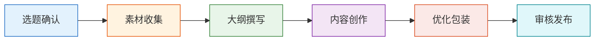

**各环节时间分配建议**：

| 环节 | 时间占比 | 核心任务 | 常见错误 |
|------|---------|---------|---------|
| 选题确认 | 10% | 用RAPID模型评估，确认方向 | 凭感觉选题，不做验证 |
| 素材收集 | 15% | 收集数据、案例、参考资料 | 没有素材就开始写，导致内容空洞 |
| 大纲撰写 | 15% | 确定结构和逻辑，列出要点 | 跳过大纲直接写，导致逻辑混乱 |
| 内容创作 | 30% | 正文创作，是核心产出环节 | 追求完美初稿，导致效率低下 |
| 优化包装 | 20% | 标题优化、封面设计、排版美化 | 内容做完就发，不做优化 |
| 审核发布 | 10% | 检查错别字、逻辑漏洞、平台规范 | 不做最后检查，发布后发现问题 |

#### 5.3.2 素材管理系统

素材是内容创作的弹药。没有素材积累的创作者，每次创作都从零开始，效率极低。

**素材分类体系**：

| 素材类型 | 内容 | 收集渠道 | 存储方式 |
|---------|------|---------|---------|
| **数据素材** | 行业报告、统计数据、调研数据 | 艾瑞咨询、QuestMobile、各平台数据报告 | 表格/数据库 |
| **案例素材** | 成功/失败案例、真实故事 | 行业新闻、社交媒体、个人经历 | 卡片笔记 |
| **金句素材** | 名言、观点、有力量的表达 | 书籍、播客、演讲、同行内容 | 金句库 |
| **视觉素材** | 图片、截图、参考设计 | Pinterest、花瓣网、Unsplash | 图片文件夹 |
| **模板素材** | 可复用的内容框架、话术模板 | 自己的高互动内容、竞品分析 | 模板库 |
| **反面素材** | 常见错误、失败案例、负面评论 | 评论区、社群、行业讨论 | 标注"反面案例"标签 |

**素材收集的日常习惯**：

每天花15-30分钟做素材收集，比每次创作前临时找素材高效10倍。具体做法：
1. **晨间扫描**：早上花10分钟浏览行业新闻、热榜，把有价值的信息存入素材库
2. **灵感捕捉**：随时记录突然冒出的想法（用手机备忘录或微信"文件传输助手"）
3. **竞品监控**：每周花1小时分析竞品的高互动内容，提取可借鉴的角度
4. **深度阅读**：每周至少读一篇行业深度报告或一本相关书籍，积累底层素材

**工具推荐**：
- **Notion**：适合做结构化的素材库管理，支持多维表格、标签分类
- **飞书文档**：适合团队协作的素材管理
- **Flomo**：适合碎片化灵感记录，轻量高效
- **Eagle**：适合视觉素材管理（设计师首选）
- **微信收藏**：最简单的临时素材存储方式
- **Obsidian**：适合需要双向链接的知识网络型素材管理

**素材库的"标签+评分"体系**：

不要只把素材往库里堆，要用标签分类+质量评分让素材可检索、可排序：

| 字段 | 说明 | 示例 |
|------|------|------|
| 标签 | 多标签，方便多维度检索 | #护肤 #成分党 #敏感肌 |
| 适用平台 | 这条素材适合在哪些平台使用 | 小红书 / 抖音 |
| 素材质量 | 1-5星，筛选时按质量排序 | ⭐⭐⭐⭐⭐ |
| 来源链接 | 原始出处，方便回溯和引用 | URL |
| 使用状态 | 未使用 / 已使用 / 已过期 | 未使用 |
| 灵感备注 | 这条素材能怎么用 | "可以做一期成分对比图" |

#### 5.3.3 高效创作流程

创作效率是区分"职业创作者"和"业余创作者"的关键分水岭。职业创作者不是写得更快，而是用系统降低创作的摩擦力。

**批量创作法**：

不要一次只创作一条内容，而是把相同类型的工作集中处理。这叫做"批处理"（Batching），原理是减少任务切换带来的注意力损耗。心理学研究表明，任务切换会产生"切换成本"——每次切换后需要15-25分钟才能恢复到之前的专注状态。

```text
传统方式（低效）：
周一：选题 → 收集素材 → 写大纲 → 写正文 → 做封面 → 发布
周二：选题 → 收集素材 → 写大纲 → 写正文 → 做封面 → 发布
周三：选题 → 收集素材 → 写大纲 → 写正文 → 做封面 → 发布

批处理方式（高效）：
周一上午：集中选题（一次性确认一周的选题）
周一下午：集中素材收集（一次性收集一周的素材）
周二全天：集中写大纲（一次性写完5-7条内容的大纲）
周三-周四：集中创作正文（批量写完所有正文）
周五上午：集中做封面和排版
周五下午：集中审核和发布（或排期发布）
```

**创作状态管理**：

不同类型的创作任务需要不同的心理状态。把需要类似状态的任务集中在一起处理：

| 任务类型 | 需要的状态 | 最佳时段 | 适合批量处理 |
|---------|-----------|---------|------------|
| 选题评估 | 分析、判断 | 早上精力充沛时 | 是（一次评估5-10个选题） |
| 素材收集 | 浏览、筛选 | 碎片时间 | 是（每天固定15分钟） |
| 大纲撰写 | 逻辑、结构 | 上午 | 是（一次写3-5个大纲） |
| 正文创作 | 专注、创造 | 最佳精力时段 | 是（一次写2-3篇同类内容） |
| 封面设计 | 审美、细致 | 下午 | 是（一次做3-5张封面） |
| 数据分析 | 理性、客观 | 任何时间 | 是（每周集中复盘一次） |

**应对创作倦怠的五种方法**：

持续创作必然遇到倦怠期。关键不是"硬扛"，而是建立应对机制：

1. **"最低可接受标准"日**：状态差的日子，不要求80分，只要求完成一条60分的内容。60分的内容发出去比0分的空白好得多——它至少能产生数据反馈。
2. **素材库救急**：在状态好的时候多储备内容（多写2-3条存着），状态差的时候从库存中取用。
3. **输入换输出**：当写不出来时，停止输出，转为输入——看书、看竞品、看行业报告。输入是输出的燃料。
4. **形式切换**：如果写图文写不动了，试试录口播视频；如果拍视频累了，试试写图文。切换形式能激活不同的创作脑区。
5. **回顾高光时刻**：翻看自己数据最好的内容和评论区的正面反馈，重新找回创作的意义感和成就感。

#### 5.3.4 标题优化方法论

标题是内容的"包装纸"。在算法推荐时代，标题的重要性甚至超过内容本身——因为如果标题不能吸引点击，再好的内容也没有被看到的机会。

**标题的心理学原理**：

用户决定是否点击一条内容，通常只花0.5-2秒。在这个极短的时间窗口内，标题需要触发以下心理机制中的至少一个：

| 心理机制 | 原理 | 标题公式 |
|---------|------|---------|
| **好奇心缺口** | 信息不完整时，人会产生寻求完整信息的冲动 | "大多数人不知道的XX" / "XX的真相竟然是..." |
| **损失厌恶** | 人对损失的敏感度是获得的2倍 | "别再犯这5个错误了" / "你正在浪费的XX" |
| **社会认同** | 人倾向于跟随多数人的选择 | "100万人收藏的XX" / "90%的人都在用的XX" |
| **即时满足** | 人倾向于选择能快速获得结果的方案 | "3分钟学会XX" / "一招搞定XX" |
| **具体数字** | 具体数字比模糊描述更有说服力和可信度 | "从月薪3000到3万" / "5个方法提高3倍效率" |
| **身份标签** | 人对与自己身份相关的信息更敏感 | "30岁以后的女人一定要知道的XX" / "程序员必看" |

**高点击率标题公式**：

| 公式 | 结构 | 示例 |
|------|------|------|
| 数字+痛点+方案 | N个[问题]的[解决方法] | "7个让你Excel效率翻倍的隐藏功能" |
| 身份+结果+方法 | [身份]教你[具体方法]达到[结果] | "前阿里P7教你用SQL拿到数据分析offer" |
| 对比+悬念 | [A] vs [B]，结果竟然... | "大牌vs平价防晒，实测一个月结果惊了" |
| 时间+效果 | [时间]内实现[效果]的[方法] | "30天从零学会Python，附完整学习路线" |
| 反常识+证据 | [你以为的A]其实是[B] | "你以为的高效学习，其实都是在浪费时间" |
| 痛点+权威身份 | [身份]告诉你[痛点真相] | "做了10年HR告诉你，简历上这行字直接被扔" |

**标题自检清单**：
- [ ] 是否包含用户会搜索的关键词？
- [ ] 是否在0.5秒内传递了核心价值？
- [ ] 是否触发了至少一个心理机制？
- [ ] 是否包含具体数字或限定词？
- [ ] 是否与内容一致（不做标题党）？
- [ ] 字数是否适中（小红书20字内，公众号30字内，B站25字内）？

#### 5.3.5 封面设计方法论

在双列信息流平台（小红书、B站），封面的点击率占了流量的50%以上。封面设计不是"好不好看"的问题，而是"能不能在0.3秒内传递信息并吸引点击"的问题。

**封面设计的四个原则**：

**原则一：信息优先级清晰**。封面的信息层级应该是：主标题（最大、最醒目）> 副标题/关键信息 > 背景/装饰。用户扫一眼就能知道这条内容是关于什么的。

**原则二：对比色突出重点**。使用对比色让关键信息从背景中跳出来。深色背景+亮色文字，或浅色背景+深色文字。避免整个封面颜色过于统一导致信息不突出。

**原则三：人脸增加点击率**。多个平台的数据表明，带人脸的封面点击率平均高出20%-40%。人脸能天然吸引注意力，尤其是表情丰富的人脸。

**原则四：保持风格一致性**。同一个账号的封面应该有统一的视觉风格——包括配色方案、字体、排版方式、logo位置。这样用户在信息流中一眼就能认出是你的内容。

**不同平台的封面规格**：

| 平台 | 尺寸 | 特点 | 设计重点 |
|------|------|------|---------|
| 小红书 | 3:4竖图 | 双列信息流，封面决定点击 | 文字清晰、信息密度高、有收藏价值感 |
| B站 | 16:9横图 | 推荐流+搜索流，封面可自定义截取 | 视觉冲击力、人脸+文字、好奇心驱动 |
| 抖音 | 9:16竖屏 | 全屏播放，封面是视频第一帧 | 前3秒画面=封面，需要有视觉钩子 |
| 公众号 | 2.35:1横图 | 聊天界面中展示，尺寸较小 | 简洁、字号大、在小尺寸下也清晰 |
| YouTube | 16:9横图 | 搜索结果和推荐流，缩略图极其关键 | 人脸表情+大字标题+高对比度色彩 |

**封面制作的效率工具**：
- **Canva**：最易上手的在线设计工具，有大量平台专属模板
- **创客贴**：国产替代Canva，中文模板更丰富
- **稿定设计**：专注电商和社交媒体设计
- **Figma**：专业设计工具，适合有设计基础的创作者
- **美图秀秀**：手机端快速出图，适合应急
- **即梦AI**：AI生成封面背景，适合快速出图

#### 5.3.6 AI辅助内容创作

2024年以来，AI工具已经深刻改变了内容创作的生产效率。AI不能替代你的创意和判断力，但能大幅降低执行层面的时间成本。善用AI的创作者，生产效率可以提升3-5倍。

**AI在内容创作各环节的应用**：

| 环节 | AI能做什么 | AI不能做什么 | 推荐工具 |
|------|-----------|------------|---------|
| 选题调研 | 汇总热点、生成选题列表、分析趋势 | 判断选题与你定位的匹配度 | Kimi、ChatGPT、Perplexity |
| 素材收集 | 快速检索数据、整理参考文献 | 验证数据的准确性和时效性 | Kimi、秘塔搜索、Perplexity |
| 大纲撰写 | 生成结构框架、建议论点 | 判断结构是否适合目标受众 | ChatGPT、Claude、豆包 |
| 正文创作 | 生成初稿、扩写段落、润色语言 | 注入个人风格、独特观点、真实经历 | ChatGPT、Claude、文心一言 |
| 标题优化 | 批量生成标题变体、A/B建议 | 判断哪个标题最"像你" | ChatGPT、Kimi |
| 多平台适配 | 一键改写为不同平台的风格和长度 | 精准把握每个平台的社区文化 | ChatGPT、Claude |
| 封面文案 | 生成封面上的文字标题和副标题 | 设计视觉风格和排版 | ChatGPT、Kimi |
| SEO优化 | 分析关键词密度、建议标题关键词 | 判断搜索意图和用户满意度 | Ahrefs、5118、站长工具 |

**AI辅助创作的正确姿势**：

```text
正确的AI使用流程：
1. 人类完成：选题判断、角度选择、核心观点确定
2. AI辅助：素材检索、大纲生成、初稿撰写
3. 人类完成：观点校准、风格调整、个人经历注入、事实核查
4. AI辅助：标题变体生成、多平台改写、语法检查
5. 人类完成：最终审核、发布决策

错误的AI使用方式：
→ 直接让AI写完就发（缺乏个人特色，用户能感觉到"AI味"）
→ 不做事实核查（AI会编造数据和案例）
→ 完全依赖AI选题（AI不了解你的个人优势和粉丝画像）
```

**AI生成内容的"去AI味"技巧**：

AI生成的内容通常有以下特征：过度使用"首先/其次/最后"、堆砌"总之/综上所述"、缺乏具体细节和真实数据、语气过于"正确"而缺乏个性。去AI味的关键方法：

1. **注入个人经历**：在AI初稿的基础上，加入你自己的真实案例和感受
2. **打破完美结构**：适当使用口语化表达、插入个人观点、偶尔"偏题"一下
3. **替换套话**：把"值得注意的是"改成"说个很多人忽略的点"，把"综上所述"改成直接总结
4. **添加具体细节**：把"某项研究显示"改成"斯坦福大学2023年的一项研究，跟踪了2000名受试者，发现..."
5. **调整节奏**：在AI生成的均匀节奏中，插入短句、问句、感叹句打破单调感
6. **加入"人味"表达**：适度使用方言、网络用语、自嘲、反问句——这些是AI很难模仿的

#### 5.3.7 内容质量检查清单

内容完成后，在发布前用这份清单做最终检查：

**内容层面**：
- [ ] 核心价值点是否在前3秒/前3行清晰传达？
- [ ] 论点是否有论据支撑（数据、案例、逻辑）？
- [ ] 是否有空洞的废话或套话？（删除"众所周知""不言而喻"等无效表达）
- [ ] 是否有逻辑漏洞或前后矛盾？
- [ ] 结尾是否有明确的CTA？

**格式层面**：
- [ ] 是否有清晰的层级标题？（方便快速浏览）
- [ ] 段落是否足够短？（手机阅读每段不超过4行）
- [ ] 是否有视觉辅助？（表格、图片、对比框）
- [ ] 是否有错别字或语法错误？

**平台适配层面**：
- [ ] 标题是否包含平台搜索关键词？
- [ ] 封面/首图是否符合平台最佳实践？
- [ ] 是否添加了合适的话题标签？
- [ ] 内容长度是否适合平台用户习惯？
- [ ] 是否触犯了平台的敏感词或限流规则？

**合规层面**：
- [ ] 是否有版权风险？（图片、音乐、数据来源）
- [ ] 是否有虚假宣传风险？（"保证""100%有效"等绝对化用语）
- [ ] 是否涉及敏感领域需要加免责声明？（如医疗、法律、金融）

---

### 5.4 内容迭代方法论：数据驱动的持续优化

内容发布不是终点，而是新一轮优化的起点。数据反馈是内容创作中最重要的"老师"——它告诉你什么有效、什么无效、什么需要改进。

#### 5.4.1 关键数据指标体系

不同平台的数据指标名称略有不同，但核心逻辑是相通的。

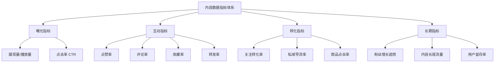

**各指标的健康基准值**（因平台和领域差异较大，以下为参考范围）：

| 指标 | 短视频平台 | 图文平台 | 中长视频平台 |
|------|-----------|---------|------------|
| 点击率 | 5%-15% | 3%-10% | 4%-12% |
| 完播率/阅读完成率 | 30%-50% | 40%-60% | 30%-50% |
| 互动率 | 3%-8% | 2%-5% | 3%-7% |
| 收藏率 | 1%-3% | 2%-5% | 2%-5% |
| 转发率 | 0.5%-2% | 1%-3% | 1%-3% |
| 关注转化率 | 1%-5% | 2%-8% | 2%-6% |

**指标之间的因果链**：

```text
展现量 × 点击率 = 播放量/阅读量
播放量 × 完播率 = 有效阅读量
有效阅读量 × 互动率 = 互动数
互动数 × 关注转化率 = 新增粉丝

→ 任何一个环节的数据低于基准值，问题就出在那个环节
```

理解这条因果链非常重要。很多创作者看到播放量低就改内容，但实际上问题可能出在封面/标题（点击率低导致展现量低）。精准定位问题环节，才能精准优化。

**内容诊断决策树**：

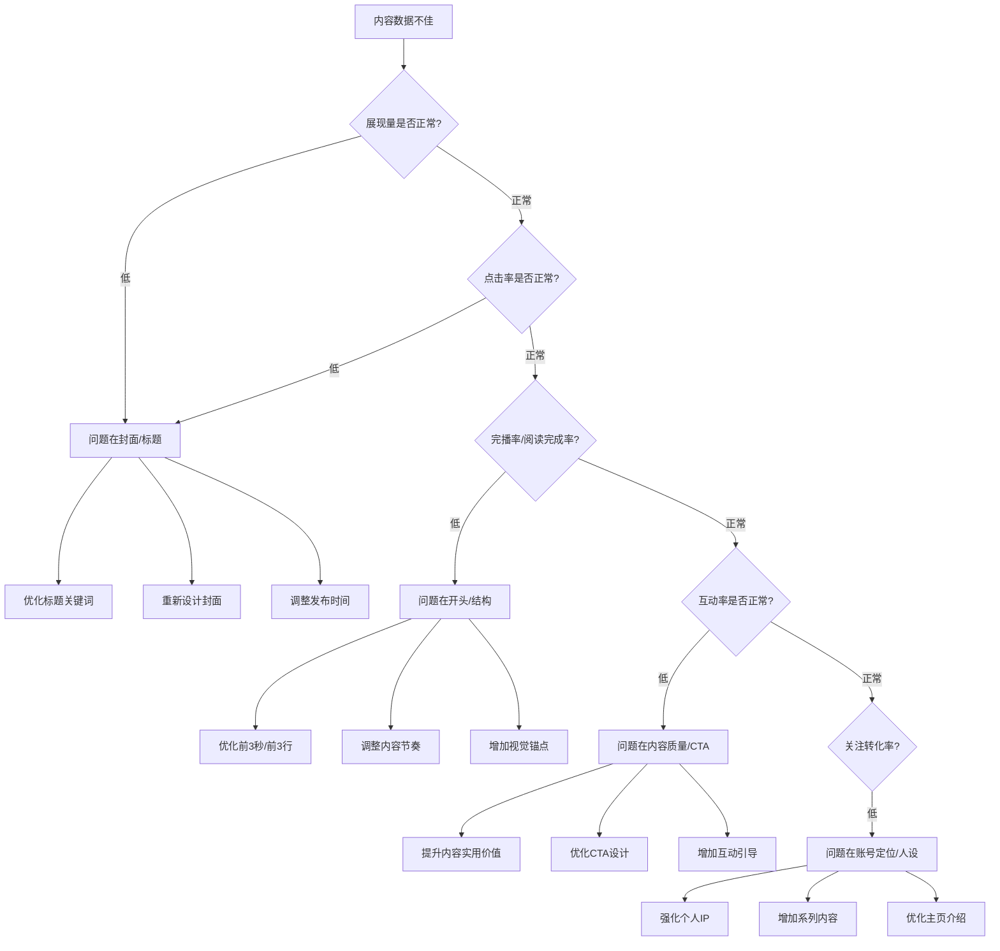

#### 5.4.2 数据复盘方法

每条内容发布后24-72小时，进行数据复盘。不要只看"播放量高不高"，而是要找到具体原因。

**数据复盘三步法**：

**第一步：对比基准**。把这条内容的数据与你过去30条内容的平均值对比。各项指标高于平均值的是"做得好的"，低于平均值的是"需要改进的"。

**第二步：归因分析**。对每项异常指标，分析可能的原因：
- 播放量低 → 封面不够吸引？标题关键词不对？发布时间不好？还是平台流量波动？
- 播放量高但互动率低 → 内容开头吸引了点击但正文没有满足预期？CTA不够强？
- 收藏率高但转发率低 → 内容有实用价值但不够有社交货币感？内容太私密不适合分享？
- 互动率高但关注率低 → 单条内容好但账号定位不清晰？用户觉得"看看就好，不值得关注"？

**第三步：提取规律**。把最近20-30条内容的复盘数据汇总，找到高互动内容的共同特征和低互动内容的共同问题。

**数据复盘记录表模板**：

| 日期 | 平台 | 标题 | 播放量 | 点赞 | 评论 | 收藏 | 转发 | 关注 | 类型 | 标签 | 复盘总结 |
|------|------|------|--------|------|------|------|------|------|------|------|---------|
| 6/1 | 小红书 | XXX | 5000 | 200 | 50 | 300 | 20 | 15 | 教程 | 护肤 | 收藏率高，说明干货价值强 |
| 6/3 | 小红书 | YYY | 800 | 30 | 5 | 10 | 2 | 1 | 种草 | 防晒 | 互动率低，标题缺乏具体数字 |

**复盘的"五问法"**：

每条内容发布后，问自己这五个问题：
1. **哪项指标最高？为什么？** → 找到做得好的点，下条内容继续用
2. **哪项指标最低？为什么？** → 找到短板，下条内容重点改进
3. **评论区在讨论什么？** → 用户的真实反馈比数据更有价值
4. **与同类型历史内容对比如何？** → 排除平台流量波动的干扰
5. **如果重做一次，哪里会改？** → 提炼可复用的优化点

#### 5.4.3 内容优化的四个杠杆

根据数据分析结果，优化可以从四个杠杆入手。每个杠杆影响不同的数据指标：

| 优化杠杆 | 影响指标 | 优化方法 |
|---------|---------|---------|
| **封面/标题优化** | 点击率、展现量 | A/B测试不同封面和标题，找到点击率最高的版本 |
| **开头优化** | 完播率、阅读完成率 | 优化前3秒/前3行，确保快速传递核心价值 |
| **正文优化** | 互动率、收藏率 | 提升内容密度、增加实用价值、优化信息结构 |
| **结尾优化** | 关注率、转发率 | 设计更有效的CTA，提供分享动力 |

**A/B测试的实操方法**：

1. **标题A/B测试**：同一内容准备两个标题，先发A版本，记录24小时数据；删除后发B版本，对比数据。注意：两次发布的时间段要一致。
2. **封面A/B测试**：同一视频内容，使用不同封面发布两次（需要删除第一次的），对比点击率。
3. **开头A/B测试**：同一主题内容，用不同的开头方式（痛点直击vs悬念设置）各做一条，对比完播率。
4. **发布时间A/B测试**：同一类型内容在不同时间段发布（如工作日晚8点 vs 周末上午10点），对比初始流量。

**重要提醒**：A/B测试每次只改一个变量。如果同时改了标题和封面，你无法判断数据变化是哪个因素导致的。

**A/B测试的样本量要求**：单条内容的数据波动很大，不能因为一条内容的差异就下结论。建议每组至少测试3-5条内容，取平均值对比，才能得到可靠的结论。例如，测试"数字标题vs非数字标题"的效果，至少各发5条，对比平均点击率。

#### 5.4.4 内容迭代的飞轮效应

当你持续执行"创作→发布→复盘→优化→再创作"的循环时，会形成一个自我加速的飞轮：

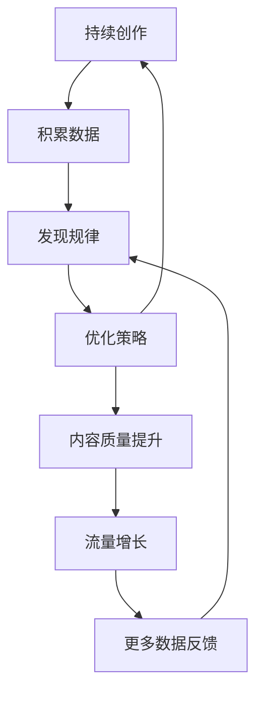

飞轮转起来后，你的每一条新内容都会比上一条更好——不是因为你更努力了，而是因为你更了解用户了。这就是数据驱动创作的复利效应。

**飞轮启动的临界点**：大多数创作者在发布前30-50条内容时会经历"数据荒漠期"——播放量低、互动少、增长慢。这是正常的。飞轮需要足够的数据积累才能转动。**前50条内容的目标不是爆款，而是获取足够的数据样本供分析**。熬过这个阶段，数据驱动的优化循环才能真正发挥作用。

---

### 5.5 内容复利方法论：一次创作，多次变现

高效创作者的秘密不是"产出更多内容"，而是"让每条内容产生更多价值"。内容复利的核心是**一鱼多吃**——把一个核心内容在不同平台、不同形式、不同时间点反复利用。

#### 5.5.1 一鱼多吃：内容复用矩阵

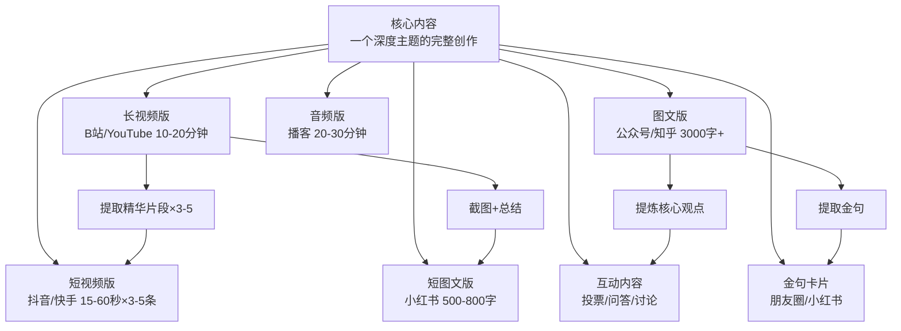

**具体操作流程**：以一篇"Excel数据透视表完全指南"为例

1. **首先创作深度版本**：写一篇5000字的公众号长文，涵盖数据透视表的所有知识点
2. **转化为B站视频**：用长文作为脚本，录制15分钟的教学视频
3. **拆分为短视频**：从长视频中提取3-5个精华片段，每个30-60秒，发布到抖音
4. **精简为小红书笔记**：把核心要点精简为800字+配图的图文笔记
5. **制作金句卡片**：提取3-5个最有冲击力的知识点，做成图文卡片
6. **转化为互动内容**：在各平台发起"你最常用的Excel功能是什么"的讨论

一条深度内容就这样变成了6种形式、覆盖5个平台的内容矩阵，总曝光量是单条内容的5-10倍。

**内容复用的"72小时法则"**：一条深度内容创作完成后，尽量在72小时内完成多平台改编。此时你对内容的理解最深、改编效率最高。拖得越久，改编成本越高。

**跨平台发布的时间协调**：

不要同时在所有平台发布同一内容，建议错开发布：

| 时间 | 平台 | 内容形式 | 原因 |
|------|------|---------|------|
| 第1天 | 核心平台（如B站） | 深度版本 | 先给核心粉丝完整内容 |
| 第1天 | 小红书 | 精简图文版 | 不同用户群，不影响原始平台流量 |
| 第2天 | 抖音/快手 | 短视频切片 | 引流到深度版本 |
| 第3天 | 公众号 | 长文版本 | 私域沉淀，SEO长尾 |
| 第3-7天 | 其他平台 | 金句卡片/互动内容 | 持续发酵，延长内容生命周期 |

错开发布的好处：每个平台的推荐算法都有"内容新鲜度"的考量。如果同一内容同时发多个平台，各平台的初始数据都会分散。错开发布能让每个平台的内容都获得足够的初始互动。

#### 5.5.2 内容资产化策略

除了单条内容的复用，还需要把内容系统化为长期资产。

**可复用内容资产类型**：

| 资产类型 | 说明 | 长期价值 |
|---------|------|---------|
| **内容合集** | 同主题内容整理为系列/合集 | 新粉丝可以系统学习，提升关注率 |
| **模板/工具** | 提供可直接使用的模板或工具 | 用户反复使用，持续引流 |
| **知识库** | 按知识体系组织的完整内容库 | SEO长尾流量，建立专业权威 |
| **课程** | 将碎片内容系统化为课程 | 高客单价变现的核心资产 |
| **社群** | 围绕内容聚集的用户社群 | 持续互动，多次变现的基础 |

**内容合集的组织方式**：

```text
合集名称：Excel从入门到精通
├── 第1期：Excel基础操作（已发布）
├── 第2期：常用函数大全（已发布）
├── 第3期：数据透视表完全指南（已发布）
├── 第4期：图表制作进阶（待发布）
├── 第5期：VBA入门（待规划）
└── ...
```

在B站和YouTube上，合集功能可以自动把系列视频关联起来，用户看完一期后自动推荐下一期，大幅提升系列内容的整体完播率。

**内容资产化的阶梯路径**：

```text
阶段一（0-1000粉）：积累单条高互动内容
   ↓
阶段二（1000-1万粉）：整理内容合集，形成系列
   ↓
阶段三（1万-10万粉）：提炼模板/工具，建立可复用资源
   ↓
阶段四（10万粉+）：系统化为课程/付费社群，实现高客单价变现
```

不要在阶段一就急着做课程——没有足够的内容积累和用户信任，课程卖不出去。按阶梯路径一步步来，每一步都在为下一步打基础。

**内容资产的度量指标**：

内容资产不同于单条内容，需要用长期视角衡量：

| 资产指标 | 定义 | 健康值 | 意义 |
|---------|------|-------|------|
| 内容库总量 | 已发布的常青内容总数 | 50+ | 资产规模 |
| 月度长尾流量占比 | 搜索/推荐带来的历史内容流量 | ≥40% | 资产生息能力 |
| 内容复用率 | 一个核心内容改编为多少种形式 | ≥3种 | 资产利用效率 |
| 合集完播率 | 系列内容从第1期到最后1期的完播链条 | ≥30% | 资产串联效果 |
| 模板/工具使用次数 | 可复用资源被用户使用的频率 | 持续增长 | 资产的实际价值 |

#### 5.5.3 长尾流量优化

不是所有内容都需要追求"爆发"。很多"常青内容"（Evergreen Content）虽然发布时数据平平，但能在几个月甚至几年的时间里持续带来搜索流量。

**常青内容的特征**：
- 解决的是持续性问题，而非时效性问题（"如何用VLOOKUP" vs "今天发生的XX事件"）
- 内容完整、系统，不需要频繁更新
- 标题包含高搜索量的关键词

**长尾流量优化策略**：
1. **SEO优化**：标题和正文前200字必须包含目标关键词
2. **定期更新**：每3-6个月检查常青内容，更新过时的信息，保持内容的新鲜度
3. **内链建设**：在新内容中引用旧内容，给旧内容持续导流
4. **合集/系列**：把常青内容组织成合集，提升整体权重
5. **跨平台SEO**：同一关键词在多个平台布局，占据搜索结果的多个位置

**常青内容占比建议**：在你的内容库中，常青内容应占60-70%，热点内容占20-30%，实验性内容占10%。常青内容是你的"内容基础设施"，热点内容是你的"流量加速器"。

**长尾流量的"内容翻新"策略**：当一条常青内容的搜索流量开始下降时，不要删除重发，而是做"翻新"——更新数据、补充新案例、优化标题关键词、增加新的章节。平台算法会把"更新"视为"新鲜内容"，给予新的推荐权重。这种翻新策略的成本只有重新创作的20%，但能恢复80%以上的流量。

---

### 5.6 内容创作中的常见方法论误区

#### 误区一：过度追求完美

很多创作者花一周时间打磨一条内容，结果发布后数据平平，信心崩塌。真相是：**在内容创作中，"足够好"比"完美"更重要**。一条80分的内容今天发布，比一条100分的内容下周发布，通常效果更好——因为80分的内容已经开始产生数据反馈，你可以根据反馈优化下一条内容，而100分的内容在发布前没有任何市场验证。

正确做法：先完成再完美。快速产出80分的内容，根据数据反馈迭代优化。

#### 误区二：只看播放量不看互动率

播放量是最容易虚荣的指标。一条内容播放量10万，但互动率0.1%，说明用户看了但不认可——这样的流量对变现毫无意义。真正有价值的指标是**互动率和转化率**：有多少人看完后点赞、评论、收藏、关注、购买。

正确做法：建立以互动率为核心的数据评估体系，播放量只是参考。

#### 误区三：盲目模仿爆款

看到别人某条内容火了，就照着做一个类似的。问题是：爆款的产生是多因素共同作用的结果（选题、时机、平台流量、创作者个人魅力），你只模仿了表面形式，缺少了背后的条件，大概率不会爆。

正确做法：分析爆款背后的逻辑（选题角度、结构设计、情绪点），然后用自己的方式重新演绎，而不是简单复制。

#### 误区四：忽视内容的可分享性

很多创作者只考虑"用户看完觉得好"，不考虑"用户看完愿不愿意分享"。在算法推荐时代，转发/分享是权重最高的互动信号，一条被大量转发的内容，推荐量会呈指数级增长。

正确做法：在内容中设计"分享钩子"——让用户有理由把内容分享出去。比如提供社交货币（"分享到朋友圈证明我在学习"）、提供实用价值（"发给需要的朋友"）、提供情绪共鸣（"说到心坎里了，必须转发"）。

#### 误区五：不做内容规划，随机创作

每天临到创作时才开始想"今天发什么"。这种方式不仅效率低，而且容易陷入内容同质化——因为没有全局视角，每次都是从最容易想到的角度切入。

正确做法：每周/每月提前规划内容日历，确保内容覆盖多个角度、多种形式、多种深度。随机创作是业余爱好者的标志，系统规划是职业创作者的标配。

#### 误区六：忽视评论区运营

很多创作者把内容发布当作工作的结束。实际上，发布只是开始。评论区是内容的"第二战场"——好的评论区运营能提升互动率、增加用户粘性、获取选题灵感、甚至直接带来转化。

正确做法：
- 发布后1小时内回复所有评论（平台算法会根据初始互动决定是否加推）
- 用提问式回复引导更多讨论（"你遇到过类似的问题吗？"）
- 把评论区的高频问题整理成下一期内容的选题
- 置顶一条有价值的评论，引导讨论方向

#### 误区七：多平台搬运而不是多平台适配

有些创作者把同一条内容原封不动地发到所有平台。问题是：不同平台的用户习惯、内容偏好、算法逻辑完全不同。小红书的用户喜欢"干货+颜值"，抖音的用户喜欢"快节奏+强情绪"，B站的用户喜欢"深度+真诚"。一条内容不加修改地全平台搬运，结果是每个平台都做不好。

正确做法：核心内容可以复用，但表达形式必须适配。同一主题，在小红书做图文笔记，在抖音做短视频，在B站做深度讲解。形式适配的工作量远小于从零创作，但效果差距巨大。

#### 误区八：追求数量忽视质量

"每天发3条"听起来很勤奋，但如果每条都是60分的平庸内容，不如每天发1条85分的优质内容。平台算法的核心逻辑是：**单条内容的互动率决定推荐量**，而不是发布频率。高频率+低质量的结果是：每条内容的初始互动都很少，算法判定你的内容"不受欢迎"，逐步降低你的推荐权重。

正确做法：找到你的"质量-数量平衡点"。对大多数人来说，每周2-3条80分以上的优质内容，效果远好于每天1条60分的平庸内容。

#### 误区九：只做输出不做输入

持续输出而不补充输入，就像只取水不注水的井，迟早干涸。内容创作的本质是**信息的加工和重组**——你的输出质量取决于你的输入质量。

正确做法：保持"输入-输出比"至少2:1。每天花在阅读、学习、观察上的时间，至少是创作时间的2倍。输入来源包括：行业书籍、深度报告、竞品内容、用户反馈、个人体验、跨领域学习。

#### 误区十：忽视数据异常信号

有些创作者看到某条内容数据突然变好或变差，不去分析原因，而是归结为"运气"或"平台限流"。实际上，每一次数据异常都是一次学习机会。

正确做法：
- 数据突然变好 → 分析哪条指标异常高，找到原因，复用到后续内容
- 数据突然变差 → 排除平台整体流量波动后，定位具体问题环节
- 数据持续下降 → 可能是内容方向需要调整的信号，认真审视你的内容策略

---

### 5.7 内容创作者的成长路径

内容创作是一个可以系统性提升的技能。从新手到高手，每个阶段有不同的核心任务和瓶颈。

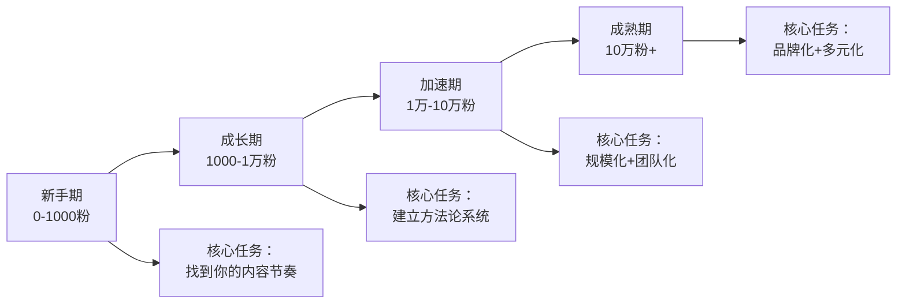

| 阶段 | 粉丝量 | 核心任务 | 常见瓶颈 | 突破方法 |
|------|--------|---------|---------|---------|
| **新手期** | 0-1000 | 找到内容感觉，测试方向 | 发了没人看，动力不足 | 降低期望，专注内容质量；坚持3个月 |
| **成长期** | 1000-1万 | 建立选题-生产-复盘的系统 | 增长遇到瓶颈，不知道怎么突破 | 数据复盘找到规律；学习爆款逻辑 |
| **加速期** | 1万-10万 | 规模化产出，多平台布局 | 时间精力不够，产出跟不上 | 批量创作法+AI辅助+团队协作 |
| **成熟期** | 10万+ | 品牌化运营，多元变现 | 增长放缓，内容同质化 | IP化+社群运营+商业合作 |

**新手期（0-1000粉）的关键策略**：

这个阶段最重要的是**行动力**，而不是完美度。具体执行建议：
- 前30条内容用来"试错"：尝试不同选题角度、内容形式、发布时间
- 重点关注"完播率/阅读完成率"而不是播放量——完播率高说明内容质量过关
- 找到1-2个同领域的对标账号，学习他们的内容模式（不是抄袭）
- 设定"最低发布频率"：每周至少2条，坚持3个月不要停

**成长期（1000-1万粉）的关键策略**：

这个阶段最重要的是**建立系统**。具体执行建议：
- 开始使用RAPID模型做选题评估
- 建立素材库，养成日常收集素材的习惯
- 开始做数据复盘，每周回顾一次数据
- 确定你的"内容公式"：哪种选题+哪种结构+哪种风格=最高互动

**加速期（1万-10万粉）的关键策略**：

这个阶段最重要的是**效率和规模**。具体执行建议：
- 引入批量创作法，提升产出效率
- 开始使用AI工具辅助创作
- 布局多平台，开始做内容复用
- 考虑组建小团队（剪辑、设计、运营助手）

**成熟期（10万粉+）的关键策略**：

这个阶段最重要的是**品牌和变现**。具体执行建议：
- 从"内容创作者"升级为"个人品牌"
- 建立付费产品线（课程、社群、咨询）
- 与品牌建立长期合作关系
- 开始培养团队，让自己从"执行者"变成"决策者"

**每个阶段最重要的一个能力**：
- 新手期：**执行力**——不需要完美，需要持续输出
- 成长期：**分析力**——从数据中找到增长密码
- 加速期：**系统力**——用方法论和工具放大产出
- 成熟期：**品牌力**——从内容创作者升级为个人品牌

---

### 5.8 内容创作者的底层心法

方法论是"术"，心法是"道"。有术无道，走不远。

**心法一：长期主义**

内容创作是复利游戏。前期投入大量时间但回报很少，是完全正常的。大多数成功创作者都经历过3-6个月的"沉默期"。那些在沉默期坚持下来的人，后来都获得了指数级增长。

具体做法：给自己设定一个"不看数据"的期限。前3个月只关注内容质量，不看播放量。3个月后再开始用数据驱动优化。

**心法二：用户视角**

永远站在用户的角度思考。你的专业知识、你的审美偏好、你的表达习惯，都不是最重要的。最重要的是：用户能不能听懂？用户愿不愿意看完？用户看完能不能用？

具体做法：每条内容创作完成后，用"小白视角"重新审视一遍——假设你对这个领域一无所知，你能看懂这篇内容吗？

**心法三：完成大于完美**

这条值得反复强调。一个有100条80分内容的账号，远比一个有10条100分内容的账号有竞争力。原因很简单：100条内容有100次被推荐的机会，10条内容只有10次。

具体做法：给自己设定一个"发布deadline"。一条内容的创作时间不超过X小时（X因内容类型而异），到时间就发布，不纠结。

**心法四：持续学习**

平台算法在变、用户偏好在变、内容形式在变。去年有效的方法，今年可能就过时了。保持对新趋势、新工具、新玩法的学习敏感度。

具体做法：每周花1小时学习平台的新功能、新规则、新趋势。关注3-5个你所在领域的"前沿账号"，观察他们在尝试什么新玩法。

**心法五：享受过程**

如果创作让你痛苦，你的内容也会传递出痛苦的气息。找到创作中让你有成就感的部分——可以是用户的好评、可以是数据的增长、可以是知识的整理、可以是表达的快感。

具体做法：定期回顾你的"创作高光时刻"——哪条内容让你最满意？哪个评论区的反馈让你最开心？把这份感受记下来，在低谷时拿出来看看。

---

### 5.9 本节核心框架总结

```mermaid
graph TD
    A[内容创作方法论] --> B[选题方法论]
    A --> C[结构方法论]
    A --> D[生产方法论]
    A --> E[迭代方法论]
    A --> F[复利方法论]
    A --> G[成长路径]
    A --> H1[底层心法]
    
    B --> B1[四大选题来源]
    B --> B2[RAPID评估模型]
    B --> B3[内容日历排期]
    B --> B4[选题储备库管理]
    
    C --> C1[六种经典结构]
    C --> C2[开头设计五模式]
    C --> C3[CTA结尾设计]
    C --> C4[节奏设计]
    C --> C5[多平台适配策略]
    
    D --> D1[生产全流程]
    D --> D2[素材管理系统]
    D --> D3[批量创作法]
    D --> D4[标题+封面优化]
    D --> D5[AI辅助创作]
    D --> D6[质量检查清单]
    
    E --> E1[数据指标体系]
    E --> E2[五问复盘法]
    E --> E3[四个优化杠杆]
    E --> E4[A/B测试实操]
    E --> E5[飞轮效应]
    E --> E6[内容诊断决策树]
    
    F --> F1[一鱼多吃矩阵]
    F --> F2[内容资产化阶梯]
    F --> F3[长尾流量优化]
    F --> F4[跨平台发布时间协调]
    
    A --> M[十大误区纠正]
```

**一句话总结**：内容创作方法论的本质是**用系统代替灵感，用数据代替直觉，用复利代替消耗**。掌握了这套方法论，你就拥有了一条稳定的内容生产线——它不会因为状态差而停工，不会因为算法变化而失灵，只会随着数据积累和经验沉淀越来越高效。

**行动清单**（读完本节后立即执行）：
1. 用RAPID模型评估你手上的5个选题，淘汰3分以下的
2. 建一个内容日历，安排下周的内容发布计划
3. 选一条你最满意的内容，按"一鱼多吃"矩阵改编成3种形式
4. 选一条数据最好的内容，用"五问法"做一次深度复盘
5. 建一个素材库（Notion/飞书/Excel均可），今天开始积累
6. 用"内容诊断决策树"分析一条数据异常的内容，定位问题环节

---

> **下一步阅读**：掌握了内容创作方法论之后，下一节将全面梳理[变现模式总览](06-六变现模式总览)，帮助你把优质内容转化为实际收入。
