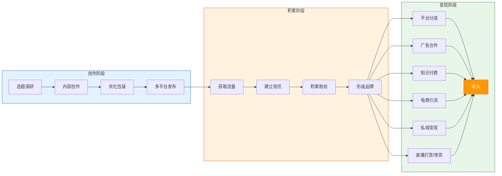
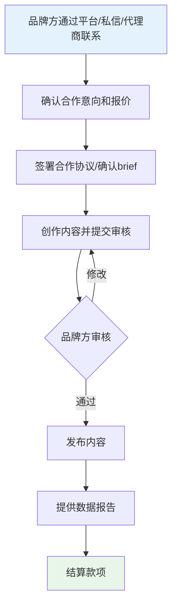
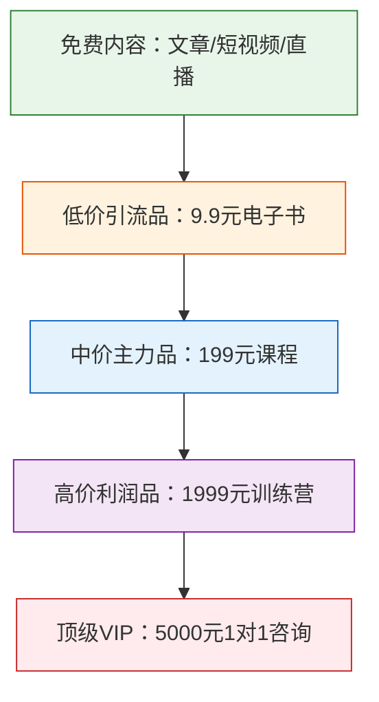
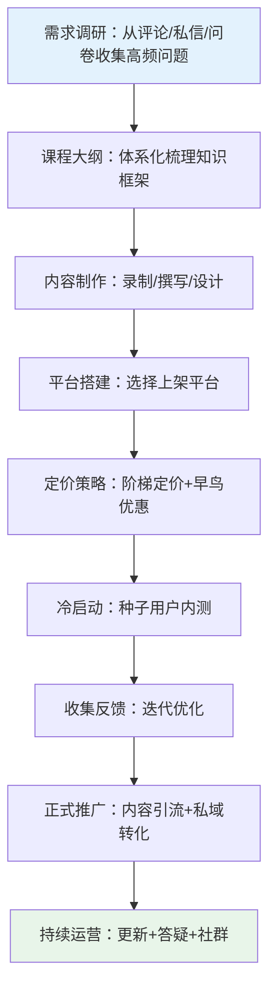
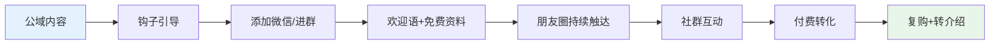
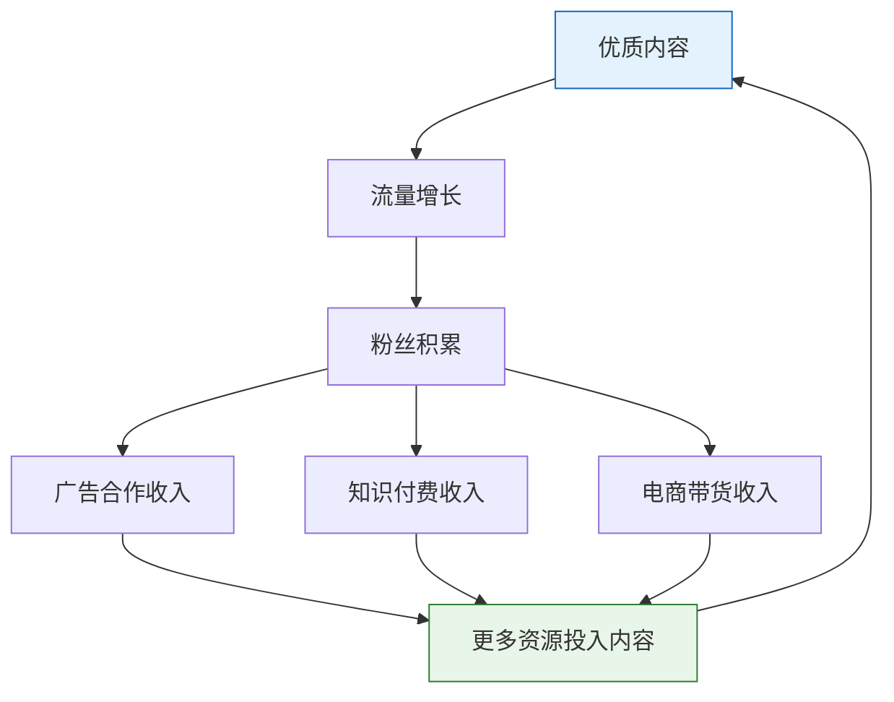

## 六、变现模式总览

前面五节我们完成了内容创作的"供给侧"建设——定位、形式、平台、方法论都已就位。但创作的终极目的是变现。本节将系统拆解内容创作者的六大变现模式，从底层逻辑到收入结构，从启动门槛到天花板，帮助你在起步之初就建立清晰的商业化地图。

### 6.1 内容变现全流程

内容变现不是一步到位的，而是沿着"创作→积累→变现"的链条逐步展开。理解这条链路的每个环节，才能避免"急于变现"或"只创作不变现"两个极端。



**关键数据**：据2024年内容创作者经济报告，中国内容创作者规模已超过**2000万人**，其中：

- 月收入超过1万元的创作者占比约**8.5%**
- 月收入超过10万元的创作者占比约**0.7%**
- 头部1%的创作者拿走了行业**60%以上**的收入

这说明内容创作是一个典型的**幂律分布**市场——头部效应极强。成功的创作者通常在**前6-12个月**持续输出优质内容，建立起足够的粉丝基础和信任度后，才开始实现可观的变现。**急于变现是大多数创作者失败的核心原因之一**。

**变现的前提条件自检**——在考虑变现之前，确认以下条件至少满足3项：

| 条件 | 达标标准 | 未达标的表现 |
|------|----------|-------------|
| 内容稳定输出 | 至少持续3个月，每周2+条 | 三天打鱼两天晒网 |
| 有明确的受众画像 | 能用一句话描述你的粉丝是谁 | "什么人都有" |
| 有自然增长的流量 | 不投流也能获得平台推荐 | 全靠付费推广 |
| 有互动数据 | 评论区有人提问、讨论 | 发了内容无人回应 |
| 有粉丝私信咨询 | 偶尔收到"怎么买""在哪买"的询问 | 从未收到任何购买意向 |
| 同领域有人在变现 | 看到竞品账号在接广告/卖课 | 不确定这个领域能否赚钱 |

---

### 6.2 六大变现模式详解

以下是内容创作者的六种核心变现模式。每种模式都有独立的运作逻辑、适用条件和收入结构，理解它们的差异是制定变现策略的前提。

#### 6.2.1 平台分成：最基础的收入来源

**原理**：平台将广告收入按一定比例分给创作者。你在平台发布内容，平台在内容中插入广告（贴片广告、信息流广告、搜索广告等），然后按播放量/阅读量/互动量等指标给你结算分成。

**各平台分成机制对比**：

| 平台 | 分成方式 | 结算指标 | 千次播放收益（估算） | 提现门槛 | 加入条件 |
|------|----------|----------|---------------------|----------|----------|
| B站 | 创作者激励计划 | 播放量+互动量 | 3-8元 | 100元 | 1000粉+10万播放 |
| 抖音 | 中视频计划 | 播放量 | 5-15元 | 100元 | 发布≥3条横屏视频 |
| 西瓜视频 | 创作者计划 | 播放时长 | 5-20元 | 100元 | 无硬性门槛 |
| 今日头条 | 创作收益 | 阅读量+质量分 | 3-10元/千次阅读 | 100元 | 开通头条号 |
| 公众号 | 流量主 | 阅读量+点击率 | 1-5元/千次阅读 | 100元 | 500粉 |
| YouTube | YPP（合作伙伴计划） | CPM×播放量 | 30-80元（海外广告CPM高） | 100美元 | 1000粉+4000小时观看 |
| 快手 | 光合计划 | 播放量+互动 | 2-8元 | 100元 | 发布公开作品 |
| 视频号 | 创作者分成 | 互动量 | 2-10元/千次曝光 | 100元 | 100粉 |

**影响分成收益的关键因素**：

1. **完播率**：平台算法会优先推荐完播率高的内容。一条完播率60%的视频和完播率20%的视频，即使播放量相同，分成收益可能相差3倍以上。完播率的优化核心是前3秒的钩子设计和内容节奏控制
2. **互动率**：评论、点赞、分享、收藏等互动行为会被平台算法加权。主动在视频中设置互动引导（"你觉得A好还是B好？评论区告诉我"）可以有效提升互动率
3. **粉丝播放占比**：部分平台（如B站）会区分粉丝播放和非粉丝播放，粉丝播放的权重更高。这意味着维护好核心粉丝比追求泛流量更有价值
4. **内容时长**：YouTube和B站的中长视频（8-15分钟）因为可以插入更多广告位，通常比短视频的千次播放收益更高
5. **内容垂直度**：财经、科技、教育等高价值领域的CPM远高于娱乐、搞笑领域。同样的播放量，收益可能相差5-10倍

**优势**：门槛最低，只要内容有播放量就有收入；被动收入，睡后收益；不伤害用户体验（广告由平台插入）。

**劣势**：单价低，需要大量播放量才能获得可观收入；收入受平台政策影响大（算法调整、分成比例变化）；需要持续产出内容维持流量。

**适合阶段**：起步期（0-1000粉）即可开始，是每位创作者的第一笔收入来源。

**实际收入测算**：

以B站为例，假设你每月发布10条视频，平均每条播放量5000次：

- 月总播放量：10 × 5000 = 50,000次
- 千次播放收益取中值5元：50,000 ÷ 1000 × 5 = **250元/月**

要达到月入1万元，需要月播放量200万次——这已经是腰部以上创作者的水平。所以平台分成只能作为基础收入，不能作为唯一收入来源。

**平台分成优化技巧**：

- **多平台分发**：同一内容稍作调整后发布到多个平台（注意去重，避免被判定为搬运）。一份内容多份收益，边际成本几乎为零
- **发布时间优化**：工作日中午12:00-13:00、晚上19:00-22:00是各平台流量高峰期。定时发布可以让内容在黄金时段获得更多曝光
- **系列化内容**：系列视频的粉丝粘性和完播率通常高于单条内容。"Excel系列教程第8集"比"Excel怎么用VLOOKUP"更容易获得平台推荐

#### 6.2.2 广告合作：中腰部创作者的核心收入

**原理**：品牌方直接付费给你，让你在其内容中植入品牌信息。形式包括：品牌植入（在视频/文章中自然提及）、定制内容（专门围绕品牌创作）、种草推荐（向粉丝推荐产品）、直播口播（在直播中介绍品牌）。

**广告合作的定价逻辑**：

广告报价通常基于以下公式：

```text
基础报价 = 粉丝数 × CPM系数
```

其中CPM系数（每千次曝光价格）因领域而异：

| 领域 | CPM系数（元/千粉） | 说明 |
|------|-------------------|------|
| 美妆护肤 | 80-200 | 广告主预算充足，竞争激烈 |
| 科技数码 | 60-150 | 品牌方多，合作机会多 |
| 母婴育儿 | 50-120 | 用户消费力强 |
| 财经理财 | 80-200 | 高净值用户，CPM高 |
| 生活方式 | 40-100 | 品类广泛 |
| 游戏娱乐 | 30-80 | 量大但单价低 |
| 知识教育 | 50-120 | 用户付费意愿高 |

**举例**：一个10万粉的美妆博主，CPM系数取中值120元/千粉，单条广告报价约为 **120 × 100 = 12,000元**。如果每月接3条广告，广告收入就是36,000元。

**实际报价的影响变量**：上述公式只是基准价，实际报价还受以下因素影响：

- **互动率**：粉丝互动率高的账号可以溢价20%-50%。一个10万粉但互动率8%的账号，报价可能高于20万粉但互动率1%的账号
- **垂直精准度**：垂直领域的账号比泛娱乐账号溢价明显。一个5万粉的专注"敏感肌护肤"的博主，美妆品牌愿意出的价格可能高于一个20万粉的泛生活博主
- **内容形式**：视频内容通常比图文报价高30%-100%，因为视频的感染力和转化率更强
- **历史合作数据**：如果你之前的合作内容播放量/转化数据好，品牌方愿意给更高报价。所以每次合作都要截图留存数据
- **独家/非独家**：签独家合作协议的报价通常比非独家高50%-100%，但限制了你的其他合作机会

**广告合作的完整流程**：



**常见合作平台**：蒲公英（小红书）、星图（抖音）、花火（B站）、磁力引擎（快手）、品牌直接联系。

**报价谈判的实用策略**：

1. **永远不要先报价**：先问品牌方的预算范围。很多品牌的预算比你预期的高，先报价容易报低
2. **用数据说话**：准备一份媒体资料包（Media Kit），包含粉丝数、平均播放量、互动率、粉丝画像、过往合作案例和数据。有数据支撑的报价更有说服力
3. **设置阶梯报价**：纯植入5000元，定制视频8000元，定制视频+直播口播12000元。给品牌方选择空间，也给自己创造溢价机会
4. **不要接受"产品置换"**：除非产品价值确实高于你的报价，否则"送你产品试用就算合作费"是对创作者时间的不尊重。新手可以接受1-2次置换积累案例，但不应成为常态

**优势**：收入可观，单条报价从几百到几十万不等；可以筛选与自身调性匹配的品牌；部分品牌合作可以拿到免费产品。

**劣势**：需要一定粉丝基础（通常5000粉以上才能接到第一单）；频繁接广告会伤害粉丝信任；收入不稳定，受市场预算影响大；需要投入大量时间沟通、审核、修改。

**避坑指南**：

- **不要接与人设不符的广告**：一个健身博主突然推荐三无减肥药，会彻底崩塌信任
- **不要隐瞒广告关系**：平台要求标注"广告"或"合作"，违规会被限流甚至封号
- **不要为了广告费降低内容质量**：每一条广告内容都应该是"即使没有广告费也值得发"的水平
- **保留数据截图**：发布后及时截图互动数据，作为与品牌方结算和后续合作的凭证
- **签书面协议**：即使是小金额合作也要有书面确认（微信聊天记录即可），明确交付物、发布时间、付款方式和时间。口头约定出了纠纷无法维权
- **设置广告上限**：建议每月广告内容不超过总内容的20%-30%。如果一个月发30条内容，广告不超过6-9条

#### 6.2.3 知识付费：高价值变现的首选

**原理**：将你的专业知识、技能、经验封装成付费产品，直接向用户销售。这是"用知识换钱"最直接的方式，也是内容创作者收入天花板最高的变现模式之一。

**知识付费的产品形态**：

| 产品形态 | 定价范围 | 制作成本 | 维护成本 | 适合场景 | 典型制作周期 |
|----------|---------|---------|---------|---------|-------------|
| 电子书/PDF | 9.9-99元 | 低 | 极低 | 系统性知识整理 | 1-2周 |
| 音频课程 | 49-299元 | 中 | 低 | 技能教学、思维分享 | 2-4周 |
| 视频课程 | 99-999元 | 中高 | 低 | 操作类教学、深度讲解 | 1-3个月 |
| 训练营 | 299-4999元 | 高 | 高 | 需要督学和互动的场景 | 持续运营 |
| 社群/会员 | 99-999元/年 | 中 | 持续 | 资源整合、圈子社交 | 持续运营 |
| 1对1咨询 | 500-5000元/次 | 低 | 时间成本高 | 个性化问题解决 | 按需 |
| 电子模板/工具 | 9.9-199元 | 中 | 低 | 可复用的工具包、模板库 | 1-2周 |
| 直播课/工作坊 | 49-299元/次 | 中 | 低 | 互动性强的短期教学 | 每次2-4小时 |

**知识付费的核心公式**：

```text
收入 = 流量 × 转化率 × 客单价 × 复购率
```

每个变量的优化方向：

- **流量**：通过免费内容吸引目标用户（漏斗顶部）
- **转化率**：通过免费内容建立信任、展示专业度（漏斗中部）
- **客单价**：通过产品梯度设计引导用户购买更高价产品（产品阶梯）
- **复购率**：通过产品质量和服务让老用户持续购买（用户生命周期）

**产品阶梯设计**：



**实际案例拆解**：假设你是一个Excel教学博主，拥有5万公众号粉丝。

- **引流品**：《Excel快捷键大全》PDF，定价9.9元，月销200份 → **1,980元/月**
- **主力品**：《Excel从入门到精通》视频课程，定价199元，月销50份 → **9,950元/月**
- **利润品**：《Excel数据分析师训练营》30天，定价999元，月开1期20人 → **19,980元/月**
- **VIP服务**：企业Excel培训定制，报价5000元/次，月接2单 → **10,000元/月**

总收入：**约41,910元/月**。这就是知识付费的杠杆效应——一次制作，反复销售。

**知识付费产品制作的完整流程**：



**主流知识付费平台对比**：

| 平台 | 适合产品 | 平台抽成 | 特点 | 推荐指数 |
|------|----------|----------|------|----------|
| 小鹅通 | 全品类 | 0%（SaaS年费） | 功能全面，自建品牌 | ★★★★★ |
| 知识星球 | 社群/会员 | 5% | 社群运营强，沉淀好 | ★★★★☆ |
| 得到/喜马拉雅 | 音频课程 | 30%-50% | 自带流量，但抽成高 | ★★★☆☆ |
| 荔枝微课 | 音频课 | 10% | 轻量级，适合入门 | ★★★☆☆ |
| 千聊 | 直播课 | 10%-20% | 直播互动好 | ★★★☆☆ |
| 腾讯课堂 | 视频课程 | 10%-30% | 流量大，但竞争激烈 | ★★★☆☆ |
| 自建小程序/网站 | 全品类 | 0% | 完全自主，但需要技术 | ★★★★☆ |
| 微信公众号付费 | 图文 | 0%（微信支付手续费0.6%） | 最轻量，适合图文付费 | ★★★★☆ |

**新手第一次做知识付费的推荐路径**：

1. **第一个产品做引流品**（9.9-29.9元的PDF或小课），测试市场反应和转化率
2. **不要一上来就做999元的训练营**，先验证"有人愿意为你付费"这个前提
3. **用免费内容做预售测试**：先发一篇"我准备做一个XX课程，大家觉得怎么样？"的帖子，看反馈
4. **首批种子用户从私域获取**：朋友圈、社群里的老粉丝是最可能付费的第一批人

**优势**：边际成本趋近于零（课程制作一次，卖一万份和卖一份成本几乎一样）；利润率极高（通常80%以上）；可以积累品牌资产；不受平台算法影响。

**劣势**：需要足够的专业积累和信任基础；课程制作周期长；售后压力大（退款、答疑）；知识产权保护难（盗版问题）。

**知识付费的防盗版策略**：

- **水印技术**：视频课程加入用户ID水印，PDF加入购买者信息水印。一旦泄露可以溯源
- **分段交付**：不要一次性交付全部内容，按周/按章节解锁。既防止打包倒卖，也提升完课率
- **社群绑定**：课程的核心价值在于社群答疑和互动更新，这些是盗版无法复制的
- **价格策略**：定价不要太高，当正版价格足够合理时，大部分用户不会费力去找盗版
- **法律手段**：在课程开始前的用户协议中明确禁止传播，发现盗版及时在平台投诉下架

#### 6.2.4 电商引流：从内容到商品的闭环

**原理**：通过内容获取流量，再将流量引导至商品销售。这里分为两种模式：

**模式一：自营电商**——自己选品、囤货、发货。利润高但风险也高，适合已经有稳定客群的成熟创作者。

**模式二：带货分佣**——帮别人卖货，赚取佣金。零库存、零风险，适合所有阶段的创作者。

**主流带货平台佣金结构**：

| 平台 | 带货方式 | 佣金比例 | 结算周期 | 适合品类 |
|------|----------|----------|----------|----------|
| 抖音小店 | 短视频/直播挂车 | 5%-50%（视品类） | T+7确认收货 | 全品类 |
| 小红书笔记带货 | 笔记挂商品链接 | 5%-30% | T+15 | 美妆、家居、服饰 |
| 公众号带货 | 文章插入商品卡 | 10%-40% | 月结 | 图书、知识产品 |
| 淘宝客 | 推广链接 | 1%-90%（视品类） | T+20确认收货 | 全品类 |
| B站带货 | 视频挂链接 | 5%-30% | 月结 | 科技、二次元 |
| 快手小店 | 直播/短视频 | 5%-50% | T+7 | 全品类 |
| 视频号橱窗 | 短视频/直播 | 5%-30% | T+7 | 全品类 |

**不同品类的带货效率差异**：

| 品类 | 平均佣金率 | 退货率 | 客单价 | 内容适配度 | 推荐度 |
|------|-----------|--------|--------|-----------|--------|
| 图书 | 30%-50% | <5% | 30-80元 | 极高 | ★★★★★ |
| 数码配件 | 10%-30% | <10% | 50-300元 | 高 | ★★★★☆ |
| 美妆护肤 | 15%-40% | 15%-25% | 50-500元 | 高 | ★★★★☆ |
| 食品零食 | 10%-25% | <5% | 20-100元 | 中 | ★★★☆☆ |
| 服装鞋帽 | 10%-30% | 30%-50% | 100-500元 | 中 | ★★☆☆☆ |
| 家居用品 | 10%-30% | 10%-20% | 50-300元 | 高 | ★★★★☆ |

**选品三原则**：

1. **与人设匹配**：你是什么领域的创作者，就带什么领域的货。一个科技博主卖化妆品，粉丝不会买账
2. **自己用过**：真实体验是最好的种草素材。自己都没用过的产品，推荐起来心虚，粉丝也能看出来
3. **性价比优先**：粉丝信任你，你就要对得起这份信任。推荐性价比低的产品，短期赚了佣金，长期丢了粉丝

**带货内容的黄金结构**：

```text
痛点引入（30秒/200字）
  → "你是不是也遇到过XX问题？"
产品展示（60秒/400字）
  → 功能演示、使用场景、前后对比
信任背书（30秒/200字）
  → 自己的使用体验、数据佐证、用户评价
行动引导（15秒/100字）
  → "链接在评论区/小黄车，现在下单还有XX优惠"
```

**提高带货转化率的7个技巧**：

1. **限时限量**："今天只有100单这个价格"——制造紧迫感
2. **价格锚定**："原价399，直播间专属价只要99"——让用户感知到"赚到了"
3. **场景化演示**：不要只说"这个杯子保温好"，而是"我昨天早上8点倒的热水，晚上10点打开还是烫嘴的"
4. **对比测试**：和竞品对比，用数据说话。"我测了5款防晒霜，这款的SPF实测值最高"
5. **用户证言**：展示真实用户的好评截图和使用反馈
6. **售后承诺**："7天无理由退换，运费我承担"——降低用户的决策风险
7. **组合推荐**："这个洗面奶搭配这个精华效果更好"——提高客单价

**优势**：变现路径短，内容发布即可产生销售；不需要自己有产品；适合有精准粉丝群的垂直领域创作者。

**劣势**：带货内容容易被平台判定为"广告"而限流；退货率高（直播带货退货率可达30%-60%）；需要持续选品、跟踪物流、处理售后。

#### 6.2.5 私域变现：最可控的变现方式

**原理**：将公域平台（抖音、小红书、B站等）的粉丝引导到你"自己能控制"的渠道（微信个人号、微信群、企业微信、自建网站等），在私域中进行多次触达和变现。

**为什么要做私域？**

公域平台的粉丝本质上是"平台的用户"，不是"你的用户"。平台随时可以修改算法、调整政策，让你的曝光归零。2023年某短视频平台调整算法后，大量创作者的播放量下降了50%-80%，但他们积累在微信里的私域用户丝毫不受影响。

私域的核心价值：

- **触达自主**：不需要平台算法推荐，你发一条朋友圈，所有私域好友都能看到
- **多次触达**：公域用户看一次就走了，私域用户可以反复触达（朋友圈、社群、1对1）
- **信任更深**：微信是"熟人社交"场景，信任度远高于公域平台
- **变现灵活**：可以卖课程、卖产品、卖服务、做社群、接广告，变现方式不受平台限制

**私域引流的路径设计**：



**常见引流钩子**：

| 钩子类型 | 示例 | 适合场景 | 转化率参考 |
|----------|------|----------|-----------|
| 免费资料 | "回复'资料'领取XX模板" | 知识类博主 | 3%-8% |
| 免费诊断 | "加微信免费帮你分析XX" | 咨询类博主 | 2%-5% |
| 社群入口 | "加微信进XX交流群" | 兴趣类博主 | 5%-15% |
| 优惠券 | "加微信领专属折扣" | 电商类博主 | 2%-6% |
| 抽奖活动 | "加微信参与抽奖" | 全品类 | 8%-20% |
| 工具/模板 | "加微信领取XX工具包" | 技能类博主 | 5%-12% |

**私域引流的合规注意事项**：

各平台对引流行为的容忍度不同，需要了解规则避免被处罚：

| 平台 | 留微信号 | 留二维码 | 留公众号 | 安全做法 |
|------|----------|----------|----------|----------|
| 抖音 | ⚠️评论区可能被屏蔽 | ❌视频中不可出现 | ⚠️需谨慎 | 个人主页简介留"VX同名"或引导私信 |
| 小红书 | ⚠️被检测会限流 | ❌直接违规 | ⚠️需谨慎 | 个人简介留谐音或引导私信 |
| B站 | ✅评论区较宽松 | ⚠️视频中谨慎 | ✅可以留 | 简介栏或置顶评论留联系方式 |
| 公众号 | ✅可以留 | ✅可以留 | ✅本身就在微信生态 | 文末引导添加个人微信 |
| 知乎 | ⚠️需要盐值达标 | ⚠️会被折叠 | ⚠️需谨慎 | 个人简介留或私信引导 |

**私域变现的收入结构**：

- **朋友圈广告**：在朋友圈帮品牌发广告，单条50-5000元（视私域好友数量和质量）
- **社群付费**：建付费社群，年费99-999元/人
- **产品销售**：在社群/朋友圈直接卖货
- **课程转化**：通过私域触达提升课程转化率（私域转化率通常是公域的3-10倍）

**私域运营的核心节奏**：

| 时间 | 内容类型 | 目的 |
|------|----------|------|
| 每天1-2条朋友圈 | 干货分享、生活日常、用户反馈 | 保持存在感，建立真实人设 |
| 每周1-2次社群互动 | 话题讨论、问答、资源分享 | 维护社群活跃度 |
| 每月1-2次社群活动 | 直播连麦、嘉宾分享、打卡挑战 | 制造高潮，增强粘性 |
| 每季度1次大促/新品发布 | 限时优惠、新品首发 | 集中变现 |

**优势**：不受平台算法影响；触达率高（朋友圈打开率约30%-60%，公众号约5%-15%）；可以深度运营用户关系；变现方式灵活多样。

**劣势**：引流效率受限于平台规则（很多平台禁止直接留微信）；需要持续运营（朋友圈内容、社群维护）；规模化难度大（微信个人号好友上限5000人，需要矩阵运营）。

#### 6.2.6 直播变现：实时互动的高转化模式

**原理**：通过实时视频直播与粉丝互动，在直播过程中实现变现。直播变现分为两种主要模式：

**模式一：直播打赏**——粉丝在直播中送礼物，主播获得分成。这是秀场直播的核心收入模式，但知识类博主也可以通过连麦答疑、深度讲解等内容获得打赏。

**模式二：直播带货**——在直播中展示和销售商品。这是目前最主流的直播变现方式，头部主播单场直播销售额可达千万甚至亿级。

**直播带货的核心数据指标**：

| 指标 | 含义 | 健康值 | 优化方向 |
|------|------|--------|----------|
| 场观人数 | 进入直播间总人数 | 取决于粉丝基数和推广 | 预热内容、开播时间、付费推流 |
| 平均在线 | 同时在线平均人数 | 场观的10%-30% | 内容吸引力、互动设计 |
| 人均停留 | 每人平均停留时长 | >1分钟 | 福利款穿插、话术节奏 |
| 互动率 | 评论/点赞/分享占比 | >5% | 提问引导、抽奖机制 |
| 商品点击率 | 点击购物车的观众比例 | >10% | 产品展示方式、价格锚定 |
| 转化率 | 下单人数/商品点击人数 | >5% | 话术、限时优惠、信任背书 |
| 客单价 | 平均每单金额 | 因品类而异 | 组合推荐、满减设计 |
| 退货率 | 退货订单/总订单 | <30% | 选品质量、如实描述 |

**直播带货的收入计算**：

```text
直播收入 = 场观 × 商品点击率 × 转化率 × 客单价 × (1 - 退货率) × 佣金比例
```

举例：一场直播场观10,000人，商品点击率15%，转化率8%，客单价100元，退货率20%，佣金比例20%：

```text
10,000 × 15% × 8% × 100 × (1-20%) × 20% = 1,920元
```

要提高直播收入，核心是优化每个环节的转化率，而不是单纯追求场观人数。

**直播选品的"品"字结构**：

一场成功的直播需要合理搭配三类产品：

| 产品类型 | 占比 | 作用 | 定价策略 | 示例 |
|----------|------|------|----------|------|
| 引流款 | 20% | 吸引下单，提升转化率 | 低价甚至亏本 | 9.9元日用品 |
| 利润款 | 50% | 主要利润来源 | 正常价或微优惠 | 199元护肤品 |
| 福利款 | 15% | 留住观众，维持在线 | 超低价或免费送 | 1元秒杀 |
| 形象款 | 15% | 提升直播间调性 | 高价，展示为主 | 限量高端品 |

**开播前的准备清单**：

1. **选品**：至少准备10-20个SKU，设置引流款（低价吸引下单）、利润款（主推赚钱）、福利款（抽奖留人）
2. **脚本**：每个品的讲解时间、话术、互动节点提前规划
3. **场景**：灯光、背景、收音设备调试完毕
4. **预热**：提前3-7天发布预热内容，告知粉丝直播时间和福利
5. **测试**：开播前测试商品链接、优惠券、购物车功能

**直播话术的基本框架**：

```text
开场（5分钟）
  → 自我介绍 + 今日福利预告 + "点个关注不迷路"

循环讲解（每15-20分钟一轮）
  → 福利款（留人）→ 引流款（下单）→ 利润款（赚钱）
  → 每轮末尾设置"整点抽奖"或"下一波福利预告"

互动穿插
  → "觉得这个好用的扣1" → "想要XX的打'想要'"
  → 连麦答疑 → 用户使用反馈分享

收尾（最后10分钟）
  → 回顾今日爆品 + 最后一波福利 + 预告下次直播时间
```

**优势**：实时互动，转化率远高于图文/短视频；可以现场解答用户疑虑，降低购买决策门槛；平台给予直播流量扶持（多数平台有直播流量加权）。

**劣势**：对个人表现力要求高（镜头感、表达力、应变能力）；需要长时间在线（一般直播2-6小时）；体力消耗大；数据波动大（好一场坏一场）。

---

### 6.3 六大变现模式全景对比

| 维度 | 平台分成 | 广告合作 | 知识付费 | 电商引流 | 私域变现 | 直播变现 |
|------|----------|----------|----------|----------|----------|----------|
| **启动门槛** | ★☆☆☆☆ | ★★★☆☆ | ★★★★☆ | ★★★☆☆ | ★★★☆☆ | ★★☆☆☆ |
| **粉丝要求** | 无硬性要求 | 5000+ | 1万+ | 1000+ | 500+ | 无硬性要求 |
| **收入上限** | 低 | 中高 | 极高 | 高 | 高 | 极高 |
| **收入稳定性** | 中 | 低 | 高（课程上线后） | 中 | 高 | 低 |
| **被动收入程度** | 高 | 低 | 高 | 中 | 中 | 极低（必须实时在线） |
| **对内容质量影响** | 无 | 取决于执行 | 正向（倒逼深度） | 可能负面 | 中性 | 中性 |
| **适合内容类型** | 所有 | 种草、测评 | 教程、知识 | 种草、测评 | 所有 | 所有 |
| **变现速度** | 慢（需大量播放） | 中（需积累粉丝） | 慢（需课程制作） | 中 | 中 | 快（可即时开播） |
| **可规模化程度** | 中 | 低 | 高 | 中 | 中 | 中 |
| **抗风险能力** | 低 | 低 | 高 | 中 | 高 | 低 |

---

### 6.4 变现路径选择：不同阶段的策略

变现不是"一步到位"的，而是随着粉丝规模和信任度的增长，逐步解锁更高阶的变现模式。

| 阶段 | 粉丝规模 | 核心目标 | 推荐变现方式 | 预期月收入 | 关键动作 |
|------|----------|----------|-------------|-----------|----------|
| **起步期** | 0-1000 | 建立内容节奏 | 平台分成 + 引流私域 | 0-500元 | 保持日更/周更，积累内容资产 |
| **成长期** | 1000-1万 | 验证内容方向 | 平台分成 + 小额广告 | 500-5000元 | 开始接触品牌合作，测试带货 |
| **稳定期** | 1万-10万 | 稳定收入结构 | 品牌合作 + 知识付费 | 5000-5万元 | 上线第一个付费产品 |
| **成熟期** | 10万+ | 多元化收入 | 六大模式组合 | 5万-50万+ | IP化运营，团队化管理 |

**关键原则**：先做内容，再做粉丝，最后做变现。每个阶段只做该阶段的事——起步期不要想着接广告，稳定期不要只靠平台分成。

**从成长期到稳定期的跃迁关键**：

很多创作者卡在成长期（几千到几万粉），收入始终无法突破。核心原因是没有建立"付费产品"。广告合作收入不稳定，平台分成单价太低——你需要一个自己定价、自己销售的产品，才能掌握收入的主动权。

从成长期跃迁到稳定期的三步走：

1. **识别高频问题**：从评论区、私信中找出粉丝反复问的问题（这就是付费产品的方向）
2. **制作最小可行产品（MVP）**：用最低成本制作一个产品版本（比如一份PDF、一个3节的小课程）
3. **测试转化**：在朋友圈或社群中发布，看转化率和用户反馈，然后迭代优化

**各阶段的典型错误**：

| 阶段 | 典型错误 | 正确做法 |
|------|----------|----------|
| 起步期 | 还没粉丝就想卖课 | 先持续输出3-6个月，积累内容资产 |
| 起步期 | 照搬大V的变现模式 | 大V的变现模式建立在百万粉丝基础上，不适用于起步期 |
| 成长期 | 只依赖平台分成 | 开始尝试小额广告和引流私域 |
| 成长期 | 来者不拒地接广告 | 只接与人设匹配的广告，宁缺毋滥 |
| 稳定期 | 只靠广告合作赚钱 | 上线付费产品，建立产品阶梯 |
| 稳定期 | 忽视私域建设 | 把公域粉丝沉淀到微信，降低平台依赖 |
| 成熟期 | 收入来源过于单一 | 至少布局3种以上变现模式 |
| 成熟期 | 亲力亲为所有环节 | 组建团队，把非核心环节外包 |

---

### 6.5 变现的关键原则

这五条原则不是口号，而是每条都有真实案例佐证的铁律。违反它们的创作者，无一例外都付出了代价。

#### 原则一：内容为王——变现的前提是有优质内容

**为什么重要**：粉丝为你的内容而来，也为你的内容质量而留。当你的内容质量下降（因为接了太多广告、或者把精力都放在变现上），粉丝就会流失。粉丝流失→播放量下降→广告报价降低→收入减少。这是一个恶性循环。

**具体标准**：

- 每一条内容（无论是否带广告）都应该有独立的信息价值
- 广告内容占比不超过总内容的20%-30%
- 定期发布"纯干货"内容，维持用户对你内容价值的认知

**反面案例**：某抖音知识博主在粉丝达到10万后，一个月内接了15条广告，内容质量严重注水。3个月内粉丝从10万掉到6万，广告报价从8000元/条降到3000元/条。修复信任花了整整半年。

**正面做法**：将广告内容做出"干货感"。比如接了一个键盘品牌的广告，不要只说"这个键盘好用"，而是做一期"机械键盘选购指南"，把广告产品作为其中推荐之一。用户即使知道是广告，也因为内容本身有价值而不会反感。

#### 原则二：信任为基——用户信任你才会付费

**为什么重要**：在互联网上，信任是最稀缺的资源。用户每天被无数信息轰炸，他们只会为信任的创作者付费。信任的建立需要数月甚至数年，但崩塌只需要一条虚假推荐。

**信任建设清单**：

- 真实展示自己的使用体验，不夸大效果
- 主动披露广告关系，不隐瞒合作
- 对推荐的产品负责，出了问题主动跟进
- 持续输出专业内容，建立专家形象
- 回复评论和私信，让用户感受到"被重视"

**数据佐证**：据2024年消费者调研，**72%**的用户表示"会因为博主的推荐而购买产品"，但同时**85%**的用户表示"如果发现博主推荐过不好的产品，会直接取关"。信任是双向的——它既是变现的通行证，也是一次性消耗品。

#### 原则三：价值交换——提供的价值要大于用户付出的价格

**为什么重要**：付费的本质是价值交换。用户付了99元买你的课程，如果课程内容只值20元的感觉，他不仅会退款，还会给你差评，在社交媒体上劝退其他潜在用户。超预期交付是知识付费的生命线。

**具体做法**：

- **定价策略**：你的产品价值应该是价格的3-5倍。用户花99元买到价值300元的产品，才会觉得"值了"
- **交付标准**：承诺10节课，实际交付12节；承诺3个模板，实际给5个。永远超预期交付
- **售后保障**：7天无理由退款、30天答疑服务、终身更新——这些不是成本，是投资

#### 原则四：多元化——不要依赖单一变现方式

**为什么重要**：依赖单一收入来源是高风险的。平台政策调整、广告市场波动、某个品类的带货政策收紧——任何一个变化都可能让你的收入断崖式下跌。

**多元化布局建议**：

| 收入来源 | 占比建议 | 说明 |
|----------|---------|------|
| 平台分成 | 10%-20% | 基础保障，不受个人控制 |
| 广告合作 | 20%-30% | 中期收入主力 |
| 知识付费 | 30%-40% | 长期收入核心 |
| 电商/私域 | 10%-20% | 补充收入来源 |
| 直播 | 10%-15% | 爆发性收入窗口 |

**反面案例**：2023年某平台大幅下调创作者分成比例（部分品类下调50%），过度依赖该平台分成的创作者收入直接腰斩。而那些同时经营多个变现渠道的创作者，影响相对有限。

#### 原则五：长期主义——不要为了短期利益伤害用户体验

**为什么重要**：内容创作是"信任复利"的生意。你今天的每一个决策，都在为未来3-5年的收入奠基或挖坑。为了短期的几千元广告费，推荐一个劣质产品，损失的可能是未来几十万元的潜在收入。

**长期主义的具体表现**：

- **拒绝不合适的广告**：宁可少赚，不接与人设不符、质量存疑的品牌合作
- **控制广告密度**：宁可涨价，不增加广告频次。10万元接3条，比5万元接10条更健康
- **持续投资自己**：用收入的一部分学习新技能、升级设备、提升内容质量
- **维护老用户**：对已付费用户持续提供价值，而不是"割完韭菜就不管了"

---

### 6.6 变现模式的进阶思考

#### 6.6.1 变现模式的组合策略

成熟的创作者不是只用一种变现方式，而是建立一个"收入飞轮"——各模式之间相互促进：



**组合策略示例**：

以一个5万粉的财经公众号为例：

- **平台分成**：公众号流量主，约800元/月
- **广告合作**：每月2条品牌软文，每条8000元 → 16,000元/月
- **知识付费**：《小白理财入门课》199元，月销80份 → 15,920元/月
- **私域变现**：付费社群年费299元，300人 → 约7,475元/月
- **电商分佣**：推荐理财书籍，月佣金约2000元

**月总收入约42,195元**——这就是多元化变现的威力。任何一项收入下降30%，总影响只有约10%。

#### 6.6.2 从"卖时间"到"卖产品"的思维跃迁

大多数创作者初期是"卖时间"——接一条广告赚一条的钱，做一场直播赚一场的钱。收入上限 = 单价 × 数量，而时间是有限的。

成熟的创作者应该逐步转向"卖产品"——制作一个课程、写一本电子书、建立一个付费社群。收入上限 = 产品价格 × 销量，而销量可以无限增长。

| 维度 | 卖时间 | 卖产品 |
|------|--------|--------|
| 收入模式 | 单价 × 时间 | 价格 × 销量 |
| 天花板 | 受限于时间 | 无上限 |
| 被动收入 | 几乎没有 | 高（一次制作，反复销售） |
| 规模化 | 难（需要雇人） | 易（边际成本趋零） |
| 典型场景 | 接广告、直播、1对1咨询 | 课程、电子书、模板、社群 |

**跃迁的具体路径**——如何从"卖时间"过渡到"卖产品"：

**第一步：积累可产品化的内容资产**

在日常创作中，有意识地积累可以被产品化的内容。每写一篇深度文章，想一想它能否成为课程的一个章节；每做一场直播，想一想这些内容能否整理成一份电子书；每回答一个粉丝问题，想一想它能否成为FAQ的一部分。

**第二步：找到"高频痛点"作为产品方向**

从三个渠道收集信息：
- **评论区/私信**：粉丝反复问的问题就是产品的方向。如果你每天收到3条"怎么做XX"的私信，那"XX教程"就是一个好产品
- **行业调研**：在知乎、小红书搜索你的领域，看哪些问题的浏览量最高、回答质量最低。高浏览量说明需求大，低质量回答说明供给不足——这就是你的机会
- **付费意愿验证**：发一篇"如果我做一个XX课程，定价99元，有多少人感兴趣？"的帖子。如果有50+人表示感兴趣，说明产品方向可行

**第三步：用最小成本制作MVP（最小可行产品）**

不要一上来就做"20节精品视频课程"。先做一个最简版本：
- 想做视频课程？先做一份PDF电子书，验证市场
- 想做训练营？先做一次免费直播课，验证需求
- 想做付费社群？先建一个免费群，运营2周看活跃度

MVP的目的不是赚钱，而是验证"有人愿意为你付费"这个核心假设。

**第四步：收集反馈，迭代优化**

首批用户是最好的产品顾问。主动收集他们的反馈：
- 哪些内容最有价值？
- 哪些部分觉得多余？
- 还希望增加什么内容？
- 觉得价格合理吗？

根据反馈快速迭代，2-3轮迭代后产品就能达到"可以正式推广"的水平。

**第五步：建立销售系统**

产品做好了，需要一套持续运转的销售系统：
- **免费内容引流**：每篇免费文章/视频的末尾，引导用户了解付费产品
- **私域转化**：在朋友圈、社群中定期分享用户好评和产品价值
- **限时促销**：每季度做一次限时优惠活动，集中收割犹豫用户
- **老用户裂变**：设置"推荐有礼"机制，让满意的老用户帮你推荐新用户

**行动建议**：在你还在"卖时间"的时候，就要开始规划"卖产品"。每接一条广告，就想一想：这个领域的知识能不能做成一门课？每做一场直播，就想一想：这些内容能不能整理成一份电子书？

#### 6.6.3 各平台变现能力横向对比

不同平台的变现生态差异很大，选择平台时需要考虑其变现能力：

| 平台 | 内容形式 | 用户付费意愿 | 平台变现工具 | 广告生态 | 综合变现能力 |
|------|----------|-------------|-------------|----------|-------------|
| 抖音 | 短视频/直播 | 中高 | 抖音小店、星图、直播打赏 | 成熟 | ★★★★★ |
| 小红书 | 图文/视频 | 高 | 蒲公英、小红书商城 | 成长中 | ★★★★☆ |
| 微信生态 | 图文/视频/直播 | 高 | 公众号广告、小程序、视频号 | 成熟 | ★★★★★ |
| B站 | 中长视频 | 中 | 花火、直播、会员购 | 成长中 | ★★★☆☆ |
| YouTube | 视频 | 高（海外） | YPP、超级留言、会员 | 极成熟 | ★★★★★ |
| 快手 | 短视频/直播 | 中 | 快手小店、磁力引擎 | 成熟 | ★★★★☆ |
| 知乎 | 图文/视频 | 高 | 知乎知学堂、盐选、品牌任务 | 成长中 | ★★★☆☆ |
| 播客 | 音频 | 中 | 广告植入、付费订阅 | 发展中 | ★★☆☆☆ |

#### 6.6.4 不同内容领域的变现策略差异

不同领域的内容创作者，最优变现路径差异显著。以下是各主要领域的变现策略建议：

| 领域 | 首选变现模式 | 次选变现模式 | 知识付费产品方向 | 平台推荐 | 变现难度 |
|------|-------------|-------------|-----------------|----------|----------|
| 美妆护肤 | 广告合作+电商 | 私域 | 护肤课程、成分解析 | 小红书、抖音 | ★★☆☆☆ |
| 科技数码 | 广告合作 | 电商分佣 | 编程课程、效率工具教程 | B站、YouTube | ★★★☆☆ |
| 知识教育 | 知识付费 | 私域 | 系统课程、训练营 | 公众号、知乎 | ★★★☆☆ |
| 财经理财 | 知识付费+私域 | 广告合作 | 理财入门、投资策略 | 公众号、知乎 | ★★★★☆ |
| 生活方式 | 电商带货 | 广告合作 | 生活美学、收纳整理 | 小红书、抖音 | ★★☆☆☆ |
| 游戏娱乐 | 直播打赏+广告 | 电商 | 游戏攻略、设备推荐 | B站、抖音 | ★★★☆☆ |
| 健身运动 | 私域+知识付费 | 电商 | 健身计划、饮食方案 | 小红书、Keep | ★★★☆☆ |
| 设计创意 | 知识付费+广告 | 电商（模板） | 设计教程、模板资源包 | B站、站酷 | ★★★☆☆ |

**垂直领域的变现优势**：越是垂直的领域，变现效率越高。一个做"Python爬虫教程"的博主，转化率远高于一个做"科技资讯"的泛科技博主。原因很简单：垂直领域的用户需求明确，付费意愿强，而你能提供的价值也更精准。

#### 6.6.5 变现能力自评模型

在制定变现策略之前，先用以下模型评估自己的变现准备度：

| 评估维度 | 1分（未准备好） | 3分（基本具备） | 5分（完全就绪） |
|----------|----------------|----------------|----------------|
| 内容能力 | 偶尔发内容，质量不稳定 | 稳定输出，有一定风格 | 内容专业、风格鲜明、持续产出 |
| 粉丝基础 | <500粉，互动少 | 1000-1万粉，有活跃互动 | 1万+粉，有忠实粉丝群 |
| 信任度 | 粉丝只是路过看看 | 粉丝认可你的专业度 | 粉丝主动向你咨询和求助 |
| 产品能力 | 没有任何付费产品 | 有1-2个基础产品 | 有完整的产品阶梯 |
| 私域积累 | 没有私域 | 微信好友几百人 | 有活跃的社群和朋友圈运营 |
| 数据意识 | 不看数据 | 定期看播放/阅读数据 | 深度分析转化率、ROI等关键指标 |

**评分解读**：
- **6-12分**：起步期，专注内容输出和粉丝积累，暂不考虑复杂变现
- **13-18分**：成长期，可以开始尝试平台分成和小额广告合作
- **19-24分**：稳定期，应该重点发展知识付费和私域变现
- **25-30分**：成熟期，全面布局六大变现模式，追求收入多元化

#### 6.6.6 变现过程中的常见误区与纠正

| 误区 | 具体表现 | 后果 | 纠正方法 |
|------|----------|------|----------|
| 急于变现 | 还没1000粉就想卖课 | 浪费时间，打击信心 | 先积累到1万粉再考虑付费产品 |
| 照搬他人模式 | 看到大V卖课自己也卖 | 没有粉丝基础，无人买单 | 根据自己的阶段选择变现方式 |
| 价格虚高 | 一个新手卖1999元课程 | 退款率高，口碑差 | 从低价引流品开始，逐步提升 |
| 广告过多 | 一半内容都是广告 | 粉丝取关，信任崩塌 | 广告内容占比控制在20%以内 |
| 忽视售后 | 卖完课程不管了 | 差评、退款、口碑差 | 设置答疑期，定期更新课程 |
| 过度承诺 | "学了月入过万" | 用户期望过高，退款率飙升 | 实事求是，管理用户预期 |
| 不做私域 | 只在公域平台运营 | 平台一调整算法就断收入 | 从第一天起就引导粉丝加微信 |
| 忽视数据 | 不看转化率、不分析ROI | 无法优化，效率低下 | 每周复盘关键数据指标 |
| 盲目追热点 | 什么火做什么 | 内容混乱，无法建立标签 | 坚持垂直领域，深挖一个方向 |
| 单一平台依赖 | 只在一个平台发布 | 平台封号/限流就全军覆没 | 至少在2-3个平台同步运营 |

---

### 6.7 变现的税务与法律合规

当你的月收入稳定在5000元以上时，税务和法律合规就不再是"可以忽略"的事情了。

**税务基础**：

| 收入类型 | 税务分类 | 税率 | 申报方式 |
|----------|----------|------|----------|
| 平台分成 | 劳务报酬 | 20%-40%（预扣） | 平台代扣代缴，年度汇算清缴 |
| 广告合作 | 劳务报酬/经营所得 | 20%-40%/5%-35% | 需自行申报或注册个体户 |
| 知识付费 | 经营所得 | 5%-35% | 建议注册个体户，享受税收优惠 |
| 电商带货 | 经营所得 | 5%-35% | 通过平台结算，平台代扣 |

**合规建议**：

1. **年收入超过10万元**：建议注册个体工商户或工作室，可以享受小规模纳税人优惠（季度收入30万以内免征增值税）
2. **保留所有收入凭证**：平台结算截图、品牌方转账记录、发票——这些在税务核查时是必要的
3. **广告合作要签合同**：明确双方权利义务、交付物标准、付款方式和时间、违约责任
4. **知识产权保护**：对原创内容进行版权登记（中国版权保护中心，费用约300元/件），课程内容加入版权声明

**法律风险提示**：

- **虚假宣传**：对产品效果做夸大宣传（"保证有效""100%退款"），违反《广告法》，可被处以广告费用3-5倍罚款
- **未标注广告**：平台要求标注"广告""合作"的内容未标注，违反《互联网广告管理办法》，可被限流、封号甚至行政处罚
- **侵犯肖像权**：在内容中使用他人照片、视频片段，需要获得授权
- **数据隐私**：在私域运营中收集用户个人信息，需要告知收集目的和使用方式

---

### 6.8 本节核心要点

1. **内容变现是一条链路**：创作→积累→变现，每个环节都需要投入，不能跳步
2. **六大变现模式各有优劣**：没有最好的模式，只有最适合你当前阶段的组合
3. **变现路径是逐步解锁的**：从平台分成起步，逐步拓展到广告、知识付费、电商、私域、直播
4. **五条铁律不可违反**：内容为王、信任为基、价值交换、多元化、长期主义
5. **从"卖时间"到"卖产品"**：这是每位创作者必须完成的思维跃迁——积累内容资产、找到高频痛点、制作MVP、收集反馈迭代、建立销售系统
6. **建立收入飞轮**：让各种变现模式相互促进，而不是各自为战
7. **不同领域不同策略**：美妆靠广告、知识靠课程、生活靠带货——找到你所在领域的最优变现路径
8. **合规是底线**：年收入超过10万就应该注册个体户、签合同、保留凭证、标注广告关系

> 记住：**急于变现是大多数创作者失败的核心原因**。先把内容做好，把粉丝服务好，变现是水到渠成的事。但"水到渠成"的前提是你已经在挖渠——从第一天起就有意识地积累可变现的内容资产、建立私域、收集用户需求。等到变现时机成熟时，你才能快速接住。
