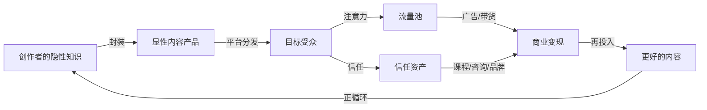
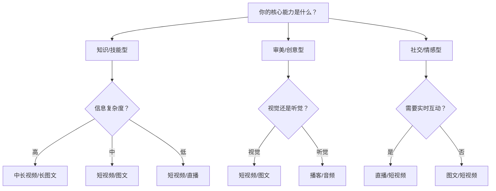
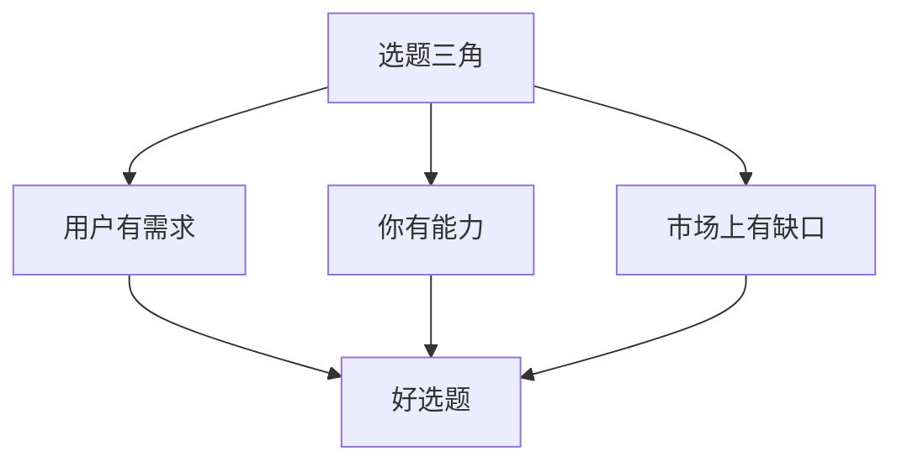
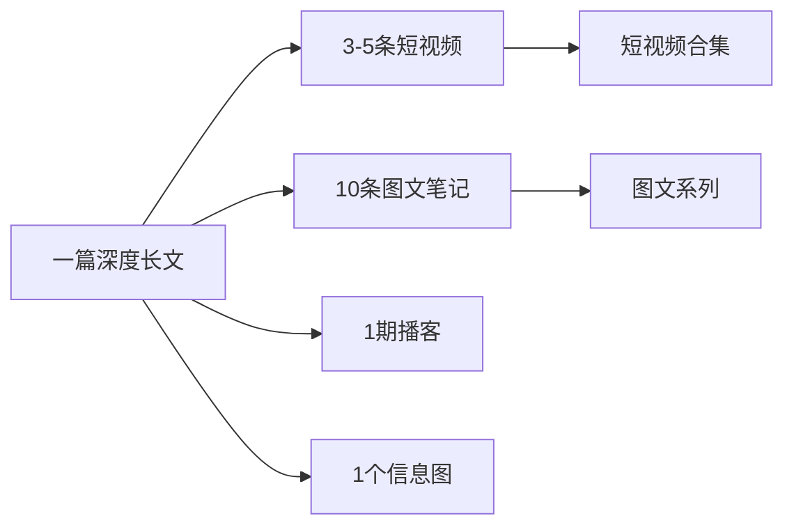
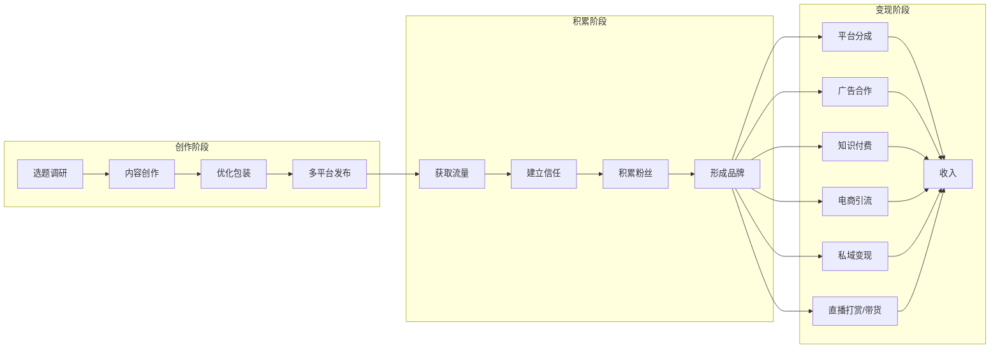
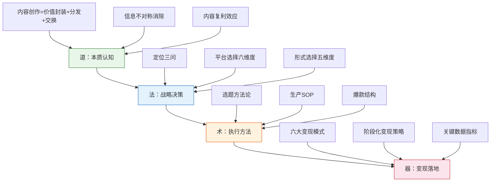

## 七、核心概念总结

前面六节分别拆解了内容创作的本质、内容形式、定位策略、平台选择、创作方法论和变现模式。这六节各自独立成章，但彼此之间存在严密的逻辑链条——任何一环的缺失或错位，都会导致整条链路断裂。

本节的使命不是简单重复，而是做三件事：

1. **串联** ——把分散的知识点编织成一张完整的认知地图，让"道法术器"四个层次形成闭环
2. **深化** ——补充前六节未充分展开的关键思维模型、常见陷阱和诊断方法
3. **落地** ——提供一套可执行的自检框架和行动路线图，让理论真正转化为行动力

无论你是刚读完前六节需要巩固记忆，还是在未来实操中遇到困惑需要回归底层逻辑，这一节都是你的"导航仪"。

---

### 7.1 道：内容创作的本质认知

#### 7.1.1 一句话定义

> 内容创作的本质是：**将个人或组织的知识、经验、技能、观点和审美，封装成可传播、可消费的信息产品，通过数字化渠道分发给目标受众，并在此过程中建立信任关系、实现价值交换。**

这句话包含五个不可分割的核心要素：

| 要素 | 含义 | 关键判断标准 |
|------|------|-------------|
| **知识/经验/技能** | 你拥有的独特价值来源 | 这个东西你知道但大多数人不知道，或者你做得比大多数人好 |
| **封装** | 将隐性知识转化为显性可消费内容 | 别人看了能理解、能学会、能感受到价值 |
| **可传播/可消费** | 适配平台分发机制的内容形态 | 符合目标平台的格式要求和用户消费习惯 |
| **数字化渠道** | 承载内容分发的平台基础设施 | 抖音、小红书、B站、公众号、YouTube等 |
| **价值交换** | 受众获得信息/情绪价值，创作者获得流量/收入 | 双方都觉得"值了" |

**要素缺失的典型症状**：

- 有知识但不会封装 → 内容干巴巴，没人看。症状：点赞数远低于同领域账号，评论区冷清
- 会封装但不懂分发 → 内容很好但没有流量。症状：内容质量高但播放量始终卡在两位数
- 有流量但没有价值来源 → 火了一条就没了，无法持续。症状：某条内容爆了但后续内容断崖式下跌
- 有价值交换但不健康 → 只顾变现伤粉丝信任，短期赚钱长期崩盘。症状：粉丝取关率飙升，私信全是投诉

#### 7.1.2 经济学本质：信息不对称的消除

内容创作解决的核心经济问题是**信息不对称**。一个三线城市的烘焙师，手艺再好，服务半径不过十公里。当她把烘焙技巧拍成短视频，技能半径从十公里扩展到全国。

这个过程创造三种经济价值：

1. **降低信息获取成本** ——受众不需要亲自学三年烘焙，三分钟视频就能学会一道蛋糕。经济学上，这相当于将"学习成本"从数千小时压缩到几分钟，创造了巨大的消费者剩余
2. **创造注意力资源** ——大量注意力汇聚后成为可交易的资产，广告主愿意为注意力付费。一个10万粉的账号，其注意力价值大约等于一份区域性报纸的整版广告
3. **催生信任资产** ——持续输出优质内容建立的信任关系，可复用到更多商业场景。信任是最稀缺的商业资源，一旦建立，边际成本趋近于零

**深层理解**：这个循环中，最关键的转折点是从"注意力"到"信任"的转化。流量是数字，信任是资产。很多创作者陷入"流量焦虑"——疯狂追热点、蹭流量，获得的只是注意力，而非信任。注意力会消散，信任会复利。

#### 7.1.3 内容复利：一次创作，长期收益

传统经济模式中收入与时间严格挂钩——工作8小时拿8小时工资。内容创作打破了这个限制：一条视频可以在你睡觉时持续播放、持续变现。这就是**内容复利**。

复利的三个层次：

| 层次 | 机制 | 举例 | 时间尺度 |
|------|------|------|---------|
| **流量复利** | 优质内容被平台持续推荐 | 一篇小红书笔记发布6个月后仍有日均500+阅读 | 3-12个月 |
| **信任复利** | 内容积累形成个人品牌 | 粉丝看到你的名字就愿意点开，不需要每条都好 | 6-24个月 |
| **资产复利** | 信任资产可复用到新场景 | 从公众号文章到付费课程到咨询到品牌合作 | 12-36个月 |

**关键认知**：内容创作是马拉松，不是百米冲刺。前6个月可能几乎没有收入，需要持续输出才能看到效果。急于变现是大多数创作者失败的核心原因之一。

**复利的数学直觉**：假设你每周发布3条内容，每条内容平均获得100次曝光。前3个月你发布了36条内容，总曝光3600次。但到了第6个月，你早期的优质内容仍在被推荐，加上新内容的叠加效应，周曝光量可能达到最初的10倍。这就是复利的力量——前期积累慢，后期增长快。但前提是你的内容质量足够好，否则只是在积累数字而非资产。

#### 7.1.4 内容创作的三个思维陷阱

在"道"的层面，有三个根深蒂固的思维陷阱，足以让一个有才华的创作者走向失败：

**陷阱一：自嗨式创作**

症状：按照自己的兴趣和审美创作，忽视用户需求。"我觉得这个话题很有意思"，但用户不这么想。

纠正方法：每次创作前问自己——"如果我不是创作者，我会在搜索框里输入什么词来找到这个内容？"如果答案是"我不会搜这个"，这个选题就需要重新考虑。

**陷阱二：完美主义瘫痪**

症状：总觉得内容还不够好，反复修改迟迟不发布。结果是准备了三个月，发了三条就放弃了。

纠正方法：接受"80分就发布"的原则。一条80分的内容发布出去，比一条100分的内容躺在草稿箱里有价值一万倍。发布后的数据反馈才是最好的优化指南。

**陷阱三：速成心态**

症状：看到别人3个月涨粉10万，觉得自己也能。结果一个月没效果就焦虑，三个月没效果就放弃。

纠正方法：理解幸存者偏差。你看到的成功案例背后，可能有100个同样努力但没有被报道的失败者。给自己设定12个月的最低投入期，前6个月专注于内容质量和流程优化，而非数据增长。

---

### 7.2 法：定位、平台与形式的三角决策

#### 7.2.1 定位：一切的起点

定位是内容创作的第一道分水岭。用户每天接触数千条内容，只有那些在3秒内能被"归类"的账号才能获得注意力。

**定位的本质是三个问题的回答**：

| 问题 | 决定了什么 | 常见错误 |
|------|-----------|---------|
| **你是谁？** | 人设、专业背景、可信度 | 随意切换人设，今天专家明天小白 |
| **你给谁看？** | 目标人群的画像和需求 | "我的内容谁都能看" = 谁都不想看 |
| **你提供什么价值？** | 内容方向和核心卖点 | 只说"分享生活"没有差异化价值 |

**算法归类的核心逻辑**：每个平台的推荐算法都需要给内容打标签，然后匹配给可能感兴趣的用户。如果你的账号今天发美食、明天发编程、后天发情感，算法无法给你稳定标签，推荐就会混乱。

**关键数据**：以抖音为例，垂直度高的账号（同类内容占比>80%）相比杂乱账号，平均播放量高出3-5倍，粉丝转化率高出2-3倍。

**定位三步法**：

1. **能力盘点** ——列出你所有知识、技能、经验、兴趣，找到交集
2. **需求验证** ——在目标平台搜索相关关键词，看搜索量、竞争度、内容质量
3. **差异化设计** ——在已有竞争者的基础上，找到你的独特角度

**定位画布（可直接填写）**：

| 维度 | 你的回答 |
|------|---------|
| 核心领域 | 你最擅长的1-2个垂直方向 |
| 目标人群 | 年龄/性别/职业/痛点/消费能力 |
| 内容形式 | 图文/短视频/长视频/直播/音频 |
| 核心卖点 | 你能提供而别人提供不了的价值 |
| 差异化角度 | 你的独特视角/风格/方法论 |
| 变现路径 | 广告/课程/带货/咨询/私域 |

**定位的常见陷阱**：

- **定位过宽**："我做美食"——美食是一个巨大的品类，没有细分就没有辨识度。正确做法："我做15分钟以内的懒人快手菜，专门服务下班后不想花太多时间做饭的上班族"
- **定位过窄**："我只教用Excel做财务报表"——受众太小，天花板太低。正确做法："我教职场人用Excel提升工作效率"，然后在内容中逐步细分
- **定位虚假**：没有真实能力却包装成专家。互联网的记忆很长，一次翻车就能毁掉所有积累

#### 7.2.2 平台选择：不是哪个火做哪个

平台决定了你的内容形式、流量来源、变现路径、天花板高度。选错平台的代价不是"少赚一点"，而是整条路线从根基上就是错的。

**平台本质的三个关键事实**：

1. **平台和你的利益并不完全一致** ——平台要的是用户时长，你要的是变现和粉丝沉淀。冲突时平台一定优先自己
2. **平台规则随时可能变** ——你在平台上的所有"资产"都是租来的，不是买来的。2023年小红书大幅调整算法权重，大量账号流量腰斩就是明证
3. **最终的资产是你自己** ——平台是渠道，不是目的地。真正值钱的是你的内容能力、个人品牌和私域用户池

**七大主流平台核心参数对比**：

| 平台 | 核心形式 | 流量逻辑 | 变现优势 | 适合人群 | 内容生命周期 |
|------|---------|---------|---------|---------|-------------|
| **抖音** | 短视频/直播 | 算法推荐，爆发力强 | 直播带货、广告、星图 | 表现力强、能持续产出 | 24-72小时 |
| **小红书** | 图文/短视频 | 搜索+推荐双引擎 | 品牌合作、种草带货 | 审美好、擅长图文 | 30-180天 |
| **B站** | 中长视频 | 粉丝关注+推荐 | 充电、花火、课程 | 深度内容、知识分享 | 180-365天 |
| **公众号** | 长图文 | 社交传播+搜一搜 | 广告、知识付费、私域 | 写作能力强、深度思考 | 90-365天 |
| **YouTube** | 中长视频 | 搜索+推荐 | AdSense、品牌合作 | 英语内容、全球化 | 365天+ |
| **视频号** | 短视频/直播 | 社交推荐 | 直播带货、私域导流 | 微信生态、私域运营 | 48-168小时 |
| **知乎** | 问答/专栏 | 搜索+推荐 | 知乎Live、好物推荐 | 专业知识、深度回答 | 180-365天 |

**平台选择的核心原则**：

- **起步期**：选择1个主平台深耕，不要多平台同时铺开
- **选择标准**：你的内容形式 × 平台流量逻辑 × 目标人群重合度
- **扩展时机**：主平台粉丝过万、内容生产流程稳定后，再考虑第二个平台

#### 7.2.3 内容形式：选对形态事半功倍

每种内容形式都有截然不同的生产逻辑、传播规律和变现路径。选错形式，再好的内容也可能无人问津。

**六大内容形式的核心特征**：

| 形式 | 信息密度 | 生产门槛 | 传播特性 | 长尾价值 | 变现效率 |
|------|---------|---------|---------|---------|---------|
| **短视频**（<3分钟） | 低 | 低 | 爆发力强，衰减快 | 弱 | 中（带货强） |
| **中长视频**（3-30分钟） | 高 | 中高 | 稳定增长 | 强 | 高（课程/品牌） |
| **图文** | 中 | 低 | 搜索友好 | 强 | 中（广告/私域） |
| **直播** | 中 | 中 | 即时互动 | 无 | 高（打赏/带货） |
| **音频/播客** | 中 | 低 | 陪伴感强 | 中 | 低（赞助/课程） |
| **互动内容** | 高 | 高 | 参与感强 | 中 | 中（品牌合作） |

**核心规律**：信息密度越高的形式，生产门槛通常越高，但单条内容的长尾价值也越强。信息密度越低的形式，生产门槛越低，但竞争也越激烈，需要更高的产出频率。

**形式选择的决策树**：

#### 7.2.4 "法"层面的诊断清单

在做任何战略决策之前，用这个清单自检：

| 检查项 | 通过标准 | 不通过的后果 |
|--------|---------|-------------|
| 定位清晰度 | 能用一句话说清"我是谁、给谁看、提供什么" | 内容方向混乱，算法无法归类 |
| 定位差异化 | 搜索同领域关键词，你的角度至少有3个竞品没有覆盖 | 同质化竞争，只能拼价格/频率 |
| 平台匹配度 | 你的内容形式 × 平台主流形式的重合度>70% | 生产效率低，内容水土不服 |
| 人群精准度 | 能描述出目标用户的3个具体痛点 | 内容泛泛而谈，无法建立深度信任 |
| 变现路径清晰 | 能画出从内容到收入的具体链路 | 只有流量没有收入，创作不可持续 |

---

### 7.3 术：内容创作的方法论体系

#### 7.3.1 选题方法论：内容创作的源头

选题不是"我想写什么"，而是"用户需要什么"。一个好选题的本质是：**你的能力与用户需求之间的交集**。

**选题的四个来源**：

| 来源 | 方法 | 适用场景 | 效率评级 |
|------|------|---------|---------|
| **平台热点** | 关注平台热搜、热门话题、挑战赛 | 追求流量爆发 | ★★★★（短期爆发） |
| **用户痛点** | 评论区、私信、问答平台找高频问题 | 建立专业信任 | ★★★★★（长期价值） |
| **竞品分析** | 分析同类账号的爆款内容 | 快速找到有效选题 | ★★★★（高效复制） |
| **个人经验** | 自己的真实经历和独特见解 | 建立差异化人设 | ★★★（独特但有限） |

**选题评估矩阵**：

| 维度 | 高分标准 | 低分表现 |
|------|---------|---------|
| 需求强度 | 用户主动搜索、高频提问 | 没人关心、自嗨型选题 |
| 竞争程度 | 竞争者少或质量低 | 头部垄断、红海一片 |
| 内容匹配 | 你的能力恰好覆盖 | 需要勉强拼凑 |
| 变现潜力 | 有明确的商业转化路径 | 纯娱乐、无法变现 |

**选题的进阶技巧——建立选题库**：

不要每次创作都从零开始找选题。建立一个持续更新的选题库，按以下维度分类：

- **常青选题**：不受时间影响的核心知识（如"Excel常用函数大全"），任何时候发布都有流量
- **周期选题**：与季节、节日、行业周期相关（如"年终总结怎么写"），提前1个月准备
- **热点选题**：跟随平台热点快速反应（如"XX事件对普通人意味着什么"），24小时内发布
- **系列选题**：拆解一个大主题为多期内容（如"从零学Python"系列），形成追更动力

一个健康的选题库应该保持50个以上的待用选题，其中常青选题占比>40%。

#### 7.3.2 内容生产的SOP

靠灵感创作的人，状态好时出爆款，状态差时交白卷；靠方法论创作的人，永远能稳定产出80分以上的内容。

**内容生产五步法**：

1. **选题调研**（30分钟）——确定选题，收集素材，分析竞品。具体操作：搜索目标关键词，打开排名前10的内容，记录它们的标题结构、核心观点、评论区高频问题
2. **结构搭建**（20分钟）——确定大纲、核心观点、钩子设计。具体操作：用"总-分-总"或"问题-分析-解决方案"框架，列出3-5个核心要点
3. **内容创作**（60-120分钟）——撰写/拍摄/录制。具体操作：先写完再修改，不要边写边改。写初稿时关闭一切干扰
4. **优化打磨**（30分钟）——标题优化、封面设计、标签设置。具体操作：准备3个备选标题，选择信息量最大、悬念最强的那个
5. **发布复盘**（15分钟）——选择发布时间，记录数据，总结经验。具体操作：记录发布时间、24小时数据、7天数据，与历史内容对比

**高效创作的工具链**：

| 环节 | 推荐工具 | 用途 | 使用技巧 |
|------|---------|------|---------|
| 选题调研 | 新榜、蝉妈妈、灰豚 | 热点追踪、竞品分析 | 每天花15分钟浏览，建立选题敏感度 |
| 文案写作 | ChatGPT、Claude、Notion | 辅助写作、大纲生成 | 用AI生成初稿，人工添加个人风格和真实案例 |
| 图片设计 | Canva、稿定设计、醒图 | 封面、配图、海报 | 建立品牌模板，保持视觉一致性 |
| 视频剪辑 | 剪映、CapCut、Premiere | 视频剪辑、字幕添加 | 短视频用剪映，长视频用Premiere |
| 数据分析 | 各平台创作者后台 | 数据追踪、内容优化 | 每周复盘一次，找到数据规律 |
| 排期管理 | 飞书多维表格、Notion | 内容日历、发布计划 | 提前2周规划内容，留出缓冲时间 |

#### 7.3.3 爆款内容的底层结构

爆款不是运气，而是可拆解、可复制的结构。所有爆款内容都遵循一个共同框架：

**爆款公式**：强钩子 × 信息增量 × 情绪共鸣 × 行动引导

| 要素 | 作用 | 实操技巧 | 占比权重 |
|------|------|---------|---------|
| **钩子**（前3秒/前2行） | 停住用户的注意力 | 提问式/数字式/反常识式/痛点式 | 30% |
| **信息增量** | 让用户觉得"学到了" | 独特视角、深度分析、实操干货 | 35% |
| **情绪共鸣** | 让用户觉得"说到我心里了" | 真实故事、痛点描述、价值观表达 | 25% |
| **行动引导** | 让用户做出下一步动作 | "收藏备用""评论区告诉我""关注不迷路" | 10% |

**钩子设计的六种模板**：

1. **数字钩子**："3个方法让你的Excel效率提升10倍"——数字给人确定感和具体感
2. **反常识钩子**："为什么越努力的人越穷？"——打破认知预期，引发好奇心
3. **痛点钩子**："月薪5000，怎么在一线城市存下钱？"——直接戳中目标人群的痛点
4. **悬念钩子**："我花了3年才明白这个道理"——制造信息缺口，让人想知道是什么
5. **权威钩子**："前阿里P8告诉你，大厂面试真正看什么"——借权威背书增加可信度
6. **对比钩子**："同样是做饭，为什么有人能月入3万？"——对比制造冲突，激发探索欲

**钩子的常见错误**：

- 开头太长："大家好，我是XXX，今天给大家分享一下..."——用户在你说完"大家好"之前就已经划走了
- 标题党过度：钩子很强但内容跟不上，用户会感到被骗，直接取关甚至举报
- 钩子与内容脱节：钩子讲A，内容讲B，用户觉得被骗了

#### 7.3.4 "术"层面的效率优化

**批量生产法**：不要一次只做一条内容。将创作过程拆解为"选题日""拍摄日""剪辑日""发布日"，每个环节集中处理5-10条内容，效率提升300%以上。

**内容复用矩阵**：一条核心内容可以拆解为多种形式：

例如：你写了一篇"2024年最值得考的5个证书"的长文，可以拆解为——每张证书一条短视频、一条图文笔记，再加一期播客讨论证书选择策略，最后做一个信息图汇总。一条内容变成15+条发布素材。

---

### 7.4 器：变现模式的系统框架

#### 7.4.1 六大变现模式全览

内容变现不是一步到位的，而是沿着"创作→积累→变现"的链条逐步展开。

**六大变现模式深度对比**：

| 模式 | 启动门槛 | 收入天花板 | 收入稳定性 | 核心要求 | 典型案例 |
|------|---------|-----------|-----------|---------|---------|
| **平台分成** | 低（有播放量即可） | 低 | 不稳定 | 持续产出、迎合算法 | B站10万播放≈200-500元 |
| **广告合作** | 中（需一定粉丝量） | 中高 | 中（依赖品牌预算） | 粉丝画像清晰、互动率高 | 小红书1万粉单条广告500-2000元 |
| **知识付费** | 中高（需专业能力） | 高 | 高（可复购） | 深度专业知识、教学能力 | 一门课程定价99-999元 |
| **电商带货** | 中（需选品能力） | 极高 | 不稳定 | 选品眼光、信任基础 | 佣金率通常5-30% |
| **私域变现** | 中（需引流能力） | 高 | 高 | 私域运营、社群管理 | 付费社群年费199-999元 |
| **直播** | 中（需表现力） | 极高 | 不稳定 | 表现力、控场能力、体力 | 头部主播单场百万级 |

**变现模式的选择逻辑**：

不同创作者的资源禀赋不同，适合的变现组合也不同。以下是按"创作者类型"的匹配建议：

| 创作者类型 | 核心优势 | 首选变现 | 次选变现 | 避免的变现 |
|-----------|---------|---------|---------|-----------|
| 知识专家型 | 深度专业能力 | 知识付费+咨询 | 广告合作 | 直播带货（消耗专业形象） |
| 审美创意型 | 视觉/创意能力 | 品牌合作+广告 | 自有品牌 | 知识付费（除非有教学能力） |
| 社交达人型 | 表现力+互动能力 | 直播+带货 | 广告合作 | 深度知识付费 |
| 实操教程型 | 手把手教学能力 | 课程+工具推荐 | 广告 | 纯流量变现（粉丝期待实操价值） |

#### 7.4.2 变现路径的选择逻辑

不同阶段的创作者应该选择不同的变现组合：

| 阶段 | 粉丝量级 | 推荐变现组合 | 月收入预期 | 核心任务 |
|------|---------|-------------|-----------|---------|
| **起步期** | 0-1000 | 平台分成 + 小额带货 | 0-500元 | 验证内容方向，建立生产流程 |
| **成长期** | 1000-1万 | 平台分成 + 品牌置换 + 私域引流 | 500-5000元 | 积累信任，建立私域 |
| **爆发期** | 1万-10万 | 广告合作 + 知识付费 + 带货 | 5000-5万元 | 多元变现，建立品牌 |
| **成熟期** | 10万+ | 多元化变现矩阵 | 5万-100万+ | 品牌化运营，团队化 |

**变现的核心原则**：

1. **先积累信任，再考虑变现** ——急于变现是大多数创作者失败的核心原因。建议前3个月纯做内容，不接任何广告
2. **多元收入结构** ——不依赖单一变现模式，降低风险。理想比例：任何单一收入来源不超过总收入的50%
3. **与内容价值匹配** ——变现方式要和你提供的价值一致，割韭菜式变现不可持续
4. **从轻到重** ——先做不需要交付的（广告、分成），再做需要交付的（课程、咨询）

#### 7.4.3 关键数据指标

| 指标 | 含义 | 健康基准 | 异常信号 |
|------|------|---------|---------|
| **粉丝增长率** | 每月新增粉丝占比 | 月增>5% | 连续2个月<2%需要复盘 |
| **互动率** | 点赞+评论+收藏/播放量 | >3%（图文），>5%（视频） | <1%说明内容与粉丝不匹配 |
| **完播率** | 看完视频的用户占比 | >30%（短视频），>40%（中视频） | <15%说明开头钩子不够强 |
| **变现转化率** | 付费用户/总粉丝 | >1% | <0.3%说明信任基础不足 |
| **内容产出频率** | 每周发布内容数量 | >=3条/周 | <2条/周算法权重下降 |
| **私域沉淀率** | 进入私域的粉丝占比 | >5% | <1%说明引流路径不清晰 |

**数据复盘的正确方法**：

不是只看数字涨跌，而是找到因果关系。每次复盘问三个问题：

1. **什么内容数据好？为什么？** ——找到爆款的共性，复制成功模式
2. **什么内容数据差？为什么？** ——找到失败的原因，避免重复错误
3. **下周应该调整什么？** ——基于数据做出具体行动决策

---

### 7.5 核心概念之间的逻辑关系

以上四个层次不是孤立的，而是层层递进、相互支撑的关系：

**自上而下**：道决定法（你对内容创作的理解决定了你的战略选择），法决定术（战略决定了你用什么方法），术决定器（方法决定了你怎么变现）。

**自下而上**：器反哺术（变现数据告诉你哪些内容更值钱），术反哺法（实操经验修正你的战略），法反哺道（实践深化你对本质的理解）。

**正循环**：当你在实践中遇到问题，先检查"术"有没有做到位（选题、生产、优化），再检查"法"有没有选对（定位、平台、形式），最后回归"道"重新理解本质。大多数创作者的问题出在"术"的层面——不是方向错了，是执行不到位。

**问题诊断的反向追踪法**：

当你的账号出现问题时，用这个框架反向定位问题所在：

| 症状 | 最可能的问题层 | 具体排查 |
|------|-------------|---------|
| 播放量/阅读量低 | 术（钩子/选题） | 检查标题和前3秒是否足够吸引人 |
| 播放量可以但互动低 | 术（内容质量） | 检查信息增量和情绪共鸣是否到位 |
| 互动好但涨粉慢 | 法（定位） | 检查账号定位是否清晰、内容是否垂直 |
| 涨粉快但变现差 | 器（变现策略） | 检查变现路径是否与粉丝需求匹配 |
| 变现好但粉丝流失 | 道（价值交换） | 检查变现方式是否伤害了粉丝信任 |

---

### 7.6 创作者自检诊断工具

以下是三个维度的自检问卷，每个问题用1-5分自评（1=完全不符合，5=完全符合）。总分可以帮助你判断当前阶段和主要瓶颈。

#### 道法层面（认知与战略）

| # | 自检问题 | 评分 |
|---|---------|------|
| 1 | 我能用一句话说清"我是谁、给谁看、提供什么价值" | ___ |
| 2 | 我的目标用户有明确的画像（年龄、职业、痛点） | ___ |
| 3 | 我选择的平台与内容形式高度匹配 | ___ |
| 4 | 我清楚自己在该领域的差异化优势 | ___ |
| 5 | 我理解内容复利效应，愿意投入12个月以上 | ___ |

#### 术层面（执行与生产）

| # | 自检问题 | 评分 |
|---|---------|------|
| 6 | 我有稳定的选题来源和选题库（>20个备选） | ___ |
| 7 | 我有可复用的内容生产SOP | ___ |
| 8 | 我的内容前3秒/前2行能有效抓住注意力 | ___ |
| 9 | 我每周能稳定产出3条以上内容 | ___ |
| 10 | 我有内容复用的意识和方法 | ___ |

#### 器层面（变现与数据）

| # | 自检问题 | 评分 |
|---|---------|------|
| 11 | 我清楚自己的变现路径和阶段目标 | ___ |
| 12 | 我每周复盘数据并据此优化内容 | ___ |
| 13 | 我的收入来源至少有2个以上 | ___ |
| 14 | 我有私域沉淀的路径和方法 | ___ |
| 15 | 我的变现方式与内容价值一致，不伤害粉丝信任 | ___ |

**评分解读**：

| 总分区间 | 状态 | 行动建议 |
|---------|------|---------|
| 15-30分 | 起步期 | 回到道法层面，先想清楚定位和方向再行动 |
| 31-45分 | 成长期 | 重点优化术层面，提升生产效率和内容质量 |
| 46-60分 | 爆发期 | 重点优化器层面，完善变现矩阵和数据复盘 |
| 61-75分 | 成熟期 | 全面优化，考虑团队化和品牌化运营 |

---

### 7.7 常见陷阱与避坑指南

#### 7.7.1 道层面的陷阱

**陷阱：把内容创作当副业心态**

症状：有空就做，没空就算。三天打鱼两天晒网。

后果：算法不推荐不稳定的创作者，粉丝也无法建立预期。结果是努力了半年，粉丝还在三位数。

纠正：把内容创作当成一份正式工作来对待。设定固定的创作时间（如每天晚上8-10点），设定最低产出标准（如每周3条），像打卡上班一样执行。

**陷阱：过度追求"原创性"**

症状：觉得借鉴别人的内容就是抄袭，非要100%原创。

后果：创作效率极低，而且很多你觉得"原创"的想法，其实别人早就做过了。

纠正：原创性体现在你的独特视角和表达方式，而非选题本身。同一个话题，100个人可以做出100种不同的内容。借鉴选题方向，用自己的经验和风格重新创作，这是正常且高效的做法。

#### 7.7.2 法层面的陷阱

**陷阱：什么火做什么**

症状：看到某个话题火了就赶紧跟，看到某个平台火了就赶紧入驻。

后果：永远在追热点，永远没有自己的定位。结果是什么都做，什么都做不好。

纠正：热点可以追，但要在你的定位范围内追。一个做Excel教程的账号，追"AI办公"的热点是合理的，追"明星八卦"的热点就是自毁定位。

**陷阱：多平台同步铺开**

症状：抖音、小红书、B站、公众号、视频号同时做，每个平台都发内容。

后果：精力分散，每个平台都做不精。结果是5个平台加起来的粉丝，不如专注做1个平台。

纠正：前6个月只做1个主平台。等主平台粉丝过万、生产流程稳定后，再用"内容复用矩阵"（7.3.4节）扩展到第二个平台。

#### 7.7.3 术层面的陷阱

**陷阱：只做自己擅长的，不做用户需要的**

症状：擅长写作就只写长文，擅长拍摄就只拍视频，不管用户更喜欢什么形式。

后果：内容质量很高但受众有限。

纠正：先研究目标用户在你的领域更喜欢什么形式的内容，再调整自己的生产方式。形式服务于内容，内容服务于用户。

**陷阱：追爆款而忽视系列内容**

症状：每条内容都是独立选题，没有关联性。

后果：用户看了这条喜欢，但不知道你下一条会发什么，缺乏关注动力。结果是"万赞零粉"——内容火了但账号不涨粉。

纠正：用"系列化"策略——将一个大主题拆解为5-10期系列内容，每期结尾预告下期内容，形成追更动力。系列内容的涨粉效率是独立内容的3-5倍。

#### 7.7.4 器层面的陷阱

**陷阱：过早变现**

症状：粉丝刚过1000就开始接广告、卖课程。

后果：粉丝觉得你"变了"，从分享者变成了商人。信任基础被破坏，后续变现更难。

纠正：前3个月纯做内容，不接任何商业合作。等粉丝信任建立后（互动率稳定>3%），再开始小规模尝试变现。

**陷阱：过度依赖单一收入来源**

症状：90%的收入来自平台分成或单一广告客户。

后果：平台政策一变或广告客户撤走，收入直接归零。

纠正：建立"收入三角"——至少有3个独立的收入来源，且任何单一来源不超过总收入的50%。例如：平台分成30% + 广告合作30% + 知识付费40%。

---

### 7.8 一页纸速查表

将本节所有核心概念浓缩为一张速查表，建议收藏备用：

| 层次 | 核心问题 | 关键概念 | 行动检查项 |
|------|---------|---------|-----------|
| **道** | 内容创作到底是什么？ | 价值封装、信息不对称、内容复利、信任资产 | □ 我能用一句话说清自己在做什么吗？ |
| **法-定位** | 我是谁？给谁看？提供什么？ | 定位三问、算法归类、差异化、垂直度 | □ 我的账号能被3秒归类吗？ |
| **法-平台** | 在哪里做？ | 平台本质、六维评估、主次平台策略 | □ 我选的平台和内容形式匹配吗？ |
| **法-形式** | 用什么形式做？ | 六大形式、信息密度、生产门槛、长尾价值 | □ 我选的形式是我的能力能驾驭的吗？ |
| **术-选题** | 做什么内容？ | 选题三角、四个来源、评估矩阵 | □ 这个选题用户真的需要吗？ |
| **术-生产** | 怎么做出来？ | 生产SOP、工具链、效率优化 | □ 我有可复用的生产流程吗？ |
| **术-爆款** | 怎么做得好？ | 爆款公式、钩子设计、信息增量 | □ 前3秒能停住用户吗？ |
| **器-变现** | 怎么赚钱？ | 六大模式、阶段策略、多元收入 | □ 我的变现方式和内容价值匹配吗？ |
| **器-数据** | 赚得怎么样？ | 关键指标、健康基准、优化方向 | □ 我每周复盘数据吗？ |

---

### 7.9 从概念到行动：下一步做什么

概念总结的目的是指导行动。读完这一节后，按以下顺序推进：

**第一步（今天）**：填写7.2.1节的定位画布，明确你是谁、给谁看、提供什么价值。同时完成7.6节的自检诊断，找到当前最大的瓶颈。

**第二步（本周）**：根据7.2.2节的平台对比表，选定1个主平台，完成账号注册和基础设置。同时建立选题库，用7.3.1节的方法储备20个选题。

**第三步（下周起）**：按7.3.2节的生产SOP，每周产出3条以上内容，持续4周。不要追求完美，先跑通流程。

**第四步（1个月后）**：用7.4.3节的关键指标复盘数据，优化内容方向和生产效率。此时你应该能回答"什么内容数据好，什么数据差"。

**第五步（3个月后）**：根据粉丝量级，按7.4.2节的阶段化策略，选择合适的变现组合。先从最轻的变现方式（平台分成、小额带货）开始。

**第六步（6个月后）**：回顾7.6节的自检问卷，重新评分。如果道法术三个维度都在4分以上，开始考虑多平台扩展和品牌化运营。

记住：**概念理解≠能力获得**。这七节理论基础给你的是地图，但走路还得靠你自己。从下一节开始，我们将进入平台算法的深度解析——理解算法的底层逻辑，你的每一步才能走得更精准。
