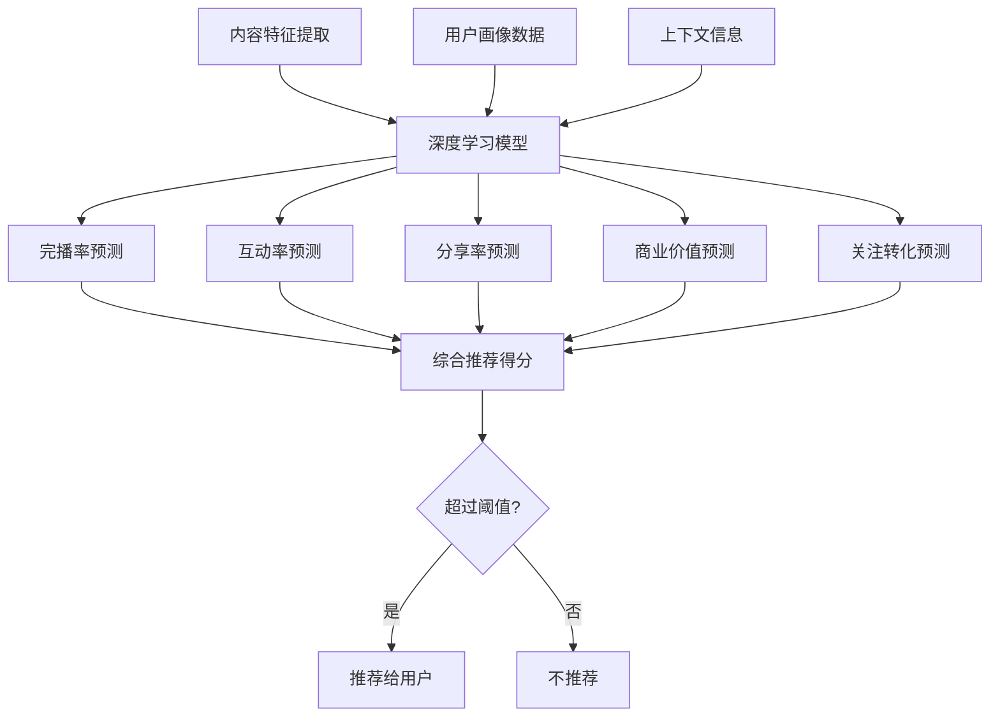
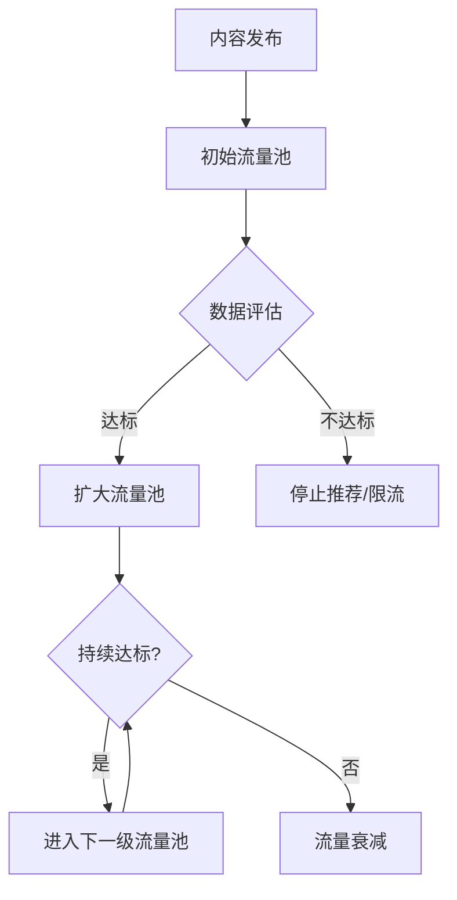
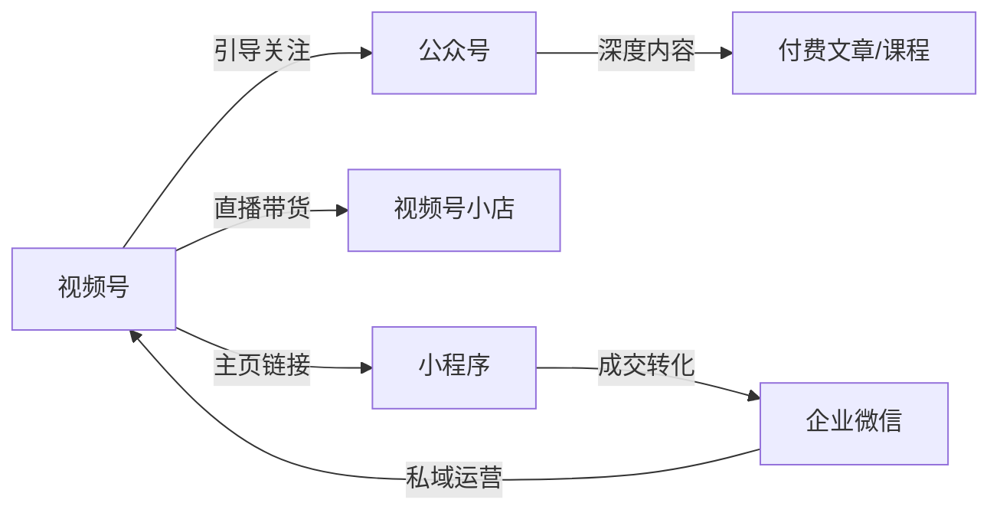
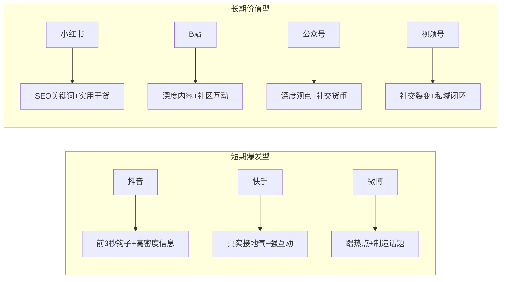
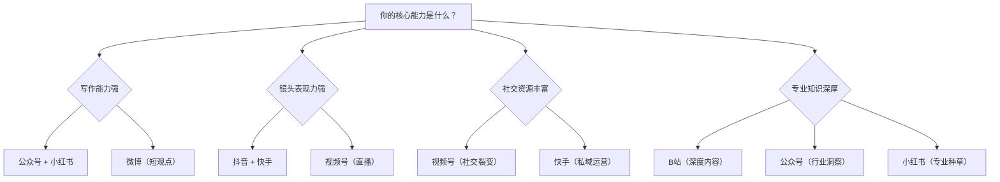

## 七、平台算法深度解析

理解平台算法是内容变现的底层能力。算法决定了你的内容能被多少人看到、被谁看到、以什么顺序被看到。不理解算法，你就是在黑暗中摸索；理解算法，你就拥有了与平台对话的能力。

本章深度解析七大主流平台的算法机制，从推荐系统的底层技术原理、流量分发模型、核心指标权重、到可操作的优化策略，帮助你建立系统性的平台认知。每一节不仅告诉你"是什么"，还告诉你"为什么这样设计"以及"具体怎么做"。

---

### 7.1 推荐算法的底层逻辑

在深入各平台之前，先理解所有推荐算法的共同底层逻辑。无论是抖音、小红书还是 B 站，推荐系统的核心任务只有一个：**在有限的用户注意力中，最大化平台整体收益**。

这个"收益"不是单一维度的，而是一个多目标优化问题——用户留存时长、互动深度、商业转化、内容生态健康度，平台需要同时优化这些目标，而它们之间往往存在矛盾。

#### 7.1.1 推荐系统的技术原理

现代内容平台的推荐系统并非单一算法，而是多种技术的组合。理解这些技术不是为了成为算法工程师，而是为了理解"为什么平台这样推荐"，从而找到优化方向。

**协同过滤（Collaborative Filtering）**

协同过滤是最基础的推荐技术，核心思想是"物以类聚，人以群分"。它分两种：

- **用户协同过滤**：找到与你行为相似的用户群，把他们喜欢而你还没看过的内容推荐给你。比如你和用户 A 都点赞了视频 1、2、3，而用户 A 还点赞了视频 4，系统就会把视频 4 推荐给你。实操意义：你的目标受众越清晰，系统越容易找到"相似用户群"，推荐越精准。
- **物品协同过滤**：找到与你喜欢内容相似的其他内容。比如你看了"Python 入门"视频，系统会推荐"Python 进阶""编程思维"等相关内容。实操意义：你的内容标签越精准，越容易被推荐给看过相关内容的用户。

**基于内容的推荐（Content-Based Filtering）**

系统分析内容本身的特征（文字、画面、音频、标签），然后匹配用户的历史兴趣标签。这是抖音"标签匹配"的技术基础——你的内容被打上标签，用户也被打上标签，系统做匹配。

内容特征提取的技术手段包括：
- **视觉特征**：CNN 模型识别画面中的物体、场景、人物、色彩分布
- **音频特征**：语音识别（ASR）转文字，背景音乐风格识别
- **文本特征**：NLP 模型分析标题、字幕、评论的语义
- **行为特征**：用户对同类内容的历史互动模式

**深度学习模型**

现代平台（尤其是抖音、快手）大量使用深度学习模型，最典型的是**多目标优化的深度兴趣网络（DIN/DIEN）**和**多任务学习模型（MMOE/PLE）**。这类模型能够：

- 预测用户对某条内容的完播概率
- 预测用户是否会点赞、评论、分享
- 预测用户是否会关注创作者
- 预测内容的商业转化潜力
- 综合多个预测目标，计算一个"综合得分"来决定是否推荐



**多臂老虎机算法（Multi-Armed Bandit, MAB）**

这是推荐系统中用于"探索与利用"平衡的核心算法。通俗解释：系统既要把流量分配给已知表现好的内容（利用），也要尝试推荐新内容看看效果（探索）。这就是为什么新账号和新内容总能获得一定的初始流量——系统在"探索"你的内容潜力。

MAB 算法的实操意义：
- **新内容有窗口期**：系统会给每条新内容一个"测试流量"，这是你的机会窗口
- **初始数据决定命运**：测试阶段的数据表现决定了系统是否继续"探索"你的内容
- **不要浪费首发**：发布时间、初始互动都很重要，因为它们影响系统对你内容的"第一印象"

**强化学习（Reinforcement Learning）**

抖音等平台已经将强化学习应用于推荐系统。与传统推荐只看"当下点击"不同，强化学习优化的是**长期用户价值**——用户明天、下周、下个月是否还会回来使用平台。

这意味着：
- 单纯的"标题党"可能短期点击率高，但长期会被降权（因为用户看完不满意，影响留存）
- 真正有价值的内容即使短期数据一般，长期也会获得更多推荐
- 平台会惩罚"过度收割用户注意力"的内容

**理解这个技术原理的实操意义**：平台不是在"评判"你的内容好不好，而是在"预测"你的内容推给特定用户后，该用户会产生什么行为。所以你的优化目标不是让内容"客观上好"，而是让算法模型对你的内容产生"高互动率预测"。

#### 7.1.2 流量分发的阶梯模型

几乎所有主流平台都采用**阶梯式流量池**机制——内容不是一次性推给所有人，而是逐级闯关：



所有平台的算法都遵循**赛马机制**——你的内容在每一级流量池中都在和其他内容竞争，只有数据表现优于同级内容的平均水平，才能进入下一级。这不是绝对数值的竞争，而是**相对排名**的竞争：你的完播率 30% 看起来不低，但如果同级内容平均完播率是 35%，你就会被淘汰。

**赛马机制的深层逻辑**：

平台的推荐资源是有限的（用户的注意力是有限的），所以必须有一个"择优"机制。这个机制的核心不是"你的内容好不好"，而是"你的内容比同级竞品好多少"。

实操启示：
- 不要只看自己的绝对数据，要关注同领域、同量级账号的平均水平
- 发布时间很重要——选择竞争较少的时段发布，你的内容更容易在"赛马"中胜出
- 内容差异化很重要——如果大家都在做同质化内容，你能做出差异就有优势

#### 7.1.3 算法评估的四个核心维度

| 维度 | 含义 | 典型指标 | 为什么重要 |
|------|------|----------|-----------|
| 内容质量 | 内容本身的信息密度和观赏性 | 完播率、完读率、停留时长 | 决定用户是否愿意花时间消费 |
| 用户反馈 | 用户对内容的即时反应 | 点赞、评论、收藏、转发 | 反映内容的情感共鸣和实用价值 |
| 社交关系 | 内容在社交网络中的传播力 | 分享次数、@好友、群聊传播 | 决定内容能否突破圈层限制 |
| 商业价值 | 内容对平台商业生态的贡献 | 广告兼容性、带货转化、付费意愿 | 平台需要盈利，高商业价值内容更受青睐 |

**四个维度的优先级因平台而异**，但有一个通用规律：**内容质量是基础，用户反馈是杠杆，社交关系是放大器，商业价值是加分项**。没有好的内容质量，后面三个维度都无法弥补。

#### 7.1.4 推荐系统的冷启动问题

推荐系统面临一个根本性难题：新用户和新内容没有历史数据，系统不知道该推荐什么。各平台的解决方案：

**新内容冷启动**：
- **抖音**：给每条新内容一个"初始流量池"（200-500 播放），通过小范围测试收集数据
- **小红书**：新笔记进入"审核+小流量测试"阶段，审核通过后才进入推荐池
- **B站**：新视频推送给部分粉丝和同分区用户，根据数据决定是否扩大推荐
- **快手**：新内容获得"基线流量"保障，确保最低曝光

**新用户冷启动**：
- **兴趣选择**：注册时让用户选择感兴趣的话题（抖音、小红书）
- **热门推荐**：先推荐热门内容，再根据用户行为逐步个性化
- **社交关系导入**：利用通讯录、社交关系推荐内容（视频号、快手）
- **探索期**：给新用户推荐多样化内容，快速学习用户偏好

**实操意义**：新账号的前 5-10 条内容至关重要，它们决定了系统对你账号的"第一印象"和初始标签。不要在新账号期发随意的内容。

#### 7.1.5 平台算法设计的根本矛盾

理解这个矛盾，才能理解为什么不同平台的算法差异如此之大：

**用户体验 vs. 商业变现**

平台需要在"让用户开心地刷"和"让广告主的钱花得值"之间取得平衡。如果推荐太多广告和带货内容，用户会流失；如果完全不做商业化，平台无法盈利。这个平衡点的差异，决定了不同平台的算法偏好：

- **抖音**：商业变现极度成熟，算法在自然内容和商业内容之间有精细的平衡机制，商业化内容占比约 15-20%
- **B站**：用户对商业内容敏感，算法对硬广有明显的限流倾向，但对"恰饭"（软性植入）更宽容
- **小红书**：种草和拔草是平台核心价值，商业内容与自然内容的界限模糊，这也是小红书商业化效率高的原因
- **快手**：信任电商模式，商业内容和社交关系深度绑定

**新创作者 vs. 老创作者**

平台需要持续吸引新创作者（供给端），也需要保护老创作者的权益（稳定供给）。这个矛盾催生了：

- **新账号流量扶持**：抖音、小红书、B站都有新账号的流量加权期（通常 5-10 条内容或 1-2 周）
- **衰减机制**：长期不更新的账号会失去推荐权重，抖音约 15 天不更新开始衰减
- **质量门槛提高**：随着内容供给过剩，平台不断提高内容质量的底线
- **创作者分层**：头部创作者获得更多资源，但新创作者也有上升通道

---

### 7.2 抖音算法机制

抖音是国内最典型的**兴趣推荐**平台，算法权力极大，粉丝量对曝光的影响相对较小。一个 0 粉账号的爆款视频可以获得千万播放，一个百万粉账号的内容也可能只有几百播放。

理解抖音算法的核心一句话：**抖音推荐的是内容，不是账号**。

#### 7.2.1 流量分发的阶梯模型

抖音采用**阶梯式流量池**机制，内容需要逐级闯关：

| 流量池级别 | 播放量范围 | 核心评估指标 | 存活率 | 评估周期 |
|-----------|-----------|-------------|--------|---------|
| 第一级 | 200-500 | 完播率 > 30% | 约 30% 的视频能通过 | 1-2 小时 |
| 第二级 | 1,000-5,000 | 完播率 + 互动率综合 | 约 15% 能继续 | 6-12 小时 |
| 第三级 | 1 万-10 万 | 进入热门推荐池 | 约 5% 能到达 | 24-72 小时 |
| 第四级 | 10 万-100 万 | 全站推荐，成为爆款 | 约 1% 能到达 | 持续评估 |
| 第五级 | 100 万以上 | 全网推荐，进入热搜 | 极少数内容 | 持续评估 |

每一级的评估周期不同。第一级通常在发布后 1-2 小时内完成评估，第二级在 6-12 小时内，第三级及以上可能持续 24-72 小时甚至更久。这就是为什么有些视频发布后几天才突然"爆了"。

**实操案例**：某知识博主发布了一条"Excel 函数技巧"视频，发布后 2 小时播放量 350，完播率 42%，点赞率 5.2%。这些数据超过了第一级流量池的阈值，系统在第 3 小时开始推送到第二级流量池。到第 8 小时播放量达到 3200，互动数据持续优秀，进入第三级。到第 3 天播放量突破 15 万，成为该账号的第一条爆款。

**不同垂类的流量池差异**：

抖音并非所有垂类使用同一套流量池参数。竞争激烈的垂类（如美妆、搞笑）阈值更高，冷门垂类（如手工、科普）阈值更低。这意味着：

- 热门垂类需要更高的完播率和互动率才能"过关"
- 冷门垂类虽然阈值低，但天花板也低（目标人群小）
- 选择垂类时要平衡"竞争强度"和"流量天花板"

#### 7.2.2 核心指标及其权重

抖音算法评估的关键指标按权重从高到低排列：

**第一梯队（权重最高）：完播率**

- 定义：完整看完视频的用户占比
- 为什么最重要：完播率直接反映内容质量，用户愿意花时间看完说明内容有吸引力。从技术角度看，完播率是深度学习模型中预测用户满意度的最强特征之一
- 优化策略：前 3 秒设悬念、控制视频时长（短内容完播率天然高）、节奏紧凑不拖沓
- 参考值：15 秒短视频完播率 > 45% 为优秀，60 秒视频完播率 > 25% 为优秀，3 分钟视频完播率 > 15% 为优秀

**完播率优化的 7 个具体技巧**：

1. **前 3 秒黄金钩子**：用提问、冲突、悬念、反常识开场。"你知道 90% 的人都在用错误的方式洗脸吗？"比"大家好，今天聊聊洗脸"的完播率高 3-5 倍
2. **控制时长**：新账号建议 15-30 秒，数据跑通后再逐步延长。15 秒视频完播率天然比 60 秒高 2 倍
3. **信息密度递增**：不要把最好的内容放在最后，而是让每一秒都比前一秒更有价值
4. **视觉节奏变化**：每 3-5 秒切换一次画面/角度/文字，避免视觉疲劳
5. **设置"未完待续"感**：在视频中段暗示后面有更精彩的内容
6. **字幕和画面同步**：关键信息用字幕强化，降低理解成本
7. **结尾不要"拖"**：信息传递完毕立即结束，不要加"感谢观看"之类的废话

**"平均播放时长"比"完播率"更重要**：2024 年以来，抖音算法越来越重视"平均播放时长"这个指标。一条 3 分钟的视频，用户平均看了 2 分钟（完播率 67%），比一条 15 秒的视频用户看完了（完播率 100%）更有价值。这意味着：不要为了追求完播率把视频做得很短，有深度的中长视频同样能获得推荐。

**第二梯队（权重较高）：互动率**

- 包括点赞率、评论率、转发率、收藏率
- 点赞率参考值：点赞/播放 > 3% 为良好，> 5% 为优秀
- 评论率参考值：评论/播放 > 0.5% 为良好，> 1% 为优秀
- 互动率不仅看绝对值，还看**互动速度**——发布后 1 小时内的互动密度比 24 小时内的总量更重要

**互动率优化的具体方法**：

- **点赞引导**：在视频中自然地引导"觉得有用就点个赞"，不要生硬地求赞
- **评论引导**：抛出争议性观点或选择题，"你觉得 A 好还是 B 好？评论区告诉我"
- **收藏引导**：干货类内容明确说"建议收藏，以后用得到"
- **转发引导**：创造社交货币价值，"转给你身边需要的人"
- **评论区运营**：发布后 30 分钟内回复每一条评论，提升评论区热度

**互动率的"加权"机制**：不是所有互动价值相同。抖音对互动的加权排序大致为：**转发 > 评论 > 收藏 > 点赞**。转发意味着用户愿意用你的内容来表达自己的品味，这是最强的社交信号。

**第三梯队（权重中等）：关注转化率**

- 视频带来新关注的比率
- 高关注转化说明内容具有"人设吸引力"，不只是单条内容好
- 优化方法：在视频中展现个人特质，让用户觉得"这个人值得关注"

**第四梯队（基础参考）：账号权重**

- 账号活跃度、违规记录、历史内容表现
- 新账号有流量扶持期（约前 5-10 条视频），之后回到正常赛马
- 账号权重的隐性因素：实名认证 > 未认证，开通商品橱窗 > 未开通，粉丝量级（1 万以上有加权）

#### 7.2.3 抖音的标签系统与人群匹配

抖音算法的核心是**标签匹配**——给每个用户和每条内容打标签，然后进行匹配推荐。

**内容标签的来源**：

1. 视频画面识别（AI 识别画面中的物体、场景、人物）
2. 音频识别（背景音乐、语音内容的 ASR 转文字分析）
3. 文字信息（标题、字幕、评论区关键词的 NLP 分析）
4. 话题标签（#话题）
5. 用户行为标签（发布者的历史内容类型）

**用户标签的来源**：

1. 基础信息（年龄、性别、地区）
2. 兴趣行为（经常看什么类型的内容、停留时长）
3. 互动行为（点赞、评论、关注了谁）
4. 搜索行为（搜索过的关键词）
5. 消费行为（购买过的商品、打赏过的主播）

**实操意义**：账号垂直度越高，算法给你打的标签越精准，推荐的人群越匹配，互动数据越好，推荐量越大。频繁切换内容领域会导致标签混乱，算法不知道该推给谁。

**标签混乱的典型表现**：

- 播放量忽高忽低，没有稳定预期
- 推荐流量中"非目标用户"占比高（可以在创作者服务中心查看粉丝画像）
- 互动率持续走低，因为推给的人群对你的内容不感兴趣

**标签修复方法**：

1. 连续发布 10-20 条高度垂直的内容
2. 不要蹭与自己领域无关的热点
3. 在评论区与目标用户互动，强化用户标签
4. 删除或隐藏与账号定位不符的历史内容

#### 7.2.4 抖音算法的特殊机制

**延迟推荐机制**：抖音不会在视频发布后立即大规模推荐。系统会先小范围测试，如果数据好，可能在 24 小时甚至 72 小时后才大规模推送。这就是"老视频突然爆了"的原因。实操建议：不要因为发布后 2 小时数据不好就删掉视频，给系统足够的测试时间。

**同城流量池**：开启定位后，内容会进入同城流量池。对于本地生活、探店类内容，同城流量是重要的增量来源。同城流量池的竞争相对较小，新账号可以通过同城流量快速积累初始数据。

**搜索流量崛起**：2023 年以来，抖音搜索流量占比持续上升，目前约占总流量的 15-20%，且仍在增长。标题和字幕中的关键词变得越来越重要，SEO 思维在抖音同样适用。抖音搜索排名的核心因素：关键词匹配度 > 内容质量分 > 账号权重 > 时效性。

**DOU+ 与自然流量的关系**：购买 DOU+ 不会直接提升自然推荐，但 DOU+ 带来的互动数据如果表现好，会间接促进自然流量的分发。反之，如果 DOU+ 数据很差（低完播、低互动），反而可能抑制自然推荐。实操建议：先用自然流量跑出数据好的视频，再用 DOU+ 加速放大，而不是对数据差的视频强行投 DOU+。

**铁粉机制**：2023 年抖音推出了铁粉机制，铁粉（长期高频互动的粉丝）看到你内容的概率更高。铁粉数量影响初始流量池的大小。维护铁粉的方法：定期直播互动、回复铁粉评论、发布铁粉专属内容。

**合集与系列化推荐**：抖音的合集功能让系列化内容获得额外推荐权重。当用户看完合集中的一条视频，系统会推荐同合集的其他视频。实操建议：把同主题的内容做成合集，提高用户的连续观看率。

#### 7.2.5 抖音算法的惩罚机制

了解什么行为会触发算法惩罚，比了解如何获得推荐更重要——因为一次限流可能抵消一个月的努力。

**触发限流的常见行为**：

| 违规类型 | 具体行为 | 惩罚力度 | 恢复周期 |
|---------|---------|---------|---------|
| 内容违规 | 涉黄涉政、虚假信息、医疗养生违规 | 严重限流或封号 | 数周至永久 |
| 搬运抄袭 | 直接搬运他人视频、画面重复度高 | 限流 + 不推荐 | 1-2 周 |
| 刷量作弊 | 买粉、买赞、互赞互评群 | 限流 + 清除虚假数据 | 2-4 周 |
| 频繁删除 | 短时间内大量删除已发布视频 | 轻度限流 | 3-7 天 |
| 硬广引流 | 视频中出现微信号、二维码等引流信息 | 限流 + 视频不可见 | 1-2 周 |
| 标题党 | 标题与内容严重不符 | 降低推荐权重 | 持续影响 |
| 敏感词 | 标题或字幕中出现平台敏感词 | 限流或不推荐 | 3-7 天 |

**限流的判断方法**：

1. 连续 5 条以上视频播放量低于 200（排除内容质量问题）
2. 搜索自己的账号昵称找不到
3. 视频不在任何话题页面展示
4. 创作者服务中心的"账号状态"显示异常

**限流后的恢复策略**：

1. 停止发布 3-5 天，让系统"冷静"
2. 检查并删除所有违规内容
3. 恢复发布后，内容严格遵守平台规范
4. 发布高质量的原创内容重建信任
5. 不要试图通过刷量来"冲破"限流，这会加重惩罚

#### 7.2.6 抖音账号从零到一的冷启动指南

**第 1-3 天：账号基础设置**
- 完成实名认证
- 完善个人资料（头像、昵称、简介），明确账号定位
- 选择 1 个垂直领域，不要贪多

**第 4-10 天：内容测试期**
- 每天发布 1-2 条内容，测试不同选题方向
- 重点关注完播率，而非播放量
- 记录每条内容的数据，找到表现最好的方向

**第 11-30 天：方向确认期**
- 聚焦数据最好的 2-3 个选题方向
- 开始建立内容模板和制作流程
- 每条内容发布后 30 分钟内回复所有评论

**第 31-90 天：稳定增长期**
- 保持日更或隔日更的频率
- 开始尝试系列化内容
- 分析爆款内容的共性，建立"爆款公式"

---

### 7.3 小红书算法机制

小红书是**搜索 + 推荐**双引擎驱动的平台，搜索流量占比约 40%，这在所有内容平台中是最高的。这意味着小红书的 SEO 策略比其他平台更重要。

小红书的核心价值主张是"种草"——用户来这里是为了发现好东西、做消费决策。所以小红书的算法天然偏好"有用"的内容，而非"有趣"的内容。

#### 7.3.1 流量来源构成

| 流量来源 | 占比 | 特点 | 优化方向 |
|---------|------|------|---------|
| 搜索流量 | 约 40% | 用户主动搜索，意图明确，转化率高 | 关键词优化 |
| 推荐流量 | 约 40% | 系统根据兴趣推荐，曝光量大 | 封面+标题优化 |
| 关注流量 | 约 15% | 粉丝看到新内容，忠诚度高 | 粉丝维护 |
| 其他流量 | 约 5% | 话题活动、站外引流等 | 参与平台活动 |

#### 7.3.2 推荐算法的核心指标

小红书推荐算法的指标权重排序：

**1. 点击率（CTR）**：封面和标题决定用户是否点击。小红书是双列信息流，用户先看到封面再决定是否点进去，所以点击率是第一道门槛。点击率 > 10% 为良好，> 15% 为优秀。

**封面优化的 5 个原则**：

- 高对比度色彩：在信息流中脱颖而出
- 清晰的文字信息：3-8 个字概括核心价值
- 人脸出镜：有人脸的封面点击率平均高 30%
- 信息前置：把最有吸引力的信息放在封面左侧（双列信息流中左侧更容易被看到）
- 风格统一：建立视觉识别度，让用户一眼认出是你的内容

**2. 互动率**：点赞、收藏、评论的综合比率。小红书的"收藏"权重特别高，因为收藏代表用户认为内容有长期参考价值。收藏率 > 5% 为优秀。

**3. 完读率**：图文笔记的阅读完成率。长笔记如果完读率低，算法会认为内容质量不够。优化方法：使用分段、小标题、emoji 分隔，让长文易于阅读。

**4. 笔记质量分**：系统对内容质量的综合评估，包括图片质量、文字质量、是否原创等。图片模糊、文字过短、明显搬运的内容会被降低质量分。

#### 7.3.3 小红书的 CES 评分体系

小红书内部使用 CES（Community Engagement Score）评分来衡量笔记质量：

```text
CES = 点赞(1分) + 收藏(1分) + 评论(4分) + 转发(4分) + 关注(8分)
```

注意评论和转发的权重是点赞的 4 倍，关注的权重是 8 倍。这意味着：

- 引导用户评论比引导点赞更有价值
- 内容引发讨论和分享比单纯获得点赞更重要
- 每一个新关注的权重极高

**CES 优化的实操策略**：

- **提升评论**：在笔记末尾抛出问题，"你们还有什么好方法？评论区分享"；在笔记中故意留一个"小错误"，让热心用户来纠正
- **提升转发**：制作"信息图"类内容，方便用户保存和分享；写"合集"类笔记，增加实用价值
- **提升关注**：在笔记中预告后续内容，"下一期讲 XX，关注不迷路"；系列化内容设计，让用户有理由关注

**CES 的实际计算案例**：

假设一篇笔记获得了 500 点赞、300 收藏、80 评论、20 转发、15 新关注：
```text
CES = 500×1 + 300×1 + 80×4 + 20×4 + 15×8
    = 500 + 300 + 320 + 80 + 120
    = 1320
```
如果另一篇笔记获得了 1000 点赞、100 收藏、10 评论、5 转发、3 新关注：
```text
CES = 1000×1 + 100×1 + 10×4 + 5×4 + 3×8
    = 1000 + 100 + 40 + 20 + 24
    = 1184
```
前者虽然点赞只有后者的一半，但 CES 总分更高，会获得更多推荐。这就是为什么"互动质量"比"互动数量"更重要。

#### 7.3.4 小红书的搜索排名算法

搜索排名的决定因素：

1. **关键词匹配度**：标题中的关键词权重最高，正文次之，话题标签再次
2. **笔记质量分**：互动数据越好，搜索排名越高
3. **账号权重**：粉丝量、历史笔记表现、账号活跃度
4. **时效性**：新笔记在搜索结果中有一定的时效性加权
5. **用户个性化**：不同用户搜索同一关键词，看到的结果可能不同

**关键词布局策略**：

- 标题必须包含核心关键词（权重最高）
- 正文前 100 字包含核心关键词
- 正文中自然分布 3-5 个相关长尾关键词
- 话题标签选择 2-3 个相关话题（1 个大话题 + 1-2 个小众精准话题）

**关键词挖掘的 4 种方法**：

1. **小红书搜索框联想**：输入核心词，看下拉联想词，这些都是真实用户在搜索的词
2. **竞品笔记分析**：看同类爆款笔记用了哪些关键词和话题标签
3. **第三方工具**：千瓜数据、新红数据可以查看关键词搜索量和竞争度
4. **评论区挖掘**：用户在评论区问的问题，往往就是潜在的搜索关键词

**关键词选择的优先级**：搜索量大 + 竞争度低 > 搜索量大 + 竞争度高 > 搜索量小 + 竞争度低。新账号优先做中长尾关键词，避开大词竞争。

#### 7.3.5 小红书的流量衰减与长尾效应

与抖音不同，小红书的内容具有**长尾效应**。一篇高质量的笔记可能在发布后持续获得搜索流量数月甚至数年。这是因为搜索流量不依赖时效性，只要关键词匹配且内容质量高，就会持续被推荐。

流量衰减规律：

| 时间段 | 流量来源 | 流量特征 | 运营动作 |
|--------|---------|---------|---------|
| 发布后 0-24 小时 | 推荐流量为主 | 流量高峰，决定能否进入更大流量池 | 积极回复评论，引导互动 |
| 发布后 3-7 天 | 推荐衰减，搜索上升 | 流量从推荐转向搜索 | 优化关键词（如果数据好可微调标题） |
| 发布后 1 周-1 个月 | 搜索流量为主 | 长尾效应开始显现 | 持续维护评论区，更新过时信息 |
| 发布后 1 个月以上 | 纯搜索流量 | 稳定的长尾流量 | 定期检查排名，必要时更新内容 |

**长尾效应的利用方法**：

- 做"常青内容"（evergreen content）：不追时效性热点，写长期有价值的内容
- 建立内容矩阵：围绕一个主题写 10-20 篇笔记，覆盖所有相关长尾关键词
- 定期更新老笔记：更新数据、补充信息，保持内容的时效性
- 笔记之间互相链接：在新笔记中引用老笔记，形成内容网络

#### 7.3.6 小红书的账号权重体系

小红书的账号权重不是单一数值，而是由多个维度构成：

| 维度 | 影响因素 | 权重占比 |
|------|---------|---------|
| 粉丝量 | 粉丝越多，基础权重越高 | 中 |
| 账号等级 | 薯条等级（泡泡薯→奶瓶薯→金冠薯） | 低 |
| 内容质量 | 历史笔记的平均互动数据 | 高 |
| 垂直度 | 内容领域的专注程度 | 高 |
| 活跃度 | 发布频率、互动频率 | 中 |
| 违规记录 | 是否有过违规处罚 | 极高（一次违规可能长期影响） |

**小红书的"薯条等级"升级条件**：

- 泡泡薯：发布 1 篇笔记获得 10 个收藏或 50 个赞
- 奶瓶薯：发布 3 篇笔记各获得 10 个收藏或 50 个赞
- 金冠薯：发布 12 篇笔记各获得 10 个收藏或 50 个赞

等级提升会解锁更多功能（如数据分析工具），但对流量的影响有限。不要为了升级而发低质量内容。

#### 7.3.7 小红书图文 vs 视频的算法差异

2024 年以来，小红书对图文和视频的算法权重有所调整：

| 维度 | 图文笔记 | 视频笔记 |
|------|---------|---------|
| 推荐权重 | 基础权重 | 有一定加权（平台鼓励视频） |
| 搜索权重 | 高（文字内容利于关键词匹配） | 中（视频关键词识别不如图文精准） |
| 互动门槛 | 低（图文更容易引发评论） | 中（视频需要更高的完播率） |
| 制作成本 | 低 | 高 |
| 长尾效应 | 强 | 中等 |

**实操建议**：新账号建议以图文为主（制作成本低、搜索权重高、长尾效应强），数据稳定后逐步增加视频内容。最佳策略是图文和视频结合——图文做搜索流量，视频做推荐流量。

---

### 7.4 B站算法机制

B站是**中长视频**平台，用户以 Z 世代为主，内容偏好深度、有趣、有梗。B站的算法与抖音有本质区别——B站更重视内容的深度价值和用户忠诚度。

B站的核心价值主张是"学习+娱乐"的结合，用户来这里不只是消磨时间，更是为了获得有价值的内容体验。

#### 7.4.1 推荐机制的核心指标

B站的推荐算法评估维度：

| 指标 | 权重 | 含义 | 优化方向 |
|------|------|------|---------|
| 播放量 | 基础 | 视频被播放的次数 | 标题和封面吸引点击 |
| 完播率 | 高 | 看完视频的比例 | 内容节奏紧凑，有价值 |
| 互动率 | 高 | 点赞+投币+收藏+弹幕 | 引导互动，制造讨论点 |
| 投币率 | 最高 | 投币人数/播放量 | 提供高价值内容 |
| 收藏率 | 高 | 收藏人数/播放量 | 制作有长期参考价值的内容 |
| 弹幕密度 | 中 | 弹幕数/播放时长 | 制造讨论点，引导发弹幕 |
| 粉丝转化率 | 中 | 新关注/播放量 | 建立个人品牌吸引力 |

#### 7.4.2 B站算法的独特之处

**投币机制**：B站的"投币"是所有平台中最独特的互动形式。每个用户每天只有有限的硬币（通常 2-3 个），投币代表用户认为你的内容值得用稀缺资源奖励。投币权重在 B站算法中极高，甚至可能高于点赞。

**引导投币的技巧**：

- 在视频结尾说"如果觉得有用，投个币支持一下"（简单直接，但有效）
- 制作"有获得感"的内容：教程、攻略、深度分析——这类内容用户更容易觉得"值"
- 适当控制视频时长：太短的视频用户不会觉得"值得投币"，5-15 分钟是投币率最高的时长区间
- 制作"一键三连"引导动画：在视频结尾用动画引导点赞、投币、收藏

**弹幕互动**：弹幕是 B站文化的核心。高密度的弹幕不仅反映内容的互动性，还创造了"陪伴感"。算法会将弹幕密度作为内容质量的重要参考。

**引导弹幕的技巧**：

- 在视频中设置"互动点"：提问、预测、投票（"你们觉得哪个更好？弹幕扣 1 或 2"）
- 制造"名场面"：有梗、有反转、有高能片段，让观众忍不住发弹幕
- 使用弹幕引导语：在视频画面上打出"前方高能""名场面预警"等
- 设置"空降坐标"：在视频进度条上标注精彩片段的时间点，引导用户跳转和发弹幕

**收藏夹效应**：B站用户有收藏夹习惯，收藏率高的视频会被反复播放，产生长尾流量。教程类、知识类内容天然具有高收藏率。优化方法：在视频中明确说"建议收藏，以后用得到"，制作系列内容鼓励用户收藏整个系列。

**分区推荐**：B站按内容分区（科技、生活、游戏、动画等）进行推荐。选择正确的分区对获得精准推荐至关重要。选错分区会导致内容推给不感兴趣的人群，数据表现差。

**分区选择的原则**：

1. 看内容的核心受众在哪个分区活跃
2. 参考同类爆款视频的分区
3. 如果内容跨多个分区，选择竞争较小但受众匹配的分区
4. 不要为了流量选择热门但不相关的分区

#### 7.4.3 B站的流量分发节奏

B站的流量分发比抖音慢热，但持续时间更长：

| 时间段 | 流量特征 | 运营动作 |
|--------|---------|---------|
| 发布后 1-6 小时 | 推送给部分粉丝和同分区用户，测试数据 | 在动态、粉丝群预告 |
| 发布后 6-24 小时 | 数据好则扩大推荐范围 | 积极回复弹幕和评论 |
| 发布后 1-3 天 | 进入首页推荐，流量高峰 | 持续互动，回复评论 |
| 发布后 3-7 天 | 推荐流量衰减，搜索流量上升 | 优化标题关键词 |
| 发布后 1 周以上 | 搜索和推荐的长尾流量持续 | 定期回复新弹幕 |

B站的搜索流量占比约 30%，高于抖音但低于小红书。标题中的关键词优化同样重要。

#### 7.4.4 B站的"起飞"与流量加速

B站有自己的付费推广工具"起飞"，类似抖音的 DOU+。起飞的使用策略：

- 选择互动数据好的视频投放（完播率 > 25%，互动率 > 5%）
- 投放目标选择"播放量"或"互动量"，不要选"粉丝增长"
- 预算分配：先小额测试（50-100 元），数据好再追加
- 起飞不会影响自然推荐权重，可以放心使用

#### 7.4.5 B站的创作激励与变现

B站的变现路径与算法紧密相关：

- **创作激励计划**：根据播放量和互动数据发放收益，千次播放约 1-3 元（2024 年数据）
- **花火商单**：粉丝量 > 1 万可入驻花火平台接商业合作
- **充电计划**：粉丝打赏，类似其他平台的"赞赏"
- **直播带货**：需要一定的粉丝基础
- **课堂付费**：制作付费课程，适合知识类创作者

#### 7.4.6 B站账号从零到一的冷启动指南

**第 1-2 周：定位与准备**
- 确定内容分区和风格定位
- 研究同分区的头部 UP 主，分析他们的选题、封面、标题
- 准备 3-5 个视频的素材

**第 3-4 周：内容发布与测试**
- 每周发布 1-2 条视频，测试不同选题
- 重点关注投币率和收藏率（这两个指标对 B站算法最重要）
- 在视频结尾引导"一键三连"

**第 2-3 个月：方向确认与优化**
- 聚焦数据最好的内容方向
- 开始制作系列化内容
- 在动态和粉丝群保持活跃

---

### 7.5 微信公众号算法机制

微信公众号是**私域流量**的核心阵地，算法逻辑与抖音、小红书有本质区别。公众号的流量更多依赖社交关系链和搜索，而非纯算法推荐。

公众号的核心价值是"深度内容 + 私域沉淀"——用户来这里是为了阅读有价值的观点和分析，而非消磨时间。

#### 7.5.1 流量来源构成

| 流量来源 | 占比 | 特点 | 趋势 |
|---------|------|------|------|
| 订阅号消息列表 | 约 40% | 粉丝看到推送，打开率 2-5% | 持续下降 |
| 搜一搜 | 约 25% | 用户搜索关键词，增长最快 | 快速上升 |
| 朋友圈分享 | 约 20% | 社交裂变，信任度高 | 稳定 |
| 推荐流量 | 约 10% | 系统推荐给非粉丝 | 上升中 |
| 其他 | 约 5% | 公众号文章底部推荐、看一看等 | 稳定 |

#### 7.5.2 推荐算法的评估维度

微信公众号的推荐（"看一看"和文章底部推荐）算法评估：

1. **打开率**：标题吸引力，打开率 > 5% 为良好
2. **阅读完成率**：内容质量，长文的阅读完成率 > 30% 为良好
3. **分享率**：社交价值，分享率 > 3% 为优秀
4. **在看/点赞率**：社交推荐信号
5. **评论互动率**：社区活跃度

**关键洞察**：公众号的"分享率"权重极高，因为微信是社交平台，分享意味着内容具有社交货币价值。一篇被大量分享的文章，即使粉丝量不大，也能获得巨大曝光。

**提升分享率的方法**：

- 写"社交货币"型内容：让用户分享后显得有品味、有见识、有爱心
- 提供实用工具/资源：清单、模板、攻略类内容天然高分享
- 引发情感共鸣：让用户觉得"这说的就是我"
- 设置分享钩子：文末加一句"如果觉得有用，请分享给需要的朋友"

#### 7.5.3 搜一搜的崛起

微信搜一搜已成为公众号最重要的增量流量来源。搜一搜的排名算法：

1. **内容相关性**：标题和正文与搜索词的匹配度
2. **账号权威性**：粉丝量、认证状态、历史内容质量
3. **内容质量**：阅读完成率、互动数据
4. **时效性**：新内容有时效性加权
5. **社交信号**：好友是否阅读过、是否点了"在看"

**搜一搜 SEO 策略**：

- 标题必须包含目标关键词
- 文章开头 100 字包含关键词
- 文章结构清晰，使用小标题（搜一搜可以直接展示小标题内容）
- 持续产出同一领域的高质量内容，建立账号权威性
- 引导用户点"在看"，增加社交信号
- 文章内设置"合集"功能，将同主题文章串联

#### 7.5.4 公众号的算法变化趋势

2023 年以来，公众号算法发生了重大变化：

- **推荐流量占比上升**：不再完全依赖粉丝订阅，好内容可以突破粉丝量限制
- **内容质量权重提高**：低质量内容即使标题党也难获推荐
- **垂直领域深耕受到奖励**：专注某一领域的账号获得更多推荐
- **视频号与公众号联动**：视频号内容可以为公众号导流
- **付费内容生态**：微信读书、付费文章等功能为知识变现提供更多路径

#### 7.5.5 公众号的标题优化

公众号的标题是决定打开率的第一要素。公众号标题的特殊性：

- 在订阅号消息列表中，标题是用户看到的唯一信息（封面图已被弱化）
- 标题长度建议 15-25 字，太长会被截断
- 标题需要在 1 秒内传达核心价值

**高打开率标题的 5 种模式**：

1. **数字型**："提升效率的 7 个方法"——具体、可量化
2. **痛点型**："为什么你总是存不下钱？"——直击痛点
3. **悬念型**："我用这个方法，3 个月瘦了 20 斤"——引发好奇
4. **权威型**："哈佛大学研究发现……"——借助权威背书
5. **对比型**："月薪 5000 和月薪 5 万的人，差距在哪里？"——制造冲突

---

### 7.6 快手算法机制

快手与抖音是直接竞品，但算法逻辑有显著差异。快手更强调**社交关系**和**普惠分发**，不会像抖音那样把所有流量集中给爆款。

快手的核心价值主张是"真实"——用户来这里是为了看到真实的生活、真实的人。

#### 7.6.1 快手与抖音的算法差异

| 维度 | 抖音 | 快手 |
|------|------|------|
| 分发逻辑 | 中心化，流量集中给爆款 | 去中心化，流量更均匀分布 |
| 粉丝权重 | 较低，单条内容质量为主 | 较高，粉丝关系影响推荐 |
| 流量分配 | 头部内容获取大部分流量 | 长尾内容也能获得可观流量 |
| 内容调性 | 精致、快节奏 | 真实、接地气 |
| 私域权重 | 低 | 高，关注页流量占比大 |
| 社交属性 | 弱，内容消费为主 | 强，社区关系链重要 |
| 变现路径 | 广告+电商为主 | 直播打赏+电商为主 |

#### 7.6.2 快手的核心算法指标

快手的推荐算法同样采用阶梯式流量池，但指标权重与抖音不同：

1. **完播率**：与抖音类似，但权重略低
2. **互动率**：点赞、评论、分享的综合
3. **关注转化率**：快手的粉丝权重较高，关注转化率对推荐有正向影响
4. **粉丝互动率**：已关注粉丝的互动行为
5. **社交传播**：内容在快手内的社交分享

**快手的独特指标——"基尼系数"**：快手内部使用类似经济学中基尼系数的概念来衡量流量分配的均匀度，目标是避免流量过度集中。这意味着即使你的内容不是最顶尖的，只要质量过关，也能获得稳定的曝光。

**实操意义**：快手对中小创作者更友好。在抖音，你的视频要么爆要么死；在快手，大多数内容都能获得一个"基础播放量"。这使得快手更适合需要稳定收入的创作者。

#### 7.6.3 快手的私域流量优势

快手的"关注页"流量占比约 30-40%，远高于抖音的 10-15%。这意味着：

- 快手粉丝的价值更高，因为粉丝真的能看到你的内容
- 私域运营在快手比在抖音更重要
- 快手更适合建立长期的粉丝关系
- 直播是快手的核心变现方式，因为粉丝会真的来

**快手私域运营的方法**：

1. 保持稳定的更新频率（日更或隔日更）
2. 直播是维护粉丝关系的核心手段
3. 在评论区与粉丝互动，建立"老铁"关系
4. 粉丝群运营：建立快手粉丝群，发布独家内容

#### 7.6.4 快手的变现生态

快手的变现路径与算法结合：

- **快手小店**：直播带货，快手的电商生态成熟，信任电商模式
- **磁力金牛**：付费推广工具，类似抖音的 DOU+
- **创作者激励**：根据播放量和互动发放收益
- **直播打赏**：快手直播生态强大，打赏收入是很多创作者的主要收入来源
- **短剧付费**：快手短剧生态发展迅速，付费短剧成为新的变现方式

---

### 7.7 微博算法机制

微博是**公域舆论场**，算法逻辑以热点和话题为核心。微博的流量高度集中在热搜和大 V 身上，普通创作者获取流量的难度较大，但在特定垂直领域仍有机会。

微博的核心价值是"信息传播"——用户来这里是为了获取最新资讯、参与公共讨论。

#### 7.7.1 微博的流量分发机制

微博的流量来源：

| 流量来源 | 占比 | 特点 |
|---------|------|------|
| 关注流 | 约 30% | 粉丝看到你的微博 |
| 热搜/热门 | 约 25% | 话题热度带来的流量 |
| 推荐流 | 约 25% | 系统根据兴趣推荐 |
| 搜索流 | 约 15% | 用户搜索关键词 |
| 超话/话题 | 约 5% | 垂直社区流量 |

#### 7.7.2 微博算法的核心指标

微博的推荐算法评估：

1. **互动率**：转发 > 评论 > 点赞（微博的转发权重最高，因为转发意味着内容具有传播价值）
2. **发布频率**：微博对活跃度要求高，日更或多更是基本要求
3. **垂直度**：专注某一领域的内容更容易获得推荐
4. **热点关联**：与当前热点话题相关的内容有时效性加权
5. **粉丝质量**：真实活跃粉丝的互动权重高于僵尸粉

**微博转发的特殊价值**：在微博的算法中，一个转发的价值约等于 5-10 个点赞。因为转发会将你的内容展示在转发者的粉丝面前，相当于免费获得了二次曝光。优化方法：写容易被转发的内容——观点鲜明的短评、实用的信息汇总、有共鸣的情感表达。

#### 7.7.3 微博的热搜机制

微博热搜是流量的最高入口，但进入热搜的门槛很高：

- 话题阅读量 > 100 万
- 讨论量 > 1 万
- 短时间内增长速度快

普通创作者难以直接上热搜，但可以通过**蹭热点**来获取流量：

1. 监控热搜榜，找到与自己领域相关的话题
2. 快速产出相关内容，带上热搜话题标签
3. 在话题热度上升期发布，获取推荐流量
4. 用专业角度解读热点，而不是简单复述

**蹭热点的时机选择**：

- **上升期**（话题刚上热搜 1-2 小时）：竞争少，但流量也在增长中，适合快速响应
- **高峰期**（话题在热搜前 10）：流量最大，但竞争激烈，内容质量要足够高
- **衰退期**（话题即将掉出热搜）：不建议追，流量快速衰减

#### 7.7.4 微博的垂直领域机会

微博虽然头部流量集中，但在垂直领域（如科技、汽车、美妆、财经）仍有较大的创作空间：

- 微博有"垂直领域认证"机制，认证后获得更多推荐
- 垂直领域的竞争相对较小，容易建立影响力
- 垂直领域的商业价值高，广告主更精准
- 超话社区为垂直领域提供了稳定的流量入口

#### 7.7.5 微博的变现路径

- **微博广告**：粉丝量 > 10 万可开通广告分成
- **品牌合作**：微博是品牌投放的重要平台，KOL 报价相对较高
- **电商导流**：微博橱窗、微博小店
- **付费问答**：微博问答功能
- **粉丝头条**：付费推广工具

---

### 7.8 微信视频号算法机制

微信视频号是腾讯在短视频领域的核心产品，依托微信的社交关系链，算法逻辑与抖音有本质区别。

视频号的核心价值是"社交推荐"——用户在这里看到的内容，很大程度上是由他们的微信好友"投票"选出来的。

#### 7.8.1 视频号的流量来源

| 流量来源 | 占比 | 特点 |
|---------|------|------|
| 社交推荐 | 约 50% | 好友点赞/分享的内容被推荐 |
| 兴趣推荐 | 约 30% | 系统根据兴趣推荐 |
| 关注流 | 约 10% | 关注的创作者新内容 |
| 搜索流 | 约 10% | 微信搜一搜带来的流量 |

**核心差异**：视频号的社交推荐占比约 50%，远高于抖音。好友的点赞和分享行为是视频号最重要的推荐信号。这意味着在视频号上，内容的"社交货币价值"比"内容质量"更重要。

#### 7.8.2 视频号的核心算法指标

1. **好友互动率**：好友点赞、评论、分享的权重远高于陌生人
2. **社交传播链**：内容在微信社交网络中的传播深度
3. **完播率**：与抖音类似
4. **评论质量**：有深度的评论比"好看"更有价值
5. **分享率**：分享到朋友圈和群聊的比率

#### 7.8.3 视频号的算法特点

**社交裂变优先**：一条视频如果有 10 个好友点赞，会比 1000 个陌生人点赞获得更强的推荐。这是因为视频号的信任模型基于熟人社交。

**实操意义**：在视频号上，你的社交网络质量直接影响内容的传播。一个有 500 个高质量微信好友的创作者，可能比一个有 5000 个陌生粉丝的创作者获得更好的推荐。

**同城流量**：视频号的同城流量占比高于抖音，适合本地生活类内容。

**与公众号/小程序的联动**：视频号可以与公众号、小程序、企业微信打通，形成完整的私域闭环：



#### 7.8.4 视频号的冷启动策略

视频号的冷启动与其他平台不同，核心是**利用社交关系链**：

1. **朋友圈首发**：视频发布后第一时间分享到朋友圈，获取初始互动
2. **微信群分发**：分享到相关的微信群，但不要频繁刷屏
3. **好友互动**：请好友点赞评论，好友互动会触发社交推荐
4. **公众号导流**：在公众号文章中嵌入视频号内容
5. **私聊推荐**：将视频分享给可能感兴趣的好友

#### 7.8.5 视频号的变现路径

- **视频号小店**：直播带货和短视频带货
- **互选广告**：品牌合作，需要一定粉丝量
- **直播打赏**：直播间的礼物收入
- **公众号导流**：通过视频号为公众号涨粉，再通过公众号变现
- **知识付费**：视频号直播 + 小程序课程的组合

---

### 7.9 七大平台算法对比总结

#### 7.9.1 核心指标对比

| 平台 | 第一权重指标 | 第二权重指标 | 第三权重指标 | 搜索流量占比 |
|------|------------|------------|------------|------------|
| 抖音 | 完播率/平均播放时长 | 互动率 | 关注转化率 | 约 15%（上升中） |
| 小红书 | 点击率 | 互动率(收藏权重高) | 完读率 | 约 40% |
| B站 | 投币率 | 完播率 | 收藏率 | 约 30% |
| 公众号 | 分享率 | 打开率 | 阅读完成率 | 约 25%（搜一搜） |
| 快手 | 完播率 | 互动率 | 粉丝互动率 | 约 10% |
| 微博 | 转发率 | 互动率 | 热点关联度 | 约 15% |
| 视频号 | 好友互动率 | 社交传播链 | 完播率 | 约 10% |

#### 7.9.2 内容生命周期对比

| 平台 | 流量高峰期 | 长尾效应 | 内容生命周期 | 适合的内容类型 |
|------|-----------|---------|-------------|--------------|
| 抖音 | 发布后 2-24 小时 | 弱 | 1-3 天 | 时效性内容、娱乐、快消品 |
| 小红书 | 发布后 24 小时-7 天 | 强 | 数周至数月 | 教程、攻略、种草、测评 |
| B站 | 发布后 1-3 天 | 中等 | 1-4 周 | 深度内容、教程、纪录片式 |
| 公众号 | 发布后 1-6 小时 | 中等 | 1-3 天 | 深度分析、观点、行业洞察 |
| 快手 | 发布后 2-12 小时 | 弱 | 1-2 天 | 生活记录、真实故事、技能展示 |
| 微博 | 发布后 1-6 小时 | 极弱 | 数小时至 1 天 | 热点评论、短观点、行业资讯 |
| 视频号 | 发布后 2-48 小时 | 中等 | 2-5 天 | 适合中年用户的内容、实用知识 |

#### 7.9.3 算法友好的内容策略矩阵



#### 7.9.4 各平台的"性价比"评估

对于新入局的创作者，选择平台需要考虑投入产出比：

| 平台 | 起步难度 | 变现门槛 | 变现天花板 | 适合人群 |
|------|---------|---------|-----------|---------|
| 抖音 | 高（竞争激烈） | 低（1000 粉可开橱窗） | 极高 | 有表现力、能持续产出的创作者 |
| 小红书 | 中（图文门槛低） | 低（1000 粉可接广告） | 高 | 女性向、种草类、生活方式类 |
| B站 | 高（中长视频制作成本高） | 中（1 万粉花火入驻） | 中 | 知识类、技术类、深度内容创作者 |
| 公众号 | 中（需要写作能力） | 低（流量主 500 粉） | 高 | 深度写作者、行业专家 |
| 快手 | 低（真实内容即可） | 低（快手小店门槛低） | 高 | 下沉市场、直播能力强的创作者 |
| 微博 | 高（头部集中） | 中（需要垂直认证） | 中 | 媒体人、行业 KOL |
| 视频号 | 低（社交关系链助力） | 中（需要一定粉丝基础） | 中高 | 有微信社交资源的创作者 |

---

### 7.10 跨平台算法适配的实操方法论

#### 7.10.1 内容一鱼多吃策略

同一个内容主题，在不同平台需要适配不同的算法偏好：

**案例**：以"如何高效学习英语"为主题

| 平台 | 内容形式 | 标题策略 | 核心优化点 |
|------|---------|---------|-----------|
| 抖音 | 15-60 秒短视频 | "学英语 10 年走了弯路，这个方法 3 个月见效" | 前 3 秒悬念，完播率 |
| 小红书 | 图文笔记 | "英语学习全攻略｜从零基础到流利对话的完整路线图" | 关键词布局，收藏引导 |
| B站 | 5-15 分钟视频 | "英语学习的底层逻辑：为什么你学了 10 年还是哑巴英语" | 深度内容，投币引导 |
| 公众号 | 3000 字长文 | "英语学习的认知升级：从方法论到执行方案" | 观点深度，分享引导 |
| 快手 | 30-60 秒短视频 | "老铁们，学英语其实就这么简单" | 真实感，互动引导 |
| 微博 | 140 字+图片 | "英语学习的 5 个认知误区 #英语学习#" | 热点话题，转发引导 |
| 视频号 | 1-3 分钟视频 | "给孩子的英语启蒙建议（家长必看）" | 社交分享价值 |

#### 7.10.2 平台选择决策框架

选择平台不是"哪个火做哪个"，而是基于自身条件的理性决策：



**平台组合策略**：

- **主攻 1 个平台 + 辅助 1-2 个平台**是最优策略
- 主攻平台投入 60% 精力，辅助平台投入 40%
- 辅助平台的内容可以从主攻平台"改编"而来，降低制作成本
- 不建议同时运营 3 个以上平台，精力分散会导致每个平台都做不好

#### 7.10.3 发布时间与算法的配合

各平台的最佳发布时间与算法的流量分配节奏有关：

| 平台 | 最佳发布时间 | 原因 | 备注 |
|------|------------|------|------|
| 抖音 | 12:00-13:00, 18:00-20:00 | 午休和下班高峰，用户刷视频 | 周末流量更高 |
| 小红书 | 12:00-14:00, 19:00-22:00 | 午休和晚间，女性用户活跃 | 周末上午也是高峰 |
| B站 | 18:00-22:00 | 晚间深度观看时段 | 周末全天流量高 |
| 公众号 | 7:30-8:30, 20:00-22:00 | 早通勤和晚阅读 | 周末早上 9-10 点也不错 |
| 快手 | 19:00-23:00 | 晚间活跃高峰 | 下沉市场用户作息偏晚 |
| 微博 | 9:00-10:00, 20:00-22:00 | 上班前和晚间 | 热点事件期间随时可发 |
| 视频号 | 12:00-13:00, 20:00-22:00 | 午休和晚间微信活跃 | 中老年用户偏晚间 |

**发布时间的进阶策略**：

- 发布时间要固定，让算法和粉丝都形成预期
- 在流量高峰前 30-60 分钟发布，给系统足够的分发时间
- 通过 A/B 测试找到自己账号的最佳发布时间（每个账号的粉丝活跃时间不同）
- 避开大 V 的发布时间（竞争激烈，你的内容容易被淹没）

#### 7.10.4 A/B 测试方法论

A/B 测试是优化内容表现的科学方法，核心思想是"用数据说话，不靠直觉"：

**A/B 测试的基本流程**：

1. **确定测试变量**：每次只测试一个变量（标题、封面、时长、发布时间等）
2. **准备对照组**：保持其他条件不变，只改变测试变量
3. **收集数据**：至少发布 5-10 组对照，才能得出有意义的结论
4. **分析结果**：对比两组数据的差异，判断是否具有统计意义
5. **应用结论**：将验证有效的策略应用到后续内容中

**标题 A/B 测试案例**：

| 测试变量 | A 组标题 | B 组标题 | 结论 |
|---------|---------|---------|------|
| 数字 vs 无数字 | "提升效率的方法" | "提升效率的 7 个方法" | B 组打开率高 40% |
| 疑问句 vs 陈述句 | "如何高效学习" | "高效学习的 5 个方法" | 疑问句完读率高 15% |
| 有痛点 vs 无痛点 | "学英语的正确方法" | "为什么你学了 10 年英语还是哑巴英语" | B 组互动率高 60% |

#### 7.10.5 数据驱动的算法适配

建立数据监控体系，用数据指导内容优化：

**每日监控指标**：

- 各平台的播放/阅读量趋势
- 完播率/完读率变化
- 互动率（点赞、评论、收藏、分享）
- 粉丝增长速率
- 流量来源构成

**每周复盘指标**：

- 爆款内容的共性分析（标题、封面、时长、发布时间、内容类型）
- 低迷内容的问题诊断（完播率低？互动率低？还是曝光量低？）
- 各平台的 ROI 对比（时间投入 vs. 收益产出）
- 内容策略的调整方向

**月度分析框架**：

```text
月度复盘模板：
1. 总数据概览
   - 各平台粉丝增长量
   - 总播放/阅读量
   - 总互动量
   - 收入变化

2. 内容分析
   - 本月 Top 3 爆款内容（标题、数据、成功原因）
   - 本月 Bottom 3 低迷内容（标题、数据、失败原因）
   - 内容类型分布与效果对比

3. 平台分析
   - 各平台的粉丝增长排名
   - 各平台的变现效率排名
   - 各平台的时间投入占比

4. 下月计划
   - 内容方向调整
   - 平台优先级调整
   - 新的实验计划
```

**推荐数据工具**：

| 平台 | 官方工具 | 第三方工具 | 功能特点 |
|------|---------|-----------|---------|
| 抖音 | 抖音创作者服务中心 | 飞瓜数据、蝉妈妈 | 数据分析、竞品监控、爆款追踪 |
| 小红书 | 小红书创作者中心 | 千瓜数据、新红数据 | 关键词分析、达人分析、笔记监控 |
| B站 | B站创作中心 | 火烧云数据 | UP主分析、视频监控、分区趋势 |
| 公众号 | 微信公众平台 | 新榜、西瓜数据 | 账号排名、爆文分析、行业趋势 |
| 快手 | 快手创作者中心 | 飞瓜快手版 | 快手专用数据分析 |
| 微博 | 微博数据中心 | 克劳锐 | KOL 评估、话题分析 |
| 视频号 | 视频号创作者中心 | 新视数据 | 视频号专用数据分析 |

#### 7.10.6 账号诊断框架

当内容数据表现不佳时，用这个框架快速定位问题：

```text
账号诊断清单：

Step 1：流量问题（曝光量低？）
├── 检查：是否被限流？（搜索账号名能否找到）
├── 检查：内容是否通过审核？（是否有违规提示）
├── 检查：发布时间是否合理？
└── 解决：调整发布时间，检查违规内容，优化标题关键词

Step 2：点击问题（曝光高但点击率低？）
├── 检查：封面是否吸引人？
├── 检查：标题是否有吸引力？
├── 检查：内容形式是否符合平台偏好？
└── 解决：优化封面和标题，A/B 测试不同风格

Step 3：完播/完读问题（点击率高但完播率低？）
├── 检查：前 3 秒是否有钩子？
├── 检查：内容节奏是否紧凑？
├── 检查：信息密度是否足够？
└── 解决：优化开头，提升信息密度，控制时长

Step 4：互动问题（完播率高但互动率低？）
├── 检查：是否有互动引导？
├── 检查：内容是否引发情感共鸣？
├── 检查：评论区是否有人运营？
└── 解决：增加互动引导，制造讨论点，回复评论

Step 5：转化问题（互动率高但关注转化低？）
├── 检查：人设是否清晰？
├── 检查：是否有系列化内容？
├── 检查：主页是否完善？
└── 解决：强化个人品牌，设计系列内容，优化主页
```

---

### 7.11 算法的常见误区与纠正

#### 误区一：粉丝多 = 流量大

**真相**：除了快手和视频号，其他平台的粉丝量对流量的影响越来越小。抖音百万粉账号的单条视频播放量可能只有几千。算法的核心是内容质量，不是粉丝数量。

**数据佐证**：2024 年抖音数据显示，粉丝量 100 万以上的账号，平均单条视频播放量约为粉丝量的 5-15%。也就是说，100 万粉丝的账号，每条视频平均只有 5-15 万播放，远低于粉丝量。

**纠正**：不要盲目追求粉丝量，把精力放在内容质量和互动率上。1 万精准粉丝比 10 万泛粉更有价值。

#### 误区二：发布时间决定一切

**真相**：发布时间有影响，但影响远小于内容质量。一条优质内容在凌晨发布也能获得大量推荐，一条劣质内容在黄金时间发布也不会爆。发布时间的影响约占 5-10%，内容质量的影响占 80% 以上。

**纠正**：优先保证内容质量，其次才是发布时间优化。

#### 误区三：算法可以被"欺骗"

**真相**：刷量、买粉、互赞互评等行为会被算法识别并惩罚。平台的反作弊系统不断升级，短期收益换来的是长期限流。平台的反作弊技术包括：行为模式分析（异常的互动时间分布）、设备指纹识别（同一设备大量账号操作）、社交网络分析（互赞群的成员关系图谱）。

**纠正**：踏实做内容，不要走捷径。

#### 误区四：所有平台用同一套策略

**真相**：每个平台的算法逻辑、用户画像、内容偏好都不同。抖音的爆款公式在 B站可能完全失效，小红书的 SEO 策略在微博可能毫无作用。

**典型错误案例**：某创作者把抖音的 15 秒快节奏视频直接搬到 B站，完播率很高但投币率极低，因为 B站用户期待更深度的内容，觉得"太浅了不值得投币"。

**纠正**：深入理解每个平台的算法特性，制定针对性的内容策略。

#### 误区五：追热点就能获得流量

**真相**：热点确实能带来流量，但如果你的账号定位与热点无关，追热点反而会打乱账号标签，导致后续推荐不精准。算法会根据你的内容给你打标签，如果今天发美食明天发科技后天发娱乐，系统不知道该把你的内容推给谁。

**纠正**：只追与自己领域相关的热点，用专业角度解读热点。比如科技博主可以追"AI 热点"，美食博主可以追"某某明星同款美食"。

#### 误区六：算法偏好某种固定的内容形式

**真相**：算法评估的是数据表现，不是内容形式本身。无论是口播、vlog、图文还是动画，只要数据好，算法就会推荐。算法不关心你是用什么形式拍的，只关心用户看了之后的行为。

**纠正**：选择适合自己和目标受众的内容形式，而不是盲目跟风。你擅长写就做图文，擅长说就做口播，擅长拍就做 vlog。

#### 误区七：频繁发布 = 更多流量

**真相**：发布频率和流量不是线性关系。每天发布 10 条低质量内容，不如每周发布 2 条高质量内容。过度发布还会导致粉丝疲劳，取消关注率上升。

**各平台的推荐发布频率**：

| 平台 | 推荐频率 | 说明 |
|------|---------|------|
| 抖音 | 每天 1-2 条 | 短视频制作成本低，高频发布可以测试内容方向 |
| 小红书 | 每周 3-5 条 | 图文需要精心准备，质量 > 数量 |
| B站 | 每周 1-2 条 | 中长视频制作周期长，质量优先 |
| 公众号 | 每周 2-3 篇 | 深度内容需要时间打磨 |
| 快手 | 每天 1-3 条 | 快手用户习惯高频更新 |
| 微博 | 每天 3-5 条 | 微博信息流快，需要高频保持存在感 |
| 视频号 | 每天 1 条或隔天 1 条 | 稳定更新比高频更重要 |

#### 误区八：限流就是被针对了

**真相**：90% 的"限流"其实不是平台针对你，而是你的内容数据不达标。真正的限流（违规处罚）会在创作者后台有明确提示。如果你的视频播放量低但没有违规提示，大概率是内容本身的问题。

**判断是否真的被限流**：
1. 在创作者后台查看"账号状态"，是否有异常提示
2. 搜索自己的账号名，看能否搜到
3. 检查最近 5 条内容的完播率和互动率，是否低于历史平均水平
4. 如果以上都没有异常，那就是内容问题，不是限流问题

**纠正**：不要把"内容不够好"归咎于"被限流"，把精力放在提升内容质量上。

---

### 7.12 算法趋势与未来展望

#### 7.12.1 当前算法的整体趋势

**1. 搜索流量占比上升**

所有平台都在加强搜索功能。抖音的搜索流量从 2022 年的 8% 上升到 2024 年的 15-20%；小红书搜索流量稳定在 40%；B站搜索流量约 30%。SEO 思维在所有平台都变得越来越重要。

**实操建议**：在每个平台都建立"关键词库"，围绕目标关键词持续产出内容。把搜索排名当作长期资产来经营。

**2. 内容质量权重大于数量**

低质量的高频更新不再被鼓励。各平台都在提高内容质量的底线，低质量内容即使高频发布也难以获得推荐。平台越来越能识别"注水内容"（信息密度低、废话多、重复度高）。

**3. 垂直领域深耕受到奖励**

泛而不精的账号获得的推荐越来越少。平台更倾向于将流量分配给在某一领域有深度和专业度的创作者。这是因为垂直内容的用户匹配度更高，互动数据更好。

**4. AI 生成内容的识别与限制**

平台在加强 AI 内容的识别，纯 AI 生成的内容可能被限流。2024 年，抖音、小红书、B站都已上线 AI 内容标识功能。但这并不意味着不能使用 AI 工具——AI 辅助创作（AI 写初稿 + 人工修改）和纯 AI 生成（直接用 AI 输出发布）是两回事。

**安全使用 AI 的边界**：

- 可以用 AI 辅助写作、生成初稿、提供灵感
- 可以用 AI 生成配图、字幕、特效
- 不要直接发布未经修改的 AI 生成内容
- 不要用 AI 批量生成大量低质量内容
- 在内容中保持个人风格和真实观点

**5. 商业化内容与自然内容的平衡**

平台在优化广告体验，纯商业内容的推荐权重在下降。"软性植入"比"硬广"更受算法青睐。平台鼓励的是"有价值的内容中自然地融入商业信息"，而不是"为了卖东西而做的内容"。

**6. 本地化和生活化内容崛起**

各平台都在加大对本地生活内容的扶持力度。抖音的同城流量、快手的下沉市场、视频号的本地服务，都在说明一个趋势：贴近真实生活的内容越来越受欢迎。

**7. 长内容回归**

各平台都在向"长内容"倾斜。抖音开放了 15 分钟视频权限，小红书支持 1000 字长文，B站的中长视频生态更加成熟。这意味着有深度、有信息量的内容会获得更多推荐空间。

#### 7.12.2 创作者应做的准备

1. **建立多平台能力**：不要把鸡蛋放在一个篮子里。选择 2-3 个平台重点运营，其他平台同步分发。
2. **深耕搜索优化**：在每个平台都建立 SEO 意识，把搜索排名当作长期资产。
3. **提升内容深度**：算法越来越能识别内容的真正价值，浅层内容的生存空间会越来越小。
4. **重视私域建设**：把公域流量转化为私域资产（微信、社群、邮件列表），降低对单一平台的依赖。
5. **持续学习算法变化**：关注平台官方的创作者培训和算法说明，加入创作者社群获取一手信息。
6. **善用 AI 工具提升效率**：用 AI 辅助内容创作、数据分析、选题策划，但保持内容的原创性和个人风格。
7. **建立个人品牌**：在所有平台保持一致的人设和视觉风格，让用户跨平台也能认出你。

---

理解算法不是为了投机取巧，而是为了让你的好内容被更多人看到。算法是工具，内容才是根本。算法在不断变化，但"为用户创造价值"这个底层逻辑永远不会变。把精力放在理解用户需求、提升内容质量上，算法自然会成为你的助力而非障碍。
