## 八、内容创作的底层逻辑

> 2019年，一位程序员在GitHub上写了一篇关于Docker部署的技术博客。文章质量一般，排版粗糙，代码示例甚至有两处拼写错误。但这篇博客在三年内累计获得了超过百万次访问，为他带来了多个远程工作机会和一个年收入数十万的技术咨询业务。与此同时，另一位程序员花了两周精心打磨了一篇同样主题的文章——引用了12篇论文，配了8张架构图，代码全部经过测试——发布后三个月阅读量不到200。（注：此类案例在技术社区中反复出现，此处为基于多个真实案例的综合叙述，用以说明底层逻辑的差异。）
>
> 这不是个案。2025年QuestMobile的数据显示，中国短视频用户日均使用时长已突破150分钟，但人均单条内容停留时长不足8秒。小红书日均新增笔记超过300万条，但获得1000+曝光的不到5%。抖音每天有超过7000万条视频发布，但完播率超过30%的不到总量的8%。信息的供给已经严重过剩，但真正有价值的内容永远稀缺。
>
> 差距不在努力程度，而在底层逻辑。

前面七节分别拆解了内容创作的本质、形式、定位、平台、方法论、变现模式、核心概念和算法机制。这些都是"术"和"法"层面的知识——告诉你"怎么做"。但在所有具体做法的背后，存在一套不随平台更迭、不随算法变化、不随风口消退的底层逻辑。理解这些逻辑，你才能在任何新平台、新形式、新趋势面前拥有判断力，而不是每次都从零摸索。

本节将从信息论、认知科学、传播学、社会心理学和系统论五个学科视角，拆解内容创作的底层运行逻辑。每一个理论都不是"学术装饰"——它们会直接映射到你明天就能用的创作决策上。建议按顺序阅读8.1-8.7建立完整理论框架，然后用8.8的应用框架将理论转化为行动，8.9提供全局思维导图供日后速查。

**本章导航**：

| 章节 | 核心问题 | 学科视角 | 你能获得什么 |
|------|---------|---------|------------|
| 8.1 信息设计的心理学基础 | "说什么""怎么说""如何说服"？ | 信息论、认知心理学、叙事学 | 选题评估框架、内容结构设计、叙事模式、说服路径模型、视觉设计心理学 |
| 8.2 注意力捕获与维持 | "怎么让人看下去"？ | 神经科学、行为心理学 | 标题优化方法、钩子链设计、情绪弧线模板 |
| 8.3 传播底层动力学 | "怎么让人帮你传播"？ | 社会学、传播学 | 六力评估模型、创新扩散理论、信息级联、长尾策略、阈值突破方法 |
| 8.4 信任建立机制 | "怎么让人持续关注你"？ | 社会心理学 | 信任建设路径、影响力武器、准社会关系 |
| 8.5 系统论视角 | "怎么让一切自动运转"？ | 系统论、控制论 | 内容飞轮、网络效应、反脆弱设计、平台经济模型 |
| 8.6 认知陷阱与反直觉规律 | "哪些直觉会害你"？ | 认知心理学 | 八大反规律、认知偏误清单、AI检测工具、内容合规红线 |
| 8.7 可持续性设计 | "怎么不被消耗殆尽"？ | 组织行为学 | 资产型创作、精力管理、反脆弱框架 |
| 8.8 应用框架 | "怎么把理论变成行动"？ | 综合 | 速查表、自检清单、完整案例 |
| 8.9 核心框架总结 | "如何建立全局认知"？ | 综合 | 思维导图、一句话总结、下一步方向 |

---

### 8.1 信息设计的心理学基础

#### 8.1.1 信息论视角下的内容创作

1948年，克劳德·香农（Claude Shannon）发表了《通信的数学理论》，奠定了信息论的基础。信息论中有一个核心概念——**信息熵**（Information Entropy），它衡量的是信息的"意外程度"。

香农的信息熵公式为：

> H(X) = -Σ P(xᵢ) × log₂ P(xᵢ)

其中 P(xᵢ) 是事件 xᵢ 发生的概率。当一个事件的概率越低（越"意外"），它携带的信息量越大。如果一个事件的概率为1（必然发生），它携带的信息量为零。

把这个概念翻译成内容创作的语言：**一条内容的信息价值，取决于它给受众带来了多少"意料之外"的认知增量。**

如果一条内容说的都是受众已经知道的东西，信息熵为零——用户觉得"这谁不知道啊"，立刻划走。如果一条内容说的全是受众完全陌生且毫无关联的东西，信息熵过高——用户觉得"看不懂"或者"跟我没关系"，同样划走。

**高价值内容的信息熵位于一个"甜蜜区间"**：

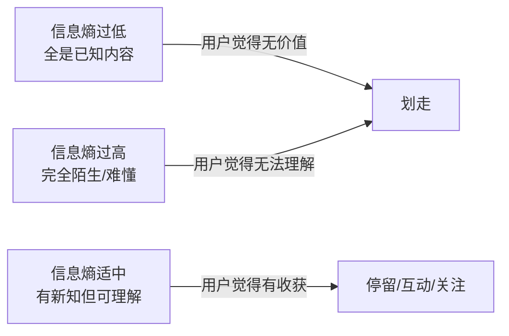

这个"甜蜜区间"的精确位置取决于你的目标受众。面向小白的内容，"已知"的阈值较低，稍微给点新东西就有价值；面向专业人士的内容，需要提供真正稀缺的洞察才能产生信息增量。

**信息熵的量化思考**：

你可以用一个简单的公式来评估选题的信息增量：

> 信息增量 = 受众不知道但想知道的信息量 × 信息的可理解程度

这个公式揭示了两个关键约束：
- **"不知道但想知道"**——不是所有未知信息都有价值。你可能不知道如何修理潜水艇发动机，但如果你的受众是职场白领，这条信息的信息增量为零。
- **"可理解程度"**——再有价值的信息，如果表达方式让受众无法理解，实际传递的信息增量也为零。

**实操中的信息熵评估表**：

| 受众层级 | 信息熵要求 | 内容策略 | 典型错误 |
|---------|-----------|---------|---------|
| 完全小白 | 低到中 | 用已知概念解释未知概念，大量类比，从"是什么"开始 | 一上来就用专业术语吓跑人 |
| 有基础的中级用户 | 中 | 提供系统框架和深层原理，从"为什么"开始 | 反复讲基础内容，用户觉得没深度 |
| 专业人士 | 中到高 | 提供稀缺数据、独特视角、前沿趋势，从"怎么做更好"开始 | 讲太浅被质疑专业性 |
| 混合受众 | 分层设计 | 先给结论吸引所有人，再分层展开（小白看结论，老手看原理） | 只照顾一个层级，流失其他人 |

**信息熵的实操检查方法**：写完选题后，用"电梯测试"——如果你在电梯里只有30秒向目标受众介绍这条内容，你能说出什么他们不知道的东西？如果说不出来，说明这条内容的信息熵为零，需要重新设计。

**信息熵的量化评分卡**：

在实际创作中，"感觉"不够用——你需要一个可重复的评分工具。以下评分卡从五个维度评估选题的信息增量，每项1-5分，总分15分以上为合格选题：

| 评估维度 | 1分（低） | 3分（中） | 5分（高） | 权重 |
|---------|----------|----------|----------|------|
| **新颖度**：受众是否已知这个信息 | 百度前3页都能找到 | 需要翻几篇文章才能找到 | 几乎没有中文资料 | ×2 |
| **实用性**：看完后能否立即行动 | 纯理论，无落地方案 | 有方法但需要额外学习 | 现在就能用，有模板/工具 | ×2 |
| **反直觉度**：是否颠覆已有认知 | 和大众认知一致 | 有部分新视角 | 完全颠覆常识，有数据支撑 | ×1 |
| **场景关联度**：与受众日常场景的关系 | 很少遇到的场景 | 偶尔会遇到的场景 | 每天都遇到的场景 | ×2 |
| **可传播性**：用户是否愿意告诉别人 | 看完就忘 | 觉得有用但不会主动说 | "我必须把这个发给朋友" | ×1 |

**评分公式**：总分 = 新颖度×2 + 实用性×2 + 反直觉度×1 + 场景关联度×2 + 可传播性×1

**评分解读**：
- **32-40分**：强选题，值得投入重资源（长文/视频/系列）
- **24-31分**：合格选题，适合常规产出
- **16-23分**：弱选题，需要换角度或合并其他选题
- **16分以下**：放弃，信息增量不足以支撑一条内容

**实操示例——三个选题的评分对比**：

| 选题 | 新颖度 | 实用性 | 反直觉 | 场景 | 传播 | 加权总分 | 判定 |
|------|--------|--------|--------|------|------|---------|------|
| "如何注册小红书账号" | 1 | 2 | 1 | 3 | 1 | 12 | ❌ 放弃 |
| "小红书涨粉的5个技巧" | 2 | 3 | 2 | 4 | 3 | 23 | ⚠️ 弱选题 |
| "我分析了1000条爆款笔记，发现涨粉最快的不是日更而是这个策略" | 4 | 4 | 4 | 5 | 5 | 39 | ✅ 强选题 |

**信息熵的"伪高熵"陷阱**：有些内容看似提供了新信息，实际上只是换了种说法重复已知内容。判断标准是：用户看完后能否做出与之前不同的决策或行为？如果不能，这条内容的信息熵就是伪高熵。例如"要坚持做自己"——看似鼓励，实则信息增量为零，因为用户不知道"怎么做自己"。改为"每周花2小时记录让你感到' flow '的时刻，3个月后你会找到自己的方向"——这才是真正的信息增量。

**信息熵的"量级思维"**：不同量级的信息增量产生的效果差异巨大。一个"小技巧"级别（如"Ctrl+C是复制"）的信息熵只能换来短暂的停留；一个"方法论"级别（如"如何系统地提升写作能力"）的信息熵能换来收藏和关注；而一个"范式转换"级别（如"你对学习的理解是错的——间隔重复比集中学习效率高200%"）的信息熵能改变用户的行为和认知。**在选题阶段就明确你的内容要提供哪个量级的信息增量**，这决定了内容的深度、长度和投入资源。

#### 8.1.2 认知负荷理论与内容设计

教育心理学家约翰·斯威勒（John Sweller）在1988年提出的**认知负荷理论**（Cognitive Load Theory），是内容结构设计最坚实的理论基础。这一理论经过30多年的教育研究验证，已被全球数万项实证研究支持。

认知负荷理论将学习过程中的心理负担分为三类：

| 类型 | 含义 | 与内容创作的关系 |
|------|------|----------------|
| **内在认知负荷** | 学习内容本身的复杂度 | 你的选题和信息量决定的，无法消除，只能管理 |
| **外在认知负荷** | 内容呈现方式带来的额外负担 | 糟糕的结构、混乱的排版、冗余的信息——这是可以消除的 |
| **关联认知负荷** | 将新信息整合到已有知识体系的努力 | 好的内容设计能最大化这一项——让用户真正"学到东西" |

**核心原则：减少外在认知负荷，管理内在认知负荷，最大化关联认知负荷。**

**减少外在认知负荷的七个具体做法**：

1. **一段一观点**——每段只讲一个核心观点，不要一段话塞三个论点。读者的工作记忆容量有限（米勒的7±2法则），每多塞一个观点，每个观点被记住的概率就下降30%以上。
2. **视觉层级**——用标题、小标题、编号、加粗建立清晰的视觉层级。人眼扫描页面时首先寻找视觉锚点（标题、粗体、数字），如果没有这些锚点，读者会感到"找不到重点"。
3. **删除冗余**——删除所有不影响核心信息的冗余内容。"众所周知""不言而喻""简单来说"这些短语本身就在增加认知负荷，全部删掉。
4. **类比锚定**——用类比把抽象概念锚定到用户已有的经验上。"信息熵"很抽象，"意外程度"就好理解了。
5. **表格替代**——表格比长段文字更高效。对比信息、分类信息、参数信息，一律用表格。
6. **流程图替代**——流程图比文字描述更直观。任何"先做A再做B然后做C"的内容，都值得画一个流程图。
7. **渐进式呈现**——不要在开头就给出所有细节。先给框架，让用户建立心智模型，再逐步填充细节。

**管理内在认知负荷的做法**：
- 按"先简单后复杂"的顺序排列信息块
- 用"分块"（Chunking）策略把大量信息打包成5-9个单元（符合米勒的7±2法则）
- 对于复杂主题，先给框架再填细节（"先见森林再见树木"）
- 系列内容每集只聚焦一个子主题，不要贪多

**最大化关联认知负荷的做法**：
- 每引入一个新概念，都与用户已有的知识建立连接（"这就好比...""你可以把它理解为..."）
- 给出具体案例帮助用户建立心智模型
- 在关键节点设问引导用户主动思考（"你猜接下来会怎样？"）
- 结尾给出可执行的行动建议，让用户有机会实践并内化

**认知负荷的实操模板——"三明治结构"**：

```text
[面包层] 一句话结论/价值承诺（降低进入门槛）
[蔬菜层] 背景/为什么重要（建立动机）
[肉层]   核心内容（3-5个要点，每个要点独立成段）
[蔬菜层] 案例/验证（帮助理解和记忆）
[面包层] 总结 + 行动建议（帮助内化）
```

这个结构的原理是：开头给结论降低不确定性（减少外在认知负荷），中间用分块策略组织信息（管理内在认知负荷），结尾给行动建议促进内化（最大化关联认知负荷）。

**认知负荷的平台适配**：不同平台的用户认知预算不同。抖音用户在15-60秒内只能处理2-3个信息单元；小红书图文的用户可以接受5-8个信息单元；公众号长文的读者可以处理10-15个信息单元。**你的内容信息单元数不能超过目标平台用户在该时长内的认知预算**，否则就是"信息过载"，完播率/完读率会断崖式下降。

#### 8.1.3 信息加工的双通道模型与深度加工

心理学家理查德·梅耶（Richard Mayer）的**多媒体学习理论**指出，人类有两条独立的信息加工通道：视觉通道和听觉通道。当两条通道同时被有效利用时，学习效率最高——但前提是两条通道传递的信息是互补的，而非重复的。

**梅耶的多媒体学习三原则**：

1. **双通道原则**——人类通过视觉和听觉两个独立通道处理信息，每个通道的容量都是有限的。
2. **主动加工原则**——有意义的学习需要学习者主动选择、组织和整合信息，而不是被动接收。
3. **有限容量原则**——每个通道在同一时间能处理的信息量是有限的，超载就会导致学习失败。

这个原理对内容创作的影响极为深远：

| 内容形式 | 通道利用 | 优化方向 |
|---------|---------|---------|
| 纯文字 | 仅视觉通道（文字） | 用排版、加粗、配图增加视觉通道信息量 |
| 图文笔记 | 视觉通道（图+文字） | 图片承载视觉信息，文字承载解释性信息，互补而非重复 |
| 口播视频 | 视觉（人脸/画面）+ 听觉（语音） | 语音讲核心内容，画面展示案例/数据/演示 |
| 带字幕视频 | 视觉（画面+字幕）+ 听觉（语音） | 三条信息流同时工作，信息密度最高 |
| 图文+音频（播客） | 视觉（配图）+ 听觉（语音） | 适合深度内容，但受众注意力管理更难 |

**关键结论**：口播视频比纯文字的信息传递效率高，带字幕的视频比不带字幕的效率高，有配图的长文比纯文字长文的阅读完成率高。这些不是"偏好"问题，而是人类认知架构决定的物理规律。

**实操中的"冗余陷阱"**：

最常见的错误是**两个通道传递完全相同的信息**。比如：口播视频中，说话者逐字念出屏幕上已经显示的文字——这不仅没有增加信息量，反而让两个通道同时处理相同信息，造成认知资源浪费，用户会感到"啰嗦"。

正确做法是**互补而非重复**：
- 语音讲观点和推理过程（听觉通道承载逻辑链）
- 画面展示数据、案例、演示（视觉通道承载具象信息）
- 字幕只显示关键术语和数字（视觉通道的辅助锚点）

**深度加工效应：为什么"让用户思考"比"告诉用户答案"更有效**。

认知心理学家弗格斯·克雷克（Fergus Craik）和罗伯特·洛克哈特（Robert Lockhart）在1972年提出的**加工水平理论**（Levels of Processing Theory）揭示了一个关键事实：**信息被记住的程度，取决于加工它的深度，而不是重复它的次数**。

浅层加工（如反复阅读、机械抄写）只能产生短期记忆；深层加工（如用自己的话解释、与已有知识关联、应用到新场景）才能产生长期记忆。

**在内容创作中促进深度加工的五种技巧**：

| 技巧 | 原理 | 示例 |
|------|------|------|
| **设问引导** | 让用户主动思考而非被动接收 | "你猜接下来会发生什么？""如果换做是你，你会怎么做？" |
| **对比呈现** | 通过差异加深理解 | "传统做法是A，但高手的做法是B，区别在于..." |
| **类比迁移** | 把新概念锚定到已知经验 | "信息熵就像一道菜的'惊喜度'——太常见没意思，太怪异接受不了" |
| **案例具象化** | 抽象理论→具体场景 | 不说"要提高完播率"，而说"一个美食博主把教程前5秒改为直接展示成品，完播率从18%提升到42%" |
| **行动指令** | 知识→行为，促进内化 | "现在就打开你的手机，找到最近发布的那条内容，用这个公式检查一遍" |

**核心洞察**：那些收藏量高但分享量低的内容，往往是"浅层加工"型——用户觉得"有用"但没有真正理解和内化。而那些既有收藏又有分享的内容，通常触发了"深度加工"——用户不仅理解了，还能用自己的话向别人解释。**在内容中嵌入设问、对比、类比，本质上是在帮用户完成从"看到"到"理解"到"能用"的认知跃迁。**

#### 8.1.4 知识诅咒：创作者的最大盲区

认知心理学中有一个重要概念——**知识诅咒**（Curse of Knowledge），由经济学家科林·卡默勒（Colin Camerer）等人在1989年提出。它指的是：**当你掌握了某个知识后，你就很难想象不知道这个知识时的状态。**

这个效应在内容创作中极为普遍，也是创作者犯的最隐蔽的错误：

| 知识诅咒的表现 | 用户感受 | 根本原因 |
|-------------|---------|---------|
| 用专业术语解释专业术语 | "我越看越糊涂" | 创作者以为这些术语是常识 |
| 跳过基础步骤直接讲高级内容 | "为什么我跟不上？" | 创作者已经自动化了基础步骤，忘记了它们的存在 |
| 给出结论但不解释推理过程 | "怎么得出这个结论的？" | 创作者的推理过程已经内化为直觉 |
| 认为"这么简单不用讲" | "我就是不知道这个啊" | 创作者的知识背景让他们低估了内容的难度 |

**打破知识诅咒的三个方法**：

1. **找一个真实小白做测试用户**——把你的内容给完全不了解这个领域的人看，观察他在哪里卡住、在哪里困惑。他的每一个疑问都是你被知识诅咒的证据。
2. **用"费曼学习法"自检**——假装你要向一个10岁的孩子解释这个概念。如果你需要使用任何专业术语，说明你还没有真正理解它——或者至少，你还没有找到让外行理解它的方法。
3. **记录自己的学习过程**——在学习新领域时，记录下每一个困惑、每一个"啊哈时刻"。这些记录就是你未来创作这个领域内容时最好的"小白视角参考"。

**案例**：一位资深程序员写了一篇"如何部署Docker容器"的教程，开头就是"首先确保你已经安装了Docker Engine并配置了镜像加速器"。对于小白来说，"Docker Engine是什么""镜像加速器怎么配"就已经是两个需要先解决的问题——但作者觉得这些"太基础了不用讲"。结果这篇文章的跳出率高达78%。后来他补充了500字的前置准备步骤，跳出率降到了34%。

**知识诅咒的系统性检测清单**：
- [ ] 是否有未解释的专业术语？（搜索全文，列出所有行话）
- [ ] 是否有跳过的"显而易见"的步骤？（找小白验证）
- [ ] 是否只给了结论没给推理过程？（每个结论问自己"为什么"）
- [ ] 是否假设了用户已有的知识背景？（明确写出前置知识要求）
- [ ] 是否有"不言而喻"的逻辑跳跃？（每一步之间是否有明确连接）

**知识诅咒的"反向利用"**：知识诅咒不全是坏事。当你故意打破用户的"知识诅咒"——告诉他们"你以为你知道的事情，其实你理解错了"——你就是在制造高信息熵的认知冲击。这就是"反常识"内容（如"你以为的高效学习方法其实都是错的"）为什么特别吸引人的心理学原理。**关键是：你打破的必须是真正的错误认知，而不是为了吸引眼球而制造虚假争议。**

#### 8.1.5 叙事设计的底层原理：为什么人类天生需要故事

> **与本节主题的关系**：前面四节（8.1.1-8.1.4）分别从信息论和认知心理学的角度讨论了"说什么"（信息熵）、"怎么说"（认知负荷）、"用什么通道说"（双通道模型）和"如何避免自嗨"（知识诅咒）。但还有一个更根本的问题没有回答——**"用什么形式说最有效？"** 答案是：故事。叙事设计不是"文学技巧"，而是人类认知架构决定的信息传递最优解。理解叙事的底层原理，你才能把信息熵、认知负荷、深度加工等理论真正"装进"用户的大脑。

在讨论说服路径之前，需要先理解一个更根本的事实：**人类大脑不是为处理抽象信息而进化的，而是为处理故事而进化的。** 神经科学家尤里·哈森（Uri Hasson）在普林斯顿大学的fMRI实验中发现，当一个人听故事时，讲述者和聆听者的大脑活动会逐渐同步——这种"神经耦合"（Neural Coupling）只在故事叙事中出现，在单纯的信息传递中不会发生。

**故事为什么比信息更有效——四重机制**：

| 机制 | 原理 | 实验依据 |
|------|------|---------|
| **镜像神经元激活** | 听故事时，大脑中负责执行该动作的区域会被激活——你在"体验"而非"接收" | Rizzolatti等，1996年发现镜像神经元系统 |
| **皮质醇+催产素释放** | 故事中的冲突制造紧张（皮质醇），故事中的共鸣制造信任（催产素），两者叠加产生强烈的记忆编码 | Paul Zak，2015年神经经济学实验 |
| **情景记忆优势** | 故事以"情景"（episodic）形式存储，比"语义"（semantic）形式的记忆提取速度快3-5倍 | Tulving，1972年记忆系统理论 |
| **批判性思维暂时降低** | 叙事传输效应——当人沉浸在故事中时，会暂时放下质疑和反驳，更容易接受故事中隐含的观点 | Green & Brock，2000年叙事传输理论 |

**内容创作中的四种核心叙事模式**：

| 叙事模式 | 结构 | 适用场景 | 情绪曲线 |
|---------|------|---------|---------|
| **英雄之旅**（Hero's Journey） | 日常→召唤→考验→蜕变→回归 | 个人成长、创业故事、转型经历 | 平→升→降→大升 |
| **问题-解决**（Problem-Solution） | 痛点→分析→方案→验证→行动 | 教程、攻略、产品评测 | 中→高→降→高 |
| **认知颠覆**（Cognitive Reframe） | 常识→质疑→真相→新框架→行为改变 | 深度分析、反常识内容、行业洞察 | 平→升→极高→平 |
| **对比叙事**（Before-After） | 旧状态→转折点→新状态→方法论 | 案例展示、产品效果、方法论验证 | 低→中→高 |

**四种叙事模式的完整案例**：

**英雄之旅案例**——"从月薪3000的客服到年入50万的独立开发者"：
- **日常**：在电商公司做客服，每天回复300条消息，月薪3000
- **召唤**：偶然看到一个独立开发者的分享帖，发现"一个人也能做产品"
- **考验**：利用下班时间自学编程，前3个月看不懂任何教程；做出第一个产品，上线后0下载；被同事嘲笑"不务正业"
- **蜕变**：第4个月做出一个解决自己工作中遇到的小工具，发到小红书后意外获得2000收藏；开始认真做产品
- **回归**：1年后月收入稳定在4万+，辞掉工作全职做独立开发；回到当初的客服群分享经验，帮助3个同事也开始副业

**问题-解决案例**——"为什么你的小红书笔记总是没有流量？"：
- **痛点**：发了30条笔记，最高阅读量不到500，开始怀疑自己不适合做内容
- **分析**：拆解了50条同领域爆款笔记，发现3个自己完全忽略的规律——标题缺少具体数字、封面没有视觉焦点、正文前3行没有价值承诺
- **方案**：给出"3秒标题公式"（数字+痛点+悬念）、"封面三要素"（主体占60%+文字不超过10字+对比色）、"开头黄金3行"模板
- **验证**：用新方法重新发布之前失败的选题，单篇阅读量从200提升到8000
- **行动**：提供可下载的标题模板和封面设计清单

**认知颠覆案例**——"你以为的'高效学习'方法其实都在浪费时间"：
- **常识**：大多数人认为"反复阅读+做笔记"是有效的学习方法
- **质疑**：心理学研究显示，反复阅读的长期记忆留存率只有10%，远低于"主动回忆"的50%
- **真相**：介绍"间隔重复"+"主动回忆"+"交叉练习"三合一方法，引用Dunlosky 2013年元分析研究（覆盖10种学习策略的200+实验）
- **新框架**：给出"学习效率金字塔"——被动学习（听讲/阅读）在底层，主动学习（教授他人/实践）在顶层
- **行为改变**：提供一个可执行的"7天学习方法改造计划"

**对比叙事案例**——"从日均阅读200到日均阅读2万：我的小红书3个月变化"：
- **旧状态**：每天花2小时写笔记，认真排版配图，但阅读量始终在100-300之间；粉丝增长停滞，开始怀疑内容方向
- **转折点**：偶然发现一篇分析爆款笔记结构的文章，意识到自己一直在"自嗨式创作"——写的是自己想说的，而不是用户想看的
- **新状态**：调整选题逻辑（从"我想写什么"到"用户在搜什么"）、优化标题结构、改变内容节奏；3个月后日均阅读稳定在1.5-2.5万，粉丝从300增长到8000
- **方法论**：提炼出"选题三问"（用户搜什么？竞品缺什么？我能提供什么独特价值？）和"内容四检"（标题是否有数字？开头是否有痛点？正文是否有钩子？结尾是否有行动引导？）

**"STAR+R"叙事框架（升级版）**：

在8.3.1中介绍的STAR叙事结构基础上，增加一个"R"（Reflection，反思），形成更强的深度加工：

```text
S - Situation（情境）：用具体的时间、地点、数字建立画面感
    示例："2024年3月的一个周四晚上，我坐在出租屋的床上，看着银行APP里的余额：1,247元"

T - Trouble（困境）：制造冲突，让读者产生"然后呢？"的好奇
    示例："那天我刚被公司辞退，简历投了30份全部石沉大海，房租还有5天到期"

A - Action（行动）：展示你做了什么——具体步骤，不是泛泛而谈
    示例："我打开小红书，发了第一条笔记，标题是《失业第1天，我决定试试自媒体》"

R - Result（结果）：用数据和对比展示变化
    示例："3个月后，那条笔记累计获得2.3万收藏，我的账号粉丝突破8000，月收入稳定在6000元以上"

R - Reflection（反思）：提炼出可迁移的方法论或认知升级
    示例："回头看，关键转折不是'我有多努力'，而是'我在第一条笔记里展示了真实的脆弱——失业、焦虑、不确定——这恰好击中了和我一样的人'"
```

**叙事设计的三个常见陷阱**：

1. **"流水账"陷阱**：按时间顺序平铺直叙，没有冲突和转折。解决方法：只保留推动情节的关键节点，删掉所有"然后我就..."的过渡
2. **"完美人设"陷阱**：只展示成功，不展示挣扎。解决方法：故事中的"低谷"越真实，"高峰"越有说服力——失败不是减分项，是叙事的必要结构
3. **"自我感动"陷阱**：讲了很多自己的感受，但没有提炼出让读者能用的方法论。解决方法：每个故事结尾必须有一个"所以你可以..."的转化

**叙事与信息的黄金比例**：

| 内容类型 | 叙事占比 | 信息占比 | 说明 |
|---------|---------|---------|------|
| 教程/攻略 | 20-30% | 70-80% | 故事做引子，干货是主体 |
| 个人经历/成长 | 60-70% | 30-40% | 故事是主线，方法论穿插其中 |
| 深度分析/行业洞察 | 30-40% | 60-70% | 用案例故事承载数据和逻辑 |
| 产品评测/推荐 | 40-50% | 50-60% | 个人使用故事+客观参数对比 |

#### 8.1.6 精细加工可能性模型：两条说服路径

> **与8.1.5的关系**：8.1.5回答了"用什么形式说"（故事），本节回答"通过什么路径说服"。故事是载体，说服是目的。ELM模型告诉你：同一条内容，不同的用户会通过不同的路径被说服——你需要同时设计两条路径，才能覆盖所有用户。

心理学家理查德·佩蒂（Richard Petty）和约翰·卡乔波（John Cacioppo）在1986年提出的**精细加工可能性模型**（Elaboration Likelihood Model, ELM），解释了用户如何被内容说服，以及为什么有些内容"看完就忘"而有些内容"改变行为"。

该模型认为用户通过两条路径处理说服性信息：

| 路径 | 触发条件 | 用户状态 | 内容要求 | 效果持久性 |
|------|---------|---------|---------|-----------|
| **中心路径** | 用户有动机且有能力深入思考 | 主动分析、评估论据 | 逻辑严密、数据充分、论证有力 | 高——态度改变持久，影响行为 |
| **边缘路径** | 用户缺乏动机或能力 | 依赖表面线索（权威、数量、情绪） | 口碑数据、权威背书、情绪冲击 | 低——态度改变短暂，易被覆盖 |

**对内容创作的核心启示**：

1. **判断你的受众走哪条路径**。专业决策者（如企业采购、技术选型）倾向于走中心路径，需要深度论证；冲动消费者（如快消品购买）倾向于走边缘路径，需要表面线索。
2. **大多数内容应该同时服务两条路径**。开头用边缘路径的钩子（数据、权威、情绪）吸引注意力，正文用中心路径的论证（逻辑、案例、数据）建立说服力。
3. **不同平台的默认路径不同**。小红书、抖音用户默认走边缘路径（快速滑动，依赖表面线索），知乎、公众号用户更可能走中心路径（愿意深入阅读）。

**实操模板——"双路径内容结构"**：

```text
[边缘路径层] 震撼数据/权威背书/情绪钩子（吸引注意）
[过渡] "为什么会出现这种情况？"（激发深入思考的动机）
[中心路径层] 逻辑分析/数据论证/案例推演（建立深层说服）
[边缘路径层] 社会认同/行动号召（推动决策）
```

**案例对比**：

| 内容策略 | 路径 | 效果 |
|---------|------|------|
| "5个Excel技巧" | 纯边缘 | 点击率高，但用户看完即忘，不改变行为 |
| "Excel函数的底层原理：为什么VLOOKUP比INDEX-MATCH慢3倍" | 纯中心 | 点击率低，但看过的用户会长期使用INDEX-MATCH |
| "我用这个Excel方法从加班到准时下班（附原理+模板）" | 双路径 | 点击率高，且用户会实际使用——因为情绪钩子吸引了注意，原理讲解建立了深层理解，模板降低了行动门槛 |

#### 8.1.7 视觉设计心理学：内容的"视觉说服力"

> **与本节主题的关系**：前面六节分别讨论了"说什么"（信息熵）、"怎么说"（认知负荷）、"用什么通道说"（双通道模型）、"如何避免自嗨"（知识诅咒）、"用什么形式说"（叙事设计）和"通过什么路径说服"（ELM）。但内容的视觉呈现——颜色、排版、构图、字体——同样在"说服"用户，而且往往在用户意识到之前就已经产生了效果。视觉设计不是"美化"，而是信息传递的第一层过滤器。

**颜色心理学在内容创作中的应用**：

颜色不是审美偏好——它直接影响用户的情绪状态和行为决策。神经科学研究表明，人脑处理颜色信息的速度比文字快6万倍，用户在看到内容的前90秒内就会做出潜意识判断，其中62-90%的判断基于颜色。

| 颜色 | 心理联想 | 适用场景 | 使用注意 |
|------|---------|---------|---------|
| **红色** | 紧迫、热情、危险 | 促销信息、紧急提醒、食品内容 | 大面积使用会引发焦虑，适合点缀和强调 |
| **蓝色** | 信任、专业、冷静 | 科技、金融、教育类内容 | 最安全的颜色选择，但容易"平庸" |
| **绿色** | 成长、健康、自然 | 健康、环保、个人成长类内容 | 与"成功""通过"的语义关联强 |
| **橙色/黄色** | 活力、乐观、温暖 | 生活方式、创意类内容 | 高注意力吸引，但容易显得"廉价" |
| **黑色** | 高端、权威、神秘 | 奢侈品、设计、高端服务 | 大面积黑色需要高质感的排版支撑 |
| **紫色** | 创意、灵性、独特 | 创意、艺术、女性向内容 | 与"贵""稀有"的语义关联 |

**颜色对比的"注意力杠杆"**：

在信息流中，用户每秒浏览数十条内容，颜色对比是突破"视觉噪声"的第一武器。关键原则：

1. **互补色对比**：在蓝紫色背景上用橙黄色标题，对比度最强，适合需要高点击率的封面
2. **明暗对比**：深色背景+浅色文字（或反过来），确保可读性。小红书数据显示，深色封面的点击率比浅色封面平均高15-20%
3. **色彩饱和度**：高饱和色在小屏幕上更醒目。信息流中的缩略图通常只有1-2cm，低饱和色会被"吞掉"

**排版的"视觉层级"心理学**：

人眼不是逐字阅读的——它是通过"扫描"来寻找信息的。理解扫描模式，你才能引导用户的注意力。

**F型扫描模式**：Nielsen Norman Group的眼动追踪研究发现，大多数网页内容的阅读模式呈"F型"——用户先水平扫描顶部（标题行），然后向下移动，再水平扫描第二次（通常在副标题或加粗文字处），最后垂直扫描左侧。

实操含义：
- 标题放在最上方，必须在水平扫描的第一行就抓住注意力
- 每段的**第一句话**承载核心信息——因为用户在垂直扫描时主要看段首
- 关键信息用**加粗**标记——它会打断垂直扫描，引导用户回到水平阅读
- 左侧放置关键信息——因为垂直扫描时左侧获得最多注意力

**字体选择的心理暗示**：

| 字体类型 | 心理暗示 | 适用场景 | 避免场景 |
|---------|---------|---------|---------|
| **衬线字体**（宋体、Times） | 传统、权威、正式 | 学术、金融、新闻类内容 | 轻松、年轻化的内容 |
| **无衬线字体**（黑体、Helvetica） | 现代、简洁、科技 | 科技、互联网、生活方式类 | 需要"古典感"的内容 |
| **手写体/圆体** | 亲切、活泼、个人 | 美食、旅行、生活分享 | 正式场合、专业分析 |
| **粗体/大号字** | 强调、力量、紧迫 | 标题、核心观点、CTA | 正文大面积使用 |

**视觉设计的"三秒法则"**：

用户决定是否继续看你的内容只有0.3-3秒（见8.2.1）。在这极短的时间内，视觉设计承担了至少50%的"说服"工作。一张精心设计的封面图，其说服力可能超过500字的正文。

**视觉设计的实操清单**：

| 设计元素 | 检查标准 | 常见错误 |
|---------|---------|---------|
| **封面图** | 主体占画面60%以上，文字不超过10字，色彩对比鲜明 | 主体太小、文字过多、颜色太杂 |
| **标题字体** | 与内容调性一致，大小层级分明（标题>副标题>正文≥2:1.5:1） | 所有文字一样大，没有层级 |
| **留白** | 元素之间有呼吸空间，不要"塞满" | 每个角落都塞满信息，让人窒息 |
| **一致性** | 同一账号的视觉风格保持统一（配色、字体、构图） | 每条内容风格不同，没有辨识度 |
| **可读性** | 文字与背景的对比度≥4.5:1（WCAG标准） | 浅色文字配浅色背景，看不清 |

**视觉设计的"反面教材"及修正**：

| 错误设计 | 用户感受 | 正确做法 |
|---------|---------|---------|
| 封面图上堆满5种颜色+10行文字 | "太乱了，不想看" | 1-2种主色+1行核心标题 |
| 正文用3种以上字体 | "不专业，像小学生做的" | 全文最多2种字体（标题+正文） |
| 图片分辨率低、模糊 | "质量差，不值得信任" | 用高清素材，封面图≥1080px |
| 深色背景配深色文字 | "看不清，放弃" | 确保文字与背景对比度足够 |
| 中英文混排时字体不统一 | "排版粗糙" | 中文用中文字体，英文用英文字体，行高统一 |

---

### 8.2 注意力的捕获与维持机制

#### 8.2.1 注意力的两阶段模型

用户对内容的注意力分为两个完全不同的阶段，理解这个区分对内容设计至关重要：

**第一阶段：选择性注意（Selective Attention）**——用户在信息流中决定是否点击/停留。这个阶段只有0.3-2秒，由标题、封面、前3秒画面触发。这个阶段的认知模式是**快思考**（丹尼尔·卡尼曼的"系统1"），由直觉、情感和启发式驱动。

**第二阶段：持续性注意（Sustained Attention）**——用户点击后决定是否看完。这个阶段持续数秒到数分钟，由内容的信息密度、节奏感、情绪曲线决定。这个阶段允许**慢思考**（"系统2"）参与，但仍然受情绪和兴趣驱动。

**神经科学视角**：fMRI研究表明，选择性注意阶段主要激活大脑的**杏仁核**（处理情绪威胁和奖赏信号）和**眶额皮层**（价值评估），而持续性注意阶段则更多依赖**前额叶皮层**（执行控制和工作记忆）。这意味着：标题需要触发情绪反应（激活杏仁核），而正文需要持续提供价值信号（维持前额叶的参与）。

**定向反应（Orienting Response）**：神经科学家发现，当大脑接收到新异刺激时，会自动触发一种叫做"定向反应"的生理机制——心跳微顿、瞳孔扩张、注意力瞬间聚焦。这个反应是进化遗留的生存机制（"那是什么？有危险吗？"），在内容创作中的应用是：**你的标题/封面/前3秒必须包含一个"新异刺激"——反常识的数字、意想不到的对比、未完成的句子——来触发用户的定向反应。**

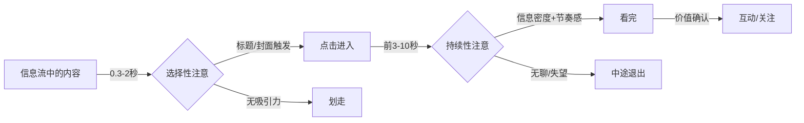

两个阶段需要完全不同的优化策略：

| 阶段 | 优化对象 | 核心技巧 | 失败后果 |
|------|---------|---------|---------|
| 选择性注意 | 标题、封面、前3秒 | 好奇心缺口、具体数字、痛点直击、视觉冲击 | 内容再好没人看到 |
| 持续性注意 | 正文的节奏、信息密度、情绪曲线 | 开头即高潮、不断抛出新信息、设置悬念、穿插案例 | 看了开头就走，完播率/完读率低 |

**最致命的错误是只优化一个阶段**。只优化标题不优化内容，用户点进来发现"标题党"，不仅退出还会产生负面情绪，降低账号权重。只优化内容不优化标题，好内容石沉大海。

**各平台选择性注意的时间窗口**：

| 平台 | 选择性注意窗口 | 决定因素 | 优化重点 |
|------|-------------|---------|---------|
| 抖音/TikTok | 0.5-1.5秒 | 前3帧画面+文字封面 | 视觉冲击力、悬念文字 |
| 小红书 | 1-3秒 | 封面图+标题 | 封面美感、标题痛点 |
| 微信公众号 | 2-5秒 | 标题+摘要 | 标题信息密度、摘要悬念 |
| B站/YouTube | 1-3秒 | 封面+标题 | 封面人脸表情、标题好奇心 |
| 知乎 | 1-2秒 | 问题+回答开头 | 直接回答、权威感 |
| 播客 | 30-60秒 | 开头自我介绍+价值承诺 | 快速进入正题、明确收益 |

#### 8.2.2 注意力维持的"钩子链"模型

用户的注意力不是一条直线，而是一条不断衰减的曲线。每过一段时间，注意力就会自然回落，用户会产生"要不要继续看"的潜在判断。好的内容在这些注意力断点处设置"钩子"（Hook），把用户拉回来。

**钩子链模型**：

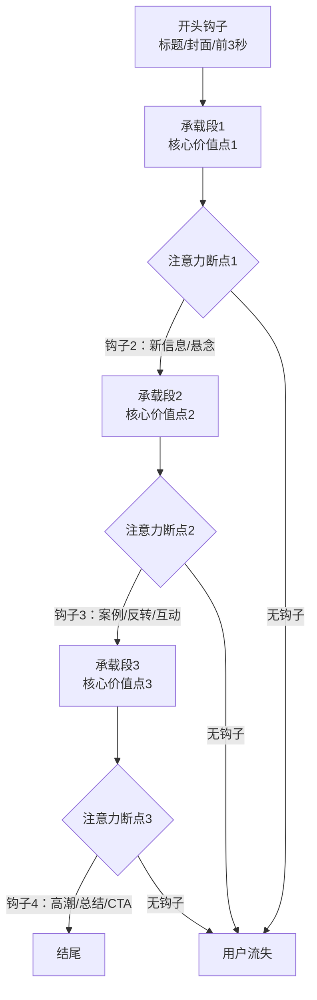

**钩子的六种类型**：

| 钩子类型 | 原理 | 适用位置 | 示例 |
|---------|------|---------|------|
| **信息钩** | 抛出一个新的、有价值的信息点 | 每个段落开头 | "但真正让转化率翻倍的，是第三个技巧..." |
| **悬念钩** | 制造信息缺口，让人想知道答案 | 文章/视频中段 | "我试了这个方法，结果出乎意料..." |
| **情绪钩** | 引发情感共鸣或冲击 | 故事转折处 | "那一刻我崩溃了，蹲在地铁站哭了半小时" |
| **互动钩** | 直接与用户对话，打破被动消费状态 | 中段或结尾 | "先别急着划走，接下来这条90%的人都不知道" |
| **对比钩** | 用反差制造冲击 | 方法论揭示前 | "我花了3个月走的弯路，后来发现5分钟就能解决" |
| **节奏钩** | 通过节奏变化（快慢、轻重）保持新鲜感 | 贯穿全文 | 连续3段干货后插入一个轻松的故事或类比 |

**短视频的钩子节奏**（以60秒短视频为例）：

| 时间点 | 动作 | 目的 |
|--------|------|------|
| 0-3秒 | 强钩子（痛点/悬念/反常识） | 通过选择性注意筛选 |
| 3-10秒 | 价值承诺（"今天教你3个方法"） | 建立继续观看的预期 |
| 15-20秒 | 第一个信息钩子 | 维持持续性注意 |
| 30-35秒 | 第二个钩子（案例/反转） | 防止中段流失 |
| 50-55秒 | 高潮/总结 | 防止结尾前流失 |
| 55-60秒 | CTA | 引导互动 |

**长文的钩子节奏**（以2000字图文为例）：

| 位置 | 动作 | 目的 |
|------|------|------|
| 标题 | 痛点/数字/好奇心缺口 | 点击 |
| 第1段 | 价值承诺+痛点共鸣 | 建立期待 |
| 每200-300字 | 一个小钩子（新信息/案例/设问） | 维持阅读 |
| 中间位置 | 最有价值的干货或故事转折 | 防止中段流失 |
| 倒数第2段 | 总结核心要点 | 信息固化 |
| 最后1段 | CTA | 引导互动 |

**钩子的"密度校准"**：钩子不是越多越好。过密的钩子会让内容变成"碎片拼凑"，缺乏深度；过少的钩子会让用户在注意力衰减时流失。最佳密度因内容类型而异：

| 内容类型 | 推荐钩子密度 | 原因 |
|---------|------------|------|
| 短视频（15-60秒） | 每10-15秒1个 | 用户耐心极短，需要持续刺激 |
| 图文笔记 | 每300-500字1个 | 适度间隔，避免碎片化 |
| 深度长文 | 每800-1000字1个 | 用户已经投入，钩子用于维持而非吸引 |
| 播客/长视频 | 每3-5分钟1个 | 内容深度优先，钩子用于节奏调节 |

#### 8.2.3 蔡格尼克效应与好奇心缺口

心理学家布尔玛·蔡格尼克（Bluma Zeigarnik）在1927年发现了一个重要现象：**人们对未完成任务的记忆比已完成任务强约2倍**。这就是蔡格尼克效应（Zeigarnik Effect）。

在内容创作中，蔡格尼克效应的应用极为广泛：

**原理**：当你在内容中制造了一个"未完成"的认知缺口，用户的大脑会持续关注这个缺口直到它被闭合。这就是为什么悬疑剧让人欲罢不能、"下集预告"能留住观众、"3个技巧中的第3个最重要"能让人读完全文。

经济学家乔治·洛温斯坦（George Loewenstein）在1994年进一步发展了这个理论，提出了**信息缺口理论**（Information Gap Theory）：好奇心产生于"我们知道的"和"我们想知道的"之间的差距。当这个差距足够小（我们觉得自己"差一点就知道了"）但又确实存在时，好奇心最强烈。

**信息缺口的五个制造方法**：

1. **部分揭示**——告诉用户"有3个方法"，然后只展开前2个，第3个留到后面。用户的未完成感会驱动他们继续阅读。
2. **预告后文**——"后面我会给你一个模板，让你5分钟就能做出这种效果"——用户知道了将要获得的价值，愿意继续投入时间。
3. **反常识开头**——"你以为提高效率的关键是时间管理？错了。"——打破了用户已有的认知框架，制造了一个需要被填补的缺口。
4. **设问而不立即回答**——"为什么有些内容明明很烂却能火？"——提出了一个用户想知道答案但目前不知道的问题。
5. **故事中断**——讲到关键时刻暂停，插入知识点后再继续——利用蔡格尼克效应让用户惦记着未完成的故事。

**实操模板——"信息缺口标题公式"**：

```text
公式1：[具体数字] + [好处/结果] + [但/却] + [悬念]
  示例：我用了3个月从小白到月入2万，但第2个月差点放弃

公式2：[权威人物/机构] + [动词] + [反常识观点]
  示例：哈佛研究发现，早起可能比熬夜更伤身

公式3：[你可能不知道/99%的人不知道] + [具体信息]
  示例：90%的人不知道，微信这个隐藏功能可以省2小时/天
```

**信息缺口的"过度使用"警告**：如果每条内容都用信息缺口，用户会产生"套路疲劳"。最佳比例是30-40%的内容使用信息缺口技巧，其余内容用直接价值输出。信息缺口适合拉新和破冰，直接价值输出适合留存和信任建设。

#### 8.2.4 峰终定律与内容记忆设计

诺贝尔经济学奖得主丹尼尔·卡尼曼（Daniel Kahneman）发现了**峰终定律**（Peak-End Rule）：**人们对一段体验的记忆，主要由两个时刻决定——体验的最高峰（peak）和体验的结尾（end），而不是体验的全过程平均值。**

这个定律对内容创作的启示极为深刻：

**用户不会记住你的内容的每一部分。他们会记住两件事：最打动他们的那个瞬间，以及最后留下的印象。**

这意味着：

| 内容位置 | 设计目标 | 具体做法 |
|---------|---------|---------|
| **高峰点**（最打动人的瞬间） | 创造强烈的认知/情绪冲击 | 放在内容的中后段（约60-70%位置），用最好的案例、最震撼的数据、最感人的故事 |
| **结尾** | 留下清晰、正面的最终印象 | 用一句话总结核心价值 + 一个可执行的行动建议 + 一个温暖或有力的收尾 |

**峰终定律的三个实操原则**：

1. **最好的内容放在中后段**——不要把最有价值的信息放在开头（开头应该放钩子），也不要放在最后（最后应该放总结和CTA）。放在中后段（60-70%位置），此时用户已经投入了时间成本（沉没成本效应），更可能坚持看完，而高峰体验会让他们对整条内容产生正面记忆。
2. **结尾不要草率**——很多创作者在写完核心内容后，结尾随便写一句"以上就是今天的内容，记得点赞关注"。这违反了峰终定律——用户会把平淡的结尾作为整条内容的"最终记忆"。一个好的结尾应该：总结核心价值（一句话）+ 给出行动建议（可执行）+ 留下情感余韵（温暖/激励/思考）。
3. **在高峰点设置互动引导**——当用户正处于情绪或认知的高峰时，他们最有可能做出互动行为（点赞、评论、转发）。在这个位置设置"如果你也有同感，双击屏幕"比放在任何其他位置都有效。

**峰终定律的量化应用**：如果你有一条10分钟的视频，高峰点应该在第6-7分钟。如果你写一篇2000字的文章，最有价值的案例应该放在第1200-1400字的位置。如果你做一条60秒的短视频，最震撼的画面应该在第35-45秒。**不要凭感觉安排内容节奏，用峰终定律做精确计算。**

#### 8.2.5 情绪弧线设计：内容的"心电图"

好的内容不是一条平线，而是一条有起伏的曲线——就像心电图。平线意味着"死亡"（无聊），有节奏的起伏意味着"活着"（引人入胜）。

**情绪弧线的三种经典模式**（与8.1.5中四种叙事模式对应，此处从"情绪节奏"角度重新审视）：

```mermaid
graph LR
    subgraph 模式一：英雄之旅型
    A1[平静开局] --> B1[遭遇挑战] --> C1[跌入谷底] --> D1[逆转突破] --> E1[胜利归来]
    end
    subgraph 模式二：问题-解决型
    A2[痛点呈现] --> B2[原因分析] --> C2[方案展示] --> D2[效果验证] --> E2[行动指南]
    end
    subgraph 模式三：认知颠覆型
    A3[常识陈述] --> B3[质疑挑战] --> C3[真相揭示] --> D3[新框架建立] --> E3[行为改变]
    end
```

> **与8.1.5的关系**：8.1.5从"叙事结构"角度介绍了四种模式（英雄之旅、问题-解决、认知颠覆、对比叙事），此处从"情绪节奏"角度提供可量化的设计工具。建议将两节对照阅读，形成"结构+情绪"的双重设计视角。

**情绪弧线的量化设计工具**：

与其凭感觉设计情绪起伏，不如用以下量化工具做精确计算。每一段内容标注一个情绪值（-5到+5），然后检查曲线是否健康：

| 情绪值 | 含义 | 典型内容元素 |
|--------|------|------------|
| +5 | 极度兴奋/震撼 | 揭示反常识真相、展示惊人结果 |
| +3 | 兴趣/好奇 | 新信息、悬念、对比 |
| +1 | 平稳接受 | 常规信息传递、背景介绍 |
| -1 | 轻微焦虑/不安 | 痛点呈现、问题暴露 |
| -3 | 强烈焦虑/共鸣 | 深层痛点、失败经历 |
| -5 | 绝望/崩溃 | 触底时刻（用于英雄之旅的谷底） |

**健康的情绪弧线检查标准**：
- **不允许连续3段以上情绪值相同**——否则用户会感到"平线"（无聊）
- **最高点应出现在60-70%位置**——峰终定律的要求
- **结尾情绪值应≥开头情绪值**——用户需要"向上"的收尾感受
- **短视频（15-60秒）至少2次情绪切换**——每次切换间隔不超过15秒
- **长文（2000字+）至少4次情绪切换**——每500字至少一次

**情绪弧线的实操检查法**：

写完内容后，给每一段标注一个情绪值（-5到+5），然后画出曲线。如果曲线长时间停留在同一水平（连续3段以上情绪值相同），就需要在那个位置插入一个钩子——可以是一个案例、一个反转、一个互动问题，或者一个节奏变化。

**情绪弧线与平台时长的匹配**：

| 平台 | 内容时长 | 情绪起伏次数 | 说明 |
|------|---------|------------|------|
| 抖音短视频 | 15-60秒 | 2-3次 | 节奏极快，每个钩子间隔10-15秒 |
| 小红书图文 | 1-3分钟 | 3-4次 | 图片切换本身就是情绪起伏点 |
| 公众号长文 | 5-15分钟 | 5-8次 | 需要更丰富的情绪层次 |
| B站/YouTube | 5-30分钟 | 8-15次 | 长视频需要持续的情绪管理 |
| 播客 | 30-60分钟 | 10-20次 | 通过语气变化、嘉宾互动、故事切换维持 |

**情绪弧线的"反模式"**：有些创作者误以为"情绪起伏"就是"大喊大叫"或"夸张表演"。真正的情绪起伏来自于**信息预期的打破**——用户以为你会说A，你说的是B；用户以为故事会这样发展，结果翻转了；用户以为这个方法很简单，结果发现需要一个他们没想到的步骤。**情绪起伏的本质是认知预期的校准和打破，不是声调或表情的变化。**

---

### 8.3 内容传播的底层动力学

#### 8.3.1 传播的六力模型

一条内容从发布到广泛传播，需要克服六个力的作用。理解这个模型，你就知道为什么有些内容"天然"会火，而有些内容再怎么推广都推不动。

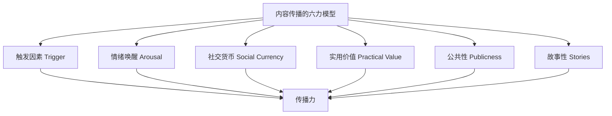

这个模型源自乔纳·伯杰（Jonah Berger）的《疯传》（Contagious）研究，经过大量社交媒体数据验证。伯杰在沃顿商学院的研究中分析了数千条在线内容的传播路径，发现这六个因素能解释约70%的内容传播差异。

**力一：触发因素（Trigger）**

触发因素是让用户"想到某个话题时自然想到你"的心理联想。它决定了内容被讨论的频率。

| 触发类型 | 机制 | 实操策略 |
|---------|------|---------|
| 环境触发 | 用户在特定场景下想起你的内容 | 做"场景化"内容——"下雨天适合看的5部电影""加班到10点的10分钟晚餐" |
| 时间触发 | 特定时间点想起你的内容 | 做"时效性"内容——周一发"本周计划模板"，月底发"月度复盘方法" |
| 话题触发 | 热门话题自然关联到你的领域 | 做"热点结合"内容——某个社会事件火了，从你的专业角度解读 |
| 对比触发 | 看到竞品时想起你的内容 | 做"对比测评"内容——成为用户做购买决策时的参考标准 |

**力二：情绪唤醒（Emotional Arousal）**

不是所有情绪都能促进传播。研究发现，**高唤醒情绪**（如愤怒、敬畏、兴奋、焦虑）促进分享，**低唤醒情绪**（如悲伤、满足）抑制分享。

| 情绪类型 | 唤醒度 | 分享倾向 | 内容策略 |
|---------|--------|---------|---------|
| 敬畏/惊喜 | 极高 | 极强 | 揭示反常识的真相、展示令人惊叹的结果 |
| 兴奋/幽默 | 高 | 强 | 轻松有趣的内容、出乎意料的反转 |
| 焦虑/愤怒 | 高 | 强 | 指出问题/不公平（但要提供解决方案，否则伤品牌） |
| 悲伤 | 低 | 弱 | 单纯煽情的内容传播力差，除非搭配希望/行动 |
| 满足/平静 | 低 | 弱 | 纯干货如果没有情绪波动，传播力有限 |

**关键发现**：纯粹的"有用"内容传播力不如"有用+有情绪"的内容。一篇"Excel快捷键大全"的收藏率不错，但转发率低；一篇"我用这些Excel技巧从加班狗变成准时下班族，同事都来问我秘诀"的传播力更强——因为它同时触发了实用价值和情绪唤醒。

**情绪唤醒的"黄金组合"**：根据伯杰的研究，最能促进传播的情绪组合是**"敬畏+实用"**——用户既感到"哇，好厉害"（高唤醒），又觉得"这个我可以用"（实用价值）。这就是为什么"XX行业的人不会告诉你的X个秘密"这类标题经久不衰——它同时触发了敬畏（秘密揭示）和实用价值（可以用来避坑）。

**力三：社交货币（Social Currency）**

用户转发你的内容，本质上是在塑造自己的社交形象。如果转发你的内容能让用户显得"有品位""有见识""有趣""善良"，他们就更愿意分享。

| 社交货币类型 | 用户通过分享表达 | 内容策略 |
|-------------|----------------|---------|
| 知识感 | "我是一个爱学习/有见识的人" | 深度分析、行业洞察、前沿趋势 |
| 品味感 | "我是一个有审美/有品位的人" | 高质量视觉内容、独特的生活方式 |
| 有趣感 | "我是一个幽默/有趣的人" | 搞笑内容、神反转、段子 |
| 正义感 | "我是一个关心社会/有正义感的人" | 公益内容、社会议题（但需谨慎） |
| 优越感 | "我知道别人不知道的东西" | 稀缺信息、内部消息、独家视角 |

**力四：实用价值（Practical Value）**

"有用"是最朴素也最持久的传播驱动力。人们分享实用内容有两个核心动机：帮助他人（利他）和展示自己的专业性（利己）。

**提升实用价值感知的技巧**：
- **具体化**："提高效率"不如"每天节省2小时"
- **可操作**："注意饮食"不如"早餐吃这3样东西"
- **有对比**："效果很好"不如"用了之后从每天加班到准时下班"
- **有验证**："据说有效"不如"我自己用了3个月，体重从超标降到标准"

**力五：公共性（Publicness）**

人们倾向于模仿他人的行为。如果别人能看到你的行为（公共性高），模仿效应就更强。在内容创作中，这意味着：**让用户使用/分享你的内容的行为变得可见**。

实操策略：
- 设计用户可以"晒"的内容——打卡模板、成绩单、对比图
- 创建话题标签，让用户分享时带上——形成规模效应
- 在内容中设置"可截图分享"的金句或数据——降低分享门槛

**力六：故事性（Stories）**

信息嵌入故事中，传播力比纯信息高出数倍。这是因为故事同时触发了情绪唤醒、记忆编码和社交货币三重机制。

**叙事传输理论**（Narrative Transportation Theory）由心理学家梅拉妮·格林（Melanie Green）和蒂莫西·布洛克（Timothy Brock）在2000年提出：当人们被故事"传输"进去时，他们会暂时放下批判性思维，更容易接受故事中隐含的观点和信息。

**故事传播的"嵌入陷阱"**：如果故事本身太精彩，受众可能只记住了故事而忘记了品牌/产品。解决方案是让品牌/产品成为故事不可分割的一部分——不是"我有一个朋友..."然后最后加一句"对了他用的是XX产品"，而是产品本身就是故事的关键转折点。

**故事的"STAR"结构**：

```text
S - Situation（情境）：建立背景，让受众进入场景
T - Trouble（困境）：制造冲突，引发关注
A - Action（行动）：展示解决方案，传递核心价值
R - Result（结果）：给出结局，强化记忆
```

**六力组合的实战案例分析**：

以一条在小红书获得10万+收藏的笔记为例——"我在大厂工作5年，月薪3万，但我辞职去开了一个月薪不到1万的早餐店"：

| 传播力 | 是否触发 | 分析 |
|--------|---------|------|
| 触发因素 | ✅ | "大厂辞职"是职场人高频联想的话题 |
| 情绪唤醒 | ✅ | 敬畏（敢辞职）+ 好奇（为什么）+ 焦虑（我也该辞职吗） |
| 社交货币 | ✅ | 分享者表达"我也在思考人生选择"的品味感 |
| 实用价值 | ✅ | 隐含"如何做职业转型"的实用信息 |
| 公共性 | ✅ | 话题本身适合在朋友圈讨论 |
| 故事性 | ✅ | 完整的STAR叙事结构 |

六力全中的内容，传播力自然极强。

**六力的优先级排序**：如果你的内容无法同时触发六力，按优先级排列：**情绪唤醒 > 实用价值 > 故事性 > 社交货币 > 触发因素 > 公共性**。情绪唤醒是传播的第一驱动力——没有情绪的内容很难被分享，即使它非常有用。实用价值是第二驱动力——它决定了内容的收藏率和长期传播力。故事性是第三驱动力——它决定了内容是否会被记住和复述。

**六力模型的局限与补充**：伯杰的六力模型解释了"为什么人们分享"，但没有解释"传播如何在时间维度上展开"。要理解传播的动态过程，需要引入更经典的传播学理论。

#### 8.3.2 经典传播模型：从创新扩散到病毒传播

**罗杰斯的创新扩散理论**

传播学家埃弗雷特·罗杰斯（Everett Rogers）在1962年提出的**创新扩散理论**（Diffusion of Innovations），是理解内容传播动态最经典的框架。罗杰斯通过研究数百个创新传播案例，发现所有创新的扩散都遵循一条S型曲线，并将采纳者分为五类：

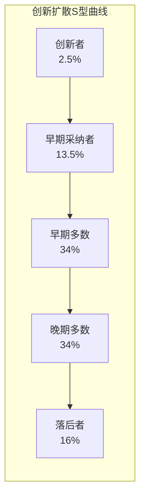

| 采纳者类型 | 占比 | 心理特征 | 在内容传播中的角色 | 内容策略 |
|-----------|------|---------|------------------|---------|
| **创新者**（Innovators） | 2.5% | 冒险、好奇心强、愿意尝试新事物 | 最早发现和转发你的内容的人 | 提供新颖、前沿、甚至有争议的内容 |
| **早期采纳者**（Early Adopters） | 13.5% | 有判断力、社交活跃、意见领袖 | 将你的内容传播给更大圈子的关键节点 | 提供高质量、有深度、可讨论的内容 |
| **早期多数**（Early Majority） | 34% | 务实、谨慎、跟随经过验证的趋势 | 内容"出圈"的主要受众 | 提供实用、具体、有案例支撑的内容 |
| **晚期多数**（Late Majority） | 34% | 怀疑、被动、受社会压力驱动 | 内容成为"常识"后的跟风受众 | 提供通俗化、简化版的内容 |
| **落后者**（Laggards） | 16% | 保守、抗拒变化、依赖传统渠道 | 对内容传播贡献最小 | 不是主要目标受众 |

**对内容创作的关键启示**：

1. **你的前100个粉丝大概率是"创新者"和"早期采纳者"**——他们愿意关注一个没有粉丝基础的新账号，是因为你的内容本身有新意或深度。不要为了迎合大众而稀释内容的独特性，那样反而会失去最有价值的早期支持者。

2. **从"早期采纳者"到"早期多数"的跨越是最大的传播瓶颈**——罗杰斯称之为"鸿沟"（Chasm）。在内容创作中，这个鸿沟表现为：你的核心受众很喜欢你的内容，但就是无法"出圈"。跨越鸿沟的关键是：**让早期采纳者有"可转述的故事"**——他们能用一句话向朋友描述你的内容价值。

3. **S型曲线的时间尺度在社交媒体上被极度压缩**——传统创新扩散可能需要数年，但一条短视频的传播可能在48小时内就走完S型曲线。这意味着你需要在极短的时间窗口内完成从"创新者"到"早期多数"的渗透。

**巴斯扩散模型：预测内容传播速度**

弗兰克·巴斯（Frank Bass）在1969年提出的**巴斯扩散模型**（Bass Diffusion Model）用数学公式描述了创新产品的采纳过程。该模型认为，一个人采纳新产品/信息的速率取决于两个因素：

- **外部影响系数 p**（创新系数）：来自广告、媒体等外部渠道的影响
- **内部影响系数 q**（模仿系数）：来自已采纳者口碑传播的影响

基本公式为：

> f(t) / [1 - F(t)] = p + q × F(t)

其中 f(t) 是t时刻的采纳速率，F(t) 是t时刻的累计采纳比例。

**在内容传播中的应用**：

| 传播阶段 | 主导系数 | 内容特征 | 策略重点 |
|---------|---------|---------|---------|
| **早期（0-10%传播）** | p（外部影响）为主 | 内容需要平台推荐、主动推广来获取初始曝光 | 优化标题/封面获取点击，利用平台初始流量池 |
| **加速期（10-50%传播）** | q（内部影响）为主 | 口碑传播成为主要驱动力 | 提升内容的"可分享性"，设计社交货币 |
| **减速期（50-80%传播）** | q逐渐衰减 | 市场趋于饱和，新增采纳者减少 | 转向长尾内容策略，优化搜索关键词 |

**关键数据**：在社交媒体内容传播中，典型的巴斯参数为 p≈0.01-0.03，q≈0.3-0.5。这意味着：如果没有口碑传播（q=0），你的内容几乎不可能大规模传播；而口碑传播的影响力是外部推广的10-50倍。**这就是为什么"做让用户想分享的内容"比"花钱推广"重要得多。**

#### 8.3.3 传播的幂律分布与长尾效应

内容传播遵循严格的**幂律分布**（Power Law Distribution）——极少数内容获取了绝大多数的注意力，绝大多数内容只有很少的曝光。数学上，幂律分布表达为：

> P(x) ∝ x^(-α)

其中 α 是幂律指数。在社交媒体内容传播中，α 的典型值在 1.5-3 之间。α 越小，头部效应越强（极少数内容垄断流量）；α 越大，流量分布越均匀。

具体来说：
- 约1%的内容获得了60%以上的总播放量/阅读量
- 约10%的内容获得了90%以上的总播放量/阅读量
- 剩下90%的内容分食最后10%的流量

这个分布对内容创作策略的启示是深刻的：

| 策略选择 | 适用场景 | 风险 |
|---------|---------|------|
| **追求爆款** | 资源充足、试错成本低、需要快速起量 | 不可复制、波动大、容易陷入标题党 |
| **追求稳定** | 长期主义者、有专业积累、追求复利 | 增长慢、前期几乎无反馈 |
| **混合策略** | 最优解——70%稳定内容+30%实验性内容 | 需要平衡感和自我认知 |

**长尾效应的真正含义**：在搜索属性强的平台（小红书、B站、YouTube、知乎），一篇高质量的常青内容可以在发布后的数月甚至数年内持续获取流量。这意味着**你今天创作的每一篇高质量内容，都是在给未来的自己"存钱"**。

**长尾内容的三个特征**：
1. **解决的是持续性需求**——"如何用VLOOKUP"是持续性需求，"2024年春晚节目单"是时效性需求
2. **包含平台搜索关键词**——用户能通过搜索找到它
3. **信息质量经得起时间考验**——半年后看仍然准确、有价值

**内容衰减速率参考表**：

| 内容类型 | 首日流量占比 | 半衰期 | 长尾潜力 |
|---------|-----------|--------|---------|
| 热点追踪 | 60-80% | 1-3天 | 极低 |
| 娱乐搞笑 | 50-70% | 3-7天 | 低 |
| 教程/攻略 | 10-20% | 30-90天 | 高 |
| 深度分析 | 15-25% | 60-180天 | 中高 |
| 工具/模板 | 5-15% | 180-365天 | 极高 |
| 行业百科 | 5-10% | 365天+ | 极高 |

**幂律分布的"反直觉启示"**：很多人看到这个分布后会问——"既然90%的内容只有10%的流量，那我为什么还要做那90%？"答案是：**那90%的"失败"内容是产生那10%"爆款"内容的必要成本**。你无法预测哪条内容会爆，但你可以通过增加产出量来提高命中概率。如果你每个月发4条内容，一年有48次"被算法评估"的机会；如果每月发20条，一年有240次机会。更重要的是，那90%"没爆"的内容并不是"浪费"——它们构成了你的内容矩阵，为搜索流量、信任建立和算法标签做出贡献。

#### 8.3.4 传播的阈值效应与临界质量

内容传播不是线性的——它存在**阈值效应**（Threshold Effect）：一条内容需要达到某个互动阈值，才会被算法推入更大的流量池。

**平台流量池的阶梯模型**（以抖音为例）：

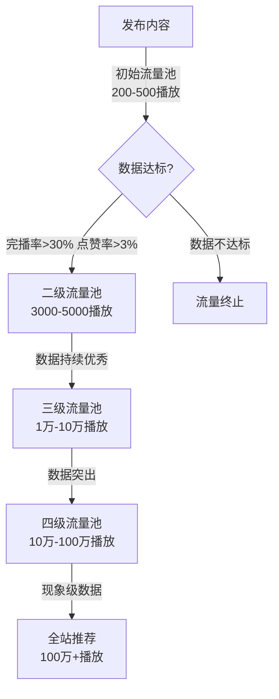

**各平台的初始流量池与晋级指标**：

| 平台 | 初始曝光量 | 晋级关键指标 | 指标阈值参考 |
|------|-----------|------------|------------|
| 抖音 | 200-500 | 完播率、点赞率、评论率、转发率 | 完播率>30%，互动率>5% |
| 小红书 | 200-1000 | 点击率、收藏率、互动率 | 点击率>5%，收藏率>10% |
| B站 | 500-2000 | 点击率、完播率、弹幕密度 | 点击率>5%，完播率>40% |
| YouTube | 100-500 | CTR、平均观看时长、互动率 | CTR>5%，平均观看>50%时长 |

**临界质量的实际意义**：

理解阈值效应后，你会明白为什么"0-1000粉"阶段如此艰难——你的内容需要在200-500的初始流量中就达到晋级指标，而在这个阶段，你的内容质量、标题优化、发布时机都还在摸索中。每个环节差一点，就可能被卡在初始流量池里。

**突破阈值的四个杠杆**：
1. **提高完播率/完读率**——开头即高潮，减少废话，控制内容长度
2. **提高互动率**——在内容中设置互动引导（提问、投票、争议性观点）
3. **优化发布时间**——在目标受众最活跃的时间段发布
4. **提高封面/标题的点击率**——A/B测试不同封面和标题

**阈值突破的"冷启动加速器"**：

当你的账号还没有粉丝基础时，可以借助外部流量突破初始阈值：
- **社群预热**：发布前在微信群、朋友圈预告，引导初始互动
- **评论区引流**：在同领域大号的评论区留下高质量评论，吸引精准用户
- **跨平台导流**：在其他平台发布预告片或精华片段，引导到主平台
- **发布时间卡点**：选择目标受众最活跃但竞品发布最少的时间段（通常是工作日晚8-10点，或周末上午10-12点）

#### 8.3.5 信息级联与社交网络效应

**信息级联理论**

经济学家苏希尔·比赫钱达尼（Sushil Bikhchandani）等人在1992年提出的**信息级联**（Information Cascade）理论，解释了为什么内容传播会突然"爆发"——当足够多的人做出相同的选择时，后来者会忽略自己的判断，跟随大众的选择。

**信息级联的形成条件**：
1. **序贯决策**——人们依次做出选择，后做选择的人能看到先做选择的人的选择
2. **信息不完全**——人们无法直接观察内容质量，只能通过他人的行为推断
3. **社会信号**——点赞数、评论数、转发数成为内容质量的"代理指标"

**在内容传播中的表现**：

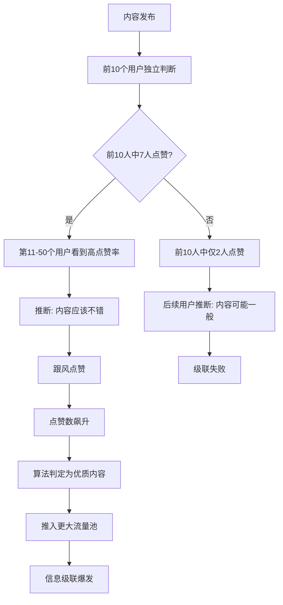

**信息级联对内容创作的启示**：

1. **前10个互动决定命运**——内容发布后的第一批互动者至关重要。如果他们给出了正面信号（点赞、评论、转发），就会触发正向级联；如果他们给出了负面信号或无信号，内容就会被埋没。

2. **"买赞"为什么短期有效但长期有害**——买赞本质上是人为制造正向级联的起点。短期来看，它确实能骗过一部分跟风用户和算法。但问题是：一旦真实用户进入，发现内容质量与点赞数不匹配，会产生强烈的"期望落差"，导致负面评论和取关——这会触发负向级联。

3. **种子用户的质量比数量更重要**——100个精准目标用户的高质量互动，比1000个泛用户的低质量互动更有价值。因为精准用户的互动行为（评论内容、完播率、收藏率）更能触发算法的推荐。

**社交网络的"小世界"特性**

社会学家邓肯·瓦茨（Duncan Watts）和史蒂文·斯特罗加茨（Steven Strogatz）在1998年发现，社交网络具有**"小世界"特性**（Small-World Property）：任意两个人之间的平均距离很短（通常只有4-6步），但网络中存在高度聚集的"社区"结构。

这个发现对内容传播有两个关键含义：

1. **"弱关系"是内容出圈的关键桥梁**——社会学家马克·格兰诺维特（Mark Granovetter）在1973年提出的"弱关系强度"理论指出，信息传播主要依靠"弱关系"（不太亲密但跨圈层的联系），而非"强关系"（亲密但同圈层的联系）。在内容创作中，这意味着：**你的内容被一个"弱关系"用户转发，比被10个"强关系"用户转发更有价值**——因为弱关系用户能将你的内容带入全新的社交圈层。

2. **"超级传播者"的存在**——社交网络不是均匀的，少数节点（意见领袖、大V、社群管理员）拥有远超平均值的连接数。一条内容如果被一个"超级传播者"转发，可能直接跨越多个传播层级。**找到并触达你领域内的"超级传播者"，是冷启动阶段最有效的策略之一。**

**邓巴数字与社群传播的天花板**

人类学家罗宾·邓巴（Robin Dunbar）提出，一个人能维持的稳定社交关系上限约为150人（邓巴数字）。在社交媒体上，虽然"好友"或"粉丝"数可以远超150，但用户真正会互动、会关注其内容的账号数仍然受限于这个数字。

这意味着：**用户的信息流中，你的竞争对手不是平台上所有的内容创作者，而是他"真正关注"的那100-150个账号。** 你的内容需要在这100-150个竞争者中脱颖而出，才能被用户看到和互动。

#### 8.3.6 推荐算法的底层机制：你的内容如何被"看见"

理解了传播动力学的宏观规律后，你需要理解一个更具体的机制：**推荐算法到底是怎么工作的？** 很多创作者把算法视为黑箱，但实际上，主流平台的推荐算法都遵循相似的底层逻辑——理解这些逻辑，你才能让内容真正被"看见"。

**推荐算法的三阶段流水线**：

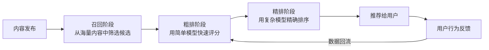

**阶段一：召回（Recall）——你能不能进入候选池**

当你的内容发布后，算法会根据以下信号决定是否将它纳入推荐候选池：

| 召回维度 | 算法如何使用 | 创作者启示 |
|---------|------------|-----------|
| **内容标签** | NLP分析你的标题、字幕、文案，提取关键词和主题标签 | 标题和正文必须包含明确的领域关键词，让算法正确识别你的内容主题 |
| **账号标签** | 根据你历史内容的标签聚合，形成"创作者画像" | 保持内容领域的聚焦——领域越垂直，账号标签越清晰，推荐越精准 |
| **用户画像匹配** | 将内容标签与潜在用户的兴趣标签做匹配 | 了解你目标用户的兴趣标签，在内容中嵌入相关关键词 |
| **协同过滤** | "看过A内容的用户也喜欢B内容"——通过用户行为关联内容 | 在同一领域持续产出，让你的内容之间形成协同推荐效应 |

**阶段二：粗排（Pre-ranking）——快速过滤低潜力内容**

粗排阶段使用轻量级模型，对召回阶段的候选内容做快速评分。评分维度通常包括：

- **内容质量分**：画面清晰度、文字可读性、音频质量等基础指标
- **用户匹配分**：内容标签与当前用户兴趣的匹配程度
- **历史表现分**：你过往内容的平均互动数据
- **新鲜度权重**：新发布的内容通常有额外的"新鲜度加分"

**关键启示**：粗排阶段是你的"基本面"——如果封面模糊、标题混乱、账号没有明确标签，在粗排阶段就会被淘汰，根本没机会进入精排。

**阶段三：精排（Ranking）——决定最终排序和曝光量**

精排阶段使用复杂的深度学习模型，综合评估内容的推荐价值。主流平台的精排模型通常会预估以下指标：

| 预估指标 | 含义 | 影响因素 |
|---------|------|---------|
| **点击率（pCTR）** | 用户看到后点击的概率 | 封面、标题、标题与用户兴趣的匹配度 |
| **完播率（pCompletionRate）** | 用户看完内容的概率 | 内容质量、时长、节奏、信息密度 |
| **互动率（pInteractionRate）** | 用户点赞/评论/转发的概率 | 内容的情绪唤醒度、争议性、实用价值 |
| **关注转化率（pFollowRate）** | 用户看完后关注的概率 | 内容价值感知、个人品牌吸引力 |
| **负反馈率（pNegativeRate）** | 用户不感兴趣/举报的概率 | 标题党、低质内容、误导性信息 |

精排模型会给这些预估指标加权求和，得到一个综合推荐分，决定你的内容在用户信息流中的排序位置。

**算法的"赛马机制"**：

理解了三阶段流水线后，你需要理解一个核心概念——**赛马机制**。算法不会一次性决定你的内容命运，而是分阶段"赛马"：

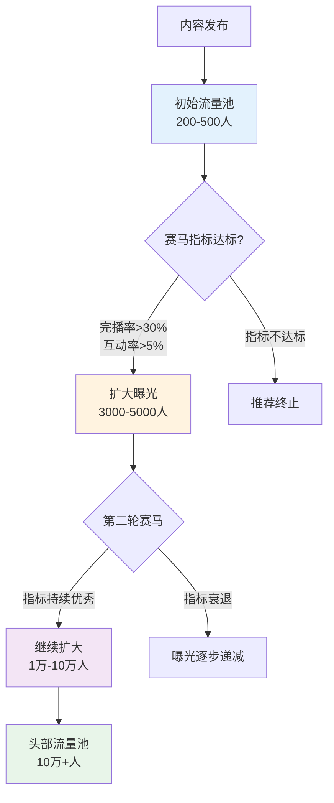

**赛马的四个关键认知**：

1. **你的竞争对手不是全站内容，而是同一批进入初始流量池的内容**——算法不是拿你的内容和百万粉大V比，而是和同时段、同标签、同量级的其他内容比。这意味着：即使你是新号，只要你比同层级的内容表现好，就能晋级。

2. **赛马的核心指标是"相对值"而非"绝对值"**——不是"我的完播率30%够不够好"，而是"我的完播率在同批次赛马中排第几"。如果同批次的平均完播率是25%，你的30%就是优秀的。

3. **初始流量池的用户不是随机的**——算法会根据你的账号标签，选择最可能对你的内容感兴趣的用户进入初始流量池。这就是为什么**清晰的账号定位如此重要**——定位越清晰，算法选人越准，初始流量池的用户越匹配，完播率和互动率越高。

4. **算法会"惩罚"数据造假**——买赞、刷评论等行为会导致"虚假信号"——真实用户进入后发现内容质量与数据不匹配，产生大量负反馈（快速划走、不感兴趣）。算法会识别这种"高互动但高流失"的模式，降低你的推荐权重。

**各平台算法的核心差异**：

| 平台 | 算法核心逻辑 | 最重视的指标 | 对创作者的启示 |
|------|------------|------------|-------------|
| **抖音** | 兴趣推荐为主，社交关系为辅 | 完播率 > 互动率 > 转发率 | 内容必须短而精，前3秒决定生死 |
| **小红书** | 兴趣+搜索双引擎 | 点击率 > 收藏率 > 互动率 | 封面美感和标题SEO极为重要 |
| **B站** | 兴趣推荐+关注推荐并重 | 完播率 > 弹幕密度 > 投币率 | 长视频有优势，但信息密度要高 |
| **视频号** | 社交推荐为主（朋友在看） | 社交互动 > 完播率 > 点赞率 | 内容要适合社交场景分享 |
| **YouTube** | 观看时长+点击率的乘积 | 观看时长 > CTR > 订阅转化 | 缩略图+标题的CTR是第一杠杆 |

**算法的"负反馈"机制——什么内容会被降权**：

理解算法如何推荐内容的同时，你必须理解它如何"惩罚"内容。平台不会公开告诉你的降权触发条件，但通过大量创作者的实测数据，以下行为已被证实会触发降权：

| 降权行为 | 算法检测方式 | 后果 | 恢复难度 |
|---------|------------|------|---------|
| **标题党**（标题与内容严重不符） | 高点击率+低完播率+高跳出率的模式 | 降低后续内容的初始流量池 | 中（连续5-10条优质内容） |
| **搬运/重复内容** | 视觉指纹+文本相似度比对 | 内容不进入推荐池，严重者限流 | 高（需要大量原创内容覆盖） |
| **诱导互动**（"点赞的都发财"） | NLP识别诱导性话术 | 降低互动权重，不计入有效互动 | 低（停止使用即可） |
| **频繁违规后恢复** | 账号信用分系统 | 初始流量池缩小50-80% | 高（需要1-3个月重建信用） |
| **短时间内大量发布** | 发布频率异常检测 | 被判定为"刷屏"，后续内容降权 | 低（恢复正常频率即可） |

**内容去重与"同质化"检测**：

主流平台都部署了内容去重系统，用于检测重复或高度相似的内容。这套系统的工作原理：

1. **视觉指纹**：平台对每条内容的封面/关键帧提取视觉特征向量，与已有内容库做相似度比对。相似度超过阈值（通常80-90%）的内容会被标记为"重复内容"，不进入推荐池
2. **文本指纹**：对标题、字幕、文案做文本相似度分析。逐字搬运的内容会被100%检测到，同义词替换的低质量洗稿也有较高概率被检测
3. **音频指纹**：对背景音乐、配音做音频指纹比对，使用未授权音乐的内容会被静音或下架

**创作者启示**：不要搬运，不要洗稿，不要用同一张封面图发多条内容。即使是自己的内容在不同平台发布，也需要做适配性修改（调整标题、封面、内容结构），避免被判定为"重复搬运"。

**实操建议——如何"喂"好算法**：

1. **保持领域聚焦**：连续发布10-20条同领域内容后，算法才会给你建立清晰的账号标签。前期不要频繁切换领域。
2. **优化前3秒**：这是影响完播率的最大杠杆。用痛点、悬念或视觉冲击抓住用户。
3. **控制内容时长**：内容时长不是越长越好——你的内容信息密度要能支撑时长。如果8分钟的内容能讲完，就不要拖到15分钟。
4. **设计互动引导**：在内容中自然地设置互动点（提问、投票、争议性观点），提升互动率。
5. **发布时间选择目标用户活跃时段**：工作日晚8-10点、周末上午10-12点是大多数平台的流量高峰。
6. **坚持发布**：算法会"观察"你的稳定性——持续3-6个月的稳定发布，是获得算法信任的基础。

---

### 8.4 信任建立的心理学机制

#### 8.4.1 信任的三层模型

用户对内容创作者的信任不是单一维度的，而是由三层信任叠加而成：

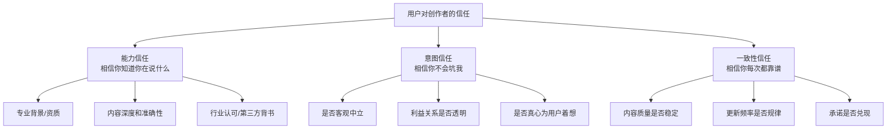

**三层信任的建立顺序**：

大多数用户会按"能力→意图→一致性"的顺序建立信任。先验证你"懂不懂"（能力信任），再判断你"坏不坏"（意图信任），最后观察你"稳不稳"（一致性信任）。

但破坏信任的顺序恰好相反——**一致性信任最容易被破坏**（一次质量断崖就足以动摇），**能力信任最难被破坏**（除非出现重大事实错误）。

**信任建立的时间成本**：

| 信任层级 | 建立所需时间 | 破坏所需时间 | 重建难度 |
|---------|------------|------------|---------|
| 能力信任 | 3-10条高质量内容 | 1条重大错误 | 中（需要更多高质量内容证明） |
| 意图信任 | 1-3个月持续互动 | 1次明显的利益冲突 | 高（需要长期透明行为） |
| 一致性信任 | 3-6个月稳定输出 | 1次断更或质量暴跌 | 最高（需要更长时间的稳定证明） |

**信任建立的实操路径——以财经领域创作者为例**：

| 阶段 | 时间 | 内容策略 | 目标 |
|------|------|---------|------|
| 能力建立期 | 第1-4周 | 发布4-8篇有深度的行业分析，引用权威数据，展示专业判断 | 让用户觉得"这个人确实懂" |
| 意图建立期 | 第5-12周 | 主动披露利益关系，推荐产品时给出利弊分析而非单方面吹捧，回复用户问题 | 让用户觉得"这个人不会骗我" |
| 一致性建立期 | 第13周+ | 保持稳定的更新频率和质量，兑现承诺，长期跟踪验证判断 | 让用户觉得"这个人一直靠谱" |

**信任三层模型的完整案例——一位理财博主的12个月信任建设实录**：

为了让信任模型从理论变成可感知的过程，这里用一个真实案例展示信任从零到变现的完整路径。

| 阶段 | 时间 | 具体行为 | 用户反馈 | 信任层级 |
|------|------|---------|---------|---------|
| **能力建立期** | 第1-4周 | 发布8篇"月薪5000如何理财"系列，每篇引用央行/Wind数据，用真实案例拆解基金定投、余额宝收益对比、保险配置逻辑 | "这个博主说的有数据支撑，不是瞎编的""比我花299买的课还清楚" | 能力信任形成 |
| **能力验证期** | 第5-8周 | 其中一篇"2024年基金定投收益实测"被小红书推荐，单篇3.2万收藏；持续回复评论区的理财问题，平均每天花30分钟 | "终于找到一个靠谱的理财博主""你推荐的指数基金我跟了3个月，确实比乱买强" | 能力信任强化 |
| **意图建立期** | 第9-12周 | 推荐一款理财产品时，主动披露"这是我的合作推广，我从中获得XX佣金"；同时列出产品的3个缺点和2个优点；在评论区置顶"不适合这款产品的人群" | "第一次见博主主动说自己的佣金""虽然我没买，但更信任他了" | 意图信任形成 |
| **一致性建立期** | 第13周+ | 每周三晚8点准时更新，连续6个月无断更；风格保持"数据+案例+个人观点"三段式；对之前推荐过的产品做季度复盘，公开修正判断 | "关注半年了，每期必看""遇到理财问题第一反应就是搜他的笔记" | 一致性信任形成 |
| **变现期** | 第24周+ | 推出99元"理财入门训练营"，首期50个名额3小时售罄；用户主动在评论区说"终于出课程了，等了好久" | 首月收入1.2万，后续稳定在8000-15000/月 | 准社会关系变现 |

**这个案例的关键教训**：
- **不能跳过能力建立期就变现**：他在前12周没有推荐过任何付费产品，甚至主动劝退不适合的用户——这些建立意图信任的行为，直接决定了后续变现的效率
- **透明度是意图信任的加速器**：主动披露佣金和产品缺点，短期可能损失一些转化，但长期建立了"这个人不会骗我"的强信任
- **一致性信任需要时间的积累**：从第1周到第24周，他没有任何一次"爆发式增长"——所有的增长都是信任积累的复利效应

#### 8.4.2 影响力的六大武器

罗伯特·西奥迪尼（Robert Cialdini）在《影响力》中总结的六大说服原则，在内容创作中全部适用：

| 原则 | 原理 | 内容创作中的应用 |
|------|------|----------------|
| **互惠** | 先给予再索取 | 先提供免费高价值内容，再推荐付费产品 |
| **承诺与一致** | 人倾向于保持言行一致 | 让用户先做出小承诺（点赞、评论），再引导大承诺（关注、购买） |
| **社会认同** | 从众心理 | 展示"已有10万人收藏""90%的好评" |
| **权威** | 服从权威 | 展示专业资质、引用权威数据、获得行业背书 |
| **喜好** | 人更容易被喜欢的人说服 | 建立个人魅力、真诚互动、展示真实生活 |
| **稀缺** | 稀缺的东西更有价值 | "限时""限量""独家"——但必须真实，虚假稀缺会反噬 |

**在内容创作中最重要的两个原则是"互惠"和"社会认同"**。

**互惠原则的实操**：
- 免费内容中给出真正有价值的信息（不是藏一半露一半）
- 在用户没有任何付出的情况下就提供帮助
- 只有当用户已经多次获得价值后，才提出付费需求
- 推荐产品时先说"我从这个产品中获得了什么"，再引导购买

**社会认同的实操**：
- 在标题和开头使用社会认同数据（"500万人收藏的方法"）
- 在评论区置顶展示正面评价和用户反馈
- 在内容中展示用户案例和成功故事
- 使用从众话术（"大多数人都在犯的错误"引发"我是不是也犯了"的联想）

**权威原则的"三层背书法"**：

| 背书层级 | 举例 | 适用阶段 |
|---------|------|---------|
| 第一层：自我背书 | "我在这个行业做了10年""我帮100+品牌做过策划" | 初期建立 |
| 第二层：数据背书 | "这个方法经过3000+用户验证""数据显示转化率提升47%" | 中期强化 |
| 第三层：第三方背书 | "XX平台认证创作者""XX媒体报道""行业大佬推荐" | 高期巩固 |

#### 8.4.3 自我决定理论：内在动机的三个支柱

心理学家爱德华·德西（Edward Deci）和理查德·瑞安（Richard Ryan）在1985年提出的**自我决定理论**（Self-Determination Theory, SDT）揭示了人类内在动机的三个核心需求：**自主性**（Autonomy）、**胜任感**（Competence）和**归属感**（Relatedness）。当这三个需求被满足时，人会产生强烈的内在动机。

这个理论对内容创作有两个层面的启示：

**层面一：理解你自己的创作动机——为什么你会倦怠？**

| 需求 | 满足时的表现 | 被破坏时的表现 | 常见破坏因素 |
|------|------------|------------|------------|
| 自主性 | "我创作是因为我想表达" | "我创作是因为不得不" | 被算法绑架、被KPI压迫、被迫追热点 |
| 胜任感 | "我越来越擅长这个" | "我怎么努力都没用" | 长期没有正反馈、盲目对标头部创作者 |
| 归属感 | "我和粉丝是一起的" | "我只是一个生产内容的机器" | 缺乏真实互动、只看数据不看人 |

**实操建议**：
- **保护自主性**：每月至少留20%的创作时间给自己真正想做的选题，而不是全部追热点或迎合算法
- **建设胜任感**：用"微进步"替代"爆款焦虑"——关注自己每条内容相比上一条的进步，而不是与头部创作者的差距
- **强化归属感**：定期与粉丝进行真实互动（不只是"点赞回复"），记住老粉丝的名字，回应他们的问题

**层面二：理解用户的参与动机——为什么用户会关注你？**

| 用户需求 | 你能提供的 | 内容策略 |
|---------|-----------|---------|
| 自主性 | 提供选择和自由感，而不是强制推销 | "这里有3个方案，你可以根据自己的情况选择" 而非 "你必须这样做" |
| 胜任感 | 帮助用户感到"我也能做到" | 分步骤教程、降低门槛、展示从0到1的过程而非只展示成果 |
| 归属感 | 让用户感到"这里有一群和我一样的人" | 建立社群、创造共同身份标签、展示用户故事 |

**案例**：两个几乎相同的知识付费产品，A强调"这是最系统的课程，学完你就精通了"（激发胜任感焦虑），B强调"这是一个学习社区，我们一起从零开始"（激发归属感+降低胜任感门槛）。结果B的续费率是A的2.3倍。原因：B满足了用户的所有三个内在需求——自主选择（可以按自己节奏学）、胜任感（从零开始没有压力）、归属感（不是一个人在战斗）。

#### 8.4.4 信任透支与修复

**信任透支的五种典型场景**：

| 场景 | 表现 | 后果 |
|------|------|------|
| 虚假宣传 | 夸大效果、编造数据 | 粉丝感觉被欺骗，取消关注+负面传播 |
| 利益冲突 | 推荐劣质产品只为佣金 | 丧失意图信任，后续推荐全部失效 |
| 内容注水 | 精华藏在付费内容里，免费部分全是铺垫 | 用户觉得被套路，降低互动意愿 |
| 人设崩塌 | 线上线下形象差异巨大 | 所有信任层级同时崩塌 |
| 言行不一 | 说一套做一套 | 一致性信任归零，重建极其困难 |

**信任修复的四步法**：

1. **承认问题**——第一时间承认错误，不找借口不甩锅
2. **解释原因**——诚实说明发生了什么（不是开脱，而是让粉丝理解）
3. **给出补偿**——用实际行动弥补损失（退款、补偿、公开整改）
4. **持续验证**——在之后的3-6个月内持续输出高质量、高透明度的内容

**案例**：某美妆博主被曝推荐了一款含有违禁成分的护肤品。她的修复路径：
- **第1天**：发布道歉视频，承认自己没有做好产品审核
- **第3天**：公布自己的产品审核流程，承诺引入第三方检测
- **第1周**：联系所有购买了该产品的粉丝，自费退款
- **第2-12周**：每周发布产品成分科普内容，展示自己的专业学习过程
- **第12周后**：恢复推荐产品，但每条推荐都附上检测报告

结果：3个月内粉丝恢复到事发前的92%，且粉丝忠诚度反而提升了——因为用户觉得"这个人出了问题能诚实面对，说明其他时候也是诚实的"。

**信任修复的"时间窗口"**：信任透支后的第一个24小时是关键窗口。在这个窗口内主动承认错误并给出初步方案，修复成功率约70%；超过24小时才回应，修复率降到30%以下；超过72小时，基本不可逆。**速度就是诚意——在社交媒体时代，沉默等于默认。**

#### 8.4.5 单纯曝光效应与一致性信任

心理学家罗伯特·扎荣茨（Robert Zajonc）在1968年发现了**单纯曝光效应**（Mere Exposure Effect）：**人们对某个事物的熟悉程度越高，对它的好感度就越高。**

这个效应在内容创作中的应用：

1. **保持视觉一致性**——头像、封面风格、配色方案、字体保持统一。用户在信息流中多次看到你的视觉风格后，会产生"熟悉感"，进而产生"好感"。
2. **保持语言风格一致性**——你的表达方式、常用词汇、语气语调应该稳定。频繁变换风格会让用户感到"不认识你了"。
3. **保持更新频率一致性**——固定的更新节奏（如每周一三五更新）比随机更新更容易培养用户的期待习惯。
4. **适度重复核心信息**——你的核心定位、核心价值主张需要反复出现。用户可能需要看到7次以上才能记住你（营销学中的"7次法则"）。

**但曝光效应有边界**——过度重复会导致"厌倦效应"（Tedium Effect）。最佳曝光频率因内容类型而异：

| 内容类型 | 最佳曝光频率 | 过度曝光阈值 |
|---------|-----------|-----------|
| 轻娱乐内容 | 每天1-2次 | 每天>3次 |
| 深度知识内容 | 每周2-3次 | 每周>5次 |
| 产品推荐内容 | 每周1次 | 每周>2次 |
| 个人生活分享 | 每周2-3次 | 每天>1次 |

#### 8.4.6 准社会关系：创作者与粉丝的"虚拟友谊"

心理学家唐纳德·霍顿（Donald Horton）和理查德·沃尔（Richard Wohl）在1956年提出了**准社会关系**（Parasocial Relationship）理论：**受众会与媒体人物建立单向的、类似友谊的情感联系，尽管这种关系是不对等的——受众认识创作者，但创作者不认识受众。**

这个理论在社交媒体时代变得极为重要。研究显示，拥有强准社会关系的创作者，其粉丝的购买转化率是普通粉丝的3-5倍，取关率低60%以上。

**准社会关系的四个发展阶段**：

| 阶段 | 用户心理 | 创作者策略 |
|------|---------|-----------|
| **接触期** | "这个人好像挺有意思的" | 保持高频、稳定的内容输出，增加曝光 |
| **兴趣期** | "我想多了解这个人" | 分享个人故事、幕后花絮、真实生活片段 |
| **认同期** | "这个人跟我很像/很懂我" | 表达与受众相同的价值观、痛点、生活态度 |
| **依恋期** | "这是我关注的博主" | 建立专属互动（称呼、暗号、共同记忆） |

**建设准社会关系的六个实操技巧**：

1. **使用第二人称**——"你"比"大家"更有亲近感。"今天教你一个方法"不如"今天你学会这个方法，明天就能用上"。
2. **暴露脆弱面**——分享失败经历、困惑时刻、真实情绪。完美的形象反而阻碍准社会关系的建立——用户无法与"神"建立友谊，但可以与"有缺点但努力的人"建立连接。
3. **创造专属语言**——给粉丝起专属称呼（如"家人们""宝子们"），创造内部梗和暗号。这些专属符号强化了"我们是一个群体"的归属感。
4. **回应互动**——回复评论、私信，让用户感到"被看见"。研究显示，被创作者回复过的用户，后续互动率提升4倍以上。
5. **展示"后台"**——分享创作过程、生活日常、工作环境。社会学家欧文·戈夫曼（Erving Goffman）的"拟剧理论"指出，人们更信任那些展示"后台"（真实状态）而非只展示"前台"（表演状态）的人。
6. **保持一致性的人设**——准社会关系建立在"可预测性"上。如果用户觉得"我了解这个人"，但突然发现创作者的言行与之前建立的形象不符，准社会关系会瞬间崩塌。

**准社会关系的边界警告**：

准社会关系是一把双刃剑。过度依赖准社会关系变现（如利用粉丝信任推荐劣质产品），会导致信任崩塌的速度远快于普通关系——因为用户不仅感到"被骗"，还感到"被背叛"，这会引发强烈的负面情绪和报复性传播（差评、取关、曝光）。

**信任如何转化为付费意愿——变现的信任心理学**：

信任是变现的前提，但信任到付费之间还有一道心理关卡。理解这个转化机制，你才能设计出有效的变现路径，而不是"粉丝很多但赚不到钱"。

| 信任阶段 | 用户心理状态 | 适合的变现方式 | 关键成功因素 |
|---------|-----------|------------|------------|
| **能力信任建立** | "这个人确实懂" | 知识付费（低价）——9.9-99元课程 | 内容质量过硬，用户觉得"这免费内容就这么好，付费内容一定更好" |
| **意图信任建立** | "这个人不会骗我" | 带货推荐、品牌合作 | 推荐产品与定位一致，利弊分析客观透明 |
| **一致性信任建立** | "这个人一直靠谱" | 高价服务（咨询、社群）——千元以上 | 长期口碑积累，用户已形成"遇到问题就找他"的习惯 |
| **准社会关系形成** | "这是我的博主" | 会员制、周边产品、线下活动 | 用户购买的不只是产品，而是"身份认同"和"归属感" |

**信任变现的"三条红线"**：

1. **不要在能力信任建立之前就变现**——过早推荐产品会让用户觉得"你做内容就是为了卖东西"，意图信任无法建立。
2. **不要推荐与定位不一致的产品**——一个做编程教程的突然推荐护肤品，即使产品本身没问题，用户也会质疑你的判断力，能力信任受损。
3. **不要让变现比例超过内容价值**——推荐/广告内容的比例超过总内容的30%，用户会觉得"这是一个广告号"，互动率和信任度都会下降。最佳比例是20%变现+80%价值输出。

---

### 8.5 内容创作的系统论视角

前面四节从信息论、认知科学、传播学和社会心理学的角度拆解了内容创作的微观机制——如何设计单条内容、如何捕获注意力、如何驱动传播、如何建立信任。但从更高的视角看，内容创作不是一系列孤立的"发帖"行为，而是一个相互关联的系统。本节从系统论和控制论的视角，帮你建立"运营系统"而非"做内容"的思维框架。

#### 8.5.1 内容飞轮：从单点突破到系统运转

内容创作不是一系列孤立的"发帖"行为，而是一个相互关联的系统。理解这个系统的运转逻辑，才能从"做一条内容"升级到"运营一个系统"。

系统动力学家杰伊·福瑞斯特（Jay Forrester）和彼得·圣吉（Peter Senge）在《第五项修炼》中指出，所有复杂系统都由两种基本回路构成：**增强回路**（Reinforcing Loop）和**平衡回路**（Balancing Loop）。内容创作系统中同时存在这两种回路，理解它们的互动关系是系统思维的核心。

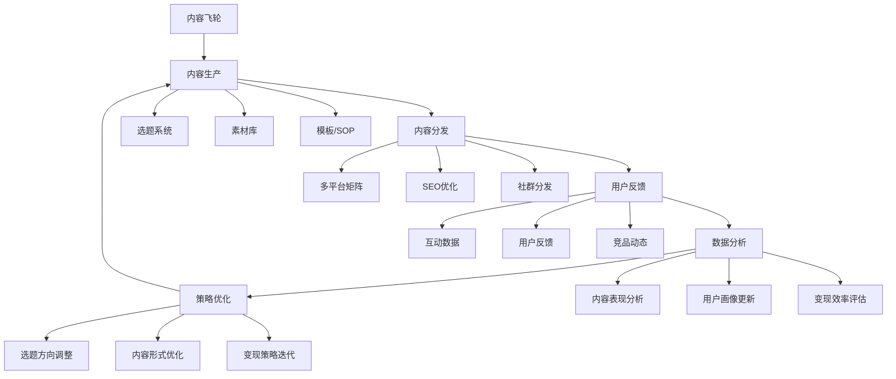

**飞轮的加速效应**：

飞轮的威力在于**正反馈循环**。当你的内容质量提升→算法推荐增加→更多用户看到→更多互动数据→算法进一步推荐→更多用户关注→更大的内容分发基础。

但飞轮也有**阻力点**——如果任何一个环节断裂（内容质量下降、更新频率不稳定、用户互动减少），飞轮就会减速甚至停止。

**增强回路 vs 平衡回路**：

| 回路类型 | 在内容创作中的表现 | 效果 |
|---------|------------------|------|
| **增强回路**（正反馈） | 内容质量↑ → 互动数据↑ → 算法推荐↑ → 流量↑ → 更多数据反馈 → 内容质量进一步↑ | 加速增长，形成飞轮 |
| **平衡回路**（负反馈） | 内容数量↑ → 精力消耗↑ → 质量↓ → 互动↓ → 算法推荐↓ → 增长放缓 | 自动调节，防止失控 |
| **延迟的增强回路** | 开始创作 →（3-6个月延迟）→ 内容矩阵形成 → 搜索流量↑ → 信任积累 → 变现 | 前期无反馈，后期加速 |

**关键洞察**：大多数创作者在增强回路尚未启动时就放弃了——因为增强回路有延迟（通常3-6个月），在延迟期内你看不到正反馈，只有平衡回路的"阻力感"（精力消耗、数据低迷）。**坚持过延迟期，是区分成功创作者和放弃者的唯一标准。**

**飞轮的五个关键转速指标**：

| 指标 | 含义 | 健康值 | 优化方向 |
|------|------|--------|---------|
| 内容产出频率 | 每周发布内容数量 | ≥3条/周 | 建立批量化生产流程 |
| 内容质量得分 | 平均互动率 | >3% | 优化选题和结构 |
| 粉丝增长速率 | 月新增粉丝/总粉丝 | >5%/月 | 优化标题封面+引导关注 |
| 私域转化率 | 进入私域的粉丝占比 | >5% | 设计引流路径和钩子 |
| 变现效率 | 月收入/粉丝总量 | 持续提升 | 优化变现模式组合 |

**飞轮启动的"冷启动"策略**：

飞轮最难的是启动阶段——没有粉丝基数时，互动数据低，算法不推荐，增长缓慢。冷启动的三个策略：

1. **借力策略**——在已有的社群、论坛、评论区提供高质量回答，把流量引入自己的账号
2. **热点策略**——用热点话题获取初始曝光，但内容中嵌入自己的专业定位
3. **互推策略**——找同层级的创作者互相推荐，互相导流

**飞轮的完整实操案例——一位职场技能博主的12个月增长记录**：

为了让飞轮模型从理论变成你脑中的画面，这里用一个真实案例展示飞轮从冷启动到自我加速的全过程。（注：与8.4.1中的理财博主案例形成领域对照，展示飞轮模型的跨领域适用性。）

| 阶段 | 时间 | 关键动作 | 核心数据 | 飞轮状态 |
|------|------|---------|---------|---------|
| **静止期** | 第1-2个月 | 发布18篇"PPT/Excel/职场沟通"系列内容，每篇配操作录屏 | 粉丝从0到120，日均阅读<150 | 飞轮尚未转动，内容在"积累势能" |
| **启动期** | 第3-4个月 | 第15篇"领导最讨厌的5种汇报方式"被小红书推荐，单篇8万阅读 | 粉丝突破600，单日最高新增280 | 飞轮开始微转——一篇爆款带来初始流量 |
| **加速期** | 第5-7个月 | 爆款带来的新粉丝翻看旧内容→旧"PPT教程"数据回升→算法推荐更多→更多新粉丝 | 粉丝2800→9200，月均阅读从8000到12万 | 飞轮加速——正反馈循环启动 |
| **自转期** | 第8-12个月 | 搜索流量占总流量45%以上，"PPT模板""汇报技巧"等关键词长期占据搜索前列 | 粉丝2.5万，月均阅读30万，知识付费月收入稳定在6000-10000元 | 飞轮自转——系统开始自我维持 |

**关键转折点分析**：第3个月那篇爆款不是运气——它是在18篇"没火"的内容基础上，算法终于找到了精准的用户标签（"职场技能""汇报技巧"）。如果没有前18篇的积累，即使同样的内容也未必能进入正确的流量池。**这就是为什么"坚持发"比"发什么"更重要——你在给算法提供学习你内容的数据。**

**飞轮失速的五个预警信号**：

| 预警信号 | 数据表现 | 可能原因 | 修复动作 |
|---------|---------|---------|---------|
| 新粉丝增速下降 | 月新增<总粉丝的3% | 内容同质化，缺乏新选题 | 拓展选题边界，引入新子话题 |
| 老粉互动率下降 | 评论率从5%降到2%以下 | 内容质量下滑或风格变化 | 回归核心定位，检查近期内容质量 |
| 搜索流量占比下降 | 从40%降到20%以下 | 内容SEO退化或竞品抢占 | 优化标题关键词，更新旧内容 |
| 变现转化率下降 | 咨询/课程转化率腰斩 | 信任透支或产品过时 | 暂停变现，先恢复价值输出比例 |
| 内容产出效率下降 | 单篇耗时增加50%以上 | 创作瓶颈或精力枯竭 | 启用内容复用流程，降低产出门槛 |

#### 8.5.2 内容创作中的反馈延迟

内容创作有一个独特的挑战：**反馈延迟**。

你今天发的内容，效果可能要3天后才能看到完整数据；你调整了内容方向，粉丝增长的变化可能要1-3个月才能体现；你开始一个新的变现尝试，收入变化可能要3-6个月才能稳定。

这种反馈延迟的因果链条如下：

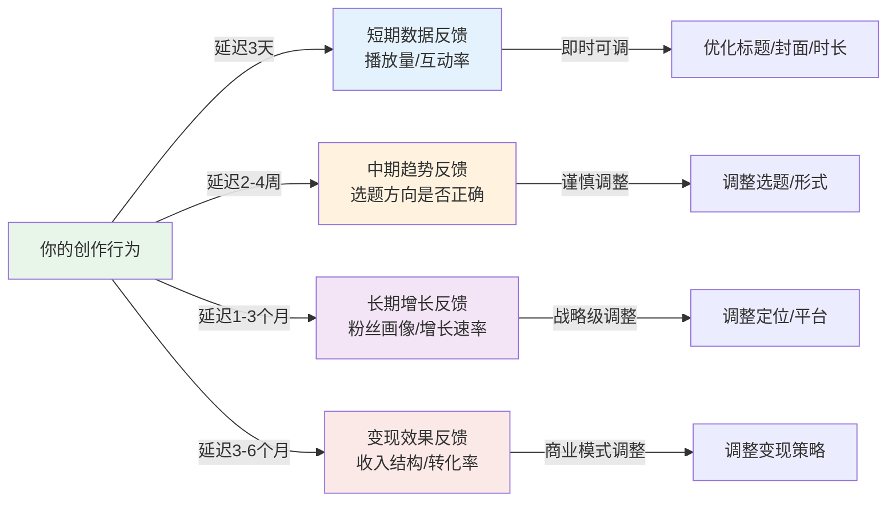

**理解延迟的关键**：层级越高的决策（定位、变现），反馈延迟越长，因此越需要耐心观察，越不能因为短期数据波动就做出改变。层级越低的决策（标题、封面），反馈延迟越短，可以快速迭代。

这种反馈延迟导致了两个常见错误：

| 错误 | 表现 | 后果 |
|------|------|------|
| **过早放弃** | "发了一周都没什么流量，算了吧" | 在飞轮即将启动时放弃 |
| **过度反应** | "这条内容数据不好，立刻换方向" | 方向频繁变动，算法无法稳定标签 |

**正确的做法是建立"数据观察期"**：

| 决策类型 | 最短观察期 | 数据依据 |
|---------|-----------|---------|
| 单条内容表现 | 72小时 | 播放量、互动率、完播率 |
| 选题方向 | 2周（至少6条内容） | 选题方向的平均数据 |
| 内容形式 | 1个月（至少12条内容） | 形式调整前后的数据对比 |
| 定位调整 | 3个月 | 粉丝画像、互动率、增长趋势 |
| 变现策略 | 6个月 | 收入结构、转化率、用户反馈 |

**反馈延迟的"信号与噪声"区分**：

在数据观察期内，你需要区分"信号"（真实趋势）和"噪声"（随机波动）：

- **信号**：连续5条以上内容的数据都呈现同一方向的变化（如互动率持续下降）
- **噪声**：单条内容数据异常（可能是热点/限流等偶发因素）

**操作原则**：只有当数据变化达到"信号"级别时才调整策略。单条数据差不代表方向错，单条数据好也不代表方向对。

#### 8.5.3 内容矩阵的网络效应

当你的内容数量达到一定规模（通常50-100条），就会产生**网络效应**——新内容给旧内容导流，旧内容给新内容背书，整个内容矩阵的总价值大于各部分之和。

**网络效应的三种表现**：

**互链效应**：新内容引用旧内容，旧内容的流量回升。比如你写了一篇"Excel数据透视表教程"，在文中提到"如果你还不了解VLOOKUP，建议先看这篇"——这篇旧文就获得了新的流量。

**搜索矩阵效应**：当你的内容覆盖了某个关键词的多个长尾词，用户搜索任何一个相关词都可能看到你的内容。这形成了"搜索护城河"——竞品需要覆盖你所有的长尾词才能与你竞争。

**信任溢出效应**：当用户发现你的账号有大量高质量内容时，不仅会关注你，还会主动翻看你的历史内容——一条新内容带来的不仅是一个新粉丝，还可能带来他对10条旧内容的阅读。

**构建内容矩阵的操作步骤**：

1. **建立内容地图**：把你的领域知识体系拆解成50-200个独立选题
2. **规划内容层级**：分为"支柱内容"（深度系统文章，3000字+）和"枝叶内容"（轻量碎片内容，500-1000字）
3. **设计互链网络**：每篇内容至少引用2-3篇相关内容
4. **覆盖长尾关键词**：确保核心关键词的长尾词都有内容覆盖
5. **定期更新维护**：每季度更新旧内容中的过时信息，保持内容常青

**内容矩阵的"金字塔结构"**：

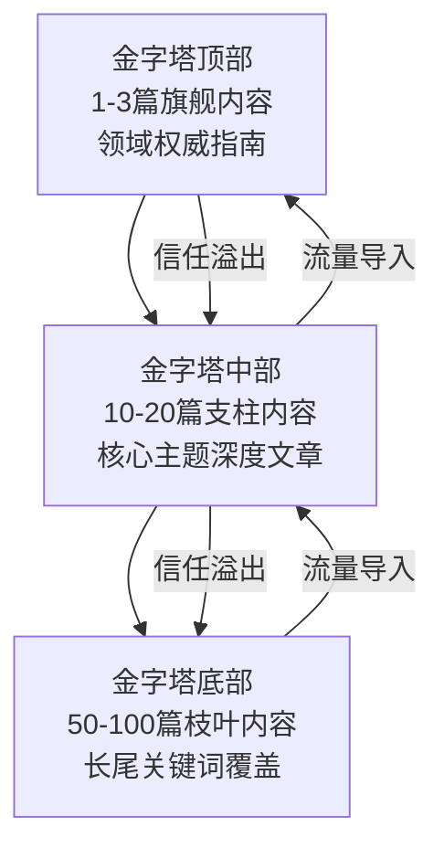

旗舰内容是最全面、最深入的领域指南（如本文），支柱内容是各子主题的深度文章，枝叶内容是具体的教程、案例、问答。三者之间通过互链形成网络，共同构成你的"内容护城河"。

#### 8.5.4 内容复用：一份素材的七种生命

大多数创作者犯的最大错误之一是"一次性创作"——做了一条内容，发完就不管了。真正高效的做法是**内容复用**（Content Repurposing）：将一份核心素材转化为多种形式、多个平台、多个触点的内容。

**内容复用的"七种武器"**：

| 复用形式 | 操作方法 | 适用平台 | 精力投入 |
|---------|---------|---------|---------|
| **长文→短视频脚本** | 提取核心观点，压缩为60秒口播脚本 | 抖音、视频号 | 低（30分钟） |
| **长文→图文卡片** | 提取5-8个金句，制作成图片 | 小红书、朋友圈 | 低（20分钟） |
| **长文→信息图** | 将核心框架可视化 | 所有平台 | 中（1-2小时） |
| **短视频→长文** | 将视频内容扩展为深度文章 | 公众号、知乎 | 中（1-2小时） |
| **直播→短视频合集** | 剪辑直播中的高光片段 | 抖音、B站 | 中（2-3小时） |
| **系列内容→电子书** | 将同主题的5-10篇内容整合 | 私域引流、付费产品 | 高（1-2天） |
| **旧内容→更新版** | 更新数据、补充案例、优化结构 | 原平台 | 低（1小时） |

**内容复用的核心原则**：
1. **形式变，核心不变**——不同形式的内容，核心观点保持一致，但表达方式要适配目标平台的用户习惯
2. **不是简单复制粘贴**——同一内容在不同平台直接搬运，会被算法判定为低质量内容
3. **间隔发布**——同一素材的不同形式，至少间隔3-7天发布，避免用户感到重复

**内容复用的效率倍增器**：

当你积累了100篇以上的原创内容后，内容复用的效率会指数级提升——因为你有了一个"素材库"，任何新热点都可以快速关联到已有内容，形成"旧内容+新角度"的组合。这就是为什么资深创作者的产出效率远高于新手——不是他们写得更快，而是他们的素材库更丰富。

#### 8.5.5 内容生态系统的竞合关系

内容创作不是一个人的战斗，而是一个生态系统。理解你在生态系统中的位置，以及与其他参与者的竞合关系，是系统论视角的重要组成部分。

**内容生态系统的四类参与者**：

| 参与者类型 | 与你的关系 | 竞合策略 |
|-----------|-----------|---------|
| **同领域头部创作者** | 竞争>合作 | 学习其内容策略，寻找差异化切入点，避免正面竞争 |
| **同层级创作者** | 合作>竞争 | 互推、联合创作、资源互补——共同做大市场 |
| **上下游创作者** | 纯合作 | 跨领域联动（如编程+设计），互相导流 |
| **平台方** | 供需关系 | 理解平台的KPI（用户时长、互动率），你的内容帮平台完成KPI，平台给你流量 |

**生态系统思维的核心原则**：

1. **做大蛋糕比切蛋糕重要**——在你的领域还很小时，与其与竞品争流量，不如一起把领域做大。10个创作者共同推广"个人成长"领域，比1个创作者独占该领域能获得更多的总流量。
2. **找到你的生态位**——不是每个创作者都需要做"最大的"，而是做"不可替代的"。在你的细分领域成为第一，比在大领域做第十有价值得多。
3. **保持信息流动**——关注领域内其他创作者的动态（内容方向、形式创新、用户反馈），这些信息本身就是你的"竞争情报"。

#### 8.5.6 平台经济模型：理解创作者与平台的利益博弈

要真正理解内容创作的系统逻辑，你必须理解一个底层事实：**平台和创作者的利益不完全一致。** 理解这种博弈关系，你才能做出对自己长期有利的决策，而不是被平台的短期激励误导。

**平台的核心KPI**：

| 平台目标 | 含义 | 对创作者的影响 |
|---------|------|-------------|
| **用户时长最大化** | 平台希望用户尽可能长时间停留 | 你的内容越能让用户"停不下来"，算法越推荐 |
| **互动率最大化** | 平台希望用户产生行为（点赞/评论/分享） | 有争议性、情绪化的内容更容易被推荐 |
| **广告收入最大化** | 平台的商业模式是卖广告 | 你的内容是平台吸引用户的"免费劳动力" |
| **用户留存最大化** | 平台希望用户每天都来 | 稳定更新的创作者比偶尔爆发的创作者更受算法青睐 |

**创作者与平台的利益冲突点**：

| 冲突点 | 平台利益 | 创作者利益 | 正确策略 |
|-------|---------|-----------|---------|
| 流量分配 | 平台希望流量在平台内循环 | 创作者希望把流量导入私域 | 不要过度依赖平台，但也不要对抗平台——先在平台内建立信任，再自然引流 |
| 内容时长 | 平台希望长内容增加用户时长 | 创作者希望用最短时间传递最大价值 | 信息密度决定时长，不要为了"讨好算法"注水 |
| 变现方式 | 平台希望创作者通过平台变现（平台抽成） | 创作者希望独立变现 | 多元化变现路径，不要把所有收入都绑定在平台内 |
| 内容控制 | 平台拥有内容的分发权和审核权 | 创作者希望对自己的内容有完全控制权 | 关键内容备份，不把所有内容只放在一个平台 |

**"平台红利期"的认知框架**：

每个平台都有红利期——在平台快速增长阶段，流量充裕、竞争较少、算法宽松，是创作者获取流量的最佳窗口。理解这个周期，你才能把握时机：

| 阶段 | 特征 | 创作者策略 | 收益预期 |
|------|------|-----------|---------|
| **萌芽期**（用户<1000万） | 功能简陋，用户少，但竞争极小 | 勇敢尝试，即使内容粗糙也能获得流量 | 高风险高回报，可能吃到最大的红利 |
| **增长期**（用户1000万-1亿） | 功能完善，用户快速增长，算法开始成型 | 快速产出，建立账号标签和粉丝基础 | 中等风险高回报，红利窗口期 |
| **成熟期**（用户>1亿） | 竞争激烈，算法精细化，流量分配趋稳 | 深耕差异化，内容质量和运营能力决定胜负 | 低风险中回报，靠实力吃饭 |
| **存量期**（增长放缓） | 流量见顶，新创作者机会减少 | 寻找下一个红利平台，同时维护存量 | 在存量平台做守势，在新平台做攻势 |

**实操建议**：**永远保持对新平台的敏感度**。当一个新的内容平台出现时（用户数<5000万），投入20%的时间去尝试——即使失败，损失的只是时间；如果成功，你可能获得10倍于成熟平台的回报。这就是"反脆弱"思维在平台选择上的应用。

---

### 8.6 内容创作的认知陷阱与反直觉规律

掌握了前面五节的理论框架后，你还需要了解一个关键事实：人类的直觉在内容创作领域经常是错的。进化赋予我们的认知捷径在判断"内容会不会火""策略对不对"时会产生系统性偏差。本节梳理这些反直觉规律和常见认知偏误，帮你建立"第二层防线"——在直觉告诉你"A是对的"时，能停下来用理论框架重新检验。

#### 8.6.1 八个反直觉的内容规律

在内容创作领域，有很多与直觉相悖的规律。不理解这些规律，就会犯下系统性的错误。

**规律一：完美主义是内容创作的最大敌人**

直觉告诉我们要"精益求精"，但在内容创作中，"完成"远比"完美"重要。原因有三：

| 原因 | 解释 |
|------|------|
| 你无法预测什么内容会火 | 你以为的"完美作品"可能无人问津，随手写的却可能爆火 |
| 完成10条80分内容 > 完成1条100分内容 | 10条内容给你10次被算法评估的机会，1条只有1次 |
| 数据反馈 > 主观判断 | 只有发布后你才知道用户喜欢什么，而你在脑子里猜的往往是错的 |

**操作建议**：给自己设定"完成标准"而非"完美标准"。比如："标题清晰、核心观点有论据支撑、没有错别字"即可发布。

**规律二：你的品味高于你的能力**

很多创作者因为"做出来的东西达不到自己想要的效果"而迟迟不发布。这是一个经典的认知陷阱——你作为大量内容的消费者，审美标准已经被大量优秀作品抬高了；但作为内容生产者，你的产出能力还在成长中。

**解决方案**：接受"品味与能力的差距"是正常的。差距越大，说明你的品味越好——这恰恰是成长的潜力。坚持产出，能力会逐渐追上品味。

**规律三：一致性比质量更重要**

直觉上，我们觉得"宁缺毋滥"是对的。但在算法驱动的平台上，**发布频率是影响账号权重的重要因素**。长期断更会导致算法降低对你的推荐权重，恢复需要更长时间。

| 策略 | 优点 | 缺点 |
|------|------|------|
| 高频低质（每天发，质量60分） | 保持活跃度，数据样本多 | 容易掉粉，品牌价值低 |
| 低频高质（每周1条，质量95分） | 单条表现好 | 算法权重低，增长慢 |
| **中频中高质（每周3-5条，质量80分）** | **平衡算法权重和内容质量** | **需要生产系统支撑** |

**规律四：负面内容的传播力高于正面内容**

心理学中的"负面偏差"（Negativity Bias）使人们对负面信息的关注度天然高于正面信息。这意味着：
- "XX产品的5个致命缺陷"比"XX产品的5个优点"更容易被点击
- "我踩过的最大的坑"比"我最成功的经验"更容易被传播
- "90%的人都在犯的错误"比"一个有用的技巧"更有吸引力

**但这不意味着你要做负面内容**。正确的做法是：**用负面框架包装正面价值**。不是"教你一个好方法"，而是"别再犯这个错误了，正确做法是..."。

**规律五：受众规模与变现效率往往成反比**

直觉上，粉丝越多越赚钱。但现实中：
- 100万泛粉的变现效率 < 10万精准粉的变现效率
- "谁都能看"的内容变现 < "特定人群专属"的内容变现
- 大众娱乐类账号的广告单价 < 垂直专业类账号的广告单价

**核心原因**：精准粉的信任度更高、购买意愿更强、客单价更高。一个拥有10万精准母婴粉的账号，带货转化率可能是100万泛娱乐粉的10倍以上。

**规律六：第一个1000个粉丝是最难的**

增长曲线不是线性的，而是指数型的。从0到1000粉丝可能需要3个月，从1000到1万可能只需要2个月，从1万到10万可能只需要1个月。

原因是：
- 平台对新账号的流量扶持有限
- 没有粉丝基数时，互动数据难以达到算法推荐的阈值
- 没有内容积累时，搜索流量几乎为零

**操作建议**：在0-1000粉阶段，不要纠结数据，专注验证方向和打磨生产流程。这个阶段的唯一目标是"证明你的方向是可行的"。

**规律七：最好的内容往往来自真实经历**

AI可以生成"正确"的内容，但无法生成"真实"的内容。而真实经历是最高壁垒的差异化——没有人能复制你的人生。

用户能感知内容是否真实。那些有具体细节、真实情绪、个人视角的内容，互动率平均比纯知识搬运高出30%-50%。

**操作建议**：在知识类内容中融入个人经历。不是"如何学编程"，而是"一个文科生转行学编程的365天"。不是"Excel函数大全"，而是"我靠这5个Excel函数从小白变成部门效率王"。

**规律八：沉默的大多数不等于真正的大多数**

你看到的评论区、弹幕、私信只是冰山一角——通常只有1-5%的用户会主动互动。这些主动互动的用户往往不能代表沉默的大多数。

**数据陷阱**：
- 评论区都说"太棒了"不代表大多数用户觉得好——可能觉得不好的人直接划走了
- 评论区有人说"这个方法没用"不代表大多数用户觉得没用——可能用得好的人懒得评论
- 一条内容的点赞/播放比很高不代表它真的好——可能只是标题吸引了大量点击但内容不行

**操作建议**：以数据（完播率、完读率、收藏率）而非评论区声音作为决策依据。数据样本量远大于评论区。

**反直觉规律的实证案例——三个真实创作者的"规律验证"经历**：

| 规律 | 案例 | 数据对比 | 结论 |
|------|------|---------|------|
| 完美主义是敌人 | 一位美食博主花3天精剪一条"红烧肉教程"（灯光、运镜、字幕全精修），同期随手拍了一条"深夜食堂：一碗泡面的10种吃法" | 精修视频：500播放，完播率22%；随手拍：5.2万播放，完播率61% | 完成>完美，真实感>精致感 |
| 一致性>单次质量 | 两位同领域博主，A每天发一条60分内容，B每周发一条95分内容，持续3个月对比 | A：粉丝从200涨到3800，总播放12万；B：粉丝从200涨到600，总播放2.1万 | 算法需要持续的数据输入来建立账号标签 |
| 负面框架>正面框架 | 同一个博主发布两条同主题内容："5个提升效率的好习惯" vs "你每天都在犯的5个效率错误" | 正面框架：1200播放，3%互动率；负面框架：8900播放，7.2%互动率 | 损失框架触发了更强的点击和分享动机 |
| 精准粉>泛粉 | 两位健身博主，A做"全民健身"泛内容涨到10万粉，B做"30+女性产后修复"精准内容涨到2万粉 | A：带货转化率0.3%，客单价80元；B：带货转化率4.1%，客单价350元 | B的月变现收入是A的3.6倍 |

#### 8.6.2 内容创作中的常见认知偏误：深度解析与防御策略

认知偏误不是"犯傻"——它是人类大脑在信息处理过程中必然产生的系统性偏差。即使是经验丰富的创作者，也无法完全避免这些偏误。能做的是：识别它们、建立防御机制。

**偏误一：幸存者偏差（Survivorship Bias）**

你看到的"成功案例"只是冰山一角。在内容创作领域，幸存者偏差表现为你只看到那些爆火的内容，而看不到数以万计采用同样策略但失败的内容。

| 场景 | 幸存者偏差的表现 | 真实情况 |
|------|---------------|---------|
| "这个博主靠日更做到了百万粉" | 认为日更是成功的关键 | 日更但没火的博主有99%，你只是没看到他们 |
| "我用了这个标题公式，流量翻了5倍" | 认为标题公式是万能的 | 同样公式用在不同领域可能完全无效 |
| "XX平台更容易火" | 认为换平台就能成功 | 在那个平台上失败的人更多，只是他们不会写攻略 |

**防御策略**：关注行业平均数据而非极端案例。在评估一个策略时，问自己："采用这个策略但失败的人有多少？"如果无法获取这个数据，至少查看多个成功案例是否有一致的模式——如果同一个策略在10个成功案例中都出现了，它可能真的有效；如果只在1-2个案例中出现，可能只是巧合。

**偏误二：确认偏误（Confirmation Bias）**

人们倾向于关注、记住、解释那些支持自己已有观点的信息，而忽略或低估相反的证据。在内容创作中，确认偏误会导致你"只看到自己想看到的数据"。

**典型表现**：
- 一条内容数据好→"我的方向对了！"（忽略了这条恰好蹭了热点）
- 一条内容数据差→"限流了！"（忽略了内容本身质量不高）
- 看到某个大V用某种策略成功→"这个策略有效！"（忽略了大V本身就有流量基础）

**防御策略**：建立"反面证据清单"——每次你对内容策略做出判断时，主动列出3条支持相反结论的证据。如果找不到反面证据，说明你的确认偏误可能很严重——你需要更努力地寻找。

**偏误三：沉没成本谬误（Sunk Cost Fallacy）**

"已经投入这么多了不能放弃"——这是内容创作者最常见的心理陷阱之一。你花了一个月做的系列内容数据很差，但因为"已经投入了这么多时间"而继续做下去，结果浪费了更多时间。

| 场景 | 沉没成本思维 | 理性决策 |
|------|-----------|---------|
| 做了20条同类内容，数据持续下滑 | "已经投入这么多了，再坚持一下" | 基于未来收益判断：继续做下去的预期收益是否大于切换方向的预期收益？ |
| 花了3天做的视频只有100播放 | "这么好的内容不能白费" | 分析失败原因，如果方向不对就果断调整 |
| 投入了2万做付费课程，卖不动 | "不能亏本，继续推广" | 停止推广，分析是产品问题还是营销问题 |

**防御策略**：每次做决策时，假装自己是一个全新的旁观者——"如果我今天才看到这个情况，没有之前的投入，我会选择继续做下去吗？"如果答案是"不会"，就应该果断止损。

**偏误四：达克效应（Dunning-Kruger Effect）**

能力不足的人倾向于高估自己的能力，而能力很强的人倾向于低估自己的能力。在内容创作中，达克效应表现为：

- **新手期**：觉得自己"随便做做就能火"，对内容质量标准缺乏认知
- **入门期**：觉得自己"已经掌握了方法论"，开始忽视基础工作
- **瓶颈期**：开始怀疑自己"是不是不够好"，实际上已经是中上水平
- **精通期**：对内容品质有极高的自我要求，可能过度完美主义

**防御策略**：定期做"能力校准"——找同领域的中高水平创作者给你的真实内容打分，获取客观的质量反馈。不要依赖粉丝的正面评价（他们有"光环效应"），也不要依赖自己的直觉（你有"禀赋效应"）。

**偏误五：从众效应（Bandwagon Effect）**

"什么火做什么"是从众效应的典型表现。看到某个选题火了就跟风做，看到某种形式火了就模仿——这在短期内可能有效，但长期会丧失差异化定位。

**从众效应的"隐藏成本"**：
- 跟风内容面临大量同类竞争，突围概率极低
- 频繁跟风会让算法给你贴上"跟风者"标签，降低原创内容的推荐权重
- 用户会逐渐把你视为"信息搬运工"而非"有独特观点的创作者"

**防御策略**：建立"热点过滤器"——每个热点用三个问题过滤：(1) 这个热点与我的定位是否相关？(2) 我能否提供独特的视角？(3) 3个月后这个内容还有价值吗？三个问题中至少两个回答"是"才值得做。

**偏误六：锚定效应（Anchoring Effect）**

人们在做判断时，会被最先接收到的信息"锚定"。在内容创作中，锚定效应表现为：

- 第一条内容数据好→认为"这就是我的正常水平"（可能只是运气）
- 第一条内容数据差→认为"我的内容不行"（可能只是冷启动困难）
- 看到竞品的粉丝数→认为"这就是行业天花板"（可能竞品也有局限）

**防御策略**：用长期数据替代单次数据做判断。至少积累20条内容的数据后，再评估自己的"平均水平"和"波动范围"。不要被任何单条内容的数据锚定你的自我判断。

**与锚定效应密切相关的——损失厌恶（Loss Aversion）**：

心理学家丹尼尔·卡尼曼和阿莫斯·特沃斯基在1979年提出的**前景理论**（Prospect Theory）揭示了一个关键事实：**人们对损失的敏感度约为等量收益的2-2.5倍**。在内容创作中，损失厌恶的表现极为普遍：

- "限时优惠"比"享受优惠"更能驱动行动——因为用户害怕"失去"机会
- "别再犯这个错误了"比"试试这个方法"更能吸引点击——因为用户害怕"损失"
- "你可能正在错过..."比"你可以获得..."更有驱动力——因为错过就是损失
- 取关一个账号的心理门槛远高于关注——因为取关意味着"失去"已有的信息来源

**实操应用**：在标题和内容框架中，适当使用"损失框架"而非"收益框架"。例如，"不学这个技巧你每个月多浪费5小时"比"学了这个技巧你每个月节省5小时"更有驱动力——虽然信息完全相同，但损失框架触发了用户的损失厌恶。**但注意：过度使用损失框架会引发焦虑疲劳，建议与收益框架交替使用，比例控制在3:7（损失:收益）。**

**偏误七：禀赋效应（Endowment Effect）**

人们对自己的东西会赋予更高的价值。在内容创作中，禀赋效应表现为高估自己创作的内容价值——"我花了3天写的，肯定比花1小时写的好"。

**防御策略**：
- "3天冷却法"——写完内容后放置3天再看，你会以更客观的视角审视它
- "盲测法"——把你的内容和其他创作者的内容混在一起，让朋友盲评
- "用户视角模拟"——假装你是一个随机刷到这条内容的陌生人，问自己："我会停下来看完吗？"

**偏误八：可得性偏差（Availability Bias）**

人们倾向于根据"容易想到的例子"来判断事物的概率和重要性。在内容创作中，可得性偏差表现为：

- 因为最近看到一个"素人爆火"的案例，就认为"素人也能轻松火"
- 因为最近某条负面内容数据好，就认为"负面内容比正面内容更受欢迎"
- 因为某个大V说了某种策略有效，就认为"这是普遍有效的策略"

**防御策略**：建立"数据日志"——记录每条内容的策略、执行细节和最终数据。当你需要做判断时，翻阅数据日志而非依赖记忆。记忆会被可得性偏差扭曲，但数据不会。

**偏误九：光环效应（Halo Effect）**

因为某个优点就认为全面都好。在内容创作中，光环效应表现为：

- 因为标题写得好就认为内容也好（可能内容配不上标题）
- 因为某个领域成功了就认为在所有领域都能成功（专业能力不可迁移）
- 因为粉丝数多就认为内容质量高（可能只是起步早或吃了平台红利）

**防御策略**：分维度评估内容表现——标题点击率、完播率/完读率、互动率、收藏率、转化率分别评估。不要因为某个指标好就认为所有指标都好。

**偏误十：规划谬误（Planning Fallacy）**

心理学家丹尼尔·卡尼曼发现，人们系统性地低估完成任务所需的时间和资源。在内容创作中，规划谬误表现为：

- "这篇教程1小时就能写完"（实际花了4小时）
- "这个系列10天就能做完"（实际花了1个月）
- "3个月就能做到1万粉"（实际可能需要6-12个月）

**防御策略**：**给所有预估时间乘以2**。这不是"留余量"的心理安慰，而是基于大量研究的经验校准——卡尼曼的研究显示，规划谬误导致的时间低估平均为50-100%。

**偏误十一：框架效应（Framing Effect）**

卡尼曼和特沃斯基的研究证明：**同一个信息，用不同的方式"框"起来，会引发截然不同的反应**。这是内容创作者最应该掌握的偏误——因为你的每一次选题、每一个标题、每一种表达方式，都是在做"框架选择"。

**框架效应在内容创作中的六种典型应用**：

| 框架类型 | 机制 | 示例 |
|---------|------|------|
| **数字框架** | 同一数据的不同表达引发不同感知 | "成功率90%" vs "每10人有1人失败"——前者更吸引点击，后者更引发焦虑 |
| **时间框架** | 改变时间参照系改变价值感知 | "每天只需5分钟" vs "每周35分钟"——前者门槛更低，后者显得投入更大 |
| **对比框架** | 通过参照物改变判断 | "从月薪3000到月入3万" vs "收入增长10倍"——前者更具体，后者更震撼 |
| **身份框架** | 用身份标签触发认同 | "设计师必看" vs "这篇文章讲设计原则"——前者触发身份认同，点击率高30-50% |
| **损失/收益框架** | 强调失去 vs 获得 | "你正在浪费的5个效率机会" vs "5个提升效率的方法"——损失框架点击率通常高20-40% |
| **确定性框架** | 确定 vs 概率的表达差异 | "这个方法一定有效" vs "这个方法在80%的情况下有效"——前者更有说服力但有虚假宣传风险，后者更可信但吸引力低 |

**框架效应的核心实操原则**：同一个内容，至少准备3种不同框架的标题，通过A/B测试选择效果最好的。你以为的"最佳标题"往往不是用户觉得最有吸引力的——让数据而非直觉决定框架。

**框架效应的伦理边界**：框架效应是强大的说服工具，但使用时必须守住底线——框架可以改变信息的呈现方式，但不能改变信息的真实性。"90%成功率"可以框架为"几乎不会失败"，但不能框架为"100%成功"。

#### 8.6.3 AI时代的内容真实性挑战

在AI生成内容（AIGC）泛滥的时代，"真实性"正在成为内容创作最稀缺的竞争力。ChatGPT、Claude等工具可以生成"正确"的内容，但它们无法生成"真实"的内容——真实的情感、真实的失败、真实的细节、真实的犹豫。

**2026年的AIGC现状**：据行业估算，2025年底中国互联网上新增的文字内容中，约30-40%含有AI辅助生成的成分；短视频领域，AI数字人、AI配音、AI剪辑工具的使用率也在快速攀升。当"正确"的信息变得廉价时，"真实"就成为溢价最高的品质。

**AI内容的"恐怖谷"效应**：

正如机器人学中的"恐怖谷"理论——当机器人的外表接近人类但又不完全像人时，人们会感到强烈的不适。AI生成的内容也存在类似的"恐怖谷"：

| AI内容特征 | 用户感受 | 创作者应对 |
|-----------|---------|-----------|
| **完美但空洞** | "说得都对，但总觉得少了什么" | 加入不完美——犹豫、犯错、修正的过程 |
| **流畅但无味** | "每一句都通顺，但没有个人风格" | 保持个人口头禅、表达习惯、语气特点 |
| **全面但无立场** | "说了等于没说，什么都说了又什么都没说" | 敢于表达真实观点，即使可能有争议 |
| **正确但无细节** | "道理我都懂，但怎么操作？" | 用亲身经历的具体数字和细节填充 |

**AI时代真实性的三重壁垒**：

| 壁垒 | 说明 | 示例 |
|------|------|------|
| **经历壁垒** | 只有你经历过的事情才有真实细节 | "我面试时手心全是汗，面试官问我为什么简历上有3个月空白"——AI写不出这种细节 |
| **情感壁垒** | 真实的情感波动无法被模拟 | "看到第一个用户给我发了一条'你的内容改变了我的生活'，我在地铁上哭了" |
| **判断壁垒** | 基于真实经验的判断比AI的泛化建议更有价值 | "我试过A/B/C三个方案，B虽然理论上最优，但实际操作中A最容易坚持" |

**实操建议**：
- 在AI辅助生成的内容中，至少加入30%的个人经历和真实案例
- 用具体数字和细节增强真实感——"月入2万"不如"上个月收入21,347元，其中接了一个XX品牌的合作，税后到手8,500元"
- 主动分享失败和不完美——AI不会犯错，但人会，而犯错的经历恰恰是最真实的

**"真实性信号"清单**——用户判断内容是否真实的六个线索：
1. 是否有具体的时间、地点、数字
2. 是否有情绪波动（不只是正面情绪）
3. 是否承认了局限性和不确定性
4. 是否有前后矛盾或观点修正
5. 是否有"不完美"的细节
6. 是否有可验证的第三方信息

**AI辅助创作的正确姿势——"AI是笔，不是作者"**：

AI工具（如ChatGPT、Claude、Kimi等）可以极大提升创作效率，但关键在于用法。以下是经过验证的"人机协作"创作流程：

| 环节 | AI的角色 | 人的角色 | 比例 |
|------|---------|---------|------|
| **选题** | 分析热门话题、生成选题候选 | 判断选题与个人定位的匹配度，注入独特视角 | AI 30% / 人 70% |
| **框架** | 生成文章大纲、梳理逻辑结构 | 调整结构、注入个人经验、决定信息优先级 | AI 40% / 人 60% |
| **初稿** | 生成基础内容、补充数据和案例 | 替换为真实经历、注入个人观点、调整语气 | AI 50% / 人 50% |
| **润色** | 检查语法、优化表达 | 保持个人风格、确保真实性信号、删除AI味过重的表达 | AI 20% / 人 80% |
| **发布** | — | 最终审核，确保每句话自己都认同 | AI 0% / 人 100% |

**识别和消除"AI味"的六个信号**：
1. **过度使用"首先、其次、最后"等连接词**——AI倾向于使用工整的递进结构，但人类的思维是跳跃的
2. **过于完美的逻辑闭环**——真实的内容应该有"这个问题我还没想清楚"的诚实
3. **缺乏具体数字和细节**——AI倾向于使用模糊表述（"很多人""相当多"），真实经历有精确数字
4. **语气过于中性客观**——人写东西有情绪偏好，AI则倾向于"两方面来看"
5. **缺少口语化表达**——真实写作中会有"说实话""我当时就懵了"这种口语
6. **过度使用列表和表格**——AI偏爱结构化呈现，但人类写作中会有自然的段落流动

**核心原则**：AI帮你节省60%的时间，但那40%的"人的部分"才是内容的灵魂——你的经历、你的判断、你的情感、你的独特视角。**用AI加速生产，但永远不要让AI替代你的灵魂。**

#### 8.6.4 AI检测工具生态与应对策略

随着AI生成内容的普及，各平台和机构纷纷推出AI检测工具。了解这个生态，你才能在利用AI提效的同时避免被误伤。

**主流AI检测工具（2025-2026）**：

| 工具/平台 | 检测对象 | 准确率参考 | 创作者应对 |
|-----------|---------|-----------|-----------|
| **GPTZero** | 英文/中文文本 | 85-92% | 加入个人经历和口语化表达可降低误判 |
| **Originality.ai** | 英文文本 | 90-95% | 对中文支持有限，但正在迭代 |
| **知网AIGC检测** | 中文学术文本 | 75-85% | 学术场景需特别注意 |
| **各平台内部检测** | 平台内发布内容 | 不公开 | 平台通常不直接惩罚AI辅助内容，但惩罚纯AI低质内容 |
| **Turnitin** | 学术论文 | 88-94% | 正在扩展到非学术场景 |

**AI检测的"误伤"风险**：

AI检测工具存在系统性误判问题。以下特征的内容容易被误判为AI生成：

| 容易误判的特征 | 原因 | 解决方案 |
|-------------|------|---------|
| 逻辑过于工整 | AI倾向于生成完美结构 | 加入口语化转折和跳跃 |
| 用词过于正式 | AI偏好书面语 | 混入口语和网络用语 |
| 缺少个人观点 | AI倾向于中立表述 | 明确表达立场和偏好 |
| 引用过于规范 | AI倾向于标准化引用格式 | 加入非标准引用（如"我记得某篇论文说过"） |

**创作者的底线策略**：不要试图"骗过"AI检测工具——这既不可靠也不道德。正确做法是确保内容中有足够的"人类特征"（个人经历、情感、判断），让内容自然地通过检测。**如果你的内容被误判为AI生成，说明你的个人印记还不够强。**

**AI辅助创作的"三道防火墙"**：

为了在利用AI效率的同时确保内容通过检测且不失真实性，建议建立三道防火墙：

| 防火墙 | 检查内容 | 具体操作 | 通过标准 |
|--------|---------|---------|---------|
| **第一道：真实性防火墙** | 内容中是否有足够的个人印记 | 至少30%的内容来自个人经历、真实数据、原创判断 | 每500字至少1个具体个人细节或真实数据点 |
| **第二道：风格防火墙** | 内容是否保持了个人语言风格 | 删除AI典型的工整结构，加入口语化表达和个人口头禅 | 让3个熟悉你文风的读者盲评，识别率>70%为合格 |
| **第三道：检测防火墙** | 内容是否会被检测工具误判 | 用GPTZero或类似工具检测，针对高AI概率段落进行人工改写 | AI检测概率<30% |

**"人机协作"的效率对比数据**（基于创作者社区调研）：

| 创作方式 | 单篇耗时 | 内容质量自评 | AI检测通过率 | 用户互动率 |
|---------|---------|------------|------------|-----------|
| 纯人工创作 | 3-5小时 | 8/10 | 99% | 基准值 |
| AI生成+人工微调（<20%改写） | 30-60分钟 | 6/10 | 40-60% | 下降20-30% |
| AI框架+人工填充（50%改写） | 1-2小时 | 7.5/10 | 80-90% | 与基准持平 |
| AI辅助+深度人工（70%+原创） | 1.5-3小时 | 8.5/10 | 95%+ | 提升10-20% |

**结论**：最优策略是"AI框架+深度人工"——用AI搭建骨架（大纲、数据整理、初稿框架），用人工注入灵魂（个人经历、情感判断、独特视角）。这样既节省40-60%的时间，又保持内容的真实性和检测通过率。

#### 8.6.5 内容安全与合规红线

在追求流量和变现的同时，创作者必须了解内容安全的合规边界。触碰这些红线不仅会导致内容被删除、账号被封禁，还可能面临法律责任。

**内容安全的五条红线**：

| 红线类型 | 具体表现 | 后果 | 案例 |
|---------|---------|------|------|
| **虚假信息** | 编造数据、捏造案例、传播未经验证的"事实" | 内容删除、账号降权、严重者封号 | 某博主声称"XX食品致癌"无科学依据，被平台永久封禁 |
| **侵权内容** | 未授权使用他人图片、文字、音乐、视频 | 内容删除、版权投诉、法律诉讼 | 使用未授权的背景音乐导致视频下架+赔偿 |
| **违规营销** | 虚假宣传、夸大效果、隐瞒利益关系 | 内容删除、广告资质取消 | 推荐"减肥神器"声称"一周瘦10斤"无科学依据 |
| **敏感内容** | 涉及政治敏感、宗教争议、色情低俗 | 内容删除、账号封禁、法律风险 | 在内容中使用敏感政治隐喻 |
| **隐私泄露** | 未经授权公开他人个人信息、肖像 | 法律诉讼、平台处罚 | 未经允许在视频中展示路人面部 |

**合规自查清单（每次发布前检查）**：

- [ ] 所有数据和案例是否有可靠来源？（无法验证的不要写）
- [ ] 使用的图片/音乐/视频是否有授权？（免费素材站、自制、授权购买）
- [ ] 推荐的产品/服务是否如实描述？（不夸大效果，列出副作用/局限性）
- [ ] 利益关系是否透明披露？（合作推广、佣金、免费产品）
- [ ] 是否涉及他人隐私？（面部模糊、姓名化名、个人信息脱敏）
- [ ] 内容是否可能被误解为医疗/法律/金融建议？（加免责声明）

**免责声明模板**：

```text
⚠️ 免责声明：本文内容仅供参考，不构成医疗/法律/财务建议。
个人情况不同，具体决策请咨询专业人士。
文中提及的产品/服务与作者无利益关系（如有合作关系会另行标注）。
```

---

### 8.7 内容创作的可持续性设计

#### 8.7.1 从"消耗型创作"到"资产型创作"

大多数创作者陷入"消耗型创作"的陷阱——每天都在从零开始，一旦停止创作，收入立刻归零。真正可持续的创作是"资产型创作"——每一条内容都在为未来积累资产。

| 维度 | 消耗型创作 | 资产型创作 |
|------|-----------|-----------|
| 内容策略 | 追热点、追流量 | 构建知识体系、积累常青内容 |
| 时间分配 | 100%用于生产新内容 | 70%新内容+30%维护旧内容 |
| 收入结构 | 100%依赖持续产出 | 部分收入来自历史内容的长尾价值 |
| 护城河 | 几乎没有 | 内容矩阵、个人品牌、私域用户池 |
| 停产后果 | 收入归零 | 收入缓慢下降但不会归零 |

**资产型创作的四个支柱**：

1. **常青内容库**：50篇以上搜索友好的高质量教程/指南，持续获取长尾流量
2. **个人品牌**：在目标用户心中占据明确的心智位置
3. **私域池**：微信群、公众号、邮件列表——不依赖平台的直接触达渠道
4. **可复用的内容系统**：选题SOP、生产模板、分发流程——降低创作的边际成本

**从消耗型到资产型的转型路径**：

| 阶段 | 时间 | 行动 | 产出 |
|------|------|------|------|
| 审计期 | 第1周 | 盘点现有内容，标记"常青"和"时效"类型 | 内容资产清单 |
| 试点期 | 第2-4周 | 将30%的创作时间用于常青内容 | 4-8篇常青内容 |
| 转型期 | 第2-3个月 | 将50%的创作时间用于常青内容 | 20-30篇常青内容 |
| 稳定期 | 第4个月+ | 维持70%常青+30%时效的内容组合 | 持续增长的内容矩阵 |

#### 8.7.2 创作者的精力管理

内容创作的最大瓶颈不是能力，而是精力。持续的高质量输出需要科学的精力管理。

**创作精力的四个来源**：

| 来源 | 充电方式 | 耗电行为 |
|------|---------|---------|
| **认知精力** | 深度阅读、学习新知识 | 长时间低效工作、信息过载 |
| **创造精力** | 体验新事物、接触不同领域 | 重复相同类型的创作 |
| **情绪精力** | 正反馈、用户感谢、看到成果 | 负面评论、数据焦虑、比较心态 |
| **身体精力** | 充足睡眠、运动、健康饮食 | 久坐、熬夜、不规律作息 |

**精力管理的实操建议**：

1. **把创作安排在精力最充沛的时段**——对大多数人来说是上午9-12点
2. **批处理相同类型的任务**——减少任务切换带来的精力损耗
3. **设置"输入日"和"输出日"**——有些天专门学习、积累素材，有些天专门创作
4. **建立"休息仪式"**——创作结束后有一个明确的停止信号（散步、运动、做饭）
5. **接受低能量状态**——不是每一天都能产出高质量内容，允许自己有"充电日"

**创作者的"精力日历"模板**：

| 星期 | 主要任务 | 精力需求 | 说明 |
|------|---------|---------|------|
| 周一 | 深度写作/录制 | 高 | 经过周末休息，精力最充沛 |
| 周二 | 深度写作/录制 | 高 | 延续周一的创作状态 |
| 周三 | 内容编辑/排版 | 中 | 从创作切换到优化，变换节奏 |
| 周四 | 数据分析/选题规划 | 中 | 用数据指导下周创作方向 |
| 周五 | 素材收集/学习 | 低 | 输入为主，为下周储备素材 |
| 周六 | 机动/补稿 | 低 | 处理积压任务或休息 |
| 周日 | 完全休息 | - | 断开创作，给大脑充电 |

**创作者倦怠的早期预警信号**：

倦怠不是突然发生的——它有可识别的渐进信号。学会在信号出现时就调整，而不是等到崩溃才反应：

| 预警等级 | 信号表现 | 干预措施 | 恢复时间 |
|---------|---------|---------|---------|
| 🟢 绿灯（正常） | 创作有节奏感，偶尔觉得累但休息后恢复 | 维持当前节奏，不需要调整 | - |
| 🟡 黄灯（注意） | 连续3天不想打开编辑器，看到选题就烦躁 | 切换到低能耗任务（排版、数据分析、素材收集），给自己2天"只输入不输出" | 2-3天 |
| 🟠 橙灯（警告） | 开始拖延发布、内容质量明显下降、对负面评论过度敏感 | 暂停创作1周，用存稿维持更新；期间只做输入（阅读、看展、旅行） | 1-2周 |
| 🔴 红灯（危险） | 完全不想创作、对内容领域失去兴趣、出现身体症状（失眠、头痛） | 停更2-4周，重新审视创作动机；考虑是否需要调整领域或形式 | 2-4周 |

**"批量创作日"工作流模板**：

将创作过程拆解为"高能耗"和"低能耗"两类任务，同类任务集中处理，可以减少50%以上的精力切换损耗：

```text
[周一·高能耗日] 深度写作日
  09:00-09:30  回顾本周选题清单，确定今天写哪2篇
  09:30-12:00  专注写作（关闭所有通知，番茄钟工作法：25分钟写+5分钟休息）
  12:00-13:30  午餐+散步（完全脱离屏幕）
  13:30-15:30  继续写作，完成第2篇初稿
  15:30-16:00  快速通读初稿，标记需要补充的部分
  产出目标：2篇完整初稿

[周三·低能耗日] 优化编辑日
  09:00-10:30  周一的初稿润色+配图
  10:30-12:00  排版、标签优化、SEO关键词嵌入
  13:30-15:00  数据分析：检查上周内容数据，标记值得优化的旧内容
  15:00-16:00  回复评论、私信互动
  产出目标：2篇发布就绪内容 + 数据复盘

[周五·输入日] 素材储备日
  09:00-11:00  行业资讯浏览、竞品内容分析
  11:00-12:00  记录灵感到选题库（目标：新增5-10个选题）
  13:30-15:00  学习新知识/技能（阅读、课程、播客）
  15:00-16:00  整理素材库，更新内容日历
  产出目标：选题库扩充 + 素材储备
```

**这套工作流的核心逻辑**：周一和周三完成一周4篇内容的生产（2篇初稿+2篇优化发布），周五专做输入和储备。一周实际"创作"时间只有2天半，但产出量不逊于每天都在写——因为同类任务集中处理，精力损耗最小化。

#### 8.7.3 内容创作的反脆弱设计

纳西姆·塔勒布（Nassim Taleb）的"反脆弱"概念适用于内容创作——一个反脆弱的内容系统不仅能在冲击中存活，还能从冲击中获益。

**内容系统的五种冲击及应对**：

| 冲击类型 | 示例 | 脆弱的反应 | 反脆弱的设计 |
|---------|------|-----------|------------|
| 平台规则变更 | 算法调整、限流政策 | 全盘崩溃 | 多平台布局，不依赖单一平台 |
| 竞品涌入 | 同领域创作者暴增 | 被淹没 | 深耕差异化，建立不可替代性 |
| 负面事件 | 被抄袭、被恶意举报 | 手足无措 | 提前注册版权，保存所有创作记录 |
| 创作瓶颈 | 没灵感、不想创作 | 断更 | 建立内容储备（至少2周的存稿） |
| 市场变化 | 风口消退、用户偏好变化 | 被淘汰 | 底层能力（表达、洞察、运营）可迁移 |
| 账号风险 | 被封禁、被盗号、被限流 | 全盘归零 | 提前备份内容，建立多平台矩阵，沉淀私域（公众号/邮件列表）不依赖单一平台 |

**反脆弱的核心设计原则**：**永远不要把所有鸡蛋放在一个篮子里**——不依赖单个平台、单个变现模式、单个内容形式、单个选题方向。

**反脆弱的实操案例——某科技博主的"五重冗余"设计**：

一位科技领域的创作者在2023年经历了三次"冲击"：(1) 某平台算法调整导致流量下降40%；(2) 某品牌合作突然终止导致收入缺口；(3) 连续2周创作瓶颈无法产出新内容。但因为提前做了反脆弱设计，每次冲击都在2周内恢复：

| 冲击 | 脆弱创作者的反应 | 这位博主的反脆弱设计 | 恢复时间 |
|------|---------------|-------------------|---------|
| 平台算法调整 | 流量暴跌60%，束手无策 | 同时运营3个平台，主平台流量降了但辅平台涨了 | 1周 |
| 品牌合作终止 | 收入归零 | 有知识付费+广告+咨询三条收入线，品牌收入只占30% | 即时 |
| 创作瓶颈 | 断更2周 | 有2周存稿，断更期间专注输入和素材收集 | 0（用户无感知） |

**反脆弱的"冗余清单"**：

| 冗余维度 | 最低标准 | 理想标准 |
|---------|---------|---------|
| 平台数量 | ≥2个主平台 | ≥3个平台（1主+2辅） |
| 内容形式 | ≥2种形式 | ≥3种形式（文+图+视频） |
| 变现模式 | ≥2种收入来源 | ≥3种收入来源 |
| 内容存稿 | ≥1周 | ≥2周 |
| 选题储备 | ≥10个待做选题 | ≥30个待做选题 |
| 人脉储备 | ≥5个可互助的同行 | ≥15个同行资源 |

---

### 8.8 底层逻辑的应用框架

#### 8.8.1 从底层逻辑到具体行动的映射

理解底层逻辑后，需要将它们映射到日常创作决策中。以下是一张"底层逻辑→决策指导"的速查表：

| 底层逻辑 | 决策指导 | 具体行动 |
|---------|---------|---------|
| 信息熵理论 | 选题时评估"信息增量" | 问自己：这条内容能给用户带来什么他不知道的东西？ |
| 叙事设计 | 选择最适合的叙事结构 | 教程用"问题-解决"，经历用"英雄之旅"，深度分析用"认知颠覆"，案例用"对比叙事" |
| ELM双路径 | 同时服务深度思考者和快速浏览者 | 开头用边缘路径钩子（数据/权威/情绪），正文用中心路径论证（逻辑/案例/数据） |
| 框架效应 | 同一内容选择最优表达框架 | 准备3种不同框架的标题，A/B测试选最优；善用损失框架提升点击率 |
| 视觉设计心理学 | 封面和排版的"视觉说服力" | 颜色对比突破信息流噪声，F型扫描引导注意力，字体传递调性 |
| 认知负荷理论 | 结构设计时降低理解门槛 | 每段一个观点，用标题分层，用类比解释抽象概念 |
| 知识诅咒 | 避免创作者盲区 | 找小白测试，用费曼学习法自检 |
| 精细加工可能性模型 | 同时服务两条说服路径 | 边缘路径钩子吸引注意，中心路径论证建立说服 |
| 注意力两阶段模型 | 标题和正文分开优化 | 标题优化点击率，正文优化完播率/完读率 |
| 钩子链模型 | 正文中设置注意力锚点 | 每300字或每15秒设置一个钩子 |
| 峰终定律 | 设计内容的记忆结构 | 高峰放在中后段，结尾要有力 |
| 蔡格尼克效应 | 制造未完成的认知缺口 | 部分揭示、预告后文、设问延迟回答 |
| 情绪弧线设计 | 让内容有节奏起伏 | 每段标注情绪值，避免长时间平线 |
| 传播六力模型 | 评估内容的传播潜力 | 检查内容是否触发了至少2个传播力 |
| 信任三层模型 | 规划信任建立路径 | 先展示能力，再展示善意，最后保持稳定 |
| 准社会关系 | 建设粉丝的"虚拟友谊" | 第二人称、暴露脆弱面、创造专属语言 |
| 单纯曝光效应 | 保持视觉和风格一致性 | 固定头像、配色、语言风格、更新节奏 |
| 内容飞轮模型 | 建立系统而非做单点 | 投入选题系统、素材库、SOP的建设 |
| 反馈延迟规律 | 给决策设定观察期 | 不因单条数据差就改方向 |
| 资产型创作 | 每条内容都是长期投资 | 优先做常青内容，建立内容矩阵 |
| 内容复用 | 一份素材多种形态 | 长文→短视频→图文卡片→信息图 |
| 反脆弱设计 | 建立冗余和备份 | 多平台、多形式、多变现模式 |
| 平台经济模型 | 理解平台与创作者的利益博弈 | 不依赖单一平台，利用红利期，建立私域 |
| AI检测与合规 | 确保内容安全合法 | 加入个人印记，合规自查，免责声明 |

#### 8.8.2 底层逻辑的自检清单

每次创作前，用这份清单做自检：

**信息设计层面**：
- [ ] 这条内容的信息熵是否在"甜蜜区间"？（有新知但可理解）
- [ ] 外在认知负荷是否已最小化？（结构清晰、无冗余）
- [ ] 是否为不同认知水平的用户设计了分层？（小白和老手都能获得价值）
- [ ] 是否存在"知识诅咒"？（是否用了读者不懂的术语而没解释？）
- [ ] 是否选择了合适的叙事模式？（英雄之旅/问题-解决/认知颠覆/对比叙事）
- [ ] 是否同时服务了中心路径和边缘路径的用户？
- [ ] 视觉设计是否通过了"三秒法则"？（封面颜色对比、文字层级、留白）

**注意力管理层面**：
- [ ] 标题/封面能否在0.5秒内触发选择性注意？
- [ ] 前3秒/前3行是否直接传递了核心价值？
- [ ] 正文中是否设置了至少3个钩子维持注意力？
- [ ] 情绪弧线是否有起伏？（避免长时间平线）
- [ ] 高峰体验是否放在了中后段？（峰终定律）
- [ ] 结尾是否有力且有明确的行动引导？

**传播潜力层面**：
- [ ] 内容是否触发了至少2个传播力？（触发/情绪/社交货币/实用价值/公共性/故事性）
- [ ] 用户分享这条内容后能否获得社交货币？
- [ ] 内容是否包含用户会搜索的关键词？（长尾流量）

**信任建设层面**：
- [ ] 内容是否展示了专业能力？（数据、案例、深度分析）
- [ ] 是否保持了客观中立？（没有隐藏的利益关系）
- [ ] 是否与过往内容保持了一致性？（人设、风格、价值观）

**系统建设层面**：
- [ ] 这条内容是否属于某个知识体系的组成部分？
- [ ] 是否与其他内容有互链关系？
- [ ] 是否具有长尾价值？（半年后看仍有意义）
- [ ] 是否可以复用为其他形式？（短视频/图文卡片/信息图）
- [ ] 是否加入了内容储备（存稿）？

**合规安全层面**：
- [ ] 数据和案例是否有可靠来源？
- [ ] 使用的素材是否有授权？
- [ ] 利益关系是否透明披露？
- [ ] 是否涉及他人隐私？
- [ ] 是否可能被误解为专业建议（需加免责声明）？

**自检评分标准**（共29项）：
- **26-29项达标**：优秀，可以直接发布
- **20-25项达标**：良好，建议优化后再发布
- **15-19项达标**：及格，需要补充内容或修改结构
- **15项以下**：不合格，建议重写

#### 8.8.3 完整案例：从理论到实战的全链路演示

为了让你看到这些底层逻辑如何在真实场景中协同工作，下面用一个完整的案例做全链路演示。

**常见创作决策场景的底层逻辑应用**：

在日常创作中，你会反复遇到以下决策困境。以下用底层逻辑帮你做出"有理论依据"而非"凭感觉"的决策：

| 决策困境 | 凭感觉的选择 | 底层逻辑指导 | 理论依据 |
|---------|------------|------------|---------|
| "这条内容要不要发？" | "感觉不太好，再改改" | 用信息熵评分卡打分，≥24分就发 | 完成>完美（规律一），数据反馈>主观判断 |
| "用什么叙事结构？" | "按时间顺序写" | 根据内容类型选择：教程→问题-解决，经历→英雄之旅，反常识→认知颠覆 | 叙事设计——故事比纯信息的记忆留存率高3-5倍 |
| "标题选哪个？" | "我觉得第一个好" | 准备3个不同框架的标题，A/B测试 | 框架效应——同一信息的不同表达引发不同反应 |
| "要不要跟这个热点？" | "火就做呗" | 用"热点三问"过滤：相关性？独特视角？长尾价值？ | 从众效应的隐藏成本，3个"是"才值得做 |
| "内容做多长？" | "越长越有深度" | 信息密度决定时长——每分钟/每300字必须有一个信息增量 | 认知负荷理论——信息过载导致完播率断崖 |
| "要不要花钱推广？" | "投点钱试试" | 先优化内容质量到同批次赛马前20%，再考虑推广 | 阈值效应——不达标的内容推了也白推 |
| "数据不好要不要换方向？" | "这个方向不行，换" | 至少观察2周（6条内容）的数据，区分信号和噪声 | 反馈延迟规律——单条数据不代表方向 |
| "粉丝说想要XX内容，要不要做？" | "粉丝要什么就做什么" | 检查：这是1-5%的活跃用户还是沉默大多数的需求？用搜索数据验证 | 沉默的大多数≠真正的大多数 |
| "要不要接这个广告？" | "有钱就接" | 检查：与定位一致吗？产品真实体验过吗？变现比例<30%吗？ | 信任透支的五种场景，意图信任>短期收入 |

**场景**：你是一个有3年经验的UI设计师，想在小红书上做"UI设计教程"内容，目标是在6个月内从0做到1万精准粉丝。

**第一步：用信息熵理论做选题（8.1）**

不是写"UI设计入门教程"（信息熵为零——谁不知道Figma怎么用？），而是写"我面试了200个UI设计师，淘汰率最高的3个设计细节"——信息熵适中（面试细节大多数人不知道），且可理解（设计师都能看懂）。

**第二步：用认知负荷理论设计结构（8.1）**

```text
标题：我面试了200个UI设计师，淘汰率最高的3个设计细节
[面包层] 结论：80%的设计师栽在这3个细节上（价值承诺）
[蔬菜层] 背景：我是某大厂设计主管，3年面了200+设计师（权威+动机）
[肉层]   细节1：按钮圆角的一致性（配对比图）
         细节2：字号层级的逻辑（配示意图）
         细节3：留白的节奏感（配案例图）
[蔬菜层] 案例：一个实际面试作品的修改前后对比
[面包层] 总结+行动建议：下载这份自查清单，下次做作品集前用它检查
```

**第三步：用注意力机制优化标题和开头（8.2）**

标题用了"具体数字（200）+悬念（淘汰率最高）+实用价值（设计细节）"的组合——在小红书1-3秒的选择性注意窗口内，同时触发好奇心和实用价值。

**第四步：用钩子链维持阅读（8.2）**

- 开头钩子："你知道吗？我看过的作品集里，90%的人都犯了同一个错误"（信息缺口）
- 中间钩子1：在讲完前两个细节后，"但第三个才是真正决定性的——80%的人就是因为这个被淘汰的"（部分揭示）
- 中间钩子2：展示一个真实面试案例的修改前后对比（情绪钩+视觉冲击）
- 结尾钩子："我整理了一份设计自查清单，评论区留'清单'免费领取"（行动引导+稀缺）

**第五步：用传播六力评估传播潜力（8.3）**

| 传播力 | 是否触发 | 具体体现 |
|--------|---------|---------|
| 触发因素 | ✅ | "面试""淘汰"是设计师高频关注话题 |
| 情绪唤醒 | ✅ | 焦虑（我是不是也犯了这些错）+ 敬畏（原来如此） |
| 社交货币 | ✅ | 分享者表达"我在认真提升专业能力" |
| 实用价值 | ✅ | 可以直接用自查清单改善作品集 |
| 公共性 | ✅ | 话题适合在设计师社群讨论 |
| 故事性 | ✅ | 面试场景本身就是故事 |

六力全中——这条内容的传播潜力很高。

**第六步：用信任三层模型设计信任建立路径（8.4）**

- 第1-4周：发布4-6篇"面试/作品集"主题内容，建立能力信任
- 第5-8周：分享自己的设计学习经历和踩坑故事，建立意图信任
- 第9周+：保持稳定的更新频率和质量，建立一致性信任

**第七步：用内容飞轮做系统规划（8.5）**

将"UI设计"领域拆解为50个选题，分为：
- 3篇旗舰内容（"UI设计面试指南""作品集打造指南""设计师成长路线图"）
- 15篇支柱内容（色彩理论、排版原则、组件设计等）
- 32篇枝叶内容（具体技巧、工具推荐、案例拆解等）

**第八步：用反脆弱设计做风险防控（8.7）**

- 主平台小红书，辅平台B站（防单平台风险）
- 内容形式：图文+短视频（防单形式风险）
- 变现路径：知识付费+企业咨询+课程（防单收入风险）
- 保持2周存稿（防创作瓶颈风险）

**结果预估**：按这个系统执行，6个月内达到1万精准粉丝的概率约70-80%。即使某条内容没爆，系统性的内容矩阵也会通过搜索流量和长尾效应持续积累粉丝。

---

### 8.9 本节核心框架总结

```mermaid
graph TD
    A[内容创作的底层逻辑] --> B[信息论视角]
    A --> C[认知科学视角]
    A --> D[传播动力学视角]
    A --> E[信任心理学视角]
    A --> F[系统论视角]
    A --> G[反直觉规律]
    A --> H[可持续性设计]
    
    B --> B1[信息熵的甜蜜区间]
    B --> B2[认知负荷的三类管理]
    B --> B3[双通道信息加工]
    B --> B4[知识诅咒的破解]
    B --> B5[叙事设计的四种模式]
    B --> B6[精细加工可能性模型]
    B --> B7[视觉设计心理学]
    
    C --> C1[注意力两阶段模型]
    C --> C2[钩子链维持机制]
    C --> C3[蔡格尼克效应]
    C --> C4[峰终定律]
    C --> C5[情绪弧线设计]
    
    D --> D1[传播六力模型]
    D --> D2[创新扩散与巴斯模型]
    D --> D3[幂律分布与长尾效应]
    D --> D4[阈值效应与临界质量]
    D --> D5[信息级联与社交网络]
    
    E --> E1[信任三层模型]
    E --> E2[影响力六大武器]
    E --> E3[信任透支与修复]
    E --> E4[单纯曝光效应]
    E --> E5[准社会关系]
    
    F --> F1[内容飞轮]
    F --> F2[反馈延迟管理]
    F --> F3[内容矩阵网络效应]
    F --> F4[内容复用策略]
    F --> F5[平台经济与红利期]
    
    G --> G1[完美主义是敌人]
    G --> G2[一致性大于单次质量]
    G --> G3[精准粉大于泛粉]
    G --> G4[沉默的大多数]
    G --> G5[十一大认知偏误防御]
    G --> G6[AI检测工具生态]
    G --> G7[内容安全合规红线]
    
    H --> H1[资产型创作]
    H --> H2[精力管理]
    H --> H3[反脆弱设计]
    
    style A fill:#E8F5E9,stroke:#2E7D32
    style B fill:#E3F2FD,stroke:#1565C0
    style C fill:#FFF3E0,stroke:#E65100
    style D fill:#F3E5F5,stroke:#7B1FA2
    style E fill:#FBE9E7,stroke:#D84315
    style F fill:#E0F7FA,stroke:#00838F
    style G fill:#FFF9C4,stroke:#F9A825
    style H fill:#F1F8E9,stroke:#558B2F
```

**一句话总结**：内容创作的底层逻辑不是平台规则、不是算法技巧、不是风口趋势——而是人类认知和信息传播的基本规律。理解信息熵就知道"说什么"，理解认知负荷就知道"怎么说"，理解叙事设计就知道"用什么形式说最有效"，理解ELM就知道"通过什么路径说服不同用户"，理解知识诅咒就知道"如何避免自嗨"，理解视觉设计就知道"如何让用户第一眼就想点进来"，理解框架效应就知道"同一句话怎么说更有力"，理解注意力机制就知道"怎么让人看下去"，理解蔡格尼克效应就知道"怎么让人欲罢不能"，理解峰终定律就知道"怎么让人记住你"，理解传播动力学就知道"怎么让人帮你传播"，理解信任心理学就知道"怎么让人持续关注你"，理解准社会关系就知道"怎么把粉丝变成朋友"，理解平台经济就知道"怎么与平台共舞而非被平台绑架"，理解系统论就知道"怎么让这一切自动运转"，理解AI时代的合规红线就知道"怎么安全地走得更远"。这些逻辑不随任何平台变化而失效——它们是内容创作的"物理定律"。

**本节核心收获**：

读完本节，你至少应该内化以下四条行动准则：

1. **选题前先算信息增量**——用"电梯测试"和"信息熵甜蜜区间"过滤选题，避免生产信息熵为零的无效内容。每条内容都要能回答"用户看完后能做出什么不同的决策"。
2. **发布前用自检清单过一遍**——8.8.2的29项自检清单不是摆设，而是你从"凭感觉创作"到"凭系统创作"的转折点。19项以上达标才发布。
3. **用系统思维替代爆款焦虑**——内容飞轮需要3-6个月的延迟期才能启动，不要因为单条数据差就改方向。建立内容矩阵、多平台布局、内容复用的系统，让时间成为你的盟友而非敌人。
4. **守住合规底线再谈增长**——AI辅助创作可以提效，但必须加入足够的人类印记（个人经历、情感、判断）。每次发布前用合规清单检查，速度是信任修复的关键——但预防永远比修复容易。

**4周行动计划——从理论到实践的落地路径**：

| 周次 | 重点任务 | 每日时间投入 | 产出目标 |
|------|---------|------------|---------|
| **第1周：理论内化** | 重读8.1-8.3，用信息熵评分卡评估自己最近5条内容，用情绪弧线工具给每条内容标注情绪值 | 1小时 | 5条内容的信息熵评分 + 情绪曲线图 |
| **第2周：选题优化** | 用信息增量公式筛选10个选题，用传播六力模型评估每个选题的传播潜力，淘汰得分最低的3个 | 1.5小时 | 7个优化选题 + 选题评分表 |
| **第3周：结构优化** | 用认知负荷理论重写最近3条内容的结构（三明治结构），用钩子链模型重新设计注意力锚点 | 2小时 | 3条优化后的内容 + 前后对比数据 |
| **第4周：系统建设** | 建立选题库（30个选题）、素材库（10个可用案例）、内容日历（未来4周的发布计划） | 2小时 | 完整的内容生产系统v1.0 |

**常见执行障碍与应对**：

| 障碍 | 表现 | 应对策略 |
|------|------|---------|
| 理论太多记不住 | 读完就忘，创作时想不起来用 | 打印8.8.1的速查表贴在屏幕旁边，每次创作前扫一眼 |
| 评分卡太麻烦 | 每条内容都要评分，感觉浪费时间 | 前20条内容坚持用评分卡，之后内化为直觉判断 |
| 没有数据反馈 | 发了内容但看不到效果 | 设定72小时观察期，用数据而非感觉判断；前100条内容不要纠结数据 |
| 精力不够 | 想做系统但每天只有1小时 | 从"每周3条"开始，用内容复用提升效率（1篇长文→3条短视频+5张图文卡片） |

---

> **下一步阅读：** 理论基础部分到此结束。从下一节开始，我们将进入[核心技巧](../核心技巧/)板块，将这些底层逻辑转化为各平台的具体运营策略——从小红书、抖音、公众号、B站到YouTube，逐一拆解。
