# 第十章：技术技能变现

> "技能是你最可靠的资产，它不会被通货膨胀侵蚀，不会被市场波动影响。"

在数字经济时代，技术技能是最具流动性的资产——它不依赖厂房、库存或地理位置，一台电脑和一根网线就能启动。但"会技术"和"能变现"之间隔着一道鸿沟：前者是能力问题，后者是商业问题。本章的目标是帮你跨过这道鸿沟，从道（底层逻辑）、法（变现路径）、术（实操方法）、器（工具栈）四个层次，构建一套完整的技术技能变现体系。

本章涵盖编程、AI应用、No-Code/Low-Code、设计、写作、翻译、在线教育七大变现方向，以及远程工作、个人品牌、法务财务、心理管理等支撑体系。无论你是全职开发者想做副业，还是非技术人员想用AI工具切入市场，都能在本章找到可落地的方案。

---

## 10.1 技能变现的底层逻辑

在进入具体方向之前，先理解技能变现的四个核心原理。这些原理适用于本章所有方向，是后续一切策略的根基。

### 10.1.1 价值交换模型

技能变现的本质不是"卖时间"，而是"卖结果"。客户不关心你花了多少小时，只关心你交付的东西解决了他什么问题。

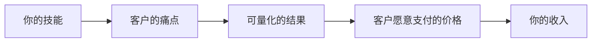

**三种定价思维的对比**：

| 思维模式 | 定价依据 | 收入天花板 | 适用场景 |
|----------|----------|------------|----------|
| 成本定价 | 我花了多少时间 | 低（受工时限制） | 刚入行积累经验 |
| 市场定价 | 同行收多少钱 | 中（受行业均价限制） | 有一定经验后 |
| 价值定价 | 客户获得多少收益 | 高（与客户收益挂钩） | 有口碑和案例后 |

**关键认知**：初学者用成本定价起步没问题，但要尽快过渡到价值定价。一个帮客户月增收10万的自动化脚本，定价5000元是贱卖，定价2-3万才合理——即便你只花了两天。

### 10.1.2 技能变现的飞轮效应

技能变现不是一锤子买卖，而是一个正反馈循环：

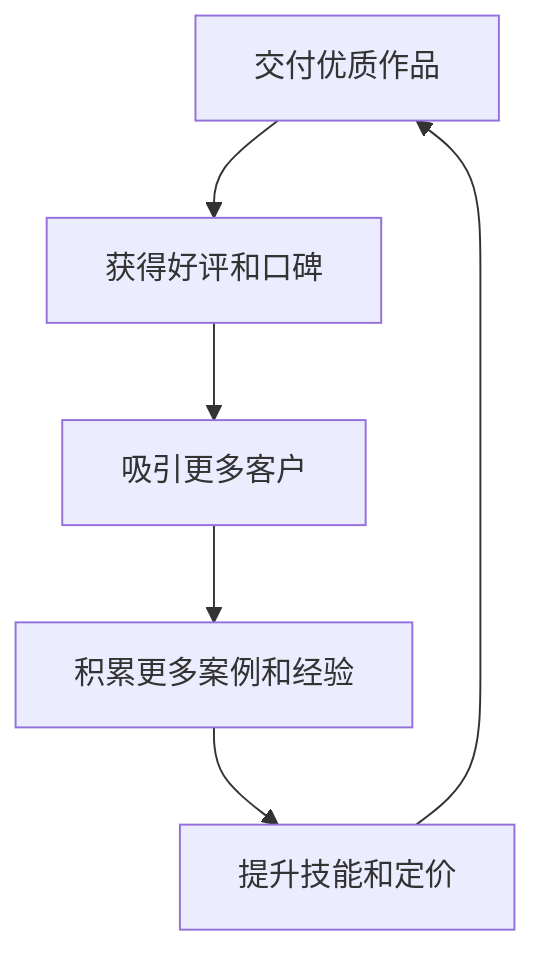

飞轮启动最难——前3-5个客户可能需要主动出击、降价甚至免费做。但一旦飞轮转起来，后期客户会主动找你，获客成本趋近于零。

**飞轮启动的三个杠杆**：

| 杠杆 | 具体做法 | 见效时间 |
|------|----------|----------|
| 作品杠杆 | 用个人项目/开源贡献建立可展示的作品集 | 2-4周 |
| 内容杠杆 | 在技术社区持续输出高质量文章 | 1-3个月 |
| 关系杠杆 | 主动帮助他人、参与社区讨论、建立信任 | 1-6个月 |

### 10.1.3 技能组合策略

单一技能的竞争力有限。最有价值的变现者往往是"技能组合"：

- **编程 + 行业知识** = 行业解决方案（如懂金融的程序员做量化工具）
- **No-Code + 行业知识** = 快速数字化方案（如用n8n帮餐饮店做自动化流程）
- **设计 + 营销** = 高转化率的落地页设计
- **写作 + 专业技术** = 技术文档外包（比纯写手贵3-5倍）
- **AI工具 + 任何领域** = 效率倍增器
- **翻译 + 技术** = 软件本地化服务（比纯翻译贵50-100%）

**实操建议**：画一张"技能矩阵图"，纵轴列出你会的技能，横轴列出你了解的行业领域，交叉点就是你的差异化定位。例如：

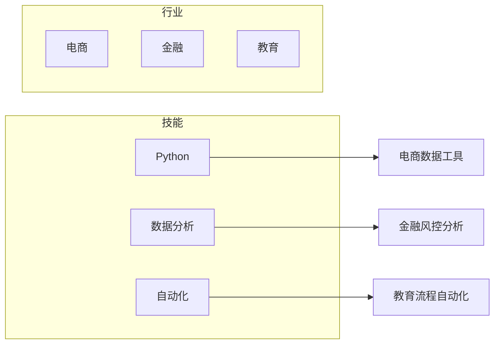

### 10.1.4 收入公式与杠杆

理解这个公式，才能找到提升收入的正确方向：

```text
收入 = 技能稀缺性 × 影响力半径 × 杠杆率 × 时间投入
```

- **技能稀缺性**：越稀缺的技能组合，单价越高
- **影响力半径**：知道你的人越多，获客成本越低
- **杠杆率**：能否一次投入多次收益（产品、课程、模板）
- **时间投入**：在前三个因素相同的情况下，投入时间越多收入越高——但这是最差的杠杆

提升收入的优先级：先提升稀缺性（学稀缺技能组合），再扩大影响力（内容输出），最后提高杠杆率（产品化）。

### 10.1.5 技能自评框架：找到你的起点

在选择变现方向之前，先对自己做一个诚实的评估。很多人的失败不是因为能力不够，而是选错了方向——用自己的短板去和别人的长板竞争。

**四维自评模型**：

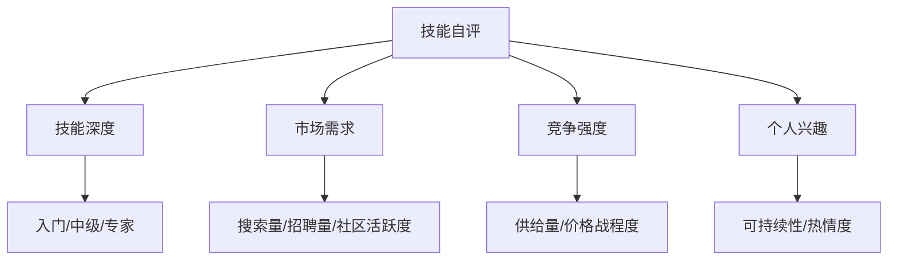

**自评打分表**（每项1-5分，总分20分）：

| 评估维度 | 1分 | 3分 | 5分 |
|----------|-----|-----|-----|
| 技能深度 | 能完成基本任务 | 能独立完成中等项目 | 能解决复杂问题，被同行认可 |
| 市场需求 | 几乎没有公开需求 | 有稳定需求但不紧缺 | 需求旺盛，供不应求 |
| 竞争强度 | 满大街都是（红海） | 有一定竞争但可差异化 | 竞争者少，蓝海市场 |
| 个人兴趣 | 纯粹为了钱做 | 不排斥，能坚持 | 真心喜欢，愿意深入 |

**得分解读**：

| 总分 | 建议 |
|------|------|
| 16-20分 | 直接启动，这是你的黄金方向 |
| 12-15分 | 可以启动，但需要在短板维度补强 |
| 8-11分 | 谨慎启动，先花1-2个月提升技能深度或找到差异化定位 |
| <8分 | 暂不建议，先学习积累或换方向 |

**实操：用搜索数据验证市场需求**：

不要凭感觉判断需求，用数据说话：

1. **百度指数**：搜索你的技能关键词，看搜索趋势（上升/平稳/下降）
2. **招聘网站**：在BOSS直聘/拉勾搜索相关岗位，看数量和薪资范围
3. **平台搜索**：在猪八戒/程序员客栈搜索相关项目，看发布频率和预算
4. **社区活跃度**：在知乎/掘金搜索相关话题，看讨论量和关注度
5. **竞品分析**：找到已经在做这件事的人，看他们的粉丝量、课程销量、项目评价

**关键洞察**：如果你搜索后发现——有需求但供给质量普遍不高——这就是最佳切入点。你不需要做到最好，只需要做到比现有竞争者好20%。

---

## 10.2 编程技能变现

编程是技术变现中最成熟、最可规模化的方向。市场需求稳定，价格透明，适合有编程基础的人快速启动。

### 10.2.1 变现路径全景

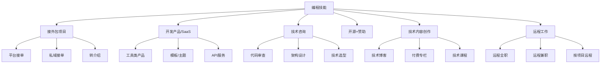

### 10.2.2 接单平台深度对比

**国内平台**：

| 平台 | 定位 | 项目均价 | 抽成比例 | 门槛 | 适合人群 | 注意事项 |
|------|------|----------|----------|------|----------|----------|
| 程序员客栈 | 程序员专属 | 5000-30000元 | 15% | 需技术审核 | 有经验的开发者 | 项目质量较好，竞争适中 |
| 猪八戒 | 综合外包 | 3000-50000元 | 20% | 低 | 入门级接单 | 价格战严重，需主动筛选优质客户 |
| 一品威客 | 威客模式 | 2000-30000元 | 20% | 低 | 多技能人才 | 竞标制，提案质量决定成功率 |
| 开源众包 | 技术向 | 5000-50000元 | 10-15% | 中 | 开源社区活跃者 | 需要GitHub活跃度 |
| 电鸭社区 | 远程工作 | 按月薪/项目 | 无(直招) | 中 | 寻求远程工作者 | 国内最大远程工作社区 |
| 甜薪工场 | 远程用工 | 按月结算 | 10-15% | 中 | 自由职业者 | 有平台保障，但审核严格 |

**国外平台**：

| 平台 | 定位 | 时薪范围 | 抽成比例 | 门槛 | 特点 |
|------|------|----------|----------|------|------|
| Upwork | 综合自由职业 | $15-150/h | 5-20% | 低 | 项目最多，竞争激烈；注意：前$500抽20%，之后降至10% |
| Fiverr | 任务制 | $5-10000/单 | 20% | 低 | 适合标准化服务，买家主动找卖家 |
| Toptal | 顶级人才 | $60-200+/h | 0%(客户付) | 极高(3%通过率) | 收入最高，但筛选极严格 |
| Freelancer | 综合竞标 | $10-100/h | 10% | 低 | 项目多但质量参差 |
| Gun.io | 高端开发 | $80-200/h | - | 高 | 需邀请制，项目质量高 |
| Remote OK | 远程工作 | 按全职/合同 | 无 | 中 | 聚合远程职位，非自由职业 |
| We Work Remotely | 远程工作 | 按全职 | 无 | 中 | 高质量远程职位 |

**平台选择策略**：

- **刚起步**：猪八戒、Fiverr——门槛低，快速积累第一桶金和评价
- **有经验**：程序员客栈、Upwork——项目质量好，单价高
- **顶级水平**：Toptal、Gun.io——筛选严格但收入天花板最高
- **想远程工作**：电鸭、Remote OK、We Work Remotely——稳定收入+自由地点
- **长期策略**：在平台获客，逐步转为私域客户（省去抽成）

### 10.2.3 高需求项目类型与定价

**企业官网/展示型网站**：

- 技术栈：WordPress、Next.js、Nuxt.js、Hugo
- 交付物：响应式网站 + 后台管理 + SEO基础配置
- 定价：3000-15000元（取决于页面数量和定制程度）
- 周期：1-3周
- 利润率：60-80%（模板化程度高，复用性强）

**微信/支付宝小程序**：

- 技术栈：原生开发、uni-app、Taro
- 交付物：小程序 + 后台管理 + 部署上线
- 定价：8000-50000元
- 周期：2-6周
- 注意事项：需要客户自己注册小程序账号并完成认证；微信审核周期约1-7个工作日

**SaaS工具/MVP开发**：

- 技术栈：React/Vue + Node.js/Python + 数据库
- 交付物：可运行的产品原型 + 基础文档
- 定价：30000-200000元
- 周期：1-3个月
- 关键：先签需求确认书，避免需求无限膨胀

**数据处理与自动化**：

- 技术栈：Python（pandas、selenium、requests、playwright）
- 交付物：脚本 + 使用文档 + 一次修改
- 定价：2000-15000元
- 周期：3天-2周
- 优势：交付快、利润高、复用性强

**详细定价参考表**：

| 项目类型 | 初级开发者 | 中级开发者 | 高级开发者 | 交付周期 | 备注 |
|----------|-----------|-----------|-----------|----------|------|
| 静态官网 | 2000-5000 | 5000-10000 | 10000-20000 | 1-2周 | Hugo/Jekyll等静态站点更便宜 |
| 企业官网(含后台) | 5000-10000 | 10000-25000 | 25000-50000 | 2-4周 | 含CMS系统 |
| 微信小程序 | 5000-15000 | 15000-35000 | 35000-80000 | 2-6周 | uni-app跨平台可降低成本 |
| 电商平台 | 10000-30000 | 30000-80000 | 80000-200000 | 1-3个月 | 含支付、物流对接 |
| App(跨平台) | 20000-50000 | 50000-150000 | 150000-500000 | 2-6个月 | Flutter/React Native |
| 数据分析项目 | 2000-5000 | 5000-15000 | 15000-50000 | 1-2周 | Python为主 |
| 自动化脚本 | 1000-3000 | 3000-10000 | 10000-30000 | 3天-2周 | 高复用性 |
| API开发 | 3000-8000 | 8000-25000 | 25000-60000 | 1-3周 | RESTful/GraphQL |
| 微信公众号开发 | 3000-8000 | 8000-20000 | 20000-50000 | 1-3周 | 含自定义菜单、消息接口 |

### 10.2.4 接单全流程实操

**第一步：建立作品集**

作品集是接单的核心武器。没有作品集，平台评分再高也很难接到好项目。

作品集必备元素：
- 3-5个代表性项目，每个包含：项目截图/演示链接、技术栈说明、你负责的部分、项目成果（如"帮客户提升30%转化率"）
- 如果没有真实项目，用个人项目替代：做一个工具类小产品、给开源项目贡献代码、做几个不同风格的demo网站

作品集载体：
- GitHub Pages + 静态网站（免费、专业）
- 个人域名网站（如yourname.dev，年费约100元）
- Notion公开页面（零成本、快速搭建）

**作品集反面案例**：

| 错误做法 | 问题 | 正确做法 |
|----------|------|----------|
| 只放GitHub链接 | 非技术客户看不懂 | 提供在线演示+截图说明 |
| 放太多项目（20+） | 眼花缭乱，没有重点 | 精选3-5个最能代表你水平的 |
| 没有项目说明 | 客户不知道你做了什么 | 每个项目写清背景、挑战、方案、结果 |
| 作品集风格不统一 | 显得不专业 | 保持一致的设计风格和排版 |

**第二步：平台注册与资料优化**

注册时的关键细节：
- 头像：职业照或干净的个人照片，不要用风景/动漫头像
- 标题：明确技能方向，如"5年全栈开发 | React/Node.js专家"比"程序员"好10倍
- 个人简介：突出经验年限、擅长技术栈、成功案例数量
- 技能标签：选择平台允许的最多个数，覆盖你的核心技能

**Upwork资料优化要点**（针对海外接单）：
- 用英文撰写，语法不能有错误
- 标题突出niche（如"React + TypeScript Specialist for SaaS Startups"）
- 个人简介先讲"我能帮你解决什么问题"，再讲背景
- 完成平台的技能测试，获得Top Rated徽章
- 前5-10个项目可以适当降价，目标是获得5星好评

**第三步：报价与谈判**

报价公式：
```text
基础报价 = 预估工时 × 时薪 × 1.3（风险系数）
```

谈判要点：
- 不要第一个报价——先问客户预算范围
- 拆分报价：设计费、开发费、测试费、部署费分开列，显得专业
- 加急费：明确说明正常周期，加急需要额外30-50%费用
- 修改次数：合同中写明"包含2次修改，超出部分按200元/次"
- 付款节点：50%预付 + 50%验收后付（小项目）；30%+40%+30%三阶段（大项目）

**高级谈判策略**：

谈判不是讨价还价，而是价值沟通。以下是经过实战验证的高级策略：

**锚定效应**：先展示你的高端服务包（包含所有增值功能），报价较高。然后推出标准服务包（核心功能），客户会觉得标准版"很划算"。永远不要先报最低价。

**三选一报价法**：给客户提供三个方案——基础版、标准版、高级版。大多数人会选中间那个（心理学上的"折中效应"）。基础版是你真正想卖的，标准版是利润最高的，高级版用来衬托标准版的性价比。

```text
方案A（基础版）：¥8,000 — 核心功能，30天维护
方案B（标准版）：¥15,000 — 核心功能+优化+SEO+60天维护 ← 推荐
方案C（高级版）：¥25,000 — 全功能+设计定制+90天维护+1年技术支持
```

**价值可视化**：不要说"这个项目需要80小时"，而是说"这个系统上线后，预计每月帮您节省200小时人工，按人均时薪50元计算，每月节省1万元，3个月即可回本"。让客户看到投资回报率。

**应对"预算不够"的三种话术**：
1. **缩减范围**："理解您的预算限制。我们可以先做核心功能（方案A），后续有预算再迭代升级"
2. **分期付款**："总价不变，但可以分3期支付，降低您的资金压力"
3. **置换价值**："如果您愿意在项目完成后给我写推荐信/介绍客户，我可以给9折优惠"

**谈判话术示例**：

| 场景 | 客户说的 | 你该怎么回应 |
|------|----------|-------------|
| 砍价 | "太贵了，别人报价更低" | "理解您的考虑。我注意到很多低价方案在售后和代码质量上有差距。我提供的是包含30天免费维护的完整方案，如果您需要的话我可以调整功能范围来匹配预算" |
| 需求模糊 | "先做做看" | "好的，我先出一份详细的需求文档和报价，确认后再开工。这样对双方都有保障，避免后期返工" |
| 拖欠 | "验收后再付尾款" | "我理解您的顾虑。我们可以分阶段验收：每完成一个模块您确认一次，最后一起结算。但按照惯例，开发开始前需要支付首款" |

**项目提案模板**：

一个好的提案是拿下项目的关键。以下是经过验证的提案结构：

```text
【项目提案】{项目名称}

一、需求理解
  我理解您需要：{用你自己的话复述客户的核心需求}
  核心目标：{这个项目要解决什么问题，达到什么效果}

二、技术方案
  技术栈选择：{具体技术栈} + 选择理由
  架构设计：{简要描述系统架构}
  核心功能清单：
    1. {功能1} - {简要说明}
    2. {功能2} - {简要说明}
    ...

三、项目计划
  总周期：{X周}
  里程碑：
    第1周：{交付物1}
    第2周：{交付物2}
    ...
  交付方式：{Git仓库 + 部署文档 + 使用手册}

四、报价明细
  设计费：¥{金额}
  开发费：¥{金额}
  测试费：¥{金额}
  部署费：¥{金额}
  合计：¥{总金额}
  付款方式：50%预付 + 50%验收后付

五、售后保障
  - 30天免费Bug修复
  - 部署文档和使用手册
  - 一次免费功能微调（2小时内可完成的）

六、相关案例
  {附上2-3个类似项目的链接或截图}
```

**关键技巧**：
- **先理解再报价**：不要收到需求就报价，先花10分钟研究客户业务
- **用客户的语言**：不要说"我用React + Node.js"，而是说"我用业界最主流的技术方案，后期好维护、好招人"
- **展示专业性**：提案中加入你对行业的理解，让客户觉得你"懂行"
- **附上案例**：没有完全匹配的案例时，展示相似的技术能力

**第四步：合同与交付**

接单必备合同要素（即便在平台接单也要有书面确认）：
- 需求文档：详细列出所有功能点，双方签字确认
- 付款节点：建议50%预付 + 50%验收后付
- 知识产权：明确交付后代码归属
- 售后条款：验收后免费修bug期（建议30天），超出按维护费计
- 变更流程：需求变更需要书面确认，影响工期和费用的要重新报价

**需求确认书模板**（防止需求蠕变的核心武器）：

```text
【需求确认书】{项目名称}

客户：{客户名称}
开发者：{你的名称}
日期：{日期}

一、功能需求清单
  编号 | 功能名称 | 详细描述 | 优先级 | 备注
  F01  | {功能1}  | {描述}   | P0(必须) | 
  F02  | {功能2}  | {描述}   | P1(重要) | 
  F03  | {功能3}  | {描述}   | P2(可选) | 

二、非功能需求
  - 性能要求：{如：页面加载<3秒}
  - 兼容性：{如：支持Chrome/Safari/微信内置浏览器}
  - 安全性：{如：HTTPS、数据加密}

三、不包含的内容
  - {明确列出哪些功能不在本次项目范围内}
  - {如：不含iOS/Android App开发}
  - {如：不含运营推广}

四、交付物清单
  - 源代码（Git仓库）
  - 部署文档
  - 使用手册
  - 测试报告

五、验收标准
  - 所有P0功能正常运行
  - 核心流程无阻断性Bug
  - 在目标环境下正常运行

六、变更流程
  - 需求变更需书面确认
  - 影响工期>3天或费用>10%的变更需重新报价
  - P2功能的增减不影响总价

双方签字确认：
客户签名：________  日期：________
开发者签名：________  日期：________
```

**为什么这个模板如此重要**：
- 案例3中老张的"需求蠕变"噩梦，根源就是没有这份确认书
- 当客户说"再加个会员系统"时，你可以指着确认书说："这个不在原始需求范围内，我们另外报价"
- 这不是不信任客户，而是保护双方——客户也能清楚知道他会得到什么

**合同模板获取**：
- 国内：法大大、e签宝（电子合同，有法律效力）
- 国外：Bonsai、HelloSign、PandaDoc
- 最低要求：微信/邮件的文字确认（有法律效力但举证困难）

**第五步：交付与售后**

交付清单：
1. 源代码（通过Git仓库交付）
2. 部署文档（含环境要求、部署步骤、配置说明）
3. 使用手册（面向客户的操作指南）
4. 测试报告（核心功能的测试结果）
5. 售后说明（维护期限、联系方式、响应时间）

售后最佳实践：
- 主动在交付后1周回访，确认使用情况
- 建立FAQ文档，减少重复的售后咨询
- 30天免费维护期结束后，提供付费维护包（月费500-2000元）

### 10.2.5 案例：从零到月入3万的接单之路

**背景**：小C，28岁，3年前端开发经验，主业月薪2万，想通过副业接单增加收入。

**第1个月：冷启动**

行动：
1. 注册程序员客栈、猪八戒、Upwork三个平台
2. 花3天做了一个React管理后台demo作为作品集
3. 主动投标了20个项目，写了针对性的提案（不是模板复制）
4. 以低于市场价30%的报价接到第一个项目：一个企业官网，3000元
5. 每天投入2小时，周末全天

结果：完成1个项目，收入3000元，获得第一个5星好评。

**第2-3个月：积累期**

行动：
1. 把第一个项目截图加入作品集
2. 逐步提高报价到市场均价
3. 接到3个项目，包含1个小程序项目（8000元）
4. 开始在掘金写技术文章，引流到个人主页

结果：月均收入8000-15000元，平台评分4.8，开始收到客户主动询价。

**第4-6个月：稳定期**

行动：
1. 拒绝低价项目，专注中高端客户
2. 老客户开始转介绍新客户（私域接单，省去平台抽成）
3. 建立标准化开发流程：需求模板→设计确认→分阶段交付
4. 每周投入固定18小时（工作日晚上2h×5 + 周末8h）

结果：月均收入稳定在25000-35000元，项目均价15000元，月接2个项目。

**关键经验**：
1. **前3个月不要计较收入**——核心目标是积累评价和案例
2. **写针对性提案**——花10分钟研究客户业务再写提案，转化率比模板高5倍
3. **主动超预期交付**——客户说要A，你交付A+B（B是小功能或优化），好评率接近100%
4. **建立可复用的代码库**——第3个项目开始，60%的代码可以复用，效率翻倍
5. **不要同时接太多项目**——2个同时进行是上限，超过就会影响质量

### 10.2.6 失败案例与教训

**案例1：小王的"什么都接"之路**

小王会React、Python、PHP、小程序，于是什么项目都接。结果：
- React项目做了2个，Python项目做了1个，PHP项目做了1个
- 每个项目都要重新学习相关知识，效率极低
- 没有一个方向形成深度积累，定价始终上不去
- 6个月后月收入仍在5000元左右

教训：**专注1-2个技术方向**，在这个方向做到前20%的水平，比什么都会但都平庸强10倍。

**案例2：小李的"免费换曝光"陷阱**

小李给一个知名品牌免费做了一个小程序，希望获得曝光。结果：
- 品牌方确实用了，但没有给任何宣传
- 小李的时间成本约80小时，相当于白干了2周
- 更糟的是，这个品牌后来又找别人做类似项目，也是不付费的

教训：**永远不要免费工作**。可以给折扣（7-8折），但必须收费。免费的东西，客户不会珍惜。

**案例3：老张的"需求蠕变"噩梦**

老张接了一个"简单"的企业官网项目，报价8000元。没有签需求确认书。
- 第1周：客户说"加个在线客服"
- 第2周：客户说"再加个会员系统"
- 第3周：客户说"能不能做个商城"
- 最终做了3个月，功能膨胀到原来的5倍，但报价还是8000元

教训：**必须签需求确认书**，所有超出原始需求的功能都需要重新报价。

**案例4：小赵的"低价螺旋"**

小赵在猪八戒上接单，为了抢到项目不断压低价格：
- 第1个项目报价5000元，客户砍到3000元，接了
- 第2个项目报价3000元，客户砍到2000元，也接了
- 第3个项目报价2000元，客户还想砍到1500元
- 6个月后，时薪算下来不到20元，还不如去便利店打工

教训：**价格战是死路**。宁可少接项目也不要在价格上无限让步。当你用低价吸引客户时，你吸引到的永远是只看价格不看质量的客户——他们会用同样的方式对待下一个报价更低的人。

**案例5：小刘的"技术选型失误"**

小刘接了一个SaaS项目，为了展示技术能力，选了最新的技术栈（Rust后端+Svelte前端+TiDB数据库）：
- 学习新技术栈花了2周
- 遇到bug找不到中文资料，Stack Overflow上的回答也少
- 部署时发现云服务商对这些技术栈的支持不完善
- 最终项目延期1个月，客户不满，自己也筋疲力尽

教训：**接单项目用成熟技术栈**。新技术栈适合个人项目和学习，但客户项目要优先考虑：生态成熟度、社区活跃度、招聘替代者的难度。React/Vue+Node.js/Python+MySQL/PostgreSQL永远是接单的安全选择。

**案例6：小陈的"过度承诺"**

小陈为了接到一个大项目，承诺了超出自己能力的功能：
- 答应3个月交付一个完整的电商平台
- 实际上他只做过企业官网，没有电商开发经验
- 支付对接搞不定，物流系统不会做
- 最终项目烂尾，不仅退款还赔偿了违约金

教训：**诚实评估自己的能力**。宁可说"这个功能我需要额外学习2周"，也不要答应自己做不到的事。烂尾的损失远大于少接一个项目。

### 10.2.7 被动收入：代码产品化

接单是"卖时间"，要突破收入天花板，需要把代码产品化：

**模板/主题销售**：
- 平台：ThemeForest、Creative Market、码市
- 收入模式：一次开发，持续销售
- 月收入范围：1000-50000元（取决于模板质量和市场需求）
- 关键：选择需求量大但竞争不激烈的细分领域
- 示例：一个WordPress企业主题在ThemeForest上售价$59，月销100份=$5900/月

**SaaS微产品**：
- 适合程序员的小型SaaS：短链接服务、表单工具、数据看板、API监控
- 收费模式：月费制（19-99元/月）
- 技术栈推荐：Next.js + Vercel + Supabase（低成本启动）
- 关键：先做MVP验证需求，不要一上来就做大而全
- 成本：Vercel免费层+Supabase免费层，前期几乎零成本

**开源+赞助**：
- 平台：GitHub Sponsors、Open Collective、爱发电
- 路径：做一个有用的开源工具 → 积累用户 → 开启赞助
- 收入范围：几百到几万元/月（取决于项目影响力）
- 关键：选择开发者日常会用到的痛点工具
- 成功案例：Sindre Sorhus通过维护npm包获得每月$2000+赞助

**CLI工具/开发者工具**：
- 开发者愿意为提高效率的工具付费
- 定价：$5-50/月或一次性$50-200
- 分发：npm/pip/包管理器 + 官网 + Product Hunt发布
- 示例：HTTPie、jq等工具都有赞助收入

**案例：从开源项目到月入2万的被动收入**：

小周是一名Python开发者，日常工作需要频繁处理Excel数据。他写了一个Python库`excel-magic`，封装了pandas的常用操作，让非技术人员也能用一行代码完成复杂的数据处理。

发展时间线：
- 第1个月：开源发布，写了一篇掘金文章介绍，获得200 star
- 第3个月：star数达到2000，开始有用户提issue和feature request
- 第6个月：star数5000，开启GitHub Sponsors，同时在Gumroad卖高级教程（$29）
- 第12个月：star数15000，月赞助收入$800，教程月销50份($1450)，定制开发咨询月均$500
- 总月收入：约$2750（约2万人民币），且大部分是被动收入

关键经验：
1. 解决自己的真实痛点——你是最懂这个需求的用户
2. 文档比代码更重要——好的README和文档让用户愿意用、愿意推荐
3. 社区运营是关键——及时回复issue、接受PR、感谢贡献者
4. 不要急着变现——先积累用户和口碑，6个月后再考虑商业化

### 10.2.8 No-Code/Low-Code服务变现

2024-2025年，No-Code/Low-Code工具的成熟催生了一个重要的变现方向：不需要写大量代码，就能为企业搭建完整的业务系统。这个方向的门槛比传统编程低，但收入天花板不低——因为客户买的不是代码，而是解决方案。

**核心工具栈**：

| 工具类型 | 代表工具 | 适合场景 | 学习曲线 | 月费 |
|----------|----------|----------|----------|------|
| 通用应用搭建 | Bubble、Retool、Adalo | 企业内部工具、SaaS原型 | 中 | $25-100/月 |
| 网站搭建 | Webflow、Framer、Wix Studio | 企业官网、落地页 | 低 | $14-39/月 |
| 自动化流程 | n8n、Make(Integomat)、Zapier | 业务流程自动化 | 低中 | 免费-$29/月 |
| 数据库+应用 | Airtable、Notion数据库、Baserow | CRM、项目管理、数据管理 | 低 | 免费-$20/月 |
| AI应用搭建 | Dify、Coze(扣子)、Flowise | AI客服、知识库、Agent | 中 | 免费-$50/月 |
| 表单+工作流 | Typeform、JotForm、金数据 | 调查问卷、审批流程 | 低 | $25-50/月 |

**No-Code服务定价参考**：

| 服务类型 | 定价范围 | 交付周期 | 利润率 | 核心价值 |
|----------|----------|----------|--------|----------|
| 企业官网(Webflow) | 3000-15000元 | 1-2周 | 80-90% | 专业设计+快速上线 |
| 内部管理工具(Retool) | 5000-30000元 | 1-3周 | 70-85% | 替代Excel管理流程 |
| 自动化流程(n8n/Make) | 2000-15000元 | 3天-2周 | 85-95% | 节省人工重复劳动 |
| AI应用(Dify/Coze) | 3000-20000元 | 1-2周 | 75-90% | 智能客服/知识库 |
| CRM/数据管理系统 | 5000-50000元 | 1-4周 | 70-85% | 客户管理数字化 |

**No-Code变现的核心优势**：

1. **交付速度快**：传统开发需要1个月的项目，No-Code可能1周就能完成，同样的时间可以接4倍的项目
2. **利润率高**：没有服务器成本和复杂的运维，利润率通常在70-90%
3. **迭代方便**：客户需求变更时，拖拽调整远快于改代码
4. **维护简单**：不需要处理底层bug，后续维护成本极低

**No-Code变现的局限与应对**：

| 局限 | 具体表现 | 应对策略 |
|------|----------|----------|
| 性能瓶颈 | 用户量>1万或数据量大时可能卡顿 | 预先评估客户规模，超出能力范围的转为传统开发 |
| 平台依赖 | 平台涨价、停服会影响你的交付 | 选择头部平台（Bubble、Webflow等），避免用太小众的工具 |
| 定制能力有限 | 复杂业务逻辑可能无法实现 | No-Code处理80%标准功能，自定义代码处理20%特殊需求 |
| 客户认知偏差 | 部分客户认为"不用写代码所以应该便宜" | 强调你卖的是解决方案和行业理解，不是代码行数 |

**实操建议**：

- **定位策略**：不要说"我是No-Code开发者"，而是"我帮XX行业的企业快速搭建数字化系统"——强调行业理解和解决方案，而不是工具本身
- **建立模板库**：把常见场景（CRM、工单系统、内容管理）做成模板，新客户只需定制化调整，交付效率翻倍
- **混合模式最优**：No-Code搭建主体 + 少量自定义代码处理特殊需求，这种混合模式既能快速交付又能满足个性化需求
- **自动化服务特别推荐**：n8n/Make搭建的自动化流程，客户感知价值高（"帮我省了3个人的工作量"），但搭建成本低（通常1-3天），性价比最高的No-Code服务方向

### 10.2.9 远程工作：稳定收入+自由地点

远程工作介于接单和全职之间，提供更稳定的收入但保留灵活性。

**远程工作的类型**：

| 类型 | 收入稳定性 | 自由度 | 适合人群 |
|------|-----------|--------|----------|
| 远程全职 | 高（固定月薪） | 中（有工作时间要求） | 想要稳定的人 |
| 远程兼职 | 中（固定但较少） | 高 | 有主业想做副业的人 |
| 合同制(Contract) | 中（按项目/月） | 高 | 有经验的自由职业者 |

**国内远程平台**：

| 平台 | 特点 | 岗位类型 | 适合人群 |
|------|------|----------|----------|
| 电鸭社区 | 国内最大远程工作社区 | 全职/兼职/项目 | 各级别开发者 |
| 甜薪工场 | 自由职业者撮合平台 | 项目制 | 有经验者 |
| 程序员客栈(远程) | 远程专区 | 项目制 | 中高级开发者 |
| BOSS直聘(远程筛选) | 综合招聘平台的远程筛选 | 全职 | 各级别 |

**海外远程平台**：

| 平台 | 特点 | 薪资范围 | 语言要求 |
|------|------|----------|----------|
| Remote OK | 远程职位聚合 | $50K-200K/年 | 英文 |
| We Work Remotely | 高质量远程职位 | $60K-200K/年 | 英文 |
| Turing | AI匹配远程开发者 | $30K-100K/年 | 英文 |
| Arc.dev | 远程开发岗位 | $60K-150K/年 | 英文 |
| Toptal | 顶级自由职业者 | $60-200+/h | 英文 |

**远程工作的注意事项**：

1. **时区管理**：如果和海外团队合作，需要适应时差。建议选择允许异步工作的岗位
2. **沟通工具**：熟悉Slack、Notion、Linear、GitHub Issues等异步协作工具
3. **自律能力**：远程工作最大的挑战是自律，需要建立固定的工作节奏
4. **网络要求**：稳定的网络是基本要求，建议准备备用网络
5. **税务合规**：海外收入需要自行申报个人所得税

### 10.2.10 国际接单的税务与收款

如果你在海外平台接单或做远程工作，需要处理跨境收款和税务问题。

**收款方式对比**：

| 方式 | 手续费 | 到账速度 | 适合场景 | 注意事项 |
|------|--------|----------|----------|----------|
| PayPal | 3.5-4.5% + 提现费 | 即时(平台内)/3-5天(银行) | 小额、临时 | 汇率损失大，冻结风险 |
| Wise(TransferWise) | 0.5-1.5% | 1-2天 | 中大额定期 | 汇率最透明，推荐首选 |
| Payoneer | 1-2% | 2-5天 | Upwork等平台 | 支持多币种账户 |
| 银行电汇 | $15-50/笔 | 3-7天 | 大额 | 适合单笔$1000+ |
| 支付宝国际 | 0-1% | 即时-1天 | 部分平台支持 | 国内用户最方便 |

**W-8BEN表格**（美国客户付款必备）：
- 这是美国IRS要求非美国公民填写的表格，用于证明你不是美国纳税人
- 填写后可以享受中美税收协定的优惠税率（通常10%预扣税，而非默认的30%）
- 大多数平台（如Upwork）在注册时会引导你填写
- 如果直接和美国客户合作，客户可能会要求你提供

**税务申报**：
- 海外收入需要在中国申报个人所得税
- 年收入超过12万元需要做年度汇算清缴
- 建议：收入超过10万/年时，注册个体工商户，享受小规模纳税人优惠
- 注意：避免双重征税，中国与多个国家有税收协定，可以抵扣已在海外缴纳的税款

---

## 10.3 AI技能变现

2023年以来，AI工具的爆发催生了一个全新的变现赛道。与传统技能不同，AI技能的核心不是"会用工具"，而是"能用工具解决具体问题"。

### 10.3.1 AI变现金字塔

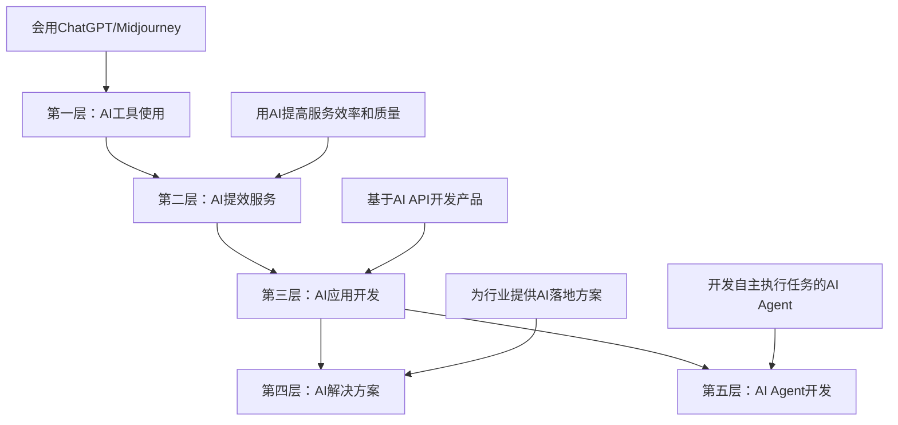

| 层级 | 技能要求 | 收入范围 | 竞争程度 | 适合人群 |
|------|----------|----------|----------|----------|
| 工具使用 | 低 | 500-3000元/月 | 极高 | 任何人 |
| 提效服务 | 中 | 3000-30000元/月 | 高 | 有专业技能的人 |
| 应用开发 | 高 | 10000-100000元/月 | 中 | 程序员 |
| 解决方案 | 极高 | 50000-500000元+/月 | 低 | 有行业经验的技术人 |
| AI Agent | 高 | 20000-200000元/月 | 低(新兴) | 熟悉LLM的程序员 |

**核心洞察**：停留在第一层（只会用工具）几乎无法变现——因为人人都会。真正的变现从第二层开始：你用AI工具 + 你的专业能力，提供比纯人工更高效、比纯AI更高质量的服务。

### 10.3.2 AI提效服务（第二层详解）

这是大多数人最适合切入的层级。核心思路：你本身有某个专业技能，AI让你效率提升3-10倍，你可以用同样的时间接更多单、交付更好的质量。

**AI+写作服务**：

- 服务内容：公众号代写、SEO文章批量生产、产品描述撰写
- AI工具链：ChatGPT/Claude（生成初稿）→ 人工修改润色 → Grammarly/秘塔写作猫（校对）
- 定价策略：纯AI生成的千字50-100元（低端，不推荐）；AI辅助+人工深度编辑的千字200-500元（推荐）
- 效率对比：纯人工写一篇2000字文章需3-4小时，AI辅助只需1-1.5小时，效率提升2-3倍

**AI+设计服务**：

- 服务内容：Logo设计、社交媒体素材、电商产品图、品牌视觉
- AI工具链：Midjourney/DALL-E（生成概念图）→ Figma/Photoshop（精修）→ 输出成品
- 定价策略：AI生成的概念设计200-500元/个；AI辅助+专业精修的品牌设计2000-10000元
- 注意事项：AI生成的图像可能有版权争议，商用前需要确认工具的商用许可条款

**AI+翻译服务**：

- 服务内容：文档翻译、网站本地化、字幕翻译
- AI工具链：DeepL/GPT-4（初翻）→ 人工校对润色 → 术语一致性检查
- 定价策略：纯机翻校对80-150元/千字；AI辅助+专业翻译200-400元/千字
- 效率对比：传统翻译2000-3000字/天，AI辅助翻译8000-15000字/天

**AI+数据分析服务**：

- 服务内容：数据清洗、报表自动化、数据可视化、商业洞察
- AI工具链：ChatGPT Code Interpreter（快速分析）→ Python脚本（定制化）→ 可视化工具（展示）
- 定价策略：简单数据处理500-2000元/次；深度分析报告3000-15000元/次

**AI+视频制作服务**：

- 服务内容：短视频批量制作、产品宣传片、课程视频
- AI工具链：ChatGPT（写脚本）→ HeyGen/D-ID（数字人）→ 剪映/Premiere（剪辑）→ AI配音（语音合成）
- 定价策略：AI数字人口播视频300-800元/条；AI辅助剪辑的宣传片2000-10000元

**AI+编程服务**：

- 服务内容：代码生成、代码审查、技术文档自动化、测试用例生成
- AI工具链：Cursor/Claude Code（代码生成）→ 人工审查 → 测试验证
- 定价策略：按项目定价，效率提升3-5倍意味着同样时间接更多项目
- 关键优势：你可以同时处理更多项目，因为AI帮你完成了60-80%的样板代码

### 10.3.3 AI应用开发（第三层详解）

如果你会编程，基于AI API开发产品是收入天花板最高的方向之一。

**热门AI应用类型**：

| 应用类型 | 技术栈 | 收费模式 | 月收入潜力 | 开发周期 |
|----------|--------|----------|------------|----------|
| AI写作助手 | OpenAI API + React | 月费制 | 5000-50000元 | 2-4周 |
| AI客服机器人 | LangChain + 知识库 | 按对话量 | 3000-30000元 | 3-6周 |
| AI图片处理 | Stable Diffusion API | 按次/月费 | 5000-80000元 | 4-8周 |
| AI文档分析 | GPT-4 + PDF解析 | 按文档量 | 3000-20000元 | 2-4周 |
| AI代码工具 | Claude API + IDE插件 | 月费制 | 10000-100000元 | 4-12周 |
| AI Agent平台 | LangGraph + 工具链 | 按任务量/月费 | 10000-100000元 | 4-8周 |

**MVP开发流程**：

1. **验证需求**：先在社交媒体发帖描述你的产品概念，看有多少人感兴趣
2. **最小可行产品**：用1-2周时间做出核心功能，不要追求完美
3. **种子用户**：找10-20个免费试用用户，收集反馈
4. **迭代优化**：根据反馈快速迭代2-3个版本
5. **开始收费**：设置免费试用期 + 付费计划

**成本控制**：

AI应用的主要成本是API调用费。控制方法：
- 使用缓存：相同输入不重复调用API（Redis缓存常见问题的回答）
- 模型分层：简单任务用便宜模型（如GPT-4o-mini），复杂任务才用贵模型（如GPT-4o/Claude Sonnet）
- 流式输出：减少用户等待时间，提高体验
- 批量处理：非实时任务用批量API，成本降低50-80%
- 本地模型：对于隐私敏感或高频调用的场景，部署开源模型（如Llama、Qwen）可以大幅降低成本

**主流AI模型成本对比（2025年）**：

| 模型 | 输入价格 | 输出价格 | 上下文窗口 | 性价比评级 |
|------|----------|----------|------------|------------|
| GPT-4o | $2.5/1M tokens | $10/1M tokens | 128K | 中 |
| GPT-4o-mini | $0.15/1M tokens | $0.6/1M tokens | 128K | 极高 |
| Claude Sonnet 4 | $3/1M tokens | $15/1M tokens | 200K | 中高 |
| Claude Haiku 3.5 | $0.8/1M tokens | $4/1M tokens | 200K | 高 |
| DeepSeek V3 | $0.27/1M tokens | $1.1/1M tokens | 128K | 极高 |
| Gemini 2.5 Flash | $0.15/1M tokens | $0.6/1M tokens | 1M | 极高 |
| Qwen 2.5 72B | $0.3/1M tokens | $1.2/1M tokens | 128K | 极高 |
| 本地Llama 3.1 70B | 电费+GPU折旧 | 电费+GPU折旧 | 128K | 高(需前期投入) |

**成本优化实战策略**：

1. **Prompt压缩**：精简System Prompt，去除冗余指令，一个Agent的System Prompt从2000 token压缩到800 token，每月可节省60%的输入token成本
2. **语义缓存**：不仅缓存完全相同的请求，还缓存语义相似的请求。使用向量数据库存储历史问答对，相似度>95%时直接返回缓存结果
3. **分级路由**：实现一个简单的路由器——简单问题（如FAQ）用规则引擎回答，中等复杂度用小模型，只有真正复杂的问题才调用大模型。实测可降低70-80%的API成本
4. **异步批处理**：非实时任务（如文章摘要、数据标注）使用Batch API，OpenAI的Batch API价格是实时API的50%
5. **Token预算控制**：为每个用户/每个任务设置Token上限，防止单次调用成本失控。用`tiktoken`库预估token数量，超限自动截断或降级

**AI应用的定价参考**：

| 定价模式 | 适合场景 | 定价范围 | 转化率影响 |
|----------|----------|----------|-----------|
| 免费增值(Freemium) | C端产品 | 免费+付费版$10-50/月 | 注册率高，付费率低(2-5%) |
| 按量计费 | API服务 | $0.001-0.1/次 | 灵活，适合试用 |
| 月费订阅 | 工具类产品 | $10-100/月 | 稳定收入，需持续提供价值 |
| 按项目计费 | 企业服务 | $500-50000/项目 | 高单价，但获客成本高 |

### 10.3.4 AI Agent开发（2024-2026核心方向）

AI Agent是当前最热门的AI应用方向——不是简单的聊天机器人，而是能自主规划、执行多步骤任务的智能体。2025-2026年，Agent已经从概念验证进入商业化落地阶段。

**什么是AI Agent**：

传统AI应用：用户提问 → AI回答 → 结束
AI Agent：用户给出目标 → AI自主拆解任务 → 调用工具执行 → 检查结果 → 继续或调整 → 完成目标

**Agent的核心能力模型**：

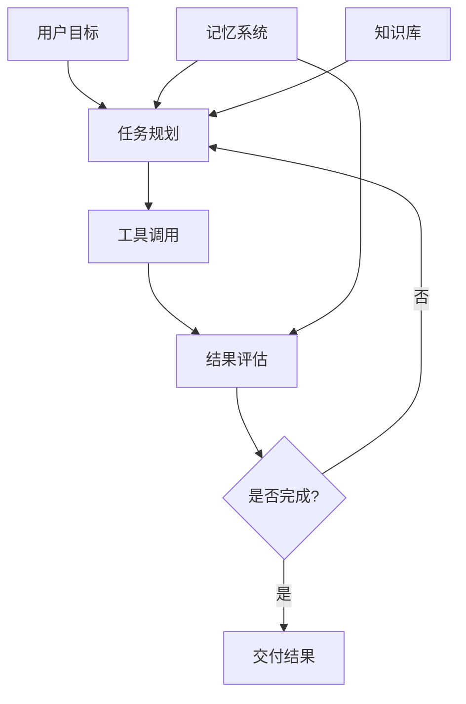

**Agent开发技术栈**：

| 组件 | 工具 | 作用 | 学习难度 |
|------|------|------|----------|
| LLM核心 | GPT-4o、Claude Sonnet、DeepSeek | 理解指令、推理决策 | 低 |
| Agent框架 | LangGraph、CrewAI、AutoGen | 编排Agent工作流 | 中 |
| 工具集成 | MCP协议、Function Calling | 让Agent调用外部工具 | 中 |
| 记忆系统 | 向量数据库(Pinecone/Chroma) | 存储长期记忆和知识 | 中高 |
| 编排平台 | n8n、Dify、Coze | 低代码搭建Agent | 低中 |
| 评估系统 | LangSmith、AgentOps | 监控和优化Agent表现 | 中 |

**MCP（Model Context Protocol）深度解析**：

2025年Anthropic推出的MCP协议是Agent开发的重要标准——它定义了AI模型与外部工具/数据源的统一通信协议。掌握MCP开发能力，可以：
- 为企业搭建自定义的工具集成（如连接CRM、ERP、数据库）
- 开发可复用的MCP服务器并销售（如GitHub MCP、Notion MCP、数据库MCP）
- 提供MCP集成咨询服务（帮企业将内部系统接入AI Agent）

MCP的技术架构：

```text
┌─────────────┐     MCP协议      ┌──────────────┐
│  AI模型/Agent│ ◄──────────────► │  MCP Server  │
│  (Client)    │   JSON-RPC 2.0  │  (工具端)     │
└─────────────┘                  └──────┬───────┘
                                        │
                              ┌─────────┼─────────┐
                              │         │         │
                         ┌────▼───┐ ┌───▼────┐ ┌──▼──────┐
                         │ 数据库  │ │ API    │ │ 文件系统 │
                         └────────┘ └────────┘ └─────────┘
```

**MCP开发变现方向**：
1. **MCP Server开发**：为常用SaaS工具开发MCP Server，上架MCP市场，按使用量收费
2. **企业MCP集成**：帮企业将内部系统（OA、CRM、ERP）通过MCP接入AI Agent，单次集成5000-50000元
3. **MCP培训**：教开发者如何开发MCP Server，课程定价500-2000元

**Agent变现方向**：

| 方向 | 目标客户 | 定价 | 技术难度 | 实际案例 |
|------|----------|------|----------|----------|
| 客服Agent | 电商/SaaS企业 | 3000-20000元/月 | 中 | 接入商品知识库，自动回答90%常见问题 |
| 数据分析Agent | 运营/市场团队 | 5000-30000元/月 | 中高 | 自然语言查询数据库，自动生成报表 |
| 内容创作Agent | 自媒体/营销团队 | 2000-10000元/月 | 中 | 批量生成SEO文章、社媒内容 |
| 代码审查Agent | 开发团队 | 5000-20000元/月 | 高 | 自动审查PR，生成改进建议 |
| 销售线索Agent | 销售团队 | 5000-25000元/月 | 中 | 自动抓取、清洗、评分销售线索 |
| 自定义Agent培训 | 企业 | 5000-50000元/次 | 中 | 教企业员工搭建自己的Agent |

**Agent开发实操流程**：

```text
第一步：需求分析（1-2天）
  └─ 明确Agent要解决什么问题，拆解任务流程

第二步：原型搭建（2-3天）
  └─ 用Dify/Coze快速搭建原型，验证可行性

第三步：工具集成（3-5天）
  └─ 通过MCP/Function Calling接入客户的数据源和工具

第四步：Prompt工程（2-3天）
  └─ 编写System Prompt，定义Agent的角色、能力边界、输出格式

第五步：测试优化（3-5天）
  └─ 用真实场景测试，优化Prompt和工具调用逻辑

第六步：部署上线（1-2天）
  └─ 部署到客户环境，配置监控和告警

第七步：持续迭代（持续）
  └─ 根据用户反馈优化Agent能力
```

**Agent开发的成本结构**：

| 成本项 | 月费用范围 | 说明 |
|--------|-----------|------|
| LLM API调用 | 500-5000元 | 取决于调用量和模型选择 |
| 向量数据库 | 0-500元 | Chroma免费，Pinecone按量 |
| 服务器 | 100-1000元 | 轻量级Agent用Serverless即可 |
| 工具/API | 0-2000元 | 取决于接入的第三方服务 |
| **总计** | **600-8500元/月** | 定价3000-20000元/月，利润率50-80% |

**Agent开发的避坑指南**：

1. **不要一开始就做大而全的Agent**：先做一个能完成单一任务的Agent，验证后再扩展
2. **Prompt工程是核心竞争力**：同样的框架和模型，Prompt写得好和写得差，效果天差地别
3. **测试要覆盖边界情况**：Agent在正常场景下可能表现很好，但遇到异常输入就崩溃
4. **做好兜底机制**：Agent无法完成任务时，要有明确的降级策略（如转人工）
5. **注意成本控制**：一个复杂的Agent可能一次调用消耗大量Token，需要设置Token上限和缓存策略

### 10.3.5 AI咨询服务

为企业提供AI落地咨询，是单价最高的变现方式之一。

**服务内容**：

| 服务类型 | 交付物 | 定价 | 周期 |
|----------|--------|------|------|
| AI战略评估 | 评估报告+建议方案 | 5000-20000元 | 1-2周 |
| AI工具选型 | 对比分析+推荐方案 | 3000-10000元 | 3-5天 |
| AI流程优化 | 优化方案+实施指导 | 10000-50000元 | 2-4周 |
| AI培训 | 定制化培训课程 | 5000-30000元/天 | 按需 |
| AI项目落地 | 从方案到实施 | 50000-500000元 | 1-6个月 |

**获客渠道**：
- 在LinkedIn/知乎/公众号持续输出AI应用案例和见解
- 参加行业会议和技术沙龙做分享
- 通过已有客户转介绍
- 在AI社区（如Hugging Face、ModelScope）建立影响力

### 10.3.6 2025年AI工具全景

**文本生成**：

| 工具 | 开发商 | 特点 | 定价 | 最佳场景 |
|------|--------|------|------|----------|
| ChatGPT | OpenAI | 综合能力最强 | $20/月(Plus) | 通用写作、代码、分析 |
| Claude | Anthropic | 长文本、推理能力强 | $20/月(Pro) | 长文分析、创意写作、Agent开发 |
| Gemini | Google | 多模态、搜索集成 | $20/月(Advanced) | 搜索增强、多模态 |
| DeepSeek | DeepSeek | 性价比极高、中文优秀 | 免费/API | 预算有限的场景 |
| 文心一言 | 百度 | 中文优化 | 免费/会员 | 中文场景 |
| 通义千问 | 阿里 | 开源、企业友好 | 免费/企业版 | 企业应用 |
| MiMo | 小米 | 长上下文、高性价比 | API | 大量文本处理 |

**图像生成**：

| 工具 | 特点 | 定价 | 商用许可 |
|------|------|------|----------|
| Midjourney | 美学质量最高 | $10-60/月 | 付费版可商用 |
| DALL-E 3 | 文字理解精准 | ChatGPT Plus内含 | 可商用 |
| Stable Diffusion | 开源、可本地部署 | 免费(本地) | 开源许可 |
| Flux | 新一代开源模型 | 免费(本地) | 开源许可 |
| 可灵(Kling) | 国产视频+图片 | 免费/付费 | 付费版可商用 |
| Canva AI | 设计平台集成 | $13/月(Pro) | 可商用 |

**视频生成**：

| 工具 | 特点 | 定价 | 适用场景 |
|------|------|------|----------|
| Runway Gen-3 | 视频质量最高 | $12-76/月 | 创意视频、广告 |
| Pika | 简单易用 | 免费/付费 | 短视频、社交媒体 |
| Kling(可灵) | 国产、中文友好 | 免费/付费 | 国内市场 |
| HeyGen | 数字人视频 | $24-180/月 | 口播、培训视频 |
| Sora | OpenAI视频模型 | ChatGPT Pro内含 | 高质量创意视频 |
| Vidu | 国产高质量视频 | 免费/付费 | 国内创意视频 |

**编程辅助**：

| 工具 | 特点 | 定价 | 适用场景 |
|------|------|------|----------|
| GitHub Copilot | IDE内联补全 | $10-19/月 | 日常编码 |
| Cursor | AI-first编辑器 | $20/月(Pro) | 复杂项目开发 |
| Claude Code | 命令行AI编程 | 按用量 | 大型项目重构、自动化 |
| Windsurf | AI编程IDE | 免费/付费 | 全栈开发 |
| Devin | AI软件工程师 | 按任务 | 独立完成开发任务 |
| Bolt.new | 浏览器内全栈开发 | $20/月 | 快速原型 |

**AI工具成本效益分析**：

选择AI工具不能只看功能，还要看投入产出比。以下是按场景的成本效益对比：

| 使用场景 | 推荐工具组合 | 月成本 | 预估效率提升 | ROI |
|----------|-------------|--------|-------------|-----|
| 日常编程 | GitHub Copilot + ChatGPT | $30-40 | 2-3倍 | 极高 |
| 复杂项目开发 | Cursor Pro + Claude Pro | $40 | 3-5倍 | 极高 |
| 内容写作 | Claude Pro + Grammarly | $25-30 | 2-4倍 | 高 |
| 设计出图 | Midjourney + Canva Pro | $25-75 | 3-10倍 | 高(设计方向) |
| 视频制作 | ChatGPT + HeyGen + 剪映 | $25-180 | 5-10倍 | 中高 |
| 数据分析 | ChatGPT Plus + Python | $20 | 3-5倍 | 极高 |
| 翻译工作 | DeepL Pro + ChatGPT | $25-45 | 3-5倍 | 高 |

**省钱策略**：先用免费版验证工具是否适合你的工作流，确认有效后再付费。很多工具（如ChatGPT、Claude）的免费版已经够日常使用。

### 10.3.7 AI变现的版权与伦理问题

AI变现不是没有风险。以下是必须注意的法律和伦理问题：

**版权风险**：

| 风险 | 说明 | 应对 |
|------|------|------|
| AI生成内容的版权归属 | 目前各国法律不一致，部分国家AI生成内容不受版权保护 | AI辅助+人工创作，确保有足够的人类创造性投入 |
| 训练数据的版权争议 | AI模型可能使用了受版权保护的训练数据 | 使用明确允许商用的AI工具；避免生成与已有作品高度相似的内容 |
| AI生成图像的肖像权 | AI生成的"人脸"可能与真人相似 | 避免使用AI生成的人脸做商业用途 |

**伦理准则**：

1. **透明度**：向客户说明你使用了AI工具，不要伪装成纯人工创作
2. **质量把控**：AI生成的内容必须经过人工审查，不能直接交付
3. **数据隐私**：不要将客户的敏感数据输入公共AI服务
4. **能力边界**：不要承接你没有能力验证质量的AI项目

---

## 10.4 设计技能变现

### 10.4.1 设计变现的四个层级

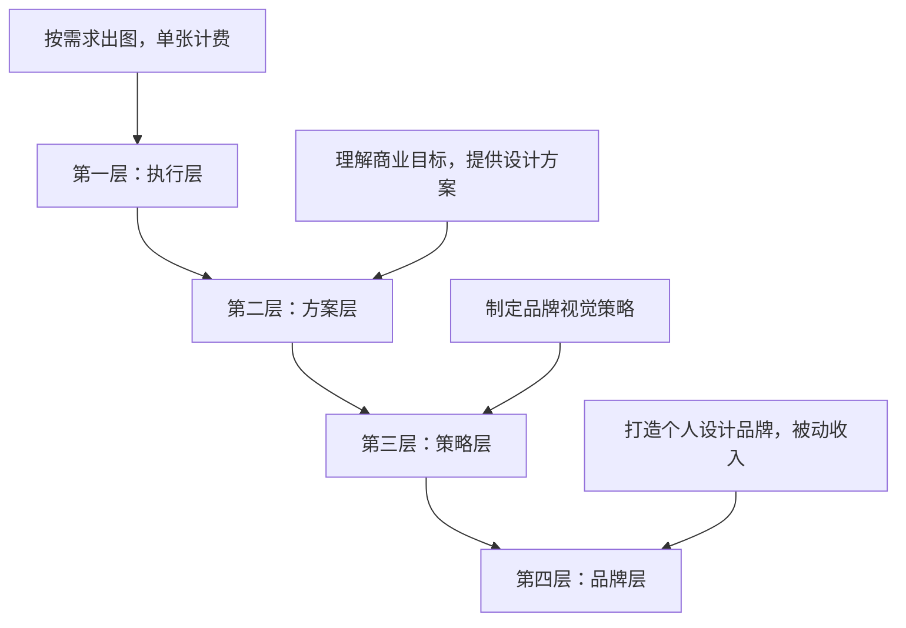

| 层级 | 工作内容 | 收入范围 | 核心能力 |
|------|----------|----------|----------|
| 执行层 | 按需求做图 | 2000-8000元/月 | 软件操作熟练 |
| 方案层 | 提供设计方案 | 8000-30000元/月 | 理解需求+审美 |
| 策略层 | 品牌视觉策略 | 30000-100000元/月 | 商业思维+设计 |
| 品牌层 | 个人IP+被动收入 | 50000元+/月 | 影响力+产品化 |

### 10.4.2 高需求设计方向

**UI/UX设计**：

- 市场需求：最大，薪资天花板最高
- 技能要求：Figma/Sketch、交互设计、用户研究、设计系统
- 变现方式：远程全职($3000-10000/月)、项目外包(5000-50000元/个)、设计咨询(500-2000元/小时)
- 学习路径：UI基础(1个月) → 交互设计(2个月) → 项目实战(3个月) → 求职/接单

**电商设计**：

- 市场需求：极大，尤其是大促期间（618、双11、黑五）
- 技能要求：Photoshop、产品精修、详情页设计、主图设计
- 变现方式：按张计费(主图50-200元/张，详情页500-2000元/套)、包月服务(3000-10000元/月)
- 优势：需求稳定、标准化程度高、可批量产出

**品牌设计**：

- 市场需求：中等，但单价最高
- 技能要求：Logo设计、VI设计、品牌策略、提案能力
- 变现方式：Logo设计(2000-20000元/个)、VI设计(10000-100000元/套)、品牌全案(50000-500000元)
- 关键：需要强大的提案能力和商业理解

**视频/动效设计**：

- 市场需求：快速增长
- 技能要求：After Effects、Premiere、C4D、动效设计
- 变现方式：短视频剪辑(100-500元/条)、宣传片(5000-50000元/部)、MG动画(200-1000元/秒)
- 趋势：AI辅助工具（如Runway、剪映）正在降低门槛，但高端创意仍需要人

### 10.4.3 设计接单平台深度对比

**国内平台**：

| 平台 | 特点 | 适合方向 | 抽成 | 获客难度 |
|------|------|----------|------|----------|
| 站酷 | 设计师社区+接单 | UI/品牌/插画 | 无(直接对接) | 中(需作品曝光) |
| 花瓣 | 灵感平台+需求对接 | 全品类设计 | 无 | 中 |
| 猪八戒 | 综合外包 | 全品类 | 20% | 低(竞标制) |
| 千图网 | 素材销售 | 模板/素材 | 50-70% | 低(上传即售) |
| 稿定设计 | 模板平台 | 电商/营销模板 | 50-60% | 低 |
| 特赞 | 品牌设计 | 品牌/包装 | 平台定价 | 高(需审核) |

**国外平台**：

| 平台 | 特点 | 适合方向 | 抽成 | 收入潜力 |
|------|------|----------|------|----------|
| Dribbble | 设计师社区+招聘 | UI/品牌 | 无(直接对接) | 高 |
| 99designs | 设计竞赛 | Logo/品牌 | 平台定价 | 中 |
| Fiverr | 任务制 | 全品类 | 20% | 中 |
| Creative Market | 素材销售 | 字体/模板/素材 | 30% | 中(被动收入) |
| ThemeForest | 主题销售 | 网站主题 | 中(根据销量) | 高(被动收入) |
| Behance | 作品展示+招聘 | 全品类 | 无(展示为主) | 间接(获客) |

### 10.4.4 设计定价策略

**定价要素矩阵**：

定价不是拍脑袋，需要考虑以下因素：

```text
最终价格 = 基础价格 × 复杂度系数 × 紧急系数 × 客户规模系数
```

| 因素 | 低 | 中 | 高 |
|------|-----|-----|-----|
| 复杂度系数 | ×1.0 (标准化需求) | ×1.5 (有一定定制) | ×2.0-3.0 (高度定制) |
| 紧急系数 | ×1.0 (正常周期) | ×1.3 (加急30%) | ×1.5-2.0 (特急) |
| 客户规模系数 | ×1.0 (个人/小企业) | ×1.3 (中型企业) | ×1.5-2.0 (大企业/品牌) |

**各方向详细定价**：

| 设计类型 | 入门级 | 专业级 | 高端级 | 备注 |
|----------|--------|--------|--------|------|
| Logo设计 | 300-1000元 | 2000-8000元 | 10000-50000元 | 含VI更贵 |
| 海报/Banner | 100-300元 | 500-2000元 | 3000-8000元 | 按张计费 |
| UI界面设计 | 2000-5000元/页 | 5000-15000元/页 | 15000-30000元/页 | 含交互更贵 |
| 电商详情页 | 200-500元/页 | 500-1500元/页 | 2000-5000元/页 | 套装更划算 |
| 视频剪辑 | 50-200元/分钟 | 200-800元/分钟 | 800-3000元/分钟 | 含特效更贵 |
| 品牌VI设计 | 3000-8000元 | 10000-50000元 | 50000-200000元 | 全案最贵 |
| 包装设计 | 500-2000元 | 3000-10000元 | 15000-50000元 | 系列包装更贵 |

### 10.4.5 设计师的作品集打造

作品集决定了你能接到什么级别的项目。以下是打造高转化率作品集的具体方法：

**作品集结构**（推荐5-8个项目）：

1. **封面项目**：你最好的、最能体现专业方向的项目
2. **2-3个完整案例**：每个案例包含——背景说明、设计挑战、你的思路、最终成果、客户反馈
3. **1-2个个人项目**：展示你的审美和创造力（不受客户需求限制）
4. **1个"过程展示"项目**：展示你的设计思考过程，不只是最终效果

**展示技巧**：
- 用Mockup展示设计效果（如把UI设计放到手机模型里）
- 加入数据："设计改版后，转化率提升23%"
- 写设计说明：解释每个决策背后的原因
- 保持风格统一：作品集本身就是你的设计能力证明

**作品集平台推荐**：
- Behance（国际，适合UI/品牌设计）
- 站酷（国内，适合全品类）
- 个人网站（最专业，推荐用Cargo或Webflow搭建）

### 10.4.6 AI时代的设计版权问题

AI设计工具的普及带来了版权风险，设计师必须了解：

**不同工具的商用政策**：

| 工具 | 免费版商用 | 付费版商用 | 注意事项 |
|------|-----------|-----------|----------|
| Midjourney | 不可 | 可以(付费用户拥有) | $10/月以上可商用 |
| DALL-E 3 | 可以(ChatGPT Plus) | 可以 | 需遵守OpenAI使用政策 |
| Stable Diffusion | 可以(开源许可) | 可以 | 注意部分模型有非商用许可 |
| Flux | 可以(开源许可) | 可以 | Apache 2.0许可 |
| 可灵(Kling) | 需确认 | 付费版可商用 | 阅读最新用户协议 |

**降低版权风险的方法**：

1. 不直接使用AI生成的图像作为最终交付物——AI生成+人工修改=更安全
2. 保留AI生成过程的记录（prompt、参数、版本），作为证据
3. 避免生成与已有品牌/作品高度相似的内容
4. 对重要商业项目，优先使用人工设计或购买商用许可明确的AI工具
5. 在合同中明确说明使用了AI工具，并约定版权责任

---

## 10.5 写作技能变现

### 10.5.1 写作变现的三种模式

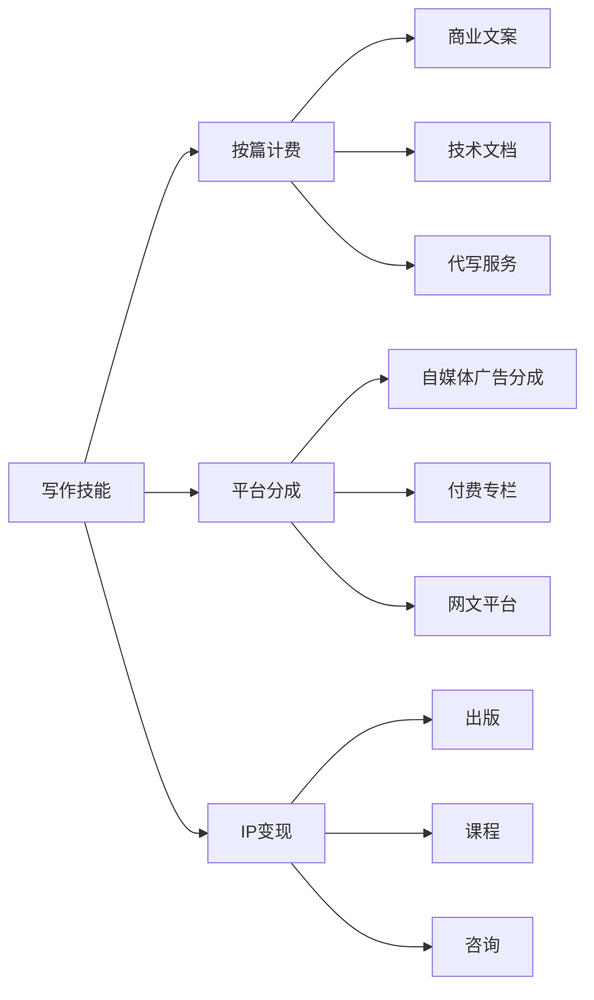

| 模式 | 收入确定性 | 收入天花板 | 启动难度 | 时间自由度 |
|------|-----------|-----------|----------|-----------|
| 按篇计费 | 高(写一篇收一篇) | 低(受限于产能) | 低 | 低(有deadline) |
| 平台分成 | 中(取决于流量) | 中(爆款可期) | 中 | 高(自主创作) |
| IP变现 | 低(前期几乎无收入) | 极高(复利效应) | 高 | 高 |

### 10.5.2 高价值写作方向

**技术写作/文档**：

这是被严重低估的写作方向。技术人员写技术文档，比纯写手写的技术文档质量高10倍，价格也高3-5倍。

- 服务内容：API文档、产品使用手册、技术白皮书、开发者指南、README
- 定价：1000-10000元/篇（按复杂度），包月服务5000-20000元/月
- 获客渠道：GitHub（给开源项目写文档出名）、技术社区、LinkedIn
- 核心优势：你既懂技术又会写，这个交叉能力非常稀缺

**技术文档写作模板**：

一个好的API文档应包含以下结构：

```text
# API名称

## 概述
- 这个API做什么？解决什么问题？
- 适用场景

## 快速开始
- 获取API Key
- 第一个请求示例
- 预期响应

## 认证方式
- 认证方式说明
- 代码示例

## 端点参考
### 端点名称
- URL
- HTTP方法
- 请求参数表格
- 响应字段表格
- 请求/响应示例
- 错误码说明

## 最佳实践
- 常见使用模式
- 性能优化建议
- 安全注意事项

## FAQ
- 常见问题解答
```

**商业文案**：

- 服务内容：品牌故事、产品描述、广告文案、落地页文案、邮件营销文案
- 定价：品牌故事3000-20000元/篇，产品描述200-1000元/篇，落地页文案2000-10000元/页
- 关键能力：理解消费者心理、掌握AIDA等文案框架、会写说服性文字
- AI辅助：用ChatGPT生成初稿框架，人工注入品牌调性和情感共鸣

**SEO内容写作**：

- 服务内容：SEO优化文章、关键词内容矩阵、内容策略规划
- 定价：SEO文章500-3000元/篇，内容策略规划5000-20000元/月
- 工具链：Ahrefs/SEMrush（关键词研究）→ ChatGPT（初稿）→ 人工优化（加入E-E-A-T要素）
- 市场需求：所有需要线上获客的企业都需要SEO内容

**公众号/自媒体代运营**：

- 服务内容：选题策划、文章撰写、排版发布、数据分析
- 定价：单篇300-2000元，包月3000-15000元（含4-8篇）
- 关键：理解平台调性和读者画像，不只是写，还要懂传播

### 10.5.3 自媒体写作变现路径

**公众号变现**：

| 变现方式 | 门槛 | 收入范围 | 说明 |
|----------|------|----------|------|
| 流量主广告 | 500粉丝 | 0.5-3元/千次阅读 | 基础变现 |
| 接商业广告 | 5000+粉丝 | 500-50000元/篇 | 主要收入来源 |
| 付费阅读 | 无 | 按定价 | 适合深度内容 |
| 知识星球导流 | 1000+粉丝 | 199-1999元/人/年 | 长期收入 |
| 课程导流 | 5000+粉丝 | 按课程定价 | 高客单价 |

**知乎变现**：

| 变现方式 | 门槛 | 收入范围 | 说明 |
|----------|------|----------|------|
| 知乎好物推荐 | 创作者等级 | 佣金制 | 写测评带货 |
| 知乎盐选专栏 | 申请通过 | 千字50-200元 | 平台约稿 |
| 知乎Live | 5000+粉丝 | 9.9-199元/场 | 付费讲座 |
| 付费咨询 | 开通功能 | 自定价格 | 一对一咨询 |
| 品牌合作 | 有一定影响力 | 500-10000元/篇 | 品牌软文 |

**小红书变现**：

| 变现方式 | 门槛 | 收入范围 | 说明 |
|----------|------|----------|------|
| 品牌合作 | 1000+粉丝 | 100-10000元/篇 | 最主要变现方式 |
| 商品橱窗 | 1000+粉丝 | 佣金制 | 带货分佣 |
| 直播带货 | 1000+粉丝 | 佣金+坑位费 | 需要表达能力 |
| 引流私域 | 无 | 按后端变现 | 导流到微信/课程 |

**B站变现**：

| 变现方式 | 门槛 | 收入范围 | 说明 |
|----------|------|----------|------|
| 创作激励 | 1000粉+10万播放 | 1-5元/千次播放 | 基础变现 |
| 充电计划 | 1000粉丝 | 粉丝打赏 | 粉丝自愿 |
| 商单合作 | 10000+粉丝 | 1000-50000元/视频 | 主要收入来源 |
| 课堂导流 | 有一定粉丝 | 按课程定价 | 高客单价 |

### 10.5.4 创作者经济变现：超越广告分成的新模式

传统的自媒体变现依赖平台广告分成和品牌合作，但2024-2026年的创作者经济已经进化出更多独立于平台的变现模式。核心趋势：从"在平台上赚广告费"转向"用内容建立信任，用信任变现"。

**播客变现**：

播客是被严重低估的内容形式——听众的粘性和信任度远高于图文读者。

| 变现方式 | 门槛 | 收入范围 | 说明 |
|----------|------|----------|------|
| 广告植入 | 1000+听众 | 500-50000元/期 | 按听众量和领域定价 |
| 付费订阅 | 无 | 9.9-99元/月/人 | 小宇宙、Apple Podcasts支持 |
| 品牌赞助 | 5000+听众 | 2000-20000元/期 | 技术类播客CPM较高 |
| 引流后端 | 无 | 按后端变现 | 播客→咨询/课程/社群 |

技术类播客的优势：竞争少（中文技术播客不到200个）、受众精准（开发者/技术决策者）、信任度高（声音比文字更有亲和力）。

启动建议：不需要专业录音棚，一支好的USB麦克风（300-500元）+ 安静的房间即可。先做10期再评估是否继续。

**Newsletter（邮件通讯）变现**：

Newsletter正在全球范围内复兴，Substack、竹白等平台让独立写作者可以直接向订阅者收费。

| 平台 | 特点 | 分成 | 适合方向 |
|------|------|------|----------|
| 竹白 | 国内最大Newsletter平台 | 10% | 中文内容 |
| Substack | 全球最大 | 10% | 英文/双语内容 |
| ConvertKit | 营销功能强 | $9-25/月 | 有营销需求的创作者 |
| Buttondown | 极简、开发者友好 | $9/月 | 技术类Newsletter |

技术Newsletter的变现路径：免费版积累订阅者 → 付费版提供深度内容（行业分析、代码示例、独家观点）。定价：$5-15/月或¥29-99/月。

成功案例参考：国内技术Newsletter"HelloGitHub"通过免费内容积累10万+订阅者，通过赞助和课程导流变现。

**付费社群/会员制**：

付费社群是"信任变现"的终极形态——用户为持续的价值和归属感付费。

| 平台 | 特点 | 定价范围 | 适合类型 |
|------|------|----------|----------|
| 知识星球 | 国内最成熟 | 50-2000元/年 | 知识分享、问答 |
| Discord付费频道 | 国际化 | $5-50/月 | 技术社区、开发者 |
| 小报童 | 轻量级专栏 | 19-299元 | 短内容、教程 |
| 微信群+小程序 | 灵活 | 自定义 | 任何类型 |

运营关键：不是建群收费就完了，需要持续输出价值（每周至少2-3次高质量内容/互动），否则续费率会暴跌。

**社群运营数据参考**：

| 指标 | 健康值 | 说明 |
|------|--------|------|
| 月活跃率 | >40% | 低于30%说明内容缺乏吸引力 |
| 续费率 | >50% | 低于40%需要紧急优化内容 |
| 日均互动数 | >5条/100人 | 反映社群活跃度 |
| NPS(净推荐值) | >30 | 衡量口碑传播意愿 |

### 10.5.5 网文写作变现

**平台选择**：

| 平台 | 分成模式 | 全勤奖 | 门槛 | 适合类型 |
|------|----------|--------|------|----------|
| 起点中文网 | 订阅分成50% | 有(600-1500元/月) | 中 | 男频、玄幻、都市 |
| 晋江文学城 | 订阅分成50% | 无 | 中 | 女频、言情、古言 |
| 番茄小说 | 阅读量分成 | 有 | 低 | 全品类 |
| 七猫小说 | 阅读量分成+保底 | 有 | 低 | 全品类 |
| 刺猬猫 | 订阅分成 | 有 | 中 | 二次元、同人 |

**网文收入结构**：

| 收入来源 | 说明 | 占比 |
|----------|------|------|
| 订阅/阅读分成 | 读者付费阅读的分成 | 40-60% |
| 全勤奖 | 每天更新4000字以上 | 10-20% |
| 完本奖 | 完成整本书的奖励 | 5-10% |
| 版权收入 | 影视/游戏/有声改编 | 0-50%（大神级） |
| 打赏 | 读者自愿打赏 | 5-10% |

**网文写作的关键数据**：
- 入门期（前3个月）：月收入0-2000元，主要靠全勤奖
- 成长期（3-12个月）：月收入2000-10000元，开始有稳定读者
- 成熟期（1-3年）：月收入10000-50000元，可以全职写作
- 大神级（3年+）：月收入50000元以上，版权收入是大头

### 10.5.6 写作变现的定价参考

| 写作类型 | 入门价格 | 中级价格 | 高级价格 | 计费方式 |
|----------|----------|----------|----------|----------|
| 商业文案 | 200-500元/篇 | 1000-3000元/篇 | 5000-20000元/篇 | 按篇 |
| 技术文档 | 500-2000元/篇 | 2000-5000元/篇 | 5000-20000元/篇 | 按篇 |
| SEO文章 | 100-300元/篇 | 300-1000元/篇 | 1000-3000元/篇 | 按篇 |
| 公众号代写 | 200-500元/篇 | 500-2000元/篇 | 2000-10000元/篇 | 按篇 |
| 产品描述 | 50-200元/篇 | 200-500元/篇 | 500-2000元/篇 | 按篇 |
| 网络小说 | 千字20-50元 | 千字50-100元 | 千字100-300元 | 按字数 |
| 图书写作 | 千字100-300元 | 千字300-800元 | 千字800-2000元 | 按字数 |
| 白皮书 | 5000-10000元 | 10000-30000元 | 30000-100000元 | 按项目 |

---

## 10.6 翻译技能变现

### 10.6.1 翻译行业的现状与趋势

**行业现状**：
- 传统翻译市场稳定增长，年增长率约5-8%
- AI翻译工具（DeepL、GPT-4）已经能处理80%的日常翻译需求
- 纯翻译的单价在下降，但"翻译+专业领域知识"的单价在上升

**趋势判断**：
- 纯语言翻译（无专业领域）→ 逐渐被AI替代，不建议作为主方向
- 专业领域翻译（法律、医学、金融、技术）→ 需求稳定，单价高
- 本地化翻译（软件、游戏、网站）→ 需求增长，结合技术能力更佳
- AI翻译后编辑（MTPE）→ 新兴方向，成为主流工作模式

### 10.6.2 翻译变现方向

**笔译**：

| 细分方向 | 千字价格 | 需求量 | 门槛 | AI替代风险 |
|----------|----------|--------|------|-----------|
| 通用文档 | 80-200元 | 大 | 低 | 高 |
| 技术文档 | 150-400元 | 大 | 中 | 中 |
| 法律合同 | 200-500元 | 中 | 高 | 低 |
| 医学文献 | 200-600元 | 中 | 极高 | 低 |
| 金融报告 | 200-500元 | 中 | 高 | 低 |
| 游戏本地化 | 150-400元 | 大 | 中 | 中 |
| 字幕翻译 | 50-200元/分钟 | 大 | 低 | 高 |
| 图书翻译 | 100-300元 | 中 | 中 | 中 |

**口译**：

| 类型 | 日薪范围 | 要求 | 市场需求 |
|------|----------|------|----------|
| 商务陪同口译 | 800-2000元/天 | 流利口语 | 大 |
| 会议交替传译 | 2000-5000元/天 | 专业训练 | 中 |
| 同声传译 | 5000-15000元/天 | 高级认证 | 小(但稀缺) |
| 远程口译 | 500-2000元/小时 | 设备+网络 | 增长中 |

**本地化**：

软件/游戏本地化是翻译行业中收入最高、最稳定的方向之一。

- 工作内容：翻译UI文本、帮助文档、营销材料，同时考虑文化适配
- 定价：比普通笔译高30-50%，包月服务8000-30000元
- 获客渠道：本地化公司（如Lionbridge、TransPerfect）、直接联系出海企业
- 关键能力：不仅翻译语言，还要理解产品逻辑和用户体验

### 10.6.3 AI时代的翻译新玩法

**MTPE（机器翻译后编辑）**：

这是AI时代翻译行业的新常态——AI完成初翻，人工做后编辑。

工作流程：
1. 接收原文
2. 用DeepL/GPT-4生成初翻
3. 人工校对：修正错误、调整语序、统一术语
4. 质量检查：一致性、准确性、流畅度

定价：比纯人工翻译低30-50%，但效率提升3-5倍，总收入反而更高
示例：纯人工翻译3000字/天 × 200元/千字 = 600元/天；MTPE翻译10000字/天 × 100元/千字 = 1000元/天

**翻译+技术的复合服务**：

- 搭建翻译记忆库（TM）和术语库，为企业提供持续翻译服务
- 开发翻译自动化脚本（如批量处理文档、自动提取术语）
- 提供多语言网站/APP本地化一站式服务

**CAT工具（计算机辅助翻译）**：

| 工具 | 特点 | 价格 | 适合人群 |
|------|------|------|----------|
| SDL Trados | 行业标准，功能最全 | $200-800/年 | 专业译者 |
| MemoQ | 界面友好，协作功能强 | $150-500/年 | 中高级译者 |
| MateCat | 免费开源 | 免费 | 入门译者 |
| Smartcat | 云端协作，有免费版 | 免费/$200+/年 | 团队协作 |
| OmegaT | 开源，跨平台 | 免费 | 技术型译者 |

CAT工具的价值：
- 翻译记忆库（TM）：同一术语/句子只翻译一次，后续自动匹配
- 术语库：确保术语一致性
- 质量检查：自动检查数字、标点、格式一致性
- 效率提升：复用已有翻译，效率提升30-50%

**翻译质量标准**：

| 标准 | 说明 | 适用场景 |
|------|------|----------|
| ISO 17100 | 翻译服务质量标准 | 专业翻译公司 |
| LISA QA | 本地化质量评估 | 软件/游戏本地化 |
| MQM | 多维质量评估框架 | 通用翻译质量评估 |
| 错误率<2% | 业界通用标准 | 大多数商业翻译 |

### 10.6.4 翻译平台与获客

**翻译平台**：

| 平台 | 特点 | 申请门槛 | 收入水平 |
|------|------|----------|----------|
| Gengo | 全球翻译平台 | 语言测试 | 中 |
| Translated | 专业翻译 | 翻译测试 | 中高 |
| ProZ | 翻译社区+接单 | 无 | 中(靠竞标) |
| 有道翻译 | 国内众包 | 简单测试 | 低中 |
| 做到 | 国内专业平台 | 翻译测试 | 中 |
| TextMaster | 欧洲翻译平台 | 翻译测试 | 中高 |

**直接获客渠道**：

- LinkedIn：建立专业档案，主动联系出海企业
- 翻译公司合作：先积累经验，逐步转为直接客户
- 行业社群：加入目标行业的社群（如SaaS出海群、跨境电商群）
- 个人网站：做SEO，让客户搜索"XX语言翻译"时找到你

---

## 10.7 在线教育与知识付费

### 10.7.1 知识付费的底层逻辑

知识付费不是"把你知道的东西讲出来"，而是"帮学员解决具体问题、达到具体结果"。

**课程价值公式**：

```text
课程价值 = (学员想要的结果 - 学员当前状态) × 结果的可感知程度 × 信任度
```

三个变量缺一不可：
- 结果不明确 → 没人买（"提升认知"不如"30天学会Python爬虫"）
- 不可感知 → 没人信（需要展示学员案例、数据对比）
- 没信任度 → 没人敢买（需要个人品牌、免费内容背书）

### 10.7.2 课程选题方法

**选题四象限**：

|  | 需求大 | 需求小 |
|--|--------|--------|
| **你擅长** | ⭐ 最佳选题 | 可以做但要降低预期 |
| **你不擅长** | 学了再做，或找合伙人 | 不要做 |

**验证选题的方法**：

1. **搜索验证**：在知乎、B站、小红书搜索相关关键词，看搜索量和讨论量
2. **竞品验证**：找到同类课程，看销量和评价。有竞品且卖得好 = 需求存在；无竞品 = 可能是蓝海，也可能是伪需求
3. **预售验证**：先发一个课程介绍页面，看有多少人预约/付费。如果预售转化率>5%，选题可行
4. **社群验证**：在目标用户聚集的社群提问，看有多少人有这个需求

### 10.7.3 课程开发全流程

**第一阶段：课程设计（1-2周）**

1. 确定课程目标：学员学完能做什么？（用一句话描述）
2. 设计课程大纲：从结果倒推，列出达到结果需要的所有知识节点
3. 规划课时：每节课10-20分钟，总课时根据内容量决定
4. 准备素材：代码示例、案例数据、练习题、参考资源

课程大纲模板：
```text
模块1：基础入门（解决"是什么"）
  1.1 概念介绍
  1.2 环境搭建
  1.3 第一个实例

模块2：核心技能（解决"怎么做"）
  2.1 核心原理
  2.2 实操演示
  2.3 练习与反馈

模块3：实战应用（解决"用在哪"）
  3.1 真实案例1
  3.2 真实案例2
  3.3 综合项目

模块4：进阶提升（解决"怎么更好"）
  4.1 高级技巧
  4.2 常见坑与解决方案
  4.3 持续学习路径
```

**第二阶段：内容制作（2-4周）**

录制设备推荐：

| 设备 | 入门选择 | 专业选择 | 预算 |
|------|----------|----------|------|
| 摄像头 | 罗技C920 | 罗技C930e / 索尼ZV-1 | 300-4000元 |
| 麦克风 | 博雅MM1 | Blue Yeti / Rode NT-USB | 100-1500元 |
| 灯光 | 环形补光灯 | 双灯柔光套装 | 50-500元 |
| 录屏 | OBS Studio(免费) | Camtasia | 0-2000元 |
| 剪辑 | 剪映(免费) | Premiere Pro | 0-3000元/年 |

录制技巧：
- 录屏课程：不需要出镜，重点是清晰的讲解和操作演示
- 出镜课程：注意灯光、背景、穿着，保持专业形象
- 混合模式：录屏+画中画出镜，最推荐的模式
- 后期处理：删除口误、停顿、废话，保持节奏紧凑

**AI辅助课程制作（2025年新方法）**：

AI工具正在大幅降低课程制作的时间和成本：

| 环节 | 传统方式 | AI辅助方式 | 效率提升 |
|------|----------|-----------|----------|
| 课程大纲 | 手动梳理 | ChatGPT生成初稿+人工调整 | 2-3倍 |
| 讲义/PPT | 手动制作 | AI生成内容+Gamma/Beautiful.ai排版 | 3-5倍 |
| 录制 | 反复录制 | AI语音合成(MURF/ElevenLabs)替代真人配音 | 5-10倍 |
| 字幕 | 手动添加 | Whisper自动识别+人工校对 | 10倍 |
| 课程封面 | 设计师制作 | Midjourney/Canva AI生成 | 5倍 |
| 答疑 | 人工回复 | AI客服+知识库自动回答80%问题 | 持续节省 |

**AI课程制作的注意事项**：
1. **AI配音可以接受但要选好声音**：选择自然、专业的AI声音，避免机械感
2. **AI生成的PPT需要人工美化**：AI生成的内容框架好，但视觉设计需要人来把控
3. **核心价值仍在于你的专业判断**：AI帮你生产内容，但课程的深度和独到见解来自你的经验
4. **不要过度依赖AI**：学员能分辨出"有灵魂的课程"和"AI灌水的课程"

**第三阶段：平台上架（1周）**

| 平台 | 分成比例 | 流量 | 适合类型 | 结算方式 |
|------|----------|------|----------|----------|
| 网易云课堂 | 70-90% | 大 | 职业技能 | 月结 |
| 腾讯课堂 | 70-90% | 大 | 全品类 | 月结 |
| B站课堂 | 70% | 大 | 年轻用户 | 月结 |
| 知识星球 | 100%(自定价) | 需自引流 | 持续更新内容 | 即时 |
| Udemy | 37-97% | 全球 | 英文课程 | 月结 |
| Skillshare | 按观看时长 | 全球 | 创意类 | 月结 |
| Teachable | 100%(自定价) | 需自引流 | 个人品牌 | 即时 |
| 小鹅通 | 100%(自定价) | 需自引流 | 私域课程 | 即时 |

### 10.7.4 课程定价与营销

**定价策略**：

| 课程类型 | 时长 | 定价范围 | 定价逻辑 |
|----------|------|----------|----------|
| 入门微课 | 1-3小时 | 9.9-49元 | 引流产品，低门槛吸引用户 |
| 入门课 | 5-10小时 | 99-299元 | 标准产品，覆盖基础内容 |
| 进阶课 | 10-30小时 | 299-999元 | 深度内容，含实战项目 |
| 系统课 | 30-60小时 | 999-2999元 | 完整体系，含社群+答疑 |
| 训练营 | 21-30天 | 1999-6999元 | 高互动，含作业批改+直播 |
| 一对一辅导 | 按次/按月 | 300-2000元/小时 | 最高端，个性化指导 |

**营销漏斗**：

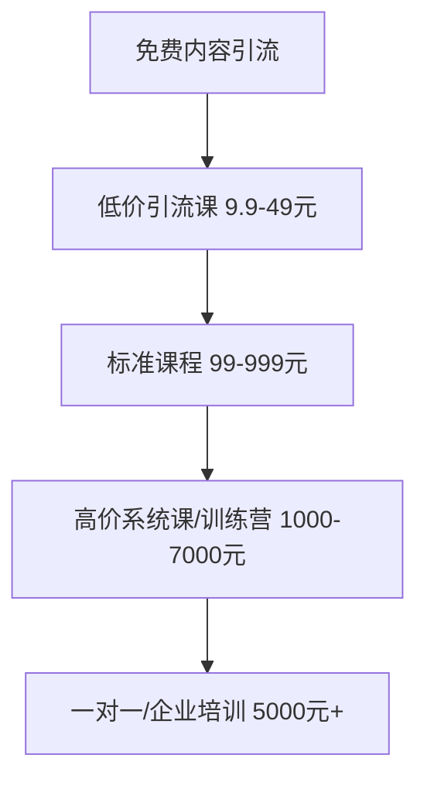

每一层的转化率大约10-20%。关键是先用免费内容（公众号文章、B站视频、知乎回答）建立信任，再逐层转化。

**推广渠道与技巧**：

| 渠道 | 成本 | 效果 | 适合阶段 |
|------|------|------|----------|
| 免费内容引流 | 时间成本 | 慢但持久 | 长期策略 |
| 社群裂变 | 低 | 快速起量 | 课程上线期 |
| KOL合作 | 中 | 精准获客 | 有一定口碑后 |
| 信息流广告 | 高 | 快速放量 | 验证转化率后 |
| 平台推荐 | 无 | 取决于课程质量 | 持续优化 |

### 10.7.5 用户运营与复购

课程卖出去只是开始，用户运营决定了复购率和口碑传播。

**运营体系**：

1. **学习体验**：清晰的学习路径、及时的答疑响应、定期的直播互动
2. **社群运营**：建立学员微信群/Discord，定期组织讨论、分享、打卡
3. **作业与反馈**：设计实操作业，提供个性化反馈（训练营模式）
4. **学员展示**：展示优秀学员的作品和成果，增强社会证明
5. **持续更新**：定期更新课程内容，保持时效性
6. **复购设计**：设计阶梯式产品线，让学员从入门课逐步购买进阶课

**关键指标**：

| 指标 | 健康值 | 说明 |
|------|--------|------|
| 完课率 | >40% | 低于30%说明课程设计有问题 |
| 好评率 | >85% | 低于80%需要紧急优化 |
| 复购率 | >20% | 高复购说明内容有价值 |
| 转介绍率 | >10% | 口碑传播的核心指标 |
| 退款率 | <5% | 高退款需要检查营销与内容的匹配度 |

### 10.7.6 知识付费的税务处理

知识付费收入的税务处理容易被忽略，但不合规可能带来风险：

| 收入来源 | 税种 | 税率 | 处理方式 |
|----------|------|------|----------|
| 平台课程收入 | 个人所得税(劳务报酬) | 20-40% | 平台代扣或自行申报 |
| 知识星球/小鹅通收入 | 个人所得税(经营所得) | 5-35% | 建议注册个体户 |
| 广告收入 | 个人所得税(劳务报酬) | 20-40% | 平台代扣 |
| 出版版税 | 个人所得税(稿酬) | 实际约11.2% | 出版社代扣 |

建议：年知识付费收入超过10万时，注册个体工商户或个人独资企业，可以：
- 将课程制作成本（设备、软件、场地）作为成本扣除
- 享受小规模纳税人增值税减免
- 税负率通常低于个人劳务报酬税率

---

## 10.8 个人品牌建设：所有变现方向的放大器

无论你选择哪个变现方向，个人品牌都是收入的放大器。同样的技能，有个人品牌的人收入可以高出3-10倍。

### 10.8.1 个人品牌的构建框架

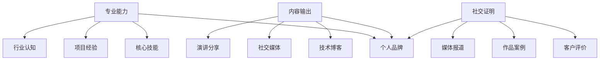

### 10.8.2 内容输出策略

**平台选择矩阵**：

| 平台 | 内容形式 | 适合方向 | 启动难度 | 变现效率 |
|------|----------|----------|----------|----------|
| 公众号 | 长文 | 全品类 | 中 | 高 |
| 知乎 | 问答+专栏 | 知识类 | 低 | 中 |
| B站 | 视频 | 教程类 | 中 | 中 |
| 小红书 | 图文+短视频 | 设计/生活 | 低 | 高 |
| 掘金/思否 | 技术文章 | 编程 | 低 | 低(但获客好) |
| Twitter/X | 短内容+Thread | 技术/海外 | 低 | 中 |
| LinkedIn | 专业内容 | B2B服务 | 低 | 高 |
| YouTube | 视频 | 教程/分享 | 高 | 高(海外) |

**内容日历建议**：

每周至少发布2-3条内容，保持持续输出：
- 周一：技术干货/教程
- 周三：行业观点/分析
- 周五：项目案例/复盘

**内容复用策略**：

一次深度思考，多平台分发：
1. 写一篇深度技术文章（公众号/博客）
2. 提炼核心观点发知乎回答
3. 做成短视频发B站/小红书
4. 精简为Thread发Twitter
5. 总结为LinkedIn帖子

### 10.8.3 影响力变现路径

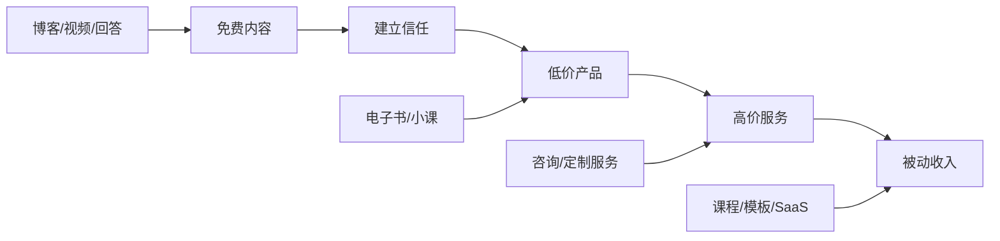

### 10.8.4 个人品牌的常见错误

| 错误 | 表现 | 纠正 |
|------|------|------|
| 定位太宽 | "我是全栈开发者" | "我帮SaaS初创公司用React快速搭建MVP" |
| 只发技术不发思考 | 只贴代码片段 | 分享你为什么这样做、踩过什么坑、学到了什么 |
| 三天打鱼两天晒网 | 热度一阵就停了 | 制定内容日历，至少坚持6个月再评估效果 |
| 过度营销 | 每条内容都在卖东西 | 80%价值输出 + 20%营销 |
| 不互动 | 只发不回复 | 主动回复评论、参与讨论、帮助他人 |

---

## 10.9 法务与财务：保护你的变现成果

### 10.9.1 合同与知识产权

**接单合同必备条款**：

1. **需求范围**：详细列出所有功能点和交付物，超出范围另行报价
2. **付款方式**：建议分期付款（如30%预付 + 40%中期 + 30%验收）
3. **交付时间**：明确里程碑和最终交付日期
4. **知识产权**：明确交付后代码/设计/文案的归属权
5. **保密条款**：双方对项目信息保密
6. **修改与售后**：包含几次免费修改，售后维护期限
7. **违约责任**：延期交付、质量不达标、拖欠款项的处理方式

**模板推荐**：
- 国内：可在"法大大"、"e签宝"等平台获取电子合同模板
- 国外：Upwork等平台内置合同；直接客户可用Bonsai、HelloSign

**知识产权的关键细节**：

很多开发者忽略了一个重要问题：你在主业工作中写的代码，知识产权属于公司。利用业余时间做副业时：
- 不要使用公司代码、工具、资源
- 不要在工作时间做副业项目
- 检查你的劳动合同中的竞业限制条款
- 确认公司的知识产权归属政策

### 10.9.2 税务合规

**个人接单的税务处理**：

| 收入类型 | 税种 | 税率 | 申报方式 |
|----------|------|------|----------|
| 国内平台收入 | 个人所得税(劳务报酬) | 20-40% | 平台代扣或自行申报 |
| 国外平台收入 | 个人所得税(劳务报酬) | 20-40% | 自行申报 |
| 版权收入 | 个人所得税(稿酬) | 实际约11.2% | 支付方代扣 |
| 经营所得 | 个人所得税(经营) | 5-35% | 注册个体户后申报 |

**节税建议**：
- 注册个体工商户：年收入超过10万时建议注册，可以享受小规模纳税人优惠
- 合理利用扣除：设备购置、软件订阅、培训费用等可以作为成本扣除
- 注意外汇收入：国外平台收入需要申报，避免税务风险
- 保留凭证：所有收入和支出的凭证都要保留，以备税务检查

**经营主体选择对比**：

| 主体类型 | 注册成本 | 税负率 | 适合场景 | 优缺点 |
|----------|----------|--------|----------|--------|
| 个人（劳务报酬） | 无 | 20-40% | 年收入<10万 | 零成本但税负最高 |
| 个体工商户 | 500-2000元 | 3-10% | 年收入10-50万 | 成本低、税负低、可开票 |
| 个人独资企业 | 1000-5000元 | 3-10% | 年收入10-100万 | 可核定征收，税负低 |
| 小规模公司(有限公司) | 3000-8000元 | 10-25% | 年收入>100万 | 可融资、品牌感强，但税负较高 |

**实操建议**：
- 年收入<10万：以个人名义接单即可，平台代扣税
- 年收入10-50万：注册个体工商户，在税收洼地（如海南、部分园区）可享受核定征收，综合税负3-5%
- 年收入50-100万：考虑个人独资企业或小型有限公司
- 年收入>100万：建议咨询专业税务师，合理规划税务架构

**发票问题**：很多企业客户要求开发票，这是个人接单的痛点。解决方案：
1. 注册个体户后可自行开票（普票或专票）
2. 通过平台接单，平台代开发票
3. 到税务局代开发票（单次，适合偶尔接单）
4. 使用灵活用工平台（如猪八戒、甜薪工场的发票服务）

### 10.9.3 风险管理

**常见风险与应对**：

| 风险 | 概率 | 影响 | 应对策略 |
|------|------|------|----------|
| 客户拖欠款项 | 高 | 中 | 分期付款+预付制度 |
| 需求无限膨胀 | 高 | 高 | 需求确认书+变更流程 |
| 项目烂尾 | 中 | 高 | 里程碑交付+合同约束 |
| 知识产权纠纷 | 低 | 高 | 合同明确归属+保留证据 |
| 平台封号 | 低 | 高 | 多平台分散+私域沉淀 |
| 健康问题 | 中 | 高 | 不要过度加班+保险配置 |
| 竞业限制纠纷 | 低 | 极高 | 确认公司政策+避免使用公司资源 |

### 10.9.4 数据安全与隐私保护

自由职业者在处理客户数据时，必须重视数据安全。一次数据泄露可能导致客户流失、法律纠纷甚至刑事责任。

**必须遵守的数据安全原则**：

| 原则 | 具体做法 | 常见违规 |
|------|----------|----------|
| 最小权限原则 | 只获取完成项目所需的最少数据 | 要求客户提供全部数据库访问权限 |
| 数据隔离 | 不同客户的数据分开存储 | 把A客户的数据放在B客户的服务器上 |
| 安全传输 | 使用加密传输（HTTPS/SFTP） | 通过微信/QQ明文传输敏感数据 |
| 及时删除 | 项目结束后删除客户数据副本 | 项目结束后仍保留客户数据库备份 |
| 保密协议 | 签署NDA（保密协议） | 未签保密协议就处理敏感数据 |

**AI工具使用中的数据风险**：

这是2025年最容易被忽视的风险。当你把客户数据输入ChatGPT/Claude等AI工具时：

1. **数据可能被用于模型训练**：除非你使用企业版API，否则输入的数据可能被用于训练下一代模型
2. **数据可能被泄露**：AI服务商的安全事故可能导致你的对话记录泄露
3. **合规风险**：某些行业（金融、医疗、政务）的数据不能上传到境外服务器

**应对措施**：
- 对敏感数据脱敏后再输入AI工具（如用"XX公司"替代真实公司名）
- 使用企业版API（通常有数据不训练的承诺）
- 对于高度敏感数据，使用本地部署的开源模型（如Llama、Qwen）
- 在合同中约定数据处理方式，获得客户的书面同意

**隐私法规合规要点**：

如果你的服务涉及处理用户个人数据，必须了解以下法规：

| 法规 | 适用范围 | 核心要求 | 违规后果 |
|------|----------|----------|----------|
| PIPL（个人信息保护法） | 处理中国公民个人信息 | 告知同意、最小必要、数据本地化 | 最高5000万元或上年营业额5% |
| GDPR（欧盟通用数据保护条例） | 处理欧盟公民数据 | 明确同意、数据可携带、被遗忘权 | 最高2000万欧元或全球营业额4% |
| CCPA（加州消费者隐私法） | 处理加州居民数据 | 知情权、删除权、拒绝出售权 | 每次违规$2500-$7500 |

**自由职业者必做的数据合规清单**：

1. 在服务协议中加入数据处理条款，明确你如何使用客户数据
2. 如果使用AI工具处理客户数据，告知客户并获得书面同意
3. 不要将客户数据存储在个人设备上——使用加密的专业存储
4. 项目结束后30天内删除所有客户数据副本
5. 如果服务涉及欧盟/加州用户，确认你的AI工具和存储服务符合GDPR/CCPA

**安全工具推荐**：

| 工具 | 用途 | 价格 |
|------|------|------|
| 1Password/Bitwarden | 密码管理 | $3-4/月 |
| Tresorit/SpiderOak | 加密云存储 | $10-25/月 |
| ProtonMail | 加密邮件 | 免费-$5/月 |
| Signal | 加密通讯 | 免费 |
| VeraCrypt | 磁盘加密 | 免费 |
| SSH密钥 | 服务器访问 | 免费 |

---

## 10.10 自由职业者的心理与健康管理

这是大多数技能变现指南忽略的部分，但它可能决定了你能否长期坚持。

### 10.10.1 自由职业者的心理挑战

| 挑战 | 表现 | 应对方法 |
|------|------|----------|
| 收入焦虑 | 没有固定工资，担心下个月没收入 | 建立3-6个月的应急基金；发展多个收入来源 |
| 孤独感 | 在家工作，缺乏社交 | 加入自由职业者社群；定期参加线下活动 |
| 拖延症 | 没有老板管，容易拖延 | 建立固定工作时间；使用番茄钟；找accountability partner |
| 冒名顶替综合征 | 觉得自己不够好，不配收高价 | 记录你的成就和客户好评；和同级别的人交流 |
| 过度工作 | 随时随地工作，无法休息 | 设定工作时间上限；每周至少休息1天 |

**自由职业者倦怠（Burnout）深度应对**：

倦怠不是"太累了休息一下就好"，而是一种慢性状态——长期压力导致的情绪耗竭、去人格化和成就感降低。自由职业者尤其容易中招，因为没有固定下班时间，也没有同事分担压力。

**倦怠的三个阶段**：

| 阶段 | 症状 | 你的感受 |
|------|------|----------|
| 警告期 | 效率下降、注意力不集中、频繁出错 | "最近状态不好" |
| 耗竭期 | 对工作失去兴趣、易怒、失眠、身体不适 | "不想干了但又不敢停" |
| 崩溃期 | 完全无法工作、焦虑症/抑郁症、身体疾病 | "彻底做不动了" |

**预防倦怠的七个具体方法**：

1. **设定硬性工作时间**：和上班一样，设定"上班时间"和"下班时间"。下班后关闭工作相关的通知和邮件。这不是偷懒，是保护你的长期产能
2. **建立"收入缓冲垫"**：存够3-6个月生活费的应急基金。有了这个缓冲，你不会因为恐惧"下个月没收入"而疯狂接单、透支自己
3. **学会说"不"**：不是每个项目都值得接，不是每个客户都值得服务。拒绝低质量项目和难缠客户，把精力留给高价值的事情
4. **保持社交**：自由职业最大的隐形成本是孤独。加入自由职业者社群、参加线下活动、定期和朋友聚会——社交不是浪费时间，是心理健康的必需品
5. **运动是抗焦虑的最佳药物**：每周3次30分钟的有氧运动（跑步、游泳、骑车），效果堪比轻度抗焦虑药物，而且没有副作用
6. **定期"数字断联"**：每周至少半天完全不看屏幕，让大脑休息。散步、做饭、读书（纸质书）、手工——任何不需要屏幕的活动
7. **设定"项目间隔"**：两个项目之间留出1-2天的缓冲期，用来休息、复盘、充电。不要从一个项目无缝衔接到下一个

**如果你已经倦怠了怎么办**：

- 立即减少工作量，砍掉非必要的项目和承诺
- 如果经济允许，给自己放1-2周的假
- 和信任的朋友/家人聊聊你的状态
- 如果持续2周以上无法恢复，寻求专业心理咨询
- 重新审视你的工作方式——倦怠往往意味着某些根本性的东西需要改变（定价太低、客户不对、方向不对）

### 10.10.2 时间管理框架

自由职业者需要同时管理多个角色：执行者、销售、财务、客服。以下是实用的时间管理方法：

**时间分配建议**（以每周30小时为例）：

| 角色 | 时间占比 | 具体任务 |
|------|----------|----------|
| 项目执行 | 60% (18h) | 客户项目开发、设计、写作 |
| 获客营销 | 20% (6h) | 内容输出、投标、社交媒体 |
| 学习提升 | 10% (3h) | 新技术学习、行业研究 |
| 行政管理 | 10% (3h) | 合同、财务、邮件、沟通 |

**高效工作技巧**：
- 批量处理同类任务（如集中回复邮件，而不是随时回）
- 使用时间块（Time Blocking）安排一天的工作
- 深度工作时段不被打扰（关闭通知、设定勿扰时间）
- 每周复盘：什么做得好、什么可以改进

### 10.10.3 自由职业者的自动化工作流

自由职业者需要同时扮演销售、执行、财务、客服多个角色。用自动化工具减少重复性行政工作，把时间花在高价值的事情上。

**自动化工作流全景**：

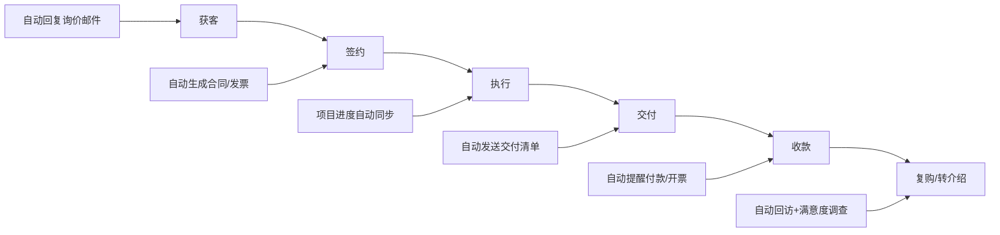

**推荐自动化方案**：

| 场景 | 手动方式 | 自动化方案 | 节省时间 |
|------|----------|-----------|----------|
| 询价回复 | 手动写邮件 | 邮件模板+自动填充 | 每次15分钟→2分钟 |
| 合同生成 | 手动改模板 | 法大大/e签宝模板自动生成 | 每次30分钟→5分钟 |
| 发票开具 | 手动填写 | 票易通批量开具 | 每次20分钟→3分钟 |
| 进度同步 | 手动写周报 | Notion/Trello看板自动同步 | 每周1小时→0 |
| 付款提醒 | 手动发消息 | 日历提醒+自动消息 | 每次10分钟→0 |
| 客户回访 | 手动跟进 | 自动化邮件/消息序列 | 每次20分钟→0 |
| 时间记录 | 手动填表 | Toggl/Clockify自动追踪 | 每天10分钟→0 |
| 内容发布 | 手动发各平台 | 一次写好，定时发布到多平台 | 每次30分钟→5分钟 |

**n8n自动化流程示例（接单场景）**：

```text
触发：收到新邮件（关键词"项目合作"/"开发需求"）
  → 自动提取客户信息
  → 在CRM中创建客户记录
  → 发送自动回复（附带作品集链接和服务说明）
  → 在Notion中创建待跟进任务
  → 3天后自动提醒跟进
```

这个流程帮你不会漏掉任何一个潜在客户，而且响应速度极快（通常几分钟内），这对拿下项目非常关键——客户发了询价邮件后，谁先回复谁就占先机。

### 10.10.4 健康管理

长期伏案工作的健康风险不可忽视：

| 风险 | 预防措施 |
|------|----------|
| 颈椎/腰椎问题 | 每45分钟站起来活动；使用人体工学椅和升降桌 |
| 眼睛疲劳 | 20-20-20法则（每20分钟看20英尺外20秒）；使用防蓝光眼镜 |
| 缺乏运动 | 每周至少3次30分钟运动；工作间隙做简单拉伸 |
| 睡眠问题 | 设定固定的睡觉时间；睡前1小时不看屏幕 |
| 心理健康 | 定期社交；必要时寻求专业帮助 |

---

## 10.11 从零到一的行动路线图

### 10.11.1 30天启动计划

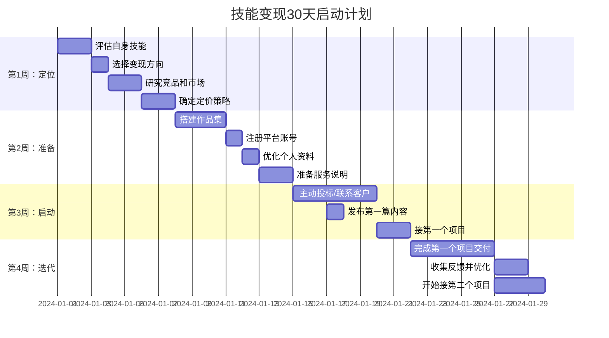

**每个阶段的验证标准**：

| 阶段 | 完成标志 | 验证方式 |
|------|----------|----------|
| 第1周：定位 | 选定1个方向+定价策略 | 能用一句话说清楚"我为谁解决什么问题" |
| 第2周：准备 | 作品集上线+3个平台注册 | 作品集链接可访问，平台资料完整度>90% |
| 第3周：启动 | 发出5+个提案/投标 | 收到至少1个客户的回复/询价 |
| 第4周：迭代 | 完成第一个项目交付 | 收到客户好评(4星以上) |

### 10.11.2 不同人群的推荐路径

**在职程序员（想做副业）**：

| 阶段 | 时间 | 目标 | 行动 |
|------|------|------|------|
| 启动期 | 第1-2月 | 月入3000-5000 | 注册2-3个平台，接小项目练手 |
| 成长期 | 第3-6月 | 月入10000-20000 | 提升报价，积累口碑，写技术文章 |
| 稳定期 | 第7-12月 | 月入20000-40000 | 私域客户为主，开发可复用产品 |
| 扩展期 | 1年+ | 月入40000+ | 产品化被动收入+高端咨询 |

**设计师（想扩大收入）**：

| 阶段 | 时间 | 目标 | 行动 |
|------|------|------|------|
| 启动期 | 第1-2月 | 月入2000-5000 | 做作品集，注册站酷/Dribbble |
| 成长期 | 第3-6月 | 月入8000-15000 | 接品牌设计项目，提价 |
| 稳定期 | 第7-12月 | 月入15000-30000 | 建立个人品牌，模板销售 |
| 扩展期 | 1年+ | 月入30000+ | 品牌全案+被动收入 |

**非技术人员（想用AI切入）**：

| 阶段 | 时间 | 目标 | 行动 |
|------|------|------|------|
| 学习期 | 第1-2月 | 掌握AI工具 | 学习ChatGPT/Midjourney等核心工具 |
| 试水期 | 第3-4月 | 月入1000-3000 | 用AI辅助提供内容/设计服务 |
| 成长期 | 第5-8月 | 月入5000-15000 | 找到差异化定位，建立口碑 |
| 扩展期 | 9月+ | 月入15000+ | AI+专业领域深度服务 |

**应届毕业生（想积累经验+收入）**：

| 阶段 | 时间 | 目标 | 行动 |
|------|------|------|------|
| 积累期 | 第1-3月 | 月入1000-3000 | 低价接单积累经验和评价 |
| 成长期 | 第4-6月 | 月入3000-8000 | 提升技能，扩展客户渠道 |
| 选择期 | 第6-12月 | 决定全职还是自由职业 | 评估副业收入稳定性和增长潜力 |

**非技术人员（想用No-Code切入）**：

| 阶段 | 时间 | 目标 | 行动 |
|------|------|------|------|
| 学习期 | 第1-2周 | 掌握1-2个No-Code工具 | 学习Webflow/n8n/Dify中的一个 |
| 模板期 | 第3-4周 | 搭建3个可展示的模板 | 做CRM、官网、自动化流程各一个 |
| 试水期 | 第2-3月 | 月入2000-5000 | 在朋友圈/社群接小项目 |
| 成长期 | 第4-6月 | 月入5000-15000 | 建立行业定位，提升客单价 |
| 扩展期 | 6月+ | 月入15000+ | No-Code+AI Agent组合服务 |

**传统行业从业者（想用技术提效）**：

| 阶段 | 时间 | 目标 | 行动 |
|------|------|------|------|
| 认知期 | 第1-2周 | 理解AI能做什么 | 体验ChatGPT/Claude，看行业AI案例 |
| 试验期 | 第3-4周 | 用AI优化自己的工作 | 用AI写报告、做数据分析、生成方案 |
| 服务期 | 第2-3月 | 月入2000-5000 | 帮同行/同事用AI提效，收取服务费 |
| 扩展期 | 4月+ | 月入5000-20000 | 为行业提供AI落地方案，成为"行业+AI"专家 |

核心优势：你比纯技术人员更懂行业痛点，比行业同行更懂技术工具——这个交叉点就是你的蓝海。

**宝妈/兼职群体（时间有限）**：

| 阶段 | 时间 | 目标 | 行动 |
|------|------|------|------|
| 准备期 | 第1-2周 | 评估可用时间 | 每天可投入2-3小时的碎片化时间 |
| 学习期 | 第3-6周 | 掌握1个工具 | 学习AI写作/Midjourney/Canva中的一个 |
| 试水期 | 第2-3月 | 月入1000-3000 | 做AI辅助的内容/设计服务 |
| 稳定期 | 4-6月 | 月入3000-8000 | 建立固定客户群，形成稳定的副业收入 |

适合方向：AI辅助写作（公众号/小红书代运营）、AI设计（电商图片/社交媒体素材）、在线教育（利用育儿/生活经验做课程）。关键：不要贪多，选一个方向深耕。

### 10.11.3 收入多元化策略

不要把所有鸡蛋放在一个篮子里。成熟的技能变现者通常有3-5个收入来源：

**推荐收入组合**：

| 收入来源 | 占比 | 特点 | 适合阶段 |
|----------|------|------|----------|
| 接单/服务 | 40-60% | 即时收入，主要现金流 | 全阶段 |
| 内容变现 | 10-20% | 半被动收入 | 有粉丝基础后 |
| 产品销售 | 10-30% | 被动收入 | 有产品后 |
| 咨询/培训 | 10-20% | 高单价 | 有影响力后 |
| 投资理财 | 10-20% | 纯被动 | 有积蓄后 |

---

## 10.12 常见误区与避坑指南

### 10.12.1 定价误区

**误区1：低价抢市场**

错误想法："我先低价接单，等有了口碑再涨价"
实际情况：低价吸引的是最挑剔、最难服务的客户。涨价后老客户流失，新客户看到你的低价历史也不愿意付高价
正确做法：从市场均价的80%起步，每完成3-5个项目提价10-20%

**误区2：按工时定价**

错误想法："我一天能赚500元，所以时薪约60元"
实际情况：工时定价限制了你的收入天花板，而且客户会质疑你的效率
正确做法：按项目价值定价，你花2小时做的自动化脚本帮客户省了10万元人工费，定价2万合理

**误区3：免费做项目换曝光**

错误想法："免费给大品牌做项目，以后就能接大单"
实际情况：免费项目不会带来高质量客户，反而降低你的品牌价值
正确做法：可以给折扣（如7折），但不要免费。非营利组织和开源项目除外

### 10.12.2 接单误区

**误区4：什么项目都接**

后果：精力分散，每个方向都做不好，无法建立专业口碑
正确做法：选择1-2个细分方向深耕，拒绝不属于你方向的项目

**误区5：不签合同就开始做**

后果：需求无限膨胀、客户不付款、知识产权纠纷
正确做法：哪怕是一个简单的书面确认（微信聊天记录也行），也要有需求确认和付款约定

**误区6：同时接太多项目**

后果：交付质量下降、延期、差评、客户流失
正确做法：同时进行的项目不超过2-3个，宁可排队也不要降低质量

### 10.12.3 心态误区

**误区7：和全职收入比较**

错误想法："副业收入才几千元，还不如加班"
实际情况：副业的真正价值是建立独立于公司的收入能力，这是"睡后收入"的种子
正确做法：用1-2年时间培育副业，目标是副业收入达到主业的50-100%

**误区8：追求完美再发布**

错误想法："等我把技术学到极致再开始接单"
实际情况：80分的能力就能接60分的项目，边做边学是最快的提升方式
正确做法：达到"能完成基本项目"的水平就开始行动，在实战中成长

**误区9：忽视非技术能力**

错误想法："我技术好，客户自然会来"
实际情况：沟通能力、项目管理、商业思维和谈判技巧同样重要
正确做法：花30%的时间提升非技术能力，特别是沟通和提案能力

### 10.12.4 AI时代的特殊误区

**误区10：认为AI会取代所有技术工作**

实际情况：AI取代的是低价值的重复性工作，高价值的创意、策略、沟通工作反而更有价值
正确做法：拥抱AI作为工具，提升效率，而不是恐惧被取代

**误区11：过度依赖AI，不做人工把关**

后果：AI生成的代码/内容有错误，直接交付导致客户投诉
正确做法：AI是助手不是替代品，所有产出必须经过人工审查

---

## 10.13 进阶：构建可持续的变现体系

### 10.13.1 从个人到团队

当你的项目多到一个人做不完时，需要考虑从"个人接单"升级为"小团队运作"：

| 阶段 | 模式 | 月收入潜力 | 管理复杂度 |
|------|------|-----------|-----------|
| 个人接单 | 一个人全做 | 2-5万 | 低 |
| 半外包 | 核心自己做，简单部分外包 | 5-15万 | 中 |
| 小团队 | 2-5人协作 | 10-50万 | 高 |
| 工作室 | 5人以上+标准化流程 | 50万+ | 很高 |

**外包协作建议**：
- 找固定的2-3个合作伙伴，而不是每次临时找人
- 建立标准化的交接流程和代码规范
- 你的角色从"执行者"转变为"项目经理+质量把控"
- 利润分配：你拿40-60%（获客+管理+质控），外包拿40-60%（执行）

### 10.13.2 被动收入产品矩阵

真正的财务自由来自于被动收入。以下是按启动难度排列的被动收入产品：

| 产品类型 | 启动难度 | 维护成本 | 月收入潜力 | 适合人群 |
|----------|----------|----------|------------|----------|
| 设计模板 | 低 | 低 | 500-10000元 | 设计师 |
| 代码模板/主题 | 低 | 低 | 1000-20000元 | 程序员 |
| 电子书 | 中 | 极低 | 500-5000元 | 任何有知识的人 |
| 录播课程 | 中 | 低 | 1000-50000元 | 任何有技能的人 |
| SaaS工具 | 高 | 中 | 5000-500000元 | 程序员 |
| API服务 | 高 | 中 | 3000-100000元 | 程序员 |
| 社群/会员制 | 中 | 中 | 5000-100000元 | 有影响力的人 |
| Chrome插件 | 中低 | 低 | 500-20000元 | 程序员 |
| CLI工具 | 中 | 低 | 500-10000元 | 程序员 |

### 10.13.3 长期护城河

在AI时代，以下能力是你的长期护城河，不容易被替代：

1. **复杂问题解决能力**：AI能处理标准化任务，但复杂、模糊、跨领域的问题仍需要人来解决
2. **客户关系和信任**：客户买的是信任，不是技术。建立长期客户关系是最大的资产
3. **行业深度知识**：通用技能容易被替代，但"懂某个行业"的深度知识很难被AI复制
4. **创造力和审美**：AI能生成内容，但真正的创意和审美判断仍需要人来做
5. **商业思维**：理解客户需求、定价策略、市场趋势，这些是AI无法替代的
6. **系统设计能力**：AI能写代码片段，但设计整个系统架构仍需要人的判断
7. **人际沟通与谈判**：理解客户的言外之意、管理期望、处理冲突，这些都是人的能力

### 10.13.4 持续技能升级策略：避免被淘汰

技术迭代速度越来越快，去年还热门的技能今年可能已经过时。持续学习不是可选项，是生存必需。

**T型人才模型**：

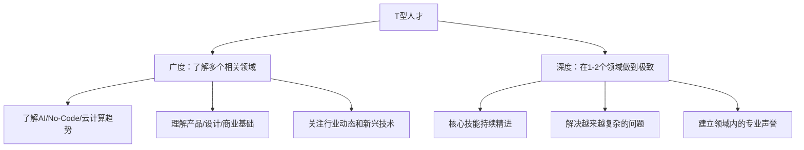

**技能升级的优先级矩阵**：

| 技能类型 | 学习投入 | 收入提升 | AI替代风险 | 优先级 |
|----------|----------|----------|------------|--------|
| 复杂系统架构 | 高 | 高 | 低 | ⭐⭐⭐ |
| AI工具深度应用 | 中 | 高 | 低(工具本身) | ⭐⭐⭐ |
| 行业领域知识 | 中 | 高 | 极低 | ⭐⭐⭐ |
| 沟通与谈判 | 低 | 中高 | 极低 | ⭐⭐⭐ |
| 新编程语言/框架 | 中 | 中 | 中 | ⭐⭐ |
| 基础编程技能 | 低 | 低 | 高 | ⭐ |

**学习时间投资建议**：每周至少投入3-5小时用于学习，占工作时间的10-15%。具体分配：
- 50%用于深化核心技能（如学更高级的架构模式）
- 30%用于学习相邻技能（如设计师学前端、程序员学产品思维）
- 20%用于探索前沿技术（如关注AI/Agent/No-Code的最新发展）

**高效学习方法**：
1. **以项目驱动学习**：不要为了学而学，接一个稍微超出你能力的项目，在实战中学习
2. **教是最好的学**：写技术文章、做分享、回答社区问题——教别人的过程中你会发现自己理解的盲区
3. **建立学习笔记系统**：用Notion/Obsidian记录学习笔记，建立个人知识库，方便日后查阅和复用
4. **参加技术社区**：加入GitHub Discussions、Discord技术频道、国内技术社群——和同行交流是最快的学习方式

---

## 推荐资源

**书籍推荐**：

| 书名 | 作者 | 适合方向 | 核心价值 |
|------|------|----------|----------|
| 《程序员的自我修养》 | 俞甲子 | 编程 | 程序员成长路径 |
| 《AI赋能》 | 李开复 | AI | AI时代的能力升级 |
| 《设计心理学》 | 唐纳德·诺曼 | 设计 | 设计思维基础 |
| 《写作是最好的自我投资》 | Spenser | 写作 | 写作变现方法论 |
| 《知识变现》 | 秦阳、秋叶 | 知识付费 | 知识付费全链路 |
| 《一人企业》 | Paul Jarvis | 通用 | 小而美的创业模式 |
| 《专家型创业》 | Alan Weiss | 咨询 | 高端咨询定价策略 |
| 《定价制胜》 | 赫尔曼·西蒙 | 定价 | 科学定价方法论 |
| 《The Freelancer's Bible》 | Sara Horowitz | 自由职业 | 自由职业全指南 |
| 《Building a Second Brain》 | Tiago Forte | 效率 | 知识管理和内容生产系统 |

**工具推荐**：

| 类别 | 工具 | 用途 | 价格 |
|------|------|------|------|
| AI编程 | Cursor | AI代码编辑器 | $20/月 |
| AI编程 | GitHub Copilot | 代码补全 | $10-19/月 |
| AI编程 | Claude Code | 命令行AI编程 | 按用量 |
| AI写作 | ChatGPT | 内容生成 | $20/月 |
| AI写作 | Claude | 长文分析和写作 | $20/月 |
| AI设计 | Midjourney | AI绘画 | $10-60/月 |
| 项目管理 | Notion | 任务+文档 | 免费/$10/月 |
| 项目管理 | Linear | 项目跟踪 | 免费/$8/月 |
| 合同签署 | 法大大 | 电子合同 | 按次计费 |
| 收款 | 支付宝/微信 | 国内收款 | 免费 |
| 收款 | Wise/PayPal | 国外收款 | 1-3%手续费 |
| 时间追踪 | Toggl | 记录工时 | 免费/$9/月 |
| 发票 | 票易通 | 开具发票 | 按次计费 |
| 设计协作 | Figma | UI设计+协作 | 免费/$12/月 |
| 代码托管 | GitHub | 代码管理+展示 | 免费/$4/月 |
| No-Code | Webflow | 网站搭建 | 免费/$14/月 |
| No-Code | n8n | 流程自动化 | 免费/自托管 |
| No-Code | Dify | AI应用搭建 | 免费/自托管 |
| No-Code | Airtable | 数据库+应用 | 免费/$20/月 |
| Agent开发 | LangGraph | Agent编排框架 | 免费(开源) |
| Agent开发 | Coze(扣子) | 低代码Agent搭建 | 免费 |
| 自动化 | Toggl | 时间追踪 | 免费/$9/月 |
| 安全 | 1Password | 密码管理 | $3/月 |

---

## 本章小结

技术技能变现不是一夜暴富的捷径，而是一条可持续的财富增长路径。它的核心逻辑是：

**道——理解本质**：
- 技能变现的本质是价值交换，不是卖时间
- 收入 = 技能稀缺性 × 影响力半径 × 杠杆率
- 持续学习是保持竞争力的唯一方式

**法——选择路径**：
- 编程、AI、No-Code、设计、写作、翻译、教育，七大方向各有优劣
- 选择"你擅长 × 市场需要 × 竞争不过度"的交叉点
- 从单一收入来源起步，逐步建立多元收入结构

**术——掌握方法**：
- 作品集是获客的核心武器
- 价值定价优于工时定价
- 个人品牌是收入的放大器
- 合同和流程是风险的防火墙
- 心理和健康管理是长期坚持的基础

**器——善用工具**：
- AI工具是效率倍增器，不是替代品
- 自动化工具帮你节省重复劳动时间
- 平台工具帮你触达更多客户
- CAT工具提升翻译效率
- 项目管理工具帮你同时处理多个项目

**行动清单**：

- [ ] 评估自己的技能水平和市场价值
- [ ] 选择1-2个最适合的变现方向
- [ ] 搭建作品集（至少3个案例）
- [ ] 注册2-3个接单/内容平台
- [ ] 制定定价策略（从市场均价的80%起步）
- [ ] 发布第一篇内容/接第一个项目
- [ ] 建立合同模板和标准化流程（含需求确认书模板）
- [ ] 制定每周内容输出计划
- [ ] 设定3个月、6个月、12个月的收入目标
- [ ] 建立应急基金（3-6个月生活费）
- [ ] 设定每周工作时间上限（避免过度工作）

> "技能是你最可靠的资产。投资自己，永远是回报率最高的投资。"
