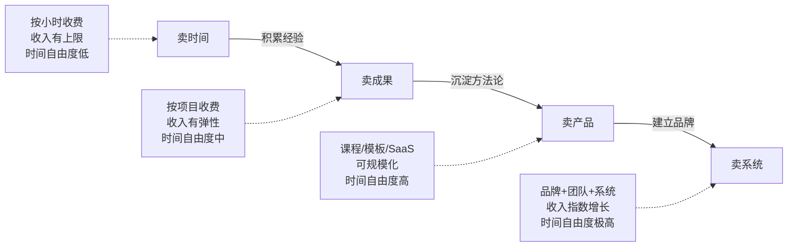
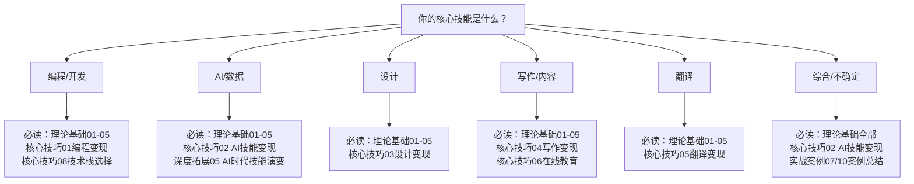

# 第10章 技术技能变现——章节概览

## 一、本章定位与核心命题

技术技能变现，是指将你掌握的编程、设计、写作、翻译、AI应用等专业技术能力，通过市场交换转化为实际收入的过程。这是"搞钱指南"中离技术人最近的一条路径——你不需要囤货、不需要开店、不需要大量启动资金，你只需要一台电脑和你已经掌握（或即将掌握）的技能。

本章不是一本泛泛而谈的"副业指南"。它是一套完整的**技术人商业化操作系统**——从你第一次审视自己的技能值多少钱，到你建立被动收入系统实现财务自由，每一个阶段都有对应的方法论、工具链和行动清单。

### 1.1 为什么技术人天然适合技能变现？

技术技能在所有可变现技能中占据一个独特位置：**它同时满足高稀缺性和高可迁移性两个条件**。

稀缺性体现在：编程、AI应用开发、数据分析等技能的学习门槛高（通常需要6-24个月系统学习），市场上供不应求。根据Stack Overflow 2025开发者调查，全球有67%的开发者认为市场需求超过供给，中国市场这一比例更高——AI应用开发岗位的供需比约为1:3.5。

可迁移性体现在：技术技能不受行业限制。一个前端开发者可以为电商公司做网站，也可以为教育机构做在线课堂，还可以为医疗机构做预约系统。这意味着你的客户池是所有行业的总和，而不是某一个行业。

这两个特性叠加，使得技术技能变现的**确定性**远高于其他类型的副业（如投资、电商）。你不需要赌趋势，不需要囤货压资金，你只需要用已有能力解决真实问题。

### 1.2 本章要回答的核心问题

| 核心问题 | 对应章节 | 关键结论 |
|----------|----------|----------|
| 我的技能到底值多少钱？ | 理论基础·技能评估框架 | 价值 = 稀缺性 × 需求强度 × 创造价值能力 |
| 有哪些靠谱的变现渠道？ | 理论基础·变现渠道概览 | 接单平台、自由接单、产品化三大类 |
| 怎么定价才不会贱卖自己？ | 核心技巧·定价策略 | 从成本定价→市场定价→价值定价的三阶跃迁 |
| AI时代哪些技能最值钱？ | 核心技巧·AI技能变现 | AI应用开发、AI培训、AI咨询三大方向 |
| 如何从接单过渡到被动收入？ | 深度拓展·技术产品商业化 | 标准化→模板化→课程化→工具化四步路径 |
| 自由职业如何保障法律权益？ | 核心技巧·合同与法律 | 合同+定金+知识产权条款三件套 |
| 别人是怎么做到的？ | 实战案例篇 | 10个真实案例，从月入3千到年入200万 |
| 哪些坑千万不能踩？ | 常见误区 | 10个致命错误及避坑策略 |

## 二、技能变现的底层逻辑

在深入各章节之前，先建立一个统一的认知框架。所有技能变现都遵循同一个价值公式：

```text
你的收入 = 你创造的价值 × 价值捕获率
```

**你创造的价值**取决于技能水平和解决问题的难度。**价值捕获率**取决于你的谈判能力、品牌溢价和市场竞争。大多数人只关注提升技能（提高创造价值），却忽略了提高捕获率——而后者往往才是收入差距的真正来源。

同一个小程序开发项目，A报价5000元，B报价5万元。区别不在于代码质量，而在于B有更好的作品集、更强的品牌背书、更精准的客户沟通。这就是"捕获率"的力量。

### 2.1 技能变现的经济学原理

理解技能变现的底层经济学，能帮你做出更理性的商业决策。

**供需关系决定基础价格。** 每一种技术技能都有一个"市场出清价格"——供给方（从业者数量）和需求方（企业/个人需求量）达到平衡时的价格。当供给不足时，价格上升（如2024-2026年的AI应用开发）；当供给过剩时，价格下降（如基础WordPress建站）。

**边际成本决定规模化可能性。** 接单的边际成本几乎为零（多做一个项目只需多花时间），但时间有上限。产品化（课程、SaaS、模板）的前期成本高，但边际成本趋近于零——多卖一份课程的成本几乎为零。这就是为什么产品化是技能变现的终极形态。

**信息不对称创造套利空间。** 你知道某个技术方案的成本和难度，客户不知道。这种信息不对称不是欺骗，而是专业知识的合理定价。医生、律师、咨询师的高收费都基于同一原理。

**品牌是降低交易成本的终极工具。** 没有品牌时，每次获客都需要从零建立信任。有了品牌，客户主动找来，信任基础已有，谈判周期缩短50%-70%。

### 2.2 三种变现模式的递进关系

技能变现存在四个递进层级，每一层的收入天花板和时间自由度都在提升：



| 模式 | 月收入天花板 | 时间投入 | 可扩展性 | 适合阶段 | 典型案例 |
|------|------------|----------|----------|----------|----------|
| 卖时间（按小时接单） | 2-5万 | 高（1:1兑换） | 无 | 起步期 | 在程序员客栈接100元/小时的外包 |
| 卖成果（按项目接单） | 5-15万 | 中（有复用空间） | 低 | 成长期 | 承包一个3万元的小程序项目 |
| 卖产品（课程/模板/SaaS） | 理论无上限 | 前期高，后期低 | 高 | 成熟期 | 上架一门99元的AI课程，月销500份 |
| 卖系统（品牌+团队） | 理论无上限 | 低（团队执行） | 极高 | 扩张期 | 建立技术咨询公司，团队交付 |

**关键洞察：** 大多数技术人卡在"卖时间"和"卖成果"之间，因为他们从未有意识地积累可复用资产。每完成一个项目，如果只是交差了事，你就永远在卖时间。如果你把项目中可复用的部分沉淀下来（代码库、模板、方法论、文档），你就开始向"卖产品"过渡。

### 2.3 心理障碍：技术人变现的隐形天花板

很多技术人技能水平一流，变现能力却很差。根本原因不是能力不足，而是存在深层心理障碍：

**冒充者综合征（Impostor Syndrome）。** "我的水平还不够收费"、"比我厉害的人多的是"。事实是：你能解决客户解决不了的问题，就值得收费。你不需要是世界顶级专家，你只需要比客户多走几步路。

**定价恐惧。** "报高了怕吓跑客户"。事实是：低价吸引的是低质量客户（需求模糊、反复修改、拖延付款），高价吸引的是高质量客户（需求明确、尊重专业、付款爽快）。你的定价不只是在定价，更是在筛选客户。

**技术人思维陷阱。** "好产品不需要营销"。事实是：市场上有大量技术平庸但商业成功的产品，也有大量技术优秀但无人知晓的产品。技术是基础，营销是杠杆。两者缺一不可。

**完美主义陷阱。** "等我技术再精进一些就开始"。事实是：你在实践中提升的速度远快于闭门学习。70分就可以开始接单，在实战中成长到90分。

## 三、章节结构与阅读地图

本章分为五个板块，层层递进：从认知建立→方法论→实操技巧→真实案例→行动训练。

### 3.1 理论基础篇（第1-7节）

> 目标：建立对技能变现的系统认知，搞清楚"我在哪、我要去哪、怎么去"

| 序号 | 主题 | 核心内容 | 阅读时间 |
|------|------|----------|----------|
| 01 | 技能变现的本质 | 价值交换原理、三种变现模式、技能市场价值的影响因素 | 15分钟 |
| 02 | 技能评估框架 | 五层技能水平模型、市场需求分析、竞争分析方法 | 20分钟 |
| 03 | 变现渠道概览 | 接单平台（国内/国际）、自由接单获客、产品化变现路径 | 15分钟 |
| 04 | 定价策略 | 成本定价法、市场定价法、价值定价法、定价常见错误 | 20分钟 |
| 05 | 个人品牌建设 | 品牌定位四步法、作品集建设、传播渠道选择 | 15分钟 |
| 06 | 自由职业平台深度分析 | 各平台优劣对比、注册策略、接单技巧 | 20分钟 |
| 07 | 远程工作技巧 | 远程协作工具、时间管理、跨时区沟通 | 15分钟 |

**理论基础篇的关键认知**：

1. **技能的市场价值由四个因素决定**：稀缺性、需求量、学习难度、可替代性。AI应用开发之所以时薪高达800-2000元，是因为同时满足了高稀缺、高需求、高难度三个条件。

2. **定价是技能变现的第一课**。大多数人的技能值100元/小时，却只收30元。学会用价值定价法（客户获得的价值 × 10%-30%）替代成本定价法，是收入跃迁的关键。

3. **个人品牌是最好的溢价工具**。有品牌的技术人溢价20-100%，客户主动上门，获客成本趋近于零。

### 3.2 核心技巧篇（第1-11节）

> 目标：掌握各技能领域的具体变现方法，拿到可以直接使用的定价参考和操作流程

| 序号 | 主题 | 核心内容 | 适合人群 |
|------|------|----------|----------|
| 01 | 编程技能变现 | 接单平台详解、项目类型与报价、获客技巧、冷启动策略 | 程序员 |
| 02 | AI技能变现 | AI应用场景（写作/设计/视频/编程）、AI培训、AI咨询 | 所有技术人 |
| 03 | 设计技能变现 | 平面/UI/视频/3D设计变现、模板销售渠道、定价参考 | 设计师 |
| 04 | 写作技能变现 | 投稿变现、平台分成、网文平台、商业文案、技术写作 | 写作者 |
| 05 | 翻译技能变现 | 翻译平台、专业领域翻译、AI翻译工具的利用 | 翻译者 |
| 06 | 在线教育与知识付费 | 课程设计、平台选择、定价策略、训练营运营 | 有教学能力的人 |
| 07 | 客户管理与长期发展 | 客户分层、关系维护、复购提升、从接单到顾问 | 所有变现者 |
| 08 | 技术栈选择与市场分析 | 热门技术栈、市场趋势、技能组合策略 | 准备转型的人 |
| 09 | 合同与法律知识 | 合同模板、知识产权、税务处理、纠纷应对 | 所有变现者 |
| 10 | 常见问题解答 | 接单实操中的高频问题与解决方案 | 所有变现者 |
| 11 | 定价策略深度解析 | 阶梯定价、套餐设计、涨价策略、国际定价 | 所有变现者 |

**核心技巧篇的实操要点**：

1. **编程接单的冷启动路径**：技术社区写文章（掘金/CSDN）→ GitHub维护开源项目 → 接单平台低价接前3-5个项目积累评价 → 老客户转介绍 → 逐步提价。

2. **AI技能变现是当前最大的风口**。三个方向的收入天花板：AI应用开发（SaaS方向，月入10万+）、AI培训（企业内训5000-50000元/天）、AI咨询（高级咨询师3000-10000元/小时）。

3. **合同和法律知识是被严重低估的技能**。签合同、收定金（30-50%）、明确需求变更条款——这三件事能帮你避免80%的接单纠纷。

### 3.3 实战案例篇（第1-10节）

> 目标：通过真实案例理解不同技能变现路径的可行性、时间线和关键转折点

| 序号 | 案例 | 核心路径 | 收入变化 | 关键转折点 |
|------|------|----------|----------|------------|
| 01 | 程序员副业从接单到月入3万 | 平台接单→口碑积累→老客户转介绍 | 0→3万/月 | 第3个客户转介绍带来稳定客源 |
| 02 | AI培训师从分享到年入百万 | 技术分享→课程开发→企业内训 | 0→100万/年 | 一次企业内训（3万/天）打开B端市场 |
| 03 | 设计师从接单到品牌 | 平台接单→个人品牌→设计工作室 | 5千→8万/月 | Dribbble作品集爆火带来大量询盘 |
| 04 | 写作者从投稿到年入50万 | 投稿→专栏→课程→出书 | 200元/篇→50万/年 | 知乎专栏粉丝破万后广告主主动找来 |
| 05 | 翻译从兼职到自由职业 | 兼职翻译→专业领域→自由职业 | 3千→3万/月 | 专注法律翻译后单价提升3倍 |
| 06 | 全栈技能从技术到商业 | 技术接单→产品开发→SaaS | 1万→15万/月 | 将接单中重复的需求抽象为SaaS产品 |
| 07 | 案例总结 | 各案例共性规律提炼 | — | 从卖时间到卖产品的共同升级路径 |
| 08 | AI应用开发者从工具到SaaS | AI工具开发→免费用户→付费转化 | 0→20万/月 | 免费工具积累1万用户后推出Pro版 |
| 09 | 技术博主从内容到商业帝国 | 技术博客→课程→咨询→投资 | 0→200万+/年 | 5年内容积累形成的复利效应 |
| 10 | 案例总结与实操清单 | 可复用的方法论和行动清单 | — | — |

**案例中的共性规律**：

- **冷启动期（0-3个月）**：收入微薄甚至为零，核心任务是积累作品和口碑
- **增长期（3-12个月）**：收入开始稳定增长，核心任务是提高客单价和客户质量
- **跃迁期（12-24个月）**：从卖时间转向卖产品，核心任务是建立被动收入
- **每个案例都有一个"杠杆点"**：可能是品牌爆火、可能是企业大单、可能是产品化成功——关键是持续积累直到杠杆点出现

### 3.4 独立专题（根目录文件）

除了三大板块外，本章还有几个独立专题文件，提供补充视角：

| 文件 | 内容 | 价值 |
|------|------|------|
| 04-常见误区 | 10个技能变现中的典型错误：低价竞争、只接单不产品化、忽视品牌、不会筛选客户、不签合同等 | 避坑指南 |
| 05-练习方法 | 7个实操练习：技能自评、变现方向选择、定价策略、作品集建设、客户获取、品牌建设、产品化规划 | 行动手册 |
| 06-本章小结 | 核心要点回顾、行动清单、里程碑参考、推荐资源 | 复习参考 |
| 07-深度拓展 | 高价值技能排行、开源贡献的商业化路径、技术咨询模式、技术产品商业化、AI时代技能演变 | 进阶视野 |

## 四、不同人群的阅读路径

并非每个人都要从头读到尾。根据你的技能类型和当前阶段，选择最适合的阅读路径：

### 4.1 按技能类型选择



### 4.2 按发展阶段选择

| 你当前的阶段 | 建议阅读顺序 | 预计阅读时间 | 完成后应达到的状态 |
|-------------|-------------|-------------|-------------------|
| **纯新手**：有技能但没变过现 | 理论基础01→02→03→核心技巧（对应技能）→练习方法→实战案例01 | 3-4小时 | 能说出自己的技能值多少钱，知道去哪个平台接单 |
| **有经验**：接过一些单但收入不稳定 | 定价策略→客户管理→常见误区→实战案例03/06 | 2-3小时 | 能把时薪提高50%以上，建立客户筛选标准 |
| **想升级**：接单收入到瓶颈，想做产品 | 深度拓展→实战案例08/09→在线教育→练习方法（产品化路径） | 2-3小时 | 拿到一份产品化路线图，明确下一步行动 |
| **全面学习**：系统掌握技能变现 | 按顺序全部阅读 | 8-10小时 | 建立完整的技能变现认知体系和行动计划 |

### 4.3 按时间预算选择

| 可用时间 | 推荐阅读 | 预期收获 |
|----------|----------|----------|
| **30分钟** | 只读本概览 + 第一节（技能变现本质） | 理解变现逻辑，建立基本认知 |
| **2小时** | 理论基础全部 + 对应技能的核心技巧 | 拿到可执行的变现方案 |
| **半天** | 理论基础 + 核心技巧 + 2-3个案例 | 形成完整的变现方法论 |
| **全天** | 全部内容 + 练习方法 | 拥有完整的行动计划和执行工具 |

## 五、核心指标与里程碑

### 5.1 技能变现的时间线参考

| 阶段 | 时间范围 | 月收入目标 | 关键动作 | 成功信号 | 常见卡点 |
|------|----------|------------|----------|----------|----------|
| 冷启动 | 第1-2个月 | 0-3000元 | 注册平台、完善资料、接第一单 | 收到第一笔付费 | 不敢定价、不敢展示作品 |
| 建立信心 | 第2-4个月 | 3000-8000元 | 积累3-5个好评、开始有转介绍 | 客户主动找来 | 低质量客户消耗精力 |
| 稳定增长 | 第4-8个月 | 8000-20000元 | 提高客单价、筛选优质客户 | 可以拒绝低质量项目 | 定价提不上去 |
| 收入跃迁 | 第8-18个月 | 20000-50000元 | 建立个人品牌、开始产品化尝试 | 时间成为唯一的瓶颈 | 忙于接单没时间做品牌 |
| 被动收入 | 18个月以上 | 50000元+ | 产品化收入超过接单收入 | 睡觉时也在赚钱 | 产品化初期收入断崖 |

**关于时间线的诚实说明**：以上时间线基于"全职投入或每天至少投入3小时"的假设。如果你每天只能投入1小时，时间线需要翻倍。如果你已经有成熟的技能和一定的人脉积累，时间线可以压缩50%。不要用别人的时间线焦虑自己的进度——关键是持续投入，而不是速度。

### 5.2 技能变现健康度指标

| 指标 | 健康值 | 警戒值 | 说明 | 如何计算 |
|------|--------|--------|------|----------|
| 客户复购率 | ≥30% | <10% | 复购率高说明交付质量好 | 复购客户数 ÷ 总客户数 |
| 口碑推荐占比 | ≥20% | <5% | 推荐多说明品牌在建立 | 推荐来源客户 ÷ 总新客户 |
| 年均定价增长率 | ≥10% | 0% | 定价不涨说明技能没提升 | (今年均价 - 去年均价) ÷ 去年均价 |
| 被动收入占比 | 逐步提升 | 停滞 | 产品化进展的直接指标 | 被动收入 ÷ 总收入 |
| 有效工时占比 | ≥70% | <50% | 低说明在无效沟通上浪费太多 | 实际交付时间 ÷ 总工作时间 |
| 每周工作时长 | 逐步下降 | 持续>60小时 | 效率提升的标志 | 记录每周实际工作小时数 |
| 客户质量评分 | ≥7/10 | <5/10 | 高质量客户=高质量生活 | 按需求清晰度/付款速度/沟通成本综合评分 |
| 技能复合度 | ≥2种 | 仅1种 | 单一技能容易被替代 | 你能在市场上独立售卖的技能数量 |

### 5.3 不同技能的市场价值参考

| 技能领域 | 初级时薪 | 中级时薪 | 高级时薪 | 需求趋势 | 2025-2026趋势分析 |
|----------|----------|----------|----------|----------|-------------------|
| 前端开发 | 100-200元 | 200-500元 | 500-1000元 | 稳定 | React/Vue依然主流，全栈化趋势明显 |
| 后端开发 | 150-300元 | 300-600元 | 600-1500元 | 稳定 | Go/Rust溢价高，微服务架构需求增长 |
| AI应用开发 | 200-500元 | 500-1200元 | 1200-3000元 | 急剧增长 | 最大风口，RAG/Agent/微调是核心技能 |
| UI/UX设计 | 80-200元 | 200-500元 | 500-1200元 | 稳定增长 | AI设计工具降低门槛，但高端设计更值钱 |
| 文案写作 | 50-150元 | 150-400元 | 400-1000元 | 稳定 | AI辅助写作普及，纯写作降价，策略写作涨价 |
| 翻译（中英） | 80-150元 | 150-350元 | 350-800元 | 稳定（AI冲击中） | 通用翻译被AI替代，专业领域翻译溢价上升 |
| 数据分析 | 100-250元 | 250-600元 | 600-1500元 | 稳定增长 | 与AI结合后价值倍增 |
| 短视频制作 | 80-200元 | 200-500元 | 500-1500元 | 快速增长 | AI生成视频改变生态，创意策划更值钱 |
| DevOps/云架构 | 150-350元 | 350-800元 | 800-2000元 | 稳定增长 | K8s/云原生持续高需求 |
| 网络安全 | 200-400元 | 400-1000元 | 1000-3000元 | 快速增长 | 合规需求驱动，攻防人才极度稀缺 |

> **注意**：以上数据为国内市场参考价，国际平台（Upwork、Toptal等）通常高出2-5倍。AI相关技能的溢价在2024-2026年尤为明显。同一技能在不同行业的溢价差异巨大——金融行业的技术外包报价通常是教育行业的2-3倍。

### 5.4 技能组合的溢价效应

掌握单一技能只能拿到基础价格。**技能组合**能产生1+1>2的溢价效应：

| 技能组合 | 溢价倍数 | 典型场景 |
|----------|----------|----------|
| 编程 + 行业知识 | 1.5-2x | 懂金融的程序员做量化交易系统 |
| 编程 + 设计 | 1.5-2x | 全栈开发者独立交付完整产品 |
| AI + 行业知识 | 2-3x | 懂医疗的AI工程师做医疗AI应用 |
| 写作 + 技术 | 1.5-2x | 技术写作者为科技公司做文档和内容营销 |
| 翻译 + 专业领域 | 2-3x | 法律/医学/专利翻译单价是通用翻译的3倍 |
| 培训 + 技术 | 2-4x | 技术讲师的企业内训日薪远超纯开发 |

**行动建议**：不要盲目学习新技能。先评估你现有技能的组合潜力——与你现有技能互补的技能，学习ROI最高。

## 六、AI对技能变现的深度影响

AI不是技能变现的威胁，而是**放大器**。它同时在三个层面改变游戏规则：

### 6.1 AI提升个人产能

以前一个设计师一天做2个海报，现在用AI辅助可以做10个。以前一个开发者一周写一个小程序，现在AI编程助手让效率提升2-3倍。这意味着：

- **同样的时间，你能交付更多**：收入上限提升
- **你能承接以前不敢接的项目**：能力边界扩展
- **低技能重复工作被自动化**：你可以专注于高价值的创意和策略工作

### 6.2 AI创造新需求

AI本身成为了一个巨大的变现领域：

| AI变现方向 | 入门门槛 | 收入范围 | 适合人群 |
|-----------|----------|----------|----------|
| AI应用开发（RAG/Agent） | 高（需编程基础） | 5000-50000元/项目 | 程序员 |
| AI提示词工程 | 低 | 200-1000元/小时 | 所有人 |
| AI培训与咨询 | 中（需行业经验） | 3000-50000元/天 | 有教学能力的人 |
| AI内容创作（文/图/视频） | 低-中 | 500-5000元/项 | 内容创作者 |
| AI工作流自动化 | 中 | 2000-20000元/项目 | 流程优化专家 |
| AI数据标注与微调 | 低 | 100-300元/小时 | 数据从业者 |

### 6.3 AI重塑竞争格局

**被淘汰的**：只会做低技能重复工作的技术人（基础网页切图、简单数据录入、通用翻译）。

**被放大的**：能用AI提升效率、能做AI应用开发、能教别人用AI的技术人。

**行动建议**：不管你当前是什么技能方向，至少掌握一种AI工具的深度使用。AI不会取代你，但会用AI的人会取代不会用AI的人。

## 七、风险管理与常见陷阱

技能变现不是零风险的。提前了解风险，才能做好准备。

### 7.1 财务风险

| 风险 | 发生概率 | 影响程度 | 应对策略 |
|------|----------|----------|----------|
| 收入不稳定 | 高（初期） | 中 | 保持6个月生活费的应急储备；初期不要裸辞 |
| 客户拖欠付款 | 中 | 中-高 | 签合同+收定金（30-50%）+里程碑付款 |
| 坏账（客户跑路） | 低 | 高 | 大项目分阶段交付，每阶段完成收对应款项 |
| 税务问题 | 中 | 中 | 了解自由职业者税务政策，年收入超过起征点后合规报税 |
| 汇率波动（国际客户） | 低 | 低 | 使用稳定币或约定汇率保护条款 |

### 7.2 时间与精力风险

| 风险 | 发生概率 | 影响程度 | 应对策略 |
|------|----------|----------|----------|
| 副业影响主业 | 高 | 高 | 严格区分时间，初期每天不超过2小时 |
| 过度承诺 | 中 | 高 | 学会说"不"，同时进行的项目不超过3个 |
| 倦怠 | 中 | 中 | 设定工作边界，保持休息，定期复盘调整方向 |
| 完美主义拖延 | 高 | 中 | 设定截止日期，接受"足够好"而非"完美" |

### 7.3 法律与合规风险

| 风险 | 发生概率 | 影响程度 | 应对策略 |
|------|----------|----------|----------|
| 知识产权纠纷 | 低 | 高 | 合同中明确IP归属，使用开源协议合规 |
| 竞业限制冲突 | 中 | 高 | 接单前检查劳动合同中的竞业条款 |
| 税务违规 | 中 | 中 | 年收入超12万自行申报，咨询专业会计 |
| 合同纠纷 | 中 | 中 | 使用标准合同模板，保留所有沟通记录 |

## 八、开始之前：三件必须知道的事

### 第一件：不要等到"准备好了"才开始

技能变现最大的敌人是"等我再学学"。事实上，你在实践中提升的速度远快于闭门学习。很多月入数万的自由职业者，起步时的技能水平并不比你高——他们只是更早开始了。

**数据佐证**：根据Upwork平台统计，注册后30天内完成第一单的用户，一年后的活跃率是30天内未完成第一单的用户的4.2倍。第一单不只是收入——它是心理上的"破冰"，让你从"我想做"变成"我在做"。

**行动建议**：读完本章理论基础篇后，立刻注册1-2个接单平台，完善个人资料。不需要接到第一单，但要把"我在接单"这件事变成现实。

### 第二件：定价是你最重要的决策

低价竞争是最常见的陷阱。报价2000元/个项目，你需要接10个项目才能赚到别人1个项目的收入。更糟糕的是，低价吸引的都是低质量客户——需求模糊、反复修改、拖延付款。

**定价心理学**：客户对价格的感知是相对的，不是绝对的。当你把一个项目的报价从5000元提高到15000元时，客户的第一反应不是"太贵了"，而是"为什么值这个价？"——这时你有机会展示你的专业性和差异化。而当你报价5000元时，客户只会问"能不能再便宜点？"

**行动建议**：用市场调研确定你的技能在市场上的价格区间，然后取中位数作为起步价。宁可少接项目，也不要贱卖自己。

### 第三件：从第一天就想好产品化路径

接单是起步，产品化才是终点。如果你从第一天就有意识地积累可复用的代码库、模板、方法论、课程素材，你的产品化转型会顺畅得多。

**复利思维**：每一次接单都在为你的产品化积累素材。一个做了5次的类似项目，其中80%的代码/流程/文档可以复用。这些复用资产就是你未来产品化课程、模板、SaaS的基础。

**行动建议**：每完成一个项目，花30分钟做复盘——哪些工作是重复的？哪些可以做成模板？哪些知识可以做成教程？把这些素材积累起来。

## 九、本章知识体系全景图

```mermaid
graph TD
    ROOT[第10章 技术技能变现] --> T[理论基础]
    ROOT --> C[核心技巧]
    ROOT --> P[实战案例]
    ROOT --> M[常见误区]
    ROOT --> E[练习方法]
    ROOT --> D[深度拓展]
    
    T --> T1[技能变现本质]
    T --> T2[技能评估框架]
    T --> T3[变现渠道概览]
    T --> T4[定价策略]
    T --> T5[个人品牌建设]
    T --> T6[自由职业平台]
    T --> T7[远程工作技巧]
    
    C --> C1[编程变现]
    C --> C2[AI技能变现]
    C --> C3[设计变现]
    C --> C4[写作变现]
    C --> C5[翻译变现]
    C --> C6[在线教育]
    C --> C7[客户管理]
    C --> C8[技术栈选择]
    C --> C9[合同与法律]
    C --> C10[定价深度解析]
    
    P --> P1[程序员月入3万]
    P --> P2[AI培训年入百万]
    P --> P3[设计师品牌化]
    P --> P4[写作者年入50万]
    P --> P5[翻译自由职业]
    P --> P6[全栈到商业]
    P --> P7[AI应用到SaaS]
    P --> P8[技术博主帝国]
    
    D --> D1[高价值技能排行]
    D --> D2[开源商业化]
    D --> D3[技术咨询模式]
    D --> D4[产品商业化]
    D --> D5[AI时代技能演变]
```



## 十、快速行动清单

读完本概览后，你可以立刻开始的5件事：

### 30分钟行动包

1. **做一次技能盘点**（10分钟）：拿出纸笔，列出你会的所有技能，用1-10分自评水平，用1-10分评估市场需求。优先关注"自评≥6分且市场需求≥7分"的技能。

2. **做一次市场调研**（20分钟）：在猪八戒、程序员客栈、Upwork上搜索你的技能，记录前20个类似服务的价格区间。截图保存，后续定价时参考。

3. **注册一个接单平台**（15分钟）：选一个最适合你的平台，完成注册和个人资料。个人资料的关键：一句话说清你能解决什么问题+3-5个作品/案例。

4. **找一个对标人物**（10分钟）：在你想进入的领域，找到一个已经成功变现的人，研究他的路径——他在哪个平台？定价多少？怎么做品牌？

5. **设定一个30天目标**（5分钟）：比如"30天内接到第一个付费项目"或"30天内完成平台注册+3篇技术文章"。目标要具体、可衡量、有时限。

### 本章的阅读策略建议

- **不要跳过理论基础篇**：它建立了整章的认知框架，后面的实操都是基于这些框架展开的
- **核心技巧篇只读与你相关的部分**：不需要精通所有技能方向，深入掌握你的方向即可
- **案例篇一定要读案例总结**：它提炼了所有案例的共性规律，比单个案例更有价值
- **练习方法篇边读边做**：这不是"读完再做"的内容，而是"边读边练"的内容

> 技能变现不是一门需要学完才能开始的课程，它是一门需要开始才能学会的实践。现在就开始吧。
