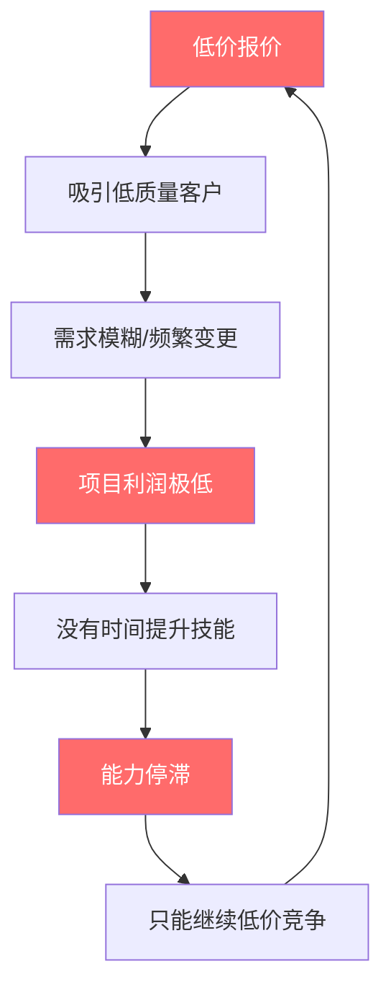
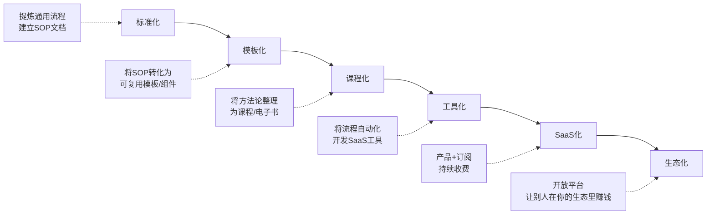
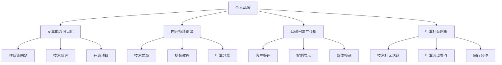
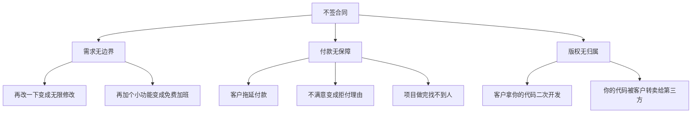
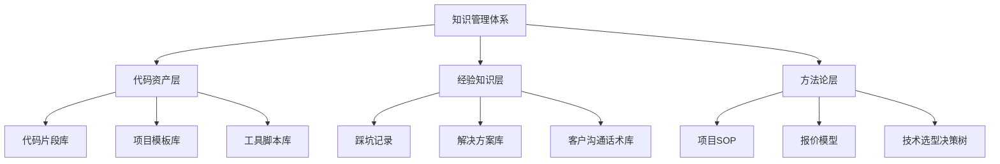
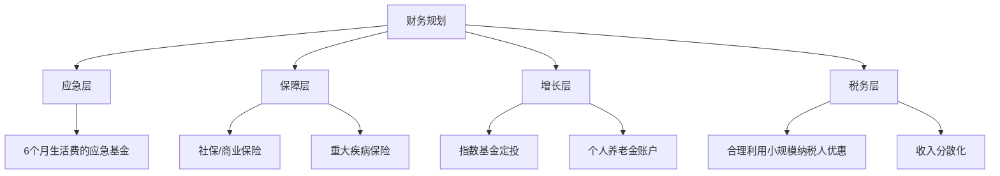
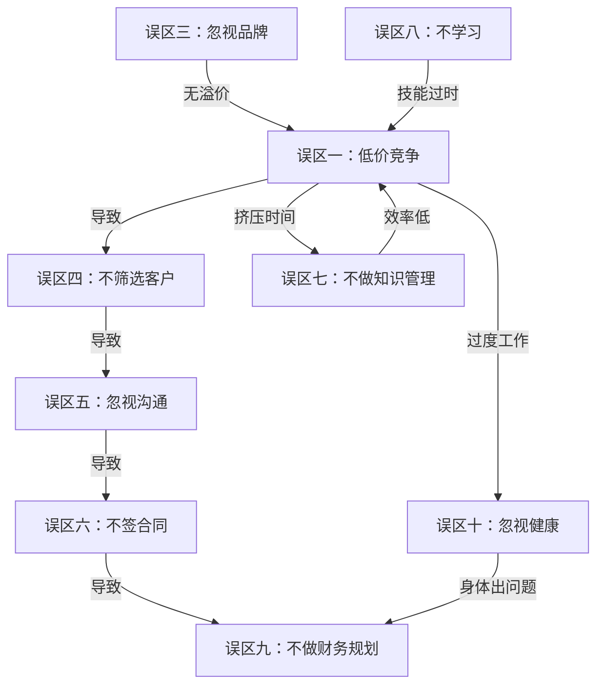

# 第10章 技术技能变现——常见误区

> **本章导读**：技能变现不是一条直线，而是一片布满隐形陷阱的丛林。本章梳理的十大误区，是无数先行者用真金白银和宝贵时间换来的教训。每个误区都从「为什么会掉进去」「掉进去的代价是什么」「怎么爬出来」三个维度展开分析，配有真实案例、数据模型和可执行的纠正方案。读完本章后，建议结合核心概念中的变现模型和实战案例中的成功路径一起理解——**避开错误的路，比加速前进更重要**。

## 为什么你需要了解这些误区

技能变现是一条看似简单、实则布满陷阱的路。每个误区都不是凭空产生的——它们背后有深刻的心理机制、市场规律和认知偏差在驱动。很多人不是不努力，而是努力的方向错了，甚至越努力陷得越深。

从认知科学的角度看，这些误区之所以顽固，是因为它们利用了人类大脑的几个系统性偏差：

- **损失厌恶（Loss Aversion）**：人们对损失的痛苦感约为等量收益快乐感的2-2.5倍（Kahneman & Tversky, 1979）。这解释了为什么很多人宁可维持低价接单的现状，也不愿冒提价后丢单的风险。
- **现状偏见（Status Quo Bias）**：人们倾向于维持当前状态，即使改变的期望收益明显更高。"现在这样也还行"是最大的进步阻碍。
- **可得性启发（Availability Heuristic）**：人们倾向于用最容易想到的案例来判断概率。平台上满屏的低价单让你误以为"市场就是这个价"，而忽略了沉默的高收入群体。
- **即时满足偏好**：接一单赚3000元的即时反馈，比花3个月打磨产品的延迟满足更具吸引力——即使后者的长期收益高出10倍。

本章梳理了技术技能变现中最常见的十大误区。每个误区都从「为什么会掉进去」「掉进去的代价是什么」「怎么爬出来」三个维度展开分析，配有真实案例和可执行的纠正方案。

在AI快速重塑技术行业的2025-2026年，这些误区正在变得更加隐蔽——AI工具让低水平工作者看起来更专业了，但也让真正有价值的能力更难被识别。理解这些误区，不仅是避坑，更是建立长期竞争力的起点。

### 误区自检矩阵

在逐一阅读之前，先用这张表快速自检。对每个问题如实回答「是/否」：

| 自检问题 | 对应误区 | 你的回答 |
|----------|----------|----------|
| 你的报价是否低于同行业平均水平？ | 误区一 | □ 是 □ 否 |
| 你90%以上的收入是否来自接单？ | 误区二 | □ 是 □ 否 |
| 过去3个月你是否主动输出过技术内容？ | 误区三 | □ 是 □ 否 |
| 你是否经常为低质量客户浪费时间？ | 误区四 | □ 是 □ 否 |
| 你是否有过因沟通问题导致返工的经历？ | 误区五 | □ 是 □ 否 |
| 你是否经常不签合同就开始工作？ | 误区六 | □ 是 □ 否 |
| 你是否有系统化的代码库/模板库？ | 误区七 | □ 是 □ 否 |
| 过去半年你是否学过一项新技能？ | 误区八 | □ 是 □ 否 |
| 你是否有稳定的储蓄和税务规划？ | 误区九 | □ 是 □ 否 |
| 你是否每周运动3次以上且睡眠规律？ | 误区十 | □ 是 □ 否 |

勾选「是」越多，说明你在这个方面的风险越高。勾选3个以上，建议认真通读本章并制定改进计划。

***

## 误区一：低价竞争，贱卖自己

### 这个误区为什么普遍存在

低价竞争是新手最容易掉进去的陷阱，根源在于三个心理机制：

**锚定效应**：新手在平台上看到大量低价订单，会把市场价格锚定在较低水平。在猪八戒网、程序员客栈等平台上，一个小程序开发报价从500元到5万元都有，新手往往只看到低价单，认为"市场就是这样"。实际上，平台展示的低价单大部分被中间商截流，真正到开发者手里的利润远低于表面价格。行为经济学家Dan Ariely在《怪诞行为学》中指出，锚定效应的强大之处在于——即使你知道锚定价格是随机的，它仍然会影响你的判断。解决方案不是"忽略锚定"（这做不到），而是用更高的锚定替代：去看国际平台的报价、高端咨询公司的费率、技术会议演讲者的出场费。

**确定性偏好**：低报价更容易成交，给了新手即时反馈的确定感。而高报价意味着更长的决策周期和更大的拒绝概率，这对刚入行的人是巨大的心理压力。行为经济学中的「损失厌恶」在此发挥作用——被拒绝的痛苦感是成交快乐感的2倍，所以人们本能地选择低报价来规避被拒的风险。

**能力不自信**：缺乏足够的项目经验，新手对自己的技术价值缺乏准确认知，本能地觉得"我可能不值那个价"。这种不自信往往与「冒充者综合征」有关——即使技术能力已经达到中等水平，仍然觉得自己是"骗子"。心理学研究显示，约70%的人在职业生涯的某个阶段经历过冒充者综合征，技术领域尤为严重，因为技术能力的边界模糊，你总能找到比你更强的人。

### AI时代对低价竞争的加剧效应

2023年以来，AI工具（GitHub Copilot、Cursor、Claude Code等）大幅降低了基础开发工作的门槛。这意味着：

- **低端市场进一步内卷**：以前需要初级程序员花3天做的页面，现在用AI辅助半天就能完成。低价竞争的底线被进一步压低。
- **"伪专业"现象泛滥**：AI让技术小白也能生成看起来专业的代码和设计方案，进一步模糊了客户对真实水平的判断。
- **定价两极分化**：基础开发工作的市场价持续下降，而架构设计、需求分析、复杂系统集成等高价值工作的价格反而上升。

这不是要你恐慌，而是要你认清现实：**如果你的竞争力仅仅停留在"能写代码"，你正在被AI和低价竞争者双向夹击**。参考AI时代的技能需求了解哪些能力正在升值、哪些正在贬值。

**AI时代的价格分层现实**（2025年数据）：

| 工作类型 | 2022年均价 | 2025年均价 | 变化趋势 | AI替代风险 |
|----------|-----------|-----------|----------|-----------|
| 静态页面开发 | 3000-5000元 | 800-2000元 | ↓60-70% | 极高 |
| 小程序开发 | 8000-2万元 | 3000-8000元 | ↓50-60% | 高 |
| 企业管理系统 | 3-10万元 | 2-8万元 | ↓20-30% | 中 |
| 架构设计咨询 | 2000-5000元/天 | 3000-8000元/天 | ↑50% | 低 |
| AI应用开发 | 不存在 | 5000-3万元/项目 | 新品类 | 极低 |
| 技术尽职调查 | 5-15万元/项目 | 8-20万元/项目 | ↑30% | 极低 |

### 低价竞争的深层代价

低价竞争不只是"少赚一点"那么简单，它会形成一个恶性循环：



**恶性循环的数据说明**：

假设你是一名前端开发者，需要月入2万才能维持体面的生活：

| 定价策略 | 单价 | 月需项目数 | 客户质量 | 沟通成本/项目 | 留给自己提升的时间 |
|----------|------|-----------|----------|--------------|------------------|
| 低价策略 | 3000元/项目 | 7个 | 低（预算紧、需求多变） | 高（反复确认） | 几乎没有 |
| 中价策略 | 8000元/项目 | 3个 | 中 | 中 | 有一些 |
| 高价策略 | 2万元/项目 | 1个 | 高（专业、有预算） | 低（需求明确） | 充足 |

低价策略下，你一个月做7个项目，每个项目沟通成本极高（低预算客户往往需求不明确、修改次数多），实际每小时的有效时薪可能只有30-50元——比外卖骑手还低。

更可怕的是**机会成本**：你用7个项目的时间只赚了2.1万，同样的时间如果用来打磨2个高质量项目+写3篇技术文章+做一个开源工具，半年后你的定价能力会完全不一样。

**低价竞争的隐性税**：

低价竞争还有一种常被忽视的代价——**心理税**。长期低价接单会让你产生"我就值这个价"的心理暗示，形成自我贬低的恶性循环。心理学中的「自我实现预言」在此发挥作用：你相信自己只值3000元/项目，于是你的行为、沟通方式、作品质量都会不自觉地匹配这个价位，最终真的只值3000元。

### 国际市场的定价参照

如果你只看国内市场，很容易被低价锚定。把视野放到国际市场，你会发现完全不同的定价体系：

| 平台/市场 | 前端开发时薪 | 后端开发时薪 | AI应用开发时薪 |
|-----------|-------------|-------------|---------------|
| 国内众包平台（猪八戒等） | 30-100元 | 50-150元 | 100-300元 |
| 国内高端平台（程序员客栈Pro） | 150-500元 | 200-600元 | 300-1000元 |
| Upwork（国际） | $25-80/h | $30-100/h | $50-150/h |
| Toptal（国际高端） | $80-200/h | $100-250/h | $150-300/h |

即使是国内开发者，在Upwork等国际平台上接单，时薪也通常高于国内平台2-3倍。原因是国际客户更习惯为专业服务付费，且信息不对称程度更低（有完善的评价体系）。

### 真实案例

小李是一名前端开发者，在程序员客栈上接单，每个小程序项目报价2000元。他每天工作12小时以上，月收入勉强过万。更糟糕的是，他的客户大多是非技术背景的小商家，沟通极其困难——一个简单的页面布局修改，客户能给出十几种不同的描述方式。

后来小李做了三件事：第一，花两个月时间认真打磨了5个高质量作品案例；第二，把报价提到1万元/项目；第三，只接受需求文档清晰的项目。结果客户数量减少了70%，但月收入反而涨到了1.5万，而且每天只需要工作8小时。更关键的是，高质量客户带来了转介绍，半年后他的报价已经提到2万元/项目。

**另一个案例**：前端开发者小张在Upwork上用英文接单，起步时薪$35。通过6个月的积累（15个五星好评+专业Profile），时薪涨到了$65，折合人民币约470元/小时——是国内平台同类工作的3-4倍。他的关键技术突破是：学会了用英文写清晰的需求确认文档和进度报告。

**AI时代的提价案例**：后端开发者老周，2024年之前主要接PHP项目，单价5000-8000元。学习AI应用开发后（LangChain + RAG），他开始接企业知识库搭建项目，单价直接跳到3-5万元。他的核心竞争力不是"会用LangChain"（这个AI能教会任何人），而是他能准确理解企业的知识管理需求，设计合理的知识分类体系，处理各种非结构化数据源的接入——这些都是AI短期内无法替代的。

### 纠正方案

**第一步：计算你的真实时薪**

```text
真实时薪 = 项目总收入 ÷ (编码时间 + 沟通时间 + 修改时间 + 售后时间)
```

很多人只计算了编码时间，忽略了沟通、修改、售后这些隐性时间成本。建议用时间追踪工具（如 Toggl、Clockify、RescueTime）记录每个项目的真实时间投入，至少追踪3个月，你会对自己的真实时薪有惊人的发现。

**第二步：了解市场定价区间**

| 技能类型 | 初级时薪 | 中级时薪 | 高级时薪 | 专家时薪 |
|----------|----------|----------|----------|----------|
| 前端开发 | 80-150元 | 150-300元 | 300-600元 | 600-1500元 |
| 后端开发 | 100-180元 | 180-400元 | 400-800元 | 800-2000元 |
| UI设计 | 60-120元 | 120-250元 | 250-500元 | 500-1200元 |
| AI应用开发 | 150-300元 | 300-600元 | 600-1500元 | 1500-3000元 |
| 数据工程 | 120-250元 | 250-500元 | 500-1000元 | 1000-2500元 |
| DevOps/SRE | 130-280元 | 280-600元 | 600-1200元 | 1200-3000元 |

定价查询渠道：
- **国内**：程序员客栈薪资报告、拉勾网薪酬查询、看准网
- **国际**：Glassdoor、Levels.fyi、Upwork费率分析
- **自由职业专用**：Freelancermap.com的费率计算器

**第三步：建立价值支撑体系**

报价不是随便说一个数字，你需要用以下要素来支撑你的价格：

1. **作品集**：3-5个高质量项目案例，包含前后对比、客户评价、数据成果
2. **技术博客/社区影响力**：证明你的专业深度
3. **明确的服务边界**：合同中写清楚包含什么、不包含什么
4. **标准化流程**：让客户感受到专业度——从第一次沟通到最终交付，每一步都有章法
5. **行业背书**：开源贡献、技术认证、行业活动演讲等

**第四步：阶梯式提价**

不要一步到位涨价300%，而是每个月提价10-20%。用新报价测试市场反应，如果成交率低于30%，说明定价过高或价值支撑不够，需要先补足价值。

提价的信号标志：
- 成交率超过60% → 你可能定价偏低，可以大胆提价20-30%
- 成交率在40-60% → 定价合理，微调即可
- 成交率在30-40% → 定价偏高，需要强化价值展示
- 成交率低于30% → 定价过高或目标客户群定位有误

**第五步：价值定价法进阶**

从"成本定价"（我花了多少时间×时薪）升级到"价值定价"（我帮客户解决了多大的问题）。

价值定价的计算公式：

```text
项目报价 = 客户预期收益 × 分成比例（通常5-15%）
```

举例：你帮一个电商客户开发了一个自动化库存管理系统，每年帮他节省30万元的人工成本。你报价3万元（10%分成），客户会觉得非常划算——因为他的投资回报率是10倍。而如果你按成本定价（2周×500元/小时×8小时 = 4万元），客户反而可能嫌贵。

价值定价的关键是：在报价之前，先帮客户量化他能获得的收益。这就是为什么"需求分析"能力比"写代码"能力更值钱。

***

## 误区二：只接单不产品化

### 这个误区的认知根源

大多数人从接单开始技能变现之路，这本身没有问题。问题在于，很多人把接单当成了终点，而不是起点。

接单的本质是**卖时间**——你每赚一分钱，都需要投入相应的时间。时间是刚性约束，一天只有24小时，扣除吃饭睡觉和休息，有效工作时间不超过8-10小时。这意味着你的收入有一个明确的天花板：

```text
接单收入天花板 = 每小时费率 × 每天有效工作小时 × 每月工作天数
              = 300元/小时 × 8小时 × 22天
              = 52,800元/月
```

而这个天花板还是理想情况——假设你100%的时间都在做收费工作，没有任何空档期、沟通成本和项目切换损耗。实际中，自由职业者的有效计费时间通常只占总工作时间的60-70%，这意味着实际天花板大约在3-3.7万/月。

从经济学角度看，接单模式的核心矛盾是：**你的收入函数是线性的（收入 = 时间 × 单价），但你的时间是有限的**。而产品化的本质是让你的收入函数变成指数型或至少是超线性的——前期投入时间开发产品，后期用极低的边际成本复制销售。

### 接单与产品化的本质区别

| 维度 | 纯接单 | 接单+产品化 | 纯产品化 |
|------|--------|------------|----------|
| 收入公式 | 时薪 × 工作小时 | 接单收入 + 被动收入 | 产品销量 × 单价 |
| 时间约束 | 100%依赖时间 | 50-70%依赖时间 | 20-30%依赖时间 |
| 月收入天花板 | 3-5万 | 5-15万 | 理论上无限 |
| 扩展方式 | 加班 | 接单+产品矩阵 | 团队+系统 |
| 抗风险能力 | 极弱（停工即停收） | 中等 | 强（被动收入兜底） |
| 3年后的时间自由度 | 低 | 中 | 高 |
| 可复制性 | 不可复制 | 部分可复制 | 完全可复制 |
| 资产积累 | 无 | 中等 | 强（产品即资产） |

### 产品化的六阶路径



**第一阶段：标准化（1-3个月）**

把你反复做的事情写成标准操作流程（SOP）。比如你接了很多企业官网项目，每个项目的流程大致相同：需求分析→原型设计→UI设计→前端开发→后端开发→测试→部署。把每个环节的标准、模板、检查清单都整理出来。

标准化的核心产出物：
- 项目需求调研问卷（20-30个标准问题）
- 设计风格参考库（按行业分类）
- 项目管理看板模板（Trello/飞书/Notion）
- 交付检查清单（功能测试、性能测试、SEO检查、安全检查）

**第二阶段：模板化（3-6个月）**

从SOP中提取可复用的模板。企业官网项目可以做成5套风格不同的模板，每套模板只需要根据客户需求做微调。这样原来需要2周完成的项目，现在3天就能交付。

模板化的进阶做法：
- **代码模板**：用脚手架工具（如 Yeoman、Vite Templates）创建项目模板，一条命令初始化完整项目
- **设计模板**：在Figma中建立组件库和页面模板，拖拽式完成设计
- **文案模板**：常见页面（关于我们、服务介绍、FAQ）的文案框架

**第三阶段：课程化（6-12个月）**

把你的方法论整理成课程或电子书。你已经做了20个企业官网项目，积累了大量经验和踩坑教训，这些都是有价值的课程内容。

课程化的具体路径：

| 课程形式 | 制作难度 | 变现平台 | 预期收入 |
|----------|----------|----------|----------|
| 电子书/PDF | 低 | Gumroad、小报童、独立站 | 1000-5000元/月 |
| 录播视频课 | 中 | 极客时间、网易云课堂、B站付费 | 3000-20000元/月 |
| 训练营/直播课 | 高 | 知识星球、自建社群 | 5000-50000元/期 |
| 一对一辅导 | 中 | 自建渠道 | 500-2000元/小时 |

**第四阶段：工具化（12个月以上）**

如果你发现某个流程可以完全自动化，考虑开发成SaaS工具。比如你做网站项目时总是需要处理图片压缩、SEO优化、性能检测，可以开发一个一键优化工具，按月收费。

工具化的核心考量：
- 解决的问题是否足够高频？
- 用户是否愿意为自动化付费？
- 技术壁垒有多高？别人能否轻易复制？

**第五阶段：SaaS化（18个月以上）**

将工具发展为完整的SaaS产品，按订阅制收费。这是收入模型的质变——从一次性收费变为持续性收入（MRR，Monthly Recurring Revenue）。

关键指标：
- **MRR**：月度经常性收入
- **Churn Rate**：客户流失率（控制在5%以下为优秀）
- **LTV**：客户生命周期价值（LTV > 3倍获客成本才健康）
- **CAC**：客户获取成本

**第六阶段：生态化（36个月以上）**

建立开放平台或社区，让其他人在你的生态中创造价值。这是最高阶的产品化形态，需要强大的产品基础和用户规模。

### AI时代的产品化加速器

AI工具让产品化路径大幅缩短。以前从"标准化"到"工具化"可能需要2-3年，现在借助AI，6-12个月就能走完。更多产品化实战案例参见实战案例章节：

| 产品化阶段 | 传统方式 | AI加速方式 | 效率提升 |
|-----------|---------|-----------|---------|
| 标准化 | 手动整理SOP | 用AI分析项目文档自动生成SOP | 3-5倍 |
| 模板化 | 手写代码模板 | 用AI生成模板代码+配置 | 5-10倍 |
| 课程化 | 手写课程大纲和内容 | AI辅助写大纲、生成示例代码、制作幻灯片 | 2-3倍 |
| 工具化 | 从零开发SaaS | AI辅助编码+低代码平台 | 3-5倍 |

### 真实案例

老赵做了5年平面设计接单，月收入稳定在3万左右，但每天工作10小时以上，周末也经常加班。他的客户以中小商家为主，每个logo设计报价3000-5000元，需要反复沟通修改。

后来老赵开始产品化转型：首先，他把常用的海报、名片、社交媒体图片等设计做成Canva模板，在Canva模板市场上售卖，单价9-29元；其次，他把自己多年的设计经验整理成一套「零基础学设计」课程，在网易云课堂上售卖，定价199元。

第一年，模板收入每月约5000元，课程收入每月约8000元。第二年，随着口碑积累和更多模板上架，被动收入已经超过接单收入。现在老赵每月接单量减少到原来的三分之一，但总收入是之前的2倍，每天工作时间也降到了6小时。

**AI时代的加速案例**：开发者小王利用AI工具（Cursor + Claude）将自己的WordPress建站效率提升了4倍。他把省下来的时间开发了一个「AI建站助手」SaaS工具——用户输入行业和基本需求，系统自动生成网站方案和初版代码。定价99元/月，上线6个月积累了300+付费用户，月收入3万+，几乎不需要手动介入。

**产品化失败的反面教材**：设计师小美在没有足够客户基础的情况下，花6个月开发了一款设计协作工具。上线后发现：第一，市场上已有Figma、蓝湖等成熟产品；第二，她没有用户获取渠道；第三，她没有足够的资金维持产品迭代。最终产品下线，6个月的时间全部浪费。

**教训**：产品化应该从"已有能力的延伸"开始，而不是"凭空创造一个产品"。你的第一批产品应该是你已经在做的事情的标准化和模板化。

***

## 误区三：忽视个人品牌

### 为什么品牌不是"锦上添花"而是"生存必需"

很多人觉得个人品牌是有余力时才做的事情——先把技术练好、先把项目做好，品牌以后再说。这个想法有三个致命问题：

**信息不对称**：客户在选择服务者时，面临严重的信息不对称。他无法在短时间内判断你的真实技术水平，只能依赖外部信号——你的作品展示、社区影响力、行业口碑。两个技术水平完全一样的人，有品牌的那个能获得10倍于无品牌的曝光机会。

经济学中的「信号理论」（Signaling Theory，Michael Spence, 1973）完美解释了这一现象：在信息不对称的市场中，高质量的卖方需要通过"信号"来区分自己和低质量的卖方。个人品牌就是你向市场发送的"高质量信号"——它不直接证明你的能力，但它降低了客户的判断成本。

**定价权**：没有品牌的人只能接受市场定价；有品牌的人可以定义自己的定价。同样是做企业网站，有人报价5000元客户还嫌贵，有人报价5万元客户毫不犹豫——差别就在于品牌背书。

**获客成本**：没有品牌的人需要主动找客户（高获客成本），有品牌的人客户主动找上门（零获客成本）。在自由职业平台上，获客成本（包括时间成本）可能占到收入的20-30%。

### AI时代个人品牌的新维度

AI工具的普及正在改变个人品牌的构建方式和评价标准：

**旧时代的品牌信号**：写了多少文章、有多少GitHub star、技术社区粉丝数。
**新时代的品牌信号**：能否用AI做出别人做不出的东西、能否把AI能力转化为商业价值、是否有独特的不可替代的方法论。

具体而言，AI时代个人品牌的三个新维度：

1. **AI工具的深度使用者**：不是简单地用Copilot写代码，而是能构建复杂的AI工作流——用AI做代码审查、自动化测试、文档生成、客户需求分析。把这些工作流公开分享，本身就是强有力的品牌信号。
2. **人机协作的创新者**：展示你如何与AI协作完成高质量项目。比如，一个设计师展示了「用AI生成初稿→人工精修→AI批量适配多尺寸」的完整工作流，1小时完成以前需要1天的工作量。这种效率本身就是品牌。
3. **不可AI化的价值提供者**：明确展示AI无法替代你的部分——架构设计决策、客户需求深度理解、行业洞察、人际关系网络。

### 品牌建设的核心要素



### 品牌建设的实操路径

**第一步：建立作品集网站（1-2周）**

这是品牌的基础载体。不需要花哨的设计，关键是内容质量：

- 放上3-5个你最得意的项目，每个项目写清楚：背景、挑战、方案、成果
- 用数据说话：「帮客户提升了40%的转化率」比「做了个好看的网站」有说服力100倍
- 技术栈推荐：GitHub Pages + Hugo/Jekyll，免费且能展示技术能力
- 必备页面：首页（一句话定位）、项目案例（3-5个）、关于我（专业背景+个人故事）、联系方式

**作品集网站的反面教材 vs 正面教材**：

| 维度 | 反面教材 | 正面教材 |
|------|----------|----------|
| 项目描述 | "使用React开发了一个管理后台" | "为某连锁餐饮品牌开发了门店管理系统，覆盖200+门店，将月度盘点时间从3天缩短至2小时" |
| 技术栈展示 | 罗列20个技术名词 | 按项目场景说明为什么选择这些技术 |
| 客户评价 | 没有 | 附上客户姓名（经授权）+具体成果数据 |
| 视觉呈现 | 默认主题、无定制 | 精心设计、体现个人审美品味 |

**第二步：在技术社区持续输出（持续进行）**

选择1-2个平台深耕，不要撒网式运营：

| 平台 | 适合内容 | 起步难度 | 见效周期 | 核心策略 |
|------|----------|----------|----------|----------|
| 掘金/CSDN | 技术教程、项目实战 | 低 | 3-6个月 | 选细分领域，系列化输出 |
| 知乎 | 行业分析、深度回答 | 中 | 2-4个月 | 回答高关注度问题，长文分析 |
| B站 | 视频教程、项目演示 | 高 | 6-12个月 | 短视频引流+长视频深度讲解 |
| GitHub | 开源项目、代码示例 | 中 | 3-6个月 | 做有用的工具，而非demo |
| 微信公众号 | 行业观点、经验分享 | 中 | 3-6个月 | 垂直领域深度内容 |
| Twitter/X | 技术见解、行业动态 | 低 | 1-3个月 | 英文内容触达国际受众 |
| 小红书 | 技术入门、职场经验 | 低 | 1-3个月 | 视觉化呈现，降低阅读门槛 |

输出频率建议：每周至少1篇高质量技术文章。不要追求日更，质量比数量重要得多。

**内容选题的四象限法则**：

```text
            高搜索量
               |
    流量型选题 | 品牌型选题
    （教程、FAQ）| （深度分析、原创观点）
               |
  ————————————+————————————
               |
    鸡肋型选题 | 信任型选题
    （冷门技术）| （踩坑记录、复盘总结）
               |
            低搜索量
        低专业度          高专业度
```

优先做「品牌型选题」（高专业度+高搜索量），其次是「信任型选题」（建立真实感），适当做「流量型选题」（获取曝光）。

**第三步：积累口碑和社交证明（持续进行）**

- 每个项目完成后，主动邀请客户写评价。模板：「项目已经顺利上线，如果您觉得我们的合作体验不错，能否花2分钟在[平台]上留个评价？这对我的业务非常重要。」
- 把好评截图整理到作品集网站上
- 如果有媒体报道或行业认可，放在最显眼的位置
- **进阶**：争取行业会议演讲机会（哪怕从本地技术Meetup开始）

### 真实案例

两个水平相当的前端开发者A和B。A在掘金上有5万粉丝，每周更新2篇技术文章，GitHub上有3个超过500 star的开源项目。B默默接单，没有任何公开的技术输出。

同样的企业官网项目，A报价3万元，B报价1万元。最终客户选择了A——因为A的掘金文章让客户确信他懂技术，GitHub上的开源项目让客户相信他的代码质量，5万粉丝的背书让客户觉得找A合作是"安全"的。

B不是技术不行，而是没有把技术能力"可视化"。客户看不到你的能力，就不愿意为你的能力买单。

**关键洞察**：个人品牌不是一蹴而就的。A用了2年时间才积累到5万粉丝和3个star过500的项目。前6个月几乎没有反馈，第7-12个月开始有少量关注，第13-24个月进入快速增长期。品牌建设是一场马拉松，坚持是唯一的捷径。

**品牌建设的复利效应**：

品牌的价值不是线性增长的，而是指数型的——前期投入大量时间几乎没有回报，但一旦突破临界点，增长速度会让你惊讶。这就像复利投资：前5年看不出差别，第10年开始天壤之别。

| 时间节点 | 内容产出 | 品牌影响力 | 客户来源 | 溢价能力 |
|----------|---------|-----------|---------|---------|
| 第1-3个月 | 12篇文章 | 几乎为零 | 全靠平台 | 无溢价 |
| 第4-6个月 | 24篇文章 | 少量关注 | 90%平台+10%搜索 | 微小溢价 |
| 第7-12个月 | 48篇文章 | 稳定增长 | 70%平台+30%品牌 | 20-30%溢价 |
| 第13-24个月 | 96篇文章 | 显著影响力 | 40%平台+60%品牌 | 50-100%溢价 |
| 24个月+ | 持续输出 | 行业知名 | 20%平台+80%品牌 | 100-300%溢价 |

***

## 误区四：不会筛选客户

### 为什么"来者不拒"是最贵的策略

很多技能变现者觉得"有项目总比没项目好"，于是来者不拒。这种策略的隐性成本远超你的想象。

**80/20法则在客户管理中的体现**：根据经验，80%的利润往往来自20%的客户。反过来，80%的麻烦也来自20%的客户——那些预算低、需求多变、沟通困难、拖延付款的客户。

帕累托法则（Pareto Principle）在自由职业中的具体表现：
- 20%的客户贡献了80%的利润
- 20%的客户消耗了80%的沟通时间
- 20%的项目产生了80%的案例价值
- 20%的客户带来了80%的转介绍

关键是：这四个20%往往是不同的客户群。高利润客户未必是好案例来源，好转介绍的客户未必是高利润的。你需要多维度评估客户价值。

**劣质客户的真实成本**：

```text
劣质客户的真实成本 = 项目报价 - 沟通成本 - 修改成本 - 精神损耗 - 机会成本
```

一个报价5000元的项目，如果客户沟通困难（额外花20小时沟通）、频繁修改（额外花30小时修改），你的真实时薪只有100元/小时。而这50小时如果用来服务优质客户或者提升技能，潜在价值远超5000元。

### 客户质量评估框架

在接项目之前，用以下框架快速评估客户质量：

| 评估维度 | 高分信号（+2分） | 低分信号（-2分） |
|----------|-----------------|-----------------|
| 预算明确度 | 客户有明确预算范围 | "你先报个价看看" |
| 需求清晰度 | 有PRD或详细需求文档 | "我也说不清楚，你先做" |
| 决策链 | 只有一个决策人 | 多个领导审批 |
| 时间预期 | 合理的项目周期 | "能不能一周搞定" |
| 付款条件 | 接受分阶段付款 | "做完再付全款" |
| 历史评价 | 在平台上有好评记录 | 新账号无评价 |
| 沟通态度 | 尊重专业、善于倾听 | 居高临下、质疑一切 |
| 行业背景 | 了解项目开发流程 | 完全不懂技术且不愿学习 |

总分≥8分：优质客户，优先接单，可以适当给予折扣维护关系
总分2-7分：中等客户，谨慎评估，严格按合同执行
总分<2分：劣质客户，果断拒绝

### 常见的"劣质客户"画像

**画饼型**：「这个项目做好了，后面还有很多项目给你」「我们公司马上要融资了，到时候给你股份」。翻译：现在不想付钱。应对：「感谢信任，不过我们先聚焦在当前这个项目上。后续如果有新项目，我们可以单独谈。」

**比价型**：「别人报价2000，你怎么要1万」「你这也太贵了，能不能便宜点」。翻译：对价格敏感，对价值不敏感。应对：「我的报价包含了[具体服务内容]，如果您有预算限制，我们可以调整项目范围。」

**需求模糊型**：「我也不知道要什么，你先设计几个方案给我看看」「大概就是那种高大上的感觉」。翻译：无限修改的前兆。应对：「在开始设计之前，我需要您填写一份需求调研问卷，帮助我们更准确地理解您的期望。」（然后发一份详细的问卷）

**微操型**：「这个按钮往左移2px」「这个蓝色再深一点」。翻译：不信任你的专业判断，会消耗大量时间在无关紧要的细节上。应对：「我会提供2-3个设计方案供您选择，确定方向后在该方向上做2轮微调。超出部分按修改次数收费。」

**拖延型**：「我再想想」「等我老板回来再说」「这个季度预算花完了，下个季度再说」。翻译：项目周期会被无限拉长。应对：设定明确的响应时间要求写入合同：「客户需在3个工作日内反馈，逾期视为确认。」

**白嫖型**：「能不能先出个方案我看看？满意了再合作」「帮我看看这个代码有没有问题，就5分钟的事」。翻译：用「试用」的名义白嫖你的劳动。应对：「方案设计是收费服务的一部分。我可以先分享一些通用的方法论和过往案例供您参考。」

**情绪型**：「你做的什么东西」「我花了钱你就给我看这个」「我要投诉你」。翻译：用情绪施压来获取更多免费服务。应对：保持冷静，回到合同条款：「我们按照确认的需求文档和设计稿进行交付。如果您有具体的修改需求，请列出来，我们按合同约定的修改条款处理。」

### 筛选客户的实操方法

**方法一：报价筛选法**

直接报出你的正常价格，不打折扣。接受这个价格的客户，至少在预算上是匹配的。一开始就砍价的客户，后续会持续在各个环节压缩你的利润。

**方法二：需求文档法**

在正式开始之前，要求客户提供详细的需求文档。不愿意写需求文档的客户，要么需求本身不清晰，要么不够重视这个项目——两种情况都不适合接。

如果客户确实不会写需求文档，你可以提供一个结构化问卷，引导他们梳理需求。这个过程本身也是筛选——愿意花时间填写问卷的客户，合作诚意通常更高。

**方法三：定金筛选法**

要求30-50%的预付款。愿意付定金的客户，合作诚意更高。拒绝付定金的客户，后续赖账的概率也更高。

定金收取的最佳时机和话术：
- 时机：需求确认后、正式开工前
- 话术：「为了确保我们双方都对这个项目认真对待，开工前需要支付30%的定金。这笔款项会计入总费用，验收后只需支付剩余的70%。」

**方法四：小项目试水法**

对于不确定的客户，先做一个小项目（几千元级别的）试探合作体验。如果合作顺畅，再接大项目。如果合作困难，及时止损。

**方法五：渠道筛选法**

不同渠道的客户质量差异巨大：

| 渠道 | 客户质量 | 竞争程度 | 利润空间 | 推荐指数 |
|------|----------|----------|----------|----------|
| 老客户转介绍 | 极高 | 低 | 高 | ★★★★★ |
| 个人品牌引流 | 高 | 低 | 高 | ★★★★★ |
| 高端平台（Toptal等） | 高 | 中 | 高 | ★★★★ |
| 中端平台（程序员客栈Pro） | 中 | 中 | 中 | ★★★ |
| 低端众包平台 | 低 | 高 | 低 | ★★ |
| 微信群/QQ群 | 参差不齐 | 高 | 低 | ★ |

最优策略是：用低端平台积累起步经验和作品，然后逐步转移到高端平台和个人品牌引流。

**方法六：红旗清单法**

在初次沟通时，留意以下危险信号。命中2个以上，谨慎接单：

- 客户说"很简单"或"很快就能做完"（通常意味着他们低估了工作量）
- 客户不提预算，只说"先聊聊"（可能是白嫖需求分析）
- 客户催得很急，但自己的配合度很低（双标型客户）
- 客户在其他平台上有多条差评（历史行为是未来行为的最好预测）
- 客户要求"先做一部分看看效果"（免费试用的委婉说法）
- 客户用"我们是大公司"来压价（公司大不代表会善待供应商）

***

## 误区五：技术至上，忽视沟通

### 沟通能力的隐性价值

技术人最容易犯的认知错误是：认为技术水平是决定收入的唯一因素。实际情况是，在技能变现的商业场景中，技术能力和沟通能力各占50%的权重。

为什么？因为技能变现的本质是**帮客户解决问题**，而「理解问题」和「解决问题」是两个独立的能力维度：


注意这个链条中，沟通能力出现了3次，技术能力只出现了1次。很多技术能力强的人，链条在第一环就断了——根本没有准确理解客户的真实需求。

从信息论的角度看，客户的需求经过多次"编码-解码"过程：客户脑中的想法→客户用语言表达→你听到并理解→你用技术语言重新编码→开发实现。每一次编码-解码都有信息损失，沟通能力越差，损失越大。这就是为什么同一个需求，不同的开发者理解出来的结果天差地别。

### 沟通失败的典型场景

**场景一：需求理解偏差**

客户说：「我想要一个高大上的网站。」

技术人的理解：用最新的前端框架、炫酷的动画效果、深色主题设计。

客户的真实意思：网站要显得专业、可信赖、适合B2B场景。

结果：技术人做了一个视觉冲击力很强的网站，客户看完说"太花哨了，不适合我们的行业"，返工重做。

**场景二：期望管理失败**

技术人为了接下项目，答应了"所有功能都能做"和"两周交付"。实际开发中发现很多功能需要第三方API对接，时间严重不足。最后延期交付，客户不满。

**场景三：技术语言轰炸**

技术人跟客户解释方案时，满口"微服务架构""容器化部署""CI/CD流水线"。客户完全听不懂，既不知道你在说什么，也不知道为什么要花这个钱。最终客户选择了一个"说人话"的竞争对手。

**场景四：需求镀金（Gold Plating）**

技术人自作主张添加了客户没要求的功能，认为"这样更好"。客户不仅不感激，反而觉得你在浪费时间，甚至要求删除这些"多余"的功能。专业术语叫「需求镀金」——技术人用自己认为好的东西替代了客户真正需要的东西。

**场景五：反馈恐惧**

害怕收到负面反馈，所以不敢在过程中主动展示进度。结果到了交付日，客户发现方向完全不对，要求推翻重做。这种"惊喜"是项目失败的头号杀手。

**场景六：过度承诺（Over-Promising）**

「没问题，这个功能很简单」「放心，肯定能做完」「我保证质量」。这些话在项目初期让客户很开心，但一旦做不到，信任就彻底崩塌。正确的做法是：**承诺保守，交付超预期**。「这个功能需要3天，我会尽量提前，但不能保证」——如果2天做完了，客户反而更满意。

### 沟通能力提升的实操方法

**需求分析四步法**：

1. **倾听**：让客户完整表达需求，不要急于给出方案。用开放式问题引导：「能具体描述一下您理想中的使用场景吗？」「这个功能主要是为了解决什么问题？」
2. **复述**：用自己的话复述客户的需求，确认理解一致：「我理解您的需求是……对吗？」
3. **可视化**：用原型图、流程图、思维导图把需求可视化呈现，比文字描述准确100倍。
4. **书面确认**：把确认后的需求整理成文档，双方签字确认。这是避免后续扯皮的最有效方法。

**需求挖掘的5个黄金问题**：

1. 「您为什么需要这个功能？」（挖掘真实动机）
2. 「如果不做这个功能，会对您的业务产生什么影响？」（判断优先级）
3. 「您的目标用户是谁？他们通常怎么使用类似产品？」（理解用户画像）
4. 「您见过哪些同类产品/网站是您喜欢的？喜欢哪些部分？」（找到参照物）
5. 「这个项目上线后，您怎么衡量它是否成功？」（定义验收标准）

**进阶：需求挖掘的5Why法**

对核心需求连续追问5个"为什么"，直达客户的真实痛点：

```text
客户：我需要一个会员系统。
→ 为什么？（第1层）
客户：因为我想留住老客户。
→ 为什么觉得会员系统能留住老客户？（第2层）
客户：因为可以让老客户享受折扣。
→ 为什么折扣能留住老客户？（第3层）
客户：因为我的竞争对手有会员折扣，我没有的话客户会流失。
→ 为什么客户会因为折扣流失？（第4层）
客户：因为我的产品差异化不够，客户主要看价格。
→ 那除了会员折扣，还有什么方式可以增加产品差异化？（第5层）
```

经过5层追问，你可能发现客户真正需要的不是"会员系统"，而是"产品差异化策略"——这可能是一个完全不同（且价值更高）的项目。

**技术方案表达技巧**：

| 错误表达 | 正确表达 |
|----------|----------|
| "我们需要用React重构前端" | "重构后网站加载速度会提升50%，用户流失率会降低" |
| "建议使用微服务架构" | "这样设计的好处是，以后增加新功能不需要改动现有系统，维护成本更低" |
| "需要对接第三方支付API" | "接入后客户可以在你的网站上直接付款，不用跳转到其他平台" |
| "需要做数据库优化" | "优化后页面加载时间从3秒降到0.5秒，用户体验大幅提升" |
| "建议用容器化部署" | "这样可以一键部署到任何服务器，换服务器也不用重新配置环境" |

核心原则：把技术语言翻译成客户能理解的**商业价值**。客户不需要知道你用什么技术，只需要知道这个技术方案能给他带来什么好处。

**远程协作的沟通工具链**：

在远程协作成为常态的今天，选对沟通工具并建立规范至关重要：

| 沟通场景 | 推荐工具 | 使用规范 |
|----------|----------|----------|
| 日常沟通 | 微信/飞书/Slack | 工作时间内2小时内回复 |
| 需求讨论 | 腾讯会议/飞书会议 | 提前发议程，会后发纪要 |
| 文件协作 | 飞书文档/Notion | 统一命名规范，版本号管理 |
| 项目管理 | 飞书项目/Trello/Linear | 每日更新任务状态 |
| 设计评审 | Figma/蓝湖 | 异步评论+定期同步会议 |
| 代码协作 | GitHub/GitLab | PR描述写清楚变更内容和原因 |
| 异步沟通 | Loom（录屏） | 复杂问题录3分钟视频解释，比文字高效10倍 |

**定期汇报模板**：

```text
项目名称：XXX
汇报日期：YYYY-MM-DD
本周完成：
  - 功能A开发完成，已测试通过
  - 功能B完成80%，预计下周二完成
下周计划：
  - 完成功能B剩余部分
  - 开始功能C的开发
需要客户配合：
  - 提供产品图片素材（本周五前）
风险提示：
  - 功能D需要第三方API，需要客户申请API密钥
项目健康度：🟢 正常 / 🟡 有风险 / 🔴 严重问题
```

每周五发送一次进度汇报，让客户有掌控感，也能提前发现偏差。不要等到出了问题才沟通——那时候客户的信任已经受损。

***

## 误区六：不签合同，口头约定

### 为什么口头约定是定时炸弹

很多技能变现者，特别是通过熟人关系接到的项目，觉得签合同"伤感情""太正式"。这是一个代价极高的误区。

从法律角度看，口头合同在中国法律中也是有效的（《民法典》第469条），但问题在于**举证困难**。一旦发生争议，你很难证明当初约定的具体内容。而书面合同的价值不仅是法律保护，更是**预期管理工具**——它迫使双方在项目开始前就把所有可能产生分歧的事项说清楚。

没有合同保护，你会面临以下风险：



### 合同不只是法律文件，更是沟通工具

很多人把合同理解为"出了问题打官司用的"，这是狭隘的理解。合同的首要功能是**在项目开始前对齐双方预期**——把可能产生分歧的所有事项提前说清楚。

一份好的合同应该让双方在签字前就清楚：
- 要做什么、不做什么
- 什么时候做完
- 什么时候付钱、付多少钱
- 不满意怎么办
- 谁拥有最终成果

### 合同中的关键条款

**需求范围条款**：明确列出项目包含的功能和不包含的功能。这是防止"范围蔓延"的核心条款。

```text
合同示例条款：
1. 项目范围
   1.1 包含内容：企业官网设计与开发（首页、关于我们、产品展示、联系方式共4个页面）
   1.2 不包含内容：后台管理系统、移动端适配、SEO优化、域名和服务器费用
   1.3 超出范围的新增需求，双方另行协商报价和工期
```

**付款条款**：分阶段付款是保护双方利益的最佳方式。

```text
推荐付款节奏：
- 签约时：支付30%定金
- 设计稿确认后：支付30%
- 项目验收后：支付剩余40%
```

对于高价值项目（5万以上），建议增加更多付款节点：

```text
高价值项目付款节奏：
- 签约时：20%定金
- 需求文档确认后：15%
- 设计稿确认后：20%
- 开发完成50%后：20%
- 验收后：20%
- 质保期结束后：5%
```

**修改次数条款**：明确免费修改的次数和超出后的收费标准。

```text
合同示例条款：
3. 修改与调整
   3.1 设计阶段：提供2套方案，每套方案可修改3次
   3.2 开发阶段：每个功能模块可修改2次
   3.3 超出免费修改次数的修改，按200元/次收取费用
   3.4 「修改」定义：在已确认方向的基础上微调，不包括推翻重做
```

**验收标准条款**：明确什么情况下算"项目完成"，避免客户无限期地"不满意"。

```text
合同示例条款：
4. 验收标准与流程
   4.1 乙方交付后，甲方应在5个工作日内完成验收
   4.2 验收标准以双方确认的需求文档和设计稿为准
   4.3 甲方逾期未反馈视为验收通过
   4.4 验收后发现的功能缺陷，乙方在质保期内免费修复
   4.5 质保期为验收通过后30天
```

**版权归属条款**：明确交付物的知识产权归属。一般约定：全额付款后，交付物的使用权归客户所有，但代码的知识产权归开发者。如果你打算把项目中的通用模块复用到其他项目，需要在合同中明确说明。

```text
合同示例条款：
5. 知识产权
   5.1 甲方全额付款后，获得交付物的永久使用权
   5.2 开发过程中使用的通用框架、工具库、代码模板等底层技术，知识产权归乙方所有
   5.3 乙方有权将非甲方专属的通用技术方案用于其他项目
   5.4 甲方的商业数据、业务逻辑等专有信息，乙方不得用于其他项目
```

**违约条款**：约定双方违约的后果，包括逾期付款的违约金、延期交付的赔偿等。

```text
合同示例条款：
6. 违约责任
   6.1 甲方逾期付款，每逾期一天支付应付金额0.5%的违约金
   6.2 乙方逾期交付，每逾期一天减免应付金额0.5%
   6.3 甲方单方面终止项目，已付款项不予退还
   6.4 乙方单方面终止项目，退还未完成部分对应的款项
```

**保密条款**：在很多项目中被忽视，但非常重要。

```text
合同示例条款：
7. 保密义务
   7.1 双方对合作过程中知悉的对方商业秘密负有保密义务
   7.2 保密期限为合同终止后2年
   7.3 乙方不得将甲方的业务数据、用户信息用于任何非本项目用途
```

### 合同模板获取渠道

| 渠道 | 费用 | 适用场景 | 优缺点 |
|------|------|----------|--------|
| 中国合同库（hetong.cn） | 免费 | 通用技术服务合同 | 模板多但需要自行调整 |
| 猪八戒/程序员客栈 | 免费 | 平台项目 | 平台有标准合同 |
| 找律师定制 | 500-2000元 | 高价值项目 | 最专业但成本高 |
| GitHub开源模板 | 免费 | 软件开发合同 | 英文为主，需要翻译修改 |
| 飞书/Notion模板 | 免费 | 快速起步 | 灵活但可能不够法律严谨 |

**建议**：找律师定制一份基础合同模板（花1000-2000元），然后根据每个项目的具体情况微调。这是一次性投入，后续可以反复使用。

### 电子合同的法律效力

2020年以来，中国的《电子签名法》和相关司法解释已经明确了电子合同的法律效力。使用电子合同的好处：

- **便捷**：无需面对面签约，远程即可完成
- **证据链完整**：有时间戳、IP记录、操作日志
- **存储方便**：云端存储，不怕丢失

推荐电子合同平台：e签宝、法大大、上上签。个人开发者年费通常在几百元，性价比很高。

### 合同谈判的常见问题

**Q：客户说"签合同太麻烦了，我们口头说好就行"怎么办？**

A：「我理解您的想法。合同其实是为了保护我们双方——它确保我们都清楚要做什么、什么时候做完、怎么付款，避免后面产生误会。我有一份标准合同模板，您只需要确认一下关键条款就行，不会很麻烦。」

**Q：客户说"我不信任合同，万一你做不好怎么办"怎么办？**

A：「这正是合同的价值——合同里有明确的验收标准和修改条款。如果我的交付不符合约定，您可以要求修改，甚至终止合作。合同保护的是双方的权益。」

**Q：熟人介绍的项目，不好意思签合同怎么办？**

A：「越是熟人越应该签合同——不是因为不信任，而是因为一旦出了分歧，没有合同反而会伤感情。签了合同，我们都按规矩办事，合作更顺畅。」

### 真实案例

小陈是一名App开发者，通过朋友介绍接了一个餐饮点餐App开发项目，口头约定3万元。开发过程中，客户不断新增功能：「加个外卖功能」「加个会员积分系统」「能不能对接美团」。小陈不好意思拒绝，一个人做了3个月，交付了一个功能完善的App。

结果客户看完说「跟我想的不太一样」，只愿意付1万元。小陈想要维权，但没有任何书面证据证明当初约定的范围和价格。最终只能接受1万元的结局——3个月的时间投入，算下来时薪不到30元。

如果小陈签了合同，情况会完全不同：需求范围明确（超出范围的功能单独计价）、分阶段付款（至少拿到2.1万）、验收标准明确（不能以"不太一样"为由拒付）。

**另一个教训**：设计师小林通过朋友介绍帮一个创业公司做品牌设计，口头约定8000元。项目完成后，客户把设计稿用在了5个不同的产品线上，还授权给了合作伙伴使用。小林想要追加费用，但合同里没有任何关于使用范围的约定。一份好的合同应该明确约定：设计成果的使用范围（一个产品线还是全部）、使用期限、是否可以转授权。

***

## 误区七：不做知识管理

### 知识管理的经济价值

很多技能变现者做完一个项目就翻篇了，不做任何总结和沉淀。这看起来是"省时间"，实际上是最浪费时间的做法。

从认知科学的角度看，人类大脑的工作记忆容量有限（Miller's Law：7±2个信息块），不可能记住所有项目的细节。没有外部存储系统，你的经验和知识会随着时间快速衰减——心理学中的「遗忘曲线」（Ebbinghaus Forgetting Curve）显示，不复习的信息在1个月后只剩下20%。

**知识管理的ROI计算**：

假设你做了50个网站开发项目，每个项目的平均时间是2周。如果你在第一个项目后就开始积累代码模板和项目经验：

- 第1-10个项目：平均每个2周（无复用）
- 第11-20个项目：建立基础模板后，平均每个1.5周（25%效率提升）
- 第21-30个项目：模板丰富后，平均每个1.2周（40%效率提升）
- 第31-50个项目：形成标准化流程后，平均每个1周（50%效率提升）

50个项目总时间：10×2 + 10×1.5 + 10×1.2 + 20×1 = 67周

如果没有知识管理：50×2 = 100周

节省了33周的工作时间——相当于8个月。按月入2万计算，这就是16万元的隐性收益。

### 知识管理的三层体系



### 实操：建立你的知识管理系统

**代码资产层**

用Git管理你的代码资产，建议的仓库结构：

```text
my-toolkit/
├── templates/          # 项目模板
│   ├── react-admin/    # React管理后台模板
│   ├── vue-ecommerce/  # Vue电商模板
│   └── static-site/    # 静态网站模板
├── snippets/           # 代码片段
│   ├── auth/           # 认证相关
│   ├── payment/        # 支付相关
│   └── common/         # 通用组件
├── scripts/            # 工具脚本
│   ├── deploy.sh       # 部署脚本
│   ├── optimize.sh     # 性能优化脚本
│   └── backup.sh       # 备份脚本
└── docs/               # 文档
    ├── project-templates/  # 项目文档模板
    └── checklists/         # 检查清单
```

**AI增强的知识管理**：利用AI工具加速知识沉淀：
- **代码注释自动化**：用AI为你的代码片段生成详细注释和使用示例
- **踩坑记录结构化**：把零散的踩坑经验输入AI，让它帮你整理成结构化的解决方案文档
- **方案对比分析**：把技术选型的过程和结论让AI帮你整理成决策树
- **自动生成CHANGELOG**：用AI分析git commit记录，自动生成版本更新日志

**经验知识层**

用Notion、Obsidian或飞书文档建立知识库，每个项目完成后记录：

```markdown
## 项目复盘模板

### 项目基本信息
- 项目名称：
- 客户行业：
- 项目周期：实际 vs 预估
- 项目收入：
- 实际时薪：

### 做得好的地方
- （列出3个亮点）

### 需要改进的地方
- （列出3个改进点）

### 技术经验
- 新学到的技术点：
- 踩过的坑和解决方案：
- 可以复用的代码/方案：

### 客户沟通经验
- 沟通中需要注意的点：
- 可以复用的沟通话术：

### 提取资产
- [ ] 提取可复用代码片段
- [ ] 更新项目模板
- [ ] 更新报价模型
```

**方法论层**

把反复做的事情提炼成方法论：

- **项目SOP**：从接单到交付的完整流程文档
- **报价模型**：根据项目类型、复杂度、周期等因素的报价公式
- **技术选型决策树**：什么类型的需求用什么技术方案
- **客户沟通手册**：常见场景的标准应对话术
- **项目风险清单**：每个阶段可能出现的风险和预防措施

### 工具推荐

| 工具 | 用途 | 费用 | 推荐理由 |
|------|------|------|----------|
| Obsidian | 个人知识库 | 免费 | 本地存储，支持双向链接，Markdown原生 |
| Notion | 团队协作知识库 | 免费/付费 | 模板丰富，协作方便，数据库功能强大 |
| SnippetsLab | 代码片段管理 | macOS付费 | 界面友好，支持多语言高亮 |
| Dash | API文档查询 | macOS付费 | 离线查询，速度快 |
| Git | 代码版本管理 | 免费 | 必备工具 |
| Logseq | 双链笔记 | 免费 | 开源，大纲+双链，适合思维整理 |
| Heptabase | 可视化知识管理 | 付费 | 白板式知识整理，适合复杂项目的思路梳理 |

### 知识管理的常见误区中的误区

**误区：追求完美的工具和体系**

很多人花几周时间研究各种笔记工具、搭建知识管理系统，结果把时间都花在了"准备记录"上，真正记录的内容反而很少。

正确做法：
1. **先用起来，再优化**：选一个最简单的工具（如Obsidian或Notion），先开始记录
2. **5分钟原则**：每个项目结束后，花5分钟记录关键信息（比花2小时整理完美文档更重要）
3. **定期清理**：每月花1小时回顾和整理，删除过时内容，合并相似内容

**误区：知识管理只是"记笔记"**

很多人把知识管理等同于写笔记。真正的知识管理是**建立可复用的资产**——你记录的知识应该能在未来的项目中直接使用，而不只是"看过一遍"。

判断标准：你的知识库中有多少内容被实际复用过？如果低于20%，说明你的知识管理还停留在"记笔记"阶段，需要向"资产化"转型。

***

## 误区八：不学习新技能

### 技术更迭的加速周期

技术领域的更迭速度在加快。十年前，一个前端开发者掌握HTML/CSS/JavaScript/jQuery就能吃遍天下。今天，前端技术栈的复杂度翻了10倍不止：React/Vue/Angular框架、TypeScript、Webpack/Vite构建工具、Node.js服务端渲染、微前端、WebAssembly……

**技术半衰期的概念**：技术知识有一个"半衰期"——你学到的知识中，有一半会在一定时间内过时。不同领域的半衰期不同：

| 技术领域 | 知识半衰期 | 含义 |
|----------|-----------|------|
| 前端框架 | 2-3年 | 3年后你学的框架可能已被替代 |
| 后端语言 | 5-8年 | 核心概念持久，但生态工具快速迭代 |
| 云基础设施 | 3-5年 | 服务和最佳实践持续演进 |
| AI/ML | 1-2年 | 变化最快，今天的前沿明天可能过时 |
| 计算机基础 | 10-20年 | 算法、数据结构、网络原理等变化缓慢 |
| 软技能 | 永不过时 | 沟通、管理、商业判断力 |

**AI时代带来的新变量**：2023年以来，AI正在快速改变技术工作的形态。一些曾经需要高级开发者才能完成的任务（写复杂的SQL查询、调试bug、写技术文档），现在初级开发者用AI工具就能做到。这意味着：

- 低门槛的技术工作正在被AI替代
- 高溢价来自AI无法替代的能力：架构设计、需求分析、客户沟通
- 掌握AI工具的人效率是不掌握的人的3-5倍

### 技能投资的决策框架

不是所有新技能都值得学。你需要一个理性的评估框架：

| 评估维度 | 高分（值得投入） | 低分（观望为主） |
|----------|-----------------|-----------------|
| 市场需求 | 大量招聘/项目需求 | 需求集中在头部公司 |
| 学习成本 | 有相关基础，3个月可上手 | 需要从零开始，1年以上 |
| 薪资溢价 | 比当前技能溢价30%以上 | 溢价不明显 |
| 持续性 | 至少5年的技术生命周期 | 随时可能被淘汰 |
| 变现路径 | 可以直接接单或应用到项目 | 需要长时间积累才能变现 |

**T型人才模型**：在技能投资中，最有价值的策略是成为"T型人才"——在一个领域有深度（T的竖线），同时在相关领域有广度（T的横线）。

```text
广度（了解多个领域，能跨界协作）
━━━━━━━━━━━━━━━━━━━━━━━━━━━━━━━━
        ┃
        ┃  深度
        ┃ （在1-2个领域
        ┃  有不可替代的专业能力）
        ┃
        ┃
        ┃
```

深度方向是你的核心竞争力，广度方向让你能看到更多机会和跨界组合的可能。

### 2025-2026年推荐的学习路径

**第一优先级：AI工程化能力（最高ROI）**

> **2026年更新**：随着大模型能力的持续提升（GPT-5、Claude 4、Gemini 2.5等），AI Agent开发和多模态应用已经成为市场上溢价最高的技能方向。建议优先学习MCP协议、Function Calling架构和Agentic RAG范式——这些是2026年企业AI落地的核心需求。

这是2024-2030年最大的技术红利。不再是"了解AI"，而是要"能用AI做出产品"：

| 技能方向 | 学习周期 | 时薪溢价 | 变现方式 | 推荐学习资源 |
|----------|----------|----------|----------|-------------|
| AI Agent开发 | 2-4个月 | 100-300% | 接单/产品 | LangChain/LangGraph文档、吴恩达课程 |
| RAG系统构建 | 1-3个月 | 80-200% | 接单/咨询 | LlamaIndex文档、Haystack教程 |
| Prompt Engineering | 1-2个月 | 50-150% | 咨询/培训 | OpenAI Cookbook、Anthropic文档 |
| AI应用全栈开发 | 3-6个月 | 100-200% | 接单/产品 | Vercel AI SDK、Next.js + AI |
| 大模型微调部署 | 3-6个月 | 150-300% | 接单/企业服务 | Hugging Face、vLLM、LoRA |
| 多模态AI应用 | 2-4个月 | 100-250% | 接单/产品 | GPT-4V/Claude Vision、Stable Diffusion API |

**第二优先级：系统架构能力（AI短期无法替代）**

这是AI短期内无法替代的核心能力：

- 分布式系统设计
- 高并发架构
- 微服务架构设计
- 数据库优化
- 云原生架构（Kubernetes、Serverless）

这些能力的学习路径：
1. 先读经典书籍（如《设计数据密集型应用》《凤凰架构》）
2. 通过开源项目实践（参与或阅读优秀开源项目的架构设计）
3. 在实际项目中有意识地承担架构设计角色

**第三优先级：软技能（价值随AI普及而提升）**

技术越发展，软技能的价值越高：

- **产品思维**：理解商业逻辑，而不仅仅是实现功能
- **项目管理**：协调资源、控制进度、管理风险
- **商业谈判**：定价、议价、合同谈判
- **跨文化沟通**：与国际客户合作的能力
- **演讲表达**：在技术会议、客户汇报中清晰表达观点

### 学习方法

**费曼学习法**：学到一个新概念后，尝试用最简单的语言解释给别人听。如果你能教会一个完全不懂的人，说明你真正掌握了。最好的方式是写技术博客或录视频教程。

**项目驱动学习**：不要只看教程，用实际项目来驱动学习。接一个使用新技术的小项目，在实战中学习。哪怕收入低一点也没关系——你赚到的不只是钱，还有实战经验。

**最小可行学习**：不要试图一次性学完一个技术栈的所有内容。先学核心的20%，解决80%的问题。比如学React，先掌握JSX、组件、Hooks、状态管理就够了，不需要一开始就学Redux Saga、Server Components等高级概念。

**AI辅助学习法（2025年新方法）**：

利用AI工具加速学习过程：
- **概念理解**：让AI用类比和图解解释复杂概念
- **代码审查**：写完代码后让AI审查，指出问题和改进方向
- **知识测试**：让AI出题测试你对某个技术的理解
- **项目辅导**：遇到卡点时，把错误信息和上下文发给AI寻求帮助

**学习时间管理**：

| 时间段 | 适合的学习内容 | 时长 |
|--------|---------------|------|
| 早上通勤 | 技术播客/视频教程 | 30-60分钟 |
| 午休 | 技术文章阅读 | 20-30分钟 |
| 晚上 | 动手实践/写代码 | 1-2小时 |
| 周末上午 | 深度学习/项目实战 | 3-4小时 |

每周至少投入10小时用于学习（平均每天1.5小时）。坚持6个月，你会发现自己和同行之间拉开了明显的差距。

**学习的复利效应**：

技能学习的回报不是线性的，而是复利式的。你今天学的每一项技能，都会成为明天学习新技能的基础。一个会JavaScript的开发者学React只需要1个月，而一个不会JavaScript的人学React可能需要3个月。这就是学习的复利——你学得越多，学新东西越快。

```text
技能价值 = 基础技能 × (1 + 新技能加成)^学习年数
```

假设每年学习2项新技能，每项新技能带来20%的能力提升：
- 5年后：1 × (1.2)^5 = 2.49倍
- 10年后：1 × (1.2)^10 = 6.19倍
- 20年后：1 × (1.2)^20 = 38.34倍

这就是为什么"每天进步1%"不是鸡汤，而是数学。

***

## 误区九：不做财务规划

### 自由职业的财务特殊性

技能变现者的收入模式与上班族完全不同，这带来了特殊的财务挑战：

| 维度 | 上班族 | 技能变现者 |
|------|--------|-----------|
| 收入稳定性 | 固定月薪 | 波动大（0-N万） |
| 社保公积金 | 公司代缴 | 需要自己处理 |
| 个税 | 公司代扣代缴 | 需要自行申报 |
| 退休金 | 公司缴纳部分 | 需要自行规划 |
| 医疗保障 | 公司医保 | 需要自行购买 |
| 失业保护 | 有失业保险 | 没有任何保障 |

很多人从上班族转型为自由职业者时，完全没有意识到这些差异，最终陷入财务困境。

### 财务规划的四层架构



**第一层：应急基金**

这是最重要的一步。自由职业的收入有波动，你必须有足够的缓冲来应对低谷期。

应急基金金额 = 每月固定支出 × 6

比如你每月固定支出（房租、饮食、交通、通讯等）是8000元，那你需要至少4.8万元的应急基金。这笔钱放在货币基金或银行活期中，随时可以取用。

**应急基金的存放建议**：

| 存放方式 | 年化收益 | 流动性 | 推荐场景 |
|----------|----------|--------|----------|
| 银行活期 | 0.2-0.3% | 即时 | 1个月以内的开支 |
| 货币基金（余额宝等） | 1.5-2.5% | T+0/T+1 | 2-3个月的开支 |
| 短期理财（30天） | 2-3% | T+1 | 3-6个月的开支 |

原则：应急基金的安全性和流动性优先，不要追求收益。

**第二层：保障体系**

自由职业者没有公司帮你交社保，你需要自己解决：

**社保方案对比**：

| 方案 | 月缴费（以二线城市为例） | 包含内容 | 适合人群 |
|------|------------------------|----------|----------|
| 灵活就业社保 | 1000-2500元 | 养老+医疗 | 收入稳定的自由职业者 |
| 城乡居民社保 | 200-500元 | 养老+医疗（低保障） | 收入较低或过渡期 |
| 挂靠公司代缴 | 2000-4000元 | 五险一金 | 需要购房/落户资格者 |

**灵活就业社保具体操作**：

1. 到户籍所在地（或居住证所在地）社保局办理灵活就业人员参保
2. 选择缴费基数（通常在当地社平工资的60%-300%之间选择）
3. 按月缴纳（设置银行代扣，避免忘记）
4. 医保通常有6个月等待期，尽早办理

**商业保险三件套**：

| 险种 | 作用 | 30岁男性年费参考 | 保额建议 |
|------|------|----------------|----------|
| 重疾险 | 确诊即赔，覆盖治疗+收入损失 | 3000-6000元 | 50-100万 |
| 意外险 | 意外伤残/身故保障 | 200-500元 | 100万 |
| 定期寿险 | 身故保障，保护家人 | 1000-2000元 | 100-200万 |
| 医疗险（百万医疗） | 大病医疗费用报销 | 300-800元 | 200-400万 |

**注意**：自由职业者的收入波动大，购买保险时要选择年缴而非月缴（年缴通常有折扣），并确保保费支出不超过年收入的10%。

**第三层：增长投资**

当应急基金和保障都到位后，把每月收入的20-30%用于投资：

- **指数基金定投**：沪深300、中证500等宽基指数基金，长期年化收益6-10%
- **个人养老金**：每年12000元额度，可以抵扣个税
- **技能投资**：购买课程、工具、参加行业会议——这是ROI最高的投资

**投资纪律**：
1. 先建立3-6个月的应急基金，再开始投资
2. 投资的钱至少3年内不需要取出
3. 不懂的投资品种不要碰（包括加密货币、期权等高风险品种）
4. 定投比择时更靠谱——设定自动扣款，不要试图预测市场

**第四层：税务优化**

自由职业者的税负可能比上班族更高，合理的税务规划很重要：

**税务身份选择**：

| 身份 | 税率 | 适合场景 | 注册难度 |
|------|------|----------|----------|
| 个人（劳务报酬） | 20-40% | 偶尔接单 | 无需注册 |
| 个体工商户 | 5-35%（核定征收可能低至1-3%） | 稳定接单 | 简单 |
| 个人独资企业 | 5-35% | 规模较大 | 中等 |
| 小规模纳税人公司 | 企业所得税25%+增值税等 | 规模大、需要开发票 | 较复杂 |

**建议路径**：
- 年收入<10万：以个人身份接单即可
- 年收入10-50万：注册个体工商户，申请核定征收
- 年收入>50万：咨询专业会计师，考虑个独或公司架构

**合法节税的具体操作**：

- **费用抵扣**：设备采购（电脑、显示器、键盘）、软件订阅（IDE、云服务、设计工具）、办公场地（如果在家办公，可按比例抵扣）、学习费用（课程、书籍、认证考试）
- **个人养老金抵税**：每年12000元直接从应纳税所得额中扣除
- **大病医疗抵税**：自付超过15000元的部分，最高可抵扣80000元
- **收入时间调节**：在合法范围内，将收入分散到不同纳税年度

**重要提醒**：税务优化必须在合法范围内进行。不要为了省税而做假账、虚开发票或隐瞒收入——被查到的代价远超省下的税款。建议年收入超过30万时，花2000-5000元/年请一位专业会计师。

### 收入管理的实操方法

**收入分账法**：

每收到一笔款项，立即按以下比例分配：

```text
项目收入100%
├── 50% → 生活账户（日常开支）
├── 20% → 储蓄账户（应急基金/投资）
├── 15% → 税务账户（预留给税费）
├── 10% → 发展账户（学习/设备/工具）
└──  5% → 奖励账户（犒劳自己）
```

这个比例可以根据个人情况调整，但核心原则是：**收到钱的第一件事不是花钱，而是分配**。

**实操建议**：
- 开设4-5个银行账户（或使用同一银行的不同子账户）
- 设置自动转账：项目款到账后，自动按比例分配
- 每月月底检查各账户余额，调整下月预算
- 奖励账户很重要——它让你在辛苦工作后有正向反馈，防止倦怠

### 真实案例

小周是一名自由设计师，月收入在2-5万之间波动。收入高的月份，他会买新设备、请朋友吃饭、升级公寓；收入低的月份，只能靠信用卡度日。一年下来，虽然总收入超过40万，但几乎没有存款，还背了2万信用卡债务。

后来小周开始使用收入分账法：每收到一笔项目款，立即按比例分配到5个账户。半年后，他积累了6万应急基金、2万投资本金，信用卡债务也还清了。虽然每月的"可花的钱"变少了，但财务安全感大幅提升，工作心态也更从容。

**关键转变**：小周说最大的改变不是存了多少钱，而是不再为"下个月有没有项目"焦虑了。有了6个月的应急基金，他可以从容地拒绝劣质客户，花时间提升技能和品牌——这反而带来了更好的项目和更高的收入。

***

## 误区十：忽视身心健康

### 为什么这个问题被普遍忽视

技能变现者很容易陷入"趁年轻多赚钱"的心态，把健康排在最不重要的位置。原因包括：

- **延迟满足的代价不可见**：今天熬夜加班不会立刻生病，但5年后颈椎病、腰椎间盘突出会找上门
- **收入与工作时间正相关**：在接单模式下，多工作一小时就多赚一小时的钱，休息看起来是"亏钱"
- **没有同事互相监督**：上班族至少有同事提醒"该吃饭了"，自由职业者可能连续工作8小时忘记喝水
- **社交孤立**：自由职业者的社交圈通常更窄，缺少情感支持

从经济学角度看，健康是你的**人力资本**——它决定了你能工作多少年、每天能高效工作多少小时。透支健康就像透支信用卡：当下感觉"赚了"，但未来要连本带利地偿还。

### 久坐职业的健康风险清单

程序员、设计师、写作者等久坐职业面临特殊的健康风险：

| 健康风险 | 症状表现 | 高发人群 | 预防措施 |
|----------|----------|----------|----------|
| 颈椎病 | 颈部僵硬、头痛、手臂麻木 | 长期低头看屏幕的开发者 | 调整显示器高度，每小时活动颈部 |
| 腰椎间盘突出 | 腰痛、腿部放射痛 | 久坐不动的人 | 使用人体工学椅，每小时站立活动 |
| 腕管综合征 | 手指麻木、手腕疼痛 | 高频打字的程序员 | 使用人体工学键盘，定期做手腕操 |
| 干眼症 | 眼睛干涩、视力下降 | 长时间盯屏幕的人 | 20-20-20法则（每20分钟看20英尺外20秒） |
| 焦虑/抑郁 | 失眠、情绪低落、失去兴趣 | 收入压力大的自由职业者 | 规律作息，必要时寻求专业帮助 |
| 体重异常 | 体重过重或过轻 | 久坐+不运动+饮食不规律 | 规律运动+健康饮食 |
| 静脉曲张 | 腿部酸胀、血管突出 | 长期久坐者 | 定时站立、穿压力袜 |
| 肩周炎 | 肩部疼痛、活动受限 | 长期使用鼠标者 | 调整桌椅高度、做肩部拉伸 |

### 人体工学配置清单

工欲善其事，必先利其器。投入几千元改善工作环境，可以避免未来几万元的医疗支出：

| 物品 | 预算 | 选购要点 | 推荐品牌参考 |
|------|------|----------|-------------|
| 人体工学椅 | 1500-5000元 | 可调腰托、头枕、扶手 | 永艺、西昊、Herman Miller |
| 升降桌 | 1000-3000元 | 电动升降、记忆高度 | 乐歌、网易严选 |
| 外接显示器 | 1500-4000元 | 27寸以上、可调高度 | Dell、LG、明基 |
| 人体工学键盘 | 300-1500元 | 分体式或弧形 | 微软Sculpt、Kinesis |
| 人体工学鼠标 | 200-800元 | 垂直握持 | 罗技MX Vertical、多彩 |
| 显示器支架 | 200-500元 | 可调高度和角度 | 乐歌、NB |
| 蓝光眼镜 | 100-500元 | 防蓝光+防疲劳 | JINS、Gunnar |

**显示器正确放置高度**：显示器顶部与眼睛平齐或略低，距离手臂长度（50-70cm），避免反光。

### 健康管理的最小可行方案

你不需要每天花2小时健身，只需要做到以下「最小可行方案」：

**运动**：每周3次，每次30分钟。可以是快走、跑步、游泳、跳绳——任何让你心率加快的活动。如果实在没时间，至少做到每工作1小时站立活动5分钟。

**运动习惯养成的阶梯法**：

| 阶段 | 目标 | 时长 | 难度 |
|------|------|------|------|
| 第1-2周 | 每天散步10分钟 | 10分钟 | 极低 |
| 第3-4周 | 每天散步20分钟 | 20分钟 | 低 |
| 第5-8周 | 每周3次快走/慢跑 | 30分钟 | 中 |
| 第9周+ | 每周3次正式运动 | 30-45分钟 | 中 |

关键是**从极小的习惯开始**，而不是制定宏大的健身计划然后三天放弃。

**睡眠**：固定作息时间，每天7-8小时。不要为了"赶进度"而熬夜——睡眠不足的工作效率会大幅下降，得不偿失。研究表明，连续两周每天只睡6小时，认知能力下降程度等同于连续24小时不睡觉。

**睡眠质量提升清单**：
- 固定时间上床和起床（包括周末）
- 睡前1小时停止使用电子屏幕
- 卧室温度保持在18-22°C
- 使用遮光窗帘
- 午后不喝咖啡（咖啡因半衰期5-6小时）
- 睡前可以做5分钟深呼吸或冥想

**饮食**：规律三餐，少吃外卖。如果必须吃外卖，选择少油少盐的选项。在工作台旁放一个水杯，保证每天喝够2000ml水。

**程序员的高效备餐建议**：
- 周日花2小时做一周的meal prep（批量烹饪）
- 主食：糙米饭、全麦面包
- 蛋白质：鸡胸肉、鸡蛋、豆腐
- 蔬菜：西兰花、胡萝卜、菠菜（可提前洗切）
- 分装冷藏，每天带饭加热

**眼部保护**：使用20-20-20法则。每工作20分钟，看20英尺（约6米）外的地方，持续20秒。如果经常感到眼睛干涩，考虑使用人工泪液。

**推荐的护眼设置**：
- 显示器亮度与环境光匹配（不要在暗室看亮屏）
- 开启操作系统的夜间模式/暖色调
- 使用f.lux或类似软件自动调节色温
- 每小时眨眼练习：用力闭眼3秒→睁开→重复10次

**心理调节**：自由职业的孤独感和收入波动带来的压力是真实的。建立一个支持网络——可以是同行社群、创业伙伴或者心理咨询师。不要把所有压力都自己扛。

**心理健康的预警信号**：
- 连续2周以上情绪低落
- 失眠或嗜睡
- 对工作失去兴趣
- 社交回避
- 饮食习惯突然改变
- 频繁的自我否定

如果出现以上2个以上信号，建议寻求专业帮助。心理咨询不是"有病才去"，而是像体检一样的常规自我维护。

### 工具推荐

| 工具 | 用途 | 平台 |
|------|------|------|
| Stretchly | 定时休息提醒 | Windows/Mac/Linux |
| 薄荷健康 | 饮食和运动记录 | iOS/Android |
| 潮汐 | 白噪音+专注计时 | iOS/Android |
| Calm/Headspace | 冥想和放松 | iOS/Android |
| Sleep Cycle | 睡眠质量监测 | iOS/Android |
| Forest | 专注计时（种树激励） | iOS/Android |
| Keep | 家庭健身指导 | iOS/Android |

***

## 十大误区的关联性分析

这十个误区不是孤立存在的，它们之间存在强烈的因果关联和放大效应。理解这种关联性，能帮助你找到杠杆点——改变一个环节，就能带动整体改善：



**典型的恶性循环路径**：

不学新技能 → 只能做低端项目 → 低价竞争 → 接低质量客户 → 沟通困难 → 不签合同 → 被坑 → 收入不稳定 → 不做财务规划 → 经济压力大 → 更加拼命接单 → 忽视健康 → 身体出问题 → 被迫停工 → 收入断崖

**典型的良性循环路径**：

持续学习新技能 → 提升个人品牌 → 用品牌溢价支撑高价 → 筛选优质客户 → 良好沟通 → 合同保护 → 稳定收入 → 合理财务规划 → 经济从容 → 健康的工作节奏 → 做知识管理 → 效率提升 → 更多时间学习和品牌建设

两个循环的起点都是**是否持续学习**，但是否做知识管理和是否建品牌决定了你能在良性循环中走多远。

### 误区的乘数效应

误区之间的关系不是简单的叠加，而是**乘法**——同时犯多个误区的代价远超单独犯每个误区的总和。

假设每个误区会让你的收入减少30%：
- 只犯1个误区：收入 × 0.7 = 70%
- 同时犯3个误区：收入 × 0.7³ = 34.3%
- 同时犯5个误区：收入 × 0.7⁵ = 16.8%
- 同时犯10个误区：收入 × 0.7¹⁰ = 2.8%

这就是为什么有些人明明技术不差，收入却远低于预期——不是某个单一问题，而是多个误区叠加形成的"能力漏斗"，把他们的价值漏掉了90%以上。

### 打破恶性循环的切入点

如果你已经深陷恶性循环，不需要同时改变所有事情。找到**杠杆点**——改变一个点就能带动其他点改善：

| 你的现状 | 最佳切入点 | 为什么 |
|----------|-----------|--------|
| 低价+烂客户+被坑 | 先签合同 | 保护现有收入不流失 |
| 忙到没时间学 | 先做知识管理 | 提升效率，挤出学习时间 |
| 收入不稳定+焦虑 | 先建应急基金 | 降低焦虑，改善决策质量 |
| 身体出问题 | 先调整作息 | 身体是革命的本钱 |
| 没有品牌+低价 | 先写10篇技术文章 | 建立品牌基础，支撑提价 |

***

## 总结

### 误区速查表

| 误区 | 核心问题 | 正确认知 | 第一步行动 |
|------|----------|----------|-----------|
| 低价竞争 | 用价格换客户 | 用价值支撑价格 | 计算你的真实时薪 |
| 只接单 | 卖时间有天花板 | 逐步产品化 | 整理可复用的代码模板 |
| 忽视品牌 | 技术不可见化 | 品牌是溢价基础 | 建立作品集网站 |
| 不筛选客户 | 来者不拒 | 学会拒绝劣质客户 | 使用客户评估框架打分 |
| 忽视沟通 | 技术至上 | 沟通和技术同等重要 | 学习需求分析四步法 |
| 不签合同 | 口头约定 | 合同保护双方 | 准备一份标准合同模板 |
| 不做知识管理 | 做完就忘 | 知识是复利资产 | 开始写项目复盘记录 |
| 不学习 | 技能停滞 | 持续学习是生存必需 | 每月投入10小时学新技能 |
| 不做财务规划 | 收入波动无缓冲 | 四层财务架构 | 建立应急基金 |
| 忽视健康 | 透支身体换钱 | 健康是一切基础 | 每周3次30分钟运动 |

### 自测评分卡

用以下评分卡给自己打分（1-5分），每季度复测一次：

| 能力维度 | 1分（很差） | 3分（一般） | 5分（很好） | 你的评分 |
|----------|------------|------------|------------|----------|
| 定价能力 | 随便报价 | 参考市场定价 | 用价值定价法 | __ |
| 产品化程度 | 纯接单 | 有少量模板 | 接单+产品+课程 | __ |
| 品牌影响力 | 无任何公开输出 | 偶尔写文章 | 系统化内容输出 | __ |
| 客户筛选 | 来者不拒 | 有基本标准 | 有评估框架并执行 | __ |
| 沟通能力 | 经常误解需求 | 基本清楚 | 系统化需求管理 | __ |
| 合同规范 | 不签合同 | 简单合同 | 完整合同+分阶段付款 | __ |
| 知识管理 | 无 | 偶尔记录 | 完整知识库体系 | __ |
| 学习投入 | 不学 | 偶尔学 | 系统化学习计划 | __ |
| 财务规划 | 无规划 | 有基本储蓄 | 四层财务架构 | __ |
| 健康管理 | 无 | 偶尔运动 | 规律作息+运动 | __ |

**总分解读**：
- 10-20分：高危区域，建议立即从最薄弱的3个维度开始改进
- 21-35分：中等水平，有改进空间，建议制定季度提升计划
- 36-45分：良好水平，保持并持续优化
- 46-50分：优秀水平，可以考虑帮助他人

### 优先级建议

如果十个误区你都中了，不要试图同时改正——那样只会让你精疲力竭。建议按以下优先级逐步改进：

**第一阶段（立即行动）**：误区六（签合同）和误区十（健康）——这两个不改的后果最严重且不可逆。

**第二阶段（1个月内）**：误区一（定价）和误区九（财务规划）——直接影响你的收入和经济安全。

**第三阶段（1-3个月）**：误区四（客户筛选）和误区五（沟通能力）——提升项目质量和工作效率。

**第四阶段（3-6个月）**：误区七（知识管理）和误区三（个人品牌）——建立长期竞争壁垒。

**第五阶段（持续进行）**：误区二（产品化）和误区八（学习新技能）——从卖时间升级到卖产品。

记住，改变不需要一步到位。每天进步1%，一年后你会变成完全不同的自己。技能变现的道路上，避免踩坑比加速前进更重要——因为一个大坑可能让你倒退半年。而你现在读完了这十个误区，已经比90%的竞争者多了一份清醒。

---

> **延伸阅读**：
> - 核心概念 — 理解技能变现的底层逻辑和定价模型
> - AI时代的技能需求 — 哪些能力正在升值、哪些正在贬值
> - 实战案例 — 真实的成功路径与失败教训
