# 第10章 技术技能变现——练习方法

## 为什么需要系统化的练习

技能变现不是读完理论就能自动发生的事情。很多人读了一堆方法论，最后什么都没做——不是因为懒，而是因为不知道从哪里开始、不知道每一步做到什么程度算"够了"、不知道自己的判断是否正确。

**道：行动力缺失的根本原因**

心理学研究表明，"知道但不做"的根本原因不是懒惰，而是**决策瘫痪**（Decision Paralysis）——当面对太多选择和不确定结果时，人的大脑会选择"什么都不做"来规避风险。系统化练习的作用，就是把一个模糊的大目标（"我要用技能赚钱"）拆解成一系列明确的、低风险的小步骤，降低每一步的心理门槛。

**法：刻意练习的三要素**

安德斯·埃里克森在《刻意练习》中提出的三个核心要素同样适用于技能变现：

1. **明确的目标**：每个练习都有具体的输出物，不是"想想就行"
2. **即时的反馈**：每个练习都有自检清单和验证标准
3. **走出舒适区**：每个练习都要求你做以前没做过的事（如第一次定价、第一次写作品集）

**术：本章的使用方法**

本章提供8个精心设计的练习，覆盖从"认清自己"到"建立被动收入"的完整路径。每个练习都包含三个层次：

- **道**：为什么要做这个练习？背后的原理是什么？
- **法**：具体怎么做？用什么框架和工具？
- **术**：做到什么程度算合格？有哪些常见错误要避免？

### 练习之间的递进关系

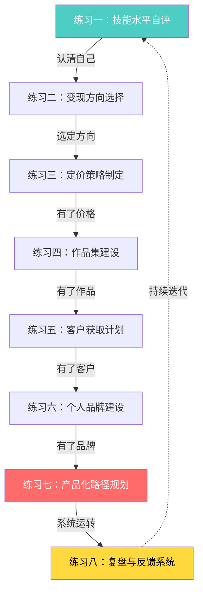

**关键原则**：不要跳过前面的步骤。很多人上来就想做产品化，连自己的技能在市场上值多少钱都不知道，结果要么定价过低贱卖自己，要么定价过高接不到单。

### 开始之前的准备

在进入练习之前，准备好以下工具：

| 工具 | 用途 | 推荐选项 |
|------|------|----------|
| 时间追踪工具 | 记录每项工作的真实耗时 | Toggl Track（免费）、Clockify、RescueTime |
| 电子表格 | 记录数据、做分析 | Google Sheets、飞书多维表格 |
| 笔记工具 | 记录想法、复盘 | Notion、Obsidian、飞书文档 |
| 计时器 | 番茄钟工作法 | Forest、潮汐、物理计时器 |
| 项目管理 | 追踪多个客户和任务 | Trello、看板工具、Notion |
| 合同模板 | 保护双方权益 | 后文提供标准模板 |
| 发票/记账工具 | 财务合规 | 随手记、简道云、Excel自建模板 |

**时间投入预估**：

| 练习 | 单次投入 | 说明 |
|------|---------|------|
| 练习1-3（自评、方向、定价） | 各2-4小时 | 纯思考+调研，不需要外部资源 |
| 练习4（作品集） | 1-2周 | 制作内容需要时间，可与其他练习并行 |
| 练习5（获客计划） | 3-5小时 | 含渠道调研和话术准备 |
| 练习6（品牌建设） | 持续进行 | 30天冷启动+长期维护 |
| 练习7（产品化） | 2-4小时规划+长期执行 | 规划快，执行慢，循序渐进 |
| 练习8（复盘系统） | 每周30分钟 | 习惯养成需要21天 |

总投入时间：20-30小时（分散在2-4周内完成）。但这些时间的回报是——你将拥有一个清晰的变现路线图，而不是继续在迷茫中浪费时间。

> **心理准备**：这8个练习不是"读一遍就完成"的。每个练习都需要你花时间思考、调研、填写、执行。最大的风险不是做错，而是一直不做。完成70%的练习，比"完美计划但从未开始"强100倍。

---

## 练习一：技能水平自评

### 为什么自评是第一步

大多数技术人对自己的技能评估存在两种极端：要么过度自信（觉得自己的技术很值钱，只是没遇到识货的客户），要么过度自卑（觉得自己的技术还不够好，等学好了再开始变现）。

两种极端都会导致严重的后果。过度自信的人会定价过高、拒绝学习新技能、在客户面前暴露短板。过度自卑的人会低价竞争、错过好机会、陷入"永远在准备"的死循环。

心理学中有一个概念叫**达克效应（Dunning-Kruger Effect）**：能力不足的人倾向于高估自己，而能力较强的人倾向于低估自己。这意味着你的直觉判断很可能是错的——越是新手，越容易高估；越是高手，越容易低估。科学的自评不是"我觉得我几分"，而是通过可量化的维度和外部参照系来定位自己。

**达克效应的四阶段模型**：

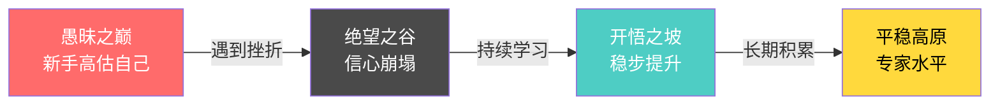

理解这个模型的意义在于：如果你觉得自己"还行但不算好"，你可能正处于"开悟之坡"——这恰恰是最好的起步点。如果你觉得自己"已经很厉害了"，反而要警惕是否还在"愚昧之巅"。

### 自评框架：五维度评估法

每个技能从五个维度打分（1-10分），然后取加权平均值：

| 维度 | 权重 | 评估标准 | 自评分 |
|------|------|----------|--------|
| 知识深度 | 25% | 对底层原理、最佳实践、行业标准的理解程度 | ___/10 |
| 实践经验 | 25% | 完成过多少实际项目？项目的复杂度和规模如何？ | ___/10 |
| 问题解决 | 20% | 遇到未知问题时，独立排查和解决的能力 | ___/10 |
| 工具熟练度 | 15% | 对主流工具、框架、平台的掌握程度 | ___/10 |
| 沟通表达 | 15% | 能否清晰地向非技术人员解释技术方案？能否写好技术文档？ | ___/10 |

**各维度的分值参考**：

| 分值 | 知识深度 | 实践经验 | 问题解决 | 工具熟练度 | 沟通表达 |
|------|----------|----------|----------|------------|----------|
| 1-3分 | 只会基础语法/操作 | 做过练习题，没有真实项目 | 遇到问题只能搜索复制粘贴 | 只用过1-2个工具 | 说不清楚自己在做什么 |
| 4-6分 | 理解核心概念和常用模式 | 做过3-10个真实项目 | 能独立解决大部分常见问题 | 熟练使用主流工具链 | 能写技术文档，能和同行交流 |
| 7-8分 | 深入理解底层原理，能做技术选型 | 做过10+个项目，有复杂项目经验 | 能解决疑难问题，能设计架构 | 精通多种工具，能做工具整合 | 能给非技术人员做方案汇报 |
| 9-10分 | 行业权威，能提出新方法论 | 有大型项目/产品级经验 | 能预见问题并提前规避 | 能开发工具和插件 | 能做公开演讲、写专业书籍 |

**避免虚高的自检方法**：如果你给自己打了8分以上的某个维度，问自己一个问题——"如果一个这个领域的顶尖专家来看我的作品/代码/方案，他会同意我给自己打8分吗？"如果犹豫，就降到7分。

**另一个有效的校准方法——"教别人"测试**：如果你能在某个维度上给一个新手讲2小时的课而不卡壳、不讲错，你大概在6-7分。如果你能在行业会议上做分享并获得正面反馈，你在8分以上。如果你讲了10分钟就讲不下去了，你可能在4分以下。教学能力是知识深度最诚实的检验。

### 多维度技能矩阵

大多数人不只有一项可变现技能。用以下矩阵梳理你的全部技能资产：

| 技能名称 | 知识深度(25%) | 实践经验(25%) | 问题解决(20%) | 工具熟练度(15%) | 沟通表达(15%) | 加权总分 | 市场需求 |
|----------|:---:|:---:|:---:|:---:|:---:|:---:|:---:|
| 技能A：______ | __/10 | __/10 | __/10 | __/10 | __/10 | __分 | 高/中/低 |
| 技能B：______ | __/10 | __/10 | __/10 | __/10 | __/10 | __分 | 高/中/低 |
| 技能C：______ | __/10 | __/10 | __/10 | __/10 | __/10 | __分 | 高/中/低 |
| 技能D：______ | __/10 | __/10 | __/10 | __/10 | __/10 | __分 | 高/中/低 |

**隐藏技能的挖掘**：除了硬技术技能，以下"隐藏技能"同样可以变现：

| 隐藏技能 | 变现场景 | 你是否有 |
|----------|---------|:---:|
| 行业知识（如电商、金融、医疗） | 技术+行业垂直服务，溢价50-200% | □ |
| 教学/表达能力 | 技术培训、课程、写作 | □ |
| 项目管理经验 | 技术项目经理、CTO顾问 | □ |
| 跨文化/双语能力 | 国际客户接单、技术翻译 | □ |
| 社群运营能力 | 技术社群、付费圈子 | □ |
| 审美/设计感 | 技术+设计的复合服务 | □ |
| 数据分析直觉 | 用数据驱动业务决策的咨询服务 | □ |
| 用户研究能力 | 用户访谈、可用性测试服务 | □ |

**技能组合的溢价效应**：单一技能的市场价值是线性的，但技能组合的价值往往是超线性的。例如：

| 技能组合 | 溢价倍数 | 说明 |
|----------|---------|------|
| 编程 + 行业知识 | 1.5-3x | 懂医疗的程序员比通用程序员贵2倍 |
| 设计 + 前端开发 | 1.5-2x | 能自己实现设计的设计师效率极高 |
| 写作 + 技术背景 | 2-4x | 技术写作千字价格是普通写作的3倍 |
| AI + 任何传统技能 | 2-5x | AI赋能的传统技能是当前最大蓝海 |
| 项目管理 + 技术 | 1.5-2x | 技术PM的需求远超纯管理PM |

### 外部校准：用市场数据验证你的自评

自评最大的问题是主观偏差。用以下四种方法做外部校准：

**方法一：平台定价参照法**

到猪八戒、程序员客栈、Upwork等平台，搜索和你技能相同的服务，找到评价数量和价格都处于中位水平的服务者，对比他们的描述和你的能力，确定你大概处于什么水平。

具体操作步骤：
1. 在目标平台搜索你的技能关键词（如"React开发""数据分析"）
2. 按评价数量排序，找到评价数处于中位的5个服务者
3. 逐个阅读他们的服务描述、案例展示、定价
4. 对比他们的描述和你的实际能力，标记你的位置
5. 如果他们有公开的客户评价，阅读评价内容，了解客户看重什么

**方法二：面试测试法**

去投2-3个兼职或远程岗位的简历，通过面试结果来校准。能拿到offer且薪资符合预期，说明你的自评基本准确。被拒或薪资低于预期，说明需要下调自评。

为什么面试是最客观的校准：面试是一个"市场出价"的过程——企业用真金白银为你的能力投票。面试官问的问题能暴露你的知识盲区，面试结果直接反映你的市场价值。即使你暂时不打算全职工作，每年做1-2次面试校准也是值得的。

**方法三：同行对比法**

在技术社区（掘金、GitHub、Stack Overflow）找5个和你做类似事情的人，对比他们的作品质量和你的作品质量。不要和最顶尖的人比，也不要和最差的人比——找中位水平的人做参照。

**同行对比的具体操作**：在GitHub上搜索你的技能关键词，找到Star数在中位水平的项目（不是最热门的），阅读其代码质量、文档质量、项目复杂度。如果你的代码质量和文档质量与之持平或更优，你的自评基本准确。

**方法四：付费咨询验证法（高价值补充）**

找一个你所在领域的资深从业者或职业咨询师，花200-500元做一次1小时的技能评估咨询。带着你的作品集、项目经历、自评结果去问。对方基于行业经验给出的评估往往比你自己评估准确得多。这笔钱的回报率极高——一个准确的定位可能帮你少走半年弯路。

### 市场价值调研

完成自评后，把你的技能放到市场中定位：

| 技能名称 | 你的自评分 | 对应水平 | 市场时薪(国内) | 市场时薪(国际) |
|----------|------------|----------|---------------|---------------|
| __________ | ___/10 | __________ | __________ | __________ |
| __________ | ___/10 | __________ | __________ | __________ |
| __________ | ___/10 | __________ | __________ | __________ |

**各技能的市场时薪参考**（2024-2026年数据）：

| 技能 | 初级(1-3分) | 中级(4-6分) | 高级(7-8分) | 专家(9-10分) |
|------|------------|------------|------------|-------------|
| 前端开发 | 80-150元 | 150-350元 | 350-700元 | 700-1500元 |
| 后端开发 | 100-200元 | 200-450元 | 450-900元 | 900-2000元 |
| AI应用开发 | 150-350元 | 350-800元 | 800-1800元 | 1800-3500元 |
| UI/UX设计 | 60-130元 | 130-300元 | 300-600元 | 600-1200元 |
| 文案写作 | 50-120元 | 120-300元 | 300-700元 | 700-1500元 |
| 数据分析 | 80-180元 | 180-450元 | 450-1000元 | 1000-2000元 |
| 翻译(中英) | 60-120元 | 120-280元 | 280-600元 | 600-1200元 |
| 短视频制作 | 60-150元 | 150-400元 | 400-1000元 | 1000-2000元 |
| 网络安全 | 120-250元 | 250-600元 | 600-1500元 | 1500-3000元 |
| DevOps/运维 | 100-200元 | 200-500元 | 500-1000元 | 1000-2500元 |

**国际平台时薪参考**（Upwork/Fiverr，美元）：

| 技能 | 初级 | 中级 | 高级 | 专家 |
|------|------|------|------|------|
| Web开发 | $15-30 | $30-60 | $60-120 | $120-250 |
| Mobile开发 | $20-40 | $40-80 | $80-150 | $150-300 |
| AI/ML工程 | $25-50 | $50-100 | $100-200 | $200-400 |
| UI/UX设计 | $15-30 | $30-60 | $60-100 | $100-200 |
| 技术写作 | $15-25 | $25-50 | $50-100 | $100-200 |

> **为什么还要看国际价格**：即使你现在只接国内单，了解国际价格能帮你判断：(1) 你的技能在国际市场的竞争力；(2) 未来转向国际接单的收入天花板；(3) 当你的国内定价接近国际价格时，说明你已经到了该涨价的节点。

### 自评完成后的输出物

完成本练习后，你应该得到以下结论：

1. **技能清单**：列出你会的所有可变现技能，每个技能的五维度评分和加权总分
2. **水平定位**：明确每个技能处于"初级/中级/高级/专家"的哪个阶段
3. **市场价值**：知道你的技能在市场上的时薪区间（国内+国际）
4. **差距识别**：知道你的短板在哪里（是知识深度不够？还是实践经验不足？还是沟通能力欠缺？）
5. **独特优势**：找到你区别于同水平竞争者的差异化优势
6. **校准记录**：至少用了2种外部校准方法验证你的自评

### 常见错误

| 错误 | 后果 | 纠正方法 |
|------|------|----------|
| 所有维度都给自己打8分以上 | 无法发现真实短板 | 请3个了解你的人独立给你打分，取平均 |
| 只评估技术维度，忽略沟通 | 变现时因为沟通丢客户 | 沟通在变现场景中权重不低于技术 |
| 和最顶尖的人比 | 产生自卑心理，不敢开始 | 和同阶段的中位水平比，而不是和行业领袖比 |
| 评估完就束之高阁 | 白做一次练习 | 把评估结果写在纸上贴在桌前，每周对照检查 |
| 只评估一次就定终身 | 3个月后能力已变化，评估失效 | 每3个月重新评估一次，记录变化趋势 |
| 忽略行业知识的溢价 | 只卖技术，丢失溢价空间 | 行业知识+技术能力的组合溢价通常在50-200% |
| 把"用过"等同于"熟练" | 高估工具熟练度 | "熟练"意味着能不查文档完成80%的操作 |

---

## 练习二：变现方向选择

### 为什么方向选择比努力更重要

选错方向的代价是巨大的。一个擅长写Python脚本的人，如果去做通用的网站开发接单，要和数十万前端开发者竞争；但如果去做数据分析自动化脚本，竞争者少得多，单价也高得多。

方向选择的核心原则是**交叉优势**——找到你的技能、市场需求、你的兴趣三者的交集。

**方向选择的经济学原理——供需法则**：

在自由市场中，价格由供需关系决定。当供给（服务者数量）远大于需求（客户数量）时，价格下降；反之价格上升。选择方向的本质，就是找到一个**需求增长快于供给增长**的细分市场。

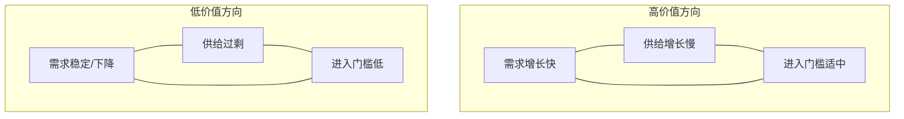

### 交叉优势定位法

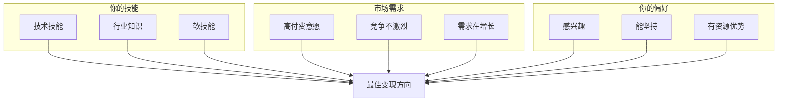

**三圈交叉的具体操作方法**：

1. **列出你的技能圈**：把练习一中评估的所有技能列出来，包括硬技能和软技能
2. **调研市场圈**：在百度指数、微信指数、Google Trends搜索这些技能的关键词，找到搜索量上升的领域；在接单平台找到"需求量大但服务者少"的类别
3. **评估兴趣圈**：问自己"如果未来1年主要做这个方向，我能坚持吗？"不要选一个你讨厌但"看起来赚钱"的方向——你坚持不了3个月
4. **取交集**：三个圈重叠的部分就是你的最佳方向。如果没有完美交集，优先选"技能+市场"的交集，兴趣可以培养

### 实战案例：方向选择的威力

**案例一：从通用前端到小程序开发**

小张是3年前端经验的开发者，在平台上接网站开发的单子，月收入6000-8000元，竞争对手极多。后来他发现微信小程序开发的需求在增长，而很多前端开发者不会小程序的特殊API和审核流程。他花了1个月专门学习小程序开发，转向小程序接单后，月收入提升到15000-20000元，竞争对手减少了70%。

**关键转折点**：小张发现，在猪八戒上搜索"网站开发"有超过10万个服务者，但搜索"小程序开发"只有不到2万个。同样的技能水平，竞争减少80%，价格自然上升。

**案例二：从翻译到技术文档翻译**

小李是英语专业的翻译，在翻译平台上和数万人竞争，千字价格50-80元。后来她发现自己对IT行业感兴趣，花3个月学习了技术写作基础和常见技术术语。转向技术文档翻译后，千字价格提升到150-300元，因为技术文档翻译的竞争者少得多，而且客户愿意为"懂技术的翻译"支付溢价。

**案例三：从全栈开发到跨境电商数据工具**

老王做了5年全栈开发，一直接通用的Web项目。后来他注意到跨境电商卖家对数据分析工具有强烈需求，而他恰好对电商行业有了解（家人做电商）。他开始专门为Shopify卖家开发数据看板和自动化工具，从接单逐步产品化，最终做出了月收入3万+的SaaS产品。

**案例四：从运维到云安全咨询**

小陈做了4年运维，技术中等偏上。他发现中小企业上云后对安全合规的需求暴增，但大部分安全公司只服务大客户。他花了半年考了CISSP认证，专门帮中小企业做云安全评估和合规整改，客单价从运维时代的5000元/单提升到2-5万元/单，而且客户粘性极高（安全是持续需求）。

**案例五（反面）：方向选错的代价**

小周是Java后端开发者，看到AI很火，花了3个月学了机器学习基础，然后试图转型做AI接单。结果发现：(1) 3个月的学习深度远远不够和科班出身的竞争；(2) AI项目的客户需求极不明确，沟通成本极高；(3) 放弃了自己Java后端的积累，回头再接Java单时发现客户已经被别人抢走了。浪费了半年时间，收入为零。

**教训**：方向选择要基于你已有的优势，而不是市场热点。"市场热"和"你能做"是两回事。

### 变现方式全景对比

| 变现方式 | 启动难度 | 收入上限 | 时间自由度 | 适合的技能类型 | 第一笔收入时间 |
|----------|---------|---------|-----------|--------------|--------------|
| 平台接单 | 低 | 中(3-5万/月) | 低 | 编程、设计、写作、翻译 | 1-2周 |
| 自由接单(口碑) | 中 | 高(5-15万/月) | 中 | 所有技能 | 1-3个月 |
| 知识付费(课程) | 中 | 高(10万+/月) | 高 | 有教学能力的人 | 2-4个月 |
| 咨询服务 | 高 | 极高(1000-5000元/小时) | 高 | 行业深度经验 | 3-6个月 |
| 模板/工具销售 | 中 | 中(1-5万/月) | 极高 | 设计、代码 | 1-3个月 |
| SaaS产品 | 极高 | 极高(理论无上限) | 高 | 技术+产品能力 | 6-12个月 |
| 自媒体+广告 | 低 | 中(1-5万/月) | 高 | 内容创作能力 | 3-12个月 |
| 远程兼职/合同工 | 低 | 中(2-5万/月) | 中 | 所有技术技能 | 1-4周 |
| 技术社群/付费圈子 | 中 | 中(1-3万/月) | 高 | 社群运营+专业能力 | 2-6个月 |
| 技术培训/企业内训 | 高 | 极高(5000-50000元/天) | 中 | 教学能力+行业经验 | 2-4个月 |

### 决策矩阵：量化你的选择

对每种你感兴趣的变现方式，用以下矩阵打分（每项1-5分）：

| 评估维度 | 权重 | 方式A：______ | 方式B：______ | 方式C：______ |
|----------|------|-------------|-------------|-------------|
| 你现有技能的匹配度 | 25% | ___分 | ___分 | ___分 |
| 市场需求强度 | 20% | ___分 | ___分 | ___分 |
| 竞争激烈程度(越低越好) | 15% | ___分 | ___分 | ___分 |
| 你的兴趣和热情 | 15% | ___分 | ___分 | ___分 |
| 启动成本(越低越好) | 10% | ___分 | ___分 | ___分 |
| 收入上限 | 10% | ___分 | ___分 | ___分 |
| 时间灵活性 | 5% | ___分 | ___分 | ___分 |
| **加权总分** | **100%** | **___分** | **___分** | **___分** |

**使用说明**：先列出3-5种你感兴趣的变现方式，用这个矩阵分别打分。得分最高的那个就是你当前阶段的最佳选择。不要贪多——先做好一个方向，稳定后再拓展第二个。

### 蓝海细分的寻找方法

"蓝海"不是凭空想象出来的，而是用以下方法系统性地发现：

1. **关键词分析法**：在百度指数、微信指数搜索你的技能关键词，找到搜索量在增长但竞争内容少的细分领域。具体操作：搜索"XX开发"，查看相关词推荐中哪些词的搜索量在近6个月内持续上升，但搜索结果中专业内容少于100篇。
2. **平台需求缺口法**：在猪八戒、Upwork等平台搜索，找到"需求量大但服务者少"的类别（通常是新兴技术或行业垂直领域）。判断标准：某类需求的发布数量是服务者数量的3倍以上。
3. **客户痛点法**：在知乎、行业论坛搜索"有没有人能帮我做XX"的帖子，找到反复出现但没有好解决方案的需求。重点关注出现5次以上、且现有回答质量不高的问题。
4. **跨界整合法**：把你的技能和一个热门行业结合（如"AI+教育""前端+医疗""数据分析+电商"），创造新的服务品类。跨界整合的溢价通常在50-300%，因为竞争者极少。
5. **政策红利法**：关注国家政策和行业标准变化带来的新需求。例如数据安全法实施后，数据合规咨询需求暴增；AI监管政策出台后，AI伦理审查成为新赛道。

### 阶段性目标设定

选定方向后，制定分阶段的收入目标：

| 阶段 | 时间范围 | 收入目标 | 关键行动 | 验证信号 |
|------|---------|---------|---------|---------|
| 验证期 | 第1-2个月 | 0-3000元 | 注册平台、完善资料、接到并交付第一单 | 收到第一笔付款 |
| 冷启动 | 第3-4个月 | 3000-8000元 | 积累3-5个好评、优化服务流程 | 客户主动好评、开始有转介绍 |
| 增长期 | 第5-8个月 | 8000-20000元 | 提高客单价、筛选优质客户 | 能拒绝低质量项目、月收入稳定过万 |
| 稳定期 | 第9-12个月 | 20000-50000元 | 建立个人品牌、开始产品化尝试 | 客户主动找上门、时间成为唯一瓶颈 |

### 方向验证的最小实验

在投入大量时间之前，用最小成本验证方向是否可行：

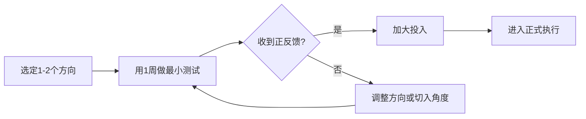

**最小实验的具体做法**：
1. 写1篇该方向的深度文章发到目标平台，看阅读量和互动
2. 在接单平台注册并投3-5个标，看是否有回复
3. 在相关社群发1条服务介绍，看是否有人咨询
4. 给3-5个潜在客户发私信，看回复率

**判断标准**：如果1周内收到至少1个正向反馈（咨询、点赞、收藏、回复），方向基本可行。如果完全没有任何反馈，需要调整切入角度或重新选择方向。

### 常见错误

| 错误 | 后果 | 纠正方法 |
|------|------|----------|
| 同时做5个方向 | 精力分散，哪个都做不好 | 先选1个方向，做到月入5000+再考虑第二个 |
| 只看收入上限，忽略启动难度 | 半年没收入，心态崩了 | 先选启动难度低的方向验证模式，再升级 |
| 别人做什么我就做什么 | 进入红海市场，低价竞争 | 用交叉优势找到蓝海细分领域 |
| 方向选了就死磕不调整 | 浪费时间在错误方向上 | 每3个月重新评估一次，数据不好及时调整 |
| 忽略自己的行业知识 | 只卖技术，丢失溢价空间 | 行业知识+技术能力的组合溢价通常在50-200% |
| 不做最小验证就全力投入 | 方向错误损失大量时间 | 用1周最小实验验证，有正反馈再加大投入 |
| 追逐市场热点而放弃已有积累 | 从零开始，竞争更激烈 | 基于已有优势做延伸，而不是完全换赛道 |

---

## 练习三：定价策略制定

### 为什么定价是最关键的决策

定价决定了你吸引什么客户、过什么生活、能不能持续做下去。定价过低，吸引劣质客户，陷入低价竞争的恶性循环；定价过高，接不到单，心态崩溃。

大多数人犯的错误是"用成本思维定价"——算算自己一个月需要多少钱，除以工作小时数，得出一个时薪。这种定价方式的问题在于，它把你的收入上限锁死在"时间×时薪"上，而且往往因为低估了隐性成本（沟通、修改、学习、空档期）而导致实际时薪远低于预期。

**定价的心理学本质**：价格不仅是数字，更是信号。高价=高质量，这是客户心中根深蒂固的认知。一个报价500元的网站和一个报价5000元的网站，客户默认后者的质量是前者的10倍——即使实际上差距没那么大。合理利用这个心理效应，是定价策略的核心。

**锚定效应在定价中的应用**：行为经济学中的"锚定效应"表明，人们在做决策时会过度依赖第一个接收到的信息。这就是为什么价格阶梯设计中，最高档的存在不是为了卖出去，而是为了让中间档显得"合理"。当你报价时，先说较高的方案，再推荐中间方案，客户的接受度会显著提高。

### 三种定价方法的适用场景

**方法一：成本定价法（底线价格）**

```text
最低时薪 = (月固定支出 + 月变动支出 + 月储蓄目标) ÷ 每月实际可收费小时数
```

注意"实际可收费小时数"不是"工作小时数"。一个自由职业者每个月的有效工作时间大约是总工作时间的60-70%（其余时间用于沟通、行政、学习、空档期）。所以：

| 收支项目 | 金额(元/月) | 说明 |
|----------|------------|------|
| 房租/房贷 | ______ | 你的住房成本 |
| 餐饮/交通 | ______ | 日常生活开支 |
| 工具/软件订阅 | ______ | IDE、设计软件、云服务等 |
| 学习投入 | ______ | 课程、书籍、培训 |
| 社保/商业保险 | ______ | 社保自缴或商业保险 |
| 税费 | ______ | 个税、增值税等（详见本章末尾税务规划） |
| 储蓄/投资 | ______ | 建议至少收入的20% |
| 应急储备 | ______ | 建议3-6个月生活费的摊销 |
| **月总支出** | **______** | |
| 每月总工作小时 | ______ | 建议160-200小时 |
| 实际可收费比例 | ______% | 建议60-70% |
| 每月可收费小时 | ______ | 总工作小时×收费比例 |
| **最低时薪** | **______元** | 月总支出÷可收费小时 |

**举个具体例子**：假设你月支出8000元，每月工作176小时（每天8小时×22天），可收费比例65%。那么最低时薪 = 8000 ÷ (176×0.65) = 8000 ÷ 114.4 ≈ 70元/小时。这意味着如果你的实际时薪低于70元，你就在亏钱——即使账面上看起来"接到了单"。

**隐性成本清单**（很多人遗漏的）：

| 隐性成本 | 占比 | 说明 |
|----------|------|------|
| 沟通成本 | 15-25% | 需求讨论、方案汇报、修改沟通 |
| 行政成本 | 5-10% | 合同、发票、记账、税务 |
| 学习成本 | 5-10% | 新技术学习、工具更新 |
| 空档期 | 10-20% | 项目之间的等待时间 |
| 修改返工 | 5-15% | 客户要求的修改和返工 |

**方法二：市场定价法（起步价格）**

```text
起步时薪 = 市场同水平服务者的中位价格
```

到接单平台上搜索和你同技能、同水平的服务者，记录10个人的价格，取中位数作为你的起步价格。

**具体操作步骤**：
1. 在3个以上平台搜索你的技能关键词
2. 筛选评价数10-50条的服务者（太少不稳定，太多是头部不具代表性）
3. 记录至少10个价格数据点
4. 去掉最高和最低的各2个，取剩余的平均值
5. 这就是你的市场参照价

**方法三：价值定价法（理想价格）**

```text
理想价格 = 你为客户创造的价值 × 10%-30%
```

这是最高级的定价方式，适用于你能清楚量化自己创造的价值的场景。例如：你帮客户开发了一个自动化脚本，每月为客户节省20小时人工（按100元/小时计算=2000元/月），那么你可以收取2000×12×20%=4800元。

**价值定价法的说服技巧**：不要直接说"我收4800元"，而是这样沟通——"这个自动化脚本每月能帮你节省20小时的人工成本，按照每小时100元计算，一年节省24000元。我收4800元，相当于你用2个月的节省就回本了，之后10个月都是纯收益。"这种说法让客户看到的是"投资回报"而不是"成本"。

**价值定价法的量化技巧**：如果你不确定自己创造了多少价值，可以问客户以下问题：
- "这个问题目前每月给你造成多少损失？"
- "如果解决了这个问题，你预计能节省多少时间/增加多少收入？"
- "你之前尝试解决这个问题花了多少成本？"

客户的回答就是你定价的锚点。

### 定价策略选择指南

| 你的情况 | 建议定价方法 | 原因 |
|----------|------------|------|
| 刚入行，没有作品和评价 | 成本定价法+略低于市场中位价 | 先用低价积累第一批客户和评价 |
| 有3-5个项目经验 | 市场定价法(中位价) | 用市场参照定价，避免自我低估 |
| 有10+项目经验，有口碑 | 市场定价法(中位价以上) | 用品牌溢价支撑更高定价 |
| 能量化创造的价值 | 价值定价法 | 收入上限最高，但需要强说服力 |
| 做垂直领域(竞争者少) | 价值定价法或市场定价法上浮30-50% | 供给稀缺性支撑溢价 |

### 价格阶梯设计

不要只有一种价格，设计一个价格阶梯让不同预算的客户都能找到适合的选项：

```text
入门级服务：___元    （基础功能，标准化交付）
标准级服务：___元    （完整功能，包含一定定制）
高级服务：___元      （完全定制，包含后续维护）
VIP/包年服务：___元  （长期合作，专属服务）
```

**阶梯定价的心理学原理**：当客户看到三个选项时，大多数人会选择中间那个（折中效应）。如果你只有一个价格，客户只能选择"接受"或"拒绝"；有了三个价格，客户变成了选择"哪个档次"——成交率会显著提升。

**设计阶梯定价的关键细节**：
- 三个档次之间的价格比例建议为 1:2:4（如999元、1999元、3999元）
- 每个档次之间的差异要明确、可感知（不是"更好一点"，而是"多包含XX功能/服务"）
- 最高档包含的"专属服务"要让客户觉得"物有所值"——比如优先响应、免费维护3个月、专属微信群
- 入门级的目的不是赚钱，而是降低客户的决策门槛，让他们体验你的服务
- 在中间档设置一个"锚定选项"，让客户觉得"加一点钱就能多很多东西"

**阶梯定价的实例——网站开发**：

| 档次 | 价格 | 包含内容 | 目标客户 |
|------|------|---------|---------|
| 入门版 | 2999元 | 5页响应式网站、基础SEO、1次修改 | 预算有限的小商家 |
| 标准版 | 5999元 | 10页响应式网站、完整SEO、CMS后台、3次修改、3个月维护 | 中小企业（主力档） |
| 旗舰版 | 11999元 | 全定制设计、不限页面、完整SEO、CMS、小程序、6个月维护、优先响应 | 品牌企业 |

### 报价话术模板

报价是定价的最后一步，也是最容易搞砸的一步。以下是经过验证的报价话术结构：

**话术框架（PREP法）**：

```text
Position（定位）：根据您的需求，我建议选择【XX方案】
Reason（原因）：这个方案包含了【具体功能1】、【具体功能2】和【具体功能3】，
               能够解决您提到的【核心痛点】
Evidence（证据）：我之前帮【类似客户】做过类似项目，他们的【量化成果】
Proposal（提议）：费用是【XX元】，包含【交付物清单】，预计【X周】完成。
               需要预付30%作为启动款。
```

**报价后的常见场景应对**：

| 客户反应 | 应对策略 | 示例话术 |
|----------|----------|----------|
| "太贵了" | 拆解价值，不要降价 | "这个价格包含了XX功能和XX服务。如果预算有限，我们可以先做核心功能，后续再迭代" |
| "别人报价比你低" | 强调差异化价值 | "价格差异通常反映在交付质量、售后支持和项目经验上。您方便把对方的方案发给我看看吗？我可以帮您对比分析" |
| "能便宜点吗" | 不直接降价，而是调整范围 | "如果预算确实有限，我们可以调整方案范围——比如先做核心功能，后续版本再加XX" |
| "我考虑一下" | 给出决策时间框架 | "没问题。我这边这个月还有2个空档期，如果本周内确认的话可以排上，下周开始可能要等1个月了" |
| "能不能免费试做一部分" | 设定试做的边界 | "我可以先花2小时做一个技术方案的原型给您看效果，这部分免费。但完整开发需要正式立项" |

### 涨价策略

涨价是自由职业者最害怕但最必要的事。以下是经过验证的涨价策略：

**涨价时机**：
- 你的接单率（成交/咨询）超过70%——说明需求旺盛，可以涨价
- 你已经3个月以上没有调价——市场在变，你的价格也应该变
- 你的技能水平有明显提升——新学了技术、完成了更复杂的项目
- 你的日程排满了——时间成为稀缺资源，需要用价格来筛选客户

**涨价幅度**：每次涨价10-20%，不要一次涨太多。如果你需要大幅涨价（50%+），建议分2-3次完成，每次间隔2-3个月。

**涨价话术**：

```text
老客户涨价通知（提前1个月告知）：

"XX您好，感谢您一直以来的信任和支持。随着我在XX领域的经验积累
和服务质量的持续提升，我的服务价格将在下月起进行调整：
- 原价格：XX元/小时
- 新价格：XX元/小时

作为老客户，您可以享受以下优待：
- 在本月内按原价锁定接下来3个月的服务
- 优先排期权不受影响

如有任何疑问，随时沟通。"
```

**涨价失败的应急预案**：如果涨价后连续2个月新客户数量下降超过30%，说明涨价幅度过大。此时不要急着降价（会损害品牌），而是：
1. 保持标价不变，但在谈判中给"首单优惠"
2. 增加服务内容，让价格显得"物有所值"
3. 向更高端的客户群体拓展，而不是维持原来的客户群

### 定价自检清单

完成定价后，用以下问题自检：

- [ ] 你的最低时薪是否高于你的最低生活保障线？
- [ ] 你的定价是否在市场同水平服务者的合理区间内？
- [ ] 你能否用3个理由说服客户接受这个价格？
- [ ] 你的价格阶梯是否覆盖了不同预算的客户？
- [ ] 你是否预留了涨价空间（建议每年涨价10-20%）？
- [ ] 你是否明确了付款方式（建议30-50%预付款）？
- [ ] 你是否考虑了税费对实际收入的影响？
- [ ] 你的定价是否反映了你的独特价值（而不仅仅是市场均价）？

### 常见错误

| 错误 | 后果 | 纠正方法 |
|------|------|----------|
| 只算编码时间，忽略沟通和修改 | 实际时薪只有预期的50% | 用Toggl/Clockify记录真实时间投入 |
| 一口价没有阶梯 | 丢失中间档客户 | 设计3档价格，用折中效应提高客单价 |
| 不好意思涨价 | 3年后还在收新人价 | 每半年评估一次，逐步提价 |
| 不收定金 | 做完活拿不到钱 | 合同写明30-50%预付款，不付不开工 |
| 报价时过度解释 | 显得不自信，客户压价 | 报价简洁明确，只在客户质疑时展开说明 |
| 用低价抢客户 | 吸引劣质客户，恶性循环 | 用价值和服务质量竞争，而不是价格 |

---

## 练习四：作品集建设

### 为什么作品集是变现的核心武器

在技能变现的场景中，作品集的作用相当于求职时的学历+工作经验——它是客户判断你能力的第一依据。没有作品集，你说"我很厉害"，客户没有理由相信；有了高质量的作品集，客户会主动找上门。

**作品集的ROI**：花2周时间打磨一个高质量作品集，可能在未来1年内为你带来10倍于投入时间的收入。这是技能变现中ROI最高的投资之一。

**作品集的本质**：不是"展示你会什么"，而是"证明你能帮客户解决什么问题"。客户不关心你用了什么技术栈，关心的是你能帮他赚多少钱、省多少钱、解决什么痛点。

**从客户视角设计作品集**：想象你是一个要花5000元请人做网站的小商家，你打开一个开发者的主页，你最想看到什么？不是"精通React、Vue、Angular"，而是"帮XX品牌做的电商网站，上线首月订单量增长40%"。

### 作品集的最小可行版本(MVP)

如果你现在一个作品都没有，按以下优先级逐步构建：

| 优先级 | 作品类型 | 制作时间 | 作用 | 适合人群 |
|--------|---------|---------|------|---------|
| 1 | 个人实战项目 | 1-2周/个 | 证明你能独立完成完整项目 | 所有人 |
| 2 | 开源贡献记录 | 1-2周 | 证明你的代码质量和协作能力 | 程序员 |
| 3 | 概念设计/原型 | 3-5天/个 | 展示你的设计思维和审美 | 设计师 |
| 4 | 技术文章/教程 | 1-3天/篇 | 展示你的知识深度和表达能力 | 所有人 |
| 5 | 客户案例(匿名) | 1天/个 | 证明你有真实客户和交付能力 | 有接过单的人 |

**MVP标准**：3个高质量作品 + 1个个人网站。做到这一步就可以开始接单了。后续边做项目边积累。

### 没有真实项目怎么办？制造作品的5种方法

很多人卡在"我没有作品"这个环节。以下是不需要客户也能制造高质量作品的方法：

**方法一：重新实现知名产品**

挑选一个你常用的工具或网站，用自己的技术栈重新实现核心功能。例如：用React做一个简化版的Trello看板、用Python做一个简化版的Notion笔记工具。关键是要写清楚你的设计决策和实现思路，而不只是展示"我能复制"。

**方法二：解决自己的真实痛点**

想想你在日常工作/生活中遇到的重复性问题，开发一个工具来解决它。例如：自动整理下载文件夹的脚本、帮自己做财务记录的小程序、自动汇总GitHub PR的工具。真实痛点的解决方案比虚构项目更有说服力。

**方法三：参加黑客松/编程比赛**

线上黑客松（如Devpost、黑客马拉松中文站）提供了一个在限定时间内完成项目的框架。比赛结束后你不仅有了作品，还可能有获奖记录来背书。

**方法四：给开源项目贡献代码**

找一个你使用的开源项目，修复一个bug或添加一个小功能。在你的作品集中展示这个PR的链接、你解决的问题、你的代码改动。开源贡献是技术能力最有力的证明之一。

**方法五：写深度技术文章**

一篇3000字以上的技术深度文章，本身就是一件"作品"。它展示了你的知识深度、逻辑思维和表达能力。在掘金、知乎、个人博客上发布后还能积累阅读量和粉丝。

### 每个作品的完整展示模板

一个合格的作品展示应该包含以下要素，缺一不可：

```text
## 项目名称

### 背景与挑战
- 客户/项目的背景是什么？（1-2句话）
- 要解决的核心问题是什么？
- 难点在哪里？

### 我的角色与贡献
- 我在这个项目中负责什么？
- 我使用了哪些技术/方法？
- 我做出了哪些关键决策？

### 解决方案
- 我的设计/技术方案是什么？（配架构图、流程图、截图）
- 为什么选择这个方案而不是其他方案？
- 实现过程中的关键节点

### 成果与数据
- 项目上线后的效果（用数据说话）
- 客户/用户的反馈
- 量化指标：加载速度提升X%、转化率提升X%、用户增长X%

### 技术栈
- 使用的工具、框架、平台列表
```

**关键原则**：用数据说话。"帮客户提升了40%的转化率"比"做了个好看的网站"有说服力100倍。如果实在没有数据，至少要有前后对比截图。

### 作品集展示平台选择

| 平台 | 适合人群 | 优势 | 劣势 | 建议 |
|------|---------|------|------|------|
| 个人网站(推荐) | 所有人 | 完全自主、专业感强、SEO友好 | 需要自己搭建和维护 | 用GitHub Pages+Hugo，免费且能展示技术能力 |
| GitHub | 程序员 | 代码直接可见、开源社区背书 | 非技术客户看不懂 | README要写清楚项目说明，配截图和演示链接 |
| Behance | 设计师 | 全球设计师社区、作品展示效果好 | 竞争激烈、中文用户少 | 英文展示，同时在站酷发中文版 |
| Dribbble | 设计师 | 高质量设计社区、品牌背书强 | 需要邀请才能注册 | 先在Behance积累作品，再申请Dribbble |
| 站酷 | 设计师 | 国内最大设计社区、中文友好 | 偏商业设计 | 适合展示商业项目案例 |
| 掘金/CSDN | 程序员 | 技术社区、内容传播快 | 偏技术文章而非作品 | 写项目复盘文章，附GitHub链接 |
| 知乎 | 所有人 | 流量大、问答场景自然引流 | 内容质量参差不齐 | 回答相关问题时自然引用作品 |

**最佳组合**：个人网站（作为主阵地）+ 1-2个垂直平台（作为引流渠道）。所有平台的链接都指向你的个人网站，形成流量聚合。

### 个人网站的快速搭建指南

个人网站是作品集的主阵地，以下是30分钟内搭建一个专业网站的步骤：

| 步骤 | 时间 | 操作 |
|------|------|------|
| 1. 选择平台 | 5分钟 | GitHub Pages（免费）+ Hugo/Hexo（静态生成） |
| 2. 选择主题 | 5分钟 | 在Hugo Themes选一个简洁专业的主题 |
| 3. 填写内容 | 15分钟 | 个人简介、技能、3个作品案例 |
| 4. 绑定域名 | 5分钟 | 买一个域名（如yourname.com，约60元/年） |
| 5. 提交收录 | 验证后 | 在Google Search Console提交，开始SEO |

**网站必须有的5个页面**：首页（一句话说清你是谁、做什么）、作品集页（3-8个案例）、关于页（个人经历和技能）、博客/文章页（展示专业深度）、联系方式页（表单或微信二维码）。

**SEO基础优化**：
- 每个页面的title标签包含你的核心关键词（如"React前端开发 | 小程序开发专家"）
- 作品案例页的URL用英文关键词（如/projects/ecommerce-miniprogram）
- 图片加alt标签描述
- 网站加载速度控制在3秒以内
- 移动端响应式适配

### 作品集质量自检

用以下清单检查你的作品集是否合格：

- [ ] 至少有3个完整的项目案例（不是只有截图）
- [ ] 每个案例都有背景、方案、成果三个部分
- [ ] 至少有2个案例包含量化数据（提升X%、节省X小时）
- [ ] 作品集网站加载速度快（3秒以内）
- [ ] 移动端能正常浏览
- [ ] 联系方式清晰可见
- [ ] 有客户评价或推荐信（至少1条）
- [ ] 最近3个月内有更新（证明你还在活跃）
- [ ] 有清晰的CTA（Call to Action），告诉客户下一步该做什么
- [ ] 作品展示逻辑清晰，客户能在30秒内理解你做什么

### 常见错误

| 错误 | 后果 | 纠正方法 |
|------|------|----------|
| 把所有作品都放上去 | 质量参差不齐，拉低整体印象 | 只放最好的5-8个，宁缺毋滥 |
| 只放截图没有说明 | 客户看不懂你做了什么 | 每个作品配完整的背景→方案→成果说明 |
| 作品集一做完就不更新 | 过时的作品集不如没有 | 每完成一个好项目就更新一次 |
| 用别人的模板作品充数 | 面试/沟通时露馅，信誉归零 | 只放自己真实做过的作品 |
| 没有明确的联系方式和CTA | 客户想联系你但找不到入口 | 每个页面底部都放联系方式和"立即咨询"按钮 |
| 技术术语堆砌 | 非技术客户看不懂，直接关掉 | 用客户的语言描述成果，技术细节放在子页面 |

---

## 练习五：客户获取计划

### 为什么需要系统化的获客计划

"等着客户上门"不是一个策略，是一种赌博。很多技术人觉得"我技术好，客户自然会来"，结果等了3个月一个客户都没有，然后开始自我怀疑。

客户获取是一个系统工程，需要明确你的目标客户是谁、他们在哪里、你怎么触达他们、用什么话术说服他们。

**获客的底层逻辑**：客户购买的不是你的技术，而是你技术带来的结果。所以获客的本质不是"推销自己"，而是"让有需求的人知道你能解决他们的问题"。这个认知转变决定了你获客的方式和效率。

**获客漏斗的数学思维**：假设你的目标是月入2万元，客单价5000元，你需要4个客户。如果咨询到成交的转化率是40%，你需要10个咨询。如果曝光到咨询的转化率是5%，你需要200次曝光。这意味着你每周需要产生50次曝光——这个数字是可执行的。有了数学模型，获客就从"碰运气"变成了"可规划的工程"。

### 目标客户画像

在制定获客计划之前，先画出你的理想客户画像：

| 维度 | 你的理想客户 |
|------|------------|
| 行业 | ________________ |
| 规模 | ________________（个人/小企业/中型企业/大企业） |
| 预算范围 | ________________ |
| 决策方式 | ________________（老板直接拍板/需要团队讨论） |
| 常见痛点 | ________________ |
| 在哪里出现 | ________________（哪些平台/社群/活动） |
| 他们怎么找服务者 | ________________（搜索/推荐/平台） |
| 他们最看重什么 | ________________（价格/质量/速度/信任） |

**为什么要做客户画像**：不同类型的客户，获客方式完全不同。找小商家做网站，去猪八戒就够了；找企业做AI应用，需要在行业社群和LinkedIn上发力。用错渠道，效率低10倍。

### 获客渠道深度分析

| 获客渠道 | 获客成本 | 获客速度 | 客户质量 | 持续性 | 适合阶段 | 具体操作要点 |
|----------|---------|---------|---------|--------|---------|------------|
| 接单平台(猪八戒等) | 低(平台抽成15-20%) | 快(1-2周) | 参差不齐 | 中(依赖平台) | 冷启动期 | 完善资料、快速响应、积累好评 |
| 技术社区内容(掘金/知乎) | 低(时间成本) | 慢(3-6个月) | 高(认可你的专业) | 强(长尾流量) | 增长期 | 写深度文章、回答专业问题、自然引流 |
| 口碑推荐/老客户转介绍 | 零 | 中(1-2个月) | 极高(信任已建立) | 强(滚雪球效应) | 稳定期 | 超预期交付、主动请求推荐、设置推荐奖励 |
| 社交媒体(微信/Twitter) | 低(时间成本) | 中(1-3个月) | 中-高 | 中(需要持续运营) | 全阶段 | 朋友圈专业内容、行业观点、案例分享 |
| 行业社群/线下活动 | 中(会费/时间) | 中(1-2个月) | 高(精准人群) | 中 | 增长期 | 先贡献价值再推广、做社群活跃成员 |
| 广告投放 | 高(500-5000元/月) | 快(几天) | 取决于投放精度 | 弱(停投即停) | 有预算时 | 小预算测试、精准定向、持续优化 |
| 合作伙伴(设计公司/代理) | 中(分成) | 中(1-3个月) | 高(已筛选) | 强 | 成熟期 | 主动找互补型公司合作、利润分成 |
| LinkedIn/脉脉 | 低(时间成本) | 中(1-3个月) | 高(精准人群) | 强 | 全阶段 | 完善资料、发布行业内容、精准连接 |
| GitHub/开源社区 | 低(时间成本) | 慢(3-6个月) | 极高(技术认可) | 强 | 全阶段 | 高质量开源项目、活跃贡献、README引流 |

**各渠道的具体执行指南**：

**接单平台执行SOP**：
1. 注册3-5个主流平台（猪八戒、程序员客栈、Upwork、Freelancer、码市）
2. 完善个人资料：专业头像、详细技能描述、3个以上作品链接
3. 前20个单子适当降低报价积累好评（但不低于成本价）
4. 投标时写定制化的提案（不要用模板），展示你理解客户需求
5. 响应时间控制在2小时内（平台算法优先推荐快速响应的服务者）
6. 每完成一个项目主动请求5星好评

**内容营销执行SOP**：
1. 选择1-2个主平台（掘金、知乎、个人博客）
2. 每周发布1篇深度技术文章（2000-5000字）
3. 文章末尾自然引导（"如果你有类似需求，可以联系我"）
4. 在相关问题下回答，附上你的文章链接
5. 文章标题包含目标客户会搜索的关键词
6. 每篇文章至少有1个可执行的代码示例或模板

### 获客漏斗设计

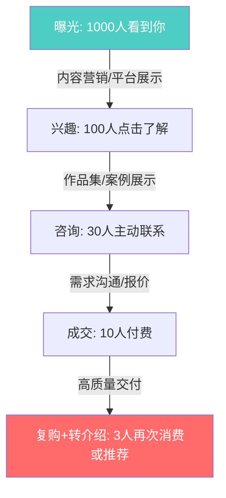

**各环节的转化率优化**：

| 环节 | 行业平均转化率 | 优化方法 | 优化后目标 |
|------|-------------|---------|-----------|
| 曝光→兴趣 | 5-10% | 优化标题、封面图、摘要 | 10-15% |
| 兴趣→咨询 | 20-30% | 作品集质量、CTA清晰 | 30-40% |
| 咨询→成交 | 30-40% | 专业沟通、合理报价、快速响应 | 40-60% |
| 成交→复购 | 20-30% | 超预期交付、定期回访 | 30-50% |

### 客户沟通SOP：从咨询到成交的完整流程

客户沟通是获客漏斗中"咨询→成交"环节的核心。很多技术人在沟通上丢失了50%以上的潜在客户。以下是经过验证的沟通流程：

**第一步：需求确认（首次沟通，5-10分钟）**

```text
核心问题清单：
1. 您希望通过这个项目解决什么问题？
2. 这个问题目前对您的业务影响有多大？（量化）
3. 您有预算范围吗？
4. 您希望什么时候完成？
5. 您之前找过其他人做过吗？结果如何？
6. 您最看重的是什么：质量、速度还是价格？
```

> **为什么要问预算**：不是为了"看人下菜"，而是为了判断客户的期望和你能提供的服务是否匹配。客户预算500元，期望做一个淘宝级别的网站——这种单子不接比接了好。

**第二步：方案简述（沟通后24小时内）**

发一份简短的方案概述（不是完整方案），包含：
- 我理解的你的需求（3-5句话）
- 我建议的方案方向（1-2段）
- 大致的时间和费用范围（一个区间，不是精确数字）
- 下一步：如果方向对，我出详细方案

**第三步：正式报价（方案确认后）**

使用前面练习三中的PREP报价话术。报价文件建议包含：项目范围、交付物清单、时间计划、费用明细、付款方式、售后条款。

**第四步：跟进（报价后3天）**

如果3天没回复，发一条跟进消息：
```text
"XX您好，上次发您的方案/报价您看了吗？有什么疑问随时问我。
另外提醒一下，我这个月还有X个空档期，如果本周确认的话可以排上下周的排期。"
```

**第五步：签约开工（成交后）**

签合同→收定金→开工。这三个步骤的顺序不能变。不签合同不开工，不收定金不开工。这不是不信任客户，而是专业流程的体现。

### 合同要素与模板

合同是保护双方权益的法律文件。即使是小项目，也建议签合同（电子合同同样有效）。以下是合同必须包含的要素：

| 合同要素 | 说明 | 注意事项 |
|----------|------|----------|
| 项目范围 | 明确列出包含和不包含的功能 | 越详细越好，避免"做好看一点"这种模糊需求 |
| 交付物清单 | 具体列出每个交付物 | 源代码、设计稿、文档、部署等逐项列出 |
| 时间计划 | 里程碑和截止日期 | 预留20%缓冲时间，客户确认延误不计入你的责任 |
| 费用与付款 | 总价、分期、付款方式 | 建议30%预付+40%中期+30%验收，写明逾期付款的违约金 |
| 修改次数 | 包含几次免费修改 | 建议3次免费修改，超出部分按小时收费 |
| 知识产权 | 成果归属 | 默认归客户，但可保留展示权（用于作品集） |
| 保密条款 | 双方的保密义务 | 涉及客户商业信息时必须有 |
| 违约责任 | 逾期交付、逾期付款的责任 | 写清楚双方的责任和赔偿方式 |
| 终止条款 | 什么情况下可以终止合同 | 已完成部分按比例付款 |
| 争议解决 | 协商→调解→仲裁/诉讼 | 建议先协商，协商不成在你的所在地法院诉讼 |

**付款保护的具体做法**：
- 支付宝/微信转账留好截图和备注（写明项目名称）
- 银行转账更正式，适合大额项目
- 国际客户用PayPal、Wise或Escrow（第三方托管）
- 发票问题：个人可以去税务局代开，企业客户通常需要发票
- 大额项目（5万+）建议请律师审合同，费用500-2000元，远低于纠纷损失

### 月度获客计划模板

| 周次 | 渠道 | 具体行动 | 时间投入 | 预期产出 |
|------|------|---------|---------|---------|
| 第1周 | 接单平台 | 完善3个平台资料，投5个标 | 8小时 | 1-2个询盘 |
| 第1周 | 内容营销 | 写1篇技术文章发布到掘金/知乎 | 4小时 | 500+阅读量 |
| 第2周 | 接单平台 | 继续投5个标，跟进上周询盘 | 6小时 | 转化1个客户 |
| 第2周 | 社群运营 | 在2个行业社群活跃，回答问题 | 3小时 | 建立5个新联系 |
| 第3周 | 内容营销 | 写1篇案例复盘文章 | 4小时 | 500+阅读量 |
| 第3周 | 口碑维护 | 回访上月客户，请求评价和推荐 | 2小时 | 1条新评价 |
| 第4周 | 渠道复盘 | 分析本月各渠道获客数据 | 2小时 | 优化下月计划 |

### 客户筛选：学会说"不"

不是所有客户都值得接。以下是应该拒绝的客户类型：

| 客户类型 | 危险信号 | 后果 | 建议 |
|----------|---------|------|------|
| 预算严重不足 | "500块做个淘宝" | 做了也拿不到好评 | 礼貌拒绝或推荐更低价的服务者 |
| 需求无限膨胀 | "做好了再加个小功能" | 项目永远做不完 | 严格按合同范围执行，新需求另报价 |
| 沟通困难 | 反复修改方向、不回消息 | 项目延期、双方都不开心 | 设定沟通规则，不遵守就终止 |
| 不尊重你的专业 | "这个很简单，怎么要这么贵" | 合作过程痛苦 | 自信报价，不接受就放弃 |
| 拖延付款 | "下次一起付" | 可能收不到钱 | 严格执行预付款制度 |

### 常见错误

| 错误 | 后果 | 纠正方法 |
|------|------|----------|
| 只依赖一个渠道 | 渠道一变就断粮 | 至少同时经营2-3个渠道 |
| 只发广告不做内容 | 被社群踢出、被平台降权 | 80%有价值内容+20%自我推广 |
| 不做客户跟进 | 咨询了不成交 | 24小时内回复、3天内跟进 |
| 不追踪数据 | 不知道哪个渠道有效 | 每个渠道记录曝光/咨询/成交数据 |
| 沟通中只谈技术不谈价值 | 客户听不懂、不感兴趣 | 用客户的语言说"能帮你解决什么问题" |
| 不签合同就开工 | 纠纷时无据可依 | 再小的项目也要签合同 |
| 来者不拒什么客户都接 | 劣质客户消耗精力、损害口碑 | 学会筛选和拒绝 |

---

## 练习六：个人品牌建设

### 为什么品牌是最好的护城河

没有品牌的技术人，在市场上是一个"可替换的零件"——客户选你还是选别人，主要看价格。有品牌的技术人，在市场上是一个"不可替代的合作伙伴"——客户选你是因为信任你，价格是次要因素。

品牌建设的本质是**把你的专业能力从"不可见"变成"可见"**。你的技术再好，如果没人知道，等于零。

**品牌的经济学解释**：品牌是一种"信任预支"。客户在没有使用过你的服务之前，通过你的品牌（文章、案例、口碑）来预判你的服务质量。品牌越强，客户的信任成本越低，成交越容易。

**品牌的复利效应**：品牌建设的最大特点是"复利"——你今天写的一篇文章，可能在3年后仍然为你带来客户。这和接单的"一次性收入"形成鲜明对比。品牌是真正的"睡后收入"资产。

### 品牌定位公式

```text
品牌定位 = 专业领域 + 差异化标签 + 目标受众
```

**示例**：
- "专注电商小程序开发的全栈工程师"（太泛）
- "帮母婴品牌做小程序商城、平均提升30%复购率的全栈工程师"（精准）

精准定位的三个要素：
1. **专业领域**：你具体做什么？（不是"编程"，而是"电商小程序开发"）
2. **差异化标签**：你和别人有什么不同？（不是"经验丰富"，而是"平均提升30%复购率"）
3. **目标受众**：你服务谁？（不是"所有人"，而是"母婴品牌"）

**定位的自我检验**：把你的定位说给一个不了解你行业的朋友试试。如果他能在10秒内理解你是做什么的、能帮他什么，定位就合格了。如果他一脸困惑，说明定位还需要调整。

**定位的迭代过程**：品牌定位不是一成不变的。初期可以宽一些（"前端开发者"），随着经验积累逐步收窄（"电商小程序专家"→"母婴电商小程序专家"）。每次收窄都是在提高溢价能力。

### 品牌建设的四个支柱

| 支柱 | 具体行动 | 频率 | 投入时间 | 见效周期 |
|------|---------|------|---------|---------|
| 内容输出 | 技术文章、项目复盘、行业分析 | 每周1-2篇 | 4-8小时/周 | 3-6个月 |
| 社区活跃 | 回答问题、参与讨论、分享经验 | 每天15-30分钟 | 2-3小时/周 | 1-3个月 |
| 作品展示 | 更新作品集、发布开源项目 | 每月1次 | 4-8小时/月 | 1-2个月 |
| 口碑积累 | 主动邀请客户评价、收集推荐信 | 每个项目结束后 | 1小时/次 | 持续积累 |

### 内容选题矩阵

不知道写什么？用这个矩阵找选题：

| 内容类型 | 目的 | 示例选题 | 预期效果 |
|----------|------|---------|---------|
| 教程类 | 展示专业深度 | 《从零搭建一个高性能React组件库》 | 吸引同行关注，建立技术权威 |
| 复盘类 | 展示实战经验 | 《我帮客户做的电商小程序，复购率提升了30%》 | 吸引潜在客户，建立信任 |
| 观点类 | 展示思考深度 | 《为什么我不建议用ChatGPT写所有代码》 | 引发讨论，扩大影响力 |
| 工具类 | 提供实用价值 | 《我常用的10个前端开发效率工具》 | 高传播量，吸引精准粉丝 |
| 避坑类 | 展示经验教训 | 《接单3年踩过的5个大坑》 | 高共鸣，吸引同行和潜在客户 |
| 对比类 | 展示技术选型能力 | 《2026年React vs Vue，该选哪个？》 | SEO流量大，长期引流 |
| 案例类 | 展示解决方案 | 《如何用500行代码实现一个高性能爬虫》 | 精准吸引有同类需求的客户 |
| 趋势类 | 展示行业洞察 | 《2026年前端开发的5个趋势》 | 建立行业思想领袖形象 |

### 各平台品牌运营策略

| 平台 | 内容形式 | 发布频率 | 运营要点 | 变现路径 |
|------|---------|---------|---------|---------|
| 掘金 | 技术深度文章 | 每周1篇 | 标题SEO、代码示例完整、参与掘力值活动 | 文章引流→个人网站→咨询/接单 |
| 知乎 | 回答+专栏文章 | 每周2-3个回答 | 回答高关注度问题、长文质量取胜 | 知乎引流→个人品牌→付费咨询 |
| 微信公众号 | 深度长文 | 每周1篇 | 标题吸引力、排版美观、引导关注 | 粉丝积累→广告/课程/社群 |
| Twitter/X | 行业观点、技术tips | 每天1-3条 | 英文内容面向国际市场、参与话题讨论 | 国际客户获取、行业人脉 |
| B站 | 技术教程视频 | 每月2-4个 | 视频质量、标题SEO、互动引导 | 粉丝→课程/咨询/广告 |
| GitHub | 开源项目 | 持续维护 | README质量、社区运营、及时回复issue | 技术认可→高薪机会/咨询 |
| 小红书 | 职场/技术干货 | 每周2-3条 | 图片质量、标题吸引力、评论区互动 | 粉丝→课程/咨询、品牌合作 |

### 品牌危机管理

品牌建设不只是"做好事"，还需要准备应对负面情况：

| 危机类型 | 应对策略 | 话术示例 |
|----------|---------|----------|
| 客户差评 | 私下沟通解决+公开回应态度 | "感谢反馈，已私信沟通解决方案" |
| 项目延期 | 提前通知+给出补救方案 | "因XX原因需要延期X天，我会通过XX方式补偿" |
| 技术争议 | 用数据和事实回应，不情绪化 | "感谢讨论，以下是我的数据来源和推理过程..." |
| 被抄袭 | 截图保留证据+平台投诉+法律途径 | 先平台投诉，必要时发律师函 |
| 误解/谣言 | 清晰、简洁、事实性地澄清 | 一次性说清楚，不反复纠缠 |

### 30天品牌冷启动计划

| 天数 | 行动 | 目标 |
|------|------|------|
| 第1-3天 | 确定品牌定位，写100字的个人简介 | 有清晰的定位描述 |
| 第4-7天 | 搭建个人网站(用GitHub Pages) | 网站上线，有基本内容 |
| 第8-10天 | 整理3个最佳作品到网站 | 作品集在线可访问 |
| 第11-14天 | 注册2-3个内容平台，完善资料 | 各平台资料一致、专业 |
| 第15-21天 | 写3篇技术文章，分别发布到不同平台 | 内容上线，开始积累阅读量 |
| 第22-28天 | 在技术社区回答10个问题 | 建立社区存在感 |
| 第29-30天 | 复盘第一个月数据，调整策略 | 有数据支撑的优化方向 |

### 品牌效果的量化指标

| 指标 | 3个月目标 | 6个月目标 | 12个月目标 |
|------|----------|----------|-----------|
| 内容平台粉丝数 | 500+ | 3000+ | 10000+ |
| 文章累计阅读量 | 1万+ | 10万+ | 50万+ |
| 每月主动咨询数 | 2-3个 | 5-10个 | 15-20个 |
| 品牌搜索量 | 有人搜你的名字 | 稳定有搜索 | 成为领域关键词 |
| 转介绍占比 | 10% | 30% | 50%+ |

### 常见错误

| 错误 | 后果 | 纠正方法 |
|------|------|----------|
| 定位太泛("全栈工程师") | 和100万人竞争 | 细分到"母婴电商小程序开发" |
| 只发不互动 | 自说自话，没有反馈 | 每天花15分钟回复评论和问题 |
| 追求日更牺牲质量 | 低质量内容反而损害品牌 | 每周1篇高质量 > 每天1篇水文 |
| 品牌和实际能力不符 | 接到活交付不了，口碑崩塌 | 品牌包装≤真实能力 |
| 各平台形象不一致 | 客户跨平台搜索时感到混乱 | 所有平台用相同头像、简介、定位语 |
| 不处理负面反馈 | 小问题发酵成大危机 | 24小时内回应，私下解决+公开态度 |
| 只在中文平台运营 | 错过国际市场机会 | 至少在Twitter/GitHub建立英文存在感 |

---

## 练习七：产品化路径规划

### 为什么产品化是终极目标

接单的本质是卖时间——你工作1小时赚1小时的钱，不工作就没有收入。产品化的本质是卖系统——你花100小时做一个产品，然后它可以卖1000次、10000次，边际成本趋近于零。

从接单到产品化，是技能变现中最关键的跃迁。它决定了你是在"工作"还是在"建立资产"。

**产品化的经济学本质**：接单是线性增长（收入=时间×时薪），产品化是指数增长（收入=用户数×单价-固定成本）。当用户数超过盈亏平衡点后，每多卖一个产品的边际成本几乎为零。

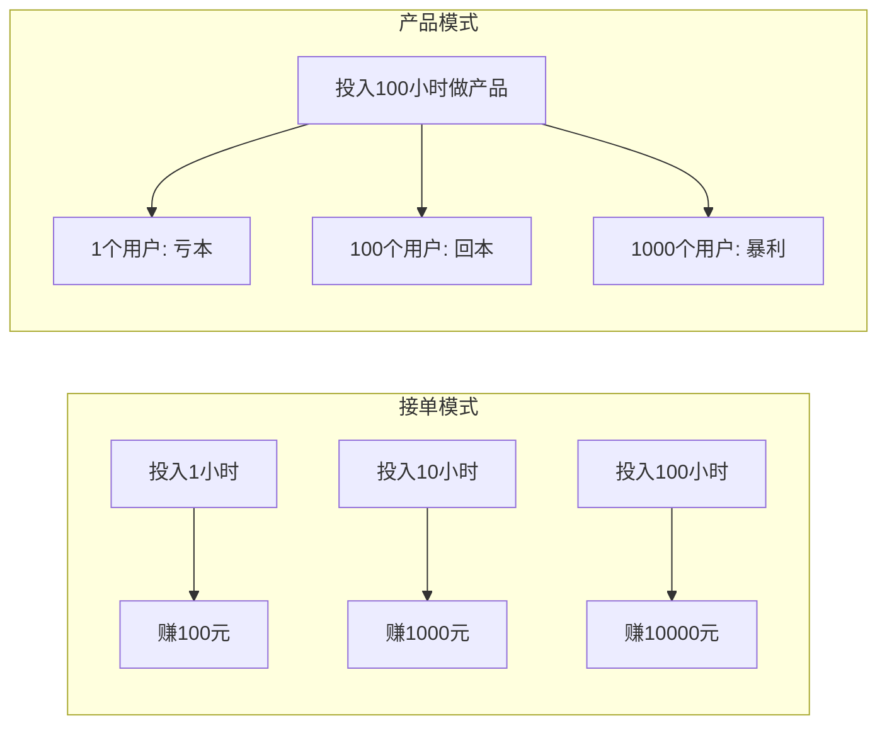

### 产品化的四个阶段

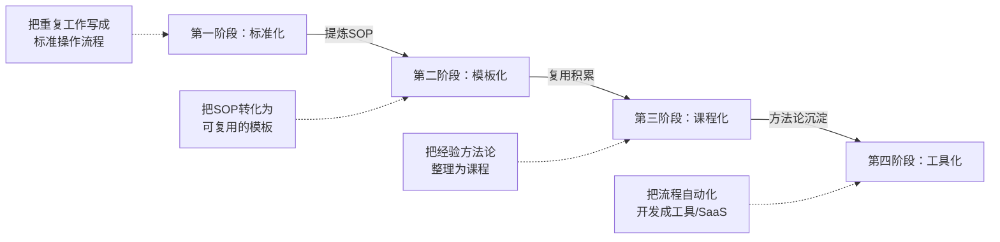

### 各阶段的详细行动指南

**第一阶段：标准化（第1-3个月）**

目标：把你反复做的事情写成标准操作流程(SOP)。

行动：
1. 回顾过去做过的5个同类项目
2. 提取它们的共同流程和差异点
3. 写成标准化的流程文档（包含检查清单）
4. 在下一个项目中试用SOP，根据实际情况修正

示例——网站开发SOP：
```text
1. 需求确认（模板：需求确认问卷）
   - 确认网站类型、页面数量、功能需求
   - 确认设计风格偏好（提供3个参考案例）
   - 确认交付时间和付款方式

2. 设计阶段（模板：设计规范文档）
   - 配色方案确认
   - 首页设计稿（提供2个方案）
   - 设计修改（最多3次）

3. 开发阶段（模板：开发任务清单）
   - 前端页面开发
   - 后端功能开发
   - 响应式适配

4. 测试交付（模板：测试检查清单）
   - 功能测试
   - 兼容性测试
   - 性能测试
   - 客户验收
```

**SOP的文档模板**：

```text
## SOP名称：_______________

### 适用场景
- 什么类型的项目使用这个SOP？
- 不适用的情况有哪些？

### 前置条件
- 需要提前准备什么？
- 客户需要提供什么？

### 流程步骤
| 步骤 | 操作 | 工具/模板 | 预计时间 | 检查标准 |
|------|------|----------|---------|---------|
| 1 | | | | |
| 2 | | | | |
| ... | | | | |

### 质量检查清单
- [ ] 检查项1
- [ ] 检查项2

### 常见问题与应对
| 问题 | 解决方案 |
|------|---------|
| | |
```

**第二阶段：模板化（第3-6个月）**

目标：把SOP中的可复用部分做成模板，大幅减少每个项目的重复劳动。

行动：
1. 从SOP中识别哪些步骤是"每次都要做但内容相似"的
2. 把这些步骤做成可定制的模板
3. 在新项目中用模板快速启动，只做定制部分

模板化的收益：
| 项目 | 没有模板 | 有模板 | 效率提升 |
|------|---------|--------|---------|
| 企业官网 | 2周 | 3天 | 5x |
| 小程序开发 | 4周 | 1.5周 | 2.5x |
| UI设计方案 | 1周 | 2天 | 3x |
| 数据分析报告 | 3天 | 4小时 | 6x |

**模板化的具体产出物**：
- 代码模板/脚手架（GitHub Template Repository）
- 设计模板（Figma组件库/Sketch Symbol库）
- 文档模板（需求确认书、合同模板、交付检查清单）
- 沟通模板（报价话术、项目进度更新、客户回访邮件）

**第三阶段：课程化（第6-12个月）**

目标：把你的方法论和经验整理成可售卖的课程或电子书。

行动：
1. 整理你做过的所有项目，提取通用方法论
2. 设计课程大纲（建议从"实战教程"开始，而不是"理论体系"）
3. 录制/写作课程内容
4. 选择平台发布

**课程设计的MECE原则**：课程大纲应该做到相互独立（Mutually Exclusive）、完全穷尽（Collectively Exhaustive）。每一章解决一个独立问题，所有章节合起来覆盖完整的学习路径。

课程定价参考：
| 课程类型 | 价格区间 | 适合平台 | 制作周期 | 启动门槛 |
|----------|---------|---------|---------|---------|
| 电子书/PDF | 29-99元 | 自有网站、小报童 | 2-4周 | 最低，写就行 |
| 录播视频课 | 99-499元 | 极客时间、网易云课堂 | 1-3个月 | 需要录屏和剪辑能力 |
| 训练营(带辅导) | 999-4999元 | 知识星球、自有社群 | 持续运营 | 需要社群运营能力 |
| 企业内训 | 5000-50000元/天 | 线下/线上 | 按需定制 | 需要行业知名度 |

**课程验证的最小方法**：在正式制作课程之前，用以下方法验证需求：
1. 写一篇该主题的免费文章，看阅读量和"什么时候出课程"的评论
2. 在社群里发问卷："如果我出一个XX课程，你愿意付费吗？多少钱？"
3. 先做一个9.9元的电子书/小册子，看销量
4. 预售制：先收钱再制作，设定"满20人开课"的门槛

**第四阶段：工具化（12个月以上）**

目标：把重复的流程自动化，开发成工具或SaaS产品。

行动：
1. 识别你在工作中哪些环节是高度重复且可自动化的
2. 开发MVP版本（最小可行产品）
3. 先免费给老客户使用，收集反馈
4. 迭代优化后推出付费版本

**MVP开发的核心原则**：

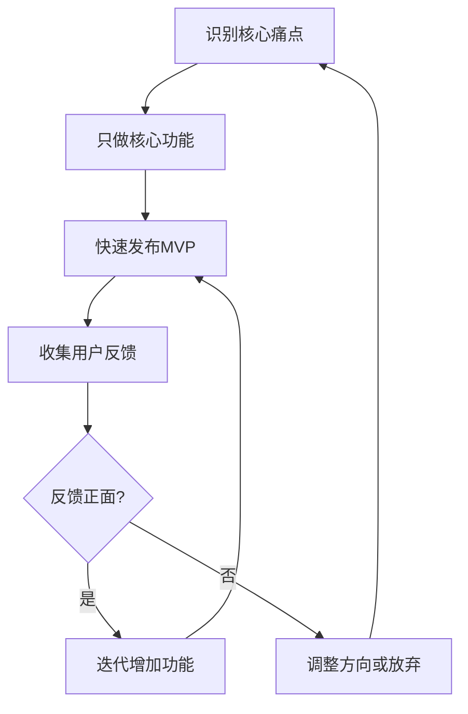

**MVP的判断标准**：
- 能用最少的代码解决核心问题吗？
- 用户能在5分钟内理解产品做什么吗？
- 如果只有1个功能，这个功能是什么？
- 用户愿意为这个最小版本付费吗？

**SaaS定价的核心原则**：
- 月费模式优于一次性收费（现金流更稳定）
- 提供免费版/试用期降低决策门槛
- 按用量或功能分级定价（Free → Pro → Enterprise）
- 年付折扣（通常8折）可以提高客户留存
- 定价锚点：最贵的那个计划让中间计划显得"性价比高"

**SaaS定价分级示例**：

| 级别 | 月费 | 功能 | 目标用户 |
|------|------|------|---------|
| Free | 0元 | 基础功能，有限制 | 试用、引流 |
| Pro | 99元 | 完整功能，无限制 | 个人用户、小团队 |
| Team | 299元 | 多人协作，API接口 | 中小团队 |
| Enterprise | 定制 | 私有部署，专属支持 | 大企业 |

### 产品化进度追踪表

| 产品名称 | 类型 | 当前阶段 | 进度 | 预计完成时间 | 预期月收入 |
|----------|------|---------|------|------------|-----------|
| __________ | 模板/课程/工具 | 标准化/模板化/课程化/工具化 | __% | ______ | ______元 |
| __________ | 模板/课程/工具 | 标准化/模板化/课程化/工具化 | __% | ______ | ______元 |
| __________ | 模板/课程/工具 | 标准化/模板化/课程化/工具化 | __% | ______ | ______元 |

### 从接单到产品化的收入结构演变

| 时间节点 | 接单收入占比 | 产品收入占比 | 月总收入 | 每周工作时长 |
|----------|------------|------------|---------|------------|
| 起步(第1-3个月) | 100% | 0% | 3000-8000元 | 40-50小时 |
| 增长(第4-8个月) | 90% | 10% | 8000-20000元 | 40-45小时 |
| 过渡(第9-18个月) | 70% | 30% | 20000-40000元 | 35-40小时 |
| 成熟(18个月以上) | 40% | 60% | 40000-80000元 | 30-35小时 |
| 理想状态 | 20% | 80% | 80000元+ | 20-25小时 |

### 常见错误

| 错误 | 后果 | 纠正方法 |
|------|------|----------|
| 跳过标准化，直接做课程 | 课程内容空洞，没有实操价值 | 先做10个同类项目积累SOP，再做课程 |
| 课程定价太低 | 收入低且给人"不值钱"的印象 | 参考同类课程定价，不要低于99元 |
| 做了产品就不接单了 | 产品还没成熟就断了收入来源 | 产品收入稳定超过接单收入后再减少接单 |
| 产品做得太大太复杂 | 半年做不完，精力耗尽 | 从最小可行产品开始，快速迭代 |
| 不做市场验证就开发 | 做出来没人买 | 先用预售/问卷验证需求，有10个人愿意付费再开发 |
| 忽视售后和更新 | 用户流失、口碑下降 | 产品发布后持续迭代，定期更新内容 |

---

## 练习八：复盘与反馈系统

### 为什么需要系统化的复盘

做完了前面7个练习，不代表就能成功变现。市场在变、客户需求在变、你的能力也在变——没有定期复盘和调整，你的策略会在6个月内过时。

复盘不是"写总结"，而是用数据驱动决策，持续优化你的变现效率。

**复盘的AAR框架**（After Action Review，源自美国陆军）：
1. 预期目标是什么？
2. 实际发生了什么？
3. 为什么有差距？
4. 下次怎么改进？

**复盘的底层原理——PDCA循环**：

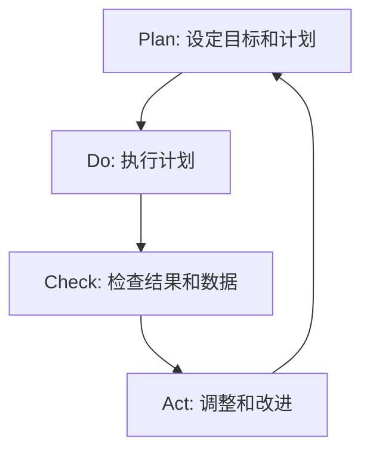

PDCA循环的核心思想：没有完美的计划，只有持续的改进。每一轮循环都让你离目标更近一步。

### 周复盘模板（每周30分钟）

```text
## 第___周复盘（___月___日 - ___月___日）

### 关键数据
- 本周收入：___元
- 本周工作小时：___小时
- 有效时薪：___元/小时
- 新增客户咨询：___个
- 成交客户：___个
- 内容发布：___篇
- 内容阅读量：___

### 做得好的（继续保持）
1. ________________
2. ________________

### 需要改进的（下周行动）
1. ________________（具体行动：______）
2. ________________（具体行动：______）

### 意外发现（新机会/新风险）
- ________________

### 下周最重要的3件事
1. ________________
2. ________________
3. ________________
```

### 月度评估模板（每月1小时）

```text
## 第___月评估

### 收入分析
- 本月总收入：___元
- 接单收入：___元（占比___%）
- 产品收入：___元（占比___%）
- 收入目标完成率：___%
- 与上月对比：增长/下降___%

### 客户分析
- 本月服务客户数：___个
- 平均客单价：___元
- 客户复购率：___%
- 口碑推荐占比：___%
- 最优质的客户来自哪个渠道：______

### 效率分析
- 本月总工作小时：___小时
- 有效收费小时：___小时
- 有效工时占比：___%
- 时薪变化趋势：上升/稳定/下降

### 品牌指标
- 内容平台粉丝增长：___
- 文章/内容累计阅读量：___
- 主动咨询数量变化趋势：___

### 下月目标
- 收入目标：___元
- 重点行动：______
- 需要调整的策略：______
```

### 季度战略复盘（每季度2小时）

每季度问自己以下5个问题：

1. **方向对不对？** 我选择的变现方向是否仍然正确？市场有没有大的变化？
2. **定价对不对？** 我的定价是否需要调整？客户对价格的反应如何？
3. **效率够不够？** 我的产出/投入比是否在提升？有没有可以自动化的环节？
4. **品牌在增长吗？** 我的影响力是否在扩大？有没有新的品牌建设机会？
5. **产品化进展如何？** 我的产品化走到哪一步了？下一个产品化目标是什么？

**季度复盘的决策树**：

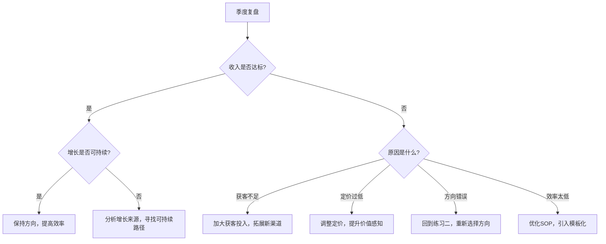

### 反馈收集方法

| 反馈来源 | 收集方法 | 频率 | 用途 |
|----------|---------|------|------|
| 客户反馈 | 项目结束后发满意度问卷 | 每个项目 | 优化服务质量 |
| 同行反馈 | 加入同行交流群，互相点评 | 每月1次 | 发现自己的盲区 |
| 数据反馈 | 分析各平台的内容数据 | 每周 | 优化内容策略 |
| 市场反馈 | 关注行业动态和竞品变化 | 每周 | 调整方向和定价 |
| 自我反馈 | 复盘日记，记录感受和想法 | 每天5分钟 | 保持自我觉察 |

### 客户满意度问卷模板

每次项目结束后，发给客户填写。用5分制评分：

```text
1. 整体满意度：___/5
2. 交付质量是否符合预期：___/5
3. 沟通效率和响应速度：___/5
4. 是否会推荐给朋友/同事：___/5（NPS核心问题）
5. 下次有类似需求是否会再找我：___/5

开放问题：
- 最满意的地方是什么？
- 最不满意或最希望改进的地方是什么？
- 如果满分10分，你会给几分？扣的分在哪里？
```

> **关键技巧**：NPS（Net Promoter Score）问题"是否会推荐"是最有价值的。打9-10分的是推荐者，7-8分是被动者，6分以下是批评者。推荐者比例越高，你的口碑增长越快。

### 红绿灯预警系统

设定关键指标的预警阈值，一旦触发立即调整：

| 指标 | 绿灯(健康) | 黄灯(预警) | 红灯(危险) | 触发后的行动 |
|------|-----------|-----------|-----------|------------|
| 月收入趋势 | 连续2月增长 | 连续2月持平 | 连续2月下降 | 分析原因，调整获客或定价策略 |
| 有效时薪 | ≥200元/小时 | 100-200元/小时 | <100元/小时 | 筛选客户、提高效率、涨价 |
| 客户复购率 | ≥30% | 15-30% | <15% | 提升交付质量、加强客户关系 |
| 品牌曝光增长 | 月增长≥20% | 月增长5-20% | 月增长<5% | 加大内容输出、尝试新渠道 |
| 被动收入占比 | 持续提升 | 持平 | 下降 | 加速产品化进度 |
| 客户满意度(NPS) | ≥50 | 0-50 | <0 | 立即排查服务问题 |

### 常见错误

| 错误 | 后果 | 纠正方法 |
|------|------|----------|
| 不做复盘 | 同样的错误反复犯 | 固定每周五下午30分钟做复盘 |
| 只看收入不看效率 | 忙碌但不赚钱 | 同时追踪收入和有效时薪 |
| 复盘不执行 | 写了改进计划但从不行动 | 每次复盘只定2-3个可执行的行动项 |
| 只关注负面 | 丧失信心和动力 | 同时记录"做得好的"和"需要改进的" |
| 不追踪趋势 | 无法判断方向是否正确 | 至少看3个月的数据趋势再做决策 |

---

## 法律风险管理

### 合同与知识产权

自由职业者最容易忽视的法律风险就是合同和知识产权问题。很多纠纷的根源不是技术问题，而是没有在事前把权责说清楚。

**知识产权归属的默认规则**：
- 如果合同没有约定，中国法律默认：委托开发的软件著作权归受托方（即你），但委托方有权在约定范围内使用
- 如果合同约定归委托方，那就是委托方的
- 如果是合作开发，双方共同拥有

**实操建议**：
- 合同中明确约定知识产权归属
- 如果你保留著作权，写明"授权客户在XX范围内使用"
- 如果全部转让给客户，价格应该上浮20-50%
- 通用组件和工具代码可以保留自用权，但不用于直接竞争

**保密协议(NDA)的注意事项**：
- 签NDA之前仔细阅读条款，特别注意保密期限和范围
- 过于宽泛的NDA（如"所有信息永久保密"）建议协商修改
- 你的通用知识和技能不受NDA限制，但客户的专有信息需要保密
- NDA通常有地域和行业限制，注意是否影响你接其他客户的单

### 税务合规

自由职业者的税务问题不容忽视。以下是最基础的税务知识：

**个人纳税的基本框架**：

| 收入类型 | 税种 | 税率 | 说明 |
|----------|------|------|------|
| 劳务报酬 | 个人所得税 | 20-40%（预扣） | 次年汇算清缴，多退少补 |
| 经营所得 | 个人所得税 | 5-35% | 注册个体户可适用 |
| 稿酬所得 | 个人所得税 | 实际约11.2% | 写作、课程收入可适用 |

**劳务报酬预扣税率表**：

| 每次收入 | 预扣税率 | 速算扣除数 |
|----------|---------|-----------|
| ≤800元 | 免税 | 0 |
| 800-4000元 | 20% | 0 |
| 4000-25000元 | 20% | 0 |
| 25000-62500元 | 30% | 2000 |
| >62500元 | 40% | 7000 |

**重要提醒**：预扣税率看起来很高（20-40%），但次年做汇算清缴时，劳务报酬并入综合所得，按3%-45%的超额累进税率重新计算。如果你年收入不高（比如只有几万元的兼职收入），汇算时很可能退税。

**税务优化的合法方法**：
1. **注册个体工商户**：年收入10万以下免增值税，个税可核定征收（税率通常0.5-2%）
2. **合理区分收入类型**：写作收入按稿酬计税（有30%的费用扣除优惠），技术服务按劳务报酬计税，税率不同
3. **保留所有业务支出凭证**：办公设备、软件订阅、培训费用、差旅费都可以抵扣
4. **利用专项附加扣除**：继续教育、住房贷款、赡养老人等
5. **年终汇算清缴**：劳务报酬预扣税率高（20-40%），但汇算时可能退税

**个体工商户注册流程**：

| 步骤 | 操作 | 费用 | 时间 |
|------|------|------|------|
| 1. 核名 | 在当地市场监管局网站核名 | 免费 | 即时 |
| 2. 提交材料 | 身份证、经营场所证明、经营范围 | 免费 | 1-3天 |
| 3. 领取执照 | 到窗口或邮寄领取 | 免费 | 当天 |
| 4. 税务登记 | 在税务局做税务登记 | 免费 | 1天 |
| 5. 开对公账户 | 到银行开户 | 0-500元 | 1-2天 |
| 6. 申请核定征收 | 向税务局申请 | 免费 | 1-2周 |

**核定征收的优势**：如果税务局批准核定征收，你的个税税率可能只有0.5-2%（各地政策不同），远低于劳务报酬的20%起征。这是年收入10万以上自由职业者最常用的合法节税方式。

**发票问题的解决方案**：
- 个人可以到税务局代开发票（需要缴纳增值税1%+个税）
- 个体户可以自己开具发票（普票免增值税，专票1%）
- 企业客户通常要求发票，个人客户一般不要求
- 如果客户坚持要发票而你没有开票资质，可以找正规的灵活用工平台代开

> **重要提醒**：以上只是基础知识框架，具体税务问题请咨询专业税务师或会计师。税务合规的成本（500-2000元/年的代账费）远低于税务违规的罚款。建议年收入超过10万元后就开始正规化。

### 国际接单的法律与财务注意事项

如果你打算在Upwork、Fiverr等国际平台接单，还需要注意以下问题：

**外汇收款**：

| 收款方式 | 手续费 | 到账时间 | 适合场景 |
|----------|--------|---------|---------|
| PayPal | 3.5-4.5% | 即时 | 小额、频繁收款 |
| Wise(TransferWise) | 0.5-1.5% | 1-2天 | 大额、节省手续费 |
| Payoneer | 1-2% | 1-3天 | Upwork官方推荐 |
| 银行电汇 | 固定费用50-200元 | 3-5天 | 大额单笔 |
| 第三方结汇 | 1-3% | 1-2天 | 无个人外汇额度时 |

**外汇管制注意事项**：
- 中国个人每年有5万美元的结汇额度
- 超过5万美元需要提供收入证明到银行办理
- 建议用专门的银行账户接收外汇，便于记账和税务申报
- 保留所有合同和发票，以备银行和税务局查验

**跨境税务**：
- 在中国境外交税后，在中国可以申请税收抵免（避免双重征税）
- 部分国家与中国有税收协定，税率可能更低
- 建议咨询专业税务师，特别是年收入超过20万元的情况

### 纠纷处理流程

即使签了合同，纠纷仍然可能发生。以下是处理流程：

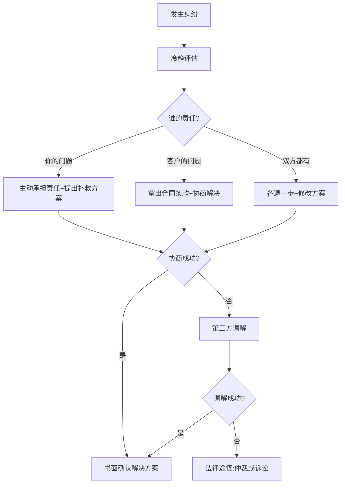

**纠纷预防的最佳实践**：
- 所有沟通留文字记录（微信/邮件截图）
- 需求变更必须书面确认（"您确认要加XX功能，费用增加XX元"）
- 里程碑交付时让客户书面确认（"确认收到XX，符合要求"）
- 项目过程中定期发送进度报告
- 争议点不情绪化，用事实和数据说话

**纠纷中的止损策略**：如果纠纷已经无法协商解决，评估继续投入的时间成本是否值得。有时候，放弃尾款（比如30%的验收款）比花3个月打官司更划算。把时间投入到获取下一个客户上，回报率远高于纠缠在一个纠纷中。

---

## 心理韧性与可持续发展

### 自由职业的心理挑战

自由职业不是"轻松自在"的工作方式，它有独特的心理压力：

| 心理挑战 | 触发场景 | 应对方法 |
|----------|---------|---------|
| 收入焦虑 | 没有固定工资、收入波动 | 建立3-6个月的应急基金；把焦虑转化为行动 |
| 孤独感 | 在家工作、缺少同事 | 加入自由职业社群；定期线下交流 |
| 自我怀疑 | 被客户拒绝、项目失败 | 记住成功案例；和信任的人交流 |
| 拖延症 | 没有老板监督 | 番茄钟、公开承诺、找accountability partner |
| 过度工作 | 怕错过机会、不好意思拒绝 | 设定工作时间边界；学会说"不" |
| 冒名顶替综合征 | 觉得自己不配收这么多钱 | 看客户评价和成功案例；和同水平的人交流 |

**收入焦虑的科学应对**：收入焦虑的本质是对不确定性的恐惧。最有效的应对方法不是"想开点"，而是建立**确定性缓冲**：

1. **财务缓冲**：存够3-6个月生活费的应急基金。有了这个缓冲，即使一个月零收入也不会恐慌
2. **管道缓冲**：同时维护2-3个获客渠道。即使一个渠道断了，其他渠道还能带来收入
3. **技能缓冲**：保持学习新技能。知道自己的技能在增值，焦虑自然减少
4. **社交缓冲**：加入自由职业社群。发现"大家都一样焦虑"本身就是一种安慰

### 防止职业倦怠的策略

**倦怠的三个信号**：
1. 对工作失去热情，每天开始拖延
2. 交付质量下降，开始敷衍了事
3. 身体出现疲劳、失眠、食欲变化

**预防倦怠的系统性方法**：

| 策略 | 具体做法 | 频率 |
|------|---------|------|
| 工作边界 | 设定固定工作时间，到点就停 | 每天 |
| 休息节奏 | 每工作90分钟休息15分钟 | 每天 |
| 周末保护 | 至少留1天完全不工作 | 每周 |
| 定期休假 | 每季度至少3天完全脱离工作 | 每季度 |
| 运动习惯 | 每周3次30分钟以上运动 | 每周 |
| 社交连接 | 和非工作相关的人交流 | 每周 |
| 项目多样性 | 不要只做一种类型的项目 | 持续 |
| 学习新技能 | 保持好奇心和成长感 | 持续 |

### 心理韧性练习

**练习一：失败日志**

每次被客户拒绝或项目失败时，记录以下内容：
1. 发生了什么？（客观事实，不加情绪）
2. 我能从中学到什么？（至少1个具体的教训）
3. 下次遇到类似情况我会怎么做？（具体的改进方案）

3个月后回看失败日志，你会发现：(1) 大部分失败的原因是相似的，说明你在犯同样的错误；(2) 早期让你焦虑到失眠的事情，现在看起来不值一提——说明你在成长。

**练习二：成就清单**

每周记录3件"做得好的事"，无论大小：
- "今天按时交付了项目"
- "客户给了5星好评"
- "写了一篇阅读量破千的文章"

成就清单的作用是对冲"负面偏差"——人类天生更关注负面信息，容易忽略自己的进步。定期回看成就清单，能有效对抗自我怀疑。

**练习三：最坏情况分析**

当你对某个决策感到焦虑时（比如"要不要涨价""要不要拒绝这个客户"），做一次最坏情况分析：
1. 最坏的结果是什么？（比如"涨价后3个月没有新客户"）
2. 这个最坏结果我能承受吗？（比如"有应急基金，能撑6个月"）
3. 如果最坏结果发生，我有什么应对方案？（比如"降价回去，或者拓展新渠道"）

90%的焦虑在做完这个分析后就会消散——因为你发现最坏的结果其实没那么坏，而且你有应对方案。

### 建立可持续的工作节奏

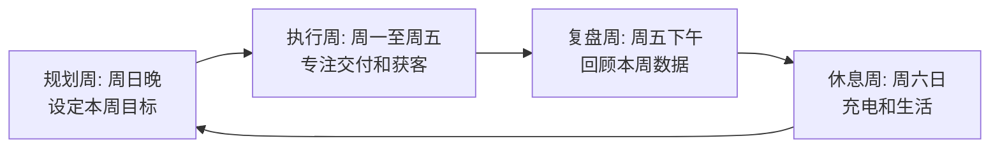

**日常作息建议**（适用于大部分自由职业者）：

| 时间段 | 活动 | 说明 |
|--------|------|------|
| 8:00-8:30 | 晨间准备 | 看邮件、看消息、规划今天3件最重要的事 |
| 8:30-12:00 | 深度工作 | 处理最需要创造力和专注力的任务 |
| 12:00-13:30 | 午休 | 吃饭+休息，不看工作 |
| 13:30-15:30 | 沟通时间 | 回复客户、社群互动、会议 |
| 15:30-17:30 | 第二段深度工作 | 代码/设计/写作 |
| 17:30-18:00 | 收尾 | 记录今天完成的事、规划明天 |

> **核心原则**：把最需要创造力的工作放在上午精力最好的时候。沟通和行政事务放在下午精力较低的时候。这个简单的时间管理策略可以提升30%以上的产出效率。

---

## 练习总览与执行建议

### 完成清单

| 序号 | 练习 | 预计时间 | 完成标准 | 完成日期 |
|------|------|---------|---------|---------|
| 1 | 技能水平自评 | 2-3小时 | 有完整的五维度评分和市场定位 | ___ |
| 2 | 变现方向选择 | 1-2小时 | 确定1个主攻方向和阶段性目标 | ___ |
| 3 | 定价策略制定 | 1-2小时 | 有3档定价和付款方式 | ___ |
| 4 | 作品集建设 | 1-2周 | 3个高质量作品+个人网站上线 | ___ |
| 5 | 客户获取计划 | 2-3小时 | 有月度获客计划和渠道组合 | ___ |
| 6 | 个人品牌建设 | 持续 | 30天冷启动计划已开始执行 | ___ |
| 7 | 产品化路径规划 | 2-3小时 | 有第一个产品化目标和时间表 | ___ |
| 8 | 复盘与反馈系统 | 持续 | 每周复盘习惯已建立 | ___ |

### 执行建议

**第一周**：完成练习1-3（自评、方向、定价）。这三个练习是基础，不需要任何外部资源，只需要你认真思考和调研。

**第二周**：完成练习5和7（获客计划、产品化规划）。有了方向和价格，就可以制定具体的行动计划。

**第二到第四周**：执行练习4和6（作品集、品牌建设）。这两个需要投入时间制作内容，但可以和获客行动同步进行。

**从第二个月开始**：执行练习8（复盘系统）。每周30分钟的复盘，是你持续优化的关键。

**最重要的一条建议**：不要等所有练习都完成才开始行动。完成练习1-3后，就可以开始接单了。边做边完善，远比"准备好了再开始"更有效。

### 练习之间的协同效应

这8个练习不是孤立的，它们形成一个正向循环：

- **自评**帮你找到方向 → **方向选择**帮你聚焦精力
- **定价**帮你筛选客户 → **作品集**帮你吸引优质客户
- **获客计划**带来客户 → **品牌建设**降低获客成本
- **产品化**突破收入天花板 → **复盘系统**持续优化整个循环

当这个循环运转起来后，你的技能变现就不再是"一单一结"的零散收入，而是一个持续增长的事业系统。

### 90天快速启动路线图

| 阶段 | 时间 | 核心任务 | 预期成果 |
|------|------|---------|---------|
| 基础建设 | 第1-2周 | 完成练习1-3：自评、选方向、定价 | 有清晰的定位和报价 |
| 内容准备 | 第3-4周 | 完成练习4+6：作品集+品牌冷启动 | 个人网站上线、3篇内容发布 |
| 获客启动 | 第5-8周 | 完成练习5：多渠道获客 | 收到第一笔收入 |
| 系统运转 | 第9-12周 | 练习7-8：产品化规划+复盘系统 | 月收入稳定增长、有复盘习惯 |
| 优化迭代 | 持续 | 数据驱动的持续优化 | 每月收入增长10-20% |

### 最后的话

技能变现不是一夜暴富的捷径，而是一条需要耐心和系统方法的长期路径。这8个练习为你提供了一张地图，但走路的人是你自己。

三个最重要的心态：

1. **完成比完美重要**：70%的执行 > 100%的计划。不要等到"准备好了"才开始——你永远不会完全准备好。
2. **数据比直觉可靠**：用数据做决策，而不是"我觉得"。记录、分析、调整，这是自由职业者的核心能力。
3. **长期比短期重要**：不要为了短期利益牺牲长期品牌。宁可少赚一单，也不要交付一个让你口碑受损的项目。

现在，打开练习一，开始填写你的技能矩阵。你的技能变现之路，从这一刻开始。
