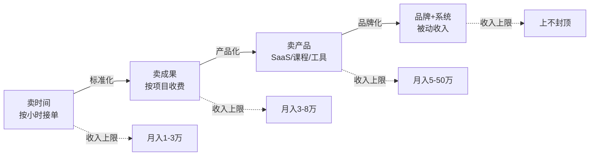
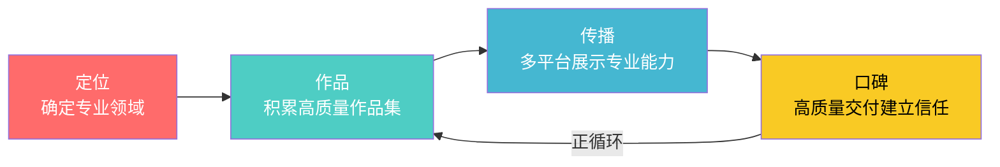
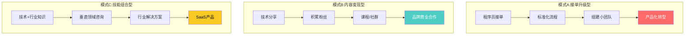
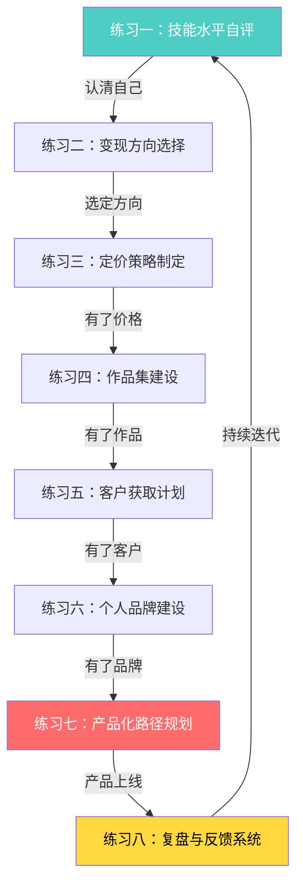
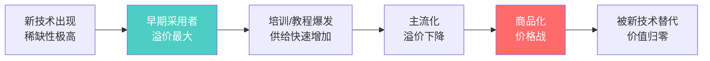

# 第10章 技术技能变现——本章小结

本章小结不是简单的"复习提要"，而是全章七万字内容的**结构化压缩**与**行动转化器**。它承担三个功能：帮你建立完整的知识地图、提供日常决策的速查工具、给出从"读完"到"做到"的行动路线。

**使用建议**：如果你时间有限，优先阅读第六节（实战案例启示）、第七节（误区速查）、第十三节（行动清单），这三部分覆盖了80%的实用价值。如果准备深入，按顺序通读，每个章节都配有可直接使用的工具和模板。

---

## 一、本章知识全景

本章从理论基础、核心技巧、实战案例、常见误区、练习方法和深度拓展六个维度，构建了一套完整的技术技能变现知识体系。以下是全章内容的结构化回顾：

```mermaid
graph TD
    A[技术技能变现] --> B[理论基础]
    A --> C[核心技巧]
    A --> D[实战案例]
    A --> E[常见误区]
    A --> F[练习方法]
    A --> G[深度拓展]

    B --> B1[价值交换本质]
    B --> B2[技能评估框架]
    B --> B3[变现渠道概览]
    B --> B4[定价策略]
    B --> B5[个人品牌建设]
    B --> B6[自由职业平台]
    B --> B7[远程工作技巧]

    C --> C1[编程变现]
    C --> C2[AI技能变现]
    C --> C3[设计变现]
    C --> C4[写作变现]
    C --> C5[翻译变现]
    C --> C6[在线教育]
    C --> C7[客户管理]
    C --> C8[技术栈选择]
    C --> C9[合同法律]
    C --> C10[定价深度]

    D --> D1[程序员月入3万]
    D --> D2[AI培训年入百万]
    D --> D3[设计师品牌化]
    D --> D4[写作者年入50万]
    D --> D5[翻译自由职业]
    D --> D6[全栈到商业]
    D --> D7[AI工具到SaaS]
    D --> D8[技术博主商业帝国]

    style A fill:#ff6b6b,color:#fff
    style B fill:#4ecdc4,color:#fff
    style C fill:#45b7d1,color:#fff
    style D fill:#f9ca24,color:#000
    style E fill:#e056fd,color:#fff
    style F fill:#686de0,color:#fff
    style G fill:#30336b,color:#fff
```



**各板块核心定位**：

| 板块 | 核心问题 | 关键产出 |
|------|----------|----------|
| 理论基础 | 技能值钱的底层逻辑是什么？ | 价值公式、评估框架、定价方法 |
| 核心技巧 | 各技能方向具体怎么变现？ | 六大技能变现路径+客户管理+法律保障 |
| 实战案例 | 别人做到了什么程度、怎么做到的？ | 8个真实案例+5条共性规律 |
| 常见误区 | 哪些坑会让我白费力气？ | 十大误区+自检矩阵+纠正方案 |
| 练习方法 | 我现在该做什么、怎么做？ | 8个递进练习+自评工具 |
| 深度拓展 | 高手都在关注什么？ | 技术价值分析+影响力变现+AI冲击+远程工作 |

**知识体系的逻辑链条**：理论基础回答"为什么"→ 核心技巧回答"怎么做"→ 实战案例展示"别人怎么做"→ 常见误区警示"什么不能做"→ 练习方法指导"现在就做"→ 深度拓展指引"下一步做什么"。六个板块形成闭环，每个板块既是独立的知识单元，也是其他板块的支撑。

---

## 二、核心理论体系回顾

### 2.1 技能变现的底层公式

所有技能变现都遵循同一个价值公式：

```text
你的收入 = 你创造的价值 × 价值捕获率
```

**你创造的价值**取决于技能水平和解决问题的难度。**价值捕获率**取决于谈判能力、品牌溢价和市场竞争。大多数人只关注提升技能（提高创造价值），却忽略了提高捕获率——而后者往往才是收入差距的真正来源。

同一个小程序开发项目，A报价5000元，B报价5万元。区别不在于代码质量，而在于B有更好的作品集、更强的品牌背书、更精准的客户沟通。这就是"捕获率"的力量。

**价值公式的三层展开**：

| 层级 | 影响因素 | 提升方法 | 见效周期 |
|------|----------|----------|----------|
| 第一层：创造价值 | 技能深度、问题难度、解决方案质量 | 深耕技术、学习新框架、积累复杂项目经验 | 3-12个月 |
| 第二层：价值传递 | 沟通能力、方案呈现、客户理解 | 写需求文档、做方案演示、建立反馈机制 | 1-3个月 |
| 第三层：价值捕获 | 定价策略、品牌溢价、谈判技巧、市场定位 | 学习定价、建设品牌、提升谈判话术 | 1-6个月 |

大多数人把100%的精力投入第一层，却不知第三层的提升空间往往是第一层的3-5倍。一个有品牌的全栈开发者和一个没有品牌的全栈开发者，技能水平可能只差20%，但收入可以差5倍。

### 2.2 三种变现模式的递进关系



| 模式 | 核心逻辑 | 收入特征 | 时间自由度 | 适合阶段 |
|------|----------|----------|------------|----------|
| 卖时间 | 按小时/天收费，用时间换钱 | 有明确上限（一天只有24小时） | 低——停下来就没收入 | 入门期，积累经验和作品 |
| 卖成果 | 按项目/成果收费，结果导向 | 有一定弹性，取决于项目复杂度 | 中——项目间有空档期 | 成长期，已有稳定客户源 |
| 卖产品 | 产品化服务/课程/工具/SaaS | 可规模化，边际成本趋近于零 | 高——产品自动交付 | 成熟期，已沉淀方法论 |
| 卖系统 | 品牌+团队+系统化运营 | 指数增长潜力 | 极高——团队执行 | 扩张期，有明确商业模式 |

**关键认知**：这四种模式不是非此即彼的选择，而是递进的升级路径。大多数成功的技能变现者都会同时经营多种模式——用接单维持现金流，用产品化探索被动收入，用品牌建设提高整体溢价。

**模式切换的信号**：当你连续3个月时间被排满、客户需要排队等你、你的报价高于同行但仍然不缺单——说明你已经准备好从"卖时间"升级到"卖成果"。当你发现自己在重复类似的工作、客户在问同样的问题、你的月收入稳定在3万以上——说明你已经具备"卖产品"的基础。

### 2.3 技能评估的五维度框架

科学的技能评估不是"我觉得我几分"，而是通过可量化的维度和外部参照系来定位自己：

| 维度 | 权重 | 评估标准 | 关键问题 |
|------|------|----------|----------|
| 知识深度 | 25% | 对底层原理、最佳实践、行业标准的理解 | 你能否解释技术选型背后的"为什么"？ |
| 实践经验 | 25% | 完成实际项目的数量、复杂度和规模 | 你独立交付过多少个完整项目？ |
| 问题解决 | 20% | 遇到未知问题时的独立排查和解决能力 | 你能否处理从未见过的bug或需求？ |
| 工具熟练度 | 15% | 对主流工具、框架、平台的掌握程度 | 你能否在新工具上快速上手并产出？ |
| 沟通表达 | 15% | 向非技术人员解释方案、撰写文档的能力 | 你能否让客户听懂你的技术方案？ |

**自评校准方法**：不要只凭感觉打分。用以下参照物校准：

- **知识深度**：你能否在技术社区回答他人的问题并获得采纳？你是否看过某个框架的源码？
- **实践经验**：列出你独立交付过的项目清单（不含学习项目），超过10个算合格。
- **问题解决**：回忆过去半年你处理过的最棘手的技术问题——能否清晰描述排查过程？
- **工具熟练度**：你最近学的一个新工具，从零到产出花了多久？超过一周说明熟练度一般。
- **沟通表达**：找一个非技术朋友，让他听你解释你最擅长的技术——他能听懂几成？

**技能水平五层次与变现能力对照**：

| 层次 | 特征描述 | 可变现方式 | 定价参考范围 |
|------|----------|------------|--------------|
| 入门（1-3分） | 会基本操作，能完成教程级任务 | 免费/低价积累作品，不建议直接变现 | 0-50元/小时 |
| 初级（4-5分） | 能独立完成简单任务，有少量项目经验 | 平台接简单任务，低价积累口碑 | 50-150元/小时 |
| 中级（6-7分） | 能独立完成复杂任务，有完整项目经验 | 稳定接单，开始建立个人品牌 | 150-500元/小时 |
| 高级（8-9分） | 能解决疑难问题，有行业口碑 | 高价值项目、咨询、培训 | 500-1500元/小时 |
| 专家（10分） | 行业权威，能定义标准 | 产品化、品牌合作、投资 | 不按时间计费 |

### 2.4 定价策略的三阶跃迁

定价是技能变现中最容易犯错的环节。本章介绍了从初级到高级的三种定价方法：

**第一阶：成本定价法**（适合入门期）

```text
价格 = (固定成本 + 时间成本 × 工时) × (1 + 目标利润率)
```

固定成本包括：设备折价、软件订阅、学习投入分摊。时间成本包括：直接工作时间 + 沟通时间 + 学习时间。目标利润率一般设定30%-100%。

**适用场景**：刚入行、没有作品集、不知道市场行情。成本定价法的核心价值是帮你算出"底线在哪里"——低于这个价格你就亏钱了。

**常见错误**：忘记计入沟通时间。一个10小时的项目，沟通可能占3-5小时。如果只按10小时算，实际时薪比你想象的低30%-50%。

**第二阶：市场定价法**（适合成长期）

```text
价格 = 市场参考价 × 溢价系数
```

市场参考价通过调研同水平从业者在各平台的报价获得。溢价系数取决于你的差异化优势——作品集质量、行业经验、响应速度、售后保障等，一般在0.8-2.0之间。

**市场调研方法**：
1. 在Upwork/Fiverr搜索同技能同水平的freelancer，记录他们的报价范围
2. 在程序员客栈/猪八戒看同类项目的成交价
3. 在技术社群询问同行的实际成交价（非报价）
4. 取中位数作为基准，根据你的差异化优势调整

**第三阶：价值定价法**（适合成熟期）

```text
价格 = 客户获得的价值 × 10%-30%
```

这是最高级的定价方式。你不再根据自己的成本或市场行情定价，而是根据你能为客户创造多少价值来定价。比如你帮客户开发了一个自动化工具，每年节省人力成本50万，那么收费5-15万是合理的——即使你只花了两周时间。

**价值定价的前提条件**：
1. 你能准确量化客户获得的价值（节省多少成本、增加多少收入）
2. 你有足够的品牌背书让客户相信你能交付（案例、口碑、资质）
3. 你有能力做客户期望管理，防止"花了大价钱所以要无限改"的心理

**定价心理陷阱**：

| 陷阱 | 表现 | 后果 | 正确做法 |
|------|------|------|----------|
| 锚定自己的工资 | "我在公司月薪1万，时薪大概60元" | 远低于自由职业市场价 | 自由职业时薪 = 公司时薪 × 2-3倍（覆盖空窗期、社保、税费） |
| 比最便宜的贵就焦虑 | "有人报价3000，我报5000是不是太高了" | 陷入低价竞争 | 你的竞争对手不是最便宜的人，而是最能交付价值的人 |
| 客户说贵就降价 | "客户说预算只有3000，那我就3000接吧" | 贱卖自己，吸引低质量客户 | 调整交付范围而非降低单价："3000的预算我们可以做精简版" |

**定价决策速查流程**：遇到新项目时，按以下顺序操作——① 用成本定价法算出底线价（低于此价不做）→ ② 用市场定价法确认行情范围 → ③ 评估客户获得的价值，判断能否用价值定价 → ④ 综合三个价格，选择对你最有利的报价策略。永远不要低于底线价，这是铁律。

---

## 三、各技能变现方式总结

### 3.1 编程技能变现

**变现渠道全景**：

| 渠道类型 | 具体平台/方式 | 适合人群 | 收入区间 |
|----------|---------------|----------|----------|
| 自由接单平台 | 程序员客栈、猪八戒、Upwork、Fiverr | 有完整项目经验的开发者 | 初级100-200元/时，高级500-1000元/时 |
| 远程工作 | Remote OK、We Work Remotely、电鸭社区 | 英语好、技术扎实的开发者 | 全职远程月薪1.5-5万 |
| 开源+赞助 | GitHub Sponsors、Open Collective | 有开源项目影响力的开发者 | 取决于社区规模 |
| 技术咨询 | 独立顾问、企业外聘 | 行业资深专家 | 1000-5000元/天 |
| 产品化 | SaaS工具、模板市场、插件商店 | 有产品思维的开发者 | 被动收入，上不封顶 |

**项目类型与定价参考**：

| 项目类型 | 入门级报价 | 中级报价 | 高级报价 |
|----------|-----------|----------|----------|
| 企业官网 | 2000-5000元 | 8000-20000元 | 3-10万元 |
| 微信小程序 | 3000-8000元 | 1-3万元 | 5-15万元 |
| 管理系统 | 5000-15000元 | 2-8万元 | 10-50万元 |
| App开发 | 1-3万元 | 5-15万元 | 20-100万元 |
| 数据处理/爬虫 | 500-2000元 | 2000-8000元 | 1-5万元 |

**编程变现的关键差异化**：不要做"什么都会一点"的全栈通才。选一个垂直方向深耕——比如"小程序电商开发"、"数据可视化"、"支付系统对接"——细分领域的专家报价可以是通用开发者的2-3倍，因为客户为"确定性"付费，不为"能力"付费。

### 3.2 AI技能变现

AI技能是2024年以来增长最快的变现方向。核心变现模式包括：

**三大变现方向**：

| 方向 | 具体内容 | 目标客户 | 收入模型 |
|------|----------|----------|----------|
| AI培训 | 企业内训、线上课程、工作坊 | 企业管理层、职场人士 | 课程单价500-5000元，企业内训1-5万/天 |
| AI应用开发 | 定制AI工具、自动化工作流、Agent开发 | 中小企业、创业者 | 项目制5000-50万元 |
| AI咨询 | AI选型、落地方案、效率优化 | 企业技术决策者 | 咨询费2000-10000元/天 |

**热门AI技能与市场行情**：

| AI技能 | 学习周期 | 市场需求 | 变现难度 |
|--------|----------|----------|----------|
| Prompt工程 | 1-2周 | 极高 | 低 |
| AI写作/内容创作 | 2-4周 | 高 | 低 |
| AI绘画（Midjourney/SD） | 2-4周 | 高 | 中 |
| AI编程辅助（Cursor/Copilot） | 1-2周 | 极高 | 低 |
| RAG/知识库搭建 | 1-2月 | 高 | 中 |
| AI Agent开发 | 2-3月 | 极高 | 中高 |
| 大模型微调 | 3-6月 | 中高 | 高 |

**AI变现的黄金组合**：单纯的"会用ChatGPT"已经不值钱了。高价值组合是：AI技能 + 行业知识。比如"AI + 教育"（帮教育公司搭建智能题库和自适应学习系统）、"AI + 法律"（帮律所做合同审查自动化）、"AI + 电商"（帮商家做智能客服和商品描述生成）。行业知识是护城河，AI是放大器。

### 3.3 设计技能变现

| 变现渠道 | 具体方式 | 定价参考 |
|----------|----------|----------|
| Logo/品牌设计 | 企业品牌视觉系统 | 500-20000元/套 |
| UI/UX设计 | App/网站界面设计 | 3000-50000元/项目 |
| 模板销售 | 在设计平台出售模板 | 被动收入，单价10-200元 |
| 插画/商业插画 | 广告、包装、出版物配图 | 500-5000元/张 |
| 设计培训 | 线上课程、一对一辅导 | 课程单价500-3000元 |

**平台选择**：站酷（国内设计师社区）、Dribbble（国际设计社区）、99designs（设计竞赛平台）、Figma Community（模板和组件销售）。

**设计变现的AI冲击与应对**：Midjourney、Stable Diffusion等AI绘画工具的崛起，让低端设计（简单Logo、基础插画）的价格大幅下降。但高端设计（品牌策略、用户体验设计、复杂交互设计）的需求反而在增长——因为AI能生成图片，但不能理解商业逻辑和用户心理。设计师的出路是向上走：从"画图的"变成"用设计解决商业问题的"。

### 3.4 写作技能变现

**升级路径**：投稿→专栏→自媒体→课程→出书→IP

| 阶段 | 变现方式 | 收入参考 | 时间投入 |
|------|----------|----------|----------|
| 投稿期 | 给媒体/公众号投稿 | 100-1000元/篇 | 低 |
| 专栏期 | 在平台开设付费专栏 | 月入2000-10000元 | 中 |
| 自媒体期 | 公众号/知乎/头条流量变现 | 月入5000-50000元 | 高 |
| 课程期 | 开设写作/行业课程 | 单期课程5000-50000元 | 中高 |
| 出书期 | 出版实体书/电子书 | 版税+衍生收入 | 前期高后期低 |

**技术写作的独特优势**：技术写作者比纯文学写作者更容易变现，因为技术内容的受众虽然窄，但付费意愿高——一个程序员愿意花200元买一本解决他实际问题的技术书，但可能不愿意花20元买一本散文集。技术博客、教程、文档写作都是高价值变现路径。

### 3.5 翻译技能变现

| 变现渠道 | 说明 | 定价参考 |
|----------|------|----------|
| 翻译平台 | Gengo、Translated、有道翻译 | 中英笔译100-300元/千字 |
| 自由接单 | 通过口碑和社群获取客户 | 比平台高30%-100% |
| 翻译公司 | 与翻译公司合作 | 到手80-200元/千字 |
| 专业领域翻译 | 法律、医疗、金融、技术 | 比通用翻译高50%-200% |
| 本地化服务 | 软件/游戏/网站本地化 | 项目制，单价更高 |

**关键认知**：专业领域翻译（法律、医疗、金融、技术文档）的单价是通用翻译的2-3倍，且竞争更小、客户粘性更高。技术文档翻译（API文档、SDK说明、技术博客翻译）是一个被低估的蓝海——它结合了"懂技术"和"会翻译"两种技能，市场供给严重不足。

### 3.6 在线教育与知识付费

知识付费是技能变现的高级形态——把你的专业知识打包成可复制的数字产品。

| 产品形态 | 制作成本 | 定价区间 | 边际成本 | 适合人群 |
|----------|----------|----------|----------|----------|
| 电子书/PDF | 低 | 9.9-99元 | 趋近于零 | 有写作能力的人 |
| 录播课程 | 中 | 99-1999元 | 趋近于零 | 有教学能力的人 |
| 直播训练营 | 中高 | 299-4999元 | 较低（需助教） | 有互动需求的主题 |
| 一对一辅导 | 低 | 200-1000元/小时 | 固定 | 高价值个性化指导 |
| 社群/会员 | 中 | 99-999元/年 | 较低 | 需要持续运营 |
| 工具/模板 | 中 | 19-499元 | 趋近于零 | 有技术能力的人 |

**知识付费的冷启动策略**：不要上来就做课程。正确的路径是：先写免费内容（博客、社交媒体）→积累100个精准粉丝→推出低价产品（9.9元电子书）验证付费意愿→推出中价产品（299元录播课）验证课程模型→推出高价产品（2999元训练营）验证高客单价。每一步都在验证，每一步都在积累。

**知识付费的四个致命错误**：

1. **没有验证就投入**：花3个月做了一门课，发现没人买。正确做法是先用一篇付费文章（9.9元）测试——如果100个读者中有10个愿意付费，说明课程大概率能卖。
2. **内容太泛**："Python入门到精通"这种课已经烂大街了。细分领域才有机会——"用Python做金融数据分析"、"用Cursor提升前端开发效率3倍"。
3. **只做一次交付**：课程上线就不管了。高收入的课程运营者会持续更新内容、经营学员社群、收集反馈迭代——一门好课可以卖3-5年。
4. **定价太低**：99元的课程吸引的学员往往学习动力不足，完课率低，口碑差。299-999元区间的学员更认真，完课率和好评率都更高——高价反而带来更好的效果。

---

## 四、个人品牌建设核心框架

个人品牌是技能变现的"放大器"——同样的技能水平，有品牌的人比没品牌的人收入高2-5倍。

### 4.1 品牌建设四步法



**第一步：定位**——选定一个足够细分的领域。不要做"全栈开发"，而要做"小程序电商开发专家"或"React Native性能优化顾问"。越细分，越容易建立认知。定位的公式是：

```text
定位 = 技能 × 行业/场景
```

比如"Python × 金融数据分析"、"设计 × SaaS产品"、"写作 × B2B内容营销"。定位不是终身选择——它是一个起点，等你在这个细分领域站稳脚跟后，可以逐步扩展。

**定位自检清单**：
- 你能否用一句话说清楚你是做什么的？（"我是做XX领域XX技能的"）
- 目标客户听到这个定位后，能否立刻想到自己需不需要？（不需要解释）
- 这个定位下有多少直接竞争对手？（少于20个说明够细分）
- 这个定位下的客户是否有付费能力和付费意愿？（能用市场调研验证）

**第二步：作品**——积累10-20个高质量作品，形成作品集。作品集是最好的销售工具——它比任何话术都有说服力。每个作品都应该有：项目背景、你的角色、技术方案、最终效果（最好有数据）。

**作品集的黄金结构**：
1. **项目背景**：客户是谁、面临什么问题（2-3句话）
2. **你的方案**：为什么选择这个方案、有哪些技术决策（核心内容）
3. **实施过程**：关键里程碑、遇到的挑战和解决方法（展示能力）
4. **最终效果**：用数据说话——性能提升多少、成本降低多少、用户增长多少

**作品集的常见问题与解决方案**：

| 问题 | 为什么是问题 | 解决方案 |
|------|-------------|----------|
| 作品太少 | 客户无法判断你的能力水平 | 用个人项目、开源贡献、技术博客补充——质量比数量重要 |
| 没有数据 | "做得好"是主观的，客户不信 | 每个项目都记录量化指标，哪怕是"页面加载时间从3秒降到800毫秒" |
| 项目涉密 | 做了大项目但不能展示 | 用脱敏版本——隐去客户信息，展示技术方案和效果 |
| 作品太杂 | 客户看不懂你到底擅长什么 | 按定位筛选——只展示与目标方向相关的作品 |

**第三步：传播**——在2-3个核心平台持续输出专业内容。技术人首选：GitHub（代码）、掘金/知乎（文章）、Twitter/X（行业动态）。输出频率：每周至少1篇深度内容。

**传播内容的四种类型**：

| 内容类型 | 目的 | 示例 | 频率 |
|----------|------|------|------|
| 技术教程 | 展示专业能力 | "React性能优化实战：从3秒到300毫秒" | 每周1篇 |
| 项目复盘 | 证明实战经验 | "我如何帮XX公司重构了他们的支付系统" | 每月1-2篇 |
| 行业洞察 | 建立思想领导力 | "2026年前端生态的5个关键变化" | 每月1篇 |
| 个人故事 | 建立人格连接 | "从月薪8K到月入3万：我的自由职业第一年" | 偶尔 |

**第四步：口碑**——每一个项目都是一次品牌建设的机会。超出客户预期的交付质量会带来口碑推荐，而口碑推荐是成本最低、转化率最高的获客方式。

**口碑飞轮**：优质交付 → 客户满意 → 主动推荐 → 新客户 → 更多案例 → 更高报价 → 更好的客户 → 优质交付。这个飞轮一旦转起来，获客成本会趋近于零。

### 4.2 品牌溢价的量化分析

| 品牌阶段 | 溢价幅度 | 获客成本 | 客户质量 |
|----------|----------|----------|----------|
| 无品牌（纯平台接单） | 基准价 | 高（平台抽成10%-20%） | 参差不齐 |
| 初有口碑（老客户推荐） | +20%-50% | 低（几乎为零） | 较好 |
| 行业知名（内容+口碑） | +50%-200% | 极低（客户主动上门） | 优质 |
| 行业权威（IP+生态） | +200%-500% | 负成本（品牌自带流量） | 顶级 |

**品牌建设的时间投入回报比**：每周投入5小时写技术文章、做开源项目、回复社区问题。6个月后，你会拥有：50-100篇技术文章（SEO长尾流量）、1-2个开源项目（GitHub Star）、一个小型粉丝社群。这些资产会持续为你带来客户，远比每天花5小时刷平台接单划算。

---

## 五、从接单到产品化的升级路径

### 5.1 四步升级模型

| 阶段 | 核心动作 | 时间投入 | 收入模型 | 关键指标 |
|------|----------|----------|----------|----------|
| 第一步：标准化 | 把重复工作变成标准流程 | 1-3个月 | 按项目收费，效率提升 | 项目交付时间缩短30%+ |
| 第二步：模板化 | 把常用内容变成可复用模板 | 2-4个月 | 模板销售+项目收入 | 模板复用率>50% |
| 第三步：课程化 | 把专业知识变成课程 | 3-6个月 | 课程销售收入 | 课程学员数>100 |
| 第四步：工具化 | 把解决方案变成SaaS工具 | 6-12个月 | 订阅制被动收入 | MRR（月经常性收入）持续增长 |

**每一步的具体操作**：

**标准化**：把你在项目中反复做的事情写成流程文档。比如"接新客户的标准流程"（需求沟通→方案设计→报价→签约→交付→验收→回款）、"前端项目初始化流程"（技术选型→目录结构→组件库→CI/CD→部署）。标准化后，同样类型的工作效率至少提升30%。

**模板化**：把标准化流程中的可复用部分做成模板。代码模板（项目脚手架、通用组件）、文档模板（需求文档、报价单、合同）、设计模板（品牌VI模板、UI组件库）。模板化后，你可以把模板放到市场上销售——同一份模板卖100次，每次30元，就是3000元被动收入。

**课程化**：把你做项目过程中积累的经验和方法论整理成课程。不需要你是"行业大牛"——你只需要比你的目标学员多走两步。一个"小程序电商开发实战"课程，学员可能是刚入门的开发者，而你只需要有3-5个完整项目经验就够了。

**工具化**：把课程中的核心方法论变成可运行的工具。比如你教"数据可视化"，可以做一个数据可视化SaaS工具；你教"SEO优化"，可以做一个SEO分析工具。工具化是产品化的终极形态——用户为结果付费，不为知识付费。

### 5.2 产品化的判断时机

什么时候应该从接单转向产品化？满足以下条件中的任意两个即可开始：

- 你的时间已经成为收入瓶颈（接满单也赚不到更多）
- 你发现自己在重复相似的工作（至少做过3次以上同类项目）
- 你的客户开始问同样的问题（说明需求存在且普遍）
- 你的月收入稳定在2-3万以上（有现金流支撑过渡期）

**过早产品化的代价**：在你还没有足够的市场验证和客户洞察时做产品，大概率会做出"自嗨型产品"——你觉得很有价值，但客户不买单。正确的做法是：先用接单积累至少20个客户案例，搞清楚客户真正的痛点在哪里，再把解决方案产品化。

### 5.3 产品化的风险与应对

| 风险 | 表现 | 应对策略 |
|------|------|----------|
| 过早产品化 | 产品无人买单，浪费时间 | 先用接单验证需求，再产品化 |
| 过度完美主义 | 花半年做产品却不上线 | MVP思维，先发布再迭代 |
| 忽视营销 | 产品好但没人知道 | 产品和营销投入比例至少1:1 |
| 放弃接单收入 | 产品还没盈利就断了现金流 | 保持60%时间接单，40%做产品 |
| 定价过低 | 产品定价9.9元，觉得"便宜才有人买" | 用价值定价——产品帮用户省了多少钱/赚了多少钱 |

---

## 六、实战案例核心启示

本章通过8个真实案例展示了不同技能、不同起点的变现路径。以下是关键模式提炼：

### 6.1 案例模式总结



### 6.2 八大案例关键数据

| 案例 | 起点 | 终点 | 耗时 | 核心策略 |
|------|------|------|------|----------|
| 程序员副业 | 月薪8000的前端 | 月入3万+的自由开发者 | 8个月 | 平台接单→口碑积累→老客户复购 |
| AI培训师 | 技术博主 | 年入百万的培训师 | 12个月 | 免费分享→付费课程→企业内训 |
| 设计师品牌化 | 平台接单设计师 | 独立设计工作室 | 18个月 | 作品集→个人品牌→团队化运营 |
| 写作者升级 | 兼职投稿 | 年入50万的全职写作者 | 24个月 | 投稿→专栏→课程→出书 |
| 翻译自由职业 | 兼职翻译 | 月入2万的自由翻译 | 10个月 | 通用翻译→专业领域→直客积累 |
| 全栈到商业 | 全栈工程师 | 技术顾问+产品 | 24个月 | 技术深度→行业理解→商业思维 |
| AI工具到SaaS | 独立开发者 | SaaS创始人 | 18个月 | 解决自身痛点→工具化→订阅制 |
| 技术博主帝国 | 技术博客 | 多元收入商业体 | 36个月 | 内容→社群→课程→品牌合作→投资 |

### 6.3 跨案例共性规律

从8个案例中提炼出5条共性规律：

**规律一：免费内容是最好的获客手段**。8个案例中有6个通过免费分享（博客、开源、社交媒体）获取了第一批客户或粉丝。免费内容不是浪费时间，而是建立信任的投资。具体做法：每周在GitHub/掘金/知乎发布一篇高质量技术文章，6个月后你会拥有一个持续带来客户的"内容资产"。

**规律二：第一个付费项目比想象中简单**。几乎所有案例的第一个付费项目都来自身边的人——朋友、同事、社群成员。不要等"准备好了"再开始，主动告诉身边的人你在做什么。具体话术："我现在在做小程序开发，如果你身边有人需要，可以推荐给我，首单8折。"

**规律三：复购和推荐比新客获取重要10倍**。8个案例中，超过60%的收入来自老客户复购和口碑推荐。把80%的精力放在交付质量上，而不是放在找新客户上。维护老客户的具体方法：项目完成后定期回访、主动分享对客户有价值的信息、逢年过节问候。

**规律四：产品化需要接单收入做支撑**。没有一个案例是"辞职后从零开始做产品"的。所有人都是在接单收入稳定后，用空余时间逐步产品化。推荐比例：70%时间接单（维持现金流）、30%时间做产品（投资未来）。等产品收入超过接单收入的50%时，再调整比例。

**规律五：复合技能比单一技能更有竞争力**。技术+行业知识、技术+写作、技术+商业——技能组合产生的溢价远超单一技能的叠加。最有价值的复合技能组合：

| 技能组合 | 变现场景 | 溢价幅度 |
|----------|----------|----------|
| 编程 + 行业知识 | 垂直领域SaaS、行业咨询 | 200%-500% |
| 编程 + 写作 | 技术博客、课程、出书 | 100%-300% |
| 编程 + 设计 | 全栈产品开发、独立产品 | 50%-150% |
| 编程 + 商业 | 技术顾问、CTO外包 | 200%-500% |
| AI + 任何行业 | 行业AI解决方案 | 100%-400% |

---

## 七、十大常见误区与纠正方案

本章详细分析了技能变现中最常见的十大误区。以下是速查表：

| 序号 | 误区 | 核心代价 | 纠正方案 |
|------|------|----------|----------|
| 1 | 低价竞争 | 吸引低质量客户，陷入恶性循环 | 用价值定价法，展示价值而非压低价格 |
| 2 | 只接单不产品化 | 收入永远受时间限制 | 接单的同时抽出30%时间做产品 |
| 3 | 不做个人品牌 | 获客成本高，没有溢价能力 | 每周输出1篇专业内容，坚持6个月 |
| 4 | 不筛选客户 | 低质量客户消耗大量时间和精力 | 建立客户筛选标准，敢于拒绝 |
| 5 | 不重视沟通 | 需求理解偏差导致返工 | 用需求文档模板，每个节点确认 |
| 6 | 不签合同 | 纠纷无法律保障 | 简单合同模板，保护双方权益 |
| 7 | 不积累资产 | 每个项目从零开始 | 建立代码库、模板库、流程文档 |
| 8 | 技能不更新 | 技术过时，竞争力下降 | 每季度学习一项新技能或工具 |
| 9 | 忽视财务管理 | 税务风险、现金流断裂 | 专户管理、税务规划、应急储备 |
| 10 | 忽视身心健康 | 效率下降、职业倦怠 | 规律作息、运动、定期休息 |

**误区自检方法**：对以上10个问题逐一回答"是/否"。回答"是"超过3个，说明你在这些方面存在较高风险，需要立即制定改进计划。

**最致命的三个误区详解**：

**误区一（低价竞争）的深层原因**：不只是"不敢报高价"——根源是缺乏价值感。你觉得自己"只是写了几行代码"，而不是"帮客户解决了价值10万的问题"。破解方法：每次项目结束后，写一份"价值报告"——列出你帮客户节省了多少成本、提高了多少效率、避免了多少风险。当你看到自己的工作创造了这些价值，你就不会再觉得"收5000太多了"。

**误区三（不做品牌）的机会成本**：假设你每周花5小时刷平台找单子，一年就是260小时。如果把这260小时用来写技术文章、做开源项目，一年后你至少有50篇高质量文章+1个有Star的项目。这些内容资产会持续给你带来客户，而刷平台是"今天不刷今天没单"。品牌建设是"越早开始越轻松"的事。

**误区七（不积累资产）的复利效应**：假设你做了10个小程序项目，每个项目都从零开始。如果你从第一个项目就开始积累组件库、通用模块、配置模板，到第10个项目时，开发效率至少提升50%——原来需要2周的项目1周就能交付。同样的时间，你能接更多项目，或者把省下的时间用来做产品化。

**误区四（不筛选客户）的隐性成本**：低质量客户不只是"难伺候"——他们的真实成本远超你的想象。一个典型的低质量客户流程：3轮需求沟通（4小时）+ 反复修改设计稿（8小时）+ 中途加需求不加钱（6小时）+ 拖延付款催款（3小时）= 21小时的隐性成本。如果报价5000元，实际时薪只有238元。而一个高质量客户同样的项目：1轮需求沟通（1.5小时）+ 按方案交付（10小时）+ 按时付款（0小时）= 11.5小时，报价8000元，实际时薪696元。差距不是3000元，而是3倍的时薪效率。

**客户筛选五步法**：

| 步骤 | 操作 | 红线信号 |
|------|------|----------|
| 1. 初次沟通 | 电话/视频15分钟了解需求 | 不愿意花15分钟沟通的客户 |
| 2. 需求评估 | 看客户能否清晰描述问题 | "我也不知道要什么，你看着做" |
| 3. 预算确认 | 直接问预算范围 | "先做再说"或预算远低于市场价 |
| 4. 决策人确认 | 确认对接人有决策权 | 需要层层汇报但对接人无权拍板 |
| 5. 参考检查 | 了解客户之前的外包经历 | 上一个freelancer"很差"（大概率是客户问题） |

---

## 八、合同与法律要点速查

### 8.1 合同必备条款

| 条款 | 要点 | 常见陷阱 |
|------|------|----------|
| 项目范围 | 明确定义交付物和验收标准 | 范围模糊导致无限加需求 |
| 价格与付款 | 总价、分期节点、付款方式 | 没约定分期，客户拖尾款 |
| 知识产权 | 代码/设计的归属权 | 默认全归客户，丧失复用权 |
| 保密条款 | 哪些信息需要保密 | 保密范围过宽影响后续接单 |
| 违约责任 | 双方违约的后果 | 只约束一方 |
| 变更流程 | 需求变更如何处理和计费 | 没有变更流程导致免费加班 |

**合同谈判的关键原则**：

1. **先谈范围再谈价格**：客户说"我要做一个App"，不要直接报价。先问清楚功能清单、目标用户、上线时间、预算范围，然后给出包含明确交付物的方案和报价。
2. **分期付款是底线**：推荐3-3-4比例（签约30%、中期30%、验收40%）或4-3-3比例（对新客户提高首付比例）。绝不接受"做完了一起付"。
3. **知识产权要明确**：代码归你、使用权归客户——这是对双方最有利的约定。你可以复用代码（降低后续项目成本），客户获得使用权（满足业务需求）。
4. **变更必须书面确认**：口头同意的需求变更，到最后一定变成"我以为这包含在价格里"。每次变更都发邮件确认，写明变更内容、额外费用、交付时间调整。

### 8.2 税务基础

| 收入类型 | 税种 | 税率参考 | 注意事项 |
|----------|------|----------|----------|
| 劳务报酬 | 个人所得税 | 20%-40%（预扣） | 年终汇算清缴可能退税 |
| 经营所得 | 个人所得税 | 5%-35% | 个体户/工作室更优 |
| 稿酬收入 | 个人所得税 | 实际约11.2% | 有20%减免优惠 |
| 特许权使用费 | 个人所得税 | 20% | 软件授权等 |

**建议**：年收入超过10万的自由职业者，建议注册个体工商户或个人独资企业，享受小微企业税收优惠政策，综合税率可降至3%-10%。

**财务管理三条铁律**：

1. **专户管理**：开一个独立银行账户专门接收自由职业收入，和个人生活账户分开。这样你能清楚看到"这个月赚了多少、花了多少、存了多少"。
2. **应急储备**：自由职业收入不稳定——这个月赚3万，下个月可能只有5000。至少储备6个月的生活费作为安全垫。
3. **税务预提**：每笔收入到账后，先转出20%-30%到一个专门的"税务账户"，年底报税时不会手忙脚乱。

---

## 九、练习方法与行动训练

本章提供了8个递进式练习，覆盖从"认清自己"到"建立被动收入"的完整路径。练习之间的关系是层层递进的——不要跳步。

### 9.1 练习体系总览



### 9.2 各练习核心要点

| 练习 | 核心任务 | 交付物 | 时间投入 | 完成标准 |
|------|----------|--------|----------|----------|
| 练习一 | 用五维度框架自评技能 | 技能评估表 | 2小时 | 有明确的分数和差距分析 |
| 练习二 | 选择最适合的变现方向 | 变现方向决策矩阵 | 3小时 | 选出1-2个方向并制定初步计划 |
| 练习三 | 制定科学的定价策略 | 定价方案（含底线价和目标价） | 2小时 | 有市场调研数据支撑 |
| 练习四 | 建设高质量作品集 | 5-10个作品的完整展示页 | 1-4周 | 每个作品有背景、方案、效果 |
| 练习五 | 制定客户获取计划 | 获客渠道清单+执行时间表 | 3小时 | 覆盖3个以上获客渠道 |
| 练习六 | 启动个人品牌建设 | 内容输出计划+3篇首发文章 | 1-2周 | 选定2个平台开始输出 |
| 练习七 | 规划产品化路径 | 产品化路线图（含MVP定义） | 4小时 | 有明确的时间节点和验证方法 |
| 练习八 | 建立复盘与反馈系统 | 月度复盘模板+关键指标看板 | 2小时 | 可以每月自动跟踪 |

**练习的关键原则**：
- **先完成再完美**：练习的目的不是做出完美的方案，而是启动思考和行动。先写一个"60分"的方案，执行后根据反馈迭代，比花一个月写一个"95分"但从未执行的方案有价值100倍。
- **找人验证**：自评容易失真——要么高估要么低估。把你的技能评估表和定价方案给2-3个同行或前辈看，听取他们的反馈。
- **定期更新**：技能在增长，市场在变化，你的评估和策略也需要定期更新。建议每3个月重新做一次练习一到练习三。

---

## 十、深度拓展：高级主题深度解析

深度拓展篇聚焦技术变现的高级议题。本节不做简单罗列，而是对每个主题给出核心框架、关键决策点和实操指南。

### 10.1 技术技能的市场价值分析

技术技能的市场价值由四个维度决定：**稀缺性**（有多少人会）、**需求强度**（市场有多需要）、**价值创造能力**（能帮客户赚/省多少钱）、**进入壁垒**（学会它有多难）。

**当前市场的技能价值排名**（2025-2026年）：

| 技能类别 | 稀缺性 | 需求趋势 | 价值创造 | 综合评分 |
|----------|--------|----------|----------|----------|
| AI Agent开发 | 极高 | 急速上升 | 高 | ★★★★★ |
| 大模型微调/部署 | 高 | 上升 | 高 | ★★★★☆ |
| 全栈SaaS开发 | 中高 | 稳定 | 高 | ★★★★☆ |
| 数据工程 | 中高 | 上升 | 高 | ★★★★☆ |
| 移动端开发 | 中 | 稳定 | 中 | ★★★☆☆ |
| 前端开发 | 中低 | 稳定 | 中 | ★★★☆☆ |
| 通用后端开发 | 低 | 稳定 | 中 | ★★☆☆☆ |

**技能价值的动态变化规律**：

技术技能的市场价值不是静态的，它遵循一条可预测的生命周期曲线：



**实操指导**：判断一项技能处于生命周期的哪个阶段——如果YouTube上只有不到100个教程、国内社区讨论不超过500帖、企业招聘JD中出现频率低于5%，说明处于"早期采用者"阶段，这是变现溢价最大的窗口期。如果教程已经泛滥、培训机构批量产出毕业生、价格战已经开始，说明已经进入"主流化"甚至"商品化"阶段——此时你的竞争力必须建立在深度（而非广度）上。

**技能投资的反直觉策略**：不要追逐最热门的技术，而要追逐"即将热门"的技术。当一项技术已经火遍全网时，你再去学已经晚了——因为市场上已经有大量比你早学半年的竞争者。更好的策略是关注技术社区的早期信号：GitHub Trending上持续出现相关项目、Hacker News上频繁讨论、几家头部公司开始采用——这些信号比"XX技能月入10万"的营销文章早3-6个月。

### 10.2 影响力变现的路径

技术影响力变现的四条路径，每条都有独特的运营逻辑和收入天花板：

**路径一：内容变现**（博客→广告/赞助/付费专栏）

运营逻辑：免费内容吸引流量 → 流量转化为广告收入或赞助 → 深度内容转为付费订阅。
收入天花板：月入1-10万（取决于流量规模和内容质量）。
关键成功因素：SEO能力（长尾流量）、内容质量（留存率）、更新频率（平台权重）。
典型路径：技术博客（6个月积累SEO流量）→ 接技术广告（CPM/CPC）→ 开设付费专栏（订阅制）→ 品牌赞助合作。

**路径二：社群变现**（社区→会员/付费社群）

运营逻辑：聚集同频人群 → 提供信息差和社交价值 → 会员费/活动费。
收入天花板：月入2-20万（取决于社群规模和定价）。
关键成功因素：社群运营能力（活跃度）、信息筛选能力（价值密度）、人脉资源（社交价值）。
典型路径：微信群/QQ群（免费）→ 知识星球（付费）→ 线下活动（高客单价）→ 企业合作（B端变现）。

**路径三：咨询变现**（口碑→高客单价咨询）

运营逻辑：专业能力积累 → 案例和口碑沉淀 → 高客单价按小时/天收费。
收入天花板：月入5-30万（取决于单价和客户量）。
关键成功因素：行业深度（不可替代性）、沟通能力（方案呈现）、人脉网络（获客渠道）。
典型路径：免费解答社区问题 → 小额付费咨询（500-1000元/次）→ 企业咨询（5000-20000元/天）→ 长期顾问合同（月费制）。

**路径四：投资变现**（行业认知→技术投资/顾问股权）

运营逻辑：对技术趋势的深度理解 → 识别高潜力项目 → 以技术顾问身份获得股权/期权。
收入天花板：上不封顶（取决于项目成功率）。
关键成功因素：行业洞察力（趋势判断）、人脉质量（项目来源）、风险承受力（长期回报）。
典型路径：技术社区活跃 → 被邀请做技术顾问 → 获得早期项目股权 → 项目成功后的退出收益。

### 10.3 AI对技术变现的冲击与应对

AI正在重塑技能变现的格局——但这种重塑不是简单的"替代"，而是"重新定价"。

**AI冲击的三层模型**：

| 受冲击层级 | 具体技能 | 冲击程度 | 时间窗口 | 应对策略 |
|------------|----------|----------|----------|----------|
| 第一层：直接替代 | 简单CRUD、基础页面、通用翻译、数据录入 | 极高（80%+工作可被AI完成） | 已经发生 | 向上迁移，不做AI能做的事 |
| 第二层：效率提升 | 中等复杂度开发、设计、写作、数据分析 | 高（效率提升3-5倍） | 正在发生 | 用AI提效，承接更多项目 |
| 第三层：创造新需求 | AI Agent开发、提示工程、AI系统架构、数据标注 | 极高（全新市场） | 正在爆发 | 学习AI技能，抢占新市场 |

**应对AI冲击的核心原则**：不要抵抗AI，要驾驭AI。具体策略：

1. **向上走**：如果你的工作AI能完成80%，你就去做AI完成不了的20%——架构设计、需求理解、客户沟通、商业判断。这20%的价值远超那80%。
2. **成为AI的"驾驶员"**：学AI工具不是为了"不被淘汰"，而是为了"10倍效率"。一个会用Cursor的开发者，产出效率是一个不会用的3-5倍——同样的时间，你能交付更多，收入自然更高。
3. **进入AI创造的新市场**：AI不只是在替代旧工作，它同时在创造全新的市场——AI Agent开发、RAG系统搭建、提示工程、AI应用落地咨询。这些市场在2年前不存在，现在需求急速增长，供给严重不足。

**AI时代最值钱的复合能力**：AI技能 + 领域专家知识。一个"会用AI的律师"比"不会用AI的律师"效率高10倍；一个"懂教育的AI工程师"比"不懂教育的AI工程师"能做出更贴合需求的产品。AI是放大器，领域知识是地基——放大器越大，地基的价值越高。

### 10.4 远程工作的长期路径

远程工作不仅是"在家办公"——它是一种全新的工作方式和生活方式。理解远程工作的完整图景，才能做出正确的长期决策。

**远程工作的四种形态**：

| 形态 | 特征 | 收入范围 | 自由度 | 适合人群 |
|------|------|----------|--------|----------|
| 远程全职 | 为一家公司全职远程工作 | 月薪1.5-5万 | 中（有固定工时） | 需要稳定收入+一定自由的人 |
| 远程兼职 | 同时为2-3家公司兼职 | 月入2-6万 | 中高 | 能力强、时间管理好的人 |
| 自由接单 | 按项目接单，自行安排 | 月入1-10万（波动大） | 高 | 有稳定客户源的资深从业者 |
| 数字游民 | 边旅行边工作 | 月入1-5万 | 极高 | 年轻、无家庭负担、适应力强 |

**远程工作的六大核心挑战与应对**：

| 挑战 | 具体表现 | 应对方法 |
|------|----------|----------|
| 自律管理 | 没人监督，容易拖延 | 固定工作时间、番茄钟、日计划 |
| 沟通成本 | 远程沟通效率低、信息丢失 | 异步优先、文档化、定期同步 |
| 孤独感 | 长期独处导致心理问题 | 加入远程社群、定期线下聚会 |
| 时区问题 | 跨时区协作困难 | 明确在线时间段、异步工具 |
| 职业发展 | 晋升机会少、可见度低 | 主动汇报、参与核心项目、建设个人品牌 |
| 工作生活边界 | 工作侵入生活 | 专用工作空间、固定下班时间、仪式感 |

**远程工作的长期职业发展策略**：远程工作者比办公室工作者更需要个人品牌——因为在公司内部"刷存在感"的机会更少。你的专业能力需要通过作品、文章、开源贡献来"可见化"。建议：每月至少发布1篇技术文章、每季度至少做1次技术分享、每年至少参加2次行业会议（线下或线上）。这些活动不只是"品牌建设"——它们是你远程工作5年、10年后仍然保持竞争力的核心保障。

---

## 十一、关键指标与里程碑

### 11.1 技能变现里程碑

| 里程碑 | 参考时间 | 核心任务 | 关键标志 |
|--------|----------|----------|----------|
| 第一笔收入 | 第1-2个月 | 验证变现可行性 | 收到第一笔付费（哪怕只有100元） |
| 月入5000元 | 第2-4个月 | 初步建立信心 | 稳定有2-3个客户来源 |
| 月入1万元 | 第4-8个月 | 变现能力初步建立 | 开始有老客户复购 |
| 月入3万元 | 第8-18个月 | 变现趋于稳定 | 被动获客占比>30% |
| 月入5万元+ | 18个月+ | 高价值变现 | 有明确的个人品牌定位 |
| 被动收入>50% | 2年+ | 产品化转型完成 | 课程/工具/SaaS收入超过接单 |

**里程碑的正确用法**：这是参考值，不是硬性目标。有人3个月就月入3万，有人2年才月入1万——差异取决于技能水平、市场时机、投入时间等多种因素。关键不是"多久达到"，而是"是否在持续进步"。每个月对比上个月：客户数量是否增加？报价是否提高？被动收入占比是否增长？只要在进步，速度不是问题。

### 11.2 健康经营指标

| 指标 | 健康值 | 警戒值 | 说明 |
|------|--------|--------|------|
| 客户复购率 | ≥30% | <15% | 客户满意度的核心指标 |
| 口碑推荐率 | ≥20% | <10% | 品牌影响力的直接体现 |
| 定价增长率 | ≥10%/年 | 0% | 技能在提升的量化证明 |
| 被动收入占比 | 逐步提升 | 长期为0% | 产品化进展的晴雨表 |
| 有效工时占比 | ≥60% | <40% | 剔除沟通、等待、返工后的真实产出 |
| 现金储备 | ≥3个月支出 | <1个月 | 自由职业者的安全垫 |

**指标的使用方法**：不要一次关注所有指标——选2-3个最薄弱的作为本月重点改进方向。比如"客户复购率只有10%"——本月重点就是提升交付质量和客户满意度，而不是去拓展新客户。

**月度复盘模板**（可直接复制使用）：

```text
月份：____年____月
收入：总收入____元（接单____元 + 产品____元 + 其他____元）
客户：新增____个，复购____个，口碑推荐____个
内容：发布文章____篇，GitHub提交____次
技能：新学____，精进____
重点指标：复购率____% / 口碑率____% / 被动收入占比____%
本月最大收获：____________________
本月最大问题：____________________
下月重点目标：____________________
```

---

## 十二、心态与心理建设

技能变现不仅是一场能力的较量，更是一场心理的修行。很多技术能力很强的人，变现效果很差——不是因为技能不够，而是因为心理障碍挡住了他们。

### 12.1 冒充者综合征

**表现**："我的水平还不够接单"、"比我厉害的人太多了"、"客户会发现我其实没那么强"。

**真相**：冒充者综合征在高能力人群中更普遍——越优秀的人越觉得自己不够好。数据显示，约70%的人在职业生涯中经历过冒充者综合征。

**破解方法**：
1. **列出你的成就清单**：把你做过的项目、解决过的问题、收到的好评全部写下来。当你质疑自己时，看一遍这个清单。
2. **接受"够用就行"**：你不需要是世界顶级专家才能变现。你只需要比你的客户多懂一些——而这几乎总是成立的。
3. **用行动代替思考**：不要等到"准备好了"再开始。接一个低价小项目，完成它，收到第一笔钱——信心是从行动中来的，不是从思考中来的。

### 12.2 拒绝恐惧

**表现**："报高价客户会不会觉得我黑心"、"客户拒绝我怎么办"、"提涨价老客户会不会跑"。

**破解方法**：
1. **把拒绝正常化**：自由职业的转化率通常只有10%-30%——也就是说，70%-90%的询价不会成交。这不是你的问题，这是市场的常态。
2. **涨价测试法**：新客户先用新价格报价。如果连续5个客户都接受了，说明你的价格还可以更高。如果超过一半拒绝了，说明到了当前的天花板。
3. **提供选择而非是非**：不要问客户"这个价格可以吗"，而是提供三个方案（基础版/标准版/高级版），让客户选择"做哪个"而非"做不做"。

### 12.3 孤独感与自我怀疑

**表现**：自由职业者没有同事、没有领导、没有绩效考核——你需要自己给自己打气、自己给自己方向。长时间独自工作容易产生"我是不是在浪费时间"的怀疑。

**破解方法**：
1. **加入同行社群**：找到3-5个做类似事情的人，定期交流进展、分享经验、互相鼓励。
2. **设定短期里程碑**：不要只盯着"月入5万"的长期目标——设定每周的小目标（写一篇文章、联系3个潜在客户、完成一个模块），每完成一个就给自己正反馈。
3. **定期回顾进展**：每月底花1小时回顾：这个月做了什么、收入多少、客户反馈如何、比上个月进步在哪里。进步是消除怀疑的最好解药。

### 12.4 完美主义陷阱

**表现**："这个项目还没做到完美，不能交付"、"文章再改改再发"、"产品再加个功能再上线"。

**真相**：完美主义的本质是恐惧——害怕被批评、害怕不被认可、害怕暴露不足。它用"追求卓越"的外衣掩盖了"不敢面对现实"的内核。

**破解方法**：
1. **设定"足够好"的标准**：交付前问自己——"这个质量水平，客户会满意吗？"如果答案是"大概率会"，就交付。不要追求100分——80分按时交付远比100分拖延3周有价值。
2. **给自己设硬性截止日期**：文章写到周三必须发、项目到月底必须交、产品开发4周必须上线。时间到了，质量到哪里就交付到哪里。
3. **接受反馈而不是回避**：完美主义者害怕反馈，因为反馈意味着"还不够好"。改变心态——反馈是免费的改进指南，每一次反馈都让你的下一次做得更好。

### 12.5 收入焦虑与攀比心理

**表现**："XX三个月就月入5万了，我怎么才1万"、"做自由职业一年了还不如上班"。

**破解方法**：
1. **只和自己的过去比**：别人的时间线不是你的时间线——起点不同、资源不同、运气不同。唯一有参考价值的对比是"这个月 vs 上个月"。
2. **算"综合回报"而非只看收入**：自由职业的回报不只是钱——时间自由、技能成长、人脉积累、抗风险能力都是回报。如果只看月收入，前6个月确实可能不如上班——但综合回报往往从第3个月就开始超越。
3. **接受"非线性增长"**：技能变现的收入曲线不是线性的——它更像是阶梯函数。可能3个月没有变化，第4个月突然翻倍。保持耐心，持续投入。

---

## 十三、综合行动清单

### 立即行动（今天）

- [ ] 用五维度评估框架给自己当前技能打分，明确自己处于哪个层次
- [ ] 计算你的"时间成本"——月收入÷月工作小时数，得出你的时薪
- [ ] 列出你掌握的所有可变现技能（包括你认为"不值钱"的技能）

### 短期行动（本周）

- [ ] 选择1-2个最适合你的变现方向，制定初步计划
- [ ] 注册1-2个接单平台，完善个人资料和作品集
- [ ] 用成本定价法计算你的基准报价（不低于时薪×1.5）
- [ ] 在社交媒体发布第一条专业内容（技术分享、项目复盘、学习笔记）

### 中期行动（本月）

- [ ] 接到第一个付费项目（可以是朋友的需求，关键是完成完整流程）
- [ ] 建立客户管理表（记录客户信息、项目详情、沟通记录、收款状态）
- [ ] 整理你的代码库/模板库，建立可复用资产
- [ ] 制定每周内容输出计划，选定2-3个核心平台

### 长期行动（持续）

- [ ] 每月复盘：收入结构、客户质量、技能成长、品牌进展
- [ ] 每季度评估：是否需要调整定价、切换平台、学习新技能
- [ ] 每半年规划：产品化进展、被动收入占比、下一步升级方向
- [ ] 建立行业人脉网络：加入3-5个高质量社群，定期参加行业活动

**行动清单执行指南**：

不要试图同时执行所有项目——那样你会因为"太多事要做"而什么都不做。正确的做法是：

1. **第一周**：只做"立即行动"的3项，花2-3小时完成。这3项帮你建立清晰的自我认知。
2. **第二周**：做"短期行动"的4项，每天花1小时。这4项帮你迈出变现的第一步。
3. **第三到四周**：做"中期行动"的4项，每天花1-2小时。这4项帮你建立变现的基本系统。
4. **第二个月起**：把"长期行动"变成每月/每季度的习惯性动作。

**关键原则**：完成比完美重要。一个60分的行动计划执行到位，比一个95分的计划放在那里强100倍。

---

## 十四、核心概念速查表

| 概念 | 定义 | 核心应用场景 | 关键公式/方法 |
|------|------|--------------|---------------|
| 价值交换 | 用技能为客户解决问题，客户为技能付费 | 理解变现本质 | 收入 = 创造价值 × 捕获率 |
| 价值捕获率 | 你实际获得的报酬占你创造价值的比例 | 定价和谈判 | 受品牌、谈判力、竞争度影响 |
| 边际成本 | 多生产一个产品/服务的增量成本 | 理解产品化优势 | 产品化后趋近于零 |
| 技能评估 | 通过可量化维度定位自身水平 | 避免过高或低估计自己 | 五维度加权评估法 |
| 价值定价 | 根据客户获得的价值而非成本定价 | 提高收入水平 | 价格 = 客户价值 × 10%-30% |
| 个人品牌 | 你在目标客户心中的专业形象和口碑 | 提高溢价和降低获客成本 | 定位→作品→传播→口碑 |
| 产品化 | 将服务变成可复制、可规模化的产品 | 从卖时间到卖产品 | 标准化→模板化→课程化→工具化 |
| MVP | 最小可行产品，用最小成本验证市场 | 降低产品化风险 | 先发布再迭代 |
| 复合技能 | 两种以上技能的组合 | 创造差异化竞争力 | 技术A + 技术B/行业知识/表达能力 |
| 内容资产 | 你发布的文章、课程、开源项目等 | 持续获客和品牌建设 | 越积累越有价值，复利效应 |
| 口碑飞轮 | 优质交付→推荐→新客户→更多案例的正循环 | 低成本高效获客 | 核心是交付质量 |

---

## 十五、推荐资源

### 书籍

**技能提升**：
- 《程序员的自我修养》——俞甲子（深入理解程序编译链接的底层原理）
- 《设计心理学》——唐纳德·诺曼（理解用户认知模型，提升设计决策质量）
- 《写作是最好的自我投资》——Spenser（从写作技能到个人品牌的完整路径）
- 《软技能：代码之外的生存指南》——John Sonmez（程序员的全面自我管理）

**商业思维**：
- 《精益创业》——埃里克·莱斯（MVP思维和快速验证方法论）
- 《商业模式新生代》——亚历山大·奥斯特瓦尔德（商业模式画布工具）
- 《知识变现》——秦阳、秋叶（国内知识付费实战经验）
- 《一人企业》——Paul Jarvis（个人如何构建可持续的微型商业）

**定价与谈判**：
- 《定价致胜》——赫尔曼·西蒙（定价策略的系统方法论）
- 《沃顿商学院最受欢迎的谈判课》——斯图尔特·戴蒙德（谈判技巧）
- 《影响力》——罗伯特·西奥迪尼（说服心理学，适用于客户沟通和报价）

**自由职业**：
- 《自由职业者圣经》——Sara Horowitz（自由职业的完整指南）
- 《Deep Work》——Cal Newport（深度工作，自由职业者的时间管理）

### 平台

**接单平台**：
- 程序员客栈（proginn.com）——国内程序员远程工作和接单首选
- 猪八戒（zbj.com）——综合类技能服务交易平台
- Upwork（upwork.com）——全球最大自由职业平台，单价高
- Fiverr（fiverr.com）——以任务为单位的服务交易平台
- 电鸭社区（eleduck.com）——国内远程工作社区

**学习平台**：
- GitHub（github.com）——代码托管+开源社区+作品展示
- 掘金（juejin.cn）——国内技术社区，适合内容输出
- 极客时间（geekbang.org）——系统化技术课程
- Coursera（coursera.org）——国际知名在线课程平台

**内容分发平台**：
- 知乎（zhihu.com）——适合长文和深度分析
- 公众号——适合建立私域流量
- Twitter/X——适合行业动态和短内容
- 少数派（sspai.com）——适合工具类和效率类内容

### 工具

**效率工具**：
- Cursor：AI驱动的代码编辑器，大幅提升开发效率
- GitHub Copilot：AI编程助手，自动补全和代码生成
- Midjourney：AI绘画工具，适合设计师和内容创作者
- ChatGPT/Claude：AI写作和分析工具，辅助内容创作和方案设计

**项目管理**：
- Notion：知识管理和项目协作
- 飞书：团队协作和文档管理
- Trello：看板式项目管理
- GitHub Projects：与代码仓库集成的项目管理

**自由职业者必备工具**：
- Toggl Track：时间追踪，帮你算出真实时薪
- FreshBooks/Wave：发票和财务管理
- Calendly：在线预约，减少沟通成本
- Loom：录制视频方案演示，比文字沟通效率高3倍

---

## 十六、本章核心金句

> "技能是你最可靠的资产，它不会被通货膨胀侵蚀，不会被市场波动影响。"

> "不要贱卖自己。你的技能值多少钱，取决于你如何展示它的价值。"

> "从接单到产品化，是从卖时间到卖系统的升级。"

> "个人品牌是最好的溢价工具——同样的技能，有品牌的人收入是没品牌的3-5倍。"

> "免费内容不是浪费时间，而是成本最低、信任度最高的获客手段。"

> "投资自己，永远是回报率最高的投资。"

> "产品化不是放弃接单，而是用接单验证需求，用产品放大收入。"

> "复合技能产生的溢价，远超单一技能的简单叠加。"

> "你不需要是世界顶级专家才能变现——你只需要比你的客户多懂一些。"

> "行动消除恐惧，完成胜过完美。第一个100元比第一万元更重要——它证明了这条路走得通。"

---

## 十七、下一章预告

在下一章中，我们将深入探讨**电商与跨境电商**，包括：

1. **国内电商平台运营**：淘宝、拼多多、抖音电商的差异化运营策略和流量获取方法
2. **跨境电商入门指南**：亚马逊、Shopify等平台的选品、开店、运营全流程
3. **选品策略与供应链管理**：如何找到有利润空间的产品，如何建立稳定的供应链
4. **电商运营核心技巧**：标题优化、主图设计、详情页转化、评价管理、付费推广
5. **从副业到品牌的升级路径**：从代发/铺货到自主品牌，从单品到品类矩阵

这些内容将帮助你掌握电商变现的核心方法，开辟新的收入来源。技术技能+电商的组合，往往能产生1+1>2的效果——用技术能力做数据分析、自动化运营、独立站开发，让你在电商竞争中获得技术优势。
