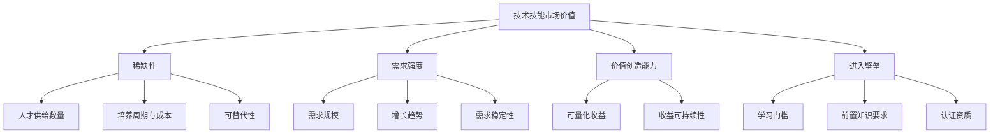
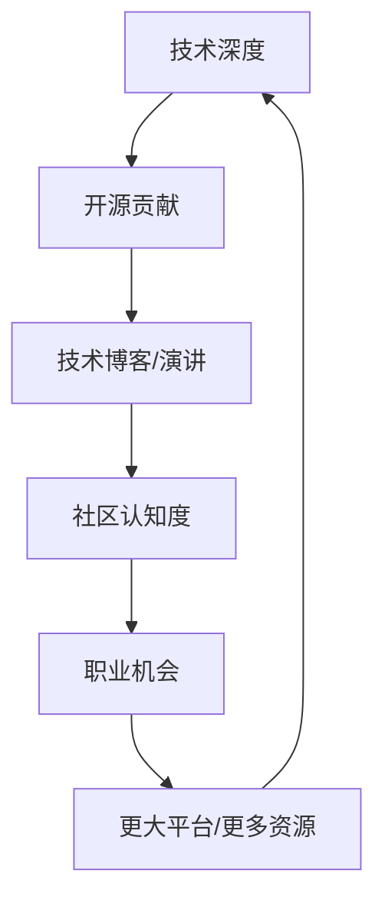
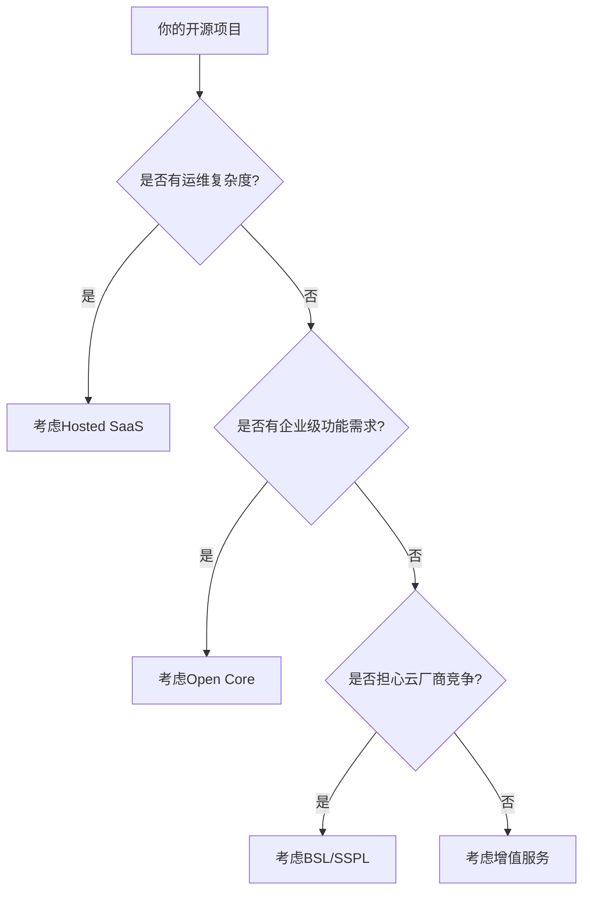
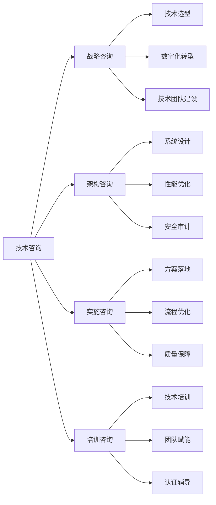
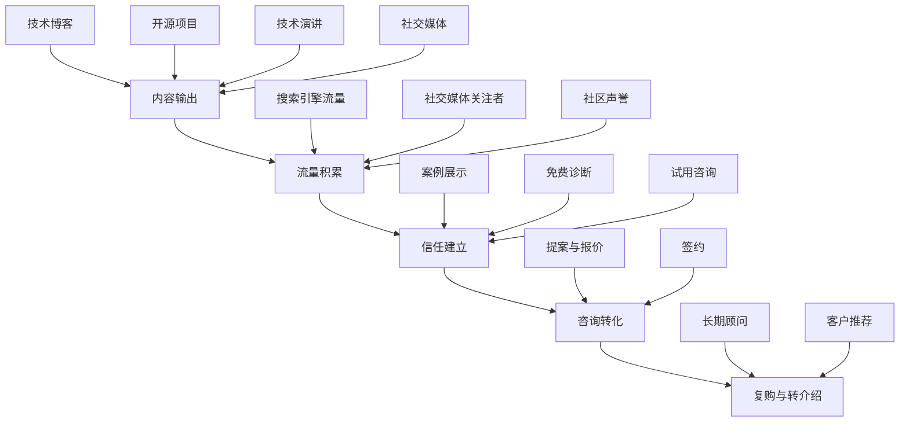
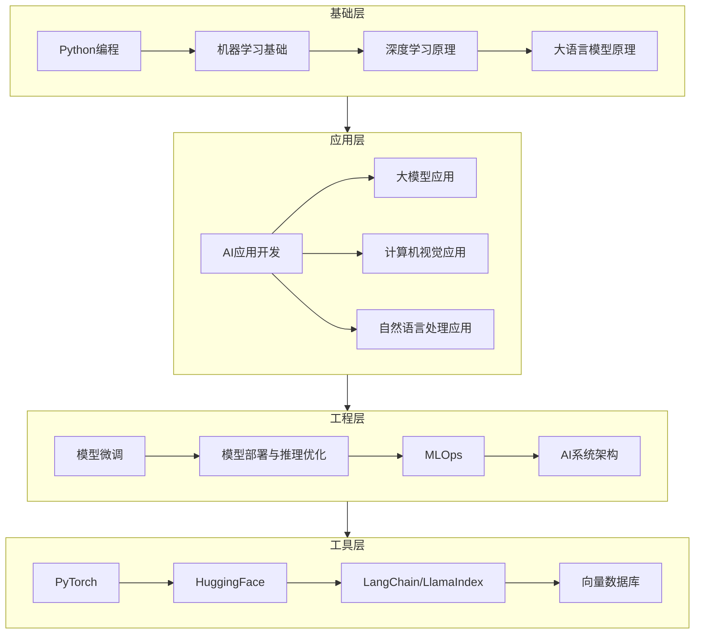
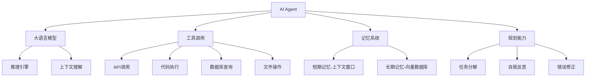
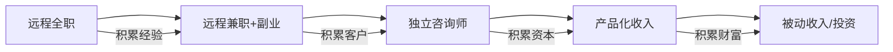

# 第十章 深度拓展：技术技能变现的高级理论与实践

本章是"技术技能变现"的进阶篇。前面的章节讲了"怎么用技术赚钱"的基本功——接单、做项目、出教程。本章往后走，聚焦更深层的问题：**你的技术到底值多少钱？怎么把影响力变成收入？怎么从卖时间过渡到卖产品？AI浪潮下哪些技能在升值、哪些在贬值？远程工作是不是一条可行的长期路径？**

这不是一份泛泛而谈的概览。每个主题都会拆到可执行的粒度。

---

## 一、技术技能的市场价值分析

大多数技术人员对自己技能的市场价值缺乏准确认知。要么低估自己——拿着远低于市场价的薪水不敢跳槽；要么高估自己——觉得"会写代码"就值高薪，实际上会写代码的人有几百万。本节给出一套系统化的评估框架，帮你定位自己在市场中的真实价值。

### 1.1 技术技能的价值评估框架

一个技术技能在市场上的定价，本质上由四个维度共同决定。缺少任何一个维度的分析，估值都会失真。



**维度一：稀缺性**

稀缺性是价格的第一驱动力。经济学的基本原理——供给越少、需求越大，价格越高——在技术人才市场同样适用。评估稀缺性需要看三个指标：

- **人才供给数量**：LinkedIn 2024年数据显示，全球有约2800万活跃开发者，但具备AI/ML工程能力的不到200万。Stack Overflow 2024年调查显示，只有12%的开发者在日常工作中使用过LLM API。稀缺性差距巨大。
- **培养周期与成本**：培养一个合格的后端开发工程师需要6-12个月，培养一个能独立做系统架构的工程师需要3-5年。培养一个能做分布式训练优化的ML工程师，需要至少2年的系统工程经验加上1年的ML工程经验。周期越长，短期供给越刚性。
- **可替代性**：CRUD开发可以被低代码平台部分替代，但分布式系统设计几乎无法被替代。可替代性越低，稀缺性越高。一个判断技巧：如果你的工作可以用一份详细的文字描述来指导另一个同等水平的人完成，那可替代性就偏高；如果需要大量的隐性知识和现场判断，可替代性就低。

**维度二：需求强度**

稀缺性只决定供给端，需求端同样关键。评估需求强度要看：

- **需求规模**：全球企业每年在云基础设施上的支出超过5000亿美元，对云计算工程师的需求是海量的。仅中国市场，2025年企业数字化转型投入预计突破3万亿元。
- **增长趋势**：网络安全领域的人才缺口预计到2025年达到350万（ISC²报告），且这个缺口还在扩大。AI安全、数据合规等细分领域的人才需求增速更高。
- **需求稳定性**：有些需求是周期性的（如区块链，随币圈行情波动），有些是持续增长的（如数据工程）。稳定性越高，收入越可预期。判断方法：看该领域过去5年的招聘趋势，连续增长或平稳的优于大起大落的。

**维度三：价值创造能力**

企业愿意为一个技能付多少钱，最终取决于这个技能能帮企业赚多少钱或省多少钱。评估价值创造能力：

- **可量化收益**：一个能将系统延迟降低50%的性能优化工程师，其价值可以用服务器成本节省来量化。一个能将转化率提升2%的增长工程师，其价值可以用增收来量化。越容易量化的技能，越容易获得高薪。反面例子：写文档、做内部培训，虽然有价值，但难以量化，因此薪资天花板较低。
- **收益可持续性**：一次性优化的价值不如持续性改进。DevOps工程师之所以高薪，是因为他们创造的是持续性的效率提升——每一次部署自动化、每一次监控改进，都在持续产生价值。

**维度四：进入壁垒**

进入壁垒保护了现有从业者的收入水平。壁垒越高，新人越难涌入，现有人才的议价能力越强。

- **学习门槛**：密码学工程师的学习门槛远高于前端开发工程师。前者需要数学基础和安全领域知识，后者入门相对容易。
- **前置知识**：量化交易开发需要同时具备编程能力和金融知识，这种交叉门槛天然限制了供给。类似的还有生物信息学（编程+生物）、自动驾驶（编程+控制理论+传感器融合）。
- **认证资质**：某些领域需要特定认证（如信息安全的CISSP、云计算的AWS Solutions Architect Professional），获取这些认证需要时间和经验积累，形成了自然的准入壁垒。

### 1.2 自评工具：给自己的技能打分

光有框架不够，你需要一个可操作的自评方法。以下是基于四维框架的自评表：

```text
┌─────────────────────────────────────────────────────────────┐
│                   技能市场价值自评表                          │
├─────────────┬───────────────────────────────────────────────┤
│ 评估维度    │ 评分标准（1-5分）                              │
├─────────────┼───────────────────────────────────────────────┤
│ 稀缺性      │ 1=大量从业者可替代  5=极少人掌握该技能         │
│ 需求强度    │ 1=需求萎缩   3=需求稳定   5=需求爆发式增长     │
│ 价值创造    │ 1=难以量化   3=可量化但间接  5=直接创造营收     │
│ 进入壁垒    │ 1=几天学会   3=需要数月   5=需要数年+交叉知识  │
├─────────────┼───────────────────────────────────────────────┤
│ 综合得分    │ 4项相加  4-8分=C级  9-12分=B级                 │
│             │ 13-16分=A级  17-20分=S级                       │
├─────────────┼───────────────────────────────────────────────┤
│ 溢价因子    │ +1分：有稀缺认证  +1分：有成功案例              │
│             │ +1分：有个人品牌  +1分：能跨行业迁移            │
└─────────────┴───────────────────────────────────────────────┘
```

**使用方法**：先为你的主技能打分，再为你想发展的目标技能打分。分差越大，转型的潜在收益越高。

**一个常见误区**：很多人只评估自己的主技能，忽略了"技能组合"的价值。一个后端开发单独评分为B+，但如果同时精通云计算架构，组合评分可以达到A+。

### 1.3 高价值技术技能矩阵

下面的矩阵不是简单的"薪资排行"，而是结合了上述四个维度的综合评估。薪资数据来源于脉脉、Glassdoor、Levels.fyi等平台的2024-2025年数据。

| 技能领域 | 稀缺性 | 需求强度 | 价值创造 | 进入壁垒 | 综合评级 | 国内年薪范围 | 海外年薪范围 |
|---------|--------|---------|---------|---------|---------|------------|------------|
| AI/ML工程 | ★★★★★ | ★★★★★ | ★★★★★ | ★★★★★ | S | 40万-200万+ | $150K-$400K+ |
| 系统架构 | ★★★★★ | ★★★★☆ | ★★★★★ | ★★★★★ | S | 50万-200万+ | $180K-$500K+ |
| 网络安全 | ★★★★☆ | ★★★★★ | ★★★★☆ | ★★★★☆ | A+ | 30万-120万 | $120K-$300K |
| 数据工程 | ★★★★☆ | ★★★★★ | ★★★★☆ | ★★★☆☆ | A | 30万-80万 | $120K-$250K |
| 云计算架构 | ★★★★☆ | ★★★★☆ | ★★★★☆ | ★★★★☆ | A | 35万-100万 | $130K-$300K |
| DevOps/SRE | ★★★★☆ | ★★★★☆ | ★★★★☆ | ★★★☆☆ | A- | 25万-70万 | $100K-$220K |
| 全栈开发 | ★★★☆☆ | ★★★★☆ | ★★★☆☆ | ★★★☆☆ | B+ | 25万-60万 | $80K-$180K |
| 移动端开发 | ★★★☆☆ | ★★★☆☆ | ★★★☆☆ | ★★★☆☆ | B | 20万-50万 | $80K-$160K |
| 前端开发 | ★★☆☆☆ | ★★★★☆ | ★★☆☆☆ | ★★☆☆☆ | C+ | 15万-40万 | $60K-$150K |
| 测试/QA | ★★☆☆☆ | ★★★☆☆ | ★★☆☆☆ | ★★☆☆☆ | C | 12万-30万 | $50K-$120K |

**阅读这张表的关键**：不要只看薪资范围。一个前端开发如果同时精通性能优化和WebGL，其稀缺性和价值创造能力会跃升到A级。技能组合比单一技能更重要。

**一个真实案例**：某位前端工程师，3年经验，薪资35万。花6个月自学WebGL和Three.js，转型为3D可视化工程师，跳槽后薪资涨到65万。他没有换行业，只是在原有技能上叠加了一个稀缺层。

### 1.4 技能价值的动态变化：三年窗口观察

技术技能的价值不是静态的。某些技能在三年内从冷门变成热门，另一些则从高薪变成平庸。理解这个动态变化，才能提前布局。

**正在快速升值的技能（2024-2027窗口）**：

- **大模型应用开发**：从ChatGPT发布到现在不到两年，相关岗位需求增长了10倍以上。掌握RAG（检索增强生成）、Agent开发、模型微调的工程师供不应求。预计2025-2027年会继续增长。
- **AI基础设施**：GPU集群管理、分布式训练优化、推理加速。这些技能需要同时懂AI和系统工程，进入壁垒极高。NVIDIA CUDA编程、vLLM/TensorRT-LLM优化等细分技能更为稀缺。
- **数据工程**：随着企业数据量指数级增长，数据管道、数据治理、实时计算的需求持续走高。Apache Flink、dbt、Dagster等工具的熟练使用成为加分项。
- **安全工程**：AI带来的新攻击面（Prompt注入、模型投毒）催生了全新的安全需求。AI安全工程师是2025年增长最快的细分安全岗位之一。

**需求稳定的技能**：

- **后端开发**（Java/Go/Rust）：企业核心系统不会一夜之间换语言，后端开发的需求在可预见的未来保持稳定。Rust因在系统编程和安全领域的优势，需求增速高于其他后端语言。
- **数据库管理与优化**：数据量只会越来越大，数据库优化永远有需求。分布式数据库（TiDB、CockroachDB）的经验成为溢价项。
- **系统架构设计**：架构能力不依赖于具体技术栈，是真正的"元技能"。能做架构决策的人永远稀缺。

**正在贬值的技能**：

- **简单CRUD开发**：低代码平台（如Retool、Airtable）和AI辅助编程（如Cursor、Copilot）正在蚕食这部分需求。一个经验判断：如果你写的代码80%是模板化的、可预测的，那这部分工作正在被自动化。
- **传统运维**：云原生和自动化运维正在取代手动运维。只会配置Nginx、写Shell脚本的运维工程师，如果不转型为SRE或DevOps，就业面会持续收窄。
- **基础UI设计**：AI设计工具（如Figma AI、Midjourney）降低了基础设计的门槛。但高级的交互设计和用户体验设计反而因为AI工具的普及而更需要人类的判断力。

### 1.5 技能组合策略：T型与π型人才

单一技能的价值天花板很明显。真正高薪的技术人才，都是技能组合的产物。

**T型人才**：一个深度技能 + 多个浅度技能。

```text
广度：产品理解 | 商业思维 | 沟通表达 | 项目管理
━━━━━━━━━━━━━━━━━━━━━━━━━━━━━━━━━━━━━━━━━━━━━━━━
深度：          系统架构设计
                     |
                     |
                     |
                  （精通）
```

**π型人才**：两个深度技能 + 多个浅度技能（更稀缺、更值钱）。

```text
广度：产品理解 | 商业思维 | 沟通表达
━━━━━━━━━━━━━━━━━━━━━━━━━━━━━━━━━━━━━━━━━━━━━━━━
深度：    AI/ML工程          系统架构设计
             |                    |
             |                    |
             |                    |
          （精通）              （精通）
```

**高价值技能组合实例**：

| 组合 | 市场定位 | 预期薪资溢价 | 学习路径建议 |
|------|---------|------------|------------|
| 后端开发 + 云计算架构 | 云原生架构师 | +50-100% | 先精通一个云平台（AWS/GCP），再学架构模式 |
| 数据工程 + 机器学习 | ML平台工程师 | +60-120% | 先掌握数据管道，再学模型训练与部署 |
| 前端开发 + 3D图形学 | WebGL/元宇宙开发 | +40-80% | 学Three.js/WebGPU，做可视化项目 |
| 安全工程 + AI | AI安全工程师 | +50-100% | 先有安全基础，再学Prompt注入/模型安全 |
| 全栈开发 + 产品思维 | 技术型CTO | +80-150% | 做独立产品，从需求到上线全流程 |
| 后端开发 + 区块链 | Web3架构师 | +40-80%（但波动大） | 学Solidity/Rust，参与链上项目 |

### 1.6 地域差异与远程工作的薪资套利

同一个技能在不同地域的定价差异巨大，这为远程工作创造了套利空间。

**国内薪资梯度**：

| 城市层级 | 典型城市 | 后端开发年薪 | AI工程师年薪 | 生活成本系数 |
|---------|---------|------------|------------|------------|
| 一线城市 | 北上广深 | 30万-60万 | 50万-150万 | 1.0 |
| 新一线 | 杭州成都南京 | 20万-40万 | 35万-80万 | 0.6-0.7 |
| 二线城市 | 武汉长沙厦门 | 15万-30万 | 25万-50万 | 0.4-0.5 |
| 三四线 | 其他城市 | 10万-20万 | 15万-35万 | 0.3-0.4 |

**海外远程的薪资套利**：

为美国科技公司远程工作，即使拿"打折薪资"（通常为本地薪资的60-80%），也远高于国内同等岗位的薪资。以中级后端工程师为例：

- 美国本地：$120K-$180K/年
- 海外远程（打折）：$70K-$120K/年
- 折合人民币：约50万-85万/年

如果在国内二线城市远程办公，生活成本仅需1-1.5万/月，年储蓄率可以达到70%以上。这就是薪资套利。

**寻找海外远程岗位的主要渠道**：

- **Remote OK**（remoteok.com）：最大的远程工作聚合平台，支持按技术栈和薪资筛选
- **We Work Remotely**（weworkremotely.com）：专注远程岗位，质量较高
- **Toptal**：高端自由职业者平台，筛选率约3%，通过后收入有保障
- **Deel / Remote.com**：处理跨国雇佣的合规平台，也能找到岗位
- **LinkedIn**：搜索 "remote" + 技术关键词，关注公司主页的招聘帖
- **Otta / Wellfound**：创业公司远程岗位集中地
- **电鸭社区**（eleduck.com）：国内最大的远程工作社区，中文友好
- **GitHub Jobs 替代品**：AngelList、Himalayas、Working Nomads

***

## 二、开源贡献与职业发展

"做开源"在技术圈几乎是政治正确——人人都说好，但很少有人真正讲清楚：**开源贡献到底怎么转化为职业价值？投入多少时间合理？应该选什么类型的贡献？怎么避免"白干"？**

本节给出一套可操作的开源贡献策略。

### 2.1 开源贡献的真实价值

开源贡献对职业发展的价值可以从四个维度量化：

**维度一：技术能力证明**

简历上写"精通React"是空话，但GitHub上有一个500 star的React组件库是实锤。开源代码是唯一一种**公开可验证**的技术能力证明。面试官可以直接看你的代码质量、commit风格、PR描述的专业度。

数据支撑：根据GitHub 2023年Octoverse报告，有活跃开源贡献的开发者收到面试邀请的概率比同等水平但无开源贡献的开发者高出约40%。在某些顶级公司（如Google、Meta、Stripe），有知名项目贡献经历的候选人甚至可以跳过电话面试环节。

**维度二：行业影响力**

当你成为一个知名开源项目的核心贡献者或维护者时，你在这个技术领域就拥有了话语权。这种影响力会带来：技术会议演讲邀请、技术媒体约稿、猎头主动联系、甚至创业投资人的关注。

影响力是有复利效应的。你在Vue.js的一个PR被合并→写一篇技术博客分享→被更多人看到→更多PR被接受→成为Contributor→被邀请参加技术会议→影响力进一步扩大。这个循环一旦启动，回报是指数级的。

**维度三：学习效率**

阅读优秀项目的源码是提升技术能力最高效的方式之一。参与代码审查（Code Review）能让你接触到不同的代码风格和设计思路。与全球优秀开发者协作的过程本身就是一种高强度的训练。

一个具体的学习方法：选一个你感兴趣的知名项目（如Redis、Kubernetes、Rust编译器），从阅读最近合并的PR开始，理解每个改动的原因和设计决策。这比看任何教程都有效。

**维度四：人脉网络**

开源社区是技术人员最高效的社交网络。你通过代码贡献结识的人，远比通过"加微信"认识的人关系更扎实——因为你们有共同的协作经历和互相信任的基础。很多创业公司的联合创始人、技术顾问，都是在开源社区中相识的。

### 2.2 构建技术影响力的系统方法

开源贡献是构建技术影响力的核心手段，但不是唯一手段。影响力是一个系统工程，需要多渠道协同。

**影响力构建的飞轮模型**：



这个飞轮的关键在于**启动阶段**。最初的100个GitHub star、最初的技术博客被转发、最初的会议演讲邀请——这些是最难获得的，但一旦飞轮转起来，增长是自我强化的。

**内容输出策略详解**：

开源代码之外，文字输出是构建影响力最重要的渠道。以下是具体策略：

| 内容类型 | 投入时间 | 影响力周期 | 平台选择 | 关键技巧 |
|---------|---------|----------|---------|---------|
| 技术深度解析 | 10-20h/篇 | 1-3年 | 个人博客、掘金、知乎 | 选题>文笔，解决真实痛点 |
| 开发日志/周记 | 2-3h/篇 | 3-6个月 | GitHub Discussions、Twitter | 持续性比质量更重要 |
| 源码解读 | 8-15h/篇 | 1-2年 | 掘金、InfoQ、个人博客 | 选热门项目，配图解释 |
| 教程/指南 | 5-10h/篇 | 6-12个月 | 掘金、CSDN、Medium | 步骤可复现，代码可运行 |
| 技术演讲 | 20-40h（含准备） | 6-12个月 | 线下meetup、线上直播 | 故事>知识点，Demo>幻灯片 |

**一个关键洞察**：技术博客的最大价值不是直接带来工作机会，而是**降低信任成本**。当一个潜在客户或雇主搜索你的名字时，如果能找到5-10篇高质量的技术文章，他们对你的信任度会远高于只看简历。这在咨询和自由职业场景中尤其重要。

**影响力变现的四种路径**：

1. **求职溢价**：有影响力的开发者在薪资谈判中有更强的议价能力。数据显示，有活跃技术博客和开源贡献的候选人，offer薪资平均高出15-25%。
2. **咨询获客**：影响力是最好的获客渠道。客户会主动找上门，而不是你去推销自己。
3. **商业合作**：技术品牌的商业价值包括：付费技术评测、品牌赞助、联名课程。
4. **创业基础**：很多成功的开发者工具创业项目，创始人在创业前就已经在相关领域建立了影响力。

### 2.3 开源贡献的类型与投入产出比

不同类型的开源贡献，投入的时间和产出的价值差异很大。以下是基于实际经验的评估：

| 贡献类型 | 时间投入 | 技术价值 | 简历价值 | 人脉价值 | 推荐优先级 |
|---------|---------|---------|---------|---------|----------|
| 修复Bug（简单） | 低（1-5h） | 中 | 低 | 低 | 入门首选 |
| 修复Bug（复杂） | 中（5-20h） | 高 | 中 | 中 | 推荐 |
| 新功能开发 | 高（20-100h+） | 很高 | 高 | 高 | 核心贡献 |
| 代码审查 | 低（0.5-2h/次） | 高 | 中 | 高 | 推荐 |
| 文档改进 | 低（1-5h） | 低 | 低 | 低 | 入门首选 |
| 翻译 | 低（1-3h/篇） | 低 | 低 | 低 | 附加价值 |
| 创建自己的项目 | 很高（持续） | 很高 | 很高 | 高 | 有积累后推荐 |
| 安全漏洞报告 | 中（变数大） | 很高 | 很高 | 中 | 有安全背景推荐 |

**关键洞察**：不要只盯着写代码。Code Review的价值被严重低估——一次高质量的代码审查比写100行代码更能展示你的技术深度和协作能力。

### 2.4 从零开始的开源贡献实操路径

以下是经过验证的、适合中国开发者的开源贡献路径：

**第一阶段：选择项目（第1-2周）**

```text
选项目的标准：
1. 你日常在用的工具/库/框架（最优先）
2. 活跃度高（近30天有release或活跃PR）
3. 有 "good first issue" 或 "help wanted" 标签
4. 维护者响应积极（issue/PR平均响应时间<7天）
5. 社区氛围友好（看已有issue的讨论语气）

推荐起点：
- 前端：Vue.js、Vite、Element Plus、Ant Design
- 后端：Gin（Go）、FastAPI（Python）、Spring Boot（Java）
- 工具：Homebrew、Oh My Zsh、Neovim插件
- AI：LangChain、LlamaIndex、Ollama、vLLM
- 中国开源：Dify、Milvus、TDengine、Apache ECharts
- 基础设施：Kubernetes、Docker、Terraform
```

**第二阶段：熟悉项目（第2-4周）**

```bash
# 1. Fork并Clone项目
git clone https://github.com/YOUR_NAME/PROJECT.git
cd PROJECT

# 2. 阅读贡献指南
cat CONTRIBUTING.md

# 3. 搭建本地开发环境
# 按照README的说明操作

# 4. 运行测试套件，确保一切正常
make test  # 或 npm test / pytest 等

# 5. 浏览open issues，标记感兴趣的
# 在GitHub上用标签筛选

# 6. 观察项目的PR流程
# 看最近合并的PR是怎么描述的、review怎么做的

# 7. 理解项目的分支策略和发布周期
git log --oneline -20  # 看最近的提交历史
git branch -a          # 看分支结构
```

**第三阶段：首次贡献（第4-6周）**

从最简单的贡献开始：

```markdown
## 首次PR的推荐选择（按难度排序）：

1. **修复文档中的拼写错误或过时链接**
   - 几乎零风险，99%会被接受
   - 熟悉项目的PR流程

2. **修复标记为 "good first issue" 的简单bug**
   - 通常改动量小（<50行）
   - 有明确的复现步骤

3. **改进错误信息或添加日志**
   - 不涉及核心逻辑
   - 但能展示你对代码的理解

4. **为缺少测试的函数补充单元测试**
   - 帮助项目提高覆盖率
   - 维护者通常很欢迎
```

**第四阶段：深度参与（第2-6个月）**

```markdown
## 从小贡献到核心贡献者：

1. 持续提交PR，保持每月1-3个PR的节奏
2. 参与issue讨论，帮助其他用户解决问题
3. 参与代码审查（先从简单PR开始）
4. 在项目的Discussion或Discord中活跃
5. 提出改进建议（RFC或设计文档）
6. 逐步承担更大范围的功能开发
```

### 2.5 PR提交的黄金法则

一个高质量的PR是打开开源社区大门的钥匙。以下是PR提交的最佳实践：

**PR描述模板**：

```markdown
## 概述
简要描述这个PR做了什么，解决了什么问题。

## 问题
链接到相关的issue（Fixes #123）。
描述问题的具体表现和影响。

## 解决方案
描述你的实现思路和设计决策。
如果有多种方案，说明为什么选择这个方案。

## 测试
描述你如何验证这个改动。
添加或更新了哪些测试用例。

## 截图/录屏（如适用）
展示改动前后的对比。

## 其他说明
是否需要迁移？是否有breaking change？
```

**常见PR被拒原因及避免方法**：

| 被拒原因 | 如何避免 |
|---------|---------|
| 没有关联issue | 先开issue讨论，获得维护者认可后再动手 |
| 改动范围太大 | 拆成多个小PR，每个PR只做一件事 |
| 缺少测试 | 至少为新功能添加单元测试 |
| 代码风格不符 | 先阅读项目的lint配置和代码规范 |
| commit message不规范 | 遵循Conventional Commits规范 |
| 没有说明设计决策 | 在PR描述中解释为什么这样实现 |

### 2.6 开源项目的商业化路径

如果你决定创建自己的开源项目，以下是最成熟的商业化路径：

**模式一：开源核心 + 企业版（Open Core）**

这是最常见的模式。核心功能开源，企业级功能（如SSO、审计日志、高级权限管理）收费。

```text
免费版（开源）          企业版（收费）
├── 核心功能            ├── 核心功能
├── 基本API             ├── 高级API
├── 社区支持            ├── SSO/SAML集成
└── 单机部署            ├── 审计日志
                        ├── 高可用集群
                        ├── SLA保障
                        └── 专属技术支持
```

代表项目：GitLab（年收入5亿美元+）、Elastic、Confluent。

**模式二：开源 + 云托管服务（Hosted SaaS）**

自己不开源的功能是"运维"——让用户在你的云上一键部署，省去自己运维的麻烦。

代表项目：Redis Labs（Redis Cloud）、PlanetScale（Vitess）、Supabase、Neon（PostgreSQL）。

**模式三：开源 + 商业许可（BSL / SSPL）**

部分代码开源但限制商业使用，迫使云厂商购买商业许可。

代表项目：MariaDB（BSL）、MongoDB（SSPL）、HashiCorp（BSL，后改为OSI许可）、Elastic（后改回AGPL）。

**模式四：开源 + 增值服务**

代码完全开源（MIT/Apache），通过咨询、培训、认证、定制开发赚钱。

代表项目：Red Hat（年收入34亿美元）、Automattic（WordPress）。

**选择商业化模式的决策树**：



### 2.7 开源贡献的常见误区

**误区一："我的代码不够好，不敢提交PR"**

真相：大多数开源项目的维护者对新贡献者很包容。PR的过程就是学习的过程。没有人要求你的第一次贡献就完美无缺。维护者更看重的是你愿意参与的态度，而不是代码的完美程度。

**误区二："必须贡献代码才有价值"**

真相：文档、翻译、回答问题、报告Bug、写教程都是有价值的贡献。很多项目的维护者最缺的不是代码，而是文档和社区支持。Vue.js的核心团队成员中，有人的主要贡献就是文档和社区管理。

**误区三："贡献开源就是白干活"**

真相：开源贡献的回报是长期的——简历加分、技术提升、人脉积累、行业影响力。这些回报在求职、创业、咨询报价时会兑现。很多CTO和高级架构师的起点就是某个知名开源项目的贡献者。

**误区四："做了很多贡献但没人注意到"**

真相：主动展示你的贡献。在简历中附上GitHub链接，在技术博客中分享你参与开源的经历，在面试中讲述你解决的技术难题。酒香也怕巷子深。同时，在GitHub的个人主页上置顶你最得意的项目或PR。

***

## 三、技术咨询的商业模式

技术咨询是"卖脑力"的终极形态——不写代码，只输出判断和方案。单位时间收入远高于开发工作，但对个人品牌、沟通能力和行业经验的要求也远高于写代码。

### 3.1 技术咨询的类型与适用场景



**战略咨询**：帮客户做技术方向的决策。比如"我们应该自建还是购买？""微服务改造的优先级是什么？""AI应该在哪些业务环节落地？"。这类咨询需要你同时理解技术和商业。典型的交付物是一份技术评估报告和路线图。

**架构咨询**：帮客户设计或优化技术架构。比如"如何将单体应用拆分为微服务？""数据库瓶颈在哪里，怎么优化？""如何设计一个支持千万级用户的系统？"。这类咨询需要深厚的技术功底和实战经验。典型的交付物是架构设计文档和实施指南。

**实施咨询**：帮客户把方案落地。比如"如何推行CI/CD？""如何建立代码审查制度？""如何进行技术债务治理？"。这类咨询需要丰富的项目管理经验。典型的交付物是流程规范文档和工具链配置。

**培训咨询**：帮客户提升团队能力。比如"如何让团队掌握云原生开发？""如何推行测试驱动开发？"。这类咨询需要教学能力和课程设计能力。典型的交付物是培训课程和评估体系。

### 3.2 技术咨询的定价体系

定价是技术咨询最核心的问题之一。定低了不赚钱，定高了接不到单。以下是一个基于市场数据的定价参考框架：

**按小时收费**：

| 咨询师级别 | 国内价格（元/小时） | 海外价格（美元/小时） | 典型服务 |
|-----------|-------------------|---------------------|---------|
| 中级工程师转型 | 500-1,000 | $80-$150 | 代码审查、简单方案 |
| 高级工程师/架构师 | 1,000-3,000 | $150-$400 | 架构设计、技术选型 |
| 行业专家/CTO级 | 3,000-8,000 | $400-$1,000 | 战略规划、数字化转型 |
| 顶级专家/顾问 | 8,000-20,000+ | $1,000-$3,000+ | 行业顶级咨询 |

**按天收费**（适合工作坊和深度咨询）：

| 咨询师级别 | 国内价格（元/天） | 海外价格（美元/天） |
|-----------|-----------------|-------------------|
| 中级 | 5,000-10,000 | $1,000-$2,500 |
| 高级 | 10,000-30,000 | $2,500-$7,000 |
| 顶级 | 30,000-80,000+ | $7,000-$20,000+ |

**按项目收费**（适合有明确交付物的咨询）：

| 项目类型 | 典型周期 | 国内价格范围 | 海外价格范围 |
|---------|---------|------------|------------|
| 技术选型评估报告 | 1-2周 | 2万-8万 | $5K-$20K |
| 系统架构设计 | 2-4周 | 5万-20万 | $15K-$50K |
| 性能优化诊断 | 1-2周 | 3万-10万 | $10K-$30K |
| 安全审计 | 2-4周 | 5万-30万 | $15K-$80K |
| 数字化转型路线图 | 4-8周 | 10万-50万 | $30K-$150K |
| 团队培训工作坊（3天） | 3天 | 3万-15万 | $10K-$40K |

**定价公式**（帮助你找到自己的基准价）：

```text
基准时薪 = 目标年收入 ÷ 可售工时

示例：
- 目标年收入：100万
- 可售工时：每年约1000小时（考虑业务开发、行政、休假等非售时间）
- 基准时薪：1000元/小时
- 实际报价：基准时薪 × 1.5-2.0（考虑波动和溢价）= 1500-2000元/小时
```

**一个关键原则**：不要按时间收费，要按价值收费。如果你帮客户做了一个架构优化，每年为他们节省200万的服务器成本，收50万的咨询费是合理的——即使你只花了两周时间。这就是"价值定价"的核心逻辑。

**价值定价的实操方法**：

1. 在咨询前，先了解客户的业务规模和痛点
2. 估算你的方案能为客户创造多少价值（节省成本或增加收入）
3. 按价值的10-25%定价（客户仍有3-10倍的ROI）
4. 在提案中明确写出价值量化，让客户看到ROI

**价值定价的真实案例**：

某SaaS公司数据库查询平均响应时间800ms，用户流失率高。咨询师通过索引优化、查询重构、缓存层设计，将响应时间降到50ms。该优化预计每年减少因性能问题流失的客户价值约150万。咨询师报价25万（价值的16.7%），客户获得6倍ROI，双方都满意。如果按时间收费（2周×8000/天=8万），咨询师会少赚17万。

### 3.3 技术咨询的获客漏斗

大多数技术人员不缺能力，缺的是客户。以下是一个经过验证的获客漏斗：



**第一层：内容输出（建立存在感）**

内容是获客的起点。但不是随便写——要写"能被搜索到的、解决具体问题的"内容。

```markdown
## 内容策略：

✅ 写：《如何将MySQL查询从5秒优化到50毫秒》——解决具体问题
✅ 写：《从单体到微服务：我们的迁移之路》——分享实战经验
✅ 写：《2024年最值得学习的5个后端技术栈》——提供判断

❌ 不写：《什么是微服务》——百度百科就有
❌ 不写：《编程入门教程》——竞争太激烈
❌ 不写：《我的学习心得》——除非你是行业大佬
```

**第二层：信任建立（从关注者到潜在客户）**

有了流量还不够，要让潜在客户相信你能解决他们的问题。

- **案例展示**：匿名描述你帮过的客户的问题和解决方案（不泄露商业机密）。包含具体的数字：性能提升了多少、成本降低了多少、效率提高了多少。
- **免费诊断**：提供30分钟的免费技术诊断，帮客户定位问题。这是最有效的转化手段——客户体验到你的专业度后，更容易签约付费咨询。
- **试用咨询**：第一个小时半价或免费，降低客户的决策门槛。

**第三层：转化与复购**

- **提案**：根据诊断结果，提供一份详细的咨询方案，包括目标、范围、时间线、交付物、价格。
- **合同**：一定要签合同，明确双方的权利义务。
- **超额交付**：在承诺的范围内多做一点，超出客户预期。
- **复购**：咨询结束后主动提供后续服务建议。
- **转介绍**：满意的客户是最好的营销渠道，主动请求推荐。

### 3.4 咨询合同的核心条款

合同是咨询业务的保护伞。以下是技术咨询合同中必须包含的核心条款：

```markdown
## 技术咨询合同核心条款清单：

1. **服务范围（Scope of Work）**
   - 明确列出咨询的具体内容和交付物
   - 明确列出不包含的服务（排除项）
   - 超出范围的需求另行报价

2. **时间安排**
   - 咨询的起止日期
   - 每周/每月的投入时间
   - 关键里程碑和交付节点

3. **费用与支付**
   - 总费用或时薪/日薪
   - 支付方式和时间节点（预付比例、尾款条件）
   - 延期付款的违约条款

4. **知识产权**
   - 咨询成果的归属（通常归客户）
   - 通用方法论和工具的保留权
   - 保密信息的定义和处理

5. **保密条款（NDA）**
   - 保密信息的范围
   - 保密期限（通常2-5年）
   - 违约责任

6. **免责条款**
   - 咨询建议不构成担保
   - 最终决策权在客户
   - 间接损失的免责

7. **终止条款**
   - 提前终止的通知期（通常30天）
   - 已完成工作的结算方式
   - 终止后的保密义务延续
```

### 3.5 咨询师的常见陷阱

**陷阱一：定价过低**

很多技术人员转型咨询师时，按照"原来工资的时薪"来定价。这是错的——咨询工作的可售工时远低于全职工作（通常只有40-60%的时间能卖出去），且没有社保、公积金等福利。定价必须考虑这些因素。

**陷阱二：范围蔓延**

客户的需求会不断扩大。如果不明确界定咨询范围，你会发现自己从"做架构评审"变成了"帮他们写代码"。解决方案：在合同中明确列出交付物和排除项，额外需求另计费。

**陷阱三：只做不教**

如果你只是替客户解决问题，而不教会他们怎么解决，你永远是"打工人"。真正高价值的咨询师是"教练"——帮客户建立自己的能力。教会客户团队做架构评审，比你每次帮他们做架构评审更有长期价值。

**陷阱四：忽视商业思维**

技术咨询的本质是商业行为。你需要理解客户的商业目标，用商业语言（ROI、风险、时间线）而不是技术语言（架构、性能、代码质量）来沟通。一个好用的转换框架：把每个技术建议翻译成"这能帮你赚多少钱/省多少钱/避免多大风险"。

**陷阱五：不做交付物管理**

很多咨询师口头沟通完就觉得完事了。没有书面交付物，客户无法回顾你的建议，也无法向他的上级汇报。每一份咨询都应该有书面交付物——哪怕是一页纸的结论摘要。这不仅是专业性的体现，也是你自己的保护：书面记录可以避免后续的扯皮。

**陷阱六：忽视回款风险**

咨询工作做完了，客户拖着不付款。这不是假设，而是经常发生。应对方法：合同中约定预付30-50%，里程碑付款，尾款在交付后15天内支付。对于新客户，第一次合作一定要预付。

### 3.6 从全职到咨询师的过渡路径

不建议裸辞做咨询师。以下是经过验证的过渡路径：

```markdown
## 过渡时间线：

### 阶段一：兼职起步（0-6个月）
- 在现有工作中积累可迁移的专业能力
- 开始写技术博客，建立个人品牌
- 接1-2个小项目试水（利用周末时间）
- 目标：验证市场对你的技能有需求

### 阶段二：建立口碑（6-18个月）
- 积累3-5个成功案例
- 收集客户推荐信和评价
- 建立自己的咨询方法论
- 目标：月咨询收入达到工资的50%

### 阶段三：全职转型（18个月+）
- 咨询收入稳定超过工资收入
- 有至少3个月的财务缓冲
- 有持续的获客渠道
- 目标：稳定运营，开始考虑扩大规模
```

***

## 四、技术产品的商业化路径

从"卖时间"到"卖产品"，是技术人员收入模型的根本性跃迁。卖时间有上限（一天只有24小时），卖产品没有上限（SaaS产品可以同时服务百万用户）。但产品化也是最难的——大多数人倒在从0到1的阶段。

### 4.1 技术产品的四种商业模式

| 模式 | 收入特征 | 代表产品 | 适合谁 |
|------|---------|---------|-------|
| SaaS订阅 | MRR/ARR，持续收入 | Notion、飞书、Slack | 有长期维护能力的团队 |
| API服务 | 按调用计费 | Stripe、OpenAI API | 有技术壁垒的基础设施 |
| 开发工具 | 订阅或一次性购买 | JetBrains、Figma | 深耕开发者群体的个人/小团队 |
| 数字产品 | 一次性销售 | 课程、模板、插件 | 独立开发者，起步最容易 |

**独立开发者的起步建议**：不要一上来就做SaaS。SaaS的前期投入大、周期长、运维成本高。从数字产品（课程、模板、工具插件）开始，验证市场需求后再升级到SaaS。

**四种模式的详细对比**：

| 对比维度 | SaaS订阅 | API服务 | 开发工具 | 数字产品 |
|---------|---------|--------|---------|---------|
| 初始投入 | 高（3-6个月开发） | 中（1-3个月） | 中（2-4个月） | 低（1-4周） |
| 运维成本 | 高（持续） | 高（持续） | 低（版本发布制） | 极低 |
| 收入天花板 | 极高 | 极高 | 高 | 中 |
| 获客难度 | 高 | 中 | 中 | 低 |
| 适合独立开发者 | 不推荐起步 | 不推荐起步 | 推荐 | 最推荐 |
| 变现周期 | 3-12个月 | 1-6个月 | 1-3个月 | 即时-1个月 |

### 4.2 产品的关键指标体系

无论做哪种产品，以下指标是必须跟踪的：

**北极星指标**（最重要的一个指标）：

```markdown
不同产品类型的北极星指标：

- SaaS产品 → 周活跃用户数（WAU）
- API服务 → 每日API调用量
- 开发工具 → 日活跃用户数（DAU）
- 数字产品 → 月销售额
```

**用户指标**：

| 指标 | 计算方式 | 健康基准 | 意义 |
|------|---------|---------|------|
| CAC（用户获取成本） | 营销总支出 ÷ 新增用户数 | 因行业而异 | 获客效率 |
| LTV（用户生命周期价值） | ARPU × 用户平均生命周期 | LTV > 3×CAC | 用户价值 |
| 留存率 | 第N天仍活跃的用户 ÷ 首日用户 | 次日>40%，7日>20% | 产品粘性 |
| 流失率 | 每月流失用户 ÷ 总用户 | <5%/月（SaaS） | 用户满意度 |

**收入指标**：

| 指标 | 计算方式 | 意义 |
|------|---------|------|
| MRR | 每月经常性收入 | SaaS的核心指标 |
| ARR | MRR × 12 | 年化收入 |
| ARPU | 总收入 ÷ 付费用户数 | 客单价 |
| NDR（净收入留存率） | (期初MRR + 扩展 - 流失) ÷ 期初MRR | >100%说明老客户在增长 |
| 付费转化率 | 付费用户 ÷ 总用户 | 免费转付费的效率 |

**一个重要的指标关系**：LTV/CAC是衡量商业模式是否成立的核心比率。如果LTV/CAC < 3，说明获客成本太高或用户价值太低，需要调整策略。

### 4.3 独立开发者的商业化实战

以下是独立开发者从0到月入1万的实操路径：

**第一步：找到需求（1-2周）**

```markdown
## 找需求的方法：

1. **从自己的痛点出发**
   - 你日常工作中反复做的重复性任务是什么？
   - 你用过的工具有哪些让你不满意的地方？
   - 你搜索过但没找到好解决方案的问题是什么？

2. **从社区需求出发**
   - 在V2EX、知乎、Twitter上搜索"求推荐XX工具"
   - 看Product Hunt上的热门产品，找细分机会
   - 浏览竞品的差评，找改进空间

3. **验证需求**
   - 有人愿意付钱吗？（不是"觉得不错"，而是"愿意掏钱"）
   - 市场够大吗？（目标用户至少10万+）
   - 你能做到前3吗？（细分市场不需要做到第1）

4. **需求验证的具体方法**
   - 发一个Landing Page，看有多少人留下邮箱（>5%转化率=好信号）
   - 在相关社区发帖描述你的方案，看反馈
   - 找5-10个目标用户做付费意向访谈
```

**第二步：构建MVP（2-4周）**

```markdown
## MVP的核心原则：

- 只做一个核心功能，做到极致
- 不要追求完美，先上线再说
- 技术栈选你最熟悉的，不是最新的
- 部署到用户能找到的地方（不需要自己建官网）

## 独立开发者的推荐技术栈：

后端：Node.js/Python + PostgreSQL + Redis
前端：Next.js/Nuxt.js + Tailwind CSS
部署：Vercel/Railway/Fly.io（免费层够MVP用）
支付：Stripe（海外）/ 支付宝当面付（国内）
监控：Sentry（错误追踪）+ Plausible（隐私友好的分析）
```

**第三步：获取前100个用户（2-4周）**

```markdown
## 冷启动策略：

1. **Product Hunt发布** → 可带来500-2000个访问
2. **Hacker News Show HN** → 技术社区曝光
3. **V2EX创意区** → 国内技术社区
4. **Twitter/X 技术圈** → 建立个人品牌
5. **相关社区的"Show & Tell"板块** → 精准用户
6. **写一篇技术博客** → "我是如何用X周做了XX产品"
7. **给竞品的不满意用户发消息** → 直接拉新
8. **Reddit相关subreddit** → 精准但要注意社区规则（不要硬广）
9. **小红书/B站** → 国内用户获取新渠道
```

**第四步：从免费到付费（持续迭代）**

```markdown
## 付费转化策略：

1. **免费增值模式**
   - 免费版：基础功能，有使用量限制
   - 付费版：高级功能，无限制
   - 关键：免费版要足够好用，让用户产生依赖

2. **试用期模式**
   - 14天或30天全功能试用
   - 试用期结束前推送提醒
   - 关键：试用期内要让用户感受到价值

3. **一次性购买模式**
   - 适合工具类、模板类产品
   - 定价：$9-$99不等
   - 关键：产品页面要清晰展示价值
```

### 4.4 技术产品的定价策略详解

定价是一门学问。以下是四种主要定价模型的详细分析：

**免费增值（Freemium）**

```text
适用场景：用户获取成本低、网络效应强的产品
转化率基准：2-5%的免费用户转化为付费用户
关键指标：免费用户的活跃度和留存率

风险：
- 免费功能太多 → 用户没动力付费
- 免费功能太少 → 用户留不住
- 免费用户的服务成本 → 可能拖垮公司

最佳实践：
- 免费版解决80%的基础需求
- 付费版解决20%的高级需求
- 用量限制比功能限制更有效
```

**分层定价（Tiered Pricing）**

```text
通常设3-4个层级：

基础版（$9-19/月）    → 个人用户，基础功能
专业版（$29-79/月）   → 小团队，高级功能
企业版（$99-299/月）  → 大团队，全部功能+优先支持
定制版（联系销售）    → 大企业，定制化需求

关键原则：
- 每一层级的价值差距要明显
- 专业版应该是"甜点"价位（性价比最高）
- 企业版的存在是为了锚定价格，让专业版看起来划算
- 在专业版旁边放一个"最受欢迎"标签
```

**按使用量定价（Usage-Based）**

```text
适用场景：API服务、云基础设施、数据处理
代表：AWS、Stripe、OpenAI API

优势：
- 对用户公平（用多少付多少）
- 收入随用户增长自然增长
- 降低用户的初始决策门槛

风险：
- 收入不稳定
- 用户可能过度优化使用量
- 计费系统复杂
```

**价值定价（Value-Based）**

```text
核心逻辑：价格 = 为用户创造的价值 × 一定比例

示例：
- 你做了一个自动化工具，帮客户每月节省20小时人工
- 假设人工成本100元/小时，每月节省2000元
- 定价：200-500元/月（价值的10-25%）
- 客户仍然觉得划算（ROI 4-10倍）

如何找到价值定价的锚点：
1. 量化你的产品帮用户节省了多少时间
2. 量化你的产品帮用户多赚了多少钱
3. 量化你的产品帮用户避免了多大风险
4. 取其中最大的一个值作为定价基准
```

### 4.5 产品商业化的典型挑战与应对

| 挑战 | 症状 | 应对方案 |
|------|------|---------|
| 没有用户 | 上线后无人问津 | 回到需求验证阶段，可能需求本身不成立 |
| 有用户没收入 | 免费用户多，没人付费 | 免费版太慷慨，收窄免费范围 |
| 有收入没增长 | 初期有一些付费用户，但增长停滞 | 缺少获客渠道，需要建立内容营销或社区 |
| 增长但亏损 | 用户在涨，但服务器和运营成本超过收入 | 调整定价，优化基础设施成本 |
| 竞争加剧 | 大公司或更多竞品进入市场 | 深耕细分市场，建立护城河 |
| 技术债 | 功能开发速度变慢，bug越来越多 | 定期安排技术债清理周期 |

**一个被忽视的挑战：产品与市场的错位**。很多独立开发者花3个月做了一个自认为很好的产品，上线后发现没人用。这不是推广问题，而是需求验证阶段就没有做好。解决方案：在写一行代码之前，先验证有人愿意为这个方案付钱。最简单的验证方法是发一个Landing Page，描述你的方案，看有多少人留下邮箱或预付款。

### 4.6 独立开发者的法律防护

很多独立开发者忽略法律问题，直到出了问题才后悔。以下是必须了解的法律基础：

**知识产权保护**：

```markdown
## 独立开发者必知的法律事项：

1. **版权保护**
   - 你写的代码自动享有版权保护（无需注册）
   - 但建议在中国版权保护中心做软件著作权登记
   - 费用低（几百元），但在维权时是关键证据

2. **商标保护**
   - 产品名称建议注册商标
   - 在中国通过商标局申请，费用约300元/类
   - 注册周期6-12个月，建议尽早开始

3. **开源协议选择**
   - MIT：最宽松，允许任何用途
   - Apache 2.0：MIT基础上增加了专利授权
   - GPL：衍生作品必须也开源（copyleft）
   - BSL/SSPL：限制商业使用

4. **用户协议和隐私政策**
   - 任何收集用户数据的产品都需要隐私政策
   - 建议使用Iubenda或TermsFeed生成模板
   - 中国用户需要符合《个人信息保护法》的要求
```

**竞业限制和知识产权归属**：

很多独立开发者在职期间就开始做自己的产品。一个必须注意的问题：**你当前雇佣合同中的知识产权归属条款**。很多公司的合同规定，工作时间内开发的、或与公司业务相关的知识产权归公司所有。

应对方法：仔细阅读你的雇佣合同。如果你的产品与公司业务完全无关，且完全在业余时间开发，通常风险较低。但如果你不确定，建议咨询律师。在中国，竞业限制需要公司支付补偿金才有效（通常为月工资的30%），但知识产权归属条款没有这个限制。

***

## 五、AI时代的技术技能演变

AI不是"又一个技术热点"。它是自互联网以来最大的技术范式转移。本节不讨论AI的哲学问题，只讨论一个务实的问题：**在AI时代，技术人员应该怎么调整自己的技能组合和职业策略？**

### 5.1 AI对技术工作的真实影响

很多关于"AI取代程序员"的讨论过于情绪化。以下是基于实际观察的冷静分析：

**被AI深度改变的工作**：

- **基础CRUD开发**：Copilot、Cursor等工具已经能自动生成大部分样板代码。初级开发者的生产力提升了2-3倍，但也意味着完成同样的工作需要的人更少了。
- **数据分析**：ChatGPT可以直接写SQL、做数据可视化、生成分析报告。基础数据分析师的工作正在被自动化。
- **内容创作**：AI可以生成技术文档、API文档、用户手册的初稿。技术写手的工作量在减少。
- **测试**：AI可以自动生成测试用例、发现边界条件。手工测试的需求在下降。

**被AI增强而非取代的工作**：

- **系统架构设计**：AI可以辅助设计，但复杂系统的架构决策仍需要人类的判断力和经验。
- **复杂问题调试**：AI可以帮助定位问题，但理解业务上下文、做出正确的修复决策仍需要人类。
- **产品设计**：AI可以生成原型，但理解用户需求、做出产品决策仍需要人类。
- **安全工程**：AI可以发现已知漏洞，但对抗性的安全攻防仍需要人类的创造性思维。

**AI催生的新工作**：

- **AI应用工程师**：把大模型能力集成到产品中的工程师。需要理解Prompt Engineering、RAG、Agent等概念。
- **MLOps工程师**：管理模型训练、部署、监控的全流程。需要同时懂ML和运维。
- **AI产品经理**：定义AI产品的功能、体验和商业模式。需要理解AI的能力边界。
- **Prompt Engineer**：设计和优化AI提示词。这个岗位可能不会长期存在，但目前确实有需求。

### 5.2 AI时代的核心技能栈



**对于大多数开发者，最务实的学习路径是：**

不需要从零学ML理论。直接从应用层切入——学会使用大模型API（OpenAI、Claude、国内的通义千问、文心一言等），理解Prompt Engineering的基本原理，然后学习如何构建RAG系统和AI Agent。

```python
# 一个最简单的RAG（检索增强生成）示例
# 展示了AI应用开发的基本模式

from openai import OpenAI
from chromadb import Client

# 1. 建立知识库
chroma = Client()
collection = chroma.create_collection("my_docs")

# 添加文档（实际项目中需要做embedding）
documents = [
    "公司退货政策：购买后7天内可无理由退货",
    "会员权益：金牌会员享受9折优惠",
    "发货时间：下单后48小时内发货",
]
for i, doc in enumerate(documents):
    collection.add(documents=[doc], ids=[f"doc_{i}"])

# 2. 检索相关文档
query = "我想退货，有什么条件？"
results = collection.query(query_texts=[query], n_results=3)
context = "\n".join(results["documents"][0])

# 3. 用大模型生成回答
client = OpenAI()
response = client.chat.completions.create(
    model="gpt-4",
    messages=[
        {"role": "system", "content": f"你是客服助手。根据以下知识回答问题：\n{context}"},
        {"role": "user", "content": query},
    ],
)
print(response.choices[0].message.content)
```

### 5.3 Agent开发：AI应用的下一个范式

Agent（智能体）是2025年AI应用开发最重要的方向。与传统的"一问一答"式AI应用不同，Agent能自主规划、执行多步骤任务、调用外部工具。

**Agent的核心组成**：



**一个简单的Agent实现示例**：

```python
import json
from openai import OpenAI

client = OpenAI()

# 定义Agent可以使用的工具
tools = [
    {
        "type": "function",
        "function": {
            "name": "search_database",
            "description": "搜索产品数据库",
            "parameters": {
                "type": "object",
                "properties": {
                    "query": {"type": "string", "description": "搜索关键词"},
                    "category": {"type": "string", "description": "产品类别"},
                },
                "required": ["query"],
            },
        },
    },
    {
        "type": "function",
        "function": {
            "name": "calculate_shipping",
            "description": "计算运费",
            "parameters": {
                "type": "object",
                "properties": {
                    "weight": {"type": "number", "description": "重量(kg)"},
                    "destination": {"type": "string", "description": "目的地"},
                },
                "required": ["weight", "destination"],
            },
        },
    },
]

# Agent的工具实现
def search_database(query: str, category: str = None) -> str:
    # 实际项目中连接数据库
    return json.dumps({"results": [{"name": "商品A", "price": 99}]})

def calculate_shipping(weight: float, destination: str) -> str:
    return json.dumps({"cost": 15.5, "days": 3})

# Agent主循环
def run_agent(user_message: str):
    messages = [
        {"role": "system", "content": "你是一个购物助手，帮助用户查找商品和计算运费。"},
        {"role": "user", "content": user_message},
    ]

    response = client.chat.completions.create(
        model="gpt-4",
        messages=messages,
        tools=tools,
        tool_choice="auto",
    )

    # 处理工具调用
    while response.choices[0].message.tool_calls:
        tool_calls = response.choices[0].message.tool_calls
        messages.append(response.choices[0].message)

        for tool_call in tool_calls:
            func_name = tool_call.function.name
            args = json.loads(tool_call.function.arguments)

            if func_name == "search_database":
                result = search_database(**args)
            elif func_name == "calculate_shipping":
                result = calculate_shipping(**args)

            messages.append({
                "role": "tool",
                "tool_call_id": tool_call.id,
                "content": result,
            })

        response = client.chat.completions.create(
            model="gpt-4",
            messages=messages,
            tools=tools,
            tool_choice="auto",
        )

    return response.choices[0].message.content
```

**主流Agent开发框架对比**：

| 框架 | 特点 | 适用场景 | 学习曲线 |
|------|------|---------|---------|
| LangChain | 生态最完整，社区最大 | 通用Agent开发 | 中等 |
| LlamaIndex | RAG能力最强 | 知识密集型应用 | 中等 |
| CrewAI | 多Agent协作 | 复杂工作流 | 低 |
| AutoGen | 微软出品，对话式Agent | 自动化任务 | 中等 |
| Dify | 低代码，可视化编排 | 快速原型 | 低 |
| OpenAI Assistants API | 官方方案，最简单 | 简单Agent | 低 |

### 5.4 AI技能的学习路径

以下是分阶段的学习路径，每个阶段都有明确的目标和时间预期：

**入门阶段（1-3个月）：能用AI API开发应用**

```markdown
必学内容：
1. Python基础（如果还不会的话，2-3周）
2. OpenAI/Claude API的使用（1周）
3. Prompt Engineering基础（1-2周）
   - Few-shot、Chain-of-Thought、角色设定
   - 输出格式控制（JSON mode）
4. 构建一个简单的聊天机器人（1周）
5. 基础RAG实现（2-3周）
   - 向量数据库（Chroma/Pinecone）
   - 文档分块策略
   - 检索与生成的pipeline

推荐资源：
- OpenAI官方文档和Cookbook
- DeepLearning.AI的短课程（Andrew Ng）
- Fast.ai的Practical Deep Learning课程
```

**进阶阶段（3-6个月）：能构建生产级AI应用**

```markdown
必学内容：
1. 大语言模型原理（Transformer架构、Attention机制）
2. 模型微调（LoRA、QLoRA）
3. Agent开发（Function Calling、ReAct模式）
4. 生产级RAG系统（分块优化、重排序、多路召回）
5. AI应用的评估与测试
6. 部署与扩展（API Gateway、队列、缓存）

推荐资源：
- HuggingFace的NLP课程
- LangChain/LlamaIndex官方文档
- 《Building LLM Powered Applications》
```

**专业阶段（6-12个月）：能设计AI系统架构**

```markdown
必学内容：
1. 深度学习原理（CNN、RNN、Transformer）
2. 分布式训练（DeepSpeed、FSDP）
3. 模型优化（量化、蒸馏、剪枝）
4. MLOps全流程（实验追踪、模型注册、A/B测试）
5. AI系统安全（Prompt注入防护、模型安全）
6. 多模态AI应用（视觉+语言）

推荐资源：
- Stanford CS229（机器学习）、CS231n（计算机视觉）
- 《Designing Machine Learning Systems》（Chip Huyen）
- MLOps社区资源
```

### 5.5 AI时代的职业策略

**策略一：成为"AI+X"的复合人才**

不要只学AI，要把AI和某个垂直领域结合起来。

- AI + 金融：量化交易、风控模型、智能投顾
- AI + 医疗：影像诊断、药物研发、病历分析
- AI + 法律：合同审核、法规检索、风险评估
- AI + 教育：个性化学习、智能辅导、自动评估
- AI + 电商：推荐系统、智能客服、供应链优化

复合人才的稀缺性远高于纯AI工程师。一个懂医疗行业的AI工程师，比一个纯AI工程师的市场价值高出50-100%。

**策略二：掌握AI但不依赖AI**

AI工具会变化很快。今天学的Prompt Engineering技巧可能半年后就过时了。但底层的计算机科学知识（数据结构、算法、系统设计、网络协议）不会过时。在学习AI应用的同时，不要荒废基础功。

**策略三：关注AI不能做的事**

理解AI的能力边界，专注于AI不擅长的领域：

- 复杂系统的架构设计和权衡
- 与人相关的管理、沟通、谈判
- 创造性的产品定义和商业模式设计
- 需要深度行业知识的决策
- 需要法律和伦理判断的工作

**策略四：用AI提升效率，而非替代自己**

最聪明的做法不是"和AI竞争"，而是"和AI协作"：

- 用Copilot加速编码 → 节省的时间用于系统设计和架构思考
- 用ChatGPT生成文档初稿 → 节省的时间用于打磨核心论点
- 用AI做数据分析 → 节省的时间用于业务洞察和决策
- 用AI做测试用例生成 → 节省的时间用于探索性测试

### 5.6 AI创业机会分析

| 赛道 | 机会描述 | 竞争程度 | 个人开发者可行性 | 推荐指数 |
|------|---------|---------|---------------|---------|
| AI应用开发框架 | 类似LangChain的工具 | 高 | 低（需要生态） | ★★☆☆☆ |
| 垂直行业AI应用 | 针对特定行业的AI解决方案 | 中 | 高 | ★★★★★ |
| AI辅助开发工具 | IDE插件、代码审查工具 | 高 | 中 | ★★★☆☆ |
| AI内容创作工具 | 写作、设计、视频生成 | 很高 | 中 | ★★☆☆☆ |
| AI教育产品 | AI学习平台、课程 | 中 | 高 | ★★★★☆ |
| AI数据服务 | 数据标注、数据清洗、合成数据 | 中 | 中 | ★★★☆☆ |
| 本地化AI部署 | 帮企业部署私有化AI | 低 | 高 | ★★★★★ |
| AI安全 | Prompt注入防护、模型安全 | 低 | 中 | ★★★★☆ |

**独立开发者最推荐的赛道**：本地化AI部署和垂直行业AI应用。这两个方向竞争相对较小，且可以通过深度理解客户场景来建立壁垒。

***

## 六、远程工作的经济学

远程工作不是一个"福利"，而是一种全新的工作模式，有其自身的经济学逻辑。理解这些逻辑，才能在远程工作中获得最大收益。

### 6.1 远程工作的成本收益分析

**个人视角的完整成本收益表**：

| 项目 | 成本/收益 | 量化估算（年度） |
|------|----------|----------------|
| 节省通勤时间 | 收益 | 每天2小时 × 250天 = 500小时/年 |
| 节省通勤费用 | 收益 | 约6,000-24,000元/年 |
| 灵活工作时间 | 收益 | 无法直接量化，但提升生活质量 |
| 地理自由 | 收益 | 可搬到低成本城市，节省房租2-5万/年 |
| 家庭办公设备 | 成本 | 一次性投入5,000-20,000元 |
| 通讯费用 | 成本 | 约3,000-6,000元/年 |
| 社交成本 | 成本 | 无法直接量化，但可能影响职业发展 |
| 工作生活界限模糊 | 成本 | 可能导致过度工作或效率下降 |
| 海外远程高薪 | 收益 | 薪资可能提升50-200% |

**关键洞察**：远程工作最大的隐性收益不是"在家办公的舒适感"，而是**地理套利**——用低成本城市的生活成本，获取高收入城市的薪资。

### 6.2 远程工作的薪资模型

不同公司的远程薪资策略差异很大。了解这些模型有助于你在谈薪时做出更好的决策：

**模型一：本地化薪资（Location-Based Pay）**

```text
逻辑：根据你的所在地调整薪资
优点：对公司成本可控
缺点：你的收入受限于所在地
代表：Facebook/Meta、Google

谈判策略：
- 如果你在低成本城市，尽量争取较高的"区域系数"
- 用你的产出而不是所在地来证明你的价值
```

**模型二：全球统一薪资（Global Flat Pay）**

```text
逻辑：不考虑所在地，全球统一薪资标准
优点：最公平，对低成本地区的员工最有利
缺点：公司可能设一个"中等"标准，高成本地区员工不满
代表：Basecamp、GitLab（部分岗位）
```

**模型三：分级薪资（Tiered Pay）**

```text
逻辑：按地区分为3-5个等级，每个等级有不同的薪资系数
优点：平衡公平性和成本
缺点：等级划分可能不合理
代表：Spotify、Airbnb

示例：
Tier 1（纽约、旧金山）：100%
Tier 2（西雅图、波士顿）：90%
Tier 3（美国其他地区）：80%
Tier 4（欧洲、澳洲）：70%
Tier 5（亚洲、南美）：50-60%
```

### 6.3 远程工作的法律与税务

这是最容易被忽视但后果最严重的问题。为海外公司远程工作，涉及的法律和税务问题包括：

**个人层面**：

```markdown
## 中国税务居民为海外公司远程工作的税务问题：

1. **税务居民身份**
   - 在中国有住所，或无住所但在一个纳税年度内在中国居住满183天
   - 中国税务居民需就全球收入向中国纳税

2. **个人所得税**
   - 工资薪金所得：3%-45%累进税率
   - 如果对方公司不代扣代缴，你需要自行申报
   - 年收入超过96万的部分适用45%税率
   - 可以考虑的优化：利用年终奖单独计税政策（2027年底前有效）

3. **社保问题**
   - 海外公司通常不会为你缴纳中国社保
   - 你可以选择以灵活就业身份自行缴纳
   - 或者选择商业保险作为替代
   - 建议至少缴纳医保和养老保险

4. **外汇收款**
   - 通过正规渠道收款（银行电汇）
   - 需要有合法的收入来源证明
   - 每人每年5万美元的便利化结汇额度可能不够
   - 超额部分需要提供合同等证明材料
```

**常用解决方案**：

| 方案 | 适用场景 | 优缺点 |
|------|---------|-------|
| 独立承包商（Contractor） | 最常见 | 灵活但税务处理复杂 |
| EOR（雇主记录服务） | 公司愿意通过EOR雇佣 | 合规但费用高（薪资的5-15%） |
| 设立个体工商户 | 年收入较低 | 税负可能更轻，但有经营风险 |
| 设立公司 | 年收入较高 | 可以做税务规划，但成本高 |

**主要EOR平台**：

- **Deel**：支持150+国家/地区，费用约$599/月起
- **Remote.com**：全球覆盖，费用约$599/月起
- **Oyster HR**：专注远程团队，费用约$599/月起
- **Papaya Global**：适合大团队

**跨境收款工具对比**：

| 工具 | 手续费 | 到账速度 | 优势 | 劣势 |
|------|--------|---------|------|------|
| Wise（TransferWise） | 0.5-2% | 1-2天 | 费率透明，支持多币种 | 年收入高时审核严格 |
| Payoneer | 1-2% | 2-5天 | 支持Amazon/Fiverr等平台 | 汇率不够好 |
| 银行电汇 | $15-50/笔 | 3-5天 | 最正规，适合大额 | 手续费固定，小额不划算 |
| PayPal | 3-4.5% | 即时 | 最方便 | 费率最高，冻结风险 |

### 6.4 远程工作的效率体系

远程工作最大的挑战不是技术问题，而是**自律和效率管理**。以下是经过验证的效率体系：

**个人效率框架**：

```markdown
## 每日结构（示例）

07:30-08:00  起床、运动、早餐
08:00-08:30  规划当天任务（写在Notion/Todoist中）
08:30-10:30  深度工作（关闭所有通讯工具）
10:30-10:45  休息
10:45-12:00  深度工作（续）
12:00-13:30  午餐、午休
13:30-14:00  处理消息和邮件
14:00-16:00  协作工作（会议、代码审查、讨论）
16:00-17:30  深度工作或收尾
17:30-18:00  日总结、更新任务状态
18:00之后    关闭工作模式

关键原则：
1. 深度工作时段不接受任何打断
2. 协作工作集中在下午（跨时区团队可能需要调整）
3. 每天结束时明确明天的第一个任务
```

**团队协作框架**：

```markdown
## 异步优先原则：

1. 优先使用异步工具（文字消息、文档、PR评论）
2. 只在必要时使用同步工具（视频会议）
3. 会议必须有议程、有记录、有行动项
4. 尊重队友的时区和深度工作时间

## 沟通规范：

- 消息回复时间预期：4小时内（非紧急）、24小时内（一般）
- 代码审查：24小时内完成
- 重要决策：在文档中记录，不要只在会议中讨论
- 进度更新：每天在Slack/飞书中简短汇报
```

### 6.5 远程工作的工具链

**必备工具清单**：

| 类别 | 工具 | 用途 | 费用 |
|------|------|------|------|
| 即时通讯 | Slack / 飞书 / Discord | 日常沟通 | 免费-$12.5/人/月 |
| 视频会议 | Zoom / Google Meet / 腾讯会议 | 同步会议 | 免费-$15/月 |
| 文档协作 | Notion / 语雀 / Google Docs | 知识管理 | 免费-$10/人/月 |
| 项目管理 | Linear / Jira / Trello | 任务追踪 | 免费-$8/人/月 |
| 代码协作 | GitHub / GitLab | 代码管理 | 免费-$21/人/月 |
| 设计协作 | Figma | UI设计 | 免费-$15/人/月 |
| 时间管理 | Toggl / Clockify | 工时追踪 | 免费 |
| VPN | Wireguard / Tailscale | 安全连接 | 免费-$5/月 |

**中国开发者远程工作的特殊考量**：

```markdown
## 跨境协作的实用建议：

1. **网络工具**：确保稳定的跨境网络连接（必须）
2. **时区管理**：与欧美团队协作时，找到2-4小时的重叠工作时间
3. **英语能力**：远程工作对英语读写能力要求更高（口语可以慢慢提升）
4. **支付工具**：准备一个Wise/Payoneer账户接收美元付款
5. **税务顾问**：在收入超过30万/年时，建议咨询专业的跨境税务顾问
```

### 6.6 远程工作的身心健康

长期远程工作容易被忽视的问题是身心健康。以下是基于大量远程工作者经验的建议：

**身体健康**：

```markdown
## 远程工作者的健康清单：

1. **人体工学办公设备**
   - 可调节高度的桌子（坐站交替）
   - 人体工学椅（推荐Herman Miller、Hinomi等品牌）
   - 外接显示器（至少24寸，推荐27寸2K以上）
   - 外接键盘和鼠标
   - 显示器支架（调整到视线平齐）

2. **运动习惯**
   - 每天至少30分钟中等强度运动
   - 每工作1小时起身活动5分钟
   - 推荐：跑步、游泳、力量训练

3. **作息规律**
   - 固定的起床和睡觉时间
   - 午休不超过30分钟
   - 工作结束后彻底离开工作区域
```

**心理健康**：

```markdown
## 远程工作者的心理健康建议：

1. **社交连接**
   - 每周至少2次线下社交活动
   - 加入本地的开发者社区或coworking space
   - 与同事保持非工作话题的交流

2. **工作边界**
   - 设定明确的"上班"和"下班"时间
   - 有一个独立的工作空间（不是卧室）
   - 下班后关闭工作通知

3. **定期反思**
   - 每月评估一次工作满意度
   - 如果感到孤独或焦虑，及时寻求帮助
   - 考虑定期与心理咨询师交流
```

### 6.7 远程工作的长期职业策略

**短期（0-2年）**：以积累远程工作经验为主。找一份远程工作或远程自由职业，适应远程工作模式，建立远程协作的能力。

**中期（2-5年）**：建立稳定的远程收入来源。可以是全职远程工作，也可以是多个远程合同的组合。关键指标：收入稳定性、客户/雇主的多样性。

**长期（5年+）**：从"被雇佣"转向"创造资产"。利用远程工作节省的时间和地理套利积累的资金，构建自己的产品、品牌或投资组合。



### 6.8 中国开发者的远程工作现状

**当前机会**：

1. **为美国科技公司远程工作**：薪资最具吸引力，但需要较好的英语能力和时区适应
2. **为新加坡/日本公司远程工作**：时区接近，文化差异较小
3. **国内外包远程化**：越来越多的国内公司接受远程开发
4. **独立开发/自由职业**：面向全球市场的自由开发者

**现实挑战**：

1. **语言障碍**：英语读写能力是硬门槛
2. **时区差异**：与欧美团队协作需要牺牲部分作息
3. **法律合规**：跨境收入的税务处理复杂
4. **职业发展**：远程工作者在晋升和影响力方面可能处于劣势
5. **社交孤立**：长期远程工作可能导致社交圈缩小

**务实建议**：

如果你目前在国内互联网公司工作，不建议裸辞去追求远程工作。更稳妥的路径是：

```markdown
## 过渡路径：

1. 在现有工作中争取部分远程（每周1-2天）
2. 利用业余时间为海外开源项目做贡献（建立英语协作能力）
3. 在Upwork/Toptal上接一些小项目（积累远程工作经验）
4. 当远程收入稳定达到当前薪资的80%时，考虑全职远程
5. 同时建立副业收入来源（产品、课程、咨询），降低对单一收入的依赖
```

***

## 本章总结

本章从六个维度展开了技术技能变现的高级策略：

| 维度 | 核心观点 | 行动建议 |
|------|---------|---------|
| 市场价值分析 | 技能价值由稀缺性、需求、价值创造和壁垒共同决定 | 用四维框架评估自己，找到价值洼地 |
| 开源贡献 | 开源是最强的技术能力证明和影响力杠杆 | 从日常使用的项目开始，每月1-3个PR |
| 技术咨询 | 卖判断力比卖时间的单位价值高10倍 | 先建立个人品牌，再获取第一批客户 |
| 产品商业化 | 从卖时间到卖产品是收入模型的根本跃迁 | 从数字产品起步，验证后再升级到SaaS |
| AI时代技能 | AI是工具不是威胁，核心是成为"AI+X"复合人才 | 从应用层切入，优先学RAG和Agent开发 |
| 远程工作 | 远程工作的核心收益是地理套利和时间自由 | 先兼职试水，收入稳定后再全职切换 |

**最终建议**：不要试图同时推进所有方向。选择一个最契合你当前阶段的方向，集中精力做到位，再扩展到下一个。技术变现是一场马拉松，不是百米冲刺。
