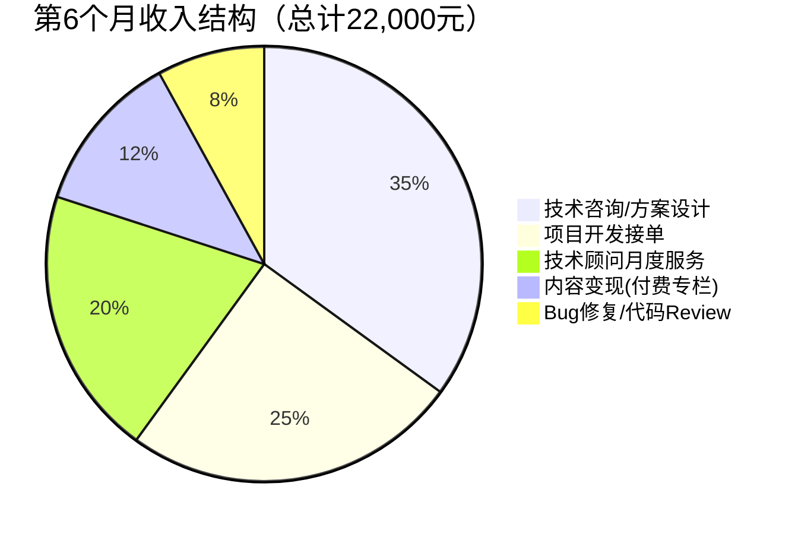

## 案例一：程序员副业——从接单到月入3万

> 这是一个真实可复制的案例。主人公张晨（化名），28岁，二线城市某互联网公司后端开发工程师，3年工作经验，月薪15K。通过系统化的副业规划，在8个月内将副业收入从0做到稳定月入3万，且不影响本职工作。

### 一、起点：为什么要做副业

#### 1.1 现实压力

张晨的情况在程序员群体中非常典型：

| 维度 | 具体情况 |
|------|----------|
| 年龄 | 28岁，已婚未育 |
| 月薪 | 15K（到手约12K） |
| 房贷 | 每月6800元 |
| 生活成本 | 约4000元/月 |
| 可支配收入 | 约1200元/月 |
| 焦虑点 | 35岁危机、技术天花板、家庭开支增长 |

每月结余仅1200元，这意味着一次意外支出就可能打破收支平衡。更深层的焦虑是：在二线城市，后端开发的薪资天花板大约在25K-30K，扣除五险一金和个税后实际到手并不宽裕，而职业上升通道（技术管理岗）竞争激烈且名额有限。

#### 1.2 能力盘点

张晨在决定做副业之前，先做了一次系统化的技能盘点：

```text
核心技能（工作中高频使用）：
├── Java/Spring Boot 后端开发    ★★★★☆
├── MySQL 数据库设计与优化       ★★★★☆
├── Redis 缓存方案              ★★★☆☆
├── Linux 服务器运维             ★★★☆☆
└── Docker 容器化部署            ★★★☆☆

辅助技能（自学或项目中积累）：
├── Python 爬虫与数据处理        ★★★☆☆
├── 微信小程序开发               ★★☆☆☆
├── Vue.js 前端                  ★★☆☆☆
└── 技术博客写作                 ★★☆☆☆
```

**盘点的关键原则：** 不要只列你会什么，要评估每个技能的"市场变现能力"。会的人多、门槛低的技能（如简单CRUD）变现价值低；会的人少、需求刚性的技能（如数据库性能调优、高并发方案设计）变现价值高。

**自检清单——你的技能值不值得拿出来卖：**

| 判断维度 | 高价值信号 | 低价值信号 |
|----------|-----------|-----------|
| 稀缺性 | 你在团队里是唯一会这个的人 | 每个同事都能做 |
| 需求频率 | 客户隔三差五就遇到这类问题 | 一年碰不到几次 |
| 结果可衡量 | "优化后接口响应从3秒降到200毫秒" | "代码写得更规范了" |
| 客户痛感 | 项目卡住了、线上出事故了 | "有空再改改" |
| 竞争对手定价 | 同类服务市场价300元以上 | 闲鱼上9.9元包教包会 |

#### 1.3 方向选择的决策过程

张晨考虑过四个方向，用加权评分法做了决策：

| 方向 | 市场需求(30%) | 启动难度(25%) | 时薪潜力(25%) | 可扩展性(20%) | 加权总分 |
|------|:---:|:---:|:---:|:---:|:---:|
| 接外包项目 | 8 | 6 | 7 | 4 | 6.45 |
| 技术咨询/方案设计 | 7 | 8 | 9 | 7 | 7.70 |
| 技术课程/教程 | 8 | 7 | 8 | 9 | 8.00 |
| 自动化工具/SaaS | 6 | 9 | 8 | 10 | 8.05 |

**最终选择：** 技术咨询 + 接单并行。原因：技术咨询时薪高但需要积累口碑，接单可以立即变现提供现金流，两者互相促进——接单积累的实战经验是技术咨询的素材库。

**加权评分法怎么用：** 列出你考虑的方向，给每个维度分配权重（权重总和100%），每个方向在每个维度打1-10分，最后算加权总分。权重怎么分配取决于你当前最看重什么——如果急需现金流，就把"启动难度"权重调高；如果追求长期增长，就把"可扩展性"权重调高。

### 二、冷启动阶段（第1-2个月）

#### 2.1 搭建个人品牌基础设施

张晨在第一周集中完成了以下准备工作：

**第一步：创建技术博客**

选择掘金+个人GitHub Pages双平台策略。掘金负责获取流量和行业曝光，GitHub Pages作为个人技术名片的长期沉淀。

博客定位：「Java后端开发实战笔记」，聚焦三个细分领域：
- Spring Boot项目实战踩坑记录
- MySQL性能优化案例分析
- 高并发场景下的技术方案设计

**为什么选这个定位？** 因为这三类内容的目标读者恰好是中小公司的技术负责人和创业团队CTO——他们既是内容消费者，也是潜在客户。

**第二步：完善各平台个人资料**

张晨在以下平台统一了个人形象：

| 平台 | 用途 | 关键设置 |
|------|------|----------|
| 掘金 | 技术内容输出 | 头像、简介、标签统一 |
| GitHub | 代码作品展示 | README美化、置顶项目 |
| 闲鱼 | 低价引流获客 | 技术服务描述 |
| 淘宝 | 服务交付 | 虚拟商品店铺 |
| 程序员客栈 | 专业接单 | 完整技能档案 |
| 电鸭社区 | 远程项目 | 个人介绍页 |
| V2EX | 技术讨论引流 | 签名档带联系方式 |

**平台选择的逻辑：** 不要全铺，选2-3个你愿意长期维护的。张晨选掘金是因为Java生态在掘金最活跃，选闲鱼是因为获客门槛最低（不需要积累声望），选程序员客栈是因为专业度高、客户质量好。

**第三步：准备案例作品集**

在没有客户案例之前，张晨用"自造案例"的方式建立信任：
- 把公司项目中脱敏后的技术方案整理成案例文章
- 开源了两个小工具（一个Spring Boot快速脚手架、一个MySQL慢查询分析脚本）
- 在掘金写了10篇技术文章，其中2篇被推上热门

**"自造案例"的注意事项：** 脱敏是底线。不能出现公司名称、业务数据、内部架构细节。最好的做法是提炼通用的技术问题——比如"千万级数据表分页查询优化"，而不是"XX公司订单系统优化"。

#### 2.2 第一批客户从哪来

**渠道一：闲鱼（第一个月的主要来源）**

张晨在闲鱼上架了5个技术服务商品：

| 商品 | 定价 | 说明 |
|------|------|------|
| Spring Boot项目搭建 | 200-500元 | 帮助搭建基础框架 |
| Bug调试修复 | 50-200元/个 | 按bug复杂度定价 |
| 数据库设计咨询 | 300-800元 | 针对中小项目 |
| 代码Review服务 | 100-300元 | 提供书面改进建议 |
| 部署上线服务 | 200-500元 | 服务器环境+项目部署 |

**闲鱼获客的核心技巧：**
- 标题包含精准关键词：「Java程序员接单 Spring Boot项目开发 bug修复」
- 商品描述用"痛点+解决方案"结构：「项目卡在某个bug上好几天？3小时内定位并修复」
- 每天擦亮商品（闲鱼的流量机制）
- 前5单故意低价甚至免费，换取好评和复购
- 主图用代码截图或架构图，不要用花哨的营销图——你的客户是程序员，他们看到代码截图会觉得"这人靠谱"

**渠道二：技术社区引流（持续来源）**

在掘金和思否上，张晨的文章末尾统一加上引流话术：

> 如果你的项目遇到了类似问题，欢迎私信交流。前3位留言的朋友免费提供30分钟技术诊断。

这条话术的转化率约为每1000次阅读产生2-3个有效咨询。

**渠道三：程序员客栈/猪八戒（第二个月开始）**

这些平台的单价更高，但竞争也更激烈。张晨的做法是：
- 先用闲鱼的低价单积累好评和案例
- 将好评截图和案例整理后上传到专业平台
- 前3单在报价基础上打7折，换取平台评分

**渠道四：朋友推荐和社群**

别忽略最朴素的渠道。张晨在第2个月时，一个前同事在技术群里问"谁会搞MySQL优化"，另一个同事推荐了张晨。这一单收费1500元，整个沟通过程不到10分钟。在你的朋友圈、前同事群、技术交流群里保持存在感——偶尔分享技术文章，偶尔帮人解答问题——客户自然会来。

#### 2.3 第一个月的实际数据

| 指标 | 数据 |
|------|------|
| 咨询量 | 23个 |
| 成交单数 | 7单 |
| 总收入 | 2,800元 |
| 平均单价 | 400元 |
| 投入时间 | 约40小时（每天1-1.5小时） |
| 时薪 | 约70元/小时 |

这个数据看起来不高，但张晨此刻最看重的不是收入，而是**3个关键信号**：
1. 有2个客户主动要求加微信（说明有复购潜力）
2. 有1篇文章带来了2个付费咨询（内容引流可行）
3. 最复杂的一单（数据库优化）收费800元，客户非常满意（高价服务有市场）

**关键心态：** 第一个月不要看收入，看信号。有信号就继续，没信号就调整方向。很多程序员副业失败不是因为没能力，而是第一周没赚到钱就放弃了——冷启动期本来就不该指望赚钱，该指望的是"市场验证"。

### 三、爬坡阶段（第3-5个月）

#### 3.1 服务产品化

前两个月的接单经验让张晨发现一个规律：80%的客户需求集中在以下5类场景。于是他把服务"产品化"——打包成标准化服务包，减少每次沟通的成本。

```yaml
服务产品矩阵:

  基础层（引流产品，50-200元）:
    - Bug快速修复: 50-200元/个，2小时内响应
    - 代码Review: 150元/次，24小时内交付书面报告
    - 技术方案咨询: 200元/小时，腾讯会议一对一

  标准层（利润产品，500-3000元）:
    - 项目架构设计: 1500-3000元，含方案文档+架构图
    - 数据库优化: 800-2000元，含性能报告+优化方案
    - 小程序/后端开发: 2000-5000元，按功能模块报价

  高端层（旗舰产品，5000元+）:
    - 技术顾问月度服务: 5000-8000元/月，每周2小时
    - 企业内训/分享: 5000-10000元/场
    - 高并发方案设计: 8000-15000元/套
```

**产品化的好处：**
- 降低沟通成本：客户一看就知道自己需要什么，减少反复询价
- 提高客单价：服务包的感知价值高于按小时计费
- 便于复购：客户知道下次该买什么
- 可复制：当业务量大时，标准化服务可以外包给其他开发者

#### 3.2 涨价策略

张晨的涨价节奏如下：

| 阶段 | 时间 | Bug修复单价 | 架构设计单价 | 涨价依据 |
|------|------|:---:|:---:|------|
| 冷启动 | 第1-2月 | 50-100元 | 不接 | 积累案例和评价 |
| 初期 | 第3-4月 | 100-200元 | 1000元 | 有10+好评 |
| 中期 | 第5-6月 | 200-400元 | 2000元 | 掘金粉丝破2000 |
| 成熟 | 第7-8月 | 300-500元 | 3000元 | 客户排队、案例丰富 |

**涨价的核心逻辑：** 不是"我觉得自己值这个价"，而是"市场验证了这个价格"。每次涨价前，张晨都会确认当前价格下的接单率超过70%——如果80%的询价都成交了，说明定价偏低，还有上涨空间。

**涨价时老客户怎么处理：** 提前2周通知正在合作的客户，已有报价的项目按原价完成。对长期合作的客户给一个过渡期（比如3个月内仍享原价），但不要承诺永久锁价——你的服务在升级，价格理应跟上。

**涨价的话术模板：**

> 感谢您的咨询。目前我的服务价格已调整为XXX元，相比之前调整了XX%。价格调整的原因是我优化了交付流程，现在每个项目会包含：[新增的增值服务列表]。如果您预算有限，我可以推荐[低价替代方案]。

#### 3.3 客户管理和复购提升

张晨建立了一套简单的客户管理系统（用Notion实现）：

```text
客户信息表：
├── 基本信息：姓名、公司、联系方式
├── 项目记录：做了什么、报价多少、交付时间
├── 满意度：交付后主动询问评分(1-10)
├── 复购提醒：项目完成后30天主动问候
└── 标签分类：高频客户/潜力客户/一次性客户
```

**复购提升的关键动作：**

1. **交付后48小时回访**：主动问"项目运行得怎么样？有没有遇到新问题？"——这通电话/消息的复购转化率高达30%
2. **每月技术Newsletter**：给所有客户发送一篇精选技术文章，附上"老客户专属折扣"
3. **转介绍激励**：老客户推荐新客户成交后，返现10%或赠送1小时免费咨询
4. **记录客户技术栈**：当某个技术栈出现新漏洞或重要更新时，主动通知相关客户

**为什么要48小时内回访而不是更晚？** 因为交付后是客户体验你服务的"峰值时刻"——如果出了问题，这时候最容易暴露；如果效果好，这时候感谢的话最真诚。一周后客户已经忘了当时的感觉了。

#### 3.4 筛选客户：识别"有毒"客户

不是所有客户都值得接。张晨在第3个月总结了一套客户筛选标准：

**红灯客户（直接拒绝）：**

| 特征 | 为什么危险 | 应对话术 |
|------|-----------|---------|
| "先做，效果好再付钱" | 大概率赖账 | "我们的合作模式是50%预付，验收后付尾款" |
| 一上来就压价50%以上 | 不尊重你的专业价值 | "这个价格对应的服务范围是XXX，您看是否需要调整需求" |
| 需求描述不清且拒绝沟通 | 做完了也会说"不是我要的" | "我需要先了解具体需求才能报价，能否花10分钟电话沟通？" |
| 催得特别急但预算很低 | 时间和预算不匹配 | "加急需要额外30%费用，您看是否接受？" |
| 前任开发者"做了一半跑路" | 要么需求有问题，要么客户有问题 | 先花1小时诊断项目状态，收取诊断费后再决定是否接单 |

**黄灯客户（谨慎合作）：**

- 需求反复变更：签协议时明确变更流程，每次变更收取变更费
- 回复消息极慢：在协议中约定"客户反馈超过72小时视为默认通过"
- 什么都想要但预算有限：帮他们做需求优先级排序，砍掉非核心功能

**筛选客户的核心原则：** 一个差客户消耗的精力，抵得上3个好客户。把时间花在高价值、好沟通的客户身上，总收益远高于"来者不拒"。

#### 3.5 时间管理

副业最大的挑战不是技术，而是时间。张晨的时间分配：

```mermaid
gantt
    title 工作日时间安排（周一到周五）
    dateFormat HH:mm
    axisFormat %H:%M
    section 白天
    本职工作         :09:00, 8h
    section 晚上
    内容输出(写文章)  :20:00, 1h
    客户沟通         :21:00, 30min
    代码交付         :21:30, 1h
    section 周末
    集中开发(周六)    :09:00, 6h
    学习+复盘(周日)   :14:00, 3h
```



**关键原则：**
- 工作日晚上最多投入2.5小时，保证睡眠
- 大块开发任务集中在周六白天
- 周日用于学习新技能和复盘本周数据
- 绝不在上班时间处理副业事务（职业风险太大）
- 使用Toggl Track精确记录每项任务的耗时，每周分析时间ROI

**时间管理的常见误区：**

1. **碎片时间回消息**：工作间隙回客户微信，看似高效实则打断正职工作流，且容易被领导注意到。正确做法是设定固定的"客户沟通时间窗口"，在窗口外的消息统一延迟回复。
2. **周末全搭进去**：周六全天+周日半天已经是上限。如果连周日也搭进去，不出两个月就会精疲力竭。保留完整的休息日，这是长期战。
3. **拒绝不了加急单**：客户说"今晚就要"，你就加急做？如果这成为常态，你的时间就不属于自己了。加急收加急费，而且加急费要够高（基础价的1.5-2倍），让客户自己衡量是否真的那么急。

#### 3.6 精神健康和关系维护

这一节在大部分"副业教程"里不会出现，但张晨觉得它比任何技术技巧都重要。

**副业对心理健康的影响：**

| 问题 | 表现 | 应对 |
|------|------|------|
| 冒名顶替综合征 | "我凭什么收别人3000块？" | 记住：客户找你是因为你比他们强，而不是因为你完美 |
| 决策疲劳 | 白天工作+晚上副业，脑子转不动 | 把非核心决策模板化：报价用公式、沟通用话术模板、交付用checklist |
| 社交萎缩 | 周末全在写代码，朋友约不出来 | 和伴侣/朋友明确"副业时间"和"家庭时间"的边界 |
| 焦虑螺旋 | 一个差评就情绪崩溃 | 差评是数据，不是人身攻击。分析原因，改进，翻篇 |
| 成瘾式工作 | "再接一单就好"停不下来 | 设月收入上限（比如3万），到了就停止接新单 |

**和伴侣/家人的沟通：**

张晨的做法是每月和妻子做一次"副业简报"：
- 这个月赚了多少，花了多少时间
- 下个月计划接几个单，预计占用多少周末时间
- 哪些家庭活动需要保障（不能因为副业取消）

这种透明化管理避免了"你怎么又在写代码"的反复争吵。副业是全家的事——收入增长惠及全家，时间投入也需要全家支持。

#### 3.7 第3-5个月数据汇总

| 月份 | 咨询量 | 成交单数 | 总收入 | 平均单价 | 时薪 |
|:---:|:---:|:---:|:---:|:---:|:---:|
| 第3月 | 35 | 12 | 6,500元 | 542元 | 95元 |
| 第4月 | 48 | 15 | 10,200元 | 680元 | 115元 |
| 第5月 | 55 | 18 | 15,800元 | 878元 | 135元 |

### 四、稳定阶段（第6-8个月）

#### 4.1 收入结构优化

到第6个月，张晨的副业收入结构发生了重要变化：



**最重要的变化：** "技术顾问月度服务"从0增长到20%。这意味着张晨有了稳定的被动收入基础——3个客户每月各付5000元，不需要每月重新找客户。

**健康收入结构的标志：**
- 不依赖单一客户（最大客户收入占比不超过25%）
- 有"经常性收入"（月度服务、订阅内容）而非全是"一次性交易"
- 高端服务收入占比逐步上升（说明你在积累品牌溢价）
- 主动找上门的客户占比超过50%（说明品牌在起作用）

#### 4.2 建立"顾问月度服务"产品

这是张晨收入突破3万的关键产品。服务内容：

| 服务项 | 内容 | 时间投入 |
|--------|------|----------|
| 每周技术咨询 | 1次，1-1.5小时，腾讯会议 | 约5小时/月 |
| 架构方案Review | 客户发方案，48小时内书面反馈 | 约3小时/月 |
| 紧急问题响应 | 工作日4小时内响应 | 约2小时/月 |
| 月度技术报告 | 月底总结+下月建议 | 约2小时/月 |

每月每客户投入约12小时，收费5000元，时薪约416元——是基础接单时薪的3-4倍。

**如何找到顾问客户：**
- 从已有客户中筛选：合作过3次以上、满意度9分以上、公司有技术团队的客户
- 主动提案：「我注意到贵公司的XX系统可能面临XX问题，我可以提供月度技术顾问服务，帮助预防这类风险」
- 用案例说服：展示你帮其他客户节省了多少时间和成本

**顾问服务协议的核心条款：**

```text
月度技术顾问服务协议（核心条款摘要）

1. 服务范围
   - 每周1次技术咨询会议（1-1.5小时）
   - 架构方案书面Review（48小时内反馈）
   - 紧急问题工作日4小时内响应
   - 月度技术总结报告

2. 服务期限
   - 最低合作期：3个月
   - 自动续约，提前30天书面通知可终止

3. 费用与支付
   - 月度服务费：5000元/月
   - 每月1日前支付当月费用
   - 超出服务范围的工作按小时计费（300元/小时）

4. 保密条款
   - 双方对合作中知悉的商业信息保密
   - 保密义务在合同终止后继续有效2年

5. 知识产权
   - 顾问提供的方案建议，知识产权归客户所有
   - 顾问保留使用脱敏案例用于个人品牌展示的权利
```

#### 4.3 内容变现的第二曲线

张晨在掘金和知识星球同步运营付费内容：

| 平台 | 内容形式 | 定价 | 收入/月 |
|------|----------|------|---------|
| 掘金付费专栏 | 《Spring Boot企业级项目实战》 | 99元 | 约1,500元 |
| 知识星球 | 技术问答+独家方案 | 199元/年 | 约1,000元 |
| 公众号流量主 | 技术文章广告分成 | - | 约200元 |

**内容变现的底层逻辑：** 免费内容获取流量 → 付费内容筛选高价值用户 → 付费用户中转化咨询/顾问客户。这是一个完整的漏斗。

**内容创作的时间效率：** 张晨每篇文章大约花2-3小时，但一篇好文章可以持续带来流量6-12个月。第3个月写的一篇《Spring Boot生产环境常见OOM排查》到第8个月还在搜索结果第一页，每周带来2-3个新咨询。内容是最典型的"前期投入、后期回报"的资产。

#### 4.4 工具链推荐

张晨在整个副业过程中使用的工具：

| 类别 | 工具 | 用途 | 费用 |
|------|------|------|------|
| 项目管理 | Notion | 客户管理+项目看板+知识库 | 免费版够用 |
| 时间记录 | Toggl Track | 记录每项任务耗时，分析ROI | 免费版 |
| 合同签署 | 腾讯电子签 | 3分钟生成标准服务协议 | 免费版 |
| 收款 | 微信/支付宝 | 小额直接收；大额走对公 | - |
| 沟通 | 企业微信 | 和个人微信隔离，管理客户关系 | 免费 |
| 文档交付 | 飞书文档/语雀 | 方案文档协作和交付 | 免费版 |
| 代码管理 | GitHub Private | 客户项目代码托管 | $4/月 |
| 图表绘制 | draw.io / Excalidraw | 架构图、流程图 | 免费 |
| 会议 | 腾讯会议 | 技术咨询一对一 | 免费版30分钟够用 |
| 发票 | 灵活用工平台 | 代开发票、处理个税 | 按收入比例 |

#### 4.5 税务实操指南

这一节很多人忽略，但当副业收入过万后，税务处理直接关系到你实际到手多少钱。

**个人副业收入的税务分类：**

| 收入类型 | 税率 | 适用场景 |
|----------|------|----------|
| 劳务报酬所得 | 20%-40%（预扣） | 平台代扣、对方公司要求开票 |
| 经营所得 | 5%-35% | 注册个体工商户后的收入 |
| 偶然所得 | 20% | 一次性技术转让 |

**劳务报酬vs经营所得的区别：** 如果你每月稳定接单，注册个体工商户（或个人独资企业）后按"经营所得"纳税，税率通常低于"劳务报酬"。以月入3万为例：

- 按劳务报酬：预扣税约4800元/月（实际到手约25200元）
- 按经营所得（核定征收，应税所得率10%）：年应税所得3.6万，适用5%税率，年税1800元（月均150元）

差距巨大。但这需要提前规划，不能事后补救。

**实操建议：**

1. **月收入5000以下**：不用管，偶尔的劳务报酬在年度汇算时可能退税
2. **月收入5000-15000**：开始考虑用灵活用工平台代开发票（如云账户、趣活等），平台帮你处理个税，你只需开票
3. **月收入15000以上**：注册个体工商户，申请核定征收，税率可以低到1%-3%
4. **月收入30000以上**：找专业税务顾问，每年花500-1000元咨询费，可能省下数倍税款

**注册个体工商户的流程（以线上办理为例）：**
1. 登录当地市场监督管理局官网
2. 选择"个体工商户设立登记"
3. 经营范围写"软件开发、技术咨询、技术服务"
4. 一般3-5个工作日出证
5. 税务登记后，申请核定征收
6. 每季度申报，操作简单

**注意事项：**
- 个体工商户不等于要开公司，维护成本很低
- 有些城市（如深圳、杭州）对个体户有税收优惠政策
- 年收入120万以下的小规模纳税人免征增值税
- 即使注册了个体户，主业的五险一金不受影响

#### 4.6 合同和法律防护

**服务协议模板（完整版）：**

张晨使用的标准服务协议包含以下条款，适用于单次项目交付：

```text
技术服务协议

甲方（委托方）：[客户名称]
乙方（服务方）：[你的名称/个体户名称]

一、服务内容
  1.1 服务项目：[具体项目描述]
  1.2 交付标准：
      - [功能点1]：能够[具体可验证的描述]
      - [功能点2]：能够[具体可验证的描述]
  1.3 交付物：源代码、部署文档、使用说明

二、费用与支付
  2.1 服务费总额：人民币[金额]元
  2.2 支付方式：签约时支付50%，验收通过后支付50%
  2.3 支付方式：微信/支付宝/银行转账

三、工期
  3.1 预计工期：[X]个工作日
  3.2 开工时间：首付款到账后[X]个工作日内
  3.3 延期处理：因乙方原因延期，每延期1天减免总费用的1%

四、验收与修改
  4.1 甲方应在交付后3个工作日内完成验收
  4.2 逾期未反馈视为验收通过
  4.3 包含2次免费修改（限原需求范围内）
  4.4 超出原需求的修改按200元/小时计费

五、知识产权
  5.1 全额付款后，交付物的知识产权归甲方所有
  5.2 乙方保留使用脱敏后的项目经验用于个人品牌展示的权利

六、保密条款
  6.1 双方对合作中知悉的对方商业信息负保密义务
  6.2 保密期限：合同终止后2年

七、争议解决
  7.1 协商解决，协商不成提交[甲方/乙方]所在地法院管辖

签署日期：____年__月__日
```

**为什么一定要签协议：**

| 场景 | 没协议 | 有协议 |
|------|--------|--------|
| 客户赖账 | 没有法律依据追讨 | 可以起诉或仲裁 |
| 需求范围争议 | "我要的不是这个" | 有书面交付标准 |
| 交付后客户消失 | 尾款收不回来 | 逾期自动验收条款保护 |
| 知识产权纠纷 | 谁的代码？不清楚 | 白纸黑字写清楚 |

**竞业限制注意事项：**

张晨仔细阅读了自己的劳动合同，发现有一条"在职期间不得从事与公司业务相同或相近的兼职活动"的条款。他的应对：
- 副业客户和公司客户所在行业不重叠
- 副业使用的都是通用技术方案，不涉及公司专有技术
- 所有副业工作在个人设备和个人时间完成
- 保留了工作时间段的日志记录，以备自证

**如果合同里有"竞业限制"怎么办：**
- 仔细看限制范围——是"同行业"还是"同岗位"？范围越窄越好
- 看限制对象——是"不得兼职"还是"不得自营同类业务"？
- 看违约条款——违约金是多少？是否可执行？
- 如果拿不准，花200元找律师看一眼，远比事后被追责便宜

#### 4.7 第8个月的完整数据

| 指标 | 起步时(第1月) | 成熟后(第8月) | 增长倍数 |
|------|:---:|:---:|:---:|
| 月收入 | 2,800元 | 31,500元 | 11.3x |
| 客户数 | 7个(累计) | 45个(累计) | 6.4x |
| 活跃客户 | 5个 | 18个 | 3.6x |
| 复购率 | 28% | 72% | 2.6x |
| 平均单价 | 400元 | 1,200元 | 3.0x |
| 时薪 | 70元 | 210元 | 3.0x |
| 月投入时间 | 40小时 | 150小时 | 3.75x |
| 内容粉丝 | 0 | 4,200 | - |

### 五、踩过的坑和关键教训

#### 5.1 最痛的5个坑

**坑一：前期定价过低，吸引了一堆"白嫖党"**

张晨第一个月定价Bug修复50元，结果遇到了大量"50块钱帮我重构整个模块"的客户。后来他调整策略：低价只引流，实际报价根据需求复杂度单独评估。

**教训：** 引流价≠成交价。引流价用来获取咨询，成交价根据实际工作量计算。计算公式：`报价 = 预估工时 × 目标时薪 × 1.3（风险系数）`。

**坑二：没有签协议，被客户赖账**

第2个月，一个客户口头约定2000元的项目，做完后只付了800元，理由是"没达到预期"。由于没有书面协议，张晨吃了哑巴亏。

**教训：** 再小的单也要签电子协议。张晨后来使用"腾讯电子签"小程序，3分钟生成标准服务协议。关键条款见上文4.6节。

**坑三：同时接太多单，质量下降**

第4个月，张晨同时接了6个项目，导致交付延期、质量下降，收到了第一个差评。这个差评让他在程序员客栈上的评分从4.9降到了4.7，直接影响了后续两周的接单量。

**教训：** 同时进行的项目不超过3个。使用看板（Notion Kanban）管理项目状态：待启动 → 开发中 → 测试中 → 已交付。当"开发中"满3个时，新单进入"待启动"排队。

**防止项目超载的硬规则：**

```text
项目容量管理规则（自检清单）：

□ 同时进行的项目 ≤ 3个
□ 每个项目有明确的交付日期
□ 每周日检查所有项目的进度
□ 如果某个项目延期，立即通知客户并协商新时间
□ 宁可拒绝新单也不要影响老单的交付质量
□ 连续2周加班超过周末6小时，暂停接新单1周
```

**坑四：忽视了税务问题**

第6个月副业收入突破2万后，张晨才意识到税务问题。个人劳务报酬所得税率高达20%-40%，如果被认定为经营所得则可以享受更低税率。

**教训：** 副业收入超过一定规模后，需要考虑税务筹划。详见上文4.5节税务实操指南。

**坑五：技术和副业的边界模糊**

有一次张晨在公司用个人电脑处理副业项目，被同事看到后产生了不必要的猜疑。虽然公司没有明文禁止副业，但这件事让他意识到风险。

**教训：**
- 副业工作严格使用个人设备和个人时间
- 绝不使用公司代码、技术文档或内部工具
- 不在同事面前讨论副业
- 确保副业项目与公司业务不存在竞争关系
- 仔细阅读劳动合同中的竞业限制条款

**额外的坑：应对客户的需求蔓延（Scope Creep）**

张晨接过一个"简单的小程序后端"项目，协议写了5个接口。开发过程中客户说"再加个推送功能吧，不复杂"、"能顺便做一下数据导出吗"、"再加个管理后台"。最终实际工作量是协议的3倍，但客户坚持"这些都应该是基础功能"。

**应对方法：**
- 协议中的"交付标准"写得越细越好——列出每一个接口、每一个字段
- 需求变更走正式流程：客户书面提出 → 你评估工时和费用 → 双方确认 → 签补充协议
- 在协议里写明："超出原需求范围的功能，按200元/小时另行计费"
- 每次客户"顺嘴提一个需求"时，不要立刻答应也不要立刻拒绝，先记录下来，统一报价

#### 5.2 让收入翻倍的3个关键认知

**认知一：从"卖时间"到"卖方案"**

接单的本质是卖时间——你做1小时，收1小时的钱。但方案设计是卖知识——你花1小时设计的方案，客户用它解决了价值10万的问题，你的收费也应该基于价值而非时间。

张晨从第5个月开始，对所有咨询类服务改为"价值定价"：
- 不再说"我收你200元/小时"
- 而是说"这个方案能帮你的项目节省约XX天的开发时间，按市场开发成本计算，方案费3000元"

**价值定价的实操方法：**

```text
价值定价三步法：

第一步：量化客户的痛点
  - "你们现在这个bug多久没解决了？" → "2周"
  - "2周里有多少人在处理？" → "2个开发"
  - "他们的日薪大概多少？" → "800元/人/天"
  → 痛点成本 = 2周 × 10天 × 2人 × 800元 = 32,000元

第二步：计算你的方案价值
  - "我可以在3天内解决，你需要投入1个开发配合我"
  → 客户节省 = 32,000 - (3天 × 1人 × 800元) = 29,600元

第三步：按价值的10%-30%报价
  - 报价 = 29,600 × 20% ≈ 5,900元
  - 话术："这个方案可以帮您节省约3万元的开发成本，方案费6000元"
```

**认知二：建立可复用的资产**

张晨在接单过程中，把每个项目中通用的部分沉淀成了可复用的代码模板和方案模板：

| 资产类型 | 数量 | 复用场景 | 节省时间 |
|----------|------|----------|----------|
| Spring Boot项目模板 | 5套 | 新项目快速启动 | 每次节省8-16小时 |
| 数据库设计方案 | 12份 | 不同业务场景 | 每次节省4-8小时 |
| 部署脚本 | 3套 | 标准化部署流程 | 每次节省2-4小时 |
| 方案文档模板 | 8份 | 技术方案输出 | 每次节省3-5小时 |
| 常见Bug排查手册 | 1份(持续更新) | 快速定位问题 | 每次节省1-3小时 |

这些资产让张晨的实际交付效率提升了2-3倍——同样报价3000元的项目，以前需要20小时，现在8小时就能完成。

**沉淀资产的方法：** 每完成一个项目，花30分钟把通用部分提取出来。代码脱敏后存到自己的模板仓库，文档脱敏后存到模板库。3个月后你会发现，大部分新项目只需要"组装"而不是"从零开发"。

**认知三：个人品牌是最强的杠杆**

到第8个月，张晨60%的新客户来自"主动找上门"——他们看了张晨的掘金文章、GitHub项目或朋友推荐。这意味着张晨不再需要在闲鱼上主动获客，获客成本趋近于零。

个人品牌带来的复利效应：
- 粉丝增长 → 更多咨询 → 更多案例 → 更好的内容素材 → 更多粉丝
- 高质量文章 → 搜索引擎排名 → 持续的被动流量 → 持续的被动获客

### 六、可复制的执行清单

如果你也想复制这条路径，以下是按时间线整理的行动清单：

#### 第1周：基础设施搭建

- [ ] 做一次全面的技能盘点，列出所有可变现的技能
- [ ] 选择2-3个内容平台（推荐：掘金+GitHub+闲鱼）
- [ ] 统一个人形象：头像、昵称、简介、标签
- [ ] 准备3个"自造案例"（脱敏的工作项目或开源项目）
- [ ] 写第一篇技术文章并发布

#### 第2-4周：冷启动获客

- [ ] 在闲鱼上架3-5个技术服务商品
- [ ] 在技术社区回答问题，末尾引流
- [ ] 完成前3单（可以低价甚至免费）
- [ ] 收集客户好评和案例素材
- [ ] 建立客户信息表（Notion/Excel均可）

#### 第2-3个月：服务产品化

- [ ] 根据前两个月的客户需求，设计3-5个标准化服务包
- [ ] 制作服务介绍页（一图说清楚你的服务内容和价格）
- [ ] 制定涨价计划（每满10个好评涨价一次）
- [ ] 建立项目管理看板
- [ ] 签署第一份电子服务协议
- [ ] 注册企业微信，和个人微信隔离

#### 第4-6个月：规模化运营

- [ ] 推出高端服务（技术顾问月度服务）
- [ ] 开设付费专栏或知识星球
- [ ] 建立客户复购提醒机制
- [ ] 沉淀可复用的代码模板和方案模板
- [ ] 开始考虑税务筹划（注册个体户或用灵活用工平台）
- [ ] 建立需求变更管理流程

#### 第7-8个月：品牌化变现

- [ ] 优化收入结构，提高高端服务占比
- [ ] 将获客从"主动找客户"转为"客户主动找你"
- [ ] 考虑外包标准化服务给其他开发者，自己专注高端服务
- [ ] 评估是否有可能将副业转为主业
- [ ] 建立完整的合同模板库和服务流程SOP

### 七、延伸思考：这条路的天花板在哪里

月入3万不是终点。张晨的路径如果继续延伸，有三个可能的方向：

**方向一：技术顾问公司化**

从个人接单到组建小团队（2-3个兼职开发者），自己专注客户关系和方案设计，把执行层外包。天花板：月入10-15万。

这条路的关键是"可复制性"——你的服务流程必须标准化到新人培训1周就能上手。如果每个项目都需要你亲自参与，那就不是公司化，只是你更忙了。

**方向二：技术IP化**

持续输出内容，成为细分领域的KOL。变现方式扩展到：付费课程、企业内训、技术出版、品牌合作。天花板：年入100万+。

这条路的核心是"不可替代性"——你在某个细分领域（比如MySQL性能优化）的权威性，是别人无法快速复制的。

**方向三：技术产品化**

把反复出现的客户需求抽象成标准化产品（SaaS工具、模板市场、插件等），实现"一次开发，持续收费"。天花板：取决于产品市场规模。

张晨在第7个月就开始尝试：他把反复用到的"Spring Boot快速脚手架"做成了付费模板，定价99元/套，上架后第一个月卖了23套——纯被动收入。

**这三条路不互斥，可以组合。** 但核心前提是：先把副业做到月入3万，用实际数据验证市场需求，再考虑规模化。

### 八、心理预期管理：给准备开始的人

最后说几句掏心窝子的话。

**你会遇到的最难熬的时刻：**
- 第1周：写了文章没人看，闲鱼挂了一周零咨询
- 第1个月：赚了2800元，算上时间成本还不如送外卖
- 第3个月：接了一个大单，连续两周每天加班到凌晨1点
- 第5个月：收到第一个差评，开始怀疑自己是不是不适合干这个
- 第7个月：忙得没时间社交，和朋友渐渐疏远

这些都是正常的。副业不是一条笔直的上升线，它更像一条锯齿线——有些月好，有些月差，但整体趋势是向上的。

**你需要的最低条件：**
- 每天至少1.5小时可自由支配的时间
- 一项可以在市场上标价的技术能力
- 能接受3个月内"投入大于回报"的心态
- 一个支持你做这件事（或者至少不反对）的伴侣/家人

**你不具备这些条件时的替代方案：**
- 时间不够 → 先做纯内容变现（写文章、录视频），积累到一定程度再接单
- 技术不够深 → 先在公司里主动承担有难度的项目，用半年把技术深度拉上来
- 心态不够稳 → 先在平台上接3-5个免费单，验证自己的交付能力，再开始收费

> **本案例的核心启示：** 程序员副业不是"接私活"这么简单。它是一套系统——从技能盘点、市场定位、品牌建设、客户管理到收入优化，每个环节都有方法论。最重要的是，它不需要你辞职冒险，而是在保有主业安全感的同时，用业余时间搭建第二收入曲线。当副业收入稳定超过主业收入的2倍时，你才有足够的底气做出职业选择。
