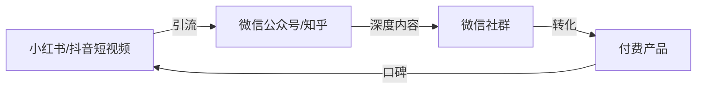
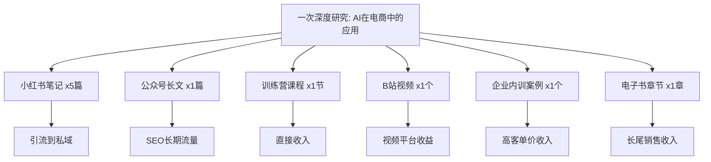
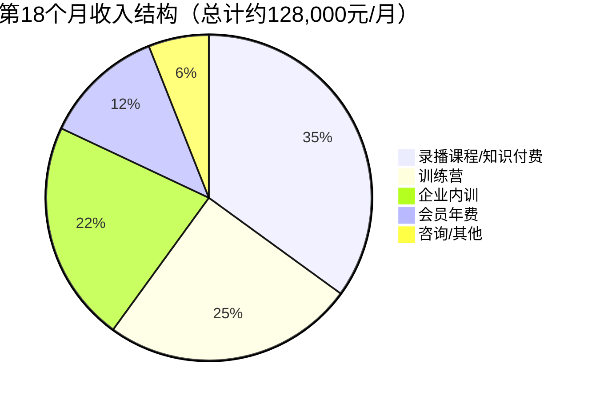
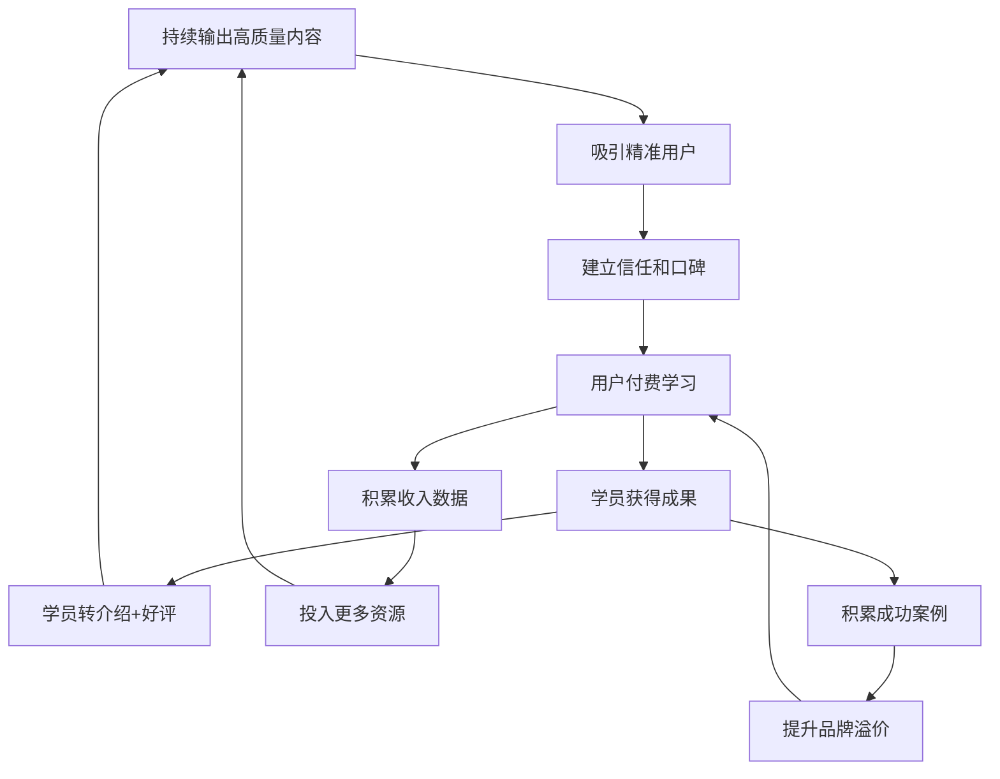

## 案例二：AI培训师——从分享到年入百万

> 主人公林若晴（化名），32岁，某教育科技公司产品经理，月薪18K。从2023年初开始在社交平台分享AI工具使用技巧，18个月后副业年收入突破120万，转型为全职AI培训师。这是一个从"兴趣分享"到"商业帝国"的完整路径拆解。

### 阅读导航

本案例按时间线分为六个阶段，每个阶段都有可直接复用的模板和工具：

| 阶段 | 时间 | 核心任务 | 关键产出 |
|------|------|----------|----------|
| 起点 | 准备期 | 能力盘点+方向选择 | 个人定位文档 |
| 冷启动 | 第1-3个月 | 内容输出+第一个付费产品 | 200人社群+312份手册 |
| 爬坡 | 第4-9个月 | 产品矩阵+企业内训 | 月入11.7万 |
| 突破 | 第10-18个月 | 团队化+平台化 | 年净收入120万 |
| 持续增长 | 第18个月后 | 垂直深耕+被动收入 | 收入飞轮 |
| 风险控制 | 贯穿全程 | 合规+危机处理 | 可持续经营 |

### 一、起点：一个产品经理的AI觉醒

#### 1.1 背景：为什么是她

林若晴的起点并不特殊。她本科是中文系，研究生读的教育技术学，毕业后进入一家在线教育公司做产品经理。2022年底ChatGPT发布后，她花了两周时间深度体验，发现自己有一种独特的能力——**把复杂的技术概念翻译成普通人能听懂的语言**。

这源于她过去5年的工作经历：作为产品经理，她每天都在"技术团队"和"业务团队"之间做翻译——把业务需求翻译成技术语言，把技术方案翻译成业务价值。这种"桥梁型"能力，在AI培训领域极为稀缺。

| 维度 | 具体情况 |
|------|----------|
| 年龄 | 32岁，已婚已育（1个3岁孩子） |
| 月薪 | 18K（到手约14.5K） |
| 核心能力 | 产品思维、内容策划、用户需求分析 |
| AI基础 | 非技术背景，但学习能力强 |
| 可投入时间 | 工作日晚上1.5小时 + 周末半天 |
| 焦虑点 | 教育行业裁员潮、35岁危机、育儿开支 |

#### 1.2 能力盘点：比技术更值钱的是"翻译能力"

林若晴做了一个与程序员不同的技能盘点——她盘点的不是技术能力，而是**认知翻译能力**：

```text
核心能力（5年产品经理积累）：
├── 需求分析          ★★★★★  能精准识别用户痛点
├── 内容策划          ★★★★☆  擅长把复杂信息结构化
├── 用户教育          ★★★★☆  产品培训是日常工作
├── 数据分析          ★★★☆☆  用数据驱动决策
└── 项目管理          ★★★★☆  能把大目标拆成可执行步骤

辅助技能（个人兴趣积累）：
├── 写作能力          ★★★★☆  大学时期大量写作训练
├── 演讲表达          ★★★☆☆  公司内部培训经验
├── 视频剪辑          ★★☆☆☆  基础剪映操作
└── 社群运营          ★★☆☆☆  管理过200人用户群
```

**关键认知：** AI培训师的核心竞争力不是"技术有多深"，而是"能把多难的东西讲得多简单"。市场上不缺懂AI技术的人，缺的是能把AI技术讲给老板、销售、运营、HR听的人。

**能力盘点的实操方法：**

很多非技术背景的人看到"AI培训"四个字就自动退缩，觉得自己不够格。林若晴的方法是做一个"能力翻译表"——把你已有的能力映射到AI培训场景中：

| 你已有的能力 | 在AI培训中的对应 | 重要程度 |
|-------------|-----------------|:--------:|
| 做过公司内部培训 | 讲课基本功、控场能力 | ★★★★★ |
| 写过产品文档 | 内容结构化、逻辑清晰 | ★★★★★ |
| 管理过用户群 | 社群运营、用户维护 | ★★★★☆ |
| 做过数据分析 | 用数据证明培训效果 | ★★★★☆ |
| 写过公众号/博客 | 内容创作、SEO基础 | ★★★★☆ |
| 做过销售/客服 | 理解客户心理、转化话术 | ★★★★☆ |
| 会做PPT | 课件制作 | ★★★☆☆ |
| 会基础视频剪辑 | 课程录制 | ★★★☆☆ |

如果你在上表中有4项以上达到三星，你就具备了做AI培训师的基本条件。技术深度可以边教边学——事实上，"和学员一起成长"本身就是一种极具亲感的内容角度。

#### 1.3 市场调研：用数据验证赛道可行性

在正式投入之前，林若晴做了为期两周的系统化市场调研。这一步被大多数新手跳过，但它直接决定了后续半年的努力是否白费。

**竞品分析的"三层扫描法"：**

| 扫描层次 | 调研内容 | 信息来源 | 耗时 |
|----------|----------|----------|------|
| 宏观层 | AI培训市场规模、增长率、政策环境 | 艾瑞咨询报告、36氪行业分析 | 2小时 |
| 中观层 | Top 20 AI培训师的定位、定价、内容策略 | 小红书/抖音/B站/知识星球 | 4小时 |
| 微观层 | 目标用户的真实需求和付费意愿 | 社群访谈、问卷、评论区 | 6小时 |

**竞品分析模板（林若晴实际使用的版本）：**

```markdown
# AI培训竞品分析表

## 竞品1：[博主名称]
- 平台：小红书 / 抖音 / B站 / 公众号
- 粉丝量：___
- 内容定位：___（例：教小白用ChatGPT）
- 更新频率：___篇/周
- 内容形式：图文 / 视频 / 直播
- 引流方式：___
- 付费产品：
  - 产品1：___，定价___，销量___
  - 产品2：___，定价___，销量___
- 用户评价（好评关键词）：___
- 用户评价（差评关键词）：___ ← 重点关注，这是你的机会
- 我能做得更好的地方：___
```

**调研发现（直接影响后续策略的3个关键洞察）：**

1. **供给断层：** 市面上的AI培训80%是"工具介绍"型，只有不到5%是"场景解决方案"型。用户最缺的不是"ChatGPT怎么注册"，而是"我的具体工作怎么用AI提效"
2. **定价空档：** 9.9元的资料包很多，9999元的企业培训也有，但199-499元的"系统训练营"严重不足——而这个价位恰好是职场白领的甜蜜点
3. **人群缺口：** 教程序员用AI的内容最多，但程序员自学能力强、付费意愿低。真正愿意花钱学AI的是运营、销售、HR、行政等非技术岗位

#### 1.4 方向选择：为什么选培训而非其他

林若晴也用加权评分法做了方向决策：

| 方向 | 市场需求(30%) | 启动难度(25%) | 时薪潜力(25%) | 可扩展性(20%) | 加权总分 |
|------|:---:|:---:|:---:|:---:|:---:|
| AI工具接单（代做PPT/海报等） | 7 | 5 | 5 | 3 | 5.15 |
| AI咨询服务 | 6 | 7 | 8 | 5 | 6.50 |
| AI培训/课程 | 9 | 6 | 8 | 9 | 8.15 |
| AI应用开发 | 5 | 9 | 7 | 8 | 6.95 |

**最终选择：** AI培训。原因有三：第一，市场处于爆发期，企业对AI培训的需求远超供给；第二，培训产品一旦制作完成可以反复售卖，边际成本趋近于零；第三，她的产品经理背景让她天然擅长"把需求转化为课程"。

**为什么"可扩展性"权重最高？** 这是很多新手忽略的关键维度。AI工具接单的收入上限等于你的时间上限——你一天最多做10单，天花板很低。而培训产品可以一对多交付，一场直播可以同时服务500人，录播课程更是可以无限复制。**做培训的本质是把一份时间卖出无数份**。

### 二、冷启动阶段（第1-3个月）

#### 2.1 内容定位：找到你的"一厘米宽、一公里深"

林若晴没有选择泛泛地讲"AI怎么用"，而是做了极其精准的定位：

**定位公式：** `特定人群 + 特定场景 + AI解决方案`

她选择了三个切入点：

| 切入点 | 目标人群 | 痛点 | 内容方向 |
|--------|----------|------|----------|
| AI办公提效 | 职场白领 | 每天重复性工作太多 | 用ChatGPT处理邮件、报告、数据 |
| AI内容创作 | 自媒体人/运营 | 内容产出效率低 | 用AI辅助选题、写作、排版 |
| AI产品设计 | 产品经理/设计师 | 需求分析和原型设计慢 | 用AI做竞品分析、PRD撰写 |

**为什么选这三个？** 因为这是林若晴自己最熟悉的领域——她自己就是用AI在这些场景中提效的。"教自己用过的东西"远比"教从网上学来的东西"更有说服力。

**定位的常见误区：**

| 错误定位 | 问题 | 正确做法 |
|----------|------|----------|
| "AI全能教学" | 太宽泛，没有辨识度 | 聚焦1-2个具体场景 |
| "AI技术深度解析" | 受众太窄，非技术人看不懂 | 用业务语言讲技术应用 |
| "最新AI工具评测" | 内容保鲜期短，工具更新快 | 聚焦不变的"使用方法论" |
| "教程序员用AI编程" | 程序员自学能力极强，付费意愿低 | 选技术门槛低但付费意愿高的群体 |

**定位验证的"3个10"法则：**

在正式投入大量时间之前，用最低成本验证定位是否可行：

1. **找10个目标用户深度访谈**：问他们"你最希望AI帮你解决什么问题？"、"你愿意为AI培训付多少钱？"、"你现在学习AI的最大障碍是什么？"
2. **发10篇测试内容**：在小红书/抖音发布10篇不同角度的内容，观察哪类数据最好
3. **获得10个付费意向**：在社群或朋友圈发布"我准备做一个XX课程，定价XX元，有人想买吗？"——如果10个人说想买，定位基本可行

#### 2.2 平台选择与内容策略

林若晴采用了"短视频引流 + 图文沉淀 + 社群转化"的三角策略：



**第一阵地：小红书（核心引流平台）**

选择小红书的原因：2023年小红书的AI相关内容搜索量月增300%，但高质量的实操教程极度匮乏。更重要的是，小红书用户以25-35岁职场女性为主——这恰好是林若晴的目标人群。

她发布的第一批笔记：

| 序号 | 标题 | 形式 | 发布时间 | 数据表现 |
|:---:|------|------|----------|----------|
| 1 | 用ChatGPT 3分钟写完一周周报 | 图文教程 | 第1周 | 收藏87，点赞203 |
| 2 | AI帮我做了一份让老板惊艳的竞品分析 | 截图+步骤 | 第1周 | 收藏156，点赞412 |
| 3 | 5个让ChatGPT听话的提示词技巧 | 图文清单 | 第2周 | 收藏302，点赞687 |
| 4 | 用AI 10分钟做完以前3小时的数据分析 | 视频教程 | 第2周 | 收藏521，点赞1203 |
| 5 | 老板让做PPT？AI 30分钟搞定 | 图文教程 | 第3周 | 收藏876，点赞2104 |

**小红书爆款公式：** `痛点标题 + 对比效果 + 可复制的步骤 + 免费资源钩子`

每篇笔记末尾统一引流话术：「完整提示词模板和操作指南已整理好，评论区扣"模板"免费领取」——通过评论互动提升算法推荐，同时引导用户进入私域。

**小红书内容制作的完整工作流：**

```text
选题（周日晚）
├── 刷小红书"AI"相关热门笔记，记录高赞选题
├── 查看评论区，收集用户真实痛点
├── 从自己的日常工作中找灵感（今天用AI解决了什么问题？）
└── 输出：下周5个选题 + 标题

制作（工作日晚上）
├── 周一/周三：图文笔记（用Canva制作封面，正文800-1500字）
├── 周五：视频教程（录屏+配音，时长1-3分钟）
└── 每篇耗时：图文约45分钟，视频约90分钟

发布策略
├── 最佳发布时间：工作日 12:00-13:00（午休）或 20:00-22:00（晚间）
├── 发布后1小时内回复所有评论（提升算法权重）
├── 引导评论互动："你觉得哪个技巧最有用？评论区告诉我"
└── 每篇笔记带上3-5个精准话题标签
```

**第二阵地：微信公众号（深度内容沉淀）**

小红书的内容偏碎片化，林若晴在公众号发布系统化的长文教程，比如《AI办公效率提升完全指南：从入门到精通》系列，每篇5000-8000字。这些长文成为后续课程的"骨架"。

**公众号长文的结构模板：**

```text
标题：[场景] + [痛点] + [解决方案] + [量化结果]
示例："AI帮你30分钟完成竞品分析：产品经理的效率革命"

正文结构：
1. 痛点共鸣（300字）：描述目标读者的日常困境
2. 解决方案总览（200字）：用AI解决这个问题的思路
3. 详细步骤（3000-5000字）：
   - Step 1：准备工作（截图+标注）
   - Step 2：核心操作（截图+标注+提示词原文）
   - Step 3：进阶技巧（高级用法）
   - Step 4：常见问题（FAQ）
4. 效果对比（500字）：before vs after，用数据说话
5. 资源下载（200字）：提示词模板/操作手册，引导加微信领取
6. 下期预告（100字）：制造期待感
```

**第三阵地：微信社群（信任建立与转化）**

所有通过小红书和公众号引流的用户，最终进入微信群。林若晴的群运营策略：

| 时间 | 动作 | 目的 |
|------|------|------|
| 每天早上8:30 | 分享一个AI小技巧 | 保持活跃度 |
| 每周三晚8点 | 群内免费直播答疑 | 建立信任感 |
| 每周五 | 分享本周最佳AI工具 | 提供持续价值 |
| 不定期 | 发起AI使用挑战赛 | 增强互动和黏性 |

**社群运营的进阶细节：**

群规设计（前3天必须建立）：
```text
1. 本群聚焦AI工具使用交流，禁止广告和无关内容
2. 欢迎提问，提问时请描述具体场景（不要问"AI怎么用"，要问"我想用AI写XX，试了YY方法不行"）
3. 鼓励分享自己的AI使用心得，优质分享会被收录到精华合集
4. 每周三晚8点群内直播答疑，提前在群内接龙问题
```

社群分层管理（第2个月开始）：
- **免费群**：500人上限，主要做内容分发和基础答疑
- **付费学员群**：购买过任何产品的用户，提供更高质量的答疑和资源
- **VIP群**：高客单价用户（私教班/企业客户），1对1响应

#### 2.3 第一批产品：从免费到付费的跨越

**第一个月：纯免费内容输出**

林若晴的第一个月没有卖任何东西。她集中精力做了三件事：
1. 在小红书发了20篇笔记（其中3篇过千赞）
2. 写了4篇公众号长文
3. 建了第一个200人的微信群

**为什么要先做一个月免费内容？** 这不是"浪费时间"，而是"用时间换数据"。这一个月的数据告诉你：你的目标用户是谁、他们最关心什么问题、什么类型的内容最受欢迎、你的引流效率如何。这些数据是后续所有产品设计的基础。

**第二个月：推出第一个付费产品——AI提示词手册**

定价9.9元，内容是50个经过测试的高质量ChatGPT提示词模板，覆盖办公、写作、数据分析三大场景。

| 指标 | 数据 |
|------|------|
| 定价 | 9.9元 |
| 销售渠道 | 微信群 + 公众号 |
| 第一周销量 | 87份 |
| 第一月总销量 | 312份 |
| 第一月收入 | 3,088元 |
| 制作时间 | 约15小时 |
| 时薪 | 206元/小时 |

**为什么从9.9元开始？** 这是"信任测试"——9.9元的门槛足够低，愿意付钱的人说明对你的内容有基本信任。这312个付费用户就是后续高客单价产品的种子用户。

**提示词手册的制作要点：**

```text
内容结构：
1. 封面（Canva设计，统一视觉风格）
2. 目录（按场景分类：办公/写作/数据/创意/学习）
3. 每个提示词模板包含：
   - 场景说明（什么时候用）
   - 提示词原文（可直接复制）
   - 效果示例（实际输出截图）
   - 使用技巧（如何微调以获得更好效果）
4. 附录：提示词写作方法论（授人以渔）

制作工具：
- 排版：Notion导出PDF 或 飞书文档
- 封面设计：Canva（选一个模板统一风格）
- 截图标注：Snipaste + 简单标注
- 交付：微信收款后发送百度网盘链接
```

**第三个月：推出第一个训练营——"AI办公提效7天训练营"**

定价199元，7天课程，每天一个场景，配有作业和群内答疑。

| 指标 | 数据 |
|------|------|
| 定价 | 199元/人 |
| 第一期招生 | 45人 |
| 完课率 | 78% |
| 好评率 | 96% |
| 总收入 | 8,955元 |
| 退款人数 | 1人 |

**第一期训练营的课程大纲：**

```text
Day 1: ChatGPT基础操作 + 提示词写作心法
      作业：用3种不同方式写同一个提示词，对比效果

Day 2: AI写邮件——从催款到感谢信
      作业：用AI重写你最近发的一封重要邮件

Day 3: AI写周报/月报——结构化表达
      作业：用AI生成本周周报，对比手写版本

Day 4: AI做数据分析——Excel数据的AI解读
      作业：上传一份工作数据，让AI生成分析报告

Day 5: AI做PPT大纲和内容
      作业：用AI生成一份PPT大纲+每页内容

Day 6: AI做会议纪要和任务拆解
      作业：用AI整理一段会议录音的文字记录

Day 7: 综合实战 + AI工作流设计
      作业：设计你的"AI办公日"——哪些任务可以用AI替代
```

**训练营招生的关键技巧：**

1. **限时优惠**：前20名报名享早鸟价159元（制造紧迫感）
2. **老学员推荐**：老学员推荐新学员，双方各减20元（口碑裂变）
3. **免费试听**：开放Day 1的内容作为试听，降低决策门槛
4. **成果展示**：在招生文案中展示往期学员的"学习前后对比"截图
5. **风险逆转**："7天内不满意全额退款"——实际退款率不到2%，但大大降低了报名犹豫

### 三、爬坡阶段（第4-9个月）

#### 3.1 课程产品矩阵：从单品到体系

前3个月的数据验证了市场需求，林若晴开始构建完整的产品矩阵：

```yaml
AI培训产品金字塔:

  引流层（免费，获取流量）:
    - 小红书/短视频: 每周3-5篇，AI使用小技巧
    - 公众号长文: 每周1篇深度教程
    - 免费直播: 每月2场，主题覆盖热点AI工具
    - 提示词模板包: 基础版免费领取，高级版付费

  低价层（9.9-99元，筛选付费用户）:
    - AI提示词手册（进阶版）: 29.9元，200+场景模板
    - AI工具评测合集: 49.9元，覆盖50+工具的使用指南
    - AI办公效率电子书: 99元，系统化教材

  中价层（199-999元，核心利润产品）:
    - AI办公提效训练营: 199元/期，7天系统学习
    - AI内容创作训练营: 299元/期，10天深度实操
    - AI产品经理训练营: 499元/期，14天进阶课程
    - AI自动化工作流课程: 999元，录播+答疑

  高价层（1999-9999元，高端服务）:
    - AI转型私教班: 2999元/人，30天1对1辅导
    - 企业AI内训: 8000-30000元/场，定制化课程
    - AI战略咨询: 5000-20000元/次，企业级方案
    - 年度VIP会员: 1999元/年，全课程+社群+1对1
```

**产品金字塔的核心逻辑：** 每一层都是下一层的"漏斗入口"。免费内容吸引1000人 → 100人买低价产品 → 30人买中价产品 → 5人买高价服务。关键是每一层都要提供超越预期的价值，让用户体验后自然想进入下一层。

**产品定价的底层逻辑：**

| 定价区间 | 用户心理 | 产品特征 | 转化关键 |
|----------|----------|----------|----------|
| 免费 | "先试试看" | 低门槛、高价值、易传播 | 量大，筛选精准用户 |
| 9.9-99元 | "一杯咖啡的钱" | 具体工具/模板，即买即用 | 超预期交付，建立信任 |
| 199-999元 | "认真学习" | 系统课程+作业+答疑 | 可量化的学习成果承诺 |
| 1999-9999元 | "我要结果" | 1对1服务+定制方案 | 案例背书+效果保证 |

#### 3.2 训练营运营SOP：可复制的赚钱机器

训练营是林若晴的核心收入来源。经过4期迭代，她总结出了一套标准化的运营流程：

**训练营运营时间线（以7天训练营为例）：**

```text
Day -14:  确定主题，撰写课程大纲
Day -10:  制作课程内容（课件+作业+模板）
Day -7:   开始招生（朋友圈+社群+公众号+小红书）
Day -3:   招生冲刺（限时优惠+老学员推荐奖励）
Day -1:   开营仪式（破冰+目标设定+学习规则）
Day 1-7:  每天发布课程+作业+群内答疑（晚8-9点）
Day 5:    中期回访（私聊完课率低的学员）
Day 7:    结营仪式+成果展示+续费转化
Day 8:    发放结业证书+好评收集
Day 14:   老学员回访+推荐新学员
```

**训练营运营的详细SOP：**

开营仪式模板（30分钟）：
```text
1. 欢迎词 + 自我介绍（5分钟）
2. 训练营目标说明："7天后你将能用AI完成XX"（5分钟）
3. 学员破冰：每人发一条"我最想用AI解决的问题"（10分钟）
4. 学习规则说明（5分钟）：
   - 每天晚上8点发布新课程
   - 当天作业需在24小时内完成
   - 答疑时间：每晚8:30-9:00
   - 连续3天未交作业将被私聊提醒
5. 预告Day 1内容 + 资料包发放（5分钟）
```

日常运营节奏（每天30-45分钟）：
```text
19:30  发布当日课程内容（提前编辑好的图文/视频）
20:00  批改早交的作业，选出2-3个优秀案例
20:30  群内答疑 + 点评优秀作业（15-20分钟）
21:00  发布第二天的预习提示
次日8:00  发送"昨日精华回顾"到群里
```

**训练营的收入模型：**

| 规模 | 单价 | 招生人数 | 单期收入 | 月频次 | 月收入 |
|:---:|:---:|:---:|:---:|:---:|:---:|
| 小型 | 199元 | 50-80人 | 10,000-16,000元 | 2期 | 20,000-32,000元 |
| 中型 | 499元 | 30-50人 | 15,000-25,000元 | 1-2期 | 15,000-50,000元 |
| 大型 | 999元 | 20-30人 | 20,000-30,000元 | 1期 | 20,000-30,000元 |

#### 3.3 企业内训：高客单价的突破

第5个月，林若晴接到了第一个企业内训邀请——一家200人的电商公司，想让运营团队学会用AI提升效率。

**企业内训的完整流程：**

**第一步：需求调研（2-3天）**

```markdown
企业内训需求调研模板：

1. 基本信息
   - 企业规模：___人
   - 参训部门：___
   - 参训人数：___人
   - 参训人员岗位分布：___
   - 参训人员年龄段分布：___
   - 参训人员AI使用基础：□从未用过 □偶尔用过 □日常使用

2. 现状诊断
   - 团队目前使用AI工具的比例：___%
   - 主要使用的AI工具：___
   - 最大的工作效率瓶颈：___
   - 目前完成XX任务平均需要多长时间：___
   - 对AI培训的期望：___

3. 课程需求
   - 希望培训时长：___
   - 侧重实操还是理论：___
   - 是否需要定制化案例：___
   - 培训后考核方式：___
   - 是否需要后续跟踪辅导：___

4. 预算与时间
   - 培训预算范围：___
   - 希望培训时间：___
   - 是否需要后续跟踪辅导：___

5. 期望成果
   - 希望培训后团队能用AI完成哪些具体任务：___
   - 期望的效率提升幅度：___
   - 是否有具体的KPI要求：___
```

**第二步：课程定制（3-5天）**

根据调研结果，将通用课程改写为行业定制版本。比如电商公司的内训，所有案例都围绕"电商运营"场景：用AI写商品详情页、用AI分析竞品数据、用AI生成营销文案、用AI做客户画像分析。

**企业内训课程定制的关键原则：**

```text
1. 100%使用企业真实数据和案例
   - 不用"某公司"，用"你们公司"
   - 不用虚构数据，用企业提供的真实业务数据
   - 课前收集3-5个该企业的真实工作场景

2. 按岗位分组实操
   - 运营组：AI写商品文案 + 数据分析
   - 客服组：AI生成回复模板 + 客诉处理
   - 管理层：AI辅助决策 + 报告生成

3. 产出可落地的"AI工作手册"
   - 培训结束后交付一份定制化手册
   - 包含该企业常用场景的提示词库
   - 包含AI工具操作步骤截图
   - 包含常见问题FAQ
```

**第三步：现场培训（1-2天）**

| 时间 | 内容 | 形式 |
|------|------|------|
| 9:00-10:30 | AI认知升级：AI能做什么、不能做什么 | 讲授+讨论 |
| 10:45-12:00 | AI办公提效实操：ChatGPT基础使用 | 演示+跟练 |
| 13:30-15:00 | AI场景实战：电商运营全流程AI化 | 分组实操 |
| 15:15-16:30 | AI进阶技巧：提示词工程与工作流设计 | 进阶实操 |
| 16:30-17:00 | 总结答疑+行动计划制定 | 互动 |

**现场培训的控场技巧：**

| 场景 | 应对方法 |
|------|----------|
| 学员AI基础差异大 | 分基础班和进阶班，或安排助教一对一辅导 |
| 有人质疑"AI会取代我的工作" | 用数据说明AI是工具不是替代品，展示"人+AI"的效率提升 |
| 网络/设备问题 | 提前测试网络，准备离线版课件和截图版操作指南 |
| 学员注意力下降 | 每45分钟穿插一个互动小游戏或实操挑战 |
| 高管中途旁听 | 准备一个"管理层AI战略"的5分钟速览模块 |

**第四步：效果跟踪（培训后30天）**

- 培训后1周：收集学员使用反馈
- 培训后2周：群内答疑，解决实操问题
- 培训后1个月：出具效果评估报告，推动续签或转介绍

**效果评估报告模板：**

```markdown
# AI培训效果评估报告

## 培训概况
- 企业名称：___
- 培训日期：___
- 参训人数：___人
- 培训时长：___

## 效果数据
- 培训后AI工具使用率：从___%提升至___%
- 学员平均效率提升：___%（基于XX任务的完成时间对比）
- 学员满意度评分：___/5分
- 具体成果案例：
  - 运营团队：商品文案撰写时间从2小时/篇降至20分钟/篇
  - 客服团队：客户回复模板生成效率提升300%
  - ...

## 存在问题与建议
- 部分学员仍需强化：___
- 建议后续跟进培训：___
- 推荐进阶课程：___

## 续签/转介绍建议
- 建议为___部门开展专项培训
- 推荐升级为企业年度AI培训合作
```

**第一个企业内训的数据：**

| 指标 | 数据 |
|------|------|
| 企业规模 | 200人电商公司 |
| 参训人数 | 35人（运营+客服团队） |
| 培训时长 | 1天（6小时） |
| 收费 | 12,000元 |
| 交通食宿 | 企业承担 |
| 总投入时间 | 约20小时（含调研+备课+培训+跟踪） |
| 时薪 | 600元/小时 |
| 后续转化 | 企业续签了2场培训（市场部+产品部） |

**企业客户的获取渠道：**

| 渠道 | 操作方式 | 转化周期 | 成功率 |
|------|----------|----------|--------|
| 学员转介绍 | 学员在公司内部推荐 | 1-3个月 | 最高（30%+） |
| 公众号/小红书 | 企业HR/培训负责人主动联系 | 不定 | 中等（10%） |
| 行业社群 | 在HR/培训行业群发案例 | 1-2个月 | 中等（15%） |
| 主动BD | 通过LinkedIn/脉脉联系企业培训负责人 | 2-4个月 | 较低（5%） |
| 培训平台合作 | 与企业培训平台（如云学堂）合作 | 1-3个月 | 中等（20%） |
| 行业峰会 | 参加/赞助行业会议，现场获客 | 即时 | 较高（25%） |

#### 3.4 付费投放：加速增长的杠杆

纯靠自然流量增长是线性的，林若晴在第6个月开始测试付费投放，用少量预算撬动更大的流量。

**付费投放的决策框架：**

```text
是否应该投放付费广告？

前提条件（全部满足才投）：
├── 已有稳定转化的产品（至少有1个低价产品跑通了付费转化）
├── 自然流量的ROI已经验证（知道一个粉丝大概值多少钱）
├── 有3个月以上的运营积累（内容库足够新用户浏览）
└── 有明确的投放预算上限（亏了不心疼的钱）

不投的情况：
├── 还没有付费产品（投来的流量无法变现）
├── 内容质量还不稳定（先打磨内容）
├── 投放预算会影响生活（用亏得起的钱测试）
└── 还没搞清楚目标用户画像（投放不精准等于烧钱）
```

**小红书薯条投放实战：**

| 测试阶段 | 预算 | 目标 | 关注指标 |
|----------|------|------|----------|
| 冷测试（第1周） | 200元 | 测试5篇内容的推广效果 | 单次点击成本（CPC） |
| 温测试（第2-3周） | 500元 | 放大表现最好的2篇 | 互动成本、引流到私域的数量 |
| 热投放（第4周起） | 1000-3000元/月 | 稳定获客 | 单个私域用户获取成本 |

**投放优化的关键指标：**

| 指标 | 及格线 | 优秀线 | 优化方向 |
|------|:------:|:------:|----------|
| CPC（单次点击成本） | <2元 | <0.8元 | 优化封面和标题 |
| CTR（点击率） | >3% | >8% | 测试不同封面风格 |
| 互动率 | >5% | >15% | 优化内容质量和引导话术 |
| 私域转化率 | >3% | >8% | 优化引流钩子和话术 |
| 单粉获取成本 | <10元 | <3元 | 综合优化全链路 |

**林若晴的投放数据（第6个月）：**

| 项目 | 数据 |
|------|------|
| 月投放预算 | 2,000元 |
| 总曝光量 | 约15万次 |
| 新增私域用户 | 约320人 |
| 单粉获取成本 | 6.25元 |
| 当月转化收入（可归因） | 约8,500元 |
| 投放ROI | 4.25 |

#### 3.5 内容复利：一次制作，多次变现

林若晴发现了一个重要的商业规律——**同一份内容可以以不同形式在不同渠道反复变现**：



**内容复用矩阵：**

| 原始内容 | 复用形式 | 渠道 | 额外收入 |
|----------|----------|------|----------|
| 1篇深度研究报告 | 5篇小红书笔记 | 小红书 | 引流50+人 |
| 同上 | 1篇公众号长文 | 公众号 | 流量主+引流 |
| 同上 | 1节训练营课程 | 训练营 | 含在课程费中 |
| 同上 | 1个B站教程视频 | B站 | 创作激励约200元 |
| 同上 | 1个企业内训案例 | 企业培训 | 提升课程说服力 |
| 同上 | 电子书1个章节 | 知识付费平台 | 长尾销售 |

**内容复用的实操工作流：**

```text
周一：选题研究日
├── 调研一个AI应用场景（2小时）
├── 产出：1份深度研究报告（3000-5000字）

周二-周三：内容拆解日
├── 报告拆解为5篇小红书笔记（每篇800-1200字）
├── 报告扩展为1篇公众号长文（5000-8000字）
└── 核心内容整理为1节课程脚本

周四：视频制作日
├── 录制1个B站教程视频（10-15分钟）
├── 剪辑+字幕+封面

周五：分发+互动日
├── 发布小红书笔记（每天1篇，分5天发完）
├── 发布公众号长文
├── 上传B站视频
└── 回复各平台评论，引导私域
```

#### 3.6 第4-9个月数据汇总

| 月份 | 小红书粉丝 | 微信社群人数 | 训练营收入 | 企业内训收入 | 其他收入 | 月总收入 |
|:---:|:---:|:---:|:---:|:---:|:---:|:---:|
| 第4月 | 8,500 | 650 | 15,900 | 0 | 3,200 | 19,100 |
| 第5月 | 14,200 | 1,100 | 22,400 | 12,000 | 4,500 | 38,900 |
| 第6月 | 21,000 | 1,800 | 28,700 | 24,000 | 6,800 | 59,500 |
| 第7月 | 30,500 | 2,500 | 35,200 | 36,000 | 8,200 | 79,400 |
| 第8月 | 42,000 | 3,200 | 38,600 | 48,000 | 11,500 | 98,100 |
| 第9月 | 55,000 | 4,000 | 42,300 | 60,000 | 14,700 | 117,000 |

**收入增长的关键拐点：**
- **第4→5月（+104%）**：企业内训破冰，单月新增12,000元收入
- **第6→7月（+33%）**：训练营产品矩阵成型，高中低价产品联动
- **第8→9月（+19%）**：小红书粉丝突破5万，自然流量带来持续增长

### 四、突破阶段（第10-18个月）

#### 4.1 从个人到团队：解决产能瓶颈

到第9个月，林若晴面临一个关键瓶颈——**她一个人的时间已经不够用了**。训练营要备课、讲课、答疑；企业内训要调研、备课、出差；内容要持续更新；社群要维护。

她的解决方案是**建立团队**：

| 角色 | 人数 | 月薪 | 职责 | 招聘渠道 |
|------|:---:|:---:|------|----------|
| 课程助教 | 2人（兼职） | 3000-5000元/人 | 训练营答疑、作业批改 | 从优秀学员中选拔 |
| 内容编辑 | 1人（兼职） | 4000元 | 公众号排版、小红书图文制作 | 大学生兼职平台 |
| 运营助理 | 1人（全职） | 8000元 | 社群管理、招生转化、数据统计 | 招聘网站 |
| 企业培训讲师 | 1人（合作） | 按场结算 | 分担企业内训 | 行业内推荐 |

**团队成本：** 约22,000元/月

**团队带来的产能提升：**

| 业务 | 个人时期 | 团队时期 | 提升 |
|------|:---:|:---:|:---:|
| 训练营频次 | 1-2期/月 | 4-6期/月 | 3x |
| 企业内训 | 1-2场/月 | 3-5场/月 | 2.5x |
| 内容产出 | 8篇/月 | 20篇/月 | 2.5x |
| 社群服务 | 1个群 | 5个群 | 5x |

**团队管理的关键制度：**

```text
1. 助教选拔标准：
   - 必须是训练营完课率100%的学员
   - 通过"模拟答疑"考核（10道常见问题，正确率>90%）
   - 有耐心、表达清晰、响应及时

2. 助教管理规范：
   - 建立"常见问题标准答案库"（持续更新）
   - 重要问题（退款、投诉、技术难题）必须转交林若晴本人
   - 每周抽查10条答疑记录，评分反馈
   - 每月1次助教培训会

3. 内容审核流程：
   - 编辑制作初稿 → 林若晴审核修改 → 发布
   - 关键内容（课程、公众号长文）必须林若晴亲自把关
   - 小红书笔记可由编辑制作，林若晴抽查

4. 沟通机制：
   - 每周一上午：全团队周会（30分钟）
   - 飞书/钉钉群日常沟通
   - 关键决策由林若晴拍板
```

#### 4.2 产品升级：从课程到"AI学习平台"

第12个月，林若晴开始将零散的课程整合为体系化的学习平台：

**"AI职场进化营"会员体系：**

| 等级 | 年费 | 权益 |
|------|:---:|------|
| 基础会员 | 399元/年 | 全部录播课程 + 每月1次直播 + 资料库 |
| 进阶会员 | 999元/年 | 基础权益 + 每月2次训练营 + 社群答疑 |
| VIP会员 | 2999元/年 | 进阶权益 + 每季度1次1对1辅导 + 企业内训优惠 |
| 企业会员 | 9999元/年 | VIP权益 + 定制培训方案 + 优先预约权 |

**会员体系的核心价值：**

1. **收入可预测：** 会员续费率是关键指标。林若晴第一年的续费率达到68%，意味着每年有稳定的被动收入基数
2. **降低获客成本：** 会员不需要反复营销，续费的边际成本几乎为零
3. **数据资产：** 会员的学习行为数据帮助优化课程内容
4. **口碑飞轮：** 满意的会员是最好的推广渠道

**会员体系运营的关键指标：**

| 指标 | 目标值 | 运营策略 |
|------|:------:|----------|
| 月活跃率 | >60% | 每月推送学习计划，设置打卡奖励 |
| 续费率 | >65% | 续费前30天开始1对1回访，提供续费优惠 |
| 转介绍率 | >20% | 老会员推荐新会员，双方各获1个月延长 |
| 升级率 | >15% | 基础会员体验3个月后推送升级方案 |
| 退费率 | <5% | 超预期交付+及时响应问题 |

#### 4.3 被动收入：录播课程与知识付费平台

林若晴将训练营中反响最好的内容制作成录播课程，投放到多个知识付费平台：

| 平台 | 课程 | 定价 | 月均销量 | 月均收入 |
|------|------|:---:|:---:|:---:|
| 得到 | 《AI办公效率30讲》 | 199元 | 120份 | 23,880元 |
| 荔枝微课 | 《ChatGPT提示词大师课》 | 99元 | 200份 | 19,800元 |
| 小鹅通 | 《AI内容创作训练营》录播版 | 299元 | 60份 | 17,940元 |
| B站课堂 | 《AI工具使用全攻略》 | 129元 | 80份 | 10,320元 |
| **合计** | | | | **71,940元** |

**录播课程的制作标准：**

```text
课程制作规范：
├── 时长：单节课10-20分钟，总课时15-30节
├── 结构：概念讲解(20%) + 演示操作(50%) + 练习作业(30%)
├── 画面：PPT/屏幕录制 + 真人出镜开头结尾
├── 音质：使用专业麦克风（推荐Blue Yeti或RODE NT-USB）
├── 剪辑：去除口误和空白，添加字幕和重点标注
├── 配套：每节课提供课件PDF + 提示词模板 + 练习素材
└── 更新：每季度更新一次，适配最新AI工具版本
```

**知识付费平台选择指南：**

| 平台 | 优势 | 劣势 | 适合课程类型 | 平台抽成 |
|------|------|------|------------|:--------:|
| 得到 | 品牌背书强，用户付费意愿高 | 审核严格，准入门槛高 | 体系化大课（199元+） | 30-50% |
| 荔枝微课 | 入驻简单，分销体系完善 | 用户质量参差不齐 | 轻量级课程（99元以下） | 10-20% |
| 小鹅通 | 自建品牌，数据自主 | 需自己引流 | 训练营录播版 | 平台年费制 |
| B站课堂 | 年轻用户多，视频流量大 | 付费习惯弱 | 入门级教程 | 30% |
| 知识星球 | 社群+内容一体，续费模式 | 内容沉淀不便 | 持续更新型内容 | 5% |

#### 4.4 商业化合规：从个人到正规经营

随着收入增长，林若晴在第8个月完成了商业化合规的关键步骤。这是很多培训师容易忽略但极其重要的环节。

**经营主体选择：**

| 方式 | 注册成本 | 税负 | 适用阶段 | 开票能力 |
|------|:--------:|:----:|----------|:--------:|
| 个人劳务 | 0 | 20-40%劳务税 | 起步期（月入<1万） | 无 |
| 个体工商户 | 0-500元 | 5-35%经营所得税 | 成长期（月入1-5万） | 可开普票 |
| 个人独资企业 | 500-2000元 | 核定征收0.5-2.1% | 成熟期（月入5万+） | 可开专票 |
| 有限公司 | 1000-5000元 | 25%企业所得税+分红税 | 规模化（有团队） | 可开专票 |

**林若晴的选择路径：**
- 第1-7个月：个人劳务收入（小额，自行申报）
- 第8个月：注册个体工商户（"XX教育咨询工作室"）
- 第14个月：升级为个人独资企业（享受核定征收政策）

**税务合规要点：**

```text
1. 所有收入走对公账户（微信/支付宝商户版 + 银行对公账户）
2. 保留所有成本发票（设备采购、平台费用、差旅费、办公耗材）
3. 每季度申报个税（个体户）或每月申报（企业）
4. 企业内训需要开具发票，提前与客户确认开票信息
5. 年收入超过12万需要年度汇算清缴
6. 建议找一个兼职会计或代账公司（月费200-500元）
```

**知识付费的版权保护：**

```text
1. 课程内容版权：
   - 所有原创课程内容自动享有著作权
   - 建议在中国版权保护中心做作品登记（费用约300元/件）
   - 课程视频中加入隐形水印（用户名+时间戳）

2. 品牌保护：
   - 注册个人品牌商标（第41类：教育服务，费用约300元）
   - 统一视觉形象（Logo、配色、字体）
   - 在各平台注册官方账号并认证

3. 防盗版措施：
   - 录播课程使用平台自带的防录屏功能
   - PDF资料加入水印（用户名+购买日期）
   - 定期搜索盗版链接，发现后投诉下架
   - 在课程中加入"盗版举报奖励"机制
```

#### 4.5 技术工具链：效率倍增的基础设施

随着业务规模扩大，林若晴逐步搭建了一套完整的技术工具链，将重复性工作自动化：

**核心工具矩阵：**

| 业务环节 | 工具 | 用途 | 月费用 |
|----------|------|------|:------:|
| 内容创作 | ChatGPT Plus + Claude | 辅助写稿、生成提示词 | 40元 |
| 封面设计 | Canva Pro | 统一视觉风格 | 90元/年 |
| 视频制作 | 剪映专业版 | 录屏+剪辑+字幕 | 免费 |
| 课程管理 | 小鹅通 | 课程上架、学员管理、数据分析 | 4,800元/年 |
| 社群运营 | 企业微信 + 微伴助手 | 自动欢迎语、标签管理、群SOP | 免费-300元/月 |
| 直播工具 | 腾讯会议 + OBS | 训练营直播、答疑 | 免费 |
| 数据分析 | 飞书多维表格 | 学员数据、收入统计、运营看板 | 免费 |
| 收款 | 微信支付商户版 | 对公收款、自动开票 | 0.6%手续费 |
| 邮件营销 | ConvertKit | 自动化邮件序列、课程推广 | 免费（<1000人） |
| 客户管理 | 飞书CRM | 企业客户跟进、合同管理 | 免费 |

**自动化工作流示例：**

```text
学员报名自动化流程：
1. 用户扫码付款 → 小鹅通自动发课 + 自动拉群
2. 企业微信自动发送欢迎语 + 学习指南
3. 第3天自动发送"学习进度提醒"
4. 第5天自动发送"作业提醒"
5. 结营后自动发送"评价问卷"
6. 评价完成后自动发送"推荐奖励"信息

每月节省时间：约15-20小时（相当于一个兼职助理的工作量）
```

#### 4.6 年度收入结构分析（第18个月）



**年收入汇总：**

| 收入来源 | 月均收入 | 年收入 | 占比 |
|----------|:---:|:---:|:---:|
| 录播课程/知识付费 | 45,000 | 540,000 | 37% |
| 训练营 | 32,000 | 384,000 | 26% |
| 企业内训 | 28,000 | 336,000 | 23% |
| 会员年费 | 15,000 | 180,000 | 12% |
| 咨询/其他 | 5,000 | 60,000 | 4% |
| **合计** | **125,000** | **1,500,000** | **100%** |
| 团队及运营成本 | -25,000 | -300,000 | - |
| **净收入** | **100,000** | **1,200,000** | - |

### 五、踩过的坑和关键教训

#### 5.1 最痛的5个坑

**坑一：内容同质化，陷入"AI科普"红海**

前两个月，林若晴和其他AI博主一样，发的是"ChatGPT注册教程""10个AI工具推荐"这类内容。结果发现：第一，这类内容已经严重同质化；第二，看完免费科普的用户不愿意付费。

**教训：** 免费内容做流量，付费内容做深度。科普类内容只能引流，不能变现。真正能变现的内容是"解决方案"——不是教用户"AI能做什么"，而是教用户"用AI解决你的具体问题"。

**调整策略：** 把内容从"工具介绍"转向"场景解决方案"。比如不说"ChatGPT怎么用"，而说"销售如何用AI 30分钟写出一封让客户回复率提升3倍的邮件"。场景越具体，用户越愿意付费。

**坑二：训练营第一期翻车**

第一期训练营，林若晴准备了大量理论内容，结果学员反馈"太抽象了，不知道怎么用"。完课率只有52%，远低于预期。

**教训：** AI培训的核心是"实操"，不是"认知"。学员不需要知道大语言模型的原理，他们需要的是"打开ChatGPT，输入这段话，得到这个结果"。

**调整策略：**
- 课程结构改为"30%理论 + 70%实操"
- 每节课必须有"5分钟跟练"环节
- 每天布置具体作业，第二天点评优秀作业
- 制作"傻瓜式操作手册"，截图标注每一步

**坑三：定价焦虑——总觉得自己"不值这个价"**

林若晴在推出2999元的私教班时，犹豫了整整两周。她觉得"我又不是AI专家，凭什么收这么贵"。最后在朋友的鼓励下才上线，结果第一期就招满了12人。

**教训：** 定价不是基于你的"自我评价"，而是基于你能帮客户创造的"价值"。一个能让销售员业绩提升20%的AI技巧，对这个销售员来说价值可能超过10万元——你收2999元简直是白菜价。

**定价心理建设方法：**
1. 计算客户的"价值获取"：学完你的课程，客户能多赚/省多少钱？
2. 对标市场行情：同类型培训的市场价是多少？
3. 用"每天成本"替代"总价"：2999元/30天 = 每天100元，不到一杯咖啡的价格
4. 先小范围测试：找10个目标用户问"如果这个课程定价X元，你会买吗？"

**坑四：忽视版权和合规风险**

林若晴在课程中使用了大量AI生成的截图和对话记录。有一次，某AI工具的运营团队联系她，要求下架相关内容，因为她展示了该工具的付费功能截图。

**教训：**
- 使用AI工具截图时，避免展示付费功能的完整界面
- 课程中引用的数据和案例，注明来源
- 不在课程中承诺具体收益（"学完就能月入过万"是违规宣传）
- 了解《广告法》中关于教育培训的相关规定
- 与AI工具官方建立合作关系（很多工具欢迎优质培训师合作）

**《广告法》红线清单（教育培训机构必知）：**

| 禁止行为 | 法律依据 | 替代话术 |
|----------|----------|----------|
| 承诺具体收益（"学完月入过万"） | 广告法第24条 | "学员平均效率提升XX%" |
| 使用"最好""第一""唯一"等绝对化用语 | 广告法第9条 | "广受好评""行业领先" |
| 虚构学员案例 | 广告法第28条 | 使用真实案例并获得授权 |
| 贬低竞品 | 广告法第13条 | 只讲自己的优势 |
| 未经授权使用他人品牌/Logo | 商标法 | 使用自己注册的品牌 |

**坑五：团队管理踩坑——助教质量参差不齐**

扩大团队后，林若晴招了两个兼职助教。其中一个助教在群里回答学员问题时，给出了错误的AI操作建议，导致学员产生损失，差点引发退款潮。

**教训：**
- 助教上岗前必须通过"模拟答疑"考核
- 建立"常见问题标准答案库"，助教优先使用标准答案
- 重要问题（退款、投诉、技术难题）必须由林若晴本人亲自回复
- 定期抽查助教的答疑质量，建立反馈机制

**坑六：平台依赖风险**

林若晴在第10个月遭遇了一次小红书账号限流——因为一篇笔记被系统判定为"疑似广告"，整个账号被限流了两周，期间新增粉丝从每天200+骤降到个位数。

**教训：** 不要把所有鸡蛋放在一个篮子里。

**平台风险对冲策略：**

| 风险类型 | 具体表现 | 对冲方案 |
|----------|----------|----------|
| 账号限流/封禁 | 内容被误判、违规操作 | 多平台分发，至少覆盖3个平台 |
| 算法变化 | 推荐逻辑调整，流量骤降 | 建立私域流量池（微信群/公众号） |
| 平台政策变化 | 知识付费抽成提高 | 自建官网+独立收款渠道 |
| 同行举报 | 恶意投诉导致内容下架 | 保留原创证据，及时申诉 |
| 平台衰落 | 用户迁移到新平台 | 保持对新平台的敏感度 |

#### 5.2 新手最常犯的10个致命错误

除了林若晴自己踩过的坑，她在社群中观察到大量新手培训师反复犯的错误：

| 序号 | 错误 | 具体表现 | 后果 | 纠正方法 |
|:---:|------|----------|------|----------|
| 1 | 没验证就投入 | 花3个月做了一门"完美"课程，结果没人买 | 浪费3个月 | 先用免费内容验证需求 |
| 2 | 定价太低 | 觉得自己"不够格"，定价9.9元 | 吸引低质量用户，自己累死 | 按价值定价，不是按自信定价 |
| 3 | 内容太泛 | 什么都教，没有聚焦 | 没有辨识度，用户记不住你 | 一厘米宽、一公里深 |
| 4 | 只做免费 | 持续输出免费内容，不敢卖 | 有了粉丝但没有收入 | 第2个月就开始卖 |
| 5 | 不做社群 | 只做公域内容，不留私域 | 平台一封号就归零 | 每个公域用户都要导入私域 |
| 6 | 课程太理论 | 大量讲原理，缺乏实操 | 完课率低，口碑差 | 70%实操+30%理论 |
| 7 | 不做售后 | 课程结束就不管了 | 没有口碑和转介绍 | 结营后30天持续跟踪 |
| 8 | 一个人扛 | 不舍得招人，什么都自己做 | 身体崩溃，业务停滞 | 月入3万就开始招兼职 |
| 9 | 忽视合规 | 不注册、不报税、不签合同 | 罚款、纠纷、信誉损失 | 第一桶金就开始合规化 |
| 10 | 不迭代 | 课程做完就不更新 | 内容过时，口碑下降 | 每季度更新一次 |

#### 5.3 让收入翻倍的3个关键认知

**认知一：从"卖课程"到"卖结果"**

训练营早期的卖点是"7天学会AI办公"，后来改为"7天后，你的周报写作时间从2小时缩短到15分钟"。**卖结果比卖课程的转化率高出3倍**。

具体做法：
- 每个训练营设定一个可量化的"成果承诺"
- 课程中用真实案例展示"学习前 vs 学习后"的对比
- 学员结营时收集"成果数据"，用于下一期招生宣传

**认知二：个人IP是最强的护城河**

AI培训领域的竞争越来越激烈，但林若晴的收入不降反升。核心原因是她已经建立了**个人品牌壁垒**：

| 品牌资产 | 具体表现 | 竞争优势 |
|----------|----------|----------|
| 小红书粉丝 12万+ | 每篇笔记平均阅读 5000+ | 免费流量入口 |
| 公众号粉丝 3万+ | 打开率 8%（行业平均 2%） | 深度内容阵地 |
| 微信社群 8个 | 总人数 6000+ | 私域转化阵地 |
| 学员总数 3000+ | 续费率 68%，转介绍率 25% | 口碑飞轮 |
| 行业口碑 | 多次受邀行业峰会演讲 | 信任背书 |

**个人IP打造的具体方法：**

```text
1. 统一人设定位
   - 一句话介绍："帮职场人用AI提升10倍效率的产品经理"
   - 视觉统一：所有平台使用同一头像、配色、字体风格
   - 内容风格统一：务实、接地气、数据说话

2. 信任资产积累
   - 持续输出高质量内容（至少6个月才能建立基本信任）
   - 展示真实的工作和生活（不是"完美人设"，而是"专业且真实"）
   - 公开分享自己的学习过程（"我也是从零开始学的"）
   - 及时回应用户问题和反馈

3. 行业影响力建设
   - 主动参加行业活动（先做观众，再做嘉宾）
   - 与同领域KOL互推合作
   - 向行业媒体投稿
   - 出版专栏或书籍
```

**认知三：AI培训的终局是"AI+行业"的深度结合**

通用AI培训的天花板有限，真正的高价值在于**将AI与特定行业深度结合**。林若晴从第12个月开始，聚焦三个垂直方向：

| 垂直方向 | 目标客户 | 课程特色 | 客单价 |
|----------|----------|----------|:---:|
| AI+教育 | 培训机构/学校教师 | 教学设计+学生评估AI化 | 5000-20000元/场 |
| AI+电商 | 电商运营/品牌方 | 商品文案+数据分析+客服AI化 | 8000-30000元/场 |
| AI+金融 | 银行/保险/证券 | 报告生成+客户服务+风控AI化 | 15000-50000元/场 |

垂直行业的企业内训客单价是通用AI培训的3-5倍，且复购率更高——企业一旦开始用AI，就会长期需要培训和咨询支持。

**垂直行业选择的评估框架：**

| 评估维度 | 权重 | 评估标准 |
|----------|:----:|----------|
| 行业规模 | 20% | 目标企业数量>1000家，市场容量>10亿 |
| AI渗透率 | 25% | 当前AI使用率<30%，增长空间大 |
| 付费能力 | 20% | 企业有培训预算，客单价>5000元 |
| 个人积累 | 20% | 有行业经验或人脉，能快速建立信任 |
| 竞争程度 | 15% | 专注该行业的AI培训师<10人 |

### 六、持续增长的飞轮模型

#### 6.1 AI培训师的增长飞轮

林若晴的业务并非线性增长，而是一个不断加速的飞轮：



**飞轮的三个关键飞轮节点：**

| 节点 | 核心指标 | 提升方法 |
|------|----------|----------|
| 内容→流量 | 单篇内容获客数 | 优化标题、封面、引流话术 |
| 流量→信任 | 免费→付费转化率 | 超预期免费内容+社群运营 |
| 信任→口碑 | 学员好评率+转介绍率 | 超预期交付+成果追踪 |

#### 6.2 内容保鲜策略：AI工具日新月异怎么办

AI领域最大的挑战是**工具更新速度极快**——今天教的ChatGPT用法，下周可能就过时了。林若晴的应对策略：

**"三层内容"架构：**

| 层次 | 内容类型 | 保鲜期 | 占比 | 示例 |
|------|----------|:------:|:----:|------|
| 底层 | AI思维方法论 | 2-3年 | 30% | 提示词写作原则、AI协作思维 |
| 中层 | 场景解决方案 | 6-12个月 | 50% | AI写周报、AI做数据分析 |
| 表层 | 工具操作教程 | 1-3个月 | 20% | ChatGPT最新功能、新工具评测 |

**更新机制：**
- 表层内容：每周更新，追踪AI工具最新动态
- 中层内容：每季度更新，适配工具版本变化
- 底层内容：每年更新一次，核心方法论相对稳定

**当AI工具大版本更新时的应急流程：**
```text
1. 第一时间体验新版本（2小时内）
2. 判断影响范围：哪些课程内容需要更新？
3. 优先更新在售课程（48小时内发布更新说明）
4. 制作"新旧版本对比"内容（可作为引流素材）
5. 更新提示词模板库和操作手册
```

#### 6.3 竞争壁垒的持续构建

随着AI培训赛道变热，竞争者越来越多。林若晴的应对策略是**构建多重壁垒**：

| 壁垒类型 | 具体措施 | 构建周期 | 防御强度 |
|----------|----------|:--------:|:--------:|
| 内容壁垒 | 积累1000+场景解决方案 | 12个月+ | ★★★★☆ |
| 品牌壁垒 | 个人IP+行业口碑 | 12个月+ | ★★★★★ |
| 数据壁垒 | 3000+学员数据+学习行为分析 | 18个月+ | ★★★★☆ |
| 关系壁垒 | 企业客户关系+行业人脉 | 12个月+ | ★★★★★ |
| 系统壁垒 | 标准化SOP+团队+工具链 | 6个月+ | ★★★☆☆ |

### 七、关键数据仪表盘

林若晴每月复盘的关键指标：

```markdown
# 月度数据复盘模板

## 流量指标
- 小红书新增粉丝：___
- 公众号新增关注：___
- 社群新增人数：___
- 总触达用户数：___

## 转化指标
- 免费→低价转化率：___%（目标>10%）
- 低价→中价转化率：___%（目标>25%）
- 中价→高价转化率：___%（目标>15%）
- 训练营招生完成率：___%（目标>80%）

## 收入指标
- 本月总收入：___
- 本月总成本：___
- 本月净利润：___
- 收入同比增长率：___%

## 满意度指标
- 训练营好评率：___%（目标>90%）
- 企业内训好评率：___%（目标>95%）
- 会员续费率：___%（目标>60%）
- 转介绍率：___%（目标>20%）

## 内容指标
- 本月发布内容数量：___
- 爆款内容数量（阅读>5000）：___
- 内容带来的直接转化：___

## 健康指标（防止"增长陷阱"）
- 工作时长：___小时/周（目标<50小时）
- 睡眠质量：___/10分
- 情绪状态：___/10分
- 家庭时间占比：___%
```

**为什么要在数据仪表盘里加"健康指标"？** 因为AI培训师最容易犯的错误就是"用健康换收入"。林若晴在第7个月曾经连续两周每天工作14小时，结果身体出了问题，被迫停课一周。那次经历让她意识到：**培训师的身体和精神状态就是产品的一部分——一个疲惫不堪的培训师，讲不出有感染力的课程。**

### 八、可复制的执行清单

#### 第1个月：定位与冷启动

- [ ] 完成能力盘点，找到你的"认知翻译"优势
- [ ] 做竞品分析（至少分析10个同领域博主）
- [ ] 选择1-2个目标人群和场景（越具体越好）
- [ ] 用"3个10"法则验证定位
- [ ] 注册小红书/抖音账号，统一视觉形象
- [ ] 发布15-20篇AI使用技巧内容
- [ ] 建立第一个微信社群（目标50人）
- [ ] 研究同领域Top 10博主的内容策略

#### 第2-3个月：第一个付费产品

- [ ] 制作第一个低价产品（提示词手册/电子书，定价9.9-49.9元）
- [ ] 推出第一期训练营（定价199-299元，目标30-50人）
- [ ] 优化课程内容（根据学员反馈迭代）
- [ ] 公众号发布3-5篇深度长文
- [ ] 社群人数突破200人
- [ ] 建立内容复用工作流

#### 第4-6个月：产品矩阵与企业客户

- [ ] 推出3-5个不同价位的产品
- [ ] 争取第一个企业内训机会（可以从免费/低价开始）
- [ ] 训练营进入稳定运营期（每月至少1期）
- [ ] 测试付费投放（小红书薯条，月预算500-2000元）
- [ ] 小红书粉丝突破1万
- [ ] 月收入突破2万
- [ ] 搭建基础工具链（小鹅通+企业微信+飞书）

#### 第7-12个月：规模化与品牌化

- [ ] 组建小团队（助教+运营）
- [ ] 推出会员体系
- [ ] 录播课程上线2-3个知识付费平台
- [ ] 企业内训成为稳定收入来源
- [ ] 小红书粉丝突破5万
- [ ] 月收入突破10万
- [ ] 完成经营主体注册（个体工商户/企业）

#### 第13-18个月：品牌升级与垂直深耕

- [ ] 选择1-2个垂直行业深耕
- [ ] 建立个人品牌官网
- [ ] 出版AI相关书籍或专栏
- [ ] 受邀参加行业峰会/论坛
- [ ] 年收入突破120万
- [ ] 建立内容自动化更新机制

### 九、延伸思考：AI培训的未来趋势

**趋势一：从"工具培训"到"思维培训"**

早期的AI培训教的是"怎么用ChatGPT"，未来的AI培训教的是"怎么用AI思维重新设计工作流程"。工具会不断更新迭代，但"AI思维方式"是长期有价值的。培训师需要从"教你用工具"升级为"教你像AI一样思考"。

**趋势二：从"个人学习"到"组织变革"**

企业AI培训的需求正在从"让员工学会用AI工具"升级为"帮助企业完成AI驱动的组织变革"。这意味着培训师需要具备更强的咨询能力，客单价也会大幅提升。未来的高价值AI培训师，本质上是"AI转型顾问"。

**趋势三：从"内容付费"到"效果付费"**

未来的AI培训可能从"按课程收费"转向"按效果收费"——比如"帮你团队节省100小时/月的工作时间，收取节省成本的20%作为培训费"。这种模式需要培训师对自己的交付能力有极强的信心，但一旦跑通，客单价和客户粘性都会大幅提升。

**趋势四：AI培训师本身的AI化**

讽刺但现实的是，AI培训师自己也会被AI赋能——用AI自动生成课程内容、用AI批改学员作业、用AI分析学员数据、用AI生成个性化学习路径。**最终胜出的AI培训师，是那些最善于用AI增强自己培训能力的人。**

**趋势五：从"知识付费"到"陪跑服务"**

越来越多的企业不再满足于"一次性培训"，而是需要"持续陪跑"——培训师长期驻场，帮助企业逐步完成AI转型。这种模式的客单价是传统培训的5-10倍，但需要培训师具备更强的行业理解和项目管理能力。

### 十、风险预警与危机处理

#### 10.1 AI培训师面临的5大风险

| 风险类型 | 发生概率 | 影响程度 | 应对策略 |
|----------|:--------:|:--------:|----------|
| AI技术颠覆（工具大变革） | 中 | 高 | 持续学习，聚焦方法论而非工具 |
| 政策监管收紧 | 中 | 高 | 合规经营，不碰红线 |
| 市场饱和（竞争加剧） | 高 | 中 | 垂直深耕，建立品牌壁垒 |
| 个人精力透支 | 高 | 高 | 团队化运营，保持工作生活平衡 |
| 客户纠纷/退款潮 | 低 | 高 | 完善合同条款，超预期交付 |

#### 10.2 负面评价的处理流程

```text
收到负面评价后的24小时黄金处理流程：

第1步（1小时内）：不回复，先冷静
├── 截图保存证据
├── 分析评价内容：是事实还是情绪？
└── 判断：是否需要私下沟通？

第2步（4小时内）：私下沟通
├── 私信对方，表达重视
├── 了解具体不满原因
├── 提出解决方案（补课/退款/额外服务）
└── 如果对方同意解决方案，请求修改评价

第3步（24小时内）：公开回应
├── 如果已私下解决：感谢对方反馈，表示已改进
├── 如果未解决：公开致歉+说明改进措施
├── 绝不与用户对骂
└── 用其他学员的好评稀释负面影响

预防措施：
├── 课程开始前明确退款政策
├── 培训过程中主动收集反馈，及时调整
├── 结营时主动邀请评价，掌握评价主动权
└── 建立"学员满意度预警机制"，低于8分立即干预
```

### 十一、读者自测：你适合做AI培训师吗？

在开始行动之前，用这个自测表评估自己的准备度：

**能力自测（每项0-5分）：**

| 维度 | 自测问题 | 你的分数 |
|------|----------|:--------:|
| 内容能力 | 你能否把一个复杂概念用3分钟讲清楚？ | ___/5 |
| 用户同理心 | 你是否能准确说出目标用户的3个核心痛点？ | ___/5 |
| AI熟练度 | 你是否能用AI完成至少5种不同的工作任务？ | ___/5 |
| 执行力 | 你能否连续30天每天输出1篇内容？ | ___/5 |
| 商业意识 | 你是否理解"免费引流→低价筛选→高价转化"的逻辑？ | ___/5 |
| 抗压能力 | 面对"你凭什么教别人"的质疑，你能否保持信心？ | ___/5 |
| 学习速度 | AI工具更新后，你能否在1周内掌握新功能？ | ___/5 |
| 时间管理 | 你能否在主业之余，每周投入10小时以上？ | ___/5 |

**评分标准：**
- **32-40分**：准备度很高，可以直接开始冷启动
- **24-31分**：基本具备条件，建议先用1个月补齐短板
- **16-23分**：需要系统性准备，建议用2-3个月提升能力
- **16分以下**：建议先从AI使用者做起，积累经验后再考虑培训

**最核心的判断标准（只看这一条）：**

> 你是否曾经成功地教会一个"完全不懂AI"的人，用AI完成了一项具体的工作任务？

如果答案是"是"，你就具备了做AI培训师最核心的能力。其他所有技能都可以在实践中逐步提升。

---

> **本案例的核心启示：** AI培训不是"技术专家"的专属赛道。真正稀缺的能力是"把AI的复杂性翻译成普通人可执行的行动"。如果你具备内容创作能力、用户同理心和基本的AI操作技能，你就可以进入这个赛道。关键路径是：免费内容验证定位 → 低价产品验证付费意愿 → 训练营验证课程价值 → 企业内训突破收入天花板 → 会员+录播课程构建被动收入。18个月，从零到年入百万，不是奇迹，是系统。
