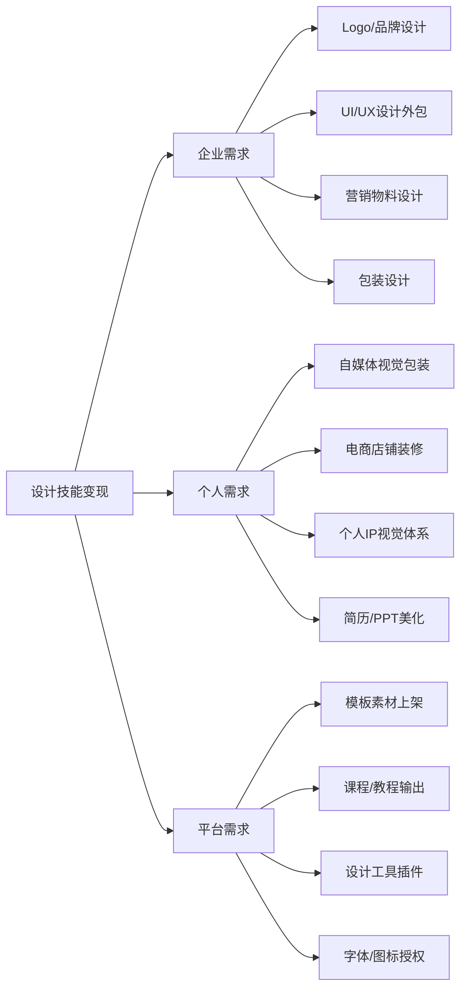
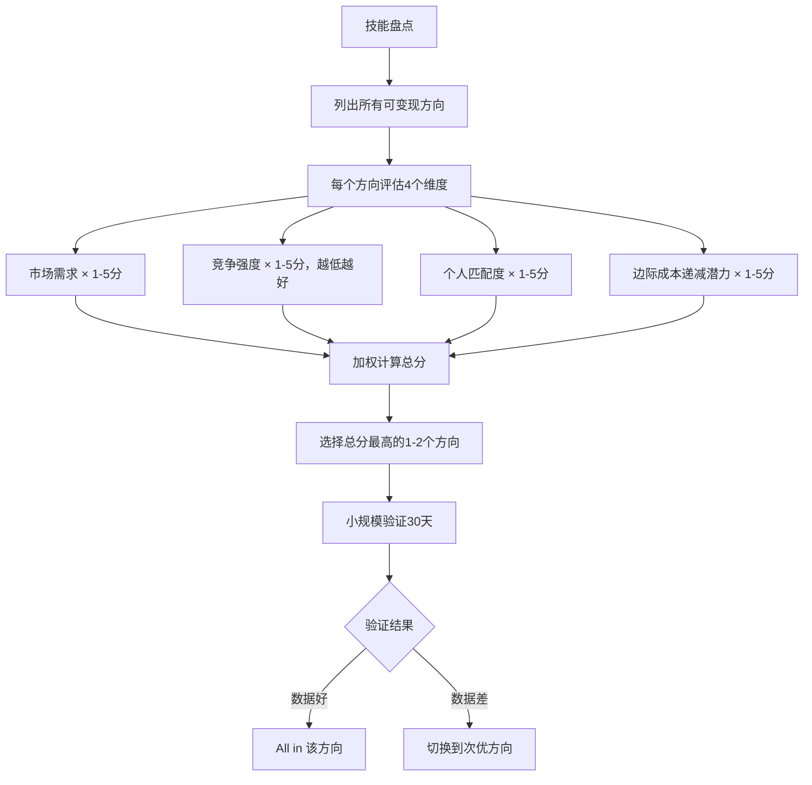
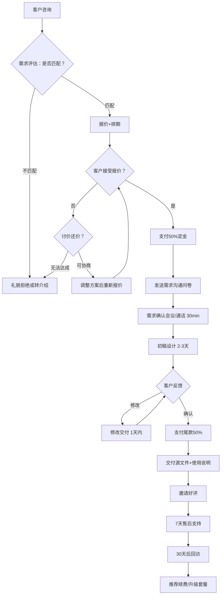
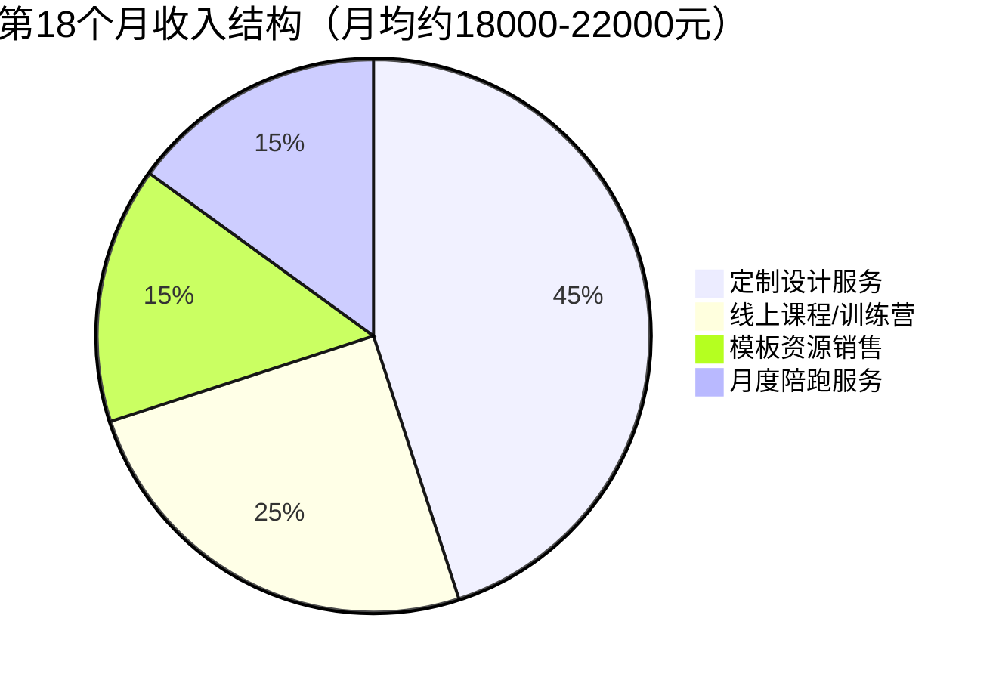
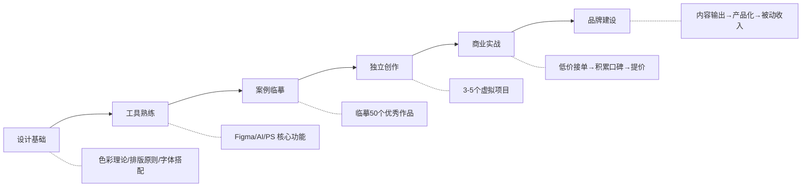

## 案例三：设计师——从接单到品牌

> **案例概要**：一位拥有3年UI设计经验的互联网公司设计师，利用业余时间从零起步接单，经过18个月的持续运营，月收入从0增长到稳定15000元以上，最终建立个人设计品牌，转型为独立设计师，年收入突破30万元。本案例完整还原从技能评估、平台选择、定价策略、客户运营到品牌升级的全链路路径。

> **阅读指南**：本案例按照"为什么→怎么做→做到什么程度→踩了什么坑→如何复制"的逻辑展开。如果你时间有限，可以直接跳到[第四节：踩过的坑与经验教训](#四踩过的坑与经验教训)和[第五节：可复制的行动清单](#五可复制的行动清单)获取最实用的内容。

---

### 一、案例背景：为什么选择设计作为变现出口

#### 1.1 主人公画像

| 维度 | 具体情况 |
|------|---------|
| 姓名 | 化名"陈默"（已获授权使用） |
| 年龄 | 27岁 |
| 本职工作 | 二线城市互联网公司UI设计师，月薪12000元 |
| 工作年限 | 3年 |
| 核心技能 | UI设计、品牌视觉、基础动效（After Effects Lottie动画） |
| 次要技能 | 插画绘制（Procreate + iPad）、简单的前端页面切图（HTML/CSS基础）、文案撰写能力 |
| 工具栈 | Figma（主力）、Adobe全家桶（PS/AI/AE）、Canva（快速出图）、MidJourney（辅助素材生成）、Remove.bg（抠图）、Figma社区插件库（Content Reel/Unsplash/Auto Layout等） |
| AI工具使用经验 | 能用MidJourney生成参考素材和背景图，但主视觉仍需手工设计 |
| 每周可投入时间 | 工作日晚上2-3小时 + 周末一天，合计约15-20小时/周 |
| 变现动机 | 主业薪资增长见顶（公司晋升通道窄），希望通过技能副业拓宽收入来源，同时为未来可能的自由职业做准备 |
| 性格特点 | 内向型，擅长书面沟通而非口头推销；审美敏感，对作品质量有执念；执行力强但初期缺乏商业思维 |

**为什么强调"性格特点"？** 很多设计师变现失败不是因为技能不够，而是性格与变现方式不匹配。陈默的内向特质决定了他不适合需要大量社交应酬的获客方式（如线下活动、商务宴请），更适合内容营销+在线接单的模式。**选择变现路径前，先认清自己的性格优势和短板。**

#### 1.2 变现可行性评估

在正式开始前，陈默用了一周时间做系统性调研，评估设计技能变现的可行性。这个评估框架值得所有想做设计副业的人参考：

**市场需求验证的三个维度**



**陈默的实际调研方法**（不只是看数据，而是亲自验证）：

1. **需求端调研**：在闲鱼搜索"设计"相关服务，按销量排序TOP50，记录每家的定价、服务内容、评价数量和好评率。发现"新媒体视觉设计"类目下，月销100+的店铺有12家，但好评率低于90%的占了一半——说明需求旺盛但供给质量参差不齐，专业设计师有切入空间。

2. **供给端调研**：在小红书搜索"设计师接单"，分析TOP20博主的内容策略和变现方式。发现80%的设计师只展示作品，缺少服务流程展示和客户案例复盘——这是一个内容差异化的机会。

3. **价格端调研**：在猪八戒网、站酷、花瓣等平台收集200+条报价数据，按服务类型和复杂度分层，建立价格参考矩阵。这个矩阵后来成为他定价策略的基础。

**竞争格局分析**（以猪八戒网、站酷、花瓣等平台为样本，数据基于陈默2024年初的调研）

| 层级 | 占比 | 特征 | 月均收入 | 核心竞争力 |
|------|------|------|---------|-----------|
| 头部设计师（5%） | 5% | 作品集强、口碑好、有个人品牌 | 20000-50000元 | 品牌溢价+主动获客 |
| 中腰部设计师（20%） | 20% | 技能扎实、有稳定客户群、服务流程成熟 | 8000-20000元 | 复购率高+效率高 |
| 中间层（40%） | 40% | 技能中等、靠平台派单、无差异化 | 3000-8000元 | 平台流量依赖 |
| 底层（35%） | 35% | 技能基础、低价竞争、缺乏服务意识 | 0-3000元 | 价格低（恶性循环） |

陈默的自我评估：技能水平处于中上，但缺乏商业项目经验和客户运营能力。他的策略是——**先用中等价格切入市场，通过高质量交付快速积累口碑，6个月后逐步提价向中腰部靠拢**。

> **关键认知**：很多人以为设计变现的核心是"设计水平"，但实际上**商业能力（获客、沟通、定价、服务）比设计能力更重要**。一个设计水平8分但商业能力3分的设计师，收入往往不如设计水平6分但商业能力8分的设计师。

#### 1.3 关键决策：选择细分赛道

陈默没有选择"什么设计都做"的全能路线，而是经过对比分析后锁定了一个细分方向。**为什么不做"全能设计师"？** 因为在自由市场中，"什么都能做"往往意味着"什么都不精"。客户在选择设计师时，更倾向于找"专门做XX设计"的专家，而不是"什么都做"的通才。

| 细分方向 | 市场需求 | 竞争程度 | 单价范围 | 学习成本 | 入门门槛 | 陈默选择 |
|---------|---------|---------|---------|---------|---------|---------|
| Logo设计 | ★★★★★ | ★★★★★ | 500-5000 | 低 | 低 | ✗ 竞争太激烈，AI工具冲击大 |
| UI/UX设计 | ★★★★★ | ★★★★ | 3000-30000 | 中 | 中 | ✗ 与本职工作重叠，精力不够 |
| 品牌VI设计 | ★★★★ | ★★★ | 5000-50000 | 高 | 高 | ✗ 需要系统学习，入门周期长 |
| 新媒体视觉设计 | ★★★★ | ★★ | 1000-8000 | 低 | 低 | ✓ 需求增长快，竞争相对小 |
| 电商详情页设计 | ★★★★ | ★★★★ | 500-3000 | 低 | 低 | ✗ 单价偏低，效率型工作 |
| 包装设计 | ★★★ | ★★★ | 2000-15000 | 中 | 中 | ✗ 需要印刷知识，交付链路长 |
| 插画/IP形象设计 | ★★★ | ★★★ | 1000-10000 | 高 | 高 | ✗ 需要强手绘能力，周期长 |

**最终选择：新媒体视觉设计**。理由如下：

- **需求侧**：2024-2026年自媒体持续爆发，个人IP和中小企业对视觉包装的需求快速增长。仅小红书平台，每月新增商业账号超过50万个，其中80%以上有视觉升级需求
- **供给侧**：竞争者多为"能用Canva就上"的非专业选手，专业设计师有明显优势。很多客户反馈"花了几百块找人做，效果还不如自己用模板"
- **客单价适中**：1500-5000元/套，客户决策周期短（通常1-3天），不像品牌VI那样需要层层审批
- **交付周期可控**：3-7天/套，适合副业节奏，不会因为交付延期影响主业
- **边际成本递减**：可复用模板化生产，做第10个项目的时间只有第1个项目的40%
- **技能迁移性强**：新媒体视觉设计的底层能力（排版、配色、字体、构图）可以迁移到其他设计领域

**赛道选择的决策矩阵**（通用方法论，适用于任何技能变现的赛道选择）：



---

### 二、执行过程：18个月的完整路径

#### 2.1 第一阶段：冷启动（第1-2个月）

**目标**：积累初始作品集，获取第一批付费客户

**阶段核心矛盾**：没有作品就没有客户，没有客户就没有作品。冷启动的本质就是打破这个"鸡生蛋"的死循环。

**2.1.1 搭建作品集**

陈默没有等客户来才做作品，而是先主动制造作品。**作品集是设计师的"销售页面"**——客户不会为你的潜力买单，只会为你的成果买单。

**第一步：虚拟项目练习**（耗时1周）

为自己假想的3个不同行业的自媒体账号设计完整的视觉体系——头图、头像、封面图、文章配图模板。选的行业分别是：

| 项目 | 行业 | 设计风格 | 完成物 |
|------|------|---------|--------|
| 项目A | 美食探店 | 暖色调、食欲感、手写体 | 头图+头像+6张封面图+3套配图模板 |
| 项目B | 科技评测 | 冷色调、科技感、几何线条 | 头图+头像+6张封面图+3套配图模板 |
| 项目C | 个人成长 | 清新简约、文艺感、留白 | 头图+头像+6张封面图+3套配图模板 |

选择这三个行业的原因：覆盖不同的视觉风格，展示设计的广度；同时这三个行业在小红书上都是热门赛道，有大量潜在客户。

**第二步：真实项目低价接单**（第2-3周）

在闲鱼、豆瓣小组、微信朋友圈发布设计服务，定价为市场价的40%（一套新媒体视觉包定价600元），目的不是赚钱而是积累真实案例和好评。

陈默的闲鱼上架文案（原文）：

> 【新媒体视觉设计】专业UI设计师接单 | 小红书/抖音/公众号
>
> 🔥 限时特惠价，原价1500，现价600元
> ✅ 包含：头像设计+封面图3张+排版模板2套+配色方案
> ✅ 3天交付，不满意全额退款
> ✅ 3年互联网公司UI设计经验，作品见详情图
>
> 适合人群：刚起步的自媒体博主、想要视觉升级的小品牌
>
> 下单前请先私聊沟通需求～

**关键细节**：为什么定价600而不是更低？陈默的调研发现，闲鱼上300-500元的设计单吸引的客户质量极低（需求不清、期望过高、修改无度），而600-800元区间的客户相对理性。**定价不仅影响收入，更影响客户质量。**

**第三步：整理作品集**（第4周）

用 Figma 制作在线作品集页面，每个案例包含：需求背景→设计思路→最终效果→客户评价。

**作品集结构模板**（陈默实际使用，后续成为行业参考）：

```text
案例名称：XX品牌自媒体视觉升级
├── 需求背景（50字）
│   └── 客户行业、核心诉求、目标受众
├── 设计策略（100字）
│   └── 风格定位、色彩方案、字体选择理由
├── 视觉呈现（图片）
│   ├── 主视觉 / 封面图（带设备mockup）
│   ├── 社交媒体适配方案（不同平台尺寸）
│   └── 品牌一致性展示（多元素排列）
├── 客户反馈（截图）
│   └── 包含微信聊天截图中的好评
└── 数据效果（如有）
    └── "使用新视觉后，账号互动率提升XX%"
```

**作品集的5个常见错误**（陈默前2个月也犯过）：

| 错误 | 问题 | 正确做法 |
|------|------|---------|
| 只放最终效果图 | 客户无法了解你的思考过程 | 展示从需求到成品的完整链路 |
| 案例太少（<3个） | 显得经验不足 | 至少展示5个完整案例，风格各异 |
| 没有客户评价 | 缺乏社会证明 | 每个案例都附上客户好评截图 |
| 图片质量差 | 压缩过度、尺寸不对 | 用高质量mockup展示，保持2x分辨率 |
| 没有分类筛选 | 客户找不到相关案例 | 按行业/风格/平台分类，提供筛选 |

**2.1.2 平台选择与账号搭建**

陈默同时布局了5个渠道，但精力分配有主次：

| 渠道 | 定位 | 精力占比 | 实际效果 | 运营要点 |
|------|------|---------|---------|---------|
| 闲鱼 | 低价引流，积累初始订单 | 30% | 前2个月贡献60%的订单 | 标题SEO很关键，包含"小红书设计""封面图"等搜索词 |
| 小红书 | 作品展示，吸引精准客户 | 25% | 第3个月起成为主要获客渠道 | 图文为主，封面图决定80%的点击率 |
| 站酷/花瓣 | 专业背书，吸引同行和甲方 | 15% | 品牌背书价值大于直接获客 | 作品要打"站酷推荐"标签，增加可信度 |
| 微信朋友圈 | 熟人推荐，信任度高 | 20% | 转化率最高（40%+） | 不要刷屏，每周2-3条，以案例分享为主 |
| 猪八戒/威客平台 | 补充订单 | 10% | 客单价低但能填补空档期 | 注意平台抽成（10-20%），定价要包含抽成 |

**关键动作**：在小红书上坚持日更，每天发1条设计相关内容——可以是作品展示、设计技巧、接单日常、行业观察。内容形式以图文为主，偶尔发短视频。

**小红书冷启动的具体操作**：

1. **账号定位**：昵称"陈默Design｜自媒体视觉设计"，简介中明确服务内容和联系方式
2. **前10条内容策略**：5条作品展示 + 3条设计技巧 + 1条接单日常 + 1条行业观察。目的是测试哪类内容数据最好
3. **封面图模板**：制作3套封面图模板，保持视觉一致性，让用户一眼认出你的内容
4. **话题标签**：每条内容带5-8个相关标签，如#设计师接单 #小红书封面设计 #自媒体运营 #品牌视觉
5. **互动策略**：每天花15分钟回复评论和私信，主动在相关话题下留言互动

**2.1.3 定价策略**

陈默采用的是**阶梯定价 + 价值锚定**策略：

```text
入门套餐（引流款）：800元
  ├── 头像 + 3张封面图 + 简单排版模板
  ├── 交付周期：3天
  ├── 含1次修改
  └── 目的：降低决策门槛，让客户先体验服务

标准套餐（利润款）：2500元
  ├── 完整视觉体系（头像/封面/模板/配色指南/字体规范）
  ├── 含2次修改
  ├── 交付周期：5-7天
  ├── 附赠品牌视觉简报PDF（1页）
  └── 目的：主要利润来源，占收入60%

高级套餐（旗舰款）：5000元
  ├── 标准套餐全内容 + 季度视觉更新（4次）
  ├── 含品牌使用指南PDF（10页+）
  ├── 含3次修改 + 30天售后支持
  ├── 交付周期：10-14天
  └── 目的：筛选高价值客户，提升客单价
```

**价值锚定技巧**：在报价时，先展示5000元套餐的完整内容，让客户感受到"全套服务"的价值感。当客户表示预算有限时，自然过渡到2500元的标准套餐，客户会觉得"性价比很高"。

> **心理学原理**：这叫做"锚定效应"（Anchoring Effect）。人做决策时会过度依赖第一个接收到的信息。先展示高价套餐，让客户以5000元为参考点，2500元就显得"便宜"了。反过来，如果先展示800元套餐，客户会觉得2500元"贵了3倍"。

**报价话术模板**（陈默实际使用的，可直接复制）：

```text
客户：你好，我想问一下设计小红书封面图怎么收费？

陈默：你好！我提供三个档次的服务：

🏆 旗舰套餐 5000元
   完整品牌视觉体系 + 季度更新 + 品牌指南 + 30天售后

⭐ 标准套餐 2500元（最受欢迎，80%的客户选择这个）
   完整视觉体系 + 配色/字体规范 + 2次修改

💡 入门套餐 800元
   基础视觉包（头像+3张封面+模板）

方便告诉我你的需求吗？我帮你推荐最适合的方案。
```

---

#### 2.2 第二阶段：稳定获客与流程优化（第3-8个月）

**目标**：建立稳定的获客渠道，优化交付效率，月收入突破8000元

**阶段核心矛盾**：订单开始增加，但时间和精力有限。如何在不影响交付质量的前提下提高效率？

**2.2.1 内容营销体系搭建**

陈默在小红书上逐渐找到了流量密码。以下是他的内容策略：

**内容矩阵**（每周7条内容）

| 内容类型 | 频率 | 目的 | 示例标题 | 平均互动量 |
|---------|------|------|---------|-----------|
| 作品展示 | 2条/周 | 吸引潜在客户 | "给美食博主做的品牌视觉，太香了" | 200-500赞 |
| 设计教程 | 2条/周 | 建立专业形象 | "3步做出高级感封面图，新手也能学会" | 500-2000赞 |
| 接单复盘 | 1条/周 | 展示服务流程 | "接了一单3000的品牌设计，过程全记录" | 300-800赞 |
| 行业观点 | 1条/周 | 体现思考深度 | "为什么90%的自媒体视觉都在犯同一个错" | 400-1500赞 |
| 生活日常 | 1条/周 | 增加人设温度 | "下班后做副业的第100天" | 100-300赞 |

**爆款内容分析**：陈默发现，"对比型"内容最容易爆——"改前vs改后"的设计对比图，平均互动量是其他内容的3倍。他开始有意识地制作这类内容，比如：
- "花600块找我重新设计的美食博主账号，改前改后对比"
- "这个Logo设计师收费2万和收费200的区别"
- "同样的内容，换了封面图点击率翻了3倍"

**爆款内容的底层逻辑**：

| 要素 | 作用 | 陈默的做法 |
|------|------|-----------|
| 对比冲击 | 让人一眼看出价值 | 永远用左右对比/前后对比的布局 |
| 具体数字 | 增加可信度 | "收费3000""3天交付""互动率提升200%" |
| 痛点共鸣 | 引发目标用户认同 | "为什么你的小红书封面没人点？" |
| 可操作性 | 让人觉得"我也能做到" | 每条教程都拆解成3步以内 |
| 情绪价值 | 让人想点赞/收藏/转发 | "设计师的副业日常"类内容引发共鸣 |

**2.2.2 客户服务流程标准化**

随着订单增加，陈默建立了标准化的服务流程。**没有流程的设计师永远在救火**——每接一单都像第一次做一样手忙脚乱。



**需求沟通问卷模板**（关键工具，陈默反复迭代了4个版本后的最终版）：

```markdown
## 设计需求沟通表 V4.0

### 基本信息
- 账号名称：
- 所在平台（小红书/抖音/B站/公众号/其他）：
- 所属行业/领域：
- 目标受众画像（年龄/性别/兴趣）：
- 账号目前粉丝数：
- 账号运营目标（涨粉/变现/品牌建设）：

### 视觉偏好
- 请提供3个你喜欢的视觉风格参考（附链接或截图）：
- 你希望传达的关键词（选3-5个）：
  □ 专业  □ 亲切  □ 高级  □ 活泼  □ 简约  □ 复古
  □ 科技感  □ 文艺  □ 大气  □ 可爱  □ 其他：____
- 必须包含的元素（文字/Logo/特定颜色）：
- 绝对不要出现的元素/风格：

### 竞品参考
- 你的主要竞品/对标账号（附链接）：
- 你觉得竞品视觉的优缺点：
- 你希望与竞品的差异化方向：

### 交付需求
- 需要的设计物清单（请逐项列出）：
- 文件格式要求（PNG/JPG/SVG/PSD/AI）：
- 是否需要可编辑源文件：
- 是否需要适配多平台尺寸：
- 期望交付日期：

### 预算与付款
- 你的预算范围：
- 是否接受分期付款（50%定金 + 50%尾款）：
```

这个问卷的价值在于：
1. **减少沟通成本**：一次性收集完整信息，避免反复追问。实测平均减少3-5轮沟通
2. **明确需求边界**：文字化的确认减少后期纠纷。"你说过不要这个元素"有据可查
3. **提升专业感**：客户收到问卷时会感受到"这个设计师很专业"。很多客户反馈"第一次遇到这么正规的设计师"
4. **保护自己**：有文字记录的需求确认，修改次数超限有据可依
5. **筛选客户**：不愿意填问卷的客户通常需求不清、配合度低，可以直接放弃

> **进阶技巧**：问卷发送时机很重要。陈默测试后发现，在客户支付定金后发送问卷的完成率（85%）远高于咨询阶段发送（40%）。因为付了钱的客户更有动力配合。

**2.2.3 效率优化：模板化生产**

陈默发现，新媒体视觉设计有大量可复用的模块。他开始建立自己的模板库：

| 模板类型 | 数量 | 复用率 | 时间节省 | 构建方法 |
|---------|------|--------|---------|---------|
| 排版布局模板 | 20+ | 80%的项目会基于模板修改 | 单项目节省2-3小时 | 从每个项目中提炼最佳实践 |
| 配色方案库 | 15套 | 60%的项目直接套用 | 单项目节省1小时 | 按行业/风格分类整理 |
| 字体搭配方案 | 10组 | 90%的项目直接选用 | 单项目节省0.5小时 | 中英文各5组，覆盖不同风格 |
| 图标/插画素材库 | 500+ | 按行业分类，快速调用 | 单项目节省1-2小时 | 从项目中积累+购买商用素材 |
| Mockup模板 | 30+ | 展示作品时使用 | 展示效率提升80% | 手机/电脑/iPad/印刷品场景 |

**效率提升数据**：

| 阶段 | 单项目平均耗时 | 月可接项目数 | 月收入（假设平均2000元/单） | 时薪 |
|------|--------------|-------------|-------------------------|------|
| 第1-2个月 | 12小时/项目 | 4-5个 | 8000-10000元 | 约167元 |
| 第3-6个月 | 8小时/项目 | 6-8个 | 12000-16000元 | 约250元 |
| 第7-12个月 | 5小时/项目 | 8-10个 | 16000-20000元 | 约400元 |

**模板化的核心原则**：

1. **80/20法则**：80%的设计工作是重复的（排版、配色、字体选择），只有20%是真正需要创意的（概念、风格、情感表达）。把80%的部分模板化，把精力集中在20%的创意部分
2. **版本迭代**：模板不是一次性做完就不管了。每做完一个项目，回头审视模板库，把更好的方案更新进去
3. **分层管理**：基础模板（可直接用）→ 行业模板（按行业定制）→ 项目模板（从具体项目中提炼）

**2.2.4 AI辅助设计工作流**

2024-2026年，AI设计工具的爆发彻底改变了设计行业的效率曲线。陈默没有把AI视为威胁，而是将其融入工作流——**AI是加速器，不是替代品**。客户购买的是设计师的审美判断、品牌理解和商业洞察，这些是AI短期内无法取代的。

**陈默的AI工具矩阵**：

| 工具 | 用途 | 使用频率 | 效率提升 | 注意事项 |
|------|------|---------|---------|---------|
| MidJourney | 生成参考素材、背景纹理、插画元素 | 每个项目 | 素材搜索时间减少70% | 不直接用于最终交付，需二次设计 |
| Remove.bg | 批量抠图 | 按需 | 抠图时间从10分钟/张降到10秒/张 | 复杂边缘仍需手动修正 |
| Figma AI插件 | 自动布局、组件建议、设计系统生成 | 日常 | 布局效率提升30% | AI建议需人工审核，不能盲从 |
| ChatGPT/Claude | 文案撰写、需求分析、竞品调研 | 每个项目 | 沟通准备时间减少50% | 生成的文案需结合品牌调性调整 |
| Canva AI | 快速生成社交媒体模板初稿 | 快速出图时 | 小项目交付时间减半 | 仅适用于低预算快速项目 |
| Stable Diffusion | 生成特定风格的参考图 | 按需 | 减少参考图搜索时间 | 注意版权风险，商用需确认许可 |

**AI融入设计流程的具体步骤**（以新媒体视觉设计项目为例）：

```text
传统流程（12小时/项目）：
需求分析(2h) → 灵感搜索(2h) → 草图构思(1h) → 设计执行(5h) → 修改定稿(2h)

AI增强流程（5小时/项目）：
需求分析(1h, AI辅助问卷分析) → AI生成参考方向(0.5h) → 草图构思(0.5h)
→ 设计执行(2h, AI素材+Figma AI) → 修改定稿(1h)
```

**AI使用的三个原则**：

1. **AI做初稿，人做精修**：用MidJourney快速生成10个风格方向，选定后由设计师精修为最终作品。AI擅长发散，人擅长收敛
2. **AI做重复，人做创意**：抠图、切图、格式转换、批量适配这些机械工作交给AI，设计师把时间花在概念构思和品牌理解上
3. **AI做参考，人做决策**：AI可以生成配色方案、排版建议，但最终的审美判断和商业适配必须由人来做。**客户付钱买的是你的判断力，不是AI的输出**

**关于AI的客户沟通话术**：

```text
客户问："你用AI做设计吗？"

陈默的回答：
"我会使用AI工具来提高效率（就像用Figma代替手绘一样），
但所有最终交付物都是我亲自设计和把控的。

AI帮我更快地找到灵感和处理重复性工作，
让我有更多时间专注于理解你的品牌需求和打磨设计品质。

简单说：AI让我做得更快，但品质和创意是我把关的。"
```

> **行业趋势洞察**：AI不会消灭设计师，但会消灭"只会执行"的设计师。未来的设计师竞争力在于：审美判断力、品牌策略能力、客户沟通能力、AI工具驾驭能力。四者缺一不可。只会用PS拉渐变的设计师确实会被淘汰，但能理解商业需求、善用AI提效的设计师反而更值钱——因为他们的效率更高，能服务更多客户。

---

**2.2.5 客户沟通中的常见场景与应对话术**

以下是陈默在第3-8个月中遇到的高频沟通场景，以及他总结的应对策略：

**场景1：客户说"太贵了"**

```text
❌ 错误回应：那我给你便宜点吧？
✅ 正确回应：

"理解你的顾虑。我来解释一下这个价格包含什么：
1. 完整的视觉体系（不只是几张图，而是一套可长期使用的视觉资产）
2. 2次修改机会，确保最终效果符合你的期望
3. 源文件交付，后续你可以自行修改使用

如果你预算有限，我推荐入门套餐（800元），先试试效果。
很多客户也是从入门套餐开始，满意后再升级的。"
```

**场景2：客户要求"先出个方案看看"（不付定金）**

```text
❌ 错误回应：好的，我先做一版给你看看。
✅ 正确回应：

"感谢信任！为了保证设计质量，我的流程是：
1. 先沟通确认需求（问卷+30分钟通话）
2. 支付50%定金后开始设计
3. 交付初稿后可以修改

为什么需要先付定金？因为设计师的时间和创意是有价值的。
就像你去餐厅吃饭，不会说'先让我尝尝再决定付不付钱'对吧？
放心，如果不满意，定金是可以协商退还的。"
```

**场景3：客户在修改阶段反复修改，超出约定次数**

```text
❌ 错误回应：好吧，我再改改（无底线配合）
✅ 正确回应：

"这次修改已经是我们合同约定的第3次修改了。
如果还需要调整，后续每次修改收取200元费用。

不过我建议我们先确认一下：是否需要重新梳理一下需求方向？
有时候反复修改是因为最初的需求理解有偏差，
我们可以再花15分钟通话确认一下，避免后续更多返工。"
```

---

#### 2.3 第三阶段：口碑裂变与提价（第9-14个月）

**目标**：通过口碑推荐实现自然获客，逐步提高定价

**阶段核心矛盾**：订单多了，但时间有限。需要从"做更多单"转向"做更高价的单"。

**2.3.1 复购率提升策略**

陈默的复购率从初期的20%提升到成熟期的65%，核心策略包括：

1. **交付后48小时跟进**：主动询问使用情况，解决适配问题。不是等客户来找你，而是你主动找客户。话术："Hi XX，视觉包用上了吗？有没有遇到什么适配问题？我可以帮你调整。"
2. **30天免费小修改**：不影响整体设计的小调整免费做，超出范围的合理收费。这个策略的ROI极高——花30分钟做个小修改，换来客户的好感和复购
3. **节日主动关怀**：重要节日发送定制祝福（用自己设计的贺卡模板），保持存在感。陈默会在春节、中秋、客户生日发送手写风格的电子贺卡
4. **季度视觉更新提醒**：主动联系老客户，提供"季度视觉焕新"服务。话术："你的视觉体系已经用了3个月了，要不要更新一波？现在老客户续费8折。"
5. **老客户专属折扣**：续费或增购享受8折优惠
6. **建立客户微信群**：把高价值客户拉到一个专属群，定期分享设计素材、行业资讯，增强粘性

**客户生命周期价值（LTV）分析**：

| 客户类型 | 占比 | 首单金额 | 年均复购次数 | 年均总消费 | 维护策略 |
|---------|------|---------|------------|----------|---------|
| 高价值客户 | 15% | 5000元 | 3-4次 | 15000-20000元 | 1对1专属服务，优先排期 |
| 中等客户 | 45% | 2500元 | 1-2次 | 5000-7500元 | 定期回访，推荐升级 |
| 一次性客户 | 40% | 800元 | 0次 | 800元 | 不主动维护，保留联系方式 |

**关键洞察**：高价值客户虽然只占15%，却贡献了约35%的总收入。陈默开始有意识地筛选和维护高价值客户，对低价值客户适当提高门槛。

**如何识别高价值客户的6个信号**：
1. 首次咨询就主动说明预算范围
2. 对设计有明确的参考和想法（不是"你看着办"）
3. 有商业目标（涨粉/变现），而不仅仅是"好看"
4. 决策效率高（1-2天内确认方案）
5. 沟通礼貌、尊重设计师的专业意见
6. 有持续需求（不是一次性项目）

**2.3.2 定价调整策略**

| 时间节点 | 入门套餐 | 标准套餐 | 高级套餐 | 调价理由 |
|---------|---------|---------|---------|---------|
| 第1-2月 | 600元 | 1500元 | 3000元 | 低价引流，积累案例 |
| 第3-6月 | 800元 | 2500元 | 5000元 | 有了作品集和好评，涨价合理 |
| 第7-12月 | 1200元 | 3500元 | 7000元 | 口碑成熟，供不应求 |
| 第13-18月 | 不再接入门单 | 5000元 | 10000元 | 专注中高端客户 |

**涨价的关键技巧**：
- **新价格适用于新客户**，老客户维持原价（但鼓励升级套餐）
- **涨价前1个月预告**：在朋友圈和小红书发布"下月起服务价格将进行调整，本月下单仍享原价"。这既是涨价预告，也是限时促销
- **涨价同步提升服务内容**：让客户觉得"贵了但更值了"。比如标准套餐从2500涨到3500，同时增加了"品牌视觉简报"和"30天售后支持"
- **用案例证明价值**：展示涨价后项目的客户好评和数据效果

**涨价后客户流失率**：陈默的数据显示，每次涨价后约有10-15%的价格敏感客户流失，但新客户的质量普遍更高，总收入反而增长。**不要因为害怕流失就不涨价——低质量客户流失是好事。**

**2.3.3 口碑裂变机制**

陈默设计了一套转介绍激励体系：

```text
转介绍奖励机制 V2.0：

成功推荐1位新客户 → 推荐人获得 200元设计抵扣券
成功推荐3位新客户 → 推荐人获得 免费设计1张封面图（价值500元）
成功推荐5位新客户 → 推荐人获得 免费升级标准套餐一次（价值2500元）

规则：
- 被推荐客户首单需满1000元
- 奖励不可叠加，取最高档
- 推荐人和被推荐人各得一张感谢卡
- 每季度评选"最佳推荐人"，额外赠送定制设计礼盒
```

**裂变效果数据**：

| 月份 | 自然获客占比 | 转介绍获客占比 | 平均获客成本 | 客户转化率 |
|------|------------|--------------|------------|-----------|
| 第1-6月 | 85% | 15% | 时间成本约5小时/客户 | 15% |
| 第7-12月 | 50% | 50% | 时间成本约2小时/客户 | 30% |
| 第13-18月 | 30% | 70% | 时间成本约0.5小时/客户 | 45% |

**转介绍客户的天然优势**：转化率是自然获客的3倍，因为有"信任背书"。转介绍客户很少砍价，也很少质疑设计师的能力。

---

#### 2.4 第四阶段：品牌化转型（第15-18个月）

**目标**：从"接单设计师"升级为"独立设计品牌"

**阶段核心矛盾**：接单模式有时间天花板，需要突破"时间换钱"的限制。

**2.4.1 品牌定位升级**

陈默将个人品牌从"新媒体设计师"升级为"自媒体视觉品牌顾问"，核心变化：

| 维度 | 接单阶段 | 品牌阶段 |
|------|---------|---------|
| 自我定位 | 设计执行者 | 视觉策略顾问 |
| 交付内容 | 设计文件 | 设计文件 + 品牌指南 + 策略建议 |
| 沟通方式 | 需求→执行→交付 | 诊断→策略→设计→陪跑 |
| 定价逻辑 | 按工时定价 | 按价值定价 |
| 客户关系 | 甲乙方 | 合作伙伴 |
| 获客方式 | 平台接单 + 被动等待 | 内容吸引 + 主动筛选 |
| 核心竞争力 | 设计能力 | 品牌影响力 + 系统方法论 |

**品牌升级的关键动作**：

1. **提炼方法论**：陈默把自己的设计流程总结为"5步视觉升级法"——诊断现状→定位风格→设计方案→落地执行→效果追踪。这个方法论成为他区别于其他设计师的核心标签
2. **视觉统一**：自己的小红书、公众号、作品集全部使用统一的视觉风格，本身就是最好的"作品"
3. **定价重构**：从"按项目收费"改为"按价值收费"。比如"帮助一个5万粉的博主完成视觉升级，提升广告报价30%"——这个价值远超5000元的设计费

**2.4.2 产品化设计服务**

陈默不再只做定制化项目，而是将高频需求产品化：

| 产品 | 价格 | 形式 | 月均销量 | 月收入 | 边际成本 |
|------|------|------|---------|-------|---------|
| 自媒体视觉体系定制 | 5000-10000元 | 1对1定制服务 | 2-3单 | 15000元 | 高（需要亲自执行） |
| "7天视觉焕新"训练营 | 299元/人 | 线上小班课（录播+直播答疑） | 20-30人 | 6000-9000元 | 低（录播可复用） |
| 设计模板资源包 | 99元/套 | 自动发货（Gumroad/小鹅通） | 30-50套 | 3000-5000元 | 极低（一次制作） |
| 设计陪跑服务（月度） | 3000元/月 | 每月4次设计支持+答疑 | 1-2人 | 3000-6000元 | 中 |

**收入结构变化**：



**被动收入占比从0%增长到30%**，这意味着即使陈默一个月不接任何新单，也能有约6000元的被动收入。这是品牌化的最大价值——**时间自由**。

**2.4.3 建立知识体系与内容壁垒**

陈默开始系统性输出设计知识内容，建立长期壁垒：

| 平台 | 粉丝数 | 内容类型 | 更新频率 | 变现方式 |
|------|--------|---------|---------|---------|
| 小红书 | 12000+ | 图文教程+作品展示 | 日更 | 引流到私域 |
| 公众号 | 3000+ | 深度设计教程+行业分析 | 周更 | 广告+课程推广 |
| 知识星球 | 200+付费成员 | 设计素材+模板+答疑 | 日更 | 年费199元 |
| B站 | 5000+ | 设计实操视频 | 周更2条 | 平台激励+课程引流 |

**内容壁垒的本质**：当你的内容足够多、足够深，新进入者需要1-2年才能追上你的积累。这就是时间带来的护城河。

**2.4.4 全职转型的决策框架**

当副业收入稳定超过主业时，是否应该全职转型？陈默用以下框架做决策：

| 评估维度 | 具体指标 | 陈默的情况 | 权重 |
|---------|---------|-----------|------|
| 收入稳定性 | 副业收入是否连续6个月超过主业？ | ✓ 连续8个月 | 30% |
| 客户储备 | 是否有足够3个月的订单储备？ | ✓ 有5个在手项目 | 20% |
| 财务安全垫 | 是否有6个月生活费的储蓄？ | ✓ 有12个月储蓄 | 20% |
| 社保/医疗 | 是否有替代方案？ | ✓ 挂靠朋友公司 | 15% |
| 心理准备 | 是否接受收入波动？ | ✓ 已经历波动期 | 15% |

**陈默的最终决定**：在第18个月辞去主业，全职做独立设计师。辞职前3个月，他已经开始逐步减少主业投入（协商弹性工作），用更多时间服务高价值客户。

---

### 三、成果数据：18个月的完整成绩单

#### 3.1 收入增长曲线

| 阶段 | 时间段 | 月均收入 | 累计收入 | 关键里程碑 |
|------|--------|---------|---------|----------|
| 冷启动期 | 第1-2月 | 3000元 | 6000元 | 首个付费客户 |
| 成长期 | 第3-6月 | 8000元 | 32000元 | 月入破万 |
| 稳定期 | 第7-12月 | 14000元 | 84000元 | 复购率超50% |
| 品牌期 | 第13-18月 | 20000元 | 120000元 | 被动收入占比30% |
| **合计** | **18个月** | **约13500元** | **约242000元** | |

#### 3.2 核心指标对比

| 指标 | 起步时（第1月） | 成熟后（第18月） | 增长倍数 |
|------|--------------|----------------|---------|
| 月收入 | 3000元 | 20000-22000元 | 7倍 |
| 客户数（累计） | 2个 | 120+ | 60倍 |
| 月均新客户 | 2-3个 | 5-8个（含转介绍） | 3倍 |
| 复购率 | 0% | 65% | - |
| 平均客单价 | 800元 | 4500元 | 5.6倍 |
| 单项目耗时 | 12小时 | 4-5小时 | 效率提升60% |
| 小红书粉丝 | 0 | 12000+ | - |
| 被动收入占比 | 0% | 30% | - |
| 时薪 | 约67元 | 约500元 | 7.5倍 |

#### 3.3 成本与利润分析

| 成本项目 | 月均支出 | 说明 |
|---------|---------|------|
| 设计工具订阅 | 150元 | Figma专业版（75元/月）+ Adobe全家桶（教育版，约75元/月） |
| 素材采购 | 100元 | 高质量图片授权（Unsplash Pro）+ 商用字体（部分免费替代） |
| 学习投入 | 200元 | 课程（网易云课堂/B站）、书籍、设计社群会员 |
| 营销推广 | 50元 | 小红书薯条推广（测试爆款内容时使用） |
| 云存储+工具 | 50元 | 阿里云OSS + 域名 + Notion等效率工具 |
| 税务成本 | 350元 | 个人劳务所得税（月收入2万时约1.75%，年累计） |
| **总成本** | **约900元** | |
| **月净利润** | **约19100元** | 成本率约4.5% |

> **税务提醒**：自由职业收入属于"劳务报酬所得"，需要依法纳税。年收入超过12万元需要年度汇算清缴。建议注册个体工商户（核定征收），综合税率可降至1-3%。详见合同与法律知识章节。

#### 3.4 自由职业财务管理实操

设计副业不只是"接单→交付→收钱"这么简单。陈默在第6个月差点因为财务管理混乱导致税务问题，从此建立了完整的财务体系。

**账户分离原则**（铁律，第一天就执行）：

```text
个人生活账户 ←── 每月固定转账（工资）
副业收入账户 ←── 所有设计收入进入此账户
    ├── 50% → 个人生活账户（作为"工资"）
    ├── 30% → 储蓄/投资账户
    ├── 10% → 业务发展基金（学习、工具、营销）
    └── 10% → 税务准备金
```

**为什么必须账户分离？** ①副业收入和生活开支混在一起，永远算不清赚了多少、花了多少；②税务申报时需要清晰的收入记录；③心理上，看到专门的"副业账户"余额增长，比混在工资卡里更有成就感和动力。

**记账模板（简化版，用Notion或Excel即可）**：

| 日期 | 项目名称 | 客户 | 金额 | 状态（定金/尾款/已结清） | 平台 | 备注 |
|------|---------|------|------|------------------------|------|------|
| 2024.3.5 | 美食博主视觉包 | 张某 | 2500 | 已结清 | 闲鱼 | 转介绍客户 |
| 2024.3.8 | Logo设计 | 李某 | 1200 | 定金600 | 小红书 | 进行中 |

**税务优化的三条路径**：

| 路径 | 适用年收入 | 综合税率 | 操作难度 | 推荐程度 |
|------|----------|---------|---------|---------|
| 劳务报酬自行申报 | <10万 | 20%-40%（可退税） | 低 | 适合起步期 |
| 个体工商户（核定征收） | 10-50万 | 1%-3% | 中（需注册） | **强烈推荐** |
| 个人独资企业 | >50万 | 3%-10% | 高（需记账报税） | 规模化后考虑 |

> **实操建议**：当年收入稳定超过8000元/月时，就应该注册个体工商户。流程很简单：带上身份证到当地市场监管局，当天就能拿到营业执照，然后去税务局做核定征收备案。整个过程1-2天，但每年能省下数千甚至上万元的税款。用"个体工商户"抬头签合同，也更显专业。

#### 3.5 时间分配分析

| 活动 | 第1-2月 | 第3-8月 | 第9-18月 | 优化手段 |
|------|---------|---------|---------|---------|
| 设计执行 | 60% | 45% | 30% | 模板化+工具提效 |
| 客户沟通 | 20% | 20% | 15% | 标准化问卷+话术模板 |
| 内容营销 | 15% | 25% | 20% | 批量制作+定时发布 |
| 学习提升 | 5% | 5% | 10% | 碎片时间+实战中学 |
| 行政事务 | 0% | 5% | 5% | 工具自动化（发票/合同/记账） |
| 被动收入运营 | 0% | 0% | 20% | 课程/模板/社群 |

---

### 四、踩过的坑与经验教训

#### 4.1 典型错误案例

**错误1：低价竞争陷阱**

> 第1个月，陈默为了快速接单，把入门套餐定价到300元。结果吸引来的客户大多质量很低——需求模糊、修改无度、不愿付定金。一个月接了6单，赚了1800元，但投入了80+小时，时薪不到23元，远低于正常水平。更糟糕的是，这些客户给的评价大多是"还行""一般"，对作品集没有加分。

**教训**：低价不等于低门槛，反而会吸引低质量客户。正确的冷启动定价应该是市场价的50-70%，而不是20-30%。

**错误2：不做需求确认就开始设计**

> 第3个月接了一单品牌设计，客户口头描述了需求后陈默直接开始做。做完初稿后客户说"不是这个感觉"，前后改了7版，耗时25小时，最后客户才说"我参考的是XX品牌的风格"。如果一开始就用问卷收集清楚，2小时就能确定方向。

**教训**：花1小时做需求确认，能节省10小时的返工。问卷不是形式主义，是自我保护。

**错误3：没有收定金就开始工作**

> 第2个月遇到一个客户，约定完成后付款。陈默花了3天做完设计，发给客户后对方消失了——已读不回，钱也没付。虽然设计不复杂，但3天的时间完全浪费了。

**教训**：必须先收50%定金再开工。这不是不信任客户，是商业合作的基本规则。可以用"行业惯例"来解释，大多数正规客户都能接受。

**错误4：同时接太多单导致质量下降**

> 第5个月因为订单增加，陈默同时开了4个项目。结果每个项目都赶工，交付质量参差不齐，收到2个差评，还被一个客户要求退款。这2个差评直接影响了后续2个月的接单。

**教训**：同时并行项目不超过2个。宁可少接单、做好口碑，也不要贪多嚼烂。一个差评的负面影响需要5-10个好评来抵消。

**错误5：忽视合同和知识产权**

> 第6个月，一个客户用陈默设计的视觉体系做了违法广告。陈默被牵连调查，虽然最终无责，但耗费了大量时间和精力。从此以后，陈默坚持每单都签简单的服务合同，明确知识产权归属和使用范围。

**教训**：再小的项目也要签合同。合同不是不信任，是保护双方。免费的电子合同模板（如"上上签""法大大"）够用。

**附：设计服务合同核心条款模板**（陈默经过3次踩坑后迭代的版本，可直接使用）：

```markdown
## 设计服务合同（简化版）

甲方（委托方）：__________    乙方（设计方）：__________

### 第一条 服务内容
1.1 设计项目：__________（如：小红书品牌视觉体系设计）
1.2 交付物清单：
    - [ ] 头像设计 × 1
    - [ ] 封面图模板 × 3（含PSD/Figma源文件）
    - [ ] 排版模板 × 2
    - [ ] 配色方案文档 × 1
    - [ ] 字体使用说明 × 1
1.3 交付格式：PNG（2x分辨率）+ Figma源文件 + 可编辑PSD
1.4 交付日期：定金支付后 ____ 个工作日内

### 第二条 费用与支付
2.1 项目总费用：人民币 ________ 元
2.2 支付方式：50%定金（开工前）+ 50%尾款（验收后）
2.3 支付渠道：微信/支付宝/银行转账

### 第三条 修改与验收
3.1 包含 ____ 次免费修改（基于原始需求方向的调整）
3.2 超出修改次数，每次收取 ____ 元
3.3 需求方向变更（与原始需求表不一致的修改）视为新需求，另行报价
3.4 交付后 ____ 天内未提出修改意见，视为验收通过

### 第四条 知识产权
4.1 尾款付清后，设计成果的使用权归甲方所有
4.2 乙方保留作品的著作权（署名权），可用于作品集展示
4.3 甲方不得将设计源文件转售给第三方
4.4 乙方不得将为甲方定制的设计用于其他商业项目

### 第五条 保密条款
5.1 双方对合作过程中知悉的商业信息保密
5.2 保密期限：合同终止后2年

### 第六条 免责条款
6.1 甲方需保证提供的素材（Logo/照片/文字）不侵犯第三方权益
6.2 因甲方提供的素材导致的侵权纠纷，由甲方承担责任
6.3 设计作品的使用方式由甲方自行负责，乙方不对甲方的使用行为承担法律责任

### 第七条 违约与退款
7.1 乙方未按时交付，每延迟1天减免总费用的5%
7.2 甲方在乙方开工后取消项目，定金不予退还
7.3 甲方在乙方开工前取消项目，定金全额退还
```

> **合同使用要点**：①电子合同同样具有法律效力，微信确认的文字记录也可作为补充证据；②金额超过5000元的项目建议使用"上上签""法大大"等平台签署电子合同；③知识产权条款是重中之重——模糊的知识产权归属是设计行业纠纷的第一大原因。

**错误6：过度承诺交付时间**

> 第4个月为了抢单，答应客户"2天交付"。结果2天内根本做不完，只能熬夜赶工，质量打了折扣。客户收到后不满意，虽然最终修改后通过了，但双方体验都很差。

**教训**：交付时间要在自己的实际能力基础上加30%的缓冲。宁可说"5天交付"实际3天完成（客户惊喜），也不要说"3天交付"实际需要5天（客户失望）。

#### 4.2 关键经验清单

| 经验 | 具体说明 | 重要程度 |
|------|---------|---------|
| 需求沟通比设计本身更重要 | 80%的客户纠纷源于需求不对齐，不是设计水平问题 | ★★★★★ |
| 作品集是最强销售工具 | 一个好案例胜过100条朋友圈推广 | ★★★★★ |
| 复购率是利润的核心 | 获取新客户的成本是维护老客户的5-8倍 | ★★★★★ |
| 定价要敢于往上走 | 客户买的是结果和信任，不是你的工时 | ★★★★ |
| 内容营销是长期投资 | 前3个月看不到效果，第6个月开始指数增长 | ★★★★ |
| 标准化流程是效率之源 | 没有流程的设计师永远在救火 | ★★★★ |
| 学会说"不" | 不匹配的需求、不合理的修改、不尊重的客户，果断拒绝 | ★★★ |
| 建立素材库是复利投资 | 每做一个项目，素材库增长一点，后续项目越来越快 | ★★★ |
| 合同是底线 | 再小的项目也要签合同，保护双方权益 | ★★★★ |
| 心态管理很重要 | 差评、丢单、涨价被拒都是常态，不要内耗 | ★★★★ |

#### 4.3 心态管理：副业路上的心理挑战

设计副业不只是技术和商业问题，更是心理问题。陈默在18个月中经历了以下心理挑战：

| 挑战 | 出现阶段 | 具体表现 | 应对方式 |
|------|---------|---------|---------|
| 冒名顶替综合征 | 第1-3月 | "我的设计真的值这个价吗？" | 回看客户好评，用数据说话 |
| 与同行比较焦虑 | 第3-6月 | "别人接单价比我高，粉丝比我多" | 只和自己比，记录每月进步 |
| 精力透支 | 第5-8月 | 主业+副业双重压力，周末无休 | 设定"无工作日"，每周至少休息半天 |
| 差评打击 | 第5月 | 收到2个差评，情绪低落一周 | 差评是改进的机会，不是人格否定 |
| 涨价恐惧 | 第7月 | "涨价了客户会不会都跑了？" | 小步涨价，观察数据，不猜 |
| 成就感缺失 | 第10-12月 | 重复性工作，缺乏新鲜感 | 尝试新风格，接挑战性项目 |

**心态管理的核心原则**：

1. **记录成就感**：建一个"成就文件夹"，收集客户好评、数据增长、收入突破的截图。低谷时翻看
2. **设定边界**：副业不是全部生活。每周至少留一个完整的休息日，不做任何工作相关的事
3. **找同行交流**：加入设计师副业社群，和同频的人交流经验和困惑
4. **接受波动**：收入不可能每个月都增长，偶尔的低谷是正常的。看季度和年度趋势，不要被单月数据影响心态

**4.4 防止职业倦怠的可持续系统**

设计副业最容易在第6-12个月出现倦怠——新鲜感消退，重复性工作增加，但离"财务自由"还很远。陈默在这个阶段建立了以下防倦怠系统：

**"能量管理"而非"时间管理"**：

| 能量类型 | 消耗源 | 补充方式 | 陈默的做法 |
|---------|--------|---------|-----------|
| 创意能量 | 重复性设计、无趣的项目 | 接挑战性项目、学习新风格 | 每月至少接1个"非舒适区"项目 |
| 社交能量 | 客户沟通、处理纠纷 | 独处、运动、阅读 | 周三设为"免沟通日"，不回复客户消息 |
| 专注能量 | 多任务切换、频繁打断 | 深度工作时间段 | 每天保留2小时"飞行模式"时间 |
| 成就感 | 重复劳动、缺乏反馈 | 记录成果、分享经验 | 每月写一篇项目复盘发小红书 |

**"135节奏法"**（陈默自创，帮助他在高强度副业中保持18个月不崩）：
- **1**个休息日：每周日完全不工作，不看客户消息，不做任何设计相关的事
- **3**个深度工作日：周二/周四/周六各投入4-5小时高质量设计时间
- **5**个轻量日：周一/周三/周五只处理沟通、行政、学习等轻量任务，每项不超过1小时

**倦怠预警信号**（出现2个以上就要暂停调整）：
- 打开Figma就感到烦躁
- 开始拖延交付，找借口不做
- 对客户的正常需求感到不耐烦
- 觉得"做设计没意思"
- 睡眠质量下降，入睡困难
- 开始羡慕朝九晚五的稳定生活

**应对方案**：暂停接新单1-2周，只完成手头项目。用这段时间做一件"纯粹因为喜欢"的设计（不为赚钱），或者完全不碰设计，去运动、旅行、见朋友。大多数情况下，1-2周的"设计假期"就能恢复状态。

---

### 五、可复制的行动清单

如果你也想走"设计技能变现"这条路，以下是按时间顺序整理的行动清单：

#### 第1周：评估与准备

- [ ] 评估自己的设计技能水平（用1-10分自评各项能力：排版/配色/字体/品牌理解/沟通）
- [ ] 确定细分方向（参考本案例的赛道分析框架，选1-2个方向）
- [ ] 注册必要的工具账号（Figma、小红书、闲鱼、站酷）
- [ ] 研究目标平台的TOP10设计师，分析他们的作品集和定价
- [ ] 制作一份价格调研表（收集100+条报价数据）
- [ ] 确定每周可投入的时间，并分配到各渠道

#### 第2-4周：冷启动

- [ ] 制作3个虚拟项目作为作品集素材（覆盖不同行业和风格）
- [ ] 在闲鱼发布设计服务（定价为市场价50-70%）
- [ ] 小红书开始日更（作品展示为主，测试哪类内容数据好）
- [ ] 在朋友圈发布"开始接设计单"的宣告（配作品图）
- [ ] 准备客户需求沟通问卷
- [ ] 制作服务报价单（三档套餐）

#### 第2-3个月：优化流程

- [ ] 建立标准化的服务流程（咨询→报价→定金→问卷→设计→交付→好评）
- [ ] 开始积累可复用的模板和素材库
- [ ] 每周复盘：哪些内容有流量、哪些客户质量高、哪些流程可以优化
- [ ] 建立客户档案表（记录每个客户的需求、偏好、沟通记录）
- [ ] 学习基础合同知识，准备服务合同模板

#### 第4-6个月：扩大规模

- [ ] 根据口碑和作品集质量，适当涨价（10-30%）
- [ ] 建立转介绍奖励机制
- [ ] 小红书粉丝破3000后开始尝试引流到私域（微信）
- [ ] 考虑是否需要学习新技能（如动效设计、3D元素、AI辅助设计）来扩展服务范围
- [ ] 开始在公众号/知乎输出深度内容

#### 第7-12个月：稳定增长

- [ ] 月收入稳定在10000元以上后，可以考虑减少本职工作投入或协商弹性工作
- [ ] 开始产品化——将高频需求打包成标准化产品（模板包、课程、陪跑）
- [ ] 尝试知识输出（教程、课程）建立个人品牌
- [ ] 建立客户分层体系，重点维护高价值客户
- [ ] 注册个体工商户，规范税务

#### 第13-18个月：品牌化

- [ ] 从"接单设计师"升级为"视觉顾问/品牌顾问"
- [ ] 推出线上课程或训练营
- [ ] 销售设计模板和资源包（被动收入）
- [ ] 建立付费社群（知识星球/微信群）
- [ ] 评估是否全职转型独立设计师（参考2.4.4决策框架）

---

### 六、不同起点的适应方案

#### 6.1 如果你是零基础想学设计

| 阶段 | 时间 | 目标 | 学习内容 | 推荐资源 |
|------|------|------|---------|---------|
| 入门 | 1-3个月 | 能完成基础设计 | 色彩/排版/字体基础 + Figma操作 | 《写给大家看的设计书》+ Figma官方教程 |
| 进阶 | 3-6个月 | 能独立完成商业项目 | 品牌设计思维 + 行业案例分析 + 模仿练习 | 站酷/B站设计教程 + 100个案例临摹 |
| 变现 | 6-9个月 | 开始接低价单 | 作品集制作 + 平台运营 + 客户沟通 | 本案例的冷启动阶段策略 |
| 成长 | 9-18个月 | 月入5000-10000元 | 流程优化 + 内容营销 + 提价 | 本案例的第二/三阶段策略 |

**零基础学习路线图**：



**关键提醒**：零基础到开始变现通常需要6-9个月的学习期。不要急于求成，在学习阶段就尝试商业化，会导致基础不牢、作品质量差、口碑难建立。

#### 6.2 如果你是非设计类技能者

本案例的底层逻辑同样适用于其他技能变现：

| 设计师路径 | 对应逻辑 | 适用于 | 具体案例 |
|-----------|---------|--------|---------|
| 作品集展示 | 成果展示 | 所有技能类服务 | 程序员展示GitHub项目、写作者展示发表作品 |
| 需求沟通问卷 | 标准化流程 | 所有定制化服务 | 翻译的需求确认表、咨询的需求诊断表 |
| 模板化生产 | 效率提升 | 所有可模块化的工作 | 程序员的代码模板库、写作者的文案框架库 |
| 内容营销获客 | 建立信任 | 所有专业服务 | 技术博客引流、行业观点输出 |
| 转介绍裂变 | 口碑驱动增长 | 所有高满意度服务 | 任何服务行业的转介绍机制 |
| 从接单到品牌 | 阶段性升级 | 所有长期职业规划 | 独立开发者→SaaS创始人 |

#### 6.3 如果你的时间更少（每周5-10小时）

调整建议：
- 缩小服务范围，只做一个细分（如"小红书美食博主视觉设计"）
- 初期只布局1-2个渠道（小红书 + 朋友圈），不做全平台
- 用更高的客单价弥补订单量不足（宁可1单3000元，不做6单500元）
- 重点做可复用资产（模板、教程），用被动收入补充主动收入
- 考虑使用AI工具（MidJourney、Stable Diffusion）辅助生成素材，提高效率

#### 6.4 如果你已经有3年以上设计经验

直接跳过冷启动阶段，从第二阶段开始：
- 用已有的商业作品作为作品集素材（注意脱敏和授权）
- 初始定价可以是市场价的80-100%（你有经验背书）
- 重点放在差异化定位和内容营销上
- 考虑直接从高端定制切入，跳过低价引流阶段

#### 6.5 如果你在小城市/县城

小城市的设计变现策略需要调整：
- **线上为主**：小城市本地的设计需求有限，必须面向全国市场
- **降低生活成本的优势**：同样月入1万，在小城市的生活质量远超大城市
- **本地化服务作为补充**：本地企业（餐饮/教育/零售）的Logo、菜单、物料设计，竞争更小
- **远程协作能力**：学会用Figma、腾讯会议、微信等工具远程服务客户

#### 6.6 如果你想接海外客户

面向海外市场的设计接单是一条被很多国内设计师忽略的高价值路径。海外客户（尤其是欧美市场）的设计预算通常是国内的3-5倍。

**海外接单的核心差异**：

| 维度 | 国内接单 | 海外接单 |
|------|---------|---------|
| 客单价 | 1000-5000元 | $300-$2000（约2000-14000元） |
| 沟通语言 | 中文 | 英文（需基本读写能力） |
| 支付方式 | 微信/支付宝 | PayPal/Stripe/Wise |
| 交付标准 | 相对灵活 | 严格的文件规范（命名/格式/图层） |
| 时差问题 | 无 | 需要异步沟通能力 |
| 竞争对手 | 国内设计师 | 全球设计师（含东南亚低价竞争） |
| 知识产权 | 观念淡薄 | 极为重视，合同严格 |

**海外接单的四个平台**：

1. **Fiverr**：门槛最低，适合新手。注册后发布"Gig"（服务），客户主动来下单。关键是Gig标题SEO和前5单的好评积累。定价建议：初期比同类Gig低20%，积累到20+好评后逐步提价
2. **Upwork**：需要主动投标，竞争更激烈但客单价更高。建议写个性化的Proposal（不要模板化），重点展示与客户需求匹配的案例
3. **99designs**：设计专属平台，以Logo和品牌设计为主。采用"竞赛制"——客户发布需求，多个设计师提交方案，客户选中的获得报酬。适合想快速积累作品的新手
4. **Dribbble/Behance**：不是直接的接单平台，但高质量作品展示可以吸引海外客户主动联系。相当于国际版的站酷

**海外接单的注意事项**：
- 合同必须用英文撰写，明确知识产权转让条款
- 时差管理：用Calendly等工具让客户自行预约通话时间
- 文件交付要严格按照客户要求的格式和命名规范
- 收款用Wise（手续费最低，约0.5%），避免PayPal的高手续费（4.4%+固定费用）
- 税务：海外收入同样需要在国内申报纳税，但可以享受税收抵免（避免双重征税）

---

### 七、本案例的核心启示

1. **技能变现的本质是价值交换**：客户付费买的不是你的工时，是你能帮他们解决问题的结果。理解这一点，定价和定位就不会出错。设计师卖的不是"几张图"，而是"帮客户提升品牌形象和商业价值"。

2. **从接单到品牌的路径是可规划的**：这不是一个随机过程，而是一个有明确阶段目标的系统工程。每个阶段有每个阶段的重点，不要跳步。冷启动期不要想着品牌，品牌期不要回头接低价单。

3. **内容营销是性价比最高的获客方式**：前期投入时间，后期收获精准客户。陈默第12个月时，70%的客户来自"看过小红书内容后来找我的"。内容是复利资产——一篇好内容可以持续带来客户几个月甚至几年。

4. **复购和转介绍是利润的核心**：获客成本最低的方式就是让老客户持续购买和推荐。维护好20%的高价值客户，比开发100个新客户更有效。

5. **效率决定天花板**：手工接单的收入天花板取决于你的时间。只有通过模板化、产品化、被动收入，才能突破时间换钱的限制。

6. **品牌是最大的复利资产**：当你的名字本身就代表信任和专业时，获客成本趋近于零，定价权完全在你手中。这才是技能变现的终极形态。

7. **心态和身体是基础设施**：副业是马拉松，不是冲刺。合理的休息、健康的心态、可持续的节奏，比任何技巧都重要。陈默能坚持18个月，不是因为他比别人更聪明，而是因为他找到了可持续的工作节奏。

8. **每一步都要有数据支撑**：陈默的成功不是靠感觉，而是靠数据驱动决策——定价看市场数据，内容看互动数据，客户看LTV数据，涨价看流失数据。**不拍脑袋，用数据说话。**

9. **AI是杠杆，不是威胁**：善用AI工具的设计师效率是传统设计师的2-3倍。但AI放大的是基础能力——如果你的设计基础不行，AI只会帮你更快地做出差设计。先打好基本功，再用AI加速。

10. **财务纪律是隐形护城河**：很多设计师月入2万但年底存款为零。账户分离、记账、税务规划、应急储蓄——这些"不性感"的财务习惯，决定了你能不能从"接单设计师"真正变成"独立品牌"。赚钱能力×管钱能力=财务自由。

---

### 八、延伸阅读与下一步行动

**如果你是设计师，读完本案例后的72小时行动清单**：

| 时间 | 行动 | 预计耗时 |
|------|------|---------|
| 第1天 | 用本案例的评估框架分析自己的技能和市场定位 | 2小时 |
| 第1天 | 注册小红书/闲鱼账号，研究TOP10同行 | 1小时 |
| 第2天 | 确定细分赛道，制作第一份定价方案 | 2小时 |
| 第2天 | 开始制作1个虚拟项目作为作品集素材 | 3小时 |
| 第3天 | 发布第一条小红书内容（作品展示或设计技巧） | 1小时 |
| 第3天 | 准备客户需求沟通问卷和服务合同模板 | 1小时 |

> **72小时法则**：读完一个案例后，如果72小时内没有任何实际行动，那你大概率永远不会行动了。不需要完美计划，先动起来——哪怕只是注册一个账号、发一条内容、做一份虚拟作品。行动产生反馈，反馈修正方向，方向带来结果。
