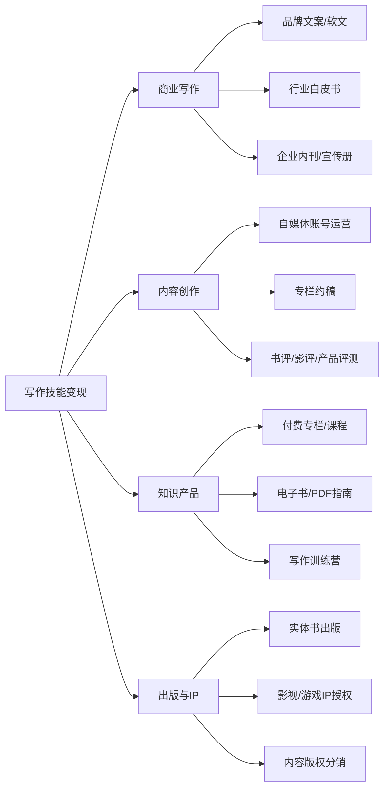
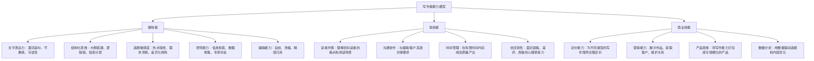
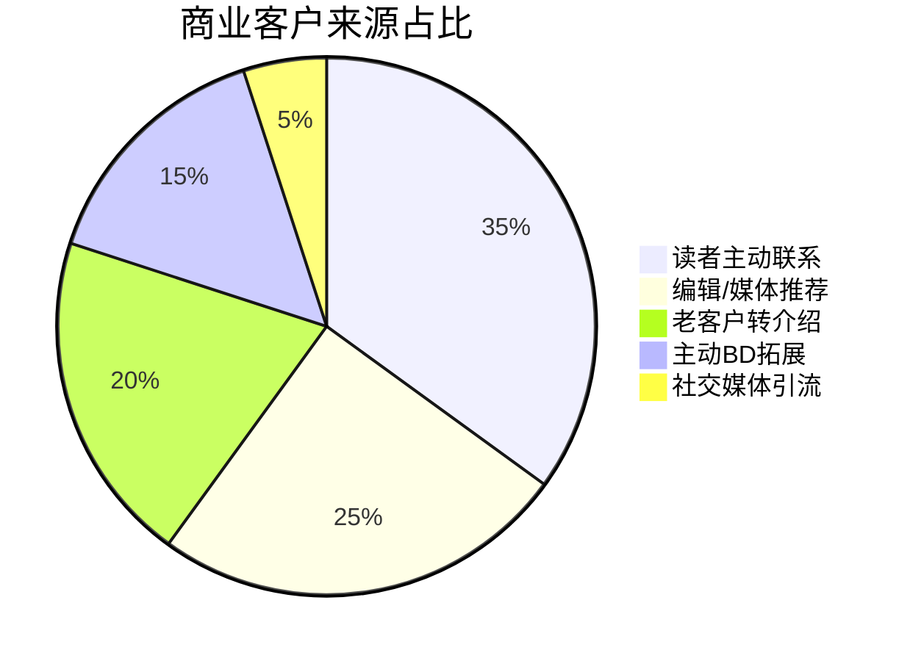
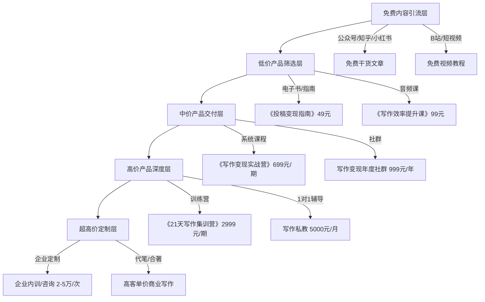
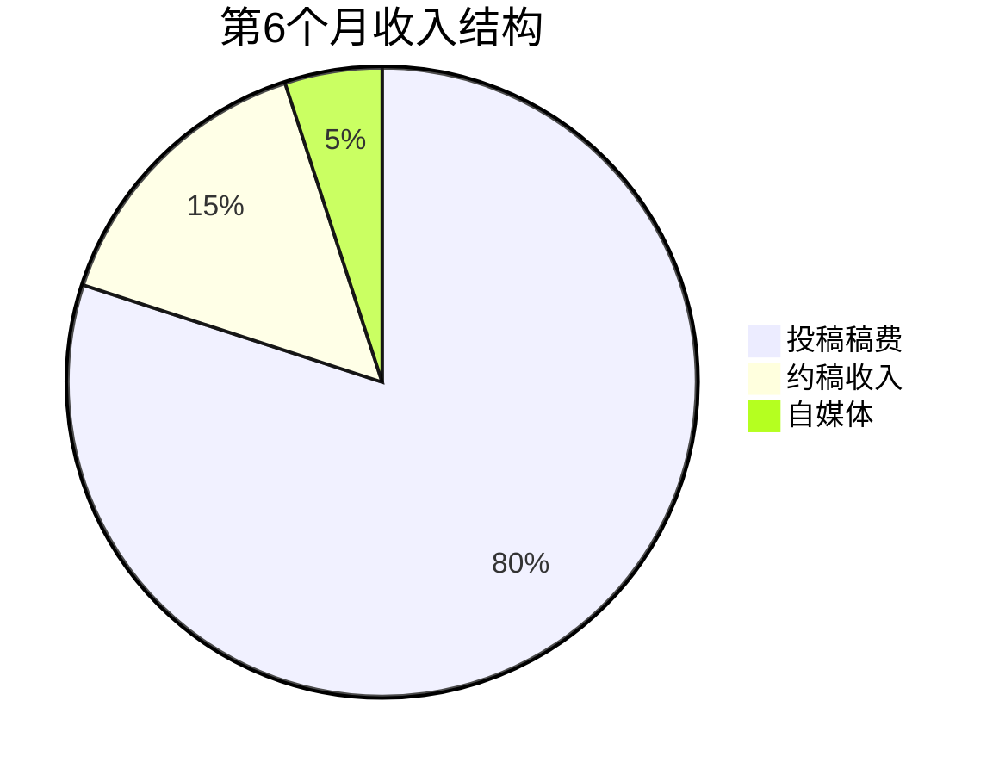
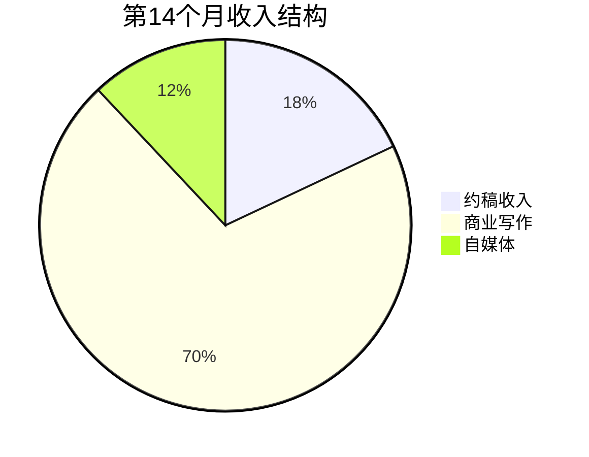
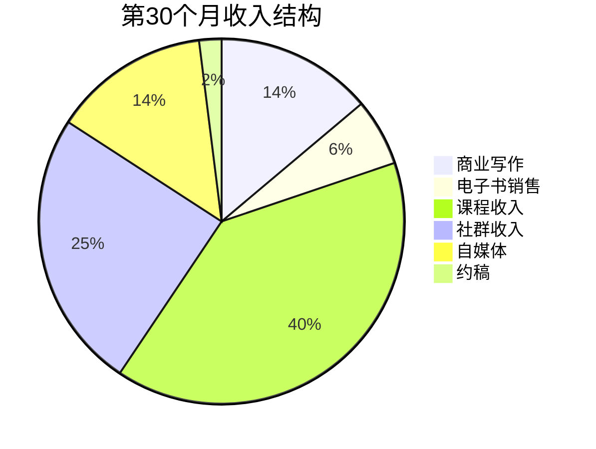

## 案例四：写作者——从投稿到年入50万

> 主人公苏晚秋（化名），30岁，某出版社编辑，月薪9K。从2022年初开始利用业余时间投稿写作，经历投稿期、约稿期、内容产品化三个阶段，30个月后副业年收入突破50万元。这是一个从"文字打工"到"内容资产"的完整进化路径拆解。

---

### 一、起点：一个出版社编辑的写作觉醒

#### 1.1 主人公画像

| 维度 | 具体情况 |
|------|----------|
| 姓名 | 化名"苏晚秋"（已获授权使用） |
| 年龄 | 30岁，单身 |
| 本职工作 | 某二线城市出版社文字编辑，月薪9K（到手约7.5K） |
| 工作年限 | 5年编辑经验 |
| 核心技能 | 文字功底扎实、选题策划、内容结构化、校对审稿 |
| 次要技能 | 基础排版设计（InDesign）、社交媒体运营、读者心理分析 |
| 每周可投入时间 | 工作日晚上2小时 + 周末半天，合计约12-15小时/周 |
| 变现动机 | 出版行业薪资天花板低（编辑总监也就15K），希望将文字能力转化为可持续的收入来源 |

#### 1.2 变现可行性评估

苏晚秋在正式启动前，花了两周时间做系统性调研。她没有盲目开始写，而是先搞清楚一件事：**写作变现的完整生态是什么样的？哪些赛道有真实付费需求？**

**写作变现的市场需求图谱**



**竞争格局分析**（以各写作变现渠道为样本）

| 渠道 | 从业者数量 | 准入门槛 | 头部月收入 | 中位月收入 | 收入天花板 |
|------|-----------|---------|-----------|-----------|-----------|
| 公众号投稿 | 极多（红海） | 低 | 8000-15000元 | 2000-5000元 | 约2万/月 |
| 品牌文案/商业软文 | 多 | 中 | 20000-50000元 | 5000-15000元 | 约5万/月 |
| 自媒体内容矩阵 | 多 | 中 | 30000-100000元 | 3000-8000元 | 无上限 |
| 知识付费产品 | 中等 | 高 | 50000-200000元 | 5000-20000元 | 无上限 |
| 出书+版权收入 | 少 | 高 | 取决于销量 | 不稳定 | 无上限 |
| AI辅助写作服务 | 少（新兴） | 中高 | 30000-80000元 | 8000-20000元 | 无上限 |
| 短视频文案/脚本 | 多 | 中 | 20000-60000元 | 5000-12000元 | 约8万/月 |

苏晚秋的自我评估：文字功底是她的核心优势（5年编辑经验），但缺乏自媒体运营经验和商业写作能力。她的策略是——**先用投稿验证市场需求，建立作品样本库，再逐步切入高价值商业写作和知识产品**。

#### 1.3 写作变现的底层逻辑

在开始之前，苏晚秋理解了一个关键认知：**写作变现的本质不是"卖字"，而是"卖影响力"和"卖解决方案"**。纯粹靠稿费的写作者收入天花板很低（千字100-300元的稿费标准，即使每天写5000字，月收入上限也只有4.5万，且不可持续），而真正实现年入50万以上的写作者，无一例外都建立了"内容资产"——即可以反复产生收益的内容产品。

```text
写作变现的收入结构演进：

阶段一（投稿期）：稿费收入 = 字数 × 千字单价
  → 线性收入，收入与时间严格挂钩，天花板低

阶段二（约稿期）：约稿收入 + 商业合作 = 品牌溢价 × 产出量
  → 非线性收入，单价提升，但仍然依赖时间投入

阶段三（产品化）：内容产品收入 = 产品销量 × 客单价 × 复购率
  → 资产型收入，内容一次创作，反复变现，可规模化

目标：从阶段一逐步进化到阶段三，最终让"资产型收入"占比超过70%
```

**理解"时间杠杆"的三个层次**

很多写作者只看到第一层（卖字），而忽略了第二层和第三层。苏晚秋用一个公式来说明这个认知差异：

| 层次 | 收入公式 | 月收入上限 | 可持续性 | 代表形态 |
|------|---------|-----------|---------|---------|
| 第一层：卖时间 | 字数 × 千字单价 × 工作天数 | 约4.5万 | 低（身体极限） | 投稿、代写 |
| 第二层：卖品牌 | 品牌溢价 × 产出量 × 复购 | 约10万 | 中（仍依赖个人） | 约稿、商业合作 |
| 第三层：卖产品 | 产品销量 × 客单价 × 复购率 | 无上限 | 高（可脱离个人时间） | 课程、社群、电子书 |

#### 1.4 写作者的能力模型

苏晚秋在启动前梳理了写作者需要具备的完整能力栈，这帮助她识别了自己的短板和需要补齐的能力：



苏晚秋的优势集中在硬技能和部分软技能（编辑出身），短板在商业技能和营销能力。她的路径设计就是：先用硬技能打开市场（投稿），在实战中补齐软技能和商业技能（约稿+商业写作），最终用产品思维实现规模化（知识产品）。

---

### 二、第一阶段：投稿试水期（第1-6个月）

#### 2.1 前期准备：建立写作基础设施

苏晚秋没有一上来就写稿投递，而是花了两周做好基础准备：

**第一步：选定细分领域**

她分析了自己的知识储备和市场需求交集：

| 候选领域 | 自身专业度 | 市场需求 | 竞争激烈度 | 千字稿费 | 综合评分 |
|---------|-----------|---------|-----------|---------|---------|
| 读书/书评 | ★★★★★ | ★★★☆☆ | ★★★★☆ | 100-200元 | 60分 |
| 职场/成长 | ★★★☆☆ | ★★★★★ | ★★★★★ | 100-300元 | 65分 |
| 出版/写作方法论 | ★★★★★ | ★★★★☆ | ★★☆☆☆ | 200-500元 | 85分 |
| 文化/人文 | ★★★★☆ | ★★★☆☆ | ★★★☆☆ | 150-300元 | 70分 |

她最终选择了**"出版/写作方法论"**作为主攻方向。原因有三：第一，这是她的职业本行，专业度有天然背书；第二，竞争者少——大多数写作教学来自自媒体博主而非真正的出版从业者，她的视角独特；第三，这个领域的读者有明确的付费意愿（想学写作变现的人本身就有变现意识）。

**细分领域选择的决策框架**

苏晚秋用了一个"三圈交叉"模型来做决策，这个模型后来也被她教给学员：

| 考量维度 | 评估问题 | 权重 |
|---------|---------|------|
| 能力匹配 | 我在这个领域的专业度能排进前20%吗？ | 30% |
| 市场需求 | 这个领域有人愿意为内容付费吗？付费意愿有多强？ | 35% |
| 竞争格局 | 头部创作者是谁？我能否找到差异化切入点？ | 20% |
| 长期趋势 | 这个领域的市场需求是增长、持平还是萎缩？ | 15% |

**各细分领域的差异化切入策略**

苏晚秋分析了几个常见写作赛道的差异化空间，帮助自己找到"人无我有"的角度：

| 赛道 | 头部创作者画像 | 同质化痛点 | 差异化切入角度示例 |
|------|--------------|-----------|------------------|
| 写作变现 | 自媒体博主、写作教练 | 方法雷同，缺乏真实案例 | 从出版从业者视角谈"编辑眼中的好稿" |
| 职场成长 | 职场大V、HR从业者 | 鸡汤多、实操少 | 用具体行业数据+案例拆解晋升路径 |
| 读书书评 | 读书博主、文化评论人 | 摘抄式书评泛滥 | 每本书提炼一个可执行的行动框架 |
| 个人理财 | 财经博主、理财师 | 推销理财产品嫌疑 | 纯方法论+真实记账数据，不带货 |

**第二步：建立作品样本库**

苏晚秋先写了5篇不同类型的样稿，作为投稿时的"作品集"：

1. 一篇3000字的书评（展示文字功底）
2. 一篇2000字的个人成长类文章（展示讲故事能力）
3. 一篇2500字的写作方法论干货文（展示专业深度）
4. 一篇1500字的热点评论文（展示追热点能力）
5. 一篇4000字的深度长文（展示长篇驾驭能力）

这5篇样稿她反复修改了三轮，每一篇都按照目标平台的风格调性进行调整。她的标准是：**每一篇样稿拿出来，都应该能达到目标平台的过稿标准**。

**样稿打磨的具体方法**

苏晚秋的改稿流程不是"通读一遍改错别字"，而是一套系统化的四轮审稿法：

```text
第一轮：结构审查（放下文章，画出大纲骨架）
  - 每个段落的核心论点是什么？能否用一句话概括？
  - 段落之间的逻辑关系是否清晰（递进/并列/转折）？
  - 开头是否能3秒内抓住读者？结尾是否有行动召唤或余韵？

第二轮：信息密度审查（逐段检查"信息增量"）
  - 每500字是否至少有一个新的信息点、数据或观点？
  - 是否有"正确的废话"可以删除（比如"众所周知""很重要"）？
  - 是否有可以替换为具体案例/数据的抽象表述？

第三轮：可读性审查（朗读出声）
  - 读起来是否通顺？有没有拗口的长句？
  - 是否有过多的"的""了""是"等虚词？
  - 段落长度是否均匀？是否有"墙壁式"大段落需要拆分？

第四轮：平台匹配审查（对照目标平台风格）
  - 用语风格是否与平台调性一致（严肃/轻松/犀利）？
  - 文章长度是否在平台偏好范围内？
  - 标题风格是否符合平台爆款标题特征？
```

**第三步：建立投稿目标清单**

她用Excel整理了一份包含60个目标平台的清单，按优先级分三档：

| 优先级 | 平台类型 | 数量 | 特征 | 投稿策略 |
|--------|---------|------|------|---------|
| A档（必投） | 头部公众号、知名媒体平台 | 15个 | 稿费高（500-2000元/篇）、曝光量大、有品牌背书 | 精心打磨，一篇投一个 |
| B档（多投） | 中腰部垂直号、行业媒体 | 25个 | 稿费中等（200-500元/篇）、过稿率较高 | 一稿多投（需确认平台是否接受） |
| C档（铺量） | 新号征稿、内容聚合平台 | 20个 | 稿费低（50-200元/篇）、门槛低 | 快速过稿建立信心和经验 |

每个平台她都记录了以下信息：平台名称、调性风格、目标读者画像、稿费标准、投稿邮箱、编辑联系人、审稿周期、是否接受一稿多投、过往爆款文章标题。

**投稿平台调研的具体方法**

苏晚秋不是简单地在搜索引擎里找"征稿"信息，而是用了五个系统化的渠道：

1. **新榜/西瓜数据**：搜索目标领域的公众号，按阅读量排序，找到持续产出爆款的中腰部号——这些号通常有稳定的约稿需求。
2. **豆瓣稿费银行小组**：有大量编辑发布征稿信息，且通常标注稿费标准。
3. **微信搜一搜**：搜索"征稿函+关键词"，直接找到正在征稿的平台。
4. **已发表文章的作者信息栏**：看到好文章就看作者信息和平台信息，反向找到优质平台。
5. **同行交流**：加入写作者社群，向有经验的写作者打听哪些平台靠谱、稿费结算及时。

**第四步：准备投稿邮件模板**

很多新手写作者忽略了一个细节——**投稿邮件本身就是你的第一张名片**。编辑每天收到几十上百封投稿，一封格式混乱、主题不明的邮件很可能直接被跳过。苏晚秋准备了标准化的投稿邮件模板：

```text
邮件主题格式：
【投稿】+ 文章标题 + 字数 + 作者名
示例：【投稿】编辑眼中的好稿件长什么样 | 3200字 | 苏晚秋

邮件正文模板：

XX编辑/老师您好：

我是苏晚秋，出版社编辑，5年出版行业工作经验。
在贵平台读过多篇文章，对XX话题特别有共鸣。

随信附上稿件《XXXX》，全文约XXXX字。

文章核心观点：[一句话概括]
目标读者：[描述目标读者群体]
差异化角度：[同类文章通常写XX，本文从XX角度切入]

如有任何修改意见，我随时配合调整。
期待回复，感谢您的时间！

苏晚秋
微信号：XXXX
手机号：XXXX

附件：稿件Word文件（命名格式：稿件标题-作者名-日期）
```

**投稿邮件的5个常见错误**

| 错误 | 为什么是问题 | 正确做法 |
|------|------------|---------|
| 邮件主题写"投稿"两字 | 编辑无法快速判断内容方向 | 主题含文章标题+字数+作者名 |
| 正文只写"请查收附件" | 没有任何信息增量，编辑没有打开附件的动力 | 用3-5行概括文章核心价值 |
| 附件是PDF格式 | 编辑无法直接修改和批注 | 发Word格式（.docx） |
| 附件命名"稿件.docx" | 编辑收到大量稿件，无法区分 | 命名格式：稿件标题-作者名-日期 |
| 同时抄送多个编辑 | 显得不专业，编辑知道你群发了 | 一对一发送，每封邮件单独写称呼 |

#### 2.2 投稿执行：从被拒到稳定过稿

**第一个月：密集投稿期**

苏晚秋给自己定了一个目标：第一个月投出30篇稿件。

实际执行情况：

| 周次 | 投稿数量 | 过稿数量 | 过稿率 | 获得稿费 |
|------|---------|---------|-------|---------|
| 第1周 | 8篇 | 1篇 | 12.5% | 200元 |
| 第2周 | 10篇 | 2篇 | 20% | 500元 |
| 第3周 | 8篇 | 3篇 | 37.5% | 900元 |
| 第4周 | 6篇 | 3篇 | 50% | 1100元 |
| 月合计 | 32篇 | 9篇 | 28% | 2700元 |

第一个月的过稿率从12.5%提升到50%，核心原因是她在不断根据退稿反馈调整写法。她总结出退稿的三大原因：

1. **风格不匹配**（占退稿的40%）：文章写得不错，但不是平台想要的风格。解决方法：投稿前至少精读该平台最近30篇文章，总结调性关键词。
2. **选题过时或同质化**（占退稿的35%）：选题太老或者已经被写烂了。解决方法：用新榜、西瓜数据等工具分析平台近30天的爆款选题，找差异化切入点。
3. **结构松散或信息密度低**（占退稿的25%）：文章有观点但缺乏支撑，或者结构混乱。解决方法：每篇文章先列详细大纲，确保每500字有一个信息增量点。

**退稿分析的系统化方法**

苏晚秋把每次退稿都当作一次"免费的编辑课"，她建立了一套退稿复盘模板：

```text
退稿复盘模板（每次退稿后填写）

1. 退稿平台：_________
2. 退稿原因（编辑原话）：_________
3. 归类：□ 风格不匹配  □ 选题问题  □ 结构/密度  □ 质量不足  □ 其他
4. 这个原因是否可以通过提前研究避免？□ 是  □ 否
5. 如果重写，我会在以下3个方面改进：
   - ___________
   - ___________
   - ___________
6. 这篇文章是否可以改投其他平台？□ 是（目标平台：___）  □ 否
7. 学到的教训（一句话）：_________
```

积累20份退稿复盘后，她发现自己的退稿原因高度集中在"风格不匹配"，于是调整策略：**投稿前先写一篇500字的"平台调性分析笔记"，记录该平台的用语习惯、标题风格、段落长度、内容偏好，然后对照笔记写稿**。这个习惯让她的过稿率在第二个月就突破了40%。

**平台调性分析笔记模板**

这是苏晚秋开发的、每次投稿前必填的分析框架：

```text
平台调性分析笔记

平台名称：_________
分析日期：_________
分析样本：最近30篇文章（列出标题）

一、语言风格
  - 用语正式度：□ 严肃学术  □ 专业但易懂  □ 轻松口语化  □ 网络化/段子化
  - 人称视角：□ 第一人称  □ 第二人称  □ 第三人称  □ 混合
  - 句式特点：长句为主 / 短句为主 / 长短交替
  - 特色表达：（记录该平台常用的句式、口头禅、固定栏目）

二、内容结构
  - 典型字数：___-___字
  - 标题风格：□ 数字型  □ 疑问型  □ 对比型  □ 故事型  □ 干货型
  - 开头方式：□ 故事切入  □ 数据切入  □ 提问切入  □ 结论先行
  - 段落长度：平均每段___行，最长段落___行
  - 是否使用小标题：□ 是（频率：每___字一个）  □ 否

三、选题偏好
  - 高频话题：（列出出现3次以上的主题）
  - 爆款话题：（阅读量TOP5的文章主题）
  - 缺口话题：（该领域重要但平台尚未覆盖的话题）

四、我的投稿策略
  - 拟定选题：_________
  - 差异化角度：_________
  - 预计字数：_________
```

**第二个月：建立编辑关系**

苏晚秋意识到，投稿不是一次性交易，而是与编辑建立长期关系的过程。她的策略：

- 对过稿的编辑，每次交稿后附一句："如果这篇文章有什么需要调整的地方，请随时告诉我，我会配合修改。"
- 主动询问编辑："你们下一期有没有缺稿的选题方向？我可以提前准备。"
- 每次收到退稿时，礼貌地问一句："能否给一两个修改建议？我想学习提高。"

这个策略的效果显著——到第二个月末，她已经与3位编辑建立了稳定的合作关系，获得了"优先约稿"的资格。

**与编辑沟通的具体话术模板**

苏晚秋整理了一套在不同场景下与编辑沟通的标准话术，这些话术后来成了她课程中的热门模块：

```text
场景一：首次投稿后的跟进（投稿后3-5天无回复时）
"XX老师您好，我是X月X日投稿《XXX》的苏晚秋，想确认一下稿件是否收到。
如果选题方向不合适，也欢迎告诉我调整方向，我可以重新准备。打扰了！"

场景二：过稿后的感谢与后续合作
"感谢采用！如果需要修改，我随时配合。另外想问一下，
贵平台近期有没有特别需要的选题方向？我可以提前准备。"

场景三：退稿后的建设性沟通
"理解，感谢回复。能否给一两个方向性的建议？
我想在下次投稿时改进。另外这篇文章我稍作调整后，
是否可以投给贵平台的其他栏目？"

场景四：约稿需求确认
"收到，这个选题方向我很感兴趣。确认几个细节：
1. 字数要求大约多少？
2. 截稿时间是？
3. 风格上有什么特别偏好吗？
4. 是否需要配图或数据来源标注？"

场景五：催稿费（约定时间超过7天未付款时）
"XX老师您好，想确认一下上个月那篇《XXX》的稿费是否已经安排了？
我的收款信息是：[账户信息]。如有问题请告知，感谢！"

场景六：涨价沟通（合作3次以上，准备提价时）
"XX老师您好，感谢一直以来的合作！随着写作经验的积累，
我的稿件质量也在不断提升。从下个月开始，
我想将稿费标准调整为千字XX元（当前千字XX元），
希望您理解。如果贵平台预算有限，我也可以在稿件数量上做调整。"
```

**编辑关系维护的"3-3-3法则"**

苏晚秋总结了一套简单但有效的编辑关系维护法则：

```text
3-3-3法则：

每3天：检查投稿系统，跟进未回复的投稿
每3周：给合作编辑发一条非投稿的问候或分享
  - "看到一篇好文章，想到可能对贵平台有用"
  - "最近XX话题挺火的，不知道贵平台有没有相关计划"
  - 节假日简短问候
每3个月：评估编辑关系状态
  - 活跃编辑（近3个月有合作）：保持
  - 沉默编辑（超过3个月无互动）：主动联系一次
  - 流失编辑（明确表示不再合作）：分析原因，改进自身
```

**第三到六个月：稳定产出期**

| 月份 | 投稿/约稿数量 | 过稿数量 | 稿费收入 | 平均千字稿费 |
|------|-------------|---------|---------|-------------|
| 第3月 | 25篇 | 15篇 | 4500元 | 180元 |
| 第4月 | 20篇 | 14篇 | 5200元 | 220元 |
| 第5月 | 18篇 | 13篇 | 5800元 | 260元 |
| 第6月 | 15篇 | 12篇 | 6500元 | 300元 |

关键变化：
- 投稿数量在减少（从32篇/月降到15篇/月），但收入在增长（从2700元增长到6500元）
- 平均千字稿费从180元提升到300元，说明她在向高价值稿件迁移
- 约稿占比从0%提升到60%，意味着编辑开始主动找她写稿

#### 2.3 投稿期的工具与方法

**写作效率工具**

| 工具 | 用途 | 费用 |
|------|------|------|
| 飞书文档 | 写作主阵地，支持多人协作和评论 | 免费 |
| Notion | 管理投稿清单、选题库、稿件状态 | 免费 |
| 新榜/西瓜数据 | 分析平台选题趋势和爆款数据 | 基础功能免费 |
| 幕布/大纲笔记 | 写作前梳理文章结构 | 免费 |
| 秘塔写作猫 | AI辅助校对和润色 | 基础功能免费 |
| 石墨文档 | 与编辑共享稿件 | 免费 |

**提升写作速度的具体方法**

苏晚秋在第三个月发现，自己写一篇3000字的文章需要4-5小时，这个速度太慢。她系统研究了写作效率问题，总结出一套"写作流水线"方法：

```text
写作流水线（从4小时/篇优化到2小时/篇）

步骤1：选题确认（15分钟）
  - 从选题库中挑选确认的选题
  - 用一句话概括文章核心论点（控制在30字以内）
  - 确认目标平台和字数要求

步骤2：素材收集（20分钟）
  - 搜索3-5篇相关主题的高阅读量文章
  - 提取关键数据、案例、观点（不是抄，是找灵感和论据）
  - 记录到素材卡片中，标注来源

步骤3：大纲搭建（15分钟）
  - 用幕布/大纲工具列出文章骨架
  - 每个H2标题下写2-3个要点
  - 确认逻辑链完整（问题→分析→方案→案例→总结）

步骤4：快速初稿（50分钟）
  - 关闭一切通知，番茄钟计时
  - 先不改、不回头，按照大纲一口气写完
  - 允许自己写"垃圾初稿"——质量靠后续修改

步骤5：修改润色（20分钟）
  - 朗读一遍，标记不通顺的句子
  - 检查信息密度，删除废话，补充论据
  - 优化标题和开头（这是决定过稿率的关键）

总计：约2小时/篇（从最初的4-5小时优化到2小时）
```

关键突破是**将"写"和"改"严格分开**——初稿阶段追求速度（允许粗糙），修改阶段追求质量（精雕细琢）。很多写作者的问题是一边写一边改，导致速度极慢且思维断裂。

**苏晚秋的每周时间安排**

将写作副业嵌入日常工作生活需要精确的时间规划。苏晚秋的时间表经过多轮调整，最终形成了稳定的节奏：

```text
苏晚秋的每周时间安排（第4个月后稳定下来的版本）

周一至周五：
  06:00-07:30  高能量时段 → 创作新稿件（1.5小时）
  07:30-08:30  通勤 → 听写作相关播客/有声书
  08:30-18:00  出版社全职工作
  18:00-19:00  通勤 + 休息
  19:00-20:00  低能量时段 → 处理投稿事务（回复编辑、提交稿件、更新Notion）
  20:00-21:30  中等能量时段 → 素材收集、选题调研、大纲整理
  21:30-22:00  收尾 → 记录当日进展、更新选题池
  22:00之后    绝对不碰工作

周六：
  08:00-12:00  深度创作时段 → 完成1-2篇完整稿件
  14:00-16:00  复盘和规划 → 分析本周数据、规划下周选题
  16:00之后    休息/社交

周日：
  完全休息（铁律）——除非有明确截稿日，否则不碰任何写作工作

每周总计：约14-16小时（远低于"全天候写作"的想象）
```

**稿件管理模板**

苏晚秋用Notion建立了一个投稿管理系统，包含以下字段：

```text
稿件管理系统（Notion数据库）

字段设计：
- 稿件标题
- 目标平台（关联平台清单表）
- 稿件状态：构思中 / 撰写中 / 已完成 / 已投递 / 已过稿 / 已退稿 / 已发表
- 字数
- 预估稿费
- 实际稿费
- 投稿日期
- 预计回复日期
- 实际回复日期
- 编辑反馈
- 退稿原因（如适用）
- 复用状态：首发 / 已改编再投 / 可二次利用
- 标签：选题类型、目标读者、关键词
```

#### 2.4 数据驱动的选题方法论

苏晚秋在投稿期总结出一套高效的选题方法，这套方法的核心是**用数据而非直觉来判断选题价值**：

**选题评估矩阵**

| 评估维度 | 权重 | 评分标准（1-5分） |
|---------|------|-----------------|
| 读者需求强度 | 30% | 这个问题是否让读者感到痛苦/焦虑/好奇？ |
| 竞品稀缺度 | 25% | 同类选题在目标平台上是否已经饱和？ |
| 自身专业度 | 20% | 我能否比80%的人写得更有深度？ |
| 时效性 | 15% | 这个选题的"保鲜期"有多长？（常青内容加分） |
| 转化潜力 | 10% | 这篇文章是否能为后续产品引流？ |

**选题来源的系统化采集**

苏晚秋不是靠灵感等选题，而是建立了五个"选题采集渠道"：

1. **读者提问采集**：在知乎、小红书搜索"写作+怎么/如何/为什么"，收集真实的读者问题。高赞回答说明需求强，低赞但高关注说明市场空白。
2. **平台爆款反向分析**：用新榜找到目标平台过去3个月阅读量TOP20的文章，分析它们的选题角度、标题结构和切入方式，找规律和空白。
3. **行业热点跟踪**：关注出版行业动态（新政策、新平台、新工具），第一时间产出解读文章。热点内容的时效性窗口通常是3-7天。
4. **个人经验提炼**：把日常工作中的问题解决过程写成方法论。比如"如何在3天内完成一本10万字书稿的终审"——这是她的日常工作，但对读者来说是稀缺的实操经验。
5. **跨领域迁移**：从其他领域的爆款内容中找灵感。比如营销领域的"AIDA模型"可以迁移到"如何写一篇让人想投稿的征稿函"。

**选题储备管理**

苏晚秋维护一个"选题池"——一个永远保持50个以上待写选题的Notion数据库。每个选题记录以下信息：

```text
选题池字段：
- 选题标题（暂定）
- 核心论点（一句话）
- 目标平台
- 读者痛点（为什么他们需要读这篇文章？）
- 差异化角度（同类文章都写了什么，我怎么写得不同？）
- 素材/数据来源
- 优先级评分（按评估矩阵打分）
- 状态：备选 / 已确认 / 已撰写 / 已投稿
```

#### 2.5 投稿期的收入与数据复盘

**6个月数据总览**

| 指标 | 第1月 | 第2月 | 第3月 | 第4月 | 第5月 | 第6月 |
|------|-------|-------|-------|-------|-------|-------|
| 投稿量 | 32篇 | 28篇 | 25篇 | 20篇 | 18篇 | 15篇 |
| 过稿量 | 9篇 | 12篇 | 15篇 | 14篇 | 13篇 | 12篇 |
| 过稿率 | 28% | 43% | 60% | 70% | 72% | 80% |
| 稿费收入 | 2700元 | 3600元 | 4500元 | 5200元 | 5800元 | 6500元 |
| 千字均价 | 170元 | 180元 | 180元 | 220元 | 260元 | 300元 |
| 约稿占比 | 0% | 10% | 30% | 45% | 55% | 60% |
| 合作编辑数 | 0人 | 3人 | 6人 | 9人 | 12人 | 15人 |
| 累计已发表 | 9篇 | 21篇 | 36篇 | 50篇 | 63篇 | 75篇 |

**关键发现：投稿是一个"复利型"技能**

苏晚秋发现，投稿期的收入增长不是线性的，而是呈现明显的"复利效应"：

- 过稿率从28%提升到80%——意味着同样的时间投入，产出效率提升了近3倍
- 千字稿费从170元提升到300元——意味着同样的字数，收入提升了76%
- 约稿占比从0%提升到60%——意味着找选题、等回复的时间大幅减少

这三个因素叠加，让第6个月的"有效时薪"达到了约130元，是第1个月（45元）的近3倍。

---

### 三、第二阶段：品牌溢价期（第7-14个月）

#### 3.1 从投稿到约稿：被动收入模式启动

到第7个月，苏晚秋已经积累了60+篇已发表作品，在"写作方法论"这个细分领域有了一定知名度。变化开始发生：

**编辑主动约稿增多**

| 月份 | 主动投稿 | 编辑约稿 | 约稿占比 | 约稿平均稿费 |
|------|---------|---------|---------|-------------|
| 第7月 | 8篇 | 8篇 | 50% | 400元/千字 |
| 第8月 | 5篇 | 12篇 | 70% | 500元/千字 |
| 第9月 | 3篇 | 15篇 | 83% | 600元/千字 |
| 第10月 | 2篇 | 18篇 | 90% | 700元/千字 |

约稿的优势不仅是稿费更高，更重要的是**时间效率大幅提升**——编辑直接给选题方向和截稿时间，省去了自己找选题、投递、等待回复的大量时间。

**从投稿到约稿的关键转折信号**

苏晚秋总结了"该从投稿转向约稿"的5个信号，帮助学员认清自己所处的阶段：

```text
信号一：编辑主动联系你（最明确的信号）
  → 说明你的作品已经被行业认可

信号二：过稿率稳定在70%以上
  → 说明你的写作能力已经成熟

信号三：稿费单价开始自然上涨
  → 编辑愿意出更高价格邀请你写稿

信号四：投稿等待期让你感到焦虑
  → 说明你的时间价值已经高于"等回复"的机会成本

信号五：你发现自己能产出的选题比平台需要的更多
  → 说明你的内容产能已经溢出，需要更多出口

出现3个以上信号时，就该把重心从"投稿"转向"约稿+商业写作"。
```

#### 3.2 商业写作：高价值变现渠道

从第8个月开始，苏晚秋开始接到商业写作需求。她的第一单商业合作来自一位读者——某创业公司的市场总监，看了她的文章后主动联系，邀请她为公司撰写行业白皮书。

**商业写作的定价与类型**

| 类型 | 单价 | 耗时 | 时薪 | 难度 |
|------|------|------|------|------|
| 品牌软文/公众号代写 | 2000-5000元/篇 | 4-8小时 | 300-600元 | ★★★☆☆ |
| 行业白皮书/研究报告 | 8000-20000元/份 | 20-40小时 | 400-500元 | ★★★★☆ |
| 企业内刊/宣传文案 | 3000-8000元/期 | 8-16小时 | 300-500元 | ★★★☆☆ |
| 品牌故事/创始人访谈 | 5000-15000元/篇 | 8-20小时 | 500-750元 | ★★★★☆ |
| 图书代笔/合著 | 30000-80000元/本 | 2-4个月 | 取决于周期 | ★★★★★ |
| 演讲稿/活动文案 | 3000-10000元/篇 | 4-12小时 | 400-800元 | ★★★☆☆ |
| 产品详情页/落地页 | 2000-8000元/页 | 3-8小时 | 400-1000元 | ★★★☆☆ |

**商业写作报价的定价公式**

苏晚秋摸索出一套商业写作的定价方法，而不是"拍脑袋报价"：

```text
商业写作定价公式：

基础价 = 时薪目标 × 预估工时
溢价因子 = 专业度溢价 × 1.2~1.5 + 时效溢价 × 1.1~1.3 + 修改次数溢价
最终报价 = 基础价 × 溢价因子

示例：一篇行业白皮书
  - 时薪目标：500元
  - 预估工时：30小时（含调研+撰写+修改）
  - 基础价 = 500 × 30 = 15000元
  - 专业度溢价（出版从业者写白皮书，视角独特）：×1.3
  - 最终报价 = 15000 × 1.3 = 19500元，取整报20000元

定价底线原则：
  - 时薪不低于300元（低于这个标准不如接约稿）
  - 首次合作可以给9折优惠，但必须在合同中注明原价
  - 加急订单（要求正常工期一半内交付）加收50%
  - 超出约定修改次数的修改，按次收费（500元/次）
```

**报价时的3个心理学技巧**

苏晚秋在实际报价中发现，同样质量的工作，报价方式不同会导致截然不同的结果：

| 技巧 | 错误示范 | 正确示范 | 原理 |
|------|---------|---------|------|
| 锚定效应 | "这篇白皮书大概15000元" | "这类项目市场价通常在2-3万，考虑到首次合作，给您18000元的优惠价" | 先给出高锚点，再给实际报价 |
| 价值包装 | "我收您18000元" | "这份白皮书包含行业调研、数据分析、全文撰写、3轮修改和排版交付，总价18000元" | 将价格分解为具体的服务项 |
| 对比框架 | "一篇白皮书18000元" | "一个全职市场文案月薪15000+社保，且不一定有出版行业的专业视角。18000元获得一篇专业白皮书，性价比很高" | 与更贵的替代方案对比 |

**如何获取商业客户**

苏晚秋的商业客户来源分布（第7-14个月累计）：



她的核心获客策略：

1. **在文章末尾留"钩子"**：每篇公开发表的文章，末尾加一句"本文作者苏晚秋，专注出版与写作方法论研究，合作请私信"，引导有需求的读者主动联系。
2. **建立"作品集"展示页**：在个人公众号的菜单栏设置"合作案例"页面，展示过往商业写作案例（脱敏处理）、客户评价、服务流程和报价区间。
3. **维护编辑关系网**：编辑是商业写作最好的推荐人——很多企业找媒体平台约稿时，编辑会推荐自己信任的写手。苏晚秋定期给编辑送小礼物（书、咖啡券），保持关系温度。
4. **在行业社群活跃**：加入出版人、市场人、品牌人的社群，不硬推自己，而是持续分享有价值的观点，当有人需要写手时，自然会被推荐。

**商业写作合同核心条款**

苏晚秋在第9个月吃过一次亏后（后文详述），整理了一份商业写作合同的核心条款清单：

```text
商业写作合同核心条款

一、项目范围
  - 稿件主题和核心内容要求
  - 字数要求（±浮动范围，通常±10%）
  - 交付形式（Word/PDF/排版文件）
  - 参考资料和素材由哪方提供
  - 研究深度要求（桌面研究/行业访谈/数据调研）

二、时间安排
  - 初稿交付日期
  - 客户反馈截止日期（建议约定3-5个工作日）
  - 修改稿交付日期
  - 最终定稿日期
  - 延期条款：客户超期反馈的，交付日顺延同等天数

三、修改条款
  - 包含的修改次数（通常2-3次）
  - 超出修改次数的收费标准（建议500-1000元/次）
  - "修改"与"推翻重写"的界定标准
    * 修改：在现有框架和方向上调整措辞、补充内容、优化结构
    * 推翻重写：更改核心论点、推翻整体结构、更换目标读者定位
    * 推翻重写按新项目50%收费

四、付款条款
  - 总价金额
  - 付款节点（推荐：50%预付 + 50%交稿付清）
    * 首次合作：50%预付 + 30%初稿交付 + 20%终稿确认
    * 长期合作：月结，次月15日前付清
  - 付款方式和账户信息
  - 逾期付款的违约金条款（建议：逾期按日万分之五计息）

五、版权与署名
  - 稿件版权归属（买断/授权/共有）
  - 买断价格通常为基础价的1.5-2倍
  - 是否允许写作者在作品集中展示（脱敏）
  - 署名方式（实名/笔名/代笔不署名）
  - 代笔不署名应加收20-30%溢价

六、保密条款
  - 客户商业信息的保密义务
  - 保密期限（通常2-3年）
  - 保密范围：客户提供的内部数据、商业策略、未公开信息

七、违约责任
  - 写作者违约（逾期交付、质量不达标）的处理方式
  - 客户违约（逾期付款、单方面取消）的赔偿标准
  - 单方面取消项目：已完成部分按比例付款，未开始部分不收费
```

**苏晚秋的"血泪教训"：那次没有签合同的商业合作**

第9个月，苏晚秋通过一位编辑朋友介绍，接了一个品牌软文项目。对方是某新消费品牌的市场负责人，微信上简单沟通了需求（一篇3000字品牌故事），约定稿费5000元。苏晚秋觉得"朋友介绍的，应该没问题"，没有签书面合同。

交稿后，对方以"品牌调性不够"为由要求大幅修改。苏晚秋按要求改了两版，对方仍然不满意，最后说"算了，这个方向不做了"，拒绝支付任何费用。苏晚秋提出至少支付已完成工作的部分费用，对方直接拉黑了她的微信。

**损失**：约20小时的工作量（含调研+撰写+两轮修改），按500元时薪计算，损失约10000元的时间成本。

**教训总结**：
```text
1. 任何商业合作，无论金额大小、关系远近，都必须有书面约定
2. 微信聊天记录可以作为补充证据，但不如正式合同有效
3. 朋友介绍≠信用担保——介绍人不对合作结果负责
4. "先交稿后付款"是最大的风险——至少要求50%预付
5. 客户反复改稿而说不清具体要求，大概率是想免费白嫖
```

#### 3.3 自媒体矩阵：积累长期资产

从第10个月开始，苏晚秋启动了自媒体运营。这不是"转行做自媒体"，而是**将已经写好的内容进行二次分发，积累粉丝资产**。

**平台选择与定位**

| 平台 | 内容形式 | 定位 | 粉丝量（第14月末） | 变现方式 |
|------|---------|------|-------------------|---------|
| 公众号 | 深度长文 | 核心阵地，沉淀深度读者 | 8000粉 | 广告+约稿引流+付费内容 |
| 小红书 | 短图文/写作技巧卡片 | 触达年轻写作爱好者 | 15000粉 | 品牌合作+引流到公众号 |
| 知乎 | 回答写作相关问题 | 建立专业权威 | 12000关注 | 知乎好物+付费咨询 |
| B站 | 写作教程视频 | 视频化内容触达 | 5000粉 | 充电+引流 |

**内容复用策略**

苏晚秋的一篇深度长文可以被拆解成多种形式：

```text
一篇5000字深度长文
  ├── 公众号完整版（5000字）
  ├── 知乎回答版（1500字精华摘要）
  ├── 小红书卡片版（拆成5-8张图文卡片）
  ├── B站口播版（10分钟视频脚本）
  ├── 朋友圈金句版（3-5条短文案）
  ├── 音频版（录制为播客/音频课素材）
  └── 知识付费素材（收入课程/训练营内容库）
```

这个策略的核心是：**一次创作，多平台分发，最大化每篇内容的ROI**。

**各平台算法逻辑与内容适配**

苏晚秋深入研究了各平台的推荐算法，针对性地调整内容形式：

| 平台 | 核心算法指标 | 内容优化策略 |
|------|------------|------------|
| 公众号 | 打开率、完读率、分享率 | 标题用"数字+痛点+结果"公式；开头3行必须制造好奇心；文末设置"分享理由" |
| 小红书 | 点击率、互动率、收藏率 | 封面图必须有大字标题（手机端清晰可见）；正文用emoji分段；末尾加"关注获取更多" |
| 知乎 | 赞同数、收藏数、专业度 | 回答开头先给结论（满足搜索用户的即时需求）；中段展开论证；文末总结金句 |
| B站 | 完播率、互动率 | 前30秒必须抛出问题/悬念；每3分钟设置一个信息密度高潮；视频描述加SEO关键词 |

**SEO与搜索流量优化**

苏晚秋发现，知乎和小红书的内容有很强的"长尾搜索流量"——一篇半年前的文章，仍然每天通过搜索带来新读者。她针对性地做了SEO优化：

```text
内容SEO优化清单

1. 关键词研究
   - 用5118/站长工具搜索目标关键词的搜索量和竞争度
   - 优先选择"搜索量中等+竞争度低"的长尾词
   - 示例：不选"写作变现"（竞争激烈），选"公众号投稿怎么赚稿费"（长尾精准）

2. 标题优化
   - 标题必须包含核心关键词
   - 知乎标题用疑问句（匹配搜索意图）
   - 小红书标题用"数字+关键词+结果"公式

3. 正文布局
   - 关键词在第一段、小标题、结尾段各出现1-2次
   - 用H2/H3标题包含长尾关键词
   - 正文中自然嵌入相关关键词的同义词和近义词

4. 内链与外链
   - 在新文章中引用自己的旧文章（增加旧文章权重）
   - 在知乎回答中关联自己的专栏文章
   - 小红书笔记互相@自己的其他笔记
```

#### 3.4 第二阶段收入汇总

| 月份 | 稿费收入 | 商业写作收入 | 自媒体收入 | 月合计 |
|------|---------|-------------|-----------|--------|
| 第7月 | 8000元 | 5000元 | 0 | 13000元 |
| 第8月 | 9000元 | 12000元 | 0 | 21000元 |
| 第9月 | 10000元 | 15000元 | 500元 | 25500元 |
| 第10月 | 11000元 | 18000元 | 1000元 | 30000元 |
| 第11月 | 10000元 | 20000元 | 2000元 | 32000元 |
| 第12月 | 9000元 | 22000元 | 3000元 | 34000元 |
| 第13月 | 8000元 | 25000元 | 4000元 | 37000元 |
| 第14月 | 7000元 | 28000元 | 5000元 | 40000元 |

到第14个月，月收入已稳定在4万元左右。注意一个关键趋势：**稿费收入在下降（从主动投稿转向被动约稿），商业写作在增长，自媒体收入从零起步**。这说明收入结构正在从"时间换钱"向"品牌溢价+资产收入"转型。

---

### 四、第三阶段：产品化突破期（第15-30个月）

#### 4.1 从"卖时间"到"卖产品"

到第14个月，苏晚秋面临一个所有自由写作者都会遇到的瓶颈——**时间天花板**。她每周最多投入15小时写作时间，即使单价再高，月收入也很难突破5万。要实现年入50万（月均4.2万以上），必须突破时间限制。

她的解法是：**将积累的写作经验和方法论打包成可规模化销售的知识产品**。

**产品化的核心逻辑**

```text
为什么必须产品化？

假设苏晚秋继续做商业写作：
  - 每月最多写作60小时
  - 时薪500元
  - 月收入上限 = 30000元
  → 收入天花板约3万/月，且无法增长

假设苏晚秋做一个699元的课程：
  - 课程制作：60小时（一次性投入）
  - 每期招生40人：40 × 699 = 27960元
  - 每期运营：20小时
  - 每小时产出 = 27960 / 80 = 350元（高于写作时薪）
  - 但关键是：课程内容可以复用，第二期只需20小时运营
  - 第二期每小时产出 = 27960 / 20 = 1398元
  → 随着期数增加，每小时产出持续提升，且没有上限
```

#### 4.2 产品线设计

苏晚秋设计了一条从低到高的产品阶梯：



**产品定价逻辑**

| 产品 | 价格 | 目标用户 | 核心价值 | 交付方式 | 转化率参考 |
|------|------|---------|---------|---------|-----------|
| 电子书《投稿变现指南》 | 49元 | 写作新手 | 入门级投稿方法论 | PDF下载 | 公众号粉丝的3-5% |
| 音频课《写作效率提升课》 | 99元 | 有写作基础的人 | 提升写作速度和质量 | 录播音频+图文 | 电子书读者的15-20% |
| 写作变现实战营 | 699元/期 | 想通过写作赚钱的人 | 6周系统学习+作业批改 | 直播+社群+1v1点评 | 课程学员的8-12% |
| 写作变现年度社群 | 999元/年 | 持续精进的写作者 | 全年答疑+资源对接+约稿机会 | 微信群+月度直播 | 实战营学员的30-40% |
| 21天写作集训营 | 2999元/期 | 认真想转型的写作者 | 高强度训练+实战出稿+编辑资源对接 | 直播+每日作业+导师点评 | 社群成员的5-10% |
| 写作私教 | 5000元/月 | 高意愿高潜力写作者 | 1对1定制化辅导 | 每周1次视频通话+日常答疑 | 集训营学员的10-15% |

#### 4.3 第一个产品：电子书的诞生与发售

苏晚秋的第一个知识产品是一本49元的电子书《投稿变现指南：从零到月入过万的实战手册》。

**内容来源**：整理过去14个月积累的投稿经验、方法论、模板和案例，系统化成册。这不是"重新创作"，而是**将已有内容进行结构化重组和深度补充**。

**电子书结构**

```text
《投稿变现指南》目录（共8万字）

第一篇：认知篇（为什么写作可以赚钱）
  1.1 写作变现的完整生态
  1.2 不同写作赛道的收入天花板
  1.3 写作者的核心能力模型

第二篇：准备篇（投稿前的必做功课）
  2.1 如何找到适合自己的写作方向
  2.2 60+投稿平台深度分析（含稿费标准和过稿技巧）
  2.3 作品集搭建指南
  2.4 投稿管理系统搭建（含Notion模板）

第三篇：实战篇（从第一篇过稿到稳定收入）
  3.1 选题方法论：如何找到编辑想要的选题
  3.2 写作效率提升：从日更2000字到日更5000字
  3.3 退稿分析与改进方法
  3.4 编辑关系维护指南
  3.5 稿费谈判技巧

第四篇：进阶篇（从投稿到商业变现）
  4.1 商业写作入门：品牌软文/白皮书/企业内刊
  4.2 自媒体运营：多平台内容分发策略
  4.3 个人品牌建设
  4.4 从写作到知识产品

附录：30个过稿模板 + 10篇范文拆解 + 投稿清单Excel
```

**发售策略**

苏晚秋没有一上来就大规模推广，而是采用"冷启动→验证→放大"的三步策略：

**冷启动（第1-2周）**：
- 在自己的公众号（8000粉）发布3篇预告文章
- 提供"早鸟价"29元（限时7天）
- 在过去合作过的编辑朋友圈转发
- 在写作相关社群分享部分章节内容（引流）

**验证（第3-4周）**：
- 早鸟期售出180本，收入5220元
- 收集前30位读者的反馈，修正内容
- 让5位种子读者写推荐语

**放大（第5周起）**：
- 恢复原价49元
- 在知乎、小红书发布引流内容
- 给合作过的编辑和老客户群发推荐
- 设置分销机制（推荐购买返30%）

**电子书销售数据**（前6个月）

| 月份 | 销量 | 收入 | 累计销量 | 推广渠道 |
|------|------|------|---------|---------|
| 第15月 | 180本 | 5220元（早鸟价） | 180本 | 公众号+编辑圈 |
| 第16月 | 320本 | 15680元 | 500本 | 知乎+小红书引流 |
| 第17月 | 250本 | 12250元 | 750本 | 分销+口碑 |
| 第18月 | 200本 | 9800元 | 950本 | 自然流量+长尾 |
| 第19月 | 180本 | 8820元 | 1130本 | 自然流量 |
| 第20月 | 160本 | 7840元 | 1290本 | 自然流量+课程引流 |

#### 4.4 第二个产品：系统课程

电子书验证了市场需求后，苏晚秋在第18个月启动了第二个产品——699元/期的"写作变现实战营"。

**课程设计**

| 维度 | 具体安排 |
|------|---------|
| 时长 | 6周 |
| 形式 | 每周1次直播课（90分钟）+ 每日作业 + 社群答疑 |
| 班级规模 | 每期30-50人 |
| 核心交付 | 6周内每位学员至少完成5篇投稿并获得过稿反馈 |
| 差异化 | 苏晚秋直接对接合作编辑，为优秀学员提供投稿绿色通道 |

**课程内容大纲**

```text
第一周：写作变现认知重建
  - 写作变现的完整生态
  - 找到你的写作甜蜜区（能力×兴趣×市场）
  - 作业：完成自我评估+选定主攻方向

第二周：选题与大纲方法论
  - 5种高效选题方法
  - 大纲模板与逻辑结构
  - 作业：产出3个选题+详细大纲

第三周：高效写作技术
  - 从大纲到初稿的写作流程
  - 提升信息密度的5个技巧
  - 作业：完成2篇完整稿件

第四周：投稿与编辑沟通
  - 平台选择与投稿策略
  - 退稿分析与改进方法
  - 作业：投出3篇稿件

第五周：商业写作入门
  - 品牌软文/白皮书写作技巧
  - 定价与谈判
  - 作业：完成1篇商业写作模拟稿

第六周：长期规划与复利增长
  - 从投稿到约稿的进阶路径
  - 个人品牌建设
  - 产品化思维
  - 作业：制定个人3个月写作变现计划
```

**课程销售数据**

| 期数 | 时间 | 招生人数 | 课程收入 | 完课率 | 学员好评率 |
|------|------|---------|---------|--------|-----------|
| 第1期 | 第18-19月 | 32人 | 22368元 | 81% | 94% |
| 第2期 | 第20-21月 | 45人 | 31455元 | 84% | 96% |
| 第3期 | 第22-23月 | 48人 | 33552元 | 88% | 97% |
| 第4期 | 第24-25月 | 50人 | 34950元 | 86% | 95% |

#### 4.5 第三个产品：年度社群

第20个月，苏晚秋推出了999元/年的"写作变现年度社群"。这个产品的核心价值不是课程内容，而是**持续的资源对接和约稿机会**。

**社群权益**

- 每月1次主题直播分享（写作技巧/行业趋势/嘉宾分享）
- 持续更新的约稿机会库（苏晚秋对接的编辑资源开放给社群成员）
- 社群内互助点评（成员之间互评稿件）
- 独家投稿平台清单和过稿技巧更新
- 优先参加写作集训营和私教项目

**社群运营的关键指标与方法**

苏晚秋把社群运营当作一个"持续交付"的产品来管理，而不是建个群就不管了。她总结了社群存活的四个关键指标：

```text
社群健康度指标：

1. 日活跃率（目标>30%）
   - 每天在群里发言或回应的成员比例
   - 低于20%说明社群正在"死亡"
   - 提升方法：每日话题讨论、作业打卡、成果分享

2. 价值感知度（目标>80%）
   - 每月做一次匿名问卷："本月社群对你有帮助吗？"
   - 低于60%需要立刻调整内容策略
   - 提升方法：增加独家资源、邀请行业嘉宾、对接真实约稿机会

3. 续费率（目标>60%）
   - 社群的核心KPI——续费率低说明价值交付不到位
   - 提升方法：续费优惠、老带新激励、持续迭代权益内容

4. 转介绍率（目标>20%）
   - 有多少新成员是老成员推荐的
   - 这是最健康的增长方式——说明成员真的认可社群价值
   - 提升方法：设置推荐奖励机制、鼓励成员分享成果
```

**社群运营的"三板斧"**

苏晚秋总结了保持社群活力的三个核心运营动作：

```text
每日动作（15分钟）：
  - 早上9点：在群里发一个"今日话题"或"写作小技巧"
  - 中午12点：转发一篇值得学习的文章+简短点评
  - 晚上8点：回应成员的问题和分享，鼓励互动

每周动作（2小时）：
  - 周三晚上：30分钟的"选题讨论会"，帮成员打磨选题
  - 周六：整理本周群内精华内容，发布"本周精华回顾"

每月动作（4小时）：
  - 第一周：90分钟主题直播分享
  - 第二周：更新约稿机会库
  - 第三周：收集成员反馈，调整下月运营计划
  - 第四周：发布月度数据报告（成员过稿数、稿费收入汇总）
```

**社群运营数据**

| 时间节点 | 社群人数 | 累计收入 | 续费率 |
|---------|---------|---------|--------|
| 第20月（启动） | 85人 | 84915元 | - |
| 第24月 | 150人 | 149850元 | 72% |
| 第28月 | 220人 | 219780元 | 75% |
| 第30月 | 260人 | 259740元 | 78% |

#### 4.6 产品化阶段收入汇总（第15-30个月）

| 月份 | 稿费/约稿 | 商业写作 | 电子书 | 课程 | 社群 | 自媒体 | 月合计 |
|------|----------|---------|--------|------|------|--------|--------|
| 第15月 | 6000元 | 25000元 | 5220元 | 0 | 0 | 5000元 | 41220元 |
| 第18月 | 5000元 | 22000元 | 9800元 | 22368元 | 0 | 7000元 | 66168元 |
| 第20月 | 4000元 | 18000元 | 7840元 | 31455元 | 7076元 | 8000元 | 76371元 |
| 第24月 | 3000元 | 15000元 | 6000元 | 34950元 | 12488元 | 10000元 | 81438元 |
| 第30月 | 2000元 | 12000元 | 5000元 | 34950元 | 21645元 | 12000元 | 87595元 |

到第30个月，月收入已稳定在8万以上。但注意，**年入50万在第20个月就已经实现了**——第20-30个月的月均收入约7.8万元，年化约93万，远超50万目标。

---

### 五、成果数据：从0到年入50万的完整数据

#### 5.1 核心指标演进

| 指标 | 第1月 | 第6月 | 第14月 | 第20月 | 第30月 |
|------|-------|-------|--------|--------|--------|
| 月收入 | 2700元 | 6500元 | 40000元 | 约76000元 | 约88000元 |
| 年化收入 | 3.2万 | 7.8万 | 48万 | 91.2万 | 105.6万 |
| 收入来源数 | 1个 | 2个 | 3个 | 5个 | 6个 |
| 月写作时间 | 60小时 | 50小时 | 45小时 | 40小时 | 35小时 |
| 时薪 | 45元 | 130元 | 889元 | 1900元 | 2514元 |
| 累计作品数 | 32篇 | 120篇 | 200篇 | 240篇+产品 | 260篇+产品矩阵 |

#### 5.2 收入结构演变







核心趋势：**稿费收入从80%降到2%，产品收入从0%升到65%**。这正是从"卖时间"到"卖产品"的完整转型。

---

### 六、踩过的坑与教训

#### 6.1 典型错误与纠正

**错误一：初期过度追求稿费单价**

苏晚秋在第三个月时，为了追求高稿费（千字300元以上的约稿），推掉了好几个千字150元但平台曝光量大的约稿。结果发现：高稿费平台的读者量小，对后续品牌建设和获客几乎没有帮助。

纠正：**前期应该优先选择"高曝光+中稿费"的平台，后期再接"低曝光+高稿费"的商业稿件**。曝光量带来的品牌溢价，远比每篇多赚几百元稿费更有长期价值。

**错误二：同时运营太多平台**

第10个月启动自媒体时，苏晚秋同时开了公众号、小红书、知乎、B站、微博、头条号6个平台。结果精力严重分散，每个平台都更新不稳定，粉丝增长缓慢。

纠正：**先做透1-2个核心平台，再逐步扩展**。她最终聚焦公众号（深度内容沉淀）和小红书（短内容引流），其他平台做内容分发但不投入运营精力。

**错误三：课程定价过低**

第一期实战营定价399元，报名人数虽然多（45人），但筛选效果差——很多学员只是"看看热闹"，完课率只有65%，社群氛围也不好。

纠正：**提高定价到699元**。价格本身就是筛选器——愿意付699元的人，学习意愿和执行力明显更强。完课率提升到84%，学员好评率从88%提升到96%，口碑转介绍也增多了。

**错误四：忽视合同和版权问题**

第9个月接了一个品牌软文项目，没有签书面合同，只在微信上口头约定。交稿后对方以"质量不满意"为由拒付尾款（3000元），由于没有合同保障，最终只能认亏。

纠正：**所有商业合作必须签书面合同**。苏晚秋后来准备了一份标准合同模板，包含稿件要求、交付时间、修改次数、付款节点、版权归属、违约责任等条款。即使是最简单的合作，也要在微信上确认关键条款并保留聊天记录。

**错误五：内容同质化危机**

第12个月时，苏晚秋发现自己的文章选题开始重复——因为长期聚焦"写作变现"这个窄领域，新鲜选题越来越难找。公众号打开率从8%降到4.5%。

纠正：**扩展内容边界，但不离开核心定位**。她将"写作变现"扩展为"内容创作者成长"，加入了出版行业观察、内容营销趋势、创作者经济分析等新选题，同时保持核心的写作方法论内容不变。

**错误六：忽视税务合规**

第12个月年底报税时，苏晚秋发现自己的副业收入（累计约30万）完全没有做税务处理。她咨询了会计朋友后得知：

```text
自由写作者的税务要点：

1. 收入性质认定
   - 稿费收入：属于"稿酬所得"，有20%的费用扣除优惠（应纳税所得额减按70%计算）
   - 商业写作收入：属于"劳务报酬"，按劳务报酬缴纳个税
   - 课程/产品收入：如果注册了个体工商户，按经营所得缴税

2. 记账义务
   - 即使不注册公司，也需要记录所有收入和支出
   - 保存所有合同、发票、付款凭证
   - 建议使用记账软件（如"随手记"或专业财务软件）

3. 合规建议
   - 年收入超过12万元需要年度汇算清缴
   - 可以通过注册个体工商户享受小规模纳税人优惠政策
   - 与企业合作时，对方通常需要你提供发票（可去税务局代开）

4. 苏晚秋的处理方式
   - 第13个月注册了个体工商户（"XX文化传媒工作室"）
   - 使用小规模纳税人身份，季度收入30万以内免征增值税
   - 委托代账公司处理记账和报税（费用约200元/月）
   - 所有商业合作都开具正规发票
```

这个教训让苏晚秋意识到：**写作变现不只是"写"的问题，还有"经营"的问题**。她后来在课程中专门加了一节"写作者的财税基础"，成了学员评价最高的模块之一。

#### 6.2 心态管理的教训

写作变现是一场持久战，苏晚秋在过程中经历了多次心态波动：

| 时间节点 | 心态危机 | 应对方式 |
|---------|---------|---------|
| 第2个月 | 连续被退稿8篇，怀疑自己能力 | 回顾已过稿的文章，提醒自己"退稿是常态，过稿才是例外" |
| 第5个月 | 月入才5000，不如去做外卖骑手 | 计算"技能积累曲线"——稿费单价在持续上涨，这是复利增长的起点 |
| 第11个月 | 商业写作压力大，客户改稿需求多 | 建立"修改次数限制"规则（含在合同中），超过次数加收费用 |
| 第16个月 | 电子书销量不及预期，怀疑产品方向 | 分析数据发现是推广渠道问题，调整引流策略后销量翻倍 |
| 第22个月 | 同行抄袭自己的内容和课程体系 | 正面应对——持续创新和深耕，让抄袭者永远跟不上迭代速度 |

**写作副业的心理健康管理**

苏晚秋在第15个月时经历了一次严重的倦怠期——白天上班编辑稿件，晚上和周末还要写自己的内容，连续3个月没有一天完全休息。她意识到必须系统性地管理写作副业的心理健康：

```text
写作者防倦怠系统

1. 设定"硬停时间"
   - 每周日晚上8点后绝对不碰任何写作相关工作
   - 这个时间用于完全的放松：看电影、运动、社交、发呆
   - 铁律：即使截稿日临近，也要保证每周至少半天完全休息

2. 建立"能量管理"意识（而非时间管理）
   - 识别自己的高能量时段（苏晚秋是早上6-8点和晚上8-10点）
   - 高能量时段做创造性工作（写新文章、设计课程）
   - 低能量时段做机械性工作（投稿、排版、回复消息）
   - 不要在低能量时段硬撑着写——产出质量差且消耗意志力

3. 设置"里程碑奖励"
   - 每达成一个收入里程碑，给自己一个具体奖励
   - 第一个月入5000：买了一直想买的降噪耳机
   - 第一个月入2万：去了一趟短途旅行
   - 第一个月入5万：报名了一个一直想学的陶艺课
   - 奖励不需要贵，但需要是"平时舍不得为自己花的"

4. 建立"写作伙伴"机制
   - 找1-2个同样在做写作副业的朋友，组成互助小组
   - 每周互相汇报进度、分享困难、庆祝成果
   - 孤军奋战是最容易放弃的——有同伴的支撑感完全不同

5. 接受"低产出周期"
   - 每个人都有状态不好的时候——不要在低谷期自责
   - 低产出时做"维护性工作"（整理素材库、更新投稿清单、复盘数据）
   - 不要在低谷期做重大决策（比如放弃某个产品线）
```

---

### 七、经验总结：写作者变现的12条核心法则

#### 7.1 战略层面

**法则一：先投稿后产品，先验证后投入**

不要一上来就做课程、写书——先通过投稿验证市场需求，证明你的写作能力有付费价值，再做产品化。很多写作者的失败在于：还没人愿意为你的文字付稿费，就想卖课程。

**法则二：选择"能力×兴趣×市场"的交叉领域**

三者缺一不可。只有能力和兴趣，没有市场（没人愿意付费），变成自嗨；只有市场和能力，没有兴趣，坚持不下去；只有兴趣和市场，能力不够，交付质量差。

**法则三：建立"内容资产"思维**

每写一篇文章，都要问自己：这篇文章3年后还有价值吗？如果答案是"是"，它就是内容资产。优先创作"常青内容"（evergreen content），而不是追热点。

#### 7.2 战术层面

**法则四：投稿是练兵场，不是终点站**

投稿的真正价值不是稿费，而是：验证选题能力、提升写作速度、积累作品样本、建立编辑关系。这些价值远超稿费本身。

**法则五：维护编辑关系就是维护印钞机**

一个信任你的编辑，能持续给你约稿机会。维护方法：按时交稿、配合修改、主动提供选题、偶尔送小礼物表达感谢。

**法则六：商业写作是收入跳板**

当你的作品积累到50篇以上，就可以开始接商业写作。商业写作的时薪是投稿的3-5倍，是突破收入瓶颈的关键。

**法则七：内容复用是效率倍增器**

一篇深度文章可以拆解成5-10种不同形式的内容。不要每次都从零开始创作——学会"一鱼多吃"。

#### 7.3 产品化层面

**法则八：从低价产品起步，逐步升级**

先做一个49元的电子书验证产品能力，再做699元的课程验证教学能力，最后做高客单价训练营和社群。不要跳步。

**法则九：社群是终极产品**

课程卖一次就没了，但社群是持续收费的。社群的核心价值不是内容（内容到处都有），而是**圈子、资源和持续陪伴**。写作变现社群的杀手锏是"约稿机会对接"——这是学员自己找不到的稀缺资源。

**法则十：价格是最好的筛选器**

低价吸引的是"看看热闹"的人，高价吸引的是"认真行动"的人。宁可少卖几份，也要保证客户质量和交付效果。

#### 7.4 心态层面

**法则十一：前6个月是最难的**

投稿期收入低、退稿多、看不到希望，90%的人在这个阶段放弃。坚持过去的人，第7个月开始就会感受到"复利效应"——编辑开始主动约稿、读者开始主动找你、稿费单价开始上涨。

**法则十二：写作变现是马拉松，不是百米冲刺**

从零到年入50万，苏晚秋用了30个月。这不是一个"快速致富"的故事，而是一个"持续积累、复利增长"的案例。如果你期望3个月就月入过万，写作变现不适合你。

---

### 八、AI时代的写作变现：冲击、适应与新机遇

#### 8.1 AI对写作行业的冲击分析

从ChatGPT发布（2022年底）到各类国产大模型（DeepSeek、豆包、Kimi、通义千问等）全面普及，AI工具对写作行业的冲击已经从"讨论"变成了"现实"。苏晚秋从2023年底开始明显感受到变化——**一些中低端的写作需求在萎缩，但高端需求反而在增长**。这不是一个可以回避的话题——**任何想要长期从事写作变现的人，都必须正面应对AI的挑战**。

**AI对不同写作类型的冲击程度**

| 写作类型 | AI替代风险 | 原因 | 应对策略 |
|---------|-----------|------|---------|
| 基础资讯/新闻稿 | ★★★★★（极高） | AI可以快速生成结构化资讯，速度和成本远超人类 | 不要进入这个领域 |
| 产品描述/电商文案 | ★★★★☆（高） | AI擅长批量生成标准化描述文字 | 转向需要品牌调性的高端文案 |
| SEO优化文章 | ★★★★☆（高） | AI可以快速生成关键词覆盖全面的文章 | 转向需要真实经验和独特观点的内容 |
| 深度评论/观点文 | ★★★☆☆（中等） | AI缺乏真实立场和独特视角 | 强化个人品牌和真实经验 |
| 品牌故事/创始人访谈 | ★★☆☆☆（较低） | 需要面对面访谈、情感共鸣、叙事天赋 | 这是高价值避风港 |
| 知识付费/课程内容 | ★★☆☆☆（较低） | 需要体系化经验、学员互动、持续迭代 | 产品化能力是护城河 |
| 行业白皮书/研究报告 | ★★☆☆☆（较低） | 需要行业洞察、数据解读、专家判断 | 专业深度是护城河 |
| 文学创作/个人表达 | ★☆☆☆☆（低） | 读者要的是"人的故事"，不是"机器的故事" | 真实性是最大差异化 |

**核心结论**：AI替代的是"信息搬运型写作"，无法替代"经验判断型写作"和"情感共鸣型写作"。苏晚秋的定位——基于真实出版经验的写作方法论——恰好在AI难以替代的区间。

**判断自己是否容易被AI替代的自检清单**

```text
问自己以下5个问题，每个"是"得1分：

□ 我的文章核心价值是"整理和汇总信息"？
  → 是：高风险。AI做信息整理的速度远超人类。

□ 读者读我的文章，主要为了"获取知识"而非"获得观点"？
  → 是：高风险。AI可以24小时不间断输出知识。

□ 我的写作领域有大量公开数据和资料可供参考？
  → 是：中高风险。AI可以基于公开资料生成类似内容。

□ 我的文章可以被"模板化"——换个人按模板也能写出80%的质量？
  → 是：高风险。AI最擅长模板化生产。

□ 我的客户选择我，主要是因为"便宜"而非"不可替代"？
  → 是：极高风险。AI的成本远低于任何人类写手。

评分：
0-1分：你的写作有较强的AI抗性，继续深耕
2-3分：有风险，需要强化"人"的不可替代性
4-5分：高度危险，必须尽快转型到AI难以替代的领域
```

#### 8.2 写作者如何利用AI提升效率

苏晚秋没有抵制AI，而是将AI当作"写作助手"来使用。她摸索出一套人机协作的工作流程：

```text
AI辅助写作工作流（人机协作模式）

步骤1：选题与大纲（人主导，AI辅助）
  - 人：确定选题方向、核心论点、目标读者
  - AI：快速检索相关话题的热门角度、竞品文章结构
  - 人：筛选和决定最终大纲

步骤2：素材收集（AI主导，人审核）
  - AI：批量检索数据、案例、引用来源
  - 人：审核数据准确性、筛选有价值案例、补充个人经验
  - 重要提醒：AI可能会编造数据和引用，所有事实必须人工核实

步骤3：初稿撰写（人主导，AI辅助扩写）
  - 人：写出核心段落和关键论点
  - AI：辅助扩写、补充论据、优化表达
  - 关键原则：核心观点和独特经验必须由人来写，AI只做"填充"和"润色"

步骤4：修改润色（人主导，AI辅助检查）
  - AI：检查语法错误、逻辑漏洞、重复表达
  - 人：调整语气、增加个人风格、确保信息准确

步骤5：多平台适配（AI主导，人审核）
  - AI：将长文拆解为不同平台的格式版本
  - 人：审核每个版本的质量，调整平台特定的表达
```

**苏晚秋使用的AI工具清单**

| 工具 | 用途 | 使用场景 | 费用 |
|------|------|---------|------|
| DeepSeek | 内容扩写、中文写作辅助 | 初稿扩写、大纲优化（中文能力强） | 基础免费 |
| ChatGPT/Claude | 英文内容、创意头脑风暴 | 海外平台写作、选题灵感 | 付费订阅 |
| Kimi | 长文分析、竞品文章拆解 | 选题调研阶段、长文档处理 | 免费 |
| 豆包 | 日常写作辅助、快速生成 | 低价值内容的快速生产 | 免费 |
| 秘塔写作猫 | 中文校对、语法检查 | 最终润色阶段 | 基础免费 |
| Midjourney/可配图AI | 文章配图 | 公众号和小红书配图 | 付费订阅 |

**关键原则：AI是放大器，不是替代品**

苏晚秋总结了一条核心原则：**AI放大的是你已有的能力，而不是赋予你没有的能力**。一个写作能力为零的人，用AI写出来的文章仍然是零分——因为AI需要人来判断"什么是好的"。而一个写作能力强的人，用AI可以将效率提升3-5倍。

#### 8.3 AI时代写作者的新机遇

AI不仅带来冲击，也创造了新的变现机会。苏晚秋在第24个月开始探索这些新方向：

**新机遇一：AI提示词写作服务**

很多企业和个人需要专业的AI提示词来生成高质量内容，但不擅长"与AI对话"。苏晚秋利用自己的写作方法论，开发了一套"写作提示词模板库"，以199元的价格销售，前3个月售出600+份。

**新机遇二：AI内容质量审核**

随着AI生成内容的泛滥，市场出现了对"人工审核AI内容"的需求——确保AI生成的文章没有事实错误、逻辑漏洞和版权问题。苏晚秋开始为几家MCN机构提供AI内容审核服务，按篇收费（50-100元/篇）。

**新机遇三："AI时代的人类写作"课程**

这是一个全新的课程方向——教写作者如何在AI时代保持竞争力。苏晚秋在第26个月推出了这个课程，定价999元，首期招生35人，完课率92%。课程核心理念：**AI时代的写作竞争力不在于"写得快"，而在于"写得真、写得深、写得有温度"**。

**新机遇四：AI辅助内容定制服务**

为不擅长使用AI的企业和个人提供"AI+人工"的内容定制服务——用AI提升效率，用人工保证质量。这类服务的定价介于纯人工写作和纯AI生成之间，利润率反而更高。苏晚秋将这种模式打包为"智能写作解决方案"，面向中小企业客户推广。

---

### 九、给不同阶段读者的行动清单

#### 9.1 如果你是完全的新手（0-3个月经验）

```text
第一步（第1-2周）：前期准备
□ 选定1个细分写作方向（用"能力×兴趣×市场"三圈模型）
□ 精读目标平台最近50篇文章，总结调性（用平台调性分析笔记模板）
□ 准备投稿邮件模板
□ 建立投稿管理系统（Notion/Excel均可）

第二步（第3-4周）：作品准备
□ 写出5篇不同类型的样稿（书评/干货/故事/热点/深度长文）
□ 每篇至少修改3轮（用四轮审稿法）
□ 请2-3个朋友或同行做"试读者"，收集反馈

第三步（第2-3个月）：密集投稿
□ 整理30个以上投稿平台清单（分ABC三档）
□ 第一个月投出20篇以上稿件
□ 分析每次退稿原因，填写退稿复盘模板
□ 目标：月过稿5篇以上，月稿费1000元以上
□ 与3个以上编辑建立联系

第四步（第3个月）：复盘优化
□ 统计过稿率、千字均价、退稿原因分布
□ 识别自己的优势类型（哪种文章过稿率最高）
□ 开始针对性地提升薄弱环节
```

#### 9.2 如果你已有投稿经验（3-12个月经验）

```text
关系建设（持续）：
□ 与5个以上编辑建立稳定合作关系
□ 学会"3-3-3法则"维护编辑关系
□ 开始练习涨价沟通（从千字200→300→500）

能力升级（第3-6个月）：
□ 开始接商业写作需求（从老客户推荐开始）
□ 学习合同和报价知识，准备标准合同模板
□ 注册个体工商户，开始合规记账

品牌建设（第6-9个月）：
□ 启动1-2个自媒体平台运营（先聚焦，不要贪多）
□ 建立个人作品集展示页
□ 将优秀作品整理成"作品集PDF"
□ 学习使用AI工具提升写作效率

产品探索（第9-12个月）：
□ 开始规划第一个知识产品（电子书/小课）
□ 将已有内容系统化整理，为产品化做准备
□ 目标：月收入10000元以上，约稿占比50%以上
```

#### 9.3 如果你已是成熟写作者（12个月以上经验）

```text
产品化（第12-18个月）：
□ 推出第一个知识产品并验证市场（建议从49元电子书开始）
□ 建立产品阶梯（低价→中价→高价）
□ 用"冷启动→验证→放大"策略发售

规模化（第18-24个月）：
□ 启动社群运营，建立持续收入模型
□ 优化收入结构，让产品收入占比超过50%
□ 建立内容复用体系，提升创作效率
□ 考虑组建小团队（助理编辑、社群运营）

持续进化（第24个月+）：
□ 探索AI时代的新变现方向（提示词、审核、AI课程）
□ 建立防倦怠系统，保护长期创作力
□ 思考长期发展路径（品牌化/出版/教育/创业）
□ 目标：年收入50万以上，产品收入占比60%以上
```

---

### 十、进阶思考：写作者的长期护城河

#### 10.1 为什么写作变现越来越难？

写作赛道的竞争确实在加剧，但"难"的本质不是"写的人多了"，而是**读者的要求提高了**。AI工具的普及让"能写"不再是稀缺能力，"写得有深度、有独特视角、有真实经验"才是稀缺能力。

护城河建设方向：

| 护城河类型 | 具体表现 | 建设难度 | 建设周期 |
|-----------|---------|---------|---------|
| 专业深度 | 在某个领域有不可替代的专业知识 | ★★★★★ | 2-5年 |
| 个人品牌 | 名字本身就能带来流量和信任 | ★★★★☆ | 1-3年 |
| 资源网络 | 编辑圈、客户圈、创作者圈的人脉 | ★★★☆☆ | 1-2年 |
| 内容资产 | 大量高质量常青内容持续产生收益 | ★★★★☆ | 1-3年 |
| 产品体系 | 成熟的产品阶梯和运营体系 | ★★★★☆ | 1-2年 |

#### 10.2 从个人到团队：规模化路径

当月收入稳定在5万以上时，苏晚秋开始考虑组建小团队：

```text
规模化路径：

第一步（月入5万+）：找1个兼职助理
  - 处理稿件格式、排版、投稿等重复性工作
  - 释放核心时间用于高价值创作和商业合作
  - 时薪约30-50元/小时，每周投入10-15小时

第二步（月入8万+）：找1个社群运营助理
  - 管理日常社群运营、答疑、活动组织
  - 释放核心时间用于课程迭代和新产品开发
  - 可以从优秀学员中选拔（熟悉社群、了解需求）

第三步（月入10万+）：组建内容团队
  - 招募2-3名兼职写手，统一风格和质量标准
  - 核心角色从"写作者"转变为"内容品牌经营者"
  - 建立内容质量审核机制（你做最终把关）

关键原则：先有收入再雇人，不要预支未来的收入来组建团队
```

#### 10.3 写作者的多元化发展路径

苏晚秋在第28个月开始思考"年入50万之后"的发展方向。她总结了写作者的四条长期发展路径：

```mermaid
graph TB
    A[年入50万的写作者] --> B[路径一：内容品牌化]
    A --> C[路径二：出版出书]
    A --> D[路径三：培训教育]
    A --> E[路径四：内容创业]

    B --> B1[成为细分领域的"第一品牌"]
    B --> B2[品牌授权、联名合作]
    B --> B3[年收入目标：100-300万]

    C --> C1[出版实体书（版税+销量）]
    C --> C2[IP授权（影视/音频/海外版权）]
    C --> C3[年收入目标：50-200万]

    D --> D1[线上训练营/课程体系]
    D --> D2[线下工作坊/企业内训]
    D --> D3[年收入目标：100-500万]

    E --> E1[创办内容MCN/写作工作室]
    E --> E2[开发写作相关SaaS工具]
    E --> E3[年收入目标：无上限]
```

苏晚秋选择了**路径三（培训教育）为主 + 路径一（内容品牌化）为辅**的组合策略。她的目标是在第36个月实现月入15万，并开始筹备线下写作工作坊。

---

### 附录：苏晚秋的工具箱与资源清单

#### A.1 写作效率工具

| 类别 | 工具名称 | 用途 | 推荐理由 |
|------|---------|------|---------|
| 写作工具 | 飞书文档 | 主力写作平台 | 免费、支持协作、版本历史 |
| 写作工具 | Typora | Markdown写作 | 沉浸式体验、导出格式多 |
| 大纲工具 | 幕布 | 思维整理和大纲 | 层级清晰、可一键转思维导图 |
| 项目管理 | Notion | 投稿管理、选题库、进度追踪 | 灵活的数据库功能 |
| 数据分析 | 新榜 | 公众号数据分析 | 选题趋势、竞品分析 |
| 数据分析 | 西瓜数据 | 多平台内容数据 | 跨平台对比分析 |
| AI工具 | DeepSeek/ChatGPT/Claude | 内容辅助生成 | 效率提升3-5倍 |
| 校对工具 | 秘塔写作猫 | 中文校对润色 | 专业中文校对能力 |
| 设计工具 | Canva | 公众号配图、小红书封面 | 模板丰富、易上手 |
| 记账工具 | 随手记/专业代账 | 收支记录和税务 | 合规必备 |

#### A.2 写作者必读的10本书

| 书名 | 作者 | 核心价值 |
|------|------|---------|
| 《写作这回事》 | 斯蒂芬·金 | 写作心态和习惯养成 |
| 《金字塔原理》 | 芭芭拉·明托 | 结构化表达的基础 |
| 《风格感觉》 | 史蒂芬·平克 | 学术写作与清晰表达 |
| 《文案训练手册》 | 约瑟夫·休格曼 | 商业文案写作技巧 |
| 《爆款文案》 | 关健明 | 中文商业写作实战 |
| 《影响力》 | 罗伯特·西奥迪尼 | 理解说服心理学 |
| 《定位》 | 艾·里斯、杰克·特劳特 | 个人品牌定位方法论 |
| 《增长黑客》 | 范冰 | 内容营销和用户增长 |
| 《认知觉醒》 | 周岭 | 自我管理和持续行动 |
| 《创作者》 | 杰夫·贾维斯 | 创作者经济的底层逻辑 |

#### A.3 投稿平台资源（截至2024年）

苏晚秋维护的投稿平台清单包含60+个平台，这里列出部分代表性平台的投稿要求：

```text
注意：以下信息可能随时更新，投稿前务必查阅平台最新的征稿函。

头部平台（稿费高、曝光大）：
  - 读者（原创版）：千字300-500元，投稿邮箱见官网
  - 十点读书：千字300-800元，需先关注公众号了解风格
  - 有书：千字200-500元，接受一稿多投

垂直平台（稿费中等、精准读者）：
  - 出版人杂志：千字200-400元，出版行业专业媒体
  - 笔记侠：千字200-300元，商业知识类
  - 粥左罗：千字300-500元，个人成长类

新手友好（稿费低、过稿率高）：
  - 各类新号征稿：千字50-150元，门槛低，适合练手
  - 内容聚合平台：按阅读量分成，适合积累作品
```

> **案例启示**：苏晚秋的故事告诉我们，写作变现的关键不是"文笔好"，而是**"把写作当成一门生意来经营"**。从投稿练兵、到品牌溢价、再到产品化突破，每一步都在为下一步积累势能。在AI时代，写作变现的门槛在降低（AI让"能写"更容易），但天花板在升高（真正有深度、有温度、有独特经验的内容更加稀缺）。年入50万不是终点，而是一个里程碑——当你建立了成熟的内容产品体系和读者社群，收入天花板远不止于此。
