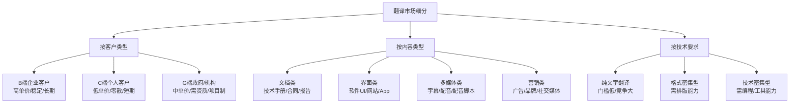
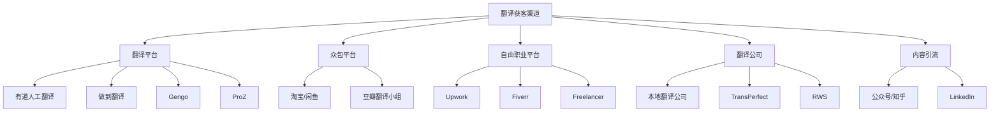
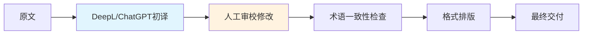
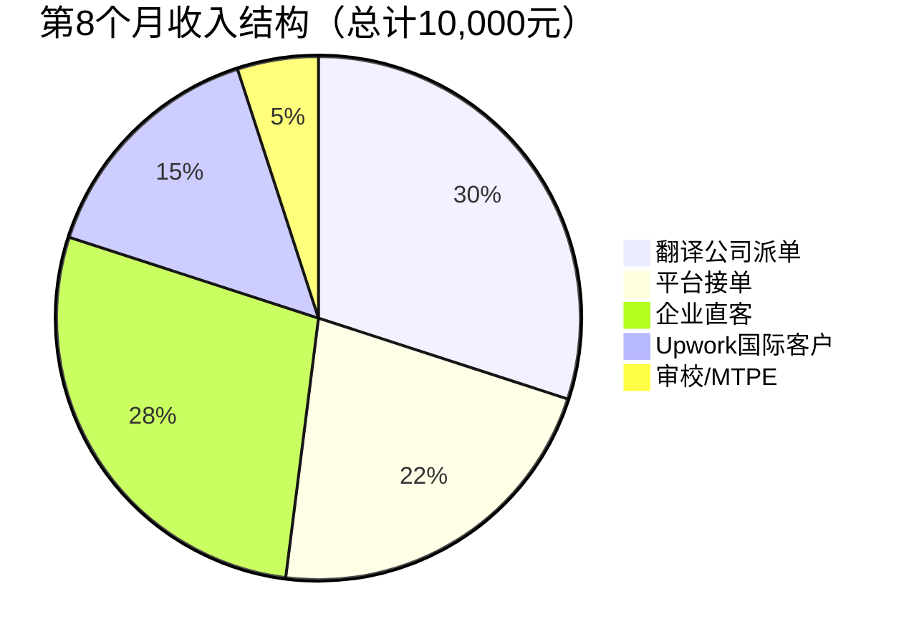
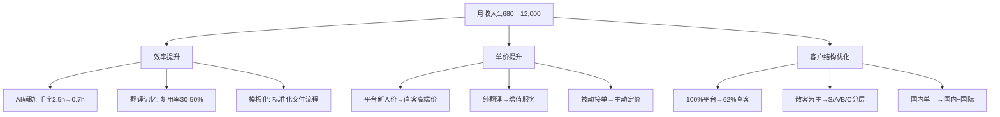
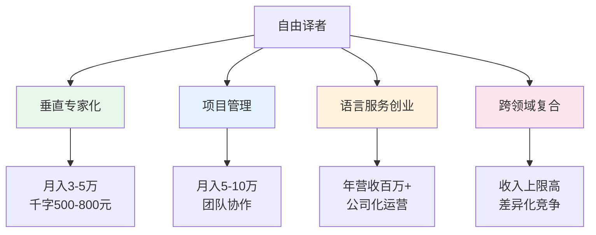
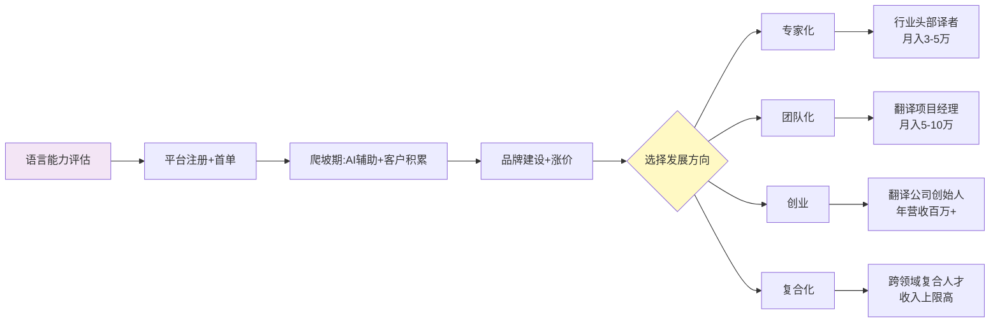
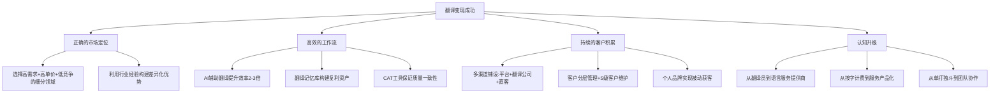

## 案例五：翻译——从兼职到自由职业

> 这是一个完整可复制的案例。主人公林晓禾（化名），26岁，一线城市某外企行政专员，英语专八+日语N2，月薪8K。利用语言优势从零开始做翻译兼职，在14个月内实现月入12000+的自由翻译收入，并在第16个月辞职成为全职自由译者，首年自由职业收入突破18万。

### 一、起点：为什么要走翻译这条路

#### 1.1 现实背景

林晓禾的情况在语言专业出身的职场人中非常典型：

| 维度 | 具体情况 |
|------|----------|
| 年龄 | 26岁，单身 |
| 学历 | 本科英语专业，辅修日语 |
| 证书 | 英语专八、CATTI三级笔译、日语N2 |
| 月薪 | 8K（到手约6.5K） |
| 房租 | 2500元/月 |
| 生活成本 | 约3000元/月 |
| 可支配收入 | 约1000元/月 |
| 核心焦虑 | 行政岗天花板低、语言技能在工作中仅用于邮件和会议翻译、年龄增长后竞争力下降 |

林晓禾的工作日常是处理英文邮件、偶尔做会议口译、整理英文文档。她发现自己的语言能力远超工作所需，但行政岗的薪资天花板大约在12K-15K，职业前景有限。更关键的是，她注意到公司外包的翻译项目单价不低——一份技术文档的翻译报价往往在千字200-400元，而这些工作她完全能胜任。

**翻译行业的市场规模与趋势：** 根据CSA Research的数据，全球语言服务市场规模在2024年已超过650亿美元，年增长率约6%-8%。中国市场虽然单价偏低，但体量庞大，尤其在技术文档本地化、跨境电商产品描述、游戏本地化等领域需求持续增长。AI时代并没有消灭翻译需求，反而催生了MTPE（机器翻译后编辑）、AI输出审校、语料标注等新岗位。对于有语言基础的职场人来说，翻译是少数几个"技能即产品"的变现路径——不需要库存、不需要场地、不需要团队，一个人一台电脑就能开始。

#### 1.2 能力盘点

林晓禾在行动之前做了系统的技能评估：

```text
核心语言能力：
├── 英语笔译（英→中）          ★★★★★  专八+CATTI三级
├── 日语笔译（日→中）          ★★★☆☆  N2水平，日常文档可翻译
├── 英语口译（交替传译）        ★★★☆☆  公司会议经验
└── 技术文档理解能力             ★★★★☆  外企环境耳濡目染

辅助能力：
├── 办公软件精通（Word/Excel/PPT） ★★★★☆
├── 基础排版能力                  ★★★☆☆  会用InDesign基本功能
├── 行业知识（IT/电子/制造）      ★★★☆☆  外企行政接触多
└── 沟通与客户服务能力            ★★★★☆  行政岗位核心技能
```

**关键发现：** 林晓禾的翻译能力并不是最顶尖的（没有CATTI二级，没有海外留学经历），但她有一个被低估的优势——**行业理解力**。在外企工作两年，她对IT、电子制造、汽车零部件等行业的术语和文档风格非常熟悉，而这些恰好是翻译市场需求最大、单价最高的领域之一。

**自我评估的方法论：** 很多语言专业的人高估或低估自己的翻译能力。林晓禾用了一个简单的校准方法——找一篇自己目标领域的英文技术文档（约1000字），限时翻译，然后对照专业翻译公司的参考译文打分。差距在哪里、差多少，一目了然。这个方法比任何"自我感觉"都准确。

**更系统的自评框架：**

| 评估维度 | 评估方法 | 评分标准 |
|----------|----------|----------|
| 术语准确率 | 翻译1000字专业文档，逐个术语核对 | 95%以上为优秀，85%为及格 |
| 语感流畅度 | 让3个目标领域从业者阅读译文并评分 | 无"翻译腔"为优秀 |
| 速度 | 限时翻译，统计千字耗时 | <1.5小时为优秀，<2小时为及格 |
| 格式还原度 | 对照原文检查排版、表格、标注 | 零丢失为优秀 |
| 一致性 | 同一术语在全文中是否统一 | 100%一致为优秀 |

**自评的实操建议：** 不要只测一次。建议选择3篇不同难度的文档（入门级/中等/专业级），分别翻译后打分。这样你能清楚看到自己的"舒适区"和"能力边界"在哪里。很多新手译者犯的错误是只测了简单文档就觉得自己"翻译没问题"，结果接到专业订单后翻车。

#### 1.3 翻译市场的细分与方向选择

林晓禾用两周时间调研了翻译市场的细分方向：

| 细分方向 | 市场需求 | 单价(千字) | 门槛 | 竞争度 | 适合度评分 |
|----------|:---:|:---:|:---:|:---:|:---:|
| 技术文档翻译(IT/制造) | ★★★★★ | 150-400元 | 中 | 中 | 9/10 |
| 法律合同翻译 | ★★★★ | 200-500元 | 高 | 中 | 5/10 |
| 医学/药学翻译 | ★★★★ | 250-600元 | 极高 | 低 | 3/10 |
| 文学/影视字幕翻译 | ★★★ | 80-200元 | 低 | 极高 | 4/10 |
| 商务/营销文案翻译 | ★★★★ | 120-300元 | 低 | 高 | 6/10 |
| 本地化翻译(软件/游戏) | ★★★★★ | 150-350元 | 中 | 中 | 8/10 |
| 学术论文翻译 | ★★★ | 100-250元 | 中 | 高 | 5/10 |
| 专利翻译 | ★★★★ | 300-600元 | 高 | 低 | 6/10 |
| 金融/财报翻译 | ★★★★ | 250-500元 | 高 | 中 | 5/10 |
| 字幕/多媒体翻译 | ★★★★ | 100-300元 | 中 | 中 | 7/10 |
| 游戏本地化 | ★★★★ | 120-350元 | 中 | 高 | 7/10 |
| 电商产品描述 | ★★★★ | 80-200元 | 低 | 极高 | 5/10 |

**最终选择：技术文档翻译（主）+ 软件本地化（辅）**

决策逻辑：
1. 技术文档翻译与她的行业经验高度匹配，有真实的术语积累
2. 软件本地化是增量市场，AI时代反而需要更多人工审校
3. 这两个方向的客户以企业为主，付款能力强、复购率高
4. 避开了法律、医学等需要专业资质的高门槛领域

**为什么"行业理解力"比"语言水平"更重要：** 一个CATTI二级笔译证书持有者，如果不懂IT行业，翻译"load balancing"时可能直译为"负载平衡"而非业界通用的"负载均衡"；翻译"container orchestration"时不知道Kubernetes的语境，译文会显得外行。技术文档的读者是工程师，他们对术语的精确度有极高要求——一个术语错误就可能让整篇文档的可信度归零。林晓禾在外企两年积累的行业知识，恰恰弥补了她证书等级上的不足。

**各细分方向的深度对比（帮助选择）：**



### 二、冷启动阶段（第1-3个月）

#### 2.1 试译准备——翻译行业的"入场券"

翻译行业与其他技能变现有一个关键区别：**几乎所有平台和客户都要求试译**。试译质量直接决定你能否接到第一单。

林晓禾花了整整两周做准备工作：

**第一步：研究行业标准**

她系统学习了翻译行业的核心规范：

| 规范/标准 | 内容 | 用途 |
|-----------|------|------|
| GB/T 19682-2005 | 翻译服务笔译质量要求 | 国内翻译质量参考 |
| ISO 17100:2015 | 翻译服务要求 | 国际翻译标准 |
| 各大平台的风格指南 | 针对不同客户的用语习惯 | 接单必备 |
| CAT工具使用规范 | 计算机辅助翻译工具 | 效率倍增器 |

**第二步：准备试译样本**

林晓禾准备了5套不同领域的试译样本（每套约500字）：

```yaml
试译样本清单:
  IT技术文档:
    来源: 某开源项目的英文README和技术文档片段
    字数: 600字
    特点: 专业术语准确、句式符合中文技术文档习惯

  制造业操作手册:
    来源: 网上公开的设备操作手册英文版
    字数: 500字
    特点: 祈使句处理、安全警示翻译规范

  软件界面翻译:
    来源: 某开源软件的英文界面字符串
    字数: 约200条短句
    特点: 字符长度控制、术语一致性

  商务邮件/报告:
    来源: 商务英语教材中的案例
    字数: 550字
    特点: 正式语体、格式规范

  日语技术文档:
    来源: 日本JIS标准文档片段
    字数: 500字
    特点: 日语敬语处理、技术术语准确
```

**试译样本的准备技巧：** 试译不是"翻译得越好越通过"，而是"翻译得越符合客户期望越通过"。林晓禾在准备试译时会做三件事：(1) 仔细阅读平台的风格指南，了解其对术语、标点、格式的具体要求；(2) 研究该平台/公司已有的公开译文，模仿其语体风格；(3) 在试译稿后附上一份简短的"翻译说明"，解释自己对关键术语的处理逻辑——这会让审稿人觉得你专业且有思考。

**试译中常见的扣分项（审稿人视角）：**

| 扣分项 | 具体表现 | 正确做法 |
|--------|----------|----------|
| 术语不准确 | 将"API endpoint"译为"API端点"而非"API端口" | 查阅目标领域术语库，参考已有译文 |
| 翻译腔过重 | "它应该被注意到..." | 改为"需要注意的是..." |
| 数字错误 | 千分位、小数点格式混淆 | 逐个核对，中文文档用"万""亿"单位 |
| 格式丢失 | 表格错乱、标注缺失 | 翻译时同步维护格式 |
| 不一致 | 同一术语前后译法不同 | 建立术语表，全文统一 |
| 过度意译 | 偏离原文含义 | 信达雅，信为先 |
| 标点混乱 | 中英文标点混用 | 统一使用中文标点（中文译文） |

**第三步：学习CAT工具**

CAT（Computer Assisted Translation）工具是现代翻译的基础设施。林晓禾重点学习了以下工具：

| 工具 | 类型 | 学习成本 | 用途 |
|------|------|----------|------|
| SDL Trados Studio | 桌面CAT | 2-3周 | 企业客户主流工具 |
| MemoQ | 桌面CAT | 1-2周 | 操作友好，部分客户指定 |
| OmegaT | 开源CAT | 3-5天 | 免费，个人项目适用 |
| MateCat | 在线CAT | 1天 | 免费在线协作 |
| DeepL | AI翻译 | 即时 | 辅助初译，人工审校 |
| 术语库管理 | 附带功能 | 1周 | 保证术语一致性 |
| Smartcat | 在线CAT | 1-2天 | 免费版功能强大，支持协作 |
| Wordfast | 桌面/在线CAT | 1周 | 轻量级，价格友好 |

**林晓禾的学习路径：** 先学免费的OmegaT上手理解CAT工作流（翻译记忆+术语库+质量检查），再学Trados满足企业客户需求。每天下班后投入1.5小时，两周内基本掌握核心操作。

**CAT工具的核心价值——翻译记忆（Translation Memory）：** 很多新手不理解CAT和机器翻译的区别。CAT工具的核心是"翻译记忆库"——它把你翻译过的每一个句段（原文→译文）都记录下来。下次遇到相同或相似的句子时，自动提示之前的翻译。这意味着你翻译越多，效率越高。一个积累了10万句段的翻译记忆库，能让新项目的效率提升30%-50%。这是纯粹的"复利资产"，也是自由译者最核心的竞争力之一。

**CAT工具的高级功能（进阶必学）：**

| 功能 | 说明 | 实际价值 |
|------|------|----------|
| 正则表达式搜索 | 用正则批量处理特定格式（如数字、URL、代码） | 批量检查格式一致性，效率提升10倍 |
| QA自动检查 | 自动检测术语不一致、数字错误、标点问题 | 减少人工校对时间50%以上 |
| 项目模板 | 预设翻译记忆、术语库、QA规则 | 新项目5分钟完成配置 |
| 批量对齐 | 将已有的原文/译文对齐入库 | 回收过往翻译成果，快速扩充记忆库 |
| 标记处理 | 保护HTML标签、占位符等非翻译内容 | 避免破坏代码或格式 |
| 版本对比 | 对比不同版本译文的差异 | 审校和修改追踪 |

#### 2.2 注册平台——多渠道铺设

翻译行业的获客渠道与其他技能变现有显著不同，以下是林晓禾的平台策略：



林晓禾的实际注册情况和体验：

| 平台 | 注册难度 | 试译要求 | 首单等待时间 | 实际体验 |
|------|:---:|:---:|:---:|------|
| 有道人工翻译 | 中等 | 有，在线测试 | 1-2周 | 单量稳定但单价偏低，适合起步 |
| 做到翻译 | 中等 | 有，分领域测试 | 3-7天 | AI+人工模式，审校类任务多 |
| Gengo | 较高 | 有，在线考试 | 2-4周 | 英文环境，单价尚可，以英日为主 |
| ProZ | 高 | 无强制试译 | 不确定 | 专业译者社区，需主动竞标 |
| 闲鱼 | 低 | 无 | 1-3天 | 低价引流，需自行定价 |
| 淘宝 | 低 | 无 | 1-3天 | 需开店，虚拟商品审核 |
| Upwork | 中等 | 无 | 2-4周 | 英文界面，国际客户单价高 |
| Fiverr | 低 | 无 | 1-4周 | 以小单为主，适合积累评价 |
| Smartcat Marketplace | 中等 | 有 | 1-2周 | 平台内CAT工具，协作流畅 |
| 本地翻译公司 | - | 多数需要试译 | 1-4周 | 稳定来源但利润被压缩 |

**关键策略：** 不要只注册一个平台。林晓禾同时在6个平台铺设，最终发现翻译公司合作+闲鱼引流+Upwork国际客户构成最佳三角组合。

**Upwork国际客户的特殊价值：** 国内翻译市场千字100-300元是主流区间，但Upwork上同等质量的技术翻译可以报价$0.06-0.12/word（约千字400-850元人民币）。语言对是中文母语者天然的优势——国际市场上"英译中"的合格译者远少于"中译英"。林晓禾在Upwork上接到的第一个客户是一家美国SaaS公司的产品文档翻译，报价$0.08/word，千字约570元，是国内价格的2-3倍。

**Upwork接单的实操要点：**

```text
1. Profile优化:
   - Headline写明语言对+专业领域+字数经验
   - 用英文撰写，语法零错误
   - 附上3-5个代表作品（脱敏处理）
   
2. Proposal写作:
   - 第一段：简述对该客户需求的理解
   - 第二段：说明你的相关经验（具体项目、字数）
   - 第三段：承诺交付时间和质量标准
   - 避免模板化，每个Proposal定制
   
3. 定价策略:
   - 新账号前3单可适当降价（市场价的70%-80%）
   - 积累5个5星评价后逐步提价
   - 按word报价，不要按hour（翻译按字数更透明）
   
4. 沟通技巧:
   - 24小时内回复消息
   - 主动提供试译（200-300字免费）
   - 交付时附带术语表（增值感）
```

#### 2.3 翻译行业防骗指南——新手必读

翻译行业存在大量针对新手译者的骗局，林晓禾在第2个月就踩过坑。以下是她总结的完整防骗清单：

**骗局一：免费试译白嫖**

这是最常见的骗局。"客户"以"试译评估"为名，要求翻译500-5000字的文档，承诺通过后签长期合同。实际上这份"试译"就是正式需求，拿到译文后直接消失。

```text
识别信号：
- 要求试译超过1000字（行业惯例500-800字）
- 不愿签署任何书面协议
- 联系方式只有微信/QQ，无公司信息
- 急于要稿，催得很紧
- 完成后以各种理由推脱签约

防范措施：
1. 试译字数严格限制在500-800字
2. 超过1000字必须签署试译协议或预付50%费用
3. 试译稿可加水印或只交付部分段落
4. 要求对方提供公司营业执照或官网
5. 在试译稿中故意留一个"标记"（如某处译法有特征），方便追踪是否被使用
```

**骗局二：钓鱼式"长期合作"**

"翻译公司"主动联系你，声称有大量项目需要合作，要求你先完成一个"测试项目"（通常3000-5000字），承诺测试通过后月均派单2-5万字。测试项目完成后，对方要么消失，要么以"质量不达标"为由拒绝付款。

```text
识别信号：
- 主动找上门（正规翻译公司通常在平台上发布需求）
- 承诺的单量异常大（"月均5万字"对新译者不现实）
- 不愿提供公司详细信息
- "测试项目"不付费

防范措施：
1. 正规翻译公司的测试项目通常500-1000字，且免费
2. 要求对方提供至少3个可验证的合作译者联系方式
3. 首次合作先做小单（1000-2000字），确认付款流程后再增加
4. 在翻译社区（ProZ、译言、豆瓣翻译小组）查询该公司口碑
```

**骗局三：无限修改陷阱**

合同中没有明确修改次数和标准，客户以"质量不满意"为由要求反复修改，甚至在修改后推翻之前的确认，变相延长交付周期或压价。

```text
防范措施：
1. 合同必须明确：免费修改2次，超出每次加收总价10%
2. 每次修改后要求客户书面确认"修改满意"
3. 如果客户3次修改后仍不满意，提出终止合作并按已完成工作量结算
4. 保留所有沟通记录（微信截图、邮件往来）作为证据
```

**骗局四：押金/保证金骗局**

"平台"或"公司"要求你缴纳500-2000元的"保证金""会员费""工具使用费"，承诺缴后可以接高价订单。缴完后要么无法提现，要么订单质量极差。

```text
核心原则：正规翻译平台和翻译公司绝不会向译者收取任何费用。
翻译公司的盈利模式是从客户端收费后抽成，而不是向译者收费。
遇到任何要求你先掏钱的"翻译机会"，直接拒绝。
```

**骗局五：版权陷阱**

客户要求你签署"所有翻译成果版权归甲方所有"的合同，包括翻译记忆库和术语库。这意味着你积累的核心资产被无偿转让。

```text
防范措施：
1. 合同中明确区分：译文版权可转让，翻译记忆和术语库归译者
2. 如果客户要求转让TM，协商额外费用（通常是项目费的20%-30%）
3. 即使签署转让条款，也要保留脱敏后的通用行业术语知识
```

**骗局六：汇率与支付陷阱（国际客户）**

部分国际客户以"PayPal争议"为手段，在收到译文后向PayPal申请退款（声称未收到服务），导致译者既丢了译文又丢了钱。

```text
防范措施：
1. 优先使用Upwork等有担保机制的平台
2. 独立客户先收50%预付款，交稿后收剩余50%
3. 大额项目分批交付分批结算（如每5000字结算一次）
4. 使用Wise等有交易记录的支付方式，避免纯PayPal
5. 保留所有沟通记录和交付凭证
```

**林晓禾的防骗经验总结：**

| 风险等级 | 信号 | 应对 |
|:---:|------|------|
| 🔴 高危 | 要求先交钱 | 立即终止 |
| 🔴 高危 | 试译超1000字不付费 | 拒绝或要求付费 |
| 🟡 中危 | 承诺单量过大 | 小单试水验证 |
| 🟡 中危 | 合同无修改条款 | 要求补充条款 |
| 🟢 低危 | 要求保密协议 | 正常，配合签署 |
| 🟢 低危 | 要求发票 | 正常，注册个体户解决 |

#### 2.4 第一单的突破

林晓禾的第一单来自有道人工翻译平台，是一份IT设备的技术规格书，约3000字，报酬270元（千字90元）。

**第一单的完整过程：**

```text
Day 1:  收到任务通知，确认交期（48小时）
Day 1:  下载原文，用OmegaT建立翻译项目和术语库
Day 1:  通读全文，标记不确定的术语（共12个）
Day 1-2: 逐段翻译，遇到术语查证行业资料（耗时约5小时）
Day 2:  自审一遍，重点检查术语一致性和数字准确性
Day 2:  格式排版，确保与原文格式一致
Day 2:  提交译文
Day 4:  收到平台审校反馈（3处术语建议修改）
Day 4:  修改后重新提交
Day 5:  项目完成，270元到账
```

**第一单的关键数据：**

| 指标 | 数据 |
|------|------|
| 字数 | 3,000字 |
| 报酬 | 270元 |
| 实际耗时 | 约7小时（含查术语、排版） |
| 时薪 | 约38.6元/小时 |
| 审校修改 | 3处 |
| 客户评价 | 5星 |

时薪38.6元看起来不高，但林晓禾此刻最看重的是3个信号：
1. **平台审校反馈是免费的技能提升**——审校老师的修改意见比任何培训课都有价值
2. **翻译记忆在积累**——OmegaT会记住已翻译的句段，下次遇到类似内容直接复用
3. **3,000字的技术文档她能胜任**——验证了方向选择的正确性

#### 2.5 第一个月的数据

| 指标 | 数据 |
|------|------|
| 平台接单量 | 4单 |
| 闲鱼接单量 | 2单 |
| 总翻译字数 | 约18,000字 |
| 总收入 | 1,680元 |
| 平均千字单价 | 约93元 |
| 投入时间 | 约45小时（每天1.5小时） |
| 有效时薪 | 约37元/小时 |

### 三、爬坡阶段（第4-8个月）

#### 3.1 效率提升——从"翻译"到"审校AI译文"

这是林晓禾收入跃升的关键转折点。

第4个月起，她开始系统使用AI翻译辅助工作流：



**效率对比数据：**

| 工作方式 | 千字耗时 | 日产能 | 时薪(千字150元计) |
|----------|:---:|:---:|:---:|
| 纯人工翻译 | 2-2.5小时 | 4,000-5,000字 | 60-75元 |
| AI初译+人工审校 | 0.8-1.2小时 | 10,000-15,000字 | 125-188元 |
| 纯AI翻译（不可取） | 0.1小时 | - | 质量不达标 |

**AI辅助翻译的正确姿势：**

1. **用DeepL做初译**：对技术文档的准确率约85%-90%，但术语和语序需要调整
2. **用ChatGPT处理复杂句式**：对长难句的理解优于DeepL，适合法律和学术文本
3. **术语库必须人工维护**：AI无法保证跨文档的术语一致性
4. **最终质量必须人工把关**：AI的"幻觉"问题在翻译中表现为"编造意思"，比语法错误更危险
5. **对客户透明**：主动告知使用了AI辅助，定价相应调整，但强调人工审校保证质量

**重要原则：** AI辅助不等于AI替代。林晓禾的卖点从"我会翻译"变成了"我能保证翻译质量"——这在AI时代反而更有价值，因为客户需要的不是文字转换，而是可信赖的专业输出。

**AI审校的5个重点检查维度：**

| 检查维度 | 常见AI错误 | 人工审校要点 |
|----------|-----------|-------------|
| 术语准确性 | 编造不存在的专业术语 | 对照术语库逐条验证 |
| 数字/单位 | 数字格式转换错误（如千分位） | 逐个核对原文数字 |
| 语义完整性 | 漏译或"总结式"翻译 | 逐句对照，确保无遗漏 |
| 语体风格 | 口语化或过于机械 | 统一为目标文档的正式/技术语体 |
| 文化适配 | 直译英文表达习惯 | 调整为中文读者习惯的表述方式 |
| 上下文连贯 | 段落间逻辑断裂 | 通读全文检查衔接和流畅度 |

**MTPE（Machine Translation Post-Editing）工作流详解：**

MTPE是AI时代翻译行业的新标准工作模式，也是自由译者必须掌握的核心技能：

```text
MTPE标准流程:

Step 1: 原文预处理
  - 清理不可翻译内容（代码、变量、占位符）
  - 确认专业术语表
  - 设定MT质量评估基准

Step 2: 机器翻译初译
  - 选择合适的MT引擎（DeepL适合欧洲语言，百度适合中日韩）
  - 用CAT工具加载MT输出
  - 标记低置信度句段（多数CAT工具有此功能）

Step 3: 轻度审校（Light Post-Editing, LPE）
  - 适用场景：内部参考、信息获取、内容概要
  - 审校重点：准确性、关键术语、数字
  - 不修改：语体风格、句式优化
  - 速度：约为人工翻译的3-4倍

Step 4: 深度审校（Full Post-Editing, FPE）
  - 适用场景：面向客户发布、产品文档、营销材料
  - 审校重点：准确性+流畅度+风格+术语一致性
  - 质量标准：达到人工翻译水平
  - 速度：约为人工翻译的1.5-2倍

Step 5: QA检查
  - 术语一致性扫描
  - 数字/单位核对
  - 标点/格式检查
  - 通读全文确认流畅度
```

**MTPE定价逻辑：** MTPE的定价应低于纯人工翻译但高于纯审校。行业惯例是人工翻译价格的60%-75%。比如千字200元的人工翻译，MTPE可以报价120-150元。但要注意——客户有时会把"轻度审校"和"深度审校"混淆，接单时必须明确约定审校标准。

**MTPE定价的详细参考（2024-2025年市场行情）：**

| 审校类型 | 定价区间(千字) | 适用场景 | 质量标准 | 效率倍率 |
|----------|:---:|----------|----------|:---:|
| 轻度审校(LPE) | 60-100元 | 内部参考、信息获取 | 准确无误即可，不要求文采 | 3-4x |
| 深度审校(FPE) | 100-180元 | 客户发布、产品文档 | 达到人工翻译水平 | 1.5-2x |
| 创译(Transcreation) | 200-400元 | 营销文案、品牌内容 | 需要创意和文化适配 | 0.8-1x |

**MTPE接单时必须确认的5个问题：**

1. 审校类型是LPE还是FPE？（直接影响定价和工时）
2. MT引擎是什么？（DeepL输出质量高于Google Translate，审校工作量不同）
3. 是否有术语表？（有术语表效率提升30%+）
4. 是否需要保留MT的跟踪修订痕迹？（有些客户需要看到修改了什么）
5. 质量验收标准是什么？（错误率阈值、修改次数上限）

#### 3.2 AI Prompt工程在翻译中的应用

这是林晓禾在第5个月深入研究的效率倍增器。很多人以为AI翻译就是"把原文扔进ChatGPT"，实际上通过精心设计的Prompt，AI翻译的质量可以从60分提升到85分，大幅减少人工审校的工作量。

**通用翻译Prompt模板：**

```text
你是一位专业的[领域]翻译专家，精通[源语言]到[目标语言]的翻译。

翻译要求：
1. 术语准确性：使用[目标行业]的标准术语，参考以下术语表：
   [术语表内容]
2. 语体风格：[正式技术文档/商务沟通/营销文案/用户界面]
3. 格式要求：保持原文的段落结构、列表格式、表格样式
4. 特殊处理：
   - 代码/变量/占位符不翻译，用原样保留
   - 数字格式转换为目标语言习惯（如英文1,000 → 中文1000）
   - 度量单位根据目标市场转换（如需要）
   - URL/邮箱地址保持不变
5. 质量标准：信达雅，信为先。宁可直译也不要编造含义。

请翻译以下内容：
[原文]
```

**不同场景的Prompt优化：**

| 场景 | Prompt要点 | 示例指令 |
|------|-----------|----------|
| 技术文档 | 强调术语精确、保持技术风格 | "使用RFC/ISO标准术语，不要口语化" |
| 软件UI | 强调字符长度、上下文理解 | "每个译文不超过原文字符数的120%，考虑按钮空间限制" |
| 法律合同 | 强调条款精确、格式规范 | "法律术语使用《中华人民共和国合同法》标准表述" |
| 营销文案 | 强调创意和文化适配 | "不要直译，用中文读者习惯的营销语言重新表达核心卖点" |
| 学术论文 | 强调学术语体、引用格式 | "保持学术论文的正式语体，参考文献格式不变" |

**用AI做术语研究的Prompt：**

```text
我需要翻译一份关于[主题]的英文技术文档。请帮我：
1. 列出该领域最常见的50个专业术语及其标准中文译法
2. 标注哪些术语有多种译法，以及在不同语境下的选择建议
3. 指出该领域常见的翻译陷阱（容易译错的术语）
4. 提供该领域的权威中文参考资料（标准文档、行业期刊等）
```

**用AI做质量自查的Prompt：**

```text
请检查以下中文译文的质量，从5个维度评分（1-10分）并给出具体修改建议：
1. 术语准确性（对照原文逐个检查专业术语）
2. 语义完整性（是否有漏译或误译）
3. 流畅度（是否有翻译腔或生硬表达）
4. 一致性（同一术语是否全文统一）
5. 格式规范（标点、数字、排版是否符合中文规范）

原文：[原文]
译文：[译文]
```

**林晓禾的AI效率数据：** 通过优化Prompt，她的AI初译可用率从60%提升到80%（即80%的句段可以直接采用或微调，只有20%需要重译）。这使得她的千字审校时间从1.2小时降至0.6小时，产能直接翻倍。

#### 3.3 不同文件格式的处理能力

翻译不只是处理Word文档。林晓禾在爬坡阶段逐步掌握了不同文件格式的处理能力，这是很多新手忽略但客户非常看重的技能：

| 文件格式 | 处理工具 | 难度 | 特殊要求 | 定价影响 |
|----------|----------|:---:|----------|:---:|
| Word(.docx) | CAT工具直接处理 | ★☆☆ | 样式和格式保护 | 基准价 |
| Excel(.xlsx) | CAT工具/手动 | ★★☆ | 单元格对齐、公式保护 | +10% |
| PPT(.pptx) | CAT工具/手动 | ★★★ | 文本框大小限制、排版还原 | +30%-50% |
| PDF(文字版) | 转换为Word后处理 | ★★☆ | 格式可能错乱 | +10%-20% |
| PDF(扫描版) | OCR+CAT | ★★★★ | OCR识别错误需修正 | +50%-100% |
| HTML/XML | CAT工具+标签保护 | ★★★ | 标签不能破坏 | +20% |
| JSON/YAML | CAT工具/代码编辑器 | ★★☆ | 变量和键名不翻译 | +10% |
| .po/.xliff | 专业CAT工具 | ★★★ | 本地化标准格式 | 基准价 |
| InDesign(.indd) | InCopy+CAT | ★★★★ | 需要Adobe全家桶 | +50%-80% |
| Markdown | 文本编辑器+CAT | ★★☆ | 标记符号保护 | 基准价 |
| 视频字幕(.srt/.ass) | 专用字幕工具 | ★★★ | 时间轴同步、字符限制 | +30%-50% |

**林晓禾的文件格式能力成长路径：**

```text
第1-3月: Word + 简单Excel（覆盖80%的平台订单）
第4-6月: + PPT + HTML/XML + JSON（覆盖软件本地化需求）
第7-9月: + PDF处理 + 简单字幕（扩展服务范围）
第10月+: + InDesign基础（承接产品手册排版翻译）
```

**关键建议：** 不需要一开始就掌握所有格式。先精通Word和CAT工具的标准格式处理，这能覆盖80%的订单。然后根据客户常见需求逐步扩展。每多掌握一种格式，你的竞争壁垒就高一层——因为大多数兼职译者只会Word。

#### 3.4 客户分层与定价体系

随着订单增多，林晓禾建立了分层定价体系：

```yaml
客户分层定价:

  散客层（引流，千字80-120元）:
    来源: 闲鱼、平台新客
    特点: 一次性需求，量少，沟通成本高
    策略: 标准化交付，不提供定制服务

  稳定客户层（利润核心，千字150-250元）:
    来源: 平台老客、翻译公司合作
    特点: 月度稳定需求，单次5000-20000字
    策略: 优先排期，提供术语库维护，交付后主动回访

  高端客户层（旗舰，千字250-400元）:
    来源: 企业直客、Upwork国际客户
    特点: 高质量要求，需要排版、审校、项目管理
    策略: 提供完整的本地化解决方案，包含术语管理+质量保证+格式排版

  审校/MTPE层（高效产出，千字80-150元）:
    来源: 翻译公司MTPE(Machine Translation Post-Editing)任务
    特点: AI已初译，只需人工审校，速度快
    策略: 批量接单，利用效率优势提高总产出
```

**定价逻辑详解：**

翻译定价不是"越便宜越好"。以下是影响定价的核心因素：

| 因素 | 低定价场景 | 高定价场景 |
|------|----------|----------|
| 语言对 | 中↔英（供应多） | 中↔小语种（供应少） |
| 专业领域 | 通用商务 | 医学/法律/专利 |
| 文件类型 | 普通文档 | 认证翻译/公证文件 |
| 交付时间 | 常规（3-5天） | 加急（24小时内） |
| 附加服务 | 仅翻译 | 翻译+排版+术语库 |
| 客户类型 | 个人 | 企业/政府 |

**不同文件类型的翻译难度和定价参考：**

| 文件类型 | 特殊要求 | 定价倍率（相对普通文档） | 典型难度点 |
|----------|----------|:---:|----------|
| 技术手册 | 术语精确、格式严格 | 1.0x-1.3x | 专业术语、图表标注 |
| 软件界面(.json/.xml) | 字符长度限制、占位符 | 1.0x-1.2x | 变量保护、上下文理解 |
| 法律合同 | 条款精确、格式规范 | 1.5x-2.0x | 法律术语、句式严谨 |
| 医学文档 | 术语精确、需专业资质 | 2.0x-3.0x | 医学术语、监管要求 |
| 专利文献 | 权利要求书特殊格式 | 2.0x-2.5x | 专利术语、法律语言 |
| PPT/演示文稿 | 排版+翻译 | 1.3x-1.5x | 空间限制、视觉还原 |
| 网站/App本地化 | 技术+文化适配 | 1.2x-1.5x | 字符长度、UI适配 |
| 视频字幕 | 时间轴+字符数限制 | 1.3x-1.8x | 字符限制、时间同步 |
| 认证翻译 | 公章、格式要求 | 1.5x-2.0x | 公证要求、格式规范 |
| 电商产品描述 | 营销语言+SEO | 0.8x-1.0x | 关键词适配、文化适配 |

**林晓禾的涨价时间线：**

| 时间节点 | 千字单价 | 涨价依据 |
|----------|:---:|------|
| 第1-2月 | 80-100元 | 平台新人定价，积累评价 |
| 第3-4月 | 100-150元 | 有15+好评，试译通过率提升 |
| 第5-6月 | 150-200元 | 开始有回头客，产能饱和 |
| 第7-8月 | 200-300元 | 个人品牌初步建立，客户主动询价 |
| 第9-14月 | 250-400元 | 专注高端客户，服务产品化 |

**涨价的话术模板：**

涨价最难的不是决定涨价，而是怎么跟客户说。林晓禾总结了一套话术：

```text
对老客户：
"王总您好，跟您汇报一下，由于近期翻译需求增加和成本调整，
从下个月起我的翻译服务价格调整为千字XX元。
作为老客户，您在本月底前确认的项目仍按原价执行。
感谢一直以来的信任，我会继续保持高质量交付。"

对新客户直接报新价，不需要解释。
```

关键原则：涨价时给老客户一个缓冲期（1个月），但不要道歉或自我贬低。价格调整是市场行为，不是你的"过错"。

#### 3.5 翻译公司合作——稳定的"基本盘"

翻译公司是自由译者最重要的稳定收入来源。林晓禾在第4个月开始系统接触翻译公司。

**如何找到翻译公司合作机会：**

1. **主动投递简历**：在Boss直聘、猎聘上搜索"兼职翻译"岗位，翻译公司常年招聘
2. **翻译社区**：在ProZ、译言、豆瓣翻译小组发布个人信息
3. **本地翻译公司**：在地图上搜索"翻译公司"，直接打电话咨询兼职需求
4. **LinkedIn**：搜索"翻译项目经理"，发送合作邀约
5. **翻译行业展会**：如中国翻译协会年会、LocWorld本地化世界大会，线下建立关系

**与翻译公司合作的实际流程：**

```text
Step 1: 提交简历+试译稿（通常500-1000字免费试译）
Step 2: 试译通过后进入译者库
Step 3: 项目经理根据项目需求派单
Step 4: 确认价格、交期、风格要求
Step 5: 翻译→自审→提交
Step 6: 公司内部审校→反馈修改意见
Step 7: 修改后定稿→结算（通常月结或项目结）
```

**翻译公司合作的利与弊：**

| 维度 | 优势 | 劣势 |
|------|------|------|
| 收入稳定性 | ★★★★★ | - |
| 单价 | - | ★★☆ 被抽成30%-50% |
| 客户获取 | 公司负责获客 | 无法积累直接客户 |
| 专业成长 | 接触多领域项目 | 审校反馈有时不及时 |
| 结算周期 | - | 月结为主，现金流压力 |

**林晓禾的翻译公司合作数据：**

到第6个月，她与3家翻译公司建立了稳定合作关系：

| 公司类型 | 月均派单量 | 千字单价 | 月均收入 |
|----------|:---:|:---:|:---:|
| A公司（IT领域专业所） | 15,000字 | 120元 | 1,800元 |
| B公司（综合型大所） | 10,000字 | 100元 | 1,000元 |
| C公司（本地小所） | 8,000字 | 130元 | 1,040元 |
| **合计** | **33,000字** | - | **3,840元** |

翻译公司的收入虽然单价不高（被抽成），但提供了稳定的现金流底座。

**与翻译公司谈判的技巧：** 新译者最容易犯的错误是"公司报什么价就接受什么价"。实际上，翻译公司的报价有谈判空间，尤其是在以下情况：(1) 你有某个稀缺语种或领域的专长；(2) 你能在紧急项目中快速交付；(3) 你已经合作一段时间且质量稳定。林晓禾在与A公司合作3个月后，以"连续5个项目零返修"为依据，成功将单价从100元谈到120元——别小看这20%的涨幅，一年下来多出3600元。

**翻译公司合作的5个避坑指南：**

| 风险 | 具体表现 | 防范措施 |
|------|----------|----------|
| 结算拖延 | 公司以各种理由延迟付款 | 选择口碑好的公司，首次合作小额试水 |
| 无限修改 | 客户反复修改不加钱 | 合同明确修改次数和计费标准 |
| 压价策略 | 以"大批量"为由压低单价 | 计算时薪底线，低于底线不接 |
| 试译白嫖 | 免费试译其实是正式需求 | 试译字数限制500-800字 |
| 保密泄露 | 客户文档被泄露 | 签署保密协议，不使用公共AI工具翻译涉密内容 |

#### 3.6 个人品牌建设——从"平台译员"到"自由翻译专家"

林晓禾从第5个月开始有意识地建设个人品牌：

**渠道一：知乎/小红书（内容引流）**

她每周发布1-2篇翻译相关的实用内容：

| 内容类型 | 示例标题 | 目的 |
|----------|----------|------|
| 翻译技巧 | 《技术文档翻译中常见的10个术语错误》 | 展示专业能力 |
| 行业科普 | 《想做自由翻译？先看看真实的收入数据》 | 吸引潜在从业者 |
| 工具评测 | 《DeepL vs ChatGPT：谁更适合技术翻译？》 | 展示技术视野 |
| 案例分享 | 《我如何在8个月内从翻译小白做到月入过万》 | 建立信任 |

**内容创作的黄金公式：** 翻译行业的内容营销，最有效的是"具体案例+数据+可操作建议"。比如不要写"技术翻译很重要"，而要写"我在翻译一份服务器配置手册时，发现'deploy'在不同语境下应分别译为'部署''发布''上线'——附上判断逻辑和5个真实例句"。这种内容既能吸引潜在客户（他们看到你的专业度），也能吸引同行（建立行业影响力）。

**渠道二：LinkedIn（国际客户获取）**

林晓禾优化了LinkedIn个人资料，用英文撰写专业介绍：

```yaml
Headline: EN<>ZH Technical Translator | IT & Manufacturing | 
          500K+ words delivered | CATTI Level 3

About: Specialized technical translator with expertise in IT 
       documentation, manufacturing manuals, and software 
       localization. Combining AI-assisted workflows with 
       rigorous human quality assurance. Consistent 5-star 
       client feedback on translation accuracy and timely delivery.
```

**渠道三：微信朋友圈（私域流量）**

林晓禾的朋友圈策略很克制：每周发1-2条翻译相关动态（新完成的项目截图、翻译技巧、行业资讯），不刷屏不硬广，让潜在客户自然感知到她的专业性。

**个人品牌的"飞轮效应"：** 内容输出→吸引客户→积累案例→产出更多内容→吸引更多客户。林晓禾在知乎上的一篇《自由翻译真实收入报告》获得了2000+赞，直接带来了3个企业直客询价。这种"被动获客"是自由职业最健康的增长方式——你不需要主动推销，客户来找你。

#### 3.7 翻译社区与行业人脉

很多自由译者忽视了行业社交的价值。翻译不是孤军奋战，行业人脉能带来订单推荐、经验分享和情感支持。

**值得加入的翻译社区：**

| 社区 | 类型 | 价值 | 加入方式 |
|------|------|------|----------|
| ProZ.com | 国际译者社区 | 竞标项目、术语讨论、行业资讯 | 免费注册，付费会员可竞标 |
| TranslatorsCafe | 国际译者社区 | 与ProZ类似，部分客户独家 | 免费注册 |
| 译言网 | 国内翻译社区 | 翻译协作、行业讨论 | 免费注册 |
| 豆瓣翻译小组 | 国内社区 | 兼职信息、经验分享 | 免费加入 |
| 中国翻译协会 | 行业协会 | 行业认证、会议、人脉 | 缴纳会费 |
| 各城市翻译协会 | 本地协会 | 线下活动、本地客户资源 | 缴纳会费 |
| LinkedIn翻译群组 | 国际社交 | 国际客户、行业趋势 | 免费加入 |
| 翻译类Discord/Slack | 实时社区 | 日常交流、快速求助 | 免费加入 |

**林晓禾的人脉建设策略：**

1. **主动帮助同行**：在社区中回答新手问题、分享术语资源。免费的付出换来的是口碑和推荐——当同行接到做不完的订单时，会优先推荐你。
2. **与2-3个互补型译者建立合作**：林晓禾擅长IT/制造，她找了擅长法律和医学的译者互相推荐超出各自能力范围的订单。
3. **定期参加线下活动**：每年参加1-2次翻译行业会议或沙龙，线下建立的关系比线上深10倍。
4. **与翻译项目经理保持联系**：PM是翻译公司的"订单分配者"，维护好与PM的关系等于维护好订单来源。

#### 3.8 第4-8个月数据

| 月份 | 平台+翻译公司收入 | 直客收入 | 总收入 | 月翻译字数 | 有效时薪 |
|:---:|:---:|:---:|:---:|:---:|:---:|
| 第4月 | 3,200元 | 800元 | 4,000元 | 35,000字 | 65元 |
| 第5月 | 4,500元 | 1,500元 | 6,000元 | 42,000字 | 80元 |
| 第6月 | 4,800元 | 2,200元 | 7,000元 | 45,000字 | 90元 |
| 第7月 | 5,000元 | 3,500元 | 8,500元 | 48,000字 | 105元 |
| 第8月 | 5,200元 | 4,800元 | 10,000元 | 50,000字 | 115元 |

**收入结构变化趋势：**



**最重要的变化：** 直客收入占比从0增长到43%。直客意味着不再被平台和翻译公司抽成，千字单价直接从100-130元跳到200-300元。

### 四、成熟阶段（第9-14个月）

#### 4.1 转型自由职业者的决策

第9个月，林晓禾面临关键决策——是否辞职做全职自由翻译。

**决策分析框架：**

| 维度 | 继续兼职 | 辞职做自由职业 |
|------|:---:|:---:|
| 月收入 | 稳定8K(主业)+10K(副业) | 不确定，目标12K+ |
| 时间自由度 | 低，受主业约束 | 高，自主安排 |
| 成长天花板 | 受限于业余时间 | 可全职投入提升 |
| 社保/福利 | 公司缴纳 | 需自行解决 |
| 风险 | 低 | 中等 |
| 心理压力 | 双重压力 | 收入波动压力 |

**林晓禾的决策条件：**

她给自己设了3个"辞职门槛"，全部满足才辞职：

1. 副业月收入连续3个月超过1万元 ✅（第8-10月均超1万）
2. 积累至少6个月的生活储备金 ✅（已存8万元）
3. 至少有3个稳定复购的直客 ✅（有4个稳定企业客户）

第11个月正式辞职。辞职前一个月，她做了以下准备工作：

- 以个人身份注册了个体工商户（享受小规模纳税人免税额度）
- 办理了社保自行缴纳手续
- 与现有客户沟通，确认合作不会中断
- 制定了自由职业后的每日工作计划

#### 4.2 辞职过渡期的实操指南

从全职员工到自由职业者的过渡期（通常1-3个月）是最容易出问题的阶段。林晓禾的过渡经验：

**辞职前必须完成的清单：**

```text
财务准备:
□ 储备金≥6个月生活费（含房租+社保+生活费+工具费）
□ 确认副业收入连续3个月≥目标收入的1.2倍
□ 理清每月固定支出（社保、工具订阅、保险等）
□ 准备一张专门的收支记录表

法律准备:
□ 注册个体工商户（或确认个人劳务报税方案）
□ 办理灵活就业社保
□ 准备翻译服务协议模板
□ 准备Invoice模板（国际客户）

客户准备:
□ 逐一通知现有客户，确认合作不会中断
□ 与翻译公司项目经理沟通，确认继续派单
□ 确保至少3个稳定客户在辞职后第一个月有订单
□ 准备好辞职后第一个月的订单缓冲（提前接一些延期交付的项目）

心理准备:
□ 告诉自己"收入波动是正常的，3个月移动平均达标就行"
□ 找到1-2个自由职业者社群，建立"线上同事"关系
□ 制定每日作息时间表，保持上班时的纪律性
□ 告知家人，争取理解和支持
```

**辞职后的第一个月常见问题：**

| 问题 | 原因 | 应对 |
|------|------|------|
| 收入断崖式下降 | 订单需要重新排期 | 辞职前提前积压1个月的订单 |
| 社保断缴 | 手续未办妥 | 辞职前就办好灵活就业社保 |
| 作息混乱 | 没有外部约束 | 固定工作时间，用番茄钟 |
| 孤独感 | 突然没有同事 | 加入自由职业者社群 |
| 家人质疑 | 不理解自由职业 | 用数据说话，每月展示收入 |

#### 4.3 自由职业后的工作模式

全职自由翻译的日程安排与兼职完全不同：

```text
自由译者日程表（周一至周五）

08:30-09:00  查看邮件/平台消息，确认当日任务优先级
09:00-12:00  翻译核心时段（高专注力时段处理复杂技术文档）
12:00-13:30  午餐+休息
13:30-15:30  翻译/审校（处理AI辅助审校类任务）
15:30-16:00  茶歇
16:00-17:30  客户沟通/报价/项目管理
17:30-18:30  术语库维护/翻译记忆整理/学习新领域知识
20:00-21:00  内容输出（知乎/小红书文章，每周2-3次）

周六: 半天工作（处理积压订单或学习）
周日: 完全休息
```

**关键效率指标：**

| 指标 | 兼职时期 | 全职自由职业后 |
|------|:---:|:---:|
| 日均翻译字数 | 2,000-3,000字 | 5,000-8,000字 |
| 日均工作时间 | 1.5-2小时 | 6-7小时 |
| 月翻译总字数 | 45,000-50,000字 | 100,000-120,000字 |
| 千字平均耗时 | 1-1.2小时(AI辅助) | 0.6-0.8小时(模板+AI) |
| 月收入 | 10,000元 | 12,000-15,000元 |

#### 4.4 服务产品化——超越"按字计费"

成熟阶段的林晓禾不再只是"按千字报价"的翻译，而是提供了完整的服务产品矩阵：

```yaml
服务产品矩阵:

  基础层（标准化翻译）:
    技术文档翻译:
      价格: 千字200-300元
      包含: 翻译+自审+术语一致性检查
      交期: 5000字以内3个工作日
    
    MTPE审校:
      价格: 千字100-150元
      包含: AI译文审校+术语修正+流畅度优化
      交期: 10000字以内2个工作日

  专业层（增值服务）:
    翻译+排版:
      价格: 千字300-400元
      包含: 翻译+专业排版(Word/PPT/InDesign)+格式还原
      适用: 产品手册、宣传材料
    
    术语库建设:
      价格: 2000-5000元/套
      包含: 行业术语收集+双语对照表+使用指南
      适用: 有长期翻译需求的企业

  高端层（解决方案）:
    企业翻译月度服务:
      价格: 5000-8000元/月
      包含: 每月50000字翻译额度+优先排期+术语管理+质量报告
      适用: 有持续翻译需求的中小企业
    
    本地化项目管理:
      价格: 按项目报价
      包含: 翻译+审校+排版+多语言协调+交付管理
      适用: 软件/网站多语言版本
```

**服务产品化的关键思维转变：** 从"我卖翻译字数"到"我卖语言问题的解决方案"。举个例子：一个中小企业要做产品手册的英文版，如果找翻译公司，可能需要分别找翻译、排版、审校三个人，沟通成本很高。而林晓禾提供"翻译+排版+审校"一站式服务，虽然报价比纯翻译贵50%，但客户省去了项目管理的麻烦，反而觉得更划算。这就是"服务产品化"的价值——你不是在卖时间，而是在卖确定性。

**软件本地化的完整服务流程（作为增值服务案例）：**

```text
软件/网站本地化项目流程:

Phase 1: 需求评估（0.5-1天）
  ├── 收集源文件（.json/.xml/.po/.xliff等）
  ├── 统计字数和句段数
  ├── 分析技术复杂度（是否有变量、占位符、复数形式）
  ├── 确认目标语言和地区（如简体中文-中国大陆 vs 繁体中文-台湾）
  └── 报价+排期

Phase 2: 翻译准备（0.5天）
  ├── 提取可翻译文本
  ├── 建立术语表（参考产品已有翻译、竞品、官方术语库）
  ├── 配置CAT工具（导入文件过滤器、设置QA规则）
  └── 准备上下文截图（帮助译者理解界面语境）

Phase 3: 翻译+审校（核心阶段）
  ├── 初译：AI辅助+人工翻译
  ├── 审校：术语一致性、字符长度、文化适配
  ├── 功能测试：在实际界面中检查译文显示效果
  └── 回译检查：关键功能按钮和提示的反向验证

Phase 4: 交付
  ├── 导出翻译文件（保持原格式）
  ├── 附带术语表和翻译说明
  ├── 提供变更记录
  └── 约定后续更新的流程和价格
```

#### 4.5 翻译质量保证体系

当林晓禾开始服务企业直客后，她发现"翻译质量"不再是一个模糊的概念，而是需要可量化、可追溯、可复现的体系。以下是她建立的QA流程：

**三级质量保证体系：**

```text
Level 1: 自审（译者自检）
  ├── 术语一致性检查（CAT工具QA功能自动扫描）
  ├── 数字/单位核对（逐个对照原文）
  ├── 标点/格式检查（中英文标点是否统一）
  ├── 漏译检查（CAT工具显示未翻译句段）
  └── 通读全文（检查流畅度和上下文连贯）

Level 2: 交叉审校（同行互审）
  ├── 找1-2个同行做交叉审校
  ├── 重点检查：术语准确性、语义完整性
  ├── 审校意见以批注形式返回
  └── 适用于：高价值项目、新领域项目

Level 3: 客户确认
  ├── 交付前附上"翻译说明"（解释关键术语处理逻辑）
  ├── 附带术语表（方便客户后续维护）
  ├── 约定修改次数和标准
  └── 交付后48小时主动回访
```

**质量指标量化：**

| 指标 | 计算方法 | 达标标准 |
|------|----------|----------|
| 错误率 | 错误数÷千字数 | ≤3‰（每千字不超过3处错误） |
| 术语一致率 | 一致术语数÷总术语数 | ≥98% |
| 返修率 | 返修项目数÷总项目数 | ≤10% |
| 准时交付率 | 准时项目数÷总项目数 | ≥95% |
| 客户满意度 | 平均评分 | ≥4.5/5.0 |

**常见质量问题及预防：**

| 质量问题 | 根因 | 预防措施 |
|----------|------|----------|
| 术语不一致 | 没有术语表或未使用 | CAT工具强制加载术语库 |
| 数字错误 | 粗心或格式混淆 | QA自动检查+逐个核对 |
| 漏译 | 句段遗漏 | CAT工具显示完成率100% |
| 翻译腔 | 过度直译 | 通读全文，大声朗读检查 |
| 格式丢失 | 忽略排版 | 翻译时同步维护格式 |

#### 4.6 客户管理的精细化

林晓禾使用飞书多维表格建立了完整的客户管理系统：

```text
客户管理表结构:
├── 基础信息: 公司名、联系人、来源渠道
├── 合作记录: 历次项目明细（字数、领域、单价、交期）
├── 质量数据: 审校通过率、返修次数、客户评分
├── 财务数据: 累计金额、结算周期、账龄
├── 复购管理: 上次合作时间、预计下次需求时间、主动跟进计划
└── 标签分类: S级(月消费5000+)/A级(月消费2000+)/B级(偶尔合作)/C级(一次性)
```

**S级客户维护策略：**

| 动作 | 频率 | 具体做法 |
|------|:---:|------|
| 主动问候 | 每月1次 | 分享行业翻译趋势、术语更新 |
| 优先排期 | 永远 | S级客户的紧急需求插队处理 |
| 术语库更新 | 每季度 | 主动整理新术语并同步给客户 |
| 年度报告 | 每年 | 提供全年翻译量、质量数据、改进建议 |
| 转介绍奖励 | 不定期 | 老客户推荐新客户，赠送5000字免费翻译 |

**客户集中度风险管理：** 自由译者最容易忽视的风险是"客户集中度"——如果单个客户占你收入的40%以上，一旦这个客户流失，你的收入就会断崖式下跌。林晓禾的原则是：**单一客户收入不超过总收入的25%**。如果某个客户的占比过高，她会主动减少该客户的接单量，把时间分配给其他客户或新客开发。

#### 4.7 第9-14个月数据

| 月份 | 总收入 | 月翻译字数 | 直客占比 | 有效时薪 |
|:---:|:---:|:---:|:---:|:---:|
| 第9月 | 11,000元 | 55,000字 | 48% | 120元 |
| 第10月 | 11,500元 | 58,000字 | 52% | 125元 |
| 第11月 | 10,500元* | 52,000字 | 55% | 115元 |
| 第12月 | 13,000元 | 65,000字 | 60% | 135元 |
| 第13月 | 14,500元 | 70,000字 | 65% | 145元 |
| 第14月 | 12,000元 | 58,000字 | 62% | 130元 |

*第11月辞职过渡期，花时间处理离职手续和社保切换，工作时间减少。

### 五、自由译者的法律与财务基础

#### 5.1 税务筹划——合法省税

自由译者的收入不像上班族那样由公司代扣代缴个税，需要自行处理税务。林晓禾的税务方案：

**方案一：个体工商户（推荐起步阶段）**

```text
注册流程:
1. 带身份证到当地市场监管局办理个体工商户营业执照
   - 经营范围: "翻译服务"或"语言服务"
   - 当天或次日即可领取
2. 到税务局办理税务登记
3. 开设对公银行账户（或使用个人账户，但建议分开）

税收政策（2024年标准）:
- 小规模纳税人月收入10万以内免征增值税
- 个人经营所得税: 年收入10万以内实际税率约5%-10%
- 可以开具发票给企业客户（很多企业要求发票才能付款）
```

**方案二：劳务报酬（适合兼职初期）**

```text
企业客户直接以"劳务报酬"形式付款:
- 800元以下免税
- 800-4000元: (收入-800) × 20%
- 4000元以上: 收入 × (1-20%) × 20%
- 年终汇算清缴时可能退税

缺点: 税率较高，且无法开具发票
```

**林晓禾的实际税负：** 注册个体工商户后，年收入18万，扣除成本（工具订阅、设备折旧、交通等约2万），应税收入约16万，实际缴纳个税约8000元，综合税负约4.4%。相比劳务报酬方式（约需缴纳3.6万），节省了约2.8万元。

**国际客户收入的税务处理：**

| 收入渠道 | 结算方式 | 税务处理 | 注意事项 |
|----------|----------|----------|----------|
| Upwork | 平台提现到国内银行 | 纳入经营所得申报 | 保留平台交易记录作为凭证 |
| PayPal | 提现到国内银行 | 同上 | 注意汇率损失，大额提现分批 |
| Wise | 直接汇款到国内账户 | 同上 | 手续费较低，推荐 |
| 直接电汇 | 客户直接汇款 | 需提供invoice | 需要英文版invoice模板 |

**Invoice模板要素（国际客户必备）：**

```text
INVOICE

Invoice No: INV-2024-001
Date: January 15, 2024
Due Date: February 14, 2024

From:
  Name: Lin Xiaohe (林晓禾)
  Business License: XXXXXXXXXXXXXXXXXX
  Address: [Your Address]
  Email: [Your Email]

To:
  Company: [Client Company Name]
  Address: [Client Address]

Description:
  Technical Document Translation (EN→ZH)
  Word Count: 5,000 words
  Rate: $0.08/word
  
Subtotal: $400.00
Total Due: $400.00

Payment Method: Bank Transfer / PayPal / Wise
Bank Details: [Your Bank Info]

Terms: Net 30 days
```

#### 5.2 合同与协议——保护自己的底线

自由翻译最常见的纠纷集中在三个方面：(1) 试译被白嫖；(2) 结算争议；(3) 版权归属。以下是林晓禾逐步建立的标准协议框架：

**翻译服务协议核心条款模板：**

```text
翻译服务协议（简化版）

甲方（委托方）: _________
乙方（译者）: 林晓禾

一、服务内容
  - 源语言: _________
  - 目标语言: _________
  - 文件类型: _________
  - 预计字数: _________字（以源文字数为准）

二、费用与结算
  - 单价: 千字 _________元
  - 计费方式: 按源文字数（以CAT工具统计为准）
  - 总价预估: _________元
  - 结算方式: 交稿验收后 ___个工作日内付款
  - 支付方式: 银行转账/支付宝/微信

三、修改条款
  - 免费修改次数: 2次
  - 超出免费修改: 每次收取总价的10%
  - 因甲方需求变更导致的返工: 按新项目计费

四、质量标准
  - 依据ISO 17100:2015标准
  - 错误率不超过千分之三（每千字不超过3处错误）

五、知识产权
  - 译文著作权归甲方所有
  - 翻译记忆和术语库归乙方所有（除非另有约定）

六、保密条款
  - 乙方对源文件内容负有保密义务
  - 保密期限: 项目结束后2年
```

**版权与知识产权的深层理解：**

翻译作品的版权归属是很多译者不清楚的法律问题。核心原则如下：

| 内容 | 版权归属 | 说明 |
|------|----------|------|
| 译文本身 | 看合同约定 | 无约定时归译者（演绎作品） |
| 翻译记忆库 | 通常归译者 | 除非合同明确转让 |
| 术语库 | 通常归译者 | 同上 |
| 源文件 | 归委托方 | 译者无权再利用 |
| 脱敏后的通用知识 | 归译者 | 行业术语和翻译经验属于个人知识 |

**实际操作建议：** 在合同中明确约定"翻译记忆库和术语库归乙方所有"。这保护了你的核心资产。即使客户要求转让，也可以协商一个额外的转让费。

#### 5.3 社保与保险

自由职业后社保是必须面对的问题。林晓禾的方案：

| 险种 | 处理方式 | 月费用（一线城市参考） |
|------|---------|:---:|
| 养老保险 | 以灵活就业人员身份自行缴纳 | 约800-1500元 |
| 医疗保险 | 以灵活就业人员身份自行缴纳 | 约300-500元 |
| 商业医疗险 | 补充购买百万医疗险 | 约200-300元/年 |
| 意外险 | 个人意外险 | 约100-200元/年 |
| 职业责任险 | 翻译错误导致的损失赔偿 | 约500-1000元/年 |

**社保小技巧：** 如果暂时不想承担高额社保费用，可以先只缴纳医保（保障看病需求），养老保险等收入稳定后再补缴。但切记——医保不能断，一旦断缴超过3个月，重新缴纳后有6个月等待期。

**职业责任险的说明：** 翻译错误可能导致严重后果——一个合同条款的误译可能造成数十万损失，一个安全警告的漏译可能导致人身伤害。虽然概率不高，但一旦发生，个人很难承担。职业责任险（也叫专业赔偿保险）可以覆盖这类风险。国内翻译行业的职业责任险还不普及，但面向国际客户时，有些客户会要求译者持有此类保险。

### 六、踩过的坑和关键教训

#### 6.1 最痛的5个坑

**坑一：免费试译被白嫖**

第2个月，一个"客户"要求翻译一份5000字的文档作为"试译样品"，承诺通过后签订长期合作。林晓禾花了两天完成，对方收到译文后再无音讯——这份"试译"其实就是正式的翻译需求。

**教训：**
- 试译字数不超过500-800字，这是行业惯例
- 超过1000字的"试译"必须收费，或签署试译协议
- 试译稿可以加水印或只交付部分，正式合作后再给完整版
- 警惕"先做一份试译看看质量"的话术——真正的翻译公司有标准化试译流程和字数限制

**坑二：接了超出能力范围的专业领域**

第4个月，一个法律合同翻译的订单报价很高（千字350元），林晓禾心动接单。翻译过程中发现大量法律术语拿不准，花了大量时间查证，最终交付质量仍然不理想，客户要求返修3次。

**教训：**
- 不熟悉的领域宁可不接，也不降低质量交付
- 如果想拓展新领域，先做2-3个低价项目积累经验，再按市场价接单
- 可以与擅长该领域的译者合作：自己做擅长的部分，对方做专业部分
- 建立"能力边界清单"，明确自己能做什么、不能做什么

**坑三：忽略格式和排版**

技术文档翻译不只是文字转换。有一次林晓禾翻译了一份产品手册，文字质量没问题，但客户要求退稿——因为原文中的表格格式、图片标注、页眉页脚全部丢失或错乱。

**教训：**
- 翻译前先分析文件格式（Word/PPT/InDesign/HTML），确认自己能否处理
- 带格式的文档必须在翻译过程中同步维护格式
- 学习基本的排版技能（Word样式、PPT母版、PDF处理）
- 格式还原可以单独收费——"翻译+排版"的服务包比纯翻译多50%-100%收入

**坑四：结算纠纷——没有提前确认计费标准**

第5个月，一个客户以"译文中有10处需要修改"为由，要求扣减20%费用。林晓禾事先没有明确修改次数和计费标准，只能吃哑巴亏。

**教训：**
- 接单前必须书面确认以下条款：
  - 计费方式：按源文字数还是目标文字数？（中文翻译行业通常按源文字数）
  - 修改次数：免费修改几次？超出如何计费？
  - 结算时间：交稿后几天内付款？
  - 争议处理：质量异议的标准是什么？
- 使用标准服务协议模板，哪怕是一句话的邮件确认也比口头约定强

**坑五：定价焦虑——总觉得"贵了没人买"**

林晓禾在第6个月尝试涨价到千字200元时，内心非常焦虑，连续两周不敢给新客户报这个价。直到一个老客户主动说"你的翻译质量值这个价，我之前找的更贵还没你好"，她才建立信心。

**教训：**
- 翻译定价的核心逻辑是**价值而非成本**：你的翻译帮客户避免了多少损失？（一个术语错误可能导致产品说明书被监管部门退回，损失远超翻译费）
- 用数据说话：如果你的接单率超过80%，说明价格偏低
- 参考市场价：同等水平译者的报价是多少？可以去ProZ、TranslatorsCafe查看
- 涨价后流失的客户通常是低质量客户（砍价、拖款、需求模糊），反而是好事

#### 6.2 让收入翻倍的3个认知跃迁

**认知一：从"翻译员"到"语言服务提供商"**

纯粹的翻译是最低层级的变现。林晓禾在第7个月意识到，客户需要的不是"文字转换"，而是"语言问题的完整解决方案"。

这意味着除了翻译本身，还可以提供：
- 术语管理（帮客户建立和维护行业术语库）
- 风格指南（为不同客户制定翻译风格规范）
- 质量报告（每次交付附上术语表和质量自检报告）
- 排版服务（翻译+排版一站式解决）

这些增值服务让千字单价从150元提升到300-400元，而额外投入的时间仅增加20%-30%。

**认知二：AI是工具，不是对手**

很多译者恐惧AI会取代翻译工作。林晓禾的观察恰好相反：

| AI对翻译行业的影响 | 负面 | 正面 |
|-------------------|------|------|
| 低端翻译 | 被AI替代风险高 | - |
| 中端翻译 | - | AI+人工效率提升2-3倍 |
| 高端翻译 | - | 人工审校需求反而增加 |
| 新增需求 | - | AI输出的审校、语料标注、术语整理 |

**结论：** 害怕AI的译者在和AI竞争，拥抱AI的译者在用AI扩大产能。林晓禾的策略是"AI做80%的基础工作，我做20%的质量把关"，这让她的产能翻倍、时薪翻倍。

**AI时代翻译行业的深层变化：**

```text
传统翻译价值链:
  原文 → 人工翻译 → 审校 → 交付
  
AI时代翻译价值链:
  原文 → AI初译 → 人工审校(FPE/LPE) → QA自动化 → 交付
                    ↑
                    新增价值层：
                    - 术语管理
                    - 风格一致性
                    - 文化适配
                    - 上下文优化
                    - AI输出质量评估
```

**AI时代译者的新角色：**

| 传统角色 | AI时代角色 | 价值变化 |
|----------|------------|----------|
| 文字转换者 | 质量保证专家 | 从"生产"到"把关" |
| 独立工作者 | AI协作操作员 | 人机协作效率倍增 |
| 语言专家 | 语言+技术复合人才 | 需要懂工具和技术 |
| 被动接单者 | 主动解决方案提供者 | 从翻译到本地化咨询 |

**认知三：复购率决定自由职业的生死**

自由翻译的收入公式：

```text
月收入 = 新客数 × 客单价 + 老客复购数 × 客单价
```

新客获取有成本（时间+平台费+试译），而老客复购几乎零成本。林晓禾在第8个月的数据显示：

| 指标 | 新客 | 老客(复购) |
|------|:---:|:---:|
| 数量占比 | 35% | 65% |
| 收入占比 | 28% | 72% |
| 沟通成本 | 高（需试译、磨合） | 低（已有默契） |
| 付款及时性 | 偶有拖延 | 稳定 |
| 客单价 | 偏低（试探性） | 稳定或增长 |

**复购提升的具体动作：**
1. 每个项目交付后48小时内主动回访
2. 维护术语库，下次合作时直接使用，减少客户沟通成本
3. 对老客户提供5%-10%的"长期合作折扣"
4. 在老客户项目淡季主动询问是否有新需求
5. 记住客户的偏好（格式、用语风格、沟通方式），减少重复确认

### 七、自由翻译的核心工具链

#### 7.1 必备工具清单

| 类别 | 工具 | 用途 | 费用 |
|------|------|------|------|
| CAT工具 | SDL Trados Studio | 企业客户主流CAT | 约4000元/年(订阅) |
| CAT工具 | OmegaT | 开源免费CAT | 免费 |
| CAT工具 | Smartcat | 在线协作CAT | 免费版可用 |
| AI翻译辅助 | DeepL Pro | 技术文档初译 | 约60元/月 |
| AI翻译辅助 | ChatGPT Plus | 复杂句式处理、术语查询 | 约140元/月 |
| AI翻译辅助 | Claude | 长文档理解、风格分析 | 约140元/月 |
| 术语管理 | SDL MultiTerm | 专业术语库管理 | 含Trados |
| 术语管理 | Excel/飞书表格 | 简单术语表 | 免费 |
| 术语管理 | IATE/EuroTermBank | 公开术语库查询 | 免费 |
| 项目管理 | 飞书/Notion | 客户管理、任务看板 | 免费/低价 |
| 时间记录 | Toggl Track | 工时记录和分析 | 免费 |
| 文件处理 | Adobe Acrobat | PDF处理 | 约200元/月 |
| 排版 | Microsoft Word | 文档排版 | 约40元/月 |
| 排版 | Affinity Publisher | InDesign替代品 | 一次买断约500元 |
| 沟通 | 微信/Teams/Slack | 客户沟通 | 免费 |
| 收款 | 支付宝/微信/银行转账 | 国内收款 | 免费 |
| 收款 | PayPal/Wise | 国际客户收款 | 低手续费 |
| 质量检查 | XBench | QA自动检查 | 约800元/年 |
| 质量检查 | Verifika | 术语和格式检查 | 约600元/年 |

**每月工具成本估算（起步阶段）：**

| 工具组合 | 月费用 | 适用阶段 |
|----------|:---:|----------|
| OmegaT+DeepL免费版+飞书 | 0元 | 第1-3个月 |
| OmegaT+DeepL Pro+ChatGPT Plus | 约200元 | 第4-6个月 |
| Trados+DeepL Pro+ChatGPT Plus+XBench | 约450元 | 第7个月以后 |

#### 7.2 翻译记忆库(TM)的积累策略

翻译记忆库是自由译者的核心资产——它记录了你翻译过的每一个句段对，下次遇到相同或相似的句子时自动匹配，大幅提升效率。

```text
翻译记忆库积累策略:

1. 每个项目结束后，统一入库:
   - 清理术语不一致的句段
   - 标注领域标签（IT/制造/法律等）
   - 备份到云端（Google Drive/OneDrive）

2. 按客户建立独立记忆库:
   - 每个长期客户一个独立TM
   - 保证该客户的术语和风格一致
   - 客户也可以受益于一致性

3. 定期维护:
   - 每季度清理低质量句段
   - 更新过时的术语
   - 合并相似句段

4. 回收已有翻译:
   - 将过去的翻译文件用对齐工具入库
   - 手动对齐质量更高，自动对齐需人工校验
   - 优先入库高质量、重复率高的领域
```

**翻译记忆库的复利效应：** 林晓禾在第12个月的翻译记忆库积累了约50万句段对。这意味着面对新的IT技术文档，翻译记忆匹配率通常在30%-50%，相当于节省了30%-50%的翻译时间。

**翻译记忆的匹配类型：**

| 匹配率 | 含义 | 处理方式 |
|:---:|------|----------|
| 100% | 完全匹配，原文与记忆中完全一致 | 直接采用，无需修改 |
| 95%-99% | 模糊匹配，仅标点或数字不同 | 快速检查差异部分 |
| 75%-94% | 中等模糊匹配 | 参考译文，需较多修改 |
| 50%-74% | 低模糊匹配 | 仅供参考，基本需要重译 |
| <50% | 无匹配 | 需要全新翻译 |

#### 7.3 值得考取的行业认证

翻译行业的证书体系对于接单和定价有直接影响：

| 证书 | 难度 | 费用 | 对变现的价值 |
|------|:---:|:---:|------|
| CATTI二级笔译 | 高 | 约200元/科 | 国内翻译行业"硬通货"，很多翻译公司要求 |
| CATTI一级笔译 | 极高 | 约300元/科 | 行业顶尖认证，显著提升议价能力 |
| CATTI三级笔译 | 中 | 约150元/科 | 入门级，有总比没有好 |
| ATA认证(美国翻译协会) | 高 | $300 | 国际客户高度认可 |
| ISO 17100译者资质 | 中 | 视机构而定 | 欧洲客户看重 |
| SDL Trados认证 | 低-中 | 免费-低价 | 证明CAT工具能力，翻译公司加分 |

**考证的优先级建议：** 如果已有CATTI三级，优先考CATTI二级——它在国内翻译市场的认可度最高，且直接关联到定价能力。很多翻译公司对CATTI二级译者的起薪比三级高30%-50%。如果面向国际市场，ATA认证的价值最高。

### 八、职业健康与心理建设

#### 8.1 翻译工作者的职业健康

翻译是典型的久坐脑力劳动，长期从事需要主动管理健康风险：

| 健康风险 | 成因 | 预防措施 |
|----------|------|----------|
| 颈椎病/肩周炎 | 长时间低头看屏幕 | 每45分钟站立活动，人体工学椅+显示器支架 |
| 干眼症 | 长时间盯屏幕 | 20-20-20法则（每20分钟看20英尺外20秒） |
| 腕管综合征 | 高强度打字 | 人体工学键盘，定期手部拉伸 |
| 腰椎问题 | 久坐 | 升降桌（站坐交替），核心肌群锻炼 |
| 视力下降 | 长时间近距离用眼 | 蓝光眼镜，屏幕亮度适配环境光 |
| 心理疲劳 | 高强度脑力劳动 | 番茄工作法，定时休息 |

**林晓禾的健康日程：**
- 每天下午5:30-6:30运动（跑步/瑜伽/力量训练，轮换进行）
- 每45分钟站起来活动5分钟（用手机定时器提醒）
- 投资了一把人体工学椅（2000元）和升降桌（1500元）
- 每半年做一次眼科检查

#### 8.2 孤独感与自律挑战

从每天有同事、有固定工位的上班族变成独自在家翻译的自由职业者，心理落差比大多数人想象的大。林晓禾在辞职后的第2-3个月经历了一段"低潮期"：

- 没有人说话，整天对着屏幕，孤独感强烈
- 收入波动带来的焦虑（某个月只接到8000元的订单）
- 缺乏外部约束，容易拖延或作息混乱
- 家人不理解——"好好的工作不做，天天在家能赚多少钱？"

**林晓禾的应对策略：**

1. **加入自由职业者社群**：她加入了3个微信群和1个Discord频道，都是自由译者或自由职业者。每天有人分享工作日常、吐槽奇葩客户、互相推荐订单。这种"线上同事"关系有效缓解了孤独感。

2. **固定工作空间**：她在家布置了一个专门的工作角落，只有在这个位置才做翻译。这个"仪式感"帮助大脑区分工作和休息状态。后来她每周去2-3次共享办公空间，既有社交又有工作氛围。

3. **收入波动的心理准备**：她提前告诉自己"自由职业的收入是波浪线不是直线"，只要3个月的移动平均收入达到目标，就不用焦虑单月的波动。

4. **定期运动**：每天下午5:30-6:30是运动时间（跑步或瑜伽），雷打不动。运动是自由职业者对抗久坐和焦虑的最佳武器。

#### 8.3 职业倦怠的预防

翻译是高度重复性的脑力劳动，长期做容易产生倦怠。林晓禾的预防方法：

- **领域多样化**：不只做一个领域的翻译，IT/制造/软件本地化交替进行，避免审美疲劳
- **每季度学一个新技能**：先后学习了视频字幕翻译、同声传译基础、翻译项目管理，保持成长感
- **设定"收入上限"**：不追求无限增长，月入1.5万后开始控制接单量，把时间留给学习和生活
- **每年给自己放一个长假**：自由职业最大的福利就是时间自由——她每年会给自己安排2-3周的旅行，前提是在旅行前把到期项目全部交付

**倦怠的早期信号：**

| 信号 | 表现 | 应对 |
|------|------|------|
| 拖延加剧 | 以前准时交稿，现在总想推迟 | 检查是否接单过多，适当减量 |
| 质量下降 | 审校时发现以前不会犯的错误 | 暂停接新单，休息2-3天 |
| 烦躁易怒 | 对客户的正常修改意见感到不耐烦 | 提醒自己这是职业，不是个人攻击 |
| 失去兴趣 | 觉得翻译枯燥无味 | 尝试新领域或新工具，注入新鲜感 |
| 身体信号 | 失眠、食欲变化、头痛 | 可能需要专业心理咨询 |

### 九、完整数据汇总

| 指标 | 起步时(第1月) | 成熟后(第14月) | 增长倍数 |
|------|:---:|:---:|:---:|
| 月收入 | 1,680元 | 12,000元 | 7.1x |
| 累计客户数 | 6个 | 52个 | 8.7x |
| 活跃复购客户 | 0个 | 15个 | - |
| 复购率 | 0% | 65% | - |
| 千字平均单价 | 93元 | 230元 | 2.5x |
| 有效时薪 | 37元 | 130元 | 3.5x |
| 月翻译字数 | 18,000字 | 58,000字 | 3.2x |
| 直客收入占比 | 0% | 62% | - |
| 知乎/小红书粉丝 | 0 | 3,800 | - |
| 翻译记忆库规模 | 0句段 | 约50万句段 | - |
| 工具月成本 | 0元 | 约450元 | - |

**数据背后的增长逻辑：**



### 十、可复制的执行清单

#### 第1-2周：基础准备

- [ ] 做一次全面的语言能力评估，明确语言对和擅长领域
- [ ] 学习CAT工具（推荐OmegaT入门→Trados进阶）
- [ ] 准备5套不同领域的试译样本
- [ ] 了解翻译行业基本规范和计费标准
- [ ] 研究目标领域的术语库（可以从IATE、微软术语库等公开资源获取）

#### 第3-4周：平台注册与首单

- [ ] 注册3-5个翻译平台（有道、做到、Gengo等）
- [ ] 在闲鱼/淘宝上架翻译服务
- [ ] 完成各平台的试译测试
- [ ] 接到第一单并高质量交付
- [ ] 建立基本的术语管理习惯

#### 第2-3个月：渠道拓展

- [ ] 联系3-5家翻译公司，投递简历和试译
- [ ] 开始在知乎/小红书发布翻译相关内容
- [ ] 优化LinkedIn个人资料，吸引国际客户
- [ ] 总结客户需求规律，开始设计标准化服务包
- [ ] 建立客户信息管理表

#### 第4-6个月：效率优化

- [ ] 系统学习AI辅助翻译工作流（DeepL+ChatGPT审校模式）
- [ ] 优化翻译Prompt，提升AI初译可用率
- [ ] 建立并维护翻译记忆库
- [ ] 开始涨价（基于好评数和产能饱和度）
- [ ] 拓展增值服务（排版、术语库建设）
- [ ] 每月复盘数据：收入、字数、时薪、客户结构

#### 第7-9个月：品牌建设

- [ ] 积累个人品牌内容（至少30篇高质量文章/回答）
- [ ] 直客收入占比提升到40%以上
- [ ] 建立S/A/B/C客户分层体系
- [ ] 考虑推出"月度翻译服务"高端产品
- [ ] 开始做税务筹划
- [ ] 加入翻译社区，建立行业人脉

#### 第10-14个月：自由职业转型

- [ ] 确认辞职条件：连续3个月副业月入1万+、6个月储备金、3个稳定直客
- [ ] 注册个体工商户，办理社保
- [ ] 与现有客户沟通，确保合作不中断
- [ ] 制定自由职业后的工作计划和收入目标
- [ ] 持续优化服务，向"语言服务提供商"角色升级

### 十一、延伸思考：翻译自由职业的天花板与发展路径

月入12000元不是终点。自由翻译的发展路径有四个方向：

**方向一：垂直领域专家化**

专注于1-2个高价值领域（如专利翻译、医学翻译、金融翻译），成为该领域的头部译者。天花板：千字500-800元，月入3-5万。

```text
专家化路径:
入门 → 积累100万字行业翻译经验 → 考取专业认证(CATTI二级/行业证书)
→ 在行业内建立知名度(发表专业文章、参与行业会议)
→ 成为该领域的"首选译者" → 客户主动找上门，定价权在你
```

**方向二：翻译项目管理**

从"自己翻译"到"管理翻译项目"——对接客户、分配译者、把控质量。组建小型翻译团队（3-5个兼职译者），自己做项目管理和质量把关。天花板：月入5-10万。

```text
项目管理路径:
个人翻译 → 带1-2个兼职助手处理溢出订单 → 建立标准化翻译流程(SOP)
→ 组建3-5人小团队 → 对接企业级客户的大项目 → 成立工作室/公司
```

**方向三：语言服务创业**

建立翻译/本地化公司，服务企业级客户。需要团队、流程、质量体系。天花板：取决于公司规模。

```text
创业路径:
自由译者 → 建立翻译团队(5-10人) → 开发内部管理系统(TMS)
→ 获取ISO 17100认证 → 对接大企业/政府翻译项目
→ 扩展多语种、多媒体服务 → 年营收百万级以上
```

**方向四：跨领域复合发展**

将翻译能力与其他技能结合，开拓新的变现维度：
- 翻译+写作 → 技术博客/行业报告撰写（双语内容溢价50%-100%）
- 翻译+培训 → 翻译培训师/翻译课程讲师
- 翻译+咨询 → 企业本地化咨询顾问
- 翻译+AI → AI翻译产品经理/翻译工具开发者
- 翻译+跨境电商 → 产品文案本地化+SEO优化



**方向五：翻译+教育内容**

将翻译经验转化为教育产品，实现"睡后收入"：
- 在网易云课堂、腾讯课堂开设翻译技能课程
- 出版翻译实战类电子书
- 开设翻译训练营（小班制，每期10-20人）
- 在知识星球/小报童开设付费专栏

| 教育产品 | 投入 | 收入模式 | 月收入潜力 |
|----------|------|----------|:---:|
| 录播课程 | 高（前期制作） | 长期被动收入 | 3000-10000元 |
| 直播训练营 | 中（每期备课） | 周期性收入 | 5000-20000元 |
| 电子书 | 中（写作时间） | 长期被动收入 | 1000-5000元 |
| 付费专栏 | 低（持续更新） | 订阅制收入 | 2000-8000元 |
| 1对1辅导 | 低 | 按小时收费 | 3000-8000元 |

这五条路径的共同前提是：先把个人翻译能力做到行业前20%，用实际数据和客户口碑证明自己，再考虑规模化。也可以组合使用——比如"垂直专家化+教育内容"的组合，既能接高价翻译项目，又能通过教育产品获得被动收入。

**自由翻译的完整成长路径图：**



### 十二、总结：翻译变现的核心公式



> **本案例的核心启示：** 翻译变现不是"会外语就能做"这么简单。它需要系统的能力评估、正确的细分市场选择、持续的效率优化（尤其是AI工具的合理使用和Prompt工程的掌握）、精细化的客户管理、完善的防骗意识，以及从"翻译员"到"语言服务提供商"的认知升级。最重要的是，翻译是一个典型的"复利型"技能——翻译记忆库在积累、行业知识在深化、客户关系在沉淀、个人品牌在增长，时间越长、壁垒越高。AI时代，纯翻译的价值在下降，但"懂行业+会用AI+能保证质量"的复合型翻译人才的价值反而在上升。林晓禾的故事证明：语言技能的变现不需要顶级证书或海外背景，关键是找到正确的市场定位、建立高效的工作流、持续积累不可替代的行业知识和客户关系。
