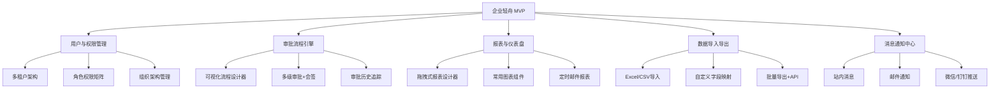
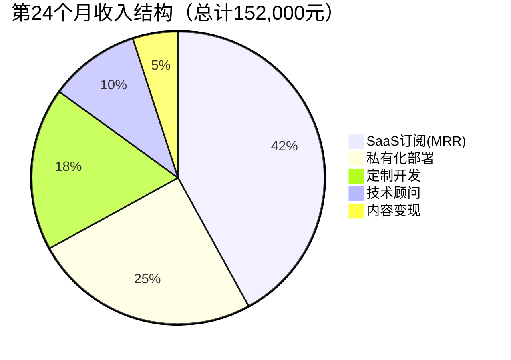
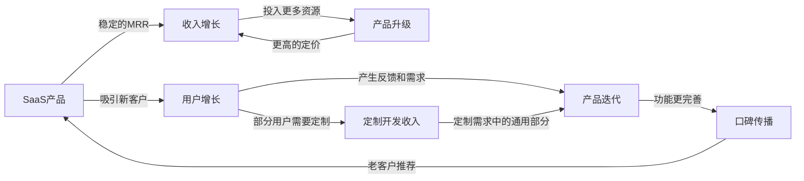
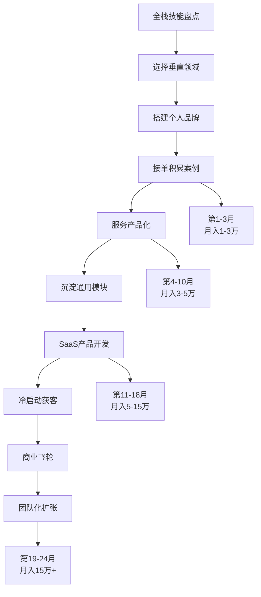

## 案例六：全栈技能——从技术到商业

> 这是一个从"卖时间"到"卖产品"的完整转型案例。主人公陈远（化名），30岁，一线城市某科技公司全栈开发工程师，5年工作经验（前端2年后端3年），月薪22K。从技术接单起步，在24个月内完成了"接单→标准化服务→SaaS产品"的三级跃迁，副业月收入从0增长到稳定15万+，其中SaaS产品收入占比超过60%。

### 案例速览

在深入细节之前，先看这个案例的核心数据：

| 维度 | 起点（第1月） | 终点（第24月） | 变化 |
|------|:---:|:---:|:---:|
| 月收入 | 0 | 152,000元 | 从零到15万+ |
| 时薪 | 0 | 1,448元 | 超过本职工作时薪8倍 |
| 客户数 | 0 | 130+ | 持续积累 |
| SaaS付费用户 | 0 | 68 | 被动收入来源 |
| 月投入时间 | 0 | 105小时 | 约合每天3.5小时 |
| 被动收入占比 | 0% | 47% | 近一半收入无需持续投入 |
| 内容粉丝 | 0 | 15,000+ | 品牌资产 |

**这个案例的独特价值：** 不是一个"天才程序员一鸣惊人"的故事，而是一个普通全栈工程师通过系统性思考和持续执行，在24个月内逐步构建起可持续商业模式的完整路径。每一步都有具体数据、工具选择、踩坑记录——可以直接照搬执行。

---

### 一、起点：全栈工程师的技能矩阵与变现困境

#### 1.1 人物画像

| 维度 | 具体情况 |
|------|----------|
| 年龄 | 30岁，单身 |
| 职位 | 某中型互联网公司全栈开发（P6级别） |
| 月薪 | 22K（到手约17K） |
| 技术栈 | React/Vue前端 + Node.js/Go后端 + PostgreSQL/MongoDB + Docker/K8s |
| 工作特点 | 公司业务增长平稳，技术挑战有限，每天有2-3小时空闲精力 |
| 焦虑点 | 技术广而不精，35岁危机临近，月薪涨幅见顶 |

陈远的处境在全栈工程师中极具代表性：掌握前后端多个技术栈，能独立完成从零到一的项目交付，但在公司内部，全栈往往意味着"什么都做、什么都不精"，薪资天花板反而低于专精某一方向的工程师。

**为什么全栈工程师在公司内部薪资偏低？** 这不是能力问题，而是组织经济学问题。在大公司里，专业分工的边际收益高于全栈——一个专精数据库优化的人能为整个系统带来性能提升，影响范围远超一个人独立做一个完整功能。但在外部市场（接单、创业），全栈的端到端交付能力反而具有极高的边际价值——客户不需要协调三个人，一个人就能搞定。理解这个差异，是全栈工程师做变现决策的认知前提。

#### 1.2 全栈技能的变现优势与陷阱

陈远在启动副业前，花了一周时间系统分析了全栈技能在变现市场中的定位：

**全栈技能的三大变现优势：**

| 优势 | 说明 | 实际价值 |
|------|------|----------|
| 端到端交付能力 | 能独立完成前后端+部署，不需要依赖其他人 | 接小项目时效率极高，一个人干三个人的活 |
| 技术方案全局视角 | 理解系统全貌，能做出更合理的架构决策 | 咨询类服务的天然优势 |
| 需求理解更深 | 和客户沟通时不需要"传话"，减少信息损失 | 客户满意度高，复购率高 |

**全栈技能的三大变现陷阱：**

| 陷阱 | 说明 | 后果 |
|------|------|------|
| 什么都接、什么都不精 | 前端也接、后端也接、小程序也接 | 定价上不去，和无数外包公司竞争 |
| 工作量被低估 | 客户觉得"你一个人就能做"，期望值不合理 | 报价5000的项目实际投入50小时 |
| 缺乏品牌辨识度 | "全栈开发"没有记忆点 | 难以建立个人品牌 |

**陈远的关键洞察：** 全栈变现的核心不是"什么都能做"，而是"能端到端地解决特定领域的问题"。这个认知来自一个简单的观察：在猪八戒等平台上，"全栈开发"的报价中位数是300-500元/天，而"中小企业数字化解决方案"的报价中位数是800-1500元/天——同样的技能，换个定位，价格差3倍。

他决定选择一个垂直领域深耕——中小企业内部管理系统（ERP/CRM/OA），原因有三：

1. **市场需求量大**：几乎所有中小企业都有内部管理系统需求，但市面上的产品要么太贵（SAP、用友），要么太重（开源ERP配置复杂）。根据工信部数据，中国中小企业数量超过4000万家，其中仅有不到20%使用了专业管理软件，市场渗透率极低
2. **技术匹配度高**：这类系统的典型架构（前端React/Vue + 后端Node.js/Go + 数据库 + 部署运维）恰好是陈远的技术强项
3. **可产品化潜力高**：不同企业的需求有70%是重叠的（用户管理、权限控制、报表、审批流程），只有30%是定制化的。这意味着每次接单都在积累可复用资产，而非从零开始

#### 1.3 变现方向决策矩阵

陈远用加权评分法评估了四个可能的方向：

| 方向 | 市场需求(30%) | 启动难度(25%) | 时薪潜力(25%) | 可扩展性(20%) | 加权总分 |
|------|:---:|:---:|:---:|:---:|:---:|
| 通用外包接单 | 9 | 5 | 5 | 3 | 5.80 |
| 垂直领域技术咨询 | 7 | 7 | 8 | 6 | 7.05 |
| 标准化系统定制服务 | 8 | 6 | 7 | 8 | 7.30 |
| SaaS产品（中小企业管理系统） | 8 | 9 | 9 | 10 | 8.95 |

**评分方法说明：** 每个维度按1-10分评估，加权后计算总分。权重分配反映了陈远的个人优先级——他最看重市场可行性（30%），其次是启动门槛（25%）和时薪潜力（25%），最后是可扩展性（20%）。不同人的权重分配可能不同，但评分框架是通用的。

**最终策略：用接单验证需求，用标准化降成本，用SaaS实现规模化。** 三条路不是非此即彼，而是一个递进关系——接单积累行业认知，标准化服务沉淀通用模块，最终将通用模块封装成SaaS产品。这个策略的核心逻辑是：每一步都在为下一步积累资产，而不是在不同的方向之间反复切换。

#### 1.4 启动前的法律与合规准备

很多技术人忽略这一步，但它决定了副业能否长期健康运行：

| 准备项 | 具体内容 | 为什么重要 |
|--------|----------|------------|
| 劳动合同审查 | 仔细阅读在职公司的劳动合同中关于竞业限制、知识产权归属、兼职限制的条款 | 部分公司合同规定工作时间内或利用公司资源开发的知识产权归公司所有 |
| 副业报备 | 如公司有利益冲突申报制度，主动报备副业情况 | 被动发现比主动报备后果严重10倍 |
| 个体工商户注册 | 在当地市场监管局注册个体工商户，获取营业执照 | 合法开票、签合同的前提；部分地区对个体户有税收优惠 |
| 税务规划 | 了解劳务报酬（20%-40%）vs 经营所得（5%-35%）的税率差异 | 合理利用小规模纳税人免征增值税政策（月收入10万以下免征） |
| 合同模板准备 | 准备标准的服务协议、保密协议、验收标准模板 | 保护双方权益，避免纠纷时无据可依 |

**陈远的实际做法：** 他在启动副业的第一周就做了三件事：（1）重新阅读公司劳动合同，确认无竞业限制条款；（2）注册了个体工商户，选择"信息技术咨询服务"经营范围；（3）准备了一份标准服务协议模板，明确了交付范围、验收标准、付款节点（30%预付+40%中期验收+30%终验）和知识产权归属。

**税务规划的实操细节：** 陈远在注册个体工商户后，选择了"小规模纳税人"身份。根据当时政策，月收入10万元以下免征增值税。当月收入超过10万后，他申请了"核定征收"，综合税率约3%-5%，远低于劳务报酬的20%-40%。仅税务优化这一项，每年就节省了约3-5万元。具体操作流程：（1）到当地税务局咨询核定征收条件；（2）选择适合的行业类别和应税所得率；（3）每季度按时申报，保持良好的纳税记录。

**合同模板的关键条款清单：**

| 条款 | 必须包含的内容 | 常见纠纷点 |
|------|---------------|-----------|
| 交付范围 | 详细的功能清单、页面数量、接口数量 | 客户认为"应该包含"的功能不在合同中 |
| 验收标准 | 具体的验收测试用例和通过标准 | "我觉得不好用"算不算验收不通过 |
| 付款节点 | 预付比例、中期验收节点、尾款支付条件 | 客户以"不满意"为由拖延尾款 |
| 需求变更 | 变更流程、费用调整机制、时间影响评估 | "加个小功能"不断累积成大工作量 |
| 知识产权 | 源代码归属、二次开发权利、开源组件声明 | 客户要求全部源码但不愿付对应价格 |
| 保密义务 | 双方的保密范围和期限 | 客户的商业数据泄露风险 |
| 售后维护 | 免费维护期限、响应时间、维护范围 | 交付后无限期免费"小修小补" |

#### 1.5 心理准备与期望管理

技术人做副业最常见的失败原因不是技术不行，而是心理准备不足：

| 心理陷阱 | 表现 | 陈远的应对 |
|----------|------|------------|
| 完美主义 | "这个功能还不够好，再打磨一下" | 设定MVP标准：能跑、能用、不出安全问题就上线 |
| 孤独感 | 遇到问题没人讨论，决策没人商量 | 加入3个独立开发者社群，每周至少参与1次讨论 |
| 收入焦虑 | 前几个月收入远低于预期，想放弃 | 设定6个月的投入期，期间只看"积累了多少客户和案例"，不看收入 |
| 本职工作冲突 | 白天工作疲惫，晚上没精力做副业 | 严格的时间管理（见3.4节），保证每天7小时睡眠 |
| 冒名顶替综合征 | "我凭什么收这个价？" | 整理客户好评和成功案例，用事实对抗自我怀疑 |

**心理建设的底层逻辑：** 技术人习惯了"代码要么能跑要么不能跑"的确定性世界，但商业世界充满了不确定性——客户可能不付款、项目可能延期、定价可能过高或过低。接受这种不确定性，是技术人转型为独立开发者的第一道门槛。陈远的做法是把不确定性转化为可管理的风险：每个项目都有合同保护，每个定价都有数据支撑，每个决策都有备选方案。

**"副业→全职"的决策框架：** 很多人会问"什么时候可以把副业转为主业"。陈远在第18个月时认真评估了这个问题，他使用的决策标准如下：

| 决策维度 | 全职切换的最低标准 | 陈远第18个月的实际情况 |
|----------|:---:|:---:|
| 副业月收入 > 本职薪资的2倍 | 44,000元 | 105,000元 ✅ |
| 连续6个月收入稳定增长 | 6个月 | 8个月 ✅ |
| 被动收入占比 > 30% | 30% | 48% ✅ |
| 有6个月以上的现金储备 | 约15万 | 20万+ ✅ |
| 健康保险等福利有替代方案 | 已规划 | 已购买商业保险 ✅ |
| 家庭/伴侣支持 | 明确支持 | 单身，无家庭压力 ✅ |

陈远最终在第20个月辞去了本职工作。但他强调：**不要因为"副业赚得多了"就冲动辞职**。全职后你会发现，少了本职工作的"安全垫"，心理压力会骤增，反而影响决策质量。正确的做法是：用数据确认稳定性，用现金储备对冲风险，用替代方案覆盖福利缺口。

---

### 二、冷启动阶段（第1-3个月）：从接单开始验证

#### 2.1 技能定位与个人品牌搭建

陈远没有急于接单，而是先用两周时间搭建了一套完整的个人品牌基础设施：

**第一步：明确品牌定位**

他没有把自己定位为"全栈开发工程师"，而是"中小企业数字化解决方案专家"。这个定位有三个好处：
- **目标客户明确**：中小企业的老板、运营负责人、IT主管
- **价值主张清晰**：帮企业用合理的成本实现数字化管理
- **差异化明显**：和"什么都能做"的通用外包区分开

**品牌定位的底层逻辑：** 客户不关心你用什么技术栈，只关心你能不能解决他的问题。"全栈开发"是技术视角的定位，客户听不懂；"中小企业数字化解决方案"是业务视角的定位，客户一听就知道你能不能帮到他。这个转换的核心是从"我能做什么"变成"你需要什么"——前者是工程师思维，后者是商业思维。

**定位公式：** `[目标客户] + [核心痛点] + [解决方案]`。陈远的定位是"帮中小企业用1/10的成本实现数字化管理"。这个公式的关键是**用客户能理解的语言描述价值**，而不是用技术术语描述能力。

**第二步：技术博客+案例库**

| 平台 | 内容定位 | 更新频率 | 目标 | 核心指标 |
|------|----------|----------|------|----------|
| 掘金 | 中小企业系统开发实战 | 每周1篇 | 行业曝光 | 阅读量、收藏数 |
| GitHub | 开源项目（管理系统组件库） | 持续更新 | 技术背书 | Star数、Fork数 |
| 知乎 | 企业数字化转型科普 | 每两周1篇 | 获取非技术客户 | 点赞数、私信量 |
| 公众号 | 项目复盘+行业洞察 | 每周1篇 | 私域沉淀 | 关注数、阅读率 |

**内容策略的关键细节：**

陈远不是随便写技术文章，而是有明确的内容规划：

| 内容类型 | 占比 | 目的 | 示例标题 |
|----------|:---:|------|----------|
| 技术深度文章 | 40% | 建立专业形象 | 《Node.js多租户架构的5种实现方案对比》 |
| 行业解决方案 | 30% | 吸引目标客户 | 《20人的贸易公司需要什么样的CRM系统？》 |
| 项目复盘 | 20% | 展示交付能力 | 《我是如何用2周为某制造企业搭建库存管理系统的》 |
| 工具推荐/教程 | 10% | 获取流量 | 《中小企业自建 vs 购买SaaS：成本对比分析》 |

**SEO关键词策略：** 陈远在写每篇文章前，都会用5118和百度指数调研关键词。他发现"中小企业管理系统"、"企业OA开发"、"CRM系统定制"这三个关键词的搜索量稳定且竞争度适中，因此围绕这些关键词持续产出内容。6个月后，他的文章在这些关键词的搜索结果中稳定排名前5，带来了持续的被动流量。

**第三步：准备"信任锚点"**

在没有客户案例之前，陈远用三个方式建立信任：

1. **开源了一个轻量级的后台管理系统模板**（React + Node.js + PostgreSQL），GitHub star在第一个月内达到200+。他特意在README中写了清晰的使用文档和演示地址，降低潜在客户的评估门槛
2. **写了3篇深度技术文章**：《中小企业管理系统技术选型指南》（8000字）、《如何用1/10的成本搭建企业OA》（6000字）、《开源ERP二次开发踩坑记》（5000字）。每篇文章都附带可运行的代码示例
3. **在公司项目中积累了多个脱敏案例**（经公司允许），整理成案例集。每个案例包含：客户需求、技术方案、实现效果、关键数据

**为什么"信任锚点"比"能力证明"更重要？** 在信息不对称的市场中，客户无法直接评估你的技术能力，只能通过间接信号来判断。开源项目、深度文章、客户案例就是这些间接信号——它们证明的不是"你有多强"，而是"你做过类似的、能被验证的事情"。这就是为什么一个有500 star开源项目的开发者，比一个简历写着"精通全栈"的开发者更容易获得客户信任。

#### 2.2 第一批客户获取

**渠道一：技术社区引流（主力渠道）**

陈远在掘金和知乎发布的文章中，统一加入了引流话术：

> 我是陈远，专注中小企业数字化解决方案。如果你的公司正在考虑内部管理系统的开发或升级，欢迎私信交流。前5位朋友免费提供1次需求诊断（30分钟线上会议）。

**引流话术的设计逻辑：**
- "专注中小企业数字化解决方案"——定位清晰，筛选目标客户
- "免费提供1次需求诊断"——低门槛的首次接触
- "30分钟线上会议"——承诺具体，降低客户决策成本
- "前5位"——制造稀缺感，提高转化率

**引流效果统计（第1-3个月）：**

| 来源 | 文章阅读量 | 有效咨询 | 转化率 |
|------|:---:|:---:|:---:|
| 掘金技术文章 | 约15,000 | 23人 | 0.15% |
| 知乎回答 | 约8,000 | 12人 | 0.15% |
| GitHub项目 | 约3,000 | 8人 | 0.27% |

转化率看似不高，但胜在精准——这些咨询者都是有明确需求的企业用户，成交率远高于平台流量。GitHub的转化率最高（0.27%），说明主动搜索技术方案的用户购买意向更强。

**渠道二：企业服务平台**

陈远在以下平台上架了服务：

| 平台 | 上架服务 | 定价策略 | 效果 | 平台特点 |
|------|----------|----------|------|----------|
| 猪八戒 | 企业管理系统定制 | 5000-50000元（按需求评估） | 前3月2单 | 客户预算较高但比价严重，需要突出差异化 |
| 程序员客栈 | 全栈开发接单 | 按日薪600元 | 前3月3单 | 开发者友好，客户质量较高 |
| 闲鱼 | 低价引流产品（见下表） | 200-500元 | 前3月8单 | 流量大但客户质量参差，需要筛选 |

**闲鱼引流产品矩阵（用于低价获取第一批客户）：**

| 产品 | 定价 | 内容 | 目的 | 交付物 |
|------|------|------|------|--------|
| 企业需求诊断 | 99元/次 | 30分钟线上会议+需求分析报告 | 获取客户信任，转化为大单 | PDF报告（含需求清单、技术方案建议、预算估算） |
| 系统原型设计 | 199元/套 | Axure/Figma原型+功能清单 | 展示专业能力 | 可交互原型+功能说明文档 |
| 现成系统部署 | 299元/次 | 开源管理系统部署到客户服务器 | 低门槛体验完整服务 | 部署完成的系统+操作手册 |
| 数据库设计咨询 | 499元/次 | 数据库方案+ER图+性能建议 | 筛选高质量客户 | 数据库设计文档+ER图+索引优化建议 |

**关键策略：** 低价产品不是用来赚钱的，而是用来筛选客户和积累案例的。99元的需求诊断服务，转化率约40%——每做5次诊断，有2个客户会购买后续的定制开发服务（均价8000-15000元）。这就是"钩子产品"的经典逻辑：用低价建立首次接触，用专业服务建立信任，用后续项目实现盈利。

**渠道三：本地化获客（陈远的隐藏杀手锏）**

| 方式 | 具体做法 | 效果 |
|------|----------|------|
| 创业孵化器 | 联系本地3个创业孵化器，免费做1次"企业数字化"分享 | 2个孵化器邀请成为常驻技术顾问 |
| 行业展会 | 参加本地中小企业信息化展会，派发名片和案例手册 | 获取12个有效线索，成交4个 |
| 朋友圈经营 | 每周发1条项目案例或行业洞察（不是广告） | 通过朋友介绍获得6个客户 |

**本地化获客为什么效率高？** 因为信任成本最低。线上获客需要通过文章、案例、口碑来建立信任，而线下见面一次就能建立基本的人际信任。陈远发现，本地客户的成交率是线上客户的3倍，而且本地客户更容易转介绍——因为企业老板的社交圈通常是本地的。

#### 2.3 前三个月的实际数据

| 指标 | 第1月 | 第2月 | 第3月 |
|------|:---:|:---:|:---:|
| 有效咨询量 | 8 | 15 | 22 |
| 成交单数 | 3 | 5 | 8 |
| 总收入 | 3,200元 | 8,500元 | 14,000元 |
| 平均单价 | 1,067元 | 1,700元 | 1,750元 |
| 投入时间 | 约50小时 | 约70小时 | 约80小时 |
| 时薪 | 约64元 | 约121元 | 约175元 |

三个月累计收入25,700元，月均约8,600元。收入本身不算高，但陈远在这一阶段收获了三个更有价值的东西：

1. **16个真实客户案例**——这是后续定价涨价和品牌建设的核心素材
2. **清晰的需求画像**——80%的客户需求集中在5个模块：用户权限管理、审批流程引擎、报表生成器、数据导入导出、消息通知系统
3. **可复用的代码模块**——上述5个模块的基础代码已经实现，可以在新项目中直接复用

**冷启动阶段的核心指标不是收入，而是"认知密度"：** 你是否清楚地知道客户要什么、愿意付多少、痛点在哪里。这些认知在后续的产品化和SaaS开发中，价值远超前3个月的收入总和。

#### 2.4 冷启动阶段的风险清单

| 风险 | 概率 | 影响 | 应对措施 |
|------|:---:|:---:|----------|
| 本职工作发现副业 | 中 | 高 | 不使用公司设备和网络；副业项目代码和公司项目完全隔离 |
| 客户拖欠尾款 | 高 | 中 | 合同约定分阶段付款；使用电子合同（有法律效力）；超30天未付发律师函 |
| 项目范围蔓延 | 高 | 中 | 合同中明确定义交付范围；需求变更走正式变更流程（书面确认+费用调整） |
| 技术方案踩坑 | 中 | 中 | 先用开源方案验证可行性；不确定的技术点先做POC（概念验证） |
| 健康问题 | 低 | 高 | 严格控制工作日晚上不超过2.5小时；每月至少2个完整休息日 |

---

### 三、爬坡阶段（第4-10个月）：从接单到标准化服务

#### 3.1 服务产品化

前3个月的经验让陈远意识到：不同企业的需求有70%是重叠的，每次从零开发是在浪费时间。他开始将服务"产品化"——把通用模块做成标准化组件，定制开发只做那30%的差异部分。

**服务产品化的本质是什么？** 是把"手艺活"变成"流水线"。手艺活的价值取决于工匠的时间，流水线的价值取决于系统的效率。这个转变的关键不是技术能力的提升，而是思维方式的转变——从"我来帮你做"变成"我有一个系统，帮你配置好就能用"。

**标准化服务产品矩阵：**

```text
产品分层体系:

  入门层（引流产品，99-499元）:
    ├── 企业数字化需求诊断: 99元/次，含需求分析报告
    ├── 系统原型设计: 199元/套，含交互说明
    └── 数据库方案设计: 499元/次，含ER图+优化建议

  标准层（利润产品，5000-30000元）:
    ├── 轻量OA系统: 8000-15000元，基于模板快速定制
    ├── CRM客户管理: 10000-20000元，含数据迁移
    ├── 库存管理系统: 8000-15000元，含条码/二维码支持
    └── 项目管理看板: 5000-10000元，类似简化版Jira

  高端层（旗舰产品，30000元+）:
    ├── ERP系统定制: 30000-80000元，全模块定制
    ├── 技术顾问月度服务: 8000-15000元/月
    └── 企业数字化转型咨询: 按项目评估，通常50000元+
```

**产品分层的商业逻辑：** 三层产品对应三个不同的商业目的。入门层（99-499元）用来获取客户、建立信任，利润率低甚至亏损；标准层（5000-30000元）是主要利润来源，利用标准化组件实现高效率；高端层（30000元+）用来提升品牌定位和客单价，服务少量高价值客户。三层之间互相引流：入门层客户中有40%会转化为标准层，标准层客户中有15%会升级为高端层。

**产品化的技术实现：**

陈远用了一个月的业余时间，将前3个月积累的代码模块整理成了一套可复用的组件库：

```javascript
// 项目结构示意
enterprise-kit/
├── packages/
│   ├── auth/           # 用户认证与权限管理模块
│   │   ├── src/
│   │   │   ├── rbac.ts         # 基于角色的访问控制
│   │   │   ├── tenant.ts       # 多租户隔离中间件
│   │   │   ├── jwt.ts          # JWT令牌管理
│   │   │   └── audit-log.ts    # 操作审计日志
│   │   ├── tests/
│   │   └── README.md
│   ├── workflow/       # 审批流程引擎
│   │   ├── src/
│   │   │   ├── engine.ts       # 流程引擎核心
│   │   │   ├── designer.ts     # 可视化流程设计器API
│   │   │   ├── node-types.ts   # 审批节点类型（会签/或签/条件分支）
│   │   │   └── notification.ts # 审批通知
│   │   ├── tests/
│   │   └── README.md
│   ├── report/         # 报表生成器
│   │   ├── src/
│   │   │   ├── designer.ts     # 拖拽式报表设计器后端
│   │   │   ├── chart.ts        # 图表组件（ECharts封装）
│   │   │   ├── export.ts       # PDF/Excel/CSV导出
│   │   │   └── scheduler.ts    # 定时报表任务
│   ├── importer/       # 数据导入导出
│   │   ├── src/
│   │   │   ├── excel.ts        # Excel解析与生成
│   │   │   ├── mapper.ts       # 字段映射引擎
│   │   │   ├── validator.ts    # 数据校验规则
│   │   │   └── queue.ts        # 大文件异步处理队列
│   ├── notification/   # 消息通知系统
│   │   ├── src/
│   │   │   ├── channel.ts      # 通知渠道抽象（邮件/短信/微信/钉钉）
│   │   │   ├── template.ts     # 通知模板引擎
│   │   │   └── queue.ts        # 异步发送队列
│   └── dashboard/      # 数据仪表盘
│       ├── src/
│       │   ├── widget.ts       # 可拖拽仪表盘组件
│       │   ├── datasource.ts   # 数据源连接器
│       │   └── realtime.ts     # WebSocket实时数据推送
├── templates/
│   ├── oa-system/      # OA系统模板
│   ├── crm-system/     # CRM系统模板
│   └── erp-lite/       # 轻量ERP模板
├── scripts/
│   ├── deploy.sh       # 一键部署脚本（Docker Compose）
│   ├── migrate.sh      # 数据库迁移脚本
│   └── backup.sh       # 自动备份脚本
└── docs/
    ├── architecture.md  # 架构设计文档
    └── api-spec.yaml    # OpenAPI 3.0规范文档
```

**关键模块的技术选型决策：**

| 模块 | 候选方案 | 最终选择 | 选择理由 |
|------|----------|----------|----------|
| 权限管理 | Casbin / RBAC自研 / Keycloak | Casbin + 自研封装 | Casbin策略模型灵活，但需要封装易用的API；Keycloak太重 |
| 审批流程 | Camunda / 自研 / Activiti | 自研轻量引擎 | 企业级BPM引擎太重，中小企业需求用200行TS就能覆盖80%场景 |
| 报表引擎 | Metabase / Superset / 自研 | ECharts + 自研设计器 | 开源BI工具部署复杂，自研设计器更轻量，可深度集成 |
| 文件导入 | SheetJS / ExcelJS / python-pandas | ExcelJS (Node.js) | 纯JS方案，无需Python依赖；支持大文件流式读取 |
| 消息队列 | RabbitMQ / Redis / BullMQ | BullMQ (基于Redis) | 已有Redis依赖，BullMQ轻量且支持延迟任务和重试 |

**技术选型的核心原则：** 不是选最强的，而是选最合适的。对于独立开发者来说，技术选型的优先级是：（1）自己熟悉的技术栈，学习成本为零；（2）社区活跃、文档完善的技术，遇到问题能快速找到解决方案；（3）轻量级方案，不要为了"万一以后需要"而引入重型框架。陈远的选型几乎全部遵循了这个原则——选的都是他已有的技术栈中表现最好的工具。

**产品化带来的效率提升：**

| 项目类型 | 产品化前耗时 | 产品化后耗时 | 效率提升 | 报价不变时利润变化 |
|----------|:---:|:---:|:---:|:---:|
| 轻量OA系统 | 80-120小时 | 30-50小时 | 2.5x | 利润率从30%→65% |
| CRM客户管理 | 100-150小时 | 40-60小时 | 2.8x | 利润率从25%→60% |
| 库存管理系统 | 60-100小时 | 20-40小时 | 2.7x | 利润率从35%→70% |

效率提升意味着同样的报价下利润更高，或者同样的投入下可以接更多项目。

#### 3.2 涨价策略与客户筛选

随着案例积累和品牌建立，陈远开始系统性涨价：

| 阶段 | 时间 | 轻量OA报价 | CRM报价 | 涨价依据 |
|------|------|:---:|:---:|----------|
| 起步期 | 第1-3月 | 5,000元 | 8,000元 | 低价积累案例 |
| 成长期 | 第4-6月 | 8,000元 | 15,000元 | 10+好评，GitHub项目star破500 |
| 成熟期 | 第7-10月 | 12,000元 | 25,000元 | 30+案例，客户排队 |

**涨价的核心逻辑：** 不是"我觉得自己值这个价"，而是"市场验证了这个价格"。陈远的做法是：当当前价格下的成交率超过75%时，下次报价提高20%。这个数据驱动的涨价方法避免了"定价焦虑"——你不需要判断自己值多少钱，让市场告诉你。

**涨价时机的量化判断标准：**

| 信号 | 阈值 | 含义 | 行动 |
|------|------|------|------|
| 成交率 | >75% | 价格偏低，供不应求 | 下次报价+20% |
| 成交率 | 50%-75% | 价格合理 | 维持当前价格 |
| 成交率 | <50% | 价格偏高或市场需求下降 | 分析原因，可能需要降价或提升价值 |
| 排队等待 | >2周 | 供不应求 | 涨价+扩大产能（外包部分工作） |
| 客户主动加价 | 出现 | 你的价值被严重低估 | 大幅涨价（30%-50%） |

**客户筛选标准（第6个月后开始执行）：**

```text
客户评估矩阵:

  A类客户（优先服务）:
    ├── 需求明确，有文档或原型
    ├── 预算充足（≥报价的80%不还价）
    ├── 决策链短（对接人能拍板）
    └── 有复购潜力（公司有多系统需求）
    → 策略：优先排期，适当优惠，争取长期合作

  B类客户（标准服务）:
    ├── 需求基本明确，需要引导细化
    ├── 预算适中（会还价但幅度合理）
    └── 决策链适中（需要向上汇报）
    → 策略：标准报价，标准交付流程

  C类客户（谨慎接单或拒绝）:
    ├── 需求模糊，"我也不知道要什么"
    ├── 预算远低于报价（砍价50%以上）
    ├── 决策链长（"我要和老板商量"）
    └── 不愿签合同或不愿付定金
    → 策略：礼貌拒绝，或推荐给其他开发者
```

**陈远筛选客户的一段真实对话：**

> 客户："我们想做一个企业管理平台，预算1万左右。"
>
> 陈远："感谢信任。1万的预算可以做一个单模块系统（比如库存管理或客户管理），如果需要多模块集成的完整平台，通常在3-8万的范围。您最核心的需求是哪个模块？"
>
> 客户："我们什么都想要，但预算确实有限。"
>
> 陈远："理解。我的建议是先从最痛的一个点切入，比如'每天花最多时间处理的重复性工作是什么'。把这个点做透了，再扩展其他模块，每一步都有实实在在的效果。您觉得呢？"
>
> 客户："那就先做库存管理吧。"
>
> 最终成交价：9,800元（库存管理系统+条码支持）。后续复购了CRM模块（16,000元）和OA模块（12,000元），累计消费37,800元。

**这段对话展示了三个关键技巧：**（1）不直接拒绝低预算客户，而是引导缩小范围；（2）用"最痛的点"来帮客户做决策，而不是罗列功能；（3）先做一个模块，建立信任后自然会有后续合作——这就是"以小博大"的接单策略。

#### 3.3 客户管理系统升级

从第4个月开始，陈远将客户管理系统从简单的Excel升级为Notion数据库，字段设计如下：

| 字段 | 类型 | 用途 |
|------|------|------|
| 客户名称 | 文本 | 公司/个人名称 |
| 联系人 | 文本 | 对接人姓名+职位 |
| 需求类型 | 单选 | OA/CRM/ERP/定制开发/咨询 |
| 合作次数 | 数字 | 累计合作项目数 |
| 累计金额 | 数字 | 累计消费金额 |
| 满意度 | 评分(1-10) | 每个项目交付后评分 |
| 客户等级 | 单选 | A/B/C（按上述标准分类） |
| 复购提醒 | 日期 | 项目交付后60天 |
| 技术栈 | 多选 | 企业使用的技术栈 |
| 转介绍记录 | 文本 | 谁推荐的，推荐了谁 |
| 上次联系 | 日期 | 用于"激活沉睡客户"提醒 |
| 行业 | 单选 | 制造/零售/教育/医疗/其他 |

**复购提升的关键动作：**

1. **交付后72小时回访**：确认系统运行正常，收集使用反馈。这个动作的复购转化率约25%——每4个回访客户中，有1个会产生后续需求
2. **季度系统巡检**：免费为老客户提供一次系统健康检查（安全漏洞、性能瓶颈、数据备份验证），在巡检报告中推荐优化或新增模块
3. **行业资讯推送**：每月推送一篇与客户行业相关的数字化转型案例，附带"老客户专属优惠"
4. **转介绍激励**：老客户推荐新客户成交后，返现15%或赠送2小时免费技术支持
5. **沉睡客户激活**：超过60天未联系的客户，发送一条个性化的问候（不是群发模板），附带近期的新功能更新或行业洞察

**为什么72小时回访如此关键？** 心理学研究表明，客户满意度在交付后72小时内达到峰值，之后快速衰减。在这个窗口期内回访，不仅能获得最真实的反馈，还能利用"峰终定律"——客户对服务的整体评价主要取决于峰值体验和结束体验。72小时回访就是打造"终体验"的最佳时机。

#### 3.4 时间管理与效率优化

副业规模扩大后，时间成为最大的瓶颈。陈远的时间管理策略：

```mermaid
gantt
    title 工作日时间安排（周一到周五）
    dateFormat HH:mm
    axisFormat %H:%M
    section 白天
    本职工作         :09:00, 8h
    section 晚上
    代码开发         :20:00, 1.5h
    客户沟通(集中处理):21:30, 30min
    技术学习/文章    :22:00, 30min
    section 周末(周六)
    集中开发(上午)    :09:00, 4h
    客户会议(下午)    :14:00, 2h
    周复盘           :17:00, 1h
```



**效率提升的三个关键工具：**

| 工具 | 用途 | 效率提升 | 成本 |
|------|------|----------|------|
| Cursor/Windsurf | AI辅助编码，自动生成模板代码 | 编码速度提升2-3倍 | $20/月 |
| Notion项目模板 | 标准化项目管理流程 | 沟通成本降低50% | 免费版够用 |
| 自动化部署脚本 | Docker Compose一键部署 | 部署时间从4小时→30分钟 | 0 |
| Toggl Track | 时间追踪 | 找出时间黑洞 | 免费版 |
| 飞书/钉钉日历 | 时间块管理 | 避免碎片化 | 0 |

**关键原则：**
- 工作日晚上最多投入2.5小时，保证睡眠和本职工作质量
- 大块开发任务集中在周六上午
- 客户沟通集中在固定时间段（每晚21:30-22:00），避免碎片化
- 使用Toggl Track记录每项任务耗时，每周分析时间ROI
- 当某个模块的开发时间低于报价时薪的1/3时，考虑外包给兼职开发者

**时间ROI分析示例（第8个月）：**

| 任务类型 | 耗时占比 | 收入贡献 | ROI评估 | 优化行动 |
|----------|:---:|:---:|----------|----------|
| 核心功能开发 | 35% | 45% | 高——直接产出价值 | 保持投入，使用AI辅助提升效率 |
| 客户沟通 | 20% | 15% | 中——必要但应优化流程 | 标准化沟通模板，集中处理非紧急消息 |
| 需求分析/方案设计 | 15% | 25% | 高——决定项目方向和定价 | 保持投入，这是高杠杆活动 |
| 部署/运维 | 10% | 5% | 低——应自动化或外包 | 写一键部署脚本，目标：零手动操作 |
| 内容创作 | 10% | 8% | 中——长期复利，但短期收益低 | 保持每周1篇，复用项目中的技术点 |
| 行政/财务 | 10% | 2% | 低——应尽量简化 | 集中到周日晚上统一处理 |

基于这个分析，陈远做了两个调整：（1）将部署运维工作全部自动化（写了一键部署脚本）；（2）将行政工作集中在周日晚上统一处理。

#### 3.5 技术债务管理

随着项目数量增加，技术债务开始累积。陈远建立了一套技术债务管理机制：

| 债务类型 | 示例 | 处理策略 |
|----------|------|----------|
| 代码重复 | 多个项目有相似的权限管理代码 | 提取为npm包，统一维护 |
| 过时依赖 | 某项目用的是Vue 2，但主流已是Vue 3 | 新项目用Vue 3，老项目维持不动（除非客户付费升级） |
| 缺少测试 | 快速交付的项目没有写单元测试 | 核心模块补测试，非核心模块用集成测试兜底 |
| 文档缺失 | 部分项目的部署文档不完整 | 每次交付时一并交付文档，作为验收标准之一 |
| 安全隐患 | 使用了已知漏洞的依赖版本 | 每月运行一次npm audit，紧急漏洞立即修复 |

**技术债务偿还的优先级排序：**
1. 安全相关（立即处理）——一个安全漏洞可能导致所有客户的信任崩塌
2. 影响当前项目交付的（本迭代处理）——不能因为债务而延误交付
3. 影响未来复用效率的（下一迭代处理）——这是"给自己修路"，越早越好
4. 纯代码质量（有空再处理）——重要但不紧急

**技术债务的隐性成本：** 很多独立开发者低估了技术债务的成本。陈远做过一个统计：一个没有文档、没有测试的项目，后续维护时间是有文档有测试项目的3-5倍。前3个月为了快速交付而跳过的文档和测试，在第8个月时以"花10小时才搞懂之前写的代码"的形式全部还了回来。教训是：在接单阶段就要建立最低质量标准——至少要有README、关键函数注释和核心流程的集成测试。

**自动化技术债务检测：** 陈远后来在所有项目中加入了以下自动化检查：

```yaml
# .github/workflows/quality.yml — 每次push自动运行
name: Code Quality Gate
on: [push, pull_request]
jobs:
  quality:
    runs-on: ubuntu-latest
    steps:
      - uses: actions/checkout@v4
      - name: Install dependencies
        run: npm ci
      - name: Lint check
        run: npm run lint  # ESLint + Prettier
      - name: Unit tests
        run: npm test -- --coverage --passWithNoTests
      - name: Dependency audit
        run: npm audit --production --audit-level=high
      - name: Type check
        run: npx tsc --noEmit
```

这套CI流程保证了：（1）代码风格统一；（2）核心模块有测试覆盖；（3）高危依赖漏洞在合并前就被拦截；（4）类型安全。将技术债务的检测从"人工回忆"变成"自动化拦截"，是独立开发者保持代码质量的关键手段。

#### 3.6 第4-10个月数据汇总

| 月份 | 咨询量 | 成交单数 | 总收入 | 平均单价 | 时薪 | SaaS相关收入 |
|:---:|:---:|:---:|:---:|:---:|:---:|:---:|
| 第4月 | 28 | 10 | 18,000元 | 1,800元 | 160元 | 0 |
| 第5月 | 35 | 12 | 25,000元 | 2,083元 | 185元 | 0 |
| 第6月 | 40 | 14 | 35,000元 | 2,500元 | 210元 | 0 |
| 第7月 | 42 | 12 | 38,000元 | 3,167元 | 230元 | 2,000元 |
| 第8月 | 45 | 13 | 42,000元 | 3,231元 | 240元 | 5,000元 |
| 第9月 | 48 | 11 | 45,000元 | 4,091元 | 260元 | 8,000元 |
| 第10月 | 50 | 10 | 48,000元 | 4,800元 | 280元 | 12,000元 |

从第7个月开始出现"SaaS相关收入"——这是下一个阶段的起点。

---

### 四、跃迁阶段（第11-18个月）：从定制开发到SaaS产品

#### 4.1 从重复需求中发现产品机会

陈远在前10个月的接单过程中，积累了一份"高频需求清单"：

| 需求 | 出现频率 | 当前解决方案 | 痛点 |
|------|:---:|------|------|
| 多租户权限管理 | 每个项目都需要 | 每次重新开发或改造 | 耗时且容易出安全漏洞 |
| 可视化报表引擎 | 80%项目需要 | 前端手写图表组件 | 灵活性差，客户无法自定义 |
| 工作流审批引擎 | 70%项目需要 | 简单的硬编码流程 | 无法动态调整审批流程 |
| 数据导入导出 | 90%项目需要 | 每次写脚本处理 | 格式兼容性差，耗时 |
| 多端消息通知 | 60%项目需要 | 分别对接各渠道 | 维护成本高 |

**陈远的洞察：** 这些需求在每个项目中都重复出现，如果把它们做成一个可配置的SaaS平台，客户可以自助使用，开发者也可以通过API集成——这比每次定制开发的效率高10倍以上。

**从接单到SaaS的判断标准：**

不是所有接单经验都适合转化为SaaS产品。陈远用以下标准筛选：

| 判断维度 | 适合做SaaS | 不适合做SaaS |
|----------|------------|--------------|
| 需求频率 | >60%的客户需要 | <30%的客户需要 |
| 需求标准化程度 | 不同客户的需求差异<30% | 每个客户的需求都完全不同 |
| 客户自助能力 | 客户能通过配置满足80%需求 | 必须定制开发才能使用 |
| 市场规模 | 目标客户>1000家 | 目标客户<100家 |
| 竞争格局 | 现有方案要么太贵要么太重 | 已有成熟的低价SaaS产品 |

**这个判断框架的核心思想来自"产品-市场契合"（PMF）理论：** 一个适合做SaaS的需求，必须同时满足高频、标准化、可自助、大市场四个条件。缺任何一个，要么做不成产品，要么做成了也赚不到钱。陈远的五个高频需求中，"数据导入导出"和"多租户权限管理"最符合这四个条件，因此成为SaaS产品的核心模块。

#### 4.2 产品定义与MVP开发

**产品名称：** 企业轻舟（EnterpriseLite）——中小企业一站式管理平台

**产品定位：**

| 维度 | 定位 |
|------|------|
| 目标用户 | 50-500人的中小企业 |
| 核心价值 | 用1/5的成本，获得定制化管理系统的80%功能 |
| 竞争优势 | 比SaaS产品更灵活（支持私有化部署），比定制开发更便宜（标准化模块+配置化） |
| 定价模式 | SaaS订阅（299-999元/月）+ 私有化部署（一次性19,800-49,800元） |

**竞品分析：**

| 竞品 | 价格 | 优势 | 劣势 | 企业轻舟的差异化 |
|------|------|------|------|------------------|
| 钉钉/飞书 | 免费-几百/人/月 | 生态完整，用户基数大 | 功能浅，定制性差 | 深度定制能力，私有化部署 |
| 用友/金蝶 | 数万-数十万/年 | 功能完整，品牌信任 | 太贵，中小企业用不起 | 1/5的价格，够用的功能 |
| 开源ERP(Odoo等) | 免费（自部署） | 功能强大，开源免费 | 部署复杂，需要专业运维 | 开箱即用，无需运维能力 |
| 通用低代码平台 | 几百-几千/月 | 灵活，可自定义 | 学习成本高，需要自己搭建 | 预置行业模板，开箱即用 |

**竞品分析的核心发现：** 市场上存在一个明显的"中间地带"——太便宜的（钉钉/飞书）功能不够用，太贵的（用友/金蝶）中小企业买不起，开源的（Odoo）需要专业运维，低代码的（明道云等）需要客户自己搭建。"企业轻舟"瞄准的正是这个中间地带：功能够用、价格合理、开箱即用、支持私有化部署。

**MVP功能范围（最小可行产品）：**



**MVP开发时间线：**

| 阶段 | 时间 | 工作内容 | 投入时间 |
|------|------|----------|:---:|
| 需求整理 | 第1-2周 | 从历史项目中提取通用模块需求 | 15小时 |
| 架构设计 | 第3周 | 技术选型、数据库设计、API设计 | 20小时 |
| 核心开发 | 第4-12周 | 用户权限+审批引擎+报表+导入导出 | 200小时 |
| 测试与优化 | 第13-14周 | 内部测试、性能优化、安全审计 | 40小时 |
| 文档与部署 | 第15-16周 | 用户文档、API文档、部署脚本 | 30小时 |

**总投入：** 约305小时（约4个月的周末+工作日晚上）

**技术栈选择：**

| 层级 | 技术 | 选择理由 |
|------|------|----------|
| 前端 | React + Ant Design Pro | 成熟的企业级UI组件库，开发效率高 |
| 后端 | Node.js (NestJS) + Go (微服务) | Node.js开发效率高，Go处理高并发场景 |
| 数据库 | PostgreSQL + Redis | PostgreSQL功能强大，Redis做缓存和会话 |
| 部署 | Docker + Docker Compose | 简化部署流程，支持一键私有化部署 |
| 存储 | MinIO (S3兼容) | 对象存储，用于文件和报表导出 |

**MVP阶段的"砍功能"决策：**

陈远最初规划了8个功能模块，但经过成本收益分析后砍掉了3个：

| 功能 | MVP包含？ | 理由 |
|------|:---:|------|
| 用户权限管理 | ✅ | 核心模块，每个客户都需要 |
| 审批流程引擎 | ✅ | 差异化卖点，竞品做得不好 |
| 报表与仪表盘 | ✅ | 客户决策层最关心的功能 |
| 数据导入导出 | ✅ | 降低客户迁移成本的关键 |
| 消息通知中心 | ✅ | 提升用户活跃度 |
| 工作流自动化 | ❌ | 复杂度高，先用审批引擎覆盖核心场景 |
| 移动端App | ❌ | 先做响应式Web，验证需求后再做原生App |
| 第三方集成 | ❌ | 先手动对接，有足够客户需求后再做标准接口 |

**"砍功能"的决策原则：** MVP不是"功能少"，而是"只保留能验证核心假设的功能"。企业轻舟的核心假设是"中小企业愿意为一个开箱即用的管理系统付费"——要验证这个假设，只需要5个核心模块就够了。被砍掉的3个功能不是不重要，而是可以在验证核心假设之后再加。

#### 4.3 多租户架构的深度设计

这是SaaS产品最核心的技术决策，也是陈远踩过最大坑的地方：

**三种多租户隔离方案对比：**

| 方案 | 隔离级别 | 实现复杂度 | 运维成本 | 安全性 | 适用场景 |
|------|:---:|:---:|:---:|:---:|------|
| 独立数据库 | 最高 | 高 | 高 | 最高 | 金融、医疗等强监管行业 |
| 共享数据库+独立Schema | 高 | 中 | 中 | 高 | 中型企业SaaS（陈远的选择） |
| 共享数据库+tenant_id | 低 | 低 | 低 | 较低 | 小型SaaS，用户量大但数据敏感度低 |

**陈远选择"共享数据库+独立Schema"的原因：**
- 安全性：不同租户的数据物理隔离，SQL注入不会跨租户泄露
- 灵活性：不同租户可以有不同的表结构（自定义字段）
- 运维成本：比独立数据库低（共享连接池和备份策略）
- 性能：比tenant_id方案好（查询不需要每次都带WHERE tenant_id）

**多租户架构的核心代码：**

```typescript
// tenant-middleware.ts —— 所有请求自动注入租户上下文
import { Injectable, NestMiddleware, UnauthorizedException } from '@nestjs/common';
import { Request, Response, NextFunction } from 'express';
import { JwtService } from '@nestjs/jwt';

@Injectable()
export class TenantMiddleware implements NestMiddleware {
  constructor(private jwtService: JwtService) {}

  use(req: Request, res: Response, next: NextFunction) {
    // 从JWT或API Key中提取租户ID
    const tenantId = this.extractTenant(req);
    if (!tenantId) {
      throw new UnauthorizedException('缺少租户标识');
    }
    // 设置数据库Schema
    req['tenantId'] = tenantId;
    req['schemaName'] = `tenant_${tenantId}`;
    next();
  }

  private extractTenant(req: Request): string | null {
    // 方式1：从JWT中提取
    const authHeader = req.headers.authorization;
    if (authHeader?.startsWith('Bearer ')) {
      try {
        const payload = this.jwtService.verify(authHeader.slice(7));
        return payload.tenantId;
      } catch {
        return null;
      }
    }
    // 方式2：从API Key中提取（用于API集成场景）
    const apiKey = req.headers['x-api-key'] as string;
    if (apiKey) {
      return this.lookupTenantByApiKey(apiKey);
    }
    return null;
  }

  private lookupTenantByApiKey(apiKey: string): string | null {
    // 从Redis缓存中查找API Key对应的租户ID
    // 缓存未命中时查询数据库
    // 此处省略具体实现
    return null;
  }
}
```

```typescript
// tenant-repository.ts —— 所有数据库操作自动切换Schema
import { Injectable, Scope } from '@nestjs/common';
import { REQUEST } from '@nestjs/core';
import { Inject } from '@nestjs/common';
import { Request } from 'express';

@Injectable({ scope: Scope.REQUEST })
export class TenantContext {
  constructor(@Inject(REQUEST) private request: Request) {}

  get tenantId(): string {
    return this.request['tenantId'];
  }

  get schemaName(): string {
    return this.request['schemaName'];
  }
}

// 使用示例：所有Repository自动切换Schema
export class TenantAwareRepository<T> {
  constructor(
    private entity: new () => T,
    private connection: Connection,
    private tenantContext: TenantContext,
  ) {}

  async findAll(options?: FindOptions<T>): Promise<T[]> {
    const schema = this.tenantContext.schemaName;
    return this.connection
      .getRepository(this.entity)
      .createQueryBuilder()
      .setSchema(schema)  // 自动切换到租户Schema
      .where(options?.where)
      .getMany();
  }

  async create(data: Partial<T>): Promise<T> {
    const schema = this.tenantContext.schemaName;
    const repo = this.connection.getRepository(this.entity);
    await repo.query(`SET search_path TO ${schema}`);
    return repo.save(data);
  }

  async count(where?: any): Promise<number> {
    const schema = this.tenantContext.schemaName;
    return this.connection
      .getRepository(this.entity)
      .createQueryBuilder()
      .setSchema(schema)
      .where(where)
      .getCount();
  }
}
```

**多租户数据隔离的完整测试用例：**

```typescript
// tenant-isolation.spec.ts —— 每次发版前必须通过
describe('Multi-Tenant Data Isolation', () => {
  let tenantA: TenantContext;
  let tenantB: TenantContext;

  beforeAll(async () => {
    // 创建两个测试租户
    tenantA = await createTestTenant('tenant_a');
    tenantB = await createTestTenant('tenant_b');
  });

  it('租户A的数据不应出现在租户B的查询结果中', async () => {
    // 在租户A中创建一条数据
    const repoA = getRepositoryForTenant(tenantA);
    await repoA.create({ name: 'Tenant A Only', amount: 1000 });

    // 在租户B中查询，不应看到租户A的数据
    const repoB = getRepositoryForTenant(tenantB);
    const results = await repoB.findAll();
    expect(results).toHaveLength(0);
  });

  it('通过API访问时，不应泄露其他租户的ID', async () => {
    const response = await request(app)
      .get('/api/users')
      .set('Authorization', `Bearer ${getTokenForTenant(tenantA)}`);

    // 响应中不应包含tenant_id字段
    response.body.forEach(user => {
      expect(user).not.toHaveProperty('tenant_id');
      expect(user).not.toHaveProperty('schema_name');
    });
  });

  it('文件存储按租户隔离', async () => {
    const storageA = getStorageForTenant(tenantA);
    const storageB = getStorageForTenant(tenantB);

    await storageA.upload('test.txt', 'Tenant A data');

    // 租户B不应能访问租户A的文件
    const file = await storageB.download('test.txt');
    expect(file).toBeNull();
  });

  it('Redis缓存key包含租户前缀', async () => {
    const cacheA = getCacheForTenant(tenantA);
    const cacheB = getCacheForTenant(tenantB);

    await cacheA.set('config', { theme: 'dark' });

    // 租户B读取相同key应为空
    const configB = await cacheB.get('config');
    expect(configB).toBeNull();
  });

  it('定时任务按租户分别执行', async () => {
    // 模拟定时报表生成
    await generateScheduledReports();

    // 检查每个租户只生成了自己的报表
    const reportsA = await getReportsForTenant(tenantA);
    const reportsB = await getReportsForTenant(tenantB);

    reportsA.forEach(r => expect(r.tenant_id).toBe(tenantA.id));
    reportsB.forEach(r => expect(r.tenant_id).toBe(tenantB.id));
  });
});
```

**Schema隔离的运维注意事项：**
- 租户数量超过500时，Schema管理会变得复杂，需要工具化（自动创建/删除Schema）
- 数据库连接池需要按租户分配，避免一个租户的慢查询影响其他租户
- 备份策略需要支持单租户恢复（某一个租户数据出问题时，不影响其他租户）
- 数据库迁移需要遍历所有Schema执行，建议使用事务保证原子性

**Schema自动管理脚本：**

```typescript
// schema-manager.ts —— 租户Schema的CRUD操作
export class SchemaManager {
  constructor(private connection: Connection) {}

  // 创建新租户：自动创建Schema + 执行迁移
  async createTenant(tenantId: string): Promise<void> {
    const schema = `tenant_${tenantId}`;
    await this.connection.query(`CREATE SCHEMA IF NOT EXISTS "${schema}"`);
    // 在新Schema中执行所有迁移
    await this.runMigrationsInSchema(schema);
    // 创建默认管理员账号
    await this.seedDefaultData(schema, tenantId);
  }

  // 删除租户：备份 → 删除Schema
  async deleteTenant(tenantId: string, backup: boolean = true): Promise<void> {
    const schema = `tenant_${tenantId}`;
    if (backup) {
      await this.backupSchema(schema);
    }
    await this.connection.query(`DROP SCHEMA IF EXISTS "${schema}" CASCADE`);
  }

  // 迁移：遍历所有租户Schema执行迁移
  async migrateAllTenants(): Promise<void> {
    const tenants = await this.getAllTenantSchemas();
    for (const schema of tenants) {
      await this.connection.query('BEGIN');
      try {
        await this.runMigrationsInSchema(schema);
        await this.connection.query('COMMIT');
      } catch (error) {
        await this.connection.query('ROLLBACK');
        console.error(`Migration failed for ${schema}:`, error);
        // 记录失败但不中断其他租户的迁移
      }
    }
  }
}
```

#### 4.4 SaaS单位经济学

在开发SaaS产品之前，陈远做了一个关键的财务分析——单位经济学（Unit Economics）。这个分析决定了SaaS产品在商业上是否可行：

| 指标 | 公式 | 企业轻舟的数据 | 行业基准 |
|------|------|:---:|:---:|
| 客户获取成本(CAC) | 总营销费用 / 新增付费客户数 | 800元 | 500-2000元 |
| 客户生命周期(LTV) | ARPU × 毛利率 × 平均留存月数 | 14,382元 | >3×CAC |
| LTV/CAC比值 | LTV / CAC | 18.0 | >3为健康 |
| 回收期 | CAC / (ARPU × 毛利率) | 1.4个月 | <12个月 |
| 月度流失率 | 当月流失客户 / 月初客户总数 | 2.5% | <5% |
| ARPU(月均客收) | 月收入 / 付费用户数 | 499元 | 因行业而异 |

**具体计算过程：**

```text
CAC计算：
  内容营销投入：每月约20小时（时薪折算200元）= 4,000元
  平台费用：闲鱼引流产品成本约500元/月
  第11-18个月新增付费客户：约48个
  CAC = (4,000 + 500) × 8个月 / 48 = 750元 ≈ 800元

LTV计算：
  ARPU = 499元/月
  毛利率 = 93%（SaaS部分）
  平均留存 = 31个月（基于85%续费率，1/(1-0.85) ≈ 6.7年，保守取31个月）
  LTV = 499 × 0.93 × 31 = 14,382元

LTV/CAC = 14,382 / 800 = 18.0
```

**LTV/CAC = 18意味着什么？** 每花1块钱获取客户，能赚回18块钱。行业健康标准是3倍以上，企业轻舟远超这个标准。这说明两个问题：（1）产品有真实的市场需求；（2）获客效率很高（主要靠内容营销和口碑，获客成本低）。

**为什么独立开发者必须做单位经济学分析？** 因为很多SaaS产品看起来"有用户、有收入"，但实际上获客成本高于客户终身价值——每获取一个新客户就是在亏钱，用户越多亏得越多。单位经济学分析能帮你提前发现这个问题，避免"忙了一年发现白干"的悲剧。

#### 4.5 冷启动SaaS产品

**第一批用户从哪来？——从接单客户中转化。**

陈远在SaaS产品MVP完成后，采取了以下冷启动策略：

**策略一：老客户免费试用**

陈远从之前的30+客户中，筛选了15个符合条件（公司规模、需求匹配度）的客户，逐个联系：

> 张总你好，之前给你们做的管理系统，我最近把核心功能做成了一个标准化平台，叫"企业轻舟"。新版本支持可视化报表和审批流程自定义，比之前定制开发的功能更强。作为老客户，你们可以免费试用3个月，如果觉得好再决定是否付费。

**老客户转化效果：**

| 指标 | 数据 |
|------|------|
| 邀请试用的客户数 | 15个 |
| 接受试用的客户数 | 11个（73%转化率） |
| 试用后付费的客户数 | 7个（64%付费率） |
| 选择SaaS订阅的 | 5个（月均499元） |
| 选择私有化部署的 | 2个（均价28,000元） |

**为什么老客户的转化率这么高？** 因为信任已经建立。老客户不需要再评估"这个人靠不靠谱"，只需要评估"新产品好不好用"——这是两个完全不同难度的决策。这就是为什么"先接单再做产品"的路径比"直接做产品"更稳健——你用接单阶段积累了第一批信任资产。

**策略二：产品内容营销**

陈远在掘金和公众号上发布了一系列产品相关的技术文章：

| 文章主题 | 阅读量 | 引流咨询 | 转化成交 |
|----------|:---:|:---:|:---:|
| 《我用4个月做了一个企业管理SaaS》 | 12,000 | 35人 | 8人 |
| 《可视化审批流程引擎的设计与实现》 | 8,500 | 18人 | 4人 |
| 《中小企业如何用1/5的成本实现数字化》 | 6,200 | 22人 | 6人 |
| 《开源还是SaaS？企业管理系统选型指南》 | 5,800 | 15人 | 3人 |

**内容营销的底层逻辑：** 技术文章吸引开发者（他们可能成为API集成客户），行业文章吸引企业决策者（他们直接购买SaaS产品）。两类内容覆盖不同受众，互相补充。

**策略三：提供"混合模式"——SaaS+定制**

陈远发现一个关键的市场洞察：纯SaaS产品无法满足所有需求，纯定制开发又太贵。他推出了"混合模式"：

```text
定价方案:

  基础版（SaaS订阅）:
    ├── 月付: 299元/月（5用户以内）
    ├── 年付: 2,999元/年（5用户以内，相当于8.3折）
    └── 功能: 基础审批+报表+权限管理

  专业版（SaaS订阅）:
    ├── 月付: 599元/月（20用户以内）
    ├── 年付: 5,999元/年（20用户以内）
    └── 功能: 全部功能+自定义字段+API接口

  旗舰版（SaaS订阅）:
    ├── 月付: 999元/月（50用户以内）
    ├── 年付: 9,999元/年（50用户以内）
    └── 功能: 全部功能+优先技术支持+定制报表

  私有化部署:
    ├── 一次性: 19,800元（基础版功能）
    ├── 一次性: 39,800元（专业版功能）
    ├── 一次性: 49,800元（旗舰版功能）
    └── 年度维护: 部署费用的15%

  定制开发（叠加选项）:
    ├── 标准模块定制: 3,000-8,000元/模块
    ├── 全新功能开发: 按需求评估，通常5,000-20,000元
    └── 数据迁移服务: 2,000-5,000元
```

**混合模式的商业逻辑：** SaaS订阅提供稳定的MRR（月度经常性收入），私有化部署提供大额单次收入，定制开发满足个性化需求——三种模式覆盖不同客户群体，互相引流。这种"三轮驱动"的收入结构比单一模式更稳健，因为任何一个渠道的波动都不会导致收入断崖式下降。

**定价心理学：**

| 策略 | 具体做法 | 效果 |
|------|----------|------|
| 锚定效应 | 先展示旗舰版价格（999/月），再推荐专业版（599/月） | 专业版成为"性价比之选"，销量最高 |
| 年付折扣 | 年付相当于8.3折 | 提高客户留存（提前锁定12个月） |
| 免费试用 | 14天免费试用，不需要绑信用卡 | 降低试用门槛，试用转化率22% |
| 按用户数计费 | 而非按功能计费 | 客户觉得"公平"，且随公司增长自然增收 |

#### 4.6 关键数据里程碑

| 里程碑 | 时间 | 标志性事件 |
|--------|------|-----------|
| 第一个SaaS付费客户 | 第11个月 | 老客户从定制开发转为SaaS订阅 |
| 月收入突破5万 | 第12个月 | SaaS订阅+定制开发+接单三条线并行 |
| 第一个私有化部署大单 | 第13个月 | 某制造企业一次性支付39,800元 |
| SaaS收入超过接单收入 | 第16个月 | SaaS月收入3.2万 > 接单月收入2.5万 |
| 月收入突破10万 | 第17个月 | SaaS订阅60+客户，MRR突破4万 |
| 月收入稳定15万+ | 第18个月 | SaaS+定制+顾问三条线稳定运行 |

---

### 五、成熟阶段（第19-24个月）：构建商业飞轮

#### 5.1 收入结构分析

到第24个月，陈远的副业收入结构发生了根本性变化：



| 收入来源 | 月收入 | 客户数 | 月投入时间 | 时薪 |
|----------|:---:|:---:|:---:|:---:|
| SaaS订阅(MRR) | 64,000元 | 68个 | 约20小时（维护+支持） | 3,200元 |
| 私有化部署 | 38,000元 | 1-2个/月 | 约30小时 | 1,267元 |
| 定制开发 | 27,000元 | 2-3个/月 | 约40小时 | 675元 |
| 技术顾问 | 15,000元 | 3个 | 约10小时 | 1,500元 |
| 内容变现 | 8,000元 | - | 约5小时 | 1,600元 |
| **合计** | **152,000元** | - | **约105小时** | **约1,448元** |

**核心变化：** SaaS订阅收入占比42%，且每月只需20小时维护——这是真正的"睡觉时也在赚钱"的被动收入。对比接单阶段（时薪64-175元），SaaS的时薪（3,200元）提升了18-50倍。

#### 5.2 SaaS关键指标看板

陈远在第18个月开始建立SaaS产品的关键指标看板，这是运营SaaS产品的"仪表盘"：

| 指标 | 含义 | 陈远的基准值 | 健康范围 | 不健康信号 |
|------|------|:---:|:---:|----------|
| MRR（月度经常性收入） | 可预期的稳定收入 | 64,000元 | 持续增长 | 连续2个月下降 |
| 客户留存率 | 续费客户/到期客户 | 85% | >80% | <70%需要紧急干预 |
| 净推荐值(NPS) | 客户推荐意愿(-100到100) | 62 | >50 | <30说明产品有严重问题 |
| 月度新增客户 | 每月付费新客户数 | 5-8个 | 稳定或增长 | 连续下降 |
| 功能使用率 | 核心功能的周活跃使用率 | 72% | >60% | <40%说明功能不匹配需求 |
| 客服工单量 | 每月工单数/用户数 | 0.8次 | <1.5次 | >3次说明产品易用性差 |
| 平均解决时间 | 从工单创建到解决的平均时间 | 4小时 | <8小时 | >24小时影响客户满意度 |

**NPS的计算方法和使用：** NPS（净推荐值）通过一个问题来衡量客户忠诚度："你有多大可能向朋友推荐企业轻舟？"（0-10分）。9-10分为推荐者，7-8分为被动者，0-6分为贬损者。NPS = 推荐者占比 - 贬损者占比。陈远每季度做一次NPS调查，结果直接影响产品路线图——推荐者提到的功能优先做，贬损者抱怨的问题优先修。

#### 5.3 商业飞轮的构建

陈远的业务形成了一个自我强化的飞轮：



**飞轮的四个关键节点：**

1. **产品驱动获客**：SaaS产品的试用和口碑带来新客户，获客成本趋近于零
2. **用户反馈驱动迭代**：用户的使用数据和反馈直接指导产品方向，避免闭门造车
3. **定制需求反哺产品**：每个定制开发项目中发现的通用需求，都会沉淀为SaaS产品的标准功能
4. **口碑传播加速增长**：老客户的推荐和内容营销形成持续的流量来源

**商业飞轮理论的核心思想：** 飞轮不是"设计"出来的，而是在业务运行中"长"出来的。陈远的飞轮也不是一开始就有，而是在第18个月左右才真正形成——当SaaS用户数达到临界点（约50个），口碑传播和产品迭代形成了正循环。在此之前，需要持续投入（接单收入补贴SaaS开发），耐心等待飞轮自转的那一刻。

**飞轮自转的临界点判断：** 当以下三个条件同时满足时，说明飞轮开始自转：（1）新增客户中，口碑推荐占比超过40%；（2）续费率稳定在80%以上；（3）月度新增客户数连续3个月增长。陈远在第18个月达到这三个条件，从此不再需要主动推广，新客户主要靠口碑和内容自然流入。

#### 5.4 团队化与外包策略

当业务量超过个人承载能力时，陈远开始建立团队：

| 角色 | 人数 | 来源 | 职责 | 月成本 |
|------|:---:|------|------|:---:|
| 兼职前端开发 | 1人 | 前同事 | SaaS产品前端迭代 | 5,000元 |
| 兼职后端开发 | 1人 | 程序员客栈 | 定制开发项目 | 按项目计费 |
| 兼职客服 | 1人 | 大学生 | SaaS用户技术支持 | 3,000元 |
| 自己 | 1人 | - | 架构设计+客户关系+核心开发 | - |

**外包策略的核心原则：**
- 核心模块（权限、审批、报表）由自己开发和维护
- 定制开发项目中的标准化部分外包给兼职开发者
- 客户沟通和方案设计始终由自己负责——这是品牌价值的核心
- 使用统一的代码规范和Code Review流程，确保代码质量

**如何找到靠谱的兼职开发者：**

| 渠道 | 优势 | 风险 | 筛选方法 |
|------|------|------|----------|
| 前同事/朋友推荐 | 知根知底，信任基础好 | 可能不好意思提严格要求 | 先给一个小任务试水，确认质量和沟通效率 |
| 程序员客栈/开源社区 | 选择面广，可看历史项目 | 需要花时间筛选 | 看GitHub贡献、历史项目评价、代码风格 |
| 大学实习生 | 成本低，学习意愿强 | 需要投入时间指导 | 只安排标准化、文档完善的任务 |

**外包管理的三板斧：**
1. **标准化任务描述**：每个外包任务都有明确的需求文档、验收标准和截止时间
2. **分阶段验收**：大任务拆成3-5个小里程碑，每个里程碑交付后review再继续
3. **代码质量门禁**：所有代码必须通过ESLint/Prettier检查、单元测试覆盖率>60%才能合并

#### 5.5 SaaS运维体系

SaaS产品上线后，运维成为持续性工作。陈远建立了一套完整的运维体系：

| 运维领域 | 工具 | 频率 | 负责人 |
|----------|------|------|--------|
| 服务可用性监控 | Uptime Kuma（自部署） | 实时 | 自动 |
| 服务器资源监控 | Grafana + Prometheus | 实时 | 自动 |
| 数据库备份 | pg_dump + 对象存储 | 每天增量+每周全量 | 自动 |
| 安全更新 | Dependabot + npm audit | 每月 | 自己 |
| 日志分析 | Loki + Grafana | 按需 | 自己 |
| 客户支持 | 飞书工单系统 | 每天处理 | 兼职客服 |
| 版本发布 | GitHub Actions CI/CD | 每周1-2次 | 自动 |

**运维成本估算：**

| 项目 | 月成本 |
|------|:---:|
| 云服务器（2台ECS） | 800元 |
| 数据库（RDS PostgreSQL） | 400元 |
| 对象存储（OSS） | 100元 |
| CDN | 50元 |
| 域名+SSL | 20元 |
| 监控工具（自部署，免费） | 0 |
| 兼职客服 | 3,000元 |
| **合计** | **约4,370元** |

SaaS的毛利率约为93%（64,000元收入 - 4,370元成本），这是软件产品最吸引人的地方。

#### 5.6 安全加固实践

第14个月的数据安全事故（详见6.1节坑三）之后，陈远建立了一套完整的安全加固体系：

**安全加固分层架构：**

| 层级 | 措施 | 实现方式 | 检查频率 |
|------|------|----------|----------|
| 网络层 | WAF + 速率限制 | Nginx + fail2ban | 实时 |
| 应用层 | 输入验证 + SQL注入防护 | NestJS ValidationPipe + 参数化查询 | 每次发版 |
| 数据层 | 租户隔离 + 加密存储 | Schema隔离 + AES-256加密敏感字段 | 每月审计 |
| 访问层 | RBAC + JWT + 2FA | Casbin + 短有效期JWT + TOTP | 每季度审计 |
| 审计层 | 操作日志 + 异常告警 | 全量操作日志 + 异常访问模式检测 | 实时 |

**安全加固的核心代码示例：**

```typescript
// security-config.ts —— 全局安全配置
export const securityConfig = {
  // JWT配置
  jwt: {
    accessTokenExpiry: '15m',    // 短有效期，降低泄露风险
    refreshTokenExpiry: '7d',
    algorithm: 'RS256',           // 非对称加密，私钥签名公钥验证
  },

  // 速率限制
  rateLimit: {
    global: { ttl: 60, limit: 100 },      // 全局：每分钟100次
    auth: { ttl: 900, limit: 5 },          // 登录：15分钟5次
    api: { ttl: 60, limit: 60 },           // API：每分钟60次
  },

  // 密码策略
  password: {
    minLength: 12,
    requireUppercase: true,
    requireNumber: true,
    requireSpecial: true,
    bcryptRounds: 12,
  },

  // 敏感字段加密
  encryption: {
    algorithm: 'aes-256-gcm',
    fields: ['phone', 'id_card', 'bank_account'],  // 这些字段落盘前加密
  },

  // CORS配置
  cors: {
    origin: process.env.ALLOWED_ORIGINS?.split(','),
    credentials: true,
  },
};
```

**定期安全检查清单（每月执行）：**

```text
□ 运行 npm audit --production，修复所有high/critical漏洞
□ 检查服务器SSH登录日志，确认无异常登录
□ 审查数据库慢查询日志，确认无异常跨Schema查询
□ 验证备份可恢复性（随机选一个租户做恢复测试）
□ 检查SSL证书有效期（<30天时续期）
□ 审查API访问日志，确认无异常高频调用
□ 更新所有依赖到最新稳定版
□ 检查.env文件是否有敏感信息泄露到Git
```

#### 5.7 完整数据汇总

| 指标 | 第3月 | 第10月 | 第18月 | 第24月 | 增长倍数 |
|------|:---:|:---:|:---:|:---:|:---:|
| 月收入 | 14,000元 | 48,000元 | 105,000元 | 152,000元 | 10.9x |
| 累计客户数 | 16 | 55 | 95 | 130+ | 8.1x |
| SaaS付费用户 | 0 | 0 | 45 | 68 | - |
| 复购率 | 25% | 55% | 68% | 72% | 2.9x |
| 月投入时间 | 80小时 | 100小时 | 110小时 | 105小时 | 1.3x |
| 时薪 | 175元 | 480元 | 955元 | 1,448元 | 8.3x |
| 内容粉丝 | 800 | 3,500 | 8,000 | 15,000+ | 18.8x |
| 被动收入占比 | 0% | 25% | 48% | 47% | - |

**数据中最值得关注的两个趋势：**（1）月投入时间从80小时增长到105小时，仅增长31%，但收入增长了10.9倍——这就是产品化的威力；（2）时薪从175元增长到1,448元，增长8.3倍——但这个数字仍然被定制开发拉低了，SaaS部分的时薪高达3,200元。

---

### 六、踩过的坑和关键教训

#### 6.1 最痛的5个坑

**坑一：过早投入SaaS产品开发，险些两头落空**

在第5个月，陈远就开始投入SaaS产品的开发。但当时接单业务还在增长期，两头兼顾导致：接单交付延期，收到2个差评；SaaS开发进度缓慢，做了2个月才完成30%的功能。

**教训：** SaaS产品开发应该在接单业务稳定之后再启动。最佳时机是：接单收入稳定在3万+/月，且有3-5个可复用的标准化模块。过早启动会分散精力，两头都做不好。

**这个坑的本质是"资源分配"问题：** 独立开发者的时间和精力是有限的，同时做两件大事等于两件都做不好。正确的做法是"串行而非并行"——先用6-10个月把接单做到稳定，再用4-6个月全力做SaaS产品。

**坑二：SaaS定价过低，吸引了一批"薅羊毛"用户**

SaaS产品刚上线时定价99元/月，结果吸引了一批只想用免费功能的用户，技术支持成本远超收入。

**教训：** SaaS产品的定价应该基于客户获得的价值，而非开发成本。陈远后来把定价调整到299元/月起步，并取消了免费版，改为14天免费试用——付费转化率反而从8%提升到了22%。

**定价调整前后的对比：**

| 指标 | 调整前（99元/月） | 调整后（299元/月起） |
|------|:---:|:---:|
| 注册用户 | 120人 | 45人 |
| 付费转化率 | 8%（10人） | 22%（10人） |
| 月收入 | 990元 | 2,990元 |
| 客服工单/用户 | 3.2次/月 | 0.8次/月 |
| 用户质量（功能使用率） | 25% | 68% |

**为什么高价反而转化率更高？** 这是"价格筛选效应"：愿意付299元/月的用户，通常是真正有需求的企业用户，他们会认真学习产品、合理使用功能、遇到问题先查文档；而99元吸引的用户中，大量是"试试看"的心态，遇到问题就提工单，使用率低但支持成本高。价格不仅是收入来源，更是客户质量的过滤器。

**坑三：没有做好多租户隔离，出了数据安全事故**

在第14个月，因为数据库查询的一个bug，导致A公司的报表数据中混入了B公司的数据。虽然及时修复，但A公司要求退款并终止了合同。

**事故的完整复盘：**

| 时间线 | 事件 |
|--------|------|
| 第14个月某天下午 | A公司报表中出现B公司的客户数据 |
| 30分钟内 | 陈远收到A公司紧急电话 |
| 2小时内 | 定位到bug原因：一个新增的报表接口遗漏了Schema切换 |
| 4小时内 | 修复代码、发布hotfix、全量扫描确认无其他类似问题 |
| 次日 | 向A公司提交事故报告和改进方案 |
| 3天内 | A公司决定终止合同，要求退款（约12,000元） |

**事故的根本原因：** 新增功能时，开发者（兼职后端）在Controller层直接使用了原生SQL查询，绕过了TenantAwareRepository的Schema自动切换机制。代码审查时没有发现这个问题，因为没有自动化测试覆盖这个场景。

**教训：** 多租户SaaS产品的数据隔离是生命线。陈远后来做了以下改进：
- **架构层面**：禁止在业务代码中使用原生SQL，所有数据库操作必须通过TenantAwareRepository
- **CI层面**：在ESLint中添加自定义规则，检测直接使用connection.query的代码
- **测试层面**：编写专门的多租户隔离测试用例（见4.3节），每次发版前自动运行
- **监控层面**：建立数据访问日志，异常跨租户访问自动告警

**多租户安全检查清单：**

```text
□ 所有API接口是否有租户校验？
□ 数据库查询是否自动注入tenant条件？
□ 文件存储是否按租户隔离目录？
□ 缓存（Redis）的key是否包含tenant前缀？
□ 定时任务是否按租户分别执行？
□ 错误日志是否脱敏（不泄露其他租户信息）？
□ 数据导出是否只导出当前租户的数据？
□ 管理后台是否有租户切换功能（需要二次确认）？
□ ESLint规则是否禁止了原生SQL查询？
□ CI流程是否包含多租户隔离测试？
```

**坑四：忽视了SaaS产品的运维成本**

SaaS产品上线后，陈远低估了运维工作量：服务器监控、数据库备份、安全更新、用户技术支持、bug修复——这些"非开发"工作占据了大量时间。

**教训：** SaaS产品的运维成本通常是开发成本的30%-50%。陈远后来投入了以下自动化措施：
- 使用Uptime Kuma监控服务可用性，异常自动通知
- 数据库自动备份（每天增量+每周全量），备份文件加密存储到对象存储
- 使用GitHub Actions实现CI/CD，代码push后自动测试+部署
- 编写FAQ文档和视频教程，减少重复性客服工作
- 雇佣兼职客服处理常规问题，自己只处理复杂的技术问题

**坑五：竞品出现后的价格战**

第18个月，一个竞品以低于"企业轻舟"50%的价格上线了类似功能。部分客户开始犹豫是否要切换。

**教训：** 价格战是SaaS产品的常见威胁。陈远的应对策略：
1. **不降价，而是增加价值**——推出"行业解决方案包"（针对制造业、零售业、教育行业的预配置模板）
2. **强化客户关系**——为老客户提供优先技术支持和定制开发折扣
3. **提高切换成本**——开放API，鼓励客户基于"企业轻舟"开发自定义功能，增加粘性
4. **差异化竞争**——竞品只提供SaaS，"企业轻舟"同时支持私有化部署，这是大客户的刚需

**应对竞品的决策框架：**

| 竞品动作 | 应对策略 | 原则 |
|----------|----------|------|
| 低价竞争 | 增加价值，不打价格战 | 价格战没有赢家 |
| 功能抄袭 | 加速迭代，保持功能领先 | 你跑得比他抄得快 |
| 挖客户 | 强化客户关系，提高切换成本 | 客户信任是最深的护城河 |
| 融资扩张 | 专注细分市场，做深做透 | 船小好调头 |

#### 6.2 让收入翻倍的4个关键认知

**认知一：从"接项目"到"解决问题"**

接单的本质是"客户告诉你做什么，你就做什么"。但真正的商业价值在于"客户告诉你问题是什么，你提供解决方案"。陈远从第8个月开始，对所有新客户先做"需求诊断"——用30分钟了解客户的业务痛点，然后提出解决方案，方案中可能包含SaaS产品、定制开发、技术咨询的组合。

**这种模式的好处：**
- 客单价提升2-3倍（从单个项目报价变成整体解决方案报价）
- 客户满意度提升（感觉你在帮他解决问题，而不是在接活）
- 复购率提升（解决方案天然包含后续的维护和升级）

**认知二：可复用资产是核心竞争力**

陈远在接单过程中积累的所有可复用资产：

| 资产类型 | 数量 | 复用场景 | 价值评估 |
|----------|:---:|----------|----------|
| 标准化组件（权限/审批/报表） | 8个 | 所有项目 | 每次复用节省20-40小时 |
| 项目模板（OA/CRM/ERP） | 5套 | 同类项目 | 每次复用节省40-80小时 |
| 部署脚本和CI/CD配置 | 3套 | 所有项目 | 每次复用节省4-8小时 |
| 方案文档和报价模板 | 12份 | 销售环节 | 每次复用节省2-4小时 |
| 客户FAQ和培训材料 | 8份 | 客户支持 | 减少50%重复沟通 |

这些资产的总价值远超任何单个项目——它们是"企业轻舟"SaaS产品的技术基础，也是陈远从接单到产品的转型桥梁。

**认知三：个人品牌 × 产品化 = 指数级增长**

接单的收入增长是线性的（投入更多时间→赚更多钱）。但"个人品牌 + SaaS产品"的组合是指数级的：
- 个人品牌带来持续的流量和信任
- SaaS产品将一次性的开发投入转化为持续的订阅收入
- 两者的乘积效应：品牌越强→用户越多→产品越好→品牌越强

**认知四：先做好一个垂直领域，再考虑扩展**

陈远最明智的决策之一是：不追求"什么行业都做"，而是专注"中小企业管理系统"这个垂直领域。专注带来了三个好处：
1. 产品功能更精准——不需要做通用型产品的"大而全"
2. 行业知识更深入——能和客户聊业务，不只是聊技术
3. 口碑传播更高效——同一个行业的企业老板互相认识

---

### 七、可复制的执行清单

#### 7.1 全栈开发者变现路径图



#### 7.2 分阶段行动清单

**第一阶段：接单验证（第1-3个月）**

- [ ] 做一次全面的技能盘点，评估每个技能的市场变现能力
- [ ] 选择一个垂直领域（基于市场需求+技术匹配+可产品化潜力）
- [ ] 搭建个人品牌基础设施（技术博客+GitHub+社交平台）
- [ ] 在闲鱼/猪八戒/程序员客栈上架3-5个引流产品
- [ ] 完成前5-10个订单，积累案例和好评
- [ ] 分析客户需求，识别高频需求模块
- [ ] 准备标准服务协议和合同模板
- [ ] 注册个体工商户（可选，视收入规模）

**第二阶段：标准化服务（第4-10个月）**

- [ ] 将高频需求模块开发成可复用的组件库
- [ ] 设计3-5个标准化服务产品包
- [ ] 建立客户管理系统（Notion/CRM工具）
- [ ] 制定涨价计划（每满10个好评涨价一次）
- [ ] 推出高端服务（技术顾问月度服务）
- [ ] 建立项目管理流程（看板+电子协议+验收标准）
- [ ] 开始外包非核心工作给兼职开发者
- [ ] 建立技术债务管理机制

**第三阶段：SaaS产品化（第11-18个月）**

- [ ] 从接单经验中提炼产品需求，定义MVP功能范围
- [ ] 开发SaaS产品MVP（建议投入4-6个月）
- [ ] 从老客户中冷启动第一批SaaS用户
- [ ] 设计分层定价方案（SaaS订阅+私有化部署+定制开发）
- [ ] 建立产品内容营销体系（技术文章+案例+视频教程）
- [ ] 实施多租户数据隔离和安全加固
- [ ] 建立自动化运维体系（监控+备份+CI/CD）

**第四阶段：商业飞轮（第19-24个月）**

- [ ] 建立产品迭代反馈循环（用户反馈→产品改进→口碑传播）
- [ ] 开始团队化（招聘兼职开发和客服）
- [ ] 将定制开发中的通用需求反哺产品功能
- [ ] 推出行业解决方案包，提高客单价
- [ ] 优化收入结构，提高SaaS订阅收入占比
- [ ] 评估是否将副业转为主业

#### 7.3 自检清单：你准备好走这条路了吗？

在开始之前，用这个清单评估自己的准备程度：

| 维度 | 检查项 | 最低要求 |
|------|--------|----------|
| 技术能力 | 能独立完成前后端+部署的完整项目 | 至少有2个完整项目的独立交付经验 |
| 时间精力 | 每天能稳定投入2小时以上 | 持续3个月以上的时间承诺 |
| 沟通能力 | 能和非技术人员有效沟通需求 | 能用通俗语言解释技术方案 |
| 心理准备 | 接受前3个月收入很低甚至为零 | 有6个月的生活费储备或本职工作收入稳定 |
| 学习意愿 | 愿意学习商业、营销、客户管理等非技术知识 | 愿意花30%的时间做非技术工作 |
| 合规条件 | 劳动合同无禁止兼职条款 | 已确认或已向公司报备 |

**如果以上6项中有3项以上不满足，建议先补齐短板再启动。**

---

### 八、延伸思考：这条路的天花板在哪里

陈远的路径如果继续延伸，有三个方向可以进一步突破：

**方向一：SaaS产品规模化**

当SaaS用户超过500个、MRR超过30万时，可以考虑：
- 融资或自筹资金，组建正式团队（3-5人）
- 开发更多垂直行业模块（制造、零售、教育）
- 推出AppStore模式，允许第三方开发者在平台上开发插件
- 天花板：年收入500万-1000万

**规模化阶段的关键决策：**

| 决策点 | 选项A | 选项B | 建议 |
|--------|-------|-------|------|
| 融资 vs 自筹 | VC融资，快速扩张 | 利润再投入，稳健增长 | SaaS产品优先自筹，验证PMF后再考虑融资 |
| 通用 vs 垂直 | 做通用型管理平台 | 深耕2-3个行业 | 先垂直再通用，每个行业做一个标杆案例 |
| 自研 vs 收购 | 所有功能自己开发 | 收购小型SaaS产品整合 | 核心模块自研，边缘模块考虑收购或合作 |

**规模化的核心风险：** 从"一个人的产品"变成"一个团队的产品"，需要建立管理体系、代码规范、发布流程、客户支持体系——这些"非技术"工作可能比技术开发更难。陈远在第24个月时已经开始感受到这个瓶颈：兼职团队的沟通成本越来越高，自己从"写代码的人"变成了"开会的人"。

**方向二：技术咨询公司化**

从个人顾问到咨询公司：
- 招聘2-3名全栈工程师，自己专注客户关系和方案设计
- 建立标准化的咨询方法论和交付流程
- 服务中大型企业客户，客单价提升到10万+
- 天花板：年收入200万-500万

**咨询公司化的关键挑战：** 品牌价值从"陈远个人"转移到"公司品牌"。当客户选择你是因为你个人的专业能力和信任关系时，公司化意味着你需要培养出能替代你的人——这比技术开发难得多。成功的关键是建立标准化的交付流程和质量控制体系，让团队的输出质量接近你个人的水平。

**方向三：技术培训+社群**

将技术积累转化为教育产品：
- 开发"全栈开发实战"付费课程（面向想做副业的开发者）
- 建立付费社群，提供接单指导和资源共享
- 出版技术书籍或教程
- 天花板：年收入100万-300万

**培训业务的核心逻辑：** 你已经走通了这条路，把路径本身变成产品。这是知识经济的典型模式——经验的价值不仅在于执行，还在于传授。但培训业务的竞争也很激烈，差异化的关键是"可验证的结果"——你的学员能否像你一样，在24个月内实现月入10万+。

**三条路的对比：**

| 维度 | SaaS规模化 | 咨询公司化 | 技术培训 |
|------|:---:|:---:|:---:|
| 收入天花板 | 最高 | 中等 | 中等 |
| 运营复杂度 | 高 | 中 | 低 |
| 团队规模 | 5-20人 | 3-10人 | 1-3人 |
| 时间自由度 | 中（需要管理团队） | 低（依赖客户关系） | 高（内容可复用） |
| 技术深度要求 | 高 | 中 | 中 |
| 适合的人 | 喜欢做产品 | 喜欢和人打交道 | 喜欢分享和教学 |

**三条路的共同前提：** 先把SaaS产品做到MRR 5万+，用实际数据验证商业模式的可行性，再考虑规模化。最重要的是，这条路的核心不是"技术有多强"，而是"对客户需求的理解有多深"——技术只是手段，解决问题才是价值。

**另一条隐藏路径：三条路并行。** 陈远在第24个月时其实已经在同时做三件事：SaaS产品持续迭代、接一些高端咨询项目、偶尔在社区分享经验。这三条路不是非此即彼的选择，而是可以组合的收入来源。关键是找到自己的精力分配比例——陈远目前是60%产品、25%咨询、15%内容，这个比例会随着业务发展不断调整。

---

### 九、如果重来一次，陈远会怎么做

在第24个月的复盘中，陈远总结了几个"如果重来会做得不一样"的地方：

**1. 更早开始做内容营销**

陈远在第3个月才开始写技术文章，但如果从第1个月就开始，到第6个月时就能积累更多的搜索流量和品牌认知。内容营销的复利效应需要时间积累，越早开始越好。

**2. 更早建立客户管理系统**

前3个月用Excel管理客户信息，丢失了一些重要的跟进记录。如果一开始就用Notion或简单的CRM工具，客户转化率可能更高。

**3. 不要在SaaS上同时做太多功能**

MVP阶段做了5个模块，但实际上前3个月只有2个模块（权限管理和审批流程）被高频使用。如果只做2个模块，MVP可以提前2个月上线，更快获得市场反馈。

**4. 一开始就定高价**

99元/月的定价浪费了2个月的时间和精力。如果一开始就定299元/月，不仅收入更高，还能吸引到更优质的客户。

**5. 更早开始外包**

陈远在第10个月才开始外包非核心工作，但其实从第6个月开始就可以把部署运维工作外包出去，把更多时间花在高价值的架构设计和客户关系上。

**6. 不要忽视安全加固**

第14个月的数据安全事故损失了一个客户（约12,000元退款）和品牌信誉。如果从MVP阶段就投入安全加固（多租户隔离测试、自动化安全检查），这个事故完全可以避免。安全不是"以后再做"的事情，而是从第一天就要考虑的事情。

**这些"后悔"的共同主题是：** 在资源有限的情况下，应该更早地把时间花在ROI最高的活动上（内容营销、客户管理、定价策略），更早地把低ROI的工作外包或自动化。独立开发者最稀缺的资源不是技术能力，而是时间和注意力。

---

> **本案例的核心启示：** 全栈开发者的最大优势不是"什么都会"，而是"能端到端地理解问题并交付解决方案"。从接单到产品的转型，本质上是从"卖时间"到"卖系统"的跃迁。这个过程需要：（1）在接单阶段有意识地积累可复用的技术资产；（2）在标准化阶段建立高效的服务体系；（3）在产品化阶段用SaaS实现规模化收入。全栈技能的最终变现形态不是接更多的单，而是把反复出现的客户需求抽象成一个可以持续收费的产品。
>
> **一句话总结：** 技术是杠杆，产品是支点，品牌是力臂——三者结合，才能撬动指数级增长。
