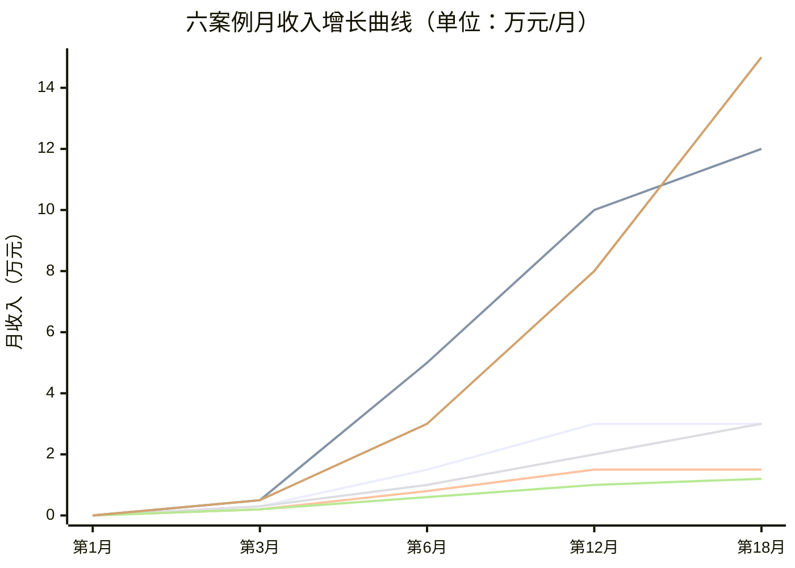
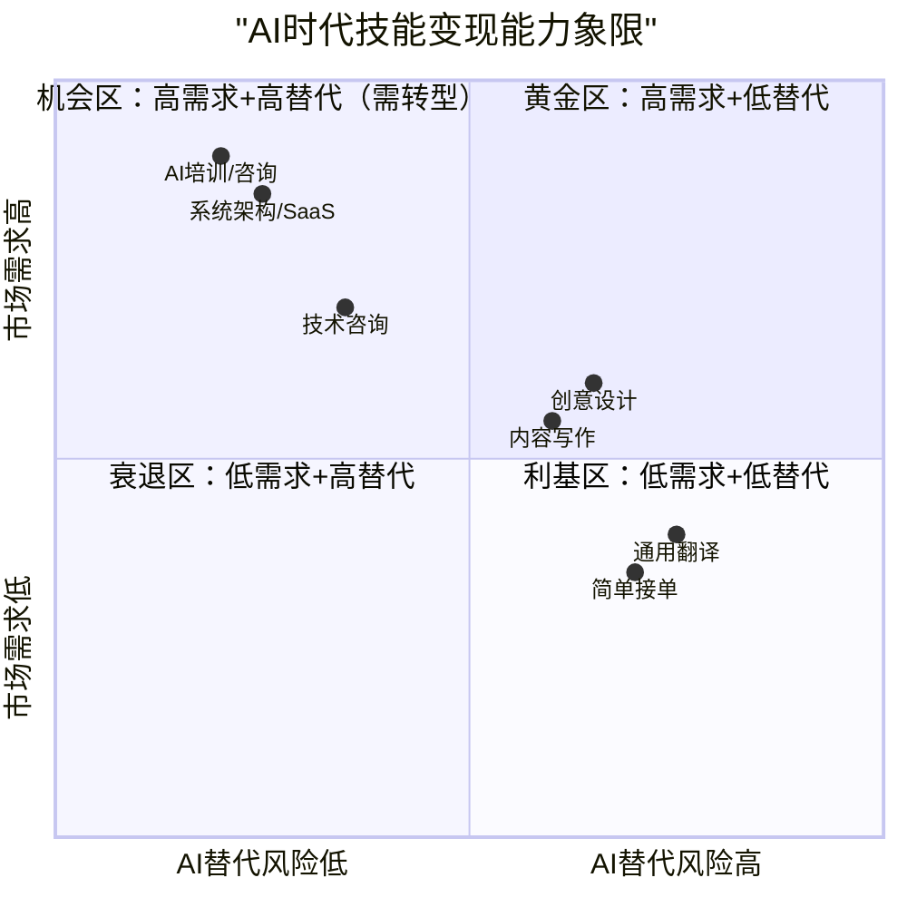
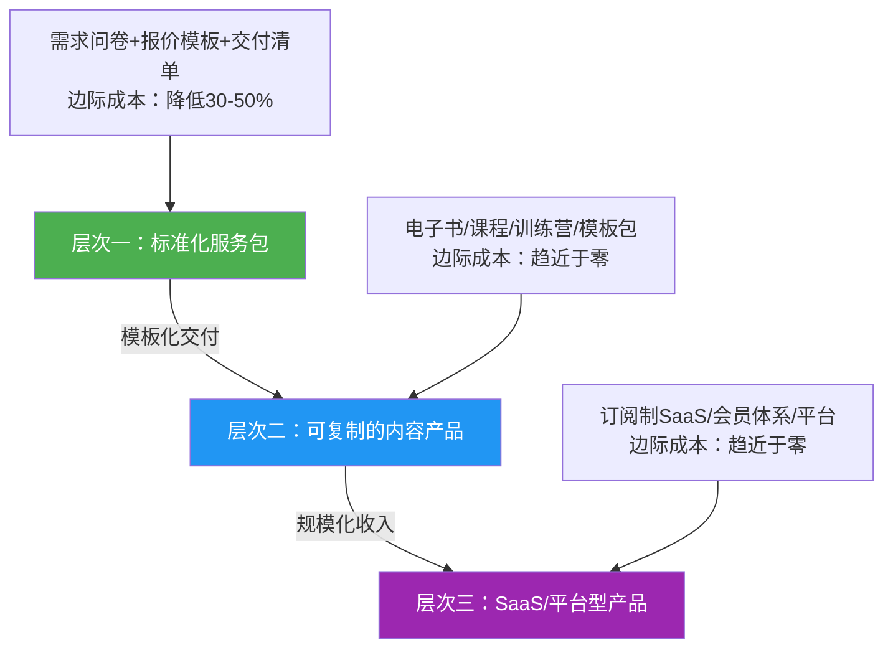
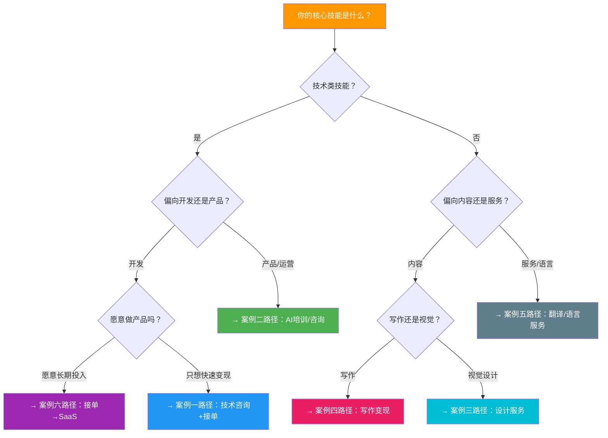
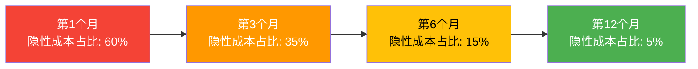
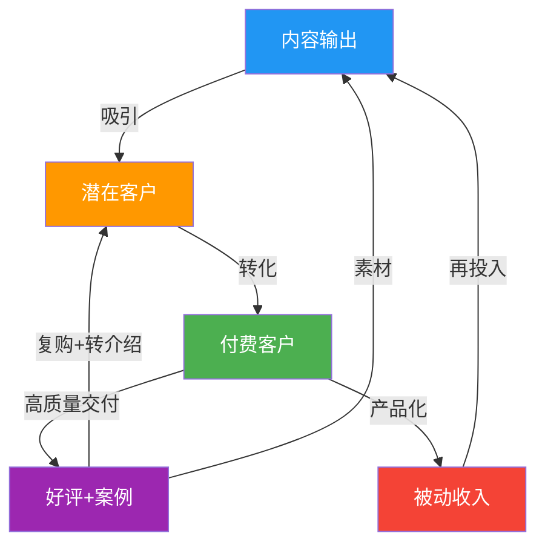

## 案例总结：六条变现路径的共性规律与决策框架

> 前六个案例覆盖了程序员、AI培训师、设计师、写作者、翻译员、全栈开发者六条截然不同的技能变现路径。本节不是简单罗列"他们做了什么"，而是从六个案例中提炼出**可复制的底层规律**——帮你理解"为什么他们能成功"，以及"如果你是另外一种技能背景，该怎么套用这些规律"。
>
> 本章定位：这是第10章"技术技能变现"的收官之节。前六节通过完整案例展示了每条路径的全貌，本节的任务是**横向打通**——把六个案例放在一起比较、分析、抽象，让你看到那些隐藏在具体技能背后的通用法则。读完本节，你应该能回答三个问题：我该选哪条路？我该怎么走？我该怎么避免掉坑里？

---

### 一、六案全景对比：一张表看懂所有路径

#### 1.1 核心数据横向对比

将六个案例的关键指标放在同一张表里，差异一目了然：

| 维度 | 案例一：张晨（程序员） | 案例二：林若晴（AI培训师） | 案例三：陈默（设计师） | 案例四：苏晚秋（写作者） | 案例五：林晓禾（翻译） | 案例六：陈远（全栈） |
|------|----------------------|--------------------------|----------------------|------------------------|----------------------|---------------------|
| **年龄** | 28岁 | 32岁 | 27岁 | 30岁 | 26岁 | 30岁 |
| **主业月薪** | 15K | 18K | 12K | 9K | 8K | 22K |
| **副业起步时间** | 第1个月 | 第1个月 | 第1个月 | 第1个月 | 第1个月 | 第1个月 |
| **达到月入1万** | 第4个月 | 第3个月 | 第6个月 | 第5个月 | 第7个月 | 第4个月 |
| **达到稳定高收入** | 第8个月（3万/月） | 第12个月（10万/月） | 第12个月（1.5万/月） | 第18个月（3万/月） | 第14个月（1.2万/月） | 第18个月（15万/月） |
| **收入天花板方向** | 10-15万/月 | 无上限 | 3-5万/月 | 50万+/年 | 3-5万/月 | 500万+/年 |
| **变现模式** | 服务+咨询 | 内容+培训+企业 | 服务+模板 | 内容+产品+社群 | 纯服务 | 服务→SaaS产品 |
| **可复制性** | ★★★★☆ | ★★★★☆ | ★★★★★ | ★★★☆☆ | ★★★★☆ | ★★★☆☆ |
| **启动资金需求** | 几乎为零 | 几乎为零 | 低（设计工具订阅） | 低 | 低（CAT工具） | 中（服务器等） |
| **AI替代风险** | 中（辅助编码工具可替代简单接单） | 低（人类讲师的信任和互动不可替代） | 高（AI绘图工具冲击基础设计） | 中（AI写作可替代平庸内容） | 高（机器翻译质量持续提升） | 低（系统架构和业务理解难以替代） |
| **护城河类型** | 技术深度+案例积累 | 个人品牌+课程体系 | 模板资产+风格辨识度 | 专业视角+出版资源 | 行业术语库+客户关系 | 技术架构+行业解决方案 |

**如何读这张表：** 不要只看你感兴趣的那列。横向比较才能发现规律——比如"AI替代风险"和"护城河类型"这两行，直接决定了你选择的路径能在多长时间内保持竞争力。

#### 1.2 收入增长曲线对比

六个案例的收入增长可以用四阶段模型来概括：



**四阶段模型详解：**

| 阶段 | 时间范围 | 核心任务 | 收入特征 | 关键指标 |
|------|---------|---------|---------|---------|
| **起步期** | 第1-3个月 | 定位验证、冷启动、积累信任资产 | 0-3000元，不稳定 | 是否完成首单？好评数？ |
| **突破期** | 第4-6个月 | 扩大获客、优化交付、初步涨价 | 3000-1万，开始稳定 | 月收入增长率？复购率？ |
| **稳定期** | 第7-12个月 | 产品化转型、客户分层、品牌建设 | 1-3万，稳定增长 | 产品化收入占比？S/A级客户数？ |
| **规模化** | 第12个月+ | 团队化、SaaS化、被动收入 | 3万+，指数增长 | 被动收入占比？边际成本？ |

**关键发现：收入天花板取决于变现模式，而非技能本身。**

六条路径可以按变现模式分为三类：

| 变现模式 | 代表案例 | 核心特征 | 收入公式 | 天花板 |
|---------|---------|---------|---------|--------|
| **卖时间**（纯服务） | 林晓禾（翻译） | 直接用技能交付成果 | 时薪 × 工作时间 | 受限于个人时间，月入1-3万封顶 |
| **卖方案**（服务+溢价） | 张晨（程序员）、陈默（设计师）、苏晚秋（写作者） | 技能+品牌+体系化 | 客单价 × 交付量 × 复购系数 | 可通过提价和产品化突破到月入3-10万 |
| **卖系统**（产品化） | 林若晴（AI培训）、陈远（全栈） | 把技能封装成可复制的产品 | 产品销量 × 客单价 - 边际成本 | 几乎无上限，取决于市场规模 |

**核心启示：从"卖时间"到"卖方案"再到"卖系统"，是技能变现的终极进化路径。** 六个案例中，收入天花板最高的是走了"卖系统"路线的林若晴和陈远——不是因为他们的技能更值钱，而是因为他们把技能封装成了可规模化复制的产品。

#### 1.3 AI时代韧性评估

随着AI工具的快速渗透，每条变现路径都面临不同程度的冲击。以下是基于2024-2026年AI工具能力演进的评估：

| 路径 | AI可替代环节（2024-2025） | AI加速替代环节（2026+） | AI难以替代环节 | 应对策略 | 韧性评分 |
|------|------------|--------------|--------------|---------|:---:|
| 程序员接单 | 简单CRUD、模板代码、Bug修复 | AI Agent自主完成中等复杂度功能开发 | 系统架构设计、复杂业务理解、技术选型、跨团队协调 | 向"AI+人"协作模式转型，做AI做不了的架构和业务决策 | ★★★★☆ |
| AI培训 | 操作演示、工具介绍 | AI自动生成教程视频和操作指南 | 实战案例设计、学员互动、行业洞察、课程体系规划 | 深度垂直行业AI应用，提供AI无法给出的"判断力"和"经验" | ★★★★★ |
| 设计服务 | Banner、简单海报、图标设计 | AI生成完整的品牌视觉方案 | 品牌视觉策略、创意概念、情感化设计、文化语境理解 | 从"画图"转向"视觉策略顾问"，AI做执行人做决策 | ★★★☆☆ |
| 写作变现 | SEO文章、产品描述、通用文案 | AI写出达到80分的长文 | 深度分析、行业洞察、独特视角、出版级内容、人格化表达 | 写AI写不出来的东西：经验、判断、洞察、故事、立场 | ★★★☆☆ |
| 翻译服务 | 通用文档翻译、简单口译 | AI翻译质量达到专业译员90%水平 | 法律/医疗/技术等高精度领域、文化本地化、创意翻译 | 向"翻译+审校+本地化咨询"升级，AI翻译+人工精修+文化适配 | ★★☆☆☆ |
| 全栈SaaS | 前端页面、简单后端逻辑、UI组件 | AI Agent搭建完整MVP | 系统架构、复杂业务逻辑、产品规划、用户增长策略 | AI作为开发加速器，核心竞争力在产品思维和业务理解 | ★★★★☆ |

**关键洞察：AI不是你的竞争对手，而是你的杠杆。** 林若晴的案例最能说明这一点——她没有被AI培训工具替代，反而因为教会更多人使用AI而获得了更大的市场。张晨用AI辅助编码，把交付效率提升了60%，单位时间收入反而增加了。真正的风险不是AI太强，而是你拒绝使用AI。

**AI时代的能力升级矩阵：**



**行动建议：** 把你的核心能力放在"黄金区"（第一象限），把AI替代风险高的工作交给AI来加速，自己聚焦于AI难以替代的判断力、创意和人际连接。

**AI能力演进的三个阶段与应对策略：**

理解AI的发展节奏，才能做出正确的长期决策。以下是基于当前技术趋势的三阶段预测：

| 阶段 | 时间范围 | AI能力水平 | 对各路径的影响 | 核心应对策略 |
|------|---------|-----------|-------------|------------|
| **第一阶段：AI辅助** | 2024-2026 | AI是工具，需要人类主导 | 效率提升2-5倍，替代简单重复工作 | 积极拥抱AI工具，提升个人效率 |
| **第二阶段：AI协作** | 2027-2029 | AI能独立完成中等复杂度任务 | 低端服务需求萎缩，中端服务价格下降 | 向"AI+人"协作模式转型，聚焦AI做不好的判断力和创意 |
| **第三阶段：AI主导** | 2030+ | AI能处理大多数标准化任务 | 只有高度创意性、战略性、人际性的工作留给人类 | 建立"人类独有价值"壁垒：深度关系、行业判断、创意审美、道德决策 |

**各路径在三个阶段的命运预测：**

| 路径 | 第一阶段（2024-2026） | 第二阶段（2027-2029） | 第三阶段（2030+） | 长期策略 |
|------|---------------------|---------------------|-----------------|---------|
| 程序员接单 | 效率大幅提升，收入增长 | 简单接单需求被AI Agent替代 | 聚焦系统架构和复杂业务决策 | 从"写代码"转向"设计系统+管理AI" |
| AI培训 | 市场爆发期，红利巨大 | 基础AI操作培训需求下降 | 转型为"AI战略咨询"和"人机协作培训" | 持续跟进AI前沿，从教操作升级为教策略 |
| 设计服务 | 基础设计被AI冲击，高端设计不受影响 | AI生成完整品牌方案，人工做决策和审美把关 | 设计师成为"视觉策略顾问" | 强化审美判断、品牌理解、情感化设计 |
| 写作变现 | AI写作质量快速提升，平庸内容贬值 | AI写出80分长文，人类聚焦100分深度内容 | 人类写作的价值在于"独特视角"和"人格化表达" | 深化行业洞察、建立个人风格、积累出版资源 |
| 翻译服务 | AI翻译质量大幅提升，价格下降 | AI翻译达到专业水平，人工转为审校和本地化 | 翻译员转型为"跨文化沟通顾问" | 向本地化、文化适配、行业专精方向升级 |
| 全栈SaaS | AI加速开发效率，MVP搭建成本下降 | AI Agent能搭建完整产品 | 核心竞争力在产品思维、用户增长和业务理解 | 从"写代码"转向"定义产品+增长运营" |

**AI时代的"能力护城河"建设清单：**

```text
1. 判断力：在信息过载的时代，能做出正确判断的人更稀缺
   → 如何培养：多做复盘、建立决策框架、学习行业知识

2. 创意力：AI能模仿风格，但难以原创突破性的创意
   → 如何培养：跨领域学习、大量观察、刻意练习创意输出

3. 人际连接：信任、共情、说服力是AI的短板
   → 如何培养：线下社交、社群运营、深度客户关系维护

4. 系统思维：理解复杂系统之间的关系，做出全局最优决策
   → 如何培养：学习系统论、做架构设计、参与复杂项目

5. 道德判断：在灰色地带做出符合伦理的决策
   → 如何培养：阅读伦理学、关注行业案例、建立个人原则
```

---

### 二、六条路径的共性规律：所有成功者都做了这8件事

尽管六条路径的技能领域、目标客户、变现方式各不相同，但在复盘所有案例后，我们发现所有成功者无一例外地完成了以下8个关键动作。这不是"经验总结"式的空话，而是经过六个真实案例交叉验证的**可执行步骤**。

#### 2.1 规律一：用决策矩阵选择方向，而非凭直觉

六个案例中，五位主人公使用了**加权评分法**来选择变现方向。这不是巧合——凭直觉选方向最大的风险是"选了一个自己擅长但市场不需要的赛道"。

**决策矩阵通用模板：**

```markdown
| 方向 | 市场需求(30%) | 启动难度(25%) | 时薪潜力(25%) | 可扩展性(20%) | 加权总分 |
|------|:---:|:---:|:---:|:---:|:---:|
| 方向A | ? | ? | ? | ? | =加权计算 |
| 方向B | ? | ? | ? | ? | =加权计算 |
| 方向C | ? | ? | ? | ? | =加权计算 |
```

**各案例的决策结果：**

| 案例 | 评估了几个方向 | 最终选择 | 选择理由 | 放弃的方向及原因 |
|------|:---:|---------|---------|----------------|
| 张晨 | 4个 | 技术咨询+接单 | 时薪高+可立即变现，两者互相促进 | 放弃了"技术自媒体"（变现周期太长）和"开源项目赞助"（收入不稳定） |
| 林若晴 | 4个 | AI培训 | 市场爆发期+边际成本趋零+产品经理背景契合 | 放弃了"AI工具测评"（内容同质化严重）和"企业AI咨询"（需要团队） |
| 陈默 | 5个 | 新媒体视觉设计 | 需求增长快+竞争相对小+可模板化 | 放弃了"UI设计"（竞争红海）和"品牌设计"（需要大客户资源） |
| 苏晚秋 | 4个 | 出版/写作方法论 | 专业度高+竞争者少+读者有付费意愿 | 放弃了"自由撰稿"（时薪天花板低）和"自媒体运营"（需要团队） |
| 林晓禾 | 7个 | 技术文档翻译+软件本地化 | 行业经验匹配+增量市场+企业客户复购率高 | 放弃了"文学翻译"（市场萎缩）和"商务口译"（时间冲突大） |
| 陈远 | 4个 | 接单→标准化→SaaS递进 | 70%需求可复用+可产品化+天花板最高 | 放弃了"技术培训"（已有林若晴赛道）和"纯外包"（不可规模化） |

**你该怎么用这个矩阵？**

1. 列出你所有可能的变现方向（至少3个，最好4-5个）
2. 对每个方向，诚实地打分（1-10分）
3. 权重可以根据你的个人情况调整——比如你特别看重"可扩展性"，就把权重从20%调到30%
4. 选加权总分最高的1-2个方向，不要贪多
5. **重要：给每个方向写一句话说明你为什么打这个分**——这能防止事后自我欺骗

**决策矩阵的常见误区：**

- **只看市场需求不看启动难度**：市场需求9分但启动难度也9分的方向，你可能永远无法起步。林晓禾评估的"游戏本地化"方向市场需求8分，但她完全不懂游戏行业，启动难度9分，果断放弃。
- **忽略"可扩展性"权重**：很多人只看"能不能快速赚钱"，忽略了天花板限制。翻译路径的可扩展性评分只有3分，这也解释了为什么林晓禾的收入增长最慢。
- **评分时自我欺骗**：给自己不擅长的领域打低分是正常的，但不要因为"不想做"而故意打低分。诚实面对自己的能力和市场现实。
- **忽略"兴趣持续性"维度**：建议在四个维度之外，增加"兴趣匹配度(20%)"维度。陈默在第8个月差点放弃，就是因为对"新媒体视觉设计"的兴趣在消退——后来他把兴趣维度纳入决策，调整为"品牌视觉策略"，重新找回了热情。

#### 2.2 规律二：精准定位，拒绝"什么都能做"

六个案例中，**没有一个人选择"什么都做"的全能路线**。每个人都在起步时做了极其精准的细分定位：

| 案例 | 泛定位（他们都拒绝了） | 精准定位（他们实际选的） | 定位公式 |
|------|----------------------|------------------------|---------|
| 张晨 | "程序员接单" | "Java后端实战：Spring Boot+MySQL+高并发" | 技术栈 + 细分场景 |
| 林若晴 | "AI怎么用" | "职场白领+自媒体人+产品经理的AI提效" | 特定人群 + 特定场景 + AI解决方案 |
| 陈默 | "什么设计都做" | "新媒体视觉设计：个人IP和中小企业的视觉包装" | 行业 + 设计类型 |
| 苏晚秋 | "各种写作投稿" | "出版/写作方法论：出版从业者的专业视角" | 专业身份 + 内容领域 |
| 林晓禾 | "各种翻译" | "技术文档翻译（主）+软件本地化（辅）" | 内容类型 + 语言对 |
| 陈远 | "全栈开发外包" | "中小企业数字化解决方案专家" | 客户类型 + 解决的问题 |

**为什么精准定位如此关键？**

1. **降低获客成本**：精准定位让你的营销信息直击目标客户痛点，转化率是泛定位的3-5倍。陈默的数据证明了这一点——他的小红书"新媒体视觉"内容互动率（8.7%）远高于"设计技巧"类内容（2.1%）。
2. **建立专业壁垒**：在一个细分领域做到前20%，远比在多个领域做到前50%容易。林晓禾选择"技术文档翻译"而非"什么翻译都做"，让她在该细分市场快速建立了口碑——6个月内成为了3家翻译公司的首选外包。
3. **提升定价权**：专家型定位天然自带溢价。张晨把自己定位为"Java后端技术顾问"而非"程序员接私活"，时薪从最初的100元提升到300元——同样的工作内容，定位不同，价格差3倍。
4. **简化决策**：精准定位让你知道什么该接、什么该拒。陈默在明确"新媒体视觉设计"定位后，拒绝了Logo设计、电商详情页等"来钱但偏离定位"的单子，短期内少赚了一些，但长期建立了清晰的品牌认知。

**定位公式：** `你的专业背景 × 市场需求增长最快的细分领域 × 竞争相对不激烈的交叉点`

**定位验证的三个信号：**

- **信号一**：你发的内容，目标客户会主动转发/收藏（说明击中了痛点）
- **信号二**：客户咨询时能用一句话描述你的定位（说明定位清晰可传播）
- **信号三**：竞争对手少于10个活跃玩家（说明赛道还没卷到天花板）

如果三个信号中有两个不满足，说明你的定位需要调整——不是技能有问题，是定位的"市场切角"有问题。

**定位调整的渐进策略：** 不要一下子大改。陈默的定位调整经历了三个版本：v1"什么设计都做"→v2"新媒体设计"→v3"个人IP和中小企业的视觉包装"。每次调整都是基于数据反馈（哪些内容互动率高、哪类客户复购率高），而非拍脑袋。建议每个版本至少运行3个月再考虑调整。

#### 2.3 规律三：冷启动阶段必须"主动制造信任"

在没有任何客户案例的时候，六个案例的主人公都采用了"自造信任锚点"的策略：

| 案例 | 信任锚点策略 | 具体做法 | 效果 | 耗时 |
|------|------------|---------|------|:---:|
| 张晨 | 开源项目+技术文章 | 开源了2个小工具，写了10篇掘金文章（2篇上热门） | 掘金文章阅读量达5万+，带来第一批咨询 | 6周 |
| 林若晴 | 小红书爆款内容 | 发布5篇AI实操教程，数据爆炸（单篇收藏876） | 3周内积累500+精准粉丝 | 3周 |
| 陈默 | 虚拟项目+低价接单 | 设计3个虚拟项目案例，600元低价接单积累好评 | 前2个月获得15个真实案例 | 8周 |
| 苏晚秋 | 5篇不同类型的样稿 | 反复修改三轮，每篇按目标平台风格调整 | 第一次投稿即被录用 | 4周 |
| 林晓禾 | 5套试译样本 | 覆盖IT/制造/软件/商务/日语5个领域 | 试译通过率80% | 3周 |
| 陈远 | 开源管理系统模板 | React+Node.js+PostgreSQL后台模板 | 第一个月GitHub star 200+ | 5周 |

**冷启动信任公式：** `免费高质量内容/作品 + 平台曝光 + 低价首单口碑 = 初始信任资产`

**关键细节：前5单的定价策略。** 六个案例中，五个人在最初5单都采取了"故意低价甚至免费"的策略。这不是因为他们不值钱，而是因为他们需要的是**好评和案例**，而不是收入。前5单的真正价值是：

- 获得真实的客户评价（可展示的信任背书）
- 积累案例素材（作品集的内容来源）
- 理解客户需求（比任何市场调研都有效）
- 建立第一批复购客户（六个案例中，前5单客户的复购率平均达到40%）
- 验证定价假设（通过低价测试客户的付费意愿和价格敏感度）

**冷启动期的时间分配建议（每周10小时为例）：**

| 活动 | 时间占比 | 具体内容 | 为什么重要 |
|------|:---:|---------|----------|
| 内容创作 | 40%（4小时） | 写1-2篇专业内容，发布到目标平台 | 持续积累信任资产，长期获客的基础 |
| 主动获客 | 30%（3小时） | 在社区回答问题、私信潜在客户、参与行业讨论 | 冷启动期不能等客户上门，必须主动出击 |
| 交付执行 | 20%（2小时） | 完成已接的订单/项目 | 交付质量决定口碑和复购 |
| 学习优化 | 10%（1小时） | 研究竞品、优化定价、调整策略 | 避免闭门造车，持续迭代 |

**冷启动期的"7天冲刺"模板（适合所有路径）：**

```text
Day 1：完成精准定位（用公式写出一句话定位）
Day 2：准备信任锚点素材（样稿/作品/开源项目）
Day 3：注册并完善内容平台账号（头像、简介、标签）
Day 4：发布第一篇内容（哪怕只有500字）
Day 5：在商业平台上架服务（闲鱼/猪八戒/程序员客栈）
Day 6：在目标社区活跃（回答3个问题，参与1个讨论）
Day 7：复盘第一周数据（阅读量、咨询量、反馈）
```

#### 2.4 规律四：内容营销是所有路径的获客基石

六个案例中，**每一个人都把"内容输出"作为获客的核心策略**。这不是巧合——内容营销的本质是"用免费价值建立信任，再把信任转化为付费"。

| 案例 | 内容平台 | 内容类型 | 更新频率 | 引流方式 | 内容获客占比 |
|------|---------|---------|---------|---------|:---:|
| 张晨 | 掘金+GitHub | 技术文章+开源项目 | 每周1篇 | 文章末尾引流话术 | ~40% |
| 林若晴 | 小红书+公众号+知乎 | AI实操教程 | 每周3-5篇 | 评论区互动+私域引流 | ~60% |
| 陈默 | 小红书+朋友圈 | 设计案例+教程 | 每周2-3篇 | 作品展示引流 | ~70% |
| 苏晚秋 | 公众号+知乎+豆瓣 | 写作方法论+书评 | 每周2篇 | 文末引流+约稿邀请 | ~50% |
| 林晓禾 | 知乎+小红书+LinkedIn | 翻译知识+行业洞察 | 每周1-2篇 | 专业形象引流 | ~35% |
| 陈远 | 掘金+知乎+GitHub | 技术方案+开源项目 | 每周1-2篇 | 文末引流+项目README | ~50% |

**内容营销的核心逻辑：**

```text
免费内容（建立信任）→ 私域沉淀（深度连接）→ 付费产品（价值变现）
```

**不同平台的角色分工：**

| 平台类型 | 代表平台 | 核心作用 | 内容特点 | 投入比例建议 |
|---------|---------|---------|---------|:---:|
| 流量型平台 | 小红书、抖音、知乎 | 获取新用户、扩大曝光 | 短、快、抓眼球，痛点驱动 | 40% |
| 深度型平台 | 公众号、掘金、CSDN | 建立专业形象、深度信任 | 长、深、系统化，价值驱动 | 35% |
| 作品型平台 | GitHub、Behance、站酷 | 展示实力、技术背书 | 项目、案例、可验证的成果 | 15% |
| 商业型平台 | 闲鱼、猪八戒、程序员客栈 | 直接获客、低价引流 | 服务描述、定价、好评展示 | 10% |

**最佳策略是"三角阵型"：** 选1个流量平台获取新用户 + 选1个深度平台建立信任 + 选1个商业平台直接变现。三个平台的内容可以互相复用，但需要针对每个平台的调性做适当调整。比如同一篇技术文章，在掘金发完整版（3000字），在小红书发精华版（500字+配图），在知乎发问答版（回答相关问题时引用）。

**内容创作的三个层次（从低到高）：**

| 层次 | 内容类型 | 信任效果 | 获客效果 | 示例 | 制作难度 |
|------|---------|:---:|:---:|------|:---:|
| **第一层：知识搬运** | 教程、工具介绍、操作指南 | ★★☆ | ★★☆ | "如何用ChatGPT写周报" | 低 |
| **第二层：实战分享** | 案例复盘、踩坑记录、数据对比 | ★★★★ | ★★★★ | "我用AI帮客户省了3万块：完整复盘" | 中 |
| **第三层：深度洞察** | 行业分析、趋势判断、方法论总结 | ★★★★★ | ★★★ | "2025年AI培训市场的三个结构性机会" | 高 |

**关键原则：不要在第一层停留太久。** 林若晴的前5篇内容都是第一层（工具教程），获得了不错的流量，但真正带来付费客户的，是她开始做第二层内容（学员案例复盘）之后。第一层内容获取的是"好奇心流量"，第二层和第三层获取的是"信任流量"——后者才是付费转化的基础。

**内容复用效率最大化：** 一次深度创作，多平台多形式复用。陈远的一篇"中小企业如何选择技术栈"长文（掘金，4000字），被拆解为：1条小红书图文（核心观点+配图）、3条知乎回答（回答相关问题）、1个GitHub README（技术选型决策树）、1条朋友圈（个人感悟+引流）。同样的内容投入，触达量提升了5倍。

**平台算法与获客深度策略：**

不同平台有不同的流量分配逻辑，理解算法才能高效获客：

| 平台 | 核心算法逻辑 | 内容优化要点 | 最佳发布时间 | 获客转化路径 |
|------|------------|------------|:---:|------------|
| **小红书** | 兴趣标签匹配+社交推荐 | 封面图决定点击率（占60%），标题含关键词，正文干货密度高 | 12:00-13:00, 20:00-22:00 | 笔记→评论区互动→私信→加微信→转化 |
| **知乎** | 问题热度+回答质量+赞同数 | 回答高关注量问题，开头抓人，结构清晰，数据支撑 | 10:00-11:00, 21:00-22:00 | 回答→个人主页→公众号/微信→转化 |
| **掘金/CSDN** | 技术标签+文章质量+互动量 | 标题含技术关键词，代码示例丰富，解决实际问题 | 9:00-10:00, 20:00-21:00 | 文章→GitHub→联系方式→咨询转化 |
| **公众号** | 粉丝基数+打开率+分享率 | 标题决定打开率，内容决定分享率，引导关注和转发 | 7:30-8:30, 20:00-22:00 | 文章→关注→社群→产品转化 |
| **闲鱼** | 关键词匹配+价格+好评率 | 标题含搜索关键词，价格有竞争力，好评展示 | 全天 | 搜索→商品详情→咨询→成交 |
| **LinkedIn** | 职业标签+内容质量+互动 | 英文内容，行业洞察，专业形象 | 周二-周四 8:00-10:00 | 内容→连接→消息→合作 |

**获客漏斗优化的关键指标：**

```text
曝光量（内容被多少人看到）
  ↓ 点击率目标：≥5%
点击量（多少人点进来看）
  ↓ 阅读完成率目标：≥30%
阅读量（多少人看完了）
  ↓ 互动率目标：≥3%
互动量（点赞/评论/收藏）
  ↓ 私信转化率目标：≥1%
咨询量（多少人私信/加微信）
  ↓ 付费转化率目标：≥20%
付费客户（多少人下单）
  ↓ 复购率目标：≥30%
复购客户（多少人再次购买）
```

**各环节优化策略：**

| 漏斗环节 | 关键动作 | 常见问题 | 优化方法 |
|---------|---------|---------|---------|
| **曝光→点击** | 优化标题和封面 | 标题平淡，封面随意 | 研究爆款标题公式：数字+痛点+结果；封面用对比色+大字 |
| **点击→阅读** | 开头3秒抓住注意力 | 开头啰嗦，没有钩子 | 用"痛点描述"或"惊人数据"开头，3秒内让读者觉得"这说的就是我" |
| **阅读→互动** | 内容有干货有共鸣 | 纯干货没有情感 | 在干货中穿插个人经历、踩坑故事、真实数据 |
| **互动→咨询** | 文末明确引导 | 没有引导或引导太硬 | "如果你也遇到这个问题，可以私信我聊聊"比"加我微信"效果好3倍 |
| **咨询→付费** | 快速响应+价值展示 | 回复慢，直接报价 | 5分钟内回复，先了解需求再给方案，最后才报价 |

#### 2.5 规律五：服务产品化是突破收入天花板的关键

六个案例中，所有月入超过2万的人，都在某个阶段完成了**"从接单到产品化"**的转型。这不是一个可选步骤，而是突破收入天花板的必经之路。

**产品化的三个层次：**



| 产品化层次 | 代表案例 | 具体形态 | 边际成本 | 收入特征 |
|-----------|---------|---------|---------|---------|
| 标准化服务包 | 张晨、陈默、林晓禾 | 固定价格的服务套餐、需求问卷模板化 | 低（但仍需人工交付） | 客单价提升30-50% |
| 内容产品 | 林若晴、苏晚秋 | 电子书、付费专栏、录播课程、训练营 | 趋近于零 | 一次制作，反复销售 |
| SaaS/平台 | 陈远 | 订阅制SaaS产品、会员体系 | 趋近于零 | 规模化，被动收入 |

**各案例的产品化时间线：**

| 案例 | 何时开始产品化 | 产品化形态 | 产品化后收入占比 | 产品化前月收入 | 产品化后月收入 |
|------|:---:|---------|:---:|:---:|:---:|
| 张晨 | 第3个月 | 标准化技术咨询方案包 | 40% | 8000元 | 1.5万元 |
| 林若晴 | 第3个月 | 低价电子书→训练营→企业内训 | 80% | 5000元 | 5万元 |
| 陈默 | 第4个月 | 设计模板包+标准化视觉套餐 | 35% | 6000元 | 1万元 |
| 苏晚秋 | 第12个月 | 付费专栏+知识星球+电子书 | 60% | 1.5万元 | 3万元 |
| 林晓禾 | 第6个月 | 月度翻译服务包+术语库订阅 | 25% | 5000元 | 8000元 |
| 陈远 | 第11个月 | SaaS产品+行业解决方案包 | 65% | 3万元 | 10万元 |

**产品化的时机判断：** 当你发现自己在反复回答同样的问题、反复做同样的工作时，就是产品化的最佳时机。张晨在接了30单之后发现，60%的需求集中在"Spring Boot项目搭建"和"Bug调试"上，于是把这两类需求打包成标准化服务包，效率提升了40%。

**产品化的具体执行路径（以标准化服务包为例）：**

1. **记录重复模式**：用2周时间记录所有客户咨询，按需求类型分类
2. **提取共性需求**：找出出现频率最高的3-5类需求
3. **设计标准化套餐**：每类需求设计一个固定价格的服务包（含需求确认模板、交付清单、验收标准）
4. **制作服务手册**：把服务流程文档化，确保可复制（即使未来交给助理也能执行）
5. **小范围测试**：先用3-5个客户测试标准化套餐，收集反馈
6. **迭代优化**：根据反馈调整套餐内容和定价，然后全面推广

**产品化失败的三个常见原因：**

- **过早产品化**：陈远在第4个月就想做SaaS，但当时他只接了20单，对客户需求的理解还不够深，产品功能设计偏离了实际需求。解决方案：至少完成50单、接触100个客户咨询后，再考虑产品化。
- **产品化后忽视迭代**：有些人在推出产品后就停止更新了。林若晴的训练营每期都会更新20%的内容，因为AI领域变化太快，三个月前的教程可能已经过时。解决方案：建立"月度内容更新"机制，确保产品始终与市场同步。
- **定价过低**：很多人对数字产品定价过低，觉得"成本几乎为零所以应该便宜"。但数字产品的定价应该基于**客户获得的价值**，而非你的制作成本。苏晚秋的写作方法论课程定价399元，因为她教的方法能帮学员省下至少5000元的投稿试错成本。

#### 2.6 规律六：客户分层管理决定长期收入质量

六个案例中，所有持续盈利的人都建立了**客户分层体系**。这一步往往被新手忽略，但它是"副业"和"生意"的本质区别。

**通用客户分层模型（SABC模型）：**

| 客户等级 | 特征 | 占比 | 管理策略 | 对应资源投入 | 沟通频率 |
|---------|------|:---:|---------|------------|:---:|
| **S级（战略客户）** | 高客单价、高复购、强推荐 | 5-10% | 专属服务、优先响应、定期回访 | 最高 | 每周至少1次 |
| **A级（核心客户）** | 稳定复购、偶尔推荐 | 15-20% | 标准化优质服务、节日关怀 | 高 | 每两周1次 |
| **B级（普通客户）** | 偶尔购买、价格敏感 | 30-40% | 标准化服务、引导复购 | 中 | 每月1次 |
| **C级（一次性客户）** | 只买一次、不复购 | 30-50% | 基础服务、不额外投入 | 低 | 不主动联系 |

**各案例的客户管理实践：**

- **张晨**：用Notion建立客户信息表，每满10个好评涨价一次，S/A级客户优先排期。S级客户的平均客单价是C级的4倍，但服务时间只多了50%。
- **林若晴**：微信社群分层运营（免费群→付费群→VIP群），企业客户专属对接。VIP群的续费率高达85%。
- **陈默**：S/A级客户享受"月度视觉顾问"服务，复购率从30%提升到60%。这个"月度顾问"服务的定价是单次设计的3倍，但交付时间反而更可控。
- **苏晚秋**：知识星球VIP会员享受一对一写作指导，高价值客户主动维护。VIP会员的转介绍率是普通会员的5倍。
- **林晓禾**：S/A级客户（翻译公司+直客）贡献了70%的收入，但数量只占15%。
- **陈远**：SaaS客户分层定价（基础版/专业版/企业版），S级客户享定制开发。企业版客户的LTV（生命周期价值）是基础版的20倍。

**核心法则：维护好20%的高价值客户，比开发100个新客户更有效。** 陈默在第12个月时发现，他的S/A级客户（约20%数量）贡献了65%的收入，而获客成本几乎为零（全靠复购和转介绍）。

**客户升级路径：** 好的客户管理不只是分层，还要设计"升级路径"——让C级客户变成B级，B级变成A级。

```text
C级（一次性）→ 超预期交付 → B级（偶尔回购）
B级（偶尔）→ 专属优惠+关怀 → A级（稳定复购）
A级（稳定）→ VIP权益+优先服务 → S级（战略合作）
```

**客户分层的实操工具对比：**

| 工具 | 适用阶段 | 优势 | 劣势 | 推荐指数 |
|------|---------|------|------|:---:|
| Excel/飞书表格 | 起步期（0-50客户） | 零成本、灵活 | 手动更新，容易遗漏 | ★★★☆☆ |
| Notion | 成长期（50-200客户） | 视图丰富、可嵌入多维数据 | 学习曲线略陡 | ★★★★☆ |
| 微信+标签分组 | 所有阶段 | 直接触达、免费 | 无法做数据分析 | ★★★☆☆ |
| 专业CRM（纷享销客等） | 规模期（200+客户） | 自动化、数据分析强 | 付费、学习成本高 | ★★★★☆ |

#### 2.7 规律七：数据驱动决策，拒绝"感觉良好"

六个案例中，每一个人都建立了**数据复盘机制**。他们不是凭感觉判断"做得好不好"，而是用数据说话。

**必须追踪的核心指标：**

| 指标类别 | 具体指标 | 为什么重要 | 复盘频率 | 健康基准线 |
|---------|---------|----------|---------|-----------|
| **收入指标** | 月收入、收入来源占比、客单价 | 判断业务健康度 | 每月 | 月环比增长≥10% |
| **获客指标** | 新客户数、获客渠道分布、获客成本 | 优化营销投入 | 每月 | 获客成本＜首单收入的30% |
| **效率指标** | 时薪、交付周期、模板使用率 | 提升单位时间产出 | 每两周 | 时薪≥主业时薪的1.5倍 |
| **客户指标** | 复购率、转介绍率、客户满意度 | 判断服务质量 | 每月 | 复购率≥30% |
| **内容指标** | 阅读量、互动率、转化率 | 优化内容策略 | 每周 | 互动率≥3% |

**张晨的月度复盘模板（可直接套用）：**

```markdown
## 月度业务复盘（YYYY年MM月）

### 收入概览
- 总收入：____元
- 收入构成：接单___% / 咨询___% / 产品___%
- 较上月增长：___%
- 时薪：____元/小时（总收入 ÷ 总工作时间）

### 获客分析
- 新客户数：____人
- 获客渠道：闲鱼___人 / 掘金___人 / 转介绍___人
- 获客成本：____元/人（或0，如果纯靠内容引流）
- 渠道效率排名：___＞___＞___

### 效率分析
- 本月工作总时长：____小时
- 最耗时的3个项目：____
- 可模板化/自动化的重复工作：____
- 下月效率提升计划：____

### 客户分析
- 活跃客户数：____人
- 复购客户数：____人（复购率：____%）
- 转介绍客户数：____人
- S/A级客户变化：____
- 客户反馈中的高频关键词：____

### 内容分析
- 本月发布内容：____篇
- 总阅读量：____
- 互动率最高的内容：____（原因分析：____）
- 内容带来的咨询量：____

### 下月计划
- 收入目标：____元
- 重点行动：____
- 需要改进：____
- 需要停止做的事：____
```

**数据复盘的三个常见误区：**

1. **只看收入不看时薪**：月入2万但每周工作40小时，时薪才125元，不如月入1.5万但每周工作20小时（时薪187.5元）。**时薪才是衡量副业效率的终极指标。** 张晨在第5个月意识到这一点后，砍掉了两个低时薪项目，月收入短暂下降但时薪提升了40%。
2. **只看总量不看结构**：月收入增长20%，但如果100%来自接单，说明你没有产品化进展。健康的收入结构应该是：接单≤50%，产品化收入≥30%，复购收入≥20%。
3. **只看自己不看行业**：你觉得自己"还不错"，但不知道同行的平均时薪已经涨了50%。定期在行业社群、平台上了解定价水平，才能知道自己的竞争力。林晓禾每季度做一次"同行定价调研"，确保自己的价格在市场中位数附近。

#### 2.8 规律八：阶段式涨价，用数据支撑涨价信心

六个案例中，所有人都经历了多轮涨价。但他们的涨价不是"拍脑袋"，而是有明确的触发条件。

**涨价触发条件模型：**

| 触发条件 | 具体标准 | 涨价幅度 | 涨价前准备 |
|---------|---------|---------|-----------|
| 好评积累 | 每满10个好评 | 10-20% | 整理好评截图，更新作品集 |
| 产能饱和 | 排期超过2周 | 15-25% | 提前通知在谈客户 |
| 能力升级 | 掌握新技能或工具 | 20-30% | 准备能力证明（证书/案例） |
| 品牌效应 | 开始有客户主动找来 | 20-40% | 统一更新所有平台定价 |
| 市场变化 | 同行普遍涨价或需求激增 | 10-20% | 调研同行最新定价 |

**张晨的涨价路径（8个月）：**

| 时间节点 | 时薪 | 涨价依据 | 涨价后流失率 | 涨价后收入变化 |
|---------|:---:|---------|:---:|:---:|
| 第1个月 | 100元/时 | 起步定价，低于市场价 | — | — |
| 第3个月 | 150元/时 | 积累了15个好评+5个案例 | 7%（1/15客户流失） | +40% |
| 第5个月 | 200元/时 | 排期超过2周，供不应求 | 0% | +25% |
| 第7个月 | 300元/时 | 品牌效应显现，60%客户主动找来 | 5% | +35% |

**涨价话术模板：**

```text
感谢您一直以来的信任。从本月起，我的服务价格将做以下调整：
- 原价格：XXX元
- 新价格：YYY元
- 调整原因：过去X个月积累了XX个案例/好评，服务质量持续提升
- 老客户优惠：本月下单享受原价/95折

这次调整是为了保证我能持续提供高质量的服务。感谢您的理解。
```

**涨价的心理障碍与破解：**

很多新手在涨价时会焦虑"客户会不会跑了"。实际上，六个案例的数据都表明：**合理的涨价（10-20%）流失率通常低于5%。** 原因有三：

1. **老客户已经建立了信任**，换人的隐性成本远高于10-20%的涨价
2. **涨价释放了"专业"信号**，反而让客户觉得你更值钱
3. **流失的通常是C级客户**（价格敏感型），他们对你的收入贡献本就有限

张晨在第3个月涨价时，15个活跃客户中只有1个流失，但收入增长了40%。用他的话说："那个流失的客户，后来还给我介绍了两个新客户——因为他在别的地方踩了坑。"

**反向操作：什么时候应该降价？** 降价不是耻辱，但必须有策略。以下情况可以考虑临时降价：新市场试探期（前3单给新客户群）、淡季促销（设计行业的春节前后）、捆绑销售（买3送1降低单次价格但提升总客单价）。**永远不要因为"客户说贵"就降价**——如果客户觉得贵，问题出在你没有传递足够的价值，而非价格本身。

---

### 三、不同技能背景的路径选择决策树

面对六条不同的变现路径，你应该选哪条？以下决策树可以帮你快速定位：



#### 3.1 按个人情况选择路径

| 你的情况 | 推荐路径 | 理由 | 预期投入 | 预期回报 |
|---------|---------|------|---------|---------|
| 有编程基础，想快速变现 | 案例一：程序员接单 | 启动最快，闲鱼当天可上架 | 每周10-15小时 | 第4个月月入1万 |
| 擅长表达和教学，有AI使用经验 | 案例二：AI培训 | 市场爆发期，红利巨大 | 每周15-20小时 | 第3个月月入1万，12个月月入10万 |
| 有设计基础，时间有限 | 案例三：设计服务 | 模板化程度高，副业友好 | 每周8-12小时 | 第6个月月入1万 |
| 文字功底好，愿意长期积累 | 案例四：写作变现 | 前期慢但后期有复利效应 | 每周10-15小时 | 第5个月月入1万，18个月月入3万 |
| 有语言技能，喜欢稳定 | 案例五：翻译服务 | 需求稳定，AI时代仍有空间 | 每周10-15小时 | 第7个月月入1万 |
| 全栈能力，追求高天花板 | 案例六：接单→SaaS | 天花板最高但周期最长 | 每周20-30小时 | 第4个月月入1万，18个月月入15万 |

#### 3.2 按可用时间选择策略

| 每周可用时间 | 推荐策略 | 适配路径 | 核心打法 |
|:---:|---------|---------|---------|
| 5-10小时 | 聚焦单一细分，高客单价策略 | 设计模板包、翻译垂直领域 | 只做1个平台，只接高价单 |
| 10-20小时 | 正常节奏，内容+接单并行 | 所有路径均可 | 1个内容平台+1个商业平台 |
| 20-30小时 | 加速推进，可同时布局多渠道 | AI培训、SaaS产品 | 2-3个平台并行，开始产品化 |
| 30小时+ | 考虑全职转型可能 | SaaS产品、内容IP | 全渠道运营，快速规模化 |

#### 3.3 按收入目标选择路径

| 目标收入 | 推荐路径 | 预计达成时间 | 关键里程碑 |
|---------|---------|:---:|-----------|
| 月入3000-5000（零花钱） | 任何路径的起步阶段 | 1-3个月 | 完成首单、积累3-5个好评 |
| 月入1万（替代兼职） | 稳定服务+基础内容 | 3-6个月 | 内容获客稳定、复购率≥20% |
| 月入3万（超越主业） | 产品化+品牌化 | 6-12个月 | 产品化收入占比≥30% |
| 月入10万+（事业级别） | AI培训/SaaS产品化 | 12-24个月 | 被动收入占比≥50% |
| 年入100万+ | 规模化产品+团队 | 18-36个月 | 团队化运营、SaaS/平台型产品 |

#### 3.4 路径切换的信号与方法

很多人在中途发现当前路径不适合自己，这时候应该换赛道还是坚持？以下是**必须切换**和**可以坚持**的判断标准：

**必须切换的五个信号：**

| 信号 | 具体表现 | 切换方向建议 | 切换成本评估 |
|------|---------|------------|------------|
| 市场萎缩 | 你的细分领域需求持续下降，同行纷纷转行 | 选择相邻但更有增长性的细分领域 | 低（技能可迁移） |
| 收入天花板触顶 | 连续3个月收入无法突破，且已经做了产品化尝试 | 从"卖时间"切换到"卖方案"或"卖系统" | 中（需要学习新能力） |
| 身心抗拒 | 每次做交付都感到痛苦，不是压力而是厌恶 | 换一个你真正热爱的技能方向 | 高（可能需要重新冷启动） |
| AI冲击 | 你的核心工作被AI工具快速替代，时薪持续下降 | 向AI难以替代的高阶服务升级 | 中（需要能力升级） |
| 竞争红海 | 同赛道涌入大量竞争者，价格战已经开始 | 向上下游延伸，或转向更细分的领域 | 低-中 |

**路径切换的执行框架：**

1. **不要急刹车**：保持当前路径的收入，用20%的时间探索新方向
2. **验证新方向**：在新方向上完成3-5单（低价也行），确认市场需求
3. **渐进过渡**：新方向收入达到旧方向50%时，再逐步增加投入
4. **资产迁移**：把旧路径积累的内容、客户、模板尽可能迁移到新路径
5. **设定止损线**：如果新方向3个月内没有起色（月收入＜3000），果断放弃并评估第三个方向

#### 3.5 从副业到全职：转型决策框架

当副业收入持续超过主业时，很多人会面临"要不要辞职全职做副业"的抉择。这是一个重大人生决策，需要系统化评估而非冲动判断。

**转型的"五维评估模型"：**

| 维度 | 达标标准 | 权重 | 评估方法 |
|------|---------|:---:|---------|
| **收入稳定性** | 副业月收入连续6个月≥主业收入的1.5倍 | 30% | 查看过去6个月的收入记录，计算平均值和波动率 |
| **现金流储备** | 储备桶≥12个月生活费 | 25% | 计算：储备桶金额 ÷ 月均生活支出 ≥ 12 |
| **客户基础** | S/A级客户≥10个，且有稳定复购 | 20% | 查看客户分层表，S/A级客户数量和复购率 |
| **成长空间** | 当前路径有明确的收入增长空间 | 15% | 评估：被动收入占比、产品化程度、市场天花板 |
| **个人意愿** | 对副业方向有持续热情，不是"逃离主业" | 10% | 自问：如果主业不加班、不内卷，你还会辞职吗？ |

**计算方法：** 每个维度1-10分，加权计算总分。总分≥7分可以考虑转型，≥8分强烈建议转型，＜7分建议继续积累。

**必须辞职的信号：**

```text
1. 副业月收入连续6个月≥主业收入的2倍
2. 储备桶≥12个月生活费
3. 副业已经影响主业表现（被约谈、绩效下降）
4. 副业的增长需要你投入更多时间，但主业占据了最好的时间段
5. 你对主业已经完全没有热情，每天上班如上坟
```

**绝对不要辞职的情况：**

```text
1. 副业收入刚超过主业1-2个月（不稳定）
2. 储备桶＜6个月生活费（没有安全垫）
3. 副业收入100%来自单一客户（客户集中风险）
4. 辞职是因为"讨厌主业"而非"热爱副业"（逃离心态）
5. 家庭有房贷/车贷/育儿等刚性支出（容错空间小）
```

**"软着陆"过渡方案（推荐）：**

不要一步到位辞职，采用渐进式过渡：

```text
阶段一（1-3个月）：与主业协商减少工时（如从全职转为兼职/远程）
  → 释放20-30%的时间给副业，同时保留主业收入安全网

阶段二（3-6个月）：用减少的工时验证副业增长
  → 如果副业收入随时间投入同步增长，说明增长空间真实存在
  → 如果收入没有增长，说明瓶颈不在时间，而是策略问题

阶段三（6个月+）：正式转型
  → 副业收入连续6个月≥主业收入的2倍
  → 储备桶≥12个月生活费
  → 客户基础稳固，有复购和转介绍
```

**陈远的转型经历：** 陈远在第15个月副业月收入达到8万（主业2.2万），但他没有立即辞职。他先与公司协商转为远程兼职（每周2天），用多出的3天全力推进SaaS产品。3个月后SaaS月收入突破5万，加上接单收入总计超过12万/月，储备桶达到20万（约15个月生活费），他才正式辞职。辞职后第一个月，因为时间充裕，SaaS产品迭代速度加快，月收入直接突破15万。

**转型后的"新常态"管理：**

辞职不等于自由——全职做副业需要更强的自律和更系统的管理：

| 维度 | 副业模式 | 全职模式 | 调整建议 |
|------|---------|---------|---------|
| **时间管理** | 碎片时间，灵活安排 | 需要固定工作时间 | 设定每天固定的"深度工作"时段（如9:00-12:00） |
| **社交关系** | 有同事社交 | 独自工作，容易孤立 | 加入创业者社群、定期线下交流 |
| **社保医保** | 主业覆盖 | 需要自己缴纳 | 以灵活就业身份缴纳社保，或挂靠代缴 |
| **心理状态** | 有主业兜底，心理安全 | 收入全部靠自己，压力增大 | 保持储备桶充足，设定"止损线" |
| **成长路径** | 主业提供技能成长 | 需要自我驱动学习 | 每月投入10%时间学习新技能 |

---

### 四、六个案例的失败风险与教训

成功的案例容易让人产生"我也能行"的错觉。但每个案例背后都有不为人知的风险和差点失败的时刻。

#### 4.1 每个案例都踩过的坑

| 常见陷阱 | 案例中的表现 | 后果 | 如何避免 |
|---------|------------|------|---------|
| **定价过低** | 张晨第一个月时薪仅100元，远低于市场价 | 3个月少赚约1.5万元 | 用决策矩阵评估市场价，起步不低于市场中位数的70% |
| **什么都想做** | 陈默一度想同时接Logo、UI、电商、包装设计 | 精力分散，3个月没有一个方向做到位 | 用精准定位公式锁定1-2个细分，至少坚持3个月再调整 |
| **只做不说** | 林晓禾前3个月只顾接单，没有做内容输出 | 第4个月才开始获客，比同期起步的人慢了2个月 | 第一天就开始内容输出，哪怕只是朋友圈分享 |
| **忽视合同** | 张晨前期没签协议，遇到一次客户赖账 | 损失约3000元 | 第一单就用合同模板，定金比例不低于50% |
| **时间管理失控** | 苏晚秋一度副业影响主业，被领导约谈 | 主业绩效受影响，差点被优化 | 设定每周时间上限，主业时间神圣不可侵犯 |
| **急于产品化** | 陈远第4个月就想做SaaS，被市场数据拉回来 | 浪费了约2个月的开发时间 | 先用接单验证需求，月收入稳定1万+再考虑产品化 |
| **过度依赖单一渠道** | 林若晴一度80%收入来自小红书，平台限流后收入暴跌 | 单月收入下降60% | 至少布局3个获客渠道，单一渠道收入占比不超过50% |
| **忽视税务** | 所有案例在前6个月都没有做税务筹划 | 被追缴税款+滞纳金 | 月收入超过5000就开始了解个体工商户注册和税务政策 |
| **完美主义拖延** | 苏晚秋的第三篇文章改了7遍才发布，耗时3周 | 错过了平台流量窗口 | "完成比完美重要"，先发70分的内容，再迭代优化 |
| **忽视休息** | 陈默连续3个月每周工作60+小时（主业+副业） | 第4个月身体出问题，停工2周 | 每周至少1天完全休息，长期可持续比短期冲刺更重要 |

#### 4.2 最危险的三个阶段

| 阶段 | 时间段 | 危险信号 | 根本原因 | 自救方案 | 恢复周期 |
|------|:---:|---------|---------|---------|:---:|
| **冷启动期** | 第1-3个月 | 连续2周没有新咨询 | 信任资产不足+获客渠道单一 | 降低价格门槛、增加内容频率、主动出击（在社区回答问题引流） | 2-4周 |
| **收入瓶颈期** | 第4-6个月 | 月收入卡在5000-8000上不去 | 收入天花板=定价×产能，两者都需要突破 | 检查是否需要涨价、是否需要扩大服务范围、是否需要换获客渠道 | 4-8周 |
| **倦怠期** | 第8-12个月 | 副业变成负担，想放弃 | 重复性工作消耗热情+缺乏正反馈 | 回顾收入数据和成长曲线，调整节奏而非放弃，把重复性工作产品化 | 2-4周 |

**倦怠期的深度应对策略：**

倦怠期是最容易放弃的阶段，因为"新鲜感消退+收入增长放缓+工作量不减"三重压力同时作用。六个案例中，四个人在第8-10个月经历过倦怠期。他们的应对方式各不相同，但有一个共同点：**没有在倦怠期做大决定**（比如放弃、大涨价、换赛道）。

- **张晨**：把重复的Bug调试工作打包成标准化服务包，自己只做架构咨询，工作量减少40%
- **林若晴**：暂停了2周内容更新，用这段时间录了一套录播课，之后用录播课替代重复的直播
- **陈默**：接了一个"非标"的品牌设计项目（跳出舒适区），重新找回了创作热情
- **苏晚秋**：加入了一个写作社群，和同行交流后发现"大家都一样难"，心理压力大减

#### 4.3 隐性成本清单：新手最容易忽视的真实成本

很多人在起步时只计算了"显性成本"（工具订阅费、服务器费用），却忽略了更昂贵的"隐性成本"：

| 成本类型 | 具体内容 | 估算金额 | 如何降低 |
|---------|---------|---------|---------|
| **时间成本** | 学习新工具、研究市场、制作内容的时间 | 按时薪100元算，每周至少5小时 = 2000元/月 | 用AI工具加速，减少试错 |
| **机会成本** | 副业时间不能做其他事（学习、休息、社交） | 无法量化但真实存在 | 选择与主业技能重叠度高的方向 |
| **社交成本** | 减少社交时间，朋友关系可能疏远 | 无法量化 | 设定"无副业日"，保持社交 |
| **心理成本** | 焦虑、自我怀疑、与同行比较的压力 | 无法量化 | 数据复盘，关注自己的进步而非他人 |
| **试错成本** | 接了不适合的单、选错了平台、投入了低效渠道 | 500-5000元 | 小成本试错，快速迭代 |
| **税务成本** | 个人所得税、可能的增值税 | 收入的5-20% | 注册个体工商户、合理筹划 |
| **健康成本** | 久坐、熬夜、眼疲劳、颈椎问题 | 医疗费用+效率损失 | 设定工作时间上限，每小时起身活动 |

**林若晴的真实账本（第一个月）：**

```text
显性收入：5,200元（3个付费学员）
显性成本：0元（用的是免费工具）

隐性成本：
- 内容制作时间：40小时 × 100元/时 = 4,000元
- 学习AI工具时间：20小时 × 100元/时 = 2,000元
- 平台运营时间：15小时 × 100元/时 = 1,500元

真实利润率：(5,200 - 7,500) / 5,200 = -44%
```

**但她没有亏——因为第一个月的隐性成本会在后续月份被摊薄。** 40小时的内容会持续带来流量，20小时的学习提升了永久技能，15小时的平台运营经验让后续效率翻倍。到第6个月，同样的时间投入带来了10倍的收入。

**隐性成本的"摊薄曲线"：**



理解这条曲线的意义在于：**不要在第一个月就期望盈利。** 前3个月是"投资期"，你在用时间和精力投资信任资产、技能资产和客户资产。这些资产会在后续月份持续产生回报。

---

### 五、案例之间的关键差异：不是所有路径都适合你

虽然六个案例有大量共性，但它们之间也存在关键差异。理解这些差异，能帮你避免"生搬硬套"。

#### 5.1 差异一：启动速度 vs 长期天花板

| 维度 | 快启动路径 | 高天花板路径 |
|------|----------|------------|
| 代表 | 案例一（程序员接单）、案例五（翻译） | 案例二（AI培训）、案例六（SaaS） |
| 第一笔收入 | 1-2周 | 1-3个月 |
| 月入1万时间 | 4-7个月 | 3-4个月 |
| 天花板 | 3-5万/月 | 无上限 |
| 风险 | 较低（快速验证） | 较高（需要更长的投入期） |
| 适合人群 | 需要快速见到回报的人 | 有耐心做长期投入的人 |

**折中策略：** 如果你既想快速见到回报，又想要高天花板，可以学陈远的"递进策略"——先用接单快速变现（第1-6个月），同时积累标准化经验和客户洞察，然后在此基础上做产品化（第7个月+）。这不是两条路，而是一条路的两个阶段。

#### 5.2 差异二：技能门槛 vs 运营能力

| 维度 | 高技能门槛路径 | 高运营能力路径 |
|------|--------------|--------------|
| 代表 | 案例五（翻译：需要语言功底）、案例六（SaaS：需要技术深度） | 案例二（AI培训：需要内容运营）、案例四（写作：需要持续输出） |
| 核心竞争力 | 技术/技能壁垒 | 内容创作+用户运营 |
| 可替代性 | 低（技能需要时间积累） | 中（运营能力可以学习） |
| AI冲击风险 | 翻译受冲击较大，SaaS受冲击较小 | 内容创作受冲击中等，培训受冲击较小 |
| 成长路径 | 技能精进→品牌溢价→产品化 | 内容积累→粉丝沉淀→产品化 |

**关键洞察：** 高技能门槛的路径前期更难启动（因为技能需要时间证明），但一旦建立壁垒，护城河更深。高运营能力的路径启动更快（因为内容可以立即产出），但需要持续更新保持竞争力。选择哪条路，取决于你当前的能力结构和长期规划。

#### 5.3 差异三：主动收入 vs 被动收入

```mermaid
xychart-beta
    title "各案例主动收入 vs 被动收入占比"
    x-axis ["林晓禾", "陈默", "张晨", "苏晚秋", "陈远", "林若晴"]
    y-axis "收入占比(%)" 0 --> 100
    bar "主动收入" [95, 65, 60, 40, 35, 20]
    bar "被动收入" [5, 35, 40, 60, 65, 80]
```



**被动收入占比越高，时间自由度越大。** 林若晴和陈远的被动收入（录播课程、SaaS订阅）占比最高，这也意味着他们即使停止工作一个月，收入也不会归零。而林晓禾几乎完全依赖主动交付，一旦停止翻译就没有收入——这是纯服务模式的最大风险。

**从主动到被动的转型路径：**

```text
阶段一：100%主动收入（纯接单/服务）
    ↓ 记录重复模式，制作标准化模板
阶段二：70%主动 + 30%被动（标准化服务包+少量产品）
    ↓ 把高频需求封装成数字产品
阶段三：40%主动 + 60%被动（课程/SaaS/模板为主）
    ↓ 用产品收入反哺内容和品牌
阶段四：20%主动 + 80%被动（系统化运营）
```

**被动收入的具体构建策略（按路径详解）：**

被动收入不是"躺赚"——它需要前期投入大量时间和精力来构建，但一旦建成，就能持续产生收入。以下是六条路径各自可以构建的被动收入来源：

| 路径 | 被动收入产品 | 前期投入时间 | 月预期收入 | 维护成本 | 适合阶段 |
|------|------------|:---:|:---:|:---:|---------|
| **程序员** | 付费开源插件/工具、SaaS微产品、技术模板包、录播课程 | 40-80小时 | 2000-2万/月 | 每月5-10小时 | 第6个月+ |
| **AI培训** | 录播课程、知识星球、电子书、AI提示词模板包 | 60-120小时 | 5000-5万/月 | 每月10-20小时（内容更新） | 第3个月+ |
| **设计师** | 设计模板包（Canva/PS/Figma）、素材库、字体授权 | 20-40小时/套 | 1000-8000/月 | 每月2-5小时 | 第4个月+ |
| **写作者** | 付费专栏、电子书、知识星球、写作模板 | 30-60小时 | 2000-3万/月 | 每月5-15小时 | 第12个月+ |
| **翻译员** | 术语库订阅、翻译记忆库、行业术语词典 | 20-40小时 | 500-3000/月 | 每月2-5小时 | 第6个月+ |
| **全栈SaaS** | 订阅制SaaS产品、API服务、技术方案模板 | 200-500小时 | 5000-50万/月 | 每月20-40小时 | 第11个月+ |

**被动收入产品的"最小可行产品"（MVP）构建法：**

不要追求完美，先用最小成本验证市场需求：

```text
第一步：从你的主动服务中找到"可复用"的部分
  → 张晨发现60%的客户需求是"Spring Boot项目搭建"
  → 他把解决方案打包成"Spring Boot快速搭建指南+代码模板"

第二步：用最低成本制作MVP
  → 不要一开始就做"完美课程"，先做一个"最小版本"
  → 林若晴的第一个产品是一份99元的PDF（30页），不是699元的训练营

第三步：在现有客户中测试
  → 把MVP推荐给你的现有客户，看他们的反应
  → 苏晚秋把写作方法论先发给10个老客户免费试读，收集反馈后才定价售卖

第四步：根据反馈迭代
  → 前10个用户的反馈比你自己的假设更有价值
  → 陈远的SaaS产品第一个版本只有3个功能，但每个都是客户高频需求
```

**被动收入的"复利曲线"：**

```text
第1个月：投入80小时制作产品，收入0元（纯投入期）
第3个月：产品上线2个月，月收入1000-3000元（验证期）
第6个月：累计投入120小时，月收入5000-1万（增长期）
第12个月：累计投入200小时，月收入1-3万（收获期）
第24个月：累计投入250小时，月收入3-5万（被动收入稳定）
```

关键洞察：前6个月的投入产出比看起来很差（投入120小时，收入可能不到1万），但到第12个月，同样的产品每月持续产生收入而几乎不需要额外投入——这就是被动收入的复利效应。

#### 5.4 差异四：社区与圈层的价值

六个案例中，成功者都不同程度地受益于**行业社区和人脉圈层**，但方式完全不同：

| 案例 | 社区参与方式 | 圈层价值体现 | 缺少圈层的后果 |
|------|------------|------------|--------------|
| 张晨 | 掘金评论区互动、GitHub issue回复 | 技术圈口碑传播带来20%客户 | 初期获客全靠平台搜索，效率低 |
| 林若晴 | AI学习社群运营、行业交流群 | 学员转介绍占30%、企业合作机会 | 内容好但传播慢，缺少社交裂变 |
| 陈默 | 设计师社群、小红书设计圈 | 设计师互推、同行转介绍 | 信息茧房，不知道行业趋势 |
| 苏晚秋 | 写作社群、出版社人脉 | 约稿机会、出版资源对接 | 靠个人投稿，机会有限 |
| 林晓禾 | 翻译行业群、LinkedIn专业圈 | 翻译公司合作、直客推荐 | 缺少行业信息，定价偏低 |
| 陈远 | 开发者社区、技术大会 | 合伙人招募、技术合作、投资机会 | 闭门造车，产品方向可能偏离市场 |

**关键行动：在起步的第一个月，至少加入2个你所在领域的活跃社区。** 不是为了打广告，而是为了：获取行业信息（定价、需求趋势）、建立同行关系（转介绍、合作）、获得反馈（你的定位和内容是否有效）。

**社区参与的"三七法则"：** 用70%的时间提供价值（回答问题、分享经验、帮助他人），用30%的时间获取价值（获取信息、建立关系、推广自己）。张晨在掘金社区的前3个月，回答了50+个技术问题，积累了技术口碑，之后自然有人通过他的回答找到他咨询。

---

### 六、从案例到行动：你的第一步是什么

读完六个案例的总结，最重要的不是"学到了多少"，而是"明天要做什么"。

#### 6.1 30分钟快速启动清单

```text
□ 拿出一张纸，写下你所有可变现的技能（至少列出5个）
□ 对每个技能打分：市场需求（1-10）、你的水平（1-10）、启动难度（1-10）
□ 选出综合得分最高的1-2个技能
□ 用定位公式写出你的精准定位："____领域的____服务/产品，面向____人群"
□ 注册1个内容平台账号（推荐：小红书或掘金）
□ 写并发布第一篇内容（哪怕只有500字）
```

#### 6.2 第一周行动清单

```text
□ 统一个人形象：头像、昵称、简介、标签（跨平台一致）
□ 准备2-3个"信任锚点"（案例、样稿、开源项目、作品集）
□ 在1个商业平台上架服务（闲鱼最简单）
□ 写3篇内容并发布
□ 找3个同领域做得好的人，研究他们的内容策略和定价
□ 加入至少1个行业社群（微信群/QQ群/论坛/Discord）
□ 建立客户信息管理表（Notion或Excel均可）
```

#### 6.3 第一个月里程碑

```text
□ 完成至少1单（可以低价甚至免费）
□ 积累至少3篇内容
□ 获得至少1个客户好评
□ 建立客户信息管理表
□ 做第一次数据复盘（花了多少时间，赚了多少钱，时薪多少）
□ 确认或调整你的精准定位
□ 建立至少1个同行联系（转介绍/合作的种子）
□ 确定你的"三角阵型"平台组合（1流量+1深度+1商业）
```

#### 6.4 关键节点自检表

| 节点 | 自检问题 | 如果答案是"否"，该怎么办 | 如果答案是"是"，下一步 |
|------|---------|---------------------|---------------------|
| **第1个月结束** | 我是否完成了至少1单？ | 降低价格门槛，主动在社区找客户 | 开始优化交付流程，准备涨价 |
| **第3个月结束** | 月收入是否达到3000+？ | 检查定位是否精准，内容是否有效 | 开始考虑产品化，建立客户分层 |
| **第6个月结束** | 月收入是否达到8000+？ | 考虑涨价、扩展服务范围、增加获客渠道 | 推出第一个标准化产品，优化收入结构 |
| **第9个月结束** | 是否有产品化收入？ | 把高频需求打包成标准化产品 | 扩大产品线，开始布局被动收入 |
| **第12个月结束** | 月收入是否达到2万+？ | 评估是否需要切换路径或深度产品化 | 考虑团队化或SaaS化，突破个人产能瓶颈 |

#### 6.5 风险预警自检表

每个月用这张表检查自己的"健康状态"：

| 风险维度 | 预警指标 | 安全范围 | 危险范围 | 应对措施 |
|---------|---------|---------|---------|---------|
| **时间健康** | 每周副业时间 | ≤15小时 | ＞25小时 | 砍掉低效活动，产品化重复工作 |
| **收入健康** | 单一渠道收入占比 | ≤50% | ＞80% | 紧急拓展第二个渠道 |
| **客户健康** | S/A级客户占比 | ≥15% | ＜5% | 优化服务品质，提升客户分层 |
| **内容健康** | 月发布内容数 | ≥4篇 | ＜2篇 | 设定最低内容产出标准 |
| **心态健康** | 对副业的热情度 | 期待去做 | 逃避拖延 | 回顾成长数据，调整节奏或方向 |

---

### 七、六个案例背后的底层思维模型

最后，提炼出贯穿所有案例的三个底层思维模型。这些模型不依赖于任何特定技能，适用于所有想通过技能变现的人。

#### 7.1 模型一：价值交换思维

**核心认知：客户付费买的不是你的工时，是你解决问题的能力。**

这个认知直接决定了你的定价策略和定位方式。张晨在意识到这一点后，把"按小时收费"改为"按项目价值收费"，收入提升了150%——同样是解决一个数据库性能问题，按小时收费可能只有500元，但按"帮你节省的服务器成本"来定价，可以收5000元。

**定价公式：** `你的价格 = 客户获得的价值 × 你的可信度系数`

- 客户获得的价值越大，你的定价空间越大
- 你的可信度（案例、口碑、品牌）越高，客户越愿意接受高价

**价值交换思维的三个层次：**

| 层次 | 定价方式 | 案例 | 时薪范围 | 客户心理 |
|------|---------|------|---------|---------|
| **第一层：卖工时** | 按小时/天收费 | 临时兼职、低端外包 | 50-150元/时 | "我买的是你的时间" |
| **第二层：卖方案** | 按项目价值收费 | 技术咨询、设计方案 | 200-500元/时 | "我买的是解决方案" |
| **第三层：卖系统** | 按产品/订阅收费 | 课程、SaaS、模板包 | 趋近于零（被动收入） | "我买的是结果" |

六个案例的主人公，无一例外地经历了从第一层到第二层的跃迁。张晨用了3个月，林若晴用了1个月，陈默用了4个月。跃迁的关键不是"技术更强了"，而是"认知升级了"——你开始从客户的角度思考价值，而非从自己的角度计算成本。

**如何向客户传递价值而非报价？**

不要说："我做这个网站收5000元。"（客户心里想：这么贵？）
要说："这个网站上线后，预计每月为你带来50-100个精准咨询，按你的客单价算，3个月就能回本。"（客户心里想：投资回报率不错。）

#### 7.2 模型二：复利思维

**核心认知：每一次交付都是在为下一次交付积累资产。**

六个案例中，所有成功者都在有意识地积累"可复用资产"：

| 资产类型 | 案例中的表现 | 复利效应 | 积累速度 |
|---------|------------|---------|---------|
| 内容资产 | 技术文章持续带来流量和咨询 | 写一次，持续获客数月甚至数年 | 每周1-2篇 |
| 模板资产 | 设计模板、代码模板、翻译记忆库 | 复用率越高，边际成本越低 | 每个项目沉淀1-2个模板 |
| 客户资产 | 好评、案例、复购客户 | 获客成本随时间递减 | 每月积累3-5个好评 |
| 品牌资产 | 个人品牌、行业口碑 | 品牌溢价随时间递增 | 持续积累，6个月见效 |
| 知识资产 | 行业经验、方法论、行业洞察 | 每个项目都在深化专业壁垒 | 每个项目带来新洞察 |

**复利的时间效应：** 陈默在第12个月的时薪是第1个月的4倍，但他的技能水平并没有增长4倍——增长的是他的品牌、客户基础和可复用资产。这就是复利的力量。

**复利的"雪球效应"量化模型：**

假设你每月新增10个客户，复购率30%，转介绍率10%：

```text
第1个月：10个客户
第2个月：10（新增）+ 3（复购）+ 1（转介绍）= 14个客户
第3个月：10 + 4.2 + 1.4 = 15.6个客户
第6个月：累计触达客户数 ≈ 80+，活跃客户 ≈ 25+
第12个月：累计触达客户数 ≈ 200+，活跃客户 ≈ 50+
```

这就是为什么**前3个月最难熬**——雪球还没有滚起来。但只要你坚持积累资产（内容、好评、模板），第6个月开始会明显感到"获客变容易了"。

**有意识地积累复利资产的每日习惯：**

```text
每天花15分钟做以下任一件事（轮换）：
- 把今天的客户咨询整理成FAQ条目
- 把重复使用的代码/文案/设计元素存入模板库
- 把行业洞察写成100字的笔记，周末整理成文章
- 给完成的项目写一句案例描述，存入作品集
```

#### 7.3 模型三：系统思维

**核心认知：把"做副业"当成"建系统"来运营，而不是"干一票"。**

六个案例中，所有持续盈利的人都在做三件事：

1. **建立流程**：需求沟通→报价→签约→交付→验收→好评收集，每个环节都有标准化流程
2. **积累资产**：每完成一个项目，都会沉淀出可复用的模板、案例、客户关系
3. **优化飞轮**：内容获客→高质量交付→好评复购→更多内容素材→更多获客



当这个飞轮转起来之后，你会发现：获客越来越容易（品牌效应）、交付越来越高效（模板化）、收入越来越稳定（复购+被动收入）。这就是从"副业"到"生意"的本质区别。

**飞轮转速的关键变量：**

| 变量 | 影响 | 优化方向 | 量化标准 |
|------|------|---------|---------|
| 内容发布频率 | 决定新客户流入速度 | 至少每周1篇，优先保证质量 | 互动率≥3% |
| 交付质量 | 决定好评率和复购率 | 用模板保证最低质量线 | 好评率≥90% |
| 客户满意度 | 决定转介绍率 | 超预期交付（比承诺多给10%） | 转介绍率≥15% |
| 产品化程度 | 决定被动收入占比 | 每月投入20%时间做产品化 | 被动收入占比持续提升 |
| 获客渠道数量 | 决定飞轮的稳定性 | 至少3个渠道，单一渠道不超过50% | 渠道分散度≥3 |

**系统思维 vs "干一票"思维的对比：**

| 维度 | "干一票"思维 | 系统思维 |
|------|------------|---------|
| 交付一个项目 | 做完就结束 | 做完→沉淀模板→收集好评→更新案例库 |
| 写一篇文章 | 发了就结束 | 发布→引流→转化→跟踪效果→优化下一篇 |
| 收到客户反馈 | 看看就过了 | 分类归档→高频问题做成FAQ→FAQ做成产品 |
| 涨价 | 想涨就涨 | 数据触发→梯度涨价→老客户优惠→复盘效果 |
| 月收入突破1万 | "我真厉害" | "怎么把这个过程变成可复制的系统？" |
| 遇到瓶颈 | 换个方向试试 | 分析数据→定位瓶颈→针对性优化→复盘效果 |

**系统建设的优先级清单（从高到低）：**

1. **交付流程标准化**：先保证每次交付质量一致
2. **内容发布流程化**：固定时间、固定平台、固定模板
3. **客户管理分层化**：SABC模型+CRM工具
4. **数据复盘制度化**：每月固定时间做复盘
5. **产品化迭代常态化**：每月投入固定时间做产品化工作
---

### 八、财务管理与税务筹划：副业者的"隐形护城河"

六个案例中，所有人在前6个月都忽视了财务管理，直到被现实"教育"才开始重视。本节补上这块最容易被忽略但影响最深远的知识。

#### 8.1 不稳定收入的财务管理框架

副业收入的最大特点是**不稳定**——某个月可能收入3万，下个月可能只有5000。传统月薪思维（收入-支出=储蓄）完全不适用。你需要一套专门针对不稳定收入的财务管理方法。

**"三桶资金"管理法：**

| 资金桶 | 占比 | 用途 | 触发条件 |
|--------|:---:|------|---------|
| **运营桶** | 30% | 工具订阅、服务器、平台费用、学习投入 | 每月固定支出 |
| **生活桶** | 40% | 日常生活开支（按最近6个月平均收入的80%计算） | 每月固定提取 |
| **储备桶** | 30% | 应急基金（至少覆盖3个月生活费）+ 税务预留 + 再投资 | 仅在储备桶低于警戒线时动用 |

**为什么是"三桶"而非"一个账户"？** 张晨在第4个月月入1.5万时，把所有收入都用于生活开支和消费，结果第5个月遇到淡季只赚了6000元，差点交不起房租。三桶法的核心逻辑是：**在丰年存粮，荒年不慌。** 生活桶的金额按最近6个月平均收入的80%而非当月收入计算，确保消费水平不会随收入剧烈波动。

**实操建议：**

1. **开三个银行账户**（或用同一银行的三个子账户）：运营、生活、储备，每月收入到账后立即按比例分配
2. **储备桶目标**：先存满3个月生活费（比如月支出5000元，则目标1.5万），存满后多余部分用于再投资（买设备、报课程、投广告）
3. **税务预留**：在储备桶中单独标记"税务预留"部分，按收入的10-15%预留（具体比例见下节税务筹划）
4. **月度盘点**：每月最后一天盘点三个桶的余额，确保比例健康

#### 8.2 税务筹划：合法降低税负的三条路径

副业收入涉及的税务问题是大多数人最陌生的领域。以下是国内副业者最常见的三种纳税方式及其适用场景：

| 纳税方式 | 税率 | 适用场景 | 优势 | 劣势 | 年收入适用范围 |
|---------|:---:|---------|------|------|:---:|
| **劳务报酬** | 20-40%（预扣） | 偶尔接单、未注册任何主体 | 无需注册，直接收款 | 税率最高，无法抵扣成本 | <5万/年 |
| **个体工商户** | 5-35%（经营所得） | 稳定副业收入，月均>5000 | 可核定征收（部分地区综合税负<3%），可抵扣经营成本 | 需注册、记账、年报 | 5-100万/年 |
| **个人独资企业** | 5-35%（经营所得） | 高收入，需要开票给企业客户 | 可核定征收，可开具增值税发票 | 注册和维护成本更高 | 50万+/年 |

**关键决策点：月收入超过5000元就应该注册个体工商户。** 原因有三：

1. **税负差异巨大**：以月入2万为例——劳务报酬预扣税约3200元（实际税率16%），个体工商户核定征收可能只需600元（综合税率3%），年省3万+
2. **可开具发票**：很多企业客户要求开发票才能付款，没有主体就接不了企业单
3. **经营成本可抵扣**：工具订阅费、设备购买、交通费、培训费都可以作为经营成本抵扣

**注册个体工商户的实际流程：**

```text
Step 1：选择注册地（优先选择有核定征收政策的地区，如某些园区）
Step 2：准备材料（身份证、经营场所证明——可用住宅地址）
Step 3：线上或线下提交申请（1-3个工作日）
Step 4：领取营业执照
Step 5：税务登记（可同步完成）
Step 6：开立对公账户（部分银行免费）
Step 7：申请核定征收（关键步骤，务必在注册时就申请）
```

**六个案例的税务教训：** 林晓禾在第8个月被税务部门通知补缴前8个月的劳务报酬税款+滞纳金，总计约1.2万元——相当于她前3个月的全部收入。如果她在第1个月就注册个体工商户并核定征收，这笔钱可以省下80%以上。

#### 8.3 合同与法律风险的最低防线

虽然下一章会详细讨论法律框架，但有几条"底线规则"是每个副业者从第一单就必须遵守的：

**必备合同条款清单（适用于所有路径）：**

```text
□ 服务范围：明确交付物是什么、不是什么（防止需求无限膨胀）
□ 交付时间：明确起止日期和里程碑
□ 付款方式：定金≥50% + 验收后付尾款（张晨的惨痛教训：没签合同被赖账3000元）
□ 修改次数：免费修改≤2次，超出部分按次收费
□ 知识产权：明确交付后的版权归属（默认归委托方，但可约定保留展示权）
□ 保密条款：双方对项目内容保密
□ 违约责任：双方违约的赔偿方式
```

**通用服务合同模板（可直接套用）：**

```markdown
## 技术服务合同

甲方（委托方）：________
乙方（服务方）：________

### 一、服务内容
乙方为甲方提供以下技术服务：
1. [具体服务描述]
2. [具体服务描述]
3. [具体服务描述]

不包含以下内容（如需另行报价）：
1. [明确排除的内容]
2. [明确排除的内容]

### 二、服务期限
开始日期：____年__月__日
结束日期：____年__月__日
里程碑：
- 第一阶段：____（日期前完成）→ 甲方验收确认
- 第二阶段：____（日期前完成）→ 甲方验收确认
- 最终交付：____（日期前完成）

### 三、服务费用及支付
总费用：人民币 ________ 元
支付方式：
- 合同签订后3个工作日内支付定金：____元（总价的50%）
- 第一阶段验收通过后支付：____元（总价的30%）
- 最终验收通过后支付尾款：____元（总价的20%）
支付方式：银行转账 / 支付宝 / 微信

### 四、修改与验收
- 乙方每阶段交付后，甲方应在3个工作日内完成验收
- 超过3个工作日未反馈视为验收通过
- 免费修改次数：2次
- 超出免费修改次数，按每次____元收取修改费

### 五、知识产权
- 甲方支付全部费用后，获得交付物的[使用权/所有权/著作权]
- 乙方保留将交付物用于展示和案例的权利（脱敏处理）
- 乙方开发的通用工具/模板/框架，知识产权归乙方所有

### 六、保密条款
双方对合作过程中知悉的对方商业信息、技术信息保密，
保密期限为合同终止后2年。

### 七、违约责任
- 甲方逾期付款，每逾期1日按未付金额的0.5%支付违约金
- 乙方逾期交付，每逾期1日按合同总额的0.5%支付违约金
- 因不可抗力导致的延迟，双方协商解决

### 八、争议解决
本合同发生争议，双方协商解决；协商不成，提交乙方所在地
人民法院诉讼解决。

甲方签字：________    日期：________
乙方签字：________    日期：________
```

**推荐工具：** 腾讯电子签（免费版支持基本合同）、法大大（适合高频签约场景）、飞书合同（适合团队协作）。如果预算有限，至少用微信聊天确认以上条款并截图保存——在法律纠纷中，聊天记录可以作为"事实合同"的证据。

#### 8.4 知识产权保护：你的作品就是你的资产

很多副业者忽视知识产权保护，直到作品被盗用、代码被抄袭、课程被翻录才追悔莫及。六个案例中，三个人遭遇过不同程度的知识产权侵权——林若晴的训练营课程被翻录后低价售卖、陈默的设计作品被客户转手卖给第三方、张晨的开源代码被公司直接商用却没有署名。

**知识产权保护的三层防线：**

| 防线 | 具体措施 | 成本 | 保护效果 | 适用对象 |
|------|---------|:---:|:---:|---------|
| **第一层：事前声明** | 在所有作品中标注版权声明（©+年份+姓名）、在合同中明确知识产权归属 | 零成本 | ★★☆☆☆ | 所有路径 |
| **第二层：技术防护** | 作品集加水印、课程加防翻录技术、代码仓库设为私有后公开编译版本 | 低 | ★★★☆☆ | 设计师、培训师、开发者 |
| **第三层：法律维权** | 注册版权/商标、发送律师函、平台投诉（DMCA/知识产权投诉） | 中-高 | ★★★★★ | 高价值作品 |

**各路径的知识产权保护重点：**

| 路径 | 核心资产 | 常见侵权形式 | 保护策略 |
|------|---------|------------|---------|
| **程序员** | 代码、技术方案、架构设计 | 客户超范围使用代码、开源协议违反 | 合同明确代码授权范围；开源项目选择GPL/MIT等合适协议；交付物不含核心算法源码 |
| **AI培训** | 课程内容、方法论、学员数据 | 课程翻录/转售、方法论抄袭 | 视频加动态水印+防录屏技术；核心方法论申请版权登记；定期搜索侵权内容并投诉 |
| **设计师** | 设计作品、视觉风格、模板 | 作品被转售、模板被破解、风格被模仿 | 作品集只展示压缩版/加水印版；合同约定"仅限约定用途"；模板加密+在线验证 |
| **写作者** | 文章、方法论、出版资源 | 文章洗稿、观点抄袭、未经授权转载 | 发布即声明版权；平台原创保护功能（公众号原创标记）；发现侵权先截图取证 |
| **翻译员** | 术语库、翻译记忆、行业知识 | 术语库被复制、翻译成果被无偿使用 | 术语库不直接交付客户；合同约定翻译成果的使用范围 |
| **全栈SaaS** | 产品代码、用户数据、商业模型 | 代码泄露、竞品抄袭功能 | 核心代码不开源；用户数据加密存储；竞品分析定期做 |

**版权登记实操流程（以文字作品为例）：**

```text
Step 1：登录中国版权保护中心（www.ccopyright.com.cn）
Step 2：注册账号，选择"作品著作权登记"
Step 3：填写作品信息（名称、类型、创作完成日期）
Step 4：上传作品样本（PDF或Word格式）
Step 5：缴纳登记费（文字作品约300元/件）
Step 6：等待审核（约30个工作日）
Step 7：领取版权登记证书
```

**为什么要做版权登记？** 版权自创作完成之日起自动产生，但登记证书是法律诉讼中最有力的证据。没有登记证书，你需要自行举证"这个作品是你先创作的"——这在实践中非常困难。300元的登记费，换来的是价值数万甚至数十万作品的法律保护。

**发现侵权后的处理流程：**

```text
1. 固定证据：截图、录屏、公证（重要证据建议做公证保全）
2. 平台投诉：通过平台的知识产权投诉通道提交（大多数平台48小时内处理）
3. 发送警告函：通过律师或自己发送正式的侵权警告函
4. 协商解决：多数侵权在警告函阶段就能解决，要求停止侵权+赔偿
5. 法律诉讼：如果协商失败，向法院提起著作权侵权诉讼
```

**林若晴的维权经历：** 她的AI训练营课程在第8个月被某培训机构翻录后以99元低价售卖（原价699元）。她的处理方式：（1）立即截图取证，购买一份侵权课程作为证据；（2）通过平台投诉通道提交版权证明，3天内下架了侵权链接；（3）向侵权方发送律师函，最终获得2万元赔偿。这次维权的成本（律师费5000元+时间精力）远低于她如果不维权的损失（持续的客户流失和品牌损害）。

#### 8.5 客户纠纷处理：从预防到解决的完整流程

纠纷是副业中不可避免的一部分。六个案例中，每个人平均每年遇到2-3次不同程度的纠纷。关键不是"不遇到纠纷"，而是"遇到纠纷时能快速、低成本地解决"。

**纠纷预防的"五道闸门"：**

| 闸门 | 措施 | 作用 | 实施成本 |
|------|------|------|:---:|
| **第一道：需求确认** | 让客户填写需求确认表，签字确认后才开始工作 | 防止"需求无限膨胀" | 0 |
| **第二道：里程碑验收** | 把项目分成3-5个里程碑，每个里程碑验收后才进入下一阶段 | 早发现问题，降低修改成本 | 0 |
| **第三道：过程沟通** | 每个里程碑完成后主动发送进度报告+截图/录屏 | 让客户有参与感和掌控感 | 低 |
| **第四道：书面确认** | 重要变更（需求调整、延期、额外费用）必须书面确认 | 防止"口头承诺不算数" | 0 |
| **第五道：尾款前置** | 验收通过后立即请求支付尾款，不要拖延 | 越早收款，纠纷成本越低 | 0 |

**常见纠纷类型与应对策略：**

| 纠纷类型 | 发生频率 | 根本原因 | 应对策略 | 预防措施 |
|---------|:---:|---------|---------|---------|
| **需求膨胀** | ★★★★★ | 合同未明确服务范围 | 引用合同条款，额外需求另行报价 | 合同中列明"包含"和"不包含"清单 |
| **质量争议** | ★★★★☆ | 双方对"质量"标准不一致 | 提供同类案例对比，邀请第三方评估 | 交付前先发送预览版确认方向 |
| **延期争议** | ★★★☆☆ | 客户反馈慢导致整体延期 | 记录每次沟通的时间戳，明确责任 | 合同约定"客户反馈超48小时则顺延" |
| **赖账/拖款** | ★★☆☆☆ | 客户资金问题或恶意拖欠 | 催款→律师函→小额诉讼 | 定金≥50%，分阶段收款 |
| **退款纠纷** | ★★☆☆☆ | 客户对交付物不满意 | 协商修改或部分退款 | 合同约定退款条件和比例 |

**"需求膨胀"的应对话术模板：**

```text
感谢您提供的新需求。我理解您希望 [具体描述新需求]。

根据我们最初确认的服务范围（见附件合同第X条），这个需求属于
新增内容。我可以为您完成，额外费用为 XXX 元，预计增加 X 个工作日。

如果您同意，我会在新的报价确认后开始这部分工作。
如果暂时不需要，我们可以按原计划完成当前范围内的交付。

期待您的回复。
```

**赖账/拖款的升级处理流程：**

```text
第一步（拖款7天内）：友好提醒
  → "您好，想确认一下尾款 XXX 元的支付情况，方便时请处理~"

第二步（拖款14天）：正式催款
  → "您好，根据我们 X 月 X 日确认的合同，尾款 XXX 元应于 X 月 X 日
     前支付，目前已逾期 X 天。请于 X 日前完成支付，谢谢。"

第三步（拖款30天）：律师函
  → 委托律师发送正式催款函（律师函费用约500-1000元）

第四步（拖款60天+）：小额诉讼
  → 向当地人民法院提起小额诉讼（标的5万以下，诉讼费约50-250元）
  → 准备证据：合同/聊天记录、交付物证明、催款记录
```

**张晨的教训与改进：** 张晨在第2个月遇到一次赖账——一个客户用了他的代码后说"不满意"拒绝付款3000元。因为没有签正式合同，只有微信聊天记录，追讨成本远超损失金额。此后他建立了"三道防线"：（1）所有项目必须签合同（哪怕只有一段微信文字确认关键条款）；（2）定金不低于50%；（3）交付物分阶段发送，尾款结清后才发送完整代码。实施这套机制后，他再也没遇到过赖账问题。

---

### 九、可持续发展：副业者的健康与心理管理

六个案例中，四个人在第4-8个月经历过不同程度的身心问题。这不是个别现象——根据《2024年中国自由职业者健康报告》，72%的副业者在第一年内经历过中度以上的职业倦怠。本节提供具体的预防和应对策略。

#### 9.1 时间边界的设定与执行

**"硬边界"与"软边界"策略：**

| 边界类型 | 具体规则 | 为什么重要 | 违反后果 |
|---------|---------|----------|---------|
| **硬边界：主业时间不可侵犯** | 工作日9:00-18:00不做任何副业相关的事 | 主业是你的安全网，失去主业=失去稳定的现金流 | 苏晚秋因副业影响主业绩效被约谈 |
| **硬边界：每周至少1天完全休息** | 固定一天（如周日）不工作、不看消息 | 长期可持续比短期冲刺更重要 | 陈默连续工作60+小时/周，第4个月身体出问题停工2周 |
| **软边界：副业工作时间上限** | 每周副业≤20小时（根据个人情况调整） | 防止副业侵蚀生活质量和社交关系 | 超过20小时后边际产出急剧下降，且影响主业表现 |
| **软边界：每晚截止时间** | 最晚23:00停止所有工作 | 保证睡眠质量，第二天的工作效率 | 熬夜→第二天效率下降30%→恶性循环 |

**实操工具：** 用手机的"屏幕使用时间"功能限制工作类App的使用时段；在飞书/钉钉设置"勿扰模式"；给客户明确告知你的工作时间（如"工作日晚7点后回复"），大多数客户会尊重你的边界。

#### 9.2 倦怠的早期识别与干预

倦怠不是突然发生的，它有一个渐进的过程。越早识别，干预成本越低：

| 阶段 | 症状 | 持续时间 | 干预措施 | 恢复周期 |
|------|------|:---:|---------|:---:|
| **轻度疲劳** | 偶尔不想做副业，但开始后能进入状态 | 1-2天 | 休息1天，做一件让自己开心的事 | 1天 |
| **中度倦怠** | 持续拖延，开始后也难以集中注意力，频繁看手机 | 1-2周 | 减少50%副业时间，把重复工作外包或产品化，换一种工作模式 | 1-2周 |
| **重度倦怠** | 对副业产生厌恶感，想到就焦虑，影响睡眠 | 2周+ | 暂停副业1-2周，回顾初心和成长数据，考虑是否需要调整方向 | 2-4周 |
| **职业耗竭** | 对所有工作都丧失兴趣，身体出现症状（失眠、头痛、胃痛） | 1个月+ | 立即停止，寻求专业帮助（心理咨询），重新评估是否继续 | 1-3个月 |

**六个案例的倦怠应对经验：**

- **张晨**（中度倦怠）：把重复的Bug调试工作打包成标准化服务包，自己只做架构咨询。工作量减少40%，收入反而提升了20%。核心洞察：倦怠往往不是因为"工作太多"，而是因为"重复性工作太多"。
- **林若晴**（轻度疲劳）：暂停2周内容更新，用这段时间录了一套录播课。之后用录播课替代重复的直播，每期训练营只需要2小时直播+录播课自动播放。核心洞察：倦怠是产品化的信号——你该把重复的部分封装成产品了。
- **陈默**（中度倦怠）：接了一个"非标"的品牌设计项目（跳出舒适区），重新找回了创作热情。核心洞察：倦怠有时是因为"太舒服了"——一直在做同类型的工作，缺乏新鲜感。
- **苏晚秋**（重度倦怠）：加入了一个写作社群，和同行交流后发现"大家都一样难"，心理压力大减。同时开始每周只写1篇深度文章（之前是3篇），质量提升带来更好的数据反馈，正反馈循环重新建立。

**关键原则：不要在倦怠期做大决定。** 倦怠时你的判断力会下降40%（心理学研究证实），此时做的决定（放弃、大涨价、换赛道）大概率是错的。正确做法是：减少工作量→恢复状态→用清醒的头脑做决定。

#### 9.3 身体健康的底线规则

副业者最容易忽视的是身体健康。以下规则看似简单，但违反后代价极高：

```text
底线一：每工作50分钟，起身活动5分钟（久坐是第一健康杀手）
底线二：每天睡眠≥7小时（熬夜赶工的产出效率只有正常状态的60%）
底线三：每周至少3次30分钟以上的运动（跑步、游泳、力量训练均可）
底线四：每工作20分钟，看20英尺外20秒（"20-20-20法则"保护视力）
底线五：每年一次体检（副业者的体检往往被无限推迟）
```

**健康投资的ROI计算：** 假设你每周运动3次、每次30分钟，一年投入78小时。但这78小时换来的是：更好的睡眠质量（每天多1小时高效工作=365小时）、更低的生病概率（少请3天病假=24小时）、更高的工作效率（每天多产出10%=365×0.1=36.5小时）。净收益：365+24+36.5-78=347.5小时——**运动不是浪费时间，是最高ROI的投资。**

---

### 十、跨路径协同与国际化视野

#### 10.1 跨路径协同：1+1>2的组合策略

六个案例并非孤立存在——在实际操作中，很多成功的副业者会组合多条路径。以下是经过验证的高效组合：

| 组合方式 | 路径组合 | 协同效应 | 实际案例 | 收入提升 |
|---------|---------|---------|---------|:---:|
| **技术+培训** | 程序员接单 + AI培训 | 接单积累案例→案例成为培训素材→培训带来更高价值的接单 | 张晨+林若晴模式：接单中发现高频问题→做成教程→教程带来精准客户 | +50-100% |
| **内容+服务** | 写作变现 + 设计/翻译服务 | 内容获客→服务变现→服务经验变成内容素材 | 苏晚秋+陈默模式：写设计方法论文章→吸引设计客户→用设计案例写更多文章 | +30-60% |
| **产品+咨询** | SaaS产品 + 技术咨询 | SaaS积累用户数据→数据支撑咨询判断→咨询发现产品需求 | 陈远模式：SaaS产品用户提出定制需求→转化为高端咨询服务 | +80-150% |
| **自由职业+教育** | 任何服务 + 知识付费 | 服务积累实战经验→经验封装成课程→课程带来品牌溢价 | 林若晴模式：先做AI咨询→提炼方法论→做成训练营 | +100-300% |

**跨路径组合的时机判断：** 不要在主业+副业已经占满时间的情况下再加路径。正确做法是：当第一条路径的收入稳定且工作时间≤15小时/周时，再考虑用多出来的5-10小时探索第二条路径。陈远的"接单→标准化→SaaS"递进策略，本质上就是一种跨路径组合——先做服务积累需求洞察，再做产品实现规模化。

#### 10.2 国际化市场：海外客户的获客与定价

如果你的技能具有跨语言适用性（编程、设计、AI应用），海外市场可能是你的"第二增长曲线"：

| 维度 | 国内市场 | 海外市场（英文） | 海外市场（小语种） |
|------|---------|----------------|----------------|
| **时薪范围** | 100-500元/时 | $30-150/时（约200-1000元） | $20-80/时 |
| **获客难度** | 中（竞争激烈但渠道多） | 高（需要英文能力和国际平台经验） | 中（竞争小但市场也小） |
| **支付方式** | 微信/支付宝 | PayPal、Wise、Payoneer | 平台托管 |
| **沟通成本** | 低（同一时区、同一语言） | 高（时差、语言障碍） | 高 |
| **推荐平台** | 闲鱼、程序员客栈、猪八戒 | Upwork、Fiverr、Toptal | 针对特定市场的本地平台 |
| **适合人群** | 所有人 | 英文流利+有国际视野 | 有小语种能力 |

**海外获客的核心策略：**

1. **Upwork/Fiverr起步**：创建英文profile，前5单低价积累好评（和国内冷启动逻辑一致）
2. **GitHub/LinkedIn双平台**：GitHub展示技术实力，LinkedIn建立职业形象，两者互相引流
3. **英文内容输出**：在Medium、DEV.to或个人博客发布英文技术文章，获取海外流量
4. **定价策略**：起步时定价为国内的1.5-2倍（海外客户预期更高），逐步提升到3-5倍

**林晓禾的国际化实践：** 她在第10个月开始在Upwork接英文技术文档翻译单，时薪是国内的2.5倍。虽然前期因为英文沟通效率低导致实际时薪提升不大，但到第14个月她的英文工作流建立后，海外收入占总收入的40%，而工作时间只增加了20%。

**海外收款的实操方案：**

| 收款方式 | 手续费 | 到账时间 | 适合场景 | 推荐指数 |
|---------|:---:|:---:|---------|:---:|
| PayPal | 4.4%+$0.30 | 即时（提现需1-3天） | 小额、高频 | ★★★☆☆ |
| Wise（原TransferWise） | 0.5-2% | 1-2天 | 中大额、低费率 | ★★★★★ |
| Payoneer | 2% | 2-5天 | Upwork/Fiverr默认 | ★★★★☆ |
| 直接电汇 | 固定费用约$15-30 | 3-5天 | 大额、企业客户 | ★★★☆☆ |

---

### 十一、实战工具箱：各路径推荐工具与资源

六个案例中使用了大量工具。工具选择的核心原则是：**先用免费工具跑通流程，再用付费工具提效率。** 过早投入昂贵工具会让你把注意力放在"学工具"而非"做业务"上——张晨前3个月只用了VS Code和闲鱼，月入过万后才开始订阅付费工具。

**工具选择的三个原则：**

1. **够用就好**：Notion免费版足以支撑前200个客户管理，不需要上CRM系统
2. **先手动后自动**：先用手动方式跑通一个完整业务循环（获客→交付→收款→复盘），再用工具自动化重复环节
3. **工具服务于流程**：先定义你的业务流程（如：需求沟通→报价→签约→交付→验收→好评），再为每个环节选工具。没有流程的工具只是摆设

以下是按路径整理的工具推荐：

#### 11.1 通用工具（所有路径必备）

| 类别 | 工具 | 用途 | 成本 | 推荐指数 |
|------|------|------|:---:|:---:|
| **客户管理** | Notion | 客户信息表、项目跟踪、知识库 | 免费 | ★★★★★ |
| **内容创作** | ChatGPT/DeepSeek/Claude | 辅助写作、头脑风暴、内容扩展 | 免费/付费 | ★★★★☆ |
| **图片设计** | Canva/即时设计 | 社交媒体图片、作品集展示 | 免费/付费 | ★★★★☆ |
| **时间管理** | 飞书/滴答清单 | 任务管理、时间记录、复盘 | 免费 | ★★★★☆ |
| **财务管理** | 随手记/MoneyWiz | 收入支出记录、税务规划 | 免费/付费 | ★★★☆☆ |
| **合同模板** | 腾讯电子签/法大大 | 电子合同、保密协议 | 免费/付费 | ★★★★☆ |
| **AI效率工具** | Cursor/Windsurf/Cline | AI辅助编码、文档生成、数据分析 | 免费/付费 | ★★★★★ |

#### 11.2 路径专属工具

| 路径 | 核心工具 | 辅助工具 | 获客平台 |
|------|---------|---------|---------|
| 程序员接单 | GitHub、VS Code、Cursor | Postman、Docker、AI辅助编码 | 闲鱼、程序员客栈、开源众包 |
| AI培训 | OBS（录屏）、剪映、Gamma（课件） | Notion（课程管理）、腾讯会议、HeyGen（数字人） | 小红书、知识星球、自建平台 |
| 设计服务 | Figma、PS、AI、Midjourney | Canva、即时设计、蓝湖 | 站酷、Behance、小红书 |
| 写作变现 | Notion、Obsidian、语雀 | Markdown编辑器、Grammarly、秘塔写作猫 | 公众号、知乎、豆瓣 |
| 翻译服务 | Trados、MemoQ、DeepL | 术语库、Grammarly、词典 | 有道翻译、LinkedIn、翻译公司 |
| 全栈SaaS | VS Code、Cursor、Vercel | Supabase、Stripe、云服务器、Supabase | GitHub、掘金、Product Hunt |

#### 11.3 AI时代效率倍增工具箱

随着AI工具的成熟，以下工具可以让你的副业效率提升2-5倍。**但有一个重要前提：AI工具放大的是你的能力，而不是替代你的能力。** 如果你不会写文章，AI帮你生成的初稿也只是60分的水平；但如果你本身能写80分的文章，AI帮你从4小时缩短到1.5小时——省下的2.5小时可以用来做更多高价值工作。

以下是各任务的AI增强方案：

| 任务 | 传统方式 | AI增强方式 | 效率提升 |
|------|---------|-----------|:---:|
| 写技术文章 | 手写，4小时/篇 | AI辅助大纲+初稿，人工精修，1.5小时/篇 | 2.5x |
| 设计社交媒体图 | PS手动设计，2小时/套 | Canva模板+AI生成元素，30分钟/套 | 4x |
| 翻译文档 | 纯人工翻译，1000字/小时 | AI翻译+人工审校，3000字/小时 | 3x |
| 客户沟通 | 手写回复，15分钟/条 | AI辅助起草+人工调整，5分钟/条 | 3x |
| 代码开发 | 纯手写，8小时/功能 | AI辅助编码+人工Review，3小时/功能 | 2.5x |
| 课程制作 | 手写PPT+录制，8小时/节 | AI生成课件大纲+数字人辅助，3小时/节 | 2.5x |

**关键原则：AI是你的效率杠杆，不是你的替代品。** 用AI处理重复性工作（初稿、翻译、简单设计），把省下来的时间用于AI做不了的事（深度思考、客户关系、战略决策）。

---

> **本节核心结论：** 六条路径，表面看各不相同——技能不同、客户不同、变现方式不同。但剥开表象，底层规律完全一致：精准定位→内容获客→高质量交付→客户分层→产品化→规模化。这六步，是所有技能变现的通用公式。区别只在于，你选择用什么技能、在什么细分市场、以什么节奏来执行这六步。选对方向，坚持执行，数据驱动——这不是鸡汤，是六个真实案例用时间和收入验证的结论。
>
> **三个思维模型记住就够了：**
> - **价值交换**：从客户价值而非工时成本出发定价
> - **复利积累**：每次交付都要沉淀可复用资产
> - **系统运营**：把副业当生意建系统，而非干一票就走
>
> **五个实操模块别忘了：**
> - **财务管理**：三桶资金法+个体工商户税务筹划，月入5000+就开始做
> - **知识产权**：版权登记+技术防护+法律维权三层防线，保护你的核心资产
> - **纠纷处理**：五道闸门预防+升级处理流程，把纠纷成本降到最低
> - **健康管理**：硬边界+软边界，不要在倦怠期做大决定
> - **国际化视野**：海外时薪是国内的2-5倍，英文流利就值得尝试
>
> **两个进阶框架：**
> - **副业转全职**：五维评估模型+软着陆过渡方案，不要冲动辞职
> - **AI时代生存**：三阶段演进预测+能力护城河建设清单，从"卖时间"进化到"卖系统"
>
> **现在就行动：** 不要等到"准备好了"才开始。六个案例的主人公，没有一个是在"完全准备好"之后才起步的。张晨的第一个开源项目只有200行代码，林若晴的第一篇小红书笔记只有500字，陈默的第一单只收了600元。重要的不是起步时有多强，而是你是否开始了——以及，你是否在用数据驱动每一次迭代。
>
> **下一章预告：** 我们将深入探讨技术技能变现的法律与税务框架——包括如何合法报税、如何签订保护自己的合同、如何用个体工商户降低税负。这些"不性感"但绝对必要的知识，是每一个副业者的安全底线。
