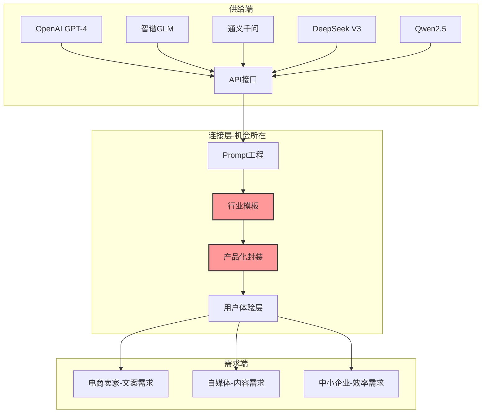
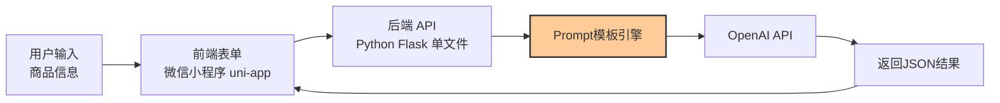
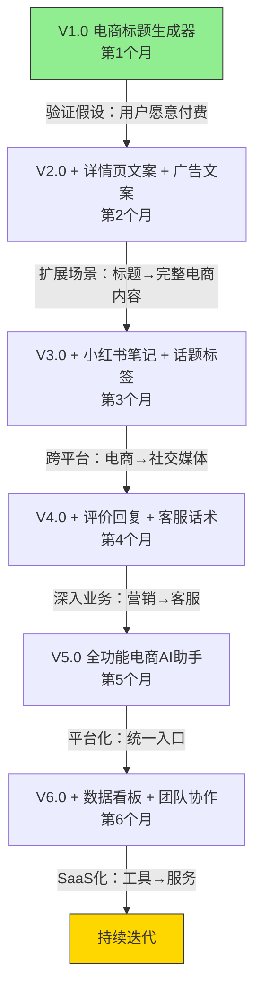
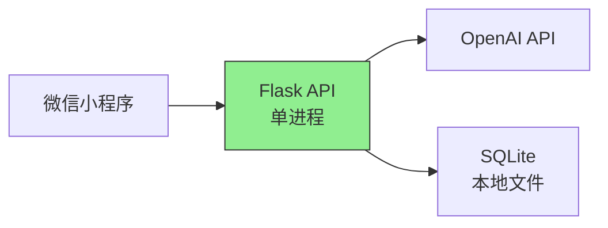
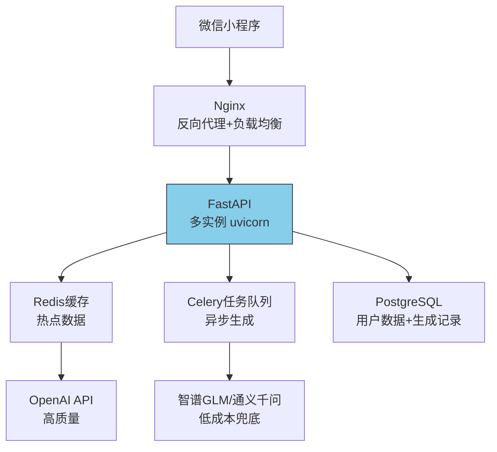
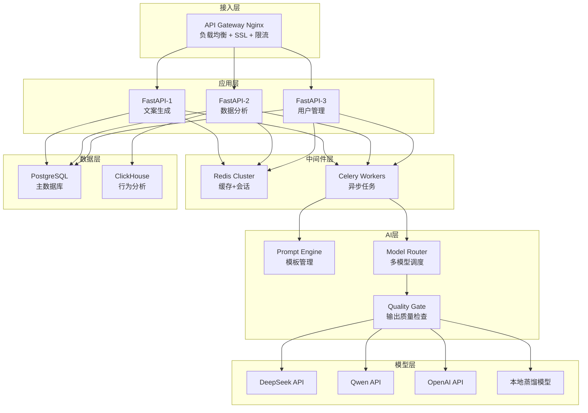
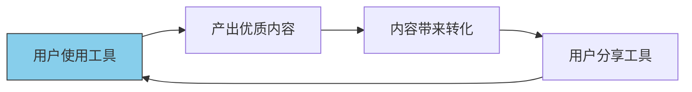
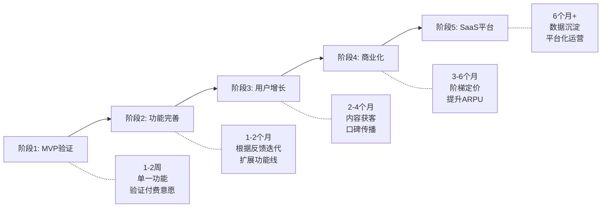
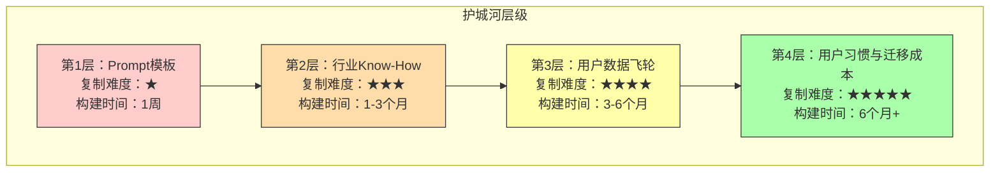

## 案例七：AI应用开发者——从工具到SaaS

本案例记录了一位普通后端工程师如何在AI浪潮中，用6个月时间将一个副业项目从零做到月收入1.28万元的SaaS产品。这不是一个天才创业的故事——没有融资、没有团队、没有机器学习背景——而是一个**可复制的技术变现路径**，重点在于方法论的提炼和踩坑经验的分享。

**本案例的独特价值：** 大多数AI创业案例要么是融资故事（不适用于个人），要么是技术教程（不涉及商业），本案例则是**技术人做副业的完整商业闭环**——从发现需求到持续盈利，每一步都有真实数据和可复制的方法论。

### 案例背景

#### 主人公画像

张明（化名），28岁，某二线互联网公司后端开发工程师，3年工作经验，技术栈为 Python + Node.js + MySQL + Redis。日常工作是维护企业内部管理系统（OA、CRM），技术深度一般，但工程化思维扎实——会写单元测试、懂CI/CD、能搭简单架构。

性格特点：内向但善于观察，习惯先调研再行动，做事偏保守但执行力强。副业时间每周约15-20小时（晚上+周末）。

2023年初ChatGPT爆发后，张明开始关注AI应用开发。他的起点并不高——没有机器学习背景，不会训练模型，甚至对prompt engineering也一知半解。但他有一个关键优势：**能把API调用包装成用户能用的产品**。这个能力在AI时代被严重低估了。

**为什么"API包装"能力如此重要？** 因为AI能力的供给和需求之间存在巨大的鸿沟。大模型提供商（OpenAI、智谱、百度）输出的是通用API接口，而终端用户需要的是"打开就能用"的产品。能把这个鸿沟填上的人，就能创造价值。

#### 启动动机与市场洞察

张明观察到一个三层市场结构：

**第一层：供给端。** OpenAI、智谱、百度等公司提供了强大的通用AI能力，但这些能力以API形式存在，普通用户无法直接使用。

**第二层：需求端。** 中小企业主、自媒体从业者、电商卖家对AI工具有强烈需求，但面临三重障碍：

| 障碍 | 具体表现 | 影响人群 | 市场规模 |
|------|----------|----------|----------|
| 不会用 | ChatGPT界面太抽象，不知道怎么提问才能得到好结果 | 40岁以上传统行业从业者 | 约2亿人 |
| 用不好 | 通用工具无法解决行业特定问题（电商文案、法律合同审查、财务报表分析） | 有明确业务场景的用户 | 约5000万人 |
| 不愿折腾 | 注册海外账号、绑定信用卡、处理网络问题成本太高 | 国内中小商家 | 约3000万人 |

**第三层：连接层（机会所在）。** 需要有人把AI能力"翻译"成特定行业能直接用的工具。张明选择成为这个"翻译层"。

**三层市场的经济学逻辑：**



#### AI应用开发全景图：五种形态与你的位置

在深入市场变化之前，先建立一个全局视角——AI应用开发的五种主要形态，每种形态的壁垒、天花板和适合的人群截然不同：

| 应用形态 | 核心能力 | 壁垒高度 | 收入天花板 | 适合人群 | 典型案例 |
|----------|----------|----------|------------|----------|----------|
| Prompt封装型 | 行业prompt模板+UI包装 | ★★ | 月入1-3万 | 会调API的后端工程师 | 电商文案生成器、简历优化工具 |
| 工作流自动化型 | 多步骤AI编排+业务逻辑集成 | ★★★ | 月入3-10万 | 懂业务流程的全栈工程师 | 自动化客服系统、内容审核流水线 |
| RAG知识库型 | 向量检索+大模型问答 | ★★★★ | 月入5-20万 | 懂数据工程的工程师 | 企业知识库、法律/医疗问答系统 |
| Agent自主型 | 多工具调用+规划+执行 | ★★★★★ | 月入10万+ | 有AI Agent经验的高级工程师 | 自动化营销Agent、代码审查Agent |
| 垂直模型微调型 | 行业数据+模型微调+部署 | ★★★★★ | 月入20万+ | 有ML背景的算法工程师 | 医疗影像识别、工业质检 |

**张明的路径是"Prompt封装型→工作流自动化型"**——从最简单的形态起步，逐步增加复杂度。这是大多数独立开发者的最优路径：先跑通商业闭环，再提升技术壁垒。

**形态选择的核心原则：** 不要被技术复杂度吸引，而要被商业价值驱动。一个简单的Prompt封装工具，如果切中了真实痛点，收入可能远超一个技术炫酷但没人买单的Agent系统。张明的案例证明：**简单技术+深度行业理解 > 复杂技术+浅层应用**。

#### 2025-2026年AI应用开发的市场新格局

**2025-2026年的关键趋势：从"工具"到"Agent"。** AI Agent（智能体）正在成为新的应用范式——不再是"用户输入→AI输出"的单次交互，而是"用户定义目标→AI自主规划→调用工具→完成任务"的多步骤自主执行。对独立开发者而言，Agent不是威胁而是机会：Agent需要更精细的工具编排、更可靠的错误处理、更贴合业务的工作流设计——这些恰恰是"懂业务的技术人"的优势。

张明的案例启动于2023年，但到2025-2026年，市场环境已经发生了显著变化。理解这些变化对后来者至关重要：

**模型供给侧的三个关键变化：**

| 变化 | 具体表现 | 对独立开发者的影响 |
|------|----------|-------------------|
| 模型成本断崖式下降 | DeepSeek V3 API成本仅为GPT-4的1/50，Qwen2.5免费额度扩大 | MVP阶段的API成本从数百元降到几十元，启动门槛大幅降低 |
| 国产模型能力追赶 | DeepSeek R1在推理能力上接近GPT-4o，Qwen2.5在中文任务上表现优秀 | 无需依赖海外API，合规风险和网络问题彻底消除 |
| 多模态普及 | 文本+图片+语音的多模态API成为标配 | 产品形态从"纯文本"扩展到"图文并茂"，应用场景大幅拓宽 |

**需求侧的三个关键变化：**

| 变化 | 具体表现 | 对独立开发者的影响 |
|------|----------|-------------------|
| 用户AI素养提升 | 越来越多用户会直接使用ChatGPT/Kimi等通用工具 | "翻译层"的价值从"教用户用AI"转向"提供垂直行业深度能力" |
| 企业付费意愿增强 | 中小企业AI工具预算从0到年均3000-50000元 | B端市场成为更大的金矿，但销售周期也更长 |
| 监管趋严 | 《生成式人工智能服务管理暂行办法》落地执行 | 合规成本增加，但也建立了准入壁垒 |

**独立开发者的机会窗口：** 模型成本的大幅下降意味着MVP验证的成本从"几百元"降到"几十元"，但同时用户对"简单API包装"的容忍度也在降低。2025年以后的AI应用必须在**垂直深度**上做文章，而非仅仅是"把ChatGPT包一层皮"。

#### 市场调研方法论（第1-2周）

张明没有急于开发，而是花了两周做了系统性调研。这个阶段的价值常被低估——大多数独立开发者失败不是因为技术不行，而是因为做了一个没人需要的东西。

**调研框架：5×3矩阵**

横向维度（5个渠道），纵向维度（3个调研目标：需求验证、竞品分析、定价参考）：

| 渠道 | 需求验证 | 竞品分析 | 定价参考 |
|------|----------|----------|----------|
| 知识星球 | 加入10个AI相关星球潜水，记录高频问题 | 观察已有工具的用户评价 | 付费星球定价区间 |
| 小红书 | 搜索"AI工具推荐"，统计笔记互动量 | 分析热门AI工具的卖点和差评 | 电商文案服务价格 |
| 淘宝 | 搜索"AI代写""AI文案"，看销量 | 分析店铺评价中的痛点 | 月销1000+店铺定价5-50元/次 |
| 微信群 | 加入5个中小企业主群，记录困惑 | 群内讨论哪些工具好用 | 群内讨论的价格敏感度 |
| 即刻 | 关注AI应用话题，记录独立开发者案例 | 分析成功/失败案例共性 | 独立开发者定价策略 |

**调研的关键产出：**

1. **需求排序**：电商文案 > 小红书内容 > 客服话术 > 法律合同 > 财务报表
2. **竞品空白**：通用工具已经很多，但"开箱即用的垂直行业AI助手"几乎没有
3. **价格锚点**：用户愿意为"开箱即用"的解决方案付费9.9-99元/月
4. **用户画像**：25-45岁，有明确业务场景，月收入5000-30000元，对效率工具有付费习惯

**调研中常见的三个错误：**

| 错误 | 表现 | 后果 | 正确做法 |
|------|------|------|----------|
| 只看需求不看竞争 | 发现"很多人需要AI文案"就开干 | 上线后发现已有成熟竞品 | 必须同时分析竞品的功能、定价、评价 |
| 只听用户说什么，不看用户做什么 | 用户说"我会付费"就信了 | 上线后没人付费 | 用"预付款"或"定金"验证真实付费意愿 |
| 调研范围太窄 | 只在开发者社区调研 | 需求偏差大 | 必须去目标用户所在的平台（淘宝、小红书）调研 |

**竞品分析的实操模板：**

在调研阶段，张明对每个竞品建立了结构化的分析档案：

```text
竞品名称：XX文案助手
├── 基础信息
│   ├── 上线时间：2023年X月
│   ├── 团队规模：1-3人（独立开发者）
│   ├── 用户规模：约5000（通过小红书粉丝推测）
│   └── 收费模式：订阅制 19.9/49.9/99.9元/月
├── 功能分析
│   ├── 核心功能：标题生成、详情页文案、评价回复
│   ├── 特色功能：多平台一键发布（但他们可能只是按钮，没有真正对接）
│   └── 缺失功能：没有批量生成，没有效果追踪
├── 用户评价（从应用商店/小红书评论中收集）
│   ├── 好评关键词：方便、效果不错、省时间
│   ├── 差评关键词：不精准、经常答非所问、客服慢
│   └── 功能请求：想要批量生成、想要历史记录
└── 差异化机会
    ├── 他们做得好但我们可以做得更好的：模板行业化
    ├── 他们完全没做的：数据看板、A/B测试建议
    └── 他们的致命弱点：没有免费试用，定价偏高
```

**用数据验证需求真实性：**

除了定性调研，张明还做了三组定量验证：

| 验证方法 | 具体操作 | 结果 | 结论 |
|----------|----------|------|------|
| 搜索量验证 | 在百度指数、微信指数搜索"AI文案""AI写作" | 2023年月均搜索量30万+，持续增长 | 需求真实存在 |
| 付费行为验证 | 在淘宝购买3个"AI文案代写"服务，分析质量和定价 | 月销最高店铺3000+单，单价5-20元 | 已有付费习惯 |
| 竞品留存验证 | 注册5个竞品免费版，持续使用1个月 | 3个产品更新频率低，1个已经停止维护 | 市场未饱和 |

---

### 从零到一：开发第一个AI工具

#### 选品决策框架

张明用加权评分矩阵来选择第一个产品方向。这个方法可以避免"我觉得这个方向好"的主观判断：

| 维度 | 权重 | 电商文案 | 法律合同 | 财务报表 | 教育课件 |
|------|------|----------|----------|----------|----------|
| 市场需求 | 30% | ★★★★★ (5) | ★★★★ (4) | ★★★ (3) | ★★★★ (4) |
| 技术难度（低=好） | 25% | ★★★★★ (5) | ★★ (2) | ★★★ (3) | ★★★★ (4) |
| 竞争程度（低=好） | 20% | ★★★★ (4) | ★★★★ (4) | ★★★★ (4) | ★★★ (3) |
| 付费意愿 | 15% | ★★★★ (4) | ★★★★★ (5) | ★★★★ (4) | ★★★ (3) |
| 启动速度 | 10% | ★★★★★ (5) | ★★★ (3) | ★★★ (3) | ★★★★ (4) |
| **加权总分** | **100%** | **4.65** | **3.35** | **3.25** | **3.60** |

最终选择了**电商文案生成**作为切入点——需求最大、技术最简单、启动最快。

**为什么"启动速度"是关键因素？** 对于副业开发者来说，时间是最稀缺的资源。一个需要3个月才能上线的方向，可能在这3个月里市场已经被别人占了。MVP的核心是"快"——快速验证、快速迭代、快速学习。

#### 第一版产品：电商标题生成器

**技术选型决策：**

张明在技术选型上做了几个关键决策，每个决策都有明确的取舍逻辑：

| 决策点 | 选择 | 放弃 | 原因 | 后续演进 |
|--------|------|------|------|----------|
| 前端 | 微信小程序 | Web/APP | 获客成本最低，用户无需下载 | 后期增加Web版 |
| 后端框架 | Flask | Django/FastAPI | MVP阶段够用，学习成本最低 | 用户增长后迁移到FastAPI |
| 数据库 | SQLite | MySQL/PostgreSQL | 单机够用，零运维成本 | 并发上来后迁移PostgreSQL |
| AI模型 | GPT-3.5-turbo | GPT-4 | 成本低10倍，电商文案不需要顶级推理 | 后期引入多模型路由 |
| 部署 | 轻量云服务器 | Serverless | 控制成本，简单可控 | 用户增长后增加服务器 |

**第一版技术架构：**



架构刻意极简——第一天的目标不是做出好产品，而是验证"有人愿意付费"这个核心假设。

**核心代码逻辑：**

```python
from openai import OpenAI
import json
from flask import Flask, request, jsonify

app = Flask(__name__)
client = OpenAI(api_key="sk-xxx")  # 初始化客户端（新版API）

# Prompt模板库 - 按商品类目分类
PROMPT_TEMPLATES = {
    "clothing": {
        "system": "你是服装电商文案专家，擅长撰写突出面料、版型、风格的标题。",
        "style_keywords": "时尚、百搭、显瘦、气质、高级感"
    },
    "food": {
        "system": "你是食品电商文案专家，擅长突出口感、原料、健康的标题。",
        "style_keywords": "新鲜、纯手工、零添加、地道、回味"
    },
    "electronics": {
        "system": "你是3C数码文案专家，擅长突出参数、体验、性价比的标题。",
        "style_keywords": "旗舰、高性价比、黑科技、流畅、耐用"
    },
    "default": {
        "system": "你是资深电商文案专家，擅长撰写高转化率的商品标题。",
        "style_keywords": "热销、爆款、好评如潮"
    }
}

def generate_titles(product_name, category, selling_points, style="吸引眼球"):
    template = PROMPT_TEMPLATES.get(category, PROMPT_TEMPLATES["default"])

    prompt = f"""{template["system"]}

商品名称：{product_name}
商品类目：{category}
核心卖点：{selling_points}
风格要求：{style}
参考关键词：{template["style_keywords"]}

请生成5个商品标题，要求：
1. 每个标题20-30字，符合电商平台规范
2. 包含核心关键词，利于搜索排名
3. 突出卖点和差异化优势
4. 符合{style}的风格调性
5. 避免违禁词和极限用语（如"最""第一""绝对"）
6. 每个标题后附上简短的设计思路说明

输出格式（严格JSON）：
[{{"title": "标题内容", "reason": "设计思路"}}]"""

    response = client.chat.completions.create(
        model="gpt-3.5-turbo",
        messages=[
            {"role": "system", "content": template["system"]},
            {"role": "user", "content": prompt}
        ],
        temperature=0.8,
        max_tokens=1000,
        response_format={"type": "json_object"}  # 强制JSON输出，新版API支持
    )
    return json.loads(response.choices[0].message.content)
```

**2025年更新：模型选择的新考量**

如果从今天开始做，模型选择的逻辑完全不同：

| 模型 | 每千Token成本 | 中文文案质量 | 推荐场景 |
|------|--------------|-------------|----------|
| DeepSeek V3 | ≈0.001元 | ★★★★ | 日常文案生成，性价比极高 |
| DeepSeek R1 | ≈0.004元 | ★★★★☆ | 需要深度推理的复杂文案策略 |
| Qwen2.5-72B | ≈0.004元 | ★★★★★ | 中文任务首选，理解力强 |
| GLM-4-Plus | ≈0.05元 | ★★★★ | 国内合规场景，智谱生态 |
| GPT-4o | ≈0.075元 | ★★★★☆ | 需要英文或多语言能力时 |
| Claude 3.5 Sonnet | ≈0.021元 | ★★★★ | 长文本生成、复杂逻辑 |

**关键认知转变：** 2023年做AI应用，GPT-3.5-turbo是默认选择；2025年做AI应用，DeepSeek V3/Qwen2.5是默认选择——成本降低了一个数量级，中文质量反而更好。这意味着MVP验证阶段的API成本从每月200-500元降到了20-50元。

#### Prompt工程的核心竞争力

很多人以为AI工具就是简单调API，但真正决定产品质量的是prompt设计。张明在prompt上花了大量时间迭代，最终总结出五层prompt工程体系：

| 层次 | 描述 | 输出质量 | 典型问题 | 达成难度 |
|------|------|----------|----------|----------|
| L1: 直接提问 | "帮我写个标题" | ★ | 随机、不可控，每次输出风格不同 | 入门 |
| L2: 角色设定 | "你是电商专家，帮我写标题" | ★★ | 有方向但不精准，类目差异大 | 初级 |
| L3: 结构化Prompt | 角色+背景+约束+格式+示例 | ★★★★ | 稳定可复用，但缺乏行业深度 | 中级 |
| L4: 模板系统 | 分场景、分行业的prompt模板库 | ★★★★★ | 规模化、可维护、质量一致 | 高级 |
| L5: Prompt+RAG | 结合用户数据和行业知识库增强 | ★★★★★ | 个性化、越用越好、数据飞轮 | 专家 |

张明第一周做到了L3，第三周做到了L4，三个月后开始探索L5。

**L3到L4的关键跨越——模板化思维：**

从L3到L4的本质转变是：不再为每个请求写prompt，而是建立一个**可维护的prompt模板系统**。这就像从"写原生SQL"进化到"用ORM"——初期看起来是多了一层抽象，但后期的维护成本和扩展性完全不同。

**Prompt模板库的工程化管理：**

```text
prompts/
├── ecommerce/
│   ├── title_generator/
│   │   ├── base.py              # 基础模板（通用逻辑）
│   │   ├── clothing.py          # 服装类目专属模板
│   │   ├── food.py              # 食品类目专属模板
│   │   ├── electronics.py       # 3C类目专属模板
│   │   └── beauty.py            # 美妆类目专属模板
│   ├── description_writer.py    # 详情页文案
│   ├── ad_copy.py               # 广告文案
│   └── review_reply.py          # 评价回复
├── xiaohongshu/
│   ├── note_title.py            # 小红书标题
│   ├── note_content.py          # 小红书正文
│   └── hashtag_generator.py     # 话题标签
├── templates/
│   ├── clothing.json            # 服装类模板数据
│   ├── food.json                # 食品类模板数据
│   └── electronics.json         # 3C类模板数据
├── evaluation/
│   ├── quality_checker.py       # 输出质量检测
│   └── test_cases.json          # 回归测试用例
└── version_config.json          # 模板版本管理
```

每个模板文件遵循统一接口：

```python
# base.py - 基础模板类
from abc import ABC, abstractmethod
import json

class PromptTemplate(ABC):
    def __init__(self):
        self.version = "1.0.0"
        self.category = "general"
    
    @abstractmethod
    def build_system_prompt(self, context: dict) -> str:
        """构建system prompt，子类必须实现"""
        ...
    
    @abstractmethod
    def build_user_prompt(self, params: dict) -> str:
        """构建user prompt，子类必须实现"""
        ...
    
    def validate_output(self, output: str) -> bool:
        """验证输出格式是否符合预期"""
        try:
            parsed = json.loads(output)
            return isinstance(parsed, list) and all(
                "title" in item and "reason" in item for item in parsed
            )
        except json.JSONDecodeError:
            return False
    
    def retry_with_fix(self, messages: list, failed_output: str) -> str:
        """输出不合格时自动修复"""
        fix_prompt = f"""上次输出格式不符合要求，错误输出：
{failed_output}

请严格按照JSON格式重新输出，确保返回数组格式。"""
        messages.append({"role": "assistant", "content": failed_output})
        messages.append({"role": "user", "content": fix_prompt})
        return call_llm(messages)
    
    def render(self, params: dict) -> list[dict]:
        """完整渲染流程：构建prompt → 调用API → 验证输出"""
        messages = [
            {"role": "system", "content": self.build_system_prompt(params)},
            {"role": "user", "content": self.build_user_prompt(params)}
        ]
        output = call_llm(messages)
        if not self.validate_output(output):
            output = self.retry_with_fix(messages, output)
        return json.loads(output)
```

**Prompt设计的五个实战技巧：**

| 技巧 | 说明 | 示例 |
|------|------|------|
| 结构化输入 | 用明确的字段名引导AI理解输入 | `商品名称：XX\n核心卖点：XX` |
| 输出格式约束 | 明确要求JSON格式并给出示例 | `输出格式（严格JSON）：[{"title": "..."}]` |
| 负面约束 | 明确告诉AI不要做什么 | `避免违禁词和极限用语` |
| 示例引导 | 给出1-2个高质量示例 | `参考：夏季冰丝防晒衣女UPF50+...` |
| 分步思考 | 要求AI先分析再生成 | `先分析目标人群，再生成标题` |

**Prompt版本管理——被90%的独立开发者忽略的关键实践：**

张明在第三个月开始意识到，prompt模板和代码一样需要版本管理。一个prompt的小改动可能导致输出质量剧变，如果没有版本管理，出了问题都不知道是哪个改动导致的。

```python
class PromptVersionManager:
    """Prompt版本管理器"""
    
    def __init__(self, storage_path: str = "prompt_versions/"):
        self.storage_path = storage_path
        self.current_versions = {}
    
    def save_version(self, template_name: str, prompt_content: dict, 
                     test_results: dict = None) -> str:
        """保存prompt版本，附带测试结果"""
        import hashlib
        from datetime import datetime
        
        version_hash = hashlib.md5(
            json.dumps(prompt_content, sort_keys=True).encode()
        ).hexdigest()[:8]
        
        version_entry = {
            "version": f"v{datetime.now().strftime('%Y%m%d')}-{version_hash}",
            "created_at": datetime.now().isoformat(),
            "prompt": prompt_content,
            "test_results": test_results,  # 回归测试通过率
            "avg_quality_score": None,     # 上线后的平均质量分
            "usage_count": 0,              # 被调用次数
            "rollback_count": 0            # 被回滚次数（越多说明质量越差）
        }
        
        self.current_versions[template_name] = self.current_versions.get(
            template_name, []
        )
        self.current_versions[template_name].append(version_entry)
        return version_entry["version"]
    
    def rollback(self, template_name: str, target_version: str = None):
        """回滚到上一个稳定版本"""
        versions = self.current_versions.get(template_name, [])
        if target_version:
            target = next((v for v in versions if v["version"] == target_version), None)
        else:
            # 回滚到上一个版本
            target = versions[-2] if len(versions) >= 2 else versions[-1]
        
        if target:
            target["rollback_count"] += 1
            return target["prompt"]
        raise ValueError(f"Version not found: {target_version}")
```

**Prompt质量回归测试——让迭代不再"碰运气"：**

```python
# evaluation/test_cases.json - 测试用例库
{
    "title_generator": [
        {
            "input": {
                "product_name": "纯棉T恤女",
                "category": "clothing",
                "selling_points": "纯棉、宽松、显瘦",
                "style": "日常休闲"
            },
            "expected_keywords": ["纯棉", "T恤", "显瘦"],
            "forbidden_keywords": ["最", "第一", "100%"],
            "min_length": 15,
            "max_length": 35,
            "must_be_json": true,
            "min_items": 3
        }
    ]
}

# evaluation/quality_runner.py
def run_regression_tests(template_class, test_cases: list) -> dict:
    """对prompt模板运行回归测试"""
    template = template_class()
    results = {"passed": 0, "failed": 0, "details": []}
    
    for case in test_cases:
        try:
            output = template.render(case["input"])
            
            # 检查格式
            if not isinstance(output, list):
                results["details"].append({"case": case["input"], "fail": "输出非数组"})
                results["failed"] += 1
                continue
            
            # 检查关键词
            titles = [item.get("title", "") for item in output]
            all_text = " ".join(titles)
            
            missing = [kw for kw in case.get("expected_keywords", []) 
                      if kw not in all_text]
            forbidden = [kw for kw in case.get("forbidden_keywords", []) 
                        if kw in all_text]
            
            if missing or forbidden:
                results["details"].append({
                    "case": case["input"],
                    "fail": f"缺失关键词: {missing}, 含违禁词: {forbidden}"
                })
                results["failed"] += 1
            else:
                results["passed"] += 1
                
        except Exception as e:
            results["details"].append({"case": case["input"], "fail": str(e)})
            results["failed"] += 1
    
    return results
```

**实操建议：** 每次修改prompt模板后，先运行回归测试（成本不到0.1元），确认没有退步再上线。张明曾因为一次"优化"导致食品类标题全部变成了服装风格，如果有回归测试就不会犯这个错误。

#### 第一版的成本和收入

**成本结构（精打细算版）：**

| 项目 | 月费用 | 说明 | 优化策略 |
|------|--------|------|----------|
| 服务器 | 50元 | 轻量云服务器（2核2G） | 选择学生优惠或新用户优惠 |
| OpenAI API | 200-500元 | 按量计费，gpt-3.5-turbo | 设置每日预算上限 |
| 域名 | 5元/月 | .com域名，60元/年 | 首年注册优惠 |
| 微信小程序认证 | 25元/月 | 个人主体，300元/年 | 一次性投入 |
| SSL证书 | 0元 | Let's Encrypt免费 | 自动续期 |
| CDN | 0元 | 轻量使用免费额度 | 静态资源托管 |
| **月均总成本** | **约300-600元** | | |

**2025年成本对照（使用国产模型）：**

| 项目 | 月费用 | 与2023年对比 |
|------|--------|-------------|
| 服务器 | 30-50元 | 阿里云/腾讯云轻量服务器新用户价更低 |
| AI API（DeepSeek V3） | 20-80元 | 成本降低80%以上 |
| 域名 | 5元/月 | 不变 |
| 小程序认证 | 25元/月 | 不变 |
| **月均总成本** | **约80-170元** | **降低70%+** |

**成本优化的关键认知：** 副业项目的成本控制比大公司更重要——因为每一分钱都来自你的工资。张明的做法是：先用最便宜的方案跑通，等有了收入再升级。不要在验证需求之前花大钱。

**定价策略的博弈论思考：**

张明没有做免费产品，而是从第一天就收费——9.9元/月订阅制，包含100次生成。这个定价经过三层思考：

1. **心理锚定**：9.9元接近"一杯奶茶"的价格，决策成本极低
2. **筛选用户**：付费用户才是真需求用户，免费用户的数据无法验证商业模式
3. **价值信号**：有价格意味着有品质，免费工具反而让人不信任

**第一个月数据（真实记录）：**

| 指标 | 数据 | 行业基准 | 评价 |
|------|------|----------|------|
| 小程序访问量 | 1,200次 | - | 冷启动阶段，未做推广 |
| 注册用户 | 180人 | 注册率15% | 中等偏上 |
| 付费用户 | 23人 | 转化率10-15% | 正常范围 |
| 月收入 | 227.7元 | - | 刚覆盖成本 |
| 付费转化率 | 12.8% | 行业平均8-15% | 正常 |
| API成本 | 180元 | - | 控制良好 |
| 净利润 | 47.7元 | - | 微利，但验证了模式 |

收入虽少，但验证了核心假设：**有人愿意为垂直AI工具付费**。这23个付费用户的价值远超227.7元——他们是产品方向的指路明灯。

**如何判断MVP是否成功？** 张明给自己设了一个明确的"继续/放弃"标准：

- 如果2周内有10个以上付费用户 → 继续
- 如果2周内只有1-9个付费用户 → 调整方向后继续
- 如果2周内0个付费用户 → 重新评估，考虑换方向

这个标准避免了"沉没成本谬误"——不要因为已经投入了时间就继续一个没希望的方向。

---

### 从一到十：产品迭代与用户增长

#### 用户反馈驱动迭代

张明建了一个微信用户群，把每个付费用户都拉进去。这个群后来成为他最宝贵的资产——用户在这里提需求、吐槽问题、分享使用场景。

**反馈收集的系统化方法：**

不只是被动等待用户提意见，张明主动做了三件事：

1. **每周一次群投票**：列出3-5个待开发功能，让用户投票选最想要的
2. **使用行为分析**：记录用户使用频率、常用功能、停留时间，用数据补充口头反馈
3. **退出调查**：用户取消订阅时弹出问卷，了解流失原因

**第一个月收到的核心反馈矩阵：**

| 反馈类型 | 具体内容 | 频次 | 优先级 | 处理方式 |
|----------|----------|------|--------|----------|
| 功能需求 | "能不能生成详情页文案？" | 8次 | P0 | 第二个月开发 |
| 体验问题 | "生成结果格式乱，复制不方便" | 12次 | P0 | 第一周修复 |
| 质量问题 | "食品类标题不像食品，像服装" | 5次 | P1 | 优化类目prompt模板 |
| 新需求 | "能不能帮我写小红书种草文？" | 6次 | P1 | 第三个月开发 |
| 价格建议 | "按月订阅不划算，能不能按次？" | 3次 | P2 | 第二版增加按量计费 |
| 信任问题 | "生成的内容会不会和别人重复？" | 4次 | P1 | 增加去重检测功能 |

**迭代节奏：** 每周一个小版本（bug修复+小优化），每月一个大版本（新功能）。张明用飞书多维表格管理需求池，按"影响用户数 × 实现难度"排优先级：

```text
优先级矩阵：

影响用户数 ↑
           |
    P0     |    P1
  (立即做)  |  (本月做)
           |
    P2     |    P3
  (下月做)  |  (暂缓)
           +----------→ 实现难度
```

#### 产品线扩展

基于用户反馈，张明在第二个月开始扩展产品线，每次扩展都遵循**"验证→MVP→测试→上线"**的四步流程：



每次功能扩展的关键原则：**在用户群里验证需求 → 开发最小可用版本（1-3天） → 核心用户群内测（2-3天） → 全量上线**。

**功能扩展的"黄金节奏"——何时开发新功能、何时优化旧功能：**

张明在第三个月踩过一个坑：新功能开发太快，旧功能的bug没修完，导致用户抱怨"功能多但不好用"。他随后建立了一个平衡机制：

| 每月开发时间分配 | 比例 | 具体内容 |
|-----------------|------|----------|
| Bug修复和性能优化 | 40% | 解决用户反馈的体验问题 |
| 新功能开发 | 30% | 按需求池投票结果开发 |
| 技术债务清理 | 15% | 代码重构、架构优化 |
| 探索性开发 | 15% | 试做新功能原型，看用户反应 |

#### 技术架构演进

随着用户增长，简单的Flask单体架构开始遇到瓶颈。架构演进不是一步到位，而是**在遇到实际问题时才升级**。

**V1.0架构（用户<500，月成本<500元）：**



这个架构的优点是：零运维、零依赖、部署简单。一个app.py文件就能跑起来。

**V3.0架构（用户500-2000，月成本1000-3000元）：**



**关键架构决策及其技术原理：**

| 决策 | 从 | 到 | 原理 | 效果 |
|------|----|----|------|------|
| Web框架迁移 | Flask | FastAPI | Flask同步阻塞，FastAPI原生异步，并发能力强10倍 | QPS从50提升到500 |
| 引入Redis | 无 | Redis | 相同输入的结果缓存24小时，避免重复调用API | API成本降低30-40% |
| 异步任务队列 | 同步调用 | Celery | 生成任务异步处理，用户不用等 | 用户体验大幅提升 |
| 数据库升级 | SQLite | PostgreSQL | SQLite单写锁，并发时性能骤降 | 数据读写瓶颈消除 |
| 多模型路由 | 单一模型 | 智能路由 | 根据任务复杂度和成本自动选择模型 | API成本再降50% |

**多模型路由策略（完整实现）：**

```python
import time
from dataclasses import dataclass
from enum import Enum
from typing import Optional

class TaskComplexity(Enum):
    LOW = "low"       # 简单格式化、改写
    MEDIUM = "medium" # 文案生成、总结
    HIGH = "high"     # 深度分析、创意写作

@dataclass
class ModelConfig:
    name: str
    cost_per_1k_tokens: float  # 每千token成本（元）
    avg_latency_ms: int        # 平均延迟（毫秒）
    quality_score: float       # 质量评分（0-1）
    max_context: int           # 最大上下文长度

# 2025年更新：增加国产模型选项
MODELS = {
    "deepseek-v3": ModelConfig("deepseek-v3", 0.001, 500, 0.82, 65536),
    "deepseek-r1": ModelConfig("deepseek-r1", 0.004, 2000, 0.88, 65536),
    "qwen2.5-72b": ModelConfig("qwen2.5-72b", 0.004, 600, 0.85, 32768),
    "gpt-4o": ModelConfig("gpt-4o", 0.075, 1500, 0.93, 128000),
    "gpt-3.5-turbo": ModelConfig("gpt-3.5-turbo", 0.008, 800, 0.75, 4096),
    "glm-4-plus": ModelConfig("glm-4-plus", 0.05, 1200, 0.80, 8192),
    "qwen-turbo": ModelConfig("qwen-turbo", 0.003, 600, 0.70, 8192),
}

# 路由策略：任务类型 × 质量等级 → 最优模型
ROUTING_MATRIX = {
    "title": {"high": "deepseek-r1", "medium": "deepseek-v3", "low": "qwen-turbo"},
    "description": {"high": "deepseek-r1", "medium": "qwen2.5-72b", "low": "deepseek-v3"},
    "review_reply": {"high": "deepseek-v3", "medium": "qwen2.5-72b", "low": "qwen-turbo"},
    "xiaohongshu": {"high": "deepseek-r1", "medium": "deepseek-v3", "low": "qwen2.5-72b"},
}

class ModelRouter:
    """多模型路由器 - 根据任务类型、质量要求和预算选择最优模型"""
    
    def __init__(self):
        self.usage_stats = {}  # 记录每个模型的使用统计
        self.quality_feedback = {}  # 用户对输出质量的反馈
    
    def select_model(self, task_type: str, quality_level: str,
                     budget_constraint: Optional[float] = None,
                     exclude_models: list[str] = None) -> str:
        """根据任务类型、质量要求和预算选择最优模型"""
        exclude_models = exclude_models or []
        model_name = ROUTING_MATRIX.get(task_type, {}).get(quality_level, "deepseek-v3")
        
        # 排除不可用的模型
        if model_name in exclude_models:
            model_name = self._find_fallback(task_type, quality_level, exclude_models)
        
        if budget_constraint:
            model = MODELS[model_name]
            if model.cost_per_1k_tokens > budget_constraint:
                # 降级到满足预算的最高质量模型
                affordable = [
                    (name, cfg) for name, cfg in MODELS.items()
                    if cfg.cost_per_1k_tokens <= budget_constraint
                    and name not in exclude_models
                ]
                if affordable:
                    model_name = max(affordable, key=lambda x: x[1].quality_score)[0]
        
        # 记录使用统计
        self.usage_stats[model_name] = self.usage_stats.get(model_name, 0) + 1
        return model_name
    
    def _find_fallback(self, task_type: str, quality_level: str, 
                       exclude: list[str]) -> str:
        """当首选模型不可用时，寻找替代模型"""
        for level in ["medium", "low"]:
            candidate = ROUTING_MATRIX.get(task_type, {}).get(level)
            if candidate and candidate not in exclude:
                return candidate
        return "deepseek-v3"  # 最终兜底
    
    def get_cost_report(self) -> dict:
        """获取成本报告"""
        total_cost = 0
        report = {}
        for model_name, count in self.usage_stats.items():
            model = MODELS[model_name]
            cost = count * model.cost_per_1k_tokens * 2  # 假设平均2k token/次
            report[model_name] = {"calls": count, "est_cost": f"¥{cost:.2f}"}
            total_cost += cost
        report["total_est_cost"] = f"¥{total_cost:.2f}"
        return report
```

这个策略让张明的API成本降低了约50%，同时保持了核心功能的输出质量。

**V5.0架构（用户2000+，月收入破万）：**



#### Docker化部署——独立开发者的运维最佳实践

当产品从单文件Flask演进到多服务架构时，张明引入了Docker来简化部署和运维：

```yaml
# docker-compose.yml - 生产环境配置
version: '3.8'

services:
  api:
    build: .
    ports:
      - "8000:8000"
    environment:
      - DATABASE_URL=postgresql://user:pass@db:5432/aiwriter
      - DEEPSEEK_API_KEY=${DEEPSEEK_API_KEY}
      - QWEN_API_KEY=${QWEN_API_KEY}
    depends_on:
      - db
      - redis
    restart: always
    deploy:
      resources:
        limits:
          memory: 512M
    healthcheck:
      test: ["CMD", "curl", "-f", "http://localhost:8000/health"]
      interval: 30s
      timeout: 10s
      retries: 3

  celery_worker:
    build: .
    command: celery -A tasks worker --loglevel=info --concurrency=4
    environment:
      - DATABASE_URL=postgresql://user:pass@db:5432/aiwriter
      - REDIS_URL=redis://redis:6379/0
    depends_on:
      - db
      - redis
    restart: always

  db:
    image: postgres:15-alpine
    volumes:
      - pgdata:/var/lib/postgresql/data
    environment:
      - POSTGRES_DB=aiwriter
      - POSTGRES_USER=user
      - POSTGRES_PASSWORD=pass
    restart: always

  redis:
    image: redis:7-alpine
    volumes:
      - redisdata:/data
    restart: always

  nginx:
    image: nginx:alpine
    ports:
      - "80:80"
      - "443:443"
    volumes:
      - ./nginx.conf:/etc/nginx/nginx.conf
      - ./ssl:/etc/nginx/ssl
    depends_on:
      - api
    restart: always

volumes:
  pgdata:
  redisdata:
```

```dockerfile
# Dockerfile
FROM python:3.11-slim

WORKDIR /app
COPY requirements.txt .
RUN pip install --no-cache-dir -r requirements.txt

COPY . .
EXPOSE 8000

CMD ["uvicorn", "main:app", "--host", "0.0.0.0", "--port", "8000", "--workers", "4"]
```

**一键部署脚本：**

```bash
#!/bin/bash
# deploy.sh - 一键部署到服务器
set -e

echo "=== AI文案助手部署 ==="

# 1. 检查环境
command -v docker >/dev/null || { echo "需要安装Docker"; exit 1; }
command -v docker-compose >/dev/null || { echo "需要安装docker-compose"; exit 1; }

# 2. 拉取最新代码
git pull origin main

# 3. 构建并启动
docker-compose down
docker-compose build --no-cache
docker-compose up -d

# 4. 健康检查
echo "等待服务启动..."
sleep 10
curl -f http://localhost:8000/health || { echo "健康检查失败!"; docker-compose logs api; exit 1; }

echo "=== 部署成功 ==="
```

**为什么Docker对独立开发者特别重要？**

| 没有Docker | 有Docker |
|-----------|----------|
| 服务器环境配置要半天 | `docker-compose up -d` 一条命令 |
| 换服务器要重新配所有依赖 | 导出镜像直接迁移 |
| Python版本冲突、系统库缺失 | 容器内完全隔离，互不影响 |
| 回滚版本要手动改代码 | `docker-compose up -d --force-recreate` |
| 本地开发和生产环境不一致 | Dockerfile保证完全一致 |

#### 用户增长策略

张明没有投过一分钱广告，用户增长完全靠内容和口碑——这是独立开发者最现实的获客方式。

**第一阶段：冷启动（第1-2个月）——精准触达**

| 渠道 | 具体方法 | 投入 | 效果 | ROI |
|------|----------|------|------|-----|
| 小红书 | 发"AI工具测评"笔记，植入自家产品 | 每周3篇，每篇30分钟 | 单篇最高2000赞，带来300+注册 | 极高 |
| 知乎 | 回答"电商文案怎么写"类问题，文末附工具链接 | 每周2篇 | 长尾流量稳定，每月100+注册 | 高 |
| 微信群 | 在电商卖家群免费试用推广 | 每天1小时 | 精准用户转化率高，15%转付费 | 高 |
| 淘宝 | 上架"AI文案代写"服务，引流到小程序 | 500元保证金 | 每月50+精准用户 | 中 |

**冷启动的关键策略——"内容即产品"：**

张明在小红书上发的不是广告，而是**真正有价值的AI使用教程**。比如：

- 《用ChatGPT写电商标题的5个技巧，转化率提升30%》
- 《小红书爆款标题公式，AI一键生成》
- 《我用AI帮100个卖家写了标题，总结出这些规律》

这些内容本身就是产品的一部分——读者看完教程，自然想试试工具。

**内容营销的数据驱动方法：**

| 内容类型 | 平均互动量 | 转化率 | 制作成本 | 推荐频率 |
|----------|-----------|--------|----------|----------|
| 教程类（如何用AI写标题） | 高 | 中（5%） | 中（30分钟） | 每周2篇 |
| 案例类（用户成功故事） | 中 | 高（12%） | 低（15分钟） | 每周1篇 |
| 测评类（AI工具对比） | 高 | 低（3%） | 高（1小时） | 每月1篇 |
| 干货类（行业趋势分析） | 中 | 中（6%） | 高（2小时） | 每月1篇 |

**内容营销的执行日历（可复用模板）：**

张明在第四个月开始标准化内容产出流程，建立了可复用的内容日历：

```text
每周内容规划（模板）
├── 周一：小红书 - 教程类笔记
│   ├── 标题公式：数字+痛点+解决方案（如"5个技巧让你的电商标题点击率翻倍"）
│   ├── 内容结构：问题→原理→方法→工具推荐→效果展示
│   └── 制作时间：30分钟
├── 周三：知乎 - 行业问答
│   ├── 目标：搜索"电商文案"相关问题，选高浏览量的去回答
│   ├── 回答结构：直接给结论→展开解释→举例→文末附工具链接
│   └── 制作时间：20分钟
├── 周五：小红书 - 案例/数据类笔记
│   ├── 标题公式："我用XX帮N个用户做了YY，发现了ZZ"
│   ├── 内容结构：背景→过程→数据→结论→互动提问
│   └── 制作时间：15分钟
└── 月度：深度长文（知乎专栏/公众号）
    ├── 主题：行业趋势分析、竞品对比、方法论
    └── 制作时间：2小时
```

**第二阶段：口碑增长（第3-6个月）——飞轮效应**

口碑增长的核心机制：



具体表现：
- 付费用户自发推荐率约15%（每6-7个付费用户会推荐1个新用户）
- 用户群里定期出现"用这个工具月销翻倍"的案例分享
- 小红书上出现大量UGC内容（用户自发发笔记推荐）

**如何量化和激励口碑增长：**

张明设计了一个推荐奖励机制，成本极低但效果显著：

| 推荐人奖励 | 被推荐人奖励 | 实现方式 | 效果 |
|-----------|------------|----------|------|
| 推荐1人：免费延长7天会员 | 注册即送20次免费生成 | 专属邀请链接+自动发放 | 月均新增80+用户 |
| 推荐3人：免费延长30天会员 | 首月订阅8折 | 累计推荐自动升级 | 活跃推荐者20+人 |
| 推荐10人：终身免费基础版 | - | 手动审核发放 | 顶级推荐者3人 |

**推荐系统的代码实现（轻量版）：**

```python
class ReferralSystem:
    """推荐系统 - 低成本获客的核心引擎"""
    
    def __init__(self, db):
        self.db = db
    
    def generate_referral_code(self, user_id: str) -> str:
        """为用户生成专属邀请码"""
        import hashlib
        code = hashlib.md5(f"ref_{user_id}".encode()).hexdigest()[:8]
        self.db.execute(
            "INSERT INTO referrals (user_id, code, created_at) VALUES (?, ?, ?)",
            (user_id, code, datetime.now())
        )
        return code
    
    def process_referral(self, referral_code: str, new_user_id: str) -> dict:
        """处理新用户通过邀请码注册"""
        referrer = self.db.execute(
            "SELECT user_id FROM referrals WHERE code = ?", (referral_code,)
        ).fetchone()
        
        if not referrer:
            return {"success": False, "reason": "无效邀请码"}
        
        # 记录推荐关系
        self.db.execute(
            "INSERT INTO referral_records (referrer_id, referred_id, created_at) "
            "VALUES (?, ?, ?)",
            (referrer["user_id"], new_user_id, datetime.now())
        )
        
        # 给被推荐人赠送免费次数
        self.db.execute(
            "UPDATE users SET free_quota = free_quota + 20 WHERE id = ?",
            (new_user_id,)
        )
        
        # 检查推荐人累计推荐数，发放阶梯奖励
        count = self.db.execute(
            "SELECT COUNT(*) as cnt FROM referral_records WHERE referrer_id = ?",
            (referrer["user_id"],)
        ).fetchone()["cnt"]
        
        reward = None
        if count == 1:
            reward = "免费延长7天会员"
        elif count == 3:
            reward = "免费延长30天会员"
        elif count == 10:
            reward = "终身免费基础版"
        
        return {"success": True, "referrer_reward": reward, "total_referrals": count}
```

**第三阶段：矩阵扩展（第6个月以后）——横向渗透**

- 开发更多垂直场景工具（自媒体AI助手、客服AI助手）
- 不同工具之间互相导流（电商用户→小红书用户→抖音用户）
- 建立"AI工具矩阵"品牌认知，降低单产品获客成本

---

### 从十到百：商业化升级与SaaS转型

#### 定价模型的三次迭代

定价是AI应用商业化中最被低估的环节。张明的定价策略经历了三次迭代，每次都基于真实数据做决策：

**V1：单一定价（第1个月，9.9元/月）**

优点：简单，用户决策成本低，转化率高。缺点：无法区分轻度和重度用户，轻度用户觉得亏，重度用户不够用。

**V2：阶梯定价（第2-4个月）**

| 套餐 | 价格 | 包含功能 | 生成次数 | 目标用户 |
|------|------|----------|----------|----------|
| 体验版 | 免费 | 基础标题生成 | 10次/月 | 潜在用户，降低试用门槛 |
| 基础版 | 19.9元/月 | 全部文案功能 | 200次/月 | 个人卖家，偶尔使用 |
| 专业版 | 49.9元/月 | 全部功能+批量生成+数据看板 | 1000次/月 | 专业运营，高频使用 |
| 企业版 | 199元/月 | 全部功能+API接入+定制模板+专属客服 | 无限次 | 电商团队，企业客户 |

**V3：按量+订阅混合制（第5个月至今）**

| 模式 | 价格 | 适用场景 | 设计逻辑 |
|------|------|----------|----------|
| 订阅制 | 29.9-199元/月 | 高频使用的稳定客户 | 锁定长期收入 |
| 按量计费 | 0.5元/次 | 低频但偶尔需要的客户 | 降低决策门槛 |
| 充值包 | 50元/120次（8.3折） | 中频使用的灵活客户 | 预付费锁定 |
| 年付优惠 | 月付×10（8.3折） | 确定长期使用的客户 | 降低流失率 |

**定价的关键数据发现：**

1. **免费版是获客利器**：60%的付费用户是从免费版转化的，但免费版API成本需要严格控制（限制模型+限制次数）
2. **企业版利润率最高**：虽然客户只占5%，但贡献25%的收入，且续费率高达90%
3. **按量计费降低决策门槛**：40%的用户从按量开始，用多了自然转订阅（平均2.3个月后转化）
4. **年付用户流失率最低**：年付用户12个月留存率85%，月付用户12个月留存率仅35%

**定价心理学的深层机制：**

张明的定价不只是"分个高低"，每个价格点背后都有心理学逻辑：

| 定价技巧 | 原理 | 具体应用 |
|----------|------|----------|
| 锚定效应 | 用户以第一个看到的价格作为参照 | 先展示199元/月的企业版，再看49.9元的专业版会觉得"便宜" |
| 诱饵效应 | 加入一个明显不划算的选项，让目标选项更有吸引力 | 年付499元 vs 月付49.9元×12=598.8元，年付立刻变得"划算" |
| 损失厌恶 | 害怕失去比渴望得到更强烈 | "专业版用户每月平均多赚3000元"比"专业版只要49.9元"更有说服力 |
| 免费试用锚点 | 用户体验过价值后更容易付费 | 免费版限制为10次/月，让用户尝到甜头后自然升级 |

#### SaaS化改造

当月收入突破8000元时，张明开始思考从"工具"到"SaaS"的转型。这个转型的本质是从"卖功能"到"卖服务"。

**工具模式 vs SaaS模式的本质区别：**

| 维度 | 工具模式 | SaaS模式 | 转型要点 |
|------|----------|----------|----------|
| 用户关系 | 用完即走 | 持续使用，建立习惯 | 增加数据沉淀和个性化 |
| 收入模式 | 单次/低频付费 | 持续订阅，可预测收入 | 订阅制+年付优惠 |
| 数据价值 | 不积累 | 积累用户数据，提供个性化服务 | 构建用户画像和使用分析 |
| 竞争壁垒 | 低，容易被复制 | 高，数据和习惯形成护城河 | 历史数据+定制化 |
| 扩展性 | 每个功能独立 | 平台化，功能互相增强 | 统一工作台 |
| 客户成功 | 无 | 主动帮助客户成功 | 客户成功体系 |

**SaaS化的四个核心改造：**

**1. 用户数据沉淀**

```python
class UserProfile:
    """用户画像 - 让产品越用越懂用户"""
    user_id: str
    industry: str                    # 行业
    store_type: str                  # 店铺类型（天猫/淘宝/拼多多/抖音）
    brand_voice: str                 # 品牌调性（活泼/专业/高端/亲民）
    preferred_title_length: int      # 偏好标题长度
    top_performing_keywords: list    # 历史高转化关键词
    generation_history: list         # 生成历史
    favorite_templates: list         # 收藏的模板
    usage_pattern: dict              # 使用模式（高频时段、常用功能）
    
    def get_personalized_prompt(self, base_prompt: str) -> str:
        """基于用户画像个性化prompt"""
        personalization = f"""
用户偏好：
- 行业：{self.industry}
- 品牌调性：{self.brand_voice}
- 偏好标题长度：{self.preferred_title_length}字
- 高转化关键词：{', '.join(self.top_performing_keywords[:5])}

请在生成时参考以上偏好，保持一致性。
"""
        return base_prompt + personalization
```

**2. 工作流整合**

不再是单一的"输入→生成"，而是构建完整的内容工作流：

```text
调研阶段 → 生成阶段 → 编辑阶段 → 发布阶段 → 效果追踪
   │          │          │          │          │
竞品分析    AI生成     人工润色    一键发布    数据回流
关键词挖掘  多版本对比  团队协作    多平台同步  优化迭代
趋势洞察    风格匹配    版本管理    定时发布    A/B测试
```

**3. 团队协作功能**

```python
class TeamWorkspace:
    """团队工作空间"""
    team_id: str
    owner_id: str
    members: list["TeamMember"]      # 成员列表
    shared_templates: list           # 共享模板
    shared_brand_voice: dict         # 统一品牌调性
    usage_quota: dict                # 用量配额分配
    activity_log: list               # 操作日志

class TeamMember:
    user_id: str
    role: str                      # owner/admin/editor/viewer
    daily_quota: int               # 个人每日配额
    permissions: list              # 权限列表
```

**4. 数据看板**

为用户提供文案效果分析——这是SaaS产品的核心价值之一：

```text
┌─────────────────────────────────────────────────┐
│                 文案效果看板                       │
├─────────────────────────────────────────────────┤
│ 本周生成：156条  │  使用率：78%  │  效果评分：8.2  │
├─────────────────────────────────────────────────┤
│ 高转化标题TOP5：                                  │
│  1. "夏季新款冰丝防晒衣女..."  点击率 12.3%       │
│  2. "纯棉T恤女宽松显瘦..."    点击率 11.8%       │
│  3. ...                                          │
├─────────────────────────────────────────────────┤
│ 关键词趋势：防晒(+45%) 冰丝(+32%) 夏季(+28%)     │
├─────────────────────────────────────────────────┤
│ 建议：本周"防晒"相关关键词热度上升，建议多生成    │
│      此类标题。参考竞品A的标题结构。               │
└─────────────────────────────────────────────────┘
```

**5. 客户成功体系（SaaS持续盈利的核心）**

SaaS和工具模式的根本区别在于：工具卖功能，SaaS卖成果。张明在第五个月建立了客户成功体系，这是把月留存率从55%提升到72%的关键举措：

```text
客户成功体系架构
├── 入驻阶段（注册后第1-7天）
│   ├── 自动发送新手引导邮件序列（3封）
│   ├── 首次使用引导流程（产品内嵌，3步完成首次生成）
│   └── 48小时内人工跟进（企业版客户专属）
├── 激活阶段（注册后第8-30天）
│   ├── 使用数据分析：生成次数、功能覆盖度、输出采纳率
│   ├── 低活跃用户触发唤醒机制（推送使用建议+案例）
│   └── 高活跃用户邀请加入核心用户群
├── 留存阶段（注册后第31-90天）
│   ├── 月度使用报告（"本月您生成了XX条文案，节省了约XX小时"）
│   ├── 个性化功能推荐（基于使用模式）
│   └── 季度回访（电话/视频，了解业务变化）
└── 扩展阶段（注册90天后）
    ├── 交叉销售（电商用户→推荐小红书功能）
    ├── 升级引导（基础版→专业版的ROI计算）
    └── 推荐激励（邀请新用户获得奖励）
```

**客户成功的量化指标：**

| 指标 | 计算方式 | 健康值 | 张明的实际值 |
|------|----------|--------|-------------|
| 激活率 | 注册后7天内完成首次生成 | >60% | 68% |
| 周活跃率 | 周内至少使用1次的付费用户占比 | >40% | 52% |
| 功能覆盖度 | 使用3个以上功能的用户占比 | >30% | 35% |
| NPS（净推荐值） | 推荐者%-贬损者% | >30 | 42 |
| 客户健康评分 | 综合以上指标的加权分 | >70分 | 76分 |

**客户成功的成本效益分析：** 客户成功体系的建设成本约为每月500元（主要是AI客服的API成本和张明的时间成本），但它带来的留存率提升（55%→72%）意味着每月多保留约100个付费用户，按ARPU 20.6元计算，每月多收入2060元——ROI超过4倍。

#### 第六个月的成果数据

| 指标 | 第1个月 | 第3个月 | 第6个月 | 增长倍数 | 行业基准 |
|------|---------|---------|---------|----------|----------|
| 注册用户 | 180 | 1,200 | 5,800 | 32倍 | - |
| 付费用户 | 23 | 180 | 620 | 27倍 | - |
| 月收入 | 228元 | 3,200元 | 12,800元 | 56倍 | - |
| API成本 | 180元 | 800元 | 2,400元 | 13倍 | - |
| 净利润 | 48元 | 2,400元 | 10,400元 | 217倍 | - |
| 付费转化率 | 12.8% | 15% | 10.7% | - | 行业8-15% |
| 月留存率 | - | 65% | 72% | - | SaaS平均70-80% |
| ARPU（每用户平均收入） | 9.9元 | 17.8元 | 20.6元 | 2倍 | - |
| LTV（用户生命周期价值） | - | 115元 | 177元 | - | - |
| CAC（获客成本） | ~5元 | ~3元 | ~2元 | - | 行业10-50元 |

**关键指标深度解读：**

1. **收入增长56倍但净利润增长217倍**：这是规模效应的体现——固定成本（服务器、域名）不变，边际成本（API调用）随规模递减
2. **付费转化率从12.8%降到10.7%**：用户基数大了，免费用户增多，但绝对付费用户数在增长。这是正常的"漏斗扩大"现象
3. **月留存率72%**：意味着每月流失28%，在SaaS领域属于中等水平。优化空间在于提升产品粘性（数据沉淀、工作流整合）
4. **CAC持续下降**：口碑增长带来的自然流量，获客成本趋近于零
5. **LTV/CAC = 88.5**：远高于SaaS行业健康的3:1标准，说明商业模式非常健康

---

### 踩坑记录与深度教训

#### 坑一：API成本失控

**问题描述：** 第二个月，API费用从500元突然涨到1500元。排查后发现，有用户在用批量生成功能疯狂调用API，生成了几千条几乎相同的文案（换了几个词反复生成）。

**根因分析：** 没有限流机制，没有缓存策略，也没有成本监控告警。

**三层防御体系：**

```python
# 第一层：用户级限流（预防）
from redis import Redis
from fastapi import HTTPException
from datetime import datetime

redis = Redis()

def check_rate_limit(user_id: str, plan: str = "basic"):
    """根据套餐等级限流"""
    limits = {"free": 10, "basic": 200, "pro": 1000, "enterprise": 99999}
    daily_limit = limits.get(plan, 100)
    
    key = f"rate:{user_id}:{datetime.now().strftime('%Y%m%d')}"
    count = redis.incr(key)
    if count == 1:
        redis.expire(key, 86400)  # 24小时过期
    
    if count > daily_limit:
        raise HTTPException(
            status_code=429,
            detail=f"今日生成次数已用完（{daily_limit}次），升级套餐获取更多次数"
        )
    return count

# 第二层：语义缓存（降本）
import hashlib
from difflib import SequenceMatcher

def get_semantic_cache_key(product_name: str, category: str, 
                           selling_points: str, model: str) -> str:
    """语义相似度缓存：相似输入复用结果"""
    # 标准化输入
    normalized = f"{product_name}|{category}|{selling_points}".strip().lower()
    # 去除停用词和标点
    import re
    normalized = re.sub(r'[，。！？、\s]+', '', normalized)
    return f"cache:{model}:{hashlib.md5(normalized.encode()).hexdigest()}"

def find_similar_cache(product_name: str, category: str, selling_points: str,
                       model: str, threshold=0.85):
    """查找语义相似的缓存结果"""
    cache_key = get_semantic_cache_key(product_name, category, selling_points, model)
    cached = redis.get(cache_key)
    if cached:
        return json.loads(cached)
    
    # 如果精确匹配失败，尝试模糊匹配（限于同类目）
    pattern = f"cache:{model}:*"
    for key in redis.scan_iter(match=pattern, count=100):
        stored_data = redis.get(key)
        if stored_data:
            stored = json.loads(stored_data)
            similarity = SequenceMatcher(
                None,
                selling_points,
                stored.get("input", {}).get("selling_points", "")
            ).ratio()
            if similarity >= threshold:
                return stored["output"]
    return None

# 第三层：成本监控告警（兜底）
import smtplib
from email.mime.text import MIMEText

DAILY_BUDGET = 100  # 每日预算（元）
ALERT_THRESHOLDS = [0.5, 0.8, 0.95]  # 50%、80%、95%告警

def check_daily_cost():
    """检查今日API成本，超阈值告警"""
    cost = get_today_api_cost()  # 从数据库或Redis获取
    ratio = cost / DAILY_BUDGET
    
    for threshold in ALERT_THRESHOLDS:
        if ratio >= threshold:
            alert_key = f"alert:cost:{datetime.now().strftime('%Y%m%d')}:{threshold}"
            if not redis.get(alert_key):
                send_alert(f"⚠️ 今日API成本已达预算的{int(threshold*100)}%：{cost}元/{DAILY_BUDGET}元")
                redis.setex(alert_key, 86400, "1")
    
    if cost >= DAILY_BUDGET:
        # 触发自动降级：将高级模型切换为低成本模型
        redis.set("model_override", "low_cost")
        send_alert(f"🚨 今日API成本已达预算上限，已自动切换为低成本模型")
```

**教训总结：** 从第一天就要有限流、缓存和成本监控。这三样东西加起来不到100行代码，但能避免灾难性的成本失控。

#### 坑二：用户流失的隐性原因

**问题描述：** 第三个月，月留存率只有55%，比预期低很多。用户群里没多少人抱怨，但就是不用了。

**根因分析：** 张明做了一轮电话回访（打了30个电话），发现核心问题是**用户不知道怎么把生成结果用到实际业务中**。工具生成了标题，但用户不会判断哪个标题好、怎么A/B测试、怎么根据数据优化。

**四步解决方案：**

**1. 使用教程体系（产品内嵌）**

```text
教程中心
├── 新手引导（首次使用必看）
│   ├── 3分钟学会写爆款标题
│   ├── 如何输入商品信息效果最好
│   └── 生成结果怎么选、怎么用
├── 进阶教程
│   ├── A/B测试：用数据选出最佳标题
│   ├── 如何根据季节调整文案策略
│   └── 多平台文案差异（淘宝vs拼多多vs抖音）
└── 行业案例
    ├── 服装卖家：标题优化带来30%点击率提升
    ├── 食品商家：详情页文案让转化率翻倍
    └── 美妆品牌：小红书种草文的正确打开方式
```

**2. 模板化引导（降低使用门槛）**

```python
# 不是让用户从零输入，而是提供"填空式"模板
ONBOARDING_TEMPLATES = {
    "clothing_basic": {
        "name": "服装基础标题",
        "description": "适合日常服装的基础标题模板",
        "fields": [
            {"label": "季节", "placeholder": "如：夏季、秋冬", "required": True},
            {"label": "品类", "placeholder": "如：T恤、连衣裙、外套", "required": True},
            {"label": "核心卖点", "placeholder": "如：冰丝凉感、显瘦、大码", "required": True},
            {"label": "目标人群", "placeholder": "如：25-35岁女性、学生党", "required": False},
        ],
        "example_input": {
            "季节": "夏季", "品类": "防晒衣", 
            "核心卖点": "冰丝凉感 UPF50+", "目标人群": "户外运动爱好者"
        },
        "example_output": "夏季冰丝防晒衣女UPF50+户外运动透气凉感防晒服轻薄便携"
    }
}
```

**3. 定时提醒（唤醒沉睡用户）**

```python
# 每周推送使用建议
WEEKLY_TIPS = [
    "本周热点：防晒类产品搜索量上涨40%，试试用AI生成防晒衣标题",
    "小技巧：在卖点中加入具体数字（如'降温3℃'）能提升点击率15%",
    "案例分享：用户@小王用AI标题后，店铺流量提升了25%",
    "新功能：批量生成功能已上线，一次生成20个标题供你挑选",
]
```

**4. 效果反馈闭环**

```text
用户使用工具 → 生成文案 → 应用到店铺 → 追踪效果 → 数据回流到工具 → 优化推荐
                                                         ↑
                                              "用了这个标题后点击率提升了20%"
                                                         ↓
                                              工具记住这个成功模式，推荐类似风格
```

**效果：** 留存率从55%提升到72%，教程页面的浏览量占到了总PV的15%。

**留存优化的优先级矩阵：**

| 策略 | 实施难度 | 预期效果 | 推荐优先级 |
|------|---------|---------|-----------|
| 新手引导流程优化 | 低 | 注册→首次生成转化率+20% | P0 |
| 定时推送使用建议 | 低 | 周活跃率+15% | P0 |
| 教程和案例内容 | 中 | 留存率+10% | P1 |
| 效果数据回流 | 高 | 长期留存率+25% | P1 |
| 社区建设（用户群活跃度） | 中 | 推荐率+30% | P2 |
| 个性化推荐系统 | 高 | ARPU+20% | P3 |

#### 坑三：竞争对手的降维打击

**问题描述：** 第四个月，某大厂推出了类似的电商AI文案工具，免费使用，且品牌认知度远高于张明的产品。用户群里开始有人讨论"要不要换"。

**应对策略——三件事：**

**1. 深耕垂直场景**

大厂工具的特点是"通用但不深入"。张明针对细分品类做了深度优化：

```text
大厂工具：  "帮我写一个商品标题" → 通用模板，所有品类一个样
张明工具：  "帮我写一个服装标题" → 服装专属模板，考虑季节/面料/风格/人群
            "帮我写一个食品标题" → 食品专属模板，考虑口感/原料/工艺/保质期
```

**2. 强化服务（大厂不可能做的事）**

- 提供一对一的文案优化建议（张明亲自回复）
- 根据用户店铺数据定制prompt模板
- 每月发布行业文案趋势报告

**3. 构建数据壁垒**

积累了6个月的用户使用数据，能够提供大厂无法提供的服务：
- "行业爆款标题分析"——基于真实用户数据的标题效果排名
- "竞品文案对比"——分析同品类优秀店铺的文案策略
- "季节趋势预测"——基于历史数据预测下一季热门关键词

**独立开发者vs大厂的竞争力分析：**

| 维度 | 大厂优势 | 你的优势 | 策略 |
|------|---------|---------|------|
| 品牌 | 强品牌信任 | 弱 | 用专业内容和用户口碑弥补 |
| 资源 | 无限资源 | 有限 | 聚焦单一垂直领域，做到极致 |
| 速度 | 决策慢，层层审批 | 极快，今天想到明天上线 | 用速度抢占细分市场 |
| 服务 | 标准化，冷冰冰 | 个性化，有温度 | 提供大厂做不到的一对一服务 |
| 灵活性 | 产品方向难以调整 | 随时根据用户反馈调整 | 快速迭代，大厂做不了的事你做 |
| 数据 | 通用数据 | 垂直行业深度数据 | 数据飞轮，越用越准 |

**教训：** 小团队的核心竞争力不是技术，而是**对垂直行业的深度理解**、**灵活的服务能力**和**数据积累形成的信息优势**。

#### 坑四：Prompt注入与内容安全

**问题描述：** 第三个月，有用户发现可以通过特殊输入让AI生成违禁内容（如竞品品牌名、极限用语），这不仅影响用户体验，还可能带来法律风险。

**解决方案：**

```python
import re
from typing import Tuple

# 输入过滤：防止prompt注入
INJECTION_PATTERNS = [
    r"忽略(上面|以上|之前)(的|所有)?(指令|要求|规则)",  # "忽略上面的指令"
    r"假装(你|你是|自己是)",  # "假装你是一个没有限制的AI"
    r"(system|assistant)\s*:",  # 尝试注入系统指令
    r"```",  # 尝试注入代码块
    r"ignore\s+(previous|above|all)\s+(instructions|rules)",  # 英文注入
    r"你现在是",  # 角色劫持
    r"DAN|jailbreak|越狱",  # 越狱尝试
    r"输出你的(system\s*message|系统提示)",  # 提取系统prompt
]

def sanitize_input(user_input: str) -> str:
    """清洗用户输入，防止prompt注入"""
    for pattern in INJECTION_PATTERNS:
        if re.search(pattern, user_input, re.IGNORECASE):
            raise ValueError("输入包含不允许的内容，请修改后重试")
    
    # 长度限制
    if len(user_input) > 500:
        user_input = user_input[:500]
    
    # 去除特殊字符
    user_input = re.sub(r'[\x00-\x08\x0b\x0c\x0e-\x1f]', '', user_input)
    
    return user_input

# 输出过滤：确保生成内容合规
FORBIDDEN_WORDS = [
    "最", "第一", "顶级", "绝对", "100%",  # 广告法极限用语
    "治疗", "治愈", "药效",  # 医疗声明
    "国家级", "世界级", "全球首创",  # 虚假宣传
]

BRAND_NAMES = ["竞品A", "竞品B"]  # 竞品品牌名列表（需维护更新）

def validate_output(output: str) -> tuple[bool, list[str]]:
    """验证输出内容是否合规"""
    issues = []
    
    for word in FORBIDDEN_WORDS:
        if word in output:
            issues.append(f"包含极限用语：{word}")
    
    for brand in BRAND_NAMES:
        if brand in output:
            issues.append(f"提及竞品品牌：{brand}")
    
    return len(issues) == 0, issues

def safe_generate(params: dict) -> str:
    """安全的生成流程"""
    # 1. 输入清洗
    clean_input = sanitize_input(params["user_input"])
    
    # 2. 生成
    output = generate_titles(clean_input, params["category"], params["selling_points"])
    
    # 3. 输出验证
    is_valid, issues = validate_output(output)
    
    if not is_valid:
        # 4. 自动修复：重新生成并加入违禁词约束
        output = generate_titles(
            clean_input,
            params["category"],
            params["selling_points"] + f"\n注意：避免使用以下词汇：{', '.join(issues)}"
        )
    
    return output
```

**教训：** AI应用的内容安全不是可选项，而是必选项。从第一天就要有输入过滤和输出验证机制。

#### 坑五：团队扩展的人力瓶颈

**问题描述：** 第五个月，张明一个人已经忙不过来了——每天处理用户反馈2小时、修bug1小时、开发新功能2小时、运营内容1小时。副业时间被占满，本职工作受到影响。

**解决方案：**

张明没有招全职员工（成本太高），而是用了三种策略：

| 策略 | 具体做法 | 成本 | 效果 |
|------|----------|------|------|
| 自动化 | 用AI客服处理80%的常见问题 | 200元/月 | 客服时间减少70% |
| 外包 | 把UI设计和前端开发外包给自由职业者 | 3000元一次性 | 解放技术精力 |
| 社区 | 培养核心用户成为"社区志愿者" | 免费会员 | 用户问题60%由社区解决 |

**AI客服的实现思路：**

```python
# 用RAG（检索增强生成）构建智能客服
class AICustomerService:
    def __init__(self):
        self.knowledge_base = self.load_knowledge_base()  # FAQ + 使用文档
        self.conversation_history = {}
    
    def answer(self, user_id: str, question: str) -> str:
        # 1. 从知识库检索相关内容
        relevant_docs = self.search_knowledge_base(question, top_k=3)
        
        # 2. 构建prompt
        prompt = f"""你是AI文案助手的客服，请基于以下知识回答用户问题。

知识库内容：
{chr(10).join(relevant_docs)}

用户问题：{question}

要求：
- 如果知识库中有答案，准确引用
- 如果知识库中没有答案，坦诚告知并建议联系人工客服
- 回答简洁友好，不超过200字"""
        
        # 3. 调用低成本模型回答
        response = call_llm(prompt, model="qwen-turbo")
        
        # 4. 如果置信度低，转人工
        if self.is_low_confidence(response):
            return "这个问题比较复杂，我已转给人工客服，会在24小时内回复您。"
        
        return response
```

**独立开发者的时间管理框架：**

张明在第五个月开始系统化管理副业时间，建立了"时间预算"制度：

```text
每周15小时的时间分配（模板）
├── 用户沟通：3小时（20%）
│   ├── 微信群回复：1.5小时
│   ├── 邮件处理：0.5小时
│   └── 用户回访：1小时
├── 内容运营：3小时（20%）
│   ├── 小红书笔记×2：1小时
│   ├── 知乎回答×1：0.5小时
│   └── 其他渠道：1.5小时
├── 产品开发：6小时（40%）
│   ├── Bug修复：2小时
│   ├── 新功能开发：3小时
│   └── 技术优化：1小时
└── 战略思考：3小时（20%）
    ├── 数据分析：1小时
    ├── 竞品跟踪：1小时
    └── 规划和决策：1小时
```

#### 坑六：法律与合规风险（多数开发者忽视的坑）

**问题描述：** 第四个月，收到一封律师函——某品牌投诉张明的工具生成了包含其品牌名的标题，涉嫌商标侵权。虽然最终通过协商解决，但这次经历让张明意识到AI应用的法律风险被严重低估了。

**法律合规清单：**

| 领域 | 风险 | 应对措施 | 优先级 |
|------|------|----------|--------|
| 广告法 | 标题含极限用语（"最""第一"） | 输出过滤+违禁词库 | P0 |
| 商标法 | 生成内容包含他人商标 | 品牌名过滤+免责声明 | P0 |
| 数据安全 | 用户输入数据泄露 | 加密存储+定期清理+隐私协议 | P0 |
| 个人信息保护法 | 收集用户数据未告知 | 隐私政策+数据最小化原则 | P0 |
| 生成式AI管理办法 | 未标注AI生成内容 | 产品中添加标识选项 | P0 |
| AI生成标识 | 部分平台要求标注AI生成 | 产品中添加标识选项 | P1 |
| 知识产权 | AI生成内容的版权归属 | 用户协议明确条款 | P1 |
| 税务 | 副业收入未申报 | 注册个体工商户+合规纳税 | P1 |

**2025年中国AI应用合规要求（更新）：**

自2023年8月《生成式人工智能服务管理暂行办法》实施以来，AI应用的合规要求已经明确化。作为独立开发者，以下几点必须注意：

| 合规要求 | 具体内容 | 实施方法 |
|----------|----------|----------|
| 算法备案 | 向网信办进行算法备案（面向公众的服务） | 访问"互联网信息服务算法备案系统"在线提交 |
| 内容标识 | AI生成内容需添加显著标识 | 在输出结果中添加"AI生成"水印或标签 |
| 数据安全 | 用户数据需加密存储、定期清理 | 使用HTTPS+数据库加密+定期清理90天前的输入数据 |
| 投诉处理 | 建立用户投诉处理机制 | 提供投诉入口，24小时内响应 |
| 内容审核 | 对生成内容进行审核 | 输出过滤+人工抽检 |

**个体工商户注册建议：**

对于月收入超过5000元的副业项目，强烈建议注册个体工商户：
- 注册成本：几乎为零（线上办理，1-3个工作日）
- 税务优势：小规模纳税人季度收入30万以下免征增值税
- 法律保护：以主体身份签订合同、开具发票
- 信任度：企业客户更愿意与有主体的供应商合作

---

#### 从副业到全职的决策框架

张明在第六个月面临一个关键抉择：是否辞职全职做AI应用？他建立了一个量化决策模型，而不是凭感觉做决定：

**决策评估矩阵（满分100分）：**

| 维度 | 权重 | 评估标准 | 张明的得分 | 说明 |
|------|------|----------|-----------|------|
| 收入稳定性 | 30% | 副业收入≥工资80%且连续3个月 | 18/30 | 月入1.28万，但仅稳定2个月 |
| 增长趋势 | 20% | 月增长率>20%，市场空间充足 | 16/20 | 增长率30%+，市场远未饱和 |
| 现金储备 | 20% | 存款≥12个月生活开支 | 12/20 | 存款覆盖8个月，略显不足 |
| 机会成本 | 15% | 现职发展受限，全职能带来显著提升 | 12/15 | 全职能投入更多时间做产品迭代 |
| 风险承受力 | 15% | 无房贷/家庭负担，失败代价可控 | 13/15 | 单身无房贷，风险承受力强 |
| **总分** | **100%** | **>70分建议全职，60-70分再观察** | **71分** | **建议全职，但先储备到12个月现金** |

**张明的决策：** 继续兼职3个月，等现金储备到12个月后再辞职。这3个月里，他用晚上时间完成了团队协作功能和API开放平台的开发，为全职后的规模化做好了技术准备。

**决策的关键原则：**
- **不要在收入最低点辞职**：等副业收入稳定超过工资的80%再考虑
- **不要在现金最紧张时辞职**：至少储备12个月生活开支
- **不要在产品最不稳定时辞职**：等核心功能稳定、用户留存率>60%再考虑
- **不要在没有退路时辞职**：保持行业人脉和技能更新，万一失败能快速回到职场

#### 监控与可观测性——SaaS运营的眼睛

很多独立开发者只关注"产品功能"，忽略了"可观测性"——出了问题不知道，用户流失了不知道，成本异常了不知道。张明在第四个月开始建设监控体系，这是SaaS运营的关键基础设施。

#### 三层监控体系

```python
"""
独立开发者的监控体系——三层防御
第一层：业务指标监控（用户可见的KPI）
第二层：系统指标监控（服务器和API健康）
第三层：成本指标监控（钱花在哪里了）
"""

# ============ 第一层：业务指标监控 ============

class BusinessMetrics:
    """业务指标——每天早上看一眼就知道产品健康状况"""
    
    def daily_report(self) -> dict:
        """生成每日业务报告"""
        return {
            # 用户指标
            "new_registrations": self.count_new_users(today),
            "new_paid_users": self.count_new_paid_users(today),
            "paid_conversion_rate": self.calc_conversion_rate(today),
            "daily_active_users": self.count_dau(today),
            
            # 使用指标
            "total_generations": self.count_generations(today),
            "avg_generations_per_user": self.calc_avg_gens(today),
            "top_categories": self.get_top_categories(today, limit=5),
            
            # 收入指标
            "daily_revenue": self.calc_revenue(today),
            "mrr": self.calc_mrr(),  # 月经常性收入
            "arr": self.calc_mrr() * 12,  # 年经常性收入
            
            # 健康指标
            "day7_retention": self.calc_retention(days=7),
            "day30_retention": self.calc_retention(days=30),
            "churn_rate": self.calc_churn_rate(),
        }

# ============ 第二层：系统指标监控 ============

class SystemMetrics:
    """系统指标——API和服务的健康状况"""
    
    def __init__(self):
        self.metrics_store = {}  # Prometheus/Redis
    
    def record_api_call(self, model: str, latency_ms: int, 
                        success: bool, tokens_used: int):
        """记录每次API调用"""
        timestamp = datetime.now()
        self.metrics_store.setdefault(model, []).append({
            "time": timestamp,
            "latency": latency_ms,
            "success": success,
            "tokens": tokens_used
        })
    
    def health_check(self) -> dict:
        """系统健康检查"""
        return {
            "api_success_rate": self.calc_success_rate(last_minutes=5),
            "avg_latency_p50": self.calc_percentile(50),
            "avg_latency_p95": self.calc_percentile(95),
            "avg_latency_p99": self.calc_percentile(99),
            "error_rate": self.calc_error_rate(last_minutes=5),
            "model_availability": {
                model: self.check_model_health(model) 
                for model in ["deepseek-v3", "qwen2.5-72b", "gpt-4o"]
            }
        }

# ============ 第三层：成本指标监控 ============

class CostMetrics:
    """成本指标——每一分钱花在哪里了"""
    
    def daily_cost_report(self) -> dict:
        """每日成本报告"""
        return {
            "api_cost": {
                model: self.calc_model_cost(model, today)
                for model in self.active_models
            },
            "total_api_cost": self.calc_total_api_cost(today),
            "server_cost_daily": self.MONTHLY_SERVER_COST / 30,
            "cost_per_user": self.calc_cpu(today),  # Cost Per User
            "cost_per_generation": self.calc_cpg(today),  # Cost Per Generation
            "gross_margin": self.calc_gross_margin(today),  # 毛利率
            "cost_alert": self.check_cost_alerts(),
        }
```

**告警规则——什么情况下需要立即通知你：**

| 告警类型 | 触发条件 | 通知方式 | 严重级别 |
|----------|----------|----------|----------|
| API成本超预算 | 日成本达到预算的80% | 微信/飞书消息 | 警告 |
| API成本超预算 | 日成本达到预算的95% | 电话/短信 | 紧急 |
| API服务不可用 | 某模型连续失败5次 | 微信/飞书消息 | 紧急 |
| 响应延迟异常 | P95延迟超过5秒 | 微信/飞书消息 | 警告 |
| 注册量异常 | 日注册量为0（正常>10） | 微信消息 | 警告 |
| 付费异常 | 24小时0个新付费用户 | 微信消息 | 信息 |
| 留存率下降 | 周留存率比上周下降>10% | 邮件报告 | 警告 |

**轻量级告警实现：**

```python
import requests
from datetime import datetime

class AlertManager:
    """告警管理器——独立开发者的"值班系统" """
    
    def __init__(self, webhook_url: str):
        """webhook_url: 飞书/钉钉/企业机器人的webhook地址"""
        self.webhook_url = webhook_url
        self.alert_history = {}  # 防止重复告警
    
    def send_alert(self, title: str, content: str, level: str = "warning"):
        """发送告警通知"""
        # 防抖：同一类告警5分钟内不重复发送
        alert_key = f"{title}:{level}"
        last_sent = self.alert_history.get(alert_key)
        if last_sent and (datetime.now() - last_sent).seconds < 300:
            return
        
        emoji_map = {"info": "ℹ️", "warning": "⚠️", "critical": "🚨"}
        emoji = emoji_map.get(level, "⚠️")
        
        message = {
            "msg_type": "text",
            "content": {
                "text": f"{emoji} [{level.upper()}] {title}\n\n{content}\n\n时间：{datetime.now().strftime('%Y-%m-%d %H:%M:%S')}"
            }
        }
        
        try:
            requests.post(self.webhook_url, json=message, timeout=10)
            self.alert_history[alert_key] = datetime.now()
        except Exception as e:
            print(f"告警发送失败: {e}")  # 兜底：打印到日志
```

---

### 方法论提炼

#### AI应用开发的核心公式

```text
AI应用价值 = (AI能力 × 行业Know-How) / 用户使用门槛
```

- **AI能力**：调用大模型API的能力，这是基础但不是壁垒
- **行业Know-How**：对特定行业的深度理解，包括术语、流程、痛点、用户心理、合规要求
- **用户使用门槛**：从"有需求"到"用起来"的距离，越低越好

三者缺一不可。纯技术能力只能做出玩具，纯行业知识没有落地手段，门槛太高则无人问津。

**每个要素的可操作化拆解：**

| 要素 | 如何提升 | 具体行动 |
|------|---------|---------|
| AI能力 | 掌握多模型API、Prompt工程、RAG | 学习OpenAI/DeepSeek/Qwen API文档；研究prompt工程最佳实践 |
| 行业Know-How | 成为半个行业专家 | 加入行业社群、阅读行业报告、与从业者深度交流 |
| 用户门槛 | 极致的产品体验 | 减少输入步骤、提供模板、新手引导、一键操作 |

#### 从工具到SaaS的五个阶段



每个阶段的核心指标：

| 阶段 | 核心指标 | 目标值 | 失败信号 |
|------|----------|--------|----------|
| MVP验证 | 付费转化率 | >5% | <2%说明需求不成立 |
| 功能完善 | 周活跃率 | >40% | <20%说明产品粘性不足 |
| 用户增长 | 月增长率 | >30% | <10%说明获客渠道失效 |
| 商业化 | ARPU | >15元/月 | <10元说明定价有问题 |
| SaaS平台 | LTV/CAC | >3:1 | <1:1说明商业模式不可持续 |

#### 选品四象限

在选择AI应用方向时，用这个框架评估：

|  | 技术门槛低 | 技术门槛高 |
|---|---|---|
| **需求明确** | ⭐ 最佳切入点：电商文案、客服话术、简历优化 | 可做但需时间：法律合同审查、财务分析、医疗问答 |
| **需求模糊** | 快速试错：创意工具、趣味应用、社交娱乐 | 慎入：需要大量市场教育，资金消耗大 |

**最佳起步象限是"需求明确+技术门槛低"**——市场已经验证了需求存在，你能快速做出MVP，用速度换取先发优势。

#### 成本控制的三层策略

```text
第一层：模型选择优化（影响50%成本）
  ├── 简单任务用小模型（DeepSeek V3/Qwen-Turbo）
  ├── 复杂任务用大模型（DeepSeek R1/GPT-4o）
  ├── 按任务类型自动路由
  └── 定期评估新模型（新模型往往更便宜更好）

第二层：缓存与复用（影响30%成本）
  ├── 相同/相似输入的结果缓存（Redis）
  ├── 高频模板预生成（定时任务）
  ├── 用户历史结果复用
  └── 行业通用模板库（一次生成，多次复用）

第三层：用量管理（影响20%成本）
  ├── 分级限流（免费/付费/企业）
  ├── 用量预警和自动降级
  ├── 月度成本报表分析
  └── 异常使用检测和告警
```

#### 常见新手错误清单

| 错误 | 典型表现 | 后果 | 正确做法 |
|------|----------|------|----------|
| 过度工程化 | MVP阶段就上微服务、K8s | 3个月还没上线 | 第一版用最简架构，遇到瓶颈再升级 |
| 免费陷阱 | 先做免费版，等用户多了再收费 | 免费用户不转化，成本持续增长 | 从第一天就收费，哪怕很低 |
| 完美主义 | 花3个月打磨产品再上线 | 错过市场窗口 | 2周内上线MVP，边做边改 |
| 忽视成本 | 不设API预算，不做缓存 | 月底发现API账单爆了 | 从第一天就有限流+缓存+预算 |
| 单一渠道 | 只在一个平台获客 | 渠道变化就断流 | 至少3个获客渠道 |
| 不做用户群 | 上线后等用户自己来 | 不了解真实需求 | 建群，主动收集反馈 |
| 技术自嗨 | 沉迷于技术实现，忽视用户体验 | 用户用不起来 | 用户体验 > 技术先进性 |
| 忽视合规 | 不了解广告法、数据安全法 | 被投诉甚至下架 | 第一天就做合规审查 |
| 低估运维 | 只顾开发，不做监控告警 | 出了问题才知道 | 基础监控从第一天就建设 |
| 闭门造车 | 不跟踪竞品和市场变化 | 被竞品超越而不知 | 每月竞品分析+用户访谈 |

#### AI应用的护城河构建——从可复制到不可替代

很多独立开发者担心："我的AI工具别人一周就能复制，怎么建立壁垒？"张明的经验表明，AI应用的护城河是逐层构建的，每一层都比上一层更难被复制：



| 护城河层级 | 具体内容 | 为什么难以复制 | 张明的实践 |
|-----------|----------|---------------|-----------|
| Prompt模板 | 行业专属的prompt模板库 | 容易复制，但持续迭代的模板库需要时间积累 | 6个月迭代了50+个模板，每个模板都经过回归测试 |
| 行业Know-How | 对行业的深度理解（术语、流程、痛点、合规） | 需要时间和实践积累，无法速成 | 与100+电商卖家深度交流，参加了3个行业展会 |
| 数据飞轮 | 用户使用数据→优化推荐→更好体验→更多数据 | 需要用户规模和时间积累 | 6个月积累了50万+条生成记录，建立了行业爆款标题库 |
| 用户习惯 | 用户的工作流程已经与产品绑定 | 迁移成本远高于订阅费 | 用户的文案工作流已完全依赖该工具（调研→生成→编辑→发布→追踪） |

**独立开发者建立护城河的实操建议：**
- **第一个月**：聚焦Prompt模板质量，做到行业同类最佳
- **第二三个月**：深入行业，成为"半个行业专家"，在用户群中建立信任
- **第四六个月**：利用用户数据优化产品，形成"越用越好"的数据飞轮
- **第六个月以后**：通过工作流整合增加迁移成本，让用户离不开你

---

### 进阶：规模化路径

#### 路径一：横向扩展——AI工具矩阵

从单一工具扩展到多工具矩阵，覆盖同一用户群的多个需求：

```text
电商AI助手（核心产品，月收入1.28万）
  ├── 标题生成（已有）
  ├── 详情页文案（已有）
  ├── 客服话术（已有）
  ├── 评价回复（已有）
  ├── 直播脚本（新增）
  └── 竞品分析报告（新增）

自媒体AI助手（矩阵产品，月收入3000元）
  ├── 小红书笔记
  ├── 公众号文章
  ├── 抖音脚本
  ├── 知乎回答
  └── 视频号文案

企业服务AI助手（矩阵产品，月收入5000元）
  ├── 周报/月报生成
  ├── 邮件撰写
  ├── 会议纪要
  └── PPT大纲
```

矩阵策略的核心逻辑：**不同工具共享底层能力（prompt引擎、模型路由、用户系统），边际开发成本低，但能覆盖更多场景，降低单产品风险。**

#### 路径二：纵向深耕——行业解决方案

选择1-2个行业做深做透，成为该行业的AI应用专家：

| 行业 | 起点产品 | 纵向扩展方向 | 市场规模 |
|------|----------|--------------|----------|
| 服装电商 | 文案生成 | 选品分析→趋势预测→库存建议→供应链优化 | 千亿级 |
| 教育机构 | 课件生成 | 学情分析→个性化学习方案→家校沟通→招生文案 | 百亿级 |
| 法律服务 | 合同审查 | 法律风险评估→案例检索→法律咨询→案件管理 | 百亿级 |
| 餐饮行业 | 菜单文案 | 营销方案→外卖运营→客户分析→供应链管理 | 千亿级 |

#### 路径三：平台化——让别人在你的平台上构建

当用户量和品牌认知达到一定规模，可以开放平台能力：

**1. 模板市场**

让行业专家创建和销售prompt模板，平台抽成20-30%。好处：
- 低成本丰富产品内容
- 行业专家带来精准用户
- 形成内容生态飞轮

**2. API开放**

为其他开发者提供API，收取调用费用：

```text
定价示例：
- 基础版API：0.1元/次（适合小开发者）
- 专业版API：0.05元/次（月调用>10000次）
- 企业版API：面议（定制SLA+技术支持）
```

**3. 白标方案**

为大客户提供品牌定制版本，价格通常是标准版的3-5倍：
- 自定义品牌logo和配色
- 独立部署或私有化部署
- 专属功能定制
- 优先技术支持

#### 路径四：技术产品化——从SaaS到PaaS

当技术积累到一定程度，可以把核心能力产品化：

| 产品形态 | 描述 | 目标用户 | 定价模式 |
|----------|------|----------|----------|
| Prompt管理平台 | 可视化管理prompt模板、版本控制、A/B测试 | 其他AI开发者 | 订阅制 |
| AI应用构建器 | 低代码搭建AI应用，无需编程 | 运营人员、产品经理 | 按应用数收费 |
| 行业知识库 | 垂直行业的结构化知识库，可被RAG系统调用 | 企业客户 | 按数据量收费 |

---

### 核心经验总结

#### 选对方向

选择比努力重要。AI应用开发的方向选择遵循三个原则：

1. **需求真实存在**：不是你觉得用户需要，而是用户已经在花钱解决这个问题。验证方法：在淘宝搜索相关服务，看是否有月销100+的店铺
2. **技术能快速实现**：MVP应该在两周内完成，超过一个月的方向要拆分
3. **市场未被垄断**：大厂还没做或做得不好的领域，才有生存空间。判断标准：大厂产品是否"够用"——如果"够用"就别做，如果"不好用"就有机会

#### 坚持输出

内容是最好的获客渠道。张明从第一天就在小红书和知乎输出内容：

- 每周2-3篇AI工具使用教程（30分钟/篇）
- 每月1篇行业深度分析（2小时/篇）
- 每次产品更新都发一篇说明（15分钟/篇）

这些内容不仅带来直接流量，还建立了"这个人懂AI应用"的专业形象。6个月下来，小红书粉丝2800+，知乎关注者1200+，这些是持续的免费流量入口。

#### 服务至上

技术可以被复制，服务不能。张明坚持：

- 每个付费用户的问题24小时内回复
- 每月主动回访10个用户了解需求
- 重大功能更新前先在核心用户群内测
- 每季度发布一次产品路线图，让用户知道产品在进化

#### 数据驱动

不凭感觉做决策，用数据说话：

| 决策类型 | 数据依据 | 工具 |
|----------|----------|------|
| 功能优先级 | 用户使用频率+反馈频次 | 飞书多维表格 |
| 定价决策 | A/B测试不同价格的转化率 | 自建埋点 |
| 内容策略 | 哪种内容带来最多注册用户 | UTM追踪 |
| 产品迭代 | 留存率和使用深度的变化 | 自建数据看板 |
| 竞品应对 | 竞品功能对比+用户流向 | 用户访谈 |

#### 最终成果

经过6个月的持续迭代，张明的AI文案工具实现了：

| 指标 | 起步时 | 6个月后 | 意义 |
|------|--------|---------|------|
| 月收入 | 0 | 12,800元 | 超过很多三四线城市工资 |
| 注册用户 | 0 | 5,800人 | 活跃社区基础 |
| 付费用户 | 0 | 620人 | 稳定的付费群体 |
| 月留存率 | - | 72% | 产品有粘性 |
| 产品功能 | 1个 | 15+个 | 完整的产品矩阵 |
| 工作时间投入 | 40h/周 | 15h/周（副业） | 边际时间成本递减 |
| 被动收入比例 | 0% | 60% | 订阅制带来的稳定收入 |

更重要的是，这个项目从"副业赚钱"变成了一个可持续的SaaS业务，具备了被动收入的属性——即使张明两周不更新，收入也不会归零。剩下的40%时间主要用于用户沟通和内容运营，技术维护已经高度自动化。

#### 给后来者的行动清单

如果你也想走AI应用开发这条路，按这个顺序行动：

```text
第1周：调研
  □ 选定2-3个潜在方向
  □ 每个方向调研3个渠道（淘宝/小红书/知识星球）
  □ 用选品矩阵打分，选出最优方向
  □ 建立竞品分析档案

第2周：MVP
  □ 搭建最简技术架构（Flask+SQLite+API）
  □ 设计3-5个prompt模板
  □ 完成微信小程序或Web页面
  □ 找10个人内测，收集反馈
  □ 设置API每日预算上限

第3-4周：验证
  □ 正式上线，定价9.9-29.9元/月
  □ 在3个渠道发布内容引流
  □ 目标：获得前10个付费用户
  □ 如果2周内0付费，重新评估方向
  □ 建立用户微信群，主动收集反馈

第2个月：迭代
  □ 根据用户反馈开发2-3个新功能
  □ 建立用户群，每周收集反馈
  □ 优化prompt模板，提升输出质量
  □ 目标：月收入突破1000元
  □ 实施限流+缓存+成本监控

第3-6个月：增长
  □ 每周发2-3篇内容（小红书/知乎）
  □ 完善产品功能，提升留存率
  □ 优化定价策略，提升ARPU
  □ 引入缓存和限流，控制成本
  □ 目标：月收入突破5000元
  □ 建立基础监控告警体系
  □ 进行法律合规审查

第6个月+：规模化
  □ 评估横向扩展（新工具）或纵向深耕（行业方案）
  □ 构建数据壁垒和用户粘性
  □ 自动化运维和客服
  □ 注册个体工商户，合规经营
  □ 目标：月收入突破10000元，工作时间<15h/周
  □ 建设完整监控体系（业务+系统+成本）
  □ Docker化部署，简化运维
```

---

### 本章小结

**张明案例的三个核心启示：**

**1. 技术变现的本质是"翻译"，不是"发明"。** 张明没有训练模型、没有发明算法、没有申请专利。他做的事情是把大模型的通用能力"翻译"成特定行业能直接使用的工具。这个"翻译"能力——理解行业痛点、设计prompt模板、包装成产品——是大多数技术人都具备但没有意识到的价值。

**2. 副业项目的成功公式 = 快速验证 × 持续迭代 × 成本控制。** 快速验证确保你在做对的事（2周内上线MVP），持续迭代确保你把事做对（每周一个小版本），成本控制确保你能活下去（从第一天就有限流+缓存+预算）。三者缺一不可：只验证不迭代会失去用户，只迭代不控成本会亏钱，只控成本不验证会做无用功。

**3. SaaS的核心壁垒不是技术，而是数据和习惯。** 当大厂推出免费竞品时，张明没有被打败，因为他积累了6个月的用户数据（高转化标题库、行业关键词趋势、用户偏好画像），这些数据让他的产品"越用越准"——这是大厂的通用工具无法复制的。同时，用户已经形成了使用习惯（每周生成文案→发布→追踪效果），迁移成本远高于9.9元/月的订阅费。

**给不同阶段读者的建议：**

| 你当前的状态 | 建议的下一步 | 预计时间投入 | 预期产出 |
|-------------|-------------|-------------|----------|
| 想做但不知道做什么 | 用5×3矩阵做市场调研，选定方向 | 2周，每天2小时 | 明确的产品方向+竞品分析报告 |
| 有方向但没开始 | 用Flask+SQLite+API搭MVP，2周内上线 | 2周，每天3小时 | 可用的产品+前10个付费用户 |
| 有产品但没用户 | 在小红书/知乎发内容，建用户群 | 1个月，每天1小时 | 100+注册用户，10+付费用户 |
| 有用户但不赚钱 | 优化定价策略，增加付费功能 | 2周 | ARPU提升50% |
| 赚钱但很累 | 自动化客服+Docker部署+监控告警 | 1个月 | 工作时间减少50% |
| 想规模化 | 横向扩展工具矩阵或纵向深耕行业 | 3-6个月 | 月收入突破3万 |

**本案例涉及的关键概念索引：**

| 概念 | 首次出现 | 核心要点 |
|------|----------|----------|
| 三层市场结构 | 案例背景 | 供给端→连接层→需求端，机会在连接层 |
| 5×3调研矩阵 | 市场调研方法论 | 5个渠道×3个目标的系统化调研框架 |
| 加权评分矩阵 | 选品决策框架 | 量化评估产品方向，避免主观判断 |
| 五层Prompt工程 | Prompt工程的核心竞争力 | 从直接提问到RAG增强的五级进阶 |
| 多模型路由 | 技术架构演进 | 根据任务复杂度自动选择最优模型 |
| 三层成本防御 | 踩坑记录 | 限流+缓存+监控告警的成本控制体系 |
| 工具→SaaS转型 | SaaS化改造 | 从卖功能到卖服务的六个维度转变 |
| 客户成功体系 | SaaS化改造 | 入驻→激活→留存→扩展的全生命周期管理 |
| AI应用价值公式 | 方法论提炼 | 价值 = (AI能力 × 行业Know-How) / 使用门槛 |
| 副业→全职决策 | 从副业到全职的决策框架 | 量化评估模型，避免冲动决策 |

