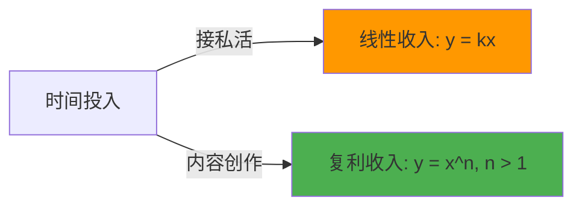
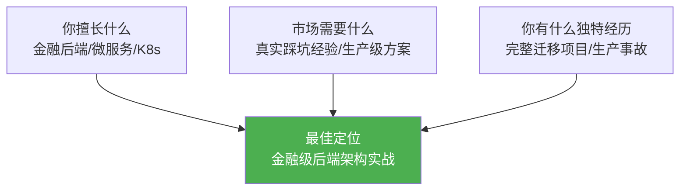
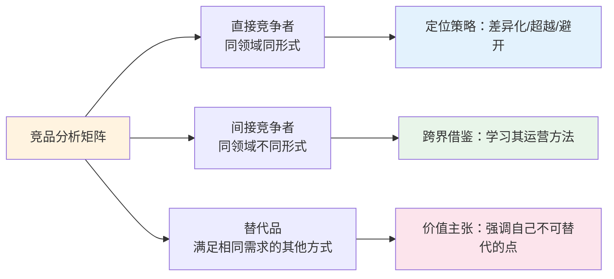
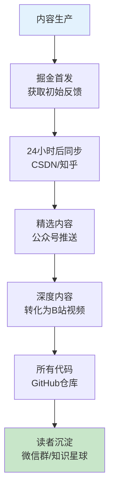
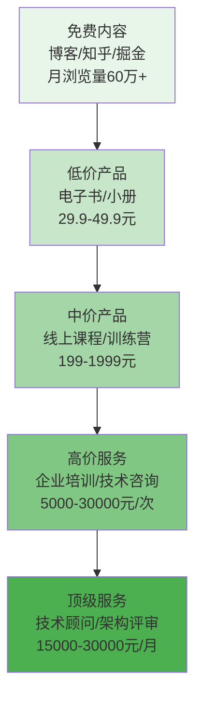
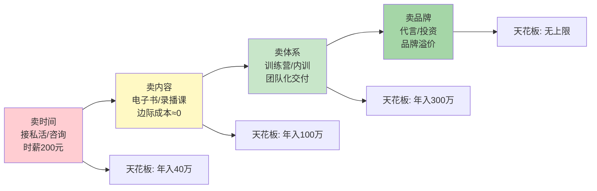
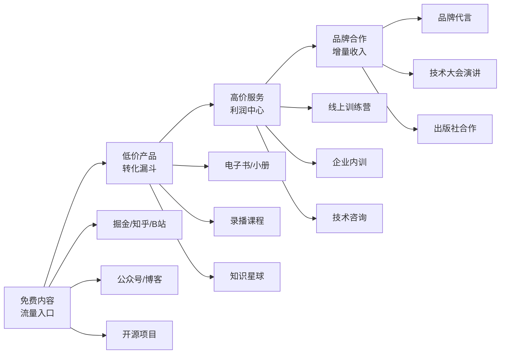
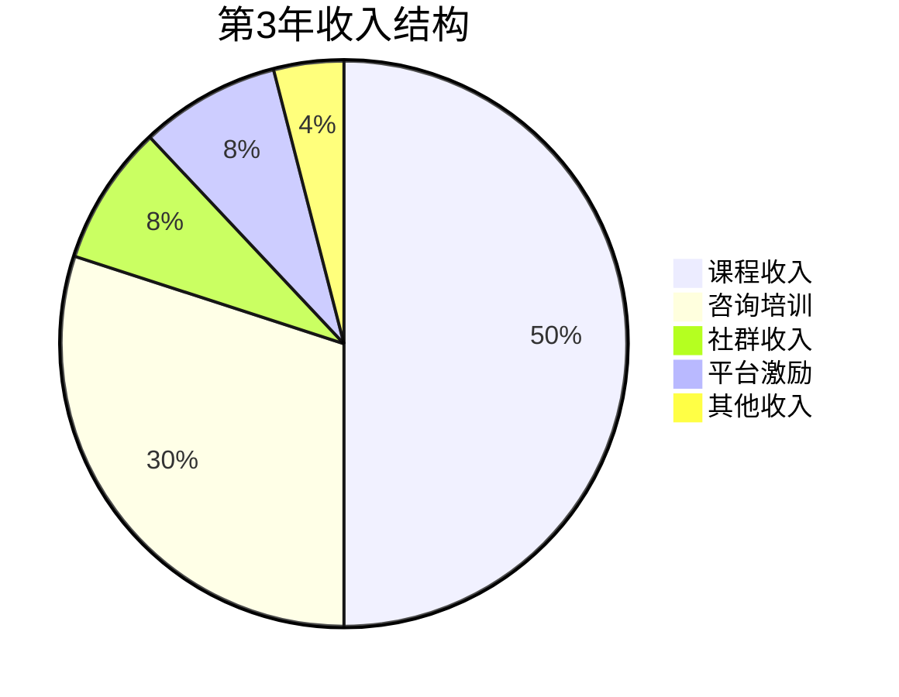
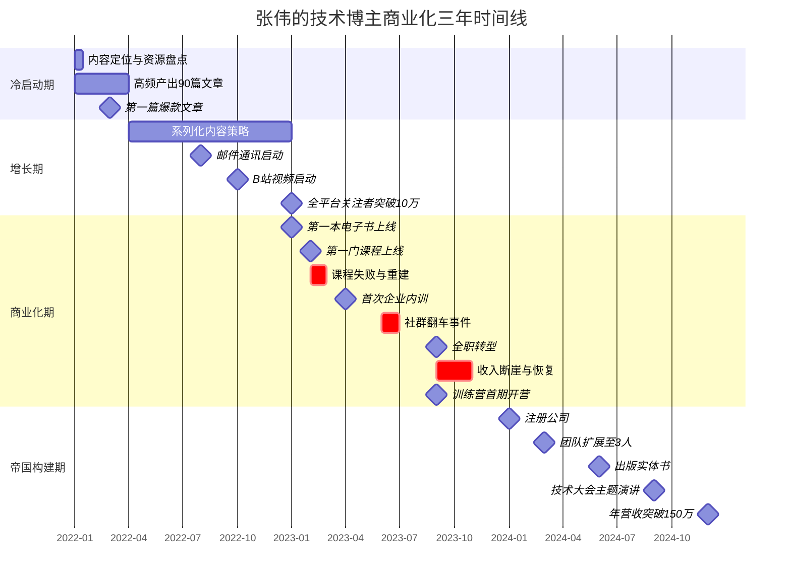

## 案例八：技术博主——从内容到商业帝国

> **阅读指南：** 本案例约2.5万字，完整追踪一个技术博主三年的商业化路径。建议按以下方式阅读：
>
> **适合谁读：**
> - 有2年+技术经验、想探索内容副业的工程师
> - 已在做技术博客但变现困难的创作者
> - 想从个人副业升级为商业体系的技术人
> - 对创作者经济和知识付费感兴趣的研究者
>
> **完整目录：**
>
> | 章节 | 核心内容 | 关键词 |
> |------|---------|--------|
> | 一、为什么技术内容创作是高杠杆副业 | 内容复利模型、创作者经济、主角画像、副业方向对比 | 决策依据 |
> | 二、冷启动期（第1-3个月） | 内容定位、生产体系、发布策略、心理建设 | 从0到1 |
> | 三、增长期（第4-12个月） | 内容升级、多平台运营、跨平台协作、品牌建设、SEO、ROI追踪 | 从1到10 |
> | 四、商业化探索期（第13-24个月） | 变现时机、六大变现方式、关键决策 | 从10到100 |
> | 五、帝国构建期（第25-36个月） | 业务体系化、训练营、企业内训、品牌升级、技术基础设施、税务合规 | 从100到N |
> | 六、三年完整数据复盘 | 财务数据、影响力数据、时间回报、失败案例 | 数据验证 |
> | 七、可复制的方法论 | 内容六原则、商业化五关键、品牌三阶段 | 方法论提炼 |
> | 八、常见误区与避坑指南 | 内容/商业化/运营误区、创作者倦怠 | 避坑 |
> | 九、进阶策略 | 公司化运营、产品化、生态构建、风险管理 | 跃迁 |
> | 十、常见问题解答 | 7个高频问题的深度回答 | FAQ |
> | 十一、启示与总结 | 核心公式、行动清单、自我评估 | 速查 |
>
> **快速阅读路径：**
>
> | 你的情况 | 推荐阅读路径 |
> |---------|-------------|
> | 纯好奇，想了解技术博主能否赚钱 | 第一节（为什么）→ 第六节（三年数据）→ 第十一节（总结） |
> | 准备开始做技术内容 | 第一节 → 第二节（冷启动）→ 第七节（方法论）→ 第八节（误区） |
> | 已经在做，想提升变现能力 | 第四节（商业化）→ 第五节（帝国构建）→ 第九节（进阶策略） |
> | 有团队，想规模化运营 | 第五节 → 第九节 → 第十节（FAQ） |
> | 时间紧张（5分钟版） | 第六节（数据复盘）+ 第十一节（速查表） |
> | 想评估自己是否适合 | 第一节（自评表）→ 第十一节（自我评估框架+替代路径） |

本案例追踪一位技术从业者从零开始运营技术博客，历经三年时间，逐步将个人影响力转化为多元收入来源，最终构建起年营收百万级别的技术商业体系的完整过程。这不是一个"一夜暴富"的故事，而是一个系统性工程——从内容定位、流量积累、品牌建设到商业闭环的每一步，都有明确的方法论和可复用的操作细节。

**你将获得什么：**
- 一套完整的内容创作者商业化路径（冷启动→增长→变现→规模化）
- 12个可直接使用的SOP模板和决策框架
- 真实的财务数据（含失败案例和月度波动）
- 2025年AI时代的内容创作工具链和策略
- 一份"今天就能开始"的行动清单

#### 适不适合你？——动手前的5分钟自评

在投入时间阅读这个案例之前，先做一个快速自评。这不是"劝退"，而是帮你明确自己处于哪个起点，以及需要补哪些短板。这个自评包含5个核心维度，每个维度都有具体的测试方法和行动建议——如果你发现大部分维度处于"负面"状态，不必灰心，文末第十一节提供了完整的替代路径和分阶段补齐方案。

| 自评维度 | 测试方法 | 你的状态 | 行动建议 |
|---------|---------|---------|---------|
| 表达欲 | 过去一个月，你是否有过"这个技术点我可以写下来"的冲动？ | 经常/偶尔/从未 | "从未"→先从内部技术分享开始练手 |
| 实战积累 | 你是否有至少一个完整的项目经历可以讲30分钟以上？ | 有多个/有1个/没有 | "没有"→先积累，同时记录工作笔记 |
| 时间预算 | 每周能否稳定抽出10-15小时（不含主业加班）？ | 能/偶尔能/完全不能 | "完全不能"→先调整主业节奏 |
| 延迟满足 | 如果6个月零收入，你还能坚持吗？ | 能/不确定/不能 | "不能"→考虑先从接私活等快速反馈的副业开始 |
| 公开表达 | 你在技术社区发帖/回答问题时感到自在吗？ | 自在/一般/抗拒 | "抗拒"→先从匿名或小圈子分享开始 |

**分数解读：** 4-5项"正面"→立即开始；3项→补齐短板后开始；1-2项→建议先走替代路径（接私活/独立开发/技术咨询），同时逐步培养内容创作能力。

**2025年技术博主生态全景——你需要知道的背景：**

在进入具体案例之前，先了解2025年技术内容创作的整体生态。与张伟开始的2022年相比，2025年的技术博主生态已经发生了深刻变化：

| 维度 | 2022年（张伟起步时） | 2025年（现在） | 对新博主的影响 |
|------|-------------------|--------------|--------------|
| AI工具 | ChatGPT刚发布，辅助有限 | AI Agent成熟，可完成70%写作流程 | 生产效率提升，但竞争门槛也提高 |
| 平台格局 | 掘金/知乎/CSDN三足鼎立 | +抖音/B站/小红书/即刻/播客 | 机会更多，但精力更分散 |
| 竞争程度 | 中等（技术博主约50万） | 激烈（技术博主约200万） | 必须更垂直、更有差异化 |
| 变现方式 | 以平台激励+课程为主 | 6种变现方式成熟 | 变现路径更清晰，启动更快 |
| 内容标准 | "有用就行" | "有用+有深度+有真实经验" | AI搬运内容已被淘汰，真实经验更稀缺 |
| 读者付费意愿 | 中等 | 高（知识付费习惯已养成） | 付费转化率更高，但用户期望也更高 |

**核心结论：2025年进入技术内容创作，既有"AI降低门槛"的红利，也有"竞争加剧"的挑战。赢面属于那些有真实行业经验、能持续产出、并愿意系统化运营的人。** 本案例的方法论在2025年依然适用，但需要注意两个新维度：(1) 用AI提升效率但不依赖AI替代内容；(2) 在更多平台中选择2-3个深耕，而非全平台铺开。

**2025年入场者的独特优势：** 虽然竞争更激烈，但2025年入场的博主也有2022年入场者不具备的优势：(1) AI工具大幅降低了内容生产的技术门槛（配图、排版、SEO优化都可以AI辅助）；(2) 知识付费市场已经成熟，用户付费意愿远高于3年前；(3) 成功的方法论已经被验证（如本案例），不需要从零摸索；(4) 短视频平台（抖音/B站）为技术内容提供了全新的流量入口，竞争远小于图文平台。

### 一、为什么技术内容创作是高杠杆副业

#### 1.1 内容复利的本质

在讨论具体案例之前，需要理解一个核心概念：**内容复利**。与"接私活"这种线性收入模式不同，内容创作具有典型的幂律分布特征——前期投入大量时间产出内容，后期这些内容持续产生流量和收益，边际成本趋近于零。

用一个简单的数学模型来说明：



假设一位工程师每周投入15小时做副业。接私活模式下，每小时产出固定价值（比如200元/小时），一个月收入约12000元，但一旦停止投入，收入归零。内容创作模式下，前6个月可能收入为零，但积累的100+篇文章会持续获取搜索引擎流量，第12个月即使只投入50%的时间维护，收入可能已经超过接私活模式。

这就是为什么技术内容创作被称为"睡后收入"——你睡觉的时候，你写的文章还在为你工作。

#### 1.2 创作者经济的底层逻辑

根据 Creator Economy 的研究数据，全球创作者经济市场规模在2025年已超过2500亿美元。技术内容创作者在这个生态中处于独特位置：

| 维度 | 泛娱乐创作者 | 技术内容创作者 |
|------|-------------|---------------|
| 内容生命周期 | 短（几天到几周） | 长（几个月到几年） |
| 流量来源 | 推荐算法为主 | 搜索引擎 + 推荐算法 |
| 变现天花板 | 取决于粉丝量 | 取决于专业深度 |
| 竞争壁垒 | 低（同质化严重） | 高（需要真实经验） |
| 用户付费意愿 | 低（娱乐消费） | 高（职业技能投资） |
| 内容生产门槛 | 中（设备+创意） | 中高（专业知识+表达能力） |

技术内容的核心优势在于：**用户付费动机是职业发展**——这是刚性需求，而非可选的娱乐消费。一个程序员花299元买一门架构课程，如果能帮他跳槽涨薪3000元/月，投资回报率是10倍以上。这种明确的投资回报预期，使得技术内容的付费转化率远高于泛娱乐内容。

#### 1.3 主角画像与启动背景

张伟（化名），29岁，某二线城市互联网公司后端工程师，工作5年，技术栈以 Java/Go/云原生为主。月薪18K，在当地属于中等偏上水平。日常工作之余有较强的表达欲，喜欢在团队内部做技术分享，偶尔在掘金和CSDN写一些技术笔记，但从未系统运营过任何内容平台。

2021年底，张伟面临几个现实问题：

- **收入瓶颈**：公司晋升通道窄，短期内涨薪无望；房贷月供6500元，可支配收入有限
- **技术焦虑**：所在公司技术栈陈旧，担心长期下去竞争力下降
- **时间盈余**：每天下班后有2-3小时自由时间，周末基本空闲
- **表达欲望**：经常觉得很多技术问题的理解被浪费了，想沉淀下来

#### 1.4 副业方向对比与决策

张伟评估过几种副业方向后，最终选择技术内容创作，核心逻辑如下：

| 方向 | 启动门槛 | 时间杠杆 | 收入上限 | 竞争程度 | 与主业协同 | 可规模化 |
|------|----------|----------|----------|----------|------------|----------|
| 技术接私活 | 低 | 无（按件计费） | 中 | 高 | 中 | 否 |
| 技术内容创作 | 低 | 高（内容复利） | 高 | 中 | 高 | 是 |
| 技术培训 | 中 | 中 | 高 | 低 | 高 | 部分 |
| 独立开发产品 | 高 | 高 | 极高 | 高 | 高 | 是 |
| 技术咨询 | 高 | 低（按小时计费） | 高 | 中 | 高 | 否 |

技术内容创作的核心优势在于**时间杠杆**和**可规模化**——一篇好文章可以持续获取流量数年，而接私活是"一锤子买卖"，每次都要重新投入时间。张伟最终押注的就是这个"内容复利"效应。

#### 1.5 初始资源盘点

在启动前，张伟做了一次完整的资源盘点，这是很多人忽略的关键步骤——明确自己有什么、缺什么，才能制定切实可行的计划：

**已有资源：**

- 5年工作经验，掌握主流后端技术栈
- 基础写作能力（大学期间运营过校内公众号，粉丝约800人）
- 一台个人MacBook Pro
- 掘金平台已有30+篇技术笔记，累计获得约2000次浏览
- 日常工作中的真实技术场景（这是最核心的素材来源）

**缺失资源：**

- 没有系统的写作方法论
- 不了解内容平台的运营规则和算法机制
- 没有个人品牌意识，文章风格不统一
- 不懂商业化变现的任何环节
- 没有任何私域流量池
- 不具备视频制作能力
- 没有行业人脉和社交资源

**资源盘点的正确方法：** 不要只列"有什么"，更要分析每个资源的"变现潜力"。比如"5年工作经验"这个资源，表面上人人都有，但如果你能从中提炼出"金融行业微服务迁移的完整踩坑经验"，这就是稀缺资源。资源的价值不在于拥有，而在于如何包装和传递。

### 二、冷启动期（第1-3个月）：从0到1

#### 2.1 内容定位——找到"人无我有"的切入点

张伟没有盲目开始写文章，而是花了整整两周时间做定位分析。定位是整个内容创作的基石——定位错了，后面的所有努力都是低效的。

**第一步：盘点自己的独特经历**

张伟列出自己过去5年的工作经历，筛选出几个有差异化的点：

1. 参与过一个从单体架构迁移到微服务架构的完整项目，踩过大量坑
2. 在生产环境中处理过几次重大故障，有完整的排查经验
3. 对云原生（Kubernetes/Docker）有深度实践经验，而非纸上谈兵
4. 所在行业是金融领域，对高并发、高可用有实际场景需求
5. 有从0到1搭建监控告警体系的完整经验

**第二步：分析平台内容缺口**

张伟用了一周时间，在掘金、CSDN、知乎搜索以下关键词，并记录搜索结果的质量：

- "微服务迁移"——大部分文章停留在理论层面，缺少真实项目经验。排名前10的文章中，7篇是概念介绍，只有2篇有实际案例，且都不够深入
- "生产事故排查"——分享者寥寥，且多数语焉不详。很多文章只写了"最终解决了"，没有完整的排查思路
- "Kubernetes实战"——教程泛滥，但金融行业场景的内容极少。99%的内容是Hello World级别

**第三步：用"三圈定位法"确定方向**

张伟使用了一个经典的定位方法论——三圈交叉：



最终定位：**"金融级后端架构实战"**——聚焦金融行业背景下的后端技术实战经验，强调生产级别的可靠性和真实踩坑经历。

这个定位的好处：

- 足够垂直，竞争者少（当时掘金上专注金融后端的作者不超过5个）
- 有行业壁垒，不容易被复制（没有真实金融项目经验的人写不出来）
- 目标受众明确（后端工程师、架构师，付费能力强）
- 与自身经历高度匹配，内容生产成本低

**定位的常见错误：**

很多技术博主的定位太宽泛，比如"分享Java技术"或"后端开发经验"。这种定位的问题是：你面对的竞争对手是所有写Java的人，其中不乏技术大牛和全职博主。正确的做法是找到一个足够窄的切入点，在这个细分领域做到前3名，再逐步扩展。

**2025年定位的新维度——AI差异化：**

在AIGC工具（ChatGPT、Claude、Copilot）普及后，技术内容定位还需要考虑一个重要维度：**AI能替代到什么程度？** 以下是定位的AI抗替代性评估：

| 定位方向 | AI替代性 | 理由 | 定位建议 |
|---------|---------|------|---------|
| "Python入门教程" | 🔴 极高 | ChatGPT可以写得更好更全面 | 不建议作为核心定位 |
| "Kubernetes生产踩坑" | 🟡 中等 | AI无法提供真实生产环境经验 | 可以，但需要强调"真实场景" |
| "金融行业技术架构" | 🟢 低 | 行业壁垒+真实经验，AI难以替代 | 强烈推荐 |
| "某开源项目深度分析" | 🟢 低 | 源码级分析需要大量真实投入 | 推荐 |
| "面试八股文整理" | 🔴 极高 | AI可以做到极致 | 不建议 |

**核心原则：越依赖"真实经验"和"行业认知"的定位，越不容易被AI替代。** 2025年以后，技术博主的核心竞争力不再是"知识量"，而是"真实经历+独立判断"。

**第四步：竞争定位分析——找到你的生态位**

定位不能只看自己有什么，还要看对手在做什么。张伟在确定"金融级后端架构实战"之前，做了一次系统的竞品分析：



**竞品分析的5个维度：**

| 分析维度 | 具体操作 | 数据来源 | 决策意义 |
|---------|---------|---------|---------|
| 内容覆盖度 | 搜索目标关键词，记录排名前20的文章覆盖了哪些子话题 | 掘金/知乎/Google | 找到内容空白点 |
| 内容深度 | 随机抽样10篇竞品文章，评估其深度层次（L1-L4） | 人工阅读 | 确定你能在哪个层次超越 |
| 更新频率 | 统计竞品近3个月的发文量和节奏 | 平台主页 | 评估对手的投入程度 |
| 变现方式 | 观察竞品是否有付费产品、定价多少、销量如何 | 公开信息 | 评估市场付费意愿 |
| 读者互动 | 分析竞品评论区的典型问题和不满 | 评论区 | 发现未被满足的需求 |

**张伟的竞品分析结果（节选）：**

| 竞品 | 定位 | 优势 | 弱点 | 张伟的差异化策略 |
|------|------|------|------|----------------|
| 某大V作者A | Java全栈 | 粉丝多、更新快 | 内容偏入门，缺乏金融场景 | 聚焦金融级深度 |
| 某团队博客B | 架构设计 | 内容系统、质量高 | 团队产出，缺少个人温度 | 强调个人实战故事 |
| 某培训机构C | K8s教程 | 课程体系完整 | 商业化过重，信任度低 | 先免费建立信任 |

**竞争定位的核心原则：** 不要试图在别人的强项上超越他，而是找到对手的弱项作为你的突破口。如果所有竞品都在写"教程型"内容，你就写"复盘型"；如果大家都在写"怎么做"，你就写"为什么这样做"以及"踩过什么坑"。

#### 2.2 内容生产体系搭建

张伟意识到，如果不能形成可持续的内容生产流程，很快就会断更。数据显示，技术博客的断更率超过80%，核心原因就是缺乏系统化的内容生产机制。

**素材收集系统：**

```text
日常素材来源：
├── 工作中的技术决策（为什么不选方案A而选方案B）
│   └── 记录模板：背景→方案对比→决策依据→结果验证
├── 生产环境的问题排查（脱敏后记录完整过程）
│   └── 记录模板：故障现象→排查过程→根因分析→修复方案→预防措施
├── Code Review中的典型问题（同事代码的共性问题）
│   └── 记录模板：问题代码→为什么有问题→正确写法→性能对比
├── 技术社区的热门讨论（参与并形成自己的观点）
│   └── 记录模板：争议点→各方观点→自己的立场→论据支撑
├── 开源项目的源码阅读（重点项目的实现原理）
│   └── 记录模板：解决什么问题→核心设计→实现细节→可借鉴之处
└── 书籍/课程的学习笔记（用自己的话重新组织）
    └── 记录模板：核心概念→自己的理解→实际应用场景→与已有知识的关联
```

**素材管理工具选择：**

| 工具 | 适用场景 | 优势 | 劣势 |
|------|---------|------|------|
| Notion | 全能型素材管理 | 数据库视图、模板丰富 | 国内访问偶尔不稳 |
| 语雀 | 技术文档型 | 支持代码块、团队协作 | 移动端体验一般 |
| Obsidian | 个人知识管理 | 双向链接、本地存储 | 学习曲线较陡 |
| 飞书文档 | 团队协作者 | 多维表格、自动化 | 个人使用偏重 |

张伟最终选择了Notion，建立了如下数据库结构：

- **素材库**：每条素材包含标题、标签（技术栈/场景/难度）、状态（待写/写作中/已发布）、预估字数
- **内容日历**：每周日晚规划下周的2-3个写作主题
- **数据追踪**：每篇文章发布后的浏览量、点赞数、评论数、转化数据

**写作流程标准化（SOP）：**

1. **选题**（周日晚上，30分钟）：从素材库中选出下周要写的2-3个主题，优先选择"时效性强+搜索量大+自己有独特经验"的主题
2. **大纲**（写作当天，15分钟）：用思维导图列出文章结构，确保逻辑清晰
3. **初稿**（核心写作时间，1-2小时）：不纠结文字，先把内容写完。初稿的核心是"把话说清楚"，而不是"把话说漂亮"
4. **打磨**（次日，30分钟）：检查逻辑、补充细节、优化措辞。重点检查：代码是否可运行、论据是否充分、结论是否有数据支撑
5. **排版发布**（打磨后，20分钟）：添加代码块、图表、总结。使用统一的排版模板

**写作效率提升技巧：**

- **建立文章模板**：不同类型的文章（教程型、复盘型、观点型）使用不同的模板框架
- **代码先行**：先写好可运行的代码示例，再围绕代码写文章，避免"纸上谈兵"
- **番茄工作法**：用25分钟专注写作 + 5分钟休息的节奏，避免长时间写作导致效率下降

**AI辅助内容创作工作流（持续迭代中）：**

张伟在第18个月开始系统性地将AI工具融入内容生产流程，将单篇文章的生产时间从平均4小时压缩到2.5小时，同时保持内容质量不降反升。关键在于：**AI是放大器，不是替代品**——它放大的是你的真实经验，如果你没有经验，AI只能帮你写出平庸的内容。

更重要的是，AI对技术内容创作的影响不仅限于"写作辅助"。它正在重塑整个内容生态：AI降低了内容生产的门槛（意味着竞争加剧），但同时提升了读者对"真实经验"的鉴别力（意味着稀缺性更高的内容反而更值钱）。对于技术博主而言，正确的策略不是抵制AI，而是**用AI处理重复性工作，把省下来的时间投入到只有你才能做的事情上**——真实踩坑经历、行业洞察、人脉关系、线下活动。

**AI在内容生产各环节的应用：**

| 环节 | 传统方式耗时 | AI辅助耗时 | 节省比例 | AI工具 | 关键注意事项 |
|------|------------|-----------|---------|--------|-------------|
| 选题研究 | 30分钟 | 10分钟 | 67% | ChatGPT/Claude分析热搜趋势 | AI给的是方向，最终选题要结合自身经验 |
| 大纲生成 | 15分钟 | 5分钟 | 67% | Claude生成多版本大纲 | 必须人工调整逻辑和重点 |
| 初稿撰写 | 90分钟 | 40分钟 | 56% | Claude/GPT分段生成 | 核心观点和真实案例必须自己写 |
| 代码示例 | 60分钟 | 20分钟 | 67% | GitHub Copilot + Claude | 代码必须自己验证可运行 |
| 配图制作 | 30分钟 | 10分钟 | 67% | Mermaid/Excalidraw AI辅助 | 技术架构图仍需人工审核准确性 |
| SEO优化 | 20分钟 | 5分钟 | 75% | AI生成meta描述和标签 | 核心关键词要自己研究确认 |
| 排版校对 | 20分钟 | 5分钟 | 75% | AI检查错别字和逻辑漏洞 | 技术细节的准确性必须人工把关 |

**AI辅助写作的具体SOP：**

```text
第1步：人工确定选题和核心观点（10分钟）
  └── 基于素材库和数据，确定"写什么"和"核心论点是什么"
  └── AI不能替你做这个决策——选题来自你对读者需求的理解

第2步：AI生成多版本大纲（5分钟）
  └── 给AI提供：主题、目标读者、核心论点、预期字数
  └── 生成3个不同角度的大纲，人工选择最佳版本并调整

第3步：分段生成初稿（30分钟）
  └── 按章节逐一生成，每段给AI足够的上下文
  └── 真实案例、踩坑经历、数据必须自己写——这是核心价值
  └── 理论解释、背景介绍可以让AI辅助生成

第4步：人工注入"灵魂"（30分钟）
  └── 加入真实经历和细节（"当时我们团队只有3个人"）
  └── 加入个人观点和判断（"我认为这个方案更适合X场景"）
  └── 加入情绪共鸣点（"凌晨3点收到告警的那种绝望感"）
  └── 检查所有技术细节的准确性

第5步：AI辅助优化（10分钟）
  └── 让AI检查逻辑漏洞和表述不清的地方
  └── 让AI优化标题和开头（提升点击率）
  └── 人工审核所有修改建议
```

**2025年AI创作工具链实战指南：**

2025年，AI辅助内容创作的工具链已经非常成熟。以下是张伟实际使用的工具栈，按内容生产环节分类：

| 环节 | 推荐工具 | 使用技巧 | 注意事项 |
|------|---------|---------|---------|
| 选题研究 | ChatGPT/Claude + Google Trends | 用AI分析热门话题趋势，生成选题清单 | AI给的是方向，最终选题要结合自身经验 |
| 大纲生成 | Claude/DeepSeek | 提供主题+读者画像+核心论点，生成3版大纲 | 必须人工调整逻辑和侧重点 |
| 初稿撰写 | Claude 3.5/GPT-4o | 分段生成，每段给足够上下文 | 核心观点和真实案例必须自己写 |
| 代码验证 | Cursor/GitHub Copilot | AI生成代码后必须自己运行验证 | 不可直接使用未经验证的AI代码 |
| 图表制作 | Mermaid + Excalidraw | 用Mermaid语法生成流程图/架构图 | 技术细节需人工审核 |
| SEO优化 | Ahrefs/5118 + AI | AI生成meta描述和标签建议 | 核心关键词要自己研究确认 |
| 排版校对 | AI检查错别字+逻辑漏洞 | 技术细节准确性必须人工把关 | 不要让AI修改你的核心观点 |
| 视频脚本 | Claude生成要点大纲 | 不要写逐字稿（会导致念稿感） | 每个要点控制在2-3分钟讲解时间 |

**关键认知：AI是放大器，不是替代品。** 它放大的是你的真实经验。如果你没有经验，AI只能帮你写出平庸的内容。张伟的测试数据显示：有真实经验的文章，AI辅助后质量提升约20%；没有真实经验的文章，AI辅助后质量提升不到5%。

**2025年AI检测的真实案例：** 张伟的一位博主朋友在知乎用AI批量生成了30篇"高质量"技术回答，前两周数据表现很好（平均每篇500赞），第三周开始被知乎算法识别，所有回答被折叠，账号被降权处理，恢复期长达3个月。教训是：AI生成的内容即使质量不错，平台也能通过行为模式（发布频率异常、写作风格一致、缺乏个人化表达）识别出来。

**使用AI的三条红线：**

1. **不能让AI编造真实案例**：读者一眼就能看出"假经验"。AI可以帮你组织语言，但故事必须是真实的
2. **不能跳过人工验证**：AI生成的代码、配置、命令必须自己跑一遍。张伟曾因直接使用AI生成的Kubernetes配置，被读者指出参数错误，虽然及时修正但影响了信任度
3. **不能批量生产低质内容**：AI让批量生产变得容易，但搜索引擎和平台算法都在打击AI水文。质量永远优先于数量

**关键习惯：**

- 每天下班后固定8:00-10:00为内容创作时间
- 周末集中处理需要长时间思考的深度文章
- 所有素材用Notion数据库管理，按"技术栈+场景+难度"分类
- 每周至少产出3篇短文 + 1篇深度文章

**内容批量创作法——提高产出效率的核心方法：**

张伟在第6个月发现了一个效率陷阱：每天"随机选题→临时构思→写作"的模式导致大量时间浪费在"进入状态"上。他开始实践"批量创作法"，将创作流程拆分为不同的"心智模式"，同类任务集中处理：

```text
批量创作法的时间安排（每周）：

周日晚上（30分钟）：选题批量
  └── 一次性从素材库中选出本周3-5个写作主题
  └── 为每个主题列出3-5个核心要点
  └── 确定每篇文章的"钩子"（开头的故事或问题）

周一/周三/周五晚上（各2小时）：初稿批量
  └── 不查资料、不纠结措辞，专注"把内容倒出来"
  └── 目标：每晚完成1篇初稿（2000-3000字）
  └── 遇到需要查证的地方用[TODO]标记，不中断写作流

周六上午（3小时）：打磨批量
  └── 集中处理所有[TODO]标记（查资料、验证代码）
  └── 统一优化标题和开头
  └── 添加图表和代码示例
  └── 检查逻辑连贯性

周日上午（2小时）：发布批量
  └── 统一排版和格式
  └── 安排发布计划（哪天发哪篇）
  └── 准备社群分享话术
```

**批量创作法的效果：**
- 周产出从2篇提升到4-5篇（+100%）
- 单篇写作时间从4小时降到2.5小时（-37%）
- 创作焦虑显著降低（因为"选题"和"写作"不再混在一起）

**核心原理：** 人脑在不同任务之间切换有"切换成本"。选题需要发散思维，写作需要线性思维，打磨需要批判思维。把同类思维活动集中在一起，可以大幅减少切换成本，提高产出效率。

#### 2.3 冷启动期的发布策略

前3个月，张伟的发布策略非常明确——**用数量换曝光**。在冷启动阶段，平台算法对新作者的推荐权重很低，唯一的破局方式就是用高频次的优质内容"刷存在感"。

**多平台分发策略：**

| 平台 | 内容类型 | 发布频率 | 核心目的 |
|------|---------|---------|---------|
| 掘金 | 深度技术文章 + 技术短文 | 每天1篇短文，每周1-2篇深度 | 主阵地，获取精准技术流量 |
| 知乎 | 回答技术问题 | 每天2-3个回答 | 长尾搜索流量入口 |
| CSDN | 同步掘金深度文章 | 与掘金同步 | SEO流量（百度收录好） |
| 微信公众号 | 精选文章 | 每周1-2篇 | 私域沉淀入口 |
| GitHub | 代码示例仓库 | 随文章更新 | 技术背书 |
| 邮件通讯（Newsletter） | 技术周报/深度精选 | 每周1封 | 最高触达率，不受算法影响 |

**为什么邮件通讯是技术博主的"终极保险"：**

在所有分发渠道中，邮件是唯一完全不受平台算法影响的触达方式。掘金可以改推荐规则，知乎可以调整排序算法，微信公众号的打开率可以逐年下降，但邮件的到达率始终稳定在60-80%。张伟在第8个月开始建立邮件列表，到第24个月已有12,000名订阅者，邮件打开率稳定在45%（远高于行业平均的20%），成为他推广新产品最有效的渠道——训练营招生邮件的转化率是公众号推文的3倍。

**邮件通讯实操方案：**

| 工具 | 月成本 | 优势 | 劣势 | 推荐场景 |
|------|--------|------|------|---------|
| Substack | 免费 | 零门槛、自带发现机制 | 国内访问不稳 | 面向海外读者 |
| 竹白 | 免费/付费版 | 国内体验好、排版美观 | 功能较简单 | 中文技术通讯 |
| ConvertKit | $9/月起 | 自动化强、标签系统 | 英文界面 | 进阶运营 |
| 自建（Mailtrain+SMTP） | 服务器成本 | 完全自主、无限制 | 需要技术维护 | 技术能力强的博主 |

**张伟的Newsletter内容模板：**

```text
每周五发送，固定结构：
├── 本周精选（1篇原创深度文章，附简短导读）
├── 技术动态（2-3条行业新闻+个人点评）
├── 读者问答（选1个本周社群中的高质量问答）
├── 工具推荐（1个实用工具/库，附使用场景）
└── 一句话思考（个人感悟或行业观察，50字以内）

关键指标：
  - 目标订阅者：每月净增500-1000人
  - 打开率目标：>40%（低于30%需要调整标题和发送时间）
  - 点击率目标：>15%（低于10%需要优化内容结构）
```

**邮件列表增长策略：**

1. **文章底部CTA**：每篇文章末尾加入"订阅技术周报，每周获取一篇深度技术分析"
2. **内容升级（Content Upgrade）**：文章中提供可下载的资源（如"本文配套的架构评估清单PDF"），下载需留邮箱
3. **社群引流**：在知识星球/微信群中定期分享Newsletter独家内容的摘要，引导订阅
4. **技术大会**：演讲后分享PPT时收集邮箱（"扫码获取演讲PPT+扩展阅读"）

**平台算法机制理解：**

每个平台的推荐算法都有其核心逻辑，理解这些逻辑才能事半功倍：

- **掘金**：新文章发布后的2小时内是关键窗口期。如果在这段时间内获得足够的点赞和评论，算法会将文章推送给更多用户。因此，张伟会在发布后立即分享到相关技术群，获取初始互动
- **知乎**：回答的排序与"赞同数 × 作者权重"正相关。在新号阶段，选择"新提出的问题"回答更容易获得曝光，因为竞争对手少
- **CSDN**：百度搜索权重高，长尾流量大。文章标题中包含关键词（如"Redis缓存雪崩解决方案"）对SEO至关重要

**冷启动期的核心指标：**

| 指标 | 第1个月 | 第2个月 | 第3个月 | 增长倍数 |
|------|---------|---------|---------|---------|
| 掘金关注者 | 50 | 300 | 1,200 | 24x |
| 文章总浏览量 | 5,000 | 25,000 | 80,000 | 16x |
| 知乎关注者 | 20 | 150 | 600 | 30x |
| 公众号关注者 | 30 | 100 | 350 | 12x |
| 单篇最高浏览量 | 800 | 3,500 | 12,000 | 15x |
| 文章总数 | 25 | 55 | 90 | — |

**冷启动期的时间分配模型：** 张伟将每周15小时的副业时间做了精细化分配，这是保证产出量的前提：

| 任务 | 每周时间 | 占比 | 说明 |
|------|---------|------|------|
| 素材收集与整理 | 2小时 | 13% | 工作中的技术决策、故障排查记录，零散时间完成 |
| 选题与大纲 | 1.5小时 | 10% | 周日晚上集中完成，用三圈定位法筛选 |
| 初稿写作 | 7小时 | 47% | 核心工作，周一/三/五晚各2-2.5小时 |
| 打磨与排版 | 2.5小时 | 17% | 周六集中处理，含代码验证、图表制作 |
| 互动与分发 | 2小时 | 13% | 回复评论、多平台同步、社群分享 |

**时间分配的核心原则：** 写作时间不低于总时间的50%。很多博主把大量时间花在"研究选题""优化排版""刷数据"上，真正用于写作的时间不到30%——这是产出量不足的根本原因。

**冷启动期的关键突破——"爆款文章"的方法论：**

第3个月，张伟写了一篇《一次Redis缓存雪崩导致的生产事故复盘》的文章，详细描述了他在工作中遇到的一次真实生产事故的排查过程。这篇文章在掘金获得了5万+浏览量，成为张伟第一篇"爆款"。

分析这篇文章成功的原因，可以提炼出爆款文章的公式：

**爆款公式 = 真实场景共鸣 + 完整排查过程 + 可复用的解决方案 + 情绪价值（踩坑的共鸣感）**

这篇文章的具体结构：

1. **场景描述**（200字）：周五下午3点，监控告警突然响起……用时间线叙事，营造临场感
2. **故障现象**（300字）：具体的表现——响应时间从50ms飙升到5秒，错误率从0.1%到30%
3. **排查过程**（1500字）：逐步排查的完整思路，包括走了哪些弯路
4. **根因分析**（500字）：Redis集群主从切换期间的缓存失效导致的雪崩效应，附带架构图
5. **解决方案**（800字）：具体的代码和配置变更，附带完整的代码diff
6. **预防措施**（500字）：后续加入的监控指标和自动化预案
7. **总结反思**（200字）：这次事故给团队带来的改变

**爆款文章的特征总结：**

- 标题包含具体数字或场景（"一次XXX导致的XXX"比"XXX技术分析"点击率高3倍）
- 开头30秒内让读者产生"我也遇到过"的共鸣
- 中间部分提供可操作的排查思路或解决方案
- 结尾给出明确的行动建议
- 全文有代码、有图表、有数据，不是纯文字堆砌

#### 2.4 冷启动期的心理建设

冷启动期是最难熬的阶段——你投入大量时间写文章，但浏览量可能只有几十到几百。数据显示，超过75%的技术博客在前3个月断更，其中80%的断更原因不是"没时间"，而是"看不到希望"导致的心理崩溃。张伟能坚持下来，靠的不是意志力，而是一套精心设计的心理支撑系统。

**为什么冷启动期的心理建设如此重要？** 因为冷启动期的投入产出比极低——张伟前3个月投入180小时，收入几乎为零，折合时薪约11元（远低于接私活的200元/小时）。如果没有正确的心理预期和支撑机制，任何理性人都会选择放弃。心理建设的本质是帮你度过"理性告诉你要放弃，但直觉告诉你应该坚持"的矛盾期。

**心理策略一：重新定义"成功"指标**

冷启动期最大的心理陷阱是用"商业指标"（浏览量、关注者、收入）衡量进展。这些指标在前3个月几乎不会给你任何正反馈。正确的做法是将成功标准切换为"过程指标"：

| 阶段 | 错误指标（会导致放弃） | 正确指标（能坚持下去） |
|------|---------------------|---------------------|
| 第1个月 | "浏览量怎么才50" | "本周完成了3篇文章" |
| 第2个月 | "关注者才100人" | "素材库积累了40个选题" |
| 第3个月 | "一篇爆款都没有" | "写作速度从4小时/篇降到2.5小时/篇" |

**心理策略二：建立"最小反馈回路"**

在没有外部反馈（浏览量、评论）的阶段，需要人为创造反馈：
- **写作伙伴制度**：找1-2个也在写技术文章的朋友，每周互相阅读对方的文章并给出反馈。即使只有2个读者，认真写给2个人看也比随便写给0个人看有意义得多
- **进度可视化**：用Notion或Excel建立一个"文章计数器"，每发一篇文章就+1。看着数字从1涨到90，本身就是一种成就感
- **周度复盘**：每周日晚花15分钟回顾本周的产出和学到的东西，写在日记里。3个月后回头看，你会惊讶于自己的进步

**心理策略三：管理期望——"前100篇都是练笔"**

这是张伟从一位资深创作者那里得到的最宝贵的建议。技术内容创作有一条"100篇门槛"——前100篇文章是积累基本功的阶段，包括：找到自己的写作风格、理解读者需求、掌握平台规则、建立素材收集习惯。过了100篇之后，你会明显感觉到写作变快了、选题变准了、读者反馈变多了。

这意味着：**前100篇的目标不是"写出爆款"，而是"完成100篇"**。把目标从"结果导向"转变为"数量导向"，可以大幅降低心理压力。

**心理策略四：建立"退出条件"而非"放弃条件"**

很多人把"放弃"和"退出"混为一谈。放弃是情绪化的——"我不想做了"；退出是理性的——"我评估了所有数据，认为这条路不适合我"。张伟给自己设定了一组"退出条件"，只有同时满足以下3个条件才会考虑退出：

```text
退出条件（需同时满足）：
1. 已坚持6个月以上（排除"还没过冷启动期"的情况）
2. 累计产出100篇以上（排除"基本功还没练够"的情况）
3. 经过数据分析，确认自己的定位确实没有市场需求
   （浏览量<100/篇，且尝试过3个不同方向都没有改善）

如果只满足1-2个条件，应该调整策略而非退出：
- 满足1+2不满足3 → 调整内容方向
- 满足1+3不满足2 → 增加产出量
- 满足2+3不满足1 → 时间太短，继续坚持
```

**心理策略五：与焦虑共处——接受"不确定感"**

冷启动期的焦虑本质上是"不确定性焦虑"——你不知道自己的努力是否有回报，不知道方向是否正确，不知道还要坚持多久。这种焦虑是正常的，不需要消除，只需要管理：
- **设定"焦虑时间"**：每天给自己10分钟"允许焦虑"的时间，过了这10分钟就回到工作状态
- **记录焦虑触发点**：张伟发现自己最大的焦虑来源是"看别人的数据"。解决方案很简单：卸载掘金App的"首页推荐"功能，只用网页版发布文章
- **运动**：张伟在第2个月开始每天跑步30分钟，这成为他对抗焦虑最有效的方式。运动产生的内啡肽可以有效缓解焦虑情绪，同时跑步时的"无聊时间"反而是最好的思考时间——很多选题灵感都是跑步时想到的

**设定合理的预期**：前3个月不看数据，只关注"是否按计划产出"。把目标从"获得多少浏览量"转变为"本周是否完成了计划的文章数量"。

**建立反馈回路**：即使浏览量低，也要认真回复每一条评论。早期的每一个读者都可能是未来的忠实粉丝。张伟在第一篇只有50浏览的文章下，认真回复了一条提问，那位读者后来成了他知识星球的早期成员。

**找到同行者**：加入掘金创作者社群，认识了几个也在做技术内容的博主。互相鼓励、互相转发，让冷启动期不那么孤独。

**记录进步**：用表格记录每周的数据变化，即使增长缓慢，看到趋势也是正向的就能坚持。

#### 2.5 冷启动期的真实困难——那些没人告诉你的至暗时刻

> **张伟原话：** "回头看，冷启动期最难的不是写不出东西，而是写了东西没人看。那种'我明明很认真在写，但世界完全不在乎'的感觉，比加班到凌晨还让人崩溃。"

冷启动期的困难远不止"浏览量低"这么简单。张伟在前三个月经历了多个"差点放弃"的时刻，这些是大多数成功案例不会提及的真实挑战：

**困难一：第2个月的"内容枯竭感"**

写到第30篇左右时，张伟突然觉得"没什么可写的了"。之前积累的工作经验似乎已经被掏空，每天坐在电脑前不知道写什么。这种感觉持续了一周多。

他的应对方法：
- 重新审视日常工作，发现"素材"无处不在——一次Code Review、一次线上故障、一个技术选型讨论，都可以变成文章
- 改变素材收集方式：从"事后回忆"变成"实时记录"。每天下班前花5分钟在Notion里记下当天遇到的技术问题，周末从中选题
- 降低单篇期望：不是每篇文章都要是"代表作"，一篇800字的踩坑记录也有价值

**困难二：被同事误解**

张伟在公司内部分享了自己在运营技术博客的事，结果部分同事开始在背后议论："不务正业""下班不休息搞副业""写的东西也就那样"。更尴尬的是，有一次他写了一篇关于公司技术栈选型的文章（已脱敏），被领导约谈，要求他"注意信息安全"。

他的应对方法：
- 严格脱敏：所有涉及公司的内容都经过仔细审查，不提及公司名称、具体业务数据、内部工具
- 低调运营：前6个月不在公司内部提及自己的博客
- 内容定位调整：从"我们公司的XXX"改为"某金融项目的XXX"，用通用化描述替代具体场景

**困难三：第3个月的数据低谷**

第3个月初，张伟连续发布了5篇文章，浏览量全部低于200。同期他看到掘金首页推荐的其他作者，文章动辄几千上万浏览，心态严重失衡。他开始怀疑自己的定位是否正确，甚至考虑转型写更"大众"的内容。

他的应对方法：
- 关闭掘金首页，不再与他人比较
- 回头看自己第1个月的数据——从50浏览到200浏览，其实已经增长了4倍
- 找到一位资深创作者聊天，对方告诉他："前100篇文章都是练笔，别指望它们爆。真正的爆发通常在第100-150篇之间。"这句话让他坚持了下来

**困难四：技术细节的"不安全感"**

作为只有5年经验的工程师，张伟经常担心自己的文章被大佬"打脸"。尤其是写架构设计类文章时，总觉得"比我厉害的人太多了，我有什么资格写"。

他的应对方法：
- 转变心态：不是"教别人"，而是"分享自己的经历和思考"。经历没有对错，只有参考价值
- 在文章中主动暴露不足："这是我的做法，可能不是最优解，欢迎讨论"——这种坦诚反而赢得了更多信任
- 事实证明：被"打脸"的次数远比预想的少，反而有很多读者感谢他的分享

**这些困难的共同启示：** 冷启动期最大的敌人不是"没有流量"，而是**自我怀疑**。每一个成功的技术博主都经历过这些至暗时刻，区别在于他们选择在想放弃的时候多坚持了一周。

**冷启动期的"生存检查清单"——每月月底做一次：**

```text
□ 本月是否按计划产出了足够数量的文章？（目标：12-15篇）
□ 写作速度是否比上月有所提升？（目标：每篇减少15-30分钟）
□ 素材库是否在持续积累？（目标：每月新增20+条素材）
□ 是否有至少1篇文章获得了超出预期的反馈？（正反馈是坚持的燃料）
□ 是否找到了1-2个可以交流的同行？（孤独是最大的敌人）

全部通过 → 继续执行当前策略
3-4项通过 → 调整产出节奏或内容方向
1-2项通过 → 认真考虑是否需要改变定位或策略
0项通过 → 启动"退出条件"评估（见2.4节）
```

### 三、增长期（第4-12个月）：从1到10

#### 3.1 内容升级——从"写给自己"到"写给读者"

冷启动期的内容更像是"技术笔记"，虽然实用但缺少系统性。进入增长期后，张伟开始有意识地升级内容质量。这个阶段的核心转变是：**从"我有什么就写什么"到"读者需要什么我就写什么"**。

**系列化内容策略：**

张伟开始规划系列专栏，将零散的文章组织成体系：

1. **《从单体到微服务：一个金融项目的架构演进》**（12篇）
   - 覆盖从需求分析、技术选型、实施过程到踩坑复盘的全流程
   - 每篇独立成文，但组合起来是完整的故事线
   - 这个系列成为张伟的"代表作"，累计浏览量超过50万
   - 系列文章之间通过"上一篇/下一篇"导航和统一的封面图建立关联

2. **《Kubernetes生产实践指南》**（8篇）
   - 聚焦金融行业场景下的K8s部署、运维、故障处理
   - 每篇都包含真实的配置文件和脚本代码
   - 包含性能调优和安全加固的实战经验
   - 代码仓库获得2000+ Star

3. **《后端工程师的性能优化工具箱》**（6篇）
   - 从JVM调优到数据库优化，从代码层面到架构层面
   - 每篇提供可直接使用的工具和脚本
   - 包含性能基准测试的方法论和压测数据

**系列内容的规划方法：**

```text
第一步：确定主题（选一个有足够深度的技术方向）
第二步：绘制知识地图（列出所有相关子主题）
第三步：排序（从基础到进阶，确保读者能跟上）
第四步：确定篇数（每篇3000-5000字，总计8-15篇为佳）
第五步：写第一篇（通常是"概述篇"，介绍整个系列的框架）
第六步：持续产出（保持每周1-2篇的节奏）
第七步：系列结束后整理成电子书/课程
```

**内容质量提升的三个维度：**

**维度一：深度——从"是什么"到"为什么"和"怎么做"**

技术文章的质量层次：

| 层次 | 内容特征 | 读者感受 | 示例 |
|------|---------|---------|------|
| L1 知识搬运 | 概念介绍、API文档翻译 | "百度也能搜到" | "Redis有5种数据结构" |
| L2 经验总结 | 结合实际场景的使用经验 | "有点用，但不够深" | "我们在项目中用了Redis做缓存" |
| L3 深度分析 | 原理剖析+对比分析+数据验证 | "学到了，有启发" | "为什么我们从Redis迁移到了Tair" |
| L4 方法论提炼 | 可复用的框架和决策模型 | "可以直接拿去用" | "分布式缓存选型的7个决策维度" |

张伟的内容目标是L3-L4层次。具体做法：

- 技术选型时列出完整的对比维度和决策依据，而不是只说"我们选了X"
- 代码示例不再是玩具代码，而是生产级的实现，包含异常处理、监控埋点、性能优化
- 包含性能数据和对比分析，比如"方案A的P99延迟是5ms，方案B是12ms，但在1000 QPS下方案A的CPU占用率是方案B的2倍"

**维度二：可读性——让复杂技术变得可理解**

- 使用"问题-分析-方案-验证"的结构，符合工程师的思维习惯
- 添加流程图和架构图（用draw.io或Excalidraw绘制），一张图胜过千字描述
- 代码块添加详细注释，关键行高亮。不要假设读者和你一样熟悉上下文
- 使用类比解释复杂概念（比如把微服务的服务发现类比为DNS解析）
- 控制段落长度，每段不超过5行，避免"文字墙"

**维度三：实用价值——每篇文章都要有可执行的产出**

- 提供完整的代码仓库（GitHub），README要写清楚如何运行
- 包含可复制的配置文件和脚本，而不是只贴关键片段
- 给出明确的使用场景和注意事项，包括"什么时候不要用这个方案"
- 附带相关资源链接（官方文档、论文、其他优秀文章）

#### 3.2 多平台精细化运营

随着内容质量提升，张伟开始精细化运营各平台，从"广撒网"转变为"重点突破+协同配合"。

**掘金（主阵地）：**

- 保持每周2-3篇的发布频率，其中至少1篇深度文章
- 积极参与掘金活动和技术征文（这些活动能带来额外的推荐流量）
- 利用掘金的"沸点"功能发布短内容保持活跃度
- 加入掘金创作者社群，与其他作者互推
- **关键策略**：关注掘金每周的热门标签，围绕热门标签产出内容可以获得算法加权

**知乎（流量入口）：**

- 重点回答高关注度的技术问题（关注数>100的问题优先）
- 在回答中自然植入个人专栏和公众号（不要硬广，要在"提供了足够价值之后"再引导）
- 利用知乎的推荐算法获取长尾流量——知乎的回答可以持续获得搜索流量数年
- **关键策略**：写长回答（3000字以上），知乎算法对长内容有加权

**微信公众号（私域沉淀）：**

- 将各平台的优质内容同步到公众号
- 建立读者微信群，形成技术交流社区（群规很重要：禁止广告、鼓励讨论）
- 定期推送技术周报，保持读者粘性
- **关键策略**：公众号是唯一完全可控的渠道——平台可能会改变算法，但公众号的粉丝是你的

**GitHub（技术背书）：**

- 将文章中的代码示例整理成开源项目
- 维护一个"技术博客"仓库，包含所有文章的源文件（使用Hugo/Next.js搭建静态博客）
- 积极参与开源社区——给知名项目提PR、写Issue分析，这些都能带来技术影响力
- **关键策略**：GitHub的Star数是技术影响力最直观的指标，很多企业客户会通过GitHub了解你

**B站（视频内容）：**

视频内容是技术博主的第二增长曲线。张伟在第10个月开始做B站，到第18个月时视频收入已占总收入的15%。更重要的是，视频带来的信任感远超文字——读者看到你真人讲解、实时操作代码，对你的专业能力的信任度会大幅提升。

**视频内容的三种形态：**

| 形态 | 时长 | 制作难度 | 适用场景 | 播放量特征 |
|------|------|---------|---------|-----------|
| 屏幕录制教程 | 10-30分钟 | 低 | 代码演示、工具使用 | 长尾稳定，搜索流量为主 |
| 技术讲解（露脸） | 15-25分钟 | 中 | 架构设计、技术分析 | 推荐流量，爆发力强 |
| 技术Vlog | 5-15分钟 | 中高 | 工作日常、踩坑复盘 | 粉丝粘性高，完播率好 |

**张伟的视频制作SOP：**

```text
选题（10分钟）：
  └── 从已发布的文章中选择播放潜力最高的3篇
  └── 优先选择：有代码演示的、有争议性观点的、解决高频问题的

脚本（30分钟）：
  └── 不写逐字稿（会导致"念稿感"），写要点大纲
  └── 每个要点控制在2-3分钟讲解时间
  └── 标注需要切换屏幕/展示代码的时间点

录制（45-60分钟）：
  └── OBS录屏 + 摄像头（画中画模式）
  └── 分段录制，每段5-8分钟，降低出错成本
  └── 录制时旁边放要点大纲，避免忘词

剪辑（60-90分钟）：
  └── 剪映专业版（免费，够用）
  └── 去掉口误、长停顿、无关片段
  └── 添加字幕（B站用户习惯看字幕）
  └── 关键代码行添加高亮标注
  └── 片头5秒必须有"钩子"——抛出问题或展示结果

发布优化（15分钟）：
  └── 封面图：用Canva制作，包含标题关键词+代码截图
  └── 标题：包含搜索关键词，用"疑问句"或"数字"提升点击率
  └── 标签：3-5个，包含技术关键词+场景关键词
  └── 简介：前两行包含核心关键词（影响搜索排名）
```

**视频与文字的协同策略：**

- 文章先发（掘金/知乎），积累初始数据和评论
- 根据文章数据选择"值得做视频"的主题（浏览量>5000的文章优先）
- 视频不是"念文章"，而是加入实时操作和额外的口头解释
- 视频简介中放文章链接，文章中嵌入视频——互相导流

**张伟的B站数据（第18个月）：**
- 关注者：8,000
- 总播放量：120万
- 单条最高播放：8.5万（《一次Redis缓存雪崩的完整排查过程》视频版）
- 月均收入：2,000-3,000元（创作激励+充电+商单）

- **关键策略**：B站的技术内容竞争远小于掘金/知乎，且视频内容的信任感更强。张伟的实际体验是：同样主题的文章在掘金获得5000浏览，视频版在B站能获得2万播放，且视频评论区的互动深度远超文字评论。

**各平台的流量分配策略：**



**内容复用矩阵——"一鱼多吃"的具体操作：**

一篇深度技术文章不应该只存在于一个平台、一种形式。张伟的内容复用策略是将一篇核心文章拆解为7种内容形态，覆盖不同平台和用户偏好：

| 源内容 | 复用形态 | 目标平台 | 额外工作量 | 预期增量流量 |
|--------|---------|---------|-----------|-------------|
| 深度技术文章（5000字） | 原文发布 | 掘金/CSDN | 0 | 基准 |
| 同上 | 精简版（2000字） | 知乎回答 | 20分钟 | +30%浏览量 |
| 同上 | 技术短文（500字） | 掘金沸点/微博 | 10分钟 | +10%曝光 |
| 同上 | 视频讲解（15分钟） | B站/YouTube | 2小时 | +50%触达 |
| 同上 | 图文卡片（6-9张） | 小红书/即刻 | 30分钟 | +20%新人群 |
| 同上 | 播客音频（20分钟） | 小宇宙/喜马拉雅 | 30分钟 | +15%通勤人群 |
| 同上 | 社群精华帖 | 知识星球/微信群 | 10分钟 | 社群活跃度提升 |

**复用的关键原则：**

1. **首发平台保持完整版**：掘金首发的永远是完整深度版，其他平台是衍生形态
2. **每种形态都要有独特价值**：视频版不是"念文章"，而是加入演示和实时操作；知乎版要针对问题做定向回答
3. **控制复用节奏**：不要同一天全平台发布，按"掘金→CSDN/知乎（隔天）→公众号（隔3天）→视频（下周）"的节奏，避免算法判定为"搬运"
4. **追踪各渠道数据**：记录每种形态在每个平台的表现，找到ROI最高的复用方式

#### 3.2.1 新兴平台的差异化打法——小红书、即刻与播客

2025年的技术内容生态已不再局限于掘金/知乎/CSDN三大平台。以下三个新兴渠道正在成为技术博主的增量战场：

**小红书：技术图文卡片的新蓝海**

小红书在2024-2025年涌现出大量技术内容创作者，尤其是"程序员转型""副业指南""技术面试"等泛技术话题。小红书的技术内容特点是**短图文（6-9张卡片）**，每张卡片200-300字，配合信息图和排版美化。

| 内容类型 | 适合小红书的原因 | 制作要点 |
|---------|----------------|---------|
| 技术面试经验 | 高搜索量、强互动 | 每张卡片一个面试题，配答案和评分标准 |
| 工具推荐清单 | 符合小红书"种草"调性 | 视觉化对比表格，突出使用场景 |
| 职业成长路径 | 小红书用户画像匹配 | 时间线形式展示，加入薪资变化 |
| 技术概念可视化 | 适合图片平台 | 用信息图替代纯文字解释 |

**张伟的小红书尝试**：第22个月开始在小红书发技术卡片，3个月获得8000关注者。核心策略是将深度文章的"精华观点"提炼为6张图文卡片。虽然小红书的技术用户付费意愿低于掘金，但它是获取"圈外用户"的最佳渠道——很多在小红书看到张伟内容的人，最终成了他训练营的学员。

**即刻：技术人的"朋友圈"**

即刻是技术圈内人高度活跃的社区，用户质量极高（以产品经理、技术经理、独立开发者为主）。即刻的内容形态以短文字（300字以内）+ 图片为主，适合分享技术观点、行业洞察和工作感悟。

**即刻运营要点：**
- 发布"技术观点"类内容（如"我认为微服务已经过时了"），引发讨论
- 分享日常工作的"幕后故事"，建立真实人设
- 即刻用户喜欢"真实感"，不要用官方话术
- 评论区互动是即刻的核心，认真回复每一条评论

**播客：深度技术对话的新形式**

技术播客在2025年迎来爆发期。相比文字和视频，播客的优势在于**通勤场景独占**——用户在开车、坐地铁、跑步时只能听播客，无法看文章或视频。

| 播客形态 | 时长 | 制作难度 | 适用场景 | 变现方式 |
|---------|------|---------|---------|---------|
| 独白式 | 15-30分钟 | 低 | 技术观点、读书笔记 | 广告、知识星球引流 |
| 对话式 | 30-60分钟 | 中 | 技术访谈、圆桌讨论 | 品牌赞助、课程推广 |
| 叙事式 | 20-40分钟 | 高 | 技术故事、行业纪实 | 付费订阅 |

**张伟的播客策略**：第24个月开始做播客，采用"对话式"——每期邀请一位技术朋友聊一个话题。播客的制作成本极低（录音+简单剪辑），但带来的信任感极强。张伟发现，听过他播客的人购买训练营的转化率是纯文字读者的2.5倍。

**新平台投入的优先级建议：**

```text
如果你的时间有限，按以下顺序扩展新平台：

第1优先：邮件通讯（Newsletter）→ 最高触达率，不受算法影响
第2优先：B站视频 → 技术视频竞争小，信任感强
第3优先：小红书 → 获取圈外用户，扩大受众面
第4优先：即刻 → 技术圈内影响力，建立人设
第5优先：播客 → 深度信任建设，通勤场景独占

注意：新平台不是"替换"主阵地，而是在主阵地稳定运营后的"增量"。
```

#### 3.3 跨平台协作与互推——借力打力的增长杠杆

单打独斗增长缓慢，聪明的博主善于通过协作放大影响力。张伟在第5个月开始系统性地与其他创作者建立合作关系，这是他增长速度从"线性"变为"指数级"的关键转折点：

**协作的四种形式：**

| 形式 | 具体操作 | 效果 | 适用阶段 |
|------|---------|------|---------|
| 内容互推 | 互相推荐对方的系列文章，在文末"推荐阅读"中放对方链接 | 双方各获得对方10-20%的读者导流 | 4个月+（有一定内容基础） |
| 联合系列 | 两位博主围绕同一主题从不同角度写系列文章 | 内容更全面，双方读者互相转化 | 6个月+（定位互补） |
| 联合直播 | 在B站/掘金做联合技术直播或圆桌讨论 | 触达对方的粉丝群体，信任感强 | 8个月+（有视频能力） |
| 互访播客 | 邀请对方做客自己的播客/被邀请 | 深度展示专业能力，建立私交 | 12个月+（有影响力） |

**张伟的协作经历：**

```text
第5个月：与3位同级别博主组建"技术创作者互助群"
  └── 每周互相分享选题计划，避免撞题
  └── 互相转发优质内容，初期互相"暖场"
  └── 效果：前3个月每人平均获得对方200-500次额外浏览

第8个月：与一位Go语言博主联合写"Java vs Go"系列
  └── 他写Go视角，张伟写Java视角，共6篇文章
  └── 效果：单系列累计浏览量15万+，是平时单打的3倍
  └── 关键：选择技术栈互补、观点有碰撞的合作者

第12个月：受邀参加掘金年度创作者大会并做分享
  └── 认识了10+位头部创作者，建立了深度人脉
  └── 后续合作包括：联合训练营、互相推荐课程、资源共享

第18个月：与2位博主联合推出"后端技术周报"邮件通讯
  └── 三人轮流撰写，每人负担降低67%
  └── 联合品牌影响力 > 三人各自影响力之和
```

**找合作者的正确方法：**

1. **找"同量级"的博主**：差距太大（如1万粉 vs 50万粉）的合作难以持续，双方都能提供对等价值才能长期
2. **找"定位互补"而非"定位重叠"的博主**：你写后端架构，他写前端性能，读者群体有交集但不完全重合
3. **先建立私交再谈合作**：先在评论区互动、私信交流，建立信任后再提出合作
4. **从小合作开始**：先做一次内容互推试试效果，效果好再升级到联合系列

#### 3.4 个人品牌系统化建设

在增长期，张伟开始有意识地打造个人品牌。品牌不是"起个好名字"那么简单，而是一套完整的认知系统。

**品牌定位公式：**

> 个人品牌 = 专业领域 × 独特视角 × 一致的形象

**品牌定位：** "金融级后端架构师"——强调实战经验，而非理论研究

**视觉统一：**

- 设计统一的个人Logo（一个简洁的代码符号+名字缩写，用Figma设计，成本0元）
- 所有平台使用相同的头像和封面图（提升品牌识别度）
- 文章排版风格统一（固定的标题样式、代码块风格、配色方案）
- 系列文章使用统一的封面模板（只改标题和期数）

**内容风格统一：**

- 语言风格：专业但不晦涩，严谨但不枯燥。避免学术腔，也避免过度口语化
- 固定的开头格式：先描述问题场景，再引出解决方案（让读者在30秒内判断是否继续阅读）
- 固定的结尾格式：总结要点 + 延伸思考 + 互动引导（"你在实际项目中遇到过类似的问题吗？"）
- 固定的作者签名档：包含个人简介、公众号二维码、相关系列文章链接

**社交证明积累：**

社交证明是品牌信任的基石。张伟系统性地收集和展示以下证明：

- 收集读者反馈和好评截图（建立一个"好评墙"页面）
- 记录文章被大V转发或推荐的案例
- 整理受邀参加技术活动的照片和资料
- 展示GitHub Star数、文章浏览量等量化指标
- 收集学员的成功案例（比如"学完课程后成功跳槽"）
- 将以上素材用于个人简介和商业合作介绍

#### 3.5 SEO与长尾流量策略

很多技术博主忽视SEO，这是一个重大失误。技术内容的最大流量来源之一是搜索引擎，而SEO的投入产出比极高——一次优化，长期受益。

**技术文章SEO核心要点：**

**关键词研究：**

```bash
# 使用Google Keyword Planner或5118等工具
# 核心关键词类型：
1. 问题型：Redis缓存雪崩怎么办、Kubernetes Pod启动失败
2. 对比型：Spring Boot vs Quarkus、MySQL vs PostgreSQL
3. 教程型：Docker入门教程、微服务架构设计
4. 场景型：高并发系统设计、分布式事务解决方案
```

**标题优化公式：**

> [核心关键词] + [具体场景/数字] + [价值承诺]

好标题示例：
- "Redis缓存雪崩：一次生产事故的完整排查过程与预防方案"
- "Kubernetes生产环境部署：从0到1的金融级实践指南（附完整配置）"
- "微服务架构选型：我们为什么从Spring Cloud迁移到了Go-Micro"

**内容结构优化：**

- H2/H3标题中包含目标关键词
- 文章前200字包含核心关键词（搜索引擎对前段内容权重更高）
- 使用内部链接将相关文章串联（提升站内权重传递）
- 图片添加alt标签，包含描述性关键词
- 代码块使用正确的语言标注（提升代码搜索的可发现性）

**长尾流量的价值：**

张伟的一篇《JVM GC调优实战》文章，发布6个月后每月仍能从搜索引擎获得3000+浏览量。这就是长尾流量的力量——你不需要每篇文章都是爆款，只要能持续产出高质量内容，搜索引擎会成为你稳定的流量来源。

**中国技术内容SEO的特殊性：**

国内技术内容的搜索引擎生态与海外有显著差异，需要针对性优化：

| 搜索引擎/平台 | 覆盖人群 | SEO要点 | 流量特征 |
|--------------|---------|---------|---------|
| 百度 | 最广泛的技术人群 | CSDN/博客园权重极高，优先在这些平台发布 | 搜索量大，但用户质量参差 |
| 掘金站内搜索 | 中高级开发者 | 标签精准匹配、标题含技术关键词 | 用户质量高，转化率好 |
| 知乎搜索 | 综合人群 | 长回答排名靠前、赞同数影响排序 | 长尾流量强，持续数年 |
| 微信搜一搜 | 公众号粉丝+搜狗 | 公众号文章、标题精准匹配 | 私域流量入口 |
| Google | 海外/VPN用户 | 个人博客SEO、技术文档规范 | 流量小但用户质量极高 |

**张伟的SEO实操策略：**

1. **CSDN是百度SEO的最佳载体**：张伟测试过，同一篇文章发在个人博客和CSDN上，CSDN版本在百度的收录速度快5倍，排名高3-5位。因此他将CSDN定位为"SEO专用平台"——文章同步过去主要是为了百度收录
2. **知乎回答的长尾效应**：他回答的一个关于"分布式锁实现方案"的知乎问题，2年后每月仍带来1000+浏览量。关键是在回答中自然植入个人专栏链接
3. **掘金标签策略**：每篇文章打3-5个精准标签，其中至少1个是热门标签（如"Redis""Kubernetes"）。热门标签的文章被推荐的概率更高
4. **微信搜一搜优化**：公众号文章标题必须包含用户会搜索的关键词。张伟测试发现，标题含"解决方案""实战""排查"等词的文章，搜一搜流量占比可达30%

**2025年新课题：AI搜索引擎优化（AISO）**

2025年，AI搜索引擎（Perplexity、Google AI Overview、秘塔AI搜索等）已成为技术内容的重要流量来源。与传统SEO不同，AI搜索引擎更关注**内容的权威性和结构化程度**：

| 传统SEO重点 | AI搜索优化重点 | 操作差异 |
|------------|--------------|---------|
| 关键词密度 | 语义相关性 | 不再堆砌关键词，而是围绕主题全面覆盖 |
| 外链数量 | 内容权威性 | 被引用次数比外链更重要 |
| 标题党优化 | 直接回答问题 | 标题要直接回答用户可能提出的问题 |
| 页面加载速度 | 结构化数据 | 使用schema.org标记、清晰的H层级 |
| 长尾关键词 | 完整知识覆盖 | 一篇文章覆盖一个主题的全部相关问题 |

**张伟的AISO实践：**

- **结构化写作**：每篇文章开头用一段话直接回答核心问题（AI搜索引擎会优先提取这段内容作为摘要）
- **FAQ格式**：在文章末尾添加"常见问题"部分，直接用问答格式覆盖用户可能的提问
- **数据引用**：在文章中引用权威数据和来源（论文、官方文档、行业报告），AI搜索引擎对有来源的内容权重更高
- **知识图谱友好**：使用清晰的实体名称（如"Redis Cluster 7.0"而不是"Redis最新版"），帮助AI理解内容的具体语境

**关键洞察：** 2025年，一篇同时优化了传统SEO和AI搜索的文章，其搜索引擎流量可以比只优化传统SEO的文章高出40-60%。AI搜索引擎不会取代传统搜索，但会成为增量流量的重要来源。

**AISO实操检查清单（每篇文章发布前）：**

```text
□ 文章开头是否有100-200字的"直接回答"段落？（AI搜索会优先提取）
□ 是否使用了清晰的H2/H3层级结构？（帮助AI理解内容层次）
□ 是否在文章中引用了权威来源（官方文档、论文、行业报告）？（提升内容权威性）
□ 文章末尾是否有FAQ格式的"常见问题"部分？（覆盖用户可能的提问方式）
□ 是否使用了精确的技术实体名称（如"Redis 7.0 Cluster"而非"Redis最新版"）？（帮助AI理解语义）
□ 文章是否覆盖了该主题的完整知识图谱？（AI偏好"一站式"内容）
```

**2025年不可忽视的新战场：短视频平台**

2025年，抖音/快手等短视频平台正在成为技术内容的新蓝海。虽然"技术+短视频"看起来不搭，但实际上，技术类短视频在2025年呈现出爆发式增长趋势。抖音的"技术分享"话题累计播放量已超过500亿次，其中"程序员日常""技术面试""代码演示"是最受欢迎的内容类型。

**短视频平台的技术内容策略：**

| 内容形态 | 时长 | 制作难度 | 适合平台 | 变现方式 |
|---------|------|---------|---------|---------|
| 技术概念可视化 | 15-60秒 | 中 | 抖音/快手 | 流量变现、引流 |
| 代码演示录屏 | 30-90秒 | 低 | 抖音/B站 | 引流到课程 |
| 程序员日常Vlog | 1-3分钟 | 中 | 抖音/小红书 | 品牌合作 |
| 技术面试题讲解 | 30-60秒 | 低 | 抖音/视频号 | 引流到训练营 |

**张伟的短视频尝试**：第30个月开始在抖音发技术短视频，采用"代码演示+语音讲解"的形式（不露脸），单条视频平均播放量2-5万，最高一条达到50万播放（《30秒理解分布式锁》）。虽然抖音的直接变现能力不如掘金/B站，但其流量爆发力远超其他平台——一条爆款视频可以在24小时内带来5000+公众号关注者。张伟的策略是：**抖音负责"拉新"，掘金/B站负责"留存和转化"**。

**短视频制作的极简SOP：**

```text
1. 选题（5分钟）：从已发布的深度文章中提取一个"知识点"（1个概念/1个技巧/1个误区）
2. 脚本（10分钟）：用"问题→错误示范→正确做法→总结"的四段式结构
3. 录制（15分钟）：用手机录屏+语音讲解，不需要露脸
4. 剪辑（20分钟）：用剪映快速剪辑，添加字幕和关键代码高亮
5. 发布（5分钟）：标题含搜索关键词，标签3-5个

总耗时：约55分钟/条，每周3-5条
```

#### 3.6 内容ROI追踪与优化——用数据指导创作

很多技术博主只关注"浏览量"这一个指标，但浏览量高不代表商业价值高。张伟在第6个月开始建立一套完整的内容ROI追踪体系，用数据指导每一篇内容的创作方向：

**内容ROI的三层指标：**

| 指标层级 | 具体指标 | 追踪方式 | 优化方向 |
|---------|---------|---------|---------|
| 流量层 | 浏览量、搜索排名、外部引荐 | 各平台后台 + Google Analytics | SEO优化、标题优化 |
| 互动层 | 点赞率、评论率、收藏率、分享率 | 各平台后台 | 内容质量、互动引导 |
| 转化层 | 公众号关注率、课程点击率、付费转化率 | 自建追踪链接（UTM参数） | CTA设计、产品匹配度 |

**张伟的内容数据看板（Notion实现）：**

```text
每篇文章追踪字段：
├── 基础数据：标题、发布日期、平台、字数
├── 流量数据：7天浏览量、30天浏览量、搜索流量占比
├── 互动数据：点赞数、评论数、收藏数、分享数
├── 转化数据：新增关注者、课程链接点击、付费用户数
├── 效率数据：写作耗时（小时）、稿件修改次数
└── 衍生数据：是否被大V转发、是否被收录到平台精选

每月汇总分析：
├── TOP 5 文章的共同特征是什么？→ 强化这些特征
├── BOTTOM 5 文章的问题在哪？→ 避免重复这些错误
├── 哪类内容的转化率最高？→ 增加这类内容的产出比例
└── 哪个平台的ROI最高？→ 调整时间分配
```

**关键发现——"反直觉"的数据洞察：**

张伟通过6个月的数据追踪，发现了几个违反直觉的结论：

1. **浏览量最高的文章≠转化率最高的文章**：一篇50万浏览的爆款文章带来的付费用户（12人），不如一篇5000浏览的深度教程带来的付费用户（28人）。原因是爆款文章的读者以"围观"为主，深度教程的读者才是真正的目标用户
2. **发布时间比内容质量影响更大**：同一类型的文章，工作日晚8点发布比周末上午发布浏览量高40%
3. **标题中的数字比情感词更有效**："7个实战技巧"比"你一定要知道的技巧"点击率高60%
4. **收藏率是内容价值的最佳指标**：浏览量和点赞容易受标题影响，但收藏率反映了读者认为内容"值得反复看"——这才是真正的好内容

**标题A/B测试的系统方法：**

张伟从第8个月开始，对每篇文章的标题做A/B测试。虽然大多数平台不支持原生的A/B测试功能，但他找到了一套可行的方法：

```text
第1步：为每篇文章准备3个候选标题
  └── 标题A：信息型（"Redis缓存雪崩的完整排查过程"）
  └── 标题B：悬念型（"一次Redis故障差点让公司损失百万"）
  └── 标题C：数字型（"Redis缓存雪崩排查：5个关键步骤"）

第2步：在不同平台使用不同标题
  └── 掘金用标题A（掘金用户偏好信息型）
  └── 知乎用标题B（知乎用户偏好故事型）
  └── 公众号用标题C（公众号用户偏好数字型）

第3步：追踪各平台数据
  └── 记录每种标题的点击率、阅读完成率、互动率
  └── 每月汇总分析，找出最有效的标题模式

第4步：迭代优化
  └── 建立"标题模式库"——记录效果好的标题结构
  └── 张伟的发现：技术类文章最佳标题公式是"场景+痛点+解决方案"
```

**张伟的标题优化数据（3个月测试结果）：**

| 标题模式 | 平均点击率 | 平均阅读完成率 | 最佳适用场景 |
|---------|-----------|--------------|------------|
| "一次XXX导致的XXX" | 4.2% | 65% | 事故复盘、踩坑经验 |
| "从0到1的XXX实践" | 3.8% | 70% | 教程、实践指南 |
| "为什么我们从XXX迁移到XXX" | 3.5% | 72% | 技术选型、对比分析 |
| "XXX个实战技巧" | 5.1% | 45% | 工具推荐、速查清单 |
| "XXX完整指南（附代码）" | 3.2% | 75% | 深度教程 |

**关键发现：** 高点击率的标题不一定带来高阅读完成率。"数字型"标题点击率最高，但很多读者是被数字吸引进来后发现不是他们想要的，导致跳出率高。张伟最终选择了"场景+痛点"型标题作为默认模式——虽然点击率不是最高，但阅读完成率和转化率都是最好的。

#### 3.7 增长期关键数据

| 指标 | 第6个月 | 第9个月 | 第12个月 | 增长倍数 |
|------|---------|---------|----------|---------|
| 掘金关注者 | 8,000 | 18,000 | 35,000 | 4.4x |
| 知乎关注者 | 3,000 | 8,000 | 15,000 | 5x |
| 公众号关注者 | 2,000 | 5,000 | 12,000 | 6x |
| B站关注者 | 500 | 3,000 | 8,000 | 16x |
| GitHub Star总数 | 200 | 1,500 | 5,000 | 25x |
| 月均内容浏览量 | 100,000 | 300,000 | 600,000 | 6x |
| 商业合作询价 | 2次/月 | 5次/月 | 15次/月 | 7.5x |
| 文章总数 | 150 | 220 | 300 | — |

**增长期的ROI分析——这段时间投入到底值不值？**

| 指标 | 冷启动期（3个月） | 增长期（9个月） | 增长倍数 |
|------|----------------|----------------|---------|
| 累计时间投入 | 180小时 | 720小时 | 4x |
| 累计直接收入 | ~2,000元 | ~45,000元 | 22.5x |
| 折合时薪 | ~11元 | ~62.5元 | 5.7x |
| 内容资产（文章数） | 90篇 | 300篇 | 3.3x |
| 月被动流量 | 8万 | 60万 | 7.5x |

**关键洞察：** 冷启动期的时薪极低（11元/小时），远低于接私活的200元/小时。但到了增长期末，时薪已达到62.5元/小时，且仍在快速增长。更重要的是，90篇冷启动期的文章在增长期持续产生流量——这就是"内容复利"的量化体现。如果用接私活模式投入同样的900小时，总收入约18万元，但这些收入不会产生任何"资产"。

**增长期的时间分配优化：** 随着内容产量稳定，张伟重新分配了时间：

| 任务 | 冷启动期占比 | 增长期占比 | 变化 | 原因 |
|------|------------|-----------|------|------|
| 内容创作 | 57% | 45% | -12% | 有了AI辅助和批量创作法，效率提升 |
| 平台运营 | 13% | 20% | +7% | 多平台精细化运营需要更多时间 |
| 社群互动 | 13% | 15% | +2% | 粉丝量增长，互动需求增加 |
| 品牌建设 | 0% | 10% | +10% | 视觉统一、社交证明收集、合作洽谈 |
| 数据分析 | 0% | 10% | +10% | 内容ROI追踪、标题A/B测试、竞品分析 |

**关键变化：** 从"纯写作"转向"写作+运营+品牌"的组合模式。单看写作时间减少了，但内容的影响力和转化率反而提升了——因为运营和品牌建设放大了每篇文章的价值。

### 四、商业化探索期（第13-24个月）：从10到100

> **本节核心观点：** 商业化不是"开始卖东西"，而是"将已有的信任资产变现"。时机不对、方式不对，都会透支信任。本节提供完整的商业化路径设计、六种变现方式的详细拆解、以及三个关键决策的真实案例。

#### 4.1 变现时机判断

很多技术博主面临一个困惑：什么时候开始变现？太早会损害用户信任，太晚会错失机会。张伟的判断标准：

**启动商业化的5个信号：**

1. **稳定的内容产出能力**：已经连续6个月以上保持稳定更新
2. **足够的受众基础**：全平台关注者超过2万
3. **明确的用户需求**：读者主动询问"有没有更深入的课程/服务"
4. **自然的商业机会**：已经有品牌主动联系合作
5. **内容矩阵成型**：已有系列化的内容体系，可以"产品化"

张伟在第12个月时，这5个信号全部满足。

#### 4.2 变现路径设计

经过一年的内容积累，张伟开始系统性地设计变现路径。核心原则是：**用免费内容获取流量，用低价产品筛选付费用户，用高价服务获取主要收入**。

**变现金字塔模型：**



**转化漏斗数据：**

| 层级 | 价格区间 | 月触达人数 | 转化率 | 月收入 |
|------|---------|-----------|--------|--------|
| 免费内容 | 0 | 600,000 | — | 3,000-5,000（平台激励） |
| 低价产品 | 29.9-49.9 | 600,000 | 0.3% | 5,000-9,000 |
| 中价课程 | 199-299 | 1,800 | 5% | 18,000-27,000 |
| 训练营 | 1,999 | 90 | 8% | 14,000/期 |
| 咨询服务 | 5000+ | 7 | 20% | 15,000-30,000 |

#### 4.3 六大变现方式详解

**方式一：平台激励和广告收入**

这是最基础的变现方式，虽然收入不高但稳定，适合所有阶段的内容创作者：

| 平台 | 激励机制 | 收入范围 | 门槛 |
|------|---------|---------|------|
| 掘金创作者激励 | 按浏览量计算 | 0.5-2元/千次浏览 | 需要申请 |
| CSDN付费专栏 | 设置付费阅读 | 取决于定价和销量 | 粉丝>1000 |
| 知乎盐选专栏 | 提交付费内容 | 按阅读量分成 | 需要审核 |
| 公众号流量主 | 文章底部广告 | 按点击量计费 | 粉丝>500 |
| B站创作激励 | 按播放量计算 | 1-3元/千次播放 | 需要申请 |

月收入范围：2000-5000元（稳定但增长有限）

**方式二：技术电子书/小册**

将系列文章整理成电子书，这是第一次真正的"产品化"尝试：

- **《微服务架构实战：从理论到落地》**：定价39.9元，累计销售3000+本
- **《Kubernetes生产环境实战手册》**：定价49.9元，累计销售2000+本
- **《后端性能优化完全指南》**：定价29.9元，累计销售4000+本

**电子书生产的关键经验：**

1. **先验证再投入**：先在公众号发布试读章节，根据反馈决定是否成书。如果试读章节的阅读完成率低于60%，说明内容或主题需要调整
2. **内容复用最大化**：80%内容来自已发布的文章，20%新增内容（前言、总结、案例补充）
3. **持续更新**：购买者可以免费获得更新版本，增加复购动力和口碑
4. **销售渠道多元化**：掘金小册、知识星球、微信公众号、个人网站同步销售
5. **定价策略**：参考同类产品定价，电子书通常在29.9-59.9元区间。定价太低（如9.9元）会降低感知价值，定价太高需要极强的品牌背书

**电子书生产SOP：**

```text
第1步：选定主题（选择已验证的热门系列文章）
第2步：内容整理（80%已有内容 + 20%新增）
第3步：结构重组（从"系列文章"变成"书籍结构"）
第4步：质量审核（检查代码可运行性、数据准确性）
第5步：排版设计（使用Typora/Pandoc生成PDF/EPUB）
第6步：试读发布（发布30%内容，收集反馈）
第7步：正式上线（多渠道同步销售）
第8步：持续迭代（根据反馈每季度更新一次）
```

**方式三：线上课程**

这是收入占比最大的变现方式。技术课程市场虽然竞争激烈，但高质量的实战课程始终供不应求。

**课程一：《后端架构师成长之路》**

- 定价：299元
- 形式：录播视频（60节课，总时长30小时）
- 内容：从初级到高级的完整学习路径
- 销售量：2000+份
- 平台：自有网站 + 掘金课程

**课程二：《Kubernetes从入门到精通》**

- 定价：199元
- 形式：录播视频（40节课，总时长20小时）
- 内容：基础概念到生产实践
- 销售量：1500+份
- 平台：掘金课程

**课程开发的关键流程：**

1. **需求调研**（2周）：
   - 在社群中发起问卷，收集学习痛点（问卷至少收集100份回复）
   - 分析竞品课程的评价和不足（重点看差评——差评里藏着市场机会）
   - 确定课程大纲和目标学员画像
   - 与10-15位目标学员做一对一访谈

2. **内容制作**（4-6周）：
   - 编写详细的课程脚本（每节课的脚本控制在3000-5000字）
   - 录制视频（使用OBS + 屏幕录制，分辨率1080p，帧率30fps）
   - 后期剪辑（使用剪映专业版或DaVinci Resolve）
   - 制作配套PPT和代码示例

3. **测试优化**（1周）：
   - 邀请10-20名种子用户试听
   - 收集反馈并优化内容（重点关注"听不懂"和"没用"的反馈）
   - 完善课程配套资料（思维导图、代码仓库、练习题）

4. **上线推广**（持续）：
   - 限时优惠活动（首发价通常为正式价的6-7折）
   - 学员口碑传播（设置推荐奖励机制）
   - 社群内持续推广

**课程录制的设备清单：**

| 设备 | 推荐型号 | 预算 | 用途 |
|------|---------|------|------|
| 麦克风 | Blue Yeti / 舒尔MV7 | 500-1500元 | 音质是课程质量的核心 |
| 补光灯 | 任意LED面板灯 | 100-300元 | 如果需要露脸录制 |
| 录屏软件 | OBS Studio | 免费 | 屏幕录制+摄像头 |
| 剪辑软件 | 剪映专业版 | 免费 | 视频剪辑 |
| 提词器 | 提词器App | 免费/低价 | 降低录制时的NG次数 |

**方式四：技术咨询和企业培训**

这是单价最高的变现方式，但需要足够的行业影响力：

- **技术咨询**：按小时收费，500-1000元/小时
- **企业内训**：按天收费，5000-10000元/天
- **架构评审**：按项目收费，3000-5000元/次
- **技术顾问**：月度/季度合作，10000-30000元/月

**企业内训的完整服务流程：**

```text
1. 需求沟通（1-2次视频会议）
   - 了解企业技术栈、团队水平、培训目标
   - 提供定制化课程方案

2. 课程定制（1-2周）
   - 根据企业需求调整课程内容
   - 准备企业相关的案例和练习

3. 现场培训（2-3天）
   - 理论讲解 + 实战演练
   - 每天6小时，含午休和茶歇

4. 课后辅导（1个月）
   - 每周一次线上答疑
   - 提供课程资料和代码仓库
   - 解答学员在实际工作中的问题

5. 效果评估（培训结束后2周）
   - 学员满意度问卷
   - 技能提升测试
   - 培训效果评估报告
```

获取客户的方式：

1. 通过内容自然吸引（文章中展示专业能力）
2. 通过社群口碑推荐
3. 通过技术大会演讲后的咨询需求
4. 通过猎头和行业人脉

**方式五：社群和知识星球**

建立付费技术社群，提供持续的技术支持：

- **知识星球**：定价199元/年，提供专属内容、答疑服务、项目指导
- **企业微信社群**：免费社群用于引流，付费社群（99元/年）提供更深度的交流
- **一对一辅导**：针对高级学员提供个性化指导，2000元/月

**知识星球运营的关键指标：**

| 指标 | 健康值 | 警戒值 | 说明 |
|------|--------|--------|------|
| 月活跃率 | >40% | <20% | 每月至少发言一次的成员比例 |
| 续费率 | >60% | <30% | 到期后续费的成员比例 |
| 问答响应时间 | <24小时 | >48小时 | 成员提问到获得回复的时间 |
| 月均内容更新 | >8篇 | <4篇 | 每月发布的新内容数量 |

**方式六：品牌合作与商务推广**

当影响力达到一定规模后，品牌合作会自然找上门：

- **技术产品推广**：云服务商、开发工具、技术书籍的推广合作。单次合作费用5000-20000元
- **技术大会演讲**：QCon、ArchSummit等顶级技术大会，单次演讲费3000-10000元
- **技术媒体撰稿**：为InfoQ、掘金等媒体撰写特邀文章，单篇1000-3000元
- **出版社合作**：出版实体技术书籍，版税通常为定价的8-12%

**品牌合作的原则：**

- 只推荐自己真正使用过的产品（信任一旦丧失不可恢复）
- 合作内容必须提供真实价值，不能是纯广告
- 控制合作频率——每月不超过2次，避免"商业化过度"的观感
- 明确告知读者这是合作内容（透明度建立信任）

**品牌合作的收入占比与控制原则：** 品牌合作的收入虽然不稳定，但单价高、关系维护成本低。张伟在第3年通过品牌合作获得的总收入约12万元，占总收入的8%。关键是**控制频率、保持真实**——一次不真诚的推荐可能毁掉多年积累的信任。品牌合作收入占比控制在总收入的10%以内是安全线，超过15%则需要警惕"过度商业化"的风险。

**品牌合作筛选的"三不接"原则：**
1. **自己没用过的产品不接**：推荐不了解的产品等于出卖读者信任
2. **与自己定位不符的品牌不接**：后端架构博主推荐美妆产品，只会损害专业形象
3. **要求过度包装的品牌不接**：如果品牌方要求你隐瞒缺点或夸大效果，直接拒绝

#### 4.4 商业化过程中的关键决策

**决策一：是否要离开公司全职做内容**

在第18个月时，张伟的副业收入已经超过了主业工资。他面临一个重大选择：

- **继续上班**：稳定收入 + 社保公积金 + 职业发展 + 行业信息来源
- **全职做内容**：时间自由 + 收入上限更高 + 但风险大 + 缺少行业场景

张伟的决策框架：

```text
决策条件检查清单：
✅ 财务安全垫：至少6个月的生活费作为缓冲（约10万元）
✅ 收入稳定性：连续3个月副业收入超过主业工资
✅ 增长趋势：副业收入仍在增长，而非停滞
✅ 家庭支持：与家人充分沟通，获得理解和支持
✅ 退路规划：如果全职失败，能否回到职场（答案：能，因为技术没丢）
✅ 保险规划：自行缴纳社保和商业保险
```

最终决定：**先请3个月长假尝试全职做内容，如果表现良好再正式离职**。这种"渐进式过渡"比"一刀切"风险小得多。

**决策二：是否要组建团队**

随着业务增长，张伟发现一个人已经忙不过来了。时间审计显示，他每周30小时的副业时间中：

- 内容创作：12小时（40%）
- 课程制作：8小时（27%）
- 社群运营：5小时（17%）
- 商务对接：3小时（10%）
- 其他杂务：2小时（6%）

问题很明显：只有40%的时间用于核心的内容创作，其他都是可以委派的工作。

**团队建设路径：**

1. **外包非核心工作**（第15个月）：
   - 视频剪辑外包给专业团队（淘宝/闲鱼找剪辑师，50-100元/条）
   - 公众号排版外包给兼职大学生（200-500元/月）
   - 平均月成本：3000-5000元
   - **效果**：每周节省5-8小时，用于内容创作

2. **招聘全职助手**（第20个月）：
   - 招聘一名运营助理，负责社群管理和内容分发
   - 月薪：8000元 + 绩效奖金
   - **招聘渠道**：自己的社群（粉丝中找运营人才）

3. **建立核心团队**（第24个月）：
   - 运营助理1名（社群管理、内容分发、数据统计）
   - 内容编辑1名（文章校对、排版、素材整理）
   - 课程助教1名（学员答疑、代码Review、作业批改）
   - 月团队成本：约30000元
   - **ROI计算**：团队成本3万/月，但释放了张伟60%的时间用于高价值工作（课程开发、企业培训），创造的额外收入远超团队成本

**团队管理的关键原则：**

- 建立SOP文档——每个岗位都有标准操作流程，新人可以快速上手
- 使用协作工具——飞书/Notion管理任务，企业微信群沟通
- 每周一次团队会议——同步进度、解决问题、规划下周
- 明确权责——谁负责什么、什么情况需要请示、什么情况可以自主决定

### 五、帝国构建期（第25-36个月）：从100到N

> **本节核心观点：** 从"个人副业"到"商业体系"的跃迁，核心不是"赚更多钱"，而是"用更少的时间赚更多的钱"。通过产品化、团队化、系统化，张伟的时薪从250元增长到1041元，增幅达4倍——这才是"帝国"的真正含义。

**帝国构建期的收入结构拆解（第3年全年数据）：**

| 收入来源 | 年收入 | 占比 | 月均 | 时间投入 | 时薪 | 特征 |
|---------|--------|------|------|---------|------|------|
| 录播课程（被动） | 48万 | 32% | 4万 | 几乎为0 | ∞ | 首次制作后零边际成本 |
| 训练营（半主动） | 48万 | 32% | 4万* | 20小时/月 | 2000元 | 季度性开营，需要直播+答疑 |
| 企业内训（主动） | 30万 | 20% | 2.5万 | 30小时/月 | 833元 | 按需接单，波动大 |
| 社群会员（被动） | 12万 | 8% | 1万 | 10小时/月 | 1000元 | 需要定期更新和答疑 |
| 品牌合作（被动） | 12万 | 8% | 1万 | 5小时/月 | 2000元 | 品牌方主动联系 |
| **合计** | **150万** | **100%** | **12.5万** | **65小时/月** | **1923元** | — |

*注：训练营为季度开营，月均收入按年均计算。开营月的实际投入约40小时/月，非开营月约10小时/月。

**收入结构的核心洞察：**

1. **被动收入占比已达40%**（录播课程48万 + 部分品牌合作12万 = 60万），这意味着即使张伟完全停工一个月，仍有约5万元的被动收入
2. **主动收入的时薪远高于被动收入的"投入时间"**：企业内训833元/小时，训练营2000元/小时——因为前期的内容积累和品牌建设大幅降低了获客成本
3. **时间投入集中在高价值环节**：65小时/月中，40%用于企业内训和训练营（高单价），30%用于社群维护（留存率），30%用于内容更新（持续引流）

#### 5.0 从"卖时间"到"卖体系"——收入模型的本质区别

理解这四种收入模型的本质区别，是决定你商业化路径的关键。很多技术博主停留在"卖时间"和"卖内容"之间，从未真正进入"卖体系"阶段：

| 模型 | 本质 | 收入公式 | 天花板 | 张伟的对应阶段 |
|------|------|---------|--------|--------------|
| 卖时间 | 按小时/按件出卖劳动力 | 收入 = 单价 × 时长 | 年入40万（200元×2000小时） | 冷启动期（接私活时期） |
| 卖内容 | 一次创作，反复销售 | 收入 = 内容质量 × 分发渠道 × 转化率 | 年入100万（单人产能上限） | 增长期-商业化期 |
| 卖体系 | 团队化交付标准化产品 | 收入 = 产品客单价 × 团队产能 × 复购率 | 年入300万（团队产能上限） | 帝国构建期 |
| 卖品牌 | 品牌溢价 + 资源整合 | 收入 = 品牌估值 × 合作深度 | 无上限 | 未来方向 |

**关键跃迁点：** 从"卖内容"到"卖体系"的跃迁，需要满足三个条件：(1) 已验证的产品（课程/训练营有稳定销量）；(2) 标准化的交付流程（SOP文档齐全）；(3) 可靠的团队（至少1名全职助理）。张伟在第20个月才完成这个跃迁，之前的一年半都在"卖内容"阶段积累。



#### 5.1 业务体系化

在第三个年头，张伟的业务已经从"个人副业"进化为"小型商业体系"。

**业务架构图：**



#### 5.2 高利润产品详解：线上训练营

这是张伟最成功的商业化尝试，也是收入的主要来源：

**训练营设计：**

- 主题：《后端架构师实战训练营》
- 时长：8周
- 价格：1999元/人
- 规模：每期50-80人
- 频率：每季度一期

**训练营的核心竞争力：**

1. **实战项目驱动**：8周内完成一个完整的微服务项目，从需求分析到部署上线。学员获得的不是"知识"，而是"做过一个完整项目"的经验
2. **直播+录播结合**：每周2次直播答疑（解决个性化问题），录播课随时观看（基础知识自学）
3. **助教一对一**：每位学员配备助教，提供代码Review（这是其他课程很少提供的服务）
4. **就业服务**：优秀学员获得内推机会（张伟通过企业内训积累的人脉发挥作用）
5. **终身社群**：毕业学员加入专属校友社群，持续获得技术支持和人脉资源

**训练营运营SOP：**

```text
开营前（4周）：
├── 第1周：发布招生文案，开放报名
├── 第2周：筛选学员（需要提交技术背景说明）
├── 第3周：发放预习资料，建立学员群
└── 第4周：开营仪式，介绍课程安排

营期中（8周）：
├── 周一：发布本周录播课程（3-5节）
├── 周三：第一次直播答疑（2小时）
├── 周五：第二次直播答疑（2小时）
├── 每日：助教批改作业，解答问题
└── 每周：项目里程碑检查，进度同步

结营后（持续）：
├── 优秀项目展示
├── 颁发结业证书
├── 加入校友社群
├── 就业推荐（有需要的学员）
└── 收集学员反馈，优化下期课程
```

**训练营收入计算：**

- 单期收入：60人 × 1999元 = 119,940元
- 年收入（4期）：479,760元
- 成本构成：助教费（30%）+ 平台费（5%）+ 运营成本（5%）- 年推广费（约3万）
- 毛利率：约65%

#### 5.3 企业内训业务

张伟的行业影响力逐渐扩大后，开始接到企业内训需求：

**典型客户画像：**

| 客户类型 | 需求特征 | 预算范围 | 合作周期 |
|----------|---------|---------|---------|
| 金融公司 | 合规要求高，注重安全性 | 1-3万/天 | 长期合作 |
| 互联网公司 | 技术栈新，注重效率 | 0.8-1.5万/天 | 按需 |
| 传统企业 | 技术基础薄弱，需要从基础讲起 | 0.5-1万/天 | 系列培训 |
| 创业公司 | 预算有限，注重实用性 | 0.5-0.8万/天 | 按需 |

**企业内训收入情况：**

- 单次内训：8000-15000元/天
- 年内训次数：15-20次
- 年内训收入：约200,000-300,000元

#### 5.4 品牌升级

**从"技术博主"到"技术品牌"的转型：**

1. **建立官方网站**：使用Next.js搭建个人品牌网站，展示所有产品和服务。网站包含：个人简介、课程列表、企业服务、博客、联系方式
2. **注册商标**：注册个人品牌商标，保护知识产权（成本约1000-2000元）
3. **出版技术书籍**：与出版社合作出版实体书，提升权威性。第一本书的版税收入不多（约3-5万），但带来的品牌溢价是10倍以上
4. **参加技术大会**：受邀在QCon、ArchSummit等顶级技术大会演讲
5. **媒体合作**：接受InfoQ、掘金等技术媒体采访，扩大影响力

**品牌价值的量化：**

- 个人品牌估值：约200万元（基于收入倍数法——年收入的1.5-2倍）
- 品牌带来的溢价：课程定价比同类产品高20-30%，但转化率不受影响
- 品牌带来的信任：新客户转化率提升50%（有品牌背书 vs 无品牌背书）
- 品牌带来的议价权：企业内训报价可以比市场均价高30-50%

**品牌建设的投入产出比（3年累计）：**

| 品牌建设活动 | 累计投入时间 | 累计投入资金 | 直接收入贡献 | 间接品牌溢价 |
|-------------|------------|------------|-------------|-------------|
| 出版实体书 | ~300小时 | ~2万（排版设计） | ~5万（版税） | 课程定价提升20%，客户信任度提升50% |
| 技术大会演讲 | ~100小时 | ~1万（差旅） | ~8万（演讲费） | 企业客户转化率提升3倍 |
| 媒体采访 | ~20小时 | 0 | 0 | 品牌搜索量提升200% |
| 社交证明收集 | ~30小时 | 0 | 间接 | 新客户转化率提升50% |
| **合计** | **~450小时** | **~3万** | **~13万** | 课程+咨询溢价估计年增30万+ |

**关键结论：** 品牌建设的直接收入回报不高（13万），但间接带来的品牌溢价每年超过30万。这是典型的"前期投入、长期回报"——与内容复利的逻辑一致。

#### 5.5 技术基础设施搭建

从个人博客到商业体系，技术基础设施的搭建常被忽略，却是支撑规模化运营的底层骨架。张伟在这方面踩了不少坑，以下是经过验证的技术方案：

**个人网站与博客系统：**

| 方案 | 成本 | 优势 | 劣势 | 适用阶段 |
|------|------|------|------|---------|
| Hugo/Hexo 静态博客 | 免费（GitHub Pages） | 速度快、SEO友好、零运维 | 动态功能弱 | 0-12个月 |
| Next.js 自建 | 服务器成本约100元/月 | 灵活度高、可定制 | 需要前端能力 | 12-24个月 |
| WordPress | 主机100-300元/月 | 插件丰富、SEO成熟 | 性能需优化 | 任意阶段 |

张伟的选择路径：前12个月用Hugo + GitHub Pages（零成本），第13个月迁移到Next.js自建站（为了集成课程销售和用户系统），第24个月增加了WordPress子站（用于企业客户展示）。

**课程销售与交付系统：**

这是从"写文章"到"卖课程"的关键基础设施。张伟测试过多个平台：

| 平台 | 抽佣比例 | 优势 | 劣势 |
|------|---------|------|------|
| 小鹅通 | 平台费4800-19800元/年 | 功能完善、支付集成 | 年费固定成本 |
| 知识星球 | 平台抽佣5% | 社群+内容一体 | 课程功能偏弱 |
| 自建网站+微信支付 | 支付手续费0.6% | 完全自主、无抽佣 | 需要开发能力 |
| 掘金小册 | 平台抽佣30% | 自带流量 | 抽佣高、定价受限 |

张伟最终采用"自建网站为主 + 知识星球为辅"的组合：自建网站承载录播课程和训练营报名（利润率更高），知识星球承载社群和轻量级内容（运营更便捷）。

**数据追踪与分析系统：**

```text
基础层（免费）：
├── Google Analytics / 百度统计 → 网站流量和用户行为
├── 各平台自带数据后台 → 单平台内容表现
└── 微信公众号数据助手 → 公众号粉丝和阅读数据

进阶层（月成本200-500元）：
├── Notion/Airtable → 内容数据汇总看板
├── 企业微信 → 用户分层和标签管理
└── 飞书多维表格 → 商业数据追踪

高阶层（月成本1000+元）：
├── 自建数据仓库 → 全渠道数据整合
├── Metabase/Grafana → 可视化数据看板
└── A/B测试工具 → 标题和封面优化
```

**自动化工具链：**

随着业务规模扩大，重复性工作越来越多。张伟逐步建立了以下自动化流程：

- **内容分发自动化**：使用n8n/Make将掘金文章自动同步到CSDN、知乎草稿箱（仍需人工审核发布，避免完全自动化导致的平台处罚）
- **社群管理自动化**：企业微信自动欢迎语、关键词自动回复、入群自动发送资料包
- **数据收集自动化**：每日自动抓取各平台数据汇总到飞书多维表格，生成周报
- **发票与财务自动化**：电子发票自动开具、收入自动记账

**技术基础设施的投入节奏：**

```text
第1-3个月：0元（纯免费工具）
  └── GitHub Pages + Notion免费版 + 各平台免费功能

第4-12个月：200-500元/月
  └── 域名(50元/年) + 云服务器(100元/月) + 小鹅通基础版

第13-24个月：1000-3000元/月
  └── 自建网站 + 付费工具 + 外包成本

第25-36个月：5000-10000元/月
  └── 完整技术栈 + 团队协作工具 + 自动化平台
```

**关键教训：** 不要在第一个月就搭建"完美"的技术栈。用最简单的工具开始，随着业务增长逐步升级。张伟见过太多人花一周时间搭建精美的个人网站，结果一篇文章都没写出来。工具永远是手段，内容才是核心。

#### 5.6 税务与法律合规

当副业收入达到一定规模后，税务和法律合规变得非常重要。很多技术博主忽视这个问题，后期面临税务风险。

**个体工商户 vs 有限公司：**

| 维度 | 个体工商户 | 有限公司 |
|------|-----------|---------|
| 注册成本 | 低（几百元） | 中（几千元） |
| 税负 | 可核定征收，税负较低 | 需要规范记账 |
| 责任 | 无限责任 | 有限责任 |
| 品牌形象 | 较弱 | 较强 |
| 适用阶段 | 年收入<50万 | 年收入>50万 |

**张伟的选择：** 在年收入突破50万时注册了个人独资企业（核定征收），年收入突破100万时升级为有限责任公司。

**合同注意事项：**

- 与企业客户的培训合同要明确：服务内容、交付标准、知识产权归属、保密条款
- 课程学员的用户协议要明确：退款政策、使用范围、禁止二次分发
- 品牌合作协议要明确：合作内容、报酬、排他条款、违约责任

**内容版权保护：**

技术博主面临的核心法律风险是**内容被抄袭和盗版**。张伟在第14个月时发现自己的课程被人录屏后在淘宝低价售卖，损失估计超过5万元。此后他建立了一套完整的版权保护机制：

1. **预防措施**：
   - 课程视频添加个人水印（半透明logo + 学员ID浮水印）
   - 使用防录屏技术（部分平台如小鹅通、知识星球自带此功能）
   - 在课程开头明确声明版权和法律责任
   - 电子书使用PDF加密和禁止复制功能

2. **监控机制**：
   - 每月在淘宝、闲鱼、拼多多搜索自己的课程名称
   - 使用百度/Google Alerts监控关键词（课程名 + 个人品牌名）
   - 加入"反盗版联盟"微信群，与其他博主互通信息

3. **维权流程**：
   - 发现盗版后先截图保留证据（公证或时间戳）
   - 向平台发起投诉（淘宝知识产权投诉、闲鱼举报）
   - 发送律师函（成本500-1000元/封，效果显著）
   - 必要时提起诉讼（著作权侵权案件，赔偿金额通常在1-10万元）

**个人税务优化建议：**

**税务优化的核心原理：** 个人直接收款（劳务报酬）的综合税负约为20-40%（取决于金额），而通过个体工商户/公司收款（经营所得）的综合税负可降至3-12%。两者之间的差额就是"税务优化"的空间。张伟在第2年通过注册个体工商户（核定征收），将综合税负从约20%降至约4%，仅此一项每年节省约10万元。

**不同收入规模的最优税务方案：**

| 收入类型 | 税务处理 | 优化建议 |
|---------|---------|---------|
| 平台稿费/激励 | 平台代扣20%劳务报酬 | 无法优化，接受即可 |
| 课程销售收入 | 取决于主体类型 | 通过个体/公司收款，税率更低 |
| 企业培训费 | 需要开具发票 | 注册公司后可开具增值税发票 |
| 品牌合作费 | 合作方要求发票 | 同上 |
| 社群会员费 | 个人收款无发票 | 年收入<10万可暂不注册，但建议逐步规范化 |

**内容合规红线——技术博主必须知道的法律边界：**

技术内容创作虽然风险相对较低，但仍有一些法律红线不可触碰。张伟在运营过程中总结了以下合规要点：

| 风险领域 | 具体行为 | 法律后果 | 预防措施 |
|---------|---------|---------|---------|
| 商业秘密 | 泄露公司未公开的技术方案、业务数据 | 民事赔偿、刑事责任 | 严格脱敏，不提及具体公司信息 |
| 著作权侵权 | 大段复制他人文章、使用未授权图片 | 民事赔偿、平台处罚 | 引用注明来源，使用原创或CC0素材 |
| 不正当竞争 | 诋毁竞品、虚假宣传自己的课程 | 民事赔偿 | 客观评价，不点名攻击 |
| 个人信息保护 | 在案例中暴露真实用户数据 | 行政处罚、刑事责任 | 所有数据脱敏或使用虚构数据 |
| 虚假宣传 | 课程宣传中夸大学员就业率、收入 | 行政处罚、退款纠纷 | 所有宣传数据必须有真实依据 |

**张伟的合规检查流程：**

```text
每篇文章发布前的合规检查：

1. 脱敏检查
   □ 是否提及了具体公司名称？→ 改为"某XX公司"
   □ 是否暴露了内部IP/域名/工具名？→ 替换或删除
   □ 是否使用了公司的代码/配置？→ 用个人demo替代

2. 版权检查
   □ 引用的图片是否注明来源？是否有授权？
   □ 引用的文字是否控制在合理引用范围内？
   □ 代码示例是否为自己编写或来自开源项目？

3. 合规检查
   □ 是否有绝对化用语（"最好""唯一""第一"）？→ 改为"推荐""常见"
   □ 是否有未经证实的数据或引用？→ 删除或标注来源
   □ 课程宣传是否有夸大成分？→ 使用保守表述

4. 敏感内容检查
   □ 是否涉及政治敏感话题？→ 技术文章避免涉及
   □ 是否有争议性过强的表述？→ 加入"仅代表个人观点"
```

**张伟的税务演进路径：**

```text
第1年（年收入8万）：全部个人收款，无发票，年底自行申报个税
  └── 风险：低（金额小，被查概率极低）

第2年（年收入65万）：注册个体工商户（核定征收），综合税负约3-5%
  └── 选择核定征收的原因：无需规范记账，税负可控
  └── 经营范围：技术咨询、技术服务、信息技术咨询

第3年（年收入150万）：升级为有限责任公司（小规模纳税人）
  └── 原因：企业客户要求对公转账和增值税发票
  └── 综合税负：增值税1%（小规模）+ 企业所得税5%（小微优惠）+ 个税
  └── 聘请兼职会计（300元/月），规范财务管理
```

### 六、三年完整数据复盘

#### 6.1 财务数据

| 指标 | 第1年 | 第2年 | 第3年 | 3年累计 |
|------|-------|-------|-------|--------|
| 总收入 | 8万元 | 65万元 | 150万元 | 223万元 |
| 内容平台收入 | 3万元 | 8万元 | 12万元 | 23万元 |
| 课程收入 | 2万元 | 35万元 | 75万元 | 112万元 |
| 咨询培训收入 | 1万元 | 15万元 | 45万元 | 61万元 |
| 社群收入 | 0.5万元 | 5万元 | 12万元 | 17.5万元 |
| 其他收入 | 1.5万元 | 2万元 | 6万元 | 9.5万元 |
| 净利润 | 4.8万元 | 35.8万元 | 75万元 | 115.6万元 |
| 净利润率 | 60% | 55% | 50% | 52% |

**收入结构变化分析：**



净利润率从60%下降到50%，主要原因是团队扩张和运营成本增加。但绝对利润从4.8万增长到75万，增长了15倍。这说明：**利润率下降不一定是坏事，关键是绝对利润在增长**。

**成本结构深度分析（第3年）：**

| 成本项 | 月均支出 | 年支出 | 占收入比 | 说明 |
|--------|---------|--------|---------|------|
| 团队人力 | 2.5万 | 30万 | 20% | 运营助理+内容编辑+课程助教 |
| 助教/讲师费 | 0.8万 | 10万 | 6.7% | 训练营兼职助教，按课时付费 |
| 平台/工具费 | 0.3万 | 3.6万 | 2.4% | 小鹅通、知识星球、协作工具 |
| 外包费用 | 0.2万 | 2.4万 | 1.6% | 视频剪辑、设计、法务咨询 |
| 营销推广 | 0.25万 | 3万 | 2% | 训练营招生推广、活动赞助 |
| 办公/差旅 | 0.15万 | 1.8万 | 1.2% | 企业内训差旅、会议参加 |
| 税费 | ~1.5万 | ~18万 | 12% | 增值税+企业所得税+个税 |
| **合计** | **~5.7万** | **~68.8万** | **~45.9%** | — |
| **净利润** | **~6.8万** | **~81.2万** | **~54.1%** | 含张伟个人工资 |

**成本控制的关键经验：**

1. **人力成本是最大支出（26.7%）**：但团队释放了张伟60%的时间用于高价值工作，ROI远超成本
2. **平台费用可以优化**：从纯小鹅通（年费19800元）切换到"自建网站+知识星球"组合后，平台成本降低60%
3. **外包比全职更灵活**：视频剪辑、设计等工作用外包（按件付费），比雇佣全职人员成本低40%
4. **税务优化空间大**：从个人收款（综合税负约20%）到公司化运营（综合税负约12%），每年节省约12万元

**收入波动的真实面貌——月度数据揭示的真相：**

年收入数据容易给人"稳定增长"的错觉。实际上，张伟的月度收入波动非常大，尤其是在第2年（商业化探索期）：

```text
第2年月度收入波动（单位：万元）：
1月: 2.8   2月: 1.2（春节低谷）  3月: 4.5
4月: 3.2   5月: 5.1              6月: 3.8
7月: 6.2   8月: 4.5              9月: 7.8（训练营开营月）
10月: 5.5  11月: 4.2             12月: 8.5（训练营+年度课程促销）

月均: 5.4万  最高月: 8.5万  最低月: 1.2万  波动幅度: 7倍
```

**关键发现：**
- 收入高度依赖"大促节点"：训练营开营月和课程促销月的收入是平时的2-3倍
- 春节和暑假是明显的低谷期（客户决策放缓、学员休假）
- 企业内训收入波动最大——一个月可能接到3个项目，下个月可能一个都没有
- 课程销售收入相对稳定（被动收入），是"压舱石"

**应对收入波动的策略：**
- 建立3个月的现金流缓冲（张伟始终保持账户中有15万以上的流动资金）
- 收入高的月份不要盲目扩大支出，优先补充缓冲池
- 将大促活动分散到不同月份，避免收入过度集中
- 课程和电子书作为"被动收入基座"，确保即使没有大项目也有基本收入

#### 6.2 影响力数据

| 指标 | 第1年 | 第2年 | 第3年 | 3年增长 |
|------|-------|-------|-------|--------|
| 全平台关注者总数 | 5万 | 25万 | 60万 | 12x |
| 文章总浏览量 | 500万 | 2000万 | 5000万 | 10x |
| 课程学员总数 | 500人 | 3,000人 | 8,000人 | 16x |
| 企业客户数 | 5家 | 25家 | 60家 | 12x |
| GitHub Star总数 | 2,000 | 15,000 | 40,000 | 20x |
| 技术大会演讲 | 2次 | 8次 | 15次 | 7.5x |
| 媒体报道 | 0 | 3篇 | 10篇 | — |

#### 6.3 时间投入与回报分析

| 阶段 | 每周投入时间 | 月均收入 | 时薪 | 时薪变化 |
|------|-------------|----------|------|---------|
| 冷启动期 | 15小时 | 0元 | 0元 | — |
| 增长期 | 20小时 | 5,000元 | 62.5元 | 基准 |
| 商业化探索期 | 25小时 | 25,000元 | 250元 | 4x |
| 帝国构建期 | 30小时 | 125,000元 | 1,041元 | 16.7x |

**关键洞察**：随着业务体系化，虽然总投入时间增加，但时薪增长了16倍。这体现了**商业模式升级**的价值——从"卖时间"到"卖产品"到"卖体系"的跃迁。

**时薪增长的驱动因素分解：**

| 驱动因素 | 对时薪增长的贡献 | 具体机制 |
|---------|----------------|---------|
| 产品化（电子书→课程→训练营） | 40% | 同样的内容，从一次性售卖变为持续销售 |
| 品牌溢价 | 25% | 同样的课程，有品牌背书可定价高30% |
| 团队杠杆 | 20% | 团队处理低价值工作，自己专注高价值环节 |
| 规模效应 | 15% | 训练营从30人扩展到80人，边际成本不变 |

**张伟的"时间审计"方法：** 每月最后一个周日，花1小时做时间审计：

```text
第1步：记录本月所有工作的时间分配（精确到小时）
第2步：按"时薪"排序，找出时薪最低的3项工作
第3步：问自己："这3项工作能否外包/自动化/删除？"
第4步：制定下月的优化计划

张伟的发现：
  - 社群答疑（时薪约100元）→ 改为固定时间集中答疑+助教分担
  - 平台数据统计（时薪约50元）→ 改为自动化脚本每日汇总
  - 文章排版（时薪约80元）→ 改为模板化+助理完成
```

#### 6.4 失败案例与关键转折点

成功案例容易给人"一路顺风"的错觉。事实上，张伟在三年中经历了多次重大失败，每一次都差点让整个事业崩盘。以下是三个最典型的失败案例及其带来的关键转折：

**失败一：第一次课程惨败**

第14个月，张伟信心满满地推出了第一门付费课程《微服务架构设计》，定价199元，录了20节课。结果首月只卖出去了23份，远低于预期的200份。更糟糕的是，购买的学员中有5人要求退款，理由是"内容太浅""和免费文章差不多"。

复盘原因：
- 课程内容是从已有文章简单拼凑的，没有体系化设计
- 目标受众不明确——既想吸引初级开发者，又想吸引架构师，结果两边都不满意
- 没有做需求调研，凭感觉确定课程大纲
- 录制质量差（用笔记本内置麦克风，噪音大）

这次失败让张伟损失了约2个月的制作时间，但带来的教训极其宝贵：**课程不是文章的集合，而是有明确学习目标和路径的产品**。他用了一个月时间重新设计课程开发流程（即本案例中4.3节描述的完整SOP），第二门课程《后端架构师成长之路》首月卖出了300+份。

**失败二：社群运营翻车**

第18个月，张伟的知识星球会员达到800人。他开始把社群运营交给助理，自己专注于课程开发。两个月后，他发现续费率从70%暴跌到35%。查看社群内容才发现：助理为了完成"每日更新"的KPI，大量转发外部文章，社群变成了"文章搬运站"，失去了核心价值。

复盘原因：
- 没有给助理明确的"质量标准"，只有"数量指标"
- 自己离开社群太久，失去了对社群氛围的感知
- 没有建立内容审核机制

应对措施：
- 立即暂停助理的独立发布权限，所有内容需要自己审核
- 重新定义社群的核心价值："真实问答 > 转发文章"
- 发布道歉帖，承诺未来一个月每天亲自回答问题
- 推出"老会员续费优惠"挽回流失用户

这次危机让续费率最终恢复到65%，但比巅峰期仍低了5个百分点。**核心教训：社群的核心价值是"人"，不是"内容"。社群主理人的亲自参与是不可替代的。**

**失败三：全职转型的第一个月收入断崖**

第20个月，张伟正式离职全职做内容。结果第一个月的收入只有8000元，远低于在职时的月均25000元。原因是：离职前他低估了"稳定工资+副业"的安全感，离职后焦虑导致创作效率下降，当月只产出了一半的计划内容。

更致命的是，有两家企业内训项目因为客户内部预算调整被取消，直接损失了3万元预期收入。

他的应对：
- 立即启动"保底收入计划"：用两周时间密集推广已有的课程和电子书，通过限时折扣拉动销售
- 重新规划时间分配：70%用于内容创作和课程开发，30%用于商务拓展
- 建立"收入预警线"：如果连续2个月收入低于15000元，就启动兼职或接咨询项目

第二个月收入恢复到22000元，第三个月达到35000元。**核心教训：全职转型需要更大的财务缓冲（至少12个月生活费），而不是6个月。**

**这些失败的共同价值：** 每一次失败都推动了系统升级——课程失败催生了完整的课程开发SOP，社群翻车建立了内容质量管控机制，收入断崖强化了风险管理体系。失败不是成功的对立面，而是成功的基础材料。

### 七、可复制的方法论

#### 7.1 内容创作的六个原则

**原则一：真实经历 > 理论分析**

读者最想看的是真实的踩坑经历，而不是教科书式的理论分析。张伟最受欢迎的文章都有一个共同特点：来自真实的工作场景。真实经历之所以有吸引力，是因为它包含了"非共识信息"——教科书不会告诉你的、只有做过的人才知道的细节。

**实践方法：**

- 每次处理完生产事故，立即用手机记录关键词，当晚补充完整过程
- 每次做完技术选型，记录决策依据和考量因素（包括被否决的方案）
- 每次Code Review发现典型问题，整理成案例（脱敏后）
- 建立"经历-教训-文章"的转化习惯

**原则二：系统化 > 碎片化**

零散的技术笔记很难建立品牌，系统化的系列内容才能形成影响力。系列文章的网络效应远大于单篇文章——读者看完一篇觉得好，会追整个系列，这大幅提升了用户粘性和转化率。

**实践方法：**

- 每个季度规划一个主题系列（8-12篇）
- 将系列内容整理成电子书或课程
- 建立内容之间的关联和导航（在每篇文章中加入"系列目录"）

**原则三：可执行 > 纯理论**

读者希望看完文章就能直接用，而不是还需要自己研究半天。"可执行"是技术内容与学术论文的核心区别。

**实践方法：**

- 提供完整的代码仓库（GitHub，包含README和运行说明）
- 包含可复制的配置文件（而不是只贴关键片段）
- 给出明确的使用场景和注意事项（包括"什么时候不要用"）

**原则四：持续输出 > 偶尔爆款**

保持稳定的更新频率比偶尔写一篇爆款更重要。稳定的更新频率建立读者预期——他们知道你每周二和周五会发新文章，就会养成阅读习惯。

**实践方法：**

- 固定写作时间，形成习惯（张伟的习惯：工作日晚8-10点，周末上午9-12点）
- 建立素材库，降低创作门槛
- 提前规划内容日历（至少提前2周）
- 设置"最低产出标准"——即使状态不好，也要完成一篇短文

**原则五：互动反馈 > 自嗨输出**

关注读者的反馈，根据需求调整内容方向。数据是最好的指南针——哪类文章浏览量高、评论多，就多写；哪类文章反响平平，就分析原因并调整。

**实践方法：**

- 认真回复每一条评论（早期阶段尤其重要）
- 定期收集读者需求（每季度做一次问卷调查）
- 根据数据调整内容策略（建立内容数据看板）

**原则六：多平台分发 > 单一平台依赖**

不要把所有鸡蛋放在一个篮子里。平台政策可能变化、算法可能调整、甚至平台可能倒闭。多平台分发可以降低风险，同时扩大触达面。

**实践方法：**

- 核心内容在个人博客首发（确保内容所有权）
- 同步到多个内容平台（掘金、CSDN、知乎）
- 建立私域流量池（公众号、微信群、邮件列表）

#### 7.2 商业化的五个关键

**关键一：先建立信任，再进行变现**

在开始商业化之前，必须先积累足够的信任和影响力。张伟在第一年几乎没有进行任何商业化尝试，专注于内容质量和粉丝积累。这不是浪费时间，而是在"存款"——信任存款越多，后续变现的"利息"越高。

**信任建设的时间线：**

```text
第1-6个月：纯内容输出，不提任何商业内容
第7-9个月：开始分享自己的产品（电子书），但不硬推
第10-12个月：读者主动问"有没有更深入的内容"，自然引导到付费产品
第13个月起：正式推出系列化付费产品
```

**关键二：产品阶梯设计**

设计从低到高的产品线，让用户可以逐步升级。每个层级的产品都为下一层级做筛选和预热：

```text
免费内容 → 低价产品 → 中价产品 → 高价服务
   ↓           ↓           ↓           ↓
 建立认知   筛选用户   深度价值   顶级服务
 60万人     1800人      90人       7人
```

**关键三：用户分层运营**

不同层级的用户需要不同的运营策略：

| 用户层级 | 特征 | 运营策略 | 变现方式 | 占比 |
|----------|------|----------|----------|------|
| 普通关注者 | 免费内容消费者 | 保持活跃度，引导关注 | 平台激励、广告 | 95% |
| 付费用户 | 购买过低价产品 | 提供增值服务，引导复购 | 课程、电子书 | 4% |
| 高价值用户 | 购买过高价服务 | 个性化服务，建立深度关系 | 咨询、内训 | 0.9% |
| 忠实粉丝 | 长期支持者 | 赋予特殊权益，培养KOC | 社群、代言 | 0.1% |

**关键四：口碑驱动增长**

技术圈子的口碑传播效果最好，一个满意的学员可以带来3-5个新学员。口碑的底层是"超预期"——不是做到100分，而是做到120分。

**实践方法：**

- 提供超出预期的服务质量（比如课程承诺30节课，实际提供35节）
- 收集学员好评和成功案例（定期在社群中分享）
- 建立推荐奖励机制（老学员推荐新学员，双方获得优惠）
- 处理差评和投诉时做到极致（一次好的投诉处理能带来10个新客户）

**关键五：持续迭代优化**

根据数据和反馈不断优化产品和服务：

- 课程内容每季度更新一次（技术变化快，过时的内容会损害品牌）
- 根据学员反馈调整教学方式（比如增加更多实战环节）
- 根据市场变化调整定价策略（涨价需要提前通知并给出过渡期）
- 定期做竞品分析（了解市场上其他同类产品的优劣势）

#### 7.3 个人品牌建设的三个阶段

**阶段一：知名度建设（0-12个月）**

目标：让更多人知道你是谁、你擅长什么

策略：
- 高频次发布优质内容（每周3-5篇）
- 积极参与技术社区讨论（评论、回答、分享）
- 争取被大V转发和推荐（主动投稿、参与联合活动）
- 在技术社区建立"存在感"（让人看到头像就知道是你）

**阶段二：专业度建设（12-24个月）**

目标：成为特定领域的权威专家

策略：
- 出版深度技术文章或书籍（出书是建立权威最直接的方式）
- 受邀在技术大会演讲（从本地meetup开始，逐步到全国性大会）
- 获得行业认证或奖项（比如掘金年度优秀创作者）
- 被媒体采访和报道

**阶段三：商业化建设（24-36个月）**

目标：将影响力转化为可持续的商业价值

策略：
- 推出系列化产品和服务（从电子书到课程到训练营）
- 建立团队和运营体系（从一个人到一个小团队）
- 拓展高端客户和合作伙伴（企业内训、技术顾问）
- 公司化运营（注册公司、规范财务）

### 八、常见误区与避坑指南

#### 8.1 内容创作误区

**误区一：追求完美主义**

很多技术博主在开始写作时，总是觉得自己的文章不够好，反复修改却不敢发布。完美主义是内容创作的最大敌人——它让你永远停在"准备"阶段。

**正确做法：**

- 先完成，再完美。80分的文章及时发布，比100分的文章永远不发布要好
- 发布后根据反馈优化——读者的反馈比你自己闷头修改有价值100倍
- 设置发布截止时间——到了时间不管写得怎样都要发

**误区二：只写技术教程**

纯技术教程虽然有用，但很难建立个人品牌。读者更容易记住有故事、有观点的作者，而不是"又一个写Redis教程的人"。

**正确做法：**

- 在技术文章中融入个人经历和思考
- 分享踩坑故事和决策过程（这些是读者最感兴趣的内容）
- 表达自己对技术趋势的看法（有争议的观点反而能引发讨论和传播）

**误区三：忽视内容分发**

很多博主只关注内容创作，忽视了分发渠道的建设。写得再好，没人看到也没用。

**正确做法：**

- 一鱼多吃：同一内容在多个平台发布（适配各平台的格式要求）
- 建立私域流量池：公众号、社群、邮件列表
- 利用SEO获取长尾流量（标题包含关键词、文章结构清晰）
- 主动分享到相关技术群（但不要刷屏，控制频率）

**误区四：急于变现**

在影响力不足时就开始商业化，容易损害用户信任。过早变现的信号是：读者开始在评论区说"又是广告"、取关率上升、互动率下降。

**正确做法：**

- 至少积累1万+关注者后再考虑变现
- 先用免费内容建立信任（信任是变现的前提）
- 从低价产品开始，逐步升级
- 变现内容与免费内容的比例不超过2:8

**误区五：忽视数据分析**

凭感觉做内容，不关注数据指标。数据显示某类文章浏览量是其他类型的5倍，你还在写浏览量低的类型——这就是浪费时间。

**正确做法：**

- 建立内容数据看板（追踪每篇文章的浏览量、点赞数、评论数、转化率）
- 每月做一次数据分析（哪些内容效果好？为什么？）
- 根据数据调整内容策略（数据驱动，而非感觉驱动）

#### 8.2 商业化误区

**误区一：定价过低**

很多技术博主对自己的内容价值认知不足，定价过低反而降低了用户感知价值。一个定价19.9元的课程，学员可能觉得"便宜没好学"；定价299元，反而让学员觉得"应该有料"。

**正确做法：**

- 参考竞品定价（同类课程的中位数作为基准）
- 根据目标用户支付能力定价（面向初级开发者可以低一些，面向架构师可以高一些）
- 提供不同价位的产品线（满足不同支付能力的用户）
- 定期调价（随着品牌提升，逐步提高价格）

**误区二：过度依赖单一收入来源**

只靠平台广告收入或只靠课程收入，风险都很高。平台政策变化、课程市场饱和都可能导致收入断崖式下降。

**正确做法：**

- 建立多元化的收入结构（张伟的第3年收入中，最大单一来源占比不超过50%）
- 不同收入来源之间相互互补（内容引流→课程转化→咨询深度服务）
- 持续探索新的变现方式

**误区三：忽视用户体验**

只关注销售，忽视已购用户的体验和服务。一个差评的传播力是好评的10倍——一个不满的学员可能在社群里劝退10个潜在客户。

**正确做法：**

- 建立完善的售后服务体系（退款政策、答疑机制、更新承诺）
- 定期收集用户反馈（NPS调查、课程评价）
- 持续优化产品和服务质量
- 处理投诉时做到极致（快速响应、真诚道歉、超预期补偿）

#### 8.3 运营管理误区

**误区一：事必躬亲**

很多技术博主不愿意放手，所有事情都自己做，最终精疲力竭。时间审计显示，很多博主60%以上的时间花在非核心工作上。

**正确做法：**

- 识别核心工作和非核心工作（核心=只有你能做的，非核心=别人也能做的）
- 非核心工作外包或交给助理
- 建立标准化流程（SOP），降低管理成本
- 学会说"不"——不是每个机会都值得抓

**误区二：忽视数据分析**

凭感觉做决策，不关注数据指标。

**正确做法：**

- 建立关键指标监控体系（内容数据、商业数据、用户数据）
- 每月做一次数据复盘
- 用数据驱动决策（而不是凭感觉或经验）

**误区三：缺乏长期规划**

只关注眼前，没有长期发展战略。结果是：忙了一年，方向没变，规模没长。

**正确做法：**

- 制定年度和季度目标（收入目标、内容目标、影响力目标）
- 规划产品和服务升级路线图
- 建立团队培养计划
- 定期复盘和调整方向

#### 8.4 创作者倦怠与可持续发展

技术内容创作最大的隐性风险不是收入不稳定，而是**创作者倦怠**。数据显示，超过60%的技术博主在运营18个月后出现不同程度的倦怠症状：更新频率下降、内容质量波动、对创作失去热情。张伟在第16个月时也经历过一次严重的倦怠期——连续两周不想写任何东西，看到编辑器就烦躁。

**倦怠的典型信号：**

| 阶段 | 信号 | 严重程度 |
|------|------|---------|
| 早期预警 | 写作前的拖延时间变长（从10分钟变成1小时） | ⚠️ 轻度 |
| 中期症状 | 开始用"没灵感"作为不写的借口 | ⚠️ 中度 |
| 严重阶段 | 对创作产生厌恶感，甚至考虑放弃 | 🔴 重度 |
| 崩溃边缘 | 身体症状：失眠、焦虑、注意力下降 | 🔴 危险 |

**张伟的防倦怠体系：**

1. **内容节奏管理**：
   - 每产出4周深度内容后，安排1周"轻量周"（只发短文或转载）
   - 每季度安排1周完全不创作（用于充电：读书、参会、旅行）
   - 建立"内容储备池"——提前写好3-5篇文章作为缓冲，状态不好时直接发布储备内容

2. **创作多样化**：
   - 不要只写长文，穿插短文、视频、播客等不同形式
   - 定期尝试新话题（即使与主业定位略有偏差），保持新鲜感
   - 与其他博主联合创作（减轻个人压力，增加社交乐趣）

3. **心理建设**：
   - 接受"不是每篇文章都是精品"——80分的文章发出去，比100分的文章烂在草稿箱里好
   - 建立创作之外的兴趣爱好（张伟开始跑步，每周3次，有效缓解压力）
   - 找到可以坦诚交流的同行（创作者社群的价值不仅在于互相推广，更在于情感支持）

4. **边界设定**：
   - 设定"不创作时间"——比如周日全天不写任何内容
   - 社群答疑设定固定时间（比如每天下午3-4点），而不是随时响应
   - 学会拒绝不合适的商务合作——不是每个机会都值得抓

**倦怠恢复的实际案例：**

张伟在第16个月的倦怠期持续了约3周。他的应对策略是：首先，启用储备文章维持更新节奏；其次，将每周的写作时间从15小时压缩到8小时，多出来的时间用来阅读和学习新技术；最后，和两位同行博主组成了"互助小组"，每周一次视频通话分享创作心得。3周后，张伟不仅恢复了创作热情，还从阅读中获得了新的选题灵感——一篇关于"技术债务管理"的文章成为新的爆款。

**关键认知：内容创作是马拉松，不是短跑。** 能持续输出3年的人，远比冲刺3个月然后消失的人有价值。建立可持续的创作节奏，比追求短期爆发重要得多。

### 九、进阶策略：从百万到千万的跃迁

#### 9.1 从个人IP到公司化运营

当个人收入达到一定规模后，需要考虑公司化运营。公司化不是"装门面"，而是解决实际的业务需求：

**公司化运营的优势：**

- 可以开具发票，方便企业客户合作（很多企业只能与公司签约）
- 可以享受小微企业税收优惠（年利润<300万，实际税负约5-10%）
- 可以建立品牌资产，提升估值（个人品牌可以转化为公司资产）
- 可以吸引投资，加速发展（如果需要的话）
- 可以雇佣员工，实现规模化

**公司化运营的步骤：**

```text
第1步：选择企业类型
  └── 年收入<50万：个体工商户（核定征收）
  └── 年收入50-200万：个人独资企业
  └── 年收入>200万：有限责任公司

第2步：注册公司
  └── 确定公司名称和经营范围
  └── 办理营业执照（可找代办，费用500-2000元）
  └── 刻制公章

第3步：开设对公账户
  └── 选择银行（推荐四大行或招行，企业服务好）
  └── 准备营业执照、法人身份证等材料

第4步：建立财务和税务体系
  └── 聘请兼职会计或代理记账（200-500元/月）
  └── 了解税收政策（增值税、所得税、个税）
  └── 建立发票管理流程

第5步：签订正式合同和协议
  └── 与企业客户的培训合同
  └── 与学员的课程服务协议
  └── 与合作伙伴的商务协议
```

#### 9.2 从内容创作到产品化

将个人知识和经验转化为可规模化的产品：

**产品化方向：**

1. **SaaS工具**：开发技术工具或平台。比如张伟开发了一个"后端架构评估工具"，用户输入技术需求，工具给出架构建议和选型推荐。订阅制定价99元/月，成为被动收入来源
2. **认证体系**：建立技术认证标准和培训体系。比如"金融级架构师认证"，包含课程学习、项目实践、考试认证三个环节
3. **知识库**：构建结构化的技术知识库，提供企业级的知识管理服务
4. **AI辅助**：利用AI技术提供个性化学习体验。比如基于学员水平自动推荐学习路径

**产品化的决策框架：**

不是所有知识都适合产品化。张伟用以下框架评估哪些内容值得投入产品化开发：

| 评估维度 | 高分标准（适合产品化） | 低分标准（不适合） |
|---------|-------------------|----------------|
| 需求频次 | 用户反复需要（如面试准备、架构设计） | 一次性需求（如某个bug修复） |
| 付费意愿 | 目标用户有预算（企业/资深开发者） | 目标用户价格敏感（学生/初学者） |
| 规模化潜力 | 一次制作可服务N人（录播课程） | 每次都需要定制（咨询） |
| 竞争壁垒 | 依赖真实经验（踩坑复盘） | 可被AI/文档替代（API教程） |
| 更新频率 | 技术变化慢（架构思维） | 技术变化快（具体框架版本） |

**张伟的产品化实验记录：**

```text
实验1：架构评审清单（PDF文档）
  └── 定价：99元
  └── 销量：首月200份，后续每月30-50份
  └── 结论：✅ 成功。标准化程度高，一次制作长期销售

实验2：代码模板库（GitHub私有仓库）
  └── 定价：199元/年（订阅制）
  └── 销量：首月50人，续费率70%
  └── 结论：✅ 成功。持续更新是关键，用户愿意为"省时间"付费

实验3：一对一代码Review服务
  └── 定价：500元/次
  └── 销量：每月10-15次
  └── 结论：⚠️ 半成功。收入不错但无法规模化，后来转为训练营的附加服务

实验4：技术面试模拟（AI+人工）
  └── 定价：299元/次
  └── 销量：每月5-8次
  └── 结论：❌ 失败。用户觉得"不如直接找真人模拟"，AI部分体验不佳
```

**产品化的关键教训：** 不要一上来就做大产品。先用最小可行产品（MVP）测试市场反应，验证需求后再投入资源完善。张伟的架构评审清单只花了2天制作，但验证了"后端架构"这个方向有付费需求，后续的课程和训练营都建立在这个验证之上。

#### 9.3 从单打独斗到生态构建

建立技术内容生态，连接更多的创作者和用户：

**生态构建策略：**

1. **培养新人**：发掘和培养有潜力的技术作者，通过自己的平台为他们引流。新人获得曝光，自己获得内容——双赢
2. **平台合作**：与掘金、知乎等内容平台建立深度合作关系（独家内容、联合活动、签约作者）
3. **行业联盟**：与其他技术品牌建立联盟，共享资源和用户
4. **投资布局**：投资有潜力的技术教育项目，从"创作者"升级为"投资者"

#### 9.4 风险管理与危机应对

技术内容创作者面临的风险远不止"没流量"这么简单。张伟在三年中经历了多次危机，每次都差点让整个事业崩盘。以下是他总结的风险清单和应对策略：

**风险一：平台政策变化**

2023年底，某主流技术平台突然调整算法，大幅降低了技术文章的推荐权重，转而扶持短视频内容。张伟在该平台的月浏览量从60万骤降到15万。

```text
应对策略：
├── 短期：加大其他平台的投入，弥补流量缺口
├── 中期：将受影响平台的粉丝引导到私域（公众号/社群）
└── 长期：建立"去平台化"的用户触达能力（邮件列表/自有网站）

教训：永远不要把超过30%的流量来源押注在单一平台上
```

**风险二：技术方向过时**

张伟的核心定位是"金融级后端架构"，但如果某个技术栈被淘汰（比如从Spring Cloud到Service Mesh的迁移），基于旧技术的内容价值会快速贬值。

```text
应对策略：
├── 持续学习新技术，保持技术敏感度
├── 内容聚焦"思维方法"而非"具体工具"（架构思维不过时）
├── 定期审视定位，必要时微调方向
└── 建立"技术雷达"——每季度评估自己关注的技术领域是否有重大变化
```

**风险三：负面舆论和网络暴力**

技术社区虽然相对理性，但仍会出现争议性事件。张伟在第20个月时因为一篇关于"Go vs Java"的文章引发了激烈争论，部分极端评论甚至上升到人身攻击。

```text
应对策略：
├── 预防：技术观点文章注明"仅代表个人观点"，避免绝对化表述
├── 应对：理性回应技术争议，不回应人身攻击
├── 止损：如果争议失控，暂停更新2-3天让情绪冷却
└── 复盘：将争议转化为内容——"关于XX争论的进一步思考"

关键原则：不删评论（除非违法），不关闭评论区，用专业态度赢得中立读者的信任
```

**风险四：核心团队成员离职**

运营助理在第22个月突然离职，导致社群管理、内容分发、数据统计全部停摆。

```text
应对策略：
├── 预防：所有工作流程文档化（SOP），确保任何人可以快速接手
├── 预防：核心权限不集中在一个人身上
├── 应对：启动备选方案（临时外包 + 自己分担部分工作）
└── 长期：建立人才储备（从社群中发掘潜在团队成员）
```

**风险五：健康问题**

这是最容易被忽视但影响最大的风险。技术博主的"职业病"包括：颈椎/腰椎问题（长时间写作）、眼睛疲劳（屏幕时间过长）、手腕腱鞘炎（高频打字）、心理问题（焦虑、倦怠）。张伟在第22个月因为颈椎问题不得不暂停创作2周，直接影响了当月的训练营招生。

```text
预防措施：
├── 每天写作不超过4小时，每小时起身活动5分钟
├── 投资人体工学椅和升降桌（约2000-5000元，是最值得的投资）
├── 使用护眼软件（f.lux/夜间模式），每20分钟看20英尺外20秒
├── 每周至少3次有氧运动（跑步/游泳/快走）
├── 设定"不创作日"（张伟设定周日全天不碰电脑）
└── 定期体检，关注颈椎、腰椎、视力

关键认知：健康是1，其他都是后面的0。没有健康的身体，
再好的商业模式也无法执行。张伟见过两位博主因为健康问题
被迫停更半年以上，前期积累的粉丝和流量大幅流失。
```

**风险管理矩阵：**

| 风险类型 | 发生概率 | 影响程度 | 预防成本 | 应对优先级 |
|---------|---------|---------|---------|-----------|
| 平台政策变化 | 高 | 高 | 中 | 🔴 最高 |
| 技术方向过时 | 中 | 高 | 低 | 🔴 高 |
| 负面舆论 | 中 | 中 | 低 | ⚠️ 中 |
| 团队成员离职 | 中 | 中 | 中 | ⚠️ 中 |
| 内容被盗版 | 高 | 中 | 低 | ⚠️ 中 |
| 健康问题 | 低 | 极高 | 低 | 🔴 高 |
| 政策监管变化 | 低 | 高 | 低 | ⚠️ 中 |

**关键认知：风险管理不是杞人忧天，而是为最坏的情况做最好的准备。** 张伟的经验是：每经历一次危机，就建立一套应对机制。三年下来，他积累了厚厚一本"危机应对手册"，这本手册的价值远超任何商业课程。

### 十、常见问题解答（FAQ）

**Q1：技术能力一般，能做技术博主吗？**

可以。技术博主的核心竞争力不是"技术最牛"，而是"把技术讲清楚"的能力。张伟的同事中有人技术比他强得多，但从不写文章，因为他们不善于表达。反过来，很多受欢迎的技术博主并不是顶尖高手，而是"优秀的翻译者"——把复杂的技术用简单的话讲出来。你的目标读者往往是比你水平低1-2级的人，而不是和你同级或更高级的人。

**Q2：写作会暴露公司机密吗？**

这是很多人的顾虑，也是合理的顾虑。张伟的应对原则：
- 绝不提及公司名称，用"某金融公司""某互联网平台"替代
- 技术方案脱敏：改掉具体的IP地址、域名、内部工具名称
- 不讨论未公开的业务逻辑和商业策略
- 代码示例用自己写的demo，不用公司项目的代码
- 发布前请信任的技术同事帮忙审查是否有敏感信息

实际上，大多数技术文章讨论的是通用技术问题（架构设计、性能优化、故障排查），不涉及具体的业务机密。只要注意脱敏，风险是可控的。

**Q3：AI时代还需要技术博主吗？**

这个问题在2024年后变得非常常见。张伟的看法是：AI让"知识搬运"变得毫无价值，但让"真实经验"变得更加稀缺。ChatGPT可以写出完美的Redis教程，但它写不出"我们生产环境Redis集群主从切换时缓存雪崩的完整排查过程"。真实经验、真实踩坑、真实决策——这些是AI无法替代的，也是读者最愿意付费的。

具体来说，以下类型的内容在AI时代反而更有价值：
- 生产事故复盘（真实场景+完整排查过程）
- 技术选型决策（真实的对比数据+决策依据）
- 行业深度分析（基于真实从业经验的洞察）
- 踩坑记录（教科书和AI都不会告诉你的细节）

以下类型的内容则会被AI快速替代，不值得投入：
- API使用教程（官方文档+AI就能搞定）
- 基础概念介绍（AI可以做得更好更全面）
- 代码片段收集（GitHub Copilot已经解决了）

**Q4：副业收入要交税吗？怎么交？**

必须交。很多技术博主在收入较低时忽视税务问题，等到收入规模大了才发现需要补缴大量税款。简要说明：
- 年收入<10万：通过个人所得税APP年度汇算清缴即可，操作简单
- 年收入10-50万：建议注册个体工商户（核定征收），综合税负3-5%
- 年收入>50万：建议注册有限责任公司，享受小微企业税收优惠
- 所有平台收入（课程、打赏、广告）都需要申报
- 详细税务方案请咨询当地税务局或专业会计师，不同地区政策有差异

**Q5：全职还是兼职做？**

张伟的建议是：**至少兼职做满1年，且副业收入连续3个月超过主业工资后，再考虑全职**。过早全职的风险在于：
- 没有了主业工资的安全垫，心理压力会严重影响创作质量
- 脱离了行业一线，会失去最核心的素材来源（真实工作场景）
- 全职后的前3个月收入大概率会下降（见6.4节"失败三"）

如果条件允许，"请长假尝试"比"直接辞职"风险小得多。

**Q6：一个人做还是找合伙人？**

技术内容创作本质上是"个人IP"生意，不太适合传统的合伙人模式。张伟见过几对博主合伙的案例，大部分因为"贡献不对等"和"方向分歧"而散伙。更好的模式是：
- 一个人做核心内容创作（这是不可替代的）
- 雇佣/外包辅助工作（运营、剪辑、设计）
- 与其他博主做"互推"而非"合伙"

**Q7：AI生成的内容会被平台处罚吗？怎么用AI才安全？**

2025年，各大内容平台（掘金、知乎、CSDN、公众号）都在加强对AI生成内容的检测和打击。张伟在这方面的经验：

**平台对AI内容的态度：**

| 平台 | AI检测力度 | 处罚方式 | 安全使用建议 |
|------|-----------|---------|------------|
| 掘金 | 中 | 降低推荐权重 | 核心观点必须原创，AI辅助组织语言 |
| 知乎 | 中高 | 折叠回答、降权 | 知乎对AI回答的识别率很高，必须大幅改写 |
| CSDN | 低 | 暂无明显处罚 | 可以更多利用AI辅助，但仍建议保持原创度 |
| 公众号 | 中 | 限流 | 微信对AI内容的检测在加强，避免批量发布 |
| Google | 高 | 降低搜索排名 | 英文内容必须保证高度原创性 |

**安全使用AI的三条原则：**

1. **AI生成的内容占比不超过30%**：张伟的经验是，AI辅助组织语言和生成框架是可以的，但核心观点、真实案例、技术细节必须自己写。一篇5000字的文章中，AI贡献的部分不应超过1500字
2. **大幅改写AI输出**：不要直接使用AI生成的文本。至少需要：调整句式结构、替换用词、添加自己的表达习惯、加入口语化表达。改写幅度应在60%以上
3. **用AI处理"非核心"环节**：让AI做选题研究、大纲生成、语法检查、SEO优化等辅助工作，把核心写作（观点表达、案例叙述、技术分析）留给自己

**张伟的"AI安全度"自检清单：**

```text
发布前检查：
□ 文章中是否有至少3处"只有我能写"的内容（真实经历、独特数据、个人观点）？
□ AI生成的部分是否已经大幅改写（不是简单换词）？
□ 文章是否包含AI容易编造的虚假信息（假数据、假引用）？
□ 文章的语言风格是否与我以往的文章一致？
□ 如果读者知道我用了AI辅助，我是否能坦然面对？

如果以上任何一项答案为"否"，需要修改后再发布。

**Q8：2025年有哪些AI Agent工具可以帮助技术博主提升效率？**

2025年是AI Agent（智能体）爆发的一年。与传统的"对话式AI"不同，AI Agent可以自主完成多步骤任务，这对技术博主的工作流有革命性的提升。以下是张伟在2025年实际使用的AI Agent工具：

| 工具类型 | 代表工具 | 使用场景 | 效率提升 | 注意事项 |
|---------|---------|---------|---------|---------|
| 写作Agent | Claude Projects、GPT Custom GPTs | 建立"个人写作风格"模板，AI按照你的风格生成初稿 | 40-60% | 需要先"训练"Agent理解你的风格 |
| SEO Agent | Surfer SEO、Clearscope | 自动分析竞品文章的关键词布局，生成SEO优化建议 | 50% | 建议仅供参考，需要人工判断 |
| 分发Agent | Buffer、Later + AI | 自动生成不同平台的适配版本（标题/简介/标签） | 30% | 不同平台需要不同的内容适配 |
| 数据Agent | 自建脚本+AI分析 | 自动抓取各平台数据，生成周报和趋势分析 | 70% | 数据解读仍需人工 |
| 互动Agent | 企业微信自动回复+AI | 社群中的常见技术问题自动回复 | 50% | 复杂问题仍需人工介入 |

**张伟的AI Agent实操案例：** 他用Claude Projects建立了一个"个人写作Agent"，先上传了自己过去50篇文章作为"风格样本"，然后为Agent设定了以下规则："按照张伟的写作风格，以'问题-分析-方案-验证'的结构组织内容，使用口语化的技术表达，包含真实的代码示例。"每次写新文章时，只需提供主题和核心观点，Agent就能生成一个70%完成度的初稿，张伟再花30分钟注入真实经历和个人观点即可。这将单篇文章的生产时间从4小时压缩到1.5小时。

**AI Agent的使用原则：** AI Agent是"效率工具"，不是"内容替代品"。核心原则不变——AI负责"骨架"（结构、框架、技术解释），你负责"灵魂"（真实经历、个人观点、行业洞察）。2025年，技术博主的核心竞争力不是"会用AI"，而是"有AI写不出的东西"。
```

### 十一、启示与总结

张伟的案例给我们三个核心启示：

**第一，技术内容创作是一个具有巨大潜力的副业方向。** 它不需要大量启动资金，不需要特殊人脉资源，只需要你的专业知识和持续输出的能力。但前提是你愿意投入时间和精力去系统性地做这件事。关键不是"能不能做"，而是"愿不愿意坚持"。

**第二，商业化是一个系统工程，不是简单的"接广告"或"卖课程"。** 需要从用户需求出发，设计完整的产品和服务体系，建立从免费内容到高价服务的转化漏斗。同时需要建立团队和运营体系，才能实现规模化发展。一个人的天花板是有限的，团队和体系才能突破上限。

**第三，个人品牌是最有价值的资产。** 在技术内容创作领域，你的专业能力、行业影响力和用户信任是最核心的竞争壁垒。这些资产一旦建立，就会持续为你带来回报。品牌的价值不在于当下的收入，而在于未来的可能性——有了品牌，机会会主动找上门。

对于想要复制这条路径的技术从业者，以下是可执行的行动清单：

**第1个月（立即行动）：**
- 完成自我定位分析（用三圈定位法）
- 建立素材管理系统（Notion/语雀/飞书）
- 注册掘金、知乎、CSDN账号，完善个人资料
- 产出第一批内容（8-12篇短文 + 2-3篇深度文章）

**第2-3个月（冷启动）：**
- 保持每周3-5篇的产出频率
- 研究平台算法，优化发布时间和标题
- 加入创作者社群，建立同行者关系
- 不看数据，只关注产出量

**第4-6个月（验证定位）：**
- 分析内容数据，确认受欢迎的内容方向
- 开始系列化内容规划
- 尝试第一个系列专栏
- 同步到更多平台

**第7-12个月（增长积累）：**
- 持续产出高质量系列内容
- 开始建立个人品牌（视觉统一、风格一致）
- 积累社交证明（好评、数据、案例）
- 开始规划第一个付费产品

**第13-18个月（商业化启动）：**
- 推出第一个付费产品（电子书或小课程）
- 建立用户分层运营体系
- 探索企业客户合作
- 开始考虑全职转型

**第19-24个月（规模化）：**
- 推出系列化付费产品
- 组建第一个团队成员
- 建立标准化运营流程
- 注册公司，规范经营

**第25-36个月（生态构建）：**
- 推出高利润产品（训练营、企业内训）
- 建立完整的商业体系
- 品牌升级（出书、大会演讲、媒体合作）
- 探索生态化发展

从技术博主到商业帝国，本质上是一个**"内容→影响力→信任→变现→规模化"**的进化过程。每一步都需要扎实的执行力和正确的策略。不要期望一夜暴富，但也不要低估三年持续努力的复利效应。张伟用三年时间从月薪18K到年入150万，靠的不是天赋或运气，而是系统性的方法论和持之以恒的执行力。

**技术博主变现速查表：**

| 阶段 | 时间 | 核心任务 | 月收入目标 | 关键指标 | 常见陷阱 |
|------|------|---------|-----------|---------|---------|
| 冷启动 | 1-3月 | 高频产出+定位验证 | 0-500元 | 文章数量、互动率 | 追求完美导致断更 |
| 增长期 | 4-12月 | 系列化+品牌建设 | 5000-2万 | 关注者增速、浏览量 | 只写不运营 |
| 商业化 | 13-24月 | 产品阶梯+团队建设 | 2-10万 | 付费转化率、复购率 | 过早过度变现 |
| 帝国期 | 25-36月 | 体系化+生态构建 | 10万+ | 利润率、团队效率 | 事必躬亲 |

**核心公式：**

```text
技术博主商业价值 = 专业深度 × 内容产量 × 平台覆盖 × 信任积累 × 商业化能力

其中：
  专业深度 —— 决定内容的稀缺性和付费意愿
  内容产量 —— 决定流量基数和搜索引擎权重
  平台覆盖 —— 决定触达面和抗风险能力
  信任积累 —— 决定转化率和复购率
  商业化能力 —— 决定收入上限和规模化潜力

五个因子是乘法关系，任何一个为零，结果都为零
```

**各阶段投入产出对比（全周期视图）：**

| 阶段 | 时间投入 | 资金投入 | 直接收入 | 资产积累 | ROI |
|------|---------|---------|---------|---------|-----|
| 冷启动（1-3月） | 180小时 | ~0元 | ~2,000元 | 90篇文章+素材库 | 低（投资期） |
| 增长期（4-12月） | 720小时 | ~3,000元 | ~45,000元 | 300篇文章+品牌初建 | 15x |
| 商业化（13-24月） | 900小时 | ~8万元 | ~65万元 | 课程体系+团队+客户 | 8x |
| 帝国期（25-36月） | 1080小时 | ~30万元 | ~150万元 | 商业体系+品牌资产 | 5x |
| **3年合计** | **2880小时** | **~41万元** | **~260万元** | **年入150万的商业体系** | **6.3x** |

**张伟的3年时间价值：** 2880小时 ≈ 1.44年全职工作时间（按2000小时/年计算）。如果将同样的时间用于接私活（200元/小时），总收入约57.6万元，且不会积累任何资产。实际收入260万元，是接私活的4.5倍——这就是"内容复利"和"商业模式升级"的叠加效应。

#### 11.1 这条路适不适合你——自我评估框架

不是每个技术从业者都适合走"技术博主→商业帝国"这条路。在投入大量时间之前，先用以下框架评估自己：

**必要条件（缺一不可）：**

| 条件 | 自检问题 | 不满足的后果 |
|------|---------|------------|
| 持续表达欲 | 你是否经常想"这个技术点我可以写一篇文章"？ | 3个月内必然断更 |
| 真实工作经验 | 你是否有2年以上的实际项目经验？ | 内容缺乏深度和可信度 |
| 每周10-15小时 | 你能稳定每周抽出这些时间吗？ | 产量不足，无法突破冷启动 |
| 延迟满足能力 | 你能接受3-6个月几乎没有收入吗？ | 在最有价值的积累期放弃 |

**加分条件（有的越多，成功概率越高）：**

- 在某个垂直领域有独特经验（金融、医疗、游戏等）
- 有一定的写作基础（不需要文笔好，能把话说清楚就行）
- 所在公司/行业的技术栈有市场需求
- 性格上喜欢分享和交流
- 有一定的数据分析意识

**不适合走这条路的情况：**

- **只想赚钱，对内容创作没有热情**：内容创作的前6个月回报极低，没有热情根本坚持不下来。如果你的核心动机是"快速赚钱"，接私活或做独立开发可能更适合
- **技术经验不足2年**：没有足够的实战积累，写出来的东西容易流于表面。建议先积累经验，同时用笔记形式记录工作中的技术问题
- **无法接受公开表达**：技术博主需要在公共平台发表观点，可能会收到批评甚至攻击。如果你对公开表达有强烈的不适感，这条路的心理成本会很高
- **工作已经占据了全部精力**：如果主业已经996，强行挤时间做内容创作只会导致两头都做不好。建议先调整主业节奏，或者等到有余力时再开始

**张伟对犹豫者的建议：**

> "不要想太多，先写10篇文章试试。10篇文章之后，你自然会知道自己适不适合、喜不喜欢。如果你写到第10篇时觉得'意犹未尽'，那就继续；如果觉得'终于写完了，不想再写了'，那就算了，不丢人。最怕的是想了一年，一篇都没写。"

**替代路径参考：**

如果你评估后觉得"技术博主"这条路不完全适合你，但仍然想做技术副业，以下是几条替代路径及其与技术博主的对比：

| 路径 | 启动速度 | 收入上限 | 时间自由度 | 适合人群 |
|------|---------|---------|-----------|---------|
| 技术博主（本案例） | 慢（3-6个月） | 高 | 高 | 有表达欲、能坚持 |
| 接私活/外包 | 快（1周） | 中 | 低 | 技术强、想快速变现 |
| 独立开发产品 | 中（1-3个月） | 极高 | 高 | 有产品思维、会营销 |
| 技术咨询 | 中（需积累） | 高 | 中 | 资深专家、人脉广 |
| 开源项目商业化 | 慢（6-12个月） | 高 | 高 | 有开源热情、技术过硬 |

技术博主的本质优势是"内容复利"——前期投入的时间会在后期持续产生回报。如果你擅长的是"一次性交付价值"（比如写代码、做咨询），而不是"持续输出内容"，那么其他路径可能更适合你。

立即开始，在做的过程中学习和成长。记住：**最好的时机是三年前，其次是现在。**

**一分钟决策树——今天就开始：**

```text
Q1: 你有2年以上工作经验吗？
├── 否 → 先积累经验，同时用笔记形式记录工作中的技术问题（不发布）
└── 是 → Q2

Q2: 你能每周稳定抽出10-15小时吗？
├── 否 → 先从每周5小时的"轻量模式"开始（每周2篇短文），验证自己是否喜欢
└── 是 → Q3

Q3: 你能在3-6个月零收入的情况下坚持吗？
├── 否 → 考虑先从接私活/独立开发等快速反馈的副业开始
└── 是 → Q4

Q4: 你有某个垂直领域的独特经验吗？
├── 否 → 用"三圈定位法"找到切入点（见2.1节）
└── 是 → 立即开始！按照以下步骤行动 ↓

行动清单（今天就能做的3件事）：
1. 花30分钟列出你的"独特经历清单"（至少10条）
2. 在掘金注册账号并完善个人资料，发布第一篇技术短文（500字即可，不需要完美）
3. 在Notion/语雀建立一个"素材库"数据库，设置好标签分类，开始记录今天遇到的技术问题
```

---

**附：张伟三年关键事件时间线（2022年1月—2024年12月）**



**这张时间线告诉我们三个关键事实：**

1. **关键突破点都在"持续产出"之后**：爆款文章出现在第3个月（已有90篇文章基础），第一笔课程收入出现在第13个月（已有300篇文章基础）。没有前期的持续积累，就不会有后期的爆发
2. **失败和危机是常态**：3年中至少经历了4次重大危机（课程失败、社群翻车、收入断崖、平台算法调整），每次都差点放弃，但每次都成为了系统升级的契机。成功的秘诀不是"不失败"，而是"每次失败后都变得更强"
3. **里程碑之间的间隔在缩短**：从第一篇爆款（第3个月）到第一笔课程收入（第13个月）用了10个月，从第一门课程到年营收150万只用了22个月。复利效应在后期加速——这是内容创作最令人兴奋的地方
