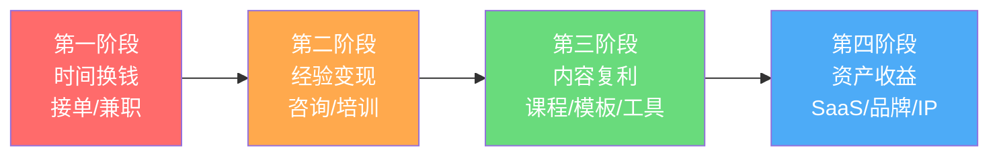
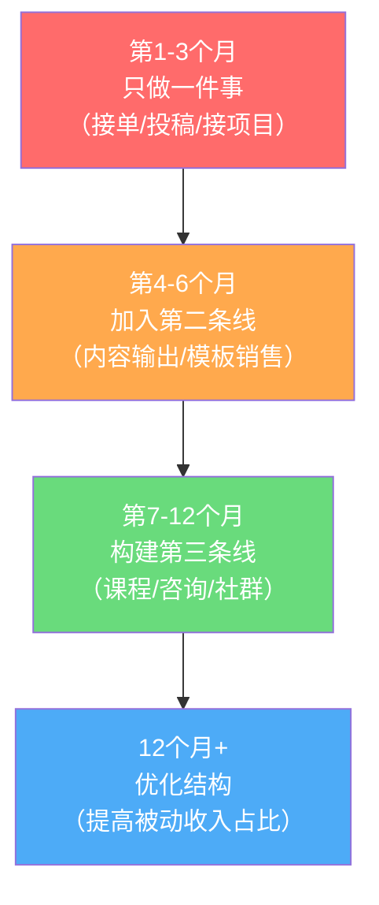
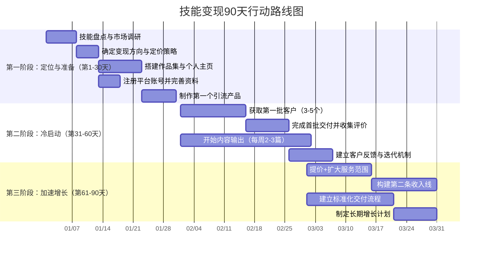
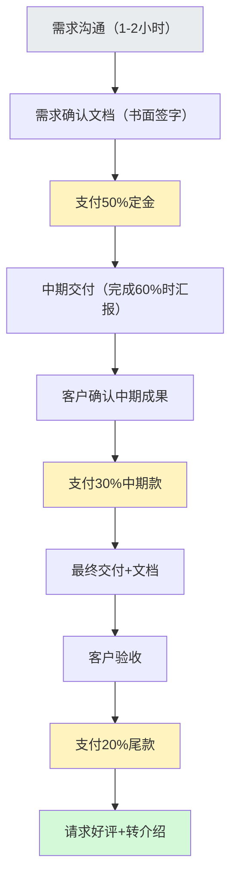
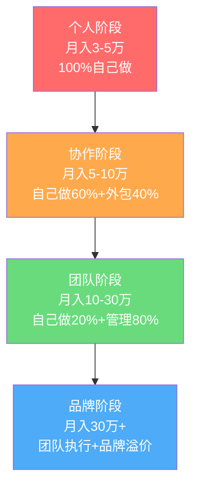

## 案例总结与实操清单

> 前八个案例展示了八条截然不同的技能变现路径——从程序员接单、AI培训、设计师品牌化、写作者内容变现、翻译员自由职业、全栈开发者商业闭环，到AI应用开发者SaaS化、技术博主构建商业帝国。本节将八个案例的共性规律提炼为**可直接执行的操作清单**，并提供完整的工具模板、时间规划和自检标准，让你读完就能动手。但更重要的是，本节还揭示那些成功案例中不常被提及的暗面——失败模式、心理陷阱、以及"幸存者偏差"背后的真实成本。

---

### 一、八个案例的全景复盘

#### 1.1 核心数据总览

在进入操作清单之前，先用一张表把八个案例的关键数据拉齐，建立全局认知：

| 维度 | 案例一：张晨（程序员） | 案例二：林若晴（AI培训） | 案例三：陈默（设计师） | 案例四：苏晚秋（写作者） | 案例五：林晓禾（翻译） | 案例六：陈远（全栈） | 案例七：赵明哲（AI SaaS） | 案例八：张伟（技术博主） |
|------|----------------------|------------------------|----------------------|------------------------|----------------------|---------------------|--------------------------|------------------------|
| **起步年龄** | 28岁 | 32岁 | 27岁 | 30岁 | 26岁 | 30岁 | 29岁 | 29岁 |
| **主业月薪** | 15K | 18K | 12K | 9K | 8K | 22K | 20K | 18K |
| **月入过万用时** | 4个月 | 3个月 | 6个月 | 5个月 | 7个月 | 4个月 | 5个月 | 8个月 |
| **最终月收入** | 3万 | 8万+ | 2.5万 | 4万 | 2万 | 6万 | 15万+ | 10万+ |
| **变现模式** | 接单为主 | 课程+咨询 | 设计接单+模板 | 内容+出书+课程 | 翻译接单 | 产品+服务 | SaaS订阅 | 广告+课程+咨询 |
| **核心杠杆** | 技术深度 | 行业影响力 | 审美+效率 | 内容复利 | 语言壁垒 | 全栈能力 | 产品自动化 | 流量资产 |
| **是否全职转型** | 否（副业） | 是（第14个月） | 否（副业） | 是（第12个月） | 是（第18个月） | 是（第10个月） | 是（第8个月） | 是（第15个月） |
| **每日投入时间** | 2-3小时 | 3-4小时 | 2小时 | 2-3小时 | 3小时 | 4-5小时 | 4-5小时 | 3-4小时 |
| **首个付费客户获取方式** | 平台投标 | 社群口碑 | 平台投稿 | 平台约稿 | 平台接单 | 朋友介绍 | 产品引流 | 内容引流 |

**数据背后的关键洞察**：

这张表里最容易被忽略的是最后一行——**首个付费客户的获取方式**。八个案例中，没有一个人是靠"等客户上门"起步的。张晨靠主动投标，林若晴靠社群里免费答疑建立的信任，陈默靠在设计平台上持续发布作品被甲方发现。冷启动的本质不是"让别人知道你"，而是"主动走到客户面前"。

另一个容易被忽略的事实：**月入过万的平均时间是5.5个月**。这意味着如果你在第3个月还没看到收入，完全正常。但如果你在第6个月还没有任何付费客户，就需要认真复盘方向和执行力了。

第三个关键数据：**副业投入时间与最终收入并非线性关系**。张晨每天只投2-3小时但月入3万，赵明哲每天投4-5小时但月入15万+。区别在于时间投在哪个阶段——张晨的时间花在"执行项目"上（时间换钱），赵明哲的时间花在"构建产品"上（资产赚钱）。后文"价值阶梯"部分会详细拆解这个差异。

#### 1.2 幸存者偏差：你没看到的另一面

在模仿成功案例之前，必须理解一个残酷的统计事实：**本书展示的八个案例都是幸存者**。在同样的起步条件下，有大量尝试者没有走到最后。以下是基于行业调研数据的还原：

| 指标 | 幸存者（本书案例） | 全量数据（行业平均） | 差距原因分析 |
|------|-------------------|---------------------|-------------|
| 6个月内月入过万比例 | 100%（8/8） | 约15-25% | 案例筛选了成功者；多数人卡在冷启动期 |
| 1年后仍在持续变现比例 | 100% | 约30-40% | 大量副业者因收入波动、精力不足、方向调整而放弃 |
| 最终全职转型比例 | 62.5%（5/8） | 约10-15% | 多数人副业收入不足以支撑全职，或不愿放弃主业安全感 |
| 平均试错次数 | 1.2次 | 2-4次 | 成功者方向感更强；多数人需要多次尝试才找到合适的定位 |

**这不是要打击你的信心，而是帮你校准预期**。知道真实数据后，你才能：

1. **不因短期挫折而放弃**——80%的人在前6个月放弃，坚持过这个阶段你就已经超越了大多数人
2. **不盲目照搬单一案例**——每个成功案例背后可能有3-4个类似尝试但失败的人，成功包含了方向正确+执行力强+时机合适+运气成分
3. **重视"可逆性"**——副业起步阶段最大的优势是"试错成本低"。不要一上来就辞职、投入大额资金、签长期租约。用最小成本验证方向，确认可行后再加大投入

**失败模式Top 5**（基于行业观察，不是猜测）：

| 排名 | 失败模式 | 占失败案例比例 | 典型表现 | 如何避免 |
|------|---------|--------------|---------|---------|
| 1 | **方向错误** | 35% | 选了一个市场需求不足或竞争过于激烈的细分领域 | 用本文"路径选择矩阵"做前期验证，花1周调研而非1周空想 |
| 2 | **执行力不足** | 25% | 知道该做什么但总是拖延，"等准备好了再开始" | 设定每日最低行动量（如每天投2个标书），用行动对冲焦虑 |
| 3 | **定价过低** | 20% | 低价吸引低质量客户，陷入"越忙越穷"的死循环 | 用本文定价公式，不低于市场中位数的70% |
| 4 | **孤军奋战** | 12% | 不加入社群、不寻求反馈、不学习他人经验 | 至少加入1个同领域社群，每周与1个同行交流 |
| 5 | **过早全职** | 8% | 副业收入刚过万就辞职，失去安全网后心态崩溃 | 副业收入稳定达到主业2倍且持续6个月再考虑 |

#### 1.3 三条核心共性规律

从八个案例中可以提炼出三条贯穿始终的底层规律，理解这些规律比模仿任何单一案例都重要：

**规律一：价值阶梯——从时间换钱到资产赚钱**

所有案例都经历了同一条价值阶梯，区别只在于速度：



| 阶段 | 收入特征 | 时间投入 | 收入上限 | 八个案例中的典型代表 | 典型陷阱 | 进入下一阶段的信号 |
|------|----------|----------|----------|---------------------|----------|-------------------|
| **时间换钱** | 按小时/按项目计费 | 线性（干一小时赚一小时） | 月薪的2-3倍 | 张晨（接单）、林晓禾（翻译） | 陷入"越忙越赚"的死循环，没有时间做下一阶段的准备 | 你开始拒绝客户因为没时间，或时薪连续3个月没有增长 |
| **经验变现** | 咨询费+课程收入 | 半杠杆（一次备课多次授课） | 月薪的5-8倍 | 林若晴（AI培训）、张伟（技术咨询） | 咨询仍然是时间换钱，只是单价更高；如果不沉淀内容，收入会随精力下降 | 同样的问题被问了3次以上，你开始觉得重复 |
| **内容复利** | 模板销售+课程分销 | 高杠杆（内容持续产生收入） | 无明显上限 | 苏晚秋（出书+课程）、陈默（设计模板） | 内容需要持续更新维护，否则会被市场淘汰 | 你睡觉时也有收入进账，且金额持续增长 |
| **资产收益** | SaaS订阅+品牌溢价 | 自动化（产品自动运转） | 无上限 | 赵明哲（AI SaaS）、张伟（商业帝国） | SaaS需要持续的技术维护和客户支持，不是"做一次就完事" | 你可以休假1个月而收入不显著下降 |

**关键理解**：这四个阶段不是非此即彼的。赵明哲做SaaS的同时仍然接高端咨询（单价5万+/次），张伟做内容矩阵的同时仍然有企业内训收入。真正的高手是**在每个阶段都保留一条主动收入线作为安全网**，同时向上一阶段攀登。

**规律二：冷启动三板斧——作品集+信任证明+低门槛入口**

八个案例在起步阶段都做了同三件事，只是形式不同：

| 板斧 | 程序员（张晨）的做法 | AI培训师（林若晴）的做法 | 设计师（陈默）的做法 | 写作者（苏晚秋）的做法 | 翻译员（林晓禾）的做法 |
|------|---------------------|------------------------|---------------------|----------------------|----------------------|
| **作品集** | GitHub开源项目+技术博客 | 免费公开课录制视频 | Behance/Dribbble个人主页 | 公众号历史文章精选 | 翻译样本+术语表+质量对比 |
| **信任证明** | Stack Overflow高赞回答 | 行业媒体报道截图 | 知名客户logo墙 | 平台签约作者认证 | CAT工具认证+专业领域证书 |
| **低门槛入口** | 99元小工具脚本 | 9.9元入门训练营 | 免费设计资源包 | 免费电子书引流 | 免费试译500字 |

**三板斧的底层逻辑**：作品集解决"你能做什么"的信任问题，信任证明解决"你靠不靠谱"的信任问题，低门槛入口解决"我为什么要现在就行动"的决策成本问题。三者缺一不可——有作品集但没有信任证明，客户会犹豫；有信任证明但没有低门槛入口，客户会觉得"先看看再说"。

**三板斧的最小可行版本**（如果你什么都没有，从这里开始）：

| 板斧 | 最小可行版本 | 制作时间 | 成本 |
|------|------------|---------|------|
| 作品集 | 1个解决真实问题的项目 + 500字的过程说明 | 3-5天 | 0元 |
| 信任证明 | 3个朋友/同事的真实推荐（LinkedIn/微信朋友圈） | 1天 | 0元（请朋友吃饭表示感谢即可） |
| 低门槛入口 | 1篇2000字的干货文章，文末留"免费咨询30分钟" | 1天 | 0元 |

**规律三：收入结构优化——从单一到多元**

没有任何一个案例靠单一收入源实现高收入。所有成功者都在6-12个月内构建了至少三条收入线：

| 收入线类型 | 说明 | 案例代表 | 占比范围 | 风险等级 |
|-----------|------|----------|----------|----------|
| **主动收入** | 接单、咨询、定制开发 | 所有案例早期 | 初期100% → 后期20-30% | 高（依赖个人时间） |
| **半被动收入** | 课程、培训、模板销售 | 林若晴、苏晚秋、陈默 | 中期30-50% | 中（需要持续更新） |
| **被动收入** | SaaS订阅、广告分成、联盟营销 | 赵明哲、张伟 | 后期40-60% | 低（但前期投入大） |
| **衍生收入** | 出版、演讲、投资顾问 | 张伟、林若晴 | 成熟期10-20% | 低（依赖品牌积累） |

**为什么多元化如此重要？** 因为单一收入源意味着单一风险源。案例五林晓禾的教训最为典型：她只做翻译接单，当AI翻译工具在2023年大幅进步后，她的低端翻译需求骤降30%。如果她提前布局了"翻译培训"或"本地化咨询"作为第二条线，冲击会小得多。

**收入多元化的实操节奏**：



**每增加一条收入线的前提条件**：前一条线已经稳定运行（有持续的客户/订单/收入），且你还有余力。不要在第一条线还没跑通的时候就分散精力做第二条——这是最常见的"什么都做了但什么都没做好"的原因。

---

### 二、通用决策框架：选对你的路径

#### 2.1 路径选择矩阵

在开始行动之前，用以下矩阵确定最适合自己的路径。横轴是你的**技能类型**，纵轴是你的**可用时间**：

| | **少量时间**（每天1-2小时） | **中等时间**（每天3-4小时） | **充足时间**（每天5小时以上） |
|---|---|---|---|
| **技术开发类**（编程/运维/数据分析） | 接单平台小单积累 → 技术博客引流 | 独立项目+开源作品 → 技术咨询 | 全栈产品开发 → SaaS创业 |
| **内容创作类**（写作/翻译/设计） | 自媒体日更 → 平台签约 | 课程开发+模板制作 → 个人品牌 | 系统课程+出版 → 培训体系 |
| **知识分享类**（培训/咨询/教练） | 社群答疑 → 短视频分享 | 训练营+企业内训 → 行业IP | 线上课程矩阵 → 知识付费平台 |
| **AI应用类**（AI工具/自动化/Agent） | AI效率工具 → 接AI相关项目 | AI应用开发 → 垂直行业SaaS | AI平台/框架 → 技术创业 |

**矩阵使用方法**：

1. 先确定你的技能落在哪一行。如果你有多项技能，选**市场需求最高**的那一项，而非你最擅长的那一项。最擅长但市场需求低的技能，适合作为差异化标签而非主攻方向
2. 再确定你每天能稳定投入多少时间。注意"稳定"二字——偶尔某天能投入5小时但大部分时间只有1小时，你属于"少量时间"。技能变现是一场马拉松，稳定投入比偶尔爆发重要10倍
3. 交叉点就是你的起步路径。沿着箭头方向逐步升级

**一个常见误区**：很多人纠结"我到底该选哪条路"，花了几个月时间做调研，结果什么都没开始。正确做法是：**用一周时间确定方向，然后用接下来的时间去验证和调整**。方向可以在行动中修正，但不行动就永远没有数据来帮你修正。

#### 2.2 你的真实起点评估

用以下清单做一次诚实的自我评估，每项打分（1-5分），总分决定你的起步策略：

**技能维度（满分25分）**

| 评估项 | 1分 | 3分 | 5分 | 你的得分 |
|--------|-----|-----|-----|---------|
| 技术深度 | 只会基础语法 | 能独立完成项目 | 在某个领域有专家级理解 | ___ |
| 作品积累 | 没有任何可展示的作品 | 有1-3个作品 | 有系统化的作品集 | ___ |
| 行业经验 | 刚入行 | 2-3年经验 | 5年以上且有成功案例 | ___ |
| 沟通能力 | 不善于表达 | 能清楚说明技术方案 | 能让非技术人员理解复杂概念 | ___ |
| 学习速度 | 学习新技能很慢 | 中等速度 | 能快速掌握新领域 | ___ |

**资源维度（满分20分）**

| 评估项 | 1分 | 3分 | 5分 | 你的得分 |
|--------|-----|-----|-----|---------|
| 每日可支配时间 | 不到1小时 | 2-3小时 | 4小时以上 | ___ |
| 紧急储备金 | 没有存款 | 能撑2-3个月 | 能撑6个月以上 | ___ |
| 人脉资源 | 圈子很小 | 有行业社群 | 有大量潜在客户资源 | ___ |
| 工具与平台 | 没有任何账号 | 有基础平台账号 | 有成熟的作品展示渠道 | ___ |

**总分解读**：

| 总分区间 | 起步策略 | 首要行动 | 预计到首次收入的时间 |
|----------|----------|----------|-------------------|
| **30-45分** | 直接进入变现阶段，选择单价最高的渠道快速启动 | 立即在接单平台注册，同时建立个人主页 | 2-4周 |
| **20-29分** | 先补短板（1-2个月），再启动变现 | 用30天打造一个标杆作品，同时开始内容输出 | 1-3个月 |
| **15-19分** | 需要3-6个月的能力建设期 | 系统学习+实战练手+积累作品，同步建立线上存在 | 3-6个月 |
| **15分以下** | 建议先确定一个方向深入学习 | 不急于变现，先花2-3个月建立基础能力 | 6个月以上 |

**关于评估结果的诚实提醒**：

这个评估的意义不是给你一个"你行不行"的结论，而是帮你**校准预期**。得分30+的人如果6个月还没收入，说明执行出了问题；得分15-的人如果2个月就放弃，说明预期不合理。每个人都有自己的节奏，关键是**在自己的节奏里持续前进**。

---

### 三、90天行动路线图

#### 3.1 总体时间线

以下是基于八个案例提炼出的通用90天启动路线图。实际执行中，根据你的起点分数可以调整节奏：



**路线图的灵活性原则**：这张甘特图是"理想节奏"。如果你在第15天就搞定了作品集，可以直接跳到注册平台；如果你在第40天还没找到第一个客户，不要慌，回到第一阶段检查定位是否准确。路线图是导航，不是枷锁。

#### 3.2 第一阶段详细清单（第1-30天：定位与准备）

**第1-7天：技能盘点与市场调研**

- [ ] **列出你的所有技能**：包括主业技能、业余爱好、跨界能力。不要自我审查，全部写下来
  - 具体做法：打开一个空白文档，给自己30分钟，不思考地写。包括但不限于：编程语言、框架工具、设计软件、写作能力、外语水平、行业知识、项目管理经验、数据分析能力、甚至你帮朋友解决过的具体问题
  - 常见遗漏：很多人忽略"软技能"（比如"能把复杂技术问题解释给产品经理听"），这恰恰是培训和咨询类变现的核心能力

- [ ] **对每项技能做市场验证**：在以下平台搜索相关需求量
  - 国内：猪八戒网、程序员客栈、一品威客、闲鱼技能服务
  - 国外：Upwork、Fiverr、Toptal、Freelancer
  - 知识付费：知乎Live、得到、极客时间、小鹅通
  - 验证方法：搜索你的技能关键词，记录以下数据——搜索结果数量、平均报价范围、最近一周的新需求发布量、竞争者数量。如果搜索结果少于50条且平均报价低于200元，说明市场需求不足或单价太低，需要调整方向

- [ ] **记录竞争对手数据**：找到该领域Top 10的服务商，记录他们的定价、服务范围、客户评价数
  - 建一个表格，列包括：对手名称、平台、定价范围、服务描述、好评数、差评关键词、他们的差异化卖点
  - 重点分析差评——差评里藏着客户未被满足的需求，那就是你的机会

- [ ] **确定你的差异化定位**：回答这个问题——"客户为什么选我而不选别人？"

**定位公式**：

```text
你的定位 = 技能A × 行业B × 独特优势C

示例：
- 张晨的定位 = Java后端开发 × 电商行业 × 高并发架构经验
- 林若晴的定位 = AI应用培训 × 传统企业转型 × 大厂背景+通俗讲解
- 陈默的定位 = UI/UX设计 × 移动端产品 × 极简风格+快速交付
- 林晓禾的定位 = 英中翻译 × 医疗器械行业 × FDA法规文档经验
```

**定位自检三问**：
1. 这个定位能用一句话说清楚吗？如果说不清楚，客户也记不住
2. 这个定位对应的市场有足够多的付费客户吗？去平台搜索验证
3. 这个定位能支撑比市场均价高20%的定价吗？如果不能，说明差异化不够

**第8-12天：确定变现方向与定价**

- [ ] **选择主变现模式**（参照路径选择矩阵）
- [ ] **设定初始定价**（三种定价方法选一）

| 定价方法 | 计算公式 | 适用阶段 | 示例 | 注意事项 |
|----------|----------|----------|------|----------|
| **成本定价** | 时薪 × 预估工时 × 1.5（利润系数） | 冷启动期 | 时薪100元 × 20小时 × 1.5 = 3000元/项目 | 时薪应按你的"可自由支配时间"的价值计算，而非主业时薪 |
| **市场定价** | 参考同行中位数，定价在中位数的80%-120% | 有一定作品后 | 同行报价5000元，你定4000-6000元 | 新手可以定在中位数的80%，但不要低于60%，否则会吸引低质量客户 |
| **价值定价** | 项目为客户创造的价值 × 5%-15% | 有品牌溢价后 | 帮客户节省100万成本，收5-15万 | 需要你能清晰量化价值，且客户认可这个价值量化 |

- [ ] **准备三档报价方案**：基础版/标准版/高级版，拉开2-3倍价差
  - **为什么必须有三档？** 行为经济学中的"锚定效应"——当客户看到高级版的价格时，标准版会显得"合理"。实测数据：有三档报价的服务者，平均成交单价比只有一档报价的高35%
  - 基础版：满足核心需求，不含附加服务
  - 标准版：在基础版上增加2-3个高感知价值的附加项
  - 高级版：包含全部服务+额外VIP权益（如优先响应、免费维护期等）

- [ ] **定价中的心理策略**：
  - 用具体数字而非整数：定2980元而非3000元
  - 锚定参照物：报价时先说"市场价通常在8000-12000元，我的方案是..."
  - 拆分展示：年费3600元 → "每天不到10元"

**第13-22天：搭建作品集与个人主页**

- [ ] **准备至少3个标杆作品**（没有真实项目就做自拟项目）
  - 作品要求：解决一个具体问题、有完整的过程记录、最终效果可量化
  - 程序员：GitHub仓库+README详解+在线Demo
  - 设计师：Behance/站酷案例展示+设计思路说明
  - 写作者：发表在公开平台的系列文章（至少3篇）
  - 翻译员：翻译样本+专业领域术语表
  - **自拟项目的正确做法**：不要做"TODO List"或"天气应用"这种练习题。找一个真实存在的痛点——哪怕是小众的——然后做一个解决方案。比如："帮小餐馆老板自动生成外卖平台菜品描述的工具"比"React入门练习"有说服力100倍

- [ ] **搭建个人主页**（选一个方案）

| 方案 | 成本 | 技术要求 | 上线时间 | 适合谁 | SEO友好度 |
|------|------|----------|----------|--------|-----------|
| GitHub Pages + Hugo/Hexo | 免费 | 需要基础Git操作 | 半天 | 技术人员 | ★★★☆☆ |
| Notion个人主页 | 免费 | 无技术要求 | 2小时 | 所有人 | ★★☆☆☆ |
| WordPress + 付费主题 | 300-500元/年 | 基础建站能力 | 1-2天 | 需要SEO的人 | ★★★★★ |
| 定制开发 | 2000-5000元 | 需要外包 | 1-2周 | 预算充足的人 | ★★★★☆ |
| Carrd / Linktree | 免费/低价 | 无技术要求 | 1小时 | 快速验证阶段 | ★★☆☆☆ |

- [ ] **个人主页必须包含的模块**：
  1. **一句话定位**：你做什么、给谁做、做到什么效果。示例："帮助电商企业在3个月内将系统并发能力提升10倍的后端架构师"
  2. **作品展示区**：3-5个最佳案例，每个都有背景→方案→成果的叙述。成果必须量化："响应时间从3秒降到200毫秒"比"优化了性能"强100倍
  3. **客户评价**：即使是朋友/同事的评价也行，有具体数据更好。格式建议：客户名（或化名+行业）+ 一句话评价 + 具体成果数据
  4. **服务清单与价格**：让客户快速了解你能做什么、多少钱。透明定价比"私聊报价"更高效——它筛掉了预算不匹配的客户，节省双方时间
  5. **联系方式**：微信/邮箱，最好有一个表单方便客户直接留需求。表单比微信二维码好——它迫使客户把需求写清楚，减少后续沟通成本
  6. **About页面**：你的背景故事，用2-3段话建立人设。不要写成简历，写成"我为什么做这件事"的故事

**第23-30天：注册平台并制作引流产品**

- [ ] **注册2-3个核心平台账号**，完整填写资料
  - 平台选择原则：先选1个主平台深耕，再选1-2个辅助平台分发内容。不要一上来就铺5个平台，精力分散等于每个平台都做不好
  - 资料填写要点：头像用专业照片（不要用卡通头像），简介用定位公式，服务描述写具体案例而非抽象能力

- [ ] **制作一个免费/低价引流产品**：

| 引流产品类型 | 示例 | 制作时间 | 引流效果 | 适合谁 |
|-------------|------|----------|----------|--------|
| 免费工具/脚本 | 自动化Excel处理工具 | 3-5天 | ★★★★☆ | 程序员 |
| 免费模板 | Notion项目管理模板 | 2-3天 | ★★★☆☆ | 设计师/效率达人 |
| 免费电子书/指南 | 《XX领域入门避坑指南》 | 5-7天 | ★★★★★ | 写作者/培训师 |
| 免费诊断/咨询 | 30分钟免费代码审查 | 无需制作 | ★★★☆☆ | 有经验的专业人士 |
| 开源项目 | 解决常见痛点的小工具 | 7-14天 | ★★★★★ | 程序员 |
| 免费课程片段 | 3节入门短视频 | 3-5天 | ★★★★☆ | 培训师 |

**引流产品的设计原则**：
1. 必须真正有价值——免费但没用的东西只会损害你的品牌形象
2. 必须能自然引导到付费服务——在免费工具的README里推荐定制开发服务
3. 必须可规模化分发——写一篇文章可以被1000人看到，但做一次免费咨询只能服务1个人

---

#### 3.3 第二阶段详细清单（第31-60天：冷启动）

**第31-45天：获取第一批客户**

核心策略：**不要等客户来找你，主动出击**。

| 渠道 | 操作方式 | 预期转化率 | 时间投入 | 适合谁 |
|------|----------|------------|----------|--------|
| **接单平台** | 每天投3-5个标书，针对性写方案 | 5-10%（每20个标书1个成交） | 每天1小时 | 所有人 |
| **社群渗透** | 加入5-10个目标客户社群，先免费解答问题建立信任 | 间接转化，2-4周见效 | 每天30分钟 | 有耐心的人 |
| **内容引流** | 在知乎/掘金/公众号发布干货文章，文末留服务入口 | 1-3%（每100阅读1个咨询） | 每周2篇，每篇2小时 | 有写作能力的人 |
| **老客户转介绍** | 完成第一个客户后主动请求推荐 | 转化率最高（30%+） | 5分钟 | 已有客户的人 |
| **冷邮件/私信** | 找到目标客户直接发送定制化服务方案 | 2-5%（需精心准备） | 每封15-20分钟 | 有研究能力的人 |
| **朋友/前同事** | 告诉你的社交圈你在做什么 | 10-20% | 1小时群发消息 | 所有人 |

**冷启动期话术模板**：

```text
【接单平台投标模板】

您好，我仔细看了您的需求，了解到您需要[具体需求描述]。

我有[X年][相关领域]经验，曾经做过类似项目：
- [案例1简述 + 链接]
- [案例2简述 + 链接]

针对您的需求，我的方案是：
1. [具体步骤1]
2. [具体步骤2]  
3. [具体步骤3]

预计[X个工作日]完成，报价[金额]元（含[具体包含内容]）。

如果有疑问，欢迎随时沟通。

---

【社群破冰话术】

在群里看到您提的[问题]，我之前遇到过类似情况。
我的经验是[简短回答1-2句话]，如果需要更详细的方案可以私信我。

（注意：不要一上来就推销，先建立专业形象）
```

**冷启动期的三个致命错误**：

1. **只投平台不写内容**：平台投标是短期获客，内容是长期资产。案例八张伟在冷启动期坚持每周2篇技术文章，虽然前3个月文章几乎没阅读量，但第4个月开始有客户主动找上门
2. **定价过低求成交**：低于市场价50%的报价不会让你更快获得客户，反而会吸引来最挑剔、最难伺候的客户群体。正确做法：定价在市场中位数的80%，但提供超预期的服务质量
3. **收到第一个客户就松懈**：第一个客户是起点不是终点。冷启动期的目标是3-5个客户+5-10条好评，这才是进入成长期的门票

**第46-60天：交付优化与口碑积累**

- [ ] **建立标准化交付流程**：



**流程中每个节点的关键细节**：

- **需求沟通**：必须产出一份《需求确认文档》，内容包括：项目范围（做什么）、不包含什么（不做什么）、交付物清单、时间节点、验收标准。这份文档是防止"需求蔓延"（scope creep）的核心武器
- **分期付款**：50/30/20的比例是经验值，既能保证你不会白干，又不会让客户觉得风险太大。如果客户对50%定金有顾虑，可以调整为40/30/30，但**绝对不要接受"做完再付全款"**——这是新手最常踩的坑
- **中期汇报**：完成60%时必须主动汇报一次。这个节点的好处是：如果方向有偏差，纠正成本还很低；如果方向正确，客户的信任感会大幅增强
- **最终交付**：除了交付物本身，附上一份《使用说明》或《维护指南》。这个小举动能大幅提升客户满意度，因为它传递了一个信号："我不只是做完就走，我还关心你能不能用好"

- [ ] **交付后必做动作清单**：
  - 交付后24小时内发送满意度调查（3个问题即可：您对成果满意吗？有什么可以改进的？您会推荐给朋友吗？）
  - 交付后7天跟进使用情况，主动提供小优化（比如"我发现了一个可以优化的小点，免费帮你改了"）
  - 交付后30天询问是否需要其他服务（"上次的项目运行得怎么样？最近有没有新的需求？"）
  - 获得好评后立即截图保存，更新到作品集
  - 请满意客户写100字推荐语（提供模板降低对方成本，比如："您可以参考这个格式：'我们找[你的名字]做了[什么]，效果是[具体数据]，推荐给有类似需求的朋友。'"）

- [ ] **开始内容输出节奏**：
  - 每周发布2-3篇内容（文章/短视频/技术分享）
  - 内容选题公式：客户最常问的问题 = 你的内容选题
  - 每篇内容末尾加入服务入口（但不要太硬，80%干货+20%引导）
  - **内容输出的最低标准**：每篇至少1000字，有实际案例或代码片段，解决一个具体问题。不要写"XX技术入门"这种搜索引擎上已经有10万篇的文章，写"我在用XX技术时遇到的3个坑及解决方案"这种有个人经验的内容

#### 3.4 第三阶段详细清单（第61-90天：加速增长）

**第61-75天：提价与扩品**

- [ ] **评估提价时机**（满足以下任意2条即可提价20-50%）：
  - 平台好评数超过10条
  - 最近一个月咨询量超过你的接单能力
  - 客户开始主动找你而不是你去找客户
  - 你已经积累了足够的复购客户
  - 你最近3个项目的交付质量明显高于行业平均水平

- [ ] **提价的正确方式**：
  - 新客户直接用新价格，老客户提前1个月通知
  - 提价时同步提升服务内容（增加一个附加服务），让客户觉得"涨价有道理"
  - 提价幅度建议：每次20-30%，不要一次涨50%以上。每3个月评估一次
  - 如果提价后成交率下降超过30%，说明提价过快或服务差异化不足，回调10-15%

- [ ] **扩展服务范围**：
  - 在原有服务基础上，增加上下游服务
  - 程序员：开发 → 开发+技术咨询 → 开发+咨询+代码审查
  - 设计师：UI设计 → UI+品牌设计 → UI+品牌+设计规范
  - 写作者：写稿 → 写稿+内容策略 → 写稿+策略+内容代运营
  - 翻译员：翻译 → 翻译+本地化咨询 → 翻译+咨询+术语库管理

**第76-90天：构建第二条收入线**

根据你的主要变现模式，选择对应的第二条收入线：

| 主收入线 | 推荐第二收入线 | 启动难度 | 准备时间 | 月收入预期 |
|----------|---------------|----------|----------|------------|
| 接单开发 | 技术课程/培训 | ★★★☆☆ | 1-2个月 | 3000-15000元 |
| 设计接单 | 设计模板/素材包销售 | ★★☆☆☆ | 2-3周 | 2000-10000元 |
| 翻译接单 | 翻译工具/术语库销售 | ★★☆☆☆ | 1-2周 | 1000-5000元 |
| 写作投稿 | 自媒体广告/知识付费 | ★★★☆☆ | 2-3个月 | 3000-20000元 |
| 技术咨询 | 线上课程/社群 | ★★★★☆ | 1-2个月 | 5000-30000元 |
| AI应用开发 | AI工具SaaS化 | ★★★★★ | 3-6个月 | 5000-50000元 |

**构建第二条线的核心原则**：

第二条收入线必须与第一条线有**协同效应**。案例二林若晴的第二条线是"线上课程"，与她的第一条线"AI培训"高度协同——培训积累的案例可以做成课程内容，课程学员又会成为培训客户。如果你的第一条线是"接单开发"，第二条线选"设计模板销售"就没有协同效应。

---

### 四、按技能类型的专项实操清单

#### 4.1 程序员/开发者专项清单

**冷启动阶段（0-3个月）**

```text
Week 1-2:  能力盘点
  ├── 列出所有掌握的编程语言和框架
  ├── 每项标注：熟练度（1-5）× 市场需求（高/中/低）
  └── 选出"熟练度×需求"最高的1-2项作为主攻方向

Week 3-4:  作品打造
  ├── 开发一个解决实际痛点的开源工具
  ├── 完善README、文档、使用示例
  └── 发布到GitHub + 写一篇技术博客介绍

Week 5-8:  平台布局
  ├── 注册：程序员客栈、码市、Upwork
  ├── 完善个人资料（重点写技术栈和过往项目）
  ├── 在Stack Overflow/掘金回答技术问题
  └── 每天投2-3个合适的项目标书

Week 9-12: 口碑积累
  ├── 完成3-5个付费项目
  ├── 收集客户评价和推荐
  ├── 建立个人技术博客，每周更新1篇
  └── 开始做技术短视频（可选）
```

**进阶阶段（3-12个月）**

- **提价策略**：每完成5个项目，提价10-20%。当拒绝率超过50%时停止提价
- **产品化尝试**：将重复性开发工作整理成模板/脚本/工具，定价99-499元销售。比如：张晨把常见的"电商后台管理系统"做成了一套可配置的模板，新客户只需定制化修改就能用，交付时间从2周缩短到3天，利润率从40%提升到80%
- **技术咨询**：当积累了足够案例后，开设"架构审查"或"代码审查"咨询服务，按小时收费（200-500元/小时）
- **开源引流**：维护一个有star的开源项目，这是程序员最好的名片。如何从0到1000 star？选一个真实痛点，做好文档，持续维护，在相关社区分享

**程序员特有的坑**：

1. **过度工程化**：给客户做一个"完美的架构"，结果项目延期。客户要的是能用的解决方案，不是学术论文
2. **忽略沟通**：以为技术好就够了。事实是，技术能力只决定你能不能做，沟通能力决定客户愿不愿意找你做
3. **不做需求确认就开始写代码**：这是导致纠纷的第一大原因。花1小时写需求文档，能节省10小时的返工

#### 4.2 设计师专项清单

**核心优势构建**

- [ ] **确定设计风格标签**：让用户一想到某种风格就想到你
  - 例：极简商务风 / 赛博朋克风 / 国潮风 / 扁平化
  - 如何找到自己的风格？翻看你的作品，找出你做得最好、最享受的那一类，那就是你的风格方向
  - 风格标签不是限制，是记忆点。客户找你，是因为"这个风格你做得最好"

- [ ] **制作3套不同价位的设计服务包**：
  - 基础版（500-1500元）：单一页面/简单Logo
  - 标准版（2000-5000元）：整套视觉方案
  - 高级版（8000-20000元）：品牌全案+设计规范文档

**设计师的三条收入线**

| 收入线 | 具体形式 | 启动时间 | 月收入预期 | 复利程度 |
|--------|----------|----------|------------|----------|
| 接单收入 | UI/UX设计、品牌设计 | 第1个月 | 5000-30000元 | 低 |
| 模板销售 | Canva模板、Figma组件库、PPT模板 | 第3个月 | 2000-10000元 | 高 |
| 教学收入 | 设计课程、1对1指导 | 第6个月 | 3000-15000元 | 中 |

**设计师特有优势**：设计师的视觉作品天然适合社交媒体传播。一张好的设计作品在Dribbble/站酷上可能获得上千次曝光，这是程序员很难做到的。善用这个优势——每做一个项目，花额外30分钟做一个"作品展示版"（带Mockup和设计说明），发布到设计社区。

#### 4.3 写作者/内容创作者专项清单

**内容变现的四个阶段**

| 阶段 | 时间 | 核心动作 | 收入来源 | 月收入预期 | 关键指标 |
|------|------|----------|----------|------------|----------|
| **投稿期** | 第1-3个月 | 给大号投稿、平台征文 | 稿费 | 1000-5000元 | 过稿率 |
| **签约期** | 第3-6个月 | 平台签约、专栏连载 | 签约费+流量分成 | 3000-10000元 | 粉丝增长率 |
| **品牌期** | 第6-12个月 | 自媒体矩阵、出书 | 广告+版税+课程 | 10000-40000元 | 转化率 |
| **IP期** | 12个月以上 | 个人品牌、商业合作 | 多元收入 | 40000元以上 | 品牌溢价 |

**写作日更执行方案**：

```text
每日时间安排（2小时）：
06:00-06:30  阅读行业资讯，收集素材（30分钟）
06:30-07:00  确定今日选题，列大纲（30分钟）
21:00-22:00  写作时间（60分钟，目标800-1500字）
22:00-22:30  修改润色+发布到平台（30分钟）

每周节奏：
周一-周五：日更短文（800-1500字）
周六：写一篇深度长文（3000-5000字）
周日：复盘本周数据，规划下周选题

月度节奏：
每月1号：回顾上月数据，确定本月重点话题
每月15号：中期检查，调整下半月选题
每月最后一天：月度复盘+下月规划
```

**写作者的核心竞争力公式**：

```text
写作变现力 = 选题能力 × 写作质量 × 分发渠道 × 持续性

四个因子是乘法关系——任何一个为零，结果都是零：
- 选题能力强但写得烂 → 没人看完
- 写得好但不会选题 → 没人点开
- 选题好+写得好但不分发 → 没人看到
- 以上都好但只写了一个月 → 前功尽弃
```

#### 4.4 翻译员专项清单

**翻译员的核心竞争力构建**

- [ ] **确定2-3个专业领域**（法律/医疗/技术/金融/游戏），领域越垂直单价越高
  - 为什么垂直领域单价更高？因为垂直领域需要专业知识+语言能力的双重壁垒。一个懂FDA法规的医疗翻译，单价是通用翻译的3-5倍
  - 选择领域的标准：你有相关背景 + 市场需求大 + 竞争者相对少

- [ ] **建立术语库**：每个领域积累500+核心术语的标准译法
  - 工具推荐：用Notion或Excel建立术语库，列包括：原文、译文、上下文示例、来源、备注
  - 维护方法：每完成一个翻译项目，把新遇到的术语加入库中
  - 变现方式：积累到一定程度后，术语库本身可以作为产品销售（99-299元/份）

- [ ] **CAT工具熟练度**：至少精通一款（Trados/MemoQ/OmegaT）
  - CAT工具不是可选的——它是翻译员效率的核心杠杆。用CAT工具的翻译员，效率比不用的高50-100%
  - 推荐学习路径：OmegaT（免费）→ MemoQ（功能强）→ Trados（行业标准）

- [ ] **翻译质量自检清单**：

```text
□ 术语一致性（全文同一术语是否统一）
□ 格式规范性（标点、空格、数字格式）
□ 语法正确性（主谓一致、时态一致）
□ 风格匹配度（是否符合目标受众的阅读习惯）
□ 文化适应性（是否有需要本地化的内容）
□ 交付完整性（是否包含所有要求的文件和格式）
□ 回译验证（抽查3-5个关键段落回译，确认意思准确）
```

**翻译员提价路径**：

| 阶段 | 千字价格（中译英） | 提价依据 | 典型客户类型 |
|------|-------------------|----------|-------------|
| 新手期 | 80-120元 | 积累作品和评价 | 小型企业、个人 |
| 成长期 | 120-200元 | 专业领域认证+好评积累 | 中型企业、翻译公司 |
| 成熟期 | 200-400元 | 固定客户群+口碑传播 | 大型企业、跨国公司 |
| 专家期 | 400-800元 | 行业知名度+稀缺语种/领域 | 政府机构、顶级企业 |

**翻译员的AI时代生存策略**：AI翻译工具的进步不是翻译员的末日，而是翻译员的升级机会。策略如下：
1. **向上走**：从"翻译文字"升级为"本地化咨询"——不只是翻对，还要翻好，考虑文化差异、法规要求、用户体验
2. **拥抱AI**：用AI翻译工具做初译，自己做审校和润色，效率提升3-5倍
3. **深挖垂直**：AI在通用翻译上已经很好，但在专业领域（法律、医疗、金融）仍有大量错误。成为垂直领域的专家，你就是AI的"把关人"

#### 4.5 AI从业者专项清单

**AI技能变现的五个方向及启动方案**

| 方向 | 目标客户 | 核心产品 | 启动成本 | 月收入潜力 | 技术门槛 |
|------|----------|----------|----------|------------|----------|
| **AI应用开发** | 企业/创业者 | 定制AI解决方案 | 低（时间为主） | 2-10万 | 高 |
| **AI培训** | 企业员工/个人 | 线上/线下培训课程 | 中（课程制作） | 3-20万 | 中 |
| **AI咨询** | 传统企业 | 数字化转型方案 | 低 | 5-30万 | 中高 |
| **AI工具开发** | 个人/中小企业 | 效率工具SaaS | 中高（开发+运维） | 5-50万 | 高 |
| **AI内容创作** | 大众用户 | 教程/指南/评测 | 低 | 1-5万 | 低 |

**AI培训师的冷启动路径**（参照案例二林若晴）：

```text
第1-2周：
  ├── 准备3个免费公开课主题（基础概念+实操演示+行业案例）
  ├── 录制视频（每节30-45分钟）
  └── 发布到B站/YouTube/知乎

第3-4周：
  ├── 开设9.9元入门训练营（3天，每天1小时）
  ├── 目标：首批50-100名学员
  └── 收集反馈，迭代课程内容

第5-8周：
  ├── 推出199-499元系统课程
  ├── 建立学员社群（微信群/Discord）
  └── 通过学员口碑获取新客户

第9-12周：
  ├── 开设企业内训服务（5000-20000元/场）
  ├── 与企业HR/培训部门建立联系
  └── 逐步建立行业专家形象
```

**AI从业者的核心竞争优势**：

AI领域有一个独特优势：**信息差仍然巨大**。虽然AI概念已经普及，但绝大多数传统企业仍然不知道AI具体能帮他们做什么。你作为AI从业者，最大的价值不是写代码，而是**翻译**——把技术可能性翻译成商业价值。一个能用非技术人员听得懂的语言解释"大语言模型能帮你做什么"的AI从业者，比一个只会调API的技术专家收入高5倍。

#### 4.6 用AI杠杆放大你的效率

无论你属于哪个技能类型，AI工具都可以成为你的效率倍增器。以下是各角色使用AI工具的实操方案：

**程序员用AI提效**

| 场景 | AI工具 | 效率提升 | 具体做法 |
|------|--------|---------|---------|
| 代码编写 | GitHub Copilot / Cursor | 30-50% | 用AI生成样板代码和重复逻辑，自己专注架构和业务逻辑 |
| 代码审查 | Claude / GPT-4 | 20-30% | 让AI先审一遍，找出明显bug和风格问题，你再做深度审查 |
| 文档撰写 | Claude / Notion AI | 60-80% | 代码注释、README、API文档全部让AI生成初稿，你修改 |
| 客户沟通 | Claude | 20-30% | 用AI润色邮件、生成需求文档、整理会议纪要 |
| 技术调研 | Perplexity / Claude | 40-60% | 让AI汇总技术方案对比，你做最终决策 |

**设计师用AI提效**

| 场景 | AI工具 | 效率提升 | 具体做法 |
|------|--------|---------|---------|
| 灵感收集 | Midjourney / DALL-E | 50-70% | 用AI快速生成多个风格方向的参考图，加速与客户的风格确认 |
| 素材制作 | Canva AI / Adobe Firefly | 30-50% | 用AI生成背景、图标、纹理等基础素材 |
| 设计变体 | Figma AI插件 | 40-60% | 一套设计方案快速生成多尺寸/多配色变体 |
| 设计说明 | Claude | 60-80% | 让AI根据设计稿生成设计说明文档 |

**写作者用AI提效**

| 场景 | AI工具 | 效率提升 | 具体做法 |
|------|--------|---------|---------|
| 选题生成 | Claude / ChatGPT | 30-40% | 让AI根据热点和你的领域生成选题列表，你筛选 |
| 初稿生成 | Claude | 50-70% | 给AI详细大纲，让它生成初稿，你大幅修改和个人化 |
| SEO优化 | Surfer SEO / Claude | 30-40% | 用AI分析关键词、优化标题和meta描述 |
| 多平台分发 | Claude | 60-80% | 一篇文章让AI改写为适合不同平台的版本（知乎/公众号/小红书） |

**AI提效的关键原则**：AI是你的助手，不是你的替代品。**永远不要直接发布AI生成的内容而不经过你的个人修改**。客户付钱买的是你的专业判断和个人经验，AI只是帮你更快地输出初稿。用AI省下的时间，应该投入到更高价值的工作中——比如客户沟通、深度思考、策略规划。

---

### 五、核心工具与资源清单

#### 5.1 通用工具矩阵

| 用途 | 免费方案 | 付费方案 | 推荐 |
|------|----------|----------|------|
| **个人主页** | GitHub Pages、Notion | WordPress+主题 | 技术人员用GitHub Pages，非技术人员用Notion |
| **作品展示** | Behance、站酷、掘金 | 个人网站 | Behance（设计师）/ GitHub（开发者） |
| **项目管理** | Trello、Notion | 飞书、钉钉 | Notion（个人）/ 飞书（团队） |
| **合同签署** | 电子合同模板 | e签宝、法大大 | 起步用模板，稳定后用电子签章 |
| **收款工具** | 支付宝/微信收款 | PayPal（跨境）| 国内用支付宝，跨境用PayPal+万里汇 |
| **时间追踪** | Toggl Track（免费版） | Harvest | Toggl Track足够 |
| **客户管理** | Notion数据库 | HubSpot（免费版） | Notion起步，客户超过20个时转CRM |
| **内容创作** | Markdown编辑器 | Notion AI、Claude | Notion写稿 + Claude辅助润色 |
| **发票管理** | 手写模板 | 票易通、百望云 | 月收入过万后建议用专业工具 |
| **数据备份** | Git + 云盘 | 专业备份服务 | Git是程序员的标配，非技术人员用坚果云 |

#### 5.2 接单平台详细对比

| 平台 | 适合技能 | 抽佣比例 | 客户质量 | 竞争程度 | 新手友好度 | 结算周期 |
|------|----------|----------|----------|----------|------------|----------|
| **程序员客栈** | 编程/开发 | 20% | 高 | 中 | ★★★★☆ | 项目完成后7天 |
| **猪八戒网** | 设计/开发/文案 | 5-20% | 中 | 高 | ★★★☆☆ | 项目完成后3-7天 |
| **一品威客** | 设计/文案/营销 | 20% | 中 | 高 | ★★★☆☆ | 项目完成后7天 |
| **Upwork** | 开发/设计/写作 | 10-20% | 高 | 中 | ★★★★☆ | 每周结算 |
| **Fiverr** | 设计/视频/文案 | 20% | 中 | 高 | ★★★★★ | 订单完成后14天 |
| **Toptal** | 高端开发/设计 | 0%（客户付） | 极高 | 极高 | ★★☆☆☆ | 每月结算 |
| **闲鱼** | 各类技能服务 | 低 | 低 | 中 | ★★★★★ | 即时到账 |
| **小红书/抖音** | 各类技能展示 | 0% | 中高 | 中 | ★★★★☆ | 即时到账 |

#### 5.3 定价参考数据库

**编程开发类市场参考价**

| 服务类型 | 初级（1-2年经验） | 中级（3-5年） | 高级（5年+） | AI时代趋势 |
|----------|-------------------|---------------|--------------|------------|
| 企业官网开发 | 3000-8000元 | 8000-20000元 | 20000-50000元 | ↓ 模板化竞争加剧 |
| 小程序开发 | 5000-15000元 | 15000-40000元 | 40000-80000元 | → 稳定 |
| API接口开发 | 500-2000元/个 | 2000-5000元/个 | 5000-15000元/个 | ↑ 企业数字化需求增长 |
| 数据库优化 | 2000-5000元 | 5000-15000元 | 15000-30000元 | ↑ 数据量持续增长 |
| 技术咨询 | 200-400元/小时 | 400-800元/小时 | 800-2000元/小时 | ↑ AI转型咨询需求爆发 |
| 代码审查 | 500-1500元/次 | 1500-3000元/次 | 3000-8000元/次 | → AI辅助但人工审查仍不可替代 |
| AI应用开发 | 10000-30000元 | 30000-100000元 | 100000-500000元 | ↑↑ 新蓝海 |

**设计类市场参考价**

| 服务类型 | 初级 | 中级 | 高级 | AI时代趋势 |
|----------|------|------|------|------------|
| Logo设计 | 500-2000元 | 2000-8000元 | 8000-30000元 | ↓ AI设计工具冲击低端市场 |
| UI界面设计（单页） | 500-1500元 | 1500-5000元 | 5000-15000元 | → 高端设计仍稀缺 |
| 品牌全案 | 5000-15000元 | 15000-50000元 | 50000-200000元 | ↑ 品牌价值更被重视 |
| 海报/Banner | 200-800元 | 800-2000元 | 2000-5000元 | ↓↓ AI工具严重冲击 |
| PPT设计（每页） | 50-150元 | 150-400元 | 400-1000元 | ↓ AI PPT工具兴起 |

**定价中的一个重要信号**：注意表中的"AI时代趋势"列。 ↑ 表示需求增长，↓ 表示需求萎缩。聪明的变现者会**主动向增长方向迁移**，而不是在萎缩的领域死守。2023年之后，纯执行类工作（低端设计、简单翻译、模板网站）的单价普遍下降10-30%，而需要判断力和创造力的工作（策略咨询、品牌设计、AI应用开发）的单价普遍上升。

---

### 六、国际化路径：跨境接单与出海

#### 6.1 为什么考虑国际化？

国内市场虽然庞大，但竞争也日益激烈。国际化不是"高级选项"，而是一个**结构性机会**：

| 对比维度 | 国内市场 | 国际市场（欧美） |
|----------|---------|----------------|
| **时薪差异** | 程序员接单100-300元/小时 | Upwork上50-150美元/小时（350-1050元） |
| **竞争格局** | 供给过剩，价格内卷 | 中国开发者以高性价比著称 |
| **客户付费习惯** | 讲价、拖款常见 | 按合同付款，信用体系完善 |
| **技能溢价** | 全栈能力溢价有限 | 全栈+中英双语 = 稀缺资源 |
| **内容变现** | 中文内容市场已饱和 | 英文技术内容市场仍有机会 |

#### 6.2 跨境接单实操路径

**第一步：语言准备（1-2周）**

不需要英语达到母语水平。技术英语的核心词汇量约3000-5000个，覆盖90%的客户沟通场景。准备方式：
- 整理一份"技术沟通英语模板集"（自我介绍、项目提案、进度汇报、交付邮件各准备3-5个模板）
- 用AI工具（Claude/GPT）辅助撰写英文邮件，自己修改确认
- 推荐练习：每天在英文技术社区（Stack Overflow、Hacker News）阅读30分钟

**第二步：平台注册与资料优化（1周）**

| 平台 | 注册门槛 | 接单难度 | 收入潜力 | 推荐指数 |
|------|---------|---------|---------|---------|
| **Upwork** | 需要通过审核 | 中（需要积累前几单） | 高 | ★★★★★ |
| **Fiverr** | 无门槛 | 低（Gig模式） | 中 | ★★★★☆ |
| **Toptal** | 严格面试（通过率3%） | 极高 | 极高 | ★★★☆☆（有实力再挑战） |
| **Remote OK** | 无门槛 | 中 | 高 | ★★★★☆ |
| **Contra** | 无门槛 | 低 | 中高 | ★★★☆☆ |

Upwork资料优化要点：
- 标题用英文写清你的定位，如 "Senior Backend Developer | E-commerce & High-Concurrency Systems"
- Portfolio至少放3个案例，每个用英文写清Problem→Solution→Result
- 定价起步：比同级别印度开发者高20-30%（中国开发者的质量口碑好于印度）
- 前3单可以适当降价10-20%换取好评，但不要低于市场中位数的60%

**第三步：跨境收款方案**

| 收款方式 | 手续费 | 到账时间 | 适合谁 |
|----------|--------|---------|--------|
| **PayPal** | 4.4% + 固定费用 | 即时到PayPal，提现1-3天 | 小额频繁收款 |
| **万里汇（WorldFirst）** | 0.3-0.5% | 1-2个工作日 | 大额收款 |
| **Payoneer** | 2% | 2-5个工作日 | Upwork/Fiverr官方合作 |
| **Wise** | 0.5-1% | 1-2个工作日 | 多币种需求 |

**跨境接单的注意事项**：
- 时差管理：欧美客户的工作时间是国内的深夜，需要提前约定沟通时间窗口
- 合同条款：跨境项目务必使用英文合同，明确知识产权归属和争议解决方式
- 税务合规：跨境收入需要在国内申报个税，具体咨询当地税务局或会计师

---

### 七、从副业到团队：规模化路径

#### 7.1 什么时候考虑组建团队？

当你满足以下任意2个条件时，就是考虑扩展的信号：

1. **持续拒单**：连续2个月以上，你拒绝的项目金额超过你完成的项目金额
2. **时间饱和**：每日工作时间超过8小时（主业+副业），且仍有未完成的项目
3. **客户需求溢出**：客户提出的需求超出你的技能范围（如前端开发者被要求做后端）
4. **收入瓶颈**：连续3个月收入在某个数字停滞不前（如3万/月），且提价空间已用尽

#### 7.2 团队扩展的三种模式

| 模式 | 说明 | 适合阶段 | 管理复杂度 | 收入增长潜力 |
|------|------|---------|-----------|------------|
| **转介绍分佣** | 把接不住的项目介绍给同行，收10-20%中介费 | 第6-12个月 | 低 | 中 |
| **外包协作** | 把部分工作外包给其他自由职业者，你做项目管理 | 第12-18个月 | 中 | 高 |
| **小团队** | 招1-3个固定合作者，形成微型工作室 | 第18个月+ | 高 | 极高 |

**转介绍分佣的实操方法**：
- 建立一个"同行资源库"，记录5-10个你信任的同行的能力和报价
- 当客户找你做不擅长的项目时，推荐给合适的同行，协商收取10-20%的介绍费
- 好处：零风险、零管理成本、建立行业人脉
- 注意：必须确保推荐的同行质量过硬，否则你的信誉会受损

**外包协作的管理要点**：
- 外包给谁：优先找有过合作经验的人，其次是社群中口碑好的人
- 定价策略：你向客户收5000元，外包给执行者2000-2500元，你做项目管理+质量把控+客户沟通
- 风险控制：外包者完成60%时你必须检查一次，不要等到最终交付才发现问题
- 合同保护：与外包者签订保密协议和知识产权转让协议

#### 7.3 规模化的收入增长模型



**规模化的关键转变**：从"我做项目"到"我管理项目"。你的核心价值从"执行能力"变成"获客能力+质量把控能力+客户关系管理能力"。这也是为什么案例六陈远的收入能从3万跳到6万——他不再是一个人在写代码，而是在管理一个小型交付团队。

---

### 八、预算规划：启动成本与回报预期

#### 8.1 各路径启动成本明细

很多人以为技能变现"零成本"，这是一个误导。虽然不需要租办公室或囤库存，但仍然有真实的时间成本和少量资金投入：

| 成本类型 | 最低投入 | 建议投入 | 说明 |
|----------|---------|---------|------|
| **时间成本** | 每天1小时 | 每天2-3小时 | 这是最大的"隐性成本"——你的时间值多少钱？ |
| **工具费用** | 0元（全用免费工具） | 200-500元/年 | 域名+基础SaaS工具 |
| **学习费用** | 0元（自学） | 500-2000元 | 1-2门高质量课程加速入门 |
| **设备费用** | 0元（用现有电脑） | 0-3000元 | 如果现有设备不够用 |
| **推广费用** | 0元（纯内容引流） | 0-1000元/月 | 初期不建议付费推广 |
| **法律费用** | 0元（用免费模板） | 500-1000元 | 合同模板+法律咨询 |

**各技能类型的启动成本对比**：

| 技能类型 | 第1个月总投入 | 第3个月累计投入 | 预计首次收入时间 | 预计回本时间 |
|----------|-------------|---------------|----------------|-------------|
| 程序员接单 | 0-200元 | 200-500元 | 2-4周 | 1-2个月 |
| 设计师接单 | 0-500元 | 500-1500元 | 3-6周 | 2-3个月 |
| 写作者内容变现 | 0-100元 | 100-300元 | 4-8周 | 2-4个月 |
| AI培训 | 500-2000元 | 2000-5000元 | 3-6周 | 1-2个月 |
| 翻译接单 | 0-300元 | 300-800元 | 4-8周 | 2-3个月 |
| AI SaaS开发 | 500-3000元 | 3000-10000元 | 3-6个月 | 3-6个月 |

**一个重要的认知**：启动成本低不等于没有成本。你投入的每一小时都有机会成本——如果用来加班、学习、休息，可能也有价值。所以，**不要因为"反正不花钱"就随意尝试**。每一次尝试都应该有明确的验证目标和时间节点，否则你浪费的是比金钱更宝贵的——时间。

#### 8.2 收入预期校准

以下是基于行业数据的**保守估计**（不是最乐观的案例）：

| 时间节点 | 保守预期（P50） | 中位预期 | 乐观预期（P90） | 说明 |
|----------|----------------|---------|----------------|------|
| 第1个月 | 0-500元 | 500-2000元 | 2000-5000元 | 大部分时间花在准备上 |
| 第3个月 | 2000-5000元 | 5000-10000元 | 10000-20000元 | 冷启动期，收入不稳定 |
| 第6个月 | 5000-10000元 | 10000-20000元 | 20000-40000元 | 开始有稳定客户 |
| 第12个月 | 10000-20000元 | 20000-40000元 | 40000-80000元 | 多条收入线并行 |
| 第24个月 | 20000-40000元 | 40000-80000元 | 80000-150000元 | 品牌+产品化收入 |

**为什么P50比P90更值得参考？** 因为P90包含了运气成分（比如恰好遇到一个大客户、恰好赶上行业红利）。用P50做规划，你不会失望；如果达到P90，那是惊喜。用P90做规划的人，往往在第3个月没达到预期时就放弃了。

---

### 九、风险管理与应急预案

#### 9.1 副业变现的六大风险及对策

| 风险 | 发生概率 | 影响程度 | 预防措施 | 应急方案 |
|------|----------|----------|----------|----------|
| **主业冲突** | 高 | 高 | 严格区分工作时间，副业不用公司资源，副业工作用个人设备在非工作时间完成 | 如被发现，坦诚沟通并承诺不影响工作。提前准备好"我只是在业余时间学习和练习"的话术 |
| **客户纠纷** | 中 | 中 | 签书面合同，需求确认文档化，所有修改要求必须书面确认 | 保留所有沟通记录，必要时寻求法律援助。小额纠纷（5000元以下）可以通过平台仲裁或协商解决 |
| **收入波动** | 高 | 中 | 维持3-6个月紧急储备金，同时开发多个客户渠道 | 多渠道获客，不要依赖单一客户。当某个月收入低于预期时，增加30%的获客行动量 |
| **技能过时** | 中 | 高 | 每月投入10%时间学习新技能，订阅3-5个行业信息源 | 关注行业趋势，提前布局新方向。每季度花1天做"技能审计"——哪些技能在升值，哪些在贬值 |
| **健康透支** | 中 | 高 | 设定每日工作上限（副业不超过3小时），保证7小时睡眠 | 出现疲劳信号时主动降低接单量。记住：健康是你唯一的"生产工具"，坏了就什么都没有了 |
| **定价过低** | 高 | 中 | 定期调研市场价格，每季度评估定价 | 已签长期合同按原价执行，新客户按新价。老客户合同到期后统一调价 |

#### 9.2 法律合规要点清单

- [ ] **营业执照**：副业月收入超过一定金额（各地标准不同，一般5000元以上）建议办理个体工商户。办理流程：携带身份证到当地市场监管局，通常当天就能拿到执照。好处：可以开发票、享受小微企业税收优惠
- [ ] **税务申报**：劳务报酬所得需要缴纳个人所得税，年度汇算清缴时申报
  - 劳务报酬税率：20%-40%（根据金额递增）
  - 个体工商户税率：5%-35%（根据利润递增），通常比劳务报酬税率低
  - 建议：月收入稳定超过8000元后，办理个体工商户可以合法降低税负
  - 合规提醒：不要心存侥幸不报税。现在税务系统越来越智能，平台收入数据都有记录
- [ ] **合同模板**：准备一份标准服务合同，包含以下必备条款：
  - 服务范围与交付标准（越具体越好）
  - 价格与付款方式（分期付款比例）
  - 交付时间与延期处理
  - 知识产权归属（特别重要——明确约定交付后知识产权归客户所有，但你有权将项目作为作品展示）
  - 保密条款
  - 违约责任与争议解决方式
  - **合同模板获取**：可以在"中国合同网"或"法大大"找到免费模板，根据自己的服务类型修改
- [ ] **竞业限制**：检查主业劳动合同是否有竞业限制条款。如果有，注意：
  - 竞业限制通常有时间和地域范围，超出范围的副业不受限制
  - 竞业限制需要公司支付补偿金才有效（通常不低于月薪的30%）
  - 如果不确定，建议咨询劳动法律师（费用通常在500-1000元/次）
- [ ] **知识产权**：确保副业作品不使用主业的代码/设计/文档等受限制内容。这是最容易忽略但后果最严重的法律风险——如果被公司发现你用了公司代码做副业产品，公司有权主张知识产权

#### 9.3 心态管理的五个关键时刻

| 时刻 | 常见心态问题 | 正确应对 | 案例佐证 |
|------|-------------|----------|----------|
| **第一个月没客户** | "是不是方向选错了" | 正常现象，冷启动期平均需要4-8周。复盘投了多少标、发了多少内容，用行动量对冲焦虑 | 张晨投了60个标书才获得第一个客户 |
| **第一个差评** | "我是不是不适合做这个" | 差评是优化信号。分析差评原因，改进服务，把它变成进步的催化剂 | 林若晴第一期训练营收到"课程太理论化"的反馈，第二期增加了50%实操内容，好评率从75%提升到95% |
| **收入停滞期** | "要不要换方向" | 90%的停滞是因为没有提价或没有增加收入线，而不是方向问题 | 陈默在第4-5个月收入卡在8000元不动，提价20%后当月收入突破12000元 |
| **同行竞争加剧** | "价格战打不过" | 永远不要打价格战。提升差异化价值，做细分领域的第一比做大众市场的第100强得多 | 张晨放弃低价的"网站开发"市场，专攻"电商高并发架构"，单价提升3倍但客户反而更多 |
| **达到主业收入** | "要不要辞职全职做" | 副业收入稳定超过主业收入的2倍且持续6个月以上，再考虑全职转型 | 陈远在副业收入达到主业3倍后才辞职，但仍然保留了20%时间做自由顾问作为安全网 |

**一个被低估的心态问题：孤独感**。副业变现是一条孤独的路——你的同事不理解你为什么下班后还在工作，你的朋友觉得你在"搞副业"是不务正业，你的家人担心你太累。应对方法：
1. 找到同类社群——知乎/微信上有大量"副业变现"社群，和同路人交流
2. 记录进展——每周写复盘日记，看到自己在进步是最好的精神动力
3. 设置里程碑奖励——每达成一个收入目标，给自己买一个一直想要的东西

---

### 十、知识管理：构建你的个人操作系统

#### 10.1 为什么知识管理是隐形杠杆？

八个案例中，表现最好的三位（林若晴、赵明哲、张伟）有一个共同点：**他们都有系统化的知识管理习惯**。这不是巧合——知识管理直接影响变现效率：

| 有知识管理 | 无知识管理 |
|-----------|-----------|
| 同样的问题被问第二次时，30秒调出之前的答案 | 每次重新思考，浪费15-30分钟 |
| 写课程/文章时，素材库直接可用 | 每次写作都要重新搜集素材 |
| 客户案例系统归档，新客户提案直接引用 | 凭记忆描述过往案例，细节丢失 |
| 技能成长有记录，提价时有数据支撑 | 不知道自己进步了多少，不敢提价 |

#### 10.2 个人知识管理系统的最小可行方案

**工具选择**：Notion（推荐）或 Obsidian 或 飞书文档

**必建的四个数据库**：

**1. 客户项目库**

| 字段 | 说明 |
|------|------|
| 客户名称 | 化名即可 |
| 项目类型 | 开发/设计/写作/翻译/咨询 |
| 项目描述 | 一句话概述 |
| 报价与实际收入 | 追踪定价策略效果 |
| 耗时 | 计算时薪 |
| 客户评价 | 截图或文字记录 |
| 复盘总结 | 做得好/做得差/下次改进 |

**2. 内容素材库**

| 字段 | 说明 |
|------|------|
| 选题 | 一句话描述 |
| 来源 | 客户问题/行业新闻/个人经验 |
| 目标平台 | 知乎/公众号/掘金 |
| 状态 | 想法→大纲→初稿→已发布 |
| 数据表现 | 阅读量/点赞/转化 |

**3. 定价记录库**

| 字段 | 说明 |
|------|------|
| 日期 | 调价时间点 |
| 服务类型 | 具体服务 |
| 调前价格 | 原价 |
| 调后价格 | 新价 |
| 调价原因 | 市场变化/能力提升/成本变化 |
| 调价后1个月成交率 | 验证调价是否合理 |

**4. 学习笔记库**

| 字段 | 说明 |
|------|------|
| 主题 | 学习内容 |
| 笔记 | 关键要点 |
| 应用场景 | 这个知识能用在哪里 |
| 与变现的关系 | 如何转化为收入 |

**每周投入30分钟维护**，比不维护好100倍。知识管理不需要完美，需要的是**持续**。

---

### 十一、进度追踪模板

#### 11.1 月度复盘模板

每月最后一天花1小时填写以下模板，持续追踪你的进展：

```markdown
# 月度复盘 - {年}{月}

## 核心数据
- 本月副业收入：____元（目标：____元）
- 新增客户数：____人
- 完成项目数：____个
- 客户满意度：____%（好评数/总客户数）
- 内容发布数量：____篇
- 内容总阅读/播放量：____

## 收入结构
| 收入来源 | 金额 | 占比 | 上月对比 |
|----------|------|------|----------|
| 接单/咨询 | | | |
| 课程/培训 | | | |
| 模板/工具 | | | |
| 其他 | | | |

## 时薪分析
- 本月总工作时间：____小时
- 有效工作时间（直接创造收入的时间）：____小时
- 时薪（收入÷有效工作时间）：____元
- 上月时薪：____元

## 本月最大收获
（写一条最重要的，要具体：做了什么 → 得到了什么结果）

## 本月最大教训
（写一条最深刻的，要具体：发生了什么 → 我学到了什么 → 下次怎么做）

## 下月三个核心目标
1. 
2. 
3. 

## 下月具体行动计划
- 第1周：
- 第2周：
- 第3周：
- 第4周：
```

#### 11.2 关键指标看板

追踪以下指标，用数据驱动决策：

| 指标 | 计算方式 | 健康值 | 警戒值 | 你的数值 |
|------|----------|--------|--------|---------|
| **时薪** | 月收入 ÷ 月有效工作小时数 | >150元 | <80元 | ___ |
| **客户获取成本** | 营销时间 × 时薪 ÷ 新客户数 | <500元 | >1000元 | ___ |
| **客户终身价值** | 平均单客户总消费 | >5000元 | <1000元 | ___ |
| **复购率** | 回头客数 ÷ 总客户数 | >40% | <20% | ___ |
| **收入增长率** | (本月-上月) ÷ 上月 × 100% | >10% | <0% | ___ |
| **被动收入占比** | 被动收入 ÷ 总收入 × 100% | >30% | <10% | ___ |
| **内容转化率** | 咨询数 ÷ 内容阅读量 | >2% | <0.5% | ___ |
| **好评率** | 好评数 ÷ 总评价数 | >90% | <70% | ___ |

**指标使用原则**：
- 不要每天看指标，每周看一次就够了。每天看会导致焦虑和短视决策
- 重点关注**趋势**而非绝对值。时薪从80元涨到100元是好消息，即使还没到150元
- 当某个指标连续3周低于警戒值时，需要暂停新项目，集中精力解决这个指标的问题

---

### 十二、从案例中提炼的20条黄金法则

综合八个案例的成败经验，以下是经过验证的核心法则。每条法则都附带案例出处，方便你回溯验证：

**起步阶段（法则1-7）**

1. **先开枪再瞄准**：不要等到"完全准备好"才开始，完成度60%就可以发布第一版作品。案例三陈默的第一个设计作品集只有3个案例，但足够启动。完美主义是行动的最大敌人——你永远无法在岸上学会游泳

2. **低价不是策略，是过渡**：冷启动期可以用略低于市场的价格获取第一批客户，但必须在3个月内提价。案例五林晓禾因为长期低价导致后期提价困难，用了6个月才把价格提到合理水平。低价获取的客户类型和高价获取的客户类型完全不同——前者更挑剔、更斤斤计较

3. **一个标杆作品胜过十个普通作品**：案例一张晨用一个高并发电商系统的完整案例，抵得过10个简单CRUD项目。标杆作品的标准：有真实背景、有技术深度、有量化结果、有完整的过程记录

4. **内容是最好的销售**：与其群发广告，不如写一篇解决实际问题的文章。案例八张伟80%的客户来自技术博客。内容销售的逻辑是：客户在搜索问题时找到你的文章 → 文章展示了你的专业能力 → 客户主动联系你。这种客户的信任度和成交率远高于平台投标来的客户

5. **客户评价是新货币**：每完成一个项目，必须收集带具体数据的评价。案例二林若晴的第一期训练营只有12人，但11人写了好评，这些好评带来了下一期的80人。好评不是自然发生的——你需要主动请求、提供模板、降低对方的表达成本

6. **免费内容建信任，付费服务变现**：案例七赵明哲的AI工具先免费开放基础版，积累了5000用户后才推出付费版。免费不是亏本，是投资。5000个免费用户中有5%愿意付费，就是250个付费客户

7. **不要和时间赛跑，要和价值赛跑**：案例六陈远最初按小时收费，月入1万就到顶了；切换到按项目价值收费后，同样的时间月入6万。按小时收费的天花板是你的可用小时数，按价值收费的天花板是你能创造的价值量

**成长阶段（法则8-14）**

8. **标准化是规模化的前提**：案例一张晨把常见的开发需求整理成模板，交付时间从2周缩短到3天。标准化不是降低质量，而是把质量固化为流程——让每一次交付都达到你最好那次的水平

9. **口碑传播的ROI是付费获客的10倍**：维护好现有客户比开发新客户重要3倍。一个满意客户的转介绍价值 = 你花10小时在平台上投标的价值

10. **每季度提价10-20%**：如果你3个月没提过价，说明你的价值被低估了。提价不仅是增加收入，更是提升客户质量——愿意付更高价格的客户通常更专业、更尊重你的时间

11. **建立"不可替代性"**：案例三陈默因为形成了独特的设计风格，客户即使找到更便宜的替代者也会回来找他。不可替代性的来源：独特风格、深度行业知识、超强的响应速度、超预期的服务体验

12. **学会说"不"**：拒绝低价值客户和不合理需求，把时间留给高价值客户。"不"是副业变现中最重要但最难学会的技能。每接受一个低价值项目，你就失去了服务一个高价值项目的机会

13. **数据驱动决策**：案例八张伟每周分析内容数据，根据阅读量和转化率调整选题方向。不要凭感觉判断"什么内容受欢迎"，用数据说话

14. **跨界组合创造独特价值**：案例六陈远"全栈开发+商业咨询"的组合，让他比纯技术人员收费高3倍。跨界不是什么都做一点，而是在两个领域都达到前20%的水平，然后把两者组合成独特服务

**成熟阶段（法则15-20）**

15. **从"我做"到"我教"再到"我卖"**：服务→培训→产品的三步进化。每一步的杠杆倍数都在增加：服务是1:1，培训是1:N，产品是1:∞

16. **被动收入是自由的前提**：案例七赵明哲的SaaS产品每月自动产生10万+收入，让他可以选择只接自己感兴趣的项目。被动收入不是"不工作就赚钱"，而是"前期投入大量工作，后期持续获得回报"

17. **个人品牌是最大的资产**：案例二林若晴的个人品牌让她可以轻松进入新领域，因为用户信任的是她这个人。个人品牌 = 一致性（长期输出同一方向的内容）+ 可靠性（每次交付都超预期）+ 专业性（在某个领域有深度见解）

18. **系统化思维比技术能力更重要**：能构建商业模式的人比只能写代码的人收入高10倍。系统化思维意味着：你不是在做项目，你是在建系统——一个能持续获取客户、交付价值、产生收入的系统

19. **持续学习是唯一的护城河**：案例八张伟每年花20%的时间学习新领域，保证内容不落伍。在技术领域，18个月不学习就会被市场淘汰。学习不是可选项，是生存必需

20. **回馈社区加速成长**：案例二林若晴定期做免费分享，反而带来了更多的付费客户。这是一个反直觉但反复验证的事实：你给出去的知识越多，回来的商业价值越大。因为免费分享建立了信任，信任转化为付费

---

### 十三、即刻行动清单

如果你读完本文只想记住一件事，那就是：**现在就开始**。以下是今天就能做的5件事，按优先级排序：

1. **现在**（10分钟内）：打开备忘录，写下你的3个最擅长的技能，每个技能旁边写一句话：这个技能能帮谁解决什么问题？

2. **今天**（1小时内）：用本文的定位公式确定你的变现方向，格式："技能A × 行业B × 独特优势C"。写完后去接单平台搜索这个定位对应的市场——看看有没有人需要，愿意付多少钱

3. **本周**（投入3小时）：在1-2个平台注册账号，完善个人资料。同时开始制作你的第一个标杆作品——不要等到"准备好了"才开始

4. **本月**（投入20小时）：完成一个标杆作品，发布到公开平台。同时开始每周发布1-2篇内容，建立线上存在感

5. **下月**（持续投入）：开始接第一单/发布第一篇内容/推出第一个产品。记住，第一单的目的不是赚钱，是验证你的定位和服务流程是否可行

```text
记住这个公式：

   行动量 × 方向正确 × 持续时间 = 变现结果

三个变量缺一不可：
- 没有行动量 → 一切都是空想
- 方向不正确 → 越努力越偏离
- 不能持续 → 前功尽弃
```

**最后的提醒**：这20条法则和所有清单都不是"读一遍就完了"的材料。建议你：
- 把本文加入书签，每个月重读一次
- 每次重读时，用当前阶段的清单对照检查进度
- 遇到困难时，翻到"心态管理"和"风险管理"部分寻找答案
- 看到别人成功时，翻到"价值阶梯"提醒自己每个人都要经历这四个阶段

你的90天，从今天的第一个行动开始。第一个行动不需要完美，它只需要发生。
