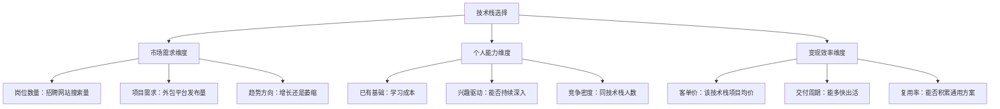
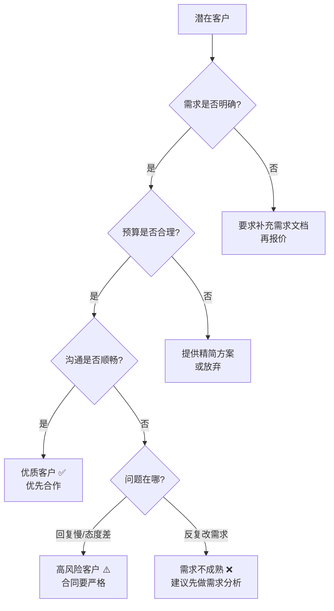

本章汇总技术技能变现过程中最高频的困惑与陷阱，按「起步期 → 接单期 → 执行期 → 成长期 → 合规期 → 心态期 → 进阶期」七个阶段组织。每个问题不仅给出「怎么办」，还会解释「为什么」，让你在遇到变体场景时也能举一反三。

> **阅读建议**：遇到具体问题时，直接跳转对应编号即可。如果你想系统性地建立认知框架，建议按顺序通读——每个阶段的问题是递进关系，前面的决策会影响后面的结果。

---

## 快速检索索引

| 编号 | 问题 | 阶段 | 关键词 |
|------|------|------|--------|
| Q1 | 没有作品集怎么接第一单 | 起步期 | 作品集、Side Project、开源 |
| Q2 | 技术栈追新还是守旧 | 起步期 | 技术选型、市场需求 |
| Q3 | 收入不稳定怎么度过低谷 | 起步期 | 现金储备、客户组合 |
| Q4 | 全职转自由职业的过渡策略 | 起步期 | 辞职时机、过渡期 |
| Q5 | 如何选择第一个自由职业平台 | 起步期 | 平台选择、冷启动 |
| Q6 | 客户说先做满意再付款 | 接单期 | 付款方式、陷阱 |
| Q7 | 客户说别人报价更低 | 接单期 | 竞争、差异化 |
| Q8 | 如何给项目报价 | 接单期 | 工时法、价值法 |
| Q9 | 需求蔓延怎么处理 | 接单期 | Scope Creep、变更管理 |
| Q10 | 如何筛选和识别优质客户 | 接单期 | 客户画像、风险识别 |
| Q11 | 项目延期怎么办 | 执行期 | 工期管理、客户沟通 |
| Q12 | 如何同时管理多个项目 | 执行期 | 时间块、异步沟通 |
| Q13 | 客户要求无限制修改 | 执行期 | 修改机制、反馈规范 |
| Q14 | 如何管理项目中的技术债务 | 执行期 | 重构、代码质量 |
| Q15 | 如何建立个人品牌 | 成长期 | 品牌定位、内容输出 |
| Q16 | 从接单升级到产品化 | 成长期 | 产品化、被动收入 |
| Q17 | 是否需要组建团队 | 成长期 | 招人、协作、分包 |
| Q18 | 是否需要注册公司 | 合规期 | 个体户、有限公司 |
| Q19 | 税务问题怎么处理 | 合规期 | 劳务报酬、核定征收 |
| Q20 | 如何签合同保护自己 | 合规期 | 合同条款、知识产权 |
| Q21 | 客户拖款/赖账怎么办 | 合规期 | 催收、法律手段 |
| Q22 | 冒名顶替综合征 | 心态期 | 自我怀疑、认知重塑 |
| Q23 | 自由职业太孤独 | 心态期 | 社交结构、动力维持 |
| Q24 | 如何接海外客户 | 进阶期 | 时区、跨境支付、英文沟通 |
| Q25 | 倦怠了怎么办 | 进阶期 | 职业倦怠、可持续性 |

---

## 一、起步期：从零到一

### Q1：完全没有作品集，怎么接到第一单？

这是 90% 的新手都会卡住的关卡。没有作品集不代表没有能力，而是缺少**可展示的证据**。你需要主动制造证据，而不是等别人给你机会。

**五条制造证据的路径（按难度递增）：**

| 路径 | 投入时间 | 产出质量 | 适合人群 | 关键成功因素 |
|------|----------|----------|----------|-------------|
| Side Project（个人项目） | 2-4 周 | 高——完全可控 | 有明确想法的人 | 选题要解决真实问题，不是 TODO List |
| 开源贡献 | 1-2 周/个 PR | 中——取决于项目 | 想展示协作能力的人 | 选 Star 500-5000 的中小型项目 |
| 公益/低价项目 | 1-4 周 | 中——客户配合度不稳 | 急需真实案例的人 | 控制范围，不能无限投入 |
| 重新包装工作经历 | 几天 | 高——已有素材 | 有工作经验的人 | 脱敏处理，只展示个人贡献 |
| Hackathon/编程比赛 | 1-3 天 | 中——看比赛质量 | 想快速出成果的人 | 赛后写复盘文章放大价值 |

**Side Project 选题方法论：**

不要做一个 TODO List 或天气应用——这些太常见，无法区分你和其他人。选择一个**解决真实问题**的小项目：

```text
选题公式：你熟悉的技术栈 + 一个真实痛点 + 可展示的视觉效果

示例：
- 独立开发者：做一个 Chrome 插件，自动翻译 GitHub Issue（展示全栈能力）
- 前端开发者：复刻一个知名网站的某个页面（如 Stripe 首页的动画效果）
- 后端开发者：搭建一个高并发的短链服务（展示架构能力）
- 数据分析师：爬取某行业数据并做可视化报告（展示分析思维）
- AI 方向：用 LLM API 做一个垂直领域的智能助手（展示 AI 工程能力）

反面案例（不要做这些）：
- TodoMVC —— 每个教程都教，毫无区分度
- 天气应用 —— 太简单，无法展示架构能力
- 博客系统 —— 除非你有独特的设计或技术亮点
- 仿 XX 全站 —— 工作量太大，容易烂尾
```

项目完成后的关键动作：写一篇技术博客记录——遇到了什么问题、如何解决、为什么选择这个方案。这篇文章本身就是第二个作品。一篇好的技术复盘文章，比项目本身更能打动客户，因为它展示了你的**思考过程**。

**开源贡献的切入技巧：**

不要直接去啃 React 或 Vue 的源码——这些项目的 PR 排队时间很长，而且门槛高。正确的切入方式：

```text
第一步：找目标项目
- 你日常使用的、Star 数 500-5000 的中小型项目
- 活跃度高（最近 1 个月内有合并的 PR）
- 有 "good first issue" 标签的 issue

第二步：从文档开始
- 修正错别字、补充示例、翻译文档
- 这些 PR 容易被合并，能快速积累信誉

第三步：修 Bug
- 从 Label 为 "good first issue" 的 bug 开始
- 先在 issue 下面评论你打算怎么修，获得维护者认可后再动手

第四步：实现小功能
- 当你对代码库足够熟悉后，尝试实现小功能

每完成一个 PR，截图保存，标注项目名、PR 编号、解决了什么问题。
在简历和作品集中用「为 XX 项目贡献了 YY 个 PR，解决了 ZZ 问题」的格式展示。
```

**如何包装以前的工作项目：**

很多人的工作经历其实包含大量可展示的内容，只是不知道怎么提取：

```text
可展示的内容：
- 系统架构图（脱敏后）——展示你的设计能力
- 性能优化前后对比——展示你的问题解决能力（如「接口响应时间从 2s 降到 200ms」）
- 技术选型文档——展示你的思考深度
- 代码片段（非核心业务逻辑）——展示你的编码风格
- 项目成果数据——展示你的商业价值（如「支撑了日均 10 万 UV」）

包装格式（STAR 法则）：
- Situation（背景）：项目面临什么挑战
- Task（任务）：你的职责是什么
- Action（行动）：你做了什么，用了什么技术
- Result（成果）：带来了什么可量化的结果

注意：
- 脱敏处理：隐去公司名、业务数据、核心算法
- 只展示你个人贡献的部分
- 如果签了竞业或保密协议，先确认哪些可以公开
- 用「某电商平台」「某金融公司」替代真实公司名
```

**作品集的呈现方式：**

有了素材，怎么展示同样重要。一个糟糕的展示方式会浪费好的素材。

```text
必备元素：
1. 项目封面图（截图或设计稿，第一印象）
2. 一句话描述（这个项目是什么，解决了什么问题）
3. 技术栈标签（React / Node.js / PostgreSQL 等）
4. 详细描述：背景 → 方案 → 成果（200-500 字）
5. 可访问的 Demo 链接（部署到 Vercel/Netlify 等免费平台）
6. 源码链接（GitHub，展示代码质量）

加分元素：
7. 项目数据（用户量、性能指标、业务成果）
8. 客户/用户评价
9. 技术博客链接（项目的深度复盘）
10. 遇到的挑战及解决方案

平台选择：
- 最简单：GitHub Pages + 一个精美的 README
- 推荐：Notion 作品集页面（免费、易维护、可分享链接）
- 进阶：个人网站（Hugo/Next.js 搭建，展示全栈能力本身就是作品）
```

### Q2：技术栈应该追新还是守旧？

这个问题的本质不是「新 vs 旧」，而是**「市场需求 × 你的竞争力」的最优解**。

**技术栈选择的三维决策模型：**



**当前各技术栈的变现特征（2025-2026）：**

| 技术栈 | 市场需求 | 客单价 | 竞争强度 | 变现建议 |
|--------|----------|--------|----------|----------|
| React/Vue 前端 | 高 | 中（5K-30K） | 极高 | 必须搭配细分领域（可视化、小程序、低代码）才能突围 |
| Node.js/Python 后端 | 高 | 中高（10K-50K） | 高 | 搭配 AI 能力溢价明显，Python 在数据/AI 方向优势大 |
| Java/Spring 企业级 | 高 | 高（30K-100K+） | 中 | 适合有 3+ 年工作经验的人，企业客户付费意愿强 |
| AI/LLM 应用开发 | 极高 | 高（20K-200K+） | 中低 | 当前最佳窗口期，但需要持续跟进模型迭代 |
| 小程序/跨平台 | 中 | 中低（3K-15K） | 高 | 适合快速出活的项目，利润薄但量大 |
| Rust/Go 基础设施 | 中 | 极高（50K-200K+） | 低 | 高门槛高回报，需要扎实的系统编程基础 |
| 数据工程/爬虫 | 中高 | 中（5K-30K） | 中 | 需注意合规风险，数据安全法实施后门槛提高 |
| 云原生/DevOps | 中高 | 高（20K-80K） | 中低 | K8s、CI/CD、云迁移需求持续增长 |

**核心建议：**

```text
主力技术栈选择原则：
- 选市场需求大、你有基础、竞争不是最激烈的
- 通常是「成熟但不烂大街」的技术——既有足够需求，又不至于人人都会
- 深度 > 广度：一个技术栈精通到前 10%，比五个技术栈都只会皮毛强得多

增值技术栈：
- 选增长最快的新兴领域（当前是 AI/LLM），用来提升客单价
- 不需要精通，能和主力技术栈结合使用即可
- 例如：前端 + AI = 智能 UI 组件；后端 + AI = 智能 API 服务

验证方法：
1. 在招聘网站搜索你的技术栈关键词，看岗位数量和薪资范围
2. 在外包平台搜索同技术栈项目，看预算和需求数量
3. 如果两个方向都有大量需求，选你更有基础的那个
4. 关注技术趋势报告（如 Stack Overflow 年度调查、GitHub Octoverse）

警惕信号：
- 某技术栈的招聘需求连续 2 年下降 → 萎缩信号，不要作为主力
- 某技术栈的外包项目单价持续走低 → 供给过剩，竞争激烈
- 某技术栈的学习资源突然暴增 → 大量新人涌入，竞争即将加剧
```

### Q3：自由职业收入不稳定，怎么度过低谷期？

收入不稳定是自由职业的**结构性特征**，不是你的能力问题。即使是最优秀的自由职业者也会经历淡季。关键不是消灭波动，而是建立抗波动系统。

**三层收入缓冲体系：**

```text
第一层：现金储备（防猝死）
├── 保持 6-12 个月生活费的紧急储备金
│   计算方法：月均支出 × 6-12
│   例如：月支出 8000 元 → 储备 5-10 万元
├── 存在随时可取的货币基金或活期理财中
├── 这笔钱的唯一用途是：让你在没有收入时不会恐慌性接低价单
└── 底线规则：储备金低于 3 个月时，暂停自由职业，考虑兼职过渡

第二层：客户组合（防断流）
├── 核心客户（1-2 个）：长期合作，收入占比 40%-60%
├── 流动客户（3-5 个）：项目制合作，收入占比 30%-40%
├── 机会客户（随时）：小单快做，收入占比 10%-20%
└── 原则：任何时候都不让单一客户超过总收入的 50%
    原因：单一客户依赖 = 隐性全职工作，失去自由职业的灵活性

第三层：被动收入（防倦怠）
├── 技术课程/教程（一次制作，持续销售）
├── 付费工具/模板/插件（如 VSCode 插件、WordPress 主题）
├── 技术博客广告/赞助收入
├── 自动化 SaaS 小产品
└── 目标：被动收入覆盖基本生活费的 30% 以上
    这需要 12-24 个月的积累，不要期望短期内实现
```

**收入波动的季节性规律：**

理解行业节奏，提前做好准备，比被动应对更有效。

```text
自由职业的淡旺季规律（中国市场）：

旺季（需求旺盛，适合冲刺收入）：
├── 3-4 月：年后开工潮，企业新年度预算释放
├── 9-10 月：金九银十，企业冲刺年度目标
└── 11-12 月：年底预算消化，很多企业需要在年底前花完预算

淡季（需求萎缩，适合储备和学习）：
├── 1-2 月：春节前后，企业放假，项目暂停
├── 7-8 月：夏季，部分行业进入淡季
└── 端午/中秋等小长假前后各一周

应对策略：
- 旺季：全力接单，收入目标上调 30%
- 淡季：做 Side Project、写技术文章、学习新技能、维护老客户关系
- 关键：旺季多赚的钱存起来，用来平滑淡季的收入波动
```

**低谷期的具体应对策略：**

```text
短期（1-2 周没有新项目）：
├── 主动联系老客户，话术：「最近有新项目吗？我这边刚好有档期」
├── 在外包平台提高投标频率，每天投 3-5 个
├── 降低最低接单门槛，接受一些小单维持现金流
├── 在技术社区回答问题，增加曝光
└── 检查是否有半死不活的询盘可以跟进

中期（1-2 个月收入低于预期）：
├── 复盘客户来源渠道，调整推广策略
├── 用空闲时间做 Side Project 或写技术文章（为未来获客积累素材）
├── 考虑短期兼职或技术顾问角色过渡
├── 学习新技能，扩展可接项目类型
├── 参加行业活动，拓展人脉
└── 审视定价策略：是否定价过高导致流失，或定价过低导致利润不足

长期（持续 3 个月以上收入不达标）：
├── 重新评估市场定位，可能需要切换细分领域
├── 考虑组建小团队接更大的项目
├── 评估是否需要回到职场积累资源后再出来
├── 考虑地域因素：远程接海外项目可能单价更高
├── 重新计算你的时薪是否合理——可能定价过高或过低
└── 做一次彻底的业务复盘：获客渠道、转化率、客户满意度、定价策略
```

### Q4：从全职工作过渡到自由职业，怎么规划？

这是很多人的第一步——不是「裸辞」，而是**有计划地过渡**。直接辞职做自由职业，失败率超过 80%。

**过渡期规划（建议 3-6 个月）：**

```text
第一阶段：验证期（在职期间，1-3 个月）
├── 利用下班和周末时间接 2-3 个小项目
├── 目的：验证你能接到单、能交付、能收到钱
├── 不要辞职！这个阶段的目标是「用副业验证可行性」
├── 记录：每个项目的获客渠道、报价、实际工时、客户反馈
└── 通过标准：连续 2 个月副业收入 ≥ 月薪的 30%

第二阶段：准备期（在职期间，1-2 个月）
├── 储备 6-12 个月生活费的紧急资金
├── 搭建个人品牌基础设施（作品集、技术博客、社区账号）
├── 确认社保、医保的衔接方案
│   ├── 方案 A：以灵活就业身份自己缴纳（最简单）
│   ├── 方案 B：挂靠朋友公司代缴（注意法律风险）
│   └── 方案 C：注册个体户后以单位身份缴纳
├── 与家人沟通，获得理解和支持
└── 告知你的老板你的计划（如果关系好），保持人脉

第三阶段：过渡期（辞职后 1-3 个月）
├── 先不要全职做自由职业，考虑兼职/远程工作 + 自由职业并行
├── 逐步增加自由职业的工作时间比例
├── 建立稳定的工作节奏和客户来源
└── 通过标准：连续 3 个月自由职业收入 ≥ 原月薪的 80%

第四阶段：全职期
├── 全面投入自由职业
├── 开始建立客户组合和被动收入
├── 定期复盘和调整策略
└── 每季度评估：是否需要调整方向
```

**过渡期的时间分配模板（在职期间）：**

```text
工作日：
├── 09:00-18:00  全职工作（不要在工作时间做副业，有法律和道德风险）
├── 19:00-21:00  副业项目开发（2 小时深度工作）
├── 21:00-21:30  处理客户消息、投标
└── 21:30-22:00  学习/写文章

周末：
├── 周六全天     副业项目（6-8 小时）
├── 周六晚上     休息
└── 周日上午     学习/写文章，下午休息

每周副业时间：约 15-20 小时
这个强度可以持续 3-6 个月，超过 6 个月会倦怠
```

**离职时机选择：**

```text
最佳离职时机：
✓ 副业收入连续 3 个月稳定
✓ 有 6 个月以上的储备金
✓ 有至少 2 个稳定客户
✓ 对市场有清晰的认知
✓ 家人支持

最差离职时机：
✗ 刚被公司气到，冲动辞职
✗ 没有任何副业经验
✗ 储备金不足 3 个月
✗ 家庭有大额支出压力（房贷、孩子教育等）
✗ 经济下行期，市场整体需求萎缩
```

### Q5：如何选择第一个自由职业平台？

选对平台可以大幅缩短冷启动时间。不同平台的生态、客户质量、竞争强度差异巨大。

**主流平台对比：**

| 平台 | 适合方向 | 客户质量 | 抽成比例 | 竞争强度 | 冷启动难度 | 建议 |
|------|---------|---------|---------|---------|-----------|------|
| 程序员客栈 | 开发、测试 | 高 | 0%（企业付费） | 中 | 中 | 推荐首选，国内最大IT远程平台 |
| 猪八戒网 | 全品类 | 中低 | 5%-20% | 高 | 低 | 适合新手练手，但客单价偏低 |
| 开源中国众包 | 开发 | 中高 | 0% | 中 | 中 | 技术氛围好，客户相对专业 |
| Upwork | 全品类 | 高 | 10%-20% | 高 | 高 | 海外客户，单价高，需要英文能力 |
| Fiverr | 设计、开发 | 中 | 20% | 高 | 中 | 「货架模式」，适合标准化服务 |
| 电鸭社区 | 远程工作 | 高 | 0% | 中 | 中 | 远程全职/兼职机会多 |
| GitHub Jobs / Remote OK | 开发 | 极高 | 0% | 极高 | 高 | 海外远程，门槛高但薪资高 |

**平台冷启动策略：**

```text
第一个月：完成基础建设
├── 注册 2-3 个平台（不要贪多，精力分散）
├── 完善个人资料：头像、简介、技能标签、作品集
├── 用 Q1 的方法准备 3 个可展示的作品
└── 研究平台的排名算法和推荐机制

第二个月：积累初始评价
├── 接 2-3 个小单（可以适当低于市场价，但不要免费）
├── 目标：获得 3-5 个 5 星评价
├── 每个项目都超预期交付（多做 10%，换来好评）
└── 好评是平台获客的飞轮——有好评 → 排名上升 → 更多曝光 → 更多订单

第三个月：提价和筛选
├── 有了好评基础后，逐步提价到市场正常水平
├── 开始筛选客户，不再什么单都接
├── 建立自己的服务标准和报价体系
└── 复盘：哪个平台的客户质量最高、转化率最高，集中精力

多平台运营的注意事项：
- 不同平台用不同的简介和侧重点（差异化定位）
- 统一头像和昵称（品牌一致性）
- 不要在简介中放其他平台的链接（违反平台规则）
- 主力平台 1-2 个，辅助平台 1 个
```

---

## 二、接单期：谈判与签约

### Q6：客户说「先做，满意了再付款」怎么办？

**这是自由职业者最常遇到的陷阱，也是损失最大的一种。** 统计数据显示，接受「做完再付款」的项目中，超过 40% 最终收到的款项不足约定金额的 50%，约 15% 完全收不到钱。

**为什么不能答应：**

```text
1. 沉没成本陷阱：你投入越多，越难放弃，客户掌握主动权
2. 需求无限膨胀：没有付款约束，客户会不断追加需求
3. 信号判断：提出这种要求的客户，大概率是「难缠客户」
4. 行业惯例：正规的软件外包从来都是分期付款
5. 价值错位：免费的东西不会被珍惜——客户不付款就不会认真验收
```

**分阶段付款的标准方案：**

```text
方案一：三段式（最常用，适合 1-10 万项目）
├── 签约时支付 40% 定金（覆盖你的启动成本和机会成本）
├── 中期验收（完成 60%-70% 功能）支付 30%
└── 最终验收后支付剩余 30%

方案二：里程碑式（适合 10 万以上大项目）
├── 签约支付 20%
├── 需求确认完成支付 15%
├── 第一个里程碑交付支付 15%
├── 第二个里程碑交付支付 15%
├── 第三个里程碑交付支付 15%
└── 最终验收支付 20%

方案三：月度结算（适合长期合作/驻场）
├── 首月预付
└── 次月起按月结算上月工作量

方案四：小额项目（1 万以下）
├── 全额预付（最理想）
└── 或 50% 预付 + 50% 交付时付清
```

**如何优雅地推进付款条件：**

```text
话术模板（温和版）：
「感谢您的信任。为了保证项目顺利推进，我们采用行业标准的分期付款方式：
签约预付 40%，这部分用于启动项目、配置开发环境和完成核心架构设计；
中期验收后支付 30%，此时主要功能已经可用；
最终验收后支付剩余 30%。

这样的安排对您也有保障——每笔付款都对应明确的交付物，您可以看到实实在在的进展。」

话术模板（强硬版，适用于客户坚持先做后付）：
「很抱歉，我们不做先做后付的项目。这不是不信任您，而是行业规范。
就像您去餐厅也是先看菜单再点餐，而不是吃完再决定付多少钱。
如果您对我们的能力有顾虑，可以先看看我们的过往案例和客户评价。」

话术模板（折中版，适用于小额项目试探）：
「我们可以先做一个小的付费测试项目（比如 XX 功能），费用 XX 元，
完成后您看看效果，满意的话再谈后续的大项目。」

话术模板（信任背书版，适用于大客户）：
「我们已经为 XX 家企业提供了类似的服务（可参考案例链接）。
付款方式是行业标准的 40/30/30 分期，
每笔付款都有明确的交付物对应，您随时可以查看项目进度。」
```

### Q7：客户说「别人报价比你低」怎么办？

这句话有三种可能：

```text
1. 确实有更低价的竞争者（概率 30%）
2. 客户在试探你的底价（概率 50%）
3. 客户在用虚假信息压价（概率 20%）
```

无论哪种情况，**立即降价都是最差的回应**——它传递的信号是「我之前的报价有水分」。

**正确应对的四步法：**

```text
第一步：确认需求一致性
「方便告诉我对方的报价方案包含哪些内容吗？不同方案的范围可能不同，
我想确认我们是在同一个基础上比较。」

→ 如果客户说不出具体差异，大概率是试探或压价。

第二步：展示差异化价值
「我的报价包含了以下内容，这些是我认为项目成功的关键：
- 【架构设计】需求分析 + 技术方案文档（价值 X 元）
- 【项目管理】每周进度汇报 + 在线项目看板
- 【质量保障】自动化测试 + 代码审查
- 【售后支持】3 个月免费 Bug 修复 + 技术文档交付
- 【源码交付】完整源码 + 部署文档 + 数据库设计文档」

→ 让客户意识到低价方案可能缺少这些保障。

第三步：提供灵活方案
「如果您预算有限，我们可以调整项目范围。比如：
方案 A（完整版）：包含所有功能，报价 X 万
方案 B（精简版）：去掉非核心功能，报价 Y 万
方案 C（分阶段）：先做核心功能，后续迭代，首付 Z 万」

→ 降价不降质，通过缩减范围来匹配预算。

第四步：判断客户质量
如果客户只看价格、不看价值、不断压价——这是劣质客户，果断放弃。
优质客户会关注质量、工期、售后，而不是只盯着最低价。

统计数据：低价客户的需求变更频率是正常客户的 2.5 倍，
          付款延迟率是正常客户的 3 倍。
```

**低价竞争的深层分析：**

```text
为什么不应该参与价格战：
1. 你的对手可能是刚入行的新手——他们报价低是因为不懂成本
2. 低价吸引的是最差的客户——预算少、要求多、不尊重专业
3. 价格战没有赢家——你降价，对手可能更低，最终大家都没钱赚
4. 低价损害品牌——一旦你以低价接单，后续很难提价

正确的竞争策略：
- 不要竞争价格，竞争价值
- 找到你的差异化优势（行业经验、技术深度、服务模式）
- 服务愿意为质量付费的客户，而不是最便宜的客户
- 宁可少接单，也不接亏本单
```

### Q8：如何给项目报价？报高了怕丢客户，报低了亏自己

报价是技术变现中最核心的技能之一。报价不是「拍脑袋」，而是一个有方法论支撑的决策过程。

**三种报价方法（推荐组合使用）：**

**方法一：工时估算法（打底用）**

```text
报价 = 预估工时 × 时薪 × 风险系数

其中：
- 预估工时：拆解任务后逐项估算，汇总
  拆解粒度：每个任务不超过 8 小时（超过说明还需要继续拆）
  估算方法：三点估算法 = (乐观 + 4×最可能 + 悲观) ÷ 6
- 时薪 = 目标月收入 ÷ 22天 ÷ 6小时有效工作时间
  （注意：自由职业每天有效工作时间通常只有 5-6 小时，不是 8 小时）
  额外成本：社保自缴约 1500-3000/月，工具订阅约 500/月，这些要算进时薪
- 风险系数：
  新客户 1.5（沟通成本高，需求不确定性大）
  老客户 1.2（沟通顺畅，需求明确）
  需求不明确 1.8-2.0（需求变更概率极高）
  涉及新技术 1.5（学习成本）

示例：
目标月收入 3 万 + 社保 2000 + 工具 500 = 32,500
月有效工作 132 小时，时薪 ≈ 246 元
一个预估 80 小时的新客户项目 = 80 × 246 × 1.5 = 29,520 元
```

**方法二：价值定价法（推荐，溢价用）**

```text
报价 = 项目对客户的价值 × 你的价值占比

示例：
客户要做一个电商小程序，预期年营收 200 万
你做的小程序是核心销售渠道，价值占比估计 15%
报价 = 200 万 × 15% = 30 万

适用条件：
- 你能看懂客户的商业模式
- 你能量化项目对客户的价值
- 你有足够的行业信誉支撑高价

如何证明价值：
1. 展示同类项目的效果数据
2. 提供 ROI（投资回报率）分析
3. 用案例说话：「我之前帮 XX 客户做了类似项目，上线后月营收增长了 30%」
```

**方法三：市场对标法（校准用）**

```text
步骤：
1. 在外包平台搜索同类项目的中标价格
2. 咨询同行的报价范围
3. 根据你的经验水平定位（入门/中等/资深）
4. 在市场价基础上根据项目复杂度调整 ±30%

数据来源：
- 程序员客栈、猪八戒、开源中国众包等平台的历史项目
- 同行社群（如知识星球、微信群）的价格讨论
- 自己过去项目的成交价格
- Upwork、Fiverr 等国际平台（做海外客户时参考）

注意：市场价是参考底线，不是上限。
如果你能证明更高价值，完全可以高于市场价。
```

**报价的实操技巧：**

```text
1. 永远报区间，不报固定数：「这个项目大约 3-5 万」比「4 万」更灵活
2. 报价前先充分了解需求：问得越细，报价越准，也越显专业
3. 书面报价比口头报价更正式：发一封报价邮件，列出工作范围和价格明细
4. 不要在聊天软件上随口报价：给自己至少半天的估价时间
5. 预留谈判空间：你的真实底线应该是报价的 70%-80%
6. 高价策略：先报你的理想价格，根据客户反应再决定是否让步
7. 附加价值：报价时附带「免费赠送」项（如部署文档、技术培训），提升感知价值
```

**报价模板（邮件格式）：**

```text
主题：XX 项目报价方案

XX 总/经理 您好：

感谢您对我的信任。根据我们沟通的需求，我整理了以下报价方案：

一、项目概述
[用 2-3 句话描述项目目标]

二、工作范围
功能 1：[描述] — 预计 X 天
功能 2：[描述] — 预计 X 天
功能 3：[描述] — 预计 X 天
（共 N 个功能模块）

三、交付物清单
□ 需求分析文档
□ 技术方案文档
□ 完整源代码
□ 数据库设计文档
□ 部署文档
□ 测试报告
□ 3 个月免费售后维护

四、项目报价
方案 A（完整版）：XX 万元
方案 B（精简版，去掉 XX 功能）：XX 万元

五、付款方式
签约预付 40%，中期验收支付 30%，最终验收支付 30%

六、预计工期
XX 个工作日（自签约之日起）

如有疑问，随时沟通。

[你的名字]
[联系方式]
```

**常见报价误区：**

```text
误区 1：「客户预算就是我的报价」
→ 错。客户说预算 2 万，但项目值 5 万，你应该报 5 万并解释价值差异。
   如果客户坚持 2 万预算，缩减范围到 2 万能做的程度。

误区 2：「新手应该低价接单积累经验」
→ 部分正确。低价 ≠ 免费。可以低于市场价 10%-20%，但不能低于成本价。
   否则你会陷入「低价 → 赶工 → 质量差 → 差评 → 更难提价」的恶性循环。

误区 3：「报价越详细越好」
→ 不一定。过于详细的报价反而给客户「挑刺」的机会。
   报价应该清晰但不琐碎——列出主要模块和总价，细节在签约后的需求文档中展开。

误区 4：「一口价没有谈判余地」
→ 留 20%-30% 的谈判空间。客户砍价是正常的，让他砍完之后你还能接受。
```

### Q9：客户不断追加需求（需求蔓延），怎么处理？

需求蔓延（Scope Creep）是导致项目亏损的第一大原因。一个原本 2 万的项目，如果不限制需求蔓延，最终可能变成 5 万的工作量，但你还是只收到 2 万。

**需求蔓延的典型诱因：**

```text
1. 需求确认不充分：签约时没有详细的功能清单
2. 「小改动」心理：客户觉得「就加一个小功能」，你也不好意思拒绝
3. 验收标准模糊：客户说「感觉不对」，不断要求修改
4. 口头变更：没有书面记录，事后说「我当时说的是 XX」
5. 沉没成本：项目做到一半，客户追加需求你不敢拒绝
6. 需求文档缺失：没有明确的「做什么」和「不做什么」的边界
```

**预防需求蔓延的三道防线：**

```text
第一道防线：签约前——需求确认文档

在开始工作前，交付一份详细的需求确认文档，包含：
- 功能清单（每个功能的具体描述，不是「做一个后台管理系统」这种笼统描述）
- 页面列表（每个页面包含哪些元素）
- 交互流程（用户操作路径，用流程图或文字描述）
- 技术方案（用什么技术实现）
- 明确排除项（这个项目不包含什么——这一条最关键）
- 验收标准（怎样算「完成」，要具体可量化）

让客户签字确认。这份文档是后续处理需求变更的法律依据。

第二道防线：执行中——变更管理流程

任何超出原始需求的请求，走以下流程：
1. 客户提出变更请求（书面形式，微信/邮件均可）
2. 你评估影响（工期延长 X 天，费用增加 Y 元）
3. 书面告知客户：「这个变更需要额外 X 天/Y 元」
4. 客户书面确认后执行
5. 记录在变更日志中

关键话术：
「这个功能确实很有价值。它不在原始需求范围内，
我评估了一下，额外需要 3 天工作量，费用增加 3000 元。
您确认的话我就加进去，会记录在变更日志里。」

不要说的话：「好的，我加上」（没有评估影响就答应）
不要说的话：「这个太复杂了做不了」（直接拒绝会让客户不满）

第三道防线：合同条款

在合同中明确写入：
- 需求变更需要书面确认
- 变更导致的工期和费用调整方式
- 超出原始需求 X% 以上需要重新签订补充协议
- 免费修改次数限制（见 Q13）
```

**需求变更记录模板：**

```text
变更日志

项目名称：XX 项目
合同编号：XXXX

| 变更编号 | 日期 | 变更内容 | 影响评估 | 费用调整 | 工期调整 | 客户确认 |
|----------|------|---------|---------|---------|---------|---------|
| CR-001 | 2025-03-15 | 增加微信登录功能 | +3天 | +3000元 | +3天 | ✅ 已确认 |
| CR-002 | 2025-03-20 | 修改首页布局 | +0.5天 | +0元（在修改范围内） | +0天 | ✅ 已确认 |
| CR-003 | 2025-03-25 | 增加数据导出功能 | +5天 | +5000元 | +5天 | ⏳ 待确认 |

每条变更记录都需要客户书面确认（微信回复「确认」即可）。
```

### Q10：如何筛选和识别优质客户？

不是所有客户都值得你花时间服务。学会识别客户质量，可以避免 80% 的后续麻烦。

**客户质量评估矩阵：**



**优质客户的特征：**

```text
绿灯信号（值得合作）：
├── 需求描述清晰，知道自己要什么
├── 尊重你的专业意见，愿意听取建议
├── 预算合理，不一味压价
├── 回复及时，沟通高效
├── 有明确的时间线和验收标准
├── 了解行业惯例（接受分期付款、签合同等）
└── 过往有与自由职业者合作的经验

黄灯信号（谨慎合作）：
├── 需求模糊，但愿意一起梳理
├── 预算偏低，但有谈判空间
├── 决策人不明确（需要多人审批）
├── 第一次外包，不了解流程
└── 对应策略：合同条款写详细，里程碑拆小，沟通频率提高

红灯信号（建议放弃）：
├── 「先做，满意了再付款」
├── 「这个很简单，几天就能做完吧」（不尊重技术工作量）
├── 不愿意签合同
├── 反复压价，只关心最低价
├── 上来就说「之前的开发者做砸了」（可能是客户自己的问题）
├── 需求每天都在变，自己都不确定要什么
├── 急得不行但又不愿付加急费
└── 催你马上开始但迟迟不付定金
```

**快速筛选的五个问题：**

在投入大量时间沟通之前，先问这五个问题，快速判断客户质量：

```text
1. 「您能简单描述一下项目的目标和预期效果吗？」
   → 测试需求清晰度

2. 「这个项目有预算范围吗？」
   → 测试预算合理性（如果客户说「看你的报价」，一般预算不高）

3. 「您希望什么时候上线？」
   → 测试时间合理性（如果今天问、明天要上线，说明客户不成熟）

4. 「这个项目有技术文档或原型图吗？」
   → 测试需求准备度

5. 「您之前有和自由开发者合作过吗？」
   → 测试合作经验（新手客户需要更多引导，但不一定不好）
```

---

## 三、执行期：项目管理与交付

### Q11：项目延期了怎么办？

延期是几乎每个自由职业者都会遇到的情况。关键不是避免延期（这几乎不可能），而是如何**管理延期的影响**。

**预防延期的工程化方法：**

```text
1. 估算工期时使用「三点估算法」：
   预估工期 = (乐观 + 4×最可能 + 悲观) ÷ 6
   再加上 20%-30% 的缓冲
   向客户承诺时用悲观估计，给自己留余量

2. 使用里程碑管理，而不是最终 deadline：
   将项目拆成 4-6 个里程碑，每个里程碑 1-2 周
   每个里程碑都有独立的交付物和验收标准
   好处：问题在里程碑节点暴露，而不是最后才发现

3. 每周进度同步（不要等到客户来问你）：
   每周五发一封简短的进度邮件：
   - 本周完成了什么
   - 下周计划做什么
   - 遇到了什么问题
   - 当前进度与计划的对比（用百分比或进度条）

4. 设置预警线：
   如果某个任务超过预估时间的 150% 还没完成，立即预警
   不要等到延期了才说——提前预警是专业性的体现
```

**已经延期时的处理流程：**

```text
第一时间：主动告知客户（不要等客户来问）

话术模板：
「XX 总，项目有个情况需要跟您同步。[具体功能] 的实现比预期复杂，
目前进度比原计划延迟了 [X] 天。

原因：[具体技术原因，不要说「太忙了」之类的借口]
例如：「第三方 API 的文档与实际行为不一致，调试花了额外时间」

补救方案：
1. [方案A] 增加投入，加班赶工，预计 [日期] 交付，不需要额外费用
2. [方案B] 调整优先级，先交付核心功能，剩余功能延后 [日期] 交付
3. [方案C] [其他方案]

您看哪个方案更合适？」

关键原则：
- 承认问题，不找借口
- 提供选择，而不是只给一个方案
- 主动提出补偿（如免费增加一个小功能、延长售后期）
- 用数据说话：延迟几天、影响哪些功能、预计什么时候能追回
```

**延期沟通的禁忌：**

```text
绝对不要做的事情：
✗ 消失不回消息（最致命——客户会往最坏的方向想）
✗ 到 deadline 当天才说「做不完」
✗ 把责任推给第三方（即使确实是第三方的问题）
✗ 给一个你没把握的新 deadline（二次延期比首次延期严重 10 倍）
✗ 编造进度（说完成了 80% 其实只有 50%）

正确的做法：
✓ 提前 3-5 天预警「可能要延期」
✓ 诚实说明原因，但重点放在解决方案上
✓ 如果不确定新的交付时间，给一个区间（「3-5 天」而不是「3 天」）
✓ 延期期间增加沟通频率（每天同步进度）
```

### Q12：如何同时管理多个项目而不崩溃？

当你同时有 2-3 个项目在手时，管理能力决定了你能否持续做下去。

**多项目管理的核心框架：**

```text
原则一：时间块（Time Blocking）
├── 将每天划分为 2-3 个时间块
├── 每个时间块只做一个项目
├── 不同项目之间留 15-30 分钟缓冲（切换成本）
└── 示例日程：
    09:00-12:00  项目 A（需要深度思考的工作：架构设计、复杂 Bug）
    12:00-13:30  午休 + 处理消息
    13:30-16:30  项目 B（执行类工作：功能开发、测试）
    16:30-17:30  项目 C 或行政事务（沟通、文档、报价）
    17:30-18:00  复盘 + 明日计划

原则二：异步沟通
├── 不要实时回复每条消息——这会打断你的深度工作
├── 设置固定的「沟通窗口」（如每天 10:00、14:00、17:00 集中回复）
├── 告知客户你的响应时间预期（如工作日 4 小时内回复）
├── 紧急事项用电话，非紧急事项用文字
└── 工具推荐：设置消息免打扰时段，只在沟通窗口打开

原则三：项目看板
├── 为每个项目维护一个看板（可用 Notion/Trello/飞书/Linear）
├── 列：待办 → 进行中 → 待验收 → 已完成
├── 每天早上花 10 分钟更新看板
├── 每周花 30 分钟复盘所有项目的整体进度
└── 关键指标：每个项目的剩余工作量、距离 deadline 的天数

原则四：精力管理
├── 把最难的任务放在精力最好的时段（通常是上午）
├── 沟通和行政工作放在精力低谷时段
├── 不要同时接超过 3 个活跃项目
└── 如果某个项目进入紧急状态，暂停其他新项目的接洽
```

**多项目冲突时的优先级决策：**

```text
当两个项目同时紧急时，按以下顺序判断：

1. 谁的 deadline 更近？ → 优先做 deadline 更紧的
2. 谁的合同违约金更高？ → 优先做违约成本更高的
3. 谁是长期客户？ → 优先维护长期关系
4. 谁的项目更接近完成？ → 优先做完能「关掉」的项目
5. 以上都相同 → 跟两个客户沟通，看谁能接受延期

沟通话术：
「XX 总，目前手上有两个项目同时进入关键阶段。
为了保证您的项目质量，我想和您确认一下优先级：
如果我这周集中精力做您的项目，下周交付；
另一个项目延后一周，这样两边都能保证质量。您看可以吗？」
```

**多项目管理的红线：**

```text
绝对不要做的事情：
✗ 同一天在 3 个项目之间频繁切换（切换成本极高）
✗ 在做 A 项目时回复 B 项目的消息（深度工作被打断）
✗ 同时承诺 2 个项目在同一天交付
✗ 为了赶进度牺牲睡眠（长期不可持续）

应该做的事情：
✓ 为每个项目预留 20% 的缓冲时间
✓ 在日历中标记每个项目的里程碑日期
✓ 定期向每个客户同步进度，建立信任
✓ 学会说「不」：档期满了就拒绝新项目
```

### Q13：客户要求无限制修改，怎么应对？

「再改改」「感觉不对」「我也说不上来哪里不好」——这类模糊反馈是效率杀手。

**建立修改机制：**

```text
在项目开始前就约定好修改规则（写入合同或需求确认文档）：

1. 修改次数限制：
   - 设计类：3 轮修改（每轮可提多个修改点）
   - 开发类：每个功能 2 次修改机会
   - 超出次数：按小时收费（你的时薪的 100%-150%）
   - 在报价时就包含「包含 X 轮修改」，让客户有预期

2. 修改范围定义（三类情况要区分清楚）：
   - 修改：在已确认的需求范围内调整细节（包含在报价内）
   - 变更：新增或删除功能（走变更管理流程，额外收费）
   - 返工：因你的失误导致的重做（免费，这是你的责任）

3. 修改反馈规范：
   - 要求客户提供具体、可执行的反馈
   - 模糊反馈的应对话术：
     「您说的「感觉不太对」，能否具体说说是颜色、布局、
     还是交互方式？我做了一个对比表，您帮我选一下：
     A. 配色方案调整（暖色/冷色/中性色）
     B. 布局调整（左对齐/居中/卡片式）
     C. 交互方式调整（点击/滑动/弹窗）」
   - 引导客户用标注工具（如蓝湖、Figma 评论）直接在设计稿上标注
   - 要求客户汇总所有修改意见一次性提出，而不是改一个提一个
```

**修改流程标准化：**

```text
步骤 1：客户提交修改清单（书面形式）
步骤 2：你分类——哪些是修改、哪些是变更、哪些是返工
步骤 3：书面回复——修改部分 X 天完成，变更部分需额外 Y 元/Z 天
步骤 4：客户确认后执行
步骤 5：交付修改版本，请客户在 3 个工作日内验收

关键话术：
「我已经完成了本轮修改。请您在 3 个工作日内确认，
如果有新的修改意见，请汇总后一起发给我。
超过 3 个工作日未回复，视为验收通过。」

修改验收确认模板：
本轮修改内容：
1. ✅ [修改项 1]
2. ✅ [修改项 2]
3. ✅ [修改项 3]

请确认以上修改是否满足要求。
如无异议，请回复「确认」。
如有新的修改意见，请汇总后一次性提出。
```

### Q14：如何管理项目中的技术债务？

技术债务是自由职业者容易忽视但影响深远的问题。为了赶工期而写的「临时代码」，如果不在交付前清理，会给客户的后续维护埋下隐患，也会影响你的口碑。

**技术债务的分类：**

| 类型 | 描述 | 危害程度 | 处理策略 |
|------|------|---------|---------|
| 故意的战术债务 | 为了赶工期，先用简单方案实现 | 低-中 | 交付前必须重构 |
| 故意的战略债务 | 明知不完美但当前够用 | 低 | 记录在技术文档中，标注后续优化方向 |
| 不慎的债务 | 因经验不足写的低质量代码 | 中-高 | Code Review 发现后立即修复 |
| 代码腐烂 | 随着需求变更累积的混乱代码 | 高 | 定期重构，不能无限堆积 |

**自由职业者的技术债务管理策略：**

```text
原则：对自己写的每一行代码负责

预防措施：
├── 写代码前先设计架构，不要边写边想
├── 使用 Linter 和格式化工具（ESLint、Prettier 等），保持代码风格一致
├── 关键逻辑写注释，不是给自己看，是给后续维护者看
├── 每完成一个功能模块，花 10 分钟清理临时代码
└── 使用 Git 管理代码，每个功能一个分支，清晰的 commit message

交付前的代码清理清单：
□ 删除所有 console.log / print 调试语句
□ 删除注释掉的代码块（Git 里有历史，不需要注释保留）
□ 统一命名风格（不要混用 camelCase 和 snake_case）
□ 提取重复代码为公共函数/组件
□ 确保所有 API 接口都有错误处理
□ 数据库查询添加必要的索引
□ 敏感信息（密钥、密码）不能硬编码
□ 编写 README 文档：如何启动、如何部署、项目结构说明

技术债务的坦诚沟通：
如果项目中确实存在已知的技术债务，在交付文档中诚实标注：

已知技术债务：
1. [模块A] 使用了同步处理，高并发时可能成为瓶颈
   建议后续改为异步队列处理
2. [模块B] 第三方 API 调用没有重试机制
   建议后续添加指数退避重试
3. [模块C] 前端状态管理较为简单
   如果功能继续增加，建议引入 Redux/Zustand

这样做不是示弱，而是展示专业性——客户会感激你的坦诚。
```

---

## 四、成长期：品牌与扩展

### Q15：如何从零开始建立个人品牌？

个人品牌不是「自我吹嘘」，而是让目标客户在需要某种能力时**第一个想到你**。

**3 个月品牌建设实操计划：**

**第 1 周：定位与差异化**

```text
回答三个问题：
1. 你最擅长什么？（技术能力）
2. 你的目标客户是谁？（行业/规模/痛点）
3. 你和同类竞争者有什么不同？（差异化）

定位公式：
我是 [目标客户] 的 [技术能力] 专家，帮助他们解决 [具体痛点]。

示例：
「我是电商企业的全栈开发专家，帮助中小卖家快速搭建小程序和后台管理系统。」
「我是 SaaS 创业团队的技术顾问，帮助他们从 0 到 1 搭建 MVP。」
「我是传统企业的 AI 转型顾问，帮助他们用 LLM 提升业务效率。」

差异化来源（选 1-2 个深耕）：
- 行业经验（专注某个行业比什么都做的更专业）
- 技术深度（某个技术栈做到极致，成为该领域的代名词）
- 服务模式（提供产品化服务，而非定制开发）
- 响应速度（承诺 2 小时内响应，比同行快）
- 附加价值（提供商业建议，而不仅仅是写代码）
```

**第 2-4 周：基础设施搭建**

```text
必备阵地：
1. 个人网站/作品集（用 Notion/GitHub Pages 免费搭建即可）
   - 包含：个人简介、技术栈、项目案例、联系方式
   - 至少展示 3 个完整案例，每个案例包含：背景、方案、成果
   - 加入客户评价/推荐语（即使是朋友/前同事的评价）

2. 技术社区账号（选 2 个主力平台，不要贪多）
   - 中文：掘金、思否、CSDN、知乎
   - 英文：GitHub、Dev.to、Medium
   - 在所有平台使用统一的头像、昵称、简介

3. 社交媒体（可选但推荐）
   - 微信公众号 / 知识星球
   - Twitter/X（国际客户必备）
   - 即刻 / 小红书（年轻用户群体）
```

**第 5-12 周：内容输出与社区建设**

```text
内容策略：每周 1-2 篇，坚持 8 周

内容类型（按获客效果排序）：
1. 实战教程：「我是如何用 XX 技术解决 YY 问题的」——展示能力
2. 项目复盘：「XX 项目的技术方案和踩坑记录」——展示经验
3. 技术对比：「A vs B：哪个更适合你的项目？」——展示判断力
4. 行业洞察：「2025 年 XX 技术的趋势和机会」——展示视野
5. 工具推荐：「我每天都在用的 XX 个效率工具」——实用价值高，传播性强

发布节奏：
- 周一：发布技术文章
- 周三：在社区回答 2-3 个问题
- 周五：分享一个实用代码片段或工具

社区互动（比发文更重要）：
- 在技术社区回答问题（建立专业形象，每天 30 分钟）
- 参与开源项目的讨论（扩展人脉）
- 加入行业社群（微信群/Discord），但不要只发广告
  正确做法：先提供价值（回答问题、分享资源），再适当提及自己的服务
```

**品牌建设的量化指标：**

```text
3 个月目标：
- GitHub Star 数 / 粉丝数增长 50%
- 技术文章总阅读量 > 10,000
- 至少 1 篇文章在社区被推荐/上首页
- 至少 3 个客户通过品牌渠道主动找你

6 个月目标：
- 成为某个技术社区的活跃贡献者
- 被邀请做线上/线下分享
- 有稳定的自然获客（不需要主动找客户）
- 同行开始认识你、推荐你

12 个月目标：
- 品牌关键词在搜索引擎有稳定排名
- 被动获客占总获客的 50% 以上
- 有媒体/社区主动采访你
- 开始有同行把你作为标杆参考
```

### Q16：如何从接单模式升级到产品化模式？

接单的天花板是你的时间——一天只有 24 小时，一年最多做几十个项目。产品化是突破这个天花板的唯一路径。

**产品化的四个阶段：**

```text
阶段一：标准化（当前就能做）
├── 将重复做过的事情沉淀为模板/流程
├── 建立可复用的代码库/组件库
├── 标准化你的服务内容和报价体系
├── 写 SOP（标准操作流程）文档
└── 产出：一套标准服务套餐，交付效率提升 30%-50%

阶段二：产品化（3-6 个月）
├── 将标准化的服务包装成可购买的产品
├── 例如：
│   ├── 网站模板商城（模板 + 配置服务）
│   ├── 小程序快速搭建服务（SaaS 化）
│   ├── SEO 诊断报告（标准化输出）
│   └── 技术方案咨询（按模块定价）
├── 客户自助下单，你按模板执行
└── 产出：可规模化交付的产品，人效提升 2-3 倍

阶段三：自动化（6-12 个月）
├── 将产品化流程中的人工环节自动化
├── 例如：
│   ├── 自动生成技术方案文档
│   ├── 自动化部署流水线
│   ├── 自动化测试套件
│   └── 客户自助管理后台
├── 减少每个项目的实际投入时间
└── 产出：高利润率的自动化服务，利润率从 30% 提升到 60%+

阶段四：平台化（12+ 个月）
├── 从「我做」变成「平台做」
├── 例如：
│   ├── 搭建连接客户和开发者的平台
│   ├── 将你的方法论打包成课程/训练营出售
│   ├── 开发 SaaS 产品收取订阅费
│   └── 建立代理商/合作伙伴网络
└── 产出：被动收入流，收入不再与你的工时直接挂钩
```

**适合产品化的服务类型：**

| 服务类型 | 产品化形式 | 启动难度 | 利润率 | 典型案例 |
|----------|-----------|----------|--------|----------|
| 网站开发 | 行业模板 + 定制配置 | 中 | 高 | Shopify 主题、WordPress 行业模板 |
| 小程序开发 | SaaS 平台 | 高 | 极高 | 有赞、微盟的早期形态 |
| 数据分析 | 自动化报表工具 | 中 | 高 | Metabase、自定义 BI 看板 |
| 技术咨询 | 课程/训练营 | 中 | 极高 | 极客时间专栏、知识星球 |
| 运维服务 | 自动化运维平台 | 高 | 高 | 宝塔面板、Cloudflare Workers |
| 设计服务 | 设计模板商城 | 低 | 中 | Figma 模板、Notion 模板 |
| AI 应用开发 | 垂直领域 AI 工具 | 中 | 极高 | AI 客服、AI 写作助手 |

**从接单到产品的过渡路径：**

```text
不要一步跳到产品化，而是渐进式过渡：

阶段 1（月收入 < 2 万）：纯接单
├── 目标：活下来，积累经验和客户
├── 做法：什么单都接，快速积累案例
└── 产品化动作：开始积累可复用的代码和模板

阶段 2（月收入 2-5 万）：标准化接单
├── 目标：提高效率，建立口碑
├── 做法：建立标准化服务流程，提高交付效率
└── 产品化动作：将重复做过的事情 SOP 化

阶段 3（月收入 5-10 万）：产品化服务
├── 目标：降低对个人时间的依赖
├── 做法：推出标准化产品（模板、课程、SaaS）
└── 产品化动作：接单收入 : 产品收入 = 7:3

阶段 4（月收入 10 万+）：产品为主
├── 目标：被动收入超过主动收入
├── 做法：产品收入为主，选择性接高端项目
└── 产品化动作：接单收入 : 产品收入 = 3:7
```

### Q17：是否需要组建团队？什么时候招人？

从「一个人做」到「带团队做」是自由职业者的另一个重要分岔路口。

**是否需要组建团队的判断标准：**

```text
需要招人的信号：
├── 连续 3 个月有项目因为忙不过来而拒绝
├── 客户需求超过你一个人的交付能力
├── 想接更大的项目，但一个人吃不下
├── 重复性工作占据你 50% 以上的时间
├── 你的时间应该花在更高价值的事情上（获客、架构设计、客户关系）
└── 月收入稳定在 5 万以上，有利润空间养人

还不需要招人的情况：
├── 收入不稳定，养不起人
├── 项目类型变化大，没有稳定的活可以分出去
├── 你还不清楚自己的核心竞争力是什么
├── 你没有管理经验和意愿
└── 只是「感觉忙」但没有具体数据支撑
```

**团队扩展的渐进路径：**

```text
阶段 1：外包协作（零成本启动）
├── 将非核心工作外包给其他自由职业者
│   例如：你做后端，外包前端；你做开发，外包设计
├── 平台：程序员客栈、V2EX、GitHub
├── 好处：灵活，没有固定成本
├── 风险：质量不稳定，需要你做质检
└── 适用：偶尔有超出能力范围的项目

阶段 2：兼职合作（低成本试错）
├── 找 1-2 个固定的兼职搭档
├── 按项目分利润，不发固定工资
├── 建立协作流程和质量标准
├── 好处：比外包稳定，比全职灵活
└── 适用：有稳定的项目来源，需要持续协作

阶段 3：小团队（规模化起步）
├── 雇佣 1-2 个全职员工
├── 固定成本：月薪 + 社保 + 办公场地
├── 你从「做事的人」变成「管理 + 获客的人」
├── 需要：稳定的月营收能覆盖团队成本 + 你的利润
├── 好处：可以接更大的项目，提高客单价
└── 适用：月营收稳定在 10 万以上

关键公式：
雇人的前提 = 你雇佣一个人创造的价值 > 他的成本 × 1.5

例如：员工月薪 1.5 万（含社保），他必须能帮你多接 2.25 万/月的项目
```

---

## 五、合规期：法务与税务

### Q18：自由职业需要注册公司吗？

**何时需要注册：**

```text
建议注册的信号：
1. 年收入超过 20-30 万元（收入越高，税务筹划的价值越大）
2. 客户要求开具发票（个人无法开票，只能去税务局代开，税率高）
3. 需要签订正式合同（个人签合同的法律保障较弱）
4. 想享受小规模纳税人优惠政策
5. 计划长期做自由职业，而非过渡
6. 需要参与政府/企业招投标

还不需要注册的情况：
1. 刚开始做，收入不稳定
2. 只是偶尔接单，不是主要收入来源
3. 客户不需要发票
4. 年收入低于 10 万
```

**注册类型对比：**

| 类型 | 注册难度 | 税负水平 | 适用场景 | 限制 |
|------|----------|----------|----------|------|
| 个体工商户 | 最低 | 低（核定征收 0.5%-2%） | 刚起步，收入 < 50 万/年 | 不能开专票，承担无限责任 |
| 个人独资企业 | 低 | 低（可核定征收） | 中等收入，需要一定正规性 | 承担无限责任 |
| 有限责任公司 | 中 | 中（企业所得税 5%-25% + 个税 20%） | 收入稳定，需要正规形象 | 需要记账报税，成本较高 |
| 有限合伙企业 | 中 | 中 | 多人合伙创业 | 税务较复杂 |

**推荐路径：**

```text
起步期（年收入 < 20 万）：
├── 以个人名义接单
├── 需要发票时去税务局代开（税率约 3%-5%）
└── 成本最低，手续最少

成长期（年收入 20-50 万）：
├── 注册个体工商户或个人独资企业
├── 选择核定征收（综合税负约 1%-3%）
├── 可以自己开票，不需要去税务局
└── 找代账公司处理记账报税（200-500 元/月）

成熟期（年收入 > 50 万）：
├── 注册有限责任公司
├── 可能同时保留个体户用于小额业务（合规前提下）
├── 考虑聘用兼职会计或代账公司
└── 开始做税务筹划（合法节税）

具体操作：
1. 去当地市场监督管理局或政务服务中心办理（部分城市支持全程网办）
2. 准备材料：身份证、经营场所证明（可用住宅）、经营范围描述
3. 费用：注册本身免费，刻章约 200-500 元
4. 时间：3-5 个工作日
5. 后续：每季度/月度记账报税（可找代账公司，200-500 元/月）
```

### Q19：如何处理自由职业的税务问题？

**个人（未注册公司）的税务：**

```text
收入类型：劳务报酬所得
税率：20%-40%（预扣预缴），年度汇算清缴时并入综合所得

预扣预缴税率表：
- 收入 ≤ 800 元：免税
- 800 < 收入 ≤ 4000：(收入-800) × 20%
- 收入 > 4000：收入 × (1-20%) × 20%-40%

年度汇算：并入工资薪金等综合所得，适用 3%-45% 七级超额累进税率
实际税负：年收入 20 万约 10%-15%，年收入 50 万约 20%-25%

省税技巧（合法）：
- 将收入分摊到多个月（避免单月收入过高导致高税率预扣）
- 利用专项附加扣除（房租、房贷、赡养老人、子女教育等）
- 年终汇算时可能退税（预扣税率通常高于实际税率）
- 保留所有业务相关支出凭证（电脑、软件、差旅等），部分可税前扣除
```

**个体工商户/个人独资企业的税务：**

```text
核定征收（收入较低时）：
- 个税：0.5%-2%（各地政策不同，具体咨询当地税务局）
- 增值税：季度 30 万以内免征（小规模纳税人，2025 年政策）
- 综合税负：约 1%-3%

查账征收（收入较高时）：
- 个税：5%-35% 五级超额累进税率
- 增值税：小规模 1%，一般纳税人 6%（服务业）
- 综合税负：约 10%-25%

实操建议：
- 收入 50 万以内优先选择核定征收的个体户
- 找一个靠谱的代账会计，200-500 元/月
- 保留所有收入和支出的凭证（发票、银行流水、合同）
- 每季度按时申报，逾期会产生罚款和滞纳金
- 注意：核定征收政策各地不同，且近年有收紧趋势，注册前先咨询当地税务局
```

**税务常见误区：**

```text
误区 1：「收入不高就不用交税」
真相：劳务报酬 800 元以上就需要预扣个税，只是年度汇算时可能退税

误区 2：「微信/支付宝收款不用交税」
真相：税务系统已经与支付平台打通，大额收款会被监控

误区 3：「注册了公司就可以随便避税」
真相：虚开发票、虚假申报是违法行为，后果严重

误区 4：「个体户不需要记账」
真相：查账征收的个体户必须记账，核定征收的也需要保留收支凭证

误区 5：「找人代开发票就行」
真相：代开发票如果与实际业务不符，属于虚开发票，是违法行为

误区 6：「收美元不用交税」
真相：外汇收入同样需要申报纳税，只是流程不同
```

### Q20：如何签订合同保护自己？

**自由职业合同必备条款清单：**

```text
1. 工作范围（最关键，80% 的纠纷源于此）
   - 功能清单（逐项列出，不要用「等」字）
   - 交付物列表
   - 明确排除项（这个项目不包含什么）
   - 需求变更的处理流程和费用标准

2. 费用与支付
   - 总金额（大小写都要写）
   - 付款节点和比例
   - 支付方式（银行转账为佳，微信/支付宝注意保存凭证）
   - 逾期付款的违约金条款（如「逾期超过 15 天，按未付金额的 0.05%/天收取违约金」）
   - 收款账户信息

3. 工期
   - 项目开始日期
   - 各里程碑的交付日期
   - 工期延误的责任划分（甲方原因导致的延误不计入乙方工期）
   - 不可抗力条款

4. 知识产权
   - 交付物的知识产权归属（通常归甲方）
   - 通用组件/工具的使用权（归乙方，甲方获得永久使用许可）
   - 源码交付范围和方式
   - 乙方保留使用通用技术方案的权利（防止被绑定）

5. 保密条款
   - 双方的保密义务
   - 保密期限（通常 2-3 年）
   - 保密范围定义

6. 售后与维护
   - 免费维护期（通常 1-3 个月）
   - 维护范围（修 Bug vs 新功能——明确区分）
   - 超出维护期的收费标准

7. 违约与争议解决
   - 双方的违约责任
   - 争议解决方式（协商 → 调解 → 仲裁/诉讼）
   - 管辖法院（尽量选你所在地的法院）
```

**合同的实操建议：**

```text
没有律师怎么办：
1. 使用模板合同（搜索「软件开发外包合同模板」），在此基础上修改
2. 重点修改「工作范围」和「费用支付」两个部分
3. 合同金额超过 5 万建议找律师审核（费用 500-2000 元）
4. 电子合同有法律效力（微信聊天记录也可作为补充证据）
5. 所有沟通记录（需求确认、变更确认）保存好截图

合同签订注意事项：
- 签约前确认对方的身份（公司：营业执照；个人：身份证）
- 合同至少两份，双方各持一份
- 骑缝章或每页签字
- 合同生效条件要明确（签字盖章之日起生效）
- 附件（需求文档、功能清单）也要双方确认

重要提醒：
- 微信聊天记录具有法律效力，但不如书面合同可靠
- 口头约定的变更也要及时补充书面确认
- 每次交付都要有验收确认（书面形式）
```

### Q21：客户拖款/赖账怎么办？

这是自由职业者最头疼的问题之一。预防远比事后追讨重要。

**预防拖款的措施：**

```text
事前预防：
1. 合同中写入逾期违约金条款
2. 分阶段付款，不要把大额尾款留在最后
3. 交付前确认付款状态——未收到中期款不交付最终版本
4. 保留所有沟通记录和交付记录
5. 新客户第一个项目收取更高比例的定金（50%+）

事中控制：
1. 交付物分批给：代码给一半，验收通过后再给另一半
2. 使用 Git 权限控制：给客户只读权限，付款后转移所有权
3. 部署在你控制的服务器上：付款后再迁移到客户服务器
4. 源码交付要最后——这是你最大的谈判筹码
5. 每次交付都要求书面验收确认
```

**拖款后的催收策略：**

```text
第一阶段：友好提醒（逾期 1-7 天）
话术：「XX 总，项目尾款 XX 元已经到期，方便安排一下吗？」

第二阶段：正式催收（逾期 7-15 天）
话术：「XX 总，上次的尾款还没有收到。根据合同约定，
逾期超过 15 天将产生违约金。请问是付款流程上有什么问题吗？」

第三阶段：书面催告（逾期 15-30 天）
发出正式的催款函（邮件+快递），包含：
- 欠款金额和逾期天数
- 合同依据
- 违约金计算
- 要求在 X 天内付款，否则将采取法律手段

第四阶段：法律手段（逾期 30 天以上）
- 发律师函（费用 500-2000 元）
- 向法院申请支付令（金额明确时，费用低、速度快）
- 起诉（金额较大时）

注意事项：
- 诉讼时效：3 年（从你知道权利被侵害之日起）
- 保留所有证据：合同、聊天记录、交付记录、催款记录
- 金额 5 万以下可以走小额诉讼程序（一审终审，快）
```

**催收的心理博弈：**

```text
关键原则：
1. 不要情绪化——愤怒不会让对方付钱，反而让关系恶化
2. 不要威胁——说「我要告你」之前，确保你真的准备好了
3. 保持专业——即使对方不专业，你也要保持专业
4. 记录一切——每一条消息、每一通电话都可能是证据
5. 设定底线——超过多少天、多少金额，就走法律程序

现实认知：
- 大部分拖款不是恶意的，而是客户的资金流也有问题
- 催收的目标是拿到钱，不是出气
- 如果最终收不到钱，也要学会止损——不要花 10 万的精力去追 1 万的账
```

---

## 六、心态与可持续性

### Q22：感觉自己的技术不够好（冒名顶替综合征），怎么办？

冒名顶替综合征（Impostor Syndrome）在技术自由职业者中的发生率高达 70%。你不是唯一有这种感觉的人。

**认知重塑：**

```text
真相一：你不需要是专家才能接单
- 你的客户不是技术专家，他们需要的是「能解决问题的人」
- 你能做到 80 分，而客户自己只能做到 30 分——这就是价值
- 你可以在项目中学习，只要能在承诺的时间内交付
- 专业性不是「什么都会」，而是「知道怎么找到解决方案」

真相二：适度的不自信是好事
- 它驱使你持续学习，不会停滞不前
- 它让你对项目保持敬畏和认真
- 完全自信的开发者往往是不知道自己不知道什么的人
- Dunning-Kruger 效应：能力越强的人越容易自我怀疑

真相三：能力是迭代出来的
- 第 1 个项目：勉强能做
- 第 5 个项目：比较熟练
- 第 10 个项目：游刃有余
- 第 20 个项目：开始形成方法论
- 没有人是准备好之后才开始的
- 每个项目都是一次成长机会，而不是一次能力考试
```

**具体的行动建议：**

```text
1. 记录你的成就清单：
   每完成一个项目、解决一个问题、学到一个新技能，都记下来
   在低谷时回看这个清单
   工具：Notion 数据库、GitHub 贡献图、博客文章列表

2. 收集正面反馈：
   客户的好评、同事的认可、Stack Overflow 的回答被采纳
   这些是客观证据，证明你的能力
   建立一个「好评墙」文件夹，保存所有正面反馈

3. 与同行交流：
   加入自由职业者社群，你会发现大家都有同样的困惑
   孤独感会放大自我怀疑
   找一个 mentor（前辈），定期交流

4. 设定学习计划：
   每周花 3-5 小时学习，持续提升
   能力提升是消除冒名顶替综合征的根本方法
   学习方式：官方文档 > 技术书籍 > 视频教程 > 博客文章

5. 接受「足够好」：
   不是每个项目都要做到完美
   「按时交付、满足需求、客户满意」就是成功
   完美主义是自由职业的大敌
```

### Q23：自由职业太孤独了，怎么保持社交和动力？

**结构化社交方案：**

```text
日常层面（每天 15-30 分钟）：
├── 加入 2-3 个技术社群（微信群/Discord/Slack），每天互动
├── 找 1-2 个同为自由职业的朋友，定期互相汇报进度
│   （accountability partner，互相监督，效果显著）
├── 去共享空间办公（每周 1-2 天），保持与人的物理接触
└── 参与开源社区的讨论

周度层面（每周 1-2 小时）：
├── 参加技术 Meetup 或线上分享会
├── 约同行喝咖啡/吃饭，交换信息和资源
├── 写一篇技术博客（写作是最好的思考方式）
└── 参加技术社区的周活动/挑战

月度层面（每月半天-1 天）：
├── 参加行业会议或技术大会
├── 组织或参与小型技术沙龙
├── 做一次技术分享（线上/线下均可）
└── 复盘当月的社交和人脉拓展情况
```

**保持动力的系统：**

```text
目标管理：
├── 设定清晰的年度/季度/月度目标，拆解到每周
├── 使用 OKR 或 SMART 目标框架
├── 目标要包含收入目标、技能目标、品牌目标三个维度
└── 每周回顾进度，每月调整策略

习惯追踪：
├── 使用习惯追踪工具（如 Notion 模板、Habitica、Streaks）
├── 追踪的关键习惯：
│   ├── 每天学习 30 分钟
│   ├── 每周发 1 篇文章
│   ├── 每天运动 30 分钟
│   └── 每周社交 1 次
└── 连续打卡的成就感本身就是动力

定期回顾：
├── 对比 3 个月前的自己（技术能力、客户数量、收入水平）
├── 记录里程碑事件（第一个大客户、第一次月入 X 万、第一次被邀请分享）
└── 回顾成就清单（见 Q22）

休息与恢复：
├── 连续高强度工作后安排 1-2 天完全不工作
├── 每季度安排一次短途旅行（3-5 天）
├── 不要把所有时间都花在工作上——这会导致倦怠
└── 培养一个非技术的爱好（运动、音乐、烹饪等）
```

---

## 七、进阶期：突破天花板

### Q24：如何接海外客户？

海外客户的客单价通常是国内的 2-5 倍，但也有额外的挑战：时区差异、语言障碍、跨境支付、文化差异。

**海外客户的获客渠道：**

```text
主动获客：
├── Upwork：全球最大的自由职业平台，适合各种技术栈
│   冷启动策略：前 3 个单可以低于市场价 20%，换取好评
│   注意：平台抽成 10%-20%，要算进报价
├── Toptal：高端开发者平台，通过率约 3%，但客单价极高
├── GitHub：展示你的开源项目，海外客户会通过 GitHub 找到你
├── Dev.to / Medium：写英文技术文章，建立国际影响力
└── Twitter/X：海外开发者社区活跃度最高的平台

被动获客：
├── 个人网站（英文版）+ SEO
├── 技术博客（英文）+ 社区分享
├── 开源项目 + GitHub Star
└── 口碑推荐（服务好一个海外客户，他会推荐更多）
```

**海外客户的沟通技巧：**

```text
时区管理：
├── 与美国客户：你的下午 = 他们的上午，重叠时间约 3-4 小时
├── 与欧洲客户：你的下午 = 他们的上午，重叠时间约 4-5 小时
├── 与东南亚客户：时差小，沟通最方便
├── 工具：World Time Buddy 查时区，Calendly 让客户自助预约会议
└── 策略：异步沟通为主，每周 1-2 次视频会议

英文沟通：
├── 不需要完美的英文，清晰表达即可
├── 使用 Grammarly 检查邮件和文档
├── 技术文档用英文写（代码注释也是）
├── 会议前准备提纲，避免临场发挥
└── 常用工具：DeepL 翻译、ChatGPT 润色邮件

文化差异：
├── 美国客户：直接、高效、重视 deadline
├── 欧洲客户：注重流程、合同条款严格
├── 日本客户：细节至上、沟通含蓄
├── 中东客户：关系导向、价格敏感
└── 通用原则：准时、专业、书面确认
```

**跨境支付方案：**

| 支付方式 | 手续费 | 到账时间 | 适合金额 | 注意事项 |
|----------|--------|---------|---------|---------|
| Wise (TransferWise) | 0.5%-1% | 1-3 天 | 任意 | 汇率最优，推荐首选 |
| PayPal | 3%-5% | 即时 | 小额 | 手续费高，但客户信任度高 |
| Payoneer | 1%-2% | 2-5 天 | 中大额 | 支持多币种账户 |
| 银行电汇 | 固定费用 + 中间行费用 | 3-7 天 | 大额 | 适合合同金额较大的项目 |
| 加密货币 | 极低 | 几分钟 | 任意 | 部分客户偏好，注意合规 |

**海外客户的合同和法律：**

```text
合同注意事项：
├── 使用英文合同（或中英双语）
├── 明确管辖法律（建议选你所在地或中立地区）
├── 付款条款要更严格（海外催收成本极高）
│   建议：50% 预付 + 50% 交付时付清（海外客户通常接受）
├── 明确知识产权归属
└── 约定争议解决方式（国际仲裁）

税务处理：
├── 海外收入同样需要在国内申报纳税
├── 部分国家有双边税收协定，避免双重征税
├── 建议咨询专业税务师
└── 保留所有海外收入的银行流水和合同
```

### Q25：做了几年之后倦怠了怎么办？

职业倦怠（Burnout）是自由职业者的常见问题，尤其是做了 3-5 年之后。当你对每天做的事情失去热情，效率和质量都会下降。

**倦怠的信号识别：**

```text
早期信号（1-2 周）：
├── 早上不想开始工作
├── 拖延频率增加
├── 对客户的耐心下降
├── 代码质量下降（走捷径、不写测试）
└── 周末也不想碰电脑

中期信号（1-3 个月）：
├── 对技术失去兴趣
├── 收入下降但不想接新项目
├── 开始羡慕上班的人（有同事、有稳定收入）
├── 身体信号：失眠、头痛、颈椎问题
└── 社交回避：不想参加技术活动

严重信号（3 个月以上）：
├── 持续的无力感和空虚感
├── 无法集中注意力完成项目
├── 考虑放弃自由职业
├── 情绪波动大
└── 需要专业心理支持
```

**倦怠的应对策略：**

```text
短期应对（1-2 周）：
├── 给自己放一个真正的假期（不是在家躺着，而是出去走走）
├── 暂停接新项目，只完成手头的工作
├── 做一些与工作无关的事情（运动、旅行、看电影）
├── 和朋友聊聊，不要一个人扛
└── 降低对自己的期望——不是每天都要高效

中期调整（1-3 个月）：
├── 重新审视你的工作内容：
│   是什么让你倦怠？是技术方向不对、客户太难缠、还是工作太重复？
│   针对性地调整
├── 尝试新的技术方向或项目类型
│   例如：从接单转向做产品、从开发转向技术咨询
├── 调整工作节奏：
│   减少工作时间（从每天 8 小时减到 6 小时）
│   增加休息和娱乐时间
├── 建立工作边界：
│   周末不工作、晚上 8 点后不回消息
│   设定「无屏幕时间」
└── 寻求外部支持：
    找一个 coach 或 mentor 定期交流
    加入自由职业者互助小组

长期规划：
├── 每 2-3 年做一次职业方向调整
│   不需要大转型，小的变化就能带来新鲜感
├── 建立被动收入，减少对「接单-交付」循环的依赖
├── 培养工作之外的身份（不只是「开发者」，还是「摄影师」「跑者」「厨师」）
├── 定期回顾你为什么选择自由职业——重新连接初心
└── 如果确实想改变，不害怕回到职场——自由职业不是唯一的选择
```

**预防倦怠的长期策略：**

```text
1. 工作多样性：不要只做一种类型的项目，保持 2-3 个技术方向
2. 学习新东西：每季度学一个新工具或技术，保持好奇心
3. 社交结构化：不要等孤独了才找人，定期安排社交活动
4. 身体健康：每周运动 3 次，这是最被低估的抗倦怠手段
5. 财务安全：有足够的储备金，不会因为经济压力而被迫做不喜欢的项目
6. 工作边界：明确工作时间和休息时间，不要让工作侵占全部生活
```

---

## 本章小结

> 技术技能变现的 FAQ 覆盖了从起步到成熟的全生命周期。核心要点归纳如下：
>
> 1. **起步靠证据**：没有作品集就主动制造，Side Project 和开源贡献是最好的切入点
> 2. **报价靠方法**：用工时法打底、用价值法溢价、用市场法校准
> 3. **防风险靠流程**：分阶段付款、需求确认文档、变更管理流程是三大保护伞
> 4. **执行靠系统**：时间块管理、异步沟通、项目看板是多项目并行的基础
> 5. **成长靠品牌**：内容输出、社区互动、差异化定位是从被动接单到主动获客的关键
> 6. **升级靠产品化**：标准化 → 产品化 → 自动化 → 平台化，逐步突破时间天花板
> 7. **合规靠专业**：适时注册公司、合理税务筹划、合同保护权益
> 8. **持续靠心态**：接受不确定性、建立社交结构、预防倦怠、持续学习迭代
>
> 这些问题没有标准答案，只有适合你的答案。关键是立即行动，从第一个小项目开始，在实践中不断调整。
