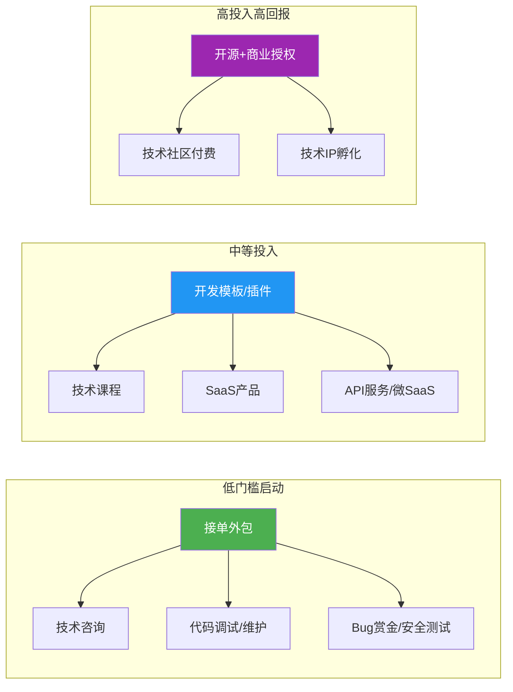
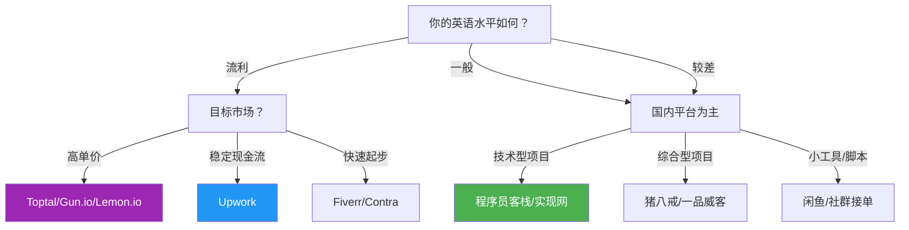
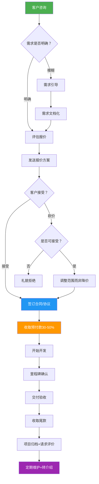
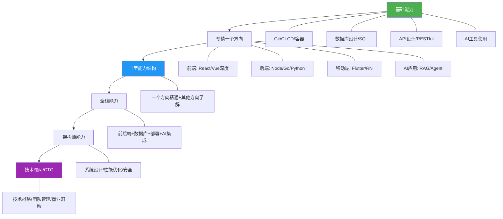
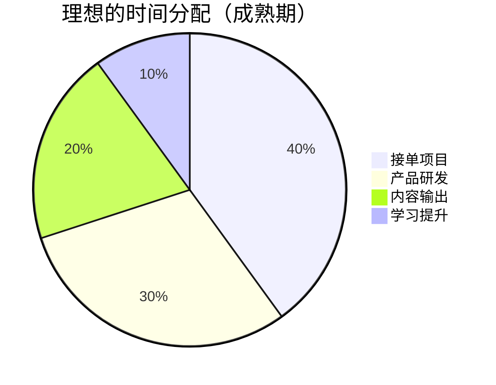

## 一、编程技能变现

编程是当今时代最具杠杆效应的变现技能之一。不同于体力劳动的线性收入模式，代码具有"写一次、卖多次"的特性——同一套解决方案可以服务无数客户，边际成本趋近于零。在AI辅助编程工具爆发的2025-2026年，这一杠杆效应被进一步放大：一个熟练使用AI工具的开发者，产出效率是传统开发者的3-5倍，但市场定价却不会因此降低——因为客户买的是结果，不是工时。

掌握编程变现的完整方法论，能让你从"卖时间"逐步过渡到"卖产品"，最终实现收入的指数级增长。

### 1.1 变现路径全景图

编程技能变现并非只有"接外包"一条路。从时间自由度、收入天花板、启动难度三个维度来看，主要路径如下：



| 路径 | 启动难度 | 收入天花板 | 时间自由度 | 适合阶段 | 典型案例 |
|------|---------|-----------|-----------|---------|---------|
| 接单外包 | ★☆☆☆☆ | ★★★☆☆ | ★★☆☆☆ | 初期积累 | Upwork接企业官网项目 |
| 技术咨询 | ★★★☆☆ | ★★★★☆ | ★★★☆☆ | 中期转型 | 按小时收费做架构咨询 |
| Bug赏金 | ★★☆☆☆ | ★★★★☆ | ★★★★★ | 有安全技能时 | HackerOne/漏洞赏金 |
| 开发模板/插件 | ★★☆☆☆ | ★★★☆☆ | ★★★★☆ | 被动收入起步 | ThemeForest卖后台模板 |
| 技术课程 | ★★★☆☆ | ★★★★★ | ★★★★☆ | 知识体系成熟后 | 极客时间专栏/自建课程 |
| SaaS产品 | ★★★★★ | ★★★★★ | ★★★☆☆ | 有资金和团队后 | 独立开发者做微SaaS |
| API服务/微SaaS | ★★★☆☆ | ★★★★☆ | ★★★★☆ | 有细分领域洞察时 | 验证码识别API、数据清洗API |
| 开源+商业授权 | ★★★★☆ | ★★★★☆ | ★★★★★ | 技术影响力强时 | 开源核心+企业版收费 |
| Chrome扩展/浏览器插件 | ★★☆☆☆ | ★★★☆☆ | ★★★★☆ | 有用户洞察时 | 效率工具Freemium模式 |

**关键认知**：这些路径并非互斥。最聪明的做法是组合使用——用接单获得现金流，用模板/课程建立被动收入，用开源项目积累影响力。接单是"打猎"，产品是"种田"，两件事要同时做。

### 1.2 接单平台深度解析

#### 1.2.1 国内平台

国内接单平台各有侧重，选择时要结合自身技术栈和目标客户群：

| 平台 | 抽成 | 项目特点 | 竞争激烈度 | 支付保障 | 适合人群 | 平台规模 |
|------|------|---------|-----------|---------|---------|---------|
| 猪八戒 | 约20% | 综合外包，企业需求为主 | ★★★★★ | 平台托管 | 有团队的开发者 | 国内最大 |
| 程序员客栈 | 约15% | 程序员专属，技术匹配度高 | ★★★☆☆ | 平台托管 | 中高级开发者 | 中等 |
| 一品威客 | 约20% | 威客竞标模式 | ★★★★☆ | 平台托管 | 愿意低价竞争的 | 大型 |
| 开源众包 | 较低 | 技术社区衍生 | ★★☆☆☆ | 较弱 | 技术社区活跃用户 | 小型 |
| 实现网 | 约10% | 高端技术外包 | ★★☆☆☆ | 平台托管 | 资深技术专家 | 精品 |
| 闲鱼/转转 | 0% | 非专业平台，需自行议价 | ★☆☆☆☆ | 无保障 | 个人小项目 | — |
| 淘宝/拼多多 | 平台费 | 低价竞争严重 | ★★★★★ | 平台托管 | 不推荐专业开发者 | — |

**国内平台的深层问题**：

- **低价竞争严重**：大量"学生党"和培训机构出身的开发者以极低价格接单，压低了整体市场定价。一个企业官网报价经常被压到2000元以下，利润空间极薄。
- **需求描述模糊**：国内甲方普遍存在"我想要个像淘宝一样的网站"这类需求，需求沟通成本极高，经常占到项目总工时的30%-50%。
- **尾款难收**：即使有平台托管，"不满意"这个模糊标准经常被用来拒付尾款。据行业调研，约25%的外包项目存在尾款纠纷。
- **中间商层层转包**：部分平台上的"甲方"实际是二道贩子，层层加价后到开发者手中的钱已大幅缩水。识别信号：拒绝提供需求文档、不愿签合同、付款账户与沟通人不一致。
- **应对策略**：优先选择程序员客栈、实现网等技术属性强的平台；坚持预付款50%以上；需求文档写清楚再开工；每完成一个里程碑就确认一次。

#### 1.2.2 国际平台

国际平台单价高、流程规范，但对英语能力和跨时区协作有要求：

| 平台 | 抽成 | 项目特点 | 竞争激烈度 | 支付保障 | 适合人群 |
|------|------|---------|-----------|---------|---------|
| Upwork | 5-20%（阶梯递减） | 全球最大，品类最全 | ★★★★★ | Escrow托管 | 英语流利的全栈开发者 |
| Fiverr | 20% | 按服务定价，类似"淘宝" | ★★★★☆ | 订单制 | 有明确服务包装能力的 |
| Toptal | 0%（客户付） | 顶尖3%开发者筛选 | ★☆☆☆☆ | 直接支付 | 资深工程师，通过率约3% |
| Freelancer | 10% | 竞标制，项目多 | ★★★★☆ | Milestone托管 | 愿意低价切入的 |
| Contra | 0% | 新兴平台，零佣金 | ★☆☆☆☆ | 自行协商 | 建立长期客户关系的 |
| Gun.io | 0% | 筛选制，远程全职 | ★☆☆☆☆ | 直接支付 | 高级后端/DevOps工程师 |
| Arc.dev | 0% | 远程开发者市场 | ★★☆☆☆ | 直接支付 | 全栈/前端高级开发者 |
| Replit Bounties | 0% | AI/全栈项目，新兴 | ★★☆☆☆ | 平台托管 | 全栈/AI开发者 |
| Lemon.io | 0% | 筛选制，东欧+亚洲开发者 | ★★☆☆☆ | 直接支付 | 中高级全栈开发者 |

**Upwork进阶策略**：

1. **Profile优化**：标题用"I build [具体能力] for [目标客户]"格式，例如"I build high-performance e-commerce stores for Shopify merchants using React and Node.js"。Profile overview控制在300字以内，开头50字是黄金区域——客户搜索结果只展示前几行。
2. **Connects管理**：Upwork已改为付费Connects制（每个proposal消耗2-6个connects），盲目投递成本很高。只投与自己技能高度匹配、客户评价好、预算合理的项目。
3. **Proposal技巧**：不要用模板！开头第一句直接回应客户痛点，例如客户说"I need a developer to fix my WooCommerce checkout"，你的开头应该是"I've fixed checkout issues on 12 WooCommerce stores in the past 6 months — most were caused by payment gateway conflicts or session handling bugs. Let me take a look at yours." 然后问一个具体的技术问题，展示你真的懂。
4. **定价策略**：新账号前3-5个项目可以略低于市场价（但不要低到显得廉价），拿到5星评价后逐步提价。Upwork的JSS（Job Success Score）算法权重最大的是客户满意度和长期合同，争取拿到每个客户的"Top Rated"徽章。
5. **Portfolio打造**：每个完成的项目都截图写案例放在Portfolio里，尤其是有数据结果的（"帮客户将网站加载速度从5秒降到1.2秒"）。
6. **Rising Talent到Top Rated路径**：新账号前90天是关键窗口期，Upwork会给Rising Talent标签。利用这段时间完成4-5个高质量项目，保持100%的Job Success Score，就能晋升Top Rated。

**Fiverr进阶策略**：

1. **Gig设计**：标题用"I will [动词]+[具体成果]"格式，如"I will build a responsive Next.js website with CMS integration"。配图必须专业（建议用Canva做展示图）。
2. **阶梯定价**：设置Basic/Standard/Premium三档，Basic定价可以低一些（吸引首单），但Standard和Premium才是利润来源。
3. **快速响应**：Fiverr的算法偏好响应速度快的卖家，收到消息后尽量在1小时内回复。
4. **Seller Level晋升**：从New Seller → Level 1 → Level 2 → Top Rated Seller，每个级别带来的曝光量差距巨大。

#### 1.2.3 如何选择平台



**平台之外的获客渠道**（往往比平台更优质）：

- **技术社区**：在V2EX、SegmentFault、掘金、Dev.to等社区活跃，回答问题建立专业形象，自然有人私信咨询。关键：持续回答同一领域的问题，让别人一想到"XX问题"就想到你。
- **GitHub/开源项目**：维护一个有star的开源项目是最好的名片，客户会直接通过GitHub联系你。50个star以上的项目就能带来稳定的咨询流量。
- **社交媒体**：在Twitter/X、即刻、小小红书、LinkedIn分享技术见解和项目案例，吸引精准客户。LinkedIn的"Open to Work"标签在国际市场上非常有效。
- **线下活动**：技术沙龙、行业展会、创业孵化器，面对面建立的信任感远超线上。
- **老客户转介绍**：这是最高质量的获客渠道，做好每一个项目，让客户主动帮你推荐。可以在项目完成后主动说："如果您身边有朋友也需要类似的开发服务，欢迎推荐，我会给推荐人一个感谢红包。"
- **技术博客SEO**：写高质量的技术文章，长期获取搜索引擎流量。一篇排名靠前的"如何搭建XX系统"的文章，可以持续数年为你带来客户。

### 1.3 项目类型与报价策略

#### 1.3.1 按项目类型参考报价

报价不是拍脑袋，而是基于工时×时薪+风险溢价+品牌溢价来计算的。以下是2025-2026年的市场参考价：

| 项目类型 | 国内报价(元) | 国外报价(USD) | 典型工期 | 技术栈 | 关键风险点 |
|----------|-------------|--------------|---------|--------|-----------|
| 企业官网 | 3,000-20,000 | $500-3,000 | 1-2周 | WordPress/Next.js | 需求变更频繁 |
| 微信小程序 | 5,000-30,000 | $1,000-5,000 | 2-4周 | 原生/UniApp/Taro | 微信审核不确定性 |
| App开发 | 30,000-100,000 | $5,000-20,000 | 1-3月 | Flutter/RN/原生 | 多端适配，后期维护成本高 |
| 管理系统(CRM/ERP) | 30,000-150,000 | $5,000-30,000 | 1-3月 | Vue+Node/Java | 需求复杂，容易范围蔓延 |
| 数据分析/爬虫 | 2,000-10,000 | $300-2,000 | 1-2周 | Python | 法律风险（爬虫） |
| 电商系统 | 20,000-80,000 | $3,000-15,000 | 1-2月 | Shopify/自研 | 支付对接复杂度 |
| API开发/后端 | 5,000-50,000 | $1,000-10,000 | 1-4周 | Node/Go/Python | 性能和安全要求 |
| AI/ML项目 | 10,000-100,000 | $2,000-20,000 | 2周-2月 | Python/PyTorch | 数据质量和模型效果 |
| AI应用集成(RAG/Agent) | 8,000-80,000 | $1,500-15,000 | 1-4周 | LangChain/Dify/自研 | 大模型幻觉、数据安全 |
| 区块链/智能合约 | 20,000-200,000 | $3,000-30,000 | 1-2月 | Solidity/Rust | 安全审计成本高 |
| 自动化脚本/工具 | 500-5,000 | $100-800 | 1-3天 | Python/Shell | 需求简单但沟通成本不低 |
| Chrome扩展/浏览器插件 | 3,000-15,000 | $500-3,000 | 1-2周 | JS/TS | 浏览器兼容性、审核政策变化 |
| 数据看板/BI报表 | 5,000-30,000 | $1,000-5,000 | 1-3周 | ECharts/Metabase | 数据源对接复杂度 |

**报价公式**：

```text
报价 = (预估工时 × 时薪) × 难度系数 × 紧急系数 + 风险溢价
```

各参数计算方法：

- **预估工时**：你认为需要的时间 × 1.5（永远不要按最理想情况估算，留出buffer）。经验法则：第一次做的项目，工时估算误差可达2-3倍。
- **时薪**：你期望的年收入 ÷ 2000小时（一年有效工作时间）。例：期望年入40万，则时薪200元。
- **难度系数**：熟悉的技术栈1.0，半生不熟的1.3，全新技术栈1.5-2.0。
- **紧急系数**：正常工期1.0，加急1.3，紧急1.5，特急2.0。
- **风险溢价**：需求不清晰+20%，客户历史评价差+30%，涉及第三方对接+15%，需要对接国内支付系统（微信/支付宝）+10%。

**举个例子**：一个中等复杂度的微信小程序，你预估需要80小时，期望时薪200元，技术栈熟悉但需求描述比较模糊：

```text
报价 = (80 × 1.5 × 200) × 1.0 × 1.0 + 24000 × 20%
     = 24,000 + 4,800 = 28,800元
```

建议报价30,000元（向上取整，留谈判空间）。注意：我用的是80×1.5=120小时作为实际预估，因为你一定会遇到意想不到的问题。

#### 1.3.2 按小时定价参考

| 水平 | 国内(元/小时) | 国外(USD/小时) | 对应能力 | Upwork参考费率 |
|------|-------------|---------------|---------|--------------|
| 初级(0-2年) | 100-200 | $15-30 | 能完成明确需求的开发任务 | $15-25 |
| 中级(2-5年) | 200-500 | $30-75 | 能独立完成模块设计和开发 | $30-60 |
| 高级(5-8年) | 500-1,000 | $75-150 | 能做技术方案设计和架构决策 | $75-125 |
| 专家(8年+) | 1,000+ | $150+ | 能解决行业级技术难题 | $150-300 |
| AI/ML专家 | 500-2,000 | $100-300 | 能设计和部署AI系统 | $100-250 |

**时薪 vs 固定价的选择**：

- **适合时薪的场景**：需求不明确、需要探索性工作（如技术调研、bug修复、代码审查）、长期合作的维护类项目、涉及AI模型调优需要反复实验的项目。
- **适合固定价的场景**：需求明确、交付物清晰的项目（如官网开发、小程序开发）、客户预算固定、同类项目你已经做过多次。
- **混合模式**：前期需求分析按小时收费，确认需求后给出固定报价。这样既保护了你的时间，又给了客户确定性。这是最推荐的模式。

#### 1.3.3 报价心理学

**锚定效应**：给客户三个方案（基础版/标准版/高级版），大多数人会选择中间那个。基础版是锚点，高级版是利润来源。

```text
基础版(8,000元):  5个页面，基础功能，15天交付
标准版(15,000元): 10个页面，完整功能，含SEO优化，25天交付  ← 推荐
高级版(25,000元): 全部功能+后台管理+数据分析+1年维护，40天交付
```

**不要按"功能点"报价**：客户会试图砍功能来降价，最终你得到一个残缺项目和一个不满意的客户。按"解决方案"报价——你卖的是结果，不是代码行数。

**报价时的沟通话术**：

- 不要说"这个大概要1万块"（显得不专业）
- 要说"根据需求评估，这个项目的开发周期是3周，报价是12,000元，包含需求确认、UI设计、前端开发、后端开发、测试和部署上线"（显得专业且有条理）
- 永远先谈价值再谈价格："这个系统上线后预计能帮您节省3个人力的重复工作，投入产出比在2个月内就能回正"
- 报价后不要急着解释或降价，沉默等待客户回应——谁先开口谁被动

**处理砍价的话术**：

- 客户说"太贵了"："理解您的顾虑。我们的报价基于项目所需的专业技能和工时。如果您预算有限，我们可以调整功能范围来匹配——比如先做核心功能，后续再迭代。"
- 客户说"别人报价比你低"："市场上确实存在更低的报价。但我建议您对比一下方案的完整度、技术方案质量和售后服务。便宜的方案可能最终花费更多——我接手过不少'从别人那里返工'的项目。"
- 客户说"打折吗"："首单我可以给您95折的优惠。同时，如果项目结束后您愿意写一个简短的使用评价，我可以把下次合作的折扣也提前锁定。"

### 1.4 接单全流程详解

#### 1.4.1 从接触到达成合作



#### 1.4.2 需求分析模板

大多数项目失败不是因为技术问题，而是因为需求理解偏差。在正式报价前，必须完成需求确认。以下是一份实用的需求确认清单：

**业务背景**：
- 这个项目要解决什么业务问题？（问清"为什么做"比"做什么"更重要）
- 目标用户是谁？（年龄、使用场景、技术水平、常用设备）
- 有没有竞品或参考案例？请提供链接
- 项目上线后的预期效果是什么？（流量、转化率、效率提升等）
- 项目的成功标准是什么？能量化吗？

**功能需求**：
- 列出所有需要的功能点，按优先级排序（P0必须有/P1应该有/P2可以有）
- 每个功能点的具体行为描述（用户点击A，系统执行B，展示C结果）
- 有没有需要对接的第三方系统？（支付、短信、物流、ERP、AI模型等）
- 数据量预估？（用户数、数据条目、并发量、数据增长速度）
- 有没有管理员后台需求？

**非功能需求**：
- 性能要求？（页面加载时间、API响应时间、并发支持数）
- 安全要求？（数据加密、权限控制、审计日志、合规要求如等保/ISO27001）
- 兼容性要求？（浏览器、设备、操作系统、微信版本）
- 部署环境？（自有服务器/云服务/小程序审核/海外服务器）
- 多语言需求？（是否需要国际化i18n）

**交付标准**：
- 交付物清单（源代码、数据库文档、API文档、部署文档）
- 验收标准（功能通过率、性能指标、Bug严重级别定义）
- 维护期和维护范围
- 培训需求？（是否需要对客户团队做操作培训）

**这份文档必须让客户签字确认**，它既是你的工作依据，也是未来发生纠纷时的法律凭证。建议用飞书文档/Notion共享页面做需求文档，可以实时协作、留痕、评论。

#### 1.4.3 合同要素

即使是个人接单，也必须有书面协议。以下是核心条款：

1. **项目范围**：附上需求文档，明确哪些在范围内、哪些不在
2. **付款节点**：建议3-3-4（开工30%、中期30%、验收40%）或5-5（开工50%、验收50%）
3. **变更机制**：需求变更需要书面确认，超出原始范围的变更按小时额外收费
4. **延期条款**：因甲方原因（如确认延迟、素材未提供）导致的工期顺延，不承担违约责任
5. **知识产权**：尾款付清前，源代码知识产权归开发者所有（这是你的筹码）
6. **保密条款**：双方对项目信息保密
7. **争议解决**：约定管辖法院或仲裁机构
8. **终止条款**：任何一方提前终止的条件和结算方式（通常已完成部分按比例结算）

**国内简易协议模板**：不用请律师，一份清晰的《项目开发服务协议》就够用，关键是把上述8点写清楚。可以在"法大大"或"e签宝"上使用电子合同，有法律效力且成本低（单份几元到几十元）。

**国际项目合同要点**：
- 使用英文合同，明确定义Milestone和Deliverables
- 付款条款注明支付方式（Wire/PayPal/Wise）和货币（USD/EUR）
- 包含Late Payment Clause（逾期付款利息条款）
- 知识产权条款要明确Work for Hire（雇佣作品）还是License（授权）
- 管辖法律通常约定为开发者所在地或中立地（如新加坡仲裁）

#### 1.4.4 开发过程管理

**里程碑制度**：不要等到最后才交付，按里程碑分阶段交付：

| 里程碑 | 交付内容 | 时间占比 | 付款触发 | 客户确认点 |
|--------|---------|---------|---------|-----------|
| M0: 需求确认 | 需求文档+原型图 | 10% | 预付款 | 签字确认需求文档 |
| M1: 设计阶段 | UI设计稿+技术方案 | 15% | — | 确认设计稿和交互逻辑 |
| M2: 核心功能 | 核心功能可演示 | 35% | 中期款 | 功能演示+确认 |
| M3: 完整功能 | 全部功能+测试 | 30% | — | 内部测试报告 |
| M4: 上线部署 | 部署+文档+培训 | 10% | 尾款 | 验收确认单 |

**沟通规范**：

- 每周至少一次进度汇报（文字+截图/录屏），形成固定节奏
- 使用项目管理工具（Notion/飞书/腾讯文档/Jira）跟踪进度，让客户随时看到状态
- 重要的沟通结论以文字形式确认（微信聊天记录也可作为证据）
- 遇到问题及时沟通，不要等到deadline才说做不完
- 需求变更必须走变更流程，口头承诺不算数
- 善用异步沟通：不急的事写消息，急的事打电话，复杂的事开会/共享屏幕

**版本控制最佳实践**：

- 使用Git管理代码，每个功能一个branch，通过PR/MR合并
- Commit message写清楚做了什么（遵循Conventional Commits规范：`feat: add user login`、`fix: resolve checkout bug`）
- 重要里程碑打tag（如`v1.0-m2`）
- 客户有自己的Git仓库时，fork后开发，通过PR提交
- 代码托管在GitHub/GitLab，确保客户有权限访问

#### 1.4.5 交付与售后

**交付清单**：
- 源代码（压缩包+Git仓库地址，含完整README）
- 数据库脚本（建表+初始数据+迁移脚本）
- 部署文档（详细的步骤说明，客户或其运维人员能按文档自行部署）
- API文档（推荐用Swagger/OpenAPI自动生成，或者用Apifox导出）
- 使用手册（面向终端用户的操作指南，含截图）
- 管理员手册（后台管理操作说明）
- 维护说明（常见问题排查、日志查看、备份恢复、监控告警配置）

**售后维护**：
- 明确免费维护期（建议1-3个月，修复Bug不收费）
- 超出维护期按月/按次收费，建议签订年度维护合同（年费为项目总价的15%-20%）
- 不包含新功能开发（新需求另起项目报价）
- 提供紧急联系方式和响应时间承诺（如工作日8小时内响应，紧急问题2小时内响应）
- 维护期结束后，主动联系客户续约或推荐新功能迭代

### 1.5 获客与个人品牌建设

#### 1.5.1 冷启动策略

刚开始接单时没有作品、没有评价、没有口碑，需要一套系统的冷启动方案：

**第一阶段：积累作品集（第1-2个月）**

1. **做3-5个Demo项目**：不需要是真实客户项目，但要足够专业。选择你目标领域的典型需求：
   - 想接小程序单子？做一个精美的小程序Demo（如点餐系统、预约系统）
   - 想接企业官网？做3个不同风格的响应式官网模板
   - 想接数据分析？在Kaggle上做2个有深度的项目并写详细分析报告
   - 想接AI应用？做一个完整的RAG知识库问答Demo或AI Agent工作流
2. **开源到GitHub**：写好README，有截图、有部署说明、有技术栈说明。一个有50+star的GitHub项目比任何简历都有说服力。
3. **写技术博客**：记录你在做这些项目时的技术决策、踩过的坑、解决方案。掘金、CSDN、知乎专栏、个人博客都可以。

**第二阶段：平台起步（第2-3个月）**

1. 在2-3个平台注册账号，完善Profile
2. 前3-5个单子可以低于市场价20%-30%（但不要低到离谱，否则吸引的是最差的客户）
3. 每个项目都做到超出客户预期——多做一点、交付快一点、文档详细一点
4. 拿到5星好评后，价格逐步恢复到正常水平

**第三阶段：建立口碑（第3-6个月）**

1. 维护好每一个老客户，主动询问使用情况
2. 请满意的客户写推荐语（可以放在你的Portfolio页面）
3. 在技术社区持续输出，建立专业形象
4. 开始收到转介绍的客户

#### 1.5.2 个人品牌四件套

| 资产 | 作用 | 维护频率 | 平台选择 | 建设成本 |
|------|------|---------|---------|---------|
| GitHub主页 | 技术能力证明 | 每周提交 | GitHub | 时间 |
| 技术博客 | SEO获客+专业形象 | 每周1-2篇 | 掘金/知乎/个人博客 | 时间 |
| 作品集网站 | 客户转化 | 每个项目更新 | 个人域名 | 域名费(~100元/年) |
| 社交媒体 | 日常曝光+互动 | 每天 | Twitter/即刻/小红书/LinkedIn | 时间 |

**作品集网站要点**：
- 必须有自定义域名（如yourname.dev），推荐用Namecheap或Cloudflare Registrar购买
- 首页3秒内传达"你是谁、你能做什么、为什么要选你"
- 展示3-5个最佳案例，每个案例包含：问题描述→解决方案→技术实现→客户反馈（数据量化）
- 放上客户评价和联系方式（微信二维码/邮箱/Telegram）
- 移动端必须适配（很多客户用手机浏览）
- 技术实现推荐：Next.js + Tailwind CSS + Vercel部署，免费且性能好
- 加上Google Analytics或Umami，追踪访客来源和转化率

**SEO获客策略**：

- 写"如何做XX"类的技术文章，瞄准长尾关键词
- 在文章末尾加CTA（Call to Action）："需要专业的XX开发服务？联系我"
- 每篇文章至少2000字，包含代码示例和截图
- 定期更新旧文章，保持搜索引擎排名
- 在技术社区（掘金、知乎、SegmentFault）同步发布，增加外链

#### 1.5.3 稳定阶段的进阶策略

当你的月收入稳定在2万以上时，需要考虑从"接单者"向"服务商"转型：

1. **提高客单价**：不再接受低于5000元的项目，把低价单子过滤掉或转给信任的同行（收10%-20%的介绍费）
2. **筛选客户**：学会拒绝——预算太低的、需求不合理的、沟通困难的、人品有问题的，统统不接
3. **建立标准化流程**：从需求分析到交付验收，形成SOP（标准作业程序），提高效率和质量一致性
4. **发展合作伙伴**：与设计师、产品经理、测试工程师建立稳定的合作关系，承接更大更完整的项目
5. **逐步组建团队**：当你的项目多到一个人做不完时，开始外包部分工作给别人，你负责需求对接和质量把控
6. **产品化思维**：把重复性的项目抽象成可复用的解决方案/模板/SaaS产品，实现一次开发多次变现
7. **建立NDA保护**：对核心技术和客户信息签署保密协议，保护商业价值

### 1.6 高频踩坑与避坑指南

#### 1.6.1 十二大常见陷阱

| 陷阱 | 表现 | 后果 | 应对方法 |
|------|------|------|---------|
| 需求蔓延 | "顺便加个小功能" | 工期延长，利润消失 | 合同明确范围，变更走流程 |
| 无限修改 | "再改改颜色/字体" | 时间被磨光 | 合同约定修改次数（如3次） |
| 尾款难收 | 各种理由拖延付款 | 拿不到辛苦钱 | 预付款比例提高，知识产权留后手 |
| 低价竞争 | 比谁报价低 | 吸引最差客户 | 坚持价值定价，宁可不做 |
| 需求模糊 | "我也不知道要什么" | 做完不满意 | 先做需求分析，确认后再报价 |
| 中间人截胡 | 平台/中介层层抽成 | 利润被压缩 | 逐步转向直客+转介绍 |
| 技术债务 | 为了赶工期写烂代码 | 维护成本爆表 | 坚持代码质量，定期重构 |
| 信任危机 | 客户不信任，事事插手 | 效率极低 | 定期汇报+里程碑制度 |
| 法律风险 | 爬虫/破解/灰色需求 | 法律纠纷 | 坚守底线，拒绝灰色项目 |
| 倦怠期 | 连续接单没有休息 | 效率下降，质量变差 | 规划休息时间，控制接单量 |
| 客户失联 | 做完了找不到人确认 | 无法验收收款 | 设置里程碑自动确认机制，超过X天视为默认通过 |
| 二道贩子 | 甲方实际是中间商 | 信息不对称，尾款风险 | 合同签最终甲方，要求提供营业执照 |

#### 1.6.2 应对"需求蔓延"的具体话术

当客户说"顺便帮我加个XX功能"时：

> "这个功能可以做，不过它不在我们原定的需求范围内。我评估了一下，大概需要额外X天的开发时间，费用是Y元。您看要不要加进来？如果加的话，工期需要顺延Z天。"

关键点：不要说"不"，而是说"可以，但需要额外投入"。让客户自己做选择——加钱加时间，或者不加。

#### 1.6.3 应对"尾款难收"的三层防线

1. **第一层：预付款比例**。预付款至少50%，这样即使客户不付尾款，你至少收回了成本。
2. **第二层：知识产权**。合同中约定"尾款付清前，源代码知识产权归开发者所有，客户不得使用"。这是法律武器。
3. **第三层：分阶段交付**。不要一次性交付所有源代码。先交付可运行的成品（但不开源），客户确认满意并付清尾款后再交付源代码。
4. **第四层（终极手段）：法律途径**。金额较大时（如超过5万），可以走法律途径。保留好合同、聊天记录、交付记录等证据，先发律师函（成本约500-2000元），不起诉往往也能解决问题。

### 1.7 技术栈选择与能力提升

#### 1.7.1 市场需求最旺的技术栈

不同技术方向的接单市场差异巨大。以下是2025-2026年市场需求最旺盛的方向：

| 技术方向 | 市场需求 | 平均单价 | 学习曲线 | 推荐指数 | 变现速度 |
|---------|---------|---------|---------|---------|---------|
| 全栈Web(React/Vue+Node) | ★★★★★ | 中高 | 中 | ★★★★★ | 快 |
| 微信小程序/公众号 | ★★★★☆ | 中 | 低 | ★★★★☆ | 很快 |
| Flutter/RN跨平台App | ★★★★☆ | 高 | 中 | ★★★★☆ | 中 |
| Python自动化/爬虫/数据分析 | ★★★★☆ | 中 | 低 | ★★★★☆ | 很快 |
| AI/ML应用开发 | ★★★★★ | 高 | 高 | ★★★★★ | 中 |
| AI Agent/RAG开发 | ★★★★★ | 很高 | 中高 | ★★★★★ | 快 |
| 后端API/微服务 | ★★★★☆ | 高 | 中 | ★★★★☆ | 中 |
| DevOps/云原生 | ★★★☆☆ | 高 | 高 | ★★★☆☆ | 慢 |
| 区块链/Web3 | ★★☆☆☆ | 很高 | 很高 | ★★☆☆☆ | 慢 |
| 嵌入式/IoT | ★★☆☆☆ | 高 | 很高 | ★★☆☆☆ | 慢 |
| Rust/Go系统开发 | ★★☆☆☆ | 很高 | 高 | ★★★☆☆ | 中 |

**2025-2026年AI时代的新机会**：

- **AI应用开发**：帮企业搭建基于大模型的应用（客服机器人、文档问答、内容生成），这是当前最热门的需求。具体包括：
  - RAG知识库系统：连接企业内部文档和大模型，实现精准问答
  - AI Agent工作流：帮企业开发自动化工作流Agent（如自动客服、自动报告生成、自动数据分析）
  - 多模态应用：结合文本、图像、语音的AI应用（如智能客服、图像识别系统）
- **AI工具集成**：帮企业集成Claude/GPT/Gemini等API到现有系统中
- **数据标注/清洗**：为AI训练准备数据，门槛低但需求量大
- **模型微调**：帮企业在开源模型基础上做领域适配（如Qwen、Llama、Mistral微调）
- **AI自动化测试**：用AI工具编写和维护自动化测试脚本

#### 1.7.2 AI辅助编程工具全景

AI工具已经不是"锦上添花"，而是编程变现的**生产力倍增器**。以下是2025-2026年最主流的AI编程工具：

| 工具 | 类型 | 价格 | 适合场景 | 生产力提升 |
|------|------|------|---------|-----------|
| GitHub Copilot | IDE内联补全 | $10-19/月 | 日常编码加速 | 30-50% |
| Cursor | AI-native IDE | $20/月 | 全栈开发、快速原型 | 50-100% |
| Claude Code | CLI Agent | 按token计费 | 复杂代码重构、架构设计 | 100-300% |
| Windsurf | AI-native IDE | $15/月 | 全栈开发 | 50-100% |
| Bolt.new/Lovable | 文字生成应用 | $20/月 | 快速原型、MVP | 200-500% |
| v0.dev | UI组件生成 | $20/月 | 前端UI快速搭建 | 100-200% |
| Replit Agent | 云端AI开发 | $25/月 | 快速原型、教学演示 | 200-500% |

**AI工具对变现的影响**：

1. **效率提升 = 利润提升**：用Cursor/Claude Code开发，同样的项目用时缩短50%-70%，但报价不变，利润率暴增
2. **快速原型能力**：客户说"我想做一个XX"，你可以在30分钟内用AI生成一个可演示的原型，极大提高成交率
3. **降低技术门槛**：以前不敢接的技术方向（如AI/ML、区块链），现在可以借助AI快速上手
4. **注意事项**：AI生成的代码必须review和测试，不能盲目使用。客户付钱买的是你的判断力，不只是代码输出

**高效使用AI工具的实操方法**：

```text
# 用Claude Code快速搭建项目骨架的典型流程

# 1. 用自然语言描述需求，让AI生成项目结构
"帮我创建一个Next.js + Prisma + PostgreSQL的SaaS项目，
包含用户认证、Stripe支付、仪表盘"

# 2. 让AI生成数据库schema
"根据需求文档，设计数据库schema，包含users、projects、
invoices三个核心表"

# 3. 让AI生成API路由和业务逻辑
"实现invoices相关的CRUD API，包含分页、筛选、导出功能"

# 4. 让AI生成前端页面
"创建一个发票管理的Dashboard页面，包含列表、搜索、
新增表单、详情弹窗"

# 5. 让AI写测试
"为invoices API编写完整的单元测试和集成测试"
```

#### 1.7.3 技术能力提升路径



**每个阶段的变现能力**：

- **基础能力**（0-1年）：能接简单的脚本、小工具、静态网站，单价500-3000元
  - 学会：HTML/CSS/JS基础、Git、至少一门后端语言、数据库基础
  - 变现：闲鱼卖小工具、接简单的爬虫/自动化脚本、帮人部署网站
- **专精方向**（1-3年）：能独立完成中小型项目，单价3,000-30,000元
  - 学会：一个方向的深度技术栈、项目管理基础、客户需求分析
  - 变现：平台接单、技术社区获客、做模板/插件售卖
- **T型结构**（3-5年）：能做技术方案选型和跨栈开发，单价10,000-80,000元
  - 学会：多个技术方向的基本能力、架构设计基础、技术选型能力
  - 变现：高质量客户直客、技术咨询、做课程
- **全栈能力**（5-8年）：能端到端交付完整产品，单价30,000-200,000元
  - 学会：全栈开发、产品思维、团队管理
  - 变现：SaaS产品、技术顾问、组建团队接大项目
- **架构师能力**（8年+）：能设计大型系统架构，按小时/按天收费，日薪3,000-10,000元
  - 学会：分布式系统设计、技术战略、行业洞察
  - 变现：CTO顾问、技术合伙人、投资

### 1.8 从接单到产品的跨越

接单的天花板很明显——你的时间是有限的。即使时薪1000元，一天8小时，一个月22天，月收入上限也不过17.6万（还不考虑项目空窗期）。要突破这个天花板，必须从"卖时间"转向"卖产品"。

#### 1.8.1 产品化的三个层次

**第一层：模板/插件/工具（低门槛产品化）**

把你做过的项目抽象成可复用的模板或工具：
- **前端模板**：后台管理模板、落地页模板、电商模板。在ThemeForest、CodeCanyon、掘金小册等平台售卖。一套精心制作的模板可以卖几百到几千份。
- **Chrome扩展**：开发效率工具、数据抓取工具、页面增强工具，Freemium模式（基础免费+高级付费）。
- **CLI工具**：开源CLI工具+商业高级版。如数据库迁移工具、项目脚手架工具。
- **npm/PyPI包**：开源基础库+商业高级功能或技术支持。
- **WordPress主题/插件**：生态庞大，优质主题/插件的市场需求持续存在。

**定价参考**：
| 产品类型 | 单价范围 | 典型月销量 | 典型月收入 |
|---------|---------|-----------|-----------|
| ThemeForest主题 | $30-60 | 50-200份 | $1,500-12,000 |
| Chrome扩展(Freemium) | $5-15/月 | 100-5000用户 | $500-75,000 |
| CLI工具(商业版) | $50-200/年 | 20-200份 | $80-3,300/月 |
| WordPress插件 | $30-100 | 30-100份 | $900-10,000 |
| Figma/Sketch组件库 | $20-50 | 50-300份 | $1,000-15,000 |

**第二层：SaaS/在线服务（中等投入产品化）**

把解决方案做成在线服务，按月/年收费。MRR（月经常性收入）是最健康的收入模式：

- **微SaaS**：解决一个细分问题的小型SaaS。如链接管理工具、社交媒体排程、表单收集工具。
- **API服务**：提供数据处理、AI推理、图像处理等API，按调用次数计费。
- **垂直行业工具**：针对特定行业的SaaS，如律师合同管理、餐厅预约系统、健身房会员管理。

**SaaS启动清单**：
1. 找到一个细分痛点（最好是自己遇到的或客户反复提的需求）
2. 用最低成本验证需求（落地页+等待列表，看有没有人愿意注册）
3. 开发MVP（最小可行产品，核心功能1-2周搞定）
4. 找5-10个种子用户试用，收集反馈
5. 迭代3-4个版本，找到Product-Market Fit
6. 开始付费推广（Google Ads、社交媒体广告、内容营销）

**关键指标**：MRR（月经常性收入）、Churn Rate（流失率，控制在5%以下）、LTV（客户终身价值）、CAC（获客成本）。LTV/CAC > 3 才是健康的商业模式。

**第三层：技术课程/知识付费（知识产品化）**

把你的技术经验打包成课程：
- **平台课程**：在极客时间、Udemy、自建平台售卖，一套好课程可以持续卖3-5年。
- **付费社群**：知识星球、Patreon，提供持续的技术答疑和内容更新。
- **电子书/小册**：掘金小册、Gumroad，把某个技术主题写深写透。
- **直播/录播培训**：面向企业或个人的技术培训，单次收费1000-50000元。

#### 1.8.2 开源项目的商业化路径

开源不仅仅是为了技术影响力，更是一条成熟的商业路径：

| 模式 | 说明 | 典型案例 | 适合阶段 |
|------|------|---------|---------|
| 开源核心+企业版 | 基础功能开源，高级功能付费 | GitLab CE vs EE | 有用户基础后 |
| 技术支持/咨询 | 提供付费技术支持 | Red Hat | 项目成熟后 |
| 托管服务 | 开源产品+托管版本收费 | WordPress.com | 有运维能力时 |
| 商业授权 | 非商业用途免费，商业用途付费 | MySQL | 项目有一定影响力 |
| 赞助/捐赠 | GitHub Sponsors/Open Collective | 大量npm包 | 持续维护的项目 |
| 双许可 | AGPL（开源）+ 商业许可 | MongoDB（早期） | 商业客户有合规需求 |

**GitHub Sponsors实操**：
- 设置Sponsor tiers：$5/月（感谢）、$20/月（优先Issue响应）、$100/月（1对1技术咨询30分钟/月）
- 在README中添加Sponsor badge
- 定期发布开发日志（Development Log），让赞助者看到进展
- 参加GitHub Sponsors的匹配活动（GitHub有时会匹配赞助金额）

#### 1.8.3 产品化时间分配建议



**早期（0-1年）**：80%接单 + 10%产品 + 10%学习。用接单养活自己，同时积累产品素材。

**中期（1-3年）**：60%接单 + 25%产品 + 15%内容+学习。开始产出模板/课程，建立被动收入。

**成熟期（3年+）**：40%接单 + 30%产品 + 20%内容 + 10%学习。被动收入占比逐步提升。

**终极目标**：被动收入覆盖基本生活开支后，你可以选择只接自己真正感兴趣的项目，实现时间自由。

### 1.9 开源变现与Bug赏金

#### 1.9.1 开源项目的商业潜力

开源不仅是技术名片，更是一条被验证过的商业路径。一个成功的开源项目可以同时带来：

- **技术影响力**：GitHub star数、社区贡献者数量
- **获客渠道**：用户直接转化为客户或赞助者
- **商业机会**：企业赞助、商业授权、技术支持合同
- **职业机会**：大厂offer、技术顾问邀请

**如何选择开源方向**：
1. 解决自己遇到的真实痛点（最自然的起点）
2. 现有方案不够好（有明确的改进空间）
3. 目标用户群明确（知道谁会用）
4. 有商业模式可行性（有人愿意为高级功能付费）

#### 1.9.2 Bug赏金与安全测试

如果你有安全测试技能，Bug赏金是一条高杠杆的变现路径：

| 平台 | 赏金范围 | 适合人群 | 特点 |
|------|---------|---------|------|
| HackerOne | $150-$100,000+ | 有安全基础的开发者 | 全球最大，企业客户多 |
| Bugcrowd | $100-$50,000+ | 中级安全研究者 | 竞赛模式+持续项目 |
| 漏洞盒子 | ¥500-¥50,000+ | 国内安全研究者 | 国内企业为主 |
| 各公司SRC | 各异 | 深入了解特定产品 | 百度/阿里/腾讯/字节等都有 |

**入门路径**：
1. 学习Web安全基础（OWASP Top 10）
2. 在PortSwigger Web Security Academy免费学习（比很多付费课程质量高）
3. 从低赏金的小目标开始，积累经验和信誉
4. 专注于2-3个细分领域（如XSS、SSRF、IDOR）
5. 写漏洞报告（高质量的报告能提高赏金50%以上）

### 1.10 国际项目与跨境协作

#### 1.10.1 收款解决方案

做国际项目，收款是第一个要解决的实际问题：

| 收款方式 | 手续费 | 到账速度 | 最适合 | 注意事项 |
|---------|--------|---------|--------|---------|
| Wise(原TransferWise) | 0.5-1.5% | 1-2天 | Upwork/直客 | 汇率最接近市场价 |
| PayPal | 3.5-4.5%+固定费 | 即时 | Fiverr/小额 | 手续费高，汇率差 |
| Payoneer | 1-2% | 2-5天 | 平台收款 | 支持多币种账户 |
| 美元电汇 | $15-50/笔 | 3-5天 | 大额付款 | 需要外汇申报 |
| 加密货币(USDT) | 极低 | 分钟级 | Web3项目/避税 | 法律合规风险 |
| 连连支付/PingPong | 0.7-1.2% | 1-3天 | 国内开发者收外汇 | 专为跨境设计 |

**实操建议**：
- 小额（<$1000）：PayPal或Wise，方便快捷
- 中等（$1000-$10000）：Wise或Payoneer，汇率和手续费平衡
- 大额（>$10000）：美元电汇，手续费相对最低
- 准备至少2个收款渠道，避免单一渠道故障影响收入
- 所有外汇收入保留水单/记录，年度汇算时需要

#### 1.10.2 跨时区协作

与海外客户合作，时区管理是基本功：

- **找到重叠时间**：中美时差12-13小时，重叠窗口通常在你的早上7-9点（对方下午）或晚上9-11点（对方上午）
- **异步沟通为主**：用Loom录屏代替实时会议，用文档代替口头说明
- **使用世界时钟工具**：World Time Buddy或Google Calendar多时区显示
- **明确工作时间**：在Upwork Profile或合同中注明你的可用时间
- **每周一次同步会议**：其他时间用文字沟通，会议前发议程，会后发会议纪要

#### 1.10.3 英语沟通能力提升

国际平台接单，英语是硬门槛。但你不需要雅思8分，需要的是**商务英语**：

- **Proposal/邮件模板**：积累10个常用的proposal模板，反复修改打磨
- **技术英语**：学习如何用英语描述技术方案、解释代码、写文档
- **常用工具**：Grammarly（语法检查）、DeepL（翻译辅助）、ChatGPT（润色邮件）
- **练习方式**：每天写一段英文技术博客，或在Reddit/Stack Overflow回答问题
- **最低标准**：能清晰地用文字沟通技术方案，不需要流利口语（很多项目全程文字沟通）

### 1.11 财务管理与税务

#### 1.11.1 收入结构优化

| 收入类型 | 税率(国内) | 优化方式 | 适合阶段 |
|---------|-----------|---------|---------|
| 劳务报酬 | 20%-40% | 预扣，年度汇算可能退税 | 初期少量接单 |
| 个体工商户 | 5%-35% | 注册个体户，享受小规模纳税人优惠 | 月入1-10万 |
| 个人独资企业 | 5%-35% | 核定征收，综合税率可降至3%-5% | 月入10万+ |
| 技术服务费 | 20%-40% | 合理利用税收优惠政策 | 国际项目 |
| 境外收入 | 各国不同 | 了解双边税收协定，避免双重征税 | 国际平台 |

**实操建议**：
- **月收入超过1万时**：开始记账，分清个人收入和业务支出
- **月收入超过2万时**：建议注册个体工商户，可以享受小规模纳税人增值税免征政策（季度30万以内免征增值税）
- **月收入超过5万时**：咨询专业会计，了解核定征收等税收优惠
- **保留所有凭证**：电脑、软件订阅（IDE、云服务、域名）、办公用品、交通费等都可以作为成本抵扣
- **国际收入注意**：单笔超过5000美元需要外汇申报；使用Wise等平台可以更灵活地管理多币种收入

#### 1.11.2 财务健康管理

- **建立应急基金**：至少存3个月的生活费，应对项目空窗期。自由职业收入波动大，缓冲资金是安全网
- **保险配置**：医保+商业医疗险+意外险。程序员还需要关注颈椎/腰椎/眼睛相关的保障（如补充医疗险覆盖按摩/理疗）
- **收入多元化**：不要把所有鸡蛋放在一个篮子里，至少有2-3个收入来源（如接单+模板销售+课程）
- **记账习惯**：用随手记、MoneyWiz、YNAB等工具记录每笔收支，月底复盘。重点关注：毛利率（收入-直接成本）、空窗期比例、客户集中度
- **税务日历**：标记季度申报、年度汇算、外汇申报等关键日期，避免逾期罚款
- **退休规划**：自由职业没有企业年金，需要自己规划。每月存收入的10%-15%用于长期投资（指数基金/国债等）

### 1.12 安全、法律与合规

#### 1.12.1 代码安全责任

作为开发者，你交付的代码的安全性直接影响客户业务：

- **基本安全措施**：输入验证、SQL注入防护、XSS防护、CSRF防护、密码加密存储（bcrypt/argon2）
- **依赖管理**：定期更新依赖（Dependabot/Renovate），避免已知漏洞
- **敏感信息处理**：API Key、数据库密码等使用环境变量，不硬编码在代码中
- **数据保护**：了解《个人信息保护法》《数据安全法》的基本要求
- **安全审计**：重大项目建议在交付前做一次安全扫描（使用OWASP ZAP、Snyk等工具）

#### 1.12.2 合法合规红线

以下需求坚决不接：

| 类型 | 具体表现 | 法律风险 |
|------|---------|---------|
| 爬虫灰色地带 | 爬取需登录才能看到的数据、绕过反爬机制 | 《网络安全法》、《数据安全法》 |
| 破解/盗版 | 破解软件、制作注册机、盗版资源网站 | 《著作权法》、刑事责任 |
| 赌博/色情 | 赌博网站、色情平台、涉黄App | 刑事责任 |
| 金融违规 | 非法集资、虚拟币诈骗、P2P平台 | 刑事责任 |
| 侵犯隐私 | 非法采集个人信息、监控软件 | 《个人信息保护法》 |
| 网络攻击 | DDoS工具、钓鱼网站、木马程序 | 刑事责任 |

**原则**：如果你不确定某个需求是否合法，先查法律或咨询律师。灰色地带的钱不要赚——被抓了不仅罚款坐牢，职业生涯也毁了。

### 1.13 心态管理与职业可持续性

#### 1.13.1 接单人的常见心理挑战

1. **冒名顶替综合征**：觉得自己的技术不够好，不配收这么高的价格。破解方法——看看市场上那些报价比你高但做得比你差的人，你的定价是合理的。另外，记录自己解决过的难题清单，定期回顾。
2. **孤独感**：自由职业意味着没有同事，长期一个人工作容易产生孤独感。破解方法——加入技术社群（如自由职业者微信群、Discord频道），定期线下交流，找同行搭伙做项目。
3. **焦虑感**：这个月收入不错，下个月可能颗粒无收。破解方法——建立稳定的客户管道（至少同时维护3-5个客户关系），让每个月都有在进行中的项目；同时发展被动收入。
4. **倦怠感**：连续做同类型的项目会很无聊。破解方法——每季度尝试一个新技术方向，保持好奇心；适时拒绝无聊的项目；给自己放假。
5. **scope creep焦虑**：客户不断加需求但不想加钱，你不好意思拒绝。破解方法——记住，免费加班是对自己的不尊重。礼貌但坚定地执行变更流程。
6. **比较焦虑**：看到同行收入比自己高就焦虑。破解方法——只和昨天的自己比。关注自己的成长曲线，而不是别人的结果。

#### 1.13.2 可持续工作节奏

- **番茄工作法**：25分钟专注+5分钟休息，4个番茄后休息15-30分钟。工具推荐：Forest（手机防沉迷）、Toggl Track（时间追踪）
- **深度工作时段**：每天保留至少3小时不受打扰的深度编码时间。关掉微信通知、手机静音、戴上降噪耳机
- **沟通时段**：把客户沟通集中在每天的特定时段（如上午10-11点、下午3-4点），避免全天被打断
- **周复盘**：每周五花30分钟回顾本周的工作，规划下周的重点
- **季度目标**：每季度设定收入目标和能力提升目标，定期检查进度
- **年假制度**：即使是自由职业者，也要给自己放假。建议每年至少2-4周完全不接单的假期
- **身体管理**：每天至少30分钟运动（跑步/力量训练），每周至少1次户外活动。程序员的职业病（颈椎、腰椎、眼睛）是长期投资——现在不保养，以后看病花的钱远超省下的时间

#### 1.13.3 从自由职业者到企业主的思维转变

当你的业务规模超过个人产能时，需要完成思维转变：

| 维度 | 自由职业者思维 | 企业主思维 |
|------|--------------|-----------|
| 收入来源 | 自己的时间 | 系统和团队 |
| 核心能力 | 技术能力 | 管理+商业能力 |
| 工作方式 | 自己做所有事 | 做别人做不了的事 |
| 决策标准 | 技术最优 | 商业最优 |
| 成长方式 | 技能提升 | 团队扩张 |
| 风险管理 | 不接单就没收入 | 多个客户+多个团队成员 |

这个转变不是一蹴而就的。通常需要经历：
1. 独立接单者 → 2. 有固定合作搭档 → 3. 小团队（3-5人）→ 4. 公司化运营

---

**本节小结**：编程技能变现的核心不是技术有多强，而是能否建立"技术能力×商业思维×持续输出"的正循环。技术是基础，商业思维决定你能不能赚到钱，持续输出决定你能赚多久。在AI时代，善用AI工具的开发者将获得前所未有的效率优势——同样的时间可以做更多的项目、交付更高的质量、探索更多的变现路径。从接单起步，逐步建立被动收入，最终实现从"卖时间"到"卖产品"的跨越——这就是编程技能变现的完整路径。

**行动清单**：

1. 评估自己当前的技术水平和变现阶段
2. 选择1-2个主力接单平台，完善Profile
3. 搭建作品集网站（哪怕只有一个单页面）
4. 做3个Demo项目并开源到GitHub
5. 开始使用AI编程工具（Cursor或Claude Code）
6. 接第一个单子——哪怕不赚钱，完成整个流程比什么都重要
7. 建立记账习惯，追踪收支
8. 每月复盘：收入、客户、技术成长、被动收入占比
