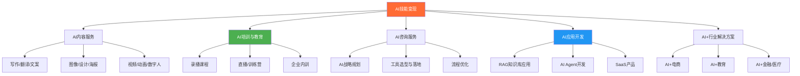
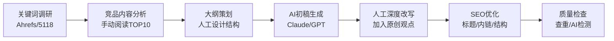
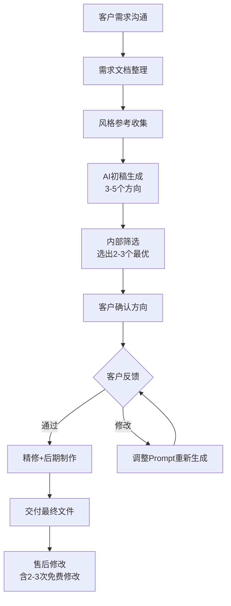
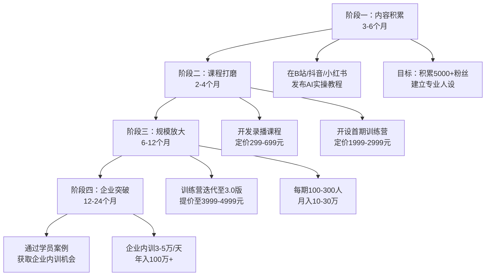
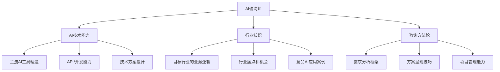
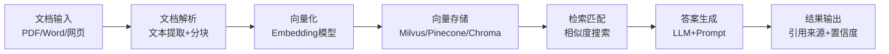

## 二、AI技能变现

AI技能变现是当前技术变现领域增速最快、天花板最高的方向。根据LinkedIn 2025年发布的《全球新兴职业报告》，AI相关岗位需求同比增长312%，而具备AI应用能力的自由职业者在Upwork上的平均时薪比传统开发者高出67%。这不是一个"即将到来"的趋势，而是正在发生的现实。

但"会用ChatGPT"和"能用AI变现"之间，隔着一整套方法论。会用工具只是起点——市场不缺"会用AI的人"，缺的是"能用AI解决特定问题、交付可衡量结果的人"。本节将从应用场景、培训变现、咨询服务、应用开发四大方向，系统拆解AI技能变现的完整路径，涵盖从零基础起步到年入百万的每一步操作细节。

### 2.1 AI技能变现全景图

在深入每个方向之前，先建立全局认知。AI技能变现的五条核心路径：



| 路径 | 启动门槛 | 收入天花板 | 可规模化程度 | 适合人群 |
|------|---------|-----------|-------------|---------|
| AI内容服务 | ★★☆☆☆ | ★★★☆☆ | ★★☆☆☆ | 有内容创作基础的人 |
| AI培训教育 | ★★★☆☆ | ★★★★★ | ★★★★☆ | 有教学能力和实战经验的人 |
| AI咨询服务 | ★★★★☆ | ★★★★★ | ★★★☆☆ | 有企业服务经验的资深从业者 |
| AI应用开发 | ★★★★☆ | ★★★★★ | ★★★★★ | 有编程基础的开发者 |
| AI+行业方案 | ★★★★★ | ★★★★★ | ★★★★☆ | 深耕特定行业的复合型人才 |

**关键认知**：这五条路径的收入上限差异巨大。AI内容服务本质上还是"卖时间"，月入2-5万是常见天花板；而AI应用开发（SaaS方向）和企业咨询可以做到月入10万+。选择路径时，不仅要看启动难度，更要看终局天花板。

**选择决策框架**：如果你还在犹豫从哪条路径切入，用这个三个问题快速决策：

1. **你有没有编程基础？** 有→优先AI应用开发，没有→跳到问题2
2. **你有没有某个行业的深度经验（3年以上）？** 有→优先AI咨询或AI+行业方案，没有→跳到问题3
3. **你有没有内容创作或教学经验？** 有→优先AI培训教育，没有→从AI内容服务起步，边做边学

不必纠结"最优路径"——任何一条路径走通了都能月入过万。先跑起来，再调整方向。

### 2.2 AI内容服务变现

AI内容服务是门槛最低、见效最快的变现方式。核心逻辑是：用AI工具将内容生产效率提升5-10倍，然后以传统价格交付，赚取效率差。

#### 2.2.1 AI写作与内容生成

AI写作不是"让AI替你写"，而是"用AI加速你的写作流程"。能变现的AI写作服务，核心竞争力在于**选题判断力、内容策划力和质量把控力**——这些是AI无法替代的。

**具体服务类型与定价参考：**

| 服务类型 | 单价范围 | AI提效倍数 | 月产能（全职） | 月收入潜力 |
|---------|---------|-----------|-------------|-----------|
| SEO文章（800-1500字） | 100-300元/篇 | 3-5倍 | 80-120篇 | 8000-36000元 |
| 深度长文（3000-5000字） | 500-2000元/篇 | 2-3倍 | 20-30篇 | 10000-60000元 |
| 技术文档/白皮书 | 2000-8000元/篇 | 2-4倍 | 5-10篇 | 10000-80000元 |
| 电商产品描述 | 10-50元/条 | 10-20倍 | 500-1000条 | 5000-50000元 |
| 小红书/公众号文案 | 200-800元/篇 | 3-5倍 | 30-60篇 | 6000-48000元 |
| 商业计划书/融资BP | 3000-15000元/份 | 2-3倍 | 3-8份 | 9000-120000元 |
| 学术论文润色/翻译 | 500-3000元/篇 | 3-5倍 | 10-20篇 | 5000-60000元 |
| 多语言本地化翻译 | 0.1-0.3元/字 | 5-8倍 | 50-100万字 | 5000-30000元 |

**实操工作流（以SEO文章为例）：**



**关键技巧：**

- **不要直接用AI输出交付**。AI生成的内容存在"正确但平庸"的问题，必须加入个人经验、独家数据、原创观点才能产生差异化价值。具体来说，每篇文章至少要加入：1个真实案例或数据点、1个反直觉的观点、2-3处个人经验总结
- **建立Prompt模板库**。针对不同内容类型（产品描述、技术博客、营销文案）开发标准化的Prompt模板，可以将效率再提升30%。一个好的Prompt模板应该包含：角色设定、输出格式、风格要求、字数范围、禁止事项
- **用AI做调研，用人类做判断**。让AI快速收集信息和生成框架，但最终的选题判断、观点提炼、风格把控必须由人完成
- **建立个人知识库**。将自己写过的优质内容、行业数据、客户反馈整理成结构化文档，在Prompt中引用这些素材，可以让AI输出更贴合你的风格和专业深度

**Prompt模板示例（SEO文章）：**

```text
## 角色
你是一位资深的[行业]内容专家，拥有10年从业经验。

## 任务
撰写一篇关于"[关键词]"的SEO优化文章。

## 要求
- 字数：1200-1500字
- 结构：H2标题3-5个，每个H2下包含H3子标题
- 关键词密度：主关键词出现3-5次，自然融入
- 开头：用一个数据或案例抓住读者注意力
- 结尾：包含明确的行动号召（CTA）
- 风格：专业但不学术，多用短句和列表

## 禁止
- 不要使用"在当今社会"、"众所周知"等废话开头
- 不要堆砌关键词
- 不要使用未经验证的数据

## 参考素材
[粘贴你的行业知识库片段或竞品文章要点]
```

**获客渠道详解：**

| 渠道 | 获客成本 | 客户质量 | 适合阶段 | 操作要点 |
|------|---------|---------|---------|---------|
| 猪八戒/一品威客 | 低（平台抽成10-20%） | 中低 | 起步期 | 积累好评，前5单可低价接 |
| 淘宝/闲鱼 | 低 | 低-中 | 起步期 | 用低价爆款引流，高价服务转化 |
| 小红书/知乎 | 中（需内容投入） | 高 | 成长期 | 持续输出行业干货，私信转化 |
| 微信公众号 | 中 | 高 | 成长期 | SEO长尾流量+私域沉淀 |
| 行业社群/论坛 | 低 | 极高 | 任何时候 | 先贡献价值，再展示服务 |
| 老客户转介绍 | 极低 | 极高 | 成熟期 | 设置推荐返佣机制 |

#### 2.2.2 AI图像与设计服务

AI图像生成工具（Midjourney、Stable Diffusion、DALL-E 3、Flux）的成熟，让设计服务的生产方式发生了根本变化。但"会用Midjourney"不等于"能提供设计服务"——客户要的是完整的视觉解决方案，不是一张好看的图。

**可变现的AI设计服务：**

| 服务 | 工具组合 | 定价范围 | 交付周期 | 客户来源 |
|------|---------|---------|---------|---------|
| 品牌Logo设计 | Midjourney+Illustrator | 500-5000元/套 | 2-5天 | 猪八戒、站酷 |
| 电商主图/详情页 | Midjourney+Photoshop | 50-300元/张 | 1-2天 | 淘宝服务市场、闲鱼 |
| 社交媒体配图 | Midjourney+Canva | 100-500元/组（10张） | 1天 | 小红书、朋友圈获客 |
| 绘本/插画 | Stable Diffusion+Procreate | 200-1000元/页 | 按页计 | 绘本工作室、出版社 |
| 建筑/室内设计效果图 | Stable Diffusion+ControlNet | 500-3000元/张 | 1-3天 | 装修公司、设计师 |
| 游戏原画/角色设计 | Midjourney+Photoshop | 1000-5000元/张 | 3-7天 | 游戏公司外包 |
| AI写真/证件照 | Stable Diffusion+ReActor | 50-200元/套 | 1小时 | 本地客户、小红书 |
| 产品3D渲染图 | Midjourney+ComfyUI | 200-1000元/张 | 1-2天 | 电商卖家、品牌方 |

**核心竞争力构建：**

1. **风格一致性**。AI生成的最大痛点是风格不统一。解决方案：使用固定的Seed值、建立风格LoRA模型、在Prompt中嵌入统一的风格描述词。实操建议：为每个客户建立专属的风格参数文档，包括固定的Prompt前缀、负面提示词、CFG Scale、采样器等参数，确保每次出图风格一致
2. **精确控制能力**。掌握ControlNet（姿态控制、边缘检测、深度图）和Inpainting（局部修改），才能满足商业设计对精确度的要求。具体来说，商业设计至少需要掌握：OpenPose（人物姿态控制）、Canny（边缘线条控制）、Depth（深度图控制）、Inpainting（局部替换修改）
3. **后期精修能力**。AI出图只是第一步，Photoshop/Illustrator的精修能力才是区分"AI爱好者"和"设计师"的分水岭。常见精修工作包括：修手/修脸、文字排版、色彩统一、多图合成、尺寸适配
4. **批量生产能力**。通过ComfyUI搭建工作流，实现参数化批量出图。一个成熟的ComfyUI工作流可以在1小时内产出50-100张风格统一的图片，这是接电商大单的基础

**定价策略**：不要按"AI生成一张图花了5分钟"来定价，要按"这张图能为客户创造多少价值"来定价。一张能让电商产品点击率提升20%的主图，收费500元是合理的——客户花500元换来的是每月多出数万元的销售额。

**AI设计接单的完整流程：**



#### 2.2.3 AI视频制作

AI视频工具（Runway Gen-3、Pika、可灵、Sora、Kling）正在快速成熟，但目前仍处于"辅助"阶段，无法完全替代传统视频制作。变现机会在于：用AI降低视频制作门槛，服务那些"请不起专业团队但需要视频"的中小客户。

**可变现的AI视频服务：**

| 服务类型 | 工具组合 | 定价范围 | 目标客户 |
|---------|---------|---------|---------|
| 产品展示短视频（15-60秒） | Runway+剪映 | 500-2000元/条 | 电商卖家、品牌方 |
| 数字人口播视频 | HeyGen/D-ID+剪映 | 200-800元/条 | 知识博主、企业宣传 |
| AI动画/MG动画 | Pika+After Effects | 1000-5000元/条 | 教育机构、企业 |
| 企业宣传片（AI辅助） | Runway+Premiere | 5000-20000元/条 | 中小企业 |
| 短视频批量生产 | 可灵+剪映模板 | 50-200元/条（批量价） | MCN机构、电商 |
| AI音乐MV | Sora/Suno+剪映 | 2000-8000元/条 | 独立音乐人、唱片公司 |
| 产品3D展示动画 | Tripo+Blender+剪映 | 500-3000元/条 | 电商品牌 |

**数字人服务**是当前AI视频中最具规模化潜力的方向。一套数字人视频的制作流程：

1. **形象采集**：客户提供3-5分钟正面视频素材（或使用平台预置形象）
2. **脚本撰写**：用AI根据客户需求生成口播脚本，人工审核调整
3. **视频生成**：通过HeyGen/D-ID生成数字人口播视频
4. **后期包装**：用剪映添加字幕、背景音乐、片头片尾
5. **交付审核**：客户确认后批量生成系列视频

单条数字人视频的制作成本趋近于零（平台月费200-500元可无限生成），但市场定价在200-800元/条，利润率极高。

**数字人服务的规模化玩法**：当积累了10个以上稳定客户后，可以考虑搭建"数字人代运营"服务——客户每月支付1000-3000元，你负责每周产出4-8条数字人视频，包括脚本撰写、视频生成、平台发布。这种模式将单次交易变成持续订阅，月收入稳定且可预测。

#### 2.2.4 AI翻译与本地化服务

AI翻译是一个被严重低估的变现方向。传统的翻译行业已经被AI彻底颠覆，但"AI翻译+人工校对"的模式反而创造了新的高价值服务。

**可变现的翻译服务类型：**

| 服务类型 | 工具组合 | 定价范围 | 目标客户 |
|---------|---------|---------|---------|
| 商务文档翻译 | DeepL+Claude+人工校对 | 0.15-0.3元/字 | 外贸企业、跨国公司 |
| 技术文档翻译 | GPT-4+术语库+人工校对 | 0.2-0.5元/字 | 科技公司、软件企业 |
| 网站/APP本地化 | AI翻译+ICU格式处理 | 0.1-0.2元/字 | 出海企业 |
| 视频字幕翻译 | Whisper+AI翻译+时间轴 | 50-200元/分钟 | 内容创作者、MCN |
| 学术论文翻译/润色 | Claude+学术术语库 | 500-3000元/篇 | 科研人员、留学生 |

**核心竞争力**：不是翻译本身（AI已经做得很好），而是**行业术语准确性**和**文化适配能力**。一个懂医学的AI翻译服务商，能在DeepL直译的基础上修正专业术语、调整表述习惯，这是纯AI无法做到的。

### 2.3 AI培训与教育变现

AI培训是当前变现效率最高的方向之一。原因很简单：企业对AI的认知焦虑远超其实际应用能力，愿意为"搞懂AI"支付高额费用。

#### 2.3.1 培训市场现状与机会

2024-2025年，中国AI培训市场呈现三个特征：

1. **企业端需求爆发**。据艾瑞咨询数据，2025年中国企业AI培训市场规模超过200亿元，同比增长180%。大中型企业几乎都在寻找"AI落地培训"供应商。企业培训的决策逻辑很清晰：管理层看到竞争对手在用AI→产生焦虑→寻找培训机构→只要课程看起来靠谱就愿意付费。这意味着你的课程"看起来专业"比"真的专业"更重要——当然，交付质量决定了复购和转介绍
2. **个人端认知觉醒**。"不学AI就会被淘汰"的焦虑驱动大量个人用户付费学习，但市场充斥低质量课程，高质量课程供不应求。个人学员的核心诉求是"学完能用"——他们不要理论，要实操；不要原理，要模板
3. **价格两极分化**。低价录播课（9.9-99元）已经严重内卷，但高价实战训练营（2000-10000元）和企业内训（5000-50000元/天）仍有大量空白

#### 2.3.2 五种培训形式详解

| 形式 | 定价区间 | 制作周期 | 交付方式 | 收入模型 | 适合阶段 |
|------|---------|---------|---------|---------|---------|
| 短视频/图文课 | 免费-99元 | 1-2周 | 抖音/B站/小红书 | 引流→高价课转化 | 起步期（积累粉丝） |
| 录播课程 | 99-999元 | 2-6周 | 知识星球/小鹅通/自建 | 一次制作多次销售 | 有一定影响力后 |
| 直播训练营 | 999-4999元 | 每期2-4周 | 腾讯会议/Zoom+社群 | 高客单+复购 | 口碑建立后 |
| 企业内训 | 5000-50000元/天 | 定制化 | 线下/线上 | 高客单+B端拓展 | 有企业资源后 |
| 1对1辅导 | 500-2000元/小时 | 按需 | 腾讯会议 | 时间换钱（过渡期） | 任何时候 |

**从0到年入百万的培训路径：**



#### 2.3.3 热门AI培训主题与课程设计

当前市场需求最旺盛的六大培训主题：

| 主题 | 目标受众 | 课程时长 | 参考定价 | 核心卖点 |
|------|---------|---------|---------|---------|
| ChatGPT/Claude高效办公 | 职场白领 | 6-12小时 | 199-499元 | 即学即用，效率翻倍 |
| AI辅助内容创作 | 自媒体/营销人员 | 10-20小时 | 299-999元 | 产出质量+速度双提升 |
| Midjourney/SD AI绘画 | 设计师/电商 | 10-20小时 | 399-999元 | 商业设计实战 |
| AI编程实战（Cursor/Copilot） | 开发者 | 15-30小时 | 499-1999元 | 开发效率革命 |
| AI Agent/工作流自动化 | 企业员工/管理者 | 8-16小时 | 999-2999元 | 业务流程自动化 |
| 企业AI战略与落地 | 企业管理层 | 1-2天 | 3-10万/天 | 定制化+行业案例 |

**课程设计的黄金公式**：

```text
高质量AI课程 = 真实痛点 × 实操演示 × 可复用模板 × 持续更新
```

具体来说：

- **真实痛点**：不要从"什么是AI"讲起，直接从"你工作中最头疼的3件事"切入。比如"高效办公"课程，第一课不是"ChatGPT是什么"，而是"如何用AI在10分钟内写出一封让领导满意的周报"
- **实操演示**：每节课必须有屏幕录制的实操演示，观众跟着做完就能用。理论讲解和实操演示的时间比例建议为3:7——学员付费买的是"会做"，不是"知道"
- **可复用模板**：提供Prompt模板、工作流模板、SOP文档，降低学员的上手门槛。模板的价值在于"即插即用"——学员不需要理解原理，只需要填入自己的场景就能用
- **持续更新**：AI工具迭代极快，课程必须季度更新，否则3个月就过时。建议在课程介绍中明确标注"最近更新日期"，并承诺"购买后免费更新1年"

**课程大纲设计模板（以"AI辅助内容创作"为例）：**

```text
模块一：AI写作基础（2小时）
  1.1 主流AI写作工具对比与选择
  1.2 写出高质量Prompt的5个原则
  1.3 实操：用AI完成一篇800字SEO文章

模块二：AI+公众号/博客（3小时）
  2.1 选题：用AI分析热点和用户需求
  2.2 大纲：用AI生成文章结构
  2.3 写作：AI初稿+人工精修的完整流程
  2.4 实操：从0到1完成一篇3000字深度长文

模块三：AI+小红书/短视频文案（2小时）
  3.1 平台算法与内容偏好分析
  3.2 AI生成爆款标题的公式
  3.3 实操：批量生成30条小红书文案

模块四：AI+营销文案（2小时）
  4.1 产品卖点提炼框架
  4.2 AI生成广告文案的方法论
  4.3 实操：为一个产品生成完整营销文案包

模块五：AI+翻译与本地化（1小时）
  5.1 AI翻译工具对比
  5.2 专业领域翻译的Prompt技巧
  5.3 实操：翻译一篇技术文档

附赠：50个Prompt模板+10个工作流SOP
```

#### 2.3.4 训练营运营实操

训练营是AI培训中利润率和口碑最好的形式。一个成功的训练营需要以下要素：

**运营SOP：**

| 环节 | 时间节点 | 关键动作 | 注意事项 |
|------|---------|---------|---------|
| 招生期 | 开营前2-3周 | 早鸟价+限时优惠+学员案例展示 | 制造稀缺感，设置截止日期 |
| 开营仪式 | 第1天 | 自我介绍+课程地图+学习约定 | 建立学习氛围和社群规范 |
| 核心教学 | 第2-14天 | 每日视频课+实操作业+答疑 | 作业必须有反馈，不能只布置不点评 |
| 项目实战 | 第15-21天 | 学员分组完成真实项目 | 项目成果是最好的口碑素材 |
| 结营仪式 | 最后1天 | 优秀作业展示+证书+复购优惠 | 收集学员评价，为下期招生蓄力 |
| 售后服务 | 结营后30天 | 社群持续运营+直播答疑 | 售后质量决定复购率和转介绍率 |

**定价心理学**：

- **锚定效应**：先展示企业内训价格（3-5万/天），再展示训练营价格（2999-4999元），让学员觉得"超值"
- **分期付款**：提供3-6期免息分期，降低决策门槛
- **早鸟优惠**：前50名报名享7折，制造紧迫感
- **老学员优惠**：复购8折，推荐新学员返现10-20%

**训练营社群运营的关键细节**：

社群不是发完课就完事了——社群活跃度直接决定了完课率和复购率。具体做法：

1. **每日打卡**：设计简单的打卡任务（如"用AI完成今天的一个工作任务，截图分享"），坚持打卡的学员获得结营加分
2. **作业互评**：让学员互相点评作业，既减轻你的工作量，又促进学员交流
3. **优秀案例展示**：每天在社群中展示1-2个学员的优秀作业，激发竞争意识
4. **问题收集**：每天晚上收集学员问题，第二天统一答疑（录屏），形成可复用的FAQ库

### 2.4 AI咨询服务变现

AI咨询服务是AI技能变现的最高形态——你卖的不是工具、不是课程，而是**判断力和决策能力**。

#### 2.4.1 咨询服务的三种层次

| 层次 | 服务内容 | 定价范围 | 交付物 | 客户类型 |
|------|---------|---------|--------|---------|
| 工具层 | 帮客户选择和部署AI工具 | 500-2000元/次 | 工具推荐报告+部署文档 | 个人/小团队 |
| 流程层 | 分析业务流程，设计AI自动化方案 | 5000-30000元/项目 | 流程优化方案+实施指导 | 中小企业 |
| 战略层 | 制定企业AI战略规划，指导落地执行 | 5-50万元/项目 | AI战略白皮书+路线图+培训 | 大型企业 |

#### 2.4.2 咨询能力的构建路径

AI咨询不是"懂AI工具"就能做的。一个合格的AI咨询师需要具备三方面能力：

**能力三角模型：**



**从0到AI咨询师的能力建设路径：**

1. **第1-3个月：工具精通期**。系统学习20+主流AI工具，涵盖文本、图像、视频、代码、自动化各领域。产出物：个人AI工具库和使用手册。不要只停留在"会用"层面——要深入了解每个工具的API能力、定价模型、局限性、适用场景
2. **第4-6个月：行业深耕期**。选择1-2个目标行业（如电商、教育、金融），深入研究该行业的AI应用场景和成功案例。产出物：行业AI应用案例集。具体做法：阅读该行业TOP50公司的AI应用报道、参加行业展会、访谈3-5位行业从业者
3. **第7-12个月：实战验证期**。通过免费/低价为3-5家企业提供AI咨询，积累实战经验和案例。产出物：成功案例集和方法论。关键：每次咨询都要形成标准化的交付文档，这是后续收费的"弹药库"
4. **第13个月起：商业变现期**。基于已有案例和方法论，正式开展付费咨询服务

#### 2.4.3 咨询项目的标准流程

一个完整的AI咨询项目通常包含以下阶段：

| 阶段 | 时长 | 核心工作 | 交付物 |
|------|------|---------|--------|
| 需求诊断 | 1-2天 | 深度访谈、业务流程梳理、痛点识别 | 需求诊断报告 |
| 方案设计 | 3-5天 | AI应用场景设计、工具选型、流程重设计 | AI落地方案书 |
| 试点实施 | 2-4周 | 搭建原型、小范围测试、数据验证 | 试点报告+优化建议 |
| 全面推广 | 4-8周 | 全员培训、流程上线、效果监控 | 培训材料+操作手册 |
| 持续优化 | 按月 | 定期复盘、效果追踪、方案迭代 | 月度优化报告 |

**需求诊断的核心问题清单**：

在需求诊断阶段，这10个问题必须搞清楚：

1. 你们目前哪些工作最耗时、最重复？
2. 这些工作如果效率提升50%，能节省多少人力成本？
3. 你们有没有尝试过用AI工具？效果如何？卡在哪里？
4. 你们的数据安全要求是什么级别？能用云端AI还是必须私有化部署？
5. 你们的IT基础设施是什么水平？有没有API对接能力？
6. 预算范围是多少？是一次性投入还是持续订阅？
7. 谁是项目的决策人？谁是最终用户？
8. 你们期望多长时间看到效果？
9. 有没有什么红线（不能碰的流程/数据）？
10. 你们竞争对手的AI应用情况你了解吗？

**关键成功因素**：

- **不要过度承诺AI的效果**。AI是工具，不是魔法。告诉客户"能提升30-50%效率"比"革命性改变"更可信。过度承诺→交付不足→客户失望→口碑崩塌，这是最常见的失败路径
- **从最容易见效的场景切入**。先用一个小场景证明AI的价值（比如用AI处理客服FAQ，效率提升3倍），再扩展到更多业务线。这叫"Quick Win"策略——用最小的成本建立信任
- **量化ROI**。每个咨询方案都要有明确的ROI计算："投入X万元，预计年节省Y万元/增加Z万元收入"。企业客户只看ROI，不看技术有多酷

#### 2.4.4 咨询服务的获客与定价

**获客渠道**：

| 渠道 | 适合阶段 | 获客成本 | 客户质量 | 操作要点 |
|------|---------|---------|---------|---------|
| 行业峰会/沙龙演讲 | 中后期 | 中（差旅+准备时间） | 极高 | 准备30分钟干货演讲+案例分享 |
| LinkedIn/脉脉 | 任何时候 | 低 | 高 | 持续输出AI落地案例和行业洞察 |
| 行业媒体专栏 | 中后期 | 低-中 | 高 | 在36氪、虎嗅等平台发表行业分析 |
| 老客户转介绍 | 成熟期 | 极低 | 极高 | 设置10-20%的返佣机制 |
| 合作伙伴推荐 | 中后期 | 中 | 高 | 与管理咨询公司、IT服务商建立合作关系 |
| 公开课/免费咨询 | 起步期 | 低-中 | 中 | 用免费价值建立信任，转化为付费客户 |

**咨询报价的三种模式**：

1. **按项目报价**：最常见，适合范围明确的项目。报价=预估工时×日薪×1.5-2倍（风险溢价）
2. **按天报价**：适合企业内训和现场咨询。个人咨询师日薪通常3000-10000元，知名专家15000-50000元
3. **按效果分成**：适合有明确可量化指标的项目（如"帮电商客户提升GMV"），收取基础服务费+增量部分的10-20%。风险高但收益上限也高

### 2.5 AI应用开发变现

AI应用开发是天花板最高、可扩展性最强的变现方向。核心逻辑是：将AI能力封装为产品，实现"写一次、卖无数次"的规模化收入。

#### 2.5.1 三大产品方向

| 方向 | 技术栈 | 启动成本 | 收入模型 | 月收入天花板 |
|------|--------|---------|---------|-------------|
| RAG知识库应用 | LangChain/LlamaIndex+向量数据库 | 低（API费用为主） | 按量/按月订阅 | 5-50万 |
| AI Agent/自动化 | Dify/Coze+API+工作流引擎 | 低-中 | 按任务/按月订阅 | 10-100万 |
| 垂直SaaS产品 | 全栈开发+AI API | 中-高 | 按用户/按月订阅 | 理论无上限 |

#### 2.5.2 RAG知识库应用

RAG（Retrieval-Augmented Generation，检索增强生成）是当前企业级AI应用中最成熟、需求最大的方向。简单来说，就是让AI能"读懂"企业内部文档，然后基于这些文档回答问题。

**典型应用场景：**

- **企业知识库问答**：员工用自然语言查询公司制度、产品手册、技术文档。一个中型企业（500人）每年因"找不到文档"浪费的人力成本约50-200万元，一个RAG知识库的年费通常只有2-10万元
- **客服智能助手**：基于产品文档自动回答客户常见问题，可替代60-80%的人工客服工作量
- **法律/医疗文档检索**：在海量专业文档中快速定位相关信息，替代传统的关键词搜索
- **个人知识管理**：将个人笔记、收藏、文档转化为可对话的知识库

**技术实现路径：**



**技术选型详解：**

| 组件 | 推荐方案 | 适合场景 | 成本参考 |
|------|---------|---------|---------|
| 文档解析 | Unstructured/LlamaParse | PDF/Word/PPT解析 | LlamaParse: $0.003/页 |
| 文本分块 | 递归字符分割(512-1024 tokens) | 通用场景 | 免费 |
| Embedding模型 | OpenAI text-embedding-3-small | 中英文通用 | $0.02/1M tokens |
| 向量数据库 | Chroma(小规模)/Milvus(大规模) | Chroma自托管免费，Milvus云版按量 | Milvus云: $65/月起 |
| LLM | GPT-4o/Claude Sonnet | 需要高质量回答 | GPT-4o: $2.5/1M input |
| 编排框架 | LangChain/LlamaIndex | LangChain生态大，LlamaIndex文档处理强 | 开源免费 |

**变现方式：**

- **定制开发**：为单个企业搭建知识库系统，收费2-10万元。包括需求分析、文档导入、系统搭建、员工培训
- **SaaS化**：将知识库应用做成标准化产品，按月订阅收费（99-999元/月/企业）。需要投入更多前期开发成本，但边际成本趋近于零
- **行业解决方案**：针对特定行业（法律、医疗、教育）开发垂直知识库，收费更高。垂直行业的壁垒在于行业术语理解和合规要求

**RAG应用的质量优化要点**：

RAG应用的质量直接决定客户续费率。以下是影响质量的6个关键因素：

1. **分块策略**：分块太大→检索不精确，分块太小→丢失上下文。建议从512 tokens开始，根据实际效果微调
2. **检索方式**：不要只用向量检索，混合检索（向量+关键词BM25）效果更好
3. **重排序（Reranking）**：在检索后加入重排序步骤（如Cohere Rerank），可以将准确率提升15-30%
4. **Prompt设计**：在Prompt中明确要求LLM"只基于提供的文档回答，如果文档中没有相关信息就说明不知道"，减少幻觉
5. **引用溯源**：每个回答都要标注来源文档和页码，增加可信度
6. **反馈机制**：让用户对回答评分，持续优化检索和生成质量

#### 2.5.3 AI Agent开发

AI Agent（智能体）是2025年AI应用开发中最热门的方向。不同于简单的"问答机器人"，Agent能够自主规划任务、调用工具、完成复杂工作流。

**Agent vs 传统Chatbot的区别：**

| 维度 | 传统Chatbot | AI Agent |
|------|------------|---------|
| 交互模式 | 一问一答 | 自主规划+多步执行 |
| 工具调用 | 无或有限 | 可调用任意API/工具 |
| 任务复杂度 | 单轮简单任务 | 多步骤复杂工作流 |
| 上下文处理 | 短期记忆 | 长期记忆+任务管理 |
| 典型应用 | FAQ客服 | 自动化运营助手 |

**可变现的Agent开发方向：**

1. **销售线索Agent**：自动从社交媒体/行业网站抓取潜在客户信息，进行初步筛选和分类，生成销售线索报告。一个销售线索Agent可以替代1-2个初级销售的工作量，月费2000-5000元对企业来说仍然很划算
2. **内容运营Agent**：自动监控热点、生成选题建议、撰写初稿、排期发布。适合MCN机构和自媒体团队
3. **数据分析Agent**：连接企业数据库，用自然语言查询数据、生成报表、发现异常。替代SQL查询+Excel分析的重复性工作
4. **招聘筛选Agent**：自动解析简历、匹配岗位要求、生成候选人评估报告。HR部门的刚需
5. **财务报销Agent**：自动审核报销单据、匹配公司制度、标记异常项。大中型企业的痛点
6. **客户服务Agent**：超越简单FAQ，能处理退换货、订单查询、投诉升级等复杂场景

**技术栈选择：**

| 平台 | 特点 | 适合场景 | 学习成本 |
|------|------|---------|---------|
| Dify | 开源、可视化编排、支持RAG | 快速搭建原型和简单应用 | ★★☆☆☆ |
| Coze（扣子） | 字节出品、生态丰富、中文友好 | 国内市场快速落地 | ★★☆☆☆ |
| LangChain | 灵活、生态大、社区活跃 | 复杂定制化开发 | ★★★★☆ |
| AutoGen | 微软出品、多Agent协作 | 多Agent复杂场景 | ★★★★☆ |
| CrewAI | 角色扮演、任务编排 | 团队协作类Agent | ★★★☆☆ |

**Agent开发的定价模型**：

Agent的定价比传统软件更灵活，常用三种模型：

| 定价模型 | 计算方式 | 适合场景 | 示例 |
|---------|---------|---------|------|
| 按任务计费 | 每次Agent执行任务收X元 | 任务频率不稳定的场景 | 简历筛选Agent: 5元/份 |
| 按月订阅 | 固定月费+超额部分按量 | 任务频率稳定的场景 | 客服Agent: 3000元/月+0.5元/次 |
| 按效果计费 | 按Agent创造的价值分成 | 有明确ROI的场景 | 销售线索Agent: 每条有效线索50元 |

#### 2.5.4 垂直SaaS产品开发

垂直SaaS是AI应用开发的终极形态——将AI能力封装为完整的行业解决方案，实现规模化收入。

**垂直SaaS的选品逻辑**：

不是所有行业都适合做AI SaaS。选择目标行业时，用这四个标准筛选：

1. **数据密集**：行业产生大量非结构化数据（文档、图片、音频），AI有发挥空间
2. **人力成本高**：行业的人力成本占比高（如法律、医疗、金融），AI替代人力的价值大
3. **数字化程度低**：行业的数字化程度不高（如建筑、农业、物流），竞争壁垒低
4. **付费意愿强**：行业的客户有明确的付费习惯和预算（如金融、医疗、教育）

**高潜力垂直SaaS方向**：

| 方向 | 目标客户 | 核心功能 | 参考定价 | 竞争格局 |
|------|---------|---------|---------|---------|
| AI法律助手 | 律所、企业法务 | 合同审查、案例检索、法律文书 | 500-5000元/月 | 竞争中等，合规壁垒高 |
| AI医疗辅助 | 医院、诊所 | 病历生成、影像辅助诊断 | 1000-10000元/月 | 监管严格，准入门槛高 |
| AI教育个性化 | 培训机构、学校 | 自适应学习、智能批改 | 50-500元/学生/月 | 竞争激烈，但需求巨大 |
| AI财务分析 | 中小企业 | 自动记账、报表分析、税务合规 | 300-3000元/月 | 刚需，复购率高 |
| AI电商运营 | 电商卖家 | 选品分析、文案生成、客服自动化 | 200-2000元/月 | 竞争激烈，但市场大 |
| AI建筑/工程 | 建筑公司、设计院 | 图纸审查、BIM辅助、安全监测 | 2000-20000元/月 | 蓝海市场，技术壁垒高 |

**从0到1搭建垂直SaaS的步骤**：

1. **验证需求**（1-2周）：找到3-5个目标客户，深度访谈，确认痛点真实存在且愿意付费
2. **搭建MVP**（4-8周）：用Dify/Coze+简单前端搭建最小可用产品，核心功能只做1-2个
3. **种子客户测试**（2-4周）：免费或低价提供给种子客户使用，收集反馈
4. **迭代优化**（持续）：根据反馈迭代产品，逐步增加功能
5. **规模化获客**：当产品稳定、有成功案例后，开始规模化推广

### 2.6 Prompt工程：被低估的独立变现方向

Prompt工程（Prompt Engineering）不仅仅是"写提示词"——它是一门系统性的技术能力，可以独立变现。很多企业需要的不是AI工具本身，而是"能让AI工具发挥最大价值的Prompt体系"。

#### 2.6.1 Prompt工程的变现方式

| 变现方式 | 定价范围 | 交付物 | 目标客户 |
|---------|---------|--------|---------|
| Prompt模板库销售 | 99-999元/套 | 分类整理的Prompt模板集 | 个人用户、小团队 |
| 企业Prompt体系搭建 | 5000-50000元 | 定制化Prompt库+使用培训 | 中大型企业 |
| Prompt优化咨询 | 500-2000元/次 | 优化后的Prompt+效果对比 | 任何AI使用者 |
| Prompt课程/培训 | 199-1999元 | 系统化的Prompt课程 | 个人/企业 |

#### 2.6.2 高价值Prompt的设计原则

一个能变现的Prompt应该具备以下特征：

1. **角色设定明确**：告诉AI它是什么角色（"你是一位资深的电商运营专家"），而不是直接提问
2. **任务描述具体**：用SMART原则描述任务（具体、可衡量、可实现、相关、有时限）
3. **输出格式规定**：明确指定输出的格式、字数、结构，减少后期修改工作量
4. **约束条件清晰**：列出"不要做什么"比"要做什么"更重要——禁止项能有效控制输出质量
5. **示例引导**：提供1-2个期望输出的示例（Few-shot），比长篇描述更有效
6. **迭代优化**：Prompt不是一次写好的，需要通过测试→评估→修改的循环持续优化

**Prompt模板的标准化格式**：

```markdown
## 元信息
- 版本：v2.1
- 适用模型：GPT-4o / Claude 3.5 Sonnet
- 最后更新：2025-06-15
- 适用场景：[具体场景描述]

## 角色
[角色设定]

## 任务
[任务描述]

## 输入
- 变量1：{{variable1}} — [说明]
- 变量2：{{variable2}} — [说明]

## 输出格式
[格式要求]

## 约束
- [禁止项1]
- [禁止项2]

## 示例
输入：[示例输入]
输出：[示例输出]
```

### 2.7 定价策略与商业模式

#### 2.7.1 AI服务定价的三个层次

| 定价模型 | 适用场景 | 计算方式 | 示例 |
|---------|---------|---------|------|
| 成本定价 | 内容服务、设计服务 | 成本 × 2-5倍 | AI生成+人工修改用时2小时，时薪200元，报价400-1000元 |
| 市场定价 | 培训课程、标准化服务 | 参考竞品定价 | 同类训练营定价2999元，我定价2699-3499元 |
| 价值定价 | 咨询服务、高价值方案 | 客户获得价值的10-30% | 方案帮客户年省100万，收费10-30万 |

**AI服务定价的特殊性**：AI大幅降低了生产成本，但不应该按成本定价。一个用AI在30分钟内完成的设计方案，如果用传统方式需要3天，你应该按"传统方式的价格打7折"来收费，而不是按"30分钟的人工成本"来收费。客户买的是结果，不是你的工时。

**报价话术模板**：

```text
"这个项目的报价是XX元。基于我们过往的案例，这类方案通常能帮客户
[具体效果，如'节省30%的人力成本'或'提升50%的内容产出效率']。
相比传统方式需要[传统方式的成本/时间]，我们的方案在保证同等质量的
前提下，帮您节省了[节省的具体金额/时间]。"
```

#### 2.7.2 四种商业模式对比

| 模式 | 收入特征 | 时间投入 | 可扩展性 | 风险 |
|------|---------|---------|---------|------|
| 项目制（按单收费） | 不稳定，有波峰波谷 | 高 | 低 | 客户集中风险 |
| 订阅制（按月收费） | 稳定，可预测 | 中 | 中 | 续费率风险 |
| 产品制（课程/SaaS） | 前期低，后期指数增长 | 前期高，后期低 | 高 | 产品市场匹配风险 |
| 平台制（撮合交易） | 佣金收入 | 低（运营为主） | 极高 | 供需平衡风险 |

**最优策略**：用项目制获取现金流和客户资源，同时开发产品化收入。短期靠项目活下来，长期靠产品实现财务自由。

**收入结构健康度检查**：

| 指标 | 健康 | 警告 | 危险 |
|------|------|------|------|
| 单一客户收入占比 | <30% | 30-50% | >50% |
| 产品化收入占比 | >50% | 30-50% | <30% |
| 月收入波动幅度 | <30% | 30-60% | >60% |
| 客户续费率 | >70% | 50-70% | <50% |

### 2.8 法律合规与风险管理

AI变现不仅是技术和商业问题，还涉及法律合规。忽视这一点可能导致严重的法律风险。

#### 2.8.1 AI生成内容的版权问题

**核心风险**：AI生成内容的版权归属目前在法律上仍存在争议。中国《著作权法》要求作品必须是"人类智力成果"，纯AI生成的内容可能不受版权保护。

**应对策略**：

1. **确保人工参与**：在AI生成的基础上进行实质性的人工修改和创意投入，确保内容包含足够的人类智力贡献
2. **合同约定**：在服务协议中明确约定"交付物包含人工创意成分"，避免版权纠纷
3. **工具选择**：优先使用明确授予商用许可的AI工具（如Midjourney付费版、Adobe Firefly）
4. **避免抄袭风险**：用AI生成的内容必须经过查重检查，确保不侵犯他人版权

#### 2.8.2 数据安全与隐私保护

**核心法规**：

| 法规 | 适用场景 | 核心要求 |
|------|---------|---------|
| 《个人信息保护法》 | 处理个人信息时 | 最小必要原则、知情同意、数据本地化 |
| 《生成式AI服务管理暂行办法》 | 提供AI生成服务时 | 内容审核、标识水印、用户协议 |
| 《数据安全法》 | 处理重要数据时 | 数据分级分类、安全评估 |

**实操建议**：

1. **数据隔离**：客户数据不要上传到公共AI平台，使用私有化部署或API方式处理敏感数据
2. **合同条款**：在服务协议中加入数据安全条款，明确数据使用范围、存储期限、删除义务
3. **水印标识**：AI生成的内容建议加入标识（如"本内容由AI辅助生成"），符合监管要求
4. **安全审计**：定期对AI系统进行安全审计，确保没有数据泄露风险

#### 2.8.3 服务合同的关键条款

无论提供哪种AI服务，合同中必须包含以下条款：

1. **服务范围**：明确界定服务内容和交付标准，避免范围蔓延
2. **知识产权**：约定交付物的知识产权归属（建议：客户付清全款后转移）
3. **修改次数**：明确免费修改次数和额外修改的收费标准
4. **保密条款**：承诺不泄露客户的商业机密和敏感数据
5. **免责声明**：AI工具可能存在错误，对AI输出的准确性做出合理免责
6. **付款条件**：建议50%预付+50%交付后支付，降低坏账风险

### 2.9 常见误区与避坑指南

#### 误区一：把"会用AI工具"当成核心竞争力

**现实**：AI工具的使用门槛正在快速降低。Midjourney V7已经比V1好用10倍，但使用难度反而更低。单纯"会用工具"的竞争力在6-12个月内就会被抹平。

**纠正**：核心竞争力应该是"用AI解决特定问题的能力"。不是"我会用Midjourney"，而是"我能用AI为电商品牌提升30%的视觉转化率"。构建竞争力的三个方向：**行业深度**（比客户更懂行业）、**解决方案能力**（能从问题到交付端到端解决）、**效率壁垒**（通过工具链和工作流把成本压到竞争对手无法复制的水平）。

#### 误区二：用AI直接生成内容交付客户

**现实**：AI生成的内容存在三个问题——同质化严重、缺乏原创观点、可能包含事实错误。直接交付AI输出，短期能赚钱，长期必然失去客户。

**纠正**：AI是效率工具，不是替代品。正确的流程是：AI生成70%的初稿→人工注入20%的原创内容→人工完成10%的质量把控。具体来说，每篇交付物至少要加入：个人经验或案例、独家数据或观点、针对客户需求的定制化调整。

#### 误区三：只做培训不实战

**现实**：AI培训市场最大的泡沫就是"没有实战经验的培训师"。教别人用AI，自己却从没用AI赚过除培训以外的钱。

**纠正**：先用AI做好一件事（比如用AI接设计单月入2万），再教别人做。实战经验是最好的课程素材，也是最好的信任背书。学员能分辨出"照本宣科"和"真刀真枪"的区别。

#### 误区四：追求技术先进性而非商业可行性

**现实**：很多技术人沉迷于"最新最酷的AI技术"，花大量时间学习新框架、新模型，却忽略了"客户到底愿意为什么买单"。

**纠正**：商业可行的技术才有价值。一个用ChatGPT API搭建的简单客服机器人（开发成本5000元），比一个用最新Agent框架搭建的复杂系统（开发成本5万元），更容易卖出去。技术选型的原则：**用最成熟的技术解决最痛的问题**。

#### 误区五：忽视数据安全与合规

**现实**：很多AI服务涉及客户敏感数据（商业机密、个人信息、财务数据），如果忽视数据安全，可能面临法律风险。

**纠正**：在服务协议中明确数据使用范围，使用私有化部署方案处理敏感数据，了解《个人信息保护法》和《生成式人工智能服务管理暂行办法》的相关要求。详见本章2.8节的法律合规部分。

#### 误区六：定价过低，陷入价格战

**现实**：很多AI服务新手因为"觉得自己只是用了AI"而大幅压低价格，最终陷入恶性竞争。

**纠正**：客户买的不是你的工时，而是你交付的结果。一个用AI在1小时完成的品牌设计方案，如果能帮客户提升品牌形象和销售额，收费5000元完全合理。定价的锚点永远是"客户获得的价值"，而不是"你花了多少时间"。

#### 误区七：单打独斗，不建团队

**现实**：AI变现初期一个人就够了，但当月收入超过2-3万时，个人产能会成为瓶颈。

**纠正**：在收入稳定后，尽快建立最小团队（1-2人）。你负责客户关系和核心交付，助手负责执行和运营。团队化后，产能可以翻倍，而你的时间可以释放到更高价值的工作上（获客、课程开发、产品研发）。

### 2.10 实操行动计划

#### 零基础起步：30天AI变现行动计划

| 天数 | 任务 | 产出 | 预计耗时 |
|------|------|------|---------|
| 第1-3天 | 系统学习3个主流AI工具（ChatGPT/Claude、Midjourney、Cursor） | 每个工具完成3个实操练习 | 每天3小时 |
| 第4-7天 | 确定变现方向（内容/培训/咨询/开发），做市场调研 | 变现方向决策+竞品分析文档 | 每天2小时 |
| 第8-14天 | 制作3-5个作品样本（AI文章/AI设计/AI视频/AI应用） | 作品集页面 | 每天3小时 |
| 第15-21天 | 注册1-2个服务平台，完善个人资料，发布服务 | 平台账号+服务页面 | 每天2小时 |
| 第22-25天 | 在社交媒体发布2-3篇AI实操内容，获取初始关注 | 2-3篇高质量内容 | 每天2小时 |
| 第26-30天 | 主动联系3-5个潜在客户，提供免费试用/低价首单 | 至少1个付费客户 | 每天2小时 |

**第1-3天的工具学习重点**：

不要平均分配时间。根据你选择的变现方向，重点突破对应的工具：

- **内容方向**：重点学Claude/GPT的Prompt技巧，掌握角色设定、Few-shot、Chain-of-Thought等高级用法
- **设计方向**：重点学Midjourney的参数控制（Seed、CFG、风格词），掌握ComfyUI基础工作流
- **开发方向**：重点学Cursor的AI辅助编程能力，掌握Dify/Coze的Agent搭建流程

#### 有经验进阶：从月入1万到月入5万的跃迁路径

| 阶段 | 时间 | 核心动作 | 收入目标 |
|------|------|---------|---------|
| 定位聚焦 | 第1-2个月 | 从"什么都做"到"专注1-2个细分方向" | 稳定在1-1.5万 |
| 产品化尝试 | 第3-4个月 | 将重复性工作模板化，开发首个付费课程/模板 | 提升到2-2.5万 |
| 品牌建设 | 第5-6个月 | 持续输出专业内容，建立行业影响力 | 提升到3-3.5万 |
| 渠道拓展 | 第7-8个月 | 从平台接单转向私域获客，客单价提升50% | 提升到4-5万 |
| 规模化 | 第9-12个月 | 培训/产品收入超过接单收入 | 稳定在5万+ |

**从月入5万到月入10万+的关键跃迁**：

月入5万到10万不是线性增长，而是需要一次结构性转变：

1. **从个人到团队**：招聘1-2名助手（可以是兼职），释放你的时间到高价值工作
2. **从服务到产品**：将最有价值的服务产品化（课程、SaaS、模板库），实现"睡后收入"
3. **从C端到B端**：企业客户的客单价是个人客户的10-100倍，但获客难度也相应增加
4. **从国内到出海**：海外市场（尤其是欧美市场）的AI服务定价是国内的3-5倍

### 2.11 AI变现的未来趋势

2025-2027年，AI技能变现将呈现以下趋势：

1. **从"卖工具使用"到"卖行业解决方案"**。单纯教别人用AI工具的空间会越来越小，能将AI与特定行业深度结合的人会越来越值钱。未来最有价值的AI服务提供者不是"最懂AI的人"，而是"最懂某个行业且能用AI解决问题的人"
2. **AI Agent成为核心产品形态**。能够开发、部署、维护AI Agent的开发者，将成为市场上最稀缺的人才。Agent不只是"更智能的Chatbot"，而是一种全新的软件形态——它能自主决策、调用工具、完成复杂任务
3. **多模态能力成为标配**。文本+图像+视频+音频的全栈AI能力，会成为AI服务提供者的基本要求。只会文本AI已经不够了——客户需要的是"全栈AI解决方案"
4. **本地化部署需求增长**。随着数据安全法规趋严，能提供私有化AI部署方案的服务商会获得更多企业客户。掌握Ollama、vLLM等本地化部署工具将成为加分项
5. **AI+硬件结合**。AI与IoT、机器人、智能硬件的结合，将创造全新的变现机会。这是一个尚处于早期的蓝海市场
6. **AI编程能力民主化**。Cursor、Copilot等AI编程工具让非程序员也能搭建应用，这意味着"AI应用开发"的门槛将进一步降低，但"高质量AI应用"的价值反而会提升

**一句话总结**：AI技能变现的本质不是"卖AI"，而是"用AI卖解决方案"。技术是手段，解决问题才是目的。找到你能解决的真实问题，用AI让你的解决方案更高效、更便宜、更可扩展——这就是AI时代最可靠的变现路径。
