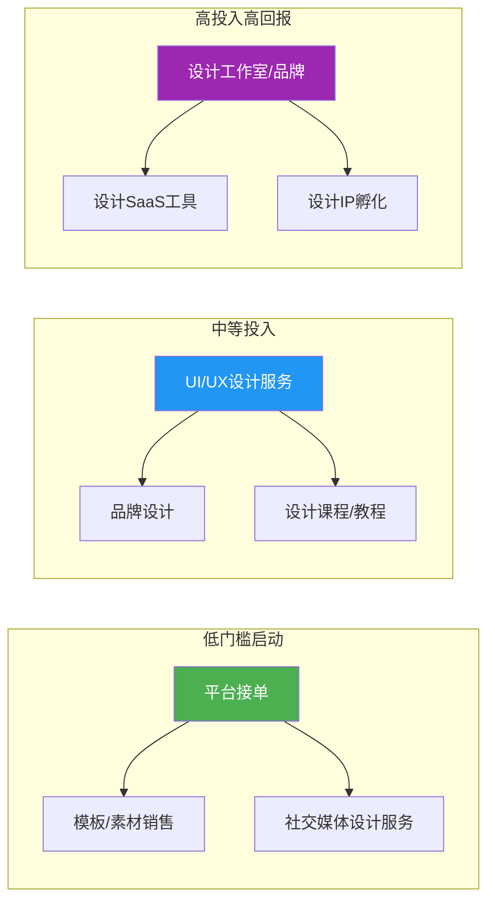
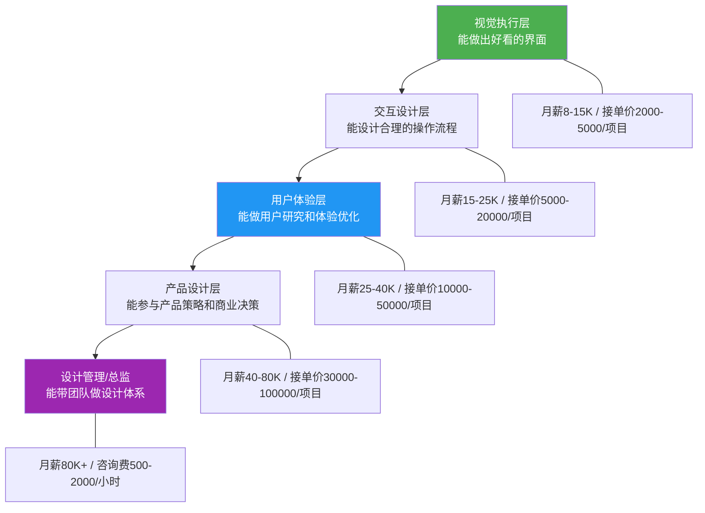
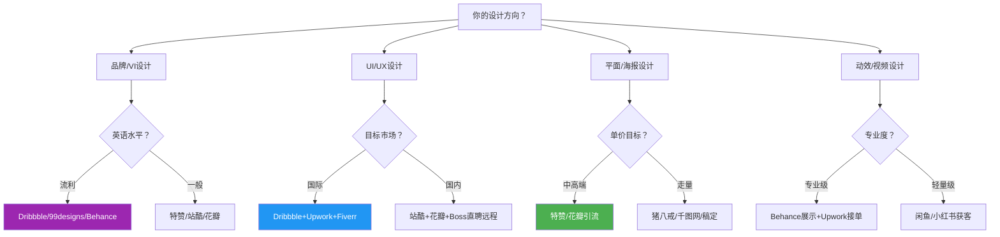
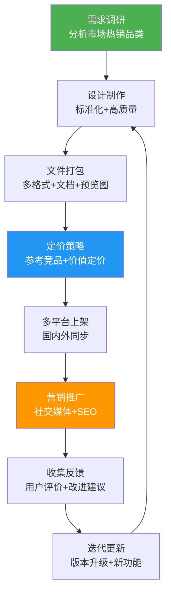
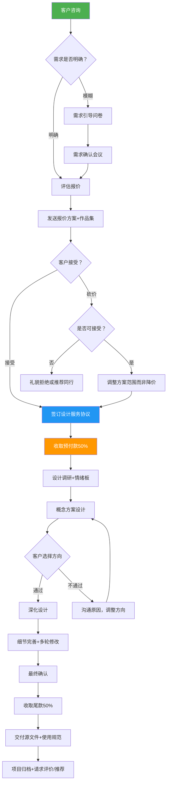
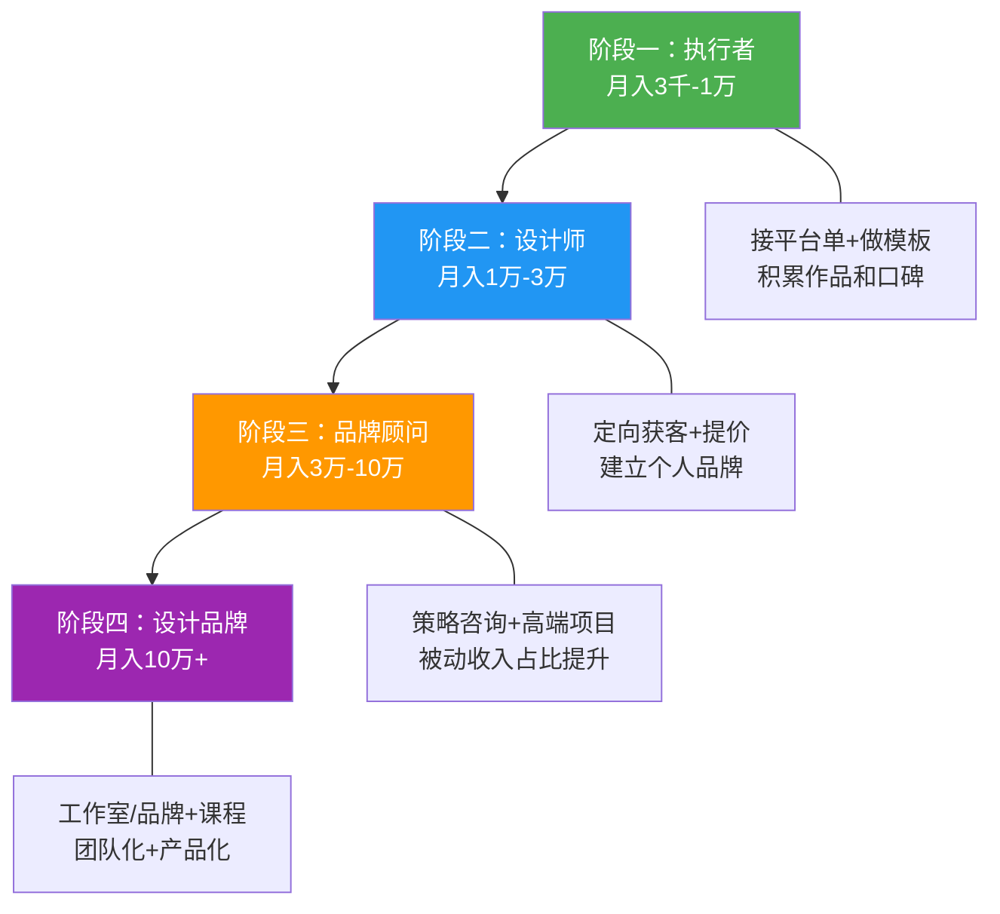
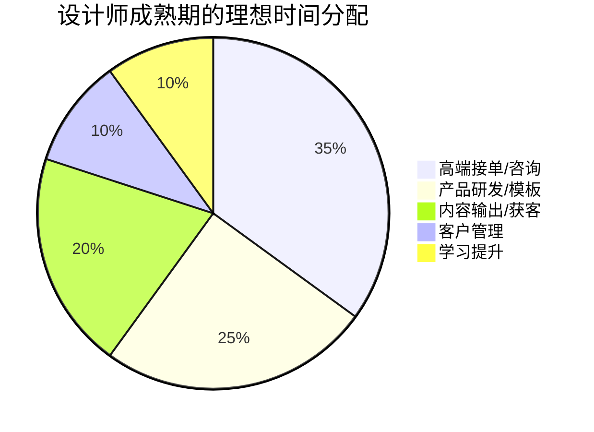

## 三、设计技能变现

设计是所有技能变现领域中**视觉冲击力最强、作品说服力最直接**的方向。与编程不同，设计作品可以"一眼看出水平"——客户不需要懂技术，也能直接感受到好坏。这意味着：好的设计师溢价极高，差的设计师很难生存。

但"设计做得好"和"设计能赚钱"之间，差着一整套商业方法论。很多设计能力出色的设计师月入不过万，而一些中等水平的设计师却能月入5万以上——差距不在设计本身，而在于变现策略、定价能力和商业思维。

本节将从平面设计、UI/UX设计、视频与动效设计、3D与空间设计四大方向，系统拆解设计技能变现的完整路径，包括平台选择、定价策略、获客方法、模板产品化、AI工具赋能，以及从接单到品牌的升级路线。

### 3.1 设计变现全景图

设计技能变现并非只有"接单做图"一条路。从时间自由度、收入天花板、启动难度三个维度来看，主要路径如下：



| 路径 | 启动难度 | 收入天花板 | 时间自由度 | 适合阶段 |
|------|---------|-----------|-----------|---------|
| 平台接单 | ★☆☆☆☆ | ★★★☆☆ | ★★☆☆☆ | 初期积累 |
| 模板/素材销售 | ★★☆☆☆ | ★★★★☆ | ★★★★★ | 被动收入起步 |
| UI/UX设计 | ★★★☆☆ | ★★★★☆ | ★★★☆☆ | 中期发展 |
| 品牌设计 | ★★★★☆ | ★★★★★ | ★★★☆☆ | 品牌溢价期 |
| 设计课程 | ★★★☆☆ | ★★★★★ | ★★★★☆ | 知识体系成熟后 |
| 设计工作室 | ★★★★★ | ★★★★★ | ★★☆☆☆ | 有团队后 |

**关键认知**：设计变现的六条路径不是互斥的。最优策略是"接单养活自己 + 模板积累被动收入 + 内容输出建立品牌"三线并行。接单是"打猎"，模板是"种田"，品牌是"修水渠"——三件事同时做，收入结构才健康。

### 3.2 设计细分领域与市场分析

#### 3.2.1 四大设计方向对比

不同设计方向的市场特征、定价区间、竞争格局差异巨大，选择方向时要结合自身能力和市场需求：

| 设计方向 | 市场需求 | 平均单价 | 竞争激烈度 | AI替代风险 | 推荐指数 |
|---------|---------|---------|-----------|-----------|---------|
| 平面设计（海报/物料） | ★★★★★ | 低-中 | ★★★★★ | 高 | ★★★☆☆ |
| UI/UX设计 | ★★★★★ | 中-高 | ★★★☆☆ | 中 | ★★★★★ |
| 品牌/VI设计 | ★★★★☆ | 高 | ★★★☆☆ | 低 | ★★★★★ |
| 视频/动效设计 | ★★★★★ | 中-高 | ★★★☆☆ | 中 | ★★★★☆ |
| 3D/空间设计 | ★★★★☆ | 高 | ★★☆☆☆ | 低 | ★★★★☆ |
| 插画/原画 | ★★★★☆ | 中-高 | ★★★★☆ | 高 | ★★★☆☆ |
| 游戏UI/美术 | ★★★☆☆ | 高 | ★★★☆☆ | 中 | ★★★☆☆ |
| PPT/演示设计 | ★★★★☆ | 低-中 | ★★★★★ | 高 | ★★☆☆☆ |

**核心判断逻辑**：

- **想快速起步赚钱**：平面设计、PPT设计——门槛低、需求量大、但单价也低，适合初期积累现金流
- **想长期发展高收入**：UI/UX设计、品牌设计——需要更强的专业能力，但客单价高、客户质量好、AI难以完全替代
- **想差异化竞争**：3D设计、动效设计——竞争相对少，技术壁垒高，但学习曲线陡峭
- **警惕高AI替代风险的方向**：简单的海报设计、基础排版、模板化设计——Midjourney和Canva已经能完成80%的工作，纯做这类工作的设计师会被迅速压缩利润空间

#### 3.2.2 平面设计市场深度分析

平面设计是设计变现的"入门级"方向，也是竞争最激烈、价格战最凶猛的领域。

**国内平面设计市场的三层分化**：

| 层级 | 服务内容 | 单价范围 | 客户类型 | 竞争格局 |
|------|---------|---------|---------|---------|
| 低端 | 套模板、简单排版 | 50-300元/张 | 淘宝卖家、小微企业 | 极度内卷，价格战 |
| 中端 | 原创设计、品牌物料 | 300-3000元/套 | 中小企业、创业公司 | 有竞争但可差异化 |
| 高端 | 品牌全案、策略设计 | 5000-50000元/项目 | 品牌企业、上市公司 | 竞争少，需要强案例 |

**关键认知**：低端平面设计市场正在被AI工具（Canva、稿定设计、美图秀秀企业版）快速侵蚀。如果你只会做简单的海报和Banner，必须尽快向上走——要么掌握品牌设计能力，要么转型UI/UX，要么拥抱AI成为"AI设计效率专家"。

#### 3.2.3 UI/UX设计市场深度分析

UI/UX设计是当前设计变现中**性价比最高**的方向——需求持续增长、单价较高、AI替代风险中等（AI能辅助但无法替代用户体验思维）。

**UI/UX设计的细分市场**：

| 细分方向 | 服务内容 | 单价范围 | 适合人群 |
|---------|---------|---------|---------|
| App UI设计 | 移动端界面设计+交互原型 | 5000-50000元/项目 | 有移动端设计经验的 |
| Web端设计 | 网站界面设计+响应式适配 | 3000-30000元/项目 | 有Web设计经验的 |
| B端产品设计 | 后台管理系统、SaaS产品界面 | 8000-80000元/项目 | 理解B端业务逻辑的 |
| 设计系统搭建 | 组件库、Design Token、规范文档 | 20000-100000元/项目 | 资深UI设计师 |
| 用户体验咨询 | 用户研究、可用性测试、体验优化 | 500-2000元/小时 | 有UX研究能力的 |

**UI设计师的能力进阶与收入对应**：



**为什么UI/UX设计的天花板比平面设计高？**因为UI/UX直接影响产品的用户留存率和转化率——一个按钮位置的优化可能带来10%的转化率提升，对客户来说价值远超设计费本身。当你能用数据证明设计价值时，定价就从"按工时"变成了"按价值"。

**B端设计的特殊机会**：B端（企业级）产品设计是当前需求增长最快但人才最稀缺的细分领域。原因在于：B端设计师不仅需要设计能力，还需要理解复杂的业务逻辑（如审批流程、权限管理、数据报表）。能讲清楚"为什么这个表格要支持批量操作"的设计师，比只会"把界面做好看"的设计师溢价2-3倍。入门路径：先学B端设计规范（Ant Design、Arco Design），再通过实际项目积累业务理解。

#### 3.2.4 品牌/VI设计市场分析

品牌设计是设计领域中**客单价最高、利润率最好**的方向。一套完整的品牌VI设计，收费通常在1万-10万元，顶级设计工作室的品牌全案可达50万-200万元。

**品牌设计的服务分层**：

| 服务层级 | 交付物 | 定价范围 | 工期 | 适合阶段 |
|---------|--------|---------|------|---------|
| Logo设计 | Logo+标准色+字体规范 | 2000-20000元 | 1-2周 | 入门 |
| 基础VI | Logo+名片+信纸+信封 | 5000-30000元 | 2-4周 | 成长 |
| 完整VI系统 | 品牌手册+全物料规范 | 20000-100000元 | 1-3月 | 成熟 |
| 品牌全案 | 策略+命名+VI+空间+包装 | 100000-500000元 | 3-6月 | 高端 |

**品牌设计的核心壁垒**：不是"画Logo的能力"，而是"理解品牌策略的能力"。客户花5万做一套VI，买的不是一个好看的Logo，而是一套能让消费者记住、信任、产生好感的视觉语言系统。能讲清楚"为什么用这个颜色、这个字体、这个图形语言"的设计师，比只会"画得好看"的设计师溢价3-5倍。

**品牌策略能力的培养路径**：

1. **学习品牌理论框架**：品牌金字塔（功能利益→情感利益→品牌个性）、品牌原型理论（12种品牌原型）、Aaker品牌资产模型。推荐书籍：《品牌战略》（戴维·阿克）、《超级符号就是超级创意》（华与华）
2. **拆解优秀品牌案例**：每周拆解1个品牌——分析它的Logo演变、色彩策略、字体选择、应用场景、与目标受众的连接方式。用PPT或文档记录，积累自己的"品牌案例库"
3. **从Logo设计切入品牌设计**：先做低价Logo单（2000-5000元），在每个项目中主动提供"品牌建议"（色彩搭配理由、字体选择逻辑），逐步积累品牌设计案例，自然过渡到品牌VI服务

#### 3.2.5 视频与动效设计市场分析

短视频和直播的爆发，让视频/动效设计需求持续暴涨。这是一个**供需缺口仍然较大**的领域。

**可变现的视频/动效服务**：

| 服务类型 | 工具 | 单价范围 | 交付周期 | 客户来源 |
|---------|------|---------|---------|---------|
| 短视频包装/片头片尾 | After Effects+剪映 | 500-3000元/条 | 1-3天 | 短视频博主、MCN |
| 产品宣传动画 | After Effects+C4D | 3000-20000元/条 | 1-2周 | 品牌方、电商 |
| UI动效设计 | Principle+Figma+Lottie | 2000-10000元/套 | 3-7天 | App/网站开发团队 |
| MG动画（信息图形动画） | After Effects+Illustrator | 500-3000元/分钟 | 1-2周/分钟 | 企业、教育机构 |
| 直播间视觉设计 | Photoshop+After Effects | 2000-10000元/套 | 2-5天 | 直播带货团队 |
| 品牌动态Logo | After Effects+Cinema 4D | 3000-15000元/个 | 3-7天 | 品牌方 |

**MG动画的定价逻辑**：通常按"分钟"计价，国内标准是500-3000元/分钟（取决于复杂度和风格）。一个2分钟的MG动画解说视频，制作周期约1-2周，收费2000-6000元。如果掌握了AE模板和脚本化工作流，实际工时可以压缩到2-3天。

**动效设计的高价值细分——Lottie动效**：Lottie是Airbnb开源的动效格式，可以直接在App和网页中播放矢量动画，文件体积极小（通常<100KB）。随着小程序和轻量级应用的普及，Lottie动效需求快速增长。掌握AEBodymovin插件（将AE动画导出为Lottie）的设计师，可以为开发团队提供"开箱即用"的动效方案，单价通常在1000-5000元/套。

### 3.3 设计接单平台深度解析

#### 3.3.1 国内设计接单平台

| 平台 | 抽成 | 主要品类 | 竞争激烈度 | 支付保障 | 适合人群 |
|------|------|---------|-----------|---------|---------|
| 猪八戒 | 约20% | 综合设计外包 | ★★★★★ | 平台托管 | 有团队的设计师 |
| 站酷海洛 | 约30% | 原创素材售卖 | ★★★☆☆ | 平台结算 | 有原创素材库的 |
| 千图网/包图网 | 约40-60% | 设计模板素材 | ★★★★☆ | 平台结算 | 高产的模板设计师 |
| 稿定设计 | 合作制 | 模板创作 | ★★★☆☆ | 平台结算 | 擅长模板化设计的 |
| 特赞 | 约15% | 品牌/包装/VI设计 | ★★☆☆☆ | 平台托管 | 中高端品牌设计师 |
| 花瓣/站酷接单 | 0% | 社区引流接私单 | ★★☆☆☆ | 自行协商 | 有作品集影响力的 |
| 闲鱼 | 0% | 小设计需求 | ★★☆☆☆ | 无保障 | 个人小项目 |
| 淘宝/拼多多 | 平台费 | 低价设计服务 | ★★★★★ | 平台托管 | 不推荐专业设计师 |

**国内设计平台的深层问题**：

- **价格战严重**：一个Logo在猪八戒上的报价经常被压到200-500元，而同样的工作量在特赞上可以报到3000-8000元。平台的选择直接决定了你的客户质量和定价空间。
- **版权纠纷频发**：部分平台对设计版权保护不力，你的原创设计可能被客户拿走后又找别人修改、甚至直接盗用。建议在交付前加水印，尾款结清后再交付源文件。
- **比稿陷阱**：很多平台采用"比稿制"——多个设计师提交方案，客户只选一个付费。这意味着你有70%以上的概率白干。**强烈建议拒绝无偿比稿**，除非是大品牌且有比稿费。
- **最佳策略**：用花瓣、站酷、Dribbble等社区平台展示作品→吸引客户主动联系→平台外成交（零抽成）。平台接单只作为初期积累评价的手段。

#### 3.3.2 国际设计接单平台

国际平台单价高、流程规范，但对英语能力和跨文化审美有要求：

| 平台 | 抽成 | 主要品类 | 竞争激烈度 | 支付保障 | 适合人群 |
|------|------|---------|-----------|---------|---------|
| 99designs | 平台定价 | Logo/品牌/包装 | ★★★★☆ | 平台托管 | 品牌设计师 |
| Dribbble | 0% | 设计社区引流 | ★★☆☆☆ | 自行协商 | 作品质量高的UI/品牌设计师 |
| Behance | 0% | 作品集展示引流 | ★★☆☆☆ | 自行协商 | 各方向设计师 |
| Fiverr | 20% | 按服务定价 | ★★★★☆ | 订单制 | 有明确服务包装的 |
| Upwork | 5-20% | 综合设计外包 | ★★★★☆ | Escrow托管 | 英语流利的设计师 |
| Toptal | 0% | 顶尖3%设计师 | ★☆☆☆☆ | 直接支付 | 资深设计师，通过率约3% |
| DesignCrowd | 平台定价 | 设计竞赛 | ★★★★☆ | 平台托管 | 愿意参与竞赛的 |

**Dribbble/Behance获客策略**：

Dribbble和Behance不是"接单平台"，而是**全球设计师的展示橱窗**。在这两个平台上有高质量作品的设计师，会收到大量来自全球的询盘。关键策略：

1. **保持更新频率**：每周至少发布1个作品，保持曝光
2. **风格一致性**：主页作品要有统一的视觉风格，让客户一看就知道你的"设计标签"
3. **加入项目描述**：不要只放图片，写清楚设计背景、解决的问题、使用的工具、设计过程
4. **主动互动**：关注和评论其他设计师的作品，增加自己的曝光度
5. **加入Dribbble Pro**：Pro会员可以设置"Hire Me"按钮，直接接单

**Fiverr设计服务包装技巧**：

Fiverr的逻辑是"你提供固定服务，客户按单购买"。不同于Upwork的"客户发需求，你来提案"，Fiverr需要你主动包装服务：

```text
Gig标题模板：I will [具体服务] for [目标客户] using [工具/方法]

示例：
✅ I will design a modern minimalist logo for your startup brand
✅ I will create a professional UI design for your mobile app in Figma
✅ I will design a complete brand identity package including logo and guidelines
❌ I will do design work (太模糊)
❌ I am a professional designer (自说自话，不是服务描述)
```

**定价分层**（Fiverr的Basic/Standard/Premium三档）：

```text
Logo设计示例：
Basic ($50): 2个Logo概念 + 1次修改 + PNG/JPG交付
Standard ($150): 5个Logo概念 + 3次修改 + 源文件 + 社交媒体套件    ← 推荐
Premium ($350): 全部功能 + 品牌色彩方案 + 名片设计 + 品牌指南 + 无限修改
```

#### 3.3.3 如何选择平台



**平台之外的高价值获客渠道**（往往比平台更优质）：

- **设计社区**：站酷、花瓣、Dribbble、Behance——发作品自然有人私信咨询
- **社交媒体**：小红书是设计获客的金矿——发设计案例/过程/对比，精准触达有设计需求的客户
- **技术社区**：V2EX、掘金——很多创业者在找设计师，质量通常比猪八戒高
- **线下活动**：创业沙龙、孵化器路演、行业展会——面对面建立的信任感远超线上
- **老客户转介绍**：这是最高质量的获客渠道，做好每一个项目，让客户主动帮你推荐

### 3.4 设计服务定价策略

#### 3.4.1 按项目类型参考报价

以下是2024-2025年国内市场参考价（国际平台通常高出2-4倍）：

| 设计类型 | 国内报价(元) | 国外报价(USD) | 典型工期 | 关键风险点 |
|----------|-------------|--------------|---------|-----------|
| Logo设计 | 1,000-20,000 | $200-5,000 | 3-10天 | 客户审美主观，修改多 |
| 品牌VI全套 | 5,000-100,000 | $1,000-20,000 | 2-8周 | 需求范围容易蔓延 |
| App UI设计 | 5,000-50,000 | $1,000-10,000 | 2-6周 | 需求变更频繁 |
| 网页设计 | 3,000-30,000 | $500-5,000 | 1-4周 | 审美偏好差异大 |
| 电商详情页 | 200-2,000/张 | $50-300/张 | 1-3天 | 批量压价严重 |
| 海报/Banner | 200-2,000/张 | $50-300/张 | 1-2天 | 低价竞争严重 |
| 包装设计 | 3,000-30,000 | $500-5,000 | 1-4周 | 印刷工艺知识要求 |
| 名片/物料 | 500-3,000/套 | $100-500/套 | 2-5天 | 客单价低 |
| PPT设计 | 50-500/页 | $10-100/页 | 按页 | AI替代风险高 |
| 插画/图标 | 500-5,000/张 | $100-1,000/张 | 1-5天 | 风格匹配度要求高 |
| MG动画 | 500-3,000/分钟 | $100-500/分钟 | 1-2周/分钟 | 制作周期长 |

**报价公式**：

```text
报价 = (预估工时 × 时薪) × 难度系数 × 修改系数 + 风险溢价
```

- **预估工时**：你认为需要的时间 × 1.5（永远留buffer，客户反馈和修改是不可预测的）
- **时薪**：期望年收入 ÷ 2000小时
- **难度系数**：熟悉的风格1.0，新风格1.3，全新领域1.5-2.0
- **修改系数**：包含2次修改1.0，包含无限修改1.3（建议不要承诺无限修改）
- **风险溢价**：需求模糊+20%，客户口碑差+30%，需要版权转让+15%

**报价实例**：一个创业公司的品牌VI设计（Logo+名片+信纸+社交媒体头像），你预估需要30小时，期望时薪300元，风格熟悉但客户描述比较模糊：

```text
报价 = (30 × 300) × 1.0 × 1.0 + 9000 × 20% = 9,000 + 1,800 = 10,800元
```

建议报价12,000元（向上取整，留谈判空间）。

#### 3.4.2 设计师时薪参考

| 水平 | 国内(元/小时) | 国外(USD/小时) | 对应能力 |
|------|-------------|---------------|---------|
| 初级(0-2年) | 80-200 | $15-40 | 能执行明确的设计需求 |
| 中级(2-5年) | 200-500 | $40-80 | 能独立完成设计方案 |
| 高级(5-8年) | 500-1,200 | $80-150 | 能做品牌策略和设计系统 |
| 专家(8年+) | 1,200+ | $150+ | 能定义行业设计标准 |

#### 3.4.3 报价心理学

**三档报价法**：给客户三个方案，大多数人会选择中间那个。基础版是锚点，高级版是利润来源：

```text
基础版(3,000元): Logo设计，2个概念方案，2次修改，PNG/JPG交付
标准版(8,000元): Logo+名片+信纸，5个概念方案，3次修改，全套源文件   ← 推荐
高级版(15,000元): 完整VI基础系统，品牌色彩指南+字体规范+应用规范+社交媒体套件
```

**不要按"修改次数"报价**：客户会理解为"你可以随便改到我满意为止"。应该按"解决方案"报价——你卖的是专业设计方案，不是"改图服务"。

**报价话术对比**：

```text
❌ "做个Logo大概3000块"（显得不专业）
❌ "你想多少钱做？"（丧失定价主动权）
✅ "根据您的品牌定位和行业特征，我建议采用标准版方案：包含Logo设计、名片和信纸，5个概念方案供选择，3轮修改优化，全套可编辑源文件交付。报价是8,000元，预计10个工作日完成。"
```

**先谈价值再谈价格**：

> "这套品牌VI上线后，统一的视觉形象会显著提升消费者对品牌的信任感。根据行业数据，专业的品牌视觉能让客户转化率提升15-25%。以您目前的业务量，这套投入预计2-3个月就能通过品牌溢价收回。"

**涨价策略**：设计师最容易犯的错误是"不敢涨价"。正确做法——每积累10个好评或每完成5个高质量项目，将基础报价上调15-20%。老客户按原价服务，新客户用新价格。如果客户流失率超过20%，说明涨太快；如果几乎没有流失，说明涨太慢。

### 3.5 模板与素材产品化——被动收入的核心

模板/素材销售是设计师实现"一次创作、持续收入"的最佳路径。不同于接单的线性收入模式，优质模板可以在数年内持续产生销售。

#### 3.5.1 模板类型与收入潜力

| 模板类型 | 制作周期 | 单价范围 | 月销量(中位数) | 月收入潜力 | 平台 |
|---------|---------|---------|-------------|-----------|------|
| UI Kit/Figma组件库 | 2-4周 | 30-200元 | 50-300份 | 1,500-60,000元 | UI8、Figma Community |
| 网页模板(HTML/CSS) | 1-3周 | 50-500元 | 20-100份 | 1,000-50,000元 | ThemeForest |
| PPT模板 | 3-7天 | 10-100元 | 100-1000份 | 1,000-100,000元 | 稻壳、演界网、SlidesCarnival |
| 名片/海报模板 | 1-3天 | 5-50元 | 50-500份 | 250-25,000元 | 千图网、包图网、Creative Market |
| 社交媒体模板包 | 3-7天 | 20-100元 | 30-200份 | 600-20,000元 | Canva模板市场、Creative Market |
| 字体设计 | 1-3月 | 50-500元 | 20-200份 | 1,000-100,000元 | 造字坊、MyFonts |
| 插画包/图标集 | 1-4周 | 10-100元 | 50-500份 | 500-50,000元 | Dribbble、Creative Market |
| After Effects模板 | 1-2周 | 50-300元 | 20-100份 | 1,000-30,000元 | Videohive、新CG儿 |
| 3D模型 | 1-4周 | 20-500元 | 10-100份 | 200-50,000元 | TurboSquid、Sketchfab |

**关键数据**：根据Creative Market 2024年报告，排名前10%的卖家月收入超过5,000美元，排名第一梯队的模板创作者年收入可达50万-200万元。这不是理论数据，而是真实的模板经济。

#### 3.5.2 模板产品化的完整流程



**模板制作的关键原则**：

1. **标准化程度越高越好**。模板的核心价值是"可复用"——组件化、图层命名规范、颜色样式统一、注释清晰。一个命名混乱的模板，再好看也卖不出去。
2. **预览图决定点击率**。花30%的时间在预览图上——多角度展示、真实场景Mockup、清晰的卖点标注。在模板市场上，用户是通过预览图决定是否点进来的。
3. **文档比模板更重要**。附带使用说明、修改指南、字体说明、素材来源说明。文档做得好的模板，用户评价更好，复购率更高。
4. **多格式交付**。同一套设计，导出为Figma、Sketch、PSD、AI等多种格式，覆盖不同工具用户，扩大受众面。

**模板产品化的进阶策略——建立模板矩阵**：不要只做一个模板，而是围绕一个主题做一个"模板矩阵"。例如做了一套餐饮品牌VI模板，后续可以扩展为：餐饮Logo模板包、餐饮菜单设计模板、餐饮外卖包装模板、餐饮社交媒体模板、餐饮PPT模板。同一个主题，5-10个产品，每个产品互相关联推荐，形成"一个客户买多个产品"的复购闭环。

#### 3.5.3 国内 vs 国际模板市场对比

| 维度 | 国内市场 | 国际市场 |
|------|---------|---------|
| 代表平台 | 千图网、包图网、稻壳、稿定 | ThemeForest、Creative Market、UI8、Gumroad |
| 客单价 | 低（5-100元） | 中高（$10-200） |
| 分成比例 | 平台拿40-60% | 平台拿30-50%（Gumroad仅10%） |
| 审核标准 | 较低 | 较高 |
| 版权保护 | 弱 | 强 |
| 推荐策略 | 走量+多平台铺 | 精品+社区营销 |

**Gumroad：设计师卖模板的最优平台**。Gumroad只收10%的手续费（比Creative Market的40%和ThemeForest的30%低得多），支持直接嵌入个人网站，支持邮件列表功能（可以积累自己的客户数据库）。如果你有能力做独立推广（通过Dribbble、Behance、社交媒体引流），Gumroad的利润率远高于其他平台。

**Figma Community的免费增值策略**：在Figma Community发布免费的基础版模板（如一套5个组件的UI Kit），吸引用户"Duplicate"和关注。然后在个人网站或Gumroad上销售"Pro版"（完整版，如包含50个组件+暗色主题+多套图标）。免费版是流量入口，Pro版是利润来源。

### 3.6 设计师接单全流程详解

#### 3.6.1 从接触到交付的完整流程



#### 3.6.2 需求确认清单

设计项目最大的风险是"审美差异"——客户脑海中的画面和你做出来的完全不同。需求确认是避免这个问题的唯一方法。

**品牌设计需求确认**：

- **品牌定位**：你的品牌是做什么的？核心产品/服务是什么？
- **目标受众**：你的客户是谁？（年龄、性别、收入、审美偏好）
- **品牌调性**：你希望品牌给人什么感觉？（专业/亲切/高端/年轻/科技/文艺）
- **竞品参考**：列出你喜欢的3个品牌和不喜欢的3个品牌，说明原因
- **色彩偏好**：有没有必须使用的颜色？有没有绝对不能用的颜色？
- **参考案例**：提供3-5个你喜欢的设计作品链接（不限于同行业）
- **应用场景**：设计主要用在哪些地方？（线上/线下/社交媒体/包装/空间）
- **交付格式**：需要哪些文件格式？源文件是否需要？

**UI设计需求确认**：

- **产品类型**：App/Web/小程序/桌面端？
- **核心功能**：产品的核心功能和主要用户流程
- **目标用户画像**：年龄、使用习惯、技术水平
- **竞品参考**：提供2-3个竞品App/网站链接
- **设计风格偏好**：极简/拟物/玻璃态/新拟态/其他
- **技术栈**：开发团队使用什么技术？（影响设计交付格式）
- **组件化要求**：是否需要搭建Design System？
- **适配要求**：需要支持哪些设备/分辨率？

**这份确认清单必须在正式报价前完成**。它既是你的工作依据，也是减少修改次数的关键。很多设计师怕"问太多客户会烦"，但实际上，80%的修改来源于前期沟通不足。

#### 3.6.3 设计项目里程碑管理

| 里程碑 | 交付内容 | 时间占比 | 付款触发 | 客户确认点 |
|--------|---------|---------|---------|-----------|
| M0: 需求确认 | 需求文档+情绪板(Moodboard) | 10% | 预付款50% | 确认需求文档和设计方向 |
| M1: 概念方案 | 2-3个设计方向概念稿 | 25% | — | 选择一个方向进入深化 |
| M2: 深化设计 | 完整设计方案+细节标注 | 35% | — | 确认整体方案 |
| M3: 修改完善 | 根据反馈修改优化 | 20% | — | 最终确认 |
| M4: 交付 | 源文件+多格式导出+使用规范 | 10% | 尾款50% | 验收文件完整性 |

**修改次数控制**：在合同中明确约定"包含N次修改，超出部分按XXX元/次收费"。建议默认包含3次修改——这是行业惯例，也是保护双方的合理次数。

**应对"无限修改"的话术**：

> "我们已经完成了3轮修改优化，目前的方案已经很好地满足了需求文档中确认的所有要求。如果您有新的想法或需求变更，我可以提供一个额外的修改方案，费用是X元。您看是保持现有方案，还是继续优化？"

#### 3.6.4 设计提案与评审技巧

**概念方案的呈现方式**：客户不是设计师，他们看不懂你的设计意图——你需要"翻译"给他们。

每个概念方案的呈现结构：

```text
概念一：【方向名称，如"极简商务"】
├── 设计理念：一句话说清核心思路
├── 色彩逻辑：为什么选这几个颜色，分别代表什么
├── 字体选择：为什么用这个字体，传递什么气质
├── 核心图形：图形的灵感来源和含义
├── 应用场景展示：Logo在名片、网站、社交媒体上的效果
└── 对比竞品：这个设计如何在同行中脱颖而出
```

**情绪板（Moodboard）的价值**：在动手设计前，先做一个情绪板——收集10-20张参考图（色彩、排版、材质、风格），让客户确认"方向对不对"。这一步花1-2小时，能节省后续80%的修改时间。工具推荐：Figma（直接拖拽参考图）、Milanote（专业情绪板工具）、Pinterest（收集参考素材）。

**设计评审中的沟通原则**：

1. **先听后说**：客户说"这里不太对"时，不要急于解释设计意图。先问"您觉得哪里不对？希望是什么感觉？"——很多时候客户说不清楚"要什么"，但能清楚说"不要什么"
2. **提供选择而非质问**：不要问"你想要什么颜色？"，而是提供2-3个配色方案让客户选择。选择题比填空题高效10倍
3. **用数据和逻辑支撑设计决策**：不要说"我觉得这个颜色更好"，而要说"这个蓝色在同行业中使用率只有12%，能有效差异化；同时蓝色在心理学上与信任感正相关，符合您的品牌定位"
4. **情绪管理**：面对"完全推翻重做"的反馈，先深呼吸，确认是"方向问题"还是"细节问题"。方向问题确实需要重做，但细节问题只需要调整

### 3.7 设计师个人品牌建设

#### 3.7.1 设计师品牌四件套

| 资产 | 作用 | 维护频率 | 推荐平台 |
|------|------|---------|---------|
| Dribbble/Behance作品集 | 全球曝光+专业背书 | 每周更新 | Dribbble、Behance |
| 设计博客/教程 | SEO获客+专业形象 | 每周1-2篇 | 站酷、知乎、Medium |
| 社交媒体 | 日常互动+品牌人格化 | 每天 | 小红书、即刻、Twitter/X |
| 个人作品集网站 | 客户转化+完整案例展示 | 每个项目更新 | 自定义域名 |

**作品集网站要点**：

- 首页3秒内传达"你是谁、你做什么风格的设计、为什么选你"
- 展示5-8个最佳案例，每个案例采用**讲故事**的方式呈现：
  - 客户背景和设计挑战 → 设计过程（调研/草图/迭代） → 最终方案 → 客户反馈/效果数据
- 放上客户评价和联系方式
- 移动端必须适配（很多客户用手机浏览作品集）
- 推荐工具：Framer、Webflow、Readymag，或直接用Figma制作+导出为网页

#### 3.7.2 全渠道获客策略

**小红书获客**：小红书是2024-2025年设计师获客性价比最高的平台之一。它的算法倾向于推荐视觉内容，而设计师天然擅长视觉表达。

**高效内容类型**：

| 内容类型 | 示例标题 | 互动率 | 获客转化 |
|---------|---------|--------|---------|
| 设计前后对比 | "帮餐饮品牌重新设计Logo，客户直呼太专业了" | ★★★★★ | ★★★★★ |
| 设计过程拆解 | "一个品牌VI从0到1的完整过程（附设计思路）" | ★★★★☆ | ★★★★☆ |
| 设计教程 | "3分钟学会用Figma做出高级感海报" | ★★★★★ | ★★★☆☆ |
| 行业干货 | "2025年品牌设计趋势：5个你必须知道的方向" | ★★★★☆ | ★★★☆☆ |
| 客户案例展示 | "为XX品牌做的全套VI，老板说超出预期" | ★★★★☆ | ★★★★★ |
| 设计日常 | "自由设计师的一天｜月入3万是什么体验" | ★★★★★ | ★★☆☆☆ |

**小红书关键技巧**：
- 每篇笔记必须有高质量的视觉素材（这本来就是设计师的强项）
- 标题包含关键词：Logo设计、品牌设计、VI设计、UI设计+行业关键词
- 在个人简介中写清楚服务内容和联系方式（如"品牌设计师｜合作私信"）
- 定期发布，保持算法推荐权重（建议每周3-5篇）
- 封面图是第一生产力——花10分钟做一个精致的封面，比花1小时写正文更重要
- 评论区互动要积极，回复每一条评论，同时在评论区补充设计细节引导私信

**知乎获客**：知乎适合长内容输出，通过回答设计相关问题建立专业形象。

- **高效回答方向**："如何设计一个好的Logo？""品牌VI设计多少钱？""设计师如何接私单？""Figma和Sketch哪个好？"——这些问题搜索量大，回答排名稳定
- **回答结构**：先给结论→展开分析→放作品佐证→引导私信咨询
- **长尾效应**：知乎回答的SEO效果极佳，一篇高质量回答可以在2-3年内持续带来客户询盘
- **专栏功能**：开设设计专栏，系统输出"品牌设计入门""Logo设计方法论"系列文章，沉淀为长期获客资产

**即刻/微信公众号获客**：

- **即刻**：设计师社区氛围最浓的中文平台。关注设计圈话题，发布设计作品和思考，与其他设计师互动。即刻用户质量高（大量产品经理、创业者），适合获取高端客户
- **微信公众号**：适合沉淀深度内容（设计案例复盘、行业分析），通过朋友圈转发获客。公众号的私域属性最强——关注你的用户就是你的潜在客户池
- **微信视频号**：短视频展示设计过程（加速播放+文字解说），适合触达30-50岁的企业主客户群体（这个年龄段的主要信息渠道是微信）

**Twitter/X获客**：面向国际市场时不可忽视。英文设计圈在Twitter上的活跃度极高。发布设计作品+设计思考，参与设计话题讨论（#DesignTwitter #UIDesign #BrandDesign），有机会获得全球客户。

**多平台内容复用策略**：一份设计案例，可以产出以下内容——

```text
一个品牌VI案例的内容拆解：
├── 小红书：3-5张精美图片+200字设计思路（视觉冲击力优先）
├── 知乎：2000字深度回答"品牌VI设计的完整流程"（SEO长尾）
├── 即刻：简短设计感悟+1-2张过程图（社区互动）
├── Behance/Dribbble：完整案例展示（国际曝光）
├── 公众号：深度复盘文章（私域沉淀）
└── 视频号：30秒设计过程加速视频（短视频流量）
```

一个案例，六个平台，内容形式不同但素材共用。这就是"做一次，传播六次"的效率。

### 3.8 AI时代的设计变现——威胁与机遇

#### 3.8.1 AI对设计行业的冲击

AI设计工具（Midjourney、Stable Diffusion、DALL-E 3、Canva AI、Adobe Firefly）正在重塑设计行业的格局。这不是"未来可能发生的事"，而是"正在发生的现实"。

**AI冲击程度评估**：

| 设计类型 | AI替代程度 | 时间窗口 | 应对策略 |
|---------|-----------|---------|---------|
| 简单海报/Banner | 80-90% | 已经发生 | 转型或拥抱AI |
| 电商主图/详情页 | 60-80% | 6-12个月 | 用AI提效，差异化服务 |
| Logo设计 | 40-60% | 12-24个月 | 强化品牌策略能力 |
| UI/UX设计 | 20-40% | 24-36个月 | 深化用户研究能力 |
| 品牌VI系统 | 10-20% | 36个月+ | 策略思维是壁垒 |
| 3D/空间设计 | 10-30% | 24个月+ | 技术壁垒保护 |
| 动效/视频设计 | 20-40% | 12-24个月 | 拥抱AI工具提升效率 |

#### 3.8.2 设计师的三条AI时代生存路径

**路径一：成为"AI+设计"效率专家**

用AI工具将设计效率提升3-10倍，然后以传统价格的70-80%收费——利润率反而更高。

```text
传统设计师：1个品牌Logo设计，耗时20小时，收费5000元，时薪250元
AI赋能设计师：同样Logo设计，耗时5小时（AI出概念+人工精修），收费4000元，时薪800元
```

核心技能组合：Midjourney/Stable Diffusion（概念生成）+ Photoshop/Illustrator（精修）+ 品牌策略（客户沟通）

**路径二：向上走——从"做设计"到"做品牌策略"**

AI能生成好看的图片，但不能理解品牌战略、用户心理、市场定位。当你的核心价值从"画图"变成"帮客户做出正确的品牌决策"时，AI反而是你的效率工具。

- 品牌策略咨询：5000-50000元/项目
- 品牌全案（策略+设计+落地指导）：30000-200000元/项目
- 品牌设计培训/课程：1000-5000元/人

**路径三：教别人用AI做设计**

AI设计培训是当前最热门的培训方向之一。能教会别人"用Midjourney做商业设计"的设计师，收入远超单纯做设计。

| 培训形式 | 定价 | 目标受众 |
|---------|------|---------|
| AI设计入门课（录播） | 99-299元 | 设计新手、运营人员 |
| AI商业设计实战（训练营） | 999-2999元 | 设计师、电商从业者 |
| 企业AI设计效率培训 | 5000-20000元/天 | 设计团队、市场部门 |

#### 3.8.3 AI设计工具变现的具体服务

| 服务 | 工具组合 | 定价范围 | 交付周期 | 客户来源 |
|------|---------|---------|---------|---------|
| AI品牌Logo设计 | Midjourney+Illustrator | 500-5000元/套 | 2-5天 | 猪八戒、站酷、小红书 |
| AI电商主图/详情页 | Midjourney+Photoshop | 50-300元/张 | 1-2天 | 淘宝服务市场、闲鱼 |
| AI社交媒体配图 | Midjourney+Canva | 100-500元/组(10张) | 1天 | 小红书、朋友圈获客 |
| AI绘本/插画 | Stable Diffusion+Procreate | 200-1000元/页 | 按页计 | 绘本工作室、出版社 |
| AI建筑/室内效果图 | SD+ControlNet | 500-3000元/张 | 1-3天 | 装修公司、设计师 |
| AI产品概念图 | Midjourney+Keyshot | 300-2000元/张 | 1-2天 | 产品经理、创业公司 |

#### 3.8.4 AI设计工作流实操

**Midjourney商业设计工作流**：

```text
Step 1: 需求分析 → 确定关键词和风格方向
Step 2: Prompt工程 → 构建结构化Prompt
        格式: [主体] + [风格] + [细节] + [质量] + [参数]
        示例: "minimalist logo design for organic food brand, clean lines, 
               earthy colors, vector style --v 6 --ar 1:1 --stylize 200"
Step 3: 批量生成 → 生成20-50张候选图
Step 4: 筛选精修 → 选出3-5张最佳，导入Photoshop精修
Step 5: 矢量化 → 用Illustrator/Image Trace转矢量
Step 6: 标准化 → 建立色彩规范、字体搭配、应用规范
Step 7: 交付 → 多格式导出+品牌规范文档
```

**Stable Diffusion + ControlNet精确控制工作流**：

Stable Diffusion的最大优势是"可精确控制"——通过ControlNet插件，你可以控制生成图的构图、姿态、边缘、深度，这是Midjourney做不到的。

| ControlNet模型 | 控制内容 | 设计应用场景 |
|---------------|---------|-------------|
| Canny | 边缘检测 | 保持产品轮廓不变，替换背景/材质 |
| OpenPose | 人体姿态 | 服装设计、人物插画 |
| Depth | 深度图 | 室内设计、场景合成 |
| Scribble | 手绘草图 | 从草图生成精细设计稿 |
| Reference | 风格参考 | 保持风格一致性 |
| IP-Adapter | 图像融合 | 品牌元素嵌入场景 |

**ComfyUI自动化设计流程**：对于需要批量产出的设计任务（如电商主图批量制作、社交媒体配图批量生成），ComfyUI的节点化工作流是效率利器。搭建一个"品牌风格+产品图+文案→成品图"的自动化流程，一次搭建，持续使用。学习路径：先掌握基础节点（KSampler、VAE Decode、ControlNet），再学习高级节点（LoRA加载、IP-Adapter、批量处理）。

**AI设计服务的核心竞争力**：

1. **风格一致性**：AI生成的最大痛点是风格不统一。解决方案——使用固定的Seed值、建立风格LoRA模型、在Prompt中嵌入统一的风格描述词
2. **精确控制能力**：掌握ControlNet（姿态控制、边缘检测、深度图）和Inpainting（局部修改），才能满足商业设计对精确度的要求
3. **后期精修能力**：AI出图只是第一步，Photoshop/Illustrator的精修能力才是区分"AI爱好者"和"设计师"的分水岭

### 3.9 从接单到品牌的升级路径

#### 3.9.1 设计师成长四阶段



#### 3.9.2 各阶段的关键动作

**阶段一：执行者（0-6个月）**

- 核心目标：积累10+高质量作品，获得5+五星评价
- 主要动作：平台接单（低价切入）+ 制作模板素材 + 社交媒体展示
- 收入来源：90%接单 + 10%模板
- 关键指标：好评率、作品集完成度、客户复购率

**阶段二：设计师（6-18个月）**

- 核心目标：月收入稳定在1-3万，建立个人品牌知名度
- 主要动作：提高客单价 + 筛选优质客户 + 小红书/站酷持续输出
- 收入来源：70%接单 + 20%模板 + 10%内容
- 关键指标：客单价增长率、口碑推荐占比、社交媒体粉丝增长

**阶段三：品牌顾问（18-36个月）**

- 核心目标：月收入3-10万，被动收入占比提升到30%+
- 主要动作：品牌策略咨询 + 高端项目 + 设计课程/教程
- 收入来源：40%高端接单 + 30%被动收入（模板+课程）+ 30%咨询
- 关键指标：被动收入占比、咨询客单价、品牌搜索量

**阶段四：设计品牌（36个月+）**

- 核心目标：月收入10万+，团队化运营
- 主要动作：组建工作室 + 设计SaaS/工具 + 企业培训
- 收入来源：团队项目收入 + 产品收入 + 培训收入
- 关键指标：团队人效、MRR(月经常性收入)、品牌影响力

#### 3.9.3 产品化时间分配建议



**早期（0-1年）**：80%接单 + 10%产品 + 10%学习。用接单养活自己，同时积累产品素材。

**中期（1-3年）**：50%接单 + 30%产品 + 20%内容+学习。模板和教程开始产生被动收入。

**成熟期（3年+）**：35%接单/咨询 + 25%产品 + 20%内容 + 10%客户管理 + 10%学习。被动收入占比逐步提升。

### 3.10 设计师财务管理与税务

#### 3.10.1 收入结构优化

| 收入类型 | 税率(国内) | 优化方式 |
|---------|-----------|---------|
| 劳务报酬 | 20%-40% | 预扣，年度汇算可能退税 |
| 个体工商户 | 5%-35% | 注册个体户，享受小规模纳税人优惠 |
| 个人独资企业 | 5%-35% | 核定征收，综合税率可降至3%-5% |
| 版权/稿酬 | 20%（减征30%） | 模板/素材销售收入可适用 |

**实操建议**：
- 月收入超过2万时，建议注册个体工商户，可以享受小规模纳税人增值税免征政策（月收入10万以内免征）
- 保留所有项目相关的发票和支出凭证（电脑、显示器、设计软件订阅、字体授权、素材购买等），这些都可以作为成本抵扣
- 设计软件订阅费用（Figma $15/月、Adobe CC $55/月、Sketch $10/月）是合法的经营成本

#### 3.10.2 版权保护与风险管理

**设计师的版权保护要点**：

1. **合同中明确版权归属**：默认方案是"尾款付清后版权转让给客户"。如果客户要求"买断版权"（含未来所有使用权），报价应上浮30-50%
2. **保留署名权**：即使版权转让，也可以在合同中约定"设计师有权在作品集中展示该作品"
3. **素材版权合规**：使用的字体、图片、图标必须有合法授权。商用字体侵权赔偿通常在5000-50000元/字体
4. **AI生成内容的版权**：2024年起，纯AI生成的图像在多数法域不享有版权保护。但"AI辅助+人工设计"的作品可以主张版权。在交付时注明"AI辅助设计+人工创作"

**字体版权避坑**：

| 字体 | 是否免费商用 | 替代方案 |
|------|------------|---------|
| 微软雅黑 | 否（Windows预装，不可商用） | 思源黑体/阿里巴巴普惠体 |
| 方正系列 | 否（需购买授权） | 思源宋体/阿里巴巴普惠体 |
| 思源黑体/宋体 | 是（Google+Adobe开源） | — |
| 阿里巴巴普惠体 | 是 | — |
| OPPO Sans | 是 | — |
| MiSans | 是 | — |

**图片素材版权避坑**：

| 来源 | 能否商用 | 风险 |
|------|---------|------|
| 百度图片搜索 | 大部分不能 | 高风险，侵权赔偿常见 |
| Unsplash/Pexels | 可以（CC0协议） | 低风险，但需注意肖像权 |
| 花瓣/站酷图片 | 大部分不能 | 高风险，需联系原作者授权 |
| Adobe Stock/视觉中国 | 需购买授权 | 付费后低风险 |
| 自己拍摄/AI生成 | 可以 | 最安全，但AI图片版权有争议 |

**设计师合同模板核心条款**：

```text
1. 服务范围：明确列出所有交付物（含格式、数量、规格）
2. 项目周期：各里程碑的具体时间节点
3. 付款方式：50%预付款 + 50%尾款（尾款在最终确认后支付）
4. 修改条款：包含N次修改，超出部分按XX元/次计费
5. 版权归属：尾款付清后，设计成果的著作权转让给甲方
6. 署名权：乙方有权在个人作品集中展示该作品
7. 保密条款：双方对项目信息保密
8. 延期条款：因甲方原因导致的延期，乙方不承担违约责任
9. 终止条款：项目中途终止的费用结算方式（已完成部分按比例支付）
```

推荐合同工具：国内可用"法大大"电子合同平台（具备法律效力），国际可用HelloSign或DocuSign。

### 3.11 高频踩坑与避坑指南

#### 3.11.1 设计师接单十大陷阱

| 陷阱 | 表现 | 后果 | 应对方法 |
|------|------|------|---------|
| 无偿比稿 | "你先出个方案看看" | 白干概率70%+ | 坚持收预付款，或收比稿费 |
| 无限修改 | "再改改颜色/字体/排版" | 时间被磨光 | 合同约定3次修改 |
| 需求蔓延 | "顺便做个海报/名片/H5" | 利润消失 | 合同明确范围，新增另报价 |
| 尾款难收 | "我不满意，不付尾款" | 拿不到辛苦钱 | 预付50%+分阶段交付 |
| 审美绑架 | "我老婆/老板觉得不好看" | 陷入主观修改循环 | 需求确认阶段锁定参考风格 |
| 版权纠纷 | 客户拿走源文件不付尾款 | 经济和法律风险 | 尾款清后才交源文件 |
| 中间商压价 | 设计公司外包给你的价格极低 | 利润被压缩 | 直接获客，减少中间层 |
| 字体侵权 | 使用未授权商用字体 | 赔偿5000-50000元 | 只用免费商用字体 |
| AI替代焦虑 | "AI都能做了，还找你干嘛" | 被压价 | 强调策略能力+人工精修价值 |
| 倦怠期 | 连续接单没有休息 | 创意枯竭，质量下降 | 规划休息，控制接单量 |

#### 3.11.2 应对"无偿比稿"的话术

当客户说"你先出个方案，我们看看再决定"时：

> "非常感谢您的信任。不过设计不是标准化产品，每个方案都凝聚了大量的创意和思考。为了对每一位客户负责，我采用收费提案模式：收取少量提案费（通常是总费用的10-20%），提供2-3个设计方向的概念方案。如果最终合作，提案费抵扣项目费用；如果不合作，提案费作为设计劳务补偿。这样既保障了您的利益（看到真实方案再决定），也尊重了设计师的劳动。您觉得如何？"

#### 3.11.3 应对"AI都能做"的话术

当客户说"现在AI都能做设计了，为什么还这么贵"时：

> "AI确实是很好的设计工具，我自己也在用。但AI生成的是'素材'，不是'设计方案'。品牌设计需要理解您的业务逻辑、目标受众和市场定位，这些AI无法判断。而且商业设计需要精确的色彩规范、字体授权、多场景适配和印刷工艺把控——这些都需要专业的设计能力。就像AI能写文章，但企业宣传文案依然需要专业文案策划一样。我提供的是完整的品牌视觉解决方案，不只是'一张好看的图'。"

#### 3.11.4 设计师常见心态问题

| 心态问题 | 表现 | 纠正方法 |
|---------|------|---------|
| "我的作品不够好" | 低估自己，不敢报价 | 对比同价位竞品，你的水平可能已经高于市场平均 |
| "客户说贵就是贵" | 主动降价，利润消失 | 不是所有客户都是你的客户，拒绝比接受更重要 |
| "改一下也不费事" | 免费加需求，时间被吞噬 | 每次"小改动"累计起来是巨大的时间成本 |
| "我应该什么都会" | 接不擅长的项目，交付质量差 | 专注2-3个细分方向，不擅长的推荐给同行（赚转介绍费） |
| "再等等就准备好了" | 永远在准备，不敢开始 | 完成比完美重要，先发布再迭代 |

### 3.12 设计师项目管理与协作工具

#### 3.12.1 设计项目管理工具推荐

| 工具类型 | 推荐工具 | 费用 | 核心功能 | 适用场景 |
|---------|---------|------|---------|---------|
| 项目管理 | Notion | 免费/付费 | 需求文档、进度看板、客户沟通 | 设计项目全流程管理 |
| 时间追踪 | Toggl Track | 免费/付费 | 计时、报告、项目成本分析 | 了解真实工时，优化报价 |
| 客户协作 | Figma | 免费/12美元/月 | 实时协作、评论、原型 | UI设计项目的客户评审 |
| 文件交付 | 百度网盘/Google Drive | 免费/付费 | 文件共享、版本管理 | 设计源文件交付 |
| 发票管理 | 随手记/挖财 | 免费 | 记账、发票、报表 | 收支记录和税务申报 |
| 合同签署 | 法大大 | 付费 | 电子合同、法律效力 | 远程客户合同签署 |

**时间追踪的重要性**：很多设计师不知道自己的"真实时薪"。用Toggl记录每个项目的时间，3个月后你就能知道：哪种类型的设计项目时薪最高，哪个客户最消耗时间，你的报价是否合理。数据驱动的定价，远比"感觉"准确。

#### 3.12.2 外包与协作模式

当你的接单量超过个人产能时，有三种扩展方式：

| 模式 | 适合阶段 | 优势 | 风险 | 利润分配 |
|------|---------|------|------|---------|
| 外包分包 | 月入2-5万 | 灵活，零固定成本 | 质量不稳定 | 你拿40-60%，外包拿40-60% |
| 设计助理 | 月入5-10万 | 可控质量，培养忠诚度 | 固定成本，管理开销 | 助理月薪5000-10000，你拿差价 |
| 设计工作室 | 月入10万+ | 规模化，品牌化 | 管理复杂，现金流压力 | 团队项目利润的30-50% |

**外包协作的关键原则**：

1. **核心设计自己做，辅助执行外包**：品牌策略、概念设计、客户沟通必须自己把控，描摹、排版、素材整理等执行工作可以外包
2. **建立质量标准文档**：给外包人员详细的交付标准（文件命名规范、图层整理规范、导出规格），减少返工
3. **小批量测试**：先给外包1-2个小任务测试质量和速度，满意后再加大委托量
4. **留足Buffer**：外包的交付时间要按承诺的1.5倍计算，避免向客户延期

### 3.13 30天设计变现行动计划

| 天数 | 任务 | 产出 | 预计耗时 |
|------|------|------|---------|
| 第1-3天 | 市场调研：浏览Dribbble/站酷/花瓣热门作品，确定你的设计风格定位 | 设计风格定位文档+参考收集 | 每天2小时 |
| 第4-7天 | 制作3-5个高质量Demo作品（选择你目标领域的典型需求） | 3-5个完整的设计案例 | 每天4小时 |
| 第8-10天 | 搭建个人作品集网站（Framer/Webflow/自建） | 上线的作品集网站 | 每天3小时 |
| 第11-14天 | 注册Dribbble+Behance+站酷，上传作品，完善个人资料 | 3个平台账号+完整资料 | 每天2小时 |
| 第15-18天 | 注册1-2个接单平台（猪八戒/特赞/Fiverr），发布服务 | 平台账号+服务页面 | 每天2小时 |
| 第19-22天 | 在小红书发布4-6篇设计内容（案例展示/过程拆解/教程） | 4-6篇小红书笔记 | 每天2小时 |
| 第23-26天 | 制作1-2套设计模板，在Gumroad或国内平台上架 | 1-2套已上架的模板产品 | 每天3小时 |
| 第27-30天 | 主动联系3-5个潜在客户（小红书私信/平台接单/朋友圈推广） | 至少1个付费客户 | 每天2小时 |

**30天目标**：完成作品集搭建 + 3个平台布局 + 1-2个模板产品 + 至少1个付费客户。

### 3.14 收入预期与里程碑

| 阶段 | 时间 | 月收入预期 | 关键里程碑 | 成功信号 |
|------|------|-----------|-----------|---------|
| 起步期 | 1-3月 | 0-3,000元 | 完成作品集+接到第一单 | 收到第一笔设计费 |
| 建立期 | 3-6月 | 3,000-8,000元 | 积累5-10个好评 | 客户主动找来 |
| 成长期 | 6-12月 | 8,000-20,000元 | 开始有转介绍+模板收入 | 可以拒绝低质量项目 |
| 成熟期 | 12-24月 | 20,000-50,000元 | 建立个人品牌+被动收入 | 时间成为唯一瓶颈 |
| 品牌期 | 24月+ | 50,000元+ | 产品化收入超过接单收入 | 睡觉时也在赚钱 |

**关键认知**：以上时间线基于"全职投入+正确方法"的假设。如果你有全职工作、只用业余时间做，时间线要翻倍。但好消息是，设计技能变现的启动速度通常比编程快——因为设计作品可以快速展示和传播，获客链路更短。

### 3.15 设计师必备工具清单

| 工具类别 | 推荐工具 | 费用 | 用途 |
|---------|---------|------|------|
| UI设计 | Figma（首选） | 免费/12美元/月 | 界面设计、原型、协作 |
| 图形设计 | Adobe Illustrator | 约200元/月 | 矢量图形、Logo、VI |
| 图像处理 | Adobe Photoshop | 约200元/月 | 图片处理、合成、精修 |
| 动效设计 | After Effects | 约200元/月 | 视频动效、MG动画 |
| 3D设计 | Blender | 免费 | 3D建模、渲染、动画 |
| AI生成 | Midjourney | 10-30美元/月 | AI图像生成、概念探索 |
| AI本地部署 | Stable Diffusion+ComfyUI | 免费（需GPU） | 本地AI生成、精确控制 |
| AI辅助 | Adobe Firefly | 含Adobe订阅 | AI辅助设计 |
| 原型交互 | Figma/Principle | 免费/15美元 | 交互原型、动效 |
| 项目管理 | Notion/飞书 | 免费/付费 | 需求管理、进度跟踪 |
| 时间追踪 | Toggl Track | 免费 | 工时记录、成本分析 |
| 配色工具 | Coolors/Color Hunt | 免费 | 色彩方案生成 |
| 字体管理 | FontBase | 免费 | 字体预览和管理 |
| Mockup | Smartmockups/Placeit | 免费/付费 | 作品展示Mockup |
| 情绪板 | Milanote/Pinterest | 免费/付费 | 设计方向收集 |

**成本控制建议**：Adobe全家桶年费约4000元，Figma免费版足够个人使用，Midjourney基础版约70元/月。设计师每月软件成本控制在500元以内是合理的——这是经营成本，可以抵税。

**一句话总结**：设计技能变现的本质不是"卖好看的图"，而是"用视觉能力帮客户解决问题"。无论是品牌认知问题、用户体验问题还是营销转化问题，能用设计解决真实商业问题的设计师，永远不缺客户和高收入。AI是你的效率工具，不是你的替代品——拥抱AI、向上走策略、建立个人品牌，这就是设计师在AI时代最可靠的变现路径。
