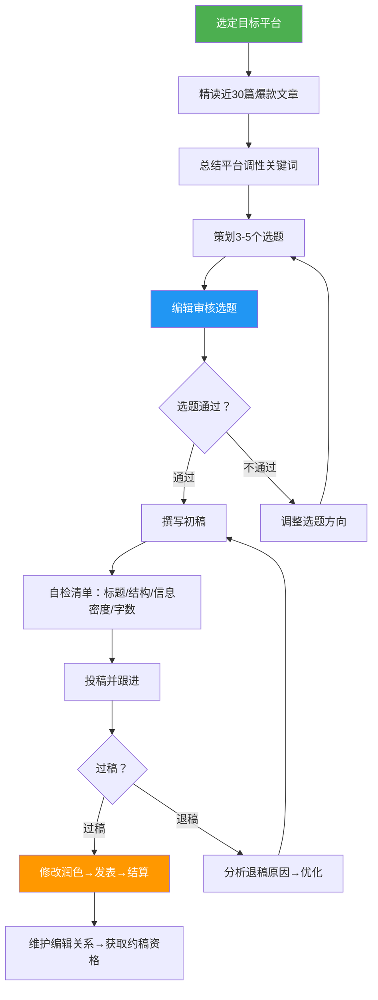
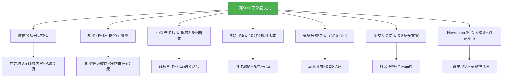
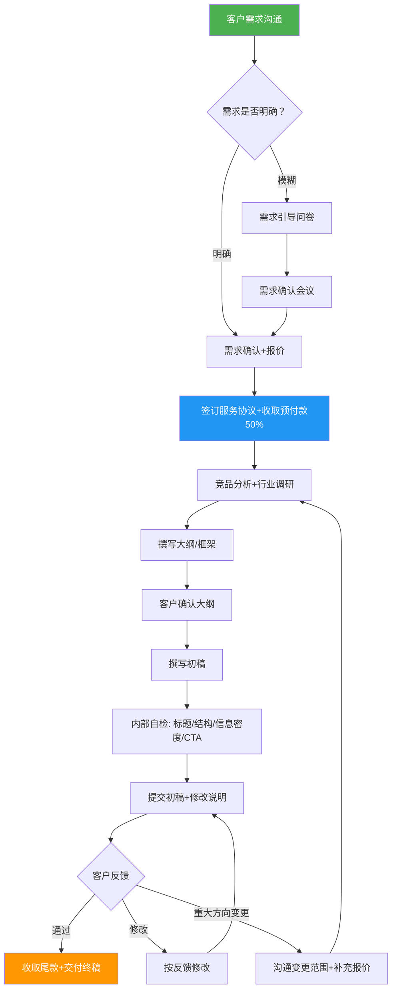
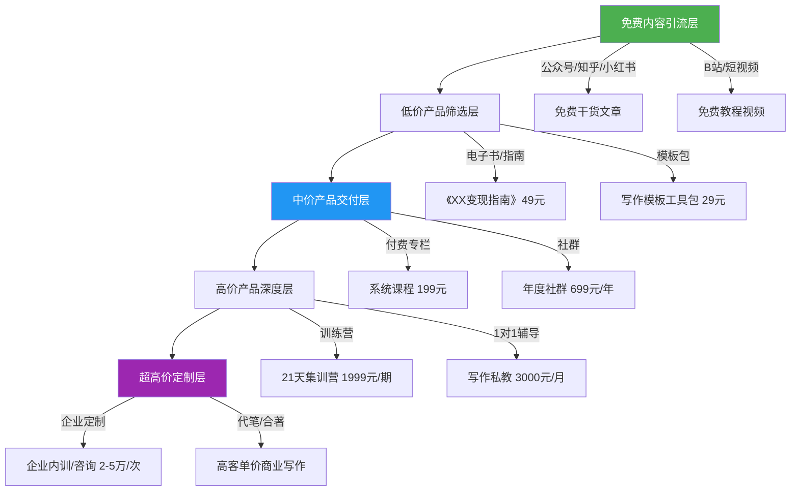
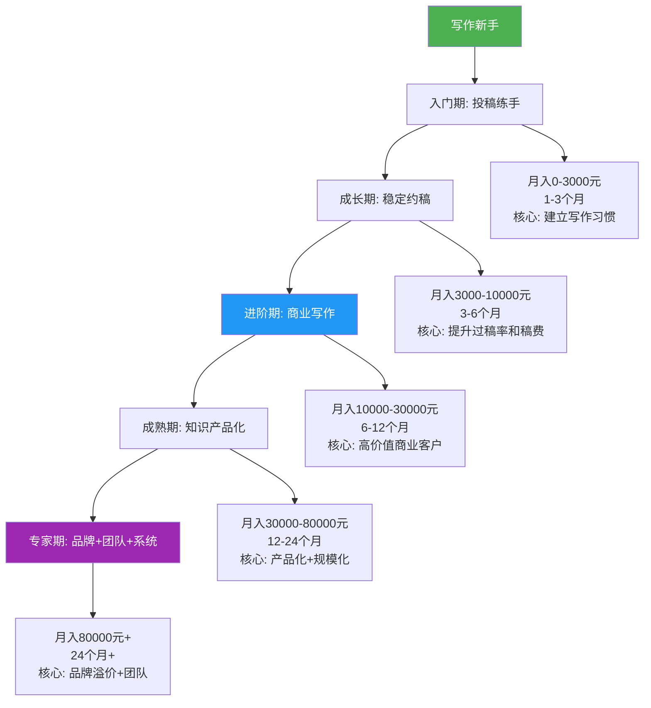

## 四、写作技能变现

写作是所有技能变现中**启动成本最低、门槛最模糊、但天花板差异最大**的方向。几乎每个人都"会写字"，但能靠写字年入50万以上的人不到1%。差距不在文笔，而在于**变现路径选择、内容产品化能力、以及商业思维**。

很多文字功底出色的写作者月入不过三四千——投稿被压价、自媒体不温不火、写了一堆东西变不了现。而一些文笔中等的写作者却能月入5万以上——因为他们选对了赛道、建立了内容资产、懂得用"产品思维"经营写作事业。

### 为什么写作是技术人最值得投入的副业

在所有技术技能变现方向中，写作具有独特优势：

| 对比维度 | 写作 | 接单开发 | 技术咨询 | 知识付费 |
|---------|------|---------|---------|---------|
| 启动成本 | 零（一台电脑即可） | 需要作品集和客户渠道 | 需要行业知名度 | 需要系统课程+平台 |
| 时间灵活性 | 极高，碎片时间可写 | 受项目周期约束 | 受客户时间约束 | 受课程节奏约束 |
| 收入可叠加性 | 极强（内容持续产生收益） | 弱（做一单赚一单） | 中（有复购但不自动化） | 强（课程可重复销售） |
| 技能迁移性 | 极强（写作能力通用） | 中（限于技术栈） | 中（限于专业领域） | 中（限于教学能力） |
| AI协同空间 | 极大（AI提升效率3-10倍） | 大（AI辅助编码） | 中（AI辅助调研） | 中（AI辅助课件） |
| 护城河 | 个人品牌+风格+行业经验 | 技术深度+口碑 | 行业人脉+案例积累 | 学员口碑+课程体系 |

**写作变现的底层逻辑**：你不是在卖"文字"，而是在卖**信息差、认知差、经验差**。读者付钱（用注意力或金钱）获取你提供的信息、观点或解决方案。理解这一点，就能理解为什么"会写字"和"能靠写作赚钱"之间隔着巨大的鸿沟。

### 真实案例：不同路径的写作者收入画像

为了让各条路径更具体，以下梳理几个典型的写作变现真实案例：

**案例一：投稿+约稿路线——"十点读书"签约作者**
- 背景：30岁，前中学语文教师，无互联网背景
- 路径：从尾部公众号投稿起步（千字100元），3个月后稳定供稿3个腰部号，6个月后获得十点读书约稿资格
- 收入：月均8000-12000元（8-10篇/月，千字稿费300-600元）
- 关键转折：第4个月一篇爆款文章（阅读量50万+）让她被编辑主动联系
- 时间投入：每天2-3小时（含阅读和素材收集）

**案例二：技术写作路线——API文档自由撰稿人**
- 背景：28岁，前端开发工程师，英语六级
- 路径：为GitHub开源项目贡献中文文档 → 在掘金发技术文章 → 被SaaS公司HR联系 → 兼职API文档写作
- 收入：月均15000-25000元（2-3个项目并行，每个5000-10000元）
- 关键转折：一篇Stripe支付接入教程（掘金10万+阅读）成为获客利器
- 时间投入：每周15-20小时

**案例三：知识产品化路线——写作课程讲师**
- 背景：35岁，前广告公司文案总监
- 路径：公众号写品牌文案干货（1年积累5万粉）→ 出电子书（定价49元，卖出2000+本）→ 开设训练营（1999元/期，每期30人）
- 收入：月均50000-80000元（课程+电子书+少量商业文案）
- 关键转折：第一期训练营学员平均稿费提升200%的口碑传播
- 时间投入：每周20-25小时（含课程录制、社群运营、学员辅导）

**案例四：AI赋能写作路线——内容工厂模式**
- 背景：26岁，自由撰稿人，学习能力强
- 路径：建立AI辅助写作工作流（ChatGPT调研+Claude初稿+人工改写）→ 产能从每天1篇提升到每天3-5篇 → 承接多个品牌方的批量内容需求
- 收入：月均30000-50000元（批量商业内容+少量高质量深度稿）
- 关键转折：将AI写作流程标准化后，可以雇佣助理执行，自己只做质量把控
- 时间投入：每天4-5小时（含客户沟通和质量审核）

本节将从投稿变现、平台分成与自媒体写作、商业文案写作、技术写作、网文与连载、知识产品化、AI赋能写作、邮件通讯与Newsletter、个人品牌建设九大方向，系统拆解写作技能变现的完整路径。

### 4.1 写作变现全景图

写作变现并非只有"投稿赚稿费"一条路。从时间自由度、收入天花板、启动难度三个维度来看，主要路径如下：

```mermaid
flowchart LR
    subgraph 低门槛启动
        A[投稿赚稿费] --> B[平台分成/流量收益]
        A --> C[自媒体内容创作]
    end
    subgraph 中等投入
        D[商业文案写作] --> E[技术写作/文档外包]
        D --> F[品牌内容代运营]
    end
    subgraph 高投入高回报
        G[网文/连载小说] --> H[知识产品(电子书/课程)]
        G --> I[出版+版权授权]
        J[邮件通讯/Newsletter] --> K[订阅制收入+广告]
    end

    style A fill:#4CAF50,color:#fff
    style D fill:#2196F3,color:#fff
    style G fill:#9C27B0,color:#fff
    style J fill:#FF5722,color:#fff
```

| 路径 | 启动难度 | 收入天花板 | 时间自由度 | 适合阶段 |
|------|---------|-----------|-----------|---------|
| 投稿赚稿费 | ★☆☆☆☆ | ★★☆☆☆ | ★★☆☆☆ | 初期积累 |
| 平台分成/流量收益 | ★★☆☆☆ | ★★★☆☆ | ★★★★☆ | 被动收入起步 |
| 自媒体内容创作 | ★★☆☆☆ | ★★★★☆ | ★★★★☆ | 品牌积累期 |
| 商业文案写作 | ★★★☆☆ | ★★★★★ | ★★★☆☆ | 中期发展 |
| 技术写作/文档外包 | ★★★☆☆ | ★★★★☆ | ★★★★☆ | 有技术背景者 |
| 邮件通讯/Newsletter | ★★☆☆☆ | ★★★★☆ | ★★★★★ | 有稳定读者后 |
| 网文/连载小说 | ★★★★☆ | ★★★★★ | ★★☆☆☆ | 长期投入 |
| 知识产品(电子书/课程) | ★★★★☆ | ★★★★★ | ★★★★★ | 内容体系成熟后 |
| 出版+版权授权 | ★★★★★ | ★★★★★ | ★★★★☆ | 有作品积累后 |

**关键认知**：写作变现的多条路径不是互斥的。最优策略是"投稿验证市场需求 + 自媒体积累粉丝 + 商业写作赚现金流 + 知识产品建资产"四线并行。投稿是"练兵"，自媒体是"修渠"，商业写作是"打猎"，知识产品是"种田"——四件事同时做，收入结构才健康。

### 4.2 投稿变现：从第一笔稿费到稳定约稿

投稿是写作变现最经典的起点，也是验证写作能力最直接的方式。

#### 4.2.1 投稿渠道全景

| 渠道类型 | 代表平台 | 千字稿费 | 过稿难度 | 审稿周期 | 结算方式 |
|---------|---------|---------|---------|---------|---------|
| 公众号投稿 | 十点读书、洞见、有书、樊登读书 | 200-1000元 | ★★★★☆ | 3-7天 | 过稿后即时/月结 |
| 纸媒投稿 | 《读者》《意林》《青年文摘》《三联生活周刊》 | 100-500元 | ★★★★★ | 2-8周 | 见刊后结算 |
| 行业垂直媒体 | 36氪、虎嗅、钛媒体、极客公园 | 300-800元 | ★★★★☆ | 3-10天 | 月结 |
| 知识付费平台稿件 | 得到、喜马拉雅、知乎盐选 | 500-2000元 | ★★★★★ | 1-4周 | 按合同 |
| 品牌方供稿 | 企业公众号、品牌内刊 | 500-3000元 | ★★★☆☆ | 协商 | 按篇/按月 |
| 稿件交易平台 | 稿稿、写手圈、豆瓣稿费银行 | 50-300元 | ★★☆☆☆ | 1-3天 | 过稿即付 |
| 海外英文平台 | Medium Partner Program、Newsbreak | 按阅读量 | ★★★☆☆ | 即时 | 月结(PayPal) |

**投稿的底层逻辑**：你在卖的不是"文章"，而是"编辑的时间"。编辑每天收到几十上百篇投稿，他们需要的是**可以直接发、不需要大改的成品**。理解这一点，过稿率会从20%飙升到60%以上。

#### 4.2.2 高效投稿的完整流程



**投稿前的自检清单**（逐项确认后再提交）：

| 检查项 | 标准 | 常见问题 |
|--------|------|---------|
| 标题 | 有吸引力、符合平台风格、包含关键词 | 标题太平淡，或与平台调性不符 |
| 开头 | 前100字抓住读者（故事/数据/反常识） | 大段背景铺垫，读者流失 |
| 结构 | 逻辑清晰、有小标题、段落不超过4行 | 一整块文字没有分段 |
| 信息密度 | 每500字至少一个信息增量点 | 翻来覆去说同一个意思 |
| 字数 | 符合平台要求（通常2000-4000字） | 字数超标或不足 |
| 结尾 | 有总结、有金句、有行动号召 | 虎头蛇尾，草草结束 |
| 排版 | 空行、加粗、列表使用得当 | 密密麻麻一整块文字 |
| 事实核查 | 数据、案例、引用均经过验证 | 凭记忆写数据，不核实 |
| 原创性 | 查重率低于15% | 大段引用未标注来源 |

#### 4.2.3 提升过稿率的核心技巧

**技巧一：选题"三看法"**

选题决定了80%的过稿概率。好选题的判断标准：

| 维度 | 判断标准 | 具体操作 |
|------|---------|---------|
| 看数据 | 近30天阅读量前10的文章主题 | 用新榜、西瓜数据查询目标公众号的历史数据 |
| 看缺口 | 平台最近没覆盖但读者需要的选题 | 整理该平台近3个月的文章标题，找"空白区" |
| 看热点 | 当前社会热点与平台调性的结合点 | 用微博热搜、知乎热榜、百度指数追踪热点 |

**技巧二：投稿前的"平台调性匹配"**

不同平台的风格差异巨大，同样的内容需要做不同调整：

```text
同一主题"职场焦虑"的写法对比：

十点读书风格：
  → 标题：《30岁还在焦虑的人，都忽略了这件事》
  → 结构：故事开头 → 引发共鸣 → 3个方法论 → 温暖结尾
  → 语调：温暖、治愈、像朋友聊天
  → 字数：2500-3500字

36氪风格：
  → 标题：《职场焦虑的底层逻辑：你在为错误的目标打工》
  → 结构：数据/案例开头 → 分析原因 → 框架/模型 → 行动建议
  → 语调：理性、犀利、有观点
  → 字数：2000-3000字

《意林》风格：
  → 标题：《那个不再焦虑的年轻人》
  → 结构：人物故事 → 转折 → 感悟升华
  → 语调：文学性、有画面感
  → 字数：1200-1800字
```

**技巧三：退稿分析与改进**

| 退稿原因 | 占比 | 具体表现 | 改进方法 |
|---------|------|---------|---------|
| 风格不匹配 | 40% | 文章质量没问题，但不是平台想要的调性 | 投稿前精读30篇，提炼平台的"文字DNA" |
| 选题过时/同质化 | 35% | 主题已经被写烂，没有新角度 | 用"老选题+新案例"或"老选题+新视角"切入 |
| 结构松散/信息密度低 | 25% | 有观点但缺乏论据支撑，结构混乱 | 每500字至少一个信息增量点，先列详细大纲 |

**技巧四：建立"选题银行"**

不要临时找选题，而要建立一个持续更新的选题库：

```text
选题银行结构（推荐用Notion或飞书多维表格）：

选题 | 状态 | 适合平台 | 预估稿费 | 素材来源 | 时效性
-----|------|---------|---------|---------|-------
"远程办公3年的真实成本" | 待写 | 36氪 | 1500元 | 个人经历+行业数据 | 长期有效
"AI替代不了的5种编程思维" | 已写 | 掘金 | 800元 | 技术分析 | 3个月有效
"月薪3万的自由撰稿人日常" | 素材收集中 | 十点读书 | 2000元 | 采访+自身体验 | 长期有效

维护规则：
1. 每周新增3-5个选题创意
2. 每月淘汰过时选题
3. 优先写"时效性强"的选题
4. 长期有效选题放在"低优先级池"，等约稿时调用
```

#### 4.2.4 稿费标准与谈判

**国内主流公众号稿费参考（2025-2026年）**：

| 平台层级 | 代表平台 | 千字稿费 | 单篇稿费范围 | 结算方式 |
|---------|---------|---------|------------|---------|
| 头部 | 十点读书、洞见、有书 | 500-1000元 | 1500-3000元 | 过稿后即时 |
| 腰部 | 垂直领域大号 | 200-500元 | 500-1500元 | 月结 |
| 尾部 | 新号、中小号 | 50-200元 | 100-500元 | 过稿即付 |
| 纸媒 | 《读者》《意林》 | 100-300元 | 200-800元 | 见刊后 |
| 行业媒体 | 36氪、虎嗅 | 300-800元 | 800-2500元 | 月结 |

**稿费谈判话术**：

```text
场景一：编辑报价偏低
❌ "这也太少了，能不能加点？"
✅ "感谢您的认可。基于这篇文章的深度调研（涉及10+采访/案例）和字数规模
    （5000字），我通常的稿费标准是千字X元。如果您觉得合适，我们可以
    建立长期合作，后续稿件我优先为您供稿。"

场景二：从投稿升级到约稿
❌ "能不能以后都给我约稿？"
✅ "很高兴这篇文章的效果不错。如果后续有选题需要，我可以提前准备，
    保证X天内交稿。约稿的话，我可以根据您的选题方向定制内容，
    质量和时效都会更有保障。稿费方面我们可以按约稿标准走。"

场景三：老作者涨价
❌ "我要涨价了。"
✅ "感谢一直以来的合作，过去X个月我们合作了X篇文章，平均阅读量X。
    基于目前的稿件质量和市场行情，我计划从下月起调整稿费标准至
    千字X元。如果能保持稳定约稿频率，我可以给您一个长期合作价。"
```

**海外英文投稿平台**（适合英语能力较强的写作者）：

| 平台 | 稿费标准 | 审稿要求 | 支付方式 | 特点 |
|------|---------|---------|---------|------|
| Medium Partner Program | 按阅读时长付费，头部作者月入$1000-5000 | 无门槛 | Stripe/PayPal | 英文内容，全球读者 |
| Newsbreak | $0.5-2/千次阅读 | 申请创作者计划 | PayPal | 本地化新闻/观点 |
| Contently | $0.50-2.00/词 | 需作品集审核 | 月结 | 高端商业内容 |
| Listverse | $100/篇 | 列表式内容 | PayPal | 趣味/知识类 |
| Cracked | $100-250/篇 | 幽默风格 | PayPal | 幽默/讽刺类 |

#### 4.2.5 投稿变现的收入预期

| 阶段 | 时间 | 月投稿量 | 过稿率 | 平均千字稿费 | 月收入 | 核心任务 |
|------|------|---------|-------|------------|--------|---------|
| 冷启动期 | 第1-2月 | 20-30篇 | 15-25% | 100-200元 | 500-2000元 | 建立写作习惯，积累退稿经验 |
| 稳定期 | 第3-6月 | 15-20篇 | 40-60% | 200-400元 | 2000-6000元 | 找到稳定合作平台，提升过稿率 |
| 品牌期 | 第7-12月 | 8-15篇 | 60-80% | 400-800元 | 5000-15000元 | 约稿为主，建立编辑关系网 |
| 溢价期 | 12月+ | 5-10篇 | 80%+ | 800-2000元 | 8000-30000元 | 高价值约稿+商业写作转型 |

**关键数据**：纯靠投稿，月收入天花板约2-3万元（每天写3000-5000字，千字稿费500元）。要突破这个天花板，必须从"投稿"进化到"商业写作"或"知识产品"。

### 4.3 平台分成与自媒体写作

平台分成和自媒体是写作变现中**唯一能实现"睡后收入"**的方向——你写的内容可以持续产生收益，而不需要反复找客户。

#### 4.3.1 主流内容平台收益机制

| 平台 | 收益机制 | 千次阅读收益 | 变现门槛 | 适合内容类型 |
|------|---------|------------|---------|------------|
| 微信公众号 | 流量主广告+赞赏+付费内容 | 1-5元/千次 | 500粉丝 | 深度长文、行业分析 |
| 知乎 | 知乎创作者等级+盐选+好物推荐 | 3-10元/千次 | 创作者等级4+ | 专业回答、深度分析 |
| 今日头条/头条号 | 创作者收益+青云计划+付费专栏 | 1-3元/千次 | 无门槛 | 资讯、故事、干货 |
| 百家号 | 百度广告分成 | 2-8元/千次 | 信用分>80 | SEO导向内容 |
| B站专栏 | 创作激励+充电 | 1-3元/千次 | 1000粉丝 | 长文、评测、教程 |
| 小红书笔记 | 品牌合作+薯店+直播 | 按粉丝量定价 | 1000粉丝 | 生活方式、经验分享 |
| 简书 | 付费会员分成+赞赏 | 0.5-2元/千次 | 无门槛 | 文学、随笔 |

**平台选择策略**：

```text
写作变现平台选择决策树：

1. 你的内容偏专业/深度？
   ├── 是 → 知乎 + 微信公众号（专业读者多，付费意愿高）
   └── 否 → 进入问题2

2. 你的内容偏故事/娱乐？
   ├── 是 → 头条号 + 番茄小说（流量大，分成机制成熟）
   └── 否 → 进入问题3

3. 你的内容偏实用/工具？
   ├── 是 → 小红书 + B站（年轻用户多，转化率高）
   └── 否 → 进入问题4

4. 你想快速获得收益？
   ├── 是 → 头条号（零门槛，AI推荐机制，新手也能获得流量）
   └── 否 → 微信公众号（需要时间积累，但长期价值最高）
```

#### 4.3.2 自媒体矩阵运营策略

成熟的写作者不会只守一个平台。**一次创作，多平台分发**是提升内容ROI的核心策略：



**多平台分发的注意事项**：

1. **首发平台优先**：微信公众号通常要求原创首发（发布后2小时再发其他平台），知乎不要求首发但首发内容权重更高
2. **内容适配**：不是简单复制粘贴，而是根据平台特性调整标题、格式、长度
3. **避免内容重复降权**：各平台对重复内容有降权机制，建议做差异化调整（换标题、调整结构、增删内容）
4. **工具辅助**：用蚁小二、融媒宝等工具一键多平台发布，但内容仍需手动调整
5. **数据复盘**：每周统计各平台数据（阅读量、互动率、涨粉数），找出最有效的平台组合

#### 4.3.3 内容质量评分框架

发布内容前，用这个框架自评，目标是每篇都达到7分以上：

| 维度 | 1-3分（差） | 4-6分（中） | 7-9分（好） | 10分（优秀） |
|------|-----------|-----------|-----------|------------|
| 信息增量 | 重复已知信息 | 有少量新信息 | 提供独到见解或新数据 | 提供行业首创的框架/模型 |
| 结构清晰度 | 想到哪写到哪 | 有基本分段 | 逻辑清晰，有小标题 | 金字塔结构，读者零思考成本 |
| 可操作性 | 纯理论/纯鸡汤 | 有建议但不具体 | 有具体步骤和模板 | 读完即可执行，附工具和案例 |
| 读者共鸣 | 自说自话 | 偶尔触及读者痛点 | 深度理解读者处境 | 读者觉得"你就是我肚子里的蛔虫" |
| 标题吸引力 | 平淡无奇 | 有关键词但不抓眼球 | 点击率高于平均水平 | 看到标题就想点，看完就想转 |
| 数据支撑 | 无数据 | 有1-2个数据点 | 多个数据+来源标注 | 数据可视化+交叉验证 |

#### 4.3.4 自媒体收入增长曲线

| 阶段 | 时间 | 全平台粉丝 | 月均收入 | 收入来源构成 |
|------|------|-----------|---------|------------|
| 冷启动 | 1-3月 | 0-5000 | 0-500元 | 平台流量分成 |
| 成长期 | 3-6月 | 5000-2万 | 500-3000元 | 流量分成+赞赏+少量合作 |
| 起量期 | 6-12月 | 2万-10万 | 3000-15000元 | 品牌合作+流量分成+付费内容 |
| 品牌期 | 12-24月 | 10万-50万 | 15000-80000元 | 品牌合作为主+知识付费+广告 |
| 头部期 | 24月+ | 50万+ | 80000元+ | 多元化变现（品牌+课程+出版+代言） |

**关键认知**：自媒体变现的核心不是"粉丝数"，而是**粉丝质量和信任度**。一个5万精准粉丝的垂直号（如"Python技术圈"），变现能力可能超过50万泛粉丝的娱乐号。选对赛道比盲目涨粉重要10倍。

### 4.4 商业文案写作：高价值变现的主战场

商业文案是写作变现中**客单价最高、需求最稳定**的方向。企业永远需要有人帮他们写——品牌文案、营销邮件、产品描述、白皮书、新闻稿、社交媒体内容。

#### 4.4.1 商业文案细分市场

| 文案类型 | 单价范围 | 制作周期 | 技能要求 | 需求稳定性 | 客户来源 |
|---------|---------|---------|---------|-----------|---------|
| 品牌软文/公众号代写 | 2000-8000元/篇 | 2-5天 | ★★★☆☆ | ★★★★★ | 企业市场部、MCN |
| 产品详情页/电商文案 | 500-3000元/页 | 1-3天 | ★★☆☆☆ | ★★★★★ | 电商卖家、品牌方 |
| 行业白皮书/研究报告 | 8000-30000元/份 | 2-4周 | ★★★★☆ | ★★★☆☆ | 咨询公司、科技企业 |
| 品牌故事/创始人访谈 | 5000-20000元/篇 | 1-2周 | ★★★★☆ | ★★★☆☆ | 创业公司、品牌方 |
| 新闻稿/PR稿 | 1000-5000元/篇 | 1-3天 | ★★★☆☆ | ★★★★☆ | 公关公司、企业PR |
| SEO内容/网站文案 | 500-2000元/篇 | 1-2天 | ★★☆☆☆ | ★★★★★ | 互联网公司、SEO服务商 |
| 邮件营销文案 | 1000-5000元/套 | 2-5天 | ★★★☆☆ | ★★★☆☆ | SaaS公司、电商品牌 |
| 视频脚本/口播稿 | 1000-5000元/条 | 1-3天 | ★★★☆☆ | ★★★★★ | MCN、品牌方、自媒体 |
| 图书代笔/合著 | 30000-100000元/本 | 2-6月 | ★★★★★ | ★★☆☆☆ | 企业家、行业专家 |
| 企业宣传册/内刊 | 3000-15000元/期 | 1-2周 | ★★★☆☆ | ★★★☆☆ | 中大型企业 |

**为什么商业文案的收入天花板比投稿高？** 因为商业文案的价值衡量标准不是"字数"，而是"商业效果"。一篇能带来100个客户转化的品牌软文，对客户来说价值远超稿费本身。当你能用数据证明文案的商业价值时，定价就从"按字数"变成了"按效果"。

#### 4.4.2 商业文案获客渠道

| 渠道 | 获客成本 | 客户质量 | 适合阶段 | 操作方式 |
|------|---------|---------|---------|---------|
| 自由职业平台(猪八戒/Upwork/Fiverr) | 低 | 中-低 | 起步期 | 注册→完善资料→投标/挂服务 |
| 作品集引流 | 零 | 高 | 成长期 | 个人网站/公众号展示案例→客户主动联系 |
| 行业社群/圈子 | 零 | 高 | 成长期 | 在市场人/品牌人社群中活跃→被推荐 |
| 编辑/媒体推荐 | 零 | 极高 | 品牌期 | 维护编辑关系→编辑推荐企业客户 |
| 主动BD | 中 | 高 | 任何阶段 | 目标企业→找到决策人→发送作品集+提案 |
| 内容营销 | 前期高 | 极高 | 成熟期 | 写"如何写好品牌文案"类文章→吸引潜在客户 |

**商业文案获客的核心策略**：

1. **作品集是最好的销售员**：整理5-10个最佳商业文案案例，每个案例包含——客户背景、写作挑战、你的方案、最终效果（有数据更好）。放在个人网站或公众号菜单栏。
2. **免费试写策略**：对高价值潜在客户，主动提出"我免费帮你写一篇，你看看效果"。这不是贱卖，而是**用最低成本证明你的价值**。一篇高质量的免费文案，往往能换来一个长期客户。
3. **老客户转介绍激励**：每成功转介绍一个客户，给推荐人一个优惠（如下一单9折）。商业客户的圈子通常也是商业客户，转介绍的客户质量极高。

#### 4.4.3 商业文案写作流程



#### 4.4.4 商业文案定价策略

**报价公式**：

```text
报价 = (预估工时 × 时薪) × 难度系数 × 行业系数 + 交付溢价
```

- **预估工时**：你认为需要的时间 × 1.5（永远留buffer，客户沟通和修改是不可预测的）
- **时薪**：期望年收入 ÷ 2000小时（新手200-400元/小时，资深600-1500元/小时）
- **难度系数**：熟悉领域1.0，新领域1.3，高专业性领域（金融/医疗/法律）1.5-2.0
- **行业系数**：科技/金融/医疗行业通常高出30-50%
- **交付溢价**：需要加急+30%，需要深度采访+20%，需要版权转让+15%

**报价实例**：一篇科技公司的品牌软文（2000字），你预估需要8小时（含调研），期望时薪400元，科技行业：

```text
报价 = (8 × 400) × 1.0 × 1.3 = 4,160元
建议报价5,000元（向上取整，留谈判空间）
```

**三档报价法**：给客户三个方案，大多数人会选择中间那个：

```text
基础版(3,000元): 2000字品牌软文，1次修改，纯文字交付
标准版(5,000元): 2000字品牌软文+SEO关键词优化，2次修改，    ← 推荐
                   含社交媒体短文案适配版
高级版(8,000元): 3000字深度品牌故事+3篇配套社交媒体文案
                   +公众号排版，3次修改，含传播策略建议
```

#### 4.4.5 商业文案合同要点

自由撰稿人接商业项目，**必须签订书面协议**（哪怕只是微信文字确认），核心条款包括：

| 条款 | 要点 | 为什么重要 |
|------|------|-----------|
| 服务范围 | 明确交付物、字数、修改次数 | 防止无限修改和范围蔓延 |
| 付款条件 | 预付款比例（建议50%）、尾款时间 | 防止拖欠和跑路 |
| 修改条款 | 包含几次免费修改、超出部分如何收费 | 防止"改了20遍还在改" |
| 版权归属 | 交付后版权转移？署名权？ | 明确知识产权归属 |
| 保密条款 | 不泄露客户商业信息 | 建立专业信任 |
| 交付时间 | 明确deadline和延期条款 | 双方时间预期一致 |
| 终止条款 | 项目中途取消如何结算 | 保护双方权益 |

```text
简易合同模板（微信/邮件版）：

项目名称：[品牌名]公众号代写服务
服务内容：每月X篇公众号文章，每篇X字，含选题策划+撰写+X次修改
交付标准：文章质量达到[参考文章链接]水平
付款方式：每月X日前支付当月费用，首月预付50%
修改条款：每篇文章包含X次免费修改，超出部分按X元/次收费
版权归属：付款完成后，文章版权归甲方所有
保密条款：双方对合作内容保密
有效期：X年X月-X年X月

甲方确认：____________
乙方确认：____________
```

### 4.5 技术写作：技术人的独特优势

技术写作是**技术人最容易切入的高价值写作方向**——你不需要文笔多好，只需要能把技术讲清楚。而能把技术讲清楚的技术人，市场极度稀缺。

#### 4.5.1 技术写作细分市场

| 方向 | 服务内容 | 单价范围 | 目标客户 | 技能要求 |
|------|---------|---------|---------|---------|
| API文档/开发者文档 | 接口文档、SDK指南、集成教程 | 5000-30000元/项目 | SaaS公司、云服务商 | ★★★★☆ |
| 技术博客/教程 | 框架教程、最佳实践、架构解析 | 1000-5000元/篇 | 技术社区、企业技术博客 | ★★★☆☆ |
| 技术白皮书 | 产品技术方案、架构设计文档 | 10000-50000元/份 | B2B科技公司 | ★★★★★ |
| 开源项目文档 | README、Contributing Guide、Wiki | 3000-15000元/项目 | 开源项目维护者、企业 | ★★★☆☆ |
| 技术书籍代笔 | 技术书籍写作/合著 | 50000-200000元/本 | 出版社、技术KOL | ★★★★★ |
| 技术培训材料 | 课件、实验手册、考核题库 | 5000-20000元/套 | 培训机构、企业内训 | ★★★★☆ |
| Release Notes/更新日志 | 版本更新说明、迁移指南 | 1000-5000元/次 | 软件公司 | ★★☆☆☆ |
| 用户手册/帮助中心 | 产品使用指南、FAQ、教程视频脚本 | 3000-15000元/项目 | SaaS公司、App开发公司 | ★★★☆☆ |

**技术写作的定价逻辑**：技术写作的稀缺性在于"既懂技术又能写"。纯文字工作者写不了技术文档（不理解技术概念），纯技术人员不愿写文档（觉得是苦差事）。能做好技术写作的人，本质上是在做**翻译**——把技术语言翻译成用户能理解的语言。这个能力值钱，因为**好的技术文档直接影响产品的用户体验和开发者采用率**。

**真实数据参考**：Stripe的API文档被公认为行业标杆，其文档团队的薪资水平比普通技术写手高50-100%。据Glassdoor数据，美国Senior Technical Writer的年薪中位数为$95,000-130,000，远高于普通内容写手的$50,000-70,000。国内市场虽然价差没那么大，但技术写作的时薪通常是普通文案的1.5-2倍。

#### 4.5.2 技术写作获客渠道

| 渠道 | 操作方式 | 客户质量 | 适合阶段 |
|------|---------|---------|---------|
| GitHub开源贡献 | 为知名开源项目贡献文档→展示能力 | 极高 | 起步期 |
| 技术社区博客 | 在掘金、SegmentFault、Medium发技术文章 | 高 | 起步期 |
| 技术写作平台 | Docs-as-Code社区、技术写作论坛 | 中-高 | 成长期 |
| LinkedIn/脉脉 | 完善技术写作资料→接InMail询盘 | 高 | 成长期 |
| Upwork/Fiverr | 搜索"Technical Writer"相关项目 | 中 | 起步期 |
| 直接联系企业 | 目标SaaS公司→找到产品/技术负责人→提案 | 极高 | 成熟期 |
| 翻译+写作组合 | 英文技术文档中译→扩展到原创技术写作 | 高 | 任何阶段 |

**GitHub开源文档贡献策略**：

1. 找你熟悉的技术栈的知名开源项目（Star数1000+）
2. 阅读其现有文档，找到"可以改进的地方"（过时内容、缺失章节、不清晰的说明）
3. 提交高质量的文档PR（不只是修typo，而是增加章节、补充示例、优化结构）
4. PR被合并后，你的GitHub贡献记录就是最好的技术写作作品集
5. 很多开源项目的维护者是科技公司员工，他们可能会直接给你介绍商业写作机会

#### 4.5.3 技术文档写作的黄金结构

```text
一份优秀的API文档结构：

1. 快速开始（Quick Start）
   → 5分钟内让开发者跑通第一个请求
   → 提供完整的代码示例（至少3种语言）
   → 包含预期输出和常见错误排查

2. 认证与授权（Authentication）
   → API Key获取方式
   → OAuth 2.0流程说明
   → Token刷新机制
   → 各认证方式的适用场景对比

3. 核心概念（Core Concepts）
   → 用图表解释架构
   → 关键术语表
   → 数据模型说明
   → 请求/响应的通用格式

4. API参考（API Reference）
   → 每个端点：URL、方法、参数、请求示例、响应示例、错误码
   → 提供可交互的API Explorer（如Swagger UI）
   → 参数约束和边界条件说明

5. 教程与场景（Tutorials）
   → 按使用场景组织（而非按API端点）
   → 每个教程：目标→前置条件→步骤→验证→进阶
   → 包含完整的可运行代码

6. SDK与工具（SDKs & Tools）
   → 官方SDK安装和使用
   → 第三方工具推荐
   → CLI工具说明

7. 常见问题（FAQ）
   → 基于真实用户反馈整理
   → 每个问题：问题描述→原因分析→解决方案

8. 变更日志（Changelog）
   → 版本号→发布日期→变更内容→迁移指南
   → Breaking Changes醒目标注
```

**技术文档的质量检查清单**：

| 检查项 | 标准 | 常见问题 |
|--------|------|---------|
| 准确性 | 所有代码示例可运行，API端点可访问 | 示例代码过时、端点已废弃 |
| 完整性 | 覆盖所有端点/功能，无遗漏 | 高级功能没有文档 |
| 一致性 | 术语、格式、风格统一 | 同一概念用了3种叫法 |
| 可搜索性 | 有清晰的目录、锚点、搜索功能 | 找不到想要的信息 |
| 新手友好 | Quick Start可在5分钟内跑通 | 前置条件太多，步骤不清晰 |
| 错误处理 | 每个错误码有说明和解决方案 | 只有错误码没有解释 |
| 版本对应 | 文档版本与软件版本一致 | 看的是v2文档，用的是v3 |

### 4.6 网文与连载：长线变现的"慢钱"

网文和连载小说是写作变现中**启动最难、但一旦成功收入最高**的方向。网文行业的头部作者年收入可达千万级别，但绝大多数网文作者月收入不足3000元。这是一个高度"幂律分布"的市场。

#### 4.6.1 网文平台对比

| 平台 | 类型 | 分成比例 | 全勤奖 | 适合题材 | 准入门槛 |
|------|------|---------|--------|---------|---------|
| 起点中文网 | 男频为主 | 订阅分成50% | 有（600-1500元/月） | 玄幻、都市、科幻 | 签约审核 |
| 番茄小说 | 免费阅读 | 广告分成 | 有（500-1000元/月） | 全品类 | 零门槛 |
| 七猫小说 | 免费阅读 | 广告分成 | 有 | 全品类 | 零门槛 |
| 晋江文学城 | 女频为主 | 订阅分成50% | 无 | 言情、耽美、古言 | 签约审核 |
| 知乎盐选 | 短篇/中篇 | 会员分成 | 无 | 悬疑、都市、情感 | 内容审核 |
| 豆瓣阅读 | 文学性 | 订阅分成 | 无 | 纯文学、类型文学 | 编辑审核 |
| 微信读书 | 出版物+连载 | 版权合作 | 无 | 全品类 | 出版社合作 |

#### 4.6.2 网文收入模型

```text
网文作者收入 = 订阅/广告分成 + 全勤奖 + 打赏 + 版权收入

免费阅读平台（番茄/七猫）：
  月收入 = 千次阅读收益 × 总阅读量
  一般标准：千次阅读2-5元
  月更15万字的作者，如果日均阅读量10万次：
    月收入 = 5 × (100,000 / 1000) × 30 = 15,000元

付费阅读平台（起点/晋江）：
  月收入 = 订阅人数 × 千字价格 × 更新字数
  一般标准：千字5分钱（5起点币）
  均订1000人的作者，日更6000字：
    月收入 = 1000 × 0.05 × 6000 / 1000 × 30 = 9,000元
  均订10000人的作者：
    月收入 = 10000 × 0.05 × 6000 / 1000 × 30 = 90,000元
```

**网文收入的残酷现实**：

| 层级 | 均订/日活 | 占比 | 月收入 | 对应状态 |
|------|----------|------|--------|---------|
| 金字塔顶端 | 均订5万+ | <0.1% | 10万+ | 大神级，年入百万-千万 |
| 头部 | 均订1万-5万 | <1% | 2-10万 | 职业写手，全职写作 |
| 腰部 | 均订1000-1万 | 5-10% | 3000-20000元 | 兼职写作，有本职工作 |
| 底部 | 均订<1000 | 90%+ | 0-3000元 | 大多数作者的真实状态 |

**关键认知**：网文不是"写得好就能赚钱"，而是"写得对才能赚钱"。平台的推荐算法、读者的口味偏好、更新频率和字数、开书时机——这些因素对收入的影响远大于文笔本身。如果决定走网文路线，前期要大量研究平台规则和爆款套路。

#### 4.6.3 网文写作的实用建议

1. **先写30万字再判断**：网文的收入曲线通常在30-50万字后才会显现（积累足够读者+平台推荐）。不要写5万字没成绩就放弃。
2. **日更3000-6000字是基线**：网文行业的竞争本质是"注意力竞争"，更新频率直接影响推荐权重和读者留存。
3. **开头3000字定生死**：网文读者的耐心极短，前3000字必须建立悬念、展示冲突、锁定读者。
4. **研究爆款套路但不要照搬**：看同类题材前100本书的开头、设定、冲突设计，提炼共性规律，然后加入自己的差异化。
5. **多开几本书试水**：不要在一本书上死磕。如果30万字后数据仍然很差，果断开新书。

#### 4.6.4 网文开头的"黄金公式"

```text
网文开头3000字的结构模板：

第1段（50-100字）：悬念开场
  → 不要从"很久以前"开始，直接切入冲突或异常场景
  → 示例："当林北睁开眼的时候，发现自己正躺在一口棺材里。"

第2-5段（200-500字）：建立主角处境
  → 主角是谁？处于什么困境？想要什么？
  → 快速让读者代入主角视角

第500-1500字：展示核心冲突
  → 主角遇到了什么问题/挑战？
  → 这个问题为什么紧迫？
  → 初步展示世界观设定（不要信息倾倒）

第1500-3000字：第一次"爽点"或"钩子"
  → 主角获得金手指/发现转机/遇到关键人物
  → 让读者看到"接下来会很精彩"的信号
  → 留下一个悬念，驱动读者继续阅读

核心原则：
- 前3000字不要写"设定"，要写"冲突"
- 每500字至少一个信息增量
- 不要让读者有任何"无聊"的时刻
- 第一章结尾必须有钩子
```

### 4.7 知识产品化：从"卖时间"到"卖产品"

知识产品化是写作变现的**终极形态**——你把写作经验和专业知识打包成可规模化销售的产品，实现"一次创作、持续收入"。

#### 4.7.1 知识产品类型与定价

| 产品类型 | 价格区间 | 制作周期 | 交付方式 | 规模化潜力 | 适合阶段 |
|---------|---------|---------|---------|-----------|---------|
| 电子书/PDF指南 | 9-99元 | 2-8周 | 下载 | ★★★★☆ | 有系统知识体系后 |
| 付费专栏 | 99-399元 | 4-12周 | 平台连载 | ★★★★★ | 有读者基础后 |
| 录播课程 | 199-999元 | 4-12周 | 视频/音频 | ★★★★★ | 有教学能力后 |
| 训练营/社群 | 699-2999元/期 | 持续运营 | 直播+社群 | ★★★☆☆ | 有学员口碑后 |
| 1对1写作辅导 | 300-1000元/小时 | 按需 | 视频/语音 | ★☆☆☆☆ | 有知名度后 |
| 模板/工具包 | 19-199元 | 1-4周 | 下载 | ★★★★★ | 有实操经验后 |

#### 4.7.2 知识产品阶梯设计

最优策略是设计一条**从低到高的产品阶梯**，让读者从免费内容逐步升级到高价产品：



**产品阶梯的核心逻辑**：

- **免费内容**：吸引流量，建立信任。你的公众号文章、知乎回答、小红书笔记就是免费内容。
- **低价产品（9-99元）**：筛选有付费意愿的用户。电子书、小工具包。转化率约1-5%。
- **中价产品（199-999元）**：核心利润来源。系统课程、付费专栏、年度社群。转化率约3-10%（基于低价产品用户）。
- **高价产品（1999-5000元）**：高价值深度服务。训练营、私教。转化率约5-15%（基于中价产品用户）。
- **超高价产品（5000元+）**：企业级服务。内训、咨询、代笔。需要强品牌背书。

#### 4.7.3 电子书产品化全流程

电子书是知识产品化的**最佳起点**——制作成本低、验证速度快、利润率高（几乎100%）。

**电子书选题策略**：

```text
好选题 = 你擅长的 × 读者需要的 × 市场稀缺的

测试方法：
1. 在你的自媒体上发布3-5篇相关文章
2. 如果阅读量和互动量明显高于其他文章 → 选题验证通过
3. 如果有读者主动问"有没有更系统的内容" → 强需求信号
4. 在知乎/小红书搜索相关关键词，看搜索量和竞争度
```

**电子书结构模板**：

```text
一本好的电子书结构（以4-8万字为佳）：

前言：这本书能帮你解决什么问题（500字）

第一篇：认知篇
  → 为什么这个领域值得做
  → 完整的行业生态图
  → 常见误区澄清

第二篇：方法论篇
  → 核心框架/模型
  → 具体操作步骤（每步配案例）
  → 工具和模板

第三篇：实战篇
  → 真实案例拆解（3-5个）
  → 从零到一的完整路径
  → 各阶段的数据参考

第四篇：进阶篇
  → 高阶技巧
  → 常见问题解答
  → 长期发展规划

附录：
  → 实用模板/清单
  → 工具推荐列表
  → 推荐阅读
```

**电子书发售策略**：

| 阶段 | 时间 | 动作 | 目标 |
|------|------|------|------|
| 预热期 | 发售前2周 | 公众号预告3篇+朋友圈预热+种子读者内测 | 建立期待感 |
| 早鸟期 | 第1周 | 限时折扣（如49元→29元）+前50名赠1v1答疑 | 快速验证+收集好评 |
| 正式期 | 第2-4周 | 恢复原价+知乎/小红书引流+分销机制启动 | 放大销售 |
| 长尾期 | 第5周+ | 自然流量+课程引流+版本更新 | 持续被动收入 |

**电子书的定价心理学**：

| 定价策略 | 适用场景 | 具体操作 | 预期效果 |
|---------|---------|---------|---------|
| 锚定定价 | 有竞品参考时 | 标注"市场价XX元，限时XX元" | 降低价格敏感度 |
| 捆绑定价 | 有多个产品时 | 电子书+模板包=套餐价 | 提升客单价 |
| 阶梯定价 | 不同读者群体时 | 基础版29元/标准版49元/豪华版99元 | 覆盖更多价格带 |
| 限时折扣 | 新品发售期 | 前100名5折，之后恢复原价 | 制造紧迫感 |
| 免费引流 | 配合高价产品时 | 免费章节→付费完整版 | 筛选高意向用户 |

#### 4.7.4 付费课程产品化

付费课程是知识产品化的**利润核心**——单价高、复购率高、口碑传播效应强。

**课程设计的核心原则**：

1. **以结果为导向**：不是"我教你什么"，而是"学完你能做什么"。课程标题应该是"从零到月入过万的投稿实战课"，而不是"写作技巧分享"。
2. **小步快跑**：第一期课程不要追求完美，先用最低可行产品（MVP）验证需求，再迭代优化。
3. **作业驱动**：好的课程不是"听"出来的，而是"做"出来的。每一节课必须配实操作业。
4. **社群运营**：课程的核心价值往往不在内容本身（内容到处都有），而在**学习社群的氛围和人脉资源**。

**课程定价参考**：

| 课程类型 | 价格 | 时长 | 班级规模 | 核心交付 | 毛利率 |
|---------|------|------|---------|---------|--------|
| 录播入门课 | 99-199元 | 2-5小时 | 不限 | 系统知识+模板 | 95%+ |
| 直播系统课 | 699-999元 | 6-8周 | 30-50人 | 系统学习+作业批改+社群 | 80-90% |
| 高强度训练营 | 1999-2999元 | 21-30天 | 20-30人 | 每日作业+导师点评+实战出稿 | 70-80% |
| 1对1私教 | 3000-5000元/月 | 持续 | 5-10人 | 定制化辅导+资源对接 | 90%+ |
| 企业内训 | 20000-50000元/次 | 1-2天 | 按需 | 定制化培训 | 60-80% |

**课程销售漏斗的数据参考**：

```text
典型写作课程销售漏斗：

免费内容触达：10,000人
  → 关注公众号/加微信：1,000人（10%转化率）
    → 购买电子书（49元）：50人（5%转化率）
      → 购买录播课（299元）：15人（30%转化率）
        → 参加训练营（1999元）：5人（33%转化率）
          → 1对1私教（5000元/月）：1人（20%转化率）

收入计算：
  50 × 49 + 15 × 299 + 5 × 1999 + 1 × 5000
  = 2,450 + 4,485 + 9,995 + 5,000
  = 21,930元/月（仅一个漏斗周期）

优化方向：
  1. 提升免费内容的触达量（SEO、多平台分发）
  2. 提升各层级转化率（优化产品、增加案例、收集好评）
  3. 缩短漏斗周期（限时优惠、直播答疑加速决策）
```

### 4.8 AI赋能写作：效率革命与新机会

AI正在重塑写作行业的效率结构。善用AI的写作者效率可以提升3-10倍，而排斥AI的写作者会被逐步淘汰。

#### 4.8.1 AI在写作各环节的应用

| 写作环节 | AI工具 | 效率提升 | 注意事项 |
|---------|--------|---------|---------|
| 选题调研 | ChatGPT/Claude/Perplexity | 5-10倍 | AI给出的选题需要人工验证市场热度 |
| 大纲生成 | ChatGPT/Claude | 3-5倍 | 大纲是骨架，需要人工注入独特视角 |
| 初稿撰写 | ChatGPT/Claude/文心一言 | 3-10倍 | AI初稿必须大幅改写，避免AI痕迹 |
| 素材收集 | Perplexity/秘塔搜索 | 10倍+ | AI搜索结果需要交叉验证真实性 |
| 润色修改 | Claude/秘塔写作猫 | 2-3倍 | 保留个人风格，不要让AI"洗掉"你的声音 |
| 标题优化 | ChatGPT/Claude | 5-10倍 | 生成20个标题→人工选择最优 |
| SEO优化 | ChatGPT/5118 | 3-5倍 | 关键词密度、标题优化、结构化数据 |
| 多语言适配 | DeepL/Claude | 5-10倍 | 翻译后需要母语人士审校 |

#### 4.8.2 AI写作的正确姿势

**AI写作的三层境界**：

```text
第一层：AI代写（错误方式）
  → 直接用AI生成内容，不做修改就发布
  → 结果：内容同质化、缺乏深度、容易被识别、读者无感
  → 收入预期：低（AI代写的市场正在被压缩到极低价格）

第二层：AI辅助（正确方式）
  → 用AI做调研、生成大纲、提供素材、润色语言
  → 人工注入独特观点、个人经验、真实案例、情感温度
  → 结果：效率提升3-5倍，质量不降反升
  → 收入预期：中-高（效率优势转化为更高产出或更低定价）

第三层：AI协作（高级方式）
  → 建立个人的AI写作工作流和Prompt模板库
  → AI负责标准化部分（格式、结构、SEO）
  → 人工负责差异化部分（观点、案例、风格）
  → 结果：产出效率提升5-10倍，形成系统化内容生产流水线
  → 收入预期：高（可以承接更多项目，或开发AI写作工具/课程）
```

**AI辅助写作的Prompt模板库**（直接可用）：

```text
选题调研Prompt：
"我是一个专注[领域]的内容创作者，目标读者是[画像]。
 请分析近3个月这个领域的热门话题，给出5个有潜力的选题，
 每个选题包含：标题建议、切入角度、预期读者痛点、竞品分析。"

大纲生成Prompt：
"请为以下主题生成一篇[字数]字的文章大纲：
 主题：[主题]
 平台：[平台名]
 风格：[风格描述]
 要求：包含引人入胜的开头、3-5个核心论点（每个配案例）、
 有行动号召的结尾。每个论点展开200-300字。"

初稿改写Prompt：
"以下是我用AI生成的初稿，请帮我改写：
 1. 注入个人经验和真实案例，让内容更有温度
 2. 调整语调为[温暖/理性/犀利]
 3. 增加信息密度，删掉空话套话
 4. 每500字至少一个信息增量点
 5. 保持核心观点不变，但用更生动的方式表达"

标题优化Prompt：
"请为以下文章生成20个标题建议：
 主题：[主题]
 平台：[平台]
 要求：5个悬念型、5个数字型、5个反常识型、5个情感型。
 每个标题标注预估点击率（高/中/低）。"
```

#### 4.8.3 AI时代写作的新机会

AI并没有消灭写作的机会，反而创造了新的高价值方向：

| 新机会 | 描述 | 收入潜力 | 技能要求 |
|--------|------|---------|---------|
| AI内容编辑 | 审核和优化AI生成的内容，注入人类判断 | 3000-15000元/月 | ★★★☆☆ |
| Prompt工程写作 | 为特定场景设计写作Prompt模板 | 5000-30000元/项目 | ★★★★☆ |
| AI写作工具评测 | 撰写AI工具对比评测、使用教程 | 1000-5000元/篇 | ★★★☆☆ |
| AI写作培训 | 教人如何用AI提升写作效率 | 课程收入 | ★★★★☆ |
| AI辅助内容审核 | 帮企业建立AI内容质量控制流程 | 8000-30000元/项目 | ★★★★☆ |
| 人类原创内容认证 | 提供"100%人类原创"认证服务 | 新兴市场 | ★★☆☆☆ |
| AI内容SEO优化 | 专门优化AI生成内容的搜索排名 | 2000-8000元/月 | ★★★☆☆ |
| 垂直领域AI写作系统 | 为特定行业（法律/医疗/金融）定制AI写作流程 | 10000-50000元/项目 | ★★★★★ |

**关键认知**：AI时代，"纯文字输出"的价值在下降，但"文字+判断力+独特视角+行业经验"的价值在上升。如果你只是能写字，AI会替代你；如果你能**用文字传递独特的思考和经验**，AI会让你更强大。

### 4.9 邮件通讯与Newsletter：被低估的黄金渠道

Newsletter（邮件通讯）是近年来在海外爆发、国内正在起步的写作变现渠道。它的核心优势是**你拥有读者关系**——不像公众号依赖微信算法，Newsletter的每一封邮件都会送达订阅者邮箱。

#### 4.9.1 Newsletter为什么值得做

| 对比维度 | 微信公众号 | Newsletter | 知乎/小红书 |
|---------|-----------|-----------|-----------|
| 触达率 | 5-15%（依赖算法） | 40-60%（邮箱直达） | <5%（算法推荐） |
| 读者关系 | 平台拥有 | **你拥有** | 平台拥有 |
| 变现方式 | 广告+赞赏+付费 | 订阅制+赞助+广告 | 平台分成+品牌合作 |
| 内容沉淀 | 容易被淹没 | 邮件永久可查 | 被新内容覆盖 |
| 启动难度 | 中 | 低 | 低 |
| 收入天花板 | 高 | 极高 | 中-高 |

**海外Newsletter的标杆数据**：

- The Hustle：250万订阅者，被HubSpot以$2700万收购
- Morning Brew：400万订阅者，年收入$5000万+
- Stratechery（Ben Thompson）：单人运营，年收入$100万+（订阅制$12/月）
- 国内参考：少数派Newsletter、36氪Daily等

#### 4.9.2 Newsletter平台选择

| 平台 | 费用 | 订阅者上限 | 付费订阅 | 中文支持 | 推荐指数 |
|------|------|-----------|---------|---------|---------|
| Substack | 免费（付费订阅抽10%） | 无限制 | 原生支持 | 一般 | ★★★★★ |
| Beehiiv | 免费（基础版） | 2500 | 支持 | 一般 | ★★★★☆ |
| ConvertKit | $9/月起 | 300起 | 支持 | 一般 | ★★★★☆ |
| 竹白 | 免费 | 无限制 | 支持 | 原生中文 | ★★★★☆ |
| 知识星球 | 平台抽成 | 无限制 | 原生支持 | 原生中文 | ★★★☆☆ |
| 微信公众号付费 | 免费 | 无限制 | 原生支持 | 原生中文 | ★★★★☆ |

#### 4.9.3 Newsletter变现模式

```text
Newsletter收入 = 订阅收入 + 赞助收入 + 联盟营销 + 产品引流

收入模型计算：

假设你有一个5000订阅者的垂直Newsletter（每周发送2次）：

1. 付费订阅（10%转化率，$8/月）：
   500人 × $8 × 12月 = $48,000/年 ≈ ¥340,000/年

2. 赞助广告（每期$200-500）：
   100期/年 × $300 = $30,000/年 ≈ ¥210,000/年

3. 联盟营销（转化率1%，平均佣金$10）：
   5000人 × 2次/周 × 52周 × 1% × $10 = $52,000/年 ≈ ¥370,000/年

4. 产品引流（电子书/课程）：
   引流到高价产品，年收入$10,000-50,000

总年收入预期：$100,000-200,000（约¥700,000-1,400,000）
```

**Newsletter内容策略**：

1. **固定栏目**：每期包含固定的栏目（如"本周精选"、"工具推荐"、"深度解读"），建立读者预期
2. **80/20法则**：80%免费内容（吸引订阅者），20%独家内容（付费订阅者专享）
3. **互动机制**：每期设置一个问题或投票，鼓励读者回复邮件（提升打开率和粘性）
4. **跨平台引流**：在公众号、知乎、小红书等平台引导读者订阅Newsletter

### 4.10 写作者个人品牌建设

写作变现的长期竞争力来自个人品牌。有品牌的写作者溢价2-10倍，客户主动上门，获客成本趋近于零。

#### 4.10.1 写作者品牌四件套

| 资产 | 作用 | 维护频率 | 推荐平台 |
|------|------|---------|---------|
| 个人公众号/博客 | 核心内容阵地+深度读者沉淀 | 每周1-2篇 | 微信公众号、个人网站 |
| 知乎/小红书 | 专业背书+精准获客 | 每周2-3条 | 知乎回答、小红书笔记 |
| 作品集展示页 | 客户转化+案例展示 | 每个项目更新 | 个人网站、公众号菜单栏 |
| 社交媒体 | 互动+品牌人格化 | 每天 | 即刻、Twitter/X、朋友圈 |
| Newsletter | 高粘性读者+直接触达 | 每周1-2期 | Substack、竹白 |

#### 4.10.2 作品集网站要点

- 首页3秒内传达"你是谁、你写什么、为什么选你"
- 展示5-8个最佳案例，每个案例包含——项目背景、写作挑战、你的方案、客户反馈/效果数据
- 放上客户评价和联系方式
- 移动端必须适配
- 推荐工具：WordPress、Notion建站、Framer、Next.js自建

**作品集案例的STAR结构**：

```text
每个案例用STAR结构展示：

Situation（背景）：
  客户是一家SaaS公司，产品文档混乱，开发者投诉率高。

Task（任务）：
  重写整套API文档，覆盖50+接口，支持中英双语。

Action（行动）：
  - 采访10位开发者，了解核心痛点
  - 参考Stripe/Twilio的文档结构
  - 建立统一的术语表和写作风格指南
  - 为每个接口添加可运行的代码示例

Result（效果）：
  - 开发者投诉率下降60%
  - 文档页面停留时间提升3倍
  - 客户续费率提升15%
  - 项目周期：6周，总价¥25,000
```

#### 4.10.3 写作者的"内容复利"策略

写作者最大的优势是**每一篇内容都是资产**。一篇好文章可以在多个场景持续产生价值：

```text
一篇5000字深度长文的"复利"路径：

发布时：
  → 公众号获得阅读量+新粉丝+广告收入

1周后：
  → 知乎回答版本，获得知乎流量+等级提升
  → 小红书卡片版本，获得小红书曝光

1月后：
  → 被编辑看到→获得约稿机会
  → 被企业看到→获得商业写作机会

3月后：
  → 收录进电子书→成为知识产品的一部分
  → 作为作品集案例→帮助获得下一个客户

1年后：
  → 课程素材→在训练营中作为教学案例
  → SEO长尾流量→持续带来新读者

3年后：
  → 行业经典文章→成为你的品牌标签
  → 出版物素材→收录进正式出版的书籍
```

### 4.11 写作习惯与可持续产出

很多写作者的失败不是因为能力不够，而是因为**无法持续输出**。建立可持续的写作习惯，是所有变现路径的基础。

#### 4.11.1 写作者的日常节奏

```text
推荐的写作日常时间表（适合兼职写作者）：

早上 6:30-7:30（1小时）：
  → 阅读输入：浏览行业资讯、阅读对标账号、收集素材
  → 记录灵感：任何选题创意立即记录到"选题银行"

中午 12:00-12:30（30分钟）：
  → 碎片时间：修改昨天的稿件、回复编辑消息、更新自媒体

晚上 20:00-22:00（2小时）：
  → 核心写作时间：专注撰写新文章（关闭所有通知）
  → 目标：每晚产出1000-2000字初稿

周末（选一天，4-6小时）：
  → 深度写作：完成本周的文章
  → 内容规划：下周的选题和大纲
  → 数据复盘：各平台数据、收入统计

每周总投入：约15小时
每周产出：2-3篇完整文章（6000-10000字）
```

#### 4.11.2 克服写作障碍的实用方法

| 障碍 | 表现 | 解决方法 |
|------|------|---------|
| 完美主义 | 写一句改一句，进度极慢 | 先写"垃圾初稿"，再迭代修改。初稿的目标是"完成"而非"完美" |
| 选题枯竭 | 不知道写什么 | 建立选题银行，保持日常阅读输入，用AI辅助选题调研 |
| 拖延症 | 总觉得"明天再写" | 设置固定写作时间，用番茄钟（25分钟专注+5分钟休息），先写最简单的部分 |
| 数据焦虑 | 发出去没人看就沮丧 | 把注意力放在"输出质量"而非"数据表现"，关注长期趋势而非单篇数据 |
| 职业倦怠 | 写了太多，失去热情 | 切换写作方向、尝试新文体、给自己放假、回到"为什么写作"的初心 |
| 质量焦虑 | 总觉得自己写得不够好 | 对比自己3个月前的文章，看到进步。质量是写出来的，不是想出来的 |

#### 4.11.3 写作输入的"333法则"

```text
每天保持写作输入的最低标准：

30分钟阅读：
  → 行业资讯、对标账号、经典书籍
  → 不限形式：公众号、知乎、播客、视频

3条记录：
  → 每天至少记录3条灵感/素材/金句
  → 用Notion/备忘录/微信收藏随时记录

300字练习：
  → 即使当天不写正式文章，也写300字
  → 可以是读后感、观点表达、素材整理
  → 保持"手感"比偶尔写5000字更重要
```

### 4.12 写作变现的常见误区

| 误区 | 真实情况 | 正确做法 |
|------|---------|---------|
| "我文笔不好，不能靠写作赚钱" | 商业写作不考文笔，考的是逻辑清晰和解决问题的能力 | 从技术文档、产品文案等"不需要文笔"的方向切入 |
| "先写够100篇再说变现" | 没有变现目标的写作是自嗨，先确定方向再写 | 先选1-2个变现方向，围绕方向产出内容 |
| "投稿太卷了，赚不到钱" | 投稿的目的是积累经验、建立编辑关系，不是长期收入来源 | 投稿是跳板，不是终点。目标是6-12个月后从投稿转向商业写作 |
| "AI会取代写作者" | AI取代的是低价值重复写作，高价值的内容创作和策略写作反而更值钱 | 拥抱AI，用AI提升效率，同时培养AI无法替代的能力（判断力、独特视角、行业经验） |
| "写得多就能赚钱" | 数量不等于质量，1篇10万+的文章比100篇无人看的文章更有变现价值 | 质量优先，每篇文章都要有明确的变现目标 |
| "自媒体做了3个月没起色就放弃" | 自媒体是长期投资，通常6-12个月才能看到明显收益 | 坚持6个月再评估，但要持续优化策略而非盲目坚持 |
| "知识产品=录个课程就行" | 课程只是产品的一部分，运营、社群、售后服务才是核心 | 把70%的精力放在"如何让学员拿到结果"上 |
| "稿费太低不值得写" | 低稿费平台是练兵场，练好了才能接高稿费的约稿 | 用低稿费平台练手，同时向高价值方向发展 |
| "写作不需要学，会写字就行" | 写作是一门手艺，商业写作、技术写作、内容营销都有专业方法论 | 系统学习写作方法论，投资写作课程和书籍 |
| "全职写作才能赚钱" | 大多数成功的写作者都是从兼职开始的，全职写作反而增加了经济压力 | 用副业收入验证可行性，月入稳定过万再考虑全职 |

### 4.13 从入门到精通的完整路径



**每个阶段的关键动作**：

| 阶段 | 时间 | 月收入目标 | 核心动作 | 每周时间投入 |
|------|------|-----------|---------|------------|
| 入门期 | 1-3月 | 0-3000元 | 投稿30篇+，建立写作习惯，研究平台规则 | 10-15小时 |
| 成长期 | 3-6月 | 3000-10000元 | 稳定3-5个合作平台，提升稿费标准，启动自媒体 | 15-20小时 |
| 进阶期 | 6-12月 | 10000-30000元 | 切入商业写作，积累商业客户，自媒体变现 | 15-20小时 |
| 成熟期 | 12-24月 | 30000-80000元 | 知识产品化（电子书+课程），建立付费社群 | 15-20小时 |
| 专家期 | 24月+ | 80000元+ | 品牌化运营，团队协作，多元化收入结构 | 10-15小时 |

**阶段跃迁的关键信号**：

```text
从入门期到成长期的信号：
  → 有3个以上平台主动给你约稿
  → 过稿率稳定在50%以上
  → 开始有读者在评论区认出你

从成长期到进阶期的信号：
  → 第一个商业客户主动找上门
  → 公众号粉丝突破5000
  → 单篇稿费突破1000元

从进阶期到成熟期的信号：
  → 月收入稳定在2万以上
  → 有读者问"有没有更系统的内容"
  → 开始收到出版社/课程平台的邀请

从成熟期到专家期的信号：
  → 知识产品的被动收入超过主动写作收入
  → 客户/学员来自口碑推荐而非主动获客
  → 开始考虑雇佣助手或组建团队
```

### 4.14 写作变现工具箱

#### 4.14.1 写作效率工具

| 工具 | 用途 | 费用 | 推荐指数 |
|------|------|------|---------|
| 飞书文档 | 写作主阵地，支持协作和评论 | 免费 | ★★★★★ |
| Notion | 选题库、投稿管理、知识库 | 免费 | ★★★★★ |
| Typora/MarkText | Markdown写作，专注无干扰 | 免费/付费 | ★★★★☆ |
| 幕布/XMind | 大纲梳理、文章结构设计 | 免费 | ★★★★☆ |
| 秘塔写作猫 | AI校对、润色、改写 | 基础免费 | ★★★★☆ |
| ChatGPT/Claude | 选题调研、大纲生成、素材收集 | 付费 | ★★★★★ |
| 新榜/西瓜数据 | 平台数据分析、选题热度 | 基础免费 | ★★★★☆ |
| 5118 | SEO关键词分析、内容优化 | 付费 | ★★★★☆ |
| Obsidian | 本地知识库，双向链接，适合长期积累 | 免费 | ★★★★☆ |

#### 4.14.2 内容分发工具

| 工具 | 用途 | 费用 | 推荐指数 |
|------|------|------|---------|
| 蚁小二 | 一键多平台分发 | 付费 | ★★★★☆ |
| 融媒宝 | 多平台管理 | 付费 | ★★★☆☆ |
| 壹伴助手 | 公众号排版增强 | 基础免费 | ★★★★☆ |
| Canva | 封面图、配图制作 | 基础免费 | ★★★★☆ |
| 创客贴 | 中文设计模板 | 基础免费 | ★★★☆☆ |

#### 4.14.3 变现平台工具

| 工具 | 用途 | 费用 | 推荐指数 |
|------|------|------|---------|
| 小鹅通 | 课程/知识付费产品搭建 | 付费 | ★★★★★ |
| 知识星球 | 付费社群运营 | 平台抽成 | ★★★★☆ |
| Gumroad | 电子书/数字产品销售(国际) | 10%手续费 | ★★★★★ |
| 微信小商店 | 电子书/课程销售(国内) | 微信生态 | ★★★★☆ |
| 有赞 | 电商+知识付费 | 付费 | ★★★★☆ |
| Substack | Newsletter订阅制(国际) | 免费(付费抽10%) | ★★★★★ |
| 竹白 | Newsletter(国内) | 免费 | ★★★★☆ |

### 4.15 风险控制与法律合规

| 风险类型 | 具体表现 | 防范措施 |
|---------|---------|---------|
| 版权纠纷 | 投稿被洗稿、内容被盗用 | 保留创作证据（草稿时间戳）、使用原创声明、必要时通过平台投诉或法律途径维权 |
| AI内容风险 | AI生成内容被平台识别降权 | AI辅助而非AI代写，保持人类原创比例>70% |
| 平台依赖风险 | 单一平台规则变更导致收入断崖 | 多平台分散、建立私域流量池（公众号+社群+邮件列表） |
| 稿费拖欠 | 客户/平台拖欠稿费 | 签订书面协议、收取预付款、分期结算 |
| 内容同质化 | 写作内容越来越雷同，失去竞争力 | 深耕垂直领域、建立个人风格、持续输出独特观点 |
| 职业倦怠 | 高强度写作导致创作枯竭 | 建立可持续的写作节奏、保持输入（阅读/采访/体验） |
| 税务风险 | 自由写作收入的税务合规 | 了解个人所得税政策、必要时注册个体工商户、保留收入凭证 |
| 名誉风险 | 文章引发争议或被恶意攻击 | 事实核查严谨、立场客观、避免情绪化表达、提前准备危机应对方案 |
| 合同风险 | 商业合同条款不利 | 使用标准合同模板、关注版权归属和修改条款、大额项目请律师审核 |

**版权保护的实操步骤**：

```text
内容版权保护清单：

1. 创作阶段：
   → 保留所有草稿和修改记录（时间戳是关键证据）
   → 使用有版本历史的工具（飞书文档、Git、Notion）
   → 大型作品在创作完成后进行版权登记（中国版权保护中心，费用约300元）

2. 发布阶段：
   → 在文章底部添加版权声明："本文为原创内容，未经授权禁止转载"
   → 公众号开通原创声明功能
   → 在知乎、掘金等平台使用原创标签

3. 维权阶段：
   → 发现侵权后，先截图保存证据（含时间戳和URL）
   → 向平台发送DMCA/侵权投诉（各平台都有投诉入口）
   → 大额侵权（商业使用你的内容牟利）可考虑律师函或诉讼
   → 小额侵权优先平台投诉，成本低、效率高
```
