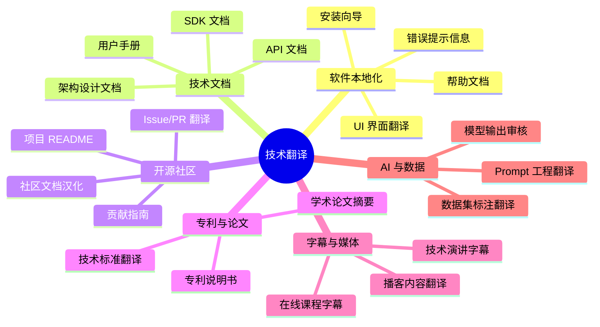
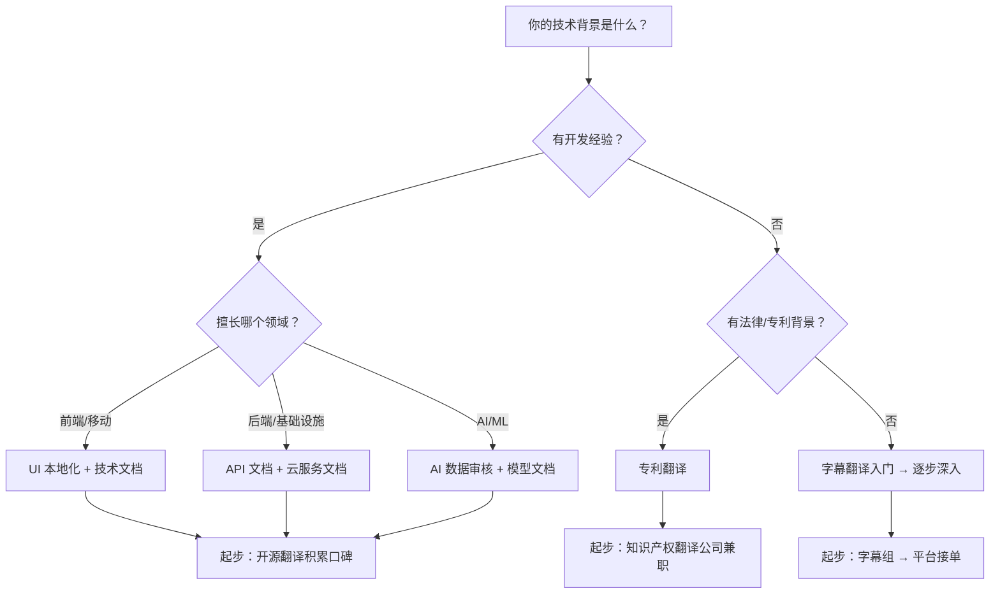
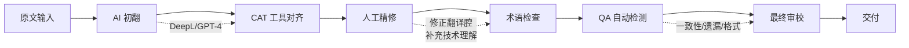
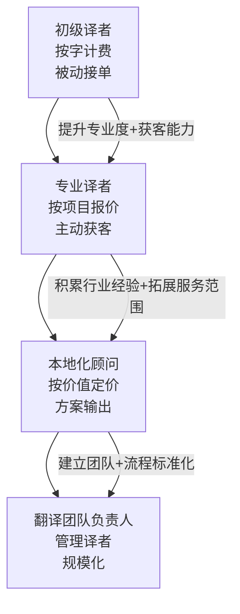

## 五、翻译技能变现

翻译是技术人最容易切入、门槛最灵活的变现方式之一。与纯语言专业译者相比，技术人做翻译有一个天然壁垒优势：**你既懂技术，又懂语言**。这意味着你能接别人接不了的活——技术文档翻译、API 本地化、开源项目汉化、字幕翻译、专利翻译等高附加值领域。

本章从市场认知、能力建设、接单渠道、定价策略、效率工具、法律合规、规模化路径七个维度，系统讲解如何把翻译技能变成稳定收入来源。无论你是想赚零花钱的在校生，还是想转型全职的技术人，都能在这里找到可执行的路径。

### 1. 翻译变现的市场全景

#### 1.1 为什么技术人做翻译有优势

纯语言翻译市场竞争激烈，千字价格被压到 30-80 元。但技术翻译是另一片天地：

| 维度 | 纯语言翻译 | 技术翻译 |
|------|-----------|---------|
| 千字价格 | 30-80 元 | 100-500 元 |
| 竞争者数量 | 极多（英语专业大量供给） | 少（需要技术背景） |
| 机器翻译替代性 | 高（日常文本 ChatGPT 已够用） | 低（技术细节仍需人工把关） |
| 客户粘性 | 低（谁便宜找谁） | 高（换人成本大，术语一致性难保证） |
| 复利效应 | 弱 | 强（领域知识越深越值钱） |

技术翻译的核心壁垒在于：**机器翻译能给你一个 70 分的初稿，但客户需要的是 95 分的终稿**。技术术语的精确性、上下文的逻辑一致性、目标读者的阅读习惯适配——这些都需要懂技术的人来把关。

一个具体例子：某云服务厂商的 API 文档中，`retry policy` 这个术语在不同上下文下含义不同——在 SDK 配置中指"重试策略"（一种配置对象），在错误处理指南中指"重试策略模式"（一种设计模式）。纯语言译者很容易混淆，但有开发经验的人一眼就能区分。

#### 1.2 主要细分领域



各领域的收入天花板和入门难度差异很大：

| 细分领域 | 入门难度 | 千字价格 | 年收入天花板 | 推荐指数 |
|---------|---------|---------|------------|---------|
| 软件本地化 | ★★☆ | 80-200 元 | 10-20 万 | ★★★★ |
| 技术文档 | ★★★ | 150-500 元 | 20-50 万 | ★★★★★ |
| 开源社区 | ★☆☆ | 0-100 元（多为志愿） | 积累口碑，间接变现 | ★★★ |
| 专利翻译 | ★★★★ | 300-800 元 | 30-80 万 | ★★★★ |
| 字幕翻译 | ★★☆ | 50-150 元 | 5-15 万 | ★★★ |
| AI 数据审核 | ★★☆ | 按时薪 100-300 元 | 10-30 万 | ★★★★ |

**选择细分领域的决策框架**：



#### 1.3 翻译行业的底层逻辑

翻译行业有一个反直觉的规律：**越是 AI 发达的时代，高质量人工翻译越值钱**。原因如下：

1. **AI 降低了翻译的生产成本，但提高了质量标准**。当所有人都能用机器翻译出 70 分的初稿时，客户对"交付质量"的期望反而从 80 分提升到了 95 分。2023 年之前，一份"大致通顺"的技术翻译就能交付；现在客户会用 DeepL 对照审查，找出每一处不够自然的表达。
2. **AI 无法处理的长尾需求恰恰是高价值领域**。专业术语、行业惯例、文化适配、法律合规性——这些都需要领域专家来判断。例如，医疗设备文档中的 `contraindication` 必须翻译为"禁忌症"而非"禁忌"，一字之差可能涉及法规合规。
3. **翻译 + 审校 + 本地化咨询**的一站式服务，比单纯的"翻译"值钱得多。你的角色从"译者"升级为"本地化顾问"。

**2024-2026 年技术翻译市场趋势**：

| 趋势 | 影响 | 机会 |
|------|------|------|
| AI Agent 爆发 | 大量 Agent 框架文档需要多语种支持 | Agent 框架文档翻译需求激增 |
| 中国 SaaS 出海 | 产品界面+文档需要英文本地化 | 中译英需求持续增长 |
| 开源全球化 | 更多国际项目需要中文社区文档 | 开源翻译成为稳定获客渠道 |
| 合规要求提升 | GDPR、数据安全法等法规文档需要专业翻译 | 合规文档翻译单价高 |
| 视频内容爆发 | 技术演讲、教程视频需要字幕 | 字幕翻译+配音需求增长 |

### 2. 能力建设：从能翻译到翻译好

#### 2.1 语言能力的三个层次

**第一层：准确性（Accuracy）**

这是最基本的要求——原文说什么，译文就说什么，不能错译、漏译、添译。

技术翻译中的准确性尤其重要，因为一个术语翻译错误可能导致：
- 开发者集成 API 时参数理解错误
- 用户操作手册中的步骤指向错误功能
- 专利文档中的技术方案描述失真

提升准确性的方法：
- 建立个人术语库（用 Excel、Notion 或专业 CAT 工具）
- 对照权威翻译（微软、Google、苹果的官方中文文档是最好的学习材料）
- 交叉验证（同一术语在不同上下文中的翻译是否一致）

**第二层：流畅性（Fluency）**

译文读起来要像"中文写的"，而不是"英文翻译过来的"。

常见的翻译腔问题：

```text
❌ 翻译腔：这个功能允许用户能够通过使用配置文件来对系统的行为进行自定义。
✅ 自然中文：用户可通过配置文件自定义系统行为。

❌ 翻译腔：在这种情况之下，系统将会返回一个错误信息给到用户。
✅ 自然中文：此时系统会向用户返回错误提示。

❌ 翻译腔：需要注意的是，这个方法在版本 2.0 中被弃用了。
✅ 自然中文：注意：该方法自 2.0 版本起已弃用。

❌ 翻译腔：对于那些想要了解更多关于这个主题的读者来说，他们可以参考以下文档。
✅ 自然中文：详情请参阅以下文档。

❌ 翻译腔：这取决于你是否想要使用这个功能。
✅ 自然中文：是否使用该功能，视需求而定。
```

消除翻译腔的核心技巧：
- **断句重组**：英文长句拆成中文短句。英文习惯用从句嵌套，中文习惯用短句并列
- **主语转换**：英文被动语态转中文主动语态。"The error is thrown by the system" → "系统抛出该错误"
- **删减冗余**：中文不习惯用大量从句，能省则省。"In order to" → 直接用"为了"或省略
- **语序调整**：中文习惯"先因后果"，英文习惯"先果后因"
- **代词消解**：英文大量使用 "it/this/that"，中文需要明确指代对象

**第三层：专业性（Professionalism）**

专业性体现在三个层面：

1. **术语一致性**：同一个概念在全文中必须使用相同的译法。例如"container"在 Docker 语境下统一翻译为"容器"，不能有时叫"容器"有时叫"集装箱"。建立术语表并在 CAT 工具中设置术语检查，是保证一致性的技术手段。
2. **风格适配**：API 文档要简洁精确，用户手册要通俗易懂，技术博客可以轻松活泼。不同场景需要不同的翻译风格。以下是几种典型场景的风格指南：

| 场景 | 句式 | 用词 | 语气 | 示例 |
|------|------|------|------|------|
| API 文档 | 短句、祈使句 | 专业术语 | 客观中立 | "调用 `getUser()` 方法获取用户信息。" |
| 用户手册 | 中等长度 | 通俗易懂 | 友好引导 | "点击右上角的头像，即可查看个人信息。" |
| 技术博客 | 长短结合 | 可口语化 | 轻松活泼 | "你可能遇到过这种情况：代码明明没改，测试却挂了。" |
| 专利文档 | 长句、被动语态 | 法律+技术 | 严谨正式 | "根据本发明的实施例，所述方法包括以下步骤。" |
| 错误信息 | 短句 | 技术+解决方案 | 简洁有用 | "连接超时。请检查网络设置后重试。" |

3. **行业惯例**：每个行业都有约定俗成的翻译方式。例如法律文本中的"hereinafter referred to as"固定翻译为"以下简称为"；医学文档中的"adverse event"翻译为"不良事件"而非"负面事件"。

#### 2.2 技术能力的深度要求

作为技术翻译，你需要对所翻译的技术领域有真正的理解：

- **做过比翻译更深的事**。如果你翻译 React 文档，至少自己写过 React 项目；如果你翻译 Kubernetes 文档，至少自己部署过 K8s 集群。不需要精通，但必须有实操经验，否则你无法判断某些翻译在技术上是否合理。
- **能判断原文的错误**。技术文档也会有错误。当原文写错了一个参数名或函数签名时，你需要能识别并在翻译中修正（加译注说明）。这是技术译者最核心的价值——纯语言译者无法做到这一点。
- **了解目标读者的水平**。给初学者翻译和给资深开发者翻译，用词和解释深度完全不同。初学者文档中需要保留更多解释性内容，资深文档则可以直接使用术语。
- **跟踪技术动态**。订阅你翻译领域的技术博客、Release Notes、RFC 文档。技术在演进，术语也在变化。例如 "serverless" 从最初的"无服务器"到现在更多翻译为"Serverless"（保留英文），行业习惯在变化。

#### 2.3 CAT 工具（计算机辅助翻译）熟练度

CAT 工具是翻译行业的生产力倍增器，不是"用 AI 替代翻译"，而是"用工具提升效率和一致性"。

| 工具 | 类型 | 价格 | 适合场景 | 推荐度 |
|------|------|------|---------|--------|
| OmegaT | 开源桌面端 | 免费 | 个人项目、学习入门 | ★★★★ |
| MemoQ | 商业桌面端 | 约 1500 元/年 | 专业译者日常工作 | ★★★★★ |
| SDL Trados | 商业桌面端 | 约 3000 元/年 | 大型翻译公司协作 | ★★★★ |
| Crowdin | 云端协作 | 免费起步 | 开源项目、团队本地化 | ★★★★ |
| Lokalise | 云端协作 | $120/月起 | SaaS 产品本地化 | ★★★★ |
| Weblate | 开源自部署 | 免费 | 开源项目自主管理 | ★★★ |
| Smartcat | 云端协作 | 免费起步 | 个人译者+AI 辅助 | ★★★★ |

CAT 工具的核心价值：
- **翻译记忆（TM）**：之前翻译过的句子自动匹配，确保一致性。当你翻译"Click the Save button"时，如果之前翻译过类似句子，TM 会自动建议之前的译法，避免同一句话翻出三个版本。
- **术语库（TB）**：统一管理术语，团队协作时不撞车。可以设置强制术语，如果译文中使用了非标准译法，工具会自动警告。
- **质量检查（QA）**：自动检测遗漏、不一致、数字错误等。比如原文写了"version 3.0"但译文写了"版本 2.0"，QA 会自动标红。
- **格式保持**：原文的 Markdown、HTML 标签自动保留，只翻译文本。避免手动处理格式的麻烦。

**CAT 工具学习路径建议**：

1. **入门（1-2 周）**：用 OmegaT 学习基本概念——TM、TB、段落对齐、QA 检查
2. **进阶（1-2 月）**：切换到 MemoQ 或 Trados，学习高级功能——正则过滤、TM 管理、批处理
3. **协作（持续）**：学习 Crowdin/Lokalise 的团队协作流程——角色管理、Review 流程、API 集成

#### 2.4 专业认证与资质

虽然技术翻译行业不像医学、法律那样有强制认证，但以下资质可以显著提升你的竞争力和定价能力：

| 认证 | 颁发机构 | 适用范围 | 难度 | 价值 |
|------|---------|---------|------|------|
| CATTI（翻译专业资格考试） | 人社部 | 国内通用 | ★★★★ | 国内最权威的翻译资质 |
| ATA Certification | 美国翻译协会 | 国际通用 | ★★★★★ | 北美市场敲门砖 |
| 专利代理师 | 国家知识产权局 | 专利翻译 | ★★★★★ | 专利翻译必备 |
| ISO 17100 审核 | 各认证机构 | 翻译公司 | ★★★ | 开翻译公司的基础 |
| MemoQ/Trados 认证 | 工具厂商 | 全球通用 | ★★ | 证明工具熟练度 |

**建议**：优先考 CATTI 二级笔译（国内）或 ATA 认证（国际市场）。这两个认证的投入产出比最高——备考过程本身就是系统学习翻译技巧的过程。

### 3. 接单渠道与获客策略

#### 3.1 翻译平台（入门推荐）

适合新手快速起步的平台：

| 平台 | 特点 | 收入模式 | 适合人群 |
|------|------|---------|---------|
| 有道人工翻译 | 国内大平台，单量稳定 | 按千字计费，平台抽成 20-30% | 新手入门 |
| Gengo | 国际平台，英文为主 | 按字数计费，分 Standard/Precise 两档 | 英语能力强的人 |
| Translated.net | 欧洲平台，语种多 | 按字数，有质量评分体系 | 多语种能力者 |
| 语翼 Woordee | 传旗下，技术文档多 | 按千字，有测试评级 | 技术背景译者 |
| ProZ | 全球最大译者社区 | 自主报价，客户直接联系 | 有经验的译者 |
| Smartcat | 云端平台+AI 辅助 | 自主报价，平台匹配客户 | 喜欢 AI 工作流的译者 |
| Fiverr | 自由职业平台 | 自主定价，按单收费 | 想做自由职业的人 |

平台接单的注意事项：
- 注册时认真做能力测试，评级越高单价越高。第一次测试没过不要灰心，很多平台允许重考
- 前几单宁可少赚也要保证质量，好评是后续接单的基础。平台算法通常会给高评分译者更多曝光
- 不要同时接太多单，质量下降会砸招牌。新手建议同时不超过 2 个单子
- 平台是起步用的，最终要建立自己的获客渠道。平台抽成 20-30%，直客意味着同样的工作多赚 20-30%
- 注意平台的结算周期和最低提现金额，有些平台有 30-60 天的账期

#### 3.2 开源社区翻译（建立声誉）

参与知名开源项目的翻译是建立技术翻译声誉的最佳方式：

**推荐参与的项目**：
- **Vue.js 中文文档**：Vue 生态有活跃的中文社区，贡献翻译可以被大量开发者看到
- **MDN Web Docs**：Mozilla 的开发者文档，接受社区翻译贡献
- **React 官方文档**：Meta 维护，中文翻译由社区驱动
- **Kubernetes 中文文档**：CNCF 项目，技术翻译需求量大
- **Rust 程序设计语言（The Book）**：社区翻译项目活跃
- **Flutter 中文文档**：Google 维护，中文社区活跃
- **Next.js 文档**：Vercel 维护，前端开发者高频访问

**参与流程**：
1. 在 GitHub 上找到项目的翻译相关 Issue（通常标签为 `translation`、`i18n`、`l10n`）
2. Fork 仓库，认领未翻译的章节（在 Issue 下留言认领，避免重复劳动）
3. 按照项目的翻译规范完成翻译（每个项目都有自己的 TRANSLATING.md 或类似文档）
4. 提交 PR，根据 Review 意见修改（耐心等待 Review，大型项目可能需要数周）
5. 合并后在简历和个人主页上展示贡献记录

开源翻译虽然大多是无偿的，但它带来的价值是：
- 被潜在客户发现（他们就在用这些项目）
- 建立可验证的翻译能力证明（GitHub 记录无法伪造）
- 积累特定技术领域的翻译经验
- 结识技术社区的人脉（项目维护者可能就是你的下一个客户）

**开源翻译的进阶玩法**：不要只翻译，还要参与 Review 别人的翻译 PR。在开源社区中，Reviewer 的身份比 Contributor 更有分量。当你成为某个项目的中文翻译 Reviewer 时，你就是这个领域的权威。

#### 3.3 直客获客（高收入路径）

直接客户意味着你跳过平台抽成，自主定价。获客方式：

**内容营销**：
- 在掘金、知乎、Medium 上发布"技术翻译方法论"类文章
- 分享翻译案例对比（原文→机翻→人工优化），展示专业性
- 翻译知名技术文章并注明"译者注"，用译者身份引流
- 撰写"XX 技术中文术语规范"类文章，建立行业话语权

**社交媒体**：
- Twitter/X 上关注并互动技术写作圈的大 V
- 在 LinkedIn 上展示翻译作品集（LinkedIn 的 "Featured" 板块可以放翻译样本）
- 加入翻译相关的微信群、Telegram 群，接转介绍的单
- 在 GitHub 上维护一个翻译相关的开源项目（如术语表、翻译规范模板）

**直接联系**：
- 关注出海的国内技术公司，主动联系其本地化团队
- 国外 SaaS 公司进入中国市场时，翻译需求集中爆发
- 技术会议主办方经常需要演讲字幕翻译
- 关注 Product Hunt 上的新产品，很多产品上线时需要多语种支持

**冷邮件模板（直客获客）**：

```text
主题：[公司名] 技术文档中文化 — 免费审校样本

您好 [名字]，

我注意到 [公司名] 的产品最近开始支持中文市场，
但目前的技术文档尚未提供中文版本。

我是一名专注于 [领域] 的技术翻译，曾为 [类似公司/项目]
提供过文档本地化服务。以下是我的作品集：[链接]

为了让您直观了解翻译质量，我免费翻译了贵司文档中的
一个章节（约 500 字），放在附件中供参考。

如果这个方向您有兴趣，我们可以安排一个 15 分钟的通话，
讨论具体需求和合作方式。

祝好，
[你的名字]
```

#### 3.4 B 端大客户（稳定收入）

与企业建立长期合作关系是最稳定的收入模式：

- **翻译公司**：Lionbridge、RWS、Keywords Studios 等大型语言服务商持续招募技术领域兼职译者。成为他们的签约译者后，他们会定期派单，你不需要自己找客户
- **技术公司本地化部门**：字节、阿里、腾讯的国际化业务都有外包翻译需求。这些公司通常通过翻译公司发包，但也有直接招募兼职译者的情况
- **SaaS 出海企业**：越来越多中国 SaaS 产品出海，需要产品文档英翻中或中翻英。这类客户通常按月付费，是稳定的收入来源
- **律所专利部门**：专利翻译是高单价领域，需要技术背景 + 法律知识。与律所建立关系后，翻译需求非常稳定
- **游戏公司**：游戏本地化（UI 文本、剧情对话、系统提示）是一个被低估的细分市场，单价中等但量大

**如何进入 B 端市场**：

1. **准备作品集**：整理 3-5 个不同领域的翻译样本，包含原文和译文
2. **获取认证**：CATTI 二级或 ATA 认证是 B 端客户的信任基础
3. **参加行业活动**：翻译行业展会（如 Localization World、TAUS）、技术会议
4. **通过翻译公司中转**：先成为翻译公司的兼职译者，积累大客户项目的履历
5. **口碑传播**：做好每一个项目，让客户主动推荐你

### 4. 定价策略与报价技巧

#### 4.1 定价的基本框架

翻译定价通常按**千字**（源语言字数或目标语言字数）计算。技术翻译的合理定价区间：

| 翻译类型 | 中译英（千字） | 英译中（千字） | 备注 |
|---------|--------------|--------------|------|
| 一般技术文档 | 120-200 元 | 100-180 元 | 通用技术，无特殊门槛 |
| 专业领域文档 | 200-400 元 | 180-350 元 | 医疗、金融、法律技术 |
| API/SDK 文档 | 150-300 元 | 120-250 元 | 需要开发者背景 |
| 专利翻译 | 300-800 元 | 250-600 元 | 需要专利代理人资格更佳 |
| UI 本地化 | 100-200 元 | 80-150 元 | 量大，适合打包报价 |
| 技术演讲字幕 | 200-500 元/小时 | 150-400 元/小时 | 按视频时长计费 |
| 合规/法规文档 | 300-600 元 | 250-500 元 | 法律+技术双重要求 |
| 白皮书/技术报告 | 200-400 元 | 150-300 元 | 需要行业洞察力 |

**定价原则**：
- 新手起步价不要低于行业下限，否则会陷入低价竞争的泥潭。宁可少接单也不降价
- 报价时要区分"纯翻译"和"翻译 + 审校 + 排版"，后者可以加价 30-50%
- 紧急交付（48 小时内）加收 30-100% 的加急费
- 不确定的项目先做小样测试（500 字免费），再按实际难度报价
- 长期客户可以给 10-15% 的折扣，但不要超过这个幅度

**定价心理学**：
- 报价时给出区间而非精确数字（如"200-300 元/千字"），让客户有选择感
- 把"翻译 + 审校"打包成一个服务，比单独报价更容易成交
- 对比展示价值："用机器翻译 + 人工审校的混合模式，比纯人工便宜 30%，但质量不打折"

#### 4.2 报价话术模板

**初次接触客户的报价邮件**：

```text
主题：技术文档翻译服务 - [你的名字]

您好，

感谢您对翻译服务的咨询。基于您提供的文档类型（[具体类型]），
我的报价如下：

翻译费用：[X] 元/千字（源文字数）
审校费用：[Y] 元/千字（如需）
交付周期：[N] 个工作日
质量保证：免费修改至满意（含 [2] 轮修改）

我有 [X] 年技术翻译经验，专注于 [具体领域]，
曾为 [列举 2-3 个代表性客户或项目] 提供翻译服务。

附件为我之前完成的类似项目样本，供您参考。

如有任何问题，欢迎随时沟通。

[你的名字]
[联系方式]
```

**应对客户压价的话术**：

```text
理解您对成本的考虑。技术翻译的定价主要取决于三个因素：
1. 专业领域难度（这个领域的合格译者稀缺程度）
2. 质量要求（是否需要术语一致性、风格适配）
3. 交付时间（紧急项目需要投入更多精力）

我可以提供两个方案：
方案 A：[X] 元/千字 — 标准翻译 + 一轮修改
方案 B：[Y] 元/千字 — 翻译 + 专业审校 + 两轮修改 + 术语表

建议选择方案 B，因为技术文档的翻译质量直接影响
用户体验和产品信任度。
```

#### 4.3 避免常见的定价陷阱

- **不按字数按"页"报价**：页的定义模糊，容易扯皮。Word 里的"页"和 PDF 里的"页"字数可能差一倍
- **不提前确认术语表**：翻译过程中客户说"这个词应该这样翻"，返工成本全部你承担。开工前必须确认术语表
- **不签合同就开始做**：至少要有邮件确认的报价单，明确价格、交付物、修改次数
- **不做免费测试稿**：超过 500 字的测试应该付费，否则容易被白嫖。可以提供 200-300 字的免费样本，但完整测试必须收费
- **不约定修改次数**：没有约定修改次数 = 无限次免费修改。合同中必须写明"含 N 轮修改，超出部分按 [X] 元/小时计费"

#### 4.4 合同要点与模板

翻译服务合同不需要很复杂，但以下条款必须包含：

**必备条款清单**：

```text
1. 服务范围：明确翻译的语言对、文档类型、字数预估
2. 计费方式：按源文字数还是目标文字数？含税还是不含税？
3. 交付物：译文格式（Word/PDF/Markdown）、是否包含术语表
4. 交付时间：具体日期，而非"尽快"
5. 修改条款：包含几轮修改？超出如何计费？
6. 保密条款：客户文档通常涉及商业机密，必须签 NDA
7. 版权归属：译文版权默认归客户，但译者保留展示权（用于作品集）
8. 付款方式：预付比例（通常 30-50%）、尾款支付时间
9. 违约责任：延迟交付、质量不达标如何处理
```

**简版合同模板**（适用于小额项目）：

```text
技术翻译服务协议

甲方（委托方）：[客户名称]
乙方（服务方）：[你的名称]

一、服务内容
翻译语言：[英文→中文]
文档类型：[API 技术文档]
预计字数：[约 10,000 字]

二、费用与支付
翻译单价：[200] 元/千字
预计总价：[2,000] 元（以实际字数为准）
支付方式：交付后 [7] 个工作日内全额支付

三、交付时间
[2026 年 X 月 X 日] 前交付初稿
[2026 年 X 月 X 日] 前交付终稿（含 1 轮修改）

四、质量保证
乙方保证译文准确、通顺、术语一致。
如因乙方原因导致重大翻译错误，乙方免费修正。

五、保密
乙方对甲方提供的所有文档内容承担保密义务，
未经甲方书面同意不得向第三方披露。

六、其他
本协议一式两份，双方各执一份。
```

### 5. 效率工具与工作流

#### 5.1 AI 辅助翻译工作流

现代技术翻译不是"不用 AI"，而是"用好 AI + 人工把关"的混合模式。以下是经过验证的高效工作流：



**AI 初翻工具选择**：

| 工具 | 优势 | 劣势 | 适合场景 | 价格 |
|------|------|------|---------|------|
| DeepL | 自然语言翻译质量最高 | 技术术语偶尔不准 | 通用技术文档 | 免费版有限，Pro $9/月起 |
| GPT-4/Claude | 可以给 Prompt 控制风格 | 长文本一致性差 | 需要风格控制的翻译 | 按 token 计费 |
| Google Translate API | 便宜，支持批量 | 质量中等 | 大批量初稿 | $20/百万字符 |
| 百度翻译 API | 中文相关翻译质量好 | 英文其他语种一般 | 中英互译 | 有免费额度 |
| 火山翻译 API | 字节跳动，质量好 | API 文档不够完善 | 中英互译 | 有免费额度 |

**Prompt 模板（用于 GPT-4/Claude 翻译）**：

```text
你是一位资深技术翻译专家，擅长 [领域] 文档的中英互译。

翻译要求：
1. 术语一致性：[列出关键术语对照表]
2. 风格：技术文档风格，简洁准确，避免翻译腔
3. 格式：保留原文的 Markdown 格式和代码块
4. 处理方式：代码注释需要翻译，变量名和函数名保持原文
5. 不确定的术语用 [?] 标注，交由人工确认
6. 长句拆分为中文短句，被动语态转主动语态
7. 保持段落结构与原文一致

请翻译以下内容：
[原文]
```

**效率提升数据**（基于实际项目统计）：

| 工作模式 | 千字耗时 | 日产能（8小时） | 质量评分 |
|---------|---------|---------------|---------|
| 纯人工翻译 | 60-90 分钟 | 5,000-8,000 字 | 95-98 分 |
| AI 初翻 + 人工精修 | 20-30 分钟 | 15,000-25,000 字 | 92-96 分 |
| AI 初翻 + CAT + 精修 | 15-25 分钟 | 20,000-30,000 字 | 93-97 分 |

混合模式可以将效率提升 3-5 倍，但需要投入时间学习 AI 工具的最佳实践。

#### 5.2 翻译记忆库的建立与维护

翻译记忆库（TM）是你最有价值的长期资产。每翻译一段内容，都存入记忆库，后续遇到相同或相似的句子直接复用。

**建立方法**：
1. 用 OmegaT 或 MemoQ 创建项目时自动初始化 TM
2. 每完成一个项目，将 TM 导出为 TMX 格式备份
3. 按领域/客户/项目分文件夹管理
4. 定期清理低质量的 TM 记录（低质量 TM 比没有 TM 更糟糕，因为它会误导匹配）

**术语库的维护**：
- 每个新项目开始前，先确认术语表（与客户对齐）
- 用 Excel 或 TBX 格式管理，至少包含：原文、译文、定义、来源、确认状态
- 新增术语时更新到所有相关项目的术语库中
- 定期审查术语库，删除过时的术语（技术演进会导致术语变化）

**TM 的复利效应**：

假设你积累了 100 万字的翻译记忆库，在一个新项目中：
- 30% 的句子可以完全匹配（100% match）→ 直接复用，几乎零成本
- 20% 的句子可以部分匹配（75-99% match）→ 只需微调
- 50% 的句子是全新内容 → 需要完整翻译

这意味着你只需要翻译 50% 的内容，效率直接翻倍。而且随着 TM 的积累，这个比例会持续提升。

#### 5.3 质量检查清单

交付前必须通过以下检查：

```text
□ 术语一致性：全文关键术语使用同一译法
□ 数字准确性：日期、版本号、参数值与原文一致
□ 格式完整性：Markdown 标签、代码块、链接无损坏
□ 遗漏检查：无未翻译的段落或句子
□ 机翻痕迹：无明显的机器翻译腔调
□ 文化适配：日期格式、计量单位等适配目标读者习惯
□ 上下文逻辑：前后文连贯，无自相矛盾
□ 拼写检查：无错别字和标点错误
□ 代码验证：代码示例中的注释已翻译，代码本身未被修改
□ 链接检查：超链接指向正确（有些链接需要替换为目标语言版本）
□ 占位符检查：变量占位符（如 {name}、%s）保持原样
□ 排版检查：中英文之间加空格，标点使用中文标点
```

**中英文排版规范**（这是很多译者忽略的细节，但专业客户非常在意）：

| 规则 | 错误示例 | 正确示例 |
|------|---------|---------|
| 中英文之间加空格 | 使用React框架 | 使用 React 框架 |
| 中文用中文标点 | 点击"Submit"按钮。 | 点击"Submit"按钮。 |
| 数字与中文之间加空格 | 共有3个参数 | 共有 3 个参数 |
| 专有名词保持原文 | 谷歌云平台 | Google Cloud Platform |
| 全角括号用于中文注释 | 参见(第一章) | 参见（第一章） |

### 6. 法律合规与风险管理

#### 6.1 知识产权与版权

翻译涉及的法律问题比大多数人想象的复杂：

**版权归属的基本原则**：
- 原文版权归原作者所有，翻译权需要获得授权
- 个人学习、研究目的的翻译不需要授权（合理使用）
- 商业用途的翻译必须获得原作者或版权方的授权
- 开源项目的翻译通常遵循原项目的开源协议

**需要特别注意的情况**：
- 翻译商业产品（如 SaaS）的文档 → 必须获得书面授权
- 翻译付费课程的内容 → 必须获得授权，即使是"翻译+分享"
- 翻译技术书籍 → 必须获得出版社授权
- 翻译开源项目文档 → 检查项目的 LICENSE 文件，通常允许

#### 6.2 保密协议（NDA）

技术翻译经常涉及客户的商业机密，签 NDA 是行业惯例：

**NDA 要点**：
- 保密范围：明确哪些信息属于保密信息
- 保密期限：通常 2-5 年
- 使用限制：只能用于翻译目的，不得用于其他用途
- 违约责任：明确违约的法律后果

**实操建议**：
- 客户要求签 NDA 是好事，说明他们重视这个项目
- 不要在公共场合（咖啡厅、共享办公空间）处理保密文档
- 使用加密工具存储客户文档（如 VeraCrypt、Cryptomator）
- 项目结束后，按照合同约定销毁或归还文档

#### 6.3 税务与发票

作为自由职业翻译，税务合规是必须考虑的问题：

**个人译者的税务处理**：
- 年收入低于 12 万：通常不需要额外申报（已有代扣代缴）
- 年收入超过 12 万：需要进行年度汇算清缴
- 与翻译公司合作：通常由公司代扣代缴个税
- 与直客合作：需要自行申报，可以到税务局代开发票

**建议**：使用记账工具（如随手记、Money Pro）记录每一笔翻译收入和相关支出（CAT 工具订阅、参考书籍等），方便年度汇算。

### 7. 进阶：从译者到本地化顾问

#### 7.1 服务升级路径

翻译变现的终极目标不是"接更多单"，而是"提升单位时间价值"：



**各阶段的收入模式对比**：

| 阶段 | 收入模式 | 月收入范围 | 工作方式 | 核心能力 |
|------|---------|-----------|---------|---------|
| 初级译者 | 平台接单，按字计费 | 2,000-8,000 元 | 兼职，利用碎片时间 | 语言能力+基础技术 |
| 专业译者 | 直客+平台，按项目报价 | 8,000-25,000 元 | 全职或高强度兼职 | 领域专精+获客能力 |
| 本地化顾问 | 咨询+翻译打包 | 25,000-50,000 元 | 全职，方案输出为主 | 行业洞察+方案设计 |
| 团队负责人 | 项目管理+抽成 | 50,000 元以上 | 管理为主，翻译为辅 | 团队管理+质量控制 |

#### 7.2 本地化顾问的核心能力

当你从"译者"升级为"本地化顾问"时，客户买的不再是你的翻译，而是你的**判断力**：

- **市场判断**：帮客户决定优先进入哪个市场（日本？东南亚？欧洲？）。不同市场的优先级取决于用户基数、付费能力、竞争格局
- **策略制定**：制定本地化优先级（先翻译哪些模块？UI 先还是文档先？）。通常建议：先翻译用户高频接触的 UI → 再翻译核心文档 → 最后翻译营销材料
- **质量标准**：定义本地化质量标准和验收流程。包括术语一致性标准、风格指南、QA 检查清单
- **文化适配建议**：颜色、图标、文案风格是否适合目标市场。例如，日本市场偏好详细的产品说明，欧美市场偏好简洁的 Quick Start
- **工具选型**：推荐适合客户团队规模和技术栈的本地化工具链

#### 7.3 团队化运作

当你的订单超过个人产能时，需要考虑团队化：

1. **招募译者**：在 ProZ、翻译群、开源社区中寻找靠谱的兼职译者。优先找有技术背景的人，语言能力可以培训，但技术理解很难速成
2. **建立标准**：制定统一的翻译规范、术语表、质量检查流程。这些标准文档是团队运作的基础
3. **分配与审校**：你负责项目管理 + 最终审校，译者负责初翻。审校是你的核心价值——确保所有产出质量一致
4. **利润分配**：通常管理者拿 30-40%，译者拿 60-70%。如果你提供了 TM 和术语库，可以适当提高分成
5. **质量控制**：每个译者的产出都要抽检，不合格的要返工或淘汰。建立译者评分体系，定期淘汰低分译者

**团队管理工具推荐**：

| 工具 | 用途 | 价格 |
|------|------|------|
| Crowdin | 翻译协作平台 | 免费起步 |
| Notion | 项目管理+文档 | 免费起步 |
| Google Sheets | 进度跟踪+术语管理 | 免费 |
| Slack/飞书 | 团队沟通 | 免费起步 |
| GitHub | 版本控制+Review | 免费 |

### 8. 常见误区与避坑指南

#### 误区一：机器翻译会取代人工翻译

**现实**：机器翻译取代的是"低端翻译"，而不是"技术翻译"。当机器翻译能轻松处理日常对话翻译时，客户对翻译质量的期望反而提高了。你需要做的不是跟机器比速度，而是做机器做不好的事——技术准确性、文化适配、术语管理、风格把控。

**类比**：计算器没有取代会计，Excel 没有取代财务分析师。工具提升了效率，但专业判断力始终稀缺。

#### 误区二：英语好就能做翻译

**现实**：语言能力只是入场券。技术翻译需要的是"语言 + 技术 + 翻译技巧"的组合能力。一个英语专八但不懂编程的人，翻译 API 文档的效率和质量都不如一个英语六级但有三年开发经验的程序员。

**验证方法**：找一篇你熟悉领域的英文技术文档，试着翻译。如果翻译出来的中文连你自己都觉得读着别扭，说明翻译技巧还需要提升。

#### 误区三：翻译是按字计费的体力活

**现实**：初级翻译确实按字计费，但高级翻译是按价值计费。同样一篇 1000 字的技术文档，如果它是一个价值百万美元的 SaaS 产品的核心文档，翻译质量直接影响转化率——这时候收费可以是普通文档的 3-5 倍。

**价值定价示例**：

| 场景 | 千字价格 | 原因 |
|------|---------|------|
| 内部培训文档 | 120 元 | 读者有限，影响小 |
| 产品帮助中心 | 250 元 | 直接影响用户体验 |
| 上市公司年报技术部分 | 500 元 | 影响投资者决策 |
| 医疗器械说明书 | 800 元 | 涉及患者安全 |

#### 误区四：接的单越多赚的越多

**现实**：翻译是典型的时间换钱模式，如果你只是机械地接单翻译，收入天花板就是你每天能翻译的字数 × 单价。突破天花板的方式是：提升单价（做高端市场）、提升效率（用 AI + CAT 工具）、规模化（带团队）。

#### 误区五：不需要合同

**现实**：翻译纠纷中最常见的三个问题——"字数怎么算"、"修改几次免费"、"版权归属"——全都可以用一份简单的合同解决。没有合同，你可能翻译了 3 万字，客户只付 1 万字的钱，你说他少算了，他说你注水了，扯不清楚。

#### 误区六：只做翻译就够了

**现实**：纯粹的翻译服务很容易被替代。你需要提供增值服务：术语表维护、风格指南制定、翻译质量报告、本地化咨询。这些增值服务不仅提升了收入，还提升了客户粘性。

#### 误区七：AI 辅助翻译 = 作弊

**现实**：AI 辅助翻译是行业标准做法，不是作弊。关键是"辅助"而非"替代"——AI 负责初稿，你负责质量把关。客户关心的是交付质量，不是你用了什么工具。但你需要在合同中说明工作方式，避免客户误解。

### 9. 实战案例

#### 案例一：从程序员到技术文档翻译专家

**背景**：张工，5 年 Java 开发经验，英语 CET-6，想利用业余时间做副业。

**路径**：
1. 第 1 个月：在有道翻译注册，通过技术类测试，开始接 Java/Spring 相关的翻译小单
2. 第 2-3 个月：翻译了 3 篇 Spring 官方博客的中文版，发布在掘金上，获得 2,000+ 收藏
3. 第 4 个月：一家出海的 SaaS 公司通过掘金文章找到他，签了长期翻译合同（月付 8,000 元）
4. 第 6 个月：开始用 DeepL + OmegaT 的工作流，翻译效率提升 3 倍
5. 第 12 个月：积累了 3 个稳定客户，月收入 2-3 万，辞掉开发工作全职做技术翻译

**关键转折点**：在掘金上发布的免费翻译文章带来了第一个直客。内容营销是技术翻译最好的获客方式。

**时间分配**：前 6 个月兼职（每天 2-3 小时），后 6 个月全职（每天 6-8 小时）。

#### 案例二：专利翻译的高收入路径

**背景**：李工，电子工程硕士，有专利代理人资格证。

**路径**：
1. 通过专利代理师考试后，在知识产权翻译公司兼职
2. 第一年积累经验，千字 300 元，月入 6,000-8,000 元
3. 第二年跳到律所的知识产权部门做外包译者，千字 500 元
4. 第三年建立了自己的专利翻译小团队（3 人），自己做审校和客户对接
5. 年收入突破 40 万

**关键能力**：专利翻译需要"技术理解 + 法律语言 + 翻译技巧"三合一，门槛高但回报也高。

**避坑经验**：专利翻译最大的坑是"权利要求书"的翻译。这类文本对措辞精度要求极高，一个词的偏差可能导致专利保护范围变化。建议新手从"说明书"开始练手，积累经验后再碰"权利要求书"。

#### 案例三：开源翻译带来的连锁反应

**背景**：王同学，大三计算机专业学生，想赚零花钱。

**路径**：
1. 大三上学期参与 Vue.js 中文文档翻译，贡献了 5 个章节
2. 在 GitHub 上的贡献记录被一家前端培训机构发现
3. 培训机构邀请他兼职翻译培训材料，月入 3,000 元
4. 大三下学期开始在 Crowdin 上接软件本地化项目
5. 毕业时已经有了 2 年翻译经验和稳定的兼职收入

**关键启示**：开源贡献是最好的"免费简历"。你在开源社区的每一个 PR 都是向全世界展示你能力的窗口。

#### 案例四：从字幕翻译到技术内容本地化

**背景**：陈同学，英语专业毕业，在字幕组做了 2 年志愿者。

**路径**：
1. 在字幕组积累了技术演讲翻译经验（YouTube 技术频道）
2. 在 Gengo 平台注册，通过 Standard 级别测试
3. 逐步接技术类字幕翻译单，发现技术内容翻译单价更高
4. 自学 Python 基础知识，开始翻译 Python 教程类内容
5. 一年后成为某在线教育平台的签约字幕翻译，月入 8,000-12,000 元

**关键转折**：从纯语言翻译转向技术翻译，单价从 50 元/千字提升到 200 元/千字。即使技术能力不如科班出身的开发者，"技术入门 + 翻译专业"的组合也有独特价值。

### 10. 行动清单

如果你决定开始翻译变现，按以下顺序执行：

**第一周：基础准备**
- [ ] 评估自己的语言能力和技术领域优势
- [ ] 选择 1-2 个目标细分领域
- [ ] 注册 1 个翻译平台（推荐有道或语翼）并通过测试
- [ ] 下载安装 OmegaT（免费 CAT 工具）
- [ ] 了解 CAT 工具的基本操作（TM、TB、QA）

**第一个月：积累作品**
- [ ] 完成 3-5 个平台小单，积累好评
- [ ] 翻译 1-2 篇知名技术文章，发布到掘金/知乎
- [ ] 建立个人术语库（至少 100 个核心术语）
- [ ] 熟悉 AI 辅助翻译工作流
- [ ] 参与 1 个开源项目的翻译贡献

**第三个月：稳定收入**
- [ ] 通过内容营销获取第一个直客
- [ ] 建立翻译记忆库（至少 5 个项目）
- [ ] 月收入达到 3,000-5,000 元
- [ ] 确定自己的定价策略
- [ ] 准备一份翻译作品集（3-5 个样本）

**第六个月：规模化**
- [ ] 培养 2-3 个稳定客户
- [ ] 月收入达到 8,000-15,000 元
- [ ] 考虑是否全职投入
- [ ] 评估是否需要招募协作译者
- [ ] 考取 CATTI 二级或准备 ATA 认证

**第十二个月：专业化**
- [ ] 确定 1-2 个深耕的细分领域
- [ ] 建立个人品牌（技术翻译博客、社交媒体影响力）
- [ ] 月收入达到 15,000-30,000 元
- [ ] 开始提供增值服务（术语管理、本地化咨询）
- [ ] 评估是否组建翻译团队
