## 六、在线教育与知识付费

在线教育与知识付费是技能变现的"终极形态"之一。不同于接单和咨询的"一次劳动一次收费"，课程和知识产品具有**边际成本趋近于零**的特性——你录制一次课程，可以卖给一百人、一千人、一万人，而你的额外劳动几乎为零。这就是为什么，从接单到课程，是每个技术变现者都必须认真考虑的跃迁路径。

但"知识付费"不是简单地把你会的东西录个视频。它涉及课程设计、教学法、平台选择、定价策略、营销漏斗、用户运营、版权保护、税务合规等一系列专业能力。本节将从底层逻辑到实操细节，系统拆解在线教育与知识付费的完整方法论。

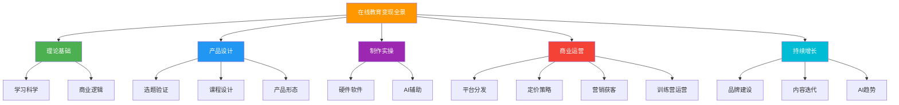

### 6.1 为什么技术人应该做知识付费

#### 6.1.1 知识付费的商业本质

知识付费的本质是**将隐性知识显性化，再将显性知识规模化交付**。

技术人日常工作中积累的"经验"——如何排查线上故障、如何设计高并发系统、如何用AI工具提效——都是隐性知识。这些知识在你脑子里值每月几万的薪水，但如果封装成课程，它可以同时服务成千上万人。

理解这个本质，才能理解为什么知识付费是"睡后收入"的终极形态。接单和咨询的本质是**出售时间**，而知识付费的本质是**出售产品**。时间有上限（每天24小时），产品没有上限。

```text
知识付费的收入公式：

收入 = 流量 × 转化率 × 客单价 × 复购率

其中：
- 流量：有多少人知道你的课程
- 转化率：知道的人中有多少买了（行业平均 2-5%）
- 客单价：课程定价
- 复购率：买过的人是否会买更多（好的课程可达 30-50%）
```

这个公式揭示了一个关键事实：**知识付费的收入增长是乘法关系，不是加法关系**。接单是"做一单赚一单"，收入=单价×数量，而数量受你的时间约束。知识付费的四个变量可以同时增长——流量通过内容营销持续扩大，转化率通过课程优化持续提升，客单价通过产品阶梯持续提高，复购率通过社群运营持续加强。四个变量各增长50%，总收入增长 1.5^4 ≈ 5倍，这就是复利的力量。

**知识付费的经济模型**还可以用"边际成本"来理解：

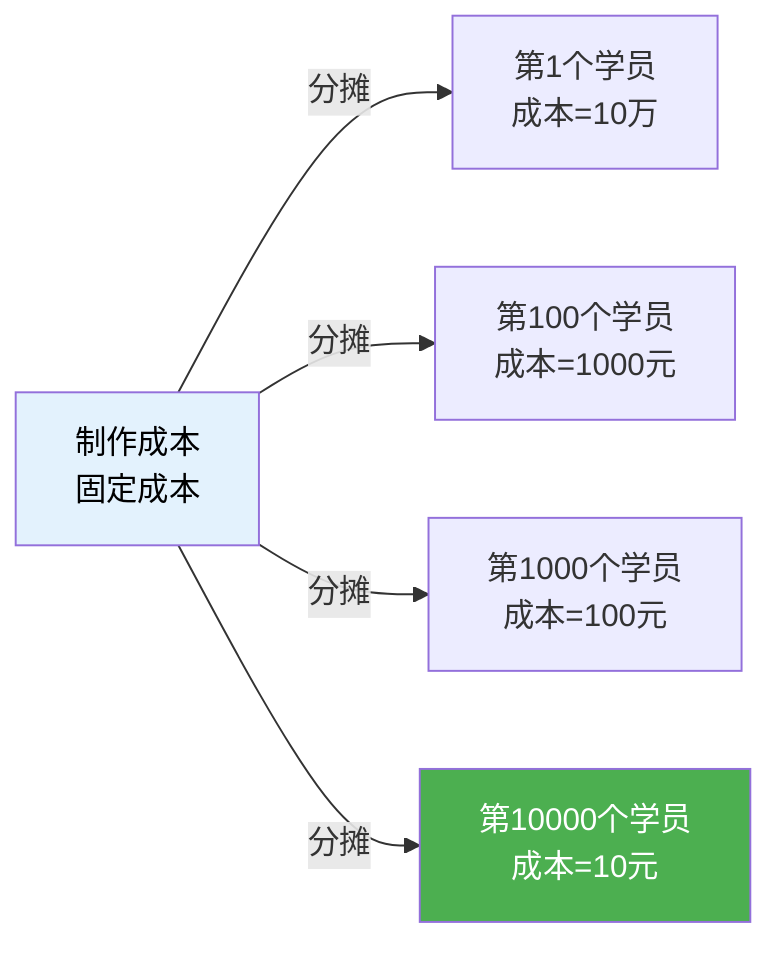

一门课程的制作成本是固定的（假设10万元），但随着学员数量增加，每个学员的边际成本趋近于零。这意味着：**知识付费是一门前期投入高、后期回报指数增长的生意**。大多数人在看到"前期投入高"时就放弃了，但真正理解这个模型的人会坚持到指数增长拐点。

**知识付费的三层价值创造**：

知识付费创造的价值不是单一维度的，而是三层叠加的：

| 价值层级 | 具体内容 | 学员感知 | 定价影响 |
|---------|---------|---------|---------|
| **信息价值** | 知识点、代码、工具 | "我知道了" | 低（信息易被替代） |
| **认知价值** | 思维框架、决策模型、判断力 | "我理解了" | 中（认知难以自学获得） |
| **行动价值** | 可执行的方案、即时反馈、成果保障 | "我做到了" | 高（行动价值最难替代） |

大多数技术课程只提供了第一层（信息价值），所以只能定低价。真正高价值的课程提供的是第三层——"学完就能用"的行动价值。训练营之所以能定价2999元，不是因为内容比299元的录播课多10倍，而是因为它提供了"有人带你做、有人给你反馈、有人帮你纠错"的行动价值。

这个分析框架直接决定了你的课程定位：如果你只能提供信息价值，就做低价图文产品（9.9-99元）；如果你能提供认知价值，就做中价系统课程（199-999元）；如果你能提供行动价值，就做高端训练营（999-4999元）。

#### 6.1.2 技术人做知识付费的独特优势

| 优势维度 | 具体体现 | 与其他知识博主的区别 |
|---------|---------|-------------------|
| 专业深度 | 有真实项目经验，能讲出"踩坑"细节 | 非技术博主只能讲理论，无法回答具体技术问题 |
| 实操能力 | 能提供可运行的代码、可复现的Demo | 有代码=有证据，学员信任度高 |
| 行业敏感度 | 了解最新技术趋势和企业真实需求 | 能教"市场上真正需要的"而不是"过时的理论" |
| 同行社群 | 本身就是目标用户，懂用户痛点 | 不需要做用户调研，自己就是用户 |
| 复利效应 | 技术内容越老越值钱（底层原理不变） | 一个好课程可以卖3-5年 |
| 可验证性 | 学员可以自己跑代码验证效果 | 不像"成功学""思维课"那样无法证伪 |
| 持续需求 | 技术迭代带来持续学习需求 | 每个新技术都是新课程机会 |

技术人做知识付费还有一个被低估的优势：**技术社区的分享文化**。在其他领域，知识分享需要建立信任壁垒，但在技术圈，一个GitHub仓库、一篇技术博客、一次开源贡献就能快速建立专业背书。这种社区信任是其他领域知识博主花几年都未必能建立的。

#### 6.1.3 知识付费 vs 其他变现方式的对比

| 维度 | 接单外包 | 技术咨询 | 知识付费 |
|------|---------|---------|---------|
| 收入模型 | 时间×单价 | 时间×单价 | 产品×销量 |
| 收入上限 | 月入3-8万（时间瓶颈） | 月入5-15万（精力瓶颈） | 理论无上限 |
| 启动门槛 | 低（会写代码就行） | 中（需要行业口碑） | 中高（需要内容能力） |
| 时间自由度 | 低（客户随时找你） | 中（按预约排期） | 高（录完就卖） |
| 复利效应 | 无（每单从零开始） | 弱（经验可复用） | 强（一次制作多次销售） |
| 前期收入 | 快（接单即有收入） | 中（需建立信任） | 慢（需要积累期） |
| 稳定性 | 波动大（看接单量） | 中等（有固定客户后） | 逐渐稳定（复利积累） |
| 护城河 | 弱（可替代性高） | 中（个人品牌） | 强（内容资产+社群） |
| 退出价值 | 无（停做即停收） | 弱（品牌可转让） | 强（课程资产可出售） |

**核心结论**：知识付费不是替代接单和咨询，而是在它们之上的"收入放大器"。最佳策略是：用接单养活自己，用课程放大收入，用咨询提升品牌——三条腿同时走。更进阶的做法是让三者形成飞轮：接单积累实战经验→经验写成课程→课程建立品牌→品牌带来咨询→咨询积累更多案例→案例丰富课程内容。

### 6.2 知识付费的产品形态

在投入之前，先搞清楚知识付费有哪些产品形态，各自的投入产出比如何：

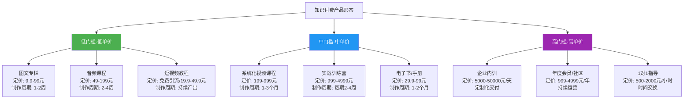

#### 6.2.1 各形态的投入产出分析

| 产品形态 | 制作投入 | 维护成本 | 收入稳定性 | 可规模化程度 | 建议优先级 |
|---------|---------|---------|-----------|------------|----------|
| 图文专栏 | ★☆☆☆☆ | ★☆☆☆☆ | ★★☆☆☆ | ★★★★★ | 可作为起步 |
| 音频课程 | ★★☆☆☆ | ★☆☆☆☆ | ★★★☆☆ | ★★★★★ | 适合有表达能力的 |
| 短视频教程 | ★★★☆☆ | ★★★★★ | ★★☆☆☆ | ★★★★☆ | 引流为主 |
| 系统化视频课程 | ★★★★☆ | ★★☆☆☆ | ★★★★☆ | ★★★★★ | **核心产品** |
| 实战训练营 | ★★★★☆ | ★★★★☆ | ★★★★★ | ★★★☆☆ | **利润最高的** |
| 电子书/手册 | ★★★☆☆ | ★★☆☆☆ | ★★★☆☆ | ★★★★★ | 辅助产品 |
| 企业内训 | ★★☆☆☆ | ★☆☆☆☆ | ★★★★☆ | ★☆☆☆☆ | 品牌背书+高利润 |
| 年度会员 | ★★☆☆☆ | ★★★★★ | ★★★★★ | ★★★★☆ | 长期价值 |
| 1对1指导 | ★☆☆☆☆ | ★☆☆☆☆ | ★★★☆☆ | ☆☆☆☆☆ | 最后做，时间换钱 |

**新手推荐路径**：图文专栏（练手）→ 系统化视频课程（核心产品）→ 实战训练营（高利润）→ 年度会员（长期复利）。

#### 6.2.2 内容复用矩阵：一份知识，多种产品

高效的知识付费从业者不会只做一种产品形态。他们会将核心知识拆解、重组，形成产品矩阵：

| 源内容 | → 图文版 | → 音频版 | → 视频版 | → 互动版 |
|--------|---------|---------|---------|---------|
| 一个技术主题（如"Redis缓存设计"） | 掘金小册/公众号文章 | 播客/音频课 | B站免费教程+付费深课 | 训练营实战项目 |
| 制作顺序 | 第1步（最快验证） | 第2步（扩大覆盖） | 第3步（核心产品） | 第4步（高端变现） |
| 变现角色 | 引流+低价转化 | 陪伴式学习 | 主力利润 | 高利润+品牌建设 |

这种"一次深度研究，多次产品化"的策略，能让你的每小时产出价值放大5-10倍。

**内容复用的ROI计算模型**：

```text
假设你对"Redis缓存设计"做一次深度研究（40小时投入），产出以下产品：

产品1：掘金小册（图文版）
├── 转化时间：8小时（研究→文字整理）
├── 定价：39.9元
├── 预期销量：3000份（3年累计）
├── 预期收入：12万元
└── 每小时产出：15000元

产品2：播客系列（音频版）
├── 转化时间：6小时（研究→口语化改写→录制）
├── 变现方式：引流（免费）+ 平台分成
├── 预期收入：1-3万元
└── 核心价值：扩大受众覆盖面

产品3：系统视频课（视频版）
├── 转化时间：60小时（脚本+录屏+剪辑）
├── 定价：299元
├── 预期销量：2000份（3年累计）
├── 预期收入：60万元
└── 每小时产出：7500元

产品4：实战训练营（互动版）
├── 转化时间：20小时（项目设计+材料准备）
├── 定价：1999元
├── 预期每期：50人，每年4期
├── 预期年收入：40万元
└── 核心价值：高利润+深度口碑

总投入时间：40（研究）+8（图文）+6（音频）+60（视频）+20（互动）= 134小时
总预期年收入（稳定期）：50-80万元
每小时综合产出：3700-6000元（远高于接单的200-500元/小时）
```

**内容复用的技术实现工具链**：

| 复用方向 | 源格式 | 目标格式 | 转换工具 | 注意事项 |
|---------|--------|---------|---------|---------|
| 文章→播客 | Markdown | MP3 | TTS工具（Edge TTS/Azure Speech） | 需要将书面语改为口语化表达 |
| 文章→幻灯片 | Markdown | PPT/PDF | Marp/Slidev | 提取关键要点，每页不超过3行 |
| 视频→文章 | MP4 | Markdown | Whisper转录→AI整理→人工润色 | 转录后必须人工校对技术术语 |
| 视频→短视频 | MP4 | 竖版MP4 | 剪映/FFmpeg | 重新裁切画面，添加字幕和标题 |
| 代码→在线Demo | GitHub Repo | CodeSandbox/StackBlitz | 平台导入 | 确保在线环境能运行 |
| 课程→电子书 | 视频脚本 | EPUB/PDF | Pandoc/Typst | 需要补充文字说明替代口头讲解 |

#### 6.2.3 录播、直播与混合模式的选择

课程的交付方式直接影响学员体验、制作成本和运营复杂度。技术人做知识付费前必须想清楚这个问题：

| 维度 | 纯录播 | 纯直播 | 混合模式（录播+直播答疑） |
|------|--------|--------|--------------------------|
| **制作成本** | 高（前期集中投入） | 低（无需后期剪辑） | 中（录播制作+定期直播） |
| **时间自由度** | 极高（录完就卖） | 极低（必须按时上线） | 高（录播自主，直播固定时间） |
| **学员互动** | 弱（只有评论区） | 强（实时问答） | 中强（录播学习+直播答疑） |
| **内容质量** | 高（可反复打磨） | 波动（取决于现场状态） | 高（录播精良+直播灵活） |
| **规模化能力** | 极强（无限售卖） | 弱（每期重复讲） | 强（录播规模化+直播限量） |
| **适合价格区间** | 99-999元 | 免费-2999元 | 199-4999元 |
| **适合场景** | 标准化知识传授 | 时效性强的内容（如新框架发布） | **技术课程的最佳选择** |

**混合模式的标准做法**：

```text
课程结构 = 录播主课（80%） + 直播答疑（15%） + 社群互动（5%）

录播主课：
- 精心制作的核心教学内容
- 学员按自己节奏学习
- 可反复观看、倍速播放

直播答疑（每周1-2次，每次60-90分钟）：
- 前30分钟：讲解本周共性问题
- 中间30分钟：现场Debug学员提交的代码
- 后30分钟：扩展讲解+下期预告
- 直播录屏作为课程补充资料

社群互动（微信群/Discord/飞书群）：
- 日常答疑（助教或AI辅助）
- 学员互助讨论
- 作业提交与互评
```

**直播的技术方案对比**：

| 方案 | 工具 | 延迟 | 互动性 | 回放 | 适合场景 |
|------|------|------|--------|------|---------|
| 会议直播 | 腾讯会议/飞书 | 1-3秒 | 强（可开麦） | 自动录制 | 小规模训练营（<100人） |
| 平台直播 | B站直播/钉钉 | 5-15秒 | 中（弹幕/连麦） | 自动生成 | 大规模公开课引流 |
| 专业直播 | 小鹅通/保利威 | 2-5秒 | 强（白板/答题） | 自动+剪辑 | 付费课程直播 |
| OBS推流 | OBS+RTMP | 3-10秒 | 弱（需配合聊天室） | 需自己录制 | 自建平台 |

**直播前的准备清单**：

1. 提前3天收集学员问题（飞书文档/问卷星）
2. 按问题频率排序，优先回答高频问题
3. 准备好演示环境和代码（提前测试一遍）
4. 准备一个"冷场备用话题"（技术趋势/行业八卦）
5. 提前15分钟开播测试音视频
6. 准备一张"直播大纲"贴在屏幕旁边，防止跑题

**内容复用的实操模板**：

```python
# 内容复用清单管理脚本
import json
from datetime import datetime

course_topic = "Redis缓存设计"
content_assets = {
    "topic": course_topic,
    "created": datetime.now().isoformat(),
    "versions": [
        {
            "type": "blog_post",
            "title": "Redis缓存穿透的5种解决方案",
            "platform": "掘金/知乎",
            "status": "published",
            "role": "引流+低价转化",
            "link": "",
            "views": 0,
            "conversions": 0
        },
        {
            "type": "audio_episode",
            "title": "深入理解Redis缓存策略",
            "platform": "小宇宙/喜马拉雅",
            "status": "planned",
            "role": "扩大覆盖",
            "duration_target": "30min"
        },
        {
            "type": "video_course",
            "title": "Redis从入门到生产实战",
            "platform": "B站/极客时间",
            "status": "planned",
            "role": "核心产品",
            "episodes": 20,
            "target_price": 299
        },
        {
            "type": "bootcamp",
            "title": "Redis高并发缓存实战训练营",
            "platform": "自建/小鹅通",
            "status": "planned",
            "role": "高端变现",
            "duration": "21天",
            "target_price": 1999
        }
    ]
}

print(f"主题: {course_topic}")
print(f"计划产品数: {len(content_assets['versions'])}")
for v in content_assets["versions"]:
    print(f"  [{v['status']}] {v['type']}: {v['title']} → {v['role']}")
```

### 6.3 课程设计方法论

课程设计是知识付费的核心竞争力。好的课程设计能让学员真正学会，带来口碑和复购；差的课程设计即使内容再好，也会让学员中途放弃。

#### 6.3.1 学习科学的理论基础

在深入课程设计方法之前，理解学习发生的底层机制至关重要。这不仅是"教育学理论"，而是直接影响你的课程能否让学员真正学会的科学依据。

**认知负荷理论（Cognitive Load Theory）**

澳大利亚教育心理学家John Sweller在1988年提出的认知负荷理论，是课程设计最重要的理论基础。该理论指出，人类工作记忆的容量有限——一次只能处理约4个信息块（Miller的7±2法则进一步证实了这一点）。当学习内容超过工作记忆容量时，学习效果急剧下降。

认知负荷分为三种类型：

| 类型 | 定义 | 课程设计启示 |
|------|------|------------|
| **内在负荷**（Intrinsic） | 学习材料本身的复杂度 | 无法消除，但可以通过拆分和排序来管理 |
| **外在负荷**（Extraneous） | 不良教学设计带来的额外负担 | 必须消除——这是课程设计的核心任务 |
| **相关负荷**（Germane） | 促进深度学习的有效认知投入 | 应该最大化——这是好课程的标志 |

**实操应用**：当你设计一节课程时，问自己三个问题：（1）这节课的核心概念是否超过4个？如果超过，拆成两节课。（2）学员在理解A概念时，是否需要同时记住B、C、D概念的细节？如果是，先教完A再教B。（3）学员的认知资源是花在"理解你的逻辑跳跃"上，还是花在"理解技术本身"上？如果是前者，说明你的讲解有外在负荷问题。

**间隔重复效应（Spacing Effect）**

德国心理学家Hermann Ebbinghaus的遗忘曲线研究表明，学习后24小时内遗忘约70%的内容。但如果在学习后的第1天、第3天、第7天、第30天分别进行复习，记忆留存率可以从30%提升到90%以上。这就是间隔重复效应——不是一次学完就完了，而是在不同时间点反复接触同一知识。

**课程设计应用**：不要把一个知识点在一节课里讲完就再也不提。好的课程应该让核心概念在不同章节中反复出现，每次从不同角度切入。例如，"依赖注入"在第3章讲基本用法，在第6章讲原理，在第9章讲性能优化，在第12章讲在微服务中的应用。这种螺旋式上升的设计，让学员在不知不觉中完成了间隔重复。

**建构主义学习理论（Constructivism）**

建构主义的核心观点是：学习不是被动接收信息，而是学习者主动建构知识的过程。瑞士心理学家Jean Piaget提出，知识是通过"同化"（将新信息纳入已有认知结构）和"顺应"（修改已有认知结构以适应新信息）两个过程构建的。

**课程设计应用**：不要一上来就讲新概念。先激活学员已有的知识（"你已经学过Redis的基本操作"），然后引入新知识（"今天我们学习Redis的事务机制"），再帮学员建立新旧知识的联系（"事务和你之前学的MULTI/EXEC命令的关系是..."）。这种"先行组织者"（Advance Organizer）策略，是由教育心理学家David Ausubel提出的，能显著降低学习门槛。

**专家盲点（Expert Blind Spot）**

这是技术讲师最容易犯的错误。当你对某个技术非常熟悉时，你会不自觉地跳过"显而易见"的步骤——但这些步骤对初学者来说一点都不显而易见。心理学家称之为"知识的诅咒"（Curse of Knowledge）。

**实操检验方法**：录制完一节课后，找一个目标水平的学员观看，让他在任何"卡壳"的地方暂停并记录。你会发现，你以为"不需要解释"的地方，恰恰是学员最困惑的地方。每节课至少做一次这样的"新手视角测试"。

#### 6.3.2 选题：决定课程生死的第一步

很多技术人选题靠"直觉"——"我觉得这个技术挺火的"或"我对这个领域挺熟的"。但选题是课程成败的关键决策，必须用系统方法验证。

**选题的三维验证模型**：

```text
好选题 = 需求存在 × 你能教 × 别人没教好

验证步骤：
├── 维度1：需求验证（有人要学吗？）
│   ├── 百度指数/微信指数：关键词搜索量是否在增长？
│   ├── 知乎/掘金/Stack Overflow：相关问题的浏览量和回答质量
│   ├── 招聘网站：相关技能的岗位数量和薪资水平
│   ├── 竞品销量：同类课程在各平台的销量（掘金小册可看评价数估算）
│   └── 社群调研：在目标社群发投票，直接问"你最想学什么"
│
├── 维度2：能力验证（你能教好吗？）
│   ├── 项目经验：你用这个技术做过几个生产级项目？
│   ├── 差异化能力：你的经验和市面上其他讲师有什么不同？
│   ├── 案例储备：你能讲出多少个"踩坑"故事和解决方案？
│   ├── 教学经验：你是否做过技术分享、写过教程、带过新人？
│   └── 持续关注度：这个领域你是否在持续跟踪最新动态？
│
└── 维度3：竞争验证（别人教得怎么样？）
    ├── 竞品数量：搜索同类课程，>20个=红海，<5个=蓝海或伪需求
    ├── 竞品质量：前3名竞品的平均评分和差评内容
    ├── 竞品盲区：学员差评中反复出现的抱怨是什么？
    ├── 价格区间：竞品的定价范围，你的定价空间有多大？
    └── 竞品更新频率：竞品是否还在维护？过时竞品多=你的机会
```

**选题评分矩阵**（每项1-5分，总分>60分可立项）：

| 评估维度 | 权重 | 评估问题 | 评分 |
|---------|------|---------|------|
| 市场需求 | 25% | 目标人群规模×学习意愿×付费能力 | /5 |
| 竞争空白 | 20% | 现有竞品的质量缺陷×你能填补的差距 | /5 |
| 个人优势 | 20% | 你的项目经验×教学能力×行业背书 | /5 |
| 内容可持续 | 15% | 技术半衰期×内容更新成本×可扩展性 | /5 |
| 变现潜力 | 10% | 目标客单价×预期销量×复购空间 | /5 |
| 制作成本 | 10% | 所需时间×硬件/软件投入×外包需求 | /5 |

**三个最容易犯的选题错误**：

1. **选题太泛**："Python编程"——这个话题有上万门课程，你凭什么脱颖而出？正确做法是找到细分切入点："Python数据分析-给产品经理的实战课"或"Python自动化-运维工程师效率提升3倍"
2. **只看热度不看能力**：AI火就想教AI，但自己只用过ChatGPT聊天。没有真实项目经验的课程，讲出来的内容和ChatGPT免费回答的没有区别
3. **忽略变现闭环**：选了一个很好的技术话题，但目标用户是大学生——他们付费意愿低、时间多（会找免费替代品）。理想的目标用户是有工作、有收入、有明确痛点的在职工程师

**选题验证的实操案例**：

假设你想做一门"Rust系统编程"课程，以下是完整的验证流程：

```text
Step 1：需求验证（2小时）
├── 百度指数："Rust" 近12个月搜索量增长40%，呈上升趋势 ✅
├── 招聘网站：Boss直搜"Rust开发"，300+岗位，平均薪资25-40K ✅
├── 知乎问题："Rust值得学吗" 浏览量50万+，回答质量参差不齐 ✅
├── 掘金文章：Rust相关文章平均阅读量2000+，高于Go(1500+) ✅
└── 社群调研：在Rust中文社区发投票，"你最想学Rust的哪个方向"
    → 结果：系统编程45%，Web开发30%，嵌入式15%，其他10%

Step 2：竞争验证（1小时）
├── 极客时间：搜索"Rust"，找到3门课程，平均评分4.2/5.0
├── 掘金小册：2本Rust小册，销量3000+和1500+
├── B站：Rust教程视频播放量普遍在5-20万
├── 竞品差评分析：
│   ├── "太基础了，没有实战项目"（出现12次）
│   ├── "代码跑不通，版本过时"（出现8次）
│   └── "没有讲Rust在生产环境中的真实应用"（出现6次）
└── 结论：市场需求明确，竞品存在但有明显盲区 ✅

Step 3：能力验证（自评）
├── 项目经验：你用Rust写过2个生产级CLI工具+1个Web服务 ✅
├── 差异化：你有"从C++迁移到Rust"的真实经验，竞品中没有 ✅
├── 案例储备：能讲出5个Rust在生产环境中的踩坑故事 ✅
└── 结论：能力匹配，可以立项 ✅

综合评分：需求9/10 × 竞争7/10 × 能力8/10 = 立项

最终定位：《Rust系统编程实战：从C++迁移到生产级Rust应用》
├── 目标学员：有C/C++基础，想学Rust的系统程序员
├── 差异化：聚焦"迁移"视角，不讲基础语法（竞品已覆盖）
└── 定价：299元（对标竞品249-399区间的中位）
```

#### 6.3.3 课程设计的ADDIE模型

ADDIE是教学设计领域最经典的框架，适用于任何类型的课程：

| 阶段 | 全称 | 核心任务 | 技术课程的典型做法 |
|------|------|---------|-----------------|
| A | Analysis（分析） | 分析学员需求和背景 | 调研目标学员的技术水平、学习目标、痛点 |
| D | Design（设计） | 设计课程大纲和教学策略 | 按"从零到能用"设计学习路径 |
| D | Development（开发） | 制作课件、录制视频、编写代码 | 录屏+PPT+代码Demo+练习题 |
| I | Implementation（实施） | 课程上线和首次交付 | 选平台、定价、上架、首批招生 |
| E | Evaluation（评估） | 收集反馈、迭代优化 | 课后问卷、完课率分析、NPS评分 |

ADDIE不是线性的，而是循环的。每一次"评估"的结果都会反馈到下一轮的"分析"中，驱动课程持续进化。很多技术人只做了D（开发）就上线，跳过了A（分析）和E（评估），结果做出的课程"自己觉得好"但学员不买账。

**学员分析的实操方法**：

1. **社区调研**：在V2EX、掘金、知乎搜索相关话题，看大家在问什么问题。具体操作：用关键词搜索+按时间排序，统计最近3个月的高频问题，这些问题就是课程需要覆盖的重点
2. **问卷调研**：用腾讯问卷做一份10题以内的调研，发到目标社群。问卷设计要点：3题了解背景（工作年限/技术栈/职位），3题了解痛点（最大困难/学过什么/什么没学会），4题了解期望（想学什么/愿意付多少/偏好什么形式/学习时间）
3. **一对一访谈**：找5-10个目标学员深度聊天，问"你学XX最大的困难是什么"。访谈技巧：先聊背景和现状（5分钟），再聊痛点和尝试（10分钟），最后聊期望和预算（5分钟）。记录原话，不要改写——学员的原话是课程销售页最好的素材
4. **竞品分析**：看同类课程的差评，那里藏着未被满足的需求。重点看1-3星评价，统计高频抱怨（如"太基础""没有实战""代码跑不通""答疑不及时"），每个抱怨都是你的差异化机会
5. **搜索数据**：用百度指数、微信指数看相关关键词的搜索趋势。关注搜索量的变化趋势（上升=机会窗口）和相关搜索词（反映用户真实需求）

#### 6.3.4 技术课程的大纲设计模板

一份好的技术课程大纲，应该回答学员三个问题："学什么"、"怎么学"、"学完能做什么"。

```text
标准技术课程大纲结构：

├── 第0章：课程导读
│   ├── 这门课教什么（学习目标）
│   ├── 学这门课需要什么基础（前置要求）
│   ├── 课程的学习路径（大纲导览）
│   └── 如何高效学习这门课（学习建议）
│
├── 第1-3章：基础篇（约30%课时）
│   ├── 核心概念讲解（用类比降低理解门槛）
│   ├── 基础环境搭建（手把手带你配环境）
│   └── 基础练习（每章至少一个可运行的Demo）
│
├── 第4-6章：进阶篇（约40%课时）
│   ├── 核心技术深入（原理+源码级讲解）
│   ├── 实战项目驱动（边做边学）
│   └── 常见坑点总结（来自真实项目的经验）
│
├── 第7-8章：实战篇（约20%课时）
│   ├── 完整项目实战（从零到上线）
│   ├── 性能优化与最佳实践
│   └── 生产环境部署与运维
│
└── 第9章：总结与进阶（约10%课时）
    ├── 课程核心知识回顾
    ├── 进阶学习路径推荐
    └── 项目作品集指导
```

**大纲设计的三个验证标准**：

1. **逆向验证**：从最后一章往回看，每一章是否为下一章提供了必要的知识基础。具体做法：在每章标题旁标注"前置依赖"，然后检查是否有断裂——如果第5章依赖第3章的概念，但第3章没有教，就需要补充
2. **删除测试**：如果删掉某一章，学员是否还能完成最终项目——如果能，说明这章可能是多余的。但注意：有些章节虽然不影响项目完成，但能提升理解深度（如"原理讲解"），这些章节要保留但标注为"选学"
3. **外行测试**：把大纲给一个目标受众之外的人看，问"你看完知道这门课教什么、学完能做什么吗"。如果外行看不懂你的大纲，说明大纲的描述太抽象——好的大纲应该用"动词+结果"描述每章，如"搭建一个完整的用户认证系统"而不是"认证机制讲解"

#### 6.3.5 技术课程设计的七个原则

| 原则 | 解释 | 实操建议 |
|------|------|---------|
| **最小可用原则** | 每节课学完就能用 | 每节课结束时学员必须能运行一段代码或完成一个操作 |
| **螺旋上升原则** | 核心概念反复出现、逐步深入 | 同一个概念在第1章讲用法，第4章讲原理，第7章讲优化 |
| **项目驱动原则** | 用完整项目串联知识点 | 设计一个贯穿全课的"课程大项目"，每章添加新功能 |
| **对比教学法** | 用错误案例加深正确理解 | 先展示错误写法及其后果，再展示正确做法 |
| **代码可运行原则** | 所有代码必须能直接运行 | 提供完整源码仓库，每个章节对应一个分支 |
| **难度阶梯原则** | 相邻两节课的难度差距不超过20% | 在设计完大纲后，用1-10分标注每节课难度，检查是否有突变 |
| **即时反馈原则** | 学员能立刻知道对错 | 提供练习题+自动评分，或社区答疑机制 |

**"课程大项目"设计实例**：

假设你教"React全栈开发"，大项目设计如下：

| 章节 | 大项目进度 | 新增功能 | 覆盖知识点 |
|------|-----------|---------|-----------|
| 第1章 | 创建项目骨架 | CRA初始化+目录结构 | React基础概念 |
| 第2章 | 静态页面 | 组件拆分+Props | 组件化思维 |
| 第3章 | 动态交互 | State+事件处理 | 状态管理基础 |
| 第4章 | 数据请求 | useEffect+API调用 | 副作用+异步 |
| 第5章 | 路由导航 | React Router | SPA路由 |
| 第6章 | 全局状态 | Redux/Zustand | 状态管理进阶 |
| 第7章 | 用户认证 | JWT+路由守卫 | 安全+认证 |
| 第8章 | 性能优化 | useMemo+代码分割 | 性能优化 |
| 第9章 | 部署上线 | Docker+CI/CD | DevOps基础 |

每章结束后，项目都多了一块功能，学员能直观感受到"我在建造一个真实产品"。

#### 6.3.6 布鲁姆认知目标分类在技术课程中的应用

教育心理学中的布鲁姆认知目标分类（Bloom's Taxonomy）是设计课程难度阶梯的理论基础。它将认知能力分为六个层级，技术课程应该逐层覆盖：

| 认知层级 | 含义 | 技术课程示例 | 对应课程阶段 |
|---------|------|------------|------------|
| **记忆** | 能回忆事实和术语 | 说出React的三大核心概念 | 基础篇 |
| **理解** | 能解释概念和原理 | 解释虚拟DOM的工作原理 | 基础篇 |
| **应用** | 能在新场景中使用知识 | 用React Hooks重构一个类组件 | 进阶篇 |
| **分析** | 能拆解复杂问题 | 分析一个React应用的性能瓶颈 | 进阶篇 |
| **评价** | 能判断方案的优劣 | 对比Redux和Zustand，评估哪个适合当前项目 | 实战篇 |
| **创造** | 能设计新的解决方案 | 设计并实现一个自定义状态管理库 | 实战篇 |

很多技术课程只做到了"记忆+理解"层级（告诉你概念和用法），缺少"应用+分析"层级（带你做项目），更没有"评价+创造"层级（培养你的判断力）。这就是为什么学员看完课程"感觉学了但不会用"——因为课程只训练了低阶认知能力。

**用布鲁姆分类检查你的课程深度**：

| 检查项 | 问题 | 如果答案是"否" |
|--------|------|--------------|
| 记忆层 | 课程是否提供了清晰的术语表和概念速查？ | 补充术语速查卡/概念图 |
| 理解层 | 每个概念是否有类比或可视化解释？ | 添加类比和图表 |
| 应用层 | 是否有动手练习让学员在新场景使用知识？ | 设计课堂练习 |
| 分析层 | 是否有"这个为什么慢/报错/不工作"的调试环节？ | 添加Debug实战 |
| 评价层 | 是否有方案对比和选型讨论？ | 添加"方案对比"模块 |
| 创造层 | 是否有开放性项目让学员自主设计？ | 设计capstone项目 |

#### 6.3.7 课程命名的艺术

课程名字直接影响点击率和转化率。好的课程名要满足三个条件：**明确目标用户**、**明确学习成果**、**有吸引力**。

| 命名模式 | 示例 | 适用场景 |
|---------|------|---------|
| 动作+对象+结果 | 《从零搭建一个企业级React后台管理系统》 | 实战型课程 |
| 数字+技能+收益 | 《7天掌握Python数据分析，拿到你的第一份数据报告》 | 速成型课程 |
| 痛点+解决方案 | 《告别CRUD：高级Java工程师的系统设计实战》 | 进阶型课程 |
| 权威背书+技能 | 《前阿里P8亲授：高并发系统设计的12个核心方案》 | 高端课程 |
| 热点+技能组合 | 《AI+全栈：用ChatGPT和Next.js从零构建智能应用》 | 趋势型课程 |

**命名禁忌**：
- ❌ "Python入门教程"（太泛，没有差异化）
- ❌ "高级前端开发课程"（没有具体成果承诺）
- ❌ "全栈开发从入门到精通"（贪大求全，没有重点）

**命名A/B测试方法**：在B站或知乎发两篇同样内容的文章，用不同的标题，观察48小时内的点击率差异。找到高点击率的命名风格后，将其应用到课程标题中。

**课程副标题设计**：主标题抓眼球，副标题传递价值。例如：
- 主标题：《Redis深度实战》 → 副标题：《从缓存设计到分布式锁，12个生产级方案带你成为Redis高手》
- 主标题：《告别996》 → 副标题：《用自动化工具和AI将开发效率提升3倍的完整方法》

#### 6.3.8 课程差异化定位方法

在技术课程同质化严重的今天，差异化定位决定了课程的生死。差异化不是"我要做得更好"，而是"我要做得不同"。

**差异化定位的四象限模型**：

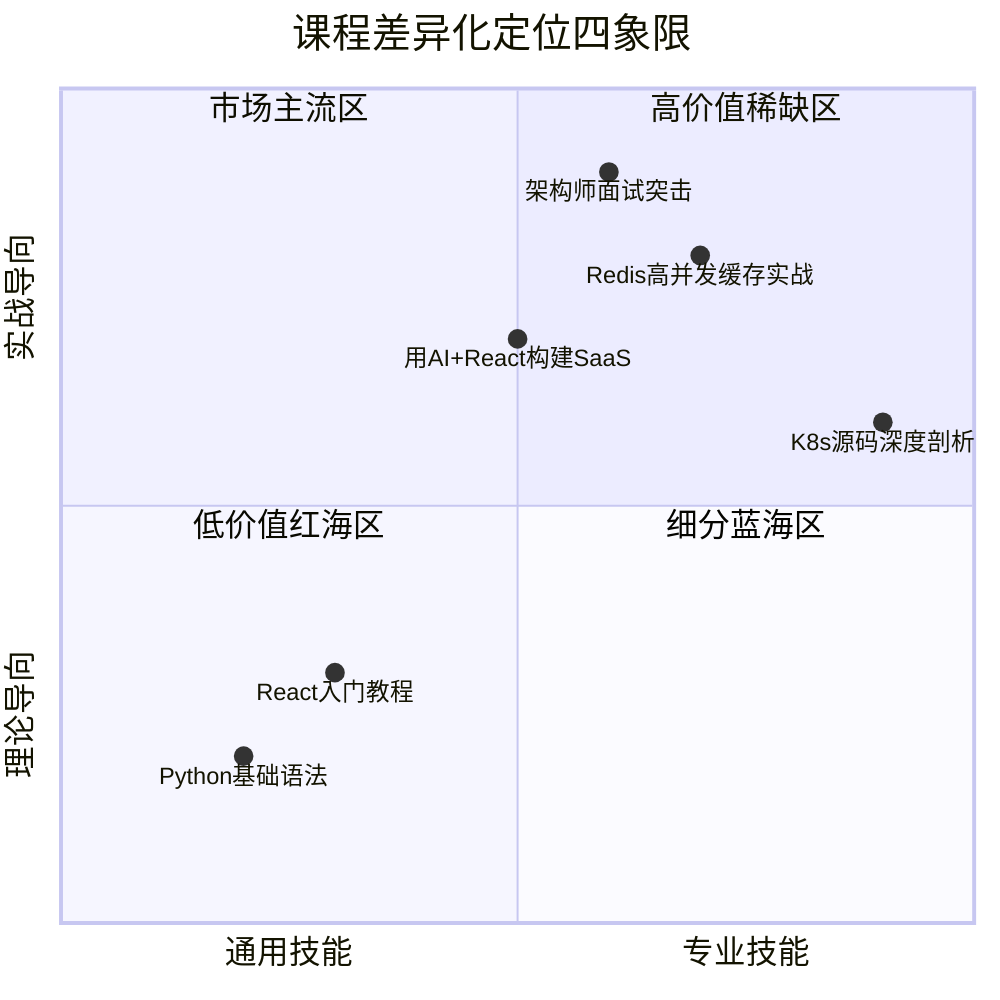

**找到差异化定位的五步法**：

1. **列出你的独特经验**：你做过什么别人没做过的项目？你踩过什么别人没踩过的坑？你有什么独特的技术视角？把这些列出来——这些就是你的"知识护城河"
2. **分析竞品的盲区**：用竞品分析矩阵，把同类课程的差评、缺失章节、学员抱怨系统整理。盲区就是机会
3. **找到"交叉点"**：将两个不常组合的领域交叉，创造新品类。例如"Redis+微服务""React+AI""Docker+性能优化"——交叉即差异
4. **选择"深度"而非"广度"**：不要做"React全栈开发"（太泛），做"React性能优化从诊断到极致"（够深）。深度课程的竞争对手少、学员付费意愿高
5. **用"身份标签"定位**：不是"Python课程"，而是"给数据分析师的Python课程"——身份标签让目标用户立刻觉得"这是为我做的"

**差异化定位的检验标准**：

```text
通过三个问题检验你的定位是否足够差异化：

1. 电梯测试：30秒内能说清"这门课和别的课有什么不同"吗？
   ❌ "这是一门系统全面的React课程"（等于没说）
   ✅ "这门课用一个真实电商项目，教你React性能优化的12种手段"

2. 搜索测试：在搜索引擎/课程平台搜索你的课程名称，前10个结果有多少和你类似？
   如果>5个：红海，需要进一步细化定位
   如果<3个：蓝海或伪需求，需要验证市场

3. 价格测试：你的课程定价比竞品高30%，还能卖出同等数量吗？
   如果能：差异化成功，你的独特价值被认可
   如果不能：差异化不够，学员觉得"差不多的东西"
```

#### 6.3.9 学员旅程设计

好的课程不只是内容的堆砌，而是精心设计的学员旅程。学员从"知道你"到"学完推荐你"的每一步都需要被设计：

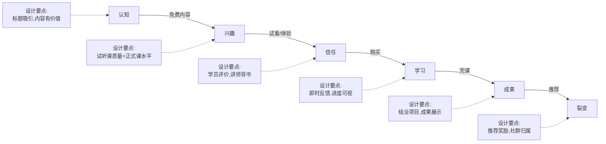

**学员旅程中每个触点的设计要点**：

| 触点 | 学员心理状态 | 设计要点 | 常见失误 |
|------|------------|---------|---------|
| **第一次接触** | "这和我有什么关系？" | 开头3秒用痛点/数据/故事抓住注意力 | 开场自我介绍太长（>30秒） |
| **试看体验** | "值不值得花钱？" | 试看章节选最有价值的，不是最简单的 | 试看内容太基础，学员觉得"网上都有" |
| **购买决策** | "会不会后悔？" | 社会证明+退款保障+明确的成果承诺 | 只列大纲不讲"学完能做什么" |
| **开课第一周** | "能不能坚持？" | 小任务+即时反馈+社群归属感 | 第一周内容太多太难，吓退学员 |
| **课程中段** | "有点疲倦了" | 引入新项目/新视角/直播互动 | 内容单调重复，缺乏节奏变化 |
| **课程末段** | "快结束了" | 成果展示+进阶路径+社群延续 | 草草收尾，没有仪式感和成就感 |
| **完课之后** | "学到了什么？" | 证书+作品集+推荐激励 | 学完就散，没有后续运营 |

### 6.4 课程制作实操

#### 6.4.1 录课硬件配置方案

| 配置等级 | 设备清单 | 预算 | 适合阶段 |
|---------|---------|------|---------|
| **入门级** | 笔记本内置麦克风 + OBS录屏 + 简单背景 | 0元 | 试水期 |
| **标准级** | Blue Yeti/铁三角AT2020 USB麦克风 + 双屏 + OBS | 500-1000元 | 正式制作 |
| **专业级** | Shure SM7B + 声卡 + 三屏 + 绿幕 + 补光灯 | 3000-8000元 | 品牌课程 |

**关键建议**：音频质量比视频质量重要得多。学员可以忍受画质一般的屏幕录制，但绝对不能忍受噪音大、回声明显的音频。入门阶段至少投资一个300-500元的USB麦克风。

**音频环境优化**（零成本方案）：
- 在衣柜里录衣服能吸收回声，效果堪比专业吸音棉
- 录制时关闭空调、风扇等持续噪音源
- 用Audacity的噪声消除功能处理底噪（录制时先录3秒纯噪音作为采样）
- 嘴离麦克风15-20厘米，过近会有喷麦（爆破音），过远声音发虚
- 录制前喝温水，避免嘴巴干燥产生"啧啧"声
- 使用防喷罩（可以自制：丝袜绑在铁丝圈上）减少爆破音

#### 6.4.2 课程制作的完整流程

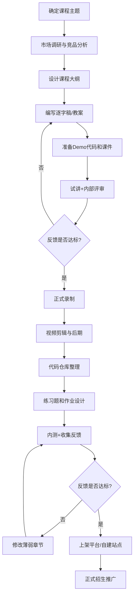

#### 6.4.3 每节课的制作时间参考

| 课时长度 | 脚本编写 | Demo准备 | 录制 | 后期剪辑 | 总计 |
|---------|---------|---------|------|---------|------|
| 10分钟（概念讲解） | 1-2小时 | 0.5小时 | 0.5小时 | 1小时 | 3-4小时 |
| 15分钟（代码演示） | 1小时 | 2-3小时 | 0.5小时 | 1-2小时 | 5-7小时 |
| 30分钟（实战教程） | 2小时 | 3-5小时 | 1小时 | 2-3小时 | 8-11小时 |
| 60分钟（深度讲解） | 3-4小时 | 5-8小时 | 1.5小时 | 3-4小时 | 12-17小时 |

**经验法则**：1小时成品视频的制作时间约为10-15小时。一门20小时的系统课程，制作周期通常为2-4个月（全职投入）。如果兼职制作，按每天2-3小时计算，需要4-8个月。

#### 6.4.4 课程制作项目管理模板

很多技术人制作课程半途而废，根本原因是没有项目管理。课程制作是一个需要2-4个月的项目，必须用项目管理的方式推进。

**12周课程制作甘特图（兼职版）**：

```text
周次    任务                                    产出物          完成标志
─────  ──────────────────────────────────────  ──────────────  ────────
W1     选题验证+竞品分析                         选题报告        评分>60
W2     设计课程大纲+学员调研                     课程大纲V1      大纲通过外行测试
W3     编写第1-5节逐字稿+教案                   5份教案         可试讲
W4     准备第1-5节Demo代码+练习题               代码仓库        所有代码可运行
W5     试讲+内部评审+修改                       评审记录        获得3人以上反馈
W6     正式录制第1-5节+粗剪                     5节粗剪视频     时长达标
W7     编写第6-10节逐字稿+录制+粗剪             10节粗剪视频    质量一致
W8     编写第11-15节逐字稿+录制+粗剪            15节粗剪视频    内容完整
W9     编写第16-20节+录制+粗剪                  20节粗剪视频    全课录制完成
W10    精剪全部视频+字幕+音频处理                20节成品视频    音视频质量达标
W11    整理代码仓库+设计练习题+搭建销售页        完整课程包      可上架
W12    内测+收集反馈+修改+正式上架               已上架课程      首批学员报名
```

**每日制作SOP（兼职版，每天2-3小时）**：

| 时间段 | 任务 | 工具 | 注意事项 |
|-------|------|------|---------|
| 第1小时 | 编写/修改逐字稿 | 飞书文档/Typora | 先写完再录，不要边写边录 |
| 第2小时 | 录制+粗剪 | OBS+DaVinci | 分段录制，每段5-10分钟 |
| 第3小时 | 代码准备+练习题设计 | VS Code+GitHub | 代码必须跑通才能用 |

**课程制作的三个关键里程碑**：

1. **Alpha版本**（第5周）：录制完5节课，找5-10个目标学员试看。收集反馈的重点：（1）难度是否合适？（2）讲解是否清楚？（3）节奏是否合适？（4）哪些地方想跳过？哪些地方想多讲？
2. **Beta版本**（第10周）：全部课程录制完成，开放给20-30个内测学员。重点检查：（1）完课率是否>60%？（2）NPS是否>40？（3）哪个章节退出率最高？
3. **正式版**（第12周）：根据Beta反馈修改后正式上架。上架前最后检查：（1）所有代码可运行？（2）所有链接有效？（3）字幕无误？（4）销售页信息准确？

#### 6.4.5 技术课程的录屏技巧

| 技巧 | 具体做法 | 为什么重要 |
|------|---------|----------|
| **代码预先写好** | 录制前先把所有代码写好放在注释中，录制时"现场"输入 | 避免录屏时犯低级错误浪费时间 |
| **字体放大到18-20pt** | IDE字体、终端字体都放大 | 手机端观看也能看清 |
| **使用深色主题** | 用VS Code Dark+或One Dark Pro | 减少屏幕刺眼感，代码高亮更明显 |
| **关闭通知** | 关闭系统通知、微信、钉钉 | 录屏中途弹出消息是最大的翻车来源 |
| **分段录制** | 每5-10分钟为一个片段 | 出错只需重录当前片段 |
| **先讲Why再讲How** | 先解释为什么要这么做，再演示怎么做 | 学员知道原因后记忆更深刻 |
| **演示预期错误** | 故意写错一步，展示报错信息，再修正 | 学员实际操作时一定会遇到这些错误 |
| **鼠标高亮** | 用Mouse Highlighter等工具放大鼠标点击区域 | 学员能清楚看到你点了哪里 |
| **终端配色** | 终端用高对比度配色（如Dracula/OneHalfDark） | 确保终端文字在视频中清晰可读 |
| **虚拟桌面** | 录制前清空桌面，只保留需要的窗口 | 避免无关内容干扰，也保护个人隐私 |

#### 6.4.6 视频制作的技术细节

**OBS录屏配置推荐**：

```yaml
# OBS Studio 技术课程录制配置
output:
  mode: advanced
  recording:
    format: mkv  # 断电不丢数据，后期转mp4
    encoder: x264  # 或NVENC(有N卡)
    rate_control: CQP
    cq_level: 18  # 质量优先，18-20肉眼无损
    keyframe_interval: 2

video:
  base_resolution: 1920x1080
  output_resolution: 1920x1080
  fps: 30  # 录屏不需要60fps，30足够

audio:
  sample_rate: 48000
  channels: stereo
  mic_noise_suppression: RNNoise  # OBS内置降噪
  mic_noise_gate: enabled
  desktop_audio: -10dB  # 降低系统音量
  mic_audio: 0dB

sources:
  - display_capture: 主显示器
  - audio_input: USB麦克风
  - webcam: 可选（画中画增加亲和力）
```

**后期剪辑工作流**：

| 步骤 | 工具 | 操作 | 耗时占比 |
|------|------|------|---------|
| 粗剪 | DaVinci Resolve/剪映 | 剪掉口误、长时间停顿、错误重录 | 30% |
| 音频处理 | Audacity/Adobe Audition | 降噪、均衡器（提升人声清晰度）、压缩 | 20% |
| 字幕 | Whisper/剪映AI | 自动生成+人工校对（尤其是技术术语） | 25% |
| 特效标注 | DaVinci Resolve/After Effects | 关键步骤标注、代码高亮、鼠标点击特效 | 15% |
| 封面+导出 | Canva+OBS | 制作封面图、导出为平台要求的格式 | 10% |

**音频后期处理的Audacity操作流程**：

```text
1. 降噪：效果 → 降噪 → 采集噪声样本（选3秒纯噪音段）→ 降噪设置(6-12dB)
2. 均衡器：效果 → 均衡器 → 提升2kHz-5kHz（人声清晰度）→ 衰减100Hz以下（消除低频噪音）
3. 压缩：效果 → 压缩器 → 阈值-18dB，比率3:1 → 让声音音量更均匀
4. 标准化：效果 → 标准化 → -1dB峰值 → 确保音量一致
5. 去口水音：效果 → Click Removal（可选，对有口水音的人有用）
```

#### 6.4.7 逐字稿 vs 提纲式录课

录制技术课程有两种主流方式，各有优劣：

| 方式 | 操作方法 | 优点 | 缺点 | 适合场景 |
|------|---------|------|------|---------|
| **逐字稿** | 先写完整文稿，照着念或脱稿讲 | 信息密度高，可控制时长，方便后期字幕 | 准备时间长，容易念稿感重 | 概念讲解类课程 |
| **提纲式** | 列出要点，现场展开讲解 | 自然流畅，有"现场感" | 容易跑题、啰嗦、时长不可控 | 代码演示、实战教程 |
| **混合式** | 关键段落写逐字稿，Demo部分用提纲 | 兼顾信息密度和自然感 | 需要判断哪里该写稿哪里该即兴 | **大多数技术课程的最佳选择** |

**推荐做法**：概念讲解部分用逐字稿（确保准确无遗漏），代码演示部分用提纲（保持现场感），过渡衔接部分写逐字稿（避免"嗯""啊"太多）。

**逐字稿的高效写法**：

```markdown
## 第3节：useEffect的依赖数组

### 开场（逐字稿）
"上一节我们学了useState，它解决了'数据变了页面怎么更新'的问题。
但React组件里还有一类操作——它们不直接修改UI，而是跟外部世界打交道：
发网络请求、操作DOM、设置定时器。
这些操作叫做'副作用'，useEffect就是管理副作用的Hook。"

### 核心讲解（逐字稿）
"看这段代码，组件挂载后要获取用户数据..."

### 代码演示（提纲）
- 展示没有依赖数组的效果（每次渲染都执行）
- 添加空依赖数组（只执行一次）
- 添加特定依赖（响应特定变化）
- 演示常见错误：忘记依赖 → 无限循环
- 演示清理函数：返回一个函数清理副作用

### 总结（逐字稿）
"useEffect的依赖数组告诉React：'只在这些值变化时才重新执行副作用'。
记住三个模式：[]空数组=只执行一次，[dep]=响应变化，不传=每次渲染执行。"
```

### 6.5 平台选择与分发策略

#### 6.5.1 国内主流知识付费平台对比

| 平台 | 抽成 | 定位 | 流量来源 | 结算周期 | 适合谁 |
|------|------|------|---------|---------|--------|
| **极客时间** | 约30-40% | 技术付费专栏 | 平台自有流量+编辑推荐 | 月结 | 有技术深度的资深工程师 |
| **掘金小册** | 约30% | 技术实战手册 | 掘金社区导流 | 月结 | 掘金活跃用户 |
| **慕课网（imooc）** | 约40-50% | 编程实战课程 | 平台自有流量 | 季度结 | 有教学经验的讲师 |
| **网易云课堂** | 约30-50% | 综合在线教育 | 搜索+推广 | 月结 | 覆盖广泛受众 |
| **腾讯课堂** | 约30-50% | 综合在线教育 | 微信生态+搜索 | 月结 | 有微信私域流量的 |
| **B站课堂** | 约30% | 泛知识付费 | B站内容导流 | 月结 | B站UP主 |
| **知乎知学堂** | 约30-50% | 知识付费 | 知乎生态导流 | 月结 | 知乎大V |
| **小鹅通** | 平台费（SaaS） | 自建知识店铺 | 需自己引流 | 实时 | 有私域流量的 |
| **知识星球** | 付费总额的5% | 社群/知识圈 | 需自己引流 | 随时提现 | 有社群运营能力的 |
| **自建网站** | 0%（支付手续费约1%） | 完全自主 | SEO+社媒+口碑 | 即时 | 品牌成熟后 |

#### 6.5.2 国际知识付费平台（面向全球市场）

如果你的英语能力足够，或者课程内容有国际通用性（如AI、区块链、系统设计），可以考虑国际平台：

| 平台 | 抽成 | 定位 | 流量来源 | 适合谁 |
|------|------|------|---------|--------|
| **Udemy** | 非独家63%/独家37%（讲师分成） | 综合在线教育 | 平台搜索+促销活动 | 入门门槛最低，适合试水国际市场 |
| **Skillshare** | 按观看分钟数付费 | 创意+技术短课 | 平台推荐 | 适合5-15分钟的短课程 |
| **Coursera** | 需申请合作 | 高等教育 | 大学品牌背书 | 适合有学术/大厂背景的讲师 |
| **Teachable** | SaaS月费$39起 | 自建课程平台 | 需自己引流 | 国际版"小鹅通" |
| **Gumroad** | 10%手续费 | 数字产品销售 | 需自己引流 | 适合电子书、手册类产品 |

**国内讲师做国际平台的注意事项**：
- 需要英文授课或高质量英文字幕
- 定价需要参考当地市场（Udemy常见促销价$9.99-$14.99）
- 时差问题影响直播互动（录播课更合适）
- 支付需要PayPal或Payoneer收款
- 视频中避免使用国内平台的截图和链接（学员访问不了）

**Coursera合作指南**：

Coursera与Udemy不同，它采用大学/机构合作模式，个人讲师不能直接上架。但有两条路径可以进入：

```text
进入Coursera的两条路径：

路径A：申请Coursera合作伙伴（适合有学术/大厂背景的讲师）
├── 申请条件：
│   ├── 需要挂靠一个机构（大学/企业/培训机构）
│   ├── 有公开发表的学术论文或行业报告
│   └── 有授课经验（大学课程/企业培训/在线课程）
├── 审核周期：2-6个月
├── 收入模式：平台分成（具体比例需谈判，通常50:50）
├── 优势：Coursera的品牌背书极强，学员信任度高
└── 适合：有学术背景或大厂资深工程师

路径B：成为Coursera讲师（通过机构发布专项课程）
├── 操作方式：找到已入驻Coursera的机构，以"客座讲师"身份合作
├── 收入模式：与机构协商（通常是固定费用+分成）
├── 优势：门槛低于路径A，可以借力机构的品牌
└── 适合：有一定教学经验但没有机构背景的讲师
```

**Teachable/Gumroad自建站指南**：

如果你不想被平台抽成，也不想花大量时间开发自建站，Teachable和Gumroad是最成熟的"零代码自建课程站"方案：

| 维度 | Teachable | Gumroad |
|------|-----------|---------|
| 适合产品 | 系统化课程（视频+作业+证书） | 单品（电子书、手册、小课程） |
| 月费 | $39-199/月 | 免费（收10%手续费） |
| 支付方式 | Stripe/PayPal | Stripe/PayPal |
| 自定义域名 | ✅ 支持 | ✅ 支持 |
| 会员/订阅 | ✅ 支持 | ✅ 支持 |
| 联盟营销 | ✅ 内置 | ✅ 内置 |
| 中国用户友好度 | 中等（需要Stripe，中国区受限） | 中等（同上） |
| 建议 | 课程为主、需要完整学习管理系统 | 电子书/手册为主、预算有限 |

**自建站的支付解决方案（中国讲师）**：

```text
中国讲师做国际市场的支付链路：

方案A：通过第三方收款平台
├── Payoneer：注册→绑定国内银行卡→接收平台付款→提现到国内
├── 手续费：1-2%
├── 适合：Udemy/Skillshare等平台分成
└── 注意：Payoneer有年度额度限制，大额收入需要分批提现

方案B：自建站用Stripe
├── 条件：需要一个香港/美国公司（可通过代理注册，费用约3000-5000元）
├── Stripe费率：2.9%+$0.30/笔
├── 提现：通过Payoneer或万里汇提现到国内
├── 适合：Teachable/Gumroad等自建站
└── 注意：中国大陆公司不能直接注册Stripe

方案C：LemonSqueezy（推荐）
├── 优势：作为Merchant of Record，处理全球税务合规
├── 费率：5%+$0.50/笔（含税务处理）
├── 中国讲师友好：支持全球讲师注册
├── 适合：自建站卖课程/电子书
└── 集成：可嵌入Hugo/Next.js等静态站点
```

**Udemy国际平台运营深度指南**：

Udemy是技术讲师进入国际市场最友好的平台，月活学员超过7000万。以下是从零到稳定收入的完整路径：

```text
Udemy运营SOP（技术讲师版）：

第1步：课程定位（1-2天）
├── 搜索目标话题，查看已有课程数量和评分
├── 重点分析差评：学员抱怨什么？缺少什么？
├── 定位差异化：你的课程比现有课程多了什么？
└── 定价策略：Udemy课程建议定价$49.99-$199.99（平台会自动打折到$9.99-$19.99）

第2步：制作标准（遵循Udemy质量审核要求）
├── 视频：最低720p，建议1080p，H.264编码
├── 音频：采样率48kHz，无底噪，人声清晰
├── 每节课3-15分钟，总时长建议2-6小时
├── 必须有课程封面图（1280x720px）和宣传视频（2-5分钟）
└── 每章至少1个测验题（Udemy审核硬性要求）

第3步：上架与优化
├── 标题：关键词在前，价值承诺在后（如"React Testing: Build Production-Grade Test Suites"）
├── 描述：前150字最关键（搜索结果只显示这么多）
├── 标签：选满5个相关标签
├── 分类：选最精准的子分类
└── 优惠券：设置1-2个免费优惠券给早期学员换取评价

第4步：Udemy促销节奏
├── Udemy每月有2-3次平台级促销（自动参加，无需操作）
├── 促销期间你的课程会被推荐到首页，流量暴增5-20倍
├── 重点：促销期的新学员评价对算法权重极高
├── 建议：促销前3天在课程末尾加一段"请留下评价"的引导
└── 注意：非独家讲师分成37%，独家讲师分成63%（Udemy帮你推广的流量）

第5步：长期运营
├── 每月回复所有学员问题和评价（Udemy算法看重互动率）
├── 每季度更新1-2节内容（标记为"Updated 2026"可获得算法加权）
├── 用Udemy的"公告"功能定期给学员发消息（带课程链接）
└── 考虑制作系列课程（Series），买过第一门的学员更容易买第二门
```

**Udemy收入参考**（技术类课程，基于公开数据和讲师社区分享）：

| 课程类型 | 时长 | 月均收入（稳定期） | 达到稳定期时间 |
|---------|------|-----------------|-------------|
| 热门技术（React/Python/AI） | 3-6小时 | $500-$2000/月 | 6-12个月 |
| 细分技术（Redis/K8s/Rust） | 2-4小时 | $200-$800/月 | 3-6个月 |
| 冷门但有价值的技术 | 1-3小时 | $50-$200/月 | 1-3个月 |
| 系列课程（3门+） | 10-20小时合计 | $2000-$5000/月 | 12-24个月 |

**多语言策略**：Udemy支持多语言字幕。将中文字幕翻译为英文、西班牙文、葡萄牙文可以覆盖全球80%以上的学员。推荐用DeepL翻译+人工校对，每小时视频的翻译成本约200-500元，但可以带来额外30-50%的学员增量。

#### 6.5.3 平台选择的决策矩阵

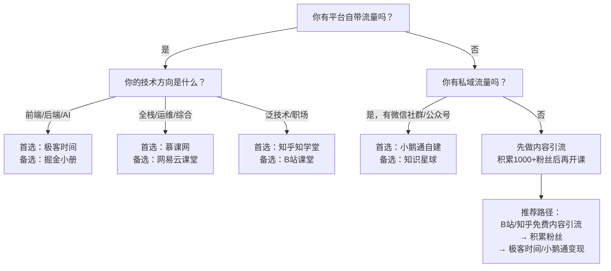

#### 6.5.4 多平台分发策略

不要只在一个平台卖课。聪明的做法是"一个课程，多平台分发"，但需要注意策略差异：

| 分发阶段 | 策略 | 具体操作 |
|---------|------|---------|
| **首发期** | 选一个平台独家首发 | 用独家换取平台推荐位和流量扶持，签独家协议时谈好保底推荐 |
| **稳定期** | 扩展到2-3个平台 | 根据首发数据决定扩展方向，不同平台可做差异化版本 |
| **成熟期** | 自建+平台双轨 | 核心课程在自建站点卖（利润最高），引流课放平台 |
| **长期** | 内容矩阵 | 将一个大课程拆成多个小产品，覆盖不同平台和价位 |

**多平台分发的注意事项**：
- 价格要保持一致或差异化明显，避免学员比价投诉
- 不同平台的课程可以有差异化内容（如极客时间版加专栏文字、B站版加互动弹幕）
- 自建站版本可以加赠品（源码、社群、答疑）作为"独家权益"吸引学员到你的平台
- 定期检查各平台的课程数据，砍掉表现差的平台，集中精力

#### 6.5.5 课程页面的SEO优化策略

无论在哪个平台，SEO（搜索引擎优化）决定了你的课程能否被目标学员"找到"。很多技术人忽略了这一点，导致课程内容好但无人问津。

**关键词研究的实操方法**：

```text
课程SEO关键词策略：

1. 核心关键词（1-2个）
   - 课程主题本身：如"Redis教程""React课程"
   - 搜索量大，竞争激烈
   - 放在标题中

2. 长尾关键词（5-10个）
   - 具体问题/场景：如"Redis缓存穿透怎么解决""React性能优化方法"
   - 搜索量小，竞争弱，转化率高
   - 放在课程描述和章节标题中

3. 问题关键词（10-20个）
   - 学员搜索的具体问题：如"Redis为什么这么快""React和Vue哪个好"
   - 适合用在FAQ区和课程描述中
```

**关键词挖掘工具**：
- 百度指数：查看关键词搜索趋势和相关词
- 5118：长尾关键词挖掘和竞争分析
- 微信指数：微信生态内的搜索热度
- 知乎/掘金搜索：看目标用户在搜什么问题
- Google Keyword Planner（做国际市场的）
- Ubersuggest：免费的关键词建议工具

**课程页面SEO的七个优化点**：

| 优化点 | 具体做法 | 效果 |
|--------|---------|------|
| **标题** | 包含核心关键词+价值承诺 | 搜索排名和点击率的决定因素 |
| **描述** | 前100字包含核心关键词和差异化卖点 | 影响搜索摘要展示 |
| **章节标题** | 每章标题包含长尾关键词 | 增加长尾搜索流量 |
| **标签/分类** | 选择最精准的分类和标签 | 影响平台推荐算法 |
| **外部链接** | 从博客/GitHub/知乎链接到课程页 | 提升搜索权重 |
| **更新频率** | 定期更新课程内容 | 搜索引擎偏好"活跃"内容 |
| **学员评价** | 引导学员留下包含关键词的评价 | 评价内容也参与搜索排名 |

**平台算法的核心逻辑**（以主流平台为例）：

```text
大多数课程平台的推荐算法考虑以下因素：

权重排序（从高到低）：
1. 转化率（点击→购买）——权重最高
2. 完课率——反映课程质量
3. 好评率/评分——社会证明
4. 互动率（评论/提问/笔记）——反映学员参与度
5. 更新频率——反映课程活跃度
6. 销量/收入——马太效应

优化建议：
- 转化率：优化课程介绍页（参考6.8.5）
- 完课率：优化课程设计（参考6.3）和训练营运营（参考6.7）
- 好评率：超预期交付+引导评价
- 互动率：设计课后思考题、布置讨论作业
- 更新频率：每月至少更新1-2节补充内容
```

### 6.6 定价策略

定价是知识付费中最被低估的能力。定高了卖不动，定低了亏本还损害品牌。

#### 6.6.1 定价的经济学原理

在讨论具体定价方法之前，理解三个经济学原理能帮你避免"拍脑袋定价"的陷阱。

**价格锚定效应（Anchoring Effect）**

诺贝尔经济学奖得主Daniel Kahneman的研究表明，人们对价格的判断不是基于绝对值，而是基于参照物。在知识付费中，这意味着：学员对课程价值的感知，取决于你给他们什么样的"锚点"。如果你先展示"1对1咨询800元/小时"，再展示"系统课程499元"，学员会觉得课程"超值"。但如果你直接展示499元，没有任何参照，学员会犹豫"贵不贵"。

**消费者剩余理论（Consumer Surplus）**

消费者剩余 = 学员愿意支付的最高价格 - 实际支付价格。不同的学员对同一门课程的价值感知不同——刚毕业的程序员可能觉得299元很贵，而月薪3万的架构师可能觉得299元便宜得离谱。阶梯定价（基础版/进阶版/旗舰版）的本质就是**捕获不同群体的消费者剩余**——让愿意多付钱的人多付钱，同时不流失价格敏感的学员。

**韦伯-费希纳定律（Weber-Fechner Law）**

这个心理物理学定律指出，人对刺激变化的感知是**比例性**的，而非绝对性的。翻译到定价领域：从99元涨到149元（涨50%），学员感知明显；但从999元涨到1049元（涨5%），学员几乎感知不到。这就是为什么高价课程的价格弹性远低于低价课程——你可以对高价课程做更大幅度的调价而不影响销量。

**定价的三个核心原则**：

1. **价格是信号**：定价不仅仅是收入问题，更是品牌定位问题。一门定价1999元的训练营，在学员心中的定位天然高于定价499元的——即使内容完全相同。高价本身传递了"高质量"的信号
2. **价格需要测试**：不要猜，用数据定。同一流量下，199元和299元的转化率差异可能只有10%，但收入差异是50%。A/B测试（详见6.6.5）是找到最优价格的唯一方法
3. **价格可以调整**：课程定价不是一锤子买卖。随着口碑积累和内容迭代，价格应该逐步上调。每新增100条好评，考虑涨价10-20%

#### 6.6.2 知识付费的定价逻辑

知识付费定价不是按"课时长度"定价，而是按"学员获得的价值"定价。学员花499元学完后能拿到一份月薪涨5000元的offer，那499元就是极其划算的——即使你的课程只有10小时。

```text
定价参考公式：

课程定价 = 学员预期收益 × 价值捕获率

其中：
- 学员预期收益：学完课程后预计获得的经济回报
- 价值捕获率：通常取 5%-20%（课程定价占学员收益的比例）

举例：
- 学完课程后月薪涨5000元，年增收6万 → 课程定价 3000-12000元
- 学完课程后能接外包项目，月增收3000元 → 课程定价 900-3600元
- 学完课程后入门一个新领域 → 课程定价 199-999元
```

#### 6.6.3 不同课程形态的定价参考区间

| 课程形态 | 低价位 | 中价位 | 高价位 | 定价关键因素 |
|---------|--------|--------|--------|------------|
| 图文小册/专栏 | 9.9元 | 29.9-49.9元 | 99元 | 内容深度+作者知名度 |
| 音频专栏（50-100节） | 69元 | 99-199元 | 399元 | 体系化程度+讲师背书 |
| 视频课程（10-30小时） | 99元 | 199-499元 | 999元 | 实战程度+稀缺性 |
| 实战训练营（含作业批改） | 999元 | 1999-2999元 | 4999元 | 服务深度+就业/涨薪承诺 |
| 企业内训 | 5000元/天 | 15000-30000元/天 | 50000元/天 | 讲师品牌+定制化程度 |
| 1对1指导 | 300元/小时 | 500-800元/小时 | 2000元/小时 | 导师稀缺性+学员需求紧急度 |
| 年度会员/社群 | 199元/年 | 399-999元/年 | 2999元/年 | 持续产出频率+社群活跃度 |

#### 6.6.4 定价的常见误区

| 误区 | 为什么是错的 | 正确做法 |
|------|------------|---------|
| "便宜点卖得多" | 低价吸引的是低意愿用户，完课率和口碑都差 | 定合理价格，用品质说话 |
| "按课时长度定价" | 学员不为时间买单，为结果买单 | 按价值定价，突出"学完能做到什么" |
| "跟竞品打价格战" | 价格战没有赢家，你打不过免费教程 | 差异化定位，做竞品做不好的部分 |
| "一开始就定高价" | 没有口碑和案例时，高价卖不动 | 先用低价或免费积累口碑，再逐步提价 |
| "不打折不促销" | 适当促销是正常的营销手段 | 设计"早鸟价""团购价""限时优惠"，但不低于底线价 |
| "所有人同一价格" | 忽略了支付能力差异，流失潜在学员 | 设计学生价、发展中国家折扣等差异化定价 |

#### 6.6.5 阶梯式定价策略

推荐采用"免费引流 → 低价试水 → 中价主力 → 高价旗舰"的阶梯策略：

```text
产品定价阶梯示例：

L0 - 免费层：B站/知乎免费教程（引流用，积累粉丝）
  ↓ 转化率 3-5%
L1 - 入门层：9.9-49.9元 图文小册（低门槛尝试）
  ↓ 转化率 15-25%
L2 - 核心层：199-499元 系统课程（主力利润产品）
  ↓ 转化率 10-20%
L3 - 高端层：999-2999元 训练营（高利润+深度服务）
  ↓ 转化率 5-15%
L4 - 旗舰层：4999+元 企业内训/年度会员（品牌背书+长期价值）
```

**定价阶梯的实操案例**：

以一门"Docker容器化实战"课程为例，展示完整的产品阶梯设计：

```text
L0 免费层：B站《10分钟理解Docker》系列短视频（5集）
├── 目标：建立"Docker实战"标签，积累初始流量
├── 预期：3个月播放量10-30万，引流到公众号500-1500人
└── 投入：每集2小时制作，总计10小时

L1 入门层：掘金小册《Docker从零到部署》（定价39.9元）
├── 目标：低门槛产品，让学员体验你的教学质量
├── 内容：基础概念+环境搭建+第一个容器化应用
├── 预期：3年累计销量4000份，收入约16万元
├── 关键设计：最后一章"进阶推荐"链接到L2产品
└── 投入：6周，每天2小时

L2 核心层：系统课程《Docker生产级实战》（定价299元）
├── 目标：主力利润产品
├── 内容：网络/存储/编排/CI-CD/监控/安全，20小时
├── 预期：2年累计销量2000份，收入约60万元
├── 关键设计：每章配实战项目，代码仓库完整可运行
└── 投入：3个月，兼职制作

L3 高端层：训练营《Docker+K8s企业级容器平台搭建》（定价2999元）
├── 目标：高利润+深度口碑
├── 内容：21天实战，含作业批改+直播答疑+项目评审
├── 预期：每年4期，每期40人，年收入约48万元
├── 关键设计：学员必须完成一个可部署的K8s集群
└── 投入：每期21天全情投入

L4 旗舰层：企业内训《容器化架构咨询与培训》（2-3万/天）
├── 目标：品牌背书+高利润
├── 内容：根据企业需求定制，含架构评审+现场实操
├── 预期：每年5-8次，年收入约15-20万元
└── 投入：每次2-3天（含前期调研）

总预期年收入（稳定期）：约100-130万元
```

#### 6.6.6 促销策略与心理学定价

| 策略 | 具体做法 | 心理学原理 |
|------|---------|-----------|
| **锚定效应** | 先展示高价版本（如"原价999元"），再展示优惠价 | 学员会觉得"占了便宜" |
| **早鸟价** | 开课前2周享受8折，制造紧迫感 | 损失厌恶——怕错过优惠 |
| **限时折扣** | 双11/618等节点做3天限时促销 | 时间压力促进决策 |
| **拼团** | 2人拼团享7折，3人拼团享6折 | 社交裂变+互惠心理 |
| **赠品策略** | "买课程送XX"，赠品成本低但感知价值高 | 免费赠品增加购买动力 |
| **分期付款** | 999元课程支持3期免息（每期333元） | 降低一次性支付的心理门槛 |
| **退款保障** | "7天无理由退款"或"学完不满意退款" | 降低购买风险，反而降低退款率 |

**关键原则**：促销是为了扩大用户基础，不是为了降价清仓。促销频率建议不超过每季度一次，否则学员会"等促销再买"，拖垮日常销量。

**技术课程特有的定价锚点策略**：

技术课程相比其他知识付费产品，有几个独特的定价杠杆：

| 锚点策略 | 具体做法 | 为什么有效 |
|---------|---------|-----------|
| **薪资锚定** | "学完后月薪涨5000元，课程定价仅999元" | 学员计算ROI后觉得"太划算了" |
| **外包锚定** | "找人开发一个类似项目要3万，课程只要499" | 技术人理解开发成本，对比感强 |
| **时间锚定** | "自学需要3个月，课程21天带你走完" | 在职工程师时间比钱值钱 |
| **面试锚定** | "一次模拟面试500元，课程含3次模拟面试" | 面试准备是刚需，价值感知清晰 |
| **工具锚定** | "同类SaaS工具年费5000+，课程教你从零搭建" | 技术人理解"造"vs"买"的差异 |
| **团队锚定** | "企业培训5人×1999元=9995元，团购价6999元" | 企业采购决策者关注性价比 |

**定价测试的实操方法**：不要猜，用数据定。在课程正式上线前，用A/B测试验证最佳定价：
1. 在B站/掘金发两篇同样质量的引流文章，文末分别指向不同定价的预售页
2. 观察7天内的加购率（加购/访问）和付款率（付款/加购）
3. 最优定价 = 加购率 × 付款率 × 单价 最大的那个价格点
4. 注意：样本量至少100次访问才有统计意义

**定价心理学的五个实战技巧**：

1. **尾数定价**：199比200感觉便宜很多，499比500感觉"不到500"。技术课程推荐：99/199/299/499/999/1999/2999
2. **价格锚定**：在销售页先展示"1对1咨询 800元/小时"，再展示"系统课程 499元"——对比之下课程显得超值
3. **稀缺性**：训练营限名额（"仅限50人"）、限时优惠（"48小时早鸟价"）——但必须是真实的稀缺，虚假稀缺会损害信任
4. **社会证明**：在价格旁边展示"已有2345人购买""好评率98%"——降低决策焦虑
5. **拆分定价**：将1999元的训练营拆分为"每天不到100元"——日均成本看起来更低

### 6.7 训练营运营

训练营是知识付费中**利润最高、口碑最好**的产品形态，但运营难度也最大。

#### 6.7.1 训练营 vs 录播课的本质区别

| 维度 | 录播课 | 训练营 |
|------|--------|--------|
| 学习模式 | 自学，靠自律 | 社群+教练，靠外部驱动 |
| 完课率 | 通常 5-15% | 通常 40-70% |
| 学习效果 | 取决于个人 | 作业+反馈+讨论，效果有保障 |
| 定价 | 99-499元 | 999-4999元 |
| 运营成本 | 一次制作，几乎无运营 | 每期都需要投入精力运营 |
| 复购率 | 低（学完就走） | 高（社群归属感） |
| 口碑传播 | 弱 | 强（学员互相推荐） |
| 讲师收入模式 | 被动收入 | 主动收入（但单价高） |

训练营的本质是**教育+社群+服务的综合体**。它的高定价不是因为内容比录播课多多少，而是因为提供了录播课无法提供的三样东西：**结构化的学习节奏**（每天有任务，不像录播课可以无限拖延）、**即时反馈**（作业批改、答疑解惑）、**同伴效应**（一群人一起学，互相激励）。

#### 6.7.2 训练营的标准运营流程

一个训练营从筹备到交付的标准流程：

| 阶段 | 时间 | 核心工作 | 关键产出 |
|------|------|---------|---------|
| **筹备期** | 开营前4-6周 | 确定主题、设计大纲、制作宣传页 | 课程大纲+招生页面 |
| **预热期** | 开营前2-3周 | 发布免费内容引流、开放报名、早鸟优惠 | 报名名单+社群基础 |
| **开营** | 第1天 | 开营仪式、学习指南、分组破冰 | 学员分组+学习计划 |
| **教学期** | 第2-14天 | 每日内容发布+作业+答疑+直播 | 课程内容+作业批改 |
| **实战期** | 第15-21天 | 实战项目+小组协作+进度跟踪 | 项目作品+进度报告 |
| **结营** | 最后2天 | 结营仪式+成果展示+优秀学员评选 | 学员作品集+结营证书 |
| **售后** | 结营后 | 课程回放开放、社群持续运营、转化下期 | 复购名单+口碑素材 |

#### 6.7.3 训练营的关键运营指标

| 指标 | 健康值 | 警戒值 | 说明 |
|------|--------|--------|------|
| 报名转化率 | ≥5% | <2% | 访问报名页的人中有多少付费 |
| 日活跃率 | ≥60% | <30% | 每天登录学习的学员比例 |
| 作业完成率 | ≥50% | <20% | 布置的作业中有多少提交了 |
| 完课率 | ≥50% | <25% | 学完全部课程的学员比例 |
| NPS评分 | ≥50 | <20 | "你会推荐这门课给朋友吗"的净推荐值 |
| 复购率 | ≥20% | <5% | 买过一期的学员中有多少买下一期 |
| 好评素材率 | ≥10% | <3% | 主动写好评/发朋友圈的学员比例 |

**指标监控的实操方法**：用飞书多维表格或Notion数据库建立一个"训练营运营看板"，每天更新以下数据：

```markdown
## 每日运营数据模板

日期：2026-06-25
训练营：第3期 Redis实战训练营
当前天数：Day 8/21

### 今日数据
- 新增报名：3人（累计85人）
- 今日活跃：62人（活跃率 72.9%）
- 作业提交：48人（提交率 56.5%）
- 作业批改：48/48（批改率 100%，24h内完成）
- 答疑问题：15个（平均响应时间 45分钟）
- 退出/退款：1人（累计2人）

### 今日亮点
- 学员张三分享了在工作中应用课程内容的截图
- 小组PK第3组连续3天完成率第一

### 问题与改进
- Day7作业难度偏高，有12人反馈太难 → 录了一个补充讲解视频
- 3人落后2天以上 → 私信提醒+发送知识点回顾

### 明日计划
- 发布Day9内容：Redis集群实战
- 20:00 直播答疑（提前收集问题）
```

#### 6.7.4 提升训练营完课率的七个实战技巧

1. **开营即绑定**：让学员在开营第一天就公开承诺学习目标（发朋友圈、在群里打卡）。行为心理学研究表明，公开承诺的目标完成率比私下目标高65%。具体操作：设计一个"学习承诺卡"模板，让学员填写后发朋友圈，截图发群
2. **小步快跑**：每天的学习任务控制在30-60分钟能完成，不要一口气丢三小时的视频。日均学习时间超过60分钟的训练营，完课率普遍低于30%。建议将30分钟的课程拆成3个10分钟的小节，每节配一个5分钟的小练习
3. **即时反馈**：作业在24小时内给出批改反馈，最迟不超过48小时。超过72小时未收到反馈的学员，继续完成作业的概率下降50%。初期自己批改，后期可以培训助教或用AI辅助初审
4. **同伴压力**：分小组互相监督，每日打卡，小组之间做完成率排名。用"小组PK"激发竞争意识，但注意不要让排名变成压力源。建议：前10天做小组排名，后10天改为个人积分制，避免落后小组摆烂
5. **直播答疑**：每周1-2次直播答疑，解决共性问题，增加互动感。直播录屏会成为后续课程的宝贵素材。直播前收集问题（飞书文档/问卷），直播中优先回答高票问题，直播后整理QA文档发群
6. **进度提醒**：对落后2天以上的学员私信提醒，但不要过度骚扰。用"关心"的语气而不是"催促"的语气（如"最近忙吗？这是本周的学习要点回顾"）。提醒频率：落后2天提醒1次，落后5天再提醒1次，落后7天电话联系
7. **结营仪式感**：颁发证书、评选优秀学员、展示学习成果——仪式感能显著提升完课率和满意度。很多学员就是冲着"结营证书"坚持完成的。证书设计建议用Canva模板，加上学员姓名和完成日期，学员会自发分享到朋友圈

#### 6.7.5 训练营的团队配置

一个成熟的训练营通常需要以下角色（初期可以一人多角色）：

| 角色 | 职责 | 初期替代方案 |
|------|------|------------|
| 主讲老师 | 内容讲解、直播答疑 | 讲师本人 |
| 助教 | 作业批改、群内答疑 | 找往期优秀学员兼职，时薪50-100元 |
| 运营 | 社群管理、进度跟踪、数据分析 | 讲师本人或实习生 |
| 设计 | 宣传页、海报、证书制作 | 用Canva模板 |
| 客服 | 退款处理、技术问题 | 自动回复+人工兜底 |

**关键建议**：第一期训练营不要雇人，自己一个人跑全流程。只有亲自踩过坑，你才知道哪些环节需要外包、外包的标准是什么。第二期开始，优先把"作业批改"外包给助教——这是最耗时间但最容易标准化的环节。

#### 6.7.6 学员分层运营策略

训练营里的学员不是同质化的。用一刀切的方式运营，会导致高手觉得太浅、新手觉得太难。分层运营是提升整体完课率和满意度的关键手段。

**学员的四层画像**：

| 学员类型 | 特征 | 占比 | 运营策略 |
|---------|------|------|---------|
| **先锋型** | 技术基础好，学得快，爱分享 | 10-15% | 培养为助教候选人，给额外挑战题，让他们在群里带动氛围 |
| **稳健型** | 按部就班完成任务，质量稳定 | 40-50% | 标准化运营即可，定期表扬保持动力 |
| **挣扎型** | 基础薄弱或时间不足，进度落后 | 25-30% | 私信关心，提供简化版学习路径，降低每日期望 |
| **沉默型** | 加入后几乎不参与，也不退群 | 10-20% | 3天不活跃私信触达，7天不活跃电话回访，14天不活跃视为流失 |

**分层运营的实操方法**：

```text
入营第一天：技术摸底测试（15-20题，涵盖前置知识点）
├── 得分>80%：分配到"进阶学习路径"（可跳过基础篇，直接进入高级内容）
├── 得分50-80%：分配到"标准学习路径"（按大纲顺序学习）
└── 得分<50%：分配到"基础补强路径"（额外补充前置知识，适当放慢节奏）

运营节奏（每天检查一次数据）：
├── 完成当日任务且质量好 → 群内点名表扬，给予"今日之星"徽章
├── 完成任务但质量一般 → 私信肯定努力，给1条改进建议
├── 未完成任务（第1天） → 不干预，可能是临时忙碌
├── 连续2天未完成 → 私信关心："最近忙吗？这是Day N的知识要点回顾"
├── 连续5天未完成 → 提供"追赶方案"：精简版学习路径+1对1答疑
└── 连续7天未完成 → 电话回访，了解真实原因，提供转期/退款选择
```

**"先锋型"学员的价值最大化**：

先锋型学员是你最宝贵的资源。把他们培养成"种子助教"，可以大幅减轻你的运营负担：

1. 在开营第3天识别出先锋学员（作业质量高、群里积极回答问题）
2. 私信邀请他们做"学习小组长"（每人带5-8个学员）
3. 给予激励：下次训练营免费名额、1对1答疑机会、课程联名推荐
4. 提供标准化的"小组长手册"：每日打卡提醒话术、常见问题回答模板、进度跟踪表
5. 每周与小组长开一次15分钟的短会，同步问题和改进方向

#### 6.7.7 训练营的升级路径

随着经验积累，训练营可以从"人工密集型"逐步升级为"系统驱动型"：

| 阶段 | 模式 | 人力投入 | 学员规模 | 年收入潜力 |
|------|------|---------|---------|-----------|
| 1.0 手工模式 | 全部人工操作 | 每期100%精力 | 20-50人 | 20-50万 |
| 2.0 半自动化 | 助教批改+自动提醒 | 每期60%精力 | 50-100人 | 50-100万 |
| 3.0 系统化 | 学习管理系统+AI助教 | 每期30%精力 | 100-300人 | 100-300万 |
| 4.0 产品化 | 标准化课程+社群自运转 | 每期10%精力 | 300+人 | 300万+ |

**从1.0到2.0的关键动作**：
1. 标准化作业批改流程（制作评分rubric，助教按rubric打分）
2. 设置自动提醒（企业微信/飞书机器人自动发送进度提醒）
3. 制作FAQ知识库（常见问题自动回复）
4. 培训2-3个稳定助教

**从2.0到3.0的关键动作**：
1. 接入学习管理系统（如Moodle、Canvas或自研）
2. 部署AI答疑助手（用RAG技术将课程内容做成知识库）
3. 自动化作业初审（AI检查代码可运行性、基本逻辑）
4. 数据驱动优化（分析学员行为数据，优化课程节奏）

#### 6.7.8 训练营招生文案的设计

招生文案直接决定报名转化率。一篇好的招生文案不是"课程介绍"，而是一封"说服目标学员现在就行动"的信。

**招生文案的标准结构**：

```text
训练营招生文案模板：

1. 开头：痛点共鸣（200字以内）
   "你是不是也有这样的困扰？"
   - 列出3-5个目标学员最头疼的具体场景
   - 用第一人称描述，让读者觉得"说的就是我"
   
   示例："学了半年React，写出来的东西还是if-else套if-else；
   看别人的代码觉得优雅，自己写就是一坨屎；
   面试问性能优化，只能说出'用useMemo'三个字就卡壳了..."

2. 转折：为什么现有方法解决不了（100-200字）
   "这些问题的根源不是你不够努力，而是..."
   - 指出学员自学/看免费教程的瓶颈
   - 暗示需要"系统化学习+实战训练+即时反馈"

3. 解决方案：训练营介绍（300-500字）
   - 一句话定位：这是一门什么样的训练营
   - 核心卖点（3个，用数字量化）
   - 学完能做到什么（具体成果，不是"提升能力"这种虚话）
   
   示例："21天后，你将能够：
   - 独立完成一个包含缓存穿透/击穿/雪崩防护的Redis架构设计
   - 用Redis实现分布式锁、延迟队列、排行榜等6种生产级方案
   - 在面试中自信地画出Redis集群架构图并讲清每层设计理由"

4. 课程大纲（简洁版，标注亮点章节）
   - 只列章节名+一句话目标
   - 标注"独家""首发""实战"等差异化标签

5. 讲师介绍（100-200字）
   - 不要堆title，讲一个具体的故事
   - "我在XX项目中用Redis扛住了10万QPS"比"资深架构师"有说服力

6. 学员评价（3-5条，带具体成果）
   - 最好有"学完后拿到offer/涨薪/解决工作问题"的真实反馈
   - 带截图比纯文字可信度高3倍

7. 报名信息
   - 开营时间、持续天数、每日学习时间
   - 价格+早鸟优惠+拼团优惠
   - 退款保障
   - 限额说明（制造稀缺感，但必须真实）

8. FAQ（消除最后的犹豫）
   - "我基础不好能学吗？"→ 说明前置要求
   - "没时间怎么办？"→ 说明弹性学习机制
   - "和XX课程有什么区别？"→ 差异化对比
```

**招生文案的五个写作技巧**：

1. **用"你"不用"学员"**：整篇文案的主语是"你"，让读者代入
2. **数字比形容词有力**："3个实战项目"比"丰富的实战内容"有力100倍
3. **先卖痛点再卖方案**：前30%的内容都在描述痛点，只有痛点足够痛，解决方案才显得有价值
4. **加一个"犹豫就别报"的段落**：反向筛选反而提升转化率——"如果你只是想随便看看，这门课不适合你；如果你想真正掌握Redis并用到工作中，这就是为你准备的"
5. **结尾要行动号召明确**：不要"欢迎报名"，要"扫码立即锁定早鸟价，仅剩12个名额"

#### 6.7.9 退款处理与负面评价应对

退款和差评是训练营运营中不可避免的挑战，处理得好反而能提升口碑。

**退款政策的设计原则**：

| 政策类型 | 具体规则 | 适用场景 | 风险 |
|---------|---------|---------|------|
| **无条件退款** | 开营7天内无理由退款 | 降低购买门槛，提升转化率 | 退款率通常3-8%，可控 |
| **有条件退款** | 完成所有作业仍不满意可退 | 激励学员完成课程 | 退款率低（<3%），但规则复杂 |
| **部分退款** | 按学习进度阶梯退款 | 高价训练营（>2000元） | 需要明确的进度追踪系统 |
| **不退款** | 售出不退 | 低价课程（<99元） | 降低转化率，不推荐 |

**处理退款请求的标准流程**：

```text
学员申请退款时的操作流程：

第1步：了解原因（1小时内响应）
- 私聊学员，询问退款原因
- 态度真诚，不要一上来就挽留

第2步：分类处理
├── "没时间学" → 提供延期方案（转到下期/延长学习时间）
├── "内容不适合" → 推荐更匹配的课程/提供个性化学习建议
├── "质量不满意" → 详细记录反馈，承诺改进，提供部分补偿
├── "经济原因" → 提供分期/减免方案
└── "就是想退" → 爽快退款，不要拖延

第3步：退款+后续
- 24小时内完成退款
- 退款后发一条友好的消息："感谢你试听，如果以后有适合你的课程欢迎回来"
- 记录退款原因，纳入课程改进清单

关键原则：退款率控制在5-8%是健康的。如果>10%，说明课程的招生文案
和实际内容有偏差，需要调整招生文案而非收紧退款政策。
```

**退款率监控与预警**：

退款不是事后处理，而是需要实时监控的运营指标。建议建立退款预警机制：

| 退款率区间 | 状态 | 预警动作 |
|-----------|------|---------|
| <3% | 优秀 | 正常运营，记录退款原因供优化参考 |
| 3-5% | 健康 | 每周分析退款原因，关注趋势变化 |
| 5-8% | 需关注 | 每日监控，主动回访退款学员，分析退款集中在哪节课 |
| 8-12% | 警告 | 暂停招生，集中排查内容与宣传的偏差，必要时修改招生文案 |
| >12% | 严重 | 立即停售，全面审查课程内容和招生承诺的一致性 |

**负面评价的应对策略**：

| 评价类型 | 应对方式 | 注意事项 |
|---------|---------|---------|
| **内容相关**（"太浅""过时"） | 认真记录，承诺更新，展示改进计划 | 不要争辩，用行动回应 |
| **服务相关**（"答疑慢""作业没人改"） | 道歉+立即改善+给予补偿 | 服务问题必须在48小时内解决 |
| **预期落差**（"和宣传不符"） | 反思招生文案是否过度承诺 | 最常见也最致命，需要从根源解决 |
| **恶意差评** | 私聊沟通，了解真实诉求 | 大多数"恶意"其实是有未解决的真实问题 |
| **竞品攻击** | 保留证据，向平台举报 | 极少数情况，不要公开对线 |

**差评转化为口碑的方法**：

一位学员在课程下留了差评："作业批改太慢，等了3天才收到反馈。"讲师的处理方式：
1. 公开回复道歉，说明已增加助教人力
2. 私聊学员，补偿一次1对1答疑
3. 在课程更新日志中注明"作业批改时间从72小时缩短至24小时"
4. 两周后学员主动修改评价，并追加好评

结果：这条差评变成了最好的"社会证明"——其他潜在学员看到讲师如此认真对待反馈，信任度反而提升。

#### 6.7.10 训练营结束后的长期社群运营

训练营结束不是关系的终点，而是长期价值的起点。训练营学员是最宝贵的种子用户，他们的复购和推荐是收入增长的核心驱动力。

**训练营后社群运营的四阶段模型**：

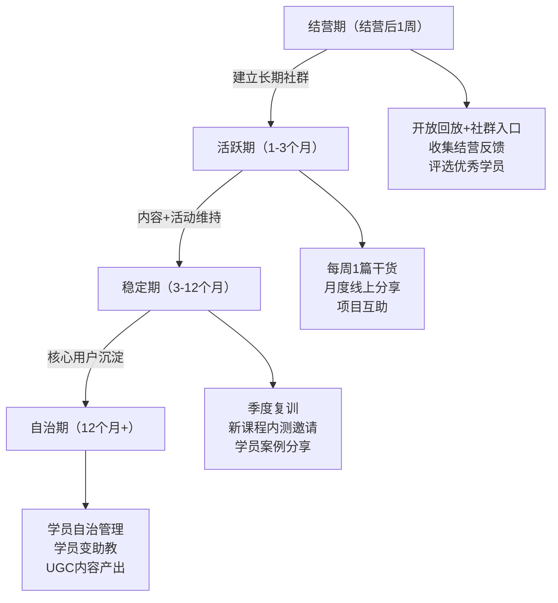

**社群内容日历（月度模板）**：

| 周次 | 内容类型 | 具体形式 | 目的 |
|------|---------|---------|------|
| 第1周 | 干货分享 | 讲师/嘉宾的技术文章或视频 | 提供持续价值 |
| 第2周 | 学员分享 | 优秀学员的项目展示/经验分享 | 激励+社会证明 |
| 第3周 | 直播/AMA | 技术答疑或行业趋势讨论 | 维持互动和粘性 |
| 第4周 | 课程推荐 | 新课程/训练营的预告或内测邀请 | 转化+复购 |

**社群活跃度维持的五个技巧**：

1. **每日话题**：每天抛一个技术讨论话题（如"你在项目中遇到过最诡异的Bug是什么？"），降低发言门槛
2. **学习打卡**：建立打卡机制（如"每天学30分钟新技术"），连续打卡7天可获得小奖励
3. **项目互助**：鼓励学员在群里发自己的项目链接，互相Review代码
4. **嘉宾邀请**：每月邀请一位行业嘉宾做分享（可以是学员中的资深工程师）
5. **线下聚会**：同一城市的学员定期线下聚餐/技术交流（每季度一次）

### 6.8 知识付费的营销与获客

好的课程也需要好的营销。技术人最常犯的错误是"做好了就等着卖"——现实是，没有流量，再好的课程也无人问津。

#### 6.8.1 获客漏斗模型

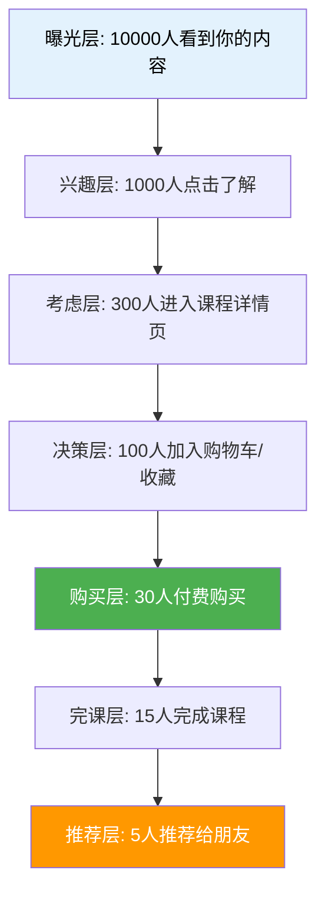

**各层转化率参考**（知识付费行业平均）：

| 转化环节 | 行业平均 | 优秀水平 | 提升方法 |
|---------|---------|---------|---------|
| 曝光→点击 | 3-5% | 8-15% | 标题优化、封面设计、关键词SEO |
| 点击→详情页 | 30-50% | 60-80% | 开头3秒抓住注意力 |
| 详情页→购买 | 3-8% | 10-20% | 课程介绍页优化、学员评价、限时优惠 |
| 购买→完课 | 5-15% | 40-70% | 课程设计+训练营运营 |
| 完课→推荐 | 5-10% | 20-40% | 超预期交付+推荐激励 |

#### 6.8.2 技术人的免费获客渠道

| 渠道 | 操作方式 | 获客效率 | 适合谁 |
|------|---------|---------|--------|
| **技术博客/掘金/CSDN** | 写高质量技术文章，文末引导 | ★★★★☆ | 有写作能力的 |
| **B站技术视频** | 发免费教程视频，评论区/简介引导 | ★★★★★ | 有视频制作能力的 |
| **知乎回答** | 回答技术问题，个人简介引流 | ★★★☆☆ | 知乎活跃用户 |
| **GitHub开源项目** | README中引导，Star数=社会证明 | ★★★★☆ | 有开源项目的 |
| **微信公众号** | 技术干货文章，关注后自动回复引导 | ★★★☆☆ | 有写作习惯的 |
| **Twitter/X技术圈** | 英文技术内容+课程链接 | ★★★★☆ | 做国际市场的 |
| **即刻/小红书** | 技术经验分享，短平快内容 | ★★☆☆☆ | 擅长短内容的 |
| **技术社区/微信群** | 答疑解惑建立信任，软性推广 | ★★★☆☆ | 社群活跃的 |
| **播客/电台** | 技术访谈/经验分享，音频引流 | ★★☆☆☆ | 有表达能力的 |

**最高效的组合**：B站免费教程（长尾流量）+ 掘金/知乎技术文章（SEO流量）+ 微信社群（私域流量）。这三条渠道相互配合：B站和掘金负责"让人知道你"，微信社群负责"让知道你的人信任你"，课程负责"让信任你的人付费"。

#### 6.8.3 内容营销的"钩子-鱼竿-鱼线"模型

免费内容不是随便发的，要有策略地设计"钩子"引导到付费产品：

```text
免费内容（钩子）→ 公众号/社群（鱼竿）→ 付费课程（鱼线）→ 训练营/会员（鱼钩）

具体操作：
1. 钩子内容：在B站/掘金发一篇《Redis缓存穿透的5种解决方案》
2. 文末引导："完整代码和更多实战案例，关注公众号回复'Redis'获取"
3. 公众号自动回复：发送资料+课程介绍
4. 社群运营：定期分享干货，软性推广课程
5. 付费转化：新品上线/促销时群发通知
```

关键原则：**免费内容要"给方法不给答案"**。比如，免费文章教你"缓存穿透有5种解决方案"并讲清原理，但完整的生产级代码和性能对比放在付费课程里。这样学员看了免费内容觉得"有用但不完整"，自然想去买课程。

#### 6.8.4 微信生态营销全攻略

对于国内知识付费从业者，微信生态是最重要的营销阵地。微信公众号、视频号、小程序、企业微信、微信群构成了一条完整的"引流→培育→转化→裂变"链路。

**微信生态的四层营销架构**：

```text
微信生态知识付费营销架构：

第1层：引流层（公域→私域）
├── 微信公众号：技术干货文章，关注后自动回复引导
├── 视频号：短视频引流（3-5分钟技术点讲解）
├── 视频号直播：定期技术分享直播，直播间挂课程链接
├── 朋友圈：个人IP打造，分享技术见解和学员成果
└── 微信搜一搜：SEO优化公众号文章标题，获取搜索流量

第2层：培育层（建立信任）
├── 公众号持续输出：每周2-3篇技术文章，建立专业形象
├── 社群互动：技术交流群内答疑，展示专业深度
├── 视频号直播：每周1次技术分享，直播中软性推荐
└── 企业微信：1对1触达，发送个性化学习建议

第3层：转化层（促成购买）
├── 公众号菜单栏：设置"课程介绍""免费试听"入口
├── 公众号自动回复：关注后推送课程介绍+限时优惠
├── 朋友圈营销：学员好评截图+课程价值描述+购买链接
├── 社群闪购：群内限时优惠，制造紧迫感
└── 视频号橱窗：直接在视频号上架课程

第4层：裂变层（老带新）
├── 推荐返佣：老学员推荐购买返现10-30%
├── 拼团活动：2-3人拼团享折扣
├── 转发领资料：转发文章到朋友圈领取学习资料
└── 社群邀请奖励：邀请好友入群获得专属福利
```

**公众号内容运营的实操策略**：

| 内容类型 | 发布频率 | 目的 | 示例标题 |
|---------|---------|------|---------|
| 深度技术文章 | 每周1篇 | SEO引流+专业背书 | 《Redis缓存穿透的5种生产级解决方案》 |
| 学员案例分享 | 每两周1篇 | 社会证明+转化 | 《学员张三学完课程后拿到了字节offer》 |
| 技术趋势解读 | 每周1篇 | 追热点+引流 | 《2026年最值得学的5个AI框架》 |
| 课程预告/促销 | 每月1-2篇 | 直接转化 | 《第5期Redis训练营开放报名，早鸟价8折》 |
| 干货速递 | 每日/隔日 | 保持活跃+提醒存在 | 《每天一个技术点：Docker多阶段构建》 |

**视频号运营的核心打法**：

视频号是2024-2026年微信生态最大的流量红利。技术类视频号的运营策略：

1. **内容定位**：不做长教程（那是B站的赛道），做"3-5分钟技术点讲解"或"1分钟技术冷知识"——短、快、有信息密度
2. **发布节奏**：每周3-5条，保持算法推荐的活跃度。最佳发布时间：工作日12:00-13:00（午休）和20:00-22:00（晚间学习时段）
3. **引流闭环**：每条视频结尾引导"关注公众号回复XX获取完整代码"，将视频号流量导入公众号→社群→课程
4. **直播转化**：每周1次技术直播（60-90分钟），直播中穿插课程介绍，直播间挂课程购买链接。视频号直播的一个独特优势：好友会看到"XX正在直播"的提醒，自带社交裂变
5. **数据复盘**：关注完播率（>30%为优秀）、互动率（点赞/评论/转发）、引导关注率。完播率低说明开头不够吸引人，互动率低说明内容缺乏讨论性

**企业微信的精细化运营**：

企业微信是连接公众号/视频号流量与课程转化的关键桥梁：

```text
企业微信运营SOP：

新好友添加后（自动化流程）：
├── 即时：发送欢迎消息+自我介绍+免费资料包
├── 第1天：发送一篇精选技术文章（展示专业度）
├── 第3天：询问学习需求和技术方向
├── 第5天：推荐匹配的免费学习资源
├── 第7天：根据需求推荐合适的课程
├── 持续：每周朋友圈发布2-3条技术内容
└── 促销期：私信通知老朋友限时优惠（不要群发，要个性化）

标签体系设计：
├── 技术方向：前端/后端/AI/运维/全栈
├── 技术水平：初级/中级/高级
├── 购买状态：未购买/已购买/已复购
├── 活跃程度：高活跃/中活跃/沉默
└── 来源渠道：公众号/视频号/社群/学员推荐
```

#### 6.8.5 课程销售页的设计与优化

课程销售页是转化率的关键战场。数据显示，销售页转化率每提升1个百分点，等同于流量翻倍。一个优秀的技术课程销售页需要同时解决学员的三个核心疑虑：**这门课教什么**、**学完能做什么**、**凭什么信你**。

**一、销售页的标准结构（8大模块）**

```text
课程销售页结构：

1. 头部Hero区（首屏，决定跳出率）
   - 课程名称（大字，≤15字）
   - 一句话价值承诺（动词+对象+结果）
   - 讲师头像+一句话权威背书
   - CTA按钮（"立即学习"/"加入训练营"）

2. 痛点共鸣区（建立"你懂我"的信任）
   - "你是否遇到过这些问题？"
   - 列出3-5个目标学员最常见的具体痛点场景
   - 用第一人称描述，让读者代入

3. 课程亮点区（差异化证明）
   - 这门课和市面上其他课有什么不同
   - 用对比表展示：你有而竞品没有的
   - 核心卖点不超过3个，每个用数字量化

4. 课程大纲区（完整性和专业性）
   - 完整目录，每章标注具体学习目标（动词+结果）
   - 试看章节入口（让学员体验教学质量）
   - 标注课程时长、章节数、练习题数

5. 讲师介绍区（信任背书）
   - 专业背景+项目经验+教学经验
   - 社会证明（学员数、好评数、合作企业）
   - 讲一个具体的项目故事，不要堆title

6. 学员评价区（社会证明，转化率最高的模块）
   - 3-5条真实学员评价，必须有具体成果
   - "学完后拿到了XX offer"比"课程很好"有效10倍
   - 截图证言比纯文字可信度高3倍

7. 常见问题区（消除最后的犹豫）
   - 适合什么水平？需要什么基础？能退款吗？
   - 和XX课程有什么区别？
   - 没时间学怎么办？

8. 价格与CTA区（临门一脚）
   - 价格+锚定对比（原价/早鸟价）
   - 醒目的"立即购买"按钮（颜色醒目，位置固定）
   - 退款保障承诺（降低决策风险）
   - 倒计时/限额（制造紧迫感，但必须真实）
```

**二、销售页的转化心理学设计**

销售页不是"课程介绍"，而是一封"说服信"。每个模块都有明确的心理学目标：

| 模块 | 心理学目标 | 设计要点 | 常见失误 |
|------|----------|---------|---------|
| Hero区 | 吸引注意力，3秒内传递价值 | 用数字+动词（"21天掌握Redis架构设计"） | 用抽象描述（"深入浅出Redis"） |
| 痛点区 | 激活"这说的是我"的共鸣 | 用具体场景而非笼统描述 | 痛点太泛，没有画面感 |
| 亮点区 | 建立差异化认知 | 用对比表，每项差异有证据支撑 | "课程很全面"= 没有亮点 |
| 大纲区 | 证明完整性和专业度 | 每章标注"学完能做什么" | 只列章节名不讲收获 |
| 讲师区 | 建立信任和权威 | 讲故事而非堆title | "资深架构师"没有说服力 |
| 评价区 | 消除不确定感 | 有具体成果的证言 | "老师讲得很好"= 无效证言 |
| FAQ区 | 消除购买疑虑 | 覆盖5-8个高频问题 | 不写FAQ或只写2-3个 |
| CTA区 | 促成行动 | 按钮醒目，紧迫感真实 | 按钮颜色不突出，无紧迫感 |

**三、高转化销售页的10个微优化技巧**

1. **固定底部CTA栏**：当用户滚动超过首屏后，底部出现固定的价格栏和购买按钮——用户任何时候想买都能立刻行动
2. **实时购买通知**：在页面角落显示"XX刚刚购买了本课程"——社会证明+紧迫感（注意：必须是真实数据或明确标注"模拟效果"）
3. **进度条**：在页面顶部显示"已有XX人购买/限额XX人"——进度可视化促进决策
4. **视频介绍**：在Hero区放一个2-3分钟的课程介绍视频——视频比文字的转化率高20-30%
5. **对比表格**：做一个"自学 vs 看免费教程 vs 本课程"的对比表——突出课程的独特价值
6. **退款保障强化**：不是简单写"7天退款"，而是"学完不满意，全额退款，零风险"——降低心理门槛
7. **学员成果可视化**：用时间线展示学员从"不会"到"会"的过程——让购买者看到自己的未来
8. **赠品清单**：列出所有赠品（源码、社群、答疑、模板）并标注价值——增加感知总价值
9. **减少干扰**：去掉页面上所有与购买无关的链接——每多一个出口，转化率下降5-10%
10. **移动端优化**：按钮足够大（≥44px），文字可读（≥16px），表格可横向滑动——>60%用户用手机

**四、销售页A/B测试的实操方法**

不要猜，用数据定。以下是经过验证的A/B测试框架：

| 测试要素 | 变量A | 变量B | 观测指标 | 最小样本量 | 测试周期 |
|---------|-------|-------|---------|----------|---------|
| Hero标题 | 动作型"掌握Redis" | 痛点型"告别缓存问题" | 首屏停留时间+滚动深度 | 200 UV | 7天 |
| CTA按钮 | "立即学习" | "加入训练营" | 点击率 | 200 UV | 7天 |
| 价格展示 | 原价999划掉/现价499 | 直接展示499 | 加购率 | 300 UV | 14天 |
| 评价展示 | 3条精选评价 | 10条评价轮播 | 转化率 | 300 UV | 14天 |
| 页面长度 | 短页面（5屏） | 长页面（10屏） | 转化率+跳出率 | 500 UV | 14天 |

**测试工具推荐**：
- 国内：GrowingIO、神策数据（支持A/B测试+热力图+漏斗分析）
- 国际：Google Optimize（免费）、VWO、Optimizely
- 轻量方案：用两个不同的销售页URL，各投放等量流量，对比转化率

#### 6.8.6 邮件营销与自动化漏斗

邮件营销（国内主要用公众号/企业微信替代）是知识付费转化率最高的渠道之一，因为订阅者已经表达了兴趣：

| 阶段 | 邮件内容 | 发送时机 | 目标 |
|------|---------|---------|------|
| 欢迎邮件 | 自我介绍+免费资料 | 订阅后立即 | 建立信任 |
| 价值邮件1 | 与课程相关的干货文章 | 第3天 | 提供价值 |
| 价值邮件2 | 学员案例/成功故事 | 第5天 | 社会证明 |
| 转化邮件 | 课程介绍+限时优惠 | 第7天 | 促成购买 |
| 追单邮件 | "你还在犹豫什么？"+FAQ | 第9天 | 消除疑虑 |
| 最后机会 | 优惠即将截止 | 第10天 | 临门一脚 |

**自动化工具推荐**：Mailchimp（国际）、企业微信（国内）、ConvertKit（创作者友好）。国内更常用的做法是通过公众号自动回复+社群推送来实现类似效果。

#### 6.8.7 老学员裂变策略

老学员是知识付费最有价值的获客渠道。一个满意学员的推荐，抵得上100次广告曝光。

**裂变的底层逻辑**：

```text
裂变系数 K = 每个学员带来的新学员数 × 新学员的转化率

K > 1：病毒式增长（每个学员带来更多新学员）
K = 1：稳定增长
K < 1：需要持续外部流量补充

知识付费行业的平均K值：0.1-0.3
优秀的裂变设计可以提升到 0.5-1.0
```

**五种经过验证的裂变机制**：

| 裂变机制 | 具体做法 | 适用场景 | 预期效果 |
|---------|---------|---------|---------|
| **推荐返佣** | 学员推荐朋友购买，获得课程价格10-30%的现金返佣 | 所有课程 | 每100个学员带来5-15个新学员 |
| **拼团优惠** | 2人拼团7折，3人拼团6折 | 低价课程（<200元） | 转化率提升20-40% |
| **分销员计划** | 招募KOL/老学员为分销员，提供专属链接和更高佣金 | 有影响力的学员 | 单个分销员可带来10-50个学员 |
| **学完返现** | 完课后返还10-20%学费（或等额课程券） | 训练营（提升完课率） | 完课率提升15-25% |
| **组队学习** | 3人组队报名享优惠，队伍内互相督促 | 训练营 | 自带社交裂变+提升完课率 |

#### 6.8.8 学员证言收集与社会证明系统

学员证言是知识付费转化率最高的营销素材。一条"学完课程后拿到字节offer"的真实评价，比你自己写100篇推广文章都有效。但大多数讲师只是被动等待学员主动评价——这远远不够。你需要建立一个系统化的证言收集机制。

**证言收集的五个触点**：

```text
学员证言收集SOP：

触点1：完课当天（最佳时机，学员成就感最强）
├── 自动消息：恭喜完成课程！能否花2分钟分享你的学习感受？
├── 引导问题（用具体问题引导，不要问"觉得怎么样"）：
│   ├── 学完这门课，你最大的收获是什么？
│   ├── 课程中哪个部分对你帮助最大？为什么？
│   ├── 学完后你在工作中有什么变化？（如效率提升/解决问题/涨薪）
│   └── 你会怎么向朋友推荐这门课？（一句话）
└── 收集方式：飞书文档/Typeform问卷（5题以内）

触点2：学完后1个月（验证"学以致用"的效果）
├── 自动消息：学完一个月了，课程内容用上了吗？
├── 引导问题：
│   ├── 学完后你在工作中应用了哪些知识点？
│   ├── 有没有因为课程内容解决过什么具体问题？
│   └── 如果用一句话概括这门课的价值，你会怎么说？
└── 收集方式：私信或问卷

触点3：学员取得成果时（offer/涨薪/项目成功）
├── 触发条件：学员主动分享好消息，或你在社群中看到
├── 操作：立即私信恭喜+请求授权分享（截图/案例）
├── 话术："太棒了！能否分享一下这个过程中课程帮到了你什么？
│         我想整理成案例分享给更多同学（隐去个人信息）"
└── 注意：必须获得学员书面授权才能公开使用

触点4：训练营结营仪式（群体氛围+仪式感）
├── 操作：结营直播中设置"学员分享"环节（3-5人，每人3分钟）
├── 同时在群里发起"一句话总结你的收获"接龙
├── 收集：将直播分享录制+群接龙整理为证言素材
└── 效果：群体分享时学员更愿意表达正面感受

触点5：年度回顾（适合长期社群/年度会员）
├── 时机：每年年底或课程上线周年
├── 操作：发一份"年度学习回顾"问卷
├── 内容：今年学了什么→用了什么→改变了什么→明年想学什么
└── 产出：年度学员成长报告（可用于年度营销）
```

**证言素材的四种形式及使用场景**：

| 形式 | 制作方式 | 使用场景 | 转化效果 |
|------|---------|---------|---------|
| **文字评价** | 学员填写问卷/群内发言 | 课程详情页、销售页 | ★★★☆☆ |
| **截图证言** | 微信聊天截图/朋友圈截图 | 社群推广、朋友圈营销 | ★★★★☆ |
| **视频证言** | 学员录制1-2分钟短视频 | 课程详情页顶部、B站引流 | ★★★★★ |
| **案例故事** | 整理为1000字左右的成长故事 | 公众号文章、招生文案 | ★★★★★ |

#### 6.8.9 合作推广与联名课程

一个人的力量有限，合作推广能让你的课程触达更多目标用户。

**合作推广的五种模式**：

| 合作模式 | 具体做法 | 分成方式 | 适合谁 |
|---------|---------|---------|--------|
| **内容互推** | 在各自的文章/视频中推荐对方课程 | 不涉及分成，纯互推 | 粉丝量相当的同领域讲师 |
| **嘉宾课** | 邀请行业大佬在你的课程中做一期嘉宾分享 | 固定费用（2000-10000元）或分成 | 想借力提升课程权威性 |
| **联名课程** | 两位讲师共同设计和制作一门课程 | 50:50或按贡献比例 | 互补技能的讲师（如前端+后端） |
| **平台合作** | 与课程平台谈独家首发/推荐位 | 平台提供流量，你提供独家内容 | 有一定品牌影响力的讲师 |
| **企业合作** | 与企业HR合作，将课程作为员工培训 | 企业批量采购折扣（通常7-8折） | 课程与企业需求匹配的 |

**如何找到合适的合作伙伴**：

1. **同领域但不同细分**：你教前端，找教后端的——学员群体相同，但内容不竞争
2. **粉丝量级相近**：差3倍以内最好合作，差太多一方会觉得"亏了"
3. **价值观一致**：合作前先聊一次，确认教学理念、质量标准、售后态度一致
4. **先小后大**：先做一次内容互推试试水，效果好再深入合作

#### 6.8.10 内容营销的编辑日历与长期策略

很多技术人做内容营销是"想到什么写什么"，缺乏系统规划。结果要么断更（想起来才发），要么内容散乱（今天写前端明天写运维），无法在搜索引擎和读者心智中建立清晰的标签。

**内容编辑日历的设计框架**：

```text
内容策划的三层结构：

Layer 1：年度内容主题规划（战略层）
├── 确定3-5个核心内容支柱（Content Pillars）
│   ├── 支柱1：你的课程主题相关（如"Redis实战"）
│   ├── 支柱2：你的技术栈相关（如"后端架构"）
│   ├── 支柱3：行业趋势相关（如"AI在后端的应用"）
│   └── 支柱4：职场成长相关（如"架构师进阶"）
├── 每个支柱对应一个产品（课程/训练营/咨询）
└── 目标：读者在任何支柱下搜索，都能找到你的内容

Layer 2：月度内容排期（战术层）
├── 每月8-12篇内容（文章+视频+短内容）
├── 分配比例：
│   ├── 60% 常青内容（长期有搜索流量的技术文章）
│   ├── 20% 热点内容（蹭技术热点，短期爆发流量）
│   ├── 10% 转化内容（直接推广课程/训练营）
│   └── 10% 互动内容（投票/问答/讨论，提升社群活跃度）
└── 排期示例：每周二/四发技术文章，每周六发短视频

Layer 3：单篇内容设计（执行层）
├── 选题来源：学员提问>搜索关键词>竞品分析>个人灵感
├── 标题公式：[数字]+[痛点/成果]+[限定词]
│   ├── ✅ "Redis缓存穿透的5种生产级解决方案"
│   ├── ✅ "面试被问Redis集群？这8个知识点必须掌握"
│   └── ❌ "Redis学习笔记"（没有吸引力）
├── 内容结构：痛点→原理→方案→代码→总结→引导
└── CTA设计：文末引导到公众号/社群/课程（不要硬广）
```

**内容复利效应的实操方法**：

一篇高质量技术文章的价值远不止"发出去那一次"。以下是将一篇2000字文章的价值最大化的方法：

| 复用步骤 | 产出 | 时间投入 | 额外价值 |
|---------|------|---------|---------|
| 原始文章 | 掘金/知乎2000字长文 | 4-6小时 | SEO长尾流量 |
| → 提取要点 | 3-5条Twitter/即刻短内容 | 30分钟 | 社交媒体曝光 |
| → 改写为视频脚本 | B站10分钟技术视频 | 3-4小时 | 视频平台流量 |
| → 提取金句 | 3-5张知识卡片图 | 1小时 | 小红书/朋友圈传播 |
| → 合并系列文章 | 电子书/小册章节 | 每篇额外1小时 | 付费产品素材 |
| → 翻译为英文 | Medium/Dev.to英文版 | 2-3小时 | 国际市场曝光 |

**内容效果追踪的KPI体系**：

```text
内容营销的核心KPI（按重要性排序）：

1. 引流效率：每篇内容带来的公众号/社群新增关注数
   ├── 优秀：>50人/篇
   ├── 合格：10-50人/篇
   └── 需改进：<10人/篇

2. 转化效率：免费内容读者转化为付费学员的比例
   ├── 优秀：>3%
   ├── 合格：1-3%
   └── 需改进：<1%

3. 内容产出稳定性：每月实际产出/计划产出
   ├── 优秀：>90%
   ├── 合格：70-90%
   └── 需改进：<70%（断更会严重影响品牌信任）

4. 内容质量：平均阅读完成率/互动率
   ├── 优秀：完成率>60%，互动率>5%
   ├── 合格：完成率40-60%，互动率2-5%
   └── 需改进：完成率<40%（标题吸引人但内容留不住人）

追踪工具：
├── 掘金/知乎：后台数据面板
├── B站：创作中心数据分析
├── 公众号：微信公众号后台
├── 统一仪表盘：飞书多维表格（每周手动录入各平台数据）
```

### 6.9 工具链与技术选型

#### 6.9.1 课程制作工具链

| 环节 | 推荐工具 | 免费/付费 | 说明 |
|------|---------|----------|------|
| 课程大纲设计 | XMind / 飞书文档 | 免费 | 用思维导图梳大纲 |
| 课件制作 | PowerPoint / Keynote / Marp | 免费 | Marp用Markdown做幻灯片，程序员友好 |
| 录屏 | OBS Studio | 免费 | 开源录屏，功能强大 |
| 视频剪辑 | DaVinci Resolve / 剪映 | 免费 | DaVinci免费版功能已经很全 |
| 代码演示 | VS Code + CodeSnap | 免费 | 代码截图美化 |
| 字幕生成 | Whisper / 剪映自动字幕 | 免费 | 自动生成字幕，人工校对 |
| 缩略图制作 | Canva / Figma | 免费 | 制作课程封面 |
| 代码仓库 | GitHub / Gitee | 免费 | 课程配套源码 |
| 直播/互动 | 腾讯会议 / 飞书 | 免费 | 训练营答疑直播 |
| 作业管理 | 飞书表格 / 腾讯文档 | 免费 | 收集和批改作业 |
| 数据分析 | 飞书多维表格 / Metabase | 免费 | 跟踪课程数据 |
| 问卷调研 | 腾讯问卷 / 金数据 | 免费 | 收集学员反馈 |

#### 6.9.2 自建课程平台的技术方案

如果你想自建课程销售网站（不依赖第三方平台），有以下技术方案：

| 方案 | 技术栈 | 成本 | 适合谁 |
|------|--------|------|--------|
| 小鹅通/知识星球 | SaaS，无需开发 | 年费3000-20000元 | 不想折腾技术的 |
| WordPress + LearnDash | PHP + WordPress | 主机费+插件费约2000元/年 | 熟悉WordPress的 |
| Strapi + Next.js | Headless CMS + React | 服务器费约500元/月 | 前端开发者 |
| Hugo + LemonSqueezy | 静态站 + 支付API | 几乎零成本 | 极简主义者 |
| Ghost + Members | Node.js + 内置会员系统 | $25-100/月 | 内容创作者 |
| Podia | SaaS一体站 | $39-199/月 | 国际市场的综合选择 |
| 自研系统 | 任意技术栈 | 开发时间成本 | 想完全控制的 |

**自建平台的关键模块**：
1. **支付对接**：支付宝/微信支付（国内）或Stripe/PayPal（国际）
2. **视频托管**：阿里云VOD/腾讯云VOD（防下载、防盗链）
3. **用户系统**：注册、登录、订单管理
4. **课程展示**：分类、搜索、试看
5. **数据分析**：访问量、转化率、学员进度

#### 6.9.3 AI辅助课程制作工具

2025-2026年，AI工具已经深度渗透到课程制作的每一个环节：

| 环节 | AI工具 | 效率提升 | 注意事项 |
|------|--------|---------|---------|
| 大纲生成 | ChatGPT/Claude | 生成初版大纲，节省1-2小时 | 必须人工审核和调整，AI不了解你的独特经验 |
| 脚本撰写 | Claude/ChatGPT | 生成初版逐字稿，节省50%时间 | 核心观点和案例必须是原创的，AI只是辅助 |
| 代码示例 | GitHub Copilot/Cursor | 快速生成Demo代码 | 必须自己跑一遍验证，AI生成的代码可能有bug |
| 字幕生成 | Whisper/剪映AI | 自动生成字幕，节省80%时间 | 专业术语需要人工校对 |
| 封面设计 | Midjourney/DALL-E | 快速生成多种风格的封面 | 注意版权问题，建议AI生成后人工调整 |
| 课件美化 | Gamma/Beautiful.ai | AI生成PPT，自动排版 | 需要根据技术内容做定制化调整 |
| 翻译字幕 | DeepL/ChatGPT | 多语言字幕快速生成 | 技术术语翻译需要人工把关 |
| 练习题生成 | ChatGPT/Claude | 根据课程内容自动生成练习题 | 需要检查答案正确性 |

**AI辅助课程制作的实战Prompt模板**：

以下是经过验证的Prompt模板，可以直接复制使用。每个Prompt都标注了适用场景和预期输出。

```text
Prompt 1：课程大纲生成（适用：选题确定后，设计大纲阶段）

你是一位资深的技术课程设计师，擅长将复杂技术主题设计为系统化的课程大纲。

我的课程信息：
- 主题：[填写，如"Redis从入门到生产实战"]
- 目标学员：[填写，如"1-3年经验的后端工程师"]
- 学习成果：[填写，如"能独立设计和实施Redis缓存方案"]
- 课程时长：[填写，如"20小时，40节课"]
- 差异化：[填写，如"所有案例来自真实电商项目"]

请按以下结构生成课程大纲：
1. 第0章：课程导读（学习目标+前置要求+学习路径）
2. 基础篇（30%课时）：核心概念+环境搭建+基础练习
3. 进阶篇（40%课时）：核心深入+实战项目+踩坑总结
4. 实战篇（20%课时）：完整项目+性能优化+生产部署
5. 总结篇（10%课时）：回顾+进阶路径+作品集

每章要求：
- 标题用"动词+对象+结果"格式（如"搭建Redis主从复制架构"）
- 标注预估时长和难度等级（1-5星）
- 标注该章覆盖的布鲁姆认知层级
- 给出1个具体的课堂练习

输出格式：Markdown层级列表。

Prompt 2：逐字稿生成（适用：录制前的脚本准备）

你是一位技术课程的脚本编剧。我需要你帮我写一节课的逐字稿。

课程信息：
- 课程名：[填写]
- 本节主题：[填写]
- 时长目标：[填写，如"15分钟"]
- 前一节内容：[简述，用于衔接]

要求：
1. 开场（1分钟）：用一个具体的技术问题或生产事故场景切入，不要自我介绍
2. 核心讲解（10分钟）：先讲Why（为什么需要这个技术），再讲How（怎么用），最后讲What if（什么场景下不用/替代方案）
3. 代码演示（3分钟）：在讲解过程中自然引入代码，代码要能运行
4. 总结（1分钟）：3个要点回顾+下节预告

语言风格：
- 用"你"不用"大家"
- 口语化，像和同事聊天
- 避免"嗯""啊""那个"等语气词
- 每个技术术语首次出现时用一句话解释

输出格式：逐字稿（可直接朗读），代码部分用代码块标注。

Prompt 3：练习题自动生成（适用：每节课后的配套练习）

基于以下课程内容，生成5道练习题。难度从易到难递增。

课程内容摘要：
[粘贴本节课的核心内容，500字以内]

要求：
- 第1-2题：记忆+理解层级（选择题/填空题）
- 第3题：应用层级（给定场景，写出代码）
- 第4题：分析层级（给出错误代码，找出问题）
- 第5题：评价+创造层级（开放题，给出设计方案）

每道题包含：
- 题目描述
- 参考答案
- 解题思路（供助教批改参考）
- 预估完成时间
- 对应的布鲁姆认知层级
```

**AI辅助课程制作的工作流设计**：

```text
AI+人工的课程制作标准工作流：

Step 1：选题验证（AI辅助，人工决策）
├── AI工具：用ChatGPT分析竞品课程大纲和差评
├── 人工：根据自己的经验和判断力做最终选题决策
└── 时间节省：从2天→4小时

Step 2：大纲设计（AI初稿，人工精修）
├── AI工具：用Prompt 1生成初版大纲
├── 人工：调整顺序、补充独特经验、标注差异化章节
├── 试讲：找3个目标学员看大纲，收集反馈
└── 时间节省：从1天→3小时

Step 3：逐字稿编写（AI初稿，人工润色）
├── AI工具：用Prompt 2生成初版逐字稿
├── 人工：补充真实案例、调整语言风格、确保技术准确
├── 关键原则：AI写骨架，人填血肉——经验和案例必须原创
└── 时间节省：从每节课2小时→40分钟

Step 4：代码准备（AI生成，人工验证）
├── AI工具：用Copilot/Cursor生成Demo代码
├── 人工：在目标环境中运行验证、补充注释、处理边界情况
├── 关键检查：代码必须在干净环境中从零运行成功
└── 时间节省：从每节课3小时→1.5小时

Step 5：练习题设计（AI生成，人工审核）
├── AI工具：用Prompt 3自动生成练习题
├── 人工：检查答案正确性、调整难度、确保与课程内容匹配
└── 时间节省：从每节课1小时→20分钟

Step 6：字幕与后期（AI处理，人工校对）
├── AI工具：Whisper自动生成字幕
├── 人工：校对技术术语、调整时间轴、添加标注
└── 时间节省：从每节课2小时→40分钟

总计效率提升：一门20小时的课程，传统制作需要3-4个月，
AI辅助后可缩短到6-8周（兼职）或3-4周（全职）。
```

#### 6.9.4 视频托管与防盗链技术方案

视频是课程的核心资产，托管方案直接关系到播放体验、安全性和成本。

**主流视频托管方案对比**：

| 方案 | 月费参考 | 防盗链 | CDN加速 | 适合谁 |
|------|---------|--------|---------|--------|
| **阿里云VOD** | 按流量计费，约0.2元/GB | 加密播放+Refer防盗+播放鉴权 | 全球节点 | 自建平台的首选 |
| **腾讯云VOD** | 按流量计费，约0.21元/GB | HLS加密+防盗链+DRM | 全国节点 | 已用腾讯云生态的 |
| **保利威** | 980元/年起 | 防录屏+跑马灯水印+防下载 | 全国节点 | 不想折腾技术的 |
| **CC视频** | 按量计费 | 加密+水印+防录屏 | 全国节点 | 企业级需求 |
| **B站/优酷** | 免费 | 无（公开视频） | 有 | 免费引流视频 |
| **自建（MinIO+Nginx）** | 服务器成本 | 自己实现 | 需自己配CDN | 技术能力强的 |

**视频防盗的四层防护**：

```text
第1层：基础防护
- Referer防盗链：只允许你的域名引用视频
- URL签名：视频链接带时效性签名，过期失效
- IP限制：限制同一IP同时播放数

第2层：播放防护
- HLS加密：视频分片加密，密钥动态获取
- 播放鉴权：每次播放前验证用户身份和购买状态
- 清晰度限制：试看用低清，付费后解锁高清

第3层：防录屏
- 跑马灯水印：播放时在视频上叠加学员ID/手机号
- 动态水印：随机位置和透明度，增加去水印难度
- 防录屏检测：检测常见录屏软件的进程（效果有限）

第4层：法律防护
- 视频开头加入版权声明（10秒）
- 购买协议中明确禁止录屏和传播
- 定期监控盗版链接，及时投诉下架

重要提醒：没有任何技术手段能100%防盗。关键是让盗版的
"成本"大于"收益"——水印让盗版者无法匿名，加密让下载
变得困难，法律声明让传播面临风险。三层组合已能阻止90%的盗版。
```

**视频编码的推荐参数**：

```yaml
# 技术课程视频编码推荐设置
resolution:
  主流: 1920x1080 (1080p)  # 代码必须高清
  备选: 1280x720 (720p)    # 预算有限时使用
  最低: 不低于720p          # 低于此分辨率代码看不清

bitrate:
  1080p: 2000-4000 kbps     # 代码演示不需要太高码率
  720p: 1000-2000 kbps
  480p: 500-1000 kbps       # 音频版备用

codec:
  video: H.264 (兼容性最好) 或 H.265 (同画质体积减小40%)
  audio: AAC 128kbps
  container: MP4

特殊优化:
  - 屏幕录制内容用"文字优化"编码预设
  - 关键帧间隔设为2秒（方便拖动进度条）
  - 音频采样率48kHz，双声道
```

#### 6.9.5 直播工具详细对比

训练营的直播答疑需要选择合适的工具：

| 工具 | 最大人数 | 互动功能 | 录制 | 回放 | 价格 | 推荐场景 |
|------|---------|---------|------|------|------|---------|
| **腾讯会议** | 300人（免费版300分钟） | 开麦/屏幕共享/白板 | 自动录制 | 云端回放 | 免费-30元/月 | 小规模答疑（<50人） |
| **飞书** | 500人 | 开麦/共享/妙记(自动纪要) | 自动录制 | 云端回放 | 免费 | 飞书生态用户 |
| **钉钉** | 302人 | 开麦/共享/投票 | 自动录制 | 云端回放 | 免费 | 企业用户 |
| **B站直播** | 无限 | 弹幕/连麦/抽奖 | 需OBS | B站自动 | 免费 | 大规模公开课 |
| **小鹅通** | 按套餐 | 连麦/答题/红包/抽奖 | 自动+剪辑 | 平台内 | 4800元/年起 | 付费训练营首选 |
| **Zoom** | 100人（免费40分钟） | 开麦/共享/分组讨论 | 自动录制 | 云端回放 | $13.33/月 | 国际学员 |
| **OBS+RTMP** | 取决于服务器 | 无（需配合聊天室） | 自己录制 | 自己处理 | 免费 | 自建平台 |

### 6.10 收入预期与增长路径

#### 6.10.1 知识付费收入的时间线

| 阶段 | 时间 | 核心工作 | 预期月收入 | 关键里程碑 |
|------|------|---------|-----------|----------|
| **准备期** | 第1-3个月 | 内容积累、粉丝增长、课程制作 | 0-500元 | 首发平台选定，课程大纲完成 |
| **冷启动** | 第3-6个月 | 首门课程上线、初始推广 | 500-3000元 | 首批50-100个付费学员 |
| **增长期** | 第6-12个月 | 口碑积累、多平台分发、第二门课 | 3000-15000元 | 复购率>10%，学员推荐率>5% |
| **稳定期** | 第12-24个月 | 产品矩阵成型、社群运营 | 15000-50000元 | 被动收入超过主动劳动收入 |
| **规模化** | 24个月以上 | 品牌效应、企业内训、团队化 | 50000元+ | 年收入突破100万 |

**重要提醒**：以上时间线假设你**兼职做**（每天投入2-3小时），且在技术社区已有一定积累（非完全零基础）。如果全职投入且从零开始，时间线可以缩短30-50%，但前三个月收入几乎为零，需要有至少6个月的生活费储备。

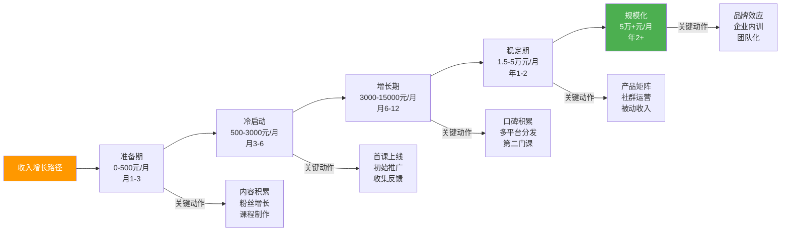

#### 6.10.2 收入增长的杠杆点

| 杠杆点 | 触发条件 | 收入跃迁幅度 | 前置准备 |
|--------|---------|------------|---------|
| **平台推荐** | 被编辑推荐到首页 | 月收入×3-5 | 课程质量过硬+持续更新 |
| **爆款文章/视频** | 一篇技术文章破万赞 | 月收入×2-10 | 持续输出，等待概率事件 |
| **企业大单** | 企业内训询盘 | 单次5000-50000元 | 有公开演讲/培训案例 |
| **口碑裂变** | NPS>50，学员主动推荐 | 月收入×2-3 | 超预期交付+推荐激励机制 |
| **产品矩阵** | 第二门/第三门课上线 | 月收入×1.5-2 | 第一门课跑通后复制 |
| **国际拓展** | 英文版课程上线 | 月收入×2-5 | 英语能力+海外平台运营 |

#### 6.10.3 真实案例拆解

以下四个案例覆盖了知识付费的四种典型路径。每个案例不仅展示结果，更拆解**关键决策点**和**踩过的坑**，帮助你对照自身情况选择最适合的路径。

**案例一：掘金小册作者的收入结构——"内容矩阵"路径**

某前端工程师（化名"小K"），掘金活跃用户，3年内出版了3本技术小册，建立了完整的内容矩阵。

```text
小K的完整时间线与关键决策：

第0阶段（启动前）：在掘金写了40+篇技术文章，积累1.2万粉丝
├── 关键决策：不是"有粉丝了才写书"，而是"写文章验证了市场需求再写书"
├── 数据验证：Vue3相关文章平均阅读量5000+，评论区高频问题集中在"组合式API实战"
└── 选题依据：读者需求明确+自己有3个Vue3生产项目经验

第1本小册（引流产品）：
├── 主题：《Vue3组合式API实战指南》
├── 定价：39.9元（低价降低决策门槛）
├── 制作周期：6周（每天2-3小时）
├── 内容策略：30%基础+50%实战+20%踩坑经验
├── 推广方式：掘金文章末尾引导+朋友圈+掘金社区推荐
├── 累计销量：8000+份（3年累计）
├── 收入：约25万元
└── 踩坑：初版代码有3处bug，上线第2天被读者指出，紧急修复后在更新日志中致谢

第2本小册（利润产品）：
├── 主题：《TypeScript类型体操与工程实践》
├── 定价：49.9元（提价25%，因为更专业）
├── 制作周期：8周
├── 关键决策：选了一个"难但刚需"的主题——TypeScript高级类型
├── 交叉引流：在第1本小册的"进阶推荐"中植入第2本链接
├── 复购率：买过第1本的读者中28%购买了第2本
├── 累计销量：5000+份
└── 收入：约20万元

第3本小册（深水区产品）：
├── 主题：《Vite插件开发与原理剖析》
├── 定价：59.9元（进一步提价）
├── 制作周期：10周（涉及源码分析，耗时更长）
├── 差异化：市面上没有Vite插件开发的系统教程
├── 累计销量：3000+份
└── 收入：约15万元

3年合计：约60万元，平均月收入约1.7万元
产品矩阵转化率：第1本→第2本 28%，第2本→第3本 35%
```

**关键经验深度拆解**：

1. **引流产品的选择逻辑**：小册1选择Vue3是因为（1）用户基数大，（2）组合式API是新概念，学习需求旺盛，（3）自己有真实项目经验。定价39.9元不是"便宜"，而是"低到让犹豫的人直接买"——这个价位的退款率不到1%
2. **复购率的秘密**：28%的复购率来自两个设计——（1）每本小册最后一章都有"进阶学习路径"推荐下一本书，（2）买过前一本的读者在掘金个人主页会显示"已购"标签，形成社会证明
3. **时间投入的真实账本**：6+8+10=24周的写作时间+每本2周的推广和维护=约30周的集中投入。平均到3年，每月实际投入约15小时。这个投入产出比（月均1.7万/15小时≈1100元/小时）远高于接单

**案例二：B站UP主转训练营——"免费内容→高端服务"路径**

某后端工程师（化名"老张"），从B站免费教程起步，逐步建立训练营业务。

```text
老张的完整增长路径：

第1阶段：免费内容积累信任（6个月）
├── 内容策略：每周1个15-20分钟的后端技术视频
├── 内容方向：Redis/MySQL/消息队列的实战踩坑经验
├── 核心方法：每个视频都以"我在XX项目中遇到的问题"开头
├── 粉丝增长：0→5万（6个月）
├── 变现：0元（纯粹积累期）
└── 关键决策：没有急于变现，而是先把"后端实战"这个标签打透

第2阶段：低价产品验证市场（3个月）
├── 在掘金出版1本小册（Redis实战），定价39.9
├── 3个月销售1500份，验证了"后端实战"方向有付费需求
├── 关键发现：小册评论区高频出现"希望有实战项目指导"
└── 决策：这个需求只有训练营能满足

第3阶段：训练营冷启动（第1-3期）
├── 第1期：30人，定价1999元
│   ├── 招生：B站视频评论区+掘金小册读者群+朋友圈
│   ├── 转化率：报名页→付费 4.2%（低于行业平均，因为第一次做）
│   ├── 运营：全部自己做，每天投入6小时（白天上班+晚上运营）
│   ├── 完课率：58%（超出预期）
│   ├── NPS：42（不错但有提升空间）
│   ├── 收入：6万元
│   └── 踩坑：Day10的作业太难，8人放弃→紧急录制补充讲解视频
│
├── 第2期：50人，定价2499元（涨价25%）
│   ├── 招生：第1期学员推荐占35%（口碑效应开始显现）
│   ├── 优化：增加了助教（第1期的优秀学员兼职）
│   ├── 完课率：65%（提升7%）
│   ├── NPS：51（进入优秀区间）
│   └── 收入：12.5万元
│
├── 第3期：80人，定价2999元（再涨20%）
│   ├── 招生：学员推荐占42%，B站新增粉丝自然转化占30%
│   ├── 运营：引入AI答疑助手，人工答疑时间减少60%
│   ├── 完课率：62%（规模扩大后略有下降，正常）
│   └── 收入：24万元

第4阶段：稳定运营（每年4期）
├── 每期80-100人，定价2999-3499元
├── 年收入：约80-120万元
├── 时间投入：每期21天全情投入+期休1个月
├── 团队：1个主讲+2个助教+1个运营（兼职）
└── 关键指标：学员推荐率>40%，退款率<3%，完课率>60%
```

**关键经验深度拆解**：

1. **为什么免费内容要做6个月再变现**：老张原计划3个月就开始训练营，但发现粉丝增长曲线在第4个月才出现拐点（从缓慢增长变为加速增长）。如果3个月就开训练营，可能只有10个人报名，反而打击信心。耐心积累到5万粉丝后，第一期训练营轻松招满30人
2. **涨价的底气从哪来**：每次涨价都有数据支撑——第1期NPS 42+完课率58%证明课程有效，第2期35%的推荐率证明口碑好。涨价不是"我觉得值更多"，而是"数据证明学员认可"
3. **AI助教的真实效果**：第3期引入AI助教后，80%的常规问题（如"环境怎么配""代码报错什么意思"）由AI回答，人工只处理复杂问题。讲师每天答疑时间从4小时降到1.5小时

**案例三：从技术博客到全产品矩阵——"五年慢跑"路径**

某Java工程师（化名"阿杰"），用5年时间建立了完整的产品矩阵。这个案例适合**没有大量粉丝基础、愿意长期投入**的技术人。

```text
阿杰的五年增长路径（适合兼职、稳步增长型）：

Year 1：内容积累期
├── 平台：掘金+微信公众号
├── 内容：每周1-2篇Spring Cloud微服务文章
├── 粉丝：掘金8000+公众号3000
├── 收入：0元
├── 投入：每周8-10小时
├── 关键动作：建立了"微服务实战"的个人标签
└── 心态管理：前6个月几乎0反馈，差点放弃

Year 2：第一款付费产品
├── 产品：掘金小册《Spring Cloud微服务实战》
├── 定价：49.9元
├── 制作周期：2个月
├── 推广：掘金文章导流+公众号推送+朋友圈
├── 累计销量：3000份（12个月）
├── 月收入：约4000元（不稳定，促销时高平时低）
└── 关键教训：初版大纲太"教科书"，改了3版才找到"实战踩坑"的角度

Year 3：专栏深化品牌
├── 产品：极客时间专栏《微服务架构设计》
├── 定价：199元
├── 制作周期：3个月（极客时间有编辑团队协助）
├── 平台优势：极客时间自有流量+编辑推荐位
├── 累计订阅：2000份
├── 月收入：约1.5万元
├── 关键决策：选择极客时间而非自建，因为平台流量>自建利润
└── 品牌效应：开始收到技术大会演讲邀请

Year 4：训练营放大利润
├── 产品：微服务架构训练营（21天）
├── 定价：2999元
├── 规模：每期40人，每年3期
├── 转化来源：极客时间专栏读者占50%，掘金读者占30%，口碑推荐占20%
├── 月收入：约3万元（按年均摊）
├── 关键创新：设计了"架构评审"环节——学员提交自己的架构方案，讲师逐一点评
└── 团队：找了一个往期优秀学员做兼职助教

Year 5：企业内训+品牌变现
├── 新增产品：企业内训
├── 触发条件：Year 4的技术大会演讲被企业HR看到
├── 定价：2-3万/天
├── 频率：每年5-8次
├── 年总收入：突破120万
├── 收入结构：训练营50%+内训30%+课程被动收入15%+其他5%
└── 关键心得：内训不是"卖课"，是"卖解决方案"——每次内训前都要做需求调研定制内容

5年总收入增长曲线：
Year1: 0 → Year2: 5万 → Year3: 18万 → Year4: 36万 → Year5: 120万
```

**案例四：AI课程的爆发式增长——"风口快速响应"路径**

某AI工程师（化名"小林"），在2025年初抓住AI热潮，12个月内实现了年收入240万。这个案例适合**有前沿技术背景、能快速产出内容**的技术人。

```text
小林的爆发式增长路径：

背景：小林在某大厂做AI应用开发，有2年LangChain/LlamaIndex实战经验

Month 1-3：抢占内容高地
├── 策略：在AI热度刚起来时，快速产出高质量免费内容
├── 平台：B站（主阵地）+掘金（辅助）
├── 内容：《用LangChain搭建AI应用》系列视频，每集15-20分钟
├── 更新频率：每周2-3个视频（高强度，但抓住了窗口期）
├── 差异化：不讲理论，每个视频都做一个可运行的AI应用Demo
├── 粉丝增长：3个月从0到8万
├── 关键爆款：第7个视频《5分钟搭建一个GPT客服机器人》播放量50万+
└── 时间投入：每天4-5小时（下班后+周末全天）

Month 3-6：付费产品快速上线
├── 产品1：极客时间专栏《AI应用开发实战》
│   ├── 定价：299元
│   ├── 制作：利用已有的视频内容改写为文字版+补充深度内容
│   ├── 首月销量：2000+份（B站粉丝导流+极客时间推荐）
│   └── 收入：约60万元（12个月累计）
│
├── 产品2：AI应用训练营（21天）
│   ├── 定价：2999元
│   ├── 规模：每期60-80人
│   ├── 差异化设计：每个学员必须完成一个可部署的AI应用
│   ├── 招生：B站+专栏读者+学员推荐
│   ├── 3期累计：200人
│   └── 收入：约60万元（12个月累计）

Month 6-12：产品矩阵扩展
├── 产品3：《RAG系统设计与优化》专题课（199元）
├── 产品4：《AI Agent开发实战》训练营（3499元）
├── 企业合作：2家企业AI应用内训（共8万元）
└── 12个月总收入估算：约240万元

关键数据：
├── B站粉丝：8万→25万（12个月）
├── 付费学员总数：约3000人
├── 完课率：训练营65%，专栏25%（录播课正常水平）
├── NPS：训练营58，专栏35
└── 退款率：训练营2.5%，专栏4%
```

**四个案例的路径选择指南**：

```text
你应该选哪条路径？

如果你...                        → 推荐路径
├── 在某个平台已有1万+粉丝         → 案例一（内容矩阵）或案例二（训练营）
├── 有前沿技术背景，能快速产出     → 案例四（风口快速响应）
├── 零粉丝基础，愿意长期投入       → 案例三（五年慢跑）
├── 擅长写文章但不擅长视频         → 案例一（小册为主）
├── 擅长视频/直播                  → 案例二（B站→训练营）
├── 有大厂背景/行业资源            → 案例三（企业内训为终局）
└── 技术方向是AI/前沿领域          → 案例四（抓住窗口期）
```

#### 6.10.4 收入组合优化：构建多元收入结构

知识付费的长期稳定依赖于多元化的收入结构。不要把所有鸡蛋放在一个篮子里。

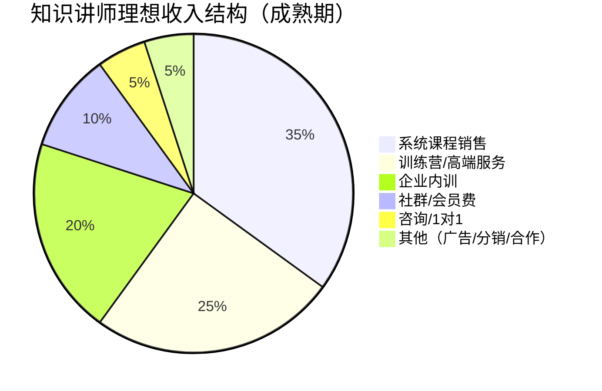

**收入组合的三个原则**：

1. **被动收入占比逐步提升**：初期主动收入（训练营、内训）占70%，成熟期被动收入（录播课程、会员费）应占50%以上。目标是"不工作时也有收入"
2. **高低搭配**：用低价产品引流（9.9-99元），用中价产品盈利（199-999元），用高价产品提升品牌（1999元+）。三个价位缺一不可
3. **周期互补**：录播课程全年销售（长尾），训练营按期招生（脉冲式），企业内训按需定制（不规律）。三种节奏互补，平滑收入波动

**收入优化的杠杆点**：

| 杠杆 | 现状 | 优化后 | 收入变化 |
|------|------|--------|---------|
| 客单价 | 199元课程卖100份/月 | 涨到299元+增加实战项目 | +50% |
| 转化率 | 详情页转化率3% | 优化销售页+增加学员评价 | 转化率提升到5% → +67% |
| 复购率 | 10%老学员复购 | 建立社群+阶梯产品 | 复购率提升到25% → +15%总营收 |
| 流量 | 只在一个平台 | 3平台分发+SEO优化 | 流量×2 → +100% |
| 推荐率 | 5%学员推荐 | 裂变机制+推荐返佣 | 推荐率提升到15% → +10%总营收 |

### 6.11 内容质量验证与飞轮效应

知识付费的长期成功取决于内容质量，而内容质量不能靠"自我感觉良好"来判断。你需要一套系统化的质量验证机制，以及一个让质量驱动增长的飞轮模型。

#### 6.11.1 课程内容的五层质量检验

```text
课程内容质量检验框架：

第1层：技术准确性（底线）
├── 检验方法：所有代码在干净环境中从零运行成功
├── 检验工具：Docker容器模拟干净环境
├── 常见问题：依赖版本过时、环境变量缺失、API变更
├── 标准：100%代码可运行，0个技术错误
└── 责任人：讲师本人（不可外包）

第2层：教学有效性（核心）
├── 检验方法：找3-5个目标水平的学员试看
├── 观察指标：
│   ├── 每节课的"卡壳点"数量（目标：<2个/节课）
│   ├── 学员能否独立完成课后练习（目标：>70%）
│   └── 学员能否用自己的话复述核心概念（目标：>80%）
├── 常见问题：专家盲点导致跳步、类比不恰当、难度跳跃
└── 标准：试看学员的完课率>80%，NPS>50

第3层：内容完整性（体系化）
├── 检验方法：逆向验证法——从最终学习成果回推
├── 检查项：
│   ├── 学完课程后，学员能否独立完成一个完整项目？
│   ├── 是否覆盖了该技术的所有核心使用场景？
│   ├── 是否包含了常见的"坑"和解决方案？
│   └── 是否提供了进阶学习路径？
├── 常见问题：只讲happy path不讲异常处理、缺少生产环境经验
└── 标准：课程大纲通过"删除测试"（删任何一章都影响完整性）

第4层：内容时效性（可持续）
├── 检验方法：检查课程中的技术版本、API、工具是否最新
├── 更新策略：
│   ├── 每月检查一次技术版本变更
│   ├── 每季度更新1-2节过时内容
│   └── 每年做一次全面审查
├── 标记方式：在课程中标注"最后更新日期"和"适用版本"
├── 常见问题：课程上线后从不更新，学员买到"过期产品"
└── 标准：所有技术内容适用于最近2个主要版本

第5层：学习体验（差异化）
├── 检验方法：学员行为数据分析
├── 关键指标：
│   ├── 每节课的平均观看完成率（目标：>70%）
│   ├── 哪个时间点学员退出最多（优化讲解节奏）
│   ├── 课后练习的完成率（目标：>50%）
│   └── 学员提问的频率和质量（高质提问=有效教学）
├── 优化方向：根据数据调整讲解节奏、补充薄弱环节
└── 标准：整体完课率>40%（录播课），>60%（训练营）
```

#### 6.11.2 知识付费的飞轮效应

知识付费的终极目标是建立一个自我强化的增长飞轮。飞轮一旦转起来，每一圈都比上一圈更省力、更快。

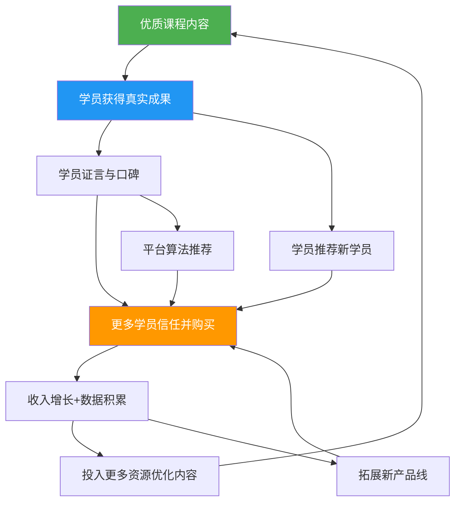

**飞轮的六个关键节点及加速策略**：

| 飞轮节点 | 核心指标 | 加速策略 | 常见瓶颈 |
|---------|---------|---------|---------|
| 优质内容 | 学员完课率>40% | 用学习科学理论设计课程（6.3.1） | 专家盲点导致讲解跳跃 |
| 学员成果 | 学以致用率>30% | 训练营+实战项目+作业批改 | 只教知识不教应用 |
| 口碑传播 | NPS>40 | 超预期交付+引导评价+推荐激励 | "好但不惊艳"没有传播动力 |
| 信任购买 | 转化率>5% | 销售页优化+学员证言+退款保障 | 有流量无信任 |
| 收入增长 | 月收入稳定增长 | 产品阶梯+复购设计+涨价策略 | 只有一款产品 |
| 资源投入 | 每月持续投入 | 将收入的20-30% reinvest到内容优化 | 赚了钱就停止投入 |

**飞轮启动的关键——前100个学员**：

飞轮最难的是启动阶段。前100个学员不是靠"营销"获得的，而是靠"人情+质量"：

```text
前100个学员的获取路径：

Step 1：种子学员（1-20人）
├── 来源：你的技术社群好友、前同事、GitHub Star列表里的活跃用户
├── 方式：私信邀请免费/半价试听，换取详细反馈
├── 目标：获得20份深度反馈+5条高质量证言
└── 关键：这批学员的质量决定了课程的初始口碑

Step 2：口碑学员（20-50人）
├── 来源：种子学员的推荐+你的技术博客/视频观众
├── 方式：用种子学员的证言做招生文案
├── 目标：验证"陌生人"是否愿意付费
└── 关键：观察转化率，如果<2%说明定位或价格有问题

Step 3：平台学员（50-100人）
├── 来源：课程平台的搜索流量+编辑推荐
├── 方式：用前50人的数据（销量、评分、完课率）争取平台推荐
├── 目标：进入平台推荐列表
└── 关键：这个阶段的评分和完课率决定了能否获得长期流量
```

#### 6.11.3 内容迭代的PDCA循环

课程上线不是终点，而是持续优化的起点。用PDCA（Plan-Do-Check-Act）循环驱动内容迭代：

| 阶段 | 周期 | 具体动作 | 产出 |
|------|------|---------|------|
| **Plan** | 每月初 | 分析上月数据（完课率、退出点、评价、提问），确定本月优化重点 | 优化清单 |
| **Do** | 每月中 | 修改1-2个薄弱章节、补充FAQ、更新过时内容 | 更新版本 |
| **Check** | 每月末 | 对比优化前后的关键指标变化 | 数据报告 |
| **Act** | 持续 | 将验证有效的优化固化，将无效的优化调整方向 | 标准化流程 |

**数据驱动的内容优化实例**：

```text
问题发现：第7节课的退出率高达45%（平均值15%）

Step 1：定位问题
├── 观看数据：70%的学员在第7分钟退出
├── 评论分析："这段太绕了""没听懂为什么要这样做"
└── 结论：第7分钟的"架构决策"讲解有逻辑跳跃

Step 2：分析原因
├── 重新观看第7节课，发现：
│   ├── 第5分钟引入了"微服务拆分"概念，但没有解释拆分原则
│   ├── 第6分钟直接跳到"按业务域拆分"，学员不理解为什么
│   └── 第7分钟展示了一个复杂的架构图，信息密度过高
└── 根因：专家盲点——讲师认为"拆分原则"是常识，但学员从未接触过

Step 3：优化方案
├── 在第5分钟后插入3分钟"微服务拆分的三个原则"讲解
├── 用一个简单的例子（电商系统）演示拆分过程
├── 将复杂架构图拆成3张递进式图片
└── 录制新版本，替换原视频

Step 4：验证效果
├── 新版本上线2周后：
│   ├── 第7节课退出率从45%降到18%
│   ├── 评论："这节课终于听懂了"
│   └── 整体完课率提升了5%
└── 结论：优化有效，将"架构决策先讲原则"固化为课程设计规范
```

### 6.12 法律、税务与知识产权

知识付费涉及收入，就必须面对法律和税务问题。很多技术人忽略了这一块，等到被税务约谈或被侵权时才后悔莫及。

#### 6.12.1 知识产权保护

**你作为课程创作者拥有的权利**：

| 权利类型 | 保护对象 | 保护方式 | 维权难度 |
|---------|---------|---------|---------|
| **著作权** | 课程视频、文字、代码 | 自动获得（创作完成即享有），建议做版权登记 | 中（需证明原创性） |
| **商标权** | 课程品牌名、Logo | 向商标局申请注册 | 低（注册后维权容易） |
| **商业秘密** | 独特的教学方法、学员数据 | 保密协议+技术措施 | 高（需证明保密措施） |

**著作权登记的实操流程**：

```text
课程著作权登记（中国版权保护中心）：

适用对象：课程视频、课件PPT、教材文字、配套代码

登记方式：
├── 方式1：在线登记（推荐）
│   ├── 网址：https://www.ccopyright.com.cn
│   ├── 费用：100-300元/件
│   ├── 周期：30个工作日
│   └── 材料：身份证明+作品样本+权利声明
│
├── 方式2：公证处公证（维权时更有利）
│   ├── 费用：200-500元/件
│   ├── 周期：7-15个工作日
│   └── 优势：法院采信度更高
│
└── 方式3：区块链存证（新兴方式）
    ├── 平台：蚂蚁链、腾讯至信等
    ├── 费用：10-50元/件
    ├── 周期：即时
    └── 优势：成本低、速度快，但法律效力尚有争议

建议策略：核心课程做正式版权登记，每节课做区块链存证。
```

**发现课程被盗版的应对流程**：

```text
盗版应对标准流程：

第1步：证据固定（立即）
├── 截图/录屏保存盗版页面（含URL、时间戳）
├── 使用可信时间戳服务固定证据
├── 记录盗版平台、传播范围、下载量
└── 保存侵权者的账号信息

第2步：平台投诉（24小时内）
├── 国内平台：
│   ├── 知乎/掘金/B站：平台内举报功能
│   ├── 淘宝/闲鱼：知识产权保护平台（https://ipp.alibabagroup.com）
│   ├── 百度网盘：版权投诉通道
│   └── 微信公众号：侵权投诉
├── 国际平台：
│   ├── YouTube：Copyright Complaint
│   ├── Udemy：DMCA Takedown
│   └── DMCA投诉：向托管商发送DMCA通知
└── 大多数平台会在3-7个工作日内处理

第3步：法律维权（必要时）
├── 律师函：成本约1000-3000元，对个人侵权者有效
├── 民事诉讼：索赔金额=侵权获利或你的损失+维权成本
├── 刑事报案：盗版金额超过3万元可构成侵犯著作权罪
└── 建议：先走平台投诉，无效再走法律途径

预防措施（比维权更重要）：
├── 视频加跑马灯水印（学员ID+手机号）
├── 课程社群绑定购买信息（非购买者无法加入）
├── 定期用搜索引擎和电商平台搜索课程名+盗版关键词
└── 在课程中加入"暗桩"（如特定的代码注释），方便证明来源
```

#### 6.12.2 税务合规

**个人讲师的税务处理**：

```text
中国境内知识收入的税务分类：

1. 平台分成收入（如极客时间、掘金小册）
   ├── 性质：劳务报酬或稿酬
   ├── 税率：20%-40%（预扣），年度汇算清缴时并入综合所得
   ├── 平台代扣：大多数平台会代扣代缴个人所得税
   ├── 你需要做的：
   │   ├── 保留收入凭证（平台结算单）
   │   ├── 每年3-6月做个人所得税汇算清缴
   │   └── 可能有退税（因为预扣税率通常高于实际税率）
   └── 注意：多平台收入需要合并申报

2. 自建站直接收入（如小鹅通、自建网站）
   ├── 性质：经营所得
   ├── 税率：5%-35%超额累进税率
   ├── 申报方式：
   │   ├── 年收入<120万：可核定征收（税率较低，约2-5%）
   │   ├── 年收入>120万：查账征收（需要规范记账）
   │   └── 建议注册个体工商户（可享受小规模纳税人优惠）
   └── 关键：保留所有收入和支出凭证

3. 企业内训收入
   ├── 性质：劳务报酬
   ├── 税率：20%-40%（由支付方代扣）
   ├── 优化方式：
   │   ├── 与企业签订培训服务合同（而非个人劳务合同）
   │   ├── 注册个体工商户或工作室，开具发票
   │   └── 将部分收入确认为差旅费、材料费等合理支出
   └── 注意：单次收入>5万元时税率跳档，可拆分多次结算
```

**注册个体工商户的建议**：

| 维度 | 说明 |
|------|------|
| 何时注册 | 年收入超过10万，或需要给企业开发票时 |
| 注册成本 | 0-500元（各地不同） |
| 税收优惠 | 月收入<10万免增值税（小规模纳税人） |
| 记账要求 | 简易记账即可，不需要专业会计 |
| 推荐注册地 | 你实际经营的地方（住所或工作室） |
| 经营范围 | "信息技术咨询服务""教育咨询服务" |

**国际收入的税务处理**：

```text
从Udemy/Teachable等国际平台获得收入的税务链路：

收入流向：平台 → Payoneer/PayPal → 国内银行卡

税务处理：
├── 美国平台通常会扣缴30%美国预提税（除非填了W-8BEN表格）
├── W-8BEN表格：证明你不是美国纳税人，可免除美国预提税
│   ├── Udemy注册时会引导你填写
│   ├── 填写后：平台不扣美国税
│   └── 不填写：每笔收入被扣30%
├── 中国境内税务：
│   ├── 需要将外汇收入申报为个人所得
│   ├── 按劳务报酬或经营所得缴税
│   └── 保留Payoneer/PayPal的收入流水作为凭证
└── 外汇管制：
    ├── 个人年度结汇额度：5万美元
    ├── 超过额度需要提供收入证明
    └── 大额收入建议通过公司账户收款
```

#### 6.12.3 学员协议与免责声明

**课程购买协议的核心条款**：

```text
课程购买协议模板（关键条款摘要）：

1. 服务内容
   ├── 明确课程包含的具体内容（视频数量、时长、配套资料）
   ├── 明确不包含的内容（1对1答疑、就业保证、终身更新等）
   └── 避免过度承诺（"学完保证涨薪"→ 改为"课程覆盖XX知识点"）

2. 知识产权
   ├── 课程内容的知识产权归讲师所有
   ├── 学员购买的是"学习使用权"，不是"内容所有权"
   ├── 禁止录屏、下载、传播课程内容
   └── 违约处理：终止服务+追究法律责任

3. 退款政策
   ├── 明确退款条件和流程
   ├── 退款期限（如7天无理由）
   ├── 退款扣除规则（如已观看>30%不退）
   └── 退款方式和到账时间

4. 隐私保护
   ├── 收集的学员信息仅用于课程服务
   ├── 不向第三方泄露学员个人信息
   └── 符合《个人信息保护法》要求

5. 免责声明
   ├── 课程内容仅供学习参考，不构成职业/投资建议
   ├── 学习效果因人而异，不保证特定成果
   └── 因学员自身原因导致的损失，讲师不承担责任
```

**训练营的额外法律注意事项**：

| 风险点 | 防范措施 |
|--------|---------|
| 学员在训练营中分享侵权代码 | 在协议中明确"学员对分享内容负法律责任" |
| 训练营项目涉及真实商业数据 | 使用脱敏数据或虚构场景，不使用学员公司的代码 |
| 学员之间的纠纷（如组队项目中的贡献争议） | 制定明确的组队规则和争议解决机制 |
| 学员对课程质量不满集体投诉 | 完善退款政策+建立投诉处理流程 |
| 训练营使用第三方工具/平台 | 在协议中说明使用的第三方工具，提示相关风险 |

### 6.13 AI时代的知识付费新趋势

2025-2026年，AI正在深刻改变知识付费的生产、分发和消费方式。技术讲师必须理解这些变化，才能在新时代保持竞争力。

#### 6.13.1 AI对知识付费的三大冲击

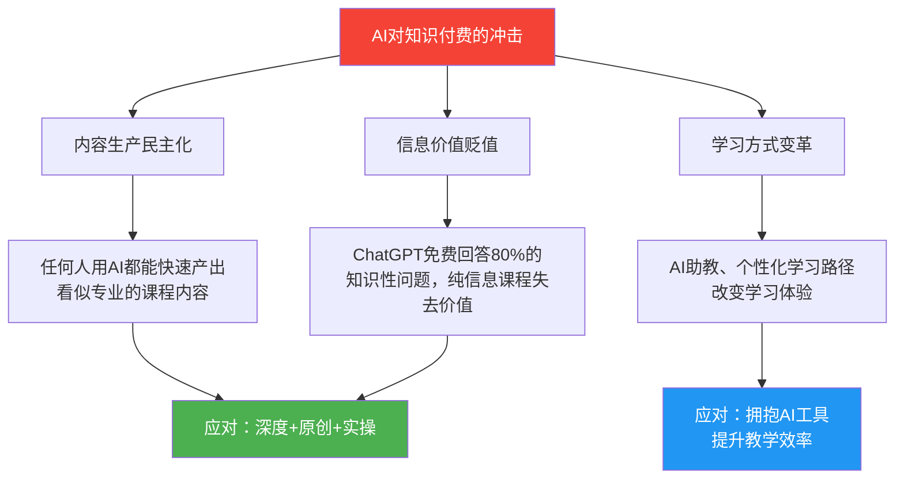

**冲击一：内容生产民主化**

AI让"制作一门看起来专业的课程"变得极其容易。一个完全不懂技术的人，用AI可以在一周内生成一门"Python入门课程"的完整脚本、课件、甚至练习题。这意味着：

- 课程供给量将急剧增加，竞争更加激烈
- "数量型"内容（知识点罗列）将被AI生成的内容淹没
- 课程质量的"表面门槛"提高了——学员会期望更精致的制作

**冲击二：信息价值贬值**

ChatGPT/Claude等AI工具可以免费回答大部分知识性问题。"什么是Redis""React Hooks怎么用"这类纯信息传递的课程价值将大幅下降。根据6.1.1中的三层价值模型：

| 价值层级 | AI替代程度 | 课程定价影响 |
|---------|-----------|------------|
| 信息价值（"我知道了"） | 高（AI可替代80%） | 低价课程将被挤压 |
| 认知价值（"我理解了"） | 中（AI可辅助但不能替代） | 中价课程需要更强的原创深度 |
| 行动价值（"我做到了"） | 低（AI无法替代人的指导和反馈） | 高价训练营不受影响甚至更值钱 |

**冲击三：学习方式变革**

AI助教可以7×24小时回答学员问题，个性化学习路径可以根据每个学员的水平调整进度，自动批改系统可以即时反馈作业。这意味着训练营的运营成本将大幅下降，但同时学员对"AI辅助"的期望也会提高。

#### 6.13.2 AI时代讲师的核心竞争力

在AI时代，技术讲师的核心竞争力不再是"知道什么"，而是"做过什么"和"能教什么"：

```text
AI时代讲师的三层竞争力模型：

第1层：不可替代的经验壁垒
├── 真实生产环境的踩坑经验（AI没有）
├── 项目决策背后的权衡思考（AI只能模拟）
├── 行业内幕和潜规则（AI不知道）
├── 人与人之间的信任关系（AI无法建立）
└── 建议：每门课程至少包含3个"只有经历过才知道"的真实案例

第2层：深度认知与判断力
├── 不是教"怎么做"，而是教"怎么想"
├── 不是给答案，而是教决策框架
├── 在多种方案中做出判断的能力（这是AI最弱的）
└── 建议：每门课程至少有20%内容是"决策分析"而非"操作步骤"

第3层：教学设计能力
├── 用AI无法做到的方式组织和呈现内容
├── 设计有效的学习体验（不是堆砌信息）
├── 建立学习社群，营造学习氛围
├── 提供个性化的反馈和指导
└── 建议：投资学习教学设计（ADDIE、Bloom、认知负荷理论）
```

#### 6.13.3 AI工具在知识付费中的实战应用

**AI助教的搭建方案**：

```text
用RAG技术搭建课程AI助教：

技术栈：
├── 向量数据库：Chroma/Weaviate/Pinecone
├── 大语言模型：GPT-4/Claude/开源模型
├── 框架：LangChain/LlamaIndex
└── 部署：Docker + 云服务器

搭建步骤：
1. 将课程内容（视频字幕+课件+代码+FAQ）转为文本
2. 文本分块（每块500-1000字），生成向量嵌入
3. 存入向量数据库
4. 学员提问时，检索相关文本块，拼入Prompt
5. LLM基于检索到的内容生成回答
6. 设置"兜底机制"：AI无法回答的问题转给人工

成本估算：
├── 向量数据库：Chroma免费，Pinecone约$70/月
├── LLM API：按token计费，约$50-200/月（取决于学员量）
├── 服务器：约$20-50/月
└── 总成本：约$100-300/月，可替代1-2个兼职助教

效果参考：
├── 可回答80%的常规问题（环境配置、概念解释、代码报错）
├── 平均响应时间<10秒（人工通常需要30分钟-2小时）
├── 学员满意度：75-85%（略低于人工，但胜在即时响应）
└── 讲师答疑时间减少：50-70%
```

**AI辅助内容更新的工作流**：

```text
用AI高效更新课程内容：

场景：课程中的React版本从17升级到18，需要更新相关章节

传统方式：逐节检查→修改脚本→重新录制→后期处理
├── 耗时：约20-40小时
└── 风险：遗漏某些需要更新的地方

AI辅助方式：
├── Step 1：用AI分析React 17→18的所有breaking changes
│   └── Prompt："列出React 17到18的所有重大变更，按影响程度排序"
├── Step 2：用AI扫描课程脚本，标记需要更新的段落
│   └── Prompt："以下是我的课程脚本，请标记所有涉及React 17 API的内容"
├── Step 3：用AI生成更新后的脚本段落
│   └── Prompt："将以下React 17代码改写为React 18版本，保持讲解逻辑不变"
├── Step 4：人工审核+录制更新段落
│   └── 只重录变化的部分，不需要重录整节课
└── 耗时：约5-10小时（节省60-75%时间）
```

#### 6.13.4 AI原生课程的设计思路

不只是用AI辅助制作传统课程，更应该设计"AI原生"的课程体验：

| 传统课程 | AI原生课程 | 实现方式 |
|---------|-----------|---------|
| 固定学习路径 | 自适应学习路径 | 入营测试→AI推荐个性化学习路径 |
| 统一作业 | 差异化作业 | AI根据学员水平生成不同难度的练习 |
| 人工批改 | AI初审+人工终审 | AI检查代码可运行性，人工评价设计思路 |
| 固定时间答疑 | 7×24 AI答疑 | RAG知识库+LLM生成回答 |
| 统一进度 | 自定进度+里程碑 | 学员自定节奏，但有硬性里程碑（如"Day7前完成项目1"） |
| 结业证书 | 技能图谱 | 不是一张证书，而是一份详细的技能掌握图谱 |

### 6.14 常见误区与避坑指南

知识付费领域有大量"看起来正确但实际有害"的认知。以下是经过验证的常见误区和对应的纠正方法。

#### 6.14.1 选题阶段的五个误区

| 误区 | 为什么有害 | 正确做法 |
|------|-----------|---------|
| "技术越新越好" | 新技术用户基数小，付费意愿低，且变化快导致课程很快过时 | 选处于"成长期"的技术（已有一定用户基数且仍在增长） |
| "我擅长什么就教什么" | 你的擅长≠市场需求，可能导致做出无人购买的课程 | 先验证需求（6.3.2的三维验证模型），再匹配你的能力 |
| "课程越全面越好" | 全面=没有重点，学员记不住也用不上。更致命的是制作周期无限拉长 | 聚焦一个核心问题，做到"学完就能用"。全面性通过产品阶梯实现 |
| "竞品多说明市场大" | 竞品多也意味着红海，你需要找到差异化的切入点 | 看竞品的差评，找未被满足的需求，而不是看市场总量 |
| "先做出来再说" | 没有验证的课程可能做出来才发现没人要，浪费几个月时间 | 最小化验证：先发3-5篇相关文章，看阅读量和互动，再决定是否做课程 |

#### 6.14.2 制作阶段的五个误区

| 误区 | 为什么有害 | 正确做法 |
|------|-----------|---------|
| "追求完美再上线" | 完美主义导致课程永远做不完。你眼中的"不完美"，学员可能根本注意不到 | 设定deadline，先上"80分版本"，根据反馈迭代到90分 |
| "一个人做完所有事" | 精力分散导致每个环节都做到60分，最终产品质量堪忧 | 核心内容自己做，非核心环节（字幕、封面、排版）外包或用AI辅助 |
| "录播课不需要互动设计" | 没有互动的录播课完课率通常<10%，等于白做 | 设计课后练习、思考题、代码挑战，每3-5节课设置一个实战项目 |
| "代码Demo用Demo环境就行" | Demo环境和真实生产环境差异巨大，学员在自己电脑上跑不通 | 所有代码必须在干净的Docker容器中从零运行成功 |
| "讲课就是念PPT" | 念PPT是最低效的教学方式，学员可以自己看文档 | 用"问题驱动"的方式讲课：先抛出一个真实问题，再演示如何用技术解决 |

#### 6.14.3 运营阶段的五个误区

| 误区 | 为什么有害 | 正确做法 |
|------|-----------|---------|
| "课程上线就等着卖" | 没有流量的课程就像开在沙漠里的店，内容再好也没人知道 | 课程上线前就要开始内容营销，建立至少1000人的初始流量池 |
| "定价越低越好卖" | 低价吸引的是低意愿用户，完课率低、差评多、口碑差。而且低价传递"质量不行"的信号 | 按价值定价，用品质和口碑支撑价格。宁可少卖也不贱卖 |
| "所有平台都上" | 多平台运营精力分散，每个平台都做不好 | 先在一个平台做到头部，再扩展到2-3个平台 |
| "差评是坏事" | 合理的差评是免费的产品改进建议。没有差评反而让人怀疑评价的真实性 | 认真对待每条差评，48小时内回应并改进。差评处理得好反而能提升口碑 |
| "训练营就是录播+答疑" | 如果只是录播+答疑，学员为什么不买便宜10倍的录播课？训练营的核心价值是"结构化学习+即时反馈+同伴效应" | 设计完整的训练营体验：每日任务、作业批改、小组PK、直播答疑、结营仪式 |

#### 6.14.4 增长阶段的五个误区

| 误区 | 为什么有害 | 正确做法 |
|------|-----------|---------|
| "一门课吃一辈子" | 技术在变，市场在变，一门课的生命周期通常2-3年 | 建立产品阶梯，每1-2年推出新课程，持续迭代旧课程 |
| "涨价会流失学员" | 合理涨价（每次10-20%）几乎不影响转化率，但显著提升收入。你的课程在变好，价格也应该反映价值 | 每积累100条好评或完成一次重大更新后涨价10-20% |
| "只关注新学员获取" | 老学员的复购成本是新学员获取成本的1/5-1/10。忽略老学员是最大的浪费 | 建立社群运营体系，设计复购激励，让老学员成为你的"编外销售团队" |
| "把所有收入都提现" | 知识付费是"前期投入高、后期回报大"的生意，需要持续reinvest | 将收入的20-30% reinvest到内容优化、工具升级、团队建设 |
| "追求学员数量而非质量" | 1000个完课率5%的学员，不如200个完课率60%的学员。后者带来口碑和复购，前者带来差评和退款 | 设计招生门槛（如前置知识测试），确保学员适合课程。宁可少招也不乱招 |

### 6.15 本节总结与行动清单

#### 6.15.1 知识付费的核心公式

```text
知识付费的成功公式：

成功 = 优质内容 × 精准定位 × 有效分发 × 持续运营

其中：
├── 优质内容 = 学习科学理论 + 真实项目经验 + 系统化设计
├── 精准定位 = 需求验证 + 能力匹配 + 差异化竞争
├── 有效分发 = 平台选择 + 内容营销 + 社群裂变
└── 持续运营 = 数据驱动迭代 + 学员社群 + 产品阶梯

四个变量是乘法关系——任何一个为0，结果都是0。
```

#### 6.15.2 30天行动清单

如果你决定开始知识付费，以下是第一个30天的具体行动：

```text
第1-7天：选题验证
├── Day1：列出你最有经验的3个技术方向
├── Day2：用百度指数/微信指数查看搜索趋势
├── Day3：在掘金/知乎/B站搜索同类内容，分析竞品
├── Day4：分析竞品差评，找出未被满足的需求
├── Day5：在目标社群发投票，验证需求
├── Day6：用选题评分矩阵评估3个方向
└── Day7：确定最终选题，写出一句话定位

第8-14天：内容准备
├── Day8-9：设计课程大纲（用6.3.4的模板）
├── Day10：找3个目标学员看大纲，收集反馈
├── Day11-12：修改大纲，确定最终版本
├── Day13：写第一节课的逐字稿
└── Day14：准备第一节课的Demo代码和课件

第15-21天：试制验证
├── Day15：录制第一节课（不需要完美，先做出来）
├── Day16：简单剪辑+字幕
├── Day17-18：找5个目标学员试看，收集反馈
├── Day19：根据反馈修改
├── Day20：在B站/掘金发布第一节课（免费引流）
└── Day21：观察48小时数据（播放量、完播率、评论）

第22-30天：正式启动
├── Day22-23：根据免费内容的数据决定是否继续
│   ├── 播放量>1000且互动率>3%：继续，进入正式制作
│   └── 数据不好：调整选题或内容角度，回到Day1
├── Day24-26：正式录制第2-5节课
├── Day27：搭建课程销售页（小鹅通/掘金/自建站）
├── Day28：设定定价策略（参考6.6.3）
├── Day29：在社群/朋友圈发布课程预告
└── Day30：正式上线，开始招生

关键原则：
├── 不要等到"完美"才上线——80分就可以开始
├── 不要一个人默默做——从Day1就开始在社群分享进展
├── 不要忽视数据——每个决策都要有数据支撑
└── 不要急于变现——前3个月的核心是验证，不是赚钱
```

#### 6.15.3 不同阶段的优先级

| 你的现状 | 首要行动 | 次要行动 | 暂时不要做 |
|---------|---------|---------|-----------|
| 零粉丝零内容 | 先写30篇技术文章/发20个视频 | 验证选题方向 | 直接做课程 |
| 有1000+粉丝 | 做一门低价小册（39.9-99元）验证付费意愿 | 开始积累邮件列表 | 直接做训练营 |
| 有付费产品但销量低 | 优化销售页+收集学员证言 | 分析竞品差异 | 开发新产品 |
| 有稳定收入想增长 | 建立产品阶梯（低价→中价→高价） | 训练营试运营 | 企业内训（需要品牌积累） |
| 训练营已运营想规模化 | 引入AI助教+标准化助教流程 | 建立社群自运转机制 | 同时开多个训练营 |

#### 6.15.4 知识变现的长期主义视角

最后，用一段话总结知识付费的本质：

知识付费不是"割韭菜"，不是"卖焦虑"，而是**将你多年积累的隐性知识系统化地传递给需要的人，并因此获得合理回报**。当你看到学员用你教的技术解决了工作中的难题、拿到了心仪的offer、甚至改变了自己的职业轨迹——那种成就感，远超收入本身。

但知识付费也不是"一夜暴富"的捷径。它需要你在技术深度上持续精进，在教学能力上不断打磨，在商业运营上逐步学习。这是一条"慢就是快"的路——前6个月可能只有几百元收入，但只要你坚持做对的事情（好内容+真需求+持续迭代），复利效应会让你在2-3年后看到惊人的回报。

**记住：最好的课程营销，是让学员学完后主动推荐给朋友。**
