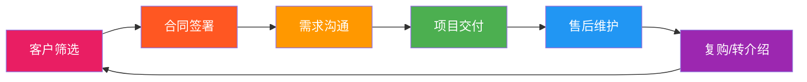
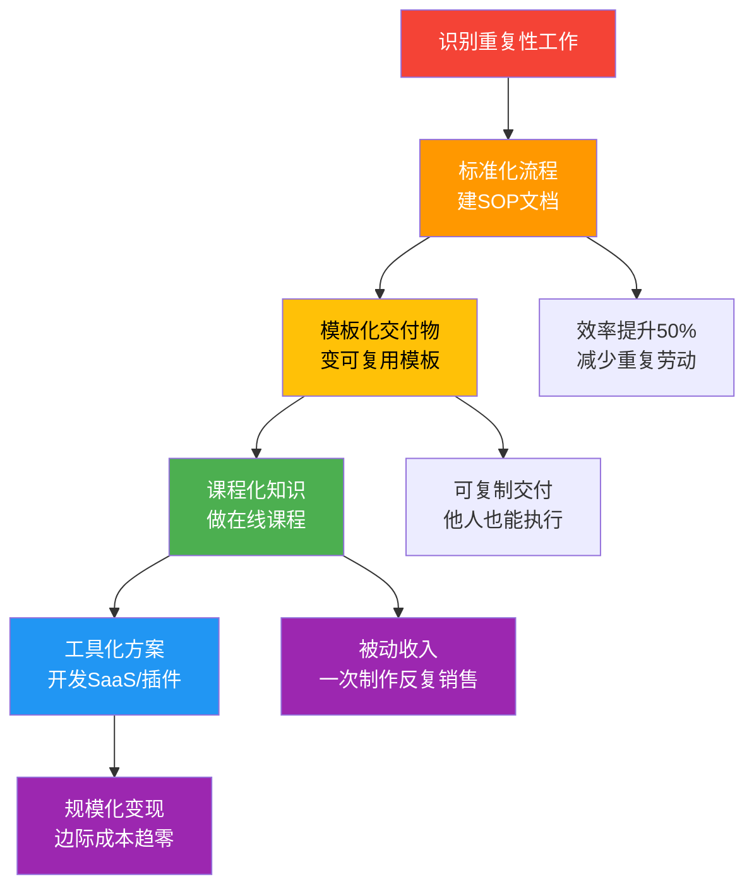
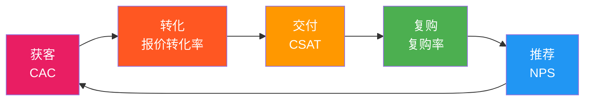
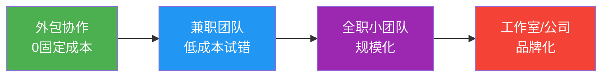

## 七、客户管理与长期发展

客户管理的本质不是"维护关系"，而是**经营你最重要的商业资产**。一个维护良好的客户池，其价值远超任何技术能力——因为技术可以学，但信任需要时间积累。

技术人最常见的致命错误是把100%精力投入技术交付，把客户关系当成"做完项目加个微信"的附属动作。结果是：项目一结束客户就消失，永远在寻找新客户，收入永远在波动。真正成熟的自由职业者，其60%-80%的收入来自老客户复购和转介绍，新客户获客成本仅占收入的5%-10%。

本章将构建一套完整的客户管理系统——从筛选、沟通、交付、维护到复购、转介绍和产品化升级，每个环节都有可落地的方法论、模板和工具。掌握这套系统，你的收入结构将从"一单一结"转变为"老客户自动续费 + 新客户慕名而来"的良性飞轮。



### 7.1 客户筛选：决定你80%收入的关键动作

客户筛选是所有客户管理动作中杠杆率最高的一步。一个优质客户带来的终身价值，可能超过十个劣质客户的总和——而服务一个劣质客户的时间和情绪成本，往往被严重低估。

#### 7.1.1 为什么筛选比服务更重要

从经济学角度看，你的时间是稀缺资源。假设你每月可工作160小时：

- 服务5个优质客户（每个20小时/月）→ 月收入8万，满意度高，复购率80%
- 服务10个普通客户（每个16小时/月）→ 月收入6万，满意度一般，复购率30%
- 服务20个劣质客户（每个8小时/月）→ 月收入4万，投诉不断，身心俱疲

这不是假设——这是大量自由职业者的真实数据分布。**筛选的ROI远高于服务优化**。

#### 7.1.2 优质客户的五维评估模型

在初次接触的15分钟内，用以下模型快速评估客户质量：

| 维度 | 评估标准 | 权重 | 快速判断方法 |
|------|----------|------|-------------|
| **预算匹配度** | 预算≥你的报价80% | 25% | 直接问"这个项目的预算范围大概是多少"，观察对方是否坦诚 |
| **需求清晰度** | 能用1-2段话描述核心需求 | 20% | 让对方用一句话说清"想要什么结果"，如果说不清说明需求未成熟 |
| **决策链长度** | 对接人即决策人或≤2层审批 | 20% | 问"这个项目谁来拍板"，如果答案是"我们还要开会讨论"则决策链长 |
| **专业尊重度** | 认可你的专业判断，不微观管理 | 20% | 观察对方是否频繁质疑技术方案细节，是否要求"先做个Demo看看" |
| **付款信用** | 有按合同付款的历史记录 | 15% | 企业客户查天眼查/企查查司法风险；个人客户看是否有共同人脉可侧面了解 |

**评分规则**：每个维度1-5分，加权总分≥3.5分为优质客户，2.5-3.5分为普通客户，<2.5分为高风险客户。两个以上维度亮红灯（≤2分）时果断放弃。

**实操技巧**：

初次接触时，用15分钟做一个快速评估。在CRM或笔记工具中建一个评分表，记录如下：

```text
客户：XX科技有限公司
├── 预算匹配度：4分（预算8万，报价10万，在80%范围内）
├── 需求清晰度：5分（提供了详细的需求文档）
├── 决策链长度：3分（对接人是产品经理，需VP审批）
├── 专业尊重度：4分（沟通顺畅，尊重专业意见）
├── 付款信用：4分（天眼查无司法风险，行业口碑好）
├── 加权总分：4.0分 → 优质客户 ✓
└── 备注：VP审批可能需要额外1周，提前预留时间
```

#### 7.1.3 红旗客户的识别清单

以下是经过大量自由职业者验证的高风险客户特征，按危险程度分级：

**致命红旗（立即拒绝，不浪费一分钟）**：

- "先做一部分看看效果，满意了再签合同"——意图白嫖你的劳动成果
- "这个很简单，应该花不了多少时间"——根本不尊重专业价值
- "我们预算有限，但未来合作机会很多"——画饼文化，大概率永远没有"未来"
- 要求你先提供完整方案再决定是否合作——典型套方案行为，拿到方案就消失
- "能不能先免费做个测试/试稿"——对你的定价体系完全没有认知
- 首次沟通就要求加急且不提加急费——把你的个人时间当无限资源

**严重红旗（极度谨慎，除非条件非常有利）**：

- 需求文档超过20页但没有优先级排序——需求管理混乱，改稿无止境
- 对接人频繁更换（3个月内换2次以上）——内部管理混乱，你的沟通成本翻倍
- 付款周期超过60天且无预付款——现金流风险极高，可能拖欠尾款
- 所有沟通都在非工作时间进行（晚上10点后、周末）——边界感差，会持续侵蚀你的个人时间
- "之前找的人做砸了，你来救火"——可能存在需求不清或管理问题，前任不一定是技术差
- 合同还没签就催你开工——法律意识淡薄，纠纷时你毫无保障

**中度红旗（可以合作但必须设限）**：

- 需求描述模糊但愿意一起梳理——可以做，但需求分析阶段单独收费（按小时计费）
- 预算偏低但项目有案例价值或行业影响力——可以接，但明确范围边界，书面确认"不包含"清单
- 首次合作的中小企业——可以做，但预付比例提高到50%，并缩短付款周期
- 要求对接多个决策人——可以做，但指定唯一对接窗口，避免多头指挥

#### 7.1.4 客户分级管理体系

把客户按价值分级，不是势利，而是资源优化配置。你的精力有限，必须把最好的服务给最值得的客户。

| 等级 | 标准 | 精力分配 | 维护策略 | 排期优先级 |
|------|------|----------|----------|-----------|
| **S级** | 年消费≥10万 或 转介绍≥3个客户 | 40% | 每周主动联系，专属折扣，季度业务复盘，生日/节日礼物 | 最高，随时可插队 |
| **A级** | 年消费5-10万 或 有稳定复购 | 30% | 每两周联系一次，优先排期，定期推送行业洞察和优化建议 | 高，48小时内响应 |
| **B级** | 年消费1-5万，偶尔合作 | 20% | 每月联系一次，节假日问候，新产品/服务第一时间告知 | 标准，一周内响应 |
| **C级** | 偶尔小单，无复购趋势 | 10% | 季度联系，主要靠自动化维护（邮件列表、朋友圈） | 按排期，不插队 |

**分级的动态调整**：每季度重新评估一次。C级客户如果开始复购或转介绍，及时升级；S级客户如果半年无互动，降级为A级。分级不是标签，是动态管理工具。

**分级管理的常见误区**：

- 误区一："所有客户都应该平等对待"——资源有限时，平等=平庸。差异化服务才能让高价值客户感受到专属感。
- 误区二："C级客户不值得维护"——C级客户可能今天预算有限，明天就是A级。自动化维护的成本很低，但不要完全放弃。
- 误区三："分级只看消费金额"——转介绍价值、行业影响力、案例价值同样重要。一个年消费2万但带来5个新客户的B级客户，价值可能超过年消费8万的A级客户。

### 7.2 合同与法律保护：你的第一道防线

"朋友介绍的，不用签合同吧？"——这是自由职业者最危险的想法。合同不是不信任的表现，而是专业和负责的体现。

#### 7.2.1 技术服务合同的核心条款

| 条款 | 必须包含的内容 | 常见陷阱 |
|------|---------------|----------|
| **项目范围** | 详细的功能清单 + "不包含"清单 | 范围描述模糊，导致无限扩展 |
| **付款条款** | 金额、付款节奏、付款方式、逾期罚则 | 只写了总金额，没有分期和罚则 |
| **知识产权** | 源码/设计稿的归属权、使用权限 | 没有约定，导致后续争议 |
| **变更流程** | 变更如何提出、如何评估费用、如何确认 | 没有变更条款，客户随意变更 |
| **验收标准** | 什么算"验收通过"、验收期限 | 没有验收标准，客户永远不"满意" |
| **保密条款** | 双方的保密义务和期限 | 只约束你，不约束客户 |
| **终止条款** | 提前终止的条件、费用结算方式 | 没有终止条款，项目烂尾无法脱身 |
| **争议解决** | 协商→调解→仲裁/诉讼的流程和管辖地 | 没有约定，纠纷升级后无路可走 |

#### 7.2.2 付款节奏设计

**推荐付款节奏：预付50% + 中期30% + 尾款20%**

这个节奏的核心逻辑是：你永远不亏钱。即使客户在中期终止项目，你已经收回了50%的成本；即使尾款收不回来，你也已经拿到了80%。

| 付款节点 | 比例 | 触发条件 | 付款期限 |
|----------|------|----------|----------|
| 签约预付 | 50% | 合同签署后 | 3个工作日内 |
| 中期付款 | 30% | P0功能完成，客户确认后 | 3个工作日内 |
| 尾款 | 20% | 全部验收通过后 | 7个工作日内 |

**逾期罚则**：合同中应明确约定"逾期付款每日加收未付金额0.05%的滞纳金"。这个条款不需要真的执行，但它的存在会显著加速客户的付款流程。

#### 7.2.3 需求变更管理

需求变更是项目利润的最大杀手。没有变更管理，一个3万的项目可能变成5万的工作量但还是3万的收入。

**变更管理流程**：

1. 客户提出变更需求 → 你记录在变更清单中
2. 24小时内评估变更影响（工时、费用、工期）
3. 填写变更确认单，客户签字确认
4. 按确认后的内容执行

**变更确认单模板**：

```markdown
# 项目变更确认单

## 变更编号：CHG-00X
## 日期：20XX年X月X日

## 原始需求
[原始需求描述]

## 变更内容
[具体变更描述]

## 影响评估
- 额外工时：X小时
- 额外费用：X元
- 工期影响：延长X天

## 客户确认
同意以上变更及费用调整。

签字：____  日期：____

## 开发方确认
将按变更后的需求执行。

签字：____  日期：____
```

**关键原则：不拒绝变更，但让变更有成本**。当客户知道每次变更都要签字+付费时，变更频率会自然下降50%以上。

#### 7.2.4 知识产权归属的三种模式

| 模式 | 说明 | 适用场景 | 价格影响 |
|------|------|----------|----------|
| **完全转让** | 所有权利归客户，你不得复用 | 客户要求独占，如核心业务系统 | 基础报价×1.5-2.0 |
| **有限授权** | 客户有使用权，你保留通用部分的复用权 | 大多数项目 | 基础报价×1.0 |
| **保留所有权** | 你保留所有权，客户获得使用许可 | 模板/组件/通用工具 | 基础报价×0.7-0.8 |

建议默认采用"有限授权"模式：客户获得完整的使用权，但你可以复用通用部分（如框架、工具、组件），这对你后续产品化非常重要。

### 7.3 客户沟通：从"应付"到"掌控"

技术人最怕的不是写代码，而是跟客户沟通。但沟通能力直接决定了你的项目利润率——沟通做得好，改稿次数少，尾款回收快，客户满意度高。沟通不是天赋，是可训练的技能。

#### 7.3.1 沟通的心理学基础

理解客户的心理，才能真正掌控沟通：

**峰终定律（Peak-End Rule）**：客户对体验的记忆主要取决于两个时刻——峰值体验（最满意的瞬间）和结束时刻。这意味着：在项目中制造一个"惊喜时刻"（比如提前交付、额外优化），以及确保交付阶段的体验完美，比全程平均表现更重要。

**损失厌恶（Loss Aversion）**：人对损失的痛感是同等收益快感的2倍。与其说"这个功能会让效率提升30%"，不如说"不做这个功能，你每月会浪费约40小时"。在提案和变更沟通中，强调"不做会损失什么"比"做了会得到什么"更有效。

**确认偏误（Confirmation Bias）**：客户一旦形成判断，会倾向于寻找支持自己判断的证据。如果客户对你的能力产生了怀疑，任何小问题都会被放大。所以第一次交付的质量至关重要——它是客户对你能力的"锚定"。

#### 7.3.2 项目沟通的四个关键节点

**节点一：需求确认阶段——80%纠纷的根源在此**

不要客户说什么就记什么。用"需求确认文档"把口头需求变成书面确认：

```markdown
# 项目需求确认书

## 项目名称：[xxx]
## 版本：v1.0
## 日期：20XX年X月X日

## 核心目标（1-2句话）
[客户想要达成的业务结果，不是技术实现。例如：
"搭建一个在线预约系统，让客户可以自助预约服务，
减少前台电话接听量60%以上"]

## 功能清单
| 功能模块 | 优先级 | 预计工时 | 备注 |
|----------|--------|----------|------|
| 在线预约表单 | P0 | 8h | 支持选择服务类型、时间、技师 |
| 预约管理后台 | P0 | 12h | 查看/确认/取消/改期 |
| 微信通知推送 | P1 | 4h | 预约确认+提醒 |
| 数据统计面板 | P2 | 6h | 按月/周/服务类型统计 |

## 不包含的内容（边界确认）
- 不包含：移动端APP开发（本期仅H5页面）
- 不包含：支付功能（本期仅预约，不涉及收款）
- 不包含：技师排班管理（使用现有Excel管理）

## 交付标准
- 所有P0功能通过测试用例
- 主流浏览器兼容（Chrome/Safari/微信内置浏览器）
- 首屏加载时间≤3秒
- 提供操作手册和30分钟培训

## 付款安排
- 签约时预付50%：[金额]
- 中期交付（P0功能完成后）支付30%：[金额]
- 全部验收通过后支付尾款20%：[金额]

## 客户确认签字：____  日期：____
```

**为什么这一步如此重要**：80%的项目纠纷都源于需求不清晰。一份双方签字的需求确认书，是你的法律护城河，也是项目过程中"拒绝无理需求变更"的依据。

**节点二：进度汇报阶段——建立信任的关键**

定期向客户汇报进度，不是"通知"而是"建立信任"。汇报频率根据项目周期调整：

| 项目周期 | 汇报频率 | 汇报方式 |
|----------|----------|----------|
| 1周内 | 每2天 | 微信消息+截图 |
| 1-4周 | 每周 | 正式文档+15分钟语音 |
| 1个月以上 | 每周文档+每两周视频会议 | 正式文档+30分钟视频 |

进度汇报模板：

```markdown
# 第X周项目进度汇报

## 整体进度：[X]%（计划[X]%，状态：正常/略有延迟）

## 本周完成
- [已完成的功能/模块]：[简要说明完成情况]
- [关键决策和原因]：[为什么做了这个选择]

## 下周计划
- [计划完成的内容]：[预期产出]

## 需要客户配合的事项（如有）
- [需要提供的素材/信息/决策]
- [截止时间]

## 风险提示（如有）
- [可能导致延期的因素]
- [应对方案]
- [是否需要调整计划]

## 里程碑提醒
- 下一个关键节点：[日期]，届时需要[客户配合事项]
```

**汇报的隐藏价值**：定期汇报不只是通知进度，更是持续管理客户预期。如果项目可能延期，提前两周告知和最后一天告知，客户的反应天差地别。提前告知是"专业预警"，最后告知是"能力不足"。

**节点三：交付验收阶段——决定尾款能否收回**

交付不是"发个压缩包"就完了。专业的交付流程直接影响尾款回收率：

1. **提前48小时**通知客户准备验收，发送验收清单和操作指南
2. 提供完整的交付物清单（文件列表+版本号+使用说明）
3. 安排30-60分钟的线上验收会议，逐一演示功能
4. 录屏记录验收过程（作为后续争议的证据）
5. 记录验收反馈，约定修改截止时间（一般不超过5个工作日）
6. 客户签署验收确认书后，**当天**发送付款提醒和付款链接
7. 尾款到账后，发送感谢信+后续维护说明

**验收确认书模板**：

```markdown
# 项目验收确认书

## 项目名称：[xxx]
## 验收日期：20XX年X月X日

## 验收清单
| 功能模块 | 验收标准 | 结果 | 备注 |
|----------|----------|------|------|
| 功能A | [验收标准] | □通过 □不通过 | |
| 功能B | [验收标准] | □通过 □不通过 | |

## 遗留问题（如有）
| 序号 | 问题描述 | 截止时间 | 负责人 |
|------|----------|----------|--------|
| 1 | ... | ... | ... |

## 验收结论：□通过  □有条件通过  □不通过

## 客户签字：____  日期：____
```

**节点四：售后跟进阶段——从"一锤子买卖"到"终身客户"**

交付后的30天是建立长期关系的黄金窗口。大部分技术人在这个阶段"消失"了，而这恰恰是决定客户是否复购的关键期：

| 时间点 | 动作 | 目的 |
|--------|------|------|
| 交付后第3天 | 主动询问使用情况，解答疑问 | 展示责任心，解决初期问题 |
| 交付后第7天 | 分享相关的最佳实践或优化建议 | 提供额外价值，超越预期 |
| 交付后第14天 | 询问是否有其他需求 | 自然过渡到复购讨论 |
| 交付后第30天 | 发送满意度调查 + 请求推荐 | 获取反馈，启动转介绍 |
| 交付后第90天 | 发送季度维护报告（如有维护合同） | 保持存在感，展示持续价值 |

**售后跟进的禁忌**：

- 不要在跟进中推销——跟进的目的是服务，不是销售
- 不要过于频繁——每周超过一次会让人反感
- 不要用群发模板——个性化内容才有温度

#### 7.3.3 处理客户投诉的HEARD法则

投诉是危机也是机遇。处理得好，投诉客户反而会成为最忠诚的客户——因为他们亲眼见证了你的担当。

| 步骤 | 动作 | 话术示例 | 要点 |
|------|------|----------|------|
| **H - Hear（倾听）** | 让客户说完，不打断，不辩解 | "您说的我都记下来了，请继续" | 倾听时做笔记，复述关键点确认理解 |
| **E - Empathize（共情）** | 承认客户的情绪，不否认感受 | "我完全理解您的感受，这确实影响了您的使用体验" | 共情≠认错，承认感受不等于承认过失 |
| **A - Apologize（道歉）** | 真诚道歉，不推卸不找借口 | "这是我们工作中的疏忽，我为此道歉" | 不要说"如果您觉得不舒服我道歉"，这不是道歉 |
| **R - Resolve（解决）** | 给出具体、可执行的解决方案 | "我会在24小时内修复这个问题，同时提供临时替代方案" | 给出时间线，不要说"尽快" |
| **D - Deliver（兑现）** | 说到做到，超预期补偿 | 修复后额外赠送一个小功能或优化 | 超预期补偿是把投诉客户转化为忠诚客户的关键 |

**HEARD法则的底层逻辑**：客户投诉时，情绪需求 > 实际需求。先处理情绪（H-E-A），再处理问题（R-D）。很多技术人一上来就解释原因、分析技术问题，忽略了客户的情绪——这会让冲突升级。

#### 7.3.4 高难度沟通场景应对

**场景一：客户不断变更需求**

> 客户："这里能不能改一下？还有那个功能也想调整..."

这是最高频的沟通难题。应对策略：

1. **先记录，不拒绝**："好的，我先记录下来。"——拒绝会让客户觉得你不配合
2. **评估影响**：24小时内给出变更评估——需要多少额外工时、多少额外费用、对工期的影响
3. **书面确认**：变更内容、费用、工期调整，三方签字后再执行
4. **累积收费**：小变更可以"赠送"1-2次，但要明确告知"这是友情赠送，后续变更按合同收费"

**关键原则：不拒绝变更，但让变更有成本**。当客户知道每次变更都要签字+付费时，变更频率会自然下降50%以上。

**场景二：尾款拖延不付**

应对策略（按递进顺序执行）：

| 阶段 | 时间 | 动作 | 话术要点 |
|------|------|------|----------|
| 友善提醒 | 交付后3天 | 微信发送付款链接 | "项目已验收完毕，附上付款链接，麻烦安排一下~" |
| 正式提醒 | 交付后7天 | 正式邮件，抄送决策人 | "根据合同第X条，尾款应于验收后7日内支付..." |
| 电话沟通 | 交付后14天 | 直接打电话了解原因 | "想了解一下付款进度，是否需要我配合什么手续？" |
| 正式催款 | 交付后30天 | 发送催款函（盖章/签字） | "如未在X日前收到款项，将按合同约定收取滞纳金..." |
| 法律手段 | 交付后60天 | 委托律师发函或起诉 | 此阶段只通过律师沟通，不再直接联系 |

**预防胜于治疗**：预付50% + 中期30% + 尾款20%的付款节奏，可以将尾款风险降到最低。尾款比例越低，客户拖延的动机越小——20%的尾款即使收不回来，你也已经收回了80%。

**场景三：客户质疑报价**

> 客户："这也太贵了，别人报价只有你的一半"

应对话术（按策略选择）：

| 策略 | 话术 | 适用场景 |
|------|------|----------|
| 拆解价值 | "我的报价包含了[具体列出服务内容和价值]，如果只比较数字确实会有差异" | 客户对你的服务内容不了解 |
| 了解竞品 | "对方的报价包含哪些具体内容？我可以帮您对比一下" | 客户被低价吸引但可能被坑 |
| 调整范围 | "如果预算有限，我们可以先做P0功能，其他放到下一期" | 客户预算确实不够 |
| 留有余地 | "您可以先跟对方合作试试，我们后续再聊" | 客户在比价，你不想降价 |

**核心原则：不要降价，但可以调整范围**。降价会破坏你的定价体系，而且客户会永远以折扣价为锚点。调整范围则是在保护价值的同时，给客户选择权。

**场景四：客户要求不合理的截止日期**

> 客户："这个项目能不能下周就交付？"

应对策略：

1. 不要直接说"不行"——先确认需求范围
2. 给出真实评估："按当前需求范围，合理工期是X周"
3. 提供选项："如果必须下周交付，可以做到的范围是[P0功能]，其余延期交付；或者增加人手，需要加收加急费X元"
4. 让客户选择：是接受缩小范围，还是接受加急费，还是接受合理工期

**场景五：客户在验收时提出新需求**

> 客户："这个功能挺好的，能不能再加一个XX？"

这是验收阶段最常见的陷阱——把新需求伪装成"验收意见"。

应对策略：

1. 区分"验收意见"和"新需求"：验收意见是"你答应做的没做好"，新需求是"你没答应做的我也想要"
2. 明确告知："这个属于新增功能，不在本次项目范围内。我们可以另外报价，或者放到下一期项目中"
3. 记录在"未来需求池"中，作为复购的种子

### 7.4 客户关系维护系统

#### 7.4.1 CRM工具选型

对于个人或小团队，不需要上Salesforce这种企业级工具。选择原则：**够用就好，能自动化就自动化**。

| 阶段 | 推荐工具 | 成本 | 核心功能 | 上手难度 |
|------|----------|------|----------|----------|
| 起步期（<20客户） | 飞书多维表格/Notion | 免费 | 客户信息记录、跟进提醒、简单筛选 | ★☆☆ |
| 成长期（20-100客户） | 简道云/明道云 | 免费-低价 | 自定义字段、自动化提醒、团队协作、数据看板 | ★★☆ |
| 成熟期（>100客户） | HubSpot CRM（免费版） | 免费 | 完整销售漏斗、邮件追踪、自动化营销 | ★★★ |
| 国际客户 | Pipedrive/Copper | $15-49/月 | 多语言、邮件集成、Google Workspace深度集成 | ★★☆ |

**Notion/飞书客户管理模板结构**：

```text
客户数据库
├── 基本信息
│   ├── 客户名称
│   ├── 联系方式（微信/邮箱/电话）
│   ├── 行业/公司规模
│   └── 来源渠道（转介绍/内容营销/平台/主动联系）
├── 分级管理
│   ├── 客户等级（S/A/B/C）
│   ├── 上次联系日期
│   └── 下次跟进日期
├── 合作记录
│   ├── 历史项目列表（项目名+金额+时间+满意度）
│   ├── 总消费金额
│   └── 转介绍次数
├── 沟通记录
│   ├── 最近沟通摘要
│   └── 关键决策/偏好/注意事项
└── 标签
    ├── 行业标签
    ├── 需求标签
    └── 状态标签（活跃/沉睡/流失）
```

**工具选择的常见误区**：

- 误区一："工具越贵越好"——个人阶段用Notion足够，过度复杂的CRM反而增加管理成本
- 误区二："建好CRM客户就会来"——CRM是管理工具，不是获客工具
- 误区三："数据录一次就够了"——CRM需要持续更新，否则就是垃圾数据

#### 7.4.2 自动化维护流程

手动维护20个客户还行，50个以上就必须靠自动化。以下是分渠道的自动化策略：

**邮件列表维护**（适用于B端客户和国际客户）：

1. 用Mailchimp/订阅鹅/ConvertKit创建邮件列表
2. 设置自动化邮件序列：
   - 订阅后立即：欢迎邮件+自我介绍+服务清单
   - 订阅后第3天：发送一个有价值的行业报告或工具推荐
   - 订阅后第7天：分享一个成功案例
   - 每月固定：行业洞察/案例分享/优惠活动
3. 自动追踪打开率和点击率——打开率>30%为活跃，<10%为沉睡
4. 沉睡客户触发唤醒序列：发送"好久不见"邮件+专属优惠

**微信维护**（适用于国内个人客户）：

1. 用标签分组管理客户（行业/等级/状态/需求类型）
2. 朋友圈内容规划：
   - 周一：项目成果展示（截图+数据）
   - 周三：行业见解/技术趋势
   - 周五：个人生活/价值观展示（让客户看到真实的人）
3. 重要节日个性化祝福（不要用群发模板，加入对客户的了解）
4. 客户朋友圈适当互动（点赞+有价值的评论，不是所有都点赞）

**微信维护的高级技巧**：

- 用"标签+群发"功能做精准推送：给所有"电商行业"客户发电商相关案例
- 客户朋友圈看到他们在招人/融资/获奖时，主动祝贺——这是最自然的"存在感"
- 建立"客户朋友圈观察日记"——记录客户的动态，作为下次沟通的话题

#### 7.4.3 转介绍系统设计

转介绍是成本最低的获客方式（CAC接近0），但不能靠运气，要设计成系统。

**转介绍的最佳时机**：

| 时机 | 转化率 | 话术要点 |
|------|--------|----------|
| 项目验收通过时 | 最高（约25%） | "感谢信任，如果有朋友也有类似需求随时推荐" |
| 客户主动表扬时 | 很高（约20%） | "太感谢了！如果您觉得不错，推荐给朋友我会给双方都打折" |
| 定期回访时 | 中等（约10%） | "最近有没有朋友在找技术服务商？" |
| 节日问候时 | 较低（约5%） | 不主动提，但可以附上最新的案例集让客户"帮忙看看" |

**转介绍激励方案**：

| 客户等级 | 推荐成功奖励 | 奖励形式 | 发放时间 |
|----------|-------------|----------|----------|
| S级客户 | 项目金额的10-15% | 现金/等值服务 | 被推荐客户付款后3天内 |
| A级客户 | 项目金额的8-10% | 现金/等值服务 | 被推荐客户付款后3天内 |
| B级客户 | 项目金额的5-8% | 等值服务/礼品 | 被推荐客户付款后7天内 |
| C级客户 | 固定金额（200-500元） | 红包/礼品 | 被推荐客户付款后7天内 |

**让转介绍变简单的三个动作**：

1. **准备"转介绍包"**：一页纸的个人介绍+服务清单+2-3个成功案例+联系方式。客户可以直接转发给朋友，不需要自己组织语言。
2. **提供双向优惠**：推荐人获得奖励，被推荐人也获得首次合作折扣（如95折）。这样推荐人有面子，被推荐人有动力。
3. **降低推荐门槛**：不是只有"签合同"才算推荐。"帮忙转发朋友圈""帮忙引荐一个联系方式"都算，给予小奖励。

**转介绍的自动化追踪**：在CRM中为每个客户设置"推荐人"字段。当新客户来源是转介绍时，自动记录推荐人，并在新客户付款后自动触发奖励发放流程。

### 7.5 从接单到产品化：摆脱时间换钱的陷阱

#### 7.5.1 为什么必须产品化

接单模式的根本问题是：你的收入 = 时间 × 单价。时间有上限（每天24小时），单价也有天花板（市场行情）。无论你技术多强，不跳出这个模式，收入就有天花板。

产品化的本质是**把你的知识和经验变成可以脱离你本人存在的资产**——模板、课程、工具、SaaS。这些资产可以被复制、被销售、被自动化交付，边际成本趋近于零。

#### 7.5.2 升级路径全景图

| 阶段 | 变现方式 | 收入特征 | 时间投入 | 收入天花板 | 典型产品 |
|------|----------|----------|----------|-----------|----------|
| **初级** | 按项目接单 | 卖时间 | 高（100%） | 月入2-5万 | 定制开发/设计 |
| **中级** | 标准化服务套餐 | 卖成果 | 中（60%） | 月入5-15万 | 标准化建站/数据分析套餐 |
| **高级** | 产品化服务/模板/课程 | 卖产品 | 低（30%） | 月入10-50万 | 课程/模板/SaaS |
| **顶级** | 品牌+系统+团队 | 被动收入 | 极低（10%） | 月入50万+ | 品牌授权/加盟/投资 |

每个阶段不是替代关系，而是叠加关系。顶级玩家同时在做接单、套餐、产品和品牌。

#### 7.5.3 产品化的四步路径



**第一步：标准化——把隐性知识变成显性流程**

SOP（Standard Operating Procedure）是产品化的地基。没有SOP，你就无法复制自己的工作，更无法让别人帮你做。

以网站开发为例的完整SOP：

```markdown
# 网站开发SOP v2.1

## 阶段一：需求调研（1-2天）
1. 发送《需求调研问卷》（见模板库）
2. 30分钟视频会议确认核心需求
3. 输出《需求确认书》，客户签字
4. 关键检查点：需求确认书是否覆盖了"不包含"清单

## 阶段二：设计（2-3天）
1. 线框图（Figma），发送给客户确认布局
2. 视觉设计稿（提供2个风格方案）
3. 客户选定方案，签署《设计确认书》
4. 关键检查点：设计稿是否包含移动端适配

## 阶段三：开发（5-10天）
1. 前端开发（HTML/CSS/JS + 响应式）
2. 后端开发（API + 数据库 + 业务逻辑）
3. 联调测试（功能测试 + 兼容性测试 + 性能测试）
4. 关键检查点：测试用例覆盖率≥80%

## 阶段四：交付（1-2天）
1. 部署上线（域名+服务器+SSL+CDN）
2. 验收会议（逐一演示+录屏）
3. 交付文档（操作手册+维护指南+源码交付）
4. 30分钟培训
5. 关键检查点：客户是否签署《验收确认书》

## 阶段五：售后（30天）
1. 第3天回访
2. 第7天分享最佳实践
3. 第30天满意度调查+转介绍请求
```

**SOP的隐藏价值**：

- 新人（或外包伙伴）可以直接按流程执行，降低你的管理成本
- 项目复盘时有据可依——哪里出了问题，是流程问题还是执行问题
- 为后续产品化打基础——有SOP才能做模板，有模板才能做课程

**第二步：模板化——把交付物变成可复用资产**

| 你的工作 | 模板化产品 | 定价参考 | 销售渠道 |
|----------|-----------|----------|----------|
| 网站开发 | 网站模板/主题（WordPress/Hugo/Next.js） | 99-499元/套 | 自己的网站+ThemeForest+掘金 |
| UI设计 | 设计系统/组件库/Figma文件 | 199-999元/套 | 站酷+UI中国+Figma Community |
| 数据分析 | 分析报告模板+Python脚本+Jupyter Notebook | 49-299元/套 | GitHub+自己的网站 |
| 小程序开发 | 行业小程序模板（餐饮/零售/教育） | 299-1999元/套 | 微信服务市场+自己的网站 |
| API开发 | API设计文档模板+代码脚手架+Postman集合 | 99-499元/套 | GitHub+自己的网站 |
| 运维部署 | Docker Compose模板+CI/CD配置+监控脚本 | 49-199元/套 | GitHub+自己的网站 |

**模板化的核心原则**：

- 模板必须是你自己用过、验证过的——不要拿半成品出来卖
- 模板要有完整的文档——买家可能不是你的技术水平
- 提供示例和Demo——让买家看到实际效果再购买
- 持续更新——版本更新是复购的动力

**第三步：课程化——把经验变成知识产品**

课程产品的四个层级，对应不同的定价和交付方式：

| 课程类型 | 时长 | 定价 | 交付方式 | 适合内容 |
|----------|------|------|----------|----------|
| **免费引流课** | 15-30分钟 | 免费 | B站/抖音/YouTube | 解决一个具体问题，展示专业能力 |
| **付费入门课** | 2-4小时 | 99-299元 | 网易云课堂/腾讯课堂/Udemy | 系统入门，适合零基础学习者 |
| **高价进阶课** | 10-20小时 | 999-2999元 | 自建平台/知识星球 | 深度内容，含实战项目和代码 |
| **训练营** | 4-8周 | 2999-9999元 | 自建平台+社群+直播 | 带练模式，含作业批改和1v1答疑 |

**课程化的关键成功因素**：

- 课程内容必须来自真实项目经验——纸上谈兵的课程一眼就能看出来
- 免费课是最好的营销——不要吝啬免费内容，它是付费课程的入口
- 课程要有"作业"和"反馈"——纯看视频的学习效果很差
- 建立学员社群——社群是续费和口碑传播的核心

**第四步：工具化——把解决方案变成可销售的产品**

| 工具类型 | 开发成本 | 维护成本 | 变现方式 | 收入潜力 |
|----------|----------|----------|----------|----------|
| Chrome插件 | 低（1-2周） | 低 | 免费+高级版付费/广告 | 月入1k-5万 |
| VS Code插件 | 低（1-4周） | 低 | 免费+赞助/高级版 | 月入500-2万 |
| CLI工具 | 中（2-4周） | 中 | 开源+付费高级版 | 月入2k-10万 |
| API服务 | 中（1-2月） | 中 | 按调用次数收费 | 月入5k-50万 |
| SaaS产品 | 高（3-6月） | 高 | 订阅制 | 月入1万-100万+ |

**工具化的关键成功因素**：

- 解决一个具体的、高频的痛点——不要试图做一个"万能工具"
- 开源基础版，付费高级版——开源是最好的获客方式
- 关注用户反馈，快速迭代——工具的生命周期取决于迭代速度

#### 7.5.4 产品化的真实案例

**案例一：UI设计师的模板化之路**

小陈是一名UI设计师，最初按项目接单，月入2万。他发现70%的项目都用到类似的组件（导航栏、卡片、表单、图表），于是花了3个月整理了一套设计系统模板包。

- 产品：Design System Pro 模板包（含50+组件、10+页面模板、Figma+Sketch双版本）
- 定价：199元/套
- 销售渠道：自己的网站 + 站酷 + UI中国
- 推广方式：B站发布免费设计教程（每周1期），文末引导购买

半年数据：

| 指标 | 数据 |
|------|------|
| 累计销售 | 3,200+份 |
| 总收入 | 63.68万元 |
| 月均被动收入 | 10.6万元 |
| 获客成本 | 接近0（纯内容引流） |
| 时间投入 | 前期3个月开发+每周2小时维护 |

关键启示：模板化不是"降低质量"，而是把最好的经验打包成可复用的产品。小陈的模板之所以卖得好，是因为它来自3年的真实项目经验。

**案例二：后端工程师的工具化之路**

老王是一名Python后端工程师，经常帮客户做数据迁移。他把迁移流程中的通用部分（数据清洗、格式转换、校验）封装成CLI工具。

- 开源版：GitHub 1.2k star，吸引大量开发者关注
- 付费高级版：支持更多数据源（20+种）、自动化调度、错误恢复、优先技术支持
- 定价：$49/月 或 $399/年

收入计算：

| 收入来源 | 用户数 | 单价 | 年收入 |
|----------|--------|------|--------|
| 年付用户 | 140 | $399 | $55,860 |
| 月付用户 | 60 | $49×12 | $35,280 |
| **合计** | **200** | | **$91,140（约65万元）** |

关键启示：开源不是"免费劳动"，是最好的营销。1.2k star意味着每天都有新的开发者了解他的工具，其中一部分会转化为付费用户。

**案例三：数据分析师的课程化之路**

小李是一名数据分析师，业余在B站分享Python数据分析教程。积累了5万粉丝后，开始做付费课程。

- 免费课：B站30+期免费教程，总播放量200万+
- 付费入门课：《Python数据分析实战》，定价199元，2,400+人购买
- 高价进阶课：《数据分析师成长训练营》，定价2,999元，每期30人，已开6期
- 总收入：199×2,400 + 2,999×30×6 = 47.76万 + 53.98万 = 101.74万元

关键启示：免费内容是最好的"试用装"。先用免费内容建立信任，再用付费内容变现。

#### 7.5.5 产品化的常见误区

| 误区 | 真相 | 正确做法 |
|------|------|----------|
| "我的技术太普通，没法产品化" | 越普通的需求市场越大。80分的经验对60分的人来说就是宝藏 | 从最常见的需求入手，用品质和细节取胜 |
| "先做出完美产品再上线" | 完美主义是产品化的天敌。你永远觉得"还不够好" | 先做MVP（最小可行产品），根据用户反馈迭代 |
| "产品化后就不需要接单了" | 初期产品收入可能很低，断了现金流会很被动 | 70%时间接单，30%时间做产品，逐步调整比例 |
| "做了产品自然就有人买" | 产品好≠卖得好。没有流量，再好的产品也无人知晓 | 持续做内容营销（博客/视频/社交媒体），为产品导流 |
| "产品化就是把接单的代码打包卖" | 直接打包的代码没有通用性，客户买了也用不上 | 提取通用部分，重新设计为可配置、可扩展的产品 |
| "一个人做不了产品" | 个人产品反而更有特色，大公司做不出这种灵活性 | 从最小的产品开始，验证市场后再考虑扩展 |

### 7.6 客户生命周期管理

客户不是一次性交易对象，而是长期资产。理解客户生命周期，才能最大化每个客户的终身价值（LTV）。

#### 7.6.1 客户生命周期的五个阶段



每个阶段的关键指标和优化策略：

| 阶段 | 关键指标 | 健康基准 | 优化策略 |
|------|----------|----------|----------|
| **获客** | 获客成本(CAC)、线索转化率 | CAC<LTV/3，转化率>5% | 内容营销降低CAC，精准定位提高转化 |
| **转化** | 报价转化率、平均客单价 | 转化率>20%，客单价稳步提升 | 优化提案质量，提供套餐选择，展示案例 |
| **交付** | 客户满意度(CSAT)、按时交付率 | CSAT≥4.5/5，按时率>90% | 标准化流程，定期沟通，风险预警 |
| **复购** | 复购率、客户终身价值(LTV) | 复购率>40%，LTV逐年提升 | 建立维护体系，主动推送新服务，定期回访 |
| **推荐** | NPS净推荐值、转介绍率 | NPS>50，转介绍率>15% | 超预期交付，设计激励机制，简化推荐流程 |

#### 7.6.2 客户流失预警系统

不要等客户走了才后悔。建立流失预警机制，在客户"降温"时就提前干预：

| 预警信号 | 风险等级 | 检测方式 | 应对措施 |
|----------|----------|----------|----------|
| 30天未有任何互动 | ⚠️ 中 | CRM自动提醒 | 发送一条有价值的行业资讯，不推销，只提供价值 |
| 询价后7天未回复 | ⚠️ 中 | 跟进提醒 | 轻度跟进："上次聊的方案您考虑得怎么样？有什么疑问随时问我" |
| 连续两次拒绝合作邀请 | 🔴 高 | 人工判断 | 主动了解原因："最近是不是需求方向有变化？我们可以聊聊" |
| 开始与其他服务商合作 | 🔴 高 | 朋友圈/行业消息 | 了解差距，提供差异化价值，不要贬低竞争对手 |
| 投诉后未得到满意解决 | 🔴🔴 极高 | 投诉记录追踪 | 立即升级处理，超预期补偿，专人跟进直到满意 |
| 客户公司业务调整/裁员 | ⚠️ 中 | 行业新闻/朋友圈 | 了解新方向，调整服务匹配新需求 |

**流失客户的挽回策略**：

| 流失原因 | 挽回策略 | 成功率 |
|----------|----------|--------|
| 价格原因 | 提供限时优惠/调整服务范围 | 30-40% |
| 服务质量 | 承认问题+改进方案+免费试用 | 40-50% |
| 竞争对手 | 了解差距，提供差异化服务 | 20-30% |
| 需求变化 | 调整服务匹配新需求 | 30-40% |
| 决策人更换 | 重新建立关系，展示历史合作成果 | 40-50% |

#### 7.6.3 客户终身价值(LTV)计算与应用

了解每个客户值多少钱，才能合理分配获客预算和维护资源：

```text
LTV = 平均客单价 × 年均合作次数 × 平均合作年限 × 利润率

示例：
平均客单价：8,000元
年均合作次数：3次
平均合作年限：2.5年
利润率：60%

LTV = 8,000 × 3 × 2.5 × 0.6 = 36,000元
```

**LTV的深度应用**：

| 应用场景 | 计算方式 | 决策依据 |
|----------|----------|----------|
| 获客预算上限 | LTV × 1/3 | 本例中CAC≤12,000元 |
| 健康度判断 | LTV/CAC | ≥3为健康，<3需要优化 |
| 维护投入上限 | LTV × 5%-10% | 本例中年维护投入≤3,600元/客户 |
| 客户分级标准 | 按LTV排序 | 前20%客户贡献80%利润 |
| 是否值得挽回 | 挽回成本 vs 剩余LTV | 如果挽回成本<剩余LTV×50%，值得尝试 |

**按客户等级的LTV差异**：

| 客户等级 | 平均客单价 | 年均合作次数 | 平均合作年限 | LTV |
|----------|-----------|-------------|-------------|-----|
| S级 | 25,000元 | 5次 | 4年 | 300,000元 |
| A级 | 12,000元 | 3次 | 3年 | 64,800元 |
| B级 | 6,000元 | 2次 | 2年 | 14,400元 |
| C级 | 3,000元 | 1次 | 1年 | 1,800元 |

数据说明一切：一个S级客户的LTV是C级客户的167倍。这就是为什么客户分级管理如此重要。

### 7.7 定价策略与价值感知

定价不是"成本+利润"的简单计算，而是一门关于价值感知的心理学。同样的服务，定价方式不同，客户的接受度天差地别。

#### 7.7.1 定价的三种模型

| 模型 | 说明 | 适用场景 | 优缺点 |
|------|------|----------|--------|
| **按时间计费** | 小时费/天费 | 需求不明确、咨询类、维护类 | ✅简单透明 ❌收入有上限，客户关注"你花了多少时间"而非"你解决了什么问题" |
| **按项目计费** | 固定总价 | 需求明确、范围清晰的项目 | ✅收入可预期 ❌需求变更时容易亏损 |
| **按价值计费** | 基于客户获得的价值定价 | 能量化价值的项目（如帮客户节省了100万） | ✅收入天花板最高 ❌需要客户认可你的价值衡量方式 |

**建议**：80%的项目用"按项目计费"，20%的高端项目尝试"按价值计费"。按时间计费只用于需求不明确的初期咨询阶段。

#### 7.7.2 报价心理学

**锚定效应**：先报高价套餐，再报中价套餐。客户会以高价为锚点，觉得中价"很划算"。

```text
错误报价方式：
"这个项目大概需要3万元"

正确报价方式：
基础版（P0功能）：2.5万元
标准版（P0+P1功能）：4万元 ← 推荐
高级版（全部功能+3个月维护）：6万元
```

**尾数定价**：29,800比30,000更容易被接受——虽然只差200元，但心理感知差了一个数量级。

**拆分报价**：把总价拆分成小单元，降低心理门槛。"每天只需164元"比"每年6万元"听起来更容易接受。

#### 7.7.3 涨价策略

涨价是必须的，但方式很重要：

| 策略 | 说明 | 适用场景 |
|------|------|----------|
| 新客户新价 | 新客户用新价格，老客户维持原价到合同到期 | 最温和的方式 |
| 价值升级涨价 | 涨价的同时增加服务内容 | 客户感觉"物有所值" |
| 合同到期涨价 | 下一份合同时执行新价格 | 提前1个月通知 |
| 阶梯式涨价 | 每年涨5-10%，提前告知 | 建立预期，避免一次性大涨 |

**涨价话术**："从下个季度开始，我们的服务价格将调整为X元。作为老客户，您可以按当前价格续签一年。调整后我们会增加[新服务内容]，确保您获得更大的价值。"

### 7.8 长期发展的战略规划

#### 7.8.1 个人品牌建设：从"接单者"到"行业专家"

客户管理的终极形态不是"管理客户"，而是让客户主动来找你。这需要个人品牌建设。

**个人品牌的四个支柱**：

| 支柱 | 具体行动 | 投入时间 | 见效周期 |
|------|----------|----------|----------|
| **内容输出** | 每周1篇技术博客/行业分析 | 3-5小时/周 | 3-6个月 |
| **社区参与** | GitHub开源项目/技术社区回答问题 | 2-3小时/周 | 6-12个月 |
| **演讲分享** | 线下Meetup/线上直播/播客嘉宾 | 按机会，每次准备5-10小时 | 1-2年 |
| **案例展示** | 项目案例集/作品集/客户评价 | 每个项目完成后2小时 | 即时见效 |

**个人品牌的内容策略**：

```text
免费内容（引流层）
├── 技术博客（SEO引流）
├── B站/YouTube技术视频（视频引流）
├── GitHub开源项目（开发者引流）
└── 社区回答/技术分享（社区引流）

付费内容（变现层）
├── 在线课程
├── 付费社群/知识星球
├── 1v1咨询/教练服务
└── 企业内训/顾问服务

高价值服务（利润层）
├── 年度顾问合同
├── 技术委员会/专家顾问
└── 投资/孵化/合作
```

#### 7.8.2 从个人到团队的转型时机

当你达到以下条件中的**两个**时，考虑组建团队：

1. 月收入稳定在5万以上超过6个月
2. 手上同时有3个以上项目排不过来
3. 拒绝的项目数超过接受的项目数
4. 有标准化的SOP可以让新人快速上手

**团队扩展的四个阶段**：



| 阶段 | 团队构成 | 固定成本 | 管理复杂度 | 适合场景 |
|------|----------|----------|-----------|----------|
| **外包协作** | 2-5个信任的外包伙伴 | 0（按项目付费） | 低 | 项目量不稳定，需要灵活调配 |
| **兼职团队** | 2-3个兼职成员 | 低（按月/按项目） | 中 | 项目量稳定增长，需要固定配合 |
| **全职小团队** | 3-5人全职团队 | 高（工资+社保+办公） | 高 | 月收入>15万，有稳定客户池 |
| **工作室/公司** | 5人以上+管理层 | 很高 | 很高 | 品牌化运营，承接大型项目 |

**团队管理的关键原则**：

- **先有SOP再招人**——没有流程，招来的人只能增加你的管理负担
- **先用外包再雇人**——外包是零风险试错，雇人是高成本承诺
- **核心能力不外包**——客户关系、方案设计、质量把控必须自己做
- **利润分配要透明**——按项目分配利润比固定工资更有激励效果

#### 7.8.3 客户管理的年度复盘框架

每年年底花半天时间做一次客户管理复盘，这是持续改进的基础：

```markdown
# 年度客户管理复盘 [20XX年]

## 一、数据总览
| 指标 | 本年 | 去年 | 变化 |
|------|------|------|------|
| 总客户数 | __ | __ | +__% |
| 新增客户数 | __ | __ | |
| 流失客户数 | __ | __ | |
| 总收入 | __ | __ | +__% |
| 平均客单价 | __ | __ | +__% |
| 复购率 | __% | __% | |
| 转介绍率 | __% | __% | |
| NPS净推荐值 | __ | __ | |
| LTV | __ | __ | +__% |
| CAC | __ | __ | |

## 二、Top 10客户分析
| 排名 | 客户 | 年消费 | 合作次数 | 等级 | 趋势 | 备注 |
|------|------|--------|----------|------|------|------|
| 1 | ... | ... | ... | S | ↑ | |

## 三、流失客户分析
- 流失客户数：__
- 主要流失原因：
  1. ...（占比__%）
  2. ...（占比__%）
- 可挽回的客户：__
- 挽回计划：...

## 四、产品化进展
- 模板/课程/工具收入占比：__%
- 新增产品：...
- 产品收入同比增长：__%

## 五、下年改进计划
1. [具体改进措施1——目标+行动+截止时间]
2. [具体改进措施2——目标+行动+截止时间]
3. [具体改进措施3——目标+行动+截止时间]
```

#### 7.8.4 长期发展的三个核心原则

**原则一：先深度，再广度**

不要一开始就追求"服务所有行业"。先在1-2个行业做到极致，建立口碑后自然会扩展到其他行业。深度带来的是：

- **更高的客单价**——行业专家的报价是通用技术人员的2-3倍
- **更强的议价权**——客户选择你是因为你懂行业，不只是懂技术
- **更多的转介绍**——同一行业的客户圈子重叠度高，口碑传播效率高
- **更低的获客成本**——行业口碑建立后，客户主动找上门

**原则二：先口碑，再规模**

每一个项目都是一次口碑投资。宁可少接一单，也不要多一个差评。

数据支撑：一个满意客户平均会带来1.5个新客户（通过转介绍），一个不满客户会阻止约10个潜在客户（通过负面口碑）。这意味着口碑的ROI是10:1——维护好口碑比做营销高效10倍。

**原则三：先系统，再增长**

没有系统的增长是灾难。在扩张之前，确保你有：

- ✅ 标准化的服务流程（SOP）——新人可以直接执行
- ✅ 可复制的交付模板——减少重复劳动
- ✅ 自动化的客户维护系统——不依赖人工记忆
- ✅ 清晰的定价和合同体系——避免每次都要"谈"
- ✅ 完整的案例库和作品集——新客户可以快速了解你的能力
- ✅ 稳定的现金流（至少6个月运营资金）——不为生存焦虑

缺少任何一项就盲目扩张，都会导致服务质量下降、客户流失、口碑崩塌。

### 7.9 国际客户与远程协作

随着远程工作普及，服务国际客户成为技术人扩大收入的重要途径。国际客户的客单价通常是国内的2-5倍，但也有独特的挑战。

#### 7.9.1 国际客户的获客渠道

| 渠道 | 特点 | 适合人群 | 获客成本 |
|------|------|----------|----------|
| Upwork/Freelancer | 最大的国际自由职业平台 | 英语沟通能力好的技术人 | 中（平台抽成20%） |
| Toptal | 高端技术人才平台，筛选严格 | 3年以上经验的高级开发者 | 低（通过筛选后客户质量极高） |
| GitHub/Stack Overflow | 通过开源贡献和技术回答获客 | 有开源项目的技术人 | 极低（纯内容引流） |
| LinkedIn | 专业社交网络，适合B端客户 | 有国际视野的技术人 | 低-中 |
| 个人博客/Newsletter | 长期内容积累，被动获客 | 有持续输出能力的技术人 | 极低 |

#### 7.9.2 国际客户的沟通要点

| 要点 | 说明 |
|------|------|
| **时区管理** | 明确你的工作时间和可用时段，使用World Time Buddy协调会议 |
| **沟通工具** | Slack（日常）、Zoom/Google Meet（会议）、Email（正式文档） |
| **语言** | 英语书面沟通要简洁专业，避免中式英语，用Grammarly检查 |
| **文化差异** | 美国客户直接高效，欧洲客户注重流程，日本客户注重细节和礼貌 |
| **合同** | 使用国际通用的NDA和SOW（Statement of Work），明确争议管辖地 |
| **收款** | Wise（TransferWise）手续费最低，PayPal方便但手续费高（4.4%+$0.30） |

#### 7.9.3 远程协作工具链

| 工具类别 | 推荐工具 | 用途 |
|----------|----------|------|
| 项目管理 | Linear/Notion/Jira | 任务跟踪、进度管理 |
| 即时沟通 | Slack/Discord | 日常沟通、快速问答 |
| 视频会议 | Zoom/Google Meet | 需求讨论、进度汇报 |
| 文档协作 | Notion/Google Docs | 需求文档、设计文档 |
| 代码协作 | GitHub/GitLab | 代码审查、版本管理 |
| 设计协作 | Figma | UI设计、原型 |
| 时间追踪 | Toggl/Harvest | 按小时计费项目的时间记录 |
| 收款 | Wise/PayPal/Stripe | 国际收款 |

### 7.10 常见误区与纠正

| 误区 | 后果 | 纠正方法 |
|------|------|----------|
| 只关注新客户，忽略老客户 | 获客成本持续上升，复购率低 | 把60%的维护精力放在老客户上 |
| 不好意思谈钱，随意给折扣 | 利润被侵蚀，客户不尊重你的价值 | 建立标准化报价体系，折扣要有条件（如提前付款、批量合作） |
| 所有客户一视同仁 | 高价值客户感受不到优待，低价值客户消耗过多资源 | 实施客户分级管理，差异化服务 |
| 项目结束后不再联系 | 客户忘记你，转介绍为零 | 建立定期维护机制，保持存在感 |
| 追求客户数量而非质量 | 精力分散，服务品质下降 | 做减法，聚焦优质客户 |
| 不签合同就开始干活 | 纠纷无据可依，权益无法保障 | 哪怕再小的项目也要签合同 |
| 项目做完才收钱 | 尾款回收困难，现金流紧张 | 预付50%+中期30%+尾款20% |
| 客户投诉时急于解释 | 情绪升级，关系恶化 | 先倾听+共情+道歉，再解释+解决 |
| 不记录客户信息 | 每次沟通都要重新了解，效率极低 | 建立CRM系统，持续更新客户档案 |
| 产品化追求完美 | 永远无法上线，错失市场窗口 | 先做MVP，根据反馈快速迭代 |
| 定价只看成本不看价值 | 收入远低于你创造的价值 | 学习价值定价，用锚定效应和套餐设计提升客单价 |

### 7.11 本章小结

客户管理的本质是**经营长期资产**，不是"维护关系"。

核心要点回顾：

1. **筛选优先于服务**——用五维模型快速评估，果断放弃红旗客户
2. **合同是底线**——任何项目开工前必须有书面合同，核心条款一个不能少
3. **沟通决定利润**——四个关键节点（需求确认→进度汇报→交付验收→售后跟进）必须标准化
4. **维护创造复购**——CRM工具+自动化流程+转介绍系统，形成获客飞轮
5. **产品化突破天花板**——标准化→模板化→课程化→工具化，逐步摆脱时间换钱
6. **定价是心理学**——用锚定效应、套餐设计、价值定价提升收入
7. **数据驱动决策**——LTV/CAC/NPS/复购率，用数字而非感觉管理客户
8. **系统先于增长**——先建好SOP和流程，再考虑扩张
9. **国际化是增量**——国际客户客单价高2-5倍，远程协作工具链成熟

从今天开始，选择一个你最薄弱的环节，用本章的方法论去改进。客户管理不需要一步到位，但需要持续迭代。每一次改进，都在为你的长期收入增长打下基础。
