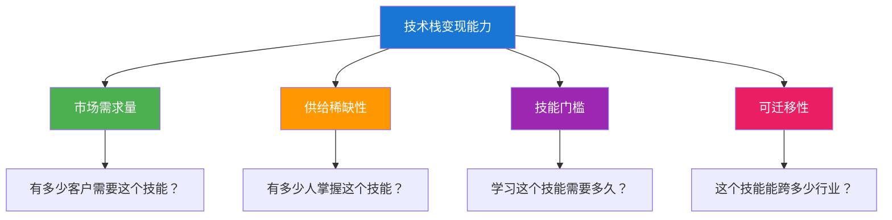
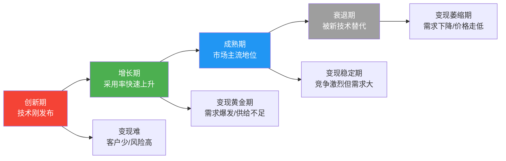
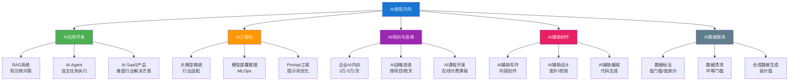
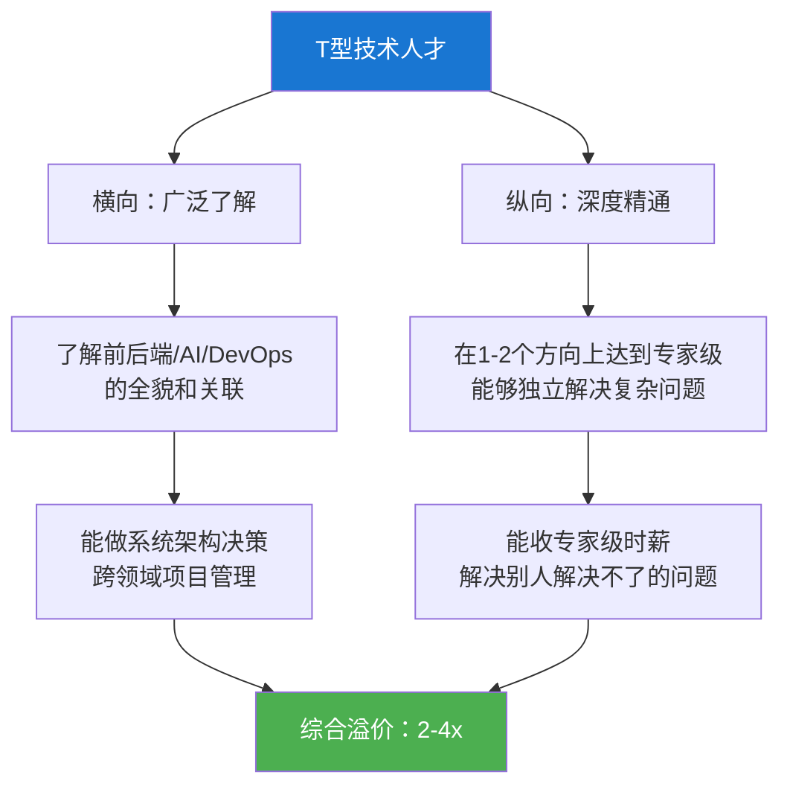
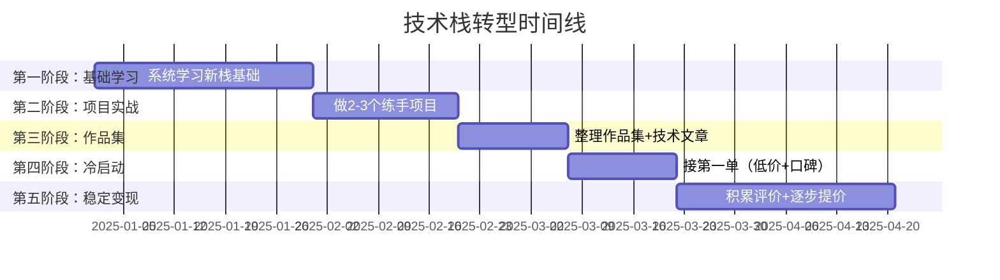

## 八、技术栈选择与市场分析

技术栈选择是技术人变现的**第一个战略决策**。选对了，市场需求旺盛、项目源源不断、议价空间充足；选错了，可能陷入红海低价竞争，或者进入一个需求萎缩的垂死市场。本节不是教你"哪个语言最好"，而是教你怎么用市场分析的方法论，找到**你的技能与市场需求之间的最优交叉点**。

很多技术人选择技术栈的逻辑是"我学了什么就做什么"——这是被动接受。高手的逻辑是"市场需要什么、我能学什么、两者的交集是什么"——这是主动出击。区别在于：前者的收入天花板由运气决定，后者的收入天花板由策略决定。

### 8.1 技术栈选择的底层逻辑

#### 8.1.1 影响技术栈变现能力的四个变量

任何技术栈的变现能力都可以用四个变量来衡量。理解这四个变量，你就能对任何技术栈做出理性判断，而不是人云亦云。



**变量一：市场需求量（决定项目数量）**

市场需求量决定了你能接到多少项目。衡量市场需求的直接方法：在主流接单平台（猪八戒、程序员客栈、Upwork、Freelancer）搜索某个技术关键词，统计近30天的项目数量和平均报价。例如，2025年在Upwork上搜索"React"有超过12,000个活跃项目，而搜索"Ember.js"只有不到400个——这就是市场需求量的直观差异。

**变量二：供给稀缺性（决定议价空间）**

稀缺性决定你能不能"挑客户"而不是"被客户挑"。一个极端的例子：2024-2026年，能做RAG系统和AI Agent开发的工程师在全市场极度稀缺，时薪可达800-3000元。而能做WordPress建站的开发者供给过剩，时薪可能只有80-150元。稀缺性的判断方法：招聘平台上搜索某个技能的岗位数量 vs. 简历数量。岗位多简历少 = 稀缺，反之则供给过剩。

**变量三：技能门槛（决定竞争烈度）**

门槛高意味着进入者少，但也意味着你需要更多时间才能开始变现。门槛低意味着你能快速进入市场，但竞争激烈、利润微薄。理想的变现路径是：找一个**门槛中等偏高、但你恰好已有基础**的技术栈——这样你既有先发优势，又有一定的竞争壁垒。

**变量四：可迁移性（决定客户池大小）**

可迁移性决定了你能服务多少行业的客户。前端开发可迁移性极高（几乎所有行业都需要网站/应用），而嵌入式开发可迁移性较低（主要集中在硬件/物联网行业）。可迁移性高意味着你的客户池更大，抗风险能力更强——某个行业不景气，你还可以服务其他行业。

#### 8.1.2 技术栈的生命周期与变现窗口

技术栈不是静态的，它有明确的生命周期。理解生命周期能帮你判断一个技术栈的**长期价值**，避免追逐转瞬即逝的热点。



**变现的最佳窗口在增长期和成熟期早期**。增长期的特点是需求快速上升但掌握该技术的人还很少，此时的溢价空间最大。成熟期早期的特点是市场已经接受该技术，项目稳定，竞争虽然增加但需求量足够大，仍然有充足的变现空间。

**具体判断方法**：

| 指标 | 创新增长期信号 | 成熟稳定期信号 | 衰退期信号 |
|------|--------------|--------------|----------|
| Stack Overflow趋势 | 提问量快速上升 | 提问量稳定或缓慢下降 | 提问量显著下降 |
| GitHub活跃度 | Star数快速增长 | PR/Issue稳定 | 维护频率降低 |
| 招聘平台需求 | 岗位数快速增加 | 岗位数稳定高位 | 岗位数开始减少 |
| 社区生态 | 新框架/库快速涌现 | 生态成熟、文档完善 | 第三方库停止更新 |
| 企业采用率 | 创新型企业开始采用 | 大企业全面采用 | 企业开始迁移 |

**当下的技术栈生命周期位置（2025-2026年参考）**：

| 技术栈 | 当前阶段 | 变现建议 |
|--------|---------|---------|
| React/Next.js | 成熟期 | 稳定变现首选，竞争激烈但需求量最大 |
| Vue.js/Nuxt | 成熟期 | 国内市场表现优异，中小企业首选 |
| Svelte/SvelteKit | 增长期 | 值得关注，部分前沿客户开始采用 |
| Go | 增长期→成熟期 | 后端高薪方向，云原生和微服务领域强势 |
| Rust | 增长期 | 高门槛高回报，系统编程和区块链方向 |
| Flutter | 增长期→成熟期 | 跨平台移动开发的主流选择 |
| AI/LLM应用 | 急剧增长期 | 当前最大红利窗口，2024-2026年是变现黄金期 |
| WebAssembly | 增长期 | 未来可期，但当前变现场景有限 |

#### 8.1.3 "该追热点还是守旧技术"的决策框架

这是一个经典争论。答案不是二选一，而是**用组合策略平衡风险和收益**。

**70/20/10 技能投资法则**：

- **70%精力**投入你当前最擅长、最能变现的技术栈（稳定的现金流来源）
- **20%精力**投入与当前技能互补、市场需求正在上升的技术栈（扩展变现边界）
- **10%精力**投入前沿/探索性技术栈（为未来布局）

**示例**：一个Vue.js前端开发者
- 70%精力：继续做Vue.js项目接单，积累口碑和老客户（稳定月入1-2万）
- 20%精力：学习Nuxt.js（服务端渲染）+ TypeScript，接更复杂的全栈项目（客单价提升50-100%）
- 10%精力：学习AI应用前端开发（RAG界面、Agent交互），为未来AI项目做准备

### 8.2 前端开发变现全景

前端开发是技术接单中需求量最大的领域之一，原因是：几乎每个企业都需要Web界面，项目类型多样，技术栈成熟，学习曲线相对平缓。但正因为门槛不算高，竞争也最为激烈——单纯的"切页面"已经很难获得高收入，必须向全栈化或垂直行业化方向发展。

#### 8.2.1 主流技术栈深度分析

| 技术栈 | 市场需求 | 学习曲线 | 变现能力 | 核心优势 | 典型客户 | 2025-2026趋势 |
|--------|---------|---------|---------|---------|---------|-------------|
| React | ★★★★★ | 中等 | 高 | 生态最完善，企业级项目首选 | 大中型企业、科技公司 | 持续主流，Next.js成为标配 |
| Vue.js | ★★★★ | 较低 | 中高 | 上手快，中文社区强 | 中小企业、国内项目 | 国内市场稳固，Vue3生态成熟 |
| Next.js | ★★★★ | 中等 | 高 | React全家桶，SSR/SSG | 需要SEO的企业、SaaS | 快速增长，全栈化趋势明显 |
| TypeScript | ★★★★★ | 辅助技能 | 高 | 已成行业标配，提升代码质量 | 所有前端项目 | 必备技能，不学等于自降身价 |
| Tailwind CSS | ★★★★ | 低 | 中 | 开发效率极高，设计一致性好 | 中小项目、快速迭代团队 | 采用率持续上升 |
| Svelte/SvelteKit | ★★★ | 中等 | 中 | 性能优异，编译时框架 | 性能敏感项目 | 值得关注但变现场景仍有限 |
| 小程序（微信/支付宝） | ★★★★ | 较低 | 中高 | 用户量大，本地商家需求旺盛 | 本地生活、电商、教育 | 生态稳定，与App互补 |

**TypeScript为什么是"必备技能"而不是"加分项"？** 因为2025年主流接单平台上有超过60%的前端项目明确要求TypeScript。不掌握TypeScript，你直接丢掉了60%的潜在项目。更重要的是，TypeScript项目的报价通常比纯JavaScript项目高20-30%——这不是因为TypeScript更复杂，而是因为客户认为TypeScript开发者更专业。

#### 8.2.2 前端项目类型与报价参考

| 项目类型 | 报价区间 | 交付周期 | 技术要求 | 客户画像 | 复购可能性 |
|---------|---------|---------|---------|---------|----------|
| 企业官网（静态/半静态） | 5,000-30,000元 | 1-3周 | HTML/CSS/JS + CMS | 中小企业、初创公司 | 中（后续维护+改版） |
| 电商平台前端 | 10,000-50,000元 | 2-6周 | React/Vue + 状态管理 | 电商创业公司、品牌方 | 高（持续迭代） |
| 管理后台/仪表板 | 8,000-30,000元 | 2-4周 | React/Vue + UI库 + 图表 | 企业内部系统 | 高（功能扩展） |
| H5活动页面 | 2,000-8,000元 | 3-7天 | HTML/CSS/JS + 动效 | 市场部、品牌方 | 高（每次活动都做） |
| 小程序开发 | 8,000-40,000元 | 2-6周 | 微信小程序/uni-app | 本地商家、O2O | 中高（功能迭代） |
| 数据可视化大屏 | 10,000-50,000元 | 2-4周 | ECharts/D3.js + WebSocket | 政府、大企业 | 中（展示型需求） |
| SaaS产品前端 | 20,000-80,000元 | 4-8周 | React/Next.js + 复杂状态管理 | SaaS创业团队 | 极高（长期合作） |
| 响应式Web应用（PWA） | 15,000-60,000元 | 3-6周 | React/Vue + Service Worker | 移动端需求企业 | 中 |

**报价策略提示**：不要只看"技术复杂度"定价，要看"客户获得的价值"定价。同样的技术难度，为一家年营收10亿的企业做官网，和为一家年营收100万的小店做官网，报价应该有3-10倍的差异——因为前者从网站获得的品牌价值和商业转化远高于后者。

#### 8.2.3 前端变现的进阶路径

```mermaid
graph TD
    A[前端新手] -->|掌握基础三件套| B[切页面接单]
    B -->|学习框架| C[React/Vue项目接单]
    C -->|学习后端基础| D[全栈独立交付]
    D -->|深耕垂直行业| E[行业解决方案专家]
    E -->|沉淀产品化| F[前端模板/SaaS/工具]

    B --> B1[月入3K-8K<br/>竞争激烈/利润薄]
    C --> C1[月入8K-25K<br/>主流变现区间]
    D --> D1[月入15K-40K<br/>独立交付溢价]
    E --> E2[月入30K-80K<br/>品牌溢价]
    F --> F1[月入50K+<br/>被动收入]

    style A fill:#E91E63,color:#fff
    style F fill:#4CAF50,color:#fff
```



### 8.3 后端开发变现全景

后端开发的变现特征与前端截然不同：项目单价更高、技术门槛更高、竞争相对较小，但项目周期更长、沟通成本更高。后端开发者的核心变现优势在于——你掌握的是**企业核心业务逻辑和数据**，这比前端界面更有战略价值。

#### 8.3.1 主流技术栈深度分析

| 技术栈 | 市场需求 | 学习曲线 | 变现能力 | 核心优势 | 典型客户 | 薪资/时薪参考 |
|--------|---------|---------|---------|---------|---------|------------|
| Java/Spring | ★★★★★ | 高 | 高 | 企业级首选，生态最成熟 | 大中型企业、金融、电商 | 时薪200-800元 |
| Python/Django/Flask | ★★★★ | 中等 | 中高 | AI/数据方向强势 | 科技公司、AI创业公司 | 时薪200-600元 |
| Node.js/Express/Nest | ★★★★ | 中等 | 中高 | 全栈统一语言，I/O密集场景 | 创业公司、实时应用 | 时薪150-500元 |
| Go | ★★★ | 中等 | 高 | 高并发、云原生首选 | 云服务、微服务、基础设施 | 时薪300-800元 |
| Rust | ★★ | 高 | 极高 | 性能极致、内存安全 | 系统编程、区块链、WebAssembly | 时薪500-1500元 |
| PHP/Laravel | ★★★ | 较低 | 中 | CMS生态成熟，中小企业首选 | 中小企业、WordPress | 时薪100-300元 |

**Go和Rust的"稀缺性溢价"**：Go和Rust的市场需求绝对量不如Java和Python，但掌握这两个语言的开发者更少，因此时薪显著更高。特别是Rust，因为学习曲线陡峭（借用检查器是出了名的"劝退"），导致供给极度稀缺，时薪可以达到1000-1500元。这是一种"少即是多"的变现逻辑——不需要做最多项目，只需做单价最高的项目。

#### 8.3.2 后端项目类型与报价参考

| 项目类型 | 报价区间 | 交付周期 | 技术复杂度 | 适用技术栈 |
|---------|---------|---------|----------|----------|
| RESTful API开发 | 5,000-20,000元 | 1-3周 | 中 | Node.js/Python/Go |
| 数据库设计与优化 | 3,000-15,000元 | 1-2周 | 中-高 | MySQL/PostgreSQL/MongoDB |
| 系统架构设计 | 10,000-50,000元 | 2-4周 | 高 | 取决于场景 |
| 微服务架构开发 | 20,000-100,000元 | 4-12周 | 极高 | Java/Go + K8s |
| 性能优化与重构 | 8,000-30,000元 | 1-3周 | 高 | 取决于现有系统 |
| 数据迁移与ETL | 5,000-25,000元 | 1-3周 | 中 | Python + SQL |
| 第三方API集成 | 3,000-15,000元 | 3-10天 | 中 | 取决于目标API |
| DevOps/CI-CD搭建 | 5,000-20,000元 | 1-2周 | 中-高 | Docker/K8s/Jenkins |

#### 8.3.3 数据库技能的变现价值

数据库技能经常被低估，但它是后端变现中最稳定的细分领域之一。很多企业的问题不是"没有系统"，而是"系统太慢"——而80%的性能问题出在数据库层面。

**数据库技能的变现层次**：

| 层次 | 技能内容 | 报价参考 | 客户来源 |
|------|---------|---------|---------|
| 基础 | 表结构设计、SQL编写、索引优化 | 3,000-8,000元/项目 | 中小企业 |
| 中级 | 查询优化、读写分离、缓存设计 | 8,000-25,000元/项目 | 中型企业 |
| 高级 | 分库分表、数据迁移、数据库选型 | 20,000-60,000元/项目 | 大型企业 |
| 专家 | 分布式数据库架构、数据治理 | 按天收费3,000-8,000元/天 | 大型/金融企业 |

### 8.4 移动开发变现全景

移动开发市场在2024-2026年呈现两极分化趋势：原生开发（Swift/Kotlin）向高端精品化方向发展，跨平台开发（Flutter/React Native）覆盖中长尾需求。选择哪条路线，取决于你的目标客户类型。

#### 8.4.1 跨平台 vs. 原生开发的变现对比

| 维度 | 跨平台（Flutter/RN） | 原生开发（Swift/Kotlin） |
|------|---------------------|----------------------|
| **开发效率** | 高（一套代码双平台） | 中（需分别开发） |
| **客户成本** | 低（只付一份钱） | 高（双倍开发成本） |
| **目标客户** | 中小企业、MVP验证 | 大企业、高端应用 |
| **项目单价** | 中（8,000-40,000元） | 高（20,000-100,000元） |
| **市场竞争** | 中-高 | 中 |
| **性能上限** | 中高（Flutter接近原生） | 极高 |
| **适合变现策略** | 快速交付、标准化模板 | 深度定制、长期维护 |
| **未来趋势** | 持续增长，成为主流 | 高端市场长期存在 |

**Flutter在2025-2026年的变现优势**：Flutter 3.x版本在性能和UI一致性上已经接近原生水平，且有Google的持续投入。对于需要同时覆盖iOS和Android的客户（这占移动项目的70%以上），Flutter的开发成本只有原生的50-60%，这让Flutter开发者在报价上有天然优势——你报价3万（相当于原生6万的性价比），客户觉得划算，你的实际工时也更少。

#### 8.4.2 小程序——被低估的变现金矿

小程序常被视为"低端市场"，但实际上小程序开发的利润率在所有前端项目中名列前茅。原因有三：

1. **客户愿意为"快速上线"付费**。小程序的开发周期短（1-4周），客户急需上线抢占市场，对价格敏感度低于对时间的敏感度。
2. **需求量巨大**。微信小程序月活用户超过13亿（几乎等于中国互联网用户总数），线下商家、本地服务、电商、教育等行业都有旺盛需求。
3. **复购率高**。小程序不是一次性项目，客户上线后需要持续迭代、活动页面更新、数据分析，形成长期合作。

**小程序变现的关键策略**：不要做"纯定制开发"，要**把行业需求模板化**。例如，你做了一个餐饮点餐小程序，可以把这个模板复用到其他餐饮客户，报价从8,000元（定制）降到3,000元（模板），但你的实际工时从2周降到3天——利润率反而更高。

### 8.5 AI/数据科学变现——当前最大的红利窗口

AI是2024-2026年技术变现领域最大的风口，没有之一。但"AI变现"不是一个笼统的概念——它包含多个细分方向，每个方向的入门门槛、收入范围和市场成熟度都截然不同。

#### 8.5.1 AI变现方向全景图



#### 8.5.2 AI各方向变现能力对比

| 方向 | 入门门槛 | 时薪/单价 | 需求趋势 | 变现天花板 | 适合人群 | 核心技术栈 |
|------|---------|---------|---------|----------|---------|----------|
| RAG系统开发 | 高（需编程+向量数据库） | 500-1,500元/时 | 快速增长 | 月入5-20万 | 有后端基础的开发者 | LangChain/LlamaIndex + 向量DB |
| AI Agent开发 | 高（需编程+LLM理解） | 500-2,000元/时 | 急剧增长 | 月入10-50万 | 有全栈能力的开发者 | LangGraph/CrewAI + 工具链 |
| 大模型微调 | 极高（需ML基础+GPU） | 500-2,000元/时 | 急剧增长 | 月入10-30万 | ML工程师 | PyTorch/Transformers + LoRA/QLoRA |
| AI应用前端 | 中（需前端基础+API对接） | 300-800元/时 | 快速增长 | 月入3-10万 | 前端开发者 | React/Vue + OpenAI API |
| Prompt工程 | 低 | 200-1,000元/时 | 稳定增长 | 月入1-5万 | 所有人 | 提示词设计方法论 |
| AI培训/企业内训 | 中（需行业经验+表达能力） | 3,000-50,000元/天 | 快速增长 | 年入50-200万 | 有教学能力的技术人 | 课程设计+演讲能力 |
| AI工作流自动化 | 中 | 2,000-20,000元/项 | 快速增长 | 月入2-8万 | 流程优化专家 | n8n/Make + AI API |
| AI数据分析 | 中 | 300-1,000元/时 | 稳定增长 | 月入3-12万 | 数据分析师 | Python + Pandas + LLM API |

#### 8.5.3 RAG系统开发的变现详解

RAG（Retrieval-Augmented Generation，检索增强生成）是当前企业AI需求中最成熟的场景。几乎每家企业都有"让AI理解我们的文档/知识库"的需求，而RAG正是解决这个需求的技术方案。

**RAG系统开发的典型客户与报价**：

| 客户类型 | 典型需求 | 报价区间 | 交付周期 | 附加价值 |
|---------|---------|---------|---------|---------|
| 律师事务所 | 案例库智能问答 | 30,000-80,000元 | 2-4周 | 持续维护1,000-3,000元/月 |
| 电商公司 | 商品知识库+客服机器人 | 20,000-60,000元 | 2-4周 | 转化率提升带来复购 |
| 教育机构 | 课程内容智能助手 | 15,000-40,000元 | 1-3周 | 按学生数收取SaaS费用 |
| 企业内部 | 内部文档/制度问答系统 | 20,000-50,000元 | 2-4周 | 功能扩展持续合作 |
| 医疗机构 | 病历/文献检索辅助 | 40,000-100,000元 | 3-6周 | 合规要求带来高壁垒 |

**RAG系统的标准化交付流程**：

```text
阶段一：需求与数据评估（1-3天）
├── 确认知识库类型（文档/网页/数据库/混合）
├── 评估数据量和更新频率
├── 确认使用场景（内部/外部/嵌入式）
└── 输出：需求确认书 + 技术方案

阶段二：数据处理与向量化（2-5天）
├── 文档解析（PDF/Word/HTML/Markdown）
├── 文本分块策略设计（按语义/按段落/按固定长度）
├── 向量模型选型（OpenAI Embedding / BGE / M3E）
├── 向量数据库搭建（Milvus/Weaviate/Chroma/Pinecone）
└── 输出：向量化知识库

阶段三：RAG链路搭建（3-7天）
├── 检索策略设计（向量检索 + 关键词检索 + 混合检索）
├── Prompt模板设计与优化
├── 上下文窗口管理
├── LLM选型与接入（GPT-4/Claude/国产模型）
└── 输出：可运行的RAG后端

阶段四：前端与集成（3-5天）
├── Chat界面开发（React/Vue）
├── 流式输出实现
├── 与客户现有系统集成
├── 权限管理（如需要）
└── 输出：完整可用的系统

阶段五：测试与交付（2-3天）
├── 准确性测试（准备50-100个测试问答对）
├── 性能测试（并发/延迟）
├── 文档交付（使用手册 + 部署文档）
└── 输出：验收报告 + 上线
```

#### 8.5.4 AI Agent开发的变现机会

AI Agent是2025-2026年增长最快的AI细分方向。与RAG的"问答"模式不同，Agent的核心能力是**自主执行任务**——它不只是回答问题，而是帮你完成一系列操作。

**Agent的高价值应用场景**：

| 场景 | 描述 | 报价参考 | 技术实现 |
|------|------|---------|---------|
| 销售线索Agent | 自动搜索、筛选、联系潜在客户 | 30,000-80,000元 | LLM + 数据抓取 + CRM API |
| 代码审查Agent | 自动审查PR、给出修改建议 | 20,000-50,000元 | LLM + GitHub API + 静态分析 |
| 内容生产Agent | 自动生成SEO文章/社媒内容 | 15,000-40,000元 | LLM + 搜索 + CMS API |
| 数据分析Agent | 自然语言查询数据库、生成报告 | 20,000-60,000元 | LLM + SQL生成 + 可视化 |
| 客服Agent | 多轮对话、工单处理、知识库检索 | 25,000-80,000元 | RAG + Agent框架 + CRM集成 |
| 财务Agent | 自动记账、发票识别、报表生成 | 30,000-100,000元 | LLM + OCR + 财务系统API |

### 8.6 云原生与DevOps——稳定高薪的技术方向

云原生和DevOps是后端开发中最稳定的高薪方向之一。与AI的"爆发式增长"不同，云原生的需求增长是稳步上升的——企业上云是不可逆的趋势，而能做好云架构和CI/CD的技术人一直处于稀缺状态。

#### 8.6.1 核心技术栈与市场需求

| 技术栈 | 市场需求 | 学习曲线 | 日薪参考（咨询/实施） | 核心场景 |
|--------|---------|---------|-------------------|---------|
| Docker | ★★★★★ | 较低 | 1,500-3,000元 | 容器化部署 |
| Kubernetes | ★★★★★ | 高 | 3,000-8,000元 | 容器编排、集群管理 |
| Terraform | ★★★★ | 中等 | 2,000-5,000元 | 基础设施即代码 |
| AWS/阿里云/腾讯云 | ★★★★★ | 中等 | 2,000-6,000元 | 云架构设计 |
| CI/CD（GitLab CI/Jenkins） | ★★★★ | 较低 | 1,500-3,000元 | 自动化流水线 |
| Prometheus + Grafana | ★★★★ | 中等 | 1,500-3,000元 | 监控告警体系 |

#### 8.6.2 DevOps服务的变现模式

| 服务类型 | 单次报价 | 周期 | 复购可能 |
|---------|---------|------|---------|
| 容器化改造（传统应用→Docker） | 10,000-30,000元 | 1-2周 | 中（后续维护） |
| K8s集群搭建与配置 | 20,000-60,000元 | 1-3周 | 高（运维托管） |
| CI/CD流水线搭建 | 5,000-20,000元 | 3-7天 | 高（持续优化） |
| 云架构设计与迁移 | 30,000-100,000元 | 2-6周 | 极高（长期顾问） |
| 监控告警体系搭建 | 8,000-25,000元 | 1-2周 | 高（阈值调整、告警升级） |
| 安全加固与合规 | 15,000-50,000元 | 1-3周 | 中（定期审查） |
| 持续运维托管 | 5,000-20,000元/月 | 持续 | 极高（按月收费） |

**DevOps的"运维托管"模式是最佳变现形态**。一次性的集群搭建只能收一次钱，但如果你把"运维托管"作为附加服务，每个月收取5,000-20,000元，5个客户就能带来稳定的2.5-10万月收入——而实际工作量在标准化之后非常有限。

### 8.7 网络安全——需求井喷的高壁垒领域

网络安全是一个被严重低估的变现方向。随着《数据安全法》《个人信息保护法》《网络安全法》的深入实施，企业对安全合规的需求急剧增长。但安全人才的培养周期长（通常需要3-5年实战经验），导致供给严重不足。

#### 8.7.1 安全服务的变现方向

| 方向 | 服务内容 | 报价参考 | 门槛 | 需求趋势 |
|------|---------|---------|------|---------|
| 渗透测试 | 模拟攻击，发现系统漏洞 | 5,000-30,000元/次 | 高 | 快速增长 |
| 安全评估 | 企业安全体系全面审查 | 20,000-100,000元/次 | 高 | 急剧增长 |
| 等保测评辅助 | 协助企业通过等级保护测评 | 10,000-50,000元/次 | 中 | 稳定（强制要求） |
| 安全培训 | 员工安全意识培训 | 5,000-20,000元/次 | 中 | 快速增长 |
| 安全开发（SDL） | 代码安全审查、安全架构设计 | 30,000-80,000元/项目 | 高 | 快速增长 |
| 应急响应 | 安全事件应急处理 | 10,000-50,000元/次 | 高 | 稳定增长 |

### 8.8 技能组合策略——1+1>2的溢价效应

掌握单一技术栈只能拿到基础价格。真正拉开收入差距的，是**技能组合**——当你把两种或多种技能叠加在一起时，市场愿意为你支付远超各技能单独价格之和的溢价。

#### 8.8.1 高溢价技能组合

| 技能组合 | 溢价倍数 | 原因 | 典型项目 | 报价参考 |
|----------|---------|------|---------|---------|
| 前端 + AI | 2-3x | 能做AI应用的前端开发者极少 | AI聊天界面、RAG知识库前端 | 项目报价提高100-200% |
| 后端 + AI | 2-3x | 企业AI落地的核心瓶颈是工程化 | RAG后端、Agent系统、模型服务 | 时薪500-1,500元 |
| 移动 + AI | 2-3x | 端侧AI应用是新兴需求 | AI相机、语音助手、智能推荐 | 项目报价提高100-200% |
| 前端 + 设计 | 1.5-2x | 独立交付完整产品 | 全栈UI开发、产品设计+实现 | 独立交付溢价50-100% |
| 编程 + 行业知识 | 2-4x | 行业壁垒是最大的护城河 | 金融量化系统、医疗信息化 | 行业客户愿付2-4倍溢价 |
| DevOps + 安全 | 2-3x | 云安全是刚需 | 安全容器化、安全CI/CD | 日薪4,000-10,000元 |
| AI + 教学能力 | 3-5x | 培训是AI领域变现天花板最高的方向 | AI企业内训、AI课程 | 日薪10,000-50,000元 |
| 全栈 + 产品思维 | 2-3x | 能从0到1独立做出产品 | MVP开发、创业项目外包 | 项目报价提高100-200% |

#### 8.8.2 如何选择你的技能组合方向

不要盲目学习"最热"的技能。技能组合的选择应该基于三个因素的交集：

```text
最优技能组合 = 你已有的强项 × 市场上升的需求 × 你感兴趣的方向
```

**决策步骤**：

1. **盘点现有技能**：列出你当前最擅长的3个技能，用1-10分自评水平。
2. **分析市场需求缺口**：在接单平台上搜索这些技能的组合，看是否有"技能A + 技能B"的复合需求。例如，搜索"React + AI"，看这类项目的数量和报价。
3. **评估学习成本**：你从当前水平到"能接单"需要多长时间？选择学习曲线与你的可用时间匹配的方向。
4. **验证最小可行组合**：先用1-2周做一个小项目或demo，测试市场反应。如果有人愿意付费，说明方向对了。

#### 8.8.3 "T型人才"变现模型



**T型人才的变现优势**：

- **横向知识**让你能理解客户的全貌需求，而不是只做"自己的那一块"。客户更愿意与一个"懂我整个系统"的开发者合作，而不是一个"只懂前端"的开发者。
- **纵向深度**让你在核心方向上能收专家级时薪。你的深度决定了你的"不可替代性"——当客户遇到难题时，只有你能解决。
- **两者叠加**的溢价远超简单的1+1。一个"精通后端 + 了解AI + 了解前端"的全栈工程师，市场报价通常是"纯后端"的2-3倍。

### 8.9 市场分析实操方法

理论说了这么多，你可能仍然在问："我怎么知道我现在该学什么、该做什么方向？" 以下是三个可以直接操作的市场分析方法。

#### 8.9.1 方法一：平台数据扫描法

**工具**：主流接单平台（猪八戒、程序员客栈、Upwork、Freelancer、Fiverr）

**步骤**：

1. 列出你感兴趣或已掌握的5-10个技术关键词
2. 在每个平台上搜索这些关键词，记录以下数据：
   - 近30天活跃项目数量（衡量需求量）
   - 平均报价和报价区间（衡量价格天花板）
   - 竞标者/投标者数量（衡量竞争程度）
   - 项目描述中的技术要求（判断技能复合需求）
3. 制作对比表，找出"高需求 + 高报价 + 低竞争"的交叉点

**示例分析表格**：

| 技术关键词 | 平台A项目数 | 平台A均价 | 竞标者数 | 平台B项目数 | 平台B均价 | 综合评分 |
|-----------|-----------|---------|---------|-----------|---------|---------|
| React | 500+ | 15,000元 | 30-50 | 200+ | $2,000 | ★★★★ |
| Vue.js | 300+ | 12,000元 | 20-40 | 100+ | $1,500 | ★★★ |
| RAG开发 | 50+ | 40,000元 | 5-15 | 100+ | $5,000 | ★★★★★ |
| Flutter | 150+ | 20,000元 | 15-30 | 80+ | $2,500 | ★★★★ |
| K8s运维 | 80+ | 30,000元 | 10-20 | 60+ | $4,000 | ★★★★ |

从这个表格可以看出：RAG开发项目数最少但均价最高、竞标者最少——这就是典型的"稀缺性溢价"方向。

#### 8.9.2 方法二：招聘平台反向分析法

**工具**：Boss直聘、拉勾、LinkedIn、Indeed

**逻辑**：招聘平台的数据反映企业长期技术需求。如果一个技能的岗位多、薪资高、简历少，说明这个方向有持续的高薪机会——即使你不去应聘，这些企业也是你的潜在客户（他们招不到人，就更可能把工作外包出来）。

**步骤**：

1. 在招聘平台搜索目标技能，筛选"远程"或"兼职"岗位
2. 记录薪资范围、技能要求、工作内容
3. 特别关注JD中出现频率最高的技能组合——这代表市场的"复合需求"
4. 将JD中的工作内容转化为"你能提供的服务"——这就是你的变现方向

#### 8.9.3 方法三：社区信号分析法

**工具**：GitHub Trending、Hacker News、掘金热榜、V2EX、Twitter/X技术圈

**逻辑**：技术社区的讨论热度是市场趋势的领先指标——社区讨论通常比市场需求早6-12个月。

**观察信号**：

| 社区信号 | 含义 | 变现启示 |
|---------|------|---------|
| 某技术的GitHub Star快速增长 | 社区关注度高 | 提前学习，6-12个月后需求会爆发 |
| 某技术的教程/课程大量涌现 | 培训需求旺盛 | 做课程或写教程可以变现 |
| 某技术的"为什么不用X替代Y"讨论增多 | 可能面临替代 | 不要All-in，关注替代方案 |
| 大公司宣布采用某技术 | 企业级需求即将上升 | 抓紧学习，准备接企业项目 |
| 某技术的招聘岗位薪资持续上涨 | 供给不足 | 这是你的高薪变现方向 |

### 8.10 技术栈转型的实操路径

如果你已经决定要学习新的技术栈或转变变现方向，以下是一个经过验证的转型路线图。

#### 8.10.1 转型路线图（以3-6个月为周期）



**第一阶段（第1-2个月）：系统学习**

不要碎片化学习。用一个完整的课程体系（官方文档 + 优质视频教程 + 一本经典书），在1-2个月内建立对新技术栈的系统认知。每天投入2-3小时，核心目标是能独立用新技术栈搭建一个完整的项目。

**第二阶段（第2-3个月）：项目实战**

做2-3个有代表性的项目。这些项目既是练手，也是你未来的作品集。选择项目的策略：在接单平台上找最常见类型的项目，按客户需求做一遍——这样你同时在练习技术和了解市场需求。

**第三阶段（第3-4个月）：建立作品集**

把你的练手项目整理成作品集。同时在技术社区（掘金/CSDN/知乎/公众号）发布2-3篇技术文章，内容可以是你在学习过程中踩过的坑、解决方案、最佳实践。技术文章是最好的获客工具——它同时展示你的技术深度和沟通能力。

**第四阶段（第4-5个月）：冷启动接单**

在接单平台上接第一单。策略：报价比市场均价低20-30%，目标不是赚钱而是积累第一笔好评。第一笔好评的价值远超报价差额——有了好评，后续的获客成本会大幅下降。

**第五阶段（第5-6个月）：稳定变现**

有了3-5个好评后，逐步提价到市场均价。此时你应该有了足够的经验来判断哪些项目值得接、哪些客户是优质客户。开始建立客户管理和复购体系。

#### 8.10.2 转型中的常见误区

| 误区 | 后果 | 正确做法 |
|------|------|---------|
| "我要从零开始学全栈" | 耗时太长，半年后才能接单 | 从你已有的技能出发，向相邻方向扩展 |
| "等我学精了再接单" | 永远在学习，永远不开始 | 70分就可以接单，在实战中成长到90分 |
| "新栈出来我就换" | 频繁切换，哪个都不精通 | 用70/20/10法则分配精力，核心栈不动 |
| "只学技术不学商业" | 技术一流但赚不到钱 | 同步学习定价、沟通、品牌建设 |
| "在新平台从零开始" | 丢掉原有的客户积累 | 让老客户知道你在学新东西，从老客户中挖掘新需求 |

### 8.11 不同行业的技术变现溢价

同一个技术在不同行业的变现能力差异巨大。掌握行业知识能让你的报价翻倍甚至翻三倍。

#### 8.11.1 高溢价行业分析

| 行业 | 溢价倍数 | 原因 | 核心技术需求 | 进入建议 |
|------|---------|------|------------|---------|
| 金融/量化 | 3-5x | 高利润行业，对系统可靠性和性能要求极高 | 低延迟系统、风控算法、合规系统 | 需要金融知识，门槛高但回报极高 |
| 医疗健康 | 2-3x | 合规要求高，数据敏感 | EMR系统、医学影像AI、远程诊疗 | HIPAA等合规知识是壁垒 |
| 电商/SaaS | 1.5-2x | 竞争激烈，愿意为技术优势付费 | 高并发架构、推荐系统、A/B测试 | 需求量大，入门相对容易 |
| 教育科技 | 1.5-2x | 市场规模大，技术需求多样 | 在线课堂、AI辅助教学、LMS | 可从工具切入，逐步深入 |
| 政府/公共事业 | 2-3x | 预算充足，流程规范 | 信创适配、安全合规、数据大屏 | 需要资质和关系，但利润丰厚 |
| 物联网/智能硬件 | 2-3x | 软硬件结合门槛高 | 嵌入式开发、边缘计算、设备管理 | 需要硬件知识，竞争者少 |

#### 8.11.2 如何进入高溢价行业

不需要"转行"。你可以在现有技术栈的基础上，**叠加行业知识**：

1. **选一个你感兴趣的行业**：兴趣是持续学习的动力。
2. **读该行业的基础教材或认证课程**：例如做金融方向，至少了解CFA一级的知识框架。
3. **接1-2个该行业的低价项目**：用来积累行业经验和案例。
4. **在该行业的垂直社区/论坛建立存在感**：例如金融方向在雪球、医疗方向在丁香园。
5. **写该行业的技术解决方案文章**：例如"如何用RAG技术构建金融研报知识库"——这会吸引精准的行业客户。

### 8.12 常见误区与纠正

| 误区 | 真相 | 纠正方法 |
|------|------|---------|
| "最热的技术栈就是最好的" | 热门技术栈竞争也最激烈，不一定是最优选择 | 用四变量模型综合评估，而非只看热度 |
| "我学的是冷门技术，没人要" | 冷门 = 稀缺 = 溢价。关键是找到对的客户 | 冷门技术的变现策略是"垂直+深度"而非"广撒网" |
| "前端比后端赚钱少" | 取决于你的细分方向和客户质量，而非技术类型 | 全栈化或垂直行业化，前端收入完全可以超过后端 |
| "AI会取代程序员" | AI是工具，会用AI的程序员取代不会用的 | 拥抱AI，把AI当成效率倍增器而非竞争对手 |
| "我必须掌握所有主流技术栈" | 广而不精是最差的变现策略 | T型发展：一个方向精通 + 广泛了解其他方向 |
| "技术越好收入越高" | 技术是基础，但商业能力（定价/品牌/客户管理）才是收入倍增器 | 同步提升技术深度和商业能力 |
| "接单平台上的价格就是市场价" | 平台价格被低质量竞争压低，自有渠道的价格通常高30-100% | 平台起步，但尽快建立自有获客渠道 |
| "转型就要辞职全力学习" | 裸辞学习压力大、风险高、容易焦虑 | 边工作边学习，用副业收入验证方向后再考虑全职 |

### 8.13 进阶：技术咨询师的定价模型

当你在某个技术方向积累了5年以上经验，可以考虑从"接单做项目"升级为"技术咨询"——按时间收费，而不是按项目收费。

#### 8.13.1 技术咨询 vs. 项目开发

| 维度 | 项目开发 | 技术咨询 |
|------|---------|---------|
| 收费方式 | 按项目报价 | 按小时/天报价 |
| 交付物 | 代码、系统 | 建议、方案、评审、培训 |
| 时间投入 | 高（实际开发） | 中（分析+建议） |
| 收入天花板 | 受限于你的编码速度 | 受限于你的行业影响力 |
| 核心竞争力 | 技术实现能力 | 判断力+经验+沟通 |
| 典型日薪 | 1,000-3,000元 | 3,000-10,000元 |

#### 8.13.2 技术咨询的服务形态

| 服务 | 描述 | 报价参考 | 适合场景 |
|------|------|---------|---------|
| 技术选型咨询 | 帮助客户选择技术栈和架构方案 | 5,000-20,000元/次 | 企业新项目启动 |
| 代码评审 | 审查代码质量、安全性、性能 | 3,000-8,000元/次 | 重要版本发布前 |
| 架构评审 | 评估系统架构的可扩展性和可靠性 | 8,000-30,000元/次 | 系统瓶颈排查 |
| 技术尽职调查 | 为投资方评估被投企业的技术实力 | 20,000-80,000元/次 | 投融资场景 |
| 技术培训 | 针对团队的技术能力提升 | 10,000-50,000元/天 | 团队能力提升 |
| CTO即服务 | 为初创公司提供兼职技术决策支持 | 10,000-30,000元/月 | 早期创业公司 |

技术咨询的关键不是"你知道多少"，而是"你能让客户信服多少"。建立咨询能力需要：（1）在技术社区有可见度（文章/开源/演讲）；（2）有可展示的成功案例；（3）有能把复杂问题用简单语言解释清楚的沟通能力。这三个条件缺一不可。

***

**本节核心行动清单**：

1. **今天**：用四变量模型评估你当前技术栈的变现能力，打出1-10分。
2. **本周**：在2-3个接单平台上搜索你的技术栈，记录项目数量、均价和竞争度。
3. **本月**：确定你的"70/20/10"技能投资分配，开始20%方向的系统学习。
4. **3个月内**：用新的技能组合完成1-2个练手项目，验证市场反应。
5. **6个月内**：在新方向上接到第一个付费项目，建立初步的市场认知。
