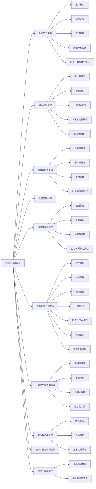
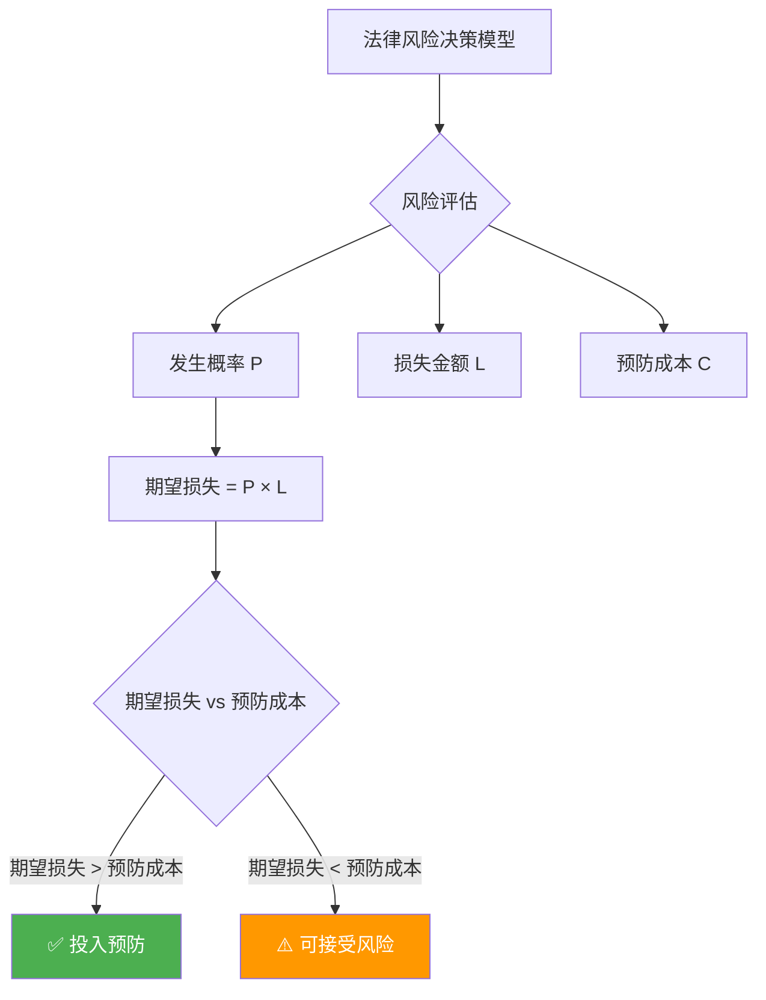
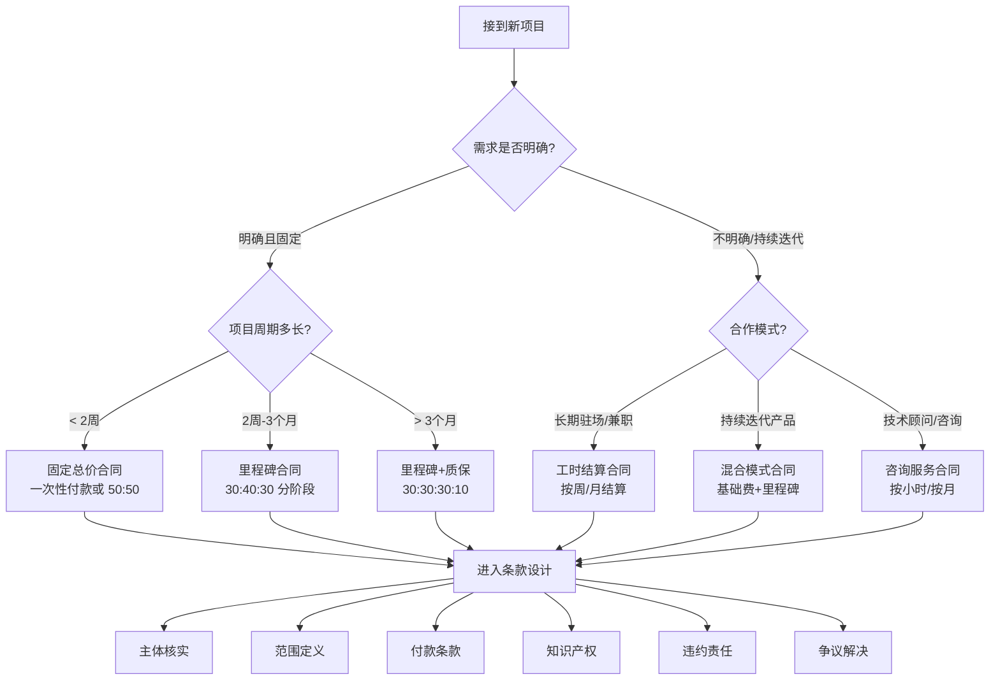
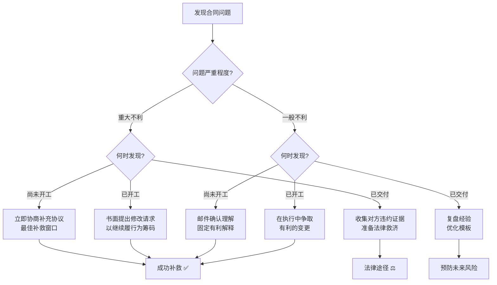
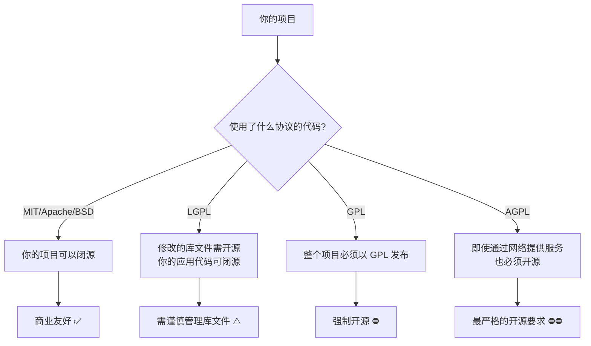
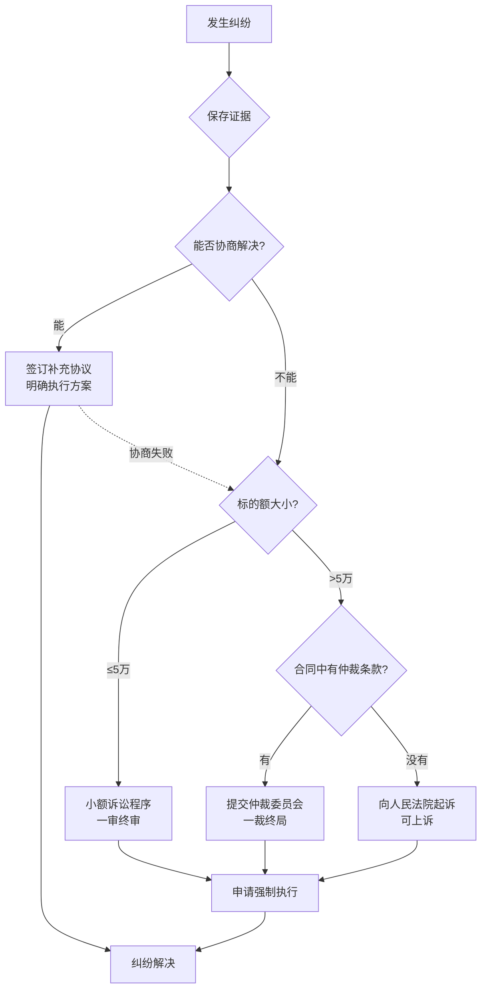
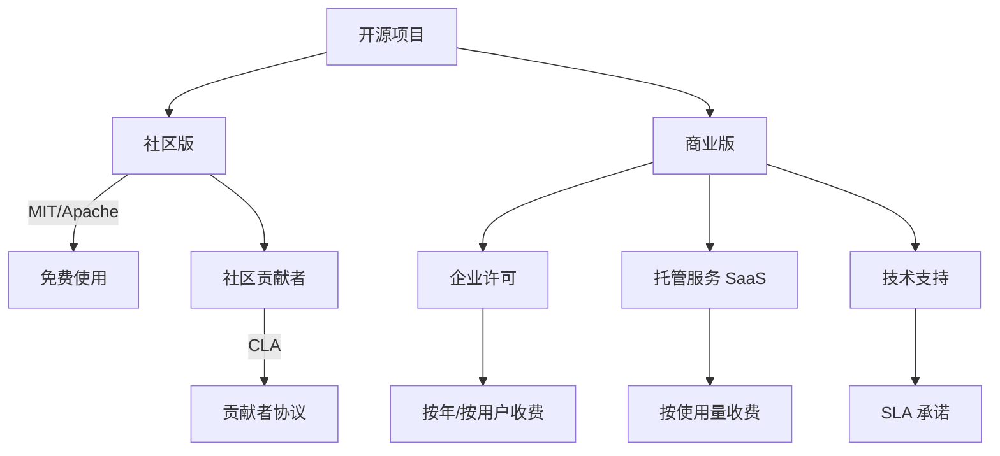

## 九、合同与法律知识

技术变现的每一步都与法律紧密相连。合同是保障劳动成果的盾牌，知识产权是无形资产的核心，税务合规是持续经营的底线。很多技术人才因为忽视法律问题，导致项目白做、收入被拖欠、甚至卷入纠纷。本章从合同签订到知识产权保护，从税务筹划到纠纷解决，系统梳理技术变现者必须掌握的法律知识。

> **阅读建议：** 本章内容较长（涵盖合同全生命周期），建议按需跳转：初次签约者重点阅读第 1-3 节（合同核心要素）；有经验者重点阅读第 5-6 节（陷阱防范与纠纷处理）；涉及用户数据者必读第 9 节（数据合规）。

**本章知识地图：**



### 1. 为什么法律知识是技术变现的必修课

技术变现的本质是将智力成果转化为经济收益。这个过程涉及多方主体、复杂权属和持续交付，任何一个环节出现法律漏洞都可能造成严重后果。

#### 1.1 技术变现中的典型法律风险

| 风险类型 | 具体场景 | 可能后果 | 发生频率 |
|----------|----------|----------|----------|
| 合同风险 | 口头约定、条款模糊 | 完成工作后对方拒付或压价 | 极高 |
| 知识产权风险 | 未约定著作权归属 | 代码被无偿使用，失去控制权 | 高 |
| 竞业限制风险 | 在职期间兼职 | 被原单位追责，赔偿违约金 | 中 |
| 税务风险 | 收入不申报 | 补税、滞纳金、罚款 | 高 |
| 保密风险 | 泄露客户商业信息 | 承担侵权赔偿责任 | 低 |
| 劳动关系风险 | 自由职业被认定为劳动关系 | 社保追缴、劳动仲裁 | 中 |
| 个人信息风险 | 违规处理用户数据 | PIPL 罚款（最高年营收 5%） | 上升中 |
| AI 工具风险 | 使用 AI 生成代码未审查版权 | 代码来源不明引发侵权纠纷 | 新兴 |

**真实案例：** 2023 年某独立开发者为一家创业公司开发小程序，口头约定费用 5 万元。开发完成后，甲方以"功能不达标"为由要求免费重做，双方无书面合同，开发者无法举证原始需求，最终仅收到 1.5 万元"辛苦费"。此类纠纷在自由职业领域每年发生数万起。裁判文书网数据显示，2023 年全国技术服务合同纠纷案件超过 4.2 万件，其中因"无书面合同"或"条款模糊"导致败诉的占比超过 35%。

**AI 时代的新案例：** 2025 年某自由开发者使用 AI 编程助手生成了项目中 60% 的代码，未进行人工审查。交付后甲方发现部分代码与 GitHub 上一个 GPL 协议项目高度相似，要求开发者承担违反开源协议的全部责任。因合同中未约定 AI 生成代码的责任归属，开发者被迫赔偿甲方重新开发的费用。

#### 1.2 常见的错误认知

**❌ "熟人不用签合同"** — 熟人纠纷占技术外包纠纷的 60% 以上。没有书面合同，维权几乎不可能。中国裁判文书网数据显示，因"碍于面子不签合同"导致的技术服务纠纷，原告胜诉率不足 30%。

**❌ "微信聊天记录就是合同"** — 聊天记录可以作为证据（《民事诉讼法》第 66 条将电子数据列为法定证据类型），但其内容通常不完整、不规范，难以覆盖关键条款。法院在审查聊天记录时，还会考虑身份确认（微信号是否对应本人）、内容完整性（是否被剪辑）、关联性（是否与本案相关）等多重因素。实务中，微信聊天记录作为合同依据的采信率约为 50%-60%，远低于书面合同的 95% 以上。

**❌ "先做完再说钱的事"** — 没有明确的付款节点，完成交付后对方可能以各种理由拖延甚至拒付。"先做需求分析看看效果"是最常见的免费劳动陷阱。

**❌ "开源代码随便用"** — 开源协议有严格限制（GPL 的传染性、Apache 的专利授权等），违规使用可能导致整个项目被迫开源。2022 年某 SaaS 公司因在闭源产品中嵌入 GPL 代码，被社区发起版权诉讼，最终被迫公开全部后端源码。

**❌ "注册个体户太麻烦"** — 实际上线上注册个体户最快 1 天完成，且综合税负可从劳务报酬的 20%-40% 降至 1.5%-3%，每年节省数万元税款。

**❌ "法律问题找律师就行"** — 事后找律师的成本远高于事前预防。一份标准合同的律师审查费 500-2,000 元，而一场技术纠纷的律师费起步 5,000-20,000 元，还不包括时间成本和机会成本。

**❌ "AI 生成的代码没有版权问题"** — AI 工具的训练数据可能包含受版权保护的代码。AI 生成代码的版权归属在法律上仍存在争议（美国版权局已裁定纯 AI 生成内容不受版权保护，中国尚无明确判例）。使用 AI 生成代码时，务必进行人工审查和改写，并在合同中明确 AI 辅助开发的责任边界。

#### 1.3 法律风险的经济影响模型

理解法律风险的经济影响，有助于做出合理的预防投入决策：



```text
风险成本 = 发生概率 × 损失金额 + 预防成本

示例计算：
- 不签合同：发生概率 30%，平均损失 20,000 元 → 期望损失 6,000 元
- 签合同成本：模板准备 2 小时 + 审查 1 小时 ≈ 500 元（按时薪计）
- 净收益：6,000 - 500 = 5,500 元 → 签合同的投入回报率为 11:1
```

**结论：** 每投入 1 元用于法律风险预防，可避免约 11 元的潜在损失。这使得合同管理成为技术变现中 ROI 最高的"投资"之一。

#### 1.4 技术变现者必备法律术语速查

技术人员看合同时经常被法律术语绕晕。以下是技术变现场景中最常遇到的法律概念，用通俗语言解释：

| 术语 | 通俗解释 | 技术类比 | 常见出现位置 |
|------|----------|----------|-------------|
| 要约 | 一方提出的明确合作意向（如报价单） | 类似 API 请求 | 合同签订前 |
| 承诺 | 对方接受要约的明确回复 | 类似 API 200 响应 | 合同签订前 |
| 不可抗力 | 无法预见、无法避免、无法克服的客观情况 | 类似"服务不可用"的 SLA 豁免条款 | 违约责任 |
| 违约金 | 违反合同时需要支付的固定金额 | 类似 SLA 违约赔偿 | 违约责任 |
| 定金 | 合同担保金，违约方丧失定金（有法律上限：合同标的额 20%） | 类似预授权冻结 | 付款条款 |
| 订金 | 预付款，不具有担保性质，通常可退 | 类似普通预付款 | 付款条款 |
| 善意第三人 | 不知情且无过错的第三方 | 类似"无过错用户" | 知识产权 |
| 格式条款 | 一方预先拟定、未经协商的条款（提供方有提示义务） | 类似 EULA/ToS | 服务协议 |
| 缔约过失 | 签约过程中因一方过错导致另一方损失 | 类似"接口调用失败但已消耗配额" | 意向协议 |
| 表见代理 | 无权代理人看起来有权签约（签约人需承担举证责任） | 类似"用过期 token 但服务端仍接受" | 合同主体 |
| 诉讼时效 | 请求法院保护权利的期限（普通 3 年，自知道权利被侵害之日起算） | 类似 API 请求的 TTL | 纠纷处理 |
| 除斥期间 | 不可延长、不适用中断的权利行使期限（如撤销权 1 年） | 类似硬超时（hard timeout） | 合同变更 |
| 同时履行抗辩权 | 对方不履行义务时，你也可以暂不履行 | 类似"先付款后交付"的依赖关系 | 付款条款 |
| 不安抗辩权 | 有证据证明对方可能丧失履行能力时，可中止履行并要求担保 | 类似"熔断机制" | 合同执行 |
| 提存 | 对方无正当理由拒收时，将标的物交公证机关保管，视为已交付 | 类似"写入死信队列" | 交付条款 |
| 连带责任 | 多个责任人中任何一人都有义务承担全部赔偿 | 类似"任一副本响应即可" | 违约责任 |
| 担保 | 第三方为债务人的履约义务提供保证 | 类似"SLA 背后的保险" | 付款条款 |
| 催告 | 正式书面通知对方在合理期限内履行义务（诉讼前置程序） | 类似"重试 + 超时告警" | 违约责任 |

> **实操提示：** 遇到不理解的法律术语，不要猜测含义。可以在中国法律服务网（12348.gov.cn）查询术语释义，或直接询问律师。合同中的每一个术语都可能影响你的权利义务，"定金"和"订金"一字之差，法律后果截然不同。

#### 1.5 何时需要请律师——成本与收益分析

很多技术变现者认为"请律师太贵"，但律师费的投入产出比远超预期。

**必须请律师的场景：**

| 场景 | 原因 | 预估费用 | 不请律师的潜在损失 |
|------|------|----------|-------------------|
| 合同金额 > 10 万元 | 条款复杂度高，差错成本大 | 1,000-3,000 元/次 | 1-10 万元 |
| 首次与企业签约 | 不熟悉企业合同套路 | 500-1,500 元/次 | 1-5 万元 |
| 涉及知识产权转让 | 权属条款专业性强 | 2,000-5,000 元/次 | 代码资产全部丧失 |
| 发生纠纷需要起诉 | 法律程序和证据要求严格 | 5,000-20,000 元 | 全部项目收入 |
| 跨境合同 | 涉及不同法域和外汇管制 | 3,000-10,000 元 | 合同无效或双重征税 |
| 注册公司/股权设计 | 影响长期经营结构 | 2,000-5,000 元 | 税务风险、股权纠纷 |

**可以自己处理的场景：**

- 合同金额 < 5,000 元的小项目（用标准模板即可）
- 熟悉的合作方续签（在原合同基础上微调）
- 标准化的技术服务协议（使用本章提供的模板）
- 简单的 NDA 签署（使用标准 NDA 模板）

**找律师的渠道与费用：**

| 渠道 | 优势 | 劣势 | 费用范围 |
|------|------|------|----------|
| 12348 法律服务热线 | 免费、方便、7×24 | 仅提供初步建议，不能代理案件 | 免费 |
| 华律网 / 找法网 | 律师多、可比较、有评价 | 质量参差不齐 | 咨询免费，代理收费 |
| 熟人推荐 | 信任度高 | 可能不够专业对口 | 因人而异 |
| 专业律所（知识产权方向） | 专业可靠、经验丰富 | 费用较高 | 500-2,000 元/小时 |
| 法律科技平台（法大大等） | 标准化、效率高 | 不适合复杂案件 | 按服务计费 |

**与律师高效沟通的技巧：**

1. **提前整理材料：** 合同全文、相关背景、对方信息、你的核心诉求
2. **明确优先级：** "我最担心的是知识产权归属"，让律师集中精力解决关键问题
3. **追问原因：** 要求律师解释修改建议的法律依据，而不只是"按惯例修改"
4. **准备问题清单：** 每次沟通前列好问题，避免漫无目的浪费计费时间
5. **要求书面成果：** 要求律师提供修改后的完整合同文本（而非口头建议），便于后续复用模板

> **省钱策略：** 首次合作时请律师审查并优化你的标准合同模板（一次性投入 1,000-3,000 元），后续同类项目直接复用优化后的模板，边际成本趋近于零。这是法律知识"复利效应"的最佳实践。

#### 1.6 职业责任保险——技术变现者的安全网

很多技术变现者从未考虑过职业责任保险（Professional Liability Insurance，也称 E&O Insurance），直到出了问题才追悔莫及。当你的代码导致客户系统宕机、数据泄露或财务损失时，即使你在合同中约定了责任上限，客户仍然可能起诉你要求赔偿。职业责任保险就是在这种时刻为你兜底的安全网。

**为什么技术变现者需要职业责任保险：**

| 场景 | 潜在损失 | 有保险 | 无保险 |
|------|----------|--------|--------|
| 代码 Bug 导致客户电商系统宕机 24 小时 | 客户索赔 10-50 万元（营业损失） | 保险公司赔付，你只承担免赔额 | 自掏腰包，可能倾家荡产 |
| 开发的 App 泄露用户数据 | PIPL 罚款 + 用户索赔 + 客户损失 | 保险覆盖法律费用和赔偿 | 承担全部费用 |
| 交付延期导致客户错过市场窗口 | 客户索赔预期利润损失 | 保险覆盖 | 自行承担 |
| 使用的开源组件引发侵权诉讼 | 律师费 + 赔偿金 | 保险覆盖法律抗辩费用 | 自行承担律师费（起步 5 万） |
| 咨询建议导致客户技术选型失误 | 客户要求赔偿迁移成本 | 保险覆盖 | 自行协商或诉讼 |

**职业责任保险的核心保障范围：**

```text
职业责任保险通常覆盖：

1. 过失责任
   - 因专业疏忽导致的客户经济损失
   - 代码缺陷、设计错误、建议不当
   - 不包括故意行为和犯罪行为

2. 知识产权侵权
   - 无意中侵犯第三方著作权、商标权
   - AI 生成代码引发的版权纠纷（部分保单覆盖）
   - 开源协议合规问题导致的索赔

3. 数据泄露责任
   - 因安全漏洞导致的用户数据泄露
   - 数据泄露通知费用、信用监控费用
   - 监管罚款（视保单条款）

4. 法律抗辩费用
   - 诉讼/仲裁的律师费、仲裁费
   - 即使最终胜诉，法律费用也由保险承担
   - 这是保险最核心的价值——覆盖"打官司的钱"

5. 合同责任
   - 因违反合同义务导致的赔偿
   - 需要在保单中特别约定
```

**保险产品对比（中国市场参考）：**

| 保险公司/平台 | 产品名称 | 年保费范围 | 保额范围 | 适合对象 | 特点 |
|--------------|----------|-----------|----------|----------|------|
| 中国人保 | IT 行业职业责任险 | 3,000-10,000 元 | 50-500 万元 | 个体户/小团队 | 国内大品牌，理赔可靠 |
| 平安产险 | 科技企业综合险 | 5,000-20,000 元 | 100-1,000 万元 | 注册企业 | 保障全面，含财产险 |
| 众安保险 | 技术服务责任险 | 1,000-5,000 元 | 10-100 万元 | 个人开发者 | 线上投保，门槛低 |
| Hiscox（国际） | Tech E&O Insurance | $500-3,000/年 | $100K-$5M | 跨境业务 | 覆盖全球客户索赔 |
| Embroker（国际） | Tech E&O | $800-5,000/年 | $1M-$10M | 出海开发者 | 定制化，覆盖美国诉讼 |

**选择保险的关键参数：**

```text
选择职业责任保险时关注以下参数：

1. 免赔额（Deductible）
   - 每次事故你需要自付的金额
   - 通常 5,000-50,000 元
   - 免赔额越低，保费越高
   - 建议：选择你能承受的最大免赔额，降低保费

2. 保额（Coverage Limit）
   - 保险公司在保期内的最高赔付总额
   - 建议：不低于年收入的 2-3 倍
   - 注意：保额有"每次事故"和"累计"两个限制

3. 保障范围（Coverage Scope）
   - 是否覆盖知识产权侵权（核心！）
   - 是否覆盖数据泄露
   - 是否覆盖跨境索赔
   - 是否覆盖 AI 辅助开发相关的纠纷

4. 除外责任（Exclusions）
   - 故意行为和犯罪行为（所有保单都排除）
   - 已知的、投保前已存在的问题
   - 某些高风险行业（如医疗、金融系统）
   - 核保前务必仔细阅读除外条款

5. 报告条款（Claims-Made vs Occurrence）
   - Claims-Made：在保期内提出索赔才赔付（大多数职业责任险采用）
   - Occurrence：在保期内发生的事故都赔付（即使之后才提出索赔）
   - Claims-Made 保单换保险公司时要注意"追溯期"衔接
```

**投保建议：**

```text
按收入规模的投保策略：

年收入 < 10 万元：
  → 暂不投保，但务必在合同中约定责任上限
  → 优先做好合同风险防范（本章第 5 节）

年收入 10-50 万元：
  → 建议投保，保额 50-100 万元
  → 年保费约 1,000-3,000 元（占收入 1%-3%）
  → 重点关注知识产权侵权和数据泄露保障

年收入 50-200 万元：
  → 强烈建议投保，保额 100-500 万元
  → 年保费约 3,000-10,000 元
  → 考虑增加网络安全责任险（Cyber Liability）

年收入 > 200 万元：
  → 必须投保，保额 500 万元以上
  → 年保费约 10,000-30,000 元
  → 建议咨询保险经纪人，定制综合保障方案
```

> **实操建议：** 很多自由职业平台（如 Upwork、Toptal）要求接单者提供职业责任保险证明。即使平台不强制，拥有保险也是向客户展示专业度的加分项——可以在提案中注明"持有职业责任保险，保额 XX 万元"，增强客户信任。

### 2. 合同的核心要素与条款设计

一份完整的技术服务合同应包含以下要素，每个要素都有其法律意义和实务要点。

**合同类型决策流程——根据项目特征选择合适的合同结构：**




#### 2.1 合同主体

合同主体必须准确、完整。错误的主体信息会导致合同无效或无法执行。

**个人对个人（最常见的自由职业场景）：**

- 甲方（委托方）：姓名、身份证号、联系地址、电话
- 乙方（受托方）：姓名、身份证号、联系地址、电话、银行账户

**个人对企业：**

- 甲方：公司全称、统一社会信用代码、法定代表人、注册地址
- 乙方：个人姓名、身份证号

**企业对企业（注册个体户后的场景）：**

- 甲方：公司全称、统一社会信用代码、法定代表人、注册地址
- 乙方：个体户名称、统一社会信用代码、经营者姓名、注册地址

**核实对方身份的方法：**

| 核实对象 | 核实工具 | 核实内容 | 注意事项 |
|----------|----------|----------|----------|
| 企业 | 国家企业信用信息公示系统（www.gsxt.gov.cn） | 营业执照状态、注册资本、经营范围 | 注意是否被列入经营异常名录 |
| 企业 | 天眼查 / 企查查 | 诉讼记录、股权结构、关联风险 | 免费版即可查看基本信息 |
| 个人 | 中国执行信息公开网 | 是否为失信被执行人 | 失信被执行人无法正常履约 |
| 个人 | 身份证复印件 | 姓名、身份证号真实性 | 要求提供原件核对后留存复印件 |
| 签约代表 | 法人授权委托书 | 是否有签约权限 | 与非法定代表人签约时必须核实 |

> **实操提示：** 与企业签约时，务必确认签约人是否有授权。要求对方提供法人授权委托书，避免与无权代理人签约导致合同无效。如果对方是项目经理或商务人员代签，必须有公司盖章的授权文件。

**快速核实话术：**

```text
"为了确保合同的法律效力，麻烦您提供一下贵公司的营业执照副本扫描件
和签约代表的授权委托书。我们这边也会同步提供营业执照/身份证信息。
这是双方合作的基本保障，相信您理解。"
```

#### 2.2 项目范围（Scope of Work）

项目范围是技术合同中最容易引发争议的部分。模糊的需求描述是纠纷的温床。

**一个合格的项目范围描述应包含四个层次：**

**第一层：功能清单（Feature List）**

```text
1. 功能清单
   - 逐条列出需要实现的功能，每个功能独立编号（如 F-001、F-002）
   - 每个功能附带验收标准（可量化、可测试）
   - 明确标注优先级：P0（必须实现）、P1（重要但可延期）、P2（可选功能）
   - 功能之间的依赖关系需要标注
```

**第二层：技术要求**

```text
2. 技术要求
   - 开发语言和框架版本（如 Python 3.11 + Django 4.2）
   - 运行环境（操作系统版本、浏览器兼容性要求、移动端适配范围）
   - 性能指标（并发用户数、API 响应时间 P99、数据库容量上限）
   - 安全要求（HTTPS、数据加密方式、认证机制）
   - 兼容性要求（最低 iOS/Android 版本、最低浏览器版本）
```

**第三层：交付物清单**

```text
3. 交付物清单
   - 源代码（含必要注释，注释覆盖率不低于 30%）
   - 数据库设计文档（ER 图 + 字段说明）
   - API 文档（Swagger/OpenAPI 格式）
   - 部署文档（含环境配置、部署步骤、回滚方案）
   - 用户操作手册
   - 测试报告（单元测试覆盖率 ≥ 80%，集成测试用例）
   - 项目交接文档（架构说明、关键逻辑说明、已知问题清单）
```

**第四层：不包含的内容（Exclusions）**

```text
4. 不包含的内容（明确排除，防止范围蔓延）
   - 不含服务器采购、域名注册和备案
   - 不含第三方 API 的申请和费用
   - 不含后续运维和 Bug 修复（超出保修期后按另行约定）
   - 不含 UI/UX 设计（如由甲方提供设计稿）
   - 不含数据迁移和历史数据清洗
   - 不含培训服务（如需培训另行报价）
```

**表格化项目范围示例：**

| 模块 | 功能编号 | 功能点 | 优先级 | 验收标准 | 预估工时 |
|------|----------|--------|--------|----------|----------|
| 用户注册 | F-001 | 手机号注册 | P0 | 成功发送验证码并完成注册，成功率 ≥ 99% | 8h |
| 用户注册 | F-002 | 微信登录 | P1 | OAuth2.0 授权成功，获取用户头像和昵称 | 12h |
| 数据面板 | F-003 | 图表展示 | P0 | ECharts 渲染 5 种图表，数据加载 ≤ 2s | 16h |
| 数据面板 | F-004 | 数据导出 | P2 | 支持 CSV/Excel 格式，单次导出上限 10 万行 | 8h |
| 数据面板 | F-005 | 数据筛选 | P0 | 支持按日期、类别、关键词筛选，响应 ≤ 500ms | 12h |

**需求确认的谈判话术：**

```text
场景：甲方说"你先按这个做，后面再调整"

回应话术：
"理解，需求确实可能在开发过程中细化。我的建议是：
1. 我们先把目前已知的需求以附件形式写入合同，作为第一阶段的交付范围
2. 后续调整的需求，我们走'需求变更确认单'流程——
   我评估工时和费用影响，双方签字确认后再开发
3. 这样既不影响灵活性，又能确保双方对工作量有清晰的预期

您觉得这样安排可以吗？"
```

#### 2.3 报酬与支付条款

支付条款是合同的核心利益条款，必须精确到每一个细节。

**常见的支付模式及适用场景：**

| 支付模式 | 比例分配 | 适用场景 | 风险分析 | 推荐指数 |
|----------|----------|----------|----------|----------|
| 固定总价 | 一次性或分期 | 需求明确、范围固定 | 乙方承担范围蔓延风险，甲方承担需求不清风险 | ⭐⭐⭐ |
| 按里程碑 | 30%+40%+30% | 中大型项目 | 双方风险均衡，推荐大多数项目使用 | ⭐⭐⭐⭐⭐ |
| 按工时 | 月结或周结 | 需求不明确、长期合作 | 甲方承担效率风险，乙方承担需求变更风险 | ⭐⭐⭐⭐ |
| 混合模式 | 基础费+绩效 | 产品开发、持续迭代 | 激励效果好但计算复杂，绩效指标必须客观 | ⭐⭐⭐ |
| 订阅模式 | 月费/年费 | 持续维护、技术支持 | 乙方收入稳定，但需要持续投入 | ⭐⭐⭐⭐ |

**里程碑支付的标准写法：**

```text
付款安排：
第一期（预付款）：合同签订后 3 个工作日内，甲方支付项目总价的 30%，
即人民币 ¥15,000 元（大写：壹万伍仟元整）。

第二期（中期款）：乙方完成核心功能开发（F-001、F-003、F-005）
并经甲方书面验收确认后 3 个工作日内，甲方支付项目总价的 40%，
即人民币 ¥20,000 元（大写：贰万元整）。

第三期（尾款）：乙方完成全部交付物并通过甲方最终验收后 3 个工作日内，
甲方支付项目总价的 30%，即人民币 ¥15,000 元（大写：壹万伍仟元整）。

逾期付款：甲方逾期付款的，每逾期一日按未付金额的万分之五支付违约金。
逾期超过 30 日的，乙方有权暂停服务并解除合同。
```

**必须写入合同的支付细节：**

- 总价是否含税（明确税率和发票类型，如"含 1% 增值税，开具增值税普通发票"）
- 逾期付款的违约金（通常为日万分之五，法律支持的上限为年化 24%）
- 付款方式（银行转账需提供开户行全称和账号，支付宝/微信需确认实名账户）
- 付款条件（验收后几天内付款，建议不超过 7 个工作日）
- 预付款是否可退（中途解约时的处理方案，建议约定"因甲方原因解约不退，因乙方原因解约全退"）
- 币种和汇率（跨境项目必须约定）

**预付款谈判话术：**

```text
场景：甲方说"我们公司流程是验收后才付款，没有预付款"

回应话术：
"理解贵公司的流程。不过作为开发者，我需要投入大量时间成本，
预付款是对双方的一种保障。我的建议是：
1. 预付款比例可以降低到 20%（而非行业惯例的 30%）
2. 或者我们可以约定：预付款在第一期中期款中抵扣
3. 如果贵公司确实无法预付，我可以接受按周结算工时的方式，
   每周五提交工时报告，下周一结算上周费用

这样既符合贵公司流程，也保护了我的基本权益。"
```

#### 2.4 工期与交付

```text
工期条款模板：

1. 项目总工期：自合同签订之日起 30 个工作日（约 6 周）

2. 里程碑节点：
   - M1 需求确认：第 3 个工作日 — 甲方签署需求确认书
   - M2 原型设计：第 7 个工作日 — 甲方确认原型稿
   - M3 开发完成：第 25 个工作日 — 核心功能可演示
   - M4 测试验收：第 30 个工作日 — 全部功能通过验收测试

3. 延期处理规则：
   - 甲方原因（需求变更、资料提供不及时、验收延迟）：
     工期顺延相应天数，乙方不承担违约责任
   - 乙方原因导致的延期：
     每延迟一个工作日扣除合同总价的 0.5%，上限为合同总价的 20%
   - 不可抗力（自然灾害、政策变化、疫情等）：
     双方协商处理，任何一方不承担违约责任
   - 需求变更导致的工期调整：
     双方签署《需求变更确认单》，明确新增工时和费用调整

4. 交付方式：
   - 源代码：通过 Git 仓库交付（甲方指定或乙方提供私有仓库）
   - 文档：PDF 格式通过邮件或云盘交付
   - 部署：提供 Docker 镜像或部署脚本，甲方自行部署或乙方远程协助

5. 验收流程：
   - 甲方收到交付物后 5 个工作日内完成验收
   - 验收标准以本合同附件《项目范围》中约定的验收标准为准
   - 甲方逾期未提出书面异议，视为验收通过
   - 甲方提出的修改意见应一次性汇总提交，不得分批次提出
```

#### 2.5 知识产权归属

这是技术合同中最关键也最容易被忽略的条款。根据《著作权法》第十七条（2020 年修正），委托作品的著作权归属由合同约定；没有约定的，著作权属于受委托方（即开发者）。这意味着：**如果你不签合同，默认情况下代码的著作权属于你**——但实务中甲方通常要求获得全部权利，所以必须在合同中明确约定。

**知识产权归属的几种模式：**

| 归属模式 | 含义 | 适用场景 | 对开发者的影响 | 推荐度 |
|----------|------|----------|----------------|--------|
| 全部转让 | 所有权利归甲方 | 定制开发、外包 | 失去代码的任何使用权 | ❌ 尽量避免 |
| 许可使用 | 甲方获得使用权，著作权仍归乙方 | 产品授权、SaaS | 可以复用代码，但需保证甲方独占性 | ⭐⭐⭐ |
| 共同所有 | 双方共同持有 | 合作开发 | 需协商一致才能许可第三方 | ⭐⭐ |
| 保留通用模块 | 定制部分归甲方，通用模块归乙方 | 工具开发、组件封装 | 最佳实践，兼顾双方利益 | ⭐⭐⭐⭐⭐ |
| 分级授权 | 基础使用权归甲方，商业使用权需额外付费 | 开源商业化 | 可持续变现，但管理复杂 | ⭐⭐⭐⭐ |

**推荐的知识产权条款写法：**

```text
知识产权归属条款：

1. 本项目定制开发的源代码（不含通用模块，通用模块清单见附件三）
   的著作权自甲方付清全部合同款项之日起转移至甲方。

2. 乙方在开发过程中使用的通用工具库、基础框架、公共组件
  （详见附件三《通用模块清单》，以下简称"通用模块"）
   著作权归乙方所有，甲方获得永久、不可撤销、非独占的免费使用权，
   仅限于本项目范围内使用。

3. 乙方有权将通用模块用于其他项目，但不得将甲方的定制功能、
   业务逻辑或商业信息泄露给第三方。

4. 甲方未付清全部款项前，定制代码的著作权不发生转移。
   在此期间，甲方不得将未付款的代码用于商业用途或转让给第三方。

5. 甲方获得著作权后，乙方保留在技术文章、开源项目、个人作品集中
   引用本项目技术方案的权利（不涉及甲方商业信息）。

6. 关于 AI 辅助开发：乙方在开发过程中使用 AI 编程工具（如 GitHub Copilot、
   Cursor 等）辅助生成的代码，乙方保证已进行人工审查和改写，
   确保不侵犯第三方知识产权。因 AI 生成代码引发的知识产权纠纷，
   由乙方承担责任。甲方同意乙方使用 AI 辅助工具提高开发效率。
```

> **关键提醒：** 第四条（付款才转移权利）是保护开发者最重要的条款。如果甲方拖欠尾款，你仍然拥有代码的著作权，可以据此追讨欠款。实务中，很多开发者在甲方拖欠尾款后才发现合同中写了"签订即转让"，丧失了最重要的谈判筹码。

**通用模块清单示例：**

| 模块名称 | 功能描述 | 代码行数 | 是否含甲方业务逻辑 |
|----------|----------|----------|-------------------|
| utils-auth | 通用认证组件 | 800 行 | 否 |
| utils-cache | 缓存工具封装 | 450 行 | 否 |
| utils-log | 日志组件 | 300 行 | 否 |
| ui-components | 通用 UI 组件库 | 2,200 行 | 否 |
| db-migration | 数据库迁移工具 | 600 行 | 否 |

#### 2.6 保密条款

技术开发者在项目中必然接触甲方的商业信息、技术方案和业务数据。保密条款既是义务也是保护。

**保密条款的核心要素：**

```text
保密协议（NDA）核心条款：

1. 保密信息的定义：
   明确列举属于保密信息的内容类型：
   - 源代码、技术文档、架构设计
   - 商业计划、财务数据、定价策略
   - 客户名单、用户数据、市场分析
   - 本合同的存在及其条款内容
   
   明确排除不属于保密信息的内容：
   - 已公开的信息
   - 开发方在签约前已合法知悉的信息
   - 第三方合法提供的信息
   - 开发方独立开发的信息

2. 保密义务：
   - 不得向任何第三方披露保密信息
   - 不得将保密信息用于本合同以外的目的
   - 采取合理的安全措施保护保密信息
   - 仅在"需要知道"的基础上向团队成员披露

3. 保密期限：
   - 合同存续期间及合同终止后 2 年
   - 核心商业秘密（需单独列明）：永久保密

4. 违约责任：
   - 泄密方应赔偿因此造成的全部直接损失
   - 如损失难以计算，违约金为合同总价的 30%
   - 甲方有权立即终止合同并要求退款
```

**注意保密义务的双向性：** 甲方也应对乙方的技术方案、开发工具和工作方法承担保密义务。很多甲方起草的合同只约束乙方，这是不公平的。建议在谈判中加入对等条款："甲方对乙方在项目中展示的技术方案、代码实现方式和工具链承担保密义务，期限与乙方保密义务相同。"

**保密义务与竞业限制的区别：**

| 维度 | 保密义务 | 竞业限制 |
|------|----------|----------|
| 含义 | 不泄露特定信息 | 不从事竞争性业务 |
| 是否需要补偿 | 不需要 | 必须支付补偿金（月均工资 30%） |
| 期限限制 | 可约定较长 | 最长 2 年（《劳动合同法》第 24 条） |
| 适用对象 | 所有合同相对方 | 仅限劳动关系和高级管理人员 |
| 自由职业场景 | 适用 | 一般不适用（非劳动关系） |

#### 2.7 违约责任

违约责任条款必须对等——只约束一方的违约责任是不公平合同，法院可以据此调整。

```text
违约责任条款模板：

甲方违约：
1. 逾期付款：按未付金额的日万分之五支付违约金
2. 单方面终止合同（非因乙方违约）：
   已付款项不予退还，并支付剩余未付款项的 30% 作为违约金
3. 逾期验收：超过约定验收期限 5 个工作日未提出书面异议，
   视为验收通过，甲方应立即支付对应款项
4. 违反保密义务：赔偿乙方因此遭受的直接经济损失

乙方违约：
1. 逾期交付：每延迟一个工作日扣除合同总价的 0.5%，
   上限为合同总价的 20%
2. 质量不达标：甲方有权要求免费修改，
   修改后仍不达标可解除合同并要求退还对应阶段款项
3. 单方面终止：退还已收全部款项，
   并支付合同总价的 30% 作为违约金
4. 违反保密义务：赔偿甲方因此遭受的直接经济损失，
   包括但不限于甲方的直接经济损失和合理的维权费用

共同约定：
- 任何一方的赔偿责任总额不超过合同总价
- 违约金不足以弥补实际损失的，违约方应补足差额
- 不可抗力导致的违约，免除违约责任
```

#### 2.8 争议解决

```text
争议解决条款模板（二选一）：

方案一 — 诉讼：
因本合同引起的或与本合同有关的争议，双方应首先友好协商解决。
协商不成的，任何一方可向合同签订地有管辖权的人民法院提起诉讼。

方案二 — 仲裁：
因本合同引起的或与本合同有关的争议，双方应首先友好协商解决。
协商不成的，提交 [城市名] 仲裁委员会按照其仲裁规则进行仲裁。
仲裁裁决是终局的，对双方均有约束力。
```

**诉讼 vs 仲裁的选择：**

| 维度 | 诉讼 | 仲裁 | 建议 |
|------|------|------|------|
| 费用 | 较低（标的额 1%-2.5%） | 较高（标的额 2%-4%） | 小额选诉讼 |
| 周期 | 较长（一审 3-6 个月） | 较短（通常 2-3 个月） | 急需解决选仲裁 |
| 上诉 | 可以上诉（二审再加 3 个月） | 一裁终局，不可上诉 | 想要终局选仲裁 |
| 保密 | 公开审理（裁判文书上网） | 不公开审理 | 涉密选仲裁 |
| 执行 | 直接执行 | 需法院确认后执行 | 差异不大 |
| 灵活性 | 程序严格 | 可约定程序规则 | 复杂案件选仲裁 |
| 适用场景 | 小额争议、需要上诉权 | 大额或需保密的争议 | — |

> **实操建议：** 对于 10 万元以下的技术服务合同，选择诉讼更经济；对于 10 万元以上或涉及核心商业秘密的项目，选择仲裁更合适。仲裁机构建议选择中国国际经济贸易仲裁委员会（CIETAC）或当地知名仲裁委。

#### 2.9 合同的生效、变更与终止

很多技术合同缺少生效条件和终止条款，导致在项目中止时无法妥善处理。

```text
合同生命周期条款：

1. 生效条件：
   本合同自双方签字（盖章）之日起生效。
   如需甲方支付预付款后生效，则约定"自甲方支付第一期款项之日起生效"。

2. 合同变更：
   任何对合同内容的变更，须经双方书面协商一致，
   签署《补充协议》或《需求变更确认单》。
   口头变更无效。

3. 提前终止：
   - 双方协商一致可随时终止
   - 一方严重违约（逾期超过 30 日），另一方可书面通知终止
   - 不可抗力持续超过 60 日，任何一方可终止
   
4. 终止后的处理：
   - 乙方应交付已完成的部分成果
   - 甲方应支付已完成部分的对应款项
   - 已交付的源代码按知识产权条款处理
   - 双方继续承担保密义务
```

#### 2.10 合同签署后发现问题的补救路径

很多技术变现者在签完合同后才发现条款对自己不利。签了不代表无法补救——根据问题的严重程度和发现时间，有不同的应对策略。

**发现问题的时间窗口与对应策略：**



**五种补救方式详解：**

```text
方式一：签订补充协议（最常用、最有效）
━━━━━━━━━━━━━━━━━━━━━━━━━━━━━━━━━━━━
适用场景：发现不公平条款，但双方仍有合作意愿
操作步骤：
  1. 整理需要修改的条款清单
  2. 说明修改理由（从"对双方都好"的角度出发）
  3. 起草《补充协议》，明确修改哪些条款
  4. 双方签字盖章，补充协议与原合同具有同等法律效力

话术模板：
"在项目推进过程中，我发现合同中 [具体条款] 的表述
可能存在理解歧义。为了避免后续执行中产生分歧，
我建议我们签订一份补充协议，将该条款明确为 [修改内容]。
这样对双方的合作都更有保障。"

方式二：邮件确认（固定有利解释）
━━━━━━━━━━━━━━━━━━━━━━━━━━━━━━━━━━━━
适用场景：条款有歧义，但可以朝对你有利的方向解释
操作步骤：
  1. 发送邮件给对方，阐述你对该条款的理解
  2. 明确请求对方确认："请确认我的理解是否正确"
  3. 对方回复确认后，该邮件即成为合同解释的补充依据

法律依据：《民法典》第 142 条——意思表示的解释
应按照所使用的词句，结合相关条款、行为的性质和目的、
习惯以及诚信原则，确定意思表示的含义。

方式三：行使不安抗辩权（对方可能无法履约时）
━━━━━━━━━━━━━━━━━━━━━━━━━━━━━━━━━━━━
适用场景：发现对方可能丧失履约能力（如经营异常、涉诉）
操作步骤：
  1. 收集对方可能无法履约的证据
  2. 书面通知对方中止履行
  3. 要求对方提供担保
  4. 对方在合理期限内未恢复履约能力且未提供担保的，
     可以解除合同

法律依据：《民法典》第 527-528 条

方式四：主张格式条款无效（对方提供的模板合同）
━━━━━━━━━━━━━━━━━━━━━━━━━━━━━━━━━━━━
适用场景：对方使用预先拟定的格式合同，且含有不公平条款
可主张无效的情形：
  - 免除对方责任、加重你方责任、排除你方主要权利
  - 未采取合理方式提示你注意重大利害关系条款
  - 对格式条款有两种以上解释，应作出不利于提供方的解释

法律依据：《民法典》第 496-498 条

方式五：协商变更合同（双方同意修改）
━━━━━━━━━━━━━━━━━━━━━━━━━━━━━━━━━━━━
适用场景：合同执行过程中，客观情况发生重大变化
操作步骤：
  1. 书面提出变更请求，说明变更原因
  2. 协商新的条款
  3. 签订变更协议或补充协议

法律依据：《民法典》第 533 条（情势变更原则）
```

> **核心原则：** 补救的最佳时机永远是"签约前"。如果签约前无法发现问题，开工前是第二佳窗口——此时双方的合作尚未深入，修改合同的阻力最小。一旦项目已经交付，你的谈判筹码将大幅减少。


**补救实操案例——行使不安抗辩权：**

> 某后端开发者与一家创业公司签订了 8 万元的 SaaS 系统开发合同，约定"3-4-3"付款。第一期预付款 2.4 万元按期到账，开发者完成需求分析和数据库设计后进入开发阶段。开发进行到第 3 周时，开发者偶然发现甲方在天眼查上有 3 条未结的供应商欠款诉讼（总金额 40 万元），同时甲方对第一期中期验收的需求确认已拖延 10 天未回复。
>
> **开发者的应对过程：**
>
> 1. **收集证据（第 1 天）：** 通过天眼查下载甲方的诉讼记录截图，保存甲方拖延回复的聊天记录，导出自己的 Git 提交记录（证明已完成 60% 的开发工作量）。
>
> 2. **书面通知中止履行（第 2 天）：** 发送正式邮件，引用《民法典》第 527 条，说明有确切证据证明甲方存在丧失履行能力的风险，中止项目开发，要求在 10 个工作日内提供银行保函、第三方担保或提前支付第二期中期款项。
>
> 3. **等待期限届满（第 12 天）：** 甲方仅回复措辞含糊的邮件（"公司资金没问题，项目继续推进"），未提供任何担保。
>
> 4. **正式解除合同（第 13 天）：** 发送《合同解除通知函》，引用《民法典》第 528 条。合同自通知到达甲方时解除。
>
> 5. **清算处理：** 已完成工作量（需求分析 + 数据库设计 + 60% 后端开发）按工时折算约 4.8 万元，已收预付款 2.4 万元，开发者主张甲方支付差额 2.4 万元。通用模块著作权归开发者所有，定制代码因甲方未付清款项著作权不转移（合同约定"付款完成才转移"）。
>
> **结果：** 双方协商后甲方支付 2 万元差额了结。开发者损失约 0.4 万元预期利润，但避免了继续投入 4 周开发后可能面临的 3.2 万元尾款拖欠风险。
>
> **关键教训：**（1）时刻关注甲方信用状况（天眼查/企查查定期检查，建议每周查看一次）；（2）不安抗辩权必须有"确切证据"，不能仅凭猜测——天眼查上的诉讼记录、经营异常名录、失信被执行人名单均可作为证据；（3）中止通知和解除通知必须书面发送（邮件 + 快递），保留送达证据；（4）中止履行期间不要继续开发，否则可能被认定为放弃不安抗辩权。

**合同解除后的清算处理规则：**

```text
合同解除后的资产清算清单：

1. 已完成工作量的结算
   ├── 因甲方违约导致解除：按已完成工作量比例结算
   │   （甲方应支付对应款项，已付预付款不退还）
   ├── 因乙方违约导致解除：退还对应阶段款项
   │   （甲方有权要求赔偿损失）
   └── 协商解除：按双方约定的比例结算

2. 源代码处理
   ├── 定制代码：按知识产权条款处理
   │   ├── 甲方已付清 → 著作权转移至甲方
   │   └── 甲方未付清 → 著作权归乙方，甲方不得使用
   ├── 通用模块：著作权始终归乙方
   │   └── 甲方已获授权的，授权随合同终止而终止
   └── 甲方提供的原始数据和素材：全部退还或销毁

3. 保密义务：合同终止后继续有效（通常 2-3 年）
4. 竞业限制（如有）：合同终止后继续有效（需甲方支付补偿金）
5. 未结清款项的追讨：书面催款 → 协商还款 → 诉讼/仲裁
```

#### 2.11 电子合同与数字签名的法律效力

随着远程协作的普及，电子合同在技术变现中的使用越来越频繁。了解其法律效力至关重要。

**法律依据：**

《电子签名法》（2019 年修正）第十四条规定："可靠的电子签名与手写签名或者盖章具有同等的法律效力。"《民法典》第四百六十九条将数据电文（包括电子数据交换、电子邮件）列为书面形式的一种。

**电子签名的可靠性标准：**

| 标准 | 要求 | 说明 |
|------|------|------|
| 专有性 | 电子签名制作数据由签名人专有 | 签名密钥不能被他人控制 |
| 控制性 | 签名时由签名人控制 | 签署行为是本人意愿 |
| 可检测性 | 签署后对签名的任何改动可被发现 | 保证签名完整性 |
| 可检测性 | 签署后对内容的任何改动可被发现 | 保证合同内容完整性 |

**常用电子合同平台对比：**

| 平台 | 法律效力 | 费用 | 特点 |
|------|----------|------|------|
| 法大大 | 可靠电子签名 | 按份计费，约 5-15 元/份 | 司法判例支持率高，对接法院系统 |
| e签宝 | 可靠电子签名 | 按份计费 | 蚂蚁集团旗下，支付宝生态集成好 |
| 上上签 | 可靠电子签名 | 按份计费 | 企业级功能完善 |
| 腾讯电子签 | 可靠电子签名 | 免费版有限额 | 微信小程序签署，适合个人 |
| 邮件确认 | 证据效力较弱 | 免费 | 作为补充证据，不建议作为唯一签署方式 |

**电子合同签署实操（以腾讯电子签为例）：**

```text
使用腾讯电子签签署合同的完整流程：

第一步：注册与认证（10 分钟）
- 微信搜索"腾讯电子签"小程序
- 完成实名认证（身份证 + 人脸识别）
- 设置电子签名（手写签名或系统生成）

第二步：创建合同（5 分钟）
- 点击"发起合同"
- 上传合同文件（PDF/Word）
- 设置签署区域（拖拽签名框到指定位置）
- 添加签署方信息（姓名、手机号）

第三步：发送签署邀请
- 系统自动发送短信/微信通知给对方
- 对方点击链接完成实名认证和签署
- 双方签署完成后，合同自动归档

第四步：下载与存证
- 签署完成后双方均可下载合同 PDF
- 合同带有时间戳和签署方认证信息
- 平台存证可用于司法举证

费用：免费版每月可签 5 份，超出后约 5 元/份
法律效力：已接入多家互联网法院，司法认可度高
```

> **实务建议：** 对于 5,000 元以下的小项目，微信/邮件确认 + 转账记录可以作为基础保障；对于 5,000 元以上的项目，建议使用专业电子合同平台签署；对于重大合同（10 万元以上），建议线下签署纸质合同或使用 CA 证书的电子签名。

**电子合同的典型纠纷案例：**

> 2024 年某自由开发者通过微信与甲方确认了一份 3 万元的小程序开发需求，双方在微信中讨论了功能清单、价格和工期，甲方微信转账支付了 30% 预付款。开发完成后，甲方以"功能与预期不符"为由拒绝支付尾款。开发者起诉后，法院审查微信聊天记录时遇到三个问题：（1）甲方微信号未实名认证，身份确认需额外举证；（2）聊天记录中对"功能清单"的描述分散在多条消息中，缺乏系统性；（3）关键的验收标准仅以语音消息沟通，无法作为文本证据。最终法院虽然支持了开发者的部分诉求，但因证据不完整，仅判决甲方支付 1.8 万元（而非剩余的 2.1 万元）。
>
> **教训：** 微信沟通可以作为合同的补充，但关键条款（功能清单、验收标准、付款节点）必须以书面文件确认。使用电子合同平台（如法大大、腾讯电子签）签署正式合同，每份仅需 5-15 元，却能避免数千甚至数万元的损失。

### 3. 知识产权保护实务

#### 3.1 著作权保护

软件著作权是技术变现者最重要的知识产权之一。

**著作权自动获得原则：** 中国《著作权法》规定，作品自创作完成之日起自动获得著作权，无需登记。但登记有巨大的实务价值——在没有相反证据的情况下，登记证书可以直接作为权属证明。

**软件著作权登记的六大作用：**

1. **诉讼举证：** 在著作权纠纷中，登记证书可以直接作为权属证明，被告需要举证推翻。没有登记证书的开发者需要提供大量创作过程证据（Git 提交记录、开发日志等），举证难度大增。

2. **企业资质申请：** 申请高新技术企业认定、政府科技补贴、创新基金等，软件著作权是必要条件之一。

3. **商业谈判筹码：** 拥有著作权登记证书可以在技术授权、合作开发谈判中增强议价能力。

4. **税收优惠：** 软件著作权可以作为无形资产进行评估，用于技术入股、质押融资等。

5. **招投标加分：** 很多政府和企业招标项目将软件著作权作为加分项。

6. **品牌保护：** 防止他人抄袭后抢先登记，导致原创者反而需要维权。

**登记流程详解：**

```text
软件著作权登记全流程：

第一步：准备材料（1-3 天）
├── 源代码文档
│   ├── 前 30 页 + 后 30 页（共 60 页）
│   ├── 每页 50 行，纯文本格式
│   ├── 去除空行和注释（保留必要的功能注释）
│   └── 页眉标注"软件名称 V1.0"
├── 软件说明书
│   ├── 功能说明（不少于 10 页）
│   ├── 运行环境说明
│   ├── 操作界面截图（带注释）
│   └── 技术架构说明
└── 身份证明
    ├── 个人：身份证正反面复印件
    └── 企业：营业执照副本复印件 + 法人身份证

第二步：在线申请（1 天）
├── 登录中国版权保护中心（www.ccopyright.com.cn）
├── 注册账号（个人或企业账号）
├── 填写《计算机软件著作权登记申请表》
├── 上传全部材料
└── 确认提交

第三步：审核阶段
├── 普通审核：30 个工作日
├── 加急审核：10 个工作日（额外费用约 500 元）
├── 特急审核：3-5 个工作日（额外费用约 1,500 元）
└── 补正：如有材料问题，30 天内补正

第四步：获得证书
├── 《计算机软件著作权登记证书》
├── 证书有效期：永久（无需年审）
└── 可通过中国版权保护中心官网查询验证
```

**登记费用明细：**

| 项目 | 官方费用 | 代理费用 | 合计 |
|------|----------|----------|------|
| 普通登记 | 免费 | 300-800 元 | 300-800 元 |
| 加急（10 工作日） | 免费 | 800-1,500 元 | 800-1,500 元 |
| 特急（3-5 工作日） | 免费 | 1,500-3,000 元 | 1,500-3,000 元 |

> **建议：** 对于核心技术资产，不要省代理费。代理机构可以帮你规避常见驳回原因（如源代码格式不规范、说明书描述过于简单），提高一次通过率。

#### 3.2 专利保护

软件专利在中国可以通过"方法专利"或"系统专利"来保护。适合具有创新性的算法、架构或业务方法。

**可专利的软件创新类型：**

| 创新类型 | 示例 | 专利类型 | 授权难度 |
|----------|------|----------|----------|
| 新算法 | 改进的推荐算法、压缩算法 | 方法专利 | 高 |
| 技术架构 | 分布式处理方法、缓存策略 | 方法专利/系统专利 | 中 |
| 硬件结合 | 物联网控制方法、传感器数据处理 | 方法专利 | 中 |
| 商业方法 | 基于区块链的溯源方法 | 方法专利 | 高 |
| 数据处理 | 特征数据的提取和分析方法 | 方法专利 | 中 |
| 人机交互 | 创新的手势识别方法 | 方法专利 | 中 |

**不适合申请专利的情况：**

- 纯粹的 UI 设计 → 用著作权保护
- 通用的 CRUD 应用 → 无创新性，无法授权
- 已被广泛使用的技术方案 → 缺乏新颖性
- 生命周期短的技术 → 专利审查周期 1-3 年，可能技术已过时
- 核心算法不想公开 → 专利需要公开技术方案，不如用商业秘密保护

**专利申请流程与成本：**

```text
发明专利申请流程：

1. 前期检索（1-2 周）
   - 在国家知识产权局专利检索系统（pss-system.cponline.cnipa.gov.cn）
     检索是否有相同或近似的已有专利
   - 费用：自行检索免费，专业检索 500-2,000 元

2. 撰写申请文件（2-4 周）
   - 权利要求书（保护范围的法律界定）
   - 说明书（技术方案的详细描述）
   - 说明书附图（流程图、架构图等）
   - 摘要
   - 费用：代理撰写 5,000-15,000 元

3. 提交申请
   - 通过专利电子申请系统提交
   - 官方费用：申请费 950 元（个人减免后 150 元）

4. 审查阶段（12-36 个月）
   - 初步审查（3-6 个月）
   - 公开（申请后 18 个月自动公开，可请求提前公开）
   - 实质审查（请求后 12-24 个月）
   - 官方费用：实质审查费 2,500 元（个人减免后 375 元）

5. 授权与维护
   - 授权后缴纳年费（第 1-3 年 900 元/年，逐年递增）
   - 保护期限：发明专利 20 年，实用新型 10 年
```

**实用新型 vs 发明专利选择：**

| 维度 | 发明专利 | 实用新型 |
|------|----------|----------|
| 保护对象 | 方法、系统、产品 | 产品形状、构造 |
| 审查方式 | 实质审查 | 初步审查 |
| 授权周期 | 18-36 个月 | 6-12 个月 |
| 保护期限 | 20 年 | 10 年 |
| 授权率 | 约 50%-60% | 约 80%-90% |
| 软件相关 | 方法专利 | 系统专利（需结合硬件） |

> **实务建议：** 对于技术变现者，除非是颠覆性创新，否则优先考虑著作权保护 + 商业秘密保护的组合，而不是专利。专利的高成本和长周期使其不适合大多数自由职业场景。将专利资源集中在真正有商业价值的核心技术上。

#### 3.3 开源协议合规

在开发中使用开源组件是常态，但必须遵守各协议的要求。违反开源协议构成著作权侵权，可能面临禁令和赔偿。

**主流开源协议对比：**

| 协议 | 核心要求 | 传染性 | 商业使用 | 专利授权 | 典型项目 |
|------|----------|--------|----------|----------|----------|
| MIT | 保留版权声明和许可声明 | 无 | 允许 | 无明确条款 | React, jQuery, Vue.js |
| Apache 2.0 | 保留声明 + 标注修改 + NOTICE 文件 | 无 | 允许 | 有（明确的专利许可） | Android, Kubernetes, TensorFlow |
| BSD 2/3-Clause | 保留版权声明 | 无 | 允许 | 无明确条款 | FreeBSD, Nginx |
| ISC | 保留版权声明 | 无 | 允许 | 无明确条款 | Node.js 依赖 |
| LGPL | 修改库本身需开源，使用库的应用不受限 | 弱（仅库本身） | 允许 | 无明确条款 | GNU C Library, Qt |
| GPL | 衍生作品必须以 GPL 发布 | 强 | 允许但需开源 | 有（自动授予） | Linux Kernel, GCC |
| AGPL | 通过网络提供服务也算分发，需开源 | 最强 | 允许但需开源 | 有（自动授予） | MongoDB (旧版), Nextcloud |
| CC BY-NC | 署名 + 非商业使用 | N/A | 不允许商用 | N/A | 部分文档、素材 |

**"传染性"的法律含义：**



**开源合规检查清单：**

```text
项目开源合规审查：

□ 建立完整的软件物料清单（SBOM）
  - 列出所有直接依赖和间接依赖
  - 记录每个依赖的名称、版本、协议
  - 工具：npm license-checker、pip-licenses、FOSSA

□ 检查协议兼容性
  - GPL 代码不能用于闭源商业项目
  - 不同 GPL 版本之间可能不兼容（GPLv2-only vs GPLv3）
  - Apache 2.0 与 GPLv2 不兼容，但与 GPLv3 兼容

□ 遵守协议要求
  - MIT/BSD/Apache：保留原始版权声明和许可文本
  - Apache 2.0：在 NOTICE 文件中列出使用了哪些 Apache 组件
  - GPL：提供完整源代码或书面要约提供源代码
  - LGPL：确保用户可以替换 LGPL 库

□ 定期审查
  - 每次引入新依赖时检查协议
  - 每季度对项目进行一次全量协议审查
  - 关注依赖库的协议变更（如 MongoDB 从 AGPL 到 SSPL）
```

**实用工具推荐：**

| 工具 | 用途 | 平台 |
|------|------|------|
| FOSSA | 全面的开源合规管理 | SaaS（有免费版） |
| Snyk Open Source | 依赖安全 + 协议检查 | SaaS + CLI |
| npm license-checker | Node.js 项目协议扫描 | CLI |
| pip-licenses | Python 项目协议扫描 | CLI |
| choosealicense.com | 快速了解各协议含义 | 网站 |
| tldrlegal.com | 协议的通俗解读 | 网站 |

#### 3.4 商标保护

技术变现者往往忽视商标保护，但品牌名称、Logo、产品名称都是重要的无形资产。

**商标注册的时机：**

- 确定产品/品牌名称后立即检索是否已被注册
- 在产品上线前完成商标申请（商标审查周期约 6-9 个月）
- 注册核心类别（第 9 类-软件、第 42 类-技术服务）和关联类别

**商标注册流程：**

```text
1. 商标检索：国家知识产权局商标局（sbj.cnipa.gov.cn）
2. 准备材料：商标图样、商品/服务类别、身份证明
3. 提交申请：官费 300 元/类（网上申请），代理费 500-1,500 元
4. 形式审查 → 实质审查 → 公告 → 注册
5. 总周期：6-12 个月
6. 有效期：10 年（可续展）
```

#### 3.5 AI 生成内容的版权问题（2026 年新增重点）

随着 AI 编程工具的普及，AI 生成代码的版权归属成为技术变现者必须面对的新问题。

**各国立场对比：**

| 地区 | AI 生成内容是否受版权保护 | 关键判例/政策 |
|------|--------------------------|--------------|
| 美国 | 纯 AI 生成不受保护，人类有实质性创作贡献的可保护 | Thaler v. Perlmutter (2023)；版权局指南 (2023) |
| 中国 | 尚无明确判例，倾向于保护有"人类智力投入"的 AI 辅助作品 | 北京互联网法院 AI 绘图案 (2023)：认定有独创性的 AI 辅助作品受保护 |
| 欧盟 | 取决于人类创作贡献程度 | 各成员国立场不一 |

**技术变现者的实操建议：**

```text
AI 辅助开发的版权保护策略：

1. 保留创作过程证据
   - Git 提交记录：展示人类的编辑、修改、重构过程
   - AI 工具使用日志：记录哪些代码是 AI 生成的、哪些是人工编写的
   - 代码审查记录：展示对 AI 生成代码的人工审查和修改

2. 增加人工创作成分
   - 不要直接使用 AI 生成的原始代码，进行人工审查和改写
   - 架构设计、业务逻辑、核心算法应由人类完成
   - AI 仅作为辅助工具（补全、提示、重构建议）

3. 合同中明确约定
   - 在技术服务合同中加入 AI 辅助开发条款（见 2.5 节第 6 条）
   - 明确 AI 生成代码的责任归属
   - 约定 AI 工具的使用范围和限制

4. 开源协议合规
   - AI 工具可能生成与开源项目相似的代码
   - 使用代码扫描工具检查 AI 生成代码是否与已知开源项目重复
   - 工具：GitHub Copilot 的"代码引用"功能、FOSSA
```

**AI 代码审查的实操流程：**

```bash
# 1. 使用 Git 记录 AI 生成代码的过程
git add .
git commit -m "feat: 使用 AI 辅助生成用户认证模块 (Copilot)"

# 2. 使用代码相似度检测工具扫描 AI 生成的代码
# 工具一：scanoss（开源代码扫描）
pip install scanoss
scanoss-py . --output scan_report.json

# 工具二：GitHub Copilot 代码引用（在 VS Code 中启用）
# Settings → GitHub Copilot → Code Completions → Show Code References

# 3. 检查发现的相似代码
# 如果 AI 生成的代码与 GPL 项目高度相似：
# - 删除该代码段
# - 手动重写实现
# - 或者使用兼容的开源库（通过包管理器引入，遵守协议）

# 4. 在合同中记录 AI 辅助开发的范围
# 在附件中注明："以下模块使用 AI 辅助开发，已进行人工审查：
# - 用户认证模块（utils-auth）：AI 辅助生成 40%，人工改写 60%
# - 数据缓存层（utils-cache）：AI 辅助生成 30%，人工改写 70%"
```


**AI 辅助开发的多方责任模型：**

当 AI 辅助开发的代码出现知识产权纠纷时，责任如何在开发者、AI 工具提供商和委托方之间分配？这是 2025-2026 年法律实践中的新兴问题，尚无统一判例，但可以从现有法律框架推导出基本的责任分配逻辑。

```text
AI 辅助开发的责任分配矩阵：

                        开发者    AI提供商    委托方
代码质量问题              ★★★       —          ★
  （Bug、性能不达标）

开源协议违规              ★★★       ★          ★
  （AI生成GPL代码）

第三方版权侵权            ★★★       ★★         ★
  （AI复制已有代码）

数据泄露                  ★★        ★★         ★★
  （AI工具上传代码到云端）

商业秘密泄露              ★★★       ★★         —
  （AI训练数据包含机密）

图例：★★★ 主要责任  ★★ 次要责任  ★ 可能有责任  — 通常无责任
```

**各方责任分析：**

| 主体 | 责任基础 | 责任范围 | 减轻责任的条件 |
|------|----------|----------|---------------|
| 开发者（乙方） | 交付方对交付物承担瑕疵担保责任 | 对甲方承担全部直接责任 | 能证明已尽到合理审查义务 |
| AI 工具提供商 | 产品责任（如工具存在缺陷） | 对开发者承担产品瑕疵责任 | 用户协议中的免责条款（效力待定） |
| 委托方（甲方） | 知情同意 + 验收确认 | 对自身决策承担部分责任 | 验收时未提出异议 |

**对开发者的实操建议：**

1. **合同中的责任分担条款：** 不要接受"因 AI 生成代码引发的一切纠纷由乙方承担"的无限责任条款。建议约定"乙方保证已对 AI 辅助生成的代码进行人工审查和改写，因乙方审查疏忽导致的侵权由乙方承担责任。因 AI 工具本身的技术缺陷导致的侵权，乙方在向甲方赔偿后有权向 AI 工具提供商追偿。"

2. **建立 AI 代码审查的证据链：** 使用 Git 提交记录区分人工代码和 AI 生成代码，保留代码审查记录（Code Review），记录对 AI 生成代码的改写比例。这些证据在纠纷中可以证明你已尽到合理审查义务。

3. **AI 工具选择的法律考量：** 优先选择提供知识产权赔偿保障的 AI 工具。GitHub Copilot 的商业版提供"IP indemnity"（知识产权赔偿保障），如果因 Copilot 生成的代码引发版权纠纷，GitHub 承担法律费用和赔偿。

**AI 辅助开发的合同条款升级（2026 年建议版本）：**

```text
AI 辅助开发条款（适用于使用 AI 编程工具的项目）：

1. 乙方在开发过程中使用 AI 编程工具（包括但不限于 GitHub Copilot、
   Cursor、Claude Code 等）辅助生成部分代码。乙方保证已对所有
   AI 辅助生成的代码进行人工审查和必要的改写。

2. 乙方保证已使用代码相似度检测工具（如 scanoss、GitHub Copilot
   代码引用功能）对 AI 生成代码进行扫描，未发现与已知开源项目
   （特别是 GPL/AGPL 协议项目）存在实质性相似。

3. 因乙方审查疏忽导致的知识产权侵权，由乙方承担责任。
   因 AI 工具本身的技术缺陷（如训练数据包含未授权代码）
   导致的知识产权侵权，乙方在向甲方赔偿后有权向 AI 工具
   提供商追偿。

4. 甲方同意乙方使用 AI 辅助工具提高开发效率，但乙方应确保
   AI 辅助开发的代码质量与人工编写的代码质量一致。

5. 乙方应在项目交付时提供《AI 辅助开发声明》，列明各模块
   中 AI 生成代码的大致比例和人工审查情况。
```

#### 3.6 商业秘密保护

商业秘密是技术变现者最容易忽视、但保护成本最低的知识产权形式。与著作权（自动获得）和专利（需申请）不同，商业秘密的保护完全取决于你自己的保密措施。

**什么是商业秘密：**

根据《反不正当竞争法》第九条，商业秘密是指不为公众所知悉、具有商业价值并经权利人采取相应保密措施的技术信息和经营信息。三个要件缺一不可：

| 要件 | 含义 | 技术变现中的例子 | 如何证明 |
|------|------|-----------------|----------|
| 秘密性 | 不为公众所知悉 | 自研算法、核心架构设计、客户数据 | 未在公开渠道发布、有保密措施 |
| 价值性 | 具有商业价值 | 能带来竞争优势或经济利益 | 有商业合同或收入证明 |
| 保密性 | 采取了合理的保密措施 | 签署 NDA、访问控制、加密存储 | 有保密制度和执行记录 |

**技术变现者的商业秘密清单：**

```text
应当作为商业秘密保护的内容：

核心技术类：
- 自研算法和核心代码逻辑
- 独特的系统架构设计
- 性能优化方案和调优参数
- 数据处理流程和清洗规则
- 内部开发的工具链和自动化脚本

商业信息类：
- 客户名单和联系方式
- 项目报价和定价策略
- 成本结构和利润率
- 未公开的商业计划
- 与客户的谈判记录

运营信息类：
- 内部项目管理流程
- 代码审查标准和规范
- 部署和运维方案
- 安全策略和访问控制方案
```

**保护商业秘密的实操措施：**

| 措施类别 | 具体操作 | 成本 | 效果 |
|----------|----------|------|------|
| 合同保护 | 与客户、合作伙伴签署 NDA（参见 2.6 节） | 低 | 高 |
| 访问控制 | 代码仓库设置私有，按需授权 | 低 | 高 |
| 加密存储 | 敏感代码和文档加密存储 | 低 | 高 |
| 水印追踪 | 文档和代码中嵌入隐式标识 | 中 | 中 |
| 员工/外包管理 | 与协助开发的人员签署保密协议 | 低 | 高 |
| 物理安全 | 开发设备设置密码锁屏，不外借 | 无 | 中 |
| 代码脱敏 | 公开作品集时去除核心逻辑 | 低 | 高 |

> **商业秘密 vs 专利的选择：** 如果你的创新可以被"反向工程"（即别人看到成品就能推导出方法），应该申请专利保护。如果创新隐藏在代码内部、不容易被反向工程（如算法参数、数据处理流程），用商业秘密保护更合适——成本更低、保护期无限（只要保密措施持续有效）。

### 4. 税务合规与筹划

#### 4.1 自由职业者的纳税义务

在中国，个人从事技术服务取得的收入属于"劳务报酬所得"，需要缴纳个人所得税。理解税制结构是合法筹划的前提。

**劳务报酬预扣预缴税率表：**

| 每次收入 | 预扣预缴税率 | 速算扣除数 | 实际税负率 |
|----------|-------------|------------|------------|
| 不超过 4,000 元 | 20% | 0 | 16%-20% |
| 4,000-20,000 元 | 20% | 0 | 16% |
| 20,000-50,000 元 | 30% | 2,000 | 24% |
| 超过 50,000 元 | 40% | 7,000 | 32% |

**计算公式：**

```text
收入 ≤ 4,000 元：
  应纳税所得额 = 收入 - 800 元
  预扣税额 = 应纳税所得额 × 20%

收入 > 4,000 元：
  应纳税所得额 = 收入 × (1 - 20%)
  预扣税额 = 应纳税所得额 × 对应税率 - 速算扣除数
```

**计算示例：**

| 项目金额 | 应纳税所得额 | 预扣税额 | 实际到手 | 实际税负率 |
|----------|-------------|----------|----------|-----------|
| 3,000 元 | 2,200 元 | 440 元 | 2,560 元 | 14.7% |
| 10,000 元 | 8,000 元 | 1,600 元 | 8,400 元 | 16.0% |
| 30,000 元 | 24,000 元 | 5,200 元 | 24,800 元 | 17.3% |
| 50,000 元 | 40,000 元 | 10,000 元 | 40,000 元 | 20.0% |
| 100,000 元 | 80,000 元 | 25,000 元 | 75,000 元 | 25.0% |

> **重要提醒：** 劳务报酬在年度汇算清缴（次年 3-6 月）时会与工资薪金合并计入综合所得，适用 3%-45% 的超额累进税率，多退少补。如果你的主要收入是工资薪金（已扣除基本减除费用 6 万/年），劳务报酬的预扣税款通常可以退回一部分。

#### 4.2 优化税负的合法途径

合法节税的核心思路：改变收入性质（从劳务报酬变为经营所得）、利用税收优惠政策、合理列支成本。

**途径一：注册个体工商户（推荐度：⭐⭐⭐⭐⭐）**

将自由职业转化为个体经营，可以享受更低的税率和更多的扣除。这是技术变现者最有效的税务优化方式。

```text
个体工商户的优势：
- 经营所得税率 5%-35%（远低于劳务报酬的 20%-40%）
- 核定征收地区综合税率可低至 1.5%-3%
- 可以开具正规发票，方便企业客户入账
- 可以扣除全部经营成本（设备、软件、差旅、房租等）
- 年收入 120 万以下可能享受免税政策（各地政策不同）
- 部分园区有税收返还政策（返还地方留存的 30%-70%）

注册流程：
1. 确定经营范围：技术服务、技术咨询、软件开发
2. 到当地市场监督管理局办理营业执照（或线上办理）
   - 所需材料：身份证、经营场所证明、经营范围说明
   - 周期：1-3 个工作日
3. 到税务局办理税务登记（通常与营业执照联办）
4. 核定税种：增值税（小规模纳税人）+ 个人所得税（经营所得）
5. 开设对公银行账户（部分银行免费）
6. 领购发票或开通电子发票

注意事项：
- 选择"技术服务"或"信息技术咨询"作为经营范围
- 优先选择支持核定征收的地区（政策因地区而异，需咨询当地税务局）
- 个体户不需要注册资本，不需要记账报税的可以申请定期定额征收
```

**途径二：利用小规模纳税人增值税优惠**

```text
增值税优惠（2024-2027 年政策，需关注最新文件）：
- 月销售额 10 万元以下（季度 30 万元以下）：免征增值税
- 超过免征额的部分：按 1% 征收增值税（原税率 3%，优惠至 1%）
- 开具增值税普通发票：享受上述优惠
- 开具增值税专用发票：按 1% 缴纳增值税

年收入 120 万的税负测算：
- 增值税：0 元（季度 30 万以内免征）
- 附加税：0 元（随增值税免征）
- 个税（经营所得）：约 1,500-3,000 元（核定征收，各地不同）
- 综合税负率：约 1.25%-2.5%

对比劳务报酬：
- 预扣个税：120 万 × 80% × 40% - 7,000 = 313,000 元（26.1%）
- 即使汇算后可能退回一部分，税负率仍在 15%-25%
```


**个体户税负优化完整案例——年收入 50 万元的真实测算：**

> 某全栈开发者年技术服务收入 50 万元，全年无其他收入来源。以下是三种不同身份下的税负对比：
>
> **方案一：个人劳务报酬（不注册个体户）**
>
> | 项目 | 金额 |
> |------|------|
> | 年收入 | 500,000 元 |
> | 每次收入平均 | 约 41,667 元/月（按 12 次计算） |
> | 每次预扣个税 | 41,667 × 80% × 30% - 2,000 = 8,000 元 |
> | 全年预扣个税 | 96,000 元 |
> | 年度汇算（综合所得） | (500,000 × 80% - 60,000) × 20% - 16,920 = 51,080 元 |
> | 汇算退税 | 96,000 - 51,080 = 44,920 元 |
> | 最终税负 | 51,080 元（10.2%） |
>
> **方案二：注册个体户（核定征收，综合税率 2%）**
>
> | 项目 | 金额 |
> |------|------|
> | 年收入 | 500,000 元 |
> | 增值税 | 0 元（季度 30 万以内免征，超出部分按 1% 缴纳，约 5,000 元） |
> | 附加税 | 约 600 元 |
> | 个税（经营所得，核定 2%） | 10,000 元 |
> | 综合税负 | 约 15,600 元（3.1%） |
> | **节省税款** | **35,480 元** |
>
> **方案三：注册个体户（查账征收，充分列支成本）**
>
> | 项目 | 金额 |
> |------|------|
> | 年收入 | 500,000 元 |
> | 经营成本（电脑折旧 + 云服务器 + 软件订阅 + 办公场地 + 交通） | 120,000 元 |
> | 应纳税所得额 | 500,000 - 120,000 - 60,000（基本减除）= 320,000 元 |
> | 个税（经营所得，查账征收） | 320,000 × 20% - 10,500 = 53,500 元 |
> | 增值税 | 约 5,000 元 |
> | 附加税 | 约 600 元 |
> | 综合税负 | 约 59,100 元（11.8%） |
>
> **结论：** 对于年收入 50 万元的自由职业者，注册个体户 + 核定征收是最佳方案，综合税负仅 3.1%，相比个人劳务报酬节省约 3.5 万元/年。需要注意的是，核定征收政策因地区而异且可能调整，建议咨询当地税务局确认最新政策后再做决定。
>
> **容易被忽视的成本列支项目（查账征收时）：**
>
> | 成本项目 | 年度预算 | 可节省税款（按 20% 税率） | 凭证要求 |
> |----------|----------|--------------------------|----------|
> | MacBook Pro（3 年折旧） | 5,000 元/年 | 1,000 元 | 增值税发票 |
> | JetBrains 全家桶 | 2,400 元 | 480 元 | 电子发票 |
> | GitHub Copilot | 1,440 元 | 288 元 | 信用卡账单 |
> | 阿里云服务器 | 6,000 元 | 1,200 元 | 增值税发票 |
> | 域名 + SSL 证书 | 500 元 | 100 元 | 电子发票 |
> | 家庭办公（20% 面积） | 12,000 元 | 2,400 元 | 租赁合同 + 房产证明 |
> | 手机话费（70% 工作用） | 3,360 元 | 672 元 | 运营商发票 |
> | 宽带费用 | 2,400 元 | 480 元 | 运营商发票 |
> | 技术课程（极客时间等） | 3,000 元 | 600 元 | 电子发票 |
> | 技术书籍 | 1,500 元 | 300 元 | 电子发票 |
> | **合计** | **37,600 元** | **7,520 元** | — |

**途径三：合理列支成本（适用于查账征收的个体户）**

```text
可以列支的成本类型及凭证要求：

1. 办公设备
   - 电脑、显示器、键鼠、耳机、摄像头
   - 凭证：增值税发票或普通发票
   - 折旧方式：一次性扣除（单价 ≤ 500 万元，2024 年政策）

2. 软件工具
   - IDE 订阅（JetBrains、GitHub Copilot）
   - 云服务器（阿里云、腾讯云、AWS）
   - 域名、SSL 证书
   - SaaS 工具（Notion、Figma、Slack）
   - 凭证：电子发票或收据

3. 办公场地
   - 独立办公室租金：全额扣除
   - 家庭办公：按面积比例分摊（如 20% 面积用于办公）
   - 凭证：租赁合同 + 发票（或房东收据 + 房产证明）

4. 学习培训
   - 技术课程（极客时间、Udemy、Coursera）
   - 认证考试费（AWS、Google Cloud 认证）
   - 技术书籍
   - 凭证：发票或收据

5. 差旅费用
   - 客户拜访交通费、住宿费
   - 技术会议参会费
   - 凭证：发票（住宿需专票或普票）

6. 通讯费用
   - 手机话费（按工作比例扣除，如 70%）
   - 宽带费用（按工作比例扣除）
   - 凭证：运营商发票

7. 外包费用
   - 将部分工作外包给其他开发者
   - 凭证：合同 + 发票（对方需开票）
```

**途径四：利用专项附加扣除（适用于综合所得汇算）**

```text
可扣除项目：
- 子女教育：每个子女每月 1,000 元
- 继续教育：学历教育每月 400 元，技能证书 3,600 元/年
- 大病医疗：超过 15,000 元的部分，最高 80,000 元
- 住房贷款利息：每月 1,000 元
- 住房租金：每月 800-1,500 元（按城市）
- 赡养老人：每月 2,000 元
- 3 岁以下婴幼儿照护：每个婴幼儿每月 2,000 元
```

#### 4.3 发票管理

发票是技术服务交易的法定凭证。不开票可能让甲方无法入账，导致合作失败。

**发票类型对比：**

| 类型 | 开具方 | 税率 | 能否抵扣 | 用途 |
|------|--------|------|----------|------|
| 增值税普通发票 | 个人/小规模纳税人 | 1% | 不能抵扣 | 日常报销、小规模交易 |
| 增值税专用发票 | 一般纳税人企业 | 6% | 可以抵扣 | 甲方抵扣进项税 |
| 电子普通发票 | 个人/企业 | 1% | 不能抵扣 | 线上交易，方便快捷 |
| 全电发票（数电票） | 企业 | 同上 | 同上 | 全面推行中，无纸化 |

**个人开票的三种方式：**

```text
方式一：税务局代开（最常用）
- 携带身份证 + 合同到当地税务局
- 填写《代开增值税发票缴纳税款申报单》
- 缴纳增值税（1%）+ 附加税
- 当场领取发票
- 部分地区支持线上代开（通过电子税务局 APP 或小程序）

方式二：注册个体户自行开票（推荐长期自由职业者）
- 通过税控设备或电子发票平台自行开具
- 月销售额 ≤ 10 万免征增值税
- 开票灵活，无需跑税务局

方式三：通过众包平台代扣代缴
- 平台统一开具发票并代扣个税
- 到手金额 = 报价 - 平台服务费 - 税费
- 省心但费用较高（平台服务费 5%-20%）
```

> **重要提醒：** 不要为了"避税"而不开发票或虚开发票。不开发票可能导致甲方无法入账，虚开发票是刑事犯罪（《刑法》第 205 条）。合法的税务优化路径有很多，不要触碰红线。

#### 4.4 不同收入规模的税务策略

| 年收入规模 | 推荐方案 | 预估综合税负 | 关键操作 |
|-----------|----------|-------------|----------|
| < 6 万 | 直接作为劳务报酬 | 0%（汇算时综合所得免税额内） | 年度汇算申请退税 |
| 6-20 万 | 劳务报酬 + 汇算退税 | 3%-10% | 填报专项附加扣除 |
| 20-50 万 | 注册个体户 | 2%-8% | 核定征收 + 成本列支 |
| 50-120 万 | 个体户 + 园区优惠 | 2%-5% | 入驻税收优惠园区 |
| > 120 万 | 有限公司 | 5%-15% | 合理规划工资+分红 |

#### 4.5 社保与商业保险规划

注册个体户后，社保缴纳是一个容易被忽视但影响深远的问题。很多自由职业者为了省成本不缴社保，这在短期内节省了开支，但长期来看风险极大。

**个体户社保缴纳方式：**

```text
方式一：以灵活就业身份缴纳（最简便）
- 险种：养老保险 + 医疗保险（两险）
- 缴费基数：当地社平工资的 60%-300%，自选
- 养老保险费率：20%（个人全额承担）
- 医疗保险费率：4%-10%（各地不同）
- 示例（2026 年北京）：
  基数下限约 6,326 元/月
  养老：6,326 × 20% = 1,265 元/月
  医疗：6,326 × 10% = 633 元/月（含大病）
  合计约 1,898 元/月，年缴约 22,776 元

方式二：以个体户单位身份缴纳（五险齐全）
- 险种：养老 + 医疗 + 失业 + 工伤 + 生育（五险）
- 单位部分 + 个人部分均由经营者承担
- 费率更高，但保障更全（可领失业金、生育津贴等）
- 适合年收入较高、希望全面保障的自由职业者

方式三：社保代缴机构（不推荐）
- 通过第三方公司代缴五险
- 存在法律风险：虚构劳动关系，可能被追缴
- 费用高：除社保费外还需支付服务费 100-300 元/月
- 2025 年起多地严查社保代缴行为
```

**社保与商业保险的组合策略：**

| 保障需求 | 社保方案 | 商业保险补充 | 推荐产品类型 | 参考年费 |
|----------|----------|-------------|-------------|----------|
| 基本医疗 | 灵活就业医保 | 百万医疗险 | 覆盖社保外用药和大病 | 200-800 元/年 |
| 重大疾病 | 医保报销有限 | 重疾险 | 确诊即赔，弥补收入损失 | 3,000-8,000 元/年 |
| 意外伤害 | 工伤保险（如缴纳） | 意外险 | 含伤残赔付和意外医疗 | 100-300 元/年 |
| 养老保障 | 养老保险 | 商业养老保险 | 增额终身寿险、年金险 | 按需配置 |
| 职业责任 | 无 | 职业责任险 | 覆盖因过失导致的客户损失 | 1,000-5,000 元/年 |
| 设备损失 | 无 | 财产险 | 覆盖电脑、相机等设备 | 200-500 元/年 |

> **实操建议：** 年收入 20 万元以上的自由职业者，建议至少缴纳灵活就业社保（养老+医保）+ 百万医疗险 + 意外险，年保障成本约 2.5-3 万元，约占收入的 12%-15%，但可以覆盖 90% 以上的常见风险。

### 5. 常见合同陷阱与防范

#### 5.1 "无限修改"陷阱

**表现：** 合同约定"修改到甲方满意为止"，没有修改次数和范围的限制。

**后果：** 甲方可以无限次要求修改，甚至在验收后要求大改，导致项目永远无法结项。某些甲方将此作为拖延付款的手段——"还没修改满意，所以不付尾款"。

**防范条款：**

```text
修改与变更条款：

1. 乙方在项目范围内提供 3 次免费修改（限同一大功能内的微调，
   如颜色调整、文字修改、布局微调）。

2. 超出免费修改次数的修改，按 ¥300/小时另行计费，
   最低计费单位 0.5 小时。

3. 涉及功能变更（新增功能、删除功能、逻辑重大调整）的修改，
   双方签署《需求变更确认单》，明确新增工时、费用和交付时间调整。

4. 甲方应在收到修改成果后 3 个工作日内书面确认，
   逾期未提出异议视为认可。

5. "满意"不作为验收标准，验收标准以合同附件《项目范围》中
   约定的功能清单和验收标准为准。
```

#### 5.2 "全部转让"陷阱

**表现：** 合同约定"一切成果的知识产权归甲方所有"，包括乙方的通用工具和基础框架。

**后果：** 你为这个项目写的所有代码（包括你积累了多年的基础库）全部归甲方所有，不能再用于其他项目。极端情况下，甲方可能反过来用你的通用代码起诉你侵权。

**防范条款：** 参见 2.5 节的"保留通用模块"方案。关键是在附件中详细列出通用模块清单，并在合同中明确"通用模块"与"定制代码"的区分标准。

**谈判话术：**

```text
场景：甲方坚持"所有代码归甲方所有"

回应话术：
"理解您希望拥有完整的代码所有权。我建议这样处理：
1. 为本项目定制的所有业务代码，付款完成后全部归您
2. 我在开发中使用的通用工具库（比如日志组件、缓存封装这些），
   是我多年积累的，跟您的业务没有关系——
   这些我保留著作权，但给您永久免费使用权
3. 这样做的好处是：您获得了所有业务代码的完全控制权，
   而我可以用通用组件服务其他客户，效率更高报价也能更优惠

我会在附件中列出通用模块清单，您可以审核确认。"
```

#### 5.3 "先干活后签约"陷阱

**表现：** 甲方要求先做需求分析或原型设计，承诺后面再签合同。常见话术："你先帮我出个方案，方案通过了我们就签合同。"

**后果：** 做完后甲方以各种理由推脱签约，或大幅压低价格。你的时间和精力白白浪费。更有甚者，甲方拿着你的方案去找更便宜的开发者实现。

**防范原则：**

- 任何实质性工作开始前必须签订书面合同（至少是简单的意向协议）
- 需求分析和原型设计也应收费（可以作为合同的第一阶段）
- 如果甲方坚持"先看效果再签约"，收取预付费（不低于总报价的 20%）
- 免费提供的内容仅限于：15 分钟的初步沟通、通用方案框架（不含具体实现细节）

**意向协议 vs 正式合同：**

| 维度 | 意向协议 | 正式合同 |
|------|----------|----------|
| 适用场景 | 初步合作意向，需求尚不明确 | 需求明确，准备开工 |
| 法律效力 | 约束力较弱（但有缔约过失责任） | 完全约束力 |
| 内容 | 合作范围、保密义务、排他期 | 全部合同条款 |
| 费用 | 通常免费或象征性费用 | 正式项目报价 |
| 建议 | 需求不明确时使用，避免免费劳动 | 需求明确后立即签署 |

#### 5.4 "阴阳合同"陷阱

**表现：** 甲方提出签两份合同——一份低价合同用于备案或财务，另一份口头承诺实际付款金额。

**后果：** 口头承诺无法举证，发生纠纷时只能按低价合同执行。更严重的是，阴阳合同可能涉嫌逃税，双方都面临法律风险。

**防范原则：** 只签一份合同，金额与实际交易一致。如果甲方有税务方面的合理需求，可以通过正规途径解决（如分阶段开票、调整付款方式等）。

#### 5.5 "连带责任"陷阱

**表现：** 合同约定乙方对项目的所有损失承担连带责任，没有上限。

**后果：** 如果项目出现任何问题（即使是甲方的原因），你可能面临远超项目收入的赔偿。比如一个 5 万元的项目，因甲方使用不当导致数据泄露，甲方索赔 50 万元，如果合同没有责任上限，你可能需要全额赔偿。

**防范条款：**

```text
责任限制条款：

1. 除故意或重大过失外，乙方因本合同承担的赔偿责任总额
   不超过甲方已实际支付的合同总价。

2. 乙方不对甲方的间接损失、预期利润损失、商誉损失
   承担赔偿责任。

3. 因甲方原因（包括但不限于甲方提供的需求不完整、
   甲方自行修改代码、甲方未按乙方建议进行安全配置）
   导致的损失，乙方不承担责任。

4. 乙方不对第三方服务（包括但不限于云服务商、
   支付接口、短信服务商）的故障或中断承担责任。
```

#### 5.6 "竞业限制"陷阱

**表现：** 甲方在技术服务合同中加入竞业限制条款，要求你在合同期内和结束后一段时间内不得为其他客户提供同类服务。

**后果：** 作为自由职业者，竞业限制意味着你失去了在特定领域获取其他客户的能力，严重影响收入来源。

**防范原则：**

- 自由职业者（非劳动关系）不受《劳动合同法》竞业限制条款约束
- 如果甲方坚持加入竞业限制，要求相应的经济补偿（不低于限制期间预期收入的 50%）
- 将竞业限制范围缩窄到具体竞品公司名单，而非泛泛的"同行业"
- 将竞业期限控制在合同结束后 6 个月以内

#### 5.7 "验收标准模糊"陷阱

**表现：** 合同中验收标准为"甲方满意"、"符合甲方要求"、"达到预期效果"等主观表述。

**后果：** 甲方可以以"不满意"为由拒绝验收和付款，且在法律上难以反驳——因为"满意"是主观判断。

**防范条款：**

```text
验收标准条款：

1. 验收标准以本合同附件《项目范围》中约定的功能清单和
   技术指标为准，不以甲方主观"满意"为标准。

2. 具体验收标准包括：
   - 全部 P0 功能正常运行，无阻断性 Bug
   - 核心接口响应时间 ≤ 500ms（P99）
   - 支持约定的并发用户数
   - 通过约定的浏览器/设备兼容性测试

3. 甲方应在验收期限内以书面形式一次性提出所有修改意见。
   超出验收期限未提出书面异议，视为验收通过。

4. 甲方提出的修改意见不得超出合同约定的项目范围。
   超出范围的修改按需求变更处理。
```

#### 5.8 "无限期维护"陷阱

**表现：** 合同约定"乙方提供终身免费维护"或"免费维护至甲方满意"，没有明确维护期限、范围和超出范围的收费标准。

**后果：** 项目交付后，甲方可能以"维护"名义要求大量修改和新增功能，且不支付任何费用。技术架构会随时间演进，免费维护期限越长，你的隐性成本越高——一个 3 年前的项目可能需要升级框架版本、修复安全漏洞、适配新操作系统，这些工作量远超原始项目的开发成本。

**防范条款：**

```text
维护与保修条款：

1. 免费保修期：自项目验收通过之日起 3 个月（或 6 个月）。
   保修期内，乙方免费修复因开发方原因导致的功能缺陷。

2. 保修范围：
   - 因开发方代码缺陷导致的功能异常
   - 与合同约定的功能清单不符的问题
   - 安全漏洞修复（仅限乙方开发的代码）

3. 不在保修范围：
   - 甲方需求变更或新增功能
   - 第三方服务（云服务商、支付接口、短信服务）的故障
   - 甲方自行修改代码导致的问题
   - 服务器环境变化导致的兼容性问题
   - 操作系统或浏览器大版本升级导致的适配

4. 保修期后的维护：
   - 按月收费：¥XX/月（包含基础 Bug 修复和安全更新）
   - 按次收费：¥XXX/小时（功能修改和新增需求）
   - 年度维护合同另行签订
```

#### 5.9 合同陷阱速查表

| 陷阱名称 | 关键词识别 | 风险等级 | 核心防范 |
|----------|-----------|----------|----------|
| 无限修改 | "修改到满意为止" | 🔴 高 | 约定修改次数上限 + 验收标准客观化 |
| 全部转让 | "一切成果归甲方" | 🔴 高 | 保留通用模块 + 付款才转让 |
| 先干活后签约 | "先出方案看看" | 🔴 高 | 任何工作前签意向协议/收预付费 |
| 阴阳合同 | "签两份，实际按高的" | 🔴 高 | 只签一份，金额一致 |
| 连带责任 | "承担一切损失" | 🟡 中 | 赔偿上限 + 排除间接损失 |
| 竞业限制 | "不得为同类客户服务" | 🟡 中 | 要求补偿 + 缩窄范围 + 缩短期限 |
| 验收模糊 | "甲方满意为准" | 🔴 高 | 客观验收标准 + 逾期视为通过 |
| 拖延付款 | "财务流程较长" | 🟡 中 | 逾期违约金 + 暂停服务权 |
| 无限期维护 | "免费维护" | 🟡 中 | 约定保修期限 + 范围 + 超期收费 |

### 6. 纠纷处理与维权

#### 6.1 纠纷处理流程



#### 6.2 证据收集与保全

在技术服务纠纷中，证据的完整性和有效性直接决定维权结果。**证据收集的原则是：事前预防远优于事后补全。**

**关键证据清单：**

| 证据类型 | 具体内容 | 保全方式 | 法律效力 |
|----------|----------|----------|----------|
| 合同文件 | 签字/盖章的合同原件 | 纸质保管 + 扫描备份（云端存储） | 最高 |
| 沟通记录 | 微信/邮件/钉钉聊天记录 | 截图 + 公证 + 原始数据导出 | 高（需公证增强） |
| 交付记录 | Git 提交记录、部署日志、CI/CD 流水线 | 导出存档 + 时间戳认证 | 高 |
| 付款记录 | 转账截图、银行流水 | 银行打印盖章版 | 最高 |
| 工作记录 | 开发日志、工时记录、Jira/飞书任务记录 | 电子存档 + 定期备份 | 中 |
| 验收文件 | 验收报告、确认邮件、签收单 | 原始邮件保存 + 公证 | 高 |
| 需求文档 | 原始需求、变更记录、会议纪要 | 签字确认后存档 | 高 |

**电子证据保全的三种方式：**

```text
方式一：公证保全（法律效力最高）
- 到当地公证处进行证据保全公证
- 费用：200-500 元/件
- 流程：携带原始设备到公证处，公证员现场操作并出具公证书
- 适用场景：即将进入诉讼的关键证据

方式二：可信时间戳（成本低、速度快）
- 通过联合信任时间戳服务（www.tsa.cn）对电子文件加盖时间戳
- 费用：约 10 元/件
- 法律效力：部分互联网法院已认可
- 适用场景：日常证据固化，适合大量文件

方式三：区块链存证（新兴方式）
- 通过司法区块链平台存证
- 部分法院（如杭州互联网法院、北京互联网法院）已接入
- 费用：免费或低费用
- 法律效力：已获司法认可
- 适用场景：需要不可篡改的存证记录
```

**证据保全的最佳实践：**

- **实时性：** 重要沟通后立即截图保存，不要等到纠纷发生后才去翻找
- **完整性：** 截图要包含对话双方信息、时间戳、上下文，不要只截取部分内容
- **原始性：** 保留原始聊天记录（不要只保存截图），微信聊天记录可以通过电脑版导出
- **连续性：** 保持证据链完整，从需求确认→开发过程→交付验收→付款记录，全链条覆盖
- **冗余性：** 重要文件至少保存两份（本地 + 云端），避免因设备损坏丢失证据

#### 6.3 小额诉讼程序

对于标的额较小的纠纷（各省标准不同，通常 5 万元以下），可以适用小额诉讼程序。这是自由职业者追讨欠款最高效的方式。

**小额诉讼 vs 普通诉讼对比：**

| 维度 | 小额诉讼 | 普通诉讼 |
|------|----------|----------|
| 标的额上限 | 各省不同，约 5 万以下 | 无上限 |
| 审级 | 一审终审 | 两审终审 |
| 周期 | 1-2 个月 | 3-12 个月 |
| 诉讼费 | 标的额的 1%-2% | 标的额的 2%-2.5% |
| 程序 | 简化，可以在线庭审 | 正式，通常线下 |
| 上诉权 | 无（可申请再审） | 有 |

**在线诉讼全流程：**

```text
第一步：注册与认证（1 天）
- 登录"人民法院在线服务"平台（ssfw.court.gov.cn）
- 实名认证（身份证 + 人脸识别）
- 完成电子签名设置

第二步：提交起诉材料（1-2 天）
- 起诉状（平台有模板，填写即可）
- 原告身份证明
- 被告身份信息（姓名 + 身份证号，或企业名称 + 统一社会信用代码）
- 证据材料（合同、聊天记录、交付记录、付款记录等，PDF 格式）
- 证据清单（编号、名称、证明目的）

第三步：法院审查（3-7 天）
- 法院审查材料是否齐全
- 可能要求补充材料
- 审查通过后通知缴纳诉讼费

第四步：缴纳诉讼费（1-3 天）
- 在线缴纳（支付宝/微信/网银）
- 小额诉讼费用：标的额的 1%-2%
  例：追讨 3 万元 → 诉讼费约 550 元
- 胜诉后诉讼费由败诉方承担

第五步：等待庭审（2-4 周）
- 法院安排调解（可选，建议接受调解）
- 调解不成，安排开庭
- 可以在线参加庭审（视频方式）

第六步：获得判决与执行
- 小额诉讼：当庭或择日宣判
- 对方不履行判决：申请强制执行
- 强制执行方式：查封银行账户、限制高消费、纳入失信名单
```

**提高追讨成功率的技巧：**

1. **发送律师函（成本 500-1,000 元）：** 很多欠款在收到律师函后主动支付，不需要走到诉讼
2. **申请财产保全：** 如果担心对方转移资产，可以在起诉时申请冻结对方银行账户（需提供担保）
3. **利用调解机制：** 法院调解书与判决书具有同等法律效力，且调解成功率通常在 60% 以上
4. **利用失信惩戒威慑：** 告知对方，判决后不履行将被纳入失信被执行人名单，影响出行、贷款、子女入学等

**真实案例：小额诉讼追讨欠款**

> 某移动开发者为一家餐饮连锁公司开发了一个点餐小程序，合同金额 2.8 万元，约定"5-5"付款（签约付 50%，验收付 50%）。开发者按时完成交付并通过验收，但甲方以"最近资金紧张"为由拖延尾款 1.4 万元。催款 3 次无果后，开发者通过"人民法院在线服务"平台提起小额诉讼。
>
> **流程回顾：**
> - 第 1 天：在线提交起诉状 + 合同 + 验收确认邮件 + 催款记录
> - 第 5 天：法院审查通过，通知缴纳诉讼费 250 元
> - 第 12 天：法院安排调解，甲方在调解环节同意 10 天内付款
> - 第 22 天：甲方支付尾款 1.4 万元 + 诉讼费 250 元
> - **总耗时 22 天，总成本 250 元诉讼费 + 2 小时准备材料**
>
> **关键点：** 开发者胜诉的关键证据是：（1）签字盖章的合同原件；（2）甲方回复"验收通过"的邮件；（3）三次催款的微信聊天记录截图（已做可信时间戳认证）。整个过程全程在线完成，无需到法院现场。

**催款话术模板：**

```text
第一次催款（项目交付后 7 天，友好提醒）：
"XX 总您好，项目已于 X 月 X 日完成交付并通过验收，
按合同约定尾款 ¥XX 元应在验收后 3 个工作日内支付。
麻烦安排一下付款，谢谢！"

第二次催款（逾期 15 天，正式催告）：
"XX 总您好，关于 XX 项目尾款 ¥XX 元，
已逾期 15 天未支付。按合同第 X 条约定，
逾期将按日万分之五收取违约金。
请在 3 个工作日内安排付款，避免产生额外费用。"

第三次催款（逾期 30 天，律师函前通知）：
"XX 总您好，XX 项目尾款已逾期 30 天，
累计违约金 ¥XX 元。如在 5 个工作日内仍未收到款项，
我将委托律师发送律师函并保留诉讼权利。
希望我们能友好解决，避免不必要的法律程序。"
```

#### 6.4 调解与和解

调解是成本最低、效率最高的纠纷解决方式。在正式诉讼前，建议先尝试调解。

**调解的层次：**

| 层次 | 方式 | 成本 | 周期 | 适用场景 |
|------|------|------|------|----------|
| 自行协商 | 直接与对方沟通 | 无 | 即时 | 小分歧、误解 |
| 第三方调解 | 请共同认识的人或行业前辈协调 | 低 | 1-2 周 | 双方僵持但有调解意愿 |
| 人民调解 | 通过人民调解委员会调解 | 免费 | 2-4 周 | 社区层面的纠纷 |
| 行业调解 | 通过互联网/软件行业协会调解 | 低 | 2-4 周 | 行业内的商业纠纷 |
| 法院调解 | 在法院主持下调解 | 诉讼费的一半 | 1-3 个月 | 已起诉但愿意和解 |

**和解协议的法律效力：**

- 自行签订的和解协议：具有合同效力，但不能直接强制执行
- 人民调解委员会出具的调解协议：经法院司法确认后可强制执行
- 法院出具的调解书：与判决书具有同等法律效力，可直接强制执行

> **建议：** 如果达成和解，务必签订书面和解协议，明确：和解金额、支付时间、违约责任、"本和解协议为双方就本纠纷的最终解决方案，双方放弃基于本纠纷的其他任何权利主张"。

#### 6.5 劳动关系认定风险

自由职业者需要特别注意：如果与某一个甲方的合作模式过于"像"劳动关系，可能被认定为事实劳动关系，导致甲方被追缴社保、你也被卷入劳动仲裁。

**劳动关系 vs 劳务关系的判断标准：**

| 判断因素 | 倾向于劳动关系 | 倾向于劳务/合作关系 |
|----------|----------------|---------------------|
| 工作时间 | 固定上下班，考勤打卡 | 自由安排，只约定交付时间 |
| 工作地点 | 必须到甲方办公 | 自由选择，远程为主 |
| 工具提供 | 甲方提供电脑、账号 | 自带设备和工具 |
| 报酬方式 | 固定月薪 | 按项目/按工时结算 |
| 管理方式 | 接受日常管理和指令 | 只约定交付成果 |
| 合同类型 | 劳动合同 | 技术服务合同/承揽合同 |
| 排他性 | 只能为甲方工作 | 可同时为多个客户服务 |

**防范建议：**

- 与甲方签订明确的《技术服务合同》而非《劳动合同》
- 保持多个客户，避免 90% 以上收入来自单一甲方
- 自由安排工作时间和地点，保留灵活性
- 使用自己的设备和工具
- 避免在甲方公司有工位、邮箱、工牌等"员工"标志

**真实案例：自由职业者被认定为劳动关系**

> 某前端开发者与一家创业公司签订了《技术服务合同》，约定按月支付 2 万元"服务费"。合作持续 14 个月后，双方因项目质量问题产生纠纷，开发者停止服务并向公司追讨最后两个月的欠款（4 万元）。公司反诉称双方存在事实劳动关系，要求开发者赔偿因"旷工"造成的损失。
>
> 法院审查以下事实后认定双方构成劳动关系：（1）开发者每天到公司办公，使用公司提供的工位和电脑；（2）公司要求开发者每天早上 10 点参加站会，迟到需请假；（3）开发者通过公司内部系统（飞书）提交日报；（4）公司的项目是开发者的唯一收入来源。
>
> **后果：** 公司被要求补缴 14 个月的五险一金（约 8 万元），并支付未签劳动合同的双倍工资差额（约 28 万元）。开发者虽然拿到了欠款，但也被卷入了长达 8 个月的劳动仲裁和诉讼。
>
> **教训：** 自由职业者与甲方合作时，务必保持"去劳动关系化"——自由安排工作时间、使用自己的设备、保留多个客户、不在甲方办公场所长期驻场。如果确实需要驻场，应在合同中明确约定"本合同为技术服务合同，双方为平等的民事主体关系，不构成劳动关系"。

### 7. 不同业务场景的合同要点

不同业务场景有不同的法律风险重点。以下是常见技术变现场景的合同关键条款。

#### 7.1 软件外包开发

软件外包开发是最常见的技术变现方式，也是法律风险最高的场景之一。

**合同关键条款清单：**

```text
软件外包开发合同核心条款：

1. 项目范围
   - 详细的功能清单（P0/P1/P2 分级）
   - 技术栈约定（语言、框架、数据库版本）
   - 性能指标（响应时间、并发量、数据容量）
   - 兼容性要求（浏览器、设备、操作系统）
   - 明确的排除项（设计、运维、第三方服务）

2. 交付标准
   - 源代码交付：注释覆盖率、代码规范
   - 文档交付：API 文档、部署文档、用户手册
   - 测试报告：单元测试覆盖率、集成测试结果
   - 交付方式：Git 仓库 + Docker 镜像

3. 验收流程
   - 分阶段验收（需求确认→原型→开发→测试→上线）
   - 每阶段的验收标准和期限
   - 修改次数上限（3 次免费修改）
   - 超出范围的修改另行计费

4. 付款安排
   - 推荐 3-3-3-1 模式：30% 预付 → 30% 中期 → 30% 终验 → 10% 质保期后
   - 或 3-4-3 模式（适合小项目）

5. 知识产权
   - 定制代码：付款完成后转让
   - 通用模块：保留著作权，授予甲方使用权
   - 第三方组件：协议合规声明

6. Bug 修复与质保
   - 免费保修期：通常 3-6 个月
   - 保修范围：因开发方原因导致的功能缺陷
   - 不在保修范围：需求变更、环境变化、第三方服务故障
   - 保修期后的维护：按月收费或按次收费

7. 源代码托管（Escrow）
   - 大型项目建议使用第三方源代码托管
   - 甲方未付款时，代码不交付
   - 乙方无法维护时，甲方可获取代码
```

**真实案例分析：**

> 某开发者承接一个电商小程序项目，报价 8 万元，约定"3-4-3"付款。甲方在中期验收时要求新增 12 个功能（原始需求 30 个），开发者免费完成后甲方仍不满意，以"功能不达标"为由拒绝支付中期款。因合同中未明确验收标准和修改次数限制，开发者维权困难。最终经调解，甲方支付了 5 万元（含中期款和部分尾款），开发者实际亏损约 2 万元的工时成本。
>
> **教训：** 合同中必须明确验收标准（以功能清单为准，而非"满意"）、修改次数上限、超出范围的变更流程。

#### 7.2 技术咨询与顾问

技术咨询与软件开发的法律关系不同：咨询的"产品"是建议和方案，而非代码。这带来了独特的法律风险——甲方可能因"建议不好"而追究责任。

**合同关键条款清单：**

```text
技术咨询合同核心条款：

1. 咨询范围
   - 明确咨询的具体领域和问题
   - 约定输出物形式（技术方案、架构评审、代码审查报告）
   - 明确不包含的内容（不负责实施、不保证结果）

2. 咨询方式
   - 现场咨询 / 远程咨询（视频会议）
   - 每月/每周的咨询时长上限
   - 额外咨询的计费标准
   - 紧急咨询的响应时间

3. 咨询费用
   - 按小时收费（通常 500-2,000 元/小时）
   - 按月收费（通常 5,000-30,000 元/月）
   - 按项目收费（整体方案一次性报价）

4. 保密与隔离
   - 咨询师可能同时为多个客户服务
   - 必须约定信息隔离义务（不得将 A 客户的信息用于 B 客户）
   - 保密期限：合同终止后 2-3 年

5. 责任限制（最关键条款）
   - 咨询建议基于当前信息和行业最佳实践
   - 不对建议的实施效果做出保证
   - 最终决策权在甲方，乙方不对决策结果承担责任
   - 赔偿上限：不超过已收取的咨询费用

6. 竞业限制
   - 如果甲方要求排他性，应支付额外补偿
   - 排他范围应明确（具体竞品公司名单，而非"同行业"）
   - 排他期限不超过 6 个月

7. 知识产权
   - 咨询报告的著作权归属（通常归甲方）
   - 咨询师保留方法论和框架的使用权
   - 咨询师可在不泄露甲方信息的前提下，将案例匿名用于其他客户
```

**咨询合同中的免责条款写法：**

```text
免责声明：

1. 乙方提供的技术咨询建议基于甲方提供的信息、
   行业通行实践和技术领域的一般规律。

2. 乙方不对以下情况承担责任：
   - 甲方未完整、真实地提供相关信息导致的建议偏差
   - 甲方在实施建议过程中的操作失误
   - 技术环境变化导致原有建议不再适用
   - 甲方基于咨询建议做出的商业决策的结果

3. 乙方的咨询建议不构成对甲方业务结果的任何保证或承诺。
```

#### 7.3 在线课程与知识付费

知识付费的法律风险主要集中在内容版权、分成纠纷和退款责任三个方面。

**合同关键条款清单：**

```text
知识付费/在线课程合同核心条款：

1. 内容版权
   - 课程录制完成后的著作权归属
   - 推荐：讲师保留著作权，平台获得独家/非独家发行权
   - 授课中使用的素材（代码、图表、案例）的版权处理
   - 学员作业和互动内容的版权归属

2. 合作模式
   - 模式 A：平台买断（一次性支付，版权归平台）
   - 模式 B：分成模式（通常讲师 50%-70%，平台 30%-50%）
   - 模式 C：混合模式（保底 + 分成）
   - 明确分成基数（总收入 / 净收入，是否扣除退款）

3. 结算与付款
   - 结算周期（月结 / 季结）
   - 分成计算方式和明细报表
   - 付款时间和方式
   - 税费承担（平台代扣代缴 or 讲师自行纳税）

4. 平台独家 vs 多平台分发
   - 独家：分成比例通常更高，但丧失其他渠道
   - 非独家：可在多平台分发，但每个平台分成较低
   - 独家期限：建议不超过 1-2 年
   - 独家范围：是否包含直播、问答、社群等衍生内容

5. 课程更新义务
   - 是否需要定期更新课程内容
   - 更新频率和工作量上限
   - 更新是否额外付费
   - 技术过时课程的处理方案

6. 退款责任
   - 学员退款由谁承担（平台 or 讲师 or 共同）
   - 退款率超过一定比例时的处理方案
   - 已结算的分成是否需要退还
   - 建议：7 天无理由退款由平台承担，超过 7 天因内容问题退款由讲师承担

7. 课程下架
   - 讲师主动下架的条件和流程
   - 平台单方面下架的条件（如内容违规）
   - 下架后的分成结算
   - 已购学员的访问权保障
```

**知识收入的税务处理：**

| 收入形式 | 税务分类 | 税率 | 优化建议 |
|----------|----------|------|----------|
| 平台分成（劳务） | 劳务报酬所得 | 20%-40% | 注册个体户，转为经营所得 |
| 平台分成（稿酬） | 稿酬所得 | 实际税率 11.2%-22.4% | 稿酬有 30% 减免优惠 |
| 自营平台收入 | 经营所得 | 5%-35% | 核定征收可降至 1.5%-3% |
| 打赏/赞赏 | 偶然所得 or 劳务报酬 | 20% | 金额较小可忽略 |

**知识付费合作的真实案例：**

> 某全栈开发者在某在线教育平台发布了一门"从零搭建 SaaS 产品"的课程，采用分成模式（讲师 60%，平台 40%）。课程上线后月均收入约 2 万元。合作一年后遇到两个问题：
>
> （1）**分成基数争议：** 合同约定"按总收入分成"，但平台将"推广费"、"技术服务费"、"退款"都从总收入中扣除后再计算分成。开发者实际拿到的分成比例从 60% 降到了约 42%。因合同中未明确"总收入"的定义（是否扣除平台运营成本），开发者维权困难。
>
> （2）**独家限制：** 合同约定"独家发布，期限 2 年"，但平台在第 8 个月将课程从首页推荐中下架（流量下降 80%），却不允许开发者在其他平台发布。开发者想提前解约，但合同约定"独家期内提前解约需赔偿平台已投入的推广费用"。
>
> **教训：** 知识付费合同中必须明确：（1）分成基数的精确定义（"总收入"还是"净收入"，扣除哪些费用）；（2）独家条款中的平台义务（如最低推荐量、最低流量保障）；（3）提前解约的条件和违约金上限。

#### 7.4 开源项目商业化

开源项目的商业化需要在"开源精神"和"商业利益"之间找到平衡。

**合同关键条款清单：**

```text
开源商业化合同核心条款：

1. 协议选择
   - 社区版：MIT / Apache 2.0（最大化社区采纳）
   - 商业版：商业许可协议（限制使用场景，收取许可费）
   - 双重许可：同时提供开源版和商业版
   - 常见模式：开源核心 + 商业插件/企业功能

2. 贡献者协议（CLA / DCO）
   - CLA（Contributor License Agreement）：
     贡献者授予项目维护者更广泛的权利
   - DCO（Developer Certificate of Origin）：
     贡献者声明代码的原创性和授权
   - 选择建议：商业化项目建议使用 CLA

3. 商业版许可条款
   - 许可范围：用户数限制、部署方式限制、功能限制
   - 许可费用：按用户数/按使用量/按年
   - 技术支持：响应时间、支持渠道、SLA
   - 升级条款：版本升级的费用和方式

4. 商标使用
   - 项目名称和 Logo 的商标归属
   - 社区使用商标的规则
   - 第三方使用商标的授权流程

5. 免责声明与责任限制
   - 软件"按现状"提供，不做任何明示或暗示的保证
   - 不对因使用软件导致的任何损失承担责任
   - 赔偿上限不超过用户实际支付的费用

6. 商业支持 SLA
   - 响应时间：P0 问题 2 小时、P1 问题 8 小时、P2 问题 24 小时
   - 解决时间：P0 问题 24 小时、P1 问题 72 小时、P2 问题 5 个工作日
   - 支持方式：邮件、工单、电话（企业版）
   - 服务时间：工作日 9:00-18:00（可选 7×24）
```

**开源商业化成功案例的合同结构：**



#### 7.5 SaaS 与 API 服务

SaaS 和 API 服务的合同通常以《服务协议》（Terms of Service）的形式呈现，是"点击同意"的格式合同。

**核心条款清单：**

```text
SaaS/API 服务协议核心条款：

1. 服务定义与范围
   - 服务的功能描述和限制
   - 服务等级（免费版/基础版/专业版/企业版）
   - API 调用限制（QPS、每日调用量）
   - 数据存储限制（容量、保留期限）

2. 定价与计费
   - 计费模式（按月/按年/按使用量/按调用次数）
   - 免费额度和超出部分的单价
   - 价格调整的通知期限（建议提前 30 天）
   - 欠费处理（宽限期、数据保留期限）

3. 数据权利与安全
   - 用户数据的所有权归用户
   - 服务商对数据的使用权限（仅限提供服务）
   - 数据加密方式（传输加密 TLS、存储加密 AES-256）
   - 数据备份策略和灾难恢复
   - 数据导出功能和格式
   - 服务终止后的数据保留和删除政策

4. SLA（服务等级协议）
   - 可用性承诺（99.9% = 每月最多 43 分钟停机）
   - 性能指标（API 响应时间、错误率）
   - 故障响应时间
   - 违约补偿（服务抵扣/退款比例）

5. 免责与责任限制
   - 不可抗力免责
   - 第三方服务故障免责
   - 赔偿上限（通常不超过 12 个月的服务费）
   - 不对间接损失、业务中断损失负责

6. 隐私政策
   - 收集哪些用户数据
   - 数据使用目的
   - 数据共享范围（第三方服务商）
   - 用户权利（查阅、修改、删除）
   - 符合《个人信息保护法》(PIPL) 的要求
```

#### 7.6 技术培训与企业内训

**合同关键条款：**

```text
技术培训合同核心条款：

1. 培训内容与大纲
   - 培训主题、课程大纲、课时安排
   - 培训形式（线上/线下、讲座/实操/混合）
   - 学员要求（前置知识、人数上限）

2. 费用与支付
   - 培训费用（按天/按课程/按人头）
   - 差旅费用承担（交通、住宿、餐饮）
   - 培训材料费用
   - 支付时间（培训前/培训后/分期）

3. 知识产权
   - 培训材料（PPT、代码示例、手册）的版权归属
   - 培训录像的使用权
   - 推荐：讲师保留材料版权，企业获得内部使用许可

4. 取消与改期
   - 培训前 X 天取消可全额退款
   - 培训前 Y 天取消扣除 30% 违约金
   - 培训当天取消不退款
   - 不可抗力导致的改期处理

5. 保密义务
   - 企业内部信息的保密
   - 培训内容的保密（是否允许学员分享笔记）
   - 培训录像的保密
```

#### 7.7 政府与国企客户合同的特殊要求

与政府机关和国有企业签约是技术变现的重要渠道，但这类客户的合同有独特的规则和"潜规则"，不了解就容易踩坑。

**政府/国企合同与普通商业合同的核心差异：**

| 维度 | 普通商业合同 | 政府/国企合同 | 应对策略 |
|------|------------|-------------|----------|
| 采购流程 | 灵活协商 | 必须走招投标或竞争性谈判（金额达标时） | 提前了解采购方式，配合流程 |
| 合同模板 | 可协商修改 | 通常使用甲方标准模板，修改空间极小 | 重点关注知识产权和付款条款 |
| 付款周期 | 双方约定 | 受财政预算周期影响，可能较长 | 在合同中约定付款节点，留足缓冲 |
| 验收标准 | 可协商 | 可能有行业标准或上级验收要求 | 提前了解验收标准，避免返工 |
| 预算年度 | 无限制 | 预算按年度划分，跨年项目需特别处理 | 年底前提醒甲方使用预算 |
| 变更流程 | 相对灵活 | 需要审批，流程较长 | 预留变更审批时间 |
| 争议解决 | 协商/诉讼/仲裁 | 倾向协商解决，不愿诉讼 | 利用协商机制解决问题 |

**政府/国企合同的陷阱与应对：**

1. **"审计尾款"陷阱：** 合同约定 10%-20% 的尾款在"审计后支付"，但审计可能拖延半年甚至一年。应对：在合同中约定"审计应在项目验收后 90 个工作日内完成，逾期视为审计通过"。

2. **"指定分包"陷阱：** 甲方要求你将部分工作分包给指定的第三方公司（可能是关系户），但不承担分包导致的质量风险。应对：在合同中约定"分包方的选择需经乙方确认，分包方的工作质量由甲方承担协调责任"。

3. **"无限保修"陷阱：** 政府合同常要求"终身免费维护"，这在技术领域不可行。应对：约定保修期限（1-2 年），保修期后的维护另行签订维护合同。

4. **"预算调整免责"陷阱：** 合同约定"因预算调整导致合同无法执行，甲方不承担违约责任"。应对：加入"甲方应提前 30 日书面通知，并支付已完成工作量的对应款项"。

5. **"验收由第三方决定"陷阱：** 验收权交给不了解技术的上级单位或专家组。应对：在合同附件中明确验收标准（可量化指标），避免主观评价。

**真实案例：某开发者与县级政务平台项目**

> 某全栈开发者中标一个县级政务服务平台项目，合同金额 45 万元。项目执行中遇到三个典型问题：
>
> （1）**审计尾款拖延：** 合同约定 15% 尾款（6.75 万元）在"审计后支付"，但县级审计局排期紧张，项目验收后 8 个月仍未完成审计。开发者多次催促无果。后来在合同补充协议中约定"审计应在验收后 90 个工作日内完成，逾期视为审计通过"，才在第 10 个月收到尾款。
>
> （2）**需求变更走审批：** 甲方在开发中途要求新增"移动端适配"功能（原始需求仅 PC 端），但政府项目的需求变更需要走"信息化办公室→分管领导→财政局"三级审批，审批周期长达 6 周。开发者在此期间只能等待，无法推进其他工作。
>
> （3）**预算年度截止：** 项目跨年执行，甲方的财政预算在 12 月 31 日截止。甲方在 11 月突然要求"年底前必须完成验收"，否则预算将被收回。开发者不得不加班赶工，质量受到影响。
>
> **教训：** 与政府客户合作，必须在合同中明确：（1）审计尾款的支付时限；（2）需求变更的审批流程和时间预期；（3）跨年项目的预算衔接方案。同时要预留至少 20% 的工期缓冲，应对政府项目特有的审批周期和预算节奏。

**招投标项目的合同注意事项：**

```text
招投标合同的特殊规则：

1. 招标文件和投标文件是合同的组成部分
   - 投标文件中的承诺具有合同约束力
   - 不要在投标时过度承诺，否则执行时无法兑现

2. 中标通知书发出后 30 日内必须签订合同
   - 逾期不签视为放弃中标
   - 合同内容不得与招标文件和投标文件实质性偏离

3. 合同价格通常不可调整
   - 除非有明确的调价机制
   - 需求变更可能需要走补充采购流程

4. 质保金
   - 通常为合同金额的 5%-10%
   - 质保期通常 1-3 年
   - 质保期满后无质量问题方可退还

5. 违约金上限
   - 政府合同的违约金通常有法定上限
   - 不得超过合同金额的 30%（《政府采购法》相关规定）
```


**政府采购方式与门槛金额：**

```text
政府采购的主要方式（《政府采购法》规定）：

1. 公开招标（默认方式）
   ├── 门槛：单项或批量采购金额 ≥ 省级标准
   │   （各省不同，通常 100-400 万元）
   ├── 特点：程序最严格、周期最长（3-6 个月）
   │   发公告 → 投标 → 评标 → 公示 → 签约
   ├── 适用：大型项目、金额达标时必须使用
   └── 建议：提前 3-6 个月关注招标信息

2. 邀请招标
   ├── 门槛：金额未达公开招标标准，但较大
   ├── 特点：仅邀请 3 家以上供应商参与
   ├── 适用：技术复杂、供应商有限的项目
   └── 建议：主动建立与政府信息化部门的联系

3. 竞争性谈判
   ├── 门槛：通常 50-100 万元以下
   ├── 特点：程序灵活，可多轮谈判
   ├── 适用：需求不明确、需要协商确定方案
   └── 建议：准备多套方案，展示灵活性

4. 询价采购
   ├── 门槛：通常 50 万元以下
   ├── 特点：价格为主要评审因素
   ├── 适用：标准化程度高的产品或服务
   └── 建议：报价要合理，过低可能被质疑

5. 单一来源采购
   ├── 门槛：无金额限制（需充分理由）
   ├── 特点：只选一家，需论证唯一性
   ├── 适用：专利技术、独家服务、紧急需求
   └── 建议：技术壁垒是最好的护城河

6. 竞争性磋商
   ├── 门槛：通常 50-200 万元
   ├── 特点：综合评分，可协商修改方案
   ├── 适用：创新性项目、PPP 项目
   └── 建议：技术方案的创新性是核心竞争力
```

**各省公开招标门槛金额参考（2025-2026 年）：**

| 省/市 | 货物/服务类 | 工程类 | 备注 |
|--------|-----------|--------|------|
| 北京 | 200 万元 | 400 万元 | 市级标准 |
| 上海 | 200 万元 | 400 万元 | 市级标准 |
| 广东 | 200 万元 | 400 万元 | 省级标准 |
| 浙江 | 100 万元 | 200 万元 | 省级标准，门槛较低 |
| 江苏 | 100 万元 | 200 万元 | 省级标准 |
| 四川 | 100 万元 | 200 万元 | 省级标准 |
| 各省县级 | 50-100 万元 | 100-200 万元 | 县级标准通常更低 |

> **实操建议：** 在投标前务必确认项目所在地的招标门槛。金额未达门槛的项目可以走竞争性谈判或竞争性磋商，程序更灵活，对中小开发者更友好。关注各省政府采购网（如 www.ccgp.gov.cn 中国政府采购网）的公告信息，注册成为政府采购供应商（免费），设置关键词订阅（如"软件开发"、"系统集成"、"技术服务"），第一时间获取项目信息。

**政府项目的时间节点管理：**

```text
政府项目的关键时间节点（必须在合同中约定或提前沟通）：

预算周期
├── 预算编制：每年 9-12 月（下一年度预算）
├── 预算批复：次年 1-3 月
├── 预算执行：1-11 月（12 月通常不安排新项目）
├── 预算截止：12 月 31 日（未使用预算将被收回）
└── 建议：8-10 月是接触政府客户的最佳时间窗口

采购流程
├── 需求论证：1-4 周（甲方内部流程）
├── 采购文件编制：1-2 周
├── 公告期（公开招标）：20 个工作日
├── 投标文件准备：2-4 周
├── 评标 + 公示：1-2 周
├── 合同签订：中标后 30 日内
└── 建议：从接触客户到签约，预留 2-4 个月

项目执行
├── 需求确认：1-2 周（需多轮沟通）
├── 开发实施：按合同约定
├── 初验：1-2 周
├── 试运行：1-3 个月
├── 终验：1-2 周（可能需要专家评审）
├── 审计：1-6 个月（尾款支付的前提）
└── 建议：在合同中约定各节点的完成时限
```

**政府项目付款的安全保障策略：**

| 风险点 | 合同条款建议 | 参考话术 |
|--------|-------------|----------|
| 审计尾款拖延 | "审计应在验收后 90 个工作日内完成，逾期视为审计通过" | "理解审计流程需要时间，我们约定一个合理的期限对双方都有保障" |
| 预算年度截止 | "因甲方预算原因导致跨年执行的，甲方应在预算截止前 30 日书面通知乙方" | "我们提前规划好时间节点，避免年底赶工影响质量" |
| 需求变更审批慢 | "甲方需求变更审批周期不超过 15 个工作日，超过期限乙方有权暂停开发并顺延工期" | "政府流程需要时间理解，我们在合同中预留合理的审批缓冲期" |
| 验收标准不明确 | "验收标准以合同附件《技术要求》中的量化指标为准，不以第三方专家的主观评价为标准" | "量化验收标准对双方都更公平，也能提高验收效率" |

#### 7.8 跨境合同与远程协作要点

随着远程工作的普及，越来越多的技术变现者与海外客户合作。跨境合同涉及不同法域的法律冲突、外汇管制、税务协定等复杂问题。

**跨境合同的核心风险：**

| 风险类型 | 具体表现 | 应对策略 |
|----------|----------|----------|
| 法律适用 | 双方分属不同国家，合同适用哪国法律不明确 | 在合同中明确约定适用法律（建议选择中国法或仲裁地法律） |
| 管辖权争议 | 发生纠纷后，双方对管辖法院或仲裁机构有分歧 | 提前约定仲裁机构（推荐 CIETAC、HKIAC、SIAC） |
| 汇率波动 | 项目周期长，结算时汇率波动导致实际收入减少 | 约定固定汇率或汇率波动超过 5% 时的调价机制 |
| 外汇管制 | 中国个人每年结汇额度 5 万美元 | 大额收入通过个体户对公账户收汇，或分批结汇 |
| 税务双重征税 | 同一笔收入在两国都被征税 | 利用中国与对方国家的税收协定申请减免 |
| 支付风险 | 跨境支付手续费高、到账时间长 | 使用 Wise（原 TransferWise）、Payoneer 等跨境支付工具 |
| 文化与沟通差异 | 时区差异、沟通习惯不同导致效率低下 | 约定核心重叠工作时间，使用异步协作工具 |

**跨境合同的必备条款：**

```text
跨境技术服务合同特殊条款：

1. 适用法律与争议解决
   - 本合同适用中华人民共和国法律
   - 争议提交中国国际经济贸易仲裁委员会（CIETAC）仲裁
   - 仲裁地为北京/上海/深圳
   - 仲裁语言为中文和英文

2. 货币与支付
   - 合同货币：美元（USD）/ 人民币（CNY）
   - 汇率基准：中国人民银行公布的中间价
   - 汇率波动保护：汇率变动超过 ±5% 时，双方协商调整合同金额
   - 支付方式：国际电汇（T/T）/ Wise / Payoneer
   - 支付费用：汇出方承担汇出费用，汇入方承担汇入费用

3. 税务条款
   - 各方自行承担本国法律规定的税费
   - 如需代扣代缴对方国家税款，应提供完税凭证
   - 双方应配合申请税收协定优惠（如适用）

4. 知识产权
   - 明确约定适用哪个国家的著作权法
   - AI 辅助开发条款（参见 2.5 节）
   - 开源协议合规声明

5. 数据跨境传输
   - 如涉及个人信息跨境传输，需遵守《个人信息保护法》第三章规定
   - 数据出境安全评估或签署标准合同
   - 明确数据存储地点和安全措施
```

**跨境合作的真实案例：**

> 某后端开发者通过 Upwork 接到一个美国 SaaS 公司的长期合作项目，月费 5,000 美元。合作初期顺利，但半年后遇到三个问题：
>
> （1）**汇率损失：** 合作期间人民币对美元从 7.1 升值到 6.8，实际收入减少约 4%。因合同未约定汇率保护条款，损失由开发者自行承担。
>
> （2）**税务复杂性：** 美国客户要求提供 W-8BEN 表格（非美国居民税务声明），否则将代扣 30% 的税款。开发者不了解流程，第一个月被多扣了 1,500 美元。后来通过提交 W-8BEN 表格并援引中美税收协定，税率降至 10%。
>
> （3）**收汇限制：** 个人年结汇额度 5 万美元，项目年收入 6 万美元超出限额。最终通过注册个体户、开设对公外汇账户解决。
>
> **教训：** 跨境合作前必须：（1）在合同中约定汇率保护条款（波动超过 5% 时调价）；（2）了解并及时提交目标国家的税务表格；（3）年收入超过 5 万美元时提前注册个体户，避免收汇限制。

#### 7.9 敏捷开发与合同管理的协调

传统合同是"瀑布式"的——需求固定、范围锁定、按里程碑付款。但现实中，很多技术项目采用敏捷开发（Scrum/Kanban），需求在迭代中不断演进。如何在法律框架内实现敏捷开发的灵活性？

**瀑布合同 vs 敏捷合同的核心矛盾：**

| 维度 | 瀑布式合同 | 敏捷式合同 | 矛盾点 |
|------|----------|----------|--------|
| 需求 | 签约时锁定 | 每个迭代可调整 | 合同范围 vs 灵活性 |
| 范围 | 固定功能清单 | 渐进明细 | 验收标准如何定义 |
| 付款 | 按里程碑 | 按迭代/按工时 | 甲方要确定性，乙方要灵活性 |
| 变更 | 需签署变更单 | 每日站会即可调整 | 变更流程 vs 响应速度 |
| 验收 | 最终一次性验收 | 每个迭代验收 | 质量保证 vs 效率 |

**敏捷合同的三种解决方案：**

```text
方案一：混合模式合同（推荐度 ⭐⭐⭐⭐⭐）
━━━━━━━━━━━━━━━━━━━━━━━━━━━━━━━━━━━━━━━━
核心思路：用固定的框架合同 + 灵活的迭代工作单

合同结构：
┌─────────────────────────────────────────┐
│           主合同（框架合同）               │
│  - 合作双方基本信息                      │
│  - 总预算上限（如 20 万元）               │
│  - 按工时计费标准（如 500 元/小时）        │
│  - 迭代周期（如 2 周一个 Sprint）          │
│  - 结算周期（每 Sprint 结束后结算）         │
│  - 知识产权归属（按工时比例或按实际开发）   │
│  - 保密条款、违约责任、争议解决            │
└─────────────────────────────────────────┘
         ↓ 每个 Sprint
┌─────────────────────────────────────────┐
│           迭代工作单（Sprint Backlog）      │
│  - Sprint 编号和日期                      │
│  - 本迭代的功能列表（用户故事）             │
│  - 预估工时                               │
│  - 验收标准                               │
│  - 甲方确认签字                           │
└─────────────────────────────────────────┘

法律效力：主合同约定框架和权利义务，迭代工作单作为
合同附件，每次迭代双方签字确认即可。
```

```text
方案二：工时结算合同（推荐度 ⭐⭐⭐⭐）
━━━━━━━━━━━━━━━━━━━━━━━━━━━━━━━━━━━━━━━━
核心思路：按实际工作时间结算，需求完全灵活

适用场景：需求高度不确定、长期合作、技术顾问
关键条款：
  1. 工时单价：明确每小时/每天的费率
  2. 工时记录：使用时间追踪工具（Toggl/RescueTime）
     每周提交工时报告，甲方确认
  3. 月度上限：约定每月最大工时（如 160 小时），
     超出需甲方书面同意
  4. 优先级管理：甲方每周一提供本周优先级排序
  5. 周报制度：每周五提交工作周报，包含完成内容、
     下周计划、风险提示

工时报告模板：
┌────────────────────────────────────────────┐
│  工时报告 - 2026年第24周 (6.9 - 6.13)       │
│  客户：XX科技有限公司                        │
│  开发者：[姓名]                              │
├──────┬─────────────┬──────┬────────────────┤
│ 日期  │ 工作内容      │ 工时  │ 备注           │
├──────┼─────────────┼──────┼────────────────┤
│ 6.9  │ 用户认证模块  │ 6h   │ 完成 OAuth2.0  │
│ 6.10 │ 用户认证模块  │ 7h   │ 完成单元测试   │
│ 6.11 │ 数据面板原型  │ 5h   │ 待甲方确认     │
│ 6.12 │ 数据面板开发  │ 8h   │ ECharts 集成   │
│ 6.13 │ Bug 修复      │ 4h   │ #123 #125     │
├──────┼─────────────┼──────┼────────────────┤
│ 合计  │              │ 30h  │ 本周费用:15000元│
└──────┴─────────────┴──────┴────────────────┘
```

```text
方案三：目标导向合同（推荐度 ⭐⭐⭐）
━━━━━━━━━━━━━━━━━━━━━━━━━━━━━━━━━━━━━━━━
核心思路：约定目标成果而非具体功能，实现方式由乙方决定

适用场景：甲方关注业务结果，不关心技术实现
示例条款：
  "乙方在 3 个月内将甲方网站的月活用户从 1 万提升到 5 万，
   甲方支付 15 万元。具体技术方案由乙方自主决定。"

注意事项：
  - 目标必须可量化（用户数、转化率、响应时间）
  - 需约定客观的数据来源（如 Google Analytics、后台统计）
  - 需约定不可控因素的处理（如市场环境变化、甲方配合不足）
  - 建议设置阶段性目标，而非单一终态目标
```

**敏捷合同中验收标准的写法：**

```text
传统写法（不推荐）：
  "F-001 用户注册功能验收标准：实现用户注册"

敏捷写法（推荐）：
  "用户故事：作为一个新用户，我可以通过手机号注册账号，
   以便使用平台的核心功能。
   
   验收条件（Acceptance Criteria）：
   - Given 用户打开注册页面
     When 输入有效手机号并点击获取验证码
     Then 60 秒内收到短信验证码
   
   - Given 用户输入正确验证码
     When 点击注册按钮
     Then 注册成功，自动登录并跳转到首页
   
   - Given 用户输入已注册的手机号
     When 点击获取验证码
     Then 提示'该手机号已注册，是否直接登录'
   
   技术指标：
   - 注册接口响应时间 ≤ 500ms (P99)
   - 验证码发送成功率 ≥ 99.5%
   - 注册流程崩溃率 ≤ 0.1%"
```

> **实务建议：** 如果甲方坚持使用瀑布式合同，但项目实际需要敏捷开发，建议在合同中加入"需求变更机制"条款——约定每个 Sprint 结束后双方可以调整下个 Sprint 的需求，调整范围不超过总预算的 20% 时无需签署变更协议，仅需邮件确认即可。这样既满足了合同的法律要求，又保留了敏捷开发的灵活性。

**外汇与收汇实操指南：**

| 收汇方式 | 手续费 | 到账时间 | 适合场景 | 注意事项 |
|----------|--------|----------|----------|----------|
| 银行电汇（T/T） | 200-500 元/笔 + 中间行费 | 3-5 个工作日 | 大额交易（>$5,000） | 需提供合同和发票，个人年结汇 5 万美元 |
| Wise | 约 0.5%-1% | 1-2 个工作日 | 中小额频繁交易 | 汇率透明，手续费低 |
| Payoneer | 1%-2% | 2-3 个工作日 | 自由职业平台收款 | 可多币种账户，支持提现到国内银行卡 |
| PayPal | 3%-4.5% | 即时 | 小额应急 | 手续费高，汇率损失大，不推荐主力使用 |
| 个体户对公账户 | 银行费率 | 3-5 个工作日 | 长期稳定跨境收入 | 可开具发票，不受个人 5 万美元限制 |

**税收协定优惠申请流程：**

```text
如果客户所在国与中国签有避免双重征税协定：

1. 确认协定适用范围
   - 查阅国家税务总局官网的"税收协定"栏目
   - 确认技术服务费是否属于协定优惠范围

2. 准备申请材料
   - 《非居民纳税人享受协定待遇信息报告表》
   - 税收居民身份证明（对方国家税务机关出具）
   - 合同复印件
   - 发票或付款凭证

3. 向主管税务机关提交
   - 在首次申报时或汇算清缴时申请
   - 税务机关审核通过后按协定税率执行

4. 常见协定税率
   - 中美税收协定：技术服务费通常 10%
   - 中日税收协定：技术服务费通常 10%
   - 中德税收协定：技术服务费通常免税（需满足条件）
   - 具体税率以最新协定文本为准
```

### 8. 合同管理的最佳实践

#### 8.1 建立合同模板库

为自己常做的业务类型建立标准合同模板，可以大幅提高效率并降低风险。模板不是一成不变的，应该根据每次签约的经验持续优化。

**模板库结构：**

```text
contracts/
├── templates/
│   ├── 软件开发合同-模板-v3.docx
│   ├── 技术咨询合同-模板-v2.docx
│   ├── 知识产权许可协议-模板.docx
│   ├── 保密协议-NDA-模板-v2.docx
│   ├── 知识付费合作协议-模板.docx
│   ├── SaaS服务协议-模板.docx
│   └── 通用服务协议-模板.docx
├── clauses/
│   ├── 知识产权条款-选项A-全部转让.docx
│   ├── 知识产权条款-选项B-保留通用模块.docx
│   ├── 付款条款-里程碑付款.docx
│   ├── 付款条款-按工时结算.docx
│   ├── 违约责任-标准版.docx
│   └── 争议解决-仲裁版.docx
├── signed/
│   ├── 2024-客户A-商城开发/
│   │   ├── 合同.pdf
│   │   ├── 附件-需求清单.xlsx
│   │   ├── 附件-通用模块清单.xlsx
│   │   ├── 补充协议.pdf
│   │   └── 验收报告.pdf
│   └── 2024-客户B-系统优化/
│       ├── 合同.pdf
│       └── 需求变更确认单-01.pdf
└── archive/
    └── ...
```

**模板维护规范：**

- 每次签约后，回顾合同执行过程中遇到的问题，将改进点反馈到模板
- 每半年审查一次模板，更新过时的条款（如税率变化、政策调整）
- 记录每个模板的版本号和修改历史
- 重大修改后请律师审查

#### 8.2 合同审查清单

在签署任何合同之前，逐项检查以下内容：

```text
合同签署前审查清单（28 项）：

主体信息：
□ 甲方名称是否与营业执照/身份证一致
□ 签约人是否有授权（非法定代表人需授权委托书）
□ 甲方联系方式和地址是否完整

项目范围：
□ 功能清单是否逐条列出，且有编号
□ 每个功能是否有明确的验收标准
□ 技术要求是否明确（语言、框架、性能指标）
□ 排除项是否明确列出
□ 交付物清单是否完整

报酬与支付：
□ 总价是否含税（明确税率和发票类型）
□ 付款节点是否合理（是否有预付款，不低于 20%）
□ 逾期付款违约金是否约定（日万分之五为宜）
□ 付款方式和账户信息是否明确

工期与交付：
□ 总工期和里程碑是否合理
□ 延期条款是否对等（甲乙双方的延期处理）
□ 验收期限是否约定
□ 逾期验收的后果是否明确

知识产权：
□ 著作权归属是否明确
□ 通用模块是否保留（是否有清单）
□ 付款与著作权转移是否挂钩
□ 开源组件的协议合规性是否声明

保密与竞业：
□ 保密信息的定义是否清晰
□ 保密期限是否合理（通常 2-3 年）
□ 保密义务是否双向
□ 是否有不合理的竞业限制

违约与争议：
□ 违约责任是否对等
□ 赔偿上限是否合理（建议不超过合同总价）
□ 争议解决方式是否可接受
□ 管辖地或仲裁机构是否对我方有利

其他：
□ 合同生效条件是否明确
□ 需求变更流程是否约定
□ 修改次数上限是否约定
□ 不可抗力条款是否合理
□ 合同终止后的处理是否约定
```

#### 8.3 合同谈判的实用技巧

**技巧一：永远不要当场签合同。** 拿到合同后至少看一遍，最好隔天再看一遍。冲动签约是后悔的开始。可以说："合同我带回去仔细看看，明天给您回复。"这既是保护自己，也显得专业。

**技巧二：关注"标准条款"之外的内容。** 很多甲方用模板合同，关键条款藏在附件或补充条款里。逐字阅读，特别是小字和脚注。

**技巧三：谈判时先从争议最小的条款开始。** 建立合作氛围后再谈知识产权和违约责任等核心条款。先讨论"工期怎么安排"、"验收流程怎样"等双方容易达成共识的问题，再讨论"知识产权归谁"、"违约怎么赔"等敏感问题。

**技巧四：用"我们"而不是"我"。** 表述为"这样对双方都更安全"比"我需要保护自己"更容易被接受。将合同定位为"保护双方利益的工具"，而非"限制对方的武器"。

**技巧五：保留书面记录。** 谈判过程中的所有修改和承诺都以书面形式确认（邮件或补充协议），口头承诺不做数。可以总结为："我确认一下我们刚才讨论的三点修改意见，邮件发给您确认。"

**技巧六：学会"打包让步"。** 如果对方在某个条款上非常坚持，可以在另一个条款上要求对等让步。例如："知识产权全部转让可以接受，但付款比例需要调整为 4-3-3，预付款提到 40%。"

**技巧七：准备替代方案（BATNA）。** 在谈判前确定自己的底线和替代方案。知道自己"不签也无所谓"的底气，比任何谈判技巧都有效。

**常见谈判场景话术汇总：**

| 场景 | 甲方常见说法 | 推荐回应 |
|------|------------|---------|
| 无预付款 | "我们公司流程是验收后付款" | "预付 20% 可以接受吗？或按周结算工时" |
| 无限修改 | "改到满意为止" | "3 次免费修改 + 客观验收标准，对双方都公平" |
| 全部转让 | "代码都归我们" | "业务代码归您，通用模块我保留，给您免费使用权" |
| 先干活 | "先出个方案再签" | "需求分析也纳入合同第一阶段，报价包含这部分" |
| 竞业限制 | "不能服务我们的竞品" | "可以，但需要补偿，且范围限具体公司名单" |
| 无保修期 | "永久免费维护" | "3-6 个月免费保修，之后按月收费" |
| 压低价格 | "预算有限，能不能便宜点" | "价格可以谈，但范围/付款条件需要相应调整" |

#### 8.4 合同谈判的心理学策略

谈判不仅是法律条款的博弈，更是心理层面的较量。理解谈判心理学，可以让你在不损害合作关系的前提下争取到更好的条件。

**锚定效应（Anchoring Effect）——先出价的人掌握主动权：**

心理学研究表明，谈判中第一个提出的数字会成为后续讨论的"锚点"，最终结果会显著偏向先出价的一方。这意味着：如果你先报价 10 万元，最终成交价可能在 8-10 万元；如果对方先说"预算 5 万元"，你很难谈到 10 万元。

```text
锚定效应的实操应用：

1. 报价锚定
   - 在了解对方预算前先报价
   - 报价策略：理想价格 × 1.3-1.5（留出谈判空间）
   - 示例：你期望 8 万 → 报价 11-12 万 → 谈判后 8-10 万成交
   
2. 条款锚定
   - 合同模板由你提供（而非使用甲方模板）
   - 你的模板已经包含了对你有利的基础条款
   - 对方在此基础上修改，比你从零争取容易得多
   
3. 反锚定策略
   - 当对方先出一个极端低价时，立即否定锚点
   - 话术："这个价格与市场行情差距较大。根据我的经验，
     同等规模项目的市场价在 XX-XX 万元之间。"
   - 用数据和市场参考重新建立锚点
```

**框架效应（Framing Effect）——同样的条件，不同的说法效果截然不同：**

```text
框架效应的实操应用：

❌ 负面框架：
"如果甲方不付预付款，我不开工。"
（听起来像威胁，破坏合作关系）

✅ 正面框架：
"预付款机制可以让双方都更有信心地推进项目——
您确认了我的专业能力，我也确认了您的合作诚意。
这对项目的成功启动非常重要。"
（强调双赢，增加接受度）

更多框架转换示例：

❌ "我不能接受无限修改"
✅ "为了确保项目高效推进，我们约定 3 次免费修改，
   这样可以激励双方在每次修改中都更精准地沟通"

❌ "代码不全部给你"
✅ "业务代码全部归您，通用模块我保留给您免费使用权——
   这样我后续维护效率更高，您也能获得更好的长期支持"

❌ "价格不能降"
✅ "价格可以调整，同时我们可以优化一下项目范围——
   比如 P2 功能可以放到二期，这样一期的报价可以降低"
```

**BATNA 策略——谈判的底气来自替代方案：**

BATNA（Best Alternative to a Negotiated Agreement，最佳替代方案）是哈佛谈判学的核心概念。你的 BATNA 越强，谈判中的议价能力越大。

```text
建立强 BATNA 的方法：

1. 同时跟进多个项目机会
   - 不要"孤注一掷"在一个客户身上
   - 有 2-3 个备选项目时，你可以更从容地谈判
   - "我目前还有其他项目在谈"是天然的议价筹码

2. 积累可复用的技能资产
   - 通用组件、模板、工具链越多，接新项目的边际成本越低
   - 这意味着你可以更轻松地说"不"

3. 建立个人品牌和口碑
   - 有了口碑，客户会主动找你，而非你去找客户
   - 主动找上门的客户，你的谈判地位天然更强

4. 明确你的底线（Walk-Away Point）
   - 低于这个价格/条件，你宁可不做
   - 在谈判前就确定底线，避免情绪化决策
   - 底线 = 你的时间成本 + 机会成本 + 风险溢价

5. 底线计算公式：
   底线报价 = (月生活成本 + 月经营成本) × 项目月数 
              × (1 + 风险系数 20%-30%)
   
   示例：月成本 1.5 万，项目 2 个月，风险系数 25%
   底线 = 15,000 × 2 × 1.25 = 37,500 元
   低于这个价格，你不如去做其他项目
```

**让步策略——如何"退"才能"进"：**

```text
有效的让步策略：

1. 递减让步法
   - 每次让步的幅度逐渐缩小
   - 第一次让 5,000 → 第二次让 2,000 → 第三次让 500
   - 传递信号："我已经接近底线了"
   - 错误做法：每次让步幅度相同，对方会期待你继续让

2. 条件让步法
   - 每次让步都附加条件
   - "价格可以降 5,000，但付款比例需要调整为 4-3-3"
   - "工期可以延长 1 周，但需要增加远程沟通的频率"
   - 让对方知道：每个让步都有代价

3. 打包让步法
   - 将多个条款打包谈判，而非逐个争夺
   - "关于知识产权、付款比例和修改次数这三个条款，
     我可以整体接受您的方案，但需要在总价上增加 10%"
   - 打包谈判比逐个谈判效率更高，也更容易找到平衡点

4. 非金钱让步
   - 用不花成本的东西换取对方的金钱让步
   - "我可以免费提供 3 个月的技术支持（原本需要额外收费），
     但价格不能再降了"
   - 列出你的"低成本高价值"筹码：
     * 延长保修期（边际成本低）
     * 提供培训/知识转移（一次准备多次复用）
     * 优先排期（如果有空闲产能）
     * 作品集中展示（你获得案例背书）
```

**读懂对方的谈判信号：**

| 对方行为 | 可能含义 | 你的应对 |
|----------|----------|----------|
| 反复强调"预算有限" | 可能在试探你的底线，或确实有预算限制 | 先确认需求范围，再谈价格 |
| 要求"回去商量一下" | 可能是真的需要审批，也可能是拖延策略 | 设定回复期限（"下周五前可以吗？"） |
| 突然增加新需求 | 可能是范围蔓延，也可能是试探你的配合度 | 欢迎新需求，但明确按变更流程计费 |
| 对方很急，要求立刻签约 | 项目可能有时间压力，你的议价空间反而更大 | 不要被紧迫感影响，仍然仔细审查合同 |
| 对方反复修改合同条款 | 可能是认真审慎，也可能是故意消耗你的耐心 | 限制修改轮次（"建议我们再讨论一轮就定稿"） |
| 对方团队多人参与谈判 | 决策流程复杂，需要确认谁是最终决策人 | 直接询问"最终签约需要哪位领导确认？" |

> **核心心法：** 谈判的最高境界不是"赢了对方"，而是"让对方觉得他也赢了"。好的合同谈判结果是双方都觉得"虽然有些让步，但总体满意"。如果对方签完合同后心怀不满，执行过程中一定会出问题。

#### 8.5 合同执行与变更管理

签约只是开始，合同执行过程中的管理同样重要。

```text
合同执行管理要点：

1. 建立项目台账
   - 记录每个合同的关键信息：签订日期、金额、付款节点、交付日期
   - 使用工具：Excel/Notion/飞书多维表格
   - 设置提醒：付款到期日前 3 天提醒、交付日期前 1 周提醒

2. 过程文档管理
   - 所有沟通尽量走书面渠道（邮件 > 飞书/钉钉 > 微信）
   - 需求变更必须签署《需求变更确认单》
   - 里程碑验收必须获得甲方书面确认（签字/盖章/邮件确认）
   - 付款后保留银行流水和发票存根

3. 风险预警
   - 甲方连续 3 天不回复消息 → 可能拖欠款项，提前准备证据
   - 甲方频繁要求超出范围的修改 → 提醒按合同执行变更流程
   - 项目进度明显偏离计划 → 及时书面沟通并记录原因

4. 合同续签与复盘
   - 项目完成后进行合同复盘：哪些条款保护了自己，哪些条款需要改进
   - 将经验教训更新到合同模板中
   - 维护良好的客户关系，为后续合作打下基础
```

#### 8.6 合同管理的数字化工具

手工管理合同效率低、容易遗漏。以下是经过实践验证的合同管理工具方案：

**个人/小团队方案（免费或低成本）：**

| 工具 | 用途 | 费用 | 优势 | 适合场景 |
|------|------|------|------|----------|
| Notion / 飞书多维表格 | 合同台账管理 | 免费版够用 | 灵活、可自定义字段和视图 | 1-5 个在执行项目 |
| Google Calendar / 飞书日历 | 付款和交付提醒 | 免费 | 与工作流集成好 | 所有场景 |
| Git + Markdown | 合同版本管理 | 免费 | 版本追踪、diff 对比 | 技术型自由职业者 |
| 腾讯电子签 | 电子合同签署 | 免费版有限额 | 微信生态集成、操作简单 | 小额合同 |
| 法大大 | 专业电子合同 | 5-15 元/份 | 法律效力强、司法认可度高 | 5,000 元以上合同 |

**推荐的 Notion 合同台账字段设计：**

```text
合同台账字段设计：

基础字段：
- 合同编号（自动生成：HT-2026-001）
- 客户名称
- 项目名称
- 合同金额
- 签订日期
- 生效日期

状态字段：
- 合同状态：草稿 / 审核中 / 已签署 / 执行中 / 已完成 / 已终止
- 当前阶段：需求确认 / 开发中 / 测试中 / 验收中 / 维护期

付款字段：
- 付款模式：固定总价 / 里程碑 / 按工时
- 各期付款比例和金额
- 已付款金额（手动或自动计算）
- 下期付款日期（关联日历提醒）
- 逾期天数（公式计算）

交付字段：
- 交付日期
- 验收状态
- 验收日期
- 修改次数（已用 / 上限）

风险字段：
- 风险等级：低 / 中 / 高
- 风险备注
- 上次跟进日期
- 下次跟进日期

关联字段：
- 关联日历事件（付款提醒、交付提醒）
- 关联文件夹（合同原件、附件）
```

**推荐的合同管理自动化脚本（Python + 飞书/钉钉 Webhook）：**

```python
# contract_reminder.py — 合同到期提醒自动化
# 每天运行一次，检查即将到期的付款和交付节点

import json
from datetime import datetime, timedelta

def check_reminders(contracts):
    """检查合同台账，生成提醒列表"""
    today = datetime.now()
    reminders = []

    for c in contracts:
        # 付款到期提醒（提前 3 天）
        if c.get("next_payment_date"):
            pay_date = datetime.strptime(c["next_payment_date"], "%Y-%m-%d")
            days_left = (pay_date - today).days
            if 0 <= days_left <= 3:
                reminders.append({
                    "type": "付款提醒",
                    "contract": c["name"],
                    "amount": c["next_payment_amount"],
                    "due_date": c["next_payment_date"],
                    "urgency": "紧急" if days_left <= 1 else "即将到期"
                })

        # 交付截止提醒（提前 7 天）
        if c.get("delivery_date"):
            del_date = datetime.strptime(c["delivery_date"], "%Y-%m-%d")
            days_left = (del_date - today).days
            if 0 <= days_left <= 7:
                reminders.append({
                    "type": "交付提醒",
                    "contract": c["name"],
                    "due_date": c["delivery_date"],
                    "days_left": days_left
                })

        # 验收催促（交付后 3 天）
        if c.get("delivered_date") and not c.get("accepted_date"):
            delivered = datetime.strptime(c["delivered_date"], "%Y-%m-%d")
            days_since = (today - delivered).days
            if days_since >= 3:
                reminders.append({
                    "type": "验收催促",
                    "contract": c["name"],
                    "delivered_days_ago": days_since
                })

    return reminders

# 使用方式：
# 1. 将合同台账数据导出为 JSON
# 2. 运行此脚本生成提醒
# 3. 通过飞书/钉钉 Webhook 发送到群聊
```

**自动化提醒设置（关键操作）：**

| 提醒类型 | 触发时间 | 提醒方式 | 目的 |
|----------|----------|----------|------|
| 付款到期提醒 | 付款日前 3 天 | 日历通知 + 邮件 | 确保按时收款 |
| 交付截止提醒 | 交付日前 1 周 | 日历通知 | 确保按时交付 |
| 验收期限提醒 | 交付后第 3 天 | 日历通知 | 催促甲方验收 |
| 保修期到期提醒 | 保修期满前 1 个月 | 日历通知 | 准备维护合同续签 |
| 合同续签提醒 | 合同到期前 2 个月 | 日历通知 | 评估是否续签 |
| 年度合同复盘 | 每年 1 月 | 日历通知 | 审查模板、更新条款 |

### 9. 数据保护与个人信息合规

随着《个人信息保护法》(PIPL) 和《数据安全法》的实施，技术变现者在处理用户数据时面临新的法律要求。

#### 9.1 个人信息处理的基本原则

```text
PIPL 核心原则：

1. 合法正当必要原则
   - 必须有明确、合理的目的
   - 仅限于实现处理目的的最小范围
   - 不得过度收集个人信息

2. 知情同意原则
   - 处理个人信息前需告知用户
   - 敏感个人信息需取得单独同意
   - 用户有权撤回同意

3. 目的限制原则
   - 不得超出收集时的目的使用个人信息
   - 变更目的需重新取得同意

4. 最小必要原则
   - 只收集实现目的所必需的信息
   - 不得因用户拒绝提供非必要信息而拒绝提供服务

5. 安全保障原则
   - 采取必要的安全技术措施
   - 制定内部管理制度
   - 发生数据泄露需及时通知用户和监管部门
```

#### 9.2 技术变现者的数据合规要点

| 场景 | 合规要求 | 实操建议 |
|------|----------|----------|
| 开发含用户系统的小程序/网站 | 隐私政策、用户协议、数据收集告知 | 使用标准隐私政策模板，明确列出收集的数据类型和用途 |
| 接入第三方 SDK | 检查 SDK 的数据收集行为 | 使用 App 隐私声明工具检查 SDK，告知用户第三方数据共享 |
| 存储用户数据 | 数据加密、访问控制、备份 | 使用 HTTPS + 数据库加密 + 定期备份 + 访问日志 |
| 跨境数据传输 | 安全评估或标准合同 | 数据不出境最安全；如需出境，通过安全评估或签署标准合同 |
| 数据泄露 | 72 小时内通知监管部门和用户 | 制定应急预案，定期演练 |
| 用户数据删除请求 | 30 天内完成删除 | 设计数据删除功能，保留删除日志 |

#### 9.3 隐私政策必备内容

```text
隐私政策核心内容：

1. 信息控制者信息
   - 公司名称/个人姓名
   - 联系方式（邮箱、电话）
   - 注册地址

2. 收集的信息类型
   - 用户主动提供的信息（注册信息、联系方式）
   - 自动收集的信息（设备信息、IP、浏览记录）
   - 第三方来源的信息

3. 信息使用目的
   - 账号注册和身份验证
   - 提供和改进服务
   - 安全防护和风险控制
   - 法律法规要求的其他目的

4. 信息共享与披露
   - 共享的第三方类型（云服务商、支付服务商、数据分析）
   - 不会出售用户个人信息的承诺

5. 信息存储与安全
   - 存储地点（中国大陆境内）
   - 存储期限
   - 安全措施

6. 用户权利
   - 查阅、复制个人信息
   - 更正不准确的信息
   - 删除个人信息
   - 撤回同意
   - 注销账号

7. 未成年人保护
   - 未满 14 岁需监护人同意
   - 不主动收集未成年人信息

8. 政策更新
   - 更新通知方式
   - 重大变更需重新取得同意
```

#### 9.4 开发者数据合规技术实现清单

理论原则之外，技术变现者最需要的是可落地的技术实现方案。以下是开发过程中必须实施的数据安全措施。

**加密实施标准：**

```text
数据加密的技术要求：

1. 传输加密（必须）
   - 全站 HTTPS（TLS 1.2+，推荐 TLS 1.3）
   - 禁用 SSLv3、TLS 1.0、TLS 1.1
   - API 通信强制 HTTPS，拒绝 HTTP 降级
   - 证书：Let's Encrypt（免费）或商业证书
   - 实施：Nginx/Apache 配置 HSTS 头
     Strict-Transport-Security: max-age=31536000; includeSubDomains

2. 存储加密（敏感数据必须）
   - 数据库字段级加密：手机号、身份证号、银行卡号
   - 加密算法：AES-256-GCM（对称加密）
   - 密钥管理：不要硬编码在代码中
     * 使用环境变量或密钥管理服务（KMS）
     * 阿里云 KMS / AWS KMS / HashiCorp Vault
   - 密码存储：bcrypt（cost=12）或 Argon2id
     * 绝对禁止：MD5、SHA1、明文存储
   - 日志脱敏：日志中不记录敏感信息原文
     * 手机号：138****1234
     * 身份证：110***********1234
     * 银行卡：6222 **** **** 1234

3. 备份加密
   - 备份文件必须加密存储
   - 备份密钥与数据分开存储
   - 定期测试备份恢复流程
```

**访问控制实施标准：**

```text
访问控制的技术要求：

1. 身份认证
   - 密码策略：最少 8 位，包含大小写+数字+特殊字符
   - 多因素认证（MFA）：敏感操作必须 MFA
   - 登录失败锁定：5 次失败后锁定 15 分钟
   - 会话管理：30 分钟无操作自动登出
   - JWT Token：设置合理过期时间（Access Token 15-30 分钟）

2. 权限控制
   - 最小权限原则：只授予完成工作所需的最低权限
   - RBAC（基于角色的访问控制）
   - API 接口权限校验：每个接口都要验证调用者权限
   - 数据行级权限：用户只能访问自己的数据

3. 审计日志
   - 记录所有敏感操作（登录、数据导出、权限变更）
   - 日志内容：操作人、操作时间、操作类型、操作对象、IP 地址
   - 日志保留期限：至少 6 个月（PIPL 要求）
   - 日志防篡改：只追加写入，不允许修改和删除
```

**数据删除与匿名化：**

```text
用户数据删除的技术实现：

1. 数据删除请求处理流程
   - 用户提交删除请求 → 身份验证 → 确认删除范围
   - 30 天内完成删除（PIPL 要求）
   - 删除方式：
     * 逻辑删除：标记为已删除，保留 30 天后物理删除
     * 物理删除：直接从数据库中删除记录
     * 匿名化：去除所有可识别信息后保留统计数据

2. 需要删除的数据范围
   - 用户个人信息（姓名、手机号、邮箱、地址）
   - 用户行为数据（浏览记录、搜索记录）
   - 用户生成内容（如果用户要求）
   - 日志中的用户标识信息

3. 不需要删除的数据
   - 已匿名化的统计数据
   - 法律法规要求保留的数据（如交易记录保留 5 年）
   - 已经脱敏且无法还原的数据

4. 删除确认
   - 向用户发送删除完成通知
   - 保留删除操作日志（不含用户信息）
   - 定期审计删除请求的处理情况
```

**第三方 SDK 合规检查：**

```text
接入第三方 SDK 前的合规审查：

1. 数据收集审查
   - 该 SDK 收集哪些用户数据？（设备信息、位置、通讯录等）
   - 数据是否传输到境外？
   - 是否有数据共享给第三方的行为？

2. 常见 SDK 的数据风险
   - 广告 SDK：可能收集设备 ID、浏览行为、位置信息
   - 统计 SDK：可能收集设备信息、App 使用行为
   - 推送 SDK：可能收集设备 Token、应用列表
   - 支付 SDK：收集交易信息（通常是必要的）

3. 合规措施
   - 在隐私政策中列出所有 SDK 及其数据收集行为
   - 提供关闭个性化推荐的选项
   - 仅在用户同意后初始化非必要 SDK
   - 定期审查 SDK 的隐私政策更新

4. 推荐的 SDK 合规审查工具
   - App 隐私声明生成器（Apple 提供）
   - Google Play 数据安全声明
   - 国内：个人信息保护合规审计工具（中国信通院）
```

#### 9.5 开发者隐私政策模板

以下是一份适用于技术变现者开发的小程序、网站或 App 的隐私政策模板，可根据实际项目修改使用。

```markdown
# 隐私政策

**最后更新日期：[日期]**

## 1. 信息控制者

名称：[你的名称/公司名称]
联系方式：[邮箱地址]
注册地址：[地址]

## 2. 我们收集的信息

### 2.1 您主动提供的信息
- 注册信息：[手机号/邮箱/用户名]
- 个人资料：[昵称/头像]（可选）
- 联系信息：[当您联系我们时提供的信息]

### 2.2 自动收集的信息
- 设备信息：设备型号、操作系统版本、屏幕分辨率
- 网络信息：IP 地址、网络类型（Wi-Fi/移动数据）
- 使用信息：功能使用频率、崩溃日志
- [如有] 位置信息：[精确位置/模糊位置/不收集]

### 2.3 第三方来源的信息
- [如有] 第三方登录：[微信/QQ/Apple] 授权的公开信息
- [如有] 第三方 SDK 收集的信息：[具体列出]

## 3. 信息使用目的

我们收集的信息用于：
- 提供和维护核心服务
- 账号注册和身份验证
- 安全防护和风险控制
- 服务改进和用户体验优化
- 法律法规要求的其他目的

## 4. 信息共享与披露

我们不会出售您的个人信息。以下情况可能共享：
- 服务提供商：[云服务商名称]（数据存储）、[支付服务商]（交易处理）
- 法律要求：根据法律法规或政府机关的强制要求
- 安全需要：为保护您或公众的人身财产安全

## 5. 信息存储与安全

- 存储地点：[中国大陆/具体服务商]
- 存储期限：账号存续期间及注销后 [30 天/法律要求的最短期限]
- 安全措施：HTTPS 加密传输、数据库加密存储、访问控制、定期安全审计

## 6. 您的权利

根据《个人信息保护法》，您有权：
- 查阅、复制您的个人信息
- 更正不准确的个人信息
- 删除您的个人信息
- 撤回同意
- 注销账号
- 获取个人信息处理规则的说明

行使上述权利，请联系：[邮箱]

## 7. Cookie 使用

[如适用] 我们使用 Cookie 和类似技术用于：
- 登录状态维持
- 用户偏好设置
- 访问统计分析

您可以通过浏览器设置禁用 Cookie，但可能影响部分功能。

## 8. 未成年人保护

我们不会主动收集未满 14 周岁的未成年人的个人信息。
如您是未成年人的监护人，发现我们可能收集了未成年人信息，
请联系我们，我们将及时删除。

## 9. 政策更新

我们可能不时更新本政策。重大变更将通过 [应用内通知/邮件] 通知您。
继续使用我们的服务即表示您同意更新后的政策。

## 10. 联系我们

如有任何问题，请联系：[邮箱地址]
```

> **重要提示：** 以上模板仅供参考，不构成法律建议。实际使用前请根据你的具体业务场景修改，并建议请律师审核。隐私政策必须真实反映你的实际数据处理行为——如果隐私政策说"不收集位置信息"但实际收集了，将构成欺诈，面临 PIPL 处罚。

#### 9.6 AI 辅助合同审查实操

2026 年，AI 大模型已成为合同审查的重要辅助工具。AI 不能替代律师的最终判断，但可以在初审阶段高效识别风险点，大幅降低法律成本。

**AI 合同审查的能力边界：**

| AI 擅长 | AI 不擅长 |
|---------|----------|
| 识别缺失条款（如无违约责任、无争议解决） | 判断条款是否对你方有利 |
| 发现模糊表述（如"尽快"、"合理"、"满意为准"） | 针对具体业务场景优化条款 |
| 对比行业标准条款，标注偏离项 | 评估对方的真实履约能力 |
| 提取关键信息（金额、日期、责任方） | 替代律师的法律意见 |
| 检查条款之间的逻辑矛盾 | 处理复杂的法律适用问题 |
| 识别格式条款中的不公平内容 | 预测法官/仲裁员的裁判倾向 |

**AI 合同审查的标准流程：**

```text
第一步：准备合同文本
├── 将合同转换为纯文本格式（PDF → 文本，或直接复制 Word 内容）
├── 确保包含所有附件和补充条款
└── 如果是对方提供的模板合同，额外标注"这是我方需审查的对方模板"

第二步：结构化审查提示词
├── 使用以下提示词模板进行审查：

提示词模板：
"""
你是一位资深的合同法律师，擅长技术服务合同审查。
请审查以下合同，从乙方（开发者/服务方）的角度，
按照以下维度逐项分析：

1. 【风险等级：高/中/低】缺失条款：列出本合同缺少的、
   但技术服务合同通常应包含的条款

2. 【风险等级：高/中/低】不公平条款：列出明显偏向甲方、
   对乙方不公平的条款，说明不公平的原因和建议修改方向

3. 【风险等级：高/中/低】模糊表述：列出可能导致争议的
   模糊表述，建议改为具体、可量化的表述

4. 【风险等级：高/中/低】金额与付款风险：分析付款条款
   是否合理，是否存在拖欠风险

5. 【风险等级：高/中/低】知识产权风险：分析知识产权
   归属条款是否对乙方不利

6. 【风险等级：高/中/低】责任风险：分析违约责任和赔偿
   条款是否对等，赔偿上限是否合理

7. 总体评估：给出合同的整体风险评级和 3 条最重要的修改建议

合同全文如下：
[粘贴合同内容]
"""

第三步：人工复核
├── AI 标注的风险点需要人工逐一确认
├── 特别关注 AI 标记为"高风险"的条款
├── 用法律常识验证 AI 的建议是否合理
└── 最终修改建议以律师意见为准
```

**常用 AI 合同审查工具对比：**

| 工具 | 类型 | 费用 | 中文支持 | 特点 |
|------|------|------|----------|------|
| ChatGPT / Claude | 通用大模型 | 按订阅计费 | 优秀 | 灵活度高，需自行设计提示词 |
| 通义千问 | 通用大模型 | 有免费额度 | 原生中文 | 对中国法律理解较好 |
| 法智易 | 专业法律 AI | 按次/按年 | 原生中文 | 专注合同审查，输出格式化报告 |
|幂律智能 | 专业法律 AI | 企业级定价 | 原生中文 | 支持批量审查、风险评分 |
| ContractReader | 专业工具 | $30/月起 | 英文为主 | 适合审查英文合同 |

**AI 审查的典型发现案例：**

```text
某开发者收到甲方发来的合同，使用 AI 审查后发现以下风险：

AI 发现 1（高风险）：
  合同第 8 条约定"乙方对项目造成的任何损失承担无限连带责任"
  → AI 标注：缺少赔偿上限，乙方风险极高
  → 建议修改：增加"赔偿总额不超过合同总价"的限制

AI 发现 2（高风险）：
  合同未约定知识产权归属
  → AI 标注：根据《著作权法》第 17 条，未约定时著作权归受托方
  → 建议：主动提出知识产权条款（参见 2.5 节），掌握主动权

AI 发现 3（中风险）：
  合同第 5 条约定"验收标准以甲方书面确认为准"
  → AI 标注：验收标准主观化，可能导致无限修改
  → 建议修改：改为"以合同附件《项目范围》中的功能清单和技术指标为准"

AI 发现 4（中风险）：
  合同约定付款方式为"验收后 30 个工作日内一次性支付"
  → AI 标注：无预付款，乙方承担全部资金风险
  → 建议修改：改为里程碑付款（30%+40%+30%）

→ 开发者根据 AI 发现与甲方协商，最终修改了 3 处高风险条款，
  避免了潜在的数万元损失。整个审查过程耗时 15 分钟。
```

> **注意事项：** AI 合同审查不能替代律师。对于金额超过 10 万元的合同、涉及知识产权转让的合同、跨境合同，仍然建议请律师做最终审查。AI 的价值在于高效完成"初筛"，让你和律师都能把精力集中在最关键的条款上。同时，不要将含有商业秘密的合同上传到公共 AI 平台——使用本地部署的模型或确认平台有数据保密承诺。

### 10. 法律工具与资源推荐

| 类别 | 工具/资源 | 用途 | 费用 |
|------|-----------|------|------|
| 合同模板 | 国家市场监督管理总局官网 | 下载官方合同示范文本 | 免费 |
| 企业查询 | 天眼查 / 企查查 | 核实企业信息、诉讼记录 | 基础免费 |
| 法律咨询 | 12348 法律服务热线 | 免费法律咨询 | 免费 |
| 在线诉讼 | 人民法院在线服务 | 在线立案、查询案件进度 | 诉讼费按标的额 |
| 公证存证 | 各地公证处 / 可信时间戳 | 电子证据公证保全 | 200-500 元/件 |
| 开源协议 | choosealicense.com | 快速了解各开源协议的含义 | 免费 |
| 开源合规 | FOSSA / Snyk | 自动检测依赖协议兼容性 | 基础免费 |
| 税务查询 | 国家税务总局 12366 | 税收政策咨询和查询 | 免费 |
| 知识产权 | 中国版权保护中心 | 软件著作权登记 | 官方免费 |
| 商标检索 | 国家知识产权局商标局 | 商标注册前检索 | 免费 |
| 仲裁服务 | 中国国际经济贸易仲裁委员会 | 商事仲裁 | 按标的额 |
| 律师平台 | 华律网 / 找法网 | 找律师、法律咨询 | 咨询免费，代理收费 |
| 合同管理 | 合合信息 / 法大大 | 电子合同签署和管理 | SaaS 按量计费 |
| 数据合规 | 个人信息保护影响评估工具 | PIPL 合规自评 | 免费 |
| 法律文书 | 最高人民法院裁判文书网 | 查询类似案件判决 | 免费 |
| AI 代码审查 | GitHub Copilot 代码引用 | 检查 AI 生成代码的来源 | 免费（Copilot 内置） |

### 11. 法律风险自评检查表

定期对自己的业务进行法律风险自评，是预防纠纷的有效手段。

```text
法律风险自评检查表（季度执行）：

合同管理：
□ 所有在执行项目都有书面合同
□ 合同模板已更新至最新版本
□ 合同签署前经过审查清单逐项检查
□ 所有需求变更有书面确认记录
□ 合同文件有备份（纸质 + 电子）

知识产权：
□ 核心代码已进行著作权登记
□ 产品名称/Logo 已进行商标检索
□ 项目中使用的开源组件有完整清单
□ 所有开源组件的协议已审查合规
□ 与客户的知识产权归属条款已明确

税务合规：
□ 所有收入已申报纳税
□ 发票开具和管理符合规范
□ 成本凭证已妥善保存
□ 年度汇算清缴已完成
□ 税务筹划方案是否仍适用最新政策

数据保护：
□ 隐私政策已更新且可访问
□ 用户数据处理符合 PIPL 要求
□ 数据安全措施已实施（加密、备份、访问控制）
□ 数据泄露应急预案已制定

证据管理：
□ 重要沟通记录已备份
□ Git 提交记录和部署日志可追溯
□ 付款记录和发票已归档
□ 电子证据已进行时间戳认证或公证

AI 工具使用：
□ AI 辅助开发的代码已进行人工审查
□ AI 生成代码的来源已检查是否涉及开源协议
□ 合同中已约定 AI 辅助开发的责任边界
□ 保留了 AI 工具使用日志和人工修改记录
```

### 12. 本节小结

合同与法律知识不是技术变现的"附加项"，而是"基础设施"。七个核心要点：

1. **签合同是底线：** 无论金额大小、关系亲疏，任何合作都要有书面合同。合同不是不信任的表示，而是专业合作的标配。

2. **条款要具体：** 模糊的条款等于没有条款。验收标准、付款节点、知识产权归属必须精确到可以执行的程度。

3. **权利要保留：** 通用模块的著作权、修改次数的上限、赔偿责任的上限，这些是保护自己的关键防线。付款与权利转移挂钩是最核心的保护条款。

4. **税务要合规：** 合理筹划税负是合法的，但逃税是违法的。注册个体户、利用小规模纳税人优惠是可行的优化路径，年收入 20 万以上的自由职业者应优先考虑。

5. **证据要留全：** 沟通记录、交付记录、付款记录，每一项都可能成为日后维权的关键证据。事前保全的成本远低于事后补证。

6. **风险要前置：** 事前防范的成本远低于事后补救。审查合同、核实身份、约定违约责任，这些工作在项目开始前就应完成。每投入 1 元用于法律风险预防，可避免约 11 元的潜在损失。

7. **AI 要审查：** 使用 AI 编程工具时，务必对生成代码进行人工审查，检查是否涉及开源协议或版权问题，并在合同中明确 AI 辅助开发的责任边界。

**法律知识的复利效应：** 初期建立合同模板和工作流程需要投入时间，但这些投入会在后续的每个项目中复用，边际成本趋近于零。一个成熟的自由职业者，从接到需求到签署合同只需要 1-2 小时，而法律风险被控制在极低水平。这就是法律知识的"复利"——前期投入，长期受益。

#### 快速行动清单——从今天开始

不要等到出了问题才学法律。以下是按优先级排列的行动清单，建议在 2 周内完成前 5 项：

```text
紧急（本周完成）：
□ 建立标准合同模板（使用本章提供的条款模板组合）
□ 设置合同台账（Notion/飞书多维表格，参见 8.6 节）
□ 准备催款话术模板（参见 6.3 节）

重要（2 周内完成）：
□ 完成合同审查清单的学习（28 项，参见 8.2 节）
□ 评估是否需要注册个体户（参见 4.2 节）
□ 收集并保存现有项目的证据（聊天记录、交付记录、付款记录）

常规（1 个月内完成）：
□ 建立完整的条款库（知识产权、付款、违约等模块化条款）
□ 学习诉讼/仲裁的基本流程（参见 6.3-6.4 节）
□ 进行第一次法律风险自评（参见第 11 节检查表）
□ 了解税务筹划方案并制定年度税务计划

进阶（持续进行）：
□ 每次签约后复盘并优化模板
□ 每季度进行一次法律风险自评
□ 关注法律法规更新（AI 生成内容、数据合规等新领域）
□ 积累 1-2 个靠谱的律师资源（以备不时之需）
```

> **最后的忠告：** 法律知识最值钱的时刻，是你还没有用到它的时刻——因为这意味着你已经成功地把风险挡在了门外。花在合同和法律上的每一分钟，都是在为未来的自己买保险。
