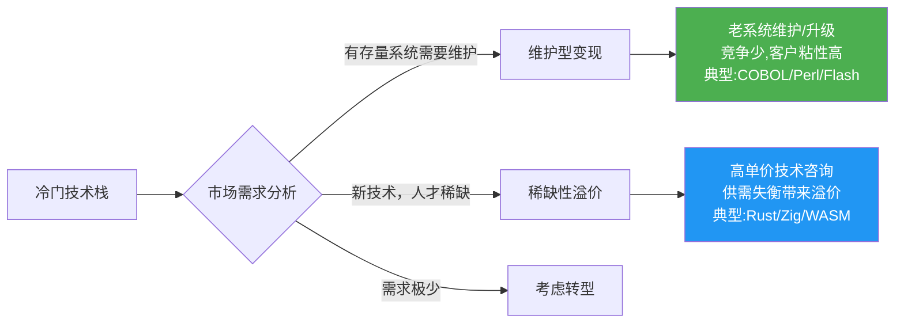
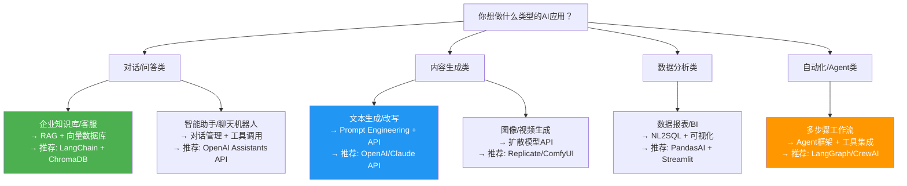
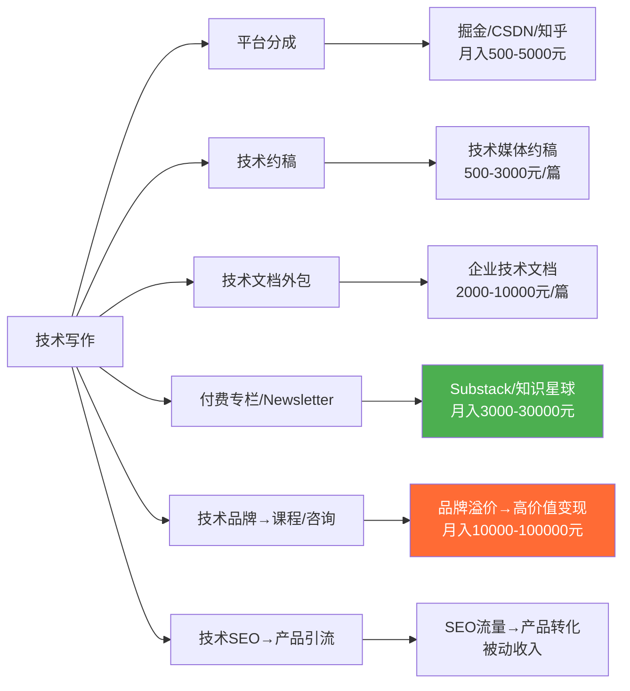
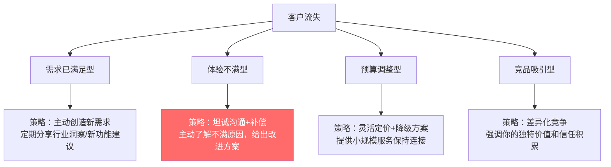
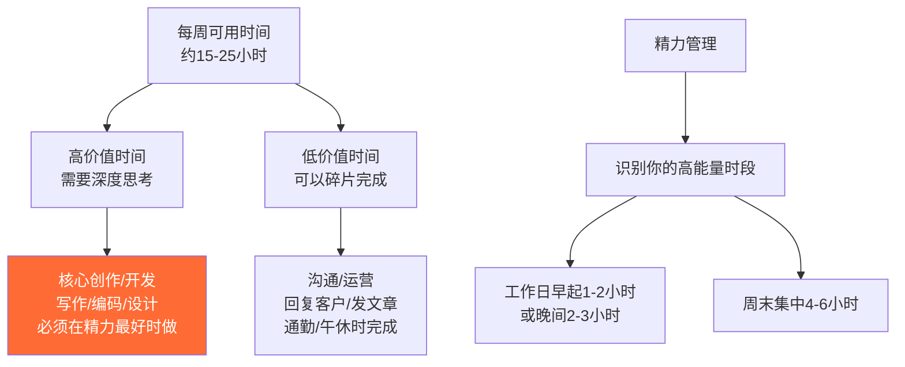

## 十、常见问题解答

前面九节分别拆解了编程、AI、设计、写作、翻译、在线教育、客户管理、技术栈选择和合同法律的核心方法。但方法论落地时，真正卡住你的往往不是"不知道怎么做"，而是"遇到了具体问题不知道怎么处理"。

本章汇总核心技巧篇中各技能领域**最高频、最致命**的实操问题，按技能方向逐一击破。每个问题不仅给"怎么办"，还解释"为什么这样办"——理解原理后，遇到变体场景你也能举一反三。

**使用指南：**

> 不必从头读到尾。当你在某个方向遇到具体困难时，直接跳到对应章节。每个问题都是独立的，包含"诊断→解法→预防"的完整闭环。建议结合本章对应的技能章节（如编程问题对应"编程技能变现"一节）交叉阅读，效果最佳。

**本章问题索引：**

| 方向 | 问题编号 | 核心关键词 |
|------|----------|------------|
| 编程技能 | Q1-Q3 | 中标率、项目危机、冷门技术栈 |
| AI技能 | Q4-Q6 | AI能力层级、课程销售、技术栈选择 |
| 设计技能 | Q7-Q8 | 返工率、作品集 |
| 写作技能 | Q9-Q10 | 拒稿、技术写作变现 |
| 翻译技能 | Q11 | AI冲击下的转型 |
| 知识付费 | Q12-Q13 | 完课率、训练营vs录播 |
| 客户管理 | Q14-Q15 | 毒客户识别、客户挽回 |
| 技术栈选择 | Q16 | 新技能变现路径 |
| 定价与合同 | Q17-Q18 | 收费模式、竞业协议 |
| 心态与时间 | Q19-Q20 | 比较焦虑、精力管理 |

---

### 10.1 编程技能变现常见问题

#### Q1：接单平台注册了但一直中标不了，怎么办？

中标率低的根本原因不是"技术不够好"，而是**你的投标材料没有说服力**。平台竞标本质上是一场信息不对称的博弈——甲方看不到你的代码质量，只能通过投标信、作品集和历史评价来判断。

**投标信的黄金结构：**

```text
第一段（30秒抓住注意力）：
  - 用一句话说清你理解他的需求（不是复述需求文档，而是提炼核心痛点）
  - 示例："您需要一个能支撑日均10万UV的商品详情页，核心挑战是首屏加载速度和SEO"
  - 为什么有效：甲方收到的投标信80%都是"您好，我有X年经验，擅长XX技术"
    你的开头直接展示了你"懂业务"而非"只懂技术"

第二段（建立信任）：
  - 列出1-2个最相关的项目经历，附链接
  - 说明你做过类似的技术方案，解决了什么问题
  - 如果没有直接相关经验，展示可迁移的能力
  - 技巧：用STAR法则描述案例——Situation(背景)、Task(任务)、Action(行动)、Result(结果)
  - 示例："曾为某母婴电商开发同类商品详情页，首屏加载从3.2s优化到0.8s，
    移动端转化率提升23%"

第三段（给出方案骨架）：
  - 用3-5个要点列出你的技术方案思路
  - 不需要写完整方案，但要让甲方觉得"这个人确实懂"
  - 技巧：在方案中加入1-2个甲方可能没想到的优化点（如CDN策略、缓存方案），
    展示专业深度

第四段（报价与工期）：
  - 明确报价区间（不是模糊的"面议"）
  - 给出分阶段交付计划
  - 说明你的沟通频率和交付方式
```

**提高中标率的五个具体动作：**

| 动作 | 投入时间 | 预期效果 | 底层逻辑 |
|------|----------|----------|----------|
| 完善个人主页，上传3-5个高质量项目案例 | 2-3天 | 投标打开率提升40% | 甲方会先看主页再决定是否打开投标信 |
| 每次投标前花10分钟研究甲方背景 | 每次10分钟 | 中标率提升25% | 了解甲方业务后，投标信能精准命中痛点 |
| 先接2-3个小单积累好评 | 1-2周 | 平台推荐权重提升 | 平台算法倾向于推荐有好评记录的服务商 |
| 在投标信中附上简短的方案截图或线框图 | 每次20分钟 | 中标率提升30% | 视觉化方案比纯文字说服力强10倍 |
| 设置平台消息提醒，30分钟内响应 | 持续 | 响应速度影响排名 | 大多数平台将响应时间作为排名因子 |

**投标信的反面教材——这些错误直接淘汰你：**

```text
错误1：模板化投标信
├── 表现："您好，我是全栈工程师，精通XX、XX、XX，有X年经验..."
├── 为什么致命：甲方一天收50封这样的信，你的没有任何记忆点
└── 纠正：每封投标信至少有2-3处针对该项目的定制内容

错误2：报价过低
├── 表现：市场价1万的项目你报3000
├── 为什么致命：吸引来的甲方预算也低、要求反而更多、质量差
└── 纠正：先调研平台同类项目的报价中位数，报价在中位数的80%-120%之间

错误3：不看需求直接投标
├── 表现：看到"网站开发"就投，不看具体技术要求
├── 为什么致命：浪费时间，中标后才发现做不了
└── 纠正：只投标你有90%以上把握能完成的项目

错误4：投标信中列出不相关的技术栈
├── 表现：甲方要React你大篇幅写Vue经验
├── 为什么致命：显示你没有认真看需求
└── 纠正：投标信中的技术栈必须和需求文档高度匹配
```

**不同平台的投标策略差异：**

| 平台类型 | 代表平台 | 竞标特点 | 策略重点 |
|----------|----------|----------|----------|
| 综合外包 | 猪八戒、一品威客 | 价格竞争激烈，低价中标多 | 靠差异化方案而非低价取胜，附线框图/原型 |
| 技术垂直 | 程序员客栈、开源众包 | 甲方懂技术，看重专业度 | 展示技术深度，用代码片段/架构图说话 |
| 国际平台 | Upwork、Fiverr | 英文沟通，时薪制为主 | 英文投标信质量决定成败，积累Top Rated徽章 |
| 社交获客 | GitHub、技术社区 | 靠作品和口碑吸引客户 | 持续输出开源项目/技术文章，让客户主动找你 |

**真实案例：** 某前端开发者在程序员客栈投标时，前20单全部石沉大海。后来他改变了策略：每封投标信附一张用Figma快速做的页面布局草图，并在方案中指出原需求文档中的一个性能隐患（图片未做懒加载）。这个"专业洞察+视觉方案"的组合让他在接下来10次投标中中标4次，中标率从0%提升到40%。他的核心转变是从"展示我能做什么"变成"展示我理解你要什么"。

#### Q2：接了项目发现做不完/做不了，怎么办？

这是每个接单者都会遇到的危机。关键原则：**越早沟通越好，拖到最后是最坏的选择**。

**分级处理方案：**

```text
情况一：技术难题卡住（预计延迟1-3天）
├── 立即在Stack Overflow/GitHub/技术社区发帖求助
├── 用AI辅助工具（Cursor、Copilot）尝试突破
├── 如果48小时内无解，坦诚告知客户并给出替代方案
├── 话术："这个功能的技术实现比预期复杂，我正在尝试A方案和B方案，
│   预计需要额外2天。我会每天同步进展。"
└── 关键：给出具体的替代方案，而不是只说"做不了"

情况二：工作量严重低估（预计需要原计划2倍以上时间）
├── 立即停止开发，重新评估剩余工作量
├── 列出已完成部分和未完成部分
├── 给客户两个选择：缩小范围按原价交付，或增加预算按原需求交付
├── 话术："经过深入开发，我发现[具体功能]的工作量超出预期。
│   我建议两个方案：A方案保留核心功能在原定时间交付；
│   B方案增加[具体金额]预算，按原需求在新日期交付。"
└── 关键：把选择权交给客户，而不是单方面通知延期

情况三：完全超出能力范围（发现自己做不了）
├── 不要硬撑——硬撑的结局是项目烂尾+口碑崩塌
├── 坦诚告知客户，退还已收款项（或按已完成部分结算）
├── 如果可能，推荐其他能做的开发者
├── 这虽然短期损失收入，但长期保护了你的信誉
└── 关键：快速止损比拖延止损损失更小
```

**预防措施——在签约前把风险降到最低：**

| 预防措施 | 具体操作 | 为什么有效 |
|----------|----------|------------|
| 技术可行性验证（PoC） | 签约前花1-2天搭原型确认关键技术点 | 用最小成本发现技术风险 |
| 报价留缓冲 | 在估算基础上加20%-30%的缓冲时间 | 经验法则：实际耗时≈估算×1.3 |
| 合同写明变更条款 | "需求变更需重新评估工期和费用" | 防止需求蔓延导致项目失控 |
| 分阶段交付 | 拆成3-5个里程碑，每个里程碑交付并确认 | 早发现问题，避免最后才发现方向错误 |
| 需求文档冻结 | 签约时附一份详细需求文档，约定冻结时间点 | 有据可依，减少"你当时不是这么说的"争议 |

**项目危机的心理应对：** 遇到项目危机时，大多数人的第一反应是逃避——拖延回复客户消息、试图一个人死磕解决。这种行为模式的根源是"害怕承认自己不行"。但事实恰好相反：**主动暴露问题的人被视为专业人士，掩盖问题的人被视为不靠谱**。客户经历过无数次项目延期，他们不怕延期，怕的是"最后一天才知道延期"。

**真实案例：** 某开发者接到一个"简单的微信小程序商城"项目，报价8000元。开发过程中发现客户要求的"分销系统"涉及三级佣金计算、团队管理、实时分账等复杂逻辑，工作量是预期的4倍。他选择了"情况二"的处理方式，向客户展示了已完成的基础商城和未完成的分销模块，客户选择增加12000元预算完成全部功能。最终项目顺利完成，客户反而因为他的坦诚而追加了后续维护合同。

**另一个真实案例：** 某后端开发者接了一个"数据迁移脚本"项目，签约时以为是从MySQL迁到PostgreSQL，做的时候发现源数据库是一个20年前的FoxPro系统，数据格式完全不同。他硬撑了两周，每天凌晨3点才睡，最终交付了一个"能跑但有bug"的脚本。客户使用后发现数据丢失，不仅拒绝付尾款还在平台上给了差评。如果他在第一天就坦诚告知技术难度超出预期，退还预付款，损失只是3000元预付款；硬撑的代价是3000元预付款 + 尾款 + 平台信誉 + 两周的时间和健康。

#### Q3：技术栈不热门，还有变现机会吗？

有，但需要换一种思路。冷门技术栈的变现逻辑和热门技术栈完全不同：



**冷门技术栈的三种变现策略：**

| 策略 | 具体做法 | 收入预期 | 适用条件 |
|------|----------|----------|----------|
| 维护专家定位 | 专注老系统维护和迁移，成为该领域的"最后防线" | 时薪500-2000元（竞争者极少） | 技术栈有存量系统仍在运行 |
| 稀缺性溢价 | Rust/Zig/WASM等新兴技术，人才供给远小于需求 | 项目报价比主流技术栈高50%-200% | 技术处于早期采用阶段 |
| 跨界嫁接 | 冷门技术 + 热门行业（如Rust+区块链、Perl+生物信息学） | 行业溢价叠加技术溢价 | 能找到技术与行业的交叉点 |

**关键认知：** 冷门不等于没市场。恰恰相反，很多冷门技术栈因为从业者少，客户反而更愿意付高价。COBOL开发者在金融行业的时薪可以达到3000元以上——因为全球能维护大型机系统的程序员已经不超过10万人。

**冷门技术栈变现的实操路径：**

```text
第一步：评估你的技术栈属于哪个象限
├── 存量维护型（COBOL、Perl、Delphi、Flash ActionScript）
│   → 客户是还在用这些技术的企业，痛点是"找不到人维护"
│   → 变现方式：维护合同、系统迁移、技术咨询
├── 新兴稀缺型（Rust、Zig、WebAssembly、Elixir）
│   → 客户是追求技术领先的企业，痛点是"招不到人"
│   → 变现方式：技术咨询、项目外包、培训
└── 极小众型（Haskell、OCaml、Nim）
    → 需要跨界嫁接到热门行业才能变现
    → 变现方式：技术写作、培训、特定行业咨询

第二步：找到你的客户在哪里
├── 存量维护型：LinkedIn/脉脉搜索"XX系统维护"岗位的企业
├── 新兴稀缺型：GitHub上该技术的开源项目issue区、Discord社区
└── 极小众型：学术会议、特定行业论坛

第三步：建立专业形象
├── 写3-5篇深度技术文章（展示你对这个技术栈的掌握深度）
├── 在相关社区活跃回答问题（建立专家认知）
├── 做一个开源项目或技术工具（有形的专业证明）
└── 目标：当有人搜索"XX技术 公司"时，你的名字出现在前5个结果中

第四步：定价策略
├── 不要按主流技术栈的市场价定价——你的时间更稀缺
├── 参考公式：报价 = 主流技术栈时薪 × 1.5~3.0（稀缺系数）
├── 存量维护型稀缺系数通常为2.0-3.0（客户几乎没得选）
└── 新兴稀缺型稀缺系数通常为1.5-2.0（客户有替代方案但成本更高）
```

**冷门技术栈的常见误区：**

```text
误区1：觉得冷门=没人要，主动放弃
├── 真相：很多企业正在为找不到冷门技术的开发者而头疼
├── 案例：某Delphi开发者以为自己的技能已经过时，
│   结果发现大量医院信息系统(HIS)仍在用Delphi开发和维护，
│   转型做医疗IT咨询后，月收入从8000元涨到35000元
└── 行动：在招聘平台搜索你技术栈的关键词，看看有多少企业在招人

误区2：试图"转热"而不是"用冷"
├── 真相：花半年学React和别人竞争，不如深耕冷门技术吃稀缺红利
├── 案例：某Fortran开发者放弃转Python，转而专攻高性能计算咨询，
│   面向科研院所和气象部门，时薪2000元
└── 行动：评估你的冷门技术是否有"不可替代"的应用场景

误区3：定价太低，自我贬值
├── 真相：冷门技术的客户往往预算充足（大企业/金融机构/政府项目）
├── 案例：某大型机COBOL开发者最初报价200元/小时，后来发现
│   同行报价800-1500元/小时，客户照样排队
└── 行动：调研同技术栈从业者的报价水平，大胆定价
```

---

### 10.2 AI技能变现常见问题

#### Q4：我只会用ChatGPT/Claude，算有AI技能吗？能变现吗？

"会用AI工具"和"能用AI变现"之间的差距，比大多数人想象的大得多。把AI工具使用能力分为五个层级：

| 层级 | 能力描述 | 变现可能性 | 月收入参考 | 典型产出 |
|------|----------|------------|------------|----------|
| L1 基础对话 | 会用ChatGPT聊天、写文案 | 极低——替代性太强 | 很难直接变现 | 生成普通文案、简单问答 |
| L2 提示词工程 | 能写高质量prompt，产出稳定可控 | 低——可作为辅助技能 | 间接提升主业收入10%-30% | 结构化Prompt模板、System Prompt设计 |
| L3 工作流集成 | 能将AI嵌入业务流程，自动化多步骤任务 | 中——可以做AI效率咨询 | 5000-20000元/月 | 自动化工作流、RAG系统 |
| L4 应用开发 | 能开发RAG系统、AI Agent、定制化应用 | 高——市场需求爆发 | 20000-100000元/月 | 完整AI应用、SaaS产品 |
| L5 模型训练/微调 | 能训练、微调、部署大模型 | 极高——稀缺人才 | 50000-200000元/月 | 定制模型、垂直领域解决方案 |

**从L1到L3的具体进阶路径：**

```text
第一步（1-2周）：掌握提示词工程
├── 学习Few-shot、Chain-of-Thought、Role-play等核心技巧
├── 练习为不同场景设计System Prompt
├── 能够稳定产出达到80分以上的AI输出
├── 实操练习：收集10个你日常工作中重复性的文字任务，
│   为每个任务写一个专用Prompt，测试并迭代到满意效果
└── 关键指标：你的AI产出质量超过不做提示词优化的90%的用户

第二步（2-4周）：学会AI工作流工具
├── 掌握LangChain或LlamaIndex的基本用法
├── 学会用API调用大模型（OpenAI/Claude/国产模型）
├── 能搭建简单的RAG（检索增强生成）系统
├── 学会用Zapier/n8n/Make等工具做自动化
├── 实操练习：为自己或朋友做一个"私人文档问答机器人"——
│   把PDF/网页内容喂给AI，让它基于这些内容回答问题
└── 关键指标：能独立完成从"需求分析→技术选型→开发→部署"的全流程

第三步（1-2月）：完成一个可展示的AI项目
├── 选择一个真实场景（如智能客服、文档问答、内容生成系统）
├── 从0到1完成开发并部署上线
├── 写一篇技术博客记录整个过程
├── 这个项目就是你的AI变现"敲门砖"
└── 关键指标：项目能被真实用户使用，你能用3分钟向客户演示核心价值
```

**L1用户最容易犯的错误：** 把"会用ChatGPT"当成核心竞争力。事实上，2026年全球有超过5亿人会用AI对话工具，你不是在和AI竞争，而是在和这5亿人竞争。你的竞争力必须建立在AI之上的某个维度——行业知识、工程能力、产品思维、客户关系——单纯"会用AI"不构成任何竞争壁垒。

**各层级的变现路径对比：**

| 层级 | 直接变现方式 | 间接变现方式 | 建议优先级 |
|------|-------------|-------------|-----------|
| L1 | 几乎不可能 | 用AI提升主业效率，省出时间做其他事 | 先升到L2再谈变现 |
| L2 | 卖Prompt模板（9.9-99元）、做AI效率培训 | 在简历中增加"AI技能"提升求职竞争力 | 低门槛，作为加分项 |
| L3 | AI自动化咨询（5000-20000元/项目） | 帮公司搭建内部AI工具，转为长期顾问 | 性价比最高的变现起点 |
| L4 | AI应用开发外包、SaaS产品 | 技术博客→品牌→高价咨询 | 核心变现路径 |
| L5 | 企业AI解决方案（10万-100万/项目） | 技术顾问、行业专家身份 | 需要深厚技术积累 |

#### Q5：AI培训课程做了但卖不动，问题出在哪？

AI培训市场已经过了"随便录个课就能卖"的红利期。当前市场的问题不是供给不足，而是**信任不足**——大量低质量课程让消费者对AI培训产生了免疫。

**卖不动的五个常见原因和对应解法：**

| 原因 | 表现 | 解法 | 验证标准 |
|------|------|------|----------|
| 定位模糊 | "AI从入门到精通"——大而全，没有差异化 | 缩小到具体场景："用AI 10倍提升你的小红书运营效率" | 一句话能说清"学完能做什么" |
| 缺乏实战案例 | 纯理论讲解，学员听完不知道怎么用 | 每节课配一个真实业务场景的实操Demo | 学员能跟着做出一个实际成果 |
| 没有前置信任 | 直接卖课，没有先建立专业形象 | 先用免费内容（公众号/短视频/知乎）积累粉丝，再转化 | 至少有1000个看过你免费内容的精准用户 |
| 价格错位 | 新手定价过高，或大咖定价过低 | 新手从99-299元切入，用低价+好评建立口碑后逐步提价 | 首月卖出50份以上 |
| 没有交付感 | 学员买完课就"失联"了 | 加入社群、作业点评、直播答疑等增值服务 | 完课率超过40% |

**AI培训的黄金公式：**

```text
能卖动的AI课程 = 具体场景 × 可量化的成果 × 低学习门槛

示例：
✗ "AI写作大师课"（太泛）
✓ "用AI 30分钟写出一篇2000字的公众号爆款文章"（具体场景+可量化成果+低门槛）

✗ "Python机器学习从入门到实战"（太泛）
✓ "零基础用Python+AI做一份专业的数据分析报告"（场景化+成果导向）

✗ "AI绘画完全指南"（太泛）
✓ "用Midjourney为你的电商产品生成专业级主图"（商业场景+具体工具+明确产出）
```

**从0到1做一门能卖的AI课程的完整流程：**

```text
阶段一：验证需求（1-2周）
├── 在社群/朋友圈发一个"免费AI小课"（10-15分钟的短视频）
├── 看看有多少人感兴趣、有什么反馈
├── 收集50+份用户需求问卷，确认痛点是否真实
└── 产出：确定课程主题和核心卖点

阶段二：制作MVP课程（2-4周）
├── 不要一上来就录30小时的"完整课程"
├── 先做3-5节核心课程（每节15-20分钟），覆盖最高频场景
├── 用手机+PPT就能录，不用追求专业设备
├── 配套一份"实操手册"（PDF），让学员跟着做
└── 产出：一个可以卖的最小可行课程

阶段三：小规模测试销售（2-4周）
├── 定价99-199元，在你的私域流量（微信群/朋友圈/公众号）销售
├── 目标卖出50-100份
├── 收集学员反馈，记录完课率和满意度
├── 根据反馈迭代课程内容
└── 产出：经过市场验证的课程产品

阶段四：规模化推广（持续）
├── 在公域平台（B站/抖音/知乎）发布免费引流内容
├── 用免费内容→低价课→高价训练营的漏斗转化
├── 建立学员社群，用口碑驱动裂变
└── 产出：稳定的课程收入流
```

**AI课程的定价策略矩阵：**

| 课程类型 | 价格区间 | 内容深度 | 交付形式 | 目标用户 | 月收入预期 |
|----------|----------|----------|----------|----------|-----------|
| 入门小课 | 9.9-49元 | 1-2小时，单一场景 | 录播视频 | 对AI好奇的泛用户 | 500-5000元 |
| 系统录播课 | 99-299元 | 5-10小时，完整流程 | 录播+PDF手册 | 想系统学习的职场人 | 3000-30000元 |
| 实战训练营 | 999-2999元 | 2-4周，带项目 | 直播+作业+社群 | 想快速上手的从业者 | 10000-100000元 |
| 企业定制培训 | 5000-50000元/场 | 1-2天，定制内容 | 线下/线上 | 企业团队 | 按场次计费 |

#### Q6：想做AI应用开发，但不知道从哪个框架/技术栈开始？

AI应用开发的技术栈选择取决于你要解决的问题类型。盲目追新框架（今天LangChain明天CrewAI）只会让你陷入"一直在学、从未在做"的陷阱。

**AI应用开发技术栈选择决策树：**



**给初学者的务实建议：**

```text
第一个月：不要学框架，直接用API
├── 注册OpenAI/Anthropic API账号
├── 学会用Python调API完成基本的对话、文本生成、Embedding
├── 做一个简单的命令行聊天机器人
├── 理解Token、Temperature、System Prompt等核心概念
└── 成果：能用50行Python代码调用大模型完成任意文本任务

第二个月：学一个框架，完成一个完整项目
├── 推荐LangChain（生态最大、文档最全、工作最多）
├── 用RAG技术做一个"文档问答"应用
├── 部署到云服务器，让别人也能用
├── 这个项目就是你的第一个AI变现案例
└── 成果：一个能展示的完整AI应用

第三个月：开始接AI项目
├── 在Upwork/程序员客栈搜索"AI""LLM""ChatGPT"相关项目
├── 从小项目开始（5000-20000元）
├── 逐步积累AI项目经验
├── 每个项目都写技术博客复盘
└── 成果：至少完成1个付费AI项目
```

**主流AI框架的对比与选择建议（2026年）：**

| 框架/工具 | 适合场景 | 学习曲线 | 生态成熟度 | 变现热度 |
|-----------|----------|----------|------------|----------|
| LangChain/LangGraph | RAG、Agent、复杂工作流 | 中等 | ★★★★★ | ★★★★★ |
| LlamaIndex | 知识库/文档问答 | 较低 | ★★★★☆ | ★★★★☆ |
| OpenAI Assistants API | 对话型应用、快速原型 | 低 | ★★★★☆ | ★★★★☆ |
| CrewAI | 多Agent协作 | 中等 | ★★★☆☆ | ★★★☆☆ |
| Dify | 低代码AI应用搭建 | 低 | ★★★★☆ | ★★★☆☆ |
| Coze/扣子 | 快速搭建Bot、插件 | 极低 | ★★★☆☆ | ★★☆☆☆ |

**框架选择的常见误区：**

```text
误区1：学太多框架，一个都不精
├── 表现：LangChain学了一半又去学CrewAI，然后又看Dify
├── 后果：三个月过去了，一个完整的项目都没做出来
└── 建议：选定一个框架（推荐LangChain），用它完成至少2个完整项目后再学其他

误区2：只学框架不学底层原理
├── 表现：会用LangChain的API但不理解Embedding、向量检索、Prompt工程的原理
├── 后果：遇到框架解决不了的问题时束手无策
└── 建议：第一个月不学框架直接用API，就是为了打好底层基础

误区3：追求"最新最强"的框架
├── 表现：等CrewAI 2.0出来再学，等LangGraph稳定了再用
├── 后果：永远在"等"，永远没开始
└── 建议：AI领域的工具迭代极快，选定当前最成熟的工具立即开始，
    6个月后根据需要再切换——迁移成本远低于你想象
```

---

### 10.3 设计技能变现常见问题

#### Q7：设计作品总是被客户反复修改，怎么减少返工？

设计返工率高的根源不是审美问题，而是**需求确认流程缺失**。客户说"我不喜欢这个颜色"的时候，真正的问题可能出在你没有在开工前确认他的品牌调性和目标受众。

**减少返工的四步需求确认法：**

```text
第一步：品牌基因确认（签约后、开工前）
├── 收集客户现有品牌素材（Logo、官网、竞品截图）
├── 问三个关键问题：
│   ├── "你的目标客户是谁？年龄/性别/消费水平？"
│   ├── "你喜欢哪三个同行/品牌的视觉风格？为什么？"
│   └── "你最不想要的风格是什么？"
├── 产出：一份简短的"设计方向确认书"，让客户签字
└── 这一步能把30%的审美分歧消灭在签约前

第二步：情绪板确认（Moodboard）
├── 在开工前做3-5个风格方向的情绪板
├── 用Pinterest/花瓣网收集参考图，标注你喜欢的元素
├── 让客户从中选择1-2个方向
├── 这一步能把60%的审美分歧消灭在萌芽阶段
└── 工具推荐：Figma/FigJam、Milanote、Notion模板

第三步：草稿确认（低投入阶段）
├── 先用线框图/灰度稿确认布局和结构
├── 不要在配色和细节上浪费时间
├── 客户确认布局后再进入精细设计
├── 修改线框图的成本是修改成品的1/10
└── 工具推荐：Balsamiq、Whimsical、Figma wireframe kit

第四步：分阶段交付
├── 第一轮：整体布局+主色调（客户确认后进入下一步）
├── 第二轮：细节完善+图标/插画
├── 第三轮：最终调整+切图交付
├── 每轮只允许一次修改，超出部分按次收费
└── 关键：每轮确认都要客户签字（哪怕是微信回复"确认"）
```

**合同中必须写明的修改条款：**

```text
"本项目包含X轮修改，每轮修改需在交付后3个工作日内提出。
超出轮次的修改按每小时XXX元收取费用。
修改范围不包括推翻已确认的设计方向——如需变更方向，
视为新需求，需重新评估工期和费用。"
```

**常见返工场景的应对话术：**

```text
场景1：客户说"我也不知道想要什么，你先做几个方案看看"
├── 应对："为了确保最终效果符合您的预期，我建议我们先花30分钟
│   一起确认设计方向。我准备了几个风格参考，您看看哪个方向
│   最接近您的想法？"
└── 原理：把"无限方案"变成"有限选择"

场景2：客户在第三轮修改时说"还是第一版比较好"
├── 应对："第一版确实有它的优势。不过根据我们确认的第二轮反馈，
│   我们做了[具体调整]。如果您更倾向第一版的方向，
│   我们可以保留第一版的布局，在此基础上做微调，
│   这属于方向变更，需要额外[具体金额]的费用。"
└── 原理：用合同条款保护自己，但保持温和专业的语气

场景3：客户让非设计人员（如老板的亲戚）做设计决策
├── 应对："为了高效推进项目，建议我们确认一位最终决策人。
│   多人参与审美讨论容易产生分歧，反而影响项目进度。
│   我可以准备一份设计决策表，让决策人直接打勾选择。"
└── 原理：把主观审美问题变成结构化的选择题

场景4：客户拿着竞品截图说"我要和这个一模一样的"
├── 应对："我理解您喜欢这个风格。我来分析一下这个设计的
│   核心元素（配色/布局/字体/留白），然后结合您的品牌特点
│   做一个'您的版本'。完全照搬反而会让您的品牌失去辨识度。"
└── 原理：肯定客户的审美，同时引导到差异化设计
```

**返工率的量化管理：**

| 返工率 | 评价 | 根因分析 | 改进方向 |
|--------|------|----------|----------|
| <10% | 优秀 | 需求确认流程完善 | 保持并分享经验给同行 |
| 10%-20% | 正常 | 偶尔遇到挑剔客户 | 优化情绪板确认环节 |
| 20%-40% | 偏高 | 需求确认流程缺失或不完整 | 立即建立四步确认法 |
| >40% | 危险 | 可能存在沟通能力或专业能力问题 | 反思是否适合接这类项目 |

#### Q8：设计作品集怎么做才能吸引高质量客户？

作品集不是"把做过的项目堆上去"那么简单。一个能吸引高质量客户的作品集，需要同时满足三个条件：**数量够、质量高、讲好故事**。

**作品集的黄金结构（建议5-8个项目）：**

| 项目类型 | 数量 | 作用 | 展示重点 |
|----------|------|------|----------|
| 旗舰项目 | 1-2个 | 展示你的最高水平 | 完整的设计过程：需求→调研→方案→迭代→成果 |
| 行业标杆项目 | 2-3个 | 展示你服务过哪些行业 | 不同行业的设计差异和解决思路 |
| 个人概念项目 | 1-2个 | 展示你的创造力和审美 | 不受客户限制，大胆表达设计理念 |
| 快速项目 | 1-2个 | 展示你的效率和适应性 | 限时完成的高质量产出 |

**每个项目的展示模板：**

```text
项目名称：XX品牌电商首页改版
客户背景：（1-2句话，脱敏处理）
核心挑战：改版前转化率仅1.2%，目标提升至3%以上
设计过程：
  - 用户调研：分析了XX条用户反馈，发现XX问题
  - 竞品分析：对比了3个竞品的XX设计模式
  - 方案探索：尝试了3个方向，最终选择方案B（附原因）
  - 迭代优化：基于A/B测试数据调整了XX细节
最终成果：转化率提升至3.8%（提升217%）
关键设计决策：（2-3个你做出的重要设计决策及原因）
```

**作品集的载体选择：**

| 载体 | 适合人群 | 优势 | 劣势 | 运营建议 |
|------|----------|------|------|----------|
| Behance | 视觉设计师 | 国际曝光、社区互动 | 国内访问不稳定 | 每月更新1个项目，参与社区互动 |
| Dribbble | UI/视觉设计师 | 高质量社区、设计师聚集 | 偏重视觉，不适合完整项目 | 定期发布Shot，保持活跃度 |
| 个人网站 | 所有设计师 | 完全可控、专业感强 | 需要维护、SEO需要时间 | 用Notion/Squarespace快速搭建 |
| 即刻/小红书 | 国内市场为主 | 国内流量大、互动活跃 | 不够正式 | 适合引流，再导流到正式作品集 |
| Notion作品集 | 快速上手 | 制作简单、更新方便 | 专业感稍弱 | 适合新手，成本为零 |

**作品集的常见错误：**

```text
错误1：堆砌项目，没有叙事
├── 表现：作品集里放了20个项目，每个只有一张最终图
├── 问题：客户看不到你的思考过程，无法判断你的能力深度
└── 纠正：精选5-8个项目，每个项目讲完整的故事

错误2：只展示视觉，不展示结果
├── 表现：作品很美，但没有任何数据或客户反馈
├── 问题：好看不等于好用，客户想知道设计是否解决了问题
└── 纠正：每个项目至少展示一个可量化的成果（转化率/满意度/效率提升）

错误3：作品集风格不统一
├── 表现：作品集本身的设计风格混乱，排版不一致
├── 问题：连自己作品集都做不好的设计师，客户怎么信任你能做好他们的项目？
└── 纠正：作品集本身就是一个设计项目，投入足够的时间打磨

错误4：长期不更新
├── 表现：作品集里最新的项目是1年前的
├── 问题：客户会怀疑你是否还在活跃
└── 纠正：至少每季度更新一次，即使只是优化现有项目的展示方式
```

---

### 10.4 写作技能变现常见问题

#### Q9：写作投稿总是被拒稿，问题出在哪？

被拒稿的首要原因不是"写得不好"，而是**写得不对**——不符合目标平台的风格、调性、读者需求。80%的拒稿可以通过投稿前的准备工作避免。

**投稿前的必做功课（每次投稿花30分钟）：**

```text
第一步：研究目标平台（15分钟）
├── 读最近30天发布的10篇文章
├── 记录：文章长度、标题风格、开头方式、配图风格
├── 找出阅读量最高的3篇，分析它们的共同特点
└── 产出：一份简短的"平台风格备忘"

第二步：匹配选题（10分钟）
├── 从你的选题库中找3个和平台风格匹配的选题
├── 检查平台最近是否发过类似话题（避免重复）
├── 选择最有差异化的角度
└── 产出：一个一句话的选题描述

第三步：写投稿邮件/消息（5分钟）
├── 标题："投稿｜{文章标题}" —— 简洁明了
├── 正文：3句话说清文章核心价值 + 目标读者 + 为什么适合这个平台
├── 附件：Word或Markdown格式的完整稿件
└── 不要问"你们收不收投稿"——直接投完整的稿件
```

**被拒稿后的正确复盘方式：**

| 复盘维度 | 检查项 | 常见问题 | 如何改进 |
|----------|--------|----------|----------|
| 选题 | 是否匹配平台定位 | 给科技媒体投情感文章 | 建立"平台-选题"匹配矩阵 |
| 标题 | 是否有吸引力 | "谈谈我的看法"这类平淡标题 | 学习爆款标题公式：数字+痛点+结果 |
| 开头 | 是否3秒抓住读者 | 开头讲太多背景铺垫 | 用冲突/悬念/数据开场 |
| 结构 | 是否清晰易读 | 大段文字没有小标题和分段 | 每500字一个H3，每段不超过4行 |
| 价值 | 读者看完能得到什么 | 纯抒情/纯观点，没有实用价值 | 每篇文章至少包含3个可执行的建议 |
| 字数 | 是否符合平台要求 | 给短平快平台投5000字长文 | 投稿前确认平台的字数偏好 |

**建立"投稿复用系统"——一次写作，多次变现：**

```text
核心理念：一篇文章不应该只投一个平台。聪明的写作者会把一篇文章改写成
适合不同平台的多个版本。

实操流程：
├── 写一篇3000字的深度长文（母版）
├── 改写为2000字的版本 → 投给垂直媒体
├── 提炼5条核心观点 → 发知乎/即刻
├── 改写为短视频脚本 → 发B站/抖音
├── 翻译为英文版 → 发Medium/Dev.to
└── 所有版本都指向你的个人品牌（公众号/网站）

收益对比：
├── 单次投稿：500-3000元（一次性收入）
└── 复用系统：5000-15000元（多平台收入+品牌积累）
```

**不同写作变现渠道的对比：**

| 渠道 | 稿费范围 | 门槛 | 结算周期 | 适合阶段 |
|------|----------|------|----------|----------|
| 技术博客投稿 | 300-2000元/篇 | 低 | 稿件录用后1-2周 | 新手起步 |
| 专栏约稿 | 1000-5000元/篇 | 中（需有代表作） | 月结 | 有一定知名度 |
| 品牌软文 | 2000-20000元/篇 | 高（需粉丝基础） | 合作完成后 | 有影响力后 |
| 电子书/小册 | 5000-50000元/本 | 中 | 持续销售 | 内容积累到一定量 |
| 技术文档外包 | 3000-30000元/套 | 中（需技术背景） | 项目交付后 | 有技术+写作双重能力 |

#### Q10：技术写作（技术博客/文档）怎么变现？

技术写作的变现路径比多数人想象的宽。它不只是"写博客赚广告费"，而是一条从内容到产品的完整路径。

**技术写作的六条变现路径：**



**技术文档外包的具体操作：**

很多创业公司和开源项目需要高质量的技术文档（API文档、用户指南、架构设计文档），但团队中没有专业写手。这是一个被严重低估的变现方向：

| 文档类型 | 单价范围 | 交付周期 | 适合人群 | 获客渠道 |
|----------|----------|----------|----------|----------|
| API文档 | 3000-8000元/套 | 3-7天 | 熟悉该技术栈的开发者 | GitHub开源项目、技术社区 |
| 用户指南 | 5000-15000元/套 | 1-2周 | 有技术写作经验的人 | LinkedIn/脉脉、SaaS公司官网 |
| 架构设计文档 | 8000-30000元/套 | 1-3周 | 资深工程师 | 技术社区口碑、猎头推荐 |
| 开源项目文档 | 2000-5000元/套 | 3-5天 | 熟悉该项目的贡献者 | GitHub Issue区、项目Discord |
| 技术白皮书 | 10000-50000元/篇 | 2-4周 | 有行业深度的专家 | 行业会议、LinkedIn内容营销 |

**技术写作的持续精进方法：**

```text
日常积累：
├── 每周读2-3篇优秀的技术文章，分析其结构和表达
├── 建立自己的"好文模板库"——收藏结构清晰、表达精准的技术文章
├── 练习"一句话说清一个技术概念"的能力
└── 每写完一篇文章，用"5分钟测试"：让非技术人员读一遍，
    看他们能否理解核心意思

进阶技巧：
├── 数据驱动：用具体数字代替模糊描述
│   ✗ "性能提升了很多" → ✓ "API响应时间从800ms降到120ms"
├── 类比思维：用读者已知的概念解释未知的技术
│   ✗ "微服务是一种架构模式" → ✓ "微服务就像把一个大超市拆成多个专卖店"
├── 结构化表达：先说结论，再展开论证
│   ✗ 铺垫3段背景后才说重点 → ✓ 第一句话就说核心观点
└── 可视化：能用图/表/代码展示的内容，不用纯文字
```

**技术写作的品牌积累路径：**

```text
阶段一（0-6个月）：建立写作习惯
├── 每周产出1篇技术文章（1000-3000字）
├── 发布到掘金/知乎/CSDN等平台
├── 不追求爆款，追求稳定输出
└── 目标：积累30-50篇文章，形成你的"内容资产库"

阶段二（6-12个月）：找到你的定位
├── 分析哪些文章阅读量高、互动多
├── 确定你的核心写作领域（如"前端性能优化""AI应用开发"）
├── 开始在该领域深耕，成为"提到这个话题就想到你"的存在
└── 目标：在细分领域建立认知度

阶段三（12-24个月）：变现升级
├── 开设付费专栏/Newsletter（知识星球/Substack）
├── 接受技术媒体约稿（稿费从500涨到3000+）
├── 将写作能力包装为服务（技术文档外包、品牌内容顾问）
├── 用内容引流到你的课程/咨询/产品
└── 目标：技术写作成为你的稳定收入来源之一
```

---

### 10.5 翻译技能变现常见问题

#### Q11：AI翻译越来越好，人工翻译还有市场吗？

有，但市场在分化。AI已经基本取代了"逐字翻译"的需求，但在以下四个领域，人工翻译的价值不降反升：

**AI无法取代的翻译场景：**

| 场景 | 为什么AI做不好 | 客单价 | 需要的能力 | 获客建议 |
|------|---------------|--------|-----------|----------|
| 法律/合同翻译 | 法律术语的细微差异可能导致重大后果，AI无法承担法律责任 | 300-800元/千字 | 法律知识 + 翻译能力 | 律所、法务部门、法律科技公司 |
| 医学/临床翻译 | 医学术语的准确性直接关系患者安全 | 400-1000元/千字 | 医学背景 + 翻译能力 | CRO公司、制药企业、医学期刊 |
| 文学/影视翻译 | 需要文化理解和创意表达，AI的翻译"正确但无趣" | 200-600元/千字 | 文学素养 + 创意能力 | 出版社、影视制作公司、流媒体平台 |
| 本地化/创译 | 不是翻译而是重写，需要深度理解目标市场 | 按项目计费，5000-50000元 | 营销思维 + 跨文化理解 | 跨国企业、游戏公司、出海品牌 |
| 学术论文润色 | 需要理解学科逻辑和学术规范，AI润色缺乏学术判断力 | 150-400元/千字 | 学术背景 + 语言功底 | 高校师生、科研机构、学术出版社 |
| 同声传译/口译 | 需要实时反应、语境理解、情绪传达 | 3000-15000元/天 | 极强的双语能力和临场反应 | 会议公司、外事部门、国际组织 |

**翻译者的AI时代生存策略：**

```text
策略一：成为"AI+人工"混合翻译专家
├── 用AI完成初翻（效率提升3-5倍）
├── 人工负责校对、润色、文化适配
├── 向客户展示AI初翻 + 人工精修的对比效果
├── 定价保持不变，但你的有效时薪翻了3倍
└── 关键：把AI当工具而非竞争对手，展示你不可替代的价值

策略二：深耕垂直领域
├── 选择一个专业领域（法律/医学/金融/游戏/技术）
├── 积累该领域的术语库和知识体系
├── 专业领域翻译的竞争者少、单价高、客户粘性强
├── 目标：成为"XX领域最靠谱的翻译"
└── 关键：3个月深耕一个领域 > 3年什么领域都做

策略三：从翻译升级到本地化咨询
├── 不只翻译文字，而是帮客户适配整个目标市场
├── 包括：UI文案本地化、营销素材创译、文化禁忌审查
├── 客单价从"按千字计费"变成"按项目计费"
├── 一个本地化项目的收入可能是纯翻译的5-10倍
└── 关键：需要学习目标市场的文化、消费习惯、法规

策略四：转型为翻译质量审核（MTPE）
├── MTPE = Machine Translation Post-Editing（机器翻译后编辑）
├── 大量企业用AI翻译初稿后，需要人工审核质量
├── 你的工作从"翻译"变成"审核+修正"
├── 效率是纯人工翻译的3-5倍，收入不降反升
└── 关键：需要掌握AI翻译工具的常见错误模式，快速定位问题
```

**翻译者的AI工具箱（2026年）：**

| 工具 | 用途 | 推荐场景 |
|------|------|----------|
| DeepL Pro | 高质量初翻 | 欧洲语言翻译、商务文档 |
| ChatGPT/Claude | 灵活的翻译辅助 | 需要创意的翻译、术语解释 |
| MemoQ/Trados | CAT（计算机辅助翻译）工具 | 大型项目、术语一致性要求高 |
| Grammarly | 英文润色 | 英译中的校对环节 |
| 术语管理工具（如TermBase） | 术语库管理 | 长期客户、专业领域 |

**翻译行业的收入结构变化（2020-2026）：**

```text
2020年：纯人工翻译占市场80%，AI辅助占20%
2023年：纯人工翻译占市场40%，AI初翻+人工校对占40%，纯AI占20%
2026年（预估）：纯人工翻译占市场15%（高端领域），
  AI初翻+人工校对占45%，纯AI占40%

启示：
├── 低端市场（一般商务文档、网页翻译）已被AI占领，不要再进入
├── 中端市场（技术文档、营销文案）正在被AI+人工混合模式取代
├── 高端市场（法律、医学、文学、同传）仍然需要纯人工，且单价在上涨
└── 翻译者的核心策略：要么向上走（高端市场），要么拥抱AI（MTPE）
```

**真实案例：** 某日语翻译者在2023年发现普通商务翻译的订单量下降了60%。她做了两个调整：一是专攻游戏本地化（日语→中文），积累了大量游戏行业术语和文化适配经验；二是学习使用AI翻译工具做初翻，然后人工精修。调整后的结果是：订单量恢复到以前的80%，但单价提升了3倍（游戏本地化单价是普通商务翻译的3-5倍），总反收入反而增长了140%。

---

### 10.6 在线教育与知识付费常见问题

#### Q12：课程做了好几版，学员完课率总是很低，怎么提升？

完课率低是知识付费行业的普遍痛点。据行业统计，在线课程的平均完课率仅为**15%-30%**。提升完课率的核心不是"讲得更好"，而是**降低学习阻力、增加学习激励**。

**完课率低的五个根因和解法：**

| 根因 | 具体表现 | 解法 | 预期提升 | 实施难度 |
|------|----------|------|----------|----------|
| 课程太长 | 一门课30+小时，学员望而却步 | 拆成3-5个独立模块，每个2-5小时 | 完课率+20% | ★★☆☆☆ |
| 纯视频无互动 | 学员被动看视频，注意力衰减 | 每10分钟插入一个练习/测验 | 完课率+15% | ★★★☆☆ |
| 缺乏即时反馈 | 学员做完练习不知道对不对 | 配套社群答疑/作业点评 | 完课率+25% | ★★★★☆ |
| 没有社交压力 | 一个人学容易放弃 | 组建学习小组/打卡机制 | 完课率+20% | ★★☆☆☆ |
| 学完没有获得感 | 不知道学完能做什么 | 每个模块结束后产出一个具体成果 | 完课率+30% | ★★★☆☆ |

**高完课率课程的设计模板：**

```text
课程结构设计（以"AI辅助写作"为例）：

模块1：基础篇（2小时）
├── 第1课（15分钟）：AI写作工具选择与配置
├── 实操1：安装并配置你的第一个AI写作环境
├── 第2课（20分钟）：提示词工程基础
├── 实操2：用3种不同提示词风格改写同一篇文章
├── 第3课（15分钟）：AI写作的质量控制
├── 实操3：对比AI初稿和人工修改后的效果差异
└── 模块成果：完成一篇500字的AI辅助文章（附模板）

模块2：进阶篇（3小时）
├── ...（同上结构）
└── 模块成果：完成一篇2000字的深度技术文章

模块3：实战篇（3小时）
├── ...（同上结构）
└── 模块成果：用AI在2小时内完成一篇可投稿的文章

每课时控制在20分钟以内（注意力曲线峰值）
每课时配一个5分钟的实操练习（即时应用）
每个模块配一个完整的实战产出（学以致用）
```

**提升完课率的低成本运营技巧：**

```text
技巧1：完课打卡奖励
├── 学员完成每个模块后在社群打卡
├── 完成全部模块的学员获得下一期课程的折扣券
├── 成本：几乎为零，但完课率可提升15%-20%
└── 关键：奖励要有价值感，折扣券是最低成本的高价值奖励

技巧2：学习小组机制
├── 每5-10个学员组成一个学习小组
├── 小组内互相督促、讨论、点评作业
├── 每周组织一次小组讨论（30分钟，线上）
├── 成本：你的时间投入约每周2-3小时
└── 关键：社交压力是成年人学习最有效的驱动力

技巧3：阶段性成果展示
├── 每个模块结束后，学员在社群展示自己的作品
├── 设置"最佳作品"投票，给予小奖励
├── 学员的作品就是你课程最好的"用户证言"
└── 关键：让学习从"消费"变成"创作"，成就感驱动完课

技巧4：进度追踪与提醒
├── 用学习平台的数据功能，追踪学员进度
├── 对超过3天没有学习的学员，发送个性化提醒
├── 提醒话术："你已经完成了60%的课程，还有2个模块就毕业了！"
└── 关键：温和推动，不要变成"催债"式骚扰
```

**完课率提升的优先级矩阵：**

```text
投入低 × 效果好（优先做）：
├── 拆短课程时长（每课20分钟以内）
├── 加入打卡机制
└── 每模块产出具体成果

投入低 × 效果中（其次做）：
├── 学习小组机制
├── 进度追踪与提醒
└── 课程开头加"学完能做什么"的预告

投入高 × 效果好（值得投入）：
├── 社群答疑和作业点评
├── 直播互动环节
└── 学员作品展示平台

投入高 × 效果中（谨慎投入）：
├── 精美视频制作（手机+PPT足够）
├── 完整的LMS系统搭建
└── 1对1辅导（成本太高，只适合高价训练营）
```

#### Q13：训练营和录播课哪个更适合新手？

两者适合不同阶段、不同能力模型的创作者。选错了模式，要么累死自己，要么赚不到钱。

**训练营 vs 录播课的深度对比：**

| 维度 | 训练营 | 录播课 |
|------|--------|--------|
| 启动难度 | ★★★★☆ | ★★☆☆☆ |
| 单期收入 | 高（人均500-5000元 × 30-100人） | 低起步（人均99-299元） |
| 可规模化 | 低（每期都要投入时间） | 高（一次录制，反复销售） |
| 完课率 | 高（60%-80%） | 低（15%-30%） |
| 口碑传播 | 强（学员有社交关系） | 弱（缺乏互动记忆） |
| 时间投入 | 高（每期2-4周集中投入） | 前期高，后期极低 |
| 适合阶段 | 有教学经验+粉丝基础 | 任何阶段 |
| 边际成本 | 不随学员数线性增长（上限200人） | 趋近于零 |

**新手的推荐路径：**

```text
阶段一（0-3个月）：先做免费内容积累口碑
├── 在公众号/知乎/B站发布免费教程
├── 收集读者反馈，了解他们最想学什么
├── 积累第一批种子用户（至少500人关注）
└── 目标：验证你的内容有人愿意看

阶段二（3-6个月）：做小规模录播课试水
├── 选择最受欢迎的3-5个话题做录播课
├── 定价99-199元，先验证付费意愿
├── 收集学员反馈，迭代课程内容
├── 目标：卖出100-300份，建立课程口碑
└── 关键：不要追求完美，先发布再迭代

阶段三（6-12个月）：开第一期训练营
├── 基于录播课内容设计训练营版本
├── 加入直播答疑、作业点评、社群互动
├── 定价999-2999元，限量30-50人
├── 用第一期的口碑驱动第二期招生
└── 关键：限量制造稀缺感，同时控制自己的工作量

阶段四（12个月+）：录播课+训练营组合运营
├── 录播课作为"引流品"（低价，覆盖广）
├── 训练营作为"利润品"（高价，深度服务）
├── 两者形成"漏斗"：录播课学员中转化5%-15%到训练营
└── 关键：两种产品互补，不是互相替代
```

---

### 10.7 客户管理常见问题

#### Q14：怎么判断一个客户是"好客户"还是"毒客户"？

客户质量直接决定了你的工作效率、收入水平和心理健康。识别毒客户越早越好——最好在签约前就识别出来。

**好客户 vs 毒客户的特征对照：**

| 维度 | 好客户 | 毒客户 |
|------|--------|--------|
| 需求沟通 | 能清晰描述需求，有文档或参考 | "你看着做就行"然后无限修改 |
| 预算态度 | 有合理预算，尊重专业定价 | 一上来就砍价50%以上 |
| 决策流程 | 有明确的决策人和审批流程 | 每次都要"回去商量一下" |
| 时间预期 | 理解好工作需要时间 | "这个很简单，明天能做完吗？" |
| 付款态度 | 接受分期付款，按时打款 | "先做满意了再付""能不能做完再结" |
| 沟通方式 | 工作时间沟通，简洁高效 | 深夜/周末发消息，语音轰炸 |
| 修改态度 | 修改意见具体明确 | "感觉不对，再改改" |
| 尊重程度 | 尊重你的时间和专业判断 | 把你当"工具人"呼来喝去 |

**签约前的五个"红旗信号"：**

```text
🚩 红旗1：需求描述极度模糊，且拒绝做需求细化
   → 后期一定会出现"这不是我想要的"场景
   → 应对：坚持要求客户填写需求问卷，否则不接单

🚩 红旗2：第一句话就是"最低多少钱"
   → 对方关注的是成本而非价值，后续砍价无止境
   → 应对：回复"我需要先了解需求才能给出报价"，引导对方进入需求沟通

🚩 红旗3：要求先看完整方案再决定是否合作
   → 可能是骗取免费方案
   → 应对：提供概要方案（2-3页），详细方案需签约后提供

🚩 红旗4：对付款条件极度敏感，拒绝任何预付
   → 回款风险极高
   → 应对：坚持"30%预付+40%中期+30%尾款"的付款结构

🚩 红旗5：上一个合作的开发者"突然不做了"
   → 大概率是前一个开发者被折磨到跑路
   → 应对：详细了解项目历史和上一个开发者离开的真实原因
```

**如何优雅地拒绝毒客户：**

```text
话术模板：
"感谢您的信任。经过评估，我认为这个项目的[具体需求]不在我的
擅长范围内，为了保证您的项目质量，建议您寻找更匹配的服务方。
祝项目顺利！"

不要说："你这个客户太难伺候了"——保持专业，世界很小，口碑很重要。

拒绝后的动作：
├── 如果对方追问，可以推荐其他可能适合的开发者（做好人）
├── 记录这次沟通的红旗信号，建立你自己的"毒客户特征库"
└── 不要在社交平台上吐槽具体客户（即使匿名也可能被识别）
```

**毒客户的成本计算：**

```text
一个毒客户的真实成本（假设项目报价10000元）：

直接成本：
├── 额外沟通时间：约20小时 × 100元/小时 = 2000元
├── 额外修改时间：约30小时 × 100元/小时 = 3000元
├── 尾款拖欠风险：约30%概率被拖欠3000元尾款 → 期望损失900元
└── 直接成本合计：约5900元

间接成本：
├── 心理消耗导致其他项目效率下降：约1000-3000元
├── 占用了本可以接好项目的时间：机会成本约5000-10000元
├── 差评/纠纷对平台信誉的影响：难以量化但长期影响大
└── 间接成本合计：约6000-13000元

结论：一个报价10000元的毒客户，真实成本可能高达12000-19000元。
你以为在赚钱，其实在亏钱。拒绝一个毒客户 = 赚了12000-19000元。
```

#### Q15：老客户不续费/不复购了，怎么挽回？

老客户的流失通常不是突然发生的，而是积累的结果。挽回的前提是**找到流失的真正原因**。

**客户流失的四种模式和应对策略：**



**主动维护老客户的"1-3-7"法则：**

```text
1个月：项目交付后1个月主动回访
├── "项目上线后运行怎么样？有没有遇到什么问题？"
├── 提供免费的小问题修复（5分钟能解决的问题）
├── 目的：展示你对项目结果的负责态度
└── 记录客户反馈，建立"客户健康档案"

3个月：每3个月分享一次行业洞察
├── 发一篇与客户业务相关的技术趋势/案例分析
├── 不推销，纯分享价值
├── 目的：保持你在客户心中的"专家"定位
└── 群发模板可以用，但要针对每个客户做1-2句个性化修改

7天：客户主动联系后7天内响应
├── 即使不能立即处理，也要在24小时内回复确认
├── 给出预计处理时间
├── 目的：展示你的可靠性和专业性
└── 如果是新需求，24小时内给出初步方案和报价
```

**流失客户的挽回话术和策略：**

```text
主动挽回（你知道客户可能要流失时）：
"XX总，您好！上次项目交付后一直没有打扰您。最近我们在[相关领域]
有一些新的解决方案和案例，想找个时间跟您分享一下，不知道下周
是否方便30分钟的电话？"

被动挽回（客户已经流失了）：
"XX总，好久没联系了。我们最近在[具体方向]有了一些新的进展，
可能对您的[具体业务]有帮助。如果您感兴趣，我可以发一份
简要的方案给您参考。"

关键原则：
├── 不要空手去挽回——带着新的价值（行业洞察/新方案/优惠）去
├── 不要频繁打扰——一年联系2-4次即可
├── 接受有些客户确实不会回来——把精力放在还有挽回可能的客户身上
└── 流失是最好的反馈——每个流失客户都是改进服务的免费顾问
```

**客户生命周期管理框架：**

| 阶段 | 时间 | 关键动作 | 目标 |
|------|------|----------|------|
| 获客期 | 签约前 | 需求沟通、方案展示、报价谈判 | 建立专业信任 |
| 交付期 | 项目中 | 定期同步进度、及时响应问题 | 超预期交付 |
| 蜜月期 | 交付后1-3个月 | 主动回访、免费小修、分享行业洞察 | 强化满意度 |
| 维护期 | 3-12个月 | 定期触达、新需求挖掘、增值服务推荐 | 促进复购 |
| 休眠期 | 12个月+ | 年度回访、重大节日问候、新产品/服务通知 | 防止流失 |

---

### 10.8 技术栈选择与市场分析常见问题

#### Q16：学了新技能但市场上找不到对应的项目，怎么办？

"学了没处用"是很多技术人的困境。问题通常不在技能本身，而在于**你的获客渠道没有覆盖到需要这项技能的客户群**。

**新技能变不了现的三种可能和解法：**

```text
可能一：市场需求存在，但你的渠道不对
├── 症状：在大众平台（猪八戒等）搜不到相关需求
├── 原因：需要这项技能的客户不在大众平台找人
├── 解法：
│   ├── 找到这项技能的垂直社区（如AI技能→AI相关的Discord/知识星球）
│   ├── 在技术社区发文章展示你的新技能（知乎/掘金/Medium）
│   ├── 主动联系可能需要这项技能的企业（LinkedIn/脉脉）
│   └── 参加相关行业活动/Meetup，面对面建立连接
├── 周期：1-3个月可以见效
└── 关键：不是没需求，是你没出现在需求方的视野里

可能二：市场需求太小，需要扩展应用场景
├── 症状：垂直社区也找不到需求
├── 原因：这项技能的应用场景太窄
├── 解法：
│   ├── 将新技能与主流需求结合（如Rust+Web后端、3D建模+产品展示）
│   ├── 将新技能包装成"解决方案"而非"技术能力"
│   ├── 用新技能做Side Project，用项目成果而非技能本身来获客
│   └── 教别人这项技能（教学也是一种变现路径）
├── 周期：需要重新定位，2-6个月
└── 关键：单独卖不动的技能，和主流需求结合后可能变得抢手

可能三：市场时机未到，需要耐心等待或教育市场
├── 症状：你很看好这个方向，但市场还没起来
├── 原因：技术采用有周期（创新者→早期采用者→早期大众）
├── 解法：
│   ├── 成为这个领域的"布道者"——写文章、做分享、建社区
│   ├── 先做免费/低价项目积累案例
│   ├── 等市场起来时你已经是"资深从业者"
│   └── 同时用其他成熟技能维持收入
├── 周期：6个月-2年
└── 关键：先驱和先烈只差一步——确保你有足够的"粮草"（其他收入来源）撑到市场起来
```

**新技能市场验证的快速方法：**

```text
方法1：搜索验证（30分钟）
├── 在LinkedIn/脉脉搜索该技能关键词，看有多少岗位/需求
├── 在Upwork/Fiverr搜索该技能，看有多少活跃项目
├── 在技术社区搜索该技能，看讨论热度
└── 判断标准：至少有10个近期的活跃需求，说明市场存在

方法2：竞品分析（1小时）
├── 搜索已经在卖这项技能的人/公司
├── 分析他们的定价、服务内容、获客渠道
├── 如果有竞品且活得不错，说明市场存在且有付费意愿
└── 如果完全没有竞品，要么是蓝海，要么是死海——需要进一步验证

方法3：最小化测试（1-2周）
├── 在社交平台发布一条"我可以提供XX服务"的内容
├── 看看有没有人私信询问
├── 在平台上接一个低价单（甚至免费做），验证交付可行性
└── 如果有2-3个主动询问，市场存在；如果一个都没有，需要调整方向
```

**技能与市场匹配的决策框架：**

| 技能稀缺度 | 市场需求 | 策略 | 收入预期 |
|-----------|----------|------|----------|
| 高稀缺 | 高需求 | 直接变现，高定价 | 时薪500-2000元 |
| 高稀缺 | 低需求 | 教育市场+跨界嫁接 | 前期低，后期爆发 |
| 低稀缺 | 高需求 | 差异化竞争，找细分领域 | 时薪100-500元 |
| 低稀缺 | 低需求 | 不建议投入，换方向 | N/A |

---

### 10.9 定价与合同常见问题

#### Q17：按小时收费还是按项目收费？

两种定价模式没有绝对的优劣，关键在于**你的能力阶段和项目类型**。选错了定价模式，要么自己亏钱，要么吓跑客户。

**定价模式的深度对比：**

| 维度 | 按小时收费 | 按项目收费 |
|------|-----------|-----------|
| 收入确定性 | 高（工时×时薪） | 中（取决于估算准确性） |
| 客户偏好 | 不喜欢（担心磨洋工） | 喜欢（预算确定） |
| 你的激励 | 越慢赚越多（道德风险） | 越快赚越多（效率激励） |
| 适合场景 | 需求不明确、持续性工作 | 需求明确、有明确交付物 |
| 风险承担 | 客户承担（超时加钱） | 你承担（超时自己亏） |
| 收入上限 | 有上限（每天只有24小时） | 有弹性（效率越高利润越高） |

**不同阶段的定价策略建议：**

```text
新手期（0-1年经验）：
├── 建议：按小时收费
├── 原因：你估算项目工时的能力不足，按项目容易亏
├── 时薪参考：初级80-150元/小时
├── 技巧：设置每周最低工时保障（如每周至少20小时）
└── 常见错误：为了接单把时薪压到50元以下——不如去做兼职

成长期（1-3年经验）：
├── 建议：小项目按项目收费，大项目按小时收费
├── 原因：小项目你有足够的经验估算，大项目变数多
├── 项目报价参考：前端项目5000-30000元
├── 技巧：报价时预留20%缓冲（你估算的1.2倍）
└── 常见错误：接了大项目却按项目收费，最后加班加点还亏钱

成熟期（3年+经验）：
├── 建议：按项目收费为主，辅以价值定价
├── 原因：你有足够经验估算，且可以利用复用积累提高利润率
├── 报价参考：不再参考工时，而是参考客户获得的价值
├── 技巧：报价 = 预估工时 × 时薪 × 1.5（你的效率溢价）
└── 进阶：学会"锚定报价"——先报一个高端方案，再报标准方案
```

**混合定价模式——最灵活的方案：**

```text
模式A：固定+浮动
├── 核心功能固定报价，增值功能按小时收费
├── 示例："基础商城8000元，分销系统按实际工时200元/小时"
└── 适合：需求有不确定性的项目

模式B：里程碑付款
├── 按项目收费，但分3-5个里程碑付款
├── 每个里程碑完成后收取对应比例的款项
├── 示例："需求确认后30%，开发完成40%，上线验收30%"
└── 适合：周期超过2周的项目

模式C：保底+分成
├── 低固定费用 + 项目上线后的收益分成
├── 示例："开发费5000元 + 上线后月流水的5%，持续12个月"
└── 适合：你对项目成功有信心、客户也愿意共享收益时

模式D：价值定价（高级玩法）
├── 不按工时、不按功能，按客户获得的价值定价
├── 示例：帮客户做一个自动化工具，预计每年节省50万人力成本
│   → 报价10-15万（客户ROI仍然很高）
├── 前提：你能清晰量化客户的价值收益
└── 适合：有行业深度、能理解客户商业逻辑的资深顾问
```

**报价的心理学技巧：**

```text
技巧1：锚定效应
├── 先报一个高端方案（价格较高），再报标准方案
├── 标准方案在对比下显得"性价比高"
├── 示例："全套方案15万，精简版8万"——大多数人选精简版
└── 原理：人做决策时依赖"比较"，而不是绝对判断

技巧2：拆分报价
├── 把总价拆成小项，让客户觉得每一项都不贵
├── 示例："前端开发5000 + 后端开发8000 + 部署运维2000 = 15000"
│   比直接报"15000元"更容易被接受
└── 原理：单独评估每项时，客户更容易看到每项的价值

技巧3：尾数定价
├── 用非整数价格暗示"精确计算过"
├── 示例：报12800元比报13000元更让人觉得"这个价格是算出来的"
└── 原理：整数价格看起来是"随便报的"，非整数暗示专业

技巧4：限时优惠
├── "本周签约可以享受XX优惠"
├── 创造紧迫感，加速客户决策
└── 原理：人对"即将失去"的敏感度高于"即将获得"
```

#### Q18：客户要求签"竞业禁止协议"，该不该签？

竞业禁止协议对自由职业者的杀伤力远大于对全职员工。因为全职员工签竞业有法定补偿（离职后月工资的30%-60%），而自由职业者如果不懂规则，可能签了一份"免费限制自己"的协议。

**签竞业协议前的五个检查项：**

```text
检查1：有没有竞业补偿？
├── 法律要求：竞业限制必须有经济补偿，否则条款可被认定无效
├── 补偿标准：不低于你从该客户处月均收入的30%
├── 如果客户不愿意给补偿 → 不签，或删除竞业条款
└── 如果给了补偿 → 评估补偿金额是否值得你放弃其他客户

检查2：限制范围是否合理？
├── 合理：不得为该客户的直接竞争对手做同类产品
├── 不合理：不得为同行业任何公司提供服务（范围太广）
├── 不合理：限制时间超过2年（法定最长2年）
└── 对不合理的范围要求修改，缩小到合理区间

检查3：限制的时间范围？
├── 从合同结束起算，不超过2年
├── 超过2年的部分法律不支持
└── 建议争取到6个月-1年

检查4：限制的地域范围？
├── 如果限制全球范围，不合理
├── 建议限制在中国大陆范围内
└── 如果客户业务只在特定城市，可以缩小到该城市

检查5：违约金是否合理？
├── 违约金不应超过竞业补偿总额的3倍
├── 如果没有补偿却有高额违约金 → 坚决不签
└── 建议请律师朋友或法律AI工具审查条款
```

**对自由职业者的务实建议：**

```text
一般项目：尽量不签竞业协议。告诉客户：
"作为独立顾问，竞业限制会严重影响我的生计。
我可以通过保密协议(NDA)保护您的商业机密，
但竞业条款对我来说不太现实。"

高价值项目（月入5万+）：可以考虑签，但必须满足：
├── 有明确的竞业补偿（不低于月收入的30%）
├── 限制范围合理（仅限直接竞品）
├── 时间不超过1年
└── 违约金条款公平

极少数情况：客户坚持且项目价值极高
├── 将竞业补偿计入项目报价中
├── 具体操作：报价提高20%-30%，其中包含竞业补偿
└── 确保竞业期间的总收入不低于正常收入
```

**替代方案——用保密协议(NDA)代替竞业协议：**

```text
大多数客户要求竞业协议的真实目的是保护商业机密，
而不是真的要限制你的职业自由。

你可以主动提出：
"我理解您担心商业机密泄露。我们可以签一份严格的保密协议(NDA)，
确保我不向任何第三方透露项目的技术细节、商业数据和业务逻辑。
NDA可以不限时间，这样您的利益得到了保护，
而我也可以继续为其他客户提供服务。"

NDA vs 竞业协议的对比：
| 维度 | NDA | 竞业协议 |
|------|-----|----------|
| 保护内容 | 保密信息 | 限制从业 |
| 对你的限制 | 不泄露信息即可 | 不能做相关工作 |
| 法律效力 | 强（违约即担责） | 需要补偿才有效 |
| 对客户的保护 | 足够（大多数场景） | 更强（但代价更高） |
| 对你的影响 | 几乎无影响 | 严重限制收入 |
```

---

### 10.10 心态与职业发展常见问题

#### Q19：总是忍不住和别人比，看到别人收入高就焦虑，怎么调节？

比较焦虑是技术变现路上最常见的心理障碍。它不只影响心情，还会导致两个严重的行为后果：**急于求成**（跳过积累期直接追求高收入）和**频繁切换方向**（看到别人做什么赚钱就跟着做）。

**比较焦虑的心理机制和应对：**

```text
机制一：幸存者偏差
├── 你看到的是"成功案例"，看不到沉默的大多数
├── 年入百万的博主背后，可能有1000个年入不到1万的博主
├── 应对：看到成功案例时，问自己"样本量有多大？成功率是多少？"
└── 行动：关注3-5个和你起点相似、正在成长中的人，而非遥不可及的大V

机制二：收入的不可见性
├── 别人展示的收入可能是峰值而非常态
├── "月入10万"可能是某一个月的峰值，而非每月稳定收入
├── 应对：不比较绝对收入，只比较自己的成长速度
└── 行动：记录自己的收入曲线，哪怕只有几百块——看到自己的增长轨迹最有说服力

机制三：进度条错觉
├── 你拿自己的第3个月和别人的第3年比
├── 你看到的是别人的"结果"，看不到别人的"过程"
├── 应对：找和你同时期、同起点的人比较，或干脆不比较
└── 行动：读那些"从0开始"的真实记录，而非"一夜暴富"的神话

机制四：社交滤镜
├── 社交媒体上人人都是"成功者"——没有人会发"今天又没接到单"
├── 你看到的是别人精心包装的"高光时刻"，不是真实生活
├── 应对：减少刷社交媒体的频率，尤其是变现/赚钱相关的内容
└── 行动：把刷社交媒体的时间用来做一个小项目——行动是最好的抗焦虑药
```

**健康的自我评估框架：**

```text
每季度问自己四个问题（用数据回答，不用感觉）：

1. 收入趋势：过去3个月的收入是增长、持平还是下降？
   → 只要不是持续下降，说明你在正确的轨道上
   → 记录方法：用一个简单的表格记录每月变现收入

2. 客户质量：你的客户质量（预算、沟通、复购率）是否在提升？
   → 客户质量提升比收入提升更重要，因为质量带来可持续性
   → 记录方法：给每个客户打分（1-10），追踪平均分的变化

3. 技能成长：你掌握了哪些3个月前不会的技能？
   → 技能积累是未来收入增长的燃料
   → 记录方法：维护一个"技能清单"，每季度更新

4. 被动收入：你的被动收入（课程/模板/SaaS）占比是否在增长？
   → 被动收入占比增长说明你在从"卖时间"向"卖产品"转型
   → 记录方法：把收入分为主动收入和被动收入两类统计
```

**焦虑发作时的紧急处理：**

```text
当你突然刷到一条"XX月入50万"的内容，感到焦虑时：

第一步：暂停（60秒）
├── 关掉手机/电脑屏幕
├── 做3次深呼吸
└── 提醒自己：这是情绪反应，不是事实判断

第二步：过滤（2分钟）
├── 问自己：这个人的起点和我一样吗？
├── 问自己：他展示的是常态还是峰值？
├── 问自己：他有没有隐藏的成本/代价？
└── 大多数"月入XX万"的故事，过滤后都不值得焦虑

第三步：行动（10分钟）
├── 打开你的任务清单，找到最重要的那一件事
├── 做10分钟——哪怕只是写一段代码、改一篇文章
├── 行动产生的"我在进步"的感觉，是最好的焦虑解药
└── 关键：用行动替代反刍，用进步替代比较
```

#### Q20：兼职变现和全职工作冲突，精力不够用怎么办？

兼职变现在时间管理上面临双重约束：**不能影响主业表现**（否则丢了铁饭碗），又需要**足够的投入才能看到变现成果**。这不是简单的"多挤时间"问题，而是精力分配的策略问题。

**兼职变现的时间分配模型：**



**具体的时间分配建议（假设每周可投入15-20小时）：**

| 时段 | 时长 | 任务类型 | 具体内容 |
|------|------|----------|----------|
| 工作日早起 | 5×1小时=5小时 | 深度创作 | 写文章/写代码/做设计（精力最充沛的时段） |
| 工作日午休 | 5×0.5小时=2.5小时 | 碎片任务 | 回复客户消息、处理简单修改 |
| 工作日晚间 | 3×1.5小时=4.5小时 | 中度任务 | 项目开发、课程录制 |
| 周末集中 | 2×4小时=8小时 | 深度任务 | 大项目推进、系统性学习 |
| **合计** | **约20小时/周** | | |

**精力不够时的优先级排序：**

```text
当时间极度紧张时，按以下优先级砍任务：

保留：
├── 正在进行中的付费项目（必须按时交付，这是信誉底线）
├── 老客户的紧急需求（维护关系，一次延误可能失去一个长期客户）
└── 能产生被动收入的长期项目（课程/模板/SaaS，是未来的收入基础）

暂停：
├── 新的获客行为（暂时不接新单）
├── 内容输出（暂停写博客/发视频）
└── 社交活动（暂停社群运营）

放弃：
├── 收入低且无成长性的小项目
├── 纯学习不产出的"充电"活动
└── 低效的运营活动（如无效社交、刷数据）
```

**兼职变现者的精力管理技巧：**

```text
技巧1：批量处理碎片任务
├── 不要随时回复客户消息，设置固定的"回复时间"（如每天12:00和18:00）
├── 把相似的任务集中处理（一次性回复所有客户、一次性发布所有内容）
├── 工具：用Trello/Notion管理任务队列，避免"脑子记"
└── 效果：减少任务切换的认知成本，每天节省30-60分钟

技巧2：建立"最小可交付"标准
├── 不是每个项目都需要做到100分，80分的按时交付 > 100分的永远完不成
├── 区分"必须完美"和"够用就行"的任务
├── 技术项目：核心功能必须完美，锦上添花的功能可以后续迭代
└── 效果：减少过度投入，把时间分配给更多项目

技巧3：利用自动化工具
├── 用AI工具（Cursor/Copilot）加速编码，效率提升2-3倍
├── 用模板工具（邮件模板、合同模板、提案模板）减少重复工作
├── 用自动化工具（Zapier/n8n）处理重复性流程
└── 效果：用工具换时间，是兼职变现者最重要的杠杆

技巧4：设定"休息红线"
├── 每周至少1天完全不碰工作（包括主业和副业）
├── 每天保证7小时以上睡眠
├── 出现连续3天以上的疲惫感时，强制休息
└── 原理：兼职变现是马拉松，不是冲刺——透支精力的结局是两头都做不好

技巧5：季节性调整节奏
├── 主业忙的时候（如年终/项目上线期），副业降低到最低维护模式
├── 主业轻松的时候（如淡季/假期），副业加大投入
├── 不要试图全年保持同样的高强度——这不现实，也会导致倦怠
└── 效果：主业和副业的节奏交替，总投入可控，不会两头崩
```

**兼职到全职的转型判断标准：**

```text
当你在考虑"要不要辞职全职做副业"时，用以下标准判断：

必须满足的条件（缺一不可）：
├── 副业月收入 ≥ 主业月收入 × 1.5（留出安全边际）
├── 副业收入已连续6个月稳定增长
├── 至少有3个月的生活储备金
└── 副业有清晰的增长路径（不是一次性的运气）

建议满足的条件（至少满足2个）：
├── 已经有3个以上的稳定客户
├── 被动收入（课程/模板）能覆盖基本生活开支
├── 行业人脉已经建立，获客不依赖单一渠道
└── 家人/伴侣支持你的决定

不建议辞职的情况：
├── 副业收入只是某一个月突然暴涨
├── 只有一个大客户（丢了就归零）
├── 没有生活储备金
└── 只是因为"上班太累了想自由"——自由职业比上班更累，只是累法不同
```

---

### 10.11 本节总结：问题解决的底层思维

所有具体问题的解法，都可以归结为四个底层思维：

```text
1. 先验证再投入
   任何不确定的事情，先用最小成本验证可行性。
   不确定一个技能能不能变现？先接一个小单试试。
   不确定一个课程有没有人买？先做一个免费版看反馈。
   不确定一个客户靠不靠谱？先接一个小项目测试配合度。

2. 先解决最痛的问题
   你有10个问题，不要同时解决10个。
   找出当前卡住你最严重的那1个问题，集中精力解决它。
   解决了最痛的问题，其他问题往往自动变小。
   判断标准：哪个问题让你"晚上睡不着"？先解决它。

3. 建立系统而非依赖意志力
   客户管理不要靠脑子记，用CRM工具（Notion/飞书多维表格）。
   内容输出不要靠灵感，用内容日历（每月规划选题）。
   收入不要靠单个项目，建立收入组合（主动+被动）。
   项目管理不要靠口头沟通，用项目管理工具（Trello/Linear）。

4. 持续复盘，但不要过度复盘
   每月花1小时复盘：什么有效、什么无效、下个月怎么调整。
   不要每天复盘——那叫焦虑，不叫反思。
   复盘模板：
   ├── 这个月最大的收获是什么？（1句话）
   ├── 这个月最大的教训是什么？（1句话）
   ├── 下个月最重要的1件事是什么？（1句话）
   └── 回答完这3个问题就够了，不要写长篇大论的总结
```

**跨章节关联指南——遇到问题时的查阅路径：**

| 你遇到的问题 | 本章对应 | 关联章节 |
|-------------|----------|----------|
| 不知道接什么项目 | Q1-Q3（编程） | 01-编程技能变现、08-技术栈选择 |
| 项目做不完/做不了 | Q2（编程） | 09-合同与法律知识 |
| AI技能不知道怎么卖 | Q4-Q6（AI） | 02-AI技能变现 |
| 设计作品反复改 | Q7（设计） | 03-设计技能变现 |
| 写作投稿被拒 | Q9（写作） | 04-写作技能变现 |
| 翻译被AI取代 | Q11（翻译） | 05-翻译技能变现 |
| 课程卖不动/完课率低 | Q12-Q13（教育） | 06-在线教育与知识付费 |
| 客户管理难题 | Q14-Q15（客户） | 07-客户管理与长期发展 |
| 定价拿不准 | Q17（定价） | 11-定价策略深度解析 |
| 合同/法律问题 | Q18（合同） | 09-合同与法律知识 |
| 心态崩了/时间不够 | Q19-Q20（心态） | 07-客户管理（长期发展视角） |

**最后的话：**

这些问题和解法不是一次读完就能内化的。建议在遇到具体问题时回来查阅对应章节，结合自己的实际情况做调整。技能变现是一条实践驱动的路——方法论只能缩短你的试错周期，真正的成长来自每一次真实的项目交付。

记住一个核心原则：**每一个你遇到的问题，都有人已经遇到过并解决了**。你不需要自己从零摸索——找到那些已经解决过这个问题的人，学习他们的方法，然后在自己的场景中验证和调整。这就是本章存在的意义：把20个最高频的问题和经过验证的解法，浓缩成你可以随时查阅的工具手册。

当你解决了这20个问题中的大多数，你会发现：技术变现的瓶颈不再是"怎么做"，而是"做更多"——而这恰恰是一个好问题。
