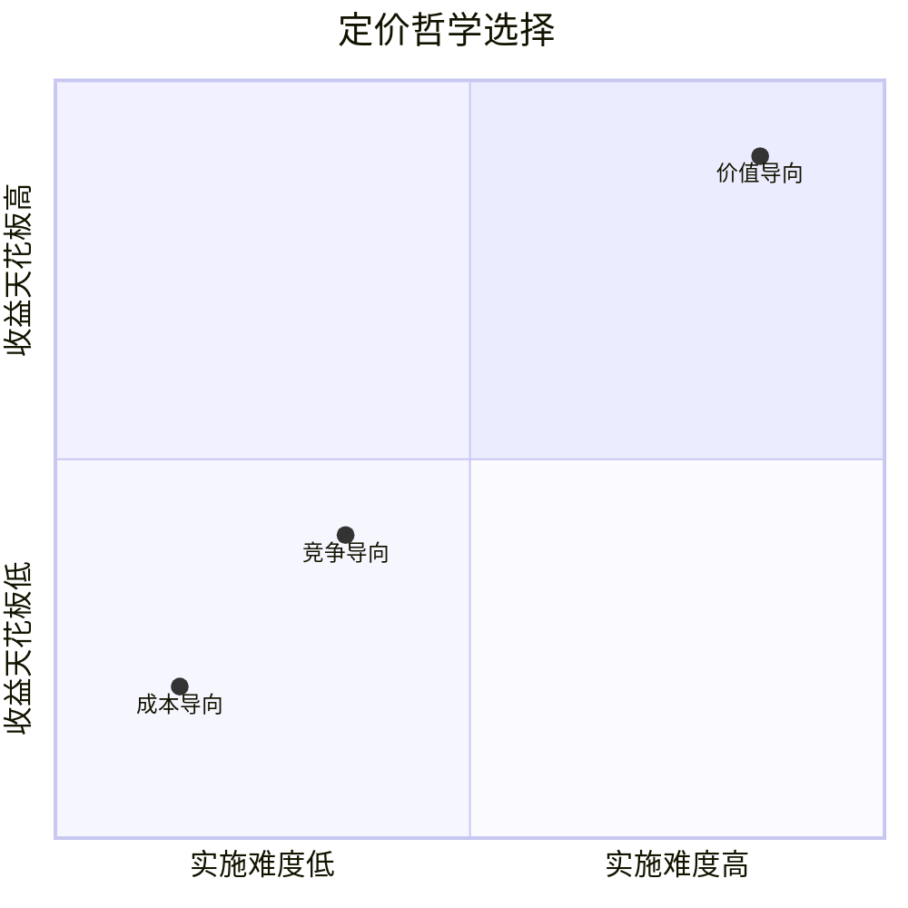
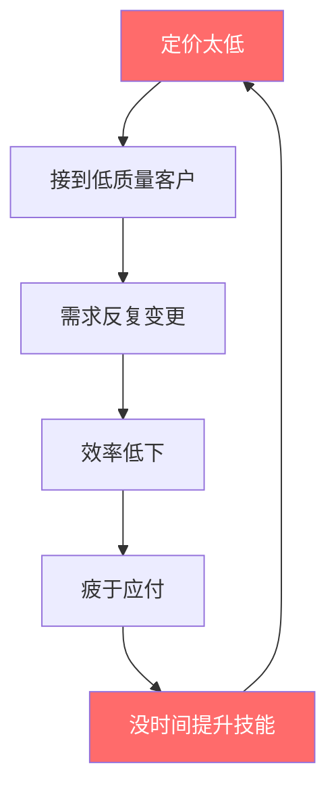
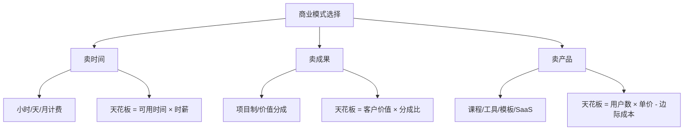

## 十一、定价策略深度解析

定价是技术变现中最被低估的杠杆。同一个网站开发项目，报价3万客户嫌贵，报价8万客户反而觉得专业——因为价格本身就是价值信号。定价不只是一个数字，它决定了你吸引什么层级的客户、能走多远、天花板在哪里。

本章从底层逻辑到实战技巧，系统拆解技术从业者的定价方法论，覆盖从冷启动期的第一单到专家级顾问的分钟计费，帮你建立一套可持续迭代的定价体系。

### 1. 定价的底层逻辑

#### 1.1 价格的本质：价值的货币映射

价格不是"成本+利润"的简单算术，而是客户感知价值的货币表达。一个帮企业节省100万的自动化脚本，定价10万客户觉得便宜，定价1万客户反而怀疑你的能力。

**价值三角模型：**

| 维度 | 含义 | 定价影响 | 举例 |
|------|------|----------|------|
| 功能价值 | 解决了什么具体问题 | 决定价格下限 | 自动化脚本节省了2个人力 |
| 情感价值 | 降低了什么焦虑 | 提升溢价空间 | "上线后老板表扬我"的确定性 |
| 身份价值 | 代表什么社会信号 | 打开高端市场 | 请了XX公司做的系统，行业标杆 |

技术人最常见的错误是只谈功能价值，忽略情感和身份价值。客户买的不是一个网站，而是"上线后老板表扬我"的确定性。当你能把三个维度的价值都传递到位，价格弹性空间会大很多。

**案例：** 同样是做一个数据看板，报价8000元只说"用ECharts做了几个图表"，和报价2万元说"帮您建立实时运营指标监控体系，老板在手机上随时看到核心数据，每周自动发送周报到邮箱"——后者卖的是确定性和专业感，客户感知价值完全不在一个层级。

#### 1.2 三种定价哲学

**成本导向定价**——"我花了多少时间"：按工时收费，看似公平实则惩罚效率。你技术越好，完成越快，收入反而越低。适合起步期建立信心，但必须尽快切换。成本定价的核心问题在于：你把注意力放在了"我付出了什么"而不是"客户得到了什么"，这个视角会让你永远低估自己。

**竞争导向定价**——"同行收多少"：参考市场均价上下浮动。安全但平庸，容易陷入价格战。适合标准化服务（如建站、小程序开发），但对高端定制服务不适用。使用竞争定价时需要注意：你看到的同行报价往往只是冰山一角，别人的真实成交价、客户质量、服务范围你并不知道。

**价值导向定价**——"客户获得多少"：锚定客户收益，按价值分成。需要你能量化交付物的商业价值，对沟通能力和行业理解要求最高，但天花板也最高。价值定价是最终应该走到的方向，因为它把你的收益和客户的成功绑定在了一起。

**三种定价哲学的选择矩阵：**



#### 1.3 锚定效应与价格心理学

客户对绝对价格没有概念，只对比较有感觉。定价的核心技巧是制造合理的参照系：

**锚定效应的四种应用方式：**

1. **先报价高端方案**：3000元/5000元/8000元三档，大多数人选中间档。这是经典的"诱饵效应"（decoy effect）——8000元方案的存在就是为了让5000元显得合理
2. **拆解对比**：每天不到一杯咖啡的钱（99元/月 vs 3.3元/天）。把大数字拆成小单位，降低心理门槛
3. **展示市场价**：招聘一个全职前端月薪15000+五险一金+管理成本≈22000，外包给你只要8000/月
4. **损失框架**：不做这次优化，每月损失约5万元转化率。人们对损失的敏感度是收益的2倍（前景理论），用"不做会怎样"比"做了能怎样"更有效

**进阶心理定价技巧：**

- **尾数定价**：7999比8000感觉便宜很多（左位数效应），但这在B2B场景效果有限
- **声望定价**：高端服务故意用整数价格（50000元/月），传递"我们的价格不打折"的信号
- **框架效应**：同样是5万元方案费，"分期支付，首付2万"比"一次性支付5万"接受度高得多
- **诱饵定价**：在两个方案之间加入一个明显不划算的方案，引导客户选择你想让他选的那个

### 2. 技术服务的六大定价模型

#### 2.1 按项目定价（Project-based Pricing）

**适用场景**：需求明确、交付物清晰的项目，如网站开发、小程序、数据看板。

**定价公式：**

```text
项目报价 = 预估工时 × 时薪 × 风险系数(1.2-1.8) + 直接成本 + 合理利润
```

**风险系数选择指南：**

| 系数 | 适用情况 |
|------|----------|
| 1.2 | 需求非常清晰，做过类似项目，客户配合度高 |
| 1.3 | 需求基本明确，有一些不确定性 |
| 1.5 | 需求较模糊，涉及新技术，客户决策链长 |
| 1.8 | 完全探索性项目，需求可能大幅变更 |

**实操要点：**

- 需求不明确时绝不报固定价，先收需求分析费（500-2000元），这个费用可以抵扣正式项目款
- 把大项目拆成里程碑，每个里程碑单独验收和付款，这样既降低客户风险感知，也保护你的现金流
- 明确约定变更范围，超出原始需求的部分按小时计费，写进合同
- 预留20%-30%的缓冲应对需求变更，经验表明几乎所有项目都会变更
- 不要贪图大项目一口吃成胖子，需求变更的风险和项目大小成指数关系

**报价模板示例：**

| 项目 | 工时(天) | 单价(元/天) | 小计 |
|------|----------|-------------|------|
| 需求分析与方案设计 | 3 | 1500 | 4500 |
| UI/UX设计 | 5 | 1200 | 6000 |
| 前端开发 | 10 | 1500 | 15000 |
| 后端开发 | 12 | 1500 | 18000 |
| 测试与部署 | 3 | 1200 | 3600 |
| 风险缓冲(20%) | — | — | 9420 |
| **合计** | **33** | | **56520** |

**真实案例拆解：**

一位独立开发者接到某教育机构的在线课程平台需求。客户说"就做个课程网站"，开发者用项目制报价5万。实际开发中客户不断追加功能（学员社群、作业批改、证书生成、多级分销），最终工时超出预估3倍，实际时薪不到100元。

**教训**：需求文档必须逐项确认签字，变更走正式流程。后来这位开发者在合同中加了"变更工时不超过原合同30%，超出需要重新签订补充协议"，再也没吃过这个亏。

#### 2.2 按时间定价（Time-based Pricing）

**适用场景**：需求不确定的探索性项目、长期技术顾问、驻场开发。

**小时费率参考区间（2025-2026中国市场）：**

| 能力层级 | 小时费率 | 典型场景 |
|----------|----------|----------|
| 初级(1-2年) | 100-300元 | 基础开发、简单运维 |
| 中级(3-5年) | 300-600元 | 全栈开发、系统设计 |
| 高级(5-10年) | 600-1200元 | 架构设计、技术咨询 |
| 专家(10年+) | 1200-3000元 | 技术战略、CTO顾问 |
| 行业权威 | 3000-10000元 | 顶级咨询、战略规划 |

**按天/月报价时注意：**

- 按天报价通常是小时费率的7-8折（按8小时计），因为按天计费减少了客户的管理成本
- 月度驻场要写清楚每月有效工作天数（一般22天），法定节假日、请假等如何处理
- 超出约定天数按1.5倍计算，周末和节假日按2倍
- 远程工作可以适当让利5%-10%，但不要让太多，你省的是通勤时间不是价值

**按时间计费的隐藏陷阱：**

最大的问题是"时间价格悖论"——你越熟练，用时越少，收入反而越低。一个高手2小时做完的活，新手要2天，但客户不会为2小时支付2天的钱。破解方法：项目足够成熟后切换到按项目定价或价值定价，把效率提升转化为自己的利润而不是客户的折扣。

#### 2.3 按价值定价（Value-based Pricing）

**适用场景**：你能直接量化服务带来的商业价值时，如转化率优化、成本节约、收入增长。

**定价逻辑：**

```text
报价 = 客户预期收益 × 分成比例(5%-30%)
```

分成比例取决于三个因素：
- 你的可替代性：越难替代，比例越高
- 风险承担方式：如果承担风险（对赌），比例可以更高
- 服务持续性：一次性交付比例低，持续运营比例高

**案例拆解：**

某电商网站日均UV 10万，转化率1.2%，客单价200元。你做性能优化把加载时间从3秒降到1秒，预期转化率提升到1.6%。

```text
优化前日收入 = 100000 × 1.2% × 200 = 240,000元
优化后日收入 = 100000 × 1.6% × 200 = 320,000元
日增收 = 80,000元，年增收 ≈ 2920万元
你的报价 = 2920万 × 10% = 292万元
```

即使客户砍到50万，也远超按时间计费的收入。关键在于你能说服客户这个收益预估是可信的。

**说服客户接受价值定价的方法：**

1. 用数据建立可信度：展示Google/SOASTA等权威研究（页面加载每快1秒，转化率提升7%）
2. 提供试运行：先做一周小范围测试，用真实数据验证假设
3. 对赌降低客户风险：达到目标收取全款，未达到打折或部分退款
4. 展示同类案例：你帮别人做过类似优化，有真实数据支撑

**价值定价的风险管理：**

- 要求客户共享真实的业务数据，作为价值测算依据，签保密协议
- 签署对赌协议：达到目标收取全款，未达到打折或退款
- 设置收入上限（cap），避免客户觉得"付太多"
- 分期收款，里程碑挂钩业务指标，比如达到50%效果付50%款
- 定义清楚"价值"的衡量标准和数据来源，避免扯皮

#### 2.4 订阅/月费模式（Retainer）

**适用场景**：长期技术维护、持续迭代的产品、技术顾问关系。

**月费定价要素：**

```text
月费 = 每月预估工时 × 时薪 + 响应承诺溢价 + 优先级溢价
```

响应承诺溢价说明：承诺1小时响应和承诺24小时响应，对你的生活影响完全不同，应该反映在价格里。优先级溢价说明：同一时间段服务3个客户，谁优先？愿意为优先级付费的客户获得更快响应。

**三档月费套餐设计：**

| 维度 | 基础版 | 标准版 | 高级版 |
|------|--------|--------|--------|
| 月费 | 3000元 | 8000元 | 20000元 |
| 包含工时 | 8小时/月 | 20小时/月 | 50小时/月 |
| 响应时间 | 24小时 | 4小时 | 1小时 |
| 支持渠道 | 邮件 | 微信+电话 | 专属群+电话 |
| 超出工时费 | 400元/时 | 350元/时 | 300元/时 |
| 合同期限 | 月付 | 季付(95折) | 年付(9折) |

**订阅模式的关键指标：**

- 客户生命周期价值（LTV）= 月费 × 平均留存月数
- 月度流失率目标 < 5%，超过这个数字说明你的服务有改进空间
- 预付费比例越高，现金流越稳定，季付/年付可以给折扣但必须锁定期限
- 未用工时不退款，但可顺延一个月——这是行业惯例，写进合同

**订阅模式的注意事项：**

月费制最大的风险是"占用但不用"——客户每月付费但很少找你，时间长了会觉得浪费钱而取消。解决方法是定期主动提供价值：月度技术健康检查报告、行业趋势简报、系统运行状态周报。让客户即使没有主动找你，也能感受到你在"工作"。

#### 2.5 按成果付费（Performance-based）

**适用场景**：SEO优化、广告投放、增长黑客等可量化指标的场景。

**常见模式：**

- CPA（按转化付费）：每带来一个注册/订单收费，适合效果可量化的场景
- CPS（按销售额分成）：按成交额的5%-20%提成，适合电商代运营
- 按排名付费：关键词进入前10/前3收费，适合SEO服务
- 按粉丝增长付费：每增加X粉丝收Y元，适合社媒运营

**风险控制要点：**

- 必须有数据追踪系统，双方认可数据来源，推荐用第三方工具如Google Analytics、友盟等
- 设置保底收入（base fee），避免白干，保底可以是市场价的30%-50%
- 归因周期要明确（7天/14天/30天归因窗口），不同行业归因周期差异大
- 定义清楚什么算"有效转化"，一个注册和一个付费用户的价值完全不同
- 设置合作周期和退出条款，3-6个月为一个评估周期

**真实案例：** 一位技术开发者为某教育公司做投放优化，按CPA收费50元/注册。第一个月带来200个注册，收入1万。但后来发现其中60%是无效注册（手机号格式对但不是真人）。教训：转化的定义必须写进合同，而且要定义"有效转化"——比如"注册后完成首次付费"。

#### 2.6 产品化服务定价（Productized Service）

**适用场景**：标准化程度高的服务，如代码审计、安全扫描、技术体检。

**产品化服务的特点：**

- 固定范围、固定价格、固定交付时间，客户决策门槛低
- 可以批量交付，边际成本递减，效率随经验提升
- 容易营销和转介绍，客户能一句话说清"我买了什么"

**定价设计示例——代码审计服务：**

| 套餐 | 代码规模 | 交付物 | 周期 | 价格 |
|------|----------|--------|------|------|
| 入门版 | <1万行 | 基础安全报告 | 3天 | 3000元 |
| 标准版 | 1-10万行 | 安全+性能报告+修复建议 | 5天 | 8000元 |
| 企业版 | 10万行+ | 全面审计+修复方案+1次修复 | 10天 | 25000元 |

**产品化服务的定价技巧：**

入门版的真正目的是获取客户和建立信任，它的利润率最低。标准版是利润主力，70%的客户应该选这个。企业版是锚点和利润来源，选这个的客户不多但每个都赚。

适合做成产品化服务的技术领域还包括：网站性能优化体检（固定项目，固定流程，固定价格）、数据库调优服务、技术债务评估、API安全检测、DevOps流水线搭建、监控告警系统部署。

### 3. 定价策略的实操方法

#### 3.1 定价四步法

**第一步：确定价值基准**

列出你的服务能给客户带来的具体价值：
- 节省了多少时间？（换算成人工成本，包括社保、管理费用）
- 增加了多少收入？（直接增量，用保守估计）
- 降低了多少风险？（潜在损失的避免，如数据泄露的损失）
- 替代了什么方案？（招聘全职 vs 外包的成本差，包括招聘成本、培训成本）

**价值计算示例：** 客户需要一个自动化报表系统，目前一个运营人员每天花3小时手动整理数据，月薪8000元。自动化后：
- 每月节省工时 = 3小时 × 22天 = 66小时
- 时薪 = 8000 ÷ 22 ÷ 8 ≈ 45元/小时
- 月节省 = 66 × 45 ≈ 3000元
- 年节省 = 36000元（还不包括人工错误带来的损失）
- 你的报价可以是年节省的30%-50% = 10800-18000元

**第二步：调研市场区间**

- 在各大平台（猪八戒、程序员客栈、Upwork、Fiverr）搜索同类服务价格
- 关注定价区间而非平均值——低价平台的数据不代表你的水平
- 找3-5个同级别的从业者私下交流定价（圈子很重要，可以在技术社群里匿名交流）
- 关注不同城市/行业的定价差异，一线城市和三线城市的定价差距可以是3-5倍

**第三步：设定三档价格**

永远不要只报一个价格。三档定价（锚定-主力-利润）：

```text
入门版（锚定）= 成本 × 1.5    →  让客户觉得"不算贵"
标准版（主力）= 成本 × 2.5    →  大多数客户选这个
高级版（利润）= 成本 × 4.0    →  服务高端客户的高利润选项
```

**三档定价的心理学原理：**

只有一个价格时，客户的选择是"买或不买"。有三个价格时，选择变成了"买哪个"——这是一个根本性的转变。你已经赢了第一个决策（买），只需要引导他选哪个。

**第四步：测试与迭代**

- 用A/B测试验证不同价格的转化率（在不同平台或不同时间段测试）
- 每季度复盘，根据成交率调整：成交率>70%说明定价偏低，<30%说明偏高
- 积累案例后逐步提价，每次提价10%-20%
- 记录每个报价的详细信息：客户类型、报价金额、是否成交、成交/未成交原因

#### 3.2 报价话术模板

**场景一：客户问"多少钱"**

> 好的，在给出准确报价之前，我想先了解几个关键信息：
> 1. 项目的具体目标是什么？（解决什么问题/实现什么效果）
> 2. 有没有明确的上线时间节点？
> 3. 之前有没有类似的尝试？效果如何？
>
> 这些信息能帮我评估工作量，给您一个合理的报价。

核心原则：不问清楚需求，绝不报价。报价前的提问本身就是在展示专业度——客户会因为你问得详细而更加信任你。

**场景二：客户说"太贵了"**

> 理解您的顾虑。这个报价包含了[列举核心价值点]。
> 如果预算有限，我们可以调整方案：
> - 方案A：减少[X功能]，报价降到[Y]
> - 方案B：分两期交付，首期[Z元]
> - 方案C：用更轻量的技术方案，报价[W元]
>
> 您倾向哪个方向？

核心原则：永远不要直接降价，而是调整范围或方案。直接降价会传递两个信号：你之前在宰我，或者你的服务不值这个价。

**场景三：客户拿同行低价压价**

> 价格差异主要体现在几个方面：
> 1. [你的独特优势，如行业经验/技术深度/售后保障]
> 2. [过往成功案例的具体数据]
> 3. [交付后的增值服务]
>
> 我更建议您对比总拥有成本（TCO），而不仅是初始报价。
> 便宜的方案如果后期需要返工，总成本反而更高。

**场景四：客户要求免费试做**

> 我理解您想确保效果再付费。有两个方式可以降低您的风险：
> 1. 先做一个付费的需求分析（2000元），输出详细方案，您拿着方案可以找任何人做
> 2. 签署对赌协议，按效果付费，未达标退款
>
> 但免费试做我没法做——因为这会影响我服务其他付费客户的精力。

#### 3.3 涨价策略

**涨价时机：**

- 积累了3个以上同类型成功案例，可以支撑更高定价
- 客户咨询量持续超过你的产能（供不应求）
- 获得了新的认证、头衔或行业认可
- 市场行情上涨，你的价格已经低于同行

**涨价执行：**

- 新客户立即执行新价格，不需要解释
- 老客户提前30天通知，给予3个月缓冲期
- 涨价幅度控制在15%-30%，太大容易流失客户
- 涨价同时提升服务内容，让客户觉得"物超所值"——比如涨价20%但增加月度技术健康检查

**涨价通知模板：**

> 尊敬的[客户名]：
>
> 感谢您一直以来的信任与合作。随着我在[领域]的经验积累和服务能力的提升，自[日期]起，我的[服务名称]价格将调整为[新价格]。
>
> 为感谢老客户的支持，您可以在[日期]前按原价格续费/下单。
>
> 同时，我将在[方面]增加增值服务，确保您获得更高的投入回报。

### 4. 不同阶段的定价策略

#### 4.1 冷启动期（0-10单）

目标是积累案例和口碑，而非最大化收入。

- 定价可以是目标价的50%-70%
- 主动提供2-3个免费/低价项目换取案例和评价，但要有明确的交换条件（案例授权、推荐信、转介绍）
- 每个项目都要写详细的案例分析（征得客户同意后发布）
- 不要免费做——即使是象征性收费也要收，筛选出真正有需求的客户
- 冷启动期最重要的指标不是收入，而是"成功案例数量"和"客户满意度"

#### 4.2 成长期（10-50单）

有了一定案例基础，开始向目标价格靠拢。

- 每积累5个新案例，提价10%
- 开始区分"标准客户"和"战略客户"（行业头部、可带来转介绍的）
- 标准客户正常报价，战略客户可以给折扣但要求案例授权和转介绍
- 开始建立自己的定价体系（产品化服务）
- 开始系统化记录定价数据：报价金额、成交率、客户类型、项目利润率

#### 4.3 成熟期（50单以上）

有了品牌溢价，定价开始向价值导向转型。

- 用案例数据支撑高价：帮客户节省了多少/增加了多少，具体数字最有说服力
- 推出高端定制服务线，价格是标准线的2-3倍
- 建立等位机制——不是有钱就能买到你的时间
- 开始做被动收入产品（课程、工具、模板），实现收入多元化
- 考虑团队化运营，培养初级开发者做标准化项目，自己专注高价值项目

#### 4.4 专家期

成为领域权威后，定价权完全在你手里。

- 咨询费可以按分钟计（知名技术顾问500-2000元/30分钟）
- 开设培训工作坊，单场1-5万元
- 出版/演讲带来的品牌溢价反哺服务定价
- 开始做投资/顾问换取股权，追求长期回报
- 建立个人品牌护城河：出版、演讲、社区影响力都是定价的支撑

### 5. 不同服务类型的定价参考

#### 5.1 网站/小程序开发

| 类型 | 简单 | 中等 | 复杂 |
|------|------|------|------|
| 企业官网 | 3000-8000 | 8000-20000 | 20000-50000 |
| 电商小程序 | 5000-15000 | 15000-50000 | 50000-150000 |
| SaaS产品 | 20000-50000 | 50000-200000 | 200000+ |
| H5活动页 | 1000-3000 | 3000-8000 | 8000-20000 |

**复杂度判断标准：**
- 简单：标准模板，少量定制，无复杂交互
- 中等：定制设计，需要后端逻辑，涉及支付/用户系统
- 复杂：全定制开发，涉及实时通信、大数据处理、复杂业务逻辑

#### 5.2 技术咨询与培训

| 类型 | 初级 | 中级 | 高级 |
|------|------|------|------|
| 1v1技术咨询 | 200-500/时 | 500-1000/时 | 1000-3000/时 |
| 技术培训(线下) | 5000-10000/天 | 10000-25000/天 | 25000-80000/天 |
| 企业内训 | 8000-15000/天 | 15000-40000/天 | 40000-100000/天 |
| 技术评审 | 3000-5000/次 | 5000-15000/次 | 15000-50000/次 |

**企业内训定价技巧：** 内训不要按人数定价（否则人数少的客户觉得亏），而是按天/按场定价。但可以设最低人数要求（如10人起），低于10人按10人计费。

#### 5.3 数据与自动化服务

| 类型 | 价格区间 | 定价依据 |
|------|----------|----------|
| 数据爬虫 | 1000-10000 | 数据源数量 × 复杂度 × 反爬难度 |
| 数据分析报告 | 3000-30000 | 数据量 × 分析深度 × 行业专业性 |
| 自动化脚本 | 500-5000 | 节省人工时间 × 月频次 × 使用人数 |
| RPA流程开发 | 5000-50000 | 流程节点数 × 复杂度 × 异常处理完善度 |

#### 5.4 新兴技术领域定价参考

| 领域 | 服务类型 | 价格区间 | 定价说明 |
|------|----------|----------|----------|
| AI/LLM应用开发 | 微调/部署/集成 | 5000-100000 | 取决于模型规模和业务场景复杂度 |
| AI Agent开发 | 智能体定制 | 10000-200000 | 涉及工具链集成的复杂度决定价格 |
| 区块链 | 智能合约开发 | 20000-200000 | 安全性要求高，需要审计，价格也高 |
| 数据标注/清洗 | 数据集构建 | 0.1-5元/条 | 取决于标注难度和质量要求 |
| 私有化部署 | 大模型本地化 | 50000-500000+ | 硬件成本+软件调优+运维培训 |

### 6. 常见定价误区与纠偏

#### 6.1 八大定价误区

| 误区 | 表现 | 纠正方法 |
|------|------|----------|
| 按时间定价思维 | "这个要3天，3天×500=1500" | 转向价值定价，问"这值多少钱" |
| 低价竞争 | "我比别人便宜所以客户选我" | 差异化竞争，不是价格竞争 |
| 不好意思报价 | 怕客户觉得贵，报低价求成交 | 练习报价话术，建立价格自信 |
| 一口价不拆分 | 给一个总价，客户无法理解 | 拆分成明细，展示每个环节的价值 |
| 免费试做 | "先做一版你看效果" | 收取定金(30%-50%)后开工 |
| 忽略隐性成本 | 不算沟通成本、修改成本、机会成本 | 把所有成本算进报价 |
| 所有人一个价 | 对高端客户和小客户同样定价 | 分层定价，匹配不同客户 |
| 价格一成不变 | 三年不涨价 | 每季度复盘，年度调价 |

**每个误区的深度解析：**

**误区一：按时间定价思维** 的本质问题是你在惩罚自己的效率。如果你花10年积累的技能能在2小时内解决一个新手需要2天的问题，你的价值应该是新手的8倍（问题本身的价值），而不是1倍（因为时间短）。你卖的是10年积累，不是2小时。

**误区三：不好意思报价** 的根源是对自身价值的不确定。建议：把每次报价当作一次练习，第一次可能紧张，第十次就自然了。有一个技巧——先在纸上写下你认为合理的报价，然后加30%再报。你会发现大多数时候客户接受得比你想象的轻松。

**误区五：免费试做** 的危险性在于：客户把免费试做当成了免费设计方案，拿到方案后要么自己做，要么找更便宜的人做。你的时间和精力被白嫖了。如果客户真的想验证你的能力，可以付费做一个小范围的概念验证（PoC），费用通常在项目总价的10%-20%。

#### 6.2 低价陷阱的恶性循环



**打破循环的方法：**

1. 砍掉最低端的30%客户——他们消耗你80%的精力但只贡献20%的收入
2. 腾出时间提升技能和打造案例
3. 用新案例支撑更高的定价
4. 吸引更高质量的客户
5. 循环提升

**真实案例：** 某前端开发者月收入8000元，同时服务5个小客户，每个客户月费1500-2000元。他砍掉了最麻烦的2个客户（省出60%时间），用腾出的时间学习React Native并做了2个App案例。三个月后，他用新案例接到2个App项目，单个项目报价2万，月收入翻倍。

### 7. 高级定价技巧

#### 7.1 心理定价锚点

在方案中刻意设置高价锚点：

```text
常见错误：
- 基础版：5000元
- 进阶版：8000元

优化后：
- 入门咨询：2000元（锚定低价，筛选不认真的人）
- 标准方案：8000元（主力方案）
- VIP方案：25000元（让8000显得便宜）
- 旗舰方案：50000元（给真正不差钱的客户）
```

**锚点设计的底层逻辑：**

人的判断依赖比较。25000元方案的核心功能可能只比8000元多30%，但它的存在让8000元显得"合理"甚至"划算"。而50000元方案的存在，让25000元都显得"不贵"。每一层都在为下一层提供心理支撑。

#### 7.2 捆绑定价与拆分定价

**捆绑定价**：将多个服务打包，总价低于单项之和，提高客单价。

```text
单项购买：SEO审计5000 + 性能优化5000 + 安全检测5000 = 15000
套餐价：全面技术体检 = 11000（省4000，但你省了3次沟通成本）
```

**拆分定价**：将一个大服务拆成小模块，降低决策门槛。

```text
不是"12万的技术改造"，而是：
- 第一期：架构评估 2万 → 让客户先体验你的专业度
- 第二期：核心改造 5万 → 客户已有信任基础
- 第三期：全面优化 5万 → 顺势推进
```

拆分定价的关键是：第一期的价格要低到客户几乎没有决策压力，但交付质量要高到客户对后续阶段充满信心。第一期就是你最好的销售工具。

#### 7.3 动态定价

根据供需关系灵活调整：

- **旺季加价**：年底企业预算消化期（11-12月）、重大政策发布后的需求激增
- **淡季促销**：春节后的传统淡季（2-3月），可以推出限时优惠吸引早期客户
- **紧急加价**：48小时内需要交付的需求，费率×1.5-2.0，这是合理的——紧急需求打乱了你的计划，机会成本应该由客户承担
- **长期折扣**：签年度框架协议给予10%-15%折扣，前提是客户承诺最低消费额度
- **批量折扣**：一次性购买多个月的服务，给予阶梯折扣

#### 7.4 竞争对手定价应对

**当竞争对手低价切入时：**

1. 不要跟着降价——这是一条不归路，降下去就涨不回来
2. 强调差异化价值：经验、案例、售后、稳定性
3. 提供"试用体验"：让客户小成本感受你的质量差异，比如付费诊断服务
4. 如果市场确实在低价化，考虑产品化/标准化降低成本结构
5. 关注竞争对手低价背后的原因：是新手入行、是市场洗牌、还是你的价格确实偏高

**当竞争对手高价定位时：**

1. 分析他们高价的支撑点是什么——品牌、技术、服务、还是信息不对称
2. 如果你也有同等能力，说明市场能接受更高价格，你可以考虑提价
3. 如果你暂时没有，记录下来作为能力提升方向
4. 不要盲目对标，找到自己的价格定位——价格战不是唯一的竞争方式

### 8. 定价的心理博弈

#### 8.1 价格谈判的七个原则

1. **永远让对方先出价**：了解对方预算后再调整策略，这不会让你处于劣势，反而给了你调整空间
2. **报价时保持沉默**：报完价不要急着解释，让对方先反应。沉默是谈判中最强大的武器
3. **分段报价**：降低单次决策的金额门槛，"先付2万启动"比"总价8万"容易接受得多
4. **制造稀缺性**：这个月还有2个排期名额，下个月要涨价。稀缺性必须是真实的，不要编造
5. **给选择不给折扣**：三个方案选一个，而不是一个方案打折。打折伤利润，选择提升转化
6. **用数据说话**：报价有依据，不是拍脑袋。"我做过12个类似项目，平均工时和报价如下..."
7. **敢于拒绝**：预算太低的客户，礼貌拒绝比低价接单更好。拒绝不当的客户，反而提升了你在合适客户心中的价值

#### 8.2 处理"能不能便宜点"

**错误回应**：直接打折（客户会觉得你之前报价虚高）

**正确流程：**

```text
客户说贵 → 追问具体预算 → 了解真实范围
    ↓
预算够 → 解释价值构成，坚持报价
    ↓
预算不够 → 调整方案范围，而非降价
    ↓
还是不够 → 推荐替代方案或阶段性实施
    ↓
完全谈不拢 → 礼貌拒绝，保持关系
```

**话术示例——场景分解：**

客户预算只有6000，你报价15000：

> 我理解您的预算情况。6000元的预算，我们可以做这样的方案：
> 核心功能保留（列出最重要的2-3个），其他功能留到第二期。
> 这样您先上线最核心的部分，用起来之后再逐步迭代。
>
> 或者，如果您愿意接受更长的交付周期，我可以用业余时间做，
> 费用可以控制在8000元左右，但周期会从2周延长到4周。
>
> 您觉得哪个方向更适合？

#### 8.3 免费咨询的边界

免费咨询是获客的重要手段，但必须有边界：

- **免费**：初次沟通15-30分钟，了解需求方向，评估是否匹配
- **付费**：出具详细方案文档、竞品分析、技术选型建议——这些有独立价值
- **判别标准**：产出物是否有独立价值。如果客户拿走你免费给的方案就能自己执行，那就不应该免费

**免费咨询的正确做法：** 在免费咨询中展示你的专业度，但只给方向不给细节。比如："建议用微服务架构"——这是方向；具体的架构图、技术选型、实施方案——这是付费内容。

### 9. 定价工具与模板

#### 9.1 定价计算器（Python）

```python
def calculate_price(
    hours: float,
    hourly_rate: float,
    risk_factor: float = 1.3,
    direct_cost: float = 0,
    profit_margin: float = 0.2,
    discount: float = 0
) -> dict:
    """技术项目报价计算器"""
    base_cost = hours * hourly_rate
    risk_adjusted = base_cost * risk_factor
    total_before_profit = risk_adjusted + direct_cost
    total_with_profit = total_before_profit * (1 + profit_margin)
    final_price = total_with_profit * (1 - discount)

    return {
        "基础工时费": round(base_cost, 2),
        "风险调整后": round(risk_adjusted, 2),
        "直接成本": round(direct_cost, 2),
        "含利润总价": round(total_with_profit, 2),
        "折扣后最终价": round(final_price, 2),
        "建议三档报价": {
            "入门版": round(final_price * 0.6, -2),
            "标准版": round(final_price, -2),
            "高级版": round(final_price * 2.5, -2),
        }
    }

# 示例：一个预估40小时、时薪500元的项目
result = calculate_price(hours=40, hourly_rate=500, risk_factor=1.3)
for k, v in result.items():
    print(f"{k}: {v}")
```

**输出示例：**

```text
基础工时费: 20000
风险调整后: 26000
直接成本: 0
含利润总价: 31200.0
折扣后最终价: 31200.0
建议三档报价: {'入门版': 18700, '标准版': 31200, '高级版': 78000}
```

#### 9.2 客户价值评估清单

在定价前，用这个清单评估客户的支付意愿：

| 评估项 | 低(1分) | 中(3分) | 高(5分) |
|--------|---------|---------|---------|
| 公司规模 | 初创/个人 | 中小企业 | 大企业/上市公司 |
| 预算来源 | 自掏腰包 | 部门预算 | 专项预算 |
| 紧急程度 | 可以等 | 有时间线 | 急需解决 |
| 问题严重性 | 优化改善 | 影响运营 | 危及生存 |
| 决策层级 | 技术人员 | 部门经理 | 高管/老板 |
| 历史付费 | 从未外包 | 偶尔外包 | 经常外包 |

**评分与定价策略：**

- 6-12分：保守定价，强调性价比，多用"入门版"
- 13-20分：标准定价，突出专业度，主推"标准版"
- 21-30分：积极定价，强调价值和ROI，推"高级版"或定制方案

**使用时机：** 在首次沟通后、正式报价前完成评估。这不需要当面问客户——从他们的问题描述、公司背景、沟通方式中就能判断大部分信息。

#### 9.3 合同中的定价条款模板

```markdown
## 费用与支付

1. **项目总价**：人民币 XX,XXX 元（含税）
2. **支付方式**：
   - 合同签署后支付 40%（XX,XXX元）作为启动款
   - 中期验收通过后支付 30%（XX,XXX元）
   - 终验通过后支付剩余 30%（XX,XXX元）
3. **超出范围**：原始需求文档范围外的变更，按每小时 XXX 元另行计费
4. **延期费用**：非乙方原因导致的项目暂停超过15天，恢复后需支付
   原合同总价的 5% 作为项目重启费
5. **逾期付款**：超过约定付款日期7天未付款，项目暂停；超过30天，
   乙方有权解除合同并追索已完成工作的费用
```

### 10. 定价与商业模式的关系

定价不是一个孤立的决策，它和你的商业模式深度绑定：



**最终目标**：从卖时间走向卖成果，再从卖成果走向卖产品。每一次跃迁，定价逻辑都会根本改变。

- **卖时间**：定价上限 = 市场上同等能力者的时薪上限。你永远不可能超过行业最高时薪太多，因为时间是有限的
- **卖成果**：定价上限 = 客户获得的商业价值。这时你的收入和你的效率正相关，做得越好越快，赚得越多
- **卖产品**：定价上限 = 用户感知价值（可以远超成本）。一个课程做一次，卖一万次，边际成本几乎为零

### 11. 定价的常见风险与保障

#### 11.1 收款保障策略

**风险一：客户拖延付款**

- 合同中明确付款节点和逾期条款，逾期7天暂停服务，逾期30天可解约
- 大项目分阶段收款，每个阶段开始前确认上一阶段款项到账
- 使用第三方托管平台（如猪八戒、程序员客栈的担保交易）
- 新客户首次合作要求预付比例不低于50%

**风险二：客户赖账不付**

- 保留所有沟通记录（聊天截图、邮件、语音记录）
- 金额较大的项目建议使用正式合同（即使对方是个人）
- 3万以上建议请律师审核合同
- 小额纠纷可以通过互联网法院在线诉讼，成本低效率高

**风险三：项目中途客户消失**

- 定金不退是行业惯例，写进合同
- 按里程碑付款，每个阶段完成就收该阶段的钱
- 源代码/设计稿按阶段交付，不一次性给全

#### 11.2 税务与发票

作为自由职业者或独立开发者，定价时需要考虑税务成本：

- **个人劳务报酬**：税率20%-40%（减除费用后），预扣预缴，年度汇算清缴
- **个体工商户**：可以享受小规模纳税人优惠政策，增值税1%-3%
- **注册公司**：企业所得税25%（小微企业有优惠），但可以抵扣成本
- **发票问题**：很多企业客户需要发票才能付款，个人去税务局代开发票税率约3%-5%

**建议：** 如果月收入超过2万，建议注册个体工商户或公司，合理降低税负。定价时要把税负成本考虑进去——如果你的报价不含税，客户开发票需要额外加税点。

### 12. 本章检查清单

在每次定价决策前，用这个清单自检：

- [ ] 我是否清楚这个服务能给客户带来多少价值？
- [ ] 我是否了解市场上同类服务的价格区间？
- [ ] 我是否准备了至少两个方案供客户选择？
- [ ] 我是否把所有成本（沟通、修改、风险）都算进去了？
- [ ] 我的报价是否包含了利润缓冲（至少20%）？
- [ ] 我是否准备好了"客户嫌贵"的应对话术？
- [ ] 合同中是否写明了变更范围的计费方式？
- [ ] 收款节点是否和交付里程碑挂钩？
- [ ] 我是否有勇气拒绝低于底线的订单？
- [ ] 税务成本是否已经计入报价？
- [ ] 客户评估得分是多少，对应什么定价策略？

定价是一门实践学科，理论再好也需要在实战中不断校准。从今天开始，记录每一个报价、成交率、客户反馈，三个月后你就能找到最适合自己的定价区间。定价能力的提升曲线是非线性的——前半年可能只有10%-20%的提升，但一旦你找到自己的价格锚点，后续每一次提价都是复利式增长。
