# 一、技能变现的本质

理解"技能变现"这四个字的底层逻辑，是所有后续行动的起点。很多技术人空有一身本事却赚不到钱，不是因为技术不行，而是没有搞清楚变现的底层机制。本章从经济学原理出发，逐层拆解技能变现的本质、模式、杠杆、市场定价逻辑和底层经济学规律，同时覆盖AI时代的新变量、跨境变现、税务法务实操、团队化协作等以往被忽略的关键维度。读完本章，你将建立一个完整的"技能变现心智模型"——它不会告诉你具体做什么，但会帮你理解为什么有些人靠技术年入百万，而另一些人技术更好却只能拿死工资。

本章的知识地图：

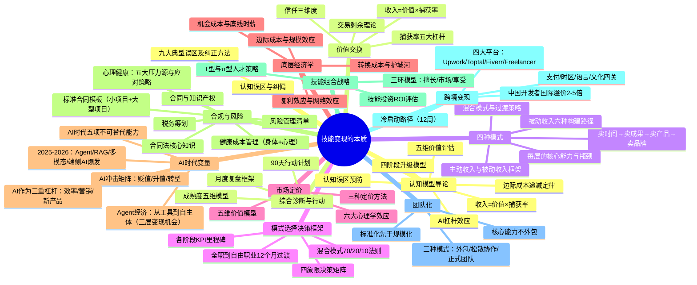

## 认知模型导论：五个关键心智模型

在深入技能变现的细节之前，我需要你先掌握五个底层心智模型。这些模型不是孤立的知识点，而是一套相互关联的思维操作系统。理解它们，后续章节的所有方法论对你来说就是"显而易见"的推论；不理解它们，你读完全书也只会记住一堆零散的技巧。

把这五个模型想象成五块拼图——单独看每一块都有意义，拼在一起才能看到完整的画面。

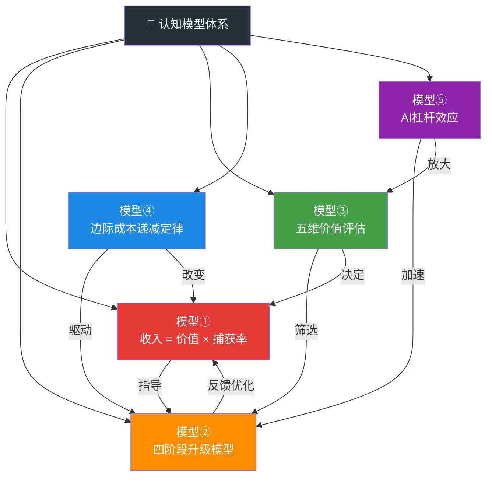

### 模型①：收入 = 价值 × 捕获率

这是所有收入的通用公式。你的收入不取决于你有多努力，而取决于两个变量的乘积：**你创造的价值**和**你能捕获的价值比例**。

这个公式解释了一个让很多人困惑的现象：为什么有些人技术平平却赚得盆满钵满，而有些技术大牛却收入平庸？答案是"捕获率"。一个能清晰展示自己价值、懂得谈判定价、建立了个人品牌的中等水平开发者，其捕获率可能是80%；而一个埋头苦干、不懂沟通、从不营销自己的技术专家，捕获率可能只有20%。创造同样价值的情况下，前者的收入是后者的4倍。

举个具体例子：你帮一家公司开发了一套自动化系统，每年为公司节省200万元人力成本。你创造了200万的价值。如果你报价10万（捕获率5%），公司觉得便宜；如果你报价50万（捕获率25%），公司觉得合理；如果你报价100万（捕获率50%），公司需要认真评估但仍然可能接受——因为第一年就回本了。你的技术能力没变，但收入差了10倍。变量不是技能本身，而是你对捕获率的掌控能力。（详见1.1节）

### 模型②：四阶段升级模型：卖时间→卖成果→卖产品→卖品牌

技能变现的进化路径可以归纳为四个阶段，每个阶段的核心逻辑完全不同：

**卖时间**：按小时或按天收费，收入 = 单价 × 时间。这是最原始的变现方式，天花板极其明显——一天只有24小时，你再怎么加班也不可能突破时间上限。大多数自由职业者终身停留在这个阶段，收入增长在第2-3年触顶。

**卖成果**：按项目或按交付物收费。你开始关注结果而非工时，定价逻辑从"我花了多少时间"变为"客户获得了多少价值"。一个优秀的小程序开发项目，你可能3天做完但报价2万——因为你解决了客户的问题，而不是在卖你的时间。

**卖产品**：将你的技能、经验、方法论封装成可复制的产品——SaaS软件、在线课程、设计模板、代码组件。你投入一次，可以卖给无数人。这是边际成本趋近于零的阶段，收入开始呈现非线性增长。

**卖品牌**：当你的名字本身成为一种信任符号，你就进入了最高阶段。客户不再为你的具体产品付费，而是为"你"付费。同样的课程，有品牌背书的可以卖2999元，没有品牌的只能卖199元。品牌溢价的本质是信任成本的节省——客户不需要花时间评估你的能力，因为他们已经通过你的品牌做出了判断。

这四个阶段不是"选一个"的关系，而是"逐步升级"的关系。每一阶段积累的能力，都是进入下一阶段的入场券。（详见1.2节）

### 模型③：五维价值评估：稀缺性/需求量/学习难度/可替代性/产出价值

面对市场上成百上千种技术技能，你应该学什么？这个五维评估框架可以帮你做出理性判断，而不是跟着"最热门技术"的营销噪音走。

**稀缺性**：掌握这项技能的人有多少？市场上React开发者一抓一大抓，但精通Rust系统级编程的开发者凤毛麟角。稀缺性直接决定议价能力。

**需求量**：有多少企业/个人需要这项技能？有些技能虽然稀缺（比如COBOL编程），但需求也在萎缩，学了变现空间有限。你需要的是"高稀缺+高需求"的组合。

**学习难度**：从零到能接单需要多长时间？学习难度越高，意味着进入门槛越高，竞争越少——但也意味着你需要更长的投入期才能开始变现。这是一个需要权衡的维度。

**可替代性**：AI或其他工具能在多大程度上替代这项技能？如果你花3年精通的技能，GPT-5用3秒就能完成，那你的投资回报率就会急剧下降。这个维度在AI时代变得前所未有的重要。

**产出价值**：这项技能的最终产出能为客户创造多大价值？同样是编程，写一个静态网页和写一个高频交易系统，产出价值可能差100倍。选择高产出价值的技能方向，即使你的捕获率很低，绝对收入也不会太差。

五个维度综合评分最高的技能方向，就是你最应该投入的方向。不要只看其中一两个维度——很多人只看"需求量"就去学Python，结果发现Python开发者的供给量同样巨大，竞争激烈导致收入并不理想。（详见1.3节）

### 模型④：边际成本递减定律：从线性到指数的收入曲线

传统技能变现的收入曲线是线性的——你多接一个项目，多赚一份钱，但也多花一份时间。这条曲线的斜率再怎么优化，终究是一条直线。

而边际成本递减定律告诉你：**当你把技能从"服务"转化为"产品"后，每多卖出一份的边际成本趋近于零，收入曲线从线性变为指数。**

一个接单的前端开发者，做第10个项目和做第1个项目花的时间几乎一样多——收入是10条等长的线段。但如果你把项目中的通用模块提炼成一套UI组件库，定价299元/套，卖100套和卖1001套的成本差距微乎其微——你的收入曲线变成了一条向上弯曲的弧线。

这个定律的关键推论是：**在技能变现的早期，你必须忍受线性收入阶段的"慢"，为后续的指数增长积累素材。** 很多人在前6个月看不到指数增长就放弃了，殊不知他们可能距离拐点只有一步之遥。每一次接单、每一个项目、每一篇技术文章，都是在为你未来的产品化积累"原材料"。

具体到操作层面，这意味着你应该有意识地在日常工作中做两件事：第一，记录和沉淀你反复使用的方法论和工具；第二，思考"这个我现在按小时收费的服务，能不能变成一个一次开发、反复销售的产品？"如果你每周都问自己这两个问题，边际成本递减的拐点会比你想象中来得更快。（详见1.4节）

### 模型⑤：AI杠杆效应：AI不是威胁，是生产力乘数

每当有新技术出现，总有人恐慌"我要失业了"。蒸汽机出现时手工匠人恐慌，互联网出现时传统媒体恐慌，AI出现时开发者恐慌。但历史反复证明：**新技术消灭的不是工作，而是工作方式；被淘汰的不是使用工具的人，而是拒绝使用工具的人。**

AI对技术技能变现的核心影响是一个简单的公式：**你的产出 = 你的能力 × AI杠杆倍数**。一个会用AI辅助编程的开发者，其产出效率是不用AI的开发者的3-10倍。这不是夸张——GitHub Copilot的实测数据显示，使用AI辅助的开发者完成任务的速度平均提升55%，而代码质量并没有下降。

这个杠杆效应的深层含义是：**AI改变了"稀缺性"的定义**。以前，"能写代码"本身就是稀缺能力。现在，"能写代码"变成了基础能力，稀缺的是"能用AI写代码+能理解业务需求+能做出正确架构决策"的复合能力。换句话说，AI把竞争的门槛从"技术执行层"提升到了"技术判断层"——这对有思考能力的开发者是利好，对只会"搬砖"的开发者才是威胁。

更关键的是，AI让"一个人=一个团队"成为可能。以前你要做一款产品，需要前端、后端、设计、运营至少4个人。现在，一个懂AI工具的全栈开发者可以独立完成全部工作，而且质量不低。这意味着独立开发者的门槛大幅降低，"卖产品"阶段的启动成本从"组建团队"降到了"一台电脑+AI工具订阅"。（详见1.6节）

### 认知误区预防

在正式进入方法论之前，我需要帮你排除几个常见的认知陷阱。这些误区不是"可能犯的错误"——它们是绝大多数人**一定会犯的错误**，如果你提前意识到，就已经超越了90%的竞争者。

**误区一："我的技术越好，收入就越高。"** 这是程序员群体中最根深蒂固的错误信念。技术能力是收入的必要条件，但远不是充分条件。你的收入 = 技术能力 × 沟通能力 × 营销能力 × 定价能力 × 行业选择。很多技术顶尖的人收入平庸，是因为其他四个变量太低。把100%的时间花在提升技术上，不如把70%花在技术、30%花在其余四项上。

**误区二："我还没准备好，等我学完再开始。"** 完美主义是行动力的最大敌人。技术领域永远有新东西要学，你永远不可能"准备好"。正确的策略是：先用现有能力创造最小可行价值（接一个小项目、做一个小产品），在实战中学习，而不是在学习中等待。你不需要成为专家才能开始赚钱——你只需要比你的客户多懂一点。

**误区三："AI会抢走我的工作，学技术没用了。"** 这个恐慌来自对AI能力的过度想象和对自己价值的过度低估。AI擅长的是模式匹配和内容生成，但理解客户真实需求、做出正确判断、处理复杂人际交互，这些仍然是人类的核心优势。与其恐惧AI，不如成为最早掌握AI工具的那批人——工具越强，掌握工具的人就越强。

**误区四："热门技术=高收入。"** 热门意味着关注度高，也意味着竞争者多。2023年所有人都在学大模型开发，2024年市场上的大模型开发者已经供过于求。真正高收入的往往是"冷门但高价值"的领域——比如工业软件开发、嵌入式安全、金融系统架构。用五维评估框架（模型③）去选择方向，而不是跟风。

**误区五："先免费积累口碑，以后再收费。"** 免费工作不会积累有价值的口碑，只会积累习惯于免费的客户。从第一天起就合理定价——即使价格很低，也比免费好。因为定价这个行为本身就在传递一个信号：我的工作有价值。如果你自己都不认为自己的时间值钱，客户更不会。

> **本节核心要旨**：五个模型构成一个完整的认知操作系统——收入公式告诉你赚钱的本质，四阶段模型告诉你进化路径，五维评估告诉你选择方向，边际成本递减告诉你如何实现非线性增长，AI杠杆告诉你如何放大一切。接下来的章节，我们将逐一展开每个模型的实战细节。

---

## 1.1 价值交换：技能变现的底层逻辑

### 1.1.1 什么是价值交换

技能变现的本质是**价值交换**——你用专业技能为客户解决问题，客户为你的技能付费。这不是雇佣关系的附属品，而是一套独立的经济行为。

经济学中有个基本概念叫**交易剩余**（Transaction Surplus）：当买方对某商品的估值高于卖方的成本时，交易才会发生。这个概念最早由阿尔弗雷德·马歇尔（Alfred Marshall）在《经济学原理》中系统阐述，后来被罗纳德·科斯（Ronald Coase）扩展到交易成本领域——科斯指出，市场交易不仅需要双方对价值达成共识，还需要克服信息搜索、谈判协商、合同执行等一系列交易成本。技能变现也遵循同样的逻辑——客户认为你解决的问题值X元，你认为自己的时间和服务值Y元，当 X > Y 时，交易成立。而交易成本的高低，直接决定了这单生意能不能做成。

奥利弗·威廉姆森（Oliver Williamson）在科斯的基础上发展出了**交易成本经济学**（Transaction Cost Economics），将交易成本分解为三个维度：

1. **资产专用性**（Asset Specificity）：你的技能是否只对特定客户有价值？专用性越高，客户越难替换你，但你也越难找到新客户。一个"懂医疗数据合规的后端工程师"比一个"通用后端工程师"的资产专用性高得多——前者对医疗行业客户价值极高，但对电商客户价值一般。
2. **交易频率**：你和同一个客户的交易频率越高，建立长期合作关系的收益越大（因为每次交易的信任成本被分摊了）。这就是为什么"维护3-5个长期客户"比"不断找新客户"更高效。
3. **不确定性**：技术项目的不确定性越高（需求不明确、技术方案未验证），客户越倾向于选择信任度高的服务者，而非报价最低的。

**交易成本经济学对技能变现的直接启示**：降低客户的交易成本，就是提升你的竞争力。具体来说：
- **降低搜索成本**：让客户容易找到你（SEO、平台Profile、社区活跃度）
- **降低评估成本**：让客户快速判断你的能力（案例库、Portfolio、技术博客）
- **降低谈判成本**：标准化报价流程、清晰的服务条款、透明的定价
- **降低执行成本**：专业的项目管理、准时交付、主动沟通

但这只是理论模型。现实中，交易能否成立还取决于一个关键前提：**信任**。

**信任是价值交换的催化剂。** 客户在付费之前，需要相信三件事：你能解决他的问题（能力信任）、你会按时交付（可靠性信任）、你不会坑他（道德信任）。这三种信任的建立成本，直接决定了交易的摩擦力大小。

哈佛商学院教授弗朗西斯·福山（Francis Fukuyama）在《信任：社会美德与创造经济繁荣》中指出：高信任社会的交易成本远低于低信任社会，因为信任减少了对合同、监督和法律执行的依赖。同样的逻辑适用于个人层面——一个高信任度的技术人，成交速度更快、客户配合度更高、付款更爽快。

在传统经济中，信任通过品牌、口碑、合同、第三方担保等方式建立。在互联网时代，信任的建立方式发生了根本变化：

| 信任建立方式 | 传统模式 | 互联网模式 | 效率差异 |
|------------|---------|-----------|---------|
| 能力证明 | 面试、作品集、推荐信 | GitHub星标、技术博客、开源贡献 | 可触达受众扩大100倍 |
| 口碑传播 | 熟人推荐（线性传播） | 社交媒体评价（指数传播） | 传播速度提升1000倍 |
| 第三方担保 | 合同、律师事务所 | 平台托管、第三方评价系统 | 交易成本降低80% |
| 专业认证 | 学历、职业资格证书 | 行业认证、技术社区影响力 | 认证周期缩短70% |

**信息经济学视角：柠檬市场问题**

诺贝尔经济学奖得主乔治·阿克洛夫（George Akerlof）在1970年的论文《柠檬市场》中揭示了一个关键问题：当买卖双方信息不对称时，市场会出现"劣币驱逐良币"现象。自由职业市场就是一个典型的"柠檬市场"——客户很难在交易前准确判断开发者的实际能力，只能通过价格、评价等有限信号来推断。结果是：高质量开发者因为不愿降价而接不到单，低质量开发者因为低价而占领市场。

破解"柠檬市场"问题的方法：

1. **信号传递**（Signaling）：迈克尔·斯宾塞（Michael Spence）的信号理论指出，高质量卖家可以通过"成本高昂的信号"来区分自己。对技术人来说，这些信号包括：深度技术博客（写作成本高，低水平写不出来）、开源项目贡献（代码质量一目了然）、行业认证（需要真实学习投入）、客户案例（有具体数据和第三方背书）。
2. **声誉机制**（Reputation System）：平台的评分系统、社区的点赞/收藏机制，本质上都是声誉的量化。累积好评的成本很高（需要持续高质量交付），因此好评本身就是质量信号。
3. **担保与退款承诺**：提供满意度保证或退款承诺，将风险从客户转移到自己身上。虽然增加了自己的风险，但大幅降低了客户的决策门槛。

**核心洞察**：技能变现不仅仅是"技术换钱"，更是一套包含信任建立、价值传递、风险分担的完整交易体系。那些变现能力强的技术人，往往不是技术最好的，而是最擅长建立信任的。

### 1.1.2 价值交换的核心公式

```text
你的收入 = 你创造的价值 × 价值捕获率
```

这个公式揭示了两个独立的杠杆：

| 杠杆 | 含义 | 影响因素 | 提升策略 |
|------|------|----------|----------|
| **创造的价值** | 你帮客户解决了多大的问题 | 技能深度、问题难度、行业选择 | 深耕高价值领域、提升解决问题的层次 |
| **价值捕获率** | 你能从创造的价值中分到多少比例 | 品牌溢价、谈判能力、市场信息差、竞争格局 | 建立个人品牌、掌握定价权、减少竞争 |

用一个可视化框架来理解这两个杠杆的关系：

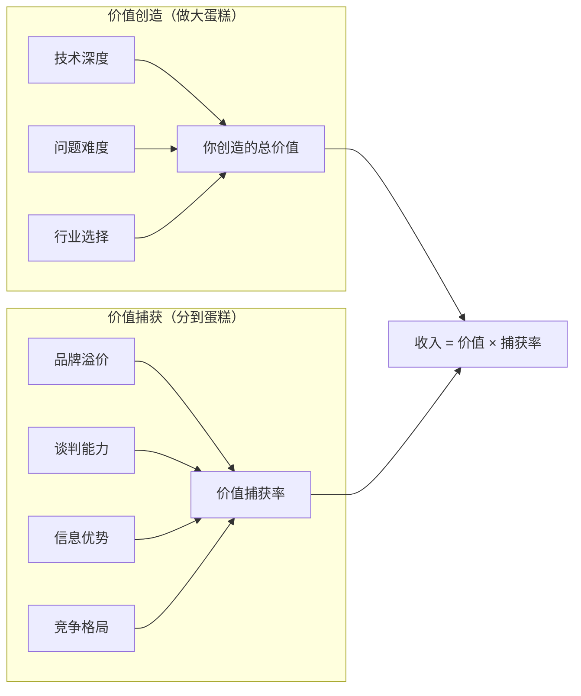

**关键洞察**：大多数技术人只关注"提升技术"（即提升创造的价值），却忽视了"提升捕获率"。现实中，一个技术中等但善于展示价值的开发者，收入可能远超技术顶尖但不懂营销的开发者。这不是能力问题，而是杠杆使用问题。

举一个具体的数字说明：假设你帮一家电商公司开发了一套自动化库存管理系统，每年帮他们节省200万人力成本。如果你的报价是5万，你的价值捕获率是2.5%；如果你通过专业的提案、数据论证和品牌背书，把报价提到30万，你的价值捕获率是15%。技术方案可能完全一样，但收入差了6倍。

### 1.1.3 价值捕获率的决定因素

价值捕获率不是固定的，它由以下五个维度共同决定：

**第一，信息不对称程度。** 客户越不了解你的工作方式，你就越有机会获得溢价。但这里有一个关键区分：是"利用信息不对称"还是"消除信息不对称"？

利用信息不对称的做法——故意用技术术语吓唬客户、夸大技术难度——短期有效，长期必死。客户会越来越懂，或者找到更透明的竞争者。消除信息不对称的做法——用通俗语言解释技术方案、让客户理解每一分钱花在哪里——反而能建立长期信任，获得更高溢价。

**实操案例**：一位做数据可视化的自由职业者，在每次报价时都会附带一张"价值地图"：横轴是功能模块，纵轴是每个模块为客户节省的时间（小时/月）。客户一眼就能看到投入产出比。这种"消除信息不对称"的做法，让他的成交率从30%提升到65%，平均客单价从8000提升到2.5万。因为他不是在"卖技术"，而是在"卖可量化的价值"。

**第二，可替代性。** 如果你做的是"任何学过编程的人都能做"的工作，市场竞争会把你的价格压到边际成本。反之，如果你具备复合能力（比如"懂医疗+懂AI"），可替代性骤降，议价权上升。

可替代性的关键不在于你有多强，而在于"客户找到另一个你能有多容易"。一个全栈开发者在通用市场上可替代性很高（市场上有几十万全栈开发者），但如果他深耕"跨境电商独立站搭建"这个细分领域，并且积累了50个成功案例和行业know-how，他的可替代性就大幅降低——因为客户要找的不是"一个全栈开发者"，而是"一个懂跨境电商的全栈开发者"。

**实操案例**：2023年大模型爆发后，纯Python开发者的市场供给充足，时薪在200-400元区间。但"懂大模型微调+懂金融风控"的复合型人才，时薪可以达到1500-3000元。两者的基础编程能力可能差不多，但后者的可替代性极低——市场上同时具备这两个领域经验的人，可能全国不超过几百人。

**第三，客户感知价值。** 同一个技术方案，以不同的方式呈现，客户的感知价值完全不同。一份附带竞品分析、数据预估、ROI计算的提案，比一句"这个功能我能做，报3万"的报价，转化率可以高出3-5倍。

客户感知价值的公式可以进一步拆解：

```text
客户感知价值 = 功能价值 × 呈现系数 × 信任系数
```

- **功能价值**：你的方案实际能解决多大的问题（客观的）
- **呈现系数**：你把功能价值"翻译"成客户能理解的语言的能力（主观的，可优化）
- **信任系数**：客户相信你能交付的程度（基于过往案例、口碑、专业度）

大多数技术人的功能价值不低，但呈现系数和信任系数拖了后腿。提升呈现系数的方法包括：用数据说话（"预计节省X小时/月"而非"提高效率"）、用可视化辅助（原型图、流程图、demo）、用对比锚定（"如果自建团队需要X人×Y月"）。提升信任系数的方法包括：展示同类案例、提供阶段性交付（而非一次性交付）、提供试用期或满意度保证。

**第四，成果可见性。** 如果你的成果容易量化（比如"帮客户月省15万人力成本"），议价空间天然就大。如果成果不可见（比如"优化了代码结构"），就很难让客户为之付费。

提升成果可见性的核心方法是**将隐性价值显性化**：

| 隐性价值（客户看不到） | 显性化方法 | 呈现方式 |
|---------------------|----------|---------|
| 代码质量提升 | 量化维护成本下降 | "后续迭代开发时间减少40%" |
| 系统架构优化 | 量化性能提升 | "页面加载时间从3秒降到0.5秒" |
| 安全加固 | 量化风险降低 | "避免了潜在的数据泄露损失（行业平均单次泄露成本380万元）" |
| 自动化脚本 | 量化时间节省 | "每天节省2小时人工操作，年化节省约10万元人力成本" |
| 数据库优化 | 量化查询效率 | "报表生成时间从30分钟降到10秒" |
| 代码重构 | 量化bug率下降 | "线上故障率从每月3次降到每季度1次" |
| 技术文档 | 量化培训成本 | "新员工上手时间从2周缩短到3天" |
| 监控告警 | 量化故障响应 | "平均故障发现时间从2小时缩短到5分钟" |

**第五，谈判能力。** 这是最直接但最容易被忽视的因素。同样一个项目，会谈判的人可以拿到2-3倍的价格差异。谈判能力不仅仅是"嘴皮子利索"，它包含三个层次：

- **信息层**：了解市场行情、客户预算、竞品报价。信息不对称是谈判的核心武器。
- **策略层**：锚定效应、让步节奏、替代方案（BATNA）。知道什么时候该坚持，什么时候该让步。
- **心理层**：自信来自充分的准备，而非天生的性格。一个准备了详细方案和数据的内向开发者，谈判效果远好于一个没有准备的外向开发者。

**谈判实战话术模板**：

当客户说"你的报价太贵了"时，不要直接降价，而是用以下话术：

```text
第一步（确认理解）："我理解您对预算的考虑。能告诉我您的预算范围是多少吗？"
第二步（价值重申）："这个报价包含了[具体交付物清单]，如果自建团队做同样的事，成本大约是[金额]。"
第三步（灵活方案）："如果预算有限，我们可以调整方案范围——比如先做核心功能（报价X），后续模块按需添加。"
第四步（底线坚守）："低于这个价格我无法保证交付质量。我宁愿不做，也不愿意做一个让您不满意的项目。"
```

这个话术的底层逻辑是：不降价，但给客户"选择权"（调整范围而非降低价格）。降价是最差的谈判策略——它传递的信号是"我之前的报价有水分"。

**进阶谈判技巧——"时间差"策略**：

当客户要求你立刻给出报价时，不要当场报价。说一句"我需要评估一下需求复杂度，明天给您详细的报价方案"，然后花时间做一份专业的报价文档。这样做有两个好处：第一，展示专业度（你不是随口报价，而是经过认真评估）；第二，给自己时间去做市场调研和定价策略（避免在信息不足时仓促报价）。

**进阶谈判技巧——"BATNA"策略**：

BATNA（Best Alternative to a Negotiated Agreement，最佳替代方案）是哈佛谈判学的核心概念。在谈判前，明确你的BATNA——如果这次谈判失败，你的最佳选择是什么？BATNA越强，谈判底气越足。

```text
BATNA构建清单：
□ 我是否有其他在谈的客户/项目？（有→底气足）
□ 如果这个项目不接，我是否能找到同等收入的替代？（能→不怕丢单）
□ 我的底线是什么？低于什么条件我宁可不做？（明确→不被情绪左右）

谈判前自问：
- 客户的BATNA是什么？（找别人做？用低代码平台？内部团队解决？）
- 我比客户的BATNA强在哪里？（这才是我的真实溢价空间）
```

### 1.1.4 案例拆解：同一个小程序，报价为何差10倍

同样是开发一个企业内部管理系统小程序，三个开发者给出了截然不同的报价：

**A开发者（报价5000元）**：
- 沟通方式：微信聊天，客户说什么做什么
- 交付物：代码
- 案例展示：无
- 售后：bug免费修一周
- 时间投入：约40小时
- 实际时薪：125元/小时

**B开发者（报价1.5万元）**：
- 沟通方式：电话沟通需求，输出简单需求清单
- 交付物：代码 + 简单使用文档
- 案例展示：口头提及过往项目
- 售后：1个月免费维护
- 时间投入：约50小时（含沟通和文档）
- 实际时薪：300元/小时

**C开发者（报价5万元）**：
- 沟通方式：先做1小时需求诊断，输出《需求分析文档》
- 交付物：代码 + 使用文档 + 部署文档 + 30分钟培训视频
- 案例展示：Portfolio网站，含5个同类项目截图+数据
- 售后：3个月免费维护，之后按年续费（8000元/年）
- 时间投入：约60小时（含全流程服务）
- 实际时薪：833元/小时（首单），后续年续费收入另计

三者的差距不在技术能力——可能A的代码写得还更好。差距在于：

| 差距维度 | A开发者 | B开发者 | C开发者 |
|---------|--------|--------|--------|
| 价值呈现 | 纯代码 | 代码+文档 | 完整解决方案 |
| 客户感知价值 | "找了个写代码的" | "找了个技术服务商" | "找了个技术顾问" |
| 信任建立 | 无 | 有限 | 强（案例+诊断+保证） |
| 收入结构 | 一次性 | 一次性 | 首单+持续年费 |
| 复利效应 | 无 | 弱 | 强（案例积累、转介绍） |
| 风险承担 | 客户承担全部风险 | 共担 | C主动承担（满意度保证） |

C的5万里，有4万是"信息差+品牌溢价+服务溢价"。更关键的是，C建立的案例会在未来持续产生价值：下一个同类客户看到C的Portfolio，信任系数直接拉满，成交率和报价都可以进一步提升。这就是"价值捕获率"的复利效应。

**反面案例——A开发者的后续**：A开发者在平台上接了20个类似的5000元小项目，总收入10万。但每个项目都是"微信聊天→写代码→交付→下个"的循环，没有任何积累。一年后，他的Profile上仍然没有案例展示，时薪仍然在120-150元区间，而平台上新涌入的开发者把同类型项目的报价压到了3000元。A面临的选择是：要么升级服务模式，要么在价格战中被淘汰。

## 1.2 技能变现的四种模式

### 1.2.1 模式总览

技能变现从底层到顶层，可以划分为四种模式。这不是四个"选择"，而是四个"阶段"——大多数人需要从第一层起步，逐级升级。

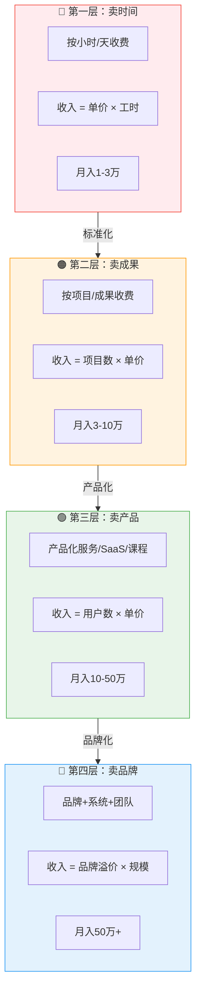

**重要说明**：这四种模式不是非此即彼的。现实中，成功的变现者往往同时运行多种模式。比如一个技术博主可能既接咨询项目（卖成果）、又卖课程（卖产品）、还靠品牌接广告（卖品牌）。关键是识别你当前的主要模式，然后有意识地向更高层级迁移。

### 1.2.2 模式一：卖时间

**定义**：按小时、天、月收费，用时间换金钱。

**典型场景**：
- 自由职业者在平台接单（猪八戒、程序员客栈、Upwork）
- 兼职外包，按时薪结算
- 技术顾问按天收费
- 驻场外包，按月计费
- 平台上的"技术问答"按次收费

**收入公式**：`收入 = 时薪 × 日工作时长 × 月工作天数`

**收入天花板**：假设时薪200元，每天8小时，每月22天，月收入上限约3.5万。扣除平台抽成（10-20%）、税务、空窗期，实际到手2-2.5万。

**真实数据参考**：根据程序员客栈2025年平台数据，平台注册开发者中位时薪约180元，月活跃接单者平均月收入约1.5万元（含空窗期）。时薪Top 10%的开发者（约400元/小时）平均月收入约3.5万元。但这里有一个被忽略的统计陷阱：Top 10%的开发者往往有全职工作，兼职接单的月有效工时只有60-80小时，所以他们的"全职化"月收入实际可以到7-9万。但能维持这个收入水平的人，通常已经进入了"卖成果"或更高的阶段。

**优势**：
- 入门门槛低，有技术就能接单
- 收入即时可见，按劳取酬
- 不需要营销能力，平台自带流量
- 学习成本低，几乎不需要额外的商业技能

**劣势**：
- 时间上限锁死收入上限
- 生病/休假 = 零收入
- 没有积累，10年后和1年前的收入结构完全一样
- 随年龄增长，时间成本上升，竞争力反而下降
- 容易陷入"低质量项目→低案例积累→低报价"的恶性循环

**失败模式**：
- **时薪陷阱**：把所有精力放在提高时薪上，忽略了时间上限是硬约束。时薪从150涨到300，月收入上限也只是从2.6万涨到5.3万——而且越高的时薪，竞争越激烈，空窗期越长。
- **平台依赖**：所有客户都来自平台，一旦平台调整算法或抽成比例，收入立刻受影响。
- **技能固化**：反复做同类型的项目，技术栈停留在3年前，逐渐被市场淘汰。
- **健康透支**：为了维持收入水平而长时间工作，忽略了身体健康。颈椎病、腰椎间盘突出、干眼症是程序员的"职业病"，但这些健康问题在卖时间模式下会被放大——因为你无法在生病时继续"卖时间"。

**现实案例**：小李，前端开发者，在某外包平台接单3年。第1年时薪120元，月均收入8000元；第2年时薪提升到180元，月均收入1.8万；第3年时薪200元，月均收入2.2万。第3年的收入增长主要来自时薪提升和接单效率提高（重复类型的项目做得更快），但到第3年末，收入增长基本停滞——因为时薪再往上涨，客户就会选择更便宜的竞争者。小李面临的选择是：继续在"卖时间"阶段卷时薪，还是升级到"卖成果"阶段。

**升级信号**：当你发现"忙得没时间接单"或"同一个类型的项目做了第5遍"，说明该升级了。

### 1.2.3 模式二：卖成果

**定义**：按项目或成果收费，把"时间"隐含在报价里。

**典型场景**：
- 独立开发一个网站/App，报一口价
- 技术咨询按方案收费
- 系统集成商做整体交付
- 数据分析报告按份收费
- 安全审计按项目收费

**收入公式**：`收入 = 项目数量 × 单项目利润`

**收入天花板**：个人同时管理3-5个项目，每项目利润1-3万，月入5-15万。如果建立小团队，可以突破个人产能限制。

**与卖时间的关键区别**：

| 维度 | 卖时间 | 卖成果 |
|------|--------|--------|
| 计费方式 | 输入（工时） | 输出（交付物） |
| 效率越高的收益 | 不变（客户按小时付钱） | 越高（用更少时间完成同样交付） |
| 客户关注点 | 你在不在干活 | 结果好不好 |
| 隐含风险 | 低（按时计费） | 中（需求变更可能吞掉利润） |
| 复利效应 | 无 | 有（案例积累、流程复用） |
| 谈判空间 | 小（市场时薪透明） | 大（成果价值因客户而异） |

**关键能力**：需求管理、范围控制、报价能力。如果需求没有锁定就开始做，项目利润会被需求蔓延吞噬。

**需求锁定的实操流程**：

```text
1. 初次沟通（30-60分钟）：了解客户的业务背景和核心诉求，不讨论技术方案
2. 需求梳理（2-4小时）：输出《需求分析文档》，包含：
   - 业务目标：客户想通过这个项目达到什么效果
   - 功能清单：每个功能的优先级（P0/P1/P2）
   - 验收标准：每个功能的完成标准（可量化的）
   - 排除范围：明确哪些不在本次项目范围内
3. 需求确认（1小时）：与客户逐条确认，签字或邮件确认
4. 报价（基于确认后的需求）：固定价格，需求变更走变更流程
```

**失败模式**：
- **范围蔓延**：没有书面锁定需求，客户不断加功能，项目利润被蚕食。应对方法：合同中明确需求范围，超出范围的需求走变更流程（额外报价）。
- **报价恐惧**：不敢报高价，总觉得"客户会觉得贵"。应对方法：先用成本加成法算出底价，再用价值定价法调高，最后用三档报价给客户选择权。
- **项目堆积**：同时接太多项目，每个都延期交付，口碑崩塌。应对方法：同时在手的项目不超过3个，宁可排队也不要延期。
- **尾款难收**：项目交付后客户拖延付款。应对方法：合同约定分期付款（如30%预付、40%中期交付、30%终验后），并且在终验条款中写明"客户需在交付后7个工作日内完成验收，逾期视为自动验收通过"。

**真实案例**：小王，全栈开发者，从"卖时间"升级到"卖成果"后，收入结构发生了质的变化。他的核心改变有三个：第一，建立了标准化的需求分析模板，每次项目启动前先花2-4小时做需求梳理，把需求锁定在文档里；第二，把报价从"按天算"改为"按功能模块算"，同样的功能他可能3天就做完（因为有现成的组件库），但报价是按"这个功能对客户值多少钱"来定；第三，建立了项目模板库，80%的项目可以在模板基础上定制开发，效率提升了3倍。结果：月收入从2万提升到6万，工作时间反而从每天10小时降到了7小时。

### 1.2.4 模式三：卖产品

**定义**：将服务产品化，一次开发，反复销售。

**典型场景**：
- 开发SaaS产品（月费/年费）
- 制作在线课程（一次制作，持续销售）
- 开发标准化工具/模板/插件
- 建立付费社群/会员体系
- 开发Chrome插件/VSCode插件等工具产品
- 技术写作（书籍、付费专栏）

**收入公式**：`收入 = 付费用户数 × 单价 - 运营成本`

**收入天花板**：理论上无上限，取决于市场容量和获客能力。一个成功的SaaS产品可以做到月入百万。

**核心转变**：从"做项目"变为"做产品"，意味着：
1. **收入与时间脱钩**——睡觉时也在赚钱
2. **边际成本趋近于零**——多一个用户的成本接近零
3. **需要营销能力**——产品再好，没人知道也没用
4. **需要持续运营**——产品不是做完就结束，而是刚开始
5. **需要用户思维**——从"我能做什么"转变为"用户需要什么"

**真实案例**：一位后端开发者利用业余时间开发了一款API调试工具的VSCode插件。前3个月，他投入了约200小时开发核心功能，免费发布。6个月后积累了5000+安装量，开始提供Pro版（月费19元），转化率约3%。第一年Pro用户150人，月收入约2850元——不多，但这是"睡后收入"。第二年他持续迭代功能，用户增长到3万安装量，Pro用户800人，月收入约1.5万。第三年用户突破10万，Pro用户3000人，月收入5.7万——超过了他在公司的月薪。关键是：这5.7万的边际成本几乎为零，而他每天只花1小时维护。

**"卖产品"的常见陷阱**：
- **功能陷阱**：不断添加功能，却忘了核心价值。80%的用户只用20%的功能。应对方法：每个版本只做1-2个核心功能的深度打磨，而非10个功能的浅层覆盖。
- **完美主义陷阱**：产品没做到100分就不发布。正确做法是MVP（最小可行产品），60分就发布，根据用户反馈迭代。Reid Hoffman（LinkedIn创始人）说过："如果你对产品的第一个版本不感到尴尬，那你发布得太晚了。"
- **获客陷阱**：以为"产品好自然有人来"。事实是：没有营销的产品等于不存在。你需要在产品开发上花的时间和在营销上花的时间，比例至少是1:1。
- **定价陷阱**：免费用户很多但付费转化极低。应对方法：免费版要有明确的使用限制（如次数、功能、存储空间），让用户在使用中自然感受到付费的必要性，而非在注册时就吓跑他们。
- **维护陷阱**：产品上线后用户增长了，但维护工作也增长了。bug修复、客服响应、功能迭代开始吞噬你所有的时间。应对方法：在产品设计阶段就考虑可维护性（自动化测试、完善的文档、自助式帮助中心），在用户超过500人时考虑引入自动化客服工具或兼职客服。

**产品化自检清单**：

在决定做一个产品之前，用以下清单自检：

```text
□ 目标用户是否明确？（不是"所有人"，而是"某类具体的人"）
□ 他们是否愿意为这个解决方案付费？（有调研/访谈数据支撑）
□ 市场上是否有竞品？竞品的定价是多少？
□ 你的差异化优势是什么？（功能更好/价格更低/体验更好/更垂直）
□ 你能否在3个月内做出MVP？
□ 你有哪些获客渠道？（不需要很多，但至少要有1-2个可行的）
□ 你愿意在产品上持续投入多少时间/周？
□ 你是否准备好了从"开发者"转变为"产品经理"的心态？
```

### 1.2.5 模式四：卖品牌

**定义**：建立个人品牌或企业品牌，以品牌溢价获取超额利润。

**典型场景**：
- 技术培训机构（如极客时间、掘金小册）
- 技术咨询公司（以品牌吸引高端客户）
- 技术自媒体（以影响力变现）
- 行业KOL（以个人信誉背书产品/服务）
- 技术大会演讲者（以品牌溢价获取演讲费）

**收入公式**：`收入 = 品牌影响力 × 变现效率 × 规模化程度`

**核心转变**：从"做事"变为"做影响力"，从"个人能力"变为"系统能力"。

**品牌溢价的本质**：品牌本质上是一种"信任的预存储"。当客户看到你的品牌时，他跳过了"能力评估→信任建立→价值认知"的漫长过程，直接进入"付费决策"阶段。这就是为什么同一个技术方案，知名咨询公司的报价可以是个人开发者的10倍——客户买的不仅是方案，更是"确定性"。

**品牌变现的多元路径矩阵**：

品牌建立后，变现路径远不止一种。以下是品牌变现的系统化矩阵：

```text
品牌变现路径矩阵：
┌─────────────┬──────────────┬──────────────┬──────────────┐
│ 变现方式     │ 典型产品      │ 客单价       │ 被动程度     │
├─────────────┼──────────────┼──────────────┼──────────────┤
│ 内容付费     │ 专栏/课程/电子书│ 49-299元     │ 高（一次制作）│
│ 社群会员     │ 付费社群/星球 │ 199-999元/年 │ 中（需运营） │
│ 咨询顾问     │ 1v1咨询/诊断 │ 500-5000元/次│ 低（实时交付）│
│ 广告合作     │ 品牌推广/测评 │ 5000-50000元│ 高（内容即广告）│
│ 企业培训     │ 定制化培训    │ 2000-20000元/天│ 低（现场交付）│
│ 投资顾问     │ 天使投资/顾问 │ 股权/固定顾问费│ 低（需深度参与）│
│ 出版/授权    │ 书籍/课程授权 │ 版税/授权费  │ 高（一次授权）│
└─────────────┴──────────────┴──────────────┴──────────────┘
```

**真实案例**：某技术博主，5年间从一个普通后端开发者成长为拥有20万粉丝的技术KOL。他的变现路径是：第1年写技术博客（积累内容和读者）→ 第2年开付费专栏（年收入约10万）→ 第3年出技术书籍和线下培训（年收入约40万）→ 第4年成立技术咨询团队，以个人品牌吸引高端客户（年收入约120万）→ 第5年品牌化运营，团队扩展到10人（年收入约300万）。注意：到第5年，他的个人技术能力已经不是核心竞争力——他的品牌、团队和系统才是。

**品牌建设的三个阶段**：

| 阶段 | 目标 | 核心动作 | 时间投入 | 产出 |
|------|------|----------|----------|------|
| 冷启动期（0-6个月） | 被看见 | 每周发2-3篇技术内容，回答社区问题 | 10小时/周 | 粉丝积累，初步认知 |
| 建立期（6-18个月） | 被信任 | 深度内容+案例分享+公开演讲 | 15小时/周 | 行业认可，付费咨询机会 |
| 成熟期（18个月+） | 被选择 | 产品化输出+团队化运营 | 管理为主 | 品牌溢价，被动收入 |

**品牌建设的冷启动策略**：

很多人卡在"怎么从0到1"。以下是经过验证的冷启动路径：

```text
第1步（第1-2周）：选定一个细分领域
  - 不是"前端开发"，而是"React性能优化"
  - 不是"后端开发"，而是"高并发系统设计"
  - 标准：你在这个领域有实战经验，且市场有需求

第2步（第3-8周）：产出10篇深度内容
  - 每篇3000-5000字，有代码示例、数据、图表
  - 发布在掘金、知乎、CSDN、思否等技术社区
  - 同步发布到个人博客（SEO流量）

第3步（第9-12周）：参与社区互动
  - 回答与你领域相关的技术问题（每天30分钟）
  - 参与开源项目的Issue讨论
  - 加入技术交流群，分享你的内容

第4步（第13-16周）：尝试第一次公开分享
  - 在公司内部做一次技术分享（练手）
  - 录制一个技术视频上传B站/YouTube
  - 提交一个技术大会的演讲proposal

第5步（第17-24周）：推出第一个付费内容
  - 一个小型付费专栏或教程（定价49-99元）
  - 或者一个付费社群（月费29-49元）
  - 目标：验证付费意愿，而非赚钱
```

### 1.2.6 主动收入与被动收入的结构化框架

理解四种模式后，还需要从另一个维度审视你的收入结构：**主动收入**与**被动收入**的比例。这个维度直接决定了你的财务安全感和长期自由度。

```text
主动收入：你必须持续投入时间才能获得的收入
  - 特点：停止工作 = 停止收入
  - 典型：按小时计费、按项目交付、驻场外包
  - 优势：即时回报，门槛低
  - 劣势：没有积累，受身体/时间限制

被动收入：一次投入、持续产出的收入
  - 特点：睡觉时也在赚钱
  - 典型：SaaS订阅、课程销售、版税收入、广告分成、模板/插件销售
  - 优势：规模效应，不受时间限制
  - 劣势：前期投入大，需要营销能力，存在市场风险
```

**健康收入结构的演化路径**：

| 阶段 | 主动收入占比 | 被动收入占比 | 月收入参考 | 财务安全感 |
|------|------------|------------|----------|----------|
| 起步期（0-1年） | 100% | 0% | 1-3万 | 低（完全依赖个人时间） |
| 成长期（1-3年） | 80% | 20% | 3-8万 | 中低（有少量缓冲） |
| 成熟期（3-5年） | 50% | 50% | 8-20万 | 中（即使停下也有收入） |
| 自由期（5年+） | 20% | 80% | 15万+ | 高（收入与时间脱钩） |

**被动收入的六种构建路径**：

```text
路径1：课程/知识产品
  - 投入：200-500小时制作
  - 回报：持续销售，边际成本趋近于零
  - 适合：有深度专业知识和表达能力的人
  - 月收入参考：5000-50000元（取决于用户规模）

路径2：SaaS/工具产品
  - 投入：500-2000小时开发
  - 回报：月费/年费模式，用户粘性高
  - 适合：有产品思维和持续迭代能力的人
  - 月收入参考：1万-100万元（取决于市场容量）

路径3：模板/插件/组件库
  - 投入：50-200小时开发
  - 回报：一次开发，反复销售
  - 适合：有审美和技术功底的人
  - 月收入参考：2000-20000元

路径4：技术写作（书籍/专栏）
  - 投入：300-800小时写作
  - 回报：版税+影响力，持续数年
  - 适合：有写作能力和深度思考的人
  - 月收入参考：3000-30000元

路径5：开源项目+赞助/商业许可
  - 投入：持续维护
  - 回报：GitHub Sponsors、商业许可、咨询机会
  - 适合：有技术影响力的人
  - 月收入参考：1000-50000元

路径6：广告/流量变现（技术博客/YouTube/B站）
  - 投入：持续内容创作
  - 回报：广告分成、品牌合作
  - 适合：有内容创作能力和持续输出习惯的人
  - 月收入参考：2000-50000元
```

**关键认知**：被动收入并不是"零投入"收入。它的"被动"体现在"边际成本趋近于零"，但前期的固定成本（时间、精力、资金）往往很高。很多技术人对被动收入有不切实际的幻想，以为"做了一个产品就能躺赚"。真相是：被动收入的90%工作在"产品上线前"，而上线后的持续维护、迭代、营销才是真正的考验。

**被动收入的"冷启动困境"与破解方法**：

被动收入最大的难点是前6个月——产品刚上线，用户少，收入几乎为零，但你已经投入了几百小时。破解方法：

```text
1. 用主动收入养被动收入
   - 70%时间做主动收入项目（保证现金流）
   - 30%时间做被动收入产品（长期投资）
   - 在被动收入超过生活成本之前，不要放弃主动收入

2. 从"副产品"开始
   - 不要专门花时间"做一个产品"
   - 而是从日常工作中提炼可复用的东西：
     · 做项目时顺便整理成模板库
     · 解决问题时顺便写成教程
     · 使用工具时顺便开发插件
   - 这样被动收入的"制作成本"被主动收入项目分摊了

3. 验证需求再投入
   - 先用最小成本验证市场需求（如写一篇文章测试阅读量）
   - 有正反馈后再投入更多时间开发完整产品
   - 避免"闭门造车半年，上线发现没人要"
```

### 1.2.7 模式升级路径

从卖时间到卖品牌，每个阶段需要的核心能力完全不同：

| 阶段 | 核心能力 | 典型瓶颈 | 突破方法 |
|------|----------|----------|----------|
| 卖时间→卖成果 | 需求管理、报价、项目管理 | "不敢报高价" | 建立案例库，用数据证明价值 |
| 卖成果→卖产品 | 产品设计、营销、用户运营 | "不懂营销" | 从最小可行产品（MVP）起步，边做边学 |
| 卖产品→卖品牌 | 团队管理、品牌运营、商业模式 | "无法脱身" | 建立标准化流程，培养团队 |

**关键数据**：据自由职业平台数据统计，停留在"卖时间"阶段的自由职业者，收入增长在从业第3年基本触顶；而成功实现产品化的开发者，收入在同期可增长5-10倍。这不是技术能力的差距，而是商业模式的差距。

**每个阶段的过渡周期**：

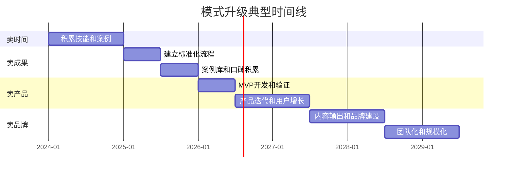

**混合模式策略**：在实际过渡中，不建议"一步跳到下一个阶段"，而是采用"70/30法则"——70%的精力维持当前模式的收入，30%的精力探索下一个模式。比如一个"卖成果"的开发者，可以用30%的业余时间开发一个可复用的工具或模板，逐步向"卖产品"过渡。这样既保证了收入的稳定性，又避免了"all-in失败后血本无归"的风险。

### 1.2.7b 模式选择决策框架

> **本节定位**：在了解了四种变现模式（卖时间、卖成果、卖产品、卖品牌）之后，你可能会问："我应该从哪个模式开始？"本节提供一套科学的决策框架，帮助你根据自身情况做出最优选择，并规划从全职到自由职业的过渡路径。

---

**一、决策矩阵：哪种模式最适合你？**

选择变现模式不是拍脑袋决定的，而是需要综合评估两个核心维度：**风险承受能力**和**当前技能深度**。

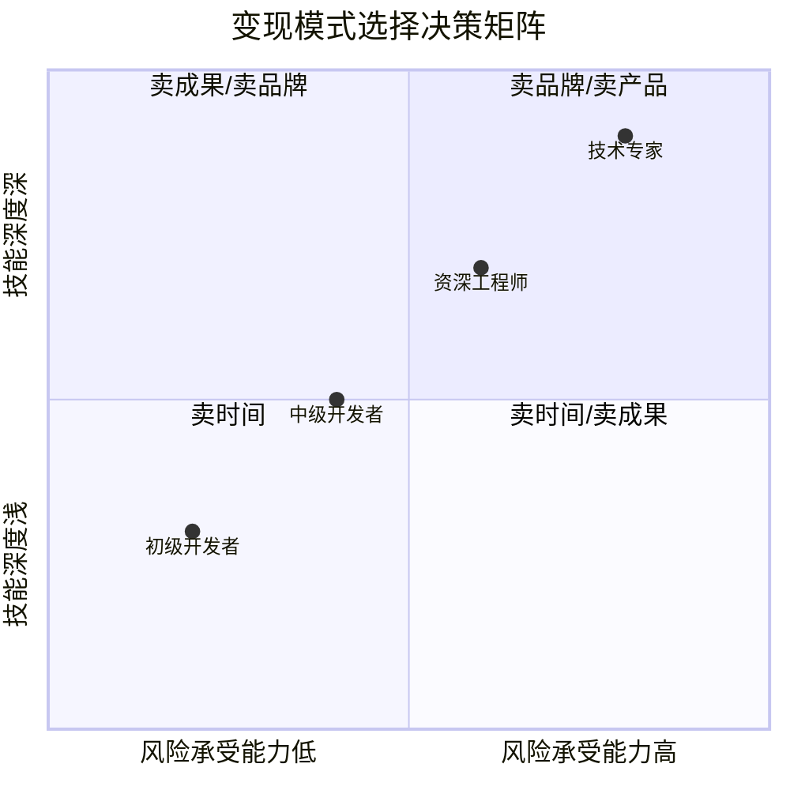

**四象限详细分析：**

| 象限 | 风险承受能力 | 技能深度 | 推荐起始模式 | 核心逻辑 |
|------|-------------|----------|-------------|----------|
| **第一象限** | 高 | 深 | 卖品牌 → 卖产品 | 技能强+敢冒险，直接做高杠杆的事 |
| **第二象限** | 低 | 深 | 卖成果 → 卖品牌 | 技能强但求稳，先用项目验证再升级 |
| **第三象限** | 低 | 浅 | 卖时间 | 技能还在积累，先用时间换经验和收入 |
| **第四象限** | 高 | 浅 | 卖时间 → 卖成果 | 敢冒险但技能不足，先快速积累再升级 |

**第一象限（高风险+深技能）**：适合资深技术专家、有创业经验的开发者。推荐直接从卖品牌或卖产品起步——第1个月确定产品方向，第2-3个月开发MVP，第4-6个月上线获取付费用户。案例：某大厂P7架构师，业余时间开发API管理工具，6个月后MRR达到2万元，1年后辞职全职运营。

**第二象限（低风险+深技能）**：适合技术能力强但经济压力大的工程师。从卖成果起步——第1-2个月在平台注册，第3-4个月接2-3个高质量项目，第5-8个月建立个人品牌，第9-12个月推出咨询服务或小型产品。案例：某前端工程师，白天上班晚上接React项目，6个月后推出自己的组件库。

**第三象限（低风险+浅技能）**：适合初级开发者、转行者。从卖时间起步——第1-3个月在低门槛平台接小项目，第4-6个月建立作品集，第7-9个月提升技能接更复杂项目。案例：某应届生从500元小网页开始，6个月后月入8000元。

**第四象限（高风险+浅技能）**：适合有创业想法的年轻开发者。从卖时间快速过渡到卖成果——第1-2个月快速接单，第3-4个月找到细分领域，第5-8个月深耕建立专业形象。案例：某转行程序员专注小程序开发，4个月后月入1.5万。

---

**二、混合模式实战策略**

单一模式的风险在于：一旦市场变化或个人情况改变，收入可能断崖式下跌。混合模式可以分散风险、加速技能积累、创造协同效应。

**70/20/10 时间分配法则**：

| 你当前的主力模式 | 70%时间用于 | 20%时间用于 | 10%时间用于 |
|-----------------|-------------|-------------|-------------|
| 卖时间（接单） | 完成现有项目 | 学习产品化技能 | 探索新领域 |
| 卖成果（项目） | 项目交付和客户管理 | 建立个人品牌 | 尝试开发产品 |
| 卖产品（SaaS） | 产品开发和运营 | 内容营销获客 | 探索新商业模式 |
| 卖品牌（咨询） | 咨询服务交付 | 产品化自己的方法论 | 拓展新行业 |

**混合模式实战案例**：

程序员小李（5年全栈工程师）同时运行三种模式：卖时间接项目（月入1.5万，占50%时间）、卖产品运营Next.js模板（月入8000元，占30%时间）、卖品牌写技术文章+咨询（月入5000元，占20%时间）。合计月入2.8万。协同效应：接单积累的案例成为模板灵感，技术文章促进模板销售，咨询经验提升接单报价。

---

**三、从全职到自由职业的过渡路径**

**副业时间管理**（每周11小时）：工作日晚上20:00-22:00接单/产品开发（2小时×5=10小时）、周六上午内容创作（3小时）、周日上午学习新技能（3小时）。

**财务准备清单**：

| 检查项 | 达标标准 |
|--------|----------|
| 应急基金 | ≥ 6个月生活费 |
| 副业收入 | ≥ 主业收入的50% |
| 稳定客户 | ≥ 3个长期客户 |
| 社保衔接 | 已了解自缴方案 |
| 保险配置 | 已购买商业保险 |
| 家庭支持 | 家人理解并支持 |

**安全线计算**：`安全线 = 月均支出 × 6 + 启动资金`。例如月均支出10000元 + 启动资金20000元 = 80000元。

**12个月过渡计划**：

| 月份 | 核心任务 | 收入目标 | 关键里程碑 |
|------|----------|----------|-----------|
| 第1月 | 注册平台，完善资料 | 0-2000元 | 完成3个平台注册 |
| 第2月 | 接第一个项目 | 2000-5000元 | 获得第一个5星好评 |
| 第3月 | 稳定接单节奏 | 5000-8000元 | 完成5个项目 |
| 第4月 | 开始内容营销 | 8000-12000元 | 发布10篇技术文章 |
| 第5月 | 提升项目质量 | 12000-15000元 | 积累10+好评 |
| 第6月 | 建立个人品牌 | 15000-20000元 | 获得第一个主动邀请 |
| 第7月 | 拓展客户渠道 | 20000-25000元 | 建立3个长期客户 |
| 第8月 | 优化定价策略 | 25000-30000元 | 时薪提升50% |
| 第9月 | 准备应急基金 | 30000-35000元 | 应急基金达标 |
| 第10月 | 评估辞职条件 | 35000-40000元 | 所有检查项达标 |
| 第11月 | 正式辞职 | 40000-50000元 | 开始全职自由职业 |
| 第12月 | 全职运营 | 50000元+ | 建立系统化流程 |

---

**四、各阶段的关键里程碑和KPI**

| 阶段 | 核心KPI | 初期目标 | 达标标准 |
|------|---------|----------|----------|
| 卖时间（1-6月） | 时薪、好评率、客户回头率 | 时薪100-200元，月接2-3单 | 时薪200-500元，好评率95%+ |
| 卖成果（7-18月） | 项目利润率、案例库、转介绍率 | 利润率40%+，案例10+ | 利润率60%+，转介绍率40%+ |
| 卖产品（19-30月） | MRR、用户增长率、付费转化率 | MRR 5000-10000元 | MRR 3-10万元，转化率5%+ |
| 卖品牌（31月+） | 品牌搜索量、被动收入占比、团队规模 | 被动收入占比30%+ | 被动收入60%+，团队5-10人 |

### 1.2.8 自我诊断：你处于哪个阶段？

回答以下10个问题，每个问题选A/B/C/D（分别对应四个阶段），统计你选择最多的字母即为你当前的主要阶段：

**1. 你的收入主要来自：**
- A. 按小时/天计费的工作
- B. 按项目一口价的工作
- C. 产品销售（课程/工具/SaaS）
- D. 品牌合作/广告/代言

**2. 你不工作时：**
- A. 收入为零
- B. 收入暂停但已签合同会回款
- C. 产品持续产生收入
- D. 品牌影响力持续带来机会

**3. 客户找你是因为：**
- A. 你能干活
- B. 你能交付成果
- C. 你的产品能解决他的问题
- D. 你的品牌代表专业和信赖

**4. 你的定价依据是：**
- A. 市场时薪标准
- B. 项目复杂度和交付价值
- C. 用户数量和市场定价
- D. 品牌溢价

**5. 你最大的焦虑是：**
- A. 这个月能不能接到足够的单
- B. 这个项目能不能按时交付不亏钱
- C. 产品用户增长停滞
- D. 品牌声誉管理

**6. 你的工作模式是：**
- A. 客户提需求，你执行
- B. 客户提目标，你出方案并执行
- C. 你定义产品，用户选择使用
- D. 你定义方向，团队执行

**7. 你的核心竞争力是：**
- A. 技术执行力
- B. 项目管理+技术方案能力
- C. 产品设计+营销能力
- D. 品牌影响力+系统运营能力

**8. 如果你消失一个月：**
- A. 没有收入
- B. 在途项目可能出问题
- C. 产品基本正常运行（有少量影响）
- D. 团队和系统自动运转

**9. 你的技能复利体现在：**
- A. 做同类项目越来越快
- B. 案例库吸引更好的客户
- C. 用户口碑带来更多用户
- D. 品牌价值随时间增长

**10. 你的下一步计划是：**
- A. 提高时薪或接更多单
- B. 建立标准化流程提高利润率
- C. 扩大用户规模或开发新产品
- D. 扩展团队或拓展新业务线

**诊断结果参考**：
- A最多：**卖时间阶段**。你的首要任务是建立标准化流程，开始按成果而非时间收费。
- B最多：**卖成果阶段**。你的首要任务是找到可产品化的方向，从项目中提炼可复用的产品。
- C最多：**卖产品阶段**。你的首要任务是建立个人品牌，让品牌成为获客的核心引擎。
- D最多：**卖品牌阶段**。你已经建立了较强的变现系统，重点是持续维护品牌价值和扩展规模。

## 1.3 技能的市场定价机制

### 1.3.1 影响技能市场价值的五维模型

技能的市场价格不是随机的，它由五个核心维度决定：

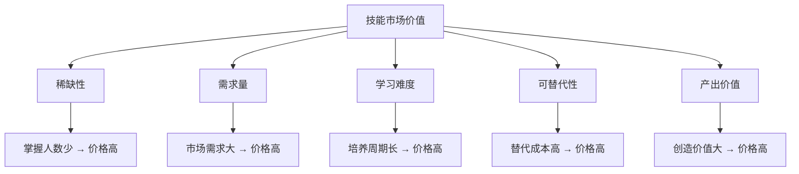

**维度一：稀缺性**

稀缺性由供给端决定。2023年大模型爆发后，AI应用开发成为稀缺技能，时薪从200元飙升到800元以上。但稀缺是有时效的——当大量开发者涌入后，稀缺性下降，价格回落。**持续学习新技能是维持稀缺性的唯一方法。**

稀缺性还有一种更深层的形式：**组合稀缺**。单独会Python的人不稀缺，单独懂金融的人也不稀缺，但"Python+金融量化"的组合就变得稀缺。组合稀缺的护城河比单一技能深得多，因为它需要跨领域的实战经验积累，不是短期培训能复制的。

**组合稀缺的构建方法**：
1. 选择一个"主技能"（你的核心竞争力，如后端开发）
2. 选择一个"副技能"（一个不同领域的能力，如金融/医疗/教育）
3. 在两者的交叉地带积累实战案例（如"金融数据管道开发"）
4. 持续深耕这个交叉领域，形成行业know-how

**2025-2026年高价值组合稀缺示例**：

| 组合方向 | 市场时薪 | 稀缺原因 |
|---------|---------|---------|
| AI Agent开发 + 企业工作流 | 2000-5000元 | Agent编排+业务理解，需要同时掌握LLM和企业IT |
| 大模型微调 + 金融风控 | 1500-3000元 | 需要同时理解ML和金融业务逻辑 |
| Go/云原生 + 区块链基础设施 | 1200-2500元 | 高并发+密码学交叉人才极少 |
| 前端3D + 工业仿真 | 1000-2000元 | WebGL/Three.js + 工业建模 |
| 数据工程 + 基因组学 | 1500-3000元 | 生物信息学+大数据处理 |
| 嵌入式 + AI边缘推理 | 1000-2000元 | 硬件约束下的模型优化 |
| 多模态AI + 医疗影像 | 2000-4000元 | 视觉模型+医学知识+合规要求 |

**维度二：需求量**

需求量由市场端决定。一个技术再稀缺，如果没人需要，也没有市场价值。区块链开发在2021年需求量极高，2023年需求骤降。选技能要看趋势，不能只看当下热门。

判断需求趋势的三个信号：
1. **资本流向**：VC投资哪个领域，哪个领域的技术需求就会增长。关注季度投融资报告（IT桔子、36氪、PitchBook）。
2. **招聘趋势**：某类岗位的招聘数量是否在增长？薪资是否在提升？关注Boss直聘、拉勾、LinkedIn的数据。一个简单的判断方法：在招聘平台搜索某类岗位，如果岗位数量在最近6个月增长了50%以上，说明需求在上升。
3. **政策导向**：政府重点扶持的产业（如半导体、新能源、AI），相关技术需求会长期增长。关注国务院、工信部、科技部的政策文件。

**判断需求趋势的实操工具**：

```text
1. Google Trends（trends.google.com）
   - 搜索某技术关键词，看搜索量趋势
   - 上升趋势 = 需求增长，下降趋势 = 需求萎缩

2. GitHub Star趋势（star-history.com）
   - 某框架/工具的Star增速反映开发者关注度
   - Star增速放缓 + Issue增多 = 技术进入成熟/衰退期

3. StackOverflow年度开发者调查
   - 每年发布一次，包含技术栈使用率、薪资数据
   - 关注"想学"和"正在用"的变化趋势

4. 行业报告
   - Gartner技术成熟度曲线（Hype Cycle）
   - CB Insights State of Tech
   - 国内：艾瑞咨询、易观分析的技术行业报告
```

**维度三：学习难度**

学习难度是天然的护城河。后端开发比前端开发时薪高，部分原因是后端的技术栈更深、需要更长的学习周期。学习难度越高，进入门槛越高，供给越少，价格自然越高。

但学习难度是一把双刃剑：它保护了现有从业者的价格，也意味着你需要投入更多时间才能进入这个领域。选择"高学习难度"技能的前提是：你确认这个技能的市场需求足以支撑你的投入。

**维度四：可替代性**

可替代性考虑的是：客户能不能用其他方案解决问题？如果一个系统管理员的工作可以被云服务的自动化工具替代，那他的市场价值就会持续下降。**永远要关注你的技能是否正在被技术进步替代。**

可替代性有三种来源：
1. **人力替代**：更便宜的劳动力可以做同样的事（如外包替代本地开发者）
2. **技术替代**：自动化工具/AI可以做同样的事（如低代码平台替代简单前端开发）
3. **方案替代**：客户可以用完全不同的方案解决同样的问题（如用SaaS替代定制开发）

抵御可替代性的策略是：不断往"更上层"迁移。当底层技术被自动化时，你应该在更高的抽象层次上创造价值——从写代码迁移到设计系统架构，从执行迁移到决策咨询。

**维度五：产出价值**

产出价值是客户视角的评估：你帮客户创造了多少价值？一个帮企业节省100万成本的自动化系统开发者，自然比一个帮企业做简单页面的开发者值钱。**选择高产出价值的领域，比提升技能更容易提高收入。**

产出价值的高低取决于两个因素：**客户规模**和**问题重要性**。帮一个500强企业解决核心业务流程问题（高客户规模×高问题重要性），产出价值远高于帮一个小商家做个展示页面（低客户规模×低问题重要性）。

**五维自评表**：给自己的核心技能在每个维度上打1-5分（1=最低，5=最高），然后计算总分。总分15分以下的技能，变现难度较大；15-20分的技能，有不错的变现潜力；20分以上的技能，变现空间很大。

| 维度 | 1分（低） | 3分（中） | 5分（高） | 你的评分 |
|------|----------|----------|----------|---------|
| 稀缺性 | 大量人会 | 有一定门槛 | 极少数人掌握 | ___ |
| 需求量 | 几乎无需求 | 稳定需求 | 高速增长 | ___ |
| 学习难度 | 几天能学会 | 需要数月 | 需要数年 | ___ |
| 可替代性 | 工具/AI可替代 | 部分可替代 | 几乎不可替代 | ___ |
| 产出价值 | 帮客户省小钱 | 帮客户省中等成本 | 帮客户创造巨大价值 | ___ |
| **总分** | | | | **___/25** |

### 1.3.2 技能市场价格参考

以下是2025-2026年中国市场的自由职业技能时薪参考范围（单位：人民币/小时）：

| 技能领域 | 初级（0-2年） | 中级（2-5年） | 高级（5年以上） | 市场趋势 |
|----------|--------------|--------------|----------------|----------|
| 前端开发 | 120-250 | 250-600 | 600-1200 | 平稳 |
| 后端开发 | 180-350 | 350-700 | 700-1800 | 平稳 |
| 全栈开发 | 180-300 | 300-700 | 700-1500 | 上升 |
| AI应用开发 | 250-500 | 500-1200 | 1200-3500 | 高速上升 |
| AI Agent开发 | 300-600 | 600-1500 | 1500-5000 | 爆发式增长 |
| 数据工程 | 180-350 | 350-800 | 800-2200 | 上升 |
| UI/UX设计 | 100-200 | 200-500 | 500-1000 | 平稳 |
| 文案写作 | 60-120 | 120-350 | 350-900 | AI冲击中 |
| 翻译（英语） | 60-120 | 120-250 | 250-500 | AI冲击严重 |
| 技术咨询 | 400-600 | 600-2000 | 2000-8000 | 上升 |
| 网络安全 | 250-500 | 500-1200 | 1200-4000 | 高速上升 |
| 云计算/DevOps | 180-350 | 350-800 | 800-2500 | 上升 |
| 小程序开发 | 120-250 | 250-600 | 600-1500 | 平稳 |
| 数据分析 | 120-250 | 250-600 | 600-1800 | 上升 |
| 区块链开发 | 150-300 | 300-600 | 600-1500 | 波动 |
| 多模态AI/视觉AI | 300-600 | 600-1500 | 1500-4000 | 高速上升 |

**数据来源**：综合程序员客栈、Upwork、Toptal等平台2025年报价数据，以及独立开发者社群调研。以上为自由职业时薪，全职薪资的折算比率约为0.6-0.8倍。注意：2025-2026年AI相关技能的时薪增长最快，其中AI Agent开发的时薪较2024年上涨了约80-120%。

**如何使用这张表**：先找到你的技能领域和经验等级对应的区间，然后用五维模型分析你的细分方向是否有溢价空间。比如"前端开发"的中级区间是200-500，但如果你是"React+Three.js的3D可视化前端"，可替代性和稀缺性都高于普通前端，时薪可以突破区间上限。

**溢价倍数参考**：以下因素可以在基础区间上叠加溢价：

| 溢价因素 | 溢价倍数 | 说明 |
|----------|---------|------|
| 细分领域专家 | 1.5-2x | 深耕某个垂直领域的技术专家 |
| 复合技能 | 2-3x | 同时掌握技术和业务领域知识 |
| 成功案例背书 | 1.3-1.8x | 有同类项目的成功交付记录 |
| 个人品牌 | 1.5-3x | 在技术社区有一定知名度 |
| 紧急需求 | 1.5-2x | 客户有时间压力，需要快速交付 |
| 保密需求 | 1.2-1.5x | 项目涉及商业机密，需要NDA |
| 跨时区服务 | 1.2-1.5x | 为海外客户提供跨时区覆盖 |

### 1.3.3 定价中的心理学效应

技术人定价时经常犯的错误不是"报低了"，而是"不会报价"。以下是六个关键的心理学效应，每一个都直接影响你的成交率和客单价：

**锚定效应**：第一个报出的数字会成为谈判的锚点。永远由你先报价，而且报一个比你预期高20-30%的数字。客户还价后，你仍然能拿到合理的价格。

具体操作：在报价前，先说"这类项目在市场上的报价通常在X-Y之间"（X是你的目标价，Y是目标价的1.5倍）。这个"市场参考区间"就成为了锚点，即使客户还价，也会围绕这个区间还，而不是围绕一个更低的数字。

**价格信号效应**：价格本身就是质量信号。如果你报价明显低于市场水平，客户不会觉得"性价比高"，而是会怀疑"这个人是不是不靠谱"。特别是ToB业务，低价往往意味着失单。

**真实案例**：一位自由设计师在同一时期接触了两个几乎相同的项目。对A客户报价8000元，对B客户报价2.5万元。结果：A客户犹豫了两周后成交，期间反复询问"你确定能做好吗"；B客户当天就签了合同，全程配合度很高。低价并没有让A客户更信任他，反而增加了A客户的疑虑。

**损失厌恶**：客户对"失去"的感知远大于"获得"。所以报价时强调"不做这个项目，你会损失什么"比"做了这个项目，你会获得什么"更有效。

话术示例：不说"做了这个系统可以帮你提高效率"，而说"你现在的流程每天浪费3个员工各2小时，按人均时薪50元算，一年浪费约22万元。这个系统的开发费用是8万，2个月回本，之后每年净省22万"。

**对比效应**：提供三档报价（基础版/标准版/高级版），大多数人会选中间那档。即使基础版完全够用，对比效应也会让客户倾向于选标准版。

**诱饵效应**：在三档报价中，故意让"高级版"的性价比看起来极高，推动客户选择中高档。这个效应最早由杜克大学的Joel Huber、John Payne和Christopher Puto在1982年的实验中证实（发表于《Journal of Consumer Research》），后来被行为经济学家丹·艾瑞里（Dan Ariely）在《怪诞行为学》（Predictably Irrational）中通俗化阐述。其核心机制是：当选项中加入一个"不对称劣势选项"（诱饵）时，人们会倾向于选择与诱饵相比优势更明显的选项。具体做法是：高级版比标准版多50%的功能，但只多20%的价格。这样标准版的客户会觉得"加一点钱就能得到多很多东西"，从而升级到高级版。而高级版本身才是你真正想卖的。

**实操案例**：

```text
基础版：3万元 —— 包含核心功能开发
标准版：5万元 —— 核心功能 + 数据报表 + 1个月维护
高级版：6万元 —— 核心功能 + 数据报表 + 3个月维护 + 培训 + 源码交付
```

在这个报价结构中，高级版比标准版只多1万元，但多了2个月维护、培训和源码交付——这些对客户的感知价值远超1万元。大多数客户会选择高级版。而如果你一开始就报价6万，客户可能会还价到4万。三档报价的妙处在于：客户不是在"要不要付6万"上纠结，而是在"选哪个档位"上做决策——这是完全不同的心理框架。

**稀缺效应**：适度的稀缺性能显著提升成交率。"本月仅剩2个项目名额"、"这个优惠价格只到月底"都是有效的稀缺性话术。但稀缺必须是真实的——虚假稀缺一旦被识破，信任彻底崩塌。

**心理学效应速查表**：

| 效应 | 核心原理 | 报价中的应用 | 注意事项 |
|------|---------|------------|---------|
| 锚定效应 | 第一个数字影响后续判断 | 由你先报价，报高于预期20-30% | 锚点要有依据，不能凭空报 |
| 价格信号 | 高价=高质量的认知 | 不要低于市场价太多 | 低价会引发信任危机 |
| 损失厌恶 | 失去>获得（2.5倍感知） | 强调"不做会损失什么" | 损失数据要真实可验证 |
| 对比效应 | 参照物影响判断 | 提供三档报价 | 档位间差异要合理 |
| 诱饵效应 | 不对称选项推动选择 | 高档版性价比故意做高 | 高档版才是你真正想卖的 |
| 稀缺效应 | 稀缺提升感知价值 | 限时/限量 | 必须是真实的稀缺 |

**定价伦理的边界**：以上心理学效应可以帮助你更有效地传达价值，但必须在伦理边界内使用。以下是"合理运用"与"操纵欺骗"的分界线：

```text
✅ 合理运用（价值传达）：
  - 三档报价帮助客户做决策（对比效应）
  - 用数据展示"不做会损失什么"（损失厌恶）
  - 报价时先给出市场参考区间（锚定效应）
  - 真实的限时优惠或名额限制（稀缺效应）

❌ 操纵欺骗（信任破坏）：
  - 虚假的"原价XX，现价XX"（伪造锚点）
  - 编造不存在的竞品报价（虚假对比）
  - 制造虚假紧迫感（"今天不签就没了"但明天还在）
  - 利用信息不对称故意夸大技术难度（欺骗性溢价）
  - 用"限量"但实际不限量来逼单（虚假稀缺）

核心原则：心理学效应的目的是帮助客户更准确地认识你的价值，
而非让客户为实际不存在的价值付费。短期操纵可能成交更多，
但一旦被识破，信任崩塌的代价远超一次成交的收益。
```

### 1.3.4 实战定价策略：三种定价方法

**方法一：成本加成法（入门级）**

```text
报价 = (时薪 × 预估工时) × (1 + 利润率) + 直接成本
```

- 利润率建议：30-50%（低于30%说明你在做慈善）
- 适用场景：刚开始接单、对市场行情不了解时
- 缺点：容易报低，因为你的"预估工时"会随着熟练度提高而减少，但报价不应该因此降低

**计算示例**：

```text
假设：时薪300元，预估工时40小时，利润率40%，直接成本（服务器/域名/素材）2000元
报价 = (300 × 40) × (1 + 0.4) + 2000 = 12000 × 1.4 + 2000 = 18800元
```

**方法二：价值定价法（进阶级）**

```text
报价 = 客户预期收益 × 价值捕获率（通常10-30%）
```

- 适用场景：客户能明确量化收益时（如节省成本、增加收入）
- 核心技巧：先帮客户算清楚"这个问题值多少钱"，再按比例报价
- 案例：帮客户自动化一个每月需要5人×2天的数据处理流程，按人均日薪500元算，月成本5000元，年成本6万元。报价10万（价值捕获率约167%的首年成本，但客户在第2年就开始净赚）。这比"按工时报价40小时×300元=1.2万"高出8倍。

**价值定价法的实施步骤**：

```text
第一步：量化客户当前的痛点成本
  - 人力成本：多少人 × 多少时间 × 时薪
  - 机会成本：因为这个问题，客户损失了多少收入
  - 风险成本：不解决这个问题，可能面临多大的损失

第二步：估算你的方案能带来的收益
  - 成本节省：能帮客户省多少
  - 效率提升：能帮客户多赚多少
  - 风险降低：能帮客户避免多大损失

第三步：按10-30%的价值捕获率报价
  - 10%：竞争激烈、客户预算敏感
  - 20%：标准市场行情
  - 30%：差异化强、客户信任度高

第四步：用数据包装报价
  - 附带ROI计算表
  - 附带"如果不做"的成本分析
  - 附带竞品/替代方案的价格对比
```

**方法三：竞品锚定法（高级）**

```text
报价 = 竞品/替代方案成本 × 差异化系数（0.6-1.5）
```

- 适用场景：市场上有明确的竞品或替代方案时
- 核心技巧：如果竞品卖10万，你做同样的事可以报6-15万，取决于你的差异化优势
- 案例：某SaaS产品年费12万，你提供定制开发方案报价8万（首年），客户会觉得"更划算"——即使你的方案功能不如SaaS全面，但"定制"和"一次付费"本身就是差异化价值。

**三种定价方法的选择决策树**：

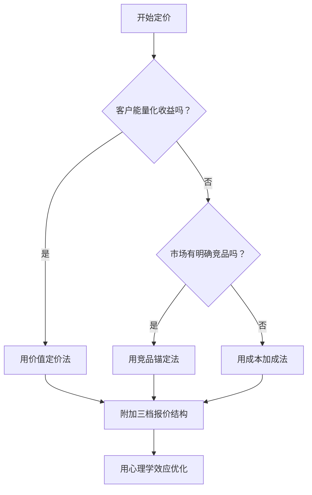

## 1.4 技能变现的底层经济学

### 1.4.1 边际成本与规模效应

卖时间的边际成本是线性的——你多干一小时，就多一小时的成本。卖产品的边际成本趋近于零——课程多卖给一个人，额外成本接近零。

这是技能变现中最关键的经济学原理。理解它，就能理解为什么"卖产品"比"卖时间"高级：

| 变现模式 | 边际成本 | 规模效应 | 利润率 |
|----------|----------|----------|--------|
| 卖时间 | 高（线性） | 无 | 30-50% |
| 卖成果 | 中（项目制） | 有限 | 40-60% |
| 卖产品 | 低（趋近于零） | 强 | 60-90% |

**规模效应的数学解释**：假设你开发一个在线课程花了200小时（成本约6万元，按300元/小时的机会成本算）。如果卖100份（单价299元），收入2.99万，还在亏损；卖300份，收入8.97万，开始盈利；卖1000份，收入29.9万，利润率约80%。而你在这三种情况下投入的时间几乎一样——这就是规模效应的力量。

**规模效应的临界点计算**：

```text
盈亏平衡点 = 固定成本 / (单价 - 单位变动成本)

示例：课程固定成本6万元，售价299元，单位变动成本（平台抽成+支付手续费）约30元
盈亏平衡点 = 60000 / (299 - 30) ≈ 223份
卖到第223份时回本，之后每卖一份净赚269元。
```

**规模效应的三个层次**：

```text
第一层：单产品规模效应
  - 一份产品卖给N个用户
  - 边际成本趋近于零
  - 典型：在线课程、SaaS工具、电子书

第二层：产品组合规模效应
  - 多个产品共享同一个用户池
  - 获客成本被多个产品分摊
  - 典型：课程+社群+咨询的组合

第三层：品牌规模效应
  - 品牌信任可以跨品类复用
  - 每个新品的冷启动成本大幅降低
  - 典型：技术KOL推出新产品时，首月销量就很高
```

### 1.4.2 机会成本

你的每一小时都有机会成本。如果你用3小时做了一个500元的小需求，你的机会成本就是：这3小时本可以用来学习新技能、做营销、或者做更高价值的项目。

**实操方法**：给自己的时间设定一个"底线时薪"。如果一个需求的报价低于你的底线时薪，直接拒绝。底线时薪的计算方法：

```text
底线时薪 = (你期望的月收入 × 1.5) / (22天 × 6小时有效工作时间)
```

为什么乘以1.5？因为你需要覆盖税费、社保、空窗期、工具成本等隐性开支。为什么是6小时而不是8小时？因为自由职业者的有效工作时间通常只有60-70%（剩下的时间花在沟通、行政、营销、学习上）。

**举例**：如果你期望月收入2万，底线时薪 = (20000 × 1.5) / (22 × 6) = 227元/小时。这意味着：任何报价低于227元/小时的工作，你都应该拒绝或转介绍给别人。

底线时薪还有一个进阶用法：**动态调整**。当你积累了足够的案例和口碑后，底线时薪应该每半年上调一次。如果你连续3个月没有被拒绝过（所有报价都成交了），说明你的报价可能偏低了——可以适当上调10-20%试试。

**底线时薪计算器**：

```python
def calculate_min_hourly_rate(
    target_monthly_income: float,  # 目标月收入
    tax_rate: float = 0.1,         # 税率（自由职业约10%）
    insurance_rate: float = 0.1,   # 社保/商业保险
    gap_rate: float = 0.15,        # 空窗期比例
    tool_cost_monthly: float = 500, # 工具/软件月成本
    working_days: int = 22,         # 月工作天数
    effective_hours: float = 6      # 每天有效工作小时
) -> float:
    """计算底线时薪，低于此价格的工作应该拒绝"""
    overhead_multiplier = 1 + tax_rate + insurance_rate + gap_rate
    monthly_overhead = target_monthly_income * overhead_multiplier + tool_cost_monthly
    monthly_billable_hours = working_days * effective_hours
    return round(monthly_overhead / monthly_billable_hours, 0)

# 示例：目标月入2万
# 结果：227元/小时
```

### 1.4.3 复利效应

技能变现有一个隐性的复利效应：每一次项目经验都会提升你的技能、丰富你的案例、扩展你的人脉。这些积累会在未来以更高的时薪、更好的客户、更优质项目的形式回报给你。

**但这个复利效应只在"卖成果"及以上的模式中存在。** 纯粹的"卖时间"，因为工作内容高度重复，几乎没有复利。

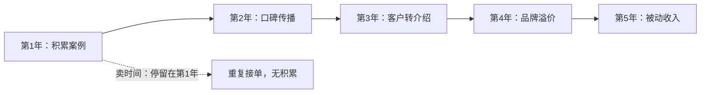

复利效应的量化：假设你每年通过案例积累和口碑传播，获得的客户质量提升10%（即客单价每年提升10%），5年后的收入是第1年的1.1^5 ≈ 1.61倍。如果再加上"转介绍带来的新客户"效应（每年新增20%的客户来自转介绍），5年后的收入可以达到第1年的2-3倍。而"卖时间"的开发者，5年后的收入通常只有第1年的1.2-1.3倍（仅靠小幅提薪）。

**复利效应的四个飞轮**：

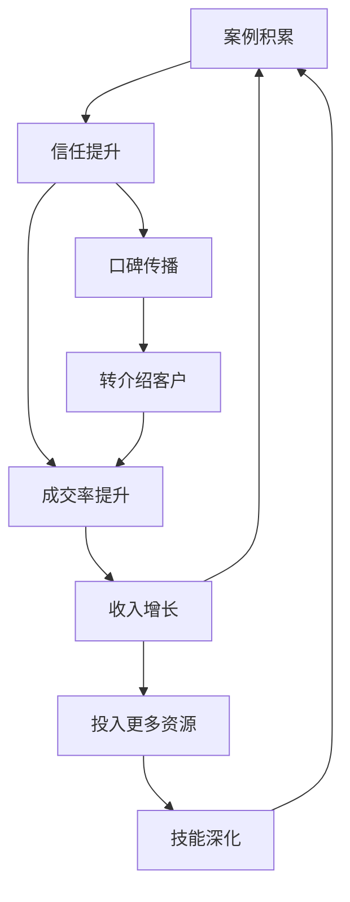

**复利的第五个飞轮——技能迁移**：

复利效应还有一种被严重忽视的形式：**技能迁移**。你在A领域积累的技能和方法论，可以迁移到B领域，从而在B领域获得远超新手的起点。

```text
案例1：一个做了5年电商系统开发的后端工程师
  - 积累了：支付系统、库存管理、订单流程、高并发架构
  - 迁移到：SaaS领域 → 他可以快速开发一个电商SaaS产品
  - 迁移到：咨询领域 → 他可以为电商企业提供技术咨询服务
  - 迁移到：教育领域 → 他可以开设"电商系统架构"课程

案例2：一个做了3年数据可视化的前端工程师
  - 积累了：D3.js、Canvas、大数据渲染、交互设计
  - 迁移到：工业可视化 → 数字孪生/智慧工厂
  - 迁移到：金融可视化 → 量化交易看板/K线系统
  - 迁移到：教育领域 → 数据可视化课程
```

技能迁移的关键是识别"可迁移的核心能力"——那些不依赖特定领域、可以跨行业复用的能力。比如：系统设计能力、需求分析能力、项目管理能力、技术写作能力、团队协作能力。这些能力越强，你的迁移成本越低，复利效应越显著。

### 1.4.4 网络效应与正反馈循环

网络效应是指：一个产品/服务的用户越多，每个用户获得的价值越大。在技能变现领域，网络效应主要体现在三个层面：

**第一层：案例网络效应。** 你做的项目越多，案例库越丰富，新客户的信任建立越容易。这是一个正反馈循环：案例多→信任高→成交率高→案例更多。但启动这个循环需要"冷启动"——前5-10个案例是最难获得的，往往需要通过低价、免费或个人关系来获取。

**冷启动的五种方法**：
1. **朋友/前同事的项目**：以友情价接2-3个真实项目，积累第一批案例
2. **开源贡献**：为知名开源项目贡献代码，积累技术信誉
3. **技术博客**：写高质量的技术文章，展示专业能力
4. **公益项目**：为非营利组织免费做技术项目，获得案例和口碑
5. **竞品分析**：分析竞品的技术方案，写成案例文章，展示你的思考深度

**第二层：口碑网络效应。** 每一个满意的客户都可能带来转介绍。口碑传播的效率远高于主动营销——转介绍客户的成交率通常是冷启动客户的3-5倍，而且不需要营销成本。维护口碑网络的关键是：超额交付。交付110%的客户期望值，比交付100%更能触发口碑传播。

**触发口碑传播的"超预期"时刻**：
- 交付时间比承诺提前2天
- 主动发现并修复了一个客户没注意到的bug
- 附送一份客户没要求但很有用的使用指南
- 项目结束后主动跟进一个月，确保一切运行正常
- 在客户遇到其他技术问题时，免费给出建议

**第三层：平台网络效应。** 如果你建立了自己的平台（如付费社群、SaaS产品），每增加一个用户都会增加平台对其他用户的价值。比如一个开发者社区，成员越多，交流质量越高，吸引更多成员加入。这种网络效应一旦形成，就是极深的护城河。

### 1.4.5 转换成本与竞争护城河

转换成本是指客户从你切换到其他服务提供者需要付出的代价。转换成本越高，客户流失率越低，你的收入越稳定。

**技术人可以主动构建的转换成本**：

| 转换成本类型 | 具体形式 | 构建方法 |
|------------|---------|---------|
| 数据锁定 | 客户的数据/配置在你的系统里 | 设计有粘性的数据结构，提供数据迁移但增加迁移难度 |
| 学习成本 | 客户已经学会了你的工具/流程 | 提供深度培训，让客户依赖你的工作方式 |
| 关系成本 | 长期合作建立的信任和默契 | 定期沟通、主动发现问题、成为客户的"技术顾问"而非"执行者" |
| 合同锁定 | 长期合同、年费模式 | 提供年费折扣，增加违约成本 |

**护城河的层次**（从浅到深）：
1. **成本护城河**：你的成本比竞争者低（如模板化、自动化）
2. **差异化护城河**：你提供的东西和竞争者不同（如行业know-how、复合技能）
3. **品牌护城河**：客户因为品牌选择你，而非因为功能或价格
4. **网络效应护城河**：你的用户越多，竞争者越难追赶
5. **规模护城河**：你的规模大到竞争者无法承受进入成本

对于个人技术变现者，最现实的护城河是**差异化护城河**（深耕细分领域）和**关系护城河**（与核心客户建立深度合作关系）。品牌和网络效应需要更长时间积累，但一旦形成就是最深的护城河。

## 1.5 技能组合的战略构建

理解了定价机制后，一个关键问题浮出水面：**应该学什么技能？** 不是所有技能都值得投入时间。本节提供一个系统化的技能选择和组合框架。

### 1.5.1 技能选择的"三环模型"

选择变现技能时，需要同时满足三个条件：

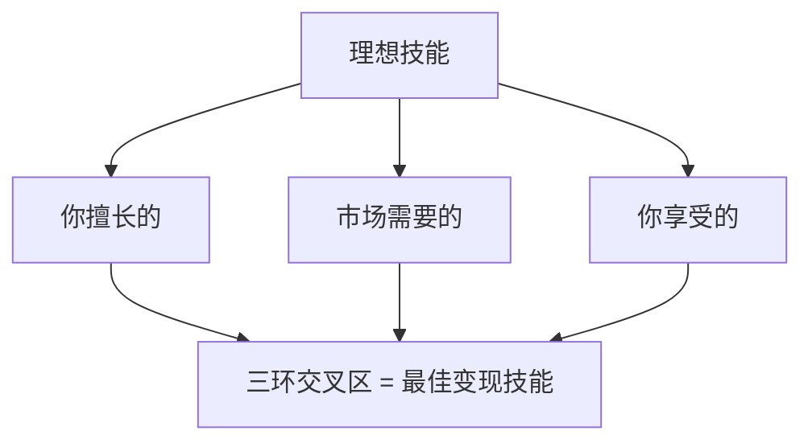

- **你擅长的**：你在这个领域有积累、有手感、有自信。不需要是世界顶级，但需要超过平均水平。
- **市场需要的**：有人愿意为此付费。一个你非常擅长但没人买单的技能，只能当爱好。
- **你享受的**：你能长期坚持。技能变现是马拉松，不是短跑。如果你讨厌这个领域，3年后你一定会放弃。

**三环缺失的后果**：

| 缺失的环 | 表现 | 结果 |
|---------|------|------|
| 缺"擅长" | 技能不够，交付质量差 | 口碑崩塌，无法持续 |
| 缺"市场" | 技能很强但没人需要 | 空有一身本事，赚不到钱 |
| 缺"享受" | 能赚钱但越做越痛苦 | 职业倦怠，最终放弃 |

### 1.5.2 技能组合的"T型+π型"策略

单一技能的变现能力有限。真正强大的变现者，都拥有**复合技能组合**：

```text
T型人才（一专多能）：
  - 一个深度技能（竖线）+ 多个基础技能（横线）
  - 示例：深度后端开发 + 基础前端/产品/营销
  - 变现能力：中等，适合"卖成果"阶段

π型人才（双专多能）：
  - 两个深度技能（两条竖线）+ 多个基础技能（横线）
  - 示例：深度后端开发 + 深度AI应用 + 基础产品/营销
  - 变现能力：强，适合"卖产品"及以上阶段

为什么π型比T型更强：
  - 两个深度技能的交叉点 = 极高稀缺性
  - 可以在两个领域独立变现，也可以交叉变现
  - 一个技能被AI替代时，另一个技能兜底
```

**技能组合的构建步骤**：

```text
第1步：确认你的"主技能"（当前最强的技能）
  - 这是你变现的基础，必须达到中级以上水平
  - 示例：后端开发（5年经验）

第2步：选择"辅技能"方向
  - 辅技能应该是主技能的"放大器"，而非"替代品"
  - 选择标准：
    a) 与主技能有协同效应（1+1>2）
    b) 市场有明确需求
    c) 学习曲线在3-6个月内可达到初级水平
  - 好的组合示例：
    · 后端 + 产品管理 → 可以独立做完整项目
    · 前端 + 设计 → 可以提供一站式UI方案
    · 数据 + 业务领域 → 可以做数据咨询
    · 开发 + 写作 → 可以做技术内容变现

第3步：在交叉地带积累案例
  - 不是分别学两个技能，而是在两者的交叉点上实战
  - 示例：后端+AI → 不是分别学后端和AI，而是做"AI应用的后端架构"
  - 交叉案例的稀缺性远高于单一技能案例

第4步：形成"技能护城河"
  - 当你在某个交叉领域积累了20+案例，你就建立了护城河
  - 客户找的不是"一个后端开发者"，而是"一个懂AI应用架构的后端专家"
  - 这种定位让你的可替代性极低，定价权极大
```

### 1.5.3 技能投资的ROI评估

学一项新技能需要投入大量时间。如何判断一项技能"值不值得学"？

```text
技能投资ROI = (预期收入增量 × 持续年数) / (学习时间 × 机会成本)

示例1：学习React（前端框架）
  - 学习时间：200小时
  - 机会成本：200小时 × 200元/小时 = 4万元
  - 预期收入增量：从纯后端到全栈，时薪提升50%，约100元/小时
  - 持续年数：5年（React短期内不会被淘汰）
  - 年增量收入：100元 × 6小时 × 22天 × 12月 = 15.8万元
  - 5年增量：79万元
  - ROI = 79万 / 4万 = 19.75（极值得）

示例2：学习一个冷门编程语言
  - 学习时间：300小时
  - 机会成本：300小时 × 200元/小时 = 6万元
  - 预期收入增量：市场小，时薪提升20%，约40元/小时
  - 持续年数：2年（可能很快被淘汰）
  - 年增量收入：40元 × 6小时 × 22天 × 12月 = 6.3万元
  - 2年增量：12.7万元
  - ROI = 12.7万 / 6万 = 2.1（勉强值得，有更好的选择则不选）
```

**技能投资的决策矩阵**：

| 决策因素 | 高优先级 | 低优先级 |
|---------|---------|---------|
| 市场需求趋势 | 高速增长中 | 稳定或下降 |
| 学习曲线 | 3-6个月可达初级 | 需要2年以上 |
| 与现有技能的协同 | 1+1>2的组合效果 | 完全独立的新领域 |
| AI可替代性 | AI辅助增强而非替代 | 正在被AI完全替代 |
| 变现周期 | 学完即可接单 | 需要额外积累才能变现 |

## 1.6 AI时代：技能变现的新变量

2024年以来，大模型从"能力验证"阶段进入"规模落地"阶段，Agent（自主体）、RAG（检索增强生成）、多模态模型和端侧AI的爆发式发展，对技能变现产生了结构性影响。这一节不是在讨论"AI会不会取代程序员"这种空泛的话题，而是聚焦于AI对技能变现的具体影响——哪些技能贬值了，哪些技能升值了，以及如何利用AI作为变现的杠杆。

### 1.6.1 AI对技能价值的冲击矩阵

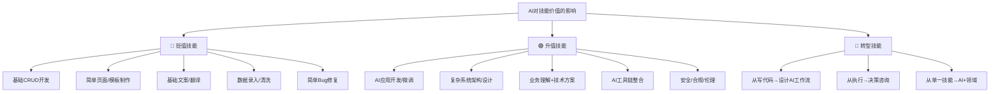

**贬值技能的具体表现与时间线预测**：

| 技能 | AI替代方式 | 贬值幅度 | 完全替代时间线 | 应对策略 |
|------|-----------|---------|--------------|---------|
| 基础CRUD开发 | GitHub Copilot、Cursor、Windsurf等AI编码工具 | 40-60% | 3-5年（80%场景） | 向系统设计、架构方向迁移 |
| 简单前端页面 | AI生成代码+低代码平台（Bolt.new、v0.dev） | 50-70% | 2-4年 | 向复杂交互、性能优化、3D方向迁移 |
| 基础文案写作 | ChatGPT、Claude、Gemini等大模型 | 60-80% | 已发生（2024年） | 向深度分析、策略咨询方向迁移 |
| 翻译（通用） | DeepL、GPT-4o、Claude | 70-85% | 已发生（2024年） | 向专业领域翻译、本地化方向迁移 |
| 数据分析（基础） | AI自动生成报表和洞察（Code Interpreter） | 40-60% | 2-3年 | 向数据工程、机器学习方向迁移 |
| 简单UI设计 | Midjourney、DALL-E 3、AI设计工具 | 50-70% | 3-5年 | 向交互设计、设计系统方向迁移 |
| 基础测试 | AI自动生成测试用例+自动执行 | 30-50% | 2-4年 | 向测试策略、质量工程方向迁移 |
| 基础运维 | AIOps+自动化运维平台 | 30-50% | 3-5年 | 向SRE、可观测性、混沌工程方向迁移 |

**升值技能的具体表现**：

| 技能 | 升值原因 | 溢价幅度 | 入门路径 |
|------|---------|---------|---------|
| AI应用开发 | 需求井喷，供给不足 | 2-3x | 学习LangChain/LlamaIndex/RAG |
| 大模型微调 | 企业私有化部署需求 | 3-5x | 学习LoRA/QLoRA/RLHF |
| AI安全/对齐 | 监管要求+企业合规 | 2-4x | 学习红队测试、对抗攻击、安全评估 |
| 复杂系统架构 | AI无法替代高层决策 | 1.5-2x | 积累大规模系统经验 |
| AI+垂直领域 | 需要深度领域知识 | 3-5x | 选择一个行业深耕 |

### 1.6.2 AI作为变现杠杆

AI不仅是竞争威胁，更是强大的变现杠杆。善用AI的技术人，生产力可以提升3-10倍。

**杠杆一：AI辅助开发，提升交付效率**

```text
传统方式：一个小程序项目需要40小时
AI辅助方式：同样的项目需要12-18小时
  - 需求分析：AI辅助生成需求文档（节省40%时间）
  - 代码编写：AI编码工具加速（节省60%时间，Cursor/Windsurf/Copilot）
  - 测试：AI生成测试用例（节省50%时间）
  - 文档：AI生成技术文档（节省70%时间）
  - 部署：AI辅助CI/CD配置（节省40%时间）

结果：同样的报价，时薪翻2-3倍
```

**AI编码工具对比（2025-2026）**：

| 工具 | 定价 | 核心优势 | 最佳场景 | 注意事项 |
|------|------|---------|---------|---------|
| Cursor | $20/月 | 多文件编辑、代码库理解 | 中大型项目重构 | Pro版才有完整功能 |
| GitHub Copilot | $10-19/月 | IDE集成最深、补全最流畅 | 日常编码、快速原型 | 对复杂架构理解有限 |
| Windsurf | $15/月 | 全栈理解、Cascade多步执行 | 全栈开发、调试 | 较新，生态还在完善 |
| Claude Code | 按token计费 | 深度推理、复杂任务 | 架构设计、代码审查 | 需要终端使用习惯 |
| Aider | 开源 | Git集成、多模型支持 | 开源爱好者、定制化需求 | 需要自行配置模型 |

**杠杆二：AI辅助营销，降低获客成本**

```text
- 用AI生成技术博客初稿，人工润色后发布（从4小时/篇降到1小时/篇）
- 用AI分析竞品定价和策略（从2天调研降到2小时）
- 用AI生成报价方案和提案文档（从半天降到1小时）
- 用AI辅助社交媒体运营（自动化内容生成和排期）
```

**杠杆三：AI创造新产品机会**

```text
2025-2026年新兴的AI变现机会：
1. AI Agent开发：为企业构建自主运行的AI助手/工作流（月费模式，客单价5000-50000元/月）
2. RAG系统搭建：帮企业建立私有知识库问答系统（项目制，5-30万元）
3. AI工作流自动化：用n8n/Dify/Coze等平台优化企业业务流程（1-10万元/项目）
4. AI培训/咨询：教企业如何使用AI工具提升效率（3000-20000元/天）
5. 多模态内容生产：AI视频、AI数字人、AI配音的商业化应用服务
6. 端侧AI部署：将模型部署到手机/IoT设备（高溢价，需硬件+软件复合能力）
7. AI数据标注/清洗：高质量的训练数据仍然需要人工把关（尤其垂直领域数据）
```

### 1.6.3 AI时代的核心策略

**策略一：与AI协作，而非与AI竞争**

不要试图证明"AI做不了的事我能做"，而是思考"我如何用AI做得更好"。一个会用AI工具的中级开发者，产出可能超过不会用AI的高级开发者。

**策略二：向上迁移，占据AI无法替代的位置**

AI最容易替代的是"执行层"工作。你应该向"决策层"和"策略层"迁移：
- 从"写代码"迁移到"设计系统架构"
- 从"做功能"迁移到"理解业务需求"
- 从"执行任务"迁移到"定义问题"
- 从"技术实现"迁移到"技术战略"

**策略三：拥抱AI，成为AI时代的"翻译官"**

很多企业知道AI很重要，但不知道怎么用。你可以成为"AI翻译官"——把AI技术翻译成业务语言，帮企业找到AI的应用场景并落地实施。这种"技术+业务"的复合能力，在AI时代价值极高。

### 1.6.4 AI时代的五项不可替代能力

AI越强大，以下五种能力就越值钱——因为它们恰好是AI最弱的领域：

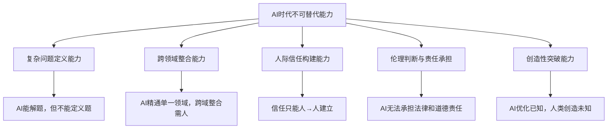

**能力一：复杂问题定义能力**

AI擅长解决明确定义的问题，但现实世界的难题往往"连问题是什么都不清楚"。客户说"我要一个管理系统"，但真正的问题可能是"我的团队协作效率太低"——甚至更深层的问题是"我的组织架构不合理"。能穿透表象、定义真正问题的人，价值远高于只会执行方案的人。

实操方法：每次接到需求时，连续问5个"为什么"（丰田五问法）。客户说"我需要一个网站"→为什么？→"因为我要卖产品"→为什么不用现有平台？→"因为平台抽成太高"→为什么不用社交媒体？→"因为没有专业的展示页面"→真正的需求可能是"低成本建立专业形象"，解决方案可能只是一个精美的落地页+社交媒体运营策略，而非一个完整的电商网站。

**能力二：跨领域整合能力**

AI模型在单一领域可以达到专家水平，但跨领域的整合——把技术方案、商业逻辑、用户体验、合规要求、组织政治综合考虑——仍然是人类的核心优势。一个能同时理解"技术可行性"、"商业可行性"和"用户需求"的人，就是AI时代最稀缺的"整合者"。

培养路径：每18个月深入学习一个新领域（不需要精通，但要理解其核心逻辑和术语）。3-5年后，你就拥有了"技术+领域A+领域B"的复合能力，这种组合在市场上几乎没有直接竞争者。

**能力三：人际信任构建能力**

客户为一个AI生成的方案付费的心理门槛，远高于为一个"认识的、信任的人"提供的方案付费。在AI生成内容泛滥的时代，人与人之间的信任变得更加珍贵。那些能与客户建立深度信任关系的技术人，将获得越来越高的溢价——因为AI可以生成方案，但无法替代"张工给我做的方案"这种信任背书。

具体表现：长期客户更倾向于为"人"付费而非为"工具"付费。同一个AI辅助生成的方案，由一个有口碑的技术顾问交付，报价可以是纯AI工具的5-10倍。

**能力四：伦理判断与责任承担**

AI可以生成代码、设计方案，但无法为结果承担责任。当一个自动化系统出了bug导致客户数据泄露，AI不会被起诉，但开发者会。在涉及安全、隐私、合规的领域，"有人类专家把关"本身就是一种价值——客户需要的不仅是方案，更是"出了问题有人负责"的确定性。

**能力五：创造性突破能力**

AI擅长在已知范式内优化，但真正的创造性突破——提出全新的问题解决范式——仍然是人类的领地。Unix的管道设计、React的虚拟DOM、Git的分布式版本控制——这些都不是"优化已有方案"的结果，而是全新的思维范式。培养创造性突破能力的方法：广泛阅读跨领域知识、定期进行"无目的探索"、保持对"显而易见"事物的质疑。

### 1.6.5 Agent经济：从工具到自主体

2025-2026年，AI正在从"工具"进化为"自主体"（Agent）。这不仅是技术变革，更是一次商业模式的重构——对技术变现者来说，Agent经济创造了全新的变现机会。

**Agent与传统AI工具的本质区别**：

| 维度 | 传统AI工具 | AI Agent |
|------|-----------|----------|
| 交互模式 | 一问一答（被动响应） | 自主规划+执行（主动完成） |
| 任务复杂度 | 单步任务 | 多步骤、跨系统的复杂工作流 |
| 人类参与度 | 每步都需要人类指令 | 人类设定目标，Agent自主执行 |
| 典型产品 | ChatGPT对话、Copilot补代码 | Devin自动完成开发任务、AutoGPT执行复杂工作流 |
| 变现模式 | 按调用次数/Token计费 | 按任务完成度/价值计费 |

**Agent经济的三层变现机会**：

```text
第一层：Agent开发（造锤子）
  - 为企业构建定制化的AI Agent
  - 典型场景：
    · 客服Agent：自动处理80%的客户咨询（替代2-3个人工客服）
    · 数据分析Agent：自动从多个数据源提取数据、生成报告
    · 代码审查Agent：自动检查PR、发现安全漏洞、提出改进建议
    · 运维Agent：自动监控系统、诊断故障、执行修复脚本
  - 定价方式：基础月费（3000-10000元/月）+ 按任务量阶梯计费
  - 技术栈：LangChain/LangGraph、CrewAI、AutoGen、Dify、Coze
  - 客单价：5000-50000元/月（持续收入）

第二层：Agent工作流集成（卖水）
  - 不开发Agent本身，而是帮企业把现有Agent工具串联成业务工作流
  - 典型场景：
    · 把客服Agent+CRM+工单系统串联，实现客户问题自动分类→自动回复→自动派单
    · 把数据分析Agent+报告Agent+邮件Agent串联，实现数据自动采集→报告自动生成→自动发送
  - 定价方式：项目制（1-10万元/项目）+ 年度维护费
  - 核心能力：业务理解 + 系统集成 + Agent编排
  - 客单价：3-15万元/项目

第三层：Agent培训与咨询（传道）
  - 教企业如何使用Agent提升效率
  - 典型场景：
    · 企业AI转型咨询：评估哪些业务流程适合Agent化
    · Agent使用培训：教员工如何与Agent协作
    · Agent效果评估：量化Agent的ROI，优化Agent配置
  - 定价方式：咨询费（2000-20000元/天）+ 年度顾问费
  - 客单价：5000-30000元/天
```

**Agent经济的真实产业案例**：

```text
案例1：某电商客服Agent项目
  - 背景：日均2000条客户咨询，8个客服人员
  - 方案：基于Dify搭建客服Agent，接入商品知识库+订单系统+退换货流程
  - 结果：Agent自动处理72%的咨询，客服人员从8人减至3人
  - 定价：首期开发费8万元 + 月维护费3000元
  - 客户ROI：月省人力成本约4万元，2个月回本

案例2：某律所合同审查Agent
  - 背景：律师每天花3-4小时审查标准合同
  - 方案：基于LangChain搭建合同审查Agent，训练于10万份历史合同
  - 结果：标准合同审查时间从3小时降到15分钟，风险点识别率95%+
  - 定价：首期开发费15万元 + 年维护费2万元
  - 客户ROI：每个律师每天省3小时，10人团队年省约150万元人力成本

案例3：某制造企业数据报告Agent
  - 背景：每周需要从5个系统提取数据，生成周报，耗时2天
  - 方案：n8n+GPT-4o搭建自动化工作流，数据采集→清洗→分析→报告→邮件
  - 结果：周报从2天人工缩短到30分钟自动生成
  - 定价：项目制5万元 + 月维护费1500元
```

**Agent经济的实操建议**：

```text
入门路径（3-6个月）：
1. 第1-2周：用Dify/Coze搭建一个简单的客服Agent（零代码/低代码）
2. 第3-4周：用LangChain搭建一个RAG知识库问答系统
3. 第5-8周：用LangGraph/CrewAI搭建一个多Agent协作系统
4. 第9-12周：为一个真实客户（可以是朋友的公司）搭建一个Agent解决方案
5. 第13-24周：把解决方案产品化，形成可复用的Agent模板

关键提醒：
- Agent开发的门槛不在编程，而在"理解业务流程+设计Agent决策逻辑"
- 2025-2026年最大的机会在"企业Agent化"——帮传统企业把重复性工作交给Agent
- 不要从零造轮子，用现成的Agent框架（LangChain/Dify/Coze）快速搭建原型
- Agent的商业价值不在于技术有多先进，而在于帮客户省了多少人力成本
```

## 1.7 合规与风险管理

前面六节建立了技能变现的"进攻"体系——如何创造价值、如何定价、如何利用AI杠杆。但变现能力不仅取决于你能赚多少，还取决于你能留住多少、走多远。本节建立"防守"体系——税务、合同、知识产权、健康和心理五个维度的合规框架。很多技术人认为"先把钱赚了再说，法律的事以后再考虑"。这种想法在金额小、客户关系好时似乎没问题，但一旦涉及较大金额、复杂项目或纠纷，没有合规意识的代价可能是几万甚至几十万的损失。更详细的合同实务和法律知识，请参阅核心技巧篇的[合同与法律知识](../核心技巧/09-九合同与法律知识.md)。

### 1.7.1 税务筹划基础

自由职业者和技术变现者必须面对的现实：税务合规不是可选项，而是必选项。以下是基础的税务知识框架：

**自由职业者的税务结构**：

| 收入类型 | 税种 | 税率范围 | 说明 |
|---------|------|---------|------|
| 劳务报酬 | 个人所得税 | 20-40% | 单次收入超过800元起征 |
| 经营所得 | 个人所得税 | 5-35% | 注册个体户后适用 |
| 稿酬所得 | 个人所得税 | 14%（优惠税率） | 书籍、文章、课程等 |
| 特许权使用费 | 个人所得税 | 20% | 软件授权、专利授权等 |

**劳务报酬税率详解**：

很多人只知道"劳务报酬税率20-40%"，但不知道具体怎么算。以下是劳务报酬的预扣预缴规则：

```text
劳务报酬预扣预缴税率表：
┌─────────────────────────┬──────────┬───────────┐
│ 应纳税所得额             │ 预扣率   │ 速算扣除数 │
├─────────────────────────┼──────────┼───────────┤
│ 不超过20,000元           │ 20%      │ 0         │
│ 超过20,000-50,000元      │ 30%      │ 2,000     │
│ 超过50,000元             │ 40%      │ 7,000     │
└─────────────────────────┴──────────┴───────────┘

计算公式：
  每次收入不超过4000元：应纳税所得额 = 收入 - 800
  每次收入超过4000元：应纳税所得额 = 收入 × (1 - 20%)
  应纳税额 = 应纳税所得额 × 预扣率 - 速算扣除数

示例：接了一个3万元的项目
  应纳税所得额 = 30,000 × 0.8 = 24,000
  应纳税额 = 24,000 × 30% - 2,000 = 5,200元
  实际税负 = 5,200 / 30,000 = 17.3%
```

**注意**：以上是预扣预缴。年度汇算清缴时，劳务报酬并入综合所得，适用3%-45%的超额累进税率，多退少补。如果你年收入不高（比如兼职月入5000），汇算时可能退税。

**降低税负的合法方法**：

```text
方法1：注册个体工商户（推荐，最常用的节税方式）
  - 将劳务报酬转为经营所得
  - 经营所得税率通常低于劳务报酬
  - 可以扣除经营成本（设备、软件、办公费用等）
  - 部分地区有核定征收政策，综合税率可低至3-5%
  - 注册流程：当地市场监管局或线上"一网通办"，通常1-3个工作日
  - 成本：几乎为零（无需注册资本，无需实体店面）

  实操对比：
  ┌──────────────┬──────────────┬──────────────┐
  │              │ 劳务报酬     │ 个体户经营所得 │
  ├──────────────┼──────────────┼──────────────┤
  │ 年收入30万   │ 约5.2万税    │ 约1-1.5万税  │
  │ 年收入50万   │ 约10万税     │ 约2-3万税    │
  │ 年收入100万  │ 约25万税     │ 约5-8万税    │
  └──────────────┴──────────────┴──────────────┘
  * 个体户税额按核定征收估算，实际因地区政策而异

方法2：合理列支成本
  - 设备购置（电脑、显示器、外设）——保留发票
  - 软件订阅（IDE、云服务、设计工具）——保留支付记录
  - 办公成本（房租、水电、网络）——按比例分摊
  - 学习成本（课程、书籍、认证考试）——保留购买记录
  - 差旅成本（客户拜访的交通、住宿）——保留票据

方法3：利用税收优惠政策
  - 小规模纳税人增值税减免（月销售额10万以下免征）
  - 高新技术企业税收优惠（所得税15%）
  - 研发费用加计扣除（100%加计扣除）
  - 各地的人才引进税收优惠（如海南、横琴等地区）

方法4：收入拆分与递延
  - 将大额项目拆分为多个阶段性交付，分散纳税
  - 利用年度汇算清缴的税率差，合理安排收入确认时间
  - 将部分收入转为稿酬所得（如技术文章、书籍），享受14%优惠税率
```

**个体户注册实操全流程**：

```text
第一步：确定经营类型
  - 选择"信息技术服务"或"软件开发"作为经营范围
  - 不需要实体店面，可以用家庭住址作为注册地址
  - 部分城市支持"集群注册"（共享注册地址）

第二步：线上注册
  - 登录当地"一网通办"平台或"市场监管局"官网
  - 填写经营者信息、经营地址、经营范围
  - 上传身份证正反面照片
  - 通常1-3个工作日审核通过

第三步：税务登记
  - 拿到营业执照后，到税务局做税务登记
  - 选择"小规模纳税人"（月销售额10万以下免增值税）
  - 申请核定征收（如果当地政策支持）

第四步：开立对公账户
  - 到银行开立对公账户（部分银行免开户费）
  - 用于接收客户付款和开具发票

第五步：开具发票
  - 在电子税务局申请电子发票
  - 可以自行开具，也可以到税务局代开
  - 发票类型：增值税普通发票（小规模纳税人）

注意事项：
  - 个体户也需要记账报税（即使是零申报）
  - 可以请代账公司（月费200-500元）处理
  - 年度需要做汇算清缴
  - 金税四期系统下，大额资金流动会被重点关注
```

**重要提醒**：以上为一般性知识框架，具体税务筹划请咨询专业税务师。各地政策差异较大，且政策经常调整。不要为了省税而偷税漏税——税务处罚的成本远高于合理的税负。金税四期系统下，大额资金流动会被重点关注，个体户也需要规范记账。

### 1.7.2 合同与知识产权

**自由职业者必备的合同要素**：

```text
1. 项目范围（Scope of Work）
   - 明确列出所有交付物
   - 明确列出排除范围（不在本次项目内的内容）
   - 明确验收标准（可量化的）

2. 付款条款
   - 付款节点（如30%预付/40%中期/30%终验）
   - 付款方式（银行转账/支付宝/微信）
   - 逾期付款的违约金条款（建议日万分之五）
   - 发票类型和开具时间

3. 知识产权归属
   - 代码/设计的版权归属（默认归开发者，需约定转让）
   - 是否包含源码交付
   - 开源组件的使用权限
   - 通用组件/模板的授权（保留复用权利）

4. 保密条款（NDA）
   - 保密范围和期限
   - 违约责任

5. 变更管理
   - 需求变更的流程（书面确认）
   - 变更的定价方式（按工时或按功能）

6. 终止条款
   - 双方终止的条件
   - 终止时的费用结算方式

7. 违约与争议解决
   - 违约责任的界定
   - 争议解决方式（协商→仲裁→诉讼）
   - 管辖法院或仲裁机构
```

**合同签订的实操流程**：

```text
第一步：发送服务协议
  - 在首次沟通后，发送一份标准化的服务协议
  - 协议包含：服务范围、初步报价、付款方式、时间安排
  - 目的：让客户知道你是专业的，同时保护自己的权益

第二步：需求确认与合同细化
  - 需求确认后，细化合同的项目范围和验收标准
  - 附上《需求分析文档》作为合同附件
  - 明确排除范围（"以下内容不在本次项目范围内"）

第三步：合同签署
  - 推荐使用电子合同（如e签宝、法大大、DocuSign）
  - 电子合同与纸质合同具有同等法律效力
  - 签署前确保双方都已阅读并理解所有条款
  - 保留签署记录和合同原件

第四步：合同执行
  - 严格按照合同约定的里程碑执行
  - 每个里程碑完成后，发送交付确认邮件
  - 需求变更必须走书面变更流程

第五步：合同归档
  - 项目完成后，将合同、变更记录、交付确认等文件归档
  - 保留至少3年（法律诉讼时效通常为3年）
```

**快速合同模板（适用于5万元以下的小项目）**：

```text
甲方（委托方）：_______________
乙方（受托方）：_______________

一、项目内容
  乙方为甲方开发/提供以下服务：
  [具体描述交付物，越详细越好]
  
  不包含以下内容：
  [明确排除范围]

二、项目费用与支付
  总费用：¥________元（大写：________）
  支付方式：
  □ 方式一：签约后支付30%，中期交付后支付40%，终验后支付30%
  □ 方式二：签约后支付50%，终验后支付50%
  □ 方式三：其他 _______________
  
  逾期付款：每日按未付金额的万分之五支付违约金

三、项目周期
  开始日期：_______________
  交付日期：_______________
  
  因甲方原因导致的延期（如需求确认延迟、素材未提供），交付日期顺延

四、验收标准
  [列出具体可量化的验收条件]
  
  甲方需在交付后 7 个工作日内完成验收。逾期未提出异议，视为验收通过

五、知识产权
  □ 甲方拥有全部知识产权（含源码）
  □ 甲方拥有使用权，乙方保留通用组件/模板的复用权利（推荐）
  □ 其他约定：_______________

六、保密条款
  双方对项目涉及的商业信息负有保密义务，保密期限为项目完成后2年

七、售后维护
  交付后提供 ____ 个月免费bug修复
  免费维护期后的维护费用：¥____/年

八、争议解决
  本合同适用中华人民共和国法律。双方协商不成的，提交____仲裁委员会仲裁

甲方签章：_______________ 日期：_______________
乙方签章：_______________ 日期：_______________
```

**大型项目标准合同要素（适用于5万元以上的项目）**：

大型项目的合同需要比小项目更细致的条款，因为风险敞口更大、周期更长、涉及的利益方更多。以下是大型项目必须额外关注的合同要素：

```text
一、项目里程碑与分期交付
  - 将项目拆分为3-5个里程碑，每个里程碑有明确的交付物和验收标准
  - 每个里程碑对应一个付款节点
  - 示例：
    里程碑1：需求分析与方案设计（2周）→ 付款15%
    里程碑2：核心功能开发（4周）→ 付款30%
    里程碑3：功能完善与集成测试（3周）→ 付款25%
    里程碑4：UAT测试与上线（2周）→ 付款20%
    里程碑5：稳定运行1个月后终验 → 付款10%

二、需求变更管理流程
  - 变更请求必须书面提交（邮件/工单系统）
  - 变更影响评估：乙方在收到变更请求后3个工作日内提供影响评估（工期、费用）
  - 变更审批：双方书面确认后方可执行
  - 变更定价：按工时计费（¥___/人天）或按功能模块重新报价
  - 紧急变更：可先口头确认，但必须在3个工作日内补书面确认

三、风险管理与应急预案
  - 项目延期的责任界定：甲方原因（需求确认延迟、素材未提供）vs 乙方原因（技术困难、人力不足）
  - 项目中止的费用结算：已完成的工作按比例结算，不可退
  - 数据安全：乙方对甲方数据的访问权限、存储方式、销毁流程
  - 不可抗力条款：自然灾害、政策变化等情况下的处理方式

四、技术架构与技术债务
  - 技术方案需双方确认后方可实施
  - 技术债务的处理：明确哪些是"为了赶进度而做的临时方案"，以及后续的还债计划
  - 第三方依赖：列出所有第三方服务/组件，及其费用承担方

五、培训与知识转移
  - 是否包含培训：培训内容、方式、时长
  - 知识转移：项目结束时，乙方需提供哪些文档和知识转移
  - 源码交接：交接流程、文档清单、验收标准

六、长期合作条款（可选）
  - 年度维护协议：维护范围、响应时间、费用
  - 优先续约权：甲方在同等条件下优先续约
  - 价格保护：约定未来1-2年的价格调整机制（如CPI挂钩）
```

**知识产权的常见陷阱**：

```text
陷阱1：默认版权归属
  - 在中国，著作权默认归创作者所有
  - 但如果合同约定"一切成果归甲方"，你连展示案例的权利都没有
  - 正确做法：约定"甲方拥有使用权，乙方保留展示权（脱敏后）"

陷阱2：通用代码的版权
  - 你在项目中使用的通用组件/模板/工具库，版权属于你
  - 但如果合同约定"全部源码归甲方"，可能产生纠纷
  - 正确做法：在合同中区分"定制代码"和"通用组件"

陷阱3：开源许可证
  - 你在项目中使用了GPL/MIT/Apache等开源组件
  - 某些许可证要求衍生作品也开源
  - 正确做法：在项目开始前，列出所有开源组件的许可证类型，确认是否与客户的商业用途兼容

陷阱4：AI生成代码的版权
  - 2024年以来，AI生成代码的版权归属在法律上仍有争议
  - 美国版权局认为纯AI生成的内容不受版权保护，但人类有"足够创造性输入"的AI辅助作品可以
  - 正确做法：在合同中明确"乙方使用AI辅助工具开发，最终交付物的知识产权按本合同约定处理"
  - 同时注意：AI工具的使用条款（如GitHub Copilot）可能影响代码的许可状态
```

### 1.7.3 风险管理清单

除了税务和合同，技术变现者还需要关注以下风险：

**职业风险与应对**：

| 风险类型 | 具体表现 | 预防措施 | 发生概率 |
|---------|---------|---------|---------|
| 项目烂尾 | 客户中途取消项目 | 分期付款+已完成部分不退 | 15-20% |
| 需求蔓延 | 客户不断加功能 | 书面锁定需求+变更流程 | 40-50% |
| 尾款拖欠 | 交付后客户拖延付款 | 分期付款+自动验收条款 | 20-30% |
| 技术事故 | 上线后出严重bug | 充分测试+应急预案+保险 | 5-10% |
| 客户破产 | 客户公司经营困难 | 预付款比例+大客户分散 | 3-5% |
| 知识产权纠纷 | 客户质疑代码来源 | 合同明确+代码原创性证明 | 5-8% |
| 账号安全 | 平台账号被封/被盗 | 多平台分散+备份客户联系方式 | 5-10% |

**风险分散策略**：

```text
1. 客户分散：单一客户收入不超过总收入的40%
   - 避免"大客户依赖症"——一个大客户占你80%收入时，你实际上是他的员工
   - 目标：维护3-5个稳定客户，每个贡献15-30%的收入

2. 收入模式分散：卖时间+卖成果+卖产品的组合
   - 建议比例：卖时间30%（保底现金流）+ 卖成果50%（主要利润）+ 卖产品20%（长期增长）

3. 技能分散：主技能+辅技能的组合
   - 主技能贡献70%收入，辅技能贡献30%
   - 辅技能最好是主技能的"上游"或"下游"（如后端+DevOps，前端+UI设计）

4. 平台分散：不把所有鸡蛋放在一个篮子里
   - 至少在2-3个平台上活跃
   - 同时维护自己的获客渠道（个人网站、社媒、口碑）
```

### 1.7.4 健康成本管理

技术变现者最容易忽视的隐性成本：健康。长期久坐、高强度用眼、作息不规律，会导致一系列职业病。这些健康问题不仅影响生活质量，更直接影响你的变现能力——因为你的身体就是你的"生产工具"。

**程序员必须关注的健康成本**：

| 健康问题 | 发病率（程序员群体） | 对变现的影响 | 预防措施 |
|---------|-------------------|------------|---------|
| 颈椎病 | 60-70% | 工作效率下降30-50%，严重时无法工作 | 每45分钟起身活动，人体工学椅+显示器支架 |
| 腰椎间盘突出 | 30-40% | 需要卧床休息，中断项目交付 | 站坐交替办公，核心肌群锻炼 |
| 干眼症 | 50-60% | 长时间用眼后无法工作 | 20-20-20法则（每20分钟看20英尺外20秒） |
| 腕管综合征 | 15-20% | 无法打字，直接影响编码 | 人体工学键盘，定时休息手腕 |
| 焦虑/抑郁 | 20-30% | 创造力和执行力大幅下降 | 规律运动，社交，必要时寻求专业帮助 |
| 睡眠障碍 | 30-40% | 认知能力下降，错误率上升 | 固定作息，睡前1小时远离屏幕 |

**健康投入的ROI计算**：

```text
假设：你因颈椎病导致每周损失1天有效工作时间
年收入损失 = 日均收入 × 52天 = 1000元 × 52 = 52000元

预防投入：
- 人体工学椅：3000元
- 显示器支架：500元
- 站立办公桌：2000元
- 年度体检：2000元
- 健身年卡：3000元
总计：约10500元

ROI = (52000 - 10500) / 10500 = 395%
```

健康投入是回报率最高的投资之一。不要等到身体出问题才开始关注。

**心理健康管理**：

心理健康是技术变现者最容易被忽视、却影响最深远的隐性成本。自由职业者的心理压力来源与全职员工截然不同——没有固定薪资的安全感、没有同事的社交支持、没有上级的方向指引，所有压力都独自承担。

**自由职业者的五大心理压力源与应对策略**：

```text
压力源1：收入不安全感
  表现：没有项目时焦虑，有项目时担心下一个在哪
  发生率：70-80%的自由职业者经历过
  应对策略：
  - 建立"应急基金"：至少覆盖6个月生活开支的现金储备
  - 建立"收入底线"：每月设定最低收入目标，低于目标时启动主动获客
  - 发展"被动收入"：产品化收入（课程/工具/SaaS）提供心理安全垫
  - 记录收入趋势：用数据替代感觉，焦虑往往来自"不确定"而非"收入低"

压力源2：社交孤立
  表现：长期独自工作，缺乏归属感和交流
  发生率：50-60%的自由职业者
  应对策略：
  - 加入至少2个技术社群（线上+线下），每周至少参与1次讨论
  - 每月参加1次线下技术活动或Meetup
  - 建立"同行交流"机制：找2-3个同为自由职业的朋友，每两周通话30分钟
  - 考虑共享办公空间（每周1-2天），获取社交刺激

压力源3：自我怀疑（冒名顶替综合征）
  表现：觉得自己不够好，不配收那么高的费用，害怕被客户发现"自己其实没那么强"
  发生率：60-70%的技术人，自由职业者更高
  应对策略：
  - 建立"成就日志"：每周记录3件做得好的事（哪怕很小）
  - 收集客户反馈：把好评截图保存，在自我怀疑时翻看
  - 理解这是普遍现象：调查显示70%的高成就者都经历过冒名顶替综合征
  - 用数据证明自己：你的客户留存率、复购率、好评率就是客观证据

压力源4：工作与生活边界模糊
  表现：随时都在工作，无法真正休息，"不工作就有罪恶感"
  发生率：60-70%的自由职业者
  应对策略：
  - 设定明确的工作时间（如9:00-18:00），非紧急情况不在工作时间外回复客户
  - 建立"下班仪式"：关电脑、换衣服、出门散步，物理切换状态
  - 每周至少1天完全不工作（数字排毒）
  - 在合同中明确沟通时间窗口，管理客户预期

压力源5：决策疲劳
  表现：每天要做大量决策（接不接这个单、报多少价、用什么技术方案），大脑疲惫
  发生率：50-60%的自由职业者
  应对策略：
  - 建立"决策模板"：报价有标准流程、项目评估有checklist、接单有筛选标准
  - 设定"决策截止时间"：不在一个决策上纠结超过30分钟
  - 把不重要的决策外包或自动化（如用模板回复常见咨询）
  - 每天把最重要的决策放在上午精力最好的时候做
```

**何时需要寻求专业帮助**：

```text
以下信号出现2个以上，建议咨询心理咨询师：
□ 持续2周以上情绪低落或焦虑
□ 失眠或嗜睡影响日常工作
□ 对曾经喜欢的事情失去兴趣
□ 注意力无法集中，工作效率大幅下降
□ 出现自我伤害的想法
□ 社交回避，不愿与任何人交流
□ 依赖酒精/药物来缓解压力

心理咨询的投入产出比：
- 单次费用：300-800元（线上咨询更便宜）
- 通常需要4-8次就能显著改善
- 总投入：2000-6000元
- 对比：因心理问题导致的工作效率下降，每月损失可能超过5000元
```

**心理健康的日常维护习惯**：

| 习惯 | 频率 | 时间投入 | 效果 |
|------|------|----------|------|
| 有氧运动（跑步/游泳/骑行） | 每周3次 | 每次30-45分钟 | 降低焦虑30-40%，提升专注力 |
| 冥想/正念练习 | 每天1次 | 10-15分钟 | 降低压力激素水平，改善睡眠 |
| 社交活动 | 每周1-2次 | 1-2小时 | 缓解孤立感，获取情感支持 |
| 自然接触（户外散步） | 每天1次 | 20-30分钟 | 改善情绪，降低皮质醇水平 |
| 创造性爱好（非工作相关） | 每周1次 | 1-2小时 | 恢复心理能量，激发创造力 |
| 定期体检 | 每年1次 | 半天 | 早期发现健康问题 |

## 1.8 技能变现的常见认知误区

### 1.8.0 合同法核心知识

> **本节定位**：1.7.2 已经给出了合同模板，本节聚焦合同背后的法律知识——理解这些法条，你才能在签合同时知道哪些条款必须有、哪些可以谈、哪些是在保护你。

**一、合同法基本原则**

**1. 要约与承诺：合同是怎么"生效"的**

《民法典》第472条规定，要约是希望与他人订立合同的意思表示；第479条规定，承诺是受要约人同意要约的意思表示。合同的成立，本质上就是"你提条件，我同意"的过程。

自由职业场景中的要约与承诺：

```text
场景一：平台接单
  客户发布需求（要约邀请）→ 你提交提案和报价（要约）→ 客户选择你并确认（承诺）→ 合同成立（即使没有签纸质合同）

场景二：私域接单
  客户微信说"帮我做个网站，预算2万"（要约）→ 你回复"好的，按以下方案执行"（承诺）→ 合同成立（微信聊天记录就是证据）

场景三：招标项目
  客户发招标文件（要约邀请）→ 你提交投标书（要约）→ 客户发中标通知书（承诺）→ 合同成立（但还需签订正式合同确认细节）
```

> **实务提醒**：很多自由职业者以为"没签合同就不算数"，这是错误的。根据《民法典》第490条，当事人未采用书面形式但一方已经履行主要义务、对方接受时，合同成立。所以你在微信里答应了客户的需求，即使没有纸质合同，法律上也可能已经构成了合同关系。

**2. 口头合同 vs 书面合同**

| 对比维度 | 口头合同 | 书面合同 |
|----------|----------|----------|
| 法律效力 | 有效（《民法典》第469条） | 有效，且证明力更强 |
| 举证难度 | 极高——"他说她说" | 低——白纸黑字 |
| 适用场景 | 小额、信任度高的合作 | 所有正式项目 |
| 争议风险 | 非常高 | 较低 |
| 推荐指数 | ★★ | ★★★★★ |

> **血泪教训**：2023年某安全顾问为某企业做了3天安全培训，口头约定费用1.5万元。培训结束后企业以"效果不达标"为由拒绝付款。由于没有书面合同且培训效果缺乏客观标准，该顾问在仲裁中败诉。如果有一份简单的书面合同约定"培训完成即视为验收通过"，结果将完全不同。

**3. 电子合同的法律效力**

根据《电子签名法》第3条和第14条，可靠的电子签名与手写签名或盖章具有同等法律效力。目前国内主流电子合同平台（e签宝、法大大、上上签等）均通过了相关认证。

| 平台 | 背景 | 费用 | 适用场景 |
|------|------|------|----------|
| e签宝 | 蚂蚁集团旗下 | 约5-15元/份 | 中小企业、自由职业者 |
| 法大大 | 腾讯投资 | 约5-20元/份 | 中大型企业、法律行业 |
| 上上签 | 电子签约SaaS | 约3-10元/份 | 中小企业批量签约 |

> **实务建议**：5000元以上的项目建议使用电子合同平台签约，而非仅靠微信确认。电子合同的优势在于：①自带时间戳，证明签约时间；②经过实名认证，确认签约主体；③已获法院认可，举证方便。

**二、常见合同纠纷及应对**

**1. 需求变更引发的纠纷**

这是自由职业者最常遇到的纠纷类型。根据《民法典》第543条，当事人协商一致可以变更合同。需求变更的正确处理流程：

```text
1. 客户提出新需求 → 要求以文字形式明确需求内容
2. 评估影响 → 工期影响、费用影响、技术影响
3. 书面确认 → 发送变更确认函，要求客户书面回复"同意"
4. 执行变更 → 保留所有沟通记录
```

> **合同条款建议**：在合同中加入"需求变更条款"——"项目执行过程中如需变更需求，双方应以书面形式确认变更内容、费用调整和工期调整。未经书面确认的变更请求，乙方有权不予执行。"

**2. 交付质量争议**

验收标准是合同中最容易被忽视、却最关键的条款。《民法典》第620条规定，买受人收到标的物时应当在约定的检验期限内检验。验收标准的四个层次（从弱到强）：

| 层次 | 示例 | 风险 | 建议 |
|------|------|------|------|
| Level 1：无验收标准 | 无 | 客户可以任何理由拒绝验收 | 避免 |
| Level 2：模糊标准 | "达到行业标准" | 主观判断，容易争议 | 尽量避免 |
| Level 3：功能清单验收 | 列出所有功能点，逐项验收 | 客观可量化 | 5000元以上必须使用 |
| Level 4：技术指标验收 | 页面加载<2秒，并发>1000 | 完全客观 | 技术项目优先使用 |

**3. 知识产权纠纷**

《著作权法》第17条规定：受委托创作的作品，著作权的归属由委托人和受托人通过合同约定。合同未作明确约定的，著作权属于受托人。这意味着：**如果合同没有约定，你写的代码著作权默认属于你（开发者），而不是客户。**

知识产权条款的三种常见约定方式：

| 方式 | 约定内容 | 对开发者影响 | 适用场景 |
|------|----------|------------|----------|
| 全部转让 | 所有成果知识产权归甲方 | 最不利，不能复用代码 | 客户出价很高时 |
| 许可使用（推荐） | 甲方获永久使用权，知识产权归乙方 | 可复用通用模块 | 大多数项目 |
| 分层约定（最佳） | 定制部分转让，通用组件归乙方 | 保留技术积累 | 有大量可复用组件的项目 |

> **关键提醒**：根据《著作权法》第10条，署名权等人身权利不可转让。即使合同约定了全部转让，你仍然保留署名权。

**4. 尾款拖欠的催收四步法**

```text
第一步：友好提醒（逾期1-7天）→ 微信/电话提醒，保留记录
第二步：正式催告（逾期7-30天）→ 发送正式催款函（邮件+纸质快递），保留快递单号
第三步：律师函（逾期30-60天）→ 委托律师发送，费用500-2000元，约60%拖欠在此阶段解决
第四步：法律途径（逾期60天以上）
  - 5万以下：小额诉讼（一审终审，效率最高）
  - 事实清楚：简易程序（3个月内结案）
  - 复杂案件：普通程序（6个月内结案）
```

> **实务建议**：①合同中约定"甲方逾期付款的，应按日万分之五支付违约金"；②约定争议由己方所在地法院管辖，降低维权差旅成本；③5万元以下纠纷优先考虑小额诉讼程序。

**三、自由职业者必知的核心法条**

| 法律 | 条款 | 核心内容 | 实务意义 |
|------|------|----------|----------|
| 民法典 | 第469条 | 合同形式：书面、口头或其他形式 | 微信、邮件也是合同形式 |
| 民法典 | 第490条 | 未签书面合同但已履行的，合同成立 | 口头答应并开始干活=合同生效 |
| 民法典 | 第497条 | 格式条款无效的情形 | "概不退款""不保证质量"可能无效 |
| 民法典 | 第543条 | 合同变更需协商一致 | 客户不能单方面变更需求和价格 |
| 民法典 | 第577条 | 违约责任 | 对方违约应承担继续履行或赔偿损失 |
| 著作权法 | 第17条 | 委托作品著作权按合同约定 | **必须在合同中写明著作权归属** |
| 著作权法 | 第10条 | 署名权等人身权不可转让 | 即使全部转让，你仍保留署名权 |
| 电子签名法 | 第3条 | 电子签名与手写签名同等效力 | 电子合同合法有效 |
| 电子签名法 | 第14条 | 可靠电子签名的法律效力 | e签宝、法大大等平台签署的合同法院认可 |

**《劳动法》vs 合同法的关键区分**：自由职业者与客户之间的关系**不是劳动关系**，而是**承揽合同关系**或**服务合同关系**。这意味着：自由职业者不能要求客户缴纳社保、不能享受劳动法的解雇保护、纠纷走民事诉讼而非劳动仲裁、收入按劳务报酬缴税。但注意灰色地带：如果你长期固定为某一家公司工作、接受其日常管理、使用其办公设备，即使签的是"服务合同"，也可能被认定为"事实劳动关系"。

**四、法律风险防控清单**

**合同签订前检查清单**：

```text
□ 主体审查：对方是个人还是公司？天眼查/企查查核实；签约人是否有授权
□ 范围审查：项目范围是否清晰具体？交付物是否明确？验收标准是否客观可量化？
□ 费用审查：总价是否明确？付款方式是否合理（推荐预付30%+中期40%+验收30%）？
□ 知识产权审查：归属是否明确？是否区分定制部分和通用部分？
□ 保密审查：范围是否合理？期限是否合理（通常2-3年）？义务是否双向？
□ 争议解决审查：管辖法院/仲裁机构是否方便？违约责任是否对等？
```

**合同执行中的证据保全**：所有重要事项都通过文字（邮件/微信）确认，不要仅依赖口头沟通。必须保留的证据包括：所有聊天记录（定期备份）、代码提交记录（Git log含时间戳）、验收确认邮件/签字文件、银行转账记录、催款记录。

> **最后的忠告**：法律是最后的手段，不是第一选择。预防纠纷的成本（签一份好合同）远低于解决纠纷的成本（请律师打官司）。

### 误区一："技术好就能赚到钱"

这是最普遍也最致命的误区。技术是必要条件，但远不是充分条件。市场上有大量技术平庸但收入极高的开发者，也有大量技术顶尖但收入微薄的开发者。差距在于：前者懂营销、懂定价、懂客户心理；后者只会写代码。

**反例**：某技术社区有一位公认的"大神"，开源项目star数过万，技术能力毋庸置疑。但他尝试做技术咨询时，连续6个月没有接到一个客户。原因很简单：他的GitHub上写满了技术细节，但没有一个"帮客户解决了什么问题"的案例。客户看不懂他的技术能力有多强，只看到一堆代码。

**纠正方法**：把"学习商业技能"和"学习技术技能"放在同等重要的位置。每周至少花5小时学习营销、定价、客户沟通等商业知识。具体行动：每个月写一篇"我帮XX客户解决了YY问题，节省了ZZ成本"的案例文章，发布在技术社区。

### 误区二："低价才能接到单"

低价策略是最差的竞争策略。你不是在和市场比低价，而是在和所有比你更便宜的人比低价——这是一场你必输的竞赛。正确做法是：找到你的差异化优势，用差异化的价值支撑更高的价格。

**反例**：一位前端开发者在平台上把时薪从200元降到100元，接单量确实增加了，但月收入反而下降了——因为他接的都是低质量的单子，客户对质量要求不高但对价格极其敏感，沟通成本高、需求变更频繁、付款拖延。更糟糕的是，低价吸引来的客户不会转介绍，因为他们的圈子里也是对价格敏感的人。

**纠正方法**：列出你与竞争对手的3个不同点，思考这些不同点能为客户带来什么独特价值。然后把这些差异化价值写进你的个人介绍和报价方案里。宁可少接单、接好单，也不要多接单、接烂单。

### 误区三："等我技术再好一点就开始变现"

这是无限期拖延的借口。真相是：你现在的技能水平已经可以为某类客户创造价值。更重要的是，变现过程中的实战经验，比闭门修炼的技术进步快10倍。

**反例**：一位后端开发者学习了2年机器学习，考了3个证书，但始终觉得"还不够格"去接ML相关的项目。直到有一天他发现，一个只学了6个月ML的同事已经在平台上接到了月入3万的ML项目——因为那个同事的技术虽然不如他深，但实战能力（数据清洗、模型部署、结果解读）比他强得多，而这些能力只有在真实项目中才能学到。

**纠正方法**：在你当前技能水平的80%处开始接单。用项目驱动学习，比纯学习驱动项目高效得多。具体行动：今天就在一个平台上注册账号，写好个人简介，开始浏览适合你当前水平的项目。

### 误区四："好产品不需要营销"

酒香也怕巷子深。在信息过载的时代，没有营销的产品等于不存在。营销不是欺骗，而是让你的目标客户知道你能帮他们解决问题。

**反例**：一位独立开发者花6个月做了一款非常优秀的项目管理工具，功能完善、界面精美、性能优秀。他静悄悄地上线了，等着用户自己发现。3个月后，注册用户不到50人，付费用户3人。他后来在技术社区写了一篇文章介绍这款工具，一周内注册用户突破2000，付费用户200人。产品没变，变的只是"有人知道了"。

**纠正方法**：每天花30分钟做一件"让别人知道你"的事：发一条技术动态、写一篇技术博客、回答一个技术问题。营销的本质是"持续出现在目标客户的视野中"，而不是一次性的广告投放。

### 误区五："自由职业就是自由"

自由职业的"自由"指的是时间安排的自由，不是"什么都不做也能赚钱"的自由。自由职业者需要同时扮演开发者、销售、客服、财务、法务五个角色。很多人在自由职业后发现比上班更累。

**真实数据**：根据某自由职业平台2024年调研，首次尝试自由职业的开发者中，60%在6个月内回到了全职工作。主要原因：收入不稳定（45%）、获客困难（30%）、孤独感（15%）、行政事务过多（10%）。

**纠正方法**：在全职自由职业之前，先用兼职的方式试水3-6个月，确认自己能接受这种工作模式。具体标准：兼职期间月收入稳定达到全职薪资的80%以上，且有至少3个月的应急储蓄，再考虑全职自由职业。

### 误区六："做了很多项目就等于有了案例"

数量不等于质量。一个有5个深度案例的Portfolio，比一个有50个浅层截图的Portfolio更有说服力。深度案例需要包含：项目背景（客户面临什么问题）、你的方案（你做了什么）、量化结果（帮客户省了多少/赚了多少）、客户评价（第三方背书）。

**纠正方法**：从你做过的项目中，挑选3-5个最有代表性的，花时间写成完整的案例文章。每个案例至少包含：100字背景描述、方案要点、可量化的结果、客户反馈。这些案例就是你未来报价时最有说服力的武器。

### 误区七："一个人就能搞定所有事"

很多技术人认为只要自己技术够强，就能独立完成变现的全流程。但变现是一个系统工程：获客、需求分析、报价、开发、交付、售后、财务、法务——每个环节都需要专业能力。一个人很难在所有环节都做到优秀。

**反例**：一位全栈开发者独自接单3年，技术能力很强，但月收入始终在2万左右。原因是他把80%的时间花在了开发上，只留20%给获客和商务。后来他找了一个合伙人负责商务和获客，自己专注于技术交付，半年内月收入突破8万——因为商务合伙人能接到更大、更优质的项目，而且能谈出更高的价格。

**纠正方法**：识别你的短板，找到互补的合作伙伴或外包服务。技术人最常见的短板是商务获客和财务法务——这两块可以优先考虑外包或合作。

### 误区八："忽视合同和法律风险"

很多技术人觉得"写合同太麻烦"、"客户是朋友不用签合同"。这是极其危险的想法。没有合同的项目，一旦出现纠纷（需求变更、延期交付、付款拖延、知识产权归属），你没有任何法律保障。

**真实案例**：一位开发者帮朋友的公司做了一个内部管理系统，口头约定费用3万元。项目完成后，朋友的公司换了负责人，新负责人认为"这个系统是公司内部资源开发的，不需要付费"。因为没有书面合同，开发者无法通过法律途径追回款项，3万元打了水漂。

**纠正方法**：即使是帮朋友做项目，也要签一份简单的合同。合同不需要很复杂，但必须包含：项目范围、费用金额、付款节点、知识产权归属、违约条款。免费的合同模板在网上到处都是，花30分钟定制一份，可以避免几万甚至几十万的损失。

### 误区九："忽略健康成本"

技术变现者最容易忽视的隐性成本。详见1.7.4节的健康成本分析。核心原则：你的身体是你最重要的生产工具，保护它就是保护你的收入来源。

## 1.9 跨境变现：全球市场的机遇

### 1.9.1 为什么要考虑跨境变现

中国开发者在国际市场上有独特的优势：

| 优势维度 | 具体表现 | 量化影响 |
|---------|---------|---------|
| 时薪差异 | 同等技术水平，海外时薪是国内2-5倍 | 时薪从300元提升到150-300美元 |
| 市场规模 | 全球市场比国内市场大10-50倍 | 可触达客户数量大幅增加 |
| 竞争格局 | 海外细分领域竞争相对不激烈 | 获客成本可能更低 |
| 汇率优势 | 美元/欧元收入在国内购买力更强 | 实际收入额外提升20-30% |

### 1.9.2 跨境变现的主要渠道

```text
1. 自由职业平台
   - Upwork（全球最大，时薪$30-150）
   - Toptal（高端平台，时薪$60-200+）
   - Fiverr（任务制，适合标准化服务）
   - Freelancer.com（竞标模式）

2. 开源/SaaS产品
   - 在Product Hunt发布产品
   - 在Gumroad/Lemonsqueezy销售数字产品
   - 在AppSumo做推广

3. 技术内容
   - 英文技术博客（Medium、Dev.to、个人博客）
   - YouTube技术频道
   - Udemy/Skillshare课程

4. 远程工作
   - Remote OK、We Work Remotely
   - AngelList（初创公司远程岗位）
   - LinkedIn海外远程岗位
```

### 1.9.3 跨境变现的实操要点

**语言关**：英语不需要达到母语水平，但需要能流畅沟通技术方案。重点提升：技术写作能力（写英文邮件/提案）、口语表达能力（视频会议/电话沟通）。建议：每天花30分钟阅读英文技术文档，每周写一篇英文技术博客。

**语言能力的最低要求**：

```text
阶段1（入门）：能写清晰的英文邮件和提案
  - 掌握200个高频技术词汇
  - 能用简单句描述技术方案
  - 工具辅助：Grammarly检查语法，DeepL辅助翻译

阶段2（进阶）：能参加英文视频会议
  - 能听懂80%的技术讨论
  - 能用英文做5分钟的技术演示
  - 训练方法：每天听15分钟英文技术播客（如Software Engineering Daily）

阶段3（高级）：能写英文技术文档和博客
  - 能独立撰写英文技术提案和报告
  - 能在英文技术社区活跃参与讨论
  - 训练方法：每周在Dev.to或Medium发一篇文章
```

**支付关**：国际收款方式对比：

| 支付方式 | 手续费 | 到账时间 | 适用场景 | 注意事项 |
|---------|--------|---------|---------|---------|
| PayPal | 3.5-4.5% | 即时 | 小额项目、频繁交易 | 提现到国内银行有额外费用 |
| Wise (TransferWise) | 0.5-1% | 1-2天 | 大额项目、定期收款 | 汇率最优，推荐首选 |
| Payoneer | 1-2% | 2-5天 | 平台收款（Upwork等） | 支持多币种账户 |
| 银行电汇 | 固定费用+汇率差 | 3-5天 | 大额一次性收款 | 单笔$5000以上推荐 |
| 加密货币 | 0.1-1% | 分钟级 | 部分海外客户偏好 | 波动风险，需及时兑换 |

**时区关**：与海外客户协作需要处理时区差异。建议：选择与你时区重叠度高的市场（如亚太地区的客户），或者与欧美客户约定固定的沟通窗口（如北京时间晚上8-10点对应美国东部上午）。

**跨时区协作的最佳实践**：

```text
1. 异步优先：减少实时会议，多用文字沟通
   - 用Loom录屏代替实时演示
   - 用Notion/Confluence做文档协作
   - 用Slack/Discord做日常沟通（支持异步回复）

2. 重叠窗口：找到双方都方便的2-3小时
   - 北京 vs 美西：北京时间21:00-23:00 = 美西6:00-8:00
   - 北京 vs 欧洲：北京时间16:00-18:00 = 欧洲10:00-12:00
   - 北京 vs 日韩/澳洲：几乎完全重叠

3. 时区工具：使用World Time Buddy或时区转换工具
   - 在日历中标注客户时区
   - 设置双重时区显示
```

**跨文化商务沟通要点**：

| 客户市场 | 沟通风格 | 报价策略 | 注意事项 |
|---------|---------|---------|---------|
| 美国 | 直接、结果导向 | 按价值报价，不必低价 | 强调ROI和时间线 |
| 欧洲（西） | 注重流程和质量 | 中等偏高报价 | 合同条款要详细 |
| 日本 | 间接、注重关系 | 偏保守报价 | 交付质量要求极高 |
| 东南亚 | 关系导向、灵活 | 可适当优惠 | 付款周期可能较长 |
| 中东 | 关系导向、高预期 | 可以报高价 | 支付可靠性需确认 |

**税务关**：海外收入需要在国内申报。部分国家与中国有税收协定，可以避免双重征税。建议咨询专业税务师，了解具体的申报要求和抵扣政策。

**跨境收入的税务申报实操**：

```text
1. 收入确认
   - 海外收入按收款当日的汇率折算为人民币
   - 保留所有收款记录（PayPal/Wise/Payoneer的交易记录）
   - 保留发票或合同作为收入凭证

2. 申报方式
   - 个体户：在经营所得中申报海外收入
   - 个人：在年度汇算清缴中申报海外收入
   - 已在海外缴纳的税款，可以在国内申报时抵扣（需要提供海外完税证明）

3. 外汇管理
   - 个人年度购汇额度：5万美元
   - 超过5万美元需要提供相关证明材料
   - 建议通过正规渠道结汇（银行/Wise），避免地下钱庄

4. 税收协定
   - 中国与100+国家签有双边税收协定
   - 可以避免同一笔收入被两国重复征税
   - 需要在海外缴税时申请"税收居民身份证明"
```

### 1.9.4 跨境变现的风险与应对

跨境变现的收益高，但风险也比国内更大：

```text
风险1：汇率波动
  - 美元兑人民币在6.8-7.4之间波动
  - 应对：大额项目可以约定以人民币结算，或在汇率有利时结汇
  - 工具：关注央行汇率中间价，使用Wise的汇率锁定功能

风险2：跨境纠纷维权难
  - 跨国法律诉讼成本极高（通常不值得）
  - 应对：坚持分期付款（至少30-50%预付），使用平台担保交易
  - 对于非平台项目：使用Escrow（第三方托管）服务

风险3：文化差异导致的误解
  - 不同文化对"deadline"、"quality"的理解不同
  - 应对：用书面文档确认所有约定，避免口头承诺
  - 关键节点用截图/录屏留痕

风险4：合规风险
  - 部分国家对外国自由职业者有特殊规定
  - 某些技术出口可能受到限制
  - 应对：了解目标市场的基本法规，必要时咨询律师

风险5：沟通效率低
  - 语言障碍+时区差异 = 沟通效率可能只有国内的50%
  - 应对：报价时考虑额外的沟通成本（通常加20-30%）
```

**跨境变现的冷启动路径**：

```text
第1步（第1-2周）：选择平台并注册
  - Upwork：适合各类技能，建议从这里开始
  - 注册时完善英文Profile，突出你的专业领域和案例
  - 准备3-5个英文案例展示

第2步（第3-4周）：接第一批小单
  - 搜索$500以下的小项目，主动投标
  - 前3-5个目标是积累5星评价，而非赚钱
  - 报价可以低于市场价20-30%，快速拿到好评

第3步（第5-8周）：建立口碑
  - 超额交付：每个项目多做10-20%的附加价值
  - 主动请求客户留下评价
  - 开始在LinkedIn上发布英文技术内容

第4步（第9-12周）：提升报价
  - 有了5-10个好评后，逐步提升报价
  - 开始接$1000-5000的中型项目
  - 将平台客户转化为长期客户（减少平台抽成）
```

## 1.10 团队化：从个人到系统

### 1.10.1 什么时候需要组建团队

当你的收入瓶颈不是"找不到客户"而是"做不过来"时，就该考虑团队化了。具体信号：

```text
信号1：连续3个月有客户排队等你，你不得不拒绝项目
信号2：同时在手的项目超过3个，每个都在赶工期
信号3：你的时薪已经超过市场水平，但仍然忙不过来
信号4：你想进入"卖产品"或"卖品牌"阶段，但没有时间
```

### 1.10.2 团队化的三种模式

| 模式 | 适用阶段 | 优势 | 风险 | 管理复杂度 |
|------|---------|------|------|-----------|
| 外包分包 | 卖成果阶段 | 灵活，无固定成本 | 质量控制难 | 低 |
| 松散协作 | 卖成果→卖产品 | 互补能力 | 合作不稳定 | 中 |
| 正式团队 | 卖产品→卖品牌 | 可控，规模化 | 管理成本高 | 高 |

**外包分包的实操流程**：

```text
1. 识别可分包的模块
   - 标准化程度高的工作（如前端页面、数据录入）
   - 非核心竞争力的工作（如设计、测试）
   - 你有成熟模板的工作（分包者可以在模板上修改）

2. 建立分包者库
   - 在平台上找到2-3个可靠的分包者
   - 先用小项目测试质量和可靠性
   - 建立标准化的交接流程和验收标准

3. 报价和利润分配
   - 你报价给客户，分包者报价给你
   - 你的利润 = 客户报价 - 分包成本 - 管理成本
   - 建议保留30-50%的利润空间

4. 质量控制
   - 在分包者交付前，先做code review
   - 建立标准化的验收checklist
   - 不合格的交付，要求分包者修改
```

### 1.10.3 团队管理的核心原则

```text
原则1：标准化先于规模化
  - 先把流程标准化（需求模板、报价模板、交付模板）
  - 再考虑招人扩大规模
  - 没有标准化的团队，管理成本会吞噬所有利润

原则2：核心能力不外包
  - 客户关系、需求分析、方案设计：自己做
  - 编码实现、测试、文档：可以分包
  - 交付验收、售后支持：自己把关

原则3：利润中心思维
  - 每个项目/产品都是独立的利润中心
  - 计算每个项目的真实利润率（扣除管理成本、沟通成本）
  - 利润率低于30%的项目，要么提价要么不做

原则4：沟通标准化
  - 建立统一的项目管理工具（如Notion、飞书项目）
  - 每周固定时间做项目同步（15分钟站会）
  - 所有需求和变更必须书面记录，口头承诺不算数
  - 建立标准化的文档模板：需求文档、设计文档、测试报告、交付清单
```

### 1.10.4 远程团队协作框架

随着远程工作成为常态，技术变现团队越来越多采用远程协作模式。远程团队的管理与线下团队有本质区别——你需要用系统和流程替代"走过去看一眼"的管理方式。

**远程团队协作工具栈**：

| 类别 | 推荐工具 | 用途 | 月成本/人 |
|------|---------|------|----------|
| 沟通 | 飞书/Slack/Discord | 日常沟通、频道分类 | 0-50元 |
| 项目管理 | Notion/飞书项目/Linear | 任务跟踪、看板、文档 | 0-30元 |
| 代码协作 | GitHub/GitLab | 代码托管、PR审查、CI/CD | 0元 |
| 设计协作 | Figma | UI设计、原型、评审 | 0-100元 |
| 文档协作 | Notion/飞书文档/语雀 | 需求文档、技术文档 | 0-30元 |
| 视频会议 | 飞书/腾讯会议/Zoom | 周会、需求讨论 | 0-50元 |
| 时间管理 | Toggl/时间块 | 工时记录、效率分析 | 0-30元 |

**远程团队的沟通规范**：

```text
1. 异步优先原则
   - 非紧急事项用文字沟通（飞书/Slack消息）
   - 需要讨论的事项用文档+评论（Notion/飞书文档）
   - 只有需要实时对齐的事项才开会议

2. 每日站会（15分钟）
   - 昨天完成了什么
   - 今天计划做什么
   - 遇到了什么阻塞
   - 可以用文字形式在频道中打卡（不一定要开会）

3. 每周复盘会（30分钟）
   - 本周里程碑完成情况
   - 下周计划和优先级
   - 需要协调的事项

4. 文档化一切
   - 需求变更必须书面记录
   - 技术决策必须有文档（为什么选择这个方案）
   - 会议结论必须有纪要
```

### 1.10.5 案例拆解：从独立开发者到5人团队的18个月

**背景**：老张，全栈开发者，8年经验，主做电商系统。在"卖成果"阶段月入6-8万，但连续6个月有客户排队等候，不得不拒绝项目。

**团队化路径**：

```text
第1-3个月：外包分包试验
  - 识别可分包模块：前端页面开发、UI设计、测试
  - 在程序员客栈找到2个前端、1个设计师
  - 先用3个小项目（每个5000-10000元）测试合作
  - 结果：1个前端合作顺畅，1个质量不达标淘汰，设计师稳定
  - 月收入：从6万提升到8万（多了2个项目的产能）

第4-8个月：建立协作流程
  - 标准化需求文档模板、设计交付规范、代码review流程
  - 建立项目管理看板（用飞书项目）
  - 每周一次15分钟同步会
  - 稳定合作者：1个前端（兼职）、1个设计师（兼职）、1个测试（兼职）
  - 月收入：稳定在10-12万

第9-14个月：松散协作升级
  - 前端合作者从兼职转为全职（底薪+项目提成）
  - 新增1个后端开发者（分担老张的开发压力）
  - 老张角色转变：从"写代码"变为"需求分析+方案设计+客户沟通+质量把控"
  - 月收入：15-18万

第15-18个月：正式团队运作
  - 团队：老张（技术总监+商务）+ 前端 + 后端 + 设计师 + 测试（5人）
  - 建立了标准化的项目交付流程，每个项目利润率保持在40-50%
  - 老张开始有时间思考产品化方向
  - 月收入：20-25万（老张个人所得约10-12万，其余为团队成本和利润再投入）
```

**关键经验教训**：

| 阶段 | 踩过的坑 | 解决方法 |
|------|---------|---------|
| 外包试验期 | 分包者延期交付，客户投诉 | 合同约定延期罚则+提前3天验收缓冲期 |
| 流程建立期 | 需求理解偏差导致返工 | 建立"需求确认会"制度，分包者必须当面确认需求 |
| 协作升级期 | 全职员工管理成本超出预期 | 底薪压低+项目提成激励，控制固定成本 |
| 正式团队期 | 项目太多，质量开始下降 | 宁可少接项目也不降低质量标准，拒绝低利润项目 |

## 1.11 从理论到实践：综合诊断框架

理论的价值在于指导行动。本节提供一套可执行的综合诊断框架，帮你把前面的所有理论转化为具体的行动计划。

### 1.11.1 技能变现成熟度模型

用以下五个维度评估你当前的技能变现成熟度，每个维度1-5分：

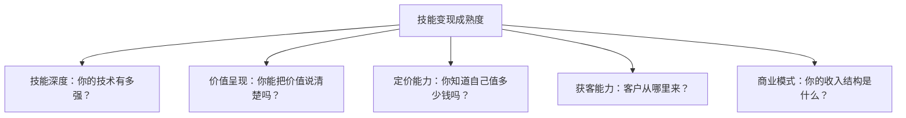

| 维度 | 1分（起步） | 3分（进阶） | 5分（成熟） |
|------|-----------|-----------|-----------|
| 技能深度 | 掌握基础技术栈 | 在某个方向有专长 | 行业公认的专家级 |
| 价值呈现 | 只会说"我能做" | 能用数据说明价值 | 有完整Portfolio和案例库 |
| 定价能力 | 随意报价或参考别人 | 基于成本和市场定价 | 基于价值定价，有三档报价体系 |
| 获客能力 | 只靠平台等单 | 主动营销+被动获客结合 | 品牌吸引+转介绍为主 |
| 商业模式 | 纯卖时间 | 卖成果为主 | 产品化收入占30%以上 |

**评分参考**：
- 5-10分：起步阶段。重点提升技能深度和价值呈现。
- 11-15分：成长阶段。重点提升定价能力和获客能力。
- 16-20分：进阶阶段。重点向产品化商业模式转型。
- 21-25分：成熟阶段。重点维护品牌和扩展规模。

### 1.11.2 90天行动计划模板

根据你的成熟度评分，选择对应的行动重点：

**阶段一（5-10分）：打基础**
- 第1-30天：梳理你的技能清单，用五维模型评估市场价值，选定1-2个主攻方向
- 第31-60天：在1-2个平台上完善个人资料，开始接第一批单（可以适当低价，目标是积累案例）
- 第61-90天：把前3个项目写成完整案例，建立Portfolio页面

**阶段二（11-15分）：建体系**
- 第1-30天：建立标准化的需求分析模板和报价模板，计算你的底线时薪
- 第31-60天：开始主动营销——每周发2篇技术内容，加入3个目标客户聚集的社群
- 第61-90天：设计三档报价体系，用10个客户测试定价策略，优化成交话术

**阶段三（16-20分）：产品化**
- 第1-30天：从过往项目中提炼可复用的模板/工具/流程，设计MVP
- 第31-60天：开发MVP并发布，获取前100个用户（免费或低价）
- 第61-90天：根据用户反馈迭代，设计付费方案，实现第一笔产品收入

**每周执行清单**（适用于所有阶段）：

```text
□ 周一：回顾本周待办，确认3个最重要的任务
□ 周二-周四：执行核心工作（开发/交付/营销）
□ 周五：写一篇技术内容（博客/社媒/社区回答）
□ 周六：学习新技能或整理案例
□ 周日：复盘本周，规划下周
```

### 1.11.3 月度复盘框架

每个月花1小时做一次复盘，回答以下问题：

**收入维度**：
1. 本月总收入是多少？与上月相比增长/下降了多少？
2. 收入来自哪些模式？（卖时间/卖成果/卖产品各占多少比例？）
3. 最高单价的项目是什么？为什么能拿到这个价格？

**效率维度**：
4. 本月有效工作时长是多少？实际时薪是多少？
5. 有没有做了但不赚钱的事情？下个月如何避免？
6. 哪些工作可以模板化/自动化？

**增长维度**：
7. 本月新增了几个客户？来自什么渠道？
8. 有没有完成的案例可以写成Portfolio？
9. 有没有学到可以提升定价的新技能？

**行动维度**：
10. 下个月最重要的3件事是什么？
11. 下个月要拒绝哪些低于底线时薪的工作？
12. 下个月要做哪些"让别人知道你"的营销动作？

**月度复盘模板**（可复制使用）：

```markdown
# {月份} 月度复盘

## 收入
- 总收入：¥___
- 上月对比：+/- ___%
- 收入构成：
  - 卖时间：¥___ (___%)
  - 卖成果：¥___ (___%)
  - 卖产品：¥___ (___%)
- 最高单价项目：___，金额¥___

## 效率
- 有效工作时长：___小时
- 实际时薪：¥___
- 底线时薪：¥___
- 时薪是否达标：是/否
- 可模板化的工作：___

## 增长
- 新增客户：___个
- 客户来源：平台___/转介绍___/主动营销___
- 新完成案例：___个
- 新学技能：___

## 行动
- 下月Top 3任务：
  1. ___
  2. ___
  3. ___
- 要拒绝的工作：___
- 营销动作：___
```

## 1.12 核心公式与框架速查表

本章涉及大量公式和框架，以下是便于快速查阅的汇总：

**收入与定价公式**：

| 公式名称 | 公式 | 适用场景 |
|---------|------|---------|
| 收入核心公式 | 收入 = 价值 × 捕获率 | 理解收入的根本决定因素 |
| 客户感知价值 | 功能价值 × 呈现系数 × 信任系数 | 优化报价方案的说服力 |
| 成本加成法 | (时薪 × 工时) × (1+利润率) + 直接成本 | 刚开始接单、不了解行情时 |
| 价值定价法 | 客户预期收益 × 10-30% | 客户能明确量化收益时 |
| 竞品锚定法 | 竞品成本 × 差异化系数(0.6-1.5) | 市场有明确竞品时 |
| 底线时薪 | (目标月收入 × 1.5) / (22天 × 6小时) | 判断是否应该接某个项目 |
| 盈亏平衡点 | 固定成本 / (单价 - 单位变动成本) | 产品化定价的最低销量计算 |
| 技能投资ROI | (预期收入增量 × 持续年数) / (学习时间 × 机会成本) | 决定学什么技能 |

**关键框架**：

| 框架名称 | 核心维度 | 用途 |
|---------|---------|------|
| 价值捕获率五杠杆 | 信息不对称/可替代性/感知价值/成果可见性/谈判能力 | 提升收入的五个发力方向 |
| 四种变现模式 | 卖时间→卖成果→卖产品→卖品牌 | 定位当前阶段和升级路径 |
| 五维价值模型 | 稀缺性/需求量/学习难度/可替代性/产出价值 | 评估技能的市场价值 |
| 六大心理学效应 | 锚定/价格信号/损失厌恶/对比/诱饵/稀缺 | 优化报价策略 |
| 三环模型 | 擅长 × 市场 × 享受 | 选择变现技能方向 |
| T型/π型人才 | 深度技能 + 广度技能 | 构建复合技能组合 |
| 成熟度五维模型 | 技能深度/价值呈现/定价能力/获客能力/商业模式 | 评估变现成熟度 |
| AI冲击矩阵 | 贬值技能/升值技能/转型技能 | 制定AI时代技能策略 |

## 1.13 本章小结

本章从经济学原理出发，构建了技能变现的完整心智模型——从"为什么有人靠技术年入百万"这个核心问题出发，逐层拆解了价值交换的底层逻辑、变现模式的升级路径、市场定价的科学方法、底层经济学规律、AI时代的新变量、合规与风险防线、跨境机会、团队化路径，以及常见的认知误区。以下是核心要点的快速回顾（公式和框架的完整速查表见1.12节）：

**价值交换的底层逻辑**：收入 = 价值 × 捕获率。大多数技术人只关注提升技术（做大蛋糕），却忽视了提升捕获率（分到蛋糕）。信任是交易的催化剂——能力信任、可靠性信任、道德信任三者缺一不可。交易成本经济学告诉我们：降低客户的交易成本（搜索成本、评估成本、谈判成本、执行成本），就是提升你的竞争力。信息经济学的"柠檬市场"理论则解释了为什么信号传递（深度博客、开源贡献、案例展示）如此重要。

**四种变现模式**：卖时间（入门，收入有硬上限）→ 卖成果（进阶，效率决定收入）→ 卖产品（高级，规模效应）→ 卖品牌（顶级，系统性收入）。采用70/30法则过渡——70%精力维持当前收入，30%探索下一阶段。

**定价的三重武器**：五维价值模型（稀缺性/需求量/学习难度/可替代性/产出价值）帮你评估技能的市场价值；六种心理学效应（锚定/价格信号/损失厌恶/对比/诱饵/稀缺）帮你优化报价策略；三种定价方法（成本加成/价值定价/竞品锚定）帮你建立系统的定价体系。但所有定价策略都必须在伦理边界内使用——心理学效应的目的是帮助客户更准确地认识你的价值，而非制造虚假信息。

**底层经济学**：边际成本决定规模效应（卖产品远优于卖时间）；机会成本决定底线时薪（低于底线的工作应该拒绝）；复利效应决定长期收入曲线（案例积累→口碑传播→品牌溢价）；转换成本决定客户粘性（数据锁定、关系成本、品牌护城河）。

**AI时代的新变量**：AI冲击矩阵清晰地划分了贬值技能（CRUD/基础页面/通用文案）、升值技能（AI应用/微调/安全/架构）和转型技能（从执行到决策）。AI同时是威胁和杠杆——善用AI的技术人，生产力可以提升3-10倍。Agent经济创造了三层变现机会：Agent开发、Agent工作流集成、Agent培训咨询。

**合规与风险**：税务筹划（个体户可将税负从17%降到3-5%）、合同与知识产权（必备7大条款+签订流程）、健康成本管理（ROI 395%的投资）、心理健康（五大压力源与应对策略）——这些"不性感"但至关重要的维度，决定了你能走多远。

**跨境变现**：中国开发者在国际市场有2-5倍时薪溢价。关键突破点：语言（不需要母语水平，能沟通技术方案即可）、支付（Wise最优）、时区（异步优先+重叠窗口）、文化（美国重结果、欧洲重流程、日本重质量）。跨境收入的税务申报需要额外关注外汇管理和税收协定。

**技能组合战略**：用"三环模型"（擅长×市场×享受）选择方向，用"T型+π型"策略构建复合能力，用ROI评估框架决定学什么技能。两个深度技能的交叉点=极高稀缺性=极高定价权。

**团队化路径**：外包分包（灵活，低管理成本）→ 松散协作（互补能力）→ 正式团队（可控，规模化）。核心原则：标准化先于规模化，核心能力不外包，利润中心思维。远程团队需要额外的协作框架和工具栈支撑。

**九大认知误区**：技术好≠赚到钱、低价策略是死路、永远没有"准备好"、好产品也需要营销、自由职业≠自由、案例数量≠质量、一个人搞不定所有事、忽视合同=忽视风险、健康是最大的隐形资产。

**行动清单**：
1. 用"自我诊断问卷"评估自己当前处于哪个变现模式阶段
2. 用"五维自评表"给自己的核心技能打分，识别优势和短板
3. 计算自己的底线时薪，下次报价时作为参考基准
4. 列出自己的3个差异化优势，写进个人简介和报价方案
5. 选择一种定价方法（成本加成/价值定价/竞品锚定），在下一个项目中实践
6. 用"三档报价"模板设计你的报价体系
7. 制定90天行动计划，每周花5小时做营销动作
8. 每月做一次复盘，跟踪收入、效率和增长三个维度的变化
9. 评估AI对你当前技能的影响，制定技能升级计划
10. 如果你还没有标准合同模板，本周就准备一份
11. 翻阅1.12节的速查表，把最常用的公式和框架记在笔记本或便签中
12. 审视你的定价策略是否在伦理边界内——短期操纵不如长期信任
