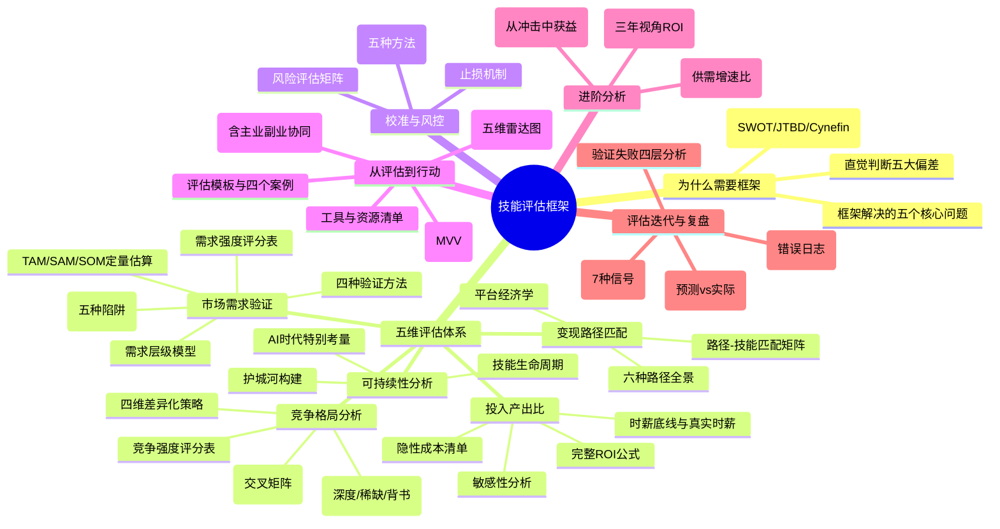
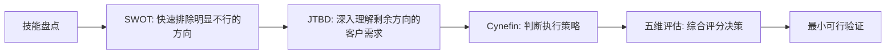
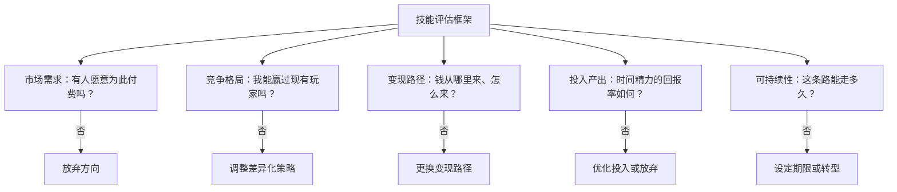
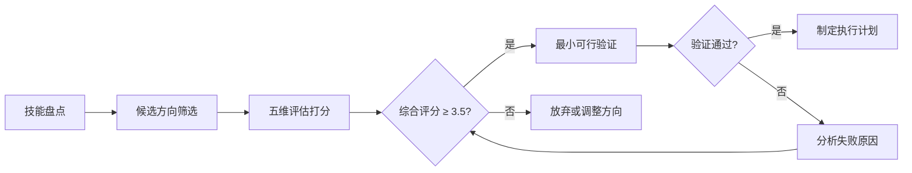
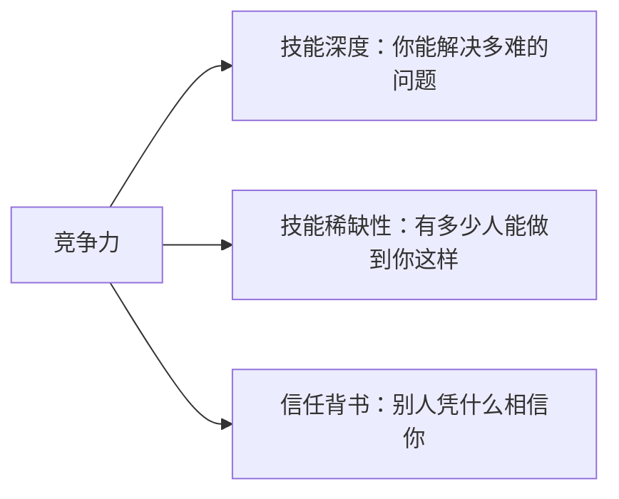

本节是整章"技术技能变现"的方法论基石。下面的思维导图概览了全节结构——从"为什么需要框架"到"如何从评估走向行动"的完整链路：

> **阅读指引**：本节约2600行，建议按需阅读：
> - **快速上手**（30分钟）：跳到第9节"综合评估模型"和第10节"实操模板"，拿着模板对照填写
> - **完整学习**（2小时）：按顺序通读，理解每个维度背后的逻辑
> - **深度研究**（半天）：结合第11节"误区"、第12节"最小可行验证"和第6.5节"时间窗口分析"，形成评估→验证→执行的闭环
> - **高阶优化**（额外1小时）：阅读"技能复利效应"（5.2节）和"反脆弱性评估"（6.4.1节），优化长期回报预期
> - **持续精进**（每次30分钟）：建立评估追踪表（13.1节），让每次评估都校准下一次的判断力

### 快速评估路径

如果你时间紧迫，以下是三种评估路径，从快到慢：

**极速路径（2小时）**：适合"手里有几个想法，想快速筛掉不行的"
1. 技能盘点工作表（30分钟）→ 列出所有可变现技能
2. 快速初筛矩阵（30分钟）→ 对3-5个方向做闲鱼/招聘平台搜索
3. 需求强度评分表（30分钟）→ 对Top 2方向打分
4. Go/No-Go决策树（30分钟）→ 综合评分≥3.5则进入验证

**标准路径（8-10小时）**：适合"认真评估1-2个方向，准备投入"
1. 极速路径全部内容
2. 竞争格局分析+校准（2小时）
3. 变现路径匹配+平台选择（1.5小时）
4. ROI计算+三场景规划（1.5小时）
5. 可持续性+AI替代风险评估（1小时）
6. 自我校准（外部评估法）（1小时）
7. 最小验证设计（30分钟）

**深度路径（20+小时）**：适合"准备辞职全职做，或投入6个月以上"
1. 标准路径全部内容
2. TAM/SAM/SOM定量估算（1小时）
3. 多技能组合交叉矩阵（1小时）
4. 蒙特卡洛ROI模拟（1小时）
5. 护城河构建路径规划（1小时）
6. 反脆弱性评估（30分钟）
7. 时间窗口分析（1小时）
8. 税务合规规划（1小时）
9. 风险评估矩阵+止损机制设计（1小时）
10. 评估档案建立（30分钟）

> **核心原则**：评估的精度应与投入的规模匹配。花2小时评估一个准备投入2周的外包方向是合理的；花2小时评估一个准备投入6个月的SaaS方向则远远不够。

本节的知识地图：



在技术技能变现的道路上，最致命的错误不是"能力不够"，而是"方向选错"。一个资深后端工程师花三个月打磨了一套分布式缓存方案，却发现市场愿意为之付费的客户屈指可数；一个前端开发者随手写了个Chrome插件，月收入却超过了主业工资。这两者之间的差距，不在于技术水平的高低，而在于**技能评估**的精准度。

技能评估框架的核心目标只有一个：**在你投入时间之前，帮你判断哪些技能值得变现、以什么方式变现、投入产出比如何**。它是一套系统化的决策工具，而非模糊的直觉判断。本节提供一套可操作的五维评估体系，附带评分表、计算模板、真实案例和常见陷阱，帮助你在动手之前做出理性决策。

---

### 1. 为什么需要技能评估框架

#### 1.1 直觉判断的陷阱

大多数技术人员在选择变现方向时，依赖的是直觉："我擅长什么"或"什么技术火"。这种直觉判断存在五个致命偏差：

| 偏差类型 | 核心机制 | 典型表现 | 纠正方法 |
|---------|---------|---------|---------|
| **能力偏差** | 达克效应（Dunning-Kruger Effect）——新手高估竞争力，专家低估变现潜力 | 精通Haskell的开发者发现市场需求极小，而会写SQL的开发者却能接到大量数据清洗的活 | 用市场定价法校准：在平台发布服务帖，看真实反馈 |
| **幸存者偏差** | 只看到成功案例，忽略沉默的大多数 | Twitter上月入10万的独立开发者帖子获万赞，但同期99%尝试独立开发的人默默离场 | 主动搜索失败案例，在V2EX/Reddit搜索"独立开发 失败" |
| **沉没成本偏差** | 已投入的时间成为继续错误方向的理由 | "我已经学了3个月了"变成继续投入的理由，而非止损的信号 | 设定预设止损线，到点就评估，不考虑已投入 |
| **锚定效应** | 第一个接触的定价/案例成为判断基准 | 第一个看到的自由职业者时薪200元，就永远不敢定到500元 | 主动收集多个定价样本，用中位数而非第一个值做参考 |
| **确认偏差** | 一旦认定某方向可行，只关注支持性信息 | 决定做AI培训后，只看到AI火爆的新闻，忽略"培训市场已经饱和"的信号 | 指定一个"魔鬼代言人"——专门找反面证据 |

#### 1.2 经典决策理论在技能评估中的应用

技能评估本质上是一个**投资决策问题**——你投入的是时间和精力（不可再生资源），期望获得经济回报。以下是三个经典决策理论在技能评估中的具体应用：

**SWOT分析（优势-劣势-机会-威胁）**

将SWOT应用于个人技能评估：

| | 有利因素 | 不利因素 |
|---|---------|---------|
| **内部因素** | **优势（S）**：你的技术深度、行业经验、人脉资源、已有作品集 | **劣势（W）**：你的技术短板、缺乏商业经验、时间有限、无品牌知名度 |
| **外部因素** | **机会（O）**：市场需求增长、竞争者少、新平台红利、政策利好 | **威胁（T）**：AI替代风险、市场饱和、技术迭代、经济下行 |

**操作方法**：对每个候选技能方向做一张SWOT表，然后交叉分析：
- **SO策略**（优势+机会）：利用你的优势抓住市场机会——这是最佳方向
- **WO策略**（劣势+机会）：机会很好但你有短板——需要先补短板或找合伙人
- **ST策略**（优势+威胁）：你很强但市场有风险——需要建立护城河
- **WT策略**（劣势+威胁）：既不擅长又有风险——果断放弃

> **实操建议**：SWOT分析容易陷入"自说自话"。建议找一个了解你的人（同事、导师）一起做，或者先独立完成后再请对方挑战你的每一个判断。尤其是"W"和"T"两项，大多数人会下意识弱化不利因素。

**SWOT完整案例：一位前端工程师评估"React Native跨平台开发"方向**：

陈工，26岁，2年React前端经验，坐标杭州，月薪18K。以下是他的完整SWOT分析：

| | 有利因素 | 不利因素 |
|---|---------|---------|
| **内部因素** | **优势（S）**：① React基础扎实，React Native上手快（学习成本约2周）；② 有3个上线的H5项目，具备完整交付能力；③ 在掘金有2000+关注者，有一定品牌基础 | **劣势（W）**：① 没有原生iOS/Android开发经验，复杂原生模块无法处理；② 没有移动端项目作品集；③ 定价能力弱，不知道该收多少钱 |
| **外部因素** | **机会（O）**：① 中小企业预算有限，偏好跨平台方案（BOSS直聘RN岗位月增15%）；② 独立开发者社区RN相关讨论活跃（GitHub RN项目Star>110K）；③ Flutter虽然增长快但RN生态更成熟，短期内企业仍选RN | **威胁（T）**：① Flutter正在蚕食RN市场份额（Stack Overflow 2025调查显示Flutter使用率已超RN）；② 低代码平台（如uni-app）侵蚀简单App需求；③ AI辅助编程降低了入门门槛，竞争者增加 |

**交叉分析结果**：

- **SO策略**（优势+机会）：利用React基础快速切入RN外包，在掘金发布RN实战文章引流——这是最佳切入点
- **WO策略**（劣势+机会）：原生模块能力不足，但企业App大多数不需要深度原生功能——先聚焦80%的纯JS场景，遇到原生需求时外包给原生开发者（成本约500-2000元/模块）
- **ST策略**（优势+威胁）：Flutter正在崛起——用20%的时间学习Flutter，形成"RN+Flutter"双栈能力，把威胁转化为差异化优势
- **WT策略**（劣势+威胁）：这是最危险的象限。如果既不学原生也不学Flutter，2年后可能两头不靠——必须至少补一个短板

**决策**：SO策略为主（立即切入RN外包），ST策略为辅（同步学Flutter）。3个月后重新评估Flutter方向。

**Jobs-to-be-Done（JTBD）框架**

JTBD的核心思想：用户购买的不是产品，而是"完成某个任务"。应用到技能评估：不要问"我会什么技术"，而要问"客户需要完成什么任务，我的技能能否帮他完成"。

**JTBD拆解的三层结构**：

| 层级 | 含义 | 示例（客户说"需要一个App"） |
|------|------|--------------------------|
| **功能层** | 客户要完成的具体任务 | "在3个月内上线iOS+Android App" |
| **情感层** | 客户在过程中的感受诉求 | "希望合作过程省心、不被技术术语搞晕" |
| **社会层** | 客户希望获得的社会认同 | "上线后能在投资人面前展示" |

理解客户的JTBD，你才能准确定价和定位。同样的技术能力，包装成"完成客户任务"的服务，价值远高于"我精通XX技术"的自我介绍。

**具体操作**：拿到客户需求后，先花10分钟做JTBD拆解：
1. 列出客户说的需求（功能层）
2. 问自己"客户为什么需要这个？"挖掘背后的情感层诉求
3. 问自己"这件事做成后对客户意味着什么？"挖掘社会层诉求
4. 将三层诉求整合为你的服务承诺——这比只承诺"写代码"高级得多

**Cynefin框架（情境复杂性）**

Cynefin框架将问题分为五个域，帮助你选择正确的评估策略：

| 问题域 | 特征 | 评估策略 | 技能示例 | 关键决策方式 |
|--------|------|---------|---------|------------|
| **简单域** | 因果关系明确，最佳实践已知 | 直接对标已有成功案例 | 标准WordPress建站 | 感知→分类→响应（照搬成功模式） |
| **繁杂域** | 需要专家分析，有多种可行方案 | 需要专家评估，参考行业数据 | 微服务架构设计 | 感知→分析→响应（收集信息后理性决策） |
| **复杂域** | 因果关系只能事后确认 | 需要小规模实验，快速迭代 | AI应用开发（市场不确定性高） | 探索→感知→响应（先试再看） |
| **混乱域** | 需要先稳定再分析 | 先止损，再评估 | 新兴技术泡沫期 | 行动→感知→响应（先稳住局面） |
| **无序域** | 不知道自己在哪个域 | 先识别边界，再分类评估 | 跨领域创新 | 分解后归入上述四个域 |

大多数技术技能变现属于"繁杂域"或"复杂域"——前者靠分析和经验判断，后者靠实验和迭代验证。本框架主要覆盖这两个域的评估方法。

**如何判断你的方向属于哪个域**：问自己一个问题——"如果我投入3个月，能不能大概率预测结果？"
- 能，且有大量先例 → 简单域或繁杂域
- 不能，但可以小步试错 → 复杂域
- 完全不知道会发生什么 → 可能是混乱域，先观察再说

#### 1.2.1 框架选择指南：何时用哪个框架

三个框架不是互相替代的关系，而是在不同阶段发挥作用：

| 评估阶段 | 推荐框架 | 原因 | 典型问题 | 输出物 |
|---------|---------|------|---------|--------|
| **方向初筛**（有3-5个候选） | SWOT分析 | 快速扫描内外部因素，适合"广撒网" | "这个方向对我有没有明显致命缺陷？" | 每个方向一张SWOT表（15分钟/方向） |
| **需求定位**（选定1-2个方向后） | JTBD框架 | 深入理解客户真实需求，避免自说自话 | "客户买我的服务到底在买什么？" | 三层需求拆解文档（30分钟/方向） |
| **策略制定**（准备投入前） | Cynefin框架 | 判断不确定性级别，选择正确的执行策略 | "我应该做详细计划还是快速试错？" | 执行策略选择（简单/繁杂/复杂/混乱） |
| **综合评估**（全流程） | 本五维框架 | 系统化覆盖市场、竞争、路径、ROI、可持续性 | "这个方向值不值得我投入3-6个月？" | 综合评分卡+雷达图 |

**框架组合使用的典型流程**：



**常见误用**：
- 用SWOT做最终决策 → SWOT只是初筛工具，无法量化比较多个方向
- 用JTBD替代市场验证 → JTBD告诉你客户需求是什么，但不告诉你市场规模有多大
- 用Cynefin替代ROI计算 → Cynefin帮你选策略，但不告诉你投入产出比
- 跳过框架直接验证 → 没有评估的验证是盲目试错，浪费时间和机会成本

#### 1.3 框架解决的核心问题

一个完整的技能评估框架需要回答五个关键问题：



这五个问题构成了评估的完整闭环。任何一个答案为"否"或"极差"，都意味着这个方向需要重新考虑。

**评估流程概览**：



#### 1.4 完整案例：一位后端工程师的评估全过程

为了让框架不再停留在理论层面，以下用一个完整案例演示从技能盘点到评估决策的全过程。

**人物背景**：张工，28岁，3年Java后端经验，坐标成都，月薪15K。熟悉Spring Boot、MySQL、Redis、Docker。日常工作是企业级管理系统开发。想利用业余时间做技术变现，每月可投入40-60小时。

**Step 1：技能盘点（30分钟）**

张工列出自己所有可变现的技能：

| 技能 | 熟练度 | 自评层级 | 市场热度 |
|------|--------|---------|---------|
| Java/Spring Boot后端开发 | 精通 | L3 | 高 |
| MySQL优化与数据迁移 | 熟练 | L2-L3 | 中高 |
| Redis缓存方案设计 | 熟练 | L2-L3 | 中 |
| Docker容器化部署 | 熟练 | L2 | 高 |
| 技术博客写作 | 一般 | L1-L2 | 中 |
| Python数据分析 | 入门 | L1 | 高 |

**Step 2：候选方向筛选（1小时）**

排除L1层级的技能（Python数据分析、技术博客写作暂时不具备变现竞争力），保留4个候选方向：

1. Java外包开发（企业管理系统/小程序后端）
2. MySQL性能优化咨询
3. Docker/K8s容器化部署服务
4. Java技术培训（线上课程）

**Step 3：快速初筛（2小时）**

对4个方向做快速搜索验证（各花30分钟）：

| 方向 | 闲鱼搜索 | BOSS直聘 | 知识星球 | 初筛判断 |
|------|---------|---------|---------|---------|
| Java外包 | 月销200+服务 | 岗位多但竞争激烈 | — | 有需求，但红海 |
| MySQL优化 | 月销30+服务 | 岗位中等，薪资高 | 相关圈子>5个 | 有需求，客单价高 |
| Docker部署 | 月销50+服务 | 岗位增长快 | 相关圈子>3个 | 有需求，增长中 |
| Java培训 | — | — | Java圈子付费人数>5000 | 有需求，但供给也多 |

4个方向都有初步积极信号，进入完整五维评估。但张工注意到MySQL优化和Docker部署的竞争相对较少，且客单价更高——这两个方向值得重点关注。

**Step 4：五维评估打分（4小时）**

以"MySQL性能优化咨询"为例的完整评估过程（其余方向类似）：

- **市场需求**：企业数据库性能问题是刚需-紧急（系统慢=直接损失），目标人群是中小企业的技术负责人。BOSS直聘DBA岗位薪资中位数25K/月，说明企业愿意为此付费。搜索指数稳定上升。→ 加权得分 4.1
- **竞争格局**：纯MySQL优化的咨询师不多（大多数DBA在企业内任职），但兼职接单的也不少。张工的优势是有3年实战经验+能同时提供Java层面的优化（大多数DBA不懂Java）。→ 加权得分 3.5
- **变现路径**：适合技术咨询（按小时/按项目），也可以做培训。路径匹配度高。→ 加权得分 4.0
- **投入产出比**：咨询时薪预估300-500元/小时（参考市场定价），月投入20小时可获得6000-10000元额外收入，ROI远超时薪底线（114元/小时）。→ 加权得分 4.2
- **可持续性**：MySQL短期不会被替代，但AI自动化运维工具正在崛起。需要持续学习。→ 加权得分 3.5

**MySQL优化方向综合得分**：4.1×0.3 + 3.5×0.2 + 4.0×0.2 + 4.2×0.15 + 3.5×0.15 = **3.88（B级）**

**四个方向横向对比**：

| 方向 | 市场需求 | 竞争格局 | 变现路径 | ROI | 可持续性 | 综合得分 | 评级 |
|------|---------|---------|---------|-----|---------|---------|------|
| Java外包 | 4.0 | 2.5 | 3.5 | 3.0 | 3.0 | 3.25 | C级 |
| MySQL优化 | 4.1 | 3.5 | 4.0 | 4.2 | 3.5 | 3.88 | B级 |
| Docker部署 | 3.8 | 3.8 | 3.5 | 3.8 | 4.0 | 3.76 | B级 |
| Java培训 | 3.5 | 2.8 | 3.8 | 3.5 | 3.2 | 3.36 | C级 |

**Step 5：决策**

张工选择**MySQL优化**作为主攻方向（综合得分最高），**Docker部署**作为辅助方向（综合得分接近且可持续性更好）。Java外包和Java培训暂时搁置——前者竞争太激烈，后者需要更多内容积累。

**Step 6：最小验证（2周）**

张工在闲鱼发布了一条"MySQL慢查询优化 200元/次"的服务帖，同时在掘金写了2篇MySQL优化实战文章。第一周收到3条咨询，成交1单（200元）。第二周又成交2单（其中1单升级为500元的深度优化）。验证通过，正式开始投入。

> **关键启示**：整个评估过程从技能盘点到验证通过，张工总共花了约8小时+2周时间。如果他凭直觉选择"Java外包"（看起来最熟悉），可能陷入价格战，时薪不到100元。评估框架帮他找到了性价比最高的方向。

---

### 2. 评估维度一：市场需求验证

#### 2.1 需求层级模型

市场对技术技能的需求不是均质的，它呈现明确的层级结构：

| 需求层级 | 特征 | 付费意愿 | 典型示例 | 价格敏感度 |
|---------|------|---------|---------|-----------|
| **刚需-紧急** | 不解决就会造成明确损失 | 极高（愿意溢价） | 服务器宕机恢复、数据泄露修复、系统迁移上线 | 低（在乎速度不在意价格） |
| **刚需-非紧急** | 长期需要但不会立刻出问题 | 高 | 代码重构、性能优化、技术债务清理 | 中（会比价但愿意付费） |
| **改善型** | 有更好没有也行 | 中等 | 自动化脚本、监控告警、文档编写 | 高（会仔细衡量性价比） |
| **装饰型** | 锦上添花 | 低 | UI美化、代码风格统一、技术博客 | 极高（大概率自己做） |

变现优先级：**刚需-紧急 > 刚需-非紧急 > 改善型 > 装饰型**。

**关键洞察**：很多技术人员把精力花在"改善型"或"装饰型"技能上，因为这些技能"有趣""有技术含量"。但市场的付费意愿和你的技术热情之间没有必然联系。一个枯燥的数据迁移项目可能比一个酷炫的机器学习项目赚得多10倍，因为前者是刚需-紧急，后者可能是改善型。

**如何判断需求层级**：问自己一个问题——"如果客户不解决这个问题，会发生什么？"
- 会亏钱/停业 → 刚需-紧急
- 会影响效率/增长 → 刚需-非紧急
- 会更好用 → 改善型
- 只是更好看 → 装饰型

**需求层级的动态变化**：需求不是固定的，它会随技术环境和业务阶段变化。例如：
- "网站HTTPS"在2015年是改善型，到2018年变成刚需（浏览器标记HTTP为不安全）
- "移动端适配"在2010年是装饰型，到2020年变成刚需（移动流量超过PC）
- "AI集成"在2023年是改善型，到2026年正在向刚需转变（客户开始期望所有产品都有AI功能）

所以评估需求层级时，不仅要看"现在是什么层级"，还要判断"未来12个月会往哪个方向移动"。

#### 2.2 需求验证方法

**方法一：搜索数据验证**

通过搜索引擎和平台数据验证需求是否存在。以下是具体的验证步骤和数据解读方法：

| 数据源 | 验证方法 | 信号解读 | 注意事项 |
|--------|---------|---------|---------|
| Google Trends | 搜索关键词过去5年趋势 | 持续上升=强信号，平稳=稳定需求，下降=衰退 | 注意区分季节性波动和真实趋势 |
| 百度指数 | 国内搜索热度和需求图谱 | 热度>500且持续=有市场，<100=太小众 | 关注"需求图谱"中的关联词，发现细分需求 |
| 淘宝/闲鱼 | 搜索技能服务，看成交量和定价 | 有稳定成交量=需求真实，无成交=可能是伪需求 | 注意区分"刷单"成交量和真实成交量 |
| Stack Overflow | 问题数量和增长趋势 | 问题多=使用人群大，问题增长=需求在扩大 | 高问题数也可能意味着技术坑多、不好用 |
| GitHub | Star/Fork数、Issue活跃度 | Star>1K且活跃=有社区需求 | 注意"僵尸项目"——Star高但无人维护 |
| 招聘平台 | 搜索岗位数量、薪资范围、城市分布 | 岗位多+薪资高=企业端需求旺盛 | 岗位多但薪资低可能是"伪需求"（企业想要但不愿出高价） |

**具体操作步骤**：

1. 列出你的候选技能方向（不超过5个）
2. 对每个方向，在上述6个数据源各搜索一次
3. 记录关键数据点（数字、趋势、截图）
4. 如果3个以上数据源给出积极信号，进入下一步验证
5. 如果大多数数据源给出消极信号，重新考虑方向

**数据记录模板**：

```markdown
## 需求验证数据记录

### 候选方向：______
| 数据源 | 查询关键词 | 关键数据 | 信号判断 | 截图/链接 |
|--------|-----------|---------|---------|----------|
| Google Trends | ____ | ____ | 强/中/弱/无 | ____ |
| 百度指数 | ____ | ____ | 强/中/弱/无 | ____ |
| 淘宝/闲鱼 | ____ | ____ | 强/中/弱/无 | ____ |
| Stack Overflow | ____ | ____ | 强/中/弱/无 | ____ |
| GitHub | ____ | ____ | 强/中/弱/无 | ____ |
| 招聘平台 | ____ | ____ | 强/中/弱/无 | ____ |

积极信号数：__/6
结论：继续验证 / 重新考虑 / 放弃
```

**方法二：竞品验证法**

如果某个技能变现方向已经有人在做并且活得不错，这本身就是需求存在的最强信号。关键不是"有人做了我就不能做"，而是"有人做了说明需求是真的"。

**竞品情报收集的完整工作流**：

**Step 1：定义竞品范围（30分钟）**

把竞品分为三层：
- **直接竞品**：和你做完全相同的事、服务相同客户的人/公司
- **间接竞品**：用不同方式解决相同客户问题的人/公司
- **替代方案**：客户目前在用的凑合方案（Excel、自建、外包给其他方向的人）

三层都看。很多人只看直接竞品，忽略了替代方案——而替代方案往往是你最大的竞争对手（客户说"我自己用Excel凑合也行"比"我已经找了另一个开发者"更难打败）。

**Step 2：数据采集（每平台30-60分钟）**

| 平台 | 搜索关键词 | 记录指标 | 关键判断 |
|------|-----------|---------|---------|
| **外包平台**（Fiverr/Upwork/猪八戒/程序员客栈） | 技能关键词 | 卖家数量、定价区间、月销量、评价数、排名前3的特点 | 有月销100+的服务=需求真实；定价中位数=你的定价参考 |
| **知识付费平台**（知识星球/小报童/极客时间/掘金小册） | 技能关键词+教程/课程 | 付费人数、活跃度、定价、更新频率 | 付费人数>500且仍有新成员加入=强信号 |
| **视频平台**（B站/YouTube） | 技能关键词+教程/入门/实战 | 播放量、评论区内容、是否有付费引导 | 评论区有人问"有没有付费课程"=强信号 |
| **技术社区**（V2EX/掘金/知乎/SegmentFault） | 技能关键词+求助/问题/踩坑 | 帖子数量、回复质量、是否有未解决的痛点 | 大量"求助"帖且无人有效回答=蓝海机会 |
| **社交媒体**（Twitter/X/小红书/即刻） | 技能关键词+收入/副业/接单 | 从业者的收入分享、客户反馈 | 有人公开晒收入且评论区有模仿者=市场验证 |

**Step 3：竞品分析模板**

```markdown
## 竞品分析记录

### 候选技能方向：______

#### 直接竞品分析
| 竞品名称 | 平台 | 定价 | 月销量/评价 | 优势 | 劣势 | 可借鉴之处 |
|---------|------|------|-----------|------|------|-----------|
| ____ | ____ | ____ | ____ | ____ | ____ | ____ |

#### 间接竞品/替代方案
| 替代方案 | 用户规模 | 定价/成本 | 优势 | 劣势 | 你能做得更好的地方 |
|---------|---------|----------|------|------|-----------------|
| ____ | ____ | ____ | ____ | ____ | ____ |

#### 市场空白分析
- 现有竞品普遍忽略的需求：______
- 客户在评论/反馈中反复提到的不满：______
- 价格区间中的空白段（太贵/太便宜之间）：______
- 服务模式的空白（如：所有人都按项目收费，无人提供订阅制）：______

#### 结论
- 需求是否真实：是/否
- 市场容量估计：______
- 差异化机会：______
- 进入难度：低/中/高
```

**方法三：直接访谈法**

找到10-20个目标用户（可以是同事、朋友、社区成员），问三个核心问题：

1. "你在这个领域遇到过什么痛点？"（确认需求存在）
2. "你为解决这个问题花了多少时间/金钱？"（确认付费意愿）
3. "如果有现成的解决方案，你愿意付多少钱？"（确认价格区间）

**访谈的四个关键技巧**：

- **不要描述你的方案**：只问对方的问题和痛点。一旦你开始推销自己的想法，对方出于礼貌会说"挺好的"，但这不是有效的需求信号。
- **追问具体数字**：对方说"愿意付费"没有意义，要追问"具体愿意付多少""上次为类似问题花了多少钱"。
- **观察行为而非听信言语**：对方说"我很需要"但从未为此花过钱或时间，这大概率不是真需求。真需求的信号是"我已经在用XX方案了，但不够好"。
- **寻找"已有替代方案"的证据**：如果用户已经在用竞品、自建方案、甚至Excel凑合，说明需求是真实的——他只是对现有方案不满意。

**访谈记录模板**：

```markdown
## 用户访谈记录

### 受访者信息
- 身份/角色：______
- 公司规模：______
- 访谈日期：______

### 核心问题回答
1. 痛点描述：______
   - 频率：每天/每周/每月/偶尔
   - 严重程度：1-5分
2. 已有解决方式：______
   - 花费：______
   - 满意度：1-5分
3. 付费意愿：______
   - 已有类似消费：______

### 关键洞察
- 最有价值的发现：______
- 是否超出预期：是/否
```

**方法四：需求信号监测法**

除了主动验证，还可以被动监测需求信号：

- **技术社区的"求助帖"频率**：在Stack Overflow、掘金、V2EX定期搜索关键词，统计每周新增的求助帖数量。数量上升=需求扩大。
- **开源项目的Issue数量**：如果你的技能方向有对应的开源项目，Issue数量持续增加说明用户在增加，但其中"feature request"比"bug report"更能说明新需求。
- **搜索引擎的"相关搜索"和"人们还在问"**：这些是真实的用户搜索意图，可以直接用来定位细分需求。

**监测频率建议**：每周花30分钟做一次快速扫描，记录数据点。连续监测4周后，你就能看到趋势。如果信号持续积极，进入深度验证；如果信号波动大或递减，谨慎投入。

#### 2.3 需求强度评分表

为每个技能方向打分（1-5分），加权计算总分：

| 评估项 | 权重 | 评分标准 |
|-------|------|---------|
| 目标人群规模 | 20% | 1=极小众（<1万人），2=小众（1-10万），3=中等（10-50万），4=较大（50-100万），5=大众（>100万人） |
| 付费意愿强度 | 25% | 1=几乎不愿付费，2=偶尔付费，3=有付费习惯，4=主动寻找付费方案，5=愿意溢价购买 |
| 需求稳定性 | 15% | 1=昙花一现，2=短期热潮，3=有波动但持续，4=稳定需求，5=长期刚需 |
| 需求增长趋势 | 15% | 1=明显衰退，2=停滞，3=缓慢增长，4=稳定增长，5=快速增长（年增>30%） |
| 需求可感知度 | 10% | 1=用户自己都没意识到，2=模糊感知，3=知道但不紧迫，4=主动搜索解决方案，5=迫切需要 |
| 问题严重程度 | 15% | 1=无所谓，2=有点烦，3=影响效率，4=造成损失，5=不解决就亏大钱 |

**计算公式**：总分 = Σ（权重 × 评分），满分5分，3.5分以上值得深入评估，4分以上强烈推荐。

**评分校准指南**：首次使用此评分表时，建议先用一个你熟悉的方向做校准——比如"Web前端开发"或"Python数据分析"，这两个方向的市场情况比较透明，可以帮助你校准自己的评分标准。如果你给"Web前端开发"的市场需求分是4.5分，而给候选方向打3.8分，你就能直观感受到两者之间的差距。

#### 2.4 定量市场估算：TAM/SAM/SOM三层漏斗

评分表是定性判断，但当你需要做出重大投入决策时（如辞职全职做技术变现），还需要定量估算市场容量。TAM/SAM/SOM三层漏斗是最经典的市场量化工具：

| 层级 | 含义 | 计算方法 | 示例（Python数据可视化服务） |
|------|------|---------|--------------------------|
| **TAM**（总可触达市场） | 整个市场的年消费总额 | 目标客户数 × 年均消费 | 中国中小企业数(5000万) × 有数据可视化需求比例(5%) × 年均预算(5000元) = 125亿元 |
| **SAM**（可服务市场） | 你能触达的那部分市场 | TAM × 地域/渠道/能力覆盖比例 | 125亿 × 线上渠道占比(30%) × 你能服务的行业(40%) = 15亿元 |
| **SOM**（可获得市场） | 你实际能拿到的份额 | SAM × 你的预期市场份额 | 15亿 × 0.01% = 15万元/年 |

**实操计算步骤**：

```text
Step 1: 估算TAM（30分钟）
- 在百度指数搜索你的技能关键词，获取日均搜索量
- 在招聘平台搜索相关岗位数量
- 在电商平台搜索相关服务的月成交总额（如果有）
- 公式：TAM ≈ 目标客户数 × 客单价 × 购买频率

Step 2: 估算SAM（15分钟）
- TAM × 你的地理覆盖（如只做线上 = ×0.5）
- TAM × 你的语言覆盖（如只做中文 = ×0.3）
- TAM × 你的能力覆盖（如只做某一细分 = ×0.2-0.5）

Step 3: 估算SOM（15分钟）
- SAM × 你的预期市场占有率
- 新进入者的合理预期：0.01%-0.1%（第1年）
- 关键判断：SOM是否大于你的收入目标？
```

**SOM的"及格线"判断**：

| 你的收入目标 | SOM及格线 | 含义 |
|------------|----------|------|
| 月入5000元（副业起步） | SOM ≥ 6万/年 | 市场足够支撑副业收入 |
| 月入2万元（副业成熟） | SOM ≥ 24万/年 | 市场有扩展空间 |
| 月入5万元（主业化） | SOM ≥ 60万/年 | 市场足够支撑全职 |

如果SOM低于及格线，说明这个细分市场太小——你需要扩大服务范围、提高客单价、或者换方向。

> **注意**：TAM/SAM/SOM的估算不要追求精确，误差在2-3倍内都算合理。目的是判断量级（万级还是百万级），而非精确数字。如果估算结果是SOM只有2万/年，而你的目标是月入2万，那方向显然不对——这比任何精确计算都有用。

#### 2.5 伪需求识别：五个"看起来有需求但其实没有"的陷阱

需求验证中最危险的不是"找不到需求"，而是"找到了假需求"。以下是五种常见的伪需求模式：

| 伪需求模式 | 表面信号 | 真实情况 | 识别方法 |
|-----------|---------|---------|---------|
| **礼貌性需求** | 访谈时对方说"这个很好，我需要" | 对方出于礼貌不想泼冷水 | 观察行为：对方说完后有没有追问价格/时间/下一步？没有=礼貌性需求 |
| **好奇性需求** | 技术社区讨论热烈，文章阅读量高 | 人们只是好奇，不会付费 | 测试付费意愿：在文末放付费入口，看转化率。阅读>1000但付费<1%=伪需求 |
| **预算外需求** | 客户说"确实需要，但预算有限" | 需求真实但付费能力不足 | 追问具体预算：如果客户预算<你的成本底线=不可行的需求 |
| **替代方案满足** | 客户目前用Excel/手动处理 | 客户对现有方案的容忍度比你想象的高 | 问"你现在怎么处理的？满意吗？"——如果回答"凑合能用"=需求不够强 |
| **决策者缺失** | 对接人说"我们很需要" | 对接人没有预算审批权 | 问"这个项目预算谁批？"——如果对接人不是决策者=需求可能无法转化 |

**一个典型的伪需求案例**：

某开发者发现"很多程序员在社区讨论代码审查工具"（表面信号积极），于是花3个月开发了一个AI代码审查SaaS。上线后发现：程序员喜欢讨论工具，但大多数团队用GitHub自带的免费功能就够了——"讨论热度"和"付费意愿"之间存在巨大鸿沟。这个案例中，"好奇性需求"和"替代方案满足"两个陷阱同时踩中。

**如何区分"讨论热度"和"付费信号"**：

| 指标 | 讨论热度（不可靠） | 付费信号（可靠） |
|------|-----------------|---------------|
| 社区帖子 | 大量讨论、分享、Star | 有人问"有没有付费版本""能否定制" |
| 搜索数据 | 关键词搜索量高 | 搜索"XX工具 价格""XX服务 多少钱" |
| 竞品表现 | 免费替代品很多且活跃 | 付费竞品存在且有稳定客户 |
| 用户行为 | 看教程、读文章 | 实际注册试用、填写付费意愿表单 |
| 转化信号 | "这个工具不错" | "我们团队想用，预算XX，什么时候能上线" |

**伪需求的"二次验证"方法**：当你对某个需求方向有疑虑时，用以下方法做二次验证：
1. **预售测试**：在产品开发前就发布预售页面，看有没有人真的付款。如果没有，至少节省了数月的开发时间
2. **付费咨询测试**：先以咨询形式提供该服务（而非产品），看客户是否愿意为"建议"付费。如果客户愿意为建议付费，说明需求强烈；如果客户只想要免费建议，说明付费意愿不足
3. **竞品付费验证**：找到最接近的付费竞品，看它们的付费用户数量和续费率。如果竞品存在但用户很少，可能是伪需求；如果竞品用户增长快，说明需求真实

**防伪需求检查清单**：

```text
在投入时间前，逐项确认：
□ 对方是否为这个问题花过钱或时间？（行为验证 > 言语验证）
□ 对方是否有预算审批权？（决策者验证）
□ 现有替代方案为什么不满足对方？（替代方案验证）
□ 如果你定价X元，对方会买吗？（直接问价格，不要问"你觉得值多少"）
□ 对方能否在1周内做出购买决定？（紧迫性验证）
```

---

### 3. 评估维度二：竞争格局分析

#### 3.1 竞争力构成要素

你的竞争力由三个核心要素决定：



**技能深度**不是指你会多少种技术，而是你能解决多复杂的问题。一个精通React全家桶的开发者，竞争力不在于"会React"（这太普遍了），而在于"能解决React在极端场景下的性能问题"或"能把复杂业务逻辑设计成可维护的组件体系"。

**技能深度的四个层级**：

| 层级 | 描述 | 竞争力 | 变现溢价 | 典型变现方式 |
|------|------|--------|---------|------------|
| **L1 使用级** | 能用该技能完成基本任务 | 低（大量竞争者） | 无溢价，甚至被压价 | 只能接低价外包或参加众包 |
| **L2 应用级** | 能在复杂场景中熟练应用 | 中（有一定竞争力） | 10%-30%溢价 | 标准外包、平台接单 |
| **L3 原理级** | 理解底层原理，能解决非常规问题 | 高（稀缺） | 50%-200%溢价 | 技术咨询、高端外包、培训 |
| **L4 创造级** | 能基于该技能创造新方法/新工具 | 极高（极稀缺） | 定价权在自己手上 | 产品、专利、技术品牌 |

大多数变现方向至少需要L2水平，而高客单价的咨询和技术服务通常需要L3-L4水平。L1级别几乎只能参与价格战。

**自测你在哪个层级**：
- L1：看着文档能用，遇到问题搜Stack Overflow
- L2：不看文档能用，能解决大部分常见问题，偶尔需要查资料
- L3：能解释"为什么这样设计"，能在没有现成方案的情况下设计新方案
- L4：能改进现有工具/框架，能创造新的解决方案

**技能稀缺性**取决于供需关系。评估稀缺性的三个维度：

| 维度 | 评估方法 | 数据来源 | 判断标准 |
|------|---------|---------|---------|
| **供给端** | 搜索该技能的从业者数量 | 招聘平台简历数、GitHub相关项目贡献者数 | 从业者<1万人=稀缺，>10万人=不稀缺 |
| **需求端** | 搜索该技能的岗位数量和薪资 | BOSS直聘、拉勾、猎聘 | 岗位多+薪资高=供不应求 |
| **培养周期** | 培养一个合格从业者需要多长时间 | 行业共识、培训课程时长 | 需要3个月=低门槛，需要3年=高门槛 |

**信任背书**是别人选择你而非其他人的决定性因素。常见背书形式按说服力排序：

| 背书类型 | 说服力 | 获取难度 | 说明 | 获取周期 |
|---------|-------|---------|------|---------|
| 大厂工作经历 | ★★★★★ | 高 | "前Google工程师"天然自带信任 | 需要先入职大厂 |
| 开源项目Star数 | ★★★★☆ | 高 | 可量化的技术影响力 | 6-18个月 |
| 技术博客/专栏读者数 | ★★★★☆ | 中 | 持续输出建立的专业形象 | 3-12个月 |
| 行业认证 | ★★★☆☆ | 中 | AWS认证、PMP、CKA等 | 1-3个月 |
| 客户案例和评价 | ★★★★★ | 中 | 最直接的信任信号，"他帮XX公司做过" | 第一个客户最难获取 |
| 技术大会演讲 | ★★★★☆ | 高 | 行业认可的标志，QCon/ArchSummit等 | 需要先有内容积累 |
| 出版物 | ★★★★☆ | 高 | 书籍、专栏文章 | 6-12个月 |
| GitHub贡献记录 | ★★★☆☆ | 低 | 持续贡献说明活跃度 | 持续积累 |

**关键建议**：不要试图同时获取所有背书。根据你选择的变现路径，优先获取最有说服力的那1-2种：
- 外包变现 → 优先积累客户案例和评价
- 咨询变现 → 优先积累大厂经历或技术大会演讲
- 内容变现 → 优先积累博客读者或出版物
- 产品变现 → 优先积累开源项目Star数

> **延伸阅读**：信任背书的系统化构建方法详见本章「五、个人品牌建设」，其中详细拆解了从零开始建立技术品牌的完整路径——包括内容矩阵设计、社交资产积累、品牌资产量化评估等实操方法。本节侧重"评估你现有的背书水平"，品牌建设章节侧重"如何系统化提升"。

#### 3.2 差异化策略

当竞争激烈时，差异化是唯一的出路。以下是四种差异化方向的具体操作方法：

**维度一：垂直行业深耕**

同一个技术栈，切入特定行业后价值翻倍。原因是行业知识形成了天然壁垒——纯技术人不愿意花时间学行业知识，而行业人又学不会技术。你同时具备两者，就形成了独特的竞争位。

| 技术栈 | 行业 | 变现方向 | 客单价范围 | 行业知识门槛 | 行业知识获取周期 |
|--------|------|---------|-----------|------------|---------------|
| Python | 金融 | 量化交易系统、风控模型 | 5万-50万/项目 | 高（需要理解金融衍生品、风控逻辑） | 6-12个月 |
| Python | 医疗 | 医学影像处理、电子病历系统 | 3万-30万/项目 | 高（需要了解医疗法规、数据标准） | 6-12个月 |
| Python | 电商 | 自动化运营、数据爬取与分析 | 1万-10万/项目 | 中（需要了解电商运营逻辑） | 2-4个月 |
| Python | 教育 | 在线教育平台、题库系统 | 2万-15万/项目 | 中（需要了解教育场景） | 2-4个月 |
| Java | 制造业 | MES系统、供应链管理 | 10万-100万/项目 | 极高（需要工厂现场经验） | 12-24个月 |
| JavaScript | 房地产 | 3D看房、VR样板间 | 3万-20万/项目 | 中（需要了解房产交易流程） | 2-4个月 |

**获取行业知识的具体路径**：

1. **找到行业导师**（第1-2周）：在LinkedIn/知乎/行业论坛找到该行业的技术从业者，以"请喝咖啡"的方式建立联系。目标：每周交流1小时，持续3个月。
2. **建立行业认知**（第2-4周）：阅读该行业头部公众号3-5个、行业报告2-3份、行业术语表1份。目标：能听懂行业人在说什么。
3. **实战积累**（第1-3个月）：先接1-2个低价项目（甚至免费帮朋友做），积累行业案例和理解。目标：能用行业语言和客户沟通。
4. **建立行业人脉**（持续）：参加行业展会/论坛，加入行业微信群。目标：认识5个以上行业内的潜在客户或合作伙伴。

**关键提醒**：行业知识的积累不是"额外负担"，而是你的溢价来源。花3个月学行业知识，后续每个项目多赚2-5倍，这个投入回报比极高。

**维度二：交付物差异化**

别人卖时间（按小时计费），你卖产品（一次开发多次销售）；别人卖代码，你卖解决方案（代码+文档+培训+维护）。

| 交付物层级 | 内容 | 客户感知价值 | 你的利润率 | 客户复购意愿 |
|-----------|------|------------|-----------|------------|
| **L1 纯代码** | 只交付源代码 | 低（"就这些？"） | 低 | 低 |
| **L2 代码+文档** | 代码+使用文档+部署文档 | 中（"至少能用了"） | 中 | 中 |
| **L3 完整方案** | 代码+文档+部署脚本+监控方案+培训 | 高（"省心"） | 高 | 高 |
| **L4 解决方案** | L3 + 持续维护+定期巡检+紧急响应 | 极高（"交给他我放心"） | 极高 | 极高（深度绑定） |

**从L1升级到L4的操作清单**：
- L1→L2：花2小时写一份README和部署文档（投入极低，回报显著）
- L2→L3：增加部署脚本、监控配置、1小时的使用培训
- L3→L4：签订月度维护合同，提供紧急响应通道

**维度三：服务模式差异化**

| 服务模式 | 定价方式 | 适合场景 | 收入上限 | 时间自由度 | 客户粘性 |
|---------|---------|---------|---------|-----------|---------|
| 按小时咨询 | 200-2000元/小时 | 策略建议、技术选型 | 受限于时间 | 低 | 低 |
| 项目制 | 按项目报价 | 明确需求的开发工作 | 中等 | 中 | 中 |
| 订阅制/retainer | 月度固定费用 | 持续技术支持 | 稳定且可叠加 | 高 | 高 |
| 产品化服务 | 固定定价 | 标准化的解决方案 | 高（可规模化） | 极高 | 中 |
| 培训/课程 | 按人/按期收费 | 知识传递 | 高（边际成本低） | 高 | 低 |
| 混合模式 | 基础费+效果分成 | 与业务结果挂钩的项目 | 极高 | 中 | 极高 |

**模式升级路径**：大多数人的起点是"按小时咨询"或"项目制"，然后逐步向"订阅制"和"产品化服务"升级。核心逻辑是**把可重复的部分标准化，把不可重复的部分保持个性化**。

> **延伸阅读**：定价策略的具体方法论详见本章「四、定价策略」，包括价值定价法、锚定定价法、阶梯定价法等实操技巧，以及不同变现路径的定价模板和谈判话术。本节的"服务模式差异化"帮你选对模式，定价策略章节帮你定对价格。

**维度四：人格化差异化**

在技术能力相近的情况下，"有温度的专业人"比"冷冰冰的代码机器"更容易获得客户。这意味着：
- 写文章时展现思考过程而非只给结论——"我最初想用方案A，但发现XX问题，最终选了方案B"比"用方案B"更有说服力
- 沟通时主动理解对方的业务背景——"你这个需求的业务场景是什么？我需要先理解你的业务才能给出最好的技术方案"
- 交付时附带清晰的文档和使用说明——大多数技术人员忽略这一步，但这恰恰是客户最需要的
- 出了问题时主动沟通而非隐瞒——"发现了一个潜在问题，虽然目前没影响但我建议提前处理"比"等客户发现再说"好一万倍

#### 3.3 竞争强度评分表

| 评估项 | 权重 | 评分标准 |
|-------|------|---------|
| 现有竞争者数量 | 20% | 1=红海（>1000人），2=竞争激烈（500-1000），3=中等（100-500），4=较少（10-100），5=蓝海（<10） |
| 竞争者质量 | 20% | 1=都是高手，2=高手较多，3=参差不齐，4=大多数中等，5=大多数是新手 |
| 你的技能深度优势 | 20% | 1=平均水平，2=略高于平均，3=明显高于平均，4=前10%，5=前1% |
| 你的稀缺性 | 15% | 1=满大街都是，2=较多，3=中等，4=较少，5=几乎找不到同类 |
| 差异化空间 | 15% | 1=同质化严重，2=差异化空间小，3=有一定空间，4=差异化机会多，5=蓝海+差异化空间大 |
| 进入壁垒 | 10% | 1=谁都能做，2=需要一定经验，3=需要深入学习，4=需要特殊资质/经验，5=需要多年积累 |

**竞争格局评分的校准方法**：在招聘平台搜索该技能的岗位，然后逐一浏览竞争者的简历/服务页面。记录前20个竞争者的技术水平、定价、客户评价。这比你凭感觉打分准确得多。

**校准实操示例**——以"MySQL优化咨询"方向为例：

```text
Step 1: 在闲鱼搜索"MySQL优化"，记录前20个服务帖
  结果：12个活跃卖家，定价50-500元/次不等

Step 2: 逐一分析每个卖家的服务描述
  发现：
  - 8个卖家只提供"SQL语句优化"（L1-L2水平）
  - 3个卖家提供"架构级优化+SQL优化"（L2-L3水平）
  - 1个卖家提供"数据库整体方案设计"（L3水平）

Step 3: 检查成交量和评价
  - 成交量最高的是定价100-200元的低价服务
  - 定价>300元的服务成交量明显下降
  - 但评价中反复出现"解决了大问题""比DBA便宜"等关键词

Step 4: 对比自身水平
  张工自评L2-L3（能做架构级优化+Java层面联合优化）
  → 在前20个竞争者中排前3-4名
  → "竞争者质量"评分：3.5分（参差不齐但有几个高手）
  → "技能深度优势"评分：3.5分（Java+MySQL双栈是独特优势）
  → "差异化空间"评分：4.0分（"Java+MySQL联合优化"无人提供）

校准结果：张工原来自评竞争格局3.0分，校准后调整为3.5分
——因为他在闲鱼上的实际竞争力比想象中强。


#### 3.4 多技能组合策略：1+1>2的竞争力杠杆

大多数技术人员不只有一项技能。关键洞察：**单项技能可能只是"中等竞争力"，但组合后可能变成"稀缺竞争力"**。这是技术人员最大的未被利用的优势——行业专家不会技术，纯技术人不懂行业，而你如果同时具备两者，就占据了独特的生态位。

**技能组合的四种模式**：

| 组合模式 | 描述 | 竞争壁垒 | 示例 | 客单价提升 |
|---------|------|---------|------|-----------|
| **技术+行业** | 用技术服务特定行业 | 高（行业知识需要时间积累） | Python + 金融 → 量化系统开发 | 3-10倍 |
| **技术+技术** | 两个技术领域的交叉点 | 中高（需要两个领域都达到L2+） | 前端 + 3D图形 → WebGL/Three.js专家 | 2-5倍 |
| **技术+软技能** | 技术能力+沟通/管理/写作 | 中（软技能可快速提升） | 后端开发 + 技术写作 → 技术文档服务 | 1.5-3倍 |
| **技术+工具** | 用特定工具组合解决特定问题 | 中低（工具可以被学习） | Python + Excel + BI工具 → 数据分析自动化 | 1.5-2倍 |

**找到你的最优组合的"交叉矩阵法"**：

```
Step 1: 列出你所有的技能（技术+行业+软技能），至少5项
Step 2: 做一个N×N的交叉矩阵，每个交叉点评估：
  - 这个组合在市场上是否存在？
  - 如果存在，竞争者多不多？
  - 如果不存在，是因为没有需求还是没人想到？
Step 3: 优先关注"存在需求但竞争者少"的组合
```text

**交叉矩阵示例**（假设你有Java、MySQL、金融知识、写作能力、Docker五项技能）：

| | Java | MySQL | 金融知识 | 写作能力 | Docker |
|---|------|-------|---------|---------|--------|
| **Java** | — | 常见组合 | **稀缺组合** | 有需求 | 有需求 |
| **MySQL** | | — | 中等竞争 | 有需求 | 常见组合 |
| **金融知识** | | | — | **稀缺组合** | 少见 |
| **写作能力** | | | | — | 无需求 |
| **Docker** | | | | | — |

从矩阵中可以看到，"Java+金融"和"金融知识+写作"是两个竞争最少的组合——前者可以做金融系统开发咨询（客单价5-50万），后者可以做金融科技内容创作（知识付费+企业内训）。

**关键原则**：选择组合时，确保两个技能都能达到L2以上水平。如果一个技能是L1，它只能作为"加分项"而非"核心竞争力"。

**完整案例：一位后端工程师的技能组合优化**

延续张工的案例。在选定MySQL优化为主攻方向后，他进一步用交叉矩阵分析了"用哪个技能组合来差异化"：

**Step 1：盘点所有技能**

| 技能 | 熟练度 | 市场独立变现价值 |
|------|--------|---------------|
| Java/Spring Boot | L3 | 高（但竞争激烈） |
| MySQL优化 | L2-L3 | 高（已选定主攻） |
| Docker容器化 | L2 | 中高 |
| 技术写作 | L1-L2 | 低（独立变现难） |
| 金融行业知识（2年银行项目经验） | L1 | 极低（独立无法变现） |

**Step 2：交叉评估每个组合的市场价值**

| 组合 | 独立价值 | 组合后溢价 | 竞争者数量 | 综合判断 |
|------|---------|----------|----------|---------|
| MySQL + Java | 各自都常见 | 1.2倍（常见组合） | 多（>1000人） | **不推荐**——太多Java后端也懂MySQL |
| MySQL + Docker | 各自中等 | 1.5倍（数据库容器化部署） | 中等（200-500人） | **可考虑**——有一定差异化 |
| MySQL + 金融知识 | MySQL高+金融低 | **3-5倍**（金融数据库优化） | **极少**（<50人） | **强烈推荐**——稀缺组合，客单价大幅提升 |
| MySQL + 技术写作 | MySQL高+写作低 | 2倍（可做技术内容变现） | 中等 | **辅助方向**——内容放大品牌效应 |
| Java + 金融知识 | 各自常见 | 2-3倍（金融系统开发） | 中等 | 备选方向 |

**Step 3：决策**

张工选择"**MySQL优化 × 金融行业知识**"作为核心组合定位：
- 重新定位服务描述："银行/证券/保险数据库性能优化专家"
- 定价从通用MySQL优化的800元/次，提升到金融行业优化的2000-5000元/次
- 3个月后接到第一个金融行业项目（某城商行数据库迁移优化，项目金额8万元）

**关键洞察**：张工的金融知识只有L1水平（2年银行项目经验），独立来看几乎无法变现。但与MySQL优化（L2-L3）组合后，金融知识从"无价值"变成了"溢价来源"——因为纯MySQL优化师不懂金融业务逻辑，而纯金融从业者不懂数据库优化。**组合的价值不在于每个技能有多强，而在于组合后是否创造了稀缺性**。

---

### 4. 评估维度三：变现路径匹配

#### 4.1 六种变现路径全景

技术技能变现并非只有"接外包"一种方式。以下是六种主要路径的完整对比：

```mermaid
graph TB
    A[技术技能变现] --> B[1.自由职业/外包]
    A --> C[2.技术咨询]
    A --> D[3.数字产品]
    A --> E[4.内容变现]
    A --> F[5.技术创业]
    A --> G[6.技术投资/顾问]
    
    B --> B1[按项目/按时间计费]
    C --> C1[按小时/按天计费]
    D --> D1[SaaS/模板/插件/工具]
    E --> E1[课程/专栏/付费社群]
    F --> F1[产品/SaaS公司]
    G --> G1[技术顾问/CTO外包]
```text

| 路径 | 启动门槛 | 收入天花板 | 时间自由度 | 规模化潜力 | 适合人群 | 首笔收入周期 |
|------|---------|-----------|-----------|-----------|---------|------------|
| 自由职业/外包 | 低 | 中（受限于时间） | 中 | 低 | 有明确交付能力的人 | 1-4周 |
| 技术咨询 | 中高 | 高 | 高 | 中 | 有行业经验和人脉的人 | 1-6个月 |
| 数字产品 | 中 | 极高 | 极高 | 极高 | 有产品思维的开发者 | 3-12个月 |
| 内容变现 | 低 | 高 | 高 | 高 | 善于表达和教学的人 | 3-18个月 |
| 技术创业 | 高 | 极高 | 低（初期） | 极高 | 有商业嗅觉和抗压能力的人 | 6-24个月 |
| 技术顾问/CTO外包 | 极高 | 极高 | 中 | 中 | 资深技术管理者 | 3-12个月 |

**路径选择的"不可能三角"**：变现路径中存在一个"不可能三角"——**启动快、收入高、可持续**三者不可兼得：
- 启动快+收入高 → 通常不可持续（如短期风口项目）
- 启动快+可持续 → 通常收入不高（如兼职外包）
- 收入高+可持续 → 通常启动慢（如SaaS产品、技术品牌）

理解这个三角，有助于你管理预期——不要期望找到"又快又高又持久"的路径，而要根据自己的阶段和资源选择合适的组合。

#### 4.2 路径-技能匹配矩阵

不同技能类型天然适合不同的变现路径。选错路径是最大的资源浪费：

**适合自由职业/外包的技能特征**：
- 交付物明确（网站、App、数据报表）
- 质量标准清晰（能用、好看、没Bug）
- 项目周期可控（2周到3个月）
- 客户能理解交付物的价值
- 典型技能：全栈开发、小程序开发、数据可视化、爬虫、自动化脚本

**适合技术咨询的技能特征**：
- 解决方案因场景而异，无法标准化
- 需要深入理解业务才能给出建议
- 错误决策的成本极高
- 客户自身缺乏判断能力
- 典型技能：架构设计、性能优化、安全审计、技术选型、数据治理

**适合数字产品的技能特征**：
- 解决方案可以标准化
- 目标用户群体大（>10万人）
- 边际成本趋近于零
- 用户能自助使用
- 典型技能：开发者工具、SaaS应用、模板主题、插件扩展、CLI工具

**适合内容变现的技能特征**：
- 技术本身有学习门槛
- 市场上有大量学习需求
- 你能把复杂的东西讲简单
- 内容有较长的"保鲜期"
- 典型技能：热门框架教程、系统设计、算法面试、新技术入门、DevOps实践

**路径匹配度自检清单**：

对你的候选技能方向，逐项回答以下问题（每项1分，满分10分）：

1. 交付物能否在2周内完成？（适合外包）
2. 客户能否在不试用的情况下判断质量？（适合外包/产品）
3. 同一个方案能否卖给100+个客户？（适合产品）
4. 你是否能清晰地把知识结构化？（适合内容）
5. 客户是否需要为错误决策付出高代价？（适合咨询）
6. 你是否有3年以上的该领域经验？（适合咨询）
7. 用户能否自助使用你的产品？（适合SaaS）
8. 你的内容在1年后是否仍有价值？（适合课程/书籍）
9. 你是否愿意持续维护更新？（适合产品/内容）
10. 你是否有足够的时间启动？（评估启动门槛）

得分7-10分：该路径与你的技能高度匹配；4-6分：可以尝试但需要补短板；<4分：建议换路径。

#### 4.3 平台经济学：理解平台抽成与流量分配

选择变现路径时，平台是绕不开的因素。理解平台的经济学逻辑，直接影响你的定价和利润：

| 平台类型 | 代表平台 | 抽成比例 | 流量来源 | 适合阶段 | 关键规则 |
|---------|---------|---------|---------|---------|---------|
| 自由职业平台 | Upwork、Fiverr、程序员客栈 | 5%-20% | 平台分配+搜索 | 冷启动期（获取第一批客户） | 新手期抽成高（Upwork首$500抽20%），收入越高抽成越低 |
| 知识付费平台 | 极客时间、掘金小册 | 30%-50% | 平台推荐+自有流量 | 内容积累期（建立专业形象） | 平台拿大头，但提供分发和支付基础设施 |
| 电商平台 | 淘宝、闲鱼 | 5%-10% | 搜索+推荐 | 产品测试期（验证需求） | 需要维护店铺评分，差评影响巨大 |
| 自建渠道 | 个人网站+Stripe/微信支付 | 0%-3%（仅支付手续费） | 自有流量 | 成熟期（最大化利润） | 需要自己解决获客和信任问题 |
| 社交平台 | 微信公众号、即刻、Twitter | 0% | 社交传播 | 品牌建设期（积累影响力） | 变现方式间接，需要导流到其他渠道 |

**平台策略建议**：冷启动期用平台获取第一批客户和评价，积累口碑后逐步迁移到自有渠道。最终目标是80%的收入来自自有渠道，平台只作为获客补充。

**平台谈判与获客实操话术**：

不同平台有不同的"潜规则"，掌握以下话术能显著提高转化率：

| 场景 | 错误话术 | 正确话术 | 原理 |
|------|---------|---------|------|
| 客户问价 | "这个大概5000-8000" | "取决于具体需求。方便简单说下核心功能吗？我给您一个精确报价" | 模糊报价=客户选最低值，精确报价需要需求确认 |
| 客户比价 | "我可以便宜点" | "理解您在比价。我的报价包含XX（列出3个增值服务），如果只需要核心功能可以调整方案" | 拆分价值而非降价 |
| 首次沟通 | "我精通XX技术" | "之前做过类似的XX项目（附链接），帮客户解决了XX问题" | 客户关心结果不关心技术 |
| 客户犹豫 | "您考虑得怎么样了？" | "这个项目如果本周启动，预计X月X日交付。如果需要提前，我们可以调整排期" | 制造时间紧迫感而非催促 |
| 需求不清 | "您到底想要什么？" | "我先出一个最简方案给您看，如果方向对再展开细化，这样最节省您的时间" | 降低客户决策成本 |
| 平台压价 | 接受平台推荐的低价 | 在描述中标注"基础版XX元/进阶版XX元/尊享版XX元" | 阶梯定价让客户自选，避免一刀切低价 |

**平台算法适配技巧**：

| 平台 | 算法逻辑 | 优化策略 | 关键指标 |
|------|---------|---------|---------|
| 闲鱼 | 新帖权重高，互动量决定曝光 | 每天擦亮1次，前3天主动回复所有评论，标题含精准关键词 | 曝光量→浏览量→咨询量→转化率 |
| 程序员客栈 | 评分+成交量+响应速度 | 30分钟内响应所有咨询，完成率保持100%，积累好评 | 响应速度>完成率>评分>客单价 |
| Upwork | JSS(Job Success Score)+Rising Talent | 前5单宁可低价也要拿到100%好评，关注"Rising Talent"标签 | JSS>90%是分水岭 |
| 知乎/掘金 | 内容质量+互动率+持续性 | 回答字数>1000字，带代码示例和数据，每周至少2篇 | 收藏率>5%是高质量内容 |
| 知识星球 | 活跃度+续费率 | 每天更新1条高质量内容，每月1次直播/AMA | 7日活跃率>40% |

> **延伸阅读**：各平台的深度分析（包括注册流程、获客技巧、定价策略、避坑指南）详见本章「六、自由职业平台深度分析」。本节帮你选对平台类型，平台深度分析章节帮你在选中的平台上拿到结果。

#### 4.4 客户类型识别与应对策略

选对变现路径后，你还需要识别客户类型——不同类型的客户需要不同的沟通策略和交付方式：

| 客户类型 | 特征 | 沟通策略 | 定价策略 | 风险提示 |
|---------|------|---------|---------|---------|
| **技术型客户** | 自己懂技术，能判断你的方案质量 | 用技术语言沟通，展示原理和架构 | 价值定价，强调技术深度 | 会压价（"这个我也能做"），需要展示差异化 |
| **业务型客户** | 不懂技术但清楚业务需求 | 用业务语言沟通，讲"能带来什么结果" | 价值定价，强调业务收益 | 需求容易变更，合同要写清范围 |
| **老板型客户** | 关心成本和结果，不关心过程 | 简洁汇报，突出ROI和风险控制 | 锚定高价值，用案例说话 | 可能要求"先做看看效果"，坚持预付款 |
| **中间人型客户** | 代理/项目经理，替别人找开发者 | 理解他背后的真正客户是谁 | 给中间人留利润空间 | 信息可能失真，尽量直接对接最终客户 |
| **比价型客户** | 同时找多个开发者比价 | 不要陷入价格战，展示独特价值 | 坚持价值定价，解释价格差异 | 如果对方只看价格，果断放弃 |

**识别比价型客户的信号**：
- 开口就问"最低多少钱"
- 不关心你的方案细节，只关心价格和工期
- 说"别人报价比你低"
- 要求你先出完整方案再谈价格（免费劳动）

**应对比价型客户的话术**：
- "我的报价包含了XX、XX和XX，如果只需要其中一部分可以调整"
- "价格可以谈，但我想先了解您的具体需求，确保我们的方案能真正解决问题"
- "我理解您在比价，建议您不仅看价格，也看看交付内容和售后保障的差异"

**平台选择的决策树**：

```mermaid
graph TD
    A[你有现成的客户/流量吗？] -->|有| B[直接用自建渠道]
    A -->|没有| C[你卖的是什么？]
    C -->|服务| D[自由职业平台起步]
    C -->|知识| E[知识付费平台起步]
    C -->|产品| F[电商平台起步]
    D --> G[积累10+好评后建个人网站]
    E --> H[积累1000+读者后建付费社群]
    F --> I[验证需求后建自有品牌]
```text

#### 4.5 变现路径评分表

| 评估项 | 权重 | 评分标准 |
|-------|------|---------|
| 技能-路径匹配度 | 25% | 1=完全不匹配，2=匹配度低，3=基本匹配，4=匹配度高，5=天然契合 |
| 启动成本（时间+金钱） | 20% | 1=需要大量投入（>6个月+>5万元），2=较高，3=中等，4=较低，5=几乎零成本启动 |
| 收入天花板 | 15% | 1=受限于时间且单价低，2=受限于时间但单价高，3=可部分规模化，4=可规模化，5=可规模化无限增长 |
| 首笔收入时间 | 15% | 1=6个月以上，2=3-6个月，3=1-3个月，4=2-4周，5=1周以内 |
| 可持续性 | 15% | 1=一次性收入，2=偶尔复购，3=有一定复购，4=持续复购/续费，5=强锁定关系 |
| 风险程度 | 10% | 1=高风险（可能血本无归），2=较高风险，3=中等风险，4=较低风险，5=低风险 |

---

### 5. 评估维度四：投入产出比（ROI）

#### 5.1 时间成本核算

技术人员最容易忽视的成本是时间。你的每小时价值不是你的时薪，而是你的**机会成本**——同样一小时，你做其他事情能获得的最大回报。

**计算你的时薪底线**：

```
时薪底线 = 月收入 ÷ 月有效工作时间

示例：
月薪20K，每月有效工作22天×8小时 = 176小时
时薪底线 = 20000 ÷ 176 ≈ 114元/小时

意味着：你的变现项目如果不能产生超过114元/小时的回报，
就不如把时间花在提升主业上。
```text

**计算你的"真实时薪"**：

技术人员的变现收入需要扣除隐性时间成本。一个外包项目报价2万元，看起来不错，但：

```
真实时薪 = 项目收入 ÷ 项目总耗时

示例：
项目报价：20,000元
实际耗时拆解：
- 需求沟通：8小时
- 技术方案：4小时
- 编码开发：40小时
- 测试修改：12小时
- 部署上线：4小时
- 售后沟通：6小时（按首月估算）
总耗时：74小时

真实时薪 = 20,000 ÷ 74 ≈ 270元/小时

对比：如果时薪底线是114元/小时，这个项目值得做。
但如果你的咨询时薪能达到500元/小时，这个项目的ROI就不够高了。
```text

**时间成本的"阶梯效应"**：副业时间不是均质的。工作日晚上精力有限（效率约60%），周末精力较好（效率约80%），假期精力充沛（效率约100%）。计算时间成本时，建议按实际效率折算。

```
等效时间 = 实际时间 × 效率系数

示例：
工作日晚上投入4小时 × 0.6 = 2.4等效小时
周末投入8小时 × 0.8 = 6.4等效小时
一周合计：5天×2.4 + 2天×6.4 = 12 + 12.8 = 24.8等效小时
```text

#### 5.2 变现项目的ROI计算模型

```mermaid
graph LR
    A[投入] -->|时间成本| D[ROI计算]
    B[投入] -->|金钱成本| D
    C[投入] -->|机会成本| D
    D --> E[直接收入]
    D --> F[间接价值]
    D --> G[长期资产]
```text

**完整ROI公式**：

```
ROI = (直接收入 + 间接价值 + 长期资产价值 - 总投入成本) ÷ 总投入成本 × 100%

其中：
- 直接收入：项目报酬、课程销售、产品订阅等直接现金收入
- 间接价值：人脉积累、品牌提升、技能成长（需要估值）
- 长期资产价值：可复用的代码、持续产生收入的产品、积累的用户群
- 总投入成本 = 时间成本 + 金钱成本 + 机会成本
```text

**技能复利效应：为什么早期投入的回报远超账面计算**

上面的ROI公式是单项目静态计算，但技能变现存在**复利效应**——你今天投入的每一小时，不仅产生当期收入，还会降低未来的投入成本、提升未来的收入上限。忽略复利效应的ROI计算，会系统性低估长期回报，导致过早放弃有潜力的方向。

复利效应的三个来源：

| 复利来源 | 机制 | 实际案例 | 3年累积效应 |
|---------|------|---------|-----------|
| **代码/模板复用** | 第一次交付从零开始，第二次用模板只需30%的时间 | 第一个数据看板项目花40小时，到第五个项目复用模板+组件，只需12小时 | 边际成本下降60%-70% |
| **品牌积累** | 早期客户靠平台获客（抽成15%-20%），后期客户主动找上门（获客成本趋零） | 前3个客户靠闲鱼引流，6个月后70%的客户来自知乎/掘金文章的自然搜索 | 获客成本下降50%-80% |
| **知识迁移** | 掌握一个技术领域的底层原理后，学习相关领域的边际成本极低 | 学会MySQL性能调优后，学PostgreSQL调优只需30%的时间；学完K8s后学Docker Swarm只需1周 | 新技能习得速度提升3-5倍 |

**用"三年视角"重新计算ROI**——以Kubernetes课程为例：

| 指标 | 静态ROI（不含复利） | 动态ROI（含复利） | 差异原因 |
|------|-------------------|------------------|---------|
| 第1年ROI | 82.8% | 82.8% | 首年无复利积累 |
| 第2年月维护时间 | 4小时/月 | 2小时/月 | 积累了自动化更新脚本 |
| 第2年获客成本 | 以平台引流为主 | 30%自然流量 | 品牌效应+SEO沉淀 |
| 第3年衍生收入 | 0 | 企业内训邀约（2-5万/次） | 课程影响力带来高端客户 |
| 3年累计ROI | 247.3% | ~380% | 获客成本下降+衍生收入+维护效率提升 |

**决策启示**：如果你的技能方向有强烈的复利效应（代码可复用、知识可迁移、品牌可积累），在ROI评分中额外加0.3-0.5分。反之，如果每次交付都是从零开始（如纯定制开发、一次性咨询），复利效应弱，应按静态公式计算。判断标准：问自己"做第10个项目时，我的效率会比第1个项目高多少？"如果答案是"高很多"，这个方向有强复利效应。

**各项估值方法**：

| 项目 | 估算方法 | 示例 |
|------|---------|------|
| 间接价值-人脉 | 该人脉未来12个月可能带来的收入 × 30%概率 | 一个潜在大客户人脉 = 5万×30% = 1.5万 |
| 间接价值-品牌 | 新客户获取成本降低额 × 预计新增客户数 | 品牌提升后每月多2个咨询 = 2×500 = 1000/月 |
| 间接价值-技能 | 掌握新技能后的时薪提升 × 未来12个月可用时间 | 时薪从200涨到300 = 100×176×12 = 21.1万/年 |
| 长期资产-代码 | 可复用代码模块的开发成本 × 预计复用次数 | 一个通用组件开发花20小时，预计复用5次 = 节省80小时 |
| 长期资产-产品 | 月收入 × 12 × 预期生命周期（年） | 月入5000 × 12 × 3 = 18万 |

#### 5.3 ROI计算实例

以下用两个真实场景展示ROI的完整计算过程：

**实例一：外包项目（短期高ROI）**

```
项目：为一家电商公司开发数据看板
报价：30,000元
项目周期：3周（全职投入）

投入成本：
- 时间成本：3周 × 5天 × 8小时 × 114元/小时 = 13,680元
- 工具/服务器成本：500元
- 沟通成本（微信/电话/出差）：估算1,000元
- 机会成本（放弃的其他项目）：估算5,000元
总投入：20,180元

收益：
- 直接收入：30,000元
- 间接价值：获得一个客户案例（估值2,000元）
- 长期资产：可复用的数据看板模板（估值5,000元）
总收益：37,000元

ROI = (37,000 - 20,180) ÷ 20,180 × 100% = 83.3%
年化ROI（假设全年做类似项目）：83.3% × 17 = 1,416%（理论值，实际受限于获客能力）
```text

**实例二：技术课程（长期复利ROI）**

```
项目：录制一套Kubernetes实战课程（60节课）
定价：199元/人

投入成本：
- 内容制作：3个月 × 22天 × 4小时/天 × 114元/小时 = 30,096元
- 录制设备和软件：3,000元
- 后期剪辑（外包）：5,000元
- 平台抽成（首年30%）：按实际销售额计算
总固定投入：38,096元

收益预测（保守估计）：
- 第1年：500人购买 × 199元 × 70%（扣平台抽成）= 69,650元
- 第2年：300人购买 × 199元 × 70% = 41,790元（自然衰减）
- 第3年：150人购买 × 199元 × 70% = 20,895元

3年累计收益：132,335元
3年累计ROI = (132,335 - 38,096) ÷ 38,096 × 100% = 247.3%
```text

**两个实例的对比启示**：

| 指标 | 外包项目 | 技术课程 |
|------|---------|---------|
| 首月ROI | 83.3% | -100%（纯投入） |
| 第1年累计ROI | ~1,400%（理论值） | 82.8% |
| 第3年累计ROI | 同上（需持续投入） | 247.3% |
| 时间投入模式 | 每个项目重新投入 | 一次制作持续收入 |
| 收入上限 | 受限于可用时间 | 受限于市场容量 |
| 风险 | 低（已有客户） | 中（销量不确定） |

**结论**：外包短期ROI高，但需要持续投入时间；课程短期ROI低甚至为负，但长期复利效应显著。最佳策略是**用外包养课程**——用外包收入覆盖生活成本，用业余时间制作课程，等课程收入超过外包收入后逐步切换。

#### 5.4 不同变现方式的ROI对比

| 变现方式 | 典型投入 | 典型回报 | ROI周期 | 长期ROI | 风险等级 | 适合阶段 |
|---------|---------|---------|---------|---------|---------|---------|
| 接外包项目 | 2-4周全职 | 5千-5万/项目 | 即时 | 低（每次重新投入） | 低 | 冷启动期 |
| 技术咨询 | 建立信任需3-6月 | 500-2000元/小时 | 3-6个月 | 中高 | 低 | 有一定积累后 |
| 录制技术课程 | 1-3个月制作 | 5千-50万/年 | 3-12个月 | 极高（一次制作持续收入） | 中 | 有专业积累后 |
| 开发SaaS产品 | 3-12个月开发 | 不确定 | 6-24个月 | 极高或归零 | 高 | 有产品经验后 |
| 技术博客/自媒体 | 持续投入 | 1千-5万/月 | 6-18个月 | 高 | 低 | 任何时候开始 |
| 开源+商业许可 | 6个月+ | 不确定 | 12个月+ | 高（建立护城河） | 高 | 有深度技术积累后 |
| 技术社群/付费圈子 | 持续运营 | 1万-10万/月 | 3-12个月 | 中高（依赖个人IP） | 中 | 有一定影响力后 |

> **关键洞察**：短期看，外包ROI最高（投入2周赚2万，ROI可达500%+）；长期看，产品化和内容变现的累积ROI远超外包。因为外包是"卖时间"，每一分钱都需要重新投入时间，而产品和内容是"卖资产"，一次投入可以反复获得回报。最聪明的策略不是二选一，而是建立"外包→产品→品牌"的升级路径。

#### 5.5 隐性成本清单

除了显而易见的时间和金钱投入，还需要考虑以下隐性成本：

| 隐性成本 | 影响程度 | 如何量化 | 应对策略 |
|---------|---------|---------|---------|
| **学习成本** | 中 | 掌握非技术技能（营销、销售、谈判、写作）的时间×时薪 | 优先学习最小必要知识，边做边学 |
| **平台成本** | 中 | 平台抽成比例×预期收入 | 冷启动期用平台，成熟期迁移到自有渠道 |
| **维护成本** | 中高 | 产品上线后的Bug修复、客户支持、内容更新的时间 | 预留15%-20%的时间用于维护 |
| **心理成本** | 高 | 被客户拒绝、收入不稳定、与主业的精力冲突 | 设定止损线，保持心态健康 |
| **合规成本** | 中 | 税务处理、合同法律风险、知识产权保护 | 使用正规合同模板，咨询税务师 |
| **机会成本** | 高 | 花在变现上的时间本可以用来升职加薪、学习新技术、陪伴家人 | 用时薪底线评估每个机会 |
| **社交成本** | 中 | 与同事/朋友的时间减少、社交圈变化 | 保持一定的社交投入，避免孤立 |

**隐性成本的"冰山效应"**：大多数人在评估变现项目时，只看到水面上的成本（报价-直接投入=利润），忽略了水面下的成本（学习、维护、心理、合规、机会成本）。经验法则：**实际总成本通常是直接成本的1.5-2倍**。所以在估算ROI时，把直接成本乘以1.5作为保守估计。

#### 5.6 敏感性分析：关键变量变化对ROI的影响

ROI是单点估算，但现实中变量会波动。敏感性分析帮你回答："如果某个关键假设比我预期的差，这个项目还值不值得做？"

**三个关键变量的敏感性测试**：

以"Kubernetes课程"为例（前文ROI计算结果：3年累计ROI 247.3%）：

| 变量 | 乐观值 | 基准值 | 悲观值 | 对3年ROI的影响 |
|------|--------|--------|--------|--------------|
| 年购买人数 | 800人 | 500人 | 200人 | 乐观: +180% / 基准: 247% / 悲观: -15%（亏损） |
| 定价 | 299元 | 199元 | 99元 | 乐观: +150% / 基准: 247% / 悲观: -60% |
| 平台抽成 | 20% | 30% | 50% | 乐观: +30% / 基准: 247% / 悲观: -35% |
| 内容更新时间 | 0小时/月 | 4小时/月 | 10小时/月 | 乐观: +25% / 基准: 247% / 悲观: -40% |

**如何做你自己的敏感性分析**：

```
Step 1: 识别你的ROI计算中的3-5个关键假设（通常是：客户数、客单价、获客成本、时间投入）
Step 2: 对每个假设，设定"乐观/基准/悲观"三个值（基准值×0.5 = 悲观，基准值×1.5 = 乐观）
Step 3: 逐个变量替换为悲观值，重新计算ROI
Step 4: 如果在悲观场景下ROI仍为正 → 方向稳健
        如果在悲观场景下ROI为负 → 需要关注该变量，设定预警指标
```text

**敏感性分析的核心价值**：不是追求精确预测，而是识别"最大风险点"。如果你发现"年购买人数"从500降到200就会亏损，那你就知道获客是最大的风险——应该在投入制作之前先验证获客可行性。

#### 5.6.1 进阶方法：蒙特卡洛模拟

敏感性分析是单变量替换，现实中多个变量同时波动。蒙特卡洛模拟通过随机抽样数千次，给你一个"收益概率分布"而非单点估算。

**用Python做蒙特卡洛ROI模拟**：

```python
import random

# 定义变量的概率分布（三角分布：最小值/最可能值/最大值）
params = {
    'buyers':     (150, 500, 1000),   # 年购买人数
    'price':      (99, 199, 299),     # 定价
    'platform_fee': (0.20, 0.30, 0.50), # 平台抽成
    'update_hours': (0, 4, 15),       # 月更新时间
    '制作成本': 38096,                 # 固定投入
    '时薪': 114
}

n_simulations = 10000
results = []

for _ in range(n_simulations):
    buyers = random.triangular(*params['buyers'])
    price = random.triangular(*params['price'])
    fee = random.triangular(*params['platform_fee'])
    update_h = random.triangular(*params['update_hours'])
    
    # 3年收入（含自然衰减）
    revenue = 0
    for year, decay in enumerate([1.0, 0.6, 0.3], 1):
        revenue += buyers * decay * price * (1 - fee)
    
    # 3年维护成本
    maintenance = update_h * 12 * 3 * params['时薪']
    
    total_cost = params['制作成本'] + maintenance
    roi = (revenue - total_cost) / total_cost * 100
    results.append(roi)

results.sort()
print(f"10%分位ROI: {results[int(n_simulations*0.1)]:.1f}%（悲观场景）")
print(f"50%分位ROI: {results[int(n_simulations*0.5)]:.1f}%（中位数）")
print(f"90%分位ROI: {results[int(n_simulations*0.9)]:.1f}%（乐观场景）")
print(f"亏损概率: {sum(1 for r in results if r < 0)/n_simulations*100:.1f}%")
```text

**模拟结果解读**：

| 分位 | 含义 | 决策指引 |
|------|------|---------|
| 10%分位（悲观） | 只有10%的情况比这更差 | 如果此值仍为正→方向很稳健 |
| 50%分位（中位数） | 最可能的结果 | 用此值做预期规划 |
| 90%分位（乐观） | 只有10%的情况比这更好 | 不要以此做决策 |
| 亏损概率 | 随机模拟中ROI<0的比例 | >30%需谨慎，>50%建议放弃 |

**案例结果**（基于Kubernetes课程参数）：
- 10%分位：-12%（有亏损风险）
- 50%分位：+185%（中位数收益可观）
- 90%分位：+520%（乐观场景收益极高）
- 亏损概率：15%（可接受范围）

**结论**：亏损概率15%且中位数收益185%，这个方向值得投入。但需要在验证阶段重点确认"获客能力"——因为"年购买人数"是影响最大的变量。

> **工具提示**：不需要自己写代码。在Google Sheets中用`NORM.INV(RAND(),均值,标准差)`或`TRIANG(最小,最可能,最大)`函数也能做蒙特卡洛模拟。搜索"Google Sheets Monte Carlo"有大量模板。

#### 5.6.2 三场景规划法

如果不想做蒙特卡洛模拟，三场景规划法是更简单的替代方案——对每个方向分别计算"最好/最可能/最差"三种场景的ROI：

```
三场景规划模板：

方向名称：______

乐观场景（最好情况）：
- 假设：所有变量取乐观值（基准×1.5）
- 预计ROI：___%
- 关键假设：______

基准场景（最可能情况）：
- 假设：所有变量取基准值
- 预计ROI：___%
- 关键假设：______

悲观场景（最差情况）：
- 假设：所有变量取悲观值（基准×0.5）
- 预计ROI：___%
- 关键假设：______

决策规则：
- 悲观场景ROI>0 → 方向稳健，值得投入
- 悲观场景ROI<-30% → 需要缩小投入规模或设严格止损线
- 基准场景ROI<50% → 机会成本可能太高，对比其他方向
```text

#### 5.7 中国自由职业者的税务与合规实操

技术人员变现必须考虑税务合规——这不仅是法律要求，也直接影响你的实际到手收入。以下是实操层面的关键知识点：

**收入性质与税率差异**：

| 收入性质 | 适用场景 | 税率范围 | 起征点 | 开票方式 |
|---------|---------|---------|--------|---------|
| **工资薪金** | 兼职收入被雇主代发 | 3%-45%累进 | 5000元/月 | 雇主代扣代缴 |
| **劳务报酬** | 临时性外包/咨询 | 20%-40%（预扣），汇算清缴 | 800元/次 | 去税务局代开或自然人代开 |
| **经营所得** | 注册个体户/工作室 | 5%-35%累进，或核定征收0.5%-2% | 无起征点（但有成本扣除） | 自行开具发票 |
| **稿酬所得** | 技术文章/书籍出版 | 20%（减按70%计入） | 800元/次 | 出版方代扣 |

**个体户 vs 劳务报酬的临界点计算**：

```
假设年变现收入 20 万元：

方案A：劳务报酬
- 预扣税：200,000 × (1-20%) × 20% = 32,000元
- 汇算清缴（合并综合所得，假设主业月薪15K）：
  综合所得 = 15,000×12 + 200,000×80% = 340,000元
  应纳税所得额 = 340,000 - 60,000(起征) - 36,000(五险一金) - 24,000(专项附加) = 220,000元
  税额 = 220,000×20% - 16,920 = 27,080元
  退税 = 32,000 - (27,080 - 主业已缴税约5,880) ≈ 退还部分预扣
  实际税负 ≈ 10%-13%

方案B：注册个体户（核定征收，综合税率约2%）
- 税额 = 200,000 × 2% = 4,000元
- 加上增值税（月收入<10万免征）= 0元
- 实际税负 ≈ 2%

差额：约16,000-26,000元/年
```text

**实操建议**：
- 年变现收入 < 10万：劳务报酬即可，汇算清缴时通常可退税
- 年变现收入 10-30万：建议注册个体户（电子化注册，1-3个工作日），享受核定征收优惠
- 年变现收入 > 30万：建议咨询税务师，考虑小规模纳税人或一般纳税人身份选择
- **发票问题**：很多企业客户要求发票才能付款。个体户可自行开具普票和专票；劳务报酬需去税务局代开。这是很多技术人员忽视的实际障碍——提前搞定发票能力，不要等到客户要求时才手忙脚乱

> **风险提示**：2025年起金税四期全面上线，个人账户大额资金流水会被重点关注。建议从第一笔收入开始就规范记账，不要心存侥幸。用微信/支付宝收款码收的每一笔钱，在税务系统里都有记录。

---

### 6. 评估维度五：可持续性分析

#### 6.1 技能生命周期

每个技术技能都有生命周期，选择处于成长期或成熟期初期的技能，避免衰退期的技能：

```mermaid
graph LR
    A[萌芽期] -->|早期采用者| B[成长期]
    B -->|主流采用| C[成熟期]
    C -->|被替代| D[衰退期]
    
    A -.->|风险高回报高| A1[如：Web3 2021]
    B -.->|最佳进入窗口| B1[如：AI应用开发 2024-2026]
    C -.->|稳定但竞争激烈| C1[如：Web前端开发]
    D -.->|避免投入| D1[如：Flash开发]
```text

判断技能所处阶段的方法：

| 阶段 | 信号特征 | 验证方法 | 投入策略 | 典型时间窗口 |
|------|---------|---------|---------|------------|
| **萌芽期** | 技术社区讨论热烈但实际项目少，招聘岗位几乎没有，大厂在实验性采用 | GitHub Trending频繁出现、技术大会有专场但听众少 | 小仓位试探（<10%的时间），不All in | 1-2年 |
| **成长期** | 招聘岗位快速增长，大厂开始采用，技术大会相关议题增多，培训机构开始出课程 | BOSS直聘岗位数月增>20%、头部公司招聘JD出现该技能 | 正式投入（30%-50%的时间），快速建立先发优势 | 2-5年 |
| **成熟期** | 岗位数量稳定，技术栈标准化，最佳实践已经形成共识，有大量培训机构 | 岗位数稳定、技术书籍出版、有多个成熟框架可选 | 深耕差异化（行业垂直、高级场景） | 5-15年 |
| **衰退期** | 岗位数量开始下降，新技术开始替代，新项目不再选用，社区活跃度下降 | 岗位数月减>10%、新项目选型排除该技术 | 及时止损，转向替代技术 | 逐渐退出 |

**如何预判技能生命周期**：
1. **追踪技术采纳曲线**：参考Gartner技术成熟度曲线（Hype Cycle），判断当前处于"膨胀期""幻灭期"还是"生产力期"
2. **关注大厂技术选型**：大厂的技术选型往往代表3-5年后的行业标准
3. **观察开源生态**：npm/PyPI包的下载量趋势、Issue响应速度、贡献者活跃度
4. **阅读技术趋势报告**：Stack Overflow年度调查、GitHub Octoverse、ThoughtWorks技术雷达

**技能组合策略**：不要把所有赌注押在一个技能上。推荐"631组合"：
- 60%的时间投入成熟期技能（稳定收入来源）
- 30%的时间投入成长期技能（未来增长点）
- 10%的时间关注萌芽期技能（保持技术敏感度）

#### 6.2 护城河构建

可持续性的核心是建立"护城河"——让竞争对手难以复制的优势：

| 护城河类型 | 描述 | 构建周期 | 技能变现中的应用 | 量化指标 |
|-----------|------|---------|----------------|---------|
| **转换成本** | 客户切换到其他供应商的成本很高 | 中 | 提供深度定制方案，与客户业务深度绑定 | 客户流失率<5%/年 |
| **网络效应** | 用户越多价值越大 | 长 | 建立技术社群，用户之间互相帮助 | 社群月活跃率>30% |
| **品牌认知** | 在目标市场建立知名度 | 长 | 持续输出内容，建立"XX领域专家"的形象 | 品牌搜索量月增>10% |
| **规模经济** | 规模越大成本越低 | 中 | 产品化服务，边际成本趋近于零 | 边际成本<售价的10% |
| **专有数据/知识** | 拥有他人难以获取的数据或经验 | 长 | 积累行业案例库、最佳实践、踩坑经验 | 独有案例>50个 |
| **技术壁垒** | 技术能力难以被复制 | 中 | 深耕L3-L4级别技能，掌握底层原理 | 能解决的问题范围>90%从业者 |

**护城河构建的优先级**：对于刚起步的技术变现者，优先构建"客户案例"和"品牌认知"——这两个是最容易起步、见效最快的护城河。等有一定基础后，再投入"网络效应"和"专有知识"的构建。

**护城河构建实操案例：从零到"不可替代"的MySQL优化顾问**

回顾第1节张工的案例——他选择了MySQL优化作为主攻方向。以下是他在18个月内构建护城河的完整路径，每一阶段叠加一层壁垒：

| 阶段 | 时间 | 核心动作 | 构建的护城河 | 收入变化 |
|------|------|---------|------------|---------|
| **冷启动** | 第1-3个月 | 接8个低价项目（均价300元/次），每个项目写"问题→诊断→方案→效果"结构化总结，3个脱敏案例发到掘金 | 客户案例（3个可展示的成功案例） | 月均2,400元 |
| **品牌初建** | 第4-6个月 | 发布12篇MySQL优化实战文章（总阅读>5万），每月收到2-3个"主动找上门"的咨询 | 品牌认知（搜索引擎前3页可见） | 定价提升到800元/次，月均6,000元 |
| **知识壁垒** | 第7-12个月 | 将共性问题整理成"中小企业MySQL性能诊断清单"——客户拿到后快速定位问题，这成为他的独有工具 | 专有知识（诊断清单+案例库>20个） | 开始接1-3万/项目，月均1.5万 |
| **深度绑定** | 第13-18个月 | 为3个长期客户建立"数据库健康档案"（月巡检+季优化+年架构评审），切换顾问需要交接所有上下文 | 转换成本（客户迁移成本高） | 月均2.5-3万，时薪500-800元 |

**飞轮效应**：前3个月的案例为4-6个月的品牌建设提供素材，品牌为7-12个月的专有知识传播提供渠道，专有知识又增强了13-18个月的客户绑定——每一层护城河都建立在前一层之上，形成正向飞轮。18个月后，一个新进入者要复制张工的竞争力，至少需要12个月——这就是护城河的时间价值。

#### 6.3 可持续性评分表

| 评估项 | 权重 | 评分标准 |
|-------|------|---------|
| 技能生命周期阶段 | 25% | 1=衰退期，2=成熟期末期，3=成熟期，4=成长期，5=成长初期 |
| 技术迭代风险 | 20% | 1=随时可能被替代（如某个特定框架），2=较高，3=中等，4=较低，5=底层原理级知识（如操作系统、网络协议） |
| 客户复购可能性 | 20% | 1=一次性交易，2=偶尔复购，3=有一定复购率，4=持续合作关系，5=深度绑定 |
| 知识可迁移性 | 15% | 1=只能用于特定场景，2=有限迁移，3=同行业可迁移，4=跨行业可迁移，5=通用能力 |
| 身体/精力依赖度 | 10% | 1=高强度体力活（如长时间编码），2=较高，3=中等，4=较低，5=越老越值钱 |
| 被AI替代风险 | 10% | 1=高危（如简单CRUD、数据录入），2=较高，3=中等，4=较低，5=低危（如复杂架构设计、人际沟通） |

#### 6.4 AI时代的特别考量

2024-2026年，AI对技术技能变现的冲击进入深水区。评估技能时必须加入"AI替代风险"维度。根据McKinsey 2025年报告，到2030年全球将有3.75亿劳动者需要转换职业类别；GitHub Copilot的数据表明，使用AI辅助编程的开发者代码产出提升55%，但这并不意味着开发者被替代——而是**不会用AI的开发者被会用AI的开发者替代**。

**AI替代风险四级评估**：

| AI替代风险 | 技能特征 | 典型技能 | 应对策略 | 时间窗口 |
|-----------|---------|---------|---------|---------|
| **极高** | 规则明确、输入输出清晰、无需创意 | 简单CRUD、数据录入、基础爬虫、模板化网站 | 立即转型，不要在这个方向投入 | 已经发生 |
| **高** | 有一定复杂度但模式固定 | 标准API开发、数据报表、基础测试、常规运维 | 升级为"AI+人工"的混合服务，做AI做不好的部分 | 1-2年内 |
| **中等** | 需要领域知识和判断力 | 系统架构设计、技术选型、数据治理、DevOps流水线 | 强化AI无法替代的部分（业务理解、沟通协调） | 3-5年内 |
| **低** | 需要深度理解、创造力、人际沟通 | 技术咨询、复杂问题排查、团队管理、安全攻防、AI系统设计 | 这是你的长期护城河，持续深耕 | 5年以上 |

**AI时代技能评估的三个新维度**：

1. **"AI协作能力"溢价**：能高效使用AI工具的开发者，产出是普通开发者的3-5倍。评估技能时，考虑"该技能在AI辅助下的产出倍增效应"——倍增效应越大的技能，AI协作能力越值钱。

2. **"AI无法替代"的本质**：AI目前无法替代的不是"复杂技术"，而是以下三类能力：
   - **模糊需求的澄清能力**：客户说"系统有点慢"，AI无法判断是数据库问题、网络问题还是架构问题
   - **跨系统的因果推理**：需要理解整个业务链条才能定位问题
   - **人际关系和信任建立**：客户选择你而不是AI，是因为信任你这个人

3. **"AI原生"新机会**：AI创造了全新的技能变现方向：

| 方向 | 具体内容 | 客单价范围 | 技能要求 | 市场成熟度 |
|------|---------|-----------|---------|-----------|
| AI应用开发 | LangChain、RAG系统、Agent开发、多模态应用 | 5万-50万/项目 | Python + LLM API + 系统设计 | 成长期 |
| AI提示词工程 | Prompt设计、Prompt模板库、Prompt优化服务 | 500-5000元/次 | LLM原理理解 + 行业知识 | 萌芽期→成长期 |
| AI模型微调 | Fine-tuning、RLHF、LoRA适配 | 3万-30万/项目 | 深度学习 + 数据工程 | 成长期 |
| AI数据工程 | 数据清洗、标注、管理、质量控制 | 1万-20万/项目 | 数据工程 + 领域知识 | 成长期 |
| AI安全与合规 | 模型安全评估、数据隐私审计、AI治理 | 5万-50万/项目 | 安全 + 法规 + AI技术 | 萌芽期 |
| AI工作流自动化 | 企业内部AI流程设计、AI Agent编排 | 2万-20万/项目 | 业务流程 + AI工具链 | 成长期 |

> **应对AI冲击的核心策略**：不要试图和AI比效率，而是做AI做不了的事——理解客户的业务背景、在模糊需求中做出正确判断、建立信任关系、处理非标准化的复杂场景。同时，把AI当作你的"效率倍增器"——用AI完成80%的标准化工作，你专注于20%的高价值判断。

#### 6.5 时间窗口分析：同一技能在不同时机的价值差异

前面的评估维度假设技能价值是静态的，但现实中**同一个技能在不同时间点切入，回报可能相差10倍**。这是因为技术市场存在明确的"窗口期"——需求和供给的错配创造了时间套利空间。

| 窗口阶段 | 市场状态 | 收入水平 | 风险等级 | 典型持续时间 | 真实案例 |
|---------|---------|---------|---------|-----------|---------|
| **先发窗口** | 需求刚爆发，供给极度稀缺 | 极高（完全定价权） | 中高（市场未成熟） | 6-18个月 | AI应用开发2023-2024：能做RAG/Agent的人极少，咨询时薪3000-5000元 |
| **增长窗口** | 需求快速增长，供给开始跟上但尚未过剩 | 高（供不应求） | 中低（方向已验证） | 1-3年 | K8s运维2019-2022：企业需求井喷，认证持有者稀缺 |
| **主流窗口** | 供需基本平衡，竞争充分 | 中等（需要差异化） | 低（市场成熟） | 3-10年 | Web前端开发2018-至今：需求大但竞争也大，需要垂直化 |
| **衰退窗口** | 需求下降或转移，供给过剩 | 低（价格战） | 中高（沉没成本风险） | 不确定 | jQuery开发2020-至今：被React/Vue替代，纯jQuery技能几乎无法变现 |

**判断当前所处窗口的量化方法**：

```
Step 1: 获取供给增速（每月新增该技能的从业者/服务帖数量）
        数据来源：闲鱼新增服务帖数、BOSS直聘新增简历数、Upwork新增Profile数

Step 2: 获取需求增速（每月新增该技能的岗位/咨询量）
        数据来源：BOSS直聘新增岗位数、Google Trends月环比、平台咨询量趋势

Step 3: 计算"供需增速比" = 供给增速 ÷ 需求增速

判断标准：
  < 0.5 → 先发窗口（需求增速远超供给，巨大红利期）
  0.5-1.0 → 增长窗口（供给跟得上但还没过剩，安全进入期）
  1.0-2.0 → 主流窗口（供给开始过剩，需要差异化竞争）
  > 2.0 → 衰退窗口（严重过剩，建议避开或快速退出）
```text

**窗口期的"入场溢价"与"退出信号"**：

| 窗口阶段 | 入场策略 | 退出信号 | 对综合评分的影响 |
|---------|---------|---------|---------------|
| 先发窗口 | 快速切入，不追求完美，先占位再说 | 竞争者月增>50%，开始出现价格战 | 综合评分 +0.5（窗口红利） |
| 增长窗口 | 系统投入，建立先发者优势 | 供需增速比突破1.0 | 综合评分 +0.3（增长红利） |
| 主流窗口 | 深耕差异化，避免价格战 | 薪资中位数连续6个月下降 | 综合评分 +0（无溢价） |
| 衰退窗口 | 止损退出，将积累迁移到替代方向 | 岗位数连续3个月下降>10% | 综合评分 -0.3（衰退惩罚） |

**案例：时间窗口如何影响同一技能的回报**

李工和陈工都是Python开发者，技能水平相近，但选择AI应用开发的时间点不同：

- **李工（2023年Q2切入）**：处于先发窗口。当时能做LangChain应用的开发者全国不到500人。他用2个月学习+做了2个Demo，开始接AI应用咨询。时薪从第一天的500元/小时快速涨到2000元/小时。第一年收入约40万。
- **陈工（2025年Q2切入）**：进入增长窗口后期。能做AI应用的开发者已超过5万人，竞争激烈。他同样花2个月学习+做Demo，但定价只能在300-800元/小时。第一年收入约12万。

两人技能水平相近，但**时间窗口带来的回报差距约3倍**。这再次证明：评估技能方向时，"什么时候进入"和"进入什么方向"同样重要。

**实操建议**：在填写五维评估表时，如果发现某个方向处于先发或增长窗口，在"市场需求"维度额外加0.3-0.5分。时间窗口的红利可以弥补其他维度的不足——一个处于先发窗口的B级方向，实际回报可能超过处于主流窗口的A级方向。

**2026年AI工具能力矩阵——评估你的技能被替代的时间线**：

| AI工具 | 已能替代的工作 | 2027年预期能力 | 2029年预期能力 | 人类仍需负责 |
|--------|-------------|-------------|-------------|------------|
| **GitHub Copilot / Cursor** | 标准CRUD、单元测试、代码补全、文档生成 | 完整功能模块开发、代码审查 | 独立完成中等复杂度项目 | 架构设计、需求澄清、技术选型权衡 |
| **Claude / GPT系列** | 技术文档写作、Stack Overflow问答、代码解释 | 技术方案设计初稿、竞品分析 | 完整的项目规划和执行 | 客户沟通、跨团队协调、政治判断 |
| **Devin / SWE-Agent** | 简单Bug修复、代码重构、依赖升级 | 独立处理GitHub Issue | 独立完成中型Feature开发 | 复杂系统调试、性能瓶颈定位 |
| **AI运维工具（AIOps）** | 日志分析、告警降噪、简单故障自愈 | 容量规划、变更风险评估 | 自动化运维全流程 | 容灾演练设计、架构级故障排查 |

**判断你的技能AI替代风险的实操方法**：

1. **"AI试做"测试**：把你接过的最近3个项目的需求描述发给Claude/GPT-4，看它能完成多少。如果AI能完成80%以上的工作，你的技能正处于高替代风险区
2. **"AI+新手 vs 你"对比**：一个会用AI的新手和你相比，谁做得更好？如果差距不大，说明你的核心竞争力不在技术本身
3. **"客户是否知道AI能做"测试**：如果客户开始说"我自己用AI试试"，说明你的服务价值正在被侵蚀——你需要提供AI做不到的价值

#### 6.4.1 反脆弱性评估：你的技能方向能否从冲击中受益

"脆弱"的反面不是"坚固"，而是"反脆弱"——即从冲击和不确定性中获益的能力。评估技能方向的反脆弱性，能帮你选择在市场动荡中反而更有价值的方向。

| 反脆弱性层级 | 特征 | 示例 | 市场冲击时的表现 |
|------------|------|------|---------------|
| **脆弱** | 依赖单一技术/平台/客户，变化=灾难 | 只会一个即将淘汰的框架 | 市场变化时收入断崖式下降 |
| **坚固** | 有弹性，能抵御冲击但不会从中受益 | 通用全栈开发能力 | 市场变化时收入基本不变 |
| **反脆弱** | 变化越多越有价值，不确定性=机会 | 技术选型咨询、架构重构、遗留系统迁移 | 市场变化时收入反而上升（因为更多企业需要帮助应对变化） |

**提升反脆弱性的三个策略**：
1. **技能组合多元化**：不押注单一技术栈。"631组合"（60%成熟+30%成长+10%萌芽）天然具有反脆弱性
2. **定位"帮助别人应对变化"而非"执行某个技术"**：技术咨询师比技术执行者更反脆弱——技术变了，但"需要有人帮忙做技术决策"这件事不变
3. **建立可迁移的底层能力**：系统设计能力、性能分析方法论、问题排查思路——这些底层能力跨越具体技术栈，AI也难以替代

---

### 7. 自我评估偏差校准

#### 7.1 为什么自我评估通常不准确

大多数技术人员对自己的技能评估存在系统性偏差。研究显示：

- **高估偏差**：约65%的人认为自己的技术能力高于平均水平（数学上不可能）
- **盲区偏差**：你最薄弱的领域往往是你最意识不到的领域——因为缺乏相关知识，你甚至不知道自己不知道什么
- **近期偏差**：你倾向于高估最近完成的项目的价值，低估早期积累的价值
- **舒适区偏差**：你倾向于高估自己擅长领域的市场价值，因为你在这些领域有成就感

这些偏差不是"性格缺陷"，而是人类认知的系统性特征。知道它们存在，然后用结构化方法校准，是唯一有效的应对方式。

#### 7.2 五种校准方法

**方法一：外部评估法**

找3-5个了解你能力的人（同事、客户、社区朋友），请他们匿名评估你的技能水平。关键是匿名——面对面评价会因社交压力而失真。

问卷模板：
```
1. 在你看来，我在[技能领域]的水平处于：初级/中级/高级/专家
2. 你认为我最擅长的具体方向是：______
3. 你认为我最需要提升的方向是：______
4. 如果你需要[某类服务]，你会找我吗？为什么？______
5. 你认为我的服务值多少钱？（按小时/按项目）：______
```text

**操作技巧**：
- 用匿名问卷工具（腾讯问卷、金数据）收集，确保匿名性
- 至少找3个人，其中至少1个是"外部人"（非同事）——同事容易因熟悉而高估
- 对比自评和他评的差异——差异最大的项就是你的盲区

**自评-他评差异的量化判断基准**：

| 自评-他评差异 | 含义 | 行动建议 |
|-------------|------|---------|
| 差异 ≤ 0.5 分 | 自我认知准确 | 可以信任自评结果 |
| 差异 0.5-1.0 分 | 轻微偏差 | 用市场定价法二次校准 |
| 差异 1.0-2.0 分 | 显著偏差 | 重点校准该维度，暂缓投入 |
| 差异 > 2.0 分 | 严重认知失调 | 暂停评估，先解决认知问题 |

> **注意**：如果自评高于他评（高估偏差），需要降低预期；如果自评低于他评（低估偏差），反而可能是好事——说明你可能比自己以为的更有竞争力。研究显示，真正的专家往往低估自己的水平（冒充者综合症），而新手往往高估（达克效应）。

**方法二：市场定价法**

在自由职业平台（Upwork、Fiverr、程序员客栈）发布一个服务帖，根据市场的真实反馈来校准你的自我评估。如果无人问津，说明你的定价可能过高或市场需求不足；如果咨询不断，说明你可能低估了自己的价值。

**具体操作**：
1. 在2个平台各发布1个服务帖，定价设为你认为合理的水平
2. 等待2周，记录浏览量、咨询量、成交量
3. 如果2周内0咨询 → 降价30%再试或重新审视方向
4. 如果2周内咨询>5次 → 可能定价过低，提价20%再试
5. 用最终平衡价格作为你市场价值的参考

**方法三：作品集审计法**

列出你过去1-2年完成的所有项目/作品，然后用以下维度评分：
- 复杂度（1-5分）
- 客户满意度（1-5分）
- 可复制性（1-5分）
- 市场稀缺性（1-5分）

平均分<3分说明你可能在L1-L2层级；3-4分说明在L2-L3层级；>4分说明在L3-L4层级。

**方法四：竞品对标法**

找3-5个你认为"和你水平差不多"的竞争者，详细分析他们的：
- 服务定价
- 客户评价
- 作品集质量
- 技术博客/开源项目质量

如果你发现他们的定价比你预期的高很多，说明你可能低估了市场价值；反之则可能高估了。

**方法五：小规模测试法**

用最小成本做一次真实测试（详见第12节"最小可行验证"），根据市场的真实反馈校准评估。这是最准确的校准方法，因为市场不会撒谎。

#### 7.3 校准周期

建议每3个月做一次完整的自我评估校准。具体频率：

| 评估类型 | 频率 | 方法 | 耗时 |
|---------|------|------|------|
| 技能水平校准 | 每6个月 | 外部评估法+作品集审计 | 2-3小时 |
| 市场价值校准 | 每3个月 | 市场定价法+竞品对标法 | 1-2小时 |
| 方向校准 | 每3个月 | 完整五维评估（本框架） | 4-8小时 |
| 紧急校准 | 触发条件满足时 | 收入持续低于预期、市场重大变化、AI技术突破 | 视情况 |

---

### 8. 风险评估矩阵

#### 8.1 风险识别

技能变现过程中可能遇到的风险分为六类：

| 风险类别 | 具体风险 | 发生概率 | 影响程度 | 预警信号 |
|---------|---------|---------|---------|---------|
| **市场风险** | 需求不如预期、市场突然萎缩、客户预算缩减 | 中 | 高 | 咨询量持续下降、客户开始砍预算 |
| **竞争风险** | 大量竞争者涌入、价格战、大厂降维打击 | 中高 | 中高 | 新竞品数量月增>20%、价格持续走低 |
| **技术风险** | 技术栈过时、被AI替代、安全漏洞 | 中 | 高 | 新项目不再选用该技术、AI工具能力快速提升 |
| **个人风险** | 精力透支、健康问题、主业冲突、家庭矛盾 | 中高 | 高 | 工作效率下降、频繁加班、家人抱怨 |
| **法律风险** | 合同纠纷、知识产权争议、税务问题 | 低 | 高 | 合同条款不清晰、收入未报税 |
| **平台风险** | 平台政策变化、账号被封、抽成提高 | 低中 | 中 | 平台规则频繁修改、抽成比例上调 |

#### 8.2 风险应对策略

```mermaid
graph TD
    A[识别风险] --> B{概率×影响}
    B -->|高概率高影响| C[规避：不进入该方向]
    B -->|高概率低影响| D[降低：减少发生概率]
    B -->|低概率高影响| E[转移：合同/保险/合伙]
    B -->|低概率低影响| F[接受：预留应急资金]
```text

**具体应对措施**：

| 风险类型 | 预防措施 | 应急措施 | 恢复措施 |
|---------|---------|---------|---------|
| 市场风险 | 先做最小验证再投入，不All in单一方向 | 快速切换到相关方向 | 分析失败原因，调整定位 |
| 竞争风险 | 建立差异化定位，避免价格战 | 提升服务层次，跳出价格竞争 | 转向细分市场或新方向 |
| 技术风险 | 持续学习，关注技术趋势，不押注单一技术栈 | 快速学习替代技术 | 将旧技术经验迁移为新技术优势 |
| 个人风险 | 设定每周投入时间上限，保持运动和社交 | 暂停变现活动，恢复精力 | 重新规划时间分配 |
| 法律风险 | 使用正规合同模板，咨询税务师，保留所有沟通记录 | 寻求法律援助 | 补办合规手续 |
| 平台风险 | 多平台分发，逐步建立自有渠道 | 紧急迁移到其他平台 | 加速自有渠道建设 |

#### 8.3 止损机制

在开始变现之前，就设定明确的止损条件：

```
止损条件清单：

财务止损：
1. 连续3个月收入低于投入时间的时薪底线 → 暂停并重新评估
2. 获客成本超过客单价的30% → 调整获客渠道或定价
3. 累计亏损超过预算的50% → 立即暂停，深度复盘

质量止损：
4. 客户满意度低于80% → 暂停接新单，提升交付质量
5. 连续2个项目出现重大交付问题 → 停止接单，系统性复盘流程

精力止损：
6. 每周投入时间超过20小时且持续3个月 → 暂停并评估精力分配
7. 出现健康/家庭/主业严重问题 → 立即暂停

时间止损：
8. 启动6个月后仍未实现正向ROI → 重新评估方向或放弃
9. 最小验证失败后调整方案仍失败 → 换方向
```text

**止损的执行难点**：止损的最大障碍不是"不知道该止损"，而是"知道了但做不到"——沉没成本让你不愿意承认失败。**解决方法**：在开始前把止损条件写下来，交给一个你信任的人监督执行。当条件触发时，对方有权要求你暂停。

#### 8.4 自由职业合同要点

技术变现的第一个项目就应该签合同——不是因为不信任客户，而是保护双方。以下是合同的核心条款：

**必须包含的条款**：

| 条款 | 内容 | 常见陷阱 | 建议写法 |
|------|------|---------|---------|
| **工作范围** | 明确列出交付物和验收标准 | "根据需求开发"太模糊，客户会无限加需求 | 逐条列出功能清单，注明"超出本范围的需求另议" |
| **交付时间** | 各阶段的截止日期 | 只写最终截止日，中间无检查点 | 拆分为3-5个里程碑，每个里程碑有验收和付款 |
| **付款方式** | 金额、时间、方式 | "验收后一次性付款"——客户可能拖延验收 | 30%预付+40%中期+30%验收，或50%预付+50%验收 |
| **修改次数** | 免费修改的次数和范围 | 未约定导致无限修改 | "免费修改3次，超出部分按200元/次计费" |
| **知识产权** | 代码/设计的归属 | 未约定导致纠纷 | "验收付款后知识产权转移给甲方"或"甲方获得永久使用权" |
| **保密条款** | 双方的保密义务 | 只约束乙方不对等 | 甲方也不得将乙方的技术方案透露给第三方 |
| **违约责任** | 延期交付/延期付款的处理 | 未约定导致无约束力 | "甲方延期付款超过15天，乙方有权暂停服务" |
| **终止条款** | 提前终止的条件和结算 | 未约定导致中途退出无补偿 | "任一方提前终止需支付已完成部分的费用" |

**合同模板来源**：
- 猪八戒网/程序员客栈：平台提供标准合同模板
- 国家市场监管总局：《技术服务合同》示范文本
- 律师定制：首次签约大客户时建议请律师审核（费用500-2000元）

> **关键提醒**：口头约定在法律上也有效力，但举证困难。所有沟通记录（微信、邮件）都要保留。特别是需求变更——客户微信说"再加个小功能"，你应该回复"可以，这个功能需要额外XX天和XX元，确认吗？"并截图保存。

---

### 9. 综合评估模型：五维雷达图

将五个维度整合为一个综合评估模型：

```mermaid
graph TD
    A[综合评估] --> B[市场需求：权重30%]
    A --> C[竞争格局：权重20%]
    A --> D[变现路径：权重20%]
    A --> E[投入产出比：权重15%]
    A --> F[可持续性：权重15%]
    
    B --> B1[需求强度评分 × 0.3]
    C --> C1[竞争强度评分 × 0.2]
    D --> D1[路径匹配评分 × 0.2]
    E --> E1[ROI评分 × 0.15]
    F --> F1[可持续性评分 × 0.15]
    
    B1 --> G[综合得分]
    C1 --> G
    D1 --> G
    E1 --> G
    F1 --> G
```text

**五维雷达图可视化**

以下代码生成一个可交互的雷达图，在浏览器中打开即可使用。将你的五个维度评分填入 `data` 数组，图表会自动计算综合得分并直观展示各维度的强弱：

```html
<!DOCTYPE html>
<html lang="zh-CN">
<head>
<meta charset="UTF-8">
<title>技能评估五维雷达图</title>
<style>
  body { font-family: -apple-system, BlinkMacSystemFont, 'Segoe UI', sans-serif; background: #1a1a2e; color: #eee; display: flex; justify-content: center; padding: 40px; }
  .container { max-width: 700px; width: 100%; }
  h2 { text-align: center; color: #e94560; }
  canvas { display: block; margin: 20px auto; }
  .input-group { display: grid; grid-template-columns: 1fr 1fr; gap: 12px; margin: 20px 0; }
  .input-item { background: #16213e; padding: 12px; border-radius: 8px; }
  .input-item label { display: block; font-size: 13px; color: #aaa; margin-bottom: 4px; }
  .input-item input { width: 100%; background: #0f3460; border: 1px solid #e94560; color: #fff; padding: 8px; border-radius: 4px; font-size: 16px; }
  .result { text-align: center; font-size: 24px; margin: 20px 0; padding: 16px; background: #16213e; border-radius: 8px; }
  .result .score { color: #e94560; font-weight: bold; font-size: 36px; }
  .result .grade { font-size: 18px; margin-left: 12px; }
  .weight-info { font-size: 12px; color: #666; text-align: center; }
</style>
</head>
<body>
<div class="container">
  <h2>技能评估五维雷达图</h2>
  <canvas id="radar" width="500" height="500"></canvas>
  <div class="input-group">
    <div class="input-item"><label>市场需求 (权重30%)</label><input type="number" id="d1" min="1" max="5" step="0.1" value="4.0" onchange="draw()"></div>
    <div class="input-item"><label>竞争格局 (权重20%)</label><input type="number" id="d2" min="1" max="5" step="0.1" value="3.5" onchange="draw()"></div>
    <div class="input-item"><label>变现路径 (权重20%)</label><input type="number" id="d3" min="1" max="5" step="0.1" value="4.0" onchange="draw()"></div>
    <div class="input-item"><label>投入产出比 (权重15%)</label><input type="number" id="d4" min="1" max="5" step="0.1" value="3.8" onchange="draw()"></div>
    <div class="input-item"><label>可持续性 (权重15%)</label><input type="number" id="d5" min="1" max="5" step="0.1" value="3.5" onchange="draw()"></div>
  </div>
  <div class="result">综合得分：<span class="score" id="total">0.00</span><span class="grade" id="grade"></span></div>
  <p class="weight-info">评级标准：S≥4.5 | A≥4.0 | B≥3.5 | C≥3.0 | D≥2.5 | F&lt;2.5</p>
</div>
<script>
const weights = [0.30, 0.20, 0.20, 0.15, 0.15];
const labels = ['市场需求', '竞争格局', '变现路径', '投入产出比', '可持续性'];
const canvas = document.getElementById('radar');
const ctx = canvas.getContext('2d');
const cx = 250, cy = 250, R = 180;

function draw() {
  const vals = [1,2,3,4,5].map(i => parseFloat(document.getElementById('d'+i).value) || 0);
  ctx.clearRect(0, 0, 500, 500);
  // grid
  for (let r = 1; r <= 5; r++) {
    ctx.beginPath();
    for (let i = 0; i <= 5; i++) {
      const a = Math.PI * 2 * i / 5 - Math.PI / 2;
      const x = cx + Math.cos(a) * R * r / 5, y = cy + Math.sin(a) * R * r / 5;
      i === 0 ? ctx.moveTo(x, y) : ctx.lineTo(x, y);
    }
    ctx.strokeStyle = 'rgba(255,255,255,0.1)'; ctx.stroke();
  }
  // axes + labels
  for (let i = 0; i < 5; i++) {
    const a = Math.PI * 2 * i / 5 - Math.PI / 2;
    ctx.beginPath(); ctx.moveTo(cx, cy);
    ctx.lineTo(cx + Math.cos(a) * R, cy + Math.sin(a) * R);
    ctx.strokeStyle = 'rgba(255,255,255,0.2)'; ctx.stroke();
    const lx = cx + Math.cos(a) * (R + 25), ly = cy + Math.sin(a) * (R + 25);
    ctx.fillStyle = '#aaa'; ctx.font = '13px sans-serif'; ctx.textAlign = 'center'; ctx.textBaseline = 'middle';
    ctx.fillText(labels[i], lx, ly);
  }
  // data polygon
  ctx.beginPath();
  for (let i = 0; i <= 5; i++) {
    const idx = i % 5;
    const a = Math.PI * 2 * idx / 5 - Math.PI / 2;
    const x = cx + Math.cos(a) * R * vals[idx] / 5, y = cy + Math.sin(a) * R * vals[idx] / 5;
    i === 0 ? ctx.moveTo(x, y) : ctx.lineTo(x, y);
  }
  ctx.fillStyle = 'rgba(233, 69, 96, 0.25)'; ctx.fill();
  ctx.strokeStyle = '#e94560'; ctx.lineWidth = 2; ctx.stroke();
  // dots
  for (let i = 0; i < 5; i++) {
    const a = Math.PI * 2 * i / 5 - Math.PI / 2;
    const x = cx + Math.cos(a) * R * vals[i] / 5, y = cy + Math.sin(a) * R * vals[i] / 5;
    ctx.beginPath(); ctx.arc(x, y, 5, 0, Math.PI * 2);
    ctx.fillStyle = '#e94560'; ctx.fill();
    ctx.fillStyle = '#fff'; ctx.font = 'bold 12px sans-serif';
    ctx.fillText(vals[i].toFixed(1), x + 10, y - 10);
  }
  // score
  const total = vals.reduce((s, v, i) => s + v * weights[i], 0);
  document.getElementById('total').textContent = total.toFixed(2);
  const g = total >= 4.5 ? 'S级 - 立即投入' : total >= 4.0 ? 'A级 - 值得投入' : total >= 3.5 ? 'B级 - 先验证再投入' : total >= 3.0 ? 'C级 - 仅作副线' : total >= 2.5 ? 'D级 - 不推荐' : 'F级 - 放弃';
  document.getElementById('grade').textContent = g;
}
draw();
</script>
</body>
</html>
```text

> **使用方法**：将上述代码保存为 `radar.html` 文件，用浏览器打开。修改输入框中的数值（1-5分），雷达图会实时更新。截图保存后可插入评估文档。

**综合评分解读**：

| 综合得分 | 评级 | 行动建议 | 验证策略 | 预期投入周期 |
|---------|------|---------|---------|------------|
| 4.5-5.0 | S级 | 立即全力投入，这是难得的黄金机会 | 快速验证后全力投入 | 1周验证 |
| 4.0-4.4 | A级 | 值得投入，制定详细计划后启动 | 2周内完成最小验证 | 2周验证 |
| 3.5-3.9 | B级 | 有潜力，先做小规模验证再决定 | 4周内完成最小验证，关注关键指标 | 4周验证 |
| 3.0-3.4 | C级 | 风险较高，建议作为副线而非主线 | 仅用业余时间尝试，不投入主业精力 | 持续观察 |
| 2.5-2.9 | D级 | 不推荐，除非你有特殊资源优势 | 列出你的特殊资源优势，重新评估 | 不建议验证 |
| <2.5 | F级 | 放弃，把时间用在其他方向上 | 无需验证 | — |

**权重调整说明**：上述权重是通用建议，你可以根据自身情况调整：

| 你的情况 | 权重调整建议 | 调整后的权重 |
|---------|------------|------------|
| 资金充裕但时间有限 | 提高"投入产出比"权重 | 市场25%、竞争15%、路径15%、ROI**25%**、可持续20% |
| 风险厌恶型 | 提高"可持续性"权重 | 市场25%、竞争20%、路径15%、ROI15%、可持续**25%** |
| 急需收入 | 提高"市场需求"权重，降低"可持续性" | 市场**40%**、竞争20%、路径20%、ROI15%、可持续**5%** |
| 有长期规划 | 可以降低"市场需求"权重，提高"可持续性" | 市场20%、竞争20%、路径15%、ROI15%、可持续**30%** |

---

### 10. 实操：评估模板与案例

#### 10.0 多方向并行评估矩阵

当同时评估多个方向时，用以下矩阵做横向对比，一目了然：

```markdown
## 多方向并行评估矩阵

### 候选方向（建议3-5个）
1. 方向A：______
2. 方向B：______
3. 方向C：______

### 快速初筛（各方向15分钟）
| 初筛维度 | 方向A | 方向B | 方向C | 备注 |
|---------|-------|-------|-------|------|
| 闲鱼/平台有成交吗？ | 有/无 | 有/无 | 有/无 | 有成交=需求真实 |
| 招聘平台有岗位吗？ | 有/无 | 有/无 | 有/无 | 有岗位=企业端需求 |
| 有付费竞品在运营吗？ | 有/无 | 有/无 | 有/无 | 有竞品=市场已验证 |
| 你的水平能排前多少？ | 前__% | 前__% | 前__% | <前30%才值得做 |
| 2周内能出第一个成果吗？ | 能/否 | 能/否 | 能/否 | 能=验证成本低 |

**初筛结果**：淘汰得分最低的方向，保留2-3个进入完整评估。

### 完整评估对比（保留的方向）
| 评估维度 | 权重 | 方向A得分 | 方向B得分 | 方向C得分 |
|---------|------|----------|----------|----------|
| 市场需求 | 30% | ___ | ___ | ___ |
| 竞争格局 | 20% | ___ | ___ | ___ |
| 变现路径 | 20% | ___ | ___ | ___ |
| 投入产出比 | 15% | ___ | ___ | ___ |
| 可持续性 | 15% | ___ | ___ | ___ |
| **综合得分** | 100% | ___ | ___ | ___ |

### 三场景ROI对比
| 场景 | 方向A ROI | 方向B ROI | 方向C ROI |
|------|----------|----------|----------|
| 乐观 | ___% | ___% | ___% |
| 基准 | ___% | ___% | ___% |
| 悲观 | ___% | ___% | ___% |
| 亏损概率 | ___% | ___% | ___% |

### 最终决策
- 主攻方向：______（理由：______）
- 辅助方向：______（理由：______）
- 搁置方向：______（理由：______）
- 验证计划：______
- 止损条件：______
```text

**使用技巧**：
- 先做快速初筛（1小时搞定），淘汰明显不行的方向，再对剩余方向做完整评估（4-8小时）
- 三场景ROI对比中，优先选"悲观场景ROI>0"的方向——即使最差情况也不亏
- 如果两个方向得分接近（差距<0.3分），选"验证成本更低"的那个——先验证再决定

#### 10.1 评估模板

以下是一个可直接使用的技能评估模板。对你要变现的每个技能方向，填写以下内容：

```markdown
## 技能评估卡片

### 基本信息
- 技能名称：______
- 评估日期：______
- 评估人：______
- 评估版本：______（建议每次评估标注版本号，方便对比）

### 一、市场需求（满分5分）
- 目标人群规模：___分（理由：______）
- 付费意愿强度：___分（理由：______）
- 需求稳定性：___分（理由：______）
- 需求增长趋势：___分（理由：______）
- 需求可感知度：___分（理由：______）
- 问题严重程度：___分（理由：______）
- 加权得分：___分

### 二、竞争格局（满分5分）
- 现有竞争者数量：___分（理由：______）
- 竞争者质量：___分（理由：______）
- 技能深度优势：___分（理由：______）
- 稀缺性：___分（理由：______）
- 差异化空间：___分（理由：______）
- 进入壁垒：___分（理由：______）
- 加权得分：___分

### 三、变现路径（满分5分）
- 计划变现路径：______
- 技能-路径匹配度：___分（理由：______）
- 启动成本：___分（理由：______）
- 收入天花板：___分（理由：______）
- 首笔收入时间：___分（理由：______）
- 可持续性：___分（理由：______）
- 风险程度：___分（理由：______）
- 加权得分：___分

### 四、投入产出比（满分5分）
- 预估总投入（时间+金钱）：______
- 预估首年收入：______
- 预估ROI周期：______
- ROI评分：___分

### 五、可持续性（满分5分）
- 技能生命周期阶段：___分
- 技术迭代风险：___分
- 客户复购可能性：___分
- 知识可迁移性：___分
- 身体/精力依赖度：___分
- 被AI替代风险：___分
- 加权得分：___分

### 六、风险评估
- 主要风险1：______（概率：___/影响：___/应对：______）
- 主要风险2：______（概率：___/影响：___/应对：______）
- 主要风险3：______（概率：___/影响：___/应对：______）
- 止损条件：______

### 综合得分
- 市场需求（×0.3）：___分
- 竞争格局（×0.2）：___分
- 变现路径（×0.2）：___分
- 投入产出比（×0.15）：___分
- 可持续性（×0.15）：___分
- **总分：___分**
- **评级：______**
- **行动建议：______**
- **下一步：______**
```text

#### 10.2 案例一：React Native App开发（外包方向）

| 维度 | 得分 | 关键理由 | 数据支撑 |
|------|------|---------|---------|
| 市场需求 | 4.2 | 移动端需求持续旺盛，中小企业预算有限倾向跨平台方案 | BOSS直聘React Native岗位月增15%，闲鱼App开发服务月销500+ |
| 竞争格局 | 2.8 | 竞争者众多，技术门槛不高，价格战严重 | Upwork上React Native开发者>5万人，中位时薪$25-40 |
| 变现路径 | 3.5 | 适合外包但受限于时间，产品化难度大 | 客单价2-10万/项目，但需要持续接单 |
| 投入产出比 | 3.2 | 每个项目都需要重新投入，ROI中等 | 典型项目270元/小时，但获客时间未计入 |
| 可持续性 | 3.0 | React Native仍在成长期但Flutter竞争激烈 | Stack Overflow 2025调查：RN使用率下降5%，Flutter上升8% |
| 风险评估 | — | 主风险：Flutter替代（中概率/中高影响），应对：同时学习Flutter | — |
| **综合** | **3.42** | **C级，建议作为副线收入** | 建议同时积累Flutter能力，扩大接单范围 |

#### 10.3 案例二：Kubernetes运维培训（内容变现方向）

| 维度 | 得分 | 关键理由 | 数据支撑 |
|------|------|---------|---------|
| 市场需求 | 4.5 | 云原生人才缺口巨大，企业培训预算充足 | CKA认证持有者全球<5万人，K8s岗位月增20%+ |
| 竞争格局 | 3.8 | 中文优质K8s课程较少，大部分停留在基础层面 | 极客时间K8s课程销量>1万份，但深度课程<10个 |
| 变现路径 | 4.2 | 课程+训练营+企业内训，多种变现组合 | 个人课程199元/份，企业内训2-5万/天 |
| 投入产出比 | 3.8 | 前期投入大（3-6个月），但后续边际成本极低 | 首年投入约4万，预期收入7-15万 |
| 可持续性 | 4.0 | K8s已成行业标准，3-5年内不会被替代 | CNCF毕业项目，所有主流云厂商支持 |
| 风险评估 | — | 主风险：市场饱和（低概率/中影响），应对：差异化定位（如K8s+安全、K8s+边缘计算） | — |
| **综合** | **4.10** | **A级，值得系统规划后投入** | 建议先录3-5节免费视频测试市场反应 |

#### 10.4 案例三：AI应用开发（技术咨询方向）

| 维度 | 得分 | 关键理由 | 数据支撑 |
|------|------|---------|---------|
| 市场需求 | 4.8 | 几乎所有企业都想"用AI"但不知道怎么用 | 2025年企业AI采用率65%，但成功落地率<20% |
| 竞争格局 | 3.5 | 真正能落地的人不多，但"冒充"的很多 | 市场充斥"PPT型AI顾问"，真正有落地案例的稀缺 |
| 变现路径 | 4.0 | 咨询+实施+培训，全链路变现 | 咨询500-2000元/小时，实施项目5-50万，培训2-5万/天 |
| 投入产出比 | 4.0 | 咨询客单价高，但需要持续跟进技术前沿 | 前6个月投入学习+案例积累，第7个月开始接单 |
| 可持续性 | 4.2 | AI应用层需求至少还有5-10年增长期 | Gartner预测：到2028年75%的企业将使用AI应用 |
| 风险评估 | — | 主风险：技术迭代快（高概率/中影响），应对：每周投入5小时学习前沿 | — |
| **综合** | **4.15** | **A级，当前最佳窗口期** | 建议先做1-2个AI应用案例，作为咨询的信任背书 |

#### 10.5 案例四：全栈独立开发者（SaaS产品方向）

| 维度 | 得分 | 关键理由 | 数据支撑 |
|------|------|---------|---------|
| 市场需求 | 3.8 | 长尾工具需求旺盛，但每个细分市场规模有限 | IndieHackers统计：成功SaaS中位数MRR $2,000 |
| 竞争格局 | 3.2 | 独立开发者众多，但大多数产品缺乏差异化 | ProductHunt每日新品>50个，存活率<10% |
| 变现路径 | 4.0 | 产品化服务+订阅制，边际成本趋近于零 | 典型SaaS定价$9-49/月/用户 |
| 投入产出比 | 2.8 | 前期投入大（3-12个月），失败率高 | 平均开发周期6个月，60%的产品月收入<$1000 |
| 可持续性 | 4.5 | 一旦成功，可持续产生被动收入 | 成功案例：月入$10K+的独立开发者平均用了18个月 |
| 风险评估 | — | 主风险：产品失败（高概率/高影响），应对：先验证再开发，MVP优先 | — |
| **综合** | **3.65** | **B级，有潜力但需要谨慎验证** | 建议先做Landing Page验证需求，确认有100+人感兴趣再开发 |

**四个案例的横向对比**：

| 案例 | 综合评分 | 核心优势 | 核心劣势 | 建议策略 |
|------|---------|---------|---------|---------|
| React Native外包 | 3.42 (C级) | 市场需求旺 | 竞争激烈、天花板低 | 作为副线，同时学习Flutter |
| K8s培训 | 4.10 (A级) | 需求强+竞争中等 | 前期投入大 | 先免费视频测试，再系统投入 |
| AI咨询 | 4.15 (A级) | 需求爆发+高客单价 | 技术迭代快 | 先做案例积累，再接咨询 |
| SaaS产品 | 3.65 (B级) | 长期被动收入 | 失败率高、前期投入大 | 先验证需求，MVP优先 |

---

### 11. 常见评估误区与纠正

#### 误区一：只看技术热度不看付费能力

**错误**："区块链很火，我要学区块链变现。"

**纠正**：技术热度≠付费意愿。区块链的热度确实高，但愿意为区块链技术服务付费的企业数量远少于Web开发。评估时应该问"谁会为此付费"而不是"谁在讨论这个"。

**真实案例**：2021年Web3热潮中，大量开发者转型区块链开发。到2023年熊市，超过60%的Web3开发者项目收入为零，不得不回归传统开发。热度带来了大量供给，但需求并没有跟上。

**检验方法**：在百度指数搜索该技术关键词，同时在招聘平台搜索相关岗位。如果搜索热度高但岗位少，说明"有讨论无需求"——这是最危险的信号。

#### 误区二：高估自己的竞争优势

**错误**："我写了5年前端，肯定比大多数人强。"

**纠正**：你需要的不是"比大多数人强"，而是"比目标市场的其他选择强"。客户选服务商时，比较的不是全球排名，而是他能接触到的那几个选项。你需要评估的是"在客户能看到的范围内，我的竞争力如何"。

**校准方法**：在你计划获客的平台上，搜索前20个竞争者，逐一分析他们的定价、作品、评价。如果你排不进前10，你的竞争力就不够。

#### 误区三：忽视非技术因素

**错误**："我技术这么好，为什么接不到单？"

**纠正**：技术变现的瓶颈往往不在技术本身，而在于：沟通能力（能否理解客户需求）、营销能力（客户怎么找到你）、交付能力（能否按时高质量交付）、定价能力（价格是否合理）。技术只占变现成功的30%-40%。

**真实数据**：对100个自由职业开发者的调查显示，收入最高的20%并不是技术最强的20%，而是沟通能力+营销能力最强的20%。他们平均花30%的时间在获客和客户关系维护上。

**行动建议**：如果你目前的技术水平已经L2以上，提升变现能力的最快方式不是继续深造技术，而是学习营销、沟通和定价。推荐从以下最小必要知识开始：
- 营销：学会写一个有说服力的服务介绍（3小时学习）
- 沟通：学会需求访谈的提问技巧（2小时学习+3次实践）
- 定价：学会价值定价而非成本定价（1小时学习）

#### 误区四：一次性评估不迭代

**错误**："我三个月前评估过了，方向没问题。"

**纠正**：市场在变化，技术在演进，你的能力在成长。建议每3个月重新评估一次，及时调整方向。特别是当出现以下信号时需要立即重新评估：
- 连续3个月收入低于预期
- 竞争者数量突然增加（>50%增长）
- 目标技术出现重大更新或替代方案
- 你的兴趣和精力分配发生变化
- AI工具在该领域的能力出现质变

#### 误区五：评估完美主义

**错误**："我必须把所有维度都评估清楚才能开始。"

**纠正**：评估是手段不是目的。花2周做评估是合理的，花2个月做评估就是在拖延。评估的目的是降低试错成本，不是消除所有风险。当综合评分达到B级（3.5分）时，就应该开始小规模验证，边做边调整。

**操作建议**：给自己设一个硬性截止日期——从开始评估算起，最多2周后必须做出决策。如果2周后仍无法判断，说明这个方向的信号不够强，建议先放弃，选一个信号更清晰的方向。

#### 误区六：只评估一个方向

**错误**："我就擅长这个，不用评估其他方向了。"

**纠正**：至少评估3个方向才能做出有意义的对比。单一方向的评估没有参照系，你无法判断"这个方向好不好"，只能判断"这个方向有没有明显的致命缺陷"。多方向对比才能发现最优选。

#### 误区七：忽视"试错成本"评估

**错误**："大不了试试看呗。"

**纠正**：每个方向的试错成本不同。做一个2周的外包项目的试错成本是2周时间；做一个6个月的SaaS产品的试错成本是6个月时间+数万元金钱。评估时必须考虑"如果失败了，我损失什么"。建议从试错成本最低的方向开始验证。

**试错成本排序**（从低到高）：
1. 在平台发布服务帖测试需求 → 2小时
2. 发一篇技术文章测试内容方向 → 4小时
3. 做一个外包项目测试交付能力 → 2-4周
4. 录一节免费课程测试教学方向 → 1天
5. 做一个Landing Page测试产品概念 → 3天
6. 开发一个MVP测试产品市场 → 2-4周
7. 全力开发一个完整产品 → 3-12个月

**核心原则**：先验证排在前面的低成本选项，确认信号积极后再逐步投入后面的高成本选项。不要一上来就跳到第7步。

#### 误区八：忽视主业-副业的协同效应

**错误**：把副业当成主业的"逃生通道"，选择完全不相关的方向。

**纠正**：最优的副业方向是与主业形成**正向协同**的——副业积累的技能、人脉、案例能反哺主业，主业的经验和资源又能降低副业的启动成本。

| 协同类型 | 描述 | 示例 | 协同价值 |
|---------|------|------|---------|
| **技能协同** | 副业深化主业需要的技能 | 后端工程师做MySQL优化咨询→主业也受益 | 技能提升速度×2 |
| **人脉协同** | 副业客户可能成为主业的业务伙伴 | 做技术咨询认识的企业CTO→推荐到其公司做技术顾问 | 获客成本下降，信任建立更快 |
| **品牌协同** | 副业建立的专业形象提升主业竞争力 | 在掘金写技术文章→猎头主动联系、主业涨薪 | 主业收入提升10%-30% |
| **认知协同** | 副业接触不同行业拓宽视野 | 做金融行业咨询→理解业务驱动的技术决策 | 架构设计能力跃迁 |

**反面案例**：一个Java后端工程师利用业余时间做外卖骑手赚外快。虽然短期收入不错，但没有任何技能积累、人脉扩展或品牌提升。3年后他的技术竞争力因为缺乏投入而下降，外卖收入也因为体力下降而减少——两头落空。

**正面案例**：同一个Java后端工程师利用业余时间做Java性能优化咨询。3年后他不仅有了额外收入来源，还在主业中因为性能优化能力突出而晋升为技术专家，薪资涨了50%。副业和主业互相加持，形成正循环。

**评估方法**：在填写五维评估表时，额外问自己："如果这个副业方向失败了，我在过程中积累的技能/人脉/品牌，对主业有没有帮助？"如果有，即使副业失败，你也不算完全亏损——这是一个"不对称收益"结构。

#### 误区九：用"完美准备"替代"快速行动"

**错误**："等我学完XXX再开始变现。"

**纠正**：L2水平就可以开始变现了。很多人把"L2不够好"当作不行动的借口，实际上市场上大量的付费需求只需要L2水平就能满足。你在实践中从L2提升到L3的速度，远快过你在书本中从L2"学到"L3的速度。

**真实数据**：对50个成功的自由职业技术人的调查显示：
- 68%的人在"L2水平"时就开始接第一个付费项目
- 他们平均在接了8-12个项目后自然提升到L3水平
- 只有12%的人等到"L3水平"才开始接单——这些人平均多等了6-12个月

**行动规则**：如果你已经能独立完成一个完整项目（即使需要查资料、问人），你就已经具备了变现的能力。不要再等了——发第一个服务帖就是今天的事。

---

### 12. 从评估到行动：最小可行验证

评估完成后，不要直接All in，而是进入**最小可行验证（MVV）**阶段：

```mermaid
graph LR
    A[评估完成] --> B[选择得分最高的1-2个方向]
    B --> C[设计最小验证实验]
    C --> D[用最少资源测试市场反应]
    D --> E{结果如何？}
    E -->|信号积极| F[加大投入]
    E -->|信号模糊| G[调整方案重新测试]
    E -->|信号消极| H[止损换方向]
```text

**最小验证实验的设计原则**：

1. **时间上限**：不超过2周的投入
2. **金钱上限**：不超过500元的投入
3. **验证目标**：有人愿意付钱（不是"有人说好"）
4. **成功标准**：至少1个付费客户或等价的明确承诺

**量化成功基准**（判断验证是否通过的具体指标）：

| 变现路径 | 强信号（立即投入） | 中信号（调整后重试） | 弱信号（换方向） |
|---------|-----------------|------------------|---------------|
| 外包 | 2周内成交≥1单 | 2周内有咨询但未成交 | 2周内0咨询 |
| 咨询 | 1周内有≥1条付费咨询私信 | 2周内有互动但无付费意向 | 2周内无任何互动 |
| 课程 | 1节视频播放>500且有人问付费 | 播放>200但无付费意向 | 播放<100 |
| 产品 | 1周内50+邮箱注册 | 2周内10-49邮箱注册 | 2周内<10注册 |
| 自媒体 | 10篇文章平均阅读>200且有合作邀请 | 平均阅读100-200 | 平均阅读<50 |

**具体验证方法**：

| 变现路径 | 最小验证实验 | 成功信号 | 失败信号 | 预期时间投入 |
|---------|------------|---------|---------|------------|
| 外包 | 在闲鱼发一个低价服务帖 | 3天内有人咨询并确认下单 | 7天内无人咨询或只问不买 | 2-4小时 |
| 咨询 | 在知乎/掘金回答技术问题并提供付费咨询入口 | 1周内有人私信咨询 | 2周内无任何咨询 | 4-8小时 |
| 课程 | 先录1节免费短视频发B站 | 播放量>500且评论区有人问"有没有完整课程" | 播放量<100且无互动 | 4-8小时 |
| 产品 | 做一个Landing Page展示产品概念 | 1周内有50+人留下邮箱等待 | 2周内<10人留邮箱 | 8-16小时 |
| 自媒体 | 连续发布10篇技术文章 | 平均阅读量>200且有平台邀请付费合作 | 平均阅读量<50且无反馈 | 20-40小时 |

**外包验证的详细操作步骤**：

```
第1天（2小时）：
1. 在闲鱼/程序员客栈发布服务帖
2. 标题：[具体技能]+[交付物]+[价格]（如"Python数据看板定制 3天交付 800元起"）
3. 描述：写清楚你能做什么、交付什么、多久完成、价格区间
4. 配图：放1-2个你之前的作品截图

第2-3天（每天30分钟）：
5. 检查咨询情况，及时回复
6. 如果有咨询，深入了解对方需求

第4-7天：
7. 如果有人确认下单 → 成功信号，开始执行
8. 如果有人咨询但没下单 → 分析原因（价格？信任？需求不匹配？）
9. 如果无人咨询 → 降价30%再试或换关键词
```text

**咨询验证的详细操作步骤**：

```
第1周（每天1小时）：
1. 在知乎/掘金/SegmentFault回答3-5个你擅长领域的技术问题
2. 回答要详细、专业、有深度（>500字）
3. 在个人简介中注明"提供付费技术咨询"
4. 在回答末尾加一句："如果需要更深入的分析，可以私信我"

第2周：
5. 统计：回答阅读量、点赞数、私信咨询数
6. 如果有私信咨询 → 进入正式沟通，了解需求
7. 如果无人私信 → 提高回答质量或换平台
```text

**课程验证的详细操作步骤**：

```
第1天（4小时）：
1. 选择一个你最擅长的细分话题（如"React性能优化的3个实战技巧"）
2. 用手机或电脑录一个10-15分钟的视频
3. 上传到B站/YouTube，标题和封面要吸引人

第2-7天：
4. 在技术社区分享视频链接
5. 统计：播放量、点赞、评论、收藏
6. 关键信号：评论区是否有人问"有没有完整课程""在哪里能学到更多"

成功标准：
- 播放量>500 且 有人主动问付费内容 = 强信号
- 播放量>500 但无人问付费 = 中信号，需要优化内容方向
- 播放量<100 = 弱信号，可能方向不对或推广不够
```text

**验证失败的复盘清单**：

如果最小验证失败，不要直接放弃，先分析原因：

1. **是需求问题还是营销问题？**
   - 如果曝光量够但无人买单 → 可能是需求不真实或定价过高
   - 如果根本没人看到 → 可能是营销渠道选错或标题不够吸引人

2. **是产品问题还是信任问题？**
   - 如果有人咨询但最终没买 → 可能是缺乏信任背书
   - 如果无人咨询 → 可能是价值主张不清晰

3. **是时机问题还是方向问题？**
   - 如果反馈是"现在不需要但以后可能会" → 可能是时机不对
   - 如果反馈是"不需要" → 可能是方向不对

4. **是价格问题还是价值问题？**
   - 如果反馈是"太贵了" → 要区分是"真的超出预算"还是"不觉得值这个价"
   - 前者需要调整定价策略（阶梯定价、分期付款），后者需要提升价值感知（更好的作品集、更强的信任背书）

> **核心原则**：验证阶段的目标不是赚钱，而是确认"这条路走得通"。如果验证失败，你损失的只是2周时间和500元钱；如果不验证直接投入，你可能损失的是3个月时间和数万元机会成本。

**真实案例：一个验证失败与成功的对比**：

李工（30岁，5年Python经验）和王工（28岁，3年前端经验）同时决定做技术变现。他们各自做了评估后选择了不同方向：

```
李工的路径（未验证直接投入）：
- 评估结果：Python自动化脚本外包（综合评分3.6，B级）
- 决策：直接投入，花2个月开发了一个"通用自动化脚本模板库"
- 结果：上线后3个月，只有2个客户购买，总收入800元
- 损失：2个月×60小时/月 = 120小时 + 服务器成本500元
- 真实时薪：(800-500) ÷ 120 = 2.5元/小时
- 根因：中小企业对"自动化脚本"的需求是真实的，但他们需要的是
  "帮我解决这个具体问题"，而不是"买一个模板库自己配置"

王工的路径（先验证再投入）：
- 评估结果：小程序UI组件开发（综合评分3.4，C级）
- 最小验证：花3天做了一套小程序自定义导航栏组件，定价9.9元
  在闲鱼+技术社区发布
- 验证结果：2周内售出47份，收入465元，且有3人私信问"能不能定制"
- 决策：信号积极，开始系统化开发组件库
- 3个月后：组件库月收入稳定在3000-5000元，定制服务月收入5000-8000元
- 真实时薪：(3000+5000) ÷ 60小时/月 ≈ 133元/小时（持续增长中）
- 关键差异：验证阶段发现"定制需求"比"模板销售"更有价值，及时调整方向
```text

**两个案例的核心教训**：
1. **验证不是"确认我能做"，而是"确认有人买"**——李工的技术能力没问题，但产品形态不对
2. **验证的最小单位是"付费"，不是"好评"**——有人说"这个不错"不代表愿意掏钱
3. **验证失败是好消息**——它帮你节省了数月的无效投入

#### 12.1 从验证到正式投入：渐进式投入模型

MVV 通过后，不要立刻辞职或 All in。正确的做法是**渐进式投入**——像调节水龙头一样逐步放大投入，而不是像开关一样要么全开要么全关。

```mermaid
graph LR
    A[验证通过] --> B[阶段1: 业余投入]
    B --> C[阶段2: 加大投入]
    C --> D[阶段3: 主业化]
    D --> E[阶段4: 规模化]
    
    B --> B1[月收入<主业30%]
    C --> C1[月收入=主业30-80%]
    D --> D1[月收入>主业100%连续3个月]
    E --> E1[建立团队/产品化]
```text

**阶段1：业余投入期（验证通过后第1-3个月）**

| 维度 | 具体行动 | 时间分配 | 成功标志 |
|------|---------|---------|---------|
| 时间投入 | 每周10-15小时（工作日晚上+周末） | 保持主业不受影响 | 稳定每周产出 |
| 收入目标 | 月收入达到主业的10%-30% | 不以收入为主要目标 | 有稳定客户来源 |
| 核心任务 | 积累3-5个客户案例、优化交付流程、建立口碑 | 每个客户都做到超预期 | 客户复购率>30% |
| 学习重点 | 定价优化、客户沟通、效率提升 | 每周3-5小时 | 真实时薪逐月提升 |
| 止损线 | 3个月后月收入仍为0或持续下降 | 立即重新评估 | — |

**阶段2：加大投入期（第4-9个月）**

| 维度 | 具体行动 | 时间分配 | 成功标志 |
|------|---------|---------|---------|
| 时间投入 | 每周15-25小时 | 观察精力是否可承受 | 效率不下降 |
| 收入目标 | 月收入达到主业的30%-80% | 开始考虑减负主业 | 收入增长曲线向上 |
| 核心任务 | 扩大客户来源、提升客单价、开始产品化/内容化 | 建立1-2个稳定获客渠道 | 获客成本下降50% |
| 学习重点 | 营销能力、品牌建设、产品化思维 | 每周5-8小时 | 开始有"被客户找到"的经历 |
| 止损线 | 6个月后收入增长停滞或精力严重透支 | 退回阶段1或调整方向 | — |

**阶段3：主业化决策点（第10-18个月）**

在考虑将副业变为主业之前，必须同时满足以下三个条件（缺一不可）：

1. **收入连续性**：副业月收入超过主业收入（税后），且连续3个月以上
2. **储备充足**：银行存款至少覆盖12个月生活开支（含社保、房贷等固定支出）
3. **管道稳定**：有至少2个稳定的获客渠道，不依赖单一平台或单一大客户

**主业化前的 Checklist**：

- [ ] 社保/公积金的过渡方案（挂靠或自缴）
- [ ] 与配偶/家人充分沟通并获得支持
- [ ] 办公环境就绪（家里有独立工作区或有共享办公空间）
- [ ] 法律合规（已注册个体户或公司，税务处理清晰）
- [ ] 心理准备（收入波动、社交圈变化、自律能力）
- [ ] 退出方案（如果主业化失败，能否回到职场）

**阶段4：规模化（主业化后6个月+）**

当副业正式成为主业后，下一步是规模化——从"卖时间"升级为"卖产品/卖团队"：

| 规模化方向 | 具体做法 | 适合场景 | 收入天花板 |
|-----------|---------|---------|-----------|
| 产品化 | 将服务标准化为可重复销售的产品（课程、工具、模板） | 交付物可标准化 | 极高（边际成本趋零） |
| 团队化 | 雇佣/合伙，承接更多项目 | 项目多到一个人做不完 | 高（受限于管理能力） |
| 品牌化 | 建立个人品牌，吸引高端客户主动上门 | 已有行业知名度 | 极高（定价权在自己） |
| 投资化 | 用变现收入投资其他被动收入渠道 | 有稳定现金流 | 极高（复利效应） |

---

### 13. 评估迭代与复盘：让每一次评估都比上一次更准

评估不是一次性事件，而是一个持续迭代的过程。很多技术人员做完一次评估后就不再回顾——结果是同样的评估偏差反复出现，过去的错误决策无法为未来提供教训。

#### 13.1 评估追踪表：记录你的每一个评估决策

在做评估的同时，建立一份"评估追踪表"，记录你的评估理由和后续验证结果。这份表的价值在于：3个月后你可以回来检查"我的评估准不准"，从而校准未来的评估能力。

```markdown
## 评估追踪表

### 评估记录 #___

- 评估日期：______
- 候选方向：______
- 评估版本：v___
- 评估路径：极速/标准/深度

### 五维评分
| 维度 | 评分 | 核心理由 |
|------|------|---------|
| 市场需求 | ___ | ______ |
| 竞争格局 | ___ | ______ |
| 变现路径 | ___ | ______ |
| 投入产出比 | ___ | ______ |
| 可持续性 | ___ | ______ |
| **综合得分** | **___** | |

### 预测 vs 实际（验证后回填）
| 预测指标 | 预测值 | 实际值 | 偏差 | 偏差原因 |
|---------|--------|--------|------|---------|
| 首月收入 | ___ | ___ | ___% | ______ |
| 首月客户数 | ___ | ___ | ___% | ______ |
| 真实时薪 | ___ | ___ | ___% | ______ |
| 获客难度 | 高/中/低 | 高/中/低 | — | ______ |
| 客户满意度 | ___ | ___ | ___ | ______ |

### 复盘（验证后30天填写）
- 哪些评估维度预测准确？______
- 哪些评估维度预测偏差最大？______
- 偏差的根本原因是什么？（信息不足/认知偏差/市场变化）______
- 下次评估需要改进什么？______
- 这个方向值得继续投入吗？是/否/调整后继续
```text

#### 13.2 验证失败复盘的系统方法

验证失败（MVV未通过）不是终点，而是宝贵的学习机会。系统化的失败复盘能帮你区分"方向错误"和"执行错误"——前者需要换方向，后者只需要调整方法。

**复盘的四层分析框架**：

| 分析层 | 核心问题 | 如果答案是A → | 如果答案是B → |
|--------|---------|-------------|-------------|
| **需求层** | 需求是否真实存在？ | 继续分析执行层 | 换方向（需求不存在） |
| **触达层** | 目标客户是否看到了你的服务？ | 继续分析转化层 | 优化营销渠道和标题 |
| **转化层** | 看到的人是否产生了购买意向？ | 继续分析交付层 | 优化价值主张和定价 |
| **交付层** | 有意向的人是否最终付费？ | 验证其实通过了 | 优化信任背书和沟通 |

**常见失败原因及应对**：

| 失败表现 | 最可能的原因 | 应对方案 | 重试成本 |
|---------|------------|---------|---------|
| 发了服务帖但0浏览 | 平台选择错误或标题不吸引人 | 换平台/优化标题关键词 | 2小时 |
| 有浏览但0咨询 | 价值主张不清晰或定价过高 | 重写服务描述/降价20%测试 | 4小时 |
| 有咨询但0成交 | 信任不足或需求不够紧迫 | 增加案例展示/优化沟通话术 | 1周 |
| 成交但利润极低 | 定价过低或时间估算不足 | 提价/优化交付流程 | 持续改进 |
| 客户满意度低 | 交付质量或沟通预期不匹配 | 标准化交付清单/需求确认流程 | 2周 |

#### 13.3 评估迭代的触发条件与周期

不要等到"感觉需要"才重新评估。设定明确的触发条件和固定周期：

**定期评估（日历驱动）**：
- 每3个月：快速回顾五维评分，检查是否有维度需要调整
- 每6个月：完整重新评估（市场变化、竞争格局、AI工具能力）
- 每12个月：战略级评估（方向是否需要根本性调整）

**事件驱动评估（信号触发）**：

| 触发信号 | 紧急程度 | 评估范围 | 行动 |
|---------|---------|---------|------|
| 月收入连续3个月低于预期 | 高 | 全部五维 | 暂停投入，深度复盘 |
| 竞争者数量月增>50% | 高 | 竞争格局+差异化策略 | 立即评估差异化空间 |
| 目标技术出现重大替代方案 | 高 | 可持续性+AI替代风险 | 评估迁移成本和时间窗口 |
| 新AI工具在该领域能力质变 | 中高 | 可持续性+竞争格局 | 重新评估"AI无法替代"的部分 |
| 客户需求模式明显变化 | 中 | 市场需求+变现路径 | 调整服务定位 |
| 平台政策/算法重大调整 | 中 | 变现路径+获客策略 | 评估渠道迁移成本 |
| 个人生活重大变化 | 中 | 时间投入+精力分配 | 调整投入规模 |

#### 13.4 从评估错误中学习：建立"评估能力复利"

每一次评估都是一次训练你"判断力"的机会。建立以下习惯，让你的评估能力随时间复利增长：

**评估错误日志**（每月花30分钟回顾）：

```markdown
## 评估错误日志

### 错误 #___
- 日期：______
- 评估方向：______
- 我的判断：______
- 实际结果：______
- 偏差类型：高估/低估/方向错误/时机错误
- 根本原因：
  - [ ] 信息不足（没有做够数据收集）
  - [ ] 认知偏差（达克效应/确认偏差/锚定效应等）
  - [ ] 市场变化（外部因素超出预期）
  - [ ] 执行偏差（评估正确但执行出了问题）
- 改进措施：______
- 已纳入评估清单：是/否
```text

**评估能力的提升路径**：

| 阶段 | 特征 | 典型偏差 | 提升方法 |
|------|------|---------|---------|
| **新手期**（前3次评估） | 不知道该评估什么，容易遗漏关键维度 | 遗漏偏差（忽略重要维度） | 严格按模板逐项填写，不要跳过任何维度 |
| **成长期**（4-10次评估） | 开始有评估直觉，但容易过度自信 | 过度自信偏差（"我这次肯定对"） | 每次评估后强制找1个反面证据 |
| **成熟期**（10次+评估） | 能快速识别关键信号，评估效率提升 | 锚定偏差（被第一次判断锚定） | 先独立评估，再对比历史评估找差异 |
| **专家期**（20次+评估） | 评估准确率稳定在70%+，能预判市场变化 | 确认偏差（只看支持自己判断的信息） | 建立"魔鬼代言人"机制，每次评估强制质疑 |

> **关键洞察**：评估能力的复利效应体现在——你做的评估越多，每次评估的准确度越高、耗时越短。一个做过20次评估的技术人，能在30分钟内做出比新手花2天更准确的判断。这就是"评估能力复利"——把时间和精力投入到评估方法论的精进上，回报远超任何单一技能方向的评估。

---

### 14. 评估工具与资源清单

#### 14.0 技能盘点工作表（评估起点）

评估的第一步是盘点你现有的技能。以下工作表帮你系统化完成：

```markdown
## 我的技能盘点表

### 填写说明
对每一项技能，评估你的熟练度（L1-L4）和市场热度（高/中/低）。
不需要精确——第一轮快速填写，后续再校准。

### 技术硬技能
| 技能名称 | 熟练度(L1-L4) | 市场热度 | 备注 |
|---------|-------------|---------|------|
| ______ | ___ | ___ | ___ |
| ______ | ___ | ___ | ___ |
| ______ | ___ | ___ | ___ |

### 软技能
| 技能名称 | 熟练度(L1-L4) | 市场热度 | 备注 |
|---------|-------------|---------|------|
| 技术写作 | ___ | ___ | ___ |
| 演讲/培训 | ___ | ___ | ___ |
| 项目管理 | ___ | ___ | ___ |
| 客户沟通 | ___ | ___ | ___ |
| ______ | ___ | ___ | ___ |

### 行业知识
| 行业领域 | 了解程度(浅/中/深) | 可获取渠道 | 备注 |
|---------|-----------------|-----------|------|
| ______ | ___ | ___ | ___ |
| ______ | ___ | ___ | ___ |

### 已有资源
- 已有作品集/Portfolio：有/无，链接：______
- 已有技术博客：有/无，读者数：______
- 已有GitHub项目：有/无，Star总数：______
- 已有人脉资源：______
- 已有客户案例：______

### 筛选结果
从上面的盘点中，选出3-5个最有变现潜力的方向：
1. ______（理由：______）
2. ______（理由：______）
3. ______（理由：______）
```text

#### 14.1 需求验证工具

| 工具/平台 | 用途 | 免费/付费 | 使用方法 | 数据解读要点 |
|-----------|------|----------|---------|------------|
| Google Trends | 关键词趋势分析 | 免费 | 输入关键词，查看5年趋势和地域分布 | 持续上升=强信号，注意季节性波动 |
| 百度指数 | 国内搜索热度 | 免费 | 输入关键词，查看搜索指数和需求图谱 | 热度>500且持续=有市场，<100=太小众 |
| 5118 | 关键词挖掘和竞争分析 | 部分免费 | 搜索长尾关键词，发现细分需求 | 长尾词越多说明需求越细分 |
| Stack Overflow Trends | 技术使用趋势 | 免费 | 查看标签使用量的年度变化 | 使用量上升=技术在成长期 |
| GitHub Star History | 开源项目热度 | 免费 | 查看项目的Star增长曲线 | 增长加速=技术在爆发期 |
| Ahrefs/SEMrush | SEO竞争分析 | 付费 | 分析关键词竞争度和搜索量 | 搜索量大+竞争度低=蓝海关键词 |

#### 14.2 竞争分析工具

| 工具/平台 | 用途 | 使用方法 | 关键指标 |
|-----------|------|---------|---------|
| Upwork/Fiverr | 分析自由职业市场竞争 | 搜索相关服务，记录卖家数量、定价、成交量 | 卖家数量、定价中位数、成交量 |
| BOSS直聘/拉勾 | 分析企业端需求和薪资 | 搜索岗位，记录数量、薪资范围、技能要求 | 岗位数量、薪资中位数、增长趋势 |
| ProductHunt | 分析产品市场竞争 | 搜索同类产品，记录发布数据和用户反馈 | 同类产品数量、用户评分、评论数 |
| 知识星球/小报童 | 分析知识付费市场竞争 | 搜索相关圈子/专栏，记录人数、定价、活跃度 | 付费人数、定价、更新频率 |
| SimilarWeb | 分析竞品网站流量 | 输入竞品网站URL，查看流量来源和规模 | 月访问量、流量来源分布 |

#### 14.3 ROI计算模板

以下是一个Excel/Google Sheets的ROI计算模板结构：

```markdown
## ROI计算表格

### 输入项
| 项目 | 数值 | 单位 |
|------|------|------|
| 预计投入时间（小时/月） | ___ | 小时 |
| 时薪底线 | ___ | 元/小时 |
| 金钱投入（一次性） | ___ | 元 |
| 金钱投入（月度） | ___ | 元/月 |
| 预计首月收入 | ___ | 元 |
| 月收入增长率 | ___ | % |
| 平台抽成比例 | ___ | % |

### 计算项
| 月份 | 时间成本 | 金钱成本 | 毛收入 | 平台抽成 | 净收入 | 累计净收入 | 累计ROI |
|------|---------|---------|--------|---------|--------|-----------|---------|
| 1 | ___ | ___ | ___ | ___ | ___ | ___ | ___% |
| 2 | ___ | ___ | ___ | ___ | ___ | ___ | ___% |
| ... | | | | | | | |

### 关键指标
- 盈亏平衡点：第___个月
- 首年ROI：___%
- 首年净收入：___元
- 投入回收期：___个月
```text

---

### 15. 本节小结

技能评估框架的核心价值在于**把"感觉"变成"数据"，把"直觉"变成"决策"**。

**五个维度的核心逻辑**：
- 市场需求决定"有没有人买"
- 竞争格局决定"你能不能赢"
- 变现路径决定"钱怎么来"
- 投入产出比决定"值不值得做"
- 可持续性决定"能做多久"

**评估流程总结**：

```mermaid
graph TD
    A[技能盘点：列出你所有的技能] --> B[候选筛选：选出3-5个有潜力的方向]
    B --> C[五维评估：用评分表逐项打分]
    C --> D[横向对比：选出综合评分最高的1-2个方向]
    D --> E[自我校准：用外部评估法校准偏差]
    E --> F[最小验证：用2周时间测试市场真实反应]
    F --> G{验证结果}
    G -->|通过| H[渐进式投入：业余→加大→主业化→规模化]
    G -->|未通过| I[复盘分析，调整或换方向]
    I --> C
    H --> J[每3个月重新评估，持续迭代]
```text

**三个关键行动**：
1. **评估**：用本框架对至少3个候选方向做完整评估，对比选出最优方向
2. **校准**：用外部评估法和市场定价法校准你的自我评估，避免系统性偏差
3. **验证**：用最小可行验证（MVV）测试市场真实反应，再决定是否投入

**三个进阶优化**：
4. **复利计算**：用"三年视角"重新计算ROI，识别有强复利效应的方向（5.2节）
5. **窗口判断**：用供需增速比判断当前所处的时间窗口，在先发窗口方向上额外加分（6.5节）
6. **反脆弱评估**：优先选择"市场变化时反而更有价值"的方向（6.4.1节）

**一个持续习惯**：
7. **迭代复盘**：建立评估追踪表和错误日志，让每一次评估都校准下一次的判断力（13节）

**本节新增的实操工具清单**：

| 工具 | 用途 | 位置 |
|------|------|------|
| 需求验证数据记录模板 | 结构化记录6个数据源的验证结果 | 2.2节 |
| 竞品分析记录模板 | 三层竞品分析+市场空白分析 | 2.2节 |
| 用户访谈记录模板 | 三核心问题+关键洞察 | 2.2节 |
| TAM/SAM/SOM定量估算工具 | 三层漏斗市场容量计算+及格线判断 | 2.4节 |
| 伪需求识别清单 | 五种伪需求模式+防伪检查清单 | 2.5节 |
| 多技能组合交叉矩阵 | 找到1+1>2的最优技能组合 | 3.4节 |
| 技能评估卡片（完整模板） | 五维评估一次性填写 | 10.1节 |
| 五维雷达图（HTML交互版） | 可视化评估结果，实时计算综合得分 | 9节 |
| ROI计算表格模板 | 月度ROI追踪 | 14.3节 |
| 敏感性分析模板 | 关键变量波动对ROI的影响测试 | 5.6节 |
| 技能盘点工作表 | 评估起点，系统化盘点所有技能 | 14.0节 |
| 税务合规速查表 | 收入性质判断+个体户vs劳务报酬对比 | 5.7节 |
| 自由职业合同要点表 | 8个核心条款+常见陷阱+建议写法 | 8.4节 |
| 技能复利效应分析表 | 三年视角ROI修正+复利来源识别 | 5.2节 |
| 时间窗口分析工具 | 供需增速比计算+窗口阶段判断 | 6.5节 |
| 护城河构建路径图 | 18个月四阶段护城河叠加实操案例 | 6.2节 |
| 竞争格局校准实操 | 20竞品逐一分析+自身排名定位 | 3.3节 |
| 反脆弱性评估矩阵 | 脆弱/坚固/反脆弱三层判断 | 6.4.1节 |
| 评估决策树 | 评分→ROI→验证→投入的Go/No-Go流程 | 15节 |
| 评估追踪表 | 记录评估预测与实际结果的偏差，校准评估能力 | 13.1节 |
| 验证失败复盘四层分析 | 需求层→触达层→转化层→交付层，系统定位失败原因 | 13.2节 |
| 评估错误日志 | 记录评估偏差，建立评估能力复利 | 13.4节 |
| 评估迭代触发条件表 | 7种信号触发重新评估，避免"评估一次管一辈子" | 13.3节 |

**记住**：评估不是目的，行动才是。花2周评估，花2周验证，然后做出决策并执行。不要陷入"分析瘫痪"——完美评估不存在，但方向大致正确+快速迭代，远好过方向不明+犹豫不决。

**评估→决策速查决策树**：当你评估完成但仍然犹豫时，用以下决策树在5分钟内做出Go/No-Go决定：

```mermaid
graph TD
    A[评估完成] --> B{综合评分≥3.5?}
    B -->|否| C[放弃或重新选方向]
    B -->|是| D{悲观场景ROI>0?}
    D -->|否| E[缩小投入规模或设严格止损线]
    D -->|是| F{2周内能完成最小验证?}
    F -->|否| G[拆分验证步骤，降低单步成本]
    F -->|是| H[立即开始验证，不犹豫]
    H --> I{验证信号强/中/弱?}
    I -->|强| J[正式投入，制定3个月执行计划]
    I -->|中| K[调整方案重试一次，最多再花2周]
    I -->|弱| L[止损换方向，分析失败原因]
    K --> I
```text

**最后的心理建设**：评估框架给你的是"理性决策的基础"，但不要指望它消除所有不确定性。不确定性是创业和变现的固有属性，而非可以被分析消除的缺陷。评估的目标不是找到"确定会成功"的方向（这种方向不存在），而是找到"期望值为正且下行风险可控"的方向。剩下的，交给执行力和迭代速度。

#### 快速参考：评估框架核心速查

| 问题 | 章节 | 核心工具 | 期望耗时 |
|------|------|---------|---------|
| 我有哪些技能可以变现？ | 13.0 | 技能盘点工作表 | 30分钟 |
| 这个方向有没有市场？ | 2.2 | 四种验证方法+数据记录模板 | 2-4小时 |
| 市场容量有多大？ | 2.4 | TAM/SAM/SOM三层漏斗 | 1小时 |
| 这个需求是真需求还是伪需求？ | 2.5 | 五种伪需求模式+防伪检查清单 | 30分钟 |
| 我能赢过竞争对手吗？ | 3.1-3.2 | 竞争力三要素+四维差异化 | 2-3小时 |
| 我的技能组合有优势吗？ | 3.4 | 多技能组合交叉矩阵 | 1小时 |
| 该用什么方式变现？ | 4.1-4.2 | 路径-技能匹配矩阵+自检清单 | 1-2小时 |
| 投入产出比如何？ | 5.1-5.3 | 时薪底线+ROI计算模型 | 1-2小时 |
| ROI的关键风险点是什么？ | 5.6 | 敏感性分析模板 | 30分钟 |
| 这条路能走多久？ | 6.1-6.4 | 技能生命周期+AI替代风险评估 | 1-2小时 |
| 我的自我评估准确吗？ | 7.2 | 五种校准方法 | 2-3小时 |
| 综合评分多少？该不该做？ | 9 | 五维雷达图+综合评分解读 | 30分钟 |
| 如何用最小成本验证？ | 12 | MVV方法+量化成功基准 | 2周 |
| 这个方向有复利效应吗？ | 5.2 | 技能复利效应分析表 | 30分钟 |
| 现在进入是否太早/太晚？ | 6.5 | 时间窗口分析（供需增速比） | 1小时 |
| 这个方向抗冲击能力如何？ | 6.4.1 | 反脆弱性评估矩阵 | 30分钟 |
| 我的评估准不准？如何改进？ | 13.1-13.4 | 评估追踪表+错误日志+迭代触发条件 | 30分钟/次 |
| 验证失败了怎么办？ | 13.2 | 四层分析框架+失败原因对照表 | 1小时 |

下一节将进入具体的编程技能变现方法论，手把手教你如何把评估出的最优方向变成真金白银。如果你在评估过程中需要确定定价策略，可直接跳转本章「四、定价策略」；如果需要选择具体平台，可跳转「六、自由职业平台深度分析」。

#### 快速启动：30天行动清单

如果你读完本节想立即行动，以下是前30天的每日/每周任务清单：

```
第1周：技能盘点与方向筛选（总计约4小时）
┌─ 周一（30分钟）：填写技能盘点工作表（14.0节）
├─ 周二（1小时）：对3-5个候选方向做快速搜索验证
├─ 周三（1小时）：用需求强度评分表初筛，保留Top 2
├─ 周四（1小时）：对Top 2做竞品分析（2.2节模板）
└─ 周五（30分钟）：做出选择，确定主攻方向

第2周：深度评估（总计约6小时）
┌─ 周一（1.5小时）：填写市场需求维度评分
├─ 周二（1.5小时）：填写竞争格局维度评分
├─ 周三（1小时）：填写变现路径维度评分
├─ 周四（1小时）：计算ROI，填写投入产出比评分
├─ 周五（1小时）：填写可持续性评分，计算综合得分
└─ 周末：用雷达图可视化结果，做出Go/No-Go决策

第3周：最小可行验证（总计约8小时）
┌─ 周一（2小时）：设计验证实验（参考12节模板）
│   - 外包方向：发布服务帖
│   - 咨询方向：在技术社区回答问题
│   - 课程方向：录1节测试视频
│   - 产品方向：做Landing Page
├─ 周二-周五（每天30分钟）：监测数据，回复咨询
└─ 周末：统计验证数据，判断信号强/中/弱

第4周：决策与执行（总计约4小时）
┌─ 周一（1小时）：分析验证结果，填写复盘清单
├─ 周二（1小时）：如果验证通过→制定执行计划
│   如果验证失败→分析原因，调整或换方向
├─ 周三（1小时）：搞定税务/合同等合规准备
├─ 周四（1小时）：开始执行第一单/第一篇/第一个版本
└─ 周五：恭喜你，你已经超过了99%"想想而已"的人

总投入：约22小时（相当于3个周末）
预期产出：一个经过评估+验证的变现方向，或一个被证伪的方向（同样是宝贵收获）

