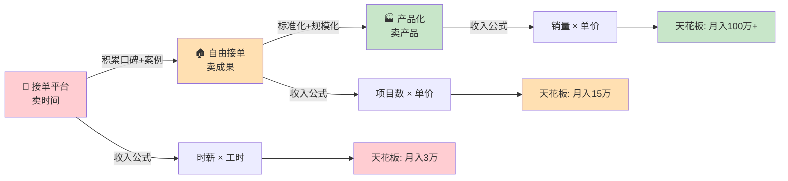
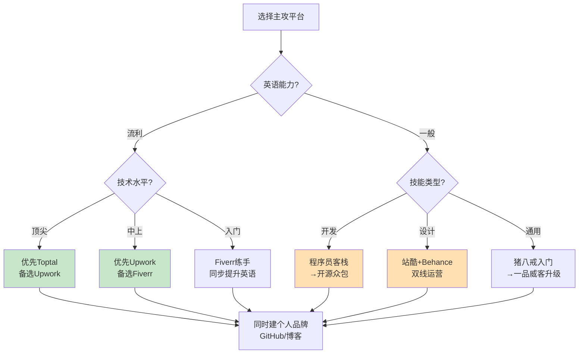
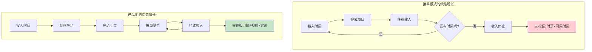
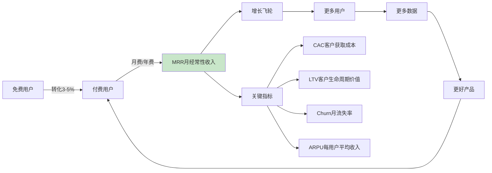
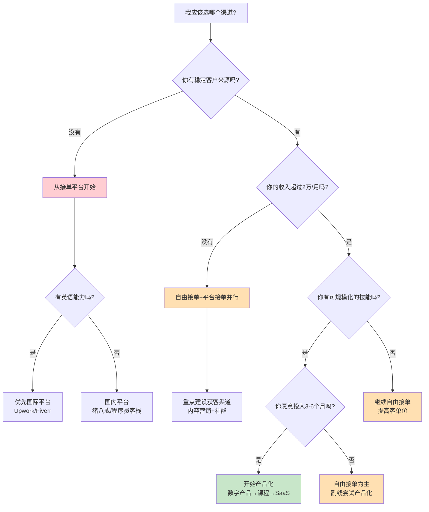
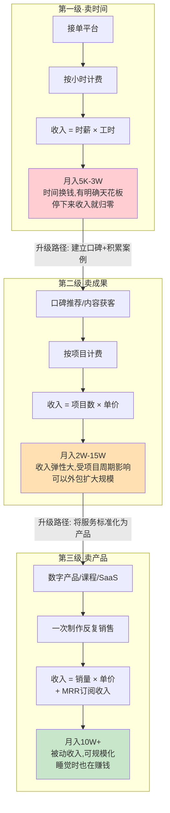

# 三、变现渠道概览

掌握了技能变现的本质（第一章）和技能评估框架（第二章）之后，下一个核心问题是：**通过什么渠道把技能变成钱？** 渠道选择直接决定了你的收入天花板、时间自由度和长期成长空间。

选错渠道的代价是巨大的：在低端平台卷价格战，3个月后发现自己时薪不如外卖骑手；跳过接单阶段直接做产品，6个月零收入后被迫回去上班。本章的目标是帮你看清三条渠道的全貌——它们各自适合什么阶段、有什么坑、如何过渡——从而做出符合自己当前状态的理性决策。

## 3.1 三大变现模型总览

技术技能变现的渠道千差万别，但归纳起来，所有渠道都可以归入三大模型：

| 模型 | 核心逻辑 | 收入公式 | 天花板 | 时间自由度 | 启动成本 |
|------|----------|----------|--------|------------|----------|
| **接单平台** | 在集市里摆摊，等客户上门 | 收入 = 时薪 × 工时 | 低（受限于个人时间） | 低 | 极低 |
| **自由接单** | 自己开店，自主获客 | 收入 = 项目数 × 单价 | 中（可提价、可外包） | 中 | 低-中 |
| **产品化变现** | 建工厂，一次生产反复销售 | 收入 = 销量 × 单价 | 高（边际成本趋近于零） | 高 | 中-高 |

三者不是"哪个更好"的关系，而是一个**进化路径**：从卖时间到卖成果，从卖成果到卖产品。大多数成功的技术变现者都经历了这三个阶段的跃迁。



## 3.2 接单平台：在集市里起步

### 3.2.1 什么是接单平台模式

接单平台模式是最简单的变现方式——你注册一个平台，展示自己的技能，客户在平台上发布需求，你去接单完成，平台抽取一定比例的佣金。这就像在菜市场租一个摊位，客流由市场带来，你只需要把菜摆好、价格标好。

这种模式的核心特征是：**平台负责获客，你负责交付**。

平台接单的价值不仅在于收入本身，更在于它是**风险最低的验证方式**——你可以用极低的成本验证：你的技能是否有人愿意付费？市场需求在哪里？你的定价是否合理？这些问题在平台上有现成的答案，不需要你自己去试错。

### 3.2.2 主流接单平台全景图

#### 国内综合外包平台

| 平台 | 抽成比例 | 项目均价 | 准入门槛 | 竞争强度 | 适合阶段 |
|------|----------|----------|----------|----------|----------|
| 猪八戒网 | 10%-20% | 500-5万 | 低（实名即可） | 极高 | 入门练手 |
| 一品威客 | 10%-20% | 1000-10万 | 中（需认证） | 高 | 初级接单 |
| 开源众包 | 5%-15% | 3000-20万 | 中（技术审核） | 中 | 有经验者 |
| 程序员客栈 | 15%-20% | 5000-30万 | 高（简历审核） | 中 | 专业开发者 |
| 码市（已被猪八戒收购） | 10%-20% | 3000-15万 | 中 | 中 | 全栈开发 |
| 实现网 | 10%-15% | 5000-20万 | 中（技术面试） | 中 | 远程兼职 |

**猪八戒网**是国内最大的综合类威客平台，涵盖设计、开发、营销、文案等几乎所有服务品类。项目数量多但鱼龙混杂，大量低价需求（LOGO设计50元、网站开发500元），适合刚入行练手，但长期依赖这个平台很难建立高质量的客户关系。它的竞标机制导致严重的低价竞争——客户收到几十个报价，自然选最便宜的。

**程序员客栈**定位中高端技术人才，采用"远程工作"模式，平台会对开发者进行技术评估和分级。项目质量相对较高，但准入门槛也更高——需要提交完整的项目经历和技术栈证明。通过审核后，平台会根据你的技能等级推荐匹配的项目，省去了大量竞标时间。

**开源众包**脱胎于开源中国社区，技术氛围较好，项目以中大型开发需求为主。平台会进行技术审核，过滤掉大部分低质量需求，但项目数量相对较少，需要耐心等待合适的机会。

#### 国际接单平台

| 平台 | 抽成比例 | 项目均价（美元） | 支付方式 | 语言要求 | 适合阶段 |
|------|----------|-----------------|----------|----------|----------|
| Upwork | 5%-20%（阶梯递减） | $500-$50,000 | PayPal/银行电汇/直接入账 | 英语流利 | 中高级 |
| Fiverr | 20% | $50-$10,000 | PayPal/Payoneer | 英语基本 | 入门-中级 |
| Toptal | 0%（客户付） | $3,000-$30,000 | 银行电汇 | 英语流利 | 高级专家 |
| Freelancer.com | 10% | $200-$20,000 | 多种 | 英语基本 | 入门-中级 |
| 99designs | 5%-15% | $300-$5,000 | PayPal | 英语基本 | 设计师 |
| PeoplePerHour | 5%-20% | $200-$10,000 | PayPal/银行 | 英语基本 | 中级 |
| Guru | 5%-9% | $300-$15,000 | 多种 | 英语基本 | 中级 |

**Upwork**是全球最大的自由职业平台，覆盖开发、设计、写作、营销等全品类。其佣金采用阶梯制——与同一客户的前$500交易抽20%，$500-$10,000抽10%，$10,000以上抽5%。这意味着**长期客户关系**在Upwork上能显著降低你的获客成本。Upwork的"Connects"机制要求你用虚拟货币投标，每个投标消耗2-6个Connects，每月免费赠送少量，额外购买$0.15/个。这个设计逼迫你不要海投，而是精准投标。

**Toptal**号称只接受"前3%"的自由职业者，申请流程极其严格（5轮筛选，通过率约3%），包括英语面试、技术面试、实时编码测试、模拟项目和试用期。但一旦进入，客户质量极高——包括Airbnb、HP、Bridgewater等大企业，时薪通常在$60-$200+。适合技术能力顶尖且英语流利的高级开发者。

**Fiverr**的模式与其他平台不同——不是客户发需求你去竞标，而是你创建"服务包"（Gig），客户来选购。这意味着你需要学会**包装自己的服务**，把技能转化为标准化的产品。Fiverr的排名算法看重Gig的转化率和客户评价，新账号前期需要通过低价和优质服务快速积累5星评价。

#### 设计/创意类专属平台

| 平台 | 定位 | 收费模式 | 特点 |
|------|------|----------|------|
| 站酷 | 设计师社区+接单 | 免费入驻，项目成交抽成 | 国内设计师首选社区 |
| Dribbble | 设计展示+招聘 | 会员制（$5-$15/月） | 国际设计圈最高端 |
| Behance | 作品展示 | 免费 | Adobe旗下，SEO权重高 |
| 千图网/包图网 | 素材售卖 | 按下载量分成 | 被动收入，单价低 |
| UI中国 | UI设计社区 | 免费 | 垂直UI领域 |
| Creative Market | 设计素材售卖 | 平台抽30% | 国际市场，客单价高 |

#### 平台选择决策框架

不要同时铺开多个平台，那会让你精力分散、哪个都做不好。按以下顺序聚焦：



### 3.2.3 平台接单的完整操作流程

#### 第一步：注册与认证

准备材料：身份证/护照、技能证书（可选但加分）、作品集（必需）、银行账户/PayPal、一个专业的邮箱地址（不要用 qq123456@xx.com）。

选择主攻平台时遵循"1+1"原则：一个主力平台（投入70%精力）+一个辅助平台（投入30%精力）。主力平台选流量大、匹配度高的；辅助平台选差异化定位的。

#### 第二步：搭建个人档案

个人档案是你的"门面"，客户平均花**7秒**扫描你的档案决定是否继续了解：

- **头像**：专业照（不是自拍、不是卡通、不是风景）。光线充足、背景简洁、穿得体面。研究表明，专业头像能提升40%的点击率。
- **标题**：一句话说清楚你做什么。差的标题："全栈开发工程师"——太泛；好的标题："5年经验React/Node全栈开发者，专注电商系统与支付对接"——具体、有领域、有经验。
- **简介**：用"问题-方案-成果"结构。先说客户有什么痛点，再说你能怎么解决，最后用数据/案例证明。控制在200字以内。
- **技能标签**：选5-10个精准标签（不要贪多）。标签越精准，匹配的客户越准。
- **作品集**：3-5个最佳案例，每个写清背景、方案、成果。有数据的加数据（"帮客户将页面加载时间从3.2s优化到0.8s"比"优化了性能"强100倍）。

#### 第三步：积累前期评价

前期评价是平台上的"信用货币"，没有评价的账号接单难度是有评价账号的5-10倍。

- **策略一：适当低价换好评**。前3单可以比市场价低20%-30%，但**不要低太多**——低太多反而让人怀疑质量。明确跟客户说"我是平台新入驻的开发者，前几单给优惠价，希望您给个真实评价"。
- **策略二：主动投标小型项目**。小项目周期短、风险低，可以快速完成、快速获得评价。一个$100的小项目和一个$10,000的大项目，在评价权重上差别不大。
- **策略三：邀请已有客户**。如果你之前有过合作客户，邀请他们来平台下单。很多平台允许这种操作（但要确认平台规则）。
- **策略四：参加平台活动**。很多平台会举办"新秀挑战赛""技能竞赛"等活动，参与并获奖能快速提升曝光度。

#### 第四步：提升接单成功率

投标是一门手艺，好的投标和差的投标，中标率可以差10倍：

**投标模板对比**（同一个项目，两种投标方式）：

差的投标：
> "你好，我是全栈开发，做过很多项目，经验丰富，可以做这个项目，报价5000元。"

好的投标：
> "你好，我看了你的需求——要做一个类似X品牌的电商小程序，核心是商品展示+购物车+微信支付。
>
> 我之前做过类似的项目（附链接），帮客户实现了日均500+订单的稳定运行。
>
> 我的方案是：前端用uni-app一套代码同时出H5和小程序，后端用Node.js+MySQL，支付用微信支付V3接口。预计4周完成，分3个里程碑交付。
>
> 报价8000元。如果方便，我们可以先聊15分钟需求细节？"

关键区别：**定制化**（说明你看了需求）、**有案例**（证明你能做）、**有方案**（展示专业性）、**有节奏**（里程碑管理）、**有互动**（邀请沟通）。

**其他关键技巧**：
- **响应速度**：前30分钟响应的中标率是24小时后响应的5倍。设置平台的消息提醒。
- **报价策略**：先了解需求再报价，不要上来就亮底牌。如果需求不清晰，先问问题再报价。
- **保持在线时长**：很多平台的排名算法参考"在线时长"和"响应率"。

#### 第五步：交付与口碑管理

- **里程碑管理**：大项目分阶段交付（建议3-5个里程碑），每阶段确认后再进入下一阶段。这样既降低了双方风险，也保证了项目方向不跑偏。
- **超预期交付**：多做一点点（多一个功能、多一份文档、多一个优化）。这不是浪费时间，而是投资——它直接决定客户是否给你好评、是否推荐你给朋友。
- **主动要好评**：交付后礼貌请求客户评价。很多客户不是不满意，而是懒——你提醒一下，他们就去评了。
- **交付后的跟进**：项目完成1周后主动问"使用中有没有遇到什么问题？"，1个月后问"有没有需要调整的地方？"。这种售后跟进会极大提升复购率和转介绍率。

### 3.2.4 平台接单的数据真相

很多人对接单平台有不切实际的幻想，这里用数据说话：

| 指标 | 国内综合平台 | 国际高端平台 | 设计类平台 |
|------|-------------|-------------|-----------|
| 新手月收入（前3个月） | 2,000-5,000元 | $500-$2,000 | 1,000-3,000元 |
| 成熟期月收入（1年+） | 8,000-20,000元 | $3,000-$10,000 | 5,000-15,000元 |
| 顶部玩家月收入 | 30,000-80,000元 | $15,000-$50,000 | 20,000-50,000元 |
| 平均竞标成功率 | 3%-8% | 5%-15% | 5%-12% |
| 从注册到首单时间 | 1-4周 | 2-8周 | 1-3周 |
| 客户复购率 | 10%-20% | 30%-50% | 15%-25% |

**关键洞察**：平台接单的天花板受限于两个因素——**你的可用时间**（一天只有24小时）和**平台的抽成比例**（10%-20%直接吃掉利润）。当你的月收入稳定在2万以上时，就应该开始思考向"自由接单"或"产品化"转型。

**一个真实的收入增长曲线**（基于Upwork平台数据）：

```text
月份1-3:  月均$800    ——大量投标，中标率低，在学习平台规则
月份4-6:  月均$2,500  ——积累了10+好评，中标率提升，开始有复购客户
月份7-12: 月均$5,000  ——建立了细分领域口碑，客户开始主动联系
月份13-24:月均$10,000 ——排名稳定，高端客户占比提升，时薪从$30涨到$80
月份25+:  月均$15,000+——Top Rated Plus，长期客户贡献60%+收入
```

### 3.2.5 平台接单的常见陷阱与应对

#### 陷阱一：低价竞争螺旋

在猪八戒等平台上，大量新手为了抢第一单疯狂压价。一个网站开发项目，有人报5万，有人报500。最终客户选了2000的，结果质量堪忧，双方都不满意。

**应对策略**：绝不参与价格战。你的竞争策略应该是**差异化**——不做"最便宜的"，做"最懂客户需求的"。在投标时花10分钟研究客户的业务，写出有针对性的方案，这比降价1000元有效得多。同时，设置你的"底线价格"——低于这个价格的项目不接，宁可空着也不接亏本的活。

#### 陷阱二：需求蔓延（Scope Creep）

最常见的纠纷来源。客户说"就改个小东西"，然后一个变十个，最后项目比原始需求大了三倍，但价格没变。

**应对策略**：在开工前用文档明确需求边界（SOW，Statement of Work）。超出原始需求的变更，走书面变更流程，单独报价。这不是斤斤计较，而是专业的项目管理。具体做法：
- 开工前让客户签署需求确认书
- 需求文档用清单格式，每条需求编号
- 变更请求必须书面提出（微信/邮件都行，但要有记录）
- 变更报价前先评估工时影响

#### 陷阱三：平台依赖症

在平台上干了三年，积累了100个好评，月入2万。突然平台改了算法，你的曝光量暴跌70%，收入腰斩。你的客户关系、评价积累、个人品牌，全部建立在别人的地基上。

**应对策略**：把平台当**获客入口**，而不是**全部阵地**。每完成一个项目，都在思考如何把平台客户转化为直接客户（前提是不违反平台规则）。具体方法：在项目文档、代码注释中留下自己的品牌标识；交付时附上个人名片/网站链接；提供超出平台范围的增值服务（如免费维护期后的付费维护）。

#### 陷阱四：遇到骗子客户

平台上有少数骗子客户，常见手法：
- 要求先交付"测试版"再签约，拿到代码后消失
- 用虚假项目骗取你的方案后自己开发
- 故意制造纠纷申请退款，白拿你的成果

**应对策略**：
- 绝不在签约前交付任何实质性工作内容
- 方案文档只提供目录和思路，不提供具体实现
- 所有沟通通过平台内部消息系统（有记录可查）
- 里程碑付款到了才开始对应阶段的工作
- 对"预算很大但要求很多前期工作"的项目保持警惕

#### 陷阱五：汇率与回款风险（国际平台）

使用国际平台涉及跨境收款，有几个常见问题：
- **PayPal冻结**：新账号大额入账容易触发风控冻结，解决办法是渐进式增加金额、提前完成身份验证
- **汇率损失**：中间环节多（平台→PayPal→提现→银行），每次转换都有损耗。建议用Payoneer或Wise（TransferWise）降低汇率损失
- **税务合规**：海外收入在国内也需要申报纳税。建议咨询专业税务顾问，避免后续麻烦

### 3.2.6 AI时代平台接单的新变化

2024年以来，AI工具对平台接单生态产生了深刻影响：

**被冲击的领域**：
- 简单的Logo设计、banner设计——AI可以生成80%的效果
- 基础的WordPress建站——AI建站工具越来越好
- 简单的数据录入/爬虫——AI+低代码可以替代
- 基础翻译——GPT-4级别的翻译质量已经很高

**被强化的领域**：
- 复杂系统架构设计——AI无法替代深度业务理解
- 客户沟通与需求分析——AI无法替代人际信任
- 安全审计与合规——AI有幻觉风险，关键环节仍需人工
- 跨系统集成——涉及多个第三方API的对接，AI工具力不从心

**应对策略**：把自己定位为**"AI增强型"服务提供者**——用AI提升效率，但把核心价值放在AI做不好的地方：深度业务理解、系统设计、客户沟通、质量把控。在投标时明确告诉客户"我用AI工具辅助开发，效率提升3倍，但核心架构和质量由我亲自把关"——这是加分项而非减分项。

## 3.3 自由接单：自己开店当老板

### 3.3.1 从平台到自由的跃迁

自由接单和平台接单的本质区别不在于"有没有平台"，而在于**谁掌握客户关系**。

| 维度 | 平台接单 | 自由接单 |
|------|----------|----------|
| 获客方式 | 平台分配/竞标 | 主动获客/口碑传播 |
| 客户关系 | 平台拥有客户 | 你拥有客户关系 |
| 定价权 | 受平台价格体系约束 | 完全自主 |
| 抽成 | 10%-20% | 0%（但有获客成本） |
| 品牌归属 | 平台品牌 > 个人品牌 | 个人品牌 > 一切 |
| 稳定性 | 受平台政策影响大 | 受个人能力影响大 |
| 自由度 | 低（受平台规则约束） | 高（自己定规则） |
| 风险 | 低（平台兜底） | 中-高（自己承担） |

自由接单的核心挑战只有一个：**如何持续获取优质客户？** 这也是大多数人卡在平台阶段无法突破的根本原因。

### 3.3.2 自由接单的四大获客渠道

#### 渠道一：口碑推荐（转化率最高）

口碑推荐是自由接单的**黄金渠道**——转化率高达60%-80%（对比平台竞标的5%-15%），客户质量最好，沟通成本最低。

**口碑飞轮的构建方法**：

```text
优质交付 → 客户满意 → 主动推荐 → 新客户 → 优质交付 ...
     ↑                                          |
     └──────────────────────────────────────────┘
```

具体操作：
- **超预期交付**：承诺5天，3天交；承诺基本功能，多加一个增值功能。超预期不等于做白工——而是用小成本换取高感知价值（比如写一份清晰的使用文档，成本1小时，但客户感知到的价值远超于此）
- **交付后跟进**：项目完成后1周、1个月、3个月各跟进一次。不是骚扰，而是关心——"系统运行得怎么样？有没有遇到什么问题？"
- **主动请求转介绍**：不要不好意思开口。在客户满意的最佳时机（比如刚交付一个好评的时候），礼貌地说"如果您身边有朋友也需要类似服务，欢迎推荐"。研究表明，70%的客户愿意推荐，但只有10%的自由职业者会主动开口
- **推荐激励**：推荐成功给10%-15%的佣金，或者下次服务打折。这不是贿赂，而是商业惯例——几乎所有行业都有推荐奖励机制
- **维护客户数据库**：记录每个客户的行业、需求、满意度、联系方式、上次合作时间。推荐使用Notion或Airtable做简单的CRM

#### 渠道二：内容营销（长尾效应最强）

通过在技术社区、博客、社交媒体持续输出高质量内容，建立专业形象，让客户主动找上门。

**内容营销矩阵**：

| 平台 | 内容形式 | 更新频率 | 见效周期 | 适合领域 | 获客效率 |
|------|----------|----------|----------|----------|----------|
| 掘金/思否 | 技术深度文章 | 每周1-2篇 | 3-6个月 | 开发 | ★★★★☆ |
| 知乎 | 问答+专栏 | 每周3-5个回答 | 2-4个月 | 全领域 | ★★★★☆ |
| 公众号 | 系统化长文 | 每周1-2篇 | 6-12个月 | 全领域 | ★★★☆☆ |
| 小红书 | 图文/短视频 | 每天1条 | 1-3个月 | 设计/运营 | ★★★★★ |
| B站 | 教程视频 | 每周1个 | 3-6个月 | 开发/设计 | ★★★☆☆ |
| Twitter/X | 技术观点+线程 | 每天2-3条 | 3-6个月 | 出海/国际化 | ★★★★☆ |
| GitHub | 开源项目 | 持续维护 | 6-12个月 | 开发 | ★★★★★ |

**内容营销的系统化策略**：

1. **定位**：你的内容要解决什么人、什么问题？"帮初创公司用最低成本搭建MVP"比"分享技术"精准100倍。定位公式：**[目标人群] + [具体问题] + [你的解决方案]**。例如："帮独立开发者用Next.js在3天内上线SaaS产品的完整教程"
2. **选题**：从三个来源找选题——客户常见问题（客户问什么你就写什么）、行业热点（紧跟技术趋势写解读）、竞品分析（别人写了什么但写得不好，你来写更好的）
3. **SEO优化**：标题含关键词、内容结构化（用H2/H3分层）、首段包含核心关键词、内外链建设、图片加alt标签。百度SEO和Google SEO的侧重点不同——百度更看重内容新鲜度和站内优化，Google更看重外链和E-E-A-T（经验、专业、权威、可信）
4. **引流闭环**：文章结尾放联系方式/服务介绍/免费咨询入口。不要只放一个微信号——放一个落地页链接，上面有你的服务介绍、案例、联系方式、预约日历
5. **数据追踪**：用UTM参数追踪每篇文章带来的流量和转化。哪些内容带来了客户？持续优化。

**内容创作的效率工具**：
- **选题研究**：5118（关键词挖掘）、AnswerThePublic（用户问题发现）、知乎热榜
- **写作辅助**：Notion/Obsidian（长文写作）、Typora（Markdown编辑）、AI辅助生成初稿后人工优化
- **分发工具**：Wechatsync（多平台同步发文）、Buffer（海外社媒定时发布）
- **数据分析**：百度统计/Google Analytics、各平台自带的数据后台

#### 渠道三：社群运营（信任建设最快）

在微信群、QQ群、Discord、Telegram等社群中活跃，通过帮助他人建立信任，自然转化为商业机会。

**社群获客的具体方法**：
- 加入目标客户所在的行业群（不是同行群，而是**客户群**）。比如你是做电商开发的，加入电商卖家群比加入开发者群有效10倍
- 在群里积极回答问题，展示专业能力。但要注意——回答问题要**真正有帮助**，不是为了显摆
- 分享有价值的资源和工具（免费的，不带广告）。建立"这个群里有个人特别专业"的口碑
- 适时分享自己的项目经验（不是硬广，是故事）。"我上个月帮一个客户用XX技术解决了XX问题，效果是XX"——这既是分享也是软广
- 当有人提出明确需求时，私聊沟通。不要在群里公开接单——会让人觉得你在发广告

**社群运营的时间管理**：每天花30-60分钟在社群中，分布在2-3个核心群。不要贪多——深度运营3个群比浅度参与30个群有效得多。

#### 渠道四：线下活动与行业会议

线上获客效率高，但线下建立的信任更深。参加行业会议、技术沙龙、创业活动，面对面交流的转化率远高于线上。

**线下获客技巧**：
- 带足名片（是的，实体名片在线下场景仍然有效）。名片上除了联系方式，加一句你的核心价值主张
- 准备30秒电梯演讲（一句话说清你是谁、做什么、能帮什么）："我是做电商系统开发的，帮品牌方从0到1搭建小程序商城，最快2周上线"
- 主动做分享嘉宾（一次演讲带来的曝光 > 100次群聊）。从小型meetup开始，不需要一上来就去GMTC
- 会后24小时内跟进所有交换过联系方式的人。发一条简短的消息："昨天聊得很开心，我整理了一些关于XX的资料给你"——附上有价值的内容，而不是直接推销

### 3.3.3 自由接单的定价体系

定价是自由接单最核心的能力之一。定价过低，你会累死且赚不到钱；定价过高，你会饿死且接不到单。

**定价的三种模型**：

| 模型 | 计算方式 | 适用场景 | 风险 | 客户心理 |
|------|----------|----------|------|----------|
| 按时计费 | 时薪 × 工时 | 需求不明确、长期顾问 | 客户担心磨洋工 | 不安（不知道最终花多少钱） |
| 按项目计费 | 评估工时 × 时薪 × 风险系数 | 需求明确的独立项目 | 评估不准会亏 | 安心（总额确定） |
| 按价值计费 | 你帮客户赚/省了多少钱 × 分成比例 | 高价值商业项目 | 需要强议价能力 | 与你利益绑定 |

**定价提升路径**：

```text
入门：按小时收费（¥100-300/小时）
  ↓ 积累案例和口碑
成长：按项目收费（¥5,000-50,000/项目）
  ↓ 理解客户业务价值
成熟：按价值收费（帮客户多赚100万，收10-20万）
  ↓ 建立品牌和稀缺性
高级：固定顾问费 + 项目费 + 分成（复合收入结构）
```

**定价心理学**：
- **锚定效应**：先展示高价方案，再展示中价方案，中价方案显得"合理"。三个方案（基础/标准/高级）比一个方案的转化率高30%
- **价值框架**：不说"这个项目收1万"，而说"这个系统能帮你每月多赚5万，项目费1万，相当于第一个月的20%投入"。把价格放在价值的框架里，客户的心理感受完全不同
- **稀缺性**：不是每个项目都接。"我这个月只接2个项目"比"我随时有空"更能支撑高价
- **价格测试**：每季度尝试涨价10%-20%。如果客户流失率超过20%，说明当前定价接近上限；如果流失率低于5%，说明你定价太低了

### 3.3.4 自由接单的合同与风控

自由接单没有平台的保护伞，合同就是你的唯一防线。

**合同必备条款**：

```text
1. 服务范围（SOW）：明确做什么、不做什么
   └─ 用清单格式，每条需求编号
   └─ 明确"不在范围内"的事项（更容易产生争议的部分）
   └─ 附上原型图/设计稿作为附件

2. 交付标准：什么算"完成"？验收标准是什么？
   └─ 功能验收：每个功能的验收条件
   └─ 性能验收：响应时间、并发量等指标
   └─ 验收流程：客户有X个工作日完成验收，逾期视为通过

3. 时间线：里程碑节点 + 最终交付日期
   └─ 每个里程碑的交付物和截止日期
   └─ 延期的处理方式（不可抗力 vs 客户原因 vs 开发者原因）

4. 付款条款：
   └─ 预付比例（建议30%-50%，低于30%风险太高）
   └─ 里程碑付款节点（每完成一个里程碑，支付该阶段费用）
   └─ 尾款支付时间（验收通过后X个工作日内）
   └─ 逾期付款的违约金（每日0.05%-0.1%）

5. 知识产权：交付物的IP归属
   └─ 通常归客户，但保留展示权（用于作品集展示）
   └─ 开源组件/第三方库不包含在IP转让中
   └─ 明确付款未完成前IP不转移

6. 保密条款：双方的保密义务
   └─ 保密范围和期限
   └─ 哪些信息可以用于作品集展示（脱敏后）

7. 修改与变更：超出原始需求的变更如何处理
   └─ 小变更（<2小时）：包含在项目内
   └─ 中变更（2-8小时）：书面确认+额外报价
   └─ 大变更（>8小时）：签订补充协议

8. 终止条款：什么情况下可以终止
   └─ 双方协商终止
   └─ 单方终止的条件和通知期
   └─ 终止后的费用结算（已交付部分的费用+未交付部分的处理）
```

**常见纠纷与预防**：

| 纠纷类型 | 发生频率 | 预防措施 | 发生后的处理 |
|----------|----------|----------|-------------|
| 客户不付款 | 30% | 预付款+里程碑付款，尾款不超过20% | 保留所有沟通记录，必要时走法律途径 |
| 需求蔓延 | 50% | 合同明确SOW，变更走书面流程 | 拿出合同SOW，说明变更需额外计费 |
| 客户失联 | 15% | 关键节点要求客户确认，保留沟通记录 | 邮件/短信/电话多渠道联系，超过30天视为自动验收 |
| 质量争议 | 20% | 交付前内部验收，交付标准写入合同 | 按合同验收标准逐条核对 |
| 知识产权纠纷 | 10% | 合同明确IP归属，代码中不使用未授权素材 | 法律途径，合同是最关键证据 |

**合同模板推荐**：
- 国内：可以在"合同模板"类小程序中找到技术服务合同模板，但建议让律师审一遍
- 国际：Upwork自带合同模板，独立合同可以用Bonsai、HelloSign等在线合同工具
- 费用：一份律师审核过的标准合同模板，费用约500-2000元，但能帮你避免几万甚至几十万的损失

## 3.4 产品化变现：从手工作坊到工厂

### 3.4.1 为什么必须走向产品化

接单模式（无论是平台还是自由接单）有一个无法突破的物理限制：**你的时间是有限的**。一天24小时，刨去吃饭睡觉休息，有效工作时间最多10-12小时。即使你的时薪从100元涨到1000元，月收入天花板也不过20-30万——而且一旦停下来，收入立刻归零。

产品化的核心突破在于：**把你的技能封装成可以重复销售的产品，实现"一次制作，反复销售"**。



### 3.4.2 产品化的四大路径

#### 路径一：数字产品

数字产品是最轻量级的产品化方式——把你的专业知识封装成可下载的数字文件。

| 产品类型 | 制作周期 | 定价范围 | 维护频率 | 适合技能 | 月收入潜力 |
|----------|----------|----------|----------|----------|-----------|
| 代码模板/脚手架 | 1-4周 | ¥50-500 | 低（季度更新） | 开发 | ¥2,000-20,000 |
| 设计模板/Figma组件 | 1-2周 | ¥30-300 | 低 | 设计 | ¥1,000-10,000 |
| Notion/Obsidian模板 | 3-7天 | ¥10-100 | 低 | 效率工具 | ¥500-5,000 |
| Excel/数据模板 | 3-7天 | ¥20-200 | 中 | 数据分析 | ¥1,000-8,000 |
| API工具/CLI工具 | 2-8周 | 免费增值/¥50-500/月 | 高 | 开发 | ¥5,000-50,000 |
| 浏览器插件 | 2-6周 | 免费增值/¥10-50/月 | 高 | 前端 | ¥3,000-30,000 |
| WordPress主题/插件 | 4-12周 | ¥100-2,000 | 高 | 全栈 | ¥5,000-50,000 |
| 提示词库/Prompt包 | 1-3天 | ¥10-100 | 中 | AI | ¥500-5,000 |
| API接口/SaaS工具 | 4-12周 | ¥50-500/月 | 高 | 全栈 | ¥10,000-100,000 |

**数字产品的关键成功因素**：
- **解决具体问题**：不是"通用模板"，而是"电商小程序后台管理模板"。越具体的产品，越容易找到愿意付费的用户
- **开箱即用**：客户拿到就能用，不需要花3小时配置。提供一键安装脚本、详细的快速开始文档
- **文档完善**：安装说明、使用教程、常见问题、视频演示。文档质量直接决定退款率
- **持续更新**：定期修复bug、增加功能，让老客户感受到持续价值。更新频率建议：至少每月一次小更新，每季度一次大更新
- **展示效果好**：精美的预览图、演示视频、在线Demo。客户买的不是代码，是效果——让他们看到最终效果是什么样

**销售渠道**：

| 渠道 | 抽成 | 流量 | 适合类型 | 结算周期 |
|------|------|------|----------|----------|
| Gumroad | 10% | 自带+引流 | 各类数字产品 | 即时 |
| 小报童 | 10% | 中文圈 | 知识付费 | T+7 |
| 竹白 | 0% | 自建 | Newsletter订阅 | 即时 |
| GitHub Sponsors | 0% | 开发者社区 | 开源项目 | 月初 |
| 自建网站+Stripe | 2.9%+$0.30 | 完全自主 | 高客单价产品 | T+2 |
| 淘宝/闲鱼 | 低 | 巨大 | 大众化产品 | 确认收货后 |
| 即刻/小红书导流 | 0% | 精准 | 创意类产品 | 即时 |
| LemonSqueezy | 5%+50¢ | 全球 | SaaS/数字产品 | T+7 |

#### 路径二：在线课程与知识付费

把你的专业知识体系化后做成课程，是最常见的产品化方式之一。

**课程产品矩阵**：

| 形式 | 制作难度 | 定价范围 | 维护成本 | 收入稳定性 | 规模化潜力 |
|------|----------|----------|----------|------------|-----------|
| 电子书/PDF | ★★☆☆☆ | ¥20-200 | 低 | 中 | ★★★☆☆ |
| 录播视频课 | ★★★☆☆ | ¥99-999 | 低 | 高 | ★★★★★ |
| 训练营（直播+作业） | ★★★★☆ | ¥999-9,999 | 高 | 中（有开班周期） | ★★★☆☆ |
| 会员订阅（持续更新） | ★★★☆☆ | ¥29-199/月 | 高 | 高（持续性收入） | ★★★★☆ |
| 1对1辅导 | ★★★★★ | ¥500-5,000/小时 | 时间成本 | 低（不可规模化） | ★☆☆☆☆ |

**课程制作的完整流程**：

```text
1. 选题验证（1-2周）
   └─ 搜索量调研：这个主题有人搜索吗？
   │   └─ 工具：百度指数、微信指数、Ahrefs/SEMrush（国际）
   │   └─ 判断标准：日均搜索量>500，且竞争度适中
   └─ 竞品分析：现有课程有哪些？质量如何？差评在哪里？
   │   └─ 在极客时间、掘金小册、Udemy等平台搜索同类课程
   │   └─ 重点看差评——差评里藏着你的机会
   └─ 需求验证：在社群/论坛发帖，看有多少人感兴趣
   │   └─ 写一个课程大纲，发到目标社群，收集反馈
   └─ 预售测试：先做一个大纲，看能不能预售出去
       └─ 预售是最好的验证——有人愿意掏钱，说明需求真实

2. 课程设计（1-2周）
   └─ 学习目标：学员学完能做什么？（具体、可衡量）
   │   └─ 差的："了解React基础"——太模糊
   │   └─ 好的："能独立用React+Next.js开发一个带登录/支付的SaaS产品"
   └─ 知识地图：列出所有需要覆盖的知识点
   └─ 课程大纲：按由浅入深排列，每个章节有明确的学习成果
   └─ 素材清单：需要哪些PPT、代码、案例、练习
   └─ 测试项目：设计一个贯穿全程的实战项目

3. 内容制作（4-12周）
   └─ 写逐字稿（不要临场发挥，录出来质量差距巨大）
   │   └─ 每节课控制在10-20分钟（注意力窗口）
   │   └─ 开头30秒必须抓人——"这节课学完你能做到XX"
   └─ 制作PPT/演示（简洁为主，不要堆文字）
   │   └─ 每页PPT不超过3个要点
   │   └─ 多用图、流程图、代码截图，少用纯文字
   └─ 录制视频
   │   └─ 推荐工具：OBS（录屏）+ 好麦克风（Blue Yeti/舒尔MV7）
   │   └─ 补光灯：环形灯+桌面柔光箱，保证画面明亮均匀
   │   └─ 环境：安静、背景整洁、不要出现分散注意力的元素
   └─ 后期剪辑
       └─ 去口误、加字幕、调整节奏
       └─ 工具：剪映（简单高效）、DaVinci Resolve（专业免费）
       └─ 关键：保持节奏紧凑，删掉所有"嗯""啊""那个"

4. 上架与推广（持续）
   └─ 选择平台
   │   └─ 极客时间：技术类课程首选，平台流量大但抽成高
   │   └─ 掘金小册：短小精悍的技术小册，定价通常¥20-50
   │   └─ 知识星球：社群+课程结合，适合有粉丝基础的人
   │   └─ 自建：用Teachable/小鹅通/自己搭建，利润最高但获客最难
   └─ 定价策略
   │   └─ 参考同类课程定价
   │   └─ 新品首发打7折，限时一周
   │   └─ 提供"早鸟价"给预热期的用户
   └─ 推广渠道
   │   └─ 自己的社交媒体（首发+持续推广）
   │   └─ 合作互推（找同领域但不直接竞争的KOL）
   │   └─ 社群分发（目标社群+行业社群）
   │   └─ SEO优化课程落地页
   └─ 收集反馈与迭代
       └─ 根据学员评价持续优化
       └─ 定期更新内容（技术类课程内容半衰期约6-12个月）
       └─ 建学员社群，提升完课率和满意度
```

#### 路径三：SaaS（软件即服务）

SaaS是产品化的最高形态——你开发一个软件，用户按月/年付费使用。它的优势是**可预测的经常性收入（MRR）**，劣势是**开发和运维成本高**。

**SaaS的商业模式**：



**SaaS的核心指标解读**：
- **MRR（月经常性收入）**：所有付费用户每月贡献的收入总和。这是SaaS最重要的指标——它代表你的"收入底盘"
- **Churn（月流失率）**：每月流失的付费用户占比。低于5%是及格线，低于3%是优秀。高Churn意味着你的产品留不住人——即使获客再多也白搭
- **LTV（客户生命周期价值）**：一个客户从付费到流失总共贡献的收入。LTV = ARPU / Churn。LTV必须大于3倍CAC（客户获取成本），否则商业模式不成立
- **CAC（客户获取成本）**：获取一个付费用户的总成本（广告+内容+销售人员等）

**独立开发者SaaS的现实路径**：

| 阶段 | 时间 | 目标 | 月收入预期 | 核心任务 |
|------|------|------|-----------|----------|
| MVP开发 | 1-3个月 | 最小可用产品，核心功能 | ¥0 | 用最少代码验证核心假设 |
| 种子用户 | 1-2个月 | 获取50-100个免费用户 | ¥0-2,000 | 收集反馈，验证产品-市场匹配 |
| 付费验证 | 1-2个月 | 10-20个付费用户 | ¥2,000-5,000 | 验证人们愿意付费 |
| 产品迭代 | 3-6个月 | 根据反馈持续优化 | ¥5,000-20,000 | 找到PMF（Product-Market Fit） |
| 增长阶段 | 6-12个月 | 推广+口碑传播 | ¥20,000-100,000 | 建立可重复的获客渠道 |
| 成熟阶段 | 12个月+ | 稳定MRR，低维护成本 | ¥50,000+ | 优化LTV/CAC比 |

**独立开发者的SaaS选型建议**：

- **不要做大平台**，做**垂直小工具**（帮某个特定行业的特定人群解决一个具体问题）。一个帮"独立餐厅老板管理外卖订单"的小工具，比一个"通用项目管理平台"更容易成功
- **不要做通用型产品**，做**利基市场**（竞争少、客户精准、定价权强）。在利基市场做到第一名，比在大市场做到第十名赚得多
- **先验证再开发**：用Landing Page + 等待列表测试需求，有人愿意付钱再动手。一个验证方法：做一个落地页描述你要做的产品，放一个"预付定金锁定早鸟价"的按钮。如果100个访客中有5个以上愿意预付，说明需求真实
- **技术栈要简单**：独立开发者最稀缺的资源是时间，不要在技术栈上过度工程化。推荐技术栈：Next.js/Nuxt.js（全栈）+ Supabase/Firebase（后端即服务）+ Vercel（部署）。一个人就能搞定前后端+数据库+部署
- **从Day 1就收费**：免费增值模式（Freemium）的转化率通常只有2%-5%，独立开发者没有那么多免费用户可以转化。更务实的做法是提供7-14天免费试用，试用结束后必须付费

#### 路径四：会员订阅与社群

通过建立付费社群或订阅制内容，实现持续的经常性收入。

| 形式 | 平台 | 定价 | 内容形式 | 运营难度 | 适合人群 |
|------|------|------|----------|----------|----------|
| 知识星球 | 知识星球 | ¥50-399/年 | 文章+问答+资源 | 中 | 有粉丝基础的KOL |
| Discord会员 | Discord | $5-$50/月 | 社群+独家内容 | 中 | 国际化社群 |
| Newsletter订阅 | Substack/竹白 | 免费/$5-$20/月 | 邮件内容 | 低-中 | 内容创作者 |
| 微信付费群 | 微信 | ¥99-999/年 | 群聊+资料+直播 | 高 | 有强个人品牌的人 |
| GitHub Sponsors | GitHub | $5-$100/月 | 开源贡献+独家内容 | 低 | 开源贡献者 |
| Patreon | Patreon | $3-$50/月 | 创意内容+幕后 | 中 | 创意工作者 |

**付费社群的核心价值主张**：

你必须回答一个根本问题：**用户为什么要持续付费？**

答案通常来自以下几个方面：
- **独家信息**：别人不知道的行业情报、技术趋势、机会信息。比如一个AI技术付费社群，每周分享最新的论文解读、未公开的技术内幕、招聘信息
- **高质量人脉**：社群成员本身就是资源，帮你链接到对的人。入群门槛越高，社群价值越大——筛选机制是付费社群的核心
- **持续学习**：定期的教程、案例拆解、技术分享。不是偶尔发一次，而是有稳定的更新节奏——每周至少2-3次高质量内容
- **问题解答**：遇到问题有人帮你快速解决。承诺24小时内回复，比"有空就回"更能支撑付费
- **归属感**：一群志同道合的人，一起成长。定期的线上/线下meetup、年度聚会、项目协作

**社群运营的红线**：
- 不要把付费社群做成"广告群"——成员付了钱不是来看广告的
- 不要承诺做不到的事——"每天分享"如果做不到就改成"每周3次"，宁可少承诺多交付
- 不要忽视沉默用户——付费社群中60%的用户是"潜水"的，定期用问卷调查了解他们的需求

## 3.5 三大渠道的决策矩阵

### 3.5.1 如何选择适合自己的渠道

不是所有人都应该走产品化路线。渠道选择取决于你的**当前阶段、技能类型、风险承受能力和个人目标**。



### 3.5.2 不同技能类型的最优渠道组合

| 技能类型 | 首选渠道 | 次选渠道 | 产品化方向 | 典型收入路径 | 进入产品化的最短时间 |
|----------|----------|----------|-----------|-------------|---------------------|
| 前端开发 | 自由接单 | 平台接单 | 组件库/模板/课程 | 月薪→项目费→产品收入 | 12-18个月 |
| 后端开发 | 自由接单 | SaaS | API工具/中间件/SaaS | 月薪→项目费→SaaS MRR | 18-24个月 |
| 全栈开发 | 自由接单 | SaaS | 全栈模板/SaaS | 月薪→项目费→SaaS MRR | 12-24个月 |
| UI/设计 | 平台+自由接单 | 课程 | 设计模板/课程 | 月薪→项目费→产品+课程 | 6-12个月 |
| 数据分析 | 自由接单 | 课程 | 数据模板/课程/报告 | 月薪→顾问费→课程 | 12-18个月 |
| AI/机器学习 | 自由接单 | SaaS | AI工具/API/课程 | 月薪→项目费→SaaS | 12-24个月 |
| 技术写作 | 平台+自由接单 | 课程 | 课程/付费专栏 | 稿费→项目费→课程 | 6-12个月 |
| 翻译 | 平台+自由接单 | 课程 | CAT工具/术语库 | 千字费→项目费→产品 | 12-18个月 |
| 安全/渗透测试 | 自由接单 | 课程 | 安全工具/课程/顾问 | 月薪→项目费→产品 | 18-24个月 |
| DevOps/SRE | 自由接单 | SaaS | 自动化工具/课程 | 月薪→顾问费→SaaS | 18-24个月 |

### 3.5.3 混合策略：不要非此即彼

现实中，最成功的变现者往往**同时经营多个渠道**，而不是死守一个。

**推荐的混合策略**：

```text
基础收入（60%精力）：自由接单，维持稳定现金流
    ↓
内容建设（20%精力）：技术博客/社交媒体，积累个人品牌
    ↓
产品探索（20%精力）：尝试数字产品/课程，验证产品化可行性
    ↓
当产品收入 > 接单收入的50%时，逐步调整精力分配
```

**时间分配的动态调整**：

| 阶段 | 接单占比 | 内容占比 | 产品占比 | 总收入预期 | 关键里程碑 |
|------|----------|----------|----------|-----------|-----------|
| 起步期（0-6个月） | 70% | 20% | 10% | ¥5,000-15,000 | 首个好评、首篇文章 |
| 成长期（6-18个月） | 50% | 25% | 25% | ¥15,000-40,000 | 月入过万、10篇文章、首个产品 |
| 成熟期（18-36个月） | 30% | 30% | 40% | ¥30,000-80,000 | 稳定获客、产品持续销售 |
| 自由期（36个月+） | 10% | 30% | 60% | ¥50,000+ | 被动收入>50%、品牌溢价 |

### 3.5.4 不同人生阶段的渠道策略

渠道选择还受到个人生活阶段的影响：

| 人生阶段 | 风险承受力 | 建议策略 | 理由 |
|----------|-----------|----------|------|
| 在职+副业 | 高（有工资兜底） | 平台接单→产品化 | 用业余时间试错，失败成本低 |
| 刚辞职全职做 | 低 | 自由接单为主 | 先保证现金流，再考虑扩展 |
| 有家庭负担 | 低 | 自由接单+保守产品化 | 不能接受3个月零收入 |
| 有一定积蓄 | 中 | 产品化+自由接单并行 | 有6个月以上的缓冲期 |
| 财务自由 | 高 | 纯产品化/投资 | 时间最值钱，只做可规模化的事 |

## 3.6 收入结构对比与进化路径

### 3.6.1 三级收入结构全景图



### 3.6.2 从第一级到第二级的跃迁条件

很多人卡在"知道该升级，但不知道怎么升级"的困境中。每一级跃迁都需要满足特定条件：

**从第一级到第二级的跃迁条件**：

- [ ] 在平台上有30+个5星好评
- [ ] 积累了至少5个可以直接联系的老客户
- [ ] 个人作品集/博客有一定的访问量（月1000+ UV）
- [ ] 能够独立完成从需求沟通到交付的全流程
- [ ] 月收入稳定在1.5万以上，有3个月以上的现金流缓冲
- [ ] 有明确的细分领域定位（不是"什么都能做"）
- [ ] 能写出专业的项目提案和报价方案

**跃迁的过渡策略**：不要一夜之间全部切换。先用3个月时间尝试：用80%精力接平台单（保证收入），20%精力尝试直接获客（验证能力）。如果20%的精力能带来30%以上的收入，说明你的直接获客能力已经成熟，可以逐步调整比例。

### 3.6.3 从第二级到第三级的跃迁条件

- [ ] 识别出一个可以标准化/产品化的需求（至少被3个以上客户问过同一个问题）
- [ ] 有足够的技术能力独立完成产品开发
- [ ] 有6个月以上的生活费储备（产品化初期收入可能下降）
- [ ] 基本的内容营销/推广能力（产品做出来还要能卖出去）
- [ ] 心态准备：接受前3个月可能零收入的现实
- [ ] 有一个最小可行产品（MVP）的清晰定义——知道第一个版本只做什么

### 3.6.4 收入稳定性对比

不同渠道的收入稳定性差异巨大，这直接影响你的生活质量和心理状态：

| 维度 | 接单平台 | 自由接单 | 产品化 |
|------|----------|----------|--------|
| 收入波动性 | 高（单子时有时无） | 中（项目周期影响） | 低（持续销售） |
| 收入可预测性 | 低 | 中 | 高（MRR可预测） |
| 现金流压力 | 大（等单+等付款） | 中 | 小（自动收款） |
| 停工影响 | 收入立刻归零 | 收入下降50%+ | 收入基本不变 |
| 被动收入占比 | 0% | 0%-10% | 30%-90% |
| 心理安全感 | 低 | 中 | 高 |
| 扩展性 | 无（个人时间上限） | 中（可外包） | 高（边际成本趋零） |

## 3.7 税务、法务与财务管理

### 3.7.1 个人纳税基础

技术变现的收入需要依法纳税。不同渠道的纳税方式不同：

**国内收入**：
- **劳务报酬所得**：接单收入通常归为此类。20%起征（800元以下免税），超过部分按20%-40%累进税率。年收入超过一定金额需要汇算清缴
- **经营所得**：如果你注册了个体工商户或个人独资企业，可以按经营所得纳税，税率5%-35%，但可以扣除成本费用，实际税负通常更低
- **建议**：年收入超过10万的自由职业者，建议注册个体工商户，可以合法降低税负。在税收优惠园区注册，综合税率可以控制在3%-5%

**海外收入**：
- 通过国际平台获得的收入，同样需要在国内申报纳税
- 中国与多个国家有税收协定，避免双重征税
- 建议：保留所有收入记录和平台交易记录，年末找税务代理做汇算清缴

### 3.7.2 法律风险防范

- **公司注册**：年收入超过30万建议注册公司（个体工商户或有限公司），既能开发票给客户，又能享受税收优惠
- **合同法务**：前文已详述，这里强调——**合同是你唯一的法律保障**。口头约定在法律上几乎无法举证
- **知识产权**：你在接单中写的代码，IP归属要明确。合同中约定"付款完成前IP不转移"，是保护自己的关键条款
- **保密义务**：客户的技术方案、商业数据都是保密信息。在代码中不要硬编码客户的密钥/密码，文档中不要泄露客户的商业逻辑

### 3.7.3 财务管理基本功

自由职业者最容易忽视的是财务管理——没有公司代发工资、代缴社保，一切都需要自己操心：

- **专用银行账户**：开一个专门用于业务收支的银行账户，与个人生活开支分开
- **发票管理**：收入开发票（即使是个人也可以去税务局代开），支出要留发票（可以抵扣税费）
- **社保公积金**：自由职业者可以以灵活就业身份缴纳社保（养老+医疗），也可以找代缴公司
- **应急基金**：始终保持3-6个月生活费的应急储备。自由职业的收入波动比上班大得多
- **记账习惯**：用随手记、MoneyWiz等工具记录每笔收支。月末复盘，了解自己的收入结构和支出占比

## 3.8 常见误区与纠正

### 误区一："我要先学好技术再开始变现"

**真相**：技术永远学不完。你80分的技术可以服务60分需求的客户。等你觉得自己"准备好了"，市场窗口可能已经关闭了。

**正确做法**：边做边学。从你当前能力能覆盖的需求开始接单，在实战中提升。接一个不完全会的项目，逼自己学，这是最高效的成长方式。但要注意——不要接你完全不会的项目，那不是学习，是诈骗。

### 误区二："产品化就是做SaaS"

**真相**：SaaS只是产品化的其中一种形式，而且是门槛最高的一种。一个Notion模板、一份行业报告、一套录播课程，都是产品化。不要把门槛设得太高，导致永远无法开始。

**正确做法**：从最轻量的产品开始——把你的常用代码片段打包、把你的工作流模板化、把你的经验写成电子书。先跑通"制作→上架→销售"的闭环，再考虑更复杂的产品形态。一个¥29的Notion模板，如果月销100份，也是月入近3000的被动收入。

### 误区三："平台接单太low，我要直接做自由接单"

**真相**：平台接单的价值不仅在于收入，更在于**快速积累案例和客户评价**。没有案例和评价的新人，直接做自由获客，难度比在平台上高10倍。

**正确做法**：把平台当作"新手村"。在平台上完成20-30个项目，积累好评和案例，同时开始建设个人品牌。当你的口碑和品牌足够支撑获客时，再逐步减少对平台的依赖。

### 误区四："定价高了客户不会来"

**真相**：定价太低反而会吓跑优质客户——他们会怀疑你的专业性。真正优质的客户在乎的是**价值**，不是**价格**。

**正确做法**：研究你的目标客户愿意为这个价值付多少钱。一个帮你节省100小时工作的工具，定价500元客户觉得便宜；一个随便做的PPT模板，定价50元客户觉得贵。定价的锚点是**你创造的价值**，不是你投入的时间。

### 误区五："产品做出来自然有人买"

**真相**：酒香也怕巷子深。独立开发者最容易犯的错误就是"只管做，不管卖"。一个没人知道的产品，收入为零。

**正确做法**：产品开发和市场推广的时间分配应该是6:4甚至5:5。在产品还没做出来之前，就要开始预热——写文章、发社交媒体、建等待列表、找种子用户。产品上线那天，就该有第一批付费用户等着。

### 误区六："我要找到一个没人做过的蓝海"

**真相**：完全没人做的市场，大概率是因为没有需求。真正的好机会是**有需求但现有解决方案做得不好**的领域。

**正确做法**：找"红海中的蓝海"——在一个验证过的市场里，用更好的产品、更好的服务、更好的定位来切入。比如"项目管理工具"是红海，但"帮独立餐厅管理外卖订单"就是蓝海。

### 误区七："多铺渠道=多赚钱"

**真相**：精力分散是自由职业者最大的敌人。在5个平台上各花20%精力，不如在1个平台上花100%精力。

**正确做法**：先在一个渠道做到头部（前10%），再考虑扩展第二个渠道。每个新渠道的启动都需要时间和精力投入——确保你有足够的余力。

## 3.9 案例：三个真实的进化路径

### 案例一：前端开发者的三阶跃迁

**小王，2年前端经验，月薪12K**

```text
第1-3个月：在猪八戒注册，接小程序开发项目
  └─ 接了8单，总收入¥12,000，积累了6个5星好评
  └─ 时薪约¥50（远低于上班工资，但在积累信用）

第4-8个月：切换到程序员客栈，开始接中型项目
  └─ 平均项目¥8,000，月接2-3单，月均收入¥18,000
  └─ 同步在掘金写技术文章，8篇累计阅读10万+

第9-14个月：开始自由接单，口碑客户占比40%
  └─ 月均收入¥25,000，时薪提升到¥200
  └─ 离职全职做自由职业

第15-20个月：推出"Next.js SaaS模板"（¥299/套）
  └─ 第一个月卖了40套（¥12,000），第三个月稳定在80套/月（¥24,000）
  └─ 接单收入+产品收入=¥45,000/月

第21个月至今：接单收入降至30%，产品+课程占50%
  └─ 开了"Next.js全栈实战"课程（¥399）
  └─ 总月收入¥60,000-80,000，其中被动收入占50%+
```

**关键教训**：小王花了20个月才达到月入6万+，前6个月的收入远低于上班工资。坚持下来的底气是**在职期间就开始做副业**，有工资兜底。

### 案例二：设计师的轻资产产品化

**小李，3年UI设计经验，自由职业第1年**

小李在Dribbble和站酷持续发布作品，积累了5000+粉丝。她发现一个规律：每次发电商相关的设计稿，互动量最高。

于是她做了一件事：把日常工作中积累的电商设计素材整理成"Figma电商设计系统"——包括商品卡片、购物车、结算页面、订单详情等50+组件，定价¥99。

**结果**：
- 第一个月：通过小红书+即刻推广，卖了120套（¥11,880）
- 第三个月：口碑传播+SEO，月销稳定在200套（¥19,800）
- 第六个月：增加了"电商设计课程"（¥299），月均新增收入¥8,000
- 总月收入从纯接单的¥15,000提升到¥35,000，且50%+是被动收入

**关键教训**：产品化的最佳切入点是从你的**日常工作中提炼标准化产品**。你不需要发明新东西——你每天都在用的工作流，对很多人来说就是值钱的产品。

### 案例三：全栈开发者的SaaS之路

**老张，5年全栈经验，月薪25K**

老张在做自由接单时发现一个重复出现的需求：很多小企业需要一个简单的"客户管理系统"，但Salesforce太贵太复杂，定制开发又太贵。

他花了3个月做了一个极简CRM的MVP：只有客户信息管理、跟进记录、销售漏斗三个核心功能。

**发展过程**：
- 第1-3个月：MVP开发，成本是3个月的业余时间
- 第4-6个月：邀请10个老客户免费试用，收集反馈
- 第7个月：开始收费，定价¥99/月。第一个月7个付费用户
- 第8-12个月：根据反馈迭代，增加报表和微信集成。月均新增10个付费用户
- 第13个月：MRR达到¥15,000（150个付费用户 × ¥99/月）
- 第18个月：MRR达到¥40,000。放弃接单，全职做SaaS
- 第24个月：MRR达到¥80,000。开始考虑团队扩张

**关键教训**：SaaS的最大风险不是技术，而是**产品-市场匹配（PMF）**。老张成功的关键是他从接单中发现了真实需求——不是拍脑袋想出来的，而是客户反复提出来的。

## 3.10 实操清单：从今天开始行动

无论你选择哪个渠道，以下是立即可以执行的行动项：

### 本周完成

- [ ] 注册1-2个目标平台，完善个人资料（头像、标题、简介、技能标签）
- [ ] 整理3-5个最佳作品/案例，制作作品集
- [ ] 确定自己的核心技能定位（用一句话描述：我帮[什么人]解决[什么问题]）
- [ ] 在目标平台搜索同类服务，了解市场定价区间
- [ ] 写一份专业的自我介绍/服务说明

### 本月完成

- [ ] 完成平台上前3个项目（可适当低价换取好评）
- [ ] 开通个人技术博客/社交媒体账号
- [ ] 发布第一篇技术文章（不需要完美，完成比完美重要）
- [ ] 加入3-5个目标客户所在的社群
- [ ] 学习并准备一份标准合同模板

### 本季度完成

- [ ] 平台上积累10+个好评
- [ ] 博客/社交媒体发布10+篇内容
- [ ] 尝试第一次脱离平台的直接接单
- [ ] 识别一个可以产品化的需求，制作第一个轻量产品
- [ ] 建立基础的财务管理系统（专用账户、记账、税务了解）

### 半年目标

- [ ] 月收入稳定在1万以上
- [ ] 拥有稳定的获客渠道（不完全依赖平台）
- [ ] 至少一个数字产品/课程上线
- [ ] 建立起自己的个人品牌基础
- [ ] 了解并遵守相关税务法规

---

> **本章小结**：接单平台是起步的跳板，自由接单是成长的主路，产品化变现是突破天花板的钥匙。三者不是替代关系，而是进化关系。关键不是选哪个，而是在正确的阶段做正确的事，并始终保持向更高阶段进化的意识和行动。无论你当前处于哪个阶段，今天就开始第一步——注册一个平台、写一篇文章、整理一个作品集。完美的计划永远不如立即的行动。
