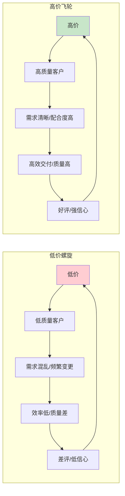
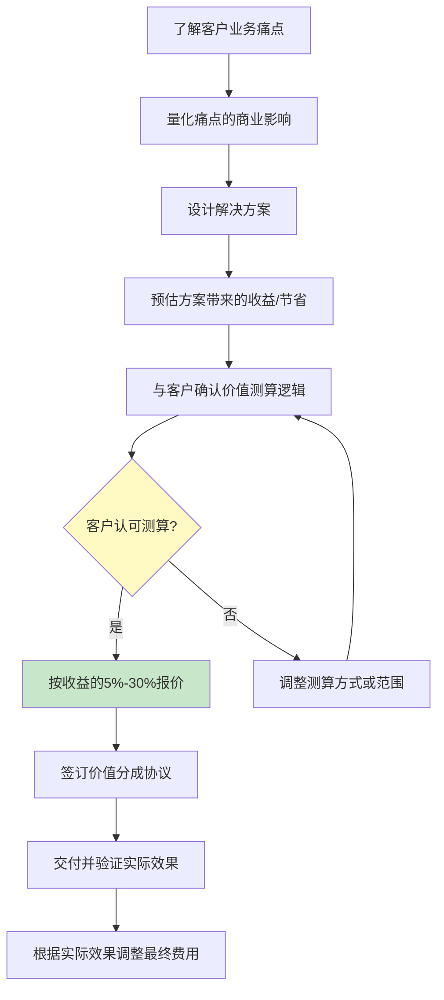
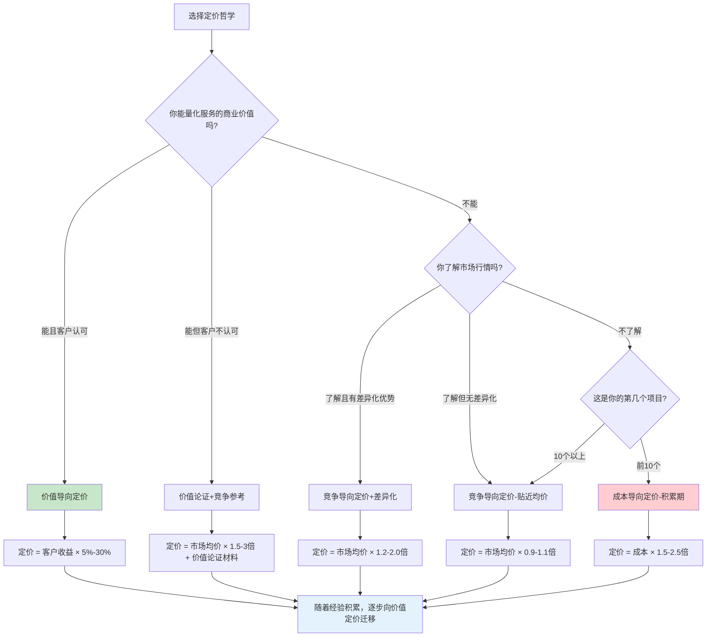
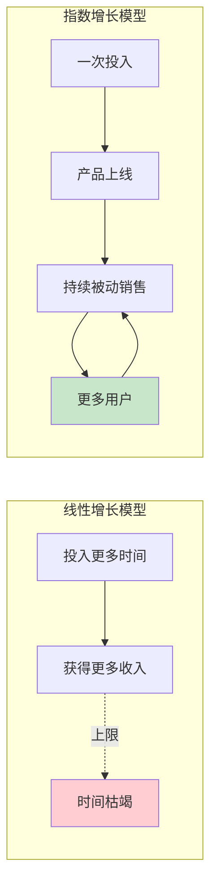

## 四、定价策略

定价是技术技能变现中最关键、也最容易被忽视的环节。大多数技术人员把精力花在提升技能、拓展渠道、打磨作品集上，却在定价这件事上凭直觉行事——"同行收多少我收多少"、"客户说贵我就降一点"、"先低价接单攒口碑再说"。这些做法的共同点是：**把定价权交给了别人**。

定价权的丧失意味着你永远在被动响应市场，而不是主动塑造收入。一个能独立完成复杂系统架构的高级工程师，如果定价方式和刚入行的初级开发者一样按天算钱，那他所有的经验、判断力和行业洞察都无法体现在收入上。

本章从理论层面建立定价的认知框架，帮你理解"价格到底由什么决定"、"为什么你的定价方式可能从根本上就是错的"、以及"怎样建立一套既符合市场规律又能最大化你收入的定价体系"。具体的定价工具、话术模板和实操案例，请参阅核心技巧篇的[定价策略深度解析](../核心技巧/11-十一定价策略深度解析.md)。

### 1. 价格的本质：超越"成本+利润"

#### 1.1 价格不是劳动时间的线性映射

技术人员最自然的定价方式是按时间计费：我花了多少小时，乘以我的时薪，就是报价。这种"成本导向定价"看似公平，实际上隐藏着一个致命的逻辑缺陷——**它惩罚效率**。

想象两个开发者接到同一个项目：开发者A用3天完成，开发者B用10天完成。如果按时间计费，A只收到B的30%报酬。但A的交付质量可能远高于B——因为他技术更熟练、经验更丰富、架构更合理。按时间计费等于说："你越厉害，我付你越少。"

这个悖论的根源在于：**客户购买的不是你的时间，而是问题的解决方案**。客户不在意你花了3天还是30天，他在意的是问题是否被解决、解决得好不好、能不能按时上线。价格应该与解决方案的价值挂钩，而不是与投入的时间挂钩。

理解这一本质区分，是从"卖时间"转向"卖价值"的认知基础。在后续的定价模型讨论中，你会看到这个区分如何影响定价的每一个环节——从报价方式到谈判策略，从合同条款到长期收入结构。

#### 1.2 价值三角模型

一个服务的价格由三个维度共同决定：

| 维度 | 含义 | 对价格的影响 | 技术服务中的体现 | 定价权重 |
|------|------|-------------|----------------|---------|
| **功能价值** | 解决了什么具体问题 | 决定价格下限 | 网站能正常运行、系统能处理预期负载 | 30%-40% |
| **情感价值** | 降低了什么焦虑和风险 | 打开溢价空间 | "不用担心上线崩溃"、"不用害怕数据丢失" | 35%-45% |
| **身份价值** | 给购买者带来什么社会信号 | 打开高端市场 | "请的是前大厂架构师"、"用的是行业最佳实践" | 15%-30% |

大多数技术人员的报价只体现了功能价值——"我帮你做了个网站，收你5000"。但如果这个网站是一个电商业务的核心系统，上线后每天带来10万营收，那5000元的报价等于你主动放弃了所有的情感价值和身份价值。

更关键的是：**情感价值往往是功能价值的2-5倍**。一个客户愿意花8000元请人做代码审计，不只是为了那份报告（功能价值），更是为了"上线后不会出安全事故"的确定性（情感价值）。一个企业愿意花3000元/小时请技术顾问，不只是为了那些建议，更是为了"这是行业专家给的方案，出了问题不是我的责任"的背书（身份价值）。

**价值三角的实际应用案例**：

某SaaS公司需要对其支付系统进行安全加固。三位工程师分别报价：

- 工程师A：8000元（"我帮你做安全审计，出一份报告"）——纯功能价值
- 工程师B：25000元（"我帮你做安全加固，包含审计+修复+上线后7天监控，确保上线后零安全事故"）——功能+情感价值
- 工程师C：60000元（"我是前某支付公司安全负责人，我帮你做端到端安全加固，含架构评审+代码审计+修复+渗透测试+安全培训。如果出安全事故我免费应急响应"）——功能+情感+身份价值

最终客户选了工程师C。原因很简单：支付安全事故的潜在损失是数百万级别，60000元的投入换来"行业专家背书+零事故保障"，对客户来说是极具性价比的选择。工程师A错失了订单，工程师B错失了溢价，只有工程师C同时体现了价值三角的全部维度。

**如何系统性地提升三个维度的价值表达**：

| 维度 | 提升方法 | 具体行动 |
|------|---------|---------|
| 功能价值 | 明确交付物清单 | 在报价中列出每一项交付物、验收标准、交付时间 |
| 情感价值 | 量化风险和损失 | 引用行业数据说明"不做这件事的代价" |
| 情感价值 | 提供保障承诺 | 上线后X天免费维护、紧急响应SLA、质量保证条款 |
| 身份价值 | 展示专业背书 | 过往案例、客户logo墙、行业认证、技术影响力 |
| 身份价值 | 使用专业语言 | 报价单中用"安全加固方案"而非"修Bug" |

#### 1.3 价格是信号，不是结果

经济学中有一个重要概念叫**信号传递（Signaling）**。在信息不对称的市场中，价格本身就是质量的信号。当客户无法直接评估你的技术水平时（大多数情况下都是如此），他们会用价格来反推质量。

这就是为什么低价竞争是一个死亡螺旋：价格越低 → 吸引的客户质量越差 → 项目越难做 → 你越疲惫 → 没时间提升 → 只能继续低价。而高价定位则是一个正向飞轮：价格高 → 吸引认真对待的客户 → 需求清晰、配合度高 → 项目好做、质量高 → 案例漂亮 → 支撑更高定价。



**信号传递的数据支撑**：一项针对Upwork平台5000名自由开发者的研究表明，时薪排名前20%的开发者，其客户满意度评分平均为4.8/5.0，而时薪排名后20%的开发者满意度仅为3.9/5.0。高价与高满意度之间的正相关关系，在技术服务领域尤为显著——因为高价筛选出了需求清晰、配合度高、尊重专业的客户群体。

**信号传递的反面——虚假信号的风险**：需要注意的是，高价信号只有在质量跟得上时才有效。如果你定价很高但交付质量差，信号会迅速反转——差评传播速度是好评的3倍以上。因此，高价策略的前提是你的交付能力确实配得上这个价格。如果你刚入行，与其一步到位定高价，不如用"略高于市场均价+优质交付"来逐步建立信号。

#### 1.4 定价的微观经济学基础

从微观经济学角度看，技术服务的定价受以下基本力量支配：

**边际成本递减效应**：你第一次为某个客户搭建CI/CD流水线可能需要40小时，但做第10个同类项目时可能只需要10小时。如果按成本定价，你的收入会随着效率提升而下降；只有切换到价值定价，才能捕获效率提升带来的利润。

**消费者剩余**：客户的"支付意愿"（WTP）和实际支付价格之间的差额叫消费者剩余。你的目标是缩小消费者剩余——不是宰客户，而是让你的服务定价更接近客户获得的真实价值，而不是远低于它。一个帮客户节省50万的技术方案，你收5万，客户仍然获得了45万的消费者剩余——这是双赢，不是剥削。

**价格弹性**：不同服务的价格弹性差异巨大。基础开发工作的替代品多、价格弹性高（涨价10%可能流失30%的客户）；而高难度架构设计、紧急故障排除的替代品少、价格弹性低（涨价30%可能只流失5%的客户）。理解你的服务的价格弹性，是制定正确定价策略的前提。

**信息不对称与逆向选择**：经济学家阿克洛夫的"柠檬市场"理论同样适用于技术服务市场。当客户无法区分高质量和低质量服务时，他们倾向于按均价付费，导致高质量服务者收入被低估。解决方法是**主动传递质量信号**——案例、认证、详细的技术方案、专业的报价流程——让客户有能力区分你和低价竞争者。

### 2. 三种定价哲学

所有定价方法都可以归入三种哲学，每种哲学背后是不同的世界观和适用场景。

#### 2.1 成本导向定价："我付出了多少"

**核心逻辑**：价格 = 成本 + 合理利润。成本包括时间成本、工具成本、机会成本等。

**适用场景**：
- 冷启动期，对市场行情没有概念时作为基准
- 标准化程度高的重复性工作（如模板建站、数据清洗）
- 需要向客户解释"为什么这么贵"时的成本明细支撑

**根本缺陷**：
成本导向定价的最大问题是**成本和价值之间没有必然关系**。你花了一周写一个自动化脚本，帮你客户每月节省100小时人工——这100小时的价值不会因为你只花了一周就变少。反过来，你花了一个月做的东西如果对客户没什么用，你也不应该因为花了一个月就收高价。

**什么时候必须放弃成本导向**：当你发现自己的报价上限被时薪锁死，而你清楚地知道自己的交付价值远超这个数字时，就该切换到价值导向定价了。

**成本导向定价的修正公式**：

```text
修正后的成本定价 = 直接成本 × 综合倍率

其中：
直接成本 = 时薪 × 预估工时 + 工具/服务费用 + 差旅等直接支出
综合倍率 = 基础倍率 × 风险系数 × 稀缺系数 × 紧急系数

基础倍率：1.5-2.5（覆盖管理、获客、闲置等间接成本）
风险系数：1.0-1.8（技术风险越高，系数越大）
稀缺系数：1.0-2.0（技能越稀缺，系数越大）
紧急系数：1.0-2.5（工期越紧，系数越大）
```

即使在成本导向定价中，综合倍率也应该反映你的专业稀缺性和项目复杂度。如果你用"成本×1.5"统一报价，你实际上在为低风险标准化项目补贴高风险复杂项目——这不合理。

**成本导向定价的隐藏成本清单**——多数技术人员计算成本时只算直接工时，忽略了以下隐性成本：

| 隐性成本 | 典型占比 | 说明 |
|---------|---------|------|
| 获客时间 | 15%-25% | 从找客户、沟通需求到签合同的时间 |
| 沟通协调 | 10%-20% | 需求确认、进度同步、修改确认 |
| 行政事务 | 5%-10% | 合同、发票、报税、记账 |
| 学习更新 | 5%-10% | 技术栈更新、工具学习 |
| 等待空窗 | 10%-20% | 项目间隙的无收入期 |
| 社保自缴 | 10%-15% | 自由职业者需自行缴纳社保 |

把这些都算上，一个自由职业者的**实际计费时间通常只占总工作时间的40%-55%**。如果你按8小时×22天=176小时来计算定价基准，你的实际收入会严重低于预期。

#### 2.2 竞争导向定价："同行收多少"

**核心逻辑**：参考市场上同类服务的价格区间，在上下一定范围内浮动。

**适用场景**：
- 标准化服务（如建站、小程序开发、SEO优化）
- 平台接单时，需要了解平台的价格生态
- 进入新领域时的初始定价参考

**根本缺陷**：
竞争导向定价的前提假设是"市场是理性的"——但技术服务市场远非理性。大量新手为了抢第一单疯狂压价，导致市场均价被严重低估。如果你以这个被扭曲的均价为基准定价，你等于在用最低水平从业者的价格来为自己的专业能力定价。

**正确使用方式**：把竞争导向定价作为**下限参考**而非**定价中枢**。了解市场均价是多少，然后思考"我的哪些差异化优势可以支撑高于均价的定价"。

**国内主流平台技术服务参考定价**（2024-2025年数据）：

| 服务类型 | 平台均价区间 | 头部报价区间 | 说明 |
|---------|------------|------------|------|
| 企业官网开发 | 3,000-15,000元 | 15,000-50,000元 | 模板站vs定制站差异巨大 |
| 小程序开发 | 5,000-30,000元 | 30,000-80,000元 | 复杂度和功能量决定上限 |
| 系统架构设计 | 500-2,000元/小时 | 2,000-5,000元/小时 | 需要行业案例背书 |
| 代码审计 | 5,000-20,000元 | 20,000-80,000元 | 代码量×复杂度系数 |
| 性能优化 | 10,000-50,000元 | 50,000-200,000元 | 价值定价空间极大 |
| 数据库优化 | 8,000-30,000元 | 30,000-150,000元 | 与业务规模挂钩 |
| 安全渗透测试 | 8,000-40,000元 | 40,000-200,000元 | 范围×深度系数 |
| 技术培训（天） | 2,000-8,000元/天 | 8,000-30,000元/天 | 企业内训vs公开课 |
| 技术顾问（小时） | 300-800元/小时 | 800-3,000元/小时 | 行业经验溢价显著 |

**注意**：上表为国内主流自由职业平台（猪八戒、程序员客栈、码市等）的综合数据。海外平台（Upwork、Toptal、Freelancer）的定价通常为国内的2-4倍。独立获客（非平台）的定价通常比平台高20%-50%，因为省去了平台佣金。

#### 2.3 价值导向定价："客户获得了多少"

**核心逻辑**：价格 = 客户获得的价值 × 分成比例。你帮客户赚了100万或省了100万，你收取其中的5%-30%。

**适用场景**：
- 高价值商业项目（性能优化提升转化率、自动化系统节省人力）
- 技术咨询（建议帮助客户避免了错误决策的损失）
- 行业深度服务（需要理解客户业务才能定价）

**价值导向定价的三个前提条件**：

1. **你能量化价值**：必须能用具体数字说明"你的服务给客户带来了多少收益/节省了多少成本"
2. **客户认可这个价值测算**：不是你单方面说"我帮你省了100万"，而是双方对测算逻辑达成共识
3. **你有议价能力**：客户信任你的专业判断，愿意为价值而非工时付费

**价值定价的完整操作流程**：



**价值导向定价的三个关键难点与解决方法**：

**难点一：如何量化"避免的损失"？**
有些服务的价值不是"创造了多少收益"，而是"避免了多少损失"。量化方法：
- 引用行业数据：如"数据泄露的平均损失为450万元"（IBM 2024年数据泄露报告）
- 引用同类案例：如"某客户上线后因性能问题每月损失约20万订单"
- 计算机会成本：如"如果不做自动化，你每月需要投入3人×20天=60人天×500元=30000元"

**难点二：如何处理"不确定性"？**
价值往往带有不确定性——优化后转化率是否真的能提升？安全加固后是否真的不会出事？处理方法：
- 分阶段付费：基础费用+效果分成。如"基础费用5万，优化后转化率每提升0.1%额外支付1万"
- 设定对赌条款：如"如果上线后90天内出现安全事故，全额退款"（前提是你对自己的交付有信心）
- 提供保险机制：如"首年免费维护，第二年起按年收费的20%收取维护费"

**难点三：如何说服按小时计费惯性的客户？**
很多企业采购部门习惯按小时结算，不理解价值定价。说服方法：
- 提供ROI计算器：展示"投入X元，预计获得Y收益"
- 引用标杆案例：展示同类客户的实际效果
- 降低感知风险：提供分阶段付费、里程碑验收等机制

**价值定价的分成比例参考**：

| 项目类型 | 建议分成比例 | 说明 |
|---------|------------|------|
| 直接创收型（如转化率优化） | 10%-30% | 收益可直接归因 |
| 成本节省型（如自动化） | 15%-25% | 节省金额明确 |
| 风险规避型（如安全加固） | 5%-15% | 损失是概率性的，需保守估算 |
| 战略决策型（如技术选型） | 3%-10% | 价值难以直接量化 |

#### 2.4 三种定价哲学的选择决策树



### 3. 定价背后的心理学机制

定价不只是经济学问题，更是心理学问题。理解以下几个心理学原理，能帮你在不改变任何服务内容的情况下提升成交率和客单价。

#### 3.1 锚定效应（Anchoring Effect）

人们对价格的判断不是基于绝对值，而是基于参照物。第一个出现在客户面前的价格数字会成为心理锚点，后续所有判断都以此为基准。

**实操应用**：

永远不要只给客户一个价格选项。至少提供三档：

| 档位 | 定位 | 价格策略 | 目的 | 选择率 |
|------|------|---------|------|--------|
| 高级版 | 价格锚点 | 成本 × 4-5倍 | 让中间档显得合理 | 10%-15% |
| 标准版 | 主力方案 | 成本 × 2-3倍 | 大多数客户的选择 | 60%-70% |
| 入门版 | 筛选门槛 | 成本 × 1.5倍 | 筛掉预算极低的客户 | 15%-25% |

当客户看到高级版25000元时，标准版8000元会觉得"很合理"。如果你只报8000元，客户的第一反应是"能不能再便宜点"。

**锚定效应的进阶应用**：

- **时间锚点**：先展示"这类项目市场上的标准周期是4周"，再报价"我3周可以交付"——客户会觉得你效率高
- **价值锚点**：先展示"同类事故给企业造成的平均损失是200万"，再报价"我的安全加固方案收费8万"——客户会觉得便宜
- **对比锚点**：先展示"招一个全职安全工程师年薪50万"，再报价"每月顾问费2万"——客户会觉得划算
- **第三方锚点**：引用行业报告或咨询公司的定价数据作为参照，而非自己报价——更客观可信
- **历史锚点**：展示你过去的报价增长曲线（如"去年同类项目报价1.8万，今年因为案例增加和能力提升调至2.2万"），让涨价显得合理

#### 3.2 损失厌恶（Loss Aversion）

人们对"损失"的敏感度是"收益"的2-3倍。同样的信息用"不做会损失多少"来表述，比"做了会收益多少"更有说服力。

**话术转换**：

| 无效表述（收益框架） | 有效表述（损失框架） | 心理机制 |
|---------------------|---------------------|---------|
| "做了性能优化后，转化率能提升0.4%" | "目前每流失1%的加载时间，每天损失约3万元订单" | 具体化损失金额 |
| "安全审计可以防止漏洞" | "不做安全审计，一次数据泄露的平均损失是450万元" | 引用行业数据放大感知 |
| "代码重构能提高开发效率" | "不重构的话，每月多花60人/时在维护上，每年成本约43万" | 年化放大损失 |
| "自动化测试能减少Bug" | "没有自动化测试，上次线上事故直接损失80万，修复又花了2周" | 用真实事故案例强化 |

**使用损失厌恶的注意事项**：

1. **必须基于事实**：编造数据一旦被拆穿，信任瞬间崩塌。引用行业报告、客户自身数据或同类案例
2. **量化要精确**：说"可能损失几十万"不如说"按当前日均交易额计算，宕机1天损失约27万"——精确数字更有说服力
3. **不要过度恐吓**：目的是让客户理性评估风险，不是制造恐慌。过度恐吓会让客户觉得你在推销

#### 3.3 诱饵效应（Decoy Effect）

在两个选项中加入一个"明显不如其中一个"的第三选项，可以显著提升目标选项的选择率。行为经济学家Dan Ariely在《怪诞行为学》中详细论证了这一效应。

**经典案例**：

- 选项A：基础服务，5000元
- 选项B：全套服务，10000元
- 大多数人会犹豫，觉得A也不错

加入诱饵后：
- 选项A：基础服务，5000元
- 选项A+：基础服务+3个月维护，9000元 ← **诱饵**
- 选项B：全套服务+3个月维护+1年技术支持，10000元

现在B显得极其划算——只比A+多1000元，却多了那么多内容。大多数人会选B。诱饵A+的目的不是被选中，而是让B看起来更有价值。

**诱饵效应在技术报价中的三种应用模式**：

**模式一：价值诱饵**——诱饵选项的价格与主力选项接近，但价值远低于主力选项

| 选项 | 内容 | 价格 |
|------|------|------|
| 基础版 | 网站开发 | 8,000元 |
| 标准版（诱饵） | 网站开发+3个月维护 | 18,000元 |
| 高级版（主力） | 网站开发+6个月维护+SEO优化+性能优化 | 20,000元 |

**模式二：范围诱饵**——诱饵选项的范围看似更大，但核心价值不如主力选项

| 选项 | 内容 | 价格 |
|------|------|------|
| 单项审计 | 代码审计 | 15,000元 |
| 全面审计（诱饵） | 代码审计+文档审查+架构评估 | 35,000元 |
| 深度加固（主力） | 代码审计+安全加固+修复+渗透测试+上线后监控 | 38,000元 |

**模式三：时间诱饵**——诱饵选项用更长周期包装相同价值

| 选项 | 内容 | 价格 |
|------|------|------|
| 按月顾问 | 每月8小时咨询 | 8,000元/月 |
| 按季顾问（诱饵） | 每季20小时咨询 | 20,000元/季 |
| 年度顾问（主力） | 不限次数咨询+紧急响应+季度技术评审 | 60,000元/年 |

**诱饵设计的三个原则**：
1. 诱饵必须与主力选项在同一个比较维度上（价格或范围或时间），不能跨维度比较
2. 诱饵与主力的价格差要小（通常<20%），但价值差要大（通常>50%）
3. 诱饵本身不能太离谱——如果客户发现诱饵明显不合理，会质疑你的专业性

#### 3.4 稀缺性与紧迫感

稀缺性直接影响感知价值。当你的服务看起来"随时都能买到"时，客户不着急；当你的服务看起来"档期有限"时，客户决策速度加快。

**制造稀缺的合理方式**（必须是真实的，不能造假）：

- **时间稀缺**："本月仅剩2个项目排期"——前提是你确实产能有限
- **早鸟价稀缺**："前10位客户享受8折"——用真实的早期优惠换取快速起步
- **季节稀缺**："年底企业预算消化期，Q4预约价格上浮15%"——基于真实的供需波动
- **产能稀缺**："同时只接3个深度项目"——限制并发项目数，确保交付质量
- **技能稀缺**："国内做这个方向的不超过20人"——如果你的技能确实稀缺

**稀缺性的心理学原理**：Robert Cialdini在《影响力》中指出，稀缺性触发的是"损失厌恶"——客户害怕的不是"得不到好东西"，而是"失去选择的机会"。所以"仅剩2个排期"比"本月有优惠"更有说服力，因为前者暗示的是"不行动就失去机会"。

**稀缺性的反面——丰裕信号的危害**：如果你在沟通中传递出"我随时有空"、"我可以马上开始"、"最近项目不多"等信号，客户会下意识地认为你的服务不抢手，从而降低对你的价值评估。即使你确实有空，也应该说"我可以为您的项目预留下周的时间"，而不是"我最近很闲"。

#### 3.5 价格-质量启发式（Price-Quality Heuristic）

消费者心理学中的一个核心发现是：当缺乏其他质量信号时，人们会用价格来推断质量。这个效应在专业服务市场尤其强烈，因为客户很难直接评估你的技术水平。

**实操含义**：

- 你的报价单本身就是你的"产品包装"——格式粗糙的报价单传递的是"不专业"的信号
- 你的报价流程本身就是质量信号——"您方便的话我马上发报价"比"我先了解一下您的需求，24小时内给您详细的方案和报价"传递的信号质量低得多
- 你的定价结构本身就是价值信号——"5000元做个网站"vs"企业官网定制方案：含需求分析(10%)+UI设计(25%)+前端开发(30%)+后端开发(25%)+测试部署(10%)，总价25000元"——后者不仅价格更高，更传递了"专业、系统、可信赖"的信号

#### 3.6 价格框架效应（Framing Effect）

同样的价格，不同的呈现方式会导致截然不同的接受度。价格框架的核心是**改变客户比较的参照系**。

**六种价格框架技术**：

| 框架技术 | 原理 | 示例 |
|---------|------|------|
| **时间分摊** | 将总价分解为小单位 | "每天只需166元"（5000元/月的顾问费） |
| **价值对比** | 与更大金额对比 | "只占项目总预算的3%"（安全审计费vs项目投资） |
| **替代对比** | 与更贵的替代方案对比 | "比招全职便宜80%"（顾问费vs全职成本） |
| **收益倍数** | 强调投入产出比 | "投入2万，预计回报15倍" |
| **成本分解** | 拆解到每个模块的单价 | "每个功能模块仅需2500元" |
| **历史对比** | 展示过去的涨价或行业涨价趋势 | "相比去年行业均价涨了15%，我的涨幅仅8%" |

**框架效应的组合使用**：最有效的做法是同时使用2-3种框架。例如："这份安全加固方案总价6万元，占您系统投资额的2%（价值对比），平均每天不到170元（时间分摊），比雇佣全职安全工程师便宜85%（替代对比）。考虑到一次安全事故的平均损失是450万元（损失框架），这是一笔非常划算的投入。"

#### 3.7 打包效应（Bundling Effect）

打包定价比单独定价更容易让客户接受总价。原因是：当多个服务打包后，客户很难逐项比价，从而降低了价格敏感度。

**打包定价的三种模式**：

**模式一：核心+增值包**
核心服务单独定价，增值服务打包提供折扣。

```text
核心服务：网站开发 — 25,000元
增值包A（SEO+性能优化+6个月维护）：+8,000元（原价15,000元，打包价节省7,000元）
全套方案：33,000元
```

**模式二：套餐分级包**
将不同服务组合成3个等级的套餐。

| 套餐 | 内容 | 单项总价 | 套餐价 | 折扣 |
|------|------|---------|-------|------|
| 铜牌 | 网站开发 | 25,000元 | 25,000元 | — |
| 银牌 | 网站+SEO+维护6个月 | 40,000元 | 32,000元 | 20% |
| 金牌 | 网站+SEO+性能优化+维护12个月+紧急响应 | 58,000元 | 42,000元 | 28% |

**模式三：年度服务包**
将一次性服务转化为年度订阅。

```text
年度技术保障包：72,000元/年（6,000元/月）
包含：每月系统健康检查 + 安全扫描 + 紧急故障响应(4小时内) + 季度技术评审
单独购买这些服务约需120,000元/年
```

**打包的心理学机制**：打包让客户从"要不要买这个"（yes/no决策）变为"选哪个套餐"（A/B/C决策），降低了不购买的可能性。同时，打包后的折扣让客户感到"赚到了"，提升了购买满足感。

### 4. 定价模型的经济学分析

#### 4.1 六种定价模型的收入曲线对比

不同的定价模型产生完全不同的收入增长曲线：

| 定价模型 | 收入公式 | 收入增长曲线 | 收入天花板 | 核心瓶颈 | 适合阶段 |
|---------|---------|------------|-----------|---------|---------|
| 按小时计费 | 时薪 × 工时 | 线性 | 低（受限于可用时间） | 一天只有24小时 | 入门期 |
| 按项目计费 | 项目数 × 单价 | 阶梯式 | 中 | 项目获取和管理能力 | 成长期 |
| 按价值计费 | 客户收益 × 分成 | 跳跃式 | 高 | 价值量化和议价能力 | 成熟期 |
| 订阅/月费 | 用户数 × 月费 | 指数增长 | 极高 | 用户留存率 | 成熟期 |
| 按成果计费 | 结果指标 × 单价 | 不确定 | 高 | 结果可控性 | 成熟期 |
| 产品化服务 | 销量 × 单价 | 指数增长 | 极高 | 产品标准化程度 | 高级期 |



**收入天花板的量化对比**：

假设你是一名高级后端工程师，月收入目标50000元：

| 定价模型 | 达成月收入5万的条件 | 可行性评估 |
|---------|-------------------|----------|
| 按小时 | 时薪300元 × 每月167小时 ≈ 每天工作7.5小时 | 可行但疲惫，无增长空间 |
| 按项目 | 每月完成2个2.5万的项目 | 需要稳定的获客能力 |
| 按价值 | 1个帮客户节省200万的项目，收2.5万 | 需要深度行业理解 |
| 订阅制 | 25个客户 × 每月2000元维护费 | 需要前期积累，一旦达成则稳定 |
| 产品化 | 月销100份500元的工具/模板 | 需要产品开发能力和推广 |

**关键洞察**：没有"最好"的定价模型，只有"最适合当前阶段"的定价模型。而且最优策略往往是**多种模型并行**——用项目定价维持基本收入，用价值定价做大客户，用订阅/产品化构建被动收入。

#### 4.2 定价模型的进化路径

成功的技术服务从业者通常会经历定价模型的四阶段进化：

**第一阶段：时间定价**（入门期，0-1年）

按小时或按天收费。优势是简单透明，容易向客户解释。劣势是收入上限受限于可用时间，且惩罚效率。大多数人在平台接单时处于这个阶段。

**典型时薪参考**（2024-2025年国内数据）：

| 经验水平 | 平台时薪 | 独立获客时薪 | 海外平台时薪（美元） |
|---------|---------|------------|-------------------|
| 初级（1-2年） | 80-150元 | 150-300元 | $15-30 |
| 中级（3-5年） | 150-300元 | 300-600元 | $30-60 |
| 高级（5-8年） | 300-500元 | 500-1200元 | $60-120 |
| 专家（8年+） | 500-800元 | 800-3000元 | $100-250 |
| 行业权威 | — | 2000-5000元 | $200-500 |

**第二阶段：项目定价**（成长期，1-3年）

按项目整体报价。报价中包含了风险溢价（通常1.2-1.8倍），收入开始与价值脱钩。优势是激励效率——你越快完成，实际时薪越高。劣势是项目评估不准可能导致亏损。

**项目定价的核心技巧——工作分解结构（WBS）估价法**：

```text
1. 将项目拆解为可独立估算的任务单元
2. 对每个任务估算"乐观时间"和"悲观时间"
3. 使用三点估算法：预期时间 = (乐观 + 4×最可能 + 悲观) / 6
4. 汇总总时间，乘以目标时薪
5. 加入风险溢价（15%-30%）和管理沟通时间（20%-30%）
6. 得出项目报价

示例：
任务A：乐观10h，最可能15h，悲观25h → 预期15.8h
任务B：乐观5h，最可能8h，悲观20h → 预期9.2h
任务C：乐观20h，最可能30h，悲观50h → 预期31.7h
总预期：56.7h
目标时薪：300元
基础报价：17,010元
风险溢价(+20%)：20,412元
管理沟通(+25%)：25,515元
最终报价：25,000元（取整）
```

**第三阶段：价值定价**（成熟期，3-5年）

按客户获得的商业价值定价。需要深入理解客户业务，能用数据证明你的服务价值。优势是收入天花板极高——一个帮企业节省500万的方案，收50万合情合理。劣势是对沟通能力和行业知识要求很高。

**第四阶段：产品化定价**（高级期，5年+）

将服务标准化为可重复销售的产品（课程、工具、SaaS、模板）。一次投入，反复销售，边际成本趋近于零。优势是突破了时间限制，实现被动收入。劣势是需要前期投入大量时间，且市场验证存在不确定性。

这四个阶段不是互相替代的，而是**可以并行的**。最理想的状态是：保留高价值客户的价值定价项目（收入高），同时经营产品化收入（被动收入），两条腿走路。

#### 4.3 订阅制定价：从一次性交易到持续收入

订阅制定价是技术服务中被严重低估的模型。大多数人只想到"按项目做一单收一单"，但订阅制可以让你的收入从不稳定变得可预测。

**技术服务中可行的订阅模式**：

| 订阅类型 | 月费区间 | 包含内容 | 适合对象 |
|---------|---------|---------|---------|
| 技术维护订阅 | 1,000-5,000元/月 | Bug修复、安全更新、性能监控、每月技术报告 | 有网站/系统的企业 |
| 技术顾问订阅 | 3,000-15,000元/月 | 每月N小时咨询、紧急响应、技术方案评审 | 有技术团队的企业 |
| 开发能力订阅 | 8,000-30,000元/月 | 每月N天驻场/远程开发支持 | 中小企业 |
| 安全监控订阅 | 5,000-20,000元/月 | 7×24安全监控、漏洞扫描、应急响应 | 对安全要求高的企业 |
| CTO即服务 | 15,000-50,000元/月 | 技术战略规划、团队管理、架构决策、投资人技术沟通 | 早期创业公司 |

**订阅制vs单次定价的经济学对比**：

假设你每月有100小时可计费时间：

| 指标 | 纯项目制 | 50%订阅+50%项目 |
|------|---------|----------------|
| 收入可预测性 | 低（月波动±50%） | 高（月波动±15%） |
| 获客成本 | 高（每单都要获客） | 低（订阅客户持续付费） |
| 计费时间占比 | 50%-65% | 70%-85%（订阅客户沟通效率高） |
| 月均收入 | 20,000-40,000元 | 30,000-55,000元 |
| 稳定性 | 差（有淡旺季） | 好（订阅收入兜底） |
| 抗风险能力 | 低 | 高 |

**如何从项目制过渡到订阅制**：

1. **在项目合同中嵌入维护条款**：每个项目交付后，提供3-6个月免费维护期，到期前一个月续约为付费订阅
2. **提供"订阅优惠"**：订阅客户的项目报价打85折，换取持续合作关系
3. **创建"紧急响应"订阅**：只承诺紧急情况下的快速响应（4小时内），不需要每月投入大量时间，但客户愿意为此付费
4. **提供"技术健康检查"订阅**：每月一份系统健康报告+1次30分钟咨询，工作量极小但价值感强

**订阅制的关键风险——客户流失管理**：

订阅制的核心指标是**月度流失率（Churn Rate）**。行业基准数据：
- 月度流失率<3%：优秀（客户粘性极强）
- 月度流失率3%-5%：健康（正常水平）
- 月度流失率5%-10%：需要关注（检查服务质量）
- 月度流失率>10%：危险（产品或定价存在根本问题）

降低流失率的策略：
1. **定期交付可见价值**：每月发送"本月为您做的工作和产生的价值"报告
2. **建立切换成本**：深度接入客户系统，让换人的代价增大
3. **提供升级路径**：基础订阅→标准订阅→高级订阅，让客户在体系内升级而非流失
4. **预警机制**：当客户咨询频率下降时，主动联系了解原因

#### 4.4 供需关系与定价权

定价权的本质是**供需关系中的议价地位**。以下因素直接影响你的定价权：

| 因素 | 增强定价权 | 削弱定价权 |
|------|----------|----------|
| **稀缺性** | 掌握冷门但需求大的技能 | 会的人很多，供大于求 |
| **不可替代性** | 行业经验+技术的复合能力 | 纯技术能力，AI也能做 |
| **紧急程度** | 客户急需，48小时内要结果 | 客户不急，可以慢慢找 |
| **转换成本** | 已深入客户系统，换人代价大 | 刚开始合作，换人无损失 |
| **信任积累** | 多次合作，有成功案例 | 首次合作，需要证明自己 |
| **品牌背书** | 大厂经历、开源项目、行业影响力 | 无公开背书 |
| **信息不对称** | 你比客户更懂这个领域 | 客户自己也能评估方案质量 |

**定价权自评矩阵**：

给以下每个因素打分（1-5分），总分反映你的定价权强度：

```text
定价权自评表

1. 技能稀缺性        [ ]分  （1=很多人会，5=国内不超过50人）
2. 行业经验深度       [ ]分  （1=通用技术，5=深度行业know-how）
3. 紧急响应能力       [ ]分  （1=需要排期，5=48小时内启动）
4. 客户转换成本       [ ]分  （1=随时可换人，5=换人代价极大）
5. 历史成功案例       [ ]分  （1=无案例，5=10+可量化成功案例）
6. 品牌背书          [ ]分  （1=无公开背书，5=行业知名+媒体报道）
7. 客户依赖程度       [ ]分  （1=一次性项目，5=核心系统运维）
8. 信息优势           [ ]分  （1=客户也能评估，5=客户完全依赖你的判断）

总分评级：
32-40分：定价权极强，可大胆采用价值定价+溢价
24-31分：定价权较强，可采用价值定价
16-23分：定价权一般，竞争导向+差异化定价
8-15分：定价权弱，成本导向+快速积累案例
```

**关键洞察**：定价权不是一个静态的"有没有"的问题，而是一个可以持续积累的资产。每积累一个成功案例、每发表一篇技术文章、每获得一个客户好评，你的定价权都在增长。反过来，每一次低价竞争、每一次不专业的交付，都在消耗你的定价权。

### 5. 定价中的常见认知陷阱

#### 5.1 "便宜才能接到单"谬论

这是技术人最普遍也最有害的认知偏差。事实是：

- **低价吸引的是低质量客户**：预算有限的客户往往需求也不清晰、配合度低、期望值却很高
- **低价压缩了你的利润空间**：导致你没有时间做高质量交付，结果质量下降，口碑变差
- **低价发出了"我不够好"的信号**：回到信号传递理论——客户用价格推断质量
- **低价竞争没有赢家**：当所有人都在降价时，整个市场被压缩，没有人能赚到钱

**数据佐证**：研究表明，在专业服务领域，中等偏高定价的服务提供者，其客户满意度和续费率**高于**最低价的服务提供者。原因很简单：合理的定价保证了足够的投入时间，投入时间保证了交付质量，交付质量带来了客户满意度。

**一个真实的反直觉案例**：某前端开发者在程序员客栈平台接单，将个人介绍页面的报价从"响应式网站3000元起"改为"企业级前端方案15000元起"。询价量下降了60%，但成交率从15%提升到45%，月均收入反而增长了120%。更重要的是，高价客户的需求清晰度、配合度和满意度远高于低价客户。

#### 5.2 "等我技术更好了再涨价"谬论

这种想法看似合理，实际上是一个无限期推迟涨价的借口。技术永远在进步，你永远可以找到"还不够好"的理由。事实是：

- 你的客户不是在和"完美的你"比，而是在和"市场上的替代方案"比
- 如果你的交付已经能满足客户需求，你就有资格收合理的费用
- 涨价是一个持续渐进的过程，不是等到某个完美时刻的一步到位
- **你当前的水平，已经超过了很多人**——你服务的客户不是在找世界顶级专家，而是在找能解决他们问题的人

**涨价的正确节奏**：每完成3-5个成功项目，涨价10%-15%。这不是突然翻倍吓跑客户，而是随着案例积累和能力提升的自然增长。如果客户问为什么涨价了，你的回答应该是："随着我在这个领域的项目经验增加（展示新案例），我能提供更高质量的交付和更深入的行业理解。"

#### 5.3 "客户预算就这么多"谬论

当客户说"我们预算只有X"时，大多数技术人员的第一反应是降价。但"预算有限"往往只是谈判策略，或者客户对你的服务价值认知不足。

**客户说"预算有限"的三种真实含义**：

1. **真的预算有限**（占30%）：通常是小微企业或创业公司
2. **试探你的底价**（占50%）：预算有弹性，但想看看能不能更便宜
3. **对价值认知不足**（占20%）：不理解你的服务值多少

**正确的应对不是降价，而是重新定义范围**：

| 客户说法 | 错误应对 | 正确应对 |
|---------|---------|---------|
| "预算只有1万" | "好吧，1万我也做" | "1万的预算我们可以做核心功能A和B，功能C和D放到下一期。您看这个范围可以吗？" |
| "别人报价才3000" | "那我也3000吧" | "报价差异通常反映了服务范围和质量的不同。您方便把对方的报价方案发给我看看吗？我帮您做个对比分析。" |
| "先做一版看看效果" | "好，我先做个Demo" | "我理解您的顾虑。我们可以从一个付费的需求分析和方案设计开始（2000元），让您看到具体的技术方案后再决定是否继续。" |
| "这次预算紧，下次给高价" | "行吧，先这样" | "我理解预算压力。这次我们可以按标准报价做基础版，下一期如果有更多预算我们再扩展。" |

**核心原则**：调整范围比降价更专业。降价是在说"我不值那么多"，调整范围是在说"这个范围的工作值这个钱"。

#### 5.4 "免费试做/先做一版看看效果"谬论

"先做一个Demo/原型给我看看"是技术人最容易踩的坑之一。你在没有确定合作的情况下投入了大量时间，客户看完后可能说"方向不太对"或者"我再考虑考虑"，你的投入全部沉没。

**原则：任何需要投入超过2小时的工作，都必须收费。**

如果客户需要看到效果才愿意合作，你可以：
- 提供付费的需求分析和方案设计（500-2000元）
- 展示过往的同类案例（而不是免费做一个新的）
- 提供付费的概念验证（POC），明确约定范围和费用
- 提供一个"试用期"折扣——不是免费做，而是首期打折

**"免费试做"的真实成本计算**：

假设你的时薪是300元，一个Demo需要8小时：
- 直接成本：300 × 8 = 2400元
- 机会成本：这8小时本可以用来服务付费客户
- 成交率：免费Demo的成交率通常只有20%-30%
- 实际获客成本：2400 ÷ 25% = 9600元/单

相比之下，付费的需求分析（2000元）：
- 成交率：50%-70%（付费客户更认真）
- 实际获客成本：2000 ÷ 60% = 3333元/单

**结论：免费试做的获客成本是付费前置服务的3倍。**

#### 5.5 "我不好意思收高价"心理障碍

很多技术人员有"冒充者综合征"（Impostor Syndrome）——觉得自己不配收高价。这种心理障碍的根源是对自身价值的认知偏差。

**克服方法**：

1. **量化你的价值**：把你的技能换算成客户能理解的商业价值。"我帮你做的自动化脚本，每月节省3人×5天=15人天×800元=12000元。我的收费是一次性2万，客户2个月就回本了。"
2. **看看同行在收什么**：不是为了跟风，而是为了校准——你的报价在市场中处于什么位置
3. **记录客户反馈**：每次收到正面反馈时记录下来。当你怀疑自己的价值时，翻看这些记录
4. **从小幅涨价开始**：每次涨10%-15%，观察客户反应。大多数情况下你会发现——客户根本不在意这10%

#### 5.6 "一口价"谬论

很多技术人员习惯给一个总价，不拆分报价。这有两个问题：

1. **客户看不到价值构成**：不知道钱花在哪里，容易觉得"贵"
2. **你失去了调价灵活性**：如果客户砍价，你只能在总价上打折

**正确的做法是模块化报价**：

```text
网站开发方案报价

1. 需求分析与架构设计     5,000元   （占比20%）
2. UI/UX设计             6,250元   （占比25%）
3. 前端开发              7,500元   （占比30%）
4. 后端开发              6,250元   （占比25%）
5. 测试与部署            （包含在上述费用中）
总计：25,000元

增值服务：
- SEO基础优化            +3,000元
- 性能优化               +5,000元
- 6个月维护              +4,000元/月

可选方案：
- 去掉后端开发（使用无代码方案）    -6,250元 → 总计18,750元
- UI设计使用模板                  -4,250元 → 总计20,750元
```

模块化报价的好处：客户可以"砍掉"不需要的模块，而不是砍你的单价。你保住了单价，客户得到了预算控制感——双赢。

#### 5.7 "新客户和老客户同一价"谬论

很多技术人员对所有客户统一定价，忽略了客户关系的长期价值差异。

**新客户vs老客户的成本差异**：

| 指标 | 新客户 | 老客户 |
|------|-------|-------|
| 获客时间 | 5-15小时 | 0小时 |
| 需求沟通 | 3-8小时 | 1-2小时 |
| 信任成本 | 需要大量证明 | 已有信任基础 |
| 成交率 | 20%-40% | 60%-80% |
| 付款风险 | 中高 | 低 |
| 项目配合度 | 需要磨合 | 高效默契 |

**老客户的价值远超单次交易价格**。一个老客户如果每年给你带来3个项目（每个3万），3年就是27万。如果因为涨价10%（多收9000元）流失了这个客户，你损失的是27万的终身价值。

**对老客户的定价策略**：
- 保持价格稳定或温和涨价（5%-8%/年）
- 提供"忠诚折扣"：续约打9折、预付打85折
- 优先排期、免费小修改等非价格优惠
- 老客户推荐新客户时给予推荐奖励

#### 5.8 "报价越详细越专业"谬论

虽然模块化报价是好的，但**过度详细的报价会适得其反**。

**过度报价的症状**：
- 报价单超过5页
- 列出20+个细分项
- 包含大量技术术语
- 每项都有详细的时间估算

**问题**：
1. 客户看不懂，失去耐心
2. 每一项都是潜在的谈判靶子——客户可以逐项砍价
3. 暴露了你的估价逻辑，让客户有机会"自己算"

**正确的详细程度**：
- 5-8个主要模块（客户能理解的维度）
- 每个模块一句话说明
- 总价突出，模块价格在第二层
- 细节（技术栈、工时估算）留到签约后

### 6. 建立个人定价体系

#### 6.1 定价体系的四个层次

一个成熟的个人定价体系不是"每单议价"，而是一个有层次、有逻辑、可复用的系统：

| 层次 | 内容 | 作用 |
|------|------|------|
| **定价基准** | 你的时薪底线和目标时薪 | 所有报价的最低保障 |
| **服务目录** | 标准化的服务项和对应价格区间 | 快速响应客户询价 |
| **三档报价** | 每个服务的入门/标准/高级三档 | 引导客户选择主力方案 |
| **溢价规则** | 什么情况下可以/应该加价 | 不遗漏溢价机会 |

#### 6.2 确定你的定价基准

定价基准是你的"价格底线"——低于这个数字的项目不值得接。

**计算方法**：

```text
月收入目标 = 生活成本 + 储蓄目标 + 业务发展投入
月有效工作天数 = 自然月天数 - 周末 - 假期 - 获客时间 - 行政事务时间
             ≈ 22天 × 60% = 13-14天（真实可计费天数）

日薪底线 = 月收入目标 ÷ 月有效工作天数

示例：
月收入目标：25000元
月有效工作天数：14天
日薪底线 = 25000 ÷ 14 ≈ 1786元/天

小时底线 = 1786 ÷ 8 ≈ 223元/小时
```

**重要提醒**：有效工作天数不是日历天数的100%。你有大量时间花在获客、沟通、行政、学习、等待客户反馈等非计费活动上。一般独立从业者的计费时间只占总工作时间的50%-65%。如果你忽略了这一点，你的实际收入会远低于预期。

**完整的定价基准计算器**（Python脚本）：

```python
def calculate_pricing_baseline(
    monthly_living_cost: float,      # 月生活成本
    monthly_saving_target: float,    # 月储蓄目标
    monthly_biz_investment: float,   # 月业务投入（工具、学习、营销等）
    working_days_per_month: int = 22, # 每月工作日
    billable_ratio: float = 0.60,    # 计费时间占比
    hours_per_day: float = 8.0,      # 每日工作小时
    profit_multiplier: float = 2.0,  # 利润倍率（覆盖风险、闲置等）
) -> dict:
    """计算个人定价基准线"""
    
    monthly_income_target = monthly_living_cost + monthly_saving_target + monthly_biz_investment
    effective_billable_days = working_days_per_month * billable_ratio
    effective_billable_hours = effective_billable_days * hours_per_day
    
    daily_floor = monthly_income_target / effective_billable_days
    hourly_floor = monthly_income_target / effective_billable_hours
    
    # 建议报价（含利润倍率）
    suggested_daily_rate = daily_floor * profit_multiplier
    suggested_hourly_rate = hourly_floor * profit_multiplier
    
    # 年收入预估
    annual_income_at_floor = daily_floor * effective_billable_days * 12
    annual_income_at_suggested = suggested_daily_rate * effective_billable_days * 12
    
    return {
        "monthly_income_target": monthly_income_target,
        "effective_billable_days_per_month": round(effective_billable_days, 1),
        "effective_billable_hours_per_month": round(effective_billable_hours, 1),
        "daily_floor": round(daily_floor, 0),
        "hourly_floor": round(hourly_floor, 0),
        "suggested_daily_rate": round(suggested_daily_rate, 0),
        "suggested_hourly_rate": round(suggested_hourly_rate, 0),
        "annual_income_at_floor": round(annual_income_at_floor, 0),
        "annual_income_at_suggested": round(annual_income_at_suggested, 0),
    }


# 示例用法
result = calculate_pricing_baseline(
    monthly_living_cost=8000,
    monthly_saving_target=5000,
    monthly_biz_investment=3000,
    billable_ratio=0.60,
    profit_multiplier=2.0,
)

print("=== 定价基准计算结果 ===")
print(f"月收入目标: {result['monthly_income_target']}元")
print(f"月计费天数: {result['effective_billable_days_per_month']}天")
print(f"月计费小时: {result['effective_billable_hours_per_month']}小时")
print(f"日薪底线: {result['daily_floor']}元")
print(f"时薪底线: {result['hourly_floor']}元")
print(f"建议日薪: {result['suggested_daily_rate']}元")
print(f"建议时薪: {result['suggested_hourly_rate']}元")
print(f"年收入（底线）: {result['annual_income_at_floor']}元")
print(f"年收入（建议）: {result['annual_income_at_suggested']}元")
```

**输出示例**：

```text
=== 定价基准计算结果 ===
月收入目标: 16000元
月计费天数: 13.2天
月计费小时: 105.6小时
日薪底线: 1212元
时薪底线: 152元
建议日薪: 2424元
建议时薪: 303元
年收入（底线）: 192000元
年收入（建议）: 384000元
```

#### 6.3 建立服务目录

服务目录是你的"价目表"——标准化的服务项和对应价格区间。它让你在面对客户询价时能快速响应，而不是每次都从零开始估价。

**服务目录模板**：

```markdown
# 我的服务目录

## 前端开发类
| 服务项 | 价格区间 | 交付周期 | 备注 |
|--------|---------|---------|------|
| 响应式企业官网 | 15,000-40,000元 | 2-4周 | 含设计+开发+部署 |
| 后台管理系统 | 25,000-80,000元 | 3-8周 | 按功能模块计费 |
| 小程序开发 | 20,000-60,000元 | 3-6周 | 含UI设计+前后端 |

## 架构咨询类
| 服务项 | 价格区间 | 交付周期 | 备注 |
|--------|---------|---------|------|
| 系统架构评审 | 8,000-30,000元 | 1-2周 | 含评审报告+改进建议 |
| 技术选型咨询 | 3,000-10,000元 | 3-5天 | 含选型报告+迁移方案 |
| 性能瓶颈分析 | 10,000-50,000元 | 1-3周 | 含诊断报告+优化方案 |

## 溢价服务类
| 服务项 | 价格区间 | 交付周期 | 备注 |
|--------|---------|---------|------|
| 紧急故障排查 | 基础价×2.0 | 24-48小时 | 48小时内响应 |
| 涉及核心系统改造 | 基础价×1.5 | — | 需额外风险溢价 |
| 涉及合规要求（等保/GDPR） | 基础价×1.3 | — | 需合规知识 |
```

**注意事项**：服务目录不是固定不变的。每季度复盘一次，根据市场反馈和自身能力变化调整价格区间。

#### 6.4 溢价规则清单

溢价规则是你的"加价条件清单"——遇到以下情况时，你应该主动加价，而不是维持基础报价：

**项目复杂度溢价**：

| 溢价条件 | 溢价幅度 | 依据 |
|---------|---------|------|
| 涉及多个系统集成 | +20%-40% | 集成复杂度呈指数增长 |
| 涉及核心业务系统（支付/订单） | +30%-50% | 故障影响巨大，需额外谨慎 |
| 涉及数据迁移 | +20%-30% | 数据丢失风险不可逆 |
| 需要支持高并发（1万+QPS） | +30%-50% | 技术难度和测试成本高 |
| 涉及合规要求（等保/GDPR/HIPAA） | +20%-40% | 合规知识稀缺 |

**时间压力溢价**：

| 溢价条件 | 溢价幅度 | 依据 |
|---------|---------|------|
| 48小时内紧急启动 | +50%-100% | 需要中断当前工作优先处理 |
| 周末/节假日工作 | +100% | 法定加班工资标准 |
| 交付周期压缩50%以上 | +30%-50% | 需要加班或减少测试 |
| 全天候待命 | +80%-150% | 机会成本极高 |

**客户特殊要求溢价**：

| 溢价条件 | 溢价幅度 | 依据 |
|---------|---------|------|
| 要求签署NDA（保密协议） | +10%-20% | 限制了案例复用 |
| 要求驻场办公 | +20%-40% | 通勤成本+无法并行接其他项目 |
| 要求提供源码+完全知识产权 | +30%-50% | 失去了代码复用权 |
| 要求提供发票（非自然人） | +5%-10% | 税务成本 |
| 多轮需求变更（超出约定范围） | 按变更量计费 | 项目管理成本 |

**溢价的沟通话术**：

不要直接说"这个要加价"，而是解释溢价的原因和价值：

```text
错误示范：
"这个要加50%。"

正确示范：
"这个项目涉及支付系统的核心改造，我需要额外的时间做充分的风险评估
和回归测试，以确保上线后不会影响现有交易流程。基于这个复杂度，
报价会比标准项目高30%，包含：详细的风险评估报告、完整的回归测试
方案、上线后72小时的紧急响应支持。"
```

#### 6.5 定价的动态调整机制

定价不是"设好就忘"的静态参数，而是需要持续监控和调整的动态系统：

**季度复盘指标**：

| 指标 | 健康范围 | 信号含义 | 调整建议 |
|------|---------|---------|---------|
| 成交率 | 30%-60% | <30%：可能定价偏高或获客不精准；>60%：定价偏低 | 逐步调整10%-15% |
| 客户质量 | — | 高质量客户占比应>50% | 低质量客户多说明定价或定位有问题 |
| 收入增长率 | 季度环比>5% | 持续增长说明定价和市场需求匹配 | 保持或加速提价 |
| 时间利用率 | 60%-80% | <60%获客能力不足；>80%定价偏低 | <60%加大营销，>80%提价 |
| 客户复购率 | >30% | 高复购说明服务满意度高 | 可以适当提价 |
| 平均项目单价 | 持续上升 | 说明价值认知在提升 | 保持提价节奏 |
| 砍价频率 | <30% | >50%说明报价需要优化呈现方式 | 改善报价单结构和价值论证 |

**涨价的时机信号**：

- 连续3个月成交率>60%：定价偏低，可以提价
- 客户从不砍价：定价可能偏低，或获客精准
- 排期已满到2个月后：供不应求，应该提价
- 同类服务市场均价上涨>10%：跟上市场节奏
- 你刚获得了新的资质/背书：品牌溢价应该体现
- 完成了一个大型成功案例：案例溢价应该体现

### 7. 定价策略与变现阶段的匹配

定价策略不是一个独立的决策，它必须与你所处的变现阶段、获客渠道和职业目标相匹配。

| 阶段 | 定价目标 | 推荐策略 | 关键动作 |
|------|---------|---------|---------|
| **冷启动期**（0-10单） | 积累案例和口碑 | 低于目标价20%-30% | 主动做2-3个低价/免费项目换取案例和评价 |
| **成长期**（10-50单） | 向目标价格靠拢 | 每5个新案例提价10% | 区分标准客户和战略客户，差异化定价 |
| **成熟期**（50单+） | 建立品牌溢价 | 价值导向定价 | 用案例数据支撑高价，推出高端服务线 |
| **专家期** | 定价权完全掌握 | 溢价定价+产品化 | 咨询费按分钟计，投资/顾问换取股权 |

每个阶段的定价策略不是突然切换的，而是渐进过渡的。冷启动期不是"免费做"，而是"打折做"——即使是象征性的收费也能筛选出真正有需求的客户。成长期不是"大幅涨价"，而是"小步快跑"——每次10%-15%的提价，客户接受度远高于突然翻倍。

**不同客户类型的差异化定价策略**：

| 客户类型 | 特征 | 定价策略 | 沟通重点 |
|---------|------|---------|---------|
| **大型企业** | 预算充足、流程长、决策链复杂 | 价值定价+品牌溢价 | 强调风险控制、行业经验、合规保障 |
| **中型企业** | 有一定预算、关注ROI | 竞争导向+价值论证 | 强调ROI、效率提升、案例数据 |
| **初创公司** | 预算有限、需求变化快 | 灵活定价+分期付款 | 强调快速交付、灵活性、MVP思维 |
| **个人/小商户** | 预算紧张、需求简单 | 成本导向+标准化 | 提供套餐方案、清晰的范围界定 |
| **海外客户** | 付费能力高、对质量要求高 | 价值定价（国际价格水平） | 英文能力、国际案例、时区配合 |

**海外定价的注意事项**：

海外客户（尤其欧美）的预算通常是国内客户的2-4倍。如果你有英语沟通能力和海外案例，应该直接以国际价格水平报价，而不是用国内价格"打折"卖给海外客户。你的技术和经验是一样的，不应该因为客户在不同的地理位置就降低报价。

**海外定价参考**：

| 服务类型 | 国内参考价 | 海外参考价（美元） | 倍率 |
|---------|----------|----------------|------|
| 全栈开发 | 300-600元/小时 | $60-150/小时 | 2-3x |
| 架构咨询 | 800-2000元/小时 | $150-500/小时 | 2-3x |
| 代码审计 | 15000-40000元 | $3,000-10,000 | 2-3x |
| 技术培训 | 5000-15000元/天 | $1,000-5,000/天 | 2-3x |

**购买力平价（PPP）定价策略**：

当服务面向不同经济发展水平的地区时，可以考虑PPP调整：

| 地区 | PPP调整系数 | 示例（基础价1000美元的服务） |
|------|-----------|--------------------------|
| 北美/西欧 | 1.0x | $1,000 |
| 日本/韩国/澳洲 | 0.9x | $900 |
| 中国大陆/东南亚 | 0.5x-0.7x | $500-700 |
| 南亚/非洲 | 0.3x-0.5x | $300-500 |

**PPP定价的注意事项**：
- PPP调整只适用于面向当地市场的服务，不适用于全球化交付的服务
- 不要告诉A地区客户你给B地区打了折——这会引发价格套利
- PPP定价的目的是扩大市场覆盖，不是压低收入
- 如果你的服务是全球标准化的（如SaaS、在线课程），建议统一全球定价，用功能分级替代价格分级

### 8. AI时代的技术服务定价新思考

AI工具（ChatGPT、Copilot、Cursor等）正在重塑技术服务市场。理解AI对定价的影响，是未来3-5年定价策略的核心议题。

#### 8.1 AI对不同服务类型的定价冲击

| 服务类型 | AI替代程度 | 定价影响 | 应对策略 |
|---------|----------|---------|---------|
| 基础代码编写 | 高（60%-80%） | 价格将大幅下降 | 转向架构设计、方案咨询 |
| 模板网站开发 | 高（70%-90%） | 价格将大幅下降 | 转向定制化、行业解决方案 |
| UI设计 | 中（40%-60%） | 价格将适度下降 | 转向品牌策略、用户体验 |
| 系统架构设计 | 低（10%-20%） | 价格可能上升 | 强化行业经验和判断力 |
| 安全审计/渗透测试 | 低（15%-25%） | 价格将保持或上升 | AI辅助+人工判断的组合 |
| 技术咨询/CTO服务 | 极低（5%-10%） | 价格将上升 | 战略判断无法被AI替代 |
| 数据工程/ETL | 中（30%-50%） | 价格将适度下降 | 转向数据战略和治理 |

#### 8.2 AI时代的新定价逻辑

**"AI能做的事"应该降价，"AI不能做的事"应该涨价**。AI能做的：写标准代码、生成模板、做基础设计、处理常规数据。AI不能做的：理解复杂业务场景、做架构权衡决策、处理人际关系、建立信任、承担后果责任。

**新价值公式**：你的价值 = AI做不到的事 × 你做得比别人好的事 × 客户急需但找不到人做的事

**AI增强型服务的溢价**：善用AI工具的开发者，效率是不使用AI的3-5倍。这创造了一个新的定价机会——你不是在卖"AI生成的代码"，而是在卖"AI辅助下更快更高质量的交付"。客户为结果付费，不为工具付费。

**AI时代的服务重新分类**：

```text
┌─────────────────────────────────────────────────────┐
│                  AI时代服务价值矩阵                    │
├──────────────┬──────────────┬───────────────────────┤
│              │  AI能力强     │  AI能力弱              │
├──────────────┼──────────────┼───────────────────────┤
│ 你比AI强     │  "AI+人"服务  │  高价值咨询服务         │
│              │  效率溢价     │  定价权极强             │
│              │  收费=AI成本  │  收费=价值×分成比例     │
│              │  +人工溢价    │                       │
├──────────────┼──────────────┼───────────────────────┤
│ AI和你差不多  │  危险区域     │  传统服务（逐步萎缩）    │
│              │  需要尽快转型  │  有窗口期但需进化       │
│              │  不建议进入    │                       │
└──────────────┴──────────────┴───────────────────────┘
```

#### 8.3 "AI可替代性"自评

评估你的核心服务被AI替代的风险：

```text
AI替代风险自评表

1. 你的服务是否主要是写标准化代码？         是(+2分) 否(0分)
2. 你的服务是否需要深入理解客户的业务逻辑？   是(-3分) 否(0分)
3. 你的服务是否需要与多人协调沟通？          是(-2分) 否(0分)
4. 你的服务结果是否容易自动化验证？          是(+2分) 否(0分)
5. 你的服务是否涉及安全/合规/法务？          是(-3分) 否(0分)
6. 你的服务是否需要承担结果责任？            是(-2分) 否(0分)
7. 客户选择你是否因为信任而非能力？           是(-2分) 否(0分)

总分：
≤ -5分：AI替代风险低，定价权稳固
-4到0分：AI替代风险中等，需要主动进化
≥ 1分：AI替代风险高，需要尽快转型
```

### 9. 定价谈判的实操框架

#### 9.1 报价的结构化呈现

报价不只是一个数字，而是一个说服过程。结构化的报价单能显著提升成交率。

**报价单的核心结构**：

```markdown
# [项目名称] 技术方案与报价

## 1. 需求理解（展示你真的懂客户的问题）
[用客户能理解的语言复述他的需求和痛点]

## 2. 解决方案（展示你的专业能力）
[技术方案概述，含架构图/流程图]
[关键技术选型及其理由]
[风险点和应对措施]

## 3. 价值预估（建立价值锚点）
[方案上线后的预期收益/节省成本]
[ROI计算：投入X元，预计Y个月回本]

## 4. 报价明细（模块化、透明化）
[分模块报价，每项含工作量说明]
[增值服务选项]
[三档方案对比]

## 5. 合作保障（降低客户决策风险）
[交付标准和验收流程]
[售后保障条款]
[付款方式和节点]

## 6. 案例参考（社会证明）
[2-3个同类项目的成功案例]
[客户评价摘录]
```

#### 9.2 谈判中的定价应答脚本

| 客户说法 | 你的应答 | 心理策略 |
|---------|---------|---------|
| "太贵了" | "我理解您的顾虑。能具体说说您觉得哪个部分的投入产出比不合适吗？我们可以一起优化方案范围。" | 将"贵"转化为具体的范围讨论 |
| "别人报价低很多" | "报价差异通常反映了服务范围、质量和保障的不同。方便分享一下对方的方案吗？我帮您做个客观对比。" | 引导客户做全面比较而非单纯比价 |
| "能不能打折" | "如果我们能签订长期合作协议（6个月+），我可以给到9折。另外，如果能预付50%，也有额外优惠。" | 用长期合作和预付换取折扣，而不是白降价 |
| "我们预算确实有限" | "理解。那我们可以先聚焦最核心的功能MVP，控制在您预算范围内，后续迭代再扩展。这样您也能尽快看到效果。" | 调整范围而非降价 |
| "领导只批了这么多" | "明白。我这边可以出一个精简版方案配合这个预算，同时附一个完整方案供领导参考，看后续是否有追加预算的空间。" | 给出两个方案，保留扩展空间 |
| "先做一部分看看效果" | "完全可以。我建议我们先从付费的需求分析和方案设计开始（X元），产出详细的技术方案后再确定后续合作范围。" | 将"免费试做"转化为付费的前期服务 |
| "你们这个价格包含什么" | "这个价格包含[列出核心交付物]、[质量保障]和[售后支持]。如果您想了解每一项的具体内容，我可以详细说明。" | 将价格转化为价值清单 |

**高级谈判技巧——"三次确认法"**：

当客户表示价格偏高时，不要立刻回应。使用三次确认：

1. **第一次确认**："我理解您对价格的顾虑。能告诉我您的预算范围吗？"（了解底线）
2. **第二次确认**："如果预算可以灵活一些，您最看重的是方案中的哪些部分？"（了解优先级）
3. **第三次确认**："如果我们保持核心服务不变，把[低优先级功能]放到二期，这个方案您觉得可以吗？"（重新定义范围）

这三次确认的目的不是降价，而是找到客户的真正需求和真实预算，然后在不降价的前提下满足他们。

#### 9.3 付款方式的定价影响

付款方式不只是收钱的时间点，它直接影响你的现金流、风险和定价策略：

| 付款方式 | 适用场景 | 定价影响 | 风险 |
|---------|---------|---------|------|
| 100%预付 | 小项目（<5000元）或长期信任客户 | 可给5%-10%折扣 | 低（已收款） |
| 50%预付+50%交付 | 中型项目 | 标准价格 | 中（后半款有风险） |
| 30%预付+40%中期+30%交付 | 大型项目 | 可给5%折扣 | 低（分阶段收款） |
| 按月结算 | 订阅/顾问服务 | 标准价格 | 中（需管理应收账款） |
| 完成后付款 | 不推荐 | 应加价15%-20% | 高（坏账风险） |

**核心原则**：预付比例越高，你的风险越低，可以给的折扣越大。反过来，如果客户要求"做完再付"，你应该用溢价来覆盖坏账风险。

#### 9.4 合同中的定价条款

定价不只存在于报价单中，合同条款直接影响你的定价保护。以下条款是定价体系中容易被忽略但至关重要的部分：

**范围界定条款**——防止"需求蔓延"（Scope Creep）：

```markdown
## 工作范围

### 包含范围
[明确列出包含的功能/服务]

### 不包含范围
[明确列出不包含的功能/服务]

### 范围变更流程
- 任何超出上述"包含范围"的需求，视为范围变更
- 范围变更需以书面形式提交，双方确认后执行
- 范围变更按以下标准计费：
  - 小变更（<8小时）：按标准时薪计费
  - 中变更（8-40小时）：按项目定价，提供变更报价单
  - 大变更（>40小时）：视为新项目，重新签订协议
```

**验收条款**——避免"无限修改"：

```markdown
## 验收标准与流程

1. 每个阶段完成后，甲方应在3个工作日内完成验收
2. 验收期内提出的修改意见，乙方免费处理
3. 超出验收期提出的修改，按范围变更处理
4. 每个阶段最多3轮修改，超出部分按标准时薪计费
5. 验收标准以双方确认的需求文档为准
```

**终止条款**——保护你的劳动价值：

```markdown
## 终止条款

- 甲方单方终止：已支付款项不予退还，已完成工作按实际工作量结算
- 乙方单方终止：退还预付款中未完成部分，提供已完成部分的交付物
- 不可抗力终止：双方互不追究，已完成工作按比例结算
```

**知识产权条款**——影响定价的关键因素：

| IP条款 | 对定价的影响 | 建议溢价 |
|-------|------------|---------|
| 乙方保留全部IP | 基础价格 | — |
| 甲方获得独家使用权 | 需要溢价 | +20%-30% |
| 甲方获得全部IP | 需要大幅溢价 | +40%-60% |
| 甲方获得IP+源码 | 最高溢价 | +50%-80% |

**为什么IP条款影响定价**：当你保留IP时，你可以复用代码、工具和方案到其他项目中，边际成本递减。当IP转让给客户时，你失去了这个复用能力，需要用更高的价格来补偿这个机会成本。

### 10. 定价监控与迭代

#### 10.1 定价健康度仪表盘

建立一个定期更新的定价监控体系，让你的定价策略不是"凭感觉"而是"看数据"：

```text
定价健康度仪表盘（每月更新）

一、收入指标
├── 月总收入：¥______（目标：¥______）
├── 平均项目单价：¥______（上月：¥______）
├── 有效时薪：¥______（月收入 ÷ 计费小时）
└── 收入增长率：______%（目标：>5%/季度）

二、效率指标
├── 成交率：______%（健康范围：30%-60%）
├── 报价到成交周期：______天（越短越好）
├── 时间利用率：______%（健康范围：60%-80%）
└── 计费时间占比：______%（健康范围：50%-65%）

三、客户指标
├── 高质量客户占比：______%（目标：>50%）
├── 客户复购率：______%（目标：>30%）
├── 砍价频率：______%（>50%需要优化报价方式）
└── 客户满意度评分：______（目标：>4.5/5）

四、定价调整信号
├── [ ] 连续3个月成交率>60% → 考虑提价
├── [ ] 排期已满到2个月后 → 考虑提价
├── [ ] 同类服务市场均价上涨>10% → 跟上市场
├── [ ] 新增资质/背书 → 体现品牌溢价
├── [ ] 成交率<30% → 检查定价或获客策略
└── [ ] 大量低质量客户 → 检查定位和门槛
```

#### 10.2 定价AB测试方法

当你不确定某个定价调整是否有效时，可以用AB测试来验证：

**测试一：价格区间测试**
- 对A组客户报价15000元，B组客户报价20000元
- 比较两组的成交率和客户质量
- 最优价格 = argmax(价格 × 成交率 × 客户满意度)

**测试二：报价方式测试**
- 对A组使用"一口价"，B组使用"模块化报价"
- 比较成交率和砍价频率
- 记录哪种方式客户接受度更高

**测试三：三档报价测试**
- 对A组使用"入门/标准/高级"三档，B组使用"标准/高级"两档
- 比较客户选择分布和平均客单价
- 通常三档报价的平均客单价高于两档

**AB测试的注意事项**：
1. 样本量要够：每组至少10-20个客户才能得出有意义的结论
2. 控制变量：只改变价格这一个变量，其他条件保持一致
3. 记录完整数据：成交率、客户质量、项目满意度、复购意愿
4. 循序渐进：先小范围测试，确认有效后再全面调整

### 11. 总结：定价能力是可习得的技能

定价不是天赋，不是"会做生意的人才会"，而是一套可以学习、练习和精进的技能。它的核心组成是：

1. **认知层**：理解价格的本质是价值的货币映射，而非时间的线性函数
2. **心理学层**：掌握锚定效应、损失厌恶、诱饵效应、框架效应、打包效应等定价心理学工具
3. **经济学层**：理解供需关系、定价权、信号传递、消费者剩余等经济学原理
4. **方法论层**：建立个人定价体系，包括基准线、三档报价、溢价规则、动态调整机制
5. **合同层**：将定价策略落实到合同条款中，保护定价决策的法律效力
6. **实操层**：报价话术、谈判技巧、涨价策略、付款方式选择
7. **监控层**：建立定价健康度仪表盘，用数据驱动定价决策
8. **前瞻层**：理解AI对定价的影响，主动调整服务定位

**定价能力进阶路线图**：


从今天开始，审视你的定价方式。如果你还在按小时收费，思考一下是否可以转向项目定价或价值定价。如果你已经按项目定价，思考一下你的报价中是否体现了情感价值和身份价值。定价能力的每一次提升，都是你收入天花板的一次突破。

> 具体的定价工具、报价计算器、话术模板和实操案例，请参阅核心技巧篇的[定价策略深度解析](../核心技巧/11-十一定价策略深度解析.md)。
