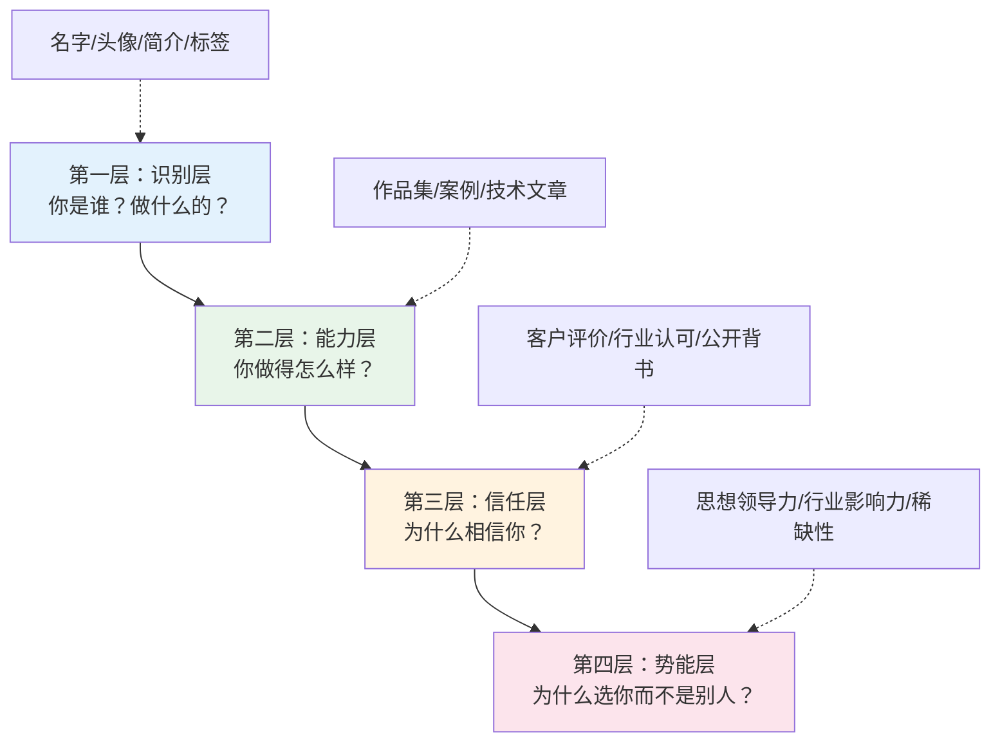
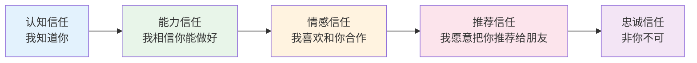
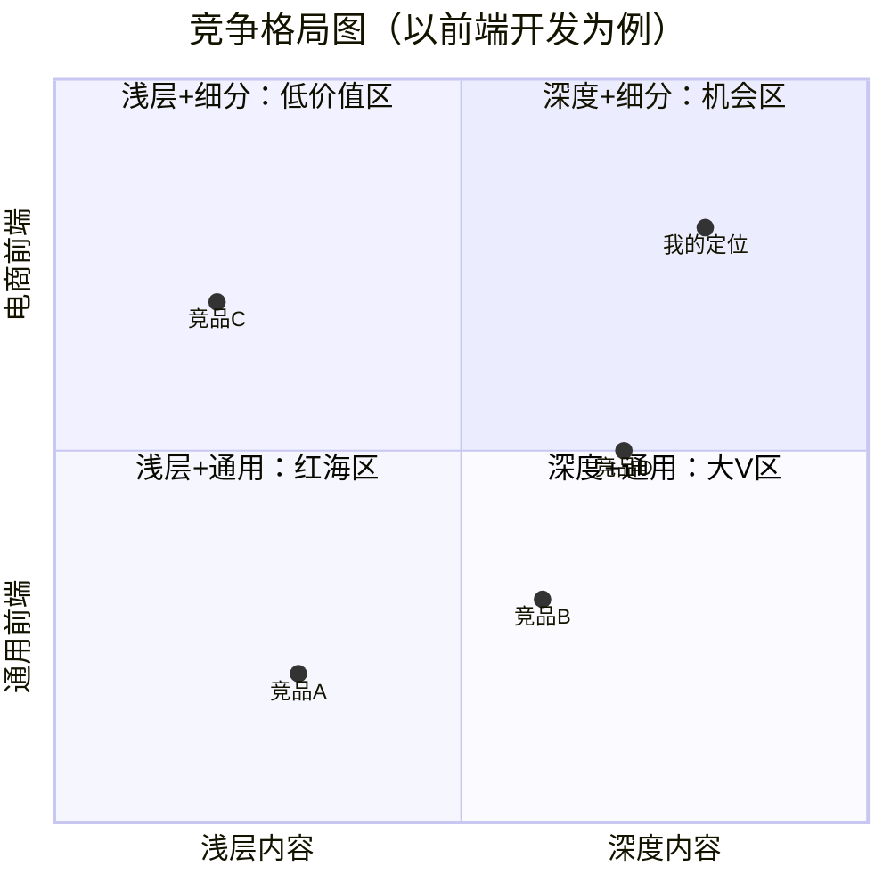
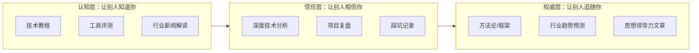
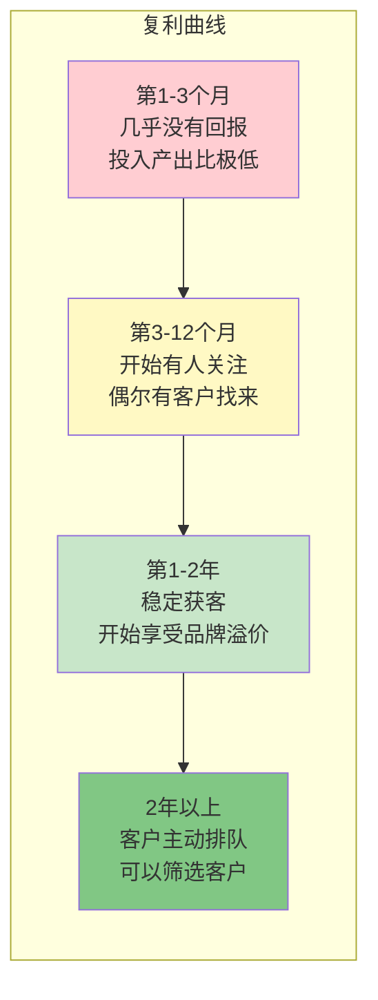
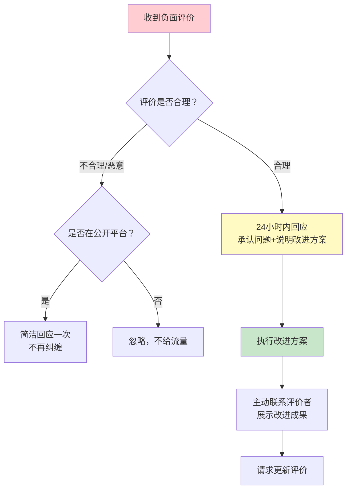
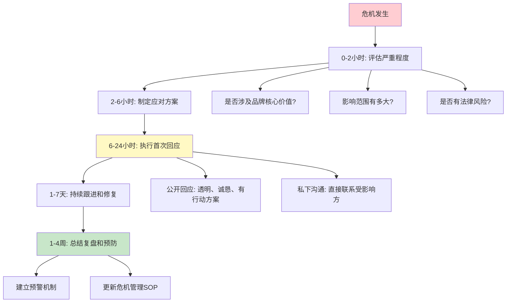
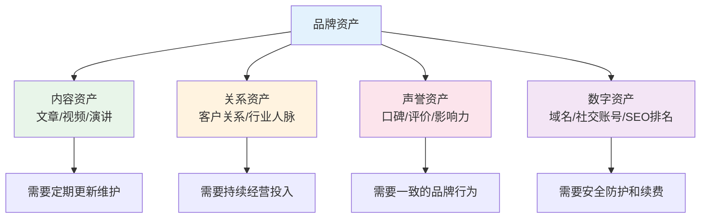
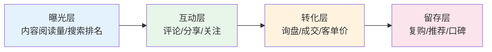

## 五、个人品牌建设

在定价策略中，我们建立了"收入 = 你创造的价值 × 价值捕获率"的认知框架。定价策略帮你提高价值捕获率——让客户愿意为你的服务支付合理的价格。但还有一个更强大的杠杆：**让客户主动来找你，而不是你去找客户**。这就是个人品牌的力量。

一个有品牌的开发者和一个没有品牌的开发者，技术能力可能相差无几，但收入差距可以达到3-10倍。这不是夸张——Stack Overflow 2024年开发者调查显示，有系统化个人品牌的自由开发者，平均时薪比无品牌的同行高出67%。原因很简单：有品牌的开发者享受**品牌溢价**（客户默认你更专业，愿意付更高价格）、**信任红利**（客户不需要反复验证你的能力，沟通成本极低）、**获客优势**（客户主动上门，获客成本趋近于零）。这三者叠加，产生的复利效应远超单纯提升技术能力。

**品牌建设的"反直觉"真相**：大多数技术人认为品牌建设 = 自我营销 = 吹牛。这是一个致命的误解。品牌建设的本质是**让更多需要你的人找到你**。你不需要变得外向、不需要自我吹嘘、不需要天天发朋友圈——你需要做的是：把你解决问题的过程记录下来，分享出去。一个安静写代码的人，如果能把排查Bug的过程写成一篇好文章，这篇文章就是他最好的品牌资产。

本章从理论层面建立个人品牌的认知框架，帮你理解"品牌是什么"、"品牌为什么能带来溢价"、以及"怎样系统化地建设品牌"。具体的传播渠道运营技巧和内容创作方法，请参阅核心技巧篇的相关章节。

**本章知识框架**：

```mermaid
graph TB
    A[个人品牌建设] --> B[品牌认知<br/>品牌是什么/为什么有效]
    A --> C[品牌定位<br/>为谁服务/如何差异化]
    A --> D[品牌建设<br/>作品集/内容/社会证明]
    A --> E[品牌传播<br/>渠道/人脉/国际化]
    A --> F[品牌变现<br/>服务溢价/课程/咨询]
    A --> G[品牌管理<br/>资产保护/危机/评估]
    
    B --> B1[心智占位理论]
    B --> B2[四层品牌结构]
    B --> B3[品牌溢价经济学]
    B --> B4[信任生命周期]
    B --> B5[品牌人格]
    B --> B6[在职品牌建设]
    B --> B7[内向者品牌策略]
    
    C --> C1[技能盘点]
    C --> C2[市场细分]
    C --> C3[差异化定位]
    C --> C4[品牌宣言]
    C --> C5[竞品分析]
    C --> C6[品牌转型策略]
    
    D --> D1[作品集三层架构]
    D --> D2[个人网站]
    D --> D3[内容策略+模板库+日历]
    D --> D4[社会证明体系]
    
    E --> E1[渠道矩阵]
    E --> E2[人脉网络]
    E --> E3[国际化拓展]
    
    F --> F1[七种变现路径含Newsletter]
    F --> F2[组合策略]
    F --> F3[定价原则]
    F --> F4[收款基础设施]
    
    G --> G1[品牌资产构成]
    G --> G2[危机管理+公开犯错修复]
    G --> G3[评估指标+数据工具链]
    G --> G4[90天行动计划]
    G --> G5[法律/IP保护]
    
    style A fill:#e3f2fd,color:#333
    style B fill:#e8f5e9,color:#333
    style C fill:#fff3e0,color:#333
    style D fill:#fce4ec,color:#333
    style E fill:#f3e5f5,color:#333
    style F fill:#e0f7fa,color:#333
    style G fill:#fff9c4,color:#333
```



**建议学习路径**：如果你是品牌建设的新手，建议按顺序阅读——先建立认知框架（第1-2节），再学习建设方法（第3-5节），然后掌握传播和变现（第6-8节），最后关注管理和执行（第9-13节）。如果你已经有品牌建设经验，可以直接跳到你需要深入的部分。

### 1. 品牌的本质：超越"出名"

#### 1.1 品牌不是知名度，是心智占位

大多数人对"个人品牌"的理解停留在"让更多人知道我"。这是最常见也最有害的认知偏差。知名度是品牌的结果，不是品牌的本质。

**品牌的本质是：在目标受众的心智中，占据一个明确的、有价值的位置。**

当一个企业需要做安全审计时，他脑海中浮现的第一个名字是谁？当有人想学AI应用开发时，他会推荐谁的课程？当一个创业者需要找技术合伙人时，他会优先联系谁？——这些"第一浮现"，就是品牌的心智占位。

心智占位的三个要素：

| 要素 | 含义 | 反面案例 | 正面案例 |
|------|------|---------|---------|
| **明确性** | 你能用一句话说清"这个人是做什么的" | "我是全栈开发、UI设计、数据分析、项目管理都会的" | "我帮电商企业做性能优化，让页面加载时间从3秒降到0.5秒" |
| **差异性** | 你和同行的核心区别是什么 | "我技术好、态度认真、交付及时"（这是基本要求，不是差异） | "我专注Flutter跨平台开发，做过5个日活10万+的App" |
| **价值性** | 这个定位对目标客户有什么实际价值 | "我热爱编程，追求技术极致"（这是你的事，不是客户的收益） | "我帮SaaS公司将注册转化率从2%提升到8%" |

三者缺一不可。只有明确性没有差异性，你只是一个"行业平均"；只有差异性没有价值性，你的差异对客户没有意义；只有价值性没有明确性，客户记不住你是谁。

**心智占位的形成机制**：

人脑每天接触大量信息，为了降低认知负荷，会自动将信息分门别类。当客户想到"前端性能优化"这个需求时，如果之前反复看到过你的相关内容，大脑会自动将你和这个关键词关联——即使客户从未主动记忆过你的名字。这就是品牌的心智占位。

要形成这种关联，需要三个条件：**重复曝光**（客户多次看到你）、**一致信号**（每次看到的信息都指向同一个定位）、**情感标记**（你的内容让客户产生了正面情感——"这个人有料"）。缺少任何一个条件，心智占位都无法形成。

**心智占位的心理学机制**：

心智占位并非玄学，它背后有三个已被实验反复验证的心理学效应：

1. **纯粹曝光效应（Mere Exposure Effect）**：心理学家Robert Zajonc（1968）发现，仅仅因为反复接触某个刺激，人们就会对其产生更积极的评价——即使他们没有有意识地记住这个刺激。在品牌建设中，这意味着即使你的文章没有被深度阅读，仅仅是在搜索结果、社交媒体信息流中反复出现，就能提升你在读者心中的好感度。实操启示：**定期发布比偶尔爆款更重要**——每周1篇的稳定输出比每月集中4篇的品牌效果更好，因为"出现频率"本身就是品牌信号。

2. **光环效应（Halo Effect）**：Edward Thorndike（1920）发现，人们对某人某一方面的正面评价会自动"溢出"到其他方面。在个人品牌中，一篇极其深入的技术文章会让读者默认你写的所有文章都很深入，甚至默认你的代码质量、项目管理能力也很强。实操启示：**投资你的"巅峰内容"**——一篇L4级别的深度分析，其品牌效果远超10篇L2级文章，因为"巅峰内容"会建立光环，光环会覆盖到你所有的内容。

3. **启动效应（Priming Effect）**：当人们在特定情境中反复看到你的名字与某个关键词关联（如"前端性能优化 + 你的名字"），之后每次遇到这个关键词，你的名字会自动被"启动"（激活）。这就是为什么SEO对品牌如此重要——搜索引擎将你的内容与关键词关联，每次有人搜索这个关键词，你的名字就被"启动"一次。

**心智占位的量化参考**：

| 指标 | 初级占位 | 中级占位 | 强占位 |
|------|---------|---------|--------|
| 品牌关键词搜索量 | 月搜索量<100 | 100-1000 | >1000 |
| 非搜索触达频率 | 读者在信息流偶见你 | 读者主动搜索你 | 别人推荐时提到你 |
| 品类第一提及率 | <5%的受众会在第一时间想到你 | 5%-20% | >20% |
| 内容引用率 | 文章偶尔被引用 | 文章被同行定期引用 | 你的观点成为行业常识 |

#### 1.2 品牌的四层结构

个人品牌不是一个单点，而是一个由浅入深的四层结构：



大多数人只建设了第一层（注册了账号、写了简介），少数人建到了第二层（有作品集），更少的人达到第三层（有社会证明），极少数人到达第四层（成为行业意见领袖）。每一层的跃迁都带来收入的量级提升。

| 层级 | 状态描述 | 典型收入水平（年） | 建设周期 | 典型特征 |
|------|---------|------------------|---------|---------|
| 第一层 | 有账号和简介，但无内容沉淀 | 10-30万 | 1-2周 | 只能通过平台接单，无议价权 |
| 第二层 | 有作品集和案例，客户可验证能力 | 30-80万 | 3-6个月 | 开始有零星客户主动找来，但获客仍以平台为主 |
| 第三层 | 有客户推荐和行业认可，信任成本低 | 80-200万 | 1-2年 | 品牌渠道获客占比超过50%，可以挑选客户 |
| 第四层 | 客户主动排队，可以挑选项目和客户 | 200万+ | 3-5年 | 等待名单制，客户愿意排队等你 |

**各层级之间的跃迁路径**：

**第一层→第二层**：关键是"有作品可展示"。写3-5篇L2级以上技术文章，做1个有实际价值的开源项目，整理2-3个项目案例。周期约3-6个月，核心障碍是"不知道写什么"和"觉得自己写的不够好"。

**第二层→第三层**：关键是"有人替你说话"。积累5-10条客户评价，在技术社区建立可识别的存在感，获得1-2次行业媒体或KOL的提及。周期约1-2年，核心障碍是"有成绩但没人知道"。

**第三层→第四层**：关键是"定义话题"。不只是参与行业讨论，而是发起行业讨论——提出新的方法论、预测行业趋势、建立行业标准。周期约3-5年，核心障碍是从"参与者"到"领导者"的身份转换。

**层间跃迁的常见失败模式**：

很多品牌建设者在某一层停滞不前，不是因为能力不够，而是因为使用了错误的策略来推动跃迁。理解每层跃迁的失败模式，能帮你避免浪费数月甚至数年的努力。

| 跃迁阶段 | 典型失败模式 | 失败表现 | 纠正方向 |
|---------|------------|---------|---------|
| 第一层→第二层 | "完美主义陷阱" | 花6个月打磨一篇文章，始终觉得"不够好"而不发布 | 接受80分，发布后根据反馈迭代 |
| 第一层→第二层 | "广撒网" | 同时写前端、后端、AI、职场，每个方向都浅尝辄止 | 聚焦一个核心方向，至少坚持6个月 |
| 第二层→第三层 | "闭门造车" | 有好内容但不做分发，等着"自然流量" | 主动在社区互动、向KOL推荐自己的内容 |
| 第二层→第三层 | "数据虚荣" | 追求阅读量和粉丝数，忽视客户转化和真实口碑 | 关注"品牌渠道获客数"和"客户评价质量" |
| 第三层→第四层 | "舒适区锁定" | 持续做已经成功的深度技术文章，不敢尝试方法论输出 | 从项目经验中提炼可复用的框架和方法论 |
| 第三层→第四层 | "单点依赖" | 品牌完全建立在单一平台或单一内容形式上 | 建立多渠道矩阵，降低平台风险 |

#### 1.3 品牌溢价的经济学解释

品牌溢价不是"忽悠"，它有坚实的经济学基础。

**信息不对称理论**：在技术服务市场，买家（客户）和卖家（技术人）之间存在严重的信息不对称。客户无法直接评估你的代码质量、架构能力、项目管理水平。当信息不对称时，客户会使用**信号（Signal）**来推断质量。品牌就是最强的信号——一个有10万关注者的开发者、一个被多家媒体报道的独立开发者、一个有开源项目被Star了5000次的开发者，这些都是"高质量"的强信号。

经济学中有一个经典的"信号传递模型"（Spence, 1973）：高能力者通过付出某种成本（如教育、品牌建设）来向市场传递信号，低能力者模仿这种信号的成本过高，因此信号是可信的。个人品牌的建设成本——持续输出高质量内容、维护开源项目、积累客户口碑——正是这种"高成本信号"。一个持续输出三年高质量内容的人，其信号可信度远高于一个刚注册账号就宣称自己是专家的人。

**品牌溢价的量化分析**：

以两个技术能力相近的前端开发者为例，A有品牌（个人网站+5000粉丝+20篇深度文章+3条客户评价），B没有品牌（只在平台上接单）：

| 对比维度 | A（有品牌） | B（无品牌） | 品牌带来的差异 |
|---------|-----------|-----------|-------------|
| 获客方式 | 客户主动找来 | 在平台上竞价投标 | A的获客成本趋近于零 |
| 客户信任 | 初始信任度高，沟通成本低 | 需要反复证明能力，沟通成本高 | A的项目启动快2-3周 |
| 客单价 | 日薪2000-3000元 | 日薪800-1500元 | A溢价30%-100% |
| 客户质量 | 有明确需求、预算充足 | 各种质量都有，砍价严重 | A的时间利用效率更高 |
| 复购率 | 60%以上的客户会推荐或复购 | 低于20% | A的长期获客成本进一步降低 |
| 年收入 | 80-150万 | 20-40万 | 3-5倍差距 |

**交易成本理论**：客户选择服务提供者是有成本的——搜索成本、评估成本、谈判成本、监督成本。品牌降低了所有这些成本。当客户已经"认识"你、"信任"你时，搜索成本为零（他知道你是谁），评估成本极低（品牌本身就是背书），谈判成本很低（信任减少了博弈），监督成本较低（品牌声誉是隐性担保）。客户愿意为这些节省的交易成本支付溢价。

**转换成本与锁定效应**：当客户选择了你并且满意后，切换到其他服务提供者有额外的转换成本——重新搜索、重新评估、重新建立信任、重新磨合。这意味着品牌带来的客户黏性远高于单纯的技术能力带来的黏性。

**网络效应（Network Effects）**：

品牌溢价的一个被忽视的来源是网络效应。当你的品牌影响力增长时，它不仅增加了每个客户的感知价值，还增加了整个"品牌网络"的价值。这体现在三个层面：

1. **内容网络效应**：你写的文章越多、越深入，它们之间的内链和引用就越丰富，每篇新文章都能从已有的内容资产中获得SEO权重。一个有100篇高质量文章的网站，新文章的搜索引擎排名速度远快于一个只有10篇文章的网站——因为搜索引擎将你的网站视为该领域的"权威来源"
2. **口碑网络效应**：当你的品牌到达一定规模后，客户之间的口碑传播开始产生自发的网络效应。A客户推荐你给B客户，B客户又推荐给C客户——这个链条不需要你主动推动。研究表明，口碑推荐的客户，其终身价值比冷启动获客高16%（Wharton School, 2020）
3. **生态网络效应**：当你的品牌足够强时，其他品牌会主动寻求与你合作——联合课程、联合活动、互相推荐。这种"品牌联盟"进一步放大了你的品牌影响力，形成正反馈循环

**品牌溢价的边界条件**：

品牌溢价不是无限的，它受限于三个条件：

1. **你的实际交付能力**：品牌溢价建立在真实能力之上。如果品牌承诺的能力是100，你的交付低于60，客户会立刻流失，且负面口碑的传播速度是正面口碑的3-5倍
2. **市场对品质的敏感度**：如果客户对价格极度敏感而对品质不敏感（如低端建站市场），品牌溢价的空间有限
3. **信息透明度**：在信息高度透明的领域（如开源社区），品牌溢价的来源更多是深度和稀缺性，而非信息差

**定位理论与心智阶梯**：

Al Ries 和 Jack Trout 在《定位》中提出：商业竞争的终极战场不在市场，而在客户的心智。每个人的心智中都有一组"阶梯"，每个品类最多能记住7个品牌（大多数情况下只有2-3个）。对于个人品牌而言，目标不是"上榜"，而是**占据阶梯的第一位**。

心智阶梯的运作机制：

| 心智位置 | 客户行为 | 品牌策略 |
|---------|---------|---------|
| 第一位 | 有需求时第一个想到你，优先选择 | 持续强化定位，扩大领先优势 |
| 第二位 | 会考虑你，但会和第一位比较 | 找到第一位的弱点，差异化竞争 |
| 第三位 | 偶尔想起，需要提醒才会联系 | 需要更强的社会证明或更低的价格 |
| 未上榜 | 完全不知道你的存在 | 需要重新审视品牌策略 |

**占据第一位的策略**：如果你无法在大品类中占据第一位（如"前端开发"），就创造一个新品类并成为第一位——"跨境电商Shopify性能优化专家"这个品类中，你很可能就是第一位。这就是"品类创造"策略：与其在红海中争第一，不如定义一个新蓝海并率先占领。

**品牌资产的复利模型**：

品牌建设的投入产出遵循复利曲线，而非线性增长。用公式表示：

```text
品牌价值(t) = 基础投入 × (1 + 内容质量系数)^时间 × 网络效应乘数
```

其中：
- **基础投入**：你每周投入品牌建设的时间和精力
- **内容质量系数**：高质量内容的积累速度（L3+文章 > L1文章的积累效率10倍以上）
- **网络效应乘数**：当你的品牌达到一定规模后，口碑传播、同行推荐、媒体关注带来的指数级放大

这就是为什么同样的投入，有策略的品牌建设者在第3年的品牌价值可能是第1年的10倍以上——而无策略的"写文章"者可能只是线性增长。

#### 1.4 品牌信任生命周期

品牌信任不是一蹴而就的，它遵循一个可预测的生命周期：



每个阶段的信任建立机制不同：

| 阶段 | 建立机制 | 关键行动 | 周期 | 失信风险 |
|------|---------|---------|------|---------|
| 认知信任 | 持续曝光 + 一致的定位 | 内容发布、社区互动、SEO优化 | 1-3个月 | 信息不一致，定位模糊 |
| 能力信任 | 可验证的成果 + 专业深度 | 作品集、技术文章、开源项目 | 3-12个月 | 内容质量不稳定，自相矛盾 |
| 情感信任 | 良好的合作体验 + 人格魅力 | 沟通态度、超预期交付、个人故事 | 1-3次合作 | 态度冷淡，交付踩线 |
| 推荐信任 | 超出预期的价值 + 社会证明 | 客户成功案例、口碑传播 | 持续积累 | 某次合作出问题，推荐人丢面子 |
| 忠诚信任 | 独特的不可替代性 | 行业权威地位、稀缺专业能力 | 2-5年 | 停滞不前，被后来者超越 |

**信任的"一票否决"效应**：

信任的建立是缓慢的（需要在每个阶段反复验证），但信任的崩塌是瞬间的。一次严重的失信行为（如交付质量严重不达标、泄露客户数据、公开场合态度恶劣）可以让多年积累的信任归零。品牌建设者必须像保护眼睛一样保护自己的信誉。

信任重建的难度远大于初次建立。研究表明，一次严重的信任破坏后，需要至少5-7次正面体验才能恢复到之前的信任水平。因此，**预防信任危机比修复信任危机重要100倍**。

#### 1.5 品牌人格：你的"声音"是什么

品牌的识别不仅来自"你说什么"，更来自"你怎么说"。品牌人格（Brand Personality）是你在所有沟通中展现的一致的表达风格、价值观和情感基调。它让你的品牌从"一个做前端的"变成"那个说话直来直去、用数据说话的前端专家"。

**品牌人格的五个维度**：

| 维度 | 问题 | 示例光谱 |
|------|------|---------|
| **正式度** | 你说话像教授还是像朋友？ | 学术严谨 ←→ 通俗幽默 |
| **情感度** | 你偏理性分析还是感性表达？ | 数据驱动 ←→ 故事驱动 |
| **态度** | 你温和包容还是犀利直言？ | 中立客观 ←→ 有鲜明立场 |
| **节奏** | 你长篇大论还是简洁有力？ | 深度长文 ←→ 金句短评 |
| **互动** | 你高冷疏离还是热情亲近？ | 保持距离 ←→ 积极互动 |

**品牌人格的一致性要求**：

品牌人格一旦确立，需要在所有触点保持一致——文章的语气、评论区的回复、社交媒体的发言、客户沟通的态度、甚至邮件的措辞。不一致的人格会让受众困惑："这个人到底是严肃的专家还是搞笑的博主？"

**常见的技术人品牌人格原型**：

| 人格原型 | 核心特质 | 内容风格 | 适合人群 | 代表案例 |
|---------|---------|---------|---------|---------|
| **布道者** | 热情、前瞻、善于解释复杂概念 | 深入浅出的技术解读，充满对技术的热爱 | 喜欢分享、善于表达的技术人 | 技术布道师、Developer Advocate |
| **工匠** | 严谨、精益求精、注重细节 | 极致深入的源码分析，追求完美的代码 | 内向、专注、追求极致的技术人 | 系统级开发者、性能优化专家 |
| **破局者** | 直言不讳、挑战权威、独立思考 | 观点鲜明的文章，敢于质疑主流做法 | 有丰富经验、不随大流的技术人 | 技术评论者、架构师 |
| **导师** | 耐心、系统化、善于教学 | 结构化的教程，从入门到精通的完整路径 | 喜欢教学、善于组织知识的技术人 | 技术讲师、培训师 |
| **创业者** | 务实、结果导向、商业思维 | 以商业价值为导向的技术方案，强调ROI | 有商业敏感度的技术人 | 独立开发者、技术顾问 |

**如何找到自己的品牌人格**：

1. **回顾你最自然的沟通方式**：你在技术讨论中最常扮演什么角色？是解释者、质疑者、还是总结者？
2. **问身边的人**：让3-5个了解你的同事或朋友用3个词形容你的沟通风格
3. **分析你欣赏的品牌**：你关注的技术博主中，谁的风格最接近你想成为的样子？
4. **试写3篇不同风格的文章**：用布道者风格、工匠风格、破局者风格各写一篇，看哪个写起来最自然、反馈最好

**品牌人格的禁忌**：

- **不要模仿**：模仿别人的风格会让你的内容缺乏真实感，读者能感觉到"这不是真正的你"
- **不要摇摆**：今天犀利明天温和，读者无法建立稳定的预期
- **不要过度**：任何特质过度放大都会变成负面——"直言不讳"过度就变成"刻薄"，"幽默"过度就变成"不专业"

**品牌人格的混合与进化**：

实际的品牌人格很少是单一原型的纯净版。更常见的是2-3种原型的混合，以一种为主、其他为辅。以下是几种经过验证的混合模式：

| 混合组合 | 效果 | 适合场景 | 代表特征 |
|---------|------|---------|---------|
| 工匠 + 布道者 | "深入浅出的专家" | 技术教学、开源社区 | 既有底层原理的严谨，又有传播的热情 |
| 破局者 + 创业者 | "颠覆性的实战派" | 独立开发、技术咨询 | 既有独立思考的锐利，又有商业落地的务实 |
| 导师 + 工匠 | "体系化的教育者" | 技术培训、课程制作 | 既有系统化的教学设计，又有细节的精益求精 |
| 布道者 + 创业者 | "技术布道+商业思维" | Developer Advocate、技术顾问 | 既有对技术的热爱，又有ROI的考量 |

**跨平台的人格表达适配**：

同一个人格在不同平台上需要调整表达形式，但核心调性必须保持一致。以下是具体的适配指南：

| 平台 | 人格表达形式 | "工匠"型示例 | "布道者"型示例 | "破局者"型示例 |
|------|------------|------------|------------|------------|
| 技术文章 | 长文深度表达 | 源码级剖析，配完整代码 | 概念讲解，配应用场景 | 观点鲜明的分析，配反面案例 |
| Twitter/X | 短句+Thread | 一条推文总结一个技术要点 | 技术趋势的快速解读 | 对主流观点的质疑和反思 |
| 视频/直播 | 面对面表达 | 安静的屏幕录制+讲解 | 充满热情的现场Demo | 辩论式的对比分析 |
| 社区互动 | 异步文字 | 详细的代码Review回复 | 鼓励性的指导回复 | 直接的问题指出和替代方案 |
| 客户沟通 | 商务场景 | 严谨的技术方案文档 | 热情的需求理解沟通 | 直言不讳的风险告知 |

#### 1.6 内向者如何建设个人品牌

很多技术人是内向性格，一提到"品牌建设"就想到社交应酬、公开演讲、自我推销，本能地排斥。这是一个严重的误解——**内向者不仅适合建品牌，而且在某些方面有天然优势**。

**内向者在品牌建设中的优势**：

| 维度 | 外向者倾向 | 内向者优势 |
|------|-----------|-----------|
| 内容深度 | 倾向广而浅的覆盖 | 深度思考，产出L3-L4内容 |
| 互动质量 | 大量浅层互动 | 少量但深度的1对1交流 |
| 写作风格 | 活泼但可能不够严谨 | 严谨、逻辑清晰、结构化 |
| 独处时间 | 不耐独处 | 享受独处，利于深度创作 |
| 倾听能力 | 倾向表达 | 善于倾听，更懂客户真实需求 |

**内向者的品牌建设策略**：

1. **以写代说**：写作是内向者最强大的品牌武器。文字不需要即时反应，你可以反复修改直到满意。一篇深思熟虑的5000字技术分析，品牌建设效果超过10次浅层社交
2. **异步沟通优先**：用邮件、文字消息而非电话/视频与客户沟通。很多客户反而更喜欢异步沟通——他们可以在自己的时间回复，不被打断
3. **小范围深度交流**：不需要在百人大会上演讲。3-5人的小型技术沙龙、1对1的咖啡聊天，效果更好、压力更小
4. **利用线上平台**：Twitter/X、掘金、知乎等文字平台天然适合内向者——你有时间组织语言，不需要即时反应
5. **录制优于直播**：如果要做视频内容，录制剪辑比直播更适合内向者——可以重录不满意的部分

**内向者的"充电-放电"管理**：

品牌建设活动（尤其是社交、演讲）会消耗内向者的能量。合理管理能量是持续建设品牌的关键：

| 活动类型 | 能量消耗 | 建议频率 | 替代方案 |
|---------|---------|---------|---------|
| 大型会议演讲 | ★★★★★ | 每季度1次 | 录制视频代替 |
| 小型技术沙龙 | ★★★☆☆ | 每月1-2次 | 线上直播（可关摄像头） |
| 1对1社交 | ★★★☆☆ | 每周1-2次 | 异步文字交流 |
| 写作/录视频 | ★★☆☆☆ | 每周2-3次 | 内向者的"主场"活动 |
| 社区文字互动 | ★☆☆☆☆ | 每天 | 几乎无能量消耗 |

核心原则：在能量充足的时段做高消耗活动（如演讲、社交），在能量低谷时做低消耗活动（如写作、回复评论）。不要强迫自己变成外向者，用内向者的方式建品牌同样有效——甚至更有效，因为你的内容会更有深度。

**内向者的"零社交压力"内容模板**：

以下模板专为不善于自我推销的内向者设计，核心理念是"让内容替你说话"，不需要主动推销自己。

**模板一：技术排查日记**

```markdown
# [问题现象]：一次[耗时]小时的生产排查记录

## 发现问题
[描述你在工作中遇到的真实问题]

## 排查过程
### 第一步：[初步假设]
[你的第一个判断，以及为什么它是错的]

### 第二步：[深入排查]
[你如何缩小范围]

### 第三步：[根因定位]
[最终发现了什么]

## 解决方案
[具体的修复方案和代码]

## 经验总结
[可复用的排查方法或教训]
```

这种模板的优势：完全不需要"推销"自己，只需要真实记录你在工作中解决问题的过程。读者通过你的排查思路自然感受到你的技术能力。

**模板二：技术选型决策记录**

```markdown
# [技术选型]：我们为什么在[项目]中选择了A而不是B

## 选型背景
[业务需求、技术约束、团队情况]

## 候选方案对比
| 维度 | 方案A | 方案B | 方案C |
|------|-------|-------|-------|
| 性能 | ... | ... | ... |
| 学习成本 | ... | ... | ... |
| 社区活跃度 | ... | ... | ... |

## 最终选择和理由
[为什么选了A，什么条件下会选B]

## 使用[3个月/半年]后的回顾
[实际体验和当初预判的差异]
```

这种模板的优势：展示的是你的判断力和决策能力，这是最稀缺的技术能力之一。

**内向者的信心建立"三步法"**：

| 阶段 | 动作 | 心理目标 | 时间 |
|------|------|---------|------|
| 第一步：匿名起步 | 用笔名或技术昵称发布内容，降低"被认出来"的压力 | "原来我的内容也有人看" | 1-2个月 |
| 第二步：小范围验证 | 在小社群（如微信群、Discord频道）分享文章，获得直接反馈 | "原来我的观点是对的" | 2-3个月 |
| 第三步：逐步公开 | 在已有正面反馈的基础上，逐步关联到真实身份 | "大家认可的是我的能力，不是我的社交技巧" | 3-6个月 |

#### 1.7 在职状态下的品牌建设

大多数技术人在开始品牌建设时仍然在职——这不是障碍，而是优势。全职工作提供了品牌建设最需要的两样东西：**真实项目经验**和**稳定的经济基础**（让你不需要为了短期流量而扭曲内容方向）。

**在职品牌建设的核心原则**：

| 原则 | 说明 | 违反后果 |
|------|------|---------|
| **不泄露公司机密** | 案例必须脱敏，不能暴露公司内部架构、业务数据、未公开技术方案 | 法律风险 + 职业毁灭 |
| **不用公司时间做私事** | 品牌建设在业余时间进行，不占用工作时间 | 职业道德问题 + 劳动纠纷 |
| **不利用公司资源** | 不用公司电脑/账号发布个人内容，不用公司数据作为案例素材 | 合规风险 |
| **不与公司利益冲突** | 品牌定位不能与公司业务直接竞争 | 竞业协议风险 |

**在职品牌建设的安全策略**：

1. **案例脱敏公式**：将真实项目转化为公开案例时，使用"某[行业]公司"代替公司名，用百分比代替绝对数字，用通用架构图代替内部系统图。例如："某跨境电商平台（日均订单2万+）"而非"XX公司的YY系统"
2. **技术方向错位**：如果你的公司做金融系统，你的个人品牌可以聚焦"高并发系统设计"而非"金融系统开发"——技术能力通用，但不涉及行业机密
3. **开源贡献策略**：为公司使用的开源项目贡献代码是安全的——这既展示了你的能力，又不涉及公司业务。但注意不要将公司内部的通用工具直接开源
4. **知识分享而非项目分享**：写"我从这个项目中学到的5个性能优化技巧"而非"这个项目的完整技术方案"

**在职状态的时间分配建议**：

| 工作强度 | 每周可用时间 | 建议策略 |
|---------|------------|---------|
| 轻松（朝九晚五） | 5-8小时 | 每周1篇文章 + 社区互动 |
| 正常（偶尔加班） | 3-5小时 | 每两周1篇文章 + 日常社区互动 |
| 繁忙（经常加班） | 1-3小时 | 每月1-2篇文章 + 利用碎片时间互动 |
| 极忙（996） | <1小时 | 暂停写作，只做社区互动和素材积累 |

**在职到自由职业的品牌过渡**：

如果你计划未来做自由职业，在职期间的品牌建设是最好的准备。过渡路径：

1. **在职期间（6-12个月）**：积累内容和案例，建立社区存在感，不急于变现
2. **过渡期（1-3个月）**：开始接受小规模兼职项目，测试品牌获客能力
3. **全职启动**：当品牌渠道获客能覆盖基本生活开支时，再考虑全职转型

**关键数据**：在职期间系统化建设品牌6个月以上再转型的自由职业者，首年收入比直接裸辞转型的高出40%-80%（来源：2024年国内自由职业者调研）。

#### 1.8 品牌建设的真实案例解析

理论再好，不如看真实案例如何运作。以下是三个不同阶段的技术人品牌建设案例，覆盖从零起步到行业权威的完整路径。

**案例一：从零到月入5万的Shopify开发者（18个月）**

背景：张某，28岁，3年前端经验，在一家电商公司做全栈开发。2024年初决定做自由职业，但没有任何品牌积累。

品牌定位过程：
- 技能盘点：React/Node.js熟练，有电商项目经验，英语读写能力不错
- 市场调研：发现Shopify独立站定制开发需求旺盛，但大部分开发者只会用模板
- 差异化定位："帮DTC品牌做Shopify Hydrogen定制开发，专注移动端转化优化"

执行策略：
1. 第1-3个月：在掘金和知乎各发了8篇Shopify开发教程（L2级），同步发英文版到Dev.to。GitHub上开源了一个Shopify Hydrogen性能优化工具包
2. 第4-6个月：开始写深度文章（L3级），如"Shopify Hydrogen vs Liquid：电商页面渲染性能实测"。文章被Shopify官方开发者博客转载，获得200+ Star
3. 第7-12个月：积累了3个付费客户案例，每个都写了详细的STAR法复盘。开始在Twitter/X上用英文分享Shopify优化经验
4. 第13-18个月：通过品牌渠道（非平台）获客占比达到60%。客单价从最初的800元/天涨到2500元/天

关键数据：
- 18个月内写了42篇文章（平均每周0.5篇）
- GitHub开源项目获得800+ Star
- 品牌渠道客户占总收入的60%
- 月收入从0增长到5万，主要来自3个长期客户
- 英文内容带来的海外客户贡献了30%的收入

经验教训：张某总结说——"前三个月是最痛苦的，写了20篇文章，阅读量加起来不到5000。但我坚持下来了，因为我知道这些内容会一直在搜索引擎里，持续为我带来流量。果然，半年后老文章开始排到搜索结果第一页，每周都有新的询盘。"

**案例二：用开源项目建立技术品牌的后端工程师（2年）**

背景：李某，32岁，7年后端经验，在某大厂做基础架构。技术能力很强，但完全没有公开输出。

品牌策略：
- 不写文章（自认为写作能力一般），而是用代码说话
- 开发了一个Go语言的微服务框架，解决了他在工作中反复遇到的问题
- 花了6个月打磨框架的文档、示例和社区

执行过程：
1. 第1-6个月：框架开发+文档完善。在GitHub上发布，README写得非常详细（问题描述、对比方案、快速开始、性能对比）
2. 第7-12个月：在Go语言社区（Reddit r/golang、Go Forum、V2EX）积极回答问题，在合适的时机推荐自己的框架（不是硬推，而是在相关问题下自然提及）
3. 第13-18个月：框架被几家中型公司采用，开始有企业用户提Issue和PR。受邀在国内Go语言大会上做了一次分享
4. 第19-24个月：框架Star数突破3000。开始有企业找他做内部培训和技术咨询

关键数据：
- GitHub Star: 3000+
- 被5家企业在生产环境采用
- 企业培训费：2万/天，每年约10场
- 技术咨询：5000元/次，每月约3-5次
- 年额外收入约30-40万（本职工作之外）

经验教训：李某说——"我不需要成为写文章的大V。一个好用的工具，一份清晰的文档，就是最好的品牌。每次有人在Issue里说'这个框架帮我们解决了大问题'，就是最好的品牌背书。"

**案例三：从技术博主到年入百万的技术顾问（5年）**

背景：王某，35岁，10年安全领域经验。从2020年开始系统化建设个人品牌。

品牌演进路径：
- 第1年（第二层）：在安全社区写漏洞分析文章，积累了2000关注者。开源了一个自动化安全扫描工具
- 第2年（第三层）：被邀请在几次安全会议上做分享。开始有企业找他做安全审计。文章被安全媒体引用
- 第3年（第三层→第四层）：提出了"DevSecOps落地四步法"方法论，在安全社区引起广泛讨论。开始写书
- 第4年（第四层）：出版了《云原生安全实战》，成为该领域的参考书。企业培训和咨询需求开始排队
- 第5年（第四层稳定）：建立了付费安全社群（500人 × 1999元/年），开始做CTO级安全顾问

关键数据：
- 5年累计写了200+篇文章
- 出版了2本技术书籍
- 付费社群年收入约100万
- 企业培训年收入约60万
- 安全咨询年收入约80万
- 总年收入约240万（不含本职工作）

经验教训：王某说——"品牌建设最大的回报不是直接的金钱，而是**选择权**。我现在可以挑选客户、挑选项目、挑选合作方式。这种自由度带来的生活质量提升，远超收入数字本身。"

**三个案例的对比总结**：

| 维度 | 案例一（Shopify开发者） | 案例二（Go框架作者） | 案例三（安全顾问） |
|------|----------------------|-------------------|----------------|
| **核心策略** | 内容驱动（技术文章） | 产品驱动（开源项目） | 内容+产品+方法论 |
| **起步门槛** | 低（会写文章即可） | 中（需要开发完整项目） | 高（需要深度行业经验） |
| **见效速度** | 快（6个月开始获客） | 中（12个月开始变现） | 慢（2年后爆发） |
| **收入天花板** | 中（受限于时间） | 中高（企业培训+咨询） | 高（多元收入组合） |
| **适合人群** | 有表达欲望的开发者 | 代码能力突出的开发者 | 有深度行业积累的专家 |
| **核心壁垒** | 内容数量+SEO排名 | 项目质量+社区生态 | 思想领导力+行业人脉 |

**关键启示**：三种路径没有优劣之分，关键匹配你的特质。如果你擅长表达，走内容驱动路线；如果你擅长编码，走产品驱动路线；如果你有深度行业积累，走方法论驱动路线。最理想的状态是三种路径的组合——用内容吸引关注，用产品证明能力，用方法论建立权威。

### 2. 品牌定位四步法

品牌建设的第一步不是"开始写文章"或"注册账号"，而是**定位**。定位错误的品牌建设等于在错误的方向上狂奔——跑得越快，离目标越远。

#### 2.1 第一步：技能盘点——你能做什么

品牌定位的起点是对自身技能的全面盘点。不是"我会什么技术"的简单罗列，而是从市场价值角度的深度分析。

**技能价值矩阵**：

|  | 市场需求高 | 市场需求低 |
|--|----------|----------|
| **你的水平高** | ⭐ 核心定位区（优先发展） | 储备技能区（等待时机） |
| **你的水平低** | 学习投资区（值得投入时间提升） | 淘汰区（不必投入精力） |

核心定位区的技能是品牌建设的基石。你的品牌定位必须建立在你既擅长、市场又需要的交叉点上。

**技能盘点的具体操作**：

1. 列出你掌握的所有技术技能（不限于编程，包括设计、写作、沟通、管理等）
2. 对每个技能，评估你的水平（从五个维度打分：理论掌握度、实操熟练度、问题解决能力、项目经验深度、教学输出能力，每项1-10分取平均）
3. 对每个技能，评估市场需求（在招聘网站、接单平台搜索该技能的需求数量和价格区间）
4. 将技能放入价值矩阵，找到核心定位区

**技能盘点的实操模板**：

```markdown
## 技能盘点表

| 技能名称 | 我的水平(1-10) | 市场需求(1-10) | 交叉评分 | 市场验证来源 |
|---------|--------------|--------------|---------|------------|
| React开发 | 8 | 9 | 72 | BOSS直聘: 月均2000+岗位 |
| 性能优化 | 9 | 7 | 63 | 猪八戒: 项目均价8000+ |
| ... | ... | ... | ... | ... |

交叉评分 = 我的水平 × 市场需求
核心定位区: 交叉评分 > 60 的技能
```

**技能盘点的自检清单**：

在完成技能矩阵后，用以下问题验证你的核心定位区选择是否正确：

- 这个技能方向，我能写出5篇以上L3级别（原理分析）的深度文章吗？
- 这个技能方向，我能在技术社区中回答大部分中等难度的问题吗？
- 这个技能方向，我有没有拿得出手的项目案例或数据成果？
- 这个技能方向的目标客户，他们的痛点我能不查资料就说出三个以上吗？
- 这个技能方向的同行中，我的经验或方法有没有明显的差异化？

如果以上问题中有两个以上回答"否"，说明你可能需要先提升技能再做品牌定位，或者需要重新选择核心定位区。

#### 2.2 第二步：市场细分——你要服务谁

"所有需要开发的人"不是目标市场。品牌的力量来自于**聚焦**。你服务的人群越聚焦，你的品牌就越清晰，客户识别你的成本就越低。

**市场细分的四个维度**：

| 维度 | 细分方式 | 示例 |
|------|---------|------|
| **行业维度** | 按客户所在行业划分 | 电商、教育、医疗、金融、游戏 |
| **规模维度** | 按客户规模划分 | 个人创业者、中小企业、大企业、上市公司 |
| **问题维度** | 按客户要解决的问题划分 | 性能优化、安全加固、自动化、数据可视化 |
| **阶段维度** | 按客户所处阶段划分 | MVP开发、从0到1、规模化、技术债务清理 |

**选择细分市场的三个标准**：

1. **你能在这个细分市场做到前10%吗？** 如果不能，说明竞争太激烈或你的优势不够明显，需要进一步细分
2. **这个细分市场的客户有付费能力和付费意愿吗？** 有些细分市场的客户（如个人站长）虽然数量多，但付费能力有限
3. **这个细分市场的客户容易触达吗？** 如果你无法有效地找到和服务这个人群，细分再精准也没有实际意义

**细分市场的规模判断方法**：

很多开发者担心自己选的市场太小。以下方法帮你判断市场规模是否足够：

| 方法 | 具体操作 | 市场规模判断 |
|------|---------|-------------|
| 搜索量验证 | 在百度指数/Google Trends中搜索你的定位关键词 | 月搜索量>1000说明有需求基础 |
| 竞品数量法 | 搜索同方向的自由职业者/工作室数量 | 竞品>5个说明有市场，但你需要差异化 |
| 招聘需求法 | 在招聘网站搜索相关岗位 | 月发布>50个说明企业有持续需求 |
| 社群验证法 | 找到目标客户聚集的社群，观察讨论热度 | 日活跃讨论>100条说明需求旺盛 |
| 价格区间法 | 在接单平台搜索同方向的项目报价 | 平均报价>5000元/项目说明有付费能力 |

**示例**：一个前端开发者，不定位为"前端开发"，而定位为"帮跨境电商企业做Shopify独立站定制开发，专注提升移动端转化率"。这个定位精确到了行业（跨境电商）、平台（Shopify）、问题（移动端转化率），目标客户一眼就能判断"这个人是不是我要找的"。

**嵌套细分法**：当一个维度的市场仍然太大时，可以叠加多个维度进一步细分。例如：

- 第一层：前端开发（太大）
- 第二层：电商前端开发（缩小了，但仍然很大）
- 第三层：跨境电商Shopify前端开发（聚焦了）
- 第四层：帮DTC品牌做Shopify Hydrogen定制开发，专注移动端转化优化（非常精准）

每多一层细分，你的品牌辨识度就更高一层，但潜在客户数量也更小。找到平衡点的标准是：细分到你能在3个月内成为这个小领域的"头部"。

#### 2.3 第三步：差异化定位——你和别人有什么不同

在确定了目标市场后，你需要回答一个关键问题：**客户为什么选你，而不是你的竞争对手？**

**差异化的五种策略**：

| 策略 | 含义 | 适用场景 | 示例 |
|------|------|---------|------|
| **技术深度差异化** | 在某个技术方向做到极致 | 该技术方向有高门槛 | "国内最深入的Rust嵌入式开发专家" |
| **行业经验差异化** | 深入理解某个行业的业务逻辑 | 行业有特殊需求和术语 | "有5年医疗信息化经验的全栈开发" |
| **方法论差异化** | 有独特的解决问题的方法 | 方法论可以被验证和复制 | "用数据驱动的方式做前端性能优化，每个优化都有A/B测试验证" |
| **交付方式差异化** | 提供独特的服务体验 | 客户对体验有要求 | "48小时内出方案初稿，全程透明化进度" |
| **人格差异化** | 用个人特质吸引同频客户 | 你的性格/价值观能打动客户 | "直言不讳的技术顾问，不为了接单说客户爱听的话" |

**差异化的"只有你能做"测试**：

真正有效的差异化，通过一个测试——**把这个差异化描述中的名字换成你的竞争对手，看看是否仍然成立**。如果成立，说明这不是差异化，而是行业通用描述。

例如：
- ❌ "我技术好、交付快、态度认真" → 换成任何竞争者的名字，他们也会这么说
- ✅ "我帮30+跨境电商客户做过Shopify性能优化，平均LCP提升60%" → 这个数据组合只有你能说

**最重要的原则**：差异化必须是**真实的、可验证的、对客户有价值的**。"我比别人更努力"不是差异化（不可验证），"我是全栈最厉害的"不是差异化（无法证明且容易引发争议），"我有5年电商系统经验，处理过日均百万订单"是差异化（可验证、有价值）。

#### 2.4 第四步：品牌宣言——用一句话说清你是谁

品牌定位的最终输出是一个简洁的品牌宣言。这个宣言不是写给自己看的口号，而是写给客户看的价值承诺。

**品牌宣言公式**：

```text
我帮助 [目标客户] 通过 [你的核心能力/方法] 实现 [客户获得的具体价值]
```

**示例**：

| 职业 | 差的品牌宣言 | 好的品牌宣言 |
|------|-----------|-----------|
| 前端开发 | "专注前端开发10年" | "我帮电商企业通过前端性能优化，将移动端转化率提升20%-50%" |
| 后端开发 | "精通Java/Go后端开发" | "我帮SaaS公司将系统响应时间从3秒降到200ms，支撑10倍流量增长" |
| AI工程师 | "精通AI和机器学习" | "我帮传统企业用AI技术实现业务流程自动化，平均节省40%人力成本" |
| 移动开发 | "iOS/Android双端开发" | "我帮出海App将Google Play评分从3.2提升到4.7，月活增长300%" |
| DevOps | "熟悉CI/CD和云原生" | "我帮创业团队将部署频率从每月1次提升到每天10次，故障恢复时间缩短90%" |
| 数据工程师 | "大数据处理和分析" | "我帮零售企业搭建实时数据管道，将数据延迟从T+1降到秒级，支撑实时决策" |
| 安全工程师 | "网络安全和渗透测试" | "我帮金融科技公司通过等保三级认证，将安全漏洞修复周期从30天缩短到3天" |
| 技术写作 | "热爱技术，擅长写作" | "我帮技术公司用高质量技术文档降低50%的客户支持工单量" |
| 独立开发者 | "全栈开发，什么都能做" | "我帮创业者在4周内完成MVP开发，验证商业假设后再决定是否继续投入" |
| 技术管理 | "10年技术管理经验" | "我帮技术团队将交付效率提升40%，同时将核心成员流失率从30%降到5%" |

好的品牌宣言有三个特征：
- **具体**：有明确的目标客户、明确的能力、可量化的结果
- **有记忆点**：数字、对比、反常识等元素让人印象深刻
- **可验证**：说得出就能做得到，案例能支撑

**品牌宣言的迭代优化**：

品牌宣言不是一蹴而就的。建议按照以下流程迭代：

1. **初稿**：基于技能盘点和市场定位，写出第一版
2. **客户测试**：把宣言发给5-10个目标客户类型的人，问他们："看了这句话，你知道我能帮你做什么吗？你会想找我聊聊吗？"
3. **竞品对比**：把你的宣言和同方向竞争者的宣言放在一起，看你的是否有辨识度
4. **精炼**：根据反馈精简到20-30个字，确保每个字都有信息量
5. **验证**：用这个宣言6个月，看实际获客效果

#### 2.5 品牌命名策略：你的"名字"就是你的域名

品牌宣言解决了"你说什么"的问题，但在此之前，你需要解决一个更基础的问题：**别人怎么称呼你？**

**品牌名的三种选择**：

| 类型 | 示例 | 优势 | 劣势 | 适合人群 |
|------|------|------|------|---------|
| **真名** | 张三、Alex Wang | 真实可信、利于线下社交 | 可能重名、不够有记忆点 | 线上线下一体化运营、目标客户为企业 |
| **技术昵称** | 码农阿杰、DevZhang | 有记忆点、暗示专业方向 | 线下场合不够正式 | 内容创作者、社区活跃者 |
| **品牌名** | 前端精读、CodeCraft | 品牌独立于个人、利于团队扩展 | 缺少人格感、可能被误解为公司 | 打算做课程/社群/团队化运营的人 |

**命名的五个原则**：

1. **可搜索**：在搜索引擎中输入你的品牌名，结果应该是你而不是别人。避免使用太通用的词（如"程序员小王"）
2. **可发音**：别人在口头推荐时能轻松说出你的名字。过长、含生僻字、含特殊符号的名字不利于口碑传播
3. **可记忆**：2-4个字的中文名或2-3个英文单词最佳。"前端性能优化专家阿杰"太长，"阿杰前端"刚好
4. **可扩展**：不要把名字限制在某个技术栈上。"React专家小李"在你转方向时会成为包袱，"前端架构师小李"更灵活
5. **跨平台统一**：确保这个名字在所有目标平台上都可用（GitHub、掘金、知乎、Twitter/X、微信公众号）。如果有某个平台被占用，考虑加统一后缀（如"_dev"）

**品牌名可用性检查清单**：

```text
□ GitHub用户名是否可用？
□ 掘金/知乎/CSDN昵称是否可用？
□ 微信公众号名称是否可用？
□ 域名是否可注册？（至少.com或.cn）
□ Twitter/X用户名是否可用？
□ 搜索引擎搜索结果前三页是否有同名？
```

如果超过2个平台不可用，建议换一个名字。品牌名的统一性比"名字好不好听"更重要。

#### 2.6 品牌定位的常见陷阱

| 陷阱 | 表现 | 后果 | 纠正方法 |
|------|------|------|---------|
| **定位过宽** | "全栈开发，什么都能做" | 客户无法判断你是否适合他，选择困难 | 聚焦到一个核心能力 + 一个目标客户群 |
| **定位过窄** | "用Python 3.11在AWS Lambda上处理S3事件的专家" | 市场太小，客户找不到你 | 保持行业/能力维度的聚焦，不要限制具体技术栈版本 |
| **定位自嗨** | "追求极致代码质量的工程师" | 客户不关心你的追求，关心你能帮他解决什么问题 | 从客户视角重新表述价值 |
| **定位跟风** | "AI全栈工程师"（2025年后泛滥） | 无法和大量同质竞争者区分 | 在热门方向上找到细分差异点 |
| **定位摇摆** | 三个月换了四次定位 | 粉丝困惑，品牌资产无法积累 | 选定后至少坚持6个月再评估 |
| **定位虚假** | 声称"日活百万App架构师"但实际只参与了很小一部分 | 一旦被拆穿，品牌毁灭 | 只宣传你能100%证明的成就 |

#### 2.7 竞品分析：找到你的差异化空间

品牌定位不是凭空想象，而是基于对市场现有玩家的深度分析后做出的理性选择。竞品分析的目的是**找到市场空白**——现有品牌建设者覆盖了什么、遗漏了什么、做得不好的是什么。

**竞品分析的四步法**：

**第一步：找到你的竞品**

| 搜索渠道 | 搜索方法 | 竞品类型 |
|---------|---------|---------|
| 掘金/知乎/CSDN | 搜索你的核心关键词，找高赞作者 | 内容创作者 |
| GitHub | 搜索同方向的开源项目，看维护者 | 开源贡献者 |
| 招聘平台 | 搜索同方向的自由职业者/工作室 | 直接竞争者 |
| B站/YouTube | 搜索技术教程关键词 | 视频创作者 |
| Twitter/X | 搜索行业关键词，找活跃的技术KOL | 行业意见领袖 |
| 即刻/V2EX | 搜索细分领域讨论 | 社区活跃者 |

找到5-10个竞品即可，不需要穷尽。重点是找到**和你目标定位最接近的3-5个**。

**第二步：拆解竞品的定位和内容**

对每个竞品，填写以下分析表：

```markdown
## 竞品分析表：[竞品名称]

### 基本信息
- 主要平台：___
- 粉丝/关注量：___
- 内容更新频率：___
- 品牌宣言（如有）：___

### 定位分析
- 目标客户：___
- 核心能力：___
- 差异化主张：___
- 内容主题分布：技术教程___% / 深度分析___% / 行业观点___% / 其他___%

### 内容质量评估
- 最受欢迎的3篇文章/视频（标题+阅读量）：
  1. ___
  2. ___
  3. ___
- 内容深度：L1___ / L2___ / L3___ / L4___
- 内容风格：___
- 更新稳定性：稳定 / 偶尔 / 不规律

### 优势与不足
- 做得好的方面：___
- 做得不好的方面：___
- 读者/粉丝的主要抱怨：___
- 我可以从中学到什么：___
- 我可以做得更好的地方：___
```

**第三步：绘制竞争格局图**

将所有竞品放在两个维度上比较，找到市场空白：



图中"机会区"（深度+细分）通常是新品牌建设者的最佳切入点——竞品少、壁垒高、客户精准。

**第四步：提炼差异化机会**

从竞品分析中总结你的差异化方向：

| 差异化维度 | 竞品现状 | 我的机会 |
|-----------|---------|---------|
| 内容深度 | 大部分竞品停留在L1-L2 | 我可以做L3-L4深度分析 |
| 目标行业 | 竞品多面向通用前端 | 我聚焦电商/跨境电商 |
| 内容形式 | 竞品以文字为主 | 我可以加视频+交互demo |
| 实战案例 | 竞品多为教学示例 | 我有真实客户案例和数据 |
| 交付方式 | 竞品不提供咨询服务 | 我可以提供付费咨询 |

**竞品分析的注意事项**：

1. **不要模仿，要差异化**：竞品分析的目的是找到"他们没做什么"，而不是"我也做什么"
2. **不要贬低竞品**：在公开场合不要攻击竞品，这只会降低你自己的格调
3. **定期更新**：每6个月重新分析一次，竞品的策略也在变化
4. **关注间接竞品**：除了同方向的技术人，还要关注AI工具、低代码平台等"替代方案"——它们可能蚕食你的目标市场

#### 2.8 品牌定位的进阶：从技术人到意见领袖

当品牌建设达到第三层（信任层）后，如果你想继续进阶到第四层（势能层），需要完成一次关键的身份转换——**从"解决问题的人"变成"定义问题的人"**。

这个转换的核心是**思想领导力（Thought Leadership）**：

| 维度 | 技术人品牌 | 意见领袖品牌 |
|------|-----------|------------|
| 核心价值 | "我能帮你解决X问题" | "我提出了X方法论/框架，整个行业都在用" |
| 内容类型 | 技术教程、案例分析 | 方法论文章、行业趋势预测、观点文章 |
| 影响范围 | 目标客户群体 | 整个行业/技术社区 |
| 竞争壁垒 | 技术深度 | 思想高度 + 话语权 |
| 商业模式 | 服务收费 | 服务+课程+出版+演讲+顾问的多元收入 |

从技术人到意见领袖的路径：

1. **提出原创方法论**：从多个项目中提炼出可复用的框架。例如"前端性能优化的四步诊断法"——不仅展示你做过什么，还定义了"应该怎么做"
2. **发起行业讨论**：不只是回应热点，而是提出新议题。例如在AI热潮中写"AI辅助开发的真实ROI分析：3个月实测数据"
3. **建立行业标准**：参与或主导行业标准的制定。例如发起开源项目定义某个领域的最佳实践
4. **培养继承者**：通过培训、指导、社区建设，让更多的实践者采用你的方法论。当别人用你的框架来工作时，你的思想领导力就真正建立了

#### 2.9 品牌转型：当技术栈或方向需要改变时

技术行业变化迅速，你可能需要从一个技术栈切换到另一个（如从jQuery到React），或者从一个行业切换到另一个（如从电商到金融科技）。品牌转型不是"推倒重来"，而是"渐进迁移"。

**品牌转型的三种场景**：

| 场景 | 挑战 | 策略 | 过渡周期 |
|------|------|------|---------|
| **技术栈升级** | 旧技术栈品牌资产可能贬值 | 强调底层能力的可迁移性（如"性能优化"而非"jQuery优化"） | 3-6个月 |
| **行业切换** | 旧行业案例对新行业客户价值有限 | 提炼跨行业的通用方法论，用旧案例展示方法论而非行业知识 | 6-12个月 |
| **角色转变** | 从开发者到管理者/顾问 | 重新定义品牌宣言，保留技术深度作为信任基础 | 6-18个月 |

**品牌转型的"双轨制"策略**：

不要突然宣布"我现在做X了"，而是采用双轨制渐进过渡：

1. **第一阶段（1-2个月）**：在旧方向内容中穿插新方向的探索性内容，比例为8:2
2. **第二阶段（3-4个月）**：新旧方向交替发布，比例为5:5，观察新方向内容的反馈
3. **第三阶段（5-6个月）**：以新方向为主，保留少量旧方向内容，比例为2:8
4. **第四阶段（7个月+）**：全面转向新方向，旧方向内容作为"历史沉淀"保留但不再更新

**品牌转型的关键原则**：

1. **保留信任资产**：转型时不要删除旧内容，它们仍然是你能力的证明。在"关于"页面说明你的职业演进路径
2. **建立新旧关联**：找到旧方向和新方向的连接点。例如从"React前端"转到"AI应用开发"，可以强调"我用前端思维做AI产品的用户体验设计"
3. **利用旧品牌导流**：在旧方向的高流量文章中添加"我最近在研究X方向"的提示，引导旧读者关注你的新方向
4. **快速建立新方向的社会证明**：在新方向上快速产出2-3篇高质量内容，参与新方向的社区讨论，争取新方向的早期认可

**品牌定位的定期审视机制**：

每6个月做一次品牌定位审视，回答以下问题：

- 我的核心定位方向是否仍然有市场需求？（查看招聘数据、社区讨论热度）
- 我的品牌宣言是否仍然准确反映我的能力和价值？
- 我的竞品（同方向的品牌建设者）是否发生了重大变化？
- 我是否需要调整细分市场的聚焦点？
- 我的内容策略是否需要更新？（新的平台、新的内容形式）

### 3. 作品集建设：品牌的能力证明

品牌宣言是"你说你能做到"，作品集是"你证明你做到了"。在信息不对称的市场中，作品集是最直接、最可信的能力信号。

#### 3.1 作品集的本质

作品集不是"我做过的项目列表"。它是**一个精心策划的叙事**——通过有限的项目展示，让目标客户相信你就是他们要找的人。

**作品集与项目列表的区别**：

| 维度 | 项目列表 | 作品集 |
|------|---------|--------|
| 目的 | 记录做过什么 | 说服客户选择你 |
| 内容 | 所有项目平铺 | 精选最有说服力的项目 |
| 结构 | 按时间排列 | 按目标客户关心的维度排列 |
| 描述 | "负责XX系统的开发" | "通过XX方案，帮客户实现了XX结果" |
| 视觉 | 截图或链接 | 专业的呈现方式，突出成果 |

#### 3.2 作品集的三层架构

**第一层：核心案例（3-5个）**

这是你最想让客户看到的案例，每个案例都需要精心打磨。一个核心案例的完整结构包括：

1. **项目背景**：客户是谁？面临什么问题？为什么找到你？
2. **挑战分析**：这个项目的技术难点和业务难点是什么？
3. **解决方案**：你用了什么技术方案？为什么选这个方案而不是其他方案？
4. **实施过程**：关键里程碑、遇到的问题和解决方案
5. **量化成果**：上线后的具体数据——性能提升多少？转化率提升多少？成本降低多少？
6. **客户评价**：客户对项目的反馈（最好有客户的原话或书面评价）

**关键原则**：每个核心案例都要回答"客户为什么要关心这个"。不要写"我用了React + TypeScript + GraphQL"——客户不懂也不关心这些。要写"通过技术方案优化，页面加载时间从3.2秒降低到0.8秒，用户跳出率降低了35%"。

**核心案例的STAR叙事法**：

| 要素 | 说明 | 示例 |
|------|------|------|
| **S**ituation（情境） | 客户的背景和面临的问题 | "某跨境电商平台，日均订单2万+，移动端页面加载超过5秒，导致移动端转化率仅为1.2%" |
| **T**ask（任务） | 你需要解决什么问题 | "需要在不重构现有系统的前提下，将移动端加载时间降到2秒以内" |
| **A**ction（行动） | 你具体做了什么 | "实施了图片懒加载+CDN优化+关键CSS内联+API响应缓存的四步优化方案" |
| **R**esult（结果） | 可量化的成果 | "页面加载时间从5.2秒降到1.8秒，移动端转化率从1.2%提升到3.1%，月增收超过20万元" |

**STAR叙事法的常见错误**：

| 错误 | 示例 | 修正 |
|------|------|------|
| S太笼统 | "一个电商客户" | "某跨境电商平台，日均订单2万+，主营3C数码配件" |
| T不明确 | "帮他做了优化" | "在不重构现有系统的前提下，将移动端LCP从5秒降到2秒以内" |
| A太技术化 | "使用了React.memo + useMemo + useCallback" | "对页面渲染逻辑做了三层优化：首屏关键内容优先加载、非首屏组件延迟渲染、API响应分层缓存" |
| R没有数据 | "效果很好，客户很满意" | "页面加载从5.2秒降到1.8秒，移动端转化率从1.2%提升到3.1%，月增收超过20万元" |

**第二层：能力展示（5-10个）**

不需要每个都像核心案例那么详细，但需要覆盖你品牌定位中提到的所有核心能力。每个案例包括：项目名称、你的角色、使用的技术栈、核心成果（一句话）。

**第三层：技术资产**

除了项目案例，以下技术资产也是作品集的重要组成部分：

| 资产类型 | 作用 | 建议数量 | 质量标准 |
|---------|------|---------|---------|
| 开源项目 | 展示代码质量和架构能力 | 至少1个有Star的项目 | README完整、有文档、有测试、持续维护 |
| 技术文章 | 展示思考深度和表达能力 | 10-20篇高质量文章 | L2级以上，有代码/数据/图表支撑 |
| 技术演讲/视频 | 展示沟通能力和行业影响力 | 3-5个公开分享 | 有完整录屏或回放，有演讲稿 |
| 工具/库 | 展示解决问题的能力和产品思维 | 1-2个有实际用户的工具 | 有真实用户反馈和使用数据 |
| 认证/荣誉 | 社会证明 | 有含金量的即可 | 选择业界认可的认证，避免"交钱就过"的水证 |

#### 3.3 不同阶段的作品集策略

作品集不是一步到位的，而是随职业阶段演进的：

**冷启动期（0-5个项目）**：

核心挑战是没有足够的真实项目来展示。解决策略：

1. **自造项目**：选择一个目标客户会遇到的真实问题，用完整的流程解决它。不是"Todo List"练习项目，而是"电商订单自动处理系统"这种有业务价值的项目
2. **开源贡献**：为知名开源项目提交PR。即使只是修了一个小bug，"React核心贡献者"这个标签的含金量也远超"10个个人项目"
3. **公益项目**：为非营利组织免费做技术方案，既积累案例又获得好评
4. **技术教程**：写3-5篇深入的技术教程（不是入门教程，而是"如何用X解决Y问题"的实战教程），证明你的技术深度

**冷启动期的"无中生有"技巧**：

- **拆解经典案例**：选择一个知名产品（如Notion、Linear），写一篇"如果我是技术负责人，我会如何架构这个系统"的分析文章。这不需要你真的做过这个项目，但展示了你的技术视野和架构能力
- **性能对比实验**：针对目标客户会用到的技术选型，做一次完整的性能对比实验。例如"Shopify Liquid vs Hydrogen：电商页面渲染性能实测"，这种内容对目标客户有直接决策价值
- **重现已知优化**：找到一个公开的性能优化案例（如Google的Web Vitals优化案例），用自己的项目环境重现已知方案，并加入自己的改进。这既展示了动手能力，又建立了和行业标杆的关联

**成长期（5-20个项目）**：

开始有真实项目积累，重点是**筛选和包装**。

1. 从所有项目中选出最能支撑品牌定位的3-5个作为核心案例
2. 为每个核心案例写完整的案例分析（背景、方案、成果）
3. 向客户索要书面评价和推荐
4. 开始建立个人网站，作为作品集的统一展示平台

**成熟期（20+个项目）**：

项目足够多，重点是**分层和更新**。

1. 按行业/技术方向/项目类型对案例分类，方便不同类型的客户快速找到相关内容
2. 定期更新案例（至少每季度审视一次），淘汰过时的，补充新的
3. 将高频出现的解决方案总结为方法论文章或工具
4. 开始做案例的深度复盘，形成可复用的知识资产

#### 3.4 个人网站：品牌的大本营

个人网站是品牌建设中最重要的基础设施。它是你唯一完全控制的平台——不受平台规则变化、算法调整、账号封禁的影响。

**个人网站的必备页面**：

| 页面 | 内容 | 目的 | 检查标准 |
|------|------|------|---------|
| **首页** | 品牌宣言 + 核心能力 + 行动召唤 | 10秒内让访客知道你是谁、能帮他什么 | 5秒内能理解你是做什么的 |
| **关于页** | 个人故事 + 专业背景 + 核心数据 | 建立信任和情感连接 | 有真实照片、有数据、有故事 |
| **案例页** | 核心案例的完整展示（STAR法） | 提供能力证明 | 每个案例有量化结果 |
| **服务页** | 你能提供的服务 + 价格范围 + 合作流程 | 降低客户的决策成本 | 有清晰的价格引导 |
| **博客/文章页** | 持续更新的技术内容 | 展示专业深度 + SEO获客 | 至少10篇L2级以上文章 |
| **联系页** | 最佳联系方式 + 合作咨询表单 | 让客户能快速找到你 | 有多种联系方式 |
| **推荐/评价页** | 客户评价和社会证明 | 强化信任 | 至少3条有署名的评价 |

**技术选型建议**：

| 方案 | 优势 | 劣势 | 适合人群 |
|------|------|------|---------|
| **Hugo/Jekyll（静态站点）** | 极快的加载速度、免费托管（GitHub Pages）、SEO友好 | 需要基础的命令行操作 | 程序员，特别是后端/全栈开发者 |
| **WordPress** | 插件丰富、CMS功能强大、非技术人员也能维护 | 需要服务器、性能优化有门槛 | 内容更新频繁、需要复杂功能的场景 |
| **Notion + Super.so** | 零代码搭建、Notion的编辑体验 | 定制性有限、SEO能力弱 | 快速搭建、不想花时间在技术细节上 |
| **Next.js/Nuxt.js** | 完全定制、展示前端能力 | 开发成本高 | 前端开发者，作品集本身就是能力证明 |
| **Astro** | 静态站点+按需交互、极快加载、现代框架 | 生态相对较新 | 追求性能且想展示现代前端技术的开发者 |

**个人网站的SEO深度优化**：

个人网站最大的价值之一是通过搜索引擎持续获客。以下是完整的SEO配置方案：

**基础配置（必须做）**：

1. **标题标签**：每个页面的`<title>`要包含你的核心关键词，格式为"页面主题 | 你的名字/品牌名"
2. **Meta描述**：每个页面写一段150字以内的描述，包含核心关键词和价值主张
3. **结构化数据**：添加`Person`类型的Schema.org标记，帮助搜索引擎理解你是谁
4. **Open Graph标签**：确保分享到社交媒体时有正确的标题、描述和图片
5. **站点地图**：生成sitemap.xml并提交到Google Search Console和百度站长平台
6. **内容更新频率**：保持至少每月2篇新文章的更新频率，搜索引擎更喜欢活跃的网站

**进阶优化（应该做）**：

1. **关键词策略**：针对你的品牌定位，列出20-30个长尾关键词。例如"Shopify前端性能优化"、"电商页面加载速度优化"、"移动端转化率提升技术方案"。每篇文章至少针对1-2个关键词优化
2. **内链结构**：在文章中自然地链接到你的其他相关内容。例如在"图片优化"文章中链接到你的"CDN配置"文章。内链帮助搜索引擎理解你的网站结构，也增加页面浏览深度
3. **外部链接建设**：在其他平台（掘金、知乎、Medium）发布的文章中，自然地链接回你的个人网站。在GitHub项目README中添加个人网站链接
4. **页面速度优化**：个人网站本身就是你的"能力展示"。如果你的网站加载时间超过3秒，客户会质疑你的专业能力。确保Core Web Vitals全部达到"Good"标准
5. **移动端适配**：超过60%的访问来自移动端，确保网站在手机上的体验完美

**SEO效果监控**：

| 指标 | 监控工具 | 健康标准 |
|------|---------|---------|
| 搜索流量 | Google Analytics / 百度统计 | 月环比增长>15%（建站前6个月） |
| 关键词排名 | Google Search Console / 5118 | 核心关键词排名前10 |
| 页面速度 | PageSpeed Insights | 所有指标>90分 |
| 外链数量 | Ahrefs / 站长工具 | 月新增>5个 |
| 爬取频率 | Google Search Console | 每日爬取>10次 |

#### 3.5 作品集展示平台选择

| 平台 | 优势 | 劣势 | 适合人群 |
|------|------|------|---------|
| **个人网站** | 完全可控、品牌感最强、SEO友好 | 需要维护、初期流量低 | 所有阶段，特别是成熟期 |
| **GitHub** | 技术人必看、代码可验证 | 非技术客户看不懂 | 程序员、开源贡献者 |
| **Dribbble/Behance** | 设计作品展示效果好、有社区流量 | 仅适合设计师 | UI/UX/平面设计师 |
| **知乎/掘金/CSDN** | 有现成流量、内容沉淀快 | 平台规则限制、品牌独立性弱 | 冷启动期，快速积累曝光 |
| **LinkedIn** | 职业属性强、企业客户多 | 内容形式有限 | 目标客户为企业时 |

**最佳实践**：以个人网站为核心阵地（承载所有内容，你拥有完全控制权），以社交平台为分发渠道（触达更多人，引导到个人网站）。不要把品牌建设完全依赖于任何一个平台——平台的规则和算法可能随时变化，你无法控制。

### 4. 内容策略：品牌的传播引擎

个人品牌的建设离不开持续的内容输出。内容是品牌的传播载体——没有内容的品牌是沉默的品牌，沉默的品牌不会被发现。

#### 4.1 内容策略的核心原则

**原则一：价值优先，曝光其次**

每一篇内容的首要目标是"读者读完后获得了什么"，而不是"这篇内容能给我带来多少关注"。有价值的内容自带传播力——人们愿意分享对自己有帮助的内容。追求曝光而忽视价值的内容是噪音，短期可能有流量，长期必然被遗忘。

**原则二：深度优于广度**

一篇深入分析某个技术问题的文章（5000字，有代码、有数据、有对比），其品牌建设效果远超10篇浅尝辄止的"入门教程"。深度内容建立的是"这个人很专业"的认知，而浅层内容建立的是"这个人很活跃"的认知——前者带来客户，后者带来围观。

**原则三：持续优于爆发**

每周稳定输出1篇高质量内容，比一个月集中爆发10篇然后消失三个月要有效得多。品牌建设是一个长期过程，持续性本身就是一种信号——它说明你认真对待自己的事业，而不是心血来潮。

**原则四：目标受众导向**

你的内容不是写给"所有人"看的，而是写给你的目标客户看的。如果你的定位是帮电商企业做性能优化，你的内容就应该围绕电商性能优化展开——"如何将Shopify店铺的Core Web Vitals分数从50提升到90"，而不是"JavaScript闭包详解"（太泛，和你的品牌定位无关）。

**原则五：可检索性优先于时效性**

品牌内容应该能长期为搜索引擎贡献流量。写一篇"2026年前端框架对比"的文章，时效性有限；写一篇"大型电商项目的前端框架选型方法论"的文章，5年后仍然有搜索价值。优先创作"常青内容"，时效性内容作为补充。

#### 4.2 内容类型与品牌建设效果

不同类型的内容在品牌建设中发挥不同的作用：



| 内容类型 | 品牌效果 | 创作难度 | 频率建议 | 示例 |
|---------|---------|---------|---------|------|
| **技术教程** | 展示基础能力，吸引初级关注 | 低 | 每周1篇 | "React 18新特性实战指南" |
| **深度技术分析** | 展示专业深度，建立信任 | 中 | 每月1-2篇 | "从源码级别理解Vue3的响应式原理" |
| **项目复盘** | 展示实战经验，提供参考价值 | 中 | 每个项目结束后 | "我们如何将电商系统QPS从1000提升到10000" |
| **踩坑记录** | 展示解决问题的能力，增加真实感 | 低 | 适时分享 | "生产环境OOM排查全过程" |
| **方法论/框架** | 展示思想高度，建立权威 | 高 | 每季度1篇 | "我的前端性能优化方法论：四步诊断法" |
| **行业趋势分析** | 展示视野广度，吸引高层关注 | 高 | 每季度1篇 | "2026年前端技术趋势：AI辅助开发的真实影响" |
| **对比评测** | 展示判断力，帮读者做决策 | 中 | 适时分享 | "React vs Vue vs Svelte：2026年新项目怎么选" |
| **代码库/工具** | 展示动手能力，提供实际价值 | 高 | 持续维护 | 一个开源的前端性能监控库 |
| **观点文章** | 展示独立思考，引发讨论 | 中 | 每月1篇 | "为什么我不建议在生产环境用Next.js的App Router" |

**内容组合建议**：

- 冷启动期（前3个月）：80%技术教程 + 20%踩坑记录 → 快速建立内容基础
- 成长期（3-12个月）：50%技术教程 + 30%深度分析 + 20%项目复盘 → 从"活跃"转向"专业"
- 成熟期（12个月+）：30%技术教程 + 30%深度分析 + 20%方法论 + 20%行业趋势 → 从"专业"转向"权威"

#### 4.3 内容创作的实操框架

每一篇品牌导向的内容，都应该遵循以下框架：

**标题公式**：[具体数字/结果] + [目标受众关心的问题] + [你的方法/视角]

| 差的标题 | 好的标题 | 改进点 |
|---------|---------|--------|
| "前端性能优化经验分享" | "将LCP从4.2秒降到0.9秒：电商首页性能优化实战" | 加入具体数据+场景 |
| "聊聊AI在企业中的应用" | "我帮3家制造企业落地AI质检：成本、流程和踩过的坑" | 加入亲身经历+具体信息 |
| "数据库优化心得" | "一个SQL优化让订单查询从12秒变成50毫秒" | 加入戏剧性对比 |

**正文结构**：

1. **痛点切入**（2-3句话）：这个问题为什么重要？不解决会怎样？
2. **结论先行**（1段话）：你最终得到了什么结果？
3. **过程展开**（主体部分）：具体怎么做的？遇到什么问题？怎么解决的？
4. **关键洞察**（1-2段）：从这个案例中你学到了什么？有什么可复用的经验？
5. **行动建议**（3-5条）：读者看完后可以立刻做什么？

**"钩子-价值-行动"三段式**：每篇文章的开头必须有钩子（让读者继续看下去），中间必须有实质价值（让读者觉得值得花时间），结尾必须有行动引导（让读者知道下一步做什么）。

#### 4.4 技术深度文章的创作方法

技术深度文章是建立"专业"认知最有效的内容类型，但也是大多数人最怕写的——总觉得"我写的不够好"或者"这些别人都知道了"。

**克服写作恐惧的三个认知**：

1. **你的目标读者不是专家，而是中等水平的从业者**。对专家来说是常识的内容，对中等水平的人来说是高价值信息。不要因为"专家觉得简单"就不写
2. **写的过程本身就是最好的学习**。当你试图把一个技术概念解释清楚时，你会发现自己理解中的盲区。技术写作是最好的"费曼学习法"
3. **未完成的文章价值为零**。一篇80分的文章发出去，比一篇"想要100分"但永远在修改的文章有价值得多

**技术文章的深度标准**：

| 深度等级 | 描述 | 字数参考 | 品牌效果 |
|---------|------|---------|---------|
| L1 入门介绍 | 是什么、怎么用 | 1000-2000字 | 低（太泛） |
| L2 实战应用 | 怎么用、什么场景用、踩过什么坑 | 2000-4000字 | 中 |
| L3 原理分析 | 为什么这样、底层怎么实现的 | 4000-8000字 | 高 |
| L4 源码级剖析 | 源码怎么写的、为什么要这样设计 | 8000+字 | 极高 |
| L5 方法论总结 | 从多个项目中提炼出的可复用框架 | 5000-10000字 | 极高 |

品牌建设的最低标准是L2，理想标准是L3以上。

**从L2升级到L3的实操方法**：

| L2文章 | 升级方向 | 具体做法 |
|--------|---------|---------|
| "React Hooks使用指南" | 原理分析 | "React Hooks的工作原理：从useState看Fiber架构的调度机制" |
| "Docker部署教程" | 架构剖析 | "Docker容器化的底层原理：Namespace、Cgroups和UnionFS" |
| "Vue组件通信方法" | 设计模式 | "Vue组件通信的设计哲学：为什么组合式API优于Options API" |

升级的关键是追问"为什么"：不要停留在"怎么用"，要解释"为什么这样设计"、"背后的工程权衡是什么"、"如果不这样会怎样"。

#### 4.5 品牌叙事：用故事放大影响力

技术内容不仅需要深度，还需要**叙事力**。同样的技术方案，用故事包装后的传播效果可以提升5-10倍。人类大脑天生对故事更敏感——故事能激活大脑的多个区域（包括情感中枢），而纯技术描述只激活语言处理区域。

**技术品牌叙事的四种模式**：

| 叙事模式 | 结构 | 适用场景 | 示例标题 |
|---------|------|---------|---------|
| **英雄之旅** | 遇到难题→探索方案→克服困难→获得成果 | 项目复盘、踩坑记录 | "从系统崩溃到99.99%可用性：一次惊心动魄的生产事故复盘" |
| **侦探推理** | 发现异常→排查线索→定位根因→解决问题 | Bug排查、性能优化 | "CPU飙到100%的72小时：一个隐秘内存泄漏的排查全过程" |
| **对比实验** | 提出假设→设计实验→收集数据→得出结论 | 技术选型、方案对比 | "我用3个月实测了5个前端框架，结论和你想的不一样" |
| **行业洞察** | 观察现象→分析原因→预测趋势→给出建议 | 趋势分析、观点文章 | "AI辅助开发一年后，我团队的代码质量反而下降了" |

**故事弧线的关键要素**：

1. **冲突**：没有冲突就没有故事。"我们做了一个项目，效果不错"不是故事；"客户要求3周上线，但我们发现现有架构根本撑不住"才是故事
2. **具体细节**："优化了性能"是抽象的；"把一个SELECT * FROM orders的查询从12秒优化到50毫秒"是具体的。细节创造真实感
3. **情感节点**：在技术叙事中加入适当的情感——"看到监控面板上红色警报消失的那一刻，我长舒了一口气"。不需要煽情，但需要人味
4. **可复用的教训**：故事的结尾要提炼出读者可以带走的东西——"这次经历教会我：永远不要在没有压测的情况下上线新的数据库查询"

**避免"流水账"叙事**：

最常见的叙事错误是按时间顺序平铺直叙："第一步我做了X，第二步我做了Y，第三步我做了Z"。改进方法：

- **倒叙开头**：先亮结果（"一个SQL优化让查询从12秒变成50毫秒"），再展开过程
- **掐头去尾**：跳过无关的背景铺垫，直接进入冲突（"上线第3天，告警开始疯狂响"）
- **设置悬念**：在关键节点暂停，激发读者好奇心（"排查了两天都没找到原因，直到我注意到一个不起眼的日志"）

#### 4.6 AI时代的品牌内容策略（2025年后）

AI工具的普及正在深刻改变内容创作的生态。品牌建设者需要理解这些变化并制定应对策略。

**AI对品牌内容的三重冲击**：

| 冲击 | 具体表现 | 应对策略 |
|------|---------|---------|
| **内容供给爆炸** | AI让"写一篇文章"的成本趋近于零，低质量内容将泛滥 | 深度 > 广度，AI无法替代的第一手经验更有价值 |
| **同质化加剧** | AI生成的内容有明显的风格相似性 | 发展个人风格，融入真实经历和独特视角 |
| **真实信号贬值** | "写了文章"不再是可信的能力信号 | 用可验证的成果（代码、数据、客户评价）支撑内容 |

**AI时代品牌内容的差异化策略**：

1. **第一手经验不可替代**：AI可以总结别人的经验，但无法替代你亲身踩过的坑。"我帮客户做了X，遇到了Y问题，最终用Z解决"——这种内容永远有真实价值
2. **原创方法论有壁垒**：从多个项目中提炼出的可复用框架，是AI难以生成的，因为它需要跨项目的经验积累和抽象能力
3. **实时性和交互性**：在社区中回答具体问题、参与技术讨论、在会议中做现场演示——这些实时的、交互式的内容形式，是AI无法替代的
4. **深度代码实践**：完整的开源项目、生产环境的配置方案、性能优化的实际数据——这些需要真实环境验证的内容，比纯文字更有说服力
5. **独特视角和观点**：AI擅长总结和分析，但不擅长提出有争议的观点。敢于表达"我为什么不同意主流做法"的观点文章，是AI时代最有辨识度的内容

**善用AI而不依赖AI**：

- **可以用AI辅助**：文章大纲的构思、技术概念的解释性段落、语法检查和润色、代码示例的生成和调试
- **不能用AI替代**：核心观点和结论、技术方案的选择和判断、个人经历和案例、客户故事
- **原则**：AI是你的助手，不是你的代笔。文章的核心价值必须来自你的专业经验和独立思考

**AI内容的识别与应对**：

随着AI内容检测工具的出现，读者越来越能识别AI生成的内容。以下特征会让读者立刻打上"AI味"的标签：
- 过度使用"首先/其次/最后"的结构化句式
- 内容面面俱到但缺乏深度
- 没有具体的项目名称、数字、代码片段
- 语气过于中立，没有观点和立场
- 所有观点都有"一方面...另一方面..."的平衡
- 每段结尾都有总结句，形成过度的"闭环感"
- 比喻和类比过于工整，缺乏口语化的自然感

要避免这些特征，最根本的方法是：融入真实的个人经验和观点。

**AI Agent时代的品牌新维度（2025年后）**：

随着AI Agent（如Cursor、Claude Code、Copilot等）成为开发者的主要工作工具，品牌建设出现了一个全新的维度——**AI Agent对你的品牌感知**。

当开发者用AI Agent搜索"如何优化React性能"时，AI会从它训练数据中提取最有权威性的来源来回答。如果你的品牌内容在训练数据中有高质量的存在，AI Agent可能会在回答中引用你——这是一种全新的品牌触达渠道。

**优化AI Agent品牌触达的策略**：

1. **成为AI的"训练数据"**：发布在权威平台（如GitHub、技术博客、学术论文）的高质量内容，更可能被AI训练数据收录。这意味着你的个人网站需要有高质量的技术内容，而不仅仅是营销文案
2. **结构化你的权威性**：AI在评估信息来源时，会考虑来源的权威信号——GitHub Star数、引用量、被链接次数。这些指标不仅影响SEO，也影响AI对你的品牌评估
3. **创建AI友好的内容格式**：使用清晰的标题层级、结构化数据、代码示例和明确的结论——这些格式让AI更容易理解和引用你的内容
4. **建立"AI可引用"的观点**：提出独特的、有数据支撑的观点（如"在我们的测试中，React Server Components使首屏加载时间降低了47%"），这些具体的观点更容易被AI引用

**AI时代品牌的"真实性溢价"**：

当AI可以生成90%的"标准化"技术内容时，剩下的10%——真实经验、独特判断、情感共鸣——反而变得更加稀缺和有价值。AI时代品牌的最大机会在于：**成为"AI做不到的那10%"**。

| AI能做到的（同质化） | AI做不到的（差异化） |
|-------------------|-------------------|
| 解释技术概念 | 分享踩坑的真实过程 |
| 生成代码示例 | 展示生产环境的权衡决策 |
| 总结最佳实践 | 提出挑战主流的独立观点 |
| 写出结构化的教程 | 讲述失败项目的真实复盘 |
| 分析技术趋势 | 做出有风险的预测并承担后果 |

**AI工具辅助品牌建设的实操工作流**：

AI不只是"帮你写文章"，它可以贯穿品牌建设的每一个环节：

| 环节 | AI能做的 | AI不能替代的 | 推荐工具 |
|------|---------|------------|---------|
| **选题调研** | 分析热门话题、搜索趋势、竞品内容分布 | 判断哪个话题与你的定位最匹配 | ChatGPT + 5118/Ahrefs |
| **大纲构思** | 生成文章结构、提出角度建议 | 决定核心观点和立场 | Claude / ChatGPT |
| **初稿生成** | 生成解释性段落、技术概念描述 | 第一手经验、踩坑故事、原创方法论 | Cursor / Copilot |
| **内容润色** | 语法检查、表达优化、逻辑梳理 | 个人风格、情感节点、观点表达 | Claude / Grammarly |
| **多平台适配** | 将长文改写为Thread/短文/视频脚本 | 保持各平台的调性一致 | ChatGPT |
| **SEO优化** | 关键词建议、Meta描述生成、内链建议 | 内容质量本身 | Surfer SEO / Clearscope |
| **数据分析** | 分析内容表现数据、找出趋势 | 基于数据做策略调整 | ChatGPT Code Interpreter |

**AI辅助内容生产的"70/30法则"**：

- 70%的核心价值（观点、经验、判断、案例）必须来自你自己
- 30%的辅助工作（大纲、润色、翻译、格式化）可以用AI提升效率
- 测试方法：如果把文章中所有AI辅助的部分去掉，剩下的内容是否仍然有价值？如果是，说明你的AI使用比例是合理的

**识别和规避"AI味"的具体技巧**：

1. **加入时间线**："上周我在项目中遇到了X问题"——AI无法生成真实的时事情境
2. **加入情绪**："排查了3小时后我几乎要放弃了"——AI生成的内容缺乏真实情绪
3. **加入不完美**："第一次尝试失败了，原因是Y"——AI倾向于写"成功故事"，真实经历往往包含失败
4. **加入争议性观点**："我不认同主流的Z做法"——AI倾向于中立和平衡，有立场的内容更有辨识度
5. **加入具体数字**："优化后QPS从1200提升到4800"——AI容易生成模糊的"显著提升"

#### 4.7 内容日历：从随机输出到系统化运营

没有日历的内容输出是随机的，随机的输出无法保证质量和持续性。

**月度内容日历模板**：

| 周次 | 内容类型 | 主题 | 目标关键词 | 渠道 | 状态 | 预计字数 |
|------|---------|------|-----------|------|------|---------|
| 第1周 | 技术教程 | [选定主题] | [核心关键词] | 个人网站 + 掘金 | 待创作 | 3000-4000 |
| 第2周 | 深度分析 | [选定主题] | [核心关键词] | 个人网站 + 知乎 | 待创作 | 5000-8000 |
| 第3周 | 技术教程 | [选定主题] | [核心关键词] | 个人网站 + 掘金 | 待创作 | 3000-4000 |
| 第4周 | 项目复盘/方法论 | [选定主题] | [核心关键词] | 个人网站 + 公众号 | 待创作 | 4000-6000 |

**季度内容策略规划**：

| 月份 | 主题方向 | 品牌目标 | 内容量 | 重点渠道 |
|------|---------|---------|--------|---------|
| 第1个月 | 核心技术能力展示 | 建立"专业"认知 | 4篇文章 | 掘金/知乎 + 个人网站 |
| 第2个月 | 行业痛点解决 | 建立"有用"认知 | 4篇文章 | 个人网站 + 微信公众号 |
| 第3个月 | 方法论/趋势 | 建立"深度"认知 | 3篇文章 + 1个工具 | 全渠道 |

**主题来源**：

1. **客户问题**：客户在合作中问过的问题，就是最好的文章选题——因为其他客户也会有同样的问题
2. **社区热点**：技术社区中反复讨论的话题，说明有广泛的需求基础
3. **个人经验**：你在项目中踩过的坑、总结的方法、发现的技巧
4. **竞品分析**：同方向的其他创作者在写什么，你能提供什么不同的视角
5. **搜索数据**：通过关键词工具（如5118、Ahrefs）发现有搜索需求但缺乏优质内容的话题
6. **GitHub Issues**：你关注的开源项目中反复出现的问题，说明很多人遇到同样的困扰
7. **Stack Overflow/Stack Exchange**：高票回答但没有深入分析的问题，是L3文章的绝佳选题

**内容创作效率提升**：

| 方法 | 操作 | 效果 |
|------|------|------|
| **批量构思** | 每月第一个周末，一次性构思4篇文章大纲 | 减少"今天写什么"的决策疲劳 |
| **碎片化写作** | 日常工作中遇到问题时立刻记录（用手机备忘录），积累素材 | 写作时有大量真实素材可用 |
| **模板复用** | 建立文章结构模板（教程类/复盘类/分析类），每次填充内容 | 写作速度提升50% |
| **一鱼多吃** | 一次深度思考→长文→推文→视频脚本→演讲PPT | 内容产出效率提升3-5倍 |
| **AI辅助初稿** | 用AI生成初稿大纲和解释性段落，然后加入个人经验和观点 | 节省40%的初稿时间 |

#### 4.8 品牌内容的实操模板库

光有方法论不够，以下是可直接复用的内容模板，覆盖品牌建设中最常见的内容类型。

**模板一：技术深度分析文章**

```markdown
# [具体问题/现象]：[你的分析/解决方案]

> 一句话摘要：[用一句话说清这篇文章的核心价值]

## 问题背景
[这个问题为什么重要？不解决会怎样？谁会遇到这个问题？]

## 我的结论
[先说结论，再展开分析。1-2段话]

## 深入分析

### 现象描述
[具体的技术现象或问题表现，用数据/截图/代码佐证]

### 原因剖析
[为什么会这样？从原理层面解释。引用源码/论文/官方文档]

### 解决方案
[具体怎么解决？给出可执行的步骤]

### 效果验证
[优化前后的数据对比，用表格展示]

## 关键洞察
[从这个案例中可以提炼出什么通用经验？]

## 延伸阅读
[相关文章/文档/工具的链接，2-3个]
```

**模板二：项目复盘文章（STAR法）**

```markdown
# [量化成果]：[项目名称]复盘

## 背景（Situation）
- 客户/项目：[简要介绍]
- 核心问题：[面临的具体挑战]
- 约束条件：[时间/预算/技术栈限制]

## 目标（Task）
- 核心指标：[要提升/降低的具体数字]
- 验收标准：[怎样算成功]

## 方案与执行（Action）
### 方案选型
| 方案 | 优势 | 劣势 | 最终选择 |
|------|------|------|---------|
| 方案A | ... | ... | |
| 方案B | ... | ... | ✅ |

### 执行过程
[关键里程碑、遇到的问题和解决方案]

### 踩坑记录
[真实遇到的问题，最有价值的部分]

## 结果（Result）
| 指标 | 优化前 | 优化后 | 变化 |
|------|--------|--------|------|
| 指标1 | ... | ... | +/-XX% |
| 指标2 | ... | ... | +/-XX% |

## 复盘与教训
[可复用的经验、下次会做得不同的地方]
```

**模板三：LinkedIn/Twitter个人简介**

```text
[一句话品牌宣言]

→ [核心能力1] | [核心能力2] | [核心能力3]
→ [量化成果，如"帮XX家企业提升XX%"]
→ [行动引导，如"合作请私信"或"查看更多: [网站链接]"]
```

**模板四：GitHub Profile README**

```markdown
### Hi, I'm [名字] 👋

[一句话品牌宣言]

🔧 **专注于**：[核心领域1]、[核心领域2]
📊 **成果**：[关键数据，如"帮30+企业做过XX"]
🌱 **当前在做**：[正在研究/开发的东西]

📂 **精选项目**：
- [项目名] - [一句话描述] ⭐ [Star数]
- [项目名] - [一句话描述] ⭐ [Star数]

📝 **最新文章**：
- 
- 

💬 **Ask me about**: [你擅长的话题]
📫 **联系我**: [邮箱/网站/社交媒体]
```

**模板五：客户评价引导邮件**

```text
主题：[项目名称]合作回顾

[客户名称]您好，

[项目名称]已经顺利上线/交付，感谢您这段时间的配合和支持。

为了让后续类似项目的经验得以沉淀，想请您帮忙回顾一下这次合作：

1. 这次合作中，对您最有价值的部分是什么？
2. 如果要用一个数字来描述这次合作的效果，您会选什么？
3. 如果您的朋友也有类似需求，您会怎么介绍我？

一两句话就行，不需要很长。如果您方便的话，能否授权我把这个项目
（脱敏后）作为案例展示在我的作品集中？

再次感谢！
```

### 5. 社会证明体系：品牌的信任基础

#### 5.1 为什么需要社会证明

你的品牌宣言是"自说自话"——客户会默认持怀疑态度。社会证明是"别人替你说话"——可信度远高于自我介绍。

心理学研究证实，人们在不确定的决策情境下，会倾向于参考他人的行为和评价来做判断（Cialdini, 1984）。在技术服务市场中，客户无法在购买前验证你的服务质量（不像买衣服可以试穿），因此社会证明的影响力比其他行业更大。

社会证明的运作机制可以用"社会认同理论"解释：当人们不确定正确行为时，会观察他人的行为作为指导。一个技术人有大量客户好评、行业认可和成果数据，相当于向潜在客户传递了"这么多人都选择了他，说明他确实靠谱"的信号。

#### 5.2 社会证明的七种类型

按影响力从低到高排列：

| 类型 | 影响力 | 获取难度 | 说明 | 示例 |
|------|--------|---------|------|------|
| **数量证明** | ★★☆☆☆ | 低 | 用数字展示规模 | "服务过50+企业客户"、"GitHub 3000+ Star" |
| **客户评价** | ★★★☆☆ | 低 | 客户的书面或口头评价 | "小王的技术能力和沟通态度都非常出色" —— 某电商公司CTO |
| **案例证明** | ★★★★☆ | 中 | 详细的项目成果展示 | "帮XX公司将系统响应时间从3秒降到200ms" |
| **权威背书** | ★★★★☆ | 中 | 行业权威的认可 | 被知名技术媒体转载、被行业KOL推荐 |
| **媒体曝光** | ★★★★☆ | 高 | 主流媒体的报道 | 被36氪、InfoQ等媒体报道 |
| **成果数据** | ★★★★★ | 中 | 可量化的成果数据 | "我开发的工具已被10万+开发者使用" |
| **同行推荐** | ★★★★★ | 高 | 同领域专家的推荐 | "我在技术圈认识的人中，XX是最擅长YY的" |

**关键原则**：社会证明必须是**真实的、具体的、可验证的**。伪造的社会证明一旦被发现，对品牌的打击是毁灭性的。没有社会证明时不造假，而是通过时间积累。

**社会证明的"质量梯度"**：

同样数量级的社会证明，质量差异很大：

| 低质量评价 | 高质量评价 | 差异 |
|-----------|-----------|------|
| "小王技术很好" | "小王帮我们把数据库查询从12秒优化到50ms，解决了困扰我们半年的性能瓶颈" | 有具体场景和数据 |
| "推荐这个开发者" | "我认识前端开发领域的人很多，但做Shopify性能优化最好的就是小王，他帮我们移动端转化率提升了40%" | 有比较和权威性 |
| "合作愉快" | "和小王合作最大的感受是透明——每天有进度汇报，遇到问题第一时间同步方案，项目比预期提前5天完成" | 有过程和细节 |

**获取高质量评价的技巧**：

不要只是问"能给个好评吗"，而是提供具体的问题引导：

1. "您觉得这次合作中，对您最有价值的部分是什么？"
2. "如果您的朋友也有类似需求，您会怎么介绍我？"
3. "和之前的合作方相比，这次合作有什么不同？"
4. "如果用一个数字来描述这次合作的效果，您会选什么？"

这些问题帮客户从具体角度回忆合作体验，产出的评价比"技术好、态度好"有信息量得多。

#### 5.3 社会证明的积累策略

**冷启动期**（没有客户评价时）：

1. **技术社区认可**：在GitHub上维护一个有用的开源项目，获得Star和Fork
2. **同行认可**：在技术社区（掘金、知乎、V2EX）回答问题，获得赞同和感谢
3. **自造成果**：开发一个有实际用户的小工具，用下载量/使用量作为证明
4. **内容背书**：写出被广泛转载或引用的技术文章

**成长期**（有少量客户时）：

1. **主动索要评价**：每个项目结束后，主动请客户写一段书面评价。提供引导问题（"您觉得最大的价值是什么？"、"您会怎么向朋友推荐我？"），帮客户组织语言
2. **量化成果**：和客户一起回顾项目数据，将模糊的"效果不错"转化为具体的"转化率提升了35%"
3. **案例授权**：请客户授权使用项目案例（脱敏后），写入作品集

**争取客户授权的话术模板**：

```text
[客户名称]，这次合作的成果我很满意，也很感谢您的配合。

我正在整理作品集，想把这个项目作为一个案例展示——当然会做脱敏处理，
不会暴露贵公司的具体数据和商业细节。案例主要展示技术方案和优化效果。

如果您方便的话，能否也写几句合作感受？一两句话就行，
比如您觉得最大的价值是什么，或者您会怎么向朋友介绍我。

这对我后续的发展帮助很大。谢谢！
```

**成熟期**（有稳定客源时）：

1. **行业影响力**：成为行业会议的演讲嘉宾、被邀请参与技术评审
2. **媒体曝光**：主动向技术媒体投稿或接受采访，讲述你的专业故事
3. **生态位建设**：在某个细分领域成为"提到这个话题就会想到你"的存在

#### 5.4 社会证明的展示策略

有了社会证明之后，如何展示同样重要：

| 展示位置 | 展示内容 | 注意事项 |
|---------|---------|---------|
| **网站首页** | 3-5条最有分量的客户评价 + 核心数据指标 | 选择有具体数据和署名的评价，匿名评价可信度低 |
| **案例页面** | STAR法撰写的完整案例 + 客户logo | 客户logo需要获得授权，脱敏处理敏感信息 |
| **社交媒体简介** | 1-2个最亮眼的数据成果 | 保持更新，过时的数据反而降低可信度 |
| **提案/报价中** | 3个相关行业的案例 + 客户联系方式（可选） | 根据客户行业选择最相关的案例 |
| **邮件签名** | 品牌宣言 + 核心数据 | 简洁，一行即可 |
| **GitHub README** | 项目使用者数量/Star/被引用的项目 | 用badge展示，自动更新 |

**社会证明的"天花板效应"**：

当社会证明积累到一定程度后，新增的社会证明带来的边际效益递减。此时应该把精力从"数量"转向"质量"——争取更有分量的背书（行业KOL推荐、媒体报道、大型企业客户案例），而不是继续堆积普通评价。

### 6. 传播渠道矩阵

#### 6.1 渠道选择的核心逻辑

不是所有渠道都适合你。渠道选择的核心逻辑是：**你的目标客户在哪里，你就去哪里。**

| 目标客户 | 首选渠道 | 辅助渠道 | 不推荐渠道 |
|---------|---------|---------|-----------|
| 创业者/中小企业主 | 知乎、LinkedIn、行业社群 | 微信公众号、Twitter/X | GitHub（他们不看代码） |
| 技术团队负责人 | 掘金、InfoQ、技术大会 | GitHub、知乎 | 抖音（内容调性不匹配） |
| 同行/开发者社区 | GitHub、掘金、V2EX、Twitter/X | 知乎、个人博客 | LinkedIn（国内技术人用得少） |
| 海外客户 | Twitter/X、LinkedIn、Medium | YouTube、Dev.to | 微信公众号（海外无法访问） |
| 传统企业客户 | 微信公众号、LinkedIn、行业峰会 | 知乎 | GitHub、掘金（他们不看这些） |

#### 6.2 主流平台的运营策略

**GitHub**：

- 定位：技术能力的终极证明
- 运营重点：维护2-3个有实际价值的开源项目，比100个草稿仓库有用得多
- 关键指标：Star数、Fork数、Issue讨论质量、PR合入数
- 品牌建设路径：个人项目 → 被引用 → 向知名项目贡献 → 成为核心维护者
- 常见错误：创建大量无人问津的练习项目、README写得像作业报告

**开源项目的品牌建设框架**：

一个成功的开源项目不仅是代码仓库，更是一个完整的品牌载体。以下是将开源项目转化为品牌资产的完整框架：

| 阶段 | 关键动作 | 品牌产出 | 时间投入 |
|------|---------|---------|---------|
| **选题** | 解决你自己遇到的真实问题（而非"造轮子"） | 确保项目有真实需求基础 | 1-2周 |
| **开发** | 完善README（问题描述→对比方案→快速开始→性能数据） | README就是你的品牌宣言 | 2-8周 |
| **发布** | 在Hacker News、Reddit、V2EX发布，写一篇"为什么做这个项目"的文章 | 初始曝光+早期用户 | 1周 |
| **维护** | 快速回复Issue（24小时内），定期发布新版本，写CHANGELOG | 社区信任+持续曝光 | 持续 |
| **扩展** | 写使用教程、做性能对比、接受媒体采访 | 深度内容+权威背书 | 持续 |

**开源项目README的品牌化模板**：

```markdown
# 项目名

> 一句话说清这个项目解决什么问题（这是搜索引擎和社交分享时最重要的文字）

## 为什么做这个项目
[描述你遇到的真实问题，以及现有方案的不足。这是建立共鸣的关键]

## 快速开始
[3步以内让用户跑起来。每多一步，流失30%的用户]

## 性能对比
[和同类方案的对比数据，用表格展示。这是最有说服力的品牌信号]

## 谁在用
[列出使用这个项目的公司/项目。社会证明是品牌的核心]

## 贡献指南
[降低贡献门槛，让更多人参与。贡献者就是你的品牌传播者]

## 许可证
[MIT/Apache 2.0（推荐，鼓励采用）或 GPL（要求衍生作品开源）]
```

**GitHub Profile优化清单**：

1. 使用GitHub Profile README（个人主页的置顶README），展示你的品牌宣言和核心项目
2. 置顶（pin）3-5个最有代表性的项目，而不是默认按更新时间排序
3. 每个置顶项目的README必须包含：项目目的、快速开始、使用效果截图/数据、贡献指南
4. 保持提交记录（绿格子）的活跃度——不需要每天提交，但不要出现连续数周的空白

**掘金/知乎（技术内容平台）**：

- 定位：技术内容的分发渠道，获取初始流量
- 运营重点：坚持一个垂直方向持续输出，而不是什么都写
- 关键指标：阅读量、收藏数、赞同数、评论质量
- 品牌建设路径：技术教程 → 深度分析 → 被推荐/上首页 → 成为领域优质作者
- 常见错误：追热点写浅层内容、标题党、搬运拼凑

**微信公众号**：

- 定位：私域流量的沉淀池，深度内容的主阵地
- 运营重点：内容质量优于更新频率，宁可两周一篇深度文，不要日更水文
- 关键指标：阅读完成率、分享率、新关注来源
- 品牌建设路径：原创深度内容 → 读者沉淀 → 粉丝信任 → 商业转化
- 常见错误：过度追求阅读量、发太多广告、内容没有连续性

**Twitter/X**：

- 定位：实时互动、行业动态、国际化触达
- 运营重点：短内容+Thread（长推文链），展示思考过程
- 关键指标：互动率（回复/转发/点赞）、关注者质量
- 品牌建设路径：有价值的短分享 → 优质Thread → 被大V转发 → 国际影响力
- 常见错误：只发不互动、内容过于自我中心、英文表达不自信就不发

**LinkedIn**：

- 定位：职业形象、企业客户触达、B端品牌
- 运营重点：展示专业背景和成果，而非日常琐事
- 关键指标：连接质量、内容触达率、InMail回复率
- 品牌建设路径：完善个人资料 → 分享专业内容 → 参与行业讨论 → 获得企业客户
- 常见错误：把LinkedIn当朋友圈发、只发鸡汤不发干货

**技术大会/Meetup**：

- 定位：线下建立深度信任、获取高价值曝光
- 运营重点：从小型Meetup开始，逐步挑战大型会议
- 关键指标：演讲后的连接请求数、后续合作机会
- 品牌建设路径：公司内部分享 → 本地Meetup → 区域技术大会 → 全国性会议
- 常见错误：内容准备不足、只讲技术不讲故事、演讲结束后不维护关系

**技术大会投稿的实操建议**：

1. **选题策略**：选择你已经有深度内容（L3级以上文章）的话题作为演讲主题，这样准备效率最高
2. **投稿材料**：提案（proposal）要回答三个问题——"听众为什么要来听？"、"听完能带走什么？"、"你的独特视角是什么？"
3. **演讲准备**：提前录一遍完整演讲，计时和调整。准备2-3个互动点（提问、投票、现场demo）
4. **后续运营**：演讲后的24小时是社交窗口期——主动添加在场听众的社交账号，分享演讲资料

#### 6.3 渠道组合策略

**不要同时运营所有渠道**。人的精力有限，同时铺开5个以上渠道，每个都做不深。正确的策略是选择2-3个渠道，做到极致。

**推荐的渠道组合**：

| 发展阶段 | 核心渠道（投入60%精力） | 辅助渠道（投入30%精力） | 实验渠道（投入10%精力） |
|---------|---------------------|---------------------|---------------------|
| 冷启动期 | 掘金/知乎（内容+流量） | GitHub（代码证明） | Twitter/X（试水） |
| 成长期 | 个人网站（品牌大本营） | 微信公众号（私域沉淀） | 技术大会（线下突破） |
| 成熟期 | 个人网站+公众号 | LinkedIn（B端客户） | 出书/课程（产品化） |

**内容分发的"一鱼多吃"策略**：

一次深度思考可以产出多个渠道的内容：

1. 先写一篇5000字的深度文章（发布在个人网站）
2. 提炼3-5个核心观点，每个写成一条推文（发布在Twitter/X）
3. 将文章改编为图文版（发布在掘金/知乎）
4. 将核心观点做成PDF报告（用于LinkedIn分享）
5. 将文章内容做成演讲PPT（用于技术大会投稿）

一次思考，五种内容形态，覆盖五个渠道。这不是偷懒，而是高效的内容复用。

**渠道间的内容引流策略**：

不要让每个渠道独立运行，要建立渠道间的引流闭环：

```text
掘金/知乎（流量入口）
    → 文末引导"更多内容请访问我的个人网站"
        → 个人网站（内容沉淀 + SEO）
            → 文末引导"关注公众号获取独家内容"
                → 微信公众号（私域沉淀）
                    → 定期推送合作咨询入口
```

每个环节的转化率不需要很高（5%-10%就足够），但整个链条跑通后，品牌获客就形成了自循环。

#### 6.4 人脉网络：品牌的隐性渠道

除了线上内容传播，**人脉网络**是品牌建设中最容易被忽视但效果最持久的渠道。线上内容触达的是"陌生人"，人脉网络触达的是"信任圈"——通过朋友介绍来的客户，初始信任度天然更高。

**人脉网络的三层结构**：

| 层级 | 关系类型 | 品牌价值 | 维护方式 |
|------|---------|---------|---------|
| **核心圈**（5-15人） | 互相信任的同行/合作伙伴 | 直接推荐客户、联合项目、互相背书 | 每月至少1次深度交流 |
| **活跃圈**（50-100人） | 认识你且认可你能力的人 | 偶尔推荐、转发内容、提供信息 | 每季度互动1次 |
| **外围圈**（500+人） | 知道你但不熟悉的人 | 潜在客户、未来合作者 | 通过内容保持存在感 |

**建立核心圈的实操方法**：

1. **主动提供价值**：在技术社区回答问题时，如果发现提问者的问题需要深入讨论，主动私信提供帮助。不要等别人来找你
2. **参加线下活动**：技术Meetup、行业大会、开发者聚会。线下30分钟的面对面交流，效果超过线上3个月的文字互动
3. **组织小型聚会**：发起"技术午餐会"或"代码Review会"，邀请3-5个同方向的开发者。组织者天然获得更高的品牌认知
4. **跨界连接**：不要只认识开发者——产品经理、设计师、投资人、媒体人，都是品牌传播的放大器
5. **维护"弱关系"**：社会学家格兰诺维特（Granovetter）的研究表明，"弱关系"（不太熟的人）比"强关系"（好朋友）更可能带来新机会——因为弱关系连接的是不同的社交圈。定期给弱关系点赞、评论、转发，保持存在感

**人脉维护的注意事项**：

1. **先给后取**：每次互动都先问"我能帮他什么"，而不是"他能帮我什么"
2. **不要只在需要帮助时才联系**：平时保持互动，不要只在想找人推荐客户时才出现
3. **记录人脉档案**：用CRM或简单的表格记录每个人的关键信息（擅长什么、最近在做什么、上次联系时间），方便后续维护
4. **尊重边界**：不是所有人都愿意被频繁打扰，观察对方的反应，调整互动频率

#### 6.5 国际化品牌拓展

如果你的技术能力足以服务海外客户，国际化品牌建设可以打开一个更大的市场。

**国际化品牌的核心要素**：

| 要素 | 国内品牌 | 国际化品牌 |
|------|---------|-----------|
| 语言 | 中文为主 | 英文为主（技术内容全球通用） |
| 主要平台 | 掘金/知乎/微信 | Twitter/X/LinkedIn/Medium/Dev.to |
| 案例展示 | 国内客户案例 | 全球客户案例（如有） |
| 时区 | 中国时区 | 要考虑跨时区协作能力 |
| 支付 | 支付宝/微信/银行转账 | PayPal/Wise/Stripe |
| 定价 | 人民币定价 | 美元定价（购买力平价调整） |

**国际化品牌的起步策略**：

1. **英文技术博客**：将你的最佳内容翻译成英文，发布在Medium或Dev.to。技术内容的语言门槛相对较低——好的代码示例和数据图表不需要华丽的英文
2. **Twitter/X英文Thread**：用英文写技术Thread。Thread的短篇幅降低了英文写作的压力，而且Twitter的算法对Thread有天然的推广加持
3. **GitHub英文README**：确保你的开源项目有完整的英文文档。很多国内开发者的开源项目只有中文README，直接过滤掉了大量海外用户
4. **参与国际开源项目**：向知名开源项目提交PR和Issue。用英文在GitHub上和全球开发者交流，是建立国际声誉的最直接方式

**国际化品牌的定价调整**：

海外客户的付费能力通常高于国内客户。以美国市场为参考，自由开发者的时薪范围：

| 等级 | 美元时薪 | 约合人民币时薪 | 国内对标 |
|------|---------|-------------|---------|
| 初级 | $50-80 | 350-550 | 国内中级开发 |
| 中级 | $80-150 | 550-1000 | 国内高级开发 |
| 高级 | $150-300 | 1000-2000 | 国内顶级/架构师 |
| 专家 | $300+ | 2000+ | 国内稀缺资源 |

即使打5折（考虑到远程和时区因素），海外客户仍然是高利润的获客渠道。

**跨文化品牌建设的注意事项**：

国际化不只是"把内容翻译成英文"，还需要理解文化差异对品牌感知的影响：

| 维度 | 中国市场偏好 | 海外市场偏好 | 建议策略 |
|------|-----------|-----------|---------|
| **表达方式** | 谦虚、留有余地 | 直接、数据说话 | 英文内容可以更自信地展示成果 |
| **社会证明** | 强调"大厂背景"、"XX认证" | 强调"客户成果"、"项目数据" | 针对不同市场准备不同版本的社会证明 |
| **定价展示** | 倾向私聊报价 | 倾向公开透明定价 | 海外客户更接受公开价格范围 |
| **内容风格** | 喜欢系统化长文 | 喜欢concise + actionable | 英文内容要更精炼，多用bullet points |
| **信任建立** | 关系导向（先认识再合作） | 成果导向（先看案例再决定） | 海外市场重点打磨作品集和案例 |

**国际化品牌的冷启动策略**：

1. **从GitHub开始**：GitHub是全球开发者的共同语言。一个有完善英文README、清晰文档、活跃维护的开源项目，是建立国际品牌最高效的方式
2. **Dev.to + Medium双平台**：Dev.to的社区氛围更友好（适合初期），Medium的SEO能力更强（适合长期沉淀）
3. **Twitter/X英文Thread**：Thread的短篇幅降低了英文写作的门槛。从3-5条的短Thread开始，逐步挑战10+条的长Thread
4. **参与国际开源项目**：向知名项目提PR，在Issue中提供有价值的讨论。这是零成本建立国际声誉的方式
5. **英文Newsletter**：用Substack或Beehiiv建立英文Newsletter。邮件的打开率（30-50%）远高于社交媒体的触达率（2-5%）

**国际化品牌的时间投入建议**：

如果你同时服务国内和海外客户，建议的内容分配比例：

| 发展阶段 | 中文内容 | 英文内容 | 说明 |
|---------|---------|---------|------|
| 起步期（前6个月） | 80% | 20% | 先在国内市场站稳脚跟 |
| 成长期（6-18个月） | 60% | 40% | 逐步增加英文内容比重 |
| 成熟期（18个月+） | 40% | 60% | 海外市场通常客单价更高 |

关键原则：不要为了国际化而放弃国内市场。国内市场体量大、沟通成本低、时区一致，是基本盘。国际化是"锦上添花"，不是"从零开始"。

### 7. 品牌建设的长期主义

#### 7.1 品牌是复利资产

品牌建设最大的特点是**复利效应**——前期投入产出比很低，但随着时间推移，每一篇内容、每一个案例、每一次口碑传播都在为你的品牌积累价值。这些价值不会消失，而是不断叠加。



**关键数据**：

- 品牌建设的平均"盈亏平衡点"是6-12个月（从开始系统化建设到获得明显获客效果）
- 品牌带来的客户，其客单价平均比冷启动获客高30%-100%
- 品牌客户的需求清晰度和配合度远高于陌生客户，项目交付效率高40%以上
- 品牌获客的边际成本趋近于零——一篇文章可能在发布6个月后仍然为你带来客户

#### 7.2 品牌建设的时间分配

大多数技术人的日常工作已经很忙，品牌建设不可能占用大量时间。以下是不同阶段的建议时间分配：

| 阶段 | 每周投入时间 | 具体时间分配 |
|------|------------|------------|
| 冷启动期 | 5-8小时 | 2-3小时写作 + 1-2小时社区互动 + 1-2小时学习研究 |
| 成长期 | 3-5小时 | 2小时写作 + 1小时社区运营 + 1小时客户关系维护 |
| 成熟期 | 2-3小时 | 1小时内容维护 + 1小时社交互动 + 1小时战略思考 |

**时间管理的关键原则**：

1. **固定时间块**：把品牌建设时间固定在日程中（如每周二、四晚上8-10点），而不是"有空的时候再做"——有空的时候永远不会来
2. **利用碎片时间**：通勤路上构思文章大纲、午休时间回复社区评论、等待部署时记录灵感
3. **批量创作**：周末集中写2-3篇文章的草稿，工作日只需花30分钟润色和发布
4. **自动化**：用工具自动化重复性工作——社交媒体定时发布、自动同步内容到多个平台

**时间投入的ROI分析**：

假设你每周投入5小时做品牌建设，持续一年（共260小时）：

| 投入 | 产出（保守估计） | ROI |
|------|----------------|-----|
| 260小时 | 40-50篇技术文章 | 每篇约5-6小时 |
| | 1-2个开源项目 | 品牌资产 |
| | 10-20条客户评价 | 信任基础 |
| | 5-10个品牌渠道客户 | 额外收入10-30万 |
| | 品牌溢价提升30% | 现有客户多赚3-10万 |

一年260小时的投入，保守估计带来15-40万的额外收入。时薪回报约600-1500元/小时，远超大多数技术人的正常时薪。

#### 7.3 品牌危机管理

品牌建设不是一帆风顺的。你可能遇到以下危机：

**危机一：负面评价**

不可避免。处理原则：
- 理性回应，不要情绪化。"感谢你的反馈，我来解释一下当时的决策逻辑"比"你不懂就别瞎说"好一万倍
- 如果确实是你的问题，坦诚承认并说明改进措施
- 如果是恶意攻击，不要纠缠，让事实和时间说话

**危机一的详细处理流程**：



**危机二：技术判断失误**

你在文章或公开场合做出了错误的技术判断。处理原则：
- 主动承认错误，发一篇"我之前说错了"的更正文章
- 分析为什么判断失误，展示你的学习和成长
- 危机可以转化为品牌资产——坦诚承认错误的人比永远"正确"的人更可信

**公开犯错的"四步修复法"**：

大多数技术人害怕公开犯错会毁掉品牌，事实恰恰相反——**处理得当的公开错误，反而是品牌加分项**。原因：它展示了你的诚实、学习能力和专业态度。

| 步骤 | 时间 | 具体动作 | 示例 |
|------|------|---------|------|
| **承认** | 24小时内 | 公开承认错误，不找借口 | "我在昨天的文章中对X的判断有误，感谢@xxx的指正" |
| **分析** | 1-3天内 | 写一篇详细的更正文章，分析错在哪里 | "为什么我之前判断错了：信息不足+经验局限" |
| **纠正** | 同上 | 给出正确的理解，用数据和案例支撑 | "正确的理解是Y，证据如下..." |
| **预防** | 同上 | 提炼可复用的教训，帮读者避免类似错误 | "这次经历教会我：在没有实际测试前不要下结论" |

**关键原则**：
- 不要删除犯错的原文——删帖会被截图传播，比原文更尴尬
- 不要过度道歉——一次诚恳的承认足够，反复道歉反而显得不自信
- 不要推卸责任——"当时时间紧/信息不全"不是理由，只说"我判断错了"
- 把更正文章和原文互相链接——展示透明度，搜索引擎也会奖励你的诚实

**危机二的更正文章模板**：

```text
标题：[我之前说错了] XXX：一次技术判断失误的复盘

## 我之前说了什么
（引用之前的观点，不回避）

## 为什么我说错了
（分析判断失误的根本原因——信息不足/经验局限/思维盲区）

## 正确的理解是什么
（用数据和案例支撑纠正后的观点）

## 我从中学到了什么
（展示成长和学习能力）

## 这次经历的可复用教训
（帮读者避免类似错误）
```

**危机三：同行竞争与抄袭**

你的内容被抄袭或被竞争对手攻击。处理原则：
- 内容被抄袭：先私下沟通要求删除或署名，不配合再公开维权
- 被攻击：不要对骂，用高质量的输出回应——最好的反击是持续创造好内容

**危机四：品牌定位失效**

市场变化导致你的品牌定位不再有足够需求。处理原则：
- 定期（每6个月）审视品牌定位的市场需求是否仍然存在
- 如果市场需求萎缩，及时调整定位方向，但保留已积累的信任资产
- 转型时要渐进而非突变——让受众有时间接受你的新定位

**品牌定位转型的渐进策略**：

| 阶段 | 时间 | 动作 | 内容比例 |
|------|------|------|---------|
| 信号期 | 第1-2月 | 开始发布新方向的探索性内容 | 旧:新 = 8:2 |
| 过渡期 | 第3-4月 | 新旧内容交替发布，逐步增加新方向比重 | 旧:新 = 5:5 |
| 确立期 | 第5-6月 | 以新方向为主，保留少量旧方向内容 | 旧:新 = 2:8 |
| 完成期 | 第7月+ | 全面转向新方向 | 旧:新 = 0:10 |

**危机五：倦怠与创作枯竭**

品牌建设者最常遇到但最少被讨论的危机——不是外部攻击，而是内在的倦怠。持续输出高质量内容需要大量精力，当工作繁忙、灵感枯竭、或看不到回报时，很容易陷入"停更→焦虑→更不想写"的恶性循环。

倦怠的预警信号：
- 每次想到"该写文章了"就感到抗拒
- 写出的内容自己都不满意
- 开始频繁拖延，"下周再写"说了三周
- 觉得"写这些有什么用，反正也没人看"

应对策略：

1. **降低频率但不停更**：从每周1篇降到每月2篇，但绝不停更。停更超过1个月，之前的积累就开始流失
2. **改变内容形式**：写不动文章时，试试录视频、做播客、或写Twitter Thread。换一种形式可能重新点燃创作热情
3. **回顾成果**：翻看自己半年前写的文章，对比现在的水平和影响力。你可能低估了自己的进步
4. **找到同行者**：加入写作互助群，或找一个写作搭子。孤独感是倦怠的最大催化剂
5. **接受"平庸输出"**：不是每篇文章都要是杰作。一篇70分的文章比不写强一万倍。降低对自己的期望，反而更容易持续

**危机管理的黄金时间线**：



### 8. 品牌变现：从影响力到收入的路径

品牌本身不是目的，品牌带来的商业机会才是。当品牌建设到一定程度（第三层以上），你可以通过多种路径将品牌影响力转化为收入。

#### 8.1 品牌变现的七种路径

| 路径 | 收入类型 | 启动门槛 | 收入天花板 | 适合阶段 |
|------|---------|---------|-----------|---------|
| **服务溢价** | 提高客单价 | 低 | 中（受限于时间） | 第二层起 |
| **付费咨询** | 按小时/按次收费 | 中 | 中 | 第三层起 |
| **在线课程** | 录播课程销售 | 中 | 高（可规模化） | 第三层起 |
| **技术写作/出版** | 版税/稿费 | 中 | 中 | 第三层起 |
| **付费社群** | 会员费 | 中 | 中高 | 第三层起 |
| **演讲/培训** | 企业培训费 | 高 | 高 | 第四层起 |
| **付费Newsletter** | 订阅费/赞助 | 低 | 中高（可规模化） | 第二层起 |

**路径一：服务溢价**

品牌最直接的变现方式——同样的服务，有品牌的人可以收更高的价格。这不是"多收钱"，而是客户为**降低决策风险**支付的溢价。一个有品牌的开发者，客户默认他更专业、更可靠、沟通成本更低，因此愿意支付更高的价格。

品牌溢价的幅度取决于品牌强度：

| 品牌层级 | 典型溢价幅度 | 客户心理 |
|---------|------------|---------|
| 第二层 | 20%-50% | "他的案例看起来不错，应该靠谱" |
| 第三层 | 50%-100% | "同行都推荐他，应该不会错" |
| 第四层 | 100%-300% | "他是这个领域最好的，必须找他" |

**路径二：付费咨询**

品牌成熟后，很多客户不需要你"动手做"，而是需要你"帮忙想"——技术选型咨询、架构评审、代码审查、技术尽职调查。咨询的时薪远高于开发服务，因为它卖的是**判断力**而非执行力。

| 咨询类型 | 定价参考 | 时长 | 适合品牌层级 |
|---------|---------|------|------------|
| 技术选型咨询 | 500-2000元/次 | 1-2小时 | 第二层 |
| 架构评审 | 2000-8000元/次 | 2-4小时 | 第三层 |
| 代码审查 | 1000-3000元/次 | 2-4小时 | 第三层 |
| 技术尽职调查 | 5000-20000元/次 | 1-3天 | 第四层 |
| CTO顾问 | 5000-20000元/月 | 每月4-8小时 | 第四层 |

**路径三：在线课程**

课程是品牌变现中**天花板最高**的路径——录播课程可以无限复制，不受时间限制。但课程的成功高度依赖品牌：没有品牌的人卖课程，获客成本极高；有品牌的人卖课程，粉丝自然转化。

课程定价与品牌强度的关系：

| 品牌层级 | 课程定价 | 预期销量 | 年收入潜力 |
|---------|---------|---------|-----------|
| 第二层 | 99-199元 | 100-500份 | 1-10万 |
| 第三层 | 299-699元 | 200-1000份 | 6-70万 |
| 第四层 | 999-2999元 | 500-2000份 | 50-600万 |

**路径四：技术写作与出版**

包括技术书籍（传统出版或电子书）、付费专栏（如掘金小册、知乎盐选）、付费Newsletter。出版收入本身不高，但**出版带来的品牌加成**是巨大的——"XX书的作者"这个标签可以支撑更高的服务定价。

**路径五：付费社群**

围绕你的品牌建立付费社群（知识星球、Discord付费频道、Slack社群），提供持续的技术答疑、资源分享、人脉连接。社群的关键是**持续价值交付**——如果社群只是"聊天群"，续费率会很低。

| 社群定价 | 人数 | 年收入 | 运营投入 |
|---------|------|--------|---------|
| 99元/年 | 200-500人 | 2-5万 | 每周2-3小时 |
| 299元/年 | 100-300人 | 3-9万 | 每周3-5小时 |
| 999元/年 | 50-150人 | 5-15万 | 每周5-8小时 |

**路径六：演讲与企业培训**

品牌到达第四层后，企业培训和会议演讲成为高收入来源。一场企业内训的费用通常在1-5万元（半天到一天），行业会议的演讲费在5000-20000元。

**路径七：付费Newsletter**

Newsletter（邮件通讯）是近年来增长最快的品牌变现模式之一，尤其适合技术人——它结合了内容创作和私域流量的优势，且启动门槛极低。

**Newsletter的独特优势**：

| 对比维度 | 社交媒体 | Newsletter |
|---------|---------|-----------|
| 触达率 | 2-5%（受算法限制） | 30-50%（直接到达邮箱） |
| 内容寿命 | 24-48小时 | 长期可搜索、可引用 |
| 用户关系 | 平台拥有粉丝 | 你拥有订阅者列表 |
| 变现方式 | 依赖平台广告 | 订阅费、赞助、导流 |
| 数据所有权 | 平台控制 | 你控制 |

**Newsletter的商业模式**：

| 模式 | 定价参考 | 适合阶段 | 说明 |
|------|---------|---------|------|
| 免费+赞助 | 0元/订阅者 | 起步期 | 积累订阅者，接受相关企业赞助（每期500-5000元） |
| 付费订阅 | 99-499元/年 | 成长期 | 提供独家深度内容，免费版引流 |
| 免费+付费混合 | 免费版周更+付费版日更 | 成长期 | 80%免费内容获客，20%付费内容变现 |
| 企业订阅 | 2000-10000元/年 | 成熟期 | 面向企业团队的技术情报服务 |

**Newsletter的内容策略**：

每周一封高质量邮件，内容结构建议：

```markdown
## [你的品牌名] 周报 #XX

### 本周热点（1-2条行业新闻 + 你的点评）
- 热点1：[标题] + [你的独到见解，100字以内]
- 热点2：[标题] + [你的独到见解，100字以内]

### 深度分析（本周核心内容，500-1500字）
[围绕你的品牌定位，写一篇有深度的分析或教程]

### 工具/资源推荐（2-3个）
- [工具名]：[一句话说明为什么值得看]
- [资源链接]：[一句话说明价值]

### 一句话思考
[一句有洞察力的观点，引发读者思考]
```

**推荐工具**：Substack（国际化）、Beehiiv（功能丰富）、ConvertKit（创作者友好）、微信公众号付费订阅（国内生态）。

**Newsletter平台选择决策树**：

| 你的情况 | 推荐平台 | 理由 |
|---------|---------|------|
| 面向国内读者，中文内容 | 微信公众号付费订阅 | 国内生态最成熟，支付便捷 |
| 面向海外读者，英文内容 | Substack | 全球最大的Newsletter平台，自带发现机制 |
| 需要高级自动化和标签功能 | ConvertKit | 最强的创作者营销自动化 |
| 追求简洁和快速启动 | Beehiiv | 界面现代，免费版功能丰富 |
| 技术人，想完全控制 | Buttondown + 自建 | 开源友好，API强大 |

**Newsletter冷启动的"100订阅者挑战"**：

从0到100个订阅者是最难的阶段。以下是经过验证的4周计划：

| 周次 | 行动 | 目标订阅者数 |
|------|------|------------|
| 第1周 | 邀请20个朋友/同事订阅，在社交媒体发布订阅链接 | 20-30 |
| 第2周 | 在你的技术文章末尾添加Newsletter订阅引导，写第一期Newsletter | 40-50 |
| 第3周 | 在技术社区分享你的Newsletter内容（不是硬推，而是分享有价值的分析），请求转发 | 60-80 |
| 第4周 | 写一篇"我在4周内建立了XX订阅者的Newsletter"的复盘文章（这本身就是品牌内容） | 80-100 |

**关键指标**：打开率>30%（行业平均20%），点击率>3%（行业平均2%），退订率<1%/期。如果打开率低于25%，说明标题不够吸引人或发送频率太高。

#### 8.2 品牌变现的组合策略

不要只依赖单一变现路径。**最健康的收入结构是"服务+产品"的组合**——服务收入提供现金流，产品收入提供规模化增长。

| 发展阶段 | 收入结构 | 策略重点 |
|---------|---------|---------|
| 品牌初期（第二层） | 90%服务 + 10%内容 | 用品牌溢价提升服务收入 |
| 品牌成长期（第三层） | 60%服务 + 25%课程 + 15%咨询 | 开始用产品化内容补充收入 |
| 品牌成熟期（第四层） | 40%服务 + 30%课程 + 15%咨询 + 15%社群/演讲 | 多元收入，降低对单一客户的依赖 |

#### 8.3 品牌变现的定价原则

品牌变现的定价不是"拍脑袋"，而是基于价值感知的理性决策：

1. **锚定效应**：先展示高价选项（如"一对一咨询5000元/次"），再展示中价选项（如"课程699元"），客户会觉得课程"很划算"
2. **价值锚定**：不说"课程699元"，说"掌握这套方法论，帮你多赚10万——投资回报率143倍"
3. **稀缺性**：限制名额（"每期仅限30人"）、限时优惠（"本周报名立减200"）、限量版（"首期学员享受终身免费更新"）
4. **分层定价**：同一产品提供多个价格层级（基础版/进阶版/一对一版），让不同支付能力的客户都有选择

#### 8.4 品牌变现的心理学机制

品牌变现不仅是"定个价格"，背后有深刻的心理学机制在起作用。理解这些机制，能让你的变现效率提升数倍。

**互惠原则（Reciprocity）**：

你免费分享了大量有价值的内容，读者在心理上会产生"欠你"的感觉。这种互惠心理是品牌变现的基础——客户愿意为你的付费产品买单，部分原因是你已经给了他们太多免费价值。这解释了为什么"先给后取"的策略总是最有效的。

实操应用：
- 免费文章解决客户80%的问题，付费服务解决剩下20%的关键问题
- 免费社群提供基础交流，付费社群提供深度答疑和资源
- 公开分享方法论框架，付费课程提供完整的实操指导和模板

**社会认同效应（Social Proof in Pricing）**：

当客户看到"已有500人购买"、"4.9分好评"、"XX公司也在用"时，价格敏感度会显著降低。这解释了为什么品牌成熟后，同样的产品可以卖出更高的价格——因为社会证明降低了客户的决策风险感知。

实操应用：
- 在课程/服务页面显著位置展示购买人数、好评率、客户logo
- 在定价页展示"最受欢迎"标签（指向你最希望客户选择的选项）
- 使用客户证言视频（文字评价 < 截图评价 < 视频评价，可信度递增）

**损失厌恶（Loss Aversion）**：

人们对"失去"的恐惧远大于对"获得"的渴望。在品牌变现中，这意味着"不买会错过什么"比"买了能得到什么"更有说服力。

实操应用：
- 限时优惠："本周报名立减500元，下周恢复原价"
- 限量名额："每期仅限30人，已报名22人"
- 机会成本提示："你每个月花在X问题上的时间值多少钱？"

**品牌变现的定价锚点策略**：

| 定价层级 | 产品 | 价格 | 作用 |
|---------|------|------|------|
| 高价锚点 | 一对一私教/顾问 | 5000-20000元 | 让下面的产品看起来"便宜" |
| 主力产品 | 系统课程/社群 | 699-1999元 | 主要收入来源 |
| 入门产品 | 电子书/小册/单次咨询 | 49-199元 | 降低尝试门槛，建立付费习惯 |
| 免费产品 | 文章/开源工具/免费社群 | 0元 | 获客漏斗的入口 |

关键原则：不要只卖一个价格的产品。有分层，才能让不同支付能力的客户都能进入你的价值体系。入门产品的作用不是赚钱，而是建立付费关系——一旦客户付了第一笔钱（哪怕只有49元），后续的高价产品转化率会大幅提升（心理学上的"一致性原则"）。

#### 8.5 收款基础设施：让品牌变现真正落地

品牌变现需要配套的收款能力。很多技术人品牌做得很好，但因为没有搭建好收款通道，导致变现效率低下。以下是国内和海外的收款方案对比：

| 场景 | 推荐方案 | 费率 | 到账周期 | 适合场景 |
|------|---------|------|---------|---------|
| **国内课程/社群** | 微信支付+小鹅通/知识星球 | 平台抽成5-10% | T+1 | 国内用户为主的付费内容 |
| **国内咨询服务** | 微信/支付宝直接转账 | 0% | 即时 | 小额、信任度高的客户 |
| **海外课程/Newsletter** | Stripe + Gumroad/Lemonsqueezy | 3.5-8% | T+7 | 海外用户，规模化产品 |
| **海外咨询服务** | Wise/PayPal | 1-3% | T+1-3 | 海外客户，大额服务费 |
| **国际课程平台** | Udemy/Skillshare | 平台抽成30-60% | 月结 | 不想自己做营销，靠平台流量 |
| **自主搭建** | Stripe + 自建网站 | 2.9%+0.3$/笔 | T+2 | 完全控制，最低费率 |

**收款方案选择原则**：

1. **起步期**：用平台方案（小鹅通、知识星球、Gumroad），快速启动，不折腾支付对接
2. **成长期**：开始用Stripe/微信支付直连，降低平台抽成
3. **成熟期**：自建支付系统+多平台分发，最大化利润率

**重要的税务提醒**：

- 国内收入：年收入超过12万需要个人所得税汇算清缴，自由职业收入按"劳务报酬"或"经营所得"纳税
- 海外收入：需要了解外汇管制政策，单笔超过等值5万美元需要申报。建议通过正规渠道（如万里汇Wise）收款，保留完整的收入记录
- 如果年收入超过50万，建议注册个体工商户或公司，享受更优惠的税率和更规范的财务管理

### 9. 品牌资产的管理与保护

品牌积累到一定程度后，就成为了一种有价值的无形资产。和所有资产一样，品牌需要管理和保护。

#### 9.1 品牌资产的构成



#### 9.2 品牌资产的日常管理

| 资产类型 | 管理动作 | 频率 | 工具 |
|---------|---------|------|------|
| **内容资产** | 更新过时信息、补充新案例、优化SEO | 每季度 | 内容管理系统、Google Analytics |
| **关系资产** | 定期联系重要客户、回复行业社群消息 | 每周 | CRM工具、日历提醒 |
| **声誉资产** | 监控品牌关键词、回复评论和反馈 | 每天 | Google Alerts、社交媒体通知 |
| **数字资产** | 域名续费、SSL证书更新、账号安全检查 | 每年/每季度 | 域名管理面板、密码管理器 |

**品牌资产的年度审计清单**：

每年做一次全面的品牌体检：

1. **内容资产审计**：
   - 已发布文章中有多少篇需要更新过时信息？
   - 最受欢迎的TOP 10文章是否仍然反映你的品牌定位？
   - 是否有"内容空白区"——目标客户关心但你还没有写的话题？

2. **关系资产审计**：
   - 最重要的10个客户关系，最近一次互动是什么时候？
   - 有没有可以邀请做案例分享或推荐的老客户？
   - 行业人脉中，有哪些人值得加深联系？

3. **声誉资产审计**：
   - 搜索你的品牌名，搜索结果的前三页是什么？有没有负面信息？
   - 最近一年新增了多少条客户评价？
   - 品牌在行业中的认知度是否有提升？

4. **数字资产审计**：
   - 所有域名和托管服务是否正常续费？
   - 所有账号的密码是否更新过？
   - 网站的Core Web Vitals是否达标？
   - 社交账号的粉丝增长趋势如何？

#### 9.3 品牌一致性管理

品牌一致性是建立信任的基础。以下元素需要在所有渠道保持一致：

| 元素 | 一致性要求 | 检查方法 |
|------|-----------|---------|
| **品牌名称** | 所有平台使用相同的名称/昵称 | 搜索你的品牌名，确认所有结果指向同一人 |
| **头像** | 所有平台使用同一张专业头像 | 逐一检查各平台头像是否统一 |
| **简介/标签** | 核心定位描述保持一致 | 将各平台简介截图对比，确认核心信息一致 |
| **视觉风格** | 文章配图、PPT模板、网站设计风格统一 | 建立个人品牌的视觉规范（配色、字体、图片风格） |
| **内容调性** | 写作风格、表达方式、价值主张一致 | 回顾最近10篇内容，确认信息没有自相矛盾 |

#### 9.4 品牌的法律保护

很多技术人在品牌建设中忽略法律层面的保护，直到出现问题才追悔莫及。品牌的法律保护不需要请律师，但需要了解基本规则并做好预防。

**商标保护**：

个人品牌名是否需要注册商标？取决于你的品牌发展阶段：

| 阶段 | 是否需要注册 | 理由 |
|------|------------|------|
| 起步期（前6个月） | 不需要 | 品牌名可能还在调整，注册浪费钱 |
| 成长期（6-18个月） | 建议注册 | 品牌名已经稳定，开始有商业价值 |
| 成熟期（18个月+） | 强烈建议 | 品牌有明显商业价值，需要法律保护 |

**中国商标注册流程**：
1. 在中国商标网（sbj.cnipa.gov.cn）查询品牌名是否已被注册
2. 选择合适的商标类别：第42类（技术服务）、第9类（软件）、第35类（广告/商业管理）
3. 通过商标局官网或代理机构提交注册申请
4. 费用：官费300元/类（网上申请），代理费500-1500元/类
5. 周期：从申请到拿证约9-12个月

**内容版权保护**：

你发布的每一篇文章、每一个开源项目、每一段视频，自动享有著作权（中国著作权法规定，著作权自作品创作完成之日起产生，无需注册）。但以下情况需要注意：

1. **转载和抄袭处理**：发现内容被抄袭时，先截图保存证据（包括时间戳），然后联系对方要求删除或署名。如果不配合，可以通过平台投诉机制（大多数平台都有DMCA或类似机制）或法律途径维权
2. **合作内容的权属**：如果内容是与客户/合作伙伴共同创作的，需要在合作协议中明确著作权归属。默认情况下，委托创作的作品著作权归受托方（即创作者），但合同另有约定的除外
3. **AI辅助内容的版权**：纯AI生成的内容在中国目前不享有著作权（2023年北京互联网法院判例），但人类主导创作、AI辅助的内容仍然受保护。关键在于你是否投入了"独创性"的智力劳动

**合同中的品牌保护条款**：

在与客户签订服务合同时，以下条款保护你的品牌权益：

```markdown
## 品牌保护相关条款（合同模板片段）

### 案例授权条款
甲方（客户）授权乙方（你）在作品集和营销材料中使用本项目案例，
包括但不限于：项目概述、技术方案（脱敏后）、量化成果。
乙方承诺对甲方的商业数据和技术细节做脱敏处理。

### 署名权条款
乙方在项目交付物中享有署名权（除非甲方有合理理由要求匿名）。
甲方不得将乙方的工作成果冒充为内部团队的作品。

### 竞业限制条款（如适用）
本合作期间及结束后[__]个月内，乙方不得为甲方的直接竞争对手
提供相同类型的服务。"直接竞争对手"的定义见附件[__]。
```

**开源项目的法律注意事项**：

1. **选择合适的开源许可证**：MIT、Apache 2.0、GPL各有不同的使用限制。如果你希望项目被广泛采用且不介意商业使用，选MIT或Apache 2.0；如果你希望衍生作品也保持开源，选GPL
2. **贡献者许可协议（CLA）**：如果你的开源项目接受外部贡献，建议使用CLA，避免未来出现版权纠纷
3. **依赖项许可证兼容性**：确保你项目依赖的第三方库的许可证与你的项目许可证兼容。使用`license-checker`（npm）或`pip-licenses`（Python）自动检查

**隐私与数据保护**：

在品牌建设过程中，你可能会接触到客户的商业数据和个人信息。基本的隐私保护原则：

1. **案例脱敏**：在公开案例中，隐去客户公司名称（用"某电商平台"代替）、具体业务数据（用百分比代替绝对数字）、内部系统架构细节
2. **评价授权**：使用客户评价前必须获得书面授权。口头同意不算数，至少要有微信/邮件的文字确认
3. **数据安全**：不要在公开文章中泄露客户的API密钥、数据库连接信息、内部URL等敏感信息（这看起来很蠢，但确实有人犯过这种错误）

**合同中的品牌陷阱与防范**：

在自由职业服务合同中，以下条款可能损害你的品牌建设权益，签署前必须仔细审查：

| 陷阱条款 | 表面含义 | 实际影响 | 建议应对 |
|---------|---------|---------|---------|
| "全部知识产权归甲方" | 项目交付物的IP归客户 | 你写的任何代码、框架、工具都归客户，你甚至不能在作品集中提及 | 限制范围为"定制化交付物"，保留通用工具和方法论的所有权 |
| "永久保密条款" | 客户的商业信息保密 | 可能被解释为"永远不能公开提及这个项目" | 加上保密期限（如2-3年），并明确"脱敏后的技术方案可以公开" |
| "竞业禁止条款" | 不得为竞争对手服务 | 范围过宽可能让你无法接同行业的任何项目 | 限制为"直接竞争对手"（需明确列出），时间不超过6个月 |
| "工作成果归甲方所有" | 项目期间的所有产出归客户 | 你在项目期间写的任何代码（包括通用工具）都可能归客户 | 限制为"本项目定制的交付物"，排除通用工具和预存代码 |
| "不得使用甲方信息做宣传" | 保护客户商业秘密 | 可能被解释为"不能写案例文章" | 明确"脱敏后的技术方案和量化成果可以公开" |

**IP归属的最佳实践条款**：

```markdown
## 知识产权归属条款（建议模板）

1. 定制化交付物（根据甲方需求专门开发的代码、文档等）的知识产权归甲方所有。

2. 通用工具、框架、方法论（乙方在合作前已有的，或在合作中开发的具有通用性的
   工具）的知识产权归乙方所有。甲方享有非独占的永久使用权。

3. 乙方有权在作品集和营销材料中引用本项目的技术方案和量化成果，
   但需对甲方的商业数据和技术细节做脱敏处理。

4. 乙方在项目期间积累的技术经验和方法论不受本合同知识产权条款的限制。
```

### 10. 品牌建设的技术工具链

品牌建设不仅需要策略，还需要高效的工具支撑。以下是经过验证的工具推荐：

#### 10.1 内容创作工具

| 工具类别 | 推荐工具 | 用途 | 费用 |
|---------|---------|------|------|
| **写作** | Typora / Obsidian / Notion | Markdown写作和笔记 | 免费/低价 |
| **AI辅助** | ChatGPT / Claude / Cursor | 大纲构思、语法检查、代码示例 | 免费/付费 |
| **图表** | Mermaid / Excalidraw / draw.io | 技术架构图、流程图 | 免费 |
| **截图** | CleanShot X / Shottr | 代码截图、操作截图 | 一次性付费 |
| **录屏** | OBS Studio / Screen Studio | 技术演示、教程录制 | 免费/一次性付费 |

#### 10.2 网站与SEO工具

| 工具类别 | 推荐工具 | 用途 | 费用 |
|---------|---------|------|------|
| **静态站点** | Hugo / Astro / Next.js | 个人网站搭建 | 免费 |
| **托管** | GitHub Pages / Vercel / Netlify | 网站托管 | 免费 |
| **域名** | Cloudflare Registrar / Namesilo | 域名注册 | 年费50-100元 |
| **分析** | Google Analytics / 百度统计 | 流量分析 | 免费 |
| **SEO** | Google Search Console / 5118 | 搜索排名监控 | 免费/付费 |
| **关键词** | Ahrefs / SEMrush / Ubersuggest | 关键词研究 | 付费 |

#### 10.3 社交媒体运营工具

| 工具类别 | 推荐工具 | 用途 | 费用 |
|---------|---------|------|------|
| **定时发布** | Buffer / Later / 微信公众平台 | 内容定时发布 | 免费/低价 |
| **多平台同步** | IFTTT / Zapier | 自动同步内容到多个平台 | 免费/低价 |
| **设计** | Canva / Figma | 社交媒体配图、封面 | 免费/低价 |
| **监控** | Google Alerts / Mention | 品牌关键词监控 | 免费/低价 |

#### 10.4 客户关系管理工具

| 工具类别 | 推荐工具 | 用途 | 费用 |
|---------|---------|------|------|
| **CRM** | Notion数据库 / Airtable / HubSpot | 客户信息和互动记录 | 免费/低价 |
| **邮件** | Mailchimp / ConvertKit | 客户邮件列表和Newsletter | 免费/低价 |
| **日历提醒** | Google Calendar / 滴答清单 | 定期跟进提醒 | 免费 |

#### 10.5 品牌建设自动化工作流

手动执行品牌建设的每一个步骤会消耗大量时间。以下是经过验证的自动化方案：

**内容分发自动化**：

```text
个人网站（原创首发）
    ↓ 自动同步脚本
    ├── 掘金/知乎（手动微调标题和开头）
    ├── Twitter/X（自动生成Thread摘要）
    ├── 微信公众号（定时发布）
    └── Dev.to/Medium（英文版本）
```

实现方案：
- **RSS + IFTTT/Zapier**：个人网站的RSS feed自动触发多平台分发
- **GitHub Actions**：写一个workflow，在你push新文章时自动发送通知到Twitter和Discord
- **Buffer/Later**：提前排期社交媒体内容，定时自动发布

**SEO监控自动化**：

- **Google Search Console**：设置每周邮件报告，自动推送关键词排名变化
- **Ahrefs/SEMrush Alerts**：设置品牌关键词监控，当有新的反向链接或排名变化时自动通知
- **自建脚本**：用Python + requests定期检查网站的Core Web Vitals，异常时发送告警

**客户关系维护自动化**：

- **CRM提醒**：在Notion/Airtable中设置"上次联系时间"字段，超过30天未联系的重要客户自动提醒
- **邮件序列**：用ConvertKit/Mailchimp设置自动邮件序列——新订阅者收到欢迎邮件 → 3天后收到最佳文章推荐 → 7天后收到服务介绍
- **生日/节日问候**：维护一个重要联系人的生日列表，用自动化工具发送祝福

**品牌资产审计自动化**：

```python
# 品牌健康度月度检查脚本（伪代码）
def monthly_brand_audit():
    # 1. 内容产出检查
    articles_this_month = count_new_articles()
    if articles_this_month < 2:
        alert("本月内容产出不足，需要补充")
    
    # 2. 社交媒体增长
    followers_growth = get_follower_growth()
    if followers_growth < 0.05:  # 月增长低于5%
        alert("粉丝增长放缓，需要调整内容策略")
    
    # 3. 网站流量
    organic_traffic = get_organic_traffic()
    if organic_traffic < last_month * 0.9:
        alert("搜索流量下降，检查SEO和内容更新")
    
    # 4. 品牌渠道获客
    brand_clients = count_brand_channel_clients()
    if brand_clients == 0:
        alert("本月无品牌渠道获客，需要加大内容推广")
```

**时间投入最小化方案**：

如果你每周只能投入3小时做品牌建设，以下是最高ROI的时间分配：

| 时间 | 活动 | 预期产出 |
|------|------|---------|
| 周一 1小时 | 写文章（利用AI辅助生成大纲，自己填充核心内容） | 半篇文章 |
| 周三 30分钟 | 社区互动（回复评论、回答问题、转发有价值的内容） | 社区存在感 |
| 周五 1小时 | 完成并发布文章 + 同步到2-3个平台 | 1篇已发布文章 |
| 周日 30分钟 | 审视本周数据 + 规划下周内容 | 数据洞察 |

3小时/周 × 50周 = 150小时/年 → 产出约30篇文章 + 持续的品牌曝光。虽然比5-8小时/周的方案慢，但关键在于**持续性**——一年不间断的3小时/周，效果远好于断断续续的8小时/周。

### 11. 常见误区与纠正

#### 误区一："等我技术更好了再建品牌"

**真相**：品牌建设和技术提升是可以并行的，而且品牌建设本身能加速技术提升。写作迫使你更深入地理解技术，分享让你获得同行反馈，公开承诺让你更有动力学习。等到"技术够好了"再建品牌，你会发现比你技术差但比你早建品牌的人，收入是你的3-5倍。

**纠正方法**：从今天开始，每周写一篇技术文章。不需要是大师级别的深度，L2水平（实战应用）的文章已经足够有价值。

#### 误区二："品牌就是包装，我不擅长自我营销"

**真相**：品牌不是包装，是**放大器**。它放大的是你的真本事。如果你有真本事但没有品牌，你的本事只有少数人知道。品牌让100倍的人看到你的真本事。真正的品牌建设不是"营销"，而是"让更多需要你的人找到你"。

**纠正方法**：不要想"怎么营销自己"，想"怎么帮助更多人"。每一篇内容的出发点是"读者能得到什么"，而不是"我能得到什么"。

#### 误区三：什么都写，覆盖更多受众

**真相**：什么都写 = 什么都不是。品牌的力量来自聚焦。一个前端开发者同时写前端、后端、AI、产品经理、职场经验，结果每个方向的读者都只有几百人。如果聚焦"前端性能优化"一个方向写，可能吸引到几万名精准的前端开发者——他们中的一部分会成为你的客户。

**纠正方法**：选定一个垂直方向，至少坚持6个月只写这个方向的内容。6个月后审视效果，再决定是否扩展。如果确实有多个兴趣方向，可以用"主品牌+子品牌"的方式——主品牌聚焦一个核心方向，子品牌（如单独的账号或专栏）探索其他方向，但子品牌的投入不超过总精力的20%。

#### 误区四：我的技术方向太小众，没人看

**真相**：小众 = 竞争少 = 更容易成为头部。一个"Rust嵌入式开发"的文章可能只有500人看，但这500人中可能有50人正需要这方面的专家。500阅读量 × 10%转化率 > 50000阅读量 × 0.01%转化率。小众领域的品牌建设效率往往高于热门领域。而且小众领域的头部效应极强——当人们想到这个领域时，只会想到1-2个人。你不需要成为"最好的前端开发者"，只需要成为"最好的Rust嵌入式开发者"，就能获得这个领域的绝大部分机会。

**纠正方法**：不要因为"受众少"就不写。在小众领域持续输出，你会成为这个小众领域不可替代的专家。具体策略：用Google Trends/百度指数验证细分领域是否有稳定需求（不是零即可），找到这个领域人群聚集的社区（论坛、QQ群、微信群、Reddit），从社区中反复出现的问题开始写起。

#### 误区五：内容输出完了就完了，不用管后续

**真相**：内容发布只是开始，不是结束。一篇好的技术文章，发布后的运营和维护同样重要——回复评论、更新过时信息、在相关场景中引用它、在社区讨论中链接到它。很多技术文章在发布半年后因为搜索引擎排名上升而获得更多流量——但前提是你没有让文章中的信息过时。

**纠正方法**：每季度审视一次已发布的内容，更新过时的信息和技术细节。把内容当作产品来维护，而不是一次性产出。

#### 误区六："品牌建设就是写文章，我不擅长写作"

**真相**：文章只是品牌建设的内容形态之一。除了写作，你还可以通过以下方式建设品牌：
- **做开源项目**：代码就是最好的表达，一个Star过千的项目比100篇文章更有说服力
- **做技术视频/直播**：如果不擅长写，试试说——屏幕录制、技术演示、在线答疑
- **做技术咨询**：在社区无偿回答问题，用专业度建立口碑
- **做技术演讲**：在Meetup和会议上分享，面对面建立信任
- **做技术产品**：开发一个有用的工具，用户量就是品牌

写作是最高效的品牌建设方式（可沉淀、可搜索、可传播），但不是唯一的方式。找到最适合你的内容形式，然后坚持下去。

**品牌建设的"每周最小可行行动"**：

如果你觉得90天计划太重，以下是最低限度的品牌建设行动——每周只需要3小时，任何人都能坚持：

| 时间 | 行动 | 具体做法 | 产出 |
|------|------|---------|------|
| 周二晚 1小时 | 写文章 | 写500字（相当于一篇长推文的长度） | 半篇文章 |
| 周四晚 1小时 | 续写+发布 | 完成剩余部分，发布到个人网站+一个平台 | 1篇已发布文章 |
| 周六 30分钟 | 社区互动 | 在掘金/知乎/Reddit回答2-3个技术问题 | 社区存在感 |
| 周日 30分钟 | 复盘+规划 | 回顾本周数据，确定下周选题 | 下周大纲 |

**3小时/周 × 50周 = 150小时/年 → 产出约30篇文章**。这足以建立一个有基础影响力的品牌。关键不在于每周投入多少时间，而在于**连续50周不间断**。连续性本身就是最强的品牌信号——它告诉世界你认真对待自己的事业。

**写不出第一篇文章？用这个"5分钟启动法"**：

1. 打开文本编辑器（不要打开Word，用VS Code或Typora）
2. 写下标题："我在[项目名称]中遇到的一个[问题类型]问题"
3. 写下第一句话："上周在做[项目]时，遇到了一个奇怪的问题——[一句话描述现象]"
4. 设定计时器25分钟（番茄钟），只管往下写，不要回头修改
5. 计时器响后停下来，即使没写完也发布——未完成的文章比永远在草稿箱的文章有价值一万倍

#### 误区七："品牌建好后就不需要维护了"

**真相**：品牌不是"建好就完"的工程，而是一个需要持续维护的动态资产。市场需求在变化，技术趋势在更新，竞争对手在追赶。一个三年不更新的品牌，其价值会逐渐衰减——客户会想"这个人是不是已经不做这行了？"

**纠正方法**：即使在品牌成熟期，也要保持至少每月1篇内容的更新频率，每季度审视一次品牌定位和内容策略，每年做一次全面的品牌体检。

#### 误区八："跟着热点写，流量大就行"

**真相**：热点内容带来的是"过路流量"——看完就走，不会成为你的粉丝或客户。热点可以偶尔跟（如果你有独到见解），但不能作为品牌建设的主要内容策略。品牌的力量来自持续、垂直、深入的内容积累，而不是偶尔一次的爆款。

**纠正方法**：用80%的精力做垂直深度内容（对品牌建设有长期价值），用20%的精力尝试热点内容（作为流量实验）。如果发现某个热点和你的品牌定位高度相关，可以深度参与；否则只做简单的观察和评论即可。

#### 误区九："我不够格——比我厉害的人太多了"

**真相**：这是品牌建设中最大的心理障碍——**冒名顶替综合征（Imposter Syndrome）**。超过70%的高成就者都经历过这种感觉。你不需要是世界顶级专家才能建品牌——你只需要比你的目标受众多走几步。一个有3年经验的开发者，对刚入行1年的开发者来说就是极好的导师。品牌建设的参照系不是"世界上最厉害的人"，而是"你能帮助的人"。

更重要的是，品牌建设本身就是一个加速成长的过程。写作迫使你更深入地理解技术，公开分享让你获得同行反馈，社区互动帮你发现自己的知识盲区。很多技术人说"等我够格了再建品牌"，但事实上，建品牌的过程本身就在让你变得更"够格"。

**纠正方法**：

1. **改变参照系**：不要和行业顶尖比，和你的目标受众比。你比他们多知道的那部分，就是你的品牌价值
2. **从教开始**：写一篇"我如何解决X问题"的文章。你不需要是专家，你只需要是一个走过这条路的先行者
3. **接受"80分"**：一篇80分的文章发出去，比一篇永远在追求100分的文章有价值一万倍
4. **记录成长**：把你的学习过程公开记录。"从零开始学Rust"系列文章比"Rust高级特性"更有受众基础——因为大多数人也在从零开始

### 12. 品牌建设的评估指标

品牌建设不能只靠感觉，需要可量化的指标来追踪进展。没有指标的品牌建设就像没有仪表盘的汽车——你不知道自己在加速还是在倒车。

#### 12.1 品牌评估的指标体系

品牌评估需要覆盖四个维度：**曝光→互动→转化→留存**，形成完整的漏斗指标链：



| 指标类别 | 具体指标 | 健康标准 | 数据来源 | 采集工具 |
|---------|---------|---------|---------|---------|
| **曝光指标** | 内容总阅读量/播放量 | 月环比增长>10% | 平台后台数据 | 各平台创作者后台 |
| **曝光指标** | 搜索引擎关键词排名 | 核心关键词前10 | 搜索引擎 | Google Search Console / 5118 |
| **曝光指标** | 品牌关键词搜索量 | 月搜索量持续增长 | 搜索趋势 | Google Trends / 百度指数 |
| **关注指标** | 粉丝/关注者增长量 | 月净增>5%（相对于基数） | 平台后台数据 | 各平台创作者后台 |
| **关注指标** | 邮件订阅者数量 | 月净增>30人 | 邮件平台 | ConvertKit / Mailchimp |
| **互动指标** | 评论/回复/转发率 | 互动率>3% | 平台后台数据 | 各平台创作者后台 |
| **互动指标** | 文章平均阅读完成率 | >40% | 平台后台数据 | 微信公众号后台 / Medium Stats |
| **获客指标** | 品牌渠道获客数量 | 每月≥1个品牌渠道客户 | CRM或手动记录 | Notion / Airtable |
| **获客指标** | 询盘来源分布 | 品牌渠道占比>30% | 询盘记录 | CRM + 来源标记 |
| **溢价指标** | 品牌客户vs非品牌客户客单价 | 品牌客户溢价>20% | 报价记录对比 | 手动对比 |
| **转化指标** | 询盘→成交转化率 | 品牌渠道转化率>30% | 商务记录 | CRM |
| **权威指标** | 被引用/被推荐次数 | 每季度≥3次 | 搜索引擎 | Google Alerts / Mention |
| **权威指标** | 行业演讲/分享邀请数 | 每季度≥1次 | 邮件/消息 | 手动记录 |
| **SEO指标** | 搜索引擎带来的流量 | 月环比增长>15% | 网站分析 | Google Analytics / 百度统计 |
| **SEO指标** | 反向链接数量 | 月新增>5个 | SEO工具 | Ahrefs / Ubersuggest |
| **留存指标** | 客户复购率/推荐率 | >40% | CRM记录 | CRM |

#### 12.2 品牌健康度评分卡

每月给自己打分（1-5分），追踪品牌建设的整体健康度。评分卡比单个指标更重要——它帮你看到整体趋势，而不是被某个单一数据误导。

| 维度 | 1分 | 3分 | 5分 | 本月 | 上月 |
|------|-----|-----|-----|------|------|
| 内容产出 | 无产出 | 按计划完成 | 超额完成且质量高 | | |
| 内容质量 | 全部L1 | 大部分L2，少量L3 | 大部分L3+ | | |
| 社交互动 | 无互动 | 偶尔回复评论 | 社区活跃，主动参与讨论 | | |
| 客户反馈 | 无反馈 | 有零星好评 | 多条高质量署名评价 | | |
| 品牌获客 | 无品牌渠道客户 | 偶尔有品牌渠道询盘 | 品牌渠道客户稳定增长 | | |
| 品牌溢价 | 无溢价，和同行同价 | 溢价20%-50% | 溢价>50%，客户不还价 | | |
| SEO表现 | 搜索流量为零 | 搜索流量缓慢增长 | 核心关键词排名前10 | | |
| 行业影响 | 无人提及 | 偶尔被同行引用 | 主动被邀请分享/推荐 | | |

**总分解读**：
- 8-16分：品牌建设初期，需要加大投入
- 17-28分：品牌建设中期，保持节奏，重点突破短板
- 29-36分：品牌建设成熟期，可以开始探索变现和扩展
- 37-40分：行业头部品牌，重点是维护和扩展

**品牌韧性评估**：

品牌的健康度不仅看"增长"，还要看"抗风险能力"。一个增长迅速但脆弱的品牌，可能在一次危机中崩塌。以下是品牌韧性的五个关键维度：

| 韧性维度 | 评估问题 | 高韧性表现 | 低韧性风险 |
|---------|---------|-----------|-----------|
| **渠道分散度** | 品牌获客是否依赖单一平台？ | 3个以上独立获客渠道，任何单一平台关闭影响<30% | 80%以上获客依赖单一平台（如只靠掘金） |
| **内容资产独立性** | 内容是否只存在于第三方平台？ | 核心内容在个人网站，第三方平台为分发渠道 | 所有内容在第三方平台，平台封号即归零 |
| **客户集中度** | 收入是否依赖少数客户？ | 单一客户收入占比<30% | 单一客户收入占比>50% |
| **品牌认知多元化** | 品牌是否只有一个"标签"？ | 品牌与2-3个核心能力关联 | 品牌与单一技术栈深度绑定（如"React专家"） |
| **代际传承能力** | 品牌价值是否完全依附于你个人？ | 有可复用的方法论、工具和品牌符号 | 品牌价值完全等于你的个人时间投入 |

**品牌压力测试**：

每年做一次"压力测试"，模拟以下场景，评估你的品牌能承受多大的冲击：

| 压力场景 | 测试方法 | 通过标准 |
|---------|---------|---------|
| 主要平台封号 | 假设你的掘金/知乎账号被封，品牌获客会受多大影响？ | 其他渠道能在3个月内恢复80%的获客能力 |
| 核心客户流失 | 假设你最大的2个客户停止合作，收入会受多大影响？ | 单一客户收入占比<30%，总影响可控 |
| 技术方向过时 | 假设你的核心技术方向被新技术替代，品牌如何迁移？ | 品牌定位中有可迁移的底层能力（如"性能优化"而非"jQuery优化"） |
| 负面事件 | 假设你的一个项目出现严重bug并被公开讨论，品牌如何应对？ | 有危机管理预案，能在24小时内做出回应 |
| 长期停更 | 假设你3个月无法产出内容，品牌是否会显著衰退？ | 已有足够多的常青内容（evergreen content）持续带来流量 |

#### 12.3 品牌数据采集工具链

手动采集品牌数据费时费力，以下是自动化采集方案：

**免费工具组合（推荐起步期使用）**：

| 工具 | 用途 | 配置方式 |
|------|------|---------|
| Google Analytics | 网站流量、来源、用户行为 | 嵌入GA追踪代码 |
| Google Search Console | 搜索排名、点击率、索引状态 | 验证网站所有权 |
| Google Alerts | 品牌关键词监控（被提及时通知） | 设置品牌名+核心技术关键词 |
| 各平台创作者后台 | 阅读量、粉丝、互动数据 | 每周手动查看并记录 |
| Notion/Airtable | 客户关系和品牌数据汇总 | 建立品牌数据仪表盘 |

**进阶工具组合（成长期推荐）**：

| 工具 | 用途 | 费用 |
|------|------|------|
| Ahrefs/SEMrush | 关键词排名监控、反向链接分析、竞品分析 | $99-199/月 |
| Mention/Brand24 | 全网品牌提及监控 | $29-99/月 |
| Plausible/Fathom | 隐私友好的网站分析（替代GA） | $9-19/月 |
| Hotjar | 用户行为热力图、录屏 | 免费/付费 |

**品牌数据月报模板**：

```markdown
## 品牌月报 —— [月份]

### 核心指标
- 内容发布量：__篇（目标：4篇）
- 总阅读量：__（环比增长：__%）
- 新增粉丝：__（环比增长：__%）
- 品牌渠道询盘：__个
- 品牌渠道成交：__个
- 品牌渠道收入：__元

### 内容表现TOP3
1. [标题] - 阅读量__，互动率__%
2. [标题] - 阅读量__，互动率__%
3. [标题] - 阅读量__，互动率__%

### 社会证明新增
- 客户评价：__条
- GitHub Star增长：__（总数：__）
- 被引用/转载：__次
- 演讲/分享邀请：__次

### 下月计划
- 重点内容主题：___
- 需要突破的短板：___
- 策略调整：___
```

**月度品牌健康检查清单**：

1. 本月发布了几篇内容？质量是否达标（L2以上）？
2. 有无新的社会证明积累（客户评价、Star、推荐）？
3. 有几个新客户是通过品牌渠道（而非平台接单）找来的？
4. 品牌定位是否仍然清晰？有没有偏离核心方向？
5. 网站的SEO数据是否健康？有无需要更新的过时内容？
6. 下月的品牌建设重点是什么？需要调整策略吗？

### 13. 品牌建设的第一个90天行动方案

理解了品牌建设的所有理论之后，最重要的是行动。以下是具体的90天行动计划：

**品牌冷启动的"Day-1清单"**：

在开始90天计划之前，你需要先搭建品牌基础设施。以下是可以在一个周末完成的准备工作：

```bash
# 品牌基础设施搭建清单（一个周末完成）

# 1. 品牌名确认（2小时）
# - 在GitHub/掘金/知乎/Twitter搜索，确认品牌名可用
# - 注册域名（推荐Cloudflare Registrar，.com年费约60元）
# - 在所有核心平台注册统一用户名

# 2. 个人网站搭建（4-6小时）
# - 选择技术方案：Hugo（推荐，最快）/ Astro / Next.js
# - 托管：GitHub Pages（免费）/ Vercel（免费）/ Netlify（免费）
# - 必备页面：首页（品牌宣言）+ 关于页 + 博客页
# - 配置：Google Analytics + Google Search Console + SSL证书

# 3. GitHub Profile优化（1小时）
# - 创建Profile README仓库
# - 写入品牌宣言、核心项目、最新文章
# - 置顶3-5个最有代表性的项目

# 4. 内容规划（2小时）
# - 列出前10篇文章的选题（从客户常问的问题开始）
# - 建立内容日历（未来2个月的发布计划）
# - 准备第一篇文章的大纲
```

**为什么"先搭基础设施，再写内容"**：基础设施是一次性投入（一个周末），但内容是持续投入。如果先写内容再搭网站，你会发现文章发在各平台后，重新整理到个人网站的工作量巨大。先把"家"建好，再往家里搬东西。

#### 第一阶段：定位与准备（第1-2周）

| 任务 | 具体动作 | 产出物 | 预计时间 |
|------|---------|--------|---------|
| 技能盘点 | 完成技能价值矩阵，找到核心定位区 | 技能矩阵图 | 2小时 |
| 市场调研 | 在招聘网站/接单平台搜索目标方向的需求和价格 | 市场调研笔记 | 3小时 |
| 竞品分析 | 找到5个同方向的品牌建设者，分析他们的定位和内容 | 竞品分析表 | 3小时 |
| 品牌宣言 | 写出你的品牌宣言（目标客户+能力+价值） | 一句话品牌宣言 | 1小时 |
| 账号准备 | 在2-3个核心渠道注册账号，统一名称和简介 | 统一的品牌形象 | 2小时 |
| 网站搭建 | 搭建个人网站的基础框架（首页+关于+案例+博客） | 可访问的个人网站 | 8-12小时 |

**第1-2周的检查清单**：

- [ ] 技能价值矩阵完成，核心定位区确定
- [ ] 市场调研完成，目标方向有需求基础
- [ ] 竞品分析完成，差异化方向确定
- [ ] 品牌宣言写出并经过3人以上反馈
- [ ] 2-3个核心渠道账号注册完成，头像和简介统一
- [ ] 个人网站可以访问，包含首页+关于+博客三个页面

#### 第二阶段：内容启动（第3-6周）

| 任务 | 具体动作 | 产出物 | 预计时间 |
|------|---------|--------|---------|
| 创作前4篇文章 | 每周1篇L2级技术文章，围绕核心定位 | 4篇已发布文章 | 每周5-8小时 |
| 建立内容日历 | 规划未来2个月的内容主题 | 月度内容日历 | 2小时 |
| GitHub项目 | 创建或完善1个开源项目，写好README | 有Star的开源项目 | 10-20小时 |
| 社区互动 | 每天花15分钟在目标社区回答问题/参与讨论 | 持续的社区存在感 | 每天15分钟 |
| 收集反馈 | 分析前4篇文章的数据（阅读量、互动、反馈） | 数据分析笔记 | 2小时 |

**第3-6周的检查清单**：

- [ ] 4篇文章已发布，平均阅读量>200
- [ ] 内容日历已建立，下两个月的主题已确定
- [ ] 至少1个开源项目有README和基础功能
- [ ] 在目标社区每天有互动记录
- [ ] 前4篇文章的数据分析完成，知道什么内容受欢迎

#### 第三阶段：加速积累（第7-12周）

| 任务 | 具体动作 | 产出物 | 预计时间 |
|------|---------|--------|---------|
| 持续创作 | 再发布4-8篇文章，尝试不同的内容类型 | 累计8-12篇文章 | 每周5-8小时 |
| 打磨作品集 | 用STAR法完善2-3个核心案例 | 专业作品集 | 8-10小时 |
| 索要评价 | 向过往合作者/客户索要2-3条书面评价 | 客户评价 | 2-3小时 |
| 一次公开分享 | 在本地Meetup或线上社区做一次技术分享 | 演讲记录/视频 | 10-15小时 |
| 品牌体检 | 审视90天成果，调整下阶段策略 | 品牌体检报告 | 3小时 |

**90天后的预期成果**：

- 8-12篇L2级以上技术文章
- 1个有Star的开源项目
- 2-3个完整的项目案例
- 2-3条客户/同行评价
- 1次公开技术分享
- 个人网站正常运转，开始有搜索引擎流量

这些成果足以让你从"零品牌"进入"有品牌"阶段，开始享受品牌带来的获客和溢价效果。

**90天后的下一步规划**：

如果90天计划执行顺利，下一步的重点是：

| 优先级 | 任务 | 目标 | 时间框架 |
|--------|------|------|---------|
| 1 | 内容深度升级 | 从L2升级到L3，写2-3篇深度技术分析 | 第4-6个月 |
| 2 | 渠道扩展 | 增加1个新渠道（如微信公众号或Twitter/X） | 第4-6个月 |
| 3 | 社会证明升级 | 争取1-2个行业KOL的推荐或转载 | 第4-9个月 |
| 4 | 品牌获客测试 | 记录第一个通过品牌渠道来的客户 | 第6-12个月 |
| 5 | 方法论输出 | 提炼1个原创方法论或框架 | 第9-12个月 |

### 14. 总结：品牌的本质是信任的复利

个人品牌不是一次性工程，而是持续积累的信任资产。本章建立了一个完整的品牌建设认知框架，从理论到实操层层递进：

**理论层（道）**：
1. **心智占位是品牌的本质**——不是让更多人知道你，而是在目标受众心中占据一个明确的、有价值的位置。定位理论告诉我们，品类第一比做得更好更有效
2. **品牌溢价有经济学基础**——信息不对称理论、信号传递模型、交易成本理论共同解释了为什么有品牌的开发者能获得3-10倍的收入差距
3. **品牌信任遵循生命周期**——从认知信任到忠诚信任，每一层的跃迁都需要不同的策略和时间投入，但信任崩塌只需要一个瞬间
4. **品牌资产具有复利效应**——前期投入产出比低，但时间是品牌最好的朋友，指数级增长在第2-3年开始显现

**方法层（法）**：
5. **定位是前提**——技能盘点→市场细分→差异化定位→品牌宣言，四步法定位法让你的每一分努力都打在正确方向上
6. **内容是引擎**——持续的高质量内容输出是品牌建设的核心驱动力，深度优于广度，持续优于爆发
7. **社会证明是加速器**——案例、评价、认可让品牌从"自说自话"变为"社会共识"，七种社会证明类型从低到高逐级积累
8. **渠道是放大器**——选择2-3个核心渠道做到极致，建立渠道间的引流闭环，让品牌获客形成自循环

**实操层（术）**：
9. **作品集三层架构**——核心案例（STAR法）+ 能力展示 + 技术资产，冷启动期到成熟期的演进策略
10. **内容日历、模板库和自动化**——从随机输出到系统化运营，5套可复用的内容模板（深度分析/项目复盘/个人简介/GitHub README/评价引导邮件），AI辅助的70/30法则提升效率
11. **品牌变现七路径**——服务溢价、付费咨询、在线课程、技术出版、付费社群、演讲培训、付费Newsletter，分阶段组合实现多元收入
12. **90天行动方案**——定位准备→内容启动→加速积累，每个阶段有明确的任务、产出物和检查清单

**保障层（器）**：
13. **危机管理**——负面评价、技术判断失误、同行竞争、定位失效、倦怠枯竭，五种危机的应对策略和黄金时间线。公开犯错的"四步修复法"：承认→分析→纠正→预防
14. **资产保护**——内容资产、关系资产、声誉资产、数字资产的日常管理和年度审计。法律保护：商标注册、内容版权、合同条款、开源许可证选择
15. **评估体系**——品牌漏斗指标（曝光→互动→转化→留存）、健康度评分卡、数据采集工具链、月报模板，用数据驱动品牌建设决策
16. **工具链**——从内容创作到SEO监控到自动化工作流，用工具将品牌建设的边际成本降到最低
17. **国际化拓展**——跨文化品牌建设策略，国内+海外双市场的平衡之道

**核心公式**：

```text
品牌价值 = 定位精准度 × 内容质量 × 持续时间 × 渠道效率
```

四个因子是乘法关系——任何一个为零，品牌价值就是零。但只要四个因子都大于1，品牌价值就会随时间指数增长。

**品牌建设快速参考卡**：

```text
┌─────────────────────────────────────────────────────────┐
│                   品牌建设每日/每周/每月检查清单              │
├─────────────────────────────────────────────────────────┤
│ 每日（5分钟）：                                           │
│   □ 回复社区评论和私信                                     │
│   □ 记录一个工作中的灵感或问题                               │
│                                                         │
│ 每周（3小时）：                                           │
│   □ 发布1篇文章（或2周1篇）                                │
│   □ 在社区回答2-3个技术问题                                │
│   □ 审视本周数据（阅读量、互动、询盘）                       │
│                                                         │
│ 每月（2小时）：                                           │
│   □ 品牌健康度评分卡打分                                   │
│   □ 更新内容日历（下月主题规划）                             │
│   □ 审视品牌定位是否仍然清晰                                │
│   □ 检查是否有新的社会证明可以收集                           │
│                                                         │
│ 每季度（半天）：                                          │
│   □ 更新过时的文章内容                                     │
│   □ 竞品分析更新                                          │
│   □ 品牌资产审计                                          │
│   □ 品牌韧性压力测试                                      │
└─────────────────────────────────────────────────────────┘
```

> 具体的内容创作技巧、各平台运营方法和品牌传播策略，请参阅核心技巧篇的相关章节。
>
> **本章与其他章节的关联**：
> - 品牌溢价的定价策略详见[定价策略](04-四定价策略)
> - 品牌获客的具体方法详见核心技巧篇的相关章节
> - 品牌变现的产品化路径详见核心技巧篇的相关章节
