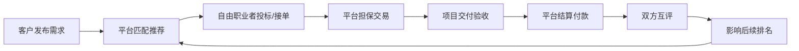
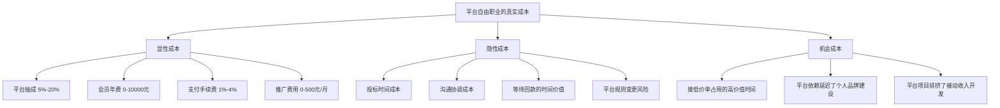
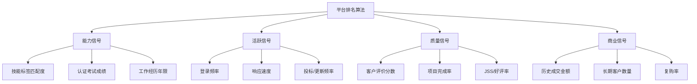
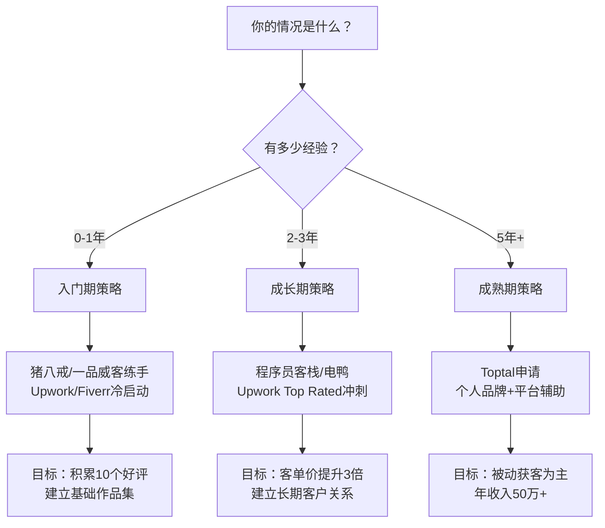
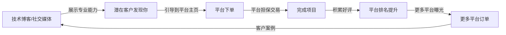

## 六、自由职业平台深度分析

自由职业平台是技术人才变现的基础设施。选对平台、用对策略，决定了你是"在平台上被淹没"还是"在平台上被客户追着下单"。本节从平台机制、运营策略、选择决策三个维度，帮你建立系统化的平台认知。

### 6.1 平台的本质：理解你所处的游戏

自由职业平台本质上是一个**双边市场**——一端是需求方（客户），另一端是供给方（自由职业者）。平台的核心价值在于**降低交易成本**：客户不需要满世界找人，你不需要满世界找活。但这也意味着你必须遵守平台规则，接受平台抽成，并在平台的排名算法中竞争。



理解这个循环很关键：**你的每一次交付质量，都在影响下一次被推荐的概率**。这不是一次性买卖，而是一个需要持续经营的飞轮。平台的商业模式决定了它的算法倾向——平台希望最大化GMV（成交总额），所以会优先推荐那些**既能完成交易、又能带来好评、还能促成复购**的自由职业者。

#### 6.1.1 平台商业模式解析

不同平台的盈利模式直接影响你在平台上的体验和收益：

| 盈利模式 | 代表平台 | 对你的影响 | 应对策略 |
|----------|----------|------------|----------|
| **成交抽成** | Upwork、Fiverr、猪八戒 | 收入直接减少5%-20% | 将抽成计入报价，与长期客户合作降低抽成比例 |
| **会员订阅** | 猪八戒VIP、Dribbble Pro | 固定成本，无论是否接单都收费 | 先免费试运营，确认能回本再升级 |
| **广告/推广** | 猪八戒竞价排名、Fiverr Promoted Gigs | 花钱买曝光，不保证转化 | 小额测试ROI，CPA低于客单价20%才持续投入 |
| **增值服务** | 一品威客知识产权、猪八戒商标注册 | 平台向客户推销附加服务 | 可以主动推荐给客户，建立信任 |
| **零佣金+会员** | Contra、电鸭 | 收入100%归你，但获客需靠自己 | 适合已有个人品牌的成熟自由职业者 |

理解平台的盈利模式，你就明白它为什么这样设计规则。平台的一切算法调整，最终目的都是提升平台自身的收入——当你理解了这个底层逻辑，就能预判平台的行为方向，提前做出应对。

#### 6.1.2 平台经济学：你的真实成本

很多自由职业者只看到平台抽成，忽略了完整的成本结构：



**真实收入计算公式**：

```text
真实时薪 = (项目收入 - 平台抽成 - 支付手续费 - 推广费) / (实际工作时间 + 投标时间 + 沟通时间 + 等待时间)
```

举个例子：一个Upwork上$1000的项目，你实际花了40小时工作+5小时投标沟通+2小时处理付款，抽成20%（$200），Payoneer手续费2%（$16），实际到手$784，真实时薪=$784/47小时=$16.7/小时。这比表面的$25/小时（$1000/40小时）低了33%。

这个计算的意义在于：**帮你识别哪些平台、哪些项目类型、哪些客户值得投入**。

### 6.2 国内主流平台深度分析

#### 6.2.1 猪八戒网

**平台概况**：成立于2006年，是国内最早的威客平台之一，注册用户超过3000万服务商，覆盖设计、开发、营销、知识产权等600多个服务品类。2015年获得26亿元融资后持续转型，近年重点发力企业服务和知识产权领域。

**商业模式**：猪八戒采用"招标+店铺"双模式。客户发布需求后，服务商竞标；同时服务商可以开设店铺，被动接收客户咨询。平台还提供商标注册、版权登记等增值服务，形成完整的知识产权服务链。

**收费结构**：

| 会员等级 | 年费 | 平台抽成 | 曝光权重 | 专属服务 |
|----------|------|----------|----------|----------|
| 基础会员 | 免费 | 20% | 低 | 无 |
| 银牌会员 | 2980元 | 15% | 中 | 基础客服 |
| 金牌会员 | 5980元 | 10% | 高 | 专属客服 |
| 钻石会员 | 9980元 | 5% | 最高 | 优先匹配+运营指导 |

**结算机制**：项目验收后7-15个工作日到账，平台托管资金，验收通过后释放。支持支付宝、银行卡提现。

**竞争环境真实数据**：
- 月收入过万的服务商占比不到15%
- 大量服务商处于"有账号没订单"的状态
- logo设计、名片设计等品类已被压到极低价格（logo设计50-200元）
- 企业级项目（品牌全案、系统开发）竞争相对缓和，客单价5000-50000元

**破局策略**：
1. **避开红海品类**：不要去做50元的logo设计，转向企业品牌全案（客单价5000+）、小程序开发（客单价10000+）、营销策划（客单价3000+）
2. **打造店铺差异化**：作品集要有完整案例展示（项目背景→方案思路→最终效果→客户反馈），而非堆砌图片
3. **积累好评飞轮**：前5单可以适当降价，但必须拿到5星好评。好评数量直接影响店铺排名和客户信任度
4. **主动出击**：不要等客户来找你，每天至少投标3-5个匹配度高的项目。投标时附上针对该需求的简要方案，而非模板化的自我介绍
5. **利用知识产权增值**：帮客户做开发的同时，主动推荐商标注册、软件著作权登记等附加服务，既能增加收入，又能加深客户关系

#### 6.2.2 程序员客栈

**平台定位**：专注于互联网技术人才的远程工作平台，对标国际的Toptal，但门槛相对较低。注册开发者超过50万，企业客户超过5000家。

**人才审核机制**：
- 第一轮：简历审核（学历+工作经验，重点看项目经历的真实性）
- 第二轮：技术能力测试（在线编程/设计实操，与LeetCode类似的技术挑战）
- 第三轮：面试沟通（远程视频，考察沟通能力和项目理解能力）
- 通过率约30%-40%

**收费结构**：平台抽成约10%-15%，支持按月结算和按项目结算。按月结算的项目通常更稳定，适合追求收入确定性的开发者。

**项目质量分析**：
- 企业客户占比超过60%
- 项目预算普遍在1万-50万之间
- 技术栈集中在Java、Python、React、Vue、Go等主流方向
- 项目类型以企业官网、管理系统、小程序、APP为主

**适合人群**：有2年以上经验的程序员、产品经理、UI设计师。初级开发者通过率较低，建议先在其他平台积累经验再来。

**运营要点**：
- 个人主页要突出技术栈和项目经验，用STAR法则描述每个项目（Situation→Task→Action→Result）
- 保持在线状态，及时响应客户需求。响应速度直接影响推荐排名，目标是30分钟内回复
- 主动完善项目履历，每个完成的项目都要写清楚你的角色、技术栈、成果数据
- 争取与优质企业客户建立长期合作关系，长期客户的项目通常更稳定、沟通成本更低

#### 6.2.3 电鸭社区

**平台定位**：国内最大的远程工作者社区，注册用户超过30万。不是传统意义上的"接单平台"，而是一个**远程工作机会聚合+社区互助**的生态。

**运作模式**：
- 企业发布远程岗位（全职/兼职/项目制）
- 自由职业者浏览并直接联系企业
- 平台不参与交易，不抽成
- 社区提供经验分享、互助答疑、薪资透明化

**核心优势**：
- 零抽成：所有收入100%归你
- 远程工作机会丰富：覆盖国内外企业，包括大量外企远程岗位
- 社区氛围好：有经验的老手愿意分享接单技巧、合同模板、收款方案
- 信息透明：薪资范围通常公开，避免信息不对称

**核心劣势**：
- 没有平台担保：需要自行处理合同和收款，建议使用电子合同（如e签宝、法大大）
- 信息筛选成本高：需要自己判断项目可靠性和企业信用
- 没有排名机制：完全靠个人主动出击，没有"被动获客"的可能

**使用策略**：
1. 每天花15分钟浏览新发布的远程岗位，设置关键词订阅提醒
2. 准备一份标准化的自我介绍模板，针对不同岗位微调（技术栈、项目经验、可工作时间）
3. 加入电鸭的微信群/QQ群，参与社区讨论建立人脉。很多项目是通过社区人脉而非公开发布的
4. 对于国际远程岗位，准备好英文简历和时区说明。国际岗位时薪通常是国内的3-5倍
5. 由于无平台担保，**必须在开始工作前签订书面合同**，明确付款方式、里程碑、验收标准。建议收取30%-50%预付款

#### 6.2.4 开源众包（OSChina）

**平台定位**：依托开源中国社区的技术众包平台，技术氛围浓厚。开源中国拥有超过500万注册开发者，是国内最大的开源社区之一。

**收费结构**：平台抽成较低（约5%-10%），是国内平台中抽成最低的之一。

**项目特点**：以中小型技术项目为主，预算通常在5000-5万元。项目类型集中在网站开发、小程序、APP、数据处理、爬虫开发等领域。

**适合人群**：喜欢技术社区氛围的开发者，尤其是有开源项目贡献的技术人员。在OSChina上有活跃账号和开源项目会显著增加信任度，客户更愿意选择有开源背景的开发者。

**局限性**：项目规模整体偏小，大客户较少，不适合作为主要收入来源，更适合作为补充渠道。平台的项目匹配机制不够成熟，需要自己主动寻找合适的项目。

**破局方法**：在OSChina上维护一个高质量的开源项目，README写得专业，定期更新。很多客户会通过你的开源项目找到你，这种"被发现"的获客方式比主动竞标效率高得多。

#### 6.2.5 一品威客

**平台概况**：与猪八戒齐名的综合性威客平台，2010年上线，注册用户超过2500万，2019年在港交所上市。

**差异化定位**：
- 更注重知识产权服务（商标注册、专利申请、版权登记等），这块业务占平台GMV的30%以上
- 有"一对一雇佣"模式，客户可以直接雇佣特定服务商，省去竞标环节
- 推出"威客任务"模式，类似Fiverr的Gig模式，服务商可以发布标准化服务

**收费结构**：基础抽成8%-20%，VIP会员享受更低抽成和更多曝光。与猪八戒相比，一品威客的VIP性价比较高。

**适合人群**：设计类、营销类自由职业者。与猪八戒相比，一品威客在设计领域的竞争稍微缓和一些，但整体差异不大。

#### 6.2.6 实现网

**平台定位**：专注于高端技术人才的众包平台，定位介于猪八戒和程序员客栈之间。

**特点**：
- 有人才审核机制，通过率约40%
- 项目质量中等偏上，客单价通常在1万-20万
- 平台抽成10%-20%
- 提供项目管理工具和进度跟踪

**适合人群**：有3年以上经验的技术人员，想要在国产平台接中高端项目。

#### 6.2.7 国内平台综合对比

| 平台 | 抽成比例 | 项目质量 | 审核门槛 | 结算保障 | 适合阶段 | 核心品类 |
|------|----------|----------|----------|----------|----------|----------|
| 猪八戒 | 5%-20% | 中低 | 无 | 有 | 入门期 | 综合 |
| 程序员客栈 | 10%-15% | 中高 | 有（30%通过率） | 有 | 成长期 | 技术 |
| 电鸭社区 | 0% | 中高 | 无 | 无 | 成熟期 | 远程岗位 |
| 开源众包 | 5%-10% | 中 | 无 | 有 | 补充渠道 | 技术 |
| 一品威客 | 8%-20% | 中 | 无 | 有 | 入门-成长 | 设计/营销 |
| 实现网 | 10%-20% | 中高 | 有 | 有 | 成长期 | 技术 |

### 6.3 国际平台深度分析

#### 6.3.1 Upwork

**平台地位**：全球最大的自由职业平台，注册自由职业者超过1200万，客户超过80万，覆盖180+个国家。2023年平台GMV超过42亿美元。

**抽成规则（2024年更新）**：
- 与每个客户的前$500收入：抽成20%
- $500-$10,000：抽成10%
- $10,000以上：抽成5%
- **重要细节**：这是**按客户累计**的，不是按总金额。换一个新客户，抽成重新从20%开始。这意味着与长期客户合作可以显著降低平均抽成率。
- **Connects系统**：每月免费获得一定数量的Connects（投标代币），用完后需购买（约$0.15/个）。不同项目需要不同数量的Connects（通常2-6个）。这是Upwork控制投标质量的机制。

**时薪范围**：
- 初级开发者：$15-$30/小时
- 中级开发者：$30-$75/小时
- 高级开发者：$75-$200+/小时
- 架构师/技术顾问：$150-$300+/小时
- 中国开发者的时薪通常在$25-$80之间，取决于英语水平和技术深度

**支付方式**：PayPal、Wire Transfer、Payoneer、M-Pesa。国内开发者推荐Payoneer，手续费最低（1%-2%），到账速度最快（1-3个工作日），支持直接提现到国内银行卡。

**平台算法与排名机制**：

Upwork的搜索排名由以下因素决定（按权重排序）：
1. **Job Success Score（JSS）**：最重要的指标，由客户评价、项目完成率、长期合作关系、纠纷率等综合计算。90%+才能获得良好曝光，95%+获得Top Rated徽章
2. **响应速度**：收到客户消息后12小时内回复，对排名有显著提升。最佳实践是2小时内回复
3. **Profile完整度**：技能标签、作品集、认证考试、工作经历、教育背景全部填满。完整度100%的Profile比50%的获得40%+的额外曝光
4. **近期活跃度**：最近30天内的投标数量、登录频率、Profile更新频率
5. **Top Rated徽章**：连续保持高JSS+累计收入$1000+后获得，带来30%-50%的曝光提升

**获客策略（从0到1）**：

**第一阶段：冷启动（前10个项目）**
- 适当降低报价10%-20%，但不要降到离谱（客户会怀疑质量）
- 选择竞争较少的细分领域（如"微信小程序开发"比"Web开发"竞争小得多；"Shopify主题定制"比"前端开发"竞争小）
- 每个Proposal都要针对客户需求定制，绝对不要用模板
- 前10个项目的目标不是赚钱，而是拿到10个5星好评
- 每天投10-15个高质量Proposal，不要广撒网

**第二阶段：建立口碑（10-50个项目）**
- 逐步提升报价到市场正常水平
- 开始筛选客户，拒绝低价和不靠谱的项目（红旗信号：需求不明确、预算与工作量严重不匹配、催促免费试做）
- 争取与优质客户建立长期合作关系（降低抽成+稳定收入）
- 积极使用Upwork的"Connects"投标高质量项目（每月有免费Connects，用完后需购买）

**第三阶段：被动获客（50个项目+）**
- 获得Top Rated徽章后，客户会主动找你
- 可以设置"Available"状态，让Upwork推荐你给匹配的客户
- 开始接固定价格的大项目（$5000+）
- 建立自己的专业领域标签，成为该领域的Top Freelancer
- 时薪可以提升到市场Top 20%水平

**Upwork避坑指南**：
- 不要在平台外交易：一旦被发现，直接封号，且无法申诉
- 不要接受客户要求免费试做：这是红旗信号，正规客户不会要求免费劳动
- 不要同时接太多项目：质量下降导致差评，一个差评可能让你损失未来10个潜在客户
- 不要忽略合同细节：固定价格项目一定要在开始前明确需求、里程碑、验收标准、修改次数
- 不要频繁更改时薪：频繁涨价会让老客户流失，建议每6个月调整一次
- **不要忽略Profile的SEO**：在标题和Overview中自然嵌入客户搜索的关键词，直接影响你是否出现在搜索结果中

#### 6.3.2 Fiverr

**平台定位**：以"Gig"（服务商品）为核心的自由职业平台，与Upwork的"投标"模式不同，Fiverr是**卖家开店，买家选购**的电商模式。注册卖家超过400万，买家超过1100万。

**收费结构**：
- 卖家抽成：20%（所有金额统一20%）
- 买家服务费：5.5%的订单金额+$2（小额订单）
- 提款手续费：$1-$3/次（取决于提款方式）
- 到账时间：订单完成14天后可提款（Top Rated Seller缩短为7天）

**Gig定价策略**：
- 设置3个价格档次是Fiverr的核心玩法：
  - **Basic（$5-$50）**：基础服务，快速交付（24-48小时），吸引新客户，建立好评基础
  - **Standard（$50-$200）**：标准服务，包含更多功能和修改次数，满足大多数客户需求
  - **Premium（$200-$10,000）**：高端服务，全包式解决方案，包含源代码、文档、长期维护
- 用Basic档引流，用Premium档赚钱。80%的收入通常来自Premium档

**Fiverr排名算法**：

Fiverr的搜索排名由以下因素决定：
1. **Seller Level**：New Seller → Level 1（60天+完成10单+好评90%+） → Level 2（120天+完成50单+好评90%+） → Top Rated Seller（180天+完成100单+好评90%+收入$20K+）
2. **响应时间**：平均回复时间越短越好，目标<1小时。超过24小时回复会严重影响排名
3. **订单完成率**：保持95%+的完成率。取消订单对排名影响很大
4. **好评率**：4.7星以上才能获得良好排名。4.9星以上获得额外曝光加成
5. **Gig浏览量和点击率**：标题和封面图决定点击率，这是第一道漏斗
6. **转化率**：浏览到下单的转化率，越高排名越靠前。行业平均转化率约2%-5%

**Gig优化实操**：
1. **标题SEO**：包含核心关键词，格式为"I will [动词] [服务描述] using [技术栈]"
   - 差："I will do web development"
   - 好："I will build a responsive React website with Node.js backend"
2. **封面图**：使用专业的Gig封面图（1280x769px），展示作品效果而非文字堆砌。建议使用对比图（Before/After）或成品截图
3. **视频介绍**：制作60秒的Gig介绍视频，可提升40%的转化率。视频内容：你是谁→你做什么→客户能得到什么→为什么选你
4. **FAQ设置**：预设5-8个常见问题，减少沟通成本。常见问题包括：交付时间、修改次数、是否提供源代码、技术栈说明
5. **标签选择**：使用5个精准标签，不要用泛标签。优先使用Fiverr推荐的标签（系统会根据你的Gig描述自动推荐）

**Fiverr进阶玩法**：
- **Gig多开**：同一技能可以开设多个Gig，针对不同细分场景。例如："WordPress开发"、"WordPress bug修复"、"WordPress速度优化"、"WordPress搬家"各开一个Gig
- **Seller Plus会员**：$29/月，享受优先客服、高级分析（竞品分析、关键词数据）、自定义URL、优先展示
- **Fiverr Business**：面向企业客户的高端服务，客单价更高，平台提供专属客户经理
- **Fiverr Pro**：平台认证的专业卖家，需要提交作品集和通过审核。通过后享受更高曝光和客单价，Pro卖家的平均收入是普通卖家的3-5倍
- **Fiverr Learn**：平台提供的在线课程，完成课程并获得认证可以在Gig上展示，增加可信度

#### 6.3.3 Toptal

**平台定位**：只接受前3%的自由职业者，服务Fortune 500公司和顶级创业公司（Airbnb、HP、IDEO、Shopify等）。

**审核流程（5轮筛选）**：
1. **语言和沟通能力测试**：英语口语和书面表达，考察技术沟通能力而非语法完美
2. **技术能力测试**：在线编程挑战（Codility平台），难度相当于LeetCode Medium-Hard
3. **项目实操测试**：完成一个真实的模拟项目（通常48-72小时），评估代码质量、架构设计、文档能力
4. **试用期项目**：分配一个真实客户项目（通常2-4周），评估实际工作表现和客户满意度
5. **持续评估**：入池后仍需保持高质量交付，连续两次差评会被移除

**通过率**：约3%，每年申请者数万人，最终入池者不到千人。

**收入水平**：
- 开发者：$60-$200+/小时
- 设计师：$60-$150+/小时
- 项目经理：$80-$200+/小时
- 财务专家：$100-$300+/小时
- 中国开发者在Toptal的典型时薪：$80-$150

**Toptal的真正价值**：
- 客户质量极高：不需要自己找客户，平台匹配
- 按时薪计费，收入稳定（通常每周20-40小时）
- 有专属的Toptal社区和线下活动（Toptal Summit）
- 不收平台费（抽成为0%），客户直接付费给你

**如何准备Toptal审核**：
1. 刷LeetCode中等难度题目至少100道，Hard难度至少30道
2. 准备英语技术面试（看Cracking the Coding Interview英文版，练习用英语讲解算法思路）
3. 准备3-5个能展示深度技术能力的项目案例（系统设计、性能优化、架构决策）
4. 练习系统设计面试（推荐《System Design Interview》by Alex Xu）
5. 确保每天有至少4小时可用时间（Toptal项目通常要求一定的时间承诺）
6. 准备一个安静的面试环境，确保网络稳定、摄像头和麦克风正常

#### 6.3.4 AI时代新兴平台

随着AI行业的爆发，一批专注于AI相关技能的平台迅速崛起，为有AI技能的自由职业者提供了全新的变现渠道。

**Kaggle（数据科学竞赛平台）**：
- Google旗下的数据科学社区，注册用户超过1500万
- 运作模式：企业发布数据科学竞赛（奖金$10K-$100K+），参赛者组队建模竞争
- 变现方式：竞赛奖金、Kaggle Notebooks曝光带来的咨询机会、Kaggle Expert/Master头衔的职业溢价
- 收入案例：顶级Kaggle Master年竞赛奖金收入$50K-$200K
- 适合人群：数据科学家、ML工程师、统计学背景的技术人员
- 入门建议：先从Playground赛题开始练手，学习Top Kernel的解题思路

**Scale AI / Remotasks**：
- AI数据标注和训练平台，为OpenAI、Meta等公司提供数据服务
- 变现方式：按任务计费，包括图片标注、文本分类、RLHF（人类反馈强化学习）评估
- 收入范围：$10-$50/小时，高级评估员（如代码审查、专业领域标注）可达$50-$100/小时
- 门槛较低但收入上限也低，适合作为过渡期收入来源

**PromptBase**：
- Prompt交易市场，买卖AI提示词（ChatGPT、Midjourney、Stable Diffusion等）
- 变现方式：创建并出售高质量Prompt，单价$2-$10，热门Prompt可卖出数千份
- 适合人群：深度理解AI模型行为、擅长Prompt Engineering的技术人员
- 收入潜力：顶级卖家月收入$1K-$5K，但竞争日益激烈

**Hugging Face**：
- 开源AI模型社区，类似AI领域的GitHub
- 变现方式：模型部署（Inference Endpoints）按用量收费、企业咨询、社区赞助
- 适合人群：AI/ML工程师，有开源模型贡献的技术人员
- 长期价值：在Hugging Face上维护高星模型相当于建立了AI领域的个人品牌

#### 6.3.5 其他国际平台

**Freelancer.com**：
- 全球第二大自由职业平台，注册用户超过6000万
- 特点：竞标模式，项目数量多但质量参差不齐。低价竞争比Upwork更严重
- 抽成：10%或$5（取较高者）
- 特色功能：竞赛模式（类似99designs的设计竞赛）、本地项目
- 适合：想要大量练手项目的初学者，不建议作为主要平台

**99designs**：
- 设计专属平台，以logo设计、品牌设计、UI设计为主
- 运作模式：设计竞赛（客户发布需求，多个设计师提交方案，客户选中后付费）+ 一对一雇佣
- 抽成：15%-40%（根据设计师等级，新设计师抽成最高）
- 竞赛模式的弊端：大量无酬劳的设计工作，中选率通常只有5%-15%
- 适合：有视觉设计能力且愿意承担竞赛风险的设计师

**Dribbble**：
- 设计师社区+招聘平台，注册设计师超过100万
- 特点：以作品展示为核心，客户通过作品直接联系设计师。更像是设计师的"个人品牌平台"
- Pro会员：$8/月，可发布兼职/全职服务，获得招聘板块曝光
- 适合：UI/UX设计师、插画师、品牌设计师。Dribbble的作品质量要求很高，适合有成熟作品集的设计师

**RemoteOK**：
- 远程工作聚合平台，由Nomad List创始人Pieter Levels创建
- 特点：聚合全球远程岗位，按薪资、技术栈、时区筛选
- 收费：企业发布岗位需付费（$299/条），求职者免费
- 适合：寻找长期远程工作的开发者，尤其是想要全职远程而非项目制的开发者

**Contra**：
- 新兴的零佣金自由职业平台，2020年上线
- 特点：不抽成自由职业者，通过Pro会员（$9.99/月）盈利。设计理念是"让自由职业者保留100%的收入"
- Portfolio功能：可以创建精美的个人作品集页面
- 适合：想要最大化收入的自由职业者，尤其是已经在其他平台有口碑的老手

**Wellfound（原AngelList Talent）**：
- 创业公司招聘平台
- 特点：专注于科技创业公司，薪资透明（直接显示薪资范围）
- 适合：想要加入早期创业公司的开发者，通常有期权

**We Work Remotely**：
- 最大的纯远程工作板之一，月访问量超过100万
- 特点：只发布远程岗位，岗位质量较高（企业需付费$299发布）
- 适合：寻找全职远程工作的高级技术人员

**HackerOne**：
- 漏洞赏金平台，为全球企业提供安全漏洞发现服务
- 变现方式：发现并报告安全漏洞获得赏金，单个漏洞赏金$100-$100,000+
- 顶级猎人年收入超过$500,000
- 适合：网络安全专业人员，有渗透测试和漏洞挖掘能力

#### 6.3.6 国际平台综合对比

| 平台 | 抽成 | 时薪范围 | 审核门槛 | 获客模式 | 适合水平 | 核心优势 |
|------|------|----------|----------|----------|----------|----------|
| Upwork | 5%-20% | $15-$300 | 低 | 主动投标 | 所有水平 | 项目最多最全 |
| Fiverr | 20% | $5-$10000/Gig | 低 | 被动接单 | 中级+ | 电商化被动获客 |
| Toptal | 0% | $60-$300 | 极高（3%） | 平台匹配 | 顶级 | 最高质量客户 |
| Freelancer | 10% | $10-$100 | 低 | 竞标 | 初级 | 项目数量多 |
| 99designs | 15%-40% | 按项目 | 中 | 设计竞赛 | 中级 | 设计专属 |
| Dribbble | $8/月 | 按项目 | 低 | 作品吸引 | 中级+ | 设计师品牌 |
| Contra | 0% | 按项目 | 低 | 主动+被动 | 所有 | 零佣金 |
| RemoteOK | 免费 | 按项目 | 无 | 主动投递 | 中级+ | 远程全职 |
| Kaggle | 0% | 竞赛奖金 | 无 | 竞赛参与 | 中级+ | 数据科学专属 |
| HackerOne | 0% | 漏洞赏金 | 无 | 主动挖掘 | 高级 | 安全专属 |

### 6.4 平台算法深度解析：如何被客户"看见"

无论在哪个平台，核心问题都是同一个：**如何让客户在搜索结果中看到你**。平台算法虽然各有不同，但底层逻辑高度一致。

#### 6.4.1 通用排名因素模型



**关键洞察**：平台算法的核心目标是**最大化平台GMV（成交总额）**。这意味着平台会优先推荐那些**既能完成交易、又能带来好评、还能促成复购**的自由职业者。理解这一点，你就知道该优化什么了。

#### 6.4.2 冷启动期的破局策略

新账号在任何平台都面临"没有评价→没有曝光→没有订单→没有评价"的死循环。破局方法：

**方法一：低价引流（适用于Upwork/Freelancer）**
- 前3-5个项目报价降低30%-50%
- 目标：快速积累5个5星好评
- 注意：低价不等于免费，不要接受免费试做。低价是策略，不是常态

**方法二：Gig优化（适用于Fiverr）**
- 用Basic档的低价（$5-$20）吸引首批客户
- 通过极致的交付质量拿到好评（超出客户预期的交付）
- 逐步提升价格和档位，每积累10个好评涨价一次

**方法三：外部引流（适用于所有平台）**
- 在GitHub、技术博客、社交媒体上展示能力
- 引导潜在客户到你的平台主页下单
- 平台会因为外部流量带来的成交而提升你的排名权重

**方法四：认证考试（适用于Upwork）**
- Upwork提供各种技能认证考试（JavaScript、Python、React等）
- 通过考试会显示在你的Profile上，增加可信度
- 认证考试是免费的，建议在注册后一周内完成所有相关认证

**方法五：竞赛/比稿（适用于99designs/猪八戒）**
- 参加设计竞赛或免费比稿，虽然有白嫖风险，但中选后能快速建立作品集和好评
- 只参加预算合理、需求明确的竞赛，避免被白嫖

**方法六：开源贡献（适用于技术平台）**
- 在GitHub上维护高质量开源项目，客户会主动找到你
- 在技术社区（Stack Overflow、掘金、V2EX）回答问题，建立专业形象
- 开源贡献是最强的"能力证明"，比任何平台认证都更有说服力

### 6.5 个人资料与作品集优化

你的平台个人资料就是你的"线上简历"，客户平均只花**6秒**扫描你的主页。这6秒决定了他是继续看还是划走。

#### 6.5.1 个人资料优化清单

**头像**：
- 使用专业的职业照（不是自拍，不是证件照，不是风景照）
- 背景简洁（纯色或浅色），光线充足，面部清晰
- 面带微笑，眼神自信，着装得体（商务休闲即可）
- 尺寸：至少400x400px，正方形裁剪

**标题/Tagline**：
- 差："Web Developer"（太泛，毫无差异化）
- 好："React & Node.js Developer | SaaS & E-commerce Specialist | 50+ Projects Delivered"
- 公式：核心技能 + 细分领域 + 数据背书
- 不同平台可以有不同的标题，但核心定位要一致

**个人简介**：
- 第一段：你是谁，做什么，做了多久（2-3句话）
- 第二段：你的核心优势和擅长领域（3-4个具体的技术方向）
- 第三段：代表性项目和成果（用数据说话：用户量、性能提升、收入增长）
- 第四段：工作方式和沟通风格（时区、响应时间、工作语言）
- 字数控制在300-500词（英文）或500-800字（中文）
- 不要用第三人称，直接用第一人称

**技能标签**：
- 选择5-10个精准标签，不要贪多
- 优先选择平台推荐的标准化标签（使用平台的搜索建议）
- 包含核心技能和细分技能（如"React"和"React Native"分别标注）
- 包含工具和框架（如"TypeScript"、"Docker"、"AWS"）

**作品集**：
- 至少展示5个代表性项目，最多不超过15个
- 每个项目包含：项目背景、你的角色、技术栈、成果数据、客户反馈
- 使用截图或Demo链接增加可信度（GIF动图效果更好）
- 定期更新，移除过时的项目，确保展示的都是你当前水平的作品

#### 6.5.2 Proposal/投标模板

在Upwork等投标型平台，Proposal的质量直接决定你是否能拿到面试机会。客户平均收到20-50个Proposal，只会仔细看前5-10个。

**糟糕的Proposal**：
> "Hi, I am a web developer with 5 years of experience. I can do this project. Please check my portfolio. Thanks."

**优秀的Proposal结构**：

```text
第一段：证明你理解客户需求（2-3句话，引用客户的具体需求点，让客户知道你认真读了需求）
第二段：说明你为什么适合（相关经验+类似项目案例，用数据说话）
第三段：提出你的方案思路（简要说明你会怎么做，展示专业性）
第四段：明确时间线和报价（给出具体的里程碑和交付时间）
第五段：行动号召（提议进一步沟通，降低客户决策成本）
```

**示例**：
> "Hi [Client Name], I see you need a React-based dashboard with real-time data visualization and user authentication. I've built similar dashboards for [类似行业] clients, including [具体案例] which handles 10K+ daily users.
>
> For your project, I'd use React + TypeScript with Recharts for visualization, and Firebase Auth for user management. I can deliver a working MVP in 3 weeks with weekly progress updates.
>
> I'd love to discuss the technical details and timeline. Are you available for a quick call this week?"

**Proposal数量建议**：
- 新账号：每天投10-15个高质量Proposal
- 有好评后：每天投5-10个，重点选择匹配度高的项目
- Top Rated后：每天投3-5个，同时被动接收客户邀请

**Proposal的关键原则**：
- **不要用模板**：客户能一眼看出模板化的Proposal，直接跳过
- **前两句话决定生死**：客户只看前两句话就决定是否继续读下去，必须在前两句话证明你理解了他的需求
- **用客户的语言**：客户用什么词描述需求，你就用什么词回应，建立共鸣
- **展示而非声称**：不要说"我是专家"，而是用具体的项目案例和数据证明

### 6.6 平台选择决策框架

#### 6.6.1 多维度决策矩阵

选择平台不是"哪个最好"的问题，而是"哪个最适合你当前阶段"的问题。



#### 6.6.2 按技能类型选择

| 技能类型 | 首选平台 | 次选平台 | 备注 |
|----------|----------|----------|------|
| 前端开发 | Upwork | Fiverr | 国际市场单价高，React/Vue需求大 |
| 后端开发 | 程序员客栈 | Upwork | 技术深度要求高，企业客户为主 |
| 全栈开发 | Toptal | Upwork | 全栈在国际市场溢价明显 |
| UI/UX设计 | Dribbble | 99designs | 设计需要作品展示，视觉先行 |
| 移动开发 | Upwork | 程序员客栈 | APP项目预算较高，通常5万+ |
| 数据/AI | Toptal/Upwork | Kaggle | AI人才供不应求，时薪溢价50%+ |
| 技术写作 | Fiverr | Upwork | 内容需求持续增长，门槛相对低 |
| 翻译/本地化 | Fiverr | Upwork | 语言能力是核心壁垒，中英翻译需求大 |
| 网络安全 | Toptal/HackerOne | Upwork | 安全人才稀缺，Bug Bounty收入可观 |
| 区块链/Web3 | Upwork | Contra | 新兴领域，竞争少但项目也不多 |
| Prompt Engineering | PromptBase | Fiverr | AI时代的新兴技能，市场需求快速增长 |
| 数据标注/RLHF | Scale AI | Remotasks | 门槛低，适合过渡期收入 |

#### 6.6.3 按收入目标选择

| 月收入目标 | 推荐策略 | 平台组合 | 预计时间 |
|------------|----------|----------|----------|
| 3000-5000元 | 兼职接单，周末项目 | 猪八戒 + Fiverr Basic档 | 1-3个月 |
| 5000-15000元 | 半全职，每天4-6小时 | 程序员客栈 + Upwork | 3-6个月 |
| 15000-30000元 | 全职自由职业 | Upwork + Fiverr + 电鸭 | 6-12个月 |
| 30000-50000元 | 高端自由职业 | Toptal + Upwork Top Rated | 12-24个月 |
| 50000元+ | 个人品牌+平台辅助 | 个人网站 + Toptal/Upwork | 24个月+ |

### 6.7 多平台策略：不要把鸡蛋放在一个篮子里

#### 6.7.1 为什么需要多平台

- **风险分散**：单平台封号=收入归零。平台规则变更、算法调整都可能影响你的收入
- **客户互补**：不同平台的客户画像不同（国内vs国际、初创vs大企业、低价vs高端）
- **收入稳定**：一个平台淡季时另一个可能旺季。多平台可以平滑收入波动
- **议价能力**：有多个平台的订单，你有底气拒绝不合理的客户和不合理的价格

#### 6.7.2 多平台运营策略

**核心原则**：1个主攻平台 + 1-2个辅助平台。不要贪多，3个平台已经是精力上限。

**时间分配**：
- 主攻平台：70%的时间和精力（每天3-4小时）
- 辅助平台1：20%的时间和精力（每天1小时）
- 辅助平台2：10%的时间和精力（每周2-3小时）

**平台组合建议**：

| 组合方案 | 主攻平台 | 辅助平台 | 适合人群 |
|----------|----------|----------|----------|
| 国内为主 | 程序员客栈 | 电鸭 + 猪八戒 | 英语一般的开发者 |
| 国际为主 | Upwork | Fiverr + 电鸭 | 英语流利的开发者 |
| 高端路线 | Toptal | Upwork | 顶级技术能力 |
| 设计师 | Dribbble | 99designs + Fiverr | 视觉设计能力 |
| 内容创作者 | Fiverr | 个人网站 + 电鸭 | 写作/翻译能力 |
| 安全专家 | HackerOne | Toptal + Upwork | 网络安全能力 |
| AI/ML专家 | Upwork | Kaggle + Scale AI | AI/ML技能 |

#### 6.7.3 多平台的注意事项

- **时间冲突管理**：使用日历工具（Google Calendar、Notion）统一管理所有平台的项目deadline，避免撞期
- **资料一致性**：各平台的个人资料和作品集要保持一致，但可以根据平台特点微调重点
- **定价策略**：国际平台的报价通常是国内平台的3-5倍（汇率+市场差异），不要用国内价格接国际项目
- **避免重复交付**：同一个作品不要在多个平台作为独立案例展示，但可以作为作品集的一部分
- **收款账户**：建议使用同一个Payoneer账户管理所有国际平台的收入，方便财务核算

### 6.8 收款、税务与财务管理

自由职业者最容易忽视的环节就是收款和税务。很多人赚到了钱，但在"把钱拿回来"和"合规报税"上踩坑。

#### 6.8.1 国际收款方案对比

| 收款方式 | 手续费 | 到账速度 | 支持币种 | 适合场景 | 注意事项 |
|----------|--------|----------|----------|----------|----------|
| **Payoneer** | 1%-2% | 1-3个工作日 | USD/EUR/GBP等 | Upwork/Fiverr等主流平台 | 推荐首选，支持直接提现到国内银行卡 |
| **PayPal** | 3%-4.5% | 即时到账 | 多币种 | 小额收款、个人客户 | 手续费高，大额不划算；有180天争议期 |
| **Wire Transfer** | $15-$50/笔 | 3-7个工作日 | 多币种 | 大额单笔付款 | 银行中转费可能额外扣除$10-$30 |
| **Wise（TransferWise）** | 0.5%-1% | 1-2个工作日 | 多币种 | 直接客户付款 | 汇率最优，但需客户主动操作 |
| **支付宝国际** | 约1% | 即时 | CNY | 国内平台 | 国内平台默认方案 |

**Payoneer使用实操**：
1. 注册Payoneer账户（需要身份证/护照）
2. 绑定国内银行卡（建议用四大行，到账最快）
3. 在Upwork/Fiverr的支付设置中选择Payoneer
4. 收到款项后，提现到国内银行卡，汇率按中国银行当日现汇买入价
5. 单笔提现建议控制在$5000以内，超过可能触发反洗钱审查

#### 6.8.2 外汇与税务合规

**外汇管理**：
- 中国个人年度购汇/结汇额度为5万美元
- 自由职业收入属于"经常项目"下的"服务贸易"，需要通过正规渠道结汇
- Payoneer提现到国内银行卡时，银行会要求提供收入来源说明
- 建议保留所有平台的收入记录、合同、发票，以备银行或税务审查

**税务处理**：
- 自由职业收入在中国属于"劳务报酬所得"，税率20%-40%
- 单次收入不超过4000元，减除费用800元后按20%税率
- 单次收入超过4000元，减除20%费用后按20%-40%税率
- 年度汇算清缴时，劳务报酬并入综合所得，适用3%-45%的超额累进税率
- **重要提示**：如果年收入超过12万元，必须进行年度个税申报

**合理节税方法**：
- 注册个体工商户，适用经营所得5%-35%税率，部分地区有核定征收政策
- 成立个人独资企业，可以开具发票给客户，适用更低的综合税率
- 利用专项附加扣除（子女教育、住房贷款、赡养老人等）降低应纳税所得额
- **合规为先**：不建议通过个人账户收公司款项、虚开发票等违规操作，金税四期下风险极高

#### 6.8.3 财务管理工具

| 工具 | 用途 | 费用 | 推荐理由 |
|------|------|------|----------|
| **记账APP（随手记/MoneyWiz）** | 日常收支记录 | 免费/基础版免费 | 自由职业收入来源多，必须记账 |
| **发票管理** | 开具发票 | - | 国内客户通常需要发票，注册电子税务局 |
| **合同模板** | 项目合同 | 免费 | 电鸭社区有大量合同模板，参照09-合同与法律知识.md |
| **时间追踪（Toggl/Harvest）** | 记录工时 | 免费版够用 | 按时薪计费的项目必须有精确的工时记录 |
| **Wave/FreshBooks** | 专业记账+发票 | 免费/$15/月 | 接国际客户时用于生成专业发票 |

### 6.9 平台外获客与平台的配合

平台不是唯一的获客渠道，聪明的自由职业者会把平台作为**信任背书**，而非唯一收入来源。

#### 6.9.1 平台外获客渠道

| 渠道 | 获客成本 | 客户质量 | 适合阶段 | 操作难度 |
|------|----------|----------|----------|----------|
| GitHub开源项目 | 低 | 高 | 成熟期 | 高 |
| 技术博客/公众号 | 低 | 中高 | 成长期 | 中 |
| 技术社区（Stack Overflow等） | 低 | 高 | 成熟期 | 高 |
| 微信朋友圈/社群 | 低 | 中 | 所有阶段 | 低 |
| 线下技术meetup | 中 | 高 | 成长期 | 中 |
| LinkedIn | 低 | 高 | 所有阶段 | 低 |
| 知乎/CSDN | 低 | 中 | 成长期 | 中 |
| YouTube/B站技术视频 | 中 | 高 | 成熟期 | 高 |

#### 6.9.2 平台与外部渠道的配合飞轮



**最佳实践**：
1. 在技术博客/公众号上持续输出高质量技术内容，展示你的专业能力
2. 文章末尾引导读者到你的平台主页下单（利用平台担保降低信任成本）
3. 在平台上完成交易，积累好评和交易记录
4. 将好评截图和客户反馈用于外部渠道的social proof
5. 形成"外部引流→平台成交→好评积累→更多曝光→更多订单"的飞轮

### 6.10 自由职业者工具生态

工欲善其事，必先利其器。以下是自由职业者日常运营必备的工具清单。

#### 6.10.1 项目管理与协作

| 工具 | 用途 | 费用 | 适用场景 |
|------|------|------|----------|
| **Notion** | 项目管理+知识库 | 免费版够用 | 个人任务管理、客户项目跟踪 |
| **Trello** | 看板式项目管理 | 免费 | 多项目并行管理 |
| **飞书/钉钉** | 团队协作+文档 | 免费 | 国内客户项目协作 |
| **Slack** | 即时通讯 | 免费 | 国际客户沟通 |
| **GitHub** | 代码管理+项目协作 | 免费 | 所有技术项目 |

#### 6.10.2 时间追踪与效率

| 工具 | 用途 | 费用 | 核心功能 |
|------|------|------|----------|
| **Toggl Track** | 时间追踪 | 免费 | 按项目/客户记录工时，生成报表 |
| **RescueTime** | 效率分析 | 免费版够用 | 自动追踪电脑使用时间，分析效率瓶颈 |
| **Forest** | 专注力训练 | ¥12 | 番茄钟+种树游戏，防止分心 |
| **Clockify** | 团队时间追踪 | 免费 | 比Toggl更适合需要向客户汇报工时的场景 |

#### 6.10.3 设计与演示

| 工具 | 用途 | 费用 | 适用场景 |
|------|------|------|----------|
| **Figma** | UI/UX设计 | 免费版够用 | 界面设计、原型制作 |
| **Canva** | 快速设计 | 免费版够用 | 社交媒体图、Gig封面图、提案文档 |
| **Loom** | 屏幕录制 | 免费版够用 | 录制产品演示、项目讲解视频 |
| **Excalidraw** | 手绘风格图表 | 免费 | 方案讲解中的架构图、流程图 |

#### 6.10.4 合同与法务

| 工具 | 用途 | 费用 | 适用场景 |
|------|------|------|----------|
| **e签宝** | 电子合同签署 | 按份收费 | 国内项目合同 |
| **法大大** | 电子合同签署 | 按份收费 | 国内项目合同，法律效力等同纸质 |
| **DocuSign** | 电子合同签署 | $10/月起 | 国际项目合同 |
| **HelloSign** | 电子合同签署 | 免费版3份/月 | 国际小额项目 |

### 6.11 AI对自由职业市场的影响

AI正在深刻改变自由职业市场的供需结构。理解这个趋势，才能在变革中找到机会而非被淘汰。

#### 6.11.1 AI正在替代的自由职业工作

| 工作类型 | 替代程度 | 时间窗口 | 应对策略 |
|----------|----------|----------|----------|
| 简单logo设计 | 高（80%+） | 已经发生 | 转向品牌全案设计 |
| 基础网页开发 | 中高（60%） | 1-2年 | 转向复杂系统架构 |
| 简单文案写作 | 高（70%+） | 已经发生 | 转向策略性内容创作 |
| 基础数据标注 | 中（50%） | 2-3年 | 转向RLHF评估、模型训练 |
| 简单翻译 | 中高（60%） | 1-2年 | 转向专业领域翻译、本地化 |
| CRUD应用开发 | 中（50%） | 2-3年 | 转向AI应用开发、系统集成 |

#### 6.11.2 AI正在创造的新机会

| 新兴方向 | 需求增长 | 时薪范围 | 技能要求 |
|----------|----------|----------|----------|
| AI应用开发（Agent/RAG） | 爆发式增长 | $50-$200/小时 | LLM API、向量数据库、Prompt Engineering |
| Prompt Engineering | 快速增长 | $30-$150/小时 | 深度理解LLM行为、Few-shot/CoT技巧 |
| AI模型微调 | 快速增长 | $60-$200/小时 | PyTorch、Hugging Face、LoRA/QLoRA |
| AI数据标注（高级） | 稳定增长 | $20-$80/小时 | 专业领域知识、RLHF评估能力 |
| AI安全与对齐 | 快速增长 | $80-$300/小时 | 机器学习、红队测试、安全评估 |
| AI培训与咨询 | 快速增长 | $100-$500/小时 | AI应用经验、企业咨询能力 |

#### 6.11.3 自由职业者的AI应对策略

1. **学会使用AI工具提升效率**：用ChatGPT/Claude辅助写Proposal、生成代码框架、翻译文档，把节省的时间用于高价值工作
2. **从"执行者"升级为"AI协作者"**：客户需要的不再是纯粹的编码能力，而是"能用AI工具高效解决问题"的能力
3. **建立AI领域的专业能力**：学习LLM应用开发、RAG系统搭建、AI Agent构建，这些是当前市场需求增长最快的技能
4. **把AI当作放大器**：一个会用AI的开发者，产出效率是传统开发者的3-5倍，这意味着你可以用更少的时间完成更多的项目

### 6.12 平台风险管理

#### 6.12.1 封号风险与应对

**常见封号原因**：
- 平台外交易（Upwork/Fiverr零容忍）
- 多账号（同一人注册多个账号）
- 虚假信息（伪造学历、工作经历）
- 恶意刷好评（自己给自己写评价）
- 频繁取消订单（完成率过低）
- 客户投诉（多次纠纷未解决）

**应对策略**：
- 严格遵守平台规则，不心存侥幸
- 所有交易必须通过平台完成
- 保持高完成率和好评率
- 遇到纠纷主动沟通解决，不要逃避
- 定期备份Profile信息和作品集，万一封号可以快速在其他平台重建

#### 6.12.2 收入波动风险

自由职业收入天然不稳定。应对方法：
- 建立3-6个月的应急储蓄金
- 多平台分散风险
- 争取与优质客户签订长期合同（月度/季度固定工作量）
- 开发被动收入来源（技术课程、模板产品、SaaS工具）
- 在淡季（通常是Q1）提前储备项目，旺季（Q3-Q4）集中交付

#### 6.12.3 客户纠纷处理

**预防措施**：
- 项目开始前签订书面合同，明确需求、里程碑、验收标准、付款方式
- 采用里程碑付款方式，每完成一个阶段收取相应款项
- 所有沟通通过平台消息系统进行（作为纠纷仲裁的证据）
- 交付时提供详细的交付文档和使用说明

**纠纷发生后的处理流程**：
1. 冷静分析纠纷原因，区分是沟通问题还是质量问题
2. 主动联系客户，提出解决方案（返工、部分退款、延期交付）
3. 如果协商不成，申请平台仲裁（Upwork/Fiverr都有仲裁机制）
4. 仲裁时提供完整的沟通记录、交付物、时间线作为证据
5. 仲裁结果出来后，无论输赢，总结经验教训，避免重蹈覆辙

### 6.13 从平台到独立：过渡路径

当你的个人品牌足够强，平台就从"主要收入来源"变成"信任背书工具"。这个过渡不是一夜之间完成的，而是分阶段推进。

#### 6.13.1 过渡阶段规划

| 阶段 | 平台收入占比 | 独立收入占比 | 标志性指标 | 核心动作 |
|------|------------|------------|------------|----------|
| 平台依赖期 | 90%+ | <10% | 月收入<1万 | 专注平台运营，积累好评 |
| 平台为主期 | 70%-90% | 10%-30% | 月收入1-3万 | 开始建立个人博客/社交媒体 |
| 双轨并行期 | 50%-70% | 30%-50% | 月收入3-5万 | 主动客户+平台客户各占一半 |
| 独立为主期 | 30%-50% | 50%-70% | 月收入5万+ | 平台仅作为信任背书 |
| 完全独立期 | <30% | 70%+ | 月收入8万+ | 平台只接高端/大客户项目 |

#### 6.13.2 独立获客的关键动作

1. **建立个人网站**：展示作品集、服务介绍、客户评价、联系方式。使用你的名字或品牌名作为域名
2. **持续输出内容**：每周至少1篇技术博客或社交媒体内容，保持专业形象的活跃度
3. **建立邮件列表**：收集潜在客户的邮箱，定期发送案例分享和行业洞察
4. **参加行业活动**：线下meetup、技术大会、行业峰会，面对面建立信任
5. **获取推荐**：每个满意的客户都是潜在的推荐来源，项目结束后主动请求推荐

### 6.14 常见误区与避坑指南

**误区一："注册越多平台越好"**
- 真相：精力分散导致每个平台都做不好。3个平台是精力上限，超过3个平台每个都只能蜻蜓点水
- 纠正：选择最适合你当前阶段的1个主攻平台，投入70%精力。等主攻平台做到头部后再扩展

**误区二："低价才能接到第一单"**
- 真相：低价吸引的是低质量客户，他们往往需求不明确、沟通成本高、还可能给差评。低价客户的问题是：他们对价格敏感，但对质量要求不低
- 纠正：适当降价（10%-20%）+ 提供额外价值（免费小功能、详细方案文档、快速响应），而非单纯低价

**误区三："平台抽成太高，不划算"**
- 真相：平台提供的获客渠道、信任背书、支付保障、纠纷仲裁，远比你自建获客体系的成本低。自己获客的时间成本、信任建设成本、合同法律成本加起来远超20%的平台抽成
- 纠正：把平台抽成视为获客成本，而不是"被剥削"。等你的个人品牌足够强，再考虑自建渠道

**误区四："只要技术好，不需要运营"**
- 真相：在平台上，技术能力和获客能力是两回事。很多技术一般但运营出色的人，收入远超技术顶尖但不善经营的人。平台是一个市场，市场需要营销
- 纠正：每周至少花2-3小时优化你的平台资料、学习平台运营技巧、分析竞品Profile

**误区五："Fiverr只适合低价服务"**
- 真相：Fiverr上$1000+的Gig比比皆是，关键在于你的定位和包装。Fiverr Pro卖家的平均客单价超过$500
- 纠正：用Basic档引流（$20-$50），用Premium档赚钱（$500-$5000）。把Fiverr当作一个电商店铺来经营

**误区六："接了单就要全部自己做"**
- 真相：当你的订单量超过个人产能时，可以外包部分工作，自己做项目管理和质量把控。这是从"自由职业者"到"工作室"的关键转变
- 纠正：建立一个2-3人的可信赖的外包团队，你负责客户沟通和质量把控，团队负责执行。利润率可以保持在30%-50%

**误区七："平台评价不重要"**
- 真相：一个差评可能让你损失未来10个潜在客户。在Upwork上，JSS低于90%会显著影响曝光；在Fiverr上，好评率低于4.7星会严重影响排名
- 纠正：宁可亏一点钱也要避免差评。遇到不合理的客户，主动沟通解决，必要时部分退款换取好评修改。一个差评的长期损失远超一次退款的成本

**误区八："等客户来找我就行了"**
- 真相：除非你是Top Rated/Top Seller，否则被动等单的收入极不稳定。冷启动期和成长期必须主动出击
- 纠正：每天固定时间投标/更新Gig，把获客当作日常工作的一部分

**误区九："国内平台不值得做"**
- 真相：国内平台虽然单价低，但沟通成本也低（没有语言障碍、时区差异），适合入门练手和补充收入
- 纠正：国内平台是练兵场，国际平台是主战场。用国内平台积累经验和好评，用国际平台提升收入

**误区十："AI会取代所有自由职业工作"**
- 真相：AI取代的是重复性、标准化的工作，但创造了更多高价值的新机会（AI应用开发、Prompt Engineering、AI培训咨询）
- 纠正：与其担心被AI取代，不如学会用AI提升效率+学习AI相关技能。会用AI的自由职业者比不会用的效率高3-5倍

### 6.15 实操清单

#### 第一周：平台选择与注册

- [ ] 明确你的核心技能和目标收入
- [ ] 根据决策矩阵选择1个主攻平台+1个辅助平台
- [ ] 注册账号，完成身份验证（Upwork需要护照或身份证）
- [ ] 拍摄专业头像（手机+白墙+自然光即可）
- [ ] 研究平台上同领域Top 10的自由职业者的资料，记录他们的标题、简介、定价策略

#### 第二周：资料优化

- [ ] 撰写个人简介（中英文各一份，按6.5.1的结构）
- [ ] 上传5个代表性项目到作品集（每个项目按STAR法则描述）
- [ ] 设置技能标签（5-10个精准标签）
- [ ] 完成平台认证考试（Upwork的技能认证是免费的）
- [ ] 制作Fiverr的Gig封面图和视频介绍（如果主攻Fiverr）

#### 第三周：冷启动

- [ ] 每天投标/更新3-5个匹配的项目
- [ ] 定制化撰写每个Proposal（不要用模板）
- [ ] 以适当低价（降10%-20%）拿下前3个项目
- [ ] 交付时超出客户预期（多做一点、文档详细一点、响应快一点）
- [ ] 确保每个项目拿到5星好评

#### 第四周：复盘优化

- [ ] 分析哪些Proposal获得了回复，总结规律（哪些关键词、哪些报价区间、哪些项目类型回复率高）
- [ ] 优化个人资料和Proposal模板
- [ ] 根据客户反馈调整服务内容和定价
- [ ] 制定下一个月的接单目标和定价策略
- [ ] 如果第一个月拿到了3个好评，开始考虑扩展第二个平台
- [ ] 设置收款账户（Payoneer注册+银行卡绑定）

### 6.16 本节核心要点

1. **平台是工具，不是归宿**：用平台积累客户和口碑，最终目标是建立自己的个人品牌和获客渠道
2. **选对平台比努力更重要**：不同平台适合不同阶段，不要在错误的平台上浪费时间
3. **运营能力决定收入上限**：技术能力决定你能不能做，运营能力决定你能赚多少
4. **多平台分散风险**：1个主攻+1-2个辅助，不要把所有收入押在一个平台上
5. **好评是最重要的资产**：宁可亏钱也不要差评，好评带来的长期收益远超短期损失
6. **从平台走向独立**：当你的个人品牌足够强，平台就从"主要收入来源"变成"信任背书工具"
7. **冷启动期要主动出击**：前10个项目的目标不是赚钱，而是积累好评和经验
8. **国际化是收入倍增器**：英语能力+国际平台=收入提升3-5倍
9. **AI是机遇而非威胁**：学会用AI提升效率，学习AI相关技能，成为"AI增强型"自由职业者
10. **收款和税务不能忽视**：选对收款渠道、合规报税，是自由职业可持续经营的基础
