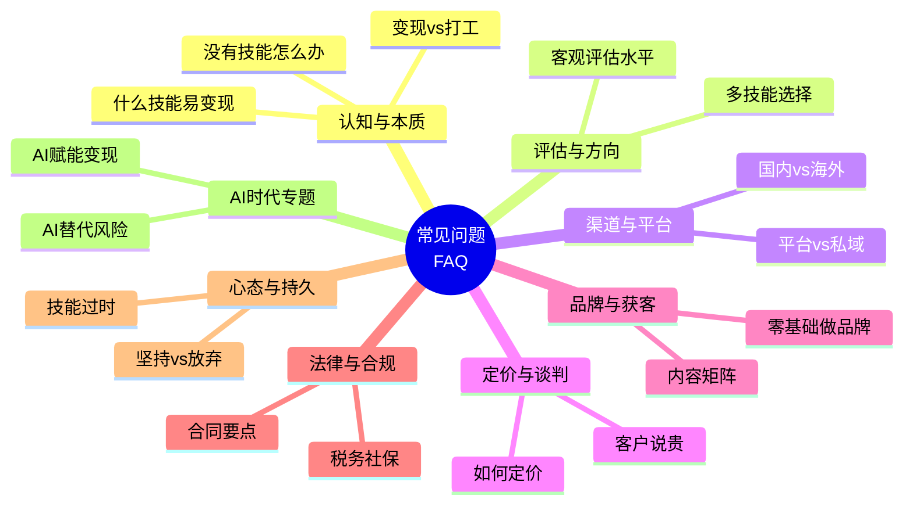
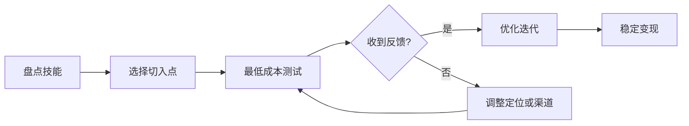
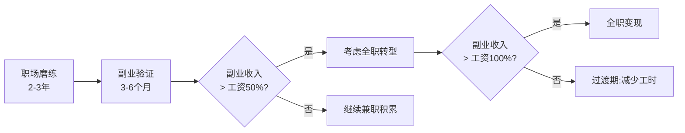
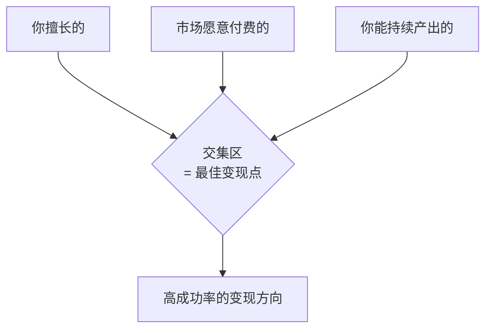
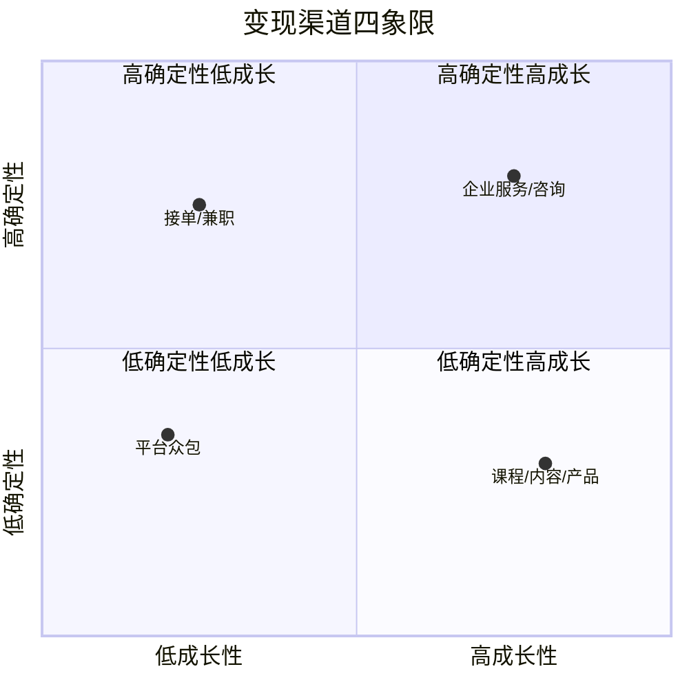
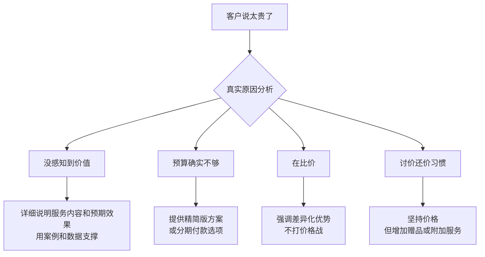
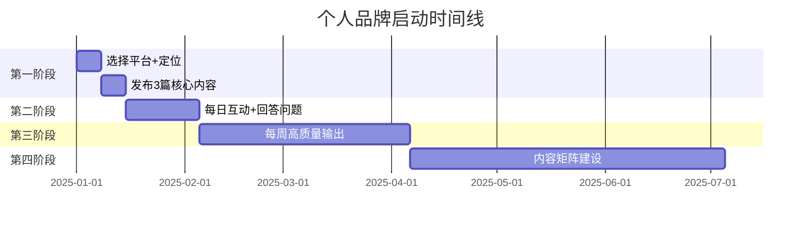
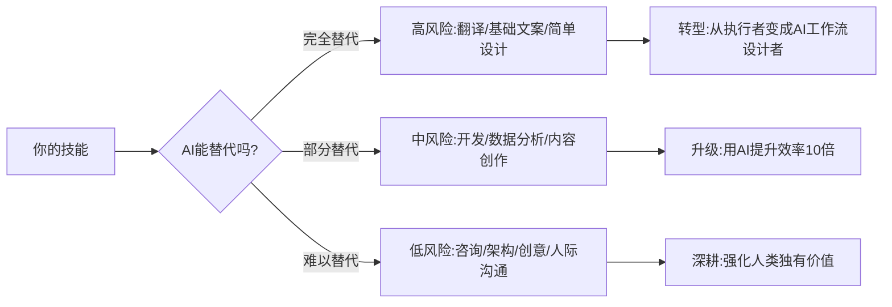
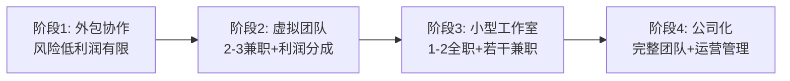
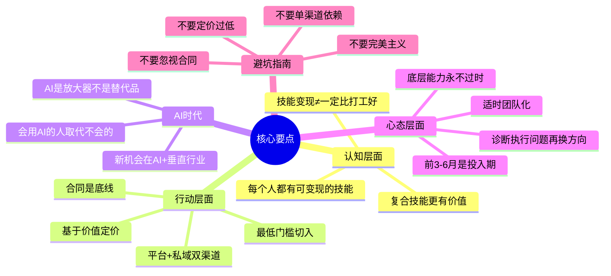

## 八、常见问题解答

本章理论基础部分涵盖了技能变现的本质认知、评估框架、变现渠道、定价策略、个人品牌建设、自由职业平台和远程工作技巧七大核心模块。在学习和实践过程中，读者必然会遇到各种困惑和疑问。本节汇总了最高频的 40+ 个问题，按模块分类，给出直击本质的回答，帮助你扫清认知障碍，将理论转化为行动。

每个问题的回答都遵循「为什么→怎么做→避坑指南」的三层结构，确保不仅回答表面问题，更帮你理解底层逻辑。



### 1. 技能变现本质类

#### 1.1 我没有任何"值钱"的技能，如何开始？

这是最常见的认知误区。事实上，大多数人低估了自己的技能价值。技能变现的起点不是"拥有稀缺技能"，而是"找到需求与能力的交集"。

**核心认知：你不需要是世界前1%的专家才能变现，你只需要比你的目标客户懂得多一点**。一个 Excel 熟练使用者可以教完全不会的人，一个入门级开发者可以帮小商家搭建简单网站。

**自查清单**：

| 维度 | 问题 | 示例 | 变现方向 |
|------|------|------|----------|
| 日常能力 | 别人经常找你帮忙做什么？ | 帮同事配电脑、写公式、做PPT | 技术支持、模板售卖 |
| 职业技能 | 你在工作中重复用到的技能？ | Excel数据处理、SQL查询、UI设计 | 数据服务、外包设计 |
| 兴趣专长 | 你花大量时间研究的领域？ | 摄影、健身、育儿、理财 | 内容创作、付费咨询 |
| 解决问题 | 你解决过什么别人觉得难的事？ | 修过老照片、迁移过网站 | 特定问题解决服务 |
| 信息差 | 你知道哪些别人不知道的？ | 会用某个冷门工具、了解某个行业 | 教程、陪跑服务 |

**行动路径**：



1. **盘点**：用上面的清单写下你所有的技能，不要自我筛选
2. **选择切入点**：挑一个「足够小」的领域（"教50岁以上的人用智能手机"比"教人用电脑"好）
3. **最低成本测试**：在闲鱼发布服务、在小红书发教程、在朋友圈提供免费试用
4. **收集反馈**：有没有人来询价？有没有人愿意转发？有没有人主动找你？
5. **优化迭代**：根据反馈调整服务内容和定价

**真实案例**：一位在小城市做行政工作的女生，日常工作是用 Excel 做考勤表和工资条。她在小红书分享「行政必备 Excel 技巧」系列，3个月积累了 5000 粉丝，随后推出了 99 元的「行政Excel实战课」，首月卖出 200+ 份。她的技能并不稀缺，但她精准地找到了一个「比她差一点」的受众群体。

#### 1.2 技能变现和打工的本质区别是什么？

打工是**出售时间**，变现是**出售价值**。两者的核心差异在于杠杆效应：

| 维度 | 打工 | 技能变现 |
|------|------|----------|
| 收入模式 | 时间 × 时薪（线性） | 价值 × 定价（可非线性） |
| 上限 | 受限于工时和涨薪幅度 | 理论上无上限 |
| 资产积累 | 离职后技能留在公司 | 个人品牌、客户资产、知识产品 |
| 风险 | 集中于一个雇主 | 分散于多个客户或产品 |
| 杠杆 | 低（只能卖自己的时间） | 高（可通过产品化、团队放大） |
| 社保福利 | 公司缴纳 | 需自行解决 |
| 成长路径 | 晋升体系明确 | 需要自我驱动 |

但不要误以为"技能变现 = 一定比打工好"。对于刚入行的新人，打工的稳定性、系统化培训、团队协作经验是无法替代的。最理想的路径是：**先在职场中把技能打磨到变现水平，再用副业验证市场，最后根据反馈决定全职还是兼职变现**。



#### 1.3 什么样的技能最容易变现？

最容易变现的技能通常满足三个条件的交集：



- **你擅长的**：不需要顶级，但要高于平均水平
- **市场愿意付费的**：解决真实痛点、节省时间/金钱、带来收入增长
- **你能持续产出的**：兴趣驱动、可持续学习、不会很快倦怠

根据 2025 年市场数据，以下技能变现成功率从高到低排列：

| 技能类别 | 变现难度 | 起步收入（月） | 成长上限 | 适合人群 | 核心壁垒 |
|----------|----------|----------------|----------|----------|----------|
| 编程开发 | 中 | 5000-15000 | 极高 | 逻辑思维强者 | 技术深度+项目经验 |
| AI/大模型应用 | 低 | 3000-20000 | 极高 | 技术敏感者 | 快速学习+场景理解 |
| UI/UX设计 | 中 | 3000-10000 | 高 | 审美能力强者 | 审美+用户思维 |
| 内容写作 | 低 | 1000-5000 | 高 | 表达能力强者 | 持续产出+选题能力 |
| 翻译 | 低 | 2000-8000 | 中 | 双语能力强者 | 语言功底+领域知识 |
| 视频剪辑 | 低 | 2000-10000 | 高 | 有审美+耐心者 | 审美+效率 |
| 数据分析 | 中 | 5000-15000 | 高 | 数字敏感者 | 业务理解+工具熟练 |
| 在线教育/培训 | 高 | 5000-50000 | 极高 | 表达+专业知识兼备者 | 信任积累+课程设计 |
| 自动化/效率工具 | 中 | 3000-15000 | 高 | 爱折腾的人 | 场景理解+工程能力 |
| 网络安全 | 高 | 8000-30000 | 极高 | 攻防思维强者 | 技术深度+合规知识 |

#### 1.4 "技能变现"和"副业"是什么关系？

技能变现是副业的一种，但不是所有副业都是技能变现。

| 类型 | 代表 | 本质 | 复利效应 | 收入上限 |
|------|------|------|----------|----------|
| 技能变现 | 接项目、卖课程、提供咨询 | 出售专业价值 | 强（作品/品牌持续产生价值） | 高 |
| 信息差变现 | 代购、搬砖、套利 | 利用信息不对称 | 中（信息差会消失） | 中 |
| 体力型副业 | 摆摊、跑腿、代驾 | 出售时间 | 无（每分钱都需重新投入时间） | 低 |
| 资产型副业 | 房租、理财、分红 | 资本收益 | 强（钱生钱） | 取决于本金 |

技能变现的核心优势在于**复利效应**：你今天写的代码、做的教程、积累的客户评价，明天继续为你工作。而纯体力型副业每一分钱都需要重新投入时间。

### 2. 技能评估类

#### 2.1 如何客观评估自己的技能水平？

自我评估最大的敌人是两个极端：冒名顶替综合征（觉得自己什么都不行）和达克效应（能力差的人反而觉得自己很厉害）。

**三维度评估法**：

**维度一：能力对标**

找到你所在领域的技能等级标准，客观对标。以 Web 开发为例：

| 等级 | 特征 | 能独立完成的项目 | 参考时薪（平台） |
|------|------|------------------|-------------------|
| 初级 | 能用框架搭页面 | 静态网站、简单后台 | ¥50-150/h |
| 中级 | 能独立完成中型项目 | 电商网站、管理系统 | ¥150-400/h |
| 高级 | 能架构、能优化、能带人 | 高并发系统、微服务架构 | ¥400-1000/h |
| 专家 | 能定义方向和标准 | 技术方案评审、架构咨询 | ¥1000+/h |

**维度二：市场验证**

不要靠猜测，让市场告诉你答案：
- 在平台上发布服务，看有没有人来询价
- 写一篇技术文章，看阅读量和反馈
- 问 5 个非技术朋友"你愿意为这件事付多少钱"
- 在社交媒体做一次免费分享，看互动数据
- 在闲鱼发布一个低价服务（如 50 元做一张海报），测试有没有人买单

**维度三：作品审视**

- 整理你过去 1 年做过的项目，用第三方视角评判质量
- 对比同领域优秀从业者的作品，找出差距
- 如果你的作品"自己都觉得还行"，说明还有提升空间——真正好的作品自己看了会兴奋
- 请一个你信任的同行给你「匿名评审」，获取真实反馈

#### 2.2 技能水平不够高，能先开始吗？

**能，而且应该**。原因如下：

1. **市场有分层**：不是所有客户都需要高级服务。小商家只需要一个能用的网站，企业老板只需要一份看得过去的PPT。
2. **实践是最快的提升方式**：你在真实项目中学到的，比闭门修炼快 3-5 倍。
3. **定价反映水平**：初级水平收初级价格，完全合理，不必心虚。

但有一个底线：**你交付的东西必须对得起客户的付费**。如果你承诺"专业级设计"，交付的却是业余水平，那就是诈骗，不是变现。

**适合新手的切入策略**：

| 策略 | 具体做法 | 预期效果 |
|------|----------|----------|
| 低价起步 | 前 3-5 个单子以市场价 50% 收费 | 积累评价和作品集 |
| 小而明确 | 只接「做一张海报」而非「做整套品牌设计」 | 降低交付风险 |
| 标注版本 | 交付物注明"基础版"，让客户有合理预期 | 减少纠纷 |
| 每单复盘 | 每完成一个项目，总结做得好的和待改进的 | 加速成长 |
| 寻找导师 | 加入行业社群，请教有经验的前辈 | 避免踩坑 |

#### 2.3 我有多项技能，应该选哪个变现？

多技能是优势，不是负担，但初期需要聚焦。选择标准按优先级排列：

1. **市场需求最大**：哪个技能最容易找到付费客户？去平台上搜索对应服务的数量和价格。
2. **变现路径最短**：哪个技能最快能接到第一单？写作类通常比开发类起步更快。
3. **你的比较优势最强**：在你所有的技能中，你和同行相比，哪个差距最小？
4. **可持续性最好**：哪个技能你能坚持做 3 年以上不厌倦？

**复合技能的高级玩法**：当单项技能达到中等水平后，复合技能往往比单项技能更有价值：

| 组合 | 变现形态 | 溢价幅度 | 壁垒高度 |
|------|----------|----------|----------|
| 编程 + 教育 | 技术培训师 | 2-3x | 高 |
| 设计 + 写作 | 品牌全案服务 | 3-5x | 高 |
| 数据分析 + 行业知识 | 行业咨询顾问 | 5-10x | 极高 |
| 编程 + 产品思维 | 独立开发者 | 10x+ | 极高 |
| 英语 + 技术 | 海外远程/出海顾问 | 2-5x | 中 |
| AI + 任意垂直领域 | AI解决方案顾问 | 3-8x | 中-高 |

### 3. 变现渠道类

#### 3.1 变现渠道这么多，我应该选哪些？

变现渠道可以按"主动-被动"和"确定性-成长性"两个维度划分：



**新手推荐路径**：

| 阶段 | 时间 | 推荐渠道 | 原因 | 月收入预期 |
|------|------|----------|------|------------|
| 冷启动期 | 0-3月 | 平台众包 + 朋友转介绍 | 门槛最低，快速获得反馈 | 0-3000 |
| 积累期 | 3-12月 | 自由职业平台 + 内容输出 | 建立作品集和口碑 | 3000-10000 |
| 成长期 | 1-2年 | 独立接单 + 课程/内容 | 提高客单价，建立被动收入 | 10000-30000 |
| 成熟期 | 2年+ | 咨询/培训 + 产品/品牌 | 从卖时间转向卖价值 | 30000+ |

**关键原则**：不要同时在 5 个渠道发力。初期选 1-2 个，做到有稳定反馈后再扩展。

#### 3.2 平台接单和私域接单，哪个更好？

两者不是二选一，而是互补关系：

| 维度 | 平台接单 | 私域接单 |
|------|----------|----------|
| 获客成本 | 低（平台提供流量） | 高（需要自己引流） |
| 抽成 | 高（10-20%） | 无 |
| 信任成本 | 低（平台背书） | 高（需要个人品牌） |
| 客户质量 | 参差不齐 | 通常更好 |
| 价格空间 | 受平台竞争压低 | 自主定价 |
| 长期价值 | 平台依赖 | 客户资产归你 |
| 适合阶段 | 初期 | 中后期 |

**最佳实践**：用平台积累初期客户和评价，同时通过内容输出和社交网络建设私域。当私域收入超过平台收入的 2 倍时，可以逐步降低平台投入。

**私域建设的具体方法**：
1. **建微信群/知识星球**：把平台客户导入，提供售后服务和增值服务
2. **建邮件列表**：定期发送干货内容，保持触达
3. **建个人网站/博客**：SEO 引流，展示作品集和服务
4. **建社交媒体矩阵**：小红书 + 知乎 + B站，内容互相导流

#### 3.3 知识付费（课程/专栏）真的能赚钱吗？

能，但前提是你理解知识付费的本质：**它不是"卖知识"，而是"卖结果的加速器"**。

市面上失败的课程 99% 存在以下问题：

| 失败原因 | 具体表现 | 纠正方向 |
|----------|----------|----------|
| 没有明确受众 | "适合所有人" = 适合没有人 | 明确定义目标用户画像 |
| 内容太泛 | 罗列知识点而非解决问题 | 围绕一个具体问题设计课程 |
| 没有差异化 | 网上免费内容到处都有 | 提供独特的视角/方法/案例 |
| 缺乏信任基础 | 没人听过你就想卖课 | 先通过免费内容建立信任 |
| 不提供结果 | 学完和没学一样 | 设计可衡量的学习成果 |

**知识付费的成功公式**：

```text
成功 = 专业度 × 表达力 × 受众精准度 × 信任积累 × 持续更新

专业度：你确实比受众懂得多，且能证明
表达力：能把复杂概念讲得通俗易懂
受众精准度：精确到"谁会为此付费"
信任积累：免费内容 → 小额产品 → 高价课程，逐步建立
持续更新：课程上线不是终点，持续迭代才有复购
```

**知识产品的阶梯定价模型**：

| 产品层级 | 价格区间 | 作用 | 示例 |
|----------|----------|------|------|
| 引流品 | 免费-9.9元 | 吸引关注，建立信任 | 电子书、迷你课、模板包 |
| 低价品 | 99-299元 | 低门槛体验，筛选付费用户 | 小课、实战营、工具包 |
| 主力品 | 999-2999元 | 核心变现产品 | 系统课程、训练营 |
| 高价品 | 5000-20000元 | 高价值深度服务 | 一对一辅导、年度会员 |
| 顶端品 | 20000元+ | 超高价值定制服务 | 企业内训、咨询顾问 |

### 4. 定价策略类

#### 4.1 我到底应该收多少钱？

定价是技能变现中最让人焦虑的问题。以下是系统化的定价方法：

**方法一：成本加成法（底线定价）**

```text
最低时薪 = (月生活成本 + 月税费 + 月工具成本 + 月保险) ÷ 月有效工作小时数

示例：
月生活成本：6000 元
月税费/社保：2000 元
月工具/平台费：500 元
月保险：500 元
月有效工作小时：120 小时（每天 6 小时 × 20 天）

最低时薪 = (6000+2000+500+500) ÷ 120 = 75 元/小时
定价 = 最低时薪 × 1.5（利润缓冲）= 112 元/小时 ≈ 120 元/小时
```

**方法二：价值定价法（推荐）**

不按你花了多少时间收费，而按你给客户创造了多少价值收费。

```text
价值定价 = 客户从你的工作中获得的可量化价值 × 10-30%

示例：
你帮客户做了一个自动化脚本，每月节省 20 小时人工
客户员工时薪 50 元 → 月节省 = 20 × 50 = 1000 元/月
年节省 = 12000 元
你的定价 = 12000 × 20% = 2400 元（一次性）

注意：这个脚本你可能只花 3 小时完成，但价值远超时间成本
```

**方法三：市场对标法**

在平台搜索同类服务，找到价格区间：
- 取中位数作为基准价
- 根据你的经验和口碑上下浮动 20-30%
- 新手可以低于中位数 20% 入场，逐步提价

**定价心理锚点**：

| 策略 | 用法 | 效果 |
|------|------|------|
| 三档定价 | 基础版/标准版/高级版 | 引导客户选择中间档（锚定效应） |
| 限时优惠 | "首单优惠 30%" | 降低决策门槛 |
| 打包定价 | 网站+域名+托管=一口价 | 降低客户对单项价格的敏感度 |
| 按成果定价 | "排名进前10收费，否则退款" | 消除客户顾虑，但要确保能做到 |
| 阶梯报价 | 1页100元，5页400元，10页700元 | 鼓励批量下单 |

#### 4.2 客户说"太贵了"怎么办？

"太贵了"通常不是真的嫌贵，而是以下几种情况之一：



**永远不要做的事**：不要因为客户说贵就立刻降价。这会让客户觉得你之前的报价水分很大，也贬低了你的专业价值。如果要给优惠，给一个合理的理由（老客户折扣、打包优惠、推荐奖励），而不是无理由降价。

**实用话术模板**：

| 客户话术 | 背后含义 | 推荐回应 |
|----------|----------|----------|
| "太贵了" | 没有感知到价值 | "我理解您的顾虑。这个价格包含的是XXX，帮您解决了XXX问题。之前有个类似的客户，效果是XXX" |
| "别人报价比你低" | 在比价 | "价格确实需要考虑。不过您可以对比一下交付范围和售后保障，我这边包含的是XXX" |
| "我再考虑考虑" | 犹豫或需要内部审批 | "完全理解。我把方案整理一份给您，方便您和团队讨论。另外我这边目前有XXX优惠" |
| "能不能便宜点" | 习惯性砍价 | "这个价格已经是考虑到XXX因素后的最优方案了。不过我可以额外赠送您XXX" |

#### 4.3 按小时收费好还是按项目收费好？

两种模式各有适用场景：

| 模式 | 适合场景 | 优点 | 缺点 |
|------|----------|------|------|
| 按小时 | 需求不明确、持续性维护、咨询类 | 收入有保障，不被需求变更坑 | 效率越高收入越低（反向激励） |
| 按项目 | 需求明确、有明确交付物 | 效率越高利润越高 | 需求变更可能导致亏损 |
| 按月/按年 | 长期合作关系、持续服务 | 收入稳定，可预测 | 需要足够的信任基础 |
| 按成果 | SEO、营销、转化优化 | 利润上限高 | 风险大，结果受多因素影响 |
| 混合模式 | 复杂项目 | 灵活应对变化 | 需要清晰的合同约定 |

**进阶策略**：随着经验增长，逐步从按小时过渡到按项目，最终到按价值定价。这是技能变现收入增长的核心路径。

**按项目收费的避坑指南**：
1. **需求必须书面化**：口头约定的需求变更会让你血本无归
2. **留 20-30% 的缓冲**：项目实际耗时几乎永远超出预期
3. **约定变更流程**：超出原始需求的变更，单独报价
4. **分阶段收款**：30% 预付 + 40% 中期 + 30% 验收，避免尾款拖欠

### 5. 个人品牌类

#### 5.1 我没有粉丝，怎么做个人品牌？

个人品牌的起点不是"有粉丝"，而是"持续输出有价值的内容"。

**零基础启动方案**：



**内容矩阵设计**：

| 内容类型 | 频率 | 目的 | 示例 |
|----------|------|------|------|
| 短内容（观点/技巧） | 每天 | 保持曝光 | "今天学到一个Git技巧..." |
| 中等内容（教程/分析） | 每周 | 建立专业形象 | "从零搭建React组件库" |
| 长内容（深度文章/课程） | 每月 | 树立权威 | "2025年前端工程化完整指南" |
| 互动（评论/问答） | 每天 | 建立连接 | 回答评论区的技术问题 |

**关键心态**：前 1000 个粉丝最难获得，可能需要 3-6 个月。但只要你持续输出有价值的内容，增长曲线会从线性变为指数。

#### 5.2 个人品牌需要用真名吗？

不一定。选择取决于你的目标市场：

| 选择 | 适合情况 | 优点 | 缺点 | 示例 |
|------|----------|------|------|------|
| 真名 | 面向企业客户、建立信任 | 专业可信、便于签合同 | 个人隐私暴露 | "张伟-全栈开发顾问" |
| 昵称 | 面向个人用户、社区运营 | 易传播、有记忆点 | 企业场景受限 | "代码老中医"、"前端小王子" |
| 品牌名 | 团队化运营、做产品 | 可扩展、可转让 | 需要额外品牌建设 | "极客工坊"、"码上行动" |

**建议**：如果你计划长期做技术变现，真名 + 专业领域定位是最稳妥的选择。昵称可能在初期更容易传播，但在需要签合同、开发票、做企业服务时会成为障碍。

#### 5.3 个人品牌需要多久才能见效？

取决于你的投入和策略，以下是基于真实数据的时间预期：

| 指标 | 全力投入 | 兼职投入 | 不投入 |
|------|----------|----------|--------|
| 首批关注者（100人） | 1-2月 | 3-6月 | 6-12月 |
| 首次被动获客 | 3-6月 | 6-12月 | 12-24月 |
| 品牌溢价能力 | 6-12月 | 12-24月 | 24月+ |
| 行业认知度 | 12-24月 | 24-36月 | 36月+ |

"全力投入"指每天 2-3 小时内容创作和社群互动。"兼职投入"指每周 5-8 小时。

**加速品牌建设的杠杆手段**：
1. **蹭热点**：结合行业大事件输出观点，获得流量加成
2. **找大号互推**：主动帮大号做内容、提供价值，换取曝光
3. **参与行业活动**：技术大会分享、播客嘉宾、圆桌讨论
4. **做「里程碑」内容**：年度总结、行业报告、深度评测——容易被引用和传播

### 6. 平台选择类

#### 6.1 国内平台和海外平台怎么选？

| 维度 | 国内平台（猪八戒/闲鱼/电鸭） | 海外平台（Upwork/Toptal/Fiverr） |
|------|-------------------------------|-----------------------------------|
| 语言门槛 | 低 | 高（需英语工作能力） |
| 竞争强度 | 高（内卷严重） | 中（全球化分层） |
| 客单价 | 低-中 | 中-高（汇率优势） |
| 支付 | 简单（支付宝/微信） | 复杂（PayPal/Wise/电汇） |
| 时差 | 无 | 需要配合客户时区 |
| 法律风险 | 低 | 中（需了解跨境税务） |

**推荐策略**：
- 英语能力一般的：从国内平台起步，同时通过内容输出建立私域
- 英语能力较强的：优先海外平台（客单价高 2-5 倍），国内平台作为补充
- 目标是长期发展的：无论哪个平台，都要同时建设个人品牌和私域流量

#### 6.2 Toptal 这样的高端平台值得冲吗？

Toptal 声称只接受"前3%"的自由职业者，筛选流程包括：技术面试 → 项目模拟 → 试用期。通过后的时薪通常在 $60-200+。

**是否值得冲，取决于你的现状**：

| 你的情况 | 建议 | 原因 |
|----------|------|------|
| 3年以下经验 | 不建议 | 先把时间花在提升技能和积累项目经验上 |
| 3-5年经验，英语好 | 可以尝试 | 但不要把所有鸡蛋放一个篮子 |
| 5年+经验，英语好 | 值得冲 | 通过后的收入和项目质量确实高于一般平台 |
| 任何阶段，英语一般 | 先提升英语 | 高端平台对沟通能力的要求不低于技术能力 |

**Toptal 面试准备要点**：
- 算法和数据结构（LeetCode 中等难度）
- 系统设计（能画架构图、解释权衡）
- 英语技术沟通（能流利讨论技术方案）
- 项目模拟（能独立完成真实项目级别的任务）

**替代平台推荐**：

| 平台 | 特点 | 适合人群 | 时薪范围 |
|------|------|----------|----------|
| Toptal | 高端，严格筛选 | 5年+经验，英语好 | $60-200+ |
| Turing | AI匹配，远程优先 | 3年+经验 | $40-150 |
| Gun.io | 精选自由职业者 | 3年+经验 | $50-150 |
| Arc.dev | 远程开发者市场 | 2年+经验 | $30-100 |
| Lemon.io | 创业公司对接 | 2年+经验 | $30-80 |

#### 6.3 平台账号被封了怎么办？

账号被封是自由职业者的噩梦。常见原因和应对：

| 封号原因 | 预防措施 | 补救方法 |
|----------|----------|----------|
| 违反平台规则 | 仔细阅读平台TOS | 申诉 → 客服 → 投诉渠道 |
| 客户投诉 | 保留所有沟通记录和交付证据 | 提供证据反驳 |
| 账号关联 | 不在同一设备/IP登录多账号 | 说明情况，提供身份证明 |
| 低质量交付 | 只接能力范围内的项目 | 申诉 + 承诺整改 |
| 交易线下化 | 不在平台内引导客户到其他渠道支付 | 熟读平台规则，遵守交易流程 |

**核心教训**：永远不要只依赖一个平台。即使平台运营良好，政策变化也可能影响你的收入。把平台当作获客渠道，把客户关系沉淀到自己的私域（邮箱列表、微信群、独立网站）。

### 7. 远程工作类

#### 7.1 没有远程工作经验，怎么找到第一份远程工作？

"鸡生蛋"问题的解法是**绕过传统路径**：

1. **从现有工作中争取**：向当前雇主申请远程办公，哪怕每周一天。这是零成本的远程工作经验。
2. **从兼职/副业开始**：利用下班时间和周末接远程小项目，积累远程协作经验。
3. **参与开源项目**：开源贡献是全球化的远程协作，是最好的远程工作证明。
4. **从国内远程岗位切入**：电鸭社区、V2EX、拉勾等平台上有纯远程岗位，竞争比海外平台小。
5. **内容引流**：通过技术博客/社交平台展示能力，让客户主动找上门。

**简历中如何包装远程能力**（即使你没有正式远程经历）：
- "独立完成 XXX 项目，全程线上与客户沟通，按时交付"
- "参与 XXX 开源项目，与 X 个国家的贡献者协作"
- "运营 XXX 技术社群，管理 XXX 名成员，日活跃率 XX%"

#### 7.2 远程工作如何处理税务和社保？

这是远程工作者最容易忽视但最不能忽视的问题。

**国内远程（自由职业者）**：

```text
税务方案：
├── 个体工商户
│   ├── 注册简单，年收入 120 万以下可享受小规模纳税人优惠
│   ├── 税率：增值税 1%（小规模）+ 个税 5-35%
│   └── 适合：月收入 3-10 万的独立工作者
│
├── 个人独资企业
│   ├── 可核定征收，综合税负 3-5%
│   ├── 可开发票，适合对接企业客户
│   └── 适合：月收入 10 万以上的高收入者
│
├── 灵活用工平台
│   ├── 平台代扣代缴，省心
│   ├── 综合税负 5-8%
│   └── 适合：不想注册公司的短期合作者
│
└── 个人劳务报酬
    ├── 按次预扣 20-40%，年终汇算清缴
    ├── 适合：偶尔接单、金额较小
    └── 注意：年度汇算可能需要补税
```

**海外远程**：
- 外汇收入需要申报。个人年度结汇额度 5 万美元。
- 超过 5 万美元需要提供合同、发票等证明材料。
- 建议开设离岸账户（如 Wise Business、Payoneer）管理海外收入。
- 咨询专业税务顾问，了解是否有双重征税协定可利用。

**社保解决方案**：

| 方案 | 费用（月） | 覆盖范围 | 适合人群 |
|------|------------|----------|----------|
| 灵活就业社保 | 1000-2000 | 养老+医疗 | 收入稳定的自由职业者 |
| 城乡居民社保 | 200-500 | 基础养老+医疗 | 收入较低的过渡期 |
| 商业保险 | 500-3000 | 意外+重疾+医疗 | 补充社保不足 |
| 挂靠公司代缴 | 1500-3000 | 五险一金齐全 | 需要完整社保记录者（注意法律风险） |

#### 7.3 远程工作如何保障自己的权益？

**合同是底线**。任何没有书面合同的远程工作都是在裸奔。

**远程工作合同必须包含的条款**：

| 条款 | 说明 | 常见坑 |
|------|------|--------|
| 工作范围（SOW） | 明确做什么、不做什么 | 口头约定的"顺便帮个忙" |
| 交付标准 | 什么样的交付物算"完成" | 没有验收标准导致无限修改 |
| 付款条款 | 金额、时间、方式、逾期罚则 | "做完再付"导致尾款拖欠 |
| 知识产权 | 代码/设计/内容的归属权 | 默认归甲方，你的作品不能复用 |
| 保密条款 | 哪些信息不能外泄 | 范围过宽，影响后续接单 |
| 终止条件 | 什么情况下可以终止 | 单方面终止，已完成工作无报酬 |
| 争议解决 | 出了问题找谁、怎么解决 | 跨境纠纷维权成本极高 |

**保护自己的实用技巧**：
- 大项目分阶段交付+分阶段付款（里程碑式），不要"全部做完再结算"
- 保留所有沟通记录（邮件、聊天记录、会议录音）
- 代码用私有仓库，交付后才转交
- 对于海外客户，使用 escrow（托管）服务确保付款
- 使用合同模板工具（如 HelloSign、DocuSign）管理电子合同

### 8. 法律与合规类

#### 8.1 接私活会不会有法律风险？

**主要风险点**：

| 风险类型 | 具体场景 | 预防措施 |
|----------|----------|----------|
| 竞业限制 | 服务与雇主有竞争关系的客户 | 检查劳动合同中的竞业条款 |
| 知识产权 | 使用公司代码/设计做私活 | 不使用任何公司资源，从零创作 |
| 劳动纪律 | 上班时间做副业 | 严格区分工作时间和副业时间 |
| 税务问题 | 收入不申报 | 按规定纳税，保留收入凭证 |
| 合同纠纷 | 客户不满意要求退款 | 签订书面合同，约定验收标准 |

**自查清单**：
- [ ] 仔细阅读劳动合同中的副业/竞业条款
- [ ] 确保不使用公司设备、账号、代码、设计素材
- [ ] 确保不服务公司的直接竞争对手
- [ ] 确保不在工作时间处理副业事务
- [ ] 所有副业收入依法申报纳税
- [ ] 与客户签订书面合同

#### 8.2 知识产权怎么保护？

**作为创作者**：
1. **作品完成后立即存证**：邮件发给自己、上传区块链存证平台、使用时间戳服务
2. **合同中明确知识产权归属**：默认归你，客户获得使用权
3. **注册商标/版权**：对于品牌名、课程内容等核心资产
4. **代码使用开源协议**：如果是自己写的库/工具，选择合适的开源协议

**作为服务提供者**：
1. **不使用盗版软件/素材**：字体、图片、代码库都可能有版权风险
2. **交付物注明使用范围**：明确客户可以怎么用、不能怎么用
3. **保留原始文件**：源文件、设计稿、代码仓库都是你的工作证明

### 9. AI时代专题

#### 9.1 AI会不会取代我的技能？

这是 2024-2025 年最热门的焦虑。答案是：**AI不会取代你，但会用AI的人会取代不会用AI的人**。



| 技能类型 | AI替代风险 | 应对策略 | 时间窗口 |
|----------|------------|----------|----------|
| 基础翻译 | 极高 | 转型为AI翻译审校/行业翻译 | 1-2年 |
| 基础文案写作 | 高 | 专注品牌故事/深度内容/AI内容优化 | 2-3年 |
| 简单设计（海报/banner） | 高 | 转向品牌策略/用户体验设计 | 2-3年 |
| 基础编程（CRUD） | 中-高 | 转向架构设计/AI应用开发/复杂系统 | 3-5年 |
| 数据分析 | 中 | 转向业务洞察/决策支持/AI数据工程 | 3-5年 |
| 产品管理 | 低 | 加强AI产品理解，成为AI PM | 5年+ |
| 技术咨询/架构 | 低 | 深化行业理解，AI无法替代判断力 | 5年+ |
| 客户关系/销售 | 极低 | 人际关系和信任建立是人类专属 | 10年+ |

#### 9.2 如何利用AI提升变现效率？

AI是放大器，不是替代品。善用AI可以让你的产出提升 3-10 倍：

| 场景 | AI工具 | 效率提升 | 注意事项 |
|------|--------|----------|----------|
| 代码开发 | Cursor/Copilot/Claude | 3-5x | 需要review，AI写的代码可能有bug |
| 内容创作 | Claude/ChatGPT/Kimi | 3-10x | 需要注入个人风格和真实经验 |
| 设计 | Midjourney/SD/DALL-E | 2-5x | 基础设计可替代，高端设计仍需人工 |
| 数据分析 | Code Interpreter/NotebookLM | 5-10x | 需要业务理解来提出正确问题 |
| 客户沟通 | AI辅助回复/翻译 | 2-3x | 关键沟通仍需人工 |
| 视频制作 | 剪映AI/Sora/可灵 | 3-5x | 创意和脚本仍需人工 |

**AI时代的新变现机会**：
1. **AI应用开发**：帮企业搭建AI工作流、RAG系统、Agent应用
2. **AI培训/咨询**：教企业员工使用AI工具提升效率
3. **AI内容审核**：审核AI生成内容的质量和准确性
4. **AI提示词工程**：设计高质量的prompt模板和工作流
5. **AI+垂直行业**：用AI解决特定行业的具体问题

### 10. 综合与心态类

#### 10.1 技能变现会不会影响本职工作？

这取决于你如何管理时间和边界：

**安全区**：
- 利用下班时间和周末做副业
- 不使用公司设备、账号、代码做私活
- 不服务公司的直接竞争对手
- 不在工作时间处理副业事务

**危险区**：
- 上班时间做私活（违反劳动纪律，严重可被辞退）
- 使用公司代码/资源做副业（可能涉及知识产权纠纷）
- 服务公司竞争对手（竞业协议风险）
- 副业影响工作状态和产出

**最佳实践**：先和直属领导沟通你的副业计划（不需要透露细节），确保没有利益冲突。很多公司对技术员工的副业持开放态度，只要不影响本职工作。

#### 10.2 做了很久没赚到钱，应该放弃吗？

先问自己三个问题：

1. **"没赚到钱"是指零收入还是收入不满意？** 零收入可能说明方向有误，收入不满意可能是期望过高。
2. **你做了多长时间？** 技能变现的平均起步期是 3-6 个月。如果你才做了 1-2 个月，大概率还没到产出期。
3. **你做了哪些具体的事？** 发布了几个服务？写了多少内容？主动联系了多少潜在客户？

**诊断矩阵**：

| 情况 | 诊断 | 对策 |
|------|------|------|
| 做了3个月，零询价 | 定位有问题或曝光不足 | 检查服务描述是否精准、是否在正确的平台上 |
| 有询价但没成交 | 转化率问题 | 优化报价策略、提升提案质量、降低客户决策门槛 |
| 有成交但客单价低 | 定价问题 | 提升技能水平、增加服务价值、瞄准更高端客户 |
| 有收入但很累 | 效率问题 | 优化流程、模板化重复工作、考虑产品化 |

**放弃的正确时机**：当你用正确的方法认真执行了 6 个月以上，仍然看不到任何正反馈——不是收入没有达到期望，而是完全没有客户、完全没有互动、完全没有增长——那么可能确实需要换方向。但在那之前，大多数"没赚到钱"的问题出在执行层面，而不是方向层面。

#### 10.3 技术变化这么快，我的技能会不会很快过时？

会，但不完全是坏事。技能变现的核心不是"掌握某个具体技术"，而是"快速学习和解决问题的能力"。

**不过时的底层能力**：

| 能力层级 | 具体内容 | 过时风险 | 如何培养 |
|----------|----------|----------|----------|
| 元能力 | 学习能力、问题分解、抽象思维 | 极低 | 跨领域学习、刻意练习 |
| 软技能 | 沟通、项目管理、客户关系 | 极低 | 实战中积累、反思复盘 |
| 领域知识 | 业务理解、行业经验 | 低 | 深耕一个行业 3 年以上 |
| 技术框架 | React、Vue、Spring Boot | 中 | 关注技术趋势，适时迁移 |
| 具体工具 | 某个 API、某个平台功能 | 高 | 不要过度依赖单一工具 |

**70-20-10 学习法则**：
- 花 70% 的时间深耕当前技术栈，做到能变现
- 花 20% 的时间学习相关技术，扩展能力边界
- 花 10% 的时间关注前沿趋势，提前布局
- 每年评估一次自己的技能组合，淘汰过时的，补充新兴的

#### 10.4 一个人能做多久？什么时候该组建团队？

当以下信号出现 2 个以上时，就该考虑团队化了：

1. **你拒绝了超过 30% 的客户**，因为忙不过来
2. **你的月收入已经稳定超过个人天花板**，但增长停滞
3. **客户要求你提供更全面的服务**，超出你的个人能力
4. **你发现自己在重复性工作上花大量时间**，而这些工作别人也能做
5. **你想从卖时间转向卖价值**，需要杠杆

**团队化的渐进路径**：



每个阶段需要的能力不同：

| 阶段 | 核心能力 | 管理复杂度 | 收入上限 |
|------|----------|------------|----------|
| 外包协作 | 项目管理、质量把控 | 低 | 个人能力×2-3 |
| 虚拟团队 | 协作流程、利益分配 | 中 | 个人能力×5-10 |
| 小型工作室 | 人员管理、财务、法务 | 高 | 团队规模×人均产出 |
| 公司化 | 战略、融资、组织建设 | 极高 | 无上限 |

#### 10.5 有没有"不需要跟人打交道"的变现方式？

有，但收入天花板通常较低。技术变现中"社交需求"最低的方式：

| 方式 | 社交需求 | 收入上限 | 说明 |
|------|----------|----------|------|
| 开源赞助（GitHub Sponsors） | 极低 | 中 | 需要长期维护开源项目 |
| 模板/插件/主题出售 | 极低 | 中 | 竞争激烈，需要持续更新 |
| 自动化工具/SaaS | 低 | 高 | 需要产品能力和持续维护 |
| 技术写作/出版 | 低 | 中 | 版税收入，长尾效应 |
| 众包平台接单 | 低 | 低-中 | 无需自行获客，但抽成高 |
| AI 生成内容变现 | 低 | 低-中 | 正在快速饱和 |

**但要面对现实**：完全不跟人打交道，你的收入和成长空间会非常有限。即使是最"孤独"的程序员，也需要学会基本的沟通能力来写文档、提PR、回复用户反馈。与其追求"零社交"，不如学习如何高效地"低社交"——用异步文字沟通代替实时面对面交流。

#### 10.6 如何避免倦怠？

技能变现最大的隐形杀手不是赚不到钱，而是倦怠。当你把爱好变成工作，热情可能会消退。

**倦怠的预警信号**：
- 以前觉得有趣的工作，现在感到厌烦
- 拖延越来越多，交付质量下降
- 开始回避客户消息
- 身体出现失眠、头痛、食欲变化等症状

**预防和应对策略**：

| 策略 | 具体做法 | 原理 |
|------|----------|------|
| 设定边界 | 明确工作时间和休息时间，非紧急事务不回复 | 防止工作侵蚀生活 |
| 多样化 | 同时做 2-3 个不同类型的项目，避免单一重复 | 保持新鲜感 |
| 定期休息 | 每季度安排 1 周完全不工作的假期 | 恢复精力和热情 |
| 学会拒绝 | 不是所有单子都要接，拒绝低价值高压力的项目 | 保护时间和精力 |
| 找同路人 | 加入自由职业者社群，分享经验和压力 | 社交支持 |
| 记录成就 | 定期回顾自己的成长和收获 | 重建意义感 |
| 运动习惯 | 每周至少 3 次 30 分钟以上的运动 | 生理层面对抗压力 |

### 11. 常见误区与避坑指南

#### 11.1 新手最常犯的10个错误

| 错误 | 具体表现 | 正确做法 |
|------|----------|----------|
| 完美主义 | "等我准备好了再开始" | 先完成再完美，60分就可以发布 |
| 定价过低 | 害怕没人买，定白菜价 | 按价值定价，低价只会吸引低质量客户 |
| 过度承诺 | 为了接单什么都答应 | 只承诺能交付的，宁可少说多做 |
| 忽视合同 | "都是朋友介绍的，不用签" | 任何交易都要书面化 |
| 单一渠道 | 只在一个平台接单 | 至少两个渠道，分散风险 |
| 不做复盘 | 做完一个项目就翻篇 | 每个项目总结经验教训 |
| 忽视售后 | 交付完就消失 | 售后是复购和转介绍的关键 |
| 盲目跟风 | 看到什么火做什么 | 基于自身优势选择方向 |
| 不记账 | 不知道赚了多少花了多少 | 记录每笔收入和支出 |
| 孤军奋战 | 一个人闷头干 | 加入社群，找同行交流 |

#### 11.2 变现路上的「红灯」信号

当出现以下情况时，需要立即停下来反思和调整：

- **连续 3 个月零收入**：方向可能有问题，需要重新验证市场
- **客户投诉率超过 20%**：交付质量或客户管理有问题
- **复购率低于 10%**：服务价值不够，客户不认可
- **身体出现明显问题**：长期失眠、焦虑、抑郁——健康是底线
- **对工作完全失去兴趣**：可能需要换方向或调整节奏

### 12. 本节小结

本节覆盖了技能变现理论基础中最常见的 40+ 个问题，横跨认知、评估、渠道、定价、品牌、平台、远程、法律、AI 时代和心态管理十大领域。核心要点回顾：



如果你的问题没有在本节中找到答案，可以参考本章"核心技巧"部分的专题深入内容，或者在评论区提出你的具体问题。
