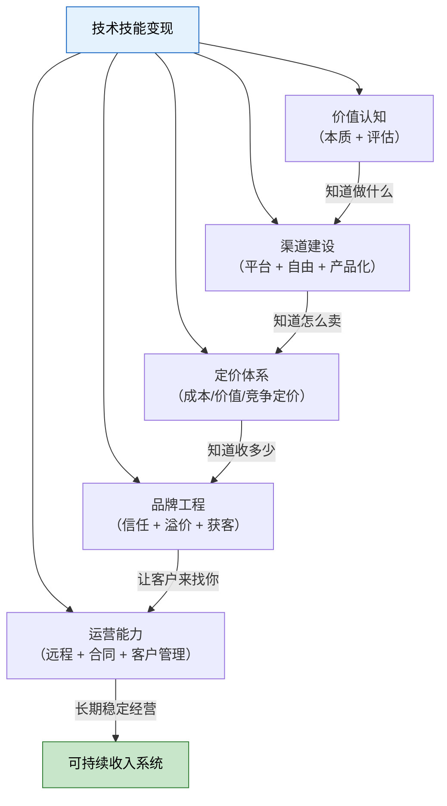
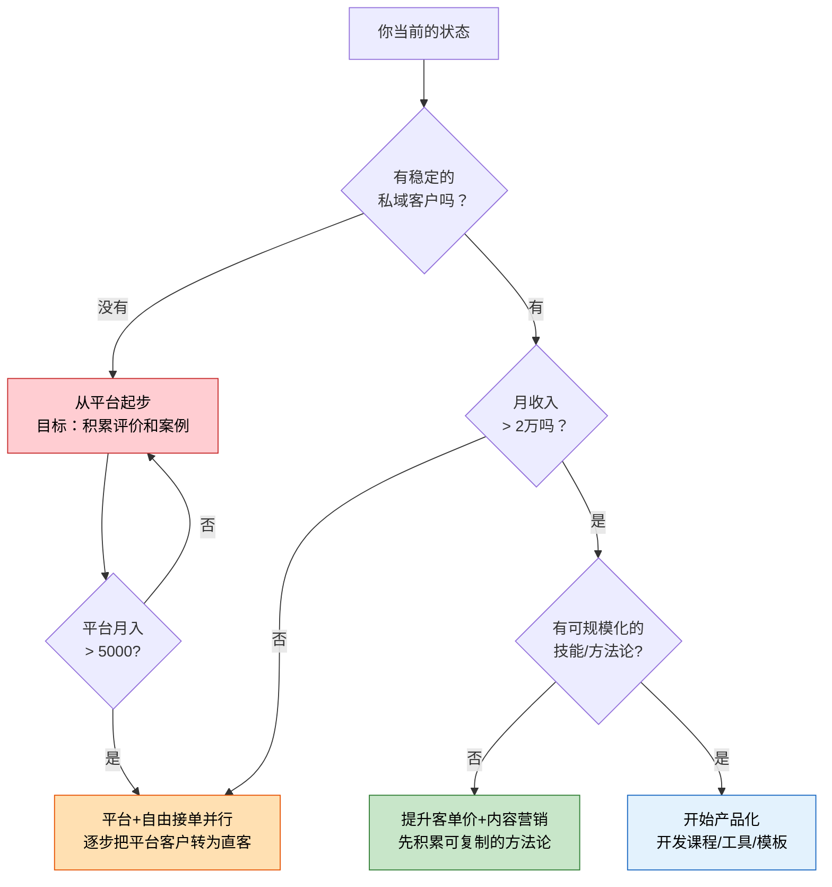
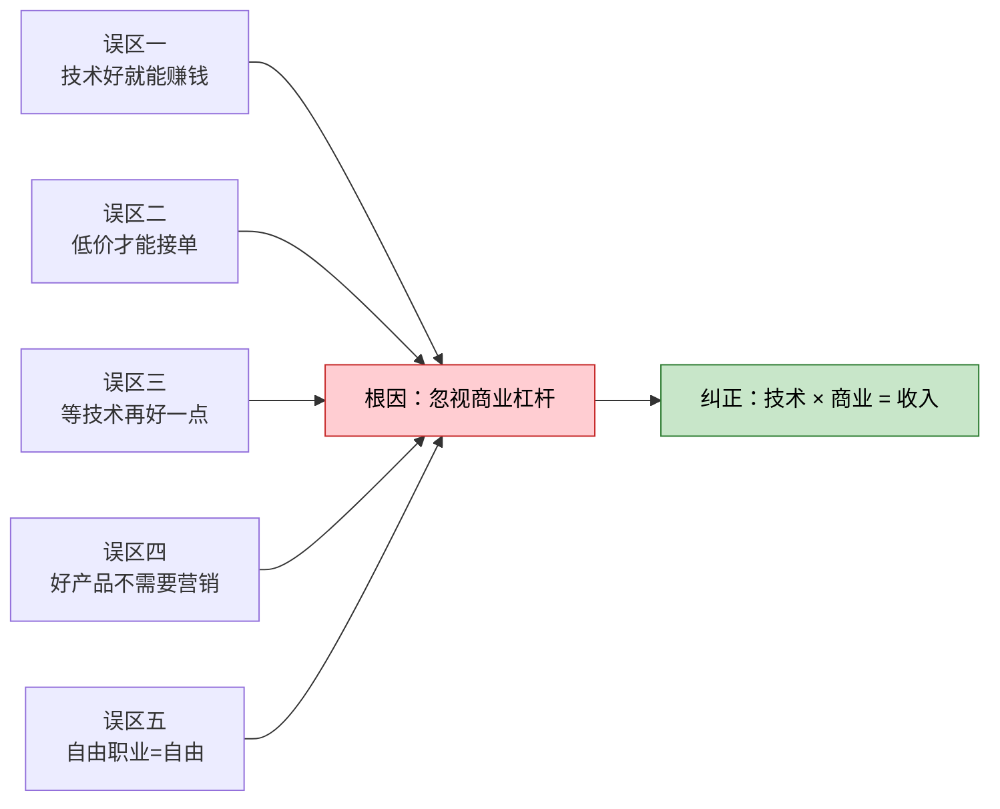
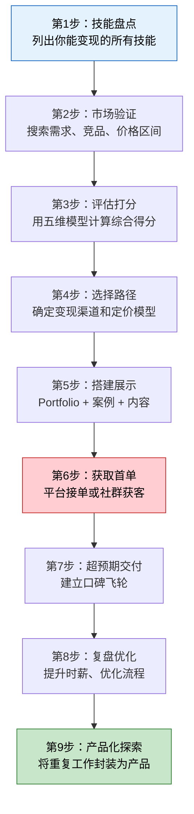
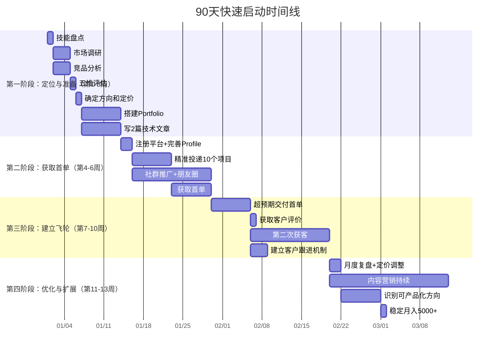
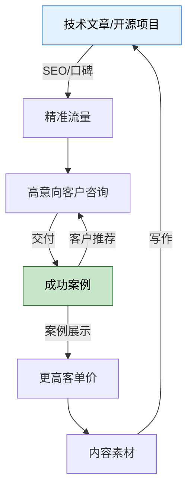
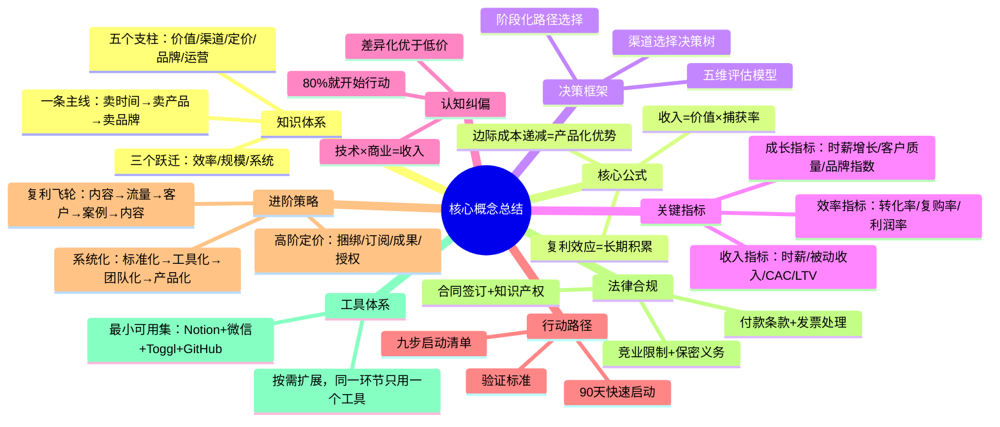

本节是第10章理论基础的收束篇。前八节分别拆解了技能变现的各个模块——本质规律、评估方法、渠道选择、定价策略、品牌建设、平台分析、远程协作、常见误区。本节的任务不是重复，而是**整合**：把这些分散的知识节点串联成一个可操作的系统，让读者拿到一份从"我有一个技术"到"我靠技术持续赚钱"的完整导航图。

全文分为七个板块：**体系总览**（建立全局认知）、**概念速查**（按需检索关键知识点）、**自我诊断**（定位你当前的位置和瓶颈）、**关键指标**（用数据驱动决策）、**行动路线**（从零到一的可执行步骤）、**失败应对**（规避常见陷阱）、**策略进阶**（突破天花板的高阶思路）。最后附法律合规速查、工具清单和常见问题解答。

**本节的使用方式**：不要试图一次读完。建议分三次使用：

1. **第一次通读**：快速浏览体系总览和概念速查，建立全局认知（30分钟）
2. **第二次精读**：做自我诊断，找到自己的位置和瓶颈，针对性阅读对应板块（1-2小时）
3. **第三次查阅**：把本节当作工具书，在实操过程中遇到问题时回来查阅（持续使用）

---

## 一、体系总览：一条主线、五个支柱、三个跃迁

### 1.1 知识体系全景图

整章理论基础可以用**一条主线、五个支柱、三个跃迁**来概括。理解这个框架后，本章以及后续核心技巧、实战案例的所有内容都能找到自己的位置。



**一条主线**：从"卖时间"到"卖产品"到"卖品牌"的进化路径。这不是三个平行选项，而是一条阶梯——每一层都建立在前一层的基础上。卖时间积累的项目经验，是卖成果时定价的依据；卖成果积累的可复制方法论，是卖产品的素材；卖产品积累的用户和口碑，是卖品牌的根基。

**五个支柱**：价值认知、渠道建设、定价体系、品牌工程、运营能力。它们之间的关系不是并列而是**乘法**：任何一个为零，总收益为零。很多技术人只修炼"技术执行"这一个维度，相当于五根柱子只立了一根，系统必然坍塌。

**三个跃迁**：

| 跃迁 | 核心变化 | 所需新能力 | 典型时间跨度 | 标志性事件 |
|------|----------|------------|-------------|------------|
| 卖时间→卖成果 | 从"按小时计费"到"按成果定价" | 需求分析、报价谈判、项目管理 | 3-12个月 | 第一次拒绝低价项目 |
| 卖成果→卖产品 | 从"一对一交付"到"一对多分发" | 产品设计、营销推广、用户运营 | 1-2年 | 第一个不需要你参与就能成交的产品 |
| 卖产品→卖品牌 | 从"卖功能"到"卖信任" | 品牌叙事、生态构建、团队管理 | 2-5年 | 客户因为"是你做的"而付费 |

每次跃迁都伴随着**认知升级**：卖时间时你以为技术是核心竞争力；卖成果时你发现需求理解比代码质量更重要；卖产品时你明白营销和产品同等重要；卖品牌时你懂得系统能力大于个人能力。

### 1.2 收入公式与核心经济学

所有变现行为都可以用一个公式表达：

```text
收入 = 创造的价值 × 价值捕获率
```

这个公式揭示了两个独立的杠杆：

- **创造价值的能力**：你能帮客户解决多大的问题、带来多大的收益。这由你的技术深度、行业理解、解决方案质量决定。
- **价值捕获率**：你从创造的价值中能分到多少比例。这由信息差、可替代性、感知价值、成果可见性、谈判力五个因素决定。

大多数技术人只关注第一个杠杆（学更多技术），忽略了第二个杠杆（让客户感知到你的价值、提高不可替代性）。这是"技术好但赚不到钱"的根本原因。

**价值捕获率的五个决定因素详解**：

| 因素 | 含义 | 提升方法 | 影响权重 |
|------|------|----------|----------|
| 信息差 | 客户不了解你的技术的真实成本 | 用通俗语言解释技术复杂度，展示同类项目市场价 | ★★★ |
| 可替代性 | 市场上还有谁能做同样的事 | 在细分领域建立专精定位，积累独家方法论 | ★★★★ |
| 感知价值 | 客户觉得你的工作值多少钱 | 用案例展示量化成果（"加载时间从3秒降到0.8秒"） | ★★★★ |
| 成果可见性 | 客户能否直观看到你的工作成果 | 交付可视化报告、前后对比数据、客户见证 | ★★★ |
| 谈判力 | 你能争取到多大的份额 | 三档报价法、先报价锚定、价值量化话术 | ★★★ |

**边际成本递减**是卖产品比卖时间更高级的经济学原因。卖时间的边际成本恒定（每多接一个客户就多花一份时间），卖产品的边际成本趋近于零（一套课程/工具可以卖给100个客户和10000个客户的成本差异很小）。这意味着**规模化**只存在于产品化模式中。

具体数据对比：假设你开发一个自动化部署工具，投入200小时，售价299元/份。

| 指标 | 卖时间（部署服务） | 卖产品（部署工具） |
|------|-------------------|-------------------|
| 开发投入 | 200小时 | 200小时 |
| 第1份边际成本 | 200小时 | 0（已开发完成） |
| 第100份边际成本 | 20,000小时 | ~2小时（客服答疑） |
| 第1000份边际成本 | 200,000小时 | ~10小时（迭代维护） |
| 100份总收入（假设200元/小时） | 4,000,000元 | 29,900元 |
| 1000份总收入 | 不可能（人的时间有上限） | 299,000元 |

这个对比说明：卖时间的天花板很低但起步收入高，卖产品的天花板很高但起步收入低。正确策略是**先卖时间积累经验和资金，再卖产品实现规模化**。

**复利效应**只在"卖成果"及以上的模式中存在。卖时间不存在复利——你今天花8小时写代码和一年前花8小时写代码，效率提升有限。但卖成果时，每完成一个项目都会积累案例库、方法论、行业认知，这些会降低下一个项目的边际成本、提升报价底气。卖产品时复利更强——用户口碑、SEO排名、品牌认知都会随时间累积。

复利的数学表达：

```text
第N个项目的实际成本 = 基础成本 × (1 - 经验折减率)^N
```

假设经验折减率为5%（每做一个项目，同类项目的成本降低5%）：
- 第1个项目：100%成本
- 第10个项目：60%成本（节省40%时间）
- 第20个项目：36%成本（节省64%时间）
- 第50个项目：8%成本（节省92%时间）

这意味着做到第50个同类项目时，你的效率是新手的12倍——这就是复利的真实威力。

**机会成本**是自由职业者最容易忽视的隐性成本。计算你的底线时薪：

```text
底线时薪 = （期望月收入 × 1.5）/（22天 × 6小时）
```

其中1.5倍是社保、税费、空窗期、工具成本等隐性开支的补偿系数；6小时是自由职业者的实际有效工作时长（扣除沟通、行政、学习等非收入时间）。如果你的期望月收入是15000元，底线时薪就是 15000 × 1.5 / (22 × 6) ≈ 170元/小时。低于这个价格的项目，实际上不如上班。

**隐性成本明细**（1.5倍系数的来源）：

| 成本项 | 占比 | 说明 |
|--------|------|------|
| 社保自缴 | ~25% | 公司不再承担的部分 |
| 税费 | ~5-15% | 个税+增值税（取决于收入水平） |
| 空窗期 | ~10-15% | 没有项目的时间（平均每月3-5天） |
| 工具/设备 | ~3-5% | 软件订阅、云服务、硬件折旧 |
| 沟通成本 | ~5-10% | 无法计费的客户沟通、需求澄清 |
| 学习成本 | ~5-10% | 持续学习新技术的时间投入 |

---

## 二、核心概念速查表

以下表格将前八节的关键概念浓缩为速查格式。每个概念标注了出处，方便回溯深入。同时结合本章核心技巧和实战案例章节的具体案例进行交叉引用。

### 2.1 四种变现模式详解

| 模式 | 收入公式 | 天花板（月） | 核心能力 | 升级信号 | 对应案例 |
|------|----------|-------------|----------|----------|----------|
| 卖时间 | 时薪 × 工时 | 2-3万 | 技术执行 | "忙得没时间接单" | 案例一（张晨·前端） |
| 卖成果 | 项目数 × 单价 | 5-15万 | 需求管理、报价 | "同类项目做了第5遍" | 案例六（陈远·全栈） |
| 卖产品 | 用户数 × 单价 | 10-50万 | 产品设计、营销 | "需要持续运营能力" | 案例七（赵明哲·AI SaaS） |
| 卖品牌 | 品牌溢价 × 规模 | 50万+ | 系统能力、团队管理 | "需要脱身能力" | 案例八（张伟·技术博主） |

**升级信号解读**：每个信号都对应一个具体瓶颈。"忙得没时间接单"意味着你已经触到了时间天花板，继续卖时间只会更累而不是更赚钱——此时必须提高单项目报价或转向卖成果。"同类项目做了第5遍"意味着你的经验可以产品化——把重复工作封装为模板/课程/工具。"需要持续运营能力"意味着你需要学习营销和用户增长，而不是继续堆功能。

**现实案例：从卖时间到卖产品的典型路径**

以一位前端开发者为例：
- **第1-6个月**（卖时间）：在平台接单，平均项目单价3000元，月收入约8000元，有效时薪约67元
- **第7-12个月**（卖成果）：开始理解需求，项目单价提升到8000元，月收入约15000元，有效时薪约125元
- **第13-18个月**（卖产品萌芽）：发现80%的项目都有相似的后台管理系统需求，花2个月开发了一套通用后台模板
- **第19-24个月**（卖产品）：后台模板售价999元/份，月销30份+定制服务，月收入约5万元，有效时薪约350元

### 2.2 技能评估五维模型

| 维度 | 权重 | 核心问题 | 评分方法 |
|------|------|----------|----------|
| 市场需求 | 30% | 有人愿意为此付费吗？ | 付费意愿 > 需求规模 > 增长趋势 |
| 竞争格局 | 20% | 我能赢过现有玩家吗？ | 差异化空间 > 技能深度 > 稀缺性 |
| 变现路径 | 20% | 钱从哪里来、怎么来？ | 技能-路径匹配度 > 首笔收入时间 |
| 投入产出比 | 15% | 时间精力的回报率如何？ | ROI周期 > 长期ROI > 隐性成本 |
| 可持续性 | 15% | 这条路能走多久？ | 技能生命周期 > AI替代风险 > 复购率 |

**评分标准**（5分制）：

| 得分区间 | 等级 | 行动建议 |
|----------|------|----------|
| 4.5+ | S级 | 立即全力投入，这是你的金矿 |
| 4.0-4.4 | A级 | 值得投入，制定3个月详细计划 |
| 3.5-3.9 | B级 | 小规模验证，用最小成本测试市场反应 |
| 3.0-3.4 | C级 | 仅作副线，不作为主要收入来源 |
| 2.5-2.9 | D级 | 不推荐，除非你有强烈的非经济动机 |
| <2.5 | F级 | 果断放弃，把时间花在更有价值的方向上 |

**五维评估实操示例**：假设你是一位有3年经验的Python开发者，考虑"自动化测试服务"方向：

| 维度 | 评分 | 理由 |
|------|------|------|
| 市场需求（30%） | 4.2 | 企业数字化转型驱动测试自动化需求持续增长，中大型企业普遍有预算 |
| 竞争格局（20%） | 3.5 | 有成熟的商业工具（Sauce Labs等），但针对特定框架的定制化服务仍有空间 |
| 变现路径（20%） | 4.0 | 路径清晰：平台接单→自由接单→测试框架产品化→培训课程 |
| 投入产出比（15%） | 3.8 | 需要投入学习CI/CD、容器化等配套技能，但回报周期短（3-6个月可见收入） |
| 可持续性（15%） | 3.5 | AI正在渗透测试领域，但"测试策略设计"和"复杂场景覆盖"短期内难以被替代 |

**综合得分** = 4.2×0.3 + 3.5×0.2 + 4.0×0.2 + 3.8×0.15 + 3.5×0.15 = 1.26 + 0.70 + 0.80 + 0.57 + 0.525 = **3.855** → B级

**结论**：小规模验证。建议先在平台上接2-3个测试相关的小项目，验证市场需求和自己的竞争力，再决定是否全力投入。

详细评估方法见[02-技能评估框架](02-二技能评估框架/)，具体技能类型的评估实例见本章实战案例中各案例的"技能评估"部分。

### 2.3 变现渠道对比矩阵

| 维度 | 接单平台 | 自由接单 | 产品化变现 |
|------|----------|----------|------------|
| 获客方式 | 平台分配流量 | 主动获客/口碑推荐 | 产品自传播/SEO/内容营销 |
| 客户关系 | 平台拥有，你无法带走 | 你直接拥有客户关系 | 用户自助，关系较浅 |
| 定价权 | 受平台约束，有参考区间 | 完全自主定价 | 完全自主定价 |
| 抽成/成本 | 10%-20%平台抽成 | 0%（但有获客成本） | 平台2%-10%或自建零成本 |
| 收入天花板 | 低（受限于个人时间） | 中（可提价+可外包） | 高（边际成本趋零） |
| 启动难度 | 低（注册即可开始） | 中（需要已有网络） | 高（需要产品+营销能力） |
| 进化路径 | 起步练手，积累评价 | 积累客户和口碑 | 终极目标，规模化收入 |
| 典型月收入（成熟期） | 5000-20000元 | 15000-50000元 | 30000-200000元+ |
| 时间自由度 | 低（客户随时找你） | 中（可协商时间） | 高（产品自动运行） |

**渠道选择决策树**：



详细平台分析见[06-自由职业平台深度分析](06-六自由职业平台深度分析/)。

### 2.4 定价体系三阶段

| 定价模型 | 适用阶段 | 核心逻辑 | 计算公式 | 风险 |
|----------|----------|----------|----------|------|
| 成本定价 | 入门期（0-6个月） | 成本 + 合理利润 | (时间成本 + 直接成本) × 1.3~1.5 | 容易低估隐性成本 |
| 竞争定价 | 成长期（6-18个月） | 参考市场区间 | 同类服务中位数 ± 15% | 容易陷入价格战 |
| 价值定价 | 成熟期（18个月+） | 基于客户获益 | 客户预期收益 × 5%~20% | 需要强议价能力 |

**定价心理学四原则**：

- **锚定效应**：你先报价，且报高20-30%。客户的心理价位会被你的首次报价"锚定"，即使还价也会在高位附近成交。先报价的人掌握主动权。
- **价格信号效应**：在信息不对称的市场中，客户用价格判断质量。你报300元/小时和报100元/小时，客户对你的信任度完全不同。除非你有充足的信任背书，否则不要用低价吸引客户。
- **损失厌恶**：告诉客户"不做这件事会导致什么损失"比"做这件事能带来什么收益"更有说服力。"你的竞争对手已经上线了这个功能，每晚一天你就多损失一天的市场机会"比"这个功能能帮你增加20%的转化率"更有效。
- **对比效应**：提供三档报价（基础/标准/高级），中间档通常最畅销。基础档太简陋，高级档太贵，中间档"刚刚好"——但中间档才是你真正想卖的。

**三档报价法实操模板**：

以"企业官网开发"为例：

| 档位 | 价格 | 包含内容 | 交付周期 | 设计意图 |
|------|------|----------|----------|----------|
| 基础版 | 8,000元 | 5页响应式官网 + 基础SEO + 1次修改 | 2周 | 让中间档显得超值 |
| **标准版** | **15,000元** | **10页响应式官网 + SEO优化 + 内容管理后台 + 3次修改 + 3个月维护** | **3周** | **你真正想卖的** |
| 高级版 | 28,000元 | 全站定制 + 多语言 + SEO + 数据分析集成 + 无限修改 + 1年维护 | 5周 | 拉高锚定价，衬托中间档性价比 |

**为什么三档报价有效**：心理学研究表明，当面对3个选项时，大多数人会选择中间项（"折中效应"）。基础版故意做得很简陋（让人觉得"不太够用"），高级版故意做得很贵（让人觉得"太奢侈"），中间档就成了"恰到好处"的选择。

定价策略的完整论述见[04-定价策略](04-四定价策略/)。

### 2.5 个人品牌四要素

| 要素 | 含义 | 作用 | 建设方法 | 生效周期 |
|------|------|------|----------|----------|
| 品牌定位 | 你在客户心中的独特标签 | 差异化竞争 | "技术栈+行业"或"技术栈+场景"的交叉定位 | 1-3个月 |
| 信任背书 | 别人选择你的理由 | 降低客户决策成本 | 案例 > 博客 > 认证 > 社区活跃度 | 3-6个月 |
| 内容资产 | 持续输出的专业内容 | 长尾获客 | 技术文章、教程、开源项目、视频 | 6-12个月 |
| 口碑飞轮 | 优质交付→推荐→新客户 | 零成本获客 | 超预期交付 + 主动请求转介绍 | 持续累积 |

品牌建设的核心逻辑是**先有信任，再有溢价**。信任来自三个层面：

1. **专业信任**："这个人确实懂技术"——通过技术文章、开源项目、技术分享建立。
2. **交付信任**："这个人能把事情做好"——通过案例展示、客户评价、交付记录建立。
3. **人品信任**："这个人靠谱，不会坑我"——通过沟通方式、承诺兑现、问题处理建立。

三个层面缺一不可。很多技术人只做到了第一层（专业信任），在第二层（交付信任）上缺乏展示，在第三层（人品信任）上忽视沟通细节。

**品牌定位公式**：

```text
我是 [技术栈] 领域的 [角色]，帮 [目标客户] 解决 [具体问题]。

示例：
"我是 React 生态的全栈开发者，帮电商创业公司搭建高性能独立站。"
"我是 Python 数据工程师，帮中型制造企业做生产数据可视化和异常检测。"
"我是微信小程序专家，帮线下连锁门店做数字化会员管理和私域运营。"
```

**定位的"3厘米宽、3公里深"原则**：不要试图做"什么都能做"的全栈开发者——这等于没有定位。选择一个足够窄的细分领域（3厘米宽），然后做到这个领域的前10%（3公里深）。"React电商独立站专家"比"全栈开发者"更容易让客户记住你、选择你。

品牌建设的系统方法见[05-个人品牌建设](05-五个人品牌建设/)。

### 2.6 远程工作核心能力

| 能力 | 具体要求 | 常见陷阱 | 修炼方法 |
|------|----------|----------|----------|
| 异步沟通 | 用文字精确表达，减少实时依赖 | 信息碎片化、回复延迟导致误解 | 每次沟通前写结构化提纲 |
| 自律管理 | 结构化日程、番茄工作法、周回顾 | 伪工作（看起来很忙但没产出） | 用Toggl/Clockify追踪真实工时 |
| 工具链 | 项目管理+即时通讯+文件协作+时间追踪 | 工具过多反而降低效率 | 同一环节只用一个工具 |
| 跨时区协作 | 明确在线时间窗口、异步决策流程 | "24小时在线"的幻觉 | 设定响应SLA（如4小时内回复） |

**异步沟通的结构化模板**：每次给客户发送进度更新或问题时，使用以下格式：

```text
【进度更新】项目名称 - 日期

✅ 已完成：
- 功能A：描述 + 截图/链接
- 功能B：描述 + 截图/链接

🔄 进行中：
- 功能C：预计明天完成

❓ 需要确认：
- 问题1：[具体描述] + [你的建议方案A/B] + [需要客户在X前回复]

📅 下一步：
- 明天：完成功能C
- 后天：开始功能D
```

远程工作的完整指南见[07-远程工作技巧](07-七远程工作技巧/)。

---

## 三、自我诊断：定位你的当前位置

### 3.1 商业成熟度自评量表

在选择路径之前，你需要知道自己当前处于哪个阶段。以下自评量表从五个维度评估你的商业化成熟度，每个维度1-5分。诚实评分——给自己打高分不会让收入增长，但准确的自我认知会。

**评估说明**：对于每个维度，阅读描述后选择最符合你现状的分数。

#### 维度一：技术执行能力（你能交付什么？）

| 分数 | 描述 |
|------|------|
| 1分 | 能完成导师/领导分配的明确任务，需要频繁指导 |
| 2分 | 能独立完成常规开发任务，偶尔需要求助 |
| 3分 | 能独立完成中等复杂度项目，能做技术选型 |
| 4分 | 能处理复杂项目，能做架构设计，能解决疑难问题 |
| 5分 | 在特定领域有深厚积累，能设计高难度系统方案 |

#### 维度二：需求理解能力（你能发现客户真正需要什么吗？）

| 分数 | 描述 |
|------|------|
| 1分 | 客户说什么就做什么，不质疑需求合理性 |
| 2分 | 能发现明显不合理的需求，但不知道如何引导客户 |
| 3分 | 能通过提问理解客户的真实目标，能给出替代方案 |
| 4分 | 能从客户的业务场景出发，主动发现未被表达的需求 |
| 5分 | 能诊断客户的商业模式，提供超越技术的解决方案 |

#### 维度三：沟通与报价能力（你能把价值卖出去吗？）

| 分数 | 描述 |
|------|------|
| 1分 | 不知道怎么报价，客户给多少就收多少 |
| 2分 | 有基本的报价能力，但经常低估工作量 |
| 3分 | 能基于工作量准确报价，能说服客户接受合理价格 |
| 4分 | 能用价值定价，能清晰表达"为什么这个价格合理" |
| 5分 | 能将技术价值翻译为商业价值，报价时客户觉得物超所值 |

#### 维度四：客户管理能力（你能留住客户吗？）

| 分数 | 描述 |
|------|------|
| 1分 | 没有回头客，每个项目都是从零开始获客 |
| 2分 | 偶尔有回头客，但没有系统性的客户维护 |
| 3分 | 有稳定的复购客户群，会主动跟进和维护关系 |
| 4分 | 有客户分级管理体系，80%收入来自20%的高价值客户 |
| 5分 | 客户主动推荐新客户，口碑飞轮自转，获客成本趋零 |

#### 维度五：产品化思维（你能把经验变成可复制的产品吗？）

| 分数 | 描述 |
|------|------|
| 1分 | 所有工作都是一次性的，没有复用意识 |
| 2分 | 有一些代码模板和文档复用，但没有形成产品 |
| 3分 | 有意识地将重复工作封装为工具/模板，能卖一些小产品 |
| 4分 | 有明确的产品线，能持续迭代，有付费用户 |
| 5分 | 产品收入超过服务收入，系统能半自动运转 |

**评分汇总与行动建议**：

| 总分 | 阶段 | 核心瓶颈 | 首要行动 |
|------|------|----------|----------|
| 5-10分 | 萌芽期 | 技术能力不足以独立交付 | 先在主业中积累项目经验，同时在平台接小单练手 |
| 11-15分 | 起步期 | 缺乏获客和报价能力 | 学习报价技巧，建立Portfolio，从平台获取前几单 |
| 16-20分 | 成长期 | 收入增长遇到瓶颈 | 提升客单价，开始内容营销，尝试自由接单 |
| 21-25分 | 成熟期 | 时间瓶颈无法突破 | 将经验产品化（课程/工具/模板），发展被动收入 |
| 26-30分 | 领先期 | 需要建立系统化运营 | 品牌化、团队化、生态化，从个人能力到组织能力 |

### 3.2 常见瓶颈诊断

根据自评结果，以下是每种瓶颈的详细诊断和解决方案：

#### 瓶颈一：技术能力不足（维度一≤2分）

**症状**：接单后经常超时、交付质量不稳定、遇到问题需要频繁求助。

**诊断**：你可能高估了自己的技术成熟度，或者选择的项目方向超出了当前能力范围。

**解决方案**：
1. **缩小范围**：不要接全栈项目，先在自己最擅长的一个技术方向上做精做深。
2. **从重构开始**：接一些代码优化、性能调优、Bug修复的小项目，这些项目风险低、周期短、能积累信心。
3. **用项目驱动学习**：在接单过程中遇到不懂的技术，针对性学习——这比泛泛地看教程有效10倍。
4. **建立技术评估清单**：接项目前先列出需要用到的技术点，逐个评估自己是否掌握。掌握度<70%的项目不要接。

**技术评估清单模板**：

```text
项目名称：________

核心技术点：
| 技术点 | 掌握度(%) | 有替代方案? | 预估学习时间 |
|--------|-----------|-------------|-------------|
| React Hooks | 90% | N/A | 0 |
| Node.js后端 | 70% | 用Python Flask替代 | 8小时 |
| Redis缓存 | 40% | 无 | 20小时 |

综合掌握度：67% → 勉强可以接，但需要预留Redis学习时间
风险评估：Redis是瓶颈，如果项目紧急，建议不接或找搭档
```

#### 瓶颈二：缺乏需求理解能力（维度二≤2分）

**症状**：客户频繁改需求、项目范围无限膨胀、交付后客户不满意。

**诊断**：你在做"执行者"而不是"顾问"。客户说"我要一个网站"，你就开始写代码，而没有追问"这个网站要解决什么业务问题"。

**解决方案**：
1. **需求访谈模板**：在项目开始前，用结构化问题引导客户表达真实需求。
2. **需求文档化**：把确认的需求写成文档，让客户签字确认——这既是保护自己，也是迫使客户认真思考需求。
3. **原型先行**：在写代码之前，先用Figma/即时设计做一个低保真原型给客户看。一个2小时的原型可以避免20小时的返工。
4. **学说"不"**：客户需求不合理时，不要默默承受，要清晰解释为什么这个需求不合理，并给出替代方案。

**需求访谈核心问题清单**：

```text
一、业务背景
1. 你的公司/产品是做什么的？（理解业务上下文）
2. 你目前最大的业务痛点是什么？（挖掘真实需求）
3. 这个项目预期带来什么业务成果？（量化价值）

二、需求澄清
4. 你希望用户通过这个产品完成什么操作？（核心功能）
5. 有没有参考网站/产品？你最喜欢它的哪些地方？（明确期望）
6. 你目前是怎么解决这个问题的？（理解现有方案的不足）

三、约束条件
7. 预算范围大概是多少？（判断是否匹配）
8. 期望什么时候上线？（评估可行性）
9. 项目上线后，你希望我提供多久的维护？（明确服务范围）

四、成功标准
10. 项目做完后，你用什么指标来判断这个项目是成功的？（对齐目标）
11. 如果只能做3个功能，你最想要哪3个？（确定优先级）
```

#### 瓶颈三：报价能力弱（维度三≤2分）

**症状**：不知道怎么定价、经常被客户砍价、感觉自己的收入和付出不成正比。

**诊断**：你用"工时思维"而不是"价值思维"在报价。

**解决方案**：
1. **计算底线时薪**：按上文公式算出你的底线价格，任何低于这个价格的项目都拒绝。
2. **价值量化练习**：对于每个项目，先估算它能帮客户赚多少钱或省多少钱，然后按客户收益的5%-15%报价。
3. **三档报价法**：每个项目给出三档报价（基础/标准/高级），让客户在你的框架内选择，而不是和你讨价还价。
4. **报价话术模板**：准备一套标准化的报价话术，避免临场紧张导致报低价格。

**报价话术模板**：

```text
[称呼]，感谢你的信任。根据我们的沟通，我理解你的核心需求是[用一句话概括]。

基于这个需求，我整理了三档方案供你选择：

📌 基础版（X元）：[一句话说清包含什么]
适合[什么场景/预算的客户]

⭐ 标准版（X元）：[一句话说清包含什么]  ← 推荐
适合[什么场景/预算的客户]，在基础版基础上增加了[关键增值点]

🏆 高级版（X元）：[一句话说清包含什么]
适合[什么场景/预算的客户]，包含[高价值附加服务]

报价包含[X次修改/3个月免费维护/详细使用文档]，交付周期约[X周]。

如果有任何疑问，或者你想对方案做调整，随时告诉我。
```

#### 瓶颈四：客户留存差（维度四≤2分）

**症状**：做完一单就没有下文、没有回头客、每次都需要从零开始获客。

**诊断**：你在"交付项目"而不是"经营关系"。

**解决方案**：
1. **交付后跟进**：项目结束后7天、30天、90天分别跟进一次，了解使用情况，主动提供优化建议。
2. **建立客户档案**：记录每个客户的业务情况、技术栈、预算周期、决策流程——下次有新服务可以精准推荐。
3. **超预期交付**：在约定范围之外多做一点点（比如多写一份文档、多优化一个性能问题、多提供一个使用建议），让客户感受到你"不只是完成任务"。
4. **主动请求转介绍**：项目完成后，如果客户满意，直接问："您身边有没有朋友也有类似需求？如果方便的话能否帮我介绍一下？"很多开发者不好意思开口，但转介绍是获客成本最低的方式。

**客户档案模板**：

```text
客户名称：________
行业：________ | 规模：________
联系人：________ | 职位：________
首次合作：________ | 合作次数：________
累计收入：________ 元

业务信息：
- 主营业务：________
- 核心痛点：________
- 技术栈：________
- 预算周期：□季度 □年度 □按需
- 决策流程：□联系人决定 □需要上级审批 □需团队讨论

沟通记录：
- [日期] 合作内容/反馈/新需求
- [日期] ...

跟进计划：
- [日期] 下次跟进（30天回访/新服务推荐/节日问候）
```

#### 瓶颈五：无法产品化（维度五≤2分）

**症状**：做了很多项目但没有积累、每次都是从零开始、收入和投入时间严格成正比。

**诊断**：你在"做项目"而不是"做产品"。

**解决方案**：
1. **建立可复用资产库**：把每个项目中通用的部分（组件、工具函数、配置模板、部署脚本）提取出来，形成自己的代码库。
2. **识别重复模式**：当你发现自己第三次做类似的事情时，就是产品化的信号。
3. **从小产品开始**：不需要一上来就做SaaS。一个代码模板（99元）、一份技术文档模板（49元）、一个自动化脚本（199元）都可以是产品。
4. **用内容验证需求**：先写一篇文章讲你的方法论，如果阅读量和互动量不错，再把它产品化为课程或工具。

**产品化信号检测表**：

```text
回顾你过去10个项目，回答以下问题：

1. 有哪些功能/模块你做了3次以上？
   → 列出：________ → 这就是产品化的候选

2. 有哪些问题是客户反复问你的？
   → 列出：________ → 这可以做成FAQ/教程/课程

3. 有哪些流程/操作你每次都要重复解释？
   → 列出：________ → 这可以做成自动化工具

4. 有哪些技术方案你在不同项目中复用了？
   → 列出：________ → 这可以做成模板/框架

答案最多的那一项，就是你第一个产品化的方向。
```

### 3.3 五大认知误区的统一纠正

前八节反复出现的五个误区，本质上指向同一个问题：**用"技术思维"而非"商业思维"看待变现**。



| 误区 | 表面逻辑 | 实际真相 | 纠正行动 | 验证方法 |
|------|----------|----------|----------|----------|
| 技术好就能赚钱 | 技术是核心竞争力 | 技术是必要条件，商业能力才是放大器。一个技术80分+商业80分的人，收入远超技术100分+商业20分的人 | 每周5小时学习营销、定价、客户沟通 | 对比身边技术好但收入一般的人和收入高但技术一般的人 |
| 低价才能接单 | 薄利多销 | 你永远竞争不过比你更便宜的人——总有刚毕业的学生愿意收更低的价格。低价吸引的是最差的客户：需求最多、预算最少、最难伺候 | 找3个差异化优势，用价值而非价格竞争 | 尝试提高报价20%，观察转化率变化 |
| 等技术再好一点 | 准备充分再开始 | 永远没有"准备好"的那一天。你在项目中学到的东西，10倍于你在准备期学到的。更重要的是，项目会告诉你市场真正需要什么技术 | 在当前技能80%处开始接单，用项目驱动学习 | 设一个截止日期：如果30天内还没开始接第一单，就强制开始 |
| 好产品不需要营销 | 酒香不怕巷子深 | 信息过载时代，没营销=不存在。GitHub上有无数优秀的开源项目star数为0，不是因为它们不好，而是因为没人知道 | 每天30分钟做一件"让别人知道你"的事 | 记录30天内的获客渠道来源，看营销是否带来新客户 |
| 自由职业=自由 | 不用上班就是自由 | 自由=时间自由，不是不工作。很多自由职业者比上班还累，因为他们既要做业务，又要做营销，还要做财务、法务、客服。自由是有代价的 | 兼职试水3-6个月再决定全职 | 记录一个月的工作时长，和上班对比 |

---

## 四、关键指标体系

变现不是"感觉赚到钱了"就行。你需要一套可量化、可追踪的指标体系来衡量进展、发现问题、指导决策。

### 4.1 收入指标

| 指标 | 定义 | 健康基准 | 警戒线 | 追踪方法 |
|------|------|----------|--------|----------|
| 月度总收入 | 当月所有变现收入之和 | 持续增长或稳定 | 连续3个月下降 | 用Excel/Notion按月记录 |
| 有效时薪 | 实际收入 ÷ 实际工作小时数 | > 主业时薪的1.5倍 | < 主业时薪（不如上班） | Toggl/Clockify记录工时 |
| 被动收入占比 | 不需额外时间投入的收入 ÷ 总收入 | > 30%（成熟期） | < 5%（完全依赖卖时间） | 区分主动收入和被动收入来源 |
| 客户获取成本（CAC） | 获客总支出 ÷ 新客户数 | < 首单收入的20% | > 首单收入的50% | 记录获客时间和渠道成本 |
| 客户生命周期价值（LTV） | 客户合作期间的总收入 | > CAC的3倍 | LTV < CAC（亏损获客） | 按客户维度汇总历史收入 |

**有效时薪是最关键的单一指标**。它告诉你：你的时间到底值多少钱？如果有效时薪低于主业时薪，你做副业实际上是在亏钱——把这些时间用来提升主业技能，回报率更高。

**LTV/CAC比值决定了你的业务是否可持续**。如果获取一个客户花了1000元（时间+金钱），但这个客户只给你带来了800元收入，你的业务模型就是亏损的。健康的LTV/CAC应该大于3:1。

### 4.2 效率指标

| 指标 | 定义 | 健康基准 | 优化方向 |
|------|------|----------|----------|
| 投标/提案转化率 | 成交数 ÷ 投标数 | > 15% | 优化提案质量，精准匹配客户需求 |
| 客户复购率 | 复购客户数 ÷ 总客户数 | > 40% | 超预期交付，定期跟进维护 |
| 项目利润率 | (收入 - 成本) ÷ 收入 | > 50% | 准确报价，控制需求蔓延 |
| 月有效工作天数 | 实际产生收入的工作天数 | > 18天/月 | 减少空窗期，建立稳定客户池 |
| 交付准时率 | 按时交付项目数 ÷ 总项目数 | > 90% | 合理评估工期，预留缓冲 |

**转化率低的原因诊断**：如果转化率<10%，问题通常出在三个地方——（1）提案质量差，没有针对性地回应客户需求；（2）报价不合理，和客户的心理预期差距太大；（3）Profile/Portfolio缺乏信任背书，客户不敢把项目交给你。

**复购率是业务健康的终极指标**。复购率高意味着：你的交付质量好（客户满意）、你的客户关系好（客户信任你）、你的定价合理（客户觉得值）。复购率低意味着你在"猎人模式"——不断寻找新客户，获客成本居高不下。

### 4.3 成长指标

| 指标 | 定义 | 健康基准 | 追踪方法 |
|------|------|----------|----------|
| 时薪增长率 | 同比时薪变化 | > 15%/年 | 每季度统计一次有效时薪 |
| 客户质量分 | 高价值客户占比 | 持续提升 | 按客单价分A(>5万)/B(1-5万)/C(<1万)三级 |
| 内容资产数量 | 已发布的文章/课程/工具 | 持续增长 | 每月至少1篇技术文章或1个工具 |
| 品牌搜索指数 | 品牌关键词的搜索量 | 持续上升 | 百度指数/Google Trends |
| 行业影响力 | 被邀请分享/被引用/被推荐次数 | 持续增长 | 每季度统计一次 |

### 4.4 指标追踪工具

推荐建立一个简单的**月度仪表盘**，用Notion或Google Sheets即可：

```text
月度仪表盘模板：
┌─────────────────────────────────────────────────┐
│  月份：____年____月                              │
├─────────────────────────────────────────────────┤
│  [收入]                                          │
│  总收入：________元                               │
│  被动收入：________元（占比___%）                  │
│  有效时薪：________元/小时                         │
│  对比上月：↑/↓ ___%                              │
├─────────────────────────────────────────────────┤
│  [效率]                                          │
│  项目数：________个                               │
│  转化率：________%                                │
│  复购率：________%                                │
│  利润率：________%                                │
├─────────────────────────────────────────────────┤
│  [成长]                                          │
│  新增内容：________篇/个                          │
│  新增客户：________个                             │
│  A级客户占比：________%                           │
├─────────────────────────────────────────────────┤
│  [问题与改进]                                     │
│  本月最大问题：________                           │
│  下月改进计划：________                           │
└─────────────────────────────────────────────────┘
```

每月花30分钟填写这个仪表盘，比花30小时盲目接单更有价值。它会告诉你：收入增长的瓶颈在哪里、时间花在了哪些低效活动上、哪些客户值得深耕、哪些方向应该放弃。

---

## 五、行动路线：从零到一的可执行步骤

### 5.1 九步启动清单

将理论转化为行动，按以下顺序执行。每一步都有具体的执行清单和验证标准。



#### 第1步：技能盘点（1天）

**执行清单**：
- [ ] 列出你掌握的所有技术技能（至少5项）
- [ ] 列出你的非技术技能（沟通、项目管理、写作、设计等）
- [ ] 列出你的行业/领域知识（金融、电商、教育、医疗等）
- [ ] 对每项技能标注掌握程度（初级/中级/高级/专家）
- [ ] 对每项技能标注市场价值（低/中/高/极高）
- [ ] 标注你"做得开心"的技能（持续动力比短期收益更重要）

**技能盘点模板**：

| 技能 | 类型 | 掌握程度 | 市场价值 | 做得开心 | 备注 |
|------|------|----------|----------|----------|------|
| React前端开发 | 技术 | 高 | 高 | 是 | 3年经验，做过5+项目 |
| Python数据分析 | 技术 | 中 | 高 | 一般 | 会用pandas，不精通ML |
| 技术博客写作 | 非技术 | 中 | 中 | 是 | 有10+篇原创文章 |
| 项目管理 | 非技术 | 中 | 中 | 否 | 带过3人小团队 |
| ... | ... | ... | ... | ... | ... |

**验证标准**：清单至少包含5项技能，覆盖技术+非技术两个维度。

#### 第2步：市场验证（1周）

**执行清单**：
- [ ] 在各接单平台搜索你的技能方向，记录需求量和价格区间
- [ ] 在知乎/掘金/公众号搜索相关话题，评估关注度
- [ ] 搜索竞品（同方向的自由职业者/工作室），分析他们的定价和定位
- [ ] 找3-5个潜在客户（朋友/同事/社群），做一次需求访谈
- [ ] 记录所有发现的付费信号（有人愿意为此掏钱的真实证据）

**需求验证的具体方法**：

1. **平台验证法**：在程序员客栈、猪八戒、Upwork等平台搜索关键词，看该方向的项目数量、预算范围、竞争人数。项目多+预算合理+竞争人数<20=好方向。
2. **社群验证法**：在相关技术社群（微信群、QQ群、论坛）中观察，是否有人在问这类问题、是否有人在付费购买这类服务。
3. **内容验证法**：写一篇该方向的技术文章，发到掘金/知乎/公众号，看阅读量和互动量。阅读量>1000且有私信咨询=强信号。
4. **直接验证法**：找3-5个有相关需求的人，免费或低价帮他们做一次，收集反馈和付费意愿。

**验证标准**：找到3个以上的付费信号（有人在为这个方向付费的真实证据）。

#### 第3步：评估打分（1天）

**执行清单**：
- [ ] 用五维模型对每个候选方向评分
- [ ] 计算综合加权得分
- [ ] 对比所有候选方向，选出得分最高的1-2个
- [ ] 如果最高分<3.5，回到第1步重新盘点

#### 第4步：选择路径（1天）

**执行清单**：
- [ ] 确定变现渠道（平台/自由接单/产品化）
- [ ] 确定定价模型（成本定价/竞争定价/价值定价）
- [ ] 确定初始定价（给出具体数字，不要"到时候再说"）
- [ ] 用一句话说清你的定位："我是____，帮____解决____问题，收费____"

**验证标准**：能用一句话说清"我卖什么、卖给谁、收多少"。

#### 第5步：搭建展示（1-2周）

**执行清单**：
- [ ] 创建/更新GitHub Profile，突出核心项目
- [ ] 写一个简洁的个人介绍页（包含技能、案例、联系方式）
- [ ] 准备至少3个案例，每个案例包含：背景→方案→成果
- [ ] 发布1-2篇该方向的技术文章
- [ ] 设置好联系方式和接单流程

**案例模板**：

```markdown
## 案例：[项目名称]

**客户背景**：[行业] + [规模] + [痛点]

**我的方案**：[技术选型] + [实现方式] + [关键决策]

**最终成果**：
- [量化成果1：如页面加载时间从3秒降到0.8秒]
- [量化成果2：如转化率提升了23%]
- [量化成果3：如维护成本降低了60%]

**客户评价**：[直接引用客户反馈]

**技术栈**：[列出使用的技术和工具]
```

**验证标准**：Portfolio上线，至少3个案例，含背景-方案-成果的完整叙事。

#### 第6步：获取首单（1-4周）

**执行清单**：
- [ ] 在2-3个平台注册并完善Profile
- [ ] 精准投递10个项目（不要海投，选择匹配度>80%的项目）
- [ ] 写5个定制化提案（不要用模板糊弄）
- [ ] 同时在朋友圈/社群发布"我能提供XX服务"的信息
- [ ] 如果4周内没有成交，回到第2步重新验证需求

**提案写作要点**：
1. **开头呼应客户需求**：不要说"我是XXX，我会XXX"，要说"关于你的XX需求，我的理解是……"
2. **展示相关案例**：用1-2句话说明你做过类似的项目
3. **给出具体方案**：描述你会怎么做，而不是你会什么
4. **报价+交付时间**：给出明确的报价和排期
5. **降低决策门槛**：提供"先做一个小demo再决定"的选项

**验证标准**：获得第一笔收入。金额不重要，关键是跑通从获客到交付到收款的完整流程。

#### 第7步：超预期交付（持续）

**执行清单**：
- [ ] 按时交付，如果可能提前1-2天
- [ ] 在约定范围之外多做一点点
- [ ] 提供一份使用文档/维护指南
- [ ] 主动跟进使用情况
- [ ] 项目完成后请求客户评价和转介绍

#### 第8步：复盘优化（每月）

**执行清单**：
- [ ] 填写月度指标仪表盘
- [ ] 分析本月的收入结构（哪些客户/项目贡献了最多收入）
- [ ] 识别效率瓶颈（哪些环节花了最多时间但回报最低）
- [ ] 设定下月的收入目标和改进计划
- [ ] 更新定价（根据经验值和市场反馈调整）

#### 第9步：产品化探索（3-6个月）

**执行清单**：
- [ ] 识别你做过3次以上的重复工作
- [ ] 把它封装为可售卖的产品（模板/课程/工具）
- [ ] 用低价（<200元）测试市场反应
- [ ] 根据反馈迭代优化
- [ ] 建立产品的销售渠道

### 5.2 时间规划参考

| 步骤 | 建议周期 | 核心产出 | 验证标准 | 每日投入 |
|------|----------|----------|----------|----------|
| 技能盘点 | 1天 | 技能清单（至少5项） | 覆盖技术+非技术能力 | 全天 |
| 市场验证 | 1周 | 需求验证报告 | 找到3个以上付费信号 | 1-2小时 |
| 评估打分 | 1天 | 五维评分表 | 综合得分≥3.5 | 全天 |
| 选择路径 | 1天 | 明确渠道+定价 | 能用一句话说清定位 | 全天 |
| 搭建展示 | 1-2周 | Portfolio上线 | 至少3个完整案例 | 2-3小时 |
| 获取首单 | 1-4周 | 第一笔收入 | 跑通完整流程 | 1-2小时 |
| 超预期交付 | 持续 | 客户好评 | 转化率>15%，复购率>30% | 按项目定 |
| 复盘优化 | 每月 | 时薪提升 | 同比时薪增长>15% | 每月2小时 |
| 产品化探索 | 3-6个月 | 第一个产品 | 有人愿意付费购买 | 每周5-10小时 |

### 5.3 90天快速启动方案

如果你希望在90天内完成从"零"到"有稳定副业收入"的跨越，以下是一份按周拆解的详细计划：



**第1-3周：定位与准备**

| 天数 | 任务 | 时间投入 | 产出 |
|------|------|----------|------|
| 第1天 | 技能盘点+初步调研 | 4小时 | 技能清单+5个候选方向 |
| 第2-4天 | 深度市场调研 | 每天2小时 | 竞品分析报告+价格区间表 |
| 第5天 | 五维评估打分 | 3小时 | 确定1-2个主攻方向 |
| 第6天 | 确定定位和定价 | 2小时 | "我卖什么卖给谁收多少"一句话 |
| 第7-14天 | 搭建Portfolio+写文章 | 每天2小时 | 个人主页+3个案例+2篇文章 |

**第4-6周：获取首单**

| 天数 | 任务 | 时间投入 | 产出 |
|------|------|----------|------|
| 第15-16天 | 注册平台，完善Profile | 每天2小时 | 2-3个平台的完整Profile |
| 第17-23天 | 精准投递+写提案 | 每天1.5小时 | 10个精准提案 |
| 第24-42天 | 持续推广+跟进 | 每天1小时 | 获取首单 |

**第7-10周：建立飞轮**

完成首单交付后，把精力放在复购和转介绍上。目标：在第10周结束时有2-3个活跃客户。

**第11-13周：优化与扩展**

做第一次全面复盘，调整定价和策略。目标：第13周结束时月收入达到5000元以上。

---

## 六、失败场景应对指南

了解成功路径很重要，但了解"什么情况下会失败"同样重要——甚至更重要，因为你可以提前规避。

### 6.1 五种常见失败模式

#### 失败模式一：定价过低导致亏损

**症状**：接了很多单，每天忙得不可开交，但月底算账发现收入还不如上班。或者更糟——扣掉税费、工具、沟通成本后实际上是亏的。

**根因**：用"感觉便宜"而不是"计算成本"来定价。

**应对方案**：
1. 立即计算你的底线时薪（公式见上文）
2. 下一个项目的报价不低于底线时薪 × 预估工时 × 1.3（留30%缓冲）
3. 如果客户嫌贵，不要降价——解释你的价值，或者降低交付范围
4. 宁可少接单、接好单，也不要多接单、接烂单

#### 失败模式二：需求蔓延导致项目亏损

**症状**：一个本该2周完成的项目做了2个月，客户不断加需求但不愿意加钱。

**根因**：没有在项目开始前明确范围边界。

**应对方案**：
1. **必须有书面需求文档**：把需求写下来，让客户确认。口头需求是需求蔓延的温床。
2. **合同中写明变更条款**：超出原始需求范围的变更，按小时另外收费。
3. **用"需求冻结期"控制节奏**：每个迭代结束后设置2天的需求冻结期，冻结期内不接受新需求。
4. **学会说"这个需求可以放在V2"**：不是拒绝客户，而是引导客户按优先级分阶段实现。

**需求变更控制模板**：

```text
变更请求单

项目名称：________
提出日期：________
变更描述：________

影响评估：
- 预估增加工时：____小时
- 对现有功能的影响：□无 □轻微 □重大
- 对交付日期的影响：□无 □延迟____天
- 额外费用：________元

客户确认：□同意 □不同意 □需要讨论
确认日期：________
```

#### 失败模式三：单点依赖导致收入崩塌

**症状**：90%的收入来自一个大客户，当这个客户停止合作时，收入瞬间归零。

**应对方案**：
1. **单一客户收入不超过总收入的50%**
2. **始终保持2-3个活跃客户**
3. **在大客户合作期间就开始培育新客户渠道**
4. **签长期retainer协议**：月度固定服务费，比项目制更稳定

#### 失败模式四：只做技术不做营销，青黄不接

**症状**：忙的时候忙死（全在做项目），闲的时候闲死（没有新项目进来）。

**应对方案**：
1. **营销是每天的事，不是有空才做的事**：每天30分钟写技术文章/社群互动/回复评论。
2. **用"营销日历"管理节奏**：每周二发一篇文章，每周四在社群回答3个问题，每月做一次技术分享。
3. **开发"引流产品"**：免费的模板/工具/教程作为钩子，吸引潜在客户进入你的流量池。

#### 失败模式五：低价竞争陷入死循环

**症状**：为了接单不断降价，越降越亏，越亏越需要接更多单，陷入恶性循环。

**应对方案**：
1. **停止降价，开始增值**：在同样的价格下提供更多的服务（文档、维护、培训），而不是降低价格。
2. **差异化定位**：不要和所有人竞争——找到一个细分领域，成为那个领域的"专家"。
3. **提高门槛**：主动放弃低价客户，集中精力服务高质量客户。3个5000元的客户比10个1500元的客户更轻松、更赚钱。

### 6.2 心态问题应对

#### 冒充者综合征

**症状**：觉得自己技术不够好，不配收那么高的价格，害怕被客户发现自己"其实没那么厉害"。

**真相**：冒充者综合征在技术人员中极其普遍。根据调查，超过70%的技术人员在职业生涯某个阶段经历过。关键认知是——客户买的不是"最顶尖的技术"，而是"能解决他的问题"。你不需要比所有开发者都强，你只需要比你的客户在这个方向上强就够了。

**应对方法**：
1. 记录你成功完成的每个项目和每个客户的正面反馈，在自我怀疑时翻看
2. 和同行交流，你会发现"每个人都在某个方面不懂"
3. 用"帮朋友"的心态接单——你帮朋友解决问题时会觉得自己"不够格"吗？

#### 孤独感与动力枯竭

**症状**：自由职业者没有同事、没有团建、没有领导鼓励，长期独处容易丧失动力。

**应对方法**：
1. 加入自由职业者社群，定期交流
2. 参加线下技术活动和Meetup
3. 设定明确的短期目标（本周完成什么）而不是模糊的长期目标（今年赚多少钱）
4. 每完成一个重要里程碑，给自己一个小奖励

---

## 七、策略进阶：突破天花板的高阶思路

如果你已经度过了起步期，月收入稳定在2万以上，以下进阶策略可以帮助你突破瓶颈。

### 7.1 从"个人能力"到"系统能力"

当你一个人能做的事情已经到了极限，你需要建立系统来扩展：

**阶段一：标准化**
- 把你的工作流程文档化（需求分析→方案设计→开发→测试→交付→跟进）
- 建立标准模板（需求文档模板、合同模板、报价模板、交付清单）
- 记录每个环节的最佳实践和常见坑

**阶段二：工具化**
- 把重复性工作自动化（部署脚本、测试脚本、报告生成）
- 使用CRM管理客户（Notion/飞书多维表格即可）
- 用项目管理工具追踪进度（Notion看板/Trello/Linear）

**阶段三：团队化**
- 把低价值工作外包给其他开发者
- 建立协作网络（找固定搭档，你负责获客和需求，他们负责执行）
- 培养实习生或初级开发者

**阶段四：产品化**
- 将方法论封装为课程/书籍
- 将工具封装为付费产品
- 将流程封装为可授权的商业模式

### 7.2 构建复利飞轮

真正的高收入不是来自"接更多的单"，而是来自**复利**——你过去做的每一件事都在为未来创造价值。



构建复利飞轮的核心原则：
1. **每件事都要留下资产**：每个项目都要产出至少一篇案例文章；每次解决问题都要写一篇技术笔记；每次学到新东西都要分享一次。
2. **资产之间要能互相引用**：文章中引用案例，案例中引用文章，课程中引用所有内容。
3. **不要做"一次性"工作**：如果一个工作不能产生长期价值（如无目的的社群闲聊），要么不做，要么想办法让它产生长期价值（如把闲聊整理为FAQ）。

### 7.3 高阶定价策略

当你已经建立了品牌和信任，可以尝试以下高阶定价策略：

**捆绑定价**：把多个服务打包为一个"套餐"，总价高于单独购买的总和。例如"网站开发+SEO优化+1年维护"套餐。

**订阅定价**：提供月度/年度订阅服务。例如"技术顾问月度服务：每月8小时技术咨询+无限量紧急响应"。订阅模式给你稳定的现金流，给客户确定性的预算。

**成果定价**：按客户获得的成果收费。例如"我帮你优化网站性能，收费=性能提升带来的预期年收入增加的10%"。这种定价方式需要强议价能力，但上限极高。

**授权定价**：把你开发的工具/模板授权给客户使用，按年收取授权费。一次开发，多次收费。

### 7.4 行业趋势与机会窗口

技术变现不是静态的，需要关注趋势变化：

**AI赋能的新机会**：
- AI降低了"基础编码"的价值，但提高了"需求理解"和"方案设计"的价值
- "AI+垂直行业"是当前最大的机会窗口——帮传统行业用好AI，比开发AI本身更赚钱
- 提示工程、AI应用开发、AI培训是新兴的变现方向

**远程工作的常态化**：
- 全球远程工作机会持续增长，国内也在加速接受
- 英语能力成为远程变现的重要放大器——同样的工作，国际客户的付费是国内的3-5倍
- 跨时区协作能力成为核心竞争力

**知识付费的细分化**：
- "通用编程教程"已经过度饱和，但"特定行业的技术方案"仍然稀缺
- 企业培训（B2B知识付费）的客单价远高于个人培训（B2C）
- 实战型课程（带项目、带代码、带答疑）比录播型课程更有市场

---

## 八、法律与合规要点速查

技术变现不是"接活-干活-收钱"这么简单。以下是必须掌握的法律底线。忽视这些不仅可能让你亏损，还可能面临法律风险。

| 合规事项 | 核心要求 | 常见风险 | 应对措施 |
|----------|----------|----------|----------|
| 合同签订 | 书面合同 > 口头约定 | 口头约定无法举证，发生争议时你无处说理 | 使用标准合同模板，关键条款逐条确认。哪怕是一次性小项目，也要有一份简单的书面协议 |
| 知识产权 | 明确约定著作权归属 | 代码被客户无偿使用或转卖，你无法维权 | 合同中写明IP归属。通常约定：尾款付清后IP转移给客户，但你保留展示权（用于Portfolio） |
| 付款条款 | 预付30%-50%+里程碑付款 | 客户拖欠尾款或以"不满意"为由拒付 | 尾款不超过20%，逾期设置违约金（日0.5%-1%）。大项目分3-4个里程碑付款 |
| 竞业限制 | 检查劳动合同中的竞业条款 | 在职兼职被公司追责，甚至被开除 | 全职期间：（1）阅读劳动合同的竞业条款；（2）不用公司设备和时间做副业；（3）必要时提前和HR沟通 |
| 税务合规 | 按时申报，合理筹划 | 补税+滞纳金+罚款，金额可能超过你的项目收入 | 了解个人所得税/增值税规则。年收入超过一定金额需要注册个体工商户或公司。保留所有收支凭证 |
| 保密义务 | 不泄露客户商业信息 | 承担侵权赔偿，金额无上限 | 合同中明确保密范围和期限。不要在公开文章中泄露客户的技术架构和业务数据 |
| 发票问题 | 客户可能要求开具发票 | 个人无法开发票，导致丢失企业客户 | 注册个体工商户或使用税务局代开。年收入>10万建议注册个体工商户 |

**关于发票的补充说明**：很多企业客户在选择供应商时，第一件事就是问"能开发票吗"。如果你无法开发票，你就会自动失去大部分B2B客户。解决方案：（1）年收入<10万：去税务局代开发票（税点约3%）；（2）年收入10-50万：注册个体工商户（税点约2%-5%，可享受小规模纳税人优惠）；（3）年收入>50万：考虑注册公司（税点更高，但更专业，可享受更多税务筹划空间）。

**关于合同的关键条款清单**：一份完整的技术服务合同应至少包含以下条款——

```text
□ 服务范围：明确列出包含和不包含的内容
□ 交付标准：用可量化的方式定义"完成"（如：通过XX测试、加载时间<2秒）
□ 交付时间：具体的交付日期和里程碑节点
□ 付款方式：预付比例、里程碑付款节点、尾款条件
□ 需求变更：超出范围的变更如何处理（按小时收费、书面确认）
□ 知识产权：代码/设计/文档的归属和使用权限
□ 保密条款：保密范围、保密期限、违约责任
□ 售后维护：免费维护期、维护范围、维护期后收费方式
□ 违约责任：延期交付、拖欠款项、质量不达标的处理方式
□ 争议解决：协商→调解→仲裁/诉讼的流程
```

---

## 九、工具清单总览

从接单到交付到收款，每个环节都有对应的工具支持。选择工具的原则：**同一环节只用一个工具**，工具过多反而降低效率。

| 环节 | 推荐工具 | 用途 | 选择建议 |
|------|----------|------|----------|
| 获客与展示 | GitHub、掘金、知乎、公众号、小红书 | 技术内容输出，建立专业形象 | 选1-2个平台深耕，不要铺太多 |
| 项目管理 | Notion、飞书、Trello、Linear | 需求管理、进度追踪、文档协作 | 个人用Notion，团队用飞书 |
| 代码协作 | GitHub/GitLab、VS Code Live Share | 版本管理、远程结对编程 | GitHub是默认选择 |
| 设计协作 | Figma、即时设计 | UI/UX设计稿交付与评审 | Figma国际化，即时设计国内更快 |
| 沟通协作 | 企业微信、钉钉、飞书、Slack | 客户沟通、团队协作 | 国内客户用企业微信/钉钉，国际用Slack |
| 时间追踪 | Toggl、Clockify、番茄土豆 | 记录工时，计算有效时薪 | Toggl免费版足够个人使用 |
| 合同签署 | e签宝、法大大、DocuSign | 电子合同，法律效力 | 国内用e签宝/法大大，国际用DocuSign |
| 收款与发票 | 支付宝/微信收款、PayPal、Stripe | 国内外收款，开具发票 | 国内客户用支付宝/微信，国际用PayPal/Stripe |
| 内容制作 | OBS、剪映、Canva、Typst/LaTeX | 课程录制、图文制作、文档排版 | 视频用OBS+剪映，图文用Canva |

**工具选择的"最小可用集"原则**：不要在选工具上花太多时间。初期只需要4个工具：一个项目管理（Notion）、一个沟通工具（微信/钉钉）、一个时间追踪（Toggl）、一个代码托管（GitHub）。等你的业务增长到需要更多工具时，再逐步添加。

---

## 十、常见问题FAQ

### Q1：我没有特别突出的技术，能变现吗？

能。技能变现不等于"技术顶尖才能赚钱"。市场需要的不是"最好的技术"，而是"能解决问题的技术"。一个能用Excel帮小商户做库存管理的人，收入可能超过一个精通Rust但找不到项目的开发者。

关键认知转变：**不要问"我最擅长什么技术"，要问"我能帮谁解决什么问题"**。你的技术不需要是世界上最顶尖的，它只需要比你的客户强就够了。

具体行动：
1. 列出你"做得比大多数人好"的事情（不需要是专家级）
2. 在这个方向上寻找有付费需求的人（平台搜索、社群观察）
3. 用低价（甚至免费）完成1-2个项目，积累案例和信心
4. 逐步提价，用案例证明自己的能力

### Q2：全职工作很忙，还有时间做副业吗？

有，但需要策略。成功的副业开发者平均每周投入8-12小时。关键不是"有多少时间"，而是"怎么用这些时间"。

时间策略：
1. **选择不需要实时响应的工作类型**：技术文章、录播课程、模板工具——这些工作可以在任何时间进行，不依赖客户的时间。
2. **碎片时间做营销**：每天30分钟在技术社群回答问题、发一条技术动态，积累起来就是巨大的品牌资产。
3. **周末集中做交付**：把需要大块时间的工作（开发、调试、写作）放在周末。
4. **不要同时做太多项目**：1-2个就够了。多线程工作会降低每条线的质量。

时间分配建议：

| 工作日（每天30-60分钟） | 周末（每天2-4小时） |
|--------------------------|---------------------|
| 社群互动+回复评论 | 项目开发/交付 |
| 碎片化写作（列提纲、写草稿） | 内容创作（写文章、录视频） |
| 客户沟通+需求跟进 | 复盘+学习新技能 |

### Q3：如何判断一个变现方向是否值得投入？

用五维评估模型打分（见上文2.2节）。在此基础上，用四个快速判断标准：

1. **是否有人愿意为此付费**（需求验证）：不是"有人觉得这个好"，而是"有人掏钱买了"。
2. **你能否在竞争中胜出**（差异化）：不需要在所有方面都强，只需要在一个细分领域有独特优势。
3. **首笔收入能否在3个月内实现**（快速验证）：如果一个方向需要6个月以上才能有第一笔收入，要么方向太难，要么你的方法不对。
4. **长期是否有增长空间**（可持续性）：这个方向的需求是在增长还是在萎缩？AI会替代它吗？

**如果前三项都是否定的，果断放弃**。不要因为"我在这个方向投入了很多时间"就继续——沉没成本不是继续的理由。

### Q4：自由职业者如何处理收入波动？

收入波动是自由职业的常态，不是异常。应对策略：

1. **建立3-6个月的应急资金**：在全职工作期间就开始存，存够了再考虑全职自由职业。
2. **保持客户多样性**：至少2-3个活跃客户，单一客户收入不超过50%。
3. **发展被动收入渠道**：课程、工具、模板——这些不需要你花时间就能产生收入。
4. **签长期retainer协议**：月度固定服务费，比项目制更稳定。例如"每月8小时技术顾问服务，月费8000元"。
5. **淡季做积累**：淡季不是"没事干"，而是做内容营销和技能提升的最佳时期——为旺季蓄力。

### Q5：AI会取代技术自由职业者吗？

AI会取代"可被标准化的技术工作"（如简单CRUD、模板化网站、基础数据处理），但不会取代"需要理解业务、建立信任、处理复杂场景"的高端服务。

**三层应对策略**：

| 层级 | 策略 | 具体行动 |
|------|------|----------|
| 防守层 | 向上走，做AI做不了的事 | 架构设计、技术咨询、复杂问题排查、跨系统集成 |
| 共生层 | 把AI变成你的效率工具 | 用AI写代码、生成文档、分析数据，把产出提升3-5倍 |
| 进攻层 | 建立"AI+人工"混合服务模式 | AI处理标准化部分，你处理AI无法处理的复杂部分——整体效率高、成本低、质量有保障 |

**关键认知**：AI不是你的竞争对手，是你的杠杆。会用AI的自由职业者比不会用AI的有3-5倍的效率优势。现在就开始学习AI工具（GitHub Copilot、ChatGPT、Cursor等），把它融入你的工作流程。

### Q6：什么时候应该辞掉全职工作做自由职业？

满足以下条件中的**至少3个**再考虑：

1. ✅ 副业收入连续6个月超过主业收入的80%
2. ✅ 有至少3个月的应急资金（包含社保、房租、生活费）
3. ✅ 有稳定的客户来源（不依赖一个大客户）
4. ✅ 有可复制的获客渠道（不是靠运气接单）
5. ✅ 已经兼职试水6个月以上（了解自由职业的真实面貌）

**辞职不是起点，而是验证充分后的自然过渡**。很多成功的自由职业者是"渐进式过渡"：先兼职做→副业收入超过主业→减少主业工时（如转为4天/周）→全职自由职业。这种过渡方式的风险远低于"裸辞创业"。

### Q7：如何处理客户的不合理要求？

不合理要求包括：无限加需求不加钱、要求24小时在线、压低价格到不合理的水平、要求完成后才付款。

**应对框架**：
1. **先理解，再回应**：不要直接拒绝。先确认客户的真实意图——有时候"不合理要求"只是客户不了解行业惯例。
2. **用数据和逻辑说服**：不说"这做不了"，说"这个需求需要额外20小时工作量，按我们的合同条款，需要增加XX元费用"。
3. **提供替代方案**：如果客户不愿加钱，提供一个简化版本或分期实现的方案。
4. **底线条款写在合同里**：付款方式、需求变更流程、响应时间SLA——这些在项目开始前就白纸黑字写清楚。

---

## 十一、从理论到行动：本节小结



**最后的话**：理论的价值不在于"知道了"，而在于"做到了"。本节浓缩的所有概念，最终都指向一个行动——**开始你的第一单**。

不需要完美，不需要准备好，只需要开始。从今天起：
- 花1小时做技能盘点
- 花1天做市场验证
- 花1周搭建你的第一个案例

速度比完美重要，行动比计划重要。

如果你已经读完了整章理论基础，下一步是：
1. 用本节的自评量表给自己打分，找到瓶颈
2. 用九步启动清单开始行动
3. 翻到本章核心技巧部分，找到你方向对应的具体操作指南
4. 参考实战案例，看看和你类似背景的人是怎么做的

理论是地图，行动才是脚步。地图再精确，不迈步就到不了目的地。
