# 第十一章：电商与跨境电商

> "未来的商业只有两种：要么电子商务，要么无商可务。" —— 杰克·马

电商已经从"可选渠道"变成"必争之地"。2025年中国电商交易规模突破50万亿元，跨境电商出口额超过2.3万亿元，全球电商渗透率从2019年的14%攀升至2025年的22%以上。无论你是想做副业的上班族、寻找创业方向的自由职业者，还是已有供应链优势的工厂主，电商都提供了门槛最低、试错成本最小的商业模式。

本章将从国内电商、跨境电商、社交电商、新兴电商模式四个维度，系统讲解从选品到运营、从合规到增长的完整知识体系。不是"点到为止"的概览，而是可以直接落地执行的操作手册。

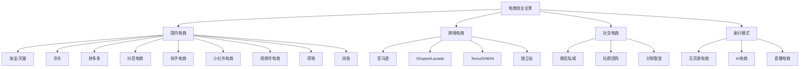

---

## 11.1 电商入门：核心概念与底层逻辑

在深入任何具体平台之前，你需要理解电商赚钱的底层公式。所有平台、所有玩法，本质上都在优化这个公式中的变量。

### 11.1.1 电商盈利公式

**利润 = 流量 × 转化率 × 客单价 × 毛利率 - 固定成本**

| 变量 | 含义 | 优化方向 |
|------|------|----------|
| 流量 | 访问你店铺/商品的人数 | SEO、付费广告、内容营销、社交裂变 |
| 转化率 | 访客中下单购买的比例 | 主图、详情页、价格、评价、客服 |
| 客单价 | 每笔订单的平均金额 | 关联销售、满减、套餐搭配 |
| 毛利率 | 扣除商品成本后的利润率 | 供应链优化、差异化定价、品牌溢价 |
| 固定成本 | 平台费、人工、仓储、物流等 | 规模效应、流程自动化、精细化运营 |

**关键认知**：新手最容易犯的错误是只盯着流量，忽略了转化率和客单价。一个转化率3%、客单价80元的店铺，比转化率0.5%、客单价30元但流量大10倍的店铺赚得更多。

**利润敏感度分析**：理解公式后，你会发现每个变量的优化对利润的影响并不均等。以月销50万、毛利30%的店铺为例：

| 优化变量 | 优化幅度 | 利润变化 | 难度 |
|----------|----------|----------|------|
| 流量提升20% | +20% | +3.3万/月 | 高（需要更多广告费） |
| 转化率从2%→3% | +50% | +7.5万/月 | 中（优化详情页） |
| 客单价提升20% | +20% | +3万/月 | 中（关联销售） |
| 毛利率从30%→35% | +17% | +2.5万/月 | 高（供应链谈判） |
| 固定成本降低20% | -20% | +1.2万/月 | 低（自动化工具） |

转化率提升是最高效杠杆——因为它不增加额外成本，却能等比例提升收入和利润。这也是为什么本章反复强调详情页、主图、评价管理的原因。

**两个核心财务指标——CAC与LTV**：

电商运营中有两个至关重要的财务指标，决定了你的生意能否长期盈利：

- **CAC（Customer Acquisition Cost，获客成本）**：获取一个新客户所花费的总成本。计算公式：CAC = 总营销费用 / 新客户数。淘宝新客获客成本通常在30-150元，抖音在20-80元，独立站在$5-$30。
- **LTV（Lifetime Value，客户终身价值）**：一个客户在整个生命周期内为你贡献的总利润。计算公式：LTV = 客单价 × 毛利率 × 复购次数。

**核心法则：LTV必须大于CAC，否则你每多卖一单就多亏一笔。** 健康的生意要求LTV/CAC > 3，即一个客户为你贡献的利润至少是获取他成本的3倍。

| 场景 | CAC | LTV | LTV/CAC | 判断 |
|------|-----|-----|---------|------|
| 高频复购品（如食品） | 40元 | 200元 | 5.0 | 极健康，可加大投放 |
| 中频复购品（如家居） | 60元 | 120元 | 2.0 | 勉强，需提升复购 |
| 低频消费品（如家电） | 100元 | 80元 | 0.8 | 亏损，必须提升客单价或复购 |
| 跨境独立站 | $15 | $90 | 6.0 | 极健康 |

**定价心理学——让利润最大化的底层逻辑**：

定价不是简单的"成本+利润"，而是一门心理学。以下是经过验证的定价策略：

1. **锚定效应**：先展示高价，再展示实际价格。"原价399，今天只要129"——消费者的决策基准被锚定在399上，129就显得特别便宜。在详情页中，必须展示"原价"或"市场价"作为价格锚点。

2. **尾数定价**：99元比100元感觉便宜很多，尽管只差1元。实测数据显示，以"9"结尾的价格（如79、99、199）比整数价格的转化率高8%-15%。但高端品牌例外——奢侈品用整数价格（如500、1000）传递品质感。

3. **价格带卡位**：每个品类都有主流价格带。例如"保温杯"的主流价格带是39-89元。定价时要明确自己是做"价格带底部"（39-59元，走量）还是"价格带顶部"（69-89元，走利润），不要定价在中间模糊地带——既没有价格优势，也没有品质溢价。

4. **套餐定价**：单件79元，两件139元（节省19元），三件189元（节省48元）。阶梯式套餐能有效提升客单价。实测数据显示，设置"满2件减20"的店铺，客单价平均提升35%。

5. **划线价策略**：在商品页面显示"划线价"（原价），配合"到手价"形成对比。平台算法也会对有划线价的商品给予更多推荐权重。

### 11.1.2 电商模式分类

| 模式 | 代表 | 核心优势 | 适合人群 |
|------|------|----------|----------|
| 平台电商 | 淘宝/京东/拼多多 | 自带流量、基础设施完善 | 新手卖家、中小商家 |
| 兴趣电商 | 抖音/快手/小红书 | 内容驱动、冲动消费 | 内容创作者、品牌方 |
| 跨境电商 | 亚马逊/Shopee/独立站 | 利润空间大、市场广阔 | 有供应链资源的卖家 |
| 社交电商 | 微信/社群团购 | 获客成本低、复购率高 | 有社交资源的个人 |
| 无货源电商 | 一件代发/信息差 | 启动资金少、风险低 | 低成本试水的新手 |
| DTC品牌 | 独立站+品牌 | 利润最高、用户忠诚 | 有品牌意识的创业者 |

**模式选择决策框架**：

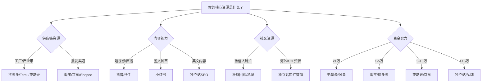

### 11.1.3 启动资金规划

不同电商模式的启动资金差异巨大。以下是各模式的资金门槛和典型投资分配：

**平台电商（淘宝/拼多多）启动资金**：
- 保证金：1000-50000元（根据类目）
- 首批备货：5000-30000元
- 平台工具/软件：500-2000元/月
- 初期推广费：3000-10000元/月
- 总计：1-5万元可启动

**跨境电商（亚马逊）启动资金**：
- 平台月费：约300元/月（39.99美元）
- 首批备货（含头程物流）：20000-50000元
- FBA仓储+配送预留：5000-10000元
- 广告投放：10000-30000元/月
- 品牌注册（商标）：3000-8000元
- 总计：5-10万元可启动

**独立站启动资金**：
- 建站工具（Shopify）：200-800元/月
- 域名+SSL：100-300元/年
- 首批备货+物流：10000-30000元
- 广告投放（Facebook/Google）：10000-50000元/月
- 总计：3-10万元可启动

**启动资金分配原则**：

| 资金比例 | 分配方向 | 说明 |
|----------|----------|------|
| 40%-50% | 首批备货 | 这是核心投入，宁少勿多 |
| 20%-30% | 广告推广 | 没有推广就没有流量，酒香也怕巷子深 |
| 10%-15% | 平台/工具费用 | 保证金、软件、物流等固定支出 |
| 15%-20% | 储备资金 | 应对意外、补货周转的救命钱 |

**红线**：永远不要把全部资金投入库存。至少留15%作为安全垫。很多卖家死于"刚好够进货但没钱打广告"或"货卖完了但平台还没回款"。

### 11.1.4 市场调研方法论

在投入真金白银之前，必须做好市场调研。调研的核心目标是回答三个问题：需求有多大？竞争有多激烈？我能赚多少钱？

**四步调研法**：

**第一步：宏观趋势判断**
- 使用百度指数、Google Trends查看品类搜索趋势——是上升、平稳还是下降
- 查看行业报告（艾瑞咨询、易观分析、Statista）了解市场规模和增速
- 关注政策导向（如银发经济、绿色消费、国潮等政策红利方向）

**第二步：平台数据验证**
- 淘宝/天猫：生意参谋-市场洞察，查看搜索量、点击率、转化率、竞争度
- 亚马逊：Jungle Scout/Helium 10，查看月搜索量、竞品销量、价格区间
- 抖音：蝉妈妈/飞瓜数据，查看品类GMV、达人带货数据
- 拼多多：多多数据通，查看类目热度、价格分布

**第三步：竞品深度分析**
- 找到目标品类TOP10竞品，逐一分析：
  - 价格区间和定价策略
  - 主图风格和卖点提炼方式
  - 详情页结构和说服逻辑
  - 评价中的好评关键词和差评痛点
  - 月销量和增长趋势
- 重点看差评——差评中暴露的痛点就是你的差异化机会

**第四步：供应链验证**
- 在1688搜索目标产品，联系至少5家供应商
- 索取报价单（注意含税/不含税、起批量、交期）
- 购买2-3家样品进行质量对比
- 计算完整成本结构：采购成本+包装+物流+平台费+推广费+退货损失

---

## 11.2 国内电商

### 11.2.1 淘宝/天猫

#### 开店体系与费用

淘宝生态提供三个层级的店铺类型，选择哪种取决于你的资金实力和运营目标：

**个人店铺（淘宝C店）**：
- 注册条件：支付宝实名认证 + 淘宝开店认证（身份证+人脸识别）
- 保证金：根据类目不同，1000-5000元（部分类目如手机为50000元），关店可退
- 年费/技术服务费：无
- 平台佣金：无（但有支付宝手续费0.6%）
- 优势：零门槛入门，适合个人创业、副业试水
- 限制：不能参加部分天猫专属活动，信任度低于天猫

**企业店铺（淘宝企业店）**：
- 注册条件：企业营业执照 + 对公银行账户
- 保证金：同类目高于个人店
- 年费：无额外年费
- 优势：可开增值税发票，信任度高于C店
- 适合：有一定规模的中小企业

**天猫店铺**：
- 注册条件：企业资质 + 品牌资质（商标注册证/R标或TM标）
- 保证金：旗舰店5-15万元，专营店10-15万元
- 年费：3-6万元（根据类目，达标可返还50%-100%）
- 技术服务费（佣金）：2%-5%（根据类目）
- 优势：流量权重高、消费者信任度强、可参与天猫大促
- 适合：有品牌的企业、资金充足的创业者

**天猫入驻流程详解**（以旗舰店为例）：

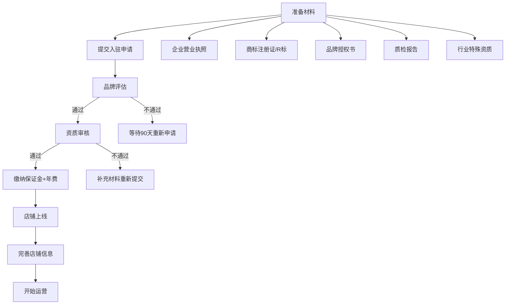

**天猫入驻被拒常见原因及解决方案**：
1. **品牌影响力不足**：新品牌缺乏市场认知。解决方案——先在淘宝C店运营6个月以上，积累销量和评价，再申请天猫。
2. **类目饱和**：部分类目（如女装、美妆）入驻竞争激烈。解决方案——选择更细分的子类目（如"男士护肤"而非"护肤品"），或通过代运营公司渠道入驻。
3. **资质不全**：缺少质检报告、行业许可证等。解决方案——提前咨询天猫招商热线，获取完整的资质清单。
4. **运营方案不佳**：入驻申请中需要提交品牌运营计划书。解决方案——详细说明品牌定位、目标人群、运营策略、年度销售目标。

#### 选品方法论

选品是电商成败的第一道关。80%的店铺失败源于选品失误，而非运营不力。

**选品五维评估模型**：

| 维度 | 评估标准 | 数据来源 | 合格线 |
|------|----------|----------|--------|
| 市场容量 | 月搜索量、市场交易额 | 生意参谋-市场洞察 | 日搜索量>5000 |
| 竞争强度 | 竞品数量、头部卖家集中度 | 生意参谋-竞争分析 | 首页非全部大卖家 |
| 利润空间 | 售价-采购成本-物流-平台费 | 1688报价+平台售价 | 毛利率>30% |
| 复购率 | 消耗品/季节品/一次性 | 行业报告、评论分析 | 复购率>15% |
| 供应链稳定性 | 供应商数量、交期、品控 | 1688/工厂考察 | 至少2家备选供应商 |

**选品实操步骤**：

1. **确定赛道**：从自己熟悉的领域或兴趣出发。不熟悉服装就别做服装，不熟悉3C就别做3C。认知差是最大的利润来源。
2. **数据验证**：用生意参谋查目标类目的搜索量、点击率、转化率、竞争度。避开搜索量大但竞争极度激烈的红海（如"女装""手机壳"）。
3. **寻找细分**：大类目里找小切口。例如不做"女装"，做"大码女装通勤装"；不做"宠物用品"，做"老年犬关节护理"。
4. **利润测算**：用表格精确计算每个SKU的利润。以一款售价89元的家居收纳盒为例：

```text
售价：89元
采购成本（1688）：22元
包装成本：3元
快递费（与物流商谈）：5元
平台佣金（约2%）：1.78元
推广费（按20%佣金算）：17.8元
退货损失（按8%退货率分摊）：3.84元
---
单件毛利：35.58元
毛利率：39.97%
```

5. **小批量测试**：首批下单200-500件，测试市场反应。不要一上来就囤几千件。

**选品禁区——这些品类新手绝对不要碰**：

| 品类 | 风险 | 说明 |
|------|------|------|
| 女装 | 退货率高达30%-50%，库存压力大 | 颜色、尺码、款式需求极难预测 |
| 食品（自制/散装） | 食品安全许可证、SC认证门槛高 | 出了问题可能是刑事责任 |
| 美妆护肤 | 备案周期长、资质要求高、竞品饱和 | 一个产品备案就要3-6个月 |
| 3C数码（品牌） | 假货投诉、售后成本高 | 苹果配件类投诉率极高 |
| 虚拟商品 | 平台风控严格、容易被诈骗利用 | 充值卡、游戏账号类高风险 |
| 医疗器械/保健品 | 需要特殊资质，广告法限制极严 | 违规后果严重 |

**新手推荐品类**：

| 品类 | 优势 | 启动难度 | 预期毛利率 |
|------|------|----------|------------|
| 家居收纳 | 需求稳定、标品化程度高、退货率低 | 低 | 35%-45% |
| 宠物用品 | 市场增速快、复购率高、情感消费 | 低 | 30%-50% |
| 办公文具 | 需求稳定、单价低、竞争分散 | 低 | 40%-55% |
| 汽车配件 | 客单价高、专业壁垒、复购率高 | 中 | 35%-50% |
| 户外运动 | 增长快、溢价空间大 | 中 | 30%-45% |
| 宠物智能用品 | 高客单价、复购耗材、技术壁垒 | 中高 | 40%-60% |
| 露营/徒步装备 | 户外热潮持续、季节性弱化 | 中 | 35%-50% |
| 银发经济产品 | 人口红利、竞争少、需求刚性 | 低 | 35%-55% |

**选品验证实操——7天快速验证法**：

选品不能只靠数据判断，还需要市场真实反馈。以下是经过验证的快速测品方法：

| 天数 | 动作 | 判断标准 |
|------|------|----------|
| 第1天 | 在闲鱼发布3个候选品（用1688图片+描述） | 24小时内咨询量>5个为合格 |
| 第2-3天 | 观察"我想要"数量和私信咨询量 | "我想要">10个为优秀 |
| 第4天 | 在小红书发布2条种草笔记 | 48小时内自然互动>20为合格 |
| 第5-6天 | 用直通车/千川投放小额测试（100元） | 点击率>3%，加购率>5%为合格 |
| 第7天 | 综合评估所有数据 | 至少2个渠道数据达标才值得投入 |

这个方法用不到500元就能验证选品方向，远比盲目备货几千件安全得多。

#### 运营体系

**流量获取矩阵**：

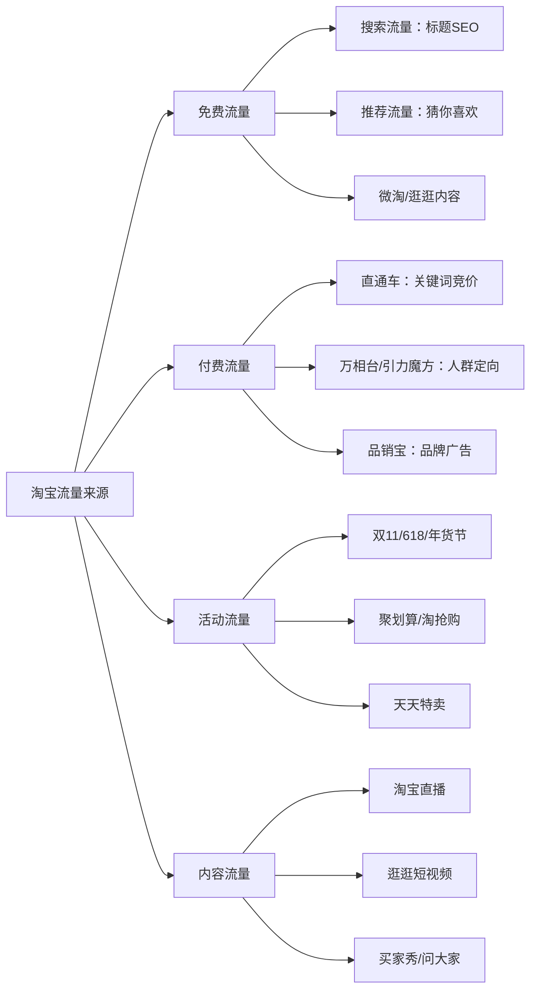

**搜索优化（SEO）核心**：

淘宝搜索排名的核心权重因子（按重要性排序）：
1. **关键词相关性**：标题必须包含买家搜索的核心关键词。用生意参谋的"搜索词查询"找到高搜索量、低竞争度的关键词。
2. **点击率**：主图的吸引力直接影响搜索排名。主图要突出产品核心卖点，背景干净，文字精炼。A/B测试不同主图，选点击率最高的。
3. **转化率**：搜索流量的转化率越高，系统给你的搜索权重越大。详情页要解决买家所有顾虑。
4. **DSR评分**：描述相符、服务态度、物流速度三项评分，任何一项飘绿（低于行业均值）都会严重影响搜索权重。
5. **售后指标**：退款率、纠纷率、差评率。控制在行业均值以下。

**标题优化公式**：

```text
核心关键词 + 属性词 + 长尾词 + 场景词 + 卖点词

示例（收纳盒）：
[核心]收纳盒 [属性]大号透明 [长尾]桌面收纳 [场景]宿舍家用 [卖点]可叠加防尘

最终标题：收纳盒大号透明桌面收纳盒宿舍家用可叠加防尘杂物储物箱
```

注意：标题字数控制在30个汉字以内（60字符），关键词不要重复，不要堆砌无关热词。

**关键词挖掘完整流程**：

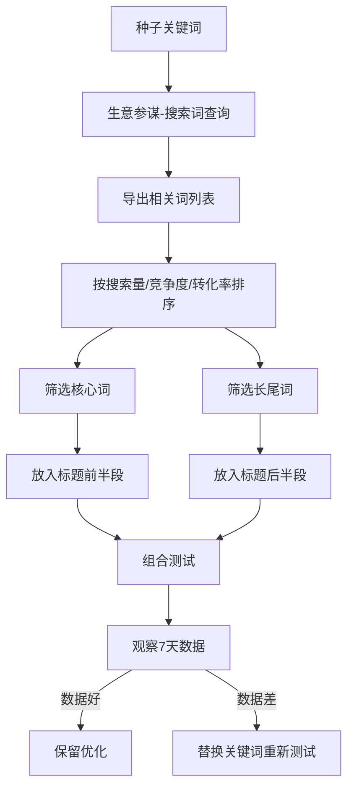

**付费推广策略**：

直通车（万相台关键词推广）的投放逻辑：
- **新品期**（0-30天）：以精准长尾词为主，出价略高于建议出价，目标是快速积累点击和成交数据。日预算50-100元。
- **成长期**（30-90天）：逐步加入大词，优化人群溢价，提升ROI。日预算200-500元。
- **成熟期**（90天+）：大词+长尾词组合投放，侧重人群运营和ROI优化。日预算根据利润率动态调整。

判断推广是否赚钱的公式：**推广ROI > 1/毛利率** 才是盈亏平衡点。毛利率40%的店铺，直通车ROI至少要达到2.5才能不亏。

**直通车完整操作SOP**：

直通车不是"开了就赚钱"的工具，需要精细化操作才能盈利。以下是经过验证的完整投放SOP：

| 阶段 | 关键词策略 | 出价策略 | 否定词策略 | 人群溢价 |
|------|-----------|----------|-----------|----------|
| 新品期 | 精准长尾词50-100个 | 高于建议价10%-20% | 每天否定无效词 | 不溢价 |
| 成长期 | 长尾+中等词200-300个 | 参考建议价 | 每周批量否定 | 核心人群+20%-50% |
| 成熟期 | 大词+长尾500+个 | 按ROI动态调整 | 持续优化 | 高转化人群+50%-100% |

**直通车日常操作清单**（每天15分钟）：

1. **查看昨日数据**：重点关注点击率、转化率、ROI三个指标
2. **否定无效词**：将有点击无转化的关键词加入否定列表。判断标准：点击量>20但0转化的词，立即否定
3. **调整出价**：
   - ROI高于目标值的词：提高出价10%-20%，争取更多流量
   - ROI低于目标值的词：降低出价10%-20%
   - 持续亏损的词：暂停投放
4. **优化人群**：查看"人群报表"，将转化率高的人群溢价提高，转化率低的人群降低或关闭
5. **检查预算**：确保日预算没有在上午就花完（说明出价过高或流量过于集中）

**引力魔方（人群推广）要点**：
- 适合推"猜你喜欢"流量，与搜索流量互补
- 重点投放"浏览过未购买""加购未付款""购买过本店商品"的人群
- 资源位选择：购中/购后推荐效果优于购前

**万相台无界版投放策略**：

万相台是淘宝2024年升级后的智能投放工具，整合了直通车和引力魔方的功能。新手建议从"关键词推广"（原直通车）开始，跑出数据后再尝试"人群推广"（原引力魔方）和"货品运营"（智能投放）。

| 推广类型 | 适合阶段 | 核心指标 | 日预算建议 |
|----------|----------|----------|------------|
| 关键词推广 | 全阶段 | ROI、点击率 | 50-500元 |
| 人群推广 | 有基础数据后 | 加购率、转化率 | 100-300元 |
| 货品运营 | 成熟期 | GMV、ROI | 200-1000元 |
| 内容推广 | 有短视频/直播 | 播放量、互动率 | 100-500元 |

#### 详情页设计

详情页是转化率的核心战场。一个好的详情页，转化率可以比差的详情页高3-5倍。

**详情页结构模板**（按用户浏览顺序排列）：

| 模块 | 内容 | 目的 | 长度 |
|------|------|------|------|
| 第1屏 | 核心卖点海报 | 3秒内传递购买理由 | 1张图 |
| 第2屏 | 痛点场景 | 让用户产生共鸣 | 1-2张图 |
| 第3屏 | 产品展示（正面/侧面/细节） | 展示产品全貌 | 2-3张图 |
| 第4屏 | 材质/工艺/参数 | 建立专业感和信任感 | 1-2张图 |
| 第5屏 | 使用场景/效果对比 | 帮助用户想象使用场景 | 2-3张图 |
| 第6屏 | 买家秀/评价截图 | 社会认同，降低决策风险 | 1-2张图 |
| 第7屏 | 售后保障 | 消除最后顾虑 | 1张图 |
| 第8屏 | 关联推荐 | 提升客单价 | 1张图 |

**高转化详情页的设计原则**：
1. **前3屏决定一切**：80%的用户只会看前3屏，核心信息必须前置
2. **图文比例7:3**：以图片为主，文字为辅，用户不看长段文字
3. **卖点不超过3个**：信息太多等于没信息，聚焦最核心的差异化卖点
4. **每张图只说一件事**：一张图讲清楚一个卖点，不要在一张图里塞太多信息
5. **使用真实场景图**：精修图好看但不真实，场景图更能促进转化

**详情页文案写作框架——FAB法则**：

- **Feature（特征）**：产品是什么——材质、尺寸、工艺
- **Advantage（优势）**：比别人好在哪——对比竞品的差异化
- **Benefit（利益）**：对你有什么好处——解决什么问题、带来什么体验

示例（保温杯）：
- F：316不锈钢内胆，真空双层隔热
- A：比普通304不锈钢更耐腐蚀，保温时长12小时（普通杯仅6小时）
- B：早上灌的热水，下午还是烫的。冬天出门再也不用喝凉水

**主图优化要点**：

主图是搜索结果中用户第一眼看到的内容，直接决定点击率。主图优化是"花最少时间获得最大流量提升"的操作。

| 主图位置 | 内容要求 | 设计要点 |
|----------|----------|----------|
| 第1张（主图） | 产品正面图 | 白底或浅色背景，产品占画面70%以上，突出核心卖点文字 |
| 第2张 | 使用场景图 | 真人使用场景，展示使用方法和效果 |
| 第3张 | 卖点细节图 | 放大展示材质、工艺、细节 |
| 第4张 | 对比图/参数图 | 与竞品对比或展示核心参数 |
| 第5张 | 白底图（透明底） | 用于淘宝推荐流量，必须纯白背景 |

**主图A/B测试方法**：同时准备2-3套主图，每套投放3天，对比点击率数据。选择点击率最高的作为主图。注意每次只改一张图，其他变量保持不变。

#### 评价管理

评价是转化率的"临门一脚"。数据显示，92%的消费者在下单前会查看评价，差评可以直接劝退70%以上的潜在买家。

**评价获取策略**：
1. **包裹卡**：每个包裹放入好评返现卡（金额5-10元），话术设计为"晒图评价领红包"而非"好评返现"（后者违反平台规则）。包裹卡设计要点：正面放晒图引导+二维码，背面放使用指南（增加用户好感）。
2. **客服跟进**：确认收货后24小时内，客服主动联系买家询问体验，引导评价。话术："亲，您买的XX用着还满意吗？如果方便的话帮忙晒个图评价，我们送您一张5元优惠券~"
3. **Vine/试用活动**：通过平台官方试用活动获取高质量评价
4. **赠品策略**：随包裹附送小赠品（成本1-3元），超出预期的服务感促好评
5. **运费险必开**：运费险是转化率的隐形推手。数据显示，开通运费险的商品转化率比不开的高15%-30%。费用约0.5-3元/单（根据退货率浮动），但带来的增量订单远超成本。特别是服装、鞋靴等高退货率品类，不开运费险等于主动放弃订单。

**售后卡片设计要点**：

售后卡片（包裹卡）是连接公域和私域的桥梁，也是获取好评和复购的关键触点。

```text
售后卡片正面设计：
┌─────────────────────────────────┐
│  [品牌Logo]                      │
│                                  │
│  感谢您的购买！扫描下方二维码      │
│  领取 5元无门槛优惠券             │
│                                  │
│  [二维码]                         │
│                                  │
│  晒图评价还可获得额外奖励！        │
└─────────────────────────────────┘

售后卡片背面设计：
┌─────────────────────────────────┐
│  产品使用指南 / 注意事项           │
│                                  │
│  如有问题请联系我们：              │
│  微信号：XXXXX                    │
│  电话：XXXXX                      │
│  工作时间：9:00-22:00             │
│                                  │
│  我们承诺：7天无理由退换           │
└─────────────────────────────────┘
```

**卡片设计原则**：
1. 利益点前置：优惠券金额要醒目（5-10元，太小没吸引力）
2. 二维码要大：至少3cm×3cm，确保手机能快速识别
3. 话术合规：不能写"好评返现"（违反平台规则），应写"晒图评价领奖励"
4. 使用指南：背面放产品使用说明，增加用户好感，减少因"不会用"导致的退货
5. 成本控制：单张卡片成本0.1-0.3元，大批量印刷更便宜

**差评应对流程**：
1. **24小时内联系买家**：电话沟通效果>在线客服>短信
2. **了解真实原因**：产品质量、物流问题、描述不符、个人情绪
3. **提出补偿方案**：退款/补发/部分退款/优惠券，根据问题严重程度选择
4. **引导修改评价**：问题解决后，礼貌引导买家修改或追评
5. **无法修改时**：在差评下方做专业回复，展示你的处理态度，给其他买家看

**评价回复模板**（针对不同类型差评）：

```text
【质量问题】
亲，非常抱歉给您带来了不好的体验！这款产品确实是我们品控没做好，
已经第一时间联系工厂改进。现在给您安排全额退款+重新补发新品，
请问方便提供一下订单号吗？我们的品质一直在线，希望您能再给我们一次机会 🙏

【物流问题】
亲，物流慢确实让人着急，非常理解您的心情！已经帮您联系了快递公司
催促配送，预计X天内送达。如果超时未到，我们承担全部损失给您退款。
感谢您的耐心等待！

【主观不满】
亲，感谢您的真实反馈！每个人的使用感受不同，我们完全理解。
已将您的建议反馈给产品团队，下一批会做改进。
店铺有新客专属券，欢迎下次来体验~
```

**差评预防体系**——从源头减少差评：

| 差评原因 | 预防措施 | 检查频率 |
|----------|----------|----------|
| 产品质量 | 首件确认+中期巡检+出货抽检 | 每批次 |
| 描述不符 | 详情页准确描述尺寸/颜色/功能，不夸大 | 每月检查 |
| 物流问题 | 选择靠谱快递，发货后主动推送物流信息 | 每天 |
| 包装损坏 | 升级包装方案，易碎品加固 | 每月评估 |
| 预期差距 | 展示真实买家秀而非过度精修图 | 持续 |

#### 案例：从0到月销100万的家居店铺

**背景**：小张，28岁，之前做平面设计，投入3万元启动资金，选择淘宝家居收纳赛道。

**具体运营路径**：

| 阶段 | 时间 | 关键动作 | 日均单量 | 月销售额 |
|------|------|----------|----------|----------|
| 测品期 | 第1-2月 | 上架10个SKU，用直通车测款，保留点击率>5%的3个爆款 | 5-10单 | 1-2万 |
| 打爆期 | 第3-5月 | 集中资源推1个主推款，优化详情页和评价，报名天天特卖 | 30-80单 | 8-20万 |
| 扩张期 | 第6-9月 | 以爆品带动全店，增加SKU到30+，开始做淘宝直播 | 150-300单 | 40-80万 |
| 稳定期 | 第10-12月 | 建立品牌，开设天猫店，布局私域 | 400-500单 | 100万+ |

**关键转折点**：第4个月时，小张发现一款"可折叠收纳箱"在小红书上有大量笔记但淘宝竞争不激烈，果断切入该细分，配合"宿舍收纳""搬家神器"等场景词做标题优化，单品月销迅速突破2000单。

### 11.2.2 京东

#### 平台特点与入驻

京东与淘宝的核心区别在于用户画像和平台逻辑：

| 对比维度 | 淘宝/天猫 | 京东 |
|----------|-----------|------|
| 核心用户 | 全年龄段，价格敏感度多样 | 25-45岁，一二线城市，注重品质 |
| 平台逻辑 | 搜索+推荐，流量分散 | 品质+物流，自营权重高 |
| 物流体验 | 依赖第三方快递 | 京东物流次日达，体验领先 |
| 客单价 | 覆盖全价格带 | 中高客单价为主 |
| 适合品类 | 服装、美妆、家居、小商品 | 3C数码、家电、母婴、食品 |
| 入驻门槛 | 较低 | 较高，需企业资质 |

**京东入驻条件**：
- 企业营业执照（注册资金建议50万以上）
- 一般纳税人资格（可开13%增值税专票）
- 商标注册证（R标优先，TM标部分品类接受）
- 品牌授权书（如非自有品牌）
- 质检报告（根据类目要求）
- 保证金：5-15万元（根据类目）
- 平台使用费：1000元/月（部分类目）
- 扣点：3%-10%（根据类目）

**京东POP店铺运营重点**：
1. **差异化选品**：避免与京东自营直接竞争。自营主打标品（如Apple手机、戴森吸尘器），第三方卖家应选非标品或自营未覆盖的细分品。
2. **物流选择**：优先使用京东物流（入仓），搜索权重和转化率都会明显提升。
3. **京东快车**：京东的付费推广工具，逻辑类似淘宝直通车。重点优化"商品推广"和"店铺推广"。
4. **评价管理**：京东用户极度依赖评价决策。前50条评价的质量（尤其是带图好评）直接决定转化率。

#### 京东特色运营工具：

| 工具 | 功能 | 适合场景 |
|------|------|----------|
| 京东快车 | 关键词竞价广告 | 搜索流量获取 |
| 京东海投 | 全自动广告投放 | 新手期、预算充足时 |
| 购物触点 | 人群定向展示广告 | 精准人群运营 |
| 京挑客 | CPS推广（类似淘宝客） | 冲销量阶段 |
| 京东直播 | 京东平台直播带货 | 品牌曝光、转化提升 |
| 京东秒杀 | 限时特价活动 | 快速起量 |

**京东快车投放SOP**：

京东快车是京东的核心付费推广工具，逻辑类似淘宝直通车。以下是经过验证的投放SOP：

```text
新品期（第1-2周）：
- 开启"商品推广"，选择精准长尾词30-50个
- 出价：高于建议价10%-15%
- 日预算：100-200元
- 同时开启"京东海投"（全自动广告），日预算50元，收集数据

成长期（第3-6周）：
- 从搜索词报告中筛选高转化词，加入手动精准投放
- 开启"购物触点"（人群定向广告），投放浏览过竞品的用户
- 日预算：300-500元
- 目标：快车ROI>2.0

成熟期（第7周+）：
- 建立广告矩阵：快车精准+快车广泛+海投+购物触点+京挑客
- 优化人群溢价：高转化人群+30%-50%
- 日预算：根据利润率动态调整
- 目标：综合ROI>3.0，自然流量占比>50%
```

**京东自营vs POP店铺选择**：

| 对比维度 | 京东自营 | POP店铺 |
|----------|----------|---------|
| 入驻门槛 | 极高（需京东采销邀请） | 中等（企业资质即可） |
| 流量权重 | 最高（搜索排名优先） | 中等 |
| 物流 | 京东物流（入仓） | 自选物流或京东物流 |
| 利润率 | 较低（京东定价+扣点高） | 较高（自主定价） |
| 资金压力 | 大（需要大量备货入仓） | 中等 |
| 适合阶段 | 品牌成熟期 | 品牌成长期 |

建议路径：先做POP店铺积累销量和评价，达到一定规模后再申请入驻京东自营。

**国内主流平台费用全对比**：

在选择平台之前，必须清楚了解各平台的真实成本结构。很多新手只关注保证金，忽略了佣金、推广费等隐性成本。

| 费用项 | 淘宝C店 | 天猫 | 京东POP | 拼多多 | 抖音小店 | 快手小店 |
|--------|---------|------|---------|--------|----------|----------|
| 保证金 | 1000-5万 | 5-15万 | 5-15万 | 2000-5万 | 2000-5万 | 500-5万 |
| 年费/技术服务费 | 无 | 3-6万 | 1000元/月（部分类目） | 无 | 无 | 无 |
| 平台佣金 | 0.6%（支付） | 2%-5% | 3%-10% | 0.6%-3% | 1%-5% | 1%-5% |
| 广告工具 | 直通车/万相台 | 直通车/万相台 | 京东快车 | 多多搜索/场景 | 千川 | 磁力金牛 |
| 回款周期 | T+1 | T+1 | T+1 | T+1至T+15 | T+7至T+15 | T+7至T+15 |
| 适合利润率 | >25% | >30% | >35% | >20% | >30% | >25% |

**关键提醒**：平台佣金只是表面成本，真正的"大头"是推广费。成熟店铺的推广费通常占销售额的15%-30%。计算利润时，必须把推广费算进去。

### 11.2.3 拼多多

#### 平台生态与机会

拼多多已经不是"低价劣质"的代名词。2025年拼多多年活跃买家超过9亿，GMV突破4万亿元，是中国增长最快的电商平台。它的核心逻辑是"极致性价比 + 社交裂变"。

**拼多多的流量分配逻辑**：
- 价格权重极高：同类商品中价格越低，搜索排名越靠前
- 销量权重高：已售数量直接影响排名和转化
- 服务权重提升：体验分（物流、售后、纠纷）越来越重要
- 活动流量大：百亿补贴、限时秒杀等入口流量巨大

**适合拼多多的品类**：
- 日用百货：纸巾、垃圾袋、收纳用品（高频消耗，价格敏感）
- 食品零食：地方特产、网红零食（复购率高）
- 农产品：水果、土特产（产地直发优势明显）
- 家居小件：厨房用品、清洁工具（实用性强，价格低）
- 服装基础款：T恤、袜子、内衣（标品化程度高）

**拼多多运营核心策略**：

1. **极致供应链**：拼多多的核心竞争力是价格。要做拼多多，必须有供应链优势。建议直接对接1688源头工厂，甚至直接去产业带（如义乌小商品、南通家纺、汕头玩具）找工厂。
2. **定价策略**：在拼多多定价要"卡位"——比同品质竞品低5%-10%，但不能低到亏钱。用"成本倒推法"定价：先确定目标售价，再反推能接受的采购成本。
3. **多多进宝**：拼多多的CPS推广工具，设置佣金让推手帮你推广。新店冲销量阶段，可以设置20%-30%的高佣金。
4. **售后策略**：拼多多的售后考核非常严格。发货时效、退货退款速度、客服响应率都有硬性指标。建议用ERP系统统一管理。

**拼多多活动报名指南**：

| 活动名称 | 流量大小 | 报名条件 | 核心要求 |
|----------|----------|----------|----------|
| 百亿补贴 | 极大 | 店铺评分4.5+，销量>100 | 价格必须是近30天最低价 |
| 限时秒杀 | 大 | 评分4.5+，有一定基础销量 | 价格竞争力强、库存充足 |
| 9.9特卖 | 中 | 价格<=9.9元 | 适合低价引流品 |
| 万人团 | 大 | 平台邀请制 | 量大价优 |
| 多多果园 | 中 | 平台合作 | 食品类优先 |

**拼多多付费推广SOP**：

拼多多的付费推广工具包括"多多搜索"（关键词竞价）和"多多场景"（推荐流量），逻辑类似淘宝直通车和引力魔方。

| 推广类型 | 流量来源 | 核心指标 | 适合阶段 | 日预算建议 |
|----------|----------|----------|----------|------------|
| 多多搜索 | 搜索结果页 | ROI、点击率 | 全阶段 | 50-500元 |
| 多多场景 | 推荐/详情页/类目页 | ROI、曝光量 | 有基础销量后 | 100-500元 |
| 多多进宝 | 站外推手 | 佣金率、成交量 | 冲销量阶段 | 按佣金结算 |

**多多搜索投放SOP**：

```text
第1阶段（第1-7天）：数据收集
- 选择20-50个精准长尾词
- 出价：高于建议价10%-20%
- 日预算：50-100元
- 目标：获取点击和转化数据

第2阶段（第8-14天）：优化筛选
- 关闭有点击（>20次）无转化的词
- 高转化词提高出价10%
- 新增从竞品反查的关键词
- 日预算：100-200元

第3阶段（第15天+）：稳定投放
- 保留ROI>2的关键词
- 加入大词，扩大流量
- 设置人群溢价（高转化人群+20%-50%）
- 日预算：根据利润率动态调整
```

**多多场景投放要点**：
1. **资源位选择**：优先选择"类目商品页"和"商品详情页"，这两个位置转化率最高
2. **定向设置**：前期用"智能推荐"，跑出数据后切换到"自定义定向"（相似商品、叶子类目、兴趣人群）
3. **创意优化**：准备3-5套不同卖点的创意图，测试点击率最高的版本
4. **出价策略**：场景推广的CPC通常比搜索低30%-50%，但转化率也较低，适合拉新和曝光

**判断推广盈亏的公式**：推广ROI > 1/毛利率 才是盈亏平衡点。拼多多毛利率25%的店铺，多多搜索ROI至少要达到4.0才能不亏。

**拼多多体验分维护**：

体验分由三部分组成：商品体验（45%）、物流体验（35%）、服务体验（20%）。

| 指标 | 权重 | 健康标准 | 低于标准后果 |
|------|------|----------|-------------|
| 商品体验 | 45% | 差评率<3%，退货率<行业均值 | 严重降权，限制活动报名 |
| 物流体验 | 35% | 48小时内发货，72小时内签收 | 扣款、降权、限制活动 |
| 服务体验 | 20% | 5分钟回复率>90%，退款48小时内处理 | 降权、限制推广 |
| 纠纷率 | — | <3% | 严重降权甚至封店 |

**体验分提升实操**：体验分低于4.5时，立即执行以下措施：
1. **商品端**：加强品控，更换包装减少运输损坏，详情页准确描述减少预期差
2. **物流端**：选择顺丰/京东物流等高质量快递，发货后主动推送物流信息
3. **服务端**：设置自动回复覆盖常见问题，人工客服30秒内响应，退款优先同意不要拖延

**拼多多"仅退款"政策应对策略**：拼多多的"仅退款"政策对卖家不友好，但有应对方法：

| 情况 | 金额 | 建议处理 | 原因 |
|------|------|----------|------|
| 明显商品问题 | 任意 | 直接同意退款+道歉 | 维护体验分比几十元更重要 |
| 买家主观不满 | <20元 | 直接同意，不纠缠 | 时间成本高于20元 |
| 买家主观不满 | 20-100元 | 聊天沟通，尝试退货退款 | 留好聊天记录作为证据 |
| 可疑欺诈 | >100元 | 准备证据向平台申诉 | 发货记录+物流签收证明 |
| 批量仅退款 | — | 向平台举报异常账号 | 可能是职业薅羊毛 |

**防范"仅退款"损失的措施**：
1. 详情页准确描述产品，减少预期差
2. 包裹内放入售后卡，引导有问题先联系客服
3. 定期检查"售后原因分析"，找到高频退款原因并从根源解决
4. 设置"自动同意仅退款"的金额阈值（建议10-15元以下自动同意，减少客服工作量）

### 11.2.4 抖音电商

#### 兴趣电商的底层逻辑

抖音电商的本质是"货找人"——通过内容（短视频/直播）将商品展示给可能感兴趣的用户，激发冲动消费。这与传统电商"人找货"的搜索模式完全不同。

**抖音电商的三大流量入口**：
1. **短视频挂车**：通过短视频内容引导用户点击购物车下单
2. **直播带货**：通过实时直播讲解商品，限时促销促成成交
3. **商品卡**：类似传统电商的搜索/推荐，在抖音商城展示

**抖音电商流量分配核心指标**：

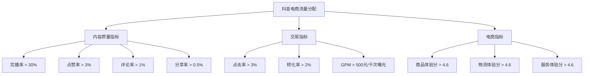

GPM（千次曝光成交金额）是抖音电商最核心的指标——它代表你每获得1000次曝光能产生多少销售额。GPM越高，系统给你分配的流量越多。

**GPM优化方法**：
1. 提升转化率：优化商品详情页、设置限时优惠、增加信任标识
2. 提升客单价：设置满减券、套餐组合、关联推荐
3. 优化直播间话术：逼单节奏、价格锚定、限时限量
4. 选择高转化时段开播：晚间20:00-23:00是转化率最高的时段

**抖音小店运营全流程**：

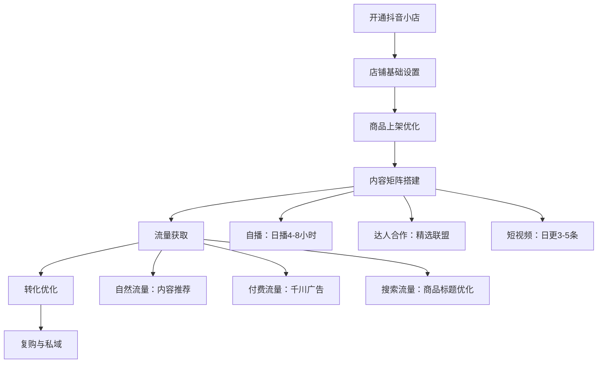

#### 直播带货实操

**直播间搭建清单**：

| 设备 | 推荐方案 | 预算 |
|------|----------|------|
| 手机/相机 | iPhone 15 Pro 或 Sony ZV-1 | 5000-10000元 |
| 补光灯 | 环形灯+侧面补光灯 | 300-1000元 |
| 麦克风 | 无线领夹麦 | 200-500元 |
| 背景 | 根据品类定制（简约/场景化） | 500-3000元 |
| 提词器 | 平板+提词器支架 | 200-500元 |

**直播脚本框架（以服装为例）**：

每个产品讲解时间控制在5-8分钟，按以下节奏：

1. **开场吸引**（30秒）：今天这款外套，商场卖399，直播间只要99。先别着急，我给你们看看面料。
2. **产品展示**（2分钟）：近距离展示面料质感、做工细节，上身试穿展示效果。
3. **卖点讲解**（1分钟）：防水面料、可机洗、不起球、显瘦版型。
4. **价格锚定**（1分钟）：原价399→今天直播间159→再领30元优惠券→到手129→前50名再送一条围巾。
5. **逼单话术**（1分钟）：库存只剩最后87件了，拍完恢复原价。3、2、1上链接。
6. **售后承诺**（30秒）：7天无理由退换，运费险已开，不喜欢直接退。

**直播节奏管理**：

| 时段 | 内容 | 目的 |
|------|------|------|
| 开播前30分钟 | 引流款（低价高性价比） | 拉升在线人数和互动数据 |
| 30-60分钟 | 利润款（主推品） | 趁流量高峰冲GMV |
| 60-120分钟 | 利润款+新品测试 | 持续转化+测品 |
| 120-180分钟 | 福利款+利润款交替 | 维持在线人数 |
| 收播前30分钟 | 返场爆品+明日预告 | 促单+预告拉回访 |

**直播数据分析——每场必看指标**：

| 指标 | 计算方式 | 合格标准 | 优化方向 |
|------|----------|----------|----------|
| 场均观看人数 | 直播间总观看人次 | 因账号而异 | 短视频引流、付费投流 |
| 平均在线人数 | 实时在线的平均值 | >50人 | 互动频率、福利款节奏 |
| 互动率 | (点赞+评论+分享)/观看人数 | >5% | 互动话术、抽奖频率 |
| 商品点击率 | 点击购物车人数/在线人数 | >10% | 话术引导、产品展示 |
| 转化率 | 成交人数/商品点击人数 | >3% | 价格、逼单话术、信任感 |
| GPM | 成交金额/曝光数×1000 | >500元 | 综合优化 |
| UV价值 | 成交金额/观看人数 | >1元 | 客单价×转化率 |

**千川广告投放要点**：
- 新手期用"放量投放"，让系统自动探索人群
- 跑出转化数据后，切换到"控成本投放"，设定目标ROI
- 素材是核心：80%的广告效果取决于素材质量
- 短视频素材要"前3秒抓眼球"——冲突、悬念、利益点前置

**千川投放进阶策略**：

| 阶段 | 投放策略 | 日预算 | 核心指标 |
|------|----------|--------|----------|
| 冷启动期 | 放量投放+系统推荐人群 | 200-500元 | 点击率、转化率 |
| 探索期 | 控成本投放+宽泛定向 | 500-1000元 | ROI>1.5 |
| 增长期 | 控成本+精准人群包 | 1000-3000元 | ROI>2.0 |
| 稳定期 | 自定义+DMP人群包 | 3000-10000元 | ROI>2.5 |

**人群包搭建方法**：
1. **相似达人粉丝**：找到同品类头部主播，投放其粉丝
2. **行为兴趣定向**：选择"搜索过""购买过""浏览过"同品类商品的用户
3. **自定义人群包**：上传已购客户数据，生成相似人群lookalike
4. **排除已购人群**：避免重复触达，提高广告效率

**短视频素材制作——爆款公式**：

千川广告效果80%取决于素材质量。以下是经过验证的爆款素材结构：

```text
【黄金3秒——必须抓眼球】
方式1：冲突开场 "我花了3000块买了5个XX，结果..."
方式2：利益前置 "这个XX原价199，今天只要59"
方式3：悬念钩子 "千万别买XX，除非你看完这个视频"
方式4：痛点共鸣 "你是不是也遇到过XX问题？"

【中间15-30秒——价值输出】
- 展示产品核心功能/效果（用实物演示）
- 对比使用前后的差异（左普通产品，右你的产品）
- 给出具体数据或证据（测试数据、用户反馈）

【最后5秒——转化引导】
- "链接在购物车第一个"
- "评论区扣1，我发你购买链接"
- "今天下单还有限时优惠，手慢无"
```

**素材测试方法**：每天准备3-5条素材，投放100-200元测试。点击率>3%的素材加投，<2%的素材淘汰。持续迭代优化。

#### 短视频带货方法

**爆款带货短视频的5种结构**：

1. **痛点型**：你的XX问题，用这个一招解决 → 产品展示 → 下单链接
2. **对比型**：左边是普通产品，右边是我们的产品 → 效果对比 → 价格优势
3. **测评型**：我花了3000块买了5个同类产品 → 逐一测评 → 推荐最佳款
4. **场景型**：办公室/宿舍/厨房等具体场景 → 产品使用 → 解决痛点
5. **故事型**：一个真实的小故事引入 → 自然植入产品 → 情感共鸣

**发布策略**：每天发布3-5条视频，覆盖早中晚三个时段（7-9点、12-14点、19-22点）。前100条视频是养号期，不要急于求成。

#### 淘宝直播运营

淘宝直播是国内电商直播的"老牌劲旅"，2025年淘宝直播GMV超过2万亿元。它的核心优势是"搜索+直播"双引擎——用户既可以搜索找到你，也可以通过直播发现你。

**淘宝直播类型与选择**：

| 直播类型 | 特点 | 适合谁 | 启动难度 |
|----------|------|--------|----------|
| 店铺自播 | 为自己的店铺带货 | 所有商家 | 低 |
| 达人直播 | 为其他商家带货赚佣金 | 有粉丝基础的达人 | 中 |
| 机构直播 | MCN机构组织多主播直播 | 有团队资源的机构 | 高 |

**店铺自播实操要点**：
1. **开播频率**：每天直播4-8小时，保持稳定开播节奏。淘宝算法偏好"日播"商家，流量权重更高。
2. **主播选择**：初期老板自己播最省钱，但要练习镜头感和话术。月销超过50万后考虑雇专职主播。
3. **直播间装修**：背景干净、灯光充足、产品陈列有序。低成本方案：一面白墙+环形灯+手机支架，总投入<500元。
4. **互动技巧**：每3分钟做一次互动（提问、抽奖、红包），保持直播间活跃度。在线人数是流量分配的核心指标。
5. **数据复盘**：每场直播后分析"观看-互动-加购-成交"漏斗数据，找到转化断点并优化。


#### 抖音搜索电商（商品卡优化）

抖音搜索电商是2024-2025年抖音电商增长最快的流量入口。与传统"货找人"的兴趣电商不同，搜索电商是"人找货"——用户主动搜索商品，购买意图明确，转化率是推荐流量的2-3倍。

**搜索电商的流量入口**：
1. **抖音商城搜索**：用户在抖音商城中搜索商品关键词
2. **短视频搜索**：用户在搜索框输入关键词，看到带商品的短视频
3. **直播搜索**：搜索结果中展示正在直播的相关直播间
4. **猜你喜欢**：基于用户行为的个性化推荐（属于商城流量）

**商品卡优化核心要素**：

商品卡是抖音搜索电商的核心载体——它类似淘宝的"商品链接"，用户通过搜索或推荐看到商品卡，点击后进入商品详情页。

| 优化要素 | 具体要求 | 优化方法 |
|----------|----------|----------|
| 商品标题 | 60字以内，包含核心关键词 | 核心词+属性词+场景词+长尾词 |
| 主图 | 第1张决定点击率 | 白底/场景图+核心卖点文字+价格利益点 |
| 价格标签 | 显示原价和到手价 | 设置划线价，突出优惠力度 |
| 商品评分 | 4.6分以上 | 控制品质、物流、服务三项评分 |
| 销量标签 | 显示"已售XX件" | 前期通过低价引流冲基础销量 |
| 优惠标签 | 显示优惠券/满减信息 | 设置店铺优惠券和满减活动 |

**商品标题优化公式**：

```text
标题 = 品牌词 + 核心关键词 + 属性词 + 场景词 + 长尾词

示例（保温杯）：
优化前：保温杯
优化后：XX牌 316不锈钢保温杯 大容量1000ml 户外运动便携水壶 学生上课专用 24小时长效保温

关键词挖掘方法：
1. 抖音商城搜索框下拉词（最直接）
2. 巨量千川-关键词工具
3. 蝉妈妈/飞瓜数据-关键词分析
4. 竞品标题拆解
```

**商品卡流量获取的5个关键动作**：

1. **标题关键词覆盖**：每个商品标题至少覆盖5-10个核心关键词。用巨量千川的关键词工具查看搜索量，优先放入搜索量>1万/月的词。

2. **主图点击率优化**：主图点击率是商品卡流量的第一杠杆。测试方法：同时上架2-3个不同主图的同款商品，3天后保留点击率最高的版本。合格标准：点击率>5%。

3. **商品入池**：商品需要被抖音商城"收录"才能获得搜索流量。入池条件：
   - 商品评分≥4.0
   - 店铺体验分≥4.0
   - 非违规商品
   - 有动销（至少1单成交）

4. **商城活动参与**：报名抖音商城的各类活动（超值购、品牌馆、限时秒杀），活动商品会获得额外的搜索加权。

5. **短视频挂车**：发布短视频时挂载商品链接，短视频的互动数据（播放、点赞、评论）会给商品卡带来搜索权重加成。

**商品卡数据分析指标**：

| 指标 | 含义 | 合格标准 | 优化方向 |
|------|------|----------|----------|
| 商品卡曝光 | 商品被展示的次数 | 因品类而异 | 标题关键词覆盖、商品入池 |
| 商品卡点击率 | 点击/曝光 | >5% | 主图优化、价格标签 |
| 商品卡转化率 | 成交/点击 | >3% | 详情页、评价、价格 |
| 搜索流量占比 | 搜索流量/总流量 | >20% | 标题优化、搜索SEO |
| 商城推荐流量占比 | 推荐流量/总流量 | >30% | 商品评分、销量积累 |

**商品卡运营SOP**：

```text
每日（10分钟）：
- 查看商品卡曝光、点击率、转化率数据
- 处理差评和售后问题
- 检查商品评分是否达标

每周（30分钟）：
- 分析搜索词报告，优化标题关键词
- 对比竞品价格和主图，调整策略
- 上新3-5个商品，保持店铺活跃度

每月（2小时）：
- 淘汰30天0销量的商品
- 优化低点击率商品的主图
- 报名商城活动
- 分析品类搜索趋势，调整选品方向
```

**搜索电商 vs 兴趣电商对比**：

| 维度 | 搜索电商（商品卡） | 兴趣电商（短视频/直播） |
|------|-------------------|------------------------|
| 流量属性 | 主动搜索，购买意图强 | 被动推荐，冲动消费 |
| 转化率 | 5%-15% | 1%-5% |
| 客单价 | 较高（用户比价后下单） | 较低（冲动消费） |
| 退货率 | 10%-20% | 30%-50% |
| 运营难度 | 低（不需要内容能力） | 高（需要短视频/直播能力） |
| 流量稳定性 | 稳定（搜索量相对固定） | 波动大（依赖内容质量） |
| 适合卖家 | 传统电商卖家转型 | 有内容创作能力的卖家 |

**关键认知**：搜索电商是抖音电商的"确定性增长点"。对于不擅长做短视频和直播的传统电商卖家，商品卡是进入抖音电商的最佳路径。2025年抖音商城GMV占比已超过40%，且仍在快速增长。


### 11.2.5 快手电商

快手电商是被很多卖家忽略的"隐形巨头"。2025年快手电商GMV突破1.5万亿元，日活用户超过4亿，尤其在下沉市场（三线及以下城市）占据绝对优势。

**快手 vs 抖音核心差异**：

| 维度 | 快手 | 抖音 |
|------|------|------|
| 核心用户 | 三四线城市、25-40岁、注重性价比 | 一二线城市、18-35岁、追求潮流 |
| 流量逻辑 | "老铁经济"，粉丝关系强，复购率高 | 算法推荐，流量分发快但粉丝粘性低 |
| 平均客单价 | 50-120元 | 80-150元 |
| 退货率 | 20%-30% | 30%-50% |
| 直播占比 | GMV的80%以上 | 短视频+直播+商品卡三驾马车 |
| 适合品类 | 农产品、食品、日用品、白牌服装 | 潮流服饰、美妆、新奇特产品 |

**快手电商的独特优势**：

1. **粉丝信任度高**：快手的"老铁文化"意味着粉丝对主播的信任度远高于抖音。一旦建立信任，复购率可以达到40%以上，远超行业平均水平。
2. **下沉市场红利**：快手在三四线城市和农村地区的渗透率远高于抖音，这些用户对价格敏感但购买力不低，且竞争远不如抖音激烈。
3. **农产品天然优势**：快手是农产品直播电商的第一平台。产地直发、现摘现卖的模式在快手上有天然的信任土壤。
4. **退货率低**：因为粉丝信任度高、冲动消费比例低，快手的退货率比抖音低10-20个百分点，实际利润率更高。

**快手小店运营要点**：

1. **人设打造**：快手用户更看重"人"而非"品牌"。打造一个真实、接地气的人设比精美包装更重要。展示真实生活、工厂实拍、发货过程等内容能快速建立信任。
2. **粉丝运营**：快手的"关注页"流量占比高达40%以上，远高于抖音。这意味着维护好粉丝关系比追求新流量更重要。每天固定时间开播，与粉丝保持高频互动。
3. **选品策略**：快手用户偏好高性价比产品。定价策略为"同品质比淘宝便宜10%-20%"，同时保证利润。适合的品类包括：
   - 农产品：水果、干货、地方特产（产地直发优势明显）
   - 食品零食：地方小吃、网红零食（复购率高）
   - 日用百货：清洁用品、厨房小工具（实用性强）
   - 白牌服装：基础款、中老年服装（价格敏感型）
4. **快手磁力金牛**：快手的付费推广工具。投放逻辑与抖音千川类似，但竞争度更低，CPC（单次点击成本）通常比抖音低30%-50%。新手建议从"短视频推广"开始，日预算100-300元。

**快手直播运营节奏**：

| 阶段 | 时长 | 内容策略 | 目标 |
|------|------|----------|------|
| 开播暖场 | 前20分钟 | 聊天互动、预告今日福利 | 拉升在线人数 |
| 福利款 | 20-40分钟 | 低价引流品（成本价或微亏） | 快速成交提升直播间权重 |
| 主推款 | 40-120分钟 | 利润品，详细讲解卖点 | 冲GMV |
| 返场/加推 | 120-180分钟 | 补充品、加购品 | 拉高客单价 |
| 收播预告 | 最后10分钟 | 明日福利预告、引导关注 | 提升粉丝留存 |

**快手磁力金牛投放SOP**：

磁力金牛是快手的核心付费推广工具，竞争度比抖音千川低30%-50%，适合预算有限的卖家。

| 投放类型 | 适合场景 | 日预算建议 | 核心指标 |
|----------|----------|------------|----------|
| 短视频推广 | 视频带货、涨粉 | 100-500元 | 点击率、转化率 |
| 直播推广 | 直播间引流 | 200-1000元 | 进入率、转化率 |
| 商品推广 | 商品卡流量 | 100-300元 | ROI、点击率 |

**投放节奏**：
```text
冷启动（第1-3天）：
- 创建3-5个短视频推广计划
- 定向：系统智能推荐（让系统探索人群）
- 日预算：100-200元
- 目标：获取初始转化数据

优化期（第4-7天）：
- 关闭ROI<1的计划
- 高转化计划提高预算20%
- 开启直播推广，配合直播时段投放
- 日预算：200-500元

放量期（第8天+）：
- 稳定ROI>2的计划持续投放
- 测试不同素材和定向组合
- 直播推广+短视频推广组合投放
- 日预算：根据利润率动态调整
```

### 11.2.6 小红书电商

小红书已经从"种草社区"进化为"种草+拔草一体化平台"。2025年小红书电商GMV同比增长超过200%，是增长最快的新兴电商平台之一。

**小红书电商的三个入口**：
1. **笔记挂车**：在图文/视频笔记中挂商品链接
2. **直播带货**：小红书直播以"买手电商"模式为主，强调审美和品质
3. **小红书商城**：类似传统电商平台的搜索+推荐

**适合小红书的品类**：
- 美妆护肤（小红书核心品类）
- 服饰配饰（设计师品牌、小众风格）
- 家居生活（氛围感、生活方式）
- 母婴用品（真实测评类内容）
- 食品饮品（高颜值、网红属性）

**小红书运营核心**：内容质量 > 数量。一条爆款笔记的流量可以持续数月。重点是做出"有收藏价值"的内容——教程、攻略、合集、清单类内容的收藏率和长尾流量最高。

**小红书笔记优化要点**：

| 元素 | 优化方向 | 注意事项 |
|------|----------|----------|
| 标题 | 包含核心关键词+情绪词/数字 | 18个字以内最佳，疑问句>陈述句 |
| 封面 | 清晰美观，有对比或结果展示 | 第一张图决定点击率 |
| 正文 | 前两行必须有钩子 | 用emoji分段，避免大段文字 |
| 标签 | 5-10个，混搭大标签+小标签 | 大标签获取曝光，小标签精准触达 |
| 发布时间 | 晚7-10点、午12-14点 | 工作日晚上效果最好 |

**小红书SEO关键词布局**：小红书已经成为年轻人的"搜索引擎"，很多用户直接在小红书搜索"XX推荐""XX怎么选"。布局小红书SEO就是抢占搜索流量：
1. 在标题中包含搜索关键词
2. 正文前100字自然嵌入关键词
3. 标签覆盖核心词和长尾词
4. 评论区置顶包含关键词的问答

**小红书蓝V店铺运营**：小红书已开通企业号（蓝V）店铺功能，商家可以直接在小红书开店。运营要点：
1. 笔记种草+店铺成交形成闭环
2. 利用"薯条"推广笔记获取更多曝光
3. 参加小红书官方活动（如"小红书618""双11好物节"）
4. 布局搜索关键词，抢占品类搜索流量

**小红书付费推广工具详解**：

小红书的付费推广工具主要有两个：薯条（内容加热）和聚光（广告投放），分别对应"内容放大"和"精准获客"两个目标。

| 工具 | 功能 | 适合场景 | 最低预算 | 核心指标 |
|------|------|----------|----------|----------|
| 薯条 | 笔记加热，增加曝光 | 优质笔记放大流量 | 50元/次 | 互动成本、互动率 |
| 聚光 | 信息流广告+搜索广告 | 精准获客、电商转化 | 200元/天 | CPC、转化率、ROI |

**薯条投放策略**：
1. **选择素材**：自然流量互动率>5%的笔记才值得投放薯条，互动率<3%的笔记投薯条是浪费钱
2. **投放设置**：选择"点赞收藏"目标（而非"曝光"），因为互动数据会给笔记带来二次推荐
3. **预算分配**：每次50-200元，测试3次后保留效果好的笔记持续投放
4. **时间选择**：工作日晚7-10点投放效果最好

**聚光投放SOP**：

```text
冷启动期（第1-3天）：
- 创建信息流广告，选择"笔记推广"目标
- 定向设置：兴趣标签+人群包（前期用系统推荐）
- 日预算：200-300元
- 素材：选择互动率最高的3条笔记

优化期（第4-7天）：
- 关闭CPC>3元且无转化的计划
- 高转化笔记提高预算到500元/天
- 开启搜索广告，投放品类核心关键词
- 目标：CPC<1.5元，互动率>3%

放量期（第8天+）：
- 稳定ROI>2的计划持续投放
- 测试新素材（每周2-3条新笔记）
- 搜索广告+信息流广告组合投放
- 目标：ROI>3.0
```

**小红书电商运营完整闭环**：笔记种草 → 搜索拦截 → 店铺成交 → 私域沉淀 → 复购裂变。这个闭环的关键是"笔记"和"搜索"的联动——笔记负责种草和建立信任，搜索负责截获购买意图。

### 11.2.7 TikTok Shop（抖音海外版电商）

TikTok Shop是TikTok旗下的电商平台，2025年GMV预计突破500亿美元，覆盖美国、英国、东南亚、中东等市场。它的核心逻辑与抖音电商相同——"内容驱动+算法推荐"，但面向全球用户。

**TikTok Shop vs 抖音电商核心差异**：

| 维度 | 抖音电商 | TikTok Shop |
|------|----------|-------------|
| 市场 | 中国 | 美国、英国、东南亚等 |
| 用户规模 | 7亿+日活 | 15亿+月活（全球） |
| 平均客单价 | 80-150元 | $15-$40（美国） |
| 退货率 | 30%-50% | 15%-25%（美国） |
| 竞争程度 | 极高 | 中等（仍在增长期） |
| 入驻门槛 | 中国身份证 | 需要当地主体或跨境资质 |

**TikTok Shop入驻方式**：

| 入驻方式 | 要求 | 适合卖家 | 优势 |
|----------|------|----------|------|
| 本地店 | 当地营业执照+银行账户 | 有海外公司的卖家 | 流量权重最高 |
| 跨境店 | 中国营业执照+品牌资质 | 中国跨境卖家 | 门槛低，适合试水 |
| 全托管 | 供货即可 | 工厂/产业带卖家 | 无需运营 |

**TikTok Shop运营核心策略**：
1. **达人合作是关键**：TikTok Shop的GMV超过60%来自达人带货。通过"联盟计划"设置佣金（通常15%-30%），吸引达人主动推广你的商品。
2. **短视频素材为王**：每天发布3-5条短视频，前3秒必须有强钩子。英语市场建议请当地达人或留学生拍摄，口音和表达方式影响转化率。
3. **直播时差运营**：美国市场直播黄金时段为北京时间凌晨2-6点，需要安排夜班主播或使用AI数字人覆盖低峰时段。
4. **选品适配**：TikTok用户偏好新奇特、视觉冲击力强的产品。适合的品类包括：美妆工具、家居小发明、健身配件、宠物用品、创意礼品。

**TikTok Shop费用结构**（美国跨境店）：
- 平台佣金：5%-8%（根据品类）
- 物流：平台物流（Fulfilled by TikTok）或自发货
- 广告：TikTok Ads投放，CPM约$5-$15
- 达人佣金：15%-30%（自行设置）

### 11.2.8 视频号电商

视频号电商是2024-2025年增速最快的电商渠道之一，背靠微信12亿用户生态，正在成为继抖音、快手之后的第三大直播电商平台。2025年视频号电商GMV预计突破5000亿元，同比增长超过100%。

**视频号电商的核心优势**：

| 优势维度 | 具体说明 |
|----------|----------|
| 用户画像 | 30-50岁中高消费力用户为主，一二线城市占比超60% |
| 信任基础 | 基于微信社交关系链，朋友推荐天然信任度高 |
| 生态闭环 | 公众号引流→视频号种草→小程序成交→企业微信复购 |
| 退货率低 | 10%-20%，远低于抖音的30%-50% |
| 客单价高 | 平均客单价150-300元，高于抖音和快手 |
| 竞争程度 | 相对较低，仍处于红利期 |

**视频号三大流量来源**：

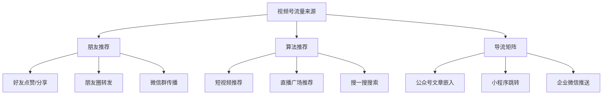

**视频号 vs 抖音 vs 快手对比**：

| 维度 | 视频号 | 抖音 | 快手 |
|------|--------|------|------|
| 核心用户 | 30-50岁，中高收入 | 18-35岁，全收入段 | 25-40岁，下沉市场 |
| 平均客单价 | 150-300元 | 80-150元 | 50-120元 |
| 退货率 | 10%-20% | 30%-50% | 20%-30% |
| 流量逻辑 | 社交推荐为主 | 算法推荐为主 | 社交+算法 |
| 粉丝粘性 | 极高（社交关系） | 低 | 高（老铁文化） |
| 入驻门槛 | 低 | 中 | 低 |
| 红利程度 | 高（仍在增长期） | 低（竞争激烈） | 中 |

**适合视频号的品类**：

| 品类 | 原因 | 预期客单价 |
|------|------|-----------|
| 家居用品 | 30-50岁用户刚需，复购率高 | 100-500元 |
| 食品/农产品 | 信任驱动，产地直发模式受欢迎 | 50-200元 |
| 服饰/中老年服装 | 目标人群精准，退货率低 | 100-300元 |
| 母婴用品 | 妈妈群体在微信中活跃度极高 | 100-400元 |
| 图书/教育课程 | 与公众号内容生态天然匹配 | 50-300元 |
| 健康/养生产品 | 中老年用户核心需求 | 100-500元 |

**视频号小店开通流程**：

1. 准备材料：营业执照（个体/企业）+ 法人身份证 + 银行账户
2. 微信搜索"视频号小店"→ 点击"我要开店"
3. 填写店铺信息、上传资质
4. 缴纳保证金（部分类目免保证金，个体卖家0元起）
5. 审核通过后上架商品
6. 在视频号主页关联小店

**费用结构**：
- 平台佣金：1%-5%（根据类目）
- 保证金：个体卖家部分类目免保证金，企业店2000-20000元
- 技术服务费：无
- 支付手续费：0.6%

**视频号电商运营策略**：

1. **内容+直播双驱动**：短视频负责种草和引流，直播间负责转化和成交。建议每天发布1-2条短视频，直播4-6小时。

2. **私域联动**：这是视频号最大的差异化优势。
   - 公众号推文中嵌入视频号直播间卡片
   - 企业微信社群预告直播，定时发放专属优惠
   - 小程序商城与视频号小店打通，实现多触点成交
   - 朋友圈分享直播间，利用社交关系链裂变

3. **信任型内容**：视频号用户更信任"真实"而非"精美"。工厂实拍、生产过程、创始人故事、用户见证等内容效果远优于精致的广告片。

4. **直播话术适配**：30-50岁用户更理性，冲动消费比例低。话术应侧重产品功能讲解、使用场景展示、品质保障承诺，少用"限量秒杀"等套路。

5. **微信搜一搜SEO**：优化视频号标题和描述中的关键词，覆盖用户在微信搜一搜中的搜索需求。这是视频号独有的搜索流量入口。

6. **分销员体系**：招募分销员（宝妈、社区团长等），通过视频号分销功能实现社交裂变。设置15%-30%的分销佣金，激励分销员主动推广。

### 11.2.9 得物（Poizon/Dewu）

得物（原名Poizon毒APP）是面向年轻消费者的品质电商平台，月活用户超过1亿，核心用户为18-30岁年轻人。其独特的"先鉴别，再发货"模式，解决了年轻人购买品牌商品时的信任痛点。

**得物平台核心特点**：

| 特征 | 说明 |
|------|------|
| 核心模式 | C2B2C：卖家发货到平台→平台鉴定→发货给买家 |
| 目标用户 | 18-30岁，男性占比约60%，一二线城市为主 |
| 核心品类 | 球鞋、潮牌服饰、美妆、数码、运动装备 |
| 平均客单价 | 300-800元 |
| 平台调性 | 潮流、品质、正品保障 |
| 商品溢价 | 同款商品比其他平台高10%-30%（鉴定信任溢价） |

**得物的商业模式**：

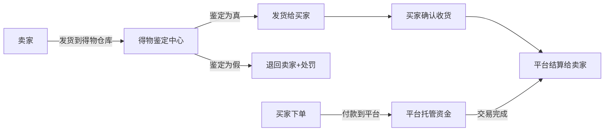

**得物费用结构**：

| 费用项目 | 比例/金额 | 说明 |
|----------|----------|------|
| 平台佣金 | 5%-10% | 根据品类和成交价浮动 |
| 鉴定费 | 5-15元/件 | 每件商品均需鉴定 |
| 技术服务费 | 1% | 基础技术服务费 |
| 保证金 | 2000-5000元 | 根据品类 |
| 运费 | 卖家承担发往得物仓库运费 | 买家承担得物到买家运费 |

**适合在得物销售的品类**：

| 品类 | 热度 | 利润空间 | 入门难度 |
|------|------|----------|----------|
| 球鞋 | ★★★★★ | 20%-50% | 中（需要正品货源） |
| 潮牌服饰 | ★★★★ | 30%-60% | 中 |
| 美妆护肤 | ★★★★ | 25%-45% | 低 |
| 数码产品 | ★★★ | 10%-25% | 中高 |
| 运动装备 | ★★★ | 20%-40% | 低 |
| 潮玩/手办 | ★★★★ | 30%-80% | 中 |

**得物入驻与运营要点**：

1. **入驻条件**：
   - 个人卖家：身份证+支付宝实名认证即可
   - 企业卖家：营业执照+品牌授权（部分品类）
   - 无需复杂资质，门槛低于传统电商平台

2. **选品策略**：
   - 关注得物App首页"热门"和"新品"板块，把握潮流趋势
   - 优先选择有品牌背书的产品（得物用户对品牌敏感度高）
   - 关注球鞋发售日历，提前备货热门鞋款
   - 利用得物"求购"功能了解用户需求

3. **定价策略**：
   - 得物用户愿意为"正品保障"支付溢价
   - 定价可比淘宝高10%-30%，但必须保证正品
   - 关注得物平台上同款商品的当前市场价，动态调整

4. **发货流程**：
   - 买家下单后，卖家需在48小时内发货到得物仓库
   - 得物鉴定通过后发货给买家（通常1-3天）
   - 全程约5-7天到达买家手中
   - 保持商品全新状态（吊牌、包装完整），否则鉴定不通过

5. **鉴定不通过的风险**：
   - 商品被退回，卖家承担来回运费
   - 累计鉴定不通过可能被降权或封号
   - 务必确保正品渠道进货，保留采购凭证

**得物运营适合人群**：
- 有品牌正品货源的卖家（经销商、代购、品牌方）
- 了解潮流文化、关注时尚趋势的年轻人
- 有海外购渠道的卖家（球鞋、潮牌）
- 从球鞋鉴定/测评起步的内容创作者

### 11.2.10 闲鱼电商

闲鱼是阿里巴巴旗下的二手交易平台，月活用户超过3亿，是新手试水电商的最佳起点——零开店费用、零保证金、流量分配相对公平。

**闲鱼的独特价值**：

1. **零门槛**：不需要营业执照、不需要缴纳保证金、不需要复杂运营。一个支付宝账号就能开始卖货。
2. **流量公平**：闲鱼的流量分配不像淘宝那样偏向付费商家，新发布的商品也能获得不错的曝光。
3. **信息差空间大**：闲鱼用户习惯"淘便宜"，但很多人不知道1688的价格。从1688采购后在闲鱼加价出售，是最简单的信息差套利。
4. **无货源友好**：闲鱼对发货时效要求不严格，一件代发模式在这里比其他平台更可行。

**闲鱼适合卖什么**：

| 品类 | 优势 | 利润空间 | 注意事项 |
|------|------|----------|----------|
| 品牌尾货/清仓品 | 用户信任度高，出手快 | 30%-50% | 确保正品，保留购买凭证 |
| 闲置数码产品 | 闲鱼核心品类 | 因品而异 | 功能描述要准确，拍摄实物图 |
| 小众/手工产品 | 竞争小，溢价空间大 | 50%-100% | 突出独特性和手工价值 |
| 1688拿货品 | 信息差套利 | 30%-60% | 不要直接搬运1688图片 |
| 虚拟商品（低风险） | 零库存、零物流 | 80%+ | 避开高风险品类（充值卡等） |

**闲鱼运营核心技巧**：

1. **标题优化**：闲鱼标题30字以内，核心关键词+使用场景+成色/规格。例如："九成新小米手环7 NFC版 黑色 买来用了两个月 功能完好"。
2. **定价策略**：闲鱼用户期望"捡便宜"。定价建议为新品价格的50%-70%，并标注"原价XX"形成价格锚定。
3. **图片要求**：实拍图>精修图。用户更信任"随手拍"的真实感，而非淘宝风的精美图。建议拍摄6-9张图，包含正面、背面、细节、使用场景。
4. **擦亮功能**：每天"擦亮"（类似刷新）商品一次，可以重新获得曝光。建议在用户活跃时段（中午12-14点、晚上20-22点）擦亮。
5. **互动回复**：闲鱼的"我想要"功能类似淘宝的"加购"。及时回复咨询消息，回复速度越快，成交概率越高。

**闲鱼进阶玩法——矩阵运营**：

- 一个人可以注册多个支付宝账号（需要不同手机号），运营多个闲鱼店铺
- 每个店铺聚焦不同品类，避免"杂货铺"形象
- 利用"鱼塘"（兴趣社区）功能，在相关鱼塘发布商品获取精准流量
- 通过"闲鱼Pro版"（商家版）获得更多运营工具和数据分析功能

**闲鱼的局限与突破**：

| 局限 | 解决方案 |
|------|----------|
| 客单价低（平均50-100元） | 选择高客单品类（数码、家具） |
| 无复购机制 | 引导买家加微信，转私域运营 |
| 平台抽佣低但流量天花板明显 | 闲鱼作为试水平台，验证后转淘宝/拼多多 |
| 售后保障弱 | 详细描述+实物图减少纠纷 |

---

## 11.3 跨境电商

### 11.3.1 为什么做跨境电商

跨境电商的核心吸引力在于"信息差"和"购买力差"：

- 同样的产品，在中国采购成本可能是10元，在美国可以卖到10美元（约72元）
- 中国制造的供应链优势在全球范围内依然无可替代
- 许多品类在海外竞争远不如国内激烈
- 汇率差有时会带来额外利润

**跨境电商 vs 国内电商对比**：

| 对比维度 | 国内电商 | 跨境电商 |
|----------|----------|----------|
| 启动资金 | 1-5万 | 5-15万 |
| 利润率 | 15%-30% | 30%-60% |
| 运营复杂度 | 中等 | 较高（语言、物流、合规） |
| 竞争程度 | 极高 | 因品类而异 |
| 回款周期 | T+1到T+15 | T+14到T+60 |
| 风险 | 平台规则、价格战 | 汇率、关税、合规、物流 |

**跨境电商选品方法论——海外版五维模型**：

跨境电商选品与国内电商的核心差异在于"文化差异"和"合规要求"。以下是跨境电商专用的选品框架：

| 维度 | 评估标准 | 数据来源 | 合格线 |
|------|----------|----------|--------|
| 市场需求 | 月搜索量、品类增速 | Jungle Scout/Helium 10 | 月搜索量>5000 |
| 竞争度 | 首页平均评论数、品牌占比 | 亚马逊搜索结果 | 首页平均评论<500 |
| 利润空间 | 售价-FBA费-广告费-采购成本 | FBA计算器+供应商报价 | 毛利率>30% |
| 合规风险 | 认证要求、知识产权风险 | USPTO/EUIPO/各国法规 | 无需特殊认证或认证成本可控 |
| 物流可行性 | 体积重量比、易碎程度 | 物流商报价 | 头程运费<售价15% |

**跨境选品"四不做"原则**：
1. **不做需要FDA/FCC认证的产品**（除非有预算和时间）——认证费用$5000-$50000，周期3-12个月
2. **不做易碎/超大件产品**——跨境物流损坏率高，退换成本是产品成本的3-5倍
3. **不做有专利风险的产品**——在USPTO和Google Patents查询，避免外观/实用新型专利侵权
4. **不做季节性极强的产品**——库存风险大，滞销后跨境清仓成本极高

### 11.3.2 主流平台深度解析

#### 亚马逊（Amazon）

亚马逊是全球最大的电商平台，覆盖北美（美国、加拿大、墨西哥）、欧洲（英、德、法、意、西）、日本、澳大利亚、中东等市场。2025年亚马逊全球净销售额超过6000亿美元。

**FBA（Fulfillment by Amazon）模式**：
FBA是亚马逊的核心物流服务。卖家将商品发到亚马逊仓库，亚马逊负责存储、打包、配送、客服和退货。使用FBA的商品会获得"Prime"标志，搜索权重和转化率都显著提升。

**FBA费用结构**（以美国站为例）：
- 月度仓储费：1-9月 $0.87/立方英尺，10-12月 $2.40/立方英尺（旺季涨3倍）
- 配送费：按商品尺寸和重量计算，标准件 $3.22-$5.90/件
- 长期仓储费：库存超过365天 $6.90/立方英尺或$0.15/件（取高者）
- 退货处理费：服装等品类免费退货，退货处理费由卖家承担

**FBA费用计算示例**：

以一个标准尺寸商品（15"×12"×3"，重量2磅）为例：

```text
售价：$29.99
采购成本（含头程物流）：$6.50
FBA配送费：$5.90
月度仓储费（月均）：$0.30
平台佣金（15%）：$4.50
广告费（按20%算）：$6.00
---
单件毛利：$6.79
毛利率：22.6%
```

**FBA入仓完整流程**：

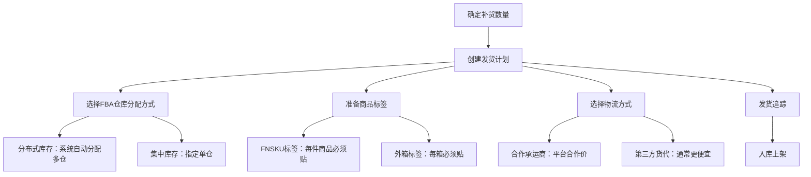

**FBA入仓注意事项**：
1. **标签要求严格**：每件商品必须贴FNSKU标签（亚马逊专用条码），外箱必须贴FBA箱唛。标签错误会导致入库延迟甚至拒收。
2. **包装要求**：易碎品必须有"窒息警告"标签（塑料袋），液体必须密封包装，电池类产品需要MSDS报告。
3. **入库时效**：海运到美国FBA仓库通常需要25-40天（含清关），旺季（9-12月）可能延长到45-60天。
4. **分仓策略**：亚马逊会自动将库存分配到不同仓库（美东、美西、美中）。如果想集中发货到一个仓库，可以使用"库存配置服务"（收费$0.30/件）。

**亚马逊选品工具对比**：

| 工具 | 价格 | 核心功能 | 适合人群 |
|------|------|----------|----------|
| Jungle Scout | $49-$129/月 | 产品数据库、销量预估、关键词研究 | 新手到进阶 |
| Helium 10 | $39-$249/月 | 全套工具箱、关键词追踪、Listing优化 | 进阶卖家 |
| Keepa | $19/月 | 价格历史追踪、BSR排名追踪 | 数据分析 |
| 卖家精灵 | ¥299-¥999/月 | 中文界面、亚马逊数据分析 | 中国卖家 |

**亚马逊Listing优化五要素**：

1. **标题**（200字符以内）：品牌名 + 核心关键词 + 核心卖点 + 材质/规格 + 数量/颜色
```text
   示例：XYZ Brand Collapsible Storage Bins [3-Pack], Large Foldable
   Fabric Organizer with Lid, Waterproof Storage Box for Closet
   Bedroom, Dark Gray
   ```

2. **五点描述（Bullet Points）**：每条一个核心卖点，嵌入关键词，用"Feature → Benefit"结构
```text
   ✅ DURABLE & WATERPROOF - Made from premium 600D Oxford fabric
   with waterproof coating, protecting your items from moisture
   and dust for years to come
   ```

3. **A+页面（Enhanced Brand Content）**：品牌卖家可用的富文本详情页，包含对比图表、场景图、品牌故事。使用A+页面的Listing转化率平均提升5%-10%。

4. **图片**：主图必须白底，至少1000x1000像素。建议7张图：白底主图→场景图→尺寸图→细节图→功能图→使用图→包装图。

5. **后台关键词（Search Terms）**：250字节的隐藏关键词，填入标题中没有出现的相关关键词。

**Listing图片设计规范**：

| 图片位置 | 内容要求 | 设计要点 |
|----------|----------|----------|
| 主图 | 白底，产品占画面85%+ | 纯白背景#FFFFFF，无文字水印 |
| 图2 | 使用场景图 | 真人使用场景，展示使用方法 |
| 图3 | 尺寸对比图 | 用参照物（手/硬币/门把手）展示尺寸 |
| 图4 | 材质/工艺细节图 | 微距展示材质纹理和做工 |
| 图5 | 功能卖点图 | 信息图风格，标注核心功能 |
| 图6 | 包装内容物 | 展示所有包含的附件和配件 |
| 图7 | 品牌故事/对比图 | 品牌理念或与竞品的对比优势 |

**Listing关键词研究完整流程**：

1. **种子词收集**：在亚马逊搜索框输入品类核心词，记录下拉联想词
2. **工具拓展**：用Helium 10的Cerebro（反查竞品关键词）和Magnet（拓展长尾词）
3. **筛选排序**：按搜索量/相关度/竞争度排序，筛选出50-100个核心关键词
4. **分配布局**：
   - 标题：放入3-5个最高搜索量的核心关键词
   - 五点描述：每条嵌入1-2个关键词
   - 后台Search Terms：放入标题和五点中没有出现的关键词（250字节限制）
5. **持续优化**：每周查看"搜索词报告"，将高转化的搜索词加入Listing

**亚马逊广告体系**：

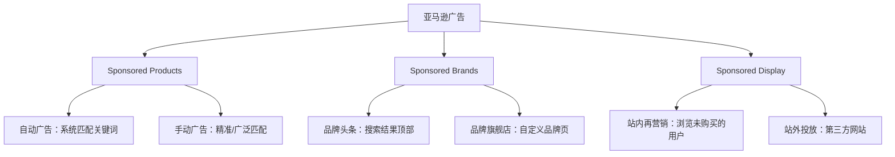

**新品推广广告节奏**：
- 第1-2周：只开自动广告（紧密匹配），日预算$20-30，收集数据
- 第3-4周：根据自动广告跑出的关键词，开手动精准广告，日预算$30-50
- 第5-8周：优化竞价和否定关键词，逐步提升预算到$50-100/天
- 第9周+：根据ACoS（广告销售成本比）优化，目标ACoS<25%

**亚马逊广告关键词策略**：

| 匹配类型 | 适用场景 | 示例 | 竞价策略 |
|----------|----------|------|----------|
| 精确匹配 | 已验证的高转化词 | [collapsible storage bin] | 高竞价，争取首页 |
| 词组匹配 | 探索中等范围关键词 | "storage bin" | 中等竞价 |
| 广泛匹配 | 新品期探索关键词 | storage bin organizer | 低竞价，看数据 |
| 自动广告 | 新品期收集数据 | 系统自动匹配 | 低竞价，持续跑 |

**广告优化日常SOP**（每天20分钟）：

1. **查看昨日广告数据**：记录每个广告组的花费、销售额、ACoS、点击率
2. **否定无效关键词**：有点击（>15次）但0转化的词，加入否定列表
3. **调整竞价**：
   - ACoS < 目标值的关键词：提高竞价10%，争取更多流量
   - ACoS > 目标值的关键词：降低竞价10%
   - ACoS远超目标值且持续亏损：暂停
4. **查看搜索词报告**：将自动广告中表现好的搜索词加入手动精准广告
5. **检查预算**：如果日预算在下午就花完，说明出价过高或需要增加预算


**亚马逊新品推广完整时间线（0-90天）**：

新品推广是亚马逊运营的核心能力。以下是经过验证的90天新品推广节奏，按周拆解每个阶段的关键动作和数据目标。

| 阶段 | 时间 | 核心目标 | 关键动作 | 预算 | 数据目标 |
|------|------|----------|----------|------|----------|
| 准备期 | 上架前2周 | Listing完美上线 | 完成Listing优化、A+页面、FBA入仓 | 头程物流费 | — |
| 冷启动 | 第1-2周 | 获取初始数据和评论 | 开启自动广告、Vine计划、促销 | $500-1000 | 日均3-5单 |
| 数据积累 | 第3-4周 | 优化广告、积累评论 | 开手动广告、否定无效词、优化竞价 | $1000-2000 | 日均5-10单 |
| 爬坡期 | 第5-8周 | 提升排名和销量 | 加大广告预算、参加秒杀、优化Listing | $2000-4000 | 日均10-20单 |
| 稳定期 | 第9-12周 | 实现盈利、降低ACoS | 优化广告结构、提升自然流量占比 | $1500-3000 | 日均20-30单 |

**第0-2周：冷启动期详细操作**：

```text
Day 1-3：上架+开启自动广告
- 自动广告设置：紧密匹配+宽泛匹配，日预算$25-30
- 竞价策略：建议竞价×1.2（略高于系统建议，争取展示）
- 开启Vine计划：花费$200，获取最多30个高质量Review

Day 4-7：观察数据+初步优化
- 每天查看广告报告：点击率、转化率、ACoS
- 点击率<0.5%：主图有问题，立即优化主图
- 有点击无转化：检查价格、评价、详情页
- 记录自动广告跑出的搜索词

Day 8-14：开启手动广告
- 从自动广告中筛选高转化搜索词，开手动精准广告
- 同时开一个手动广泛广告，继续探索关键词
- 设置优惠券（5%-10% off），提升转化率
- 目标：日均3-5单，获取首批10+条Review
```

**第3-4周：数据积累期详细操作**：

```text
广告优化：
- 自动广告：否定无关关键词（有点击15次以上0转化的词）
- 手动广告：高转化词提高竞价10%，低转化词降低竞价
- 新增从竞品ASIN反查的关键词
- 日预算提升到$50-80

Listing优化：
- 根据广告数据优化标题关键词（放入高转化词）
- 补充A+页面内容
- 更新主图（根据点击率数据）

促销策略：
- 设置Lightning Deal（秒杀）：需要有足够库存和评论
- 开启Subscribe & Save（订阅省）：适合消耗品
- 目标：日均5-10单，ACoS<40%
```

**第5-8周：爬坡期详细操作**：

```text
广告扩量：
- 日预算提升到$100-150
- 开启Sponsored Brands广告（需品牌备案）
- 开启Sponsored Display广告（再营销）
- 测试不同广告素材和文案

排名冲刺：
- 分析核心关键词的自然排名位置
- 针对排名在第2-3页的关键词加大广告投入
- 参加7天秒杀（BD），冲刺BSR排名
- 目标：核心关键词进入首页前10名

库存管理：
- 根据销量预测补货，保持30-60天库存
- 避免断货（断货后排名会大幅下降）
- 目标：日均10-20单，ACoS<30%
```

**第9-12周：稳定盈利期详细操作**：

```text
广告结构优化：
- 建立广告矩阵：自动+精准+广泛+ASIN定投+品牌广告
- ACoS目标降到25%以下
- 提升自然流量占比到60%以上（广告占比<40%）

利润优化：
- 与供应商谈判降低采购成本（基于实际销量数据）
- 优化FBA库存周转，减少仓储费
- 评估是否提价（如果转化率稳定）

产品线扩展：
- 基于现有产品的数据，开发变体（颜色/尺寸/套装）
- 分析"经常一起购买"的商品，开发关联产品
- 目标：日均20-30单，ACoS<25%，净利率>15%
```

**新品推广常见问题与解决方案**：

| 问题 | 可能原因 | 解决方案 |
|------|----------|----------|
| 上架后0单 | Listing未被收录、主图差、价格无竞争力 | 检查Listing是否可搜索，优化主图和价格 |
| 有点击无转化 | 详情页差、评价少、价格高 | 优化A+页面、开启Vine、设置优惠券 |
| ACoS居高不下 | 关键词不精准、竞价过高 | 优化否定关键词、降低竞价、提升转化率 |
| 评论增长慢 | Vine用完、没有主动邀评 | 使用"Request a Review"按钮、售后卡片邀评 |
| 排名上不去 | 销量不足、转化率低 | 加大广告投入、参加秒杀、优化Listing |
| 断货 | 备货不足、物流延迟 | 建立库存预警机制、提前2-3个月备货 |


**亚马逊品牌备案（Brand Registry）完整流程**：

品牌备案是亚马逊卖家的"护城河"——它能防止跟卖、解锁A+页面、使用品牌分析工具、保护你的品牌权益。

1. **准备材料**：商标注册证（R标最佳，TM标也可申请）、品牌LOGO、产品图片
2. **申请入口**：brandregistry.amazon.com
3. **验证流程**：亚马逊向商标注册时留下的联系方式发送验证码
4. **审核周期**：通常2-14个工作日
5. **备案成功后解锁**：A+页面、品牌旗舰店、品牌分析（ABA）、Project Zero（自助移除假冒商品）

**品牌备案常见问题**：
- **没有商标怎么办**：先在目标市场注册商标。美国商标注册费$250-$350/类（官费）+代理费$500-$1500，周期8-12个月。可以先用TM标申请备案。
- **商标被驳回**：常见原因是与已有商标相似。建议注册前用USPTO的TESS系统查询，选择独特性强的品牌名。
- **备案后被跟卖**：使用Brand Registry的"Report a Violation"工具举报跟卖者，通常24-48小时内处理。

**亚马逊账号健康度管理**：

亚马逊对账号健康度有严格的监控体系，任何一个指标不达标都可能导致Listing下架甚至账号暂停。

| 指标 | 健康标准 | 警告线 | 危险线 |
|------|----------|--------|--------|
| 订单缺陷率（ODR） | <1% | 1%-2% | >2% |
| 迟发率 | <4% | 4%-10% | >10% |
| 有效追踪率 | >95% | 90%-95% | <90% |
| 退货率 | 因品类而异 | 行业均值1.5倍 | 行业均值2倍 |
| A-to-Z索赔率 | <0.5% | 0.5%-1% | >1% |

**亚马逊FBA库存管理**：

| 库存状态 | 含义 | 处理建议 |
|----------|------|----------|
| 可售库存 | 正常可售 | 保持30-60天销量的库存 |
| 不可售库存 | 损坏/退货残次 | 及时创建移除订单 |
| 在途库存 | 正在运输中 | 提前2-3个月备货 |
| 长期仓储 | 超过365天 | 在收取长期仓储费前清仓 |

**IPI（库存绩效指标）管理**：亚马逊对FBA卖家有IPI评分要求，低于350分会被限制仓储容量。提升IPI的方法：
1. 减少冗余库存（滞销超90天的商品）
2. 提升售罄率（热销品及时补货）
3. 修复滞留库存（listing问题导致无法销售的库存）
4. 保持畅销品有货

#### Shopee/Lazada（东南亚市场）

**Shopee**是东南亚最大的电商平台，覆盖新加坡、马来西亚、泰国、印尼、越南、菲律宾等市场。2025年Shopee母公司Sea的电商业务营收超过90亿美元。

**Shopee的核心优势**：
- 入驻门槛低：个人/企业均可开店
- 物流支持：SLS（Shopee Logistics Service）提供跨境物流方案
- 平台补贴：新卖家有流量扶持期（前3个月）
- 社交属性强：直播、短视频、动态功能完善

**Shopee运营要点**：
1. **本地化**：每个国家的消费习惯不同。印尼偏好穆斯林服饰，泰国偏好日韩风格，越南对价格最敏感。要针对不同市场做选品和定价。
2. **上新频率**：Shopee的算法偏好活跃店铺。每天上新5-10个商品，保持店铺活跃度。
3. **活动参与**：Shopee每月有多个大促活动（如9.9、10.10、11.11），积极参与可获得平台流量加权。
4. **聊聊回复率**：Shopee非常看重客服响应速度，聊聊回复率低于70%会影响店铺权重。

**Shopee各市场选品参考**：

| 市场 | 热门品类 | 价格敏感度 | 特殊偏好 |
|------|----------|------------|----------|
| 印尼 | 穆斯林服饰、美妆、家居 | 高 | Halal认证加分 |
| 泰国 | 日韩风格服饰、美妆、3C配件 | 中 | 包装精美很重要 |
| 越南 | 女装、手机配件、家居 | 极高 | 最看重价格 |
| 菲律宾 | 时尚、美妆、家居 | 高 | 喜欢韩流风格 |
| 马来西亚 | 美妆、服饰、电子产品 | 中 | 多语言需求（马来语/英语/中文） |
| 新加坡 | 电子产品、家居、美妆 | 低 | 品质要求高 |

#### Temu（拼多多海外版）

Temu自2022年9月上线以来，已进入全球50+个国家/地区，2025年GMV预计突破500亿美元。它的核心模式是"全托管"——卖家只需供货，平台负责定价、运营、物流、售后。

**Temu全托管模式详解**：

| 环节 | 卖家责任 | 平台责任 |
|------|----------|----------|
| 选品 | 提供产品信息和样品 | 审核并决定是否上架 |
| 定价 | 申报供货价 | 平台自主定价 |
| 生产 | 按订单生产 | 下达采购订单 |
| 物流 | 将货物送到Temu仓库 | 负责跨境物流和末端配送 |
| 运营 | 无 | 负责Listing、推广、客服 |
| 售后 | 按平台要求处理退换货 | 负责用户沟通 |

**适合做Temu的卖家类型**：
- 工厂型卖家：有生产能力，能提供极低供货价
- 产业带商家：如义乌小商品、织里童装、南通家纺
- 有设计能力的卖家：平台偏好差异化产品

**Temu的利润模型**：
Temu的供货价通常比1688零售价低30%-50%，但胜在量大、无需运营投入。典型利润率在10%-20%，但月销量可达数万单。

**Temu半托管模式详解**：
2024年下半年Temu推出半托管模式，给卖家更多自主权：

| 环节 | 全托管 | 半托管 |
|------|--------|--------|
| 定价 | 平台定价 | 卖家自主定价 |
| 运营 | 平台负责 | 卖家自主运营Listing |
| 物流 | 平台统一安排 | 卖家自选物流或用平台物流 |
| 售后 | 平台处理 | 卖家参与处理 |
| 利润空间 | 10%-20% | 20%-35% |
| 运营难度 | 低 | 中等 |
| 适合卖家 | 工厂型 | 有运营能力的卖家 |

**Temu入驻实操流程**：
1. 注册账号：seller.temu.com，提交营业执照（企业或个体户均可）
2. 提交商品：上传产品信息、图片、质检报告
3. 寄样审核：按平台要求寄送样品到Temu仓库
4. 审核通过后上架：平台审核周期通常3-7天
5. 接单生产：平台下达采购订单后安排生产发货

**Temu选品避坑指南**：
- 不做低客单价商品（<$5）：利润太薄，扣除物流后几乎无利可图
- 不做易碎/超重商品：跨境物流损坏率高，退换成本大
- 不做需要认证的商品（如电子产品）：FDA/FCC认证成本高
- 优先选择轻小件、高复购、视觉冲击力强的商品

**Temu vs SHEIN vs 速卖通对比**：

| 平台 | 模式 | 适合卖家 | 入驻门槛 | 利润率 |
|------|------|----------|----------|--------|
| Temu | 全托管/半托管 | 工厂、产业带 | 低 | 10%-20% |
| SHEIN | 全托管（供应商模式） | 服装供应链 | 中 | 15%-25% |
| 速卖通 | 自运营 | 有运营能力的卖家 | 中 | 20%-35% |

#### 独立站

独立站（自建网站）是跨境电商的"终极形态"——你拥有品牌、用户数据和定价权，不受平台规则约束。

**独立站 vs 平台电商**：

| 对比维度 | 平台电商 | 独立站 |
|----------|----------|--------|
| 品牌控制 | 受限于平台模板 | 完全自主 |
| 用户数据 | 平台拥有 | 自己拥有 |
| 流量来源 | 平台分配 | 需要自己获取 |
| 启动难度 | 低 | 中高 |
| 获客成本 | 平台内较低 | Facebook/Google广告 |
| 利润率 | 平台抽佣后 | 无佣金，利润率更高 |
| 复购运营 | 平台限制 | 自由运营 |

**主流建站工具对比**：

| 工具 | 月费 | 技术门槛 | 优势 | 劣势 |
|------|------|----------|------|------|
| Shopify | $39-$399 | 低 | 生态最完善、插件丰富 | 交易佣金0.5%-2% |
| WooCommerce | 免费（需服务器） | 中 | 完全可控、无佣金 | 需要技术维护 |
| BigCommerce | $39-$399 | 中 | 内置功能多、无交易佣金 | 插件生态不如Shopify |
| SHOPLINE | ¥299-¥2999 | 低 | 中文支持好、本土化服务 | 国际化程度不如Shopify |

**Shopify建站核心配置清单**：

| 配置项 | 推荐方案 | 说明 |
|--------|----------|------|
| 域名 | Namecheap/Cloudflare | $10-$15/年，.com优先 |
| 主题 | Dawn（免费）/Prestige（$350） | 免费主题够用，进阶选付费 |
| 支付 | Shopify Payments + PayPal | 覆盖95%+的支付方式 |
| 评论 | Judge.me / Loox | 图文评论提升转化率 |
| 邮件 | Klaviyo | 自动化邮件营销首选 |
| SEO | SEO Manager / Plug in SEO | 基础SEO优化 |
| 追踪 | Google Analytics 4 + Facebook Pixel | 流量和转化追踪 |
| 客服 | Tidio / Zendesk | 在线客服+聊天机器人 |

**Shopify建站10步流程**：

1. 注册Shopify账号，选择$39/月的基础计划
2. 购买域名（Namecheap/Cloudflare），绑定到Shopify
3. 选择主题（推荐Dawn免费主题），自定义颜色/字体/布局
4. 安装必要插件（评论、邮件、SEO、追踪）
5. 上传产品：高质量图片（至少5张）+详细描述+准确的变体信息
6. 设置支付方式：Shopify Payments + PayPal
7. 设置物流方案：免运费门槛（如满$49免运费）+实时运费计算
8. 创建必要页面：About Us、Shipping Policy、Return Policy、FAQ、Contact
9. 安装Facebook Pixel和Google Analytics追踪代码
10. 测试下单流程：从浏览→加购→结账→支付→确认邮件，确保每个环节正常

**独立站转化率优化清单**：

独立站的转化率通常在1%-3%之间，优秀站点可以达到4%-6%。每提升1%的转化率，等于在不增加广告费的情况下多赚一倍的钱。

| 优化项 | 具体做法 | 预期提升 |
|--------|----------|----------|
| 页面加载速度 | 压缩图片、使用CDN、精简代码，目标<3秒 | 转化率+15%-20% |
| 信任标识 | 安全支付图标、退货政策、客户评价、媒体报道Logo | 转化率+10%-15% |
| 结账流程 | 支持Guest Checkout（免注册下单）、减少表单字段 | 减少弃购20%-30% |
| 弃购挽回 | 设置弃购邮件自动化（1h/24h/48h三次触达） | 挽回10%-15%弃购 |
| 移动端适配 | 70%+流量来自移动端，确保移动体验流畅 | 转化率+20%-30% |
| 社会认同 | 产品页展示真实评价、使用照片、"XX人正在浏览" | 转化率+5%-10% |
| 支付方式 | 支持信用卡、PayPal、Apple Pay、Klarna（先买后付） | 减少支付环节流失 |

**独立站A/B测试要点**：
- 每次只测试一个变量（标题、主图、价格、CTA按钮颜色）
- 每个变体至少100次转化才能得出结论
- 推荐工具：Google Optimize（免费）、VWO、Optimizely
- 优先测试影响最大的元素：主图 > 标题 > 价格 > CTA按钮

**独立站流量获取体系**：

独立站没有平台流量，流量完全靠自己获取。主要渠道：

1. **Facebook/Instagram广告**（占比约40%）：最主流的独立站引流方式。通过精准的人群定向，将广告展示给潜在客户。关键指标：CPM（千次展示成本）$5-$15，CPC（单次点击成本）$0.5-$2，ROAS（广告回报率）>3为及格。
2. **Google广告**（占比约25%）：搜索广告捕获有明确购买意图的流量。适合高客单价、决策周期长的产品。
3. **SEO**（占比约15%）：通过博客内容、产品页面优化获取Google自然流量。见效慢（3-6个月），但流量免费且可持续。
4. **网红营销**（占比约10%）：与海外KOL/KOC合作，通过他们的推荐获取精准流量。
5. **邮件营销**（占比约10%）：收集用户邮箱，通过自动化邮件序列促进复购。这是独立站独有的私域流量资产。

**Facebook广告投放基础框架**：

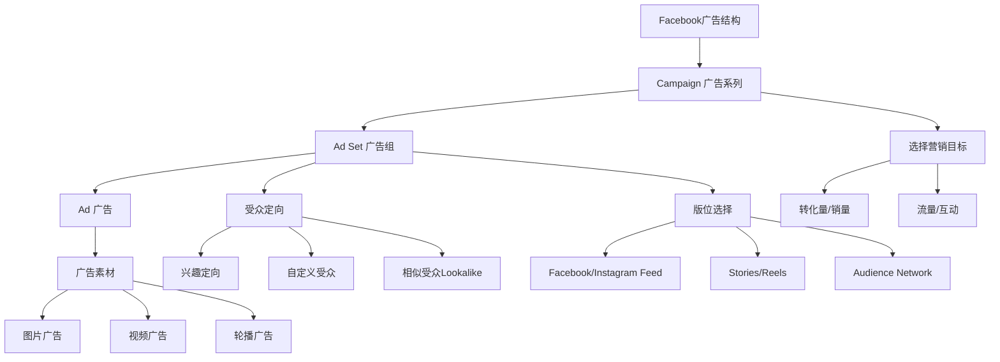

**Facebook广告投放实操SOP**：

| 阶段 | 操作 | 日预算 | 核心指标 |
|------|------|--------|----------|
| 测试期（1-7天） | 创建3-5个广告组，每个测试不同受众 | $20-50 | CTR>1.5%，CPC<$1.5 |
| 优化期（7-14天） | 关闭低效广告组，加投高ROAS组 | $50-100 | ROAS>2.0 |
| 扩量期（14天+） | 逐步提高预算（每次不超过20%） | $100-500 | ROAS>3.0 |

**广告素材优化要点**：
1. **前3秒决定一切**：视频广告的前3秒必须抓住注意力——用冲突、悬念或利益点
2. **UGC素材效果最好**：真实用户使用产品的真实视频，比精美制作的广告效果好2-3倍
3. **多素材轮换**：同一广告组准备5-10个素材，避免素材疲劳（同一素材展示超过3次后效果递减）
4. **测试不同版位**：Feed、Stories、Reels的受众行为不同，分别测试

**独立站邮件营销自动化流程**：

```text
用户注册/订阅 → 欢迎邮件（即时，含10%首单优惠码）
    → 1天后：品牌故事+热门产品推荐
    → 3天后：客户评价+使用案例
    → 5天后：优惠码即将过期提醒
    → 弃购用户 → 弃购提醒邮件（1小时后）
        → 24小时后：加赠优惠/免运费
        → 48小时后：最终提醒
    → 已购用户 → 订单确认+物流追踪
        → 收货后3天：使用指南+好评邀请
        → 30天后：关联产品推荐
        → 60天后：回购提醒
```

**邮件营销关键数据**：
- 欢迎邮件打开率：50%-60%（远高于普通营销邮件的15%-20%）
- 弃购挽回邮件转化率：5%-15%
- 邮件营销ROI：$36:$1（即每花$1邮件营销费用，产生$36收入）
- 最佳发送时间：周二/周四上午10点（美国市场）

**独立站SEO详细方法论**：

SEO是独立站最具性价比的流量来源——见效慢（3-6个月），但一旦排名上去，流量是免费且持续的。对于预算有限的新手卖家，SEO是长期回报最高的投资。

**独立站SEO的四大支柱**：

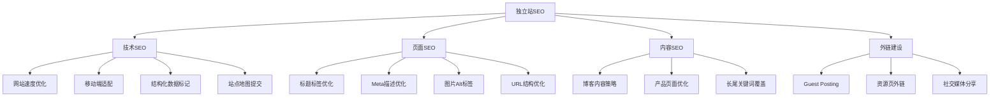

**技术SEO检查清单**：
```text
□ 网站加载速度 < 3秒（用Google PageSpeed Insights测试）
□ 移动端友好（Google Mobile-Friendly Test通过）
□ 已提交Google Search Console和Bing Webmaster Tools
□ 已生成并提交XML Sitemap
□ 已设置robots.txt（允许搜索引擎抓取重要页面）
□ 使用HTTPS（SSL证书已安装）
□ 结构化数据标记（Schema.org的Product、BreadcrumbList等）
□ 设置301重定向（处理旧URL和www/non-www）
□ 修复404错误页面
□ 设置canonical标签（避免重复内容问题）
```

**页面SEO优化要素**：

| 元素 | 优化要求 | 示例 |
|------|----------|------|
| Title Tag | 50-60字符，核心关键词在前 | "Collapsible Storage Bins - Waterproof Foldable Organizer | BrandName" |
| Meta Description | 150-160字符，包含关键词+CTA | "Shop our bestselling collapsible storage bins. Waterproof 600D fabric, foldable design. Free shipping over $49. ★★★★★ 2,000+ reviews." |
| H1标签 | 每页只有一个H1，包含核心关键词 | "Large Collapsible Storage Bins with Lid" |
| 图片Alt | 描述图片内容+包含关键词 | "Large gray collapsible storage bin with lid, folded flat for easy storage" |
| URL结构 | 简短、包含关键词、用连字符分隔 | /products/collapsible-storage-bin-gray |

**内容SEO策略——博客是独立站的流量引擎**：

博客内容是独立站SEO的核心。通过发布与产品相关的高质量文章，可以覆盖大量长尾关键词，获取免费搜索流量。

**博客内容类型与关键词策略**：

| 内容类型 | 关键词类型 | 示例标题 | 预期流量 |
|----------|-----------|----------|----------|
| 购买指南 | "best + 品类词" | "Best Collapsible Storage Bins for Small Apartments (2025)" | 高 |
| 对比文章 | "A vs B" | "Fabric Storage Bins vs Plastic Bins: Which Is Better?" | 中高 |
| 使用教程 | "how to + 动作" | "How to Organize Your Closet with Storage Bins" | 中 |
| 问题解答 | "what/why/how" | "Why Collapsible Storage Bins Are a Game-Changer for Tiny Homes" | 中 |
| 清单文章 | "X best/top" | "10 Creative Storage Solutions for Small Spaces" | 高 |

**博客发布节奏**：每周2-3篇，每篇1500-3000字。前3个月是投入期，第4-6个月开始看到自然流量增长，第6-12个月流量加速增长。

**外链建设方法**：

| 方法 | 操作方式 | 难度 | 效果 |
|------|----------|------|------|
| Guest Posting | 在相关博客发表客座文章，带链接回你的网站 | 中 | 高 |
| 资源页外链 | 找到行业内"资源汇总"页面，申请加入 | 低 | 中 |
| HARO/Connectively | 回答记者提问，获得媒体引用和链接 | 中 | 高（权威链接） |
| 竞品外链分析 | 用Ahrefs/SEMrush分析竞品的外链来源，复制获取 | 中 | 高 |
| 社交媒体分享 | 在Pinterest/Reddit/Quora分享内容 | 低 | 低-中 |

### 11.3.3 合规与风险

#### 国内电商合规基础

做国内电商同样需要合规经营。很多新手卖家忽略了这些基础要求，等到被处罚才追悔莫及。

**营业执照与税务**：

| 经营规模 | 推荐主体 | 税务要求 | 年成本 |
|----------|----------|----------|--------|
| 个人副业（月销<3万） | 个体工商户 | 免征增值税（小规模纳税人季度30万以内） | 0-500元（记账费） |
| 小型创业（月销3-10万） | 个体工商户/个人独资 | 增值税1%-3%，个人经营所得税5%-35% | 2000-5000元 |
| 正规经营（月销10万+） | 有限公司 | 增值税1%-13%，企业所得税5%-25% | 5000-20000元 |
| 品牌化运营 | 有限公司 | 完整税务体系 | 10000-50000元 |

**电商创业法律架构选择**：

选择合适的经营主体不仅影响税务成本，还影响风险承担和融资能力。

| 架构 | 注册成本 | 税务优势 | 风险承担 | 适合阶段 |
|------|----------|----------|----------|----------|
| 个人（无执照） | 0元 | 无法开票，平台限制多 | 无限责任 | 闲鱼试水 |
| 个体工商户 | 0-500元 | 个税核定征收，综合税负1%-3% | 无限责任 | 月销<10万 |
| 个人独资企业 | 500-2000元 | 可核定征收，税负低 | 无限责任 | 月销10-50万 |
| 有限责任公司 | 2000-5000元 | 企业所得税5%-25%，可抵扣进项 | 有限责任（注册资本为限） | 月销>50万或需融资 |

**关键决策建议**：
- 月销售额<3万：先用个人身份在闲鱼/拼多多试水，验证需求
- 月销售额3-10万：注册个体工商户，享受小规模纳税人免征增值税优惠
- 月销售额10万+或需要品牌化：注册有限公司，开增值税专票，建立正规财务体系
- 做跨境电商：建议注册有限公司，方便对接海外平台和收款渠道

**必须办理的证照清单**：

1. **营业执照**：在市场监管局办理，线上申请3-5个工作日出证。个体户免费，公司注册需要注册地址（可使用虚拟地址，费用500-2000元/年）。
2. **食品经营许可证**：卖食品必须办理，需要实际经营场所，审核周期15-30天。
3. **ICP备案**：独立站必须办理。个人备案免费，企业备案需要营业执照。
4. **商标注册**：品牌保护的基础。国内商标注册费300元/类（官费），代理费500-1500元，周期9-12个月。

**广告法红线——这些词绝对不能用**：

| 违规词类型 | 示例 | 处罚 |
|------------|------|------|
| 极限用语 | 最好、第一、顶级、国家级、全球首创 | 罚款20-100万元 |
| 虚假宣传 | 100%有效、7天见效、根治、零副作用 | 罚款+吊销执照 |
| 权威背书 | "XX推荐""XX认证"（未获授权） | 罚款+赔偿 |
| 医疗暗示 | 治疗、治愈、药用、抗癌（非药品） | 罚款+刑事责任 |
| 诱导用语 | "不买就亏了""最后一天"（虚假促销） | 平台处罚+罚款 |

**电商文案安全自查清单**：在发布任何商品标题、详情页、广告文案之前，按以下清单逐项检查：

1. 是否包含"最""第一""顶级"等极限用语？
2. 是否有未经验证的数据承诺（如"销量第一""好评率99%"）？
3. 是否暗示医疗功效（非医疗器械/药品）？
4. 是否使用了他人品牌名进行对比宣传？
5. 是否有虚假促销信息（如"最后一天"但实际长期如此）？
6. 涉及食品是否夸大营养功效？
7. 涉及儿童产品是否使用了"绝对安全""无毒"等绝对化表述？

可以使用"广告禁用词查询工具"（如句易网 juhe.cn）批量检测文案合规性。

#### 跨境电商知识产权

跨境电商最容易踩的坑就是知识产权问题。亚马逊等平台对知识产权侵权零容忍，一旦被投诉，轻则Listing下架，重则店铺冻结、资金冻结。

**必须做的知识产权检查**：
1. **商标查询**：在美国商标局（USPTO）、欧盟知识产权局（EUIPO）、日本特许厅（JPO）查询目标商标是否已注册。
2. **专利查询**：在Google Patents、USPTO查询产品是否有外观专利或实用新型专利。
3. **版权检查**：产品图片、包装设计、说明书文字是否存在版权侵权风险。
4. **品牌备案**：如果你有自己的品牌，第一时间在亚马逊完成品牌备案（Brand Registry），保护自己的权益。

**知识产权查询工具清单**：

| 工具/网站 | 查询内容 | 网址 |
|-----------|----------|------|
| USPTO | 美国商标和专利 | uspto.gov |
| EUIPO | 欧盟商标 | euipo.europa.eu |
| WIPO | 国际商标（马德里体系） | wipo.int |
| Google Patents | 全球专利 | patents.google.com |
| 中国商标网 | 中国商标 | sbj.cnipa.gov.cn |
| Trademarkia | 多国商标综合查询 | trademarkia.com |

**收到侵权投诉的应对流程**：

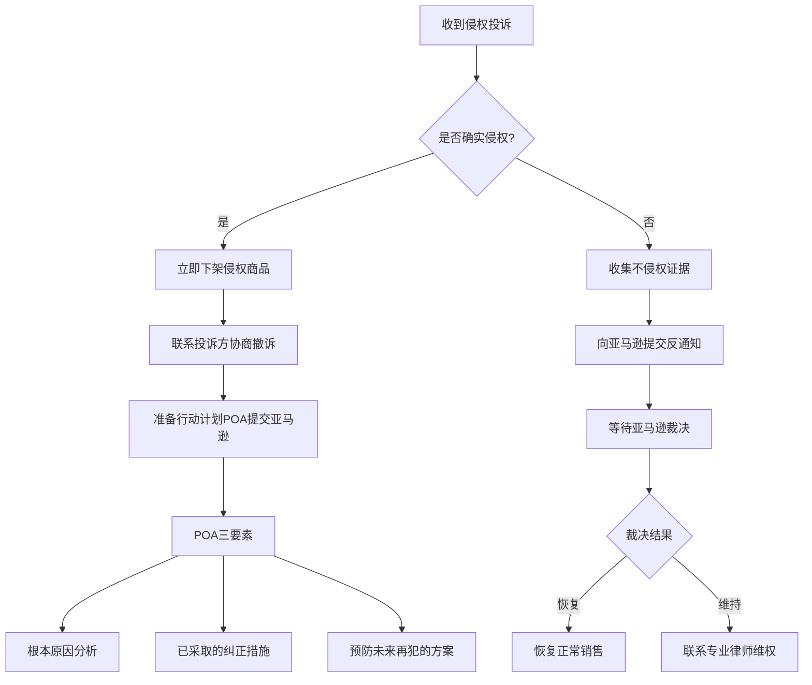

#### 各国合规要求

| 目标市场 | 关键合规要求 | 查询方式 |
|----------|-------------|----------|
| 美国 | FCC认证（电子产品）、FDA注册（食品/化妆品/医疗器械）、CPSIA（儿童产品） | fda.gov, fcc.gov |
| 欧盟 | CE认证、REACH法规（化学品）、WEEE（电子废弃物）、GDPR（数据保护） | ec.europa.eu |
| 英国 | UKCA认证（替代CE）、UK REACH | gov.uk |
| 日本 | PSE认证（电器）、ST认证（玩具）、JIS标准 | meti.go.jp |
| 澳大利亚 | SAA认证、RCM标志 | australiancompetitionlaw.org |

**VAT（增值税）注册**：
- 英国：年销售额超过£85,000必须注册VAT，税率20%
- 欧盟：超过€10,000（远程销售阈值）需注册，税率因国家而异（19%-27%）
- 做亚马逊FBA的卖家，只要使用了当地仓库，通常需要注册当地VAT
- 可以使用TaxJar、Avalara等工具自动计算和申报

**VAT各欧盟国家税率参考**：

| 国家 | 标准税率 | 低税率品类 |
|------|----------|-----------|
| 德国 | 19% | 食品、书籍7% |
| 法国 | 20% | 食品5.5%，书籍5.5% |
| 意大利 | 22% | 食品4%，书籍4% |
| 西班牙 | 21% | 食品4%，书籍4% |
| 荷兰 | 21% | 食品9%，书籍9% |
| 波兰 | 23% | 食品8% |

#### 数据隐私与GDPR合规

跨境电商卖家一旦涉及欧盟、英国等市场的用户数据，就必须遵守严格的数据隐私法规。违规罚款可以高达全球年营收的4%或2000万欧元（取高者），这不是"可选项"而是"生死线"。

**GDPR核心要求与实操清单**：

| 要求 | 具体内容 | 卖家必做动作 |
|------|----------|-------------|
| 合法依据 | 收集用户数据必须有合法理由 | 在网站设置Cookie同意弹窗，记录用户同意 |
| 数据最小化 | 只收集业务必需的数据 | 结账页面不要求填写非必要信息（如生日、性别） |
| 用户权利 | 用户有权查看、删除、导出自己的数据 | 提供"数据删除请求"入口，30天内响应 |
| 数据泄露通知 | 72小时内报告数据泄露 | 建立数据泄露应急流程 |
| 数据处理协议 | 与第三方服务商签订DPA | 与物流商、支付商、邮件服务商签订DPA |
| 隐私政策 | 网站必须有清晰的隐私政策 | 用英文撰写，说明收集什么数据、如何使用、如何保护 |

**各市场数据隐私法规速查**：

| 市场 | 法规 | 核心要求 | 违规罚款 |
|------|------|----------|----------|
| 欧盟 | GDPR | 用户同意、数据可删除、泄露通知 | 最高2000万€或全球年营收4% |
| 英国 | UK GDPR | 与欧盟GDPR基本一致 | 最高1750万£或年营收4% |
| 美国加州 | CCPA/CPRA | 用户可选择不出售数据、可删除 | 每次违规$2,500-$7,500 |
| 巴西 | LGPD | 类似GDPR | 最高年营收2% |
| 日本 | APPI | 跨境传输需用户同意 | 最高1亿日元 |

**独立站卖家数据合规实操**：

1. **Shopify设置**：进入Settings→Legal→Privacy Policy，使用模板生成符合GDPR的隐私政策
2. **Cookie同意**：安装"GDPR Cookie Banner"类插件，首次访问时弹出同意框
3. **Facebook Pixel合规**：在Facebook Events Manager中设置"Cookie同意模式"，未同意的用户不追踪
4. **邮件营销合规**：订阅表单必须有明确的"同意接收营销邮件"勾选框（不能默认勾选），退订链接必须一键生效

#### 产品安全标签与EPR合规

**EPR（Extended Producer Responsibility，生产者延伸责任）** 是2024-2025年跨境电商卖家最容易忽视的合规新要求。EPR要求产品的生产者/进口商对产品的整个生命周期负责，包括回收和处理。

**已实施EPR的市场和品类**：

| 市场 | EPR品类 | 要求 | 注册方式 | 截止时间 |
|------|---------|------|----------|----------|
| 法国 | 包装、电子设备、电池、家具、纺织、轮胎 | 必须在相应机构注册并获得UIN编号 | CITEO/Eco-systèmes | 已生效 |
| 德国 | 包装、电子设备、电池 | 在Lucid系统注册，与回收公司签约 | Zentrale Stelle Verpackungsregister | 已生效 |
| 英国 | 包装 | 按包装量缴纳回收费 | 环境署注册 | 已生效 |
| 奥地利 | 包装、电子设备 | 注册并缴纳回收费 | ARA | 已生效 |
| 西班牙 | 包装、电子设备、电池 | 注册并报告销售量 | ECOREGISTRAR | 已生效 |

**EPR不合规的后果**：
- 亚马逊等平台会下架未提供EPR编号的商品
- 法国：最高罚款10万欧元
- 德国：最高罚款20万欧元
- 可能被禁止在当地市场销售

**EPR注册实操流程**：
1. 确认你的产品涉及哪些EPR品类（包装几乎100%涉及）
2. 在目标市场的EPR机构注册（通常需要当地代理）
3. 定期报告销售量和包装量
4. 缴纳回收费（通常按重量或数量计算）
5. 将EPR编号上传到亚马逊/独立站等平台

**产品安全标签要求**：

| 市场 | 标签要求 | 涉及品类 | 关键细节 |
|------|----------|----------|----------|
| 欧盟 | CE标志 | 电子产品、玩具、机械、医疗器械 | 必须在产品和包装上标注，需有DoC符合性声明 |
| 英国 | UKCA标志 | 同上（替代CE） | 2025年起强制使用 |
| 美国 | FCC标志 | 电子产品 | 无线设备必须有FCC ID |
| 日本 | PSE标志 | 电器产品 | 菱形PSE（特定）和圆形PSE（非特定） |
| 全球 | WEEE标志 | 电子电气产品 | 带叉垃圾桶标志，表示不可随普通垃圾丢弃 |
| 全球 | 电池回收标志 | 含电池产品 | 带叉垃圾桶+化学符号 |

**产品标签合规检查清单**：

```text
□ CE/UKCA标志是否正确标注在产品和包装上？
□ 是否准备了DoC（符合性声明）文件？
□ 产品说明书是否包含目标市场官方语言？
□ 化学品是否符合REACH法规（SVHC物质清单）？
□ 儿童产品是否通过了安全测试（EN 71/ASTM F963）？
□ 电子产品是否有正确的电气安全认证？
□ 包装上是否标注了制造商信息和进口商信息？
□ 是否有正确的警告标识（窒息警告、年龄限制等）？
```

#### 汇率风险管理

跨境电商的利润受汇率波动影响显著。以美元结算的卖家，人民币升值5%意味着利润直接缩水5%。

**汇率风险管理工具**：

| 工具/方式 | 说明 | 适合规模 | 成本 |
|-----------|------|----------|------|
| 连锁银行远期结汇 | 锁定未来某个时间的汇率 | 月结汇>$5000 | 银行点差0.3%-0.5% |
| PingPong/万里汇 | 跨境收款工具，汇率优于银行 | 所有卖家 | 提现费0.3%-1% |
| 多币种账户 | 收到的外币暂不结汇，等汇率有利时再换 | 有资金储备的卖家 | 无额外成本 |
| 定价对冲 | 在定价时预留3%-5%的汇率缓冲 | 所有卖家 | 无 |

**实操建议**：
1. 使用PingPong或万里汇收款（比直接银行电汇节省1%-3%的手续费和汇率损失）
2. 不要收到款就立即结汇，观察汇率趋势，在相对高位结汇
3. 大额订单（>$10000）在报价时预留5%的汇率波动空间
4. 关注美联储利率决议和中国央行货币政策，这些直接影响汇率走势

#### 跨境电商税务筹划

跨境电商涉及的税务问题比国内电商复杂得多——进口国的关税、增值税（VAT）、所得税，以及中国的出口退税，都直接影响利润。合理的税务筹划可以节省10%-30%的税务成本。

**跨境电商涉及的主要税种**：

| 税种 | 说明 | 影响环节 | 筹划方向 |
|------|------|----------|----------|
| 出口关税 | 中国出口商品通常免征或低征 | 出口端 | 申请出口退税（退税率5%-13%） |
| 进口关税 | 目标市场对进口商品征收 | 进口端 | 利用FTA（自由贸易协定）优惠税率 |
| 增值税（VAT） | 欧洲/英国等市场必须注册和缴纳 | 销售端 | 合规申报，利用低税率品类 |
| 企业所得税 | 中国对企业利润征收 | 利润端 | 合理利用税收优惠政策 |
| 个人所得税 | 个人卖家的经营所得 | 利润端 | 选择核定征收降低税负 |

**出口退税实操要点**：
- 出口退税率因品类而异：服装13%、电子产品13%、家居用品13%、食品9%
- 需要：出口报关单、增值税发票、收汇核销
- 建议找专业外贸代理或退税公司处理，费用约退税金额的1%-3%
- 退税周期：通常1-3个月

**VAT合规申报建议**：
1. 英国/欧盟FBA卖家必须注册当地VAT
2. 可以使用TaxJar、Avalara等工具自动计算和申报
3. 按季度申报（英国）或按月申报（部分欧盟国家）
4. 保留所有销售记录和发票至少6年

#### 物流方案选择

| 物流方式 | 时效 | 成本 | 适合场景 |
|----------|------|------|----------|
| 国际快递（DHL/UPS/FedEx） | 3-7天 | 高（$10-$30/kg） | 高价值商品、紧急补货 |
| 专线物流 | 7-15天 | 中（$5-$15/kg） | 中等价值商品、稳定发货 |
| 海运 | 25-45天 | 低（$1-$3/kg） | 大批量补货、大件商品 |
| 空运 | 5-10天 | 中高（$5-$20/kg） | 中大批量、体积重量比大的商品 |
| FBA头程 | 15-30天（海运） | 低-中 | 亚马逊FBA卖家标准选择 |
| 海外仓 | 当地1-3天配送 | 含仓储费 | 高频商品、本地化发货 |

**物流成本优化策略**：
1. 海运+空运组合：常规补货用海运（便宜），紧急补货用空运（快速）
2. 提前备货：提前2-3个月按预测销量备货，避免旺季物流涨价和拥堵
3. 包装优化：减少包装体积和重量，直接降低运费
4. 多仓布局：美国可以分美东、美西两个FBA仓库，缩短配送距离

**跨境电商季节性备货日历**：

| 时间 | 事件 | 备货建议 |
|------|------|----------|
| 1-2月 | 情人节、春节 | 提前2个月备货 |
| 3-4月 | 复活节、春季上新 | 常规补货 |
| 5-6月 | 母亲节/父亲节 | 提前1个月备货 |
| 7-8月 | 开学季（Back to School） | 6月开始备货 |
| 9-10月 | 万圣节、圣诞备货 | 8月开始发货到FBA |
| 11月 | 黑五/网一 | 10月初货必须到仓 |
| 12月 | 圣诞节 | 11月中旬前完成备货 |

### 11.3.4 案例：从0到月销10万美金的亚马逊卖家

**背景**：小王，30岁，前外贸公司跟单员，英语四级水平，初始投资10万元。

**选品过程**（第1-3个月）：
- 花了2个月在Jungle Scout上调研，筛选出10个候选产品
- 用"五维评估模型"打分，最终选择"可折叠沥水架"这个细分品
- 选品理由：市场需求稳定（月搜索量2.4万）、竞争中等（首页平均评论数<500）、利润空间大（售价$29.99，成本$6.5，FBA费用$5.2，毛利率约60%）

**上架与推广**（第4-6个月）：
- 首批发货500件到美国FBA仓库，海运头程费用约3000元
- Listing优化：请专业摄影师拍7张图，标题嵌入"collapsible dish drying rack""kitchen sink organizer"等关键词
- 开自动广告，日预算$25，前两周ACoS高达45%，通过否定无效关键词逐步降到28%
- 第2个月开始做Vine计划（亚马逊官方测评），获得30+条高质量Review

**稳定增长**（第7-18个月）：
- 第7个月日销15单，月销售额约$13,500
- 扩展产品线：增加了"不锈钢沥水架""双层沥水架"等变体
- 开始手动广告精准投放，ACoS稳定在20%-22%
- 第12个月月销售额突破$50,000
- 注册美国商标，完成品牌备案，开通A+页面
- 第18个月月销售额突破$100,000

**关键教训**：
- 第3个月因为一批货质量不达标，收到大量差评，Listing评分从4.6降到3.8，花了2个月才恢复。教训：验货不能省。
- 第10个月被竞争对手恶意投诉专利侵权，Listing被下架15天。教训：提前做知识产权排查，准备好申诉材料。

---

### 11.3.5 跨境电商风险管理框架

跨境电商面临的不只是运营风险，还有系统性风险——平台政策突变、地缘政治冲突、供应链中断、汇率剧烈波动等"黑天鹅"事件。缺乏风险管理的卖家，可能因为一次意外就血本无归。

**跨境电商风险全景图**：

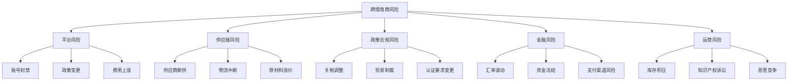

**五大系统性风险及应对策略**：

**风险1：平台账号封禁**

亚马逊每年Q4（旺季前）都会进行大规模账号审核，数千卖家被封。被封原因包括：刷评、知识产权侵权、关联账号、买家投诉过多。

| 预防措施 | 具体动作 | 优先级 |
|----------|----------|--------|
| 品牌备案 | 第一时间完成Brand Registry | 最高 |
| 合规运营 | 零刷单、零索评违规 | 最高 |
| 多账号隔离 | 不同主体、不同IP、不同设备 | 高 |
| 资料备份 | 所有采购发票、授权书、检测报告随时可调取 | 高 |
| 多平台布局 | 同时在亚马逊、独立站、Shopee运营 | 中 |

**风险2：供应链中断**

2020-2025年，全球供应链经历了疫情、苏伊士运河堵塞、红海危机、芯片短缺等多次中断。单一供应商、单一物流渠道是最大的隐患。

**供应链韧性建设方案**：

```text
核心原则：不要把鸡蛋放在一个篮子里

1. 供应商层面：
   - 核心品类至少2-3家供应商（主供+备供+应急）
   - 关键物料保持30天安全库存
   - 定期（每季度）评估供应商财务健康状况
   
2. 物流层面：
   - 主线路（海运）+ 应急线路（空运/铁路）双通道
   - 至少签约2家货代公司
   - 旺季提前2-3个月发货，避开拥堵
   
3. 地理布局：
   - 避免所有供应商集中在同一城市/省份
   - 考虑东南亚（越南、泰国）作为备选供应来源
   - 大件商品考虑目标市场本地仓储
```

**风险3：政策合规突变**

2024-2025年，全球贸易保护主义抬头，关税政策频繁变化。美国对华关税、欧盟碳边境税、各国EPR法规等都可能在短期内大幅改变成本结构。

**政策风险监控清单**：

| 监控内容 | 信息来源 | 监控频率 | 应对动作 |
|----------|----------|----------|----------|
| 目标市场关税变化 | 各国海关总署、商务部 | 每周 | 提前囤货或调整定价 |
| 平台规则更新 | 平台卖家中心公告 | 每天 | 24小时内评估影响 |
| 认证法规变化 | 行业协会、合规咨询公司 | 每月 | 预留合规预算 |
| 汇率走势 | 央行公告、财经新闻 | 每天 | 动态调整结汇策略 |
| 知识产权诉讼 | USPTO/EUIPO公告、行业社群 | 每周 | 提前排查自有产品侵权风险 |

**风险4：恶意竞争**

亚马逊平台上，恶意竞争（恶意差评、恶意投诉、跟卖、篡改Listing）是中小卖家最头疼的问题之一。

**恶意竞争防御体系**：

| 攻击方式 | 识别信号 | 防御措施 |
|----------|----------|----------|
| 恶意差评 | 短期内集中出现1星评价、评价内容雷同 | 向亚马逊举报可疑评价，保留截图证据 |
| 恶意投诉 | Listing突然被下架，收到侵权通知 | 提前做好品牌备案，准备好申诉材料POA |
| 跟卖 | 其他卖家以更低价格销售你的商品 | 品牌备案+Transparency透明计划+独家包装 |
| 篡改Listing | 产品图片、标题、描述被修改 | 定期检查Listing，开启Listing变更通知 |

**风险5：资金安全**

跨境资金链路长（买家→平台→第三方支付→国内银行），任何环节出问题都可能导致资金损失或冻结。

**资金安全防护要点**：
1. **多收款渠道**：同时使用PingPong、万里汇、连连支付，避免单一渠道故障导致无法收款
2. **及时提现**：不要在平台账户或第三方支付账户中留存大额资金，定期提现到国内银行
3. **合规报关**：确保每一笔收款都有对应的报关单和采购发票，避免被认定为洗钱
4. **分散风险**：不同市场的收入使用不同的收款账户，避免一个账户被冻结影响全部资金

---

## 11.4 社交电商

社交电商的本质是"信任变现"——依托社交关系链，将人与人之间的信任转化为购买行为。2025年中国社交电商交易规模超过5万亿元，占电商总交易额的10%以上。与平台电商相比，社交电商的获客成本低60%-80%，复购率高2-3倍。

### 11.4.1 微信私域电商

微信私域是社交电商的"主战场"。私域流量的核心特征是：免费、可反复触达、不受平台算法影响。

**私域电商的完整链路**：

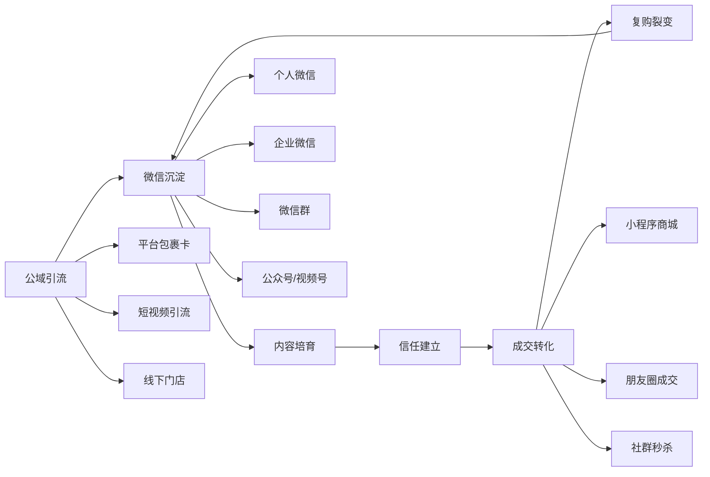

**企业微信 vs 个人微信**：

| 对比维度 | 个人微信 | 企业微信 |
|----------|----------|----------|
| 好友上限 | 5000人 | 5万人（可扩容） |
| 群发限制 | 200人/次 | 全部客户/次 |
| 客户资产 | 员工个人所有 | 企业所有（离职可交接） |
| 自动化 | 不支持 | 支持SOP自动触达 |
| 标签管理 | 手动 | 自动+手动 |
| 数据分析 | 无 | 完整客户画像 |
| 推荐 | 副业/小规模 | 正规经营首选 |

**私域引流10大方法**：

1. **包裹卡引流**：每个包裹放入引流卡，扫码加微信领福利（优惠券/赠品/抽奖）。转化率通常在5%-15%。设计要点：正面放利益点+二维码，背面放使用指南或好评引导。
2. **短信/电话引流**：已购客户发短信引导加微信。话术要给具体利益："加微信领取专属售后VIP群，享优先发货+专属折扣"。
3. **短视频/直播引流**：在抖音/快手/小红书的个人简介、评论区引导加微信。注意各平台对引流的限制。
4. **社群裂变**：设计"邀请3位好友进群，免费领XX"的裂变活动。一次裂变可以带来50-200个新用户。
5. **公众号引流**：通过优质内容吸引关注，再引导加个人微信或进群。
6. **朋友圈广告**：微信朋友圈广告精准投放，引导加企业微信。适合有预算的商家。
7. **线下门店引流**：扫码加微信享受门店优惠，将线下客流转化为线上私域。
8. **社群互推**：与互补品类的商家互相推荐。例如母婴店和童装店互推。
9. **免费资料引流**：提供行业相关免费资料（如"2025年家居收纳指南PDF"），需要加微信领取。
10. **分销员招募**：招募忠实客户成为分销员，通过他们的社交圈拓展新客户。

**私域运营SOP（日/周/月）**：

| 频率 | 动作 | 具体内容 |
|------|------|----------|
| 每天 | 朋友圈发布 | 3-5条（产品展示、客户反馈、生活日常、干货分享、限时活动） |
| 每天 | 社群互动 | 早安问候、产品种草、话题讨论、限时秒杀 |
| 每天 | 1对1沟通 | 针对高价值客户、新客户、沉默客户主动沟通 |
| 每周 | 社群活动 | 至少1次主题活动（秒杀、拼团、抽奖、直播） |
| 每周 | 内容输出 | 公众号/视频号发布2-3篇内容 |
| 每月 | 客户分层 | 更新客户标签，调整运营策略 |
| 每月 | 数据复盘 | 分析引流成本、转化率、复购率、社群活跃度 |

**私域变现模型**：

```text
利润 = 私域用户数 × 月均触达频次 × 转化率 × 客单价 × 毛利率

示例：
私域用户：5000人
月均触达：8次（朋友圈+社群+1对1）
转化率：3%
客单价：120元
毛利率：40%

月利润 = 5000 × 8 × 3% × 120 × 40% = 57,600元
```

**私域小程序商城搭建指南**：

小程序商城是私域电商的"成交阵地"——用户在微信内完成从浏览到下单的全流程，无需跳转到其他平台，转化率比外链高3-5倍。

**主流小程序商城工具对比**：

| 工具 | 月费 | 核心优势 | 适合规模 |
|------|------|----------|----------|
| 有赞 | 6800-26800元/年 | 功能最全、分销体系完善 | 中大型商家 |
| 微盟 | 6800-19800元/年 | 营销工具丰富、模板多 | 中大型商家 |
| 小鹅通 | 4800-19800元/年 | 知识付费+电商结合 | 内容创作者 |
| 微信小商店 | 免费 | 零成本、微信官方 | 个人/小规模 |
| 得有店 | 免费-3000元/年 | 性价比高、基础功能齐全 | 新手卖家 |

**小程序商城核心功能清单**：
```text
必备功能：
□ 商品管理（SKU、规格、库存）
□ 订单管理（下单、发货、退款）
□ 支付（微信支付）
□ 优惠券/满减/拼团
□ 分销员管理
□ 客户标签和分组
□ 数据分析（销售、流量、转化）

进阶功能：
□ 会员体系（积分、等级、专属价）
□ 社群接龙/秒杀
□ 直播带货（小程序直播）
□ 企业微信打通
□ 自动化营销（生日优惠、复购提醒）
```

**小程序商城运营闭环**：

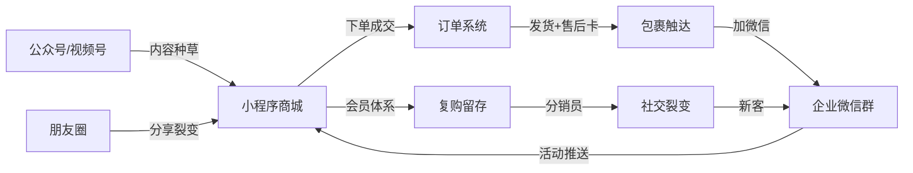

### 11.4.2 社群团购

社群团购是"社交电商+社区电商"的结合体，核心模式是"团长+社群+次日达"。

**社群团购的运作模式**：

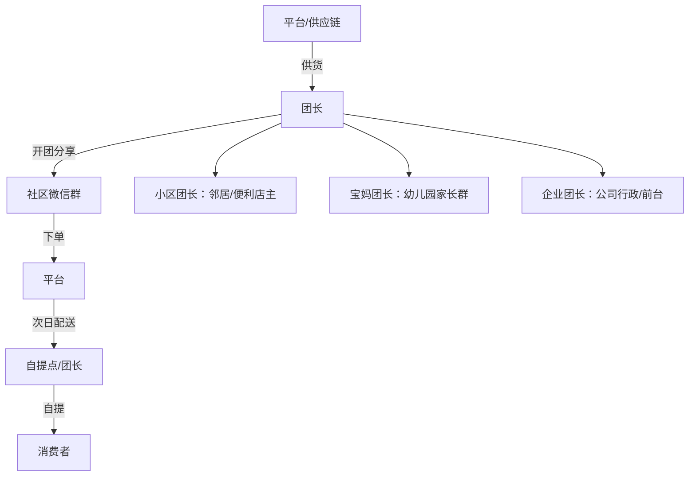

**做团长 vs 做供应链的对比**：

| 角色 | 启动资金 | 利润来源 | 月收入范围 | 适合人群 |
|------|----------|----------|------------|----------|
| 团长 | 0-1000元 | 佣金（10%-20%） | 3000-30000元 | 宝妈、社区活跃者、便利店主 |
| 供应链 | 5-20万元 | 供货差价 | 1-10万元 | 有货源的批发商、工厂 |
| 平台运营 | 10-50万元 | 平台佣金+广告 | 5-50万元 | 有团队的创业者 |

**团长运营实操**：

1. **建群**：从身边人脉开始，目标首月200人、半年500人。群名格式："XX小区好物分享群"。
2. **选品**：以生鲜水果、日用百货、零食饮品为主。高频刚需品（如鸡蛋、水果）用来引流，高毛利品（如特产、美妆）用来赚钱。
3. **开团节奏**：每天推2-3个品，固定时间（早8点、午12点、晚8点）发布。
4. **内容模板**：产品实拍图+使用体验+价格对比+限量信息。例如："这个橙子我昨天收到试吃了，甜度爆表！超市卖8块一斤，我们团价只要4.9！限量100份，明天下午4点截单！"
5. **售后处理**：生鲜品类坏果必赔，处理速度要快。宁可自己吃亏，也不能伤了群里的信任。

### 11.4.3 分销裂变

分销裂变是通过"让利给推荐人"的方式实现用户指数级增长的模式。

**分销体系设计要素**：

| 要素 | 说明 | 建议设置 |
|------|------|----------|
| 分销层级 | 推荐关系的深度 | 2级（法律红线，超过3级涉嫌传销） |
| 佣金比例 | 推荐人获得的分佣 | 一级15%-25%，二级5%-10% |
| 提现规则 | 佣金何时可提现 | 确认收货后7天自动结算 |
| 升级机制 | 高级分销员的权益 | 月销100单以上升级，佣金比例提升5% |
| 招募方式 | 如何成为分销员 | 消费满XX元自动开通，或申请审核制 |

**裂变活动设计模板**：

```text
活动名称：XX品牌推荐有礼
活动机制：
- 推荐1人购买：返现10元
- 推荐3人购买：返现50元+赠品1份
- 推荐10人购买：返现200元+高级分销员资格
- 被推荐人：首单立减15元

传播素材：海报+话术+朋友圈文案（平台提供，分销员一键转发）
数据追踪：每个分销员有专属推荐码/链接
```

**法律红线——分销 vs 传销的界限**：

| 维度 | 合法分销 | 非法传销 |
|------|----------|----------|
| 层级 | 2级以内 | 3级及以上 |
| 入门费 | 无需缴费或仅消费即可 | 需缴纳高额入门费 |
| 收入来源 | 基于实际商品销售佣金 | 基于拉人头费 |
| 产品价值 | 产品有真实使用价值 | 产品是道具或无实际价值 |

**关键提醒**：分销层级超过2级即有传销风险。微信对三级分销会直接封号。合规做法是控制在2级以内，且佣金来源于真实商品销售利润。

---

## 11.5 新兴电商模式

### 11.5.1 无货源电商

无货源电商的核心是"不囤货、不压资金"——通过信息差或服务差赚取利润。

**无货源电商的三种主流模式**：

| 模式 | 运作方式 | 利润来源 | 适合平台 | 利润率 |
|------|----------|----------|----------|--------|
| 一件代发 | 客户下单后从供应商直接发货给客户 | 零售价-供货价 | 淘宝/拼多多/闲鱼 | 20%-40% |
| 跨平台搬运 | A平台低价商品搬到B平台加价卖 | 信息差 | 闲鱼→淘宝/小红书 | 30%-60% |
| Dropshipping | 从供应商/工厂直接代发到海外客户 | 零售价-采购价-物流 | 独立站/Shopee | 30%-50% |

**一件代发完整流程**：

1. **选品**：在1688/拼多多找到高性价比商品，注意筛选"一件代发"标签的供应商
2. **上架**：将商品信息优化后上架到目标平台，定价=供货价×2-3倍
3. **接单**：客户在你的店铺下单
4. **代发**：你去供应商处下单，填写客户的收货地址
5. **售后**：处理客户的退换货（退回供应商处）

**无货源电商的风险与应对**：

| 风险 | 说明 | 应对措施 |
|------|------|----------|
| 品质无法把控 | 没见过实物，质量靠运气 | 先自购样品验证，选择评分4.8+的供应商 |
| 发货时效不可控 | 供应商发货慢导致投诉 | 设置较长的承诺发货时间，选择24小时发货的供应商 |
| 同质化竞争 | 大量卖家搬运同款商品 | 优化标题和主图做差异化，不要直接搬运 |
| 平台处罚 | 部分平台打击无货源卖家 | 不要直接搬运他人图片，自行拍摄或授权 |
| 利润被压缩 | 供应商涨价或竞争对手降价 | 保持2-3家备选供应商，定期比价 |

**无货源电商的进阶路径**：

```text
阶段1：纯无货源（一件代发）
    → 积累选品经验，验证市场需求
阶段2：小批量备货（爆品自备库存）
    → 提升发货速度和品控，降低成本
阶段3：OEM/ODM定制（自有品牌）
    → 找工厂定制自己的品牌，建立壁垒
阶段4：品牌化运营
    → 注册商标，全渠道布局，建立品牌忠诚度
```

### 11.5.2 AI电商

AI正在重塑电商的每一个环节——从选品到客服，从内容生成到广告投放。2025年，AI电商工具市场规模超过200亿元，不拥抱AI的卖家将被快速淘汰。

**AI在电商中的应用场景全景**：

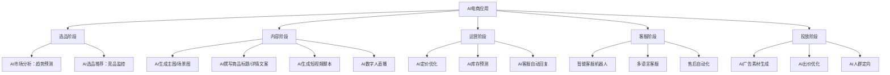

**AI工具推荐清单**：

| 应用场景 | 推荐工具 | 功能 | 费用 |
|----------|----------|------|------|
| 商品图片生成 | Midjourney/DALL-E/Stable Diffusion | 生成产品场景图、模特图 | $10-30/月 |
| 商品图片编辑 | 美图秀秀AI/Canva AI | 一键换背景、抠图、美化 | 免费-$15/月 |
| 文案生成 | ChatGPT/Claude/文心一言 | 生成标题、详情页文案、广告文案 | 免费-$20/月 |
| 短视频生成 | 剪映AI/Runway/Pika | AI生成产品展示视频 | 免费-$30/月 |
| 数字人直播 | 硅基智能/HeyGen/D-ID | AI数字人24小时直播 | ¥300-3000/月 |
| 智能客服 | 晓多AI/乐言科技/Zendesk AI | 自动回复、智能推荐 | ¥500-5000/月 |
| 数据分析 | 生意参谋AI版/Jungle Scout AI | 智能选品、竞品分析 | ¥100-500/月 |
| SEO优化 | Surfer SEO/Clearscope | 关键词优化、内容评分 | $49-100/月 |

**AI数字人直播详解**：

AI数字人直播是2025年电商领域最大的技术革新之一。它允许商家用AI生成的虚拟主播24小时不间断直播，大幅降低直播人力成本。

**AI数字人直播的适用场景**：
- 标品讲解（如日用品、食品、3C配件）——产品简单，话术固定
- 深夜时段覆盖（0:00-8:00）——人力难以覆盖的时段
- 多语言直播（跨境电商）——AI可以实时切换语言
- 新品测试——低成本测试不同话术的效果

**AI数字人直播的局限**：
- 互动能力有限，无法像真人主播一样灵活应变
- 平台政策不确定——部分平台对AI直播有限制或标记要求
- 高度依赖产品——非标品、需要试穿试用的品类效果差
- 用户信任度低于真人主播

**AI辅助选品流程**：

```cpp
步骤1：用ChatGPT/Claude分析行业趋势
  提示词："分析2025年中国家居收纳市场的增长趋势、消费者痛点和机会品类"

步骤2：用Jungle Scout/Helium 10获取数据
  验证AI给出的方向是否有真实数据支撑

步骤3：用AI分析竞品评论
  提示词："分析以下亚马逊评论，总结消费者最关心的3个优点和3个痛点"
  （粘贴竞品的TOP100条评论）

步骤4：用AI生成选品报告
  提示词："基于以上分析，生成一份选品可行性报告，包含市场规模、竞争分析、利润测算、风险评估"
```

### 11.5.3 直播电商深度解析

直播电商已不是"新鲜事物"，而是主流电商形态。2025年中国直播电商GMV超过5万亿元，占电商总GMV的10%以上。本节从宏观视角总结直播电商的核心方法论。

**直播电商的三种参与角色**：

| 角色 | 定义 | 收入来源 | 门槛 | 月收入范围 |
|------|------|----------|------|------------|
| 品牌自播 | 商家自己直播卖自己的货 | 商品利润 | 低 | 5000-500万+ |
| 达人带货 | 为其他商家带货赚佣金 | 佣金（5%-30%） | 中（需粉丝基础） | 3000-100万+ |
| MCN机构 | 组织多个达人/主播直播 | 服务费+佣金分成 | 高（需团队） | 10万-1000万+ |

**直播间流量来源矩阵**：

| 流量来源 | 占比 | 获取方式 | 成本 |
|----------|------|----------|------|
| 短视频引流 | 20%-30% | 发布短视频挂直播间链接 | 内容制作成本 |
| 关注页 | 10%-20% | 维护粉丝关系，固定时间开播 | 免费 |
| 推荐/发现 | 20%-40% | 提升直播间互动数据 | 免费（依赖内容质量） |
| 付费投流 | 20%-40% | 千川/磁力金牛/引力魔方 | ¥0.5-5/次点击 |
| 搜索 | 5%-10% | 优化直播间标题和商品标题 | 免费 |
| 私域导流 | 5%-15% | 微信群/朋友圈预告 | 免费 |

**直播电商的底层公式**：

```text
直播GMV = 曝光量 × 进入率 × 停留时长系数 × 商品点击率 × 转化率 × 客单价

关键杠杆：
- 曝光量：靠短视频引流+付费投流+开播频率
- 进入率：靠直播间封面和标题
- 停留时长：靠主播话术和福利节奏
- 商品点击率：靠产品展示和价格吸引
- 转化率：靠信任感+逼单话术+价格优势
- 客单价：靠套餐搭配和满减设置
```

**全平台直播对比**：

| 平台 | 核心用户 | 平均客单价 | 退货率 | 分成机制 | 适合品类 |
|------|----------|------------|--------|----------|----------|
| 抖音直播 | 18-35岁，一二线 | 80-150元 | 30%-50% | 佣金+坑位费 | 潮流、美妆、新奇特 |
| 快手直播 | 25-40岁，下沉市场 | 50-120元 | 20%-30% | 佣金 | 农产品、食品、日用品 |
| 淘宝直播 | 全年龄段 | 100-300元 | 15%-30% | 佣金+坑位费 | 全品类 |
| 小红书直播 | 20-35岁，女性为主 | 150-400元 | 10%-20% | 佣金 | 设计师品牌、美妆、家居 |
| 视频号直播 | 30-50岁，微信用户 | 80-200元 | 15%-25% | 佣金 | 家居、食品、服饰 |

**直播间话术体系——四大核心话术**：

1. **留人话术**（提升停留时长）：
   - "刚进来的家人先别走，今天这个福利只有直播间有！"
   - "点关注不迷路，等会儿有1元秒杀！"
   - "在线人数到200我就放福利价！"

2. **互动话术**（提升互动率）：
   - "觉得好看的扣1，觉得一般的扣2"
   - "想要什么颜色？打在公屏上！"
   - "新来的家人点个关注，关注过1000发红包！"

3. **产品话术**（提升点击率）：
   - FAB法则：特征→优势→利益
   - "这个面料是冰丝的（F），比普通棉T恤凉爽3倍（A），夏天穿出去完全不会闷热（B）"
   - 对比法："左边是普通款，右边是我们这款，你看这个做工差距"

4. **逼单话术**（提升转化率）：
   - 价格锚定："原价399，今天直播间只要129！"
   - 限时限量："库存只剩最后50件，拍完恢复原价！"
   - 零风险承诺："7天无理由退换，运费险已开！"
   - 从众心理："已经有300人下单了，你们看看评论区！"

**直播电商合规要点**：

直播带货不是"想说什么就说什么"，2023年实施的《互联网广告管理办法》和《网络直播营销管理办法》对直播话术有严格限制。

| 违规行为 | 处罚 | 正确做法 |
|----------|------|----------|
| 虚假宣传产品功效 | 罚款+封号 | 只说产品实际功能，不夸大 |
| 虚构"原价"制造折扣假象 | 罚款+赔偿 | 原价必须真实，有交易记录支撑 |
| "最后XX件"虚假限量 | 平台处罚 | 如实告知库存或不承诺具体数量 |
| 未经授权使用他人品牌 | 侵权赔偿 | 只推广有合法授权的商品 |
| 诱导未成年人消费 | 罚款+封号 | 不针对未成年人推广 |
| 直播间刷单炒信 | 平台封号 | 通过真实内容和投流获取流量 |

**直播带货的消费者权益保护**：
1. 7天无理由退货：直播间购买的商品同样适用
2. 退一赔三：销售假冒伪劣商品，消费者可要求三倍赔偿
3. 食品安全：销售食品出现问题，可要求十倍赔偿
4. 主播连带责任：主播对推荐商品的质量承担连带责任

---


## 11.6 电商运营通用技能

无论你做哪个平台、卖什么品类，以下五项运营技能都是"基本功"。很多卖家只关注流量和转化，忽视了客服、仓储、退换货、供应链和团队管理，最终在这些"不起眼"的环节上翻车。

### 11.6.1 客服体系搭建

客服是电商的"最后一公里"——它直接影响转化率、复购率和店铺评分。数据显示，客服响应时间每缩短1分钟，转化率提升3%-5%；客服好评率每提升1%，店铺复购率提升2%。

**客服体系架构**：

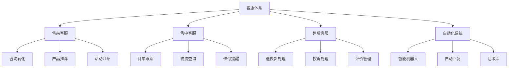

**客服团队配置方案**：

| 日均订单量 | 客服配置 | 工具方案 | 月成本 |
|------------|----------|----------|--------|
| 0-50单 | 老板自己兼任 | 平台自带客服工具 | 0元 |
| 50-200单 | 1名全职客服 | 千牛/晓多AI辅助 | 4000-6000元 |
| 200-500单 | 2-3名客服+1名客服主管 | 晓多AI+CRM系统 | 1.5-2.5万元 |
| 500单以上 | 客服团队（5人+）| 智能客服+人工+CRM | 3-8万元 |

**自动回复配置清单**：

| 场景 | 自动回复内容 | 触发条件 |
|------|-------------|----------|
| 首次咨询 | 欢迎语+店铺活动介绍+常见问题入口 | 用户首次发送消息 |
| 问发货时间 | "亲，付款后48小时内发货，默认XX快递" | 消息包含"发货""快递""多久" |
| 问尺码 | 自动发送尺码表图片 | 消息包含"尺码""大小""码数" |
| 问优惠 | "亲，现在下单可领取XX元优惠券，链接：XXX" | 消息包含"优惠""便宜""打折" |
| 非工作时间 | "感谢咨询，当前为非工作时间，我们将在明天9:00回复您" | 22:00-9:00 |
| 催付提醒 | "亲，您看中的XX还未付款，库存紧张，建议尽快下单哦~" | 下单后30分钟未付款 |

**客服话术库——高频场景模板**：

**售前转化话术**：

```text
场景1：用户问"这个质量怎么样？"
话术："亲，这款是我们店铺的爆款，月销5000+件，好评率98%。给您看几张买家实拍图（发图）。面料是XX材质，手感非常好，而且支持7天无理由退换，您可以放心购买~"

场景2：用户说"太贵了"
话术："亲，我理解您的顾虑。这款用的是XX材质，市面上同类材质的产品普遍在XX元以上。而且我们现在有满减活动，算下来其实很划算。这样吧，我给您申请一张5元优惠券，您看可以吗？"

场景3：用户在对比竞品
话术："亲，我看到您在对比其他家的。我给您简单说下我们的优势：1）XX材质（发对比图）；2）XX工艺；3）售后无忧。您可以对比下细节，相信您会有判断的~"

场景4：用户犹豫不决
话术："亲，这款今天是活动价，明天就恢复原价了。而且库存只剩最后XX件了，建议您先拍下，不喜欢随时可以退~"
```

**售后处理话术**：

```text
场景1：用户要求退货
话术："亲，非常抱歉给您带来不好的体验。您方便说下是什么问题吗？如果是质量问题，我们承担来回运费；如果是不喜欢，退货地址是XXX，运费需要您承担哦~"

场景2：用户给差评
话术："亲，看到您的评价我们非常重视。能否告诉我具体是什么问题？我们一定给您一个满意的解决方案。如果方便的话，我们可以给您换货/补发/退款，您看哪种方式更合适？"

场景3：物流延迟
话术："亲，非常抱歉让您久等了。我已经帮您联系快递公司催促了，预计XX天内送达。如果超过XX天还没收到，我们会为您补发或退款，给您造成不便深感抱歉~"

场景4：商品有瑕疵
话术："亲，真的很抱歉！这是我们质检疏忽了。您看这样处理可以吗：1）我们给您补发一个新的；2）给您退XX元作为补偿。您选择哪种方式？"
```

**客服KPI考核体系**：

| 指标 | 计算方式 | 优秀标准 | 合格标准 | 不合格 |
|------|----------|----------|----------|--------|
| 首次响应时间 | 用户发送消息到客服首次回复的平均时间 | <15秒 | <30秒 | >60秒 |
| 平均响应时间 | 所有消息的平均响应时间 | <30秒 | <60秒 | >120秒 |
| 回复率 | 回复的消息数/收到的消息数 | >98% | >95% | <90% |
| 咨询转化率 | 咨询后下单的人数/咨询总人数 | >50% | >30% | <15% |
| 客户满意度 | 满意评价数/总评价数 | >95% | >90% | <80% |
| 问题解决率 | 首次联系即解决的问题数/总问题数 | >80% | >60% | <40% |
| 退款纠纷率 | 退款纠纷数/总订单数 | <0.5% | <1% | >2% |

**客服排班方案**：

| 时段 | 订单占比 | 客服配置 | 备注 |
|------|----------|----------|------|
| 9:00-12:00 | 20% | 1名客服 | 处理昨夜留言 |
| 12:00-14:00 | 15% | 1名客服 | 午间咨询 |
| 14:00-18:00 | 25% | 1-2名客服 | 下午高峰 |
| 18:00-22:00 | 30% | 2名客服 | 晚间高峰（重点保障） |
| 22:00-9:00 | 10% | 自动回复 | 设置智能机器人值守 |

**客服工具推荐**：

| 工具 | 功能 | 适合平台 | 费用 |
|------|------|----------|------|
| 千牛 | 淘宝/天猫官方客服工具 | 淘宝/天猫 | 免费 |
| 晓多AI | 智能客服机器人，自动回复 | 全平台 | ¥500-5000/月 |
| 乐言科技 | AI客服+智能推荐 | 淘宝/京东/拼多多 | ¥800-3000/月 |
| 快麦客服 | 多平台客服管理 | 全平台 | ¥300-2000/月 |
| 企业微信 | 私域客户管理 | 微信生态 | 免费 |
| 网易七鱼 | 全渠道客服系统 | 全平台 | ¥1000-5000/月 |

### 11.6.2 仓储与物流管理

仓储物流是电商的"后端命脉"。发货速度、包装质量、库存准确性直接影响客户体验和店铺评分。很多卖家前端做得很好，却因为仓储管理混乱导致差评、断货、资金积压。

**仓储管理三大核心流程**：

```mermaid
graph TD
    A[仓储管理] --> B[入库流程]
    A --> C[出库流程]
    A --> D[盘点流程]
    
    B --> B1[采购到货验收]
    B --> B2[质检抽检]
    B --> B3[系统录入]
    B --> B4[上架存储]
    
    C --> C1[订单接收]
    C --> C2[拣货下架]
    C --> C3[验货打包]
    C --> C4[交接发货]
    
    D --> D1[日盘：热销品]
    D --> D2[周盘：全品类轮盘]
    D --> D3[月盘：全面盘点]
    D --> D4[差异分析与处理]
```

**入库SOP（标准作业流程）**：

```text
步骤1：到货签收
- 核对送货单与采购订单是否一致
- 检查外包装是否有破损、受潮
- 签收并记录到货时间

步骤2：质检抽检
- 按AQL标准抽检（一般检验水平II）
- 抽检比例：小批量100%检，大批量5%-10%抽检
- 检查内容：外观、功能、尺寸、包装
- 不合格品隔离，通知供应商处理

步骤3：系统录入
- 录入ERP/WMS系统：SKU、数量、批次号、入库时间
- 打印并粘贴库位标签
- 更新库存台账

步骤4：上架存储
- 按品类/销量分区存储（热销品放在易取位置）
- 遵循"先进先出"原则
- 重物下层、轻物上层
- 保持通道畅通
```

**出库SOP**：

```text
步骤1：订单接收
- 系统自动接收平台订单
- 系统自动分配库位（WMS系统）
- 打印拣货单（按库位排序，减少走动）

步骤2：拣货下架
- 按拣货单到指定库位取货
- 扫码确认SKU和数量
- 在系统中扣减库存

步骤3：验货打包
- 核对商品与订单是否一致（品名、数量、规格）
- 检查商品外观（无破损、无污渍）
- 放入赠品、售后卡、发票
- 选择合适包装材料打包
- 粘贴快递面单

步骤4：交接发货
- 快递员上门取件或送至快递站点
- 扫描揽收，系统自动回传物流单号
- 更新订单状态为"已发货"
```

**仓库选址决策框架**：

| 考量因素 | 具体分析 | 推荐方案 |
|----------|----------|----------|
| 订单量 | 日均<50单 | 在家/办公室发货 |
| 订单量 | 日均50-200单 | 租小型仓库（50-100㎡） |
| 订单量 | 日均200-1000单 | 租中型仓库（200-500㎡） |
| 订单量 | 日均>1000单 | 专业仓库+WMS系统 |
| 位置 | 偏好快递成本低 | 选择快递网点密集的区域 |
| 位置 | 偏好发货速度快 | 选择靠近快递转运中心的区域 |
| 成本 | 一二线城市 | ¥30-80/㎡/月 |
| 成本 | 三四线城市 | ¥10-30/㎡/月 |

**WMS系统推荐**：

| 系统 | 适合规模 | 核心功能 | 费用 |
|------|----------|----------|------|
| 聚水潭 | 日均100-10000单 | 订单管理+仓储+财务 | ¥200-2000/月 |
| 旺店通 | 日均100-50000单 | 多平台订单+仓储+采购 | ¥300-3000/月 |
| 马帮ERP | 跨境电商为主 | 多平台+多仓库+物流 | ¥200-5000/月 |
| 管易云 | 日均500-100000单 | 全渠道+智能仓储 | ¥500-5000/月 |
| Excel/飞书表格 | 日均<100单 | 基础库存管理 | 免费 |

**库存管理核心指标**：

| 指标 | 计算方式 | 健康标准 | 预警信号 |
|------|----------|----------|----------|
| 库存周转率 | 年销售成本/平均库存 | >6次/年 | <3次/年 |
| 库存周转天数 | 365/库存周转率 | <60天 | >90天 |
| 缺货率 | 缺货SKU数/总SKU数 | <5% | >10% |
| 库存准确率 | 实际库存/系统库存 | >99% | <95% |
| 滞销库存占比 | 滞销品金额/总库存金额 | <10% | >20% |

**库存预警机制**：

```text
安全库存 = 日均销量 × 补货周期 × 1.5

示例：
某商品日均销量20件，补货周期（下单到入库）15天
安全库存 = 20 × 15 × 1.5 = 450件

当库存低于450件时，系统自动触发补货提醒
当库存低于300件时，进入紧急补货状态
当库存为0时，立即下架商品，避免超卖
```

### 11.6.3 退换货管理

退换货是电商运营中不可回避的问题。不同品类的退货率差异巨大：服装30%-50%、鞋类20%-35%、家居10%-20%、3C数码5%-15%、食品3%-8%。退货处理不当会导致差评、纠纷、资金损失。

**退换货处理流程**：

```mermaid
graph TD
    A[客户申请退换货] --> B{审核原因}
    B -->|质量问题| C[承担来回运费]
    B -->|不喜欢/不想要| D[客户承担退回运费]
    B -->|发错货/漏发| E[承担来回运费+补发]
    B -->|物流破损| F[联系快递理赔+补发]
    
    C --> G[提供退货地址]
    D --> G
    E --> H[直接补发]
    F --> H
    
    G --> I[收到退货]
    I --> J[质检验收]
    J -->|合格| K[入库+退款]
    J -->|不合格| L[拍照留证+协商]
    
    H --> M[更新物流单号]
```

**退货率控制方法**：

| 退货原因 | 占比 | 控制方法 | 预期降低 |
|----------|------|----------|----------|
| 尺码/规格不符 | 30% | 提供详细尺码表、试穿视频、AI尺码推荐 | 退货率-10% |
| 色差 | 15% | 使用实物拍摄、注明"因屏幕色差可能略有不同" | 退货率-5% |
| 质量问题 | 20% | 加强质检、选择靠谱供应商 | 退货率-8% |
| 与描述不符 | 15% | 如实描述产品，不过度美化 | 退货率-5% |
| 不喜欢 | 10% | 提供360°展示视频、真实买家秀 | 退货率-3% |
| 物流问题 | 10% | 选择靠谱快递、加强包装 | 退货率-3% |

**逆向物流管理**：

| 退货类型 | 处理方式 | 成本承担 | 处理时效 |
|----------|----------|----------|----------|
| 未发货退款 | 系统自动退款 | 无 | 即时 |
| 已发货未签收 | 拦截快递 | 拦截费5-10元/单 | 1-3天 |
| 已签收退货 | 客户寄回→质检→退款 | 来回运费 | 3-7天 |
| 换货 | 客户寄回→重新发货 | 来回运费 | 5-10天 |
| 仅退款 | 不退货直接退款 | 商品成本 | 即时 |

**退货数据分析框架**：

每周分析退货数据，找出问题根源：

```text
退货分析维度：
1. 按SKU分析：哪些商品退货率最高？是否需要下架或优化？
2. 按原因分析：哪个退货原因占比最大？针对性改进
3. 按时间分析：退货率是否在上升趋势？
4. 按渠道分析：哪个推广渠道带来的退货率最高？
5. 按客户分析：新客vs老客的退货率差异

退货成本计算：
退货总成本 = 退回运费 + 商品折损 + 人工处理费 + 重新入库费 + 机会成本

示例：
月销1000单，退货率15%，平均客单价100元
退货单数 = 150单
退回运费 = 150 × 8元 = 1200元
商品折损（10%不可二次销售）= 150 × 10% × 100元 = 1500元
人工处理 = 150 × 3元 = 450元
总退货成本 = 3150元
退货成本占销售额比例 = 3150 / (1000 × 100) = 3.15%
```

**退货预防策略**：

1. **售前预防**：
   - 提供详细的产品描述、尺寸表、使用说明
   - 使用实物拍摄，避免过度美化
   - 在详情页中明确标注"不适合人群"

2. **售中预防**：
   - 下单后发送确认信息，确认规格/颜色/地址
   - 发货前二次核对订单信息
   - 使用防震、防潮包装材料

3. **售后预防**：
   - 收货后主动关怀："商品收到了吗？有任何问题随时联系我们"
   - 提供使用指南，减少因"不会用"导致的退货
   - 对高退货率商品做回访调查

### 11.6.4 供应链管理基础

供应链是电商的"命脉"——产品品质和成本控制直接决定你的生死。很多卖家花大量时间研究运营技巧，却忽视了供应链管理，最终在品质和成本上翻车。

**中国主要产业带地图**：

| 产业带 | 核心品类 | 代表市场/平台 | 特点 |
|--------|----------|--------------|------|
| 义乌 | 小商品、日用百货、饰品 | 义乌国际商贸城、1688义乌产业带 | 品类最全，起订量最低，适合新手 |
| 南通 | 家纺、床上用品 | 叠石桥国际家纺城 | 全国家纺70%产自这里 |
| 汕头 | 玩具、内衣、母婴 | 澄海玩具城、谷饶内衣产业带 | 玩具出口量全国第一 |
| 织里 | 童装 | 织里童装城 | 全国最大童装生产基地 |
| 深圳 | 3C数码、电子产品、手机配件 | 华强北、1688深圳产业带 | 创新能力强，产品迭代快 |
| 广州 | 服装、箱包、美妆 | 十三行、沙河、白云区化妆品 | 快时尚供应链最成熟 |
| 泉州 | 鞋业、运动装备 | 晋江鞋都、石狮服装城 | 运动鞋产量占全国40%+ |
| 佛山 | 家具、建材 | 乐从家具城、龙江家具产业带 | 全国家具看佛山 |
| 曹县 | 汉服、演出服 | 曹县电商产业园 | 汉服占全国市场1/3 |
| 许昌 | 假发 | 许昌发制品产业带 | 全球假发看中国，中国假发看许昌 |

**供应商评估框架**：

在选择供应商时，用以下五维评估模型进行系统评估：

| 评估维度 | 权重 | 评估标准 | 评估方法 |
|----------|------|----------|----------|
| 产品质量 | 30% | 样品质量、质检合格率、一致性 | 寄样测试、工厂考察、第三方质检 |
| 价格竞争力 | 25% | 单价、起订量价格梯度、含税/不含税 | 多家比价，至少对比5家供应商 |
| 起订量（MOQ） | 15% | 最小起订量、是否接受小批量 | 直接询问，新手优先选择MOQ低的 |
| 交期与稳定性 | 15% | 打样周期、大货交期、历史准时率 | 小批量试单验证，查看1688交易记录 |
| 沟通与服务 | 15% | 响应速度、配合度、售后态度 | 日常沟通观察，处理问题时的态度 |

**1688采购避坑指南**：

**如何辨别真实工厂vs贸易商**：

| 特征 | 真实工厂 | 贸易商 |
|------|----------|--------|
| 1688店铺名 | XX工厂/XX制造/XX实业 | XX贸易/XX商贸/XX电子商务 |
| 实力商家标签 | "源头工厂""工厂直销" | "实力商家""经销批发" |
| 产品线 | 品类集中，专业性强 | 品类杂，什么都卖 |
| 价格 | 同品质价格更低 | 加了差价，偏高 |
| 起订量 | 通常较高（可谈判） | 通常较低 |
| 打样能力 | 快，可定制 | 慢，需转手 |
| 厂房实拍 | 有工厂照片/视频 | 多为办公室或仓库照片 |
| 深度验厂 | 通过深度验厂 | 未验厂或仅验商 |

**1688采购红线——这些店铺不要合作**：
1. 交易记录中"退款率"高于行业均值2倍
2. 店铺评分低于4.5分
3. 没有任何认证标识（实力商家、源头工厂等）
4. 产品图片明显盗用其他店铺
5. 报价时含糊其辞，不明确含税/不含税
6. 不愿提供样品或索要高额样品费

**验货SOP**：

```text
【AQL抽检标准（适用于一般消费品）】

AQL（Acceptable Quality Level）= 可接受质量水平
常用AQL标准：AQL 2.5（一般检验水平II级）

批量范围        样本量    接受数    拒收数
2-8             2         0        1
9-15            3         0        1
16-25           5         0        1
26-50           8         1        2
51-90           13        1        2
91-150          20        2        3
151-280         32        3        4
281-500         50        5        6
501-1200        80        7        8
1201-3200       125       10       11

【验货检查清单】
□ 外观检查：颜色、印刷、表面质量
□ 尺寸检查：关键尺寸是否在公差范围内
□ 功能测试：按产品功能逐一测试
□ 包装检查：包装完整性、标签正确性
□ 数量核对：实际数量与订单数量一致
□ 安全检查：锐边、小零件（儿童产品）、电气安全
□ 条码/标签：UPC/EAN码是否正确
```

**供应商关系管理**：

1. **建立长期合作关系**：与核心供应商建立稳定的合作关系，不要频繁更换。长期合作可以获得更好的价格、更快的响应速度和优先生产权。

2. **付款条件谈判**：
   | 合作阶段 | 常见付款方式 | 谈判技巧 |
   |----------|-------------|----------|
   | 首次合作 | 全款预付或3/7分 | 先接受，建立信任 |
   | 第2-3次 | 3/7分（30%定金+70%发货前） | 正常节奏 |
   | 稳定期 | 月结30天/60天 | 承诺稳定订单量换取账期 |
   | 大客户 | 月结60-90天 | 需要较大订单量支撑 |

3. **多供应商策略**：核心品类至少保持2-3家备选供应商，避免单一供应商断供风险。但也不要同时跟太多家合作，否则每家的订单量都不够大，拿不到好价格。

4. **品质问题处理原则**：
   - 小问题（不影响销售）：记录下来，下次合作前提醒改进
   - 中等问题（部分退货）：要求供应商承担退货损失，约定改进方案
   - 严重问题（大面积质量缺陷）：拒收整批货，要求全额赔偿，考虑更换供应商

**质量控制流程**：

```mermaid
graph TD
    A[质量控制流程] --> B[来料检验IQC]
    A --> C[过程检验IPQC]
    A --> D[出货检验OQC]
    
    B --> B1[首件确认]
    B --> B2[抽样检验AQL]
    B --> B3[不合格品退回]
    
    C --> C1[中期巡检]
    C --> C2[工艺抽查]
    C --> C3[问题及时反馈]
    
    D --> D1[终检抽检]
    D --> D2[包装检查]
    D --> D3[合格放行]
```

### 11.6.5 团队扩展与管理

当店铺月销售额突破5-10万元时，一个人已经忙不过来了。此时需要考虑招人和团队管理。过早招人浪费钱，过晚招人错失增长机会。

**团队扩展时机判断**：

| 信号 | 具体表现 | 说明 |
|------|----------|------|
| 客服响应超时 | 5分钟回复率低于90% | 需要招客服 |
| 发货延迟 | 超过48小时未发货比例>10% | 需要招仓库人员 |
| 运营顾不上 | 没时间做推广、优化、分析 | 需要招运营助理 |
| 退货处理慢 | 退货退款处理超过48小时 | 需要人手 |
| 月利润稳定>2万 | 有稳定现金流支撑人力成本 | 有招人的财务基础 |

**角色扩展顺序**：

```mermaid
graph LR
    A[老板兼客服] -->|月销5万+| B[+客服1人]
    B -->|月销10万+| C[+运营助理1人]
    C -->|月销20万+| D[+美工/设计1人]
    D -->|月销50万+| E[+仓库1人]
    E -->|月销100万+| F[+管理层]
    
    A -.-> A1[全能型：客服+运营+打包]
    B -.-> B1[释放老板时间做运营]
    C -.-> C1[专业分工开始]
    D -.-> D1[视觉质量提升]
    E -.-> E1[发货效率提升]
    F -.-> F1[团队化运营]
```

**电商团队薪资参考（2025年）**：

| 岗位 | 一线城市 | 二线城市 | 三线城市 | 说明 |
|------|----------|----------|----------|------|
| 客服 | 4000-6000 | 3000-5000 | 2500-4000 | 底薪+绩效，绩效与转化率挂钩 |
| 运营助理 | 5000-8000 | 4000-6000 | 3000-5000 | 需要有基础运营知识 |
| 运营主管 | 8000-15000 | 6000-12000 | 5000-8000 | 需要有成功店铺运营经验 |
| 美工/设计师 | 5000-10000 | 4000-8000 | 3000-6000 | 需要有电商设计经验 |
| 直播主播 | 6000-15000+提成 | 4000-10000+提成 | 3000-8000+提成 | 底薪+GMV提成（1%-5%） |
| 仓库打包 | 3500-5000 | 3000-4000 | 2500-3500 | 纯体力劳动，流动率高 |
| 采购 | 5000-8000 | 4000-6000 | 3000-5000 | 需要有供应链资源 |

**外包vs自建决策框架**：

| 业务环节 | 建议外包 | 建议自建 | 决策依据 |
|----------|----------|----------|----------|
| 客服 | 日均<50单 | 日均>50单 | 小量外包更划算，大量自建更可控 |
| 美工设计 | 非核心品类 | 核心品类/品牌化阶段 | 外包灵活但难保证一致性 |
| 直播 | 测试期/非核心时段 | 核心时段/主力品类 | 直播是核心能力，需要自建 |
| 仓储打包 | 日均<100单 | 日均>100单 | 小量外包，大量自建成本更低 |
| 短视频拍摄 | 偶尔需要 | 日更3条+ | 短视频是长期投入，自建更高效 |
| 财务记账 | 全阶段 | 不建议自建 | 专业代账公司成本低、合规性好 |

**远程团队管理要点**：

1. **工具选择**：
   - 日常沟通：企业微信/钉钉/飞书
   - 任务管理：飞书多维表格/Notion/Teambition
   - 数据共享：腾讯文档/石墨文档
   - 客服系统：千牛/晓多AI（支持远程管理）

2. **制度建设**：
   - 明确每个岗位的KPI和考核标准
   - 建立每日汇报机制（客服看板、运营日报）
   - 定期视频会议（每周1-2次，了解进展和问题）
   - 关键操作SOP文档化（让新员工也能快速上手）

3. **激励机制**：
   - 基本工资+绩效奖金（绩效占20%-40%）
   - 店铺利润分红（核心员工可给5%-15%分红权）
   - 成长激励：学习培训机会、晋升通道

**电商代运营选择指南**：

当团队能力不足或想快速起量时，代运营公司是一个选择。但代运营行业鱼龙混杂，选错了比不选更糟。

| 代运营类型 | 服务内容 | 收费模式 | 适合卖家 | 风险等级 |
|-----------|----------|----------|----------|----------|
| 全托管代运营 | 店铺整体运营（选品+推广+客服+仓储） | 基础费+销售额提成（3%-10%） | 有供应链但无运营能力 | 高 |
| 半托管代运营 | 特定环节（如推广、直播、客服） | 固定月费或单项提成 | 有部分能力，需要补充 | 中 |
| 咨询顾问 | 运营策略指导、团队培训 | 按小时/按项目收费 | 有团队，需要方向指引 | 低 |
| 直播代运营 | 直播间搭建+主播+运营 | 坑位费+佣金分成 | 想做直播但缺主播 | 中 |

**选择代运营的5个检查点**：
1. **看案例**：要求提供同品类的成功案例，并验证（搜索店铺确认真实存在）
2. **看团队**：了解实际服务你店铺的团队配置和人员经验
3. **看合同**：明确服务内容、KPI考核、退出机制、数据归属
4. **看收费**：警惕"只收提成不收基础费"的公司（可能用你的钱刷数据）
5. **看数据权限**：必须保留店铺主账号权限，代运营只给子账号

**代运营合同关键条款**：
```text
必须包含的条款：
□ 服务内容和KPI指标（如月销售额、ROI、转化率等）
□ 数据归属（店铺数据、客户数据归你所有）
□ 账号权限（主账号归你，代运营用子账号）
□ 退出机制（提前30天通知，无违约金或违约金合理）
□ 保密条款（代运营不得泄露你的经营数据）
□ 费用明细（基础费+提成比例+其他费用）

必须警惕的条款：
⚠ "独家合作"——限制你同时学习运营
⚠ "数据归代运营"——你的客户数据被别人掌控
⚠ "自动续约"——没有退出窗口
⚠ "模糊KPI"——没有量化考核标准
```

**各岗位KPI参考**：

| 岗位 | 核心KPI | 目标值 | 考核周期 |
|------|---------|--------|----------|
| 客服 | 5分钟回复率 | >95% | 每日 |
| 客服 | 咨询转化率 | >30% | 每周 |
| 客服 | 客户满意度 | >4.8分 | 每月 |
| 运营 | 店铺GMV | 按月度目标 | 每月 |
| 运营 | ROI | >1/毛利率 | 每周 |
| 运营 | 新品上架数 | 月度目标 | 每月 |
| 美工 | 主图点击率 | >行业均值1.5倍 | 每周 |
| 美工 | 出图效率 | 按项目周期 | 每周 |
| 仓库 | 发货时效 | 48小时内发货率>98% | 每日 |
| 仓库 | 错发率 | <0.5% | 每月 |
| 主播 | 场均GMV | 按阶段目标 | 每场 |
| 主播 | 观看转化率 | >3% | 每场 |
| 主播 | 互动率 | >5% | 每场 |


### 11.6.6 品牌建设方法论

品牌是电商的"终极壁垒"——它让你跳出价格战泥潭，获得溢价能力和用户忠诚度。没有品牌的店铺，本质上是在给平台打工；有品牌的店铺，是在积累自己的资产。

**品牌建设的五个阶段**：

```mermaid
graph LR
    A[阶段1: 白牌卖货] -->|注册商标| B[阶段2: 商标品牌]
    B -->|统一视觉+故事| C[阶段3: 品牌识别]
    C -->|用户口碑+复购| D[阶段4: 品牌信任]
    D -->|溢价+忠诚度| E[阶段5: 品牌资产]
```

**阶段1→2：从白牌到商标品牌**
- 注册商标：国内商标300元/类（官费），代理费500-1500元，周期9-12个月
- 品牌命名原则：简短（2-4字）、易记、有辨识度、不与已有商标冲突
- 命名检查清单：USPTO查询（跨境）、中国商标网查询、域名查询、社交媒体账号查询

**阶段2→3：建立品牌识别系统**
- 品牌视觉统一：Logo、品牌色、包装风格、详情页模板保持一致性
- 品牌故事：为什么做这个品牌？解决了什么问题？创始人的初心是什么？
- 品牌口号：一句话说清品牌价值。例如："让收纳更简单"（功能型）、"为年轻人的第一杯好茶"（情感型）

**阶段3→4：从识别到信任**
- 产品品质一致性：品牌的核心是"每次购买都一样好"，品质波动是品牌杀手
- 用户口碑积累：鼓励用户晒单、分享使用体验，形成UGC内容矩阵
- 售后服务标准化：退换货政策、客服话术、投诉处理流程统一规范
- 品牌社群运营：建立品牌粉丝群，定期互动、新品内测、专属福利

**阶段4→5：从信任到资产**
- 品牌溢价定价：同类产品定价高于白牌20%-50%，用户愿意为品牌信任付费
- 品牌延伸：从核心品类扩展到关联品类（如从"收纳盒"扩展到"家居整理"全品类）
- 多渠道布局：天猫旗舰店+京东自营+抖音品牌号+独立站，全渠道统一品牌形象
- 品牌授权/加盟：品牌成熟后可以授权其他卖家使用品牌，收取授权费

**DTC（Direct to Consumer）品牌建设要点**：

DTC品牌是电商的"终极形态"——直接面向消费者，不依赖平台，拥有完整的用户数据和品牌控制权。

| 要素 | 传统电商卖家 | DTC品牌 |
|------|------------|---------|
| 流量来源 | 依赖平台分配 | 自主获取（SEO/社媒/邮件） |
| 用户数据 | 平台拥有 | 自己拥有 |
| 定价权 | 受平台价格战影响 | 完全自主定价 |
| 利润率 | 15%-30% | 30%-60% |
| 复购率 | 5%-15% | 20%-40% |
| 品牌估值 | 无 | 可被收购/融资 |

**DTC品牌启动路径**：
1. 先在平台（淘宝/亚马逊）验证产品需求和市场容量
2. 同步搭建独立站（Shopify），积累品牌资产
3. 通过内容营销（博客/YouTube/Instagram）建立品牌认知
4. 通过邮件营销和私域运营提升复购率
5. 逐步将流量从平台迁移到独立站，降低对平台的依赖

## 11.7 电商数据分析与工具体系

数据驱动是现代电商运营的基本功。不看数据的卖家就像闭着眼开车——凭运气可能走一段，但迟早翻车。本节将核心指标体系、数据看板搭建、A/B测试方法论和数据分析工具整合为完整的数据运营框架。

### 11.7.1 核心数据指标体系

**电商运营核心指标全景图**：

```mermaid
graph TD
    A[电商核心指标] --> B[流量指标]
    A --> C[转化指标]
    A --> D[商品指标]
    A --> E[客户指标]
    A --> F[财务指标]
    
    B --> B1[UV/PV]
    B --> B2[流量来源分布]
    B --> B3[新客占比]
    
    C --> C1[转化率]
    C --> C2[加购率]
    C --> C3[支付率]
    
    D --> D1[动销率]
    D --> D2[售罄率]
    D --> D3[退货率]
    
    E --> E1[复购率]
    E --> E2[客户终身价值LTV]
    E --> E3[获客成本CAC]
    
    F --> F1[毛利率]
    F --> F2[净利率]
    F --> F3[ROI]
```

**各指标详解与健康标准**：

| 层级 | 指标 | 计算方式 | 健康标准 | 优化方向 |
|------|------|----------|----------|----------|
| 流量层 | UV（独立访客） | 日访问人数 | 因品类而异 | SEO、付费广告、内容营销 |
| 流量层 | PV（页面浏览量） | 日浏览页面数 | PV/UV > 3 | 详情页深度、关联推荐 |
| 流量层 | 跳失率 | 只看一页就离开的比例 | <50% | 首页/详情页优化 |
| 转化层 | 转化率 | 成交人数/访客数 | >3%（平台）>2%（独立站） | 主图、详情页、价格、评价 |
| 转化层 | 加购率 | 加购人数/访客数 | >5% | 价格策略、促销活动 |
| 转化层 | 支付率 | 付款人数/下单人数 | >85% | 催付、优惠券、支付体验 |
| 客单层 | 客单价 | 成交金额/成交笔数 | 因品类而异 | 关联销售、满减、套餐 |
| 客单层 | 连带率 | 销售件数/成交笔数 | >1.3 | 搭配推荐、凑单活动 |
| 复购层 | 复购率 | 二次购买客户/总客户 | >15% | 会员体系、私域运营 |
| 复购层 | 客户留存率 | 30天内回访客户/总客户 | >20% | CRM、定期触达 |
| 利润层 | 毛利率 | (售价-成本)/售价 | >30% | 供应链优化、差异化定价 |
| 利润层 | 净利率 | 净利润/销售额 | >10% | 成本控制、效率提升 |
| 广告层 | ROI | 广告带来的销售额/广告花费 | >1/毛利率 | 素材优化、人群精准 |
| 广告层 | ACoS | 广告花费/广告带来的销售额 | <25% | 关键词优化、出价调整 |
| 广告层 | CPC | 广告单次点击成本 | 因品类而异 | 素材质量、竞价策略 |

### 11.7.2 数据看板搭建

**日报看板（每天5分钟）**——重点关注异常波动：

| 指标 | 今日数据 | 昨日数据 | 环比 | 判断标准 | 异常处理 |
|------|----------|----------|------|----------|----------|
| 销售额 | — | — | — | 与目标对比 | 低于目标20%需排查 |
| 订单量 | — | — | — | 与目标对比 | 结合流量看转化 |
| 转化率 | — | — | — | 波动>20%需排查 | 见下方排查清单 |
| 客单价 | — | — | — | 波动>15%需关注 | 检查促销和关联销售 |
| 广告花费 | — | — | — | 是否超预算 | 超预算立即暂停低效计划 |
| 广告ROI | — | — | — | >1/毛利率 | 低于盈亏线需优化 |
| 退款金额 | — | — | — | 波动>30%需排查 | 查看退款原因分布 |
| 差评数 | — | — | — | >0需立即处理 | 24小时内联系买家 |

**周报看板（每周30分钟）**——深度分析趋势：

| 分析维度 | 具体内容 | 关注要点 | 输出行动 |
|----------|----------|----------|----------|
| 流量分析 | 各渠道流量占比和变化 | 哪个渠道增量/减量最大 | 调整渠道投入比例 |
| 转化漏斗 | 浏览→加购→下单→支付 | 哪个环节流失最大 | 针对性优化薄弱环节 |
| 商品分析 | TOP10和BOTTOM10商品 | 淘汰差品，加大好品投入 | 制定商品优化计划 |
| 竞品监控 | TOP5竞品价格/评价/活动 | 及时应对竞品策略变化 | 调整定价和促销策略 |
| 广告分析 | 各广告计划的ROI排名 | 优化或淘汰低效计划 | 重新分配广告预算 |
| 关键词排名 | 核心关键词搜索排名趋势 | 排名下降的关键词 | 优化标题和权重 |

**月报看板（每月2小时）**——全面复盘与规划：

| 分析维度 | 具体内容 | 输出成果 |
|----------|----------|----------|
| 利润核算 | 每个SKU的真实利润（扣除所有成本） | SKU级利润表 |
| 获客成本 | 各渠道的CAC趋势 | 渠道效率排名 |
| 客户价值 | LTV、复购率、客户分层 | 客户运营策略调整 |
| 库存健康 | 周转率、滞销品、缺货品 | 补货/清仓计划 |
| 人效分析 | 每人产出多少GMV/利润 | 团队优化方向 |
| 趋势预测 | 基于历史数据预测下月销售 | 备货和预算计划 |

**数据异常排查清单**：

当某个指标出现异常波动时，按以下清单逐项排查：

```text
转化率突然下降：
□ 是否有差评出现？
□ 主图或详情页是否被修改？
□ 价格是否发生变化？
□ 竞品是否在做活动？
□ 平台是否调整了算法？
□ 是否有物流/发货问题？
□ 是否到了淡季/节假日？

流量突然下降：
□ 平台是否在维护/调整？
□ 是否有违规处罚？
□ 核心关键词排名是否变化？
□ 广告预算是否花完？
□ 是否被竞品超越？
□ 是否有负面舆情？

客单价下降：
□ 是否在做大力度促销？
□ 高客单价商品是否缺货？
□ 关联销售是否失效？
□ 优惠券设置是否异常？
```

### 11.7.3 A/B测试方法论

A/B测试是用数据驱动决策的核心方法。通过对比两个版本的效果，找到最优方案，避免"拍脑袋"决策。

**A/B测试基本流程**：

```mermaid
graph TD
    A[确定测试目标] --> B[设计测试方案]
    B --> C[执行测试]
    C --> D[分析结果]
    D --> E{是否显著?}
    E -->|是| F[实施方案]
    E -->|否| G[调整方案重新测试]
    G --> B
    F --> H[记录结果建立知识库]
    
    A --> A1[明确要优化的指标]
    B --> B1[每次只测一个变量]
    B --> B2[准备A/B两个版本]
    C --> C1[随机分配流量]
    C --> C2[测试至少7天]
    D --> D1[统计显著性检验p<0.05]
```

**电商常见A/B测试场景**：

| 测试对象 | 测试变量 | 测试方法 | 样本量要求 | 预期周期 |
|----------|----------|----------|------------|----------|
| 主图 | 不同风格/配色/卖点文字 | 同时上架2个版本，对比点击率 | 每版本5000+曝光 | 3-5天 |
| 标题 | 不同关键词组合 | 7天更换一次标题，对比搜索流量 | 每版本7天数据 | 14天 |
| 价格 | 不同价格点 | 分时段测试，对比转化率和利润 | 每版本100+订单 | 7-14天 |
| 详情页 | 不同排版/卖点顺序 | A/B测试工具分流 | 每版本200+转化 | 7-14天 |
| 促销方式 | 满减vs折扣vs赠品 | 不同时段测试 | 每版本100+订单 | 7天 |
| 客服话术 | 不同回复方式 | 客服随机使用，对比转化率 | 每版本50+咨询 | 7天 |

### 11.7.4 数据分析工具矩阵

**国内电商工具**：

| 工具 | 功能 | 适合平台 | 费用 |
|------|------|----------|------|
| 生意参谋 | 流量/转化/商品/市场全维度分析 | 淘宝/天猫 | 标准版免费，专业版¥99/月 |
| 蝉妈妈 | 抖音电商数据分析 | 抖音 | ¥299-¥1999/月 |
| 飞瓜数据 | 抖音/快手电商数据 | 抖音/快手 | ¥299-¥999/月 |
| 多多数据通 | 拼多多数据分析 | 拼多多 | 免费-¥499/月 |
| 店透视 | 淘宝/天猫竞品分析 | 淘宝/天猫 | ¥99-¥499/月 |
| 京东商智 | 京东数据分析 | 京东 | ¥99/月起 |

**跨境电商工具**：

| 工具 | 功能 | 适合平台 | 费用 |
|------|------|----------|------|
| Jungle Scout | 选品/关键词/竞品分析 | 亚马逊 | $49-$129/月 |
| Helium 10 | 全套运营工具箱 | 亚马逊 | $39-$249/月 |
| Keepa | 价格和排名历史追踪 | 亚马逊 | $19/月 |
| 卖家精灵 | 中文界面亚马逊分析 | 亚马逊 | ¥299-¥999/月 |
| Google Analytics 4 | 网站流量和用户行为分析 | 独立站 | 免费 |
| Hotjar | 用户行为热力图和录屏 | 独立站 | 免费-$80/月 |

**数据工具选择建议**：

| 你的阶段 | 推荐工具组合 | 月费用 |
|----------|-------------|--------|
| 新手期 | 平台免费工具（生意参谋标准版、多多数据通免费版） | 0元 |
| 成长期 | 生意参谋专业版 + 蝉妈妈/飞瓜（选一个） | 200-400元/月 |
| 成熟期 | 多工具组合 + ERP数据分析模块 | 500-2000元/月 |
| 跨境卖家 | Jungle Scout + Helium 10 + Google Analytics | $100-$300/月 |

---

## 11.8 电商运营常见误区与避坑指南

### 11.8.1 选品误区

| 误区 | 真相 | 正确做法 |
|------|------|----------|
| 什么热卖做什么 | 热门品类竞争激烈，新手进去大概率亏钱 | 在热门品类中找细分需求 |
| 凭感觉选品 | 个人喜好≠市场需求 | 用数据工具验证，用小成本测品 |
| 一上来就铺大量SKU | 精力分散，每个品都做不好 | 先集中资源打爆1-2个品 |
| 只看售价不算成本 | 很多品看似利润高，扣除推广费后亏损 | 用完整成本公式计算真实利润 |
| 忽视退货率 | 服装30%-50%的退货率直接吃掉利润 | 选品时把退货率纳入成本计算 |

### 11.8.2 运营误区

| 误区 | 真相 | 正确做法 |
|------|------|----------|
| 只靠付费推广 | 广告一停流量就断，永远不盈利 | 付费推广+免费流量+内容营销三条腿走路 |
| 疯狂降价打价格战 | 利润越来越薄，最终只能退出 | 通过差异化（品质/服务/品牌）避免价格战 |
| 忽视评价管理 | 一个差评可能劝退70%的潜在买家 | 建立差评预防和快速响应体系 |
| 不做数据分析 | 凭感觉运营等于闭眼开车 | 每天看核心指标，每周深度分析 |
| 照搬竞品 | 竞品的策略不一定适合你 | 分析竞品的逻辑，结合自身资源制定策略 |
| 追求粉丝数量 | 粉丝多≠赚钱多，精准粉丝才有价值 | 关注粉丝质量和互动率 |

### 11.8.3 跨境误区

| 误区 | 真相 | 正确做法 |
|------|------|----------|
| 以为跨境很简单 | 涉及语言、物流、合规、汇率等复杂因素 | 充分学习后再投入，不要盲目跟风 |
| 不做知识产权排查 | 一个侵权投诉可能冻结全部资金 | 上架前必做商标+专利查询 |
| 忽视合规要求 | FDA/FCC/CE等认证不是可选项 | 选品阶段就确认合规要求和成本 |
| 用国内思维做海外 | 文化差异导致选品和营销失误 | 研究目标市场文化、消费习惯、审美偏好 |
| 全部押注单一平台 | 平台政策变化可能让你一夜归零 | 多平台+独立站组合布局 |

---


### 11.8.4 各平台红线行为

各电商平台都有明确的规则底线，触碰这些红线可能导致商品下架、店铺扣分、甚至永久封号。以下是各平台最常踩的红线：

**淘宝/天猫红线**：

| 违规行为 | 处罚力度 | 具体说明 |
|----------|----------|----------|
| 刷单炒信 | 扣48分/永久封店 | 包括虚假交易、空包发货、好评返现 |
| 知识产权侵权 | 扣48分/永久封店 | 假冒品牌、盗用图片、侵犯专利 |
| 虚假宣传 | 扣12-48分 | 夸大功效、虚假促销、误导性描述 |
| 价格欺诈 | 扣12-24分 | 虚构原价、先涨后降 |
| 描述不符 | 扣6-12分 | 实物与图片/描述严重不符 |
| 违规发货 | 扣6-12分 | 超时不发货、虚假物流单号 |

**抖音电商红线**：

| 违规行为 | 处罚力度 | 具体说明 |
|----------|----------|----------|
| 虚假宣传 | 商品下架+店铺扣分 | 直播中夸大产品功效、虚假承诺 |
| 低质内容 | 限流+封禁 | 短视频质量差、搬运他人内容 |
| 诱导互动 | 限流+封号 | "不点赞就不发货"等胁迫行为 |
| 售假 | 永久封店+罚款 | 销售假冒伪劣商品 |
| 刷数据 | 限流+扣分 | 刷粉丝、刷播放量、刷评论 |
| 引流到站外 | 限流+封号 | 在直播间/短视频中引导加微信 |

**拼多多红线**：

| 违规行为 | 处罚力度 | 具体说明 |
|----------|----------|----------|
| 虚假发货 | 扣款+降权 | 上传虚假物流单号、空包 |
| 描述不符 | 退款+扣款 | 实物与描述差距大 |
| 恶意套券 | 封店+追缴 | 利用平台优惠券漏洞套利 |
| 品质问题 | 三级处罚 | 品质退款率过高 |

**亚马逊红线**：

| 违规行为 | 处罚力度 | 具体说明 |
|----------|----------|----------|
| 索评违规 | Listing下架 | 在包装中放好评卡、诱导好评 |
| 变体滥用 | Listing下架 | 将不相关商品合并到高排名变体 |
| 知识产权侵权 | 资金冻结+封店 | 侵犯商标、专利、版权 |
| 操纵评论 | 封店 | 刷评、买评、有偿删评 |
| 多账号关联 | 封店 | 同一人/公司开多个账号 |
| 价格欺诈 | Listing下架 | 虚抬价格后打折 |

### 11.8.5 现金流管理陷阱

很多电商卖家"账面赚钱但实际没钱"——因为钱都压在库存、平台回款、广告预付中。现金流管理是电商生存的命脉。

**电商现金流的三大陷阱**：

**陷阱1：库存积压**

```text
典型场景：
某卖家月销售额10万元，毛利率30%，看起来月赚3万。
但他把赚的钱全部用来补货，库存从5万涨到20万。
突然遇到淡季或平台规则变化，销量暴跌，库存卖不动。
结果：账面赚了15万，但全部压在库存里，现金为0，甚至需要借钱周转。

预防方法：
- 库存金额不超过月销售额的2倍
- 设置库存周转天数红线（不超过90天）
- 滞销品及时清仓（亏本卖总比烂在仓库好）
- 使用"小批量多频次"补货策略
```

**陷阱2：平台回款周期**

```text
各平台回款周期：
- 淘宝/天猫：确认收货后T+1（最快），大促期间可能延长到T+15
- 京东：月结，次月1-15号结算
- 拼多多：确认收货后T+1，但有15天售后期冻结
- 抖音：确认收货后T+7（最快），可申请提前收款（手续费0.5%-1%）
- 亚马逊：14天一个回款周期

问题：
你在第1天投入资金采购，第15天发货，第25天客户确认收货，第32天平台才打款。
整个周期至少45天，这段时间你的钱都在"路上"。

预防方法：
- 预留至少2个月运营资金作为安全垫
- 了解各平台回款规则，合理安排采购节奏
- 使用平台的提前收款服务（虽然有手续费，但能缓解现金流）
- 避免在大促前大量囤货（回款周期会延长）
```

**陷阱3：广告费失控**

```text
典型场景：
某卖家看到广告ROI=3（投1元广告赚3元销售额），觉得很好，疯狂加大投放。
但他忽略了：
- 广告费是预付的，销售额是后收的
- 退货率20%，实际销售额要打8折
- 广告带来的客户中，30%是"薅羊毛"的，不会复购
- 扣除商品成本、FBA费用、退货损失后，实际ROI只有1.2

结果：广告费花了10万，账面销售额30万，但实际利润只有2万，而且这2万还在平台回款中。

预防方法：
- 设置广告费上限：广告费不超过毛利润的40%
- 看"综合ROI"而非"广告ROI"：综合ROI = 总销售额 / (广告费 + 运营成本)
- 先小预算测试，跑出稳定数据后再放量
- 每周核算广告的真实利润贡献
```

**现金流健康度自检表**：

| 检查项 | 健康标准 | 警戒线 | 危险信号 |
|--------|----------|--------|----------|
| 现金储备 | ≥3个月运营成本 | <2个月 | <1个月 |
| 库存金额/月销 | ≤2倍 | 3-4倍 | >5倍 |
| 广告费/毛利 | ≤40% | 50%-60% | >70% |
| 应收账款周转 | <30天 | 30-60天 | >60天 |
| 月度净现金流 | 正数 | 接近0 | 连续负数 |

**现金流管理实操建议**：

1. **建立独立的财务账户**：将运营资金、采购资金、利润分成三个账户，专款专用。
2. **每周做现金流预测**：预测未来4周的收入和支出，提前发现资金缺口。
3. **设置库存红线**：当库存金额超过月销售额的2倍时，停止补货，先清库存。
4. **控制广告节奏**：不要一次性投入大量广告费，按周分配，根据效果调整。
5. **预留应急资金**：至少保留3个月运营成本作为安全垫，应对突发情况。

## 11.9 电商行业趋势与未来展望

### 11.9.1 2026-2028年六大趋势

电商行业正在经历从"流量驱动"到"技术驱动"的根本性转变。以下六个趋势将在未来2-3年内重塑电商格局。

**趋势1：AI Agent购物（AI代理购物）**

AI正在从"辅助工具"进化为"自主决策者"。2025年底，ChatGPT、Google Gemini、Perplexity等AI平台已开始集成购物功能——用户告诉AI"帮我找一个200元以内的保温杯，要316不锈钢的"，AI自动搜索、比价、下单。

| 发展阶段 | 时间 | AI角色 | 卖家应对 |
|----------|------|--------|----------|
| 信息辅助 | 2024-2025 | AI帮用户比价、推荐 | 优化商品信息的结构化数据 |
| 半自动购物 | 2025-2026 | AI推荐+用户确认下单 | 确保产品在AI搜索结果中可见 |
| 全自动购物 | 2027+ | AI自主决策+自动下单 | 产品数据标准化、价格有竞争力 |

**卖家应对策略**：
1. 确保商品数据结构化（Schema.org标记），让AI能正确解析你的产品信息
2. 关注AI搜索引擎的流量入口（如Perplexity Shopping、ChatGPT购物功能）
3. 在产品描述中提供明确的参数、规格、对比信息，方便AI推荐

**趋势2：短视频/直播电商全球化**

TikTok Shop的全球化、YouTube Shopping的扩张、Instagram Shopping的深化，意味着"内容+电商"模式将在全球范围内成为主流。2026年全球社交电商GMV预计突破2万亿美元。

**卖家行动建议**：
- 建立多语言内容团队（或使用AI翻译+本地化工具）
- 布局TikTok Shop美国站、英国站、东南亚站
- 培养或合作海外KOL，特别是YouTube和TikTok的垂直领域达人

**趋势3：绿色/可持续电商**

ESG（环境、社会、治理）已从"加分项"变为"准入门槛"。欧盟的碳边境调节机制（CBAM）、包装法规、EPR法规正在把可持续性变成硬性要求。

| 趋势 | 具体表现 | 卖家行动 |
|------|----------|----------|
| 绿色包装 | 欧盟要求2030年所有包装可回收 | 切换可回收/可降解包装材料 |
| 碳足迹标签 | 部分平台开始展示产品碳足迹 | 计算并优化供应链碳排放 |
| 二手/循环电商 | 闲鱼、Poshmark、ThredUp持续增长 | 考虑二手转售、以旧换新业务 |
| 消费者偏好 | Z世代愿为环保产品多付10%-20% | 在品牌故事中融入环保理念 |
| 平台要求 | 亚马逊Climate Pledge Friendly标签 | 申请相关环保认证 |

**绿色电商实操方案**：
1. **包装减量**：用蜂窝纸替代泡沫塑料，用牛皮纸替代塑料袋，既环保又降低包装成本10%-15%
2. **碳足迹计算**：使用Carbonfact、Watershed等工具计算产品碳排放，找到减排机会
3. **环保认证**：申请FSC（森林管理委员会）、OEKO-TEX（纺织品环保）、Energy Star（能效）等认证
4. **绿色物流**：选择承诺碳中和的物流商，或购买碳汇抵消物流排放

**趋势4：AR/VR购物体验**

AR（增强现实）试穿试用、VR虚拟展厅正在从概念变为现实。苹果Vision Pro、Meta Quest等设备推动了空间计算的发展。

| 应用场景 | 技术方案 | 适合品类 | 门槛 |
|----------|----------|----------|------|
| AR试穿 | Apple ARKit/Google ARCore | 服装、眼镜、鞋类 | 中（需要3D模型） |
| AR试妆 | ModiFace/Perfect Corp | 美妆、护肤 | 中 |
| 3D产品展示 | 3D扫描/建模 | 家具、家居、数码 | 低-中 |
| VR虚拟展厅 | WebXR/Three.js | 高端品牌、房产 | 高 |

**趋势5：订阅制电商**

订阅制（Subscription Box）正在从利基市场走向主流。从剃须刀（Dollar Shave Club）到宠物用品（BarkBox）到食品（HelloFresh），订阅模式能带来稳定的复购收入和可预测的现金流。

**订阅制电商关键指标**：
- 订阅转化率：首次订阅用户/总访问量，合格标准>2%
- 月流失率（Churn Rate）：每月取消订阅的用户比例，健康标准<5%
- 客户终身价值（LTV）：订阅用户的LTV通常是非订阅用户的3-5倍
- 净推荐值（NPS）：用户推荐意愿，合格标准>50

**趋势6：本地化即时零售**

"线上下单、30分钟送达"的即时零售模式（美团闪购、京东到家、饿了么）正在向全品类扩展。这对传统电商的"次日达"构成降维打击。

| 模式 | 代表 | 时效 | 适合品类 |
|------|------|------|----------|
| 即时零售 | 美团闪购/京东到家 | 30分钟-1小时 | 生鲜、日用品、药品 |
| 前置仓 | 朴朴/叮咚买菜 | 30分钟 | 生鲜、食品 |
| 传统电商 | 淘宝/京东 | 1-3天 | 全品类 |
| 跨境电商 | 亚马逊/Shopee | 3-15天 | 标品、长尾品类 |

### 11.9.2 本章总结与行动计划

**电商创业路线图**：

```mermaid
graph TD
    A[第0步：自我评估] --> B[第1步：学习+调研]
    B --> C[第2步：选品验证]
    C --> D[第3步：平台入驻]
    D --> E[第4步：小成本测品]
    E --> F{测试结果}
    F -->|数据达标| G[第5步：加大投入]
    F -->|数据不达标| H[换品重新测试]
    H --> C
    G --> I[第6步：打爆单品]
    I --> J[第7步：扩展品类]
    J --> K[第8步：品牌化/多平台]
    
    A --> A1[资金：有多少启动资金？]
    A --> A2[能力：有什么技能/资源？]
    A --> A3[时间：每天能投入多少小时？]
    A --> A4[目标：副业收入还是全职创业？]
```

### 11.9.3 不同起点的行动方案

**方案A：零基础+零资金（月目标：3000-8000元）**

| 时间 | 行动 | 预期结果 |
|------|------|----------|
| 第1周 | 注册闲鱼，从1688选3-5个品上架 | 积累选品和上架经验 |
| 第2-4周 | 优化标题和图片，坚持每天擦亮 | 日均3-5单，月入1000-3000元 |
| 第2月 | 扩展到10-20个品，尝试不同品类 | 找到数据最好的品类 |
| 第3月 | 从闲鱼引流到微信私域 | 开始积累私域用户 |
| 第4月+ | 转型淘宝/拼多多，正式开店 | 月入5000-8000元 |

**方案B：有1-5万启动资金（月目标：1-5万元）**

| 时间 | 行动 | 预期结果 |
|------|------|----------|
| 第1周 | 确定品类+注册淘宝/拼多多店铺 | 完成基础准备 |
| 第2周 | 1688选品+采购样品+拍摄 | 准备好3-5个候选品 |
| 第3-4周 | 上架优化+小额直通车测款 | 获得点击率和转化率数据 |
| 第2月 | 集中资源推1-2个表现好的品 | 日均10-30单 |
| 第3月 | 优化详情页+积累评价+报名活动 | 日均30-80单，月入1-3万 |
| 第4-6月 | 扩SKU+尝试直播+布局私域 | 月入3-5万 |

**方案C：有5-15万启动资金（月目标：5-20万元）**

| 时间 | 行动 | 预期结果 |
|------|------|----------|
| 第1月 | 市场调研+选品+供应链对接 | 完成选品和供应商筛选 |
| 第2月 | 注册天猫/亚马逊+品牌商标申请 | 正式入驻平台 |
| 第3月 | 首批备货+Listing优化+广告投放 | 日均20-50单 |
| 第4-6月 | 精细化运营+品牌备案+扩展品类 | 月入5-10万 |
| 第7-12月 | 多平台布局+直播+私域 | 月入10-20万 |

### 11.9.4 电商运营核心心法

1. **先模仿再超越**：找到目标品类TOP3竞品，逐一拆解他们的选品、定价、详情页、推广策略，然后在他们的基础上做差异化改进。
2. **小步快跑，快速迭代**：不要追求完美，先上架再优化。每一步都用数据说话，数据好就加大投入，数据差就及时调整。
3. **供应链是命脉**：产品品质和成本控制决定了你的生死。花时间找到靠谱的供应商，比花时间研究运营技巧更重要。
4. **现金流比利润更重要**：很多店铺"账面赚钱但实际没钱"——因为钱都压在库存和平台回款中。永远保留15%以上的安全垫。
5. **长期主义**：不要为了短期销量做违规操作（刷单、虚假宣传、侵权）。平台的处罚会让你一夜归零。合规经营，慢慢来，比较快。

### 11.9.5 电商创业心理建设

电商创业是一场马拉松，不是百米冲刺。绝大多数卖家在前3个月就会放弃——因为看不到正反馈。以下是经过验证的心态管理建议：

**前3个月的"至暗时刻"**：
- 第1个月：上架后0单或个位数，开始怀疑选品方向
- 第2个月：花了广告费但ROI<1，开始焦虑亏损
- 第3个月：竞争对手出现，价格战压力，开始动摇

**应对策略**：
1. **设定合理预期**：前3个月是投入期，目标是"验证方向"而非"赚钱"。用小成本（<5000元）测试，不要一上来就all in
2. **关注过程指标**：不要只盯着销售额，关注点击率、转化率、加购率等过程指标。只要过程指标在改善，结果一定会来
3. **建立数据复盘习惯**：每周花1小时复盘数据，找到问题并迭代。数据不会骗人，感觉会
4. **找到同行社群**：加入电商卖家社群（如派代网、知无不言），和同行交流经验，避免闭门造车
5. **控制沉没成本**：如果连续3个月数据没有改善，果断止损换方向。不要因为"已经投入了"而继续亏损

**成功卖家的共同特质**：
- 数据驱动：用数据说话，不凭感觉
- 快速迭代：小步快跑，不断测试和优化
- 供应链意识：花时间找好供应商，而不是花时间研究"黑科技"
- 长期主义：不刷单、不违规，合规经营
- 持续学习：电商规则和玩法变化快，保持学习

### 11.9.6 本章核心工具速查表

| 需求 | 推荐工具 | 费用 |
|------|----------|------|
| 选品调研 | 生意参谋/Jungle Scout/蝉妈妈 | ¥99-¥129/月 |
| 关键词研究 | 生意参谋搜索词/Helium 10 | 免费-$249/月 |
| 供应链 | 1688/义乌购/工厂直连 | 免费 |
| 图片制作 | Canva/美图秀秀/稿定设计 | 免费-¥100/月 |
| AI文案 | ChatGPT/Claude/文心一言 | 免费-$20/月 |
| 直播工具 | 剪映/OBS/直播伴侣 | 免费 |
| 客服管理 | 千牛/晓多AI/企业微信 | 免费-¥500/月 |
| ERP管理 | 聚水潭/旺店通/马帮 | ¥50-¥500/月 |
| 跨境收款 | PingPong/万里汇/连连支付 | 0.3%-1%提现费 |
| 数据分析 | Excel/Google Sheets/Power BI | 免费-$10/月 |


### 11.9.7 本章核心要点总结

**14个必须记住的核心认知**：

1. **利润公式是电商的底层逻辑**：利润 = 流量 × 转化率 × 客单价 × 毛利率 - 固定成本。优化转化率是最高效的杠杆，因为它不增加额外成本。

2. **LTV必须大于CAC**：客户终身价值必须大于获客成本的3倍，否则你每多卖一单就多亏一笔。

3. **选品决定生死**：70%的电商成败在选品阶段就已经决定。用数据选品，不要凭感觉。

4. **供应链是命脉**：产品品质和成本控制比运营技巧更重要。花时间找到靠谱供应商。

5. **内容是流量的发动机**：无论哪个平台，优质内容（短视频、图文、直播）都是获取免费流量的核心。

6. **数据驱动决策**：每天看核心指标，每周深度分析，每月全面复盘。不看数据等于闭眼开车。

7. **现金流比利润更重要**：账面赚钱不等于有钱。库存、回款周期、广告预付都会吃掉你的现金流。

8. **合规经营是底线**：刷单、侵权、虚假宣传的短期收益远不值得账号被封的长期损失。

9. **私域是终极资产**：平台流量是"借来的"，只有沉淀到微信私域的用户才是你自己的资产。

10. **长期主义**：慢慢来，比较快。建立品牌、积累口碑、沉淀用户，才是电商的正道。
11. **合规是生存底线**：GDPR、EPR、知识产权等合规要求不是"可选项"，不合规的代价远大于合规成本。
12. **风险管理是生存保障**：不要把所有鸡蛋放在一个篮子里——多供应商、多平台、多物流渠道、多收款渠道。
13. **拥抱AI和新技术**：AI正在重塑选品、内容、客服、投放的每一个环节。不拥抱AI的卖家将被快速淘汰。
14. **绿色电商不是口号**：ESG合规正在成为全球市场的准入门槛，提前布局者将获得竞争优势。

**不同阶段卖家的行动优先级**：

| 阶段 | 第一优先 | 第二优先 | 第三优先 |
|------|----------|----------|----------|
| 新手期（0-3个月） | 选品验证 | 学习平台规则 | 小成本测品 |
| 成长期（3-12个月） | 打爆单品 | 优化供应链 | 建立客服体系 |
| 成熟期（1-3年） | 品牌化 | 多平台布局 | 私域运营 |
| 规模期（3年+） | 团队管理 | 供应链深耕 | 资本运作 |

**本章学习检查清单**：

- [ ] 能否说出电商盈利公式中每个变量的优化方向？
- [ ] 能否独立完成一次完整的选品调研？
- [ ] 是否了解至少3个主流平台的运营规则和流量机制？
- [ ] 能否搭建一个基础的客服话术库？
- [ ] 是否掌握了数据分析的基本方法和工具？
- [ ] 能否制定一个合理的库存管理策略？
- [ ] 是否了解各平台的红线行为和处罚机制？
- [ ] 能否做基本的现金流预测和管理？
- [ ] 是否了解跨境电商的合规要求（包括GDPR、EPR、产品安全标签）？
- [ ] 能否制定一个从0到1的电商创业计划？
- [ ] 是否了解电商行业未来2-3年的关键趋势（AI Agent购物、绿色电商等）？
- [ ] 能否制定基本的风险管理策略（供应链、资金、平台风险）？

