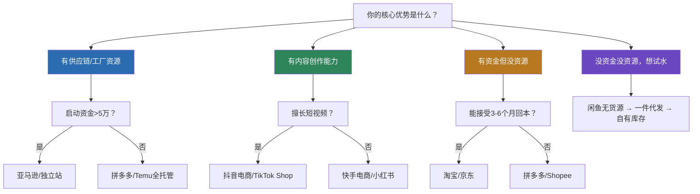
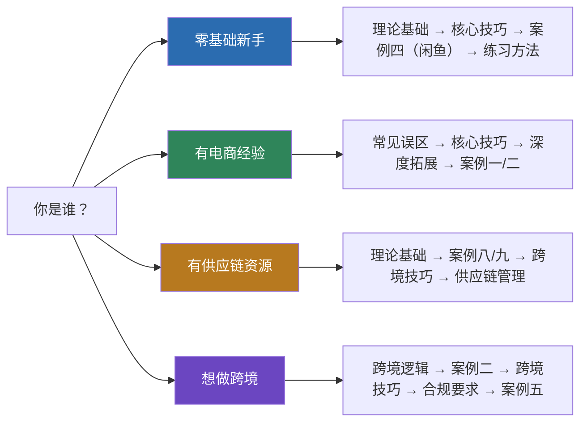

# 第11章 电商与跨境电商

## 章节定位

电商是过去二十年中最具颠覆性的商业模式之一。它从根本上改变了商品从生产者到消费者的流通路径，将传统的"人找货"模式升级为"货找人"的智能匹配。对于普通人而言，电商依然是门槛最低、机会最广泛的创业方式之一——不需要实体店面，不需要大量启动资金，一部手机、一台电脑就能触达全国甚至全球的消费者。

从行业数据来看，这个赛道依然充满机会：2024年中国跨境电商进出口额突破2.3万亿元，同比增长15.6%（海关总署数据）；全球电商渗透率从2019年的14%提升至2024年的22%，预计2028年将达到28%（eMarketer预测）。与此同时，竞争也在加剧——淘宝活跃卖家超过1000万，亚马逊全球活跃卖家超过200万（其中中国卖家占比约40%），拼多多商家数突破1500万。在这个"人人都能开店"的时代，真正能活下来并持续盈利的卖家，靠的不是运气，而是系统化的认知和方法论。

本章不是教你"一夜暴富"的电商秘籍，而是帮你建立完整的电商知识体系——从商业本质的理解到平台规则的掌握，从选品方法论的建立到运营技能的打磨，从风险控制的意识到长期品牌战略的规划。无论你是零基础的入门者，还是已经开店但效果不理想的运营者，都能在本章找到适合自己的知识节点。

## 快速自测：你处于哪个阶段？

在开始学习之前，花2分钟完成以下自测，找到最适合你的切入路径：

| 序号 | 问题 | 选项A（0分） | 选项B（1分） | 选项C（2分） | 选项D（3分） |
|------|------|-------------|-------------|-------------|-------------|
| 1 | 你是否有过电商开店经历？ | 从未开过店 | 开过但已关店 | 正在运营店铺 | 运营多个店铺 |
| 2 | 你对选品的理解是？ | 不知道怎么选 | 看别人卖什么跟什么 | 会用数据工具分析 | 有系统的选品方法论 |
| 3 | 你是否理解平台流量规则？ | 完全不懂 | 知道有搜索和推荐 | 理解权重和排名逻辑 | 能主动优化获取流量 |
| 4 | 你是否有供应链资源？ | 没有任何资源 | 有1688等线上货源 | 有工厂或档口关系 | 有自己的品牌/工厂 |
| 5 | 你对跨境电商的了解？ | 完全不了解 | 知道亚马逊/Shopee | 了解FBA和物流模式 | 有跨境运营经验 |

**评分解读：**

- **0-4分：零基础入门者** → 走路径一，从理论基础开始，建议先用闲鱼/淘宝练手
- **5-9分：有基础但需系统化** → 走路径二，先排查误区再补齐短板
- **10-13分：有资源想放大** → 走路径三，重点学供应链管理和跨境技巧
- **14-15分：进阶选手** → 直接跳到深度拓展篇，关注AI电商和品牌建设

## 本章知识全景

```mermaid
graph TD
    A["第11章 电商与跨境电商"] --> B["理论基础篇"]
    A --> C["核心技巧篇"]
    A --> D["实战案例篇"]
    A --> E["常见误区篇"]
    A --> F["练习方法篇"]
    A --> G["深度拓展篇"]

    B --> B1["电商商业本质"]
    B --> B2["流量分配机制"]
    B --> B3["消费者决策路径"]
    B --> B4["跨境电商逻辑"]
    B --> B5["供应链管理理论"]
    B --> B6["数据分析框架"]
    B --> B7["社交电商与私域"]
    B --> B8["行业未来趋势"]
    B --> B9["创业常见陷阱"]

    C --> C1["选品方法论"]
    C --> C2["Listing优化"]
    C --> C3["流量获取"]
    C --> C4["转化提升"]
    C --> C5["供应链管理"]
    C --> C6["跨境电商技巧"]
    C --> C7["实操检查清单"]
    C --> C8["运营高级技巧"]
    C --> C9["营销高级策略"]

    D --> D1["淘宝月销50万"]
    D --> D2["亚马逊月销10万美金"]
    D --> D3["抖音直播起号"]
    D --> D4["闲鱼无货源月入5000"]
    D --> D5["独立站品牌出海"]
    D --> D6["社群团购本地化"]
    D --> D7["代购到品牌转型"]
    D --> D8["农产品电商实践"]

    E --> E1["10大常见误区"]

    F --> F1["8周实战训练计划"]

    G --> G1["流量机制深度"]
    G --> G2["数据分析方法"]
    G --> G3["合规要求"]
    G --> G4["独立站品牌建设"]
    G --> G5["行业趋势"]

    style A fill:#2d3748,stroke:#4a5568,color:#fff
    style B fill:#2b6cb0,stroke:#2c5282,color:#fff
    style C fill:#2f855a,stroke:#276749,color:#fff
    style D fill:#b7791f,stroke:#975a16,color:#fff
    style E fill:#c53030,stroke:#9b2c2c,color:#fff
    style F fill:#6b46c1,stroke:#553c9a,color:#fff
    style G fill:#2c7a7b,stroke:#285e61,color:#fff
```

## 核心问题导航

本章围绕以下核心问题展开，每个问题都在不同章节中有深入解答。建议将此表作为学习过程中的"字典"使用——遇到具体问题时直接跳转：

| 核心问题 | 对应章节 | 关键答案 |
|----------|----------|----------|
| 国内电商和跨境电商有什么区别？哪个更适合我？ | 理论基础篇第4节 | 国内门槛低、物流快但竞争白热化；跨境利润大但复杂度高、资金需求大 |
| 如何选择有潜力的产品？ | 核心技巧篇第1节 | 数据选品法 + 趋势选品法 + 差异化选品法三维验证 |
| 电商运营的核心是什么？ | 理论基础篇第1节 | 销售额 = 流量 × 转化率 × 客单价，三者缺一不可 |
| 无货源模式是否可行？ | 实战案例篇第4节 | 适合入门验证，但长期利润有限，需逐步转向有货源 |
| 社交电商和私域流量如何变现？ | 理论基础篇第7节 | 公域引流 → 私域沉淀 → 信任建立 → 复购变现 |
| 跨境电商的合规要求有哪些？ | 深度拓展篇第3节 | 产品认证（CE/FDA）+ 知识产权 + 税务合规三大维度 |
| 电商创业有哪些常见陷阱？ | 常见误区篇 | 10大误区：跟风选品、忽视数据、过度依赖付费流量等 |
| 电商行业未来趋势是什么？ | 深度拓展篇第5节 | AI驱动、社交电商深化、全球化与本地化平衡、可持续电商 |

## 国内主流电商平台全景对比

在开始学习之前，你需要对主要电商平台有一个全局认知。以下对比表帮你快速了解各平台的特征和适用场景。选择平台时，不要只看"哪个最火"，而要看"哪个最适合你的资源和能力"。

### 国内电商平台

| 维度 | 淘宝/天猫 | 京东 | 拼多多 | 抖音电商 | 快手电商 | 闲鱼 |
|------|-----------|------|--------|----------|----------|------|
| **用户画像** | 全品类消费者 | 品质导向用户 | 价格敏感用户 | 兴趣驱动用户 | 下沉市场用户 | 捡漏/二手用户 |
| **核心逻辑** | 搜索+推荐 | 品质+物流 | 社交裂变 | 兴趣推荐 | 老铁经济 | 信息差+闲置 |
| **适合品类** | 品牌/标品/全品类 | 3C/家电/日百 | 白牌/日用/农产品 | 非标品/新奇特 | 农产品/白牌 | 二手/无货源 |
| **开店门槛** | 中（保证金1000起） | 高（企业资质） | 低（个人可开） | 中（需短视频能力） | 低 | 零门槛 |
| **流量成本** | 中高 | 中 | 低 | 中 | 低 | 免费 |
| **启动资金** | 5000-30000元 | 10000-50000元 | 1000-5000元 | 3000-20000元 | 1000-5000元 | 0-500元 |
| **核心能力** | 运营+选品 | 供应链+服务 | 选品+价格 | 内容+直播 | 人设+信任 | 选品+文案 |
| **盈利周期** | 3-6个月 | 6-12个月 | 1-3个月 | 1-3个月 | 1-3个月 | 即时 |

### 跨境电商平台

| 维度 | 亚马逊 | Shopee | Temu | 独立站(Shopify) | TikTok Shop | 速卖通 |
|------|--------|--------|------|-----------------|-------------|--------|
| **主要市场** | 北美/欧洲/日本 | 东南亚 | 全球 | 全球 | 东南亚/北美 | 全球 |
| **运营模式** | FBA/自发货 | 平台物流 | 全托管 | 自主运营 | 平台+直播 | 平台物流 |
| **适合卖家** | 品牌卖家 | 新手卖家 | 工厂/供应链 | 品牌建设者 | 内容创作者 | 中小卖家 |
| **启动资金** | 30000-100000元 | 5000-20000元 | 0（全托管） | 10000-50000元 | 5000-30000元 | 5000-20000元 |
| **利润率** | 15%-40% | 10%-30% | 5%-15% | 20%-50% | 10%-30% | 10%-25% |
| **核心挑战** | 竞争激烈/合规复杂 | 利润薄/客单价低 | 价格压力大 | 流量获取难 | 内容能力要求高 | 物流时效 |

### 平台选择决策框架

选平台不是"哪个火做哪个"，而是"哪个匹配你的资源"。以下决策树帮你快速定位：

**三条选平台的铁律：**

1. **先活下来再做大**。资金有限时，选启动资金最低的平台（闲鱼0元、拼多多1000元），先跑通"选品→上架→出单→发货"的最小闭环，再考虑扩展。
2. **匹配你的核心能力**。擅长写文案做淘宝，擅长拍视频做抖音，擅长压成本做拼多多，擅长讲故事做独立站。逆着能力选平台，事倍功半。
3. **不要同时开多个平台**。新手同时运营2个以上平台，精力分散导致哪个都做不好。先在一个平台做到月销稳定，再考虑多平台布局。

## 核心术语速查表

电商行业有大量专业术语，以下是本章高频出现的核心概念，建议在阅读前快速过一遍：

| 术语 | 英文 | 含义 | 出现场景 |
|------|------|------|----------|
| GMV | Gross Merchandise Value | 成交总额，含退款和未付款订单 | 衡量店铺/平台规模 |
| ROI | Return on Investment | 投入产出比，每花1元广告费带来多少销售额 | 广告投放效果评估 |
| 转化率 | Conversion Rate (CVR) | 访客中实际下单的比例 | Listing和店铺核心指标 |
| 客单价 | Average Order Value (AOV) | 每笔订单的平均金额 | 定价和关联销售策略 |
| UV | Unique Visitor | 独立访客数 | 流量分析 |
| PV | Page View | 页面浏览量 | 流量分析 |
| SKU | Stock Keeping Unit | 最小库存单位（如红色XL码T恤是一个SKU） | 库存和选品管理 |
| FBA | Fulfillment by Amazon | 亚马逊代发货服务 | 跨境物流方案 |
| DTC | Direct to Consumer | 品牌直接面向消费者销售 | 品牌战略 |
| CTR | Click-Through Rate | 点击率，展示后被点击的比例 | 广告和搜索优化 |
| ACoS | Advertising Cost of Sales | 广告花费占广告销售额的比例 | 亚马逊广告指标 |
| 一件代发 | Dropshipping | 不囤货，客户下单后由供应商直接发货 | 低风险起步模式 |
| 私域流量 | Private Traffic | 可反复触达的自有用户池（微信群/公众号/企微） | 用户运营和复购 |
| 蓝海/红海 | Blue/Red Ocean | 竞争小的市场/竞争激烈的市场 | 选品策略 |
| 坑位费 | Slot Fee | 直播间或活动页面的商品展示费用 | 直播和活动合作 |

## 内容结构详解

### 理论基础篇：建立电商认知框架

理论基础篇从商业本质讲起，帮你理解"电商到底是什么"以及"为什么有些店能成功，有些店会失败"。这是整个章节的知识地基——不理解底层逻辑，技巧层面的操作就是无根之木。

本篇包含9个小节，按照"认知→机制→策略→风险"的逻辑递进：

**认知层（理解电商是什么）：**

- **电商的商业本质**：用"人、货、场"模型解构电商运营。"人"是目标消费者及其需求画像，"货"是满足需求的产品及其差异化价值，"场"是交易发生的平台及其流量规则。三者的高效匹配决定了一切。本节会深入讲解如何用这个框架评估任何一个电商机会的可行性。
- **流量分配机制**：深入解析电商平台如何决定"谁的店被看到"。搜索流量依赖关键词匹配和权重算法（淘宝的"千人千面"、亚马逊的A9算法），推荐流量依赖用户画像和协同过滤算法，内容流量依赖内容质量和互动数据。理解这个机制，才能有的放矢地获取流量。
- **消费者购买决策路径**：从"产生需求"到"搜索比价"到"下单支付"到"使用评价"的完整链路。每个环节都有影响转化率的关键因素——搜索阶段靠标题和主图吸引点击，详情页阶段靠卖点和信任背书促成下单，收货阶段靠产品体验和售后引导好评。优化这些因素就是运营的核心工作。

**策略层（理解怎么做决策）：**

- **跨境电商的特殊逻辑**：国内外电商在物流、支付、语言、文化、法规等维度存在根本性差异。比如国内电商物流成本通常在3-5元/单，跨境物流可能是30-80元/单；国内退货率5%-15%，跨境退货成本高到很多卖家选择直接退款不退货。理解这些差异是避免踩坑的前提。
- **供应链管理理论**：电商的长期竞争力来自供应链。从供应商选择到库存管理，从质量控制到物流优化，供应链的每个环节都直接影响成本和用户体验。本节会讲解EOQ（经济订货量）模型、安全库存计算公式、供应商评分卡等实用工具。
- **数据分析框架**：电商的最大优势是"一切皆可量化"。本节建立科学的数据分析框架，涵盖流量指标（UV/PV/跳出率）、转化指标（转化率/加购率/收藏率）、财务指标（毛利率/净利率/ROI）三大维度，教你用数据驱动每一个运营决策。
- **社交电商与私域流量理论**：从"流量思维"到"用户思维"的转变。社交电商的本质是信任关系的货币化，私域流量的核心是用户生命周期价值（LTV）的最大化。本节讲解"公域引流→私域沉淀→信任建立→复购变现"的完整链路，以及微信生态（公众号+小程序+企业微信+视频号）的组合打法。

**风险层（理解什么不能做）：**

- **行业未来趋势**：AI驱动的智能选品和定价（ChatGPT辅助文案、AI图片生成、智能客服）、直播电商的专业化（从野蛮生长到MCN机构化）、可持续电商的兴起（环保包装、碳中和物流）——了解趋势才能把握先机，避免投入即将过时的模式。
- **创业常见陷阱**：9个致命的认知偏差和操作失误——跟风选品（别人赚钱不代表你也能）、急于求成（期望一个月回本）、忽视数据（凭感觉决策）、过度依赖付费流量（广告一停销量归零）、定价错误（不计算真实成本）、库存失控（断货和积压的两极）、忽视规则（违规被封店）、不做用户运营（一锤子买卖）、单打独斗（不学习不交流）。每个陷阱都配有真实案例和避坑方法。

### 核心技巧篇：掌握电商全链路实操技能

核心技巧篇是本章的"工具箱"，覆盖从选品到运营的每一个关键环节。每个技巧都有具体的操作步骤和实操模板，可以直接套用。本篇包含9个小节，按电商运营的时间线排列：

**产品阶段（决定卖什么）：**

- **选品方法论**：三种互补的选品策略——数据选品法（用搜索量、竞争度、利润率等量化指标筛选，工具包括生意参谋/Jungle Scout/Google Trends）、趋势选品法（捕捉新兴需求的增长窗口期，关注社交媒体热词、季节性趋势、政策红利）、差异化选品法（在红海品类中找到蓝海切入点，通过功能改进/包装升级/人群细分实现差异化）。三种方法不是三选一，而是三维交叉验证——数据好+趋势向上+有差异化空间的产品，成功率最高。附带完整的选品数据表模板和决策流程图。

**展示阶段（怎么让人看到并想买）：**

- **Listing优化技巧**：标题的关键词布局公式（核心词+属性词+场景词+长尾词，淘宝标题30字/亚马逊标题200字符）、主图的拍摄和设计规范（白底主图/场景图/细节图/对比图/尺寸图的5图公式）、详情页的说服逻辑（痛点引入→卖点展示→信任背书→行动号召）和排版技巧。一个优秀的Listing能让转化率提升30%-50%，这是投入产出比最高的优化动作。
- **流量获取技巧**：搜索优化（SEO）的核心策略——标题关键词优化、属性填写完整度、销量和评价积累；付费推广（直通车/千川/亚马逊PPC）的投放技巧——关键词出价策略、人群定向、创意优化、预算分配；内容营销（短视频/直播/图文）的创作方法——脚本模板、拍摄技巧、发布节奏。三种流量渠道的组合使用：初期靠付费推广打开局面，中期靠SEO积累自然流量，长期靠内容营销降低获客成本。

**转化阶段（怎么让人下单）：**

- **转化提升技巧**：价格策略（锚定定价：先展示高价再给折扣；阶梯定价：买得越多越便宜；促销节奏：日常价→活动价→清仓价的节奏把控）、评价管理（好评引导：好评返现/晒图有礼；差评处理：24小时内响应+补偿方案；评价优化：置顶优质评价）、客服优化（响应速度：首次回复<30秒；话术模板：售前FABE话术法——特征-优势-利益-证据；售后LSCPA话术法——倾听-认同-澄清-解决-确认）。

**运营阶段（怎么持续赚钱）：**

- **供应链管理技巧**：供应商筛选的7个维度（价格/质量/交期/最小起订量/账期/配合度/稳定性）、质量控制的流程（来料检验→过程检验→成品检验→出货检验）、库存管理的公式（安全库存=日均销量×补货周期×安全系数）和工具（ERP系统推荐）、物流方案的选择（快递/快运/专线的成本时效对比）。
- **跨境电商特殊技巧**：选品的差异化策略（考虑目标市场的文化差异、消费习惯、法规要求）、Listing的本地化优化（不只是翻译，而是用当地人的语言习惯重写）、物流方案的选择（FBA适合高客单价标品、海外仓适合中等销量、直邮适合测品期）、客服的时区和语言管理（利用AI客服工具覆盖多时区）。
- **实操检查清单**：开店前12项检查（资质/保证金/店铺装修/运费模板等）、上架前15项检查（标题/主图/详情页/价格/库存/SKU等）、推广前8项检查（预算/关键词/人群/创意等）、发货前6项检查（包装/物流单/赠品/质检等），确保每个环节不遗漏。

**进阶阶段（怎么做得更大）：**

- **运营高级技巧**：店铺权重提升（DSR评分维护、层级突破策略、新品期扶持利用）、活动报名策略（618/双11/年货节的报名节奏和备货公式）、多店铺运营（矩阵打法和风险隔离）、团队管理（客服/运营/仓储的岗位职责和KPI设计）。
- **营销高级策略**：品牌故事构建（从卖产品到卖理念的升级路径）、用户分层运营（RFM模型：最近消费-消费频率-消费金额三维度分层）、会员体系设计（积分/等级/权益的体系化设计）、跨平台联动（公域引流→私域沉淀→多平台分发的组合打法）。

### 实战案例篇：9个真实案例的深度拆解

理论和技巧最终要落地到实践。本篇通过9个真实案例，展示不同电商路径从0到1的完整过程。每个案例都包含背景介绍、策略制定、执行过程、关键转折点、数据结果和经验教训六大模块。建议在学完理论和技巧后阅读案例，带着"如果是我会怎么做"的思考去对比学习。

| 案例 | 路径 | 核心亮点 | 适合读者 | 关键数据 |
|------|------|----------|----------|----------|
| 案例一 | 淘宝新手到月销50万 | 系统化运营方法论的完整实践 | 国内电商入门者 | 6个月从0到月销50万 |
| 案例二 | 亚马逊从0到月销10万美金 | 跨境电商从选品到FBA的全流程 | 跨境电商入门者 | 首月投入8万，第4个月回本 |
| 案例三 | 抖音直播带货起号 | 内容电商的冷启动策略 | 短视频/直播从业者 | 30天粉丝从0到2万 |
| 案例四 | 闲鱼无货源月入5000 | 零成本电商验证方法 | 零基础/资金有限者 | 投入0元，第2周出单 |
| 案例五 | 独立站品牌出海 | DTC品牌的长期主义 | 有品牌意识的卖家 | 年销200万美金，复购率35% |
| 案例六 | 社群团购本地化运营 | 私域流量的变现实践 | 社群运营者 | 500人社群月GMV 15万 |
| 案例七 | 从代购到品牌的转型 | 从中间商到品牌商的蜕变 | 代购/分销从业者 | 2年完成品牌化转型 |
| 案例八 | 农产品电商乡村振兴 | 产地直发模式的可行性 | 农产品从业者 | 帮助30户农户增收 |
| 案例九 | 案例总结与启示 | 9个案例的共性规律提炼 | 所有读者 | 10条可复用的经验法则 |

### 常见误区篇：10个致命错误的深度剖析

电商创业中有10个最常见的误区，每个误区都配有"错误表现→为什么是误区→正确做法→真实案例"的完整分析框架。这些误区覆盖三个层面：

- **认知层面**：盲目跟风选品（看别人赚钱就跟着做，不分析自身条件和竞争格局）、急于求成（期望一个月回本，遇到困难就放弃）
- **操作层面**：忽视数据决策（凭感觉选品和定价）、过度依赖付费流量（广告一停销量归零，利润被广告费吞噬）、定价错误（只算产品成本不算平台佣金/物流/退货/广告等隐性成本）
- **管理层面**：库存失控（要么断货损失权重，要么积压占用资金）、忽视平台规则（一次违规可能封店，累积扣分影响权重）、不做用户运营（只做一锤子买卖，不建立复购体系）、单打独斗（不加入卖家社群，不学习行业知识）、跨境合规忽视（不了解目标市场法规，产品被扣关或下架）

建议在开始实操前通读一遍误区篇，在实操过程中遇到瓶颈时再回来对照排查。

### 练习方法篇：8周从零到开店的实战训练

一套完整的实操训练计划，从第1周的平台调研到第8周的运营复盘，每周都有明确的目标、操作步骤和产出物。

| 周次 | 主题 | 核心任务 | 产出物 |
|------|------|----------|--------|
| 第1周 | 行业认知 | 注册3个平台账号，浏览100个同类店铺 | 竞品分析表 |
| 第2周 | 选品实践 | 用数据工具筛选20个候选产品 | 选品数据表 |
| 第3周 | 供应商对接 | 联系10家供应商，索要样品 | 供应商评分表 |
| 第4周 | Listing制作 | 完成首个产品的标题/主图/详情页 | 完整Listing |
| 第5周 | 开店上架 | 完成店铺装修和产品上架 | 正式运营的店铺 |
| 第6周 | 流量获取 | 开启SEO优化+小额付费推广测试 | 流量数据报表 |
| 第7周 | 转化优化 | 根据数据优化价格/详情页/客服话术 | 优化方案文档 |
| 第8周 | 复盘迭代 | 全面数据分析和策略调整 | 90天运营计划 |

练习方法篇还包含选品数据表模板、复盘报告模板、90天电商实战计划等可直接使用的实用工具。

### 深度拓展篇：面向高级读者的进阶内容

为已有一定电商经验的读者准备的深度内容，不建议新手跳读：

- **流量分配机制的算法原理**：深入解析淘宝的"千人千面"推荐算法、亚马逊的A9/A10排名算法、抖音的兴趣推荐引擎。理解算法逻辑，才能"顺着"算法获取流量，而不是"对抗"算法。
- **选品的数据分析方法论**：超越基础的搜索量和竞争度分析，讲解市场容量测算、竞品利润逆推、供应链可行性评估、生命周期预判的综合选品模型。
- **跨境电商的合规要求**：产品认证（欧盟CE/美国FDA/日本PSE的具体办理流程和费用）、知识产权（商标注册/专利查询/版权保护的实操指南）、税务合规（VAT注册/关税计算/退税政策的详细说明）。
- **独立站的品牌建设策略**：从域名选择到品牌视觉设计，从品牌故事到用户社群，从内容营销到邮件营销，DTC品牌的完整建设路径。
- **AI驱动的电商变革趋势**：AI选品工具（用ChatGPT分析市场机会）、AI内容生产（批量生成产品描述和广告素材）、AI客服（多语言智能客服系统）、AI定价（动态定价算法）——这些工具正在改变电商的竞争格局。

## 学习路径建议

不同的读者起点不同，建议根据自身情况选择不同的学习路径。如果不确定自己属于哪类读者，回到本章开头的"快速自测"做评分。

### 路径一：零基础入门（推荐从闲鱼/淘宝开始）

**适合人群：** 没有任何电商经验，想通过电商增加收入的人。

**学习顺序：** 理论基础篇（重点第1-3节，理解人货场和流量机制）→ 核心技巧篇（重点选品方法论和Listing优化）→ 实战案例篇（重点案例四闲鱼无货源，零成本验证商业感觉）→ 练习方法篇（完成8周训练计划）→ 常见误区篇（避坑）→ 深度拓展篇（选读）

**预计时间：** 2-3周（每天2小时）

**关键提醒：** 不要跳过理论直接学技巧。很多新手觉得"理论太虚"直接学操作，结果是"知其然不知其所以然"，遇到问题不知道怎么调整。花3天建立认知框架，能节省后面几个月的试错成本。

### 路径二：有电商经验但效果不理想

**适合人群：** 已经开店运营但销量停滞、利润微薄、遇到瓶颈的卖家。

**学习顺序：** 常见误区篇（先排查自身问题，大概率能在这里找到症结）→ 核心技巧篇（系统补齐短板，重点看自己薄弱的环节）→ 实战案例篇（对比学习成功卖家的策略差异）→ 深度拓展篇（提升认知层级，突破增长瓶颈）

**预计时间：** 1-2周（每天2小时）

**关键提醒：** 效果不理想通常不是某一个环节的问题，而是多个环节的累积。误区篇帮你找到"最致命的那个问题"，先解决它，其他问题往往迎刃而解。

### 路径三：有供应链资源想开拓线上

**适合人群：** 工厂主、批发商、档口老板等有货源优势的传统商家。

**学习顺序：** 理论基础篇（重点流量机制和转化逻辑，补上"线上运营"的认知短板）→ 跨境电商部分（重点Temu全托管和亚马逊FBA，供应链优势在跨境平台变现效率最高）→ 供应链管理技巧（将线下供应链能力线上化）→ 实战案例篇（案例七代购转型、案例八农产品电商，看同行怎么转型的）

**预计时间：** 2周（每天2小时）

**关键提醒：** 有供应链优势不代表能做好电商。很多工厂型卖家的误区是"我有好产品就能卖"，忽略了线上的流量获取和视觉呈现能力。理论基础篇的流量和转化内容是你最需要补的课。

### 路径四：想做跨境电商

**适合人群：** 有外贸经验、英语能力较好、或想开拓海外市场的卖家。

**学习顺序：** 跨境电商特殊逻辑（理论基础篇第4节）→ 实战案例篇（案例二亚马逊、案例五独立站，了解跨境实战全貌）→ 跨境电商特殊技巧（核心技巧篇第6节）→ 深度拓展篇（合规要求，这是跨境的生死线）→ 核心技巧篇（补全选品和运营基础）

**预计时间：** 3-4周（每天2小时）

**关键提醒：** 跨境电商的合规要求不是"可选项"而是"必选项"。产品认证不达标会被海关扣货，知识产权侵权会导致店铺被封甚至被告，税务不合规会产生巨额罚款。在投入大量资金之前，先把合规要求搞清楚。

## 学习目标

完成本章学习后，你将具备以下能力：

### 认知层面（理解"为什么"）

1. **理解电商的商业本质**，能够用"人、货、场"框架分析任何电商机会——判断一个产品能不能卖、一个平台值不值得做、一个策略是否可行
2. **掌握主流电商平台的运作逻辑**，理解搜索排名、推荐算法、内容分发的底层机制，知道"流量从哪里来、为什么来你这里"
3. **理解消费者的完整购买决策路径**，从需求产生到搜索比价到下单支付到使用评价，知道每个环节的转化瓶颈在哪里
4. **识别国内电商和跨境电商的核心差异**，能根据自身资金、能力、资源条件做出合理的平台和模式选择

### 技能层面（掌握"怎么做"）

5. **运用三种选品方法筛选潜力产品**：数据选品法（量化筛选）、趋势选品法（捕捉增长期）、差异化选品法（红海找蓝海），并用三维交叉验证提升选品成功率
6. **制作高转化率的Listing**：掌握标题关键词布局公式、主图5图法则、详情页说服逻辑，实现转化率提升30%以上
7. **搭建多渠道流量体系**：组合使用搜索优化（长期稳定流量）+ 付费推广（快速起量）+ 内容营销（降低获客成本），并掌握各渠道的预算分配原则
8. **建立完整的供应链管理能力**：从供应商筛选（7维度评分卡）到库存管理（安全库存公式）到物流优化（方案对比矩阵）

### 实战层面（能够"动手做"）

9. **独立完成从选品到开店到获取首批订单的完整流程**，掌握每个环节的操作步骤和检查清单
10. **识别和控制电商创业的五大核心风险**：库存风险（安全库存管理）、资金风险（现金流规划）、平台风险（合规经营）、竞争风险（差异化策略）、供应链风险（备选供应商）
11. **制定合理的运营计划和数据复盘体系**：建立日报/周报/月报的数据跟踪习惯，用数据驱动每一次运营决策
12. **根据自身条件选择最优的电商路径**：利用本章的决策框架和自测工具，制定个性化的执行计划

## 关键数据速览

在开始学习之前，先了解这些关键数据，建立对电商行业的基本认知。数据主要来源于国家统计局、海关总署、eMarketer及各平台公开报告：

| 指标 | 数据 | 来源/说明 |
|------|------|-----------|
| 中国电商市场规模 | 超过15万亿元（2024年） | 社会消费品零售总额中电商占比约30%（国家统计局） |
| 中国跨境电商规模 | 2.3万亿元（2024年） | 同比增长15.6%，其中出口1.83万亿（海关总署） |
| 全球电商渗透率 | 22%（2024年） | 预计2028年达28%，年均增长约1.5个百分点（eMarketer） |
| 淘宝活跃卖家数 | 超过1000万 | 天猫商家约30万，其余为淘宝C店（阿里财报） |
| 亚马逊全球卖家数 | 超过200万 | 中国卖家占比约40%，美国卖家约50%（Marketplace Pulse） |
| 电商创业平均回本周期 | 3-6个月 | 轻资产模式1-3个月，重资产模式6-12个月（行业调研） |
| 新店前3个月淘汰率 | 约70% | 主要死因：选品失误、资金不足、不懂运营（淘宝大学数据） |
| 电商卖家平均毛利率 | 25%-40% | 低于20%难以持续经营，需覆盖广告/退货/平台费用（行业均值） |
| 直播电商市场规模 | 超过5万亿元（2024年） | 占电商总GMV约33%，同比增长25%（艾瑞咨询） |
| 社交电商用户规模 | 超过9亿（2024年） | 包含拼团/分销/社群/直播等社交驱动的电商形态（CNNIC） |

## 重要提醒

电商创业不是零风险的。在开始之前，你需要清醒认识以下现实：

### 资金风险

库存积压、广告投入、平台保证金都是实实在在的资金占用。新手建议准备3-6个月的运营资金，初期投入控制在"即使全部亏损也不影响生活"的范围内。具体来说：闲鱼0元起步、拼多多1000-3000元、淘宝5000-10000元、亚马逊30000-50000元。不要借钱做电商，不要把全部积蓄一次性投入。

### 库存风险

"怕断货就多备货"是新手最常犯的错误之一。库存积压不仅占用资金，还可能因产品过季、款式过时而变成死库存。建议从无货源或小批量测试开始（首批进货控制在30天预估销量内），用数据验证（日均销量稳定在5单以上）后再逐步扩大库存。

### 平台风险

平台规则随时可能变化，一次违规可能导致店铺被封。合规经营是底线，多平台布局是保险。特别注意：刷单（虚假交易）是所有平台严厉打击的行为，一旦被查，轻则降权，重则封店。不要心存侥幸。

### 时间风险

电商运营需要持续投入时间和精力，不是"上架就有人买"。做好3-6个月不盈利的心理准备，每天至少投入2-4小时（选品、优化、客服、学习）。如果你只能投入碎片时间，建议从闲鱼无货源开始，而不是直接做淘宝或跨境。

### 跨境特殊风险

汇率波动（人民币升值压缩利润）、物流成本上涨（海运价格波动大）、各国法规变化（如欧盟GPSR法规2024年生效）、知识产权纠纷（外观专利侵权索赔）——跨境电商的复杂度远高于国内电商。跨境卖家需要预留15%-20%的利润空间来应对不确定性。

### 安全起步建议

从轻资产模式（闲鱼无货源、一件代发）开始验证，跑通最小可行模型（从选品到出单到利润为正的完整闭环）后再逐步加大投入。永远不要把所有资金押在一个平台或一个产品上。分散风险是电商长期生存的基本原则。

## 阅读建议

**如果你没有电商经验：** 建议从国内平台（淘宝或闲鱼）开始实践。先读理论基础篇建立认知框架，然后跟着练习方法篇的8周训练计划实操。不要急于做跨境电商，先把国内电商的基本功练扎实。跨境的物流、支付、语言、法规复杂度是国内的3-5倍，没有国内经验直接做跨境，踩坑概率极高。

**如果你有外贸经验：** 可以直接关注跨境电商部分。跨境逻辑、跨境技巧和合规要求是你需要重点关注的内容。亚马逊和独立站是两个主要方向：亚马逊适合"快速起量"，独立站适合"长期品牌"。根据你的资金和品牌规划选择。

**如果你是内容创作者：** 抖音电商和直播带货是你的天然优势领域。重点关注案例三（抖音直播起号）和核心技巧篇中的内容营销部分。内容创作者做电商的核心优势是"流量成本低"——别人花钱买流量，你用内容创造流量。

**时间规划：** 完整学习本章理论内容预计需要1-2周（每天2小时）。但电商运营是一项需要持续优化的技能，理论学习只是起点，真正的成长来自实践中的反复迭代。建议每学完一个模块就动手实操验证，带着问题再回来查阅对应章节。

**学习方法：** 不要只看不练。每个技巧点学完后，立刻在实操中验证。遇到问题再回来翻阅对应的理论章节。理论→实践→遇到问题→回到理论→优化实践——这个循环往复的过程，才是最有效的学习方式。电商不是"学完再做"的领域，而是"边做边学"的领域。
