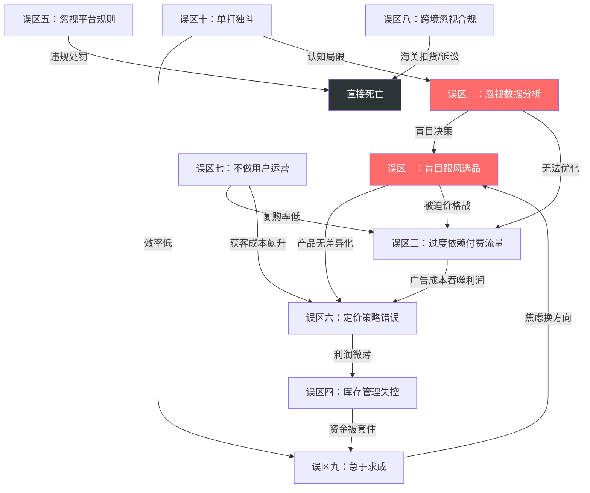
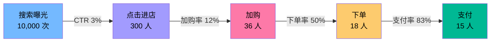
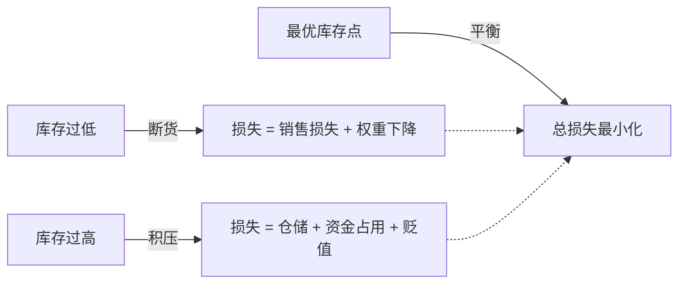

# 第11章 电商与跨境电商——常见误区

电商创业看似门槛低，但淘汰率极高。据中国电子商务研究中心数据，淘宝新店一年内关店率超过 85%，亚马逊新卖家首年存活率不足 30%。绝大多数失败并非因为竞争太激烈，而是因为踩中了完全可以避免的认知陷阱和操作盲区。

本章梳理电商创业中最常见的十大误区，从底层逻辑到实操细节逐一拆解，帮助你建立正确的电商认知框架，避开那些"看起来对、做起来亏"的坑。

## 快速自诊：你踩中了几个误区？

在逐条阅读之前，先用下面的自诊清单快速评估自己的状态。每项 0-2 分（0=没踩、1=偶尔踩、2=经常踩），总分越高风险越大。

```text
□ 选品时主要参考"别人卖得好"的数据，缺少自己的分析逻辑        ___分
□ 不清楚自己店铺的 UV、转化率、客单价、广告 ROI 等核心数据      ___分
□ 付费流量占店铺总流量 60% 以上                                 ___分
□ 库存积压超过 3 个月，或经常断货                               ___分
□ 从未系统学习过平台规则，也没做过合规自查                       ___分
□ 定价只看"进货成本+一点利润"，没算过全链路成本                  ___分
□ 没有做过任何用户分层、私域运营或复购引导                       ___分
□ 做跨境电商但不清楚目标市场的认证、税务和知识产权要求            ___分
□ 开店不到 6 个月，已经想过换品类或换平台                        ___分
□ 所有运营工作都自己一个人做，没有外包也没有交流圈                ___分

总分：____ / 20
```

**评分解读与行动路径**：

| 分数段 | 风险等级 | 立即行动 | 本周完成 | 本月目标 |
|--------|----------|----------|----------|----------|
| **0-4 分** | 🟢 安全 | 继续保持当前节奏 | 建立周度数据复盘机制 | 优化 1-2 个效率瓶颈 |
| **5-9 分** | 🟡 警告 | 列出踩中的具体误区 | 针对最高频的 1 个误区制定修复方案 | 完成 2-3 个短板修复 |
| **10-14 分** | 🟠 高危 | 暂停所有扩张动作 | 阅读本文对应误区的"正确做法" | 系统补课+建立基础数据体系 |
| **15-20 分** | 🔴 危急 | 立即止损（停止进货/停止投放） | 计算当前真实亏损额 | 考虑是否需要转型或退出 |

**特别说明**：如果你在第 1、3、5 项（选品、付费流量、平台规则）得分 ≥ 2，即使总分不高也需要优先处理——这三个误区的破坏力最强，且修复成本随时间推移急剧上升。

## 误区之间的关联：为什么踩一个坑往往连带踩一片

十大误区并非孤立存在，它们之间有强烈的因果链和放大效应：



**核心洞察**：盲目跟风（误区一）和忽视数据（误区二）是两个"根源性误区"——它们会触发一连串下游问题。修复这两个，其他误区的踩坑概率会大幅下降。

***

## 误区一：盲目跟风选品

### 错误表现

"别人卖什么火我就卖什么"——这是新手最普遍也最致命的选品逻辑。

具体表现为：刷抖音看到某款"解压玩具"爆单，立刻 1688 找同款上架；看到同行某款连衣裙月销 10 万+，马上跟进拍摄同款主图；听说"宠物用品赛道增长快"，不做任何调研就大批量进货。这类操作的本质是**用别人已经验证的结果来替代自己的市场判断**，忽略了从"看到数据"到"上架竞争"之间存在的时间差和资源差。

### 真实案例：筋膜枪赛道的集体踩坑

2023 年初，筋膜枪在各大平台搜索量暴涨 300%，抖音相关话题播放量超过 50 亿次。大量卖家看到数据后蜂拥而入：

- **1 月**：头部卖家利润率 40-50%，均价 299-499 元，1688 供应商不到 50 家
- **4 月**：新入场卖家超过 2000 家，均价降至 199 元，开始出现价格战
- **7 月**：同质化产品超过 5000 个 SKU，均价暴跌到 99 元，供应商超过 300 家
- **12 月**：均价 69 元，大量卖家亏损出局，退货率飙升至 25%+

一个在 3 月跟风入场的卖家，首批进货 500 台（单价 80 元），投入 4 万元。到 6 月以 99 元清货时，扣除广告费、快递费、退货损耗，净亏损 2.8 万元。而那些在 2022 年 9 月就通过 Google Trends 发现趋势、提前布局的卖家，早已赚到第一桶金并转向下一个品类。

### 底层逻辑：为什么跟风注定失败

**信息滞后效应**：你在抖音/生意参谋上看到的"爆款数据"，已经是市场成熟期甚至衰退期的信号。一个产品从起量到被数据工具捕捉到，通常滞后 2-4 周；从你决定跟进到完成选品、采购、上架、优化，又需要 2-4 周。等你入场时，早期卖家已经积累了大量销量权重、评价和买家信任，你面对的是一个**信息不对称且时间窗口已关闭**的市场。

**供给过剩陷阱**：当一个品类被公开数据标记为"高增长"时，必然会有成百上千的卖家同时涌入。2023 年的"筋膜枪"就是典型案例——年初利润率 40%+，到年底同质化产品超过 5000 个 SKU，均价从 299 元暴跌到 69 元，大量跟风卖家亏损出局。

**缺乏差异化壁垒**：跟风选品的最大问题是你的产品和竞品几乎完全相同——同样的工厂、同样的模具、同样的包装。在没有差异化的前提下，唯一能竞争的维度就是价格，而价格战是所有竞争策略中最残酷、利润最薄的一种。

### 正确的选品方法论

**趋势预判而非趋势跟随**：关注 Google Trends、社交媒体话题热度、行业展会新品等**先行指标**，而非销量排行榜这类**滞后指标**。具体方法：

| 工具/渠道 | 用途 | 判断逻辑 | 实操频率 |
|-----------|------|----------|----------|
| Google Trends | 搜索趋势预判 | 搜索量稳定上升但尚未爆发 = 机会窗口 | 每周扫描一次 |
| 社交平台话题 | 消费趋势捕捉 | 话题讨论量激增但商品供给少 = 蓝海信号 | 每日浏览 |
| 1688 新品专区 | 供应链新品 | 工厂刚推出的新品 = 市场尚未铺开 | 每周浏览 |
| 行业展会 | 产品创新洞察 | 展会上受关注但线上供给少 = 差异化机会 | 每季度参加 |
| 竞品评论区 | 需求缺口挖掘 | 高频出现"要是能XX就好了" = 改进方向 | 选品必做 |
| 亚马逊 Movers & Shakers | 快速上升品类 | 排名快速上升但评价数少 = 新品机会 | 每周监控 |

**需求缺口法**：不是看"什么卖得好"，而是看"什么需求没被满足"。具体操作流程：

1. 打开目标品类 Top 20 链接，逐条阅读 3 星和 4 星差评
2. 用表格归纳差评高频关键词（如"太硬""味道大""尺码偏小"）
3. 找到出现频率最高且可以通过产品改进解决的痛点
4. 联系工厂打样改进，用改进点作为核心卖点

**进阶技巧——差评挖掘的量化方法**：

```text
步骤一：收集 Top 20 竞品的 1-3 星评论（每条采集 200 条以上）
步骤二：用 AI 工具（ChatGPT/Claude）批量提取评论中的问题关键词
步骤三：按出现频率排序，制作"痛点词云"
步骤四：筛选标准——出现频率 > 15% 且可通过产品改进解决
步骤五：联系 3 家以上工厂对比改进方案和报价
```

**小批量验证法**：任何选品决策都必须经过市场验证，而非"我觉得会好卖"。标准流程是：先用 50-100 件小批量测款，观察 7 天的点击率、加购率和转化率。核心指标参考：

- 点击率 > 3%（主图有吸引力）
- 加购率 > 8%（产品有需求）
- 转化率 > 行业均值（价格和详情页过关）

三项全部达标再加大投入，任何一项不达标就及时止损。

**测款失败时的止损决策框架**：

| 指标表现 | 问题诊断 | 优化方向 |
|----------|----------|----------|
| 点击率低 + 加购率低 | 产品本身需求不足 | 放弃该产品 |
| 点击率低 + 加购率高 | 主图不够吸引人 | 优化主图后再测 |
| 点击率高 + 加购率低 | 详情页/价格有问题 | 优化详情页或调价 |
| 点击率高 + 加购率高 + 转化低 | 价格或信任度不足 | 调价或增加评价 |

***

## 误区二：忽视数据分析

### 错误表现

"凭感觉选品、凭感觉定价、凭感觉投放"——这是经验主义电商的典型画像。

很多卖家的日常运营是这样的：早上打开后台看一眼昨天卖了几单，然后凭直觉决定今天要推什么产品、出价多少钱、做不做促销。不看流量来源结构，不看转化漏斗，不分析竞品动态，不计算单品利润。当被问到"你的店铺UV多少、转化率多少、客单价多少、广告ROI多少"时，一问三不知。

### 数据驱动 vs 经验驱动的差距

电商相比传统零售的**核心优势**就是数据可追踪。线下开店，你不知道顾客为什么看了没买、在哪一步流失了、和竞品比差在哪里。而线上每一个用户行为都有数据埋点：从搜索曝光到点击、到详情页浏览、到加购、到下单、到支付，每一步都有精确的转化率。

不利用这些数据，你等于**主动放弃了电商最大的结构性优势**，用农耕时代的方式在信息时代打仗。

数据驱动决策的效果差异可以用一个简单对比说明：

| 决策场景 | 经验驱动 | 数据驱动 | 效果差距 |
|----------|----------|----------|----------|
| 选品 | "我觉得这个能卖" | 搜索量/竞争度/利润率三维评分模型 | 选品成功率提升 3-5 倍 |
| 定价 | "比竞品便宜一点" | 成本结构 + 竞品价格带分布 + 目标利润率 | 利润率提升 10-20% |
| 广告投放 | "每天投 500 试试" | 基于 ROI 目标反推可承受 CPC，动态调价 | ROI 提升 50-200% |
| 标题优化 | "把关键词堆上去" | 搜索词报告 + 点击率数据 + 转化率数据 | 自然流量提升 30-80% |
| 促销决策 | "双十一全场打折" | 基于价格弹性模型的精准促销策略 | 促销 ROI 提升 2-3 倍 |

### 真实案例：一个数据化运营的转变

某淘宝女装店，2023 年前 6 个月月均销售额 8 万元，广告费 3 万元，净利润仅 5000 元。店主凭经验选品，主图用供应商提供的白底图，标题靠抄竞品。

转折点是参加了淘宝大学的数据运营课程后，做了三件事：

1. **标题数据化优化**：用生意参谋"搜索词报告"分析，发现"法式连衣裙"搜索量是"碎花连衣裙"的 1.8 倍，但竞争度只有后者的 60%。更换关键词后，自然搜索流量提升 45%。
2. **主图 A/B 测试**：对主图做了 3 个版本测试（白底图 vs 场景图 vs 模特图），发现场景图点击率比白底图高 62%。全面更换后，整体点击率从 2.1% 提升到 3.8%。
3. **广告精准化投放**：分析广告数据发现"连衣裙"大词 CPC 高达 4.5 元但转化率仅 1.2%，而"法式碎花连衣裙 夏季"长尾词 CPC 仅 1.8 元但转化率 3.5%。调整投放策略后，广告 ROI 从 1:2.5 提升到 1:5.8。

结果：6 个月后月均销售额提升到 18 万元，广告费降至 2.5 万元，净利润提升到 3.2 万元——**销售额翻倍、广告费减少、利润增长 5 倍**。

### 必须掌握的核心数据指标

电商运营中真正重要的数据指标可以分为四层：

**流量层**：UV（独立访客数）、PV（页面浏览量）、流量来源结构（搜索/推荐/付费/直接访问各自占比）、跳失率。

**转化层**：点击率（CTR）、详情页转化率、加购率、下单转化率、支付转化率。关键是关注**漏斗每一步的流失率**，找到流失最严重的环节重点优化。



**关键洞察**：上图中，从加购到下单的流失率高达 50%——这意味着有一半加购用户没有下单。可能原因：价格犹豫、运费问题、缺少评价信任。针对这个环节做优化（如加购后 24 小时推送限时优惠），就能显著提升整体转化。

**财务层**：客单价、毛利率、净利率、广告 ROI（投入产出比）、ACOS（广告花费占广告销售额比例）、单品利润。

**用户层**：复购率、客户生命周期价值（LTV）、获客成本（CAC）、LTV/CAC 比值（健康值 > 3）。

### 实操：建立数据日报体系

每天花 15 分钟填写以下数据日报，坚持一个月你就能建立数据敏感度：

```text
日期：____
店铺UV：____  转化率：____%  客单价：____元
今日销售额：____元  广告花费：____元  广告ROI：____
核心单品数据：
  - SKU-A: UV____ 转化____% 毛利____元
  - SKU-B: UV____ 转化____% 毛利____元
异常标记：____________________
明日优化重点：____________________
```

**进阶：周度分析模板**

每周日花 30 分钟做一次周度复盘：

```text
本周销售总额：____元  环比上周：____%
本周 UV：____  环比：____%
本周转化率：____%  环比：____%
本周广告总花费：____元  整体 ROI：____

本周 TOP3 流量关键词：
  1. ____________  UV:____  转化:____%
  2. ____________  UV:____  转化:____%
  3. ____________  UV:____  转化:____%

本周 TOP3 问题：
  1. ____________________
  2. ____________________
  3. ____________________

下周重点优化动作：
  1. ____________________
  2. ____________________
  3. ____________________
```

工具推荐：生意参谋（淘宝/天猫）、商智（京东）、Seller Central Business Reports（亚马逊）、Helium 10 / Jungle Scout（亚马逊第三方工具）。

***

## 误区三：过度依赖付费流量

### 错误表现

"花钱投广告就能卖货"——很多卖家把全部流量来源押注在付费推广上。

典型画像：店铺 90% 以上的流量来自直通车/千川/SP 广告，自然搜索流量占比不到 10%。广告一停，订单量断崖式下跌。每月销售额看起来不错，但扣除广告费后利润微薄甚至亏损。更危险的是，随着平台广告竞价越来越激烈，CPC（单次点击成本）逐年上涨——2020 年淘宝直通车平均 CPC 约 1.2 元，到 2024 年已经涨到 2.5-3.5 元，部分红海品类甚至超过 5 元。

### 付费流量的本质：租金 vs 资产

付费流量的本质是"租用"平台的流量入口。你付租金（广告费），平台给你展示位；你停止付费，流量立刻消失。这和租房一个道理——你永远不会因为租房住得久而获得房子的所有权。

而自然搜索流量、内容流量、私域流量则是"资产"。一个优化到位的标题可以持续带来免费搜索流量数月甚至数年；一条高质量的种草笔记可以在小红书上持续引流；一个运营良好的私域社群可以反复触达、零成本复购。

**三种流量的本质对比**：

| 流量类型 | 本质 | 获取成本 | 持续性 | 可控性 | 规模上限 |
|----------|------|----------|--------|--------|----------|
| 付费流量 | 租金 | 高且持续上涨 | 停投即停 | 高 | 取决于预算 |
| 自然搜索流量 | 资产 | 前期投入SEO，后期免费 | 长期稳定 | 中 | 取决于品类搜索量 |
| 内容/私域流量 | 资产 | 内容制作成本 | 长期复利 | 中低 | 取决于粉丝规模 |

### 流量结构健康度自检

健康的电商流量结构应该满足以下比例：

```text
理想流量结构：
├── 自然搜索流量：30-40%（核心资产，免费且精准）
├── 付费推广流量：25-35%（可控增长引擎）
├── 内容/推荐流量：15-25%（增长潜力最大的渠道）
├── 私域/老客流量：10-20%（高复购、零获客成本）
└── 其他（直接访问等）：5-10%
```

如果你的付费流量占比超过 60%，说明你的流量结构严重失衡，存在系统性风险。

### 全渠道流量构建策略

**自然搜索优化（SEO）**：标题关键词布局是核心。操作要点：
1. 用生意参谋/Helium 10 挖掘目标关键词的搜索量和竞争度
2. 选择搜索量中等（日搜索 1000-10000）但竞争度较低的长尾词
3. 标题前 15 个字放置最高权重关键词（平台算法对标题前半段权重更高）
4. 每 2 周根据搜索词报告调整标题关键词

**内容营销矩阵**：

| 平台 | 适用品类 | 内容形式 | 引流效率 | 制作成本 |
|------|----------|----------|----------|----------|
| 小红书 | 美妆、服饰、家居 | 种草笔记、测评 | ★★★★★ | 低 |
| 抖音 | 需要演示场景的产品 | 短视频、直播 | ★★★★★ | 中 |
| 知乎 | 高客单价、信任型产品 | 专业回答、长文 | ★★★ | 低 |
| B站 | 数码、潮玩、年轻人品类 | 开箱、测评视频 | ★★★★ | 中高 |
| 微信公众号 | 复购型产品 | 深度内容、教程 | ★★★ | 中 |

**私域流量运营**：通过包裹卡、售后卡片、短信等方式将公域用户导入企业微信或微信群，建立可反复触达的私域池。具体做法：在包裹中放置"扫码加微信领 5 元优惠券"卡片，加好友后自动发送欢迎语和优惠券，后续通过朋友圈和社群持续运营。

**私域运营的投入产出计算**：

```text
假设：
- 月发货 1000 单，包裹卡加粉率 5% = 每月新增 50 个私域用户
- 私域用户月均复购率 15%，客单价 80 元
- 6 个月后私域池 300 人，月均带来 300 × 15% × 80 = 3,600 元额外销售额
- 12 个月后私域池 600 人，月均带来 600 × 15% × 80 = 7,200 元额外销售额
- 且这部分流量获客成本为 0（仅包裹卡成本约 0.3 元/张）
```

***

## 误区四：库存管理失控

### 错误表现

"怕断货就多备点"——过度备货导致资金链紧张甚至断裂。

很多新手卖家的心理是：好不容易找到一个能卖的产品，万一断货了多可惜。于是第一次进货就备了 3 个月的量，结果卖了 2 个月发现销量不及预期，仓库里堆着价值几万元的滞销库存，资金全部被套住，既没钱进货新品，也没钱投广告，陷入"有货卖不动、没钱进新货"的死循环。

### 库存管理的数学逻辑

库存管理的核心矛盾是**断货成本 vs 积压成本**的平衡：

**断货成本**：断货一天的损失 = 日均销售额 × 毛利率 + 搜索权重下降导致的后续流量损失。淘宝/亚马逊的搜索算法都有"近期销量"权重，断货会导致排名下降，恢复需要额外投入。

**积压成本**：积压库存的月度成本 = 库存货值 × (仓储费率 + 资金占用成本 + 贬值率)。一般而言，积压库存每月的综合成本约占货值的 3-5%。如果积压超过 6 个月，总损失可能达到货值的 20-30%。

**最优库存量的计算模型**：



### 库存管理实操框架

**安全库存公式**：

```text
安全库存 = 日均销量 × 补货周期天数 × 安全系数

其中：
- 日均销量 = 过去 30 天平均日销量
- 补货周期天数 = 供应商生产天数 + 物流天数 + 入库天数
- 安全系数 = 1.2（稳定品类）到 1.5（波动品类/旺季前）
```

**举例**：某产品日均销量 30 件，补货周期 15 天，安全系数 1.3，则安全库存 = 30 × 15 × 1.3 = 585 件。当库存降到 585 件时触发补货。

**ABC 分类管理法**：

| 类别 | SKU 占比 | 销售额占比 | 管理策略 | 补货频率 | 监控频率 |
|------|---------|-----------|----------|----------|----------|
| A 类 | 20% | 70% | 重点监控，高频补货，不允许断货 | 每周 | 每日 |
| B 类 | 30% | 20% | 常规管理，按周期补货 | 每 2 周 | 每周 |
| C 类 | 50% | 10% | 低频补货，允许少量断货，定期清理 | 每月 | 每 2 周 |

**滞销库存处理策略**（按优先级排序）：
1. **促销清仓**：设置限时折扣、满减活动，快速消化
2. **捆绑销售**：将滞销品与畅销品捆绑，作为赠品或加价购
3. **渠道转移**：将线上滞销品转到线下特卖、拼多多等清货渠道
4. **供应商协商**：与供应商谈判退货或换货（需提前在合同中约定）
5. **最后手段**：如果以上都无效，果断止损处理，不要让滞销库存继续占用资金和仓储空间

**库存管理的季节性策略**：

```text
旺季前（大促前 30-45 天）：
├── 安全系数提高到 1.5-2.0
├── A 类商品备货量增加 50-100%
├── 提前与供应商确认产能和交期
└── 预留 10-15% 的紧急补货预算

旺季中：
├── 每日监控库存水位
├── 设置库存预警线（安全库存的 1.2 倍）
└── 畅销品紧急追单，滞销品及时降价

旺季后（大促后 7-15 天）：
├── 评估剩余库存，制定清仓计划
├── C 类滞销品立即启动促销
└── 复盘备货准确性，调整下次安全系数
```

***

## 误区五：忽视平台规则

### 错误表现

"平台规则太多太杂，出了事再说"——被动应对规则而非主动合规。

很多卖家的心态是：先把店开起来、先把货卖出去，规则的事以后再说。于是出现了各种违规操作：刷单刷好评、使用极限词宣传（"最好""第一""全网最低"）、盗用他人图片、销售无授权的品牌商品、食品类目缺少 SC 认证。直到某天收到平台的违规通知——降权、扣分、屏蔽、甚至封店——才追悔莫及。

### 平台违规的代价有多严重

平台处罚不是"警告一下就完了"，而是有完整的阶梯式处罚体系：

**淘宝/天猫处罚阶梯**：
1. 一般违规：扣 2 分，商品下架
2. 严重违规：扣 12 分，店铺屏蔽 7 天 + 限制发布商品 7 天
3. 特别严重违规：扣 48 分，查封店铺

**亚马逊处罚机制**：
1. 警告信（Warning）：要求限期整改
2. Listing 下架（ASIN Suppressed）：单个商品被移除
3. 账户冻结（Account Suspended）：暂停销售权限，需申诉
4. 账户永久关闭（Account Permanently Deactivated）：不可逆

关键数据：亚马逊新卖家首年因违规导致账户受限或关闭的比例约为 15-20%，其中知识产权侵权（商标/专利/版权）占比最高，达到 40% 以上。

### 高频违规红线清单

以下是最容易踩中的违规点，必须牢记：

**知识产权类**（风险最高）：
- 使用他人商标名或 Logo（即使在标题中提及也算侵权）
- 盗用他人产品图片或文案
- 销售外观专利侵权产品
- 使用未授权的品牌关键词做广告

**宣传违规类**：
- 使用绝对化用语（"最好""第一""100%有效"）
- 虚假宣传（功效夸大、参数造假）
- 刷单炒信（包括找人"真实购买"后退款）

**资质合规类**：
- 食品类缺少食品经营许可证/SC 认证
- 化妆品缺少备案凭证
- 3C 产品缺少 3C 认证
- 医疗器械类缺少相关资质

**真实案例：一次极限词罚款的代价**

某淘宝卖家在详情页中使用了"全网销量第一"的宣传语，被职业打假人举报。市场监管部门依据《广告法》第 57 条处以 20 万元罚款——而该店铺月均利润仅 1.5 万元。一次违规，相当于 13 个月白干。

更隐蔽的风险是"极限词变体"：很多卖家以为不用"最好"用"超好"就没问题，实际上"国家级""最高级""最佳"及其谐音、变体都在监管范围内。

### 合规经营自查流程

每月进行一次合规自查：

```text
□ 检查所有在售商品的商标/专利是否合法使用
□ 检查商品详情页是否有极限词/违禁词
□ 检查所有图片是否为原创或有授权
□ 检查特殊品类的资质证书是否在有效期内
□ 检查平台最新规则更新公告
□ 检查店铺评分和违规记录
□ 备份所有经营数据和资质文件
```

工具推荐：广告法极限词在线检测工具（如"句易网"）、商标查询（中国商标网 / USPTO）、专利查询（国家知识产权局）。

**跨境电商额外合规要点**（详见误区八）：
- 目标市场产品认证（CE/FCC/FDA 等）
- VAT/销售税注册和申报
- HS 编码准确申报
- GDPR/CCPA 数据隐私合规

***

## 误区六：定价策略错误

### 错误表现

"越便宜越好卖"——把低价当作唯一的竞争策略。

新手卖家常见的定价方式有两种：一是"成本+一点利润"，比如进货价 30 元，卖 39.9 元，觉得有 10 元利润就够了；二是"比竞品便宜"，看到竞品卖 49.9 元，自己就定 45 元。两种方式的共同问题是**没有系统计算全链路成本**。

### 电商真实成本结构

很多新手只算了"进货成本"，忽略了电商运营的完整成本链：

```text
电商单品真实成本 = 采购成本
                 + 头程物流（从供应商到仓库）
                 + 平台佣金（通常 2-8%）
                 + 支付手续费（约 0.6-1%）
                 + 广告费用（通常占销售额 15-30%）
                 + 快递费用（通常 3-8 元/单）
                 + 包装材料费
                 + 售后/退货成本（通常 3-10%）
                 + 仓储费用
                 + 人工/工具分摊（ERP、客服、打包人工等）
```

**各成本项的典型占比参考**（以国内电商为例）：

| 成本项 | 占售价比例 | 说明 |
|--------|-----------|------|
| 采购成本 | 25-40% | 取决于品类，标品通常更高 |
| 头程物流 | 2-5% | 供应商到仓库的运输费 |
| 平台佣金 | 2-8% | 淘宝约 2-5%，天猫约 5%，亚马逊 8-15% |
| 支付手续费 | 0.6-1% | 支付宝/微信支付/信用卡 |
| 广告费用 | 15-30% | 新店前期更高，成熟后可降至 10-15% |
| 快递费用 | 5-12% | 取决于重量和发货地，通常 3-8 元/单 |
| 包装材料 | 1-3% | 纸箱+气泡膜+胶带+吊牌 |
| 售后/退货 | 3-10% | 服装类退货率可达 15-30% |
| 仓储费用 | 1-3% | 第三方仓约 0.5-2 元/件/月 |
| 人工/工具 | 3-8% | ERP 系统、客服外包、打包人工 |

**关键提醒**：很多新手只看到"采购成本 30 元，卖 49.9 元，毛利率 40%"就兴奋入场，殊不知广告费和退货成本可能吞噬掉全部毛利。在正式定价前，务必用上面的表格逐项填写自己的真实成本，算出**净利润率**而非毛利率。净利润率低于 10% 的产品，抗风险能力极差，任何一次快递涨价、退货率波动或广告费上调都会导致亏损。
```text

举例：一件进货价 30 元的产品，卖 49.9 元，看似毛利 19.9 元（毛利率 40%），但扣除广告费（15 元）、快递费（5 元）、平台佣金（2.5 元）、包装（1 元）、退货损耗（2 元）后，实际净利润只有 -5.6 元——**卖得越多亏得越多**。

### 真实案例：低价策略的崩塌

某卖家在拼多多销售手机壳，进货价 3 元，定价 9.9 元包邮。看起来每单赚 6.9 元，但实际成本拆解：

```
采购成本：3.0 元
快递费：3.5 元（义乌发全国）
平台佣金：0.3 元（约 3%）
包装材料：0.5 元
退货损耗：0.8 元（退货率 8%，按货值全额损失）
广告分摊：1.2 元（日均广告费 200 元，日均 170 单）
──────────
总成本：9.3 元
净利润：0.6 元/单
净利率：6.1%
```text

日均 170 单 × 0.6 元 = 日利润 102 元，月利润约 3000 元。但一旦快递涨价 0.5 元或退货率上升到 12%，就会变成亏损。这种"刀尖上跳舞"的定价模式极其脆弱，任何外部变量波动都会导致亏损。

### 四种定价策略

**成本加成定价**（适合标品）：计算全链路成本后，加上目标利润率。公式：`售价 = 全链路成本 ÷ (1 - 目标利润率)`。建议目标净利润率不低于 15%。

**价值定价**（适合差异化产品）：不看成本看价值。如果产品解决了用户特定痛点、有独特功能或设计，可以参考用户愿意为这个价值支付多少钱来定价。关键是在详情页清晰传达价值主张。

**竞争定价**（适合同质化产品）：参考竞品价格带分布，找到价格空白区间。比如竞品集中在 29-39 元和 59-79 元两个区间，中间 40-58 元是空白带，可以考虑填补。

**动态定价**（适合有经验的卖家）：根据库存、销量、竞品变化、促销节点等动态调整价格。可以用 ERP 系统设置价格规则自动调价。

### 价格带分析实操

在定价前，先做目标品类的价格带分析：

1. 搜索目标关键词，记录前 100 个商品的价格
2. 按 10 元一个区间分组，统计每个区间的商品数量和平均销量
3. 绘制价格-销量分布图，找到"高销量价格带"和"竞争空白带"
4. 选择你的定位区间，结合成本确定最终售价

**价格带分析示例**（以"保温杯"为例）：

| 价格区间 | 商品数量 | 平均月销量 | 竞争强度 | 建议 |
|----------|----------|------------|----------|------|
| 19-39 元 | 35 个 | 8,000 件 | 极高 | 价格战红海，新手慎入 |
| 40-69 元 | 18 个 | 3,500 件 | 中等 | 性价比区，有机会 |
| 70-99 元 | 8 个 | 1,200 件 | 较低 | 品质区，需差异化卖点 |
| 100-149 元 | 5 个 | 600 件 | 低 | 品牌区，需品牌故事 |
| 150+ 元 | 3 个 | 200 件 | 极低 | 高端区，需强品牌力 |

**定价决策公式**：

```
最低可售价 = 全链路成本 ÷ (1 - 最低可接受利润率)

举例：
采购 15 元 + 物流 3 元 + 包装 1 元 + 平台佣金 3% + 广告 20% + 退货 5% = 全链路成本
售价 X = (15+3+1) + X × (3%+20%+5%) + 净利润
X = 19 + 0.28X + 净利润
0.72X = 19 + 净利润
若目标净利润率 15%: X = 19 ÷ (0.72 - 0.15) = 33.3 元
若目标净利润率 20%: X = 19 ÷ (0.72 - 0.20) = 36.5 元
```text

***

## 误区七：不做用户运营

### 错误表现

"只管拉新，不管留存"——把所有精力放在获取新客户上，完全忽略老客户维护。

典型场景：每天花大量精力和预算去拉新流量，客户买完一次就再也不管了。不做售后跟进、不做复购引导、不做用户社群、不收集用户反馈。结果是获客成本越来越高（从 2020 年的平均 50 元/人涨到 2024 年的 120-200 元/人），而客户买一次就流失，复购率不到 10%。

### 为什么用户运营是电商盈利的关键

一个简单的数学题：假设你的获客成本是 100 元，客户平均客单价 80 元，毛利率 40%（即每单毛利 32 元）。

**不做用户运营**：每个客户只买一次，毛利 32 元 - 获客成本 100 元 = **净亏 68 元/客户**。

**做好用户运营**：如果通过运营让客户一年复购 3 次，毛利 32 × 4 = 128 元 - 获客成本 100 元 = **净赚 28 元/客户**。复购越多，利润越高。

这正是为什么成熟电商卖家说"**复购率是电商的生命线**"——你的盈利不取决于你能拉多少新客，而取决于你能留住多少老客。

### 真实案例：从亏损到盈利的复购转型

某母婴用品淘宝店，月均销售额 12 万元，广告费 5 万元，扣除所有成本后月亏损 8000 元。核心问题：复购率仅 5%，95% 的客户买一次就流失。

转型措施：
1. **包裹卡升级**：从简单的"好评返现"升级为"加微信领取《新手妈妈护理手册》+ 5 元无门槛券"，加粉率从 2% 提升到 8%
2. **用户标签体系**：按宝宝月龄分群（0-6月/6-12月/1-2岁/2-3岁），推送对应阶段需要的产品
3. **消耗周期提醒**：纸尿裤 14 天、奶粉 21 天、辅食 30 天，到期前 3 天推送复购提醒
4. **老客专属价**：老客购买比新客价低 8%，但省去了获客成本

6 个月后数据变化：
- 私域用户池：从 0 增长到 2800 人
- 复购率：从 5% 提升到 28%
- 广告费：从 5 万降至 3 万（自然流量+私域流量补充）
- 月均销售额：从 12 万提升到 18 万
- 月净利润：从亏损 8000 元变为盈利 2.5 万元

**关键指标**：LTV/CAC 从 0.32（严重亏损）提升到 2.1（接近健康线 3.0）

### 用户运营实操体系

**第一步：用户分层**

用 RFM 模型对用户进行分层管理：

| 用户类型 | R（最近购买） | F（购买频次） | M（消费金额） | 运营策略 |
|----------|-------------|-------------|-------------|----------|
| 高价值用户 | 近 30 天 | ≥ 3 次 | Top 20% | VIP 服务、专属折扣、优先发货 |
| 潜力用户 | 近 60 天 | 2 次 | 中等 | 推荐关联商品、满减券引导复购 |
| 新用户 | 近 30 天 | 1 次 | 不限 | 好评返现、售后关怀、首单复购券 |
| 沉睡用户 | 60 天以上 | 不限 | 不限 | 召回短信、大额优惠券、限时活动 |
| 流失用户 | 90 天以上 | 不限 | 不限 | 低成本触达（短信/邮件），不建议高投入 |

**第二步：私域搭建**

将公域用户导入私域的标准流程：

1. 包裹卡引导：每个包裹放入"加微信领福利"卡片，转化率通常 3-8%
2. 自动欢迎语：加好友后自动发送优惠券 + 产品使用指南
3. 朋友圈运营：每天 1-2 条，产品种草 + 用户好评 + 生活内容（3:1:1 比例）
4. 社群运营：按用户标签分群，定期推送专属活动
5. 会员体系：设置积分、等级、专属权益，增强用户粘性

**第三步：复购触发机制**

- 基于消耗周期的自动提醒（如护肤品 30 天用完，第 25 天发复购提醒）
- 老客专属价（比新客价格低 5-10%）
- 新品优先试用权
- 满 N 次购买赠送限定礼品

**用户运营工具推荐**：

| 工具 | 功能 | 价格 | 适用阶段 |
|------|------|------|----------|
| 企业微信 | 私域基础架构、客户标签、自动回复 | 免费 | 所有阶段 |
| 微伴助手 | 企微 SCRM、标签管理、SOP 运营 | 980 元/年起 | 初期 |
| 尘锋 SCRM | 全链路私域运营、数据分析 | 3000 元/年起 | 成长期 |
| 有赞 | 会员体系、积分商城、分销 | 按功能收费 | 成熟期 |

***

## 误区八：跨境电商忽视合规

### 错误表现

"国内电商那套搬到海外就行"——用国内经验做跨境电商，忽视目标市场的法律法规、文化差异和合规要求。

这个误区在跨境电商新手中极为普遍，而且后果比国内违规严重得多。国内违规最多封店罚款，海外违规可能面临**海关扣货、巨额罚款、法律诉讼、甚至刑事责任**。

### 真实案例：一次 TRO 冻结的噩梦

某亚马逊卖家在 2023 年销售一款蓝牙耳机，月销 5 万美元。某天突然收到亚马逊通知：账户资金被冻结，原因是收到原告方的 TRO（Temporary Restraining Order，临时限制令），指控其产品外观侵犯了某美国公司的外观设计专利。

后果：
- 账户 8 万美元资金被冻结
- 需要聘请美国知识产权律师应诉，律师费报价 5000 美元起
- 库存在冻结期间无法销售，仓储费持续产生
- 如果败诉，可能面临销售额 3 倍的赔偿金
- 整个处理周期 3-6 个月

根本原因：该卖家在上架前没有做美国外观专利排查（仅在中国做了商标查询），而这款耳机的外观与美国某品牌 2021 年获得的外观专利高度相似。

### 跨境电商核心合规领域

**产品认证与标准**：

| 目标市场 | 核心认证 | 适用品类 | 违规后果 | 申请周期 |
|----------|---------|---------|----------|----------|
| 欧盟 | CE 认证 | 电子产品、玩具、机械等 | 海关扣货 + 最高 10 万欧元罚款 | 4-8 周 |
| 美国 | FCC 认证 | 电子产品 | 海关扣货 + 产品召回 | 3-6 周 |
| 美国 | FDA 认证 | 食品、药品、化妆品、医疗器械 | 扣货 + 罚款 + 法律诉讼 | 8-16 周 |
| 美国 | CPSC | 儿童用品、消费品 | 召回 + 罚款（单次最高 1500 万美元） | 4-8 周 |
| 日本 | PSE 认证 | 电子产品 | 扣货 + 禁止销售 | 4-6 周 |
| 英国 | UKCA | 脱欧后替代 CE | 无法清关 | 4-8 周 |
| 澳大利亚 | RCM | 电子产品 | 扣货 + 罚款 | 4-6 周 |

**税务合规**：

跨境电商涉及的税务问题远比国内复杂：

- **欧盟 VAT**：在欧盟境内销售必须注册 VAT 税号，税率因国家不同（德国 19%、法国 20%、意大利 22%）。2021 年 7 月起，欧盟取消 22 欧元以下小包免税，所有进口商品都需要缴纳 VAT。可以通过 IOSS（Import One-Stop Shop）一站式申报简化流程。
- **美国销售税**：美国没有联邦统一销售税，各州税率不同（0%-10.25%），且有"经济关联"（economic nexus）规则——在某州年销售额超过一定门槛（通常 10 万美元或 200 笔交易）就需要在该州征收销售税。建议使用 TaxJar 或 Avalara 自动化税务合规。
- **关税**：不同商品的关税税率不同，需要准确申报 HS 编码。错误申报可能导致海关扣货、补税甚至罚款。建议使用 6 位 HS 编码查询工具（如 hts.usitc.gov）确认正确编码。

**知识产权**：

这是跨境电商最常见的"死因"之一：

- 在美国销售前务必通过 USPTO（美国专利商标局）查询商标和外观专利
- 在亚马逊上，品牌备案（Brand Registry）是保护自己的最有效手段
- 遇到侵权投诉（TRO，临时限制令），账户资金可能被冻结，需要聘请美国律师处理，费用通常 3000-10000 美元起

**知识产权排查标准流程**：

```
上架前必做清单：
1. 商标排查
   ├── USPTO (美国): https://www.uspto.gov/trademarks
   ├── EUIPO (欧盟): https://www.euipo.europa.eu
   ├── JPO (日本): https://www.j-platpat.inpit.go.jp
   └── 中国商标网: https://sbj.cnipa.gov.cn

2. 外观专利排查
   ├── Google Patents: https://patents.google.com
   ├── USPTO Design Patent Search
   └── 注意：外观专利不仅看完全相同，还要看"实质性相似"

3. 版权排查
   ├── 产品图片：必须原创或购买版权
   ├── 产品描述：不能抄袭他人文案
   └── 品牌名/Logo：不能与已注册商标近似

4. 亚马逊 Brand Registry 查询
   └── https://brandregistry.amazon.com
```text

### 跨境合规自查清单

```
□ 产品目标市场所需认证是否齐全
□ 产品标签是否符合目标市场要求（语言、成分标注、警告标识）
□ VAT / 销售税是否已注册并按时申报
□ HS 编码申报是否准确
□ 商标是否已在目标市场注册或查询无冲突
□ 产品外观专利是否已排查
□ 目标市场的产品安全法规是否了解并遵守
□ 数据隐私法规是否遵守（欧盟 GDPR、美国 CCPA）
□ 广告宣传用语是否符合目标市场法规
□ 产品责任保险是否已购买（部分平台/市场强制要求）
```text

***

## 误区九：急于求成

### 错误表现

"做电商应该很快就能赚钱"——对电商创业的时间周期和难度缺乏正确预期。

很多新手的心态是：投几万块钱进货，开个店，找几个爆款，一个月月入过万、三个月月入十万。当现实是第一个月只有几十单、第二个月还在亏损时，就开始焦虑、怀疑、频繁换方向——这个品类不行换那个，这个平台不行换那个，半年换了三个品类两个平台，每个都浅尝辄止，最终什么都没做成。

### 电商创业的真实时间线

一个电商店铺从零到稳定盈利，通常需要经历以下阶段：

```
第 1-2 个月：学习期
├── 学习平台规则和运营基础
├── 完成选品、采购、上架
├── 可能亏损或微利（正常）
└── 核心目标：跑通基础流程

第 3-4 个月：测试期
├── 测试多个产品，找到能跑通的款
├── 优化标题、主图、详情页
├── 开始小规模投放广告测试
└── 核心目标：找到 1-2 个有潜力的产品

第 5-8 个月：爬坡期
├── 集中资源打爆款
├── 优化供应链和物流
├── 建立数据监控体系
├── 可能开始实现微利到小利
└── 核心目标：打造 1-2 个稳定的利润款

第 9-12 个月：稳定期
├── 利润模型稳定
├── 团队/流程标准化
├── 开始拓展新品类或新渠道
└── 核心目标：实现稳定盈利

第 2 年起：扩张期
├── 多品类/多平台布局
├── 品牌化运营
├── 供应链优化降低成本
└── 核心目标：规模化增长
```text

### 真实案例：坚持 vs 放弃的分水岭

两个同年同月开始做淘宝的卖家，卖同一个品类（家居收纳），起步数据几乎相同：

**卖家 A（坚持者）**：
- 第 1 个月：月销 3000 元，亏损 2000 元
- 第 3 个月：月销 1.2 万元，亏损 1000 元
- 第 6 个月：月销 3.5 万元，盈利 5000 元
- 第 12 个月：月销 12 万元，盈利 2.8 万元
- 第 24 个月：月销 35 万元，团队 5 人，月利润 8 万元

**卖家 B（放弃者）**：
- 第 1 个月：月销 3000 元，亏损 2000 元
- 第 2 个月：觉得"收纳品类竞争太大"，换到宠物用品
- 第 4 个月：宠物用品卖不动，换到厨房用品
- 第 6 个月：厨房用品也一般，"电商太难了"，放弃
- 总亏损：约 1.5 万元，半年时间全部浪费

**关键差异**：卖家 A 在前 3 个月亏损期做了什么？不是盲目坚持，而是**每周复盘数据、持续优化**——调整了 15 次标题、测试了 8 组主图、淘汰了 12 个滞销 SKU、找到了 2 个潜力款。卖家 B 则是遇到困难就换方向，没有在任何一个品类上做深度优化。

### 正确的心态建设

**接受"交学费"的事实**：第一次做电商，大概率会亏损。把它当作学习成本，而非失败。关键是控制学费金额——首期投入不超过你能承受亏损的金额。

**设定阶段性目标**：不要一上来就定"月入十万"的目标。第一个月的目标应该是"跑通从选品到发货的全流程"；第二个月的目标是"日均稳定 10 单以上"。每个阶段只关注当下最重要的事。

**建立反馈循环**：每周回顾一次数据，分析哪些做对了、哪些做错了、下周要调整什么。持续的小改进比频繁的大调整更有效。

**长期思维**：电商不是一个"快速致富"的项目，而是一项需要持续投入时间、精力和资金的事业。那些做到年销千万的卖家，绝大多数都经历了 2-3 年的积累期。

**电商创业者的六大心理陷阱**：

| 心理陷阱 | 表现 | 危害 | 破解方法 |
|----------|------|------|----------|
| 沉没成本谬误 | "已经投了这么多，不能放弃" | 在明显失败的项目上持续投入 | 设定止损线，到期不达标果断退出 |
| 确认偏误 | 只关注支持自己判断的数据 | 忽略危险信号，延误决策 | 主动寻找反对证据，每周做"红队分析" |
| 幸存者偏差 | "别人能月入百万，我也能" | 高估成功概率，低估风险 | 关注失败案例，了解真实的行业淘汰率 |
| 锚定效应 | "进货价 30 元，卖 50 元就够了" | 定价脱离市场实际 | 以市场价格和用户价值为锚点，而非成本 |
| 从众心理 | "大家都在做这个品类" | 蜂拥进入红海市场 | 独立分析市场数据，寻找差异化机会 |
| 过度自信 | "我的产品比竞品好" | 忽视市场验证，盲目投入 | 用小批量测试代替主观判断 |

**各阶段的关键里程碑**：

| 时间节点 | 里程碑 | 未达标信号 |
|----------|--------|------------|
| 第 1 个月 | 完成首单发货 | 连基础流程都没跑通 |
| 第 2 个月 | 日均 5 单以上 | 产品可能选错了 |
| 第 3 个月 | 找到 1 个潜力款 | 需要重新选品 |
| 第 6 个月 | 月销售额 > 5 万 | 运营方法可能有问题 |
| 第 9 个月 | 实现盈亏平衡 | 成本结构需要优化 |
| 第 12 个月 | 月净利润 > 1 万 | 需要系统性复盘 |

***

## 误区十：单打独斗

### 错误表现

"一个人就能搞定所有事情"——不愿意组建团队、不愿寻求外部帮助、不愿与同行交流。

很多新手卖家的状态是：自己选品、自己拍照、自己写文案、自己做客服、自己打包发货、自己处理售后。每天工作 14 个小时以上，累得精疲力尽但效率很低。不愿意花钱请人帮忙，觉得"能省就省"；不愿意加入社群交流，觉得"别人不会真心教你"；不愿意学习培训，觉得"割韭菜"。

### 为什么团队协作必然优于个人英雄

电商运营涉及的专业环节至少有 8 个：

| 环节 | 所需技能 | 专业度要求 | 外包可行性 |
|------|---------|-----------|-----------|
| 选品 | 市场分析、数据解读、供应链谈判 | ★★★★★ | 低（核心能力） |
| 视觉设计 | 摄影、修图、详情页设计 | ★★★★ | 高（可外包） |
| 文案策划 | 卖点提炼、消费者心理、SEO | ★★★★ | 高（可外包/AI辅助） |
| 广告投放 | 数据分析、出价策略、人群定向 | ★★★★★ | 中（初期可代运营） |
| 客户服务 | 沟通技巧、情绪管理、售后处理 | ★★★ | 高（可外包/AI客服） |
| 仓储物流 | 库存管理、打包、发货 | ★★ | 高（可用第三方仓） |
| 数据分析 | 数据工具、统计分析、业务洞察 | ★★★★ | 低（核心能力） |
| 财务管理 | 成本核算、税务、资金规划 | ★★★ | 中（可用代账） |

一个人很难在所有 8 个环节都做到专业水平。更现实的做法是**在自己最擅长的 1-2 个环节做到极致，其余环节通过外包或协作解决**。

### 团队搭建路径

**阶段一（月销售额 < 5 万）：一个人 + 外包**

核心工作自己做（选品、运营决策、广告策略），非核心环节外包：
- 产品摄影：找兼职摄影师或用 AI 工具（如 Pixelcut、Photoroom）
- 详情页设计：找设计师外包（猪八戒、Fiverr）
- 客服：用智能客服工具处理 80% 的常规问题
- 发货：使用第三方仓储代发（云仓），月均费用约 3-5 元/单

**阶段二（月销售额 5-20 万）：1-2 人小团队**

增加一名全职或兼职助手，负责客服和日常运营事务。自己专注在选品和增长策略上。

**阶段三（月销售额 20 万以上）：3-5 人团队**

```
团队配置建议：
├── 店长/运营负责人（你自己）：选品、策略、财务
├── 运营助理：日常运营、上下架、数据监控
├── 客服：售前咨询、售后处理
├── 美工/内容：图片、视频、详情页
└── 仓储/打包：发货、库存管理（可兼职）
```text

### 学习与交流渠道

不要闭门造车，电商行业的知识更新速度极快：

- **官方学习平台**：淘宝大学、京东商学院、亚马逊卖家大学（免费且权威）
- **行业社群**：加入付费电商社群（通常 500-2000 元/年），获取一线经验和信息差
- **行业展会**：参加中国国际电商博览会、广交会等，了解供应链和行业趋势
- **数据分析工具**：学习使用生意参谋、Helium 10 等工具，数据能力是电商的核心竞争力
- **同行交流**：找到 3-5 个水平相近的卖家定期交流，互相分享经验和踩坑教训

**值得投入的学习资源**：

| 资源类型 | 推荐 | 费用 | 适合阶段 |
|----------|------|------|----------|
| 官方课程 | 淘宝大学/亚马逊卖家大学 | 免费 | 入门 |
| 付费社群 | 知识星球电商圈/生财有术 | 500-2000 元/年 | 进阶 |
| 数据工具 | 生意参谋/Helium 10 | 100-500 元/月 | 全阶段 |
| 行业展会 | 中国国际电商博览会 | 免费-几百元 | 全阶段 |
| 1对1 咨询 | 资深卖家/代运营顾问 | 500-2000 元/次 | 瓶颈期 |

***

## 附加警示：2024-2026 年新兴风险

以上十大误区是电商创业的"经典陷阱"，但市场环境在快速变化。以下是近两年出现的新型风险，同样需要警惕。

### 直播电商的"虚假繁荣"陷阱

直播带货已成为电商标配渠道，但大量卖家在直播上踩坑：

**坑一：达人带货的"坑位费"陷阱**。很多中小卖家花几千到几万的坑位费请达人带货，结果 GMV 远低于预期。真实数据：某美妆品牌花 3 万元坑位费请腰部达人（粉丝 50 万），直播 GMV 仅 8000 元，扣除坑位费+佣金（20%）+产品成本后净亏损 2.8 万元。

**坑二：自播的"高退货率"问题**。直播场景下的冲动消费导致退货率远高于传统电商。抖音直播的平均退货率约为 30-50%，服装类甚至可达 60-70%。如果你的产品利润空间不够大，直播卖得越多可能亏得越多。

**坑三：流量成本快速攀升**。2022 年抖音直播的平均获客成本约 5-10 元/人，到 2025 年已涨到 20-50 元/人，部分红海品类甚至超过 100 元/人。千川投流成本逐年上涨，与传统电商的 CPC 涨幅趋势一致。

**正确做法**：

| 策略 | 说明 |
|------|------|
| 先验证再投入 | 用短视频测试产品吸引力（完播率>30%、互动率>5%），再考虑直播 |
| 自播为主 | 达人带货适合品牌曝光，自播才是可控的利润渠道 |
| 控制退货率 | 直播间明确展示产品细节、尺码表，减少信息差导致的退货 |
| 算清ROI | 直播 ROI = GMV × 毛利率 ÷ (坑位费 + 佣金 + 投流费 + 人工)，ROI < 2 的直播不做 |

### 新兴平台的机遇与风险

**Temu / 全托管模式**：平台负责定价、物流、售后，卖家只负责供货。看似"零运营成本"，但核心风险是**定价权完全丧失**。平台为了打价格战会不断压低采购价，卖家利润率可能被压缩到 5% 以下。更危险的是，平台掌握你的销售数据和供应链信息，随时可能找到更便宜的供应商替换你。

**TikTok Shop**：流量红利明显，但面临两大不确定性：一是政策风险（部分国家可能限制 TikTok），二是平台规则仍在快速迭代中，今天的合规操作明天可能就违规。建议：用 TikTok Shop 做增量渠道，但不要将全部业务押注在上面。

**拼多多**：流量大但价格战极其激烈。拼多多的算法逻辑是"同款比价"，同一产品永远推荐最便宜的那个。如果你的产品没有极致的供应链成本优势，在拼多多上很难盈利。适合清库存、走量，不适合作为主力利润平台。

**新兴平台通用原则**：

```
1. 新平台 = 新规则，入场前必须通读平台规则（至少 2 小时）
2. 初期用少量 SKU 测试，不要大批量铺货
3. 关注平台的结算周期和资金安全（部分新兴平台结算周期长达 30-60 天）
4. 始终保持多平台布局，不要把鸡蛋放在一个篮子里
```text

### AI 工具在电商中的正确使用

2024-2026 年，AI 工具在电商领域的应用爆发式增长，但也出现了新的误区：

**误区一：用 AI 批量生成低质量内容**。一些卖家用 AI 批量生成商品标题、详情页文案甚至图片，导致内容同质化严重，被平台识别为"低质内容"降权。正确的做法是用 AI 做初稿和灵感，人工优化和差异化。

**误区二：过度依赖 AI 客服**。AI 客服可以处理 80% 的常规问题（如"发货时间""尺码推荐"），但复杂的售后问题、情绪化客户仍需人工介入。全用 AI 客服会导致差评率上升。

**误区三：忽视 AI 工具的数据安全**。将店铺数据、客户信息输入第三方 AI 工具时，存在数据泄露风险。建议使用本地部署的 AI 工具处理敏感数据，或对数据进行脱敏后再使用。

**推荐的 AI 应用场景**：

| 场景 | 推荐工具 | 使用方式 | 预期效果 |
|------|----------|----------|----------|
| 竞品评论分析 | ChatGPT/Claude | 批量导入差评，提取痛点关键词 | 选品效率提升 3-5 倍 |
| 主图设计 | Midjourney/即梦 | 生成场景图初稿，设计师精修 | 设计成本降低 50-70% |
| 客服话术 | ChatGPT | 基于产品 FAQ 生成标准回复模板 | 客服效率提升 2-3 倍 |
| 数据分析 | ChatGPT Code Interpreter | 导入销售数据，生成分析报告 | 分析效率提升 5-10 倍 |
| 多语言翻译 | DeepL/GPT-4 | 商品描述、客服回复的多语言翻译 | 跨境翻译成本降低 80% |
| 广告文案 | Claude/GPT-4 | 批量生成 A/B 测试文案 | 文案测试效率提升 3 倍 |

### 供应链风险管理

近年来的供应链风险事件频发（原材料涨价、物流中断、供应商跑路），给电商卖家敲响了警钟：

**单一供应商依赖风险**：如果只有一家供应商，一旦该供应商出问题（产能不足、涨价、停产），你的店铺将面临断货危机。建议核心产品至少有 2-3 家备选供应商，且至少有一家是不同地区的。

**库存资金链风险**：大量资金压在库存上，一旦产品滞销或市场变化，资金无法快速回笼。建议：库存资金占总运营资金的比例不超过 50%，保留至少 2 个月的运营现金储备。

**建立供应链应急预案**：

```
核心供应商断供时的应急流程：
1. 24 小时内联系备选供应商确认库存和产能
2. 48 小时内完成打样确认（质量一致性）
3. 72 小时内下达紧急订单
4. 同步在店铺设置"预售"模式，延长发货时间
5. 如需 7 天以上才能恢复供货，考虑临时调价或暂停推广
```text

***

## 总结：误区背后的三个核心认知

以上十个误区，归根结底源于三个认知层面的问题：

### 认知误区（误区一、九）

对电商的本质和时间周期缺乏正确认知。电商不是"低成本快速致富"的捷径，而是一项需要专业能力、持续投入和长期积累的事业。正确的心态是：**把前 6 个月当作学习投资期，把电商当作至少 3 年的长期事业来规划**。

### 操作误区（误区二、三、六）

运营方法不科学，缺乏数据驱动思维。电商运营的核心竞争力是**用数据说话、用数据决策**的能力。从选品到定价到投放到优化，每一个环节都应该有数据支撑。经验可以帮你做 60 分的决策，数据可以帮你做 80 分以上的决策。

### 管理误区（误区四、五、七、八、十）

风险管理和资源配置不到位。电商创业不是赌博，不能 all-in 也不能放任不管。需要系统性地管理库存风险、合规风险、资金风险，同时在团队建设和用户运营上持续投入。

### 误区修复优先级矩阵

不是所有误区都需要立即修复。根据**影响程度**和**修复难度**，建议按以下优先级处理：

```mermaid
quadrantChart
    title 误区修复优先级矩阵
    x-axis 修复难度低 --> 修复难度高
    y-axis 影响程度低 --> 影响程度高
    quadrant-1 立即修复
    quadrant-2 重点规划
    quadrant-3 可以延后
    quadrant-4 持续优化
    误区五: [0.3, 0.8]
    误区八: [0.7, 0.9]
    误区二: [0.4, 0.85]
    误区一: [0.5, 0.8]
    误区六: [0.35, 0.65]
    误区三: [0.5, 0.7]
    误区四: [0.4, 0.6]
    误区七: [0.6, 0.7]
    误区九: [0.2, 0.5]
    误区十: [0.5, 0.45]
```text

**优先级建议**：
1. **第一优先**（立即修复）：误区五（平台规则）——违规可能直接导致封店，不可逆
2. **第二优先**（立即修复）：误区二（数据分析）——是一切优化的基础
3. **第三优先**（重点规划）：误区一（选品方法）+ 误区八（跨境合规）——决定生死
4. **第四优先**（持续优化）：误区三、四、六——运营效率提升
5. **第五优先**（长期建设）：误区七、九、十——团队和用户资产

避免这些误区的关键原则：

1. **保持学习**：电商行业每 3-6 个月就有一次平台规则或流量逻辑的变化，停止学习就意味着落后
2. **数据驱动**：用数据做决策，而非凭感觉。养成每天看数据、每周做分析的习惯
3. **控制风险**：从小批量测试开始，验证模型后再放量。永远不要把所有资金押在一个产品或一个平台上
4. **长期思维**：把电商当作品牌和事业来经营，而不是短期套利的项目
5. **开放协作**：主动学习、主动交流、主动借助外部资源，不要试图一个人扛下所有

### 前瞻：2026-2028 年电商趋势与应对

电商行业正在经历深刻变革，以下趋势将重塑未来 2-3 年的竞争格局：

**趋势一：AI 驱动的智能运营**。AI 不仅是工具，将成为电商运营的"操作系统"。从智能选品（基于大数据的趋势预测）、智能定价（动态价格优化算法）、智能客服（多模态 AI 客服）到智能投放（自动化广告优化），AI 将渗透到电商运营的每一个环节。不会用 AI 的卖家将面临效率劣势。

**趋势二：全域经营成为标配**。单一平台的流量红利期已经结束，未来的竞争是"全域经营"能力的竞争——淘宝+抖音+小红书+私域，每个平台承担不同的角色（抖音做种草、淘宝做成交、私域做复购）。卖家需要具备跨平台运营能力。

**趋势三：品牌化是终极护城河**。流量越来越贵、平台规则越来越严、价格战越来越激烈——唯一能穿越这些周期的是品牌。品牌意味着用户主动搜索你的品牌名（零成本流量）、愿意为品牌溢价买单（高利润率）、对竞品的价格战免疫（低价格敏感度）。

**趋势四：合规成本持续上升**。无论是国内的广告法、消费者权益保护法，还是海外的 GDPR、产品安全法规，合规要求都在趋严。合规不再是"可选项"，而是"生存条件"。提前做好合规建设的卖家将获得竞争优势。

**给不同阶段卖家的建议**：

| 阶段 | 核心任务 | 资源分配建议 |
|------|----------|-------------|
| 新手期（0-6 月） | 跑通流程、验证产品、建立数据意识 | 70% 学习+测试，30% 执行 |
| 成长期（6-18 月） | 打造爆款、优化供应链、建立团队 | 50% 运营优化，30% 供应链，20% 团队 |
| 成熟期（18 月+） | 品牌建设、多平台布局、私域深耕 | 40% 品牌，30% 渠道扩展，30% 效率优化 |
| 转型期 | 从卖货到品牌、从单平台到全域 | 50% 新渠道探索，30% 品牌升级，20% 存量优化 |

**最后一句话**：电商创业没有捷径，但有"少走弯路"的方法——那就是认清这些误区，建立正确的认知框架，然后用数据驱动的方式持续优化。愿你在电商这条路上，既能看到坑，也能看到坑对面的风景。

```
