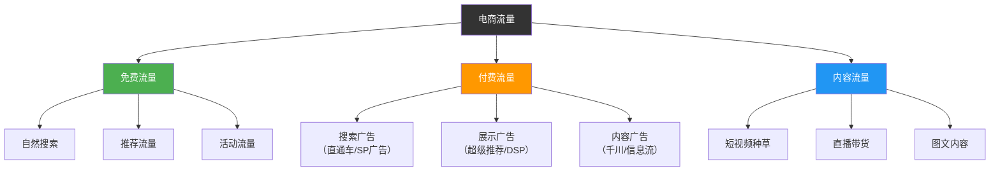
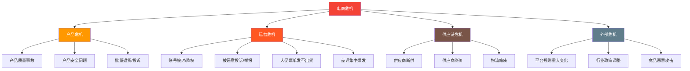
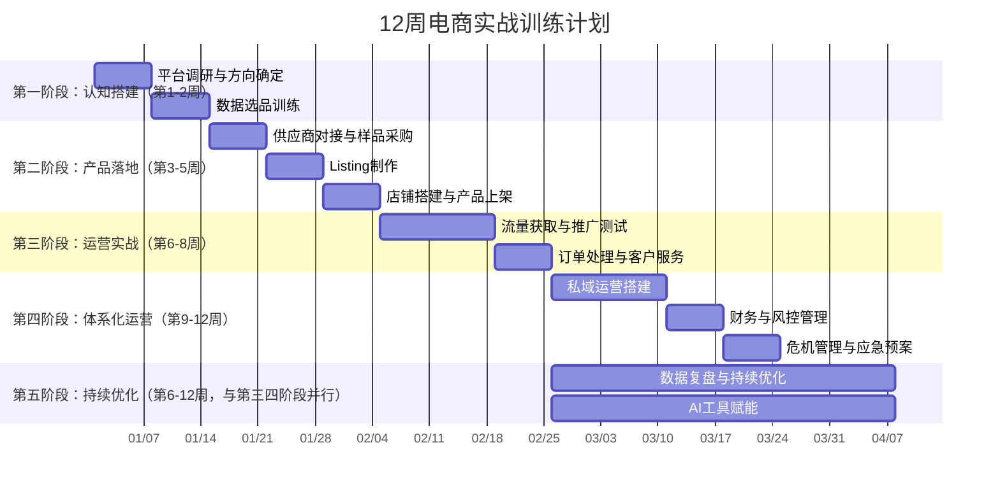

# 第11章 电商与跨境电商——练习方法

本章练习不是"看看就好"的清单，而是一套**完整的实战训练体系**。每个练习都对应本章理论基础和核心技巧篇的具体知识点，通过"做中学"的方式将认知转化为能力。练习按难度递进排列，建议严格按照时间线执行——前一个练习的产出是后一个练习的输入。

## 为什么必须做练习而不是只看理论

电商是一个高度实操的领域。读100篇选品教程，不如自己动手做一次完整的选品分析。原因很简单：**知识只有在应用中才能转化为能力**。你知道"标题前15个字放核心关键词"这条规则，但只有当你亲自写10个标题、发布后观察搜索排名变化、再根据数据迭代优化时，你才真正理解这条规则背后的算法权重逻辑。

以下是练习体系的总体架构：


### 学习前置准备

在正式开始练习之前，确保以下条件已就绪：

| 准备项 | 具体要求 | 为什么必须提前准备 |
|--------|---------|-----------------|
| 平台账号 | 注册淘宝/拼多多/1688账号并完成实名认证 | 练习一就需要用买家身份体验购物流程 |
| 数据工具 | 注册生意参谋（免费版即可）或第三方数据工具 | 练习二开始需要数据支撑决策 |
| 启动预算 | 准备至少2000元练习资金（含样品采购+推广测试） | 练习三需要采购样品，练习六需要推广预算 |
| 练习档案 | 建立一个专属文件夹，按练习编号存放所有产出物 | 每个练习的产出是下一个练习的输入，丢失=重做 |
| 时间承诺 | 每周至少投入15-20小时（含理论学习+实操） | 电商是实操领域，光看不练等于零 |

**学习方法论——"3遍学习法"：**

1. **第一遍：快速通读**。花1小时快速浏览全文，了解整体框架和每个练习的核心任务，建立全局认知。
2. **第二遍：逐个实操**。按练习顺序逐个执行，每完成一个练习就产出对应的交付物。遇到不确定的地方先做再查，不要等到"完全理解"才动手。
3. **第三遍：复盘迭代**。完成全部练习后，回头审视第一个练习的产出——你会发现明显的进步，同时看到当初的不足。用现在的认知重新优化早期产出。

**关于学习节奏的现实预期：**

- **第1-2周（练习一二）**：你会觉得信息量很大、无从下手——这是正常的。这个阶段的目标是"建立认知框架"，不是"做到完美"。
- **第3-5周（练习三四五）**：开始感到"原来如此"，理论和实践开始连接。这个阶段要特别注意记录决策过程，后续复盘时这些记录极其宝贵。
- **第6-8周（练习六七）**：进入运营实战，会遇到各种预期之外的问题（广告烧钱没转化、客户投诉、物流异常）。这些问题本身就是学习材料——每个问题都在教你看清真实的电商运营。
- **第9-12周（练习八至十二）**：开始建立体系化运营能力。此时你应该已经拿到第一笔真实的订单和利润，即使金额很小，也是从0到1的突破。

**核心学习原则：**

- **做中学 > 看中学**：电商知识的"知道"和"会做"之间有巨大鸿沟。读100篇选品教程不如自己做一次完整的选品分析。
- **数据驱动 > 感觉驱动**：从第一个练习开始就要求自己"用数据说话"。"我觉得这个品类好做"不是结论，"搜索量15000、竞争度0.6、毛利率40%"才是结论。
- **完成 > 完美**：先做完再优化，不要在一个练习上卡太久。每个练习的产出物可以迭代改进，但前提是你先有初版。
- **记录 > 记忆**：养成记录习惯——截图、保存数据、记录决策理由。3个月后你会感谢当初记录的自己。

每个练习包含以下标准模块：

| 模块 | 说明 | 为什么必须做 |
|------|------|-------------|
| 学习目标 | 本次练习要掌握的具体能力 | 明确方向，避免盲目执行 |
| 理论关联 | 对应本章的哪些知识点 | 知行合一，练习有理论支撑 |
| 操作步骤 | 带时间分配的具体动作 | 可执行、可验收、不遗漏 |
| 实战案例 | 真实场景的数据和决策过程 | 有参照物，知道"做到位"是什么样 |
| 产出物 | 必须提交的成果文件 | 没有产出物的练习等于没做 |
| 验收标准 | 判断做没做到位的量化指标 | 避免自我感觉良好但实际没到位 |
| 常见错误 | 新手最容易犯的错 | 提前避坑，节省试错成本 |
| 进阶挑战 | 高级读者的额外任务 | 让有基础的人也能获得成长 |

***

## 练习一：电商平台调研（第1周）

### 学习目标

1. 熟悉国内主流电商平台（淘宝/天猫、京东、拼多多、抖音电商）的商业逻辑差异
2. 初步了解跨境电商平台（亚马逊、速卖通、Shopee、TikTok Shop）的特点
3. 能根据自身资源和能力，选择最适合自己的平台和方向
4. 理解不同平台的算法逻辑差异对运营策略的根本性影响

### 理论关联

本练习直接对应"理论基础篇"的以下内容：
- **电商的商业本质**：理解不同平台本质上服务的是不同消费场景和消费心理
- **流量分配机制**：每个平台的流量来源和分配逻辑完全不同，这决定了运营策略的核心方向
- **消费者购买决策路径**：不同平台上消费者的决策链路差异巨大，选平台就是选用户心智

### 操作步骤

**第一步：买家体验日（2天）**

不要急着研究"怎么卖"，先彻底沉浸到"怎么买"中。在以下4个平台各完成一次真实购物，从搜索商品到收到快递到确认评价，全程记录体验。

| 体验维度 | 记录要点 | 为什么重要 |
|----------|----------|----------|
| 搜索体验 | 搜索"蓝牙耳机"，观察前3页结果的排列逻辑、筛选功能、排序选项 | 这就是你未来产品的曝光环境 |
| 详情页 | 点进5个不同价位的产品，对比主图风格、详情页长度、卖点表达方式 | 直观感受什么详情页让你想买 |
| 下单流程 | 从加购到支付的步骤数、推荐机制（"买了又买"）、优惠券弹出时机 | 理解平台如何提升客单价 |
| 物流体验 | 发货速度、物流跟踪信息、快递包装 | 物流是影响好评率的核心因素之一 |
| 售后体验 | 尝试发起一次退换货（买一件便宜商品后申请退款） | 了解售后流程的复杂度 |
| 推荐算法 | 浏览完一个品类后，观察首页推荐是否变化 | 感受"货找人"的算法逻辑 |
| 移动端体验 | 在手机上完成全部流程，注意屏幕适配、加载速度、操作便利性 | 超过85%的电商交易在移动端完成 |

具体操作：在每个平台搜索同一关键词（如"蓝牙耳机"），截图记录前20个搜索结果，分析它们的共同特征（主图风格、标题写法、价格分布、销量分布）。

**实战案例：平台搜索结果分析**

以搜索"蓝牙耳机"为例，不同平台的搜索结果呈现显著差异：

| 平台 | TOP3商品价格 | 主图风格特征 | 标题特征 | 算法倾向 |
|------|------------|------------|---------|---------|
| 淘宝 | 39-199元 | 场景化、生活感强 | 关键词堆叠，长度接近上限 | 千人千面个性化推荐 |
| 京东 | 99-599元 | 白底为主、品牌感强 | 简洁、品牌名前置 | 品牌权重+物流评分权重高 |
| 拼多多 | 9.9-59元 | 简单直接、突出低价 | 价格导向、"工厂直发"等词高频 | 价格竞争力+社交裂变权重高 |
| 抖音 | 49-299元 | 短视频截图、直播画面 | 口语化、情绪化 | 内容质量+互动率权重高 |

从这个对比中你能看出什么？**同一个产品在不同平台上，面对的是完全不同的人群和竞争环境**。选错平台，你的产品再好也可能卖不动。

**第二步：平台规则深潜（2天）**

选择你最感兴趣的2个平台，不是"浏览"规则，而是**精读**以下4类核心规则：

**入驻规则精读清单**：
- 个人店 vs 企业店的资质要求和权限差异
- 保证金金额（不同类目差异很大，从1000元到10万元不等）
- 年费/技术服务费的返还条件（如天猫的技术服务费需达到年销售额门槛才能返还）
- 特殊类目（食品、化妆品、3C）的额外资质要求

**商品发布规则精读清单**：
- 标题字符限制和违禁词清单
- 主图的尺寸、数量、内容要求（如不能出现竞品对比图）
- 详情页的禁用内容（绝对化用语、虚假宣传）
- SKU和价格设置规范

**违规处罚阶梯精读清单**：
- 一般违规 vs 严重违规 vs 特别严重违规的区分标准
- 扣分规则和清零机制
- 常见违规场景（刷单、虚假交易、知识产权侵权）
- 申诉流程和成功率

**流量规则精读清单**：
- 搜索排名的核心影响因素（销量权重、转化率权重、DSR评分权重）
- 推荐流量的触发条件
- 活动报名的门槛条件
- 付费推广工具的准入条件

**必须了解的广告法红线**（违反可罚款20-100万元）：
- 绝对化用语："最好""第一""顶级""国家级"——这些词出现在标题或详情页中就是违法
- 虚假宣传：未经验证的功效宣称、伪造检测报告
- 比较广告：不能直接贬低竞品，不能使用"比XX好"的表述
- 价格欺诈：虚高原价再打折，平台和工商都会处罚

**第三步：竞品店铺拆解（1天）**

在你选定的平台上，找到3个目标品类的标杆店铺（月销10万+但不是头部大店），逐个拆解：

```markdown
## 竞品店铺拆解模板

### 店铺基础信息
- 店铺名称：
- 开店时间：
- 主营品类：
- 月销量（估算）：
- 平均客单价：
- 店铺评分（DSR）：

### 产品线分析
- 在售SKU数量：
- 核心爆款（TOP3）及其月销量：
- 价格带分布：
- 上新频率：

### 运营策略分析
- 主图风格：
- 标题关键词策略：
- 详情页结构：
- 促销活动频率：
- 客服响应速度：

### 可借鉴之处
1. 
2. 
3. 

### 可改进之处（差异化机会）
1. 
2. 
3. 
```

**实战案例：竞品店铺拆解示例**

假设你选的是"宠物自动喂食器"品类，在淘宝上找到一家月销约15万元的店铺：

```markdown
## 竞品店铺拆解示例：XX宠物用品店

### 店铺基础信息
- 店铺名称：XX宠物生活馆
- 开店时间：2022年3月
- 主营品类：宠物智能用品
- 月销量（估算）：约15万元
- 平均客单价：189元
- 店铺评分（DSR）：4.8/4.9/4.7

### 产品线分析
- 在售SKU数量：23个
- 核心爆款TOP3：
  1. 自动喂食器5L版 月销约400件
  2. 自动饮水机 月销约250件
  3. 宠物摄像头 月销约180件
- 价格带分布：79-399元，主力价位159-259元
- 上新频率：每月1-2款新品

### 运营策略分析
- 主图风格：白底产品图+使用场景图，色调温暖（橙色系）
- 标题策略：核心词前置+"智能""定时""大容量"等卖点词
- 详情页结构：痛点场景→产品展示→功能详解→使用教程→好评截图→售后保障
- 促销策略：新客立减20元+满199减30+好评返现10元
- 客服：平均响应时间约2分钟，常用快捷回复

### 可借鉴之处
1. 详情页的"使用教程"板块降低了用户学习成本，减少因不会用导致的退货
2. "好评返现10元"的合规表达为"晒图有礼"，有效提升了带图好评率
3. 产品线围绕"宠物智能"展开，形成品类矩阵，提升客单价和复购

### 可改进之处（差异化机会）
1. 差评中23%提到"卡粮"问题——这是产品改进的核心方向
2. 没有适配小户型的迷你版——可开发3L小容量版本切入细分市场
3. 详情页缺乏宠物营养学的专业背书——可与宠物营养师合作增加专业信任
```

**第四步：方向决策（1天）**

综合前三步的调研结果，用以下决策矩阵做出选择：

| 决策维度 | 选项A | 选项B | 选项C | 评分标准 |
|----------|-------|-------|-------|----------|
| 市场规模 | | | | 搜索量≥1万/天得3分 |
| 竞争程度 | | | | 竞品<500得3分 |
| 利润空间 | | | | 毛利率≥30%得3分 |
| 个人兴趣 | | | | 非常感兴趣得3分 |
| 供应链优势 | | | | 有现成资源得3分 |
| 入门门槛 | | | | 保证金<5000得3分 |
| **总分** | | | | **满分18分** |

**平台算法差异深度理解**（关键知识点）：

不同平台的算法逻辑差异直接影响你的运营策略重心：

| 平台 | 核心算法逻辑 | 对卖家的核心启示 |
|------|------------|----------------|
| 淘宝/天猫 | 个性化推荐，千人千面 | 标签精准度决定流量质量，店铺定位要清晰 |
| 京东 | 搜索权重+品牌权重+物流权重 | 选品要注重品牌化，物流必须用京东物流或优质快递 |
| 拼多多 | 价格竞争力+社交裂变+性价比 | 供应链成本控制是核心，定价要比竞品低才有流量 |
| 抖音电商 | 内容质量+互动率+转化率 | 产品要"上镜"，适合展示效果明显的品类 |
| 亚马逊 | 关键词相关性+销量+评价+FBA权重 | 关键词优化和FBA是基础，评价数量决定排名 |

### 产出物

1. **平台体验报告**（不少于1500字）：包含4个平台的对比分析和个人体验感受
2. **平台规则摘要**（不少于1000字）：选定平台的核心规则整理，标注高风险项
3. **竞品店铺拆解报告**（3家店铺，每家不少于500字）
4. **个人电商方向决策书**：明确选定平台、品类方向和选择理由

### 验收标准

| 检查项 | 合格标准 | 优秀标准 |
|--------|----------|----------|
| 平台体验 | 完成4个平台各1次购物流程 | 记录了每个平台5个以上差异化细节 |
| 规则阅读 | 能说出选定平台的5条以上高风险规则 | 能准确引用规则原文条款编号 |
| 竞品拆解 | 完成3家店铺的基本信息收集 | 能提炼出可执行的差异化策略 |
| 方向决策 | 做出了明确选择并有数据支撑 | 用决策矩阵量化评分 |

### 常见错误

**错误一：只看不买。** 很多人觉得"注册个账号看看界面就行了"，但不走完整购物流程，你永远不知道消费者在哪个环节会犹豫、哪个环节会流失。运费险、退款速度、客服响应——这些只有真实购买后才能体验到。

**错误二：规则只看标题不看细则。** 比如淘宝"7天无理由退货"看起来简单，但"定制商品""鲜活易腐""数字内容"等品类有豁免条款。不了解细则，退货纠纷会成为你的日常噩梦。

**错误三：凭感觉选方向。** "我觉得宠物用品好做"——没有数据支撑的选方向等于赌博。请用决策矩阵，让数据说话。

**错误四：忽视平台间的算法差异。** 每个平台的流量分配逻辑完全不同——淘宝重个性化推荐，京东重品牌和物流，拼多多重价格，抖音重内容。在错误的平台上用错误的策略，再努力也白费。

### 进阶挑战

1. **多平台交叉分析**：同一品类在不同平台的价格带、主图风格、详情页结构差异分析，形成一份平台适配指南
2. **规则漏洞测试**：在选定平台上找到2-3个灰色地带（如"好评返现"的合规表述方式），理解平台规则的边界
3. **竞品监控体系搭建**：使用工具（如店透视、卖家精灵）设置竞品价格和销量监控，为后续运营建立数据基础

***

## 练习二：数据选品训练（第2周）

### 学习目标

1. 掌握数据驱动的选品方法论，建立"数据→决策"的思维习惯
2. 学会使用至少2种数据工具进行市场分析
3. 能用筛选标准从10个品类中筛出3-5个潜力产品
4. 掌握数据交叉验证方法，识别"假数据"陷阱

### 理论关联

本练习直接对应"核心技巧篇"的选品方法论：
- **数据选品法**：月搜索量、竞争度、价格带、增长率的四维评估
- **需求缺口法**：从竞品差评中挖掘未被满足的需求
- **小批量验证法**：用50-100件小批量测款验证市场假设

同时关联"常见误区篇"：
- **误区一（盲目跟风选品）**：本练习的目的是帮你建立独立的选品判断力
- **误区二（忽视数据分析）**：本练习全程用数据驱动，杜绝"我觉得"

### 数据工具完整使用指南

不要只是"注册"工具就完事。以下是你必须掌握的具体操作：

**生意参谋实操指南**（淘宝/天猫选品核心工具）：
1. 进入"市场"→"搜索分析"，输入目标关键词
2. 查看以下核心指标：搜索人气（反映需求量）、点击率（反映竞争激烈程度）、在线商品数（反映供给量）、支付转化率（反映购买意愿）
3. 使用"相关搜索词"功能，发现长尾词和趋势词
4. 使用"行业大盘"功能，查看品类的整体增长趋势
5. 关键操作：导出数据到Excel，计算"竞争度=在线商品数/搜索人气"，竞争度<0.5的词是蓝海词

**1688供应链调研实操指南**：
1. 搜索目标产品，按"成交量"排序（而非默认的综合排序）
2. 记录前10个供应商的关键信息：起订量、单价区间、工厂认证（实力商家/超级工厂）、回头率
3. 点进供应商店铺查看：经营年限、主营品类是否专注、买家评价
4. 关键操作：至少联系3家供应商询问阶梯报价（1件/10件/100件/1000件的价格差异巨大）

**Google Trends使用指南**（跨境选品必备）：
1. 输入产品英文关键词，选择目标市场（如"United States"）
2. 选择"过去12个月"查看季节性波动，选择"过去5年"查看长期趋势
3. 对比3-5个相关关键词，判断哪个词的趋势最好
4. 查看"相关查询"板块，发现用户搜索的具体细分需求
5. 关键操作：如果搜索量在Q4（10-12月）出现明显峰值，说明该产品有明显的旺季效应，需要提前2-3个月备货

### 操作步骤

**第一步：品类海选（2天）**

从你选定的大方向中，列出至少10个候选品类/产品方向。不要筛选，先广撒网。

对每个品类执行以下数据收集流程：

```text
品类数据收集清单：
1. 月搜索量（生意参谋/平台搜索指数）
2. 在线商品数（竞争供给量）
3. 首页平均销量（头部卖家的销量水平）
4. 平均售价区间（前50个商品的价格分布）
5. 平均评分（消费者满意度，评分低=改进空间大）
6. 搜索量趋势（Google Trends / 生意参谋趋势图）
7. 季节性波动（是否受季节影响严重）
8. 复购率估算（消耗品>非消耗品）
9. 物流难度（重量、体积、易碎性）
10. 合规门槛（是否需要特殊资质认证）
```

**第二步：品类筛选（1天）**

用以下标准从10个品类中筛选出3-5个进入深度评估：

| 筛选维度 | 合格线 | 数据来源 | 权重 |
|----------|--------|----------|------|
| 月搜索量 | ≥10,000（淘宝）/ ≥5,000（跨境） | 生意参谋/平台数据 | 20% |
| 竞争度 | 在线商品数/月搜索量 < 50 | 计算得出 | 20% |
| 价格空间 | 平均售价 ≥ 50元且毛利率 ≥ 25% | 1688采购价+售价 | 25% |
| 增长趋势 | 近6个月搜索量环比增长 ≥ 5% | 生意参谋趋势图 | 15% |
| 复购潜力 | 消耗品或有配件/耗材需求 | 品类特性判断 | 10% |
| 合规门槛 | 无需特殊资质或资质已具备 | 平台规则查询 | 10% |

**评分方法**：每个维度按"远超标准=5分""达标=3分""不达标=1分"评分，乘以权重后汇总。总分≥3.5分的品类进入下一轮。

**实战案例：品类筛选评分示例**

假设你在"家居生活"大方向下筛选品类：

| 品类 | 搜索量(20%) | 竞争度(20%) | 价格空间(25%) | 增长(15%) | 复购(10%) | 合规(10%) | 加权总分 |
|------|-----------|-----------|-------------|----------|----------|----------|---------|
| 桌面收纳盒 | 5(3.8万) | 5(比值0.3) | 3(均价45元) | 3(增长8%) | 1(低复购) | 5(无门槛) | 3.70 |
| 香薰蜡烛 | 3(1.2万) | 3(比值0.8) | 5(均价89元,毛利55%) | 5(增长22%) | 5(高复购) | 3(需检测报告) | 3.90 |
| 手机支架 | 5(5.6万) | 1(比值3.2) | 1(均价19元) | 3(增长3%) | 1(低复购) | 5(无门槛) | 2.30 |
| 宠物自动喂食器 | 3(1.5万) | 3(比值0.6) | 5(均价189元,毛利40%) | 5(增长35%) | 3(有耗材) | 3(需3C认证) | 3.80 |

结果分析：手机支架因竞争度过高和价格空间不足被淘汰（2.30分），香薰蜡烛和宠物自动喂食器进入下一轮深度评估。

**第三步：潜力产品深度分析（1天）**

在筛选出的3-5个品类中，每个品类找出1-2个具体潜力产品，执行深度分析：

```markdown
## 产品深度分析模板

### 基本信息
- 产品名称：
- 所属品类：
- 目标平台：

### 市场数据
- 月搜索量：
- 首页竞品数：
- TOP10竞品平均月销量：
- 价格带分布：___元-___元（主流区间___元-___元）
- 平均评分：___（低于4.0说明有改进空间）

### 竞品分析（TOP3竞品逐一分析）
竞品1：
  - 链接/店铺名：
  - 月销量：
  - 售价：
  - 核心卖点：
  - 主要差评问题：

竞品2：（同上格式）

竞品3：（同上格式）

### 差异化机会
- 竞品共同的差评痛点TOP3：
  1. （出现频率：约___%的差评提及）
  2. （出现频率：约___%的差评提及）
  3. （出现频率：约___%的差评提及）
- 可改进方向：
- 差异化切入点：

### 供应链调研
- 1688供应商数量：
- 采购价格区间：
- 最低起订量：
- 打样费用：
- 生产周期：

### 利润测算
- 采购成本：___元
- 头程物流：___元
- 平台佣金（按___%）：___元
- 包装材料：___元
- 快递费用：___元
- 广告费预估（按售价20%）：___元
- 售后损耗预估（按售价5%）：___元
- 总成本：___元
- 售价：___元
- 单件净利：___元
- 净利率：___%

### 综合评分
| 维度 | 评分(1-5) | 说明 |
|------|-----------|------|
| 市场需求 | | |
| 竞争强度（逆向） | | |
| 利润空间 | | |
| 差异化可行性 | | |
| 供应链稳定性 | | |
| **综合得分** | | **≥3.5分方可推进** |
```

**数据陷阱识别指南**：

新手最容易被"假数据"欺骗。以下是常见的数据陷阱和验证方法：

| 数据陷阱 | 表面现象 | 真实情况 | 验证方法 |
|----------|---------|---------|---------|
| 季节性搜索量 | 某品类月搜索量50万+ | 可能只是旺季峰值，淡季可能不到5万 | 查看至少12个月的趋势图 |
| 刷单造成的虚假销量 | TOP竞品月销1万+ | 真实销量可能只有1000，其余是刷单 | 对比销量与评价数量比例，正常比例约10:1 |
| 低评分的假象 | 品类平均评分只有3.8 | 不是所有产品都差，可能是个别差品拉低均值 | 分析评分分布，4.5+评分的产品占比多少 |
| 高利润的陷阱 | 售价100元，采购价25元 | 广告费可能要30元才能卖出去 | 用保本ROI公式计算：保本ROI=1/毛利率 |

### 产出物

1. **品类调研数据表**：10个品类的10维数据收集表
2. **品类筛选评分表**：6维度加权评分，附筛选结论
3. **潜力产品分析报告**：3-5个产品的深度分析（按上述模板）
4. **选品决策书**：最终选定的1-2个产品及选择理由

### 验收标准

| 检查项 | 合格标准 | 优秀标准 |
|--------|----------|----------|
| 品类覆盖 | 调研≥10个品类 | 调研≥15个品类 |
| 数据完整性 | 每个品类至少6个维度有数据 | 10个维度全部有数据 |
| 筛选逻辑 | 有明确的量化筛选标准 | 有加权评分模型 |
| 产品分析 | 完成3个产品的深度分析 | 完成5个且利润测算精确到元 |

### 常见错误

**错误一：只看搜索量不看竞争度。** "蓝牙耳机"月搜索量100万+，但在线商品200万+，竞争比2:1，新手几乎不可能出头。选品的核心是找到"搜索量高但竞争度低"的蓝海缝隙。

**错误二：不做利润测算就拍脑袋定产品。** 很多新手看到"售价99元，进货价30元"就觉得利润惊人，但算上广告费（20元）、快递（5元）、佣金（5元）、包装（2元）、退货损耗（5元），实际单件净利只剩27元，净利率27%——勉强及格。如果广告费占比更高，可能亏钱。建议用Excel建立利润测算模型，自动计算每个变量对利润的影响。

**错误三：差评分析走过场。** 不是"看了一眼差评"就行，而是要逐条阅读至少50条3星和4星差评，用表格归纳高频关键词和出现频率。这是找到差异化机会的核心动作。

**错误四：忽视数据的交叉验证。** 单一数据源容易产生偏差。搜索量高不代表真正有需求（可能是季节性波动），销量高不代表利润高（可能在亏本引流）。至少用2个独立数据源交叉验证每个关键结论。

### 进阶挑战

1. **差评词频分析**：用Python脚本或Excel透视表对100条差评做词频统计，生成词云图，量化每个痛点的出现频率
2. **竞品价格监控**：使用跟卖精灵或Keepa等工具，监控TOP10竞品30天内的价格变化，分析促销节奏
3. **供应链深度验证**：对最终选定的产品，联系5家以上1688供应商，对比同品质产品的价格差异，计算最优采购方案

***

## 练习三：供应商对接（第3周）

### 学习目标

1. 掌握从1688/线下展会筛选优质供应商的方法论
2. 学会与供应商有效沟通，拿到合理的价格和合作条件
3. 完成样品采购和质量评估，确定最终合作供应商
4. 建立供应商风险管理意识，确保供应链稳定性

### 理论关联

本练习直接对应"核心技巧篇"供应链管理技巧和"理论基础篇"供应链管理理论：

- **供应链管理理论**：供应链是电商的"后端引擎"——前端的流量和转化再好，供应链不靠谱（质量差、发货慢、断货频繁）一切归零。供应链管理的核心是"成本-质量-时效"三角平衡，你不能同时追求最低价格、最高品质和最快发货，必须根据你的定位做出取舍。
- **商业本质**：电商的本质是信息差+效率差。供应商端的信息差（你知道消费者要什么，供应商不知道）和效率差（你比供应商更懂营销和用户运营）是你作为中间商存在的价值。如果这两样你都没有，那你只是一个"搬运工"，利润空间极其有限。
- **风险控制理论**：供应链风险是电商经营中最致命的风险之一——库存积压占用资金、断货导致流量和权重归零、品质问题引发退货潮。风险管理的核心原则是"不把鸡蛋放在一个篮子里"，这直接决定了你必须建立多供应商体系。
- **误区四（忽视供应链管理）**：很多新手把99%的精力放在前端运营（流量、转化），只留1%给供应链。实际上，供应链的稳定性和成本优势才是长期竞争力的根基。本练习帮你从一开始就建立正确的供应链管理意识。

### 操作步骤

**第一步：供应商海选（2天）**

在1688上搜索你选定的产品，从搜索结果中筛选10-15家候选供应商。筛选时按以下维度打分：

| 筛选维度 | 评分标准 | 权重 |
|----------|----------|------|
| 店铺类型 | 实力商家/工厂店=5分，经销批发=3分，个人=1分 | 20% |
| 成交数据 | 月成交额≥10万=5分，1-10万=3分，<1万=1分 | 20% |
| 好评率 | ≥98%=5分，95-98%=3分，<95%=1分 | 15% |
| 响应速度 | 30分钟内=5分，2小时内=3分，超2小时=1分 | 15% |
| 起订量 | 1件起=5分，10件起=3分，100件起=1分 | 15% |
| 产品线专注度 | 只做这个品类=5分，相关品类=3分，杂货店=1分 | 15% |

从10-15家中选出5家进入深度沟通。

**1688筛选的隐藏技巧**：
- **看"回头率"而非"成交量"**：成交量可以刷，但回头率（老客户复购率）更难造假，回头率>30%说明产品质量和服务有保障
- **看"买家评价"中的差评内容**：好评可能是刷的，但差评中反映的问题（发货慢、质量不稳定、包装差）是真实的
- **看店铺经营年限**：经营3年以上的店铺比新店铺更稳定
- **看"实力商家"和"超级工厂"认证**：这些认证需要实地验厂，可信度较高

**第二步：供应商沟通与谈判（2天）**

与5家供应商逐一沟通，不要只问价格，要问清以下所有关键信息：

```text
供应商沟通清单（建议使用统一话术模板）

一、产品信息
□ 产品材质和工艺细节
□ 是否支持定制（颜色/尺寸/包装/Logo）
□ 是否有现货，现货库存量
□ 是否能提供产品检测报告

二、价格与起订量
□ 不同数量区间的阶梯报价
□ 首单是否有优惠
□ 是否支持混批（不同款式混在一起下单）
□ 打样费用和是否可退

三、物流与交付
□ 发货方式（快递/物流/自提）
□ 发货时效（现货24小时？定制7天？）
□ 运费计算方式
□ 是否支持一件代发

四、售后与保障
□ 质量问题的处理方式（退款/换货/补发）
□ 是否提供售后保障期
□ 是否接受退换货

五、合作模式
□ 是否支持代发/代运营
□ 是否能提供产品原图和视频素材
□ 能否签合同/协议
□ 支付方式（支付宝/对公/货到付款）
```

**沟通技巧**：
- **不要表现得像新手**。不要问"这个怎么做电商"之类的问题，直接以"我准备在XX平台做XX品类，需要找长期合作供应商"的姿态沟通。
- **比价时不要只比采购价**。综合考虑起订量、发货速度、售后政策、沟通响应速度。便宜5块钱但发货慢3天、出问题不处理的供应商，综合成本反而更高。
- **记录每次沟通的要点**。5家供应商的信息很容易混淆，务必用统一模板记录。
- **谈判筹码**：如果你能承诺月采购量≥500件，可以要求5-10%的阶梯折扣；如果你愿意先款后货（非支付宝担保交易），可以再要求2-3%的折扣。

**第三步：样品采购与评估（1天）**

从5家中选2-3家各采购1个样品。不要贪便宜只买最便宜的那家——质量差异往往比价格差异更影响最终结果。

**样品评估维度**：

| 评估维度 | 评估方法 | 权重 |
|----------|----------|------|
| 产品品质 | 对比实物与图片/描述的差异，检查做工细节 | 30% |
| 包装质量 | 包装能否保护产品不受损，包装外观是否美观 | 15% |
| 物流时效 | 从下单到收货的天数 | 15% |
| 物料齐全 | 是否附带说明书、配件、合格证等 | 10% |
| 沟通体验 | 供应商回复的及时性、专业性、态度 | 15% |
| 价格竞争力 | 综合采购成本（含运费）对比 | 15% |

**样品到了之后必须做的事**：
1. 录制开箱视频（万一后续有质量争议，视频是证据）
2. 从消费者角度拍摄实物照片（和供应商给的图片对比）
3. 如果是可使用的产品，实际使用体验至少3天
4. 对比2-3家样品的差异，在评估表中逐项打分

**实战案例：供应商评估打分示例**

| 评估维度 | 权重 | 供应商A(评分) | 供应商B(评分) | 供应商C(评分) |
|----------|------|-------------|-------------|-------------|
| 产品品质 | 30% | 4(做工精细，与图片一致) | 3(基本合格，有色差) | 5(品质最佳) |
| 包装质量 | 15% | 3(普通快递袋) | 4(纸盒包装) | 4(纸盒+缓冲) |
| 物流时效 | 15% | 4(2天到货) | 5(1天到货) | 3(3天到货) |
| 物料齐全 | 10% | 3(缺说明书) | 5(齐全) | 4(基本齐全) |
| 沟通体验 | 15% | 4(响应快，态度好) | 3(回复慢) | 5(非常专业) |
| 价格竞争力 | 15% | 5(最低价) | 4(中等) | 3(最高) |
| **加权总分** | | **3.75** | **3.65** | **4.05** |

结论：选择供应商C作为主供应商（品质最佳+沟通最好），供应商A作为备选供应商（价格最优）。价格差异可以通过后续采购量谈判来缩小。

### 产出物

1. **供应商对比表**：5家供应商的详细信息对比
2. **样品评估报告**：2-3家样品的详细评估记录和打分
3. **合作协议要点清单**：确定合作供应商后，列出合作条款要点（价格、账期、发货时效、售后责任、违约条款）
4. **供应商沟通记录存档**：所有沟通记录保存，后续有争议可回溯

### 验收标准

| 检查项 | 合格标准 | 优秀标准 |
|--------|----------|----------|
| 供应商覆盖 | 沟通≥5家 | 沟通≥8家且包含线下渠道 |
| 样品采购 | 采购≥2家样品 | 采购3家且有对比评分 |
| 评估质量 | 有基本的产品对比 | 有开箱视频+实物照片+使用体验 |
| 合作确认 | 确定1家供应商 | 确定1家主供+1家备选（防断供） |

### 常见错误

**错误一：只看价格选供应商。** 最便宜的供应商往往品控最差。1688上很多"超低价"的供应商用的是回收料、减配版，收到样品差距巨大。记住：**采购成本低不等于总成本低**。

**错误二：不做样品直接大批量进货。** 这是新手亏钱最常见的方式之一。图片可以美化，但实物不会撒谎。哪怕多花200元打样费，也好过花2万元进一批卖不出去的货。

**错误三：只找一家供应商。** 只依赖一家供应商，一旦对方涨价、断货、品质波动，你的店铺就陷入被动。至少确定1家主供应商和1家备选供应商。

**错误四：不做供应商背调。** 签合同前必须核实供应商的工商注册信息（天眼查/企查查）、是否有法律纠纷、是否有行政处罚记录。这些信息可以帮你避免遇到"皮包公司"。

### 进阶挑战

1. **线下供应链探索**：如果你的产品有产业集群（如义乌小商品、深圳3C、南通家纺），亲自去一趟工厂/批发市场，线下渠道的采购成本通常比1688低15-30%
2. **供应商关系管理**：建立供应商评估表，每季度对合作供应商进行一次综合评估（质量合格率、发货准时率、售后响应速度），及时淘汰不合格供应商
3. **小批量定制测试**：在与供应商建立信任后，尝试小批量定制（如定制包装、印Logo），测试消费者对品牌化的接受度

***

## 练习四：Listing制作（第4周）

### 学习目标

1. 掌握电商平台标题优化的关键词布局策略
2. 学会用低成本方式制作专业级产品主图
3. 理解详情页的信息架构和转化逻辑
4. 掌握移动端优先的设计原则（超过85%的订单来自手机端）

### 理论关联

对应"核心技巧篇"Listing优化技巧和"理论基础篇"消费者购买决策路径。Listing是消费者从"看到你"到"决定买"的完整信息链——标题决定你能不能被搜索到，主图决定消费者会不会点进来，详情页决定消费者会不会下单。

### 操作步骤

**第一步：关键词调研与标题优化（1天）**

标题优化不是"把好词堆上去"，而是**精准匹配用户的搜索意图**。

**关键词收集方法**（至少收集50个关键词）：

| 来源 | 操作方法 | 预期产出 |
|------|---------|---------|
| 平台搜索下拉词 | 在搜索框输入核心词，记录所有下拉推荐词 | 15-20个 |
| 生意参谋搜索词分析 | 搜索核心词，导出相关搜索词列表 | 20-30个 |
| 竞品标题拆解 | 记录TOP20竞品标题中的所有关键词 | 20-30个 |
| 直通车推荐词 | 添加推广计划查看系统推荐词 | 10-15个 |
| 用户评价关键词 | 从竞品好评中提取用户描述产品的用语 | 5-10个 |

**关键词筛选标准**：
- 搜索量≥500/天（有足够流量）
- 与产品高度相关（不蹭无关热词）
- 竞争度适中（避免"蓝牙耳机"这种超级红海词）

**关键词分类方法**（将50个词分为4类）：

| 关键词类型 | 定义 | 标题中的位置 | 示例 |
|-----------|------|------------|------|
| 核心词 | 搜索量最高、与产品最匹配的词 | 标题前15个字 | 蓝牙耳机 |
| 属性词 | 描述产品特征的词 | 核心词后面 | 无线、入耳式、降噪 |
| 卖点词 | 产品差异化卖点 | 属性词后面 | 超长续航48小时、HiFi音质 |
| 场景词 | 使用场景描述 | 卖点词后面 | 运动、跑步、游戏 |
| 长尾修饰 | 长尾搜索词 | 标题末尾 | 2024新款、适用苹果华为 |

**标题组合公式**：

```text
标题结构：核心词 + 属性词 + 卖点词 + 场景词 + 长尾修饰

示例（蓝牙耳机）：
核心词：蓝牙耳机
属性词：无线、入耳式、降噪
卖点词：超长续航48小时、HiFi音质
场景词：运动、跑步、游戏
长尾修饰：2024新款、适用苹果华为

组合：蓝牙耳机无线入耳式主动降噪超长续航48小时HiFi音质运动跑步游戏2024新款适用苹果华为
```

**标题优化原则**：
1. 前15个字放搜索量最高的核心关键词（平台算法对标题前半段权重更高）
2. 不要重复用词（"蓝牙耳机蓝牙"浪费字符）
3. 不要用特殊符号和空格（影响搜索匹配）
4. 每2周根据搜索词报告调整标题（数据说了算，不是你觉得好就好）

**第二步：产品主图制作（2天）**

主图是决定点击率的第一要素。主图点击率从2%提升到4%，等于在不增加任何成本的情况下流量翻倍。

**7张主图的标准配置**：

| 图片位置 | 内容 | 制作要求 | 目的 |
|----------|------|----------|------|
| 主图1 | 白底产品图 | 产品占画面60-70%，纯白背景，光线均匀 | 搜索结果展示，简洁专业 |
| 主图2 | 场景使用图 | 真人或场景中使用产品的画面 | 让消费者想象自己使用的场景 |
| 主图3 | 产品卖点图 | 文字+图标突出1-2个核心卖点 | 快速传达产品差异化价值 |
| 主图4 | 细节特写图 | 产品细节、材质、工艺的微距拍摄 | 证明品质，减少"收到货与图片不符"的顾虑 |
| 主图5 | 规格参数图 | 尺寸对比、容量、重量等参数可视化 | 帮助消费者快速判断是否符合需求 |
| 主图6 | 包装配件图 | 展示所有配件和包装 | 设定消费者预期，减少"少东西"的售后 |
| 主图7 | 信任背书图 | 检测报告、资质证书、好评截图、对比图 | 建立信任，降低购买决策阻力 |

**低成本拍摄方案**（手机+自然光）：
- **白底图**：白色A2卡纸做背景，靠窗自然光拍摄，手机打开网格线确保水平。后期用美图秀秀或Snapseed微调亮度和背景白度。
- **场景图**：在真实使用场景中拍摄（如耳机在健身房、书桌上），不需要专业模特，用家人或朋友的手/耳朵即可。
- **卖点图**：用Canva免费版制作，选择简洁的模板，文字不超过15个字。

**移动端设计原则**（关键知识点）：

超过85%的电商交易在移动端完成，但很多卖家还在用PC端的思维做详情页。移动端的设计核心差异：

| 设计要素 | PC端思维 | 移动端正确做法 |
|----------|---------|--------------|
| 字体大小 | 12-14px正常 | 最小16px，核心卖点24px+ |
| 图片宽度 | 750px标准 | 750-790px，适配手机屏幕 |
| 信息密度 | 可以放很多文字 | 每屏只传达1个核心信息 |
| 文字排版 | 大段文字可读 | 短句+要点式，每行不超过15个字 |
| 加载速度 | 不太关注 | 每张图片压缩到200KB以内 |

**主图优化的A/B测试思维**：
上架后不要觉得主图就定型了。每周检查主图点击率（生意参谋可以查看），如果点击率低于品类均值（通常2-3%），就更换主图重新测试。一个高点击率的主图是不断测试迭代出来的。

**第三步：详情页制作（2天）**

详情页的核心任务是**回答消费者"为什么要买"和"为什么要跟你买"**。

**详情页信息架构**（从上到下的逻辑链）：

```text
第一屏（首屏）：核心卖点钩子
├── 一句话说清"这个产品解决什么问题"
├── 配合高冲击力的场景图
└── 目的：3秒内抓住注意力，降低跳失率

第二屏：痛点共鸣
├── 描述消费者当前的困扰/不爽
├── "你是不是也遇到过这种情况？"
└── 目的：建立情感共鸣，激发需求

第三屏：产品解决方案
├── 产品如何解决上述痛点
├── 核心功能/技术/材质的详细展示
└── 目的：将痛点转化为购买动力

第四屏：产品详情
├── 规格参数、材质说明、尺寸信息
├── 多角度展示、细节特写
└── 目的：提供决策所需的技术信息

第五屏：使用场景
├── 3-5个典型使用场景
├── 每个场景配真实使用图
└── 目的：让消费者想象拥有后的生活

第六屏：信任背书
├── 用户好评截图（选择带图好评）
├── 检测报告/资质证书
├── 销量数据/复购数据
└── 目的：降低购买风险感知

第七屏：售后保障
├── 7天无理由退货
├── 运费险
├── 质保承诺
├── 客服在线时间
└── 目的：消除最后的犹豫

第八屏：关联推荐/行动号召
├── "立即购买"引导
├── 搭配推荐
└── 目的：推动下单决策
```

**违禁词自检清单**（发布前必须检查）：

| 违禁类型 | 具体词汇示例 | 替代表达 |
|----------|------------|---------|
| 绝对化用语 | 最好、第一、顶级、国家级 | 优质、领先、高品质 |
| 虚假功效 | 治疗、根治、药用 | 辅助、有助于、参考 |
| 诱导性用语 | 点击就送、限时抢购（无真实限时） | 限时优惠（确实在限定时间内） |
| 权威性用语 | 国家认证（无认证）、专家推荐（无专家） | 经过XX检测、XX标准 |

建议使用"句易网"等违禁词检测工具，在发布前自动扫描标题和详情页文本。

### 产出物

1. **关键词报告**：至少50个关键词的收集和分类表
2. **标题文案**：3个候选标题（最终选定1个）
3. **7张产品主图**：按上述标准制作完成
4. **完整详情页**：按8屏信息架构制作完成
5. **Listing自检报告**：用验收标准自评打分

### 验收标准

| 检查项 | 合格标准 | 优秀标准 |
|--------|----------|----------|
| 关键词覆盖 | 收集≥30个关键词 | 收集≥50个并按搜索量排序 |
| 标题质量 | 包含核心词，≤30字，通顺可读 | 前15字为高权重核心词，含差异化卖点词 |
| 主图质量 | 7张图齐全，白底图清晰 | 有场景图+卖点图，视觉风格统一 |
| 详情页完整性 | 覆盖8屏核心内容 | 有差异化卖点突出、好评截图、检测报告 |

### 常见错误

**错误一：标题堆砌关键词。** "蓝牙耳机无线耳机降噪耳机运动耳机跑步耳机游戏耳机"——这种标题读都读不通，消费者体验极差，平台算法也会降低权重。标题既要包含关键词，也要保证可读性。

**错误二：主图用供应商原图。** 你的竞争对手也用同一张供应商原图，消费者根本分不清你们有什么区别。即使是同样的产品，也要自己拍摄或至少重新排版设计。

**错误三：详情页只放参数没有情感。** 消费者买的不是"频率响应20Hz-20kHz"，而是"通勤路上隔绝噪音、沉浸在音乐世界的感觉"。先打动情感，再用参数支撑理性决策。

**错误四：忽视移动端适配。** 在PC上做详情页看起来很美观，但放到手机上可能字太小看不清、图片加载太慢、信息密度过高导致消费者划两下就走了。务必在手机上预览详情页效果。

**错误五：不检查违禁词。** 标题或详情页中出现"最好""第一""治疗"等违禁词，轻则商品下架，重则店铺扣分甚至封禁。发布前务必用句易网等工具扫描。

### 进阶挑战

1. **标题A/B测试**：用平台的"标题优化"工具，准备3个不同关键词侧重的标题，轮流测试7天，用数据选出点击率最高的版本
2. **竞品Listing逆向分析**：找到品类TOP3的商品，分析其标题关键词布局、主图设计逻辑、详情页转化路径，总结可借鉴的策略
3. **视频主图制作**：制作15秒的产品展示视频作为主图，研究显示视频主图的点击率比静态图高20-40%

***

## 练习五：店铺搭建与上架（第5周）

### 学习目标

1. 完成平台店铺注册的全流程
2. 掌握店铺基础装修和品牌视觉建立
3. 完成首个产品的标准化上架流程
4. 建立可复用的上架SOP，为后续新品上架提效

### 理论关联

对应"常见误区篇"误区五（忽视平台规则）。本练习要求你在操作前把平台规则吃透，而不是出了问题再补课。

### 操作步骤

**第一步：店铺注册与资质准备（1天）**

注册前必须准备好的材料：

| 材料 | 个人店 | 企业店 | 注意事项 |
|------|--------|--------|----------|
| 身份证 | 需要（正反面） | 法人身份证 | 确保有效期>3个月 |
| 营业执照 | 不需要 | 需要 | 经营范围要覆盖目标品类 |
| 银行卡 | 需要（同身份证姓名） | 对公账户 | 确保是常用卡，便于提现 |
| 手机号 | 需要（未注册过店铺） | 需要 | 建议用独立号码 |
| 品牌授权 | 无品牌商品不需要 | 如销售品牌商品需授权书 | 没有授权卖品牌商品=侵权 |
| 保证金 | 根据品类1000-50000元 | 同左 | 提前了解目标品类的保证金金额 |

**注册流程实操要点**：
1. 按平台指引一步步操作，遇到不确定的选项不要瞎选，先暂停查规则
2. 店铺名称选择：品牌名/品类关键词+品牌名，不要用生僻字或纯数字
3. 类目选择一定要准确——选错类目可能导致后续被强制迁移，所有评价清零
4. 实名认证通常1-3天审核，期间可以准备其他材料

**开店类型选择建议**：

| 开店类型 | 优势 | 劣势 | 适合人群 |
|----------|------|------|---------|
| 个人店（C店） | 零门槛、无年费、保证金低 | 流量权重偏低、无法参加部分活动 | 新手试水、预算有限 |
| 企业店 | 流量权重较高、可参加更多活动 | 需要营业执照、保证金较高 | 有一定投入预算的创业者 |
| 天猫店 | 流量权重最高、消费者信任度高 | 年费+保证金高（5-15万）、审核严格 | 品牌化运营、资金充足 |

新手建议：先从个人店或企业店起步，验证产品和市场后再考虑升级到天猫。

**第二步：店铺基础装修（1天）**

不需要花大钱找设计师，用免费工具就能做出专业感：

**Logo设计**：用Canva搜索"店铺Logo"模板，替换文字和颜色即可。要求：简洁、易识别、缩小后仍可辨认。

**店铺Banner**：推荐尺寸1200×400像素，内容包含：品牌名、核心品类、核心卖点（如"工厂直发""30天无忧退换"）。

**店铺介绍**：包含以下要素——
- 我们是谁（品牌定位）
- 我们做什么（核心品类）
- 我们的优势（3个差异化卖点）
- 服务承诺（发货时效、售后保障）

**店铺分类**：即使只有一个产品，也要设置清晰的分类结构，为后续扩展做准备。

**第三步：产品上架标准化流程（2天）**

按照以下清单逐项完成，不要跳步：

```text
产品上架检查清单

□ 图片上传
  □ 主图7张（按练习四标准）
  □ 详情页图片（按练习四的8屏架构）
  □ 图片尺寸符合平台要求
  □ 图片文件大小符合限制

□ 标题设置
  □ 使用练习四确定的最终标题
  □ 字符数未超出限制
  □ 无违禁词/极限词

□ 类目选择
  □ 选择了正确的商品类目
  □ 品牌选择正确（无品牌选"其他"）

□ 属性填写
  □ 所有必填属性已填写
  □ 选填属性尽量填满（影响搜索匹配）
  □ 属性值与实物一致

□ SKU设置
  □ 不同规格/颜色/尺寸都设置了SKU
  □ 每个SKU有对应图片
  □ 价格合理（各SKU之间有价差逻辑）

□ 价格设置
  □ 参考了练习二的价格带分析结果
  □ 计算了全链路成本确保有利润
  □ 设置了划线价（原价）

□ 库存设置
  □ 初始库存合理（不宜太多也不宜显示"仅剩1件"）
  □ 开启了库存预警

□ 物流模板
  □ 设置了运费模板
  □ 包邮区域覆盖目标市场
  □ 偏远地区运费规则设置

□ 售后设置
  □ 开启7天无理由退货
  □ 开启运费险（如有）
  □ 设置了退换货地址

□ 营销设置
  □ 设置了新品优惠券（如需要）
  □ 设置了满减活动（如需要）
```

**定价策略详解**：

定价不是"成本+利润"这么简单。以下是3种常用定价策略：

| 定价策略 | 适用场景 | 具体方法 | 风险 |
|----------|---------|---------|------|
| 渗透定价 | 新品打入市场 | 定价低于竞品10-15%，用低价换取销量和评价 | 利润薄，难以支撑广告投放 |
| 竞争定价 | 成熟品类 | 参考竞品价格区间，定位中位数 | 缺乏差异化，容易陷入价格战 |
| 价值定价 | 有明确差异化卖点 | 定价高于竞品10-20%，用品质和服务支撑溢价 | 需要强有力的卖点支撑 |

新手建议：首月用渗透定价积累基础销量和评价，第2个月开始逐步提价至竞争定价水平。

**第四步：上架后自检（1天）**

上架后24小时内完成以下自检，发现问题立刻修正：

**搜索可见性自检**：在平台搜索你的产品标题核心词，看能否在搜索结果中找到自己的商品。如果找不到，检查类目是否正确、属性是否填写完整。

**详情页显示自检**：用手机打开商品详情页，检查所有图片是否正常显示、文字是否被截断、排版是否在手机端美观。

**下单流程自检**：用另一个账号完整走一遍下单流程（可以创建测试订单后取消），检查价格、运费、优惠券是否正常工作。

### 产出物

1. 已注册并完成基础设置的店铺
2. 已上架并通过自检的产品
3. **店铺自检报告**：记录自检中发现的问题和修正措施
4. **上架SOP文档**：将整个上架流程整理为标准化操作流程，供后续新品上架复用

### 验收标准

| 检查项 | 合格标准 | 优秀标准 |
|--------|----------|----------|
| 店铺注册 | 审核通过 | 审核通过且已完成品牌信息设置 |
| 店铺装修 | Logo+Banner+店铺介绍齐全 | 视觉风格统一，有品牌感 |
| 产品上架 | 产品可正常搜索和购买 | 所有属性填满，图片7张齐全 |
| 自检完成 | 完成基础自检 | 有完整的自检报告和修正记录 |

### 常见错误

**错误一：类目选错。** 很多新手为了少交保证金选择"其他"类目，或者凭感觉选了相似但不准确的类目。后果是：搜索权重极低、无法参加类目活动、甚至被平台强制迁移导致评价清零。花10分钟确认准确类目，值得。

**错误二：属性填写不完整。** 平台的搜索算法会参考商品属性进行匹配推荐。你不填"材质""适用人群""风格"等选填属性，等于放弃了这些属性带来的搜索流量。

**错误三：初始库存设太低。** 设置"仅剩1件"看起来制造了稀缺感，但实际上会让消费者觉得你不可靠。建议初始库存设50-100件，既不显得虚假繁荣，也不会让消费者犹豫。

**错误四：不做移动端预览。** 在PC后台上传的图片和排版，在手机端可能完全变形。上架前必须用手机完整浏览一遍详情页。

### 进阶挑战

1. **批量上架工具**：学习使用平台的CSV批量上传功能，一次性上架多个SKU
2. **店铺数据埋点**：在店铺装修中添加"新品推荐""热销排行"等模块，测试不同模块对转化率的影响
3. **多平台同步上架**：使用ERP工具（如聚水潭、旺店通）实现一个产品同时上架到多个平台

***

## 练习六：流量获取实践（第6-7周）

### 学习目标

1. 理解电商流量的来源结构和各自的特点
2. 掌握免费流量优化（SEO）和付费推广（直通车/千川）的基本操作
3. 学会用数据指标评估推广效果并做出优化决策
4. 建立免费+付费的流量组合策略思维

### 理论关联

本练习是最综合的练习，对应多个核心知识点：
- **流量分配机制**：理解搜索排名、推荐算法、付费竞价的底层逻辑
- **消费者决策路径**：不同流量来源的消费者处于决策路径的不同阶段
- **误区三（过度依赖付费流量）**：本练习强调免费+付费的组合策略

### 电商流量全景图

在开始实操前，先理解电商流量的完整结构：



**各流量类型的核心特征**：

| 流量类型 | 成本 | 稳定性 | 转化率 | 适合阶段 |
|----------|------|--------|--------|---------|
| 自然搜索 | 免费（需投入优化时间） | 高（一旦排名稳定） | 高（用户主动搜索） | 全阶段核心 |
| 推荐流量 | 免费 | 中（受算法波动影响） | 中 | 有一定销量基础后 |
| 搜索广告 | 按点击付费 | 中（可控制预算） | 高（精准匹配） | 测款期+稳定期 |
| 展示广告 | 按展示/点击付费 | 低（波动大） | 低-中 | 扩大曝光 |
| 内容流量 | 制作成本 | 低（依赖内容质量） | 中-高 | 品牌建设期 |

### 操作步骤

**第一步：免费流量优化——SEO实操（3天）**

免费搜索流量是电商的"核心资产"，必须优先打牢。

**搜索排名的核心影响因素**（权重从高到低）：

| 排名因素 | 权重占比 | 优化方向 |
|----------|---------|---------|
| 销量（近30天） | 约30% | 通过活动/推广积累基础销量 |
| 转化率 | 约25% | 优化详情页、价格、评价 |
| 点击率 | 约20% | 优化主图和标题 |
| DSR评分 | 约10% | 提升产品质量和服务 |
| 收藏加购率 | 约8% | 优化详情页引导收藏加购 |
| 上下架时间 | 约7% | 在流量高峰期上架 |

**标题SEO优化**：
1. 根据上架后的搜索词报告，分析哪些关键词带来了曝光和点击
2. 替换表现差的关键词（曝光>1000但点击率<1%的词）
3. 加入新的长尾关键词（搜索词报告中发现的相关词）

**主图优化**：
1. 查看当前主图的点击率（生意参谋→商品→单品分析）
2. 如果点击率低于品类均值，制作一张新主图替换测试
3. 记录更换前后的点击率变化

**平台免费活动参与**：
- 查看平台"营销活动中心"的可报名活动
- 评估活动条件（价格要求、销量要求、评价要求）
- 报名符合条件的活动（注意活动价格要提前算好利润）

**内容种草**（额外流量来源）：
- 在小红书发布2-3篇产品种草笔记（非广告口吻，以"使用体验"角度）
- 在目标用户聚集的社群/论坛做有价值的内容分享（非硬广）

**第二步：付费推广测试（4天）**

付费推广是加速器，不是救命稻草。本步骤的目的是**用最小预算测试出有效的推广模型**。

**推广账户设置**：
- 开通平台推广工具（淘宝直通车/巨量千川/亚马逊SP广告）
- 日预算设置50-100元（新手不要一上来就大投入）
- 推广周期至少4天（太短数据量不够得出结论）

**关键词推广测试**：
```text
测试计划设计：

计划1-精准词组：
- 选5-10个精准关键词
- 出价：品类均价的80%（从低往高调）
- 匹配方式：精确匹配
- 目的：测试精准流量的转化效果

计划2-广泛词组：
- 选3-5个核心大词
- 出价：品类均价的60%
- 匹配方式：广泛匹配
- 目的：发现新的有效关键词

计划3-竞品定向：
- 选择3-5个直接竞品店铺/ASIN
- 出价：品类均价的70%
- 目的：截取竞品流量
```

**创意测试**：
- 每个计划准备2-3套不同的推广图（不同的卖点/风格）
- 48小时后保留点击率高的创意，暂停低效创意

**实战案例：推广测试数据复盘**

假设你推广一款售价89元的香薰蜡烛，4天测试数据如下：

| 计划 | 关键词 | 曝光 | 点击 | CTR | 订单 | CVR | 花费 | 销售额 | ROI |
|------|--------|------|------|-----|------|-----|------|--------|-----|
| 计划1 | "香薰蜡烛 助眠" | 3200 | 128 | 4.0% | 6 | 4.7% | 89元 | 534元 | 6.0 |
| 计划1 | "香薰蜡烛 大豆蜡" | 1800 | 54 | 3.0% | 2 | 3.7% | 56元 | 178元 | 3.2 |
| 计划2 | "香薰蜡烛" | 8500 | 170 | 2.0% | 3 | 1.8% | 153元 | 267元 | 1.7 |
| 计划3 | 竞品店铺定向 | 4200 | 126 | 3.0% | 4 | 3.2% | 101元 | 356元 | 3.5 |

复盘分析：
- "香薰蜡烛 助眠"ROI最高（6.0），说明"助眠"这个卖点非常有效，应加大投入
- "香薰蜡烛"大词ROI只有1.7，流量大但转化差，暂停或降低出价
- 竞品定向ROI=3.5，表现稳定，继续投放
- 下一步：在标题和详情页强化"助眠"卖点，同时增加"助眠"相关的长尾词

**第三步：数据分析与优化决策（1天）**

4天推广数据收集完成后，进行系统分析：

**核心数据指标及优化方向**：

| 指标 | 计算公式 | 健康值 | 不达标时的优化方向 |
|------|----------|--------|-------------------|
| 点击率（CTR） | 点击数/曝光数 | ≥3% | 优化主图、调整标题 |
| 转化率（CVR） | 订单数/点击数 | ≥品类均值 | 优化详情页、调整价格 |
| 千次曝光成本（CPM） | 花费/曝光数×1000 | 行业参考值 | 优化出价策略 |
| 单次点击成本（CPC） | 花费/点击数 | ≤品类均价 | 提高质量分、优化关键词 |
| 广告投入产出比（ROI） | 广告带来的销售额/广告花费 | ≥3 | 综合优化或暂停低效词 |
| 广告销售成本比（ACOS） | 广告花费/广告销售额×100% | ≤30% | 优化转化或降低出价 |

**保本ROI计算公式**（必须掌握）：

```text
保本ROI = 1 / 毛利率

示例：
售价89元，采购成本25元，快递5元，佣金4元，包装2元
毛利 = 89 - 25 - 5 - 4 - 2 = 53元
毛利率 = 53/89 = 59.6%
保本ROI = 1/0.596 = 1.68

含义：广告ROI必须≥1.68才能不亏钱
实际操作中建议ROI≥3才有合理的利润空间
```

**数据复盘模板**：

```markdown
## 推广数据复盘报告

### 整体数据
- 总花费：____元
- 总曝光：____
- 总点击：____
- 总订单：____
- 广告带来的销售额：____元
- 综合ROI：____
- 综合CPC：____元

### 关键词表现分析
| 关键词 | 曝光 | 点击 | CTR | 订单 | CVR | 花费 | 销售额 | ROI | 决策 |
|--------|------|------|-----|------|-----|------|--------|-----|------|
| 词1    |      |      |     |      |     |      |        |     | 保留/优化/暂停 |
| 词2    |      |      |     |      |     |      |        |     | |

### 下一步优化方向
1. 关键词调整：暂停___词，新增___词，提高___词出价
2. 创意优化：___计划的点击率偏低，需要更换主图
3. 出价调整：___词的CPC偏高，降低出价测试
4. 预算调整：___计划表现好，增加预算到___元/天
```

### 产出物

1. **免费流量优化记录**：SEO优化前后的数据对比
2. **推广测试计划书**：包含计划设置、关键词选择、出价策略
3. **推广数据报表**：4天的完整推广数据
4. **优化方案**：基于数据分析的下一步优化方向和具体行动

### 验收标准

| 检查项 | 合格标准 | 优秀标准 |
|--------|----------|----------|
| SEO优化 | 完成标题和主图优化 | 有前后数据对比，确认点击率提升 |
| 推广测试 | 投入≥200元，运行≥4天 | 有3个以上计划的对比测试 |
| 数据分析 | 完成核心指标计算 | 有关键词级别的ROI分析和优化决策 |
| 优化方案 | 有明确的下一步计划 | 有可量化的优化目标 |

### 常见错误

**错误一：一天没出单就停掉广告。** 广告测试至少需要4-7天的数据积累才能得出可靠结论。第一天数据差不代表广告无效，可能是出价太低导致曝光不够、或者详情页转化还没优化好。

**错误二：只看ROI不看利润。** ROI=3看起来不错，但如果你的毛利率只有25%，那ROI至少要≥4才能覆盖全链路成本。ROI的及格线取决于你的利润率。请用保本ROI公式计算你的安全线。

**错误三：免费流量完全不做。** 把所有预算都砸在付费推广上。当广告费占比超过60%时，利润几乎为零。必须同步优化自然搜索排名、内容种草等免费渠道。

**错误四：不看推广词的搜索意图。** 比如用户搜"蓝牙耳机推荐"（想看测评），你用广告精准投放了这个词，但你的详情页全是购买引导——搜索意图和页面内容不匹配，转化率必然很低。不同的搜索意图需要对应不同的承接页面。

### 进阶挑战

1. **人群定向优化**：在推广后台设置人群包（如"25-35岁女性""月消费>2000元"），测试不同人群的转化差异
2. **全渠道流量矩阵**：同时运营小红书种草+抖音短视频+微信私域，建立多渠道流量来源
3. **ROI自动化监控**：用Excel或Google Sheet建立自动化的推广数据看板，设置ROI低于阈值时的预警提醒

***

## 练习七：订单处理与客户服务（第8周）

### 学习目标

1. 掌握从接单到发货的完整订单处理流程
2. 学会高效处理客户咨询和售后问题
3. 建立评价管理和客户关系维护的基本机制
4. 理解客户服务对复购率和口碑的长期影响

### 理论关联

对应"常见误区篇"误区七（不做用户运营）。订单处理和客户服务不是"被动应付"，而是建立复购率和口碑的关键动作。客户买的不仅是产品，还有整个购物体验。

### 操作步骤

**第一步：订单处理流程建立（1天）**

建立标准化的订单处理SOP，确保每一单都不遗漏：

```text
订单处理标准流程

收到订单
  ├── 1. 检查订单信息（地址、数量、备注）
  │     └── 有异常备注？→ 联系买家确认
  ├── 2. 确认库存
  │     └── 库存不足？→ 立即联系供应商确认发货时间
  ├── 3. 安排发货
  │     ├── 自有库存：打包→贴面单→交付快递
  │     └── 一件代发：通知供应商发货→获取物流单号→在平台填写单号
  ├── 4. 物流跟踪
  │     └── 每天检查一次物流状态，异常件主动联系快递/买家
  └── 5. 签收确认
        └── 签收后24小时：发送使用指南/感谢消息
```

**发货注意事项**：
- 平台有发货时效要求（通常48小时内发货），超时会被处罚
- 快递选择：日常用经济快递，大促期间用时效快递（避免物流投诉）
- 包装检查：发货前拍照记录包裹内容和外观（作为发货证据）

**发货包装SOP**：
```text
包装标准流程：
1. 产品检查：确认产品完好、配件齐全
2. 内包装：产品放入防震材料（气泡膜/珍珠棉）
3. 放入赠品：好评引导卡、使用说明、小赠品
4. 外包装：选择合适尺寸的快递盒，避免晃动
5. 封箱：胶带封口，贴快递面单
6. 拍照：拍摄包裹外观和内容物照片（存档）
7. 交付：送至快递点或等待快递员上门
```

**第二步：客户服务话术库建设（2天）**

建立标准化的客服话术库，覆盖90%以上的常见咨询场景：

**售前咨询话术模板**：

```text
场景1：产品咨询
买家：这个XX质量怎么样？
回复：亲，这款产品采用的是___材质/工艺，通过了___认证。
给您几个参考：
1. ___（核心卖点1）
2. ___（核心卖点2）
3. ___（核心卖点3）
另外我们支持7天无理由退换，您可以放心购买~

场景2：价格咨询
买家：能便宜点吗？
回复：亲，我们的定价已经是最优的了，因为___（说明价值）。
不过我可以帮您申请一张___元的优惠券/赠品___。
您看需要帮您下单吗？

场景3：发货咨询
买家：什么时候发货？
回复：亲，我们每天下午4点前的订单当天发货，4点后的次日发货。
默认发___快递，一般___天到达。如有特殊需求可以备注~
```

**售后问题处理话术模板**：

```text
场景1：物流延迟
回复：亲，非常抱歉给您带来不便。我已经帮您查了物流状态，
目前显示___。我这边会持续跟进，如有异常会第一时间联系您。
如果超过___天还没收到，我们会为您安排补发/退款。

场景2：产品质量问题
回复：亲，真的很抱歉产品给您带来了不好的体验。
麻烦您拍几张照片/视频发给我，我马上为您处理。
您可以选择：①全额退款 ②补发新品 ③部分退款（补偿方案）。
我们承担来回运费，给您添麻烦了~

场景3：退换货请求
回复：亲，可以的，支持7天无理由退换。
退换流程：
1. 在订单页面申请退换货
2. 把商品寄回（运费我们承担）
3. 我们收到后1-3天处理完毕
寄回地址：___
麻烦您在包裹里放一张纸条写上订单号~
```

**客服效率提升技巧**：
- 使用平台的"快捷短语"功能，把常用话术保存为快捷回复
- 设置自动回复（非工作时间），告知客户工作时间和预计回复时间
- 常见问题按优先级排序：物流问题>质量问题>价格问题>产品咨询
- 对于复杂问题，先安抚情绪（"非常抱歉给您带来不好的体验"），再解决问题

**第三步：评价管理（1天）**

评价直接影响转化率和搜索权重，必须主动管理：

**好评引导策略**：
- 签收后发送感谢消息，附带"晒图好评返X元"的引导
- 包裹中放入好评引导卡（不要直接写"好评返现"，用"晒图有礼"等合规说法）
- 对于主动好评的客户，发放店铺优惠券引导复购

**差评处理流程**：
1. 差评出现后24小时内联系买家（电话>在线消息）
2. 了解不满原因，真诚道歉
3. 提出解决方案（退款/补发/补偿）
4. 问题解决后，礼貌询问是否愿意修改评价
5. 如果买家不愿修改，在评价下方做专业诚恳的回复（这是给其他买家看的）

**差评回复的专业模板**：

```text
差评：产品质量太差，用了两天就坏了。
差回复：您自己使用不当怪我们产品？（→ 这是最糟糕的回复）
好回复：亲，非常抱歉给您带来了不好的体验。我们的产品都有严格
的质检流程，出现这种情况可能是运输过程中造成的损坏。我们已经
为您安排了免费补发新品，预计2-3天到达。同时我们会加强包装防护，
避免类似问题再次发生。感谢您的反馈，帮助我们不断改进！

差评：发货太慢了，等了5天才收到。
差回复：快递又不是我们能控制的。（→ 推卸责任）
好回复：亲，非常抱歉让您久等了。由于近期订单量较大，发货确实
比平时慢了一些，这是我们的责任。为了表达歉意，我们已为您发放
了一张10元无门槛优惠券，下次购物可直接使用。我们会优化发货流程，
确保今后48小时内发出。感谢您的理解和耐心！
```

**评价分析**：
每周整理一次评价内容，提取以下信息：
- 好评中的高频关键词（卖点验证，用于优化详情页）
- 差评中的高频问题（产品改进方向）
- 中评中的建议（运营优化点）

### 产出物

1. **订单处理SOP文档**：标准化的订单处理流程
2. **客服话术库**：覆盖10个以上场景的标准话术
3. **评价管理方案**：好评引导策略+差评处理流程
4. **客户反馈汇总**：从评价中提取的产品改进点和运营优化点

### 验收标准

| 检查项 | 合格标准 | 优秀标准 |
|--------|----------|----------|
| 订单处理 | 所有订单按时发货 | 有SOP文档且物流异常主动处理 |
| 客服质量 | 回复及时、态度好 | 有完整话术库，平均响应时间<5分钟 |
| 评价管理 | 差评有回复和处理 | 有好评引导机制和评价分析报告 |
| 流程文档 | 有基本流程记录 | 有可复用的SOP和话术模板 |

### 常见错误

**错误一：差评不回复或回复态度差。** 差评回复不是给差评买家看的，而是给所有潜在买家看的。一个专业诚恳的差评回复，反而能提升其他买家的信任感。反之，态度差的回复会劝退大量潜在客户。

**错误二：客服回复太慢。** 平台的客服响应速度是店铺评分的重要指标。超过5分钟未回复，买家很可能已经去看竞品了。建议设置手机端消息提醒，确保随时能回复。

**错误三：只关注差评不分析好评。** 好评中藏着你的核心卖点。如果大量好评提到"包装精美""物流快""使用简单"，说明这些是消费者最在意的点，应该在详情页中强化展示。

**错误四：过度承诺售后。** 为了安抚差评客户，承诺"终身质保""无条件退款"——这些承诺如果无法兑现，会带来更大的信任危机。售后承诺要基于你实际能提供的服务能力。

### 进阶挑战

1. **客服话术A/B测试**：对同一场景准备2-3套不同话术，测试哪种话术的转化率和好评率最高
2. **客户分层运营**：将客户分为新客、复购客、高价值客，针对不同层级设计不同的服务和营销策略
3. **自动化客服工具**：使用平台的智能客服工具或第三方工具（如晓多、乐言），设置常见问题的自动回复，提升响应效率

***

## 练习八：运营数据复盘与持续优化（持续进行）

### 学习目标

1. 建立数据驱动的运营复盘习惯
2. 掌握日/周/月三个维度的复盘方法和分析框架
3. 能从数据中发现问题并制定可执行的优化方案
4. 理解"数据→分析→决策→执行→验证"的完整闭环

### 理论关联

对应"理论基础篇"数据分析框架和"常见误区篇"误区二（忽视数据分析）。复盘不是"看一眼数据"，而是建立"数据→分析→决策→执行→验证"的完整闭环。

### 运营数据漏斗模型

理解数据的第一步是理解电商运营的数据漏斗：

```text
曝光（100%）
  └── 点击（CTR 2-5%）
        └── 详情页浏览（跳失率 30-50%）
              └── 加购/收藏（加购率 5-15%）
                    └── 下单（下单率 50-70%）
                          └── 支付（支付率 80-95%）
                                └── 签收好评（好评率 90%+）
                                      └── 复购（复购率 10-30%）
```

**每个环节的优化杠杆**：

| 漏斗环节 | 关键指标 | 优化杠杆 | 数据来源 |
|----------|---------|---------|---------|
| 曝光→点击 | CTR（点击率） | 主图、标题、价格展示 | 生意参谋→商品分析 |
| 点击→浏览 | 跳失率 | 首屏加载速度、首屏卖点 | 生意参谋→页面分析 |
| 浏览→加购 | 加购率 | 详情页说服力、价格合理性 | 生意参谋→转化分析 |
| 加购→下单 | 下单率 | 优惠券、限时促销、库存紧迫感 | 生意参谋→交易分析 |
| 下单→支付 | 支付率 | 支付方式便利性、催付跟进 | 平台后台→订单分析 |
| 签收→好评 | 好评率 | 产品质量、包装体验、好评引导 | 平台后台→评价管理 |
| 好评→复购 | 复购率 | 产品质量、客户关怀、会员体系 | CRM/ERP系统 |

### 操作步骤

**每日数据检查（10分钟，每天固定时间执行）**

```text
每日数据检查清单

□ 流量数据
  - 昨日UV：____（对比前日：↑/↓ ____%）
  - 流量来源结构：
    · 自然搜索：____%
    · 付费推广：____%
    · 推荐/内容：____%
    · 其他：____%

□ 转化数据
  - 昨日转化率：____%（对比前日：↑/↓ ____%）
  - 加购数：____
  - 收藏数：____

□ 销售数据
  - 昨日销售额：____元
  - 订单数：____
  - 客单价：____元

□ 推广数据
  - 广告花费：____元
  - 广告ROI：____
  - 点击率：____%

□ 异常标记
  - 有没有指标出现异常波动？（±20%以上）
  - 有没有收到违规通知或客诉？
  - 库存是否需要补货？

□ 今日优化重点
  1. ________________
  2. ________________
```

**每周数据分析（1小时，每周一执行）**

```markdown
## 周度数据分析报告

### 核心指标趋势
| 指标 | 上周 | 本周 | 环比 | 目标 | 差距 |
|------|------|------|------|------|------|
| UV | | | | | |
| 转化率 | | | | | |
| 销售额 | | | | | |
| 客单价 | | | | | |
| 广告ROI | | | | | |
| 好评率 | | | | | |

### 本周亮点
1. （什么做得好？为什么好？如何复制？）
2. 
3. 

### 本周问题
1. （什么做得差？根本原因是什么？）
2. 
3. 

### 竞品动态观察
- 竞品A：（本周有什么变化？价格/活动/新品？）
- 竞品B：（同上）
- 竞品C：（同上）

### 下周优化计划
| 优化项 | 当前值 | 目标值 | 具体行动 | 负责人 | 截止时间 |
|--------|--------|--------|----------|--------|----------|
| | | | | | |
```

**每月深度复盘（2小时，每月1号执行）**

```markdown
## 月度深度复盘报告

### 一、财务数据
- 总销售额：____元
- 总成本：____元（采购___% + 广告___% + 物流___% + 其他___%）
- 净利润：____元
- 净利率：____%
- 投入产出比（整体）：____

### 二、流量分析
- 总UV：____
- 流量来源结构变化：（用图表对比本月各渠道占比与上月）
- 自然搜索关键词排名变化：（列出TOP10关键词的排名变化）
- 付费推广效率变化：CPC从___变为___，ROI从___变为___

### 三、转化分析
- 整体转化率：____%（对比上月）
- 各环节转化漏斗：
  曝光→点击：____% → 详情页→加购：____% → 加购→下单：____% → 下单→支付：____%
- 找到漏斗中流失最严重的环节

### 四、产品分析
| SKU | 销售额 | 毛利率 | 转化率 | 库存天数 | 决策 |
|-----|--------|--------|--------|----------|------|
| | | | | | 加大投入/维持/优化/淘汰 |

### 五、客户分析
- 新客占比：____%
- 复购率：____%
- 客户满意度（好评率）：____%
- 售后问题TOP3：1.___ 2.___ 3.___

### 六、本月总结
- 做对了什么：（继续保持）
- 做错了什么：（立即修正）
- 学到了什么：（沉淀经验）

### 七、下月规划
- 销售目标：____元
- 核心策略：（不超过3个重点）
- 资源需求：（资金/人力/工具）
- 里程碑节点：（每周的关键成果）
```

**实战案例：月度复盘分析示例**

假设你经营一家卖宠物自动喂食器的店铺，第二个月的复盘数据：

```text
月度复盘关键发现：

1. 流量：自然搜索UV增长120%（从500→1100/天），说明SEO优化有效
2. 转化率：整体3.2%→3.8%，提升原因是详情页增加了"使用教程"板块
3. 广告：ROI从2.1提升到3.5，因为暂停了低效大词，集中预算在精准长尾词
4. 利润：净利率从-5%提升到12%，主要得益于广告效率提升
5. 问题：退货率8%（品类均值5%），差评分析发现"卡粮"是主要退货原因

下月优化重点：
- 联系供应商改进"卡粮"问题（产品优化）
- 退货率降低到5%以下（预计可增加净利率3个百分点）
- 测试"宠物喂食器 大容量"新关键词
```

### 产出物

1. **每日数据检查记录**（持续积累）
2. **周度分析报告**（每周一份）
3. **月度深度复盘报告**（每月一份）
4. **优化行动追踪表**：记录每个优化动作的执行情况和效果验证

### 验收标准

| 检查项 | 合格标准 | 优秀标准 |
|--------|----------|----------|
| 日报习惯 | 坚持≥2周每天记录 | 坚持≥1个月，数据已形成趋势 |
| 周报质量 | 完成4份周报 | 周报中有可执行的优化方案并跟踪了执行效果 |
| 月报深度 | 完成1份月度复盘 | 有完整的财务分析和漏斗分析 |
| 优化闭环 | 提出了优化方向 | 每个优化动作都有数据验证结果 |

### 常见错误

**错误一：只看数据不做决策。** 数据分析的目的是指导行动，不是写报告。如果分析完数据后没有任何具体的优化动作，那这个分析等于没做。每次分析必须产出"下一步做什么"的明确结论。

**错误二：过度关注单一指标。** 只看销售额不看利润，只看UV不看转化率，只看ROI不看绝对利润——单一指标会产生误导。必须建立指标之间的关联分析。

**错误三：不做竞品对比。** 自己的数据增长20%很开心，但竞品增长了50%——这说明你的策略还是落后了。至少每月做一次竞品数据对比。

**错误四：数据造假自我欺骗。** 有些卖家会通过刷单来"美化"数据。这不仅违反平台规则，更重要的是会扭曲你对真实市场情况的判断，导致错误的运营决策。

### 进阶挑战

1. **自动化数据看板**：使用Excel/Google Sheet/BI工具搭建自动化运营数据看板，实现数据自动采集和可视化
2. **归因分析**：分析每一笔订单的来源归因（搜索词、广告计划、活动入口），优化流量分配
3. **预测模型**：基于历史数据建立销售预测模型，指导库存备货和推广预算分配

***

## 练习九：私域运营（第9-10周）

### 学习目标

1. 理解公域流量和私域流量的本质区别，建立"流量资产"思维
2. 掌握从电商平台向微信/社群引流的完整链路和合规方法
3. 学会搭建社群运营体系，实现低成本复购和裂变
4. 建立客户分层运营机制，最大化客户终身价值（LTV）

### 理论关联

对应"核心技巧篇"的用户运营和"理论基础篇"的消费者行为理论。电商的本质是"流量×转化率×客单价×复购率"，前三个因子在公域平台竞争激烈且成本持续上升，而复购率和客单价的提升主要靠私域运营实现。私域的本质是**把平台的客户变成你自己的客户**，从而降低获客成本、提升复购率。

### 操作步骤

**第一步：私域引流链路搭建（2天）**

从电商平台向私域引流，必须在平台规则允许的范围内操作。以下是各平台的合规引流方法：

| 平台 | 合规引流方式 | 违规红线 | 引流效率 |
|------|------------|---------|---------|
| 淘宝/天猫 | 包裹卡（好评引导卡+加微信领赠品）、客服话术引导（不能直接发微信号）、会员体系 | 直接在聊天中发微信号/二维码可能被处罚 | 中等 |
| 拼多多 | 包裹卡、售后回访电话 | 平台对站外引流管控严格，聊天中发链接会被罚款 | 较低 |
| 抖音 | 主页留联系方式、直播引导、粉丝群 | 不能在视频/评论中直接引导加微信 | 较高（内容粘性强） |
| 亚马逊 | 产品包装内的品牌卡片（不能有好评引导）、品牌官网引流 | 严禁引导站外交易、严禁好评返现 | 低 |

**包裹卡设计要点**：
- 正面：品牌Logo + 感谢语 + "扫码领取XX"的利益点（如：专属会员价、使用教程、延保服务）
- 反面：微信二维码（个人号或企业微信）+ 简短引导文案
- 尺寸：名片大小（90×54mm），成本约0.05-0.1元/张
- 关键：不要写"好评返现"，用"扫码领福利""加入会员享专属权益"等合规表述

**企业微信 vs 个人微信**：

| 维度 | 个人微信 | 企业微信 |
|------|---------|---------|
| 好友上限 | 5000人 | 无上限（需扩容） |
| 批量操作 | 不支持 | 支持群发、标签管理 |
| 离职继承 | 客户流失 | 客户可转移给其他员工 |
| 朋友圈 | 每天可发多条 | 每天最多发1条 |
| 封号风险 | 高（频繁加人） | 低（官方工具） |
| 推荐场景 | 初期少量客户 | 客户超过500人后必转 |

**第二步：社群搭建与运营（3天）**

**社群定位**（不要建"什么都能聊"的群）：

| 社群类型 | 定位 | 运营重心 | 适合品类 |
|----------|------|---------|---------|
| 产品使用群 | 教用户更好地使用产品 | 使用教程、问题解答、使用技巧 | 3C数码、家电、美妆 |
| 兴趣交流群 | 围绕产品相关的兴趣话题 | 内容分享、话题讨论、达人分享 | 宠物、母婴、运动 |
| 福利优惠群 | 发放专属优惠和新品信息 | 限时折扣、新品首发、拼团活动 | 日用百货、食品 |
| VIP会员群 | 高价值客户的专属服务 | 1对1服务、新品优先体验、专属折扣 | 高客单价品类 |

**社群运营SOP**：

```text
每日社群运营流程

早上 8:00-9:00
  ├── 发送早安问候（可配合天气/节日/热点）
  ├── 分享一条与品类相关的实用小知识
  └── 目的：保持群活跃度，不被用户屏蔽

中午 12:00-13:00
  ├── 发布今日优惠/新品信息（限时限量制造紧迫感）
  ├── 发起一个互动话题（如"你最想改善XX的哪个方面？"）
  └── 目的：刺激购买，收集用户需求

晚上 20:00-21:00
  ├── 回答今天积累的问题
  ├── 分享用户好评/使用案例（获得授权后）
  ├── 发布明日预告（保持期待感）
  └── 目的：深度互动，建立信任

每周固定动作
  ├── 周一：上周热销TOP3推荐
  ├── 周三：产品使用技巧/教程分享
  ├── 周五：周末限时优惠活动
  └── 周日：用户反馈收集（下周改进方向）
```

**社群冷启动**（从0到100人的方法）：
1. 已有客户导入：从历史订单中筛选购买≥2次的客户，电话+短信+包裹卡组合触达
2. 老带新裂变：邀请3位好友入群可获得XX赠品/优惠券
3. 内容引流：在小红书/抖音发布内容，评论区引导加入社群
4. 活动引流：举办限时免费的产品体验活动，入群才能参加

**实战案例：宠物用品社群运营**

```text
社群数据（运营3个月后）：
- 群成员：326人（从店铺月均2000单中筛选复购客户+老带新）
- 日均活跃消息：15-30条
- 社群专属转化率：8.5%（店铺公域转化率3.2%，社群是公域的2.6倍）
- 社群月均GMV：约2.8万元（占店铺总GMV的18%）
- 社群获客成本：0元（均为已有客户导入）

关键动作：
1. 每天分享一条宠物养护知识（配图+简短文字）
2. 每周三举办"宠物问题答疑"，由合作的宠物医生在线回答
3. 新品上架前先在群内投票选款式（让用户有参与感，预热效果好）
4. 每月一次"会员日"，群内专属8折优惠
5. 用户分享宠物使用产品的照片，精选后发到群内（社交证明）

踩过的坑：
- 建群初期频繁发广告，3天内退群率12% → 改为"内容为主、广告为辅"后稳定
- 没有设定群规，有人在群里发无关广告 → 补充群规并设置管理员
- 所有人都拉进一个群，导致不同需求的人互相干扰 → 拆分为"新客群""老客群""VIP群"
```

**第三步：客户分层与精细化运营（2天）**

不是所有客户都值得投入同样的精力。建立客户分层体系，把80%的精力花在20%的高价值客户上。

**RFM分层模型**（电商客户分层的标准方法）：

| 维度 | 含义 | 高价值标准 | 低价值标准 |
|------|------|-----------|-----------|
| R（Recency） | 最近一次购买时间 | 30天内有购买 | 超过90天未购买 |
| F（Frequency） | 购买频率 | 购买≥3次 | 仅购买1次 |
| M（Monetary） | 消费金额 | 累计消费≥500元 | 累计消费<100元 |

**客户分层运营策略**：

| 客户类型 | 特征 | 运营策略 | 投入精力 |
|----------|------|---------|---------|
| 高价值忠诚客 | R高F高M高 | VIP专属服务、新品优先体验、专属折扣、生日关怀 | 最高 |
| 高潜力客户 | R高F低M高 | 引导复购（首单优惠券+使用关怀）、推荐关联产品 | 高 |
| 沉睡客户 | R低F高M高 | 唤醒推送（"好久不见"优惠券+新品通知） | 中 |
| 流失客户 | R低F低M低 | 低成本触达（短信群发大促信息），不值得高投入 | 低 |

**自动化触达工具**：
- 企业微信的"客户联系"功能：自动标签、自动欢迎语、群发消息
- 平台CRM工具（如淘宝客户运营平台）：自动发送复购提醒、优惠券
- 第三方工具（如有赞、微盟）：自动化营销流程设计

### 产出物

1. **私域引流方案**：包裹卡设计稿+客服引导话术+引流链路图
2. **社群运营SOP**：每日/每周的标准化运营流程
3. **客户分层方案**：RFM模型+分层运营策略表
4. **社群运营数据周报**：入群率、活跃度、转化率、退群率的跟踪表

### 验收标准

| 检查项 | 合格标准 | 优秀标准 |
|--------|----------|----------|
| 引流搭建 | 包裹卡设计完成并投入使用 | 有完整的多触点引流方案 |
| 社群运营 | 社群≥50人，坚持运营≥2周 | 社群≥200人，日活跃度>15% |
| 客户分层 | 完成RFM分层并制定策略 | 有自动化触达工具配置 |
| 数据追踪 | 有基础的社群数据记录 | 有社群ROI分析（投入vs产出） |

### 常见错误

**错误一：把社群当广告群。** 每天只发产品链接和促销信息，不出3天群就死了。社群的核心是"关系"而非"卖货"——先提供价值（知识、服务、互动），再自然地融入销售。内容和广告的比例建议7:3。

**错误二：不设群规放任自流。** 没有群规的群会迅速沦为广告群或死群。建群第一天就公布群规：禁止无关广告、禁止人身攻击、鼓励分享使用体验。安排1-2个"气氛组"（可以是同事或忠实客户）活跃气氛。

**错误三：一次性拉太多人。** 一次拉500人进群，根本服务不过来。建议分批次导入，每批50-100人，先跑通运营流程再扩大规模。

**错误四：忽视退群率监控。** 如果每天退群率>2%，说明群的内容或运营方式有问题。必须分析退群原因并及时调整。正常退群率应控制在0.5%以内。

### 进阶挑战

1. **裂变活动设计**：设计一场老带新裂变活动（如"邀请3位好友入群，免费获得XX"），目标单次活动新增100+群成员
2. **会员体系搭建**：建立积分制会员体系（消费积分、签到积分、分享积分），用积分兑换优惠券或赠品
3. **私域直播**：在社群内举办小型直播（如产品使用演示、新品发布），测试私域直播的转化效率

***

## 练习十：财务与风控管理（第11周）

### 学习目标

1. 建立完整的电商财务核算体系，准确计算每个SKU的真实利润
2. 掌握现金流管理方法，避免"账面赚钱但账户没钱"的困境
3. 识别电商经营中的主要风险点并建立防控机制
4. 学会用财务数据指导经营决策

### 理论关联

对应"理论基础篇"的商业本质和"常见误区篇"的财务风险管理。很多电商卖家"感觉赚钱了但看不到钱"，根本原因是没有建立正确的财务核算体系。电商的成本结构远比"售价-进价"复杂——广告费、平台佣金、快递费、包装费、退货损耗、仓储成本、人工成本，每一项都可能吃掉你的利润。

### 操作步骤

**第一步：建立成本核算模型（2天）**

电商的完整成本结构如下：

```text
电商产品完整成本模型

一、产品成本
  ├── 采购成本（1688拿货价/工厂生产价）
  ├── 打样费分摊（首批进货时计入）
  └── 品质检测费（如有）

二、物流成本
  ├── 头程物流（从供应商到你的仓库，跨境含海运/空运）
  ├── 快递费（从你到消费者）
  ├── 包装材料费（纸箱/气泡膜/胶带/填充物）
  └── 仓储费（仓库租金、货架、管理费）

三、平台成本
  ├── 平台佣金（淘宝约1-5%，京东约3-10%，亚马逊约8-15%）
  ├── 支付手续费（通常0.6-1%）
  ├── 年费/技术服务费（天猫等）
  └── 保证金（可退还，但占用资金）

四、营销成本
  ├── 付费推广费（直通车/千川/SP广告）
  ├── 活动折扣（平台大促让利）
  ├── 优惠券/满减成本
  ├── 达人合作/佣金（如有）
  └── 内容制作费（图片/视频/文案）

五、售后成本
  ├── 退货率损耗（退货的快递费+商品折损）
  ├── 补发/退款成本
  ├── 差评处理成本（补偿/赠品）
  └── 客服人工成本

六、隐性成本
  ├── 资金占用成本（采购款、保证金的利息/机会成本）
  ├── 库存积压风险（滞销商品的清仓损失）
  ├── 个人时间成本（如果全职做电商，你的工资就是成本）
  └── 学习试错成本（前期的测试投入）
```

**利润核算Excel模板**：

```text
单SKU利润核算表

A. 销售数据
   售价：                    ¥____
   月销量：                  ____件
   月销售额：                ¥____（=售价×月销量）

B. 直接成本（每件）
   采购成本：                ¥____
   快递费：                  ¥____
   包装材料：                ¥____
   平台佣金（___%）：        ¥____
   小计：                    ¥____

C. 毛利润（每件）
   毛利 = 售价 - 直接成本：  ¥____
   毛利率 = 毛利/售价：      ____%

D. 营销成本（每件分摊）
   月广告费：                ¥____
   每件分摊广告费：          ¥____（=月广告费/月销量）
   活动折扣损失：            ¥____
   优惠券成本：              ¥____
   小计：                    ¥____

E. 售后成本（每件分摊）
   退货率：                  ____%
   退货快递费（每件）：      ¥____
   商品折损（退货件均）：    ¥____
   每件分摊售后成本：        ¥____

F. 净利润（每件）
   净利 = 毛利 - 营销成本 - 售后成本：¥____
   净利率 = 净利/售价：      ____%

G. 月度汇总
   月净利润：                ¥____（=净利×月销量）
   月投入总成本：            ¥____
   整体投入产出比：          ____（=月销售额/月投入总成本）
```

**实战案例：利润核算示例**

```text
产品：宠物自动喂食器
售价：189元
月销量：300件

直接成本：
  采购成本：65元
  快递费：8元
  包装材料：3元
  平台佣金（5%）：9.45元
  小计：85.45元

毛利：189 - 85.45 = 103.55元
毛利率：54.8%

营销成本（每件分摊）：
  月广告费：4500元
  每件分摊：15元
  活动折扣（月均）：5元
  优惠券成本：3元
  小计：23元

售后成本（每件分摊）：
  退货率：6%
  退货快递费：8元
  商品折损：30元（退货商品约50%无法二次销售）
  每件分摊：6%×(8+30) = 2.28元

净利：103.55 - 23 - 2.28 = 78.27元
净利率：41.4%

月净利润：78.27 × 300 = 23,481元

投入分析：
  月采购款：65×300 = 19,500元
  月广告费：4,500元
  月快递费：8×300 = 2,400元
  月其他成本：约3,000元
  月总投入：约29,400元
  投入产出比：189×300/29,400 = 1.93
```

**第二步：现金流管理（1天）**

电商现金流有一个致命陷阱：**你看到的"利润"和你能花的"现金"不是一回事**。

**现金流陷阱分析**：

| 场景 | 账面利润 | 实际现金流 | 原因 |
|------|---------|-----------|------|
| 平台回款周期 | 已确认收入 | 15-30天后才到账 | 淘宝T+15，京东T+30 |
| 大促备货 | 正常 | 现金紧张 | 提前1-2个月大量采购，但收入要等大促后 |
| 退货率波动 | 正常 | 突然紧张 | 大促后退货率飙升，已发货的快递费无法退回 |
| 平台罚款 | 正常 | 被扣款 | 违规处罚直接从账户余额扣除 |

**现金流管理三原则**：
1. **永远预留2个月运营资金**：假设下个月一单不出，你的现金流还能撑住吗？
2. **采购分批下单**：不要一次性把所有资金压在库存上，分2-3批采购，保持资金灵活性
3. **监控回款周期**：建立"应收账款"台账，清楚知道每笔钱什么时候到账

**第三步：风险识别与防控（2天）**

**电商经营风险清单**：

| 风险类型 | 具体风险 | 发生概率 | 影响程度 | 预防措施 |
|----------|---------|---------|---------|---------|
| 平台风险 | 账号被封/降权 | 中 | 极高（店铺归零） | 严格遵守平台规则，不刷单不售假 |
| 供应链风险 | 供应商断货/涨价 | 中 | 高（影响发货） | 至少2家供应商，提前备安全库存 |
| 库存风险 | 滞销积压 | 中 | 高（资金占用） | 小批量测款，控制库存周转天数<60天 |
| 现金流风险 | 资金链断裂 | 低 | 极高（经营中断） | 预留2个月运营资金，控制库存深度 |
| 知识产权风险 | 被投诉侵权 | 中 | 高（商品下架+罚款） | 上架前排查商标和外观专利 |
| 竞争风险 | 恶意差评/投诉 | 低 | 中（影响评分） | 保留交易证据，及时申诉 |
| 政策风险 | 平台规则变化 | 中 | 中（需要调整策略） | 关注官方公告，快速适应变化 |
| 舆情风险 | 负面评价扩散 | 低 | 高（品牌受损） | 监控评价，快速响应处理 |

**风险防控机制建设**：

```text
风险防控体系

一、预防层（日常执行）
  ├── 每周检查平台规则更新
  ├── 每月核查产品合规资质
  ├── 每月评估供应商绩效
  └── 每日监控店铺健康指标

二、监控层（实时预警）
  ├── 库存预警：低于安全库存自动提醒补货
  ├── 评价预警：差评出现后1小时内通知
  ├── 流量预警：UV异常下降>20%时报警
  └── 资金预警：可用余额低于月均支出时报警

三、应急层（事件响应）
  ├── 账号异常：立即停止违规操作→准备申诉材料→联系平台客服
  ├── 供应链断裂：启动备选供应商→评估库存可支撑天数→必要时暂停推广
  ├── 大规模退货：分析退货原因→联系供应商→评估损失→制定止损方案
  └── 舆情危机：快速回应→诚恳道歉→具体解决方案→后续跟进
```

### 产出物

1. **单SKU利润核算表**：精确到元的完整成本和利润计算
2. **现金流预测表**：未来3个月的现金流入和流出预测
3. **风险防控清单**：识别主要风险并制定预防和应急措施
4. **月度财务报告模板**：可复用的标准化财务报告格式

### 验收标准

| 检查项 | 合格标准 | 优秀标准 |
|--------|----------|----------|
| 利润核算 | 能准确计算单SKU净利 | 有完整的成本分摊模型 |
| 现金流管理 | 了解回款周期和资金占用 | 有3个月现金流预测表 |
| 风险识别 | 列出主要风险点 | 有预防措施和应急预案 |
| 财务报告 | 完成1份月度财务报告 | 有同比/环比分析和决策建议 |

### 常见错误

**错误一：只算"售价-进价"的毛利。** 很多新手以为售价189元、进价65元就是赚了124元。实际上扣完广告费、快递费、佣金、包装、退货损耗后，可能只剩70多元。不建立完整的成本核算模型，你永远不知道自己到底赚没赚钱。

**错误二：把回款当利润花。** 平台打到你账户的钱包含了采购成本、广告费等各项支出，不是你的利润。很多卖家看到账户余额10万就觉得自己赚了10万，实际上可能只赚了2万，剩下8万是待支付的采购款和广告费。

**错误三：不留安全资金。** 把所有利润都投入到扩大采购中，一旦遇到退货潮或平台回款延迟，现金流直接断裂。电商经营必须预留至少2个月的运营资金作为安全垫。

**错误四：忽视隐性成本。** 你自己的时间成本、学习成本、试错成本都是真实的成本。如果全职做电商月净利5000元，而你去上班能赚10000元，那你实际上在亏钱。做电商的机会成本必须纳入考量。

### 进阶挑战

1. **盈亏平衡分析**：计算每个SKU的盈亏平衡点——需要卖多少件才能覆盖所有固定成本（工具费、仓储费、人工费等）
2. **税务筹划**：了解电商个体户和企业的税务差异，选择最优的纳税方案
3. **财务自动化**：使用ERP工具（如聚水潭、旺店通）实现成本自动核算和利润自动计算

***

## 练习十一：危机管理与应急预案（第12周）

### 学习目标

1. 识别电商经营中最常见的危机场景，建立危机意识
2. 掌握每种危机的标准化应对流程，做到"遇到问题不慌"
3. 学会从危机中复盘改进，将危机转化为提升的机会
4. 建立完整的应急预案体系，确保业务连续性

### 理论关联

对应"常见误区篇"的风险控制和"核心技巧篇"的运营策略。电商经营中"什么事都可能发生"——平台突然改规则、供应商断货、竞品恶意投诉、大促爆单发不出货、产品出现安全事故。危机管理的核心不是"祈祷坏事不要发生"，而是**提前准备、快速响应、最小化损失**。

### 操作步骤

**第一步：危机场景识别与分级（1天）**

**电商危机场景全景图**：



**危机严重程度分级**：

| 级别 | 定义 | 响应时间 | 决策层级 | 示例 |
|------|------|---------|---------|------|
| 一级（紧急） | 可能导致店铺关闭或重大经济损失 | 1小时内 | 需要立即行动 | 账号被封、产品安全事故、资金异常 |
| 二级（严重） | 影响正常运营但不致命 | 24小时内 | 需要当天处理 | 大规模退货、供应商断货、被恶意投诉 |
| 三级（一般） | 影响效率或收益但可控制 | 3天内 | 按常规流程处理 | 差评增多、物流延迟、竞品价格战 |

**第二步：核心危机应对预案制定（3天）**

**预案一：账号被封/降权**

```text
触发信号：
- 收到平台违规通知
- 搜索排名突然大幅下降
- 流量异常下降>50%
- 后台提示账号受限

应对流程：
Step 1（30分钟内）：
  ├── 截图保存所有违规通知和后台数据
  ├── 停止所有可能的违规操作（刷单、站外引流等）
  └── 不要盲目操作（如大量修改商品信息），可能加剧处罚

Step 2（1-2小时内）：
  ├── 仔细阅读违规通知，确认违规原因
  ├── 对照平台规则核实是否确实违规
  └── 如认为误判，准备申诉材料（交易记录、物流凭证、产品资质等）

Step 24小时内：
  ├── 提交申诉（附完整证据链）
  ├── 联系平台官方客服/对接小二了解情况
  └── 同步启动备选方案（如有其他店铺则切换运营重心）

Step 后续跟进：
  ├── 每天查看申诉进度
  ├── 申诉被驳回？分析原因后二次申诉（最多通常3次）
  └── 如确认违规，接受处罚并制定整改方案

关键原则：不要恐慌性操作。账号异常时最忌讳大量修改商品、删除链接、批量退款等"自救"行为，这些操作反而可能触发更严重的风控。
```

**预案二：大规模退货/质量事故**

```text
触发信号：
- 退货率突然上升>品类均值2倍
- 7天内同一问题的退货>10件
- 收到消费者安全相关的投诉
- 产品检测不合格

应对流程：
Step 1（1小时内）：
  ├── 统计退货数量和退货原因
  ├── 保留所有退货商品实物（不拆不扔）
  └── 暂停该商品的广告投放（减少更多有问题的商品售出）

Step 2（4小时内）：
  ├── 分析退货原因：是产品质量问题？物流损坏？描述不符？
  ├── 联系供应商反馈问题，要求给出解决方案
  └── 对已发货但未签收的订单，评估是否需要拦截

Step 24小时内：
  ├── 制定消费者补偿方案（退款/补发/优惠券）
  ├── 在商品详情页补充说明或临时下架
  ├── 联系供应商确认问题批次和改进方案
  └── 如涉及安全问题，主动联系平台报备

Step 后续处理：
  ├── 跟进每一个退货客户的满意度
  ├── 与供应商协商责任归属和赔偿
  ├── 改进产品后重新上架时，详细说明改进内容
  └── 复盘总结，更新产品质检标准

关键原则：消费者安全永远是第一位。如果产品存在安全隐患（如电器起火、食品变质），必须立即下架并主动联系所有已购买的消费者。
```

**预案三：供应商断供/涨价**

```text
触发信号：
  - 供应商通知无法按时交货
  - 供应商报价突然上涨>15%
  - 连续3次出现发货延迟
  - 供应商店铺异常（如关闭、评分暴跌）

应对流程：
Step 1（当天）：
  ├── 确认断供原因和预计恢复时间
  ├── 评估当前库存可支撑的天数
  └── 如果库存<7天的销量，立即启动紧急采购

Step 2（1-3天）：
  ├── 联系备选供应商，确认是否有现货
  ├── 如备选供应商报价较高，计算涨价后的利润是否可接受
  ├── 评估是否需要临时调价（涨价幅度和消费者接受度）
  └── 如无法快速找到替代品，考虑暂时降低推广预算减少出单

Step 后续处理：
  ├── 与原供应商协商恢复供货的时间表
  ├── 对备选供应商进行样品评估和试单
  ├── 更新供应商评估表，调整主/备供应商权重
  └── 今后对核心SKU保持至少2家供应商

关键原则：不要在一棵树上吊死。核心SKU必须有备选供应商，安全库存不低于14天的销量。
```

**预案四：被恶意投诉/竞品攻击**

```text
触发信号：
  - 收到知识产权投诉（商标/外观专利/著作权）
  - 短时间内大量差评涌入
  - 被举报虚假交易/违规
  - 竞品使用你的图片或抄袭你的详情页

应对流程：
Step 1（当天）：
  ├── 截图保存所有投诉内容和证据
  ├── 不要立即下架商品（除非确实是侵权）
  └── 分析投诉方的真实意图（维权？恶意竞争？）

Step 2（1-3天）：
  ├── 如果投诉属实：立即下架侵权商品，修改后重新上架
  ├── 如果投诉不实：准备反申诉材料（原创证据、商标注册证、产品开发时间线）
  ├── 对于恶意差评：向平台举报异常评价行为
  └── 对于抄袭你的竞品：收集证据后发起知识产权投诉

Step 后续处理：
  ├── 建立知识产权保护体系（注册商标、保留设计原稿和时间戳）
  ├── 定期监控是否有竞品抄袭你的Listing
  └── 与其他遭遇同样问题的卖家建立联系，共同维权

关键原则：保留一切证据。聊天记录、交易记录、设计原稿、商标注册证——这些是你在任何争议中的"护身符"。
```

**第三步：应急演练与复盘（1天）**

光有预案不够，必须通过演练验证预案的可执行性：

**桌面推演方法**：
1. 选择一个危机场景（如"双11爆单但供应商只发了50%的货"）
2. 假设你现在就要处理这个问题，按预案逐步走一遍
3. 记录预案中缺失的步骤、不清楚的责任人、没有准备好的资源
4. 根据推演结果修订预案

**危机复盘模板**：

```markdown
## 危机复盘报告

### 基本信息
- 危机类型：
- 发生时间：
- 发现时间：
- 响应时间：从发现到开始处理用了多久
- 解决时间：从发现到完全解决用了多久

### 影响评估
- 直接经济损失：____元
- 间接影响：（流量下降、评分下降、客户流失等）
- 影响持续时间：

### 处理过程
| 时间 | 行动 | 结果 | 教训 |
|------|------|------|------|
| | | | |

### 根本原因分析
- 直接原因：
- 根本原因：
- 为什么预防机制没有生效：

### 改进措施
| 改进项 | 负责人 | 截止时间 | 验证方法 |
|--------|--------|---------|---------|
| | | | |

### 预案更新
- 需要新增/修改的预案内容：
```

### 产出物

1. **危机场景清单**：识别所有可能的危机并分级
2. **核心危机应对预案**（至少4个场景）：每个预案包含触发信号、应对流程、关键原则
3. **应急联系清单**：供应商联系方式、平台客服通道、法律顾问联系方式
4. **桌面推演记录**：至少完成1次危机场景的桌面推演

### 验收标准

| 检查项 | 合格标准 | 优秀标准 |
|--------|----------|----------|
| 场景识别 | 列出≥8个危机场景 | 有分级和概率评估 |
| 预案制定 | 完成4个核心预案 | 预案含具体时间节点和责任人 |
| 应急演练 | 完成1次桌面推演 | 有推演记录和预案修订 |
| 联系清单 | 有基础联系方式 | 有完整的应急联系网络 |

### 常见错误

**错误一：侥幸心理——"不会发生在我身上"。** 数据显示，70%以上的电商卖家在第一年会遇到至少一次严重运营危机（账号异常、供应链问题、大规模退货等）。不准备预案等于裸奔。

**错误二：危机来了才想怎么办。** 真正遇到危机时，你的情绪、时间、精力都处于高压状态，很难冷静地做出正确决策。提前制定预案的价值在于：危机发生时你只需要"执行"，而不是"思考+执行"。

**错误三：只处理当前问题不复盘根因。** 解决了退货问题就完了？不——你需要问"为什么会出现质量问题""供应商质检流程哪里出了漏洞""为什么入库时没有发现"。不解决根本原因，同样的危机还会再来。

**错误四：过度承诺赔偿。** 为了安抚愤怒的消费者，承诺"十倍赔偿""永久免费换新"——这些超出你承受能力的承诺，会让一个可控的危机变成财务灾难。赔偿方案要合理且可持续。

### 进阶挑战

1. **风险量化模型**：用概率×影响的矩阵对每个风险进行量化评估，计算"预期损失值"，指导风险投入优先级
2. **保险方案评估**：了解电商相关的保险产品（如产品责任险、物流损坏险），评估投保的成本效益
3. **危机沟通模板库**：针对不同危机场景，准备消费者沟通模板、平台沟通模板、供应商沟通模板

***

## 练习十二：AI工具赋能电商（持续进行）

### 学习目标

1. 了解AI在电商各环节的应用场景和具体工具
2. 掌握用AI工具提升选品、文案、客服、数据分析效率的方法
3. 建立"AI辅助+人工决策"的工作模式，大幅提升运营效率
4. 理解AI工具的能力边界，避免过度依赖

### 理论关联

对应"核心技巧篇"的效率工具和"理论基础篇"的技术趋势。AI不是来取代电商运营者的，而是来放大你的能力的——让一个人做到过去需要一个团队才能做到的事。关键在于**知道在哪些环节用AI、怎么用、用到什么程度**。

### 操作步骤

**第一步：AI文案生成与优化（2天）**

**选择AI工具的优先级建议**（2025年主流工具）：

| 工具类型 | 推荐首选 | 备选方案 | 适用场景 | 费用 |
|----------|----------|----------|----------|------|
| 综合文案 | Claude (Anthropic) / GPT-4o (OpenAI) | Gemini (Google) / DeepSeek | 标题、详情页、话术生成 | 免费版够用，Pro版更强 |
| 中文优化 | DeepSeek / 通义千问 | 文心一言 / 豆包 | 中文电商文案、本土化表达 | 免费或极低成本 |
| 图片生成 | Midjourney v6 / DALL-E 3 | Stable Diffusion / 通义万相 | 产品场景图、创意主图 | $10-30/月 |
| 图片编辑 | Canva AI / Remove.bg | 美图秀秀AI / 稿定设计 | 抠图、排版、美化 | 免费版够用 |
| 数据分析 | Claude / GPT-4o Code Interpreter | DeepSeek | 差评分析、竞品数据整理 | 免费版可处理 |
| 视频脚本 | Claude / GPT-4o | 剪映AI / 即梦AI | 短视频脚本、分镜描述 | 免费 |

**选择原则**：优先选择你能稳定访问的工具。国内用户首选DeepSeek/通义千问（免费、中文优秀、访问稳定），有条件的搭配Claude或GPT-4o处理复杂任务。不要纠结于"最好的工具"，稳定可用才是第一优先级。

**AI生成商品标题**：

```text
提示词模板（以Claude/GPT-4o/DeepSeek为例）：

"你是一位资深电商运营专家。请帮我为以下产品生成5个淘宝标题。

产品信息：
- 产品名称：[产品名]
- 核心功能：[功能1、功能2、功能3]
- 目标人群：[人群特征]
- 差异化卖点：[卖点1、卖点2]

标题要求：
1. 总字数控制在25-30个字
2. 前15个字必须包含核心搜索关键词
3. 不使用绝对化用语（最好、第一、顶级等）
4. 包含至少1个差异化卖点词
5. 保证可读性，不要关键词堆砌
6. 参考同类产品TOP10标题的风格"
```

**AI生成详情页文案**：

```text
提示词模板：

"你是一位电商详情页文案专家。请帮我撰写[产品名]的详情页文案。

详情页需要包含以下8个板块：
1. 首屏卖点钩子（一句话打动消费者）
2. 痛点共鸣（3个消费者常见困扰）
3. 产品解决方案（如何解决上述痛点）
4. 核心功能详解（3个核心功能的详细描述）
5. 使用场景（5个典型使用场景）
6. 技术参数（规格参数表格）
7. 品质保障（检测报告、认证说明）
8. 售后承诺（退换货政策、质保服务）

风格要求：
- 语言口语化，不要生硬的书面语
- 每个板块不超过100字
- 重点信息用【】标注
- 避免广告法违禁词"
```

**AI生成客服话术**：

```text
提示词模板：

"你是[店铺名]的客服主管。请帮我编写[产品类目]的客服话术库，覆盖以下场景：

售前场景：
1. 产品功能咨询
2. 价格对比/砍价
3. 发货时效咨询
4. 与竞品对比
5. 优惠活动咨询

售后场景：
1. 物流延迟
2. 产品质量问题
3. 退换货请求
4. 差评安抚
5. 使用问题解答

要求：
- 每个场景至少3种回复变体（不同情绪/情况）
- 语气亲切专业，不要太官方
- 每条回复控制在50-100字
- 包含引导下单或引导复购的自然过渡"
```

**第二步：AI数据分析与选品辅助（2天）**

**AI辅助竞品分析**：

```text
提示词模板：

"你是一位电商数据分析专家。以下是我收集的竞品数据，请帮我分析：

[粘贴竞品的标题、价格、销量、评分、差评内容等数据]

请从以下角度分析：
1. 价格带分布和定价策略
2. 卖点表达的共同点和差异点
3. 差评中的高频问题（按频率排序）
4. 未被满足的消费者需求
5. 差异化切入点建议
6. 推荐的产品改进方向"
```

**AI辅助利润测算**：

```text
提示词模板：

"你是电商财务分析师。请帮我建立一个利润测算模型。

产品信息：
- 售价：[XX]元
- 采购成本：[XX]元
- 目标平台：[淘宝/京东/亚马逊]
- 平台佣金率：[XX]%

请计算：
1. 单件毛利和毛利率
2. 保本ROI（广告投入产出比）
3. 不同广告费占比下的净利率
4. 月销[XX]件时的月净利润
5. 达到盈亏平衡需要的最低月销量"
```

**AI辅助差评分析**：

当竞品差评数量较多时，可以用AI批量分析：

```text
提示词模板：

"请分析以下[XX]条产品差评，帮我做以下工作：
1. 提取所有差评中的核心问题关键词
2. 按出现频率从高到低排序
3. 将问题归类（产品质量、物流问题、使用体验、售后服务等）
4. 计算每类问题的占比
5. 给出产品改进的优先级建议

[粘贴差评内容]"
```

**第三步：AI图片与视频生成（1天）**

**AI辅助主图设计**：
- 使用Midjourney/DALL-E生成产品场景图的概念图
- 用Canva的AI功能（Magic Design）快速生成主图排版
- 用Remove.bg一键抠图，制作白底产品图
- 用美图秀秀的AI功能一键美化产品图片

**AI辅助短视频脚本**：

```text
提示词模板：

"你是抖音电商短视频编导。请帮我写一个[产品名]的15秒短视频脚本。

要求：
1. 前3秒必须有"钩子"（引起好奇心或共鸣）
2. 中间10秒展示产品核心卖点和使用效果
3. 最后2秒引导行动（点击购物车/关注）
4. 语言口语化，节奏紧凑
5. 适合竖屏拍摄
6. 提供分镜描述（每个画面拍什么、怎么拍）"
```

**第四步：AI工具实战整合（持续）**

**AI提效清单——每个环节能省多少时间**：

| 环节 | 传统方式耗时 | AI辅助耗时 | 提效倍数 | 推荐工具 |
|------|------------|-----------|---------|---------|
| 标题优化 | 2-3小时 | 30分钟 | 4-6倍 | ChatGPT/文心一言 |
| 详情页文案 | 4-6小时 | 1-2小时 | 3-4倍 | ChatGPT/通义千问 |
| 客服话术库 | 1-2天 | 2-3小时 | 5-8倍 | ChatGPT |
| 差评分析 | 3-4小时 | 30分钟 | 6-8倍 | ChatGPT |
| 竞品分析报告 | 4-6小时 | 1-2小时 | 3-4倍 | ChatGPT+数据工具 |
| 产品拍摄修图 | 1天 | 2-3小时 | 3-4倍 | Canva AI/美图AI |
| 短视频脚本 | 2-3小时 | 30分钟 | 4-6倍 | ChatGPT |
| 数据报表 | 2-3小时 | 30分钟 | 4-6倍 | ChatGPT+Excel |

**AI使用的红线和边界**：

| 可以用AI | 不能用AI替代 |
|---------|------------|
| 初稿文案生成 → 人工审核修改 | 直接发布AI生成的内容不审核 |
| 批量数据分析和归纳 | 最终的商业决策（需要人判断） |
| 客服话术模板 → 个性化调整 | 复杂投诉的情绪判断和处理 |
| 竞品信息收集整理 | 对市场趋势的直觉判断 |
| 基础图片处理和排版 | 品牌视觉的审美把控 |

**实战案例：AI提效前后对比**

```text
场景：上架一款新品（宠物自动喂食器）

传统方式（总耗时约16小时）：
- 关键词调研：3小时
- 标题优化：2小时
- 主图拍摄修图：4小时
- 详情页文案：3小时
- 详情页排版：2小时
- 客服话术：2小时

AI辅助方式（总耗时约6小时）：
- 关键词调研：1.5小时（AI辅助分析搜索词报告）
- 标题优化：0.5小时（AI生成5个候选标题→人工挑选修改）
- 主图拍摄修图：2小时（拍摄+AI抠图/美化）
- 详情页文案：0.5小时（AI生成初稿→人工修改润色）
- 详情页排版：1小时（Canva AI辅助排版）
- 客服话术：0.5小时（AI生成话术库→人工审核调整）

节省时间：10小时（效率提升约62%）
节省的时间用于：竞品深度分析、推广策略优化、客户沟通
```

### 产出物

1. **AI文案生成记录**：至少5个AI生成的标题+3个详情页文案+1个客服话术库
2. **AI辅助分析报告**：至少1份AI辅助的竞品分析或差评分析报告
3. **AI提效对比表**：记录使用AI前后的效率变化
4. **AI使用规范文档**：团队内部的AI使用标准和审核流程

### 验收标准

| 检查项 | 合格标准 | 优秀标准 |
|--------|----------|----------|
| 文案生成 | 能用AI生成可用的标题和文案 | 有完整的提示词库和审核流程 |
| 数据分析 | 能用AI辅助分析竞品和差评 | 有自动化数据分析流程 |
| 工具掌握 | 熟练使用≥3个AI工具 | 能根据场景选择最合适的AI工具 |
| 效率提升 | 有明确的提效数据 | 建立了标准化的AI辅助工作流 |

### 常见错误

**错误一：AI生成的内容直接发布。** AI生成的文案可能包含事实错误、违禁词、不适合品牌调性的表达。任何AI生成的内容都必须经过人工审核和修改后才能发布。AI是"初稿机器"，不是"终稿专家"。

**错误二：过度依赖AI失去判断力。** AI可以帮你分析数据，但不能替你做商业决策。"这个品类能不能做"这种判断需要结合你的资源、经验、风险偏好——这些是AI无法替代的。

**错误三：忽视AI的能力边界。** AI不擅长：实时数据（它不能联网查最新销量）、本地化表达（翻译可能不地道）、创意突破（它生成的内容倾向于"安全"的套路）。了解AI不擅长什么，才能在正确的环节使用它。

**错误四：不积累提示词经验。** 同样的AI工具，好的提示词和差的提示词产出质量差距巨大。把每次成功的提示词保存下来，建立自己的提示词库，这是你在AI时代的核心竞争力。

### 进阶挑战

1. **自动化工作流**：用n8n/Make等工具搭建自动化流程（如自动收集竞品数据→AI分析→生成报告→发送到企业微信）
2. **AI客服部署**：测试平台的AI智能客服工具，配置知识库和常见问题自动回复
3. **AI选品模型**：用ChatGPT的Code Interpreter功能，上传销售数据后自动生成选品分析报告和可视化图表

***

## 12周电商实战总计划

以上12个练习构成完整的12周实战训练体系（约90天）。以下是时间线总览：



### 各阶段核心目标

|| 阶段 | 时间 | 核心目标 | 关键里程碑 |
||------|------|----------|----------|
|| 认知搭建 | 第1-2周 | 确定方向，选定产品 | 产出选品决策书 |
|| 产品落地 | 第3-5周 | 完成上架，具备销售条件 | 产品正式上架可购买 |
|| 运营实战 | 第6-8周 | 获得首批流量和订单 | 日均稳定10单以上 |
|| 体系化运营 | 第9-12周 | 建立私域+财务+风控体系 | 私域社群≥200人，财务模型搭建完成 |
|| 持续优化 | 第6-12周 | 数据驱动+AI赋能，持续迭代 | 月净利率>15%，AI提效覆盖全链路 |

### 预算规划

| 投入项目 | 预估金额 | 说明 |
|----------|----------|------|
| 平台保证金 | 1,000-10,000元 | 取决于品类，可退还 |
| 样品采购 | 200-500元 | 2-3家供应商的样品 |
| 首批进货 | 3,000-10,000元 | 首批测款，建议小批量 |
| 推广测试 | 500-1,000元 | 前两周的付费推广预算 |
| 工具费用 | 0-500元 | 生意参谋/设计工具等 |
| 包装材料 | 200-500元 | 快递袋/纸箱/填充物等 |
| **合计** | **5,000-22,500元** | **建议初期控制在1万元以内** |

### 跨境电商特别训练

如果你选择的方向是跨境电商，以下练习需要额外补充：

**跨境专属练习一：市场与合规调研（第1周补充1天）**

| 调研维度 | 具体内容 | 工具/方法 |
|----------|---------|----------|
| 目标市场选择 | 美国/欧洲/东南亚/日本的电商规模、竞争程度、准入门槛 | Google Trends + 各平台官方数据 |
| 产品认证 | 目标市场要求的认证（CE/FCC/FDA等） | 咨询认证机构，费用和周期 |
| 税务合规 | VAT/销售税的注册和申报要求 | 跨境税务服务商咨询 |
| 知识产权排查 | 在USPTO/EUIPO查询目标产品的商标和外观专利 | 官网免费查询 |
| 物流方案 | 头程物流（空运/海运/铁路）、尾程配送、海外仓选择 | 4PX/云途/纵腾等服务商报价 |

**跨境专属练习二：Listing本地化（第4周补充1天）**

跨境电商的Listing不是"翻译"，而是"本地化"：
- 标题和描述需要符合目标市场的语言习惯和搜索习惯（用DeepL翻译后请母语者校对）
- 图片中的文字需要使用目标市场语言
- 尺寸单位要转换（英寸/磅 vs 厘米/千克）
- 参考目标市场Top卖家的详情页风格和信息结构
- 了解目标市场的审美偏好（欧美偏简洁，东南亚偏色彩丰富）

**跨境专属练习三：物流与仓储选择（第5周补充）**

| 物流模式 | 时效 | 成本 | 适用场景 |
|----------|------|------|----------|
| 国际小包 | 15-30天 | 低（20-50元/kg） | 测款期，量小 |
| 专线物流 | 7-15天 | 中（40-80元/kg） | 有一定量但不够整柜 |
| FBA/海外仓 | 3-5天 | 高（仓储费+头程） | 稳定期，量大，追求时效 |
| 国际快递 | 3-7天 | 最高（100+元/kg） | 紧急补货或高客单价产品 |

**建议路径**：测款期用国际小包→验证成功后转专线→稳定出单后考虑FBA/海外仓。

**跨境专属练习四：亚马逊平台深度训练**

亚马逊是最大的跨境电商平台，以下是亚马逊卖家必须掌握的核心操作：

**FBA操作流程**：
1. 在卖家后台创建FBA发货计划
2. 按亚马逊要求贴标（FNSKU标签）
3. 将货物发往亚马逊指定仓库
4. 亚马逊负责存储、拣货、包装、配送、客服
5. 注意FBA费用结构：配送费+月度仓储费+长期仓储费

**亚马逊A9算法核心因素**：
| 因素 | 权重 | 优化方向 |
|------|------|---------|
| 关键词相关性 | 高 | 标题、Bullet Points、后台Search Terms |
| 销售速度 | 高 | 促销、广告推动销量 |
| 评价数量和质量 | 高 | 产品品质+售后+Vine计划 |
| 转化率 | 中 | Listing优化、价格竞争力 |
| FBA配送 | 中 | 使用FBA而非自发货 |

**亚马逊PPC广告基础**：
- SP（Sponsored Products）：搜索结果页的商品推广，按点击付费
- SB（Sponsored Brands）：搜索结果顶部的品牌推广，按点击付费
- SD（Sponsored Display）：站内外展示广告，按点击/展示付费
- 新手建议从SP广告的自动投放开始，积累数据后再做手动投放

***

## 新手常见卡点与调试指南

在执行上述12个练习的过程中，以下是新手最容易"卡住"的地方和具体的解决方案：

### 卡点一：选品阶段"什么都想做"或"不知道做什么"

**症状**：调研了20个品类，每个都觉得"有潜力"，无法做出选择；或者反过来，看了所有品类都觉得"竞争太大，做不了"。

**调试方法**：
1. 强制使用决策矩阵评分，不允许"凭感觉"。把每个品类的6个维度数据填入表格，让分数替你做决定。
2. 设定一个"截止时间"——选品阶段最多花2周。超过2周还没选定方向，大概率是在"过度分析"。
3. 记住一个原则：**没有完美的品类，只有可执行的品类**。先选一个"60分以上"的品类开始做，在做的过程中迭代优化。
4. 如果实在无法在两个品类之间做选择，就用"小成本测试"来验证——两个品类各花200元做一轮推广测试，用真实数据代替猜测。

### 卡点二：供应商沟通"不敢开口"或"被供应商牵着走"

**症状**：不知道怎么跟供应商说话，怕暴露自己是新手；或者供应商报什么价就接受什么价，完全被牵着走。

**调试方法**：
1. 使用本文提供的"供应商沟通清单"，把所有问题提前写好，沟通时逐条问。有清单兜底，你不会遗漏关键问题。
2. 记住你的谈判筹码：即使你是新手，你代表的是"潜在的长期采购客户"。供应商每天接待几十个询价的，他们不会因为你是新手就拒绝你——他们怕的是你不来。
3. 永远找至少3家供应商比价。有了比价数据，你就有了谈判底气："另一家给我的报价是XX元，你能做到吗？"
4. 首次沟通不要表现出急切。说"我在做市场调研，了解一下产品和合作条件"比"我想尽快开始卖"更有谈判空间。

### 卡点三：付费推广"烧钱没效果"

**症状**：投了300元广告，只来了5个点击、0单，觉得"广告没用"。

**调试方法**：
1. **先检查详情页转化率**。如果自然搜索的转化率也很低（<1%），问题不在广告而在详情页。先优化详情页再投广告。
2. **检查关键词匹配度**。用"广泛匹配"投放大词，很容易引来不精准的流量。新手应优先用"精确匹配"投放长尾词。
3. **检查出价**。出价太低导致排名靠后，曝光量不够，数据量太小无法得出结论。先按品类均价的80%出价，积累足够数据后再调整。
4. **至少坚持4-7天**。广告算法需要学习期，第一天数据差不代表广告无效。4天后的数据才有参考价值。
5. **用保本ROI公式评估**。如果你的毛利率是40%，保本ROI=1/0.4=2.5。广告ROI≥2.5才能不亏。如果ROI<2.5，说明需要优化转化率或降低出价。

### 卡点四：上架后"完全没有流量"

**症状**：产品上架一周，UV<10/天，感觉"石沉大海"。

**调试方法**：
1. **先检查产品是否能被搜索到**。在平台搜索你的标题核心词，翻5页看能不能找到自己的商品。找不到说明类目可能选错、属性填写不完整。
2. **检查标题关键词**。标题中是否包含了消费者真正在搜索的词？用生意参谋的"搜索词分析"验证你的标题关键词是否有搜索量。
3. **新品有"冷启动期"**。平台对新品有7-14天的流量扶持期（不同平台时长不同），但这不是"什么都不做就有流量"——你需要在扶持期内获得点击和成交，否则扶持期结束后流量归零。
4. **主动获取初始流量**：通过付费推广获取首批曝光和成交、报名新品活动、在社群/朋友圈分享商品链接。新店没有任何权重积累，必须主动出击。
5. **优化主图点击率**。即使有曝光，如果主图不吸引人，点击率<1%，等于没有流量。对比竞品TOP10的主图风格，看看你的主图差在哪里。

### 卡点五：心态崩溃——"感觉自己什么都不会"

**症状**：做了2-3个练习后，发现自己有太多不懂的东西，开始怀疑"我是不是不适合做电商"。

**调试方法**：
1. **这是正常的**。电商是一个涉及选品、供应链、营销、设计、数据分析、客户服务的综合领域，没有人一开始就"什么都会"。
2. **回顾你的产出物**。你已经完成了平台调研报告、选品分析、供应商评估——这些都是实实在在的能力证明，不是"什么都不会"。
3. **找一个具体的卡点解决它**。不要泛泛地焦虑"我什么都不懂"，而是找到当前最阻碍你的一个具体问题（比如"不知道怎么写标题"），集中精力解决它。
4. **降低期望值**。你的第一个产品大概率不会成为爆款——这不是失败，而是正常的试错过程。电商的成功公式是"快速试错×持续迭代"，而不是"一次做对"。
5. **加入社群找同伴**。在电商交流社群中你会发现，几乎所有人都经历过和你一样的困惑。分享问题、交流经验，比独自焦虑有效10倍。

***

## 自测评估体系

完成全部12个练习后，用以下评估表自测你的电商实战能力：

### 能力评估矩阵

| 能力维度 | 初级（知道） | 中级（会做） | 高级（能优化） | 你的水平 |
|----------|------------|------------|--------------|----------|
| 选品能力 | 知道选品要看数据 | 能独立用数据工具选品 | 能从差评中发现蓝海机会 | |
| 供应链管理 | 知道在1688找供应商 | 能筛选优质供应商并谈判 | 能建立稳定的多供应商体系 | |
| Listing优化 | 知道标题要包含关键词 | 能独立完成标题+主图+详情页 | 能用A/B测试持续优化转化率 | |
| 流量获取 | 知道有免费和付费流量 | 能操作直通车/千川投放 | 能优化流量结构实现利润最大化 | |
| 数据分析 | 知道要看UV、转化率、ROI | 能独立分析数据并发现异常 | 能建立数据模型指导运营决策 | |
| 客户服务 | 知道要及时回复客户 | 能建立标准话术处理常见问题 | 能通过服务提升复购率和好评率 | |
| 风险控制 | 知道要了解平台规则 | 能合规经营避免违规 | 能建立风险预警和应急机制 | |

### 评分标准

- 初级=1分，中级=2分，高级=3分
- 总分7-10分：入门阶段，继续实践
- 总分11-15分：实战阶段，可以独立运营店铺
- 总分16-21分：成熟阶段，可以考虑扩展规模

### 各等级能力详解

**选品能力深度评估**：
- 初级：知道选品要看搜索量、竞争度、利润空间、复购率等数据维度
- 中级：能独立使用生意参谋/Jungle Scout等工具，完成从品类海选到产品确定的全流程
- 高级：能从竞品差评中发现未被满足的需求缺口，能预判品类趋势拐点，能用小批量测款验证市场假设

**供应链管理深度评估**：
- 初级：知道在1688上搜索产品、找供应商
- 中级：能通过多维度评估（店铺类型、成交数据、好评率、响应速度、起订量、专注度）筛选优质供应商，能进行价格和合作条件谈判
- 高级：能建立主供应商+备选供应商+应急供应商的三级供应体系，能通过合同条款约束供应商质量标准，能通过长期合作获得更优的采购条件

**Listing优化深度评估**：
- 初级：知道标题要包含关键词，主图要清晰
- 中级：能独立完成关键词收集→标题优化→主图拍摄→详情页制作的全流程，掌握移动端设计原则
- 高级：能通过A/B测试持续优化主图点击率和详情页转化率，能根据搜索词报告动态调整标题关键词，能制作视频主图提升点击率

**流量获取深度评估**：
- 初级：知道电商流量分为免费流量和付费流量
- 中级：能操作直通车/千川/SP广告投放，能设置关键词、出价、创意，能根据数据调整投放策略
- 高级：能建立免费+付费的流量组合策略，通过调整流量结构实现利润最大化，能通过内容种草（小红书/抖音）获取额外免费流量

**数据分析深度评估**：
- 初级：知道要看UV、转化率、ROI等核心指标
- 中级：能独立完成日/周/月的数据分析，能发现数据异常并找到根本原因
- 高级：能建立数据模型指导运营决策（如保本ROI模型、库存预测模型、客户LTV模型），能通过归因分析优化流量分配

**客户服务深度评估**：
- 初级：知道要及时回复客户消息，态度要好
- 中级：能建立覆盖售前咨询、售后处理、差评应对的标准话术库，能处理90%以上的常见问题
- 高级：能通过个性化服务提升复购率（如记住老客户偏好、主动推荐新品），能通过客户反馈推动产品改进，能建立客户分层运营体系

**风险控制深度评估**：
- 初级：知道要了解平台规则，避免违规
- 中级：能合规经营，了解广告法红线、知识产权风险、平台处罚阶梯
- 高级：能建立完整的风险控制体系——定期规则更新检查、合规自查清单、知识产权监控、资金风控（现金流管理、账期控制）、危机应急预案（如突发大规模退货、竞品恶意投诉的应对方案）

***

## 学习资源推荐

### 免费资源

| 资源 | 类型 | 适用阶段 | 链接/入口 |
|------|------|----------|----------|
| 淘宝大学/万堂书院 | 官方课程 | 入门-进阶 | 平台官方培训入口 |
| B站电商教程 | 视频教程 | 入门-中级 | 搜索"电商运营""直通车教程" |
| 知乎电商话题 | 经验分享 | 全阶段 | 知乎搜索"电商运营"话题 |
| 亚马逊卖家大学 | 官方课程 | 跨境入门 | Seller Central内 |
| 雨果网/亿恩网 | 行业资讯 | 跨境全阶段 | 行业新闻和趋势分析 |

### 付费资源

| 资源 | 费用区间 | 推荐理由 |
|------|----------|----------|
| 生意参谋标准版 | ~99元/年 | 数据选品和分析的基础工具 |
| 电商系统课程 | 500-3000元 | 体系化学习，避免碎片化知识 |
| 产品摄影课程 | 200-1000元 | 提升主图质量，直接影响点击率 |
| 一对一诊断咨询 | 300-1000元/次 | 针对具体问题的专业指导 |

### 工具清单

| 工具 | 用途 | 适用平台 | 费用 |
|------|------|----------|------|
| 生意参谋 | 数据分析、选品 | 淘宝/天猫 | 免费版/付费版 |
| 1688 | 供应商和采购 | 全平台 | 免费 |
| Canva | 设计主图/Banner/Logo | 全平台 | 免费版够用 |
| 美图秀秀/Snapseed | 产品图片编辑 | 全平台 | 免费 |
| Jungle Scout / Helium 10 | 亚马逊选品和数据 | 亚马逊 | 付费（$29-79/月） |
| 蝉妈妈/飞瓜数据 | 抖音电商数据 | 抖音 | 免费版/付费版 |
| 魔镜/鲸参谋 | 京东数据监控 | 京东 | 免费版/付费版 |
| 跟卖精灵/Keepa | 亚马逊价格和排名跟踪 | 亚马逊 | 付费 |
| ERP（聚水潭/旺店通） | 订单/库存/财务 | 全平台 | 基础版免费 |
| 句易网 | 广告法违禁词检测 | 全平台 | 免费 |
| DeepL/Google Translate | 跨境Listing翻译 | 跨境 | 免费 |

### 推荐社群

加入1-2个高质量的电商交流社群，远比自己闭门摸索高效。社群的核心价值在于：
- 获取一手的平台规则变化通知
- 学习其他卖家的实操经验和踩坑教训
- 获取供应商、物流、工具等资源推荐
- 在遇到问题时获得快速解答

**找社群的方法**：在知乎/小红书搜索"电商交流群"，或在付费课程的学员群中寻找。避免那些只卖课不交流的"割韭菜"群。
