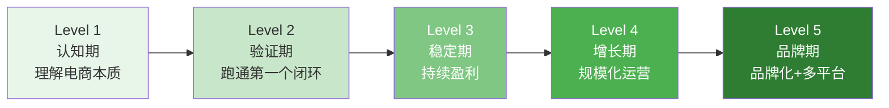
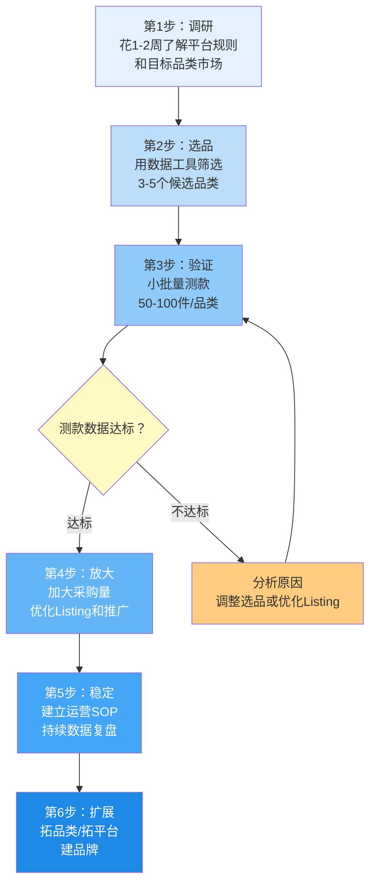

# 第11章 电商与跨境电商——本章小结

本章用了三十余篇内容，从理论基础到核心技巧、从实战案例到常见误区、从练习方法到深度拓展，系统地拆解了电商与跨境电商的完整知识体系。本节不是简单地重复前文要点，而是帮助你**建立全局视角**——将散落的知识点串成线、织成网，形成可以在实战中随时调用的认知框架。

同时，本节补充了前文未充分展开的关键内容：国内与跨境电商的全维度对比、常见问题解答、工具速查索引，以及面向不同阶段读者的进阶路径。读完本节，你应该对"电商是什么、怎么做、用什么做、往哪走"有完整的答案。

***

## 一、本章知识体系全景

### 1.1 知识架构回顾

整章内容遵循"道法术器"的递进逻辑：

| 层次 | 对应章节 | 核心内容 | 解决的问题 |
|------|----------|----------|------------|
| **道**（本质认知） | 理论基础篇 | 电商商业本质、流量分配机制、消费者决策路径 | "电商到底是什么？底层逻辑是什么？" |
| **法**（方法论） | 核心技巧篇 | 选品方法论、Listing优化、流量获取、转化提升 | "具体怎么做？标准流程是什么？" |
| **术**（实战技能） | 实战案例篇 + 练习方法篇 | 8个真实案例 + 8周训练体系 | "别人怎么做成的？我怎么练出来？" |
| **器**（工具与趋势） | 深度拓展篇 + 常见误区篇 | 数据分析工具、合规要求、行业趋势、10大误区 | "用什么工具？避开什么坑？未来往哪走？" |

```mermaid
graph TD
    A["第11章 电商与跨境电商"] --> B["理论基础篇<br>理解'为什么'"]
    A --> C["核心技巧篇<br>掌握'怎么做'"]
    A --> D["实战案例篇<br>看别人'做成了什么'"]
    A --> E["常见误区篇<br>避开'不该做什么'"]
    A --> F["练习方法篇<br>自己动手'练出来'"]
    A --> G["深度拓展篇<br>进阶'还能做什么'"]

    B --> B1["电商本质：人货场匹配"]
    B --> B2["流量分配：搜索+推荐双引擎"]
    B --> B3["消费决策：需求→搜索→比较→下单"]
    B --> B4["跨境逻辑：多一层合规+物流+汇率"]
    B --> B5["供应链理论：库存周转+柔性供应"]
    B --> B6["数据分析框架：漏斗+对比+归因"]
    B --> B7["社交电商：公域引流→私域沉淀"]
    B --> B8["行业趋势：AI+社交+全球化"]

    C --> C1["选品：数据+趋势+差异化三维验证"]
    C --> C2["Listing：标题+主图+详情页系统优化"]
    C --> C3["流量：SEO+付费+内容三管齐下"]
    C --> C4["转化：价格+评价+客服+信任"]
    C --> C5["供应链：选供应商+控质量+管库存"]
    C --> C6["跨境技巧：选品+物流+合规+本地化"]
    C --> C7["运营高级：数据驱动+自动化+团队"]
    C --> C8["营销高级：内容矩阵+品牌故事+私域"]

    D --> D1["淘宝月销50万：从新手到规模化"]
    D --> D2["亚马逊10万美金：跨境从0到1"]
    D --> D3["抖音直播起号：内容驱动增长"]
    D --> D4["闲鱼无货源：零成本验证"]
    D --> D5["独立站品牌出海：长期主义"]
    D --> D6["社群团购：本地化运营"]

    style A fill:#2d3748,stroke:#4a5568,color:#fff
    style B fill:#2b6cb0,stroke:#2c5282,color:#fff
    style C fill:#2f855a,stroke:#276749,color:#fff
    style D fill:#b7791f,stroke:#975a16,color:#fff
    style E fill:#c53030,stroke:#9b2c2c,color:#fff
    style F fill:#6b46c1,stroke:#553c9a,color:#fff
    style G fill:#2c7a7b,stroke:#285e61,color:#fff
```

### 1.2 核心公式与关键模型

本章贯穿始终的核心公式和模型，是理解电商运营的"骨架"：

**核心公式：销售额 = 流量 × 转化率 × 客单价**

这个公式看似简单，但每一项背后都有完整的知识体系：

| 公式变量 | 影响因素 | 对应技巧章节 | 核心方法 |
|----------|----------|-------------|----------|
| **流量** | 搜索排名、推荐算法、付费推广、内容营销 | 核心技巧篇第3节 | SEO优化关键词布局 + 直通车/千川精准投放 + 短视频/直播内容矩阵 |
| **转化率** | 主图点击率、详情页说服力、价格竞争力、评价质量、客服响应 | 核心技巧篇第4节 | A/B测试主图 → 场景化详情页 → 阶梯定价策略 → 评价引导体系 |
| **客单价** | 产品组合、关联销售、满减策略、品牌溢价 | 核心技巧篇第8节 | 搭配套餐 + 满减门槛设计 + 会员体系 + 品牌故事溢价 |

**公式延伸——利润公式**：

利润 = 销售额 × 毛利率 - 固定成本 - 变动成本

其中：毛利率 = (售价 - 采购成本 - 物流成本 - 平台佣金) / 售地价。很多新手只关注销售额而忽视毛利率，导致"越卖越亏"。一个日销100单但毛利率5%的店铺，不如日销30单但毛利率35%的店铺。核心技巧篇反复强调的"先算清楚再动手"就是这个道理。

**选品四维模型**：需求（市场容量）× 竞争（对手密度）× 利润（毛利率≥30%）× 供应链（稳定可靠），四个维度缺一不可。只看需求不看竞争会陷入红海，只看利润不看供应链会断货失信。

**流量权重公式**（深度拓展篇）：流量权重 = 商品质量分 × 用户匹配度 × 历史转化率 × 商业化投入 × 时间因子。理解这个公式就理解了为什么"产品好"比"广告多"更重要——商品质量分和历史转化率才是长期权重的大头。

**消费者决策路径**（理论基础篇第3节）：需求唤起 → 信息搜索 → 方案比较 → 购买决策 → 购后评价。每个环节都有对应的运营干预点：需求唤起靠内容种草，信息搜索靠关键词优化，方案比较靠差异化卖点，购买决策靠价格和信任，购后评价靠产品和服务。

***

## 二、各板块核心要点提炼

### 2.1 理论基础篇：建立认知地基

理论基础篇解决的是"知其然更知其所以然"的问题。很多电商新手一上来就学"怎么开直通车""怎么做标题优化"，但不理解背后的逻辑，遇到平台规则变化就手足无措。以下是理论篇中最值得内化的六个核心认知：

**认知一：电商的本质是"人、货、场"的高效匹配**。"人"是目标消费者画像，"货"是产品和供应链，"场"是平台和流量场景。三者匹配度越高，生意效率越高。选择平台本质上是选择"场"，选品是确定"货"，运营是连接"人"与"货"。

**认知二：平台流量分配遵循"效率优先"原则**。平台不是慈善机构，它的核心目标是最大化整体GMV。因此流量永远流向转化率更高、用户满意度更好的商品和店铺。这意味着"讨好平台"的正确方式不是刷单作弊，而是真正把产品和服务做好。

**认知三：搜索流量和推荐流量是两套不同的游戏**。搜索流量是"人找货"，用户有明确意图，优化重点是关键词相关性和转化率；推荐流量是"货找人"，平台根据用户画像匹配，优化重点是人群标签精准度和内容吸引力。两种流量的运营策略完全不同，不能用同一套方法。

**认知四：消费者的购买决策是一个可以被干预的链路**。从"产生需求"到"下单付款"中间有多个环节，每个环节都可以通过运营手段提升转化。理解这条链路，就知道什么时候该种草、什么时候该促销、什么时候该做评价管理。

**认知五：供应链是电商的"暗能力"**。消费者看不到供应链，但它决定了产品质量、发货速度、库存深度和利润率。理论基础篇第5节详细拆解了库存周转天数、安全库存计算、柔性供应等概念——这些"后台能力"才是长期竞争的护城河。

**认知六：社交电商的本质是"信任变现"**。私域流量不是把人拉进微信群就完事了，核心是建立信任关系后实现复购和裂变。公域引流 → 私域沉淀 → 信任建立 → 复购变现，这个链路每一步都有具体的方法论（理论基础篇第7节）。

### 2.2 核心技巧篇：掌握可复用的方法论

核心技巧篇是本章的"干货密度最高"部分，覆盖从选品到运营的全链路。以下是每个环节最核心的方法提炼：

**选品方法论**（核心技巧篇第1节）：

选品不是拍脑袋，而是一套可量化、可复制的决策流程。三种方法互补使用：

| 选品方法 | 核心逻辑 | 适用场景 | 关键工具 |
|----------|----------|----------|----------|
| **数据选品法** | 用销量、搜索量、竞争度等数据判断市场机会 | 已有明确品类方向时 | 生意参谋、Jungle Scout、Helium 10 |
| **趋势选品法** | 捕捉尚未爆发但正在上升的趋势品类 | 寻找蓝海机会时 | Google Trends、社交媒体话题、行业展会 |
| **差异化选品法** | 从竞品差评中找到改进方向，做"更好的版本" | 进入已有品类时 | 竞品评论分析、1688供应商沟通 |

三种方法的最佳实践是**交叉验证**：用数据选品发现机会 → 用趋势选品判断时机 → 用差异化选品确定切入角度。任何单一方法都有盲区，只有三维验证才能降低选品失败率。

**Listing优化**（核心技巧篇第2节）：

Listing是商品的"销售员"，优化目标是提升点击率（CTR）和转化率（CVR）：

- **标题优化**：前30个字包含核心关键词和核心卖点，结构为"品牌+核心词+属性词+场景词+长尾词"
- **主图优化**：第一张主图决定点击率，必须突出产品核心卖点，背景干净，差异化明显。建议准备5-8张主图做A/B测试
- **详情页优化**：前三屏决定用户是否继续看下去。第一屏放核心卖点和使用场景，第二屏放产品参数和细节，第三屏放用户评价和信任背书

**流量获取**（核心技巧篇第3节）：

流量获取的"三驾马车"——搜索优化、付费推广、内容营销——不是三选一，而是组合使用：

- **搜索优化**是基础，投入产出比最高但见效慢（2-4周起效）
- **付费推广**是加速器，见效快但成本可控性差（需要持续优化ROI）
- **内容营销**是长期引擎，前期投入大但边际成本递减（一条爆款视频可以带来数月的免费流量）

新手建议：先做好搜索优化打底，同时用小预算（每天50-100元）测试付费推广，逐步积累内容营销能力。

**转化提升**（核心技巧篇第4节）：

转化率的提升是一门"细节学"。核心技巧篇总结了四个关键维度：主图（吸引点击）、详情页（建立信任）、价格（促成决策）、评价（消除顾虑）。每个维度都有具体的操作标准——例如主图点击率的行业基准是3%-5%，低于3%说明主图需要优化；详情页跳出率超过70%说明前三屏信息密度不够。

### 2.3 实战案例篇：从他人的经验中提炼规律

实战案例篇呈现了6条不同的电商路径，每条路径代表一种资源禀赋和战略选择。以下是跨案例提炼的共性规律：

**规律一：起步阶段的核心是"低成本验证"**。

无论是淘宝月销50万的案例（从少量测款开始），还是闲鱼无货源月入5000的案例（零成本起步），还是独立站品牌出海的案例（先用最小可行产品测试市场），成功者无一例外都在早期控制了投入，用最小成本验证了产品和模式的可行性。失败者最常见的做法恰好相反——"看好一个方向"就大批量进货、租仓库、招团队，结果产品卖不动，沉没成本已经很高。

**规律二：数据驱动是所有成功卖家的共同特质**。

亚马逊月销10万美金的卖家每天花1小时分析数据（广告ACOS、转化率、库存周转），淘宝月销50万的卖家每周做一次数据复盘（流量来源、转化漏斗、客户画像）。数据不是"看了就行"，而是要建立固定的分析节奏和决策标准——例如"ACOS超过30%就暂停广告""转化率连续3天低于行业均值就优化Listing"。

**规律三：供应链能力决定了能做多大**。

从代购到品牌转型的案例说明了一个关键点：流量运营能力决定你能不能起步，供应链能力决定你能不能做大。代购模式利润率低且不可控，只有建立了自主供应链（找工厂定制、控制品质和成本），才能实现从"赚差价"到"建品牌"的跨越。

**规律四：长期主义者终将胜出**。

独立站品牌出海的案例中，前6个月几乎不赚钱，但坚持品牌定位、内容输出和用户体验优化，12个月后开始爆发式增长。而那些追求"快速变现"的卖家，频繁换品类、换平台、换策略，始终在新手期循环。

| 案例 | 核心路径 | 关键转折点 | 核心启示 |
|------|----------|-----------|----------|
| 淘宝月销50万 | 标品运营 → 规模化 | 找到"转化率高于行业2倍"的选品 | 数据选品 + 极致优化 |
| 亚马逊10万美金 | 跨境品牌 → FBA深耕 | 第一个产品Review突破100条 | 产品为王 + Review积累 |
| 抖音直播起号 | 内容驱动 → 流量爆发 | 单条视频播放突破50万 | 内容能力是核心竞争力 |
| 闲鱼无货源 | 低门槛验证 → 技能积累 | 月入5000后决定转向有货源 | 先验证再投入 |
| 独立站品牌出海 | 品牌建设 → 长期增长 | 复购率突破25% | 品牌是终极护城河 |
| 社群团购本地化 | 本地服务 → 社群裂变 | 单群月GMV突破5万 | 信任是私域的核心资产 |

### 2.4 常见误区篇：避开"看起来对、做起来亏"的坑

常见误区篇梳理了10大认知陷阱和操作盲区。这里将误区按"认知层-执行层-心态层"三个维度归类，帮助你建立更清晰的避坑框架：

**认知层误区**（根因是认知不正确）：

| 误区 | 错误认知 | 正确认知 | 代价 |
|------|----------|----------|------|
| 盲目跟风选品 | "别人卖得火我也能卖" | 爆款数据有2-4周滞后，入场即红海 | 库存积压、资金损失 |
| 忽视数据分析 | "感觉好卖就行" | 电商是数据驱动的生意，感觉不可靠 | 选品失败率>80% |
| 误解无货源模式 | "不囤货就零风险" | 无货源利润有限，平台限制越来越多 | 浪费时间、错过窗口 |

**执行层误区**（知道要做但做得不对）：

| 误区 | 错误做法 | 正确做法 | 代价 |
|------|----------|----------|------|
| 过度依赖付费流量 | 100%预算投直通车 | SEO+付费+内容组合，付费占比不超过50% | 利润被广告吞噬 |
| 库存管理失控 | 凭感觉大批量进货 | 小批量测款+数据预测+安全库存公式 | 资金链断裂 |
| Listing优化一次就不管了 | 上架时优化一次 | 每2周复盘数据，持续迭代优化 | 流量和转化率持续下滑 |
| 忽视平台规则 | 走捷径刷单/违规 | 合规经营，熟悉平台红线 | 封店、罚款、清退 |

**心态层误区**（心态导致的决策偏差）：

| 误区 | 心态根源 | 理性应对 | 代价 |
|------|----------|----------|------|
| 急于求成 | "一个月就要看到利润" | 电商有3-6个月的冷启动期 | 频繁换方向，永远在起步 |
| 过度投入 | "把所有积蓄押上去" | 先用可承受的损失金额验证 | 一次性亏损影响生活 |
| 闭门造车 | "我自己研究就行" | 加入卖家社群，关注行业动态 | 错过趋势和平台变化 |

### 2.5 练习方法篇：从知道到做到的桥梁

练习方法篇设计了8周的实战训练体系，核心理念是**"做中学"——每个练习对应具体的知识点，每个知识点必须有可交付的产出物**。

**8周训练路径总览**：

| 周次 | 练习主题 | 核心产出物 | 验收标准 |
|------|----------|-----------|----------|
| 第1周 | 平台调研 | 平台对比分析报告 | 完成至少3个平台的深度体验，明确自己的方向 |
| 第2周 | 数据选品 | 选品分析表（3-5个候选品类） | 每个品类有搜索量、竞争度、利润率数据 |
| 第3周 | 供应商对接 | 供应商评估表 | 联系至少5家供应商，确定2-3家备选 |
| 第4周 | Listing制作 | 完整的Listing（标题+主图+详情页） | 标题包含核心关键词，主图≥5张，详情页≥8屏 |
| 第5周 | 店铺搭建 | 正式上线的店铺 | 完成开店认证、店铺装修、商品上架 |
| 第6-7周 | 流量获取 | 流量获取方案+执行记录 | 开通搜索优化+小预算付费推广，日均访客≥50 |
| 第8周 | 订单与售后 | 订单处理SOP+售后话术库 | 完成前10个订单的完整履约流程 |
| 持续 | 持续优化 | 月度运营复盘报告 | 每月复盘数据，优化选品/Listing/推广策略 |

练习体系的关键设计原则：**前一个练习的产出是后一个练习的输入**。不做平台调研就选品，等于盲选；不做选品就找供应商，等于白谈；不做Listing就开店，等于浪费流量。按顺序执行，不跳步。

### 2.6 深度拓展篇：进阶者的知识升级

深度拓展篇为已有基础的卖家提供了更高维度的知识：

**流量机制深度解析**：详细拆解了电商平台的倒排索引技术、搜索排序算法因子、推荐系统的协同过滤逻辑。理解这些底层机制，才能在平台规则变化时快速调整策略，而不是被动应对。

**数据分析深度方法**：超越基础的"看报表"，讲解了漏斗分析（从曝光到成交的每一步转化率）、对比分析（与竞品/行业均值的差距）、归因分析（哪个渠道带来的订单最有价值）。这些方法是从业余卖家到专业运营的分水岭。

**合规要求**：跨境电商的合规不是"可选项"，而是"生存线"。产品认证（CE/FDA/UL）、知识产权（商标/专利/版权）、税务合规（VAT/关税/消费税）三个维度，任何一个出问题都可能导致货物被扣、店铺被封、甚至法律诉讼。

**独立站品牌建设**：独立站不是"另一个开店的地方"，而是品牌资产的载体。深度拓展篇讲解了域名选择、Shopify建站、Google Ads投放、SEO内容策略、邮件营销等完整链路。

**行业趋势**：AI驱动的智能选品和自动化运营、社交电商的深化（直播+短视频+社群三合一）、全球化与本地化的平衡（Glocalization）、可持续电商（环保+ESG），这些趋势将决定未来3-5年的电商格局。

***

## 三、自我诊断：你的电商能力到哪个阶段了？

在制定下一步计划之前，先评估自己当前的能力阶段。电商能力可以分为五个层级，每个层级对应不同的核心任务：

**Level 1 — 认知期**：正在学习电商知识，还没有开店或刚开店不久。核心任务是**理解底层逻辑**，重点掌握理论基础篇的内容。不要急着操作，先把"人货场""流量分配机制""消费者决策路径"这些概念吃透。

**Level 2 — 验证期**：已经开店并上架了商品，正在尝试获取流量和转化。核心任务是**跑通"选品→上架→出单→发货→售后"的完整闭环**。这个阶段不要追求销量，追求的是"每一步都能跑通"。参照练习方法篇的8周训练体系执行。

**Level 3 — 稳定期**：每月有稳定的订单和利润。核心任务是**优化效率和利润率**。重点做三件事：①用数据分析找出流量和转化的瓶颈点；②优化供应链（谈判更好的采购价、缩短物流时效）；③建立标准化的运营SOP。

**Level 4 — 增长期**：单一产品或店铺已到增长瓶颈。核心任务是**拓展**——拓品类、拓平台、拓团队。这个阶段要建立数据驱动的选品体系，用已验证的方法论复制到新品类；同时考虑多平台布局降低单一平台风险。

**Level 5 — 品牌期**：不再只是"卖货"，而是建立品牌。核心任务是**品牌资产积累**——商标注册、品牌故事、视觉体系、用户社群、复购体系。独立站品牌出海的案例就是品牌期的典型路径。

**自测清单与评分机制**：

对每个维度打分（1-5分），然后计算总分。总分对应你的能力阶段。

| 能力维度 | Level 1（1分） | Level 2（2分） | Level 3（3分） | Level 4（4分） | Level 5（5分） |
|----------|---------------|---------------|---------------|---------------|---------------|
| 选品能力 | 知道选品四维模型 | 能独立完成数据选品 | 有稳定的选品SOP | 能批量筛选品类 | 有自主开发产品的能力 |
| 运营能力 | 理解流量×转化×客单价 | 能优化基础Listing | 能独立管理店铺日常运营 | 能同时运营多个店铺/平台 | 有品牌运营体系 |
| 供应链能力 | 知道1688找货源 | 能对接供应商完成采购 | 有稳定的供应商和品控流程 | 有多供应商备份和议价能力 | 有自主供应链或ODM合作 |
| 数据能力 | 知道看生意参谋 | 能看懂基础数据报表 | 能做漏斗分析和对比分析 | 能用数据指导选品和运营决策 | 有完整的数据中台 |
| 资金能力 | 知道启动资金需求 | 能控制投入在可承受范围 | 现金流为正，利润率≥20% | 有资金规划和周转管理 | 有融资或资本运作能力 |

**评分结果解读**：

| 总分区间 | 能力阶段 | 下一步行动 |
|----------|----------|-----------|
| 5-8分 | Level 1 认知期 | 重点阅读理论基础篇，不要急于开店，先建立认知框架 |
| 9-13分 | Level 2 验证期 | 参照练习方法篇8周训练体系，跑通第一个完整闭环 |
| 14-18分 | Level 3 稳定期 | 建立数据分析习惯和运营SOP，优化利润率 |
| 19-22分 | Level 4 增长期 | 拓品类、拓平台、建团队，用方法论复制增长 |
| 23-25分 | Level 5 品牌期 | 品牌化建设，独立站/多平台布局，构建长期壁垒 |

***

## 四、国内电商 vs 跨境电商：全维度对比

这是本章读者最常面临的第一个关键决策。以下从运营全链路进行全维度对比，帮你做出理性选择：

### 4.1 基础条件对比

| 对比维度 | 国内电商 | 跨境电商 |
|----------|----------|----------|
| **语言要求** | 中文即可 | 英语为基础，小语种市场需本地化 |
| **启动资金** | 1,000-30,000元 | 30,000-100,000元 |
| **回款周期** | 确认收货后即到账（T+1至T+15） | 亚马逊14天，独立站T+2至T+7 |
| **物流时效** | 1-5天 | 7-30天（海外仓可缩短至3-7天） |
| **退货率** | 5%-15%（因品类而异） | 3%-8%（跨境退货成本高，退货率反而低） |
| **竞争格局** | 极度内卷，价格战严重 | 部分品类仍有蓝海机会 |
| **平台规则** | 变化频繁，需持续跟进 | 相对稳定但合规要求严格 |

### 4.2 运营维度对比

| 对比维度 | 国内电商 | 跨境电商 |
|----------|----------|----------|
| **选品逻辑** | 跟款快、生命周期短，需要快速迭代 | 产品生命周期长，选对一款可卖1-3年 |
| **流量获取** | 直通车+千川+内容种草，竞争激烈 | Google Ads+亚马逊PPC+社交媒体，CPC因品类差异大 |
| **内容营销** | 短视频+直播为主，抖音/快手/小红书 | 图文+视频+邮件营销，YouTube/Instagram/TikTok |
| **客服要求** | 即时响应（5分钟内），售后纠纷多 | 邮件为主（24小时内），但文化差异需注意 |
| **支付方式** | 支付宝/微信支付 | PayPal/信用卡/本地支付（每个市场不同） |
| **知识产权** | 平台内维权相对容易 | 侵权风险高，需提前做商标/专利排查 |
| **税务处理** | 增值税+所得税，相对简单 | VAT/关税/消费税，每个国家不同，合规复杂度高 |

### 4.3 资金与风险对比

| 对比维度 | 国内电商 | 跨境电商 |
|----------|----------|----------|
| **首批投入** | 测款500-3,000元即可启动 | 首批备货+物流+广告，至少2-5万元 |
| **资金周转** | 快（7-15天一个周期） | 慢（30-90天，尤其FBA模式） |
| **汇率风险** | 无 | 有，汇率波动直接影响利润率 |
| **政策风险** | 平台规则变化 | 平台规则+目标国政策+贸易政策三重风险 |
| **库存风险** | 国内清仓成本低 | 海外库存滞销清仓成本极高（弃货或退回） |
| **最大损失场景** | 库存积压+广告费打水漂 | 海关扣货+侵权诉讼+库存滞销 |

### 4.4 选择建议矩阵

| 你的情况 | 推荐方向 | 具体平台 | 理由 |
|----------|----------|----------|------|
| 零基础、零资金试水 | 国内 | 闲鱼 | 零门槛零保证金，验证选品感觉 |
| 有少量资金、想快速出单 | 国内 | 拼多多 | 门槛低、流量成本低、出单快 |
| 有内容创作能力 | 国内 | 抖音电商 | 兴趣推荐机制，内容好就有免费流量 |
| 有品质供应链 | 国内 | 京东 | 品质导向用户群，客单价高 |
| 有资金、想做品牌 | 国内 | 淘宝/天猫 | 生态成熟，品牌空间大 |
| 新手、资金有限 | 跨境 | Shopee | 东南亚市场增长快，门槛低 |
| 有资金、想做品牌 | 跨境 | 亚马逊 | 全球最大平台，品牌溢价空间大 |
| 工厂/供应链优势 | 跨境 | Temu全托管 | 不需要运营能力，平台负责定价和流量 |
| 内容能力强 | 跨境 | TikTok Shop | 短视频+直播，内容即流量 |
| 长期品牌规划 | 跨境 | 独立站(Shopify) | 自主掌控品牌和用户数据，利润率最高 |

***

## 五、平台选择决策框架

平台选择是电商创业的第一个关键决策，选错了方向，后面的努力可能事倍功半。以下是基于本章理论基础篇和核心技巧篇内容提炼的决策框架：

### 5.1 从0到1的启动路径

无论选择哪个平台，启动路径遵循相同的逻辑框架：

**测款数据达标标准**（核心技巧篇第1节）：

- 主图点击率 ≥ 3%（行业平均2%-3%，优秀4%-6%）
- 加购率 ≥ 8%（说明产品有真实需求）
- 转化率 ≥ 行业均值（可以在生意参谋/Jungle Scout查看）
- 三项全部达标 → 加大投入；任何一项不达标 → 分析原因或果断止损

### 5.2 平台组合策略

当单一平台运营稳定后，多平台布局是降低风险、扩大增长的必经之路。以下是常见的平台组合策略：

| 组合模式 | 平台搭配 | 适用阶段 | 核心逻辑 |
|----------|----------|----------|----------|
| **国内双平台** | 淘宝 + 抖音 | Level 3-4 | 淘宝承接搜索流量，抖音获取推荐流量，互补覆盖 |
| **国内+跨境** | 淘宝 + 亚马逊 | Level 4 | 同一套供应链，国内外双渠道消化产能 |
| **跨境多站点** | 亚马逊美/欧/日 | Level 4-5 | 同一品牌多站点运营，摊薄品牌建设成本 |
| **平台+独立站** | 亚马逊 + Shopify | Level 5 | 平台负责走量，独立站负责品牌和利润 |
| **全渠道** | 平台+独立站+社交电商 | Level 5 | 品牌全渠道覆盖，最大化用户触达 |

**多平台布局的注意事项**：

- **不要同时开多个平台**。先在一个平台跑通模式、稳定盈利，再复制到第二个平台。同时铺多个平台会导致精力分散，每个都做不好
- **产品可以复用，运营策略必须差异化**。同一款产品在淘宝和亚马逊的标题写法、主图风格、定价策略完全不同
- **供应链要统一管理**。多平台共用同一套供应链，但库存要分平台管理，避免某个平台断货

***

## 六、风险控制体系

电商创业的高淘汰率不是因为行业不行，而是因为风险管理不到位。以下是基于理论基础篇（创业常见陷阱）和常见误区篇提炼的风险控制体系：

### 6.1 五大核心风险与控制策略

| 风险类型 | 触发场景 | 预警信号 | 控制策略 | 止损标准 |
|----------|----------|----------|----------|----------|
| **库存风险** | 大批量进货后产品滞销 | 库存周转天数>60天，动销率<50% | 小批量测款+数据预测+安全库存公式 | 单品库存超过90天销量立即清仓 |
| **资金风险** | 现金流断裂，无法支付货款/广告费 | 账上资金<2个月运营成本 | 预算管理+控制投入节奏+保留3-6个月应急资金 | 资金低于1个月运营成本时暂停扩张 |
| **平台风险** | 平台规则变化、店铺被处罚/封禁 | 收到平台警告、流量异常下降 | 合规经营+熟悉平台红线+多平台布局 | 单平台收入占比不超过70% |
| **竞争风险** | 价格战、同质化、新竞争者涌入 | 毛利率持续下降、广告成本上升 | 差异化定位+品牌建设+供应链优化 | 毛利率<15%时重新评估品类价值 |
| **供应链风险** | 供应商断供、质量问题、物流异常 | 交期延误>3天、退货率突增 | 多供应商备选+验厂验货+质量抽检 | 单一供应商占比不超过60% |

### 6.2 风险控制的"三道防线"

**第一道防线：事前预防**。选品阶段就做风险评估——市场容量是否足够？竞争是否过于激烈？供应链是否可靠？资金需求是否在承受范围内？很多风险在选品阶段就可以避免。

**第二道防线：事中监控**。建立固定的运营数据监控节奏——每天看流量和转化率，每周看库存周转和利润率，每月做一次全面复盘。设置预警指标，一旦触发就启动应对方案。

**第三道防线：事后止损**。当风险已经发生时，快速止损比"再等等看"更重要。一个滞销品每天的仓储费和资金占用成本都在消耗你的利润，果断清仓、止损、复盘、重新选品，比死守一个失败的产品要理性得多。

### 6.3 跨境电商特有风险补充

跨境电商除了上述通用风险外，还有三个特有风险需要特别关注：

| 特有风险 | 具体表现 | 预防措施 |
|----------|----------|----------|
| **知识产权风险** | 产品外观/商标/专利侵权，被平台下架或被起诉 | 上架前做商标和专利排查（USPTO/WIPO/中国商标网），不使用他人品牌关键词 |
| **合规认证风险** | 产品不符合目标国安全标准（CE/FDA/UL/REACH），被海关扣货 | 提前了解目标国认证要求，选择已获认证的供应商，必要时送检 |
| **汇率与税务风险** | 汇率波动吃掉利润、VAT未申报被追缴 | 锁汇对冲汇率风险，注册目标国VAT税号，聘请专业跨境税务顾问 |

***

## 七、关键指标体系

### 7.1 电商运营核心指标

建立指标监控体系是从业余到专业的分水岭。以下指标必须做到"心中有数"：

**流量指标**：

| 指标 | 计算方式 | 健康值 | 警戒值 | 意义 |
|------|----------|--------|--------|------|
| 日均UV（访客数） | 平台后台直接查看 | 因品类而异 | 连续3天下降>20% | 流量趋势 |
| 搜索流量占比 | 搜索UV/总UV | ≥40% | <20% | 自然流量健康度 |
| 流量成本（CPC） | 广告花费/广告点击数 | 因品类而异 | 持续上升且转化未提升 | 付费流量效率 |
| 流量价值（VPM） | 销售额/总UV×1000 | 因品类而异 | 持续下降 | 每千次访客产出 |

**转化指标**：

| 指标 | 计算方式 | 健康值 | 警戒值 | 意义 |
|------|----------|--------|--------|------|
| 点击率（CTR） | 点击数/曝光数 | ≥3% | <1.5% | 主图和标题吸引力 |
| 转化率（CVR） | 订单数/访客数 | ≥行业均值 | <行业均值50% | Listing综合竞争力 |
| 加购率 | 加购数/访客数 | ≥8% | <3% | 产品需求强度 |
| 收藏率 | 收藏数/访客数 | ≥5% | <2% | 用户兴趣度 |
| 客单价 | 销售额/订单数 | 因品类而异 | 持续下降 | 产品组合和定价策略 |

**财务指标**：

| 指标 | 计算方式 | 健康值 | 警戒值 | 意义 |
|------|----------|--------|--------|------|
| 毛利率 | (售价-采购成本-物流成本)/售价 | ≥30% | <20% | 盈利能力基础 |
| 广告ROI | 广告带来的销售额/广告花费 | ≥3 | <1.5 | 付费推广效率 |
| 广告ACOS | 广告花费/广告带来的销售额 | ≤30% | >50% | 亚马逊广告效率（越低越好） |
| 复购率 | 重复购买客户数/总客户数 | ≥20% | <10% | 产品和用户体验 |
| 库存周转天数 | 平均库存/日均销量 | ≤30天 | >60天 | 资金使用效率 |
| 好评率 | 好评数/总评价数 | ≥95% | <90% | 产品质量和服务水平 |
| ROI（总投入回报） | (销售额-总成本)/总投入 | ≥50% | <0% | 整体盈利能力 |

### 7.2 指标之间的关联关系

单独看一个指标容易误判，需要结合关联指标一起分析：

| 场景 | 表面现象 | 可能原因 | 正确诊断方式 |
|------|----------|----------|-------------|
| 流量上升但销售额不变 | "推广有效果" | 引入了不精准的流量 | 对比UV增长来源，检查转化率是否下降 |
| 转化率很高但销售额低 | "Listing做得好" | 流量基数太小 | 检查日均UV，可能需要加大流量获取 |
| 销售额增长但利润下降 | "生意越做越大" | 广告成本或退货率上升 | 拆解成本结构，检查ACOS和退货率 |
| 好评率下降但销量稳定 | "问题不大" | 差评正在积累，爆发只是时间问题 | 立即分析差评原因，优化产品或服务 |
| 库存周转天数上升 | "正常备货" | 滞销风险正在积累 | 检查动销率，对滞销品制定清仓计划 |

### 7.3 运营里程碑时间线

电商创业的里程碑不是"越快越好"，而是"每一步都走稳"：

| 里程碑 | 时间参考 | 验证的能力 | 达标后的下一步 |
|--------|---------|-----------|---------------|
| 第一笔订单 | 第1-2周 | 选品+平台操作基本可行 | 优化Listing，提升出单频率 |
| 日均3-5单 | 第1-2个月 | 流量获取和转化初步跑通 | 优化广告ROI，控制获客成本 |
| 月销1万元 | 第3-4个月 | 运营体系初步建立 | 分析数据找增长点，拓展品类 |
| 月销5万元 | 第6-8个月 | 规模化运营能力 | 优化供应链，提升利润率 |
| 月销10万元 | 第9-12个月 | 团队协作和流程管理 | 多平台布局，品牌化建设 |
| 月销50万元+ | 12-24个月 | 品牌运营和资本效率 | 独立站/品牌出海，构建壁垒 |

**里程碑达标的关键不是"到了就行"，而是"到了之后还能持续"**。月销1万元如果只是靠一次爆款带来的，不算真正达标；持续3个月月销1万元，才算稳定在Level 3。

***

## 八、行动清单：从今天开始

### 8.1 分阶段行动框架

**阶段一：认知构建（第1-2周）**

- [ ] 完整阅读本章理论基础篇，理解"人货场""流量分配机制""消费者决策路径"三大核心概念
- [ ] 确定自己要做国内电商还是跨境电商（参考第四节的决策框架）
- [ ] 选定1-2个目标平台，花3天时间以消费者身份深度体验（浏览、搜索、下单、退货全流程）
- [ ] 注册目标平台的卖家账号，熟悉后台操作界面
- [ ] 加入1-2个目标平台的卖家社群（微信/QQ群、知无不言、派代网等）

**阶段二：选品验证（第3-4周）**

- [ ] 用数据工具（生意参谋/Jungle Scout/蝉妈妈）调研3-5个潜力品类
- [ ] 对每个品类填写"选品四维评估表"（需求、竞争、利润、供应链）
- [ ] 在1688上联系至少5家供应商，索要样品评估质量
- [ ] 确定1-2个主推品类，采购小批量测款库存（每个SKU 50-100件）

**阶段三：店铺搭建与上线（第5-6周）**

- [ ] 制作高质量Listing：优化标题（含核心关键词）、拍摄/设计5张以上主图、撰写详情页
- [ ] 完成店铺基础设置：店铺名称、简介、Logo、运费模板、售后政策
- [ ] 上架商品，设置合理的价格策略（参考竞品定价+目标利润率倒推）
- [ ] 开通基础推广工具，设置每日50-100元的小预算测试

**阶段四：运营优化（第7-12周）**

- [ ] 完成前30个订单的完整履约流程（下单→打包→发货→跟踪→售后）
- [ ] 建立数据监控习惯：每天花15分钟看流量和转化数据
- [ ] 根据数据反馈优化Listing（主图点击率低就换主图，转化率低就优化详情页）
- [ ] 积累10条以上好评，建立基础信任
- [ ] 分析前3个月的运营数据，制定下一阶段的增长计划

**阶段五：规模化与品牌化（第4个月起）**

- [ ] 拓展品类或SKU，用已验证的选品方法论复制
- [ ] 优化供应链：谈判更好的采购价、缩短物流时效
- [ ] 考虑多平台布局，降低单一平台风险
- [ ] 启动品牌化建设：商标注册、品牌视觉体系、用户社群
- [ ] 建立标准化运营SOP，为可能的团队扩张做准备

### 8.2 每日/每周/每月运营节奏

| 频率 | 执行事项 | 时间投入 | 核心目的 |
|------|----------|----------|----------|
| **每天** | 查看订单、处理售后、检查库存 | 30-60分钟 | 保证日常运转 |
| **每天** | 查看核心数据（流量、转化、广告ROI） | 15分钟 | 及时发现问题 |
| **每周** | 数据复盘（周环比分析）、优化Listing | 2-3小时 | 持续优化效率 |
| **每月** | 全面运营复盘、选品评估、下月计划 | 半天 | 战略层面调整 |
| **每季度** | 供应链评估、平台策略调整、品类规划 | 1天 | 长期方向校准 |

### 8.3 新手第一个月具体执行日历

为了让行动清单更具可操作性，以下是第一个月的逐周执行日历：

**第1周：平台调研与账号准备**

| 日期 | 任务 | 产出物 | 预计耗时 |
|------|------|--------|----------|
| Day 1-2 | 以消费者身份体验目标平台（搜索、浏览、下单） | 平台体验笔记 | 3-4小时 |
| Day 3-4 | 阅读平台卖家规则和入驻要求 | 规则要点清单 | 2-3小时 |
| Day 5 | 注册卖家账号，熟悉后台功能 | 账号就绪 | 1-2小时 |
| Day 6-7 | 加入卖家社群，收集行业信息 | 社群列表+信息整理 | 2小时 |

**第2周：数据选品与供应商调研**

| 日期 | 任务 | 产出物 | 预计耗时 |
|------|------|--------|----------|
| Day 8-9 | 用数据工具筛选3-5个潜力品类 | 品类数据表 | 4-5小时 |
| Day 10-11 | 对每个品类做四维评估（需求/竞争/利润/供应链） | 选品评估报告 | 3-4小时 |
| Day 12-13 | 在1688联系供应商，索要样品 | 供应商对比表 | 3-4小时 |
| Day 14 | 确定1-2个主推品类，下单采购样品 | 采购订单 | 1-2小时 |

**第3周：样品评估与Listing准备**

| 日期 | 任务 | 产出物 | 预计耗时 |
|------|------|--------|----------|
| Day 15-16 | 收到样品后评估质量，确定最终供应商 | 样品评估表 | 2-3小时 |
| Day 17-18 | 拍摄产品图片，设计主图（5张以上） | 主图文件 | 4-6小时 |
| Day 19-20 | 撰写标题和详情页文案 | Listing文案 | 3-4小时 |
| Day 21 | 采购首批测款库存（50-100件/SKU） | 采购订单 | 1小时 |

**第4周：上架与推广启动**

| 日期 | 任务 | 产出物 | 预计耗时 |
|------|------|--------|----------|
| Day 22-23 | 上架商品，完善店铺设置 | 商品上架完成 | 2-3小时 |
| Day 24-25 | 开通推广工具，设置小预算（50-100元/天） | 推广计划 | 2小时 |
| Day 26-27 | 监控数据，根据反馈微调Listing | 数据记录表 | 1小时/天 |
| Day 28 | 月度复盘，制定下月计划 | 复盘报告 | 2小时 |

***

## 九、关联领域与延伸学习

电商不是一个孤立的技能，它与多个领域深度关联。了解这些关联，能帮助你建立更完整的商业认知：

| 关联领域 | 与电商的关联 | 本章涉及深度 | 延伸学习方向 |
|----------|-------------|-------------|-------------|
| **数字营销** | SEO、SEM、社交媒体营销是电商流量的核心来源 | 核心技巧篇有实操指导 | 深入学习Google Ads、Facebook Ads、抖音巨量引擎 |
| **供应链管理** | 采购、库存、物流、品控直接影响利润率和用户体验 | 理论基础篇和核心技巧篇均有覆盖 | 学习精益供应链、JIT库存管理、跨境物流方案 |
| **数据分析** | 选品、运营、推广都依赖数据驱动决策 | 深度拓展篇有进阶方法 | 学习Python数据分析、SQL、BI工具（Tableau/Power BI） |
| **品牌建设** | 从卖货到品牌的升级，需要品牌策略、视觉设计、内容营销 | 深度拓展篇有独立站品牌章节 | 学习品牌定位理论、视觉识别系统（VI）、内容营销策略 |
| **消费者心理学** | 理解消费者决策路径，优化转化率 | 理论基础篇第3节 | 学习《影响力》《思考快与慢》《消费心理学》 |
| **知识产权** | 商标注册、专利保护、版权意识是品牌建设的基础 | 深度拓展篇有合规章节 | 了解国内外商标注册流程、专利申请、DMCA保护 |
| **财税合规** | 发票、税务、进出口合规是长期经营的底线 | 深度拓展篇有跨境税务 | 学习基础会计知识、跨境电商VAT/关税、出口退税 |

***

## 十、本章常见问题解答（FAQ）

以下是读者在学习本章后最常提出的10个问题，以及基于全章内容的系统解答：

### Q1：我没有货源，能做电商吗？

**可以，但要分清"无货源模式"和"有货源模式"的本质区别。**

无货源模式（如闲鱼无货源、一件代发）的核心价值是**低成本验证**——用零库存的方式测试自己的选品眼光和运营能力。但它有两个天花板：①利润空间被压缩（中间商差价有限）；②平台对无货源的限制越来越严（淘宝打击店群、拼多多限制代发）。

建议路径：先用无货源模式跑通闭环、积累经验 → 第2-3个月转向小批量有货源 → 逐步建立稳定的供应链。无货源是起点，不是终点。

### Q2：启动资金需要多少？

**因平台和模式而异，以下是最低启动资金参考**：

| 模式 | 最低启动资金 | 资金用途 |
|------|-------------|----------|
| 闲鱼无货源 | 0元 | 仅需时间和精力 |
| 拼多多小卖家 | 1,000-3,000元 | 首批库存+保证金+少量推广 |
| 淘宝/天猫 | 5,000-30,000元 | 库存+保证金+摄影+推广 |
| 抖音电商 | 3,000-10,000元 | 样品+拍摄设备+投流测试 |
| 亚马逊FBA | 30,000-80,000元 | 首批库存+头程物流+FBA费用+广告 |
| 独立站 | 20,000-50,000元 | 建站+库存+广告投放 |

核心原则：**只投入你能承受全部损失的资金**。电商有3-6个月的冷启动期，这段时间可能没有正向现金流。

### Q3：选品到底怎么选？有没有"万能品类"？

**没有万能品类，但有万能选品逻辑。**

选品四维模型（需求×竞争×利润×供应链）是本章反复强调的核心框架。具体操作步骤：

1. **数据筛品**：用生意参谋/Jungle Scout找搜索量上升、竞争度适中的品类
2. **趋势验证**：用Google Trends/社交媒体判断该品类是上升期还是衰退期
3. **竞品分析**：看竞品的差评，找到未被满足的需求点
4. **利润计算**：售价 - 采购成本 - 物流 - 平台佣金 - 广告费 = 净利润，毛利率≥30%才值得做
5. **供应链验证**：在1688/工厂找到至少3家供应商，对比价格、质量、交期

新手常犯的错误是只看"别人卖得好"就跟进，但爆款数据有2-4周滞后，等你上架时已经是红海了。

### Q4：Listing优化有没有速成方法？

**没有速成，但有优先级。**

按投入产出比排序：主图 > 标题 > 详情页 > 价格 > 评价管理。

- **主图**是最值得投入精力的地方，因为它直接影响点击率。建议花2-3天拍摄/设计5-8张主图，然后做A/B测试
- **标题**的核心是前30个字，必须包含核心关键词和核心卖点
- **详情页**前三屏决定用户是否继续看，第一屏放卖点和场景，第二屏放参数和细节，第三屏放评价和信任背书

不要追求"完美"再上架。先做到80分上架，然后根据数据反馈持续迭代到90分。

### Q5：广告ROI太低怎么办？

**先诊断再优化，不要盲目加预算。**

ROI低的原因通常只有三个：

1. **流量不精准**（点击率低、转化率低）→ 优化关键词和人群定向，排除无关流量
2. **转化率低**（有流量但不出单）→ 优化Listing（主图、详情页、价格、评价）
3. **出价过高**（CPC太高吃掉利润）→ 优化关键词质量分，降低出价

诊断方法：打开广告报表，看ACOS（广告花费/广告销售额）。ACOS < 30%基本健康，30%-50%需要优化，>50%应该暂停并分析原因。

### Q6：跨境电商的物流怎么选？

**根据产品特点和目标市场选择，没有"最好的物流"，只有"最合适的物流"。**

| 物流方式 | 时效 | 成本 | 适用场景 |
|----------|------|------|----------|
| **国际小包** | 15-30天 | 低 | 轻小件、低客单价、对时效不敏感 |
| **国际快递(DHL/FedEx/UPS)** | 3-7天 | 高 | 高客单价、对时效要求高、样品寄送 |
| **FBA（亚马逊物流）** | 1-3天 | 中高 | 亚马逊卖家，提升用户体验和搜索排名 |
| **海外仓** | 3-7天 | 中 | 有稳定销量的产品，提前备货到目标国 |
| **专线物流** | 7-15天 | 中 | 特定线路的性价比之选 |

新手建议：先用国际小包或FBA测试市场，有稳定销量后再考虑海外仓降低物流成本。

### Q7：差评怎么处理？

**预防为主，处理为辅。**

预防差评的三个关键：①产品描述要准确，不要过度承诺；②包装要结实，减少运输损坏；③客服要及时响应，把问题解决在评价之前。

已出现的差评处理方法：①第一时间联系买家，了解具体问题并真诚道歉；②提供退款/补发/优惠券等补偿方案；③引导买家修改评价（注意不能利诱，否则违反平台规则）；④如果差评内容不实或恶意，可以向平台申诉。

核心原则：**一个差评需要10-20个好评来稀释**，所以预防远比事后处理重要。

### Q8：什么时候该放弃一个品类/产品？

**设置明确的止损线，到线就走，不犹豫。**

建议的止损标准：

- 测款期（前2周）：主图点击率 < 1.5% 或 加购率 < 3%，说明产品本身没有吸引力，止损
- 推广期（第3-8周）：转化率 < 行业均值50% 且 经过3次Listing优化仍无改善，止损
- 稳定期（第3个月起）：毛利率 < 15% 或 库存周转天数 > 90天，止损

放弃不是失败，是**资源重新配置**。把时间和资金投入到更有潜力的产品上，比死守一个不赚钱的产品更有价值。

### Q9：一个人能做电商吗？什么时候需要团队？

**一个人完全可以起步，但规模化需要团队。**

| 阶段 | 人员需求 | 关键分工 |
|------|----------|----------|
| 月销1万以内 | 1人（你自己） | 选品+运营+客服+打包发货全包 |
| 月销1-5万 | 1-2人 | 你可以专注选品和推广，客服和发货交给兼职/家人 |
| 月销5-20万 | 2-4人 | 专人做客服、专人做仓储发货、你负责选品和策略 |
| 月销20万以上 | 4人以上 | 分设运营组、客服组、仓储组、采购组 |

不要过早招人。团队带来的管理成本和沟通成本会吃掉利润。先用自动化工具（ERP系统、自动回复、批量发货）提高一个人的效率，实在忙不过来再考虑招人。

### Q10：电商还能做吗？是不是太晚了？

**电商永远不会"太晚"，但玩法在变。**

2015年有人说"淘宝太晚了"，但2020年仍然有人在淘宝从零做到月销百万。2020年有人说"抖音电商太晚了"，但2025年仍然有新账号在抖音爆发。

核心逻辑：**只要有消费者需求没被满足，就有电商机会**。变的是平台和玩法，不变的是"好产品+好服务+好运营"的基本功。

当前的机会点：
- **AI工具降低了运营门槛**：AI可以辅助选品分析、Listing文案、客服回复、数据分析，一个人能做过去一个团队的工作
- **内容电商仍有红利**：短视频和直播带货在海外市场（TikTok Shop）仍处于早期
- **细分品类的机会**：大品类卷，但垂直细分品类（如宠物智能用品、户外露营小众装备）仍有蓝海
- **品牌化趋势**：消费者越来越注重品牌和品质，愿意为品牌溢价买单

***

## 十一、工具与平台速查索引

本章各节提到了大量工具和平台，以下是统一整理的速查索引，方便你按需查找：

### 11.1 数据分析工具

| 工具 | 用途 | 适用平台 | 费用 | 本章出处 |
|------|------|----------|------|----------|
| 生意参谋 | 店铺数据分析、市场洞察 | 淘宝/天猫 | 基础版免费，专业版约99元/月 | 核心技巧篇、深度拓展篇 |
| 蝉妈妈 | 抖音电商数据、直播分析 | 抖音 | 基础功能免费，高级版约200元/月 | 核心技巧篇 |
| Jungle Scout | 亚马逊选品、竞品分析 | 亚马逊 | 约49美元/月 | 核心技巧篇 |
| Helium 10 | 亚马逊全套运营工具 | 亚马逊 | 约79美元/月 | 核心技巧篇 |
| Google Trends | 搜索趋势分析 | 全球 | 免费 | 理论基础篇、核心技巧篇 |
| 飞瓜数据 | 抖音/快手数据分析 | 抖音/快手 | 基础功能免费 | 深度拓展篇 |
| Keepa | 亚马逊价格历史追踪 | 亚马逊 | 约19欧元/月 | 深度拓展篇 |

### 11.2 供应链与货源平台

| 平台 | 用途 | 适用场景 | 费用 |
|------|------|----------|------|
| 1688 | 国内批发采购 | 国内电商+跨境采购 | 免费浏览，交易按单计费 |
| 拼多多批发 | 低价货源 | 国内电商 | 免费浏览 |
| 阿里巴巴国际站 | 跨境供应商对接 | 跨境电商 | 免费浏览，信保订单有手续费 |
| 全球资源（Globalsources） | 外贸供应商 | 跨境电商 | 免费浏览 |

### 11.3 建站与营销工具

| 工具 | 用途 | 费用 |
|------|------|------|
| Shopify | 独立站建站 | 基础版39美元/月 |
| WooCommerce | WordPress电商插件 | 免费（需自购主机） |
| Canva | 图片设计、主图制作 | 基础版免费，Pro版约12美元/月 |
| Mailchimp | 邮件营销 | 免费版支持500联系人 |
| Google Ads | 搜索广告投放 | 按点击付费 |
| Facebook Ads | 社交媒体广告 | 按展示/点击付费 |

### 11.4 ERP与运营效率工具

| 工具 | 用途 | 适用平台 | 费用 |
|------|------|----------|------|
| 聚水潭 | 订单管理、库存管理、多平台对接 | 淘宝/拼多多/抖音等 | 基础版免费 |
| 旺店通 | 电商ERP | 淘宝/拼多多/京东等 | 按店铺数量收费 |
| 芒果店长 | 跨境电商ERP | 亚马逊/Shopee/Lazada等 | 基础版免费 |
| 领星ERP | 亚马逊ERP | 亚马逊 | 按店铺收费 |

### 11.5 在线社区与资讯

| 平台 | 定位 | 核心价值 |
|------|------|----------|
| 雨果跨境（cifnews.com） | 跨境电商资讯 | 行业动态、平台政策更新、卖家经验分享 |
| 知无不言（wyzw.com） | 亚马逊卖家社区 | 高质量的运营讨论、案例拆解、问题解答 |
| 派代网（paidai.com） | 电商行业资讯 | 国内电商行业趋势、平台变化、运营方法论 |
| 亿恩网（ennews.com） | 跨境电商新闻 | 跨境政策、物流动态、海外市场分析 |
| 知乎电商话题 | 综合讨论 | 各平台运营经验、避坑指南 |
| 小红书电商笔记 | 经验分享 | 实操经验、选品灵感、平台玩法 |

***

## 十二、推荐学习资源

### 12.1 书籍

**电商运营基础**：
- 《电商运营从入门到精通》——系统讲解电商运营全链路，适合零基础入门
- 《淘宝运营实战手册》——淘宝平台专项指南，覆盖从开店到爆款打造
- 《拼多多运营攻略》——拼多多平台的差异化运营策略

**跨境电商**：
- 《亚马逊跨境电商运营宝典》——亚马逊FBA运营全流程，从选品到广告
- 《独立站品牌出海》——Shopify独立站建站+引流+品牌建设
- 《Shopify独立站运营实战》——侧重实操，手把手教你搭建和运营独立站

**商业认知升级**：
- 《定位》——理解品牌定位的底层逻辑
- 《影响力》——理解消费者决策心理
- 《精益创业》——"最小可行产品"的验证思维
- 《增长黑客》——数据驱动的增长方法论
- 《长尾理论》——理解电商的长尾效应和小众品类机会

### 12.2 学习路径建议

| 你的阶段 | 推荐学习顺序 | 预计投入时间 |
|----------|-------------|-------------|
| 完全新手 | 本章理论基础篇 → 《电商运营从入门到精通》 → 练习方法篇8周训练 | 4-6周 |
| 有基础想进阶 | 本章核心技巧篇 → 深度拓展篇 → 《增长黑客》 | 2-3周 |
| 国内转跨境 | 本章跨境相关章节 → 《亚马逊跨境电商运营宝典》 → 跨境合规章节 | 3-4周 |
| 想做品牌 | 《定位》 → 本章独立站章节 → 《独立站品牌出海》 | 2-3周 |

***

## 十三、本章核心金句

> "电商的本质不是流量，而是人、货、场的高效匹配。产品好，流量自然来。"

> "不要试图在红海中硬拼，去寻找被忽视的需求缺口。好选品的标准不是'别人卖得好'，而是'用户的需求没被满足'。"

> "数据驱动决策，而不是凭感觉。每一个运营动作都应该有数据支撑，每一个数据变化都应该有原因分析。"

> "先用最小成本验证，再逐步放大投入。50件测款的损失你能承受，5000件滞销的损失可能让你出局。"

> "供应链是电商的暗能力。消费者看不到它，但它决定了你的产品质量、发货速度和利润率。"

> "长期主义者终将胜出。电商不是百米冲刺，而是马拉松。那些频繁换方向的人，永远在起跑线循环。"

> "Listing优化不是一次性工作，而是一个持续迭代的过程。今天的最优解，三个月后可能已经落后于竞品。"

> "风险控制的核心不是'不出错'，而是'出错后能快速止损'。设置止损线，到线就走，比盲目坚持更需要勇气。"

***

## 十四、下一章预告

在下一章中，我们将深入探讨**加密货币与DeFi**，包括：

1. **区块链技术基础**——理解去中心化账本、共识机制、智能合约的工作原理
2. **主流加密资产**——比特币、以太坊等核心资产的投资逻辑与风险特征
3. **DeFi核心概念**——去中心化交易所（DEX）、借贷协议、流动性挖矿、收益策略
4. **NFT与数字资产**——非同质化代币的应用场景和投资机会
5. **合规与税务**——加密货币投资的法律框架和税务处理

加密货币是高风险高收益的投资领域，波动性远超传统资产。下一章将帮你建立**理性的认知框架**——不是教你"All in"，而是帮你在充分理解风险的前提下，做出自己的判断。
