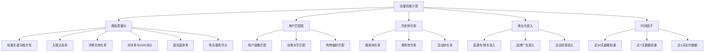
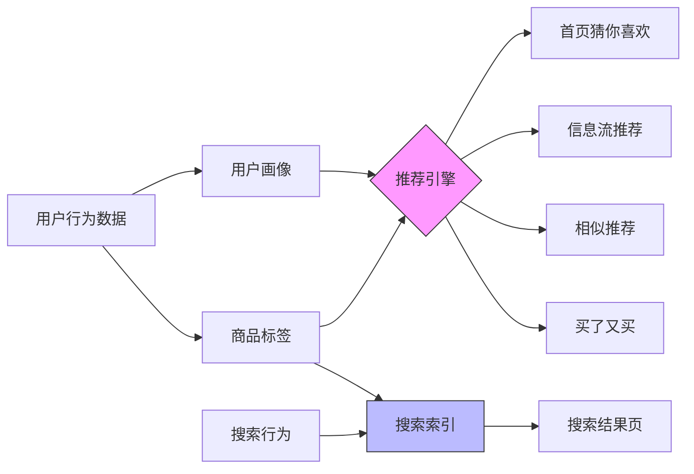
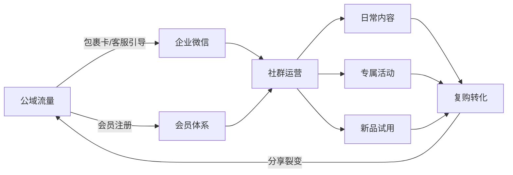
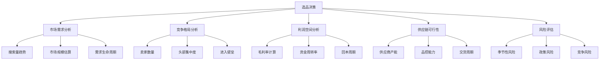
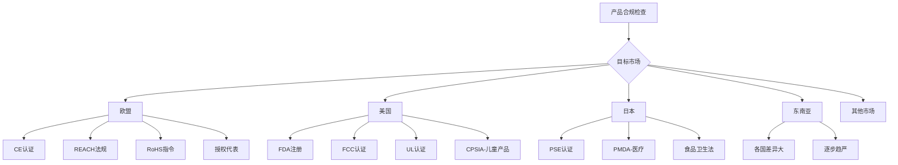
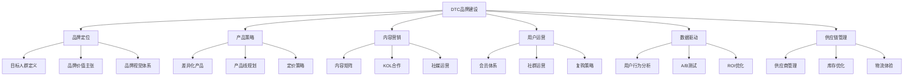
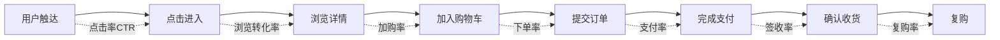
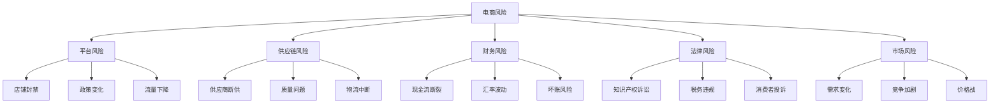

# 第11章 深度拓展：电商与跨境电商的进阶策略

本章是全书电商篇的进阶内容，面向已掌握基础运营、希望从"会做电商"升级为"精通电商"的读者。我们将构建一个完整的进阶知识体系：从平台流量分配的底层算法逻辑出发，深入选品的数据分析方法论，详解跨境合规的实操流程，探讨独立站品牌建设路径，系统讲解转化率优化、客服体系、物流运营、支付结算、数据分析、财务建模、团队管理和风险控制，最后前瞻行业未来趋势。

本章的核心理念：**电商运营的本质是在正确的时间，用正确的方式，把正确的商品，展示给正确的人，并以最优的效率完成从展示到交付的全流程**。理解了这个本质，所有进阶策略都只是这个理念在不同维度的具体展开。

---

## 一、电商平台的流量分配机制

### 1.1 平台流量分配的核心逻辑

电商平台的流量分配机制是理解整个电商运营的底层逻辑。无论是在淘宝、京东、拼多多还是亚马逊，平台的核心目标都是将有限的流量资源分配给最能产生交易转化的商品和店铺，从而最大化平台的整体交易额（GMV）。

理解这个机制的关键在于：平台不是慈善机构，它的每一滴流量都有机会成本。把一个展示位给商品A而不是商品B，平台会计算哪个选择能带来更高的GMV、更高的用户留存、更好的用户体验。这个计算逻辑就是流量分配算法。

平台流量分配的基本公式可以概括为：

```text
流量权重 = 商品质量分 × 用户匹配度 × 历史转化率 × 商业化投入 × 时间因子
```

其中每个因子的具体计算维度如下：



**商品质量分**包括：标题关键词相关性、主图点击率、详情页转化率、好评率与DSR评分、退货退款率、售后服务评分等。在淘宝体系中，商品质量分通常由系统根据近30天、7天、3天的数据滚动计算，并实时更新。不同时间窗口的数据权重不同——近3天的数据权重最高，这解释了为什么一次差评或退货潮会迅速影响流量。

**用户匹配度**指的是商品与搜索用户之间的相关性。平台通过用户画像（包括年龄、性别、地域、消费水平、购物偏好等）与商品标签进行匹配，决定商品在搜索结果和推荐信息流中的排序位置。这里有一个关键概念：**标签精准度**。一个商品的标签越精准，它获得的流量就越精准，转化率就越高，平台就更愿意分配流量——形成正向循环。

**历史转化率**是平台评估商品商业价值的核心指标。平台不仅关注整体转化率，还会细分到不同流量渠道的转化率。例如，一个商品可能搜索转化率很高（说明标题和主图吸引精准人群），但推荐转化率很低（说明商品标签不够精准，推荐给了非目标人群）。

**商业化投入**指的是商家在平台付费推广工具上的投入。商业化投入的本质是"花钱买数据"——通过付费流量快速积累点击、收藏、加购、购买等行为数据，帮助平台更快地理解你的商品适合推送给哪些人群。但商业化投入只能起到加速作用，如果商品本身竞争力不足，再多的广告投入也只是烧钱。

### 1.2 搜索流量与推荐流量的博弈

现代电商平台的流量主要分为两大类：搜索流量和推荐流量。这两类流量的获取逻辑完全不同，需要不同的运营策略。

**搜索流量**是用户主动搜索关键词后产生的流量，具有明确的购买意图，转化率通常在3%-8%之间（因品类而异）。搜索流量的核心是**关键词竞争**——你需要让你的商品在特定关键词的搜索结果中排名靠前。

在搜索流量的分配中，平台采用的是倒排索引技术。当用户输入一个搜索关键词时，系统会从商品库中检索所有包含该关键词的商品，然后根据权重算法进行排序。影响搜索排序的核心因素包括：

| 因素 | 权重占比（估算） | 优化方法 | 见效周期 |
|------|-----------------|---------|---------|
| 关键词相关性 | 25% | 标题优化、属性填写完整 | 即时 |
| 点击率 | 20% | 主图优化、标题吸引力 | 1-3天 |
| 转化率 | 25% | 详情页优化、价格策略 | 3-7天 |
| 好评率与DSR | 15% | 售后服务、好评引导 | 7-30天 |
| 店铺权重 | 10% | 店铺综合运营 | 长期积累 |
| 商业化加权 | 5% | 付费推广配合 | 即时 |

**推荐流量**是平台通过算法在首页、猜你喜欢、信息流等位置主动推荐给用户的流量，属于"货找人"的模式。推荐流量的规模通常远大于搜索流量（在成熟平台上，推荐流量可以占到总流量的60%以上），但转化率相对较低（通常在1%-3%之间）。

推荐流量的分配依赖于协同过滤算法和深度学习模型。以淘宝的推荐系统为例，它使用了多种深度学习架构：

- **Wide & Deep模型**：结合"记忆能力"（记住用户的历史行为）和"泛化能力"（预测用户对新商品的兴趣），是推荐系统的基础架构
- **DIN（Deep Interest Network）**：能够根据候选商品动态调整用户兴趣表示。例如，当推荐一个耳机时，系统会重点参考用户浏览过的电子产品历史；当推荐一件裙子时，则重点参考用户的服装浏览历史
- **DIEN（Deep Interest Evolution Network）**：在DIN基础上增加了时间维度，能够捕捉用户兴趣的演变过程。例如，用户可能从关注平价手机逐渐转向关注旗舰手机



### 1.3 流量运营的进阶策略

#### 1.3.1 搜索流量优化：关键词矩阵法

搜索流量优化的核心是关键词的精准布局。推荐使用**关键词矩阵法**进行系统化管理：

**第一步：关键词收集**。通过生意参谋的"搜索分析"功能、直通车的"流量解析"工具、以及第三方工具（如店透视、数据脉等）收集目标品类的所有相关关键词。一个成熟品类通常可以收集到200-500个有效关键词。

**第二步：关键词分类**。将关键词按类型分为四类：
- **核心词**：品类大词，如"连衣裙"、"蓝牙耳机"，搜索量大但竞争激烈
- **属性词**：描述商品属性的词，如"真丝连衣裙"、"降噪耳机"
- **长尾词**：搜索量较小但精准的词，如"真丝连衣裙女夏季2024新款"
- **场景词**：描述使用场景的词，如"办公室降噪耳机"

**第三步：关键词分配**。每个商品的标题最多覆盖3-5个核心关键词组，标题优化的原则是：核心词+属性词+修饰词+长尾词。同时要注意关键词的搜索热度趋势和季节性变化。

**第四步：关键词监控**。每周监控关键词的排名变化、搜索量变化和转化率变化，及时调整优化策略。

#### 1.3.2 推荐流量优化：标签精准化

推荐流量优化的关键在于商品标签的精准化。具体操作步骤：

1. **精准投放直通车**：选择与商品目标人群高度匹配的关键词和人群包进行投放，通过付费流量吸引目标人群
2. **积累精准行为数据**：目标是产生精准的收藏、加购和购买行为，这些行为数据会帮助系统建立准确的商品标签
3. **持续优化**：通过生意参谋的"人群画像"功能监控商品的人群标签是否与目标一致，如果出现偏差，需要通过调整投放策略进行纠正

一个常见的误区是：为了追求转化率而使用低价引流策略。低价引流虽然能带来销量，但会吸引价格敏感型人群，导致商品标签被"养歪"，后续推荐流量的质量会持续下降。正确的做法是通过精准的关键词投放和人群定向来获取目标人群的行为数据。

#### 1.3.3 内容流量获取

随着直播电商和短视频电商的兴起，内容流量成为新的增长点。内容流量的核心逻辑是**"内容种草→兴趣激发→搜索转化"**的闭环。

具体策略包括：
- **短视频内容**：制作15-60秒的产品展示视频，重点突出使用场景和核心卖点。发布在抖音、快手、视频号等平台，挂载商品链接
- **直播带货**：自播或与达人合作，通过实时互动展示产品，解决用户疑虑
- **图文种草**：在小红书、微博等平台发布图文内容，建立品牌认知

内容流量的核心指标是**种草效率**，即每条内容带来的搜索增量。种草效率的计算方式为：发布内容后48小时内，商品在平台内搜索量的增长百分比。优秀的种草内容可以带来30%-100%的搜索增量。

#### 1.3.4 私域流量建设

通过微信群、企业微信、会员体系等方式将公域流量转化为私域流量。私域流量的核心价值在于可以反复触达用户，提高复购率和用户生命周期价值（LTV）。

私域流量的运营框架：



关键指标：私域用户月活跃率应保持在30%以上，复购率应比非私域用户高2-3倍，私域用户的获客成本应在公域的1/3以下。

私域运营的三个关键阶段：
1. **引流期**：通过包裹卡片（成本约0.1-0.3元/张）、客服话术引导、直播间关注等方式，将公域用户导入企业微信或微信群。引流率（加微率/总订单数）的行业基准为8%-15%
2. **养熟期**：通过有价值的内容（使用教程、搭配建议、行业资讯）、专属福利（私域专享价、优先发货）、互动活动（晒单有礼、使用反馈）等方式，建立信任关系。这一阶段通常需要2-4周
3. **变现期**：通过新品首发、限时秒杀、拼团活动、老客专属优惠等方式实现转化。私域用户的客单价通常比公域高15%-30%

---

## 二、选品的数据分析方法

### 2.1 数据驱动选品的框架

数据驱动选品是现代电商运营的核心能力。一个好的选品决策可以让你事半功倍，一个错误的选品决策则可能让你浪费数月时间和数万资金。

完整的选品数据分析框架包括五个维度：



### 2.2 选品数据的获取渠道

| 数据类型 | 工具/平台 | 费用 | 数据精度 | 适用场景 |
|---------|----------|------|---------|---------|
| 平台搜索数据 | 生意参谋（淘宝） | 免费/付费版 | 高 | 淘宝选品 |
| 平台搜索数据 | 京东商智 | 付费 | 高 | 京东选品 |
| 跨平台数据 | 魔镜市场情报 | 2000-8000元/年 | 中高 | 全平台选品 |
| 跨平台数据 | 蝉妈妈 | 1000-5000元/年 | 中 | 抖音电商选品 |
| 搜索趋势 | Google Trends | 免费 | 中 | 跨境选品 |
| 搜索趋势 | 百度指数 | 免费 | 中 | 国内选品 |
| 供应链数据 | 1688 | 免费 | 高 | 成本核算 |
| 社交媒体 | 小红书/抖音 | 免费 | 低 | 趋势发现 |
| 跨境数据 | Jungle Scout | $29-$129/月 | 高 | 亚马逊选品 |
| 跨境数据 | Helium 10 | $29-$229/月 | 高 | 亚马逊选品 |

### 2.3 选品的数据分析方法

#### 2.3.1 关键词分析法

通过分析目标品类的关键词数据来评估市场机会。具体步骤：

**Step 1**：在生意参谋的"搜索分析"中输入品类核心词，导出所有相关关键词的搜索数据

**Step 2**：计算每个关键词的**机会指数**：

```text
机会指数 = 搜索量 × 点击转化率 ÷ 在线商品数 × 100
```

机会指数 > 1 表示供不应求（蓝海机会），0.1-1 表示供需平衡，< 0.1 表示供过于求（红海竞争）。

**Step 3**：筛选出机会指数最高的10-20个细分关键词，作为选品方向

**实际案例**：假设分析"蓝牙耳机"品类，发现以下数据：

| 关键词 | 月搜索量 | 点击转化率 | 在线商品数 | 机会指数 |
|--------|---------|-----------|-----------|---------|
| 蓝牙耳机 | 500,000 | 2.1% | 800,000 | 0.13 |
| 蓝牙耳机 降噪 运动 | 85,000 | 4.5% | 12,000 | 3.19 |
| 蓝牙耳机 骨传导 游泳 | 32,000 | 6.2% | 3,500 | 5.67 |
| 蓝牙耳机 儿童 学习 | 18,000 | 5.8% | 2,800 | 3.73 |

从数据可以看出，"蓝牙耳机"大词竞争激烈（机会指数仅0.13），但"骨传导游泳耳机"和"儿童学习耳机"等细分领域机会明显。

#### 2.3.2 趋势分析法

通过分析品类的时间序列数据来判断市场趋势。核心方法包括：

- **移动平均法**：计算7日/30日移动平均线，平滑短期波动，识别长期趋势。当7日均线向上穿越30日均线时，说明品类处于上升趋势
- **季节性分解法**：将时间序列分解为趋势项、季节项和随机项，判断品类是否存在明显的季节性波动
- **同比增长分析**：对比今年与去年同期的数据，判断品类是处于增长期、成熟期还是衰退期

趋势判断的决策矩阵：

| 搜索趋势 | 同比增速 | 市场阶段 | 选品策略 |
|---------|---------|---------|---------|
| 持续上升 | > 30% | 成长期 | 谨慎进入，验证差异化能力 |
| 平稳波动 | 0-15% | 成熟期 | 寻找细分机会，避免正面竞争 |
| 缓慢下降 | -10%-0% | 饱和期 | 不建议进入，除非有颠覆性创新 |
| 快速下降 | < -10% | 衰退期 | 禁止进入 |

#### 2.3.3 竞品对比分析法

通过对比竞品的数据来发现市场机会。具体维度：

| 分析维度 | 数据来源 | 分析方法 | 机会点 |
|---------|---------|---------|-------|
| 价格区间分布 | 平台搜索结果 | 价格段销量分布图 | 寻找被忽略的价格段 |
| 功能卖点差异 | 竞品详情页 | 功能对比表 | 发现竞品未覆盖的功能 |
| 用户差评分析 | 竞品评价 | NLP情感分析 | 发现竞品的不足之处 |
| 销量变化趋势 | 生意参谋 | 时间序列分析 | 判断竞品的生命周期阶段 |

**差评分析实操**：收集目标品类Top 20竞品的3星及以下评价，按问题类型分类统计。常见的差评类型包括：质量问题（如"容易坏"）、功能缺陷（如"降噪效果差"）、尺寸问题（如"偏大/偏小"）、物流问题（如"包装破损"）。其中，质量问题和功能缺陷是最有价值的选品信号——它们说明现有产品在这些方面有改进空间。

**差评分析操作流程**：
1. 使用工具（如淘宝评价导出插件、Jungle Scout Review Downloader）批量导出竞品评价
2. 使用Python的jieba分词+NLP情感分析（或直接使用ChatGPT API）对评价进行分类
3. 统计各类型差评的频率和严重程度
4. 将差评痛点转化为产品改进需求
5. 与供应商沟通改进方案，验证可行性和成本

#### 2.3.4 蓝海指数分析法

综合评估一个市场的"蓝海程度"：

```text
蓝海指数 = 市场需求指数 ÷ 竞争指数
```

其中：
- 市场需求指数 = (月搜索量标准化 × 0.4 + 搜索增长率标准化 × 0.3 + 客单价标准化 × 0.3)
- 竞争指数 = (卖家数量标准化 × 0.3 + 头部集中度标准化 × 0.4 + 平均评价数标准化 × 0.3)

蓝海指数 > 2 为优质蓝海市场，1-2 为机会市场，< 1 为红海市场。

#### 2.3.5 选品评分卡

将以上所有维度整合为一张选品评分卡，每个维度1-5分，总分50分：

| 维度 | 评分标准 | 权重 | 得分 |
|------|---------|------|------|
| 市场规模 | 月搜索量>50万=5, 10-50万=4, 1-10万=3, <1万=2 | 15% | ? |
| 增长趋势 | 同比>30%=5, 10-30%=4, 0-10%=3, 负增长=1 | 15% | ? |
| 竞争强度 | 机会指数>2=5, 1-2=4, 0.5-1=3, <0.5=2 | 15% | ? |
| 利润空间 | 毛利率>50%=5, 40-50%=4, 30-40%=3, <30%=2 | 15% | ? |
| 供应链可行性 | 供应商多+稳定=5, 少但稳定=4, 不稳定=2 | 10% | ? |
| 差异化空间 | 差评痛点多=5, 有一些=3, 无明显痛点=1 | 10% | ? |
| 季节性 | 全年刚需=5, 弱季节性=3, 强季节性=1 | 10% | ? |
| 合规风险 | 无特殊要求=5, 一般认证=3, 复杂认证=1 | 10% | ? |

总分≥35分：强烈推荐进入；25-35分：谨慎评估后进入；<25分：不推荐。

---

## 三、跨境电商的合规要求

### 3.1 产品合规要求

跨境电商面临的首要合规问题是产品本身的合规要求。合规不是可选项，而是底线——不合规的产品可能面临海关扣押、平台下架、罚款甚至刑事责任。



#### 3.1.1 各市场认证要求详细对比

| 认证/法规 | 市场 | 适用品类 | 费用估算 | 办理周期 | 必要性 |
|----------|------|---------|---------|---------|-------|
| CE认证 | 欧盟 | 电子/玩具/机械等 | 3000-30000元 | 4-8周 | 强制 |
| REACH | 欧盟 | 含化学物质的产品 | 5000-50000元 | 8-16周 | 强制 |
| RoHS | 欧盟 | 电子产品 | 2000-10000元 | 2-4周 | 强制 |
| FDA注册 | 美国 | 食品/药品/化妆品 | 2000-20000元 | 2-8周 | 强制 |
| FCC认证 | 美国 | 电子产品 | 3000-15000元 | 3-6周 | 强制 |
| UL认证 | 美国 | 电子产品 | 5000-30000元 | 6-12周 | 非强制但强烈建议 |
| CPSIA | 美国 | 儿童产品 | 3000-10000元 | 4-8周 | 强制 |
| PSE认证 | 日本 | 电气产品 | 5000-20000元 | 4-8周 | 强制 |
| UKCA | 英国 | 电子/玩具/机械等 | 3000-25000元 | 4-8周 | 强制 |

#### 3.1.2 认证实操流程

以CE认证为例，完整的操作流程如下：

1. **确定适用指令**：根据产品类型确定适用的欧盟指令（如LVD低电压指令、EMC电磁兼容指令、RED无线设备指令等）
2. **选择认证机构**：选择有资质的第三方检测机构（如SGS、TUV、Intertek等）
3. **准备技术文件**：包括产品规格书、电路图、BOM清单、风险评估报告等
4. **送样测试**：将样品送至实验室进行测试，测试周期通常为2-4周
5. **出具报告**：测试通过后，认证机构出具测试报告和证书
6. **签署符合性声明**：制造商签署EU符合性声明（Declaration of Conformity）
7. **加贴CE标志**：在产品上加贴CE标志，标明制造商信息

**常见误区**：很多卖家认为有CE证书就万事大吉。实际上，CE认证是制造商的自我声明，测试只是辅助手段。如果产品在欧盟市场出现安全事故，制造商需要承担全部法律责任，即使有第三方测试报告。

**认证成本优化建议**：
- 同系列产品可以申请"系列认证"，以一个主型号带动多个子型号，节省30%-50%的费用
- 提前与供应商确认其产品是否已有相关认证，避免重复检测
- 对于高频出口品类，可以考虑与认证机构签订年度框架协议，获得更优惠的价格
- 建立认证到期提醒机制，避免证书过期导致产品被下架

### 3.2 知识产权合规

知识产权合规是跨境电商面临的另一大挑战。知识产权问题不仅会导致产品下架，还可能引发法律诉讼和高额赔偿。

#### 3.2.1 四类知识产权风险

| 类型 | 定义 | 常见场景 | 后果 | 防范方法 |
|------|------|---------|------|---------|
| 商标侵权 | 使用他人注册商标 | 品牌名相似、使用他人logo | 产品下架、赔偿、冻结资金 | 商标检索（USPTO/EUIPO/WIPO） |
| 发明专利 | 侵犯技术方案专利 | 使用他人专利技术方案 | 产品下架、赔偿、禁令 | 专利检索（Google Patents） |
| 外观专利 | 侵犯外观设计 | 产品外观相似 | 产品下架、赔偿 | 外观设计检索 |
| 版权侵权 | 侵犯著作权 | 使用他人图片、文案、软件 | 产品下架、DMCA投诉 | 原创内容、授权使用 |

#### 3.2.2 知识产权检索实操

**商标检索**：
- 美国：USPTO商标数据库（https://tmsearch.uspto.gov）
- 欧盟：EUIPO商标数据库（https://euipo.europa.eu）
- 国际：WIPO全球品牌数据库（https://branddb.wipo.int）
- 中国：国家知识产权局商标局（https://sbj.cnipa.gov.cn）

**专利检索**：
- Google Patents（https://patents.google.com）：全球专利检索
- USPTO专利数据库：美国专利
- EPO Espacenet：欧洲专利

**平台知识产权保护机制**：

| 平台 | 保护机制 | 功能 | 申请条件 |
|------|---------|------|---------|
| Amazon | Brand Registry | 品牌保护、侵权投诉、A+内容 | 有效商标注册 |
| Amazon | Transparency | 产品溯源、防伪验证 | 品牌注册卖家 |
| eBay | VeRO计划 | 知识产权侵权投诉 | 知识产权所有者 |
| 速卖通 | IP保护平台 | 侵权投诉、品牌保护 | 知识产权所有者 |
| Shopee | IP Rights保护 | 侵权投诉 | 知识产权所有者 |

**知识产权合规检查清单**：
1. 上架前必须完成商标和专利检索，检索范围覆盖目标市场所在国
2. 产品图片、文案、视频必须为原创或已获授权
3. 品牌名和产品名不能与已有商标构成近似
4. 产品外观不能与已有外观专利构成近似
5. 技术方案不能落入已有发明专利的保护范围
6. 保存所有检索记录和授权文件作为证据链

### 3.3 税务合规

跨境电商的税务合规涉及多个层面，是很多卖家忽视但后果严重的领域。

#### 3.3.1 主要税种及税率

| 税种 | 市场 | 税率范围 | 申报要求 | 注意事项 |
|------|------|---------|---------|---------|
| 关税 | 各国 | 0%-30%+ | 进口时缴纳 | HS编码归类准确 |
| VAT | 欧盟 | 17%-27% | 季度/月度申报 | 需在当地注册税号 |
| VAT | 英国 | 20% | 季度申报 | 脱欧后独立体系 |
| 消费税 | 日本 | 10% | 年度申报 | JCT注册 |
| 销售税 | 美国 | 0%-10.25% | 州级申报 | 各州税率不同 |
| GST | 澳大利亚 | 10% | 季度申报 | 超过7.5万AUD需注册 |
| GST | 新加坡 | 9% | 季度申报 | 超过100万SGD需注册 |

#### 3.3.2 关税优化策略

1. **HS编码优化**：同一产品可能对应多个HS编码，不同编码的税率可能差异很大。建议找专业的报关行进行归类建议
2. **自贸区利用**：利用自由贸易协定（如RCEP、中国-东盟FTA等）的优惠关税
3. **保税仓模式**：通过保税仓模式可以延缓缴纳关税，改善现金流
4. **低值免税门槛**：了解目标市场的低值免税门槛（De Minimis），合理拆分订单。但注意：2025年起美国对来自中国的商品取消了800美元以下的免税待遇

#### 3.3.3 VAT注册与申报

以欧盟VAT为例，完整的注册和申报流程：

1. **确定注册国家**：如果使用FBA，需要在存放库存的每个国家注册VAT
2. **准备材料**：营业执照、法人身份证、公司章程、银行账户信息等
3. **提交申请**：通过当地税务局或委托税务代理提交申请
4. **等待审批**：通常需要4-12周
5. **获得税号**：获得VAT税号后，在亚马逊等平台填写税号信息
6. **定期申报**：按月或按季提交VAT申报表，按时缴纳税款

**重要提醒**：欧盟从2021年7月起实施了IOSS（Import One-Stop Shop）制度，对于150欧元以下的进口包裹，卖家可以在销售时代收代缴VAT，简化了清关流程。

**税务合规常见错误**：
- 使用他人VAT税号（属于严重违规，可能导致店铺封禁）
- 低报货值以减少关税（海关稽查风险极高，罚款可达货值的4倍）
- 忽略逆向征收机制（Reverse Charge）的适用条件
- 未及时更新VAT税率变更（如英国脱欧后的税率调整）

---

## 四、独立站的品牌建设

### 4.1 独立站的战略价值

独立站（Brand Website）是品牌直接面向消费者的数字资产。与第三方平台相比，独立站具有以下战略价值：

| 维度 | 第三方平台 | 独立站 |
|------|----------|--------|
| 品牌控制 | 受平台规则约束 | 完全自主控制 |
| 数据资产 | 平台拥有用户数据 | 完整拥有用户数据 |
| 利润空间 | 扣除5%-15%佣金 | 无平台佣金 |
| 流量来源 | 依赖平台分配 | 自主获取流量 |
| 用户关系 | 平台用户，非品牌用户 | 品牌用户，可反复触达 |
| 竞争环境 | 与竞品直接对比 | 独立展示空间 |
| 政策风险 | 随时可能被封禁 | 自主掌控 |
| 建设成本 | 低（开店即可） | 高（需要技术+营销投入） |

### 4.2 独立站建站平台对比

| 平台 | 类型 | 月费 | 交易佣金 | 适合谁 | 优势 | 劣势 |
|------|------|------|---------|-------|------|------|
| Shopify | SaaS | $39-$399 | 0%-2% | 中小卖家 | 易用、生态丰富 | 定制性有限、月费+佣金 |
| WooCommerce | 开源插件 | 免费（主机费） | 0% | 技术团队 | 灵活、免费 | 需要技术能力 |
| Magento | 开源 | 免费/付费版 | 0% | 大型企业 | 功能强大、可扩展 | 复杂、需要专业开发 |
| BigCommerce | SaaS | $39-$399 | 0% | 中型企业 | 无交易佣金 | 生态不如Shopify |
| SHOPLINE | SaaS | 按方案定价 | 低 | 中国卖家 | 中文支持、本地化 | 国际化程度较低 |
| Shoplazza | SaaS | 按方案定价 | 低 | 中国卖家 | 中文支持、DTC聚焦 | 品牌知名度较低 |

### 4.3 DTC品牌建设方法论

DTC（Direct to Consumer）模式的核心是品牌直接面向消费者销售，跳过传统的分销渠道。一个成功的DTC品牌需要在以下六个方面建立能力：



#### 4.3.1 DTC品牌冷启动清单

**第1个月：品牌基础建设**
- 完成品牌定位和视觉体系设计
- 搭建Shopify/WooCommerce独立站
- 准备10-20个SKU的核心产品
- 拍摄高质量产品图片和视频
- 撰写品牌故事和产品描述

**第2个月：流量测试**
- 投放Facebook/Google广告，测试产品市场匹配度（PMF）
- 每日预算$50-$100，测试5-10组广告素材
- 收集100+订单数据，分析转化率和客单价
- 根据数据优化广告投放策略

**第3个月：规模化**
- 扩大广告投放规模，日预算提升至$200-$500
- 启动邮件营销（弃购挽回、复购提醒）
- 开始KOL合作，拓展内容流量
- 建立客户服务流程

**第4-6个月：品牌深化**
- 建立会员体系和积分系统
- 启动社群运营（Facebook Group、Discord等）
- 优化产品线，淘汰低效SKU，扩充高效品类
- 开始品牌PR和媒体合作

**DTC品牌冷启动的关键指标**：

| 阶段 | 核心指标 | 基准值 | 不及格信号 |
|------|---------|-------|-----------|
| 第1月 | 网站加载速度 | <3秒 | >5秒需要优化 |
| 第2月 | 广告ROAS | >1.5 | <1.0说明PMF未验证 |
| 第2月 | 加购率 | >5% | <3%需要优化详情页 |
| 第3月 | 复购率 | >10% | <5%需要优化产品/服务 |
| 第4月 | 邮件打开率 | >25% | <15%需要优化标题和内容 |
| 第6月 | 自然流量占比 | >20% | <10%说明品牌力不足 |

### 4.4 独立站的技术架构

一个完整的独立站技术架构包括四层：

**前端展示层**：负责用户界面的展示和交互。需要考虑页面加载速度（目标：<3秒）、移动端适配（响应式设计）、用户体验（清晰的导航、流畅的购物流程）。核心技术栈包括：
- 页面性能优化：图片懒加载、WebP格式、CDN分发、代码压缩
- 移动端适配：响应式设计优先，移动端流量通常占60%-80%
- SEO优化：结构化数据标记、语义化HTML、页面Meta标签
- 热力图分析：使用Hotjar或Microsoft Clarity追踪用户行为

**后端业务层**：处理订单、库存、客户管理等核心业务逻辑。需要与ERP系统（如NetSuite、SAP Business One）、WMS系统（仓储管理）等进行集成。关键集成包括：
- 支付网关集成：Stripe、PayPal、Apple Pay、Google Pay
- 物流系统集成：ShipStation、AfterShip、各国本地物流API
- 邮件营销集成：Klaviyo、Mailchimp、Omnisend
- 客服系统集成：Zendesk、Gorgias、Tidio

**数据层**：存储和管理用户数据、商品数据、订单数据等。需要考虑GDPR等数据隐私法规的要求，确保数据存储和处理的合规性。关键合规要求：
- 用户数据收集需获得明确同意
- 提供数据删除和导出功能
- Cookie使用需告知并获得同意
- 数据存储位置需符合当地法规

**基础设施层**：包括服务器（AWS/阿里云）、CDN（Cloudflare/AWS CloudFront）、数据库等。需要考虑性能、可用性和扩展性。建议使用CDN加速全球访问，使用多可用区部署提高可用性。

---

## 五、转化率优化体系（CRO）

### 5.1 转化率优化的核心框架

转化率优化（Conversion Rate Optimization）是电商运营中最能直接提升收入的能力。在流量成本不断上涨的今天，提升转化率的投入产出比远高于增加流量。

转化率优化的基本框架：



每个环节都有优化空间，但优先级不同。通常，**主图优化**（提升点击率）和**详情页优化**（提升加购率）的ROI最高。

### 5.2 主图优化的ABCD法则

主图是用户在搜索结果中看到的第一张图，直接决定了点击率。ABCD法则：

- **A（Attention）吸引注意**：使用对比色、独特的构图、醒目的元素，在一堆搜索结果中脱颖而出
- **B（Benefit）传达利益**：直接展示产品的核心利益点，如"降噪40dB"、"续航72小时"
- **C（Credibility）建立信任**：展示销量、评分、认证标志等信任元素
- **D（Differentiation）差异化**：与竞品的主图形成差异，避免同质化

**实操建议**：
- 第1张主图：产品正面照，白色背景，清晰展示产品外观
- 第2张主图：使用场景图，展示产品在实际场景中的使用效果
- 第3张主图：核心卖点图，用图文结合的方式展示3-5个核心卖点
- 第4张主图：细节展示图，展示产品的材质、做工等细节
- 第5张主图：规格参数图，展示产品的尺寸、重量等参数

**主图A/B测试方法**：
1. 制作2-3组不同风格的主图
2. 使用直通车的"创意实验室"功能进行轮播测试
3. 每组至少积累1000次曝光后再做判断
4. 以点击率（CTR）为主要评判指标，转化率为辅助指标
5. 选择CTR最高的主图作为正式主图
6. 每月重新测试一次，避免审美疲劳

### 5.3 详情页优化的说服力模型

详情页的目标是说服用户从"感兴趣"转变为"我要买"。推荐使用**FAB说服力模型**：

- **F（Feature）功能特征**：这个产品有什么功能？
- **A（Advantage）优势**：相比竞品有什么优势？
- **B（Benefit）利益**：能给用户带来什么好处？

**详情页结构模板**：

1. **首屏（前3屏）**：核心卖点+使用场景+价格优势——解决"这个产品是什么，值不值得继续看"
2. **中部（4-8屏）**：详细功能展示+竞品对比+用户评价——解决"为什么选你而不是竞品"
3. **尾部（最后2-3屏）**：售后保障+品牌背书+催单元素——解决"买了之后有什么保障"

**详情页转化率提升的12个具体技巧**：
1. 首屏必须在3秒内传达核心价值主张
2. 使用对比图展示"使用前vs使用后"的效果差异
3. 加入尺寸参照物（如手持图、对比人体图），降低尺寸不确定性
4. 展示真实的用户评价截图（含文字和图片），比官方文案更有说服力
5. 使用倒计时或限量提示创造紧迫感（但不要虚假宣传）
6. 提供多种规格/颜色选择，满足不同需求
7. 加入FAQ模块，提前解答常见疑问
8. 展示售后保障政策（7天无理由退换、质量问题包退）
9. 使用信任标志（正品保证、安全支付、隐私保护）
10. 加入关联推荐模块，提高连带率
11. 移动端详情页单独优化，图片宽度适配手机屏幕
12. 定期更新详情页内容，保持新鲜感

### 5.4 常见转化率问题诊断

| 问题 | 表现 | 可能原因 | 解决方案 |
|------|------|---------|---------|
| 点击率低 | 曝光高但点击少 | 主图不吸引、标题无卖点 | A/B测试主图、优化标题 |
| 浏览跳出高 | 点击后快速离开 | 首屏信息不匹配、加载慢 | 优化首屏内容、加速页面 |
| 加购率低 | 看了详情不加购 | 价格不合适、信息不足 | 调整价格、丰富详情页 |
| 下单率低 | 加购了不下单 | 犹豫期长、竞品对比 | 限时优惠、催单文案 |
| 支付率低 | 下单了不付款 | 支付流程复杂、价格变动 | 简化支付、价格锁定 |
| 退货率高 | 签收后退货 | 期望不符、质量问题 | 准确描述、提升品控 |

---

## 六、客服体系与用户体验

### 6.1 客服体系的战略定位

客服不是成本中心，而是利润中心。优质的客服体系能够：
- 降低退货率（通过售前咨询减少误购，退货率可降低20%-40%）
- 提高转化率（及时回复咨询可将转化率提升15%-30%）
- 增加复购率（良好的售后体验可使复购率提升2-3倍）
- 减少差评（主动沟通可将差评率降低50%以上）

### 6.2 客服效率指标体系

| 指标 | 定义 | 行业基准 | 优秀值 |
|------|------|---------|-------|
| 首次响应时间 | 客户发送消息到首次回复的时间 | <30秒（即时）/ <4小时（邮件） | <15秒 / <1小时 |
| 解决率 | 一次性解决问题的比例 | >70% | >85% |
| 客户满意度（CSAT） | 客户对服务的评分 | >4.0/5.0 | >4.5/5.0 |
| 客服转化率 | 咨询后下单的比例 | >30% | >50% |
| 人均处理量 | 每个客服每天处理的咨询数 | 80-120条 | >150条 |
| 退货挽留率 | 申请退货后被挽留的比例 | >20% | >40% |

### 6.3 客服话术体系

**售前咨询话术框架**：
1. **破冰**：快速响应+称呼用户+表达服务意愿
2. **需求挖掘**：通过提问了解用户的具体需求和使用场景
3. **产品推荐**：根据需求推荐最合适的产品/规格
4. **异议处理**：针对价格、质量、物流等常见疑虑进行解答
5. **促成下单**：使用限时优惠、库存紧张等方式推动决策

**售后处理话术框架**：
1. **共情**：先表达理解，不要急于解释
2. **了解问题**：详细询问问题的具体情况
3. **解决方案**：提供2-3个解决方案供用户选择
4. **超出预期**：在合理范围内给予额外补偿（优惠券、赠品等）
5. **跟进确认**：问题解决后主动跟进，确认用户满意

### 6.4 智能客服与人工客服的协作

**适合智能客服处理的场景**（约占60%-70%）：
- 物流查询（订单状态、快递跟踪）
- 常见问题解答（尺码表、材质说明、使用方法）
- 简单的售后流程（退货申请、换货流程）
- 订单修改（地址变更、取消订单）

**必须人工处理的场景**（约占30%-40%）：
- 复杂的售后纠纷
- 产品质量投诉
- 高价值客户的VIP服务
- 需要情感关怀的场景（如客户情绪激动）

**智能客服搭建建议**：
- 使用ChatGPT API或Claude API构建智能客服知识库
- 将产品FAQ、退换货政策、物流信息等导入知识库
- 设置"转人工"触发条件（如客户发送"转人工"、情绪检测为负面、同一问题被问3次以上）
- 定期更新知识库内容，保持信息准确性
- 监控智能客服的解决率和满意度，持续优化

---

## 七、国际物流运营体系

### 7.1 跨境物流模式对比

| 模式 | 时效 | 成本 | 适合场景 | 代表服务商 |
|------|------|------|---------|-----------|
| 国际快递 | 3-7天 | 高（$20-$50/kg） | 高价值/急件/样品 | DHL、FedEx、UPS |
| 专线物流 | 7-15天 | 中（$8-$20/kg） | 中等价值/稳定需求 | 云途、燕文、递四方 |
| 海外仓 | 1-3天 | 中高（含仓储费） | 高频/重件/大件 | FBA、万邑通、谷仓 |
| 邮政小包 | 15-30天 | 低（$3-$8/kg） | 低价值/轻件 | 中国邮政、香港邮政 |
| 海运+海外仓 | 海运30-45天+尾程1-3天 | 低（$1-$3/kg） | 大批量/低周转 | 各货代公司 |

### 7.2 海外仓运营要点

**海外仓的选择标准**：
1. **地理位置**：靠近目标消费群体，减少尾程配送时间和成本
2. **系统对接**：支持与电商平台（Amazon、Shopify等）和ERP系统的API对接
3. **服务能力**：支持FBA中转、一件代发、退货处理、贴标换标等增值服务
4. **费用透明**：入库费、仓储费、出库费、附加费等各项费用清晰透明
5. **库存准确率**：>99.5%的库存准确率是基本要求

**库存补货策略**：

```text
补货点 = 日均销量 × (运输时间 + 安全天数) + 安全库存
安全库存 = 日均销量 × 安全天数 × 波动系数
```

波动系数的取值：
- 稳定品类（如日用品）：1.2-1.5
- 中等波动品类（如服装）：1.5-2.0
- 高波动品类（如节日用品）：2.0-3.0

### 7.3 物流成本优化策略

1. **包装优化**：在保证产品安全的前提下，尽量减小包装体积和重量。国际物流通常按体积重和实重取大值计费
2. **批量发货**：集中发货可以获得更优惠的运费折扣，建议每周集中发货2-3次
3. **多渠道比价**：使用物流比价工具（如17TRACK、4PX运费计算器）对比不同渠道的价格
4. **轻重搭配**：将轻泡货和重货搭配发货，优化体积重比
5. **提前备货**：对于稳定销售的产品，使用海运提前备货到海外仓，降低单件物流成本

---

## 八、支付结算体系

### 8.1 主流支付方式覆盖

不同市场的主流支付方式差异巨大，接入当地主流支付方式可以显著提升转化率：

| 市场 | 主流支付方式 | 覆盖率 | 接入建议 |
|------|------------|-------|---------|
| 美国 | 信用卡、PayPal、Apple Pay | 90%+ | 必接 |
| 欧洲 | 信用卡、PayPal、Klarna（BNPL） | 85%+ | 必接 |
| 东南亚 | GrabPay、GCash、COD（货到付款） | 60%-80% | COD尤其重要 |
| 日本 | 信用卡、便利店支付、PayPay | 80%+ | 便利店支付必接 |
| 巴西 | Pix、Boleto、信用卡 | 90%+ | Pix必接 |
| 中东 | COD、信用卡、Apple Pay | 70%+ | COD占比50%+ |

### 8.2 支付网关选择

| 支付网关 | 费率 | 支持市场 | 特点 | 适合谁 |
|---------|------|---------|------|-------|
| Stripe | 2.9%+$0.30/笔 | 全球47国 | 技术强大、API友好 | 技术团队 |
| PayPal | 3.49%+$0.49/笔 | 全球200+国 | 用户信任度高 | 中小卖家 |
| Adyen | 2.2%-3.5% | 全球 | 企业级、本地化强 | 大型企业 |
| Airwallex | 1.5%-2.8% | 全球 | 低费率、多币种 | 中国跨境卖家 |
| 钱海Oceanpayment | 2%-3% | 全球 | 中国团队、本地化服务 | 中国跨境卖家 |

### 8.3 资金回笼与汇率管理

**资金回笼周期**：
- 平台店铺：亚马逊14天、Shopee7-15天、速卖通15天
- 独立站：Stripe T+2、PayPal T+1（但新账户可能冻结21天）

**汇率风险管理工具**：
- 远期外汇合约：提前锁定未来某日的汇率，适合有明确收付款计划的卖家
- 多币种账户：使用Airwallex、万里汇等工具开设多币种账户，减少换汇次数
- 自动换汇规则：设置目标汇率，当汇率达到预设值时自动换汇

---

## 九、电商运营的数据分析体系

### 9.1 核心指标体系

电商运营需要监控的指标可以分为四个层级：

| 层级 | 指标 | 计算公式 | 健康范围（参考） |
|------|------|---------|----------------|
| 流量层 | UV（独立访客） | 去重访问人数 | 持续增长 |
| 流量层 | PV（页面浏览量） | 总浏览次数 | PV/UV > 3 |
| 流量层 | 跳出率 | 只看一页就离开的比例 | < 50% |
| 转化层 | 点击率（CTR） | 点击数/曝光数 | > 3% |
| 转化层 | 转化率（CVR） | 订单数/UV | > 2% |
| 转化层 | 加购率 | 加购数/UV | > 5% |
| 客单层 | 客单价（AOV） | 销售额/订单数 | 持续提升 |
| 客单层 | 连带率 | 商品数/订单数 | > 1.2 |
| 客单层 | 件单价 | 销售额/商品数 | 稳定或提升 |
| 盈利层 | 毛利率 | (售价-成本)/售价 | > 40% |
| 盈利层 | 净利率 | 净利润/销售额 | > 10% |
| 盈利层 | ROI | 销售额/推广投入 | > 3 |
| 盈利层 | ROAS | 广告收入/广告支出 | > 4 |
| 用户层 | 复购率 | 二次购买用户/总购买用户 | > 20% |
| 用户层 | LTV | 用户生命周期价值 | 持续提升 |
| 用户层 | 获客成本（CAC） | 总营销费用/新客户数 | < 客单价的1/3 |

### 9.2 数据分析工具矩阵

| 工具 | 适用平台 | 核心功能 | 费用 | 推荐指数 |
|------|---------|---------|------|---------|
| 生意参谋 | 淘宝/天猫 | 流量、转化、行业分析 | 免费/付费 | ★★★★★ |
| 京东商智 | 京东 | 流量、转化、行业分析 | 付费 | ★★★★ |
| Google Analytics | 独立站 | 流量、用户行为分析 | 免费 | ★★★★★ |
| Hotjar | 独立站 | 热力图、录屏分析 | 免费/付费 | ★★★★ |
| Tableau | 全平台 | 数据可视化 | 付费 | ★★★★ |
| Python+Pandas | 全平台 | 自定义数据分析 | 免费 | ★★★★★ |

### 9.3 数据分析实操：ROI计算示例

假设你在淘宝经营一家服装店，某月数据如下：

```text
销售额：50,000元
商品成本：20,000元（毛利率60%）
平台佣金：2,500元（5%）
推广费用：8,000元（直通车+万相台）
物流费用：5,000元
包装费用：500元
人工成本：6,000元
其他费用：1,000元

毛利润 = 50,000 - 20,000 = 30,000元
运营利润 = 30,000 - 2,500 - 8,000 - 5,000 - 500 - 6,000 - 1,000 = 7,000元
净利率 = 7,000 / 50,000 = 14%
推广ROI = 50,000 / 8,000 = 6.25
```

从这个例子可以看出：
- 毛利率60%看似很高，但扣除各项费用后净利率仅为14%
- 推广ROI 6.25意味着每投入1元推广费可以带来6.25元销售额
- 人工成本和物流成本是仅次于商品成本和推广费用的第三大支出

### 9.4 数据分析实操：Python自动化报表

使用Python自动化生成每日运营报表：

```python
import pandas as pd
import matplotlib.pyplot as plt
from datetime import datetime, timedelta

# 读取订单数据
orders = pd.read_csv('orders.csv', parse_dates=['order_date'])

# 计算核心指标
def calc_daily_metrics(df, date):
    daily = df[df['order_date'].dt.date == date]
    return {
        '日期': date,
        '订单数': len(daily),
        '销售额': daily['amount'].sum(),
        '客单价': daily['amount'].mean(),
        'UV': daily['uv'].iloc[0] if 'uv' in daily.columns else 0,
        '转化率': len(daily) / daily['uv'].iloc[0] if 'uv' in daily.columns else 0,
    }

# 生成7日报表
end_date = datetime.now().date()
metrics = []
for i in range(7):
    date = end_date - timedelta(days=i)
    metrics.append(calc_daily_metrics(orders, date))

report = pd.DataFrame(metrics)
print(report.to_string(index=False))
```

---

## 十、电商财务模型与盈利分析

### 10.1 单品利润模型

要判断一个产品是否值得做，需要建立完整的单品利润模型：

```text
单品利润 = 售价 - 采购成本 - 物流成本 - 平台佣金 - 包装成本 - 推广分摊 - 售后成本 - 资金成本
```

以一个售价99元的蓝牙耳机为例：

| 成本项 | 金额 | 占比 |
|--------|------|------|
| 售价 | 99.00元 | 100% |
| 采购成本 | -25.00元 | 25.3% |
| 物流成本 | -6.00元 | 6.1% |
| 平台佣金（5%） | -4.95元 | 5.0% |
| 包装成本 | -1.50元 | 1.5% |
| 推广分摊（15%） | -14.85元 | 15.0% |
| 售后成本（3%） | -2.97元 | 3.0% |
| 资金成本（2%） | -1.98元 | 2.0% |
| **单品利润** | **41.75元** | **42.2%** |

### 10.2 盈亏平衡分析

盈亏平衡点 = 固定成本 ÷ (单品售价 - 单品变动成本)

假设月固定成本为20,000元（人工+房租+软件等），单品变动成本为57.25元（采购+物流+佣金+包装+售后+资金成本），售价99元：

```text
盈亏平衡点 = 20,000 ÷ (99 - 57.25) = 479件/月
```

即每月至少需要销售479件才能不亏损。如果加上推广费用，实际盈亏平衡点会更高。

### 10.3 资金周转率

电商是资金密集型行业，资金周转率直接影响盈利能力：

```text
资金周转率 = 年销售额 ÷ 平均占用资金
资金回本周期 = 平均占用资金 ÷ 月均利润
```

跨境电商由于物流周期长（海运通常需要30-45天），资金占用更高。以亚马逊FBA为例：

| 环节 | 资金占用天数 |
|------|------------|
| 采购付款 | 0天（预付） |
| 生产周期 | 15-30天 |
| 海运周期 | 30-45天 |
| FBA入库 | 3-7天 |
| 销售周期 | 15-30天 |
| 回款周期 | 14天 |
| **总计** | **77-126天** |

这意味着一笔资金从投入到回收需要3-4个月。如果月销售额10万元，至少需要准备30-40万元的流动资金。

### 10.4 财务敏感性分析

对单品利润模型进行敏感性分析，了解各变量变化对利润的影响：

| 变量 | 基准值 | 变化幅度 | 利润变化 | 敏感度 |
|------|-------|---------|---------|-------|
| 售价 | 99元 | +10% | +23.8% | 高 |
| 采购成本 | 25元 | +20% | -12.0% | 中 |
| 推广费率 | 15% | +5个百分点 | -11.9% | 中 |
| 退货率 | 3% | +3个百分点 | -7.1% | 中低 |
| 物流成本 | 6元 | +30% | -4.3% | 低 |

从敏感性分析可以看出：**售价是影响利润最敏感的变量**，售价提升10%带来的利润增长（23.8%）远大于采购成本降低20%带来的利润增长（12.0%）。这说明在电商运营中，**提升品牌溢价能力比压低采购成本更重要**。

### 10.5 多SKU利润矩阵

当店铺有多个SKU时，需要建立利润矩阵进行管理：

| SKU | 月销量 | 单品利润 | 月利润 | 库存周转天数 | 利润/资金占用 | 分类 |
|-----|-------|---------|-------|------------|-------------|------|
| A | 500 | 40元 | 20,000元 | 15天 | 2.67 | 明星产品 |
| B | 200 | 60元 | 12,000元 | 30天 | 0.40 | 利润产品 |
| C | 1000 | 10元 | 10,000元 | 7天 | 1.43 | 引流产品 |
| D | 50 | 30元 | 1,500元 | 60天 | 0.05 | 待淘汰 |

SKU分类策略：
- **明星产品**（高销量+高利润）：重点投入资源，扩大规模
- **利润产品**（低销量+高利润）：优化流量获取，提升曝光
- **引流产品**（高销量+低利润）：控制成本，作为流量入口
- **待淘汰产品**（低销量+低利润）：清库存后下架，释放资金

---

## 十一、团队管理与组织架构

### 11.1 电商团队的演进路径

电商团队的规模和结构应随业务规模动态调整：

**初创期（月销售额<10万）**：1-3人
- 老板兼运营+1名客服+1名打包发货
- 核心能力：选品+基础运营+客服
- 重点：验证商业模式，跑通最小可行流程

**成长期（月销售额10-50万）**：5-10人
- 运营负责人+2-3名运营专员+2名客服+1名美工+1-2名仓储
- 核心能力：流量获取+转化优化+供应链管理
- 重点：建立标准化流程，培养核心团队

**规模期（月销售额50-200万）**：15-30人
- 总经理+运营总监+推广团队+客服团队+美工团队+仓储团队+财务
- 核心能力：多平台运营+数据分析+品牌建设
- 重点：组织架构优化，引入数据驱动决策

**成熟期（月销售额>200万）**：30人+
- 完整的职能部门：运营部、市场部、客服部、供应链部、技术部、财务部
- 核心能力：品牌运营+供应链整合+资本运作
- 重点：精细化管理，品牌价值沉淀

### 11.2 关键岗位KPI设计

| 岗位 | 核心KPI | 权重 | 辅助KPI | 权重 |
|------|---------|------|---------|------|
| 运营经理 | GMV完成率 | 40% | ROI/利润率 | 30% |
| 推广专员 | ROI/ROAS | 50% | 新客获取数 | 20% |
| 客服专员 | 客户满意度 | 30% | 转化率/响应时间 | 30% |
| 美工设计 | 点击率/转化率 | 40% | 出图效率 | 20% |
| 仓储物流 | 发货及时率 | 40% | 错发率/破损率 | 30% |

### 11.3 绩效激励机制

**推荐的薪酬结构**：
- 基本工资：占总薪酬的60%-70%，保障员工基本收入
- 绩效奖金：占总薪酬的20%-30%，与KPI挂钩
- 利润分红：占总薪酬的10%-20%，与店铺整体利润挂钩（适合核心团队成员）

**激励原则**：
- 短期激励（月度）：与销量、转化率等可快速衡量的指标挂钩
- 中期激励（季度）：与利润率、客户满意度等需要时间验证的指标挂钩
- 长期激励（年度）：与品牌价值、团队建设等战略性指标挂钩

---

## 十二、风险管理与合规体系

### 12.1 电商运营的主要风险类型



### 12.2 平台风险管理

**店铺封禁预防**：
- 严格遵守平台规则，不刷单、不售假、不虚假宣传
- 保持良好的店铺评分（DSR评分4.8以上）
- 及时处理客户投诉和纠纷
- 定期检查产品listing是否合规
- 保留所有交易记录和沟通记录作为证据

**多平台分散策略**：
- 不要把所有鸡蛋放在一个篮子里
- 建议同时运营2-3个平台，降低单一平台依赖风险
- 同时建设独立站作为品牌主阵地

**亚马逊账号安全特别提醒**：
- 严格遵守亚马逊的卖家行为准则，不操纵评论、不滥用变体
- 保持ODR（订单缺陷率）<1%，退货率在品类平均值以下
- 遇到账号被封的情况，按照亚马逊的申诉流程提交行动计划（POA）
- 定期备份所有运营数据，防止账号被封后数据丢失

### 12.3 供应链风险管理

**供应商管理**：
- 核心品类至少有2-3个备选供应商
- 定期审核供应商的产能、品质和交期
- 建立供应商评分体系，定期淘汰低分供应商
- 与核心供应商建立战略合作关系

**供应商评分体系**：

| 维度 | 权重 | 评分标准 |
|------|------|---------|
| 产品质量 | 30% | 来料合格率>98%=5分，95-98%=4分，<95%=2分 |
| 交期准时率 | 25% | >95%=5分，90-95%=4分，<90%=2分 |
| 价格竞争力 | 20% | 行业最低价附近=5分，中等=3分，偏高=2分 |
| 响应速度 | 15% | 24小时内回复=5分，48小时内=3分，超过48小时=1分 |
| 配合度 | 10% | 主动配合改进=5分，被动配合=3分，不配合=1分 |

总分低于3分的供应商应列入淘汰名单。

**库存管理**：
- 使用安全库存公式：安全库存 = 日均销量 × 补货周期 × 安全系数
- 安全系数通常取1.5-2.0，高波动品类取更高值
- 定期清理滞销库存，避免资金积压
- 使用ABC分类法管理库存：A类（高价值）严格管控，C类（低价值）简化管理

### 12.4 财务风险管理

**现金流管理**：
- 保持至少3个月运营费用的现金储备
- 使用现金流预测模型，提前识别资金缺口
- 合理利用平台提供的金融服务（如淘宝的提前收款、亚马逊的贷款服务）
- 控制应收账款，及时催收

**现金流预警指标**：

| 指标 | 安全线 | 预警线 | 危险线 |
|------|-------|-------|-------|
| 现金储备/月运营费用 | >3个月 | 1-3个月 | <1个月 |
| 应收账款周转天数 | <30天 | 30-60天 | >60天 |
| 库存周转天数 | <30天 | 30-90天 | >90天 |
| 速动比率 | >1.5 | 1.0-1.5 | <1.0 |

**汇率风险管理**（跨境卖家）：
- 使用远期外汇合约锁定汇率
- 多币种账户分散风险
- 定期结汇，避免汇率波动损失
- 在定价时预留5%-10%的汇率波动空间

---

## 十三、电商行业的未来趋势

### 13.1 AI驱动的电商变革

人工智能正在深刻改变电商行业的各个方面。以下是已经在落地或即将大规模应用的AI应用场景：

| 应用场景 | 技术方案 | 代表工具 | 落地程度 | 预期影响 |
|---------|---------|---------|---------|---------|
| 智能选品 | 预测模型 | Jungle Scout AI | 已落地 | 中 |
| 智能定价 | 动态定价算法 | Prisync, Competera | 已落地 | 高 |
| 智能客服 | 大语言模型 | ChatGPT API, Claude | 已落地 | 高 |
| 智能文案 | 生成式AI | Jasper, Copy.ai | 已落地 | 中 |
| 智能图片 | 图像生成 | Midjourney, DALL-E | 已落地 | 中 |
| 智能供应链 | 预测+优化 | Blue Yonder | 部分落地 | 高 |
| 智能推荐 | 深度学习 | 平台内置 | 已落地 | 高 |
| 智能投放 | 自动化优化 | Google PMax, Meta A+ | 已落地 | 高 |

**AI在电商中的实际应用案例**：

- **SHEIN的AI选品系统**：SHEIN通过爬虫抓取全球时尚趋势数据，利用AI模型预测哪些款式会流行，然后快速小批量生产测试。这个系统使SHEIN的库存周转率比传统快时尚品牌快3-5倍
- **亚马逊的动态定价**：亚马逊每天对数百万商品进行价格调整，算法会考虑竞品价格、库存水平、需求预测、时间因素等多个变量
- **Shopify Magic**：Shopify内置的AI工具可以帮助商家自动生成产品描述、优化图片、回复客户邮件等

**AI工具落地建议**：
1. **优先落地的场景**：智能客服（成本低、见效快、ROI高）
2. **中期落地的场景**：智能文案生成、智能广告投放优化
3. **长期布局的场景**：智能选品预测、智能供应链管理
4. **实施原则**：先用AI辅助人工，再逐步用AI替代人工；先在低风险场景测试，再推广到核心业务

### 13.2 社交电商的深化

社交电商正在从"社交+电商"向"电商+社交"转变。

**直播电商的进化**：
- 从"叫卖式"直播向"内容型"直播转变
- 从"头部主播依赖"向"品牌自播为主"转变
- 从"低价促销"向"专业种草"转变
- 虚拟主播技术日趋成熟，降低直播人力成本

**短视频电商的增长**：
- 抖音电商的GMV增速持续高于行业平均水平
- 短视频的核心竞争力在于"内容种草"能力
- 优质短视频的制作成本在持续下降，但创意要求在提高

**社群电商的崛起**：
- 微信私域电商年交易额已超过万亿规模
- 社群电商的核心是信任关系的建立和维护
- KOC（关键意见消费者）的影响力在持续增长

### 13.3 全球化与本地化的平衡

跨境电商的发展趋势是全球化与本地化的平衡。

**本地化运营的关键维度**：

| 维度 | 具体内容 | 投入优先级 | 常见错误 |
|------|---------|-----------|---------|
| 产品本地化 | 根据当地需求调整设计和功能 | 高 | 直接翻译，不做本地化 |
| 内容本地化 | 使用当地语言和文化元素 | 高 | 机翻文案，不地道 |
| 支付本地化 | 接入当地流行支付方式 | 中高 | 只支持信用卡 |
| 物流本地化 | 在当地建立仓储和配送网络 | 高 | 只有跨境直邮 |
| 客服本地化 | 提供当地语言客服支持 | 中 | 时差问题、语言障碍 |
| 营销本地化 | 选择当地主流营销渠道 | 中 | 在Facebook投TikTok素材 |

### 13.4 可持续电商的兴起

可持续电商正在从"加分项"变为"必选项"：

- **欧盟绿色新政**：要求产品提供数字产品护照（DPP），展示碳足迹和可持续性信息
- **消费者态度转变**：超过60%的Z世代消费者愿意为可持续产品支付溢价
- **碳中和物流**：多家物流企业开始提供碳中和配送选项
- **循环经济模式**：二手交易、以旧换新、租赁订阅等模式正在快速增长

**可持续电商的落地策略**：
1. **产品层面**：使用环保材料、减少过度包装、设计可回收产品
2. **物流层面**：优化包装尺寸、使用可降解包装材料、选择碳中和物流服务商
3. **营销层面**：将可持续理念融入品牌故事，但避免"漂绿"（Greenwashing）
4. **合规层面**：提前了解目标市场的环保法规要求，如欧盟的DPP、EPR（生产者责任延伸）

### 13.5 各主流平台的差异化策略

不同电商平台的运营逻辑差异显著，需要针对性制定策略：

| 平台 | 核心逻辑 | 流量特点 | 运营重点 | 适合品类 |
|------|---------|---------|---------|---------|
| 淘宝/天猫 | 搜索+推荐 | 流量大、竞争激烈 | 关键词优化+付费推广 | 全品类 |
| 京东 | 品质+物流 | 用户质量高、客单价高 | 品质保障+自营物流 | 3C/家电/日百 |
| 拼多多 | 低价+社交裂变 | 价格敏感、下沉市场 | 极致性价比+活动参与 | 日用品/农产品 |
| 抖音电商 | 内容+兴趣 | 内容驱动、冲动消费 | 短视频+直播 | 美妆/食品/服饰 |
| 亚马逊 | 产品+品牌 | 全球流量、高客单价 | Listing优化+FBA | 全品类 |
| Shopee | 移动端+社交 | 东南亚流量、价格敏感 | 低价+活动+COD | 日用品/时尚 |

---

## 十四、本章小结

电商与跨境电商是一个快速变化的行业，但底层逻辑始终不变：**用最低的成本获取最精准的流量，用最高的效率完成转化，用最好的体验留住用户**。

本章深度拓展的核心要点回顾：

| 模块 | 核心知识 | 行动要点 |
|------|---------|---------|
| 流量机制 | 搜索+推荐双轮驱动 | 关键词矩阵+标签精准化 |
| 选品分析 | 数据驱动决策 | 机会指数+蓝海指数+评分卡 |
| 合规要求 | 产品/知识产权/税务 | 认证清单+税务规划+IP检索 |
| 品牌建设 | DTC模式+独立站 | 冷启动清单+技术架构 |
| 转化优化 | ABCD主图+FAB详情页 | 漏斗诊断+A/B测试 |
| 客服体系 | 智能+人工协作 | 话术体系+效率指标 |
| 物流运营 | 多模式组合 | 海外仓+成本优化 |
| 支付结算 | 本地化支付覆盖 | 多网关+汇率管理 |
| 数据分析 | 四层指标体系 | ROI计算+自动化报表 |
| 财务模型 | 单品利润+盈亏平衡 | 敏感性分析+SKU矩阵 |
| 团队管理 | 动态组织架构 | KPI设计+激励机制 |
| 风险管理 | 平台/供应链/财务/法律 | 多平台分散+安全库存+预警 |
| 未来趋势 | AI+社交+全球化+可持续 | AI工具落地+本地化运营 |

掌握这些进阶知识后，读者应该能够建立起完整的电商运营知识体系，具备从市场分析、选品决策、合规管理、转化优化、客服体系、物流运营、支付结算、财务建模、团队管理到风险管理的全方位能力。在这个竞争激烈的市场中，只有持续学习、数据驱动、系统运营的商家才能获得长期的竞争优势。
